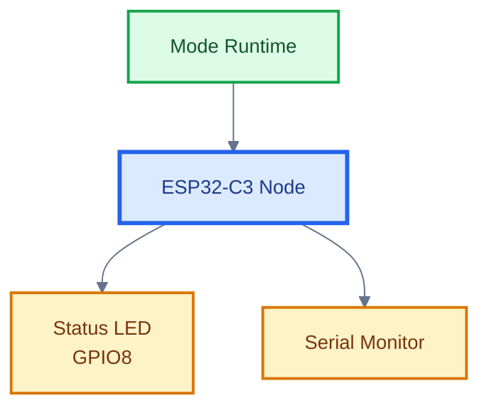
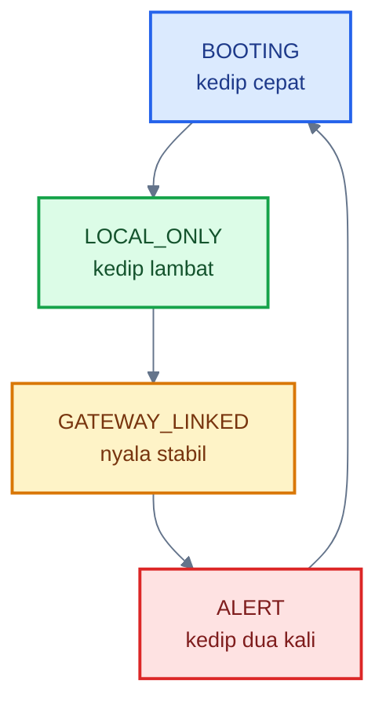
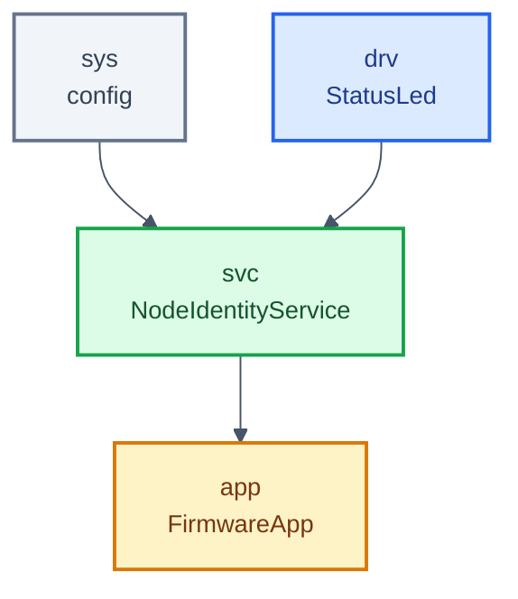
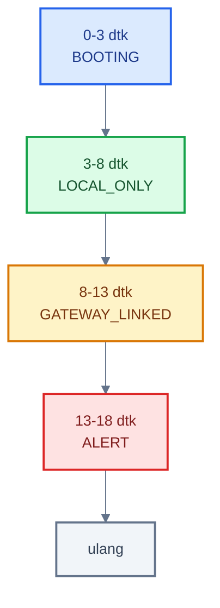
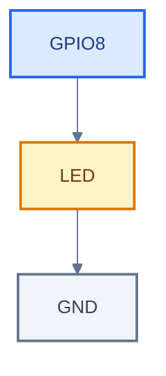

# **_HortiLink Level 1 — Node Identity and Status_**

---

- [**_HortiLink Level 1 — Node Identity and Status_**](#hortilink-level-1--node-identity-and-status)
  - [Posisi Level 1 dalam Aliran Belajar HortiLink](#posisi-level-1-dalam-aliran-belajar-hortilink)
  - [1. Fokus](#1-fokus)
  - [2. Tujuan](#2-tujuan)
  - [3. Platform](#3-platform)
  - [4. Konsep Level 1](#4-konsep-level-1)
    - [4.1 Gambaran Node Level 1](#41-gambaran-node-level-1)
  - [5. Mode yang Dipakai](#5-mode-yang-dipakai)
    - [Pola LED](#pola-led)
    - [5.1 Diagram Mode dan Pola LED](#51-diagram-mode-dan-pola-led)
  - [6. Struktur Layer](#6-struktur-layer)
    - [6.1 `sys`](#61-sys)
    - [6.2 `drv`](#62-drv)
    - [6.3 `app`](#63-app)
    - [6.4 Diagram Layering Level 1](#64-diagram-layering-level-1)
  - [7. Sketch Level 1](#7-sketch-level-1)
  - [8. Cara Kerja Firmware](#8-cara-kerja-firmware)
    - [8.1 Saat board menyala](#81-saat-board-menyala)
    - [8.2 Saat loop berjalan](#82-saat-loop-berjalan)
    - [8.3 Diagram Alur Runtime](#83-diagram-alur-runtime)
  - [9. Yang Dipelajari dari Level 1](#9-yang-dipelajari-dari-level-1)
    - [9.1 `sys`](#91-sys)
    - [9.2 `drv`](#92-drv)
    - [9.3 `app`](#93-app)
    - [9.4 state mode](#94-state-mode)
  - [10. Output yang Diharapkan](#10-output-yang-diharapkan)
    - [10.1 Serial Monitor](#101-serial-monitor)
    - [10.2 LED built-in GPIO8](#102-led-built-in-gpio8)
    - [10.3 Timeline Demo Level 1](#103-timeline-demo-level-1)
  - [11. Hasil Pengujian di Velxio](#11-hasil-pengujian-di-velxio)
    - [11.1 Hasil serial runtime](#111-hasil-serial-runtime)
    - [11.2 Temuan wiring LED](#112-temuan-wiring-led)
    - [11.3 Wiring yang benar untuk pengujian Level 1](#113-wiring-yang-benar-untuk-pengujian-level-1)
    - [11.3A Diagram Wiring LED](#113a-diagram-wiring-led)
    - [11.4 Evaluasi hasil uji](#114-evaluasi-hasil-uji)
    - [11.5 Keputusan Level 1](#115-keputusan-level-1)
  - [12. Inti Level 1](#12-inti-level-1)

---

## Posisi Level 1 dalam Aliran Belajar HortiLink

Di dalam README utama, HortiLink diposisikan sebagai **single-project** yang dibangun bertahap melalui beberapa level implementasi. Level 1 adalah irisan pertama dari sistem itu. Artinya, Level 1 bukan project sampingan, bukan demo LED yang berdiri sendiri, dan bukan latihan terpisah dari HortiLink. Level 1 adalah bentuk paling awal dari node HortiLink yang sudah hidup dan memiliki identitas operasional.

Sesuai build order yang sudah dikunci di README, Level 1 berada pada tahap:

**Level 1 — Node Identity and Status**

Fokus:

- HN-01
- HN-02

Tujuan:

- mengenalkan `sys`
- mengenalkan 1 class `drv`
- mengenalkan `app`
- mulai pakai state mode

Karena project ini berjalan di **ESP32-C3 DevKit** pada **simulator Velxio**, maka desain Level 1 juga harus tunduk pada batasan platform yang sudah dijelaskan sebelumnya: fitur paling aman untuk tahap awal adalah **GPIO digital**, **Serial/UART**, dan **timing berbasis `millis()`**. Itulah sebabnya Level 1 sengaja dibangun hanya dengan **status LED** dan **Serial Monitor**, tanpa sensor, PWM, WiFi, atau MQTT terlebih dahulu.

<ResourceBox
  title="Artikel Terkait:"
  items={[
    {
      name: 'README - HortiLink — Aliran Belajar',
      href: '/blog/IoT/hortiink-velxio/README',
    },
  ]}
/>

---

## 1. Fokus

- **HN-01** — Node Boot Status
- **HN-02** — Local Status Indicator

---

## 2. Tujuan

- mengenalkan `sys`
- mengenalkan **1 class** di `drv`
- mengenalkan `app`
- mulai memakai **state mode**

---

## 3. Platform

- **Board**: ESP32-C3 DevKit
- **Simulator**: Velxio
- **LED status**: `GPIO8` (built-in LED)

---

## 4. Konsep Level 1

Pada level ini, node HortiLink belum membaca sensor dan belum mengendalikan aktuator.

Node hanya melakukan 3 hal:

1. saat boot, node masuk mode `BOOTING`
2. node menampilkan status lewat LED
3. node menulis status ke Serial Monitor

Dengan begitu, engineer langsung melihat struktur awal firmware:

- `sys` = konfigurasi
- `drv` = driver hardware
- `app` = pengatur alur program

Di level ini **belum ada `svc` dulu**, supaya fokus tidak terlalu loncat.

### 4.1 Gambaran Node Level 1

Agar pembaca langsung menangkap ruang lingkup level ini, Node Level 1 perlu divisualisasikan sebagai node yang sangat sederhana: belum membaca sensor, belum mengendalikan aktuator, tetapi sudah punya identitas runtime, LED status, dan log serial.



[**Kembali ke Atas**](#hortilink-level-1--node-identity-and-status)

---

## 5. Mode yang Dipakai

Kita pakai 4 mode awal:

- `BOOTING`
- `LOCAL_ONLY`
- `GATEWAY_LINKED`
- `ALERT`

### Pola LED

- `BOOTING` → kedip cepat
- `LOCAL_ONLY` → kedip lambat
- `GATEWAY_LINKED` → nyala stabil
- `ALERT` → kedip dua kali berulang

Karena gateway belum benar-benar ada di Level 1, perpindahan mode dibuat berdasarkan waktu agar tetap bisa didemokan di Velxio.

Kenapa di sini: karena `## 4. Konsep Level 1` memang menjelaskan node hanya melakukan 3 hal: masuk mode, menampilkan LED, dan menulis serial. :contentReference[oaicite:2]{index=2}

---

### 5.1 Diagram Mode dan Pola LED

Agar mode tidak hanya dibaca sebagai daftar teks, diagram berikut memperlihatkan hubungan langsung antara mode runtime dan perilaku LED pada Level 1.



[**Kembali ke Atas**](#hortilink-level-1--node-identity-and-status)

---

## 6. Struktur Layer

### 6.1 `sys`

Berisi konfigurasi tetap:

- pin LED
- baudrate serial
- interval loop
- durasi tiap mode

### 6.2 `drv`

Berisi **1 class**:

- `StatusLed`

Tugasnya:

- inisialisasi LED
- menyalakan / mematikan LED
- menampilkan pola LED sesuai mode

### 6.3 `app`

Berisi:

- definisi mode node
- orkestrasi runtime
- pergantian mode
- logging ke serial

Kenapa di sini: `## 5. Mode yang Dipakai` memang mendefinisikan empat mode dan pola LED-nya. :contentReference[oaicite:3]{index=3}

### Koreksi narasi singkat untuk Bab 6

Ganti bagian ini:

- `6.3 app` berisi definisi mode node, orkestrasi runtime, pergantian mode, logging

Menjadi empat layer:

- `6.1 sys`
- `6.2 drv`
- `6.3 svc`
- `6.4 app`

### 6.4 Diagram Layering Level 1

Pada sketch final Level 1, layering yang dipakai sebenarnya sudah lengkap:

- `sys`
- `drv`
- `svc`
- `app`

Artinya, walaupun Level 1 masih sederhana, fondasi arsitekturnya sudah mulai mengikuti bentuk HortiLink yang akan dipakai terus di level berikutnya.



[**Kembali ke Atas**](#hortilink-level-1--node-identity-and-status)

---

## 7. Sketch Level 1

Untuk **konvensi layering HortiLink yang Anda kunci**, bentuk yang benar adalah:

- `drv_` dipakai oleh `svc_`
- `svc_` menyelesaikan logic domainnya
- `app_` hanya mengorkestrasi `svc_`
- jadi `app_firmware` **tidak** boleh pegang `drv_statusLed`

```cpp id="level1-final-hortilink"
#include <Arduino.h>

// =====================================================
// sys -> configuration
// =====================================================
namespace sys {

struct Config {
  static constexpr uint8_t PIN_STATUS_LED = 8;   // Built-in LED ESP32-C3 DevKit di Velxio
  static constexpr uint32_t SERIAL_BAUD = 115200;

  static constexpr uint32_t APP_TICK_MS = 20;
  static constexpr uint32_t LOG_INTERVAL_MS = 1000;

  // Demo timeline
  static constexpr uint32_t BOOTING_DURATION_MS = 3000;
  static constexpr uint32_t LOCAL_ONLY_DURATION_MS = 5000;
  static constexpr uint32_t GATEWAY_DURATION_MS = 5000;
  static constexpr uint32_t ALERT_DURATION_MS = 5000;

  // LED patterns
  static constexpr uint32_t BOOT_BLINK_MS = 150;
  static constexpr uint32_t LOCAL_BLINK_MS = 700;
  static constexpr uint32_t ALERT_STEP_MS = 120;
};

}  // namespace sys

// =====================================================
// drv -> hardware boundary
// =====================================================
namespace drv {

class StatusLed {
public:
  explicit StatusLed(uint8_t pin) : _pin(pin) {}

  void begin() {
    pinMode(_pin, OUTPUT);
    off();
  }

  void set(bool on) {
    digitalWrite(_pin, on ? HIGH : LOW);
  }

  void off() {
    digitalWrite(_pin, LOW);
  }

private:
  uint8_t _pin;
};

}  // namespace drv

// =====================================================
// svc -> service logic + driver usage inside service
// =====================================================
namespace svc {

enum class NodeMode : uint8_t {
  BOOTING,
  LOCAL_ONLY,
  GATEWAY_LINKED,
  ALERT
};

const char* toString(NodeMode mode) {
  switch (mode) {
    case NodeMode::BOOTING:        return "BOOTING";
    case NodeMode::LOCAL_ONLY:     return "LOCAL_ONLY";
    case NodeMode::GATEWAY_LINKED: return "GATEWAY_LINKED";
    case NodeMode::ALERT:          return "ALERT";
    default:                       return "UNKNOWN";
  }
}

class NodeIdentityService {
public:
  explicit NodeIdentityService(drv::StatusLed& drv_statusLed)
    : _drv_statusLed(drv_statusLed) {}

  void begin(uint32_t startMs) {
    _drv_statusLed.begin();
    _cycleStartMs = startMs;
    _mode = NodeMode::BOOTING;
    _modeChanged = true;
  }

  void run(uint32_t nowMs) {
    _modeChanged = false;

    updateMode(nowMs);
    applyOutputs(nowMs);
  }

  NodeMode mode() const {
    return _mode;
  }

  const char* modeText() const {
    return toString(_mode);
  }

  bool modeChanged() const {
    return _modeChanged;
  }

private:
  drv::StatusLed& _drv_statusLed;
  NodeMode _mode = NodeMode::BOOTING;
  uint32_t _cycleStartMs = 0;
  bool _modeChanged = false;

  void updateMode(uint32_t nowMs) {
    const uint32_t elapsed = nowMs - _cycleStartMs;

    const uint32_t t1 = sys::Config::BOOTING_DURATION_MS;
    const uint32_t t2 = t1 + sys::Config::LOCAL_ONLY_DURATION_MS;
    const uint32_t t3 = t2 + sys::Config::GATEWAY_DURATION_MS;
    const uint32_t t4 = t3 + sys::Config::ALERT_DURATION_MS;

    NodeMode nextMode = NodeMode::BOOTING;

    if (elapsed < t1) {
      nextMode = NodeMode::BOOTING;
    } else if (elapsed < t2) {
      nextMode = NodeMode::LOCAL_ONLY;
    } else if (elapsed < t3) {
      nextMode = NodeMode::GATEWAY_LINKED;
    } else if (elapsed < t4) {
      nextMode = NodeMode::ALERT;
    } else {
      _cycleStartMs = nowMs;
      nextMode = NodeMode::BOOTING;
    }

    if (nextMode != _mode) {
      _mode = nextMode;
      _modeChanged = true;
    }
  }

  void applyOutputs(uint32_t nowMs) {
    _drv_statusLed.set(statusLedState(nowMs));
  }

  bool statusLedState(uint32_t nowMs) const {
    switch (_mode) {
      case NodeMode::BOOTING:
        return ((nowMs / sys::Config::BOOT_BLINK_MS) % 2U) == 0U;

      case NodeMode::LOCAL_ONLY:
        return ((nowMs / sys::Config::LOCAL_BLINK_MS) % 2U) == 0U;

      case NodeMode::GATEWAY_LINKED:
        return true;

      case NodeMode::ALERT: {
        const uint8_t phase = (nowMs / sys::Config::ALERT_STEP_MS) % 6U;
        return (phase == 0U || phase == 1U);
      }
    }

    return false;
  }
};

}  // namespace svc

// =====================================================
// app -> pure orchestrator
// =====================================================
namespace app {

class FirmwareApp {
public:
  explicit FirmwareApp(svc::NodeIdentityService& svc_nodeIdentityService)
    : _svc_nodeIdentityService(svc_nodeIdentityService) {}

  void begin() {
    Serial.begin(sys::Config::SERIAL_BAUD);
    delay(100);

    _svc_nodeIdentityService.begin(millis());

    Serial.println();
    Serial.println("=== HortiLink Level 1 ===");
    Serial.println("Node Identity and Status");
    Serial.println("Board : ESP32-C3 DevKit");
    Serial.println("Mode  : BOOTING -> LOCAL_ONLY -> GATEWAY_LINKED -> ALERT");
    Serial.println();
  }

  void run() {
    const uint32_t nowMs = millis();

    _svc_nodeIdentityService.run(nowMs);

    if (_svc_nodeIdentityService.modeChanged()) {
      Serial.print("[MODE] -> ");
      Serial.println(_svc_nodeIdentityService.modeText());
    }

    if (nowMs - _lastLogMs >= sys::Config::LOG_INTERVAL_MS) {
      _lastLogMs = nowMs;

      Serial.print("[HEARTBEAT] uptime=");
      Serial.print(nowMs);
      Serial.print(" ms | mode=");
      Serial.println(_svc_nodeIdentityService.modeText());
    }

    delay(sys::Config::APP_TICK_MS);
  }

private:
  svc::NodeIdentityService& _svc_nodeIdentityService;
  uint32_t _lastLogMs = 0;
};

}  // namespace app

// =====================================================
// composition root
// =====================================================
drv::StatusLed drv_statusLed(sys::Config::PIN_STATUS_LED);
svc::NodeIdentityService svc_nodeIdentityService(drv_statusLed);
app::FirmwareApp app_firmware(svc_nodeIdentityService);

// =====================================================
// Arduino entry point
// =====================================================
void setup() {
  app_firmware.begin();
}

void loop() {
  app_firmware.run();
}
```

Yang sekarang sudah konsisten:

- `drv_statusLed` hanya dipakai oleh `svc_nodeIdentityService`
- `svc_nodeIdentityService` menyelesaikan logic Level 1
- `app_firmware` hanya memakai `svc_nodeIdentityService`
- `app_firmware` tidak menyentuh `drv_statusLed`

Kalau Anda lanjut, saya akan pakai pola **yang sama persis** untuk Level 2.

Kalau setelah ini Anda ingin, saya lanjutkan **Level 2** dengan **konvensi nama yang sama persis**:

- object hanya `drv_...`, `svc_...`, `app_...`
- tanpa `deps`
- tanpa istilah lain di luar layering.

[**Kembali ke Atas**](#hortilink-level-1--node-identity-and-status)

---

## 8. Cara Kerja Firmware

### 8.1 Saat board menyala

`setup()` memanggil:

```cpp
firmware.begin();
```

Di dalam `begin()`:

- Serial dimulai
- LED diinisialisasi
- waktu boot disimpan
- mode awal diatur ke `BOOTING`
- informasi node dicetak ke Serial

### 8.2 Saat loop berjalan

`loop()` memanggil:

```cpp
firmware.run();
```

Di dalamnya:

- waktu sekarang dibaca dengan `millis()`
- mode ditentukan berdasarkan timeline demo
- LED diperbarui sesuai mode
- heartbeat dicetak berkala ke serial

---

### 8.3 Diagram Alur Runtime

Agar pembaca tidak hanya membaca fungsi `run()` sebagai teks, diagram berikut memperlihatkan alur runtime Level 1 secara ringkas.

```mermaid
%%{init: {
  "theme": "base",
  "themeVariables": {
    "background": "#ffffff",
    "fontSize": "14px",
    "lineColor": "#475569"
  }
}}%%
flowchart TB
    M[millis()]
    SVC[svc_nodeIdentityService.run]
    LED[update LED]
    LOG[heartbeat serial]
    D[delay]

    M --> SVC --> LED --> LOG --> D

    classDef t fill:#F1F5F9,stroke:#64748B,color:#334155,stroke-width:2px;
    classDef s fill:#DCFCE7,stroke:#16A34A,color:#14532D,stroke-width:2px;
    classDef o fill:#DBEAFE,stroke:#2563EB,color:#1E3A8A,stroke-width:2px;
    classDef l fill:#FEF3C7,stroke:#D97706,color:#78350F,stroke-width:2px;

    class M,D t;
    class SVC s;
    class LED o;
    class LOG l;
```

[**Kembali ke Atas**](#hortilink-level-1--node-identity-and-status)

---

## 9. Yang Dipelajari dari Level 1

### 9.1 `sys`

Semua konfigurasi dikumpulkan di satu tempat.

Contoh:

```cpp
sys::Config::PIN_STATUS_LED
sys::Config::SERIAL_BAUD
```

Jadi tidak ada angka liar tersebar di seluruh sketch.

### 9.2 `drv`

Kita mengenalkan **1 class** dulu:

```cpp
drv::StatusLed
```

Class ini hanya mengurus hardware LED.

### 9.3 `app`

`FirmwareApp` adalah pengatur alur:

- memilih mode
- memanggil driver
- menulis log

### 9.4 state mode

Node sudah punya identitas runtime:

- `BOOTING`
- `LOCAL_ONLY`
- `GATEWAY_LINKED`
- `ALERT`

Ini fondasi untuk level-level berikutnya.

[**Kembali ke Atas**](#hortilink-level-1--node-identity-and-status)

---

## 10. Output yang Diharapkan

### 10.1 Serial Monitor

Contoh log:

```text
=== HortiLink Level 1 ===
Node Identity and Status
Board : ESP32-C3 DevKit
Mode  : BOOTING -> LOCAL_ONLY -> GATEWAY_LINKED -> ALERT

[HEARTBEAT] uptime=1000 ms | mode=BOOTING
[HEARTBEAT] uptime=2000 ms | mode=BOOTING
[MODE] -> LOCAL_ONLY
[HEARTBEAT] uptime=4000 ms | mode=LOCAL_ONLY
[MODE] -> GATEWAY_LINKED
[HEARTBEAT] uptime=9000 ms | mode=GATEWAY_LINKED
[MODE] -> ALERT
```

### 10.2 LED built-in GPIO8

- 0–3 detik: kedip cepat
- 3–8 detik: kedip lambat
- 8–13 detik: nyala stabil
- 13–18 detik: pola alert
- lalu mengulang

Kenapa di sini: `## 8. Cara Kerja Firmware` memang menjelaskan alur `begin()` dan `run()`. :contentReference[oaicite:5]{index=5}

---

### 10.3 Timeline Demo Level 1

Timeline berikut merangkum urutan demo visual dan serial yang diharapkan pada Level 1.



[**Kembali ke Atas**](#hortilink-level-1--node-identity-and-status)

---

## 11. Hasil Pengujian di Velxio

Bagian ini ditambahkan sebagai hasil verifikasi awal implementasi Level 1 di simulator Velxio. Tujuannya bukan sekadar mencatat bahwa sketch berhasil compile, tetapi juga memastikan bahwa perilaku runtime, struktur mode, dan jalur output visual benar-benar sesuai dengan desain level ini.

### 11.1 Hasil serial runtime

Pada pengujian di Velxio, Serial Monitor menampilkan output berikut:

```text
=== HortiLink Level 1 ===
Node Identity and Status
Board : ESP32-C3 DevKit
Mode  : BOOTING -> LOCAL_ONLY -> GATEWAY_LINKED -> ALERT

[HEARTBEAT] uptime=1014 ms | mode=BOOTING
[HEARTBEAT] uptime=2023 ms | mode=BOOTING
[HEARTBEAT] uptime=3031 ms | mode=BOOTING
[MODE] -> LOCAL_ONLY
[HEARTBEAT] uptime=4043 ms | mode=LOCAL_ONLY
[HEARTBEAT] uptime=5058 ms | mode=LOCAL_ONLY
[HEARTBEAT] uptime=6058 ms | mode=LOCAL_ONLY
[HEARTBEAT] uptime=7070 ms | mode=LOCAL_ONLY
[HEARTBEAT] uptime=8079 ms | mode=LOCAL_ONLY
[MODE] -> GATEWAY_LINKED
[HEARTBEAT] uptime=9088 ms | mode=GATEWAY_LINKED
[HEARTBEAT] uptime=10097 ms | mode=GATEWAY_LINKED
[HEARTBEAT] uptime=11111 ms | mode=GATEWAY_LINKED
[HEARTBEAT] uptime=12114 ms | mode=GATEWAY_LINKED
[HEARTBEAT] uptime=13131 ms | mode=GATEWAY_LINKED
[MODE] -> ALERT
[HEARTBEAT] uptime=14133 ms | mode=ALERT
[HEARTBEAT] uptime=15146 ms | mode=ALERT
[HEARTBEAT] uptime=16154 ms | mode=ALERT
[HEARTBEAT] uptime=17162 ms | mode=ALERT
[MODE] -> BOOTING
[HEARTBEAT] uptime=18175 ms | mode=BOOTING
[HEARTBEAT] uptime=19188 ms | mode=BOOTING
[HEARTBEAT] uptime=20205 ms | mode=BOOTING
[MODE] -> LOCAL_ONLY
```

Dari log ini dapat disimpulkan bahwa:

- sketch berhasil boot
- loop berjalan stabil
- heartbeat muncul periodik
- urutan mode berjalan sesuai timeline
- transisi `BOOTING -> LOCAL_ONLY -> GATEWAY_LINKED -> ALERT -> BOOTING` berfungsi

Dengan kata lain, dari sisi **runtime software**, struktur `sys`, `drv`, dan `app` untuk Level 1 sudah berjalan sesuai desain.

### 11.2 Temuan wiring LED

Pada pengujian awal, LED tidak menunjukkan respons visual sama sekali walaupun serial log sudah benar. Setelah diperiksa, masalahnya bukan berada pada logika state machine atau orkestrasi aplikasi, tetapi pada **jalur wiring LED** di simulator.

Temuan penting pada tahap ini adalah:

- serial runtime sudah valid
- state mode sudah valid
- masalah berada pada jalur output LED
- wiring awal belum membentuk jalur yang benar untuk pengujian visual

Dengan demikian, masalah ini dikategorikan sebagai **masalah rangkaian/simulator wiring**, bukan masalah desain `app` atau `drv`.

### 11.3 Wiring yang benar untuk pengujian Level 1

Setelah dikoreksi, wiring yang benar untuk pengujian Level 1 di Velxio adalah:

- **GPIO8 -> LED**
- **LED -> GND**

Dalam konteks simulator, bentuk ini sudah cukup untuk memvalidasi perilaku visual LED.

Catatan penting:

- untuk **simulator Velxio**, wiring ini cukup untuk pengujian logika Level 1
- untuk **hardware nyata**, sangat disarankan tetap memakai resistor seri:

  - `GPIO8 -> resistor -> LED -> GND`
  - atau `GPIO8 -> LED -> resistor -> GND`

Kenapa di sini: `## 10. Output yang Diharapkan` memang menjelaskan serial output dan timeline LED. :contentReference[oaicite:6]{index=6}

---

### 11.3A Diagram Wiring LED

Agar tidak terjadi kebingungan saat pengujian visual, wiring LED untuk Level 1 perlu divisualisasikan secara langsung.



### 11.4 Evaluasi hasil uji

Berdasarkan hasil pengujian yang sudah dilakukan, evaluasi Level 1 adalah sebagai berikut.

**Lulus:**

- compile
- boot
- header serial tampil
- heartbeat periodik
- transisi mode berjalan sesuai timeline
- loop stabil
- struktur runtime sesuai desain

**Temuan korektif:**

- wiring LED awal tidak tepat
- indikator visual belum bisa dinilai sebelum wiring dibetulkan

**Setelah koreksi wiring:**

- jalur pengujian visual dinyatakan benar
- Level 1 siap dipakai untuk validasi pola LED sesuai mode

Dengan demikian, hasil uji saat ini menunjukkan bahwa **fondasi software Level 1 valid**, dan masalah yang ditemukan tidak memaksa perubahan desain arsitektur untuk level berikutnya.

### 11.5 Keputusan Level 1

Keputusan engineering untuk Level 1 adalah:

> **Level 1 dinyatakan valid sebagai fondasi arsitektur dan runtime, dengan catatan bahwa pengujian visual LED harus selalu menggunakan wiring yang benar, yaitu GPIO8 ke LED lalu kembali ke GND.**

Artinya, Level 1 **tidak perlu dirombak secara desain**, karena:

- `sys` sudah berfungsi sebagai pusat konfigurasi
- `drv` sudah berhasil diperkenalkan melalui satu class kecil
- `app` sudah berhasil menjadi pengatur alur runtime
- state mode sudah aktif dan terbaca di serial
- struktur ini aman untuk diwariskan ke Level 2

[**Kembali ke Atas**](#hortilink-level-1--node-identity-and-status)

---

## 12. Inti Level 1

Level 1 ini bukan sekadar demo LED.

Ini adalah **node HortiLink pertama** yang sudah punya:

- identitas
- mode operasi
- struktur layer awal
- pemisahan antara konfigurasi, driver, dan aplikasi

Dengan kata lain, pada Level 1 engineer belum belajar sensor, aktuator, MQTT, atau gateway secara penuh, tetapi sudah mempelajari fondasi yang paling penting: bagaimana sebuah node HortiLink hidup, bagaimana ia menunjukkan statusnya, dan bagaimana struktur firmware mulai dibentuk secara disiplin sejak awal.

Melalui pengujian di Velxio, Level 1 juga sudah menunjukkan satu pelajaran engineering yang penting: kadang struktur software sudah benar, tetapi hasil visual belum muncul karena jalur hardware atau wiring belum tepat. Karena itu, verifikasi Level 1 bukan hanya memeriksa sketch, tetapi juga memastikan bahwa wiring simulator benar-benar mendukung perilaku yang diharapkan.

[**Kembali ke Atas**](#hortilink-level-1--node-identity-and-status)

---

<small>
  **_Catatan Penyusunan_** Artikel ini merupakan turunan langsung dari README
  utama HortiLink dan ditulis khusus sebagai dokumen pengembangan untuk Level 1
  pada platform ESP32-C3 DevKit di simulator Velxio. Isi level ini sengaja
  dipertahankan utuh agar konsisten dengan aliran belajar yang sudah dikunci.
</small>
