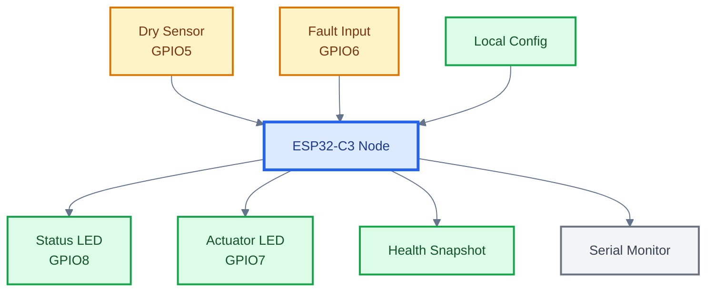
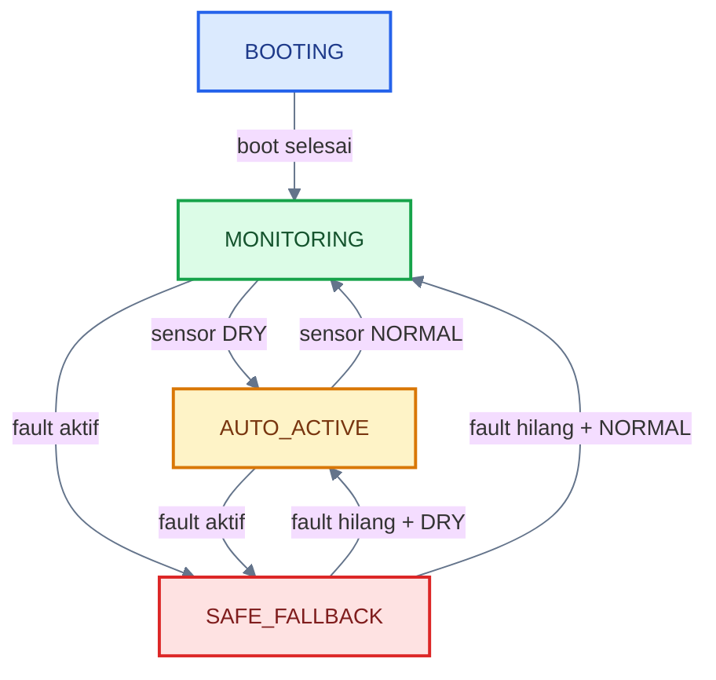
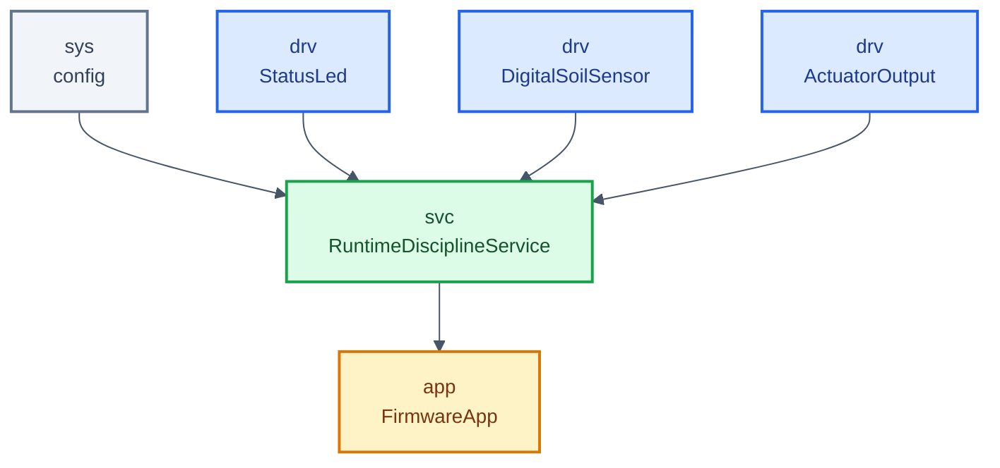
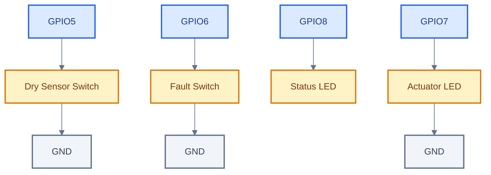

# **_HortiLink Level 4 — Runtime Discipline_**

---

- [**_HortiLink Level 4 — Runtime Discipline_**](#hortilink-level-4--runtime-discipline)
  - [Posisi Level 4 dalam Aliran Belajar HortiLink](#posisi-level-4-dalam-aliran-belajar-hortilink)
  - [1. Fokus](#1-fokus)
  - [2. Tujuan](#2-tujuan)
  - [3. Feature yang Dikerjakan](#3-feature-yang-dikerjakan)
  - [4. Platform](#4-platform)
  - [5. Konsep Level 4](#5-konsep-level-4)
    - [5.1 Gambaran Node Level 4](#51-gambaran-node-level-4)
  - [6. Mode yang Dipakai](#6-mode-yang-dipakai)
    - [6.1 Pola status LED](#61-pola-status-led)
    - [6.2 Node Health Reporting](#62-node-health-reporting)
    - [6.3 Persistent Local Config](#63-persistent-local-config)
    - [6.4 Safe Fallback Mode](#64-safe-fallback-mode)
    - [6.5 Cooperative Concurrency](#65-cooperative-concurrency)
    - [6.6 Diagram Mode dan Transisi](#66-diagram-mode-dan-transisi)
    - [6.7 Ritme Task Cooperative](#67-ritme-task-cooperative)
  - [7. Struktur Layer](#7-struktur-layer)
    - [7.1 `sys`](#71-sys)
    - [7.2 `drv`](#72-drv)
    - [7.3 `svc`](#73-svc)
    - [7.4 `app`](#74-app)
    - [7.5 Diagram Layering Level 4](#75-diagram-layering-level-4)
  - [8. Wiring untuk Simulator](#8-wiring-untuk-simulator)
    - [Status LED](#status-led)
    - [Sensor lingkungan digital proxy](#sensor-lingkungan-digital-proxy)
    - [Fault simulation input](#fault-simulation-input)
    - [Actuator output](#actuator-output)
    - [8.1 Diagram Wiring Level 4](#81-diagram-wiring-level-4)
  - [9. Sketch Level 4](#9-sketch-level-4)
  - [10. Cara Kerja Firmware](#10-cara-kerja-firmware)
    - [10.1 Saat board menyala](#101-saat-board-menyala)
    - [10.2 Saat sensor mendeteksi dry](#102-saat-sensor-mendeteksi-dry)
    - [10.3 Saat fault aktif](#103-saat-fault-aktif)
    - [10.4 Saat loop berjalan](#104-saat-loop-berjalan)
    - [10.5 Diagram Alur Runtime](#105-diagram-alur-runtime)
  - [11. Yang Dipelajari dari Level 4](#11-yang-dipelajari-dari-level-4)
    - [11.1 Health reporting hidup di service](#111-health-reporting-hidup-di-service)
    - [11.2 Persistence diletakkan sebagai contract service](#112-persistence-diletakkan-sebagai-contract-service)
    - [11.3 Safe fallback mengalahkan rule normal](#113-safe-fallback-mengalahkan-rule-normal)
    - [11.4 Cooperative concurrency hidup di `app`](#114-cooperative-concurrency-hidup-di-app)
  - [12. Output yang Diharapkan](#12-output-yang-diharapkan)
    - [12.1 Serial Monitor](#121-serial-monitor)
    - [12.2 Status LED GPIO8](#122-status-led-gpio8)
    - [12.3 Actuator LED GPIO7](#123-actuator-led-gpio7)
  - [13. Inti Level 4](#13-inti-level-4)

---

## Posisi Level 4 dalam Aliran Belajar HortiLink

Di dalam README utama, HortiLink dibangun sebagai **single-project** yang bertumbuh per level. Setelah Level 3 memperkenalkan sensor, rule engine lokal, dan fault state dasar, maka Level 4 menjadi tahap ketika node mulai memiliki disiplin runtime yang lebih matang.

Sesuai build order yang sudah dikunci di README, Level 4 berada pada tahap:

**Level 4 — Runtime Discipline**

Fokus:

- HN-08
- HN-10
- HR-04

Tujuan:

- state persistence
- health/fault
- cooperative concurrency

Artinya, Level 4 bukan lagi hanya node yang membaca sensor dan mengaktifkan output otomatis, tetapi node yang mulai memiliki:

- status kesehatan internal
- struktur persistent local config
- safe fallback mode saat fault
- pola cooperative concurrency yang rapi

Karena target platform tetap **ESP32-C3 DevKit** pada **simulator Velxio**, maka Level 4 tetap didesain agar dapat diuji di simulator dengan GPIO digital, Serial Monitor, dan ritme runtime berbasis `millis()`.

<ResourceBox
  title="Artikel Terkait:"
  items={[
    {
      name: 'README - HortiLink — Aliran Belajar',
      href: '/blog/IoT/hortiink-velxio/README',
    },
  ]}
/>

---

## 1. Fokus

- **HN-08** — Node Health Reporting
- **HN-10** — Persistent Local Config
- **HR-04** — Safe Fallback Mode

---

## 2. Tujuan

- state persistence
- health/fault
- cooperative concurrency

---

## 3. Feature yang Dikerjakan

Feature yang dikerjakan pada Level 4 adalah:

- **HN-08** Node Health Reporting  
  Node memiliki status internal: uptime, mode, last action, fault flag.

- **HN-10** Persistent Local Config  
  Threshold/mode dasar disimpan dalam bentuk contract persistence service agar tidak mengubah layering saat nanti dipindah ke storage riil.

- **HR-04** Safe Fallback Mode  
  Saat fault terdeteksi, sistem masuk mode aman.

---

## 4. Platform

- **Board**: ESP32-C3 DevKit
- **Simulator**: Velxio
- **Status LED**: `GPIO8` (built-in LED)
- **Sensor lingkungan digital proxy**: `GPIO5`
- **Fault simulation input**: `GPIO6`
- **Actuator output**: `GPIO7`

Pada Level 4, sensor lingkungan tetap direpresentasikan sebagai **digital soil sensor proxy** pada `GPIO5`, sedangkan fault simulation tetap memakai `GPIO6`. Ini membuat perilaku sensor, fault state, safe fallback, dan runtime discipline tetap bisa diuji di Velxio tanpa bergantung pada periferal analog atau storage backend riil.

[**Kembali ke Atas**](#hortilink-level-4--runtime-discipline)

---

## 5. Konsep Level 4

Pada Level 4, node HortiLink mulai memiliki disiplin runtime yang lebih tegas.

Node sekarang melakukan hal-hal berikut:

1. saat boot, node masuk mode `BOOTING`
2. service memuat local config dasar
3. service menjaga health snapshot internal
4. node membaca sensor lingkungan dan fault input
5. jika sensor mendeteksi `DRY`, auto rule mengaktifkan aktuator
6. jika fault aktif, node masuk `SAFE_FALLBACK`
7. health snapshot selalu diperbarui
8. runtime dibagi ke beberapa ritme task secara cooperative

Dengan begitu, engineer mulai melihat bahwa node edge bukan hanya “membaca dan bereaksi”, tetapi juga:

- mengetahui kondisi dirinya sendiri
- punya state config yang terstruktur
- punya mode aman saat fault
- berjalan dengan disiplin runtime yang lebih siap untuk berkembang ke task yang lebih banyak

### 5.1 Gambaran Node Level 4

Agar pembaca langsung menangkap ruang lingkup level ini, Node Level 4 perlu divisualisasikan sebagai node yang bukan hanya membaca sensor dan menjalankan rule, tetapi juga sudah memiliki health snapshot, local config, dan ritme task yang lebih disiplin.



[**Kembali ke Atas**](#hortilink-level-4--runtime-discipline)

---

## 6. Mode yang Dipakai

Kita pakai 4 mode aktif pada Level 4:

- `BOOTING`
- `MONITORING`
- `AUTO_ACTIVE`
- `SAFE_FALLBACK`

### 6.1 Pola status LED

- `BOOTING` → kedip cepat
- `MONITORING` → kedip lambat
- `AUTO_ACTIVE` → nyala stabil
- `SAFE_FALLBACK` → kedip dua kali berulang

### 6.2 Node Health Reporting

Health snapshot minimal pada Level 4 berisi:

- uptime
- mode
- last action
- fault flag
- actuator state
- config flag dasar

Dengan ini, HN-08 mulai memiliki bentuk nyata.

### 6.3 Persistent Local Config

Pada Level 4, persistent local config dikunci sebagai **contract** di `svc`.

Config dasar yang dipakai adalah:

- `autoRuleEnabled`
- `safeFallbackEnabled`

Pada sketch simulator ini, config tersebut diperlakukan sebagai **persistent-ready config state**. Struktur load/store sudah ada di service, sehingga nanti backend bisa dipindahkan ke storage riil tanpa mengubah pola layering.

### 6.4 Safe Fallback Mode

Safe fallback adalah mode aman saat fault aktif.

Perilakunya:

- jika fault aktif dan `safeFallbackEnabled = true`, node masuk `SAFE_FALLBACK`
- aktuator dipaksa OFF
- LED status masuk pola alert
- setelah fault hilang, node kembali ke:
  - `AUTO_ACTIVE` jika sensor masih `DRY` dan auto rule aktif
  - `MONITORING` jika sensor sudah normal

### 6.5 Cooperative Concurrency

Pada Level 4, runtime dibagi menjadi beberapa ritme kerja yang berbeda:

- **control task** → lebih cepat
- **health task** → sedang
- **log task** → lebih lambat

Semua berjalan dalam satu `loop()` Arduino, tetapi dijadwalkan secara **cooperative** dengan `millis()`.

---

### 6.6 Diagram Mode dan Transisi

Agar mode pada Level 4 tidak hanya dibaca sebagai daftar teks, diagram berikut memperlihatkan bagaimana mode berubah sesuai kondisi sensor, fault, dan safe fallback.



---

### 6.7 Ritme Task Cooperative

Pada Level 4, pembaca juga perlu melihat bahwa runtime tidak lagi berjalan sebagai satu alur tunggal saja. Beberapa pekerjaan mulai dipisahkan ke ritme task yang berbeda.

```mermaid
%%{init: {
  "theme": "base",
  "themeVariables": {
    "background": "#ffffff",
    "fontSize": "14px",
    "lineColor": "#64748B"
  }
}}%%
flowchart TB
    LOOP[loop()]
    CT[control task<br/>cepat]
    HT[health task<br/>sedang]
    LT[log task<br/>lebih lambat]

    LOOP --> CT
    LOOP --> HT
    LOOP --> LT

    classDef loop fill:#DBEAFE,stroke:#2563EB,color:#1E3A8A,stroke-width:3px;
    classDef c fill:#DCFCE7,stroke:#16A34A,color:#14532D,stroke-width:2px;
    classDef h fill:#FEF3C7,stroke:#D97706,color:#78350F,stroke-width:2px;
    classDef l fill:#F3F4F6,stroke:#6B7280,color:#374151,stroke-width:2px;

    class LOOP loop;
    class CT c;
    class HT h;
    class LT l;
```

[**Kembali ke Atas**](#hortilink-level-4--runtime-discipline)

---

## 7. Struktur Layer

### 7.1 `sys`

Berisi konfigurasi tetap:

- pin status LED
- pin sensor lingkungan
- pin fault simulasi
- pin aktuator
- baudrate serial
- ritme task
- durasi boot
- debounce input
- pola status LED
- default local config

### 7.2 `drv`

Berisi class boundary hardware:

- `StatusLed`
- `DigitalSoilSensor`
- `ActuatorOutput`

Tugas masing-masing:

**`StatusLed`**

- inisialisasi LED status
- menerima ON/OFF dari service

**`DigitalSoilSensor`**

- membaca sensor lingkungan digital proxy
- membaca fault simulation input
- melakukan debounce input

**`ActuatorOutput`**

- menghidupkan dan mematikan output aktuator
- menyimpan status output saat ini

`drv` hanya tahu hardware dan tidak tahu logic domain.

### 7.3 `svc`

Berisi service domain:

- `RuntimeDisciplineService`

Tugas `svc` pada level ini:

- mengetahui `drv` yang relevan untuk domain sensor dan aktuator
- memuat config lokal
- menjalankan rule sensor
- memutuskan safe fallback
- menjaga health snapshot
- menerapkan output ke driver
- menyediakan event dan status untuk di-log oleh app

### 7.4 `app`

`app` hanya berperan sebagai orchestrator:

- memulai serial
- memulai service
- menjalankan task service dengan interval yang berbeda
- logging ke serial
- menjaga ritme runtime

Dengan pembagian ini, `app` tidak memuat logic domain dan tidak memegang detail hardware satu per satu.

---

### 7.5 Diagram Layering Level 4

Pada Level 4, layering HortiLink sudah mulai menunjukkan bentuk node edge yang lebih matang. Input, rule, safe fallback, persistence-ready config, dan health reporting sudah berada dalam alur yang lebih lengkap.



[**Kembali ke Atas**](#hortilink-level-4--runtime-discipline)

---

## 8. Wiring untuk Simulator

Agar Level 4 bisa diuji di Velxio, wiring yang dipakai adalah:

### Status LED

- built-in LED board pada `GPIO8`

### Sensor lingkungan digital proxy

- satu kaki switch/button → `GPIO5`
- satu kaki switch/button → `GND`

Input ini mewakili kondisi sensor:

- aktif → `DRY`
- tidak aktif → `NORMAL`

### Fault simulation input

- satu kaki switch/button → `GPIO6`
- satu kaki switch/button → `GND`

Input ini dipakai untuk memvalidasi:

- aktif → `FAULT`
- tidak aktif → `NO FAULT`

### Actuator output

- `GPIO7 -> LED -> GND`

Catatan penting:

- pada simulator, bentuk ini cukup untuk validasi logika output
- pada hardware nyata, **sangat disarankan** memakai resistor seri untuk LED
- backend persistence riil bisa diganti nanti tanpa mengubah wiring maupun layering

---

### 8.1 Diagram Wiring Level 4

Agar pembaca tidak hanya membaca wiring sebagai daftar bullet, hubungan antar pin dan komponen pada Level 4 divisualisasikan sebagai berikut.



[**Kembali ke Atas**](#hortilink-level-4--runtime-discipline)

---

## 9. Sketch Level 4

```cpp
#include <Arduino.h>

// =====================================================
// sys -> configuration
// =====================================================
namespace sys {

struct Config {
  static constexpr uint8_t PIN_STATUS_LED   = 8;  // Built-in LED ESP32-C3 DevKit di Velxio
  static constexpr uint8_t PIN_SENSOR_DRY   = 5;  // Digital soil sensor proxy
  static constexpr uint8_t PIN_SENSOR_FAULT = 6;  // Fault simulation input
  static constexpr uint8_t PIN_ACTUATOR     = 7;  // Dummy actuator LED

  static constexpr uint32_t SERIAL_BAUD             = 115200;
  static constexpr uint32_t APP_TICK_MS             = 10;
  static constexpr uint32_t CONTROL_TASK_MS         = 20;
  static constexpr uint32_t HEALTH_TASK_MS          = 250;
  static constexpr uint32_t LOG_INTERVAL_MS         = 1000;
  static constexpr uint32_t BOOTING_DURATION_MS     = 3000;
  static constexpr uint32_t INPUT_DEBOUNCE_MS       = 40;

  static constexpr uint32_t BOOT_BLINK_MS           = 150;
  static constexpr uint32_t MONITOR_BLINK_MS        = 700;
  static constexpr uint32_t SAFE_FALLBACK_STEP_MS   = 120;

  static constexpr bool DEFAULT_AUTO_RULE_ENABLED   = true;
  static constexpr bool DEFAULT_SAFE_FALLBACK_ENABLED = true;
};

}  // namespace sys

// =====================================================
// drv -> hardware boundary
// =====================================================
namespace drv {

class StatusLed {
public:
  explicit StatusLed(uint8_t pin) : _pin(pin) {}

  void begin() {
    pinMode(_pin, OUTPUT);
    off();
  }

  void set(bool on) {
    digitalWrite(_pin, on ? HIGH : LOW);
  }

  void off() {
    digitalWrite(_pin, LOW);
  }

private:
  uint8_t _pin;
};

class DigitalSoilSensor {
public:
  DigitalSoilSensor(uint8_t dryPin, uint8_t faultPin)
    : _dryPin(dryPin), _faultPin(faultPin) {}

  void begin() {
    pinMode(_dryPin, INPUT_PULLUP);
    pinMode(_faultPin, INPUT_PULLUP);

    initChannel(_dryChannel, rawDry());
    initChannel(_faultChannel, rawFault());
  }

  void update(uint32_t nowMs) {
    updateChannel(_dryChannel, rawDry(), nowMs);
    updateChannel(_faultChannel, rawFault(), nowMs);
  }

  bool isDry() const {
    return _dryChannel.stableState;
  }

  bool hasFault() const {
    return _faultChannel.stableState;
  }

private:
  struct DebouncedChannel {
    bool lastRawState = false;
    bool stableState = false;
    uint32_t lastChangeMs = 0;
  };

  uint8_t _dryPin;
  uint8_t _faultPin;
  DebouncedChannel _dryChannel;
  DebouncedChannel _faultChannel;

  bool rawDry() const {
    return digitalRead(_dryPin) == LOW;
  }

  bool rawFault() const {
    return digitalRead(_faultPin) == LOW;
  }

  void initChannel(DebouncedChannel& channel, bool initialState) {
    channel.lastRawState = initialState;
    channel.stableState = initialState;
    channel.lastChangeMs = 0;
  }

  void updateChannel(DebouncedChannel& channel, bool rawState, uint32_t nowMs) {
    if (rawState != channel.lastRawState) {
      channel.lastRawState = rawState;
      channel.lastChangeMs = nowMs;
    }

    if ((nowMs - channel.lastChangeMs) >= sys::Config::INPUT_DEBOUNCE_MS) {
      channel.stableState = rawState;
    }
  }
};

class ActuatorOutput {
public:
  explicit ActuatorOutput(uint8_t pin) : _pin(pin) {}

  void begin() {
    pinMode(_pin, OUTPUT);
    off();
  }

  void set(bool on) {
    digitalWrite(_pin, on ? HIGH : LOW);
    _isOn = on;
  }

  void off() {
    set(false);
  }

  bool isOn() const {
    return _isOn;
  }

private:
  uint8_t _pin;
  bool _isOn = false;
};

}  // namespace drv

// =====================================================
// svc -> domain logic + driver usage inside service
// =====================================================
namespace svc {

enum class NodeMode : uint8_t {
  BOOTING,
  MONITORING,
  AUTO_ACTIVE,
  SAFE_FALLBACK
};

enum class RuntimeEvent : uint8_t {
  NONE,
  CONFIG_LOADED,
  ENTERED_MONITORING,
  AUTO_RULE_ACTIVATED,
  AUTO_RULE_CLEARED,
  SAFE_FALLBACK_ENTERED,
  SAFE_FALLBACK_CLEARED
};

struct PersistentLocalConfig {
  bool autoRuleEnabled = sys::Config::DEFAULT_AUTO_RULE_ENABLED;
  bool safeFallbackEnabled = sys::Config::DEFAULT_SAFE_FALLBACK_ENABLED;
};

struct HealthSnapshot {
  uint32_t uptimeMs = 0;
  NodeMode mode = NodeMode::BOOTING;
  const char* lastAction = "boot";
  bool faultFlag = false;
  bool actuatorOn = false;
  bool sensorDry = false;
  bool autoRuleEnabled = false;
  bool safeFallbackEnabled = false;
};

const char* toString(NodeMode mode) {
  switch (mode) {
    case NodeMode::BOOTING:       return "BOOTING";
    case NodeMode::MONITORING:    return "MONITORING";
    case NodeMode::AUTO_ACTIVE:   return "AUTO_ACTIVE";
    case NodeMode::SAFE_FALLBACK: return "SAFE_FALLBACK";
    default:                      return "UNKNOWN";
  }
}

// Simulator-ready shadow store.
// Backend ini nantinya bisa diganti ke storage riil tanpa mengubah layering.
static PersistentLocalConfig svc_persistentShadowStore = {
  sys::Config::DEFAULT_AUTO_RULE_ENABLED,
  sys::Config::DEFAULT_SAFE_FALLBACK_ENABLED
};

class RuntimeDisciplineService {
public:
  RuntimeDisciplineService(drv::StatusLed& drv_statusLed,
                           drv::DigitalSoilSensor& drv_soilSensor,
                           drv::ActuatorOutput& drv_actuator)
    : _drv_statusLed(drv_statusLed),
      _drv_soilSensor(drv_soilSensor),
      _drv_actuator(drv_actuator) {}

  void begin(uint32_t bootStartMs) {
    _drv_statusLed.begin();
    _drv_soilSensor.begin();
    _drv_actuator.begin();

    _bootStartMs = bootStartMs;
    _mode = NodeMode::BOOTING;
    _actuatorOn = false;

    loadPersistentConfig();
    setAction(RuntimeEvent::CONFIG_LOADED, "persistent config loaded");
    refreshHealth(bootStartMs);
    applyOutputs(bootStartMs);
  }

  void runControlTask(uint32_t nowMs) {
    _drv_soilSensor.update(nowMs);
    evaluateRuntime(nowMs);
    applyOutputs(nowMs);
  }

  void runHealthTask(uint32_t nowMs) {
    refreshHealth(nowMs);
  }

  const HealthSnapshot& health() const {
    return _health;
  }

  const char* modeText() const {
    return toString(_mode);
  }

  bool hasEvent() const {
    return _eventPending;
  }

  RuntimeEvent lastEvent() const {
    return _lastEvent;
  }

  const char* consumeEventText() {
    _eventPending = false;
    return _lastActionText;
  }

private:
  drv::StatusLed& _drv_statusLed;
  drv::DigitalSoilSensor& _drv_soilSensor;
  drv::ActuatorOutput& _drv_actuator;

  uint32_t _bootStartMs = 0;
  NodeMode _mode = NodeMode::BOOTING;
  bool _actuatorOn = false;

  PersistentLocalConfig _persistentConfig;
  HealthSnapshot _health;

  RuntimeEvent _lastEvent = RuntimeEvent::NONE;
  const char* _lastActionText = "boot";
  bool _eventPending = false;

  void loadPersistentConfig() {
    _persistentConfig = svc_persistentShadowStore;
  }

  void storePersistentConfig() {
    svc_persistentShadowStore = _persistentConfig;
  }

  void evaluateRuntime(uint32_t nowMs) {
    const bool sensorDry = _drv_soilSensor.isDry();
    const bool sensorFault = _drv_soilSensor.hasFault();

    if (_mode == NodeMode::BOOTING) {
      if ((nowMs - _bootStartMs) < sys::Config::BOOTING_DURATION_MS) {
        _actuatorOn = false;
        return;
      }

      if (sensorFault && _persistentConfig.safeFallbackEnabled) {
        _mode = NodeMode::SAFE_FALLBACK;
        _actuatorOn = false;
        setAction(RuntimeEvent::SAFE_FALLBACK_ENTERED, "safe fallback entered");
      } else if (sensorDry && _persistentConfig.autoRuleEnabled) {
        _mode = NodeMode::AUTO_ACTIVE;
        _actuatorOn = true;
        setAction(RuntimeEvent::AUTO_RULE_ACTIVATED, "auto rule activated");
      } else {
        _mode = NodeMode::MONITORING;
        _actuatorOn = false;
        setAction(RuntimeEvent::ENTERED_MONITORING, "entered monitoring");
      }
      return;
    }

    if (sensorFault && _persistentConfig.safeFallbackEnabled) {
      if (_mode != NodeMode::SAFE_FALLBACK) {
        _mode = NodeMode::SAFE_FALLBACK;
        _actuatorOn = false;
        setAction(RuntimeEvent::SAFE_FALLBACK_ENTERED, "safe fallback entered");
      }
      return;
    }

    if (_mode == NodeMode::SAFE_FALLBACK && !sensorFault) {
      if (sensorDry && _persistentConfig.autoRuleEnabled) {
        _mode = NodeMode::AUTO_ACTIVE;
        _actuatorOn = true;
      } else {
        _mode = NodeMode::MONITORING;
        _actuatorOn = false;
      }
      setAction(RuntimeEvent::SAFE_FALLBACK_CLEARED, "safe fallback cleared");
      return;
    }

    if (_persistentConfig.autoRuleEnabled && sensorDry) {
      if (_mode != NodeMode::AUTO_ACTIVE) {
        _mode = NodeMode::AUTO_ACTIVE;
        _actuatorOn = true;
        setAction(RuntimeEvent::AUTO_RULE_ACTIVATED, "auto rule activated");
      }
    } else {
      if (_mode != NodeMode::MONITORING) {
        _mode = NodeMode::MONITORING;
        _actuatorOn = false;
        setAction(RuntimeEvent::AUTO_RULE_CLEARED, "auto rule cleared");
      }
    }
  }

  void applyOutputs(uint32_t nowMs) {
    _drv_statusLed.set(statusLedState(nowMs));
    _drv_actuator.set(_actuatorOn);
  }

  void refreshHealth(uint32_t nowMs) {
    _health.uptimeMs = nowMs - _bootStartMs;
    _health.mode = _mode;
    _health.lastAction = _lastActionText;
    _health.faultFlag = _drv_soilSensor.hasFault();
    _health.actuatorOn = _actuatorOn;
    _health.sensorDry = _drv_soilSensor.isDry();
    _health.autoRuleEnabled = _persistentConfig.autoRuleEnabled;
    _health.safeFallbackEnabled = _persistentConfig.safeFallbackEnabled;
  }

  void setAction(RuntimeEvent event, const char* actionText) {
    _lastEvent = event;
    _lastActionText = actionText;
    _eventPending = true;
  }

  bool statusLedState(uint32_t nowMs) const {
    switch (_mode) {
      case NodeMode::BOOTING:
        return ((nowMs / sys::Config::BOOT_BLINK_MS) % 2U) == 0U;

      case NodeMode::MONITORING:
        return ((nowMs / sys::Config::MONITOR_BLINK_MS) % 2U) == 0U;

      case NodeMode::AUTO_ACTIVE:
        return true;

      case NodeMode::SAFE_FALLBACK: {
        const uint8_t phase = (nowMs / sys::Config::SAFE_FALLBACK_STEP_MS) % 6U;
        return (phase == 0U || phase == 1U);
      }
    }

    return false;
  }
};

}  // namespace svc

// =====================================================
// app -> pure orchestrator
// =====================================================
namespace app {

class FirmwareApp {
public:
  explicit FirmwareApp(svc::RuntimeDisciplineService& svc_runtimeDisciplineService)
    : _svc_runtimeDisciplineService(svc_runtimeDisciplineService) {}

  void begin() {
    Serial.begin(sys::Config::SERIAL_BAUD);
    delay(100);

    const uint32_t startMs = millis();
    _svc_runtimeDisciplineService.begin(startMs);

    _lastControlTaskMs = startMs;
    _lastHealthTaskMs = startMs;
    _lastLogMs = startMs;

    Serial.println();
    Serial.println("=== HortiLink Level 4 ===");
    Serial.println("Runtime Discipline");
    Serial.println("Board : ESP32-C3 DevKit");
    Serial.println("Sensor Dry   : GPIO5 -> GND");
    Serial.println("Sensor Fault : GPIO6 -> GND");
    Serial.println("Actuator Out : GPIO7");
    Serial.println("Mode  : BOOTING -> MONITORING -> AUTO_ACTIVE -> SAFE_FALLBACK");
    Serial.println();
  }

  void run() {
    const uint32_t nowMs = millis();

    if (nowMs - _lastControlTaskMs >= sys::Config::CONTROL_TASK_MS) {
      _lastControlTaskMs = nowMs;
      _svc_runtimeDisciplineService.runControlTask(nowMs);
    }

    if (nowMs - _lastHealthTaskMs >= sys::Config::HEALTH_TASK_MS) {
      _lastHealthTaskMs = nowMs;
      _svc_runtimeDisciplineService.runHealthTask(nowMs);
    }

    logEventIfAny();

    if (nowMs - _lastLogMs >= sys::Config::LOG_INTERVAL_MS) {
      _lastLogMs = nowMs;
      logHeartbeat();
    }

    delay(sys::Config::APP_TICK_MS);
  }

private:
  svc::RuntimeDisciplineService& _svc_runtimeDisciplineService;
  uint32_t _lastControlTaskMs = 0;
  uint32_t _lastHealthTaskMs = 0;
  uint32_t _lastLogMs = 0;

  void logEventIfAny() {
    if (!_svc_runtimeDisciplineService.hasEvent()) return;

    Serial.print("[MODE] -> ");
    Serial.println(_svc_runtimeDisciplineService.modeText());

    Serial.print("[ACTION] ");
    Serial.println(_svc_runtimeDisciplineService.consumeEventText());
  }

  void logHeartbeat() {
    const svc::HealthSnapshot& svc_health = _svc_runtimeDisciplineService.health();

    Serial.print("[HEALTH] uptime=");
    Serial.print(svc_health.uptimeMs);
    Serial.print(" ms | mode=");
    Serial.print(_svc_runtimeDisciplineService.modeText());
    Serial.print(" | lastAction=");
    Serial.print(svc_health.lastAction);
    Serial.print(" | fault=");
    Serial.print(svc_health.faultFlag ? "YES" : "NO");
    Serial.print(" | sensor=");
    Serial.print(svc_health.sensorDry ? "DRY" : "NORMAL");
    Serial.print(" | actuator=");
    Serial.print(svc_health.actuatorOn ? "ON" : "OFF");
    Serial.print(" | autoRule=");
    Serial.print(svc_health.autoRuleEnabled ? "EN" : "DIS");
    Serial.print(" | safeFallback=");
    Serial.println(svc_health.safeFallbackEnabled ? "EN" : "DIS");
  }
};

}  // namespace app

// =====================================================
// composition root
// =====================================================
drv::StatusLed drv_statusLed(sys::Config::PIN_STATUS_LED);
drv::DigitalSoilSensor drv_soilSensor(
  sys::Config::PIN_SENSOR_DRY,
  sys::Config::PIN_SENSOR_FAULT
);
drv::ActuatorOutput drv_actuator(sys::Config::PIN_ACTUATOR);

svc::RuntimeDisciplineService svc_runtimeDisciplineService(
  drv_statusLed,
  drv_soilSensor,
  drv_actuator
);

app::FirmwareApp app_firmware(svc_runtimeDisciplineService);

// =====================================================
// Arduino entry point
// =====================================================
void setup() {
  app_firmware.begin();
}

void loop() {
  app_firmware.run();
}
```

[**Kembali ke Atas**](#hortilink-level-4--runtime-discipline)

---

## 10. Cara Kerja Firmware

### 10.1 Saat board menyala

`setup()` memanggil:

```cpp
app_firmware.begin();
```

Di dalam `begin()`:

- Serial dimulai
- service runtime discipline dimulai
- service menginisialisasi driver yang dibutuhkannya
- service memuat local config
- health snapshot awal dibentuk
- informasi node dicetak ke Serial

### 10.2 Saat sensor mendeteksi dry

Jika sensor lingkungan digital proxy aktif dan tidak ada fault:

- mode pindah ke `AUTO_ACTIVE`
- aktuator dinyalakan
- status LED menyala stabil
- last action berubah menjadi `auto rule activated`

### 10.3 Saat fault aktif

Jika fault simulation input aktif dan `safeFallbackEnabled = true`:

- mode pindah ke `SAFE_FALLBACK`
- aktuator dipaksa OFF
- status LED masuk pola alert
- last action berubah menjadi `safe fallback entered`

### 10.4 Saat loop berjalan

`loop()` memanggil:

```cpp
app_firmware.run();
```

Di dalamnya:

- app menjalankan **control task** secara periodik
- app menjalankan **health task** secara periodik
- app melakukan logging event
- app melakukan logging health snapshot
- semua task berjalan secara cooperative dengan `millis()`

---

### 10.5 Diagram Alur Runtime

Agar fungsi `run()` tidak hanya dibaca sebagai teks, diagram berikut memperlihatkan alur runtime Level 4 secara ringkas.

```mermaid
%%{init: {
  "theme": "base",
  "themeVariables": {
    "background": "#ffffff",
    "fontSize": "14px",
    "lineColor": "#475569"
  }
}}%%
flowchart TB
    M[millis()]
    CT[control task]
    HT[health task]
    EVT[event log]
    HB[health heartbeat]
    D[delay]

    M --> CT
    M --> HT
    CT --> EVT
    HT --> HB
    EVT --> D
    HB --> D

    classDef t fill:#F1F5F9,stroke:#64748B,color:#334155,stroke-width:2px;
    classDef c fill:#DCFCE7,stroke:#16A34A,color:#14532D,stroke-width:2px;
    classDef h fill:#FEF3C7,stroke:#D97706,color:#78350F,stroke-width:2px;
    classDef l fill:#DBEAFE,stroke:#2563EB,color:#1E3A8A,stroke-width:2px;

    class M,D t;
    class CT c;
    class HT h;
    class EVT,HB l;
```

[**Kembali ke Atas**](#hortilink-level-4--runtime-discipline)

---

## 11. Yang Dipelajari dari Level 4

### 11.1 Health reporting hidup di service

HN-08 diwujudkan sebagai `HealthSnapshot` di service.
Artinya service tahu:

- uptime
- mode
- last action
- fault flag
- actuator state

`app` hanya menampilkan snapshot tersebut.

### 11.2 Persistence diletakkan sebagai contract service

HN-10 pada Level 4 dikunci sebagai lifecycle:

- `loadPersistentConfig()`
- `storePersistentConfig()`

Dengan begitu, struktur persistence sudah ada di `svc`, dan backend penyimpanannya bisa diganti nanti tanpa mengubah layering.

### 11.3 Safe fallback mengalahkan rule normal

HR-04 diwujudkan sebagai prioritas domain:

- jika fault aktif, `SAFE_FALLBACK` menang
- auto rule normal dihentikan
- aktuator dipaksa OFF

Ini penting karena fault state bukan sekadar flag, tetapi benar-benar mengubah perilaku sistem.

### 11.4 Cooperative concurrency hidup di `app`

Level 4 memperkenalkan disiplin runtime yang lebih matang:

- `control task`
- `health task`
- `log task`

Semua itu hidup di `app`, karena memang `app` adalah orchestrator.

[**Kembali ke Atas**](#hortilink-level-4--runtime-discipline)

---

## 12. Output yang Diharapkan

### 12.1 Serial Monitor

Contoh log yang diharapkan:

```text
=== HortiLink Level 4 ===
Runtime Discipline
Board : ESP32-C3 DevKit
Sensor Dry   : GPIO5 -> GND
Sensor Fault : GPIO6 -> GND
Actuator Out : GPIO7
Mode  : BOOTING -> MONITORING -> AUTO_ACTIVE -> SAFE_FALLBACK

[MODE] -> BOOTING
[ACTION] persistent config loaded
[HEALTH] uptime=1000 ms | mode=BOOTING | lastAction=persistent config loaded | fault=NO | sensor=NORMAL | actuator=OFF | autoRule=EN | safeFallback=EN
[MODE] -> MONITORING
[ACTION] entered monitoring
[HEALTH] uptime=4000 ms | mode=MONITORING | lastAction=entered monitoring | fault=NO | sensor=NORMAL | actuator=OFF | autoRule=EN | safeFallback=EN
[MODE] -> AUTO_ACTIVE
[ACTION] auto rule activated
[HEALTH] uptime=7000 ms | mode=AUTO_ACTIVE | lastAction=auto rule activated | fault=NO | sensor=DRY | actuator=ON | autoRule=EN | safeFallback=EN
[MODE] -> SAFE_FALLBACK
[ACTION] safe fallback entered
```

### 12.2 Status LED GPIO8

- saat `BOOTING` → kedip cepat
- saat `MONITORING` → kedip lambat
- saat `AUTO_ACTIVE` → nyala stabil
- saat `SAFE_FALLBACK` → kedip dua kali berulang

### 12.3 Actuator LED GPIO7

- saat `MONITORING` → OFF
- saat `AUTO_ACTIVE` → ON
- saat `SAFE_FALLBACK` → OFF

Dengan begitu, engineer bisa melihat hubungan yang jelas antara:

- kondisi sensor
- keputusan rule service
- safe fallback
- health reporting
- output lokal

[**Kembali ke Atas**](#hortilink-level-4--runtime-discipline)

---

## 13. Inti Level 4

Level 4 ini bukan sekadar menambah status internal.

Ini adalah tahap ketika node HortiLink mulai benar-benar memiliki **runtime discipline**:

- service domain punya health snapshot
- config lokal sudah punya contract persistence
- safe fallback menjadi perilaku resmi
- runtime dibagi ke beberapa task cooperative

Pada Level 4, engineer mulai melihat bentuk node edge yang lebih siap tumbuh:

- bukan hanya bisa membaca sensor
- bukan hanya bisa menyalakan aktuator
- tetapi juga bisa **menjaga dirinya sendiri**, **melaporkan kesehatannya**, dan **masuk mode aman saat fault**

[**Kembali ke Atas**](#hortilink-level-4--runtime-discipline)

---

<small>
  **_Catatan Penyusunan_** Artikel ini merupakan kelanjutan langsung dari Level
  3 dan ditulis khusus sebagai dokumen pengembangan untuk Level 4 pada platform
  ESP32-C3 DevKit di simulator Velxio. Isi level ini disusun agar tetap
  konsisten dengan README utama HortiLink, single-project learning flow, dan
  prinsip layering yang sudah dikunci: `sys`, `drv`, `svc`, `app`.
</small>
