# **_HortiLink Level 4A — Local HTTP Access_**

---

- [**_HortiLink Level 4A — Local HTTP Access_**](#hortilink-level-4a--local-http-access)
  - [Posisi Level 4A dalam Aliran Belajar HortiLink](#posisi-level-4a-dalam-aliran-belajar-hortilink)
  - [1. Fokus](#1-fokus)
  - [2. Tujuan](#2-tujuan)
  - [3. Feature yang Dikerjakan](#3-feature-yang-dikerjakan)
  - [4. Platform](#4-platform)
  - [5. Konsep Level 4A](#5-konsep-level-4a)
  - [6. Frontend pada Node](#6-frontend-pada-node)
    - [6.1 Peran frontend node](#61-peran-frontend-node)
    - [6.2 Bentuk frontend yang disarankan](#62-bentuk-frontend-yang-disarankan)
    - [6.3 Struktur tampilan operator panel](#63-struktur-tampilan-operator-panel)
  - [7. Mekanisme Interaksi Browser ke Node](#7-mekanisme-interaksi-browser-ke-node)
    - [7.1 Alur dasar](#71-alur-dasar)
    - [7.2 Polling status](#72-polling-status)
    - [7.3 Pengiriman command](#73-pengiriman-command)
  - [8. HTTP Route Contract](#8-http-route-contract)
    - [8.1 Static routes](#81-static-routes)
    - [8.2 API routes](#82-api-routes)
    - [8.3 Contoh payload command](#83-contoh-payload-command)
  - [9. Kontrak Domain yang Diperkenalkan](#9-kontrak-domain-yang-diperkenalkan)
    - [9.1 `OperatorCommand`](#91-operatorcommand)
    - [9.2 `NodeSnapshot`](#92-nodesnapshot)
    - [9.3 `CommandResult`](#93-commandresult)
  - [10. Mode dan Prioritas Kontrol](#10-mode-dan-prioritas-kontrol)
    - [10.1 Mode yang relevan](#101-mode-yang-relevan)
    - [10.2 Prioritas keputusan](#102-prioritas-keputusan)
    - [10.3 Arti prioritas ini bagi browser](#103-arti-prioritas-ini-bagi-browser)
  - [11. Struktur Layer](#11-struktur-layer)
    - [11.1 `sys`](#111-sys)
    - [11.2 `drv`](#112-drv)
    - [11.3 `svc`](#113-svc)
    - [11.4 `app`](#114-app)
  - [12. Sketch Level 4A](#12-sketch-level-4a)
  - [13. Cara Kerja Firmware](#13-cara-kerja-firmware)
    - [13.1 Saat node menyala](#131-saat-node-menyala)
    - [13.2 Saat browser membuka halaman](#132-saat-browser-membuka-halaman)
    - [13.3 Saat browser meminta snapshot](#133-saat-browser-meminta-snapshot)
    - [13.4 Saat browser mengirim command](#134-saat-browser-mengirim-command)
    - [13.5 Saat fault aktif](#135-saat-fault-aktif)
  - [14. Yang Dipelajari dari Level 4A](#14-yang-dipelajari-dari-level-4a)
    - [14.1 HTTP adalah channel, bukan logic domain](#141-http-adalah-channel-bukan-logic-domain)
    - [14.2 Satu domain logic, banyak command source](#142-satu-domain-logic-banyak-command-source)
    - [14.3 Frontend node berbeda dari HMI Raspberry Pi](#143-frontend-node-berbeda-dari-hmi-raspberry-pi)
    - [14.4 Level 4A adalah jembatan ke Level 5](#144-level-4a-adalah-jembatan-ke-level-5)
  - [15. Inti Level 4A](#15-inti-level-4a)

---

## Posisi Level 4A dalam Aliran Belajar HortiLink

Di dalam aliran belajar HortiLink, **Level 4A** adalah level sisipan di antara:

- **Level 4 — Runtime Discipline**
- **Level 5 — Gateway Integration**

Level ini dibuat agar transisi dari **node-centric firmware** ke **node + gateway + operator access channel eksternal** tidak terlalu meloncat.

Sampai Level 4, seluruh perhatian masih berada di dalam node ESP32:

- sensor
- rule
- health
- safe fallback
- cooperative concurrency

Tetapi ketika mulai menuju Level 5, kita akan berhadapan dengan:

- Raspberry Pi
- jaringan lokal
- multi-channel command
- gateway orchestration

Kalau akses smartphone via HTTP langsung dimasukkan ke Level 5, maka beban konsep menjadi terlalu besar. Karena itu, Level 4A dipakai sebagai **jembatan arsitektur** agar node lebih dulu memiliki **local operator access channel** sebelum Raspberry Pi diperkenalkan sebagai gateway utama.

**A. Full star via Raspberry Pi**

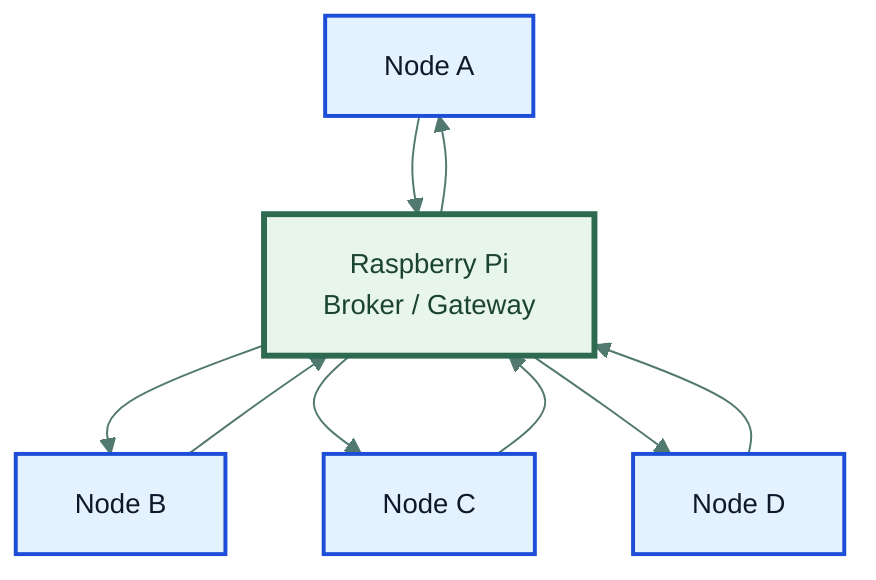

**B. Hybrid star + limited peer**

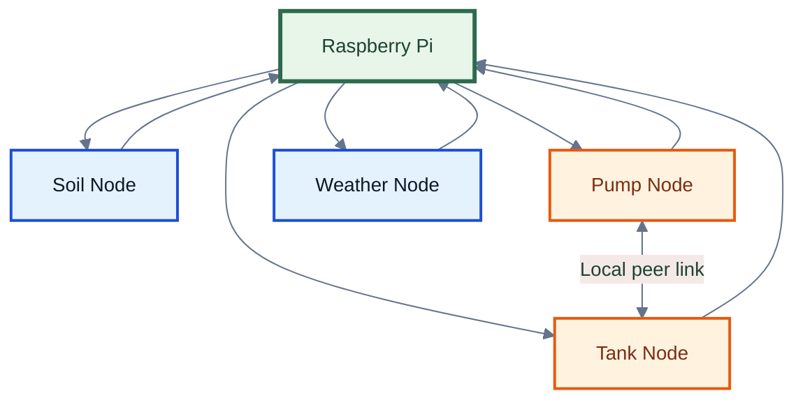

**C. Full peer-to-peer**

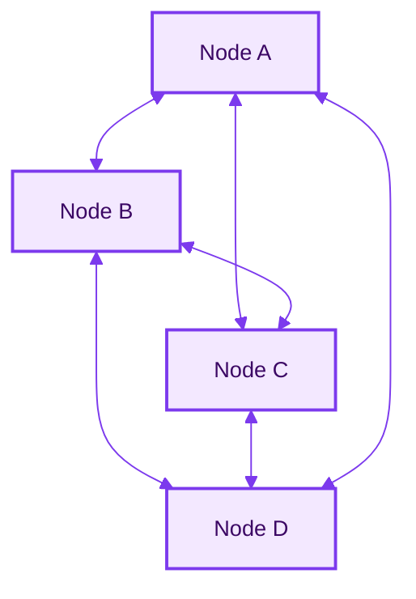

<ResourceBox
  title="Artikel Terkait:"
  items={[
    {
      name: 'README - HortiLink — Aliran Belajar',
      href: '/blog/IoT/hortiink-velxio/README',
    },
  ]}
/>

---

## 1. Fokus

- Local HTTP Access
- Browser-to-Node Interaction
- Operator Command Channel
- Node Snapshot Endpoint

---

## 2. Tujuan

- menambah boundary network pada node
- menambah frontend operator lokal pada node
- menjaga logic tetap di `svc`
- menyiapkan node sebelum gateway Raspberry Pi

---

## 3. Feature yang Dikerjakan

Feature Level 4A bukan mengganti Level 4, tetapi menambahkan kemampuan baru pada node:

- node menyediakan **local HTTP interface**
- node menyediakan **frontend operator lokal** yang bisa dibuka di browser smartphone
- browser dapat membaca **snapshot status node**
- browser dapat mengirim **operator command**
- command HTTP diperlakukan sebagai **channel input**, bukan tempat logic
- node tetap **offline-first**
- node tetap mempertahankan rule, fault handling, health snapshot, dan safe fallback yang sudah dibangun sampai Level 4

---

## 4. Platform

- **Board**: ESP32-C3 DevKit
- **Target implementasi**: board nyata dengan Arduino IDE
- **Simulator**: Velxio hanya sebagai rujukan transisi arsitektur
- **Status LED**: `GPIO8` (built-in LED)
- **Sensor dry**: `GPIO5`
- **Sensor fault**: `GPIO6`
- **Actuator output**: `GPIO7`

SoftAP lokal untuk operator access didukung oleh Arduino-ESP32, sedangkan emulasi **ESP32-C3** di Velxio saat ini masih difokuskan pada jalur lain dan belum cocok untuk uji HTTP lokal penuh. Karena itu, sketch pada level ini diposisikan sebagai **implementasi board nyata**. :contentReference[oaicite:1]{index=1}

[**Kembali ke Atas**](#hortilink-level-4a--local-http-access)

---

## 5. Konsep Level 4A

Pada Level 4A, node HortiLink mulai memiliki **jalur operasi lokal tambahan**:

- bukan hanya dari sensor
- bukan hanya dari tombol lokal
- tetapi juga dari **smartphone melalui HTTP**

Namun smartphone **bukan pusat kontrol baru**.

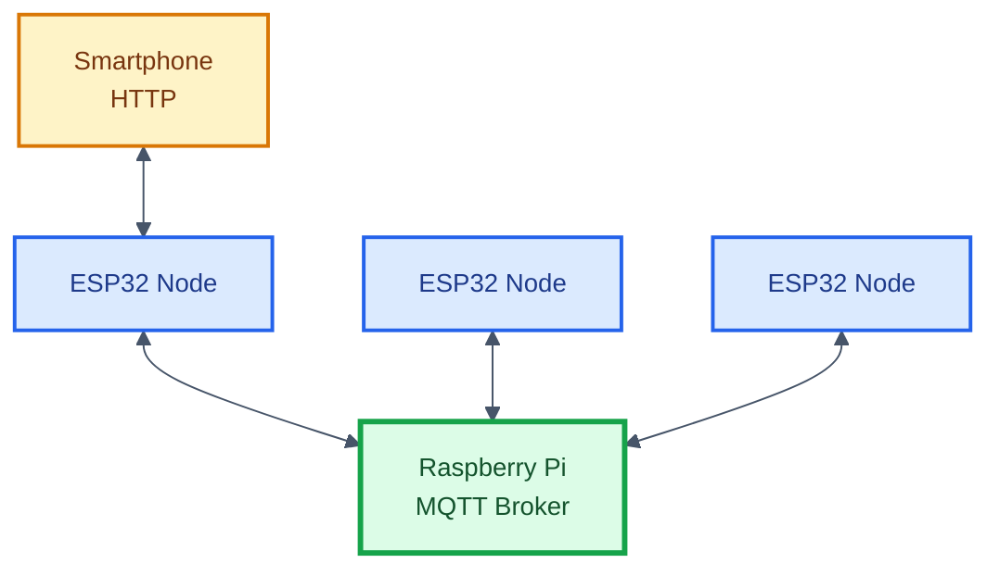

Smartphone di Level 4A hanya diposisikan sebagai:

> **local operator access channel**

Artinya:

- **Raspberry Pi** tetap dipersiapkan sebagai gateway utama di Level 5
- **ESP32** tetap edge node yang autonomous
- **smartphone via HTTP** hanya menjadi jalur monitoring dan operasi lokal tambahan

Dengan begitu, kalau nanti:

- internet tidak ada
- gateway belum aktif
- operator hanya membawa smartphone

maka node tetap bisa:

- diakses
- dipantau
- dioperasikan secara lokal

Ini sangat selaras dengan prinsip **offline-first**.

[**Kembali ke Atas**](#hortilink-level-4a--local-http-access)

---

## 6. Frontend pada Node

### 6.1 Peran frontend node

Frontend pada Level 4A **bukan HMI penuh seperti di Raspberry Pi**.

Frontend node harus diposisikan sebagai:

> **local operator panel / maintenance panel**

Artinya frontend ini ringan, cepat dimuat, dan fokus untuk:

- melihat apakah node hidup
- melihat mode saat ini
- melihat sensor
- melihat fault
- melihat aktuator
- melihat last action
- melakukan operasi dasar

### 6.2 Bentuk frontend yang disarankan

Untuk Level 4A, bentuk frontend paling sehat adalah:

- `index.html`
- `style.css`
- `app.js`

Pendekatannya:

- HTML sederhana
- CSS ringan
- JavaScript ringan berbasis `fetch()`
- polling AJAX sederhana

### 6.3 Struktur tampilan operator panel

Frontend Level 4A minimal sebaiknya terdiri dari 4 area:

✔ 1. Header node

Menampilkan:

- nama node
- status akses lokal
- uptime

✔ 2. Status panel

Menampilkan:

- mode aktif
- sensor status
- fault status
- actuator status
- last action

✔ 3. Control panel

Berisi tombol:

- manual override ON
- manual override OFF
- auto rule ON/OFF
- safe fallback ON/OFF
- reset fault
- refresh status

✔ 4. Config panel sederhana

Menampilkan:

- auto rule enabled
- safe fallback enabled

[**Kembali ke Atas**](#hortilink-level-4a--local-http-access)

---

## 7. Mekanisme Interaksi Browser ke Node

### 7.1 Alur dasar

Mekanisme browser ke node harus dikunci sebagai berikut:

```text
Browser -> HTTP Request -> drv_http -> svc_access/service domain -> response -> Browser
```

Artinya:

- browser tidak pernah menyentuh GPIO
- browser tidak pernah menulis aktuator langsung
- browser tidak pernah memutuskan mode langsung
- browser hanya mengirim request dan menerima response

### 7.2 Polling status

Setelah halaman operator terbuka, browser menjalankan polling ringan.

Pola yang disarankan:

- browser memanggil `GET /api/snapshot`
- interval misalnya setiap 1000 ms
- hasil snapshot dipakai untuk meng-update tampilan

Pada Level 4A, **polling AJAX** sudah cukup.

### 7.3 Pengiriman command

Saat operator menekan tombol di browser, frontend akan:

1. membentuk command
2. mengirim `POST /api/command`
3. menunggu `CommandResult`
4. jika diterima, frontend refresh snapshot
5. jika ditolak, frontend menampilkan pesan

Dengan pola ini, browser tetap menjadi channel, bukan sumber logic.

[**Kembali ke Atas**](#hortilink-level-4a--local-http-access)

---

## 8. HTTP Route Contract

### 8.1 Static routes

Route statis minimal:

- `GET /`
- `GET /style.css`
- `GET /app.js`

### 8.2 API routes

Route API minimal:

- `GET /api/snapshot`
- `POST /api/command`

### 8.3 Contoh payload command

Contoh request:

```json
{
  "type": "MANUAL_OVERRIDE_ON"
}
```

```json
{
  "type": "MANUAL_OVERRIDE_OFF"
}
```

```json
{
  "type": "AUTO_RULE_ENABLE"
}
```

```json
{
  "type": "AUTO_RULE_DISABLE"
}
```

```json
{
  "type": "SAFE_FALLBACK_ENABLE"
}
```

```json
{
  "type": "SAFE_FALLBACK_DISABLE"
}
```

```json
{
  "type": "RESET_FAULT"
}
```

Contoh response:

```json
{
  "accepted": true,
  "message": "manual override enabled"
}
```

atau:

```json
{
  "accepted": false,
  "message": "command rejected by safe fallback"
}
```

[**Kembali ke Atas**](#hortilink-level-4a--local-http-access)

---

## 9. Kontrak Domain yang Diperkenalkan

### 9.1 `OperatorCommand`

Command dari tombol, HTTP, dan nanti gateway seharusnya memakai bahasa domain yang sama.

```cpp
enum class CommandType : uint8_t {
  NONE,
  MANUAL_OVERRIDE_ON,
  MANUAL_OVERRIDE_OFF,
  AUTO_RULE_ENABLE,
  AUTO_RULE_DISABLE,
  SAFE_FALLBACK_ENABLE,
  SAFE_FALLBACK_DISABLE,
  RESET_FAULT
};

struct OperatorCommand {
  CommandType type;
  int32_t value;
};
```

### 9.2 `NodeSnapshot`

Snapshot adalah ringkasan state node yang bisa dikirim ke browser, ke gateway, atau ke channel lain.

```cpp
struct NodeSnapshot {
  const char* modeText;
  bool actuatorOn;
  bool sensorDry;
  bool faultFlag;
  uint32_t uptimeMs;
  const char* lastAction;
  bool autoRuleEnabled;
  bool safeFallbackEnabled;
};
```

### 9.3 `CommandResult`

Agar response terhadap command juga formal, service sebaiknya mengembalikan hasil abstrak.

```cpp
struct CommandResult {
  bool accepted;
  const char* message;
};
```

[**Kembali ke Atas**](#hortilink-level-4a--local-http-access)

---

## 10. Mode dan Prioritas Kontrol

### 10.1 Mode yang relevan

Mode yang relevan pada Level 4A:

- `BOOTING`
- `MONITORING`
- `AUTO_ACTIVE`
- `MANUAL_OVERRIDE`
- `SAFE_FALLBACK`

### 10.2 Prioritas keputusan

Agar HTTP tidak mengacaukan safety, prioritas keputusan harus dikunci sebagai berikut:

1. `SAFE_FALLBACK`
2. `MANUAL_OVERRIDE`
3. `AUTO_ACTIVE`
4. `MONITORING`

**Diagram prioritas keputusan**

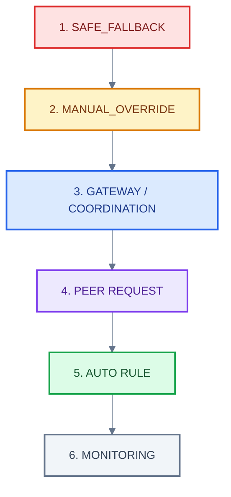

### 10.3 Arti prioritas ini bagi browser

Artinya:

- browser boleh meminta manual override
- tetapi jika fault aktif dan service memutuskan `SAFE_FALLBACK`, maka command override bisa ditolak
- browser boleh meminta reset fault
- tetapi service tetap memutuskan apakah reset itu sah atau tidak

[**Kembali ke Atas**](#hortilink-level-4a--local-http-access)

---

## 11. Struktur Layer

### 11.1 `sys`

Berisi konfigurasi tetap seperti:

- pin
- HTTP port
- SSID AP lokal
- password AP lokal
- timeout dasar
- ritme task
- default config

### 11.2 `drv`

Pada Level 4A, `drv` diperluas menjadi boundary ke dunia jaringan lokal.

Contoh boundary yang dipakai:

- `StatusLed`
- `DigitalSoilSensor`
- `ActuatorOutput`
- `WifiAccessPoint`
- `HttpServerPort`

Tugas `drv`:

- start AP lokal
- start HTTP server
- menerima request mentah
- menyajikan file statis frontend
- membentuk response mentah

### 11.3 `svc`

Pada Level 4A, `svc` tetap menjadi pusat logic domain.

Service domain:

- membaca sensor via `drv`
- mengelola mode
- menerapkan safe fallback
- menjalankan auto rule
- menjalankan manual override
- memproses `OperatorCommand`
- menghasilkan `NodeSnapshot`
- mengontrol output fisik via `drv`

### 11.4 `app`

`app` tetap menjadi orchestrator.

Tugas `app`:

- memulai service runtime node
- memulai service HTTP access
- menjalankan task-task service secara cooperative
- logging
- menjaga ritme runtime

**Diagram alur “logical node-to-node” yang sehat**

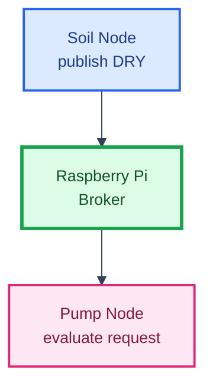

[**Kembali ke Atas**](#hortilink-level-4a--local-http-access)

---

## 12. Sketch Level 4A

### 12.1 Diagram Layering dan Class Mapping

Agar pembaca tidak hanya membaca sketch sebagai kumpulan kode, diagram berikut memperlihatkan bagaimana class pada Level 4A dipetakan ke layer firmware HortiLink.

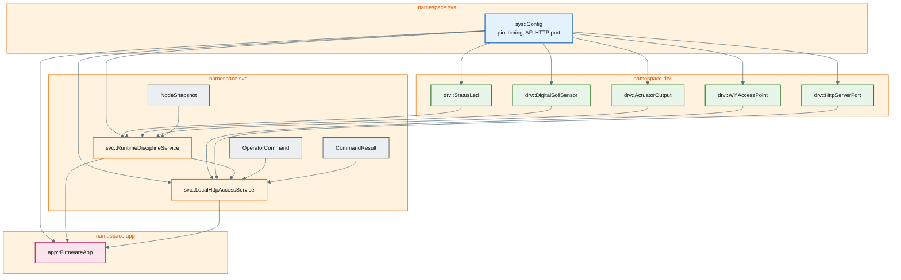

---

### 12.2 Diagram Object Wiring / Composition Root

Selain class, pembaca juga perlu melihat bagaimana object nyata dirangkai pada composition root. Diagram ini menunjukkan urutan dependency yang benar pada Level 4A.

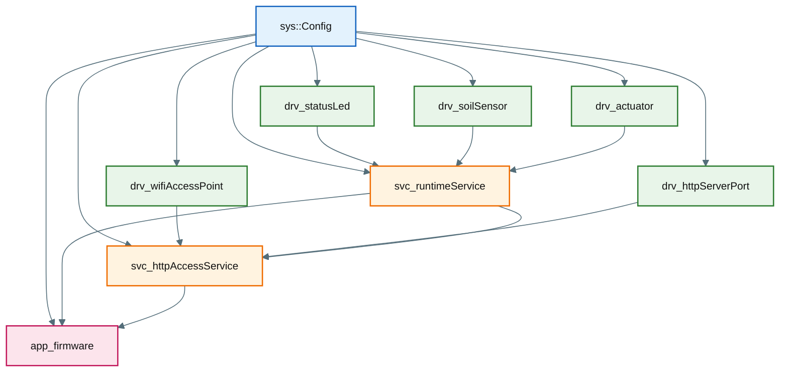

---

### 12.3 Diagram Struktur Domain di dalam `svc`

Karena Level 4A sudah membawa command channel baru, pembaca juga perlu melihat struktur domain internal pada layer `svc`.

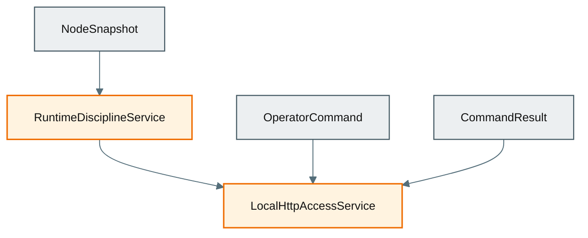

---

### 12.4 Diagram Browser / Smartphone ↔ Node Interface

Karena Level 4A memperkenalkan local HTTP access, pembaca juga perlu melihat dengan jelas bagaimana smartphone atau browser berinteraksi dengan node tanpa merusak layering.

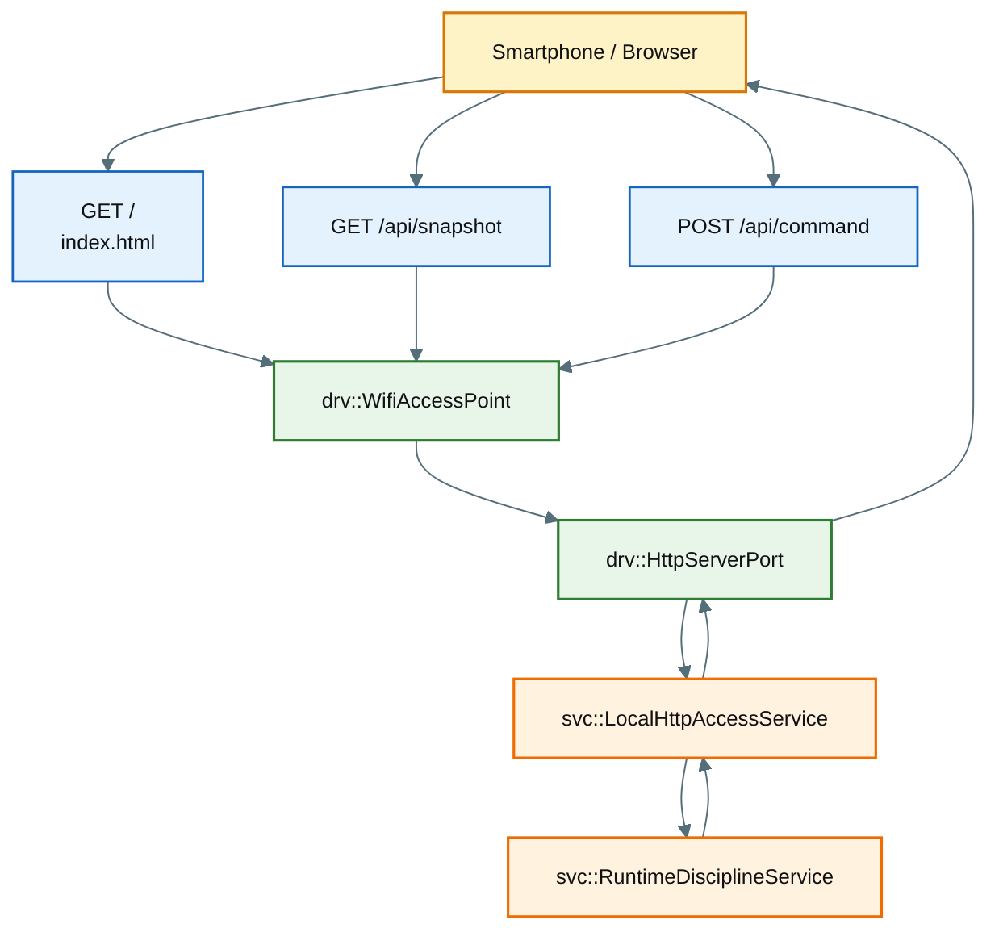

```cpp
#include <Arduino.h>
#include <WiFi.h>
#include <WebServer.h>

// =====================================================
// sys -> configuration
// =====================================================
namespace sys {

struct Config {
  static constexpr uint8_t PIN_STATUS_LED   = 8;  // Built-in LED ESP32-C3 DevKit
  static constexpr uint8_t PIN_SENSOR_DRY   = 5;  // Digital soil sensor proxy
  static constexpr uint8_t PIN_SENSOR_FAULT = 6;  // Fault simulation input
  static constexpr uint8_t PIN_ACTUATOR     = 7;  // Dummy actuator LED

  static constexpr uint32_t SERIAL_BAUD           = 115200;
  static constexpr uint32_t APP_TICK_MS           = 10;
  static constexpr uint32_t RUNTIME_TASK_MS       = 20;
  static constexpr uint32_t LOG_INTERVAL_MS       = 1000;
  static constexpr uint32_t BOOTING_DURATION_MS   = 3000;
  static constexpr uint32_t INPUT_DEBOUNCE_MS     = 40;

  static constexpr uint32_t BOOT_BLINK_MS         = 150;
  static constexpr uint32_t MONITOR_BLINK_MS      = 700;
  static constexpr uint32_t SAFE_FALLBACK_STEP_MS = 120;

  static constexpr bool DEFAULT_AUTO_RULE_ENABLED      = true;
  static constexpr bool DEFAULT_SAFE_FALLBACK_ENABLED  = true;

  static constexpr char AP_SSID[]     = "HortiLink-Node";
  static constexpr char AP_PASSWORD[] = "hortilink123";
  static constexpr uint16_t HTTP_PORT = 80;
};

constexpr char Config::AP_SSID[];
constexpr char Config::AP_PASSWORD[];

}  // namespace sys

// =====================================================
// drv -> hardware / boundary
// =====================================================
namespace drv {

class StatusLed {
public:
  explicit StatusLed(uint8_t pin) : _pin(pin) {}

  void begin() {
    pinMode(_pin, OUTPUT);
    off();
  }

  void set(bool on) {
    digitalWrite(_pin, on ? HIGH : LOW);
  }

  void off() {
    digitalWrite(_pin, LOW);
  }

private:
  uint8_t _pin;
};

class DigitalSoilSensor {
public:
  DigitalSoilSensor(uint8_t dryPin, uint8_t faultPin)
    : _dryPin(dryPin), _faultPin(faultPin) {}

  void begin() {
    pinMode(_dryPin, INPUT_PULLUP);
    pinMode(_faultPin, INPUT_PULLUP);

    initChannel(_dryChannel, rawDry());
    initChannel(_faultChannel, rawFault());
  }

  void update(uint32_t nowMs) {
    updateChannel(_dryChannel, rawDry(), nowMs);
    updateChannel(_faultChannel, rawFault(), nowMs);
  }

  bool isDry() const {
    return _dryChannel.stableState;
  }

  bool hasFault() const {
    return _faultChannel.stableState;
  }

private:
  struct DebouncedChannel {
    bool lastRawState = false;
    bool stableState = false;
    uint32_t lastChangeMs = 0;
  };

  uint8_t _dryPin;
  uint8_t _faultPin;
  DebouncedChannel _dryChannel;
  DebouncedChannel _faultChannel;

  bool rawDry() const {
    return digitalRead(_dryPin) == LOW;
  }

  bool rawFault() const {
    return digitalRead(_faultPin) == LOW;
  }

  void initChannel(DebouncedChannel& channel, bool initialState) {
    channel.lastRawState = initialState;
    channel.stableState = initialState;
    channel.lastChangeMs = 0;
  }

  void updateChannel(DebouncedChannel& channel, bool rawState, uint32_t nowMs) {
    if (rawState != channel.lastRawState) {
      channel.lastRawState = rawState;
      channel.lastChangeMs = nowMs;
    }

    if ((nowMs - channel.lastChangeMs) >= sys::Config::INPUT_DEBOUNCE_MS) {
      channel.stableState = rawState;
    }
  }
};

class ActuatorOutput {
public:
  explicit ActuatorOutput(uint8_t pin) : _pin(pin) {}

  void begin() {
    pinMode(_pin, OUTPUT);
    off();
  }

  void set(bool on) {
    digitalWrite(_pin, on ? HIGH : LOW);
    _isOn = on;
  }

  void off() {
    set(false);
  }

  bool isOn() const {
    return _isOn;
  }

private:
  uint8_t _pin;
  bool _isOn = false;
};

class WifiAccessPoint {
public:
  bool begin(const char* ssid, const char* password) {
    WiFi.mode(WIFI_AP);
    return WiFi.softAP(ssid, password);
  }

  IPAddress ip() const {
    return WiFi.softAPIP();
  }
};

class HttpServerPort {
public:
  explicit HttpServerPort(uint16_t port) : _server(port) {}

  template <typename Handler>
  void onGet(const String& path, Handler handler) {
    _server.on(path, HTTP_GET, handler);
  }

  template <typename Handler>
  void onPost(const String& path, Handler handler) {
    _server.on(path, HTTP_POST, handler);
  }

  void begin() {
    _server.begin();
  }

  void handleClient() {
    _server.handleClient();
  }

  void send(int code, const char* contentType, const String& body) {
    _server.send(code, contentType, body);
  }

  String body() const {
    return _server.arg("plain");
  }

private:
  WebServer _server;
};

}  // namespace drv

// =====================================================
// svc -> domain logic + uses drv
// =====================================================
namespace svc {

enum class NodeMode : uint8_t {
  BOOTING,
  MONITORING,
  AUTO_ACTIVE,
  MANUAL_OVERRIDE,
  SAFE_FALLBACK
};

enum class RuntimeEvent : uint8_t {
  NONE,
  ENTERED_MONITORING,
  AUTO_RULE_ACTIVATED,
  AUTO_RULE_CLEARED,
  MANUAL_OVERRIDE_ENABLED,
  MANUAL_OVERRIDE_DISABLED,
  SAFE_FALLBACK_ENTERED,
  SAFE_FALLBACK_CLEARED
};

enum class CommandType : uint8_t {
  NONE,
  MANUAL_OVERRIDE_ON,
  MANUAL_OVERRIDE_OFF,
  AUTO_RULE_ENABLE,
  AUTO_RULE_DISABLE,
  SAFE_FALLBACK_ENABLE,
  SAFE_FALLBACK_DISABLE,
  RESET_FAULT
};

struct OperatorCommand {
  CommandType type = CommandType::NONE;
  int32_t value = 0;
};

struct CommandResult {
  bool accepted = false;
  const char* message = "invalid command";
};

struct PersistentLocalConfig {
  bool autoRuleEnabled = sys::Config::DEFAULT_AUTO_RULE_ENABLED;
  bool safeFallbackEnabled = sys::Config::DEFAULT_SAFE_FALLBACK_ENABLED;
};

struct NodeSnapshot {
  const char* modeText = "UNKNOWN";
  bool actuatorOn = false;
  bool sensorDry = false;
  bool faultFlag = false;
  uint32_t uptimeMs = 0;
  const char* lastAction = "boot";
  bool autoRuleEnabled = false;
  bool safeFallbackEnabled = false;
};

const char* toString(NodeMode mode) {
  switch (mode) {
    case NodeMode::BOOTING:         return "BOOTING";
    case NodeMode::MONITORING:      return "MONITORING";
    case NodeMode::AUTO_ACTIVE:     return "AUTO_ACTIVE";
    case NodeMode::MANUAL_OVERRIDE: return "MANUAL_OVERRIDE";
    case NodeMode::SAFE_FALLBACK:   return "SAFE_FALLBACK";
    default:                        return "UNKNOWN";
  }
}

class RuntimeDisciplineService {
public:
  RuntimeDisciplineService(drv::StatusLed& drv_statusLed,
                           drv::DigitalSoilSensor& drv_soilSensor,
                           drv::ActuatorOutput& drv_actuator)
    : _drv_statusLed(drv_statusLed),
      _drv_soilSensor(drv_soilSensor),
      _drv_actuator(drv_actuator) {}

  void begin(uint32_t bootStartMs) {
    _drv_statusLed.begin();
    _drv_soilSensor.begin();
    _drv_actuator.begin();

    _bootStartMs = bootStartMs;
    _mode = NodeMode::BOOTING;
    _lastEvent = RuntimeEvent::NONE;
    _lastAction = "boot";
    _manualOverrideRequested = false;
    _actuatorOn = false;

    applyOutputs(bootStartMs);
  }

  void run(uint32_t nowMs) {
    _lastEvent = RuntimeEvent::NONE;

    _drv_soilSensor.update(nowMs);
    evaluateRuntime(nowMs);
    applyOutputs(nowMs);
  }

  CommandResult executeCommand(const OperatorCommand& cmd, uint32_t nowMs) {
    switch (cmd.type) {
      case CommandType::MANUAL_OVERRIDE_ON:
        if (_mode == NodeMode::BOOTING) {
          return reject("command rejected during boot");
        }
        if (_drv_soilSensor.hasFault() && _persistentConfig.safeFallbackEnabled) {
          return reject("command rejected by safe fallback");
        }
        _manualOverrideRequested = true;
        _lastAction = "manual override enabled";
        _lastEvent = RuntimeEvent::MANUAL_OVERRIDE_ENABLED;
        evaluateRuntime(nowMs);
        applyOutputs(nowMs);
        return accept("manual override enabled");

      case CommandType::MANUAL_OVERRIDE_OFF:
        if (_mode == NodeMode::BOOTING) {
          return reject("command rejected during boot");
        }
        _manualOverrideRequested = false;
        _lastAction = "manual override disabled";
        _lastEvent = RuntimeEvent::MANUAL_OVERRIDE_DISABLED;
        evaluateRuntime(nowMs);
        applyOutputs(nowMs);
        return accept("manual override disabled");

      case CommandType::AUTO_RULE_ENABLE:
        _persistentConfig.autoRuleEnabled = true;
        _lastAction = "auto rule enabled";
        evaluateRuntime(nowMs);
        applyOutputs(nowMs);
        return accept("auto rule enabled");

      case CommandType::AUTO_RULE_DISABLE:
        _persistentConfig.autoRuleEnabled = false;
        _lastAction = "auto rule disabled";
        evaluateRuntime(nowMs);
        applyOutputs(nowMs);
        return accept("auto rule disabled");

      case CommandType::SAFE_FALLBACK_ENABLE:
        _persistentConfig.safeFallbackEnabled = true;
        _lastAction = "safe fallback enabled";
        evaluateRuntime(nowMs);
        applyOutputs(nowMs);
        return accept("safe fallback enabled");

      case CommandType::SAFE_FALLBACK_DISABLE:
        _persistentConfig.safeFallbackEnabled = false;
        _lastAction = "safe fallback disabled";
        evaluateRuntime(nowMs);
        applyOutputs(nowMs);
        return accept("safe fallback disabled");

      case CommandType::RESET_FAULT:
        if (_drv_soilSensor.hasFault()) {
          return reject("physical fault still active");
        }
        _lastAction = "fault reset requested";
        evaluateRuntime(nowMs);
        applyOutputs(nowMs);
        return accept("fault reset accepted");

      case CommandType::NONE:
      default:
        return reject("invalid command");
    }
  }

  NodeSnapshot snapshot(uint32_t nowMs) const {
    NodeSnapshot snap;
    snap.modeText = toString(_mode);
    snap.actuatorOn = _actuatorOn;
    snap.sensorDry = _drv_soilSensor.isDry();
    snap.faultFlag = _drv_soilSensor.hasFault();
    snap.uptimeMs = nowMs - _bootStartMs;
    snap.lastAction = _lastAction;
    snap.autoRuleEnabled = _persistentConfig.autoRuleEnabled;
    snap.safeFallbackEnabled = _persistentConfig.safeFallbackEnabled;
    return snap;
  }

  bool hasEvent() const {
    return _lastEvent != RuntimeEvent::NONE;
  }

  RuntimeEvent lastEvent() const {
    return _lastEvent;
  }

  const char* lastAction() const {
    return _lastAction;
  }

  const char* modeText() const {
    return toString(_mode);
  }

private:
  drv::StatusLed& _drv_statusLed;
  drv::DigitalSoilSensor& _drv_soilSensor;
  drv::ActuatorOutput& _drv_actuator;

  uint32_t _bootStartMs = 0;
  NodeMode _mode = NodeMode::BOOTING;
  RuntimeEvent _lastEvent = RuntimeEvent::NONE;
  const char* _lastAction = "boot";

  PersistentLocalConfig _persistentConfig;
  bool _manualOverrideRequested = false;
  bool _actuatorOn = false;

  void evaluateRuntime(uint32_t nowMs) {
    const bool sensorDry = _drv_soilSensor.isDry();
    const bool faultActive = _drv_soilSensor.hasFault();

    if ((nowMs - _bootStartMs) < sys::Config::BOOTING_DURATION_MS) {
      _mode = NodeMode::BOOTING;
      _actuatorOn = false;
      return;
    }

    if (faultActive && _persistentConfig.safeFallbackEnabled) {
      if (_mode != NodeMode::SAFE_FALLBACK) {
        _lastEvent = RuntimeEvent::SAFE_FALLBACK_ENTERED;
        _lastAction = "safe fallback entered";
      }
      _mode = NodeMode::SAFE_FALLBACK;
      _actuatorOn = false;
      return;
    }

    if (_mode == NodeMode::SAFE_FALLBACK && !faultActive) {
      _lastEvent = RuntimeEvent::SAFE_FALLBACK_CLEARED;
      _lastAction = "safe fallback cleared";
    }

    if (_manualOverrideRequested) {
      _mode = NodeMode::MANUAL_OVERRIDE;
      _actuatorOn = true;
      return;
    }

    if (_persistentConfig.autoRuleEnabled && sensorDry) {
      if (_mode != NodeMode::AUTO_ACTIVE) {
        _lastEvent = RuntimeEvent::AUTO_RULE_ACTIVATED;
        _lastAction = "auto rule activated";
      }
      _mode = NodeMode::AUTO_ACTIVE;
      _actuatorOn = true;
      return;
    }

    if (_mode == NodeMode::AUTO_ACTIVE && !sensorDry) {
      _lastEvent = RuntimeEvent::AUTO_RULE_CLEARED;
      _lastAction = "auto rule cleared";
    }

    if (_mode != NodeMode::MONITORING && _lastEvent == RuntimeEvent::NONE) {
      _lastEvent = RuntimeEvent::ENTERED_MONITORING;
      _lastAction = "entered monitoring";
    }

    _mode = NodeMode::MONITORING;
    _actuatorOn = false;
  }

  void applyOutputs(uint32_t nowMs) {
    _drv_statusLed.set(statusLedState(nowMs));
    _drv_actuator.set(_actuatorOn);
  }

  bool statusLedState(uint32_t nowMs) const {
    switch (_mode) {
      case NodeMode::BOOTING:
        return ((nowMs / sys::Config::BOOT_BLINK_MS) % 2U) == 0U;

      case NodeMode::MONITORING:
        return ((nowMs / sys::Config::MONITOR_BLINK_MS) % 2U) == 0U;

      case NodeMode::AUTO_ACTIVE:
      case NodeMode::MANUAL_OVERRIDE:
        return true;

      case NodeMode::SAFE_FALLBACK: {
        const uint8_t phase = (nowMs / sys::Config::SAFE_FALLBACK_STEP_MS) % 6U;
        return (phase == 0U || phase == 1U);
      }
    }

    return false;
  }

  static CommandResult accept(const char* msg) {
    CommandResult r;
    r.accepted = true;
    r.message = msg;
    return r;
  }

  static CommandResult reject(const char* msg) {
    CommandResult r;
    r.accepted = false;
    r.message = msg;
    return r;
  }
};

class LocalHttpAccessService {
public:
  LocalHttpAccessService(drv::WifiAccessPoint& drv_wifiAccessPoint,
                         drv::HttpServerPort& drv_httpServerPort,
                         RuntimeDisciplineService& svc_runtimeDisciplineService)
    : _drv_wifiAccessPoint(drv_wifiAccessPoint),
      _drv_httpServerPort(drv_httpServerPort),
      _svc_runtimeDisciplineService(svc_runtimeDisciplineService) {}

  void begin() {
    _drv_wifiAccessPoint.begin(sys::Config::AP_SSID, sys::Config::AP_PASSWORD);

    _drv_httpServerPort.onGet("/", [this]() { handleIndex(); });
    _drv_httpServerPort.onGet("/style.css", [this]() { handleStyle(); });
    _drv_httpServerPort.onGet("/app.js", [this]() { handleScript(); });
    _drv_httpServerPort.onGet("/api/snapshot", [this]() { handleSnapshot(); });
    _drv_httpServerPort.onPost("/api/command", [this]() { handleCommand(); });

    _drv_httpServerPort.begin();
  }

  void run() {
    _drv_httpServerPort.handleClient();
  }

  String accessInfo() const {
    String s = "AP SSID: ";
    s += sys::Config::AP_SSID;
    s += " | URL: http://";
    s += _drv_wifiAccessPoint.ip().toString();
    return s;
  }

private:
  drv::WifiAccessPoint& _drv_wifiAccessPoint;
  drv::HttpServerPort& _drv_httpServerPort;
  RuntimeDisciplineService& _svc_runtimeDisciplineService;

  static String jsonEscape(const String& value) {
    String out;
    out.reserve(value.length() + 8);
    for (size_t i = 0; i < value.length(); ++i) {
      const char c = value[i];
      if (c == '\"' || c == '\\') out += '\\';
      out += c;
    }
    return out;
  }

  static bool containsType(const String& body, const char* type) {
    String key = "\"type\":\"";
    key += type;
    key += "\"";
    return body.indexOf(key) >= 0;
  }

  void handleIndex() {
    _drv_httpServerPort.send(200, "text/html", indexHtml());
  }

  void handleStyle() {
    _drv_httpServerPort.send(200, "text/css", styleCss());
  }

  void handleScript() {
    _drv_httpServerPort.send(200, "application/javascript", appJs());
  }

  void handleSnapshot() {
    const svc::NodeSnapshot snap = _svc_runtimeDisciplineService.snapshot(millis());

    String json = "{";
    json += "\"modeText\":\"" + jsonEscape(snap.modeText) + "\",";
    json += "\"actuatorOn\":" + String(snap.actuatorOn ? "true" : "false") + ",";
    json += "\"sensorDry\":" + String(snap.sensorDry ? "true" : "false") + ",";
    json += "\"faultFlag\":" + String(snap.faultFlag ? "true" : "false") + ",";
    json += "\"uptimeMs\":" + String(snap.uptimeMs) + ",";
    json += "\"lastAction\":\"" + jsonEscape(snap.lastAction) + "\",";
    json += "\"autoRuleEnabled\":" + String(snap.autoRuleEnabled ? "true" : "false") + ",";
    json += "\"safeFallbackEnabled\":" + String(snap.safeFallbackEnabled ? "true" : "false");
    json += "}";

    _drv_httpServerPort.send(200, "application/json", json);
  }

  void handleCommand() {
    const String body = _drv_httpServerPort.body();

    svc::OperatorCommand cmd;

    if (containsType(body, "MANUAL_OVERRIDE_ON")) {
      cmd.type = svc::CommandType::MANUAL_OVERRIDE_ON;
    } else if (containsType(body, "MANUAL_OVERRIDE_OFF")) {
      cmd.type = svc::CommandType::MANUAL_OVERRIDE_OFF;
    } else if (containsType(body, "AUTO_RULE_ENABLE")) {
      cmd.type = svc::CommandType::AUTO_RULE_ENABLE;
    } else if (containsType(body, "AUTO_RULE_DISABLE")) {
      cmd.type = svc::CommandType::AUTO_RULE_DISABLE;
    } else if (containsType(body, "SAFE_FALLBACK_ENABLE")) {
      cmd.type = svc::CommandType::SAFE_FALLBACK_ENABLE;
    } else if (containsType(body, "SAFE_FALLBACK_DISABLE")) {
      cmd.type = svc::CommandType::SAFE_FALLBACK_DISABLE;
    } else if (containsType(body, "RESET_FAULT")) {
      cmd.type = svc::CommandType::RESET_FAULT;
    } else {
      cmd.type = svc::CommandType::NONE;
    }

    const svc::CommandResult result =
      _svc_runtimeDisciplineService.executeCommand(cmd, millis());

    String json = "{";
    json += "\"accepted\":" + String(result.accepted ? "true" : "false") + ",";
    json += "\"message\":\"" + jsonEscape(result.message) + "\"";
    json += "}";

    _drv_httpServerPort.send(result.accepted ? 200 : 400, "application/json", json);
  }

  static String indexHtml() {
    return R"HTML(
<!doctype html>
<html lang="en">
<head>
  <meta charset="utf-8">
  <meta name="viewport" content="width=device-width,initial-scale=1">
  <title>HortiLink Node</title>
  <link rel="stylesheet" href="/style.css">
</head>
<body>
  <main class="wrap">
    <h1>HortiLink Node</h1>
    <p class="muted">Local operator panel</p>

    <section class="card">
      <h2>Status</h2>
      <div class="grid">
        <div><span>Mode</span><strong id="modeText">-</strong></div>
        <div><span>Uptime</span><strong id="uptimeMs">-</strong></div>
        <div><span>Sensor</span><strong id="sensorDry">-</strong></div>
        <div><span>Fault</span><strong id="faultFlag">-</strong></div>
        <div><span>Actuator</span><strong id="actuatorOn">-</strong></div>
        <div><span>Last Action</span><strong id="lastAction">-</strong></div>
        <div><span>Auto Rule</span><strong id="autoRuleEnabled">-</strong></div>
        <div><span>Safe Fallback</span><strong id="safeFallbackEnabled">-</strong></div>
      </div>
    </section>

    <section class="card">
      <h2>Control</h2>
      <div class="btns">
        <button onclick="sendCommand('MANUAL_OVERRIDE_ON')">Manual ON</button>
        <button onclick="sendCommand('MANUAL_OVERRIDE_OFF')">Manual OFF</button>
        <button onclick="sendCommand('AUTO_RULE_ENABLE')">Auto ON</button>
        <button onclick="sendCommand('AUTO_RULE_DISABLE')">Auto OFF</button>
        <button onclick="sendCommand('SAFE_FALLBACK_ENABLE')">Safe ON</button>
        <button onclick="sendCommand('SAFE_FALLBACK_DISABLE')">Safe OFF</button>
        <button onclick="sendCommand('RESET_FAULT')">Reset Fault</button>
        <button onclick="loadSnapshot()">Refresh</button>
      </div>
    </section>

    <section class="card">
      <h2>Result</h2>
      <pre id="resultBox">Ready.</pre>
    </section>
  </main>
  <script src="/app.js"></script>
</body>
</html>
)HTML";
  }

  static String styleCss() {
    return R"CSS(
:root {
  --bg: #0f172a;
  --card: #111827;
  --text: #e5e7eb;
  --muted: #94a3b8;
  --accent: #22c55e;
  --border: #334155;
}
* { box-sizing: border-box; }
body {
  margin: 0;
  font-family: Arial, sans-serif;
  background: var(--bg);
  color: var(--text);
}
.wrap {
  max-width: 760px;
  margin: 0 auto;
  padding: 16px;
}
h1, h2 { margin: 0 0 8px 0; }
.muted { color: var(--muted); margin-top: 4px; }
.card {
  background: var(--card);
  border: 1px solid var(--border);
  border-radius: 14px;
  padding: 16px;
  margin-top: 16px;
}
.grid {
  display: grid;
  grid-template-columns: repeat(2, 1fr);
  gap: 12px;
}
.grid div {
  background: rgba(255,255,255,0.03);
  padding: 10px;
  border-radius: 10px;
}
.grid span {
  display: block;
  color: var(--muted);
  font-size: 12px;
}
.grid strong {
  display: block;
  margin-top: 6px;
  font-size: 16px;
}
.btns {
  display: grid;
  grid-template-columns: repeat(2, 1fr);
  gap: 10px;
}
button {
  border: 0;
  border-radius: 10px;
  padding: 12px;
  background: var(--accent);
  color: #052e16;
  font-weight: bold;
}
pre {
  white-space: pre-wrap;
  word-break: break-word;
  margin: 0;
}
)CSS";
  }

  static String appJs() {
    return R"JS(
async function loadSnapshot() {
  try {
    const res = await fetch('/api/snapshot');
    const data = await res.json();

    document.getElementById('modeText').textContent = data.modeText;
    document.getElementById('uptimeMs').textContent = data.uptimeMs + ' ms';
    document.getElementById('sensorDry').textContent = data.sensorDry ? 'DRY' : 'NORMAL';
    document.getElementById('faultFlag').textContent = data.faultFlag ? 'YES' : 'NO';
    document.getElementById('actuatorOn').textContent = data.actuatorOn ? 'ON' : 'OFF';
    document.getElementById('lastAction').textContent = data.lastAction;
    document.getElementById('autoRuleEnabled').textContent = data.autoRuleEnabled ? 'ENABLED' : 'DISABLED';
    document.getElementById('safeFallbackEnabled').textContent = data.safeFallbackEnabled ? 'ENABLED' : 'DISABLED';
  } catch (err) {
    document.getElementById('resultBox').textContent = 'Snapshot error: ' + err;
  }
}

async function sendCommand(type) {
  try {
    const res = await fetch('/api/command', {
      method: 'POST',
      headers: { 'Content-Type': 'application/json' },
      body: JSON.stringify({ type })
    });
    const data = await res.json();
    document.getElementById('resultBox').textContent = JSON.stringify(data, null, 2);
    await loadSnapshot();
  } catch (err) {
    document.getElementById('resultBox').textContent = 'Command error: ' + err;
  }
}

loadSnapshot();
setInterval(loadSnapshot, 1000);
)JS";
  }
};

}  // namespace svc

// =====================================================
// app -> orchestrator only
// =====================================================
namespace app {

class FirmwareApp {
public:
  FirmwareApp(svc::RuntimeDisciplineService& svc_runtimeService,
              svc::LocalHttpAccessService& svc_httpAccessService)
    : _svc_runtimeService(svc_runtimeService),
      _svc_httpAccessService(svc_httpAccessService) {}

  void begin() {
    Serial.begin(sys::Config::SERIAL_BAUD);
    delay(100);

    const uint32_t startMs = millis();
    _svc_runtimeService.begin(startMs);
    _svc_httpAccessService.begin();

    _lastRuntimeTaskMs = startMs;
    _lastLogMs = startMs;

    Serial.println();
    Serial.println("=== HortiLink Level 4A ===");
    Serial.println("Local HTTP Access");
    Serial.println(_svc_httpAccessService.accessInfo());
    Serial.println("Routes: /, /api/snapshot, /api/command");
    Serial.println();
  }

  void run() {
    const uint32_t nowMs = millis();

    if (nowMs - _lastRuntimeTaskMs >= sys::Config::RUNTIME_TASK_MS) {
      _lastRuntimeTaskMs = nowMs;
      _svc_runtimeService.run(nowMs);
    }

    _svc_httpAccessService.run();

    if (nowMs - _lastLogMs >= sys::Config::LOG_INTERVAL_MS) {
      _lastLogMs = nowMs;
      logHeartbeat(nowMs);
    }

    delay(sys::Config::APP_TICK_MS);
  }

private:
  svc::RuntimeDisciplineService& _svc_runtimeService;
  svc::LocalHttpAccessService& _svc_httpAccessService;
  uint32_t _lastRuntimeTaskMs = 0;
  uint32_t _lastLogMs = 0;

  void logHeartbeat(uint32_t nowMs) {
    const svc::NodeSnapshot snap = _svc_runtimeService.snapshot(nowMs);

    Serial.print("[SNAPSHOT] uptime=");
    Serial.print(snap.uptimeMs);
    Serial.print(" ms | mode=");
    Serial.print(snap.modeText);
    Serial.print(" | sensor=");
    Serial.print(snap.sensorDry ? "DRY" : "NORMAL");
    Serial.print(" | fault=");
    Serial.print(snap.faultFlag ? "YES" : "NO");
    Serial.print(" | actuator=");
    Serial.print(snap.actuatorOn ? "ON" : "OFF");
    Serial.print(" | autoRule=");
    Serial.print(snap.autoRuleEnabled ? "EN" : "DIS");
    Serial.print(" | safeFallback=");
    Serial.println(snap.safeFallbackEnabled ? "EN" : "DIS");
  }
};

}  // namespace app

// =====================================================
// composition root
// =====================================================
drv::StatusLed drv_statusLed(sys::Config::PIN_STATUS_LED);
drv::DigitalSoilSensor drv_soilSensor(
  sys::Config::PIN_SENSOR_DRY,
  sys::Config::PIN_SENSOR_FAULT
);
drv::ActuatorOutput drv_actuator(sys::Config::PIN_ACTUATOR);
drv::WifiAccessPoint drv_wifiAccessPoint;
drv::HttpServerPort drv_httpServerPort(sys::Config::HTTP_PORT);

svc::RuntimeDisciplineService svc_runtimeService(
  drv_statusLed,
  drv_soilSensor,
  drv_actuator
);

svc::LocalHttpAccessService svc_httpAccessService(
  drv_wifiAccessPoint,
  drv_httpServerPort,
  svc_runtimeService
);

app::FirmwareApp app_firmware(
  svc_runtimeService,
  svc_httpAccessService
);

// =====================================================
// Arduino entry point
// =====================================================
void setup() {
  app_firmware.begin();
}

void loop() {
  app_firmware.run();
}
```

[**Kembali ke Atas**](#hortilink-level-4a--local-http-access)

---

## 13. Cara Kerja Firmware

### 13.1 Saat node menyala

`setup()` memanggil:

```cpp
app_firmware.begin();
```

Di dalam `begin()`:

- Serial dimulai
- service runtime node dimulai
- service HTTP access dimulai
- node membuka AP lokal
- HTTP route didaftarkan
- frontend operator siap diakses

### 13.2 Saat browser membuka halaman

Alurnya:

1. browser membuka `GET /`
2. node mengirim `index.html`
3. browser meminta `style.css`
4. browser meminta `app.js`
5. `app.js` mulai memanggil snapshot

### 13.3 Saat browser meminta snapshot

Alurnya:

1. browser memanggil `GET /api/snapshot`
2. service runtime menyusun `NodeSnapshot`
3. response JSON dikirim kembali
4. browser memperbarui tampilan

### 13.4 Saat browser mengirim command

Alurnya:

1. operator menekan tombol pada panel
2. browser mengirim `POST /api/command`
3. payload diterjemahkan menjadi `OperatorCommand`
4. service runtime memutuskan:

   - accepted / rejected
   - mode berubah atau tidak
   - actuator berubah atau tidak

5. `CommandResult` dikirim kembali
6. browser refresh snapshot

### 13.5 Saat fault aktif

Jika fault aktif:

- service tetap mengutamakan `SAFE_FALLBACK`
- command operator yang bertentangan dengan safety bisa ditolak
- frontend tetap bisa menunjukkan bahwa node sedang berada di mode aman

[**Kembali ke Atas**](#hortilink-level-4a--local-http-access)

---

## 14. Yang Dipelajari dari Level 4A

**Diagram jumlah node optimal**

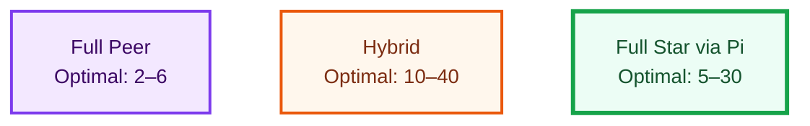

### 14.1 HTTP adalah channel, bukan logic domain

HTTP tidak boleh menjadi tempat rule:

- tidak boleh langsung memutuskan mode
- tidak boleh langsung menulis aktuator
- tidak boleh langsung mengabaikan fault state

HTTP hanya channel masuk/keluar.

### 14.2 Satu domain logic, banyak command source

Setelah Level 4A, node akan punya banyak sumber command:

- tombol lokal
- HTTP local access
- nanti gateway / MQTT / Pi

Tetapi semuanya harus masuk ke **service domain yang sama**.

### 14.3 Frontend node berbeda dari HMI Raspberry Pi

Frontend node adalah:

- ringan
- lokal
- untuk servis dan operasi dasar

Sedangkan HMI Raspberry Pi nantinya adalah:

- lebih kaya
- lebih besar
- lebih cocok untuk multi-node dan histori

### 14.4 Level 4A adalah jembatan ke Level 5

Dengan Level 4A, saat masuk Level 5 nanti, node sudah siap menerima command dari channel selain GPIO.

[**Kembali ke Atas**](#hortilink-level-4a--local-http-access)

---

## 15. Inti Level 4A

Level 4A ini bukan sekadar menambah web server.

Ini adalah tahap ketika node HortiLink mulai memiliki **operator access channel** yang baru, tetapi tanpa mengorbankan layering dan SoC.

Pada Level 4A, yang dikunci adalah:

- smartphone hanya channel operasi lokal
- frontend node hanya operator panel ringan
- domain logic tetap di `svc`
- `drv` hanya boundary jaringan/hardware
- `app` tetap orchestrator
- HTTP disiapkan sebagai jembatan ke Level 5, bukan pengganti gateway

Dengan kata lain, Level 4A adalah jembatan antara:

- node yang hanya punya sensor, rule, dan runtime discipline
- dan node yang siap masuk ke ekosistem **gateway + operator access + multi-channel command**

**Diagram rekomendasi roadmap**

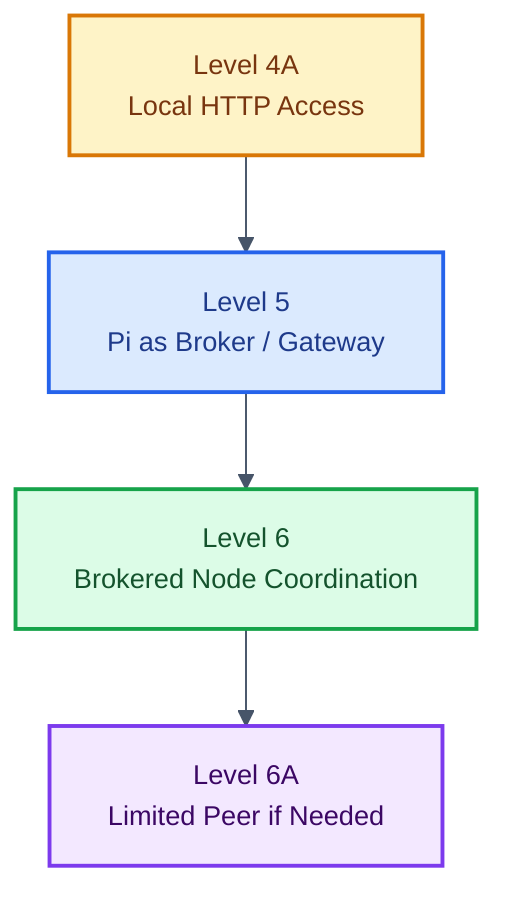

[**Kembali ke Atas**](#hortilink-level-4a--local-http-access)

---

<small>
  **_Catatan Penyusunan_** Level 4A adalah level sisipan yang disarankan agar
  transisi dari node-centric firmware ke gateway integration tidak terlalu
  meloncat. Untuk ESP32-C3 pada Velxio, level ini harus diperlakukan sebagai
  level desain arsitektur dan implementasi board nyata, karena WiFi/HTTP belum
  tersedia sebagai jalur uji penuh pada emulasi ESP32-C3 RISC-V saat ini.
</small>
