# **_Agen Hayati untuk Pengendalian OPT Cabai: Panduan Praktis dari Persemaian sampai Panen_**

---

- [**_Agen Hayati untuk Pengendalian OPT Cabai: Panduan Praktis dari Persemaian sampai Panen_**](#agen-hayati-untuk-pengendalian-opt-cabai-panduan-praktis-dari-persemaian-sampai-panen)
- [**BAB 1. Pendahuluan: Mengapa Cabai Membutuhkan Pengendalian OPT yang Lebih Terintegrasi**](#bab-1-pendahuluan-mengapa-cabai-membutuhkan-pengendalian-opt-yang-lebih-terintegrasi)
  - [**1.1 Cabai sebagai Komoditas Bernilai Tinggi tetapi Rentan OPT**](#11-cabai-sebagai-komoditas-bernilai-tinggi-tetapi-rentan-opt)
    - [**Ilustrasi 1.1. Titik Rawan OPT Cabai dari Persemaian sampai Panen**](#ilustrasi-11-titik-rawan-opt-cabai-dari-persemaian-sampai-panen)
  - [**1.2 Masalah Umum Pengendalian OPT Cabai di Lapangan**](#12-masalah-umum-pengendalian-opt-cabai-di-lapangan)
  - [**1.3 Mengapa Agen Hayati Menjadi Penting**](#13-mengapa-agen-hayati-menjadi-penting)
    - [**Ilustrasi 1.2. Peran Agen Hayati dalam Sistem Pengendalian OPT Cabai**](#ilustrasi-12-peran-agen-hayati-dalam-sistem-pengendalian-opt-cabai)
  - [**1.4 Posisi Utama Tulisan**](#14-posisi-utama-tulisan)
- [**BAB 2. Dasar Teori Agen Hayati**](#bab-2-dasar-teori-agen-hayati)
  - [**2.1 Pengertian Agen Hayati**](#21-pengertian-agen-hayati)
    - [**Ilustrasi 2.1. Kelompok Utama Agen Hayati pada Cabai**](#ilustrasi-21-kelompok-utama-agen-hayati-pada-cabai)
  - [**2.2 Istilah Akademik dan Teknis yang Perlu Dipahami**](#22-istilah-akademik-dan-teknis-yang-perlu-dipahami)
    - [**Ilustrasi 2.2. Hubungan Istilah Agen Hayati, Biopestisida, PGPM, dan Pupuk Hayati**](#ilustrasi-22-hubungan-istilah-agen-hayati-biopestisida-pgpm-dan-pupuk-hayati)
  - [**2.3 Agen Hayati vs PGPM**](#23-agen-hayati-vs-pgpm)
    - [**Ilustrasi 2.3. Cara Membedakan Agen Hayati, PGPM, dan Pupuk Hayati di Lapangan**](#ilustrasi-23-cara-membedakan-agen-hayati-pgpm-dan-pupuk-hayati-di-lapangan)
  - [**2.4 Batasan Penting Penggunaan Agen Hayati**](#24-batasan-penting-penggunaan-agen-hayati)
    - [**Ilustrasi 2.4. Faktor yang Menentukan Keberhasilan Agen Hayati**](#ilustrasi-24-faktor-yang-menentukan-keberhasilan-agen-hayati)
  - [**Ringkasan Bab 2**](#ringkasan-bab-2)
- [**BAB 3. OPT Utama pada Cabai dan Titik Serangannya**](#bab-3-opt-utama-pada-cabai-dan-titik-serangannya)
  - [**3.1 Penyakit Utama Cabai**](#31-penyakit-utama-cabai)
    - [**3.1.1 Layu Fusarium**](#311-layu-fusarium)
    - [**3.1.2 Layu bakteri**](#312-layu-bakteri)
    - [**3.1.3 Rebah semai**](#313-rebah-semai)
    - [**3.1.4 Busuk akar**](#314-busuk-akar)
    - [**3.1.5 Busuk pangkal batang**](#315-busuk-pangkal-batang)
    - [**3.1.6 Penyakit daun pada kelembapan tinggi**](#316-penyakit-daun-pada-kelembapan-tinggi)
    - [**Ilustrasi 3.1. Titik Serangan Penyakit Utama pada Tanaman Cabai**](#ilustrasi-31-titik-serangan-penyakit-utama-pada-tanaman-cabai)
  - [**3.2 Hama Utama Cabai**](#32-hama-utama-cabai)
    - [**3.2.1 Thrips**](#321-thrips)
    - [**3.2.2 Kutu kebul**](#322-kutu-kebul)
    - [**3.2.3 Kutu daun**](#323-kutu-daun)
    - [**3.2.4 Tungau**](#324-tungau)
    - [**3.2.5 Ulat grayak**](#325-ulat-grayak)
    - [**3.2.6 Ulat buah**](#326-ulat-buah)
    - [**3.2.7 Lalat buah**](#327-lalat-buah)
    - [**3.2.8 Hama tanah tertentu**](#328-hama-tanah-tertentu)
    - [**Ilustrasi 3.2. Titik Serangan Hama Utama pada Cabai**](#ilustrasi-32-titik-serangan-hama-utama-pada-cabai)
  - [**3.3 Nematoda pada Cabai**](#33-nematoda-pada-cabai)
    - [**Ilustrasi 3.3. Hubungan Nematoda, Kerusakan Akar, dan Gejala Tajuk**](#ilustrasi-33-hubungan-nematoda-kerusakan-akar-dan-gejala-tajuk)
  - [**3.4 Virus pada Cabai dan Peran Vektor**](#34-virus-pada-cabai-dan-peran-vektor)
    - [**3.4.1 Kutu kebul sebagai vektor**](#341-kutu-kebul-sebagai-vektor)
    - [**3.4.2 Thrips sebagai vektor**](#342-thrips-sebagai-vektor)
    - [**3.4.3 Kutu daun sebagai vektor**](#343-kutu-daun-sebagai-vektor)
    - [**3.4.4 Peran agen hayati terhadap virus**](#344-peran-agen-hayati-terhadap-virus)
    - [**Ilustrasi 3.4. Hubungan Virus, Vektor, dan Tanaman Sumber Infeksi**](#ilustrasi-34-hubungan-virus-vektor-dan-tanaman-sumber-infeksi)
  - [**Tabel 3.1. Ringkasan OPT Cabai, Titik Serangan, dan Implikasi Pengendalian**](#tabel-31-ringkasan-opt-cabai-titik-serangan-dan-implikasi-pengendalian)
  - [**Ringkasan Bab 3**](#ringkasan-bab-3)
- [**BAB 4. Prinsip Kerja Agen Hayati**](#bab-4-prinsip-kerja-agen-hayati)
  - [**4.1 Kompetisi Ruang dan Nutrisi**](#41-kompetisi-ruang-dan-nutrisi)
    - [**Implikasi Praktis pada Cabai**](#implikasi-praktis-pada-cabai)
    - [**Ilustrasi 4.1. Kompetisi Mikroba Baik dan Patogen di Zona Akar**](#ilustrasi-41-kompetisi-mikroba-baik-dan-patogen-di-zona-akar)
  - [**4.2 Antibiosis**](#42-antibiosis)
    - [**Implikasi Praktis pada Cabai**](#implikasi-praktis-pada-cabai-1)
  - [**4.3 Mikoparasitisme**](#43-mikoparasitisme)
    - [**Implikasi Praktis pada Cabai**](#implikasi-praktis-pada-cabai-2)
    - [**Ilustrasi 4.2. Mikoparasitisme oleh Jamur Antagonis**](#ilustrasi-42-mikoparasitisme-oleh-jamur-antagonis)
  - [**4.4 Induksi Ketahanan Tanaman**](#44-induksi-ketahanan-tanaman)
    - [**Implikasi Praktis pada Cabai**](#implikasi-praktis-pada-cabai-3)
    - [**Ilustrasi 4.3. Induksi Ketahanan Tanaman oleh Agen Hayati**](#ilustrasi-43-induksi-ketahanan-tanaman-oleh-agen-hayati)
  - [**4.5 Infeksi Langsung pada Hama**](#45-infeksi-langsung-pada-hama)
    - [**Implikasi Praktis pada Cabai**](#implikasi-praktis-pada-cabai-4)
    - [**Ilustrasi 4.4. Proses Infeksi Jamur Entomopatogen pada Hama**](#ilustrasi-44-proses-infeksi-jamur-entomopatogen-pada-hama)
  - [**4.6 Racun Biologis yang Harus Termakan Hama**](#46-racun-biologis-yang-harus-termakan-hama)
    - [**Implikasi Praktis pada Cabai**](#implikasi-praktis-pada-cabai-5)
    - [**Ilustrasi 4.5. Mekanisme Bt/NPV yang Harus Termakan Larva**](#ilustrasi-45-mekanisme-btnpv-yang-harus-termakan-larva)
  - [**4.7 Parasitasi**](#47-parasitasi)
    - [**Implikasi Praktis pada Cabai**](#implikasi-praktis-pada-cabai-6)
    - [**Ilustrasi 4.6. Parasitasi oleh Parasitoid**](#ilustrasi-46-parasitasi-oleh-parasitoid)
  - [**4.8 Predasi**](#48-predasi)
    - [**Implikasi Praktis pada Cabai**](#implikasi-praktis-pada-cabai-7)
    - [**Ilustrasi 4.7. Predasi dalam Ekosistem Cabai**](#ilustrasi-47-predasi-dalam-ekosistem-cabai)
  - [**Tabel 4.1. Ringkasan Mekanisme Kerja Agen Hayati dan Implikasi Aplikasinya pada Cabai**](#tabel-41-ringkasan-mekanisme-kerja-agen-hayati-dan-implikasi-aplikasinya-pada-cabai)
  - [**Ringkasan Bab 4**](#ringkasan-bab-4)
- [**BAB 5. Kelompok Agen Hayati untuk Cabai**](#bab-5-kelompok-agen-hayati-untuk-cabai)
  - [**5.1 Agen Hayati untuk Penyakit Tanah dan Akar**](#51-agen-hayati-untuk-penyakit-tanah-dan-akar)
    - [**5.1.1 Trichoderma spp.**](#511-trichoderma-spp)
    - [**5.1.2 Gliocladium/Clonostachys spp.**](#512-gliocladiumclonostachys-spp)
    - [**5.1.3 Bacillus subtilis**](#513-bacillus-subtilis)
    - [**5.1.4 Bacillus amyloliquefaciens**](#514-bacillus-amyloliquefaciens)
    - [**5.1.5 Pseudomonas fluorescens**](#515-pseudomonas-fluorescens)
    - [**5.1.6 Streptomyces spp.**](#516-streptomyces-spp)
    - [**Ilustrasi 5.1. Arah Aplikasi Agen Hayati untuk Penyakit Tanah dan Akar**](#ilustrasi-51-arah-aplikasi-agen-hayati-untuk-penyakit-tanah-dan-akar)
  - [**5.2 Agen Hayati untuk Nematoda**](#52-agen-hayati-untuk-nematoda)
    - [**5.2.1 Purpureocillium lilacinum**](#521-purpureocillium-lilacinum)
    - [**5.2.2 Pochonia chlamydosporia**](#522-pochonia-chlamydosporia)
    - [**5.2.3 Bacillus firmus**](#523-bacillus-firmus)
    - [**Poin Penting Pengendalian Nematoda**](#poin-penting-pengendalian-nematoda)
    - [**Ilustrasi 5.2. Titik Aplikasi Agen Hayati Nematoda**](#ilustrasi-52-titik-aplikasi-agen-hayati-nematoda)
  - [**5.3 Agen Hayati untuk Thrips, Kutu Kebul, dan Kutu Daun**](#53-agen-hayati-untuk-thrips-kutu-kebul-dan-kutu-daun)
    - [**5.3.1 Beauveria bassiana**](#531-beauveria-bassiana)
    - [**5.3.2 Lecanicillium lecanii**](#532-lecanicillium-lecanii)
    - [**5.3.3 Isaria/Cordyceps fumosorosea**](#533-isariacordyceps-fumosorosea)
    - [**5.3.4 Metarhizium anisopliae**](#534-metarhizium-anisopliae)
    - [**Poin Penting Aplikasi untuk Hama Pengisap**](#poin-penting-aplikasi-untuk-hama-pengisap)
    - [**Ilustrasi 5.3. Arah Semprot Agen Hayati untuk Hama Pengisap**](#ilustrasi-53-arah-semprot-agen-hayati-untuk-hama-pengisap)
  - [**5.4 Agen Hayati untuk Ulat**](#54-agen-hayati-untuk-ulat)
    - [**5.4.1 Bacillus thuringiensis/Bt**](#541-bacillus-thuringiensisbt)
    - [**5.4.2 NPV/SlNPV/HaNPV**](#542-npvslnpvhanpv)
    - [**5.4.3 Beauveria bassiana untuk ulat muda**](#543-beauveria-bassiana-untuk-ulat-muda)
    - [**5.4.4 Metarhizium anisopliae untuk ulat dan hama tanah**](#544-metarhizium-anisopliae-untuk-ulat-dan-hama-tanah)
    - [**Poin Penting Aplikasi untuk Ulat**](#poin-penting-aplikasi-untuk-ulat)
    - [**Ilustrasi 5.4. Waktu Terbaik Aplikasi Bt dan NPV**](#ilustrasi-54-waktu-terbaik-aplikasi-bt-dan-npv)
  - [**5.5 Predator Alami pada Cabai**](#55-predator-alami-pada-cabai)
    - [**5.5.1 Kumbang koksi**](#551-kumbang-koksi)
    - [**5.5.2 Chrysoperla/lacewing**](#552-chrysoperlalacewing)
    - [**5.5.3 Orius sp.**](#553-orius-sp)
    - [**5.5.4 Laba-laba**](#554-laba-laba)
    - [**5.5.5 Tungau predator**](#555-tungau-predator)
    - [**5.5.6 Syrphid/lalat bunga**](#556-syrphidlalat-bunga)
    - [**5.5.7 Cocopet**](#557-cocopet)
    - [**Poin Penting Predator Alami**](#poin-penting-predator-alami)
    - [**Ilustrasi 5.5. Peran Predator dalam Kebun Cabai**](#ilustrasi-55-peran-predator-dalam-kebun-cabai)
  - [**5.6 Parasitoid pada Cabai**](#56-parasitoid-pada-cabai)
    - [**5.6.1 Encarsia sp.**](#561-encarsia-sp)
    - [**5.6.2 Eretmocerus sp.**](#562-eretmocerus-sp)
    - [**5.6.3 Trichogramma sp.**](#563-trichogramma-sp)
    - [**5.6.4 Aphidius sp. dan Aphelinus sp.**](#564-aphidius-sp-dan-aphelinus-sp)
    - [**5.6.5 Opius/Biosteres/Fopius**](#565-opiusbiosteresfopius)
    - [**Poin Penting Parasitoid**](#poin-penting-parasitoid)
    - [**Ilustrasi 5.6. Siklus Kerja Parasitoid pada Hama Cabai**](#ilustrasi-56-siklus-kerja-parasitoid-pada-hama-cabai)
  - [**Tabel 5.1. Ringkasan Kelompok Agen Hayati dan Sasaran Utamanya pada Cabai**](#tabel-51-ringkasan-kelompok-agen-hayati-dan-sasaran-utamanya-pada-cabai)
  - [**Ilustrasi 5.7. Peta Pemilihan Agen Hayati Berdasarkan Masalah Cabai**](#ilustrasi-57-peta-pemilihan-agen-hayati-berdasarkan-masalah-cabai)
  - [**Ringkasan Bab 5**](#ringkasan-bab-5)
- [**BAB 6. Matriks Agen Hayati Berdasarkan OPT Cabai**](#bab-6-matriks-agen-hayati-berdasarkan-opt-cabai)
  - [**6.1 Fungsi Matriks Agen Hayati**](#61-fungsi-matriks-agen-hayati)
  - [**6.2 Matriks Utama Agen Hayati Berdasarkan OPT Cabai**](#62-matriks-utama-agen-hayati-berdasarkan-opt-cabai)
  - [**6.3 Penyakit Tanah dan Akar**](#63-penyakit-tanah-dan-akar)
    - [**6.3.1 Layu Fusarium**](#631-layu-fusarium)
    - [**6.3.2 Layu Bakteri**](#632-layu-bakteri)
    - [**6.3.3 Rebah Semai**](#633-rebah-semai)
    - [**6.3.4 Busuk Akar**](#634-busuk-akar)
  - [**6.4 Nematoda Puru Akar**](#64-nematoda-puru-akar)
  - [**6.5 Hama Pengisap: Thrips, Kutu Kebul, dan Kutu Daun**](#65-hama-pengisap-thrips-kutu-kebul-dan-kutu-daun)
    - [**6.5.1 Thrips**](#651-thrips)
    - [**6.5.2 Kutu Kebul**](#652-kutu-kebul)
    - [**6.5.3 Kutu Daun**](#653-kutu-daun)
  - [**6.6 Ulat Grayak dan Ulat Buah**](#66-ulat-grayak-dan-ulat-buah)
    - [**6.6.1 Ulat Grayak**](#661-ulat-grayak)
    - [**6.6.2 Ulat Buah**](#662-ulat-buah)
  - [**6.7 Lalat Buah**](#67-lalat-buah)
  - [**6.8 Matriks Lanjutan: OPT, Titik Serangan, Waktu Aplikasi, dan Catatan Praktis**](#68-matriks-lanjutan-opt-titik-serangan-waktu-aplikasi-dan-catatan-praktis)
  - [**6.9 Ilustrasi Alur Pemilihan Agen Hayati Berdasarkan OPT**](#69-ilustrasi-alur-pemilihan-agen-hayati-berdasarkan-opt)
  - [**6.10 Cara Membaca Matriks agar Tidak Salah Pakai**](#610-cara-membaca-matriks-agar-tidak-salah-pakai)
  - [**6.11 Contoh Penggunaan Matriks di Lapangan**](#611-contoh-penggunaan-matriks-di-lapangan)
    - [**Kasus 1: Bibit banyak roboh di persemaian**](#kasus-1-bibit-banyak-roboh-di-persemaian)
    - [**Kasus 2: Tanaman layu pada awal vegetatif**](#kasus-2-tanaman-layu-pada-awal-vegetatif)
    - [**Kasus 3: Banyak kutu kebul di bawah daun**](#kasus-3-banyak-kutu-kebul-di-bawah-daun)
    - [**Kasus 4: Ditemukan ulat kecil pada daun dan pucuk**](#kasus-4-ditemukan-ulat-kecil-pada-daun-dan-pucuk)
    - [**Kasus 5: Buah cabai berlubang dan membusuk**](#kasus-5-buah-cabai-berlubang-dan-membusuk)
  - [**Ringkasan Bab 6**](#ringkasan-bab-6)
- [**BAB 7. Agen Hayati dalam Sistem Pengendalian Hama Terpadu/PHT Cabai**](#bab-7-agen-hayati-dalam-sistem-pengendalian-hama-terpadupht-cabai)
  - [**7.1 Prinsip PHT pada Cabai**](#71-prinsip-pht-pada-cabai)
    - [**Ilustrasi 7.1. Kerangka Dasar PHT Cabai**](#ilustrasi-71-kerangka-dasar-pht-cabai)
  - [**7.2 Komponen PHT yang Harus Mendukung Agen Hayati**](#72-komponen-pht-yang-harus-mendukung-agen-hayati)
    - [**7.2.1 Bibit Sehat**](#721-bibit-sehat)
    - [**7.2.2 Sanitasi Lahan**](#722-sanitasi-lahan)
    - [**7.2.3 Pencabutan Tanaman Bergejala Virus**](#723-pencabutan-tanaman-bergejala-virus)
    - [**7.2.4 Mulsa Reflektif**](#724-mulsa-reflektif)
    - [**7.2.5 Sticky Trap Kuning dan Biru**](#725-sticky-trap-kuning-dan-biru)
    - [**7.2.6 Jagung sebagai Barrier**](#726-jagung-sebagai-barrier)
    - [**7.2.7 Caisin/Tagetes sebagai Trap Crop**](#727-caisintagetes-sebagai-trap-crop)
    - [**7.2.8 Tanaman Refugia**](#728-tanaman-refugia)
    - [**7.2.9 Rotasi Tanaman**](#729-rotasi-tanaman)
    - [**7.2.10 Drainase Baik**](#7210-drainase-baik)
    - [**7.2.11 Pemupukan Seimbang**](#7211-pemupukan-seimbang)
    - [**7.2.12 Monitoring Rutin**](#7212-monitoring-rutin)
    - [**7.2.13 Pestisida Selektif bila Darurat**](#7213-pestisida-selektif-bila-darurat)
  - [**7.3 Peran Agen Hayati dalam PHT**](#73-peran-agen-hayati-dalam-pht)
    - [**7.3.1 Agen Hayati sebagai Pencegahan Penyakit Tanah Sejak Awal**](#731-agen-hayati-sebagai-pencegahan-penyakit-tanah-sejak-awal)
    - [**7.3.2 Agen Hayati sebagai Penekan Awal Hama Pengisap**](#732-agen-hayati-sebagai-penekan-awal-hama-pengisap)
    - [**7.3.3 Agen Hayati sebagai Pelindung Musuh Alami**](#733-agen-hayati-sebagai-pelindung-musuh-alami)
    - [**7.3.4 Agen Hayati sebagai Alat untuk Menurunkan Risiko Residu**](#734-agen-hayati-sebagai-alat-untuk-menurunkan-risiko-residu)
    - [**7.3.5 Agen Hayati sebagai Bagian dari Manajemen Resistensi**](#735-agen-hayati-sebagai-bagian-dari-manajemen-resistensi)
  - [**7.4 Batasan Agen Hayati dalam PHT**](#74-batasan-agen-hayati-dalam-pht)
    - [**7.4.1 Tidak Selalu Efektif Jika Serangan Sudah Berat**](#741-tidak-selalu-efektif-jika-serangan-sudah-berat)
    - [**7.4.2 Membutuhkan Aplikasi Berulang**](#742-membutuhkan-aplikasi-berulang)
    - [**7.4.3 Membutuhkan Sasaran Aplikasi yang Tepat**](#743-membutuhkan-sasaran-aplikasi-yang-tepat)
    - [**7.4.4 Tidak Boleh Dicampur Sembarangan dengan Pestisida Kimia**](#744-tidak-boleh-dicampur-sembarangan-dengan-pestisida-kimia)
    - [**7.4.5 Keberhasilan Bergantung pada Sanitasi dan Monitoring**](#745-keberhasilan-bergantung-pada-sanitasi-dan-monitoring)
  - [**Tabel 7.1. Peran Komponen PHT dalam Mendukung Agen Hayati**](#tabel-71-peran-komponen-pht-dalam-mendukung-agen-hayati)
  - [**Ilustrasi 7.2. Alur Keputusan PHT Cabai Berbasis Agen Hayati**](#ilustrasi-72-alur-keputusan-pht-cabai-berbasis-agen-hayati)
  - [**Ilustrasi 7.3. Posisi Agen Hayati dan Pestisida Kimia dalam PHT Cabai**](#ilustrasi-73-posisi-agen-hayati-dan-pestisida-kimia-dalam-pht-cabai)
  - [**7.5 Contoh Penerapan PHT Cabai Berbasis Agen Hayati**](#75-contoh-penerapan-pht-cabai-berbasis-agen-hayati)
    - [**7.5.1 Skenario penyakit tanah**](#751-skenario-penyakit-tanah)
    - [**7.5.2 Skenario thrips dan kutu kebul**](#752-skenario-thrips-dan-kutu-kebul)
    - [**7.5.3 Skenario ulat pada fase berbuah**](#753-skenario-ulat-pada-fase-berbuah)
  - [**Ringkasan Bab 7**](#ringkasan-bab-7)
- [**BAB 8. Integrasi Agen Hayati dengan Pupuk Organik dan Pupuk Kimia**](#bab-8-integrasi-agen-hayati-dengan-pupuk-organik-dan-pupuk-kimia)
  - [**8.1 Mengapa Pemupukan Memengaruhi Keberhasilan Agen Hayati**](#81-mengapa-pemupukan-memengaruhi-keberhasilan-agen-hayati)
    - [**Ilustrasi 8.1. Hubungan Pupuk, Akar, dan Agen Hayati**](#ilustrasi-81-hubungan-pupuk-akar-dan-agen-hayati)
  - [**8.2 Integrasi dengan Pupuk Organik**](#82-integrasi-dengan-pupuk-organik)
    - [**8.2.1 Ciri Pupuk Organik yang Layak Dipadukan dengan Agen Hayati**](#821-ciri-pupuk-organik-yang-layak-dipadukan-dengan-agen-hayati)
    - [**8.2.2 Cara Menggunakan Pupuk Organik dan Agen Hayati pada Cabai**](#822-cara-menggunakan-pupuk-organik-dan-agen-hayati-pada-cabai)
    - [**Ilustrasi 8.2. Integrasi Kompos Matang dan Agen Hayati**](#ilustrasi-82-integrasi-kompos-matang-dan-agen-hayati)
  - [**8.3 Integrasi dengan Pupuk Kimia**](#83-integrasi-dengan-pupuk-kimia)
    - [**8.3.1 Pupuk Dasar Kimia**](#831-pupuk-dasar-kimia)
    - [**8.3.2 Kocor Agen Hayati vs Kocor Pupuk Kimia Pekat**](#832-kocor-agen-hayati-vs-kocor-pupuk-kimia-pekat)
    - [**8.3.3 Fertigasi EC Tinggi**](#833-fertigasi-ec-tinggi)
    - [**8.3.4 Urea, ZA, dan KCl Pekat**](#834-urea-za-dan-kcl-pekat)
    - [**8.3.5 Asam Humat dan Fulvat**](#835-asam-humat-dan-fulvat)
    - [**8.3.6 Molase atau Gula Rendah**](#836-molase-atau-gula-rendah)
    - [**Ilustrasi 8.3. Prinsip Integrasi Pupuk Kimia dan Agen Hayati**](#ilustrasi-83-prinsip-integrasi-pupuk-kimia-dan-agen-hayati)
  - [**8.4 Pola Aman Aplikasi Pupuk dan Agen Hayati**](#84-pola-aman-aplikasi-pupuk-dan-agen-hayati)
    - [**8.4.1 Contoh Pola Aplikasi Aman pada Cabai**](#841-contoh-pola-aplikasi-aman-pada-cabai)
    - [**8.4.2 Formula Praktis untuk Menghindari Larutan Terlalu Pekat**](#842-formula-praktis-untuk-menghindari-larutan-terlalu-pekat)
    - [**8.4.3 Aturan Jeda Aman Sederhana**](#843-aturan-jeda-aman-sederhana)
  - [**8.5 Kesalahan Umum Integrasi Pupuk dan Agen Hayati**](#85-kesalahan-umum-integrasi-pupuk-dan-agen-hayati)
    - [**8.5.1 Mencampur Agen Hayati dengan Pupuk Kimia Pekat**](#851-mencampur-agen-hayati-dengan-pupuk-kimia-pekat)
    - [**8.5.2 Menggunakan Pupuk Kandang Mentah**](#852-menggunakan-pupuk-kandang-mentah)
    - [**8.5.3 Terlalu Banyak Nitrogen**](#853-terlalu-banyak-nitrogen)
    - [**8.5.4 Menganggap Molase Selalu Baik**](#854-menganggap-molase-selalu-baik)
    - [**8.5.5 Mengabaikan pH dan EC**](#855-mengabaikan-ph-dan-ec)
    - [**8.5.6 Tidak Membersihkan Tangki**](#856-tidak-membersihkan-tangki)
  - [**8.6 Pola Integrasi Ideal dari Persemaian sampai Panen**](#86-pola-integrasi-ideal-dari-persemaian-sampai-panen)
    - [**8.6.1 Fase Persemaian**](#861-fase-persemaian)
    - [**8.6.2 Fase Persiapan Lahan**](#862-fase-persiapan-lahan)
    - [**8.6.3 Fase Pindah Tanam**](#863-fase-pindah-tanam)
    - [**8.6.4 Fase Vegetatif**](#864-fase-vegetatif)
    - [**8.6.5 Fase Berbunga dan Berbuah**](#865-fase-berbunga-dan-berbuah)
    - [**Ilustrasi 8.4. Pola Integrasi Sepanjang Siklus Cabai**](#ilustrasi-84-pola-integrasi-sepanjang-siklus-cabai)
  - [**Tabel 8.1. Ringkasan Integrasi Agen Hayati dengan Pupuk Organik dan Kimia**](#tabel-81-ringkasan-integrasi-agen-hayati-dengan-pupuk-organik-dan-kimia)
  - [**Ringkasan Bab 8**](#ringkasan-bab-8)
- [**BAB 9. Integrasi Agen Hayati dengan Pestisida Kimia**](#bab-9-integrasi-agen-hayati-dengan-pestisida-kimia)
  - [**9.1 Prinsip Umum Kompatibilitas**](#91-prinsip-umum-kompatibilitas)
    - [**Ilustrasi 9.1. Kombinasi dalam Program PHT vs Campuran Satu Tangki**](#ilustrasi-91-kombinasi-dalam-program-pht-vs-campuran-satu-tangki)
  - [**9.2 Agen Hayati vs Pestisida Kimia**](#92-agen-hayati-vs-pestisida-kimia)
    - [**9.2.1 Kecepatan Kerja**](#921-kecepatan-kerja)
    - [**9.2.2 Fungsi Utama**](#922-fungsi-utama)
    - [**9.2.3 Efek Jangka Panjang dan Resistensi**](#923-efek-jangka-panjang-dan-resistensi)
    - [**9.2.4 Residu dan Keamanan Panen**](#924-residu-dan-keamanan-panen)
    - [**9.2.5 Dampak terhadap Musuh Alami**](#925-dampak-terhadap-musuh-alami)
  - [**9.3 Kombinasi yang Relatif Aman dalam Program**](#93-kombinasi-yang-relatif-aman-dalam-program)
    - [**9.3.1 Trichoderma + Bacillus**](#931-trichoderma--bacillus)
    - [**9.3.2 Trichoderma + Pseudomonas**](#932-trichoderma--pseudomonas)
    - [**9.3.3 Bacillus + Pseudomonas**](#933-bacillus--pseudomonas)
    - [**9.3.4 Beauveria + Lecanicillium**](#934-beauveria--lecanicillium)
    - [**9.3.5 Bt + NPV**](#935-bt--npv)
    - [**9.3.6 Agen Tanah + Agen Daun**](#936-agen-tanah--agen-daun)
    - [**Ilustrasi 9.2. Kombinasi Relatif Aman dalam Program PHT**](#ilustrasi-92-kombinasi-relatif-aman-dalam-program-pht)
  - [**9.4 Kombinasi yang Perlu Dihindari**](#94-kombinasi-yang-perlu-dihindari)
    - [**9.4.1 Trichoderma + Fungisida**](#941-trichoderma--fungisida)
    - [**9.4.2 Beauveria + Fungisida**](#942-beauveria--fungisida)
    - [**9.4.3 Lecanicillium + Fungisida**](#943-lecanicillium--fungisida)
    - [**9.4.4 Metarhizium + Insektisida Keras**](#944-metarhizium--insektisida-keras)
    - [**9.4.5 Agen Hayati + Air Berklorin Kuat**](#945-agen-hayati--air-berklorin-kuat)
    - [**9.4.6 Agen Hayati + Larutan pH Ekstrem**](#946-agen-hayati--larutan-ph-ekstrem)
    - [**9.4.7 Agen Hayati + Pupuk Kimia Pekat**](#947-agen-hayati--pupuk-kimia-pekat)
    - [**9.4.8 Semua Agen Hayati Dicampur dalam Satu Bioreaktor**](#948-semua-agen-hayati-dicampur-dalam-satu-bioreaktor)
    - [**9.4.9 Agen Hayati Dicampur lalu Disimpan Lama**](#949-agen-hayati-dicampur-lalu-disimpan-lama)
    - [**Tabel 9.1. Kombinasi yang Perlu Dihindari dan Alasannya**](#tabel-91-kombinasi-yang-perlu-dihindari-dan-alasannya)
  - [**9.5 Strategi Setelah Penggunaan Pestisida Kimia**](#95-strategi-setelah-penggunaan-pestisida-kimia)
    - [**9.5.1 Gunakan Pestisida Kimia Berdasarkan Monitoring**](#951-gunakan-pestisida-kimia-berdasarkan-monitoring)
    - [**9.5.2 Pilih Pestisida Selektif Bila Tersedia**](#952-pilih-pestisida-selektif-bila-tersedia)
    - [**9.5.3 Hindari Broad-Spectrum Berulang**](#953-hindari-broad-spectrum-berulang)
    - [**9.5.4 Setelah Rescue, Kembalikan Kebun ke Program Agen Hayati**](#954-setelah-rescue-kembalikan-kebun-ke-program-agen-hayati)
    - [**9.5.5 Rekolonisasi Mikroba Tanah atau Tajuk**](#955-rekolonisasi-mikroba-tanah-atau-tajuk)
    - [**Ilustrasi 9.3. Strategi Setelah Rescue Pestisida Kimia**](#ilustrasi-93-strategi-setelah-rescue-pestisida-kimia)
  - [**9.6 Pola Integrasi Praktis di Lapangan**](#96-pola-integrasi-praktis-di-lapangan)
    - [**9.6.1 Pola untuk Penyakit Tanah**](#961-pola-untuk-penyakit-tanah)
    - [**9.6.2 Pola untuk Hama Pengisap**](#962-pola-untuk-hama-pengisap)
    - [**9.6.3 Pola untuk Ulat**](#963-pola-untuk-ulat)
    - [**9.6.4 Pola untuk Lalat Buah**](#964-pola-untuk-lalat-buah)
  - [**9.7 Aturan Praktis Integrasi Agen Hayati dan Pestisida Kimia**](#97-aturan-praktis-integrasi-agen-hayati-dan-pestisida-kimia)
  - [**Ringkasan Bab 9**](#ringkasan-bab-9)
- [**BAB 10. Jadwal Penggunaan Agen Hayati pada Seluruh Siklus Cabai**](#bab-10-jadwal-penggunaan-agen-hayati-pada-seluruh-siklus-cabai)
  - [**10.1 Sebelum Semai**](#101-sebelum-semai)
    - [**Catatan praktis sebelum semai**](#catatan-praktis-sebelum-semai)
  - [**10.2 Fase Persemaian**](#102-fase-persemaian)
    - [**Aplikasi pada fase persemaian**](#aplikasi-pada-fase-persemaian)
    - [**Indikator persemaian yang baik**](#indikator-persemaian-yang-baik)
  - [**10.3 Persiapan Lahan Sebelum Tanam**](#103-persiapan-lahan-sebelum-tanam)
    - [**Aplikasi pada persiapan lahan**](#aplikasi-pada-persiapan-lahan)
    - [**Catatan untuk lahan riwayat layu**](#catatan-untuk-lahan-riwayat-layu)
  - [**10.4 Saat Pindah Tanam**](#104-saat-pindah-tanam)
    - [**Aplikasi saat pindah tanam**](#aplikasi-saat-pindah-tanam)
    - [**Catatan praktis**](#catatan-praktis)
  - [**10.5 Fase Vegetatif**](#105-fase-vegetatif)
    - [**Aplikasi pada fase vegetatif**](#aplikasi-pada-fase-vegetatif)
    - [**Catatan praktis**](#catatan-praktis-1)
  - [**10.6 Fase Berbunga**](#106-fase-berbunga)
    - [**Aplikasi pada fase berbunga**](#aplikasi-pada-fase-berbunga)
    - [**Catatan praktis**](#catatan-praktis-2)
  - [**10.7 Fase Berbuah**](#107-fase-berbuah)
    - [**Aplikasi pada fase berbuah**](#aplikasi-pada-fase-berbuah)
    - [**Catatan praktis**](#catatan-praktis-3)
  - [**10.8 Setelah Panen atau Akhir Musim**](#108-setelah-panen-atau-akhir-musim)
    - [**Catatan praktis akhir musim**](#catatan-praktis-akhir-musim)
  - [**Ilustrasi 10.1. Timeline Penggunaan Agen Hayati pada Siklus Cabai**](#ilustrasi-101-timeline-penggunaan-agen-hayati-pada-siklus-cabai)
  - [**Tabel 10.1. Jadwal Praktis Penggunaan Agen Hayati pada Cabai**](#tabel-101-jadwal-praktis-penggunaan-agen-hayati-pada-cabai)
  - [**Tabel 10.2. Fokus Monitoring Berdasarkan Fase Tanaman**](#tabel-102-fokus-monitoring-berdasarkan-fase-tanaman)
  - [**10.9 Prinsip Penyesuaian Jadwal di Lapangan**](#109-prinsip-penyesuaian-jadwal-di-lapangan)
  - [**10.10 Kesalahan Umum dalam Penjadwalan Agen Hayati**](#1010-kesalahan-umum-dalam-penjadwalan-agen-hayati)
    - [**10.10.1 Aplikasi Terlambat**](#10101-aplikasi-terlambat)
    - [**10.10.2 Semua Agen Dicampur dalam Satu Waktu**](#10102-semua-agen-dicampur-dalam-satu-waktu)
    - [**10.10.3 Tidak Mengulang Aplikasi**](#10103-tidak-mengulang-aplikasi)
    - [**10.10.4 Tidak Mengikuti Titik Serangan OPT**](#10104-tidak-mengikuti-titik-serangan-opt)
    - [**10.10.5 Mengabaikan Akhir Musim**](#10105-mengabaikan-akhir-musim)
  - [**Ringkasan Bab 10**](#ringkasan-bab-10)
- [**BAB 11. Dosis Praktis Penggunaan Agen Hayati**](#bab-11-dosis-praktis-penggunaan-agen-hayati)
  - [**11.1 Prinsip Membaca Dosis**](#111-prinsip-membaca-dosis)
    - [**Ilustrasi 11.1. Prinsip Membaca Dosis Agen Hayati**](#ilustrasi-111-prinsip-membaca-dosis-agen-hayati)
  - [**11.2 Dosis Umum Praktis**](#112-dosis-umum-praktis)
    - [**11.2.1 Trichoderma pada Media Semai**](#1121-trichoderma-pada-media-semai)
    - [**11.2.2 Trichoderma pada Lubang Tanam**](#1122-trichoderma-pada-lubang-tanam)
    - [**11.2.3 Tricho-Kompos**](#1123-tricho-kompos)
    - [**11.2.4 Bacillus/Pseudomonas Kocor**](#1124-bacilluspseudomonas-kocor)
    - [**11.2.5 Beauveria Semprot**](#1125-beauveria-semprot)
    - [**11.2.6 Lecanicillium Semprot**](#1126-lecanicillium-semprot)
    - [**11.2.7 Bt**](#1127-bt)
    - [**11.2.8 NPV**](#1128-npv)
    - [**11.2.9 Purpureocillium**](#1129-purpureocillium)
  - [**11.3 Dosis Berdasarkan Tujuan Aplikasi**](#113-dosis-berdasarkan-tujuan-aplikasi)
    - [**11.3.1 Dosis untuk Mencegah Rebah Semai**](#1131-dosis-untuk-mencegah-rebah-semai)
    - [**11.3.2 Dosis untuk Mencegah Layu**](#1132-dosis-untuk-mencegah-layu)
    - [**11.3.3 Dosis untuk Menekan Nematoda**](#1133-dosis-untuk-menekan-nematoda)
    - [**11.3.4 Dosis untuk Menekan Thrips dan Kutu Kebul**](#1134-dosis-untuk-menekan-thrips-dan-kutu-kebul)
    - [**11.3.5 Dosis untuk Menekan Ulat**](#1135-dosis-untuk-menekan-ulat)
    - [**11.3.6 Dosis untuk Mendukung Musuh Alami**](#1136-dosis-untuk-mendukung-musuh-alami)
  - [**11.4 Rumus Praktis Menghitung Kebutuhan Agen Hayati**](#114-rumus-praktis-menghitung-kebutuhan-agen-hayati)
    - [**11.4.1 Menghitung Kebutuhan Produk Berdasarkan Dosis per Liter**](#1141-menghitung-kebutuhan-produk-berdasarkan-dosis-per-liter)
    - [**11.4.2 Menghitung Kebutuhan Produk Berdasarkan Jumlah Tanaman**](#1142-menghitung-kebutuhan-produk-berdasarkan-jumlah-tanaman)
    - [**11.4.3 Menghitung Jumlah Tangki yang Dibutuhkan**](#1143-menghitung-jumlah-tangki-yang-dibutuhkan)
    - [**11.4.4 Menghitung Total Produk untuk Beberapa Tangki**](#1144-menghitung-total-produk-untuk-beberapa-tangki)
    - [**11.4.5 Menghitung Volume Kocor per Tanaman**](#1145-menghitung-volume-kocor-per-tanaman)
    - [**11.4.6 Menghitung Kebutuhan Produk untuk Kocor**](#1146-menghitung-kebutuhan-produk-untuk-kocor)
  - [**11.5 Contoh Perhitungan Dosis di Lapangan**](#115-contoh-perhitungan-dosis-di-lapangan)
    - [**11.5.1 Contoh 1: Trichoderma untuk Lubang Tanam**](#1151-contoh-1-trichoderma-untuk-lubang-tanam)
    - [**11.5.2 Contoh 2: Kocor Bacillus untuk 2.000 Tanaman**](#1152-contoh-2-kocor-bacillus-untuk-2000-tanaman)
    - [**11.5.3 Contoh 3: Beauveria untuk Semprot Tajuk**](#1153-contoh-3-beauveria-untuk-semprot-tajuk)
    - [**11.5.4 Contoh 4: Tricho-Kompos per Tanaman**](#1154-contoh-4-tricho-kompos-per-tanaman)
  - [**11.6 Penyesuaian Dosis Berdasarkan Kondisi Lapangan**](#116-penyesuaian-dosis-berdasarkan-kondisi-lapangan)
    - [**11.6.1 Saat Tekanan OPT Tinggi**](#1161-saat-tekanan-opt-tinggi)
    - [**11.6.2 Setelah Hujan Deras**](#1162-setelah-hujan-deras)
    - [**11.6.3 Pada Musim Kering**](#1163-pada-musim-kering)
    - [**11.6.4 Pada Lahan Riwayat Layu**](#1164-pada-lahan-riwayat-layu)
    - [**11.6.5 Pada Lahan Riwayat Nematoda**](#1165-pada-lahan-riwayat-nematoda)
  - [**11.7 Kesalahan Umum dalam Dosis Agen Hayati**](#117-kesalahan-umum-dalam-dosis-agen-hayati)
    - [**11.7.1 Menganggap Semakin Tinggi Dosis Semakin Baik**](#1171-menganggap-semakin-tinggi-dosis-semakin-baik)
    - [**11.7.2 Menyamakan Semua Produk**](#1172-menyamakan-semua-produk)
    - [**11.7.3 Menggunakan Dosis Rendah tetapi Terlambat**](#1173-menggunakan-dosis-rendah-tetapi-terlambat)
    - [**11.7.4 Mencampur Banyak Agen dalam Satu Tangki**](#1174-mencampur-banyak-agen-dalam-satu-tangki)
    - [**11.7.5 Tidak Menghitung Volume Air**](#1175-tidak-menghitung-volume-air)
    - [**11.7.6 Tidak Mengulang Aplikasi Saat Diperlukan**](#1176-tidak-mengulang-aplikasi-saat-diperlukan)
  - [**11.8 Ilustrasi Alur Penentuan Dosis Agen Hayati**](#118-ilustrasi-alur-penentuan-dosis-agen-hayati)
  - [**Tabel 11.1. Panduan Praktis Dosis, Sasaran, dan Pengulangan**](#tabel-111-panduan-praktis-dosis-sasaran-dan-pengulangan)
  - [**Ringkasan Bab 11**](#ringkasan-bab-11)
- [**BAB 12. Aktivasi Agen Hayati Sebelum Aplikasi**](#bab-12-aktivasi-agen-hayati-sebelum-aplikasi)
  - [**12.1 Prinsip Aktivasi**](#121-prinsip-aktivasi)
    - [**12.1.1 Aktivasi bukan pencampuran bebas**](#1211-aktivasi-bukan-pencampuran-bebas)
    - [**12.1.2 Tujuan aktivasi berdasarkan jenis agen hayati**](#1212-tujuan-aktivasi-berdasarkan-jenis-agen-hayati)
    - [**Ilustrasi 12.1. Alur Aktivasi Agen Hayati yang Aman**](#ilustrasi-121-alur-aktivasi-agen-hayati-yang-aman)
  - [**12.2 Air yang Digunakan**](#122-air-yang-digunakan)
    - [**12.2.1 Gunakan air bersih**](#1221-gunakan-air-bersih)
    - [**12.2.2 Hindari air berklorin kuat**](#1222-hindari-air-berklorin-kuat)
    - [**12.2.3 Hindari air terlalu panas**](#1223-hindari-air-terlalu-panas)
    - [**12.2.4 Hindari pH ekstrem**](#1224-hindari-ph-ekstrem)
    - [**12.2.5 Kualitas air berdasarkan sumber**](#1225-kualitas-air-berdasarkan-sumber)
    - [**Ilustrasi 12.2. Pemeriksaan Sederhana Air untuk Agen Hayati**](#ilustrasi-122-pemeriksaan-sederhana-air-untuk-agen-hayati)
  - [**12.3 Bahan Tambahan Saat Aktivasi**](#123-bahan-tambahan-saat-aktivasi)
    - [**12.3.1 Molase atau gula rendah**](#1231-molase-atau-gula-rendah)
    - [**12.3.2 Asam humat dan fulvat**](#1232-asam-humat-dan-fulvat)
    - [**12.3.3 Jangan menambahkan pupuk kimia pekat**](#1233-jangan-menambahkan-pupuk-kimia-pekat)
    - [**12.3.4 Jangan menambahkan pestisida kimia tanpa rekomendasi kompatibilitas**](#1234-jangan-menambahkan-pestisida-kimia-tanpa-rekomendasi-kompatibilitas)
    - [**12.3.5 Jangan mencampur banyak agen hayati hanya karena dianggap “makin lengkap”**](#1235-jangan-mencampur-banyak-agen-hayati-hanya-karena-dianggap-makin-lengkap)
    - [**Tabel 12.1. Bahan Tambahan Saat Aktivasi**](#tabel-121-bahan-tambahan-saat-aktivasi)
  - [**12.4 Waktu Penggunaan Setelah Aktivasi**](#124-waktu-penggunaan-setelah-aktivasi)
    - [**12.4.1 Gunakan larutan segera**](#1241-gunakan-larutan-segera)
    - [**12.4.2 Waktu aplikasi terbaik**](#1242-waktu-aplikasi-terbaik)
    - [**12.4.3 Kelembapan untuk jamur entomopatogen**](#1243-kelembapan-untuk-jamur-entomopatogen)
    - [**12.4.4 Jangan menyimpan larutan sisa**](#1244-jangan-menyimpan-larutan-sisa)
    - [**Ilustrasi 12.3. Waktu Penggunaan Larutan Agen Hayati**](#ilustrasi-123-waktu-penggunaan-larutan-agen-hayati)
  - [**12.5 SOP Aktivasi Berdasarkan Jenis Aplikasi**](#125-sop-aktivasi-berdasarkan-jenis-aplikasi)
    - [**12.5.1 Aktivasi untuk media semai**](#1251-aktivasi-untuk-media-semai)
    - [**12.5.2 Aktivasi untuk kocor akar**](#1252-aktivasi-untuk-kocor-akar)
    - [**12.5.3 Aktivasi untuk semprot tajuk**](#1253-aktivasi-untuk-semprot-tajuk)
    - [**12.5.4 Aktivasi untuk aplikasi tanah sebelum tanam**](#1254-aktivasi-untuk-aplikasi-tanah-sebelum-tanam)
  - [**12.6 Kesalahan Umum Saat Aktivasi**](#126-kesalahan-umum-saat-aktivasi)
    - [**12.6.1 Mengaktifkan semua produk dengan cara yang sama**](#1261-mengaktifkan-semua-produk-dengan-cara-yang-sama)
    - [**12.6.2 Menggunakan air berklorin kuat**](#1262-menggunakan-air-berklorin-kuat)
    - [**12.6.3 Menambahkan molase berlebihan**](#1263-menambahkan-molase-berlebihan)
    - [**12.6.4 Mencampur dengan pupuk kimia pekat**](#1264-mencampur-dengan-pupuk-kimia-pekat)
    - [**12.6.5 Mencampur dengan fungisida**](#1265-mencampur-dengan-fungisida)
    - [**12.6.6 Menyimpan larutan terlalu lama**](#1266-menyimpan-larutan-terlalu-lama)
    - [**12.6.7 Tidak membersihkan tangki**](#1267-tidak-membersihkan-tangki)
  - [**Tabel 12.2. Checklist Aktivasi Agen Hayati Sebelum Aplikasi**](#tabel-122-checklist-aktivasi-agen-hayati-sebelum-aplikasi)
  - [**Ringkasan Bab 12**](#ringkasan-bab-12)
- [**BAB 13. Perbanyakan Agen Hayati**](#bab-13-perbanyakan-agen-hayati)
  - [**13.1 Prinsip Umum Perbanyakan**](#131-prinsip-umum-perbanyakan)
    - [**13.1.1 Perbanyakan bukan sekadar membuat mikroba tumbuh**](#1311-perbanyakan-bukan-sekadar-membuat-mikroba-tumbuh)
    - [**13.1.2 Kualitas inokulum awal menentukan hasil**](#1312-kualitas-inokulum-awal-menentukan-hasil)
    - [**Ilustrasi 13.1. Prinsip Mutu dalam Perbanyakan Agen Hayati**](#ilustrasi-131-prinsip-mutu-dalam-perbanyakan-agen-hayati)
  - [**13.2 Cara Perbanyakan Berdasarkan Jenis Agen Hayati**](#132-cara-perbanyakan-berdasarkan-jenis-agen-hayati)
    - [**13.2.1 Trichoderma**](#1321-trichoderma)
    - [**13.2.2 Beauveria**](#1322-beauveria)
    - [**13.2.3 Metarhizium**](#1323-metarhizium)
    - [**13.2.4 Lecanicillium**](#1324-lecanicillium)
    - [**13.2.5 Bacillus**](#1325-bacillus)
    - [**13.2.6 Pseudomonas**](#1326-pseudomonas)
    - [**13.2.7 Bacillus thuringiensis/Bt**](#1327-bacillus-thuringiensisbt)
    - [**13.2.8 NPV**](#1328-npv)
    - [**13.2.9 Predator dan Parasitoid**](#1329-predator-dan-parasitoid)
    - [**13.2.10 Nematoda Entomopatogen**](#13210-nematoda-entomopatogen)
    - [**Ilustrasi 13.2. Tingkat Kesulitan Perbanyakan Agen Hayati**](#ilustrasi-132-tingkat-kesulitan-perbanyakan-agen-hayati)
  - [**13.3 Hal yang Tidak Boleh Dilakukan Saat Perbanyakan**](#133-hal-yang-tidak-boleh-dilakukan-saat-perbanyakan)
    - [**13.3.1 Jangan memperbanyak semua agen hayati dalam satu wadah**](#1331-jangan-memperbanyak-semua-agen-hayati-dalam-satu-wadah)
    - [**13.3.2 Jangan mencampur jamur antagonis, bakteri, dan jamur entomopatogen sembarangan**](#1332-jangan-mencampur-jamur-antagonis-bakteri-dan-jamur-entomopatogen-sembarangan)
    - [**13.3.3 Jangan menggunakan media terkontaminasi**](#1333-jangan-menggunakan-media-terkontaminasi)
    - [**13.3.4 Jangan memakai inokulum yang sudah rusak**](#1334-jangan-memakai-inokulum-yang-sudah-rusak)
    - [**13.3.5 Jangan menyimpan hasil perbanyakan tanpa label tanggal**](#1335-jangan-menyimpan-hasil-perbanyakan-tanpa-label-tanggal)
    - [**13.3.6 Jangan menyebarkan agen hasil perbanyakan yang berbau busuk, berlendir, atau berubah warna aneh**](#1336-jangan-menyebarkan-agen-hasil-perbanyakan-yang-berbau-busuk-berlendir-atau-berubah-warna-aneh)
    - [**Tabel 13.1. Kesalahan Perbanyakan dan Risikonya**](#tabel-131-kesalahan-perbanyakan-dan-risikonya)
  - [**13.4 Batasan Perbanyakan Mandiri**](#134-batasan-perbanyakan-mandiri)
    - [**13.4.1 Trichoderma relatif lebih mudah diperbanyak**](#1341-trichoderma-relatif-lebih-mudah-diperbanyak)
    - [**13.4.2 Beauveria, Metarhizium, dan Lecanicillium membutuhkan sterilitas lebih baik**](#1342-beauveria-metarhizium-dan-lecanicillium-membutuhkan-sterilitas-lebih-baik)
    - [**13.4.3 Bacillus dan Pseudomonas lebih cocok pada fermentasi cair steril**](#1343-bacillus-dan-pseudomonas-lebih-cocok-pada-fermentasi-cair-steril)
    - [**13.4.4 Bt, NPV, predator, parasitoid, dan nematoda entomopatogen lebih baik menggunakan produk atau penyedia terpercaya**](#1344-bt-npv-predator-parasitoid-dan-nematoda-entomopatogen-lebih-baik-menggunakan-produk-atau-penyedia-terpercaya)
    - [**13.4.5 Kualitas bukan hanya banyaknya koloni**](#1345-kualitas-bukan-hanya-banyaknya-koloni)
  - [**13.5 Kontrol Mutu Sederhana untuk Praktisi**](#135-kontrol-mutu-sederhana-untuk-praktisi)
    - [**13.5.1 Pemeriksaan visual**](#1351-pemeriksaan-visual)
    - [**13.5.2 Pemeriksaan bau**](#1352-pemeriksaan-bau)
    - [**13.5.3 Pemeriksaan label dan umur**](#1353-pemeriksaan-label-dan-umur)
    - [**13.5.4 Uji kecil sebelum aplikasi luas**](#1354-uji-kecil-sebelum-aplikasi-luas)
    - [**13.5.5 Evaluasi hasil di lapangan**](#1355-evaluasi-hasil-di-lapangan)
    - [**Tabel 13.2. Checklist Kontrol Mutu Sederhana**](#tabel-132-checklist-kontrol-mutu-sederhana)
  - [**13.6 Pola Keputusan: Perbanyak Sendiri atau Beli Produk?**](#136-pola-keputusan-perbanyak-sendiri-atau-beli-produk)
    - [**Lebih mungkin diperbanyak terbatas bila:**](#lebih-mungkin-diperbanyak-terbatas-bila)
    - [**Lebih baik beli produk bila:**](#lebih-baik-beli-produk-bila)
    - [**Wajib penyedia khusus bila:**](#wajib-penyedia-khusus-bila)
    - [**Ilustrasi 13.3. Alur Keputusan Perbanyakan Mandiri**](#ilustrasi-133-alur-keputusan-perbanyakan-mandiri)
  - [**13.7 Kesalahan Persepsi tentang Perbanyakan Agen Hayati**](#137-kesalahan-persepsi-tentang-perbanyakan-agen-hayati)
    - [**13.7.1 “Kalau tumbuh banyak berarti bagus”**](#1371-kalau-tumbuh-banyak-berarti-bagus)
    - [**13.7.2 “Semua mikroba bisa dicampur agar lebih kuat”**](#1372-semua-mikroba-bisa-dicampur-agar-lebih-kuat)
    - [**13.7.3 “Bau fermentasi berarti berhasil”**](#1373-bau-fermentasi-berarti-berhasil)
    - [**13.7.4 “Trichoderma bisa menggantikan semua agen hayati”**](#1374-trichoderma-bisa-menggantikan-semua-agen-hayati)
    - [**13.7.5 “Perbanyakan mandiri selalu lebih murah”**](#1375-perbanyakan-mandiri-selalu-lebih-murah)
  - [**Tabel 13.3. Rangkuman Perbanyakan Berdasarkan Agen**](#tabel-133-rangkuman-perbanyakan-berdasarkan-agen)
  - [**Ringkasan Bab 13**](#ringkasan-bab-13)
- [**BAB 14. Penyimpanan Agen Hayati**](#bab-14-penyimpanan-agen-hayati)
  - [**14.1 Prinsip Penyimpanan**](#141-prinsip-penyimpanan)
    - [**Prinsip utama penyimpanan agen hayati**](#prinsip-utama-penyimpanan-agen-hayati)
    - [**Ilustrasi 14.1. Prinsip Penyimpanan Agen Hayati**](#ilustrasi-141-prinsip-penyimpanan-agen-hayati)
  - [**14.2 Penyimpanan Berdasarkan Bentuk Produk**](#142-penyimpanan-berdasarkan-bentuk-produk)
    - [**14.2.1 Produk serbuk atau granul**](#1421-produk-serbuk-atau-granul)
    - [**14.2.2 Produk cair**](#1422-produk-cair)
    - [**14.2.3 Kompos diperkaya**](#1423-kompos-diperkaya)
    - [**14.2.4 Kultur segar**](#1424-kultur-segar)
    - [**14.2.5 Predator dan parasitoid hidup**](#1425-predator-dan-parasitoid-hidup)
    - [**Ilustrasi 14.2. Penyimpanan Berdasarkan Bentuk Produk**](#ilustrasi-142-penyimpanan-berdasarkan-bentuk-produk)
  - [**14.3 Tanda Produk Tidak Layak Pakai**](#143-tanda-produk-tidak-layak-pakai)
    - [**14.3.1 Berbau busuk**](#1431-berbau-busuk)
    - [**14.3.2 Berlendir tidak normal**](#1432-berlendir-tidak-normal)
    - [**14.3.3 Berubah warna mencolok**](#1433-berubah-warna-mencolok)
    - [**14.3.4 Menggumpal karena lembap**](#1434-menggumpal-karena-lembap)
    - [**14.3.5 Kemasan rusak**](#1435-kemasan-rusak)
    - [**14.3.6 Sudah kedaluwarsa**](#1436-sudah-kedaluwarsa)
    - [**14.3.7 Tidak ada label produksi**](#1437-tidak-ada-label-produksi)
    - [**14.3.8 Terpapar panas berlebihan**](#1438-terpapar-panas-berlebihan)
    - [**Tabel 14.1. Tanda Produk Tidak Layak Pakai dan Keputusan Lapangan**](#tabel-141-tanda-produk-tidak-layak-pakai-dan-keputusan-lapangan)
  - [**14.4 SOP Penyimpanan di Gudang Kebun**](#144-sop-penyimpanan-di-gudang-kebun)
    - [**14.4.1 Pisahkan rak agen hayati dari pestisida kimia**](#1441-pisahkan-rak-agen-hayati-dari-pestisida-kimia)
    - [**14.4.2 Terapkan sistem FIFO**](#1442-terapkan-sistem-fifo)
    - [**14.4.3 Catat tanggal pembelian dan pembukaan kemasan**](#1443-catat-tanggal-pembelian-dan-pembukaan-kemasan)
    - [**14.4.4 Jangan simpan produk di lantai**](#1444-jangan-simpan-produk-di-lantai)
    - [**14.4.5 Cek stok secara berkala**](#1445-cek-stok-secara-berkala)
    - [**Ilustrasi 14.3. SOP Gudang Agen Hayati**](#ilustrasi-143-sop-gudang-agen-hayati)
  - [**14.5 Penyimpanan Setelah Kemasan Dibuka**](#145-penyimpanan-setelah-kemasan-dibuka)
    - [**Aturan setelah kemasan dibuka**](#aturan-setelah-kemasan-dibuka)
  - [**14.6 Pengangkutan Agen Hayati ke Lahan**](#146-pengangkutan-agen-hayati-ke-lahan)
    - [**Catatan praktis pengangkutan**](#catatan-praktis-pengangkutan)
  - [**14.7 Kesalahan Umum Penyimpanan Agen Hayati**](#147-kesalahan-umum-penyimpanan-agen-hayati)
    - [**14.7.1 Menyimpan di gudang pestisida**](#1471-menyimpan-di-gudang-pestisida)
    - [**14.7.2 Menyimpan di tempat panas**](#1472-menyimpan-di-tempat-panas)
    - [**14.7.3 Membiarkan kemasan terbuka**](#1473-membiarkan-kemasan-terbuka)
    - [**14.7.4 Tidak mencatat tanggal buka**](#1474-tidak-mencatat-tanggal-buka)
    - [**14.7.5 Menyimpan larutan yang sudah diencerkan**](#1475-menyimpan-larutan-yang-sudah-diencerkan)
    - [**14.7.6 Menggunakan produk tanpa label**](#1476-menggunakan-produk-tanpa-label)
    - [**14.7.7 Menggunakan produk yang sudah berubah bau atau warna**](#1477-menggunakan-produk-yang-sudah-berubah-bau-atau-warna)
  - [**Tabel 14.2. Panduan Cepat Penyimpanan Agen Hayati**](#tabel-142-panduan-cepat-penyimpanan-agen-hayati)
  - [**14.8 Checklist Sebelum Produk Digunakan**](#148-checklist-sebelum-produk-digunakan)
  - [**Ringkasan Bab 14**](#ringkasan-bab-14)
- [**BAB 15. Program Aplikasi Praktis Agen Hayati pada Cabai**](#bab-15-program-aplikasi-praktis-agen-hayati-pada-cabai)
  - [**15.1 Program Dasar Cabai Sehat**](#151-program-dasar-cabai-sehat)
    - [**15.1.1 Media semai: Trichoderma + Bacillus**](#1511-media-semai-trichoderma--bacillus)
    - [**15.1.2 Bedengan: tricho-kompos**](#1512-bedengan-tricho-kompos)
    - [**15.1.3 Lubang tanam: Trichoderma**](#1513-lubang-tanam-trichoderma)
    - [**15.1.4 Kocor awal: Bacillus/Pseudomonas**](#1514-kocor-awal-bacilluspseudomonas)
    - [**15.1.5 Tajuk: Beauveria/Lecanicillium untuk thrips dan kutu kebul**](#1515-tajuk-beauverialecanicillium-untuk-thrips-dan-kutu-kebul)
    - [**15.1.6 Ulat: Bt/NPV saat larva muda**](#1516-ulat-btnpv-saat-larva-muda)
    - [**15.1.7 Nematoda: Purpureocillium sebelum tanam**](#1517-nematoda-purpureocillium-sebelum-tanam)
  - [**Ilustrasi 15.1. Program Dasar Cabai Sehat Berbasis Agen Hayati**](#ilustrasi-151-program-dasar-cabai-sehat-berbasis-agen-hayati)
  - [**Tabel 15.1. Ringkasan Program Dasar Cabai Sehat**](#tabel-151-ringkasan-program-dasar-cabai-sehat)
- [**15.2 Program untuk Thrips dan Kutu Kebul**](#152-program-untuk-thrips-dan-kutu-kebul)
  - [**15.2.1 Monitoring awal**](#1521-monitoring-awal)
  - [**15.2.2 Aplikasi Beauveria atau Lecanicillium**](#1522-aplikasi-beauveria-atau-lecanicillium)
  - [**15.2.3 Ulang 5–7 hari**](#1523-ulang-57-hari)
  - [**15.2.4 Rescue bila populasi tinggi**](#1524-rescue-bila-populasi-tinggi)
  - [**Ilustrasi 15.2. Program Thrips dan Kutu Kebul**](#ilustrasi-152-program-thrips-dan-kutu-kebul)
- [**15.3 Program untuk Penyakit Layu dan Akar**](#153-program-untuk-penyakit-layu-dan-akar)
  - [**15.3.1 Gunakan kompos matang**](#1531-gunakan-kompos-matang)
  - [**15.3.2 Aplikasikan Trichoderma sejak media semai**](#1532-aplikasikan-trichoderma-sejak-media-semai)
  - [**15.3.3 Aplikasikan Trichoderma/Gliocladium pada bedengan**](#1533-aplikasikan-trichodermagliocladium-pada-bedengan)
  - [**15.3.4 Kocor Bacillus/Pseudomonas pada awal tanam**](#1534-kocor-bacilluspseudomonas-pada-awal-tanam)
  - [**15.3.5 Cabut tanaman sakit berat**](#1535-cabut-tanaman-sakit-berat)
  - [**15.3.6 Perbaiki drainase**](#1536-perbaiki-drainase)
  - [**15.3.7 Hindari nitrogen berlebihan**](#1537-hindari-nitrogen-berlebihan)
  - [**15.3.8 Jangan gunakan bahan organik mentah**](#1538-jangan-gunakan-bahan-organik-mentah)
  - [**Ilustrasi 15.3. Program Penyakit Layu dan Akar**](#ilustrasi-153-program-penyakit-layu-dan-akar)
- [**15.4 Program untuk Nematoda**](#154-program-untuk-nematoda)
  - [**15.4.1 Identifikasi riwayat lahan**](#1541-identifikasi-riwayat-lahan)
  - [**15.4.2 Gunakan Purpureocillium atau Pochonia sebelum tanam**](#1542-gunakan-purpureocillium-atau-pochonia-sebelum-tanam)
  - [**15.4.3 Tambahkan kompos matang**](#1543-tambahkan-kompos-matang)
  - [**15.4.4 Cabut dan musnahkan akar tanaman sakit**](#1544-cabut-dan-musnahkan-akar-tanaman-sakit)
  - [**15.4.5 Lakukan rotasi tanaman**](#1545-lakukan-rotasi-tanaman)
  - [**15.4.6 Hindari cabai terus-menerus tanpa pemulihan tanah**](#1546-hindari-cabai-terus-menerus-tanpa-pemulihan-tanah)
  - [**Ilustrasi 15.4. Program Nematoda pada Cabai**](#ilustrasi-154-program-nematoda-pada-cabai)
- [**15.5 Program untuk Ulat**](#155-program-untuk-ulat)
  - [**15.5.1 Monitoring telur dan larva muda**](#1551-monitoring-telur-dan-larva-muda)
  - [**15.5.2 Gunakan Bt saat larva masih kecil**](#1552-gunakan-bt-saat-larva-masih-kecil)
  - [**15.5.3 Gunakan NPV sesuai sasaran ulat**](#1553-gunakan-npv-sesuai-sasaran-ulat)
  - [**15.5.4 Konservasi Trichogramma dan predator**](#1554-konservasi-trichogramma-dan-predator)
  - [**15.5.5 Hindari insektisida broad-spectrum bila belum perlu**](#1555-hindari-insektisida-broad-spectrum-bila-belum-perlu)
  - [**15.5.6 Gunakan pestisida selektif hanya saat serangan berat**](#1556-gunakan-pestisida-selektif-hanya-saat-serangan-berat)
  - [**Ilustrasi 15.5. Program Ulat pada Cabai**](#ilustrasi-155-program-ulat-pada-cabai)
- [**15.6 Program untuk Lalat Buah**](#156-program-untuk-lalat-buah)
  - [**15.6.1 Sanitasi buah terserang**](#1561-sanitasi-buah-terserang)
  - [**15.6.2 Kumpulkan dan musnahkan buah busuk/berulat**](#1562-kumpulkan-dan-musnahkan-buah-busukberulat)
  - [**15.6.3 Gunakan perangkap atraktan**](#1563-gunakan-perangkap-atraktan)
  - [**15.6.4 Jaga kebersihan kebun**](#1564-jaga-kebersihan-kebun)
  - [**15.6.5 Dorong keberadaan parasitoid**](#1565-dorong-keberadaan-parasitoid)
  - [**15.6.6 Jangan membiarkan buah terserang jatuh dan membusuk di lahan**](#1566-jangan-membiarkan-buah-terserang-jatuh-dan-membusuk-di-lahan)
  - [**Ilustrasi 15.6. Program Lalat Buah pada Cabai**](#ilustrasi-156-program-lalat-buah-pada-cabai)
- [**15.7 Contoh Program Mingguan Aplikasi Agen Hayati**](#157-contoh-program-mingguan-aplikasi-agen-hayati)
- [**15.8 Pola Rescue dan Kembali ke Program Hayati**](#158-pola-rescue-dan-kembali-ke-program-hayati)
- [**15.9 Kesalahan Umum dalam Program Aplikasi Praktis**](#159-kesalahan-umum-dalam-program-aplikasi-praktis)
  - [**15.9.1 Program dimulai terlambat**](#1591-program-dimulai-terlambat)
  - [**15.9.2 Semua agen dicampur sekaligus**](#1592-semua-agen-dicampur-sekaligus)
  - [**15.9.3 Tidak tepat sasaran**](#1593-tidak-tepat-sasaran)
  - [**15.9.4 Tidak ada monitoring**](#1594-tidak-ada-monitoring)
  - [**15.9.5 Sanitasi diabaikan**](#1595-sanitasi-diabaikan)
  - [**15.9.6 Pestisida keras terlalu sering**](#1596-pestisida-keras-terlalu-sering)
- [**Ringkasan Bab 15**](#ringkasan-bab-15)
- [**BAB 16. Panduan Keputusan Cepat Berdasarkan Masalah di Kebun**](#bab-16-panduan-keputusan-cepat-berdasarkan-masalah-di-kebun)
  - [**16.1 Tabel Keputusan Cepat**](#161-tabel-keputusan-cepat)
  - [**16.1.1 Rebah Semai**](#1611-rebah-semai)
  - [**16.1.2 Layu Awal**](#1612-layu-awal)
  - [**16.1.3 Busuk Akar**](#1613-busuk-akar)
  - [**16.1.4 Nematoda**](#1614-nematoda)
  - [**16.1.5 Thrips di Pucuk dan Bunga**](#1615-thrips-di-pucuk-dan-bunga)
  - [**16.1.6 Kutu Kebul di Bawah Daun**](#1616-kutu-kebul-di-bawah-daun)
  - [**16.1.7 Kutu Daun**](#1617-kutu-daun)
  - [**16.1.8 Ulat Kecil**](#1618-ulat-kecil)
  - [**16.1.9 Lalat Buah**](#1619-lalat-buah)
  - [**16.1.10 Virus Kuning atau Keriting**](#16110-virus-kuning-atau-keriting)
  - [**16.2 Prinsip Membaca Kondisi Lapangan**](#162-prinsip-membaca-kondisi-lapangan)
    - [**16.2.1 Jangan menunggu populasi hama meledak**](#1621-jangan-menunggu-populasi-hama-meledak)
    - [**16.2.2 Deteksi awal lebih murah daripada rescue**](#1622-deteksi-awal-lebih-murah-daripada-rescue)
    - [**16.2.3 Agen hayati harus diarahkan ke lokasi hama**](#1623-agen-hayati-harus-diarahkan-ke-lokasi-hama)
    - [**16.2.4 Untuk hama pengisap, cek pucuk, bunga, dan bawah daun**](#1624-untuk-hama-pengisap-cek-pucuk-bunga-dan-bawah-daun)
    - [**16.2.5 Untuk penyakit akar, cek drainase, kelembapan, dan kondisi akar**](#1625-untuk-penyakit-akar-cek-drainase-kelembapan-dan-kondisi-akar)
    - [**16.2.6 Untuk virus, cek keberadaan vektor dan tanaman sumber infeksi**](#1626-untuk-virus-cek-keberadaan-vektor-dan-tanaman-sumber-infeksi)
  - [**Ilustrasi 16.1. Alur Keputusan Cepat di Kebun Cabai**](#ilustrasi-161-alur-keputusan-cepat-di-kebun-cabai)
  - [**Tabel 16.2. Bagian Tanaman yang Harus Dicek Berdasarkan Dugaan OPT**](#tabel-162-bagian-tanaman-yang-harus-dicek-berdasarkan-dugaan-opt)
  - [**16.3 Urutan Keputusan: Biologis, Korektif, lalu Pemulihan**](#163-urutan-keputusan-biologis-korektif-lalu-pemulihan)
    - [**16.3.1 Tahap 1: Tindakan biologis awal**](#1631-tahap-1-tindakan-biologis-awal)
    - [**16.3.2 Tahap 2: Tindakan korektif bila serangan berat**](#1632-tahap-2-tindakan-korektif-bila-serangan-berat)
    - [**16.3.3 Tahap 3: Pemulihan sistem**](#1633-tahap-3-pemulihan-sistem)
  - [**16.4 Kesalahan Membaca Masalah di Kebun**](#164-kesalahan-membaca-masalah-di-kebun)
    - [**16.4.1 Menganggap semua layu adalah Fusarium**](#1641-menganggap-semua-layu-adalah-fusarium)
    - [**16.4.2 Menganggap semua daun keriting adalah virus**](#1642-menganggap-semua-daun-keriting-adalah-virus)
    - [**16.4.3 Menyemprot daun untuk masalah akar**](#1643-menyemprot-daun-untuk-masalah-akar)
    - [**16.4.4 Menyemprot atas daun untuk kutu kebul**](#1644-menyemprot-atas-daun-untuk-kutu-kebul)
    - [**16.4.5 Menggunakan Bt saat ulat sudah besar**](#1645-menggunakan-bt-saat-ulat-sudah-besar)
    - [**16.4.6 Membiarkan tanaman virus sebagai sumber infeksi**](#1646-membiarkan-tanaman-virus-sebagai-sumber-infeksi)
  - [**Ringkasan Bab 16**](#ringkasan-bab-16)
- [**BAB 17. Kesalahan Umum Penggunaan Agen Hayati**](#bab-17-kesalahan-umum-penggunaan-agen-hayati)
  - [**17.1 Menggunakan Agen Hayati Saat Serangan Sudah Terlalu Berat**](#171-menggunakan-agen-hayati-saat-serangan-sudah-terlalu-berat)
  - [**17.2 Mencampur Agen Hayati dengan Fungisida**](#172-mencampur-agen-hayati-dengan-fungisida)
  - [**17.3 Menyemprot Saat Matahari Terik**](#173-menyemprot-saat-matahari-terik)
  - [**17.4 Menggunakan Air Berklorin Tinggi**](#174-menggunakan-air-berklorin-tinggi)
  - [**17.5 Tidak Mengulang Aplikasi**](#175-tidak-mengulang-aplikasi)
  - [**17.6 Tidak Menyasar Lokasi Hama**](#176-tidak-menyasar-lokasi-hama)
  - [**17.7 Produk Disimpan di Tempat Panas**](#177-produk-disimpan-di-tempat-panas)
  - [**17.8 Menggunakan Produk Kedaluwarsa**](#178-menggunakan-produk-kedaluwarsa)
  - [**17.9 Menganggap Semua Agen Hayati Bisa Dicampur**](#179-menganggap-semua-agen-hayati-bisa-dicampur)
  - [**17.10 Tidak Melakukan Monitoring Setelah Aplikasi**](#1710-tidak-melakukan-monitoring-setelah-aplikasi)
  - [**17.11 Mengabaikan Sanitasi Gulma dan Tanaman Sakit**](#1711-mengabaikan-sanitasi-gulma-dan-tanaman-sakit)
  - [**17.12 Menggunakan Bahan Organik Belum Matang**](#1712-menggunakan-bahan-organik-belum-matang)
  - [**17.13 Mengharapkan Efek Secepat Pestisida Kontak**](#1713-mengharapkan-efek-secepat-pestisida-kontak)
  - [**17.14 Tidak Membedakan Agen Tanah dan Agen Tajuk**](#1714-tidak-membedakan-agen-tanah-dan-agen-tajuk)
  - [**17.15 Menggunakan Pestisida Keras Terus-Menerus sehingga Musuh Alami Hilang**](#1715-menggunakan-pestisida-keras-terus-menerus-sehingga-musuh-alami-hilang)
  - [**17.16 Mencampur Agen Hayati dengan Pupuk Kimia Pekat**](#1716-mencampur-agen-hayati-dengan-pupuk-kimia-pekat)
  - [**17.17 Menggunakan Agen Hayati tanpa Mengetahui Sasaran OPT**](#1717-menggunakan-agen-hayati-tanpa-mengetahui-sasaran-opt)
  - [**17.18 Tidak Membaca Label Produk**](#1718-tidak-membaca-label-produk)
  - [**17.19 Tidak Memperhatikan Waktu Aplikasi**](#1719-tidak-memperhatikan-waktu-aplikasi)
  - [**17.20 Menggunakan Produk yang Kualitasnya Tidak Jelas**](#1720-menggunakan-produk-yang-kualitasnya-tidak-jelas)
  - [**Tabel 17.1. Ringkasan Kesalahan, Dampak, dan Koreksi**](#tabel-171-ringkasan-kesalahan-dampak-dan-koreksi)
  - [**Ilustrasi 17.1. Alur Penyebab Kegagalan Agen Hayati**](#ilustrasi-171-alur-penyebab-kegagalan-agen-hayati)
  - [**17.21 Cara Mengubah Kesalahan Menjadi SOP Kebun**](#1721-cara-mengubah-kesalahan-menjadi-sop-kebun)
    - [**17.21.1 SOP sebelum aplikasi**](#17211-sop-sebelum-aplikasi)
    - [**17.21.2 SOP saat aplikasi**](#17212-sop-saat-aplikasi)
    - [**17.21.3 SOP setelah aplikasi**](#17213-sop-setelah-aplikasi)
  - [**Ringkasan Bab 17**](#ringkasan-bab-17)
- [**BAB 18. Cara Membaca Keberhasilan Agen Hayati di Lapangan**](#bab-18-cara-membaca-keberhasilan-agen-hayati-di-lapangan)
  - [**18.1 Indikator pada Persemaian**](#181-indikator-pada-persemaian)
    - [**18.1.1 Bibit Tidak Mudah Rebah**](#1811-bibit-tidak-mudah-rebah)
    - [**18.1.2 Akar Muda Lebih Putih dan Aktif**](#1812-akar-muda-lebih-putih-dan-aktif)
    - [**18.1.3 Media Tidak Berbau Busuk**](#1813-media-tidak-berbau-busuk)
    - [**18.1.4 Pertumbuhan Bibit Lebih Seragam**](#1814-pertumbuhan-bibit-lebih-seragam)
    - [**18.1.5 Bibit Sakit Cepat Terdeteksi dan Tidak Menyebar**](#1815-bibit-sakit-cepat-terdeteksi-dan-tidak-menyebar)
    - [**Tabel 18.1. Indikator Keberhasilan Agen Hayati pada Persemaian**](#tabel-181-indikator-keberhasilan-agen-hayati-pada-persemaian)
  - [**18.2 Indikator pada Fase Vegetatif**](#182-indikator-pada-fase-vegetatif)
    - [**18.2.1 Tanaman Lebih Seragam**](#1821-tanaman-lebih-seragam)
    - [**18.2.2 Kasus Layu Menurun**](#1822-kasus-layu-menurun)
    - [**18.2.3 Akar Lebih Sehat**](#1823-akar-lebih-sehat)
    - [**18.2.4 Populasi Thrips dan Kutu Kebul Tidak Meledak**](#1824-populasi-thrips-dan-kutu-kebul-tidak-meledak)
    - [**18.2.5 Musuh Alami Mulai Terlihat**](#1825-musuh-alami-mulai-terlihat)
    - [**18.2.6 Kebutuhan Pestisida Kimia Menurun**](#1826-kebutuhan-pestisida-kimia-menurun)
    - [**Tabel 18.2. Indikator Keberhasilan pada Fase Vegetatif**](#tabel-182-indikator-keberhasilan-pada-fase-vegetatif)
  - [**18.3 Indikator pada Fase Berbunga dan Berbuah**](#183-indikator-pada-fase-berbunga-dan-berbuah)
    - [**18.3.1 Bunga Tidak Banyak Rontok Akibat Thrips**](#1831-bunga-tidak-banyak-rontok-akibat-thrips)
    - [**18.3.2 Serangan Ulat Lebih Terkendali**](#1832-serangan-ulat-lebih-terkendali)
    - [**18.3.3 Buah Lebih Bersih**](#1833-buah-lebih-bersih)
    - [**18.3.4 Serangan Lalat Buah Menurun Bila Sanitasi Berjalan**](#1834-serangan-lalat-buah-menurun-bila-sanitasi-berjalan)
    - [**18.3.5 Aplikasi Pestisida Kimia Dapat Dikurangi**](#1835-aplikasi-pestisida-kimia-dapat-dikurangi)
    - [**18.3.6 Panen Lebih Stabil**](#1836-panen-lebih-stabil)
    - [**Tabel 18.3. Indikator Keberhasilan pada Fase Berbunga dan Berbuah**](#tabel-183-indikator-keberhasilan-pada-fase-berbunga-dan-berbuah)
  - [**18.4 Indikator Keberhasilan PHT**](#184-indikator-keberhasilan-pht)
    - [**18.4.1 OPT Tidak Harus Nol, tetapi Berada di Bawah Ambang Merugikan**](#1841-opt-tidak-harus-nol-tetapi-berada-di-bawah-ambang-merugikan)
    - [**18.4.2 Tanaman Tetap Produktif**](#1842-tanaman-tetap-produktif)
    - [**18.4.3 Musuh Alami Masih Ditemukan**](#1843-musuh-alami-masih-ditemukan)
    - [**18.4.4 Serangan Tidak Meledak secara Tiba-Tiba**](#1844-serangan-tidak-meledak-secara-tiba-tiba)
    - [**18.4.5 Penggunaan Pestisida Lebih Selektif**](#1845-penggunaan-pestisida-lebih-selektif)
    - [**18.4.6 Sistem Kebun Lebih Stabil dari Musim ke Musim**](#1846-sistem-kebun-lebih-stabil-dari-musim-ke-musim)
    - [**Ilustrasi 18.1. Cara Membaca Keberhasilan Agen Hayati**](#ilustrasi-181-cara-membaca-keberhasilan-agen-hayati)
  - [**18.5 Cara Evaluasi Setelah Aplikasi Agen Hayati**](#185-cara-evaluasi-setelah-aplikasi-agen-hayati)
    - [**18.5.1 Evaluasi 3–7 Hari Setelah Aplikasi Tajuk**](#1851-evaluasi-37-hari-setelah-aplikasi-tajuk)
    - [**18.5.2 Evaluasi 1–3 Minggu untuk Agen Tanah**](#1852-evaluasi-13-minggu-untuk-agen-tanah)
    - [**18.5.3 Bandingkan dengan Riwayat Musim Sebelumnya**](#1853-bandingkan-dengan-riwayat-musim-sebelumnya)
  - [**Tabel 18.4. Checklist Evaluasi Keberhasilan Agen Hayati**](#tabel-184-checklist-evaluasi-keberhasilan-agen-hayati)
  - [**18.6 Kesalahan Membaca Keberhasilan Agen Hayati**](#186-kesalahan-membaca-keberhasilan-agen-hayati)
    - [**18.6.1 Menganggap berhasil hanya jika hama mati cepat**](#1861-menganggap-berhasil-hanya-jika-hama-mati-cepat)
    - [**18.6.2 Menganggap gagal karena masih ada sedikit hama**](#1862-menganggap-gagal-karena-masih-ada-sedikit-hama)
    - [**18.6.3 Tidak membandingkan dengan kondisi awal**](#1863-tidak-membandingkan-dengan-kondisi-awal)
    - [**18.6.4 Mengabaikan faktor non-OPT**](#1864-mengabaikan-faktor-non-opt)
    - [**18.6.5 Mengukur keberhasilan terlalu cepat**](#1865-mengukur-keberhasilan-terlalu-cepat)
  - [**Ringkasan Bab 18**](#ringkasan-bab-18)
- [**BAB 19. Checklist Monitoring dan Evaluasi Lapangan**](#bab-19-checklist-monitoring-dan-evaluasi-lapangan)
  - [**19.1 Checklist Mingguan Persemaian**](#191-checklist-mingguan-persemaian)
    - [**19.1.1 Poin yang Harus Dicek**](#1911-poin-yang-harus-dicek)
    - [**19.1.2 Tabel Checklist Persemaian**](#1912-tabel-checklist-persemaian)
    - [**19.1.3 Cara Membaca Hasil Monitoring Persemaian**](#1913-cara-membaca-hasil-monitoring-persemaian)
  - [**19.2 Checklist Mingguan Lahan Cabai**](#192-checklist-mingguan-lahan-cabai)
    - [**19.2.1 Poin yang Harus Dicek**](#1921-poin-yang-harus-dicek)
    - [**19.2.2 Tabel Checklist Mingguan Lahan Cabai**](#1922-tabel-checklist-mingguan-lahan-cabai)
  - [**19.2.3 Titik Pemeriksaan Berdasarkan OPT**](#1923-titik-pemeriksaan-berdasarkan-opt)
  - [**19.2.4 Cara Mengambil Sampel Monitoring**](#1924-cara-mengambil-sampel-monitoring)
  - [**19.3 Checklist Sebelum Aplikasi Agen Hayati**](#193-checklist-sebelum-aplikasi-agen-hayati)
    - [**19.3.1 Poin yang Harus Dicek**](#1931-poin-yang-harus-dicek)
    - [**19.3.2 Tabel Checklist Sebelum Aplikasi Agen Hayati**](#1932-tabel-checklist-sebelum-aplikasi-agen-hayati)
  - [**19.3.3 Checklist Berdasarkan Jenis Agen Hayati**](#1933-checklist-berdasarkan-jenis-agen-hayati)
  - [**19.4 Format Catatan Monitoring Lapangan**](#194-format-catatan-monitoring-lapangan)
    - [**19.4.1 Format Catatan Mingguan**](#1941-format-catatan-mingguan)
    - [**19.4.2 Skala Sederhana Tingkat Serangan**](#1942-skala-sederhana-tingkat-serangan)
  - [**19.5 Evaluasi Setelah Aplikasi Agen Hayati**](#195-evaluasi-setelah-aplikasi-agen-hayati)
    - [**19.5.1 Evaluasi Agen Tajuk**](#1951-evaluasi-agen-tajuk)
    - [**19.5.2 Evaluasi Agen Tanah**](#1952-evaluasi-agen-tanah)
    - [**19.5.3 Evaluasi Setelah Rescue Pestisida Kimia**](#1953-evaluasi-setelah-rescue-pestisida-kimia)
  - [**Ilustrasi 19.1. Alur Monitoring dan Evaluasi Agen Hayati**](#ilustrasi-191-alur-monitoring-dan-evaluasi-agen-hayati)
  - [**19.6 Checklist Sanitasi Mingguan**](#196-checklist-sanitasi-mingguan)
  - [**19.7 Kesalahan Umum dalam Monitoring**](#197-kesalahan-umum-dalam-monitoring)
    - [**19.7.1 Hanya melihat tanaman dari jauh**](#1971-hanya-melihat-tanaman-dari-jauh)
    - [**19.7.2 Tidak membongkar akar tanaman bermasalah**](#1972-tidak-membongkar-akar-tanaman-bermasalah)
    - [**19.7.3 Tidak mencatat hasil monitoring**](#1973-tidak-mencatat-hasil-monitoring)
    - [**19.7.4 Sticky trap dipasang tetapi tidak dibaca**](#1974-sticky-trap-dipasang-tetapi-tidak-dibaca)
    - [**19.7.5 Tidak menghubungkan aplikasi dengan hasil**](#1975-tidak-menghubungkan-aplikasi-dengan-hasil)
  - [**Ringkasan Bab 19**](#ringkasan-bab-19)
- [**BAB 20. Ringkasan SOP per Fase Budidaya Cabai**](#bab-20-ringkasan-sop-per-fase-budidaya-cabai)
  - [**20.1 SOP Media Semai**](#201-sop-media-semai)
    - [**Tujuan SOP media semai**](#tujuan-sop-media-semai)
    - [**Langkah SOP**](#langkah-sop)
    - [**Checklist SOP media semai**](#checklist-sop-media-semai)
  - [**20.2 SOP Olah Lahan**](#202-sop-olah-lahan)
    - [**Tujuan SOP olah lahan**](#tujuan-sop-olah-lahan)
    - [**Langkah SOP**](#langkah-sop-1)
    - [**Checklist SOP olah lahan**](#checklist-sop-olah-lahan)
  - [**20.3 SOP Pindah Tanam**](#203-sop-pindah-tanam)
    - [**Tujuan SOP pindah tanam**](#tujuan-sop-pindah-tanam)
    - [**Langkah SOP**](#langkah-sop-2)
    - [**Checklist SOP pindah tanam**](#checklist-sop-pindah-tanam)
  - [**20.4 SOP Vegetatif**](#204-sop-vegetatif)
    - [**Tujuan SOP vegetatif**](#tujuan-sop-vegetatif)
    - [**Langkah SOP**](#langkah-sop-3)
    - [**Checklist SOP vegetatif**](#checklist-sop-vegetatif)
  - [**20.5 SOP Berbunga**](#205-sop-berbunga)
    - [**Tujuan SOP berbunga**](#tujuan-sop-berbunga)
    - [**Langkah SOP**](#langkah-sop-4)
    - [**Checklist SOP berbunga**](#checklist-sop-berbunga)
  - [**20.6 SOP Berbuah**](#206-sop-berbuah)
    - [**Tujuan SOP berbuah**](#tujuan-sop-berbuah)
    - [**Langkah SOP**](#langkah-sop-5)
    - [**Checklist SOP berbuah**](#checklist-sop-berbuah)
  - [**20.7 SOP Akhir Musim**](#207-sop-akhir-musim)
    - [**Tujuan SOP akhir musim**](#tujuan-sop-akhir-musim)
    - [**Langkah SOP**](#langkah-sop-6)
    - [**Checklist SOP akhir musim**](#checklist-sop-akhir-musim)
  - [**Ilustrasi 20.1. SOP Agen Hayati per Fase Budidaya Cabai**](#ilustrasi-201-sop-agen-hayati-per-fase-budidaya-cabai)
  - [**Tabel 20.1. Ringkasan SOP per Fase Budidaya Cabai**](#tabel-201-ringkasan-sop-per-fase-budidaya-cabai)
  - [**Tabel 20.2. SOP Keputusan Cepat per Fase**](#tabel-202-sop-keputusan-cepat-per-fase)
  - [**20.8 Prinsip Pelaksanaan SOP**](#208-prinsip-pelaksanaan-sop)
  - [**Ringkasan Bab 20**](#ringkasan-bab-20)
- [**BAB 21. Kesimpulan**](#bab-21-kesimpulan)
- [**LAMPIRAN. Contoh Produk dan Bahan Berbasis Agen Hayati/Mikroba yang Beredar di Lapangan**](#lampiran-contoh-produk-dan-bahan-berbasis-agen-hayatimikroba-yang-beredar-di-lapangan)
  - [**A. Kelompok Produk Mikroba untuk Tanah, Akar, dan Kompos**](#a-kelompok-produk-mikroba-untuk-tanah-akar-dan-kompos)
  - [**B. Produk/Bahan Dekomposer dan Pupuk Hayati Cair yang Sering Dijumpai**](#b-produkbahan-dekomposer-dan-pupuk-hayati-cair-yang-sering-dijumpai)
  - [**C. Produk Agen Hayati untuk Hama Pengisap dan Serangga**](#c-produk-agen-hayati-untuk-hama-pengisap-dan-serangga)
  - [**D. Predator, Parasitoid, dan Produk Musuh Alami**](#d-predator-parasitoid-dan-produk-musuh-alami)
  - [**E. Cara Membaca Produk agar Tidak Salah Pakai**](#e-cara-membaca-produk-agar-tidak-salah-pakai)
  - [**F. Rekomendasi Praktis untuk Petani Cabai**](#f-rekomendasi-praktis-untuk-petani-cabai)

---

# **BAB 1. Pendahuluan: Mengapa Cabai Membutuhkan Pengendalian OPT yang Lebih Terintegrasi**

Cabai merupakan salah satu komoditas hortikultura yang memiliki nilai ekonomi tinggi, permintaan pasar yang kuat, dan peran penting dalam konsumsi rumah tangga maupun industri pangan. Di Indonesia, cabai juga termasuk komoditas strategis karena fluktuasi pasokan dan harga cabai dapat memengaruhi stabilitas harga pangan, terutama pada periode tertentu seperti musim hujan, musim paceklik, atau saat permintaan meningkat. Kementerian Pertanian bahkan menempatkan cabai sebagai salah satu komoditas penting dalam pengamanan pasokan dan pengendalian inflasi pangan. ([Direktorat Jenderal Hortikultura][1])

Namun, nilai ekonomi cabai yang tinggi selalu diikuti oleh risiko produksi yang tinggi. Cabai bukan tanaman yang cukup ditanam, dipupuk, lalu ditunggu panen. Dari persemaian sampai panen, tanaman cabai terus berhadapan dengan organisme pengganggu tanaman/OPT, baik berupa patogen tanah, hama pengisap, ulat, lalat buah, nematoda, maupun virus yang ditularkan oleh vektor. Karena itu, keberhasilan budidaya cabai sangat ditentukan oleh kemampuan petani atau pengelola kebun dalam menjaga kesehatan tanaman sejak awal.

Dalam praktik lapangan, banyak kegagalan budidaya cabai terjadi bukan karena petani tidak melakukan pengendalian, tetapi karena strategi pengendaliannya terlalu terlambat, terlalu bergantung pada pestisida kimia, atau tidak dibangun sebagai sistem. Padahal, pengendalian OPT cabai yang efektif harus bersifat terintegrasi: dimulai dari bibit sehat, media semai yang aman, tanah yang aktif secara biologis, monitoring rutin, sanitasi kebun, konservasi musuh alami, penggunaan agen hayati, dan penggunaan pestisida kimia secara selektif bila diperlukan.

---

## **1.1 Cabai sebagai Komoditas Bernilai Tinggi tetapi Rentan OPT**

Cabai memiliki posisi ekonomi yang kuat karena dikonsumsi luas, dibutuhkan sepanjang tahun, dan memiliki harga yang sering berfluktuasi. Dalam kondisi pasokan terbatas, harga cabai dapat meningkat tajam. Sebaliknya, saat panen raya dan distribusi tidak seimbang, harga dapat turun cepat. Karakter ini menjadikan cabai sebagai komoditas yang menarik bagi petani, tetapi sekaligus menuntut manajemen produksi yang disiplin. Satu kesalahan pada fase awal budidaya dapat berdampak besar terhadap hasil panen, kualitas buah, dan keuntungan akhir.

Produktivitas cabai sangat dipengaruhi oleh kesehatan seluruh bagian tanaman. Bibit yang lemah akan menghasilkan pertumbuhan awal yang tidak seragam. Akar yang terganggu oleh patogen tanah atau nematoda akan menurunkan kemampuan tanaman menyerap air dan hara. Tajuk yang rusak akibat hama pengisap akan mengganggu fotosintesis. Bunga yang terserang thrips dapat rontok atau gagal membentuk buah. Buah yang terserang ulat atau lalat buah akan turun mutu, sulit dijual, atau bahkan tidak layak panen.

Kerugian pada cabai jarang disebabkan oleh satu OPT saja. Di lapangan, masalah biasanya muncul sebagai gabungan beberapa tekanan. Misalnya, tanaman yang akarnya terganggu oleh Fusarium atau nematoda akan lebih mudah layu saat cuaca panas. Serangan thrips atau kutu kebul tidak hanya merusak jaringan tanaman, tetapi juga dapat berperan sebagai vektor penyakit virus. Ulat buah dan lalat buah dapat muncul pada fase generatif ketika petani sudah mengeluarkan banyak biaya produksi. Akibatnya, kerugian tidak hanya berupa penurunan jumlah buah, tetapi juga penurunan mutu, peningkatan biaya pengendalian, dan risiko gagal panen sebagian.

Serangan OPT pada cabai dapat terjadi sejak awal. Pada fase persemaian, ancaman utama biasanya rebah semai dan bibit tidak sehat. Setelah pindah tanam, risiko bergeser ke penyakit akar, layu, nematoda, dan hama pengisap. Pada fase vegetatif, thrips, kutu kebul, kutu daun, dan tungau mulai menjadi perhatian. Saat berbunga dan berbuah, masalah berkembang menjadi serangan thrips pada bunga, ulat buah, lalat buah, serta peningkatan risiko penyebaran virus. Dengan kata lain, pengendalian OPT cabai tidak bisa hanya difokuskan pada satu fase, tetapi harus dirancang untuk seluruh siklus tanaman.

### **Ilustrasi 1.1. Titik Rawan OPT Cabai dari Persemaian sampai Panen**

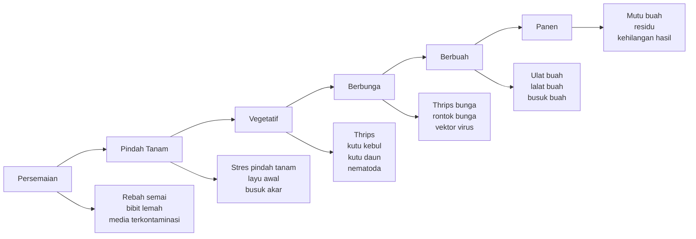

**Keterangan ilustrasi:**
Gambar ini menunjukkan bahwa risiko OPT pada cabai bergerak mengikuti fase pertumbuhan tanaman. Karena itu, pengendalian tidak boleh hanya dilakukan saat tanaman sudah berbuah. Program yang kuat harus dimulai sejak media semai, dilanjutkan pada persiapan lahan, pindah tanam, fase vegetatif, berbunga, hingga panen.

---

## **1.2 Masalah Umum Pengendalian OPT Cabai di Lapangan**

Salah satu masalah utama dalam pengendalian OPT cabai adalah ketergantungan yang terlalu tinggi pada pestisida kimia. Pestisida kimia memang memiliki tempat dalam budidaya cabai, terutama ketika populasi OPT sudah tinggi dan perlu tindakan cepat. Namun, jika pestisida menjadi satu-satunya strategi, kebun akan masuk ke pola pengendalian yang reaktif: hama muncul, lalu disemprot; muncul lagi, lalu dosis dinaikkan; gagal lagi, lalu bahan aktif diganti tanpa evaluasi menyeluruh.

Pola seperti ini memiliki beberapa risiko. Pertama, penggunaan insektisida yang berulang dengan cara kerja yang sama dapat meningkatkan tekanan seleksi terhadap hama. IRAC menjelaskan bahwa kunci manajemen resistensi adalah menurunkan tekanan seleksi yang muncul akibat penggunaan berlebihan atau penyalahgunaan insektisida, karena kondisi tersebut dapat memilih individu hama yang resisten dan mendorong perkembangan populasi resisten. ([Insecticide Resistance Action Committee][2])

Kedua, pestisida broad-spectrum dapat menurunkan populasi musuh alami. Dalam kebun cabai, musuh alami seperti kumbang koksi, lacewing, laba-laba, Orius, tungau predator, dan parasitoid sebenarnya membantu menekan populasi hama. Jika pestisida keras digunakan terlalu sering, hama sasaran mungkin turun sementara, tetapi predator dan parasitoid juga ikut berkurang. Akibatnya, ketika hama muncul kembali, kebun tidak lagi memiliki penyeimbang alami yang cukup.

Ketiga, residu pestisida menjadi perhatian penting, terutama untuk pasar yang memiliki standar keamanan pangan lebih ketat. Codex Alimentarius menjelaskan bahwa Maximum Residue Limit/MRL adalah batas tertinggi residu pestisida yang secara legal diperbolehkan pada pangan atau pakan ketika pestisida digunakan sesuai praktik pertanian yang baik. Artinya, pengendalian OPT tidak hanya dinilai dari berhasil atau tidaknya membunuh hama, tetapi juga dari keamanan hasil panen. ([FAOHome][3])

Keempat, biaya pengendalian OPT dapat meningkat jika strategi yang digunakan hanya bersifat reaktif. Ketika petani baru bergerak setelah serangan berat, jumlah aplikasi biasanya lebih banyak, jenis pestisida yang digunakan lebih mahal, dan kerusakan tanaman sudah telanjur terjadi. Pada fase berbuah, kerusakan akibat ulat buah, lalat buah, atau virus tidak selalu bisa dipulihkan meskipun hama berhasil ditekan. Buah yang sudah rusak tetap menjadi kehilangan hasil.

Kelima, banyak kegagalan terjadi karena pengendalian tidak diarahkan pada titik masalah yang benar. Misalnya, kutu kebul banyak berada di bawah daun, tetapi penyemprotan hanya mengenai permukaan atas daun. Thrips banyak berada di pucuk, bunga, dan celah daun muda, tetapi aplikasi tidak menjangkau bagian tersebut. Penyakit akar diperlakukan seperti penyakit daun, padahal masalah utamanya ada pada tanah, drainase, bahan organik belum matang, atau akar yang sudah rusak. Kesalahan sasaran seperti ini membuat biaya pengendalian meningkat, tetapi hasilnya tetap rendah.

Masalah-masalah tersebut menunjukkan bahwa pengendalian OPT cabai tidak cukup hanya mengandalkan “produk”. Yang dibutuhkan adalah sistem. Produk pengendali, baik kimia maupun hayati, harus ditempatkan pada waktu yang tepat, sasaran yang tepat, dosis yang tepat, dan dikombinasikan dengan tindakan budidaya yang mendukung.

---

## **1.3 Mengapa Agen Hayati Menjadi Penting**

Agen hayati menjadi penting karena menawarkan pendekatan yang lebih preventif dan ekologis dalam pengendalian OPT cabai. Agen hayati dapat membantu menekan penggunaan pestisida kimia berlebihan, menjaga keberadaan musuh alami, mendukung kesehatan tanah dan akar, serta mengurangi risiko residu. FAO menjelaskan bahwa agen pengendali hayati dapat berkontribusi dalam PHT karena umumnya memiliki risiko lebih rendah terhadap kesehatan dan lingkungan serta dapat kompatibel dengan banyak organisme menguntungkan. ([FAOHome][4])

Pada penyakit tanah dan akar, agen hayati seperti Trichoderma, Bacillus, Pseudomonas, Gliocladium/Clonostachys, dan Streptomyces dapat membantu membangun lingkungan rizosfer yang lebih sehat. Mikroba tersebut dapat berkompetisi dengan patogen, menghasilkan senyawa penghambat, membantu kolonisasi akar, atau merangsang ketahanan tanaman. Pada cabai, pendekatan ini penting karena banyak penyakit serius berawal dari tanah dan sering sulit dikendalikan jika tanaman sudah menunjukkan gejala berat.

Pada hama tajuk, agen hayati seperti Beauveria bassiana, Metarhizium anisopliae, Lecanicillium lecanii, Isaria/Cordyceps fumosorosea, Bacillus thuringiensis/Bt, dan NPV dapat digunakan untuk menekan hama tertentu. Jamur entomopatogen dapat membantu menekan hama pengisap seperti thrips, kutu kebul, dan kutu daun. Bt dan NPV dapat digunakan untuk menekan ulat, terutama ketika larva masih kecil. Predator dan parasitoid juga berperan penting sebagai bagian dari sistem alami yang menahan populasi hama agar tidak cepat meledak.

Namun, agen hayati harus dipahami dengan benar. Agen hayati bukan “racun cepat” seperti sebagian pestisida kimia kontak. Efeknya sering lebih lambat, tetapi manfaatnya dapat lebih stabil jika digunakan sejak awal dan didukung oleh lingkungan kebun yang sesuai. Penggunaan agen hayati paling baik dilakukan secara preventif, bukan sebagai tindakan terakhir saat tanaman sudah rusak berat. Bila digunakan terlambat, hasilnya sering mengecewakan, bukan karena agen hayatinya tidak berguna, tetapi karena waktu aplikasinya sudah tidak tepat.

Agen hayati juga bukan pengganti tunggal semua metode pengendalian. Pada kondisi tertentu, pestisida kimia tetap diperlukan sebagai tindakan koreksi, terutama jika populasi OPT sudah melewati ambang kendali dan kerusakan berlangsung cepat. Perbedaannya, dalam sistem yang baik, pestisida kimia dipakai secara selektif dan terukur, bukan sebagai kebiasaan rutin tanpa monitoring.

Dengan demikian, nilai utama agen hayati bukan hanya sebagai produk pengendali OPT, tetapi sebagai bagian dari strategi budidaya cabai yang lebih berkelanjutan. Agen hayati membantu membangun sistem kebun yang lebih sehat: tanah lebih hidup, akar lebih terlindungi, musuh alami lebih terjaga, dan tekanan pestisida kimia dapat dikurangi.

### **Ilustrasi 1.2. Peran Agen Hayati dalam Sistem Pengendalian OPT Cabai**

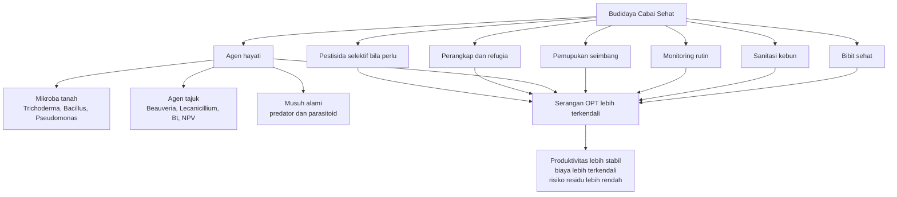

**Keterangan ilustrasi:**
Agen hayati tidak berdiri sendiri. Ia bekerja paling baik jika berada dalam sistem yang juga mencakup bibit sehat, sanitasi, monitoring, pemupukan seimbang, perangkap, refugia, dan penggunaan pestisida selektif bila diperlukan.

---

## **1.4 Posisi Utama Tulisan**

Tulisan ini menempatkan agen hayati sebagai bagian penting dari Pengendalian Hama Terpadu/PHT pada cabai. PHT sendiri bukan berarti anti-pestisida kimia. FAO mendefinisikan PHT sebagai pertimbangan hati-hati terhadap semua teknik pengendalian OPT yang tersedia, lalu mengintegrasikan tindakan yang tepat untuk menekan perkembangan populasi OPT, menumbuhkan tanaman sehat, dan meminimalkan penggunaan pestisida serta risiko terhadap kesehatan manusia dan lingkungan. ([FAOHome][5])

Dengan posisi tersebut, agen hayati tidak perlu dipertentangkan secara kaku dengan pestisida kimia. Keduanya memiliki peran berbeda. Agen hayati lebih kuat sebagai fondasi pencegahan, stabilisasi ekosistem, kesehatan tanah, perlindungan akar, dan konservasi musuh alami. Pestisida kimia lebih tepat diposisikan sebagai alat koreksi saat serangan sudah melewati ambang kendali, dengan syarat digunakan secara selektif, sesuai label, memperhatikan rotasi bahan aktif, dan tidak merusak program hayati yang sedang dibangun.

Prinsip utama yang perlu dipegang adalah sebagai berikut:

> Dalam budidaya cabai, agen hayati berperan sebagai fondasi pencegahan dan stabilitas kebun, sedangkan pestisida kimia berperan sebagai alat koreksi bila populasi OPT sudah melewati ambang kendali. Keduanya harus ditempatkan dalam sistem PHT, bukan digunakan secara sembarangan.

Karena itu, pembahasan pada bab-bab berikutnya akan diarahkan pada cara memahami agen hayati secara tepat, memilih agen hayati berdasarkan sasaran OPT, mengintegrasikannya dengan pupuk dan pestisida kimia, menyusun jadwal aplikasi dari persemaian sampai panen, menentukan dosis praktis, melakukan aktivasi dan penyimpanan, serta menghindari kesalahan umum yang sering membuat agen hayati gagal bekerja di lapangan.

Bab pendahuluan ini menjadi dasar pemahaman bahwa keberhasilan pengendalian OPT cabai tidak ditentukan oleh satu produk, satu kali semprot, atau satu metode tunggal. Keberhasilan ditentukan oleh sistem yang konsisten. Dalam sistem tersebut, agen hayati menjadi salah satu pilar utama untuk menjaga cabai tetap sehat, produktif, dan lebih aman bagi petani, konsumen, serta lingkungan.

<ResourceBox
  title="Artikel Terkait:"
  items={[
    {
      name: 'README — Framework Praktis Memulai Bisnis Agribisnis Terpadu di Lahan Gumuk Berlereng',
      href: '/blog/agri/kebon/agribisnis-gumuk/README',
    },
    {
      name: 'Proposal Pembangunan Sistem Drip Irrigation',
      href: '/blog/agri/kebon/proposal-pembangunan-drip-irigation',
    },
    {
      name: 'PROPOSAL RENCANA KERJA PENGEMBANGAN KEBUN GUMUK 1 TAHUN',
      href: '/blog/agri/kebon/agribisnis-gumuk/proposal-pengembangan-gumuk',
    },
    {
      name: 'OPT Penggagal Panen pada Cabai Rawit dan Cabai Besar',
      href: '/blog/agri/pengendalian-opt-cabai',
    },
    {
      name: 'Pedoman lengkap bergambar pengendalian OPT cabai - kutu kebul dan thrips',
      href: '/blog/agri/pengendalian-kutu-kebul-thrips',
    },
    {
      name: 'Panduan Praktis Pembiakan Trichoderma dari Starter Komersial',
      href: '/blog/agri/agen-hayati/trichoderma-pembiakan',
    },
    {
      name: 'Panduan Praktis Integrasi PGPM, Pupuk Kimia, dan Pestisida Kimia pada Budidaya Cabai Rawit dan Cabai Besar',
      href: '/blog/agri/agen-hayati/panduan-praktis-integrasi-pgpm-cabai',
    },
    {
      name: 'Rancangan Bioreactor Sederhana untuk Pembiakan PGPM Cair dan Padat Skala Petani',
      href: '/blog/agri/agen-hayati/bioreactor-design',
    },
    {
      name: 'Panduan Lengkap Pengendalian Lalat Buah di Kebun Campuran',
      href: '/blog/agri/lalat-buah',
    },
    {
      name: 'Panduan Praktis Talas untuk Kebun Gumuk',
      href: '/blog/agri/kebon/budidaya-talas-gumuk',
    },
    {
      name: 'README - Pupuk Tepat, Panen Untung - Model Low-Lab untuk Petani Makmur di Gambiran',
      href: '/blog/agri/pupuk-tepat-panen-untung/README',
    },
  ]}
/>

[1]: https://hortikultura.pertanian.go.id/kendalikan-inflasi-direktorat-jenderal-hortikultura-kementan-adakan-forum-cabai-nasional-2024/?utm_source=chatgpt.com 'Kendalikan Inflasi, Direktorat Jenderal Hortikultura Kementan ...'
[2]: https://irac-online.org/documents/principles-of-irm/?utm_source=chatgpt.com 'General Principles of Insecticide Resistance Management ...'
[3]: https://www.fao.org/fao-who-codexalimentarius/codex-texts/maximum-residue-limits/en/?utm_source=chatgpt.com 'Maximum Residue Limits (MRLs)'
[4]: https://www.fao.org/pesticide-registration-toolkit/special-topics/biological-pest-control-agents-bpca/introduction/en/?utm_source=chatgpt.com 'Introduction: Biological Pest Control Agents'
[5]: https://www.fao.org/pest-and-pesticide-management/ipm/integrated-pest-management/en/?utm_source=chatgpt.com 'Integrated Pest Management (IPM)'

---

# **BAB 2. Dasar Teori Agen Hayati**

Bab ini menjelaskan dasar teori agen hayati agar penggunaannya pada cabai tidak dipahami secara keliru. Dalam praktik lapangan, istilah agen hayati sering dicampuradukkan dengan pupuk hayati, PGPR, PGPM, biopestisida, mikroba antagonis, atau musuh alami. Padahal, setiap istilah memiliki ruang lingkup dan fungsi yang berbeda. Pemahaman ini penting karena kesalahan istilah sering berlanjut menjadi kesalahan aplikasi di kebun: salah memilih produk, salah waktu aplikasi, salah sasaran OPT, atau salah mencampur dengan pupuk dan pestisida kimia. Materi bab ini disusun sebagai dasar sebelum masuk ke pembahasan teknis penggunaan agen hayati pada cabai.

---

## **2.1 Pengertian Agen Hayati**

Agen hayati adalah organisme hidup atau produk biologis yang digunakan untuk menekan perkembangan organisme pengganggu tanaman/OPT. Dalam konteks pengendalian tanaman, agen hayati dapat berupa mikroorganisme, musuh alami, atau organisme lain yang bekerja melalui mekanisme biologis untuk menghambat, menyerang, memangsa, memarasit, atau mengganggu siklus hidup OPT. FAO menjelaskan bahwa istilah biological pest control agents atau biopestisida tidak selalu memiliki definisi tunggal yang disepakati secara global, tetapi umumnya mencakup produk berbasis mikroba, botani, atau semiokimia yang digunakan dalam pengendalian OPT. ([FAOHome][1])

Dalam arti praktis untuk budidaya cabai, agen hayati dapat dipahami sebagai “alat biologis” yang membantu menjaga tanaman tetap sehat dan menekan tekanan OPT. Agen hayati tidak bekerja seperti bahan kimia sintetis yang langsung membunuh dalam waktu singkat. Sebagian agen hayati bekerja dengan cara menguasai ruang tumbuh, bersaing dengan patogen, menghasilkan senyawa penghambat, menginfeksi hama, atau menjaga keseimbangan populasi hama melalui predator dan parasitoid.

Pada cabai, agen hayati digunakan untuk beberapa tujuan utama. Pertama, menekan penyakit tanah dan penyakit akar seperti rebah semai, layu Fusarium, busuk akar, dan layu yang berhubungan dengan kondisi rizosfer tidak sehat. Kedua, menekan nematoda, terutama nematoda puru akar yang dapat merusak sistem perakaran. Ketiga, membantu mengendalikan hama pengisap seperti thrips, kutu kebul, dan kutu daun. Keempat, membantu menekan ulat melalui agen seperti _Bacillus thuringiensis_ atau NPV. Kelima, menjaga keseimbangan ekosistem kebun melalui konservasi predator dan parasitoid.

Agen hayati pada cabai dapat dibagi menjadi beberapa kelompok besar. Kelompok pertama adalah **jamur antagonis**, seperti _Trichoderma_ dan _Gliocladium/Clonostachys_. Kelompok ini terutama digunakan untuk menekan patogen tanah dan mendukung kesehatan akar. _Trichoderma_, misalnya, dikenal sebagai mikroba rizosfer yang dapat bersaing dengan patogen, menghambat pertumbuhan jamur patogen, serta membantu tanaman lebih siap menghadapi tekanan penyakit.

Kelompok kedua adalah **bakteri antagonis**, seperti _Bacillus_, _Pseudomonas_, dan _Streptomyces_. Bakteri ini dapat berperan di daerah akar maupun permukaan tanaman. Sebagian strain mampu menghasilkan senyawa penghambat patogen, membantu kolonisasi akar, melarutkan hara tertentu, atau merangsang ketahanan tanaman. Karena itu, beberapa bakteri dapat memiliki dua peran sekaligus: sebagai agen hayati dan sebagai mikroba pemacu pertumbuhan tanaman.

Kelompok ketiga adalah **jamur entomopatogen**, yaitu jamur yang dapat menyebabkan penyakit pada serangga. Contohnya _Beauveria bassiana_, _Metarhizium anisopliae_, _Lecanicillium lecanii_, dan _Isaria/Cordyceps fumosorosea_. Pada cabai, kelompok ini banyak digunakan untuk membantu menekan hama pengisap bertubuh lunak seperti thrips, kutu kebul, dan kutu daun. Jamur entomopatogen membutuhkan kondisi aplikasi yang sesuai, terutama kelembapan cukup, paparan sinar matahari tidak terlalu kuat, dan sasaran semprot yang tepat.

Kelompok keempat adalah **bakteri entomopatogen**, terutama _Bacillus thuringiensis_ atau Bt. Bt banyak digunakan untuk mengendalikan ulat karena menghasilkan protein toksin tertentu yang bekerja setelah termakan oleh larva. Artinya, Bt harus mengenai bagian tanaman yang dimakan ulat, dan hasil terbaik biasanya diperoleh ketika larva masih kecil.

Kelompok kelima adalah **virus serangga**, seperti NPV, SlNPV, dan HaNPV. NPV bersifat relatif spesifik terhadap kelompok ulat tertentu. SlNPV umumnya digunakan untuk _Spodoptera_, sedangkan HaNPV untuk _Helicoverpa_. Karena bersifat spesifik, NPV relatif aman terhadap banyak musuh alami, tetapi keberhasilannya sangat bergantung pada ketepatan sasaran dan fase hama.

Kelompok keenam adalah **predator**, yaitu musuh alami yang memangsa hama. Contohnya kumbang koksi, lacewing, _Orius_, laba-laba, dan tungau predator. Predator penting karena dapat membantu menekan populasi hama secara alami, terutama jika kebun tidak terlalu sering disemprot pestisida broad-spectrum.

Kelompok ketujuh adalah **parasitoid**, yaitu serangga yang hidup pada atau di dalam tubuh inang dan akhirnya membunuh inang tersebut. Contohnya _Trichogramma_ untuk telur ulat, _Encarsia_ dan _Eretmocerus_ untuk kutu kebul, serta _Aphidius_ dan _Aphelinus_ untuk kutu daun. Parasitoid biasanya lebih sensitif terhadap insektisida keras, sehingga keberadaannya sangat bergantung pada cara pengelolaan pestisida di kebun.

### **Ilustrasi 2.1. Kelompok Utama Agen Hayati pada Cabai**

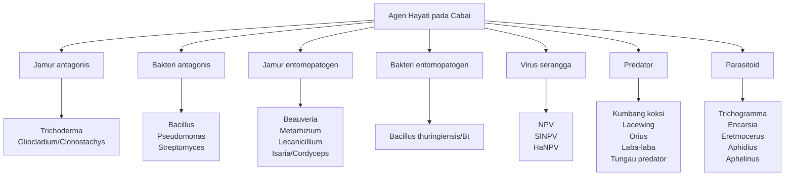

**Keterangan ilustrasi:**
Agen hayati tidak hanya berarti mikroba. Dalam pengendalian OPT cabai, agen hayati mencakup mikroba antagonis, mikroba patogen serangga, virus serangga, predator, dan parasitoid. Karena kelompoknya berbeda, cara aplikasi, sasaran OPT, dan kompatibilitasnya juga berbeda.

---

## **2.2 Istilah Akademik dan Teknis yang Perlu Dipahami**

Salah satu penyebab kebingungan dalam penggunaan agen hayati adalah banyaknya istilah yang mirip. Di lapangan, istilah agen hayati, PGPR, pupuk hayati, biopestisida, dan mikroba antagonis sering dianggap sama. Padahal, istilah-istilah tersebut memiliki perbedaan fungsi. Kesalahan memahami istilah dapat menyebabkan kesalahan memilih produk. Misalnya, produk pupuk hayati yang berfungsi membantu serapan hara belum tentu efektif untuk menekan _Fusarium_. Sebaliknya, produk _Beauveria_ untuk hama pengisap tidak tepat bila digunakan untuk memperbaiki serapan fosfat.

Tabel berikut merangkum istilah penting yang perlu dipahami sebelum membahas aplikasi agen hayati secara teknis.

| Istilah                                     | Makna praktis                                                                                    |
| ------------------------------------------- | ------------------------------------------------------------------------------------------------ |
| **Agen hayati**                             | Organisme hidup yang digunakan untuk menekan OPT.                                                |
| **Agens pengendali hayati/APH**             | Istilah yang umum dipakai dalam konteks pengendalian hayati.                                     |
| **Biological control agent/BCA**            | Istilah internasional untuk agen pengendali hayati.                                              |
| **Microbial biological control agent/MBCA** | Agen hayati berbasis mikroba.                                                                    |
| **Biopestisida**                            | Produk pengendali OPT berbahan aktif organisme hidup, metabolit alami, atau bahan biologis lain. |
| **Mikroba antagonis**                       | Mikroba yang menghambat patogen melalui kompetisi, antibiosis, atau parasitisme.                 |
| **Musuh alami**                             | Organisme yang secara alami menekan populasi hama, seperti predator dan parasitoid.              |
| **PGPM**                                    | _Plant Growth-Promoting Microorganisms_, mikroorganisme pemacu pertumbuhan tanaman.              |
| **PGPR**                                    | _Plant Growth-Promoting Rhizobacteria_, bakteri pemacu pertumbuhan di daerah akar.               |
| **PGPF**                                    | _Plant Growth-Promoting Fungi_, jamur pemacu pertumbuhan tanaman.                                |
| **Pupuk hayati/biofertilizer**              | Mikroba yang membantu ketersediaan atau serapan hara.                                            |

Istilah **agen hayati** dan **agens pengendali hayati/APH** biasanya digunakan ketika fokus pembicaraan adalah pengendalian OPT. Artinya, organisme tersebut dipakai karena memiliki kemampuan menekan patogen, hama, nematoda, atau organisme pengganggu lainnya. Dalam literatur internasional, istilah yang sering digunakan adalah **biological control agent/BCA**. Untuk agen hayati berbasis mikroba, istilah yang lebih spesifik adalah **microbial biological control agent/MBCA**.

Istilah **biopestisida** sedikit lebih luas. EPA mendefinisikan biopestisida sebagai jenis pestisida yang berasal dari bahan alami seperti hewan, tumbuhan, bakteri, dan mineral tertentu. EPA juga membagi biopestisida ke dalam tiga kelompok besar, yaitu pestisida biokimia, pestisida mikroba, dan _plant-incorporated protectants_ atau PIP. ([US EPA][2])

Dalam tulisan ini, istilah biopestisida digunakan terutama untuk produk biologis yang diformulasikan dan diaplikasikan untuk mengendalikan OPT. Contohnya produk berbahan aktif _Beauveria_, Bt, NPV, atau _Trichoderma_. Namun, tidak semua agen hayati selalu hadir sebagai produk komersial. Predator dan parasitoid di kebun, misalnya, juga termasuk agen hayati atau musuh alami, meskipun tidak selalu dibeli sebagai produk.

Istilah **mikroba antagonis** digunakan untuk mikroorganisme yang menghambat patogen. Mikroba ini dapat bekerja melalui kompetisi ruang dan nutrisi, antibiosis, mikoparasitisme, atau induksi ketahanan tanaman. Contoh mikroba antagonis pada cabai adalah _Trichoderma_, _Bacillus_, _Pseudomonas_, dan _Streptomyces_.

Istilah **musuh alami** lebih sering digunakan dalam konteks pengendalian hama. Musuh alami mencakup predator, parasitoid, dan patogen serangga. Predator memangsa hama secara langsung, sedangkan parasitoid memanfaatkan tubuh hama sebagai inang. Jamur entomopatogen seperti _Beauveria_ juga dapat disebut sebagai musuh alami dalam arti luas karena menyebabkan penyakit pada serangga.

Sementara itu, **PGPM**, **PGPR**, dan **PGPF** berhubungan dengan mikroorganisme pemacu pertumbuhan tanaman. PGPM adalah istilah umum untuk mikroba yang membantu pertumbuhan tanaman. PGPR adalah bakteri pemacu pertumbuhan di daerah akar, sedangkan PGPF adalah jamur pemacu pertumbuhan tanaman. PGPR diketahui dapat mendukung pertumbuhan tanaman melalui berbagai mekanisme, seperti pelarutan fosfat, produksi siderofor, fiksasi nitrogen biologis, produksi hormon tumbuh, dan induksi ketahanan tanaman. ([PMC][3])

Istilah **pupuk hayati** atau **biofertilizer** berfokus pada fungsi hara. Produk ini biasanya mengandung mikroba yang membantu ketersediaan atau serapan unsur hara, misalnya mikroba pelarut fosfat, penambat nitrogen, atau mikroba yang membantu ketersediaan kalium. Pupuk hayati tidak otomatis berfungsi sebagai pengendali OPT, kecuali mikroba di dalamnya memang terbukti memiliki fungsi antagonis terhadap patogen atau hama tertentu.

### **Ilustrasi 2.2. Hubungan Istilah Agen Hayati, Biopestisida, PGPM, dan Pupuk Hayati**

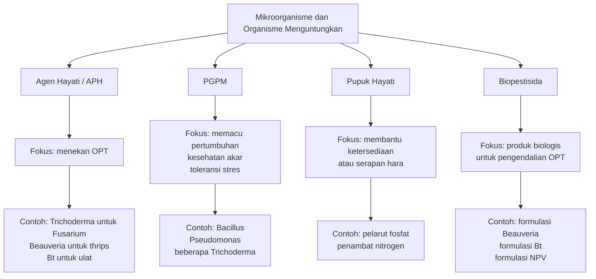

**Keterangan ilustrasi:**
Istilah-istilah tersebut saling beririsan, tetapi tidak identik. Satu mikroba dapat memiliki lebih dari satu fungsi, tetapi klaim fungsi harus tetap dibuktikan berdasarkan strain, formulasi, sasaran, dan cara aplikasi.

---

## **2.3 Agen Hayati vs PGPM**

Agen hayati dan PGPM sering dianggap sama karena banyak mikroba yang dapat menjalankan lebih dari satu peran. Misalnya, beberapa strain _Bacillus_, _Pseudomonas_, dan _Trichoderma_ dapat membantu pertumbuhan tanaman sekaligus menekan patogen. Namun, secara fungsi utama, keduanya tetap perlu dibedakan.

**Agen hayati** berfokus pada pengendalian OPT. Ukuran keberhasilannya adalah penurunan tekanan patogen, hama, nematoda, atau vektor penyakit. Contohnya _Trichoderma_ digunakan untuk menekan _Fusarium_, _Beauveria_ digunakan untuk membantu menekan thrips atau kutu kebul, dan Bt digunakan untuk menekan ulat.

**PGPM** berfokus pada peningkatan performa tanaman. Ukuran keberhasilannya adalah pertumbuhan akar lebih baik, tanaman lebih vigor, efisiensi hara meningkat, toleransi stres lebih baik, atau tanaman lebih siap menghadapi tekanan lingkungan. PGPM dapat membantu tanaman secara langsung melalui produksi hormon tumbuh, pelarutan hara, atau peningkatan serapan unsur tertentu. PGPM juga dapat membantu secara tidak langsung dengan menekan penyakit atau merangsang ketahanan tanaman. ([Frontiers][4])

Perbedaan ini penting dalam praktik budidaya cabai. Jika masalah utama adalah layu Fusarium, maka produk yang dibutuhkan adalah agen hayati yang memang memiliki fungsi antagonis terhadap patogen tanah, bukan sekadar pupuk hayati umum. Jika masalah utama adalah thrips di bunga, maka mikroba pemacu pertumbuhan akar tidak cukup menjadi jawaban. Sebaliknya, jika tanaman lemah karena akar kurang aktif dan tanah miskin bahan organik, maka pendekatan PGPM dan pupuk hayati dapat menjadi bagian penting dari pemulihan sistem akar.

Sebagian PGPM dapat berfungsi sebagai agen hayati bila mampu menekan patogen atau hama. Misalnya, _Bacillus_ dan _Pseudomonas_ tertentu dapat membantu pertumbuhan akar sekaligus menghambat patogen melalui antibiosis atau induksi ketahanan. Namun, tidak semua PGPM otomatis menjadi agen pengendali OPT. Produk yang hanya mengandung mikroba pelarut fosfat, misalnya, tidak dapat langsung diklaim mampu mengendalikan layu bakteri atau kutu kebul kecuali ada bukti fungsi tersebut.

Sebaliknya, tidak semua agen hayati berfungsi sebagai pupuk hayati. _Beauveria_ yang digunakan untuk menekan hama pengisap tidak didesain untuk melarutkan fosfat. NPV digunakan untuk menginfeksi ulat tertentu, bukan untuk meningkatkan serapan hara. Predator dan parasitoid membantu menekan populasi hama, tetapi tidak berperan sebagai penyedia unsur hara. Karena itu, pemilihan agen hayati harus selalu dimulai dari pertanyaan: “Masalah apa yang ingin dikendalikan?”

| Kelompok     | Fungsi utama                           | Contoh                                                                  |
| ------------ | -------------------------------------- | ----------------------------------------------------------------------- |
| Agen hayati  | Menekan OPT                            | _Trichoderma_ untuk _Fusarium_, _Beauveria_ untuk thrips, Bt untuk ulat |
| PGPM         | Memacu pertumbuhan tanaman             | _Bacillus_, _Pseudomonas_, beberapa _Trichoderma_                       |
| Pupuk hayati | Membantu ketersediaan hara             | Pelarut fosfat, penambat nitrogen                                       |
| Biopestisida | Produk biologis untuk pengendalian OPT | _Beauveria_, Bt, NPV, _Trichoderma_ formulasi                           |

Dalam penerapan di kebun cabai, hubungan antara agen hayati dan PGPM sebaiknya dipahami sebagai hubungan yang saling mendukung, bukan saling menggantikan. Agen hayati membantu menekan OPT. PGPM membantu membuat tanaman lebih kuat. Pupuk hayati membantu memperbaiki dukungan hara. Ketiganya dapat digunakan dalam satu program budidaya, tetapi tidak selalu boleh dicampur dalam satu tangki atau satu proses perbanyakan.

Contoh praktisnya sebagai berikut. Pada fase persemaian, _Trichoderma_ dan _Bacillus_ dapat digunakan untuk membantu menekan rebah semai sekaligus mendukung akar muda. Pada fase pindah tanam, _Trichoderma_, _Bacillus_, atau _Pseudomonas_ dapat membantu kolonisasi rizosfer. Pada fase vegetatif sampai berbunga, _Beauveria_ atau _Lecanicillium_ lebih relevan untuk hama pengisap di tajuk. Pada fase berbuah, Bt atau NPV lebih relevan untuk ulat. Artinya, fungsi agen harus disesuaikan dengan fase tanaman dan sasaran OPT.

### **Ilustrasi 2.3. Cara Membedakan Agen Hayati, PGPM, dan Pupuk Hayati di Lapangan**

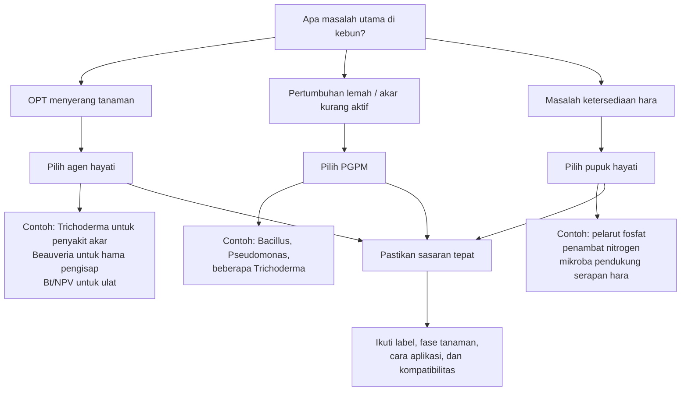

**Keterangan ilustrasi:**
Pemilihan produk biologis harus dimulai dari diagnosis masalah. Jangan menggunakan satu produk untuk semua masalah. Agen hayati, PGPM, dan pupuk hayati dapat saling melengkapi, tetapi fungsinya berbeda.

---

## **2.4 Batasan Penting Penggunaan Agen Hayati**

Agen hayati memiliki banyak kelebihan, tetapi juga memiliki batasan. Batasan ini perlu dipahami sejak awal agar pengguna tidak memiliki harapan yang keliru. Kesalahan paling umum adalah memperlakukan agen hayati seperti pestisida kimia kontak: disemprot sekali, lalu berharap hama atau penyakit hilang cepat. Cara berpikir seperti ini sering membuat petani kecewa, padahal masalahnya terletak pada cara penggunaan, bukan selalu pada kualitas agen hayatinya.

Batasan pertama adalah **kecepatan kerja**. Agen hayati tidak selalu bekerja secepat pestisida kimia. Jamur entomopatogen, misalnya, memerlukan waktu untuk menempel pada tubuh serangga, berkecambah, menginfeksi, dan menyebabkan kematian. Mikroba antagonis di tanah juga memerlukan waktu untuk beradaptasi, berkembang, dan menguasai daerah akar. Karena itu, hasil aplikasi agen hayati sering tidak langsung terlihat dalam satu atau dua hari.

Batasan kedua adalah **ketergantungan pada kondisi lingkungan**. Agen hayati adalah organisme hidup atau bahan biologis yang sensitif terhadap kondisi ekstrem. Suhu terlalu tinggi, sinar matahari terik, kelembapan terlalu rendah, pH ekstrem, air berklorin kuat, atau sisa pestisida di tangki dapat menurunkan efektivitasnya. Karena itu, aplikasi agen hayati harus memperhatikan kualitas air, waktu aplikasi, kebersihan tangki, kondisi cuaca, dan lokasi sasaran.

Batasan ketiga adalah **ketepatan waktu aplikasi**. Agen hayati paling efektif bila digunakan secara preventif atau saat populasi OPT masih rendah. Pada penyakit tanah, aplikasi terbaik dimulai dari media semai, persiapan lahan, dan awal tanam. Pada hama pengisap, aplikasi sebaiknya dilakukan sejak populasi awal terdeteksi. Pada ulat, Bt dan NPV paling efektif saat larva masih kecil. Jika aplikasi dilakukan setelah akar rusak berat, tanaman sudah banyak layu, atau ulat sudah besar, hasilnya biasanya jauh lebih rendah.

Batasan keempat adalah **ketepatan sasaran**. Agen hayati harus sampai ke lokasi OPT. Untuk penyakit akar, agen hayati harus berada di zona akar atau media tanam. Untuk kutu kebul, semprotan harus menjangkau bawah daun. Untuk thrips, aplikasi harus diarahkan ke pucuk, daun muda, dan bunga. Untuk ulat, Bt atau NPV harus mengenai bagian tanaman yang dimakan larva. Tanpa ketepatan sasaran, aplikasi dapat terlihat “sudah dilakukan”, tetapi sebenarnya tidak mengenai titik masalah.

Batasan kelima adalah **kompatibilitas**. Tidak semua agen hayati boleh dicampur dengan fungisida, insektisida, pupuk kimia pekat, perekat, atau bahan lain dalam satu tangki. Jamur seperti _Trichoderma_, _Beauveria_, _Metarhizium_, dan _Lecanicillium_ sangat berisiko terganggu bila dicampur dengan fungisida. Bakteri tertentu dapat terganggu oleh larutan pH ekstrem, klorin kuat, atau bahan kimia yang tidak kompatibel. Karena itu, campuran harus mengikuti label atau hasil uji kompatibilitas, bukan berdasarkan perkiraan.

Batasan keenam adalah **spesifisitas sasaran**. Tidak ada satu agen hayati yang mampu mengendalikan semua OPT. _Trichoderma_ baik untuk program penyakit tanah, tetapi bukan solusi utama untuk thrips. _Beauveria_ dapat membantu menekan hama pengisap, tetapi bukan pengendali utama layu Fusarium. Bt efektif untuk ulat tertentu, tetapi tidak relevan untuk nematoda. NPV sangat spesifik, sehingga harus dipilih sesuai jenis ulat sasaran. Prinsip ini sangat penting agar penggunaan agen hayati tidak menjadi asal campur.

Batasan ketujuh adalah **kualitas produk dan penyimpanan**. Karena berbasis organisme hidup atau bahan biologis, kualitas agen hayati dapat menurun bila disimpan di tempat panas, terkena sinar matahari langsung, terlalu lembap, atau melewati masa kedaluwarsa. Produk yang sudah rusak, terkontaminasi, berbau busuk, berlendir, atau berubah warna tidak layak digunakan. Dalam program cabai intensif, kualitas produk sama pentingnya dengan dosis dan jadwal aplikasi.

Dengan memahami batasan tersebut, agen hayati dapat digunakan secara lebih realistis dan efektif. Agen hayati bukan alat instan untuk menyelamatkan kebun yang sudah telanjur rusak berat. Agen hayati adalah bagian dari sistem pencegahan, pemeliharaan kesehatan tanaman, dan stabilisasi ekosistem kebun. Jika digunakan sejak awal, diarahkan pada sasaran yang tepat, didukung sanitasi dan monitoring, serta tidak dirusak oleh campuran yang salah, agen hayati dapat menjadi pilar penting dalam budidaya cabai yang lebih sehat dan berkelanjutan.

### **Ilustrasi 2.4. Faktor yang Menentukan Keberhasilan Agen Hayati**

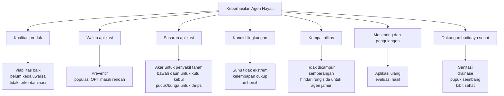

**Keterangan ilustrasi:**
Kegagalan agen hayati jarang disebabkan oleh satu faktor saja. Biasanya kegagalan terjadi karena kombinasi waktu aplikasi terlambat, sasaran tidak tepat, produk tidak segar, lingkungan tidak mendukung, atau campuran tidak kompatibel.

---

## **Ringkasan Bab 2**

Agen hayati adalah organisme hidup atau produk biologis yang digunakan untuk menekan OPT. Pada cabai, agen hayati mencakup jamur antagonis, bakteri antagonis, jamur entomopatogen, bakteri entomopatogen, virus serangga, predator, dan parasitoid. Setiap kelompok memiliki sasaran dan cara kerja berbeda.

Istilah agen hayati, PGPM, pupuk hayati, dan biopestisida harus dibedakan. Agen hayati berfokus pada pengendalian OPT. PGPM berfokus pada pertumbuhan tanaman. Pupuk hayati berfokus pada ketersediaan atau serapan hara. Biopestisida berfokus pada produk biologis untuk pengendalian OPT. Beberapa mikroba dapat memiliki lebih dari satu fungsi, tetapi penggunaannya tetap harus disesuaikan dengan sasaran.

Batasan utama agen hayati adalah efeknya tidak selalu cepat, membutuhkan kondisi lingkungan yang sesuai, harus diaplikasikan pada waktu dan sasaran yang tepat, serta tidak boleh dicampur sembarangan dengan bahan kimia. Karena itu, agen hayati paling baik digunakan sebagai bagian dari sistem PHT, bukan sebagai solusi tunggal atau tindakan terakhir saat serangan sudah berat.

[1]: https://www.fao.org/pesticide-registration-toolkit/special-topics/biological-pest-control-agents-bpca/introduction/en/?utm_source=chatgpt.com 'Introduction: Biological Pest Control Agents'
[2]: https://www.epa.gov/ingredients-used-pesticide-products/what-are-biopesticides?utm_source=chatgpt.com 'What are Biopesticides? | US EPA'
[3]: https://pmc.ncbi.nlm.nih.gov/articles/PMC6273255/?utm_source=chatgpt.com 'Role of Plant Growth Promoting Rhizobacteria in Agricultural ...'
[4]: https://www.frontiersin.org/journals/plant-science/articles/10.3389/fpls.2022.923880/full?utm_source=chatgpt.com 'Plant growth-promoting microorganisms as biocontrol ...'

---

# **BAB 3. OPT Utama pada Cabai dan Titik Serangannya**

Sebelum membahas agen hayati secara teknis, praktisi perlu memahami dulu **OPT utama pada cabai** dan **titik serangannya**. Agen hayati tidak boleh dipilih hanya karena “produk itu bagus” atau “sering dipakai petani lain”. Pemilihan agen hayati harus dimulai dari diagnosis: OPT apa yang menyerang, bagian tanaman mana yang diserang, pada fase apa serangan muncul, dan seberapa berat tingkat kerusakannya.

Cabai memiliki banyak titik rawan. Pada fase awal, masalah sering muncul di media semai, akar, dan pangkal batang. Setelah pindah tanam, risiko meluas ke penyakit tanah, nematoda, dan hama pengisap. Pada fase berbunga dan berbuah, serangan thrips, ulat buah, lalat buah, serta virus menjadi lebih menentukan hasil akhir. Karena itu, pengendalian OPT cabai harus dilihat sebagai rangkaian sejak persemaian sampai panen, bukan sebagai tindakan sesaat setelah tanaman rusak. Materi bab ini dikembangkan dari kerangka agen hayati untuk pengendalian OPT cabai yang telah disusun sebelumnya.

---

## **3.1 Penyakit Utama Cabai**

Penyakit pada cabai dapat menyerang sejak benih berkecambah sampai tanaman memasuki fase produksi. Secara praktis, penyakit cabai dapat dibagi menjadi dua kelompok besar: **penyakit tanah dan akar** serta **penyakit tajuk dan daun**. Penyakit tanah biasanya lebih sulit dikendalikan karena patogen berada di media tanam, tanah, akar, atau pangkal batang. Ketika gejala sudah terlihat di daun, sering kali kerusakan di akar sudah terjadi lebih dulu.

Beberapa penyakit penting pada cabai meliputi layu Fusarium, layu bakteri, rebah semai, busuk akar, busuk pangkal batang, dan penyakit daun yang berkembang pada kelembapan tinggi. New Mexico State University menjelaskan bahwa beberapa penyakit layu dan busuk akar pada cabai dapat menunjukkan gejala yang mirip, terutama layu berat dan kematian tanaman, sehingga diagnosis sering memerlukan pengamatan gejala, kondisi lahan, bahkan identifikasi penyebab secara lebih akurat. ([NMSU Publications][1])

### **3.1.1 Layu Fusarium**

Layu Fusarium merupakan salah satu penyakit penting pada cabai, terutama pada lahan yang ditanami solanaceae secara berulang. Penyakit ini disebabkan oleh jamur tanah dari kelompok _Fusarium_. Patogen menyerang jaringan pembuluh tanaman sehingga aliran air dan hara terganggu. Akibatnya, tanaman tampak layu meskipun tanah masih cukup lembap.

Gejala lapangan yang sering terlihat:

- tanaman layu pada siang hari, lalu sebagian pulih pada sore atau pagi hari pada tahap awal;
- daun bagian bawah menguning;
- pertumbuhan tanaman terhambat;
- layu berkembang bertahap dari sebagian cabang atau satu sisi tanaman;
- pada serangan berat, tanaman mengering dan mati;
- bila batang dibelah, jaringan pembuluh dapat tampak kecokelatan.

Titik serangan utama layu Fusarium adalah **akar dan jaringan pembuluh**. Karena itu, pengendaliannya harus dimulai dari media semai, tanah, kompos, lubang tanam, dan zona akar. Agen hayati seperti _Trichoderma_, _Bacillus_, _Pseudomonas_, dan _Gliocladium/Clonostachys_ lebih relevan digunakan sebagai pencegahan sejak awal, bukan setelah tanaman layu berat.

### **3.1.2 Layu bakteri**

Layu bakteri pada cabai umumnya muncul cepat dan sering menyebabkan tanaman tampak mendadak layu. Berbeda dengan beberapa penyakit jamur, pada layu bakteri daun dapat tetap terlihat hijau saat tanaman mulai layu. Penyakit ini biasanya lebih berat pada lahan lembap, drainase buruk, suhu hangat, dan tanah yang sudah memiliki riwayat penyakit.

Gejala lapangan yang sering terlihat:

- tanaman layu mendadak;
- daun masih relatif hijau pada fase awal;
- layu terjadi pada satu tanaman, lalu menyebar berkelompok;
- akar dan pangkal batang dapat tampak kurang sehat;
- bila batang dipotong dan dimasukkan ke air jernih, pada beberapa kasus dapat terlihat aliran lendir bakteri.

Titik serangan utama layu bakteri adalah **akar, pangkal batang, dan jaringan pembuluh**. Pengendalian tidak cukup hanya dengan menyemprot daun. Praktisi perlu memperbaiki drainase, menghindari genangan, menggunakan bibit sehat, melakukan rotasi tanaman, mencabut tanaman sakit berat, dan membangun mikroba antagonis di zona akar.

### **3.1.3 Rebah semai**

Rebah semai adalah penyakit penting pada fase awal. Penyakit ini menyerang benih, kecambah, atau bibit muda. Kerusakan pada fase ini sering dianggap kecil karena terjadi sebelum pindah tanam, padahal bibit yang lemah akan menghasilkan pertumbuhan tidak seragam di lapangan.

Gejala lapangan yang sering terlihat:

- benih gagal tumbuh atau kecambah membusuk;
- pangkal batang bibit mengecil, basah, atau cokelat;
- bibit roboh seperti terpotong di pangkal;
- serangan menyebar cepat pada media terlalu basah;
- muncul bercak busuk pada media semai yang tidak steril atau terlalu padat.

Titik serangan utama rebah semai adalah **media semai, akar muda, dan pangkal batang bibit**. Pada fase ini, penggunaan _Trichoderma_, _Gliocladium/Clonostachys_, _Bacillus_, atau _Pseudomonas_ lebih tepat dilakukan sebelum semai atau saat awal pertumbuhan bibit. UC IPM mencatat bahwa infeksi _Pythium_ dapat menyebabkan tanaman lada/pepper tampak kerdil atau kolaps, yang menjadi salah satu ciri masalah damping-off atau rebah semai. ([UC IPM][2])

### **3.1.4 Busuk akar**

Busuk akar dapat disebabkan oleh berbagai patogen tanah, termasuk kelompok jamur dan organisme mirip jamur. Penyakit ini sering berkembang pada tanah yang terlalu lembap, drainase buruk, penggunaan bahan organik belum matang, atau lahan yang terus-menerus ditanami cabai dan tanaman sefamili.

Gejala lapangan yang sering terlihat:

- tanaman tumbuh lambat;
- daun menguning;
- tanaman mudah layu saat panas;
- akar berwarna cokelat sampai hitam;
- akar rambut berkurang;
- kulit akar mudah terkelupas;
- tanaman mudah dicabut karena akar membusuk.

Titik serangan utama busuk akar adalah **akar utama, akar rambut, dan zona rizosfer**. Penyakit ini tidak bisa diselesaikan hanya dengan pestisida semprot tajuk. Perbaikan drainase, aplikasi bahan organik matang, pengaturan irigasi, dan kolonisasi agen hayati tanah menjadi langkah penting.

### **3.1.5 Busuk pangkal batang**

Busuk pangkal batang menyerang area peralihan antara akar dan batang. Penyakit ini sering muncul pada kondisi lembap, tajuk terlalu rimbun, sirkulasi udara buruk, atau bedengan terlalu basah. Pada beberapa kasus, gejalanya mirip dengan layu atau busuk akar sehingga perlu pengamatan bagian pangkal batang.

Gejala lapangan yang sering terlihat:

- pangkal batang berwarna cokelat atau kehitaman;
- jaringan pangkal batang melunak atau membusuk;
- tanaman layu meskipun daun awalnya masih hijau;
- serangan sering muncul pada titik lahan yang lembap atau tergenang;
- tanaman roboh atau mati bila serangan berat.

Titik serangan utama adalah **pangkal batang dan leher akar**. Pengendalian perlu diarahkan pada sanitasi, drainase, jarak tanam, pengaturan kelembapan, dan aplikasi agen hayati pada media atau tanah.

### **3.1.6 Penyakit daun pada kelembapan tinggi**

Selain penyakit tanah, cabai juga dapat terserang penyakit daun, terutama pada kondisi lembap. Penyakit daun dapat berupa bercak daun, embun, hawar, atau busuk yang berkembang ketika tajuk terlalu rapat, hujan sering terjadi, atau sirkulasi udara buruk.

Gejala lapangan yang sering terlihat:

- bercak kecil pada daun;
- bercak melebar dan menyatu;
- daun menguning lalu rontok;
- permukaan daun tampak berjamur pada kondisi lembap;
- penyakit berkembang cepat pada musim hujan;
- tajuk bagian bawah lebih dulu terserang karena lebih lembap.

Titik serangan utama adalah **daun, tangkai, pucuk, dan kadang bunga atau buah muda**. Pengendalian penyakit daun membutuhkan kombinasi sanitasi, pengurangan kelembapan tajuk, jarak tanam yang baik, pemangkasan selektif bila diperlukan, serta penggunaan agens hayati atau fungisida selektif sesuai kondisi. UC IPM mencatat beberapa gejala penyakit daun pada pepper, seperti bercak bakteri yang awalnya tampak berair lalu berubah cokelat, serta gray mold yang tampak seperti lapisan abu-abu kecokelatan pada daun atau batang. ([UC IPM][2])

### **Ilustrasi 3.1. Titik Serangan Penyakit Utama pada Tanaman Cabai**

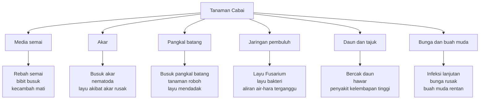

**Keterangan ilustrasi:**
Penyakit cabai tidak selalu dimulai dari daun. Banyak penyakit penting justru dimulai dari media semai, akar, pangkal batang, atau jaringan pembuluh. Karena itu, agen hayati untuk penyakit tanah harus ditempatkan di zona akar dan diberikan sejak awal.

---

## **3.2 Hama Utama Cabai**

Hama pada cabai dapat dibagi berdasarkan cara merusaknya. Ada hama pengisap seperti thrips, kutu kebul, kutu daun, dan tungau. Ada hama pengunyah seperti ulat grayak dan ulat buah. Ada hama perusak buah seperti lalat buah. Ada pula hama tanah yang merusak benih, akar, atau pangkal batang tanaman muda.

Hama pengisap sering tampak kecil, tetapi dampaknya besar karena merusak pucuk, daun muda, bunga, dan dapat berperan sebagai vektor penyakit. Hama pengunyah dapat merusak daun dan buah secara langsung. Hama buah menurunkan mutu panen, sedangkan hama tanah sering menyebabkan tanaman muda tumbuh tidak seragam atau mati sejak awal.

### **3.2.1 Thrips**

Thrips adalah hama kecil yang sering menyerang pucuk, daun muda, dan bunga cabai. Ukurannya kecil sehingga sering terlambat terdeteksi. Pada fase berbunga, thrips menjadi sangat penting karena kerusakan pada bunga dapat menurunkan pembentukan buah.

Gejala lapangan yang sering terlihat:

- daun muda keriting, menggulung, atau mengerut;
- permukaan daun tampak keperakan atau kusam;
- pucuk tumbuh tidak normal;
- bunga rontok atau gagal berkembang;
- buah dapat menjadi burik atau tidak mulus;
- populasi sering meningkat pada kondisi kering.

Titik serangan utama thrips adalah **pucuk, daun muda, bunga, dan permukaan bawah daun**. Koppert menjelaskan bahwa thrips memiliki alat mulut peraut-pengisap, merusak tanaman dengan mengisap cairan sel, dan dapat menyebarkan virus. ([Koppert][3])

Untuk program agen hayati, thrips dapat ditekan dengan jamur entomopatogen seperti _Beauveria bassiana_, _Lecanicillium lecanii_, atau _Isaria/Cordyceps fumosorosea_. Namun, aplikasi harus diarahkan ke pucuk dan bunga, bukan hanya permukaan luar tajuk.

### **3.2.2 Kutu kebul**

Kutu kebul merupakan hama pengisap yang banyak ditemukan di bawah daun. Hama ini penting bukan hanya karena mengisap cairan tanaman, tetapi juga karena dapat menjadi vektor penyakit virus. Populasi kutu kebul sering meningkat pada kebun dengan sanitasi buruk, banyak gulma inang, dan penggunaan insektisida broad-spectrum yang menekan musuh alami.

Gejala lapangan yang sering terlihat:

- banyak serangga putih kecil beterbangan saat tanaman digoyang;
- koloni berada di bawah daun;
- daun menguning atau lemah;
- muncul embun madu/honeydew;
- permukaan daun dapat ditumbuhi embun jelaga;
- tanaman menunjukkan gejala virus seperti kuning, keriting, atau kerdil.

Titik serangan utama kutu kebul adalah **bagian bawah daun dan tajuk muda**. UC IPM mencatat bahwa whitefly menghasilkan honeydew pada daun dan sticky trap dapat berguna untuk mendeteksi migrasi awal ke lahan. ([UC IPM][2])

Dalam program hayati, aplikasi _Beauveria_, _Lecanicillium_, atau _Isaria_ harus diarahkan ke bawah daun. Jika penyemprotan hanya mengenai permukaan atas daun, hasilnya sering rendah karena koloni utama tidak terkena.

### **3.2.3 Kutu daun**

Kutu daun atau aphid menyerang daun muda, pucuk, dan bagian tanaman yang lunak. Hama ini berkembang cepat karena reproduksinya tinggi. Selain merusak langsung, kutu daun juga dapat berperan sebagai vektor beberapa virus tanaman.

Gejala lapangan yang sering terlihat:

- pucuk menggulung atau mengeriting;
- daun muda menguning;
- koloni kutu bergerombol pada pucuk atau bawah daun;
- muncul embun madu;
- ada semut yang aktif naik-turun tanaman;
- tanaman tampak lemah dan pertumbuhan terhambat.

Titik serangan utama kutu daun adalah **pucuk, daun muda, dan bawah daun**. UC IPM menjelaskan bahwa green peach aphid pada pepper dapat hadir dalam bentuk bersayap maupun tidak bersayap, sedangkan Koppert mencatat aphid mengisap cairan tanaman dan dapat menyebabkan daun menggulung, layu, serta menguning. ([UC IPM][2])

Kutu daun dapat ditekan melalui konservasi predator seperti kumbang koksi, lacewing, dan syrphid, serta penggunaan jamur entomopatogen seperti _Beauveria_ atau _Lecanicillium_ bila kondisi mendukung.

### **3.2.4 Tungau**

Tungau sering menjadi masalah pada kondisi panas dan kering. Ukurannya sangat kecil sehingga sering baru terlihat setelah gejala cukup berat. Pada cabai, tungau dapat merusak daun muda dan menyebabkan perubahan bentuk daun.

Gejala lapangan yang sering terlihat:

- daun menguning atau berbintik;
- daun menggulung, mengerut, atau berubah bentuk;
- permukaan daun tampak kusam;
- pada tungau tertentu dapat terlihat jaring halus;
- tanaman tampak stres meskipun air cukup.

Titik serangan utama tungau adalah **permukaan bawah daun, daun muda, dan pucuk**. UC IPM mencatat bahwa broad mite dapat menyebabkan daun pepper memanjang, berkerut, dan menggulung ke bawah, sedangkan two-spotted spider mite dapat menyebabkan daun menguning dan menghasilkan anyaman/jaring pada tanaman. ([UC IPM][2])

Pengendalian tungau perlu menghindari penggunaan insektisida yang justru membunuh predator tungau. Dalam sistem hayati, keberadaan tungau predator dapat membantu menekan populasi tungau hama.

### **3.2.5 Ulat grayak**

Ulat grayak menyerang daun dan dapat menyebabkan kerusakan cepat bila populasi tinggi. Larva muda sering bergerombol dan mengikis daun, sedangkan larva lebih besar dapat membuat lubang besar pada daun atau menyerang bagian tanaman lain.

Gejala lapangan yang sering terlihat:

- daun berlubang;
- daun tinggal tulang pada serangan berat;
- terdapat kotoran ulat;
- larva muda bergerombol;
- tanaman muda dapat rusak cepat.

Titik serangan utama ulat grayak adalah **daun, pucuk, dan kadang buah muda**. UC IPM mencatat bahwa larva muda beet armyworm dapat membuat daun terskeletonisasi serta menghasilkan anyaman dan kotoran, sedangkan larva lebih tua mengunyah lubang pada daun dan buah. ([UC IPM][2])

Agen hayati yang relevan untuk ulat grayak adalah Bt, SlNPV, _Beauveria_, _Metarhizium_, dan parasitoid telur seperti _Trichogramma_. Aplikasi Bt dan NPV harus dilakukan saat larva masih kecil.

### **3.2.6 Ulat buah**

Ulat buah merusak bagian yang langsung bernilai ekonomi, yaitu buah cabai. Kerusakan pada buah sering menyebabkan buah tidak layak jual, mudah busuk, dan menjadi pintu masuk patogen sekunder.

Gejala lapangan yang sering terlihat:

- lubang pada buah;
- kotoran ulat di sekitar lubang;
- buah membusuk;
- larva ditemukan di dalam buah;
- buah rontok atau tidak layak panen.

Titik serangan utama ulat buah adalah **buah muda sampai buah menjelang panen**. Pengendalian harus berbasis monitoring telur dan larva muda. Jika larva sudah masuk ke dalam buah, efektivitas semprotan menurun karena hama terlindung di dalam jaringan buah. Bt, HaNPV, dan _Trichogramma_ lebih efektif bila digunakan sebelum larva besar atau sebelum masuk ke buah.

### **3.2.7 Lalat buah**

Lalat buah menjadi masalah serius pada fase berbuah. Serangan lalat buah menurunkan mutu panen karena larva berkembang di dalam buah. Buah yang terserang biasanya busuk, lunak, rontok, atau tidak dapat dijual.

Gejala lapangan yang sering terlihat:

- ada titik tusukan pada buah;
- buah menguning atau busuk sebelum waktunya;
- buah lunak dan berair;
- larva ditemukan di dalam buah;
- buah rontok;
- serangan meningkat bila buah terserang dibiarkan di lahan.

Titik serangan utama lalat buah adalah **buah**. Pengendalian lalat buah sangat bergantung pada sanitasi. Buah terserang harus dikumpulkan dan dimusnahkan agar tidak menjadi sumber perkembangan generasi berikutnya. Perangkap atraktan, sanitasi, dan konservasi parasitoid perlu dipadukan.

### **3.2.8 Hama tanah tertentu**

Hama tanah menyerang benih, akar, atau pangkal batang tanaman muda. Masalah ini sering terlihat sebagai pertumbuhan tidak seragam, tanaman muda mati, atau bibit hilang setelah pindah tanam.

Contoh gejala lapangan:

- tanaman muda rebah atau terpotong;
- akar rusak;
- pangkal batang tergigit;
- pertumbuhan tidak seragam;
- tanaman muda mati berkelompok.

UC IPM mencatat beberapa kerusakan hama tanah pada pepper, seperti cutworm yang dapat memotong daun bibit, ground beetle yang dapat menggirdle batang hingga tanaman kolaps, serta wireworm yang dapat merusak bibit muda. ([UC IPM][2])

Titik serangan utama hama tanah adalah **benih, akar, pangkal batang, dan tanaman muda**. Pengendalian perlu dimulai dari pengolahan lahan, sanitasi sisa tanaman, penggunaan kompos matang, dan monitoring awal setelah pindah tanam.

### **Ilustrasi 3.2. Titik Serangan Hama Utama pada Cabai**

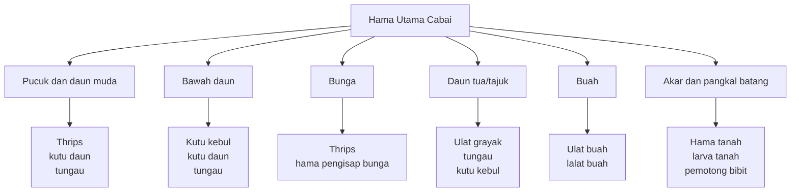

**Keterangan ilustrasi:**
Hama berbeda memiliki lokasi serangan berbeda. Aplikasi agen hayati harus diarahkan ke titik tersebut. Untuk kutu kebul, target utama adalah bawah daun. Untuk thrips, target utama adalah pucuk dan bunga. Untuk ulat buah dan lalat buah, monitoring harus difokuskan pada fase buah.

---

## **3.3 Nematoda pada Cabai**

Nematoda, terutama nematoda puru akar dari kelompok _Meloidogyne_, merupakan masalah penting pada lahan cabai intensif. Masalah ini sering tidak langsung terlihat karena nematoda menyerang akar di dalam tanah. Gejala di atas permukaan sering mirip dengan kekurangan hara, kekurangan air, atau gangguan akar biasa.

Nematoda puru akar menyebabkan terbentuknya puru atau bengkak pada akar. Puru ini mengganggu fungsi akar dalam menyerap air dan hara. University of Wisconsin Extension menjelaskan bahwa nematoda puru akar menyebabkan pembengkakan akar yang dapat menghambat pergerakan air dan hara; tanaman yang terinfeksi dapat tampak kerdil, layu, menguning, dan hasilnya menurun. ([Wisconsin Horticulture][4])

Gejala lapangan yang sering terlihat:

- tanaman kerdil;
- daun menguning seperti kekurangan hara;
- tanaman mudah layu saat siang;
- pertumbuhan tidak seragam;
- gejala muncul berkelompok atau berpola patch;
- akar memiliki puru atau bengkak;
- akar rambut berkurang;
- tanaman sulit pulih meskipun dipupuk.

Nematoda menjadi sangat penting pada lahan intensif karena populasinya dapat bertahan dan meningkat bila tanaman inang terus tersedia. Lahan yang terus-menerus ditanami cabai, tomat, terung, atau tanaman inang lain lebih berisiko mengalami peningkatan tekanan nematoda. Gulma inang juga dapat mempertahankan populasi nematoda di lahan.

Pengendalian nematoda harus dimulai **sebelum tanam**. Ini prinsip penting. Bila akar sudah rusak berat, tanaman sulit dipulihkan karena sistem penyerap air dan hara sudah terganggu. Aplikasi agen hayati nematoda seperti _Purpureocillium lilacinum_, _Pochonia chlamydosporia_, atau _Bacillus firmus_ lebih logis dilakukan pada fase persiapan lahan, media tanam, kompos, atau kocor tanah sebelum akar cabai berkembang penuh.

Selain agen hayati, pengelolaan nematoda harus dipadukan dengan:

- rotasi tanaman non-inang;
- sanitasi akar sisa tanaman sakit;
- penggunaan kompos matang;
- perbaikan struktur tanah;
- pengendalian gulma inang;
- penggunaan tanaman penekan nematoda bila sesuai;
- penghindaran pemindahan tanah terkontaminasi.

### **Ilustrasi 3.3. Hubungan Nematoda, Kerusakan Akar, dan Gejala Tajuk**

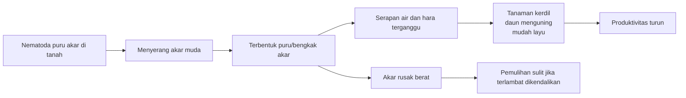

**Keterangan ilustrasi:**
Gejala nematoda terlihat di tajuk, tetapi sumber masalahnya berada di akar. Karena itu, pengendalian harus dilakukan sebelum tanam atau sejak awal pertumbuhan akar.

---

## **3.4 Virus pada Cabai dan Peran Vektor**

Penyakit virus pada cabai menjadi salah satu masalah paling sulit di lapangan. Virus tidak dapat dikendalikan seperti hama biasa. Setelah tanaman terinfeksi berat, tanaman tidak bisa “disembuhkan” dengan penyemprotan pestisida atau agen hayati. Karena itu, strategi utama pengelolaan virus adalah mencegah penularan, menekan vektor, menggunakan bibit sehat, menjaga sanitasi, dan mencabut tanaman yang menjadi sumber infeksi.

Virus pada cabai sering menimbulkan gejala seperti:

- daun kuning;
- daun keriting;
- daun menggulung;
- mosaik atau belang;
- tanaman kerdil;
- ruas memendek;
- pucuk tidak normal;
- bunga dan buah terganggu;
- buah kecil, cacat, atau tidak seragam.

Virus kuning dan virus keriting sering dikaitkan dengan aktivitas vektor. Kutu kebul, thrips, dan kutu daun berperan penting dalam penularan berbagai virus pada tanaman cabai. Kajian tentang virus pada _Capsicum_ menyebutkan bahwa banyak virus pada cabai ditularkan oleh aphid/kutu daun, whitefly/kutu kebul, atau thrips ketika serangga tersebut melakukan aktivitas makan; gejala umum infeksi virus meliputi tanaman kerdil, daun keriting, dan mosaik pada daun maupun buah. ([IntechOpen][5])

### **3.4.1 Kutu kebul sebagai vektor**

Kutu kebul penting karena dapat menularkan virus kuning dan beberapa penyakit virus lain. Populasi kutu kebul biasanya berada di bawah daun. Jika kebun memiliki banyak gulma inang, tanaman sakit dibiarkan, dan penyemprotan tidak menjangkau bawah daun, penularan dapat berlangsung cepat.

Strategi penting:

- gunakan bibit sehat;
- pasang perangkap kuning;
- periksa bawah daun;
- kendalikan gulma inang;
- cabut tanaman bergejala berat;
- gunakan agen hayati untuk menekan populasi vektor sejak awal;
- hindari insektisida broad-spectrum berlebihan yang membunuh musuh alami.

### **3.4.2 Thrips sebagai vektor**

Thrips berperan sebagai vektor beberapa virus, terutama yang berkaitan dengan gejala bercak, nekrosis, atau gangguan pertumbuhan. Karena thrips sering bersembunyi di pucuk dan bunga, pengendalian yang tidak menjangkau lokasi tersebut sering gagal.

Strategi penting:

- monitoring pucuk dan bunga;
- gunakan sticky trap biru atau kuning sesuai kebutuhan;
- semprot agen hayati ke pucuk dan bunga pada sore hari;
- jaga kebersihan gulma berbunga;
- hindari ledakan populasi thrips pada fase berbunga.

### **3.4.3 Kutu daun sebagai vektor**

Kutu daun dapat menularkan beberapa virus secara cepat. Koloni kutu daun sering berada pada pucuk dan bawah daun. Karena itu, tanaman muda harus dipantau sejak awal. Adanya semut pada tanaman juga dapat menjadi tanda adanya koloni kutu daun atau serangga penghasil embun madu.

Strategi penting:

- pantau pucuk dan daun muda;
- konservasi predator seperti kumbang koksi dan lacewing;
- tekan koloni awal sebelum menyebar;
- cabut tanaman sumber virus;
- hindari kebun terlalu rimbun dan penuh gulma inang.

### **3.4.4 Peran agen hayati terhadap virus**

Agen hayati tidak membunuh virus secara langsung di dalam tanaman. Ini harus ditegaskan agar tidak terjadi salah interpretasi. Jika tanaman cabai sudah terinfeksi virus berat, aplikasi _Beauveria_, _Trichoderma_, _Bacillus_, atau agen hayati lain tidak akan mengembalikan tanaman menjadi sehat seperti semula.

Peran agen hayati terhadap penyakit virus bersifat tidak langsung, yaitu:

- membantu menekan populasi vektor;
- menjaga keberadaan musuh alami;
- mendukung kesehatan tanaman agar lebih toleran terhadap stres;
- mengurangi ketergantungan pada insektisida broad-spectrum;
- membantu menjaga keseimbangan ekosistem kebun.

Tanaman yang sudah menunjukkan gejala virus berat sebaiknya dicabut dan dimusnahkan, terutama bila masih muda dan berpotensi menjadi sumber inokulum. Tanaman sakit yang dibiarkan di lahan dapat menjadi sumber virus bagi vektor, lalu vektor memindahkannya ke tanaman sehat.

### **Ilustrasi 3.4. Hubungan Virus, Vektor, dan Tanaman Sumber Infeksi**

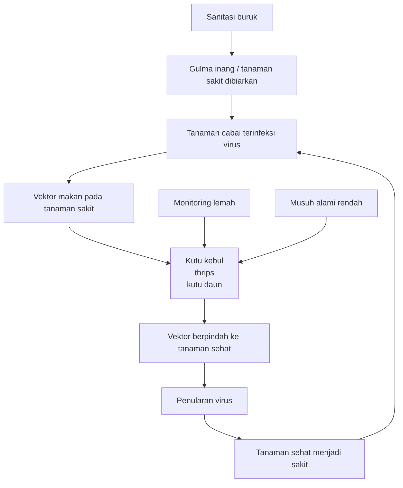

**Keterangan ilustrasi:**
Penyakit virus bertahan dan menyebar melalui hubungan antara tanaman sakit, vektor, dan tanaman sehat. Agen hayati membantu menekan vektor, tetapi tanaman yang sudah sakit berat tetap harus dicabut agar tidak menjadi sumber penularan.

---

## **Tabel 3.1. Ringkasan OPT Cabai, Titik Serangan, dan Implikasi Pengendalian**

| Kelompok OPT      | Contoh OPT                             | Titik serangan utama               | Gejala kunci                                    | Implikasi pengendalian                                            |
| ----------------- | -------------------------------------- | ---------------------------------- | ----------------------------------------------- | ----------------------------------------------------------------- |
| Penyakit tanah    | Layu Fusarium, busuk akar, rebah semai | Media semai, akar, pangkal batang  | Layu, akar cokelat, bibit roboh                 | Agen hayati harus diberikan sejak media semai dan persiapan lahan |
| Penyakit pembuluh | Layu Fusarium, layu bakteri            | Akar dan jaringan pembuluh         | Layu bertahap atau mendadak                     | Perlu sanitasi, drainase, bibit sehat, dan perlindungan akar      |
| Penyakit daun     | Bercak daun, hawar, gray mold          | Daun, tajuk, batang muda           | Bercak, daun menguning, lapisan jamur           | Kurangi kelembapan tajuk dan lakukan aplikasi tepat sasaran       |
| Hama pengisap     | Thrips, kutu kebul, kutu daun, tungau  | Pucuk, bunga, bawah daun           | Daun keriting, kuning, embun madu, bunga rontok | Semprot harus menjangkau pucuk, bunga, dan bawah daun             |
| Hama pengunyah    | Ulat grayak, ulat buah                 | Daun dan buah                      | Lubang daun, lubang buah, kotoran ulat          | Bt/NPV efektif saat larva masih kecil                             |
| Hama buah         | Lalat buah                             | Buah                               | Titik tusukan, buah busuk, larva dalam buah     | Sanitasi buah terserang dan perangkap wajib dilakukan             |
| Nematoda          | Nematoda puru akar                     | Akar                               | Akar berpuru, tanaman kerdil, mudah layu        | Pengendalian harus dimulai sebelum tanam                          |
| Virus             | Virus kuning, virus keriting, mosaik   | Seluruh tanaman, ditularkan vektor | Kuning, keriting, kerdil, mosaik                | Cabut tanaman sakit dan tekan vektor sejak awal                   |

---

## **Ringkasan Bab 3**

OPT utama pada cabai menyerang berbagai bagian tanaman, mulai dari media semai, akar, pangkal batang, daun, pucuk, bunga, hingga buah. Penyakit tanah seperti layu Fusarium, layu bakteri, rebah semai, busuk akar, dan busuk pangkal batang harus dikelola sejak awal karena ketika gejala sudah berat, pemulihan tanaman sulit dilakukan. Penyakit daun banyak berkembang pada kondisi lembap dan perlu dikendalikan melalui pengaturan tajuk, sanitasi, serta aplikasi yang tepat sasaran.

Hama utama cabai meliputi thrips, kutu kebul, kutu daun, tungau, ulat grayak, ulat buah, lalat buah, dan hama tanah tertentu. Setiap hama memiliki titik serangan berbeda, sehingga aplikasi agen hayati harus diarahkan sesuai lokasi hama. Kutu kebul banyak berada di bawah daun, thrips banyak menyerang pucuk dan bunga, ulat harus dikendalikan saat larva masih kecil, sedangkan lalat buah harus dikendalikan dengan sanitasi dan perangkap.

Nematoda puru akar merupakan masalah penting pada lahan cabai intensif karena menyerang akar dan menurunkan kemampuan tanaman menyerap air serta hara. Pengendalian nematoda harus dimulai sebelum tanam. Sementara itu, virus pada cabai tidak dapat dikendalikan langsung oleh agen hayati. Agen hayati berperan tidak langsung dengan menekan vektor dan menjaga keseimbangan kebun. Tanaman bergejala virus berat sebaiknya dicabut agar tidak menjadi sumber penularan bagi tanaman sehat.

[1]: https://pubs.nmsu.edu/_circulars/CR549/ '
			Chile Pepper Diseases | New Mexico State University - BE BOLD. Shape the Future.
		
		'
[2]: https://ipm.ucanr.edu/PMG/C604/m604gppestdamage.html 'Peppers: Harvest: Check Fruit for the Following Pests or their Damage—UC IPM'
[3]: https://www.koppert.com/plant-pests/ 'Plant Pests Overview - Biocontrol, Damage and Life Cycle'
[4]: https://hort.extension.wisc.edu/articles/root-knot-nematode/ 'Root-Knot Nematode – Wisconsin Horticulture'
[5]: https://www.intechopen.com/chapters/72053 'Management of Viruses and Viral Diseases of Pepper (Capsicum spp.) in Africa | IntechOpen'

---

# **BAB 4. Prinsip Kerja Agen Hayati**

Agen hayati tidak bekerja dengan satu cara. Ada agen hayati yang menekan patogen dengan cara menguasai ruang hidup di sekitar akar, ada yang menghasilkan senyawa penghambat, ada yang menyerang langsung jamur patogen, ada yang merangsang ketahanan tanaman, dan ada pula yang menginfeksi, memangsa, atau memarasit hama. Karena mekanismenya berbeda, cara aplikasinya juga berbeda. Inilah alasan mengapa agen hayati tidak boleh dipilih dan dicampur secara sembarangan. Bab ini membahas prinsip kerja utama agen hayati agar penggunaannya pada cabai lebih tepat sasaran.

Secara umum, mekanisme agen hayati dalam pengendalian OPT mencakup kompetisi, antibiosis, mikoparasitisme, induksi ketahanan tanaman, infeksi langsung pada hama, racun biologis yang harus termakan, parasitasi, dan predasi. Beberapa agen seperti _Trichoderma_ dapat bekerja melalui beberapa mekanisme sekaligus, misalnya kompetisi, antibiosis, mikoparasitisme, dan induksi ketahanan tanaman. Sementara itu, _Bacillus_ banyak dikaitkan dengan produksi senyawa antimikroba, enzim, siderofor, dan aktivasi ketahanan tanaman. ([Frontiers][1])

---

## **4.1 Kompetisi Ruang dan Nutrisi**

Kompetisi adalah mekanisme ketika mikroba menguntungkan bersaing dengan patogen untuk mendapatkan ruang hidup, makanan, dan sumber energi. Di sekitar akar tanaman terdapat zona yang disebut rizosfer, yaitu wilayah tanah yang dipengaruhi oleh aktivitas akar. Zona ini kaya eksudat akar, gula, asam amino, dan senyawa organik lain yang dapat dimanfaatkan mikroba. Bila rizosfer cepat dikuasai oleh mikroba menguntungkan, patogen akan lebih sulit berkembang.

Pada cabai, mekanisme kompetisi sangat penting untuk pencegahan penyakit tanah. Patogen seperti _Fusarium_, _Rhizoctonia_, atau patogen busuk akar membutuhkan ruang dan nutrisi untuk berkembang. Jika sejak awal media semai, kompos, bedengan, dan lubang tanam sudah dikolonisasi oleh mikroba baik, peluang patogen untuk mendominasi menjadi lebih kecil. Karena itu, agen hayati tanah lebih efektif diberikan sebelum serangan berat terjadi.

Contoh agen yang bekerja melalui kompetisi ruang dan nutrisi:

- _Trichoderma_;
- _Bacillus_;
- _Pseudomonas_.

_Trichoderma_ dikenal sebagai jamur yang cepat tumbuh dan mampu mengolonisasi bahan organik serta daerah akar. Dalam kondisi yang sesuai, _Trichoderma_ dapat bersaing dengan patogen tanah dalam memperebutkan tempat tumbuh dan nutrisi. _Bacillus_ dan _Pseudomonas_ juga dapat mengisi ruang di sekitar akar sehingga membantu membentuk komunitas mikroba yang lebih menguntungkan bagi tanaman. Mekanisme kompetisi termasuk salah satu mekanisme penting dalam pengendalian hayati oleh _Trichoderma_, bersama antibiosis, mikoparasitisme, dan induksi pertahanan tanaman. ([IntechOpen][2])

Dalam praktik cabai, kompetisi ruang dan nutrisi menjelaskan mengapa aplikasi agen hayati harus dimulai dari fase awal. Jika agen hayati baru diberikan setelah tanah sudah penuh patogen dan tanaman sudah layu berat, peluang keberhasilannya lebih kecil. Sebaliknya, bila _Trichoderma_, _Bacillus_, atau _Pseudomonas_ diberikan sejak media semai, persiapan lahan, dan pindah tanam, mikroba baik memiliki kesempatan lebih besar untuk menempati zona akar.

### **Implikasi Praktis pada Cabai**

Aplikasi berbasis kompetisi paling tepat dilakukan pada:

- media semai;
- kompos matang;
- bedengan sebelum tanam;
- lubang tanam;
- kocor awal setelah pindah tanam;
- pemulihan tanah setelah musim tanam selesai.

Prinsipnya sederhana: **jangan menunggu akar diserang patogen baru memasukkan mikroba baik**. Pada penyakit tanah, siapa yang lebih dulu menguasai zona akar sering menentukan arah perkembangan penyakit.

### **Ilustrasi 4.1. Kompetisi Mikroba Baik dan Patogen di Zona Akar**

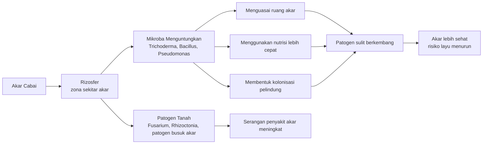

**Keterangan ilustrasi:**
Kompetisi terjadi terutama di zona akar. Aplikasi agen hayati tanah harus diarahkan ke media, kompos, bedengan, atau lubang tanam, bukan hanya disemprot ke daun.

---

## **4.2 Antibiosis**

Antibiosis adalah mekanisme ketika agen hayati menghasilkan senyawa alami yang dapat menghambat atau menekan patogen. Senyawa ini bisa berupa antibiotik alami, enzim, metabolit sekunder, lipopeptida, atau senyawa penghambat lain. Mekanisme ini umum ditemukan pada bakteri antagonis dan beberapa jamur antagonis.

Contoh agen yang dikenal memiliki mekanisme antibiosis:

- _Bacillus subtilis_;
- _Pseudomonas fluorescens_;
- _Streptomyces_ sp.;
- beberapa strain _Trichoderma_.

Pada cabai, antibiosis penting untuk menekan patogen tanah dan patogen akar. Misalnya, _Bacillus_ tertentu dapat menghasilkan senyawa antimikroba yang menghambat pertumbuhan patogen. _Pseudomonas_ dapat menghasilkan metabolit yang membantu menekan mikroba merugikan di rizosfer. _Streptomyces_ juga dikenal sebagai kelompok bakteri tanah yang banyak menghasilkan senyawa antimikroba. Dalam literatur, _Bacillus_ dilaporkan bekerja melalui produksi lipopeptida, enzim litik, siderofor, dan aktivasi ketahanan tanaman. ([Frontiers][1])

Antibiosis bukan berarti agen hayati selalu “membunuh total” patogen seperti pestisida kimia. Yang lebih tepat, agen hayati membantu menciptakan tekanan biologis sehingga patogen sulit mendominasi. Dalam sistem tanah yang sehat, antibiosis bekerja bersama kompetisi, kolonisasi akar, bahan organik matang, dan lingkungan tanah yang mendukung.

Mekanisme antibiosis juga menjelaskan mengapa kualitas strain sangat penting. Dua produk yang sama-sama mengandung _Bacillus_ belum tentu memiliki efektivitas sama, karena kemampuan menghasilkan senyawa penghambat dapat berbeda antar strain. Karena itu, pemilihan produk sebaiknya memperhatikan label, reputasi produsen, hasil uji lapang, dan sasaran OPT yang jelas.

### **Implikasi Praktis pada Cabai**

Antibiosis paling bermanfaat pada program:

- pencegahan layu dan busuk akar;
- perlindungan bibit dari rebah semai;
- pemeliharaan zona akar sehat;
- pemulihan lahan setelah serangan penyakit tanah;
- program kocor mikroba antagonis pada awal tanam.

Namun, antibiosis akan sulit bekerja optimal bila lingkungan tanah rusak. Tanah terlalu asam, terlalu basah, terlalu panas, miskin bahan organik, atau tercemar residu pestisida berlebihan dapat menurunkan kemampuan agen hayati untuk bertahan dan bekerja.

---

## **4.3 Mikoparasitisme**

Mikoparasitisme adalah mekanisme ketika jamur baik menyerang jamur patogen. Dalam mekanisme ini, agen hayati dapat mengenali patogen, mendekati hifa patogen, menempel, melilit, menghasilkan enzim perusak dinding sel, lalu mengganggu pertumbuhan patogen. Mekanisme ini sangat penting dalam pengendalian patogen tanah.

Contoh agen yang bekerja melalui mikoparasitisme:

- _Trichoderma_ spp.;
- _Gliocladium/Clonostachys_ spp.

_Trichoderma_ merupakan contoh klasik agen hayati yang dikenal mampu melakukan mikoparasitisme. Beberapa kajian menyebut mikoparasitisme sebagai salah satu mekanisme penting _Trichoderma_ dalam menekan inokulum patogen. Mekanisme ini biasanya bekerja bersama produksi enzim, metabolit sekunder, kompetisi, dan kolonisasi ruang tumbuh. ([ScienceDirect][3])

Pada cabai, mikoparasitisme relevan untuk patogen seperti _Fusarium_, _Rhizoctonia_, _Sclerotium_, dan beberapa penyebab busuk akar. Namun, keberhasilan mekanisme ini tetap bergantung pada waktu aplikasi. _Trichoderma_ perlu berada di media atau zona akar sebelum patogen berkembang terlalu kuat. Jika tanaman sudah layu berat dan jaringan pembuluh sudah rusak, efek mikoparasitisme tidak dapat memulihkan jaringan tanaman yang sudah mati.

Mikoparasitisme juga menjelaskan mengapa agen jamur antagonis tidak boleh dicampur sembarangan dengan fungisida. Fungisida yang dirancang untuk menekan jamur patogen juga dapat mengganggu jamur menguntungkan seperti _Trichoderma_, _Beauveria_, atau _Metarhizium_. Karena itu, penggunaan fungisida harus mempertimbangkan interval aplikasi, jenis bahan aktif, dan tujuan program.

### **Implikasi Praktis pada Cabai**

Mikoparasitisme paling tepat dimanfaatkan pada:

- pencampuran _Trichoderma_ ke media semai;
- pengayaan kompos matang;
- aplikasi ke bedengan sebelum tanam;
- aplikasi lubang tanam;
- kocor zona akar pada awal pertumbuhan.

Prinsip lapangannya: **agen jamur antagonis harus bertemu patogen di tanah atau media, bukan hanya berada di permukaan daun**.

### **Ilustrasi 4.2. Mikoparasitisme oleh Jamur Antagonis**

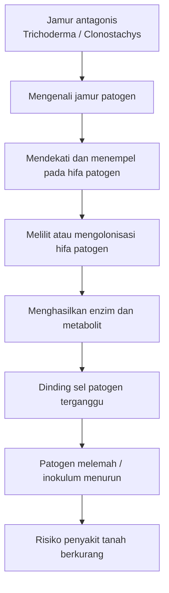

**Keterangan ilustrasi:**
Mikoparasitisme adalah mekanisme antarjamur. Karena itu, aplikasinya harus diarahkan ke media, kompos, tanah, atau zona akar tempat patogen tanah berada.

---

## **4.4 Induksi Ketahanan Tanaman**

Induksi ketahanan tanaman adalah mekanisme ketika agen hayati merangsang sistem pertahanan tanaman. Dalam kondisi ini, tanaman tidak menjadi kebal, tetapi lebih siap menghadapi serangan patogen atau hama. Mekanisme ini sering disebut sebagai induced resistance atau induced systemic resistance/ISR, terutama bila melibatkan respons pertahanan yang menyebar ke bagian tanaman lain.

Contoh agen yang dapat berperan dalam induksi ketahanan:

- _Trichoderma_;
- _Bacillus_;
- _Pseudomonas_.

Pada cabai, induksi ketahanan penting karena tanaman sering menghadapi tekanan ganda: patogen tanah, hama pengisap, cuaca ekstrem, dan virus. Tanaman yang sistem akarnya sehat dan mikrobiom rizosfernya baik biasanya lebih mampu bertahan dibanding tanaman yang sejak awal lemah. Namun, induksi ketahanan tidak boleh disalahartikan sebagai “tanaman pasti bebas penyakit”. Tanaman tetap bisa terserang jika tekanan OPT tinggi, kondisi lingkungan buruk, atau aplikasi pengendalian terlambat.

Beberapa agen hayati dan PGPM dapat memicu respons pertahanan tanaman melalui kolonisasi akar dan interaksi mikroba-tanaman. _Bacillus_, _Pseudomonas_, dan _Trichoderma_ sering disebut dalam literatur sebagai mikroba yang dapat berperan dalam pemacuan pertumbuhan sekaligus aktivasi ketahanan tanaman. ([Frontiers][1])

Induksi ketahanan bekerja seperti latihan kesiapsiagaan tanaman. Tanaman yang sudah “dipersiapkan” oleh mikroba tertentu dapat merespons serangan lebih cepat. Namun, respons ini tetap membutuhkan dukungan budidaya sehat: pemupukan seimbang, drainase baik, tidak kekurangan air, tidak kelebihan nitrogen, dan tidak terlalu sering terkena pestisida keras yang mengganggu mikroba menguntungkan.

### **Implikasi Praktis pada Cabai**

Induksi ketahanan paling baik dibangun sejak:

- perlakuan media semai;
- fase bibit;
- awal pindah tanam;
- fase vegetatif awal;
- pemeliharaan akar secara berkala.

Aplikasi agen hayati pada fase akhir saat tanaman sudah rusak berat tidak dapat menggantikan fungsi pencegahan. Karena itu, program berbasis induksi ketahanan harus dirancang sebagai **program awal musim**, bukan tindakan panik di akhir musim.

### **Ilustrasi 4.3. Induksi Ketahanan Tanaman oleh Agen Hayati**

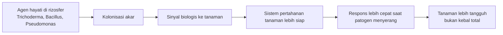

**Keterangan ilustrasi:**
Induksi ketahanan bukan berarti tanaman tidak bisa sakit. Mekanisme ini membuat tanaman lebih siap menghadapi tekanan OPT, terutama bila didukung budidaya sehat.

---

## **4.5 Infeksi Langsung pada Hama**

Beberapa agen hayati bekerja dengan cara menginfeksi hama secara langsung. Kelompok ini terutama terdiri dari jamur entomopatogen, yaitu jamur yang dapat menyebabkan penyakit pada serangga. Contoh yang banyak digunakan dalam pertanian adalah _Beauveria bassiana_, _Metarhizium anisopliae_, _Lecanicillium lecanii_, dan _Isaria/Cordyceps fumosorosea_.

Cara kerja jamur entomopatogen berbeda dari racun kontak biasa. Spora jamur harus menempel pada tubuh serangga, berkecambah, menembus kutikula, berkembang di dalam tubuh serangga, lalu mengganggu fungsi tubuh hama hingga hama melemah dan mati. Literatur tentang jamur entomopatogen menjelaskan bahwa proses infeksi dimulai ketika spora tertahan pada permukaan integumen serangga, kemudian berkecambah dan menghasilkan enzim yang membantu penetrasi ke tubuh inang. ([ScienceDirect][4])

Pada cabai, jamur entomopatogen sangat relevan untuk hama pengisap seperti thrips, kutu kebul, dan kutu daun. Hama-hama ini berukuran kecil, banyak berada di pucuk, bawah daun, atau bunga, sehingga penyemprotan harus benar-benar menjangkau lokasi hama. Penyemprotan yang hanya membasahi permukaan luar tajuk sering tidak efektif.

Keberhasilan infeksi langsung pada hama sangat dipengaruhi oleh kelembapan, suhu, sinar matahari, kualitas spora, dan teknik aplikasi. Jamur entomopatogen umumnya lebih baik diaplikasikan pada sore hari agar spora tidak langsung rusak oleh sinar ultraviolet dan kelembapan malam dapat membantu proses infeksi. Penyemprotan juga perlu menggunakan volume air yang cukup agar permukaan sasaran terlapisi dengan baik.

### **Implikasi Praktis pada Cabai**

Untuk hama pengisap:

- semprot sore hari;
- arahkan ke bawah daun untuk kutu kebul;
- arahkan ke pucuk, daun muda, dan bunga untuk thrips;
- ulangi aplikasi 5–7 hari bila tekanan hama masih tinggi;
- hindari pencampuran dengan fungisida;
- gunakan air bersih dan tangki yang bebas residu pestisida keras.

Untuk hama tanah atau serangga yang berada di permukaan tanah, _Metarhizium_ kadang lebih relevan karena beberapa strain lebih sering digunakan untuk serangga tanah. Namun, efektivitas tetap bergantung pada strain, formulasi, sasaran, dan kondisi lapangan.

### **Ilustrasi 4.4. Proses Infeksi Jamur Entomopatogen pada Hama**

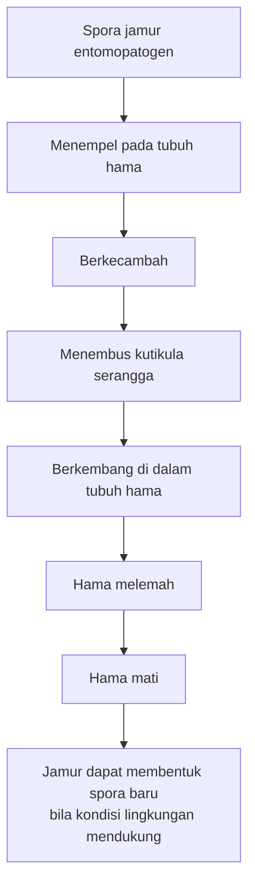

**Keterangan ilustrasi:**
Jamur entomopatogen membutuhkan waktu untuk bekerja. Karena itu, jangan menilai kegagalan hanya dari tidak matinya hama beberapa jam setelah aplikasi.

---

## **4.6 Racun Biologis yang Harus Termakan Hama**

Sebagian agen hayati bekerja setelah dimakan oleh hama. Artinya, bahan aktif biologis harus berada pada permukaan tanaman yang dimakan hama. Mekanisme ini sangat penting pada pengendalian ulat menggunakan _Bacillus thuringiensis_ atau Bt dan virus serangga seperti NPV, SlNPV, dan HaNPV.

Bt adalah bakteri yang menghasilkan protein tertentu yang bersifat toksik bagi larva serangga tertentu ketika termakan. NPIC menjelaskan bahwa spora Bt memiliki protein yang bersifat toksik bagi larva serangga saat dimakan. Karena itu, Bt lebih tepat digunakan untuk hama pengunyah seperti ulat, bukan untuk hama yang tidak memakan jaringan tanaman sasaran. ([National Pesticide Information Center][5])

Pada cabai, Bt paling relevan untuk ulat grayak, ulat daun, dan ulat buah, terutama saat larva masih kecil. Semakin besar larva, semakin banyak jaringan tanaman yang sudah dirusak dan biasanya semakin sulit dikendalikan. Karena Bt harus termakan, aplikasi harus diarahkan ke daun, pucuk, bunga, atau buah muda yang menjadi lokasi makan larva.

NPV juga bekerja setelah termakan oleh larva hama. NPV umumnya lebih spesifik dibanding banyak insektisida kimia. SlNPV digunakan untuk kelompok _Spodoptera_, sedangkan HaNPV digunakan untuk _Helicoverpa_. Keunggulan spesifisitas ini adalah relatif lebih aman terhadap banyak organisme bukan sasaran, tetapi kelemahannya adalah pemilihan jenis NPV harus tepat sesuai hama sasaran.

### **Implikasi Praktis pada Cabai**

Untuk Bt dan NPV:

- targetkan larva muda;
- lakukan monitoring telur dan larva awal;
- semprot bagian tanaman yang dimakan larva;
- ulangi aplikasi sesuai tekanan hama dan label produk;
- jangan menunggu ulat besar atau sudah masuk ke dalam buah;
- hindari aplikasi saat hujan karena bahan dapat tercuci;
- perhatikan kompatibilitas dengan bahan lain di tangki.

Pada ulat buah, waktu aplikasi sangat menentukan. Bila larva sudah masuk ke dalam buah, Bt atau NPV sulit menjangkau hama. Karena itu, aplikasi harus dilakukan berdasarkan monitoring awal, bukan setelah buah banyak berlubang.

### **Ilustrasi 4.5. Mekanisme Bt/NPV yang Harus Termakan Larva**

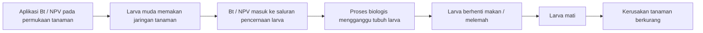

**Keterangan ilustrasi:**
Bt dan NPV bukan racun kontak utama. Keduanya harus termakan oleh larva. Karena itu, aplikasi harus dilakukan saat larva masih aktif makan dan belum terlindung di dalam buah.

---

## **4.7 Parasitasi**

Parasitasi adalah mekanisme ketika parasitoid menyerang telur, larva, nimfa, atau tubuh hama. Parasitoid berbeda dari predator. Predator biasanya memangsa banyak individu hama selama hidupnya, sedangkan parasitoid umumnya berkembang pada satu inang dan akhirnya membunuh inang tersebut. Michigan State University menjelaskan bahwa parasitoid hidup di dalam atau menempel pada tubuh inang; fase pradewasa parasitoid memakan inang dan biasanya membunuh satu individu inang. ([Agri College][6])

Contoh parasitoid penting dalam sistem cabai:

- _Trichogramma_ untuk telur ulat;
- _Encarsia_ dan _Eretmocerus_ untuk kutu kebul;
- _Aphidius_ dan _Aphelinus_ untuk kutu daun;
- _Opius_, _Biosteres_, atau _Fopius_ untuk lalat buah.

Parasitasi paling efektif ketika populasi hama belum meledak. Jika populasi hama sudah sangat tinggi, parasitoid sering tidak mampu menurunkan populasi dengan cepat. Karena itu, parasitoid lebih cocok sebagai bagian dari program konservasi dan pelepasan terencana, bukan sebagai tindakan darurat tunggal.

Parasitoid juga sangat sensitif terhadap insektisida broad-spectrum. Aplikasi insektisida keras dapat membunuh parasitoid dewasa, menurunkan tingkat parasitasi, dan memutus siklus pengendalian alami. Karena itu, kebun yang ingin memanfaatkan parasitoid harus membatasi penggunaan insektisida broad-spectrum dan memilih pestisida yang lebih selektif bila tindakan kimia diperlukan.

### **Implikasi Praktis pada Cabai**

Parasitasi perlu didukung dengan:

- monitoring hama sejak awal;
- konservasi musuh alami;
- penggunaan refugia atau tanaman berbunga pendukung;
- pengurangan insektisida broad-spectrum;
- pelepasan parasitoid bila tersedia dan sesuai;
- sanitasi tanaman sakit dan buah terserang.

Pada ulat, _Trichogramma_ lebih efektif bila menyerang telur sebelum menetas menjadi larva perusak. Pada kutu kebul, _Encarsia_ dan _Eretmocerus_ bekerja pada fase nimfa. Pada kutu daun, _Aphidius_ dapat menyebabkan terbentuknya “mummy aphid”, yaitu kutu daun yang berubah bentuk karena terparasit.

### **Ilustrasi 4.6. Parasitasi oleh Parasitoid**

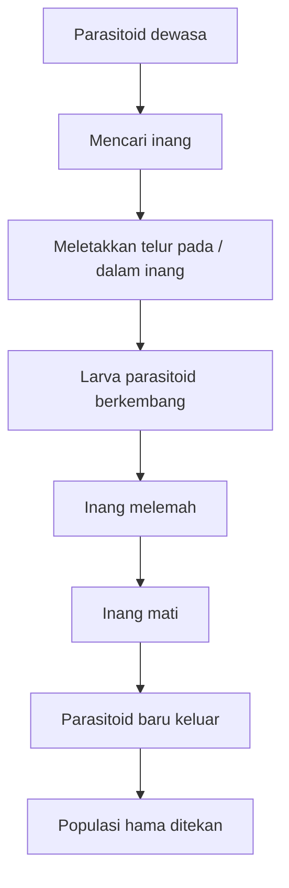

**Keterangan ilustrasi:**
Parasitoid bekerja melalui siklus hidup. Karena itu, hasilnya tidak selalu secepat insektisida, tetapi sangat berguna untuk menjaga populasi hama tetap terkendali dalam sistem PHT.

---

## **4.8 Predasi**

Predasi adalah mekanisme ketika predator memangsa hama secara langsung. Predator dapat memakan telur, nimfa, larva, atau serangga dewasa, tergantung jenis predator dan jenis hama. Dalam kebun cabai, predator berperan sebagai penjaga keseimbangan populasi hama, terutama hama kecil seperti kutu daun, thrips muda, kutu kebul muda, telur serangga, dan tungau.

Contoh predator yang bermanfaat pada cabai:

- kumbang koksi;
- lacewing;
- _Orius_;
- laba-laba;
- tungau predator;
- syrphid/lalat bunga;
- cocopet.

Predator berbeda dari parasitoid. Predator biasanya memakan banyak individu hama selama hidupnya, sedangkan parasitoid umumnya memanfaatkan satu inang untuk menyelesaikan perkembangan pradewasanya. PNW Handbooks menggunakan istilah natural enemies, beneficials, dan biocontrol agents untuk mencakup predator, parasitoid, parasit, dan penyakit hama dalam konteks pengendalian hayati. ([PNW Pest Management Handbooks][7])

Dalam sistem cabai, predator sangat penting untuk mencegah ledakan hama. Misalnya, kumbang koksi dan lacewing dapat membantu menekan kutu daun. _Orius_ dikenal sebagai predator thrips. Laba-laba membantu memangsa berbagai serangga kecil. Tungau predator dapat menekan tungau hama atau hama kecil tertentu. Namun, predator membutuhkan habitat, sumber makanan, dan perlindungan dari pestisida keras.

Konservasi predator sama pentingnya dengan aplikasi agen hayati mikroba. Jika kebun terlalu sering disemprot insektisida broad-spectrum, predator akan berkurang. Saat predator hilang, hama dapat pulih lebih cepat karena tidak lagi memiliki musuh alami yang cukup. Inilah salah satu alasan mengapa penggunaan pestisida harus selektif dan berbasis monitoring.

### **Implikasi Praktis pada Cabai**

Konservasi predator dapat dilakukan dengan:

- mengurangi insektisida broad-spectrum;
- menggunakan pestisida selektif bila terpaksa;
- menyediakan tanaman refugia atau tanaman berbunga;
- menjaga sanitasi tanpa membuat kebun steril total dari kehidupan serangga menguntungkan;
- memantau keberadaan predator saat monitoring hama;
- tidak langsung menyemprot bila populasi hama masih rendah dan predator aktif ditemukan.

Predator tidak selalu cukup untuk menyelamatkan kebun dari serangan berat. Namun, predator sangat berguna sebagai “rem alami” agar populasi hama tidak cepat meledak. Dalam PHT, keberadaan predator adalah indikator bahwa ekosistem kebun masih memiliki daya kendali alami.

### **Ilustrasi 4.7. Predasi dalam Ekosistem Cabai**

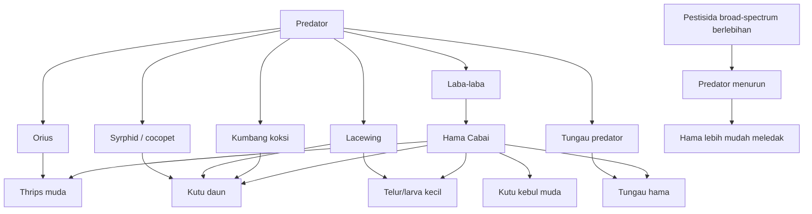

**Keterangan ilustrasi:**
Predator bekerja sebagai pengendali alami. Semakin sering pestisida keras digunakan tanpa pertimbangan, semakin besar risiko musuh alami hilang dan hama lebih cepat meledak kembali.

---

## **Tabel 4.1. Ringkasan Mekanisme Kerja Agen Hayati dan Implikasi Aplikasinya pada Cabai**

| Mekanisme                   | Cara kerja utama                                         | Contoh agen                                                     | Sasaran utama pada cabai                            | Implikasi aplikasi                                                    |
| --------------------------- | -------------------------------------------------------- | --------------------------------------------------------------- | --------------------------------------------------- | --------------------------------------------------------------------- |
| Kompetisi ruang dan nutrisi | Mikroba baik menguasai ruang dan makanan di sekitar akar | _Trichoderma_, _Bacillus_, _Pseudomonas_                        | Patogen tanah dan akar                              | Aplikasikan sejak media semai, kompos, bedengan, dan lubang tanam     |
| Antibiosis                  | Agen menghasilkan senyawa penghambat patogen             | _Bacillus subtilis_, _Pseudomonas fluorescens_, _Streptomyces_  | Patogen tanah dan akar                              | Gunakan preventif; dukung dengan bahan organik matang dan tanah sehat |
| Mikoparasitisme             | Jamur baik menyerang jamur patogen                       | _Trichoderma_, _Gliocladium/Clonostachys_                       | _Fusarium_, _Rhizoctonia_, _Sclerotium_, busuk akar | Tempatkan di zona akar; jangan dicampur sembarang fungisida           |
| Induksi ketahanan           | Agen hayati merangsang sistem pertahanan tanaman         | _Trichoderma_, _Bacillus_, _Pseudomonas_                        | Tekanan penyakit dan stres biologis                 | Bangun sejak fase bibit dan awal tanam                                |
| Infeksi langsung hama       | Jamur menginfeksi tubuh serangga                         | _Beauveria_, _Metarhizium_, _Lecanicillium_, _Isaria/Cordyceps_ | Thrips, kutu kebul, kutu daun, beberapa hama lain   | Semprot sore; butuh kelembapan dan sasaran tepat                      |
| Racun biologis termakan     | Agen bekerja setelah dimakan larva                       | Bt, NPV, SlNPV, HaNPV                                           | Ulat grayak, ulat buah, ulat daun                   | Targetkan larva muda dan bagian tanaman yang dimakan                  |
| Parasitasi                  | Parasitoid berkembang pada/dalam inang                   | _Trichogramma_, _Encarsia_, _Eretmocerus_, _Aphidius_           | Telur ulat, kutu kebul, kutu daun                   | Cocok saat populasi awal; hindari insektisida broad-spectrum          |
| Predasi                     | Predator memangsa hama langsung                          | Kumbang koksi, lacewing, _Orius_, laba-laba, tungau predator    | Kutu daun, thrips muda, kutu kebul muda, tungau     | Konservasi habitat dan kurangi pestisida keras                        |

---

## **Ringkasan Bab 4**

Agen hayati bekerja melalui berbagai mekanisme. Pada penyakit tanah, mekanisme penting meliputi kompetisi ruang dan nutrisi, antibiosis, mikoparasitisme, dan induksi ketahanan tanaman. Mekanisme ini paling efektif bila agen hayati diberikan sejak awal, terutama pada media semai, kompos matang, bedengan, lubang tanam, dan zona akar.

Pada hama, mekanisme agen hayati dapat berupa infeksi langsung oleh jamur entomopatogen, racun biologis yang harus termakan seperti Bt dan NPV, parasitasi oleh parasitoid, serta predasi oleh predator. Setiap mekanisme membutuhkan cara aplikasi yang berbeda. Jamur entomopatogen perlu menjangkau tubuh hama dan membutuhkan kelembapan cukup. Bt dan NPV harus termakan larva. Parasitoid dan predator perlu dilindungi dari insektisida broad-spectrum.

Prinsip utama yang harus dipegang adalah: **mekanisme menentukan cara aplikasi**. Agen tanah harus ditempatkan di tanah atau zona akar. Agen tajuk harus diarahkan ke lokasi hama. Bt dan NPV harus mengenai bagian tanaman yang dimakan larva. Predator dan parasitoid harus dilindungi agar dapat bekerja sebagai pengendali alami. Tanpa memahami mekanisme kerja ini, penggunaan agen hayati mudah berubah menjadi sekadar aplikasi produk tanpa strategi.

[1]: https://www.frontiersin.org/journals/agronomy/articles/10.3389/fagro.2025.1578915/full?utm_source=chatgpt.com 'Biological control agents: mechanisms of action, selection ...'
[2]: https://www.intechopen.com/chapters/65709?utm_source=chatgpt.com 'A Review Report on the Mechanism of Trichoderma spp. ...'
[3]: https://www.sciencedirect.com/science/article/abs/pii/S1749461321000567?utm_source=chatgpt.com 'Mycoparasitism as a mechanism of Trichoderma-mediated ...'
[4]: https://www.sciencedirect.com/topics/biochemistry-genetics-and-molecular-biology/entomopathogenic-fungus?utm_source=chatgpt.com 'Entomopathogenic Fungus - an overview'
[5]: https://npic.orst.edu/factsheets/btgen.html?utm_source=chatgpt.com '<i>Bacillus thuringiensis</i> (<i>Bt</i>) Fact Sheet'
[6]: https://www.canr.msu.edu/resources/natural_enemies?utm_source=chatgpt.com 'Natural enemies - Integrated Pest Management'
[7]: https://pnwhandbooks.org/insect/ipm/biological-control?utm_source=chatgpt.com 'Biological Control'

---

# **BAB 5. Kelompok Agen Hayati untuk Cabai**

Bab ini membahas kelompok agen hayati yang relevan untuk cabai berdasarkan sasaran OPT-nya. Pembagian ini penting karena tidak ada satu agen hayati yang mampu mengendalikan semua masalah. Agen untuk penyakit tanah tidak otomatis efektif untuk thrips. Agen untuk ulat tidak dapat menggantikan agen untuk nematoda. Predator dan parasitoid juga tidak bekerja seperti mikroba semprot. Karena itu, pemilihan agen hayati harus selalu dimulai dari pertanyaan: **OPT apa yang ingin dikendalikan, di mana titik serangannya, dan pada fase tanaman apa aplikasi dilakukan?** Bab ini dikembangkan dari outline kelompok agen hayati untuk cabai yang telah ditetapkan sebelumnya.

Dalam sistem Pengendalian Hama Terpadu/PHT, agen hayati dapat berupa mikroba, predator, parasitoid, atau organisme lain yang membantu menekan populasi OPT. FAO menjelaskan bahwa biological pest control agents dapat berkontribusi dalam PHT karena umumnya memiliki risiko lebih rendah terhadap kesehatan dan lingkungan serta relatif kompatibel dengan banyak organisme menguntungkan dalam sistem PHT. ([FAOHome][1])

---

## **5.1 Agen Hayati untuk Penyakit Tanah dan Akar**

Penyakit tanah dan akar merupakan salah satu penyebab utama kegagalan budidaya cabai. Masalah seperti layu Fusarium, layu bakteri, rebah semai, busuk akar, dan busuk pangkal batang sering sulit dikendalikan jika tanaman sudah menunjukkan gejala berat. Pada saat daun terlihat layu, akar dan jaringan pembuluh biasanya sudah mengalami gangguan lebih dulu.

Agen hayati untuk penyakit tanah dan akar bekerja terutama di zona rizosfer, yaitu wilayah tanah di sekitar akar. Di zona inilah akar, mikroba menguntungkan, patogen, bahan organik, air, dan unsur hara saling berinteraksi. Karena itu, agen hayati kelompok ini harus ditempatkan di media semai, kompos, bedengan, lubang tanam, atau larutan kocor akar. Penyemprotan ke tajuk tidak akan efektif untuk masalah yang sumbernya berada di tanah.

| Agen hayati                       | Sasaran utama                                              | Aplikasi                                      |
| --------------------------------- | ---------------------------------------------------------- | --------------------------------------------- |
| **Trichoderma spp.**              | Fusarium, Rhizoctonia, Sclerotium, rebah semai, busuk akar | Media semai, kompos, lubang tanam, kocor akar |
| **Gliocladium/Clonostachys spp.** | Rebah semai, busuk akar, jamur patogen tanah               | Media semai, pupuk organik                    |
| **Bacillus subtilis**             | Layu bakteri, rebah semai, penyakit akar                   | Perlakuan benih, kocor akar                   |
| **Bacillus amyloliquefaciens**    | Patogen akar dan daun                                      | Kocor, semprot preventif                      |
| **Pseudomonas fluorescens**       | Layu bakteri, Fusarium, rebah semai                        | Kocor akar, seed treatment                    |
| **Streptomyces spp.**             | Patogen tanah                                              | Campur kompos, kocor akar                     |

### **5.1.1 Trichoderma spp.**

_Trichoderma_ merupakan salah satu agen hayati paling populer untuk pengendalian penyakit tanah. Pada cabai, _Trichoderma_ banyak digunakan untuk membantu menekan patogen seperti _Fusarium_, _Rhizoctonia_, _Sclerotium_, penyebab rebah semai, dan berbagai busuk akar. Mekanisme kerjanya tidak tunggal. _Trichoderma_ dapat bersaing dengan patogen, menghasilkan senyawa antimikroba, melakukan mikoparasitisme, menghasilkan enzim perusak dinding sel patogen, serta membantu merangsang ketahanan tanaman. Kajian tentang _Trichoderma_ menjelaskan bahwa jamur ini dapat mendegradasi dinding sel jamur patogen dengan enzim pendegradasi kitin dan membantu proses invasi terhadap patogen. ([PMC][2])

Dalam praktik cabai, _Trichoderma_ paling tepat digunakan sejak awal. Aplikasinya dapat dimulai dari pencampuran pada media semai, pengayaan kompos matang, aplikasi ke bedengan sebelum tanam, pemberian pada lubang tanam, dan kocor akar pada fase awal pertumbuhan. Jika _Trichoderma_ baru diberikan setelah tanaman layu berat, hasilnya sering tidak memuaskan karena jaringan akar dan pembuluh tanaman sudah telanjur rusak.

Catatan praktis:

- Gunakan pada media semai dan bedengan sebelum tanam.
- Campurkan dengan kompos atau pupuk kandang yang sudah matang.
- Jangan mencampur dengan fungisida dalam satu tangki.
- Hindari aplikasi bersamaan dengan larutan pupuk kimia pekat.
- Gunakan air bersih, tidak berklorin kuat.
- Aplikasi lebih baik dilakukan saat tanah lembap, bukan tergenang.

### **5.1.2 Gliocladium/Clonostachys spp.**

_Gliocladium_ atau _Clonostachys_ termasuk jamur antagonis yang dapat membantu menekan patogen tanah. Kelompok ini relevan untuk rebah semai, busuk akar, dan penyakit yang disebabkan jamur patogen tanah. Dalam program cabai, penggunaannya mirip dengan _Trichoderma_, yaitu ditempatkan di media semai, pupuk organik, kompos matang, atau zona akar.

Agen ini lebih cocok digunakan sebagai pencegahan. Bila media semai sudah terkontaminasi berat, kelembapan berlebihan, atau bibit sudah banyak rebah, aplikasi terlambat tidak akan mengembalikan bibit yang sudah rusak. Karena itu, penggunaannya harus masuk dalam SOP persemaian dan persiapan media.

Catatan praktis:

- Cocok untuk media semai dan pupuk organik matang.
- Gunakan sebelum gejala rebah semai muncul.
- Jangan dicampur dengan fungisida.
- Jaga media semai tidak terlalu basah.
- Kombinasikan dengan sanitasi tray, naungan, dan sirkulasi udara baik.

### **5.1.3 Bacillus subtilis**

_Bacillus subtilis_ adalah bakteri antagonis yang banyak digunakan dalam pengendalian penyakit tanaman. Kelompok _Bacillus_ dikenal relatif tahan karena dapat membentuk endospora, sehingga beberapa formulasi lebih stabil dibanding mikroba yang sangat sensitif terhadap lingkungan. _Bacillus_ dapat bekerja melalui produksi senyawa antimikroba, enzim, siderofor, kompetisi ruang, dan induksi ketahanan tanaman. Literatur tentang _Bacillus subtilis_ dan _Bacillus amyloliquefaciens_ menunjukkan bahwa kelompok ini banyak dikembangkan sebagai agen biokontrol penyakit tanaman. ([MDPI][3])

Pada cabai, _B. subtilis_ dapat digunakan untuk perlakuan benih jika formulasi produk mendukung, kocor akar, atau aplikasi preventif pada fase awal. Sasaran utamanya adalah penyakit akar, rebah semai, dan beberapa masalah layu, termasuk layu bakteri dalam program pencegahan. Namun, pada serangan layu bakteri berat, aplikasi bakteri antagonis saja biasanya tidak cukup. Perlu sanitasi, pencabutan tanaman sakit berat, perbaikan drainase, rotasi, dan pengelolaan air.

Catatan praktis:

- Cocok untuk kocor akar dan perlakuan benih sesuai label.
- Lebih baik digunakan sejak awal tanam.
- Dapat dipadukan dalam program dengan _Trichoderma_, tetapi tidak selalu harus dicampur dalam satu tangki.
- Hindari air berklorin kuat dan larutan pH ekstrem.
- Jangan menganggap semua produk _Bacillus_ memiliki fungsi sama; efektivitas sangat dipengaruhi strain dan formulasi.

### **5.1.4 Bacillus amyloliquefaciens**

_Bacillus amyloliquefaciens_ sering digunakan sebagai agen hayati untuk menekan patogen akar dan daun. Beberapa strain juga dikembangkan sebagai PGPM karena dapat mendukung pertumbuhan tanaman. Dalam cabai, agen ini dapat digunakan melalui kocor akar maupun semprot preventif, tergantung formulasi dan petunjuk label.

Keunggulan _B. amyloliquefaciens_ adalah potensinya sebagai bakteri antagonis yang bekerja melalui beberapa mekanisme, termasuk produksi metabolit antimikroba dan dukungan terhadap pertumbuhan tanaman. Namun, seperti agen hayati lain, keberhasilannya tidak hanya ditentukan oleh nama spesies, tetapi juga strain, kualitas produk, dosis, waktu aplikasi, dan kondisi lingkungan.

Catatan praktis:

- Cocok untuk program pencegahan penyakit akar dan beberapa penyakit daun.
- Dapat digunakan melalui kocor atau semprot sesuai label.
- Jangan dicampur sembarangan dengan bakterisida atau bahan kimia keras.
- Gunakan secara berkala bila tekanan penyakit tinggi.
- Perlu dipadukan dengan sanitasi dan pemupukan seimbang.

### **5.1.5 Pseudomonas fluorescens**

_Pseudomonas fluorescens_ merupakan bakteri rizosfer yang sering dikaitkan dengan pengendalian patogen tanah dan pemacuan pertumbuhan tanaman. Pada cabai, _P. fluorescens_ dapat digunakan untuk membantu menekan layu bakteri, layu Fusarium, dan rebah semai dalam program pencegahan. Kelompok _Pseudomonas_ dapat bekerja melalui kompetisi di rizosfer, produksi siderofor, senyawa antimikroba, dan induksi ketahanan tanaman.

Aplikasi _P. fluorescens_ umumnya dilakukan melalui seed treatment, kocor akar, atau aplikasi pada media semai. Karena bakteri ini bekerja di sekitar akar, keberhasilan aplikasinya sangat bergantung pada kondisi media dan tanah. Tanah terlalu kering, terlalu panas, terlalu masam, atau sering terkena pestisida keras dapat menurunkan keberhasilan kolonisasi.

Catatan praktis:

- Cocok untuk perlakuan benih dan kocor akar bila produk mendukung.
- Gunakan sejak persemaian atau awal pindah tanam.
- Hindari pencampuran dengan bakterisida atau bahan yang tidak kompatibel.
- Dukung dengan bahan organik matang dan kelembapan tanah yang cukup.
- Efektivitas antar produk dapat berbeda karena perbedaan strain.

### **5.1.6 Streptomyces spp.**

_Streptomyces_ adalah kelompok bakteri tanah yang dikenal mampu menghasilkan berbagai senyawa bioaktif. Dalam pertanian, _Streptomyces_ dapat digunakan sebagai agen antagonis terhadap beberapa patogen tanah. Pada cabai, penggunaannya relevan untuk memperkaya mikrobiologi tanah, kompos, atau aplikasi kocor akar dalam program pencegahan penyakit tanah.

Kelompok ini cocok ditempatkan dalam strategi kesehatan tanah jangka panjang. Hasilnya tidak selalu instan, tetapi dapat membantu membangun keseimbangan mikroba tanah bila didukung oleh bahan organik matang, rotasi tanaman, dan pengurangan penggunaan pestisida yang merusak mikroba.

Catatan praktis:

- Cocok untuk campuran kompos matang atau aplikasi tanah.
- Gunakan sebagai bagian dari program kesehatan tanah.
- Jangan digunakan sebagai tindakan tunggal pada serangan penyakit berat.
- Perlu lingkungan tanah yang mendukung aktivitas mikroba.

### **Ilustrasi 5.1. Arah Aplikasi Agen Hayati untuk Penyakit Tanah dan Akar**

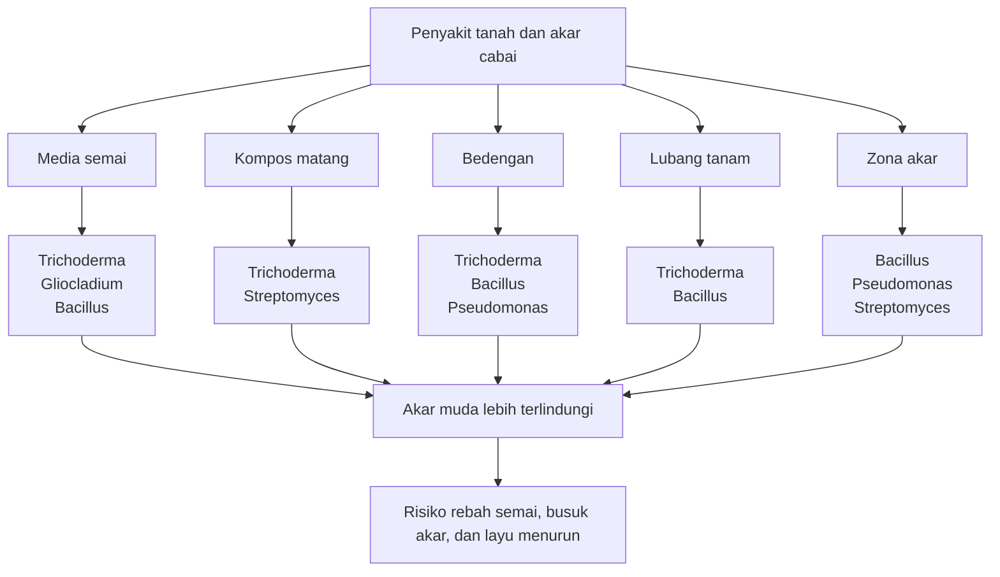

**Keterangan ilustrasi:**
Agen hayati penyakit tanah harus ditempatkan di titik hidup patogen: media, kompos, tanah, lubang tanam, dan zona akar. Aplikasi ke daun tidak cukup untuk masalah yang sumbernya berada di akar.

---

## **5.2 Agen Hayati untuk Nematoda**

Nematoda, terutama nematoda puru akar, menjadi masalah penting pada lahan cabai intensif. Gejalanya sering tidak langsung dikenali karena bagian yang diserang berada di bawah tanah. Tanaman tampak kerdil, daun menguning, mudah layu saat siang, dan sulit pulih meskipun sudah dipupuk. Ketika akar dicabut, terlihat puru atau bengkak pada akar.

Pengendalian nematoda berbeda dari pengendalian hama daun. Agen hayati nematoda harus diberikan ke tanah sebelum populasi nematoda merusak akar secara berat. Setelah akar rusak parah, pemulihan tanaman sulit dilakukan. Fungi parasit telur seperti _Pochonia chlamydosporia_ dan _Purpureocillium lilacinum_ banyak dipelajari sebagai alternatif pengendalian nematoda puru akar. ([PMC][4])

| Agen hayati                   | Sasaran            | Aplikasi                                 |
| ----------------------------- | ------------------ | ---------------------------------------- |
| **Purpureocillium lilacinum** | Nematoda puru akar | Campur kompos, kocor tanah sebelum tanam |
| **Pochonia chlamydosporia**   | Telur nematoda     | Aplikasi tanah                           |
| **Bacillus firmus**           | Nematoda akar      | Kocor tanah, perlakuan media             |

### **5.2.1 Purpureocillium lilacinum**

_Purpureocillium lilacinum_ dikenal sebagai cendawan yang dapat membantu menekan nematoda parasit tanaman, termasuk nematoda puru akar. Agen ini dapat menyerang telur, juvenil, atau fase tertentu nematoda, tergantung strain dan kondisi lingkungan. Beberapa kajian menyebut _P. lilacinum_ sebagai bionematisida potensial untuk pengendalian nematoda parasit tanaman. ([MDPI][5])

Pada cabai, _P. lilacinum_ lebih tepat digunakan sebelum tanam. Aplikasi dapat dilakukan dengan mencampurkannya ke kompos matang, mengaplikasikan ke bedengan, atau mengocor tanah sebelum pindah tanam. Jika diberikan setelah akar sudah penuh puru dan tanaman sudah kerdil berat, hasilnya biasanya terbatas.

Catatan praktis:

- Gunakan 7–14 hari sebelum tanam bila memungkinkan.
- Aplikasikan ke tanah atau zona akar.
- Campur dengan kompos matang, bukan bahan organik mentah.
- Padukan dengan rotasi tanaman dan sanitasi akar.
- Jangan mengandalkan aplikasi tunggal pada lahan dengan riwayat nematoda berat.

### **5.2.2 Pochonia chlamydosporia**

_Pochonia chlamydosporia_ adalah cendawan parasit telur nematoda. Agen ini bekerja dengan menyerang telur nematoda sehingga membantu menekan populasi generasi berikutnya. Karena sasaran utamanya adalah telur nematoda, hasilnya lebih bersifat jangka menengah dan preventif.

Dalam budidaya cabai, _Pochonia_ sebaiknya digunakan sebagai bagian dari program pemulihan tanah. Aplikasi dilakukan sebelum tanam atau pada awal pertumbuhan akar agar agen hayati memiliki waktu untuk berkembang di tanah. Penggunaan bahan organik matang dapat membantu mendukung aktivitas mikroba ini.

Catatan praktis:

- Cocok untuk aplikasi tanah sebelum tanam.
- Lebih efektif untuk menekan siklus nematoda, bukan memperbaiki akar yang sudah rusak berat.
- Padukan dengan rotasi tanaman non-inang.
- Bersihkan sisa akar tanaman sakit setelah panen.

### **5.2.3 Bacillus firmus**

_Bacillus firmus_ dikenal sebagai bakteri yang digunakan dalam beberapa formulasi bionematisida. Pada cabai, penggunaannya relevan untuk perlakuan media, kocor tanah, atau aplikasi zona akar. Karena berbasis bakteri, cara kerja dan efektivitasnya sangat dipengaruhi strain, formulasi, dan kondisi tanah.

Catatan praktis:

- Gunakan pada media atau tanah sebelum akar berkembang banyak.
- Dapat dipadukan dalam program dengan bahan organik matang.
- Perhatikan kompatibilitas dengan pupuk kimia dan pestisida.
- Jangan diaplikasikan bersamaan dengan larutan kimia pekat.

### **Poin Penting Pengendalian Nematoda**

Pengendalian nematoda harus dilakukan sebelum tanam. Setelah akar rusak berat, tanaman sulit dipulihkan. Agen hayati nematoda harus dipadukan dengan rotasi tanaman, penggunaan bahan organik matang, pengendalian gulma inang, dan sanitasi akar sisa tanaman sakit.

### **Ilustrasi 5.2. Titik Aplikasi Agen Hayati Nematoda**

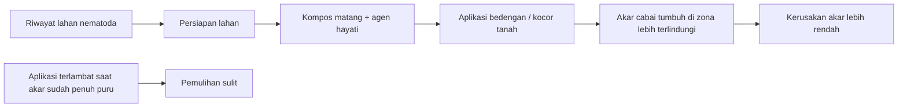

**Keterangan ilustrasi:**
Agen hayati nematoda harus hadir sebelum akar cabai rusak berat. Fokusnya bukan menyembuhkan akar yang sudah berpuru parah, tetapi menekan tekanan nematoda sejak awal.

---

## **5.3 Agen Hayati untuk Thrips, Kutu Kebul, dan Kutu Daun**

Thrips, kutu kebul, dan kutu daun adalah hama pengisap yang sangat penting pada cabai. Ukurannya kecil, berkembang cepat, dan sering bersembunyi di bagian tanaman yang sulit dijangkau. Dampaknya tidak hanya berupa kerusakan langsung, tetapi juga peningkatan risiko virus karena beberapa hama pengisap berperan sebagai vektor.

UC IPM menyarankan penggunaan perangkap kuning untuk monitoring thrips, aphid, whitefly, dan beberapa hama lain pada pepper; untuk whitefly, sanitasi tanaman inang dan gulma juga menjadi bagian penting pengelolaan. ([UC IPM][6])

| Agen hayati                      | Sasaran                       | Catatan aplikasi                               |
| -------------------------------- | ----------------------------- | ---------------------------------------------- |
| **Beauveria bassiana**           | Thrips, kutu kebul, kutu daun | Semprot sore, ulang 5–7 hari                   |
| **Lecanicillium lecanii**        | Kutu kebul, thrips, aphid     | Baik untuk hama pengisap bertubuh lunak        |
| **Isaria/Cordyceps fumosorosea** | Kutu kebul, thrips            | Cocok untuk rotasi biologis                    |
| **Metarhizium anisopliae**       | Beberapa hama daun dan tanah  | Lebih kuat untuk hama tanah/serangga pengunyah |

### **5.3.1 Beauveria bassiana**

_Beauveria bassiana_ adalah jamur entomopatogen yang banyak digunakan untuk mengendalikan hama serangga. Pada cabai, _Beauveria_ relevan untuk thrips, kutu kebul, dan kutu daun. Jamur ini bekerja ketika spora menempel pada tubuh hama, berkecambah, menembus kutikula, lalu menginfeksi tubuh serangga.

Aplikasi _Beauveria_ harus memperhatikan kelembapan dan waktu semprot. Semprot sore hari lebih dianjurkan karena sinar matahari tidak terlalu kuat dan kelembapan malam dapat membantu proses infeksi. Penyemprotan harus diarahkan ke lokasi hama. Untuk kutu kebul, fokusnya bawah daun. Untuk thrips, fokusnya pucuk, daun muda, dan bunga.

Catatan praktis:

- Semprot sore hari.
- Gunakan volume semprot cukup agar bawah daun terkena.
- Ulang 5–7 hari bila tekanan hama tinggi.
- Jangan dicampur dengan fungisida.
- Jangan gunakan air berklorin kuat.
- Efek tidak instan; perlu waktu untuk infeksi.

### **5.3.2 Lecanicillium lecanii**

_Lecanicillium lecanii_ adalah jamur entomopatogen yang banyak digunakan untuk hama pengisap bertubuh lunak. Pada cabai, agen ini relevan untuk kutu kebul, thrips, dan aphid/kutu daun. Karena sasaran utamanya hama kecil yang sering berada di bawah daun atau pucuk, keberhasilan aplikasi sangat bergantung pada kualitas penyemprotan.

Catatan praktis:

- Cocok untuk hama pengisap bertubuh lunak.
- Butuh kelembapan cukup.
- Semprot sore hari.
- Fokus ke bawah daun dan pucuk.
- Jangan dicampur dengan fungisida.
- Ulangi aplikasi bila populasi belum terkendali.

### **5.3.3 Isaria/Cordyceps fumosorosea**

_Isaria fumosorosea_ atau yang dalam beberapa pembaruan taksonomi sering dikaitkan dengan _Cordyceps fumosorosea_ adalah jamur entomopatogen yang relevan untuk hama pengisap seperti kutu kebul dan thrips. Dalam program cabai, agen ini dapat digunakan sebagai bagian dari rotasi biologis agar aplikasi tidak bergantung pada satu jenis agen saja.

Catatan praktis:

- Cocok untuk rotasi dengan _Beauveria_ atau _Lecanicillium_.
- Sasaran utama: kutu kebul dan thrips.
- Aplikasi harus menjangkau bawah daun, pucuk, dan bunga.
- Hindari fungisida.
- Efektivitas dipengaruhi kelembapan, sinar matahari, dan kualitas spora.

### **5.3.4 Metarhizium anisopliae**

_Metarhizium anisopliae_ adalah jamur entomopatogen yang banyak digunakan untuk berbagai serangga, termasuk beberapa hama tanah dan hama pengunyah. Pada cabai, _Metarhizium_ dapat masuk dalam program biologis untuk beberapa hama daun dan tanah, tetapi pemilihannya harus disesuaikan dengan strain dan label produk.

Catatan praktis:

- Lebih sering kuat untuk beberapa hama tanah dan serangga tertentu.
- Dapat digunakan pada tanah atau tajuk sesuai formulasi produk.
- Membutuhkan kelembapan cukup.
- Jangan dicampur dengan fungisida.
- Tidak otomatis menjadi pilihan utama untuk semua hama pengisap.

### **Poin Penting Aplikasi untuk Hama Pengisap**

Untuk kutu kebul, semprot bagian bawah daun. Untuk thrips, fokus pada pucuk, daun muda, dan bunga. Aplikasi paling baik dilakukan sore hari. Jangan mencampur jamur entomopatogen dengan fungisida. Ulangi aplikasi bila tekanan hama masih tinggi.

### **Ilustrasi 5.3. Arah Semprot Agen Hayati untuk Hama Pengisap**

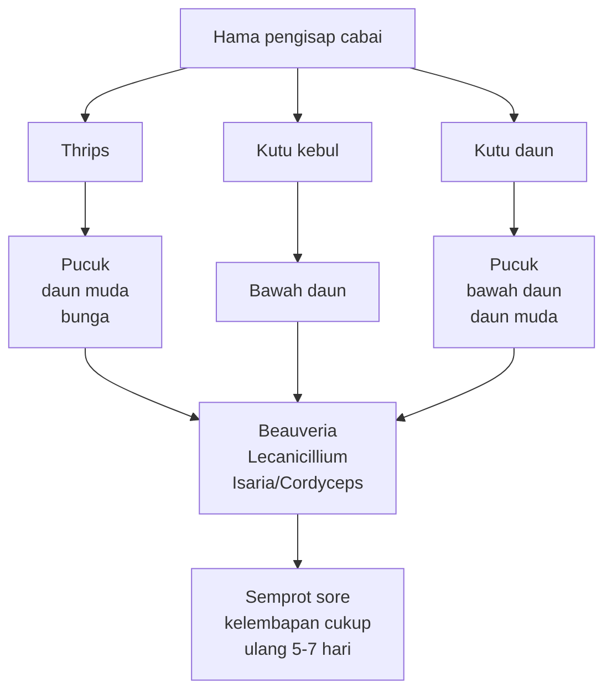

**Keterangan ilustrasi:**
Hama pengisap sering berada di lokasi tersembunyi. Penyemprotan agen hayati harus diarahkan ke titik hidup hama, bukan hanya membasahi permukaan atas daun.

---

## **5.4 Agen Hayati untuk Ulat**

Ulat merupakan hama pengunyah yang dapat merusak daun, pucuk, bunga, dan buah. Pada cabai, kerusakan oleh ulat menjadi sangat merugikan saat menyerang buah karena langsung menurunkan kualitas panen. Agen hayati untuk ulat harus digunakan saat larva masih kecil. Jika ulat sudah besar atau sudah masuk ke dalam buah, efektivitas aplikasi menurun.

| Agen hayati                   | Sasaran                           | Catatan                                   |
| ----------------------------- | --------------------------------- | ----------------------------------------- |
| **Bacillus thuringiensis/Bt** | Ulat grayak, ulat buah, ulat daun | Efektif saat larva masih kecil            |
| **NPV/SlNPV/HaNPV**           | Spodoptera dan Helicoverpa        | Sangat spesifik terhadap ulat tertentu    |
| **Beauveria bassiana**        | Ulat muda                         | Perlu kelembapan cukup                    |
| **Metarhizium anisopliae**    | Ulat dan serangga tanah           | Cocok untuk aplikasi tanah/tajuk tertentu |

### **5.4.1 Bacillus thuringiensis/Bt**

_Bacillus thuringiensis_ atau Bt adalah bakteri entomopatogen yang menghasilkan protein toksik untuk larva serangga tertentu. Bt bekerja sebagai racun perut, sehingga harus termakan oleh ulat. Panduan penggunaan Bt menjelaskan bahwa Bt harus dimakan oleh ulat agar bekerja efektif; karena itu, aplikasi harus diarahkan ke bagian tanaman yang dimakan larva. ([Landscape Boards SA][7])

Pada cabai, Bt relevan untuk ulat grayak, ulat daun, dan ulat buah, terutama saat larva masih kecil. Bt relatif lebih selektif dibanding banyak insektisida broad-spectrum. New Mexico State University juga menyebut produk selektif seperti Bt sebagai pilihan yang lebih tidak merugikan musuh alami dibanding insektisida spektrum luas. ([NMSU Publications][8])

Catatan praktis:

- Gunakan saat larva masih kecil.
- Semprot bagian daun, pucuk, bunga, atau buah muda yang dimakan ulat.
- Ulangi sesuai tekanan hama dan label produk.
- Jangan menunggu ulat masuk ke buah.
- Hindari aplikasi menjelang hujan.
- Rotasi dengan agen lain bila tekanan ulat tinggi.

### **5.4.2 NPV/SlNPV/HaNPV**

NPV atau nucleopolyhedrovirus adalah virus serangga yang digunakan untuk mengendalikan larva ulat tertentu. SlNPV biasanya dikaitkan dengan _Spodoptera_, sedangkan HaNPV dikaitkan dengan _Helicoverpa_. NPV sangat spesifik terhadap hama sasaran, sehingga pemilihan jenis NPV harus sesuai dengan jenis ulat yang menyerang. NPV dikenal sebagai agen hayati potensial untuk kelompok Lepidoptera seperti _Spodoptera_ dan _Helicoverpa_. ([Open Access Repository of ICRISAT][9])

Keunggulan NPV adalah relatif aman terhadap banyak musuh alami karena spesifisitasnya tinggi. Kelemahannya, NPV tidak cocok dipakai secara sembarangan untuk semua ulat. Jika jenis ulat tidak sesuai, efektivitasnya rendah. Selain itu, seperti Bt, NPV paling efektif bila termakan larva muda.

Catatan praktis:

- Gunakan NPV sesuai jenis ulat sasaran.
- SlNPV untuk kelompok _Spodoptera_.
- HaNPV untuk kelompok _Helicoverpa_.
- Targetkan larva kecil.
- Aplikasi harus mengenai bagian tanaman yang dimakan larva.
- Hindari sinar matahari terik dan hujan segera setelah aplikasi.

### **5.4.3 Beauveria bassiana untuk ulat muda**

Selain untuk hama pengisap, _Beauveria_ juga dapat membantu menekan ulat muda pada kondisi tertentu. Namun, untuk ulat, efektivitas _Beauveria_ sangat dipengaruhi ukuran larva, kelembapan, cakupan semprot, dan kondisi lingkungan. Jika ulat sudah besar, bergerak aktif, atau berada di dalam buah, penggunaan _Beauveria_ saja biasanya tidak cukup.

Catatan praktis:

- Lebih cocok untuk ulat muda.
- Butuh kelembapan cukup.
- Jangan digunakan sebagai satu-satunya solusi saat serangan berat.
- Dapat masuk dalam rotasi biologis bersama Bt atau NPV.

### **5.4.4 Metarhizium anisopliae untuk ulat dan hama tanah**

_Metarhizium_ dapat digunakan pada beberapa hama serangga, termasuk beberapa hama tanah dan ulat tertentu. Pada cabai, _Metarhizium_ lebih relevan bila sasaran hama berada di tanah atau permukaan tanah, meskipun beberapa formulasi juga digunakan untuk tajuk. Pemilihan harus mengikuti label produk.

Catatan praktis:

- Cocok untuk aplikasi tanah atau tajuk tertentu sesuai formulasi.
- Butuh kelembapan cukup.
- Tidak boleh dicampur dengan fungisida.
- Gunakan sebagai bagian dari program, bukan solusi tunggal.

### **Poin Penting Aplikasi untuk Ulat**

Bt dan NPV harus mengenai fase larva muda. Bt harus termakan oleh ulat. NPV lebih spesifik dan relatif aman bagi musuh alami. Aplikasi terlambat pada ulat besar biasanya kurang efektif, terutama bila ulat sudah masuk ke dalam buah.

### **Ilustrasi 5.4. Waktu Terbaik Aplikasi Bt dan NPV**

```mermaid id="waktu-bt-npv-ulat-cabai"
flowchart LR
    A[Telur ulat] --> B[Larva muda]
    B --> C[Larva sedang]
    C --> D[Larva besar]
    D --> E[Masuk ke buah / kerusakan berat]

    B --> F[Waktu terbaik Bt / NPV]
    C --> G[Masih mungkin, efektivitas menurun]
    D --> H[Kurang efektif]
    E --> I[Sulit dikendalikan dengan agen hayati semprot]
```

**Keterangan ilustrasi:**
Bt dan NPV harus digunakan saat larva masih kecil dan aktif makan di permukaan tanaman. Jika ulat sudah besar atau masuk ke buah, kerusakan sudah terjadi dan aplikasi menjadi jauh lebih sulit.

---

## **5.5 Predator Alami pada Cabai**

Predator adalah musuh alami yang memangsa hama secara langsung. Dalam kebun cabai, predator membantu menekan populasi kutu daun, kutu kebul, thrips muda, tungau, telur serangga, dan larva kecil. Predator tidak selalu dibeli sebagai produk. Banyak predator sebenarnya sudah ada di kebun, tetapi populasinya menurun akibat penggunaan pestisida broad-spectrum yang terlalu sering.

| Predator                 | Sasaran                                |
| ------------------------ | -------------------------------------- |
| **Kumbang koksi**        | Kutu daun, kutu kebul                  |
| **Chrysoperla/lacewing** | Kutu daun, thrips muda, telur serangga |
| **Orius sp.**            | Thrips                                 |
| **Laba-laba**            | Serangga kecil umum                    |
| **Tungau predator**      | Thrips, tungau, kutu kebul muda        |
| **Syrphid/lalat bunga**  | Kutu daun                              |
| **Cocopet**              | Telur/larva hama tertentu              |

Predator berperan sebagai pengendali alami. PNW Handbooks menjelaskan bahwa istilah natural enemies, beneficials, dan biological control agents mencakup predator, parasitoid, parasit, dan penyakit yang menyerang hama. ([MDPI][10])

### **5.5.1 Kumbang koksi**

Kumbang koksi, terutama larvanya, merupakan predator penting kutu daun. Pada beberapa kondisi, kumbang koksi juga dapat memangsa kutu kebul muda atau serangga kecil lain. Keberadaannya sering menjadi tanda bahwa kebun masih memiliki keseimbangan alami.

Catatan praktis:

- Jangan langsung menyemprot insektisida keras saat terlihat koloni kutu daun jika predator aktif banyak ditemukan.
- Hindari pestisida broad-spectrum.
- Sediakan tanaman refugia atau tanaman berbunga kecil untuk mendukung musuh alami.

### **5.5.2 Chrysoperla/lacewing**

Lacewing dikenal sebagai predator rakus pada fase larva. Sasaran utamanya adalah kutu daun, thrips muda, telur serangga, dan hama kecil lain. Dalam sistem cabai, lacewing sangat bermanfaat untuk menahan ledakan hama pengisap.

Catatan praktis:

- Lindungi dari insektisida keras.
- Populasinya akan lebih stabil bila tersedia sumber nektar atau habitat pendukung.
- Cocok dipadukan dengan refugia.

### **5.5.3 Orius sp.**

_Orius_ merupakan predator penting thrips. Predator ini sering ditemukan pada bunga dan pucuk, yaitu lokasi yang juga disukai thrips. Karena thrips menjadi masalah penting pada cabai fase berbunga, keberadaan _Orius_ sangat menguntungkan.

Catatan praktis:

- Hindari insektisida broad-spectrum pada fase berbunga.
- Monitoring bunga perlu mencatat keberadaan thrips sekaligus predator.
- Jangan menyemprot hanya berdasarkan adanya sedikit thrips jika predator aktif cukup banyak.

### **5.5.4 Laba-laba**

Laba-laba adalah predator umum yang memangsa berbagai serangga kecil. Meski tidak spesifik, laba-laba membantu menjaga keseimbangan populasi hama di kebun. Laba-laba sering hilang pada kebun yang terlalu sering disemprot insektisida keras.

Catatan praktis:

- Laba-laba adalah indikator kebun tidak terlalu “steril” secara biologis.
- Pertahankan habitat yang tidak terlalu sering terganggu.
- Hindari penyemprotan seluruh kebun bila serangan hanya terjadi lokal.

### **5.5.5 Tungau predator**

Tungau predator dapat membantu menekan tungau hama, thrips muda, atau kutu kebul muda, tergantung jenisnya. Pada sistem cabai intensif, terutama greenhouse atau screenhouse, tungau predator dapat menjadi bagian penting dari program biologis.

Catatan praktis:

- Cocok pada sistem budidaya yang lebih terkontrol.
- Sensitif terhadap beberapa pestisida.
- Membutuhkan kelembapan dan lingkungan yang sesuai.

### **5.5.6 Syrphid/lalat bunga**

Larva syrphid merupakan predator kutu daun. Serangga dewasanya sering mengunjungi bunga untuk mendapatkan nektar atau polen. Karena itu, tanaman berbunga/refugia dapat mendukung keberadaannya.

Catatan praktis:

- Refugia membantu menyediakan makanan untuk fase dewasa.
- Larvanya berguna untuk menekan kutu daun.
- Hindari insektisida keras saat populasi musuh alami aktif.

### **5.5.7 Cocopet**

Cocopet dapat memangsa telur atau larva hama tertentu. Meski perannya sering dianggap kecil, dalam kebun yang ekosistemnya seimbang, cocopet dapat menjadi bagian dari komunitas predator alami.

Catatan praktis:

- Bermanfaat sebagai predator umum.
- Populasinya dipengaruhi kondisi habitat dan penggunaan pestisida.
- Jangan mengandalkan cocopet sebagai pengendali tunggal.

### **Poin Penting Predator Alami**

Predator akan berkurang bila pestisida broad-spectrum terlalu sering digunakan. Konservasi musuh alami sama pentingnya dengan pelepasan agen hayati. Tanaman refugia membantu menyediakan habitat, nektar, polen, dan sumber makanan alternatif bagi predator.

### **Ilustrasi 5.5. Peran Predator dalam Kebun Cabai**

```mermaid id="predator-kebun-cabai"
flowchart TD
    A[Predator alami] --> B[Kumbang koksi]
    A --> C[Lacewing]
    A --> D[Orius]
    A --> E[Laba-laba]
    A --> F[Tungau predator]
    A --> G[Syrphid]
    A --> H[Cocopet]

    B --> I[Kutu daun]
    C --> I
    C --> J[Thrips muda / telur serangga]
    D --> K[Thrips]
    E --> L[Serangga kecil umum]
    F --> M[Tungau / thrips muda]
    G --> I
    H --> N[Telur / larva kecil]

    O[Pestisida broad-spectrum berlebihan] --> P[Predator menurun]
    P --> Q[Hama lebih mudah meledak]
```

**Keterangan ilustrasi:**
Predator adalah bagian dari sistem pengendalian alami. Jika predator hilang karena pestisida keras, hama sering lebih cepat meledak kembali.

---

## **5.6 Parasitoid pada Cabai**

Parasitoid adalah serangga yang hidup pada atau di dalam tubuh inang dan akhirnya membunuh inang tersebut. Berbeda dengan predator yang memangsa banyak hama secara langsung, parasitoid biasanya memiliki hubungan lebih spesifik dengan inangnya. Dalam cabai, parasitoid relevan untuk kutu kebul, telur ulat, kutu daun, dan lalat buah.

| Parasitoid                 | Sasaran    |
| -------------------------- | ---------- |
| **Encarsia sp.**           | Kutu kebul |
| **Eretmocerus sp.**        | Kutu kebul |
| **Trichogramma sp.**       | Telur ulat |
| **Aphidius sp.**           | Kutu daun  |
| **Aphelinus sp.**          | Kutu daun  |
| **Opius/Biosteres/Fopius** | Lalat buah |

Parasitoid whitefly seperti _Encarsia_ dan _Eretmocerus_ banyak digunakan dalam program pengendalian hayati, terutama pada sistem greenhouse. Kajian tentang _Eretmocerus_ menjelaskan bahwa larva parasitoid berkembang dengan memakan inang dan akhirnya menyebabkan kematian inang. ([Wageningen eDepot][11])

### **5.6.1 Encarsia sp.**

_Encarsia_ merupakan parasitoid yang menyerang kutu kebul. Dalam sistem yang mendukung, parasitoid ini dapat membantu menekan populasi kutu kebul, terutama pada fase nimfa. Penggunaannya lebih cocok untuk program konservasi atau pelepasan terencana, bukan tindakan darurat saat populasi kutu kebul sudah sangat tinggi.

Catatan praktis:

- Cocok untuk kutu kebul.
- Lebih efektif saat populasi masih rendah sampai sedang.
- Sangat sensitif terhadap insektisida broad-spectrum.
- Cocok pada sistem greenhouse/screenhouse atau kebun dengan pengelolaan pestisida selektif.

### **5.6.2 Eretmocerus sp.**

_Eretmocerus_ juga merupakan parasitoid kutu kebul. Dalam program biologis, _Eretmocerus_ sering digunakan bersama atau sebagai alternatif _Encarsia_, tergantung spesies kutu kebul, kondisi lingkungan, dan sistem budidaya.

Catatan praktis:

- Sasaran utama: kutu kebul.
- Cocok untuk pelepasan terencana.
- Hindari insektisida keras.
- Perlu monitoring nimfa kutu kebul pada bawah daun.

### **5.6.3 Trichogramma sp.**

_Trichogramma_ adalah parasitoid telur ulat. Agen ini bekerja sebelum telur menetas menjadi larva perusak. Karena itu, _Trichogramma_ paling berguna bila digunakan berdasarkan monitoring telur atau jadwal pelepasan terencana pada periode risiko tinggi ulat.

Catatan praktis:

- Sasaran: telur ulat.
- Efektif sebelum larva muncul.
- Cocok dipadukan dengan Bt atau NPV.
- Kurang efektif bila ulat sudah besar atau sudah masuk buah.
- Sensitif terhadap insektisida broad-spectrum.

### **5.6.4 Aphidius sp. dan Aphelinus sp.**

_Aphidius_ dan _Aphelinus_ adalah parasitoid kutu daun. Gejala khas parasitasi aphid sering berupa “mummy aphid”, yaitu tubuh kutu daun mengembung, berubah warna, dan tidak aktif. Keberadaan mummy aphid di kebun menunjukkan bahwa parasitoid sedang bekerja.

Catatan praktis:

- Sasaran: kutu daun.
- Perlu dilindungi dari insektisida keras.
- Efektif saat koloni kutu daun belum terlalu luas.
- Dukung dengan refugia atau sumber nektar.

### **5.6.5 Opius/Biosteres/Fopius**

Kelompok _Opius_, _Biosteres_, dan _Fopius_ berhubungan dengan parasitoid lalat buah. Dalam sistem cabai, parasitoid lalat buah lebih berperan sebagai bagian dari pengendalian hayati kawasan atau konservasi musuh alami. Namun, pengendalian lalat buah tetap harus bertumpu pada sanitasi buah terserang dan perangkap, karena larva berada di dalam buah.

Catatan praktis:

- Sasaran: lalat buah.
- Dukung dengan sanitasi buah terserang.
- Jangan biarkan buah busuk jatuh dan membusuk di lahan.
- Perangkap tetap penting.
- Hindari insektisida yang merusak parasitoid.

### **Poin Penting Parasitoid**

Parasitoid lebih cocok sebagai bagian dari program konservasi dan pelepasan terencana. Parasitoid sangat sensitif terhadap insektisida broad-spectrum. Parasitoid efektif bila populasi hama belum meledak. Jika populasi hama sudah tinggi, tindakan tambahan seperti sanitasi, perangkap, atau pestisida selektif mungkin diperlukan.

### **Ilustrasi 5.6. Siklus Kerja Parasitoid pada Hama Cabai**

```mermaid id="parasitoid-cabai"
flowchart LR
    A[Parasitoid dewasa] --> B[Mencari inang]
    B --> C[Telur / nimfa / larva hama]
    C --> D[Parasitoid meletakkan telur]
    D --> E[Larva parasitoid berkembang]
    E --> F[Inang melemah dan mati]
    F --> G[Parasitoid baru keluar]
    G --> H[Populasi hama ditekan]

    I[Insektisida broad-spectrum] --> J[Parasitoid mati / menurun]
    J --> K[Pengendalian alami melemah]
```

**Keterangan ilustrasi:**
Parasitoid bekerja melalui siklus hidup, sehingga tidak cocok dianggap sebagai “obat cepat”. Ia lebih efektif sebagai penjaga populasi hama agar tidak meledak.

---

## **Tabel 5.1. Ringkasan Kelompok Agen Hayati dan Sasaran Utamanya pada Cabai**

| Kelompok agen hayati    | Contoh agen                                                  | Sasaran utama                           | Titik aplikasi                                          | Catatan kunci                             |
| ----------------------- | ------------------------------------------------------------ | --------------------------------------- | ------------------------------------------------------- | ----------------------------------------- |
| Penyakit tanah dan akar | _Trichoderma_, _Bacillus_, _Pseudomonas_, _Streptomyces_     | Fusarium, rebah semai, busuk akar, layu | Media semai, kompos, bedengan, lubang tanam, kocor akar | Gunakan preventif sejak awal              |
| Nematoda                | _Purpureocillium_, _Pochonia_, _Bacillus firmus_             | Nematoda puru akar                      | Tanah, kompos, zona akar                                | Aplikasi sebelum tanam                    |
| Hama pengisap           | _Beauveria_, _Lecanicillium_, _Isaria/Cordyceps_             | Thrips, kutu kebul, kutu daun           | Pucuk, bunga, bawah daun                                | Semprot sore, ulang bila perlu            |
| Ulat                    | Bt, NPV, _Beauveria_, _Metarhizium_                          | Ulat grayak, ulat buah, ulat daun       | Daun, pucuk, bunga, buah muda                           | Target larva muda                         |
| Predator                | Kumbang koksi, lacewing, _Orius_, laba-laba, tungau predator | Kutu daun, thrips, kutu kebul, tungau   | Seluruh kebun/habitat                                   | Konservasi lebih penting daripada semprot |
| Parasitoid              | _Encarsia_, _Eretmocerus_, _Trichogramma_, _Aphidius_        | Kutu kebul, telur ulat, kutu daun       | Lokasi inang                                            | Sensitif terhadap insektisida keras       |

---

## **Ilustrasi 5.7. Peta Pemilihan Agen Hayati Berdasarkan Masalah Cabai**

```mermaid id="peta-pemilihan-agen-hayati-cabai"
flowchart TD
    A[Apa masalah utama di kebun cabai?] --> B[Penyakit tanah / akar]
    A --> C[Nematoda]
    A --> D[Hama pengisap]
    A --> E[Ulat]
    A --> F[Lalat buah]
    A --> G[Populasi hama masih rendah dan musuh alami ada]

    B --> B1[Trichoderma<br/>Bacillus<br/>Pseudomonas<br/>Gliocladium/Clonostachys<br/>Streptomyces]
    C --> C1[Purpureocillium<br/>Pochonia<br/>Bacillus firmus]
    D --> D1[Beauveria<br/>Lecanicillium<br/>Isaria/Cordyceps]
    E --> E1[Bt<br/>NPV<br/>Beauveria<br/>Metarhizium<br/>Trichogramma]
    F --> F1[Sanitasi buah<br/>perangkap<br/>parasitoid Opius/Biosteres/Fopius]
    G --> G1[Konservasi predator dan parasitoid<br/>kurangi pestisida broad-spectrum]

    B1 --> H[Sesuaikan fase tanaman dan cara aplikasi]
    C1 --> H
    D1 --> H
    E1 --> H
    F1 --> H
    G1 --> H
```

**Keterangan ilustrasi:**
Pemilihan agen hayati harus mengikuti masalah utama di kebun. Jangan menggunakan satu agen untuk semua masalah. Diagnosis OPT menentukan pilihan agen, titik aplikasi, dan waktu penggunaan.

---

## **Ringkasan Bab 5**

Agen hayati untuk cabai dapat dikelompokkan berdasarkan sasaran OPT. Untuk penyakit tanah dan akar, agen yang relevan meliputi _Trichoderma_, _Gliocladium/Clonostachys_, _Bacillus_, _Pseudomonas_, dan _Streptomyces_. Kelompok ini harus diaplikasikan pada media semai, kompos, bedengan, lubang tanam, atau zona akar. Penggunaannya paling efektif bila dimulai sejak awal.

Untuk nematoda, agen seperti _Purpureocillium lilacinum_, _Pochonia chlamydosporia_, dan _Bacillus firmus_ harus digunakan sebelum tanam karena akar yang sudah rusak berat sulit dipulihkan. Pengendalian nematoda tidak boleh berdiri sendiri; harus dipadukan dengan rotasi tanaman, bahan organik matang, sanitasi akar, dan pengelolaan gulma inang.

Untuk hama pengisap seperti thrips, kutu kebul, dan kutu daun, agen seperti _Beauveria_, _Lecanicillium_, dan _Isaria/Cordyceps_ dapat digunakan. Aplikasi harus diarahkan ke lokasi hama: bawah daun untuk kutu kebul, pucuk dan bunga untuk thrips, serta pucuk dan bawah daun untuk kutu daun. Penyemprotan paling baik dilakukan sore hari dan tidak dicampur dengan fungisida.

Untuk ulat, Bt dan NPV menjadi pilihan penting karena lebih efektif saat larva masih kecil. Bt harus termakan oleh ulat, sedangkan NPV harus dipilih sesuai jenis hama sasaran. Aplikasi terlambat saat ulat sudah besar atau masuk ke buah biasanya kurang efektif.

Predator dan parasitoid merupakan bagian penting dari sistem PHT cabai. Kumbang koksi, lacewing, _Orius_, laba-laba, tungau predator, syrphid, cocopet, _Encarsia_, _Eretmocerus_, _Trichogramma_, _Aphidius_, _Aphelinus_, dan parasitoid lalat buah membantu menjaga populasi hama agar tidak cepat meledak. Namun, musuh alami sangat rentan terhadap pestisida broad-spectrum. Karena itu, konservasi musuh alami harus menjadi bagian dari strategi pengendalian OPT cabai yang lebih terintegrasi.

[1]: https://www.fao.org/pesticide-registration-toolkit/special-topics/biological-pest-control-agents-bpca/introduction/en/?utm_source=chatgpt.com 'Introduction: Biological Pest Control Agents'
[2]: https://pmc.ncbi.nlm.nih.gov/articles/PMC10189891/?utm_source=chatgpt.com 'Trichoderma and its role in biological control of plant fungal ...'
[3]: https://www.mdpi.com/2673-7140/5/1/9?utm_source=chatgpt.com 'Effective Applications of Bacillus subtilis and B. ...'
[4]: https://pmc.ncbi.nlm.nih.gov/articles/PMC5411256/?utm_source=chatgpt.com 'Evaluation of Pochonia chlamydosporia and Purpureocillium ...'
[5]: https://www.mdpi.com/2073-4395/14/6/1225?utm_source=chatgpt.com 'Purpureocillium lilacinum as an Agent of Nematode ...'
[6]: https://ipm.ucanr.edu/agriculture/peppers/thrips/?utm_source=chatgpt.com 'Thrips / Peppers / Agriculture: Pest Management ...'
[7]: https://www.landscape.sa.gov.au/ki/super-pdf/ki_land_and_farming_land_management_support_integrated_pest_management_how_to_use_bt_bacillus_thuringiensis_sprays_1750818415.pdf?utm_source=chatgpt.com 'How to use Bt (Bacillus thuringiensis) sprays - PDF'
[8]: https://pubs.nmsu.edu/_h/H176/index.html?utm_source=chatgpt.com 'Integrated Pest Management (IPM) Strategies for Common ...'
[9]: https://oar.icrisat.org/9176/1/Chapter-5.pdf?utm_source=chatgpt.com 'Role of Nucleopolyhedroviruses (NPVs) in the ...'
[10]: https://www.mdpi.com/2311-7524/11/5/522?utm_source=chatgpt.com 'Biocontrol in Integrated Pest Management in Fruit and ...'
[11]: https://edepot.wur.nl/121629?utm_source=chatgpt.com 'Whitefly control potential of Eretmocerus parasitoids with ...'

---

# **BAB 6. Matriks Agen Hayati Berdasarkan OPT Cabai**

Bab ini berfungsi sebagai **peta cepat pemilihan agen hayati** berdasarkan OPT utama pada cabai. Setelah memahami kelompok agen hayati pada bab sebelumnya, praktisi perlu memiliki matriks yang mudah dibaca untuk menjawab pertanyaan paling penting di lapangan: **jika OPT tertentu muncul, agen hayati apa yang relevan digunakan?**

Matriks ini bukan dimaksudkan sebagai resep tunggal yang berlaku mutlak di semua lokasi. Efektivitas agen hayati tetap dipengaruhi oleh kualitas produk, strain, formulasi, waktu aplikasi, kondisi lingkungan, cara aplikasi, riwayat lahan, dan tingkat serangan. Namun, matriks ini dapat menjadi rujukan awal untuk menyusun program pengendalian yang lebih terarah, terutama dalam sistem Pengendalian Hama Terpadu/PHT cabai. Materi bab ini dikembangkan dari daftar agen hayati berdasarkan OPT cabai yang telah ditetapkan dalam outline.

---

## **6.1 Fungsi Matriks Agen Hayati**

Matriks agen hayati membantu praktisi menghindari kesalahan umum dalam penggunaan produk biologis. Salah satu kesalahan yang sering terjadi adalah menggunakan satu agen hayati untuk semua masalah. Misalnya, _Trichoderma_ digunakan untuk semua jenis OPT, termasuk thrips dan kutu kebul. Padahal, _Trichoderma_ lebih relevan untuk penyakit tanah dan akar, bukan untuk hama pengisap di tajuk.

Sebaliknya, _Beauveria_ sering dianggap bisa menyelesaikan seluruh masalah hama dan penyakit. Padahal, _Beauveria_ lebih tepat digunakan untuk hama tertentu, terutama hama pengisap atau beberapa serangga sasaran, bukan untuk layu Fusarium atau nematoda puru akar. Begitu pula Bt dan NPV sangat relevan untuk ulat, tetapi tidak berguna untuk penyakit akar atau kutu kebul.

Dengan matriks ini, pemilihan agen hayati menjadi lebih logis. Praktisi dapat melihat hubungan antara OPT, titik serangan, jenis agen hayati, dan cara aplikasi. Prinsip dasarnya sederhana:

> **Diagnosis OPT menentukan pilihan agen hayati. Titik serangan menentukan cara aplikasi. Fase tanaman menentukan waktu terbaik aplikasi.**

---

## **6.2 Matriks Utama Agen Hayati Berdasarkan OPT Cabai**

| OPT cabai              | Agen hayati yang relevan                                          |
| ---------------------- | ----------------------------------------------------------------- |
| **Layu Fusarium**      | _Trichoderma_, _Bacillus_, _Pseudomonas_, _Gliocladium_           |
| **Layu bakteri**       | _Bacillus subtilis_, _Pseudomonas fluorescens_                    |
| **Rebah semai**        | _Trichoderma_, _Gliocladium_, _Bacillus_                          |
| **Busuk akar**         | _Trichoderma_, _Gliocladium_, _Streptomyces_                      |
| **Nematoda puru akar** | _Purpureocillium lilacinum_, _Pochonia_, _Bacillus firmus_        |
| **Thrips**             | _Beauveria_, _Lecanicillium_, _Isaria_, _Orius_, tungau predator  |
| **Kutu kebul**         | _Beauveria_, _Lecanicillium_, _Isaria_, _Encarsia_, _Eretmocerus_ |
| **Kutu daun**          | _Beauveria_, _Lecanicillium_, kumbang koksi, lacewing, _Aphidius_ |
| **Ulat grayak**        | Bt, SlNPV, _Beauveria_, _Metarhizium_, _Trichogramma_             |
| **Ulat buah**          | Bt, HaNPV, _Trichogramma_                                         |
| **Lalat buah**         | Sanitasi, perangkap, parasitoid _Opius/Biosteres/Fopius_          |

Matriks ini perlu dibaca dengan hati-hati. Agen hayati yang tercantum bukan berarti harus digunakan semuanya sekaligus. Daftar tersebut menunjukkan agen yang **relevan** untuk OPT tertentu. Pemilihan akhirnya tetap disesuaikan dengan kondisi kebun, fase tanaman, ketersediaan produk, riwayat pestisida, dan tingkat serangan.

---

## **6.3 Penyakit Tanah dan Akar**

Penyakit tanah dan akar pada cabai meliputi layu Fusarium, layu bakteri, rebah semai, dan busuk akar. Kelompok penyakit ini perlu mendapat perhatian khusus karena banyak gejala baru terlihat setelah kerusakan akar atau jaringan pembuluh sudah berlangsung. Karena itu, agen hayati untuk penyakit tanah harus digunakan sejak awal, bukan menunggu tanaman layu berat.

### **6.3.1 Layu Fusarium**

Layu Fusarium berkaitan erat dengan kondisi tanah, akar, dan jaringan pembuluh tanaman. Agen hayati yang relevan meliputi _Trichoderma_, _Bacillus_, _Pseudomonas_, dan _Gliocladium_.

_Trichoderma_ dan _Gliocladium_ berperan sebagai jamur antagonis yang dapat membantu menekan patogen tanah melalui kompetisi, antibiosis, dan mikoparasitisme. _Bacillus_ dan _Pseudomonas_ berperan sebagai bakteri antagonis yang dapat membantu menjaga keseimbangan mikroba di daerah akar.

Titik aplikasi utama:

- media semai;
- kompos matang;
- bedengan sebelum tanam;
- lubang tanam;
- kocor zona akar.

Waktu terbaik aplikasi:

- sebelum semai;
- 7–14 hari sebelum tanam;
- saat pindah tanam;
- awal fase vegetatif.

Catatan penting:

- Aplikasi setelah tanaman layu berat biasanya kurang efektif.
- Tanaman yang sudah rusak parah sebaiknya dicabut.
- Drainase, rotasi tanaman, dan sanitasi lahan tetap wajib dilakukan.
- Jangan mencampur agen jamur seperti _Trichoderma_ dengan fungisida.

### **6.3.2 Layu Bakteri**

Layu bakteri merupakan masalah serius karena gejalanya sering muncul cepat dan sulit dipulihkan. Agen hayati yang relevan meliputi _Bacillus subtilis_ dan _Pseudomonas fluorescens_. Keduanya digunakan terutama sebagai bagian dari program pencegahan, bukan sebagai penyembuh tanaman yang sudah layu parah.

Titik aplikasi utama:

- perlakuan benih bila produk mendukung;
- media semai;
- kocor akar;
- zona rizosfer awal tanam.

Waktu terbaik aplikasi:

- sebelum semai;
- fase bibit;
- saat pindah tanam;
- awal vegetatif.

Catatan penting:

- Layu bakteri sangat dipengaruhi drainase, kelembapan, dan sanitasi.
- Tanaman sakit berat sebaiknya dicabut untuk menurunkan sumber inokulum.
- Kocor agen hayati tidak akan optimal jika tanah tergenang.
- Hindari pemindahan tanah atau alat yang terkontaminasi ke petak sehat.

### **6.3.3 Rebah Semai**

Rebah semai menyerang benih, kecambah, dan bibit muda. Agen hayati yang relevan meliputi _Trichoderma_, _Gliocladium_, dan _Bacillus_. Pengendalian rebah semai harus dimulai dari media, bukan setelah bibit roboh.

Titik aplikasi utama:

- media semai;
- tray semai;
- perlakuan benih;
- kocor media semai.

Waktu terbaik aplikasi:

- sebelum semai;
- saat persiapan media;
- awal pertumbuhan bibit.

Catatan penting:

- Media terlalu basah meningkatkan risiko rebah semai.
- Bibit sakit harus segera dibuang.
- Sanitasi tray, naungan, dan sirkulasi udara penting.
- Agen hayati bekerja lebih baik pada media yang tidak terlalu lembap dan tidak terkontaminasi berat.

### **6.3.4 Busuk Akar**

Busuk akar dapat disebabkan oleh berbagai patogen tanah. Agen hayati yang relevan adalah _Trichoderma_, _Gliocladium_, dan _Streptomyces_. Kelompok ini membantu membangun zona akar yang lebih sehat dan menekan dominasi patogen.

Titik aplikasi utama:

- kompos matang;
- bedengan;
- lubang tanam;
- zona akar.

Waktu terbaik aplikasi:

- sebelum tanam;
- saat pindah tanam;
- awal vegetatif;
- setelah kondisi tanah diperbaiki.

Catatan penting:

- Busuk akar sering dipicu drainase buruk.
- Bahan organik mentah dapat memperburuk masalah.
- Aplikasi agen hayati harus dipadukan dengan perbaikan struktur tanah.
- Tanaman dengan akar rusak berat sulit dipulihkan.

---

## **6.4 Nematoda Puru Akar**

Nematoda puru akar merupakan OPT tanah yang menyerang sistem perakaran. Agen hayati yang relevan meliputi _Purpureocillium lilacinum_, _Pochonia_, dan _Bacillus firmus_. Kelompok ini harus digunakan sebelum kerusakan akar menjadi berat.

Titik aplikasi utama:

- bedengan sebelum tanam;
- kompos matang;
- kocor tanah;
- media tanam;
- zona akar awal.

Waktu terbaik aplikasi:

- 7–14 hari sebelum tanam;
- saat persiapan lahan;
- awal pertumbuhan akar.

Catatan penting:

- Pengendalian nematoda harus dilakukan sebelum tanam.
- Setelah akar penuh puru, tanaman sulit dipulihkan.
- Agen hayati nematoda harus dipadukan dengan rotasi tanaman.
- Sisa akar tanaman sakit perlu dibersihkan.
- Gulma inang harus dikendalikan.

Pada lahan dengan riwayat nematoda berat, agen hayati tidak boleh dipakai sebagai tindakan tunggal. Strategi yang lebih kuat adalah kombinasi antara rotasi tanaman, kompos matang, solarisasi bila memungkinkan, sanitasi akar, dan aplikasi agen hayati nematoda sebelum tanam.

---

## **6.5 Hama Pengisap: Thrips, Kutu Kebul, dan Kutu Daun**

Hama pengisap merupakan kelompok yang sangat penting pada cabai karena menyerang daun muda, pucuk, bunga, dan bagian bawah daun. Selain merusak langsung, beberapa hama pengisap juga berperan sebagai vektor virus. Karena itu, pengendalian hama pengisap harus dimulai sejak populasi masih rendah.

### **6.5.1 Thrips**

Agen hayati yang relevan untuk thrips meliputi _Beauveria_, _Lecanicillium_, _Isaria_, _Orius_, dan tungau predator. Thrips banyak berada di pucuk, daun muda, dan bunga, sehingga penyemprotan harus diarahkan ke bagian tersebut.

Titik aplikasi utama:

- pucuk;
- daun muda;
- bunga;
- celah tajuk.

Waktu terbaik aplikasi:

- fase vegetatif awal saat populasi mulai terdeteksi;
- menjelang berbunga;
- fase berbunga;
- sore hari.

Catatan penting:

- Jangan menunggu bunga banyak rusak.
- Gunakan sticky trap untuk monitoring.
- Semprot sore hari untuk jamur entomopatogen.
- Jangan mencampur _Beauveria_, _Lecanicillium_, atau _Isaria_ dengan fungisida.
- Konservasi _Orius_ penting untuk menekan thrips secara alami.

### **6.5.2 Kutu Kebul**

Agen hayati yang relevan untuk kutu kebul meliputi _Beauveria_, _Lecanicillium_, _Isaria_, _Encarsia_, dan _Eretmocerus_. Kutu kebul banyak berada di bagian bawah daun, sehingga titik semprot harus diarahkan ke bawah daun, bukan hanya permukaan atas.

Titik aplikasi utama:

- bawah daun;
- tajuk muda;
- daun bagian tengah dan bawah;
- lokasi koloni nimfa.

Waktu terbaik aplikasi:

- sejak populasi awal terdeteksi;
- fase vegetatif;
- menjelang dan saat berbunga;
- sore hari.

Catatan penting:

- Kutu kebul berperan sebagai vektor virus.
- Tanaman bergejala virus berat harus dicabut.
- Sticky trap kuning membantu monitoring populasi.
- Parasitoid _Encarsia_ dan _Eretmocerus_ sensitif terhadap insektisida broad-spectrum.
- Penggunaan pestisida keras berulang dapat memicu ledakan ulang karena musuh alami turun.

### **6.5.3 Kutu Daun**

Agen hayati yang relevan untuk kutu daun meliputi _Beauveria_, _Lecanicillium_, kumbang koksi, lacewing, dan _Aphidius_. Kutu daun biasanya berkumpul pada pucuk, daun muda, dan bawah daun. Keberadaan semut sering menjadi tanda adanya koloni kutu daun karena semut tertarik pada embun madu.

Titik aplikasi utama:

- pucuk;
- daun muda;
- bawah daun;
- koloni kutu daun.

Waktu terbaik aplikasi:

- saat koloni awal terlihat;
- fase vegetatif;
- fase berbunga bila populasi meningkat;
- sore hari untuk jamur entomopatogen.

Catatan penting:

- Kumbang koksi dan lacewing perlu dilindungi.
- _Aphidius_ efektif saat populasi kutu daun belum terlalu tinggi.
- Jangan langsung memakai insektisida keras jika predator aktif ditemukan.
- Kontrol semut dapat membantu menurunkan perlindungan terhadap kutu daun.

---

## **6.6 Ulat Grayak dan Ulat Buah**

Ulat grayak dan ulat buah termasuk hama pengunyah. Kerusakan ulat dapat terjadi pada daun, pucuk, bunga, dan buah. Pada fase berbuah, serangan ulat menjadi sangat merugikan karena buah yang berlubang akan turun mutu atau tidak layak jual.

### **6.6.1 Ulat Grayak**

Agen hayati yang relevan untuk ulat grayak meliputi Bt, SlNPV, _Beauveria_, _Metarhizium_, dan _Trichogramma_. Bt dan SlNPV harus digunakan saat larva masih kecil. _Trichogramma_ bekerja lebih awal, yaitu pada fase telur.

Titik aplikasi utama:

- daun muda;
- permukaan bawah daun;
- pucuk;
- area telur dan larva muda;
- tajuk tanaman.

Waktu terbaik aplikasi:

- saat ditemukan telur;
- saat larva baru menetas;
- sebelum kerusakan daun meluas.

Catatan penting:

- Bt harus termakan oleh larva.
- SlNPV harus sesuai dengan sasaran _Spodoptera_.
- _Trichogramma_ lebih berguna sebelum telur menetas.
- Aplikasi pada ulat besar biasanya kurang efektif.
- Monitoring malam atau pagi dapat membantu menemukan aktivitas larva.

### **6.6.2 Ulat Buah**

Agen hayati yang relevan untuk ulat buah meliputi Bt, HaNPV, dan _Trichogramma_. Pengendalian ulat buah harus dilakukan sebelum larva masuk ke dalam buah. Jika larva sudah berada di dalam buah, agen hayati semprot sulit menjangkau hama.

Titik aplikasi utama:

- bunga;
- buah muda;
- pucuk generatif;
- lokasi telur;
- permukaan buah.

Waktu terbaik aplikasi:

- saat mulai berbunga;
- awal pembentukan buah;
- saat ditemukan telur atau larva sangat muda.

Catatan penting:

- HaNPV harus disesuaikan dengan sasaran _Helicoverpa_.
- Bt efektif jika larva memakan bagian yang terkena semprotan.
- Buah yang sudah terserang perlu disanitasi.
- Jangan menunggu buah banyak berlubang baru bertindak.
- Penggunaan _Trichogramma_ lebih efektif sebagai pencegahan terhadap telur ulat.

---

## **6.7 Lalat Buah**

Lalat buah berbeda dari hama tajuk biasa karena larvanya berkembang di dalam buah. Karena itu, pengendalian lalat buah tidak cukup dengan semprot. Strategi utama untuk lalat buah adalah sanitasi, perangkap, dan konservasi parasitoid.

Agen atau tindakan biologis yang relevan:

- sanitasi buah terserang;
- perangkap atraktan;
- parasitoid _Opius_, _Biosteres_, atau _Fopius_.

Titik pengendalian utama:

- buah muda sampai buah panen;
- buah terserang yang jatuh;
- area sekitar kebun;
- titik pemasangan perangkap.

Waktu terbaik pengendalian:

- sejak mulai pembentukan buah;
- sebelum populasi lalat buah meningkat;
- sepanjang fase panen.

Catatan penting:

- Buah terserang harus dikumpulkan dan dimusnahkan.
- Buah busuk yang dibiarkan di tanah menjadi sumber generasi berikutnya.
- Perangkap perlu dipantau dan diganti sesuai kebutuhan.
- Parasitoid dapat membantu, tetapi sanitasi tetap menjadi dasar pengendalian.
- Pengendalian lalat buah lebih efektif bila dilakukan serempak pada skala kawasan.

---

## **6.8 Matriks Lanjutan: OPT, Titik Serangan, Waktu Aplikasi, dan Catatan Praktis**

| OPT cabai          | Titik serangan utama                    | Agen hayati relevan                                               | Waktu terbaik                                | Catatan praktis                              |
| ------------------ | --------------------------------------- | ----------------------------------------------------------------- | -------------------------------------------- | -------------------------------------------- |
| Layu Fusarium      | Akar, pangkal batang, jaringan pembuluh | _Trichoderma_, _Bacillus_, _Pseudomonas_, _Gliocladium_           | Sebelum semai, sebelum tanam, awal vegetatif | Gunakan preventif; cabut tanaman sakit berat |
| Layu bakteri       | Akar dan jaringan pembuluh              | _Bacillus subtilis_, _Pseudomonas fluorescens_                    | Persemaian, pindah tanam, awal vegetatif     | Perbaiki drainase; sanitasi wajib            |
| Rebah semai        | Media semai, pangkal bibit              | _Trichoderma_, _Gliocladium_, _Bacillus_                          | Sebelum semai dan fase bibit                 | Jaga media tidak terlalu basah               |
| Busuk akar         | Akar dan rizosfer                       | _Trichoderma_, _Gliocladium_, _Streptomyces_                      | Sebelum tanam dan awal tanam                 | Gunakan kompos matang dan drainase baik      |
| Nematoda puru akar | Akar                                    | _Purpureocillium_, _Pochonia_, _Bacillus firmus_                  | 7–14 hari sebelum tanam                      | Fokus pencegahan; rotasi tanaman             |
| Thrips             | Pucuk, daun muda, bunga                 | _Beauveria_, _Lecanicillium_, _Isaria_, _Orius_, tungau predator  | Populasi awal, vegetatif–berbunga            | Fokus pucuk dan bunga; semprot sore          |
| Kutu kebul         | Bawah daun                              | _Beauveria_, _Lecanicillium_, _Isaria_, _Encarsia_, _Eretmocerus_ | Populasi awal, vegetatif–berbunga            | Fokus bawah daun; tekan vektor virus         |
| Kutu daun          | Pucuk, daun muda, bawah daun            | _Beauveria_, _Lecanicillium_, kumbang koksi, lacewing, _Aphidius_ | Saat koloni awal muncul                      | Lindungi predator; kontrol semut             |
| Ulat grayak        | Daun, pucuk, kadang buah muda           | Bt, SlNPV, _Beauveria_, _Metarhizium_, _Trichogramma_             | Telur dan larva muda                         | Bt/NPV harus termakan larva                  |
| Ulat buah          | Bunga dan buah muda                     | Bt, HaNPV, _Trichogramma_                                         | Awal berbunga dan buah muda                  | Cegah larva masuk buah                       |
| Lalat buah         | Buah                                    | Sanitasi, perangkap, parasitoid _Opius/Biosteres/Fopius_          | Awal pembentukan buah–panen                  | Sanitasi buah terserang wajib                |

---

## **6.9 Ilustrasi Alur Pemilihan Agen Hayati Berdasarkan OPT**

```mermaid id="alur-pemilihan-agen-hayati-opt-cabai"
flowchart TD
    A[Temukan gejala di kebun cabai] --> B{Bagian tanaman yang terserang?}

    B --> C[Akar / pangkal batang / media semai]
    B --> D[Pucuk / daun muda / bunga]
    B --> E[Bawah daun]
    B --> F[Daun berlubang / larva terlihat]
    B --> G[Buah berlubang / busuk / ada larva]
    B --> H[Tanaman kuning keriting / gejala virus]

    C --> C1{Gejala utama?}
    C1 --> C2[Rebah semai]
    C1 --> C3[Layu / busuk akar]
    C1 --> C4[Akar berpuru]

    C2 --> C5[Trichoderma<br/>Gliocladium<br/>Bacillus]
    C3 --> C6[Trichoderma<br/>Bacillus<br/>Pseudomonas<br/>Streptomyces]
    C4 --> C7[Purpureocillium<br/>Pochonia<br/>Bacillus firmus]

    D --> D1{Hama dominan?}
    D1 --> D2[Thrips]
    D1 --> D3[Kutu daun]
    D2 --> D4[Beauveria<br/>Lecanicillium<br/>Isaria<br/>Orius]
    D3 --> D5[Beauveria<br/>Lecanicillium<br/>kumbang koksi<br/>lacewing<br/>Aphidius]

    E --> E1[Kutu kebul]
    E1 --> E2[Beauveria<br/>Lecanicillium<br/>Isaria<br/>Encarsia<br/>Eretmocerus]

    F --> F1[Ulat grayak / ulat daun]
    F1 --> F2[Bt<br/>SlNPV<br/>Beauveria<br/>Metarhizium<br/>Trichogramma]

    G --> G1{Penyebab dominan?}
    G1 --> G2[Ulat buah]
    G1 --> G3[Lalat buah]
    G2 --> G4[Bt<br/>HaNPV<br/>Trichogramma]
    G3 --> G5[Sanitasi buah<br/>perangkap<br/>parasitoid lalat buah]

    H --> H1[Tekan vektor<br/>cabut tanaman sakit berat<br/>sanitasi kebun]
    H1 --> H2[Beauveria / Lecanicillium untuk vektor<br/>konservasi predator dan parasitoid]
```

**Keterangan ilustrasi:**
Alur ini membantu praktisi memulai diagnosis dari bagian tanaman yang terserang. Setelah titik serangan diketahui, pilihan agen hayati menjadi lebih tepat. Agen untuk akar berbeda dengan agen untuk tajuk, dan agen untuk ulat berbeda dengan agen untuk hama pengisap.

---

## **6.10 Cara Membaca Matriks agar Tidak Salah Pakai**

Matriks agen hayati harus dibaca sebagai panduan keputusan, bukan daftar campuran. Jika dalam satu baris terdapat beberapa agen, bukan berarti semua harus dicampur dalam satu tangki. Misalnya, pada thrips terdapat _Beauveria_, _Lecanicillium_, _Isaria_, _Orius_, dan tungau predator. Artinya, agen-agen tersebut relevan dalam program pengendalian thrips, tetapi penggunaannya bisa berupa rotasi semprot, konservasi predator, atau pelepasan musuh alami, bukan dicampur semuanya.

Hal yang sama berlaku untuk penyakit tanah. _Trichoderma_, _Bacillus_, _Pseudomonas_, dan _Gliocladium_ dapat masuk dalam program pencegahan layu dan busuk akar, tetapi tidak selalu harus diperbanyak bersama atau dicampur dalam satu wadah. Beberapa agen mungkin kompatibel dalam program, tetapi belum tentu kompatibel dalam satu tangki atau satu media perbanyakan.

Prinsip membaca matriks:

1. **Identifikasi OPT terlebih dahulu.**
   Jangan memilih agen hayati sebelum mengetahui masalah utama di kebun.

2. **Lihat titik serangan.**
   Jika masalah ada di akar, aplikasikan ke tanah atau zona akar. Jika masalah ada di bawah daun, semprot harus menjangkau bawah daun.

3. **Perhatikan fase tanaman.**
   Rebah semai dikendalikan sejak media semai. Nematoda dikendalikan sebelum tanam. Ulat dikendalikan saat larva muda. Lalat buah dikendalikan sejak buah mulai terbentuk.

4. **Gunakan agen sesuai sasaran.**
   _Trichoderma_ untuk penyakit tanah, _Beauveria_ untuk hama tertentu, Bt/NPV untuk ulat, dan parasitoid/predator untuk konservasi musuh alami.

5. **Jangan mencampur sembarangan.**
   Kombinasi dalam program tidak sama dengan campuran dalam satu tangki.

6. **Tetap jalankan PHT.**
   Agen hayati harus didukung sanitasi, monitoring, trap, pemupukan seimbang, drainase baik, dan pestisida selektif bila diperlukan.

---

## **6.11 Contoh Penggunaan Matriks di Lapangan**

### **Kasus 1: Bibit banyak roboh di persemaian**

Masalah yang dicurigai adalah rebah semai. Agen yang relevan adalah _Trichoderma_, _Gliocladium_, dan _Bacillus_. Namun, tindakan tidak cukup hanya mengocor agen hayati. Praktisi juga perlu mengurangi kelembapan media, memperbaiki sirkulasi udara, membuang bibit sakit, dan memastikan media berikutnya lebih bersih.

Aplikasi yang disarankan dalam program:

- campur _Trichoderma_ atau _Gliocladium_ ke media semai;
- kocor ringan _Bacillus_ bila produk mendukung;
- hindari penyiraman berlebihan;
- sanitasi tray dan area semai.

### **Kasus 2: Tanaman layu pada awal vegetatif**

Masalah dapat mengarah ke layu Fusarium, layu bakteri, busuk akar, atau gangguan drainase. Agen yang relevan dapat berupa _Trichoderma_, _Bacillus_, _Pseudomonas_, atau _Gliocladium_. Namun, diagnosis perlu melihat pola layu, kondisi akar, drainase, dan riwayat lahan.

Aplikasi yang disarankan dalam program:

- cabut tanaman sakit berat;
- perbaiki drainase;
- kocor agen hayati akar pada tanaman sekitar;
- hindari pupuk nitrogen berlebihan;
- lakukan sanitasi alat dan area sakit.

### **Kasus 3: Banyak kutu kebul di bawah daun**

Masalah utama adalah hama pengisap dan potensi vektor virus. Agen yang relevan adalah _Beauveria_, _Lecanicillium_, _Isaria_, _Encarsia_, dan _Eretmocerus_. Fokus aplikasi harus ke bawah daun.

Aplikasi yang disarankan dalam program:

- pasang sticky trap kuning;
- semprot _Beauveria_ atau _Lecanicillium_ sore hari;
- arahkan nozzle ke bawah daun;
- cabut tanaman bergejala virus berat;
- hindari insektisida broad-spectrum yang merusak parasitoid.

### **Kasus 4: Ditemukan ulat kecil pada daun dan pucuk**

Masalah mengarah ke ulat grayak atau ulat daun. Agen yang relevan adalah Bt, SlNPV, _Beauveria_, _Metarhizium_, dan _Trichogramma_. Jika larva masih kecil, Bt atau SlNPV lebih berpeluang efektif.

Aplikasi yang disarankan dalam program:

- semprot Bt atau SlNPV sesuai sasaran dan label;
- fokus pada daun muda dan lokasi larva makan;
- ulangi bila masih ditemukan larva muda;
- pantau telur untuk program _Trichogramma_;
- jangan menunggu larva membesar.

### **Kasus 5: Buah cabai berlubang dan membusuk**

Kemungkinan penyebab adalah ulat buah atau lalat buah. Jika ditemukan lubang dengan kotoran ulat, agen yang relevan adalah Bt, HaNPV, dan _Trichogramma_. Jika ditemukan larva lalat buah di dalam buah, pengendalian utama adalah sanitasi dan perangkap.

Aplikasi yang disarankan dalam program:

- kumpulkan dan musnahkan buah terserang;
- identifikasi apakah penyebab dominan ulat buah atau lalat buah;
- untuk ulat buah, gunakan Bt/HaNPV sejak buah muda;
- untuk lalat buah, pasang perangkap dan lakukan sanitasi ketat;
- jangan membiarkan buah busuk jatuh di lahan.

---

## **Ringkasan Bab 6**

Matriks agen hayati berdasarkan OPT cabai membantu praktisi memilih agen yang sesuai dengan masalah di kebun. Untuk layu Fusarium, agen yang relevan adalah _Trichoderma_, _Bacillus_, _Pseudomonas_, dan _Gliocladium_. Untuk layu bakteri, _Bacillus subtilis_ dan _Pseudomonas fluorescens_ dapat digunakan sebagai bagian dari program pencegahan. Rebah semai memerlukan perlindungan sejak media semai dengan _Trichoderma_, _Gliocladium_, dan _Bacillus_. Busuk akar perlu ditangani melalui agen tanah seperti _Trichoderma_, _Gliocladium_, dan _Streptomyces_.

Untuk nematoda puru akar, agen seperti _Purpureocillium lilacinum_, _Pochonia_, dan _Bacillus firmus_ harus digunakan sebelum tanam. Untuk hama pengisap seperti thrips, kutu kebul, dan kutu daun, agen seperti _Beauveria_, _Lecanicillium_, _Isaria_, predator, dan parasitoid dapat digunakan sesuai sasaran. Untuk ulat grayak dan ulat buah, Bt, NPV, dan _Trichogramma_ lebih efektif bila digunakan sejak fase telur atau larva muda. Untuk lalat buah, pengendalian utama adalah sanitasi, perangkap, dan dukungan parasitoid.

Prinsip terpenting dari bab ini adalah: **jangan memilih agen hayati berdasarkan kebiasaan, tetapi berdasarkan diagnosis OPT, titik serangan, fase tanaman, dan cara kerja agen.** Agen hayati yang tepat, pada tempat yang tepat, dan waktu yang tepat akan jauh lebih efektif daripada penggunaan banyak produk tanpa strategi.

---

# **BAB 7. Agen Hayati dalam Sistem Pengendalian Hama Terpadu/PHT Cabai**

Agen hayati tidak boleh diposisikan sebagai alat tunggal untuk menyelesaikan semua masalah OPT cabai. Dalam praktik yang benar, agen hayati harus menjadi bagian dari **Pengendalian Hama Terpadu/PHT**. Artinya, agen hayati bekerja bersama bibit sehat, sanitasi, monitoring, perangkap, pemupukan seimbang, drainase baik, konservasi musuh alami, serta pestisida selektif bila benar-benar diperlukan.

PHT pada cabai penting karena OPT cabai datang dari banyak arah. Penyakit tanah menyerang akar dan pangkal batang. Hama pengisap menyerang pucuk, daun muda, bunga, dan bawah daun. Ulat menyerang daun dan buah. Lalat buah menyerang buah. Virus menyebar melalui vektor. Karena sumber masalahnya berbeda, pengendaliannya juga harus terintegrasi. Materi bab ini melanjutkan kerangka agen hayati dalam PHT cabai yang telah ditetapkan sebelumnya.

FAO menjelaskan PHT sebagai pendekatan yang mempertimbangkan semua teknik pengendalian OPT yang tersedia, lalu mengintegrasikan tindakan yang sesuai untuk menekan perkembangan populasi OPT, mendorong pertumbuhan tanaman sehat, serta meminimalkan penggunaan pestisida dan risiko terhadap manusia maupun lingkungan. ([FAOHome][1])

---

## **7.1 Prinsip PHT pada Cabai**

PHT tidak mengandalkan satu metode pengendalian. PHT bukan berarti hanya memakai pestisida kimia, tetapi juga bukan berarti menolak pestisida kimia sepenuhnya. PHT adalah sistem pengambilan keputusan yang menempatkan setiap metode pada posisi yang tepat. Dalam sistem ini, pengendalian dimulai dari pencegahan, dilanjutkan dengan monitoring, lalu tindakan korektif dilakukan bila populasi OPT sudah berpotensi merugikan.

Pada cabai, PHT harus dimulai sebelum benih disemai. Media semai harus sehat, bibit harus bebas gejala penyakit dan hama, serta lahan harus disiapkan dengan drainase yang baik. Setelah tanaman pindah ke lahan, monitoring dilakukan secara rutin untuk mendeteksi hama pengisap, gejala virus, penyakit akar, ulat, dan lalat buah. Bila OPT masih rendah, tindakan biologis, sanitasi, perangkap, dan konservasi musuh alami perlu diutamakan. Bila serangan sudah melewati ambang kendali, pestisida selektif dapat digunakan sebagai tindakan koreksi.

Tujuan PHT bukan membunuh semua OPT sampai nol. Target PHT adalah menjaga populasi OPT tetap berada di bawah tingkat yang merugikan secara ekonomi. Ini penting karena kebun yang benar-benar “steril” dari semua serangga bukanlah kebun yang sehat secara ekologis. Di dalam kebun cabai, selalu ada serangga netral, predator, parasitoid, dan mikroba menguntungkan yang ikut menjaga keseimbangan.

Dalam konteks cabai, PHT menggabungkan beberapa komponen utama:

- budidaya sehat;
- bibit sehat;
- sanitasi lahan;
- monitoring rutin;
- sticky trap;
- mulsa reflektif;
- tanaman barrier;
- trap crop;
- refugia;
- konservasi musuh alami;
- aplikasi agen hayati;
- pestisida selektif bila diperlukan.

UC IPM untuk paprika/pepper menekankan pentingnya pemeriksaan bibit sebelum tanam, pencabutan tanaman yang terinfestasi atau terinfeksi, penggunaan sticky trap untuk memantau aphid, thrips, psyllid, dan whitefly, serta pemilihan pestisida dengan mempertimbangkan dampak terhadap musuh alami, lebah, lingkungan, resistensi, dan waktu aplikasi.

### **Ilustrasi 7.1. Kerangka Dasar PHT Cabai**

```mermaid id="kerangka-pht-cabai"
flowchart TD
    A[PHT Cabai] --> B[Pencegahan]
    A --> C[Monitoring]
    A --> D[Pengendalian biologis]
    A --> E[Pengendalian kultur teknis]
    A --> F[Pengendalian fisik/mekanik]
    A --> G[Pestisida selektif bila perlu]

    B --> B1[Bibit sehat<br/>media semai sehat<br/>drainase baik]
    C --> C1[Inspeksi tanaman<br/>sticky trap<br/>catatan OPT]
    D --> D1[Agen hayati<br/>predator<br/>parasitoid]
    E --> E1[Rotasi tanaman<br/>pemupukan seimbang<br/>sanitasi]
    F --> F1[Mulsa reflektif<br/>barrier<br/>perangkap]
    G --> G1[Rescue treatment<br/>sesuai label<br/>rotasi bahan aktif]

    B1 --> H[Populasi OPT ditekan sejak awal]
    C1 --> H
    D1 --> H
    E1 --> H
    F1 --> H
    G1 --> H

    H --> I[OPT di bawah ambang merugikan<br/>tanaman tetap produktif]
```

**Keterangan ilustrasi:**
PHT cabai adalah sistem. Agen hayati berada di dalam sistem tersebut, bukan menggantikan semua komponen lain. Keberhasilan PHT ditentukan oleh kombinasi pencegahan, monitoring, tindakan biologis, kultur teknis, dan pestisida selektif bila diperlukan.

---

## **7.2 Komponen PHT yang Harus Mendukung Agen Hayati**

Agen hayati bekerja lebih baik bila lingkungan kebun mendukung. Sebaliknya, agen hayati mudah gagal jika digunakan pada kebun yang tidak bersih, drainasenya buruk, tanaman sakit dibiarkan, gulma inang tidak dikendalikan, pestisida keras dipakai berulang, atau aplikasi dilakukan tanpa monitoring.

Karena itu, agen hayati harus dipadukan dengan komponen PHT berikut.

### **7.2.1 Bibit Sehat**

Bibit sehat adalah pintu pertama PHT. Banyak masalah cabai bermula dari bibit yang sudah lemah, media semai terkontaminasi, atau bibit membawa hama dan penyakit sejak awal. Bibit yang sakit akan sulit pulih meskipun diberi pupuk dan agen hayati setelah pindah tanam.

Dalam PHT cabai, bibit sehat berarti:

- benih berasal dari sumber terpercaya;
- media semai bersih dan tidak terlalu basah;
- akar bibit putih dan aktif;
- bibit bebas gejala rebah semai;
- bibit bebas kutu daun, thrips, dan kutu kebul;
- bibit bergejala virus tidak dipindahkan ke lahan.

Agen hayati seperti _Trichoderma_, _Gliocladium_, _Bacillus_, dan _Pseudomonas_ dapat dimasukkan sejak fase media semai untuk membangun perlindungan awal pada akar muda.

### **7.2.2 Sanitasi Lahan**

Sanitasi adalah komponen dasar PHT yang sering dianggap sederhana, tetapi dampaknya besar. Sisa tanaman sakit, buah busuk, gulma inang, akar berpuru, dan tanaman virus yang dibiarkan di lahan dapat menjadi sumber OPT untuk tanaman sehat.

Sanitasi lahan meliputi:

- membersihkan sisa tanaman sakit;
- membuang buah busuk atau terserang lalat buah;
- mencabut tanaman cabai bergejala virus berat;
- mengendalikan gulma inang;
- membersihkan area sekitar bedengan;
- tidak membiarkan akar terserang nematoda tertinggal di lahan.

UC IPM mencatat bahwa sanitasi lapangan, termasuk penghancuran sisa tanaman setelah panen dan pengendalian tanaman inang alternatif, penting untuk mengurangi sumber virus dan penyebarannya oleh aphid pada pepper.

### **7.2.3 Pencabutan Tanaman Bergejala Virus**

Tanaman cabai yang sudah menunjukkan gejala virus berat sebaiknya dicabut. Ini bukan karena tanaman tersebut tidak berharga, tetapi karena tanaman sakit dapat menjadi sumber virus bagi vektor seperti kutu kebul, thrips, dan kutu daun. Bila tanaman sakit dibiarkan, vektor dapat mengambil virus dari tanaman tersebut lalu menularkannya ke tanaman sehat.

Pencabutan tanaman bergejala virus perlu dilakukan dengan hati-hati:

- cabut tanaman yang gejalanya jelas dan berat;
- keluarkan dari area kebun;
- jangan dibiarkan di pematang;
- jangan ditumpuk dekat lahan produksi;
- lakukan monitoring vektor setelah pencabutan.

Agen hayati tidak membunuh virus di dalam tanaman. Perannya adalah membantu menekan vektor dan menjaga keseimbangan kebun.

### **7.2.4 Mulsa Reflektif**

Mulsa reflektif, terutama mulsa berwarna perak, dapat membantu mengganggu orientasi beberapa hama pengisap seperti aphid dan thrips pada fase awal pertumbuhan. UC IPM menyebut mulsa reflektif dapat digunakan pada awal musim untuk menolak aphid dan thrips pada pepper.

Dalam PHT cabai, mulsa reflektif berguna untuk:

- mengurangi kedatangan awal hama pengisap;
- membantu menekan risiko penularan virus pada fase muda;
- menjaga kelembapan tanah;
- mengurangi pertumbuhan gulma;
- mendukung kondisi mikroklimat bedengan.

Namun, mulsa reflektif bukan pengganti monitoring dan pengendalian vektor. Efeknya paling berguna pada fase awal. Setelah tajuk tanaman menutup permukaan mulsa, efek reflektif biasanya berkurang.

### **7.2.5 Sticky Trap Kuning dan Biru**

Sticky trap adalah alat monitoring, bukan alat pengendalian utama. Trap membantu mendeteksi keberadaan dan tren populasi hama terbang seperti kutu kebul, aphid bersayap, thrips, dan beberapa serangga kecil lain. UC IPM menjelaskan bahwa sticky trap dapat memberi peringatan dini sebelum kerusakan tanaman terjadi, membantu melihat titik populasi tinggi, arah migrasi, serta tren apakah populasi meningkat atau menurun; tetapi sticky trap harus digunakan bersama inspeksi visual tanaman. ([UC IPM][2])

Dalam cabai, sticky trap digunakan untuk:

- memantau kutu kebul;
- memantau thrips;
- memantau aphid bersayap;
- mengetahui awal migrasi hama ke kebun;
- membantu menentukan waktu aplikasi agen hayati.

Sticky trap kuning lebih umum digunakan untuk kutu kebul dan aphid. Sticky trap biru dapat membantu monitoring thrips, meskipun identifikasi serangga pada perangkap biru kadang lebih sulit. UC IPM mencatat bahwa blue sticky trap kadang digunakan untuk thrips karena lebih menarik bagi thrips, sementara yellow sticky trap menarik lebih banyak jenis serangga dan direkomendasikan untuk banyak situasi. ([UC IPM][2])

### **7.2.6 Jagung sebagai Barrier**

Jagung dapat digunakan sebagai tanaman barrier di sekitar area cabai. Fungsinya bukan membunuh OPT, tetapi mengurangi pergerakan langsung serangga vektor, menahan angin, dan menciptakan pemisah fisik antara cabai dan sumber hama dari luar lahan.

Dalam praktik, jagung barrier dapat membantu:

- mengurangi masuknya serangga vektor dari arah luar;
- memecah aliran angin yang membawa serangga kecil;
- memberi perlindungan mikroklimat;
- mendukung diversifikasi kebun.

Namun, barrier harus dikelola agar tidak menjadi tempat persembunyian hama atau gulma. Tanaman barrier tidak boleh dibiarkan terlalu rimbun dan tidak terawat.

### **7.2.7 Caisin/Tagetes sebagai Trap Crop**

Trap crop adalah tanaman yang sengaja ditanam untuk menarik hama tertentu agar tidak langsung menyerang tanaman utama, atau untuk membantu monitoring keberadaan hama. Dalam sistem cabai, caisin atau tagetes dapat digunakan sesuai tujuan spesifik dan kondisi lokal.

Caisin dapat berfungsi sebagai tanaman pemantau atau penarik beberapa hama daun tertentu, sedangkan tagetes sering digunakan dalam sistem diversifikasi dan pengelolaan organisme tanah tertentu. Namun, penggunaannya harus hati-hati. Trap crop yang tidak dikelola dapat berubah menjadi sumber hama baru.

Prinsip trap crop:

- pilih tanaman yang jelas tujuannya;
- tanam pada lokasi strategis;
- pantau secara rutin;
- jika hama terkumpul, lakukan pengendalian pada trap crop;
- jangan biarkan trap crop menjadi sumber ledakan OPT.

### **7.2.8 Tanaman Refugia**

Refugia adalah tanaman yang menyediakan habitat, nektar, polen, atau tempat berlindung bagi musuh alami. Refugia mendukung predator dan parasitoid seperti lacewing, syrphid, kumbang koksi, parasitoid aphid, dan parasitoid lain.

Dalam PHT cabai, refugia berfungsi untuk:

- menyediakan makanan tambahan bagi serangga dewasa bermanfaat;
- menjaga keberadaan musuh alami;
- meningkatkan keragaman ekosistem kebun;
- membantu menekan ledakan hama secara alami.

Refugia bukan berarti membiarkan kebun menjadi semak. Refugia harus dipilih, ditanam, dan dikelola. Tanaman refugia sebaiknya tidak menjadi inang utama penyakit atau hama penting cabai.

### **7.2.9 Rotasi Tanaman**

Rotasi tanaman penting untuk memutus siklus patogen tanah, nematoda, dan beberapa hama. Cabai sebaiknya tidak terus-menerus ditanam pada lahan yang sama tanpa pemulihan tanah, terutama jika lahan memiliki riwayat layu, busuk akar, atau nematoda.

Rotasi tanaman membantu:

- menurunkan tekanan patogen spesifik;
- mengurangi populasi nematoda tertentu;
- memperbaiki struktur tanah;
- mengurangi akumulasi residu akar sakit;
- memberi waktu pemulihan mikrobiologi tanah.

Rotasi harus memperhatikan tanaman inang. Rotasi cabai dengan tanaman sefamili seperti tomat, terung, atau kentang tidak efektif untuk banyak patogen dan nematoda yang sama.

### **7.2.10 Drainase Baik**

Drainase adalah kunci pengendalian penyakit akar. Banyak agen hayati tanah tidak bekerja optimal pada tanah tergenang. Kondisi anaerob, akar stres, dan kelembapan berlebih akan mendukung patogen tertentu dan melemahkan akar cabai.

Drainase baik berarti:

- bedengan cukup tinggi;
- parit lancar;
- air hujan tidak menggenang lama;
- media tanam tidak terlalu padat;
- irigasi tidak berlebihan;
- bahan organik yang digunakan sudah matang.

Agen hayati tanah seperti _Trichoderma_, _Bacillus_, dan _Pseudomonas_ membutuhkan zona akar yang mendukung. Jika tanah selalu becek, agen hayati tidak dapat menggantikan fungsi drainase.

### **7.2.11 Pemupukan Seimbang**

Tanaman cabai yang terlalu lemah mudah diserang OPT, tetapi tanaman yang dipupuk berlebihan juga bisa menjadi rentan. Kelebihan nitrogen, misalnya, dapat membuat jaringan tanaman lebih lunak dan menarik bagi hama pengisap. Pemupukan yang tidak seimbang juga dapat mengganggu pertumbuhan akar dan kualitas buah.

Pemupukan seimbang dalam PHT berarti:

- dosis mengikuti kebutuhan fase tanaman;
- nitrogen tidak berlebihan;
- kalsium, kalium, magnesium, dan unsur mikro diperhatikan;
- bahan organik matang digunakan untuk mendukung tanah;
- pupuk kimia pekat tidak dicampur langsung dengan agen hayati;
- kocor agen hayati dipisah dari aplikasi pupuk pekat bila memungkinkan.

### **7.2.12 Monitoring Rutin**

Monitoring adalah pusat pengambilan keputusan PHT. Tanpa monitoring, aplikasi agen hayati dan pestisida hanya menjadi rutinitas. Monitoring membantu mengetahui kapan hama mulai masuk, bagian tanaman mana yang diserang, apakah populasi naik atau turun, serta apakah musuh alami masih aktif.

Monitoring cabai sebaiknya mencakup:

- pemeriksaan pucuk untuk thrips dan kutu daun;
- pemeriksaan bawah daun untuk kutu kebul;
- pemeriksaan bunga untuk thrips;
- pemeriksaan buah untuk ulat dan lalat buah;
- pemeriksaan tanaman layu;
- pemeriksaan akar pada tanaman yang dicurigai sakit;
- pengecekan sticky trap;
- pencatatan aplikasi dan hasilnya.

### **7.2.13 Pestisida Selektif bila Darurat**

Pestisida kimia tetap memiliki tempat dalam PHT, tetapi harus digunakan sebagai tindakan koreksi, bukan kebiasaan otomatis. Pestisida selektif dipilih untuk menekan OPT sasaran dengan dampak minimal terhadap musuh alami, agen hayati, manusia, dan lingkungan.

Prinsip penggunaan pestisida dalam PHT:

- gunakan berdasarkan monitoring;
- pilih bahan aktif selektif bila tersedia;
- ikuti label;
- perhatikan interval panen;
- rotasi mode of action;
- jangan mencampur dengan agen hayati tanpa dasar kompatibilitas;
- setelah tindakan kimia, kembalikan kebun ke program hayati.

IRAC menekankan bahwa strategi pengelolaan resistensi insektisida bertujuan meminimalkan seleksi resistensi terhadap satu jenis insektisida, antara lain melalui rotasi, urutan, atau pergiliran senyawa dari kelompok mode of action berbeda, serta integrasi metode kimia, kultur teknis, dan biologis. ([Insecticide Resistance Action Committee][3])

---

## **7.3 Peran Agen Hayati dalam PHT**

Agen hayati memiliki beberapa peran utama dalam PHT cabai. Peran ini harus dipahami agar agen hayati tidak dipakai secara keliru. Agen hayati bukan hanya “pengganti pestisida”, tetapi bagian dari sistem pencegahan dan stabilisasi kebun.

### **7.3.1 Agen Hayati sebagai Pencegahan Penyakit Tanah Sejak Awal**

Peran pertama agen hayati adalah mencegah dominasi patogen tanah sejak awal. Pada cabai, penyakit tanah seperti rebah semai, layu Fusarium, busuk akar, busuk pangkal batang, dan sebagian masalah layu sering menjadi sumber kerugian besar.

Agen seperti _Trichoderma_, _Gliocladium/Clonostachys_, _Bacillus_, _Pseudomonas_, dan _Streptomyces_ harus digunakan pada:

- media semai;
- kompos matang;
- bedengan sebelum tanam;
- lubang tanam;
- kocor awal setelah pindah tanam.

Logikanya, agen hayati tanah harus masuk sebelum patogen berkembang kuat. Jika tanaman sudah layu berat, akar rusak, dan jaringan pembuluh terganggu, agen hayati tidak dapat mengembalikan jaringan tanaman yang sudah mati.

### **7.3.2 Agen Hayati sebagai Penekan Awal Hama Pengisap**

Hama pengisap seperti thrips, kutu kebul, dan kutu daun harus ditekan sejak populasi awal. Serangan hama pengisap tidak hanya menyebabkan daun keriting, bunga rontok, atau tanaman lemah, tetapi juga dapat berperan dalam penyebaran virus.

Jamur entomopatogen seperti _Beauveria_, _Lecanicillium_, dan _Isaria/Cordyceps_ dapat membantu menekan hama pengisap bila diaplikasikan tepat sasaran. Namun, aplikasinya harus diarahkan ke lokasi hama:

- bawah daun untuk kutu kebul;
- pucuk dan bunga untuk thrips;
- pucuk dan bawah daun untuk kutu daun.

Aplikasi sebaiknya dilakukan sore hari, dengan volume semprot cukup, dan diulang bila tekanan hama masih tinggi. Pada kondisi populasi hama sangat tinggi, agen hayati mungkin perlu didukung tindakan korektif lain.

### **7.3.3 Agen Hayati sebagai Pelindung Musuh Alami**

Agen hayati membantu PHT bukan hanya karena dapat menekan OPT, tetapi juga karena lebih sejalan dengan konservasi musuh alami dibanding pestisida broad-spectrum. Musuh alami seperti kumbang koksi, lacewing, _Orius_, laba-laba, tungau predator, syrphid, _Trichogramma_, _Encarsia_, _Eretmocerus_, _Aphidius_, dan _Aphelinus_ bekerja sebagai penyeimbang populasi hama.

UC IPM mencatat bahwa aphid pada pepper diserang oleh predator seperti lacewing, lady beetle, syrphid fly, serta parasitoid seperti _Aphidius_ dan _Aphelinus_; pemantauan aphid juga perlu mencakup evaluasi keberadaan dan aktivitas musuh alami.

Dengan mengurangi penggunaan insektisida keras, agen hayati memberi ruang bagi musuh alami untuk tetap hidup. Ini penting karena musuh alami sering bekerja terus-menerus, meskipun tidak selalu terlihat langsung hasilnya seperti penyemprotan kimia.

### **7.3.4 Agen Hayati sebagai Alat untuk Menurunkan Risiko Residu**

Agen hayati dapat membantu mengurangi ketergantungan pada pestisida kimia, terutama pada fase menjelang panen. Pada cabai, isu residu menjadi penting karena buah dipanen berkali-kali dan interval panen sering rapat. Bila pestisida kimia digunakan terlalu sering tanpa memperhatikan label dan interval panen, risiko residu meningkat.

Agen hayati seperti _Beauveria_, _Lecanicillium_, Bt, NPV, predator, dan parasitoid dapat membantu menekan kebutuhan aplikasi pestisida kimia, terutama bila program dimulai sejak awal dan populasi OPT belum meledak. Namun, ini bukan berarti semua pestisida kimia harus dihilangkan. Prinsipnya adalah mengurangi penggunaan yang tidak perlu dan mengganti sebagian tindakan rutin dengan pendekatan biologis yang lebih aman.

### **7.3.5 Agen Hayati sebagai Bagian dari Manajemen Resistensi**

Resistensi hama terhadap pestisida sering muncul karena penggunaan bahan aktif yang sama atau kelompok mode of action yang sama secara berulang. Agen hayati membantu mengurangi tekanan seleksi tersebut karena memberi alternatif non-kimia atau biologis dalam program pengendalian.

Dalam PHT cabai, manajemen resistensi dapat dilakukan dengan:

- mengurangi frekuensi pestisida kimia;
- menggunakan agen hayati sejak awal;
- memilih pestisida selektif bila diperlukan;
- merotasi mode of action pestisida;
- menghindari aplikasi bahan aktif yang sama secara berulang;
- mempertahankan musuh alami;
- melakukan monitoring sebelum aplikasi.

Agen hayati bukan pengganti seluruh strategi resistensi, tetapi merupakan salah satu alat penting untuk menurunkan tekanan seleksi dari penggunaan pestisida kimia berulang.

---

## **7.4 Batasan Agen Hayati dalam PHT**

Agen hayati memiliki peran besar dalam PHT, tetapi juga memiliki batasan. Memahami batasan ini penting agar pengguna tidak salah harap dan tidak menyalahkan agen hayati ketika aplikasinya memang tidak tepat.

### **7.4.1 Tidak Selalu Efektif Jika Serangan Sudah Berat**

Agen hayati paling efektif digunakan preventif atau saat populasi OPT masih rendah. Jika hama sudah meledak, tanaman sudah rusak berat, ulat sudah masuk buah, atau tanaman sudah layu parah, agen hayati biasanya tidak cukup sebagai tindakan tunggal.

Contohnya:

- _Trichoderma_ tidak dapat memulihkan tanaman yang akar dan pembuluhnya sudah rusak berat;
- _Beauveria_ tidak akan langsung menghentikan ledakan kutu kebul dalam satu malam;
- Bt dan NPV kurang efektif jika ulat sudah besar atau sudah masuk buah;
- parasitoid tidak mampu menurunkan populasi hama berat secara cepat.

Pada kondisi seperti ini, tindakan korektif mungkin diperlukan, tetapi setelah tekanan OPT turun, program harus dikembalikan ke jalur PHT dan agen hayati.

### **7.4.2 Membutuhkan Aplikasi Berulang**

Agen hayati sering membutuhkan aplikasi berulang karena organisme hidup dan bahan biologis dipengaruhi lingkungan. Hujan, sinar matahari, suhu tinggi, kelembapan rendah, dan pertumbuhan daun baru dapat menurunkan keberadaan agen di permukaan tanaman.

Pada hama pengisap, aplikasi _Beauveria_, _Lecanicillium_, atau _Isaria_ sering perlu diulang 5–7 hari sekali bila tekanan hama masih tinggi. Pada agen tanah, aplikasi bisa diulang pada fase awal vegetatif atau setelah kondisi tanah terganggu. Namun, pengulangan harus tetap mengikuti label produk dan kondisi kebun.

### **7.4.3 Membutuhkan Sasaran Aplikasi yang Tepat**

Agen hayati harus sampai ke lokasi OPT. Kesalahan sasaran adalah salah satu penyebab utama kegagalan.

Contohnya:

- kutu kebul berada di bawah daun, tetapi semprotan hanya mengenai daun atas;
- thrips berada di pucuk dan bunga, tetapi aplikasi hanya membasahi tajuk luar;
- penyakit akar dikendalikan dengan semprot daun;
- Bt disemprot saat ulat sudah berada di dalam buah;
- agen nematoda diberikan setelah akar penuh puru.

Prinsipnya: **lokasi OPT menentukan lokasi aplikasi**.

### **7.4.4 Tidak Boleh Dicampur Sembarangan dengan Pestisida Kimia**

Agen hayati tidak boleh dicampur sembarangan dengan pestisida kimia, terutama fungisida. Jamur menguntungkan seperti _Trichoderma_, _Beauveria_, _Metarhizium_, dan _Lecanicillium_ dapat terganggu oleh fungisida. Bakteri seperti _Bacillus_ dan _Pseudomonas_ juga dapat terganggu oleh bakterisida, air berklorin kuat, pH ekstrem, atau larutan kimia pekat.

Kombinasi dalam program PHT boleh dilakukan, tetapi belum tentu boleh dilakukan dalam satu tangki. Misalnya, pestisida kimia dapat digunakan sebagai rescue treatment, lalu beberapa hari kemudian program agen hayati dilanjutkan kembali setelah interval aman. Ini berbeda dengan mencampur pestisida dan agen hayati langsung dalam satu tangki tanpa uji kompatibilitas.

### **7.4.5 Keberhasilan Bergantung pada Sanitasi dan Monitoring**

Agen hayati tidak akan optimal jika kebun kotor dan monitoring lemah. Buah busuk yang dibiarkan di lahan akan mempertahankan lalat buah. Tanaman virus yang dibiarkan akan menjadi sumber infeksi. Gulma inang akan mempertahankan hama dan patogen. Bedengan tergenang akan mendukung penyakit akar. Sticky trap yang tidak pernah dicek tidak akan memberi informasi apa pun.

Agen hayati bekerja baik dalam kebun yang dikelola sebagai sistem. Tanpa sanitasi dan monitoring, agen hayati hanya menjadi produk tambahan, bukan strategi.

Kalimat kunci yang harus menjadi pegangan:

> Agen hayati bukan alat tunggal, tetapi komponen penting dalam sistem PHT cabai. Keberhasilannya sangat ditentukan oleh waktu aplikasi, kualitas produk, sanitasi kebun, kondisi lingkungan, dan konsistensi monitoring.

---

## **Tabel 7.1. Peran Komponen PHT dalam Mendukung Agen Hayati**

| Komponen PHT        | Fungsi utama                             | Hubungan dengan agen hayati                                 |
| ------------------- | ---------------------------------------- | ----------------------------------------------------------- |
| Bibit sehat         | Mencegah masalah masuk sejak awal        | Agen hayati lebih mudah bekerja pada bibit sehat            |
| Sanitasi lahan      | Menurunkan sumber inokulum dan hama      | Mengurangi tekanan OPT sehingga agen hayati tidak kewalahan |
| Cabut tanaman virus | Memutus sumber virus                     | Membantu agen hayati menekan vektor dengan lebih efektif    |
| Mulsa reflektif     | Mengurangi kedatangan awal hama pengisap | Membantu menekan vektor sejak fase muda                     |
| Sticky trap         | Monitoring awal hama terbang             | Menentukan waktu aplikasi agen hayati tajuk                 |
| Jagung barrier      | Mengurangi pergerakan hama dari luar     | Mendukung perlindungan fisik kebun                          |
| Trap crop           | Menarik/memantau hama tertentu           | Membantu mengarahkan pengendalian                           |
| Refugia             | Menyediakan habitat musuh alami          | Mendukung predator dan parasitoid                           |
| Rotasi tanaman      | Memutus siklus patogen/nematoda          | Mengurangi tekanan penyakit tanah                           |
| Drainase baik       | Menjaga akar sehat                       | Membantu agen hayati tanah bertahan                         |
| Pemupukan seimbang  | Menjaga vigor tanaman                    | Tanaman lebih toleran terhadap tekanan OPT                  |
| Monitoring rutin    | Dasar keputusan aplikasi                 | Mencegah aplikasi terlambat                                 |
| Pestisida selektif  | Rescue saat darurat                      | Menekan OPT tanpa merusak total sistem hayati               |

---

## **Ilustrasi 7.2. Alur Keputusan PHT Cabai Berbasis Agen Hayati**

```mermaid id="alur-keputusan-pht-agen-hayati"
flowchart TD
    A[Monitoring rutin kebun cabai] --> B{OPT ditemukan?}
    B -->|Tidak| C[Lanjutkan pencegahan<br/>sanitasi, refugia, trap, agen hayati preventif]
    B -->|Ya| D{Populasi rendah atau awal?}

    D -->|Ya| E[Pilih tindakan biologis dan kultur teknis]
    E --> E1[Agen hayati sesuai OPT]
    E --> E2[Sanitasi sumber OPT]
    E --> E3[Perangkap / trap]
    E --> E4[Konservasi musuh alami]
    E1 --> F[Monitoring ulang 3-7 hari]
    E2 --> F
    E3 --> F
    E4 --> F

    D -->|Tidak / serangan berat| G{Risiko kerugian tinggi?}
    G -->|Ya| H[Pestisida selektif sebagai rescue<br/>sesuai label dan rotasi MoA]
    H --> I[Evaluasi hasil]
    I --> J[Kembalikan ke program agen hayati dan PHT]

    G -->|Tidak| E

    F --> K{Populasi turun?}
    K -->|Ya| C
    K -->|Tidak| L[Ulang agen hayati / perbaiki sasaran / evaluasi penyebab]
    L --> A
```

**Keterangan ilustrasi:**
PHT berbasis agen hayati selalu dimulai dari monitoring. Bila populasi OPT masih rendah, tindakan biologis dan kultur teknis diutamakan. Bila serangan berat dan berisiko merugikan, pestisida selektif dapat digunakan sebagai rescue, lalu kebun dikembalikan ke program hayati.

---

## **Ilustrasi 7.3. Posisi Agen Hayati dan Pestisida Kimia dalam PHT Cabai**

```mermaid id="posisi-agen-hayati-pestisida-pht"
flowchart LR
    A[Awal musim<br/>sebelum serangan] --> B[Pencegahan dominan]
    B --> C[Agen hayati tanah<br/>bibit sehat<br/>sanitasi<br/>mulsa reflektif]

    D[Populasi OPT awal] --> E[Biologis + monitoring]
    E --> F[Agen hayati tajuk<br/>trap<br/>predator/parasitoid<br/>sanitasi]

    G[Serangan berat / ambang kendali terlampaui] --> H[Rescue treatment]
    H --> I[Pestisida selektif<br/>sesuai label<br/>rotasi MoA]

    I --> J[Pemulihan sistem]
    J --> K[Kembali ke agen hayati<br/>monitoring<br/>konservasi musuh alami]
```

**Keterangan ilustrasi:**
Agen hayati berperan kuat sejak awal dan saat populasi OPT masih rendah. Pestisida kimia ditempatkan sebagai alat koreksi saat darurat, bukan sebagai fondasi utama budidaya.

---

## **7.5 Contoh Penerapan PHT Cabai Berbasis Agen Hayati**

### **7.5.1 Skenario penyakit tanah**

Pada lahan dengan riwayat layu, program PHT tidak dimulai saat tanaman layu. Program dimulai sejak persiapan media semai dan lahan.

Rangkaian tindakan:

- gunakan media semai sehat;
- campur _Trichoderma_ atau _Gliocladium_ pada media;
- gunakan kompos matang;
- aplikasikan _Trichoderma_, _Bacillus_, atau _Pseudomonas_ pada bedengan dan lubang tanam;
- perbaiki drainase;
- hindari bahan organik mentah;
- cabut tanaman sakit berat;
- lakukan rotasi tanaman setelah musim selesai.

Pada skenario ini, agen hayati menjadi fondasi pencegahan. Pestisida kimia bukan tumpuan utama karena penyakit tanah sulit dikendalikan bila akar sudah rusak berat.

### **7.5.2 Skenario thrips dan kutu kebul**

Pada kebun dengan risiko virus tinggi, hama pengisap harus ditekan sejak awal.

Rangkaian tindakan:

- gunakan bibit bebas hama dan virus;
- pasang mulsa reflektif;
- pasang sticky trap;
- pantau pucuk, bunga, dan bawah daun;
- cabut tanaman virus berat;
- semprot _Beauveria_, _Lecanicillium_, atau _Isaria_ saat populasi awal terdeteksi;
- jaga predator dan parasitoid;
- gunakan pestisida selektif bila populasi melewati ambang kendali.

Pada skenario ini, agen hayati berfungsi menekan vektor sejak populasi rendah. Namun, sanitasi tanaman virus dan monitoring tetap menentukan keberhasilan.

### **7.5.3 Skenario ulat pada fase berbuah**

Pada fase berbuah, kerusakan ulat langsung menurunkan mutu panen. Pengendalian harus dimulai dari telur dan larva muda.

Rangkaian tindakan:

- monitoring daun, bunga, dan buah muda;
- gunakan _Trichogramma_ bila tersedia untuk telur ulat;
- semprot Bt atau NPV saat larva masih kecil;
- sanitasi buah terserang;
- gunakan pestisida selektif bila serangan berat;
- hindari insektisida broad-spectrum yang tidak perlu.

Pada skenario ini, waktu aplikasi menentukan hasil. Bt dan NPV akan lebih efektif sebelum ulat besar atau masuk ke dalam buah.

---

## **Ringkasan Bab 7**

PHT cabai adalah sistem pengelolaan OPT yang tidak bergantung pada satu metode. Sistem ini menggabungkan budidaya sehat, bibit sehat, sanitasi, monitoring, perangkap, mulsa reflektif, barrier, trap crop, refugia, rotasi tanaman, drainase baik, pemupukan seimbang, agen hayati, konservasi musuh alami, dan pestisida selektif bila diperlukan.

Agen hayati memiliki peran penting dalam PHT. Pada penyakit tanah, agen hayati digunakan sebagai pencegahan sejak media semai, persiapan lahan, dan awal tanam. Pada hama pengisap, agen hayati membantu menekan populasi awal dan menjaga musuh alami. Pada ulat, Bt, NPV, dan parasitoid telur membantu menekan kerusakan bila digunakan tepat waktu. Agen hayati juga membantu menurunkan risiko residu dan menjadi bagian dari manajemen resistensi pestisida.

Namun, agen hayati memiliki batasan. Agen hayati tidak selalu efektif bila serangan sudah berat, membutuhkan aplikasi berulang, harus diarahkan ke sasaran yang tepat, tidak boleh dicampur sembarangan dengan pestisida kimia, dan sangat bergantung pada sanitasi serta monitoring. Karena itu, keberhasilan agen hayati dalam cabai bukan ditentukan oleh satu kali aplikasi, tetapi oleh konsistensi menjalankan sistem PHT dari awal sampai panen.

[1]: https://www.fao.org/pest-and-pesticide-management/ipm/integrated-pest-management/en/ 'Integrated Pest Management (IPM) | Pest and Pesticide Management | Food and Agriculture Organization of the United Nations | IPM and Pesticide Risk Reduction | Food and Agriculture Organization of the United Nations'
[2]: https://ipm.ucanr.edu/agriculture/floriculture-and-ornamental-nurseries/monitoring-with-sticky-traps/ 'Monitoring with Sticky Traps / Floriculture and Ornamental Nurseries / Agriculture: Pest Management Guidelines / UC Statewide IPM Program (UC IPM)'
[3]: https://irac-online.org/mode-of-action/classification-online/?utm_source=chatgpt.com 'Mode of Action Classification | Insecticide Resistance ...'

---

# **BAB 8. Integrasi Agen Hayati dengan Pupuk Organik dan Pupuk Kimia**

Agen hayati tidak bekerja di ruang kosong. Keberhasilannya sangat dipengaruhi oleh kondisi tanah, bahan organik, kelembapan, pH, salinitas, cara pemupukan, dan riwayat penggunaan pestisida atau fungisida di lahan. Dalam budidaya cabai, banyak kegagalan agen hayati bukan karena agennya tidak efektif, tetapi karena lingkungan akar tidak mendukung: tanah terlalu padat, bahan organik mentah, drainase buruk, pupuk kimia terlalu pekat, atau aplikasi agen hayati dicampur sembarangan dengan larutan yang merusak mikroba.

Bab ini membahas cara mengintegrasikan agen hayati dengan pupuk organik dan pupuk kimia agar keduanya saling mendukung, bukan saling melemahkan. Materi disusun berdasarkan outline integrasi agen hayati dengan pupuk organik dan pupuk kimia yang telah ditetapkan sebelumnya.

---

## **8.1 Mengapa Pemupukan Memengaruhi Keberhasilan Agen Hayati**

Agen hayati tanah seperti _Trichoderma_, _Bacillus_, _Pseudomonas_, _Streptomyces_, _Gliocladium/Clonostachys_, _Purpureocillium_, dan _Pochonia_ bekerja terutama di sekitar akar. Wilayah ini disebut rizosfer, yaitu zona tanah yang dipengaruhi oleh aktivitas akar tanaman. Di zona inilah akar cabai, mikroba menguntungkan, patogen, nematoda, bahan organik, air, dan unsur hara saling berinteraksi.

Karena bekerja di lingkungan akar, agen hayati membutuhkan kondisi tanah yang hidup dan seimbang. Tanah yang memiliki bahan organik cukup cenderung lebih mendukung aktivitas mikroba, memperbaiki struktur tanah, meningkatkan daya simpan air, dan membantu siklus hara. USDA NRCS menjelaskan bahwa sistem pengelolaan kesehatan tanah dapat meningkatkan bahan organik, keragaman organisme tanah, penyimpanan dan siklus hara, serta kemampuan tanah menyerap dan menahan air. ([Natural Resources Conservation Service][1])

Pada cabai, kondisi akar sangat menentukan keberhasilan tanaman. Akar yang sehat membantu tanaman menyerap air dan hara, menjaga pertumbuhan vegetatif, mendukung pembungaan, dan mempertahankan produksi buah. Jika tanah miskin bahan organik, terlalu padat, terlalu basah, atau terlalu asin, agen hayati sulit berkembang. Akibatnya, aplikasi agen hayati hanya menjadi “tambahan produk”, bukan bagian dari sistem tanah yang hidup.

Pupuk kimia tetap dibutuhkan dalam budidaya cabai intensif. Cabai adalah tanaman dengan kebutuhan hara cukup tinggi, terutama pada fase vegetatif, pembungaan, dan pembesaran buah. Namun, pupuk kimia harus dikelola dengan benar agar tidak mengganggu mikroba menguntungkan. Larutan pupuk yang terlalu pekat, terlalu asam, terlalu basa, atau memiliki kandungan garam tinggi dapat memberi tekanan pada mikroba hidup. Karena itu, aplikasi agen hayati sebaiknya tidak dicampur langsung dengan larutan pupuk kimia pekat.

Pemupukan nitrogen juga perlu dikendalikan. Nitrogen penting untuk pertumbuhan, tetapi kelebihan nitrogen dapat membuat jaringan tanaman terlalu lunak, tajuk terlalu rimbun, dan tanaman lebih menarik bagi beberapa hama pengisap. Penelitian menunjukkan bahwa pemupukan nitrogen berlebihan dapat mendukung kolonisasi dan perkembangan hama tertentu melalui efek dari tanaman sebagai sumber makanan bagi hama. ([PMC][2]) Selain itu, pemberitaan riset Technical University of Munich pada 2025 juga menjelaskan bahwa kadar nitrogen terlalu tinggi dapat membuat tanaman lebih rentan terhadap penyakit tertentu. ([TUM][3])

Dalam sistem agen hayati, pemupukan tidak boleh hanya dipahami sebagai pemberian NPK. Pemupukan harus dilihat sebagai pengelolaan lingkungan akar. Pupuk organik menyediakan habitat dan sumber energi bagi mikroba. Pupuk kimia menyediakan hara cepat tersedia bagi tanaman. Agen hayati membantu menyeimbangkan mikroba, menekan patogen, dan mendukung kesehatan akar. Ketiganya bisa saling mendukung bila waktu, dosis, dan cara aplikasinya benar.

### **Ilustrasi 8.1. Hubungan Pupuk, Akar, dan Agen Hayati**

```mermaid id="hubungan-pupuk-akar-agen-hayati"
flowchart TD
    A[Pemupukan Cabai] --> B[Pupuk Organik Matang]
    A --> C[Pupuk Kimia Terkelola]
    A --> D[Agen Hayati Tanah]

    B --> B1[Meningkatkan bahan organik<br/>memperbaiki struktur tanah<br/>menyediakan habitat mikroba]
    C --> C1[Menyediakan hara cepat tersedia<br/>mendukung fase vegetatif, bunga, buah]
    D --> D1[Menekan patogen tanah<br/>mendukung rizosfer sehat<br/>membantu keseimbangan mikroba]

    B1 --> E[Zona akar lebih sehat]
    C1 --> E
    D1 --> E

    E --> F[Akar aktif<br/>tanaman lebih kuat<br/>OPT lebih terkendali]
```

**Keterangan ilustrasi:**
Agen hayati tanah bekerja paling baik ketika zona akar mendukung. Pupuk organik matang, pupuk kimia yang tidak berlebihan, dan agen hayati harus diposisikan sebagai satu sistem.

---

## **8.2 Integrasi dengan Pupuk Organik**

Pupuk organik adalah mitra utama agen hayati tanah. Kompos matang atau pupuk kandang matang membantu menyediakan bahan organik, memperbaiki struktur tanah, meningkatkan daya simpan air, dan mendukung kehidupan mikroba. Dalam budidaya cabai, pupuk organik yang baik bukan hanya sumber hara, tetapi juga tempat agen hayati bertahan dan berkembang.

Namun, syarat utamanya adalah **harus matang**. Bahan organik mentah tidak boleh langsung dianggap baik untuk agen hayati. Pupuk kandang mentah atau kompos yang belum selesai proses dekomposisinya dapat membawa patogen, menghasilkan panas, memicu fermentasi tidak terkendali, mengikat nitrogen sementara, atau menciptakan kondisi anaerob yang merusak akar. Illinois Extension menjelaskan bahwa pengomposan dapat mengolah manure menjadi pupuk organik yang lebih stabil dan berpotensi menghancurkan patogen serta biji gulma. ([Illinois Extension][4])

Pada cabai, penggunaan bahan organik mentah dapat memperparah penyakit akar. Media atau bedengan yang masih “panas” dapat mengganggu akar muda. Bila pupuk kandang belum matang dimasukkan ke lubang tanam, akar cabai bisa stres, pertumbuhan awal terhambat, dan patogen oportunis lebih mudah berkembang. Kondisi ini membuat agen hayati sulit bekerja optimal.

Kompos matang membantu agen hayati dengan beberapa cara. Pertama, kompos menyediakan karbon dan habitat bagi mikroba. Kedua, kompos memperbaiki agregat tanah sehingga akar lebih mudah berkembang. Ketiga, kompos membantu menjaga kelembapan tanpa membuat tanah becek bila drainase baik. Keempat, kompos dapat meningkatkan keragaman mikroba tanah, sehingga patogen lebih sulit mendominasi.

_Trichoderma_ dapat digunakan untuk memperkaya kompos. Dalam banyak sistem pertanian, kompos yang diperkaya _Trichoderma_ digunakan untuk meningkatkan fungsi biokontrol dan mendukung pertumbuhan tanaman. Kajian tentang _Trichoderma_ menjelaskan bahwa jamur ini banyak digunakan untuk mengendalikan penyakit tular tanah, mendukung pertumbuhan, meningkatkan efisiensi pemanfaatan hara, dan memperkuat ketahanan tanaman. ([Frontiers][5])

Pengayaan kompos dengan _Trichoderma_ perlu dilakukan dengan prinsip sanitasi. Kompos harus sudah matang atau berada pada fase yang aman untuk inokulasi, tidak terlalu panas, tidak terlalu basah, dan tidak berbau busuk. Jika _Trichoderma_ dimasukkan ke bahan organik yang masih panas, terlalu basah, atau anaerob, kolonisasi bisa gagal atau terkontaminasi mikroba lain.

### **8.2.1 Ciri Pupuk Organik yang Layak Dipadukan dengan Agen Hayati**

Pupuk organik yang layak digunakan bersama agen hayati sebaiknya memiliki ciri sebagai berikut:

- warna cokelat tua sampai kehitaman;
- tekstur remah;
- tidak panas saat digenggam;
- tidak berbau menyengat atau busuk;
- tidak terlihat bahan mentah dominan;
- tidak berlendir;
- tidak banyak belatung atau larva hama;
- kadar air sedang, tidak terlalu basah;
- jika digunakan pada media semai, tidak menyebabkan bibit terbakar atau rebah.

Pupuk organik yang matang membuat agen hayati lebih mudah bertahan. Sebaliknya, bahan organik mentah dapat menjadi sumber masalah baru.

### **8.2.2 Cara Menggunakan Pupuk Organik dan Agen Hayati pada Cabai**

Integrasi pupuk organik dan agen hayati dapat dilakukan pada beberapa titik:

**Pertama, pada media semai.**
Gunakan media yang sudah matang dan aman. _Trichoderma_, _Gliocladium_, _Bacillus_, atau _Pseudomonas_ dapat ditambahkan sesuai label produk. Jangan menggunakan pupuk kandang mentah pada media semai.

**Kedua, pada kompos untuk bedengan.**
Kompos matang dapat diperkaya _Trichoderma_ atau agen tanah lain. Kompos kemudian diaplikasikan ke bedengan 7–14 hari sebelum tanam agar proses adaptasi mikroba berjalan lebih baik.

**Ketiga, pada lubang tanam.**
Kompos matang dapat digunakan sebagai pembawa agen hayati. Namun, jangan menaruh pupuk kimia pekat dan agen hayati dalam titik yang sama secara langsung. Akar muda dapat stres, dan mikroba dapat terganggu.

**Keempat, pada kocor awal.**
Setelah pindah tanam, agen hayati dapat dikocorkan ke zona akar menggunakan air bersih. Jika sebelumnya sudah diberikan pupuk dasar, beri jeda agar larutan pupuk pekat tidak langsung bertemu inokulum agen hayati.

### **Ilustrasi 8.2. Integrasi Kompos Matang dan Agen Hayati**

```mermaid id="kompos-agen-hayati-cabai"
flowchart LR
    A[Kompos / pupuk kandang matang] --> B[Diperkaya agen hayati]
    B --> C[Media semai]
    B --> D[Bedengan]
    B --> E[Lubang tanam]
    B --> F[Kocor zona akar]

    C --> G[Akar muda terlindungi]
    D --> H[Rizosfer lebih aktif]
    E --> I[Kolonisasi awal akar]
    F --> J[Populasi mikroba baik dipertahankan]

    G --> K[Penyakit tanah lebih terkendali]
    H --> K
    I --> K
    J --> K
```

**Keterangan ilustrasi:**
Kompos matang dapat menjadi pembawa agen hayati. Namun, kualitas kompos menentukan keberhasilan. Kompos mentah, panas, atau busuk justru dapat memperburuk kesehatan akar.

---

## **8.3 Integrasi dengan Pupuk Kimia**

Pupuk kimia tetap memiliki peran penting dalam budidaya cabai. Tanaman cabai membutuhkan nitrogen, fosfor, kalium, kalsium, magnesium, sulfur, dan unsur mikro dalam jumlah dan waktu yang tepat. Masalahnya bukan pada pupuk kimia itu sendiri, tetapi pada cara penggunaannya. Jika pupuk kimia diberikan terlalu pekat, terlalu sering, tidak sesuai fase tanaman, atau dicampur langsung dengan agen hayati, maka risiko gangguan pada mikroba dan akar meningkat.

Pupuk kimia memiliki sifat garam. Pada konsentrasi tertentu, garam pupuk membantu menyediakan hara. Namun, pada konsentrasi terlalu tinggi, larutan pupuk dapat meningkatkan tekanan osmotik di sekitar akar dan mikroba. Dalam konteks tanah, salinitas dapat memengaruhi aktivitas dan komposisi komunitas mikroba; kajian tentang tanah salin menunjukkan bahwa salinitas dapat menurunkan biomassa mikroba dan mengubah komunitas bakteri serta jamur tanah. ([ResearchGate][6])

Karena itu, prinsip aman integrasi pupuk kimia dan agen hayati adalah **dipadukan dalam program, bukan selalu dicampur dalam satu aplikasi**. Pupuk kimia dapat diberikan sesuai kebutuhan tanaman. Agen hayati diberikan pada waktu berbeda, dengan air bersih, dan diarahkan ke zona akar.

| Praktik                  | Rekomendasi                                                                                         |
| ------------------------ | --------------------------------------------------------------------------------------------------- |
| **Pupuk dasar kimia**    | Boleh digunakan, tetapi jangan kontak langsung dalam konsentrasi tinggi dengan inokulum agen hayati |
| **Pupuk kandang/kompos** | Harus matang                                                                                        |
| **Kocor agen hayati**    | Sebaiknya terpisah dari kocor pupuk kimia pekat                                                     |
| **Fertigasi EC tinggi**  | Hindari aplikasi agen hayati bersamaan dengan larutan EC tinggi                                     |
| **Urea/ZA/KCl pekat**    | Jangan dicampur langsung dengan agen hayati dalam satu tangki                                       |
| **Asam humat/fulvat**    | Umumnya mendukung, tetapi tetap ikuti label produk                                                  |
| **Molase/gula rendah**   | Bisa membantu aktivasi tertentu bila direkomendasikan produsen                                      |

### **8.3.1 Pupuk Dasar Kimia**

Pupuk dasar kimia boleh digunakan dalam budidaya cabai. Namun, jangan menempatkan pupuk kimia pekat tepat bersentuhan dengan agen hayati atau akar muda. Pupuk dasar sebaiknya dicampur merata di bedengan atau ditempatkan dengan jarak aman dari lubang tanam, sesuai praktik budidaya setempat.

Jika agen hayati seperti _Trichoderma_ diberikan di lubang tanam, hindari menaburkan urea, ZA, KCl, atau NPK pekat di titik yang sama. Konsentrasi garam yang tinggi dapat mengganggu akar muda dan menurunkan viabilitas mikroba.

### **8.3.2 Kocor Agen Hayati vs Kocor Pupuk Kimia Pekat**

Kocor agen hayati sebaiknya menggunakan air bersih. Jika pada hari yang sama juga dilakukan kocor pupuk kimia pekat, risiko gangguan meningkat. Pola yang lebih aman adalah memisahkan aplikasi. Misalnya, pupuk kimia diberikan lebih dulu sesuai fase tanaman, lalu agen hayati diberikan 1–3 hari kemudian, atau sebaliknya, tergantung kondisi tanah dan jadwal budidaya.

Jeda ini bukan aturan absolut, tetapi prinsip aman. Pada lahan berpasir, fertigasi intensif, atau sistem dengan EC tinggi, pemisahan waktu menjadi lebih penting.

### **8.3.3 Fertigasi EC Tinggi**

Pada sistem fertigasi, larutan nutrisi memiliki nilai EC yang menunjukkan tingkat garam terlarut. EC yang terlalu tinggi dapat menekan akar dan mikroba tertentu. Karena agen hayati adalah organisme hidup, aplikasinya sebaiknya tidak dilakukan bersamaan dengan larutan nutrisi yang sangat pekat.

Pola yang lebih aman:

- aplikasi agen hayati menggunakan air bersih;
- lakukan saat EC larutan tidak tinggi;
- hindari aplikasi saat tanaman sedang stres salinitas;
- lakukan flushing ringan bila sistem terlalu pekat, sesuai kebutuhan;
- aplikasikan agen hayati pada pagi sejuk atau sore.

Tidak ada satu angka EC yang berlaku untuk semua produk agen hayati karena toleransi tiap mikroba dan formulasi berbeda. Karena itu, petunjuk label produk dan pengalaman lapangan harus menjadi acuan.

### **8.3.4 Urea, ZA, dan KCl Pekat**

Urea, ZA, dan KCl merupakan pupuk yang umum digunakan, tetapi jangan dicampur langsung dengan agen hayati dalam satu tangki pada konsentrasi pekat. KCl terutama memiliki kontribusi garam yang tinggi. ZA dapat memengaruhi keasaman. Urea pada konsentrasi tinggi juga tidak ideal untuk dicampur dengan inokulum mikroba.

Praktik yang lebih aman:

- aplikasikan pupuk sesuai kebutuhan tanaman;
- beri jeda sebelum atau sesudah aplikasi agen hayati;
- hindari kontak langsung pupuk pekat dengan inokulum;
- gunakan air bersih untuk melarutkan agen hayati;
- jangan menyimpan campuran agen hayati dan pupuk.

### **8.3.5 Asam Humat dan Fulvat**

Asam humat dan fulvat umumnya mendukung kondisi tanah dan akar, terutama bila digunakan sesuai dosis. Bahan ini dapat membantu memperbaiki kompleksasi hara, aktivitas akar, dan kondisi media. Namun, tidak semua produk agen hayati otomatis kompatibel dengan semua humat/fulvat komersial karena formulasi, pH, dan bahan tambahannya berbeda.

Prinsip aman:

- ikuti label;
- hindari dosis berlebihan;
- uji campur skala kecil bila perlu;
- jangan mencampur bila terjadi penggumpalan, perubahan bau, atau perubahan pH ekstrem;
- gunakan sebagai pendukung, bukan pengganti bahan organik matang.

### **8.3.6 Molase atau Gula Rendah**

Molase atau gula rendah kadang digunakan untuk aktivasi mikroba tertentu. Namun, penggunaannya harus hati-hati. Gula dapat memberi sumber energi bagi mikroba, tetapi juga dapat memicu pertumbuhan mikroba kontaminan bila sanitasi buruk atau larutan disimpan terlalu lama.

Prinsip aman:

- gunakan hanya bila direkomendasikan produsen;
- gunakan dosis rendah;
- larutan segera diaplikasikan;
- jangan disimpan lama;
- jangan digunakan pada produk yang tidak membutuhkan aktivasi;
- jangan mencampur banyak agen hayati hanya karena diberi molase.

### **Ilustrasi 8.3. Prinsip Integrasi Pupuk Kimia dan Agen Hayati**

```mermaid id="integrasi-pupuk-kimia-agen-hayati"
flowchart TD
    A[Pupuk Kimia] --> B[Memberi hara cepat tersedia]
    A --> C[Berisiko jika terlalu pekat / EC tinggi]

    D[Agen Hayati] --> E[Organisme hidup / biologis]
    D --> F[Butuh air bersih dan kondisi akar mendukung]

    C --> G[Jangan campur langsung dengan inokulum]
    F --> G

    G --> H[Pisahkan waktu aplikasi]
    H --> I[Pupuk sesuai fase tanaman]
    H --> J[Agen hayati dengan air bersih ke zona akar]

    I --> K[Akar mendapat hara]
    J --> L[Mikroba baik bertahan]
    K --> M[Sistem akar lebih stabil]
    L --> M
```

**Keterangan ilustrasi:**
Pupuk kimia dan agen hayati dapat digunakan dalam satu program, tetapi tidak selalu aman dicampur dalam satu tangki. Pemisahan waktu aplikasi membuat keduanya lebih aman dan efektif.

---

## **8.4 Pola Aman Aplikasi Pupuk dan Agen Hayati**

Integrasi yang baik bukan berarti semua bahan dicampur sekaligus. Dalam budidaya cabai, pola aman justru sering berupa pemisahan fungsi: pupuk kimia untuk memenuhi hara, pupuk organik matang untuk memperbaiki tanah, dan agen hayati untuk membangun mikroba menguntungkan serta menekan OPT.

Pupuk kimia diberikan sesuai kebutuhan fase tanaman. Pada fase awal, tanaman membutuhkan dukungan untuk pertumbuhan akar dan vegetatif. Pada fase berbunga, keseimbangan hara penting agar bunga tidak mudah rontok dan tanaman tidak terlalu vegetatif. Pada fase berbuah, kalium, kalsium, magnesium, dan unsur mikro menjadi semakin penting untuk kualitas buah. Namun, dosis dan jenis pupuk harus disesuaikan dengan kondisi tanah, varietas, sistem irigasi, dan target produksi.

Agen hayati diberikan pada zona akar dengan air bersih. Untuk agen tanah, titik aplikasi utama adalah media semai, kompos matang, bedengan, lubang tanam, dan kocor akar. Untuk tujuan rekolonisasi mikroba, aplikasi dapat diulang pada awal vegetatif atau setelah terjadi gangguan seperti hujan lebat, penggunaan fungisida, atau kondisi tanah stres.

Pemisahan aplikasi pupuk kimia pekat dan agen hayati minimal 1–3 hari merupakan pola aman yang dapat diterapkan bila memungkinkan. Jeda ini memberi waktu agar larutan pupuk tidak langsung bersentuhan dengan inokulum hidup dalam konsentrasi tinggi. Pada lahan dengan fertigasi intensif atau EC tinggi, pemisahan waktu menjadi lebih penting.

Untuk lahan yang sering memakai pestisida atau fungisida, rekolonisasi mikroba perlu dipertimbangkan secara berkala. Fungisida dapat mengganggu agen hayati berbasis jamur seperti _Trichoderma_, _Beauveria_, _Metarhizium_, dan _Lecanicillium_. Setelah interval aman, agen hayati dapat diaplikasikan kembali untuk membangun ulang populasi mikroba menguntungkan. Namun, interval aman harus mempertimbangkan jenis bahan aktif, dosis, kondisi lahan, dan label produk.

Jangan mencampur agen hayati dengan larutan pupuk yang terlalu pekat, terlalu asam, atau terlalu basa. Mikroba hidup sensitif terhadap kondisi ekstrem. Bila larutan memiliki pH ekstrem atau EC tinggi, kemungkinan viabilitas agen hayati menurun. Karena itu, air aplikasi untuk agen hayati sebaiknya netral sampai mendekati netral, bersih, tidak berbau kaporit kuat, dan tidak mengandung sisa pestisida dalam tangki.

### **8.4.1 Contoh Pola Aplikasi Aman pada Cabai**

Tabel berikut memberikan contoh pola integrasi. Jadwal ini bukan angka mutlak, tetapi kerangka berpikir agar pupuk dan agen hayati tidak saling mengganggu.

| Fase budidaya                     | Pupuk organik                           | Pupuk kimia                      | Agen hayati                                                 | Catatan aman                                |
| --------------------------------- | --------------------------------------- | -------------------------------- | ----------------------------------------------------------- | ------------------------------------------- |
| Persiapan media semai             | Media matang, kompos halus matang       | Sangat terbatas bila perlu       | _Trichoderma_, _Gliocladium_, _Bacillus_                    | Hindari media panas dan pupuk pekat         |
| 7–14 hari sebelum tanam           | Kompos/pupuk kandang matang             | Pupuk dasar dicampur merata      | _Trichoderma_, _Streptomyces_, _Purpureocillium_ bila perlu | Jangan kontak langsung dengan pupuk pekat   |
| Saat pindah tanam                 | Kompos matang di lubang tanam           | Pupuk starter hati-hati          | _Trichoderma_, _Bacillus_, _Pseudomonas_                    | Gunakan air bersih; hindari EC tinggi       |
| Awal vegetatif                    | Bahan organik sebagai pembenah          | NPK sesuai fase                  | Kocor mikroba akar                                          | Pisahkan dari kocor pupuk pekat 1–3 hari    |
| Menjelang berbunga                | Kompos tambahan bila diperlukan         | Seimbangkan N, P, K, Ca, Mg      | Rekolonisasi akar bila perlu                                | Hindari nitrogen berlebihan                 |
| Berbuah                           | Jaga mulsa/kelembapan dan bahan organik | K lebih dominan sesuai kebutuhan | Kocor ulang bila akar stres                                 | Hindari larutan terlalu pekat               |
| Setelah fungisida/pestisida berat | —                                       | Sesuai kebutuhan                 | Rekolonisasi setelah interval aman                          | Jangan langsung campur dengan residu tangki |

### **8.4.2 Formula Praktis untuk Menghindari Larutan Terlalu Pekat**

Pada praktik lapangan, kesalahan umum terjadi karena bahan dicampur terlalu banyak dalam volume air terlalu sedikit. Untuk mencegah larutan terlalu pekat, gunakan prinsip konsentrasi sederhana berikut.

```mdx
$$
\text{Konsentrasi aplikasi} = \frac{\text{Jumlah bahan yang digunakan}}{\text{Volume air}}
$$
```

Contoh praktis:

```mdx
$$
\text{Konsentrasi} = \frac{100\ \text{ml}}{20\ \text{L}} = 5\ \text{ml/L}
$$
```

Rumus ini sederhana, tetapi penting. Jika dosis label adalah 5 ml/L, maka untuk tangki 20 L jumlah produk adalah:

```mdx
$$
5\ \text{ml/L} \times 20\ \text{L} = 100\ \text{ml}
$$
```

Untuk agen hayati, jangan menaikkan dosis tanpa dasar. Dosis terlalu tinggi tidak selalu membuat hasil lebih baik, terutama bila air, pH, EC, dan kondisi lingkungan tidak sesuai. Aplikasi rutin, tepat waktu, dan tepat sasaran lebih penting daripada sekadar menaikkan konsentrasi.

### **8.4.3 Aturan Jeda Aman Sederhana**

Untuk memudahkan praktik, gunakan prinsip berikut:

```mdx
$$
\text{Agen hayati} \neq \text{larutan pupuk pekat dalam satu tangki}
$$
```

Pola aman:

```mdx
$$
\text{Pupuk kimia pekat} \rightarrow \text{jeda 1--3 hari} \rightarrow \text{agen hayati}
$$
```

atau:

```mdx
$$
\text{Agen hayati} \rightarrow \text{jeda 1--3 hari} \rightarrow \text{pupuk kimia pekat}
$$
```

Jeda 1–3 hari adalah panduan praktis, bukan aturan absolut. Pada kondisi tanah sangat basah, EC tinggi, pH ekstrem, atau setelah aplikasi pestisida/fungisida keras, jeda perlu disesuaikan dengan kondisi lapangan dan label produk.

---

## **8.5 Kesalahan Umum Integrasi Pupuk dan Agen Hayati**

Kesalahan integrasi sering menjadi penyebab agen hayati tidak bekerja. Beberapa kesalahan yang paling sering terjadi adalah sebagai berikut.

### **8.5.1 Mencampur Agen Hayati dengan Pupuk Kimia Pekat**

Campuran seperti ini sering dianggap praktis karena menghemat waktu aplikasi. Namun, bagi agen hayati, larutan pupuk pekat dapat menjadi lingkungan yang tidak ramah. Mikroba dapat mengalami stres osmotik atau penurunan viabilitas. Lebih aman memisahkan aplikasi.

### **8.5.2 Menggunakan Pupuk Kandang Mentah**

Pupuk kandang mentah dapat membawa patogen, biji gulma, amonia, panas fermentasi, atau kondisi anaerob. Pada cabai, ini dapat merusak akar muda dan meningkatkan risiko penyakit tanah. Agen hayati tidak boleh dipakai untuk “menetralkan” praktik bahan organik mentah yang buruk.

### **8.5.3 Terlalu Banyak Nitrogen**

Nitrogen berlebihan dapat membuat tanaman terlalu vegetatif dan jaringan lebih lunak. Kondisi ini dapat meningkatkan kerentanan terhadap beberapa hama dan penyakit. Pemupukan nitrogen harus seimbang dengan kalium, kalsium, magnesium, dan unsur lain sesuai fase tanaman.

### **8.5.4 Menganggap Molase Selalu Baik**

Molase dapat membantu aktivasi tertentu, tetapi tidak selalu diperlukan. Jika digunakan berlebihan atau larutan disimpan terlalu lama, molase justru dapat memicu kontaminasi. Gunakan hanya bila direkomendasikan.

### **8.5.5 Mengabaikan pH dan EC**

Agen hayati tidak ideal diaplikasikan dalam larutan yang terlalu asam, terlalu basa, atau terlalu pekat. Air aplikasi sebaiknya bersih dan tidak ekstrem. Pada sistem fertigasi, perhatikan EC sebelum memasukkan agen hayati.

### **8.5.6 Tidak Membersihkan Tangki**

Tangki bekas fungisida atau pestisida keras dapat meninggalkan residu yang mengganggu agen hayati. Tangki untuk agen hayati sebaiknya bersih. Jika memungkinkan, gunakan tangki khusus untuk aplikasi biologis.

---

## **8.6 Pola Integrasi Ideal dari Persemaian sampai Panen**

Integrasi pupuk organik, pupuk kimia, dan agen hayati perlu disusun mengikuti siklus cabai. Tujuannya agar tanaman mendapat hara cukup, akar tetap sehat, dan mikroba menguntungkan dapat bertahan.

### **8.6.1 Fase Persemaian**

Pada fase ini, fokus utama adalah media sehat dan akar muda. Gunakan media matang, hindari pupuk kandang mentah, dan tambahkan agen hayati sesuai label. Pupuk kimia bila digunakan harus sangat hati-hati dan tidak pekat.

Rekomendasi:

- media semai harus matang dan tidak panas;
- gunakan _Trichoderma_, _Gliocladium_, atau _Bacillus_ sesuai kebutuhan;
- jangan menyiram media dengan pupuk pekat;
- jaga kelembapan agar tidak becek.

### **8.6.2 Fase Persiapan Lahan**

Pada fase ini, kompos matang dan agen hayati tanah menjadi sangat penting. Pupuk dasar kimia boleh digunakan, tetapi jangan ditempatkan terlalu dekat dengan inokulum agen hayati dalam konsentrasi tinggi.

Rekomendasi:

- aplikasikan kompos matang;
- perkaya dengan _Trichoderma_ bila sesuai;
- berikan agen nematoda bila ada riwayat nematoda;
- beri jeda sebelum pindah tanam;
- pastikan drainase baik.

### **8.6.3 Fase Pindah Tanam**

Akar cabai sedang mengalami stres. Hindari perlakuan yang terlalu keras. Agen hayati dapat diberikan di lubang tanam atau kocor awal, tetapi jangan bersamaan dengan pupuk kimia pekat.

Rekomendasi:

- gunakan kompos matang di lubang tanam;
- aplikasikan _Trichoderma_, _Bacillus_, atau _Pseudomonas_;
- gunakan air bersih;
- hindari kontak langsung dengan pupuk pekat.

### **8.6.4 Fase Vegetatif**

Tanaman mulai membutuhkan hara lebih besar. Pupuk kimia diberikan sesuai pertumbuhan, tetapi agen hayati akar tetap perlu dipelihara. Bila tanaman terlalu vegetatif karena nitrogen tinggi, risiko hama pengisap dapat meningkat.

Rekomendasi:

- pupuk sesuai fase;
- hindari nitrogen berlebihan;
- kocor agen hayati secara berkala bila perlu;
- pisahkan dari pupuk pekat 1–3 hari;
- pantau hama pengisap.

### **8.6.5 Fase Berbunga dan Berbuah**

Fase ini membutuhkan keseimbangan hara. Tanaman tidak boleh kekurangan nutrisi, tetapi juga tidak boleh terlalu vegetatif. Agen hayati akar tetap penting untuk menjaga serapan hara dan kesehatan tanaman.

Rekomendasi:

- fokus pada keseimbangan K, Ca, Mg, dan unsur mikro sesuai kebutuhan;
- jaga kelembapan stabil;
- hindari EC terlalu tinggi;
- lakukan kocor agen hayati jika akar stres;
- jangan mencampur agen hayati dengan pupuk pekat.

### **Ilustrasi 8.4. Pola Integrasi Sepanjang Siklus Cabai**

```mermaid id="pola-integrasi-pupuk-agen-hayati"
flowchart LR
    A[Persemaian] --> B[Persiapan Lahan]
    B --> C[Pindah Tanam]
    C --> D[Vegetatif]
    D --> E[Berbunga]
    E --> F[Berbuah]

    A --> A1[Media matang<br/>agen hayati bibit<br/>pupuk sangat ringan]
    B --> B1[Kompos matang<br/>pupuk dasar terkelola<br/>Trichoderma / agen tanah]
    C --> C1[Agen hayati lubang tanam<br/>air bersih<br/>hindari pupuk pekat]
    D --> D1[Pupuk sesuai fase<br/>kocor mikroba akar<br/>hindari N berlebihan]
    E --> E1[Pemupukan seimbang<br/>jaga akar aktif<br/>hindari EC tinggi]
    F --> F1[Dukung kualitas buah<br/>kocor ulang bila perlu<br/>hindari larutan ekstrem]
```

**Keterangan ilustrasi:**
Integrasi pupuk dan agen hayati harus mengikuti fase tanaman. Pada awal, fokus pada kesehatan akar. Pada fase produksi, fokus pada keseimbangan hara dan menjaga agar zona akar tetap aktif.

---

## **Tabel 8.1. Ringkasan Integrasi Agen Hayati dengan Pupuk Organik dan Kimia**

| Komponen                    | Peran dalam budidaya cabai                                 | Risiko bila salah                                               | Pola aman                                              |
| --------------------------- | ---------------------------------------------------------- | --------------------------------------------------------------- | ------------------------------------------------------ |
| Kompos/pupuk kandang matang | Sumber bahan organik, habitat mikroba, pembenah tanah      | Jika belum matang dapat membawa patogen, panas, atau fermentasi | Gunakan yang matang dan remah                          |
| _Trichoderma_ pada kompos   | Memperkaya kompos dan mendukung pengendalian patogen tanah | Gagal kolonisasi bila kompos panas/busuk                        | Inokulasi pada kompos matang atau fase aman            |
| Pupuk dasar kimia           | Menyediakan hara awal                                      | Merusak akar/mikroba bila kontak pekat                          | Campur merata, hindari kontak langsung dengan inokulum |
| Kocor pupuk kimia           | Menyediakan hara cepat                                     | EC tinggi dapat menekan akar dan mikroba                        | Pisahkan dari kocor agen hayati                        |
| Fertigasi EC tinggi         | Memenuhi hara intensif                                     | Dapat mengganggu mikroba hidup                                  | Aplikasikan agen hayati saat EC lebih aman             |
| Urea/ZA/KCl pekat           | Sumber N/K tertentu                                        | Risiko garam/pH, tidak ideal dicampur mikroba                   | Jangan campur langsung dengan agen hayati              |
| Asam humat/fulvat           | Mendukung tanah dan akar                                   | Tidak semua formulasi kompatibel                                | Ikuti label, hindari dosis berlebihan                  |
| Molase/gula rendah          | Aktivasi mikroba tertentu                                  | Kontaminasi jika berlebihan/disimpan lama                       | Gunakan hanya bila direkomendasikan                    |
| Air aplikasi                | Media pembawa agen hayati                                  | Klorin/pH ekstrem menurunkan viabilitas                         | Gunakan air bersih dan tidak ekstrem                   |

---

## **Ringkasan Bab 8**

Pemupukan sangat memengaruhi keberhasilan agen hayati karena agen hayati tanah bekerja di zona akar. Tanah dengan bahan organik cukup, struktur baik, kelembapan seimbang, dan drainase lancar lebih mendukung perkembangan mikroba menguntungkan. Pupuk kimia tetap dibutuhkan dalam budidaya cabai, tetapi harus dikelola agar tidak mengganggu mikroba dan akar.

Pupuk organik yang digunakan bersama agen hayati harus matang. Kompos atau pupuk kandang mentah dapat membawa patogen, menghasilkan panas, memicu fermentasi, dan merusak akar muda. Kompos matang dapat menjadi pembawa agen hayati seperti _Trichoderma_ dan membantu mikroba bertahan di tanah. Bahan organik juga memperbaiki struktur tanah, kelembapan, dan aktivitas mikroba.

Pupuk kimia harus dipadukan secara hati-hati. Pupuk dasar boleh digunakan, tetapi jangan kontak langsung dalam konsentrasi tinggi dengan inokulum agen hayati. Kocor agen hayati sebaiknya dipisahkan dari kocor pupuk kimia pekat. Fertigasi dengan EC tinggi, larutan urea/ZA/KCl pekat, pH ekstrem, dan air berklorin kuat perlu dihindari saat aplikasi agen hayati.

Pola aman yang dapat digunakan adalah memberikan pupuk kimia sesuai kebutuhan fase tanaman, memberikan agen hayati pada zona akar dengan air bersih, serta memisahkan aplikasi pupuk kimia pekat dan agen hayati minimal 1–3 hari bila memungkinkan. Pada lahan yang sering memakai pestisida atau fungisida, rekolonisasi mikroba perlu dilakukan secara berkala setelah interval aman. Prinsip akhirnya sederhana: **pupuk memberi makan tanaman, bahan organik memberi rumah bagi mikroba, dan agen hayati menjaga keseimbangan biologis di sekitar akar.**

[1]: https://www.nrcs.usda.gov/conservation-basics/natural-resource-concerns/soil/soil-health?utm_source=chatgpt.com 'Soil Health | Natural Resources Conservation Service'
[2]: https://pmc.ncbi.nlm.nih.gov/articles/PMC8146788/?utm_source=chatgpt.com 'Excessive Nitrogen Fertilization Favors the Colonization ...'
[3]: https://www.tum.de/en/news-and-events/all-news/press-releases/details/why-too-much-nitrogen-is-harmful-to-plants?utm_source=chatgpt.com 'Why too much nitrogen is harmful to plants'
[4]: https://extension.illinois.edu/lfmm/manure-and-mortality-composting?utm_source=chatgpt.com 'Manure and Mortality Composting - Illinois Extension'
[5]: https://www.frontiersin.org/journals/microbiology/articles/10.3389/fmicb.2023.1160551/full?utm_source=chatgpt.com 'Trichoderma and its role in biological control of plant fungal ...'
[6]: https://www.researchgate.net/publication/333901938_Effects_of_salinity_on_the_soil_microbial_community_and_soil_fertility?utm_source=chatgpt.com 'Effects of salinity on the soil microbial community and ...'

---

# **BAB 9. Integrasi Agen Hayati dengan Pestisida Kimia**

Integrasi agen hayati dengan pestisida kimia adalah salah satu bagian paling penting dalam penerapan Pengendalian Hama Terpadu/PHT cabai. Di lapangan, dua kesalahan sering terjadi. Pertama, agen hayati dianggap harus menggantikan seluruh pestisida kimia. Kedua, agen hayati dicampur sembarangan dengan pestisida kimia agar aplikasi terlihat lebih praktis. Keduanya keliru.

Dalam sistem PHT, agen hayati dan pestisida kimia memiliki peran berbeda. Agen hayati lebih kuat sebagai alat pencegahan, stabilisasi ekosistem, perlindungan akar, penekanan awal populasi hama, dan konservasi musuh alami. Pestisida kimia lebih tepat diposisikan sebagai alat koreksi atau **rescue treatment** ketika populasi OPT sudah melewati ambang kendali dan berisiko menimbulkan kerugian besar. Bab ini membahas cara mengintegrasikan keduanya agar tidak saling merusak. Materi bab ini dikembangkan dari outline integrasi agen hayati dengan pestisida kimia yang telah ditetapkan sebelumnya.

FAO menjelaskan bahwa agen pengendali hayati dapat berkontribusi dalam PHT karena umumnya memiliki risiko lebih rendah terhadap kesehatan dan lingkungan serta dapat kompatibel dengan banyak organisme menguntungkan dalam sistem PHT. Namun, kompatibel dalam sistem bukan berarti selalu aman dicampur dalam satu tangki. ([FAOHome][1])

---

## **9.1 Prinsip Umum Kompatibilitas**

Prinsip pertama yang harus dipegang adalah: **tidak semua agen hayati boleh dicampur dengan pestisida kimia**. Agen hayati umumnya berupa organisme hidup atau bahan biologis aktif. Jamur seperti _Trichoderma_, _Beauveria_, _Metarhizium_, dan _Lecanicillium_ dapat terganggu oleh fungisida. Bakteri seperti _Bacillus_ dan _Pseudomonas_ dapat terganggu oleh bakterisida, air berklorin kuat, pH ekstrem, atau campuran kimia tertentu. Predator dan parasitoid juga dapat mati atau menurun populasinya akibat insektisida broad-spectrum.

Kesalahan yang sering terjadi adalah menyamakan **kombinasi dalam program PHT** dengan **campuran dalam satu tangki**. Padahal, keduanya berbeda. Kombinasi dalam program berarti beberapa metode digunakan dalam rangkaian waktu yang terencana. Misalnya, _Trichoderma_ diberikan di media semai, _Bacillus_ dikocor pada awal tanam, _Beauveria_ disemprot saat thrips mulai muncul, lalu pestisida selektif digunakan hanya jika populasi hama sudah melewati ambang kendali. Ini adalah integrasi program.

Sebaliknya, campuran dalam satu tangki berarti beberapa bahan dimasukkan ke larutan yang sama pada waktu aplikasi yang sama. Ini jauh lebih berisiko. Campuran dalam satu tangki hanya boleh dilakukan jika label produk menyatakan kompatibel, atau sudah ada uji kompatibilitas yang jelas. Tanpa dasar tersebut, campuran dapat menurunkan viabilitas agen hayati, merusak spora, menghambat bakteri, mengubah pH larutan, menggumpalkan formulasi, atau menurunkan efektivitas bahan kimia.

Larutan yang sudah dicampur juga tidak boleh disimpan lama. Agen hayati yang sudah dilarutkan sebaiknya segera digunakan. Penyimpanan larutan campuran dapat memicu penurunan viabilitas, kontaminasi mikroba lain, perubahan pH, fermentasi tidak terkendali, atau kerusakan bahan aktif.

Prinsip lain yang tidak kalah penting adalah: **jangan memperbanyak beberapa agen hayati dalam satu bioreaktor atau satu wadah fermentasi**. _Trichoderma_, _Beauveria_, _Metarhizium_, _Bacillus_, _Pseudomonas_, dan agen lain memiliki kebutuhan media, aerasi, pH, suhu, dan teknik perbanyakan berbeda. Jika semuanya diperbanyak bersama, hasilnya sulit dikontrol. Mikroba yang tumbuh dominan belum tentu mikroba yang diinginkan. Kontaminasi juga lebih sulit dideteksi.

Agen hayati sebaiknya diperbanyak masing-masing secara terpisah. Jika memang akan digunakan dalam satu program, penggabungan dilakukan saat aplikasi dan hanya bila kompatibilitasnya jelas. Bahkan dalam banyak kasus, lebih aman melakukan rotasi atau pemisahan waktu aplikasi daripada mencampur semuanya.

### **Ilustrasi 9.1. Kombinasi dalam Program PHT vs Campuran Satu Tangki**

```mermaid id="program-vs-tankmix-agen-hayati"
flowchart TD
    A[Integrasi Agen Hayati dan Pestisida Kimia] --> B[Kombinasi dalam Program PHT]
    A --> C[Campuran dalam Satu Tangki]

    B --> B1[Aplikasi berbeda waktu]
    B --> B2[Sasaran berbeda]
    B --> B3[Lebih aman bila dirancang]
    B --> B4[Contoh: Trichoderma di tanah<br/>Beauveria di tajuk<br/>pestisida selektif saat darurat]

    C --> C1[Bahan dicampur langsung]
    C --> C2[Berisiko menurunkan viabilitas agen hayati]
    C --> C3[Hanya dilakukan bila label menyatakan kompatibel]
    C --> C4[Jangan disimpan lama]

    B4 --> D[Direkomendasikan sebagai prinsip utama]
    C4 --> E[Harus sangat hati-hati]
```

**Keterangan ilustrasi:**
Kombinasi dalam program PHT tidak sama dengan campuran satu tangki. Banyak agen hayati dapat berada dalam satu program, tetapi tidak selalu aman dicampur langsung dalam satu larutan.

---

## **9.2 Agen Hayati vs Pestisida Kimia**

Agen hayati dan pestisida kimia tidak perlu dipertentangkan secara mutlak. Dalam PHT cabai, keduanya memiliki tempat, tetapi fungsi dan risikonya berbeda. Agen hayati lebih cocok sebagai fondasi pencegahan dan stabilisasi ekosistem. Pestisida kimia lebih cocok sebagai tindakan korektif saat populasi OPT sudah tinggi dan kerugian ekonomi sulit dihindari.

| Aspek                   | Agen hayati                 | Pestisida kimia                   |
| ----------------------- | --------------------------- | --------------------------------- |
| **Kecepatan kerja**     | Lebih lambat                | Cepat                             |
| **Fungsi utama**        | Preventif dan stabilisasi   | Korektif/rescue                   |
| **Efek jangka panjang** | Baik                        | Bisa memicu resistensi            |
| **Residu**              | Rendah                      | Berisiko bila salah pakai         |
| **Musuh alami**         | Lebih aman                  | Bisa membunuh predator/parasitoid |
| **Serangan berat**      | Kurang cocok bila sendirian | Lebih cocok untuk rescue          |
| **Keberlanjutan**       | Tinggi                      | Perlu dibatasi                    |

### **9.2.1 Kecepatan Kerja**

Pestisida kimia umumnya bekerja lebih cepat, terutama bahan kontak atau sistemik tertentu. Pada kondisi serangan berat, kecepatan ini menjadi keunggulan. Misalnya, ketika populasi kutu kebul sangat tinggi dan penularan virus meningkat, atau ketika ulat sudah merusak banyak buah, tindakan korektif mungkin diperlukan.

Agen hayati biasanya bekerja lebih lambat. _Beauveria_ membutuhkan waktu untuk menempel, berkecambah, menginfeksi, dan melemahkan hama. _Trichoderma_ membutuhkan waktu untuk mengolonisasi media atau zona akar. Bt dan NPV harus termakan larva dan bekerja melalui proses biologis. Karena itu, agen hayati tidak cocok dijadikan satu-satunya tindakan saat kebun sudah dalam kondisi kritis.

### **9.2.2 Fungsi Utama**

Fungsi utama agen hayati adalah pencegahan, penekanan awal, dan stabilisasi. Agen hayati menjaga agar patogen dan hama tidak berkembang terlalu cepat. Pada penyakit tanah, agen hayati perlu hadir sebelum patogen mendominasi zona akar. Pada hama pengisap, agen hayati lebih efektif saat populasi awal mulai terdeteksi.

Pestisida kimia lebih tepat digunakan sebagai rescue treatment. Artinya, pestisida digunakan ketika hasil monitoring menunjukkan bahwa populasi OPT sudah tinggi, kerusakan meningkat, dan tindakan biologis saja tidak cukup cepat. Setelah pestisida menurunkan tekanan OPT, program harus dikembalikan lagi ke agen hayati dan komponen PHT lain.

### **9.2.3 Efek Jangka Panjang dan Resistensi**

Penggunaan pestisida kimia berulang dengan mode of action yang sama dapat meningkatkan risiko resistensi. IRAC menekankan bahwa strategi manajemen resistensi perlu meminimalkan seleksi resistensi, antara lain melalui rotasi atau pergiliran senyawa dari kelompok mode of action berbeda. ([Insecticide Resistance Action Committee][2])

Agen hayati membantu mengurangi ketergantungan terhadap pestisida kimia. Dengan memasukkan agen hayati dalam program, frekuensi penggunaan pestisida dapat ditekan, terutama pada fase awal ketika populasi OPT masih rendah. Ini membantu menurunkan tekanan seleksi terhadap hama.

### **9.2.4 Residu dan Keamanan Panen**

Agen hayati umumnya memiliki risiko residu lebih rendah dibanding pestisida kimia sintetis, terutama bila digunakan sesuai label. Ini penting pada cabai karena panen dapat dilakukan berkali-kali dan interval panen sering rapat. Pestisida kimia tetap boleh digunakan, tetapi harus mengikuti label, dosis, interval panen, dan aturan keamanan.

Penggunaan agen hayati tidak berarti bebas dari tata cara aplikasi. Produk biologis tetap harus digunakan sesuai label, disimpan dengan benar, dan diaplikasikan sesuai sasaran. Namun, dalam strategi penurunan residu, agen hayati dapat membantu mengurangi ketergantungan pada aplikasi kimia rutin.

### **9.2.5 Dampak terhadap Musuh Alami**

Musuh alami seperti predator dan parasitoid merupakan bagian penting dari PHT. UC IPM menyebut organisme menguntungkan yang membunuh hama sebagai natural enemies dan menekankan pentingnya mendorong keberadaannya dengan menghindari pestisida yang membunuh mereka serta menyediakan pollen, nektar, dan tempat berlindung. ([UC IPM][3])

Pestisida broad-spectrum dapat menurunkan populasi predator dan parasitoid. Jika musuh alami turun, hama dapat kembali meningkat lebih cepat. Agen hayati umumnya lebih sejalan dengan konservasi musuh alami, meskipun tetap perlu memperhatikan kompatibilitas dan sasaran.

---

## **9.3 Kombinasi yang Relatif Aman dalam Program**

Beberapa kombinasi agen hayati relatif aman bila digunakan dalam satu **program PHT**, terutama jika jalur aplikasi dan waktunya dipisahkan. Namun, kata “relatif aman” bukan berarti selalu aman dicampur dalam satu tangki. Tetap diperlukan kehati-hatian, pembacaan label, dan pengamatan lapangan.

| Kombinasi                     | Catatan                                       |
| ----------------------------- | --------------------------------------------- |
| **Trichoderma + Bacillus**    | Baik untuk tanah/akar                         |
| **Trichoderma + Pseudomonas** | Bisa, tetapi tergantung strain                |
| **Bacillus + Pseudomonas**    | Umumnya cocok untuk rizosfer                  |
| **Beauveria + Lecanicillium** | Lebih baik rotasi, bukan dicampur sembarangan |
| **Bt + NPV**                  | Bisa dalam program ulat, tetap ikuti label    |
| **Agen tanah + agen daun**    | Aman bila jalur aplikasi dipisah              |

### **9.3.1 Trichoderma + Bacillus**

Kombinasi _Trichoderma_ dan _Bacillus_ dapat digunakan dalam program kesehatan akar. _Trichoderma_ berperan sebagai jamur antagonis yang membantu menekan patogen tanah, sedangkan _Bacillus_ dapat membantu melalui antibiosis, kompetisi, dan induksi ketahanan tanaman.

Dalam praktik cabai, keduanya dapat digunakan pada fase media semai, persiapan lahan, lubang tanam, atau kocor akar. Namun, lebih aman menempatkannya sebagai program yang saling melengkapi, bukan selalu dicampur dalam satu tangki. Misalnya, _Trichoderma_ dicampur ke kompos matang atau lubang tanam, sedangkan _Bacillus_ dikocorkan beberapa hari kemudian.

### **9.3.2 Trichoderma + Pseudomonas**

_Trichoderma_ dan _Pseudomonas_ dapat sama-sama mendukung zona akar. _Trichoderma_ bekerja sebagai jamur antagonis, sedangkan _Pseudomonas_ sebagai bakteri rizosfer. Kombinasi ini dapat mendukung program pencegahan layu dan penyakit akar, tetapi kompatibilitasnya dapat dipengaruhi oleh strain, formulasi, media, dan kondisi lingkungan.

Dalam program cabai, pendekatan aman adalah memisahkan waktu aplikasi. Misalnya, _Trichoderma_ diberikan pada media atau kompos, lalu _Pseudomonas_ diberikan sebagai kocor akar pada fase awal pertumbuhan.

### **9.3.3 Bacillus + Pseudomonas**

_Bacillus_ dan _Pseudomonas_ sama-sama bakteri yang banyak digunakan di rizosfer. Dalam program kesehatan akar, keduanya dapat mendukung kolonisasi mikroba menguntungkan. Namun, seperti kombinasi lain, tidak semua produk otomatis kompatibel dalam satu tangki atau satu proses perbanyakan.

Praktik yang lebih aman:

- gunakan sesuai label;
- pisahkan waktu aplikasi bila ragu;
- jangan campur dengan bakterisida;
- jangan campur dalam larutan pH ekstrem;
- jangan simpan larutan setelah dicampur.

### **9.3.4 Beauveria + Lecanicillium**

_Beauveria_ dan _Lecanicillium_ sama-sama jamur entomopatogen yang relevan untuk hama pengisap. Keduanya dapat digunakan dalam satu program pengendalian thrips, kutu kebul, atau kutu daun. Namun, lebih baik digunakan sebagai rotasi biologis, bukan dicampur sembarangan.

Contoh program:

- minggu pertama: _Beauveria_;
- minggu berikutnya: _Lecanicillium_;
- evaluasi populasi hama melalui monitoring;
- kombinasikan dengan sticky trap dan konservasi musuh alami.

Rotasi seperti ini lebih aman karena mengurangi risiko saling mengganggu antarformulasi dan memberi ruang evaluasi terhadap efektivitas masing-masing agen.

### **9.3.5 Bt + NPV**

Bt dan NPV sama-sama relevan untuk ulat, tetapi cara kerjanya tetap harus memperhatikan sasaran. Bt bekerja sebagai racun biologis yang harus termakan larva, sedangkan NPV juga harus tertelan oleh larva dan biasanya lebih spesifik terhadap jenis ulat tertentu.

Bt dan NPV dapat digunakan dalam satu program ulat, terutama bila monitoring menunjukkan adanya larva muda. Namun, pemilihan NPV harus sesuai sasaran. SlNPV untuk kelompok _Spodoptera_, HaNPV untuk kelompok _Helicoverpa_. Jika jenis ulat tidak sesuai, efektivitas NPV rendah.

### **9.3.6 Agen Tanah + Agen Daun**

Kombinasi paling aman adalah memisahkan agen berdasarkan jalur aplikasi. Agen tanah seperti _Trichoderma_, _Bacillus_, _Pseudomonas_, _Streptomyces_, _Purpureocillium_, dan _Pochonia_ ditempatkan di media, kompos, bedengan, lubang tanam, atau zona akar. Agen daun seperti _Beauveria_, _Lecanicillium_, _Isaria_, Bt, dan NPV diaplikasikan ke tajuk sesuai sasaran hama.

Pemisahan jalur aplikasi mengurangi risiko konflik antaragen dan memudahkan evaluasi. Jika penyakit akar menurun, program tanah dievaluasi. Jika thrips atau kutu kebul menurun, program tajuk dievaluasi.

### **Ilustrasi 9.2. Kombinasi Relatif Aman dalam Program PHT**

```mermaid id="kombinasi-program-pht"
flowchart TD
    A[Program PHT Cabai] --> B[Agen Tanah]
    A --> C[Agen Tajuk]
    A --> D[Pestisida Selektif jika Darurat]

    B --> B1[Trichoderma<br/>Bacillus<br/>Pseudomonas<br/>Streptomyces]
    B1 --> B2[Media semai<br/>kompos<br/>lubang tanam<br/>kocor akar]

    C --> C1[Beauveria<br/>Lecanicillium<br/>Isaria<br/>Bt<br/>NPV]
    C1 --> C2[Pucuk<br/>bawah daun<br/>bunga<br/>buah muda]

    D --> D1[Rescue treatment<br/>sesuai label<br/>rotasi MoA]

    B2 --> E[Evaluasi penyakit akar]
    C2 --> F[Evaluasi hama tajuk]
    D1 --> G[Kembalikan ke program hayati]
```

**Keterangan ilustrasi:**
Kombinasi yang aman biasanya terjadi karena jalur aplikasinya dipisah. Agen tanah bekerja di akar, agen tajuk bekerja pada hama daun/bunga/buah, sedangkan pestisida selektif hanya digunakan saat darurat.

---

## **9.4 Kombinasi yang Perlu Dihindari**

Ada beberapa kombinasi yang sebaiknya dihindari karena berisiko menurunkan efektivitas agen hayati atau merusak organisme menguntungkan. Daftar ini sangat penting sebagai panduan lapangan.

### **9.4.1 Trichoderma + Fungisida**

_Trichoderma_ adalah jamur menguntungkan. Fungisida dirancang untuk menekan jamur. Karena itu, mencampur _Trichoderma_ dengan fungisida dalam satu tangki adalah tindakan berisiko. Fungisida dapat menurunkan viabilitas atau kemampuan tumbuh _Trichoderma_.

Praktik aman:

- jangan campur dalam satu tangki;
- gunakan _Trichoderma_ sebelum tekanan penyakit tinggi;
- jika fungisida harus digunakan, beri interval sebelum rekolonisasi _Trichoderma_;
- ikuti label produk.

### **9.4.2 Beauveria + Fungisida**

_Beauveria_ adalah jamur entomopatogen. Fungisida dapat mengganggu spora atau pertumbuhan jamur ini. Karena itu, _Beauveria_ tidak boleh dicampur sembarangan dengan fungisida.

Praktik aman:

- aplikasikan _Beauveria_ terpisah dari fungisida;
- lakukan sore hari;
- gunakan air bersih;
- pastikan tangki tidak mengandung residu fungisida;
- ulangi aplikasi bila tekanan hama masih tinggi.

### **9.4.3 Lecanicillium + Fungisida**

_Lecanicillium_ juga jamur entomopatogen. Sama seperti _Beauveria_, agen ini sensitif terhadap banyak fungisida. Jika digunakan untuk kutu kebul, thrips, atau kutu daun, hindari pencampuran dengan fungisida.

Praktik aman:

- pisahkan aplikasi;
- bersihkan tangki;
- hindari semprot saat matahari terik;
- jangan simpan larutan;
- evaluasi populasi hama setelah aplikasi.

### **9.4.4 Metarhizium + Insektisida Keras**

_Metarhizium_ adalah jamur entomopatogen. Mencampurnya dengan insektisida keras dapat menurunkan efektivitas program biologis, baik karena dampak pada jamur, hama sasaran, maupun musuh alami lain. Selain itu, insektisida broad-spectrum dapat menurunkan predator dan parasitoid.

UC IPM menyarankan perlindungan natural enemies dengan membatasi penggunaan pestisida broad-spectrum, menyediakan habitat, serta menanam tanaman penghasil nektar dan polen. ([UC IPM][4])

### **9.4.5 Agen Hayati + Air Berklorin Kuat**

Air berklorin kuat dapat mengganggu mikroba hidup. Bila air berbau kaporit kuat, sebaiknya air diendapkan terlebih dahulu atau gunakan sumber air lain yang lebih aman. Ini terutama penting untuk aplikasi bakteri dan jamur hidup.

### **9.4.6 Agen Hayati + Larutan pH Ekstrem**

Larutan yang terlalu asam atau terlalu basa dapat menurunkan viabilitas agen hayati. Banyak mikroba memiliki kisaran pH optimal untuk hidup dan berkecambah. Karena itu, larutan aplikasi sebaiknya tidak berada pada pH ekstrem.

Praktik aman:

- gunakan air bersih;
- hindari pencampuran dengan bahan yang mengubah pH secara ekstrem;
- jangan mencampur banyak bahan tanpa uji sederhana;
- ikuti label produk.

### **9.4.7 Agen Hayati + Pupuk Kimia Pekat**

Pupuk kimia pekat dapat meningkatkan tekanan garam dan mengganggu mikroba. Karena itu, agen hayati sebaiknya tidak dicampur dengan urea, ZA, KCl, NPK pekat, atau larutan fertigasi EC tinggi dalam satu tangki.

Praktik aman:

- pisahkan aplikasi pupuk dan agen hayati;
- beri jeda 1–3 hari bila memungkinkan;
- aplikasikan agen hayati dengan air bersih;
- jangan menaruh pupuk pekat langsung pada inokulum.

### **9.4.8 Semua Agen Hayati Dicampur dalam Satu Bioreaktor**

Mencampur semua agen hayati dalam satu bioreaktor adalah kesalahan serius. Setiap agen memiliki kebutuhan tumbuh berbeda. _Trichoderma_ tidak sama dengan _Beauveria_. _Bacillus_ tidak sama dengan _Pseudomonas_. NPV tidak bisa diperbanyak seperti jamur. Predator dan parasitoid bukan mikroba fermentasi.

Risiko pencampuran dalam satu bioreaktor:

- kontaminasi sulit dikontrol;
- satu mikroba mendominasi yang lain;
- kualitas tidak jelas;
- dosis aktual tidak diketahui;
- produk akhir tidak stabil;
- risiko gagal aplikasi meningkat.

### **9.4.9 Agen Hayati Dicampur lalu Disimpan Lama**

Larutan agen hayati sebaiknya digunakan segera. Jika disimpan lama, viabilitas dapat menurun dan kontaminasi meningkat. Ini lebih berisiko jika larutan mengandung molase, gula, pupuk, atau bahan organik cair.

### **Tabel 9.1. Kombinasi yang Perlu Dihindari dan Alasannya**

| Kombinasi yang dihindari          | Risiko utama                                   | Pola aman                                  |
| --------------------------------- | ---------------------------------------------- | ------------------------------------------ |
| _Trichoderma_ + fungisida         | Fungisida dapat mengganggu jamur menguntungkan | Pisahkan aplikasi dan beri interval        |
| _Beauveria_ + fungisida           | Spora jamur entomopatogen dapat terganggu      | Gunakan tangki bersih dan semprot terpisah |
| _Lecanicillium_ + fungisida       | Efektivitas agen menurun                       | Rotasi waktu aplikasi                      |
| _Metarhizium_ + insektisida keras | Mengganggu program biologis dan musuh alami    | Gunakan pestisida selektif bila perlu      |
| Agen hayati + air berklorin kuat  | Mikroba hidup terganggu                        | Gunakan air bersih atau endapkan air       |
| Agen hayati + pH ekstrem          | Viabilitas menurun                             | Cek dan hindari larutan ekstrem            |
| Agen hayati + pupuk kimia pekat   | Stres osmotik/garam pada mikroba               | Pisahkan aplikasi 1–3 hari                 |
| Semua agen dalam satu bioreaktor  | Kontaminasi dan dominasi mikroba tertentu      | Perbanyak masing-masing terpisah           |
| Larutan agen hayati disimpan lama | Viabilitas turun dan kontaminasi naik          | Gunakan segera setelah pencampuran         |

---

## **9.5 Strategi Setelah Penggunaan Pestisida Kimia**

Pestisida kimia digunakan bila serangan OPT melewati ambang kendali atau risiko kerugian sudah tinggi. Dalam konteks cabai, kondisi ini dapat terjadi ketika populasi kutu kebul meningkat cepat, thrips merusak bunga, ulat menyerang buah, atau penyakit berkembang cepat dan tindakan biologis tidak cukup menahan kerusakan. Namun, penggunaan pestisida kimia harus tetap selektif, terukur, dan tidak memutus sistem PHT.

### **9.5.1 Gunakan Pestisida Kimia Berdasarkan Monitoring**

Pestisida tidak sebaiknya digunakan hanya berdasarkan jadwal rutin tanpa melihat kondisi kebun. Monitoring harus menjadi dasar keputusan. Periksa pucuk, bunga, bawah daun, buah, sticky trap, dan tanaman sakit. Jika populasi OPT masih rendah dan musuh alami aktif, tindakan biologis atau mekanik mungkin cukup. Jika populasi tinggi dan kerusakan meningkat, pestisida selektif dapat digunakan sebagai rescue.

### **9.5.2 Pilih Pestisida Selektif Bila Tersedia**

Pestisida selektif lebih diutamakan karena dampaknya terhadap musuh alami biasanya lebih rendah dibanding broad-spectrum. Pilihan pestisida harus mempertimbangkan:

- OPT sasaran;
- fase tanaman;
- keberadaan musuh alami;
- risiko residu;
- interval panen;
- mode of action;
- label dan legalitas penggunaan.

IRAC menyatakan bahwa klasifikasi mode of action membantu pemilihan insektisida dan akarisida untuk strategi manajemen resistensi yang efektif dan berkelanjutan. ([Insecticide Resistance Action Committee][5])

### **9.5.3 Hindari Broad-Spectrum Berulang**

Pestisida broad-spectrum dapat menurunkan populasi predator dan parasitoid. Jika digunakan berulang, kebun dapat kehilangan penyeimbang alami. Hama mungkin turun sementara, tetapi setelah itu dapat meledak kembali karena musuh alaminya berkurang.

Hindari pola berikut:

- menyemprot insektisida keras setiap minggu tanpa monitoring;
- memakai bahan aktif yang sama terus-menerus;
- mencampur banyak insektisida tanpa dasar;
- menyemprot saat musuh alami aktif tinggi;
- menggunakan pestisida menjelang panen tanpa memperhatikan interval panen.

### **9.5.4 Setelah Rescue, Kembalikan Kebun ke Program Agen Hayati**

Pestisida kimia sebaiknya dianggap sebagai tindakan koreksi sementara. Setelah populasi OPT turun, kebun perlu dikembalikan ke program hayati. Ini penting agar sistem tidak kembali bergantung penuh pada pestisida kimia.

Langkah setelah rescue:

1. lakukan monitoring ulang;
2. cek apakah populasi OPT turun;
3. cek apakah musuh alami masih ditemukan;
4. bersihkan tanaman atau buah terserang;
5. lanjutkan sticky trap dan sanitasi;
6. aplikasikan kembali agen hayati setelah interval aman;
7. hindari penggunaan bahan aktif yang sama berulang.

### **9.5.5 Rekolonisasi Mikroba Tanah atau Tajuk**

Setelah penggunaan pestisida atau fungisida tertentu, terutama yang berisiko mengganggu mikroba, rekolonisasi agen hayati dapat dilakukan. Rekolonisasi berarti memasukkan kembali mikroba menguntungkan ke zona akar atau tajuk setelah tekanan kimia menurun.

Contoh rekolonisasi:

- setelah penggunaan fungisida tanah, aplikasikan kembali _Trichoderma_ setelah interval aman;
- setelah insektisida keras untuk kutu kebul, lanjutkan _Beauveria_ atau _Lecanicillium_ ketika kondisi sudah memungkinkan;
- setelah hujan lebat dan tanah stres, kocor kembali _Bacillus_ atau _Pseudomonas_;
- setelah tindakan rescue ulat, lanjutkan Bt/NPV pada monitoring larva muda berikutnya.

Interval aman tidak bisa disamaratakan untuk semua bahan aktif. Baca label produk, perhatikan jenis pestisida, dosis, cuaca, kondisi tanaman, dan pengalaman lapangan. Bila ragu, lakukan pemisahan waktu yang lebih panjang dan gunakan tangki bersih.

### **Ilustrasi 9.3. Strategi Setelah Rescue Pestisida Kimia**

```mermaid id="strategi-setelah-pestisida-kimia"
flowchart TD
    A[Monitoring menunjukkan serangan berat] --> B[Pilih pestisida selektif]
    B --> C[Aplikasi rescue sesuai label]
    C --> D[Monitoring ulang]
    D --> E{Populasi OPT turun?}

    E -->|Ya| F[Sanitasi dan pemulihan sistem]
    F --> G[Rekolonisasi agen hayati setelah interval aman]
    G --> H[Konservasi musuh alami]
    H --> I[Kembali ke program PHT]

    E -->|Tidak| J[Evaluasi penyebab]
    J --> J1[Salah sasaran?]
    J --> J2[Resistensi?]
    J --> J3[Dosis/cara aplikasi salah?]
    J --> J4[Populasi terlalu tinggi?]
    J --> K[Konsultasi label dan rotasi MoA]
    K --> I
```

**Keterangan ilustrasi:**
Pestisida kimia dalam PHT berfungsi sebagai tindakan penyelamatan saat darurat. Setelah tekanan OPT turun, kebun harus dikembalikan ke program agen hayati, sanitasi, monitoring, dan konservasi musuh alami.

---

## **9.6 Pola Integrasi Praktis di Lapangan**

Agar integrasi agen hayati dan pestisida kimia lebih mudah diterapkan, berikut pola umum yang dapat digunakan.

### **9.6.1 Pola untuk Penyakit Tanah**

Pada penyakit tanah, pencegahan jauh lebih penting daripada rescue. Agen hayati tanah harus masuk sejak awal.

Pola program:

- media semai: _Trichoderma_, _Gliocladium_, atau _Bacillus_;
- persiapan lahan: kompos matang + _Trichoderma_;
- lubang tanam: _Trichoderma_ atau _Bacillus_;
- awal vegetatif: kocor _Bacillus_ atau _Pseudomonas_;
- jika fungisida tanah digunakan: beri interval aman sebelum rekolonisasi agen hayati.

Catatan:

- jangan campur _Trichoderma_ dengan fungisida;
- jangan gunakan bahan organik mentah;
- perbaiki drainase;
- cabut tanaman sakit berat.

### **9.6.2 Pola untuk Hama Pengisap**

Pada thrips, kutu kebul, dan kutu daun, agen hayati bekerja baik saat populasi masih rendah.

Pola program:

- pasang sticky trap;
- monitoring pucuk, bunga, dan bawah daun;
- semprot _Beauveria_, _Lecanicillium_, atau _Isaria_ saat populasi awal muncul;
- lindungi predator dan parasitoid;
- bila populasi tinggi, gunakan pestisida selektif;
- setelah interval aman, kembali ke agen hayati.

Catatan:

- jangan campur jamur entomopatogen dengan fungisida;
- semprot sore hari;
- fokus bawah daun untuk kutu kebul;
- fokus pucuk dan bunga untuk thrips;
- cabut tanaman virus berat.

### **9.6.3 Pola untuk Ulat**

Pada ulat, waktu aplikasi sangat menentukan. Bt dan NPV paling efektif saat larva masih kecil.

Pola program:

- monitoring telur dan larva muda;
- gunakan _Trichogramma_ bila tersedia;
- semprot Bt atau NPV sesuai sasaran;
- jika larva besar dan kerusakan tinggi, gunakan pestisida selektif;
- setelah rescue, kembali ke Bt/NPV untuk generasi berikutnya.

Catatan:

- Bt harus termakan larva;
- NPV harus sesuai jenis ulat;
- jangan menunggu ulat masuk buah;
- rotasi mode of action bila memakai insektisida kimia.

### **9.6.4 Pola untuk Lalat Buah**

Pada lalat buah, pestisida semprot bukan satu-satunya jawaban. Larva berada di dalam buah, sehingga sanitasi menjadi dasar.

Pola program:

- kumpulkan buah terserang;
- musnahkan buah busuk;
- pasang perangkap;
- konservasi parasitoid;
- gunakan tindakan kimia hanya bila diperlukan dan sesuai label;
- lakukan pengendalian serempak bila memungkinkan.

Catatan:

- buah terserang jangan dibiarkan jatuh di lahan;
- perangkap harus dipantau;
- sanitasi lebih penting daripada sekadar semprot.

---

## **9.7 Aturan Praktis Integrasi Agen Hayati dan Pestisida Kimia**

Agar mudah diterapkan di kebun, gunakan aturan praktis berikut.

| Situasi                            | Tindakan yang disarankan                                              |
| ---------------------------------- | --------------------------------------------------------------------- |
| OPT belum muncul atau masih rendah | Prioritaskan agen hayati, sanitasi, monitoring, trap, dan musuh alami |
| OPT mulai meningkat                | Ulang agen hayati sesuai sasaran dan perbaiki teknik aplikasi         |
| OPT melewati ambang kendali        | Gunakan pestisida selektif sebagai rescue                             |
| Setelah pestisida kimia            | Monitoring ulang dan kembalikan ke program hayati                     |
| Setelah fungisida                  | Jangan langsung aplikasikan agen jamur; tunggu interval aman          |
| Setelah hujan deras                | Evaluasi ulang, ulang agen hayati bila tercuci atau populasi turun    |
| Setelah aplikasi broad-spectrum    | Pantau musuh alami dan lakukan pemulihan sistem                       |
| Jika ragu kompatibilitas           | Jangan campur; pisahkan waktu aplikasi                                |

---

## **Ringkasan Bab 9**

Integrasi agen hayati dengan pestisida kimia harus dilakukan berdasarkan prinsip kompatibilitas. Tidak semua agen hayati boleh dicampur dengan pestisida. Kombinasi dalam program PHT boleh dilakukan, tetapi belum tentu aman dalam satu tangki. Campuran hanya boleh dilakukan bila label menyatakan kompatibel atau ada dasar uji yang jelas. Larutan agen hayati yang sudah dicampur sebaiknya segera digunakan dan tidak disimpan lama. Agen hayati juga tidak boleh diperbanyak bersama-sama dalam satu bioreaktor; masing-masing harus diperbanyak secara terpisah.

Agen hayati dan pestisida kimia memiliki fungsi berbeda. Agen hayati lebih lambat, tetapi baik untuk pencegahan, stabilisasi ekosistem, konservasi musuh alami, penurunan risiko residu, dan manajemen resistensi. Pestisida kimia bekerja lebih cepat dan berguna sebagai rescue treatment, tetapi penggunaannya perlu dibatasi, selektif, sesuai label, dan memperhatikan rotasi mode of action.

Beberapa kombinasi relatif aman dalam program, seperti _Trichoderma_ + _Bacillus_ untuk tanah/akar, _Bacillus_ + _Pseudomonas_ untuk rizosfer, rotasi _Beauveria_ dan _Lecanicillium_ untuk hama pengisap, Bt dan NPV dalam program ulat, serta pemisahan agen tanah dan agen daun. Namun, kombinasi seperti _Trichoderma_ + fungisida, _Beauveria_ + fungisida, _Lecanicillium_ + fungisida, agen hayati + air berklorin kuat, agen hayati + pH ekstrem, agen hayati + pupuk kimia pekat, dan semua agen dalam satu bioreaktor perlu dihindari.

Setelah penggunaan pestisida kimia, kebun harus dimonitor ulang. Bila populasi OPT turun, program dikembalikan ke agen hayati, sanitasi, perangkap, dan konservasi musuh alami. Rekolonisasi mikroba tanah atau tajuk dapat dilakukan setelah interval aman. Prinsip akhirnya adalah: **pestisida kimia boleh menjadi alat koreksi saat darurat, tetapi agen hayati dan PHT tetap menjadi fondasi pengelolaan cabai yang sehat dan berkelanjutan.**

[1]: https://www.fao.org/pesticide-registration-toolkit/special-topics/biological-pest-control-agents-bpca/introduction/en/?utm_source=chatgpt.com 'Introduction: Biological Pest Control Agents'
[2]: https://irac-online.org/mode-of-action/classification-online/?utm_source=chatgpt.com 'Mode of Action Classification | Insecticide Resistance ...'
[3]: https://ipm.ucanr.edu/qt/beneficialinsectscard.html?utm_source=chatgpt.com 'IPM & Beneficial Insects'
[4]: https://ipm.ucanr.edu/faq/natural-enemies-poster.pdf?utm_source=chatgpt.com 'natural-enemies-poster.pdf'
[5]: https://irac-online.org/mode-of-action/?utm_source=chatgpt.com 'Mode of Action | Insecticide Resistance ...'

---

# **BAB 10. Jadwal Penggunaan Agen Hayati pada Seluruh Siklus Cabai**

Penggunaan agen hayati pada cabai harus mengikuti siklus hidup tanaman. Agen hayati tidak cukup diaplikasikan hanya ketika serangan OPT sudah terlihat berat. Pada banyak kasus, terutama penyakit tanah, nematoda, dan hama vektor virus, keberhasilan justru ditentukan oleh aplikasi awal: sebelum semai, saat persiapan media, sebelum tanam, dan pada fase awal pertumbuhan.

Bab ini membahas jadwal penggunaan agen hayati dari sebelum semai sampai akhir musim. Tujuannya agar praktisi memiliki panduan alur aplikasi yang jelas: kapan agen hayati tanah diberikan, kapan agen hayati tajuk mulai digunakan, kapan Bt/NPV masuk dalam program, serta kapan sanitasi dan pemulihan mikroba tanah dilakukan. Materi bab ini disusun berdasarkan outline jadwal penggunaan agen hayati pada seluruh siklus cabai yang telah ditetapkan sebelumnya.

Jadwal dalam bab ini bersifat panduan praktis. Umur tanaman dapat berbeda tergantung varietas, ketinggian tempat, musim, sistem budidaya, kondisi lahan, dan manajemen nutrisi. Karena itu, jadwal harus dibaca bersama kondisi lapangan, bukan diterapkan secara kaku.

---

## **10.1 Sebelum Semai**

Fase sebelum semai adalah titik awal membangun perlindungan biologis. Pada fase ini, target utama bukan membunuh OPT yang sudah menyerang tanaman, melainkan menyiapkan media semai yang lebih aman untuk pertumbuhan benih dan akar muda. Banyak kegagalan cabai bermula dari media semai yang tidak sehat, terlalu basah, mengandung patogen, atau menggunakan bahan organik yang belum matang.

Tujuan utama aplikasi agen hayati sebelum semai adalah menekan rebah semai, melindungi akar muda, dan membangun mikroba baik sejak awal. Akar cabai muda sangat rentan terhadap patogen media. Jika patogen lebih dulu berkembang daripada mikroba menguntungkan, bibit akan lebih mudah rebah, tumbuh tidak seragam, atau membawa masalah ke lahan produksi.

Agen hayati yang relevan pada fase ini adalah:

- _Trichoderma_;
- _Bacillus_;
- _Pseudomonas_.

_Trichoderma_ berperan sebagai jamur antagonis yang membantu menekan patogen media dan patogen tanah. _Bacillus_ dan _Pseudomonas_ berperan sebagai bakteri rizosfer yang dapat membantu melindungi akar muda, menekan patogen tertentu, dan mendukung pembentukan lingkungan mikroba yang lebih seimbang.

Aplikasi dapat dilakukan dengan beberapa cara. Pertama, agen hayati dicampurkan ke media semai sesuai dosis label. Kedua, media dapat dikocor 3–7 hari sebelum semai agar agen hayati memiliki waktu beradaptasi. Ketiga, perlakuan benih dapat dilakukan bila produk memang mendukung penggunaan sebagai seed treatment. Tidak semua produk agen hayati cocok untuk perlakuan benih, sehingga label harus menjadi acuan.

Hal yang perlu dihindari pada fase ini adalah penggunaan media yang masih panas, pupuk kandang mentah, media terlalu becek, dan pencampuran agen hayati dengan fungisida atau pupuk kimia pekat. Media semai harus lembap, tetapi tidak jenuh air. Kelembapan berlebihan justru dapat mendorong rebah semai.

### **Catatan praktis sebelum semai**

- Gunakan media semai yang matang, remah, dan tidak berbau busuk.
- Jangan memakai pupuk kandang mentah.
- Aplikasikan _Trichoderma_ atau agen hayati lain 3–7 hari sebelum semai bila memungkinkan.
- Gunakan air bersih untuk kocor.
- Jangan mencampur agen hayati dengan fungisida.
- Pastikan tray, polybag, atau wadah semai bersih.
- Media harus lembap, bukan becek.

---

## **10.2 Fase Persemaian**

Fase persemaian adalah periode pembentukan fondasi tanaman. Bibit yang sehat akan lebih mudah beradaptasi saat pindah tanam. Sebaliknya, bibit yang lemah, akarnya buruk, atau sudah membawa patogen akan menjadi sumber masalah di lahan. Karena itu, persemaian tidak boleh dianggap sebagai tahap kecil yang bisa dikelola seadanya.

Tujuan penggunaan agen hayati pada fase persemaian adalah menghasilkan bibit sehat, menekan rebah semai, membentuk akar muda yang aktif, dan mengurangi risiko patogen sejak awal. Pada fase ini, agen hayati harus bekerja bersama manajemen kelembapan, sirkulasi udara, sanitasi media, dan seleksi bibit.

Agen hayati yang relevan pada fase persemaian adalah:

- _Trichoderma_;
- _Gliocladium/Clonostachys_;
- _Bacillus_;
- _Pseudomonas_.

_Trichoderma_ dan _Gliocladium/Clonostachys_ lebih diarahkan untuk menekan patogen media dan patogen tanah. _Bacillus_ dan _Pseudomonas_ digunakan untuk mendukung kesehatan rizosfer dan membantu perlindungan akar muda. Aplikasi dilakukan sesuai label, biasanya melalui media semai atau kocor ringan.

Pada fase ini, jangan terlalu sering mengocor media dengan larutan apa pun, termasuk agen hayati, jika media sudah terlalu basah. Akar muda membutuhkan oksigen. Media yang terlalu lembap dapat menyebabkan akar kekurangan oksigen dan memicu patogen. Jadi, keberhasilan agen hayati tidak hanya ditentukan oleh produk, tetapi juga oleh pengelolaan air.

Bibit yang sakit harus segera dibuang. Jangan menunggu bibit sakit “sembuh sendiri”, terutama jika gejalanya rebah, busuk pangkal, atau menunjukkan gejala virus. Bibit sakit dapat menjadi sumber penularan bagi bibit lain dan membawa masalah ke lahan.

### **Aplikasi pada fase persemaian**

- Media semai diberi _Trichoderma_.
- Kocor ringan _Bacillus_ atau _Pseudomonas_ sesuai label.
- Jaga kelembapan media agar tidak terlalu basah.
- Pastikan sirkulasi udara cukup.
- Buang bibit sakit.
- Pisahkan bibit yang pertumbuhannya abnormal.
- Hindari semprotan pestisida keras pada persemaian kecuali benar-benar diperlukan.

### **Indikator persemaian yang baik**

Persemaian dapat dianggap sehat bila bibit tumbuh seragam, batang kokoh, daun tidak menguning berlebihan, akar putih dan aktif, media tidak berbau busuk, serta tidak banyak bibit rebah. Jika banyak bibit rebah, jangan hanya menambah dosis agen hayati. Evaluasi media, kelembapan, drainase wadah semai, sanitasi, dan sumber benih.

---

## **10.3 Persiapan Lahan Sebelum Tanam**

Persiapan lahan merupakan fase yang sangat menentukan keberhasilan agen hayati tanah. Pada fase ini, agen hayati ditujukan untuk menekan patogen tanah, mengurangi risiko layu, menekan nematoda, dan memperbaiki keseimbangan mikroba tanah. Jika lahan memiliki riwayat layu, busuk akar, atau nematoda, aplikasi agen hayati sebelum tanam menjadi semakin penting.

Agen hayati yang relevan pada fase persiapan lahan adalah:

- _Trichoderma_;
- _Bacillus_;
- _Purpureocillium_;
- _Gliocladium/Clonostachys_;
- _Streptomyces_.

_Trichoderma_, _Gliocladium_, dan _Streptomyces_ digunakan untuk membantu menekan patogen tanah. _Bacillus_ mendukung kesehatan rizosfer dan dapat menjadi bagian dari program pencegahan penyakit akar. _Purpureocillium_ lebih diarahkan untuk lahan dengan riwayat nematoda puru akar.

Aplikasi dilakukan dengan mencampur agen hayati dengan pupuk kandang matang atau kompos matang. Kompos kemudian diberikan ke bedengan 7–14 hari sebelum tanam. Jeda ini memberi waktu bagi mikroba untuk beradaptasi di tanah sebelum akar cabai masuk. Untuk nematoda, aplikasi sebelum tanam sangat penting karena setelah akar rusak berat, pemulihan tanaman menjadi sulit.

Pupuk kandang atau kompos yang digunakan harus matang. Bahan organik mentah dapat membawa patogen, menghasilkan panas, dan memicu fermentasi tidak terkendali. Dalam banyak kasus, bahan organik mentah justru memperburuk penyakit akar. Agen hayati tidak boleh digunakan untuk “menutupi” kesalahan penggunaan bahan organik yang belum matang.

### **Aplikasi pada persiapan lahan**

- Campur agen hayati dengan pupuk kandang matang atau kompos matang.
- Aplikasikan ke bedengan 7–14 hari sebelum tanam.
- Aplikasikan juga ke lubang tanam bila diperlukan.
- Untuk lahan riwayat nematoda, gunakan agen nematoda sebelum tanam.
- Perbaiki drainase sebelum pindah tanam.
- Hindari genangan pada bedengan.
- Jangan mencampur agen hayati dengan pupuk kimia pekat di titik yang sama.

### **Catatan untuk lahan riwayat layu**

Pada lahan yang sering mengalami layu, jangan hanya mengandalkan aplikasi agen hayati saat tanaman sudah layu. Program harus dimulai dari sebelum tanam. Bedengan harus memiliki drainase baik, kompos harus matang, tanaman sakit dari musim sebelumnya harus dibersihkan, dan rotasi tanaman perlu dipertimbangkan.

---

## **10.4 Saat Pindah Tanam**

Pindah tanam adalah fase kritis karena tanaman mengalami stres. Akar bibit yang sebelumnya tumbuh di media semai harus beradaptasi dengan kondisi tanah atau bedengan. Jika zona tanam tidak sehat, bibit mudah stres, layu, atau terserang patogen awal. Karena itu, agen hayati pada fase pindah tanam berfungsi sebagai pelindung awal akar.

Tujuan aplikasi pada fase ini adalah melindungi akar dari awal, mengurangi stres pindah tanam, dan membantu kolonisasi rizosfer. Agen hayati yang relevan adalah:

- _Trichoderma_;
- _Bacillus_;
- _Pseudomonas_.

Aplikasi dapat dilakukan dengan menabur agen hayati di lubang tanam, mencampurnya dengan kompos matang, atau mengocor setelah tanam. Kocor setelah tanam membantu agen hayati masuk ke zona akar. Namun, air yang digunakan harus bersih dan tidak berklorin kuat.

Hal penting pada fase ini adalah menghindari kontak langsung antara akar muda, agen hayati, dan pupuk kimia pekat. Pupuk starter boleh digunakan bila memang diperlukan, tetapi jangan diletakkan terlalu pekat di titik yang sama dengan akar dan inokulum agen hayati. Konsentrasi garam tinggi dapat mengganggu akar muda dan mikroba.

### **Aplikasi saat pindah tanam**

- Tabur agen hayati di lubang tanam sesuai label.
- Campur dengan kompos matang.
- Kocor setelah tanam menggunakan air bersih.
- Hindari kontak langsung dengan pupuk kimia pekat.
- Tanam saat kondisi tidak terlalu panas, bila memungkinkan pagi atau sore.
- Setelah tanam, pantau tanaman layu dan kondisi kelembapan tanah.

### **Catatan praktis**

Pada fase pindah tanam, jangan memaksa tanaman langsung menerima terlalu banyak perlakuan. Akar sedang beradaptasi. Lebih baik memberikan agen hayati dengan air bersih dan kondisi tanah lembap, lalu pupuk kimia diberikan terpisah sesuai kebutuhan fase tanaman.

---

## **10.5 Fase Vegetatif**

Fase vegetatif adalah masa pembentukan tajuk, cabang, daun, dan sistem perakaran yang lebih kuat. Pada fase ini, tanaman mulai menjadi lebih menarik bagi hama pengisap seperti thrips, kutu kebul, dan kutu daun. Di sisi lain, penyakit akar masih perlu diwaspadai, terutama pada lahan dengan riwayat layu atau drainase buruk.

Tujuan penggunaan agen hayati pada fase vegetatif adalah menjaga kesehatan akar, menekan awal serangan thrips dan kutu kebul, mengurangi ledakan hama pengisap, serta menekan risiko penyebaran virus oleh vektor.

Agen hayati yang relevan pada fase vegetatif adalah:

- _Bacillus_;
- _Pseudomonas_;
- _Beauveria_;
- _Lecanicillium_;
- _Isaria/Cordyceps_.

_Bacillus_ dan _Pseudomonas_ digunakan melalui kocor akar untuk menjaga rizosfer. _Beauveria_, _Lecanicillium_, dan _Isaria_ digunakan melalui semprot tajuk untuk hama pengisap. Pemisahan jalur aplikasi ini penting. Agen akar diberikan ke tanah atau zona akar. Agen tajuk diarahkan ke daun, pucuk, bunga awal, dan bawah daun.

Untuk kutu kebul, fokus semprot harus ke bawah daun. Untuk thrips, fokus aplikasi harus ke pucuk, daun muda, dan calon bunga. Penyemprotan yang hanya mengenai bagian luar tajuk sering gagal karena hama berada di lokasi tersembunyi.

Aplikasi agen hayati tajuk sebaiknya dilakukan sore hari. Sinar matahari yang terlalu kuat dapat menurunkan viabilitas spora jamur entomopatogen. Kelembapan malam juga lebih mendukung proses infeksi. Jika setelah aplikasi terjadi hujan deras, pengulangan mungkin diperlukan sesuai kondisi lapangan dan label produk.

### **Aplikasi pada fase vegetatif**

- Kocor akar menggunakan _Bacillus_ atau _Pseudomonas_ sesuai label.
- Semprot tajuk menggunakan _Beauveria_, _Lecanicillium_, atau _Isaria_ saat hama pengisap mulai terdeteksi.
- Fokus bawah daun untuk kutu kebul.
- Fokus pucuk dan daun muda untuk thrips.
- Gunakan sticky trap untuk monitoring.
- Ulang berkala sesuai tekanan OPT.
- Cabut tanaman bergejala virus berat.

### **Catatan praktis**

Fase vegetatif adalah waktu terbaik untuk mencegah ledakan hama pengisap. Jika thrips, kutu kebul, dan kutu daun dibiarkan berkembang sejak awal, fase berbunga akan menjadi jauh lebih sulit dikendalikan.

---

## **10.6 Fase Berbunga**

Fase berbunga adalah fase yang sangat sensitif. Kerusakan pada bunga dapat langsung menurunkan jumlah buah yang terbentuk. Thrips menjadi salah satu hama penting pada fase ini karena sering bersembunyi di bunga, pucuk, dan daun muda. Selain itu, vektor virus tetap harus ditekan agar penyebaran penyakit tidak meningkat.

Tujuan aplikasi agen hayati pada fase berbunga adalah menekan thrips di bunga, menjaga pembentukan buah, menekan vektor virus, dan menjaga musuh alami. Agen hayati dan musuh alami yang relevan pada fase ini adalah:

- _Beauveria_;
- _Lecanicillium_;
- _Isaria/Cordyceps_;
- _Orius_;
- tungau predator.

Pada fase berbunga, aplikasi harus sangat tepat sasaran. Semprotan perlu menjangkau bunga, pucuk, dan daun muda. Namun, aplikasi tidak boleh dilakukan sembarangan saat cuaca panas, hujan, atau ketika serangga penyerbuk dan musuh alami sedang aktif tinggi. Waktu sore hari lebih aman untuk jamur entomopatogen.

Jangan menggunakan insektisida keras secara berlebihan pada fase berbunga. Insektisida broad-spectrum dapat menurunkan _Orius_, predator lain, parasitoid, dan serangga berguna. Jika musuh alami hilang, thrips dan hama pengisap lain dapat lebih mudah meledak kembali.

### **Aplikasi pada fase berbunga**

- Semprot agen hayati sore hari.
- Fokus pada bunga, pucuk, dan daun muda.
- Hindari aplikasi saat hujan atau matahari terik.
- Jangan mencampur jamur entomopatogen dengan fungisida.
- Gunakan pestisida selektif hanya bila populasi hama melewati ambang kendali.
- Jaga keberadaan _Orius_, tungau predator, dan musuh alami lain.
- Lanjutkan monitoring sticky trap dan inspeksi bunga.

### **Catatan praktis**

Jangan menunggu bunga banyak rontok baru bertindak. Pada fase berbunga, monitoring harus lebih sering. Periksa bunga dan pucuk secara langsung, bukan hanya melihat daun dari jauh.

---

## **10.7 Fase Berbuah**

Fase berbuah adalah fase penentu kualitas dan nilai jual cabai. Pada fase ini, serangan ulat buah, lalat buah, kutu kebul, thrips, dan penyakit buah harus dikendalikan dengan lebih hati-hati. Karena cabai dipanen berkali-kali, pengurangan residu pestisida juga menjadi pertimbangan penting.

Tujuan penggunaan agen hayati pada fase berbuah adalah menekan ulat buah, menekan lalat buah, menjaga kualitas buah, dan mengurangi residu pestisida. Agen hayati dan tindakan biologis yang relevan meliputi:

- Bt;
- NPV;
- _Beauveria_;
- _Metarhizium_;
- _Trichogramma_;
- parasitoid lalat buah bila tersedia.

Bt dan NPV digunakan untuk menekan ulat, terutama saat larva masih kecil. Bt harus termakan oleh larva, sehingga aplikasi harus mengenai bagian tanaman yang dimakan larva. NPV harus disesuaikan dengan jenis ulat sasaran. SlNPV lebih sesuai untuk _Spodoptera_, sedangkan HaNPV lebih sesuai untuk _Helicoverpa_. Jika ulat sudah besar atau sudah masuk ke dalam buah, efektivitas agen hayati semprot akan menurun.

Untuk lalat buah, strategi utama bukan sekadar semprot. Sanitasi buah terserang dan penggunaan perangkap sangat penting. Buah yang terserang harus dikumpulkan dan dimusnahkan. Jika buah busuk dibiarkan di lahan, larva lalat buah dapat berkembang dan menjadi sumber serangan berikutnya.

### **Aplikasi pada fase berbuah**

- Gunakan Bt atau NPV saat larva masih kecil.
- Pantau telur dan larva muda pada bunga dan buah muda.
- Kombinasikan dengan sanitasi buah terserang.
- Gunakan perangkap lalat buah.
- Lanjutkan monitoring populasi hama.
- Gunakan pestisida kimia selektif hanya bila diperlukan dan perhatikan interval panen.
- Pertahankan musuh alami.
- Jangan biarkan buah busuk jatuh dan membusuk di lahan.

### **Catatan praktis**

Pada fase berbuah, tindakan terlambat sangat mahal. Buah yang sudah berlubang, busuk, atau berisi larva tidak bisa diperbaiki. Karena itu, monitoring harus dimulai sejak awal pembentukan buah, bukan setelah banyak buah rusak.

---

## **10.8 Setelah Panen atau Akhir Musim**

Akhir musim sering diabaikan, padahal fase ini menentukan tekanan OPT pada musim berikutnya. Sisa tanaman sakit, akar berpuru, buah busuk, gulma inang, dan bedengan yang tidak dibersihkan dapat menjadi sumber patogen, hama, nematoda, dan virus untuk tanam berikutnya. Program agen hayati yang baik tidak berhenti saat panen terakhir selesai.

Tujuan pengelolaan akhir musim adalah menekan sumber inokulum, memutus siklus OPT, dan menyiapkan musim tanam berikutnya. Pada fase ini, fokus utama bukan lagi produksi buah, tetapi sanitasi dan pemulihan tanah.

Aplikasi dan tindakan yang perlu dilakukan:

- cabut dan musnahkan tanaman sakit;
- jangan membiarkan buah busuk di lahan;
- bersihkan gulma inang;
- lakukan rotasi tanaman;
- perbaiki drainase;
- tambahkan kompos matang;
- lakukan pemulihan mikroba tanah dengan agen hayati tanah.

Tanaman cabai yang sakit berat sebaiknya tidak dibiarkan mengering di lahan. Akar tanaman yang terserang nematoda juga perlu dikeluarkan sebanyak mungkin agar tidak menjadi sumber populasi berikutnya. Buah busuk atau terserang lalat buah harus dikumpulkan dan dimusnahkan. Gulma inang perlu dikendalikan karena dapat mempertahankan hama pengisap dan virus.

Pemulihan mikroba tanah dapat dilakukan dengan pemberian kompos matang dan agen hayati tanah seperti _Trichoderma_, _Bacillus_, _Pseudomonas_, atau _Streptomyces_ sesuai kebutuhan. Jika lahan memiliki riwayat nematoda, agen seperti _Purpureocillium_ atau _Pochonia_ dapat dipertimbangkan dalam program pemulihan sebelum musim berikutnya.

### **Catatan praktis akhir musim**

- Jangan menunggu awal musim berikutnya untuk membersihkan sumber OPT.
- Sisa tanaman sakit harus dikeluarkan dari lahan.
- Buah busuk harus dikumpulkan.
- Rotasi tanaman perlu direncanakan sejak akhir musim.
- Kompos matang dapat diberikan untuk memperbaiki tanah.
- Agen hayati tanah digunakan untuk memulihkan mikroba menguntungkan.

---

## **Ilustrasi 10.1. Timeline Penggunaan Agen Hayati pada Siklus Cabai**

```mermaid id="timeline-agen-hayati-cabai"
flowchart LR
    A[Sebelum Semai<br/>-7 sampai -3 HSS] --> B[Persemaian<br/>0-25/35 HSS]
    B --> C[Persiapan Lahan<br/>7-14 hari sebelum tanam]
    C --> D[Pindah Tanam<br/>0 HST]
    D --> E[Vegetatif<br/>1-30 HST]
    E --> F[Berbunga<br/>±30-45 HST]
    F --> G[Berbuah<br/>±45 HST sampai panen]
    G --> H[Akhir Musim<br/>setelah panen terakhir]

    A --> A1[Trichoderma<br/>Bacillus<br/>Pseudomonas<br/>media semai]
    B --> B1[Trichoderma<br/>Gliocladium<br/>Bacillus<br/>Pseudomonas]
    C --> C1[Trichoderma<br/>Bacillus<br/>Purpureocillium<br/>Gliocladium<br/>Streptomyces]
    D --> D1[Trichoderma<br/>Bacillus<br/>Pseudomonas<br/>lubang tanam/kocor]
    E --> E1[Bacillus/Pseudomonas akar<br/>Beauveria/Lecanicillium/Isaria tajuk]
    F --> F1[Beauveria<br/>Lecanicillium<br/>Isaria<br/>Orius<br/>tungau predator]
    G --> G1[Bt<br/>NPV<br/>Beauveria<br/>Metarhizium<br/>Trichogramma<br/>perangkap lalat buah]
    H --> H1[Sanitasi<br/>rotasi<br/>kompos matang<br/>pemulihan mikroba tanah]
```

**Keterangan ilustrasi:**
Penggunaan agen hayati dimulai sebelum semai dan berlanjut sampai akhir musim. Agen tanah dominan pada awal siklus, sedangkan agen tajuk, Bt, NPV, predator, parasitoid, dan sanitasi buah menjadi semakin penting saat tanaman memasuki fase berbunga dan berbuah.

---

## **Tabel 10.1. Jadwal Praktis Penggunaan Agen Hayati pada Cabai**

| Fase            | Tujuan utama                                   | Agen hayati/tindakan biologis                                               | Titik aplikasi                           | Catatan penting                    |
| --------------- | ---------------------------------------------- | --------------------------------------------------------------------------- | ---------------------------------------- | ---------------------------------- |
| Sebelum semai   | Menekan rebah semai dan membangun mikroba awal | _Trichoderma_, _Bacillus_, _Pseudomonas_                                    | Media semai, perlakuan benih bila sesuai | Kocor media 3–7 hari sebelum semai |
| Persemaian      | Menghasilkan bibit sehat                       | _Trichoderma_, _Gliocladium_, _Bacillus_, _Pseudomonas_                     | Media dan kocor ringan                   | Hindari media terlalu basah        |
| Persiapan lahan | Menekan patogen tanah dan nematoda             | _Trichoderma_, _Bacillus_, _Purpureocillium_, _Gliocladium_, _Streptomyces_ | Kompos, bedengan, lubang tanam           | Aplikasi 7–14 hari sebelum tanam   |
| Pindah tanam    | Melindungi akar awal                           | _Trichoderma_, _Bacillus_, _Pseudomonas_                                    | Lubang tanam dan kocor akar              | Hindari pupuk kimia pekat          |
| Vegetatif       | Menjaga akar dan menekan hama pengisap awal    | _Bacillus_, _Pseudomonas_, _Beauveria_, _Lecanicillium_, _Isaria_           | Akar, pucuk, bawah daun                  | Fokus bawah daun untuk kutu kebul  |
| Berbunga        | Menekan thrips dan menjaga bunga               | _Beauveria_, _Lecanicillium_, _Isaria_, _Orius_, tungau predator            | Bunga, pucuk, daun muda                  | Semprot sore; jaga musuh alami     |
| Berbuah         | Menekan ulat dan lalat buah                    | Bt, NPV, _Beauveria_, _Metarhizium_, _Trichogramma_, parasitoid lalat buah  | Daun, bunga, buah muda, perangkap        | Gunakan Bt/NPV saat larva kecil    |
| Akhir musim     | Memutus siklus OPT                             | Sanitasi, rotasi, kompos matang, agen tanah                                 | Sisa tanaman, tanah, bedengan            | Jangan biarkan buah busuk di lahan |

---

## **Tabel 10.2. Fokus Monitoring Berdasarkan Fase Tanaman**

| Fase          | Bagian yang diperiksa               | OPT yang dicari                     | Keputusan aplikasi                                  |
| ------------- | ----------------------------------- | ----------------------------------- | --------------------------------------------------- |
| Sebelum semai | Media semai                         | Media panas, bau busuk, kontaminasi | Perbaiki media sebelum benih masuk                  |
| Persemaian    | Pangkal bibit, akar muda, daun muda | Rebah semai, bibit lemah, hama awal | Kocor ringan agen hayati; buang bibit sakit         |
| Pindah tanam  | Akar dan pangkal batang             | Stres pindah tanam, layu awal       | Kocor agen hayati akar                              |
| Vegetatif     | Pucuk, bawah daun, sticky trap      | Thrips, kutu kebul, kutu daun       | Semprot agen hayati tajuk bila populasi awal muncul |
| Berbunga      | Bunga, pucuk, daun muda             | Thrips, vektor virus                | Fokus aplikasi ke bunga dan pucuk                   |
| Berbuah       | Buah muda, daun, bunga, perangkap   | Ulat buah, lalat buah, kutu kebul   | Bt/NPV untuk larva muda; sanitasi buah              |
| Akhir musim   | Sisa tanaman, buah busuk, akar      | Patogen, nematoda, lalat buah       | Sanitasi dan pemulihan tanah                        |

---

## **10.9 Prinsip Penyesuaian Jadwal di Lapangan**

Jadwal dalam bab ini harus disesuaikan dengan kondisi lapangan. Tidak semua kebun cabai memiliki tekanan OPT yang sama. Lahan dengan riwayat layu membutuhkan fokus lebih besar pada agen hayati tanah. Lahan dengan riwayat virus membutuhkan pengendalian vektor lebih awal. Lahan dengan riwayat nematoda memerlukan aplikasi agen nematoda sebelum tanam. Lahan dengan tekanan ulat tinggi membutuhkan monitoring telur dan larva muda lebih intensif.

Beberapa prinsip penyesuaian jadwal:

1. **Jika lahan punya riwayat layu, mulai program agen hayati tanah lebih awal.**
   Jangan menunggu tanaman layu. Fokus pada media semai, kompos matang, bedengan, dan lubang tanam.

2. **Jika lahan punya riwayat nematoda, aplikasi harus sebelum tanam.**
   Agen hayati nematoda tidak efektif bila baru diberikan setelah akar penuh puru.

3. **Jika banyak vektor virus, mulai monitoring sejak bibit dan vegetatif awal.**
   Kutu kebul, thrips, dan kutu daun harus ditekan sebelum populasi tinggi.

4. **Jika memasuki musim hujan, perkuat drainase dan sanitasi.**
   Penyakit akar dan penyakit daun dapat meningkat pada kelembapan tinggi.

5. **Jika musim kering, waspadai thrips dan tungau.**
   Aplikasi agen hayati tajuk perlu memperhatikan kelembapan dan waktu semprot sore.

6. **Jika fase panen rapat, prioritaskan pengurangan residu.**
   Agen hayati, sanitasi, perangkap, dan pestisida selektif dengan interval panen yang sesuai menjadi penting.

---

## **10.10 Kesalahan Umum dalam Penjadwalan Agen Hayati**

Kesalahan jadwal sering membuat agen hayati terlihat tidak efektif. Beberapa kesalahan yang paling sering terjadi adalah sebagai berikut.

### **10.10.1 Aplikasi Terlambat**

Agen hayati tanah baru diberikan setelah banyak tanaman layu. _Beauveria_ baru disemprot setelah kutu kebul meledak. Bt baru digunakan setelah ulat besar masuk buah. Pola ini membuat hasil rendah karena aplikasi terlambat.

### **10.10.2 Semua Agen Dicampur dalam Satu Waktu**

Karena ingin praktis, semua agen hayati dicampur dalam satu tangki atau satu media perbanyakan. Ini berisiko menurunkan kualitas dan membuat hasil tidak jelas. Agen tanah dan agen tajuk sebaiknya dipisahkan berdasarkan fungsi dan titik aplikasi.

### **10.10.3 Tidak Mengulang Aplikasi**

Agen hayati, terutama pada tajuk, dapat menurun karena hujan, sinar matahari, dan pertumbuhan daun baru. Bila tekanan hama masih tinggi, aplikasi perlu diulang sesuai label dan hasil monitoring.

### **10.10.4 Tidak Mengikuti Titik Serangan OPT**

Kutu kebul berada di bawah daun, tetapi semprotan hanya mengenai daun atas. Thrips berada di bunga dan pucuk, tetapi aplikasi hanya membasahi tajuk luar. Penyakit akar dikendalikan dengan semprot daun. Kesalahan seperti ini membuat jadwal yang baik menjadi tidak efektif.

### **10.10.5 Mengabaikan Akhir Musim**

Setelah panen terakhir, lahan ditinggalkan dengan buah busuk, tanaman sakit, gulma, dan akar terserang nematoda. Akibatnya, tekanan OPT pada musim berikutnya lebih tinggi. Jadwal agen hayati harus mencakup pemulihan akhir musim.

---

## **Ringkasan Bab 10**

Jadwal penggunaan agen hayati pada cabai harus mengikuti seluruh siklus tanaman. Sebelum semai, agen hayati seperti _Trichoderma_, _Bacillus_, dan _Pseudomonas_ digunakan untuk menekan rebah semai dan membangun mikroba baik sejak awal. Pada fase persemaian, _Trichoderma_, _Gliocladium_, _Bacillus_, dan _Pseudomonas_ membantu menghasilkan bibit sehat dan melindungi akar muda.

Pada persiapan lahan, agen seperti _Trichoderma_, _Bacillus_, _Purpureocillium_, _Gliocladium_, dan _Streptomyces_ digunakan untuk menekan patogen tanah, mengurangi risiko layu, menekan nematoda, dan memperbaiki keseimbangan mikroba tanah. Saat pindah tanam, _Trichoderma_, _Bacillus_, dan _Pseudomonas_ diberikan di lubang tanam atau kocor akar untuk membantu kolonisasi rizosfer.

Pada fase vegetatif, agen hayati akar seperti _Bacillus_ dan _Pseudomonas_ digunakan bersama agen tajuk seperti _Beauveria_, _Lecanicillium_, dan _Isaria_ untuk menekan hama pengisap. Pada fase berbunga, fokus bergeser ke pengendalian thrips di bunga, perlindungan vektor virus, dan konservasi musuh alami seperti _Orius_ dan tungau predator. Pada fase berbuah, Bt, NPV, _Beauveria_, _Metarhizium_, _Trichogramma_, sanitasi buah, dan perangkap lalat buah menjadi penting.

Setelah panen atau akhir musim, sanitasi wajib dilakukan. Tanaman sakit, buah busuk, gulma inang, dan akar terserang harus dibersihkan. Rotasi tanaman, perbaikan drainase, kompos matang, dan pemulihan mikroba tanah menjadi dasar untuk menekan tekanan OPT pada musim berikutnya. Prinsip utama bab ini adalah: **agen hayati harus masuk sejak awal siklus, diarahkan sesuai titik serangan OPT, diulang sesuai kebutuhan, dan ditutup dengan sanitasi akhir musim.**

---

# **BAB 11. Dosis Praktis Penggunaan Agen Hayati**

Dosis adalah salah satu bagian yang paling sering menimbulkan kesalahan dalam penggunaan agen hayati. Banyak praktisi bertanya, “Berapa gram per tanaman?”, “Berapa ml per tangki?”, atau “Berapa kali harus diulang?” Pertanyaan ini wajar, tetapi perlu dijawab dengan hati-hati karena agen hayati bukan bahan kimia tunggal yang selalu memiliki konsentrasi seragam. Produk berbeda dapat memiliki kandungan spora, CFU, bahan pembawa, formulasi, dan rekomendasi aplikasi yang berbeda.

Karena itu, bab ini memberikan panduan dosis praktis sebagai rujukan lapangan, tetapi tetap menegaskan bahwa dosis akhir harus mengikuti label produk. Angka yang diberikan dalam bab ini adalah kisaran umum untuk membantu perencanaan, bukan pengganti rekomendasi resmi produsen. Materi bab ini dikembangkan dari outline dosis praktis penggunaan agen hayati pada cabai yang telah ditetapkan sebelumnya.

---

## **11.1 Prinsip Membaca Dosis**

Dosis agen hayati harus dibaca dengan prinsip berbeda dari pestisida kimia biasa. Pada pestisida kimia, bahan aktif biasanya dinyatakan dalam konsentrasi tertentu yang relatif jelas, misalnya gram per liter, persen bahan aktif, atau gram per kilogram. Pada agen hayati, efektivitas sering berkaitan dengan jumlah mikroba hidup, viabilitas spora, CFU, kualitas formulasi, cara penyimpanan, dan kondisi lingkungan saat aplikasi.

Karena itu, prinsip pertama adalah **dosis akhir harus mengikuti label produk**. Produk _Trichoderma_ dari satu produsen belum tentu sama konsentrasinya dengan produk _Trichoderma_ dari produsen lain. Produk _Beauveria_ berbentuk tepung juga bisa berbeda dengan produk cair. Produk _Bacillus_ bisa memiliki nilai CFU yang berbeda. Begitu pula Bt, NPV, _Lecanicillium_, _Metarhizium_, dan _Purpureocillium_. Nama mikroba yang sama tidak otomatis berarti dosisnya sama.

Prinsip kedua adalah **konsentrasi spora atau CFU tiap produk berbeda**. CFU atau _colony forming unit_ menunjukkan satuan perkiraan mikroba hidup yang mampu membentuk koloni. Pada produk jamur, kualitas juga dipengaruhi oleh jumlah spora hidup, daya kecambah spora, dan kebersihan formulasi. Pada produk bakteri, jumlah CFU dan kemampuan bertahan setelah dilarutkan menjadi penting. Pada NPV, satuan dan standar produk dapat berbeda lagi karena berbasis partikel virus atau occlusion bodies. Karena itu, dosis tidak boleh disamaratakan hanya berdasarkan nama agen.

Prinsip ketiga adalah **dosis umum hanya sebagai panduan lapangan**. Kisaran seperti 10–20 g/tanaman untuk _Trichoderma_ di lubang tanam atau 5–10 g/ml per liter untuk kocor bakteri hanya berguna sebagai titik awal perencanaan. Praktisi tetap harus melihat label produk, kondisi lahan, fase tanaman, riwayat OPT, dan metode aplikasi.

Prinsip keempat adalah **aplikasi rutin dan tepat waktu lebih penting daripada dosis tinggi tetapi terlambat**. Agen hayati bekerja paling baik saat digunakan secara preventif atau ketika populasi OPT masih rendah. Menambah dosis tinggi saat tanaman sudah layu berat, ulat sudah besar, atau kutu kebul sudah meledak biasanya tidak memberikan hasil sebanding. Pada penyakit tanah, aplikasi sejak media semai dan persiapan lahan jauh lebih bernilai dibanding aplikasi besar-besaran setelah tanaman rusak.

Prinsip kelima adalah **ulang aplikasi setelah hujan deras atau tekanan OPT tinggi**. Agen hayati pada tajuk, terutama jamur entomopatogen seperti _Beauveria_, _Lecanicillium_, dan _Isaria_, dapat tercuci oleh hujan atau menurun akibat sinar matahari. Jika setelah aplikasi terjadi hujan deras, perlu dilakukan evaluasi ulang. Pengulangan dilakukan berdasarkan monitoring, bukan sekadar rutinitas tanpa pengamatan.

### **Ilustrasi 11.1. Prinsip Membaca Dosis Agen Hayati**

```mermaid id="prinsip-dosis-agen-hayati"
flowchart TD
    A[Dosis Agen Hayati] --> B[Ikuti label produk]
    A --> C[Cek bentuk formulasi]
    A --> D[Perhatikan spora / CFU / viabilitas]
    A --> E[Sesuaikan fase tanaman]
    A --> F[Sesuaikan sasaran OPT]
    A --> G[Evaluasi kondisi lingkungan]

    B --> H[Dosis lebih aman dan tepat]
    C --> H
    D --> H
    E --> H
    F --> H
    G --> H

    H --> I[Aplikasi tepat waktu<br/>lebih penting daripada dosis tinggi terlambat]
```

**Keterangan ilustrasi:**
Dosis agen hayati tidak boleh dibaca hanya dari nama mikroba. Label, formulasi, konsentrasi, fase tanaman, sasaran OPT, dan kondisi lapangan harus diperhatikan bersama.

---

## **11.2 Dosis Umum Praktis**

Tabel berikut memberikan kisaran dosis umum praktis yang sering digunakan sebagai panduan lapangan. Angka ini bukan pengganti label produk. Bila label memberikan dosis berbeda, label produk harus diutamakan.

| Agen hayati                      | Dosis umum praktis                            |
| -------------------------------- | --------------------------------------------- |
| **Trichoderma pada media semai** | 2–5 g/polybag semai                           |
| **Trichoderma lubang tanam**     | 10–20 g/tanaman                               |
| **Tricho-kompos**                | 100–200 g/tanaman                             |
| **Bacillus/Pseudomonas kocor**   | Ikuti label; umumnya 5–10 g atau ml/liter air |
| **Beauveria semprot**            | Ikuti label; semprot sore, ulang 5–7 hari     |
| **Lecanicillium semprot**        | Ikuti label; ulang 5–7 hari                   |
| **Bt**                           | Ikuti label; target larva muda                |
| **NPV**                          | Ikuti label; target larva muda                |
| **Purpureocillium**              | Aplikasi tanah 7–14 hari sebelum tanam        |

### **11.2.1 Trichoderma pada Media Semai**

Pada media semai, _Trichoderma_ digunakan untuk menekan patogen penyebab rebah semai dan membantu membangun mikroba baik di sekitar akar muda. Kisaran praktisnya adalah 2–5 g per polybag semai atau disesuaikan dengan volume media dan rekomendasi label.

Aplikasi sebaiknya dilakukan sebelum benih disemai. Media dapat dicampur rata dengan _Trichoderma_, kemudian dijaga lembap selama beberapa hari agar mikroba mulai beradaptasi. Jangan mencampur _Trichoderma_ dengan media yang masih panas, pupuk kandang mentah, fungisida, atau pupuk kimia pekat.

### **11.2.2 Trichoderma pada Lubang Tanam**

Untuk lubang tanam, kisaran praktis _Trichoderma_ adalah 10–20 g per tanaman. Aplikasi ini bertujuan membangun perlindungan awal pada zona akar. _Trichoderma_ dapat dicampur dengan kompos matang lalu diletakkan di sekitar lubang tanam.

Yang perlu dihindari adalah menaruh _Trichoderma_ tepat bersamaan dengan pupuk kimia pekat. Pupuk kimia dapat diberikan, tetapi sebaiknya tidak kontak langsung dalam konsentrasi tinggi dengan inokulum agen hayati dan akar muda.

### **11.2.3 Tricho-Kompos**

Tricho-kompos adalah kompos matang yang diperkaya _Trichoderma_. Kisaran praktis penggunaannya adalah 100–200 g per tanaman, tergantung kondisi tanah, ukuran tanaman, sistem budidaya, dan ketersediaan bahan. Tricho-kompos lebih cocok digunakan sebagai bagian dari program kesehatan tanah, bukan tindakan darurat saat tanaman sudah layu berat.

Tricho-kompos paling baik digunakan pada:

- persiapan bedengan;
- lubang tanam;
- sekitar zona akar;
- pemulihan tanah setelah musim tanam.

### **11.2.4 Bacillus/Pseudomonas Kocor**

Untuk _Bacillus_ dan _Pseudomonas_, dosis umum praktis sering berada pada kisaran 5–10 g atau ml per liter air, tetapi ini sangat bergantung pada produk. Ada produk yang dosisnya lebih rendah karena konsentrasi CFU tinggi, ada pula yang membutuhkan dosis lebih besar karena formulasi berbeda.

Aplikasi kocor dilakukan ke zona akar. Gunakan air bersih dan hindari pencampuran dengan pupuk kimia pekat, bakterisida, atau larutan pH ekstrem. Kocor dapat dilakukan pada fase persemaian, pindah tanam, awal vegetatif, atau saat tanaman membutuhkan pemulihan akar.

### **11.2.5 Beauveria Semprot**

_Beauveria_ digunakan untuk hama pengisap seperti thrips, kutu kebul, dan kutu daun, serta beberapa hama lain sesuai label. Dosis harus mengikuti label karena konsentrasi spora dan formulasi sangat berbeda antarproduk.

Prinsip aplikasinya:

- semprot sore hari;
- arahkan ke lokasi hama;
- bawah daun untuk kutu kebul;
- pucuk, daun muda, dan bunga untuk thrips;
- ulang 5–7 hari bila tekanan hama masih tinggi;
- jangan dicampur dengan fungisida.

### **11.2.6 Lecanicillium Semprot**

_Lecanicillium_ digunakan untuk hama pengisap bertubuh lunak seperti kutu kebul, thrips, dan aphid. Seperti _Beauveria_, dosis harus mengikuti label. Aplikasi perlu diarahkan ke bawah daun dan pucuk.

Pengulangan 5–7 hari dapat dilakukan bila populasi hama masih ditemukan dan kondisi cuaca mendukung. Aplikasi lebih baik dilakukan sore hari, dengan volume semprot cukup, dan tidak dicampur dengan fungisida.

### **11.2.7 Bt**

Bt digunakan untuk ulat, terutama larva muda. Dosis harus mengikuti label. Bt harus termakan oleh ulat, sehingga aplikasi harus mengenai bagian tanaman yang dimakan larva. Pada cabai, titik aplikasi dapat berupa daun muda, pucuk, bunga, atau buah muda, tergantung jenis ulat.

Bt kurang efektif bila larva sudah besar atau sudah masuk ke dalam buah. Karena itu, monitoring telur dan larva muda menjadi kunci keberhasilan.

### **11.2.8 NPV**

NPV digunakan untuk ulat tertentu dan memiliki sifat spesifik. SlNPV lebih relevan untuk _Spodoptera_, sedangkan HaNPV lebih relevan untuk _Helicoverpa_. Dosis dan cara aplikasi harus mengikuti label produk.

NPV harus termakan larva. Aplikasi dilakukan saat larva masih kecil dan aktif makan. Hindari aplikasi saat matahari terik atau menjelang hujan. Jika hama sasaran tidak sesuai dengan jenis NPV, efektivitas akan rendah.

### **11.2.9 Purpureocillium**

_Purpureocillium_ digunakan untuk membantu menekan nematoda puru akar. Aplikasi terbaik dilakukan sebelum tanam, umumnya 7–14 hari sebelum pindah tanam. Agen ini perlu ditempatkan di tanah, kompos matang, atau zona akar awal.

Aplikasi setelah akar penuh puru biasanya tidak efektif untuk memulihkan tanaman yang sudah rusak berat. Karena itu, _Purpureocillium_ harus masuk dalam program persiapan lahan pada lahan dengan riwayat nematoda.

---

## **11.3 Dosis Berdasarkan Tujuan Aplikasi**

Selain berdasarkan jenis agen hayati, dosis juga perlu dibaca berdasarkan tujuan aplikasi. Tujuan yang berbeda membutuhkan waktu, titik aplikasi, dan cara pengulangan yang berbeda.

| Tujuan                      | Agen hayati                                      | Waktu aplikasi                            |
| --------------------------- | ------------------------------------------------ | ----------------------------------------- |
| **Cegah rebah semai**       | _Trichoderma_, _Bacillus_, _Gliocladium_         | Sebelum semai dan fase bibit              |
| **Cegah layu**              | _Trichoderma_, _Bacillus_, _Pseudomonas_         | Sebelum tanam, saat tanam, awal vegetatif |
| **Tekan nematoda**          | _Purpureocillium_, _Pochonia_, _Bacillus firmus_ | Sebelum tanam                             |
| **Tekan thrips/kutu kebul** | _Beauveria_, _Lecanicillium_, _Isaria_           | Vegetatif sampai berbunga                 |
| **Tekan ulat**              | Bt, NPV, _Beauveria_, _Metarhizium_              | Saat larva muda                           |
| **Dukung musuh alami**      | Predator, parasitoid, refugia                    | Sepanjang musim                           |

### **11.3.1 Dosis untuk Mencegah Rebah Semai**

Untuk pencegahan rebah semai, agen hayati harus diberikan sebelum penyakit muncul. _Trichoderma_, _Gliocladium_, dan _Bacillus_ dapat digunakan pada media semai atau kocor ringan pada fase bibit. Dosis mengikuti label, dengan kisaran praktis _Trichoderma_ 2–5 g per polybag semai.

Prinsip aplikasinya:

- fokus pada media semai;
- gunakan media matang dan tidak terlalu basah;
- jangan menunggu bibit roboh;
- buang bibit sakit;
- hindari fungisida yang merusak agen jamur bila menggunakan _Trichoderma_ atau _Gliocladium_.

### **11.3.2 Dosis untuk Mencegah Layu**

Untuk pencegahan layu, agen hayati seperti _Trichoderma_, _Bacillus_, dan _Pseudomonas_ harus diberikan pada fase sebelum tanam, saat tanam, dan awal vegetatif. Aplikasi dapat dilakukan melalui kompos matang, lubang tanam, atau kocor akar.

Pencegahan layu tidak cukup hanya dengan satu kali aplikasi. Pada lahan dengan riwayat layu, program perlu berlapis:

- media semai diberi agen hayati;
- kompos matang diperkaya _Trichoderma_;
- lubang tanam diberi agen hayati;
- awal vegetatif dilakukan kocor _Bacillus_ atau _Pseudomonas_;
- tanaman sakit berat dicabut;
- drainase diperbaiki.

### **11.3.3 Dosis untuk Menekan Nematoda**

Untuk nematoda, agen seperti _Purpureocillium_, _Pochonia_, dan _Bacillus firmus_ harus diberikan sebelum tanam. Dosis mengikuti label karena produk bionematisida sangat bervariasi.

Prinsip aplikasinya:

- aplikasi tanah 7–14 hari sebelum tanam;
- campur dengan kompos matang bila sesuai;
- fokus pada bedengan dan zona akar;
- bersihkan akar tanaman lama yang terserang;
- padukan dengan rotasi tanaman.

Jangan menunggu akar cabai penuh puru. Jika akar sudah rusak berat, dosis tinggi sekalipun sulit memulihkan tanaman.

### **11.3.4 Dosis untuk Menekan Thrips dan Kutu Kebul**

Untuk thrips dan kutu kebul, agen seperti _Beauveria_, _Lecanicillium_, dan _Isaria_ diaplikasikan melalui semprot tajuk. Dosis mengikuti label. Pengulangan biasanya dilakukan 5–7 hari bila tekanan hama masih tinggi.

Prinsip aplikasinya:

- semprot sore hari;
- arahkan ke pucuk dan bunga untuk thrips;
- arahkan ke bawah daun untuk kutu kebul;
- gunakan volume semprot cukup;
- jangan dicampur dengan fungisida;
- ulang berdasarkan monitoring.

Aplikasi yang tepat sasaran lebih penting daripada menambah dosis. Bila kutu kebul berada di bawah daun tetapi semprotan hanya mengenai daun atas, dosis berapa pun tidak akan optimal.

### **11.3.5 Dosis untuk Menekan Ulat**

Untuk ulat, Bt dan NPV menjadi agen utama. Keduanya harus diberikan saat larva masih kecil. Dosis mengikuti label. Bt dan NPV harus termakan oleh larva, sehingga aplikasi harus mengenai bagian tanaman yang sedang dimakan.

Prinsip aplikasinya:

- mulai saat ditemukan telur atau larva muda;
- fokus pada daun muda, pucuk, bunga, atau buah muda;
- ulang sesuai tekanan hama;
- jangan menunggu ulat besar;
- gunakan NPV sesuai jenis ulat sasaran;
- kombinasikan dengan sanitasi buah terserang.

### **11.3.6 Dosis untuk Mendukung Musuh Alami**

Predator, parasitoid, dan refugia tidak selalu dibaca dengan konsep dosis seperti mikroba. Pada predator dan parasitoid komersial, dosis biasanya mengikuti rekomendasi penyedia karena tergantung jenis organisme, stadia, sistem budidaya, dan luas lahan. Pada refugia, pendekatannya lebih berupa desain habitat.

Prinsipnya:

- kurangi insektisida broad-spectrum;
- sediakan tanaman berbunga yang mendukung musuh alami;
- pantau keberadaan predator dan parasitoid;
- jangan langsung menyemprot bila musuh alami aktif dan populasi hama masih rendah;
- gunakan pestisida selektif bila tindakan kimia diperlukan.

---

## **11.4 Rumus Praktis Menghitung Kebutuhan Agen Hayati**

Bagian ini penting untuk membantu praktisi mengubah dosis label menjadi kebutuhan lapangan. Rumus berikut dapat digunakan dalam format MDX.

### **11.4.1 Menghitung Kebutuhan Produk Berdasarkan Dosis per Liter**

Jika label menyebut dosis dalam g/L atau ml/L, gunakan rumus:

```mdx id="formula-dosis-per-liter"
$$
\text{Kebutuhan produk} = \text{Dosis per liter} \times \text{Volume air}
$$
```

Contoh:
Dosis produk 5 ml/L, volume tangki 16 L.

```mdx id="contoh-dosis-per-liter"
$$
\text{Kebutuhan produk} = 5\ \text{ml/L} \times 16\ \text{L} = 80\ \text{ml}
$$
```

Artinya, untuk satu tangki 16 L diperlukan 80 ml produk.

### **11.4.2 Menghitung Kebutuhan Produk Berdasarkan Jumlah Tanaman**

Jika dosis dinyatakan per tanaman, gunakan rumus:

```mdx id="formula-dosis-per-tanaman"
$$
\text{Kebutuhan produk} = \text{Dosis per tanaman} \times \text{Jumlah tanaman}
$$
```

Contoh:
Dosis _Trichoderma_ 10 g/tanaman, jumlah tanaman 1.000.

```mdx id="contoh-dosis-per-tanaman"
$$
\text{Kebutuhan produk} = 10\ \text{g/tanaman} \times 1.000\ \text{tanaman} = 10.000\ \text{g}
$$
```

```mdx id="konversi-gram-kg"
$$
10.000\ \text{g} = 10\ \text{kg}
$$
```

Artinya, untuk 1.000 tanaman dibutuhkan 10 kg _Trichoderma_ pada dosis 10 g/tanaman.

### **11.4.3 Menghitung Jumlah Tangki yang Dibutuhkan**

Jika volume semprot per tangki diketahui, gunakan rumus:

```mdx id="formula-jumlah-tangki"
$$
\text{Jumlah tangki} = \frac{\text{Total volume semprot yang dibutuhkan}}{\text{Volume per tangki}}
$$
```

Contoh:
Total volume semprot yang dibutuhkan 320 L, volume tangki 16 L.

```mdx id="contoh-jumlah-tangki"
$$
\text{Jumlah tangki} = \frac{320\ \text{L}}{16\ \text{L/tangki}} = 20\ \text{tangki}
$$
```

### **11.4.4 Menghitung Total Produk untuk Beberapa Tangki**

Jika kebutuhan produk per tangki sudah diketahui, gunakan rumus:

```mdx id="formula-total-produk-tangki"
$$
\text{Total produk} = \text{Produk per tangki} \times \text{Jumlah tangki}
$$
```

Contoh:
Kebutuhan _Beauveria_ 80 g/tangki, jumlah tangki 20.

```mdx id="contoh-total-produk-tangki"
$$
\text{Total produk} = 80\ \text{g/tangki} \times 20\ \text{tangki} = 1.600\ \text{g}
$$
```

```mdx id="konversi-total-produk-kg"
$$
1.600\ \text{g} = 1{,}6\ \text{kg}
$$
```

### **11.4.5 Menghitung Volume Kocor per Tanaman**

Jika total volume larutan dan jumlah tanaman diketahui, gunakan rumus:

```mdx id="formula-volume-kocor-per-tanaman"
$$
\text{Volume kocor per tanaman} = \frac{\text{Total volume larutan}}{\text{Jumlah tanaman}}
$$
```

Contoh:
Total larutan 200 L untuk 1.000 tanaman.

```mdx id="contoh-volume-kocor-per-tanaman"
$$
\text{Volume kocor per tanaman} = \frac{200\ \text{L}}{1.000\ \text{tanaman}} = 0{,}2\ \text{L/tanaman}
$$
```

```mdx id="konversi-liter-ml"
$$
0{,}2\ \text{L} = 200\ \text{ml}
$$
```

Artinya, setiap tanaman menerima sekitar 200 ml larutan kocor.

### **11.4.6 Menghitung Kebutuhan Produk untuk Kocor**

Jika dosis produk 5 g/L dan total larutan kocor 200 L:

```mdx id="formula-kebutuhan-produk-kocor"
$$
\text{Kebutuhan produk} = 5\ \text{g/L} \times 200\ \text{L} = 1.000\ \text{g}
$$
```

```mdx id="konversi-kocor-kg"
$$
1.000\ \text{g} = 1\ \text{kg}
$$
```

Artinya, untuk membuat 200 L larutan kocor pada dosis 5 g/L diperlukan 1 kg produk.

---

## **11.5 Contoh Perhitungan Dosis di Lapangan**

### **11.5.1 Contoh 1: Trichoderma untuk Lubang Tanam**

Kondisi:

- jumlah tanaman: 5.000 tanaman;
- dosis praktis: 10 g/tanaman.

```mdx id="contoh-trichoderma-lubang-tanam"
$$
\text{Kebutuhan Trichoderma} = 10\ \text{g/tanaman} \times 5.000\ \text{tanaman}
$$
```

```mdx id="hasil-trichoderma-lubang-tanam"
$$
\text{Kebutuhan Trichoderma} = 50.000\ \text{g} = 50\ \text{kg}
$$
```

Artinya, untuk 5.000 tanaman diperlukan sekitar 50 kg _Trichoderma_ bila memakai dosis 10 g/tanaman.

### **11.5.2 Contoh 2: Kocor Bacillus untuk 2.000 Tanaman**

Kondisi:

- dosis produk: 5 ml/L;
- volume kocor: 200 ml/tanaman;
- jumlah tanaman: 2.000 tanaman.

Hitung total volume larutan:

```mdx id="contoh-total-volume-kocor-bacillus"
$$
\text{Total larutan} = 200\ \text{ml/tanaman} \times 2.000\ \text{tanaman}
$$
```

```mdx id="hasil-total-volume-kocor-bacillus"
$$
\text{Total larutan} = 400.000\ \text{ml} = 400\ \text{L}
$$
```

Hitung kebutuhan produk:

```mdx id="contoh-produk-bacillus-kocor"
$$
\text{Kebutuhan produk} = 5\ \text{ml/L} \times 400\ \text{L} = 2.000\ \text{ml}
$$
```

```mdx id="hasil-produk-bacillus-kocor"
$$
2.000\ \text{ml} = 2\ \text{L}
$$
```

Artinya, untuk 2.000 tanaman dengan volume kocor 200 ml/tanaman, diperlukan 400 L larutan dan 2 L produk pada dosis 5 ml/L.

### **11.5.3 Contoh 3: Beauveria untuk Semprot Tajuk**

Kondisi:

- dosis produk: 5 g/L;
- volume tangki: 16 L;
- jumlah tangki: 10 tangki.

Produk per tangki:

```mdx id="contoh-beauveria-per-tangki"
$$
\text{Produk per tangki} = 5\ \text{g/L} \times 16\ \text{L} = 80\ \text{g}
$$
```

Total produk:

```mdx id="contoh-total-beauveria"
$$
\text{Total produk} = 80\ \text{g/tangki} \times 10\ \text{tangki} = 800\ \text{g}
$$
```

Artinya, untuk 10 tangki semprot volume 16 L, dibutuhkan 800 g _Beauveria_ pada dosis 5 g/L.

### **11.5.4 Contoh 4: Tricho-Kompos per Tanaman**

Kondisi:

- dosis tricho-kompos: 150 g/tanaman;
- jumlah tanaman: 3.000 tanaman.

```mdx id="contoh-tricho-kompos"
$$
\text{Kebutuhan tricho-kompos} = 150\ \text{g/tanaman} \times 3.000\ \text{tanaman}
$$
```

```mdx id="hasil-tricho-kompos"
$$
\text{Kebutuhan tricho-kompos} = 450.000\ \text{g} = 450\ \text{kg}
$$
```

Artinya, dibutuhkan sekitar 450 kg tricho-kompos untuk 3.000 tanaman.

---

## **11.6 Penyesuaian Dosis Berdasarkan Kondisi Lapangan**

Dosis praktis perlu disesuaikan dengan kondisi lapangan. Penyesuaian ini bukan berarti menaikkan dosis sembarangan, tetapi memperbaiki strategi aplikasi.

### **11.6.1 Saat Tekanan OPT Tinggi**

Jika tekanan OPT tinggi, jangan langsung menggandakan dosis. Evaluasi dulu:

- apakah agen yang dipilih sesuai OPT?
- apakah aplikasi mengenai sasaran?
- apakah waktu aplikasi tepat?
- apakah produk masih layak pakai?
- apakah ada hujan setelah aplikasi?
- apakah pestisida atau fungisida sebelumnya mengganggu agen hayati?
- apakah populasi OPT sudah terlalu berat sehingga perlu rescue?

Pada banyak kasus, pengulangan aplikasi dan perbaikan sasaran lebih efektif daripada menaikkan dosis.

### **11.6.2 Setelah Hujan Deras**

Hujan deras dapat mencuci agen hayati pada tajuk. Jika aplikasi _Beauveria_, _Lecanicillium_, _Isaria_, Bt, atau NPV dilakukan lalu hujan turun deras tidak lama setelahnya, efektivitas dapat menurun. Lakukan monitoring ulang. Jika populasi hama masih tinggi, aplikasi ulang dapat dilakukan sesuai label dan kondisi cuaca.

### **11.6.3 Pada Musim Kering**

Musim kering dapat meningkatkan tekanan thrips dan tungau. Namun, kelembapan rendah juga dapat mengurangi efektivitas jamur entomopatogen. Pada kondisi ini, aplikasi sore hari menjadi sangat penting. Gunakan volume semprot cukup dan fokuskan ke lokasi hama.

### **11.6.4 Pada Lahan Riwayat Layu**

Pada lahan dengan riwayat layu, dosis tidak boleh hanya difokuskan pada saat tanaman sakit. Program harus dimulai dari:

- media semai;
- kompos matang;
- bedengan sebelum tanam;
- lubang tanam;
- kocor awal vegetatif.

Penguatan aplikasi awal lebih penting daripada aplikasi besar saat tanaman sudah rusak.

### **11.6.5 Pada Lahan Riwayat Nematoda**

Pada lahan dengan riwayat nematoda, agen seperti _Purpureocillium_, _Pochonia_, atau _Bacillus firmus_ harus diberikan sebelum tanam. Jika akar sudah berpuru parah, meningkatkan dosis saat itu tidak banyak membantu. Fokus harus pada pencegahan musim berikutnya, rotasi, sanitasi akar, dan pemulihan tanah.

---

## **11.7 Kesalahan Umum dalam Dosis Agen Hayati**

Beberapa kesalahan dosis sering terjadi di lapangan dan perlu dihindari.

### **11.7.1 Menganggap Semakin Tinggi Dosis Semakin Baik**

Dosis tinggi tidak selalu berarti hasil lebih baik. Jika air berklorin, pH ekstrem, cuaca tidak mendukung, atau aplikasi tidak mengenai sasaran, dosis tinggi tetap tidak efektif. Dosis harus tepat, bukan sekadar banyak.

### **11.7.2 Menyamakan Semua Produk**

Produk dengan nama mikroba sama belum tentu sama kualitas dan konsentrasinya. Dua produk _Beauveria_ dapat memiliki jumlah spora berbeda. Dua produk _Bacillus_ dapat memiliki CFU dan strain berbeda. Karena itu, label harus dibaca.

### **11.7.3 Menggunakan Dosis Rendah tetapi Terlambat**

Agen hayati lebih efektif bila digunakan sejak awal. Dosis rendah preventif yang rutin sering lebih berguna daripada dosis tinggi setelah serangan berat.

### **11.7.4 Mencampur Banyak Agen dalam Satu Tangki**

Mencampur banyak agen tidak otomatis membuat aplikasi lebih kuat. Beberapa agen dapat saling mengganggu atau tidak kompatibel dengan bahan lain. Gunakan program rotasi atau pisahkan aplikasi bila ragu.

### **11.7.5 Tidak Menghitung Volume Air**

Dosis per liter harus dikalikan dengan volume air. Banyak kesalahan terjadi karena petani menambahkan produk “perkiraan” tanpa menghitung volume tangki. Akibatnya, larutan terlalu pekat atau terlalu encer.

### **11.7.6 Tidak Mengulang Aplikasi Saat Diperlukan**

Agen hayati pada tajuk perlu diulang bila tekanan hama masih tinggi, terjadi hujan deras, atau daun baru banyak tumbuh. Namun, pengulangan harus berdasarkan monitoring, bukan rutinitas buta.

---

## **11.8 Ilustrasi Alur Penentuan Dosis Agen Hayati**

```mermaid id="alur-dosis-agen-hayati"
flowchart TD
    A[Mulai menentukan dosis] --> B[Identifikasi OPT / tujuan aplikasi]
    B --> C[Pilih agen hayati yang sesuai]
    C --> D[Baca label produk]
    D --> E{Dosis tertera dalam apa?}

    E --> F[g atau ml per liter]
    E --> G[g per tanaman]
    E --> H[per luas lahan]
    E --> I[rekomendasi khusus produk]

    F --> F1[Hitung volume air]
    F1 --> F2[Kali dosis per liter]

    G --> G1[Hitung jumlah tanaman]
    G1 --> G2[Kali dosis per tanaman]

    H --> H1[Hitung luas lahan]
    H1 --> H2[Sesuaikan dosis per luas]

    I --> I1[Ikuti petunjuk label]

    F2 --> J[Cek waktu aplikasi]
    G2 --> J
    H2 --> J
    I1 --> J

    J --> K[Cek sasaran aplikasi]
    K --> L[Cek cuaca dan kualitas air]
    L --> M[Aplikasi]
    M --> N[Monitoring ulang]
    N --> O{Perlu ulang?}
    O -->|Ya| D
    O -->|Tidak| P[Lanjutkan monitoring rutin]
```

**Keterangan ilustrasi:**
Dosis tidak ditentukan hanya dari perkiraan. Praktisi harus memulai dari tujuan aplikasi, membaca label, menghitung kebutuhan produk, memastikan sasaran aplikasi, lalu melakukan monitoring ulang.

---

## **Tabel 11.1. Panduan Praktis Dosis, Sasaran, dan Pengulangan**

| Agen hayati                | Sasaran utama                 | Titik aplikasi                    | Kisaran/panduan praktis           | Pengulangan                                                        |
| -------------------------- | ----------------------------- | --------------------------------- | --------------------------------- | ------------------------------------------------------------------ |
| _Trichoderma_ media semai  | Rebah semai, patogen media    | Media semai                       | 2–5 g/polybag semai               | Umumnya sekali saat persiapan media; bisa kocor ulang sesuai label |
| _Trichoderma_ lubang tanam | Layu, busuk akar              | Lubang tanam/zona akar            | 10–20 g/tanaman                   | Dapat diulang melalui kocor/kompos sesuai kebutuhan                |
| Tricho-kompos              | Kesehatan tanah dan akar      | Bedengan/zona akar                | 100–200 g/tanaman                 | Saat tanam atau pemulihan tanah                                    |
| _Bacillus/Pseudomonas_     | Penyakit akar, rizosfer sehat | Kocor akar                        | Umum 5–10 g/ml per L; ikuti label | Berkala sesuai fase dan kondisi                                    |
| _Beauveria_                | Thrips, kutu kebul, kutu daun | Tajuk, bawah daun, pucuk, bunga   | Ikuti label                       | 5–7 hari bila tekanan tinggi                                       |
| _Lecanicillium_            | Kutu kebul, thrips, aphid     | Bawah daun, pucuk                 | Ikuti label                       | 5–7 hari sesuai monitoring                                         |
| _Isaria/Cordyceps_         | Thrips, kutu kebul            | Tajuk                             | Ikuti label                       | Rotasi biologis sesuai tekanan                                     |
| Bt                         | Ulat muda                     | Daun, pucuk, bunga, buah muda     | Ikuti label                       | Ulang saat larva muda masih muncul                                 |
| NPV                        | Ulat spesifik                 | Daun/buah muda yang dimakan larva | Ikuti label                       | Ulang sesuai siklus hama                                           |
| _Purpureocillium_          | Nematoda puru akar            | Tanah/zona akar                   | Aplikasi 7–14 hari sebelum tanam  | Fokus sebelum tanam; ulang sesuai program                          |

---

## **Ringkasan Bab 11**

Dosis agen hayati harus selalu mengacu pada label produk karena konsentrasi spora, CFU, strain, formulasi, dan viabilitas tiap produk dapat berbeda. Dosis umum hanya menjadi panduan lapangan. Aplikasi yang rutin, tepat waktu, dan tepat sasaran lebih penting daripada dosis tinggi tetapi terlambat. Aplikasi perlu diulang setelah hujan deras atau ketika tekanan OPT masih tinggi, terutama untuk agen hayati yang diaplikasikan pada tajuk.

Secara praktis, _Trichoderma_ pada media semai dapat digunakan pada kisaran 2–5 g/polybag semai, _Trichoderma_ lubang tanam 10–20 g/tanaman, tricho-kompos 100–200 g/tanaman, sedangkan _Bacillus_ dan _Pseudomonas_ untuk kocor umumnya mengikuti label dengan kisaran 5–10 g atau ml/liter air. _Beauveria_, _Lecanicillium_, Bt, NPV, dan _Purpureocillium_ harus digunakan sesuai label karena formulasi dan konsentrasinya sangat bervariasi.

Dosis juga harus disesuaikan dengan tujuan aplikasi. Pencegahan rebah semai dilakukan sebelum semai dan fase bibit. Pencegahan layu dilakukan sebelum tanam, saat tanam, dan awal vegetatif. Pengendalian nematoda harus dilakukan sebelum tanam. Pengendalian thrips dan kutu kebul dilakukan sejak vegetatif sampai berbunga. Pengendalian ulat dilakukan saat larva masih muda. Dukungan terhadap musuh alami dilakukan sepanjang musim melalui konservasi predator, parasitoid, dan refugia.

Prinsip akhirnya adalah: **dosis yang benar bukan hanya soal jumlah produk, tetapi kombinasi antara label, fase tanaman, sasaran OPT, volume air, cara aplikasi, kondisi cuaca, dan monitoring ulang.**

---

# **BAB 12. Aktivasi Agen Hayati Sebelum Aplikasi**

Aktivasi agen hayati adalah tahap persiapan sebelum aplikasi yang bertujuan membuat agen hayati lebih siap digunakan di lapangan. Dalam praktik, aktivasi sering dilakukan dengan cara melarutkan produk ke dalam air bersih, mengaduknya, kadang menambahkan bahan pendukung tertentu, lalu mengaplikasikannya ke media, tanah, akar, atau tajuk tanaman.

Namun, aktivasi harus dilakukan dengan benar. Aktivasi bukan berarti semua produk agen hayati harus “dibangunkan” dengan molase, gula, pupuk, atau campuran bahan lain. Tidak semua produk perlu diaktivasi. Beberapa produk justru sudah diformulasikan agar langsung digunakan sesuai label. Aktivasi yang sembarangan dapat menurunkan kualitas produk, merusak viabilitas mikroba, memicu kontaminasi, atau membuat larutan menjadi tidak stabil.

Bab ini membahas prinsip aktivasi agen hayati sebelum aplikasi, jenis air yang aman digunakan, bahan tambahan yang boleh dan perlu dihindari, serta waktu penggunaan setelah aktivasi. Materi bab ini disusun berdasarkan outline aktivasi agen hayati yang telah ditetapkan sebelumnya.

---

## **12.1 Prinsip Aktivasi**

Aktivasi bertujuan menyiapkan agen hayati agar lebih siap diaplikasikan. Pada produk tertentu, aktivasi membantu mikroba tersebar merata dalam larutan, menyesuaikan diri dengan air aplikasi, atau mulai aktif sebelum masuk ke media atau tanaman. Namun, aktivasi bukan proses wajib untuk semua agen hayati.

Dalam penggunaan agen hayati, prinsip pertama adalah **ikuti petunjuk produsen**. Setiap produk memiliki formulasi berbeda. Produk berbentuk tepung, granul, cair, pasta, spora kering, bakteri cair, atau formulasi virus memiliki kebutuhan penanganan yang berbeda. Produk _Trichoderma_ tidak selalu sama dengan _Beauveria_. Produk _Bacillus_ tidak selalu sama dengan _Pseudomonas_. Bt dan NPV juga tidak diperlakukan sama seperti jamur atau bakteri rizosfer.

Aktivasi yang benar harus menjawab empat pertanyaan utama:

1. Apakah produk memang perlu diaktivasi?
2. Air apa yang digunakan?
3. Apakah perlu bahan tambahan?
4. Berapa lama larutan boleh dibiarkan sebelum diaplikasikan?

Jika label produk menyatakan “langsung larutkan dan aplikasikan”, maka tidak perlu melakukan aktivasi panjang. Jika label menyatakan perlu direndam atau didiamkan beberapa waktu, ikuti durasi tersebut. Jangan memperpanjang waktu aktivasi hanya karena menganggap mikroba akan menjadi lebih kuat. Larutan yang terlalu lama dibiarkan justru dapat terkontaminasi atau menurun kualitasnya.

Aktivasi juga harus dibedakan dari **perbanyakan**. Aktivasi adalah persiapan singkat sebelum aplikasi. Perbanyakan adalah proses memperbanyak populasi agen hayati menggunakan media tertentu, yang membutuhkan sanitasi, teknik, waktu, dan kontrol kualitas lebih ketat. Kesalahan umum di lapangan adalah menganggap aktivasi dengan molase selama beberapa jam sebagai perbanyakan. Padahal, tanpa kontrol sanitasi, proses tersebut dapat memicu pertumbuhan mikroba liar yang tidak diinginkan.

### **12.1.1 Aktivasi bukan pencampuran bebas**

Aktivasi bukan kesempatan untuk mencampur semua bahan dalam satu tangki. Banyak praktisi menambahkan molase, pupuk daun, asam humat, insektisida, fungisida, perekat, atau beberapa jenis agen hayati sekaligus. Praktik seperti ini berisiko, terutama jika tidak ada informasi kompatibilitas.

Contoh yang perlu dihindari:

- mencampur _Trichoderma_ dengan fungisida;
- mencampur _Beauveria_ dengan fungisida;
- mencampur bakteri dengan bakterisida;
- menambahkan pupuk kimia pekat ke larutan agen hayati;
- mencampur banyak agen hayati dalam satu wadah tanpa rekomendasi;
- menyimpan larutan aktif semalaman atau lebih lama tanpa kontrol.

Aktivasi yang baik justru sederhana: air bersih, dosis sesuai label, adukan merata, waktu tunggu sesuai petunjuk, lalu segera diaplikasikan.

### **12.1.2 Tujuan aktivasi berdasarkan jenis agen hayati**

| Jenis agen hayati | Tujuan aktivasi                                           | Catatan                                            |
| ----------------- | --------------------------------------------------------- | -------------------------------------------------- |
| _Trichoderma_     | Membantu penyebaran spora sebelum aplikasi ke media/tanah | Tidak perlu aktivasi berlebihan; hindari fungisida |
| _Bacillus_        | Mencampur produk merata sebelum kocor/semprot             | Gunakan air bersih; hindari bakterisida            |
| _Pseudomonas_     | Menyiapkan larutan untuk kocor akar/seed treatment        | Lebih sensitif; jangan gunakan air berklorin kuat  |
| _Beauveria_       | Membuat suspensi spora merata sebelum semprot             | Semprot sore; hindari fungisida                    |
| _Lecanicillium_   | Membuat suspensi merata untuk hama pengisap               | Perlu kelembapan cukup                             |
| _Metarhizium_     | Membuat suspensi spora untuk tanah/tajuk                  | Hindari sinar matahari terik                       |
| Bt                | Melarutkan produk agar merata di permukaan tanaman        | Harus termakan larva                               |
| NPV               | Melarutkan dan meratakan partikel virus                   | Target larva muda; hindari sinar matahari terik    |
| _Purpureocillium_ | Menyiapkan aplikasi tanah untuk nematoda                  | Aplikasi sebelum tanam lebih baik                  |

### **Ilustrasi 12.1. Alur Aktivasi Agen Hayati yang Aman**

```mermaid id="alur-aktivasi-agen-hayati"
flowchart TD
    A[Produk agen hayati] --> B[Baca label produk]
    B --> C{Perlu aktivasi?}

    C -->|Tidak| D[Larutkan sesuai label<br/>aplikasikan segera]
    C -->|Ya| E[Siapkan air bersih]
    E --> F[Masukkan produk sesuai dosis]
    F --> G[Aduk merata]
    G --> H{Perlu bahan tambahan?}
    H -->|Tidak| I[Gunakan segera]
    H -->|Ya, direkomendasikan| J[Tambahkan bahan sesuai label]
    J --> I

    I --> K[Aplikasi ke sasaran]
    K --> L[Media / tanah / akar / tajuk]

    H -->|Tidak jelas| M[Jangan ditambahkan]
    M --> I
```

**Keterangan ilustrasi:**
Aktivasi dimulai dari label produk. Jika tidak ada rekomendasi bahan tambahan, jangan menambahkan bahan lain. Larutan agen hayati sebaiknya digunakan segera setelah siap.

---

## **12.2 Air yang Digunakan**

Air adalah media pembawa agen hayati saat aplikasi. Karena agen hayati umumnya berupa organisme hidup atau bahan biologis aktif, kualitas air sangat memengaruhi keberhasilan aplikasi. Air yang buruk dapat menurunkan viabilitas mikroba sebelum agen hayati sampai ke tanaman.

Prinsip utamanya adalah gunakan **air bersih**. Air yang digunakan sebaiknya tidak berbau menyengat, tidak terlalu panas, tidak mengandung lumpur berlebihan, tidak berklorin kuat, dan tidak memiliki pH ekstrem. Air yang tampak sepele dapat menjadi penyebab kegagalan agen hayati jika kualitasnya buruk.

### **12.2.1 Gunakan air bersih**

Air bersih untuk agen hayati berarti air yang secara fisik tidak keruh berat, tidak berbau busuk, tidak mengandung bahan kimia keras, dan tidak tercemar pestisida. Air yang berasal dari kolam, selokan, atau sumber yang tercemar sebaiknya dihindari karena dapat membawa kontaminan atau mikroba liar.

Untuk aplikasi agen hayati, air yang ideal adalah:

- jernih atau tidak terlalu keruh;
- tidak berbau busuk;
- tidak berbau kaporit kuat;
- suhu normal, tidak panas;
- pH tidak ekstrem;
- tidak tercampur sisa pestisida atau pupuk pekat;
- berasal dari sumber yang relatif stabil.

Jika menggunakan tangki semprot, pastikan tangki bersih. Tangki bekas fungisida, insektisida keras, herbisida, atau larutan pupuk pekat dapat meninggalkan residu. Residu ini dapat mengganggu agen hayati, terutama jamur dan bakteri hidup.

### **12.2.2 Hindari air berklorin kuat**

Air yang mengandung klorin tinggi dapat mengganggu mikroba. Bila air berbau kaporit kuat, jangan langsung digunakan untuk melarutkan agen hayati. Air dapat didiamkan terlebih dahulu dalam wadah terbuka agar bau kaporit berkurang, atau gunakan sumber air lain yang lebih aman.

Praktik sederhana yang dapat dilakukan:

- tampung air dalam ember atau drum bersih;
- diamkan beberapa jam bila berbau kaporit;
- hindari menutup rapat wadah saat ingin mengurangi bau kaporit;
- jangan menggunakan air yang baru diberi desinfektan;
- bila tersedia, gunakan air sumur atau air hujan bersih yang tidak tercemar.

Namun, air hujan juga perlu diperhatikan. Jika ditampung dari atap kotor atau talang yang tercemar, air hujan dapat membawa kotoran atau kontaminan. Jadi, tetap gunakan penilaian kebersihan air.

### **12.2.3 Hindari air terlalu panas**

Agen hayati tidak boleh dilarutkan dalam air panas. Suhu tinggi dapat merusak spora, sel bakteri, atau partikel biologis. Gunakan air bersuhu normal. Jika air berasal dari tandon yang terkena matahari langsung dan terasa panas, sebaiknya didinginkan terlebih dahulu.

Aturan praktisnya sederhana: jika air terasa panas di tangan, jangan gunakan untuk agen hayati. Gunakan air yang sejuk atau suhu ruang.

### **12.2.4 Hindari pH ekstrem**

Larutan yang terlalu asam atau terlalu basa dapat menurunkan viabilitas agen hayati. Mikroba hidup memiliki kisaran pH yang mendukung pertumbuhan dan daya hidupnya. Bila pH terlalu ekstrem, spora atau sel mikroba dapat stres sebelum diaplikasikan.

Jika tersedia alat ukur pH, air untuk agen hayati sebaiknya berada pada kisaran mendekati netral. Jika tidak tersedia alat ukur, hindari mencampurkan bahan yang jelas sangat asam atau sangat basa ke larutan agen hayati. Contohnya, jangan mencampur dengan larutan pengatur pH dosis tinggi, pupuk tertentu yang sangat asam, atau bahan alkali kuat tanpa rekomendasi produk.

### **12.2.5 Kualitas air berdasarkan sumber**

| Sumber air       | Potensi masalah                               | Saran penggunaan                                 |
| ---------------- | --------------------------------------------- | ------------------------------------------------ |
| Air sumur        | Bisa mengandung mineral tinggi, pH tertentu   | Umumnya bisa digunakan; cek bau, pH, dan endapan |
| Air PDAM         | Bisa mengandung klorin                        | Diamkan bila berbau kaporit kuat                 |
| Air hujan        | Bisa bersih, tetapi tergantung cara tampung   | Gunakan jika wadah tampung bersih                |
| Air kolam        | Bisa mengandung alga, lumpur, atau kontaminan | Gunakan hanya jika bersih dan disaring           |
| Air sungai/parit | Risiko kontaminasi tinggi                     | Sebaiknya dihindari bila kualitas tidak jelas    |
| Air tandon panas | Suhu tinggi                                   | Dinginkan terlebih dahulu                        |

### **Ilustrasi 12.2. Pemeriksaan Sederhana Air untuk Agen Hayati**

```mermaid id="cek-air-agen-hayati"
flowchart TD
    A[Air untuk aktivasi] --> B{Air bersih?}
    B -->|Tidak| C[Jangan gunakan<br/>cari sumber lain]
    B -->|Ya| D{Bau kaporit kuat?}

    D -->|Ya| E[Diamkan dalam wadah terbuka<br/>atau gunakan sumber lain]
    D -->|Tidak| F{Air terlalu panas?}

    F -->|Ya| G[Dinginkan dulu]
    F -->|Tidak| H{pH ekstrem / bahan kimia kuat?}

    H -->|Ya| I[Jangan gunakan untuk agen hayati]
    H -->|Tidak| J[Air siap digunakan]
```

**Keterangan ilustrasi:**
Air untuk agen hayati harus aman bagi mikroba hidup. Air bersih, tidak panas, tidak berklorin kuat, dan tidak ekstrem pH lebih mendukung keberhasilan aplikasi.

---

## **12.3 Bahan Tambahan Saat Aktivasi**

Bahan tambahan saat aktivasi harus digunakan secara hati-hati. Tujuan bahan tambahan biasanya untuk membantu penyebaran, menyediakan sumber energi ringan, mendukung kondisi larutan, atau membantu agen hayati menempel lebih baik. Namun, tidak semua bahan tambahan aman. Beberapa bahan justru dapat merusak agen hayati atau memicu kontaminasi.

Prinsip utamanya: **bahan tambahan hanya digunakan bila direkomendasikan oleh produsen atau sudah diketahui kompatibel**. Jangan menambahkan bahan hanya berdasarkan kebiasaan atau anggapan bahwa semakin banyak bahan, semakin kuat efeknya.

### **12.3.1 Molase atau gula rendah**

Molase atau gula rendah dapat digunakan pada beberapa aktivasi mikroba bila direkomendasikan. Fungsinya sebagai sumber energi sederhana bagi mikroba tertentu. Namun, penggunaannya tidak boleh berlebihan. Gula yang terlalu banyak dapat memicu pertumbuhan mikroba kontaminan, terutama jika larutan dibiarkan terlalu lama.

Molase/gula rendah dapat dipertimbangkan bila:

- label produk menyarankan;
- dosisnya rendah;
- larutan segera digunakan;
- air bersih;
- wadah dan tangki bersih;
- tidak dicampur dengan pestisida atau pupuk pekat.

Molase/gula rendah sebaiknya dihindari bila:

- produk tidak menyarankan aktivasi;
- larutan akan disimpan lama;
- sanitasi wadah buruk;
- air kotor;
- ada bau fermentasi tidak normal;
- pengguna mencampur banyak mikroba dalam satu wadah.

Molase bukan “makanan ajaib” untuk semua agen hayati. Pada produk seperti Bt atau NPV, penggunaan bahan tambahan harus benar-benar mengikuti label karena fungsi dan cara kerjanya berbeda dari mikroba rizosfer.

### **12.3.2 Asam humat dan fulvat**

Asam humat dan fulvat dapat mendukung aplikasi tertentu, terutama pada aplikasi tanah atau akar. Bahan ini sering digunakan untuk mendukung kondisi tanah, akar, dan ketersediaan hara. Namun, kompatibilitasnya dengan agen hayati tetap bergantung pada formulasi produk, pH, dosis, dan bahan tambahan lain di dalam produk humat/fulvat tersebut.

Prinsip penggunaan:

- gunakan dosis rendah sesuai label;
- jangan gunakan produk yang pH-nya ekstrem;
- jangan mencampur terlalu banyak bahan sekaligus;
- lakukan uji kecil bila ragu;
- jangan menyimpan larutan terlalu lama.

Asam humat/fulvat lebih logis digunakan dalam aplikasi kocor akar atau tanah, bukan sebagai campuran sembarangan untuk semua agen hayati tajuk.

### **12.3.3 Jangan menambahkan pupuk kimia pekat**

Pupuk kimia pekat tidak dianjurkan ditambahkan ke larutan aktivasi agen hayati. Larutan pupuk pekat dapat meningkatkan tekanan garam, mengubah pH, dan menurunkan kenyamanan hidup mikroba. Urea, ZA, KCl, NPK pekat, atau larutan fertigasi EC tinggi sebaiknya tidak dicampur langsung dengan agen hayati.

Pola yang lebih aman adalah memisahkan aplikasi:

```mdx id="jeda-pupuk-agen-hayati"
$$
\text{Pupuk kimia pekat} \rightarrow \text{jeda 1--3 hari} \rightarrow \text{agen hayati}
$$
```

atau:

```mdx id="jeda-agen-hayati-pupuk"
$$
\text{Agen hayati} \rightarrow \text{jeda 1--3 hari} \rightarrow \text{pupuk kimia pekat}
$$
```

Jeda ini adalah panduan praktis. Pada kondisi tertentu, jeda perlu disesuaikan dengan jenis pupuk, kondisi tanah, sistem irigasi, dan label produk.

### **12.3.4 Jangan menambahkan pestisida kimia tanpa rekomendasi kompatibilitas**

Pestisida kimia, terutama fungisida dan bakterisida, dapat merusak agen hayati. Jamur hayati seperti _Trichoderma_, _Beauveria_, _Metarhizium_, dan _Lecanicillium_ tidak boleh dicampur sembarangan dengan fungisida. Bakteri hayati seperti _Bacillus_ dan _Pseudomonas_ juga tidak boleh dicampur dengan bakterisida atau bahan yang tidak kompatibel.

Campuran hanya boleh dilakukan bila:

- label kedua produk menyatakan kompatibel;
- ada rekomendasi teknis yang jelas;
- sudah diuji skala kecil;
- larutan langsung digunakan;
- tidak ada perubahan fisik seperti menggumpal, panas, bau aneh, atau endapan berlebihan.

Jika ragu, jangan campur. Pisahkan waktu aplikasi.

### **12.3.5 Jangan mencampur banyak agen hayati hanya karena dianggap “makin lengkap”**

Kesalahan umum di lapangan adalah mencampur _Trichoderma_, _Beauveria_, _Metarhizium_, _Bacillus_, _Pseudomonas_, molase, pupuk cair, dan pestisida dalam satu wadah. Tujuannya agar aplikasi “lengkap”, tetapi hasilnya sering tidak terkontrol.

Alasannya:

- setiap agen memiliki kebutuhan hidup berbeda;
- agen tanah dan agen tajuk memiliki sasaran berbeda;
- jamur dan bakteri dapat saling berkompetisi;
- media aktivasi bisa terkontaminasi;
- dosis aktual tiap agen menjadi tidak jelas;
- larutan menjadi tidak stabil;
- evaluasi hasil menjadi sulit.

Lebih baik gunakan pendekatan program:

- agen tanah diberikan ke media, kompos, lubang tanam, atau kocor akar;
- agen tajuk disemprot ke lokasi hama;
- Bt/NPV digunakan saat larva muda;
- predator dan parasitoid dikonservasi;
- pestisida selektif dipakai bila darurat.

### **Tabel 12.1. Bahan Tambahan Saat Aktivasi**

| Bahan tambahan               | Status penggunaan                  | Catatan praktis                                                          |
| ---------------------------- | ---------------------------------- | ------------------------------------------------------------------------ |
| Air bersih                   | Wajib                              | Gunakan sebagai pelarut utama                                            |
| Molase/gula rendah           | Boleh bila direkomendasikan        | Gunakan dosis rendah dan segera aplikasikan                              |
| Asam humat/fulvat            | Dapat mendukung aplikasi tertentu  | Ikuti label, hindari pH ekstrem                                          |
| Perekat/perata               | Hanya bila kompatibel              | Perlu hati-hati untuk mikroba hidup                                      |
| Pupuk kimia pekat            | Hindari                            | Risiko tekanan garam dan pH                                              |
| Fungisida                    | Hindari untuk agen jamur           | Dapat merusak _Trichoderma_, _Beauveria_, _Lecanicillium_, _Metarhizium_ |
| Bakterisida                  | Hindari untuk agen bakteri         | Dapat mengganggu _Bacillus_ dan _Pseudomonas_                            |
| Pestisida broad-spectrum     | Hindari                            | Risiko merusak agen dan musuh alami                                      |
| Banyak agen hayati sekaligus | Hindari bila tidak ada rekomendasi | Lebih baik dipisah dalam program                                         |

---

## **12.4 Waktu Penggunaan Setelah Aktivasi**

Larutan agen hayati sebaiknya segera digunakan setelah disiapkan. Ini adalah prinsip penting. Semakin lama larutan dibiarkan, semakin besar risiko penurunan kualitas, kontaminasi, perubahan pH, penurunan oksigen terlarut, atau pertumbuhan mikroba yang tidak diinginkan.

Pada produk tertentu, label mungkin menyarankan waktu tunggu singkat, misalnya beberapa menit sampai beberapa jam. Ikuti petunjuk tersebut. Namun, jika tidak ada anjuran khusus, jangan menyimpan larutan semprot terlalu lama. Larutan yang sudah dicampur sebaiknya habis dalam satu periode aplikasi.

### **12.4.1 Gunakan larutan segera**

Larutan agen hayati yang sudah dicampur dengan air sebaiknya langsung diaplikasikan. Jangan membuat larutan pada malam hari untuk digunakan keesokan siang, kecuali label produk memang menyatakan demikian. Larutan yang mengandung molase atau gula lebih berisiko berubah karena dapat memicu aktivitas mikroba liar.

Prinsip aman:

- larutkan sesuai kebutuhan aplikasi;
- jangan membuat larutan terlalu banyak;
- gunakan segera;
- jangan menyimpan sisa larutan;
- jika larutan berbau aneh, berlendir, atau berubah warna mencolok, jangan digunakan.

### **12.4.2 Waktu aplikasi terbaik**

Aplikasi terbaik umumnya dilakukan pada sore hari atau pagi sejuk. Untuk jamur entomopatogen seperti _Beauveria_, _Lecanicillium_, _Metarhizium_, dan _Isaria/Cordyceps_, sore hari lebih dianjurkan karena paparan sinar matahari lebih rendah dan kelembapan malam dapat membantu proses infeksi pada hama.

Untuk agen tanah seperti _Trichoderma_, _Bacillus_, _Pseudomonas_, _Streptomyces_, _Purpureocillium_, dan _Pochonia_, aplikasi juga lebih baik dilakukan saat tanah cukup lembap, bukan kering ekstrem atau tergenang. Tanah yang terlalu kering membuat mikroba sulit aktif, sedangkan tanah tergenang dapat menurunkan oksigen di zona akar.

### **12.4.3 Kelembapan untuk jamur entomopatogen**

Jamur entomopatogen membutuhkan kelembapan cukup untuk berkecambah dan menginfeksi hama. Karena itu, aplikasi pada cuaca sangat kering, siang terik, atau saat angin kencang sering kurang efektif. Jika tekanan thrips, kutu kebul, atau kutu daun tinggi pada musim kering, aplikasi tetap bisa dilakukan, tetapi perlu strategi:

- semprot sore hari;
- gunakan volume semprot cukup;
- arahkan ke bawah daun, pucuk, dan bunga;
- ulangi aplikasi berdasarkan monitoring;
- hindari aplikasi saat tanaman sangat stres air;
- jangan mencampur dengan fungisida.

### **12.4.4 Jangan menyimpan larutan sisa**

Larutan sisa sebaiknya tidak disimpan untuk aplikasi berikutnya. Larutan agen hayati bukan stok pestisida kimia yang bisa dibiarkan dalam tangki. Jika ada sisa larutan, lebih baik aplikasikan ke area sasaran yang relevan sesuai dosis, bukan disimpan.

Larutan sisa yang disimpan berisiko:

- viabilitas menurun;
- kontaminasi meningkat;
- bau berubah;
- pH berubah;
- terjadi fermentasi;
- efektivitas tidak dapat diprediksi.

### **Ilustrasi 12.3. Waktu Penggunaan Larutan Agen Hayati**

```mermaid id="waktu-penggunaan-larutan-agen-hayati"
flowchart TD
    A[Agen hayati dilarutkan] --> B[Aduk merata]
    B --> C{Label minta waktu tunggu?}

    C -->|Ya| D[Ikuti waktu tunggu label]
    C -->|Tidak| E[Gunakan segera]

    D --> F[Aplikasi]
    E --> F

    F --> G{Jenis aplikasi?}
    G --> H[Agen tanah]
    G --> I[Agen tajuk]

    H --> H1[Aplikasikan saat tanah lembap<br/>tidak kering ekstrem<br/>tidak tergenang]
    I --> I1[Aplikasi sore/pagi sejuk<br/>hindari hujan dan matahari terik]

    F --> J[Jangan simpan larutan sisa]
```

**Keterangan ilustrasi:**
Larutan agen hayati sebaiknya segera digunakan. Waktu tunggu hanya dilakukan bila label produk menyarankan. Larutan sisa tidak disarankan disimpan.

---

## **12.5 SOP Aktivasi Berdasarkan Jenis Aplikasi**

Agar lebih mudah diterapkan, aktivasi dapat dibedakan berdasarkan tujuan aplikasinya: media semai, kocor akar, semprot tajuk, dan aplikasi tanah sebelum tanam.

### **12.5.1 Aktivasi untuk media semai**

Tujuan aplikasi media semai adalah menekan rebah semai dan membangun mikroba baik sejak awal.

Langkah praktis:

1. Siapkan media semai yang matang dan tidak panas.
2. Gunakan air bersih.
3. Larutkan agen hayati sesuai label.
4. Aduk merata.
5. Campurkan ke media atau kocor media.
6. Diamkan 3–7 hari bila program aplikasi memang dirancang sebelum semai.
7. Jaga media lembap, bukan becek.
8. Jangan campur dengan fungisida.

Agen yang umum digunakan:

- _Trichoderma_;
- _Gliocladium/Clonostachys_;
- _Bacillus_;
- _Pseudomonas_.

### **12.5.2 Aktivasi untuk kocor akar**

Tujuan kocor akar adalah memasukkan agen hayati ke zona rizosfer.

Langkah praktis:

1. Gunakan air bersih.
2. Pastikan tangki atau ember bebas sisa pestisida/fungisida.
3. Masukkan agen hayati sesuai dosis.
4. Aduk sampai merata.
5. Jangan menambahkan pupuk kimia pekat.
6. Aplikasikan ke pangkal tanaman/zona akar.
7. Lakukan saat tanah cukup lembap.
8. Ulang sesuai fase tanaman dan label.

Agen yang umum digunakan:

- _Bacillus_;
- _Pseudomonas_;
- _Trichoderma_;
- _Streptomyces_;
- _Purpureocillium_;
- _Pochonia_.

### **12.5.3 Aktivasi untuk semprot tajuk**

Tujuan semprot tajuk adalah menekan hama yang berada di daun, pucuk, bunga, atau bawah daun.

Langkah praktis:

1. Gunakan air bersih.
2. Pastikan tangki bersih dari sisa fungisida.
3. Larutkan produk sesuai label.
4. Aduk merata agar spora/produk tidak mengendap.
5. Aplikasikan sore hari atau pagi sejuk.
6. Fokuskan semprotan ke lokasi hama.
7. Jangan simpan larutan sisa.
8. Ulang 5–7 hari bila tekanan hama masih tinggi dan label mendukung.

Agen yang umum digunakan:

- _Beauveria_;
- _Lecanicillium_;
- _Isaria/Cordyceps_;
- _Metarhizium_;
- Bt;
- NPV.

### **12.5.4 Aktivasi untuk aplikasi tanah sebelum tanam**

Tujuan aplikasi tanah sebelum tanam adalah menekan patogen tanah dan nematoda sebelum akar cabai berkembang.

Langkah praktis:

1. Siapkan kompos matang atau bedengan yang sudah siap.
2. Larutkan agen hayati sesuai label menggunakan air bersih.
3. Campurkan ke kompos matang atau kocorkan ke bedengan.
4. Jaga kelembapan tanah.
5. Hindari aplikasi bersamaan dengan pupuk kimia pekat.
6. Beri waktu 7–14 hari sebelum tanam bila memungkinkan.
7. Untuk nematoda, pastikan aplikasi dilakukan sebelum akar cabai berkembang.

Agen yang umum digunakan:

- _Trichoderma_;
- _Gliocladium/Clonostachys_;
- _Streptomyces_;
- _Purpureocillium_;
- _Pochonia_;
- _Bacillus firmus_.

---

## **12.6 Kesalahan Umum Saat Aktivasi**

Beberapa kesalahan aktivasi sering menyebabkan agen hayati gagal bekerja. Kesalahan ini perlu dihindari sejak awal.

### **12.6.1 Mengaktifkan semua produk dengan cara yang sama**

Tidak semua agen hayati membutuhkan aktivasi yang sama. _Trichoderma_, _Beauveria_, _Bacillus_, Bt, dan NPV memiliki karakter berbeda. Ikuti label masing-masing produk.

### **12.6.2 Menggunakan air berklorin kuat**

Air yang berbau kaporit kuat dapat mengganggu mikroba hidup. Diamkan air atau gunakan sumber air lain.

### **12.6.3 Menambahkan molase berlebihan**

Molase berlebihan dapat memicu kontaminasi atau fermentasi tidak terkendali. Gunakan hanya bila direkomendasikan.

### **12.6.4 Mencampur dengan pupuk kimia pekat**

Larutan pupuk pekat dapat mengganggu mikroba. Pisahkan aplikasi pupuk dan agen hayati.

### **12.6.5 Mencampur dengan fungisida**

Fungisida dapat merusak agen hayati berbasis jamur. Jangan campur _Trichoderma_, _Beauveria_, _Metarhizium_, atau _Lecanicillium_ dengan fungisida kecuali ada rekomendasi kompatibilitas yang jelas.

### **12.6.6 Menyimpan larutan terlalu lama**

Larutan agen hayati sebaiknya segera digunakan. Jangan menyimpan sisa larutan untuk esok hari.

### **12.6.7 Tidak membersihkan tangki**

Tangki bekas pestisida atau herbisida dapat meninggalkan residu. Bersihkan tangki sebelum digunakan untuk agen hayati. Jika memungkinkan, gunakan tangki khusus untuk aplikasi biologis.

---

## **Tabel 12.2. Checklist Aktivasi Agen Hayati Sebelum Aplikasi**

| Pertanyaan                                          | Ya/Tidak | Tindakan                                                       |
| --------------------------------------------------- | -------- | -------------------------------------------------------------- |
| Apakah label produk sudah dibaca?                   |          | Jika belum, baca label terlebih dahulu                         |
| Apakah produk memang perlu diaktivasi?              |          | Jika tidak, langsung larutkan dan aplikasikan sesuai label     |
| Apakah air bersih tersedia?                         |          | Jika tidak, cari sumber air lain                               |
| Apakah air berbau kaporit kuat?                     |          | Jika ya, diamkan atau ganti air                                |
| Apakah air terlalu panas?                           |          | Jika ya, dinginkan dulu                                        |
| Apakah tangki bersih dari sisa pestisida/fungisida? |          | Jika tidak, bersihkan tangki                                   |
| Apakah bahan tambahan direkomendasikan?             |          | Jika tidak, jangan tambahkan                                   |
| Apakah ada pupuk kimia pekat dalam campuran?        |          | Jika ya, pisahkan aplikasi                                     |
| Apakah ada fungisida/bakterisida dalam campuran?    |          | Jika ya, hindari kecuali kompatibel                            |
| Apakah larutan akan segera digunakan?               |          | Jika tidak, jangan buat larutan terlalu awal                   |
| Apakah waktu aplikasi sesuai?                       |          | Pilih sore hari/pagi sejuk                                     |
| Apakah sasaran aplikasi jelas?                      |          | Tentukan media, akar, bawah daun, pucuk, bunga, atau buah muda |

---

## **Ringkasan Bab 12**

Aktivasi agen hayati bertujuan menyiapkan produk biologis agar lebih siap diaplikasikan. Namun, tidak semua produk harus diaktivasi. Label produk harus menjadi acuan utama. Aktivasi yang sembarangan dapat menurunkan kualitas produk, menurunkan viabilitas mikroba, atau memicu kontaminasi.

Air yang digunakan harus bersih, tidak berklorin kuat, tidak terlalu panas, dan tidak memiliki pH ekstrem. Bila air berbau kaporit kuat, air sebaiknya didiamkan terlebih dahulu atau diganti dengan sumber air yang lebih aman. Tangki atau wadah aplikasi juga harus bersih dari sisa pestisida, fungisida, herbisida, atau pupuk kimia pekat.

Bahan tambahan seperti molase/gula rendah dan asam humat/fulvat hanya digunakan bila direkomendasikan. Jangan menambahkan pupuk kimia pekat, pestisida kimia, fungisida, bakterisida, atau banyak agen hayati sekaligus tanpa dasar kompatibilitas. Campuran yang terlihat lengkap belum tentu efektif, bahkan dapat merusak agen hayati.

Larutan agen hayati sebaiknya segera digunakan setelah disiapkan. Jangan menyimpan larutan semprot terlalu lama. Aplikasi terbaik umumnya dilakukan pada sore hari atau pagi sejuk. Untuk jamur entomopatogen seperti _Beauveria_, _Lecanicillium_, _Metarhizium_, dan _Isaria_, kelembapan cukup membantu keberhasilan infeksi pada hama. Prinsip akhirnya adalah: **aktivasi harus sederhana, bersih, sesuai label, tidak berlebihan, dan langsung diarahkan ke sasaran aplikasi.**

---

# **BAB 13. Perbanyakan Agen Hayati**

Perbanyakan agen hayati adalah topik yang sering menarik perhatian praktisi karena dianggap dapat menekan biaya aplikasi. Secara prinsip, beberapa agen hayati memang dapat diperbanyak, terutama mikroba tertentu seperti _Trichoderma_. Namun, perbanyakan agen hayati tidak boleh dipahami secara terlalu sederhana. Agen hayati adalah organisme hidup. Jika diperbanyak tanpa sanitasi, tanpa inokulum awal yang jelas, tanpa kontrol kontaminasi, dan tanpa standar mutu, hasilnya dapat tidak efektif, bahkan berisiko menyebarkan mikroba yang tidak diinginkan ke lahan.

Bab ini membahas prinsip perbanyakan agen hayati secara aman dan realistis. Fokusnya bukan memberikan resep teknis rinci fermentasi, tetapi menjelaskan mana agen hayati yang relatif mungkin diperbanyak secara terbatas, mana yang membutuhkan fasilitas lebih baik, dan mana yang sebaiknya menggunakan produk atau penyedia terpercaya. Materi bab ini disusun berdasarkan outline perbanyakan agen hayati yang telah ditetapkan sebelumnya.

Dalam konteks regulasi dan mutu, produk hayati berbasis mikroba tidak cukup hanya dinilai dari “ada pertumbuhan” atau “media berubah warna”. FAO menekankan bahwa spesifikasi pestisida mikroba perlu mencakup identitas mikroorganisme aktif, kandungan bahan aktif, pengotor yang relevan, sifat fisik-kimia, stabilitas penyimpanan, serta pengendalian mutu. ([FAOHome][1])

---

## **13.1 Prinsip Umum Perbanyakan**

Tidak semua agen hayati bisa diperbanyak secara sederhana. Ini prinsip pertama yang harus dipegang. Di lapangan, sering muncul anggapan bahwa semua agen hayati dapat diperbanyak seperti _Trichoderma_. Padahal, kebutuhan hidup setiap agen berbeda. Jamur antagonis, jamur entomopatogen, bakteri rizosfer, virus serangga, predator, parasitoid, dan nematoda entomopatogen membutuhkan teknik perbanyakan yang sangat berbeda.

Perbanyakan _Trichoderma_ relatif lebih mudah dibanding banyak agen hayati lain karena jamur ini dapat tumbuh pada beberapa media organik dan cukup adaptif. Namun, “lebih mudah” bukan berarti tanpa risiko. Kontaminasi oleh jamur liar, bakteri pembusuk, atau mikroba patogen tetap dapat terjadi. Produk yang tampak hijau belum tentu murni _Trichoderma_. Warna, bau, dan pertumbuhan visual hanya indikator awal, bukan bukti mutu yang lengkap.

Perbanyakan _Beauveria_, _Metarhizium_, dan _Lecanicillium_ membutuhkan sterilitas yang lebih baik. Ketiganya adalah jamur entomopatogen yang harus memiliki spora hidup dan efektif menginfeksi hama sasaran. Bila media terkontaminasi, spora yang terbentuk sedikit, atau viabilitas rendah, aplikasi di lapangan menjadi tidak efektif. Literatur tentang produksi _Trichoderma_ dan agen mikroba menekankan bahwa produksi massal, formulasi, stabilitas, dan kontrol mutu merupakan bagian penting dari komersialisasi agen hayati. ([MDPI][2])

Bakteri seperti _Bacillus_ dan _Pseudomonas_ lebih cocok diperbanyak melalui fermentasi cair yang terkontrol. Masalahnya, fermentasi cair mudah terkontaminasi jika sanitasi buruk. _Bacillus_ relatif lebih tahan karena beberapa spesies dapat membentuk endospora, tetapi kualitasnya tetap bergantung pada strain, media, aerasi, pH, kebersihan wadah, dan umur simpan. _Pseudomonas_ umumnya lebih sensitif, sehingga perbanyakan mandiri tanpa alat dan kontrol yang memadai lebih berisiko.

Agen seperti Bt, NPV, predator, parasitoid, dan nematoda entomopatogen sebaiknya tidak diperbanyak sembarangan. Bt membutuhkan proses fermentasi khusus agar kualitas dan konsentrasi bahan aktif konsisten. NPV harus diperbanyak melalui larva hidup yang sesuai, sehingga risiko salah inang, kontaminasi, dan kualitas rendah cukup tinggi. Predator dan parasitoid membutuhkan rearing serangga hidup, sedangkan nematoda entomopatogen memerlukan kultur khusus atau inang tertentu.

### **13.1.1 Perbanyakan bukan sekadar membuat mikroba tumbuh**

Perbanyakan agen hayati harus memperhatikan empat aspek utama:

1. **Kemurnian**
   Mikroba yang tumbuh harus benar-benar agen yang diinginkan, bukan kontaminan.

2. **Viabilitas**
   Agen hayati harus masih hidup dan mampu bekerja setelah diaplikasikan.

3. **Konsistensi**
   Hasil perbanyakan dari batch ke batch harus relatif seragam.

4. **Keamanan**
   Produk hasil perbanyakan tidak boleh membawa mikroba pembusuk, patogen, atau kontaminan berbahaya ke lahan.

Karena itu, hasil perbanyakan tidak cukup dinilai dari bau “fermentasi”, warna media, atau banyaknya koloni. Kualitas agen hayati harus dilihat dari identitas mikroba, kemurnian, daya hidup, jumlah propagul/spora/CFU, dan kemampuan menekan sasaran.

### **13.1.2 Kualitas inokulum awal menentukan hasil**

Perbanyakan sendiri tidak boleh mengabaikan kualitas inokulum awal. Jika starter atau biang yang digunakan sudah rusak, terkontaminasi, kedaluwarsa, atau tidak jelas identitasnya, maka hasil perbanyakan juga tidak dapat dipercaya. Prinsip sederhananya:

> Inokulum buruk tidak akan menghasilkan agen hayati yang baik.

Sumber inokulum sebaiknya berasal dari produk terpercaya, kultur murni, atau penyedia yang jelas. Jangan menggunakan bahan dari lapangan yang belum diidentifikasi sebagai starter. Misalnya, mengambil jamur hijau dari tanah atau kompos lalu menganggapnya sebagai _Trichoderma_ adalah praktik berisiko. Banyak jamur lain juga dapat berwarna hijau.

### **Ilustrasi 13.1. Prinsip Mutu dalam Perbanyakan Agen Hayati**

```mermaid id="prinsip-mutu-perbanyakan-agen-hayati"
flowchart TD
    A[Perbanyakan Agen Hayati] --> B[Inokulum awal jelas]
    A --> C[Media bersih]
    A --> D[Sanitasi alat dan wadah]
    A --> E[Proses terpisah tiap agen]
    A --> F[Kontrol kontaminasi]
    A --> G[Label tanggal produksi]
    A --> H[Penyimpanan sesuai jenis produk]

    B --> I[Mutu lebih terjaga]
    C --> I
    D --> I
    E --> I
    F --> I
    G --> I
    H --> I

    I --> J[Agen hayati lebih layak digunakan]
```

**Keterangan ilustrasi:**
Perbanyakan agen hayati harus dikelola sebagai proses produksi biologis, bukan sekadar mencampur bahan. Inokulum awal, sanitasi, media, pemisahan agen, dan penyimpanan menentukan mutu akhir.

---

## **13.2 Cara Perbanyakan Berdasarkan Jenis Agen Hayati**

Setiap agen hayati membutuhkan pendekatan perbanyakan yang berbeda. Tabel berikut memberi gambaran umum metode perbanyakan berdasarkan jenis agen. Tabel ini bersifat konseptual, bukan protokol teknis rinci.

| Agen hayati                | Metode perbanyakan                                |
| -------------------------- | ------------------------------------------------- |
| **Trichoderma**            | Fermentasi padat/cair sederhana                   |
| **Beauveria**              | Fermentasi padat steril                           |
| **Metarhizium**            | Fermentasi padat steril                           |
| **Lecanicillium**          | Fermentasi padat steril, lebih sensitif           |
| **Bacillus**               | Fermentasi cair steril                            |
| **Pseudomonas**            | Fermentasi cair steril, lebih sensitif            |
| **Bt**                     | Fermentasi khusus; lebih baik beli produk         |
| **NPV**                    | Harus melalui larva hidup; lebih baik beli produk |
| **Predator/parasitoid**    | Rearing serangga hidup                            |
| **Nematoda entomopatogen** | Kultur khusus/inang serangga                      |

### **13.2.1 Trichoderma**

_Trichoderma_ relatif lebih mudah diperbanyak dibanding banyak agen hayati lain. Jamur ini dapat tumbuh pada media padat atau cair tertentu dan cukup adaptif pada bahan organik. Karena itu, _Trichoderma_ sering menjadi agen hayati yang paling banyak diperbanyak secara lokal.

Namun, perbanyakan _Trichoderma_ tetap membutuhkan kebersihan. Media harus bersih, tidak busuk, tidak terlalu basah, dan tidak terkontaminasi. Wadah harus bersih. Inokulum awal harus jelas. Hasil perbanyakan harus memiliki ciri normal: tidak berbau busuk, tidak berlendir, tidak dipenuhi jamur lain, dan tidak berubah warna aneh.

Penggunaan _Trichoderma_ hasil perbanyakan mandiri lebih cocok untuk aplikasi tanah, kompos, atau bedengan. Untuk aplikasi komersial skala besar, tetap diperlukan standar mutu lebih tinggi, termasuk pengujian kemurnian, viabilitas, dan jumlah propagul.

### **13.2.2 Beauveria**

_Beauveria bassiana_ adalah jamur entomopatogen untuk hama serangga. Perbanyakannya lebih menuntut sterilitas dibanding _Trichoderma_ karena kualitas spora sangat menentukan efektivitas di lapangan. Spora harus hidup, cukup banyak, dan tidak tercampur kontaminan.

Perbanyakan _Beauveria_ secara mandiri tanpa kontrol sterilitas sering menghasilkan kualitas tidak konsisten. Produk bisa tampak tumbuh, tetapi belum tentu spora efektif menginfeksi hama. Karena _Beauveria_ diaplikasikan ke tajuk dan kontak dengan lingkungan terbuka, kualitas formulasi, daya lekat, viabilitas, dan kestabilan spora menjadi penting.

Dalam praktik cabai, lebih aman menggunakan produk _Beauveria_ yang sudah diformulasikan dengan baik, terutama jika tujuan aplikasinya untuk hama penting seperti thrips, kutu kebul, dan kutu daun.

### **13.2.3 Metarhizium**

_Metarhizium anisopliae_ juga merupakan jamur entomopatogen. Agen ini sering dikaitkan dengan pengendalian beberapa serangga tanah dan hama tertentu. Seperti _Beauveria_, perbanyakannya membutuhkan media bersih, kontrol kontaminasi, dan kualitas spora yang baik.

Jika perbanyakan dilakukan tanpa sanitasi, jamur lain atau bakteri kontaminan dapat tumbuh lebih dominan. Hasilnya bisa tidak efektif atau bahkan merusak kualitas aplikasi. Karena itu, perbanyakan _Metarhizium_ sebaiknya dilakukan oleh unit yang memiliki kemampuan produksi dan kontrol mutu.

### **13.2.4 Lecanicillium**

_Lecanicillium lecanii_ lebih sensitif dibanding beberapa jamur entomopatogen lain. Agen ini digunakan untuk hama pengisap bertubuh lunak seperti kutu kebul, thrips, dan aphid. Karena sifatnya sensitif, perbanyakan mandiri lebih berisiko menghasilkan mutu rendah.

Pada cabai, _Lecanicillium_ biasanya lebih baik digunakan dalam bentuk produk siap pakai dari produsen terpercaya. Jika kualitas spora rendah, aplikasi terhadap hama pengisap yang cepat berkembang tidak akan cukup efektif.

### **13.2.5 Bacillus**

_Bacillus_ diperbanyak melalui fermentasi cair yang bersih dan terkontrol. Beberapa spesies _Bacillus_ mampu membentuk endospora sehingga lebih tahan terhadap kondisi lingkungan dibanding bakteri non-spora. Namun, proses fermentasi tetap harus memperhatikan sanitasi, aerasi, kualitas air, media, dan kontaminasi.

Perbanyakan _Bacillus_ secara asal-asalan dapat menghasilkan larutan yang didominasi bakteri kontaminan. Larutan mungkin berbau fermentasi, tetapi belum tentu mengandung _Bacillus_ yang diinginkan dalam jumlah cukup. Karena itu, untuk penggunaan yang konsisten, produk komersial atau produksi laboratorium lebih disarankan.

### **13.2.6 Pseudomonas**

_Pseudomonas_ lebih sensitif dibanding _Bacillus_ dalam banyak kondisi lapangan. Bakteri ini tidak sekuat _Bacillus_ dalam pembentukan spora tahan lingkungan. Karena itu, perbanyakan _Pseudomonas_ membutuhkan teknik fermentasi cair yang lebih rapi dan steril.

Jika sanitasi buruk, _Pseudomonas_ mudah kalah oleh kontaminan. Jika disimpan terlalu lama, viabilitasnya dapat menurun. Produk berbasis _Pseudomonas_ sebaiknya digunakan sesuai label dan tidak diperbanyak sembarangan tanpa fasilitas memadai.

### **13.2.7 Bacillus thuringiensis/Bt**

Bt adalah bakteri entomopatogen yang digunakan untuk mengendalikan larva serangga tertentu. Meski Bt termasuk bakteri, produk Bt yang efektif tidak hanya membutuhkan pertumbuhan bakteri, tetapi juga kualitas toksin/protein dan formulasi yang sesuai agar efektif setelah termakan larva.

Karena itu, Bt lebih baik digunakan dalam bentuk produk komersial yang jelas dosis, sasaran, dan mutunya. Perbanyakan Bt secara mandiri tanpa standar produksi berisiko menghasilkan bahan dengan potensi rendah dan tidak konsisten.

### **13.2.8 NPV**

NPV atau nucleopolyhedrovirus sangat spesifik terhadap hama tertentu dan umumnya diperbanyak melalui larva hidup yang sesuai. Ini membuat perbanyakannya lebih rumit. Praktisi harus memiliki inang yang benar, kondisi pemeliharaan yang bersih, serta kemampuan memanen dan memformulasi virus secara aman dan konsisten.

Untuk cabai, NPV lebih baik dibeli dari produsen atau penyedia terpercaya. Kesalahan memilih inang atau kontaminasi dalam proses perbanyakan dapat membuat produk tidak efektif.

### **13.2.9 Predator dan Parasitoid**

Predator dan parasitoid tidak diperbanyak seperti mikroba. Keduanya membutuhkan rearing serangga hidup. Misalnya, parasitoid membutuhkan inang yang sesuai, sedangkan predator membutuhkan pakan hidup atau sistem pemeliharaan khusus. Rearing serangga membutuhkan ruang, sanitasi, kontrol suhu/kelembapan, dan manajemen generasi.

Untuk praktisi cabai, pendekatan yang lebih realistis adalah konservasi musuh alami melalui refugia, pengurangan pestisida broad-spectrum, dan penggunaan pestisida selektif. Pelepasan predator atau parasitoid sebaiknya menggunakan penyedia yang kompeten.

### **13.2.10 Nematoda Entomopatogen**

Nematoda entomopatogen membutuhkan kultur khusus, sering kali melalui inang serangga atau sistem produksi tertentu. Agen ini berbeda dari nematoda parasit tanaman. Perbanyakannya tidak sederhana dan membutuhkan teknik khusus agar nematoda tetap hidup, infektif, dan tidak terkontaminasi.

Dalam sistem cabai, penggunaan nematoda entomopatogen sebaiknya mengikuti produk siap pakai atau rekomendasi penyedia teknis.

### **Ilustrasi 13.2. Tingkat Kesulitan Perbanyakan Agen Hayati**

```mermaid id="tingkat-kesulitan-perbanyakan"
flowchart TD
    A[Perbanyakan Agen Hayati] --> B[Relatif lebih mudah]
    A --> C[Butuh sterilitas lebih baik]
    A --> D[Butuh fermentasi terkontrol]
    A --> E[Butuh sistem khusus]
    A --> F[Sebaiknya beli produk/penyedia terpercaya]

    B --> B1[Trichoderma]
    C --> C1[Beauveria<br/>Metarhizium<br/>Lecanicillium]
    D --> D1[Bacillus<br/>Pseudomonas]
    E --> E1[NPV<br/>Predator<br/>Parasitoid<br/>Nematoda entomopatogen]
    F --> F1[Bt<br/>NPV<br/>Predator/parasitoid<br/>produk sensitif]
```

**Keterangan ilustrasi:**
Tidak semua agen hayati cocok diperbanyak mandiri. Semakin sensitif agen dan semakin tinggi kebutuhan kontrol mutu, semakin disarankan menggunakan produk atau penyedia terpercaya.

---

## **13.3 Hal yang Tidak Boleh Dilakukan Saat Perbanyakan**

Perbanyakan agen hayati harus dijalankan dengan prinsip kehati-hatian. Kesalahan dalam perbanyakan bukan hanya membuat produk tidak efektif, tetapi juga dapat menyebarkan kontaminan ke lahan. Bagian ini menjelaskan praktik-praktik yang perlu dihindari.

### **13.3.1 Jangan memperbanyak semua agen hayati dalam satu wadah**

Mencampur semua agen hayati dalam satu wadah adalah kesalahan besar. Setiap agen memiliki kebutuhan tumbuh berbeda. _Trichoderma_ membutuhkan kondisi berbeda dari _Beauveria_. _Bacillus_ berbeda dari _Pseudomonas_. NPV tidak bisa diperbanyak seperti jamur. Predator dan parasitoid bukan mikroba fermentasi.

Jika semua dicampur, mikroba yang paling cepat tumbuh akan mendominasi. Agen yang diinginkan bisa kalah, mati, atau tidak berkembang. Hasil akhir tidak dapat diprediksi dan sulit dievaluasi.

### **13.3.2 Jangan mencampur jamur antagonis, bakteri, dan jamur entomopatogen sembarangan**

Jamur antagonis seperti _Trichoderma_, bakteri seperti _Bacillus/Pseudomonas_, dan jamur entomopatogen seperti _Beauveria/Metarhizium/Lecanicillium_ memiliki sasaran dan lingkungan aplikasi berbeda. _Trichoderma_ untuk tanah dan patogen akar. _Beauveria_ untuk hama serangga. _Bacillus_ dan _Pseudomonas_ untuk rizosfer atau aplikasi tertentu.

Mencampur semuanya dalam perbanyakan membuat tujuan aplikasi menjadi kabur. Lebih baik tiap agen diperbanyak atau digunakan terpisah, lalu disusun dalam program aplikasi berdasarkan sasaran.

### **13.3.3 Jangan menggunakan media terkontaminasi**

Media yang busuk, berjamur liar, berlendir, berbau menyengat, atau berasal dari bahan tidak bersih tidak layak digunakan. Media terkontaminasi dapat menghasilkan produk yang tampak tumbuh tetapi sebenarnya didominasi mikroba lain.

Media perbanyakan harus bersih, stabil, dan sesuai dengan agen yang diperbanyak. Untuk skala praktisi, jika tidak yakin media bersih, lebih aman tidak melakukan perbanyakan.

### **13.3.4 Jangan memakai inokulum yang sudah rusak**

Inokulum awal yang rusak akan menghasilkan produk bermutu buruk. Tanda inokulum tidak layak antara lain:

- melewati kedaluwarsa;
- kemasan rusak;
- berbau busuk;
- berlendir;
- berubah warna aneh;
- menggumpal karena lembap;
- pernah terpapar panas tinggi;
- tidak jelas identitasnya.

Jika starter tidak jelas, jangan digunakan untuk perbanyakan. Lebih baik membeli inokulum baru yang mutunya lebih terjamin.

### **13.3.5 Jangan menyimpan hasil perbanyakan tanpa label tanggal**

Setiap hasil perbanyakan harus diberi label. Minimal label mencantumkan:

- nama agen;
- sumber inokulum;
- tanggal perbanyakan;
- media yang digunakan;
- tanggal siap pakai;
- tanggal batas penggunaan;
- pembuat atau batch.

Tanpa label, umur simpan tidak dapat dilacak. Produk yang sudah terlalu lama dapat menurun viabilitasnya atau terkontaminasi.

### **13.3.6 Jangan menyebarkan agen hasil perbanyakan yang berbau busuk, berlendir, atau berubah warna aneh**

Agen hayati yang baik tidak boleh berbau busuk menyengat, berlendir tidak normal, atau menunjukkan pertumbuhan kontaminan mencolok. Jika hasil perbanyakan tampak tidak normal, jangan diaplikasikan ke lahan. Menyebarkan bahan terkontaminasi dapat memperburuk kesehatan tanah dan tanaman.

### **Tabel 13.1. Kesalahan Perbanyakan dan Risikonya**

| Kesalahan                                  | Risiko utama                                | Tindakan aman                              |
| ------------------------------------------ | ------------------------------------------- | ------------------------------------------ |
| Semua agen dicampur satu wadah             | Dominasi mikroba tertentu, mutu tidak jelas | Perbanyak masing-masing terpisah           |
| Media terkontaminasi                       | Kontaminan ikut tersebar ke lahan           | Gunakan media bersih atau jangan perbanyak |
| Inokulum rusak                             | Hasil tidak efektif                         | Gunakan inokulum jelas dan segar           |
| Tanpa label tanggal                        | Umur simpan tidak terkendali                | Labeli setiap batch                        |
| Produk berbau busuk tetap dipakai          | Risiko menyebar kontaminan                  | Buang dan evaluasi proses                  |
| Larutan disimpan terlalu lama              | Viabilitas turun, kontaminasi naik          | Gunakan segera sesuai kebutuhan            |
| Perbanyakan tanpa sanitasi                 | Hasil tidak konsisten                       | Gunakan alat/wadah bersih                  |
| Menganggap warna hijau pasti _Trichoderma_ | Salah identifikasi                          | Gunakan starter jelas                      |

---

## **13.4 Batasan Perbanyakan Mandiri**

Perbanyakan mandiri memiliki batasan yang harus dipahami. Tujuannya bukan melarang praktisi belajar, tetapi mencegah penggunaan agen hayati bermutu rendah yang akhirnya merugikan kebun. Jika produk hayati gagal karena diperbanyak sembarangan, petani sering menyimpulkan bahwa agen hayati tidak efektif. Padahal, yang gagal adalah proses produksi dan kontrol mutunya.

### **13.4.1 Trichoderma relatif lebih mudah diperbanyak**

_Trichoderma_ relatif paling memungkinkan untuk diperbanyak secara terbatas, terutama untuk aplikasi kompos, media, dan tanah. Namun, tetap diperlukan:

- starter yang jelas;
- media bersih;
- wadah bersih;
- pengamatan kontaminasi;
- label tanggal;
- penyimpanan yang benar;
- penggunaan dalam waktu yang wajar.

Jika hasil perbanyakan tidak normal, jangan dipakai.

### **13.4.2 Beauveria, Metarhizium, dan Lecanicillium membutuhkan sterilitas lebih baik**

Jamur entomopatogen membutuhkan mutu spora yang baik agar efektif pada hama. Karena itu, perbanyakan mandiri lebih berisiko. Untuk aplikasi cabai yang menargetkan thrips, kutu kebul, dan kutu daun, kualitas spora sangat penting. Produk dari produsen terpercaya lebih disarankan.

### **13.4.3 Bacillus dan Pseudomonas lebih cocok pada fermentasi cair steril**

Bakteri membutuhkan fermentasi cair yang lebih terkontrol. Tanpa kontrol sanitasi, aerasi, dan media, larutan mudah terkontaminasi. _Pseudomonas_ lebih sensitif, sehingga lebih berisiko diperbanyak secara sederhana. Untuk hasil konsisten, gunakan produk siap pakai atau produksi laboratorium.

### **13.4.4 Bt, NPV, predator, parasitoid, dan nematoda entomopatogen lebih baik menggunakan produk atau penyedia terpercaya**

Bt membutuhkan produksi khusus agar kualitas toksin dan formulasi konsisten. NPV membutuhkan larva hidup yang tepat. Predator dan parasitoid memerlukan rearing serangga hidup. Nematoda entomopatogen membutuhkan kultur khusus. Kelompok ini lebih baik diperoleh dari penyedia terpercaya.

### **13.4.5 Kualitas bukan hanya banyaknya koloni**

Banyak koloni tidak selalu berarti produk baik. Produk yang terlihat “ramai tumbuh” bisa saja penuh kontaminan. Kualitas agen hayati harus dilihat dari:

- identitas agen benar;
- kemurnian memadai;
- viabilitas tinggi;
- jumlah spora/CFU cukup;
- tidak ada kontaminan dominan;
- umur simpan jelas;
- efektivitas terhadap sasaran terbukti.

Dalam standar mutu pestisida mikroba, stabilitas penyimpanan dan kandungan mikroorganisme aktif termasuk hal yang perlu diperhatikan. ([FAOHome][1])

---

## **13.5 Kontrol Mutu Sederhana untuk Praktisi**

Kontrol mutu laboratorium tetap menjadi standar terbaik. Namun, praktisi dapat melakukan kontrol awal secara sederhana untuk menghindari produk yang jelas tidak layak. Kontrol ini tidak menggantikan uji laboratorium, tetapi membantu mencegah kesalahan lapangan.

### **13.5.1 Pemeriksaan visual**

Periksa warna, tekstur, dan pertumbuhan. Hasil perbanyakan yang terlihat sangat tidak seragam, banyak warna asing, berlendir, atau ditumbuhi jamur lain perlu dicurigai.

### **13.5.2 Pemeriksaan bau**

Bau busuk menyengat adalah tanda bahaya. Agen hayati yang baik tidak seharusnya berbau pembusukan kuat. Bau asam tajam, busuk, atau amonia kuat perlu diwaspadai.

### **13.5.3 Pemeriksaan label dan umur**

Jangan gunakan produk tanpa tanggal produksi. Semakin lama disimpan, viabilitas dapat menurun. Produk yang disimpan di tempat panas juga lebih cepat rusak.

### **13.5.4 Uji kecil sebelum aplikasi luas**

Sebelum diaplikasikan ke seluruh lahan, lakukan uji terbatas pada area kecil. Amati apakah ada efek negatif pada tanaman, bau tidak normal, atau perubahan media yang mencurigakan. Jika ada gejala buruk, hentikan penggunaan.

### **13.5.5 Evaluasi hasil di lapangan**

Produk hasil perbanyakan harus dievaluasi berdasarkan hasil lapangan. Untuk agen tanah, amati kesehatan akar, kejadian layu, dan pertumbuhan tanaman. Untuk agen tajuk, amati penurunan populasi hama setelah aplikasi. Jika hasil tidak konsisten, perbaiki proses atau gunakan produk terpercaya.

### **Tabel 13.2. Checklist Kontrol Mutu Sederhana**

| Pemeriksaan    | Pertanyaan kunci                     | Keputusan                                         |
| -------------- | ------------------------------------ | ------------------------------------------------- |
| Identitas agen | Apakah starter jelas?                | Jika tidak jelas, jangan diperbanyak              |
| Media          | Apakah media bersih dan tidak busuk? | Jika busuk, jangan digunakan                      |
| Bau            | Apakah berbau busuk/menyengat?       | Jika ya, jangan diaplikasikan                     |
| Warna          | Apakah ada warna asing mencolok?     | Curigai kontaminasi                               |
| Tekstur        | Apakah berlendir tidak normal?       | Jangan digunakan                                  |
| Label          | Apakah ada tanggal produksi?         | Jika tidak ada, jangan simpan lama                |
| Penyimpanan    | Apakah disimpan sejuk dan teduh?     | Jika terkena panas, mutu diragukan                |
| Uji kecil      | Apakah aman pada skala kecil?        | Jika aman, baru pertimbangkan aplikasi lebih luas |

---

## **13.6 Pola Keputusan: Perbanyak Sendiri atau Beli Produk?**

Tidak semua kebutuhan agen hayati harus dipenuhi melalui perbanyakan mandiri. Kadang membeli produk terpercaya lebih murah dalam jangka panjang karena mengurangi risiko kegagalan. Gunakan pola keputusan berikut.

### **Lebih mungkin diperbanyak terbatas bila:**

- agennya _Trichoderma_;
- tujuan untuk kompos, media, atau tanah;
- ada starter jelas;
- ada kemampuan menjaga sanitasi;
- skala penggunaan tidak terlalu besar;
- hasil digunakan segera;
- pengguna mampu mengenali tanda kontaminasi kasar.

### **Lebih baik beli produk bila:**

- agennya _Beauveria_, _Metarhizium_, atau _Lecanicillium_ untuk hama tajuk penting;
- agennya _Pseudomonas_ yang sensitif;
- agennya Bt atau NPV;
- dibutuhkan konsistensi tinggi;
- digunakan untuk lahan luas;
- serangan OPT bernilai ekonomi tinggi;
- tidak ada fasilitas sanitasi;
- tidak mampu melakukan kontrol mutu.

### **Wajib penyedia khusus bila:**

- predator atau parasitoid hidup;
- nematoda entomopatogen;
- NPV berbasis larva hidup;
- sistem greenhouse/screenhouse intensif;
- program pelepasan musuh alami skala luas.

### **Ilustrasi 13.3. Alur Keputusan Perbanyakan Mandiri**

```mermaid id="alur-keputusan-perbanyakan-mandiri"
flowchart TD
    A[Ingin memperbanyak agen hayati] --> B{Jenis agen?}

    B --> C[Trichoderma]
    B --> D[Beauveria / Metarhizium / Lecanicillium]
    B --> E[Bacillus / Pseudomonas]
    B --> F[Bt / NPV]
    B --> G[Predator / Parasitoid / Nematoda entomopatogen]

    C --> C1{Ada starter jelas dan sanitasi?}
    C1 -->|Ya| C2[Bisa perbanyakan terbatas<br/>untuk media/kompos/tanah]
    C1 -->|Tidak| C3[Beli produk terpercaya]

    D --> D1[Butuh sterilitas dan mutu spora]
    D1 --> D2[Lebih baik produk terpercaya]

    E --> E1[Butuh fermentasi cair steril]
    E1 --> E2[Gunakan produk/lab bila tidak ada fasilitas]

    F --> F1[Butuh produksi khusus]
    F1 --> F2[Beli produk terpercaya]

    G --> G1[Butuh rearing/kultur khusus]
    G1 --> G2[Gunakan penyedia khusus]
```

**Keterangan ilustrasi:**
Perbanyakan mandiri paling realistis untuk _Trichoderma_ terbatas. Agen lain membutuhkan kontrol mutu lebih tinggi atau penyedia khusus.

---

## **13.7 Kesalahan Persepsi tentang Perbanyakan Agen Hayati**

### **13.7.1 “Kalau tumbuh banyak berarti bagus”**

Tidak selalu. Yang tumbuh banyak bisa saja kontaminan. Produk hayati harus murni, hidup, dan sesuai sasaran.

### **13.7.2 “Semua mikroba bisa dicampur agar lebih kuat”**

Tidak benar. Mikroba dapat saling bersaing. Campuran tanpa dasar dapat membuat salah satu mikroba mendominasi atau semuanya menurun mutunya.

### **13.7.3 “Bau fermentasi berarti berhasil”**

Bau fermentasi bukan bukti keberhasilan. Bau busuk justru tanda risiko kontaminasi.

### **13.7.4 “Trichoderma bisa menggantikan semua agen hayati”**

Tidak benar. _Trichoderma_ relevan untuk tanah dan penyakit akar, tetapi bukan pengendali utama thrips, kutu kebul, ulat, atau lalat buah.

### **13.7.5 “Perbanyakan mandiri selalu lebih murah”**

Belum tentu. Jika hasilnya terkontaminasi, aplikasi gagal, atau tanaman tetap rusak, biaya kerugiannya lebih besar daripada membeli produk bermutu.

---

## **Tabel 13.3. Rangkuman Perbanyakan Berdasarkan Agen**

| Agen hayati            | Kemungkinan perbanyakan mandiri      | Risiko utama                        | Rekomendasi praktis                        |
| ---------------------- | ------------------------------------ | ----------------------------------- | ------------------------------------------ |
| _Trichoderma_          | Relatif mungkin terbatas             | Kontaminasi dan salah identifikasi  | Bisa untuk kompos/media bila starter jelas |
| _Beauveria_            | Sulit sedang–tinggi                  | Mutu spora rendah, kontaminasi      | Lebih baik produk terpercaya               |
| _Metarhizium_          | Sulit sedang–tinggi                  | Butuh sterilitas dan kualitas spora | Lebih baik produk terpercaya               |
| _Lecanicillium_        | Sulit                                | Sensitif dan mudah turun mutu       | Gunakan produk terpercaya                  |
| _Bacillus_             | Sedang, butuh fermentasi cair        | Kontaminasi larutan                 | Produk/lab lebih aman                      |
| _Pseudomonas_          | Lebih sulit                          | Sensitif, viabilitas turun          | Produk/lab lebih aman                      |
| Bt                     | Tidak disarankan mandiri             | Potensi toksin tidak konsisten      | Beli produk                                |
| NPV                    | Tidak disarankan mandiri             | Butuh larva hidup dan inang tepat   | Beli produk                                |
| Predator/parasitoid    | Tidak cocok untuk mikroba-fermentasi | Butuh rearing hidup                 | Gunakan penyedia khusus                    |
| Nematoda entomopatogen | Tidak sederhana                      | Butuh kultur/inang khusus           | Gunakan produk/penyedia terpercaya         |

---

## **Ringkasan Bab 13**

Perbanyakan agen hayati harus dilakukan dengan prinsip kehati-hatian. Tidak semua agen hayati bisa diperbanyak secara sederhana. Perbanyakan harus memperhatikan kemurnian, sanitasi, kontaminasi, kualitas inokulum awal, dan umur simpan. Agen hayati berbeda membutuhkan teknik berbeda, sehingga tidak boleh diperlakukan sama.

_Trichoderma_ relatif lebih mudah diperbanyak secara terbatas untuk aplikasi tanah, media, dan kompos. Namun, tetap harus menggunakan starter jelas, media bersih, sanitasi baik, dan label tanggal produksi. _Beauveria_, _Metarhizium_, dan _Lecanicillium_ membutuhkan sterilitas lebih baik karena efektivitasnya sangat bergantung pada mutu spora. _Bacillus_ dan _Pseudomonas_ lebih cocok pada fermentasi cair steril, dengan risiko kontaminasi bila dilakukan tanpa fasilitas memadai.

Bt, NPV, predator, parasitoid, dan nematoda entomopatogen lebih baik menggunakan produk atau penyedia terpercaya. Bt memerlukan produksi khusus, NPV membutuhkan larva hidup yang tepat, predator dan parasitoid memerlukan rearing serangga hidup, sedangkan nematoda entomopatogen membutuhkan kultur khusus.

Hal yang harus dihindari adalah memperbanyak semua agen hayati dalam satu wadah, mencampur jamur antagonis, bakteri, dan jamur entomopatogen sembarangan, menggunakan media terkontaminasi, memakai inokulum rusak, menyimpan hasil tanpa label tanggal, atau menyebarkan hasil perbanyakan yang berbau busuk, berlendir, atau berubah warna aneh.

Prinsip akhirnya adalah: **perbanyakan agen hayati bukan sekadar membuat mikroba tumbuh, tetapi memastikan agen yang tumbuh benar, murni, hidup, aman, dan masih efektif terhadap sasaran OPT.**

[1]: https://www.fao.org/fileadmin/templates/agphome/documents/Pests_Pesticides/Specs/JMPS_Manual_2016/Manual-Revised_Section_9_Final_-_2018_12_05.pdf?utm_source=chatgpt.com '9. specification guidelines for microbial pesticides'
[2]: https://www.mdpi.com/2077-0472/13/10/2022?utm_source=chatgpt.com 'Journey of Trichoderma from Pilot Scale to Mass Production'

---

# **BAB 14. Penyimpanan Agen Hayati**

Agen hayati adalah produk biologis. Artinya, kualitasnya tidak hanya ditentukan oleh merek, dosis, atau jenis mikroba, tetapi juga oleh cara penyimpanan. Produk yang awalnya baik dapat menurun efektivitasnya bila disimpan di tempat panas, terkena sinar matahari langsung, lembap, bercampur dengan pestisida kimia, atau digunakan setelah melewati umur simpan. Karena itu, penyimpanan agen hayati harus dianggap sebagai bagian dari SOP aplikasi, bukan urusan gudang semata.

Kesalahan penyimpanan sering tidak langsung terlihat. Produk bisa saja masih tampak normal, tetapi viabilitas spora atau jumlah mikroba hidupnya sudah turun. Akibatnya, ketika diaplikasikan ke media, tanah, akar, atau tajuk cabai, hasilnya tidak sesuai harapan. Petani kemudian menganggap agen hayati tidak efektif, padahal masalah sebenarnya adalah produk sudah rusak sebelum digunakan. Bab ini membahas prinsip penyimpanan, penyimpanan berdasarkan bentuk produk, dan tanda produk tidak layak pakai. Materi bab ini disusun berdasarkan outline penyimpanan agen hayati yang telah ditetapkan sebelumnya.

---

## **14.1 Prinsip Penyimpanan**

Prinsip dasar penyimpanan agen hayati adalah menjaga agar organisme hidup atau bahan biologis di dalam produk tetap stabil sampai waktu aplikasi. Karena itu, produk harus disimpan di tempat yang **sejuk, kering, teduh, bersih, dan tidak terpapar bahan kimia keras**. Kondisi penyimpanan yang buruk dapat menurunkan viabilitas mikroba, merusak formulasi, memicu kontaminasi, atau mempercepat kedaluwarsa.

Agen hayati sebaiknya disimpan di ruang yang tidak terkena sinar matahari langsung. Sinar matahari, terutama panas dan radiasi ultraviolet, dapat merusak spora atau sel mikroba tertentu. Produk seperti _Beauveria_, _Metarhizium_, _Lecanicillium_, _Trichoderma_, _Bacillus_, _Pseudomonas_, Bt, dan NPV perlu dilindungi dari paparan panas berlebihan. Semakin lama produk terpapar panas, semakin besar risiko penurunan kualitas.

Produk juga harus dijaga tetap kering, terutama untuk bentuk serbuk dan granul. Kelembapan berlebih dapat menyebabkan produk menggumpal, memicu pertumbuhan kontaminan, atau mengaktifkan mikroba sebelum waktunya. Produk yang sudah lembap dan menggumpal biasanya lebih sulit larut merata, lebih rentan rusak, dan kualitasnya tidak lagi dapat dipastikan.

Agen hayati tidak boleh disimpan dekat pestisida kimia, terutama fungisida, bakterisida, insektisida keras, herbisida, atau bahan fumigan. Kemasan pestisida yang bocor, uap bahan kimia, atau kontaminasi silang dapat merusak agen hayati. Gudang penyimpanan agen hayati sebaiknya dipisahkan dari gudang pestisida kimia. Jika ruang terbatas, minimal simpan di rak terpisah, tertutup, dan jauh dari bahan kimia yang berbau tajam atau mudah menguap.

Tempat panas harus dihindari. Jangan menyimpan agen hayati di dalam kendaraan, dekat mesin, dekat pompa, di atas atap seng, atau di gudang beratap seng tanpa ventilasi. Suhu di tempat-tempat tersebut dapat meningkat tajam pada siang hari. Produk yang disimpan di dalam mobil atau motor box selama berjam-jam di bawah panas matahari dapat mengalami penurunan kualitas meskipun belum melewati tanggal kedaluwarsa.

Produk cair biasanya lebih cepat rusak dibanding produk kering. Formulasi cair lebih sensitif terhadap suhu, kontaminasi, dan perubahan kondisi penyimpanan. Produk berbentuk serbuk atau granul umumnya lebih stabil, tetapi tetap harus dijaga kering dan teduh. Kultur segar memiliki umur simpan paling pendek dan sebaiknya digunakan segera.

### **Prinsip utama penyimpanan agen hayati**

- Simpan di tempat sejuk, kering, dan teduh.
- Hindari sinar matahari langsung.
- Jangan simpan dekat pestisida kimia.
- Hindari tempat panas seperti kendaraan, dekat mesin, atau gudang beratap seng tanpa ventilasi.
- Jaga kemasan tetap tertutup rapat.
- Hindari kelembapan berlebih.
- Gunakan produk sebelum kedaluwarsa.
- Catat tanggal pembelian, tanggal buka kemasan, dan tanggal penggunaan.
- Produk cair umumnya lebih sensitif dibanding produk kering.

### **Ilustrasi 14.1. Prinsip Penyimpanan Agen Hayati**

```mermaid id="prinsip-penyimpanan-agen-hayati"
flowchart TD
    A[Agen Hayati] --> B[Simpan sejuk]
    A --> C[Simpan kering]
    A --> D[Simpan teduh]
    A --> E[Jauh dari pestisida kimia]
    A --> F[Kemasan tertutup]
    A --> G[Label dan tanggal jelas]

    B --> H[Kualitas lebih stabil]
    C --> H
    D --> H
    E --> H
    F --> H
    G --> H

    I[Panas berlebihan] --> J[Viabilitas turun]
    K[Kelembapan tinggi] --> L[Menggumpal / kontaminasi]
    M[Sinar matahari langsung] --> N[Spora atau sel rusak]
    O[Dekat bahan kimia] --> P[Kontaminasi silang]
```

**Keterangan ilustrasi:**
Penyimpanan yang benar menjaga viabilitas dan stabilitas agen hayati. Panas, lembap, sinar matahari langsung, dan kontaminasi bahan kimia adalah penyebab umum penurunan mutu.

---

## **14.2 Penyimpanan Berdasarkan Bentuk Produk**

Bentuk produk menentukan cara penyimpanan. Produk serbuk tidak diperlakukan sama dengan produk cair. Kompos diperkaya berbeda dari kultur segar. Predator dan parasitoid hidup membutuhkan penanganan berbeda dari produk mikroba. Karena itu, praktisi perlu mengenali bentuk produk sebelum menentukan cara menyimpan.

| Bentuk produk                 | Catatan penyimpanan                                     |
| ----------------------------- | ------------------------------------------------------- |
| **Serbuk/granul**             | Lebih stabil, jaga tetap kering                         |
| **Cair**                      | Lebih sensitif, hindari panas dan sinar matahari        |
| **Kompos diperkaya**          | Simpan teduh, jangan terlalu basah                      |
| **Kultur segar**              | Umur simpan pendek, gunakan segera                      |
| **Predator/parasitoid hidup** | Membutuhkan penanganan khusus dan pelepasan tepat waktu |

### **14.2.1 Produk serbuk atau granul**

Produk serbuk dan granul umumnya lebih stabil dibanding produk cair. Banyak produk _Trichoderma_, _Beauveria_, _Metarhizium_, _Bacillus_, Bt, atau agen tanah lain dibuat dalam bentuk serbuk atau granul karena lebih mudah dikemas, dikirim, dan disimpan. Namun, bentuk kering bukan berarti tahan terhadap semua kondisi.

Produk serbuk/granul harus dijaga tetap kering. Jika kemasan sudah dibuka, segera tutup kembali dengan rapat. Kelembapan dapat menyebabkan produk menggumpal, menurunkan daya sebar, dan meningkatkan risiko kontaminasi. Gunakan sendok atau alat bersih saat mengambil produk. Jangan memasukkan tangan basah atau alat yang kotor ke dalam kemasan.

Produk serbuk/granul sebaiknya disimpan di rak, bukan langsung di lantai. Lantai gudang sering lembap, terutama saat musim hujan. Simpan di tempat yang tidak terkena percikan air, tidak dekat pupuk cair, dan tidak berada di bawah atap bocor.

Catatan praktis:

- Simpan dalam kemasan asli.
- Tutup rapat setelah dibuka.
- Jangan terkena air atau kelembapan.
- Jangan simpan di lantai lembap.
- Gunakan alat bersih saat mengambil produk.
- Hindari paparan panas dan matahari langsung.
- Jangan gunakan bila menggumpal parah atau berbau aneh.

### **14.2.2 Produk cair**

Produk cair lebih sensitif dibanding produk serbuk. Mikroba dalam produk cair dapat mengalami perubahan kualitas bila terkena panas, terkontaminasi, atau disimpan terlalu lama setelah kemasan dibuka. Produk cair juga lebih rentan terhadap perubahan bau, warna, pH, dan aktivitas mikroba lain.

Produk cair harus disimpan sesuai label. Jika label menyarankan penyimpanan sejuk atau suhu tertentu, ikuti petunjuk tersebut. Jangan menyimpan produk cair di kendaraan, dekat mesin, atau gudang panas. Setelah kemasan dibuka, tutup kembali dengan rapat dan gunakan dalam periode yang dianjurkan.

Jangan mencampur produk cair dengan air lalu menyimpannya untuk penggunaan berikutnya. Larutan yang sudah diencerkan jauh lebih rentan rusak dibanding produk dalam kemasan asli. Jika sudah dilarutkan, gunakan segera.

Catatan praktis:

- Hindari panas dan sinar matahari.
- Jangan biarkan botol terbuka lama.
- Kocok sesuai petunjuk bila label menyarankan.
- Jangan gunakan bila berbau busuk atau berlendir.
- Jangan simpan larutan hasil pengenceran.
- Perhatikan tanggal kedaluwarsa dan tanggal buka kemasan.

### **14.2.3 Kompos diperkaya**

Kompos diperkaya adalah kompos matang yang telah ditambahkan agen hayati seperti _Trichoderma_ atau mikroba tanah lain. Produk ini tidak boleh disimpan seperti pupuk kimia biasa. Karena mengandung bahan organik dan mikroba, kelembapan dan aerasi harus diperhatikan.

Kompos diperkaya sebaiknya disimpan di tempat teduh, tidak terkena hujan langsung, tidak tergenang, dan tidak terlalu kering. Jika terlalu basah, kompos dapat menjadi anaerob, berbau busuk, dan terkontaminasi. Jika terlalu kering dan panas, aktivitas mikroba dapat menurun. Kompos diperkaya sebaiknya digunakan dalam waktu yang wajar, bukan disimpan terlalu lama tanpa kontrol.

Catatan praktis:

- Simpan di tempat teduh.
- Lindungi dari hujan langsung.
- Jangan sampai terlalu basah.
- Jangan sampai tergenang.
- Jaga tetap remah.
- Jangan gunakan bila berbau busuk, berlendir, atau ditumbuhi jamur kontaminan mencolok.
- Beri label tanggal pengayaan.

### **14.2.4 Kultur segar**

Kultur segar memiliki umur simpan pendek. Kultur jenis ini biasanya belum diformulasikan untuk penyimpanan jangka panjang. Karena itu, kultur segar sebaiknya digunakan segera setelah siap. Menyimpan kultur segar terlalu lama dapat menyebabkan viabilitas turun atau kontaminasi meningkat.

Kultur segar tidak cocok dibawa berhari-hari dalam kondisi panas. Jika harus dipindahkan, gunakan wadah bersih, tertutup, dan terlindung dari panas. Namun, tetap lebih aman menggunakan kultur segar segera setelah produksi atau setelah diterima.

Catatan praktis:

- Gunakan segera.
- Jangan simpan lama.
- Hindari panas.
- Jangan gunakan bila bau atau warna berubah.
- Label tanggal produksi wajib ada.
- Jangan campur dengan bahan lain sebelum waktu aplikasi.

### **14.2.5 Predator dan parasitoid hidup**

Predator dan parasitoid hidup berbeda dari produk mikroba. Mereka adalah organisme hidup yang aktif dan harus dilepas pada waktu yang tepat. Penyimpanan terlalu lama, suhu tidak sesuai, guncangan berlebihan, atau keterlambatan pelepasan dapat menyebabkan kematian atau penurunan kualitas.

Predator dan parasitoid hidup sebaiknya dipesan sesuai jadwal pelepasan. Jangan membeli terlalu awal jika belum siap dilepas. Simpan sesuai instruksi penyedia, biasanya pada suhu dan durasi tertentu. Setelah diterima, segera cek kondisi kemasan dan lakukan pelepasan sesuai rekomendasi.

Catatan praktis:

- Ikuti instruksi penyedia.
- Jangan simpan sembarangan.
- Hindari panas dan sinar matahari.
- Lepaskan tepat waktu.
- Jangan menyimpan dekat pestisida.
- Pastikan kebun tidak baru saja disemprot insektisida keras.
- Lepaskan pada waktu yang sesuai, sering kali pagi atau sore.

### **Ilustrasi 14.2. Penyimpanan Berdasarkan Bentuk Produk**

```mermaid id="penyimpanan-berdasarkan-bentuk-produk"
flowchart TD
    A[Bentuk Produk Agen Hayati] --> B[Serbuk / granul]
    A --> C[Cair]
    A --> D[Kompos diperkaya]
    A --> E[Kultur segar]
    A --> F[Predator / parasitoid hidup]

    B --> B1[Jaga kering<br/>tutup rapat<br/>hindari lembap]
    C --> C1[Hindari panas<br/>hindari matahari<br/>gunakan sebelum kedaluwarsa]
    D --> D1[Simpan teduh<br/>jangan terlalu basah<br/>beri label tanggal]
    E --> E1[Umur pendek<br/>gunakan segera<br/>jangan simpan lama]
    F --> F1[Ikuti instruksi penyedia<br/>lepas tepat waktu<br/>hindari pestisida]
```

**Keterangan ilustrasi:**
Setiap bentuk produk memerlukan cara penyimpanan berbeda. Produk kering fokus dijaga dari kelembapan, produk cair dari panas, kompos dari kondisi busuk, kultur segar dari umur simpan pendek, dan predator/parasitoid dari keterlambatan pelepasan.

---

## **14.3 Tanda Produk Tidak Layak Pakai**

Sebelum digunakan, agen hayati harus diperiksa. Pemeriksaan ini tidak menggantikan uji laboratorium, tetapi sangat penting untuk menyaring produk yang jelas bermasalah. Jangan menggunakan produk hanya karena masih ada sisa di gudang. Produk yang sudah rusak dapat membuat aplikasi gagal dan merusak kepercayaan terhadap program agen hayati.

Tanda produk tidak layak pakai meliputi:

- berbau busuk;
- berlendir tidak normal;
- berubah warna mencolok;
- menggumpal karena lembap;
- kemasan rusak;
- sudah kedaluwarsa;
- tidak ada label produksi;
- terpapar panas berlebihan.

### **14.3.1 Berbau busuk**

Bau busuk adalah tanda bahaya. Produk agen hayati yang baik tidak seharusnya berbau pembusukan kuat. Bau busuk dapat menunjukkan kontaminasi mikroba pembusuk, fermentasi tidak terkendali, atau kerusakan bahan pembawa. Jika produk berbau busuk menyengat, sebaiknya jangan digunakan.

Perlu dibedakan antara bau khas formulasi dan bau busuk. Beberapa produk organik atau mikroba memiliki aroma khas, tetapi tidak menyengat seperti pembusukan. Jika ragu, bandingkan dengan produk baru atau hubungi penyedia.

### **14.3.2 Berlendir tidak normal**

Produk yang berlendir tidak normal, terutama produk serbuk, granul, atau kompos, perlu dicurigai. Lendir dapat menunjukkan kelembapan berlebihan dan pertumbuhan mikroba kontaminan. Produk cair tertentu memang memiliki tekstur berbeda, tetapi bila lendir muncul bersama bau busuk, gas, atau perubahan warna mencolok, produk sebaiknya tidak digunakan.

### **14.3.3 Berubah warna mencolok**

Perubahan warna mencolok dapat menunjukkan kontaminasi atau kerusakan. Pada produk jamur, perubahan warna tidak selalu buruk jika memang bagian dari siklus sporulasi normal. Namun, warna asing yang tidak biasa, bercak-bercak berbeda, atau pertumbuhan jamur liar perlu diwaspadai.

Contoh tanda mencurigakan:

- muncul warna hitam, merah muda, oranye, atau abu-abu asing pada produk yang seharusnya seragam;
- ada bercak jamur liar;
- warna produk cair berubah drastis;
- endapan aneh muncul setelah produk disimpan.

Jika perubahan warna tidak sesuai dengan karakter produk, jangan digunakan tanpa konfirmasi.

### **14.3.4 Menggumpal karena lembap**

Produk serbuk atau granul yang menggumpal menunjukkan paparan kelembapan. Gumpalan ringan kadang masih dapat terjadi karena penyimpanan, tetapi gumpalan keras, berbau, atau disertai jamur kontaminan adalah tanda produk bermasalah. Produk yang menggumpal juga sulit larut merata sehingga dosis aplikasi menjadi tidak konsisten.

### **14.3.5 Kemasan rusak**

Kemasan yang sobek, bocor, terbuka, atau tidak tertutup rapat meningkatkan risiko kontaminasi dan penurunan mutu. Produk dengan kemasan rusak harus diperiksa lebih hati-hati. Jika tidak jelas sudah berapa lama kemasan rusak, lebih aman tidak digunakan untuk aplikasi penting.

### **14.3.6 Sudah kedaluwarsa**

Tanggal kedaluwarsa harus dihormati. Produk yang sudah melewati masa simpan berisiko mengalami penurunan viabilitas, meskipun secara visual masih tampak baik. Jangan menggunakan produk kedaluwarsa untuk aplikasi utama, terutama pada fase kritis seperti persemaian, pindah tanam, atau serangan hama tinggi.

### **14.3.7 Tidak ada label produksi**

Produk tanpa label produksi sulit dilacak. Tidak diketahui kapan dibuat, siapa produsen atau pembuatnya, jenis agen apa yang terkandung, dan kapan batas penggunaannya. Produk seperti ini berisiko, terutama jika berasal dari perbanyakan mandiri tanpa catatan.

Minimal label harus mencantumkan:

- nama agen hayati;
- tanggal produksi;
- tanggal kedaluwarsa atau batas pakai;
- nomor batch bila ada;
- sumber atau produsen;
- dosis penggunaan;
- cara penyimpanan.

### **14.3.8 Terpapar panas berlebihan**

Produk yang pernah terpapar panas tinggi perlu dicurigai, meskipun belum kedaluwarsa. Contohnya produk yang tertinggal di kendaraan tertutup, terkena matahari langsung, disimpan di gudang sangat panas, atau berada di dekat mesin. Paparan panas dapat menurunkan viabilitas mikroba.

Jika riwayat penyimpanan tidak jelas dan produk diduga pernah terpapar panas berlebihan, gunakan dengan sangat hati-hati atau jangan digunakan pada aplikasi penting.

### **Tabel 14.1. Tanda Produk Tidak Layak Pakai dan Keputusan Lapangan**

| Tanda produk           | Kemungkinan penyebab                            | Keputusan lapangan                      |
| ---------------------- | ----------------------------------------------- | --------------------------------------- |
| Berbau busuk           | Kontaminasi atau fermentasi tidak terkendali    | Jangan digunakan                        |
| Berlendir tidak normal | Kelembapan tinggi atau kontaminasi              | Jangan digunakan                        |
| Warna berubah mencolok | Kontaminasi, oksidasi, atau kerusakan formulasi | Tahan penggunaan; konfirmasi atau buang |
| Menggumpal keras       | Terpapar lembap                                 | Jangan digunakan untuk aplikasi penting |
| Kemasan rusak          | Kontaminasi atau paparan udara/lembap           | Periksa ketat; lebih aman ditolak       |
| Kedaluwarsa            | Viabilitas turun                                | Jangan digunakan                        |
| Tidak ada label        | Umur dan identitas tidak jelas                  | Jangan gunakan untuk aplikasi utama     |
| Terpapar panas         | Mikroba rusak atau viabilitas turun             | Hindari penggunaan                      |

---

## **14.4 SOP Penyimpanan di Gudang Kebun**

Agar penyimpanan lebih tertib, setiap kebun sebaiknya memiliki SOP sederhana untuk agen hayati. SOP ini tidak harus rumit, tetapi harus memastikan produk tidak rusak sebelum digunakan.

### **14.4.1 Pisahkan rak agen hayati dari pestisida kimia**

Agen hayati sebaiknya memiliki rak khusus. Jangan diletakkan bersama fungisida, insektisida, herbisida, atau pupuk kimia yang mudah bocor. Rak agen hayati diberi label agar pekerja tidak salah mengambil atau menyimpan.

### **14.4.2 Terapkan sistem FIFO**

Gunakan sistem FIFO: **first in, first out**. Produk yang datang lebih dulu digunakan lebih dulu. Ini mencegah produk lama tertinggal sampai kedaluwarsa.

```mdx id="fifo-agen-hayati"
$$
\text{FIFO} = \text{Produk masuk lebih dulu} \rightarrow \text{digunakan lebih dulu}
$$
```

Sistem ini sederhana tetapi sangat membantu menjaga mutu stok.

### **14.4.3 Catat tanggal pembelian dan pembukaan kemasan**

Selain tanggal produksi dan kedaluwarsa dari produsen, kebun sebaiknya mencatat tanggal pembelian dan tanggal kemasan dibuka. Produk yang sudah dibuka biasanya lebih rentan terhadap kelembapan dan kontaminasi.

Catatan minimal:

- nama produk;
- jenis agen;
- tanggal beli;
- tanggal buka;
- tanggal kedaluwarsa;
- lokasi penyimpanan;
- jumlah stok;
- tanggal penggunaan.

### **14.4.4 Jangan simpan produk di lantai**

Produk sebaiknya disimpan di rak atau alas yang kering. Lantai gudang dapat lembap, terutama saat musim hujan. Produk serbuk yang menyerap kelembapan dari lantai dapat menggumpal atau rusak.

### **14.4.5 Cek stok secara berkala**

Lakukan pemeriksaan stok minimal setiap bulan atau sebelum musim tanam. Periksa kemasan, tanggal kedaluwarsa, bau, warna, gumpalan, dan kondisi tempat penyimpanan. Produk yang rusak harus dipisahkan agar tidak salah digunakan.

### **Ilustrasi 14.3. SOP Gudang Agen Hayati**

```mermaid id="sop-gudang-agen-hayati"
flowchart TD
    A[Produk agen hayati datang] --> B[Cek label dan kondisi kemasan]
    B --> C{Kemasan baik dan belum kedaluwarsa?}
    C -->|Tidak| D[Tolak / pisahkan / jangan digunakan]
    C -->|Ya| E[Catat tanggal beli dan batch]
    E --> F[Simpan di rak khusus agen hayati]
    F --> G[Jauh dari pestisida kimia dan panas]
    G --> H[Gunakan sistem FIFO]
    H --> I[Cek stok berkala]
    I --> J{Ada tanda rusak?}
    J -->|Ya| K[Pisahkan dan jangan digunakan]
    J -->|Tidak| L[Siap digunakan sesuai label]
```

**Keterangan ilustrasi:**
SOP gudang membantu mencegah produk rusak, kedaluwarsa, atau tercampur dengan pestisida kimia. Pengelolaan stok sama pentingnya dengan dosis dan cara aplikasi.

---

## **14.5 Penyimpanan Setelah Kemasan Dibuka**

Produk yang sudah dibuka lebih rentan rusak dibanding produk yang masih tersegel. Setelah kemasan dibuka, udara, kelembapan, debu, dan alat pengambil dapat membawa kontaminan. Karena itu, perlakuan setelah kemasan dibuka harus lebih hati-hati.

Untuk produk serbuk atau granul, tutup kembali kemasan dengan rapat. Jika perlu, pindahkan ke wadah bersih, kering, dan tertutup, tetapi label asli harus tetap disimpan atau ditempel ulang. Jangan mencampur produk lama dan produk baru dalam satu wadah tanpa catatan.

Untuk produk cair, jangan menyentuh bagian dalam tutup atau mulut botol dengan tangan kotor. Setelah diambil, segera tutup kembali. Jangan menuang sisa larutan yang sudah dicampur air kembali ke botol asli karena dapat mencemari produk.

Untuk kompos diperkaya, gunakan sekop bersih. Jangan mengambil kompos dengan alat yang baru dipakai untuk pupuk kimia, pestisida, atau bahan organik busuk.

### **Aturan setelah kemasan dibuka**

- Tutup kembali segera setelah digunakan.
- Simpan di tempat yang sama: sejuk, kering, teduh.
- Jangan masukkan alat basah ke kemasan.
- Jangan campur produk lama dan baru sembarangan.
- Catat tanggal buka.
- Gunakan lebih cepat setelah kemasan dibuka.
- Jangan kembalikan larutan sisa ke kemasan asli.

---

## **14.6 Pengangkutan Agen Hayati ke Lahan**

Penyimpanan tidak hanya terjadi di gudang. Saat produk dibawa dari toko ke kebun atau dari gudang ke lahan, produk juga bisa rusak. Pengangkutan sering menjadi titik kritis yang diabaikan.

Produk agen hayati sebaiknya tidak diletakkan di tempat panas selama perjalanan. Jangan menaruh produk di bak kendaraan terbuka yang terkena matahari langsung. Jangan meninggalkan produk di dalam mobil tertutup pada siang hari. Jika perjalanan jauh, gunakan wadah pelindung atau kotak yang teduh.

Untuk predator dan parasitoid hidup, pengangkutan harus mengikuti instruksi penyedia. Organisme hidup ini lebih sensitif terhadap suhu, guncangan, dan keterlambatan pelepasan. Setelah sampai, segera lakukan pengecekan dan pelepasan sesuai jadwal.

### **Catatan praktis pengangkutan**

- Bawa produk dalam wadah tertutup dan teduh.
- Hindari panas langsung.
- Jangan ditumpuk bersama pestisida kimia.
- Jangan dibiarkan lama di kendaraan.
- Untuk produk cair, hindari terguncang berlebihan dan terkena panas.
- Untuk predator/parasitoid, lepaskan sesuai instruksi penyedia.

---

## **14.7 Kesalahan Umum Penyimpanan Agen Hayati**

Beberapa kesalahan penyimpanan yang sering terjadi di lapangan antara lain:

### **14.7.1 Menyimpan di gudang pestisida**

Agen hayati disimpan satu rak dengan fungisida, insektisida, herbisida, dan bahan kimia lain. Risiko kontaminasi silang tinggi, terutama bila ada kemasan bocor atau uap bahan kimia kuat.

### **14.7.2 Menyimpan di tempat panas**

Produk disimpan di kendaraan, dekat mesin pompa, atau gudang seng yang panas. Ini dapat menurunkan viabilitas agen hayati.

### **14.7.3 Membiarkan kemasan terbuka**

Kemasan yang tidak ditutup rapat dapat menyerap kelembapan, terkontaminasi debu, atau dimasuki serangga kecil.

### **14.7.4 Tidak mencatat tanggal buka**

Produk yang sudah dibuka sering disimpan lama tanpa catatan. Akibatnya, pengguna tidak tahu apakah produk masih layak.

### **14.7.5 Menyimpan larutan yang sudah diencerkan**

Larutan agen hayati yang sudah dicampur air tidak sebaiknya disimpan. Gunakan segera setelah dibuat.

### **14.7.6 Menggunakan produk tanpa label**

Produk hasil perbanyakan mandiri atau produk curah tanpa label sering tidak jelas umur, jenis, dan kualitasnya. Ini berisiko untuk aplikasi penting.

### **14.7.7 Menggunakan produk yang sudah berubah bau atau warna**

Produk yang berbau busuk, berlendir, atau berubah warna tetap digunakan karena sayang dibuang. Ini berisiko menyebabkan aplikasi gagal atau menyebarkan kontaminan.

---

## **Tabel 14.2. Panduan Cepat Penyimpanan Agen Hayati**

| Situasi                                    | Boleh/Tidak      | Alasan                                      |
| ------------------------------------------ | ---------------- | ------------------------------------------- |
| Disimpan di rak teduh dan kering           | Boleh            | Menjaga stabilitas produk                   |
| Disimpan di lantai lembap                  | Tidak            | Risiko menyerap kelembapan                  |
| Disimpan dekat fungisida                   | Tidak            | Risiko kontaminasi dan kerusakan agen       |
| Disimpan di kendaraan panas                | Tidak            | Suhu tinggi menurunkan viabilitas           |
| Produk serbuk ditutup rapat setelah dibuka | Boleh            | Mengurangi kelembapan dan kontaminasi       |
| Produk cair dibiarkan terbuka              | Tidak            | Risiko kontaminasi                          |
| Larutan agen hayati disimpan semalaman     | Tidak disarankan | Viabilitas dapat turun dan kontaminasi naik |
| Kompos diperkaya disimpan terlalu basah    | Tidak            | Risiko anaerob dan busuk                    |
| Predator/parasitoid ditunda pelepasannya   | Tidak disarankan | Risiko kematian dan penurunan kualitas      |
| Produk tanpa label produksi digunakan      | Tidak disarankan | Identitas dan umur tidak jelas              |

---

## **14.8 Checklist Sebelum Produk Digunakan**

Sebelum agen hayati diaplikasikan, lakukan pemeriksaan cepat. Checklist ini membantu mencegah produk rusak masuk ke lahan.

| Pemeriksaan     | Pertanyaan                                    | Keputusan                                             |
| --------------- | --------------------------------------------- | ----------------------------------------------------- |
| Label           | Apakah nama produk dan agen jelas?            | Jika tidak jelas, jangan gunakan untuk aplikasi utama |
| Tanggal         | Apakah belum kedaluwarsa?                     | Jika kedaluwarsa, jangan gunakan                      |
| Kemasan         | Apakah kemasan utuh dan tertutup?             | Jika rusak, periksa ketat atau tolak                  |
| Bau             | Apakah berbau normal?                         | Jika busuk, jangan gunakan                            |
| Warna           | Apakah warna sesuai karakter produk?          | Jika berubah mencolok, tahan penggunaan               |
| Tekstur         | Apakah tidak berlendir atau menggumpal parah? | Jika bermasalah, jangan gunakan                       |
| Riwayat panas   | Apakah pernah terpapar panas tinggi?          | Jika ya, mutu diragukan                               |
| Penyimpanan     | Apakah disimpan terpisah dari pestisida?      | Jika tidak, periksa lebih hati-hati                   |
| Bentuk produk   | Apakah sesuai cara aplikasi?                  | Jika tidak sesuai, jangan dipaksakan                  |
| Instruksi label | Apakah cara larut dan dosis sudah dibaca?     | Jika belum, baca dulu                                 |

---

## **Ringkasan Bab 14**

Penyimpanan agen hayati menentukan keberhasilan aplikasi di lapangan. Produk harus disimpan di tempat sejuk, kering, teduh, jauh dari sinar matahari langsung, dan terpisah dari pestisida kimia. Hindari menyimpan agen hayati di tempat panas seperti kendaraan, dekat mesin, atau gudang beratap seng tanpa ventilasi. Produk cair umumnya lebih sensitif dan lebih cepat rusak dibanding produk serbuk atau granul.

Cara penyimpanan harus disesuaikan dengan bentuk produk. Serbuk dan granul lebih stabil tetapi harus dijaga tetap kering. Produk cair harus dilindungi dari panas dan sinar matahari. Kompos diperkaya harus disimpan teduh dan tidak terlalu basah. Kultur segar memiliki umur simpan pendek dan harus segera digunakan. Predator dan parasitoid hidup membutuhkan penanganan khusus serta pelepasan tepat waktu.

Produk tidak layak pakai bila berbau busuk, berlendir tidak normal, berubah warna mencolok, menggumpal karena lembap, kemasannya rusak, sudah kedaluwarsa, tidak memiliki label produksi, atau pernah terpapar panas berlebihan. Produk seperti ini sebaiknya tidak digunakan, terutama untuk aplikasi penting pada persemaian, pindah tanam, fase berbunga, atau saat tekanan OPT tinggi.

Prinsip akhirnya adalah: **agen hayati harus diperlakukan sebagai produk hidup. Simpan dengan benar, cek sebelum digunakan, dan jangan memaksa memakai produk yang sudah rusak hanya karena masih tersisa di gudang.**

---

# **BAB 15. Program Aplikasi Praktis Agen Hayati pada Cabai**

Bab ini menyatukan pembahasan sebelumnya menjadi program aplikasi praktis. Jika bab-bab awal menjelaskan teori, jenis agen hayati, mekanisme kerja, dosis, aktivasi, penyimpanan, dan integrasi dengan pupuk serta pestisida, maka bab ini menjawab pertanyaan lapangan: **bagaimana programnya diterapkan pada kebun cabai?**

Program dalam bab ini bukan resep kaku. Setiap lahan memiliki riwayat OPT, jenis tanah, pola hujan, varietas, sistem irigasi, dan intensitas budidaya yang berbeda. Namun, kerangka program ini dapat dijadikan dasar untuk menyusun SOP kebun cabai yang lebih terarah.

Prinsip utama yang harus dipegang adalah:

> Agen hayati bekerja paling baik bila digunakan sejak awal, diarahkan ke sasaran yang tepat, diulang berdasarkan monitoring, dan dipadukan dengan sanitasi, pemupukan seimbang, perangkap, konservasi musuh alami, serta pestisida selektif bila benar-benar diperlukan.

---

## **15.1 Program Dasar Cabai Sehat**

Program dasar cabai sehat adalah program minimum yang sebaiknya diterapkan pada budidaya cabai yang ingin memasukkan agen hayati ke dalam sistem PHT. Program ini tidak menunggu serangan berat. Tujuannya adalah membangun fondasi tanaman sehat sejak media semai, memperkuat zona akar, menekan hama pengisap sejak awal, dan menyiapkan pengendalian ulat serta nematoda sesuai kebutuhan.

Program dasar ini mencakup beberapa titik aplikasi utama: media semai, bedengan, lubang tanam, kocor awal, tajuk, ulat, dan nematoda.

### **15.1.1 Media semai: Trichoderma + Bacillus**

Media semai adalah titik awal perlindungan tanaman. Pada fase ini, masalah utama yang ingin dicegah adalah rebah semai, bibit lemah, akar muda busuk, dan media terkontaminasi. _Trichoderma_ digunakan untuk membantu menekan patogen media dan patogen tanah, sedangkan _Bacillus_ mendukung kesehatan rizosfer dan membantu menekan beberapa patogen akar.

Aplikasi dilakukan dengan cara mencampurkan agen hayati ke media semai atau mengocor media beberapa hari sebelum benih disemai. Media harus matang, tidak panas, tidak berbau busuk, dan tidak terlalu basah.

Catatan praktis:

- gunakan media semai yang steril atau minimal sehat;
- hindari pupuk kandang mentah;
- aplikasikan _Trichoderma_ sebelum semai;
- gunakan _Bacillus_ sesuai label;
- jangan mencampur dengan fungisida;
- jaga kelembapan media agar tidak becek.

### **15.1.2 Bedengan: tricho-kompos**

Bedengan adalah tempat akar cabai berkembang sepanjang musim. Karena itu, bedengan harus dipersiapkan sebagai zona akar yang sehat. Tricho-kompos, yaitu kompos matang yang diperkaya _Trichoderma_, dapat digunakan untuk membantu memperbaiki keseimbangan mikroba tanah dan menekan patogen tanah.

Tricho-kompos sebaiknya diaplikasikan 7–14 hari sebelum tanam agar mikroba memiliki waktu beradaptasi. Jika lahan memiliki riwayat layu, busuk akar, atau bahan organik rendah, aplikasi tricho-kompos menjadi semakin penting.

Catatan praktis:

- gunakan kompos matang;
- jangan gunakan bahan organik mentah;
- campurkan tricho-kompos pada bedengan;
- jaga kelembapan tanah;
- pastikan drainase baik;
- hindari kontak langsung dengan pupuk kimia pekat.

### **15.1.3 Lubang tanam: Trichoderma**

Lubang tanam adalah titik kontak awal antara akar bibit dan tanah lapang. Aplikasi _Trichoderma_ di lubang tanam bertujuan membantu kolonisasi awal zona akar dan menekan risiko patogen tanah.

Aplikasi dapat dilakukan dengan menaburkan _Trichoderma_ sesuai dosis label atau mencampurkannya dengan kompos matang. Jangan menempatkan _Trichoderma_ tepat bersamaan dengan pupuk kimia pekat, terutama urea, ZA, KCl, atau NPK dalam konsentrasi tinggi.

Catatan praktis:

- aplikasikan di lubang tanam;
- campur dengan kompos matang;
- gunakan sesuai dosis label;
- hindari pupuk kimia pekat di titik yang sama;
- lakukan saat tanah cukup lembap.

### **15.1.4 Kocor awal: Bacillus/Pseudomonas**

Setelah pindah tanam, akar cabai mengalami stres adaptasi. Kocor awal menggunakan _Bacillus_ atau _Pseudomonas_ membantu mendukung rizosfer, menekan patogen awal, dan memperkuat sistem akar.

Kocor sebaiknya dilakukan dengan air bersih, bukan larutan pupuk kimia pekat. Jika pupuk kimia juga perlu diberikan, pisahkan waktu aplikasi 1–3 hari bila memungkinkan.

Catatan praktis:

- kocor ke pangkal tanaman;
- gunakan air bersih;
- ikuti label produk;
- jangan campur dengan bakterisida;
- jangan campur dengan pupuk kimia pekat;
- ulang sesuai kondisi tanaman dan riwayat lahan.

### **15.1.5 Tajuk: Beauveria/Lecanicillium untuk thrips dan kutu kebul**

Pada fase vegetatif sampai berbunga, hama pengisap seperti thrips dan kutu kebul mulai menjadi perhatian utama. _Beauveria_ dan _Lecanicillium_ dapat digunakan sebagai agen hayati tajuk untuk menekan populasi awal hama pengisap.

Aplikasi harus tepat sasaran. Untuk kutu kebul, semprotan diarahkan ke bawah daun. Untuk thrips, semprotan diarahkan ke pucuk, daun muda, dan bunga. Waktu aplikasi terbaik adalah sore hari.

Catatan praktis:

- semprot sore hari;
- fokus bawah daun untuk kutu kebul;
- fokus pucuk dan bunga untuk thrips;
- ulang 5–7 hari bila tekanan hama masih tinggi;
- jangan campur dengan fungisida;
- gunakan sticky trap sebagai alat monitoring.

### **15.1.6 Ulat: Bt/NPV saat larva muda**

Bt dan NPV digunakan saat larva ulat masih kecil. Keduanya tidak efektif bila terlambat digunakan, terutama ketika larva sudah besar atau masuk ke dalam buah. Bt harus termakan oleh larva, sedangkan NPV harus sesuai dengan jenis ulat sasaran.

Catatan praktis:

- monitoring telur dan larva muda;
- gunakan Bt saat larva masih kecil;
- gunakan NPV sesuai sasaran ulat;
- semprot bagian tanaman yang dimakan larva;
- jangan menunggu buah banyak berlubang;
- ulang sesuai label dan hasil monitoring.

### **15.1.7 Nematoda: Purpureocillium sebelum tanam**

Pada lahan dengan riwayat nematoda puru akar, _Purpureocillium_ perlu digunakan sebelum tanam. Aplikasi setelah akar cabai penuh puru biasanya terlambat. Agen hayati nematoda harus ditempatkan di tanah atau zona akar sebelum akar cabai berkembang luas.

Catatan praktis:

- identifikasi riwayat lahan;
- aplikasikan 7–14 hari sebelum tanam;
- campur dengan kompos matang bila sesuai;
- padukan dengan rotasi tanaman;
- bersihkan sisa akar tanaman sakit;
- jangan menanam cabai terus-menerus tanpa pemulihan tanah.

---

## **Ilustrasi 15.1. Program Dasar Cabai Sehat Berbasis Agen Hayati**

```mermaid id="program-dasar-cabai-sehat"
flowchart LR
    A[Media Semai] --> B[Bedengan]
    B --> C[Lubang Tanam]
    C --> D[Kocor Awal]
    D --> E[Vegetatif]
    E --> F[Berbunga]
    F --> G[Berbuah]

    A --> A1[Trichoderma + Bacillus<br/>cegah rebah semai]
    B --> B1[Tricho-kompos<br/>sehatkan tanah]
    C --> C1[Trichoderma<br/>kolonisasi lubang tanam]
    D --> D1[Bacillus / Pseudomonas<br/>rizosfer aktif]
    E --> E1[Beauveria / Lecanicillium<br/>thrips dan kutu kebul awal]
    F --> F1[Beauveria / Lecanicillium / Isaria<br/>fokus bunga dan pucuk]
    G --> G1[Bt / NPV<br/>ulat muda<br/>sanitasi buah]
```

**Keterangan ilustrasi:**
Program dasar cabai sehat dimulai dari media semai, bukan setelah tanaman terserang berat. Agen tanah dominan pada awal siklus, sedangkan agen tajuk, Bt, NPV, dan sanitasi buah menjadi penting pada fase vegetatif sampai berbuah.

---

## **Tabel 15.1. Ringkasan Program Dasar Cabai Sehat**

| Titik aplikasi  | Agen/tindakan                 | Tujuan                                   | Catatan penting             |
| --------------- | ----------------------------- | ---------------------------------------- | --------------------------- |
| Media semai     | _Trichoderma_ + _Bacillus_    | Cegah rebah semai dan lindungi akar muda | Media jangan terlalu basah  |
| Bedengan        | Tricho-kompos                 | Sehatkan tanah dan tekan patogen         | Gunakan kompos matang       |
| Lubang tanam    | _Trichoderma_                 | Kolonisasi awal akar                     | Hindari pupuk kimia pekat   |
| Kocor awal      | _Bacillus_ / _Pseudomonas_    | Dukung rizosfer                          | Gunakan air bersih          |
| Tajuk vegetatif | _Beauveria_ / _Lecanicillium_ | Tekan thrips dan kutu kebul awal         | Semprot sore, tepat sasaran |
| Ulat            | Bt / NPV                      | Tekan larva muda                         | Harus termakan larva        |
| Nematoda        | _Purpureocillium_             | Tekan nematoda puru akar                 | Aplikasi sebelum tanam      |

---

# **15.2 Program untuk Thrips dan Kutu Kebul**

Thrips dan kutu kebul termasuk hama pengisap yang sangat penting pada cabai. Keduanya dapat merusak tanaman secara langsung dan berperan dalam penyebaran penyakit virus. Karena ukurannya kecil dan sering bersembunyi di bagian tanaman tertentu, pengendalian harus dilakukan sejak populasi awal.

Program untuk thrips dan kutu kebul harus menggabungkan monitoring, sticky trap, aplikasi jamur entomopatogen, konservasi musuh alami, sanitasi tanaman sakit, dan pestisida selektif bila populasi sudah tinggi.

### **15.2.1 Monitoring awal**

Monitoring dilakukan dengan dua cara: pemeriksaan langsung tanaman dan penggunaan sticky trap. Pemeriksaan langsung diperlukan karena sticky trap hanya menunjukkan keberadaan hama terbang, bukan seluruh populasi di tanaman.

Bagian yang diperiksa:

- pucuk;
- daun muda;
- bunga;
- bawah daun;
- sticky trap kuning;
- sticky trap biru.

Sticky trap kuning berguna untuk monitoring kutu kebul dan beberapa serangga kecil lain. Sticky trap biru dapat membantu monitoring thrips. Namun, trap bukan pengganti pemeriksaan tanaman.

### **15.2.2 Aplikasi Beauveria atau Lecanicillium**

_Beauveria_ dan _Lecanicillium_ digunakan ketika populasi awal thrips atau kutu kebul mulai terdeteksi. Aplikasi dilakukan sore hari agar spora tidak langsung rusak oleh panas dan sinar matahari. Kelembapan malam juga membantu proses infeksi jamur entomopatogen.

Untuk kutu kebul, semprotan harus diarahkan ke bawah daun. Untuk thrips, aplikasi diarahkan ke pucuk, daun muda, dan bunga. Jika aplikasi hanya mengenai permukaan luar tajuk, hasilnya biasanya rendah.

Catatan aplikasi:

- semprot sore hari;
- gunakan air bersih;
- jangan campur dengan fungisida;
- gunakan volume semprot cukup;
- ulang 5–7 hari bila populasi masih tinggi;
- evaluasi hasil dengan monitoring ulang.

### **15.2.3 Ulang 5–7 hari**

Aplikasi jamur entomopatogen sering perlu diulang, terutama bila tekanan hama tinggi, ada hujan deras, atau pertumbuhan daun baru cepat. Interval 5–7 hari dapat menjadi panduan praktis, tetapi tetap mengikuti label produk dan hasil monitoring.

Pengulangan bukan berarti asal semprot. Sebelum mengulang, periksa:

- apakah populasi hama turun?
- apakah aplikasi sebelumnya tepat sasaran?
- apakah setelah aplikasi turun hujan?
- apakah ada penggunaan fungisida?
- apakah musuh alami masih terlihat?
- apakah tanaman bergejala virus sudah dicabut?

### **15.2.4 Rescue bila populasi tinggi**

Bila populasi thrips atau kutu kebul sudah tinggi dan kerusakan meningkat, pestisida selektif dapat digunakan sebagai tindakan rescue. Pestisida kimia dalam kondisi ini berfungsi menurunkan tekanan hama secara cepat, bukan menggantikan seluruh program hayati.

Setelah rescue:

- lakukan monitoring ulang;
- cabut tanaman virus berat;
- lanjutkan sticky trap;
- kembali ke aplikasi agen hayati setelah interval aman;
- hindari penggunaan insektisida broad-spectrum berulang;
- lindungi predator dan parasitoid.

### **Ilustrasi 15.2. Program Thrips dan Kutu Kebul**

```mermaid id="program-thrips-kutu-kebul"
flowchart TD
    A[Monitoring rutin] --> B[Sticky trap kuning dan biru]
    A --> C[Cek pucuk, bunga, bawah daun]

    C --> D{Populasi awal ditemukan?}
    D -->|Ya| E[Semprot Beauveria / Lecanicillium sore hari]
    E --> F[Fokus sasaran]
    F --> F1[Kutu kebul: bawah daun]
    F --> F2[Thrips: pucuk dan bunga]
    F1 --> G[Monitoring ulang 5-7 hari]
    F2 --> G

    G --> H{Populasi turun?}
    H -->|Ya| I[Lanjutkan monitoring dan konservasi musuh alami]
    H -->|Tidak| J{Populasi tinggi / kerusakan berat?}
    J -->|Tidak| K[Ulang agen hayati dan perbaiki sasaran]
    J -->|Ya| L[Pestisida selektif sebagai rescue]
    L --> M[Setelah interval aman<br/>kembali ke agen hayati]
```

---

# **15.3 Program untuk Penyakit Layu dan Akar**

Penyakit layu dan akar termasuk masalah paling sulit pada cabai. Bila tanaman sudah layu berat, agen hayati tidak dapat mengembalikan jaringan akar dan pembuluh yang sudah rusak. Karena itu, program penyakit layu dan akar harus bersifat preventif, dimulai dari media semai dan persiapan lahan.

Penyakit yang termasuk dalam kelompok ini antara lain layu Fusarium, layu bakteri, rebah semai, busuk akar, dan busuk pangkal batang. Programnya harus mencakup kompos matang, agen hayati tanah, drainase, sanitasi, dan pemupukan seimbang.

### **15.3.1 Gunakan kompos matang**

Kompos matang membantu memperbaiki struktur tanah, menyediakan habitat mikroba, dan mendukung aktivitas agen hayati. Sebaliknya, bahan organik mentah dapat membawa patogen, menghasilkan panas, memicu fermentasi tidak terkendali, dan memperburuk penyakit akar.

Ciri kompos matang:

- warna cokelat tua sampai kehitaman;
- remah;
- tidak panas;
- tidak berbau busuk;
- tidak berlendir;
- tidak terlihat bahan mentah dominan.

### **15.3.2 Aplikasikan Trichoderma sejak media semai**

_Trichoderma_ sebaiknya masuk sejak media semai. Tujuannya adalah menekan patogen media dan membantu perlindungan akar muda. Jika media semai sudah sehat, risiko bibit membawa masalah ke lahan menjadi lebih rendah.

Aplikasi dilakukan dengan mencampur _Trichoderma_ ke media atau kocor media beberapa hari sebelum semai. Jangan mencampur dengan fungisida.

### **15.3.3 Aplikasikan Trichoderma/Gliocladium pada bedengan**

Pada persiapan lahan, _Trichoderma_ atau _Gliocladium/Clonostachys_ dapat diaplikasikan bersama kompos matang. Program ini bertujuan menekan patogen tanah sebelum akar cabai berkembang.

Aplikasi ideal dilakukan 7–14 hari sebelum tanam agar agen hayati memiliki waktu beradaptasi. Bedengan harus memiliki drainase baik. Tanah yang tergenang akan menurunkan keberhasilan program agen hayati tanah.

### **15.3.4 Kocor Bacillus/Pseudomonas pada awal tanam**

Setelah pindah tanam, _Bacillus_ atau _Pseudomonas_ dapat dikocorkan ke zona akar. Tujuannya untuk mendukung rizosfer, membantu menekan patogen, dan mengurangi stres awal tanaman.

Gunakan air bersih dan hindari pencampuran dengan pupuk kimia pekat. Bila pupuk juga perlu diberikan, pisahkan waktu aplikasi.

### **15.3.5 Cabut tanaman sakit berat**

Tanaman yang sudah layu berat, terutama jika diduga layu bakteri atau virus, sebaiknya dicabut. Tanaman sakit berat dapat menjadi sumber inokulum dan meningkatkan risiko penyebaran ke tanaman sehat.

Setelah dicabut:

- keluarkan dari kebun;
- jangan dibiarkan di pematang;
- jangan dicacah kembali ke bedengan;
- lubang bekas tanaman dapat diberi perlakuan sanitasi dan agen hayati sesuai kondisi.

### **15.3.6 Perbaiki drainase**

Drainase buruk adalah pemicu utama penyakit akar. Agen hayati tidak dapat bekerja optimal di tanah yang tergenang. Bedengan harus cukup tinggi, parit lancar, dan air tidak menggenang terlalu lama setelah hujan.

### **15.3.7 Hindari nitrogen berlebihan**

Nitrogen penting, tetapi kelebihan nitrogen dapat membuat tanaman terlalu vegetatif, jaringan lebih lunak, dan keseimbangan tanaman terganggu. Pada program penyakit akar dan layu, pemupukan harus seimbang, tidak hanya mengejar pertumbuhan tajuk.

### **15.3.8 Jangan gunakan bahan organik mentah**

Bahan organik mentah adalah salah satu penyebab umum kegagalan akar. Pupuk kandang yang belum matang dapat menghasilkan panas, amonia, atau fermentasi yang merusak akar. Gunakan hanya kompos atau pupuk kandang matang.

### **Ilustrasi 15.3. Program Penyakit Layu dan Akar**

```mermaid id="program-layu-akar-cabai"
flowchart TD
    A[Program penyakit layu dan akar] --> B[Media semai sehat]
    A --> C[Kompos matang]
    A --> D[Trichoderma / Gliocladium di bedengan]
    A --> E[Kocor Bacillus / Pseudomonas]
    A --> F[Drainase baik]
    A --> G[Cabut tanaman sakit berat]
    A --> H[Pemupukan seimbang]

    B --> I[Akar awal sehat]
    C --> I
    D --> I
    E --> I
    F --> I
    G --> J[Sumber inokulum turun]
    H --> K[Tanaman tidak terlalu rentan]

    I --> L[Risiko layu dan busuk akar menurun]
    J --> L
    K --> L
```

---

# **15.4 Program untuk Nematoda**

Nematoda puru akar menjadi masalah serius pada lahan cabai intensif. Gejala di atas tanah sering terlihat seperti tanaman kerdil, daun menguning, tanaman mudah layu, dan pertumbuhan tidak seragam. Ketika akar dicabut, terlihat puru atau bengkak pada akar.

Program nematoda harus dimulai sebelum tanam. Bila akar sudah rusak berat, tanaman sulit dipulihkan. Agen hayati nematoda harus ditempatkan di tanah sebelum akar cabai berkembang luas.

### **15.4.1 Identifikasi riwayat lahan**

Sebelum tanam, periksa riwayat lahan. Lahan berisiko tinggi bila:

- cabai ditanam berulang;
- sebelumnya ditanami tomat, terung, atau tanaman inang lain;
- banyak tanaman kerdil pada musim sebelumnya;
- akar tanaman sebelumnya berpuru;
- lahan memiliki gulma inang;
- hasil cabai turun meskipun pemupukan cukup.

Jika ada riwayat nematoda, program harus dimulai sebelum tanam, bukan setelah gejala muncul.

### **15.4.2 Gunakan Purpureocillium atau Pochonia sebelum tanam**

_Purpureocillium_ dan _Pochonia_ digunakan untuk membantu menekan nematoda, terutama pada fase telur atau populasi awal di tanah. Aplikasi dilakukan sebelum tanam, biasanya 7–14 hari sebelumnya, sesuai label produk.

Aplikasi dapat dilakukan melalui:

- campuran kompos matang;
- kocor bedengan;
- aplikasi ke zona akar awal;
- perlakuan media tanam bila sesuai.

### **15.4.3 Tambahkan kompos matang**

Kompos matang membantu memperbaiki struktur tanah dan mendukung kehidupan mikroba. Tanah yang sehat dan aktif secara biologis lebih mendukung agen hayati nematoda. Namun, kompos harus matang. Bahan organik mentah dapat memperburuk masalah akar.

### **15.4.4 Cabut dan musnahkan akar tanaman sakit**

Setelah musim tanam, akar tanaman yang terserang nematoda sebaiknya dikeluarkan dari lahan. Akar berpuru dapat menjadi tempat bertahannya nematoda. Jangan membiarkan akar sakit membusuk di bedengan.

### **15.4.5 Lakukan rotasi tanaman**

Rotasi tanaman penting untuk menekan populasi nematoda. Hindari menanam cabai terus-menerus pada lahan yang sama. Rotasi harus menggunakan tanaman yang bukan inang utama nematoda sasaran, sejauh memungkinkan.

### **15.4.6 Hindari cabai terus-menerus tanpa pemulihan tanah**

Budidaya cabai intensif tanpa rotasi dan pemulihan tanah meningkatkan risiko nematoda, penyakit tanah, dan penurunan kesehatan lahan. Setelah musim cabai, tanah perlu dipulihkan dengan rotasi, kompos matang, sanitasi akar, dan agen hayati tanah.

### **Ilustrasi 15.4. Program Nematoda pada Cabai**

```mermaid id="program-nematoda-cabai"
flowchart TD
    A[Riwayat lahan] --> B{Ada indikasi nematoda?}
    B -->|Ya| C[Aplikasi Purpureocillium / Pochonia sebelum tanam]
    B -->|Tidak| D[Monitoring akar dan pertumbuhan tanaman]

    C --> E[Kompos matang]
    E --> F[Aplikasi ke bedengan / zona akar]
    F --> G[Tanam cabai]
    G --> H[Monitoring tanaman kerdil / mudah layu]
    H --> I[Akhir musim: cabut akar sakit]
    I --> J[Rotasi tanaman dan pemulihan tanah]

    D --> G
```

---

# **15.5 Program untuk Ulat**

Ulat pada cabai dapat menyerang daun, pucuk, bunga, dan buah. Kerusakan paling merugikan terjadi saat ulat menyerang buah karena langsung menurunkan kualitas panen. Program ulat harus berbasis monitoring telur dan larva muda. Jika larva sudah besar atau masuk ke dalam buah, pengendalian menjadi jauh lebih sulit.

Agen hayati utama untuk ulat adalah Bt, NPV, _Beauveria_, _Metarhizium_, dan parasitoid telur seperti _Trichogramma_.

### **15.5.1 Monitoring telur dan larva muda**

Monitoring adalah kunci program ulat. Jangan menunggu daun habis atau buah berlubang. Pemeriksaan dilakukan pada:

- permukaan bawah daun;
- pucuk;
- bunga;
- buah muda;
- area telur;
- kotoran ulat;
- daun yang mulai berlubang.

Larva muda lebih mudah dikendalikan daripada larva besar. Karena itu, keputusan aplikasi Bt atau NPV harus dilakukan lebih awal.

### **15.5.2 Gunakan Bt saat larva masih kecil**

Bt bekerja setelah termakan oleh larva. Karena itu, Bt harus diaplikasikan pada bagian tanaman yang dimakan ulat. Sasaran terbaik adalah larva muda yang masih aktif makan di permukaan daun, pucuk, bunga, atau buah muda.

Catatan praktis:

- gunakan sesuai label;
- semprot saat larva kecil;
- fokus pada bagian tanaman yang dimakan;
- ulang bila larva muda masih muncul;
- hindari aplikasi menjelang hujan;
- jangan menunggu ulat masuk buah.

### **15.5.3 Gunakan NPV sesuai sasaran ulat**

NPV harus sesuai dengan jenis ulat sasaran. SlNPV digunakan untuk kelompok _Spodoptera_, sedangkan HaNPV untuk kelompok _Helicoverpa_. Bila jenis ulat tidak sesuai, efektivitas rendah.

Catatan praktis:

- identifikasi jenis ulat bila memungkinkan;
- gunakan NPV sesuai sasaran;
- aplikasikan saat larva muda;
- hindari sinar matahari terik;
- ulang berdasarkan monitoring.

### **15.5.4 Konservasi Trichogramma dan predator**

_Trichogramma_ menyerang telur ulat sehingga bekerja sebelum larva merusak tanaman. Predator seperti laba-laba, lacewing, dan beberapa serangga lain juga dapat membantu menekan telur dan larva kecil. Konservasi musuh alami dilakukan dengan menghindari insektisida broad-spectrum yang tidak perlu.

### **15.5.5 Hindari insektisida broad-spectrum bila belum perlu**

Jika populasi ulat masih rendah dan banyak musuh alami aktif, insektisida keras sebaiknya dihindari. Penggunaan broad-spectrum yang terlalu cepat dapat menurunkan predator dan parasitoid, lalu hama berpotensi muncul kembali lebih kuat.

### **15.5.6 Gunakan pestisida selektif hanya saat serangan berat**

Jika larva sudah banyak, kerusakan meningkat, dan agen hayati tidak cukup cepat menekan populasi, pestisida selektif dapat digunakan sebagai rescue. Setelah itu, program kembali ke Bt, NPV, monitoring, sanitasi, dan konservasi musuh alami.

### **Ilustrasi 15.5. Program Ulat pada Cabai**

```mermaid id="program-ulat-cabai"
flowchart TD
    A[Monitoring daun, bunga, buah muda] --> B{Telur / larva muda ditemukan?}
    B -->|Ya| C[Gunakan Bt atau NPV sesuai sasaran]
    C --> D[Pastikan termakan larva]
    D --> E[Monitoring ulang]

    B -->|Tidak| F[Lanjutkan monitoring dan konservasi musuh alami]

    E --> G{Larva turun?}
    G -->|Ya| F
    G -->|Tidak| H{Serangan berat?}
    H -->|Tidak| I[Ulang Bt/NPV dan perbaiki sasaran]
    H -->|Ya| J[Pestisida selektif sebagai rescue]
    J --> K[Kembali ke program hayati]
```

---

# **15.6 Program untuk Lalat Buah**

Lalat buah adalah hama penting pada fase berbuah. Berbeda dari hama daun, larva lalat buah berkembang di dalam buah. Karena itu, pengendalian lalat buah tidak cukup dengan semprot. Program utama harus berbasis sanitasi buah, perangkap, kebersihan kebun, dan konservasi parasitoid.

### **15.6.1 Sanitasi buah terserang**

Sanitasi adalah dasar pengendalian lalat buah. Buah yang terserang harus dikumpulkan dan dimusnahkan. Jangan membiarkan buah busuk, jatuh, atau berulat berada di lahan karena larva dapat melanjutkan siklus hidupnya dan menjadi sumber serangan berikutnya.

Tindakan sanitasi:

- kumpulkan buah terserang setiap kali monitoring;
- ambil buah jatuh;
- musnahkan buah terserang;
- jangan buang buah terserang di parit atau pinggir kebun;
- lakukan rutin sepanjang fase panen.

### **15.6.2 Kumpulkan dan musnahkan buah busuk/berulat**

Buah busuk atau berulat tidak boleh dibiarkan di bedengan. Cara pemusnahan dapat disesuaikan dengan kondisi lokal, misalnya dikubur cukup dalam, dimasukkan ke wadah tertutup, atau dimusnahkan sesuai SOP kebun. Tujuannya adalah memutus siklus larva menjadi pupa dan dewasa.

### **15.6.3 Gunakan perangkap atraktan**

Perangkap atraktan membantu menekan populasi lalat buah dewasa dan memantau intensitas serangan. Perangkap harus dipasang sejak awal fase berbuah, bukan setelah serangan berat.

Catatan praktis:

- pasang sebelum serangan tinggi;
- cek perangkap secara berkala;
- ganti atraktan sesuai kebutuhan;
- catat jumlah tangkapan;
- gunakan bersama sanitasi buah.

### **15.6.4 Jaga kebersihan kebun**

Gulma, buah busuk, sisa panen, dan tanaman inang sekitar kebun dapat mendukung populasi lalat buah dan OPT lain. Kebersihan kebun harus dijaga sepanjang fase berbuah.

### **15.6.5 Dorong keberadaan parasitoid**

Parasitoid lalat buah seperti _Opius_, _Biosteres_, atau _Fopius_ dapat membantu menekan populasi lalat buah dalam sistem yang mendukung. Namun, parasitoid tidak dapat menggantikan sanitasi dan perangkap. Perannya lebih sebagai bagian dari pengendalian hayati kawasan atau konservasi musuh alami.

### **15.6.6 Jangan membiarkan buah terserang jatuh dan membusuk di lahan**

Ini aturan paling penting. Buah terserang yang jatuh adalah sumber siklus berikutnya. Semakin banyak buah terserang dibiarkan, semakin berat tekanan lalat buah pada panen berikutnya.

### **Ilustrasi 15.6. Program Lalat Buah pada Cabai**

```mermaid id="program-lalat-buah-cabai"
flowchart TD
    A[Fase berbuah] --> B[Pasang perangkap atraktan]
    A --> C[Monitoring buah]
    C --> D{Buah terserang ditemukan?}

    D -->|Ya| E[Kumpulkan buah terserang]
    E --> F[Musnahkan / kubur / keluarkan dari kebun]
    F --> G[Putus siklus lalat buah]

    D -->|Tidak| H[Lanjutkan monitoring]

    B --> I[Catat tangkapan lalat buah]
    I --> J{Populasi meningkat?}
    J -->|Ya| K[Intensifkan sanitasi dan perangkap]
    J -->|Tidak| H

    L[Konservasi parasitoid] --> G
```

---

# **15.7 Contoh Program Mingguan Aplikasi Agen Hayati**

Tabel berikut adalah contoh program praktis. Jadwal ini harus disesuaikan dengan umur tanaman, tekanan OPT, cuaca, dan label produk.

| Fase                    | Fokus OPT                  | Program agen hayati                                      | Tindakan pendukung          |
| ----------------------- | -------------------------- | -------------------------------------------------------- | --------------------------- |
| Sebelum semai           | Rebah semai                | _Trichoderma_ + _Bacillus_ pada media                    | Media matang, tidak becek   |
| Persemaian              | Rebah semai, bibit sakit   | Kocor ringan _Bacillus/Pseudomonas_ bila perlu           | Buang bibit sakit           |
| 7–14 hari sebelum tanam | Layu, busuk akar, nematoda | Tricho-kompos; _Purpureocillium_ bila riwayat nematoda   | Drainase, kompos matang     |
| Pindah tanam            | Stres akar                 | _Trichoderma_ lubang tanam; kocor _Bacillus/Pseudomonas_ | Hindari pupuk pekat         |
| Vegetatif awal          | Thrips, kutu kebul awal    | _Beauveria/Lecanicillium_ sore hari                      | Sticky trap, cek bawah daun |
| Vegetatif lanjut        | Vektor virus               | Ulang agen hayati tajuk sesuai monitoring                | Cabut tanaman virus berat   |
| Berbunga                | Thrips bunga               | _Beauveria/Lecanicillium/Isaria_                         | Fokus bunga dan pucuk       |
| Buah muda               | Ulat buah                  | Bt/NPV saat larva muda                                   | Monitoring telur dan larva  |
| Panen berjalan          | Lalat buah, ulat, residu   | Bt/NPV bila perlu; sanitasi buah                         | Perangkap atraktan          |
| Akhir musim             | Sumber inokulum            | Pemulihan tanah dengan agen tanah                        | Cabut tanaman sakit, rotasi |

---

# **15.8 Pola Rescue dan Kembali ke Program Hayati**

Dalam program praktis, pestisida kimia tetap dapat digunakan bila serangan melewati ambang kendali. Namun, setelah tindakan rescue, kebun harus kembali ke program agen hayati dan PHT.

Contoh pola rescue:

1. Monitoring menunjukkan populasi hama tinggi.
2. Pilih pestisida selektif sesuai sasaran.
3. Aplikasikan sesuai label.
4. Lakukan monitoring ulang.
5. Setelah interval aman, kembali ke agen hayati.
6. Evaluasi musuh alami.
7. Lanjutkan sanitasi dan perangkap.

```mermaid id="rescue-kembali-hayati"
flowchart LR
    A[Serangan berat] --> B[Pestisida selektif sebagai rescue]
    B --> C[Monitoring ulang]
    C --> D{OPT turun?}
    D -->|Ya| E[Kembali ke agen hayati]
    E --> F[Sanitasi + trap + konservasi musuh alami]
    D -->|Tidak| G[Evaluasi: salah sasaran, resistensi, dosis, waktu aplikasi]
    G --> H[Perbaiki strategi PHT]
```

---

# **15.9 Kesalahan Umum dalam Program Aplikasi Praktis**

Beberapa kesalahan yang sering terjadi dalam program aplikasi agen hayati pada cabai adalah sebagai berikut.

### **15.9.1 Program dimulai terlambat**

Agen hayati baru digunakan setelah tanaman layu berat, thrips meledak, kutu kebul menyebarkan virus, atau ulat masuk buah. Pada kondisi seperti ini, agen hayati sering tidak cukup cepat.

### **15.9.2 Semua agen dicampur sekaligus**

_Trichoderma_, _Beauveria_, _Bacillus_, Bt, molase, pupuk cair, dan pestisida dicampur dalam satu tangki. Praktik ini berisiko menurunkan efektivitas agen hayati.

### **15.9.3 Tidak tepat sasaran**

Kutu kebul berada di bawah daun, tetapi semprotan hanya mengenai permukaan atas. Thrips berada di bunga dan pucuk, tetapi aplikasi hanya membasahi tajuk luar. Penyakit akar dikendalikan dengan semprot daun.

### **15.9.4 Tidak ada monitoring**

Aplikasi dilakukan berdasarkan jadwal tetap tanpa melihat kondisi kebun. Akibatnya, aplikasi bisa terlalu dini, terlambat, atau tidak sesuai sasaran.

### **15.9.5 Sanitasi diabaikan**

Buah lalat buah dibiarkan jatuh. Tanaman virus dibiarkan. Akar nematoda dibiarkan membusuk di bedengan. Kondisi ini membuat agen hayati bekerja terlalu berat.

### **15.9.6 Pestisida keras terlalu sering**

Insektisida broad-spectrum dipakai berulang sehingga predator dan parasitoid menurun. Setelah itu, hama lebih mudah meledak kembali.

---

# **Ringkasan Bab 15**

Program aplikasi praktis agen hayati pada cabai harus dimulai dari program dasar cabai sehat. Media semai diberi _Trichoderma_ dan _Bacillus_. Bedengan diperkaya tricho-kompos. Lubang tanam diberi _Trichoderma_. Kocor awal menggunakan _Bacillus_ atau _Pseudomonas_. Tajuk dilindungi dengan _Beauveria_ atau _Lecanicillium_ untuk thrips dan kutu kebul. Ulat dikendalikan dengan Bt atau NPV saat larva masih muda. Pada lahan riwayat nematoda, _Purpureocillium_ diberikan sebelum tanam.

Untuk thrips dan kutu kebul, program harus mencakup sticky trap kuning dan biru, semprot _Beauveria_ atau _Lecanicillium_ sore hari, pengulangan 5–7 hari bila perlu, fokus bawah daun untuk kutu kebul, serta fokus pucuk dan bunga untuk thrips. Bila populasi tinggi, pestisida selektif dapat digunakan sebagai rescue, lalu kebun dikembalikan ke program agen hayati.

Untuk penyakit layu dan akar, program harus dimulai dari kompos matang, _Trichoderma_ sejak media semai, _Trichoderma/Gliocladium_ pada bedengan, kocor _Bacillus/Pseudomonas_ pada awal tanam, pencabutan tanaman sakit berat, perbaikan drainase, pemupukan nitrogen seimbang, dan larangan penggunaan bahan organik mentah.

Untuk nematoda, identifikasi riwayat lahan harus dilakukan sebelum tanam. _Purpureocillium_ atau _Pochonia_ digunakan sebelum tanam, dipadukan dengan kompos matang, sanitasi akar tanaman sakit, rotasi tanaman, dan pemulihan tanah. Untuk ulat, monitoring telur dan larva muda menentukan keberhasilan Bt dan NPV. Untuk lalat buah, sanitasi buah terserang, perangkap atraktan, kebersihan kebun, dan konservasi parasitoid menjadi dasar pengendalian.

Prinsip akhir bab ini adalah: **program agen hayati yang berhasil bukan program yang paling banyak produknya, tetapi program yang paling tepat diagnosis, tepat waktu, tepat sasaran, bersih secara sanitasi, dan konsisten dipantau dari awal sampai akhir musim.**

---

# **BAB 16. Panduan Keputusan Cepat Berdasarkan Masalah di Kebun**

Bab ini disusun sebagai panduan cepat untuk membantu praktisi mengambil keputusan di kebun. Dalam budidaya cabai, waktu respons sangat menentukan. Banyak kegagalan pengendalian OPT bukan terjadi karena tidak ada tindakan, tetapi karena tindakan terlambat, salah sasaran, atau tidak sesuai dengan jenis OPT yang menyerang.

Panduan ini tidak menggantikan diagnosis lengkap, tetapi membantu menentukan **langkah pertama yang paling masuk akal** ketika gejala tertentu ditemukan di lapangan. Prinsipnya sederhana: kenali masalah, tentukan titik serangan, pilih tindakan biologis pertama, lalu gunakan tindakan korektif hanya bila serangan sudah berat atau berisiko menimbulkan kerugian besar.

---

## **16.1 Tabel Keputusan Cepat**

Tabel berikut dapat digunakan sebagai rujukan awal saat ditemukan masalah di kebun cabai. Tindakan biologis pertama diprioritaskan bila serangan masih awal atau sedang. Bila serangan sudah berat, tindakan rescue dapat dilakukan, tetapi kebun tetap harus dikembalikan ke program PHT dan agen hayati setelah kondisi terkendali.

| Masalah di kebun          | Tindakan biologis pertama                                         | Bila serangan berat                                                           |
| ------------------------- | ----------------------------------------------------------------- | ----------------------------------------------------------------------------- |
| **Rebah semai**           | _Trichoderma/Gliocladium_ pada media, kurangi kelembapan berlebih | Buang bibit sakit, sterilkan media berikutnya                                 |
| **Layu awal**             | Kocor _Trichoderma/Bacillus/Pseudomonas_, perbaiki drainase       | Cabut tanaman sakit berat, evaluasi penggunaan pestisida/bakterisida selektif |
| **Busuk akar**            | Perbaiki drainase, kocor agen hayati akar                         | Buang tanaman rusak berat, evaluasi bahan organik                             |
| **Nematoda**              | _Purpureocillium/Pochonia_ sebelum tanam                          | Rotasi tanaman, bongkar akar terserang                                        |
| **Thrips di pucuk/bunga** | _Beauveria/Lecanicillium_ sore hari                               | Insektisida selektif, lalu kembali ke hayati                                  |
| **Kutu kebul bawah daun** | _Beauveria/Lecanicillium/Isaria_, sticky trap kuning              | Rescue selektif bila populasi tinggi                                          |
| **Kutu daun**             | _Beauveria/Lecanicillium_, konservasi kumbang koksi/lacewing      | Pestisida selektif bila koloni meluas                                         |
| **Ulat kecil**            | Bt/NPV                                                            | Pestisida selektif bila larva besar dan kerusakan tinggi                      |
| **Lalat buah**            | Sanitasi buah, perangkap, konservasi parasitoid                   | Intensifkan sanitasi dan perangkap                                            |
| **Virus kuning/keriting** | Cabut tanaman sakit, tekan vektor                                 | Kendalikan vektor, perbaiki sanitasi dan barrier                              |

Tabel ini harus dibaca sebagai **panduan keputusan cepat**, bukan instruksi untuk mencampur semua agen sekaligus. Misalnya, bila ditemukan kutu kebul, tindakan biologis pertama dapat berupa aplikasi _Beauveria_, _Lecanicillium_, atau _Isaria_ sesuai ketersediaan produk dan label, ditambah sticky trap kuning. Bukan berarti semua agen harus dicampur dalam satu tangki.

---

## **16.1.1 Rebah Semai**

Rebah semai biasanya muncul pada fase persemaian. Gejalanya berupa bibit roboh, pangkal batang mengecil atau membusuk, media terlalu basah, dan pertumbuhan bibit tidak seragam. Masalah ini sering berkaitan dengan media semai yang tidak sehat, kelembapan berlebih, sirkulasi udara buruk, atau penggunaan bahan organik yang belum matang.

Tindakan biologis pertama adalah menggunakan _Trichoderma_ atau _Gliocladium/Clonostachys_ pada media semai. _Bacillus_ juga dapat digunakan bila produk mendukung aplikasi pada media atau kocor bibit. Namun, tindakan biologis harus disertai pengurangan kelembapan berlebih. Jika media tetap becek, agen hayati sulit bekerja optimal.

Bila serangan berat, bibit sakit harus dibuang. Jangan memindahkan bibit yang sudah lemah atau bergejala ke lahan. Media berikutnya perlu diperbaiki atau disterilkan. Tray semai juga harus dibersihkan agar penyakit tidak berulang pada batch berikutnya.

**Keputusan cepat:**

- Buang bibit sakit.
- Kurangi penyiraman berlebih.
- Perbaiki sirkulasi udara.
- Gunakan media matang dan bersih.
- Aplikasikan _Trichoderma/Gliocladium_ sebelum semai berikutnya.

---

## **16.1.2 Layu Awal**

Layu awal pada cabai perlu segera diperiksa. Jangan langsung menyimpulkan penyebabnya hanya dari daun yang layu. Layu dapat disebabkan oleh Fusarium, layu bakteri, busuk akar, nematoda, stres pindah tanam, akar rusak, genangan, atau bahkan kekeringan.

Tindakan biologis pertama adalah kocor agen hayati akar seperti _Trichoderma_, _Bacillus_, atau _Pseudomonas_. Namun, sebelum aplikasi, periksa drainase. Jika bedengan tergenang atau tanah terlalu becek, perbaikan drainase lebih penting daripada menambah dosis agen hayati.

Bila tanaman sudah layu berat, terutama bila gejala menyebar dan tanaman tidak pulih, tanaman sakit sebaiknya dicabut. Tanaman sakit berat dapat menjadi sumber inokulum bagi tanaman sehat. Setelah pencabutan, area sekitar tanaman perlu diamati dan program agen hayati difokuskan pada tanaman sekitar yang masih sehat.

**Keputusan cepat:**

- Cek akar dan pangkal batang.
- Cek apakah tanah terlalu basah atau tergenang.
- Kocor _Trichoderma/Bacillus/Pseudomonas_ pada tanaman sekitar.
- Cabut tanaman sakit berat.
- Hindari pemupukan nitrogen berlebihan.
- Evaluasi kebutuhan pestisida atau bakterisida selektif bila serangan sangat berat.

---

## **16.1.3 Busuk Akar**

Busuk akar sering terlihat sebagai tanaman kerdil, daun menguning, tanaman mudah layu saat siang, akar cokelat atau hitam, akar rambut berkurang, dan tanaman mudah dicabut. Penyebabnya dapat berupa patogen tanah, drainase buruk, bahan organik mentah, atau tanah terlalu padat.

Tindakan pertama bukan langsung menyemprot tajuk, tetapi memperbaiki kondisi akar. Perbaiki drainase, kurangi kelembapan berlebih, dan kocor agen hayati akar seperti _Trichoderma_, _Gliocladium_, _Bacillus_, _Pseudomonas_, atau _Streptomyces_ sesuai sasaran dan label produk.

Bila tanaman sudah rusak berat, tanaman tersebut sulit dipulihkan. Tanaman yang akarnya sudah busuk parah sebaiknya dibuang agar tidak menjadi sumber masalah. Evaluasi juga bahan organik yang digunakan. Jika pupuk kandang belum matang, itu bisa menjadi penyebab utama.

**Keputusan cepat:**

- Bongkar beberapa tanaman contoh.
- Periksa warna dan bau akar.
- Perbaiki drainase.
- Hentikan penggunaan bahan organik mentah.
- Kocor agen hayati akar pada tanaman sehat di sekitarnya.
- Buang tanaman rusak berat.

---

## **16.1.4 Nematoda**

Nematoda puru akar sering tidak terlihat dari atas tanah pada awal serangan. Gejalanya mirip kekurangan hara atau kekurangan air: tanaman kerdil, daun menguning, pertumbuhan tidak seragam, dan tanaman mudah layu. Diagnosis lebih kuat bila akar dicabut dan terlihat puru atau bengkak.

Tindakan biologis terbaik untuk nematoda harus dilakukan sebelum tanam. Agen seperti _Purpureocillium_ atau _Pochonia_ diaplikasikan ke tanah, kompos matang, atau zona akar sebelum akar cabai berkembang penuh. Jika nematoda baru diketahui setelah tanaman dewasa dan akar sudah rusak berat, pemulihan akan sulit.

Bila serangan berat, fokus bukan hanya menyelamatkan tanaman saat itu, tetapi juga menyiapkan musim berikutnya. Bongkar akar terserang, lakukan rotasi tanaman, bersihkan gulma inang, tambahkan kompos matang, dan pulihkan tanah.

**Keputusan cepat:**

- Cabut tanaman contoh dan cek akar.
- Jika ada puru, tandai area serangan.
- Jangan menanam cabai terus-menerus di area tersebut.
- Gunakan _Purpureocillium/Pochonia_ sebelum tanam berikutnya.
- Bongkar akar terserang setelah panen.
- Lakukan rotasi tanaman.

---

## **16.1.5 Thrips di Pucuk dan Bunga**

Thrips sering menyerang pucuk, daun muda, dan bunga. Gejalanya berupa daun keriting, permukaan daun keperakan, pucuk tidak normal, bunga rusak, bunga rontok, atau buah menjadi burik. Thrips sering meningkat pada kondisi kering dan sering terlambat terdeteksi karena ukurannya kecil.

Tindakan biologis pertama adalah menyemprot _Beauveria_ atau _Lecanicillium_ pada sore hari. Sasaran semprot harus tepat: pucuk, daun muda, dan bunga. Jika penyemprotan hanya mengenai bagian luar tajuk, thrips yang bersembunyi di bunga dan pucuk tidak terkena.

Bila populasi tinggi dan bunga mulai banyak rusak, pestisida selektif dapat digunakan sebagai rescue. Setelah populasi turun, program harus kembali ke agen hayati dan konservasi musuh alami seperti _Orius_ dan tungau predator.

**Keputusan cepat:**

- Cek pucuk dan bunga, bukan hanya daun tua.
- Pasang sticky trap biru atau kuning sesuai kebutuhan.
- Semprot _Beauveria/Lecanicillium_ sore hari.
- Ulang 5–7 hari bila masih tinggi.
- Gunakan rescue selektif jika bunga banyak rusak.
- Setelah itu kembali ke agen hayati.

---

## **16.1.6 Kutu Kebul di Bawah Daun**

Kutu kebul banyak berada di bawah daun. Saat tanaman digoyang, serangga kecil putih dapat beterbangan. Hama ini penting karena dapat menjadi vektor virus kuning dan keriting. Gejala lanjutan dapat berupa daun menguning, embun madu, jelaga, tanaman kerdil, dan gejala virus.

Tindakan biologis pertama adalah aplikasi _Beauveria_, _Lecanicillium_, atau _Isaria/Cordyceps_ dengan fokus bawah daun. Sticky trap kuning dipasang untuk monitoring. Tanaman yang sudah menunjukkan gejala virus berat harus dicabut agar tidak menjadi sumber infeksi.

Jika populasi kutu kebul tinggi, rescue selektif dapat dilakukan. Namun, hindari penggunaan insektisida broad-spectrum berulang karena dapat membunuh parasitoid seperti _Encarsia_ dan _Eretmocerus_ serta predator lain.

**Keputusan cepat:**

- Cek bawah daun.
- Pasang sticky trap kuning.
- Semprot agen hayati sore hari dengan nozzle mengarah ke bawah daun.
- Cabut tanaman virus berat.
- Gunakan pestisida selektif bila populasi tinggi.
- Kembalikan program ke agen hayati setelah interval aman.

---

## **16.1.7 Kutu Daun**

Kutu daun biasanya berkumpul pada pucuk, daun muda, dan bawah daun. Gejala yang terlihat berupa pucuk menggulung, daun muda menguning, embun madu, adanya semut, dan pertumbuhan tanaman melambat. Kutu daun juga dapat berperan sebagai vektor virus tertentu.

Tindakan biologis pertama adalah aplikasi _Beauveria_ atau _Lecanicillium_ serta konservasi predator seperti kumbang koksi dan lacewing. Jika ditemukan banyak kumbang koksi atau lacewing, jangan terburu-buru menggunakan insektisida keras selama populasi kutu daun masih terkendali.

Bila koloni meluas dan pertumbuhan tanaman terganggu, pestisida selektif dapat digunakan. Setelah itu, kebun harus kembali ke program konservasi musuh alami.

**Keputusan cepat:**

- Periksa pucuk dan bawah daun.
- Perhatikan keberadaan semut.
- Lindungi kumbang koksi dan lacewing.
- Semprot _Beauveria/Lecanicillium_ bila koloni mulai muncul.
- Gunakan pestisida selektif bila koloni meluas.

---

## **16.1.8 Ulat Kecil**

Ulat kecil lebih mudah dikendalikan dibanding ulat besar. Gejala awal dapat berupa daun berlubang kecil, daun terkerik, telur pada daun, atau larva muda bergerombol. Jika dibiarkan, ulat dapat merusak daun, bunga, dan buah.

Tindakan biologis pertama adalah menggunakan Bt atau NPV. Bt dan NPV harus termakan oleh larva, sehingga aplikasi harus mengenai bagian tanaman yang dimakan ulat. Waktu terbaik adalah saat larva masih kecil.

Bila larva sudah besar dan kerusakan tinggi, pestisida selektif dapat digunakan sebagai rescue. Namun, setelah itu monitoring telur dan larva muda harus diperkuat agar generasi berikutnya bisa ditekan dengan Bt/NPV lebih awal.

**Keputusan cepat:**

- Cari telur dan larva muda.
- Gunakan Bt atau NPV sesuai sasaran.
- Semprot bagian tanaman yang dimakan larva.
- Jangan menunggu ulat masuk buah.
- Gunakan rescue selektif bila kerusakan sudah tinggi.
- Lanjutkan monitoring.

---

## **16.1.9 Lalat Buah**

Lalat buah menjadi masalah pada fase berbuah. Gejalanya berupa titik tusukan pada buah, buah busuk, buah lunak, larva di dalam buah, dan buah rontok. Karena larva berada di dalam buah, pengendalian tidak cukup hanya dengan semprot.

Tindakan biologis dan mekanis pertama adalah sanitasi buah, perangkap, dan konservasi parasitoid. Buah terserang harus dikumpulkan dan dimusnahkan. Jangan membiarkan buah jatuh dan membusuk di lahan karena dapat menjadi sumber generasi berikutnya.

Bila serangan berat, intensifkan sanitasi dan perangkap. Pengendalian lalat buah lebih efektif bila dilakukan konsisten dan serempak, bukan hanya satu kali semprot.

**Keputusan cepat:**

- Kumpulkan buah terserang.
- Musnahkan buah busuk/berulat.
- Pasang perangkap atraktan.
- Cek perangkap secara rutin.
- Jaga kebersihan kebun.
- Jangan biarkan buah terserang membusuk di lahan.

---

## **16.1.10 Virus Kuning atau Keriting**

Virus kuning dan keriting merupakan masalah serius karena tanaman yang sudah terinfeksi berat tidak dapat disembuhkan dengan agen hayati atau pestisida. Gejalanya dapat berupa daun kuning, daun keriting, tanaman kerdil, ruas pendek, pucuk abnormal, bunga terganggu, dan buah kecil atau cacat.

Tindakan pertama adalah mencabut tanaman sakit berat dan menekan vektor. Vektor utama yang perlu diperhatikan adalah kutu kebul, thrips, dan kutu daun. Agen hayati tidak membunuh virus di dalam tanaman, tetapi membantu menekan vektor dan menjaga keseimbangan kebun.

Bila kasus virus meningkat, perbaiki sanitasi, pasang trap, gunakan barrier, cabut tanaman sumber infeksi, dan kendalikan vektor secara lebih disiplin. Pestisida selektif dapat digunakan jika populasi vektor tinggi, tetapi harus diikuti kembali dengan program agen hayati.

**Keputusan cepat:**

- Cabut tanaman virus berat.
- Jangan biarkan tanaman sakit menjadi sumber infeksi.
- Tekan kutu kebul, thrips, dan kutu daun.
- Gunakan sticky trap.
- Perbaiki barrier dan sanitasi.
- Kembali ke program agen hayati setelah rescue.

---

## **16.2 Prinsip Membaca Kondisi Lapangan**

Keputusan pengendalian OPT harus dimulai dari pengamatan lapangan. Jangan mengambil keputusan hanya berdasarkan kebiasaan semprot atau rekomendasi umum. Setiap kebun memiliki kondisi berbeda. Karena itu, praktisi perlu membaca gejala, lokasi serangan, fase tanaman, dan tingkat populasi OPT.

### **16.2.1 Jangan menunggu populasi hama meledak**

Agen hayati paling efektif saat digunakan secara preventif atau saat populasi OPT masih rendah. Jika hama sudah meledak, agen hayati sering tidak cukup cepat sebagai tindakan tunggal. Pada kondisi itu, pestisida selektif mungkin diperlukan sebagai rescue. Namun, strategi yang lebih murah dan stabil adalah deteksi awal.

Contohnya:

- thrips dikendalikan saat mulai muncul di pucuk dan bunga;
- kutu kebul ditekan sebelum banyak tanaman bergejala virus;
- ulat dikendalikan saat larva masih kecil;
- nematoda ditekan sebelum tanam;
- penyakit akar dicegah sejak media semai dan bedengan.

### **16.2.2 Deteksi awal lebih murah daripada rescue**

Rescue selalu lebih mahal daripada pencegahan. Saat serangan sudah berat, petani biasanya membutuhkan lebih banyak aplikasi, biaya tenaga lebih tinggi, risiko kerusakan sudah terjadi, dan hasil panen sudah turun. Pada fase berbuah, buah yang rusak tidak dapat dikembalikan menjadi normal.

Deteksi awal membantu:

- mengurangi jumlah aplikasi pestisida;
- mempertahankan musuh alami;
- menurunkan biaya pengendalian;
- mengurangi risiko residu;
- menjaga tanaman tetap produktif;
- mencegah kerusakan meluas.

### **16.2.3 Agen hayati harus diarahkan ke lokasi hama**

Agen hayati gagal bukan hanya karena produknya buruk, tetapi sering karena tidak mengenai sasaran. Setiap OPT memiliki lokasi serangan berbeda.

Contohnya:

- kutu kebul berada di bawah daun;
- thrips berada di pucuk, daun muda, dan bunga;
- kutu daun berada di pucuk dan bawah daun;
- ulat muda berada pada daun muda, pucuk, bunga, atau buah muda;
- penyakit akar berada di media, tanah, dan zona akar;
- nematoda berada di tanah dan akar.

Karena itu, titik aplikasi harus mengikuti lokasi OPT.

### **16.2.4 Untuk hama pengisap, cek pucuk, bunga, dan bawah daun**

Hama pengisap tidak selalu terlihat dari jauh. Thrips sering bersembunyi di bunga dan pucuk. Kutu kebul banyak berada di bawah daun. Kutu daun bergerombol di pucuk dan daun muda. Jika monitoring hanya melihat tajuk bagian luar, hama sering terlambat terdeteksi.

Bagian yang wajib dicek:

- pucuk;
- daun muda;
- bunga;
- bawah daun;
- sticky trap;
- tanaman bergejala virus;
- keberadaan predator dan parasitoid.

### **16.2.5 Untuk penyakit akar, cek drainase, kelembapan, dan kondisi akar**

Penyakit akar tidak bisa didiagnosis hanya dari daun. Daun layu hanyalah gejala akhir dari gangguan akar atau pembuluh. Untuk membaca penyakit akar, praktisi harus berani membongkar tanaman contoh.

Yang perlu dicek:

- apakah tanah terlalu basah;
- apakah bedengan tergenang;
- apakah akar cokelat atau hitam;
- apakah akar rambut masih banyak;
- apakah pangkal batang membusuk;
- apakah ada puru nematoda;
- apakah bahan organik yang digunakan sudah matang;
- apakah pupuk kimia terlalu pekat.

### **16.2.6 Untuk virus, cek keberadaan vektor dan tanaman sumber infeksi**

Virus tidak bisa dikendalikan langsung setelah masuk ke tanaman. Karena itu, fokusnya adalah mencegah penularan. Dua hal yang harus dicari adalah vektor dan tanaman sumber infeksi.

Vektor utama:

- kutu kebul;
- thrips;
- kutu daun.

Sumber infeksi:

- tanaman cabai bergejala berat;
- gulma inang;
- tanaman sakit di sekitar kebun;
- bibit yang sudah membawa gejala;
- sisa tanaman sakit.

Tanaman bergejala virus berat sebaiknya dicabut. Jika dibiarkan, tanaman tersebut menjadi sumber virus bagi vektor.

---

## **Ilustrasi 16.1. Alur Keputusan Cepat di Kebun Cabai**

```mermaid id="alur-keputusan-cepat-kebun-cabai"
flowchart TD
    A[Temukan masalah di kebun] --> B{Bagian tanaman yang bermasalah?}

    B --> C[Media semai / bibit]
    B --> D[Akar / pangkal batang]
    B --> E[Pucuk / bunga / daun muda]
    B --> F[Bawah daun]
    B --> G[Daun / buah berlubang]
    B --> H[Buah busuk / larva dalam buah]
    B --> I[Daun kuning keriting]

    C --> C1[Curiga rebah semai]
    C1 --> C2[Trichoderma/Gliocladium<br/>kurangi kelembapan<br/>buang bibit sakit]

    D --> D1[Cek akar dan drainase]
    D1 --> D2{Akar busuk / layu / puru?}
    D2 --> D3[Busuk akar/layu:<br/>kocor agen akar<br/>perbaiki drainase]
    D2 --> D4[Nematoda:<br/>program sebelum tanam<br/>rotasi dan bongkar akar]

    E --> E1[Curiga thrips/kutu daun]
    E1 --> E2[Beauveria/Lecanicillium<br/>fokus pucuk dan bunga]

    F --> F1[Curiga kutu kebul]
    F1 --> F2[Beauveria/Lecanicillium/Isaria<br/>sticky trap kuning<br/>fokus bawah daun]

    G --> G1[Curiga ulat]
    G1 --> G2[Bt/NPV saat larva muda]

    H --> H1[Curiga lalat buah / ulat buah]
    H1 --> H2[Sanitasi buah<br/>perangkap<br/>Bt/NPV bila ulat muda]

    I --> I1[Curiga virus]
    I1 --> I2[Cabut tanaman sakit<br/>tekan vektor<br/>perbaiki sanitasi]
```

**Keterangan ilustrasi:**
Keputusan dimulai dari lokasi gejala. Lokasi serangan menentukan dugaan OPT, lalu menentukan tindakan biologis pertama. Bila serangan berat, rescue selektif dapat dilakukan, tetapi kebun harus kembali ke program PHT.

---

## **Tabel 16.2. Bagian Tanaman yang Harus Dicek Berdasarkan Dugaan OPT**

| Dugaan masalah | Bagian yang wajib dicek        | Tanda kunci                             | Tindakan awal                           |
| -------------- | ------------------------------ | --------------------------------------- | --------------------------------------- |
| Rebah semai    | Pangkal bibit, media semai     | Bibit roboh, pangkal busuk, media becek | _Trichoderma/Gliocladium_, kurangi air  |
| Layu           | Akar, pangkal batang, drainase | Layu, akar cokelat, tanah becek         | Kocor agen akar, perbaiki drainase      |
| Busuk akar     | Akar dan media sekitar akar    | Akar hitam/cokelat, akar rambut sedikit | Kocor agen akar, evaluasi bahan organik |
| Nematoda       | Akar tanaman contoh            | Puru akar, tanaman kerdil               | Program sebelum tanam, rotasi           |
| Thrips         | Pucuk, bunga, daun muda        | Daun keriting, bunga rusak              | _Beauveria/Lecanicillium_ sore          |
| Kutu kebul     | Bawah daun, sticky trap        | Serangga putih, embun madu, virus       | Agen hayati tajuk, sticky trap          |
| Kutu daun      | Pucuk, bawah daun, semut       | Koloni kutu, daun menggulung            | Agen hayati, lindungi predator          |
| Ulat           | Daun muda, bunga, buah muda    | Larva kecil, daun berlubang             | Bt/NPV                                  |
| Lalat buah     | Buah, buah jatuh, perangkap    | Titik tusukan, larva, buah busuk        | Sanitasi dan perangkap                  |
| Virus          | Tanaman bergejala, vektor      | Kuning, keriting, kerdil                | Cabut tanaman sakit, tekan vektor       |

---

## **16.3 Urutan Keputusan: Biologis, Korektif, lalu Pemulihan**

Dalam PHT cabai, keputusan pengendalian sebaiknya mengikuti tiga tahap: tindakan biologis awal, tindakan korektif bila perlu, dan pemulihan sistem.

### **16.3.1 Tahap 1: Tindakan biologis awal**

Dilakukan saat OPT masih rendah atau sebagai pencegahan. Contohnya:

- _Trichoderma_ pada media semai;
- _Bacillus/Pseudomonas_ untuk kocor akar;
- _Beauveria/Lecanicillium_ untuk hama pengisap awal;
- Bt/NPV saat larva muda;
- sanitasi buah untuk lalat buah;
- refugia untuk musuh alami.

### **16.3.2 Tahap 2: Tindakan korektif bila serangan berat**

Jika populasi OPT sudah tinggi, kerusakan cepat, dan agen hayati tidak cukup cepat, gunakan tindakan korektif. Tindakan ini dapat berupa pestisida selektif, pencabutan tanaman sakit, sanitasi intensif, atau perangkap tambahan.

Pestisida kimia digunakan sebagai rescue, bukan sebagai kebiasaan. Pilih yang selektif, sesuai label, memperhatikan interval panen, dan tidak digunakan berulang dengan mode of action yang sama.

### **16.3.3 Tahap 3: Pemulihan sistem**

Setelah rescue, jangan berhenti pada “hama turun”. Kebun harus dikembalikan ke program hayati:

- monitoring ulang;
- rekolonisasi agen hayati setelah interval aman;
- konservasi predator dan parasitoid;
- perbaikan sanitasi;
- perbaikan drainase;
- pemupukan seimbang;
- pengurangan pestisida broad-spectrum.

```mermaid id="urutan-keputusan-pht-cabai"
flowchart LR
    A[Deteksi awal] --> B[Tindakan biologis]
    B --> C{OPT terkendali?}
    C -->|Ya| D[Lanjut monitoring]
    C -->|Tidak| E{Serangan berat?}
    E -->|Tidak| F[Ulang agen hayati<br/>perbaiki sasaran]
    E -->|Ya| G[Rescue selektif]
    G --> H[Monitoring ulang]
    H --> I[Pemulihan sistem hayati]
    I --> D
```

---

## **16.4 Kesalahan Membaca Masalah di Kebun**

Beberapa kesalahan diagnosis sering menyebabkan tindakan salah.

### **16.4.1 Menganggap semua layu adalah Fusarium**

Tidak semua layu adalah Fusarium. Layu dapat disebabkan oleh bakteri, busuk akar, nematoda, kekeringan, genangan, atau kerusakan akar. Periksa akar, batang, dan drainase sebelum menentukan tindakan.

### **16.4.2 Menganggap semua daun keriting adalah virus**

Daun keriting bisa disebabkan oleh virus, thrips, kutu daun, tungau, herbisida, atau stres lingkungan. Periksa pucuk, bawah daun, dan keberadaan vektor.

### **16.4.3 Menyemprot daun untuk masalah akar**

Penyakit akar tidak selesai dengan semprot tajuk. Agen hayati untuk penyakit akar harus masuk ke media, tanah, lubang tanam, atau zona akar.

### **16.4.4 Menyemprot atas daun untuk kutu kebul**

Kutu kebul banyak berada di bawah daun. Semprotan harus diarahkan ke bawah daun.

### **16.4.5 Menggunakan Bt saat ulat sudah besar**

Bt paling efektif saat larva kecil. Bila ulat sudah besar atau masuk buah, efektivitas menurun.

### **16.4.6 Membiarkan tanaman virus sebagai sumber infeksi**

Tanaman virus berat sebaiknya dicabut. Jika dibiarkan, vektor dapat menyebarkan virus ke tanaman sehat.

---

## **Ringkasan Bab 16**

Panduan keputusan cepat membantu praktisi menentukan tindakan pertama berdasarkan masalah yang terlihat di kebun. Rebah semai ditangani dengan _Trichoderma/Gliocladium_ pada media, pengurangan kelembapan, dan pembuangan bibit sakit. Layu awal dan busuk akar membutuhkan pemeriksaan akar, perbaikan drainase, serta kocor agen hayati akar seperti _Trichoderma_, _Bacillus_, dan _Pseudomonas_. Nematoda harus dikelola sebelum tanam menggunakan _Purpureocillium_ atau _Pochonia_, ditambah rotasi dan sanitasi akar.

Thrips di pucuk dan bunga ditangani dengan _Beauveria_ atau _Lecanicillium_ pada sore hari. Kutu kebul di bawah daun membutuhkan aplikasi _Beauveria_, _Lecanicillium_, atau _Isaria_, sticky trap kuning, serta pencabutan tanaman virus berat. Kutu daun dikendalikan dengan agen hayati dan konservasi kumbang koksi serta lacewing. Ulat kecil ditangani dengan Bt atau NPV saat larva masih muda. Lalat buah membutuhkan sanitasi buah, perangkap, dan konservasi parasitoid. Virus kuning atau keriting dikelola dengan mencabut tanaman sakit dan menekan vektor.

Prinsip utama membaca kondisi lapangan adalah jangan menunggu populasi hama meledak. Deteksi awal lebih murah daripada rescue. Agen hayati harus diarahkan ke lokasi hama. Untuk hama pengisap, cek pucuk, bunga, dan bawah daun. Untuk penyakit akar, cek drainase, kelembapan, dan kondisi akar. Untuk virus, cek keberadaan vektor dan tanaman sumber infeksi.

Prinsip akhirnya adalah: **keputusan cepat yang baik bukan keputusan yang tergesa-gesa, tetapi keputusan yang berdasarkan lokasi gejala, jenis OPT, fase tanaman, tingkat serangan, dan sasaran aplikasi yang tepat.**

---

# **BAB 17. Kesalahan Umum Penggunaan Agen Hayati**

Agen hayati sering gagal bukan karena konsepnya salah, tetapi karena cara penggunaannya tidak tepat. Di lapangan, banyak produk biologis diperlakukan seperti pestisida kimia: dicampur sembarangan, disemprot saat panas, digunakan saat serangan sudah parah, atau diaplikasikan tanpa mengetahui sasaran OPT. Akibatnya, hasil tidak terlihat, biaya bertambah, dan petani menyimpulkan bahwa agen hayati “tidak mempan”.

Bab ini membahas kesalahan umum penggunaan agen hayati pada cabai. Tujuannya bukan menyalahkan pengguna, tetapi membantu praktisi mengenali titik-titik kritis yang sering membuat program agen hayati gagal. Jika kesalahan ini dihindari, peluang keberhasilan agen hayati dalam sistem PHT cabai akan jauh lebih besar.

---

## **17.1 Menggunakan Agen Hayati Saat Serangan Sudah Terlalu Berat**

Kesalahan paling umum adalah menggunakan agen hayati ketika serangan OPT sudah berat. Misalnya, _Trichoderma_ baru dikocorkan setelah banyak tanaman layu permanen, _Beauveria_ baru disemprot setelah kutu kebul memenuhi seluruh bawah daun, atau Bt baru digunakan setelah ulat besar masuk ke dalam buah.

Agen hayati umumnya bekerja lebih lambat dibanding pestisida kimia kontak. Jamur entomopatogen perlu waktu untuk menempel, berkecambah, menginfeksi, dan mematikan hama. Mikroba antagonis tanah perlu waktu untuk beradaptasi dan mengolonisasi zona akar. Karena itu, agen hayati paling kuat sebagai tindakan preventif atau penekan awal, bukan sebagai penyelamat tunggal saat kebun sudah kritis.

**Dampak di lapangan:**

- tanaman sudah telanjur rusak;
- akar yang busuk tidak bisa pulih cepat;
- hama sudah terlalu banyak;
- buah sudah berlubang atau busuk;
- biaya meningkat karena perlu tindakan korektif tambahan.

**Koreksi praktis:**

- gunakan agen hayati sejak media semai, persiapan lahan, dan awal tanam;
- untuk hama pengisap, semprot saat populasi awal mulai terlihat;
- untuk ulat, gunakan Bt/NPV saat larva masih kecil;
- jika serangan sudah berat, gunakan pestisida selektif sebagai rescue, lalu kembali ke program agen hayati.

---

## **17.2 Mencampur Agen Hayati dengan Fungisida**

Banyak agen hayati penting berbasis jamur, seperti _Trichoderma_, _Beauveria_, _Metarhizium_, dan _Lecanicillium_. Fungisida dirancang untuk menekan jamur. Karena itu, mencampur agen hayati berbasis jamur dengan fungisida dalam satu tangki sangat berisiko menurunkan viabilitas dan efektivitasnya.

Kesalahan ini sering terjadi karena pengguna ingin menghemat tenaga aplikasi. Semua bahan dimasukkan ke satu tangki: agen hayati, fungisida, insektisida, pupuk daun, perekat, dan bahan lain. Secara praktis terlihat efisien, tetapi secara biologis dapat merusak agen hayati.

**Dampak di lapangan:**

- spora agen hayati mati atau lemah;
- aplikasi menjadi tidak efektif;
- biaya produk terbuang;
- pengguna mengira agen hayati tidak bekerja.

**Koreksi praktis:**

- jangan mencampur _Trichoderma_, _Beauveria_, _Metarhizium_, atau _Lecanicillium_ dengan fungisida;
- pisahkan waktu aplikasi;
- gunakan tangki bersih;
- beri interval aman setelah aplikasi fungisida sebelum rekolonisasi agen hayati;
- ikuti label produk.

---

## **17.3 Menyemprot Saat Matahari Terik**

Aplikasi agen hayati, terutama jamur entomopatogen, tidak ideal dilakukan saat matahari terik. Sinar matahari kuat, suhu tinggi, dan kelembapan rendah dapat menurunkan daya hidup spora. Selain itu, larutan semprot cepat mengering sehingga kontak agen hayati dengan hama menjadi pendek.

Pada cabai, kesalahan ini sering terjadi karena penyemprotan dilakukan mengikuti ketersediaan tenaga kerja, bukan kondisi biologis yang mendukung.

**Dampak di lapangan:**

- spora cepat rusak;
- larutan cepat mengering;
- infeksi ke hama rendah;
- hasil aplikasi tidak terlihat.

**Koreksi praktis:**

- semprot agen hayati tajuk pada sore hari atau pagi sejuk;
- hindari aplikasi saat suhu tinggi;
- hindari aplikasi saat angin kencang;
- pastikan kelembapan cukup, terutama untuk _Beauveria_, _Lecanicillium_, _Metarhizium_, dan _Isaria_.

---

## **17.4 Menggunakan Air Berklorin Tinggi**

Agen hayati adalah organisme hidup atau bahan biologis aktif. Air berklorin tinggi dapat mengganggu mikroba. Jika air berbau kaporit kuat, sebaiknya tidak langsung digunakan untuk melarutkan agen hayati.

**Dampak di lapangan:**

- viabilitas mikroba menurun;
- efektivitas aplikasi rendah;
- hasil tidak konsisten.

**Koreksi praktis:**

- gunakan air bersih;
- hindari air berbau kaporit kuat;
- diamkan air dalam wadah terbuka sebelum digunakan;
- gunakan sumber air lain bila tersedia;
- jangan memakai air yang baru diberi desinfektan.

---

## **17.5 Tidak Mengulang Aplikasi**

Agen hayati, terutama yang diaplikasikan ke tajuk, dapat menurun akibat hujan, sinar matahari, angin, pertumbuhan daun baru, dan tekanan hama tinggi. Satu kali aplikasi sering tidak cukup, terutama pada hama pengisap seperti thrips, kutu kebul, dan kutu daun.

**Dampak di lapangan:**

- populasi hama sempat turun sedikit lalu naik kembali;
- agen hayati tidak sempat membangun tekanan biologis;
- program dianggap gagal.

**Koreksi praktis:**

- ulang aplikasi 5–7 hari bila tekanan hama masih tinggi;
- ulang setelah hujan deras bila aplikasi tercuci;
- lakukan pengulangan berdasarkan monitoring, bukan sekadar jadwal kosong;
- tetap ikuti label produk.

---

## **17.6 Tidak Menyasar Lokasi Hama**

Agen hayati harus sampai ke lokasi hama. Banyak aplikasi gagal karena semprotan hanya membasahi bagian luar tajuk, sementara hama berada di bawah daun, pucuk, bunga, atau celah tanaman.

Contohnya, kutu kebul banyak berada di bawah daun, tetapi penyemprotan hanya mengenai permukaan atas daun. Thrips banyak berada di pucuk dan bunga, tetapi aplikasi tidak diarahkan ke bagian tersebut. Bt disemprot saat ulat sudah masuk ke buah, sehingga tidak termakan larva.

**Dampak di lapangan:**

- hama tidak terkena agen hayati;
- aplikasi terlihat sudah dilakukan, tetapi hasil rendah;
- dosis dinaikkan padahal masalahnya adalah salah sasaran.

**Koreksi praktis:**

- kutu kebul: fokus bawah daun;
- thrips: fokus pucuk, daun muda, dan bunga;
- kutu daun: fokus pucuk dan bawah daun;
- ulat: fokus bagian tanaman yang dimakan larva muda;
- penyakit akar: aplikasi ke media, tanah, lubang tanam, atau zona akar.

---

## **17.7 Produk Disimpan di Tempat Panas**

Produk agen hayati dapat rusak bila disimpan di tempat panas. Gudang beratap seng tanpa ventilasi, kendaraan tertutup, dekat mesin, atau tempat terkena sinar matahari langsung dapat menurunkan kualitas produk. Produk yang rusak mungkin masih tampak normal, tetapi viabilitas mikroba sudah turun.

**Dampak di lapangan:**

- mikroba mati atau lemah;
- daya infeksi rendah;
- hasil aplikasi tidak konsisten;
- produk kedaluwarsa lebih cepat secara fungsional.

**Koreksi praktis:**

- simpan di tempat sejuk, kering, dan teduh;
- jangan simpan di kendaraan;
- jangan simpan dekat mesin atau bahan panas;
- pisahkan dari pestisida kimia;
- ikuti petunjuk penyimpanan pada label.

---

## **17.8 Menggunakan Produk Kedaluwarsa**

Produk kedaluwarsa berisiko memiliki viabilitas rendah. Pada agen hayati, tanggal kedaluwarsa sangat penting karena bahan aktifnya hidup atau biologis. Produk yang sudah melewati umur simpan tidak dapat dijamin efektivitasnya.

**Dampak di lapangan:**

- jumlah mikroba hidup menurun;
- aplikasi tidak memberi efek yang diharapkan;
- praktisi salah menilai bahwa agen hayati tidak efektif.

**Koreksi praktis:**

- cek tanggal kedaluwarsa sebelum membeli dan sebelum menggunakan;
- gunakan sistem FIFO: produk lama digunakan lebih dulu;
- jangan gunakan produk kedaluwarsa untuk fase kritis seperti persemaian, pindah tanam, atau serangan hama tinggi;
- catat tanggal buka kemasan.

---

## **17.9 Menganggap Semua Agen Hayati Bisa Dicampur**

Tidak semua agen hayati kompatibel. _Trichoderma_, _Beauveria_, _Metarhizium_, _Bacillus_, _Pseudomonas_, Bt, NPV, predator, dan parasitoid memiliki sasaran, habitat, cara kerja, dan kebutuhan lingkungan berbeda. Mencampur semuanya dalam satu tangki atau satu proses perbanyakan bukan strategi yang baik.

**Dampak di lapangan:**

- agen saling bersaing;
- salah satu mikroba mendominasi;
- formulasi menjadi tidak stabil;
- efektivitas sulit dievaluasi;
- risiko kontaminasi meningkat.

**Koreksi praktis:**

- bedakan program aplikasi dengan campuran satu tangki;
- agen tanah digunakan untuk media, kompos, lubang tanam, atau kocor akar;
- agen tajuk digunakan untuk hama daun, pucuk, bunga, atau buah;
- Bt/NPV digunakan khusus untuk ulat muda;
- jangan mencampur banyak agen tanpa rekomendasi kompatibilitas.

---

## **17.10 Tidak Melakukan Monitoring Setelah Aplikasi**

Aplikasi agen hayati harus diikuti monitoring. Tanpa monitoring, pengguna tidak tahu apakah populasi OPT turun, tetap, atau naik. Tidak diketahui pula apakah aplikasi perlu diulang, apakah sasaran semprot sudah tepat, atau apakah perlu tindakan rescue.

**Dampak di lapangan:**

- keputusan berikutnya tidak berbasis data;
- pengulangan aplikasi bisa terlambat;
- serangan berat baru diketahui setelah kerusakan besar;
- efektivitas agen hayati tidak bisa dievaluasi.

**Koreksi praktis:**

- cek ulang 3–7 hari setelah aplikasi;
- periksa pucuk, bunga, bawah daun, akar, buah, dan sticky trap sesuai OPT;
- catat hasil aplikasi;
- ulang aplikasi jika diperlukan;
- gunakan pestisida selektif hanya bila populasi melewati ambang kendali.

---

## **17.11 Mengabaikan Sanitasi Gulma dan Tanaman Sakit**

Sanitasi adalah bagian penting dari keberhasilan agen hayati. Gulma dapat menjadi inang hama, vektor, atau virus. Tanaman sakit dapat menjadi sumber inokulum. Buah busuk dapat mempertahankan lalat buah. Jika sumber masalah dibiarkan, agen hayati bekerja terlalu berat.

**Dampak di lapangan:**

- hama dan penyakit terus muncul ulang;
- vektor virus tetap tersedia;
- lalat buah terus berkembang;
- penyakit tanah bertahan dari musim ke musim.

**Koreksi praktis:**

- cabut tanaman virus berat;
- bersihkan gulma inang;
- kumpulkan buah busuk dan terserang;
- keluarkan tanaman sakit berat dari lahan;
- jangan biarkan sisa tanaman sakit menjadi sumber inokulum.

---

## **17.12 Menggunakan Bahan Organik Belum Matang**

Bahan organik mentah sering dianggap baik karena “alami”. Padahal, pupuk kandang atau kompos yang belum matang dapat membawa patogen, menghasilkan panas, mengandung amonia tinggi, memicu fermentasi tidak terkendali, dan merusak akar muda.

Agen hayati tidak bisa memperbaiki semua kesalahan akibat bahan organik mentah. Jika akar sudah stres karena media panas atau busuk, patogen lebih mudah menyerang.

**Dampak di lapangan:**

- akar muda rusak;
- rebah semai meningkat;
- busuk akar muncul;
- tanaman layu;
- mikroba hayati sulit bertahan.

**Koreksi praktis:**

- gunakan kompos atau pupuk kandang matang;
- pastikan bahan organik tidak panas dan tidak berbau busuk;
- jangan menaruh pupuk kandang mentah di lubang tanam;
- gunakan tricho-kompos dari bahan matang;
- evaluasi bahan organik bila banyak busuk akar.

---

## **17.13 Mengharapkan Efek Secepat Pestisida Kontak**

Agen hayati tidak selalu memberi efek cepat seperti pestisida kontak. _Beauveria_ dan _Lecanicillium_ membutuhkan proses infeksi. _Trichoderma_ membutuhkan waktu kolonisasi. Bt dan NPV harus termakan larva. Predator dan parasitoid bekerja melalui siklus hidup.

**Dampak di lapangan:**

- pengguna terlalu cepat menyimpulkan gagal;
- aplikasi dihentikan sebelum waktunya;
- pengguna kembali ke pestisida keras secara berlebihan;
- program PHT tidak terbentuk.

**Koreksi praktis:**

- pahami cara kerja setiap agen;
- gunakan agen hayati sejak awal;
- lakukan monitoring bertahap;
- jangan menilai hanya beberapa jam setelah aplikasi;
- gunakan pestisida kimia sebagai rescue, bukan pembanding langsung untuk semua kondisi.

---

## **17.14 Tidak Membedakan Agen Tanah dan Agen Tajuk**

Agen tanah dan agen tajuk memiliki lokasi kerja berbeda. _Trichoderma_, _Gliocladium_, _Bacillus_, _Pseudomonas_, _Streptomyces_, _Purpureocillium_, dan _Pochonia_ lebih relevan untuk tanah, akar, media, dan rizosfer. _Beauveria_, _Lecanicillium_, _Isaria_, Bt, dan NPV lebih relevan untuk tajuk dan hama tertentu.

Kesalahan terjadi ketika agen tanah disemprotkan untuk hama tajuk atau agen tajuk digunakan untuk penyakit akar tanpa dasar yang tepat.

**Dampak di lapangan:**

- agen tidak bertemu sasaran;
- aplikasi tidak efektif;
- biaya terbuang;
- diagnosis menjadi kacau.

**Koreksi praktis:**

- penyakit akar: gunakan agen tanah/kocor akar;
- hama pengisap: gunakan agen tajuk;
- ulat: gunakan Bt/NPV saat larva muda;
- nematoda: gunakan agen nematoda sebelum tanam;
- sesuaikan agen dengan titik serangan OPT.

---

## **17.15 Menggunakan Pestisida Keras Terus-Menerus sehingga Musuh Alami Hilang**

Pestisida broad-spectrum yang digunakan terus-menerus dapat menurunkan predator dan parasitoid. Padahal, musuh alami seperti kumbang koksi, lacewing, _Orius_, laba-laba, tungau predator, _Trichogramma_, _Encarsia_, _Eretmocerus_, dan _Aphidius_ membantu menekan hama secara alami.

Jika musuh alami hilang, hama dapat meledak kembali lebih cepat karena tidak ada penyeimbang biologis.

**Dampak di lapangan:**

- predator dan parasitoid berkurang;
- hama lebih mudah rebound;
- kebutuhan pestisida meningkat;
- resistensi hama lebih berisiko;
- sistem PHT melemah.

**Koreksi praktis:**

- gunakan pestisida selektif bila perlu;
- hindari broad-spectrum berulang;
- rotasi mode of action;
- semprot berdasarkan monitoring;
- jaga refugia dan habitat musuh alami;
- setelah rescue kimia, kembali ke program agen hayati.

---

## **17.16 Mencampur Agen Hayati dengan Pupuk Kimia Pekat**

Larutan pupuk kimia pekat dapat mengganggu agen hayati karena tekanan garam, perubahan pH, atau konsentrasi bahan yang terlalu tinggi. Urea, ZA, KCl, NPK pekat, atau larutan fertigasi EC tinggi sebaiknya tidak dicampur langsung dengan agen hayati.

**Dampak di lapangan:**

- mikroba stres atau mati;
- viabilitas turun;
- akar muda ikut terganggu;
- hasil aplikasi rendah.

**Koreksi praktis:**

- pisahkan aplikasi pupuk kimia pekat dan agen hayati;
- beri jeda 1–3 hari bila memungkinkan;
- gunakan air bersih untuk aplikasi agen hayati;
- jangan menaruh pupuk kimia pekat langsung pada inokulum;
- ikuti label produk.

---

## **17.17 Menggunakan Agen Hayati tanpa Mengetahui Sasaran OPT**

Agen hayati harus dipilih berdasarkan sasaran. _Trichoderma_ tidak digunakan untuk mengendalikan thrips. _Beauveria_ bukan solusi utama untuk layu Fusarium. Bt tidak bekerja untuk kutu kebul. NPV harus sesuai jenis ulat. _Purpureocillium_ digunakan untuk nematoda, bukan untuk kutu daun.

**Dampak di lapangan:**

- agen salah sasaran;
- hasil tidak terlihat;
- pengguna menambah dosis padahal agen tidak sesuai;
- biaya pengendalian meningkat.

**Koreksi praktis:**

- identifikasi OPT terlebih dahulu;
- tentukan titik serangan;
- pilih agen sesuai sasaran;
- gunakan matriks OPT dan agen hayati;
- bila ragu, lakukan diagnosis lapangan lebih dulu.

---

## **17.18 Tidak Membaca Label Produk**

Label produk memuat informasi penting: dosis, cara aplikasi, sasaran, kompatibilitas, waktu penggunaan, penyimpanan, kedaluwarsa, dan peringatan. Tidak membaca label membuat pengguna mudah salah dosis, salah campur, salah waktu, atau salah simpan.

**Dampak di lapangan:**

- dosis terlalu rendah atau terlalu tinggi;
- produk dicampur dengan bahan tidak kompatibel;
- aplikasi salah sasaran;
- produk rusak karena penyimpanan salah;
- hasil tidak konsisten.

**Koreksi praktis:**

- baca label sebelum membeli;
- baca label sebelum mencampur;
- ikuti dosis dan cara aplikasi;
- perhatikan penyimpanan;
- jangan mengikuti “resep campur” tanpa dasar label.

---

## **17.19 Tidak Memperhatikan Waktu Aplikasi**

Waktu aplikasi menentukan keberhasilan agen hayati. Aplikasi jamur entomopatogen sebaiknya sore hari atau pagi sejuk. Bt dan NPV harus digunakan saat larva masih muda. Agen nematoda harus diberikan sebelum tanam. Agen tanah harus diberikan sejak media semai, persiapan lahan, atau awal tanam.

**Dampak di lapangan:**

- agen hayati rusak oleh cuaca;
- hama sudah melewati fase rentan;
- patogen sudah merusak akar;
- aplikasi tidak efektif.

**Koreksi praktis:**

- agen tanah: gunakan sebelum tanam dan awal pertumbuhan;
- jamur entomopatogen: semprot sore hari;
- Bt/NPV: gunakan saat larva muda;
- agen nematoda: gunakan sebelum tanam;
- ulang aplikasi berdasarkan monitoring.

---

## **17.20 Menggunakan Produk yang Kualitasnya Tidak Jelas**

Produk agen hayati harus jelas identitas, tanggal produksi, kedaluwarsa, penyimpanan, dan produsennya. Produk curah tanpa label, hasil perbanyakan tidak jelas, atau produk yang berbau busuk dan berubah warna tidak boleh digunakan untuk aplikasi penting.

**Dampak di lapangan:**

- agen tidak sesuai label;
- viabilitas rendah;
- kontaminasi tinggi;
- hasil aplikasi gagal;
- risiko menyebarkan mikroba tidak diinginkan.

**Koreksi praktis:**

- gunakan produk dari sumber terpercaya;
- cek label dan tanggal produksi;
- hindari produk tanpa identitas;
- jangan gunakan produk yang berbau busuk, berlendir, atau berubah warna aneh;
- simpan produk sesuai petunjuk.

---

## **Tabel 17.1. Ringkasan Kesalahan, Dampak, dan Koreksi**

| Kesalahan                                 | Dampak utama                     | Koreksi praktis                                           |
| ----------------------------------------- | -------------------------------- | --------------------------------------------------------- |
| Agen hayati digunakan saat serangan berat | Efek lambat, tanaman sudah rusak | Gunakan preventif; rescue selektif bila perlu             |
| Dicampur fungisida                        | Agen jamur rusak                 | Pisahkan aplikasi                                         |
| Semprot saat matahari terik               | Spora cepat rusak                | Semprot sore/pagi sejuk                                   |
| Air berklorin tinggi                      | Mikroba terganggu                | Gunakan air bersih atau diamkan air                       |
| Tidak mengulang aplikasi                  | Tekanan biologis tidak terbentuk | Ulang sesuai monitoring                                   |
| Tidak menyasar lokasi hama                | Hama tidak terkena               | Arahkan ke pucuk, bunga, bawah daun, atau akar sesuai OPT |
| Produk disimpan panas                     | Viabilitas turun                 | Simpan sejuk, kering, teduh                               |
| Produk kedaluwarsa                        | Mikroba hidup rendah             | Cek tanggal sebelum pakai                                 |
| Semua agen dicampur                       | Kompatibilitas tidak jelas       | Pisahkan berdasarkan program                              |
| Tidak monitoring                          | Tidak tahu hasil aplikasi        | Cek ulang 3–7 hari                                        |
| Sanitasi diabaikan                        | Sumber OPT tetap ada             | Bersihkan gulma, tanaman sakit, buah busuk                |
| Bahan organik mentah                      | Akar rusak, patogen naik         | Gunakan kompos matang                                     |
| Mengharap efek instan                     | Salah ekspektasi                 | Pahami mekanisme agen hayati                              |
| Tidak membedakan agen tanah/tajuk         | Salah sasaran                    | Pilih agen sesuai titik serang                            |
| Pestisida keras terus-menerus             | Musuh alami hilang               | Gunakan selektif dan berbasis monitoring                  |
| Dicampur pupuk kimia pekat                | Mikroba stres/mati               | Pisahkan aplikasi 1–3 hari                                |
| Tidak tahu sasaran OPT                    | Agen salah pilih                 | Diagnosis OPT terlebih dahulu                             |
| Tidak membaca label                       | Salah dosis/campur/simpan        | Label menjadi acuan utama                                 |
| Tidak memperhatikan waktu                 | Aplikasi terlambat/salah cuaca   | Sesuaikan fase OPT dan cuaca                              |
| Produk kualitas tidak jelas               | Hasil tidak konsisten            | Gunakan sumber terpercaya                                 |

---

## **Ilustrasi 17.1. Alur Penyebab Kegagalan Agen Hayati**

```mermaid id="alur-kegagalan-agen-hayati"
flowchart TD
    A[Agen hayati gagal bekerja] --> B[Salah waktu]
    A --> C[Salah sasaran]
    A --> D[Salah campur]
    A --> E[Produk rusak]
    A --> F[Sanitasi buruk]
    A --> G[Tidak monitoring]

    B --> B1[Serangan sudah berat<br/>larva sudah besar<br/>penyakit akar sudah parah]
    C --> C1[Kutu kebul di bawah daun<br/>tetapi semprot hanya daun atas]
    D --> D1[Dicampur fungisida<br/>pupuk pekat<br/>pestisida tidak kompatibel]
    E --> E1[Panas<br/>kedaluwarsa<br/>air berklorin<br/>kualitas tidak jelas]
    F --> F1[Gulma inang<br/>tanaman virus<br/>buah busuk<br/>bahan organik mentah]
    G --> G1[Tidak tahu perlu ulang<br/>tidak tahu populasi naik/turun]

    B1 --> H[Perbaikan SOP aplikasi]
    C1 --> H
    D1 --> H
    E1 --> H
    F1 --> H
    G1 --> H
```

**Keterangan ilustrasi:**
Kegagalan agen hayati biasanya bukan disebabkan oleh satu faktor. Umumnya terjadi karena kombinasi salah waktu, salah sasaran, salah campur, produk rusak, sanitasi buruk, dan tidak ada monitoring.

---

## **17.21 Cara Mengubah Kesalahan Menjadi SOP Kebun**

Agar kesalahan tidak berulang, kebun perlu memiliki SOP sederhana. SOP tidak harus rumit. Yang penting adalah semua pekerja memahami prinsip dasar penggunaan agen hayati.

### **17.21.1 SOP sebelum aplikasi**

Sebelum aplikasi, pastikan:

- OPT sasaran sudah diketahui;
- agen hayati sesuai dengan OPT;
- produk belum kedaluwarsa;
- produk disimpan dengan benar;
- air bersih tersedia;
- tangki bersih;
- tidak ada fungisida atau pupuk kimia pekat dalam campuran;
- waktu aplikasi sesuai;
- bagian tanaman sasaran sudah ditentukan.

### **17.21.2 SOP saat aplikasi**

Saat aplikasi:

- gunakan dosis sesuai label;
- aduk larutan merata;
- aplikasikan segera;
- semprot sore hari untuk agen tajuk;
- arahkan ke lokasi hama;
- kocor ke zona akar untuk agen tanah;
- jangan menyimpan larutan sisa.

### **17.21.3 SOP setelah aplikasi**

Setelah aplikasi:

- catat tanggal dan produk yang digunakan;
- monitoring ulang 3–7 hari;
- cek apakah populasi OPT turun;
- ulang aplikasi bila diperlukan;
- lakukan rescue selektif bila serangan berat;
- lanjutkan sanitasi dan konservasi musuh alami.

---

## **Ringkasan Bab 17**

Kesalahan penggunaan agen hayati pada cabai umumnya terjadi karena agen hayati diperlakukan seperti pestisida kimia biasa. Agen hayati digunakan saat serangan sudah terlalu berat, dicampur dengan fungisida, disemprot saat matahari terik, dilarutkan dengan air berklorin tinggi, tidak diulang, tidak diarahkan ke lokasi hama, atau dipakai tanpa monitoring.

Kesalahan lain yang sering terjadi adalah produk disimpan di tempat panas, digunakan setelah kedaluwarsa, semua agen dicampur sembarangan, sanitasi gulma dan tanaman sakit diabaikan, bahan organik belum matang digunakan, dan efek agen hayati diharapkan secepat pestisida kontak. Pengguna juga sering tidak membedakan agen tanah dan agen tajuk, menggunakan pestisida keras terus-menerus hingga musuh alami hilang, mencampur agen hayati dengan pupuk kimia pekat, tidak mengetahui sasaran OPT, tidak membaca label, tidak memperhatikan waktu aplikasi, dan memakai produk yang kualitasnya tidak jelas.

Kunci menghindari kegagalan adalah membangun SOP sederhana: diagnosis OPT terlebih dahulu, pilih agen sesuai sasaran, gunakan produk bermutu, simpan dengan benar, gunakan air bersih, hindari campuran tidak kompatibel, aplikasikan pada waktu yang tepat, arahkan ke lokasi OPT, lakukan monitoring ulang, dan jaga sanitasi kebun.

Prinsip akhir bab ini adalah: **agen hayati akan bekerja lebih baik bila diperlakukan sebagai organisme hidup yang membutuhkan produk bermutu, lingkungan mendukung, aplikasi tepat sasaran, dan sistem PHT yang konsisten.**

---

# **BAB 18. Cara Membaca Keberhasilan Agen Hayati di Lapangan**

Keberhasilan agen hayati tidak selalu bisa dibaca dengan cara yang sama seperti pestisida kimia kontak. Pestisida kimia sering dinilai dari seberapa cepat hama mati setelah aplikasi. Agen hayati berbeda. Sebagian bekerja dengan membangun perlindungan akar, menekan perkembangan patogen, menjaga populasi hama agar tidak meledak, memperkuat keseimbangan mikroba, dan mempertahankan musuh alami di kebun.

Karena itu, keberhasilan agen hayati harus dibaca dari perubahan sistem kebun, bukan hanya dari satu kejadian setelah aplikasi. Pada cabai, indikator keberhasilan dapat dilihat sejak persemaian, fase vegetatif, fase berbunga, fase berbuah, sampai stabilitas kebun dari musim ke musim.

Prinsip pentingnya adalah:

> Agen hayati berhasil bukan berarti OPT hilang total, tetapi tekanan OPT lebih terkendali, tanaman lebih sehat, pestisida kimia lebih selektif, dan kebun lebih stabil.

---

## **18.1 Indikator pada Persemaian**

Persemaian adalah fase pertama untuk membaca keberhasilan agen hayati. Pada fase ini, agen hayati seperti _Trichoderma_, _Gliocladium/Clonostachys_, _Bacillus_, dan _Pseudomonas_ digunakan untuk membantu menekan rebah semai, menjaga media tetap sehat, dan mendukung akar muda.

Keberhasilan pada persemaian tidak hanya dilihat dari bibit yang “besar”, tetapi dari bibit yang seragam, sehat, akarnya aktif, dan tidak mudah terserang penyakit media.

### **18.1.1 Bibit Tidak Mudah Rebah**

Indikator pertama adalah penurunan kasus rebah semai. Bibit yang sehat berdiri tegak, pangkal batang tidak mengecil, tidak basah busuk, dan tidak roboh berkelompok. Bila sebelumnya persemaian sering mengalami bibit roboh, lalu setelah penggunaan agen hayati kasus rebah semai menurun, itu merupakan tanda positif.

Namun, bila bibit masih banyak rebah, jangan langsung menyimpulkan agen hayati gagal. Evaluasi ulang media, kelembapan, sanitasi tray, sirkulasi udara, dan kualitas benih. Rebah semai sering terjadi karena kombinasi media terlalu basah, patogen, dan bibit lemah.

### **18.1.2 Akar Muda Lebih Putih dan Aktif**

Akar adalah indikator penting. Bibit yang sehat memiliki akar muda berwarna putih, segar, bercabang, dan tidak mudah busuk. Akar yang cokelat, berlendir, atau berbau busuk menunjukkan media tidak sehat atau ada masalah kelembapan dan patogen.

Agen hayati tanah bekerja baik bila akar muda tampak lebih aktif dan tidak cepat membusuk. Pada persemaian, akar yang sehat lebih penting daripada daun yang tampak besar tetapi akar lemah.

### **18.1.3 Media Tidak Berbau Busuk**

Media semai yang sehat tidak berbau busuk. Bau busuk menunjukkan kondisi anaerob, bahan organik belum matang, atau kontaminasi mikroba pembusuk. Jika media yang diberi agen hayati tetap berbau busuk, berarti masalah utama mungkin bukan kekurangan agen hayati, tetapi kualitas media dan kelembapan.

Media yang baik memiliki bau tanah normal, tidak panas, tidak berlendir, dan tidak terlalu basah. Agen hayati akan lebih mudah bekerja pada media yang matang dan stabil.

### **18.1.4 Pertumbuhan Bibit Lebih Seragam**

Keberhasilan agen hayati juga terlihat dari keseragaman bibit. Bibit yang tumbuh seragam menunjukkan media lebih stabil, akar lebih sehat, dan tekanan penyakit lebih rendah. Sebaliknya, bila bibit tumbuh tidak seragam, banyak yang kerdil, menguning, atau rebah, perlu evaluasi pada media, air, nutrisi, dan sanitasi.

Keseragaman bibit penting karena tanaman yang tidak seragam akan menyulitkan pengelolaan setelah pindah tanam. Tanaman kecil dan lemah lebih mudah kalah bersaing serta lebih rentan terhadap OPT.

### **18.1.5 Bibit Sakit Cepat Terdeteksi dan Tidak Menyebar**

Program agen hayati yang baik harus disertai monitoring. Bibit sakit harus cepat terdeteksi dan dibuang agar tidak menyebar. Bila kasus penyakit muncul tetapi tidak meluas, itu menunjukkan sanitasi dan pengendalian awal berjalan baik.

Pada persemaian, keberhasilan bukan berarti tidak ada satu pun bibit sakit. Yang penting adalah penyakit tidak menyebar cepat dan bibit sehat tetap dominan.

### **Tabel 18.1. Indikator Keberhasilan Agen Hayati pada Persemaian**

| Indikator           | Tanda positif               | Bila hasil belum baik                             |
| ------------------- | --------------------------- | ------------------------------------------------- |
| Rebah semai         | Bibit roboh menurun         | Evaluasi media, kelembapan, dan sanitasi tray     |
| Akar muda           | Akar putih, segar, aktif    | Cek media terlalu basah atau bahan organik mentah |
| Bau media           | Media tidak berbau busuk    | Ganti media atau perbaiki aerasi                  |
| Keseragaman bibit   | Bibit tumbuh rata dan kokoh | Evaluasi benih, media, nutrisi, dan penyiraman    |
| Penyebaran penyakit | Bibit sakit tidak meluas    | Buang bibit sakit dan kurangi kelembapan          |

---

## **18.2 Indikator pada Fase Vegetatif**

Fase vegetatif adalah masa tanaman membangun akar, batang, cabang, dan tajuk. Pada fase ini, keberhasilan agen hayati dapat dibaca dari kesehatan akar, keseragaman tanaman, penurunan kasus layu, serta terkendalinya hama pengisap seperti thrips, kutu kebul, dan kutu daun.

Agen hayati yang banyak berperan pada fase ini adalah _Bacillus_, _Pseudomonas_, _Trichoderma_, _Beauveria_, _Lecanicillium_, dan _Isaria/Cordyceps_. Agen tanah menjaga kesehatan akar, sedangkan agen tajuk membantu menekan hama pengisap sejak populasi awal.

### **18.2.1 Tanaman Lebih Seragam**

Tanaman yang seragam menunjukkan bahwa bibit, akar, dan media tanam bekerja cukup baik. Bila setelah pindah tanam tanaman tumbuh rata, tidak banyak yang tertinggal, dan tidak banyak tanaman stres, program awal agen hayati dapat dianggap mendukung pertumbuhan.

Keseragaman tanaman juga memudahkan pemupukan, penyiraman, pengendalian hama, dan panen. Kebun yang tidak seragam biasanya lebih sulit dikelola karena ada tanaman terlalu subur, tanaman lemah, dan tanaman sakit dalam satu petak.

### **18.2.2 Kasus Layu Menurun**

Pada lahan dengan riwayat layu, indikator penting adalah penurunan jumlah tanaman layu dibanding musim sebelumnya atau dibanding petak tanpa perlakuan. Jika aplikasi _Trichoderma_, _Bacillus_, atau _Pseudomonas_ sejak awal mampu menurunkan kasus layu, itu merupakan tanda positif.

Namun, penurunan layu juga harus dibaca bersama faktor lain: drainase, penggunaan kompos matang, rotasi tanaman, sanitasi, dan pemupukan. Agen hayati jarang bekerja sendiri. Ia bekerja lebih baik bila sistem budidaya mendukung.

### **18.2.3 Akar Lebih Sehat**

Akar sehat pada fase vegetatif ditandai dengan akar putih kecokelatan muda yang aktif, banyak akar rambut, tidak berbau busuk, tidak berlendir, dan tidak mudah putus. Untuk membaca indikator ini, praktisi perlu mencabut beberapa tanaman contoh, terutama tanaman yang tampak lemah.

Akar yang sehat menunjukkan zona rizosfer lebih baik. Bila akar terlihat busuk, hitam, atau berpuru, maka perlu evaluasi drainase, nematoda, bahan organik, dan riwayat patogen tanah.

### **18.2.4 Populasi Thrips dan Kutu Kebul Tidak Meledak**

Keberhasilan agen hayati tajuk tidak selalu berarti thrips dan kutu kebul hilang total. Indikator yang lebih realistis adalah populasi tidak meledak, gejala keriting tidak meluas cepat, dan tanaman tetap tumbuh normal.

Pada fase vegetatif, populasi awal hama pengisap harus ditekan. Bila _Beauveria_, _Lecanicillium_, atau _Isaria_ digunakan tepat waktu dan populasi hama tidak berkembang cepat, program berjalan ke arah yang benar.

### **18.2.5 Musuh Alami Mulai Terlihat**

Keberadaan musuh alami adalah indikator penting sistem kebun yang lebih stabil. Predator seperti kumbang koksi, lacewing, laba-laba, _Orius_, tungau predator, dan syrphid menunjukkan bahwa ekosistem kebun tidak sepenuhnya rusak oleh pestisida keras.

Jika setelah program agen hayati dan pengurangan pestisida broad-spectrum musuh alami mulai terlihat, itu tanda baik. Musuh alami membantu menjaga agar hama tidak mudah meledak.

### **18.2.6 Kebutuhan Pestisida Kimia Menurun**

Salah satu indikator keberhasilan yang sangat praktis adalah frekuensi pestisida kimia dapat dikurangi tanpa membuat tanaman rusak. Jika sebelumnya petani harus menyemprot insektisida keras sangat sering, lalu setelah program agen hayati aplikasi kimia menjadi lebih selektif, itu merupakan tanda sistem mulai stabil.

Namun, pengurangan pestisida harus tetap berdasarkan monitoring. Jangan menghentikan pestisida secara ekstrem tanpa melihat tekanan OPT. PHT bukan berarti tanpa pestisida, tetapi menggunakan pestisida hanya saat diperlukan.

### **Tabel 18.2. Indikator Keberhasilan pada Fase Vegetatif**

| Indikator           | Tanda positif                         | Makna praktis                        |
| ------------------- | ------------------------------------- | ------------------------------------ |
| Keseragaman tanaman | Tanaman tumbuh rata                   | Bibit dan akar lebih stabil          |
| Kasus layu          | Jumlah tanaman layu menurun           | Program akar dan drainase lebih baik |
| Kesehatan akar      | Akar putih, aktif, banyak akar rambut | Rizosfer mendukung                   |
| Thrips/kutu kebul   | Populasi tidak meledak                | Agen tajuk dan monitoring berjalan   |
| Musuh alami         | Predator/parasitoid mulai terlihat    | Kebun lebih seimbang                 |
| Pestisida kimia     | Frekuensi aplikasi menurun            | PHT mulai efektif                    |

---

## **18.3 Indikator pada Fase Berbunga dan Berbuah**

Fase berbunga dan berbuah adalah fase paling sensitif secara ekonomi. Kerusakan pada bunga menurunkan jumlah buah. Kerusakan pada buah langsung menurunkan kualitas dan harga panen. Karena itu, keberhasilan agen hayati pada fase ini harus dibaca dari stabilitas bunga, rendahnya serangan ulat dan lalat buah, kualitas buah, serta stabilitas panen.

Agen hayati yang berperan pada fase ini antara lain _Beauveria_, _Lecanicillium_, _Isaria_, Bt, NPV, _Trichogramma_, predator, parasitoid, serta program sanitasi dan perangkap lalat buah.

### **18.3.1 Bunga Tidak Banyak Rontok Akibat Thrips**

Thrips pada bunga dapat menyebabkan bunga rusak, rontok, atau gagal membentuk buah. Bila program agen hayati dan monitoring berjalan baik, populasi thrips pada bunga dapat ditekan sejak awal. Indikator positifnya adalah bunga tetap aktif, tidak banyak rontok, dan pembentukan buah berjalan normal.

Jika bunga tetap banyak rontok, evaluasi perlu dilakukan. Penyebab rontok bunga tidak selalu thrips. Bisa juga karena stres air, suhu, kekurangan nutrisi, kelebihan nitrogen, kekurangan kalsium/boron, atau gangguan fisiologis lain. Karena itu, diagnosis tetap penting.

### **18.3.2 Serangan Ulat Lebih Terkendali**

Pada fase berbuah, keberhasilan Bt, NPV, dan _Trichogramma_ dapat dilihat dari rendahnya jumlah daun atau buah yang berlubang akibat ulat. Indikator positifnya adalah larva muda cepat terdeteksi, kerusakan tidak meluas, dan buah berlubang tidak meningkat tajam.

Bt dan NPV harus digunakan saat larva masih kecil. Jika ulat sudah besar atau sudah masuk ke buah, kerusakan lebih sulit ditekan. Karena itu, keberhasilan program ulat sangat ditentukan oleh monitoring telur dan larva muda.

### **18.3.3 Buah Lebih Bersih**

Buah yang lebih bersih berarti buah lebih sedikit yang burik, berlubang, busuk, cacat, atau terkena kerusakan hama. Ini indikator langsung yang mudah dibaca oleh praktisi. Buah bersih menunjukkan tekanan thrips, ulat, lalat buah, dan penyakit sekunder lebih terkendali.

Namun, buah bersih bukan hanya hasil agen hayati. Faktor pemupukan, air, varietas, sanitasi, dan cuaca juga berpengaruh. Agen hayati membantu menekan komponen biologis penyebab kerusakan.

### **18.3.4 Serangan Lalat Buah Menurun Bila Sanitasi Berjalan**

Pada lalat buah, keberhasilan tidak cukup dilihat dari jumlah lalat yang mati. Indikator yang lebih penting adalah jumlah buah terserang menurun karena sanitasi berjalan. Buah busuk dan berulat dikumpulkan, dimusnahkan, dan tidak dibiarkan jatuh di lahan.

Jika perangkap dipasang tetapi buah terserang tetap dibiarkan di kebun, serangan lalat buah akan terus berulang. Sanitasi adalah indikator kunci dalam program ini.

### **18.3.5 Aplikasi Pestisida Kimia Dapat Dikurangi**

Pada fase panen, pengurangan pestisida kimia menjadi penting karena risiko residu. Jika agen hayati, sanitasi, Bt/NPV, perangkap, dan musuh alami mampu menekan OPT sehingga aplikasi pestisida kimia dapat dikurangi, itu tanda keberhasilan program PHT.

Pengurangan ini harus dilakukan secara bijak. Bila tekanan OPT tinggi, pestisida selektif tetap dapat digunakan sesuai label dan interval panen. Tujuannya bukan menolak pestisida sepenuhnya, tetapi menghindari penggunaan berlebihan.

### **18.3.6 Panen Lebih Stabil**

Indikator akhir yang paling penting adalah panen lebih stabil. Stabil berarti jumlah panen tidak turun tajam akibat ledakan OPT, kualitas buah lebih konsisten, dan tanaman tetap produktif lebih lama.

Panen stabil menunjukkan bahwa kesehatan akar, pengendalian hama, sanitasi, dan pemupukan berjalan cukup baik sebagai satu sistem.

### **Tabel 18.3. Indikator Keberhasilan pada Fase Berbunga dan Berbuah**

| Indikator       | Tanda positif                           | Interpretasi                              |
| --------------- | --------------------------------------- | ----------------------------------------- |
| Bunga           | Bunga tidak banyak rontok akibat thrips | Hama bunga lebih terkendali               |
| Ulat            | Buah/daun berlubang menurun             | Bt/NPV dan monitoring larva muda berjalan |
| Buah            | Buah lebih bersih dan layak jual        | Tekanan OPT buah lebih rendah             |
| Lalat buah      | Buah terserang menurun                  | Sanitasi dan perangkap berjalan           |
| Pestisida kimia | Aplikasi dapat dikurangi                | Program biologis membantu menekan OPT     |
| Panen           | Produksi lebih stabil                   | Sistem kebun lebih seimbang               |

---

## **18.4 Indikator Keberhasilan PHT**

Keberhasilan agen hayati harus dibaca dalam kerangka PHT. PHT tidak menargetkan kebun steril tanpa OPT sama sekali. Target yang lebih realistis adalah menjaga populasi OPT berada di bawah ambang merugikan, tanaman tetap produktif, dan ekosistem kebun lebih stabil.

### **18.4.1 OPT Tidak Harus Nol, tetapi Berada di Bawah Ambang Merugikan**

Dalam sistem PHT, keberadaan beberapa hama tidak selalu berarti gagal. Yang penting adalah populasinya tidak mencapai tingkat yang menyebabkan kerugian ekonomi. Jika ditemukan sedikit kutu daun tetapi predator aktif dan tanaman tidak rusak, penyemprotan keras belum tentu diperlukan.

Cara berpikir ini penting agar pestisida tidak digunakan berlebihan. Kebun yang terlalu sering disemprot keras dapat kehilangan musuh alami dan menjadi lebih rentan terhadap ledakan hama berikutnya.

### **18.4.2 Tanaman Tetap Produktif**

Indikator keberhasilan paling praktis adalah tanaman tetap produktif. Daun sehat, bunga aktif, buah terbentuk, akar masih bekerja, dan panen berjalan stabil. Agen hayati yang baik membantu tanaman tetap berada dalam kondisi produksi, bukan hanya menurunkan satu jenis OPT.

### **18.4.3 Musuh Alami Masih Ditemukan**

Jika predator dan parasitoid masih ditemukan di kebun, berarti sistem tidak terlalu terganggu oleh pestisida keras. Musuh alami adalah bagian penting dari stabilitas kebun. Keberadaan mereka membantu mencegah hama meledak tiba-tiba.

Musuh alami yang dapat diamati antara lain:

- kumbang koksi;
- lacewing;
- laba-laba;
- _Orius_;
- tungau predator;
- syrphid;
- parasitoid kutu daun;
- parasitoid kutu kebul;
- _Trichogramma_ pada sistem yang mendukung.

### **18.4.4 Serangan Tidak Meledak secara Tiba-Tiba**

Kebun yang stabil biasanya tidak mengalami ledakan OPT mendadak. Populasi hama mungkin naik turun, tetapi tidak melonjak tajam dalam waktu singkat. Ini menunjukkan monitoring, agen hayati, musuh alami, sanitasi, dan pengendalian korektif bekerja bersama.

Jika serangan sering meledak tiba-tiba, evaluasi perlu dilakukan:

- apakah monitoring terlambat?
- apakah pestisida broad-spectrum terlalu sering?
- apakah musuh alami hilang?
- apakah tanaman virus dibiarkan?
- apakah gulma inang tidak dikendalikan?
- apakah aplikasi agen hayati tidak tepat sasaran?

### **18.4.5 Penggunaan Pestisida Lebih Selektif**

Keberhasilan PHT terlihat dari penggunaan pestisida yang lebih selektif. Artinya, pestisida digunakan berdasarkan monitoring, dipilih sesuai sasaran, memperhatikan mode of action, tidak dicampur sembarangan, dan tidak digunakan berulang tanpa alasan.

Pestisida tetap boleh digunakan sebagai rescue, tetapi bukan fondasi utama. Setelah rescue, kebun dikembalikan ke program agen hayati, sanitasi, dan konservasi musuh alami.

### **18.4.6 Sistem Kebun Lebih Stabil dari Musim ke Musim**

Indikator jangka panjang adalah sistem kebun menjadi lebih stabil dari musim ke musim. Misalnya, kasus layu berkurang, tanah lebih remah, akar tanaman lebih sehat, kebutuhan pestisida menurun, dan ledakan hama lebih jarang terjadi. Ini menunjukkan agen hayati tidak hanya memberi efek sesaat, tetapi ikut membangun sistem budidaya yang lebih sehat.

### **Ilustrasi 18.1. Cara Membaca Keberhasilan Agen Hayati**

```mermaid id="indikator-keberhasilan-agen-hayati"
flowchart TD
    A[Keberhasilan Agen Hayati] --> B[Persemaian]
    A --> C[Vegetatif]
    A --> D[Berbunga dan Berbuah]
    A --> E[PHT Keseluruhan]

    B --> B1[Bibit tidak mudah rebah<br/>akar muda putih<br/>media tidak busuk<br/>bibit seragam]
    C --> C1[Tanaman seragam<br/>layu menurun<br/>akar sehat<br/>hama pengisap tidak meledak]
    D --> D1[Bunga lebih aman<br/>ulat terkendali<br/>buah lebih bersih<br/>panen stabil]
    E --> E1[OPT di bawah ambang<br/>musuh alami ada<br/>pestisida selektif<br/>kebun stabil]

    B1 --> F[Sistem cabai lebih sehat]
    C1 --> F
    D1 --> F
    E1 --> F
```

---

## **18.5 Cara Evaluasi Setelah Aplikasi Agen Hayati**

Agar keberhasilan bisa dibaca lebih objektif, evaluasi harus dilakukan secara rutin. Jangan hanya mengandalkan kesan visual umum. Buat catatan sederhana agar perubahan bisa dibandingkan.

### **18.5.1 Evaluasi 3–7 Hari Setelah Aplikasi Tajuk**

Untuk agen tajuk seperti _Beauveria_, _Lecanicillium_, _Isaria_, Bt, dan NPV, evaluasi dapat dilakukan 3–7 hari setelah aplikasi. Periksa apakah populasi hama turun, tetap, atau naik. Periksa juga apakah aplikasi mengenai sasaran.

Yang dicek:

- pucuk;
- bunga;
- bawah daun;
- daun muda;
- buah muda;
- sticky trap;
- larva hidup;
- gejala kerusakan baru.

### **18.5.2 Evaluasi 1–3 Minggu untuk Agen Tanah**

Agen tanah tidak selalu terlihat hasilnya dalam beberapa hari. Evaluasi dilakukan lebih panjang, misalnya 1–3 minggu setelah aplikasi, tergantung kondisi. Perhatikan pertumbuhan tanaman, kesehatan akar, kasus layu, dan kondisi tanah.

Yang dicek:

- jumlah tanaman layu;
- akar tanaman contoh;
- warna akar;
- jumlah akar rambut;
- kelembapan tanah;
- bau media;
- drainase;
- respons pertumbuhan tanaman.

### **18.5.3 Bandingkan dengan Riwayat Musim Sebelumnya**

Keberhasilan agen hayati lebih mudah dibaca jika dibandingkan dengan riwayat. Misalnya, musim sebelumnya layu mencapai banyak tanaman, sedangkan musim ini menurun. Atau sebelumnya kutu kebul selalu meledak saat vegetatif, sedangkan musim ini lebih terkendali.

Catatan sederhana sangat membantu:

- tanggal aplikasi;
- produk yang digunakan;
- dosis;
- cuaca;
- OPT sasaran;
- kondisi sebelum aplikasi;
- kondisi setelah aplikasi;
- tindakan lanjutan.

---

## **Tabel 18.4. Checklist Evaluasi Keberhasilan Agen Hayati**

| Fase       | Pertanyaan evaluasi                    | Tanda berhasil                                  |
| ---------- | -------------------------------------- | ----------------------------------------------- |
| Persemaian | Apakah bibit rebah berkurang?          | Bibit lebih kokoh dan seragam                   |
| Persemaian | Apakah akar muda sehat?                | Akar putih dan aktif                            |
| Vegetatif  | Apakah tanaman lebih seragam?          | Pertumbuhan merata                              |
| Vegetatif  | Apakah kasus layu turun?               | Tanaman layu tidak menyebar cepat               |
| Vegetatif  | Apakah hama pengisap meledak?          | Populasi rendah–sedang dan terkendali           |
| Vegetatif  | Apakah musuh alami terlihat?           | Predator/parasitoid ditemukan                   |
| Berbunga   | Apakah bunga banyak rusak?             | Bunga lebih stabil                              |
| Berbuah    | Apakah ulat dan lalat buah terkendali? | Buah berlubang/busuk menurun                    |
| Panen      | Apakah panen lebih stabil?             | Produksi tidak turun tajam                      |
| PHT        | Apakah pestisida lebih selektif?       | Aplikasi kimia menurun atau lebih tepat sasaran |

---

## **18.6 Kesalahan Membaca Keberhasilan Agen Hayati**

Beberapa kesalahan penilaian sering terjadi di lapangan.

### **18.6.1 Menganggap berhasil hanya jika hama mati cepat**

Agen hayati tidak selalu menunjukkan kematian cepat. Jamur entomopatogen dan NPV membutuhkan waktu. Indikator yang lebih tepat adalah penurunan populasi, kerusakan baru berkurang, dan tanaman tetap produktif.

### **18.6.2 Menganggap gagal karena masih ada sedikit hama**

Dalam PHT, hama tidak harus nol. Bila populasi rendah, musuh alami ada, dan tanaman tidak rusak, program masih dapat dianggap berhasil.

### **18.6.3 Tidak membandingkan dengan kondisi awal**

Tanpa data awal, sulit menilai hasil. Misalnya, populasi kutu kebul turun dari tinggi ke sedang, tetapi pengguna menganggap gagal karena masih ada kutu kebul. Padahal, secara PHT itu bisa menjadi kemajuan.

### **18.6.4 Mengabaikan faktor non-OPT**

Tanaman lemah tidak selalu karena agen hayati gagal. Bisa karena pupuk tidak seimbang, kekurangan air, drainase buruk, pH tanah, salinitas, cuaca ekstrem, atau media buruk.

### **18.6.5 Mengukur keberhasilan terlalu cepat**

Agen tanah membutuhkan waktu. Jangan menilai _Trichoderma_ atau _Bacillus_ hanya satu hari setelah kocor. Evaluasi perlu melihat perkembangan akar dan kasus penyakit dalam periode lebih panjang.

---

## **Ringkasan Bab 18**

Keberhasilan agen hayati harus dibaca dari perubahan kondisi kebun, bukan hanya dari kematian hama sesaat. Pada persemaian, indikator keberhasilan meliputi bibit tidak mudah rebah, akar muda lebih putih dan aktif, media tidak berbau busuk, pertumbuhan bibit lebih seragam, serta bibit sakit cepat terdeteksi dan tidak menyebar.

Pada fase vegetatif, indikator keberhasilan terlihat dari tanaman yang lebih seragam, kasus layu menurun, akar lebih sehat, populasi thrips dan kutu kebul tidak meledak, musuh alami mulai terlihat, serta kebutuhan pestisida kimia menurun. Pada fase berbunga dan berbuah, indikatornya adalah bunga tidak banyak rontok akibat thrips, serangan ulat lebih terkendali, buah lebih bersih, serangan lalat buah menurun bila sanitasi berjalan, aplikasi pestisida kimia dapat dikurangi, dan panen lebih stabil.

Dalam kerangka PHT, keberhasilan tidak berarti OPT harus nol. Yang penting, OPT berada di bawah ambang merugikan, tanaman tetap produktif, musuh alami masih ditemukan, serangan tidak meledak tiba-tiba, pestisida digunakan lebih selektif, dan sistem kebun menjadi lebih stabil dari musim ke musim.

Prinsip akhir bab ini adalah: **agen hayati berhasil bila kebun menjadi lebih sehat, lebih stabil, lebih hemat pestisida, dan lebih mampu menahan tekanan OPT tanpa ledakan besar.**

---

# **BAB 19. Checklist Monitoring dan Evaluasi Lapangan**

Monitoring adalah jantung dari Pengendalian Hama Terpadu/PHT. Tanpa monitoring, penggunaan agen hayati hanya menjadi rutinitas aplikasi. Praktisi tidak tahu apakah OPT sedang naik, turun, atau stabil. Tidak diketahui pula apakah aplikasi sebelumnya berhasil, apakah perlu pengulangan, atau apakah kebun sudah memerlukan tindakan korektif.

Checklist dalam bab ini disusun agar praktisi dapat membaca kondisi kebun secara teratur. Fokusnya bukan membuat administrasi rumit, tetapi membantu pengambilan keputusan cepat: **apa yang terjadi di kebun, bagian mana yang bermasalah, tindakan apa yang harus dilakukan, dan kapan agen hayati perlu diulang.**

Checklist sebaiknya digunakan minimal seminggu sekali. Pada fase rawan seperti persemaian, awal pindah tanam, berbunga, dan berbuah, monitoring dapat dilakukan lebih sering, terutama bila cuaca ekstrem atau tekanan OPT tinggi.

---

## **19.1 Checklist Mingguan Persemaian**

Persemaian adalah fase paling awal untuk menentukan kualitas tanaman cabai. Bibit yang sehat akan lebih kuat saat pindah tanam, sedangkan bibit yang lemah dapat membawa masalah ke lahan. Monitoring persemaian harus fokus pada media, kelembapan, akar, bibit rebah, bau media, dan sanitasi bibit sakit.

### **19.1.1 Poin yang Harus Dicek**

Checklist mingguan persemaian meliputi:

- Apakah media semai terlalu basah?
- Apakah ada bibit rebah?
- Apakah akar bibit sehat?
- Apakah ada bau busuk pada media?
- Apakah agen hayati sudah diaplikasikan sesuai jadwal?
- Apakah bibit sakit sudah dibuang?

### **19.1.2 Tabel Checklist Persemaian**

| No  | Pertanyaan monitoring                                 | Ya/Tidak | Catatan temuan | Tindakan bila bermasalah                                                |
| --- | ----------------------------------------------------- | -------- | -------------- | ----------------------------------------------------------------------- |
| 1   | Apakah media semai terlalu basah?                     |          |                | Kurangi penyiraman, perbaiki drainase media, tingkatkan sirkulasi udara |
| 2   | Apakah ada bibit rebah?                               |          |                | Buang bibit sakit, kurangi kelembapan, evaluasi media                   |
| 3   | Apakah akar bibit sehat?                              |          |                | Cek akar; bila cokelat/busuk, evaluasi media dan kelembapan             |
| 4   | Apakah media berbau busuk?                            |          |                | Ganti media bermasalah, hindari bahan organik mentah                    |
| 5   | Apakah agen hayati sudah diaplikasikan sesuai jadwal? |          |                | Aplikasikan _Trichoderma/Bacillus/Gliocladium_ sesuai label             |
| 6   | Apakah bibit sakit sudah dibuang?                     |          |                | Segera buang bibit sakit agar tidak menyebar                            |
| 7   | Apakah pertumbuhan bibit seragam?                     |          |                | Pisahkan bibit lemah, evaluasi benih, media, dan penyiraman             |
| 8   | Apakah tray/polybag semai bersih?                     |          |                | Bersihkan atau sterilkan wadah sebelum batch berikutnya                 |
| 9   | Apakah ada hama kecil pada daun muda?                 |          |                | Periksa thrips, kutu daun, dan kutu kebul awal                          |
| 10  | Apakah bibit siap pindah tanam dalam kondisi sehat?   |          |                | Jangan pindahkan bibit sakit atau bergejala virus                       |

### **19.1.3 Cara Membaca Hasil Monitoring Persemaian**

Jika media terlalu basah dan ditemukan bibit rebah, masalah utama kemungkinan bukan hanya kurang agen hayati, tetapi juga kelembapan berlebih. Dalam kondisi seperti ini, menambah dosis agen hayati tidak akan banyak membantu bila media tetap becek.

Jika akar bibit berwarna putih, segar, dan bercabang, itu tanda persemaian berjalan baik. Jika akar cokelat, pendek, berlendir, atau berbau busuk, media perlu dievaluasi. Bibit dengan akar buruk sebaiknya tidak dipindah ke lahan produksi.

Jika bibit sakit ditemukan, segera buang. Jangan menunggu semua bibit menunjukkan gejala. Pada persemaian, respons cepat lebih murah daripada kehilangan satu batch bibit.

---

## **19.2 Checklist Mingguan Lahan Cabai**

Monitoring lahan cabai harus dilakukan dari akar sampai tajuk. Jangan hanya melihat tanaman dari jauh. Banyak OPT penting berada di lokasi tersembunyi: kutu kebul di bawah daun, thrips di pucuk dan bunga, ulat muda di daun muda atau buah muda, nematoda di akar, dan virus pada tanaman yang tampak kuning/keriting.

Checklist mingguan lahan cabai harus mencakup tanaman layu, gejala virus, bawah daun, pucuk, bunga, sticky trap, larva muda, buah terserang, musuh alami, riwayat aplikasi pestisida, dan kebutuhan aplikasi ulang agen hayati.

### **19.2.1 Poin yang Harus Dicek**

Checklist mingguan lahan cabai meliputi:

- Apakah ada tanaman layu?
- Apakah ada tanaman bergejala virus?
- Apakah bawah daun sudah diperiksa?
- Apakah pucuk dan bunga sudah diperiksa?
- Apakah sticky trap menunjukkan kenaikan populasi hama?
- Apakah ditemukan larva muda?
- Apakah buah terserang lalat buah sudah dikumpulkan?
- Apakah musuh alami masih terlihat?
- Apakah aplikasi pestisida terakhir berpotensi mengganggu agen hayati?
- Apakah perlu aplikasi ulang agen hayati?

### **19.2.2 Tabel Checklist Mingguan Lahan Cabai**

| No  | Pertanyaan monitoring                                                 | Ya/Tidak | Catatan temuan | Tindakan bila bermasalah                                                 |
| --- | --------------------------------------------------------------------- | -------- | -------------- | ------------------------------------------------------------------------ |
| 1   | Apakah ada tanaman layu?                                              |          |                | Cek akar, pangkal batang, drainase; kocor agen akar pada tanaman sekitar |
| 2   | Apakah ada tanaman bergejala virus?                                   |          |                | Cabut tanaman sakit berat, tekan vektor, bersihkan gulma inang           |
| 3   | Apakah bawah daun sudah diperiksa?                                    |          |                | Cek kutu kebul, kutu daun, telur/larva kecil                             |
| 4   | Apakah pucuk dan bunga sudah diperiksa?                               |          |                | Cek thrips, kutu daun, tungau, kerusakan bunga                           |
| 5   | Apakah sticky trap menunjukkan kenaikan populasi hama?                |          |                | Tingkatkan monitoring, pertimbangkan aplikasi agen hayati tajuk          |
| 6   | Apakah ditemukan larva muda?                                          |          |                | Gunakan Bt/NPV sesuai sasaran sebelum larva besar                        |
| 7   | Apakah buah terserang lalat buah sudah dikumpulkan?                   |          |                | Kumpulkan dan musnahkan buah terserang                                   |
| 8   | Apakah musuh alami masih terlihat?                                    |          |                | Jika ada, hindari pestisida broad-spectrum yang tidak perlu              |
| 9   | Apakah aplikasi pestisida terakhir berpotensi mengganggu agen hayati? |          |                | Beri interval aman sebelum rekolonisasi agen hayati                      |
| 10  | Apakah perlu aplikasi ulang agen hayati?                              |          |                | Ulang sesuai hasil monitoring, cuaca, dan label produk                   |
| 11  | Apakah drainase bedengan baik?                                        |          |                | Bersihkan parit, hindari genangan                                        |
| 12  | Apakah ada gulma inang di sekitar kebun?                              |          |                | Bersihkan gulma yang menjadi tempat hama/virus                           |
| 13  | Apakah ada buah busuk tertinggal di lahan?                            |          |                | Kumpulkan agar tidak menjadi sumber lalat buah                           |
| 14  | Apakah populasi thrips meningkat pada bunga?                          |          |                | Semprot _Beauveria/Lecanicillium/Isaria_ sore hari                       |
| 15  | Apakah kutu kebul meningkat di bawah daun?                            |          |                | Fokus aplikasi ke bawah daun dan cabut tanaman virus berat               |

---

## **19.2.3 Titik Pemeriksaan Berdasarkan OPT**

| OPT/masalah           | Titik pemeriksaan utama          | Frekuensi ideal                           | Catatan keputusan                                          |
| --------------------- | -------------------------------- | ----------------------------------------- | ---------------------------------------------------------- |
| Layu                  | Akar, pangkal batang, drainase   | Mingguan; lebih sering setelah hujan      | Cabut tanaman sakit berat dan kocor agen akar pada sekitar |
| Virus kuning/keriting | Pucuk, daun muda, tanaman kerdil | Mingguan; lebih sering jika vektor tinggi | Cabut tanaman sakit berat                                  |
| Kutu kebul            | Bawah daun, sticky trap kuning   | Mingguan; 2–3 kali/minggu saat tinggi     | Aplikasi agen hayati harus fokus bawah daun                |
| Thrips                | Pucuk, bunga, daun muda          | Mingguan; lebih sering saat berbunga      | Semprot sore, fokus bunga dan pucuk                        |
| Kutu daun             | Pucuk, bawah daun, semut         | Mingguan                                  | Lindungi kumbang koksi dan lacewing                        |
| Ulat                  | Daun muda, bunga, buah muda      | Mingguan; lebih sering saat buah muda     | Bt/NPV saat larva kecil                                    |
| Lalat buah            | Buah, buah jatuh, perangkap      | Setiap panen dan monitoring mingguan      | Sanitasi wajib                                             |
| Nematoda              | Akar tanaman contoh              | Awal gejala dan akhir musim               | Program utama dilakukan sebelum tanam                      |
| Musuh alami           | Bunga, bawah daun, area refugia  | Mingguan                                  | Hindari pestisida keras bila musuh alami aktif             |

---

## **19.2.4 Cara Mengambil Sampel Monitoring**

Monitoring sebaiknya tidak hanya dilakukan pada satu titik. Ambil contoh tanaman dari beberapa bagian lahan agar kondisi kebun terbaca lebih objektif.

Pola sederhana:

- pilih tanaman dari pinggir lahan;
- pilih tanaman dari tengah lahan;
- pilih tanaman dekat sumber air atau area lembap;
- pilih tanaman dekat tanaman sakit;
- pilih tanaman yang tampak sehat sebagai pembanding;
- pilih tanaman yang tampak lemah untuk dibongkar akarnya bila perlu.

Untuk kebun kecil, pemeriksaan 20–30 tanaman contoh per minggu sudah sangat membantu. Untuk kebun lebih luas, jumlah tanaman contoh perlu ditambah. Yang penting adalah konsisten: titik, tanggal, dan catatan hasil monitoring dicatat.

---

## **19.3 Checklist Sebelum Aplikasi Agen Hayati**

Sebelum agen hayati diaplikasikan, lakukan pemeriksaan singkat. Checklist ini penting karena banyak kegagalan agen hayati terjadi sebelum produk sampai ke tanaman: air tidak cocok, tangki masih mengandung residu fungisida, produk kedaluwarsa, waktu aplikasi salah, atau cuaca tidak mendukung.

### **19.3.1 Poin yang Harus Dicek**

Checklist sebelum aplikasi agen hayati meliputi:

- Air bersih tersedia.
- Tidak menggunakan air berklorin kuat.
- Tangki bersih dari sisa fungisida/insektisida keras.
- Waktu aplikasi pagi sejuk atau sore.
- Sasaran aplikasi jelas.
- Dosis sesuai label.
- Produk belum kedaluwarsa.
- Cuaca mendukung.
- Tidak akan hujan segera setelah aplikasi.
- Larutan digunakan segera.

### **19.3.2 Tabel Checklist Sebelum Aplikasi Agen Hayati**

| No  | Checklist sebelum aplikasi                          | Ya/Tidak | Jika tidak terpenuhi, lakukan ini                               |
| --- | --------------------------------------------------- | -------- | --------------------------------------------------------------- |
| 1   | Air bersih tersedia                                 |          | Gunakan sumber air lain atau saring air                         |
| 2   | Air tidak berklorin kuat                            |          | Diamkan air atau gunakan sumber air lain                        |
| 3   | Air tidak terlalu panas                             |          | Dinginkan terlebih dahulu                                       |
| 4   | Tangki bersih dari sisa fungisida/insektisida keras |          | Cuci tangki sampai bersih atau gunakan tangki khusus            |
| 5   | Produk belum kedaluwarsa                            |          | Jangan gunakan produk kedaluwarsa                               |
| 6   | Kemasan produk masih baik                           |          | Jangan gunakan bila kemasan rusak dan kualitas meragukan        |
| 7   | Dosis sesuai label                                  |          | Hitung ulang kebutuhan produk                                   |
| 8   | Sasaran aplikasi jelas                              |          | Tentukan: media, akar, bawah daun, pucuk, bunga, atau buah muda |
| 9   | Waktu aplikasi pagi sejuk atau sore                 |          | Tunda bila matahari terik                                       |
| 10  | Cuaca mendukung                                     |          | Tunda bila hujan/angin kencang                                  |
| 11  | Tidak akan hujan segera setelah aplikasi            |          | Tunda bila hujan sangat mungkin terjadi                         |
| 12  | Larutan akan digunakan segera                       |          | Jangan membuat larutan terlalu awal                             |
| 13  | Tidak dicampur fungisida                            |          | Pisahkan aplikasi                                               |
| 14  | Tidak dicampur pupuk kimia pekat                    |          | Pisahkan 1–3 hari bila memungkinkan                             |
| 15  | Operator memahami titik aplikasi                    |          | Beri instruksi singkat sebelum aplikasi                         |

---

## **19.3.3 Checklist Berdasarkan Jenis Agen Hayati**

| Jenis agen hayati          | Titik aplikasi                           | Hal khusus sebelum aplikasi                         |
| -------------------------- | ---------------------------------------- | --------------------------------------------------- |
| _Trichoderma_              | Media, kompos, lubang tanam, zona akar   | Jangan campur fungisida; gunakan tanah/media lembap |
| _Bacillus/Pseudomonas_     | Kocor akar, media semai                  | Jangan campur bakterisida atau pupuk pekat          |
| _Beauveria_                | Tajuk, bawah daun, pucuk, bunga          | Semprot sore; jangan campur fungisida               |
| _Lecanicillium_            | Bawah daun, pucuk, bunga                 | Butuh kelembapan cukup; semprot sore                |
| _Isaria/Cordyceps_         | Tajuk untuk hama pengisap                | Fokus lokasi hama; hindari matahari terik           |
| Bt                         | Daun/pucuk/buah muda yang dimakan ulat   | Target larva muda; harus termakan                   |
| NPV                        | Daun/pucuk/buah muda sesuai ulat sasaran | Pilih NPV sesuai jenis ulat; hindari sinar terik    |
| _Purpureocillium/Pochonia_ | Tanah/zona akar sebelum tanam            | Aplikasi sebelum akar rusak berat                   |
| Predator/parasitoid        | Kebun/habitat sasaran                    | Jangan lepas setelah insektisida keras              |

---

## **19.4 Format Catatan Monitoring Lapangan**

Checklist akan lebih berguna bila hasilnya dicatat. Catatan tidak perlu rumit. Yang penting adalah dapat digunakan untuk membandingkan kondisi dari minggu ke minggu.

### **19.4.1 Format Catatan Mingguan**

| Tanggal | Fase tanaman | OPT utama ditemukan | Lokasi serangan | Tingkat serangan     | Musuh alami | Tindakan dilakukan | Evaluasi berikutnya |
| ------- | ------------ | ------------------- | --------------- | -------------------- | ----------- | ------------------ | ------------------- |
|         |              |                     |                 | Rendah/Sedang/Tinggi | Ada/Tidak   |                    |                     |

Contoh pengisian:

| Tanggal | Fase tanaman | OPT utama ditemukan | Lokasi serangan     | Tingkat serangan | Musuh alami         | Tindakan dilakukan       | Evaluasi berikutnya |
| ------- | ------------ | ------------------- | ------------------- | ---------------- | ------------------- | ------------------------ | ------------------- |
| 10 Mei  | Vegetatif    | Kutu kebul          | Bawah daun          | Sedang           | Ada laba-laba       | Semprot _Beauveria_ sore | Cek ulang 5 hari    |
| 17 Mei  | Berbunga     | Thrips              | Bunga/pucuk         | Sedang           | Ada _Orius_ sedikit | Semprot _Lecanicillium_  | Cek bunga 5 hari    |
| 24 Mei  | Buah muda    | Ulat kecil          | Daun muda/buah muda | Rendah           | Ada laba-laba       | Bt                       | Cek larva 4 hari    |

### **19.4.2 Skala Sederhana Tingkat Serangan**

Untuk memudahkan pencatatan, gunakan skala sederhana:

| Skala  | Keterangan                                   | Keputusan umum                                     |
| ------ | -------------------------------------------- | -------------------------------------------------- |
| Rendah | OPT ditemukan sedikit, kerusakan belum jelas | Monitoring lanjut, agen hayati bila perlu          |
| Sedang | OPT mulai menyebar, gejala mulai terlihat    | Aplikasi agen hayati tepat sasaran                 |
| Tinggi | Kerusakan jelas, populasi cepat naik         | Rescue selektif bila perlu, lalu kembali ke hayati |

Skala ini bersifat praktis. Setiap kebun dapat menyesuaikan angka ambang berdasarkan pengalaman, varietas, nilai panen, dan risiko pasar.

---

## **19.5 Evaluasi Setelah Aplikasi Agen Hayati**

Setelah agen hayati diaplikasikan, monitoring harus dilanjutkan. Tujuannya untuk mengetahui apakah aplikasi berhasil, perlu diulang, atau perlu tindakan korektif.

### **19.5.1 Evaluasi Agen Tajuk**

Agen tajuk seperti _Beauveria_, _Lecanicillium_, _Isaria_, Bt, dan NPV dievaluasi 3–7 hari setelah aplikasi.

Yang perlu dilihat:

- apakah populasi hama turun?
- apakah kerusakan baru berkurang?
- apakah aplikasi mengenai sasaran?
- apakah terjadi hujan setelah aplikasi?
- apakah hama masih berada di bawah daun, pucuk, atau bunga?
- apakah perlu ulang aplikasi?

### **19.5.2 Evaluasi Agen Tanah**

Agen tanah seperti _Trichoderma_, _Bacillus_, _Pseudomonas_, _Streptomyces_, _Purpureocillium_, dan _Pochonia_ dievaluasi lebih panjang, umumnya 1–3 minggu.

Yang perlu dilihat:

- apakah tanaman lebih seragam?
- apakah kasus layu bertambah?
- apakah akar tanaman contoh lebih sehat?
- apakah drainase baik?
- apakah media/tanah berbau busuk?
- apakah perlu rekolonisasi agen hayati?

### **19.5.3 Evaluasi Setelah Rescue Pestisida Kimia**

Jika pestisida kimia digunakan sebagai rescue, evaluasi harus dilakukan dengan dua fokus: apakah OPT turun dan apakah sistem hayati perlu dipulihkan.

Yang perlu dicatat:

- bahan aktif yang digunakan;
- tanggal aplikasi;
- OPT sasaran;
- hasil setelah 2–5 hari;
- keberadaan musuh alami;
- kapan agen hayati dapat diaplikasikan kembali;
- apakah perlu rotasi mode of action.

---

## **Ilustrasi 19.1. Alur Monitoring dan Evaluasi Agen Hayati**

```mermaid id="alur-monitoring-evaluasi-agen-hayati"
flowchart TD
    A[Monitoring rutin] --> B{Masalah ditemukan?}

    B -->|Tidak| C[Lanjutkan pencegahan<br/>sanitasi, trap, refugia, agen hayati preventif]
    B -->|Ya| D[Identifikasi OPT dan lokasi serangan]

    D --> E{Serangan rendah/sedang?}
    E -->|Ya| F[Aplikasi agen hayati tepat sasaran]
    F --> G[Evaluasi 3-7 hari untuk tajuk<br/>1-3 minggu untuk tanah]

    E -->|Tidak, serangan tinggi| H[Rescue selektif bila perlu]
    H --> I[Monitoring ulang]
    I --> J[Kembali ke program agen hayati setelah interval aman]

    G --> K{Populasi turun / tanaman membaik?}
    K -->|Ya| C
    K -->|Tidak| L[Evaluasi: sasaran, cuaca, dosis, produk, sanitasi]
    L --> M{Perlu ulang atau rescue?}
    M -->|Ulang| F
    M -->|Rescue| H
```

---

## **19.6 Checklist Sanitasi Mingguan**

Sanitasi harus berjalan bersama monitoring. Agen hayati akan bekerja lebih berat jika sumber OPT dibiarkan di lahan.

| No  | Checklist sanitasi                                   | Ya/Tidak | Tindakan                                  |
| --- | ---------------------------------------------------- | -------- | ----------------------------------------- |
| 1   | Tanaman virus berat sudah dicabut?                   |          | Cabut dan keluarkan dari lahan            |
| 2   | Buah busuk/terserang sudah dikumpulkan?              |          | Musnahkan atau kubur sesuai SOP           |
| 3   | Gulma inang sudah dibersihkan?                       |          | Bersihkan area bedengan dan sekitar kebun |
| 4   | Sisa tanaman sakit tidak dibiarkan?                  |          | Keluarkan dari area produksi              |
| 5   | Parit dan drainase lancar?                           |          | Bersihkan parit                           |
| 6   | Trap lalat buah dicek?                               |          | Ganti atraktan bila perlu                 |
| 7   | Sticky trap dicek dan diganti bila penuh?            |          | Ganti perangkap                           |
| 8   | Area sekitar persemaian bersih?                      |          | Bersihkan gulma dan sisa media            |
| 9   | Alat kerja tidak memindahkan tanah sakit?            |          | Bersihkan alat setelah dari area sakit    |
| 10  | Akar tanaman terserang nematoda dibuang akhir musim? |          | Bongkar dan keluarkan akar sakit          |

---

## **19.7 Kesalahan Umum dalam Monitoring**

Monitoring sering gagal bukan karena tidak dilakukan, tetapi karena dilakukan terlalu dangkal.

### **19.7.1 Hanya melihat tanaman dari jauh**

Banyak hama kecil tidak terlihat dari jauh. Kutu kebul ada di bawah daun, thrips ada di bunga, dan kutu daun ada di pucuk. Monitoring harus menyentuh bagian tanaman.

### **19.7.2 Tidak membongkar akar tanaman bermasalah**

Jika tanaman layu atau kerdil, akar harus diperiksa. Tanpa melihat akar, sulit membedakan layu, busuk akar, nematoda, atau masalah drainase.

### **19.7.3 Tidak mencatat hasil monitoring**

Tanpa catatan, sulit mengetahui apakah populasi OPT naik atau turun. Catatan sederhana sudah cukup.

### **19.7.4 Sticky trap dipasang tetapi tidak dibaca**

Trap hanya berguna jika dicek. Sticky trap yang penuh debu atau serangga lama tidak memberikan informasi yang baik.

### **19.7.5 Tidak menghubungkan aplikasi dengan hasil**

Setiap aplikasi harus dievaluasi. Jika setelah aplikasi hama tetap naik, cari penyebab: salah sasaran, hujan, produk rusak, atau serangan sudah terlalu tinggi.

---

## **Ringkasan Bab 19**

Checklist monitoring dan evaluasi lapangan membantu praktisi menggunakan agen hayati secara lebih tepat. Pada persemaian, hal utama yang dicek adalah kelembapan media, bibit rebah, kesehatan akar, bau media, jadwal aplikasi agen hayati, dan pembuangan bibit sakit. Media yang terlalu basah, berbau busuk, atau banyak bibit rebah harus segera diperbaiki.

Pada lahan cabai, monitoring mingguan mencakup tanaman layu, tanaman bergejala virus, bawah daun, pucuk, bunga, sticky trap, larva muda, buah terserang lalat buah, keberadaan musuh alami, riwayat aplikasi pestisida, dan kebutuhan aplikasi ulang agen hayati. Pemeriksaan harus dilakukan langsung pada titik serangan, bukan hanya melihat tanaman dari jauh.

Sebelum aplikasi agen hayati, pastikan air bersih tersedia, tidak menggunakan air berklorin kuat, tangki bersih dari sisa fungisida atau insektisida keras, waktu aplikasi sesuai, sasaran jelas, dosis mengikuti label, produk belum kedaluwarsa, cuaca mendukung, tidak akan hujan segera setelah aplikasi, dan larutan digunakan segera.

Prinsip akhir bab ini adalah: **monitoring membuat aplikasi agen hayati menjadi keputusan, bukan kebiasaan. Semakin baik monitoring, semakin tepat waktu aplikasi, semakin rendah risiko kegagalan, dan semakin stabil sistem PHT cabai.**

---

# **BAB 20. Ringkasan SOP per Fase Budidaya Cabai**

Bab ini merangkum seluruh pembahasan sebelumnya menjadi SOP praktis berdasarkan fase budidaya cabai. Tujuannya agar praktisi tidak perlu menebak kapan agen hayati digunakan, di mana aplikasinya, apa yang harus dimonitor, dan apa yang harus dihindari.

SOP ini disusun sebagai panduan kerja lapangan. Setiap kebun tetap perlu menyesuaikan dengan kondisi lahan, musim, riwayat OPT, varietas cabai, sistem irigasi, dan produk agen hayati yang tersedia. Namun, prinsip dasarnya tetap sama: **agen hayati harus digunakan sejak awal, diarahkan ke sasaran yang tepat, dijaga kompatibilitasnya, dan selalu dipadukan dengan monitoring serta sanitasi.**

---

## **20.1 SOP Media Semai**

Media semai adalah titik awal keberhasilan budidaya cabai. Kesalahan pada fase ini akan terbawa sampai lahan produksi. Bibit yang akarnya lemah, media terlalu basah, atau sudah membawa patogen akan lebih mudah layu setelah pindah tanam. Karena itu, SOP media semai harus fokus pada kesehatan media, pencegahan rebah semai, dan pembentukan akar muda yang aktif.

### **Tujuan SOP media semai**

- Menghasilkan bibit sehat dan seragam.
- Menekan risiko rebah semai.
- Melindungi akar muda.
- Mengurangi sumber patogen sejak awal.
- Mencegah bibit sakit terbawa ke lahan.

### **Langkah SOP**

Gunakan media sehat. Media harus matang, remah, tidak panas, tidak berbau busuk, dan tidak terlalu basah. Hindari penggunaan pupuk kandang mentah atau bahan organik yang belum terdekomposisi sempurna karena dapat membawa patogen, menghasilkan panas, atau memicu fermentasi tidak terkendali.

Campur _Trichoderma_ atau _Gliocladium/Clonostachys_ ke media semai sesuai dosis label. Agen ini membantu menekan patogen penyebab rebah semai dan busuk akar awal. Aplikasi sebaiknya dilakukan sebelum benih disemai agar mikroba memiliki waktu beradaptasi di media.

Kocor _Bacillus_ atau _Pseudomonas_ bila diperlukan. Aplikasi bakteri rizosfer dapat membantu menjaga kesehatan akar muda, tetapi harus dilakukan secara ringan dan tidak membuat media terlalu basah. Gunakan air bersih dan ikuti label produk.

Jaga kelembapan. Media harus lembap, tetapi tidak becek. Kelembapan berlebihan adalah salah satu penyebab utama rebah semai. Pastikan tray, polybag, atau wadah semai memiliki drainase baik.

Buang bibit sakit. Bibit yang rebah, busuk pangkal, tumbuh abnormal, atau menunjukkan gejala virus tidak boleh dipertahankan. Bibit sakit harus dibuang agar tidak menjadi sumber penularan.

### **Checklist SOP media semai**

| Komponen            | Tindakan wajib                                 | Hindari                           |
| ------------------- | ---------------------------------------------- | --------------------------------- |
| Media               | Gunakan media matang, remah, sehat             | Media panas, busuk, terlalu basah |
| Agen hayati jamur   | Campur _Trichoderma/Gliocladium_               | Campur dengan fungisida           |
| Agen hayati bakteri | Kocor ringan _Bacillus/Pseudomonas_ bila perlu | Kocor berlebihan sampai becek     |
| Air                 | Gunakan air bersih                             | Air berklorin kuat                |
| Sanitasi            | Buang bibit sakit                              | Memindahkan bibit sakit ke lahan  |
| Kelembapan          | Jaga media lembap                              | Media jenuh air                   |

---

## **20.2 SOP Olah Lahan**

Olah lahan adalah fase penting untuk menekan penyakit tanah, nematoda, dan gangguan akar. Banyak masalah cabai seperti layu, busuk akar, dan nematoda sebenarnya dimulai sebelum tanam. Jika lahan tidak dipulihkan, patogen dan nematoda dari musim sebelumnya dapat langsung menyerang akar muda setelah pindah tanam.

### **Tujuan SOP olah lahan**

- Menekan patogen tanah.
- Mengurangi risiko layu dan busuk akar.
- Menekan nematoda pada lahan berisiko.
- Meningkatkan kesehatan tanah.
- Memperbaiki drainase dan struktur bedengan.

### **Langkah SOP**

Gunakan kompos matang. Kompos atau pupuk kandang harus benar-benar matang, tidak panas, tidak berbau busuk, dan tidak berlendir. Bahan organik matang membantu memperbaiki struktur tanah, menjaga kelembapan, dan mendukung aktivitas mikroba menguntungkan.

Aplikasikan _Trichoderma_ pada bedengan. _Trichoderma_ dapat diberikan bersama kompos matang atau tricho-kompos. Aplikasi ideal dilakukan 7–14 hari sebelum tanam agar agen hayati memiliki waktu beradaptasi.

Aplikasikan _Purpureocillium_ bila ada riwayat nematoda. Pada lahan yang pernah menunjukkan gejala tanaman kerdil, akar berpuru, atau pertumbuhan tidak seragam akibat nematoda, agen hayati nematoda harus diberikan sebelum tanam. Aplikasi setelah akar rusak berat biasanya terlambat.

Perbaiki drainase. Bedengan harus cukup tinggi dan parit harus lancar. Tanah yang tergenang akan meningkatkan risiko penyakit akar dan menurunkan efektivitas agen hayati tanah.

Hindari bahan organik mentah. Pupuk kandang mentah, sisa tanaman segar, atau bahan organik yang belum matang dapat memperburuk busuk akar dan mengganggu akar muda.

### **Checklist SOP olah lahan**

| Komponen             | Tindakan wajib                                           | Hindari                                     |
| -------------------- | -------------------------------------------------------- | ------------------------------------------- |
| Kompos/pupuk kandang | Gunakan yang matang                                      | Bahan organik mentah                        |
| Agen tanah           | Aplikasikan _Trichoderma_ pada bedengan                  | Campur langsung dengan pupuk kimia pekat    |
| Nematoda             | Gunakan _Purpureocillium/Pochonia_ bila riwayat nematoda | Menunggu akar cabai berpuru                 |
| Drainase             | Buat bedengan dan parit baik                             | Genangan lama setelah hujan                 |
| Waktu aplikasi       | 7–14 hari sebelum tanam bila memungkinkan                | Aplikasi mendadak saat akar sudah terserang |

---

## **20.3 SOP Pindah Tanam**

Pindah tanam adalah fase stres. Bibit berpindah dari media semai ke lahan yang kondisi mikroba, suhu, kelembapan, dan struktur tanahnya berbeda. Jika perlakuan pada fase ini terlalu keras, akar muda dapat rusak dan tanaman menjadi rentan layu.

### **Tujuan SOP pindah tanam**

- Mengurangi stres pindah tanam.
- Membantu kolonisasi mikroba baik di zona akar.
- Melindungi akar sejak awal.
- Mencegah gangguan akibat pupuk kimia pekat.
- Mendeteksi tanaman stres sejak dini.

### **Langkah SOP**

Aplikasikan agen hayati di lubang tanam. _Trichoderma_ dapat ditaburkan atau dicampur dengan kompos matang di lubang tanam. Aplikasi ini membantu membangun zona akar yang lebih sehat sejak awal.

Kocor awal setelah tanam. _Bacillus_ atau _Pseudomonas_ dapat dikocorkan setelah tanam untuk membantu akar beradaptasi dan mendukung rizosfer. Gunakan air bersih dan dosis sesuai label.

Hindari pupuk kimia pekat kontak langsung dengan akar dan agen hayati. Jangan menempatkan urea, ZA, KCl, atau NPK pekat tepat di titik yang sama dengan akar muda dan inokulum agen hayati. Konsentrasi garam tinggi dapat mengganggu akar dan mikroba.

Pantau stres pindah tanam. Setelah pindah tanam, periksa tanaman yang layu, pertumbuhan lambat, atau pangkal batang bermasalah. Tanaman yang tidak pulih perlu diperiksa akarnya.

### **Checklist SOP pindah tanam**

| Komponen     | Tindakan wajib                                  | Hindari                                 |
| ------------ | ----------------------------------------------- | --------------------------------------- |
| Lubang tanam | Beri _Trichoderma_ atau agen tanah sesuai label | Lubang tanam berisi pupuk kimia pekat   |
| Kompos       | Gunakan kompos matang                           | Kompos panas/mentah                     |
| Kocor awal   | Gunakan _Bacillus/Pseudomonas_ bila diperlukan  | Campur dengan pupuk pekat               |
| Air          | Gunakan air bersih                              | Air berklorin kuat                      |
| Monitoring   | Pantau layu setelah pindah tanam                | Membiarkan tanaman stres tanpa evaluasi |

---

## **20.4 SOP Vegetatif**

Fase vegetatif adalah masa tanaman membangun tajuk dan sistem akar. Pada fase ini, hama pengisap seperti thrips, kutu kebul, dan kutu daun mulai perlu dimonitor ketat. Fase vegetatif juga penting untuk menjaga akar tetap sehat agar tanaman kuat memasuki fase berbunga.

### **Tujuan SOP vegetatif**

- Menjaga kesehatan akar.
- Menekan populasi awal hama pengisap.
- Mengurangi risiko penyebaran virus.
- Membangun monitoring rutin.
- Menjaga tanaman tetap seragam dan kuat.

### **Langkah SOP**

Monitoring thrips, kutu kebul, dan kutu daun. Periksa pucuk, daun muda, bunga awal, dan bawah daun. Jangan hanya melihat tanaman dari jauh. Hama pengisap sering tersembunyi di bagian tanaman yang sulit terlihat.

Semprot _Beauveria_, _Lecanicillium_, atau _Isaria/Cordyceps_ bila populasi awal ditemukan. Aplikasi dilakukan sore hari, menggunakan air bersih, dan diarahkan ke lokasi hama. Untuk kutu kebul, fokus bawah daun. Untuk thrips, fokus pucuk dan daun muda.

Kocor _Bacillus_ atau _Pseudomonas_ untuk kesehatan akar. Kocor dilakukan bila diperlukan, terutama pada lahan dengan riwayat layu, akar lemah, atau setelah kondisi tanah terganggu.

Pasang sticky trap. Sticky trap kuning digunakan untuk membantu monitoring kutu kebul dan hama terbang kecil. Sticky trap biru dapat membantu monitoring thrips. Trap harus dibaca secara rutin, bukan hanya dipasang.

Cabut tanaman virus. Tanaman dengan gejala virus berat sebaiknya dicabut agar tidak menjadi sumber infeksi bagi tanaman sehat.

### **Checklist SOP vegetatif**

| Komponen      | Tindakan wajib                                              | Hindari                           |
| ------------- | ----------------------------------------------------------- | --------------------------------- |
| Monitoring    | Cek pucuk, bawah daun, daun muda                            | Hanya melihat dari jauh           |
| Hama pengisap | Semprot _Beauveria/Lecanicillium/Isaria_ saat populasi awal | Menunggu populasi meledak         |
| Aplikasi      | Semprot sore hari                                           | Semprot saat matahari terik       |
| Akar          | Kocor _Bacillus/Pseudomonas_ bila perlu                     | Campur dengan pupuk pekat         |
| Sticky trap   | Pasang dan baca rutin                                       | Trap dipasang tetapi tidak dicek  |
| Virus         | Cabut tanaman sakit berat                                   | Membiarkan tanaman virus di kebun |

---

## **20.5 SOP Berbunga**

Fase berbunga adalah fase kritis karena kerusakan bunga langsung memengaruhi jumlah buah. Thrips sering menjadi masalah utama pada fase ini. Selain itu, penggunaan insektisida keras yang berlebihan dapat menurunkan musuh alami yang sebenarnya membantu menjaga keseimbangan hama.

### **Tujuan SOP berbunga**

- Menekan thrips pada bunga.
- Menjaga pembentukan buah.
- Melindungi musuh alami.
- Menghindari ledakan hama akibat pestisida broad-spectrum.
- Menjaga bunga tetap aktif dan sehat.

### **Langkah SOP**

Fokus monitoring thrips pada bunga. Bunga, pucuk, dan daun muda harus diperiksa secara langsung. Thrips sering tidak terlihat bila pemeriksaan hanya dilakukan pada daun tua atau tajuk luar.

Semprot agen hayati sore hari. _Beauveria_, _Lecanicillium_, atau _Isaria_ dapat digunakan untuk menekan hama pengisap. Aplikasi sore hari lebih mendukung karena sinar matahari tidak terlalu kuat dan kelembapan malam lebih baik untuk jamur entomopatogen.

Jaga musuh alami. Predator seperti _Orius_, laba-laba, lacewing, kumbang koksi, dan tungau predator perlu dilindungi. Jangan terburu-buru menggunakan insektisida keras bila populasi hama masih rendah dan musuh alami aktif.

Hindari insektisida broad-spectrum berlebihan. Jika serangan berat dan harus dilakukan rescue, pilih pestisida selektif, ikuti label, lalu kembalikan program ke agen hayati setelah interval aman.

### **Checklist SOP berbunga**

| Komponen          | Tindakan wajib                                       | Hindari                             |
| ----------------- | ---------------------------------------------------- | ----------------------------------- |
| Monitoring bunga  | Cek thrips pada bunga dan pucuk                      | Hanya cek daun luar                 |
| Agen hayati tajuk | Semprot sore hari                                    | Semprot saat panas atau hujan       |
| Musuh alami       | Lindungi _Orius_, lacewing, laba-laba, predator lain | Insektisida broad-spectrum berulang |
| Rescue            | Gunakan selektif bila serangan berat                 | Rescue tanpa monitoring             |
| Evaluasi          | Cek ulang 3–7 hari                                   | Tidak mengevaluasi hasil aplikasi   |

---

## **20.6 SOP Berbuah**

Fase berbuah menentukan kualitas panen dan nilai jual. Pada fase ini, serangan ulat buah, lalat buah, kutu kebul, thrips, dan penyakit buah harus ditekan dengan strategi yang hati-hati. Karena cabai dipanen berkali-kali, penggunaan pestisida kimia harus lebih selektif dan memperhatikan interval panen.

### **Tujuan SOP berbuah**

- Menekan ulat buah sejak larva muda.
- Mengurangi serangan lalat buah.
- Menjaga kualitas buah.
- Mengurangi risiko residu pestisida.
- Mempertahankan panen stabil.

### **Langkah SOP**

Gunakan Bt atau NPV untuk ulat muda. Bt dan NPV harus diberikan saat larva masih kecil. Aplikasi harus mengenai bagian tanaman yang dimakan larva, seperti daun muda, bunga, dan buah muda. Jangan menunggu ulat masuk buah.

Sanitasi buah terserang. Buah yang busuk, berlubang, berulat, atau diduga terserang lalat buah harus dikumpulkan dan dimusnahkan. Jangan biarkan buah terserang jatuh dan membusuk di lahan.

Gunakan perangkap lalat buah. Perangkap atraktan dipasang sejak awal fase berbuah dan dicek secara rutin. Perangkap membantu monitoring dan menekan populasi lalat buah dewasa.

Pertahankan program agen hayati tajuk. Hama pengisap masih dapat muncul pada fase berbuah. _Beauveria_, _Lecanicillium_, atau _Isaria_ tetap dapat digunakan sesuai tekanan OPT, terutama untuk kutu kebul, thrips, dan kutu daun.

Batasi pestisida kimia menjelang panen sesuai aturan label. Jika pestisida kimia diperlukan, pilih yang sesuai sasaran, selektif, legal, dan perhatikan interval panen. Jangan menggunakan pestisida menjelang panen tanpa memperhatikan label.

### **Checklist SOP berbuah**

| Komponen   | Tindakan wajib                                               | Hindari                                           |
| ---------- | ------------------------------------------------------------ | ------------------------------------------------- |
| Ulat       | Gunakan Bt/NPV saat larva muda                               | Menunggu ulat masuk buah                          |
| Lalat buah | Sanitasi buah dan pasang perangkap                           | Buah busuk dibiarkan di lahan                     |
| Agen tajuk | Lanjutkan _Beauveria/Lecanicillium/Isaria_ sesuai monitoring | Menghentikan monitoring karena sudah panen        |
| Pestisida  | Batasi dan ikuti label                                       | Aplikasi kimia tanpa memperhatikan interval panen |
| Panen      | Jaga buah bersih dan layak jual                              | Buah terserang tercampur dengan buah sehat        |

---

## **20.7 SOP Akhir Musim**

Akhir musim sering diabaikan, padahal fase ini menentukan tekanan OPT pada musim berikutnya. Tanaman sakit, buah busuk, akar berpuru, gulma inang, dan sisa tanaman yang dibiarkan akan menjadi sumber inokulum, hama, dan nematoda. SOP akhir musim harus fokus pada sanitasi dan pemulihan tanah.

### **Tujuan SOP akhir musim**

- Memutus siklus OPT.
- Mengurangi sumber inokulum.
- Menurunkan populasi lalat buah dan nematoda.
- Menyiapkan tanah untuk musim berikutnya.
- Memulihkan mikroba tanah.

### **Langkah SOP**

Cabut tanaman sakit. Tanaman yang terserang layu, virus, busuk akar, atau nematoda harus dicabut dan dikeluarkan dari lahan. Jangan biarkan tanaman sakit mengering di bedengan.

Bersihkan sisa tanaman. Sisa batang, daun, akar, dan gulma harus dibersihkan. Sisa tanaman sakit tidak boleh dicacah kembali ke bedengan tanpa proses pengomposan yang benar.

Kumpulkan buah busuk. Buah busuk, berulat, atau terserang lalat buah harus dikumpulkan dan dimusnahkan agar tidak menjadi sumber generasi berikutnya.

Lakukan rotasi tanaman. Hindari menanam cabai terus-menerus pada lahan yang sama, terutama jika ada riwayat layu, nematoda, atau penyakit tanah. Rotasi membantu memutus siklus OPT.

Tambahkan bahan organik matang. Kompos matang membantu memperbaiki struktur tanah dan mendukung kehidupan mikroba. Jangan menggunakan bahan organik mentah.

Pulihkan mikroba tanah. Aplikasi agen hayati tanah seperti _Trichoderma_, _Bacillus_, _Pseudomonas_, _Streptomyces_, atau agen nematoda seperti _Purpureocillium/Pochonia_ dapat dilakukan sebagai bagian dari pemulihan tanah, terutama sebelum musim tanam berikutnya.

### **Checklist SOP akhir musim**

| Komponen      | Tindakan wajib                    | Hindari                              |
| ------------- | --------------------------------- | ------------------------------------ |
| Tanaman sakit | Cabut dan keluarkan dari lahan    | Dibiarkan mengering di bedengan      |
| Sisa tanaman  | Bersihkan area tanam              | Sisa sakit dicampur kembali ke tanah |
| Buah busuk    | Kumpulkan dan musnahkan           | Dibiarkan jatuh di lahan             |
| Rotasi        | Rencanakan tanaman berikutnya     | Cabai terus-menerus tanpa pemulihan  |
| Bahan organik | Tambahkan kompos matang           | Bahan organik mentah                 |
| Mikroba tanah | Pulihkan dengan agen hayati tanah | Mengabaikan pemulihan tanah          |

---

## **Ilustrasi 20.1. SOP Agen Hayati per Fase Budidaya Cabai**

```mermaid id="sop-agen-hayati-per-fase-cabai"
flowchart LR
    A[Media Semai] --> B[Olah Lahan]
    B --> C[Pindah Tanam]
    C --> D[Vegetatif]
    D --> E[Berbunga]
    E --> F[Berbuah]
    F --> G[Akhir Musim]

    A --> A1[Media sehat<br/>Trichoderma/Gliocladium<br/>Bacillus/Pseudomonas bila perlu]
    B --> B1[Kompos matang<br/>Trichoderma bedengan<br/>Purpureocillium bila nematoda<br/>drainase baik]
    C --> C1[Agen hayati lubang tanam<br/>kocor awal<br/>hindari pupuk pekat]
    D --> D1[Monitoring hama pengisap<br/>Beauveria/Lecanicillium/Isaria<br/>sticky trap<br/>cabut virus]
    E --> E1[Fokus thrips bunga<br/>semprot sore<br/>jaga musuh alami]
    F --> F1[Bt/NPV ulat muda<br/>sanitasi buah<br/>perangkap lalat buah<br/>batasi pestisida]
    G --> G1[Cabut tanaman sakit<br/>bersihkan lahan<br/>rotasi<br/>kompos matang<br/>pulihkan mikroba]
```

**Keterangan ilustrasi:**
SOP agen hayati harus mengikuti fase budidaya. Agen tanah dominan sejak media semai sampai pindah tanam, sedangkan agen tajuk, Bt, NPV, perangkap, dan sanitasi buah menjadi semakin penting pada fase vegetatif, berbunga, dan berbuah.

---

## **Tabel 20.1. Ringkasan SOP per Fase Budidaya Cabai**

| Fase         | Fokus utama                              | Agen/tindakan                                                         | Titik aplikasi                         | Hal yang harus dihindari                       |
| ------------ | ---------------------------------------- | --------------------------------------------------------------------- | -------------------------------------- | ---------------------------------------------- |
| Media semai  | Cegah rebah semai dan lindungi akar muda | _Trichoderma/Gliocladium_, _Bacillus/Pseudomonas_ bila perlu          | Media semai, kocor ringan              | Media becek, bahan organik mentah, bibit sakit |
| Olah lahan   | Tekan patogen tanah dan nematoda         | Kompos matang, _Trichoderma_, _Purpureocillium_ bila perlu            | Bedengan, kompos, tanah                | Drainase buruk, bahan organik mentah           |
| Pindah tanam | Kurangi stres akar                       | Agen hayati lubang tanam, kocor awal                                  | Lubang tanam, zona akar                | Pupuk kimia pekat kontak langsung              |
| Vegetatif    | Tekan hama pengisap dan jaga akar        | _Beauveria/Lecanicillium/Isaria_, _Bacillus/Pseudomonas_, sticky trap | Pucuk, bawah daun, akar                | Menunggu hama meledak, tanaman virus dibiarkan |
| Berbunga     | Lindungi bunga dari thrips               | Agen hayati tajuk, konservasi musuh alami                             | Bunga, pucuk, daun muda                | Insektisida broad-spectrum berlebihan          |
| Berbuah      | Tekan ulat dan lalat buah                | Bt, NPV, sanitasi buah, perangkap lalat buah                          | Buah muda, daun, bunga, area perangkap | Buah busuk dibiarkan, pestisida tanpa label    |
| Akhir musim  | Putus siklus OPT                         | Sanitasi, rotasi, kompos matang, pemulihan mikroba                    | Lahan, sisa tanaman, tanah             | Sisa tanaman sakit tertinggal                  |

---

## **Tabel 20.2. SOP Keputusan Cepat per Fase**

| Fase         | Jika ditemukan masalah         | Tindakan pertama                                                   | Bila berat                                               |
| ------------ | ------------------------------ | ------------------------------------------------------------------ | -------------------------------------------------------- |
| Media semai  | Bibit rebah                    | Buang bibit sakit, kurangi air, aplikasikan agen media             | Ganti/sterilkan media berikutnya                         |
| Olah lahan   | Riwayat layu/nematoda          | Aplikasikan _Trichoderma_ dan/atau _Purpureocillium_ sebelum tanam | Rotasi dan pemulihan tanah                               |
| Pindah tanam | Tanaman layu awal              | Cek akar dan drainase, kocor agen akar                             | Cabut tanaman sakit berat                                |
| Vegetatif    | Thrips/kutu kebul mulai muncul | Semprot agen hayati sore hari                                      | Rescue selektif lalu kembali ke hayati                   |
| Berbunga     | Bunga rusak oleh thrips        | Fokus semprot bunga dan pucuk                                      | Rescue selektif bila kerusakan tinggi                    |
| Berbuah      | Ulat kecil ditemukan           | Bt/NPV sesuai sasaran                                              | Pestisida selektif bila larva besar dan kerusakan tinggi |
| Berbuah      | Lalat buah meningkat           | Sanitasi buah dan perangkap                                        | Intensifkan sanitasi kawasan                             |
| Akhir musim  | Banyak tanaman sakit           | Cabut dan keluarkan dari lahan                                     | Rotasi dan pemulihan tanah lebih serius                  |

---

## **20.8 Prinsip Pelaksanaan SOP**

SOP hanya berguna bila dijalankan secara konsisten. Banyak program agen hayati gagal bukan karena SOP-nya salah, tetapi karena hanya dilakukan sebagian. Misalnya, media semai sudah diberi _Trichoderma_, tetapi lahan tetap menggunakan pupuk kandang mentah. Atau _Beauveria_ disemprot, tetapi kutu kebul di bawah daun tidak terkena. Atau Bt digunakan, tetapi ulat sudah besar dan masuk buah.

Prinsip pelaksanaan SOP:

1. **Mulai dari awal, bukan setelah serangan berat.**
   Agen hayati paling efektif bila masuk sejak media semai, olah lahan, dan fase awal pertumbuhan.

2. **Pisahkan agen tanah dan agen tajuk.**
   Agen tanah diarahkan ke media, kompos, bedengan, lubang tanam, dan akar. Agen tajuk diarahkan ke pucuk, bawah daun, bunga, dan buah muda.

3. **Ikuti label produk.**
   Dosis, cara aplikasi, kompatibilitas, penyimpanan, dan interval penggunaan harus mengikuti label.

4. **Jangan mencampur sembarangan.**
   Kombinasi dalam program boleh, tetapi belum tentu aman dalam satu tangki.

5. **Monitoring menentukan pengulangan.**
   Aplikasi ulang dilakukan berdasarkan tekanan OPT, cuaca, hasil aplikasi sebelumnya, dan label produk.

6. **Sanitasi wajib berjalan.**
   Tanaman virus, buah busuk, akar nematoda, gulma inang, dan sisa tanaman sakit harus dibersihkan.

7. **Pestisida kimia hanya sebagai rescue selektif.**
   Bila serangan berat, pestisida kimia dapat digunakan sesuai label, lalu kebun dikembalikan ke program hayati.

---

## **Ringkasan Bab 20**

SOP per fase budidaya cabai membantu praktisi menempatkan agen hayati secara tepat. Pada media semai, gunakan media sehat, campur _Trichoderma_ atau _Gliocladium_, kocor _Bacillus_ atau _Pseudomonas_ bila diperlukan, jaga kelembapan, dan buang bibit sakit. Pada olah lahan, gunakan kompos matang, aplikasikan _Trichoderma_ pada bedengan, gunakan _Purpureocillium_ bila ada riwayat nematoda, perbaiki drainase, dan hindari bahan organik mentah.

Pada pindah tanam, aplikasikan agen hayati di lubang tanam, lakukan kocor awal setelah tanam, hindari pupuk kimia pekat kontak langsung dengan akar dan agen hayati, serta pantau stres pindah tanam. Pada fase vegetatif, monitoring thrips, kutu kebul, dan kutu daun harus dilakukan rutin. _Beauveria_, _Lecanicillium_, atau _Isaria_ digunakan bila populasi awal ditemukan. _Bacillus_ atau _Pseudomonas_ dikocorkan untuk kesehatan akar. Sticky trap dipasang dan tanaman virus dicabut.

Pada fase berbunga, fokus monitoring adalah thrips pada bunga. Agen hayati disemprot sore hari, musuh alami dijaga, dan insektisida broad-spectrum berlebihan dihindari. Pada fase berbuah, Bt dan NPV digunakan untuk ulat muda, buah terserang disanitasi, perangkap lalat buah dipasang, program agen hayati tajuk dipertahankan, dan pestisida kimia menjelang panen dibatasi sesuai aturan label.

Pada akhir musim, tanaman sakit dicabut, sisa tanaman dibersihkan, buah busuk dikumpulkan, rotasi tanaman dilakukan, bahan organik matang ditambahkan, dan mikroba tanah dipulihkan. Prinsip akhir SOP ini adalah: **setiap fase budidaya memiliki risiko OPT berbeda, sehingga agen hayati harus diberikan pada waktu, tempat, dan sasaran yang sesuai.**

---

# **BAB 21. Kesimpulan**

Agen hayati memiliki peran sangat penting dalam budidaya cabai yang sehat, produktif, dan berkelanjutan. Cabai adalah tanaman bernilai ekonomi tinggi, tetapi rentan terhadap banyak OPT sejak fase persemaian sampai panen. Penyakit tanah, layu, rebah semai, nematoda, thrips, kutu kebul, kutu daun, ulat, lalat buah, dan virus tidak dapat dikendalikan hanya dengan satu pendekatan. Karena itu, agen hayati perlu ditempatkan sebagai bagian penting dari sistem Pengendalian Hama Terpadu/PHT.

Agen hayati membantu membangun fondasi kebun yang lebih stabil. Pada fase awal, agen hayati tanah seperti _Trichoderma_, _Gliocladium/Clonostachys_, _Bacillus_, _Pseudomonas_, dan _Streptomyces_ berperan dalam menjaga kesehatan media, akar, dan rizosfer. Pada lahan dengan riwayat nematoda, agen seperti _Purpureocillium_, _Pochonia_, dan _Bacillus firmus_ dapat digunakan sebelum tanam untuk membantu menekan tekanan nematoda sejak awal.

Pada tajuk tanaman, agen seperti _Beauveria_, _Lecanicillium_, _Isaria/Cordyceps_, dan _Metarhizium_ membantu menekan hama tertentu, terutama hama pengisap seperti thrips, kutu kebul, dan kutu daun. Untuk ulat, Bt dan NPV berperan penting, terutama ketika digunakan saat larva masih kecil. Sementara itu, predator dan parasitoid seperti kumbang koksi, lacewing, _Orius_, laba-laba, tungau predator, _Trichogramma_, _Encarsia_, _Eretmocerus_, _Aphidius_, dan _Aphelinus_ membantu menjaga populasi hama agar tidak mudah meledak.

Namun, tidak ada satu agen hayati yang mampu mengendalikan semua OPT cabai. _Trichoderma_ penting untuk tanah dan akar, tetapi bukan solusi utama untuk thrips atau kutu kebul. _Beauveria_ berguna untuk beberapa hama serangga, tetapi bukan pengendali layu Fusarium. Bt dan NPV efektif untuk ulat muda, tetapi tidak berguna untuk penyakit akar atau virus. Karena itu, penggunaan agen hayati harus selalu disesuaikan dengan sasaran OPT, titik serangan, fase tanaman, dan cara kerja agen tersebut.

Agen tanah dan agen tajuk sebaiknya dipisahkan aplikasinya. Agen tanah diarahkan ke media semai, kompos, bedengan, lubang tanam, dan zona akar. Agen tajuk diarahkan ke pucuk, bawah daun, bunga, daun muda, atau buah muda sesuai lokasi hama. Pemisahan ini penting agar aplikasi lebih tepat sasaran dan efektivitasnya dapat dievaluasi dengan jelas.

Agen hayati paling efektif bila digunakan sejak awal. Pada penyakit tanah, aplikasi harus dimulai dari media semai, persiapan lahan, dan pindah tanam. Pada nematoda, aplikasi harus dilakukan sebelum tanam. Pada hama pengisap, aplikasi dilakukan saat populasi awal mulai terdeteksi. Pada ulat, Bt dan NPV harus digunakan saat larva masih muda. Aplikasi yang terlambat, terutama setelah serangan berat, biasanya memberikan hasil yang terbatas.

Pestisida kimia tetap memiliki tempat dalam budidaya cabai, tetapi harus digunakan secara bijak. Dalam sistem PHT, pestisida kimia berperan sebagai tindakan koreksi atau rescue saat populasi OPT sudah melewati ambang kendali dan berisiko menimbulkan kerugian besar. Penggunaannya harus selektif, sesuai label, memperhatikan interval panen, mempertimbangkan musuh alami, dan tidak dilakukan secara berlebihan. Setelah tindakan kimia, kebun harus dikembalikan ke program agen hayati, monitoring, sanitasi, dan konservasi musuh alami.

Program terbaik dalam budidaya cabai bukan memilih antara agen hayati atau pestisida kimia, tetapi menggabungkan keduanya secara tepat dalam sistem PHT. Fondasi program yang kuat adalah kombinasi:

> **sanitasi + monitoring + trap + agen hayati + pemupukan seimbang + pestisida selektif bila perlu**

Sanitasi menurunkan sumber inokulum dan populasi hama. Monitoring memastikan keputusan diambil berdasarkan kondisi kebun. Trap membantu membaca dan menekan populasi hama tertentu. Agen hayati menjaga keseimbangan biologis dan menekan OPT sejak awal. Pemupukan seimbang menjaga tanaman tetap kuat tanpa membuatnya terlalu rentan. Pestisida selektif digunakan hanya ketika diperlukan sebagai tindakan darurat.

Dengan pendekatan ini, budidaya cabai menjadi lebih rasional, lebih hemat dalam jangka panjang, lebih ramah terhadap musuh alami, dan lebih siap menghadapi tekanan OPT dari musim ke musim. Agen hayati tidak boleh dipandang sebagai “obat ajaib”, tetapi sebagai fondasi pencegahan, stabilitas, dan keberlanjutan sistem kebun.

> Untuk cabai, agen hayati adalah fondasi pencegahan dan stabilitas kebun. Pestisida kimia adalah alat koreksi saat darurat. Keduanya harus ditempatkan dalam sistem PHT, bukan digunakan secara sembarangan.

---

# **LAMPIRAN. Contoh Produk dan Bahan Berbasis Agen Hayati/Mikroba yang Beredar di Lapangan**

Lampiran ini bukan daftar endorsement dan bukan daftar final produk terdaftar. Produk, strain, konsentrasi spora/CFU, izin edar, dan klaim kegunaan dapat berubah. Untuk pembelian, petani tetap harus mengecek **label produk, nomor pendaftaran, tanggal kedaluwarsa, produsen, dosis, serta sasaran OPT**. Untuk produk pupuk/pestisida resmi, verifikasi dapat dilakukan melalui basis data pupuk dan pestisida terdaftar Kementerian Pertanian/AP-SIMPEL. ([Simpel Pertanian][1])

---

## **A. Kelompok Produk Mikroba untuk Tanah, Akar, dan Kompos**

| Produk/bahan yang umum dijumpai                  | Mikroba/kandungan utama                                                                                                                                                                       | Fungsi utama                                       | Kegunaan pada cabai                                                | Catatan penting                                                                                                                                                                                                                                     |
| ------------------------------------------------ | --------------------------------------------------------------------------------------------------------------------------------------------------------------------------------------------- | -------------------------------------------------- | ------------------------------------------------------------------ | --------------------------------------------------------------------------------------------------------------------------------------------------------------------------------------------------------------------------------------------------- |
| **Trichoderma komersial**                        | _Trichoderma harzianum_, _T. asperellum_, _T. viride_, atau _Trichoderma_ spp. tergantung produk                                                                                              | Agen antagonis patogen tanah                       | Rebah semai, layu Fusarium, busuk akar, busuk pangkal batang       | Gunakan pada media semai, kompos, bedengan, lubang tanam, atau kocor akar. Jangan campur fungisida.                                                                                                                                                 |
| **Tricho-kompos**                                | Kompos matang diperkaya _Trichoderma_                                                                                                                                                         | Pembenah tanah + agen hayati                       | Persiapan lahan, lubang tanam, pemulihan tanah                     | Harus memakai kompos matang. Bukan bahan organik mentah.                                                                                                                                                                                            |
| **Gliocladium/Clonostachys komersial/lokal APH** | _Gliocladium_/_Clonostachys_ spp.                                                                                                                                                             | Jamur antagonis                                    | Rebah semai, busuk akar, patogen tanah                             | Lebih cocok preventif pada media dan tanah.                                                                                                                                                                                                         |
| **Bacillus komersial**                           | Umumnya _Bacillus subtilis_, _B. amyloliquefaciens_, _B. firmus_, atau _Bacillus_ spp.                                                                                                        | Antagonis patogen, PGPR, sebagian bionematisida    | Layu bakteri, penyakit akar, kesehatan rizosfer, nematoda tertentu | Gunakan sesuai label. Jangan campur bakterisida atau pupuk pekat.                                                                                                                                                                                   |
| **Pseudomonas komersial/lokal APH**              | Umumnya _Pseudomonas fluorescens_ atau _Pseudomonas_ spp.                                                                                                                                     | PGPR dan antagonis patogen                         | Layu bakteri, layu Fusarium, kesehatan akar                        | Lebih sensitif terhadap kondisi air dan penyimpanan.                                                                                                                                                                                                |
| **Streptomyces komersial/lokal APH**             | _Streptomyces_ spp.                                                                                                                                                                           | Antagonis patogen tanah, penghasil metabolit alami | Busuk akar, kesehatan tanah                                        | Cocok sebagai bagian program kesehatan tanah.                                                                                                                                                                                                       |
| **Bio-TRIBA/Biotriba**                           | Informasi literatur menyebut _Bacillus pantotkenticus/pantotkentikus_ dan _Trichoderma lactae_ pada formula Bio-TRIBA; varian tertentu juga dikaitkan dengan mikroba pelarut P dan penambat N | Dekomposer, pupuk hayati, penekan patogen tanah    | Pengomposan, kesehatan tanah, dukungan akar                        | Komposisi dapat berbeda antar varian. Cek label produk. Literatur Balittro menyebut Bio-TRIBA sebagai formula cair berisi _Bacillus pantotkenticus_ dan _Trichoderma lactae_. ([Repository Pertanian][2])                                           |
| **Biotara**                                      | Konsorsium _Trichoderma_, _Bacillus_, dan _Azospirillum_                                                                                                                                      | Dekomposer, pelarut P, penambat N                  | Pembenah tanah dan dukungan hara                                   | Lebih tepat diposisikan sebagai pupuk hayati/pembenah tanah, bukan biopestisida utama. Sumber Kementan menyebut Biotara berisi konsorsia dekomposer _Trichoderma_, pelarut P _Bacillus_, dan penambat N _Azospirillum_. ([Repository Pertanian][3]) |
| **Mikoriza komersial**                           | Fungi mikoriza arbuskula, misalnya _Glomus_ spp. atau konsorsium FMA                                                                                                                          | Membantu serapan P, air, dan toleransi stres       | Dukungan akar, lahan marginal, efisiensi hara                      | Bukan pengendali OPT langsung. Lebih tepat sebagai PGPM/biofertilizer.                                                                                                                                                                              |

---

## **B. Produk/Bahan Dekomposer dan Pupuk Hayati Cair yang Sering Dijumpai**

| Produk/bahan                          | Mikroba/kandungan yang umum disebut                                                                                                                                                          | Fungsi utama                                                           | Kegunaan pada cabai                                                           | Catatan penting                                                                                                                                                                                                                                                                                                                                                                                            |
| ------------------------------------- | -------------------------------------------------------------------------------------------------------------------------------------------------------------------------------------------- | ---------------------------------------------------------------------- | ----------------------------------------------------------------------------- | ---------------------------------------------------------------------------------------------------------------------------------------------------------------------------------------------------------------------------------------------------------------------------------------------------------------------------------------------------------------------------------------------------------- |
| **EM-4 Pertanian**                    | Situs EM Indonesia menyebut bakteri asam laktat/_Lactobacillus_ sp., bakteri fotosintetik/_Rhodopseudomonas_ sp., _Actinomycetes_, _Streptomyces_, ragi/yeast, dan jamur pengurai selulosa   | Bioaktivator fermentasi bahan organik, dekomposer, pendukung kesuburan | Pembuatan kompos, bokashi, POC, perbaikan bahan organik                       | **Bukan pengendali OPT spesifik.** Jangan diposisikan sebagai pengganti _Trichoderma_, Bt, atau _Beauveria_. ([EM4 Indonesia][4])                                                                                                                                                                                                                                                                          |
| **JAKABA/Jamur Keberuntungan Abadi**  | Tidak terstandar; umumnya dibuat dari air cucian beras/air leri, akar bambu, dedak, dan bahan organik lokal. Beberapa sumber menyebutnya sebagai POC/jamur organik untuk pertumbuhan tanaman | POC lokal, biostimulan, pendukung pertumbuhan vegetatif                | Dapat digunakan sebagai tambahan organik/biostimulan, terutama fase vegetatif | **Bukan produk APH terstandar.** Mikroba dan kualitas sangat bergantung bahan, proses, dan sanitasi. Jangan dijadikan pengganti agen hayati spesifik untuk Fusarium, thrips, kutu kebul, ulat, atau nematoda. Sumber penyuluhan daerah menyebut JAKABA sebagai pupuk organik cair dari fermentasi air cucian beras dan bahan seperti akar bambu, air leri, serta dedak. ([distankan.bulelengkab.go.id][5]) |
| **PGPR akar bambu/akar rumput lokal** | Tidak seragam; dapat mengandung bakteri rizosfer seperti _Bacillus_, _Pseudomonas_, _Azospirillum_, dan mikroba lain tergantung sumber                                                       | PGPR/biostimulan lokal                                                 | Kocor akar, dukungan pertumbuhan awal                                         | Kualitas tidak standar. Risiko kontaminasi tinggi bila dibuat tanpa sanitasi.                                                                                                                                                                                                                                                                                                                              |
| **MOL/POC lokal**                     | Mikroba fermentasi campuran; tergantung bahan                                                                                                                                                | Dekomposer, biostimulan, tambahan organik                              | Pembuatan kompos, dukungan tanah                                              | Bukan APH spesifik. Jangan dicampur sembarangan dengan agen hayati komersial.                                                                                                                                                                                                                                                                                                                              |
| **Asam humat/fulvat komersial**       | Bukan mikroba; senyawa organik humat                                                                                                                                                         | Pembenah tanah, dukungan akar dan hara                                 | Mendukung aplikasi agen tanah                                                 | Umumnya pendukung, bukan agen hayati. Tetap ikuti label.                                                                                                                                                                                                                                                                                                                                                   |

---

## **C. Produk Agen Hayati untuk Hama Pengisap dan Serangga**

| Produk/bahan                                         | Mikroba/agen                                                                         | Sasaran umum                                                                                  | Kegunaan pada cabai                                                           | Catatan penting                                                                                                                                                                                                                          |
| ---------------------------------------------------- | ------------------------------------------------------------------------------------ | --------------------------------------------------------------------------------------------- | ----------------------------------------------------------------------------- | ---------------------------------------------------------------------------------------------------------------------------------------------------------------------------------------------------------------------------------------- |
| **Beauveria komersial/lokal APH**                    | _Beauveria bassiana_                                                                 | Thrips, kutu kebul, kutu daun, wereng, beberapa ulat muda, serangga bertubuh lunak            | Semprot tajuk untuk thrips, kutu kebul, kutu daun                             | Semprot sore hari. Fokus bawah daun untuk kutu kebul, pucuk/bunga untuk thrips. Jangan campur fungisida. Kementan mencatat produk/teknologi seperti Be-Bas dan Bevarian berbahan aktif _Beauveria bassiana_. ([Repository Pertanian][6]) |
| **Metarhizium komersial/lokal APH**                  | _Metarhizium anisopliae_                                                             | Hama tanah, beberapa serangga daun, uret, kumbang, wereng, thrips tergantung strain/formulasi | Lebih relevan untuk hama tanah/serangga tertentu; dapat masuk rotasi biologis | Perlu kelembapan. Jangan campur fungisida atau insektisida keras.                                                                                                                                                                        |
| **Metarizep**                                        | Produsen menyebut kombinasi _Metarhizium anisopliae_ dan _Beauveria bassiana_        | Wereng, kutu, kutu daun, thrips menurut klaim produsen                                        | Bisa dipertimbangkan untuk hama pengisap bila label sesuai                    | Cek izin, label, dosis, sasaran tanaman, dan kompatibilitas. ([Prima Agro Tech][7])                                                                                                                                                      |
| **Lecanicillium komersial/lokal APH**                | _Lecanicillium lecanii_                                                              | Kutu kebul, aphid/kutu daun, thrips, hama bertubuh lunak                                      | Semprot tajuk, terutama bawah daun dan pucuk                                  | Lebih sensitif. Butuh kelembapan cukup. Jangan campur fungisida.                                                                                                                                                                         |
| **Isaria/Cordyceps komersial**                       | _Isaria fumosorosea_ / _Cordyceps fumosorosea_                                       | Kutu kebul, thrips, hama pengisap                                                             | Rotasi biologis untuk hama pengisap                                           | Cek label karena ketersediaan produk bervariasi.                                                                                                                                                                                         |
| **Bt komersial, contoh DiPel SC/WG**                 | _Bacillus thuringiensis_                                                             | Larva Lepidoptera/ulat                                                                        | Ulat grayak, ulat daun, ulat buah saat larva muda                             | Bt harus termakan larva. DiPel SC disebut efektif pada stadia larva dan tidak efektif pada telur/pupa; sumber produk juga menekankan aplikasi saat larva muda. ([Nufarm][8])                                                             |
| **Bt komersial, contoh Florbac FC**                  | _Bacillus thuringiensis_ var. _aizawai_ menurut informasi produk                     | Larva Lepidoptera/ulat                                                                        | Ulat grayak dan ulat lain sesuai label                                        | Cek label komoditas dan dosis. Informasi produk menyebut bahan aktif Bt var. _aizawai_ dan fungsi sebagai racun lambung pada larva Lepidoptera. ([Indonetwork][9])                                                                       |
| **NPV/SlNPV/HaNPV**                                  | Nucleopolyhedrovirus spesifik ulat                                                   | _Spodoptera_ untuk SlNPV, _Helicoverpa_ untuk HaNPV                                           | Ulat grayak dan ulat buah sesuai jenis NPV                                    | Sangat spesifik. Harus diaplikasikan saat larva muda. Lebih aman membeli produk/APH terpercaya.                                                                                                                                          |
| **Bakteri/virus APH dari PPAH/LPHPT/BPTPH setempat** | Tergantung unit produksi: _Beauveria_, _Metarhizium_, _Trichoderma_, PGPR, NPV, dll. | Sesuai agen yang diproduksi                                                                   | Sumber lokal untuk program PHT                                                | Minta label/keterangan: agen, tanggal produksi, media, dosis, sasaran, dan masa simpan.                                                                                                                                                  |

---

## **D. Predator, Parasitoid, dan Produk Musuh Alami**

| Produk/agen                                       | Organisme             | Sasaran                                                 | Kegunaan pada cabai                                 | Catatan penting                                                                      |
| ------------------------------------------------- | --------------------- | ------------------------------------------------------- | --------------------------------------------------- | ------------------------------------------------------------------------------------ |
| **Trichogramma**                                  | Parasitoid telur ulat | Telur ulat                                              | Pencegahan ulat sebelum larva merusak daun/buah     | Lebih efektif bila dilepas saat ada telur/risiko tinggi. Sensitif insektisida keras. |
| **Encarsia/Eretmocerus**                          | Parasitoid kutu kebul | Nimfa kutu kebul                                        | Menekan kutu kebul, terutama greenhouse/screenhouse | Hindari insektisida broad-spectrum.                                                  |
| **Aphidius/Aphelinus**                            | Parasitoid kutu daun  | Kutu daun                                               | Menekan koloni aphid                                | Perlu konservasi musuh alami.                                                        |
| **Orius**                                         | Predator thrips       | Thrips                                                  | Sangat relevan pada fase berbunga                   | Sensitif terhadap insektisida keras.                                                 |
| **Kumbang koksi/ladybird**                        | Predator              | Kutu daun, kutu kebul muda                              | Konservasi alami di kebun                           | Jangan langsung dibunuh dengan insektisida broad-spectrum.                           |
| **Lacewing/Chrysoperla**                          | Predator              | Aphid, thrips muda, telur serangga                      | Konservasi/pelengkap biologis                       | Dukung dengan refugia.                                                               |
| **Tungau predator**                               | Predator              | Thrips muda, tungau, kutu kebul muda tergantung spesies | Lebih umum pada greenhouse/screenhouse              | Butuh penyedia khusus dan lingkungan sesuai.                                         |
| **Parasitoid lalat buah: Opius/Biosteres/Fopius** | Parasitoid lalat buah | Lalat buah                                              | Dukungan pengendalian lalat buah                    | Tidak menggantikan sanitasi dan perangkap.                                           |

---

## **E. Cara Membaca Produk agar Tidak Salah Pakai**

| Jenis produk di pasaran        | Cara membaca                                                                  | Risiko salah tafsir                                                                  |
| ------------------------------ | ----------------------------------------------------------------------------- | ------------------------------------------------------------------------------------ |
| **Biopestisida/APH mikroba**   | Lihat bahan aktif mikroba, strain, CFU/spora, sasaran OPT, dosis, masa simpan | Mengira semua mikroba bisa untuk semua OPT                                           |
| **Pupuk hayati/biofertilizer** | Lihat fungsi: penambat N, pelarut P, dekomposer, PGPR                         | Disangka pestisida hayati padahal fungsi utamanya hara/pertumbuhan                   |
| **Dekomposer**                 | Lihat klaim pengomposan, fermentasi bahan organik                             | Disangka bisa mengendalikan thrips, kutu kebul, ulat                                 |
| **POC/MOL/JAKABA**             | Lihat sebagai biostimulan/pupuk organik cair lokal                            | Disangka APH spesifik padahal mikroba tidak terstandar                               |
| **Predator/parasitoid hidup**  | Lihat jenis organisme, sasaran, cara pelepasan, umur simpan                   | Mati sebelum dilepas karena salah simpan atau kebun baru disemprot insektisida keras |

---

## **F. Rekomendasi Praktis untuk Petani Cabai**

Untuk program cabai, petani sebaiknya tidak membeli produk berdasarkan nama dagang saja, tetapi berdasarkan **masalah OPT**. Untuk rebah semai, layu, dan busuk akar, pilih produk berbasis _Trichoderma_, _Gliocladium_, _Bacillus_, _Pseudomonas_, atau _Streptomyces_. Untuk nematoda, cari _Purpureocillium_, _Pochonia_, atau _Bacillus firmus_. Untuk thrips, kutu kebul, dan kutu daun, cari _Beauveria_, _Lecanicillium_, atau _Isaria/Cordyceps_. Untuk ulat, gunakan Bt atau NPV yang sesuai. Untuk lalat buah, produk biologis saja tidak cukup; sanitasi buah dan perangkap tetap menjadi dasar.

**EM-4, JAKABA, MOL, POC, dan PGPR lokal boleh dipakai sebagai pendukung kesuburan/biostimulan**, tetapi jangan diposisikan sebagai pengganti agen hayati spesifik. EM-4 lebih tepat sebagai bioaktivator/dekomposer bahan organik, sedangkan JAKABA lebih tepat diperlakukan sebagai POC/biostimulan lokal yang kualitasnya sangat bergantung pada proses pembuatan. ([EM4 Indonesia][4])

**Checklist sebelum membeli produk:**

1. Ada nama mikroba/bahan aktif yang jelas.
2. Ada nomor pendaftaran bila produk pupuk/pestisida komersial.
3. Ada tanggal produksi dan kedaluwarsa.
4. Ada dosis dan sasaran aplikasi.
5. Ada petunjuk penyimpanan.
6. Produk tidak berbau busuk, tidak bocor, tidak menggumpal parah.
7. Sasaran OPT sesuai kebutuhan kebun.
8. Produk tidak dibeli hanya karena “katanya bisa untuk semua penyakit”.

**Kalimat kunci lampiran:**

> Produk mikroba di pasaran harus dibaca berdasarkan fungsi. Ada yang benar-benar agen pengendali hayati, ada yang pupuk hayati, ada yang dekomposer, ada yang biostimulan, dan ada yang racikan lokal. Semuanya bisa berguna, tetapi tidak boleh disamakan.

[1]: https://ap-simpel.pertanian.go.id/?utm_source=chatgpt.com 'DATABASE PUPUK PESTISIDA - Kementerian Pertanian'
[2]: https://repository.pertanian.go.id/bitstreams/9f876519-f873-499a-ad5e-538dc6796842/download?utm_source=chatgpt.com 'ARTEMISIA (Artemisia annua) TANAMAN ANTI MALARIA'
[3]: https://repository.pertanian.go.id/bitstreams/8911e0e6-7e48-40e7-b7fd-02aa3b8ccd70/download?utm_source=chatgpt.com 'MIKROBA TANAH'
[4]: https://emindonesia.com/menu/91/tentang-em4?utm_source=chatgpt.com 'Informasi Pengolahan Limbah, Perikanan, Peternakan dan ...'
[5]: https://distankan.bulelengkab.go.id/informasi/detail/artikel/74_manfaat-jakaba-pada-tanaman-pertanian?utm_source=chatgpt.com 'Manfaat Jakaba pada Tanaman Pertanian'
[6]: https://repository.pertanian.go.id/items/a262c3f6-20fc-4103-8b3a-f48c066b1138?utm_source=chatgpt.com 'Be-Bas: Formula biopestisida cendawan entomopatogen ...'
[7]: https://primaagrotech.com/id/solusi/metarizep/?utm_source=chatgpt.com 'METARIZEP Insektisida Mikroba'
[8]: https://nufarm.com/id/dipelsc_insektisidabiologi/?utm_source=chatgpt.com 'Dipel SC PENGENDALIAN ULAT PALING EFEKTIF DAN ...'
[9]: https://en.indonetwork.co.id/product/florbac-fc-bacillus-thuringiensis-insektisida-biologi-3722902?utm_source=chatgpt.com 'Jual FLORBAC FC Bacillus thuringiensis ( INSEKTISIDA ...'

---

<small>
  **_Catatan Penyusunan_** Artikel ini disusun sebagai materi edukasi dan
  referensi umum berdasarkan berbagai sumber pustaka, praktik lapangan, serta
  bantuan alat penulisan. Pembaca disarankan untuk melakukan verifikasi lanjutan
  dan penyesuaian sesuai dengan kondisi serta kebutuhan masing-masing sistem.
</small>
