# **_Rancangan Bioreactor Sederhana untuk Pembiakan PGPM Cair dan Padat Skala Petani_**

_Panduan Teknis Bioreactor Aerob Kapasitas 10 Liter dan Fermentasi Padat Kapasitas 5 kg untuk Pembiakan Mikroba Pertanian_

---

- [**Rancangan Bioreactor Sederhana untuk Pembiakan PGPM Cair dan Padat Skala Petani**](#rancangan-bioreactor-sederhana-untuk-pembiakan-pgpm-cair-dan-padat-skala-petani)
  - [Bab 1. Pendahuluan](#bab-1-pendahuluan)
    - [1.1 Latar Belakang](#11-latar-belakang)
    - [1.2 Tujuan Panduan](#12-tujuan-panduan)
    - [1.3 Sasaran Pengguna](#13-sasaran-pengguna)
  - [Bab 2. Dasar-Dasar Bioreactor untuk PGPM](#bab-2-dasar-dasar-bioreactor-untuk-pgpm)
    - [2.1 Apa Itu Bioreactor](#21-apa-itu-bioreactor)
    - [2.2 Jenis Bioreactor Berdasarkan Bentuk Media](#22-jenis-bioreactor-berdasarkan-bentuk-media)
      - [A. Bioreactor cair](#a-bioreactor-cair)
      - [B. Bioreactor padat / fermentasi padat](#b-bioreactor-padat--fermentasi-padat)
    - [2.3 Jenis Bioreactor Berdasarkan Kebutuhan Oksigen](#23-jenis-bioreactor-berdasarkan-kebutuhan-oksigen)
      - [A. Sistem aerob](#a-sistem-aerob)
      - [B. Sistem anaerob](#b-sistem-anaerob)
      - [C. Sistem fakultatif dan mikroaerofilik](#c-sistem-fakultatif-dan-mikroaerofilik)
    - [2.4 Mengapa Bioreactor Penting untuk Petani](#24-mengapa-bioreactor-penting-untuk-petani)
  - [Bab 3. Kebutuhan Pembiakan PGPM dan Kesesuaian Metode](#bab-3-kebutuhan-pembiakan-pgpm-dan-kesesuaian-metode)
    - [3.1 Mengapa PGPM Perlu Dibiakkan](#31-mengapa-pgpm-perlu-dibiakkan)
    - [3.2 Batasan Pembiakan PGPM di Tingkat Petani](#32-batasan-pembiakan-pgpm-di-tingkat-petani)
    - [3.3 Kesesuaian Mikroba dengan Sistem Cair dan Padat](#33-kesesuaian-mikroba-dengan-sistem-cair-dan-padat)
    - [3.4 Aktivasi, Perbanyakan Terbatas, dan Produksi](#34-aktivasi-perbanyakan-terbatas-dan-produksi)
  - [Bab 4. Rancangan Bioreactor Liquid Kapasitas 10 Liter](#bab-4-rancangan-bioreactor-liquid-kapasitas-10-liter)
    - [4.1 Konsep Desain](#41-konsep-desain)
    - [4.2 Spesifikasi Teknis](#42-spesifikasi-teknis)
    - [4.3 Komponen Utama](#43-komponen-utama)
    - [4.4 Prinsip Aliran Udara](#44-prinsip-aliran-udara)
    - [4.5 Gambar Rancangan Engineering](#45-gambar-rancangan-engineering)
    - [4.6 Keunggulan Desain](#46-keunggulan-desain)
    - [4.7 Keterbatasan Desain](#47-keterbatasan-desain)
  - [Bab 5. Rancangan Bioreactor Padat Kapasitas 5 kg](#bab-5-rancangan-bioreactor-padat-kapasitas-5-kg)
    - [5.1 Konsep Desain](#51-konsep-desain)
    - [5.2 Spesifikasi Teknis](#52-spesifikasi-teknis)
    - [5.3 Komponen Utama](#53-komponen-utama)
    - [5.4 Prinsip Aerasi pada Fermentasi Padat](#54-prinsip-aerasi-pada-fermentasi-padat)
    - [5.5 Media Fermentasi Padat](#55-media-fermentasi-padat)
    - [5.6 Gambar Rancangan Engineering](#56-gambar-rancangan-engineering)
    - [5.7 Keunggulan Desain](#57-keunggulan-desain)
    - [5.8 Keterbatasan Desain](#58-keterbatasan-desain)
  - [Bab 6. SOP Operasi Bioreactor Liquid dan Padat](#bab-6-sop-operasi-bioreactor-liquid-dan-padat)
    - [6.1 SOP Umum Sanitasi](#61-sop-umum-sanitasi)
    - [6.2 SOP Bioreactor Liquid 10 Liter](#62-sop-bioreactor-liquid-10-liter)
      - [A. Persiapan alat](#a-persiapan-alat)
      - [B. Persiapan media](#b-persiapan-media)
      - [C. Inokulasi](#c-inokulasi)
      - [D. Inkubasi](#d-inkubasi)
      - [E. Panen](#e-panen)
    - [6.3 SOP Fermentasi Padat 5 kg](#63-sop-fermentasi-padat-5-kg)
      - [A. Persiapan alat](#a-persiapan-alat-1)
      - [B. Persiapan media](#b-persiapan-media-1)
      - [C. Inokulasi](#c-inokulasi-1)
      - [D. Inkubasi](#d-inkubasi-1)
      - [E. Panen](#e-panen-1)
    - [6.4 SOP Pembersihan Setelah Produksi](#64-sop-pembersihan-setelah-produksi)
    - [6.5 SOP Keselamatan Kerja](#65-sop-keselamatan-kerja)
  - [Bab 7. Penanganan Pascapanen, Carrier, Penyimpanan, dan Distribusi PGPM](#bab-7-penanganan-pascapanen-carrier-penyimpanan-dan-distribusi-pgpm)
    - [7.1 Pengertian Pascapanen PGPM](#71-pengertian-pascapanen-pgpm)
    - [7.2 Titik Panen Bioreactor Liquid](#72-titik-panen-bioreactor-liquid)
      - [Indikator kultur cair layak panen](#indikator-kultur-cair-layak-panen)
    - [7.3 Titik Panen Fermentasi Padat](#73-titik-panen-fermentasi-padat)
      - [Indikator fermentasi padat layak panen](#indikator-fermentasi-padat-layak-panen)
    - [7.4 Carrier atau Bahan Pembawa PGPM](#74-carrier-atau-bahan-pembawa-pgpm)
      - [A. Carrier untuk PGPM cair](#a-carrier-untuk-pgpm-cair)
      - [B. Carrier untuk PGPM padat](#b-carrier-untuk-pgpm-padat)
      - [C. Kesesuaian carrier berdasarkan jenis PGPM](#c-kesesuaian-carrier-berdasarkan-jenis-pgpm)
    - [7.5 Lama Simpan PGPM](#75-lama-simpan-pgpm)
      - [A. Lama simpan PGPM cair](#a-lama-simpan-pgpm-cair)
      - [B. Lama simpan PGPM padat](#b-lama-simpan-pgpm-padat)
    - [7.6 Pengemasan PGPM](#76-pengemasan-pgpm)
      - [A. Pengemasan produk cair](#a-pengemasan-produk-cair)
      - [B. Pengemasan produk padat](#b-pengemasan-produk-padat)
    - [7.7 SOP Pascapanen Bioreactor Liquid](#77-sop-pascapanen-bioreactor-liquid)
      - [Tujuan](#tujuan)
      - [A. Sebelum panen](#a-sebelum-panen)
      - [B. Panen](#b-panen)
      - [C. Setelah panen](#c-setelah-panen)
      - [D. Kriteria produk ditolak](#d-kriteria-produk-ditolak)
    - [7.8 SOP Pascapanen Fermentasi Padat](#78-sop-pascapanen-fermentasi-padat)
      - [Tujuan](#tujuan-1)
      - [A. Sebelum panen](#a-sebelum-panen-1)
      - [B. Panen](#b-panen-1)
      - [C. Pengering-anginan ringan](#c-pengering-anginan-ringan)
      - [D. Pengemasan](#d-pengemasan)
      - [E. Kriteria produk ditolak](#e-kriteria-produk-ditolak)
    - [7.9 SOP Penyimpanan PGPM Cair dan Padat](#79-sop-penyimpanan-pgpm-cair-dan-padat)
      - [A. Penyimpanan PGPM cair](#a-penyimpanan-pgpm-cair)
      - [B. Penyimpanan PGPM padat](#b-penyimpanan-pgpm-padat)
    - [7.10 SOP Distribusi dan Transportasi](#710-sop-distribusi-dan-transportasi)
      - [Produk cair](#produk-cair)
      - [Produk padat](#produk-padat)
    - [7.11 Uji Kelayakan Sebelum Aplikasi](#711-uji-kelayakan-sebelum-aplikasi)
      - [Uji visual dan aroma](#uji-visual-dan-aroma)
      - [Uji kecil lapangan](#uji-kecil-lapangan)
  - [Bab 8. Monitoring Mutu dan Troubleshooting](#bab-8-monitoring-mutu-dan-troubleshooting)
    - [8.1 Parameter Mutu Bioreactor Liquid](#81-parameter-mutu-bioreactor-liquid)
    - [8.2 Parameter Mutu Fermentasi Padat](#82-parameter-mutu-fermentasi-padat)
    - [8.3 Troubleshooting Liquid](#83-troubleshooting-liquid)
    - [8.4 Troubleshooting Padat](#84-troubleshooting-padat)
    - [8.5 Troubleshooting Pascapanen](#85-troubleshooting-pascapanen)
    - [8.6 Uji Kecil Sebelum Aplikasi Luas](#86-uji-kecil-sebelum-aplikasi-luas)
  - [Bab 9. RAB dan Analisis Ekonomi](#bab-9-rab-dan-analisis-ekonomi)
    - [9.1 Pengertian CAPEX dan OPEX](#91-pengertian-capex-dan-opex)
    - [9.2 RAB CAPEX Bioreactor Liquid 10 Liter](#92-rab-capex-bioreactor-liquid-10-liter)
    - [9.3 RAB CAPEX Fermentasi Padat 5 kg](#93-rab-capex-fermentasi-padat-5-kg)
    - [9.4 OPEX Bioreactor Liquid per Batch](#94-opex-bioreactor-liquid-per-batch)
    - [9.5 OPEX Fermentasi Padat per Batch](#95-opex-fermentasi-padat-per-batch)
    - [9.6 Komponen OPEX Pascapanen](#96-komponen-opex-pascapanen)
      - [Untuk PGPM cair](#untuk-pgpm-cair)
      - [Untuk PGPM padat](#untuk-pgpm-padat)
    - [9.7 Perhitungan Harga Pokok Produksi](#97-perhitungan-harga-pokok-produksi)
      - [HPP PGPM cair](#hpp-pgpm-cair)
      - [HPP PGPM padat](#hpp-pgpm-padat)
    - [9.8 Analisis Titik Impas Investasi](#98-analisis-titik-impas-investasi)
    - [9.9 Perbandingan Beli Produk vs Produksi Sendiri](#99-perbandingan-beli-produk-vs-produksi-sendiri)
  - [Bab 10. Manajemen Risiko dan Batasan Penggunaan](#bab-10-manajemen-risiko-dan-batasan-penggunaan)
    - [10.1 Risiko Teknis](#101-risiko-teknis)
    - [10.2 Risiko Agronomis](#102-risiko-agronomis)
    - [10.3 Risiko Ekonomi](#103-risiko-ekonomi)
    - [10.4 Batasan Legal dan Komersial](#104-batasan-legal-dan-komersial)
  - [Bab 11. Template Catatan Produksi](#bab-11-template-catatan-produksi)
    - [11.1 Form Produksi Liquid](#111-form-produksi-liquid)
    - [11.2 Form Produksi Padat](#112-form-produksi-padat)
    - [11.3 Form Pascapanen dan Penyimpanan](#113-form-pascapanen-dan-penyimpanan)
    - [11.4 Form Aplikasi Lapangan](#114-form-aplikasi-lapangan)
  - [Bab 12. Lembar Cepat Petani](#bab-12-lembar-cepat-petani)
    - [12.1 Aturan Emas Bioreactor PGPM](#121-aturan-emas-bioreactor-pgpm)
    - [12.2 Bioreactor Liquid: Boleh dan Tidak Boleh](#122-bioreactor-liquid-boleh-dan-tidak-boleh)
    - [12.3 Fermentasi Padat: Boleh dan Tidak Boleh](#123-fermentasi-padat-boleh-dan-tidak-boleh)
- [Lampiran](#lampiran)
  - [Lampiran 1. Bill of Materials Lengkap Bioreactor Liquid](#lampiran-1-bill-of-materials-lengkap-bioreactor-liquid)
  - [Lampiran 2. Bill of Materials Lengkap Fermentasi Padat](#lampiran-2-bill-of-materials-lengkap-fermentasi-padat)
  - [Lampiran 3. Gambar Engineering](#lampiran-3-gambar-engineering)
  - [Lampiran 4. SOP Sanitasi](#lampiran-4-sop-sanitasi)
  - [Lampiran 5. Template Label Produk PGPM](#lampiran-5-template-label-produk-pgpm)
  - [Lampiran 6. Form Pascapanen dan Penyimpanan](#lampiran-6-form-pascapanen-dan-penyimpanan)
  - [Lampiran 7. Tabel Lama Simpan Praktis](#lampiran-7-tabel-lama-simpan-praktis)
  - [Lampiran 8. Glosarium](#lampiran-8-glosarium)

---

# Bab 1. Pendahuluan

## 1.1 Latar Belakang

Penggunaan **PGPM** atau **Plant Growth-Promoting Microorganisms** semakin penting dalam pertanian modern. Sistem budidaya saat ini tidak lagi hanya bergantung pada pupuk kimia dan pestisida kimia, tetapi mulai bergerak ke arah pengelolaan tanaman yang lebih efisien, adaptif, dan berkelanjutan. Dalam konteks budidaya cabai, sayuran, hortikultura, tanaman pangan, maupun perkebunan, PGPM berperan membantu memperkuat sistem perakaran, meningkatkan efisiensi serapan hara, memperbaiki kondisi rhizosfer, membantu tanaman menghadapi stres, serta mendukung penekanan penyakit tanah secara biologis.

Namun, di tingkat lapangan, penggunaan PGPM masih menghadapi banyak kendala. Salah satu kendala utama adalah **harga produk PGPM yang relatif mahal** bagi sebagian petani, terutama bila harus diaplikasikan berulang dalam satu musim tanam. Pada sistem budidaya intensif seperti cabai, tomat, melon, semangka, atau sayuran daun, aplikasi mikroba tidak cukup dilakukan sekali. PGPM sering perlu diberikan sejak pembibitan, saat tanam, fase vegetatif, fase generatif, hingga pemulihan setelah penggunaan pestisida berat. Akibatnya, kebutuhan produk mikroba dapat menjadi cukup besar.

Selain biaya, masalah lain yang sering muncul adalah **mutu produk mikroba yang tidak selalu konsisten**. Produk PGPM adalah produk berbasis mikroorganisme hidup. Mutunya sangat dipengaruhi oleh jenis mikroba, populasi mikroba, carrier, umur simpan, cara penyimpanan, suhu, paparan cahaya, kontaminasi, serta cara aplikasi. Produk yang terlihat normal secara fisik belum tentu masih memiliki populasi mikroba hidup yang cukup. Sebaliknya, produk yang berbusa atau berbau fermentasi belum tentu mengandung mikroba target yang benar.

Kondisi ini mendorong sebagian petani dan kelompok tani untuk mencoba memperbanyak PGPM sendiri. Secara prinsip, upaya ini dapat menjadi langkah positif bila dilakukan dengan benar. Petani dapat menekan biaya, meningkatkan kemandirian, dan menyesuaikan produksi mikroba dengan kebutuhan kebun. Namun, dalam praktiknya, banyak pembiakan mikroba dilakukan secara sembarangan. Mikroba dicampur dengan molase, air kelapa, air cucian beras, pupuk organik cair, atau bahan lain, lalu dimasukkan ke jerigen tertutup. Setelah muncul gas, busa, atau bau fermentasi, larutan tersebut dianggap berhasil.

Masalahnya, **fermentasi berbusa tidak sama dengan pembiakan PGPM yang benar**. Busa, gas, dan botol menggembung tidak membuktikan bahwa mikroba target tumbuh. Kondisi tersebut bisa juga menunjukkan fermentasi liar, kontaminasi, dominasi mikroba yang tidak diinginkan, atau proses anaerob yang tidak sesuai untuk mayoritas PGPM akar.

Kesalahan interpretasi yang paling umum adalah menganggap **jerigen tertutup sebagai bioreactor**. Padahal, bioreactor bukan sekadar wadah untuk mencampur bahan dan menunggu fermentasi. Bioreactor adalah sistem yang dirancang untuk mengontrol pertumbuhan mikroba. Minimal, sistem tersebut harus memperhatikan kebersihan, jenis starter, media, oksigen, suhu, pH, waktu inkubasi, aerasi, risiko kontaminasi, dan cara panen.

Dalam pembiakan PGPM, kesalahan proses dapat menyebabkan beberapa risiko serius:

- Mikroba target mati atau populasinya menurun.
- Mikroba kontaminan tumbuh lebih dominan.
- Komposisi konsorsium berubah.
- Produk menjadi berbau busuk atau berlendir.
- Produk kehilangan fungsi aslinya.
- Tanaman mengalami stres setelah aplikasi.
- Petani merasa sudah memakai PGPM, padahal yang diaplikasikan bukan lagi mikroba yang diharapkan.

Karena itu, petani tidak cukup hanya mengetahui cara membeli dan mengaplikasikan PGPM. Untuk dapat memproduksi PGPM secara terbatas, petani juga perlu memahami dasar pembiakan mikroba yang benar, terutama perbedaan antara **bioreactor cair**, **fermentasi padat**, **proses aerob**, dan **proses anaerob**.

Dalam konteks PGPM untuk tanaman, terutama PGPM akar, sebagian besar mikroba penting membutuhkan kondisi **aerob** atau minimal kondisi dengan oksigen cukup. Contohnya _Trichoderma_, _Bacillus_, _Azotobacter_, banyak _Pseudomonas_, dan beberapa mikroba pelarut hara. Karena itu, pembiakan PGPM tidak boleh disamakan dengan fermentasi organik tertutup yang berjalan tanpa oksigen.

Panduan ini disusun untuk menjawab kebutuhan tersebut. Fokusnya adalah merancang sistem bioreactor sederhana yang dapat diterapkan oleh petani, kelompok tani, teknisi lapang, dan unit produksi mikroba skala kecil. Dua sistem utama yang dibahas adalah:

1. **Bioreactor liquid kapasitas kerja 10 liter**, untuk pembiakan PGPM cair berbasis bakteri tertentu.
2. **Fermentasi padat kapasitas 5 kg**, terutama untuk pembiakan _Trichoderma_ dan fungi PGPM sejenis.

Keduanya dirancang agar mudah dibuat, relatif murah, aman digunakan, dan sesuai dengan kondisi lapangan. Panduan ini tidak dimaksudkan untuk menggantikan fasilitas produksi mikroba skala laboratorium atau industri, tetapi sebagai rujukan praktis untuk produksi terbatas yang lebih tertib, higienis, dan bertanggung jawab.

---

## Gambar 1.1. Masalah Umum Pembiakan PGPM di Lapangan

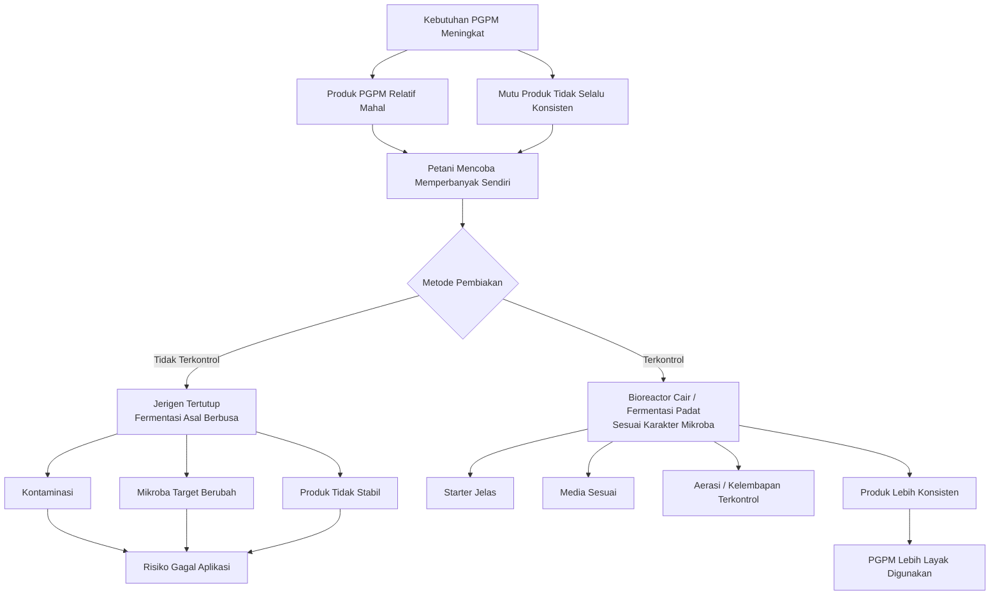

**Keterangan gambar:** Kebutuhan PGPM yang meningkat mendorong petani memperbanyak mikroba sendiri. Bila proses dilakukan tanpa kontrol, risiko kontaminasi dan perubahan komposisi mikroba sangat tinggi. Bioreactor sederhana diperlukan agar proses pembiakan lebih tertib, higienis, dan sesuai karakter mikroba.

---

## 1.2 Tujuan Panduan

Panduan ini disusun sebagai referensi praktis untuk membantu petani dan pelaku agribisnis memahami, merancang, mengoperasikan, dan mengevaluasi sistem pembiakan PGPM skala kecil. Tujuan utamanya bukan hanya membuat alat, tetapi membangun pemahaman agar pembiakan PGPM tidak dilakukan secara asal.

Secara khusus, panduan ini bertujuan untuk:

### 1. Menjelaskan konsep bioreactor cair dan padat

Panduan ini menjelaskan perbedaan antara bioreactor cair dan fermentasi padat. Bioreactor cair menggunakan media cair dan umumnya lebih sesuai untuk bakteri PGPM tertentu seperti _Bacillus_, _Azotobacter_, sebagian _Pseudomonas_, PSB, dan KSB. Sementara itu, fermentasi padat menggunakan media padat lembap dan lebih sesuai untuk fungi seperti _Trichoderma_.

Perbedaan ini penting karena tidak semua mikroba cocok dibiakkan dengan metode yang sama. _Trichoderma_ lebih sesuai pada media padat berpori, sedangkan banyak bakteri PGPM lebih sesuai pada media cair dengan aerasi cukup.

### 2. Membedakan proses aerob dan anaerob

Panduan ini menegaskan perbedaan antara proses aerob dan anaerob. Istilah yang tepat adalah **anaerob**, bukan “unaerob”. Sistem aerob membutuhkan oksigen, sedangkan sistem anaerob berlangsung tanpa oksigen.

Dalam pembiakan PGPM untuk akar tanaman, sistem aerob lebih relevan untuk sebagian besar mikroba penting. Tanah sehat di sekitar akar tanaman umumnya membutuhkan oksigen. Tanah yang becek, busuk, dan anaerob justru sering menyebabkan akar stres. Karena itu, pembiakan PGPM akar tidak boleh disamakan dengan fermentasi tertutup yang menghasilkan gas dan bau menyengat.

### 3. Membantu petani memilih metode pembiakan PGPM yang sesuai

Tidak semua PGPM dapat diperbanyak di tingkat petani. Panduan ini membantu membedakan mikroba mana yang relatif bisa dibiakkan secara terbatas, mana yang memerlukan kontrol semi-lab, dan mana yang sebaiknya tidak diperbanyak sembarangan.

Contoh arahan praktis:

- _Trichoderma_ lebih sesuai dengan fermentasi padat aerob.
- _Bacillus_ relatif paling aman untuk bioreactor cair sederhana.
- _Azotobacter_ memerlukan aerasi kuat.
- _Pseudomonas_ membutuhkan sanitasi lebih ketat.
- Mikoriza tidak dapat diperbanyak dengan fermentasi cair biasa.
- Konsorsium campuran tidak disarankan diperbanyak ulang sembarangan.

### 4. Memberikan rancangan teknis bioreactor cair kapasitas kerja 10 liter

Panduan ini memberikan rancangan bioreactor cair sederhana dengan kapasitas kerja 5–10 liter, menggunakan vessel sekitar 15 liter, aerasi bawah, diffuser, foam trap, port inlet, port outlet, port inokulasi, dan kran panen.

Rancangan ini ditujukan untuk pembiakan PGPM cair berbasis bakteri tertentu, terutama yang membutuhkan oksigen. Sistem ini tidak bertekanan dan tidak ditutup rapat seperti jerigen fermentasi liar.

### 5. Memberikan rancangan fermentasi padat kapasitas 5 kg

Panduan ini juga memberikan rancangan fermentasi padat kapasitas 5 kg menggunakan sistem tray modular. Setiap tray berisi sekitar 1 kg media basah dengan ketebalan 3–5 cm. Sistem ini dirancang untuk menjaga aerasi pasif, mencegah media terlalu tebal, memudahkan kontrol kontaminasi, dan mendukung pertumbuhan fungi aerob seperti _Trichoderma_.

### 6. Menyusun SOP operasi, sanitasi, panen, pascapanen, penyimpanan, monitoring, dan evaluasi ekonomi

Panduan ini tidak berhenti pada desain alat. Pembiakan PGPM memerlukan SOP yang jelas mulai dari persiapan alat, sanitasi, persiapan media, inokulasi, inkubasi, panen, pengemasan, penyimpanan, distribusi, hingga uji kelayakan sebelum aplikasi.

SOP dibutuhkan agar hasil pembiakan lebih konsisten dan mudah dievaluasi. Tanpa SOP, keberhasilan batch hanya bergantung pada kebiasaan, bukan pada proses yang terukur.

### 7. Mencegah kesalahan umum dalam pembiakan PGPM

Panduan ini secara khusus ditujukan untuk mencegah beberapa kesalahan umum, antara lain:

- Menganggap jerigen tertutup sebagai bioreactor.
- Menutup sistem aerob hingga kekurangan oksigen.
- Menggunakan media terlalu becek pada fermentasi padat.
- Menggunakan starter yang tidak jelas.
- Mencampur banyak produk mikroba tanpa uji kompatibilitas.
- Menganggap busa sebagai tanda pasti keberhasilan.
- Menggunakan produk berbau busuk atau berlendir.
- Menyimpan PGPM terlalu lama tanpa carrier dan kontrol mutu.
- Mengaplikasikan hasil pembiakan langsung ke seluruh lahan tanpa uji kecil.

Dengan tujuan tersebut, panduan ini diharapkan menjadi **one-stop reference** bagi praktisi yang ingin memproduksi PGPM secara terbatas, aman, dan lebih bertanggung jawab.

---

## Gambar 1.2. Ruang Lingkup Panduan Bioreactor PGPM

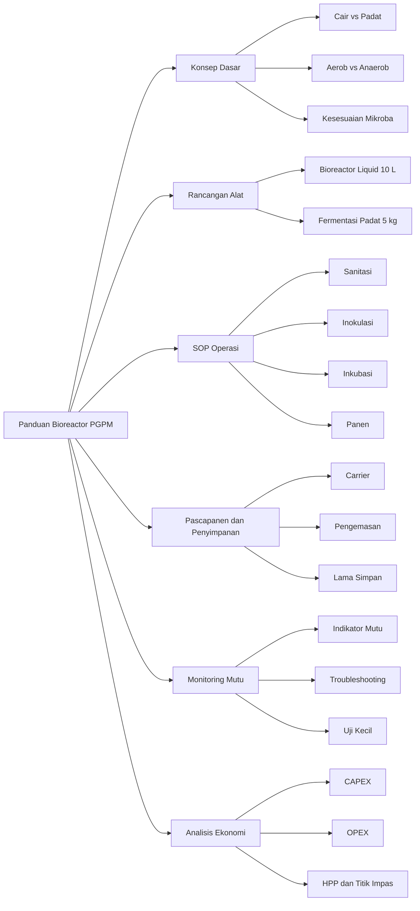

**Keterangan gambar:** Panduan ini mencakup seluruh tahapan pembiakan PGPM skala kecil, mulai dari konsep dasar, rancangan alat, SOP operasi, pascapanen, penyimpanan, monitoring mutu, hingga analisis ekonomi.

---

## 1.3 Sasaran Pengguna

Panduan ini ditulis untuk praktisi lapangan. Bahasa dan struktur pembahasan diarahkan agar mudah dipahami, tetapi tetap teknis dan bertanggung jawab. Sasaran utama pengguna panduan ini adalah sebagai berikut.

### Petani

Petani menjadi pengguna utama panduan ini. Banyak petani sudah mengenal PGPM, tetapi belum semua memahami cara pembiakan yang benar. Panduan ini membantu petani membedakan antara fermentasi asal-asalan dan pembiakan mikroba yang lebih terkendali.

Bagi petani, manfaat utama panduan ini adalah:

- memahami dasar bioreactor sederhana,
- menghindari kesalahan pembiakan mikroba,
- menekan biaya penggunaan PGPM,
- meningkatkan kemandirian input,
- melakukan uji kecil sebelum aplikasi luas,
- mengetahui kapan produk layak atau tidak layak digunakan.

### Kelompok Tani

Kelompok tani dapat menggunakan panduan ini sebagai dasar membangun unit produksi PGPM skala kecil. Dengan pendekatan kelompok, investasi alat, tenaga, dan ruang produksi dapat dibagi bersama. Produksi juga dapat lebih terjadwal dan terdokumentasi.

Namun, kelompok tani perlu memahami bahwa produksi PGPM tetap membutuhkan kedisiplinan. Starter harus jelas, alat harus bersih, proses harus dicatat, dan batch yang gagal harus ditolak.

### Teknisi Lapang

Teknisi lapang dapat menggunakan panduan ini untuk membantu petani merancang sistem pembiakan PGPM yang lebih aman. Teknisi juga dapat berperan dalam mengawasi SOP, memilih mikroba yang sesuai, mengontrol risiko kontaminasi, dan mengevaluasi hasil aplikasi di lapangan.

### Penyuluh

Penyuluh dapat menggunakan panduan ini sebagai bahan edukasi bagi petani. Topik yang paling penting untuk disampaikan adalah perbedaan bioreactor dan jerigen tertutup, pentingnya aerasi, bahaya kontaminasi, cara memilih starter, dan perlunya uji kecil sebelum aplikasi luas.

### Konsultan Pertanian

Konsultan pertanian dapat menggunakan panduan ini untuk menyusun SOP produksi PGPM terbatas bagi kebun, kelompok tani, atau unit agribisnis. Panduan ini juga dapat menjadi dasar evaluasi biaya, mutu, dan kelayakan produksi sendiri dibanding membeli produk komersial.

### Unit Produksi Mikroba Skala Kecil

Unit produksi mikroba skala kecil dapat menggunakan panduan ini sebagai kerangka awal untuk membangun sistem produksi terbatas. Namun, bila produk akan dijual secara komersial, unit produksi tetap harus memperhatikan aspek legalitas, standar mutu, pengujian populasi mikroba, stabilitas produk, label, klaim manfaat, dan keamanan pengguna.

### Pelaku Agribisnis Input Hayati

Pelaku agribisnis input hayati dapat menggunakan panduan ini untuk memahami kebutuhan praktis petani di lapangan. Produk PGPM yang baik tidak hanya harus mengandung mikroba hidup, tetapi juga harus mudah digunakan, jelas dosisnya, stabil penyimpanannya, dan kompatibel dengan sistem budidaya petani.

### Pengelola Kebun Cabai, Sayuran, dan Hortikultura

Pengelola kebun cabai, sayuran, dan hortikultura dapat menggunakan panduan ini untuk mendukung sistem budidaya berbasis mikroba. Pada komoditas hortikultura intensif, kebutuhan PGPM sering lebih tinggi karena tanaman mengalami tekanan pupuk, pestisida, stres air, penyakit tanah, dan panen berulang. Produksi PGPM terbatas dapat membantu menjaga kontinuitas aplikasi, selama SOP dilakukan dengan benar.

---

## Penutup Bab 1

PGPM memiliki peran penting dalam pertanian modern, tetapi keberhasilannya sangat ditentukan oleh mutu produk, cara pembiakan, cara penyimpanan, dan cara aplikasi. Pembiakan PGPM di tingkat petani dapat menjadi solusi untuk menekan biaya dan meningkatkan kemandirian, tetapi hanya bila dilakukan dengan sistem yang benar.

Bioreactor sederhana diperlukan agar proses pembiakan tidak berubah menjadi fermentasi liar. Untuk PGPM cair, sistem harus memperhatikan aerasi, starter, media, kebersihan, dan outlet udara. Untuk PGPM padat, media harus lembap, berpori, tidak becek, dan tetap mendapatkan oksigen. Baik sistem cair maupun padat memerlukan SOP, monitoring, pascapanen, penyimpanan, dan evaluasi ekonomi.

Panduan ini disusun sebagai referensi praktis yang menyatukan konsep, desain alat, SOP, mutu, risiko, dan biaya dalam satu dokumen. Dengan pendekatan ini, petani dan praktisi diharapkan dapat memproduksi PGPM secara lebih aman, konsisten, dan sesuai kebutuhan lapangan.

---

# Bab 2. Dasar-Dasar Bioreactor untuk PGPM

Bab ini membahas dasar-dasar bioreactor untuk pembiakan PGPM. Pemahaman dasar ini penting sebelum masuk ke rancangan alat, SOP, pascapanen, dan analisis ekonomi. Banyak kegagalan pembiakan PGPM di tingkat petani bukan disebabkan oleh tidak adanya alat, tetapi karena salah memahami konsep dasar: bioreactor dianggap sama dengan jerigen tertutup, fermentasi berbusa dianggap berhasil, dan semua mikroba dianggap bisa diperbanyak dengan metode yang sama.

Dalam praktiknya, setiap mikroba memiliki kebutuhan yang berbeda. Ada mikroba yang membutuhkan media cair dan aerasi, ada yang lebih cocok pada media padat lembap, ada yang membutuhkan oksigen tinggi, ada yang lebih sensitif terhadap oksigen, dan ada yang tidak bisa diperbanyak tanpa tanaman inang. Karena itu, bioreactor harus dirancang berdasarkan karakter mikroba, bukan sekadar berdasarkan ketersediaan wadah.

---

## 2.1 Apa Itu Bioreactor

Bioreactor adalah sistem atau perangkat yang digunakan untuk menumbuhkan, memperbanyak, atau memelihara mikroorganisme dalam kondisi yang lebih terkendali. Dalam konteks PGPM, bioreactor digunakan untuk membantu memperbanyak mikroba menguntungkan agar dapat digunakan sebagai inokulan pertanian.

Bioreactor bukan hanya wadah. Bioreactor adalah **sistem kendali proses biologis**. Artinya, di dalam bioreactor harus ada pengaturan atau setidaknya perhatian terhadap kondisi yang mempengaruhi pertumbuhan mikroba, seperti media, starter, oksigen, suhu, pH, kebersihan, waktu inkubasi, dan risiko kontaminasi.

Dalam skala petani, bioreactor tidak harus selalu canggih seperti alat laboratorium atau industri. Bioreactor sederhana tetap dapat dibuat dengan bahan yang mudah diperoleh, selama prinsip dasarnya benar. Yang penting adalah sistem tersebut mampu mendukung kehidupan mikroba target dan mengurangi risiko tumbuhnya mikroba kontaminan.

---

### Perbedaan Bioreactor dan Wadah Fermentasi Biasa

Wadah fermentasi biasa hanya berfungsi sebagai tempat menampung bahan. Misalnya ember, drum, botol, atau jerigen. Jika wadah tersebut hanya diisi bahan, ditutup, lalu dibiarkan tanpa kontrol, maka itu belum layak disebut bioreactor dalam pengertian teknis.

Bioreactor harus memiliki tujuan proses yang jelas. Minimal, harus diketahui mikroba apa yang akan diperbanyak, media apa yang digunakan, apakah mikroba membutuhkan oksigen atau tidak, bagaimana cara mencegah kontaminasi, kapan panen dilakukan, dan bagaimana produk disimpan setelah panen.

Perbedaan praktisnya dapat dilihat pada tabel berikut.

| Aspek              | Wadah Fermentasi Biasa | Bioreactor Sederhana                             |
| ------------------ | ---------------------- | ------------------------------------------------ |
| Fungsi utama       | Menampung bahan        | Mengendalikan proses pembiakan mikroba           |
| Starter mikroba    | Sering tidak jelas     | Harus jelas                                      |
| Media              | Sering campuran asal   | Disesuaikan dengan mikroba target                |
| Oksigen            | Tidak dikendalikan     | Disesuaikan: aerob, anaerob, atau mikroaerofilik |
| Kebersihan         | Sering diabaikan       | Menjadi syarat utama                             |
| Risiko kontaminasi | Tinggi                 | Ditekan dengan SOP                               |
| Panen              | Berdasarkan bau/busa   | Berdasarkan waktu dan indikator mutu             |
| Produk akhir       | Tidak selalu stabil    | Lebih konsisten bila SOP benar                   |

Kesalahan paling umum di lapangan adalah menganggap gas, busa, dan jerigen menggembung sebagai tanda keberhasilan pembiakan mikroba. Padahal, gas dan busa hanya menunjukkan adanya aktivitas biologis atau kimia. Aktivitas tersebut belum tentu berasal dari mikroba target. Bisa saja yang tumbuh justru mikroba liar atau kontaminan.

---

## Gambar 2.1. Perbedaan Wadah Fermentasi Biasa dan Bioreactor

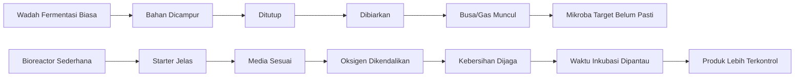

**Keterangan gambar:** Wadah fermentasi biasa hanya menampung proses, sedangkan bioreactor mengarahkan proses agar mikroba target dapat tumbuh lebih terkendali. Busa dan gas bukan bukti bahwa PGPM target berhasil diperbanyak.

---

### Bioreactor Bukan Sekadar Wadah Tertutup

Dalam pembiakan PGPM, wadah tertutup rapat sering menjadi sumber masalah. Banyak PGPM akar membutuhkan oksigen. Jika wadah ditutup rapat tanpa jalur keluar-masuk udara, kondisi di dalamnya dapat berubah menjadi rendah oksigen atau anaerob. Pada kondisi seperti ini, mikroba aerob dapat melemah, sementara mikroba lain yang tidak diinginkan dapat tumbuh.

Pada bioreactor cair aerob, harus ada:

- udara masuk,
- udara keluar,
- aerasi atau sirkulasi,
- ruang kosong atau headspace,
- jalur pelepasan gas,
- alat yang bersih,
- media yang sesuai.

Pada fermentasi padat aerob, harus ada:

- media padat lembap,
- ruang udara antarpartikel,
- lapisan media tidak terlalu tebal,
- penutup yang masih bisa bernapas,
- ruang inkubasi bersih,
- kelembapan yang tidak berlebihan.

Dengan demikian, prinsip dasarnya adalah:

**Bioreactor yang baik bukan yang paling tertutup, tetapi yang paling sesuai dengan kebutuhan mikroba target.**

---

### Parameter Utama yang Harus Dikendalikan

Agar bioreactor bekerja dengan baik, ada beberapa parameter penting yang perlu diperhatikan.

#### 1. Media

Media adalah sumber nutrisi dan tempat hidup mikroba selama proses pembiakan. Media harus sesuai dengan mikroba target. Media untuk bakteri cair berbeda dengan media untuk fungi pada fermentasi padat.

Media yang terlalu kaya gula dapat menyebabkan fermentasi liar, busa berlebihan, gas, perubahan pH, dan kontaminasi. Media yang terlalu miskin nutrisi dapat membuat mikroba tidak berkembang. Media yang busuk atau tercemar pestisida harus ditolak.

#### 2. Starter

Starter adalah sumber mikroba awal. Starter harus jelas identitasnya. Semakin tidak jelas starter yang digunakan, semakin besar risiko hasil pembiakan tidak sesuai harapan.

Starter yang baik sebaiknya memiliki informasi:

- jenis mikroba,
- sumber produk,
- tanggal produksi,
- tanggal kedaluwarsa,
- kondisi fisik normal,
- dosis penggunaan,
- cara simpan.

Jangan memperbanyak mikroba dari bahan busuk, tanah sakit, tanaman sakit, atau cairan fermentasi yang tidak jelas.

#### 3. Suhu

Suhu mempengaruhi kecepatan pertumbuhan mikroba. Suhu terlalu rendah dapat memperlambat pertumbuhan, sedangkan suhu terlalu tinggi dapat menekan mikroba target dan meningkatkan risiko kontaminasi.

Untuk sistem sederhana:

- bioreactor cair PGPM umumnya dijaga sekitar 28–32°C,
- fermentasi padat _Trichoderma_ umumnya dijaga sekitar 25–30°C.

Angka ini bersifat praktis dan dapat berbeda tergantung mikroba, starter, dan media.

#### 4. Oksigen

Oksigen sangat penting untuk banyak PGPM akar. Sistem cair untuk bakteri aerob membutuhkan aerasi. Sistem padat membutuhkan pori udara. Tanpa oksigen yang cukup, mikroba target dapat melemah atau kalah oleh kontaminan.

#### 5. Kelembapan

Kelembapan terutama penting pada fermentasi padat. Media harus lembap, tetapi tidak becek. Media terlalu kering membuat mikroba sulit tumbuh, sedangkan media terlalu basah mengurangi ruang udara dan memicu kondisi anaerob.

#### 6. pH

pH mempengaruhi kenyamanan mikroba. pH terlalu asam atau terlalu basa dapat menurunkan pertumbuhan mikroba target. Untuk banyak PGPM cair, pH awal yang mendekati netral lebih aman, misalnya sekitar 6,5–7,2. Namun, kebutuhan pH dapat berbeda tergantung jenis mikroba.

#### 7. Waktu Inkubasi

Waktu inkubasi harus dikendalikan. Panen terlalu cepat membuat populasi mikroba belum optimal. Panen terlalu lama dapat menyebabkan media menua, pH berubah, nutrisi habis, atau kontaminasi meningkat.

#### 8. Kebersihan

Kebersihan adalah syarat utama. Mikroba kontaminan dapat masuk dari air, wadah, tangan, udara, alat, media, atau lingkungan sekitar. Wadah bekas pestisida tidak boleh digunakan untuk produksi PGPM.

#### 9. Risiko Kontaminasi

Kontaminasi adalah masuk dan berkembangnya mikroba yang tidak diinginkan. Kontaminasi dapat mengubah fungsi produk, menurunkan populasi mikroba target, menimbulkan bau busuk, menghasilkan lendir, atau menyebabkan produk tidak aman untuk diaplikasikan.

---

## Tabel 2.1. Parameter Utama dalam Bioreactor PGPM

| Parameter          | Fungsi                                 | Risiko Bila Tidak Terkendali                     |
| ------------------ | -------------------------------------- | ------------------------------------------------ |
| Media              | Sumber nutrisi dan tempat tumbuh       | Mikroba tidak tumbuh atau kontaminan dominan     |
| Starter            | Sumber mikroba target                  | Mikroba tidak jelas dan hasil tidak konsisten    |
| Suhu               | Mengatur kecepatan pertumbuhan         | Mikroba stres atau kontaminasi meningkat         |
| Oksigen            | Mendukung mikroba aerob                | Produk menjadi anaerob, busuk, atau tidak stabil |
| Kelembapan         | Mendukung pertumbuhan pada media padat | Media kering atau becek                          |
| pH                 | Menjaga kenyamanan mikroba             | Pertumbuhan mikroba terhambat                    |
| Waktu inkubasi     | Menentukan titik panen                 | Populasi rendah atau media rusak                 |
| Kebersihan         | Menekan kontaminasi                    | Produk gagal atau tidak layak pakai              |
| Risiko kontaminasi | Menjaga mutu produk                    | Produk berubah fungsi dan tidak konsisten        |

---

## 2.2 Jenis Bioreactor Berdasarkan Bentuk Media

Berdasarkan bentuk medianya, bioreactor untuk PGPM dapat dibagi menjadi dua kelompok utama:

1. **Bioreactor cair**, yaitu sistem pembiakan mikroba dalam media cair.
2. **Bioreactor padat atau fermentasi padat**, yaitu sistem pembiakan mikroba pada media padat lembap.

Keduanya memiliki fungsi yang berbeda dan tidak boleh dipertukarkan sembarangan.

---

## A. Bioreactor Cair

Bioreactor cair menggunakan media cair sebagai tempat tumbuh mikroba. Sistem ini cocok untuk beberapa bakteri PGPM, terutama yang dapat tumbuh baik dalam media cair dengan aerasi cukup.

Mikroba yang relatif sesuai untuk sistem cair antara lain:

- _Bacillus_,
- _Azotobacter_,
- sebagian _Pseudomonas_,
- PSB,
- KSB.

Namun, setiap mikroba tetap memiliki kebutuhan yang berbeda. _Bacillus_ relatif lebih toleran dan sering menjadi pilihan awal yang lebih aman. _Azotobacter_ membutuhkan oksigen cukup tinggi. _Pseudomonas_ membutuhkan kebersihan lebih ketat karena lebih rentan terhadap kontaminasi. PSB dan KSB harus menggunakan isolat yang jelas agar fungsi pelarut fosfat atau kalium tetap sesuai.

---

### Ciri Bioreactor Cair yang Baik

Bioreactor cair sederhana yang baik memiliki ciri berikut:

- menggunakan wadah bersih,
- memiliki starter jelas,
- menggunakan media sesuai,
- memiliki aerasi,
- memiliki jalur udara masuk,
- memiliki jalur udara keluar,
- tidak ditutup rapat tanpa outlet,
- memiliki ruang headspace,
- dapat dipanen melalui port atau kran,
- mudah dibersihkan setelah digunakan.

Pada sistem cair aerob, aerasi adalah komponen penting. Aerasi membantu menyediakan oksigen, menjaga media lebih homogen, dan mencegah terbentuknya zona anaerob. Karena itu, jerigen tertutup tanpa aerasi tidak layak disebut bioreactor cair aerob.

---

### Risiko Bioreactor Cair yang Salah

Risiko utama pada sistem cair adalah kontaminasi dan kondisi anaerob. Jika media terlalu kaya nutrisi, wadah tidak bersih, aerasi kurang, atau outlet tertutup, maka produk dapat menjadi tidak stabil.

Tanda proses cair yang perlu diwaspadai:

- bau busuk,
- lendir berlebihan,
- busa berlebihan,
- gas tertahan,
- botol menggembung keras,
- endapan busuk,
- perubahan warna ekstrem.

Jika tanda-tanda tersebut muncul, produk tidak boleh langsung diaplikasikan luas. Batch perlu dievaluasi dan sebaiknya diuji kecil terlebih dahulu, atau ditolak bila gejalanya berat.

---

## Gambar 2.2. Prinsip Bioreactor Cair Aerob

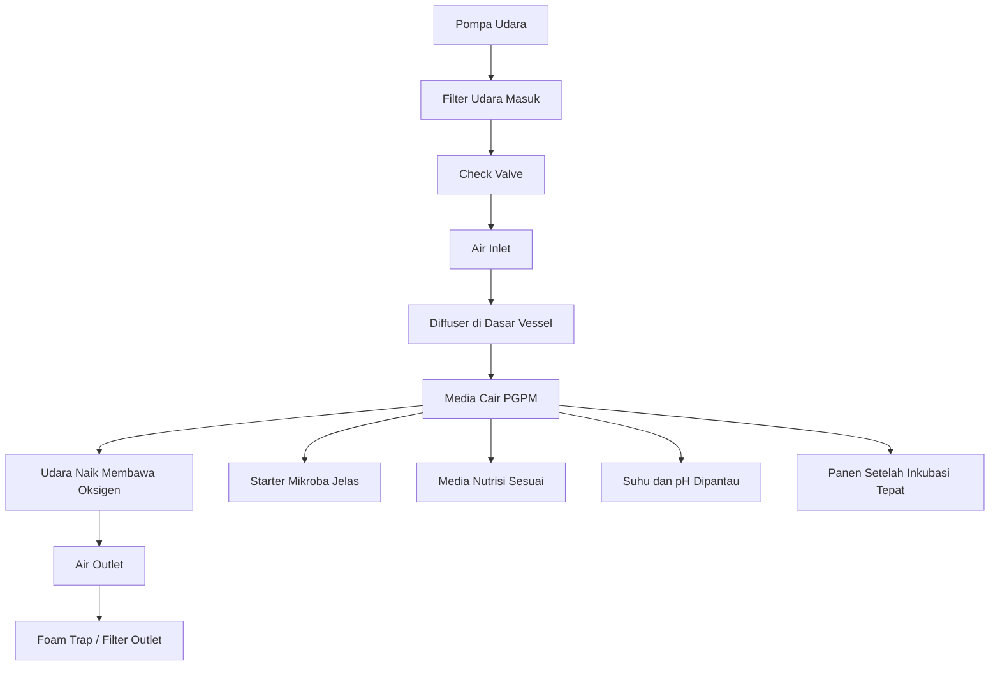

**Keterangan gambar:** Bioreactor cair aerob membutuhkan aliran udara masuk, diffuser, media cair, dan jalur udara keluar. Sistem tidak boleh ditutup rapat karena udara dan gas harus dapat keluar dengan aman.

---

## B. Bioreactor Padat / Fermentasi Padat

Bioreactor padat, atau lebih tepat disebut **fermentasi padat**, menggunakan media padat lembap sebagai tempat tumbuh mikroba. Sistem ini sangat relevan untuk fungi PGPM seperti _Trichoderma_.

Fermentasi padat tidak berarti media dibuat basah seperti bubur. Media harus lembap, tetapi tetap berpori. Ruang udara antarpartikel media sangat penting karena _Trichoderma_ dan banyak fungi PGPM membutuhkan oksigen untuk tumbuh baik.

Mikroba yang sesuai untuk sistem padat antara lain:

- _Trichoderma_,
- sebagian fungi pelarut fosfat,
- mikroba yang diinokulasikan pada kompos matang dengan kontrol sederhana.

---

### Ciri Fermentasi Padat yang Baik

Fermentasi padat yang baik memiliki ciri berikut:

- media padat lembap,
- tidak becek,
- tidak berlendir,
- tidak berbau busuk,
- lapisan media tidak terlalu tebal,
- menggunakan tray dangkal,
- penutup masih bisa bernapas,
- suhu ruang stabil,
- kontaminasi mudah dipantau.

Untuk kapasitas kecil, sistem tray lebih aman daripada satu wadah besar. Misalnya, untuk kapasitas 5 kg, lebih baik menggunakan 5 tray berisi 1 kg media daripada satu wadah berisi 5 kg media tebal. Media yang terlalu tebal mudah panas, kekurangan oksigen, dan terkontaminasi.

---

### Media Tidak Boleh Becek

Kelembapan media adalah titik kritis. Media yang terlalu kering akan menghambat pertumbuhan mikroba. Namun, media yang terlalu basah dapat menghilangkan ruang udara antarpartikel. Jika ruang udara hilang, proses dapat berubah menjadi anaerob dan berisiko menghasilkan bau busuk, lendir, dan kontaminasi.

Kondisi ideal media fermentasi padat:

- dapat menggumpal ringan bila diremas,
- tidak meneteskan air,
- tetap remah,
- tidak panas,
- tidak berbau busuk,
- tidak seperti bubur.

---

## Gambar 2.3. Prinsip Fermentasi Padat Aerob

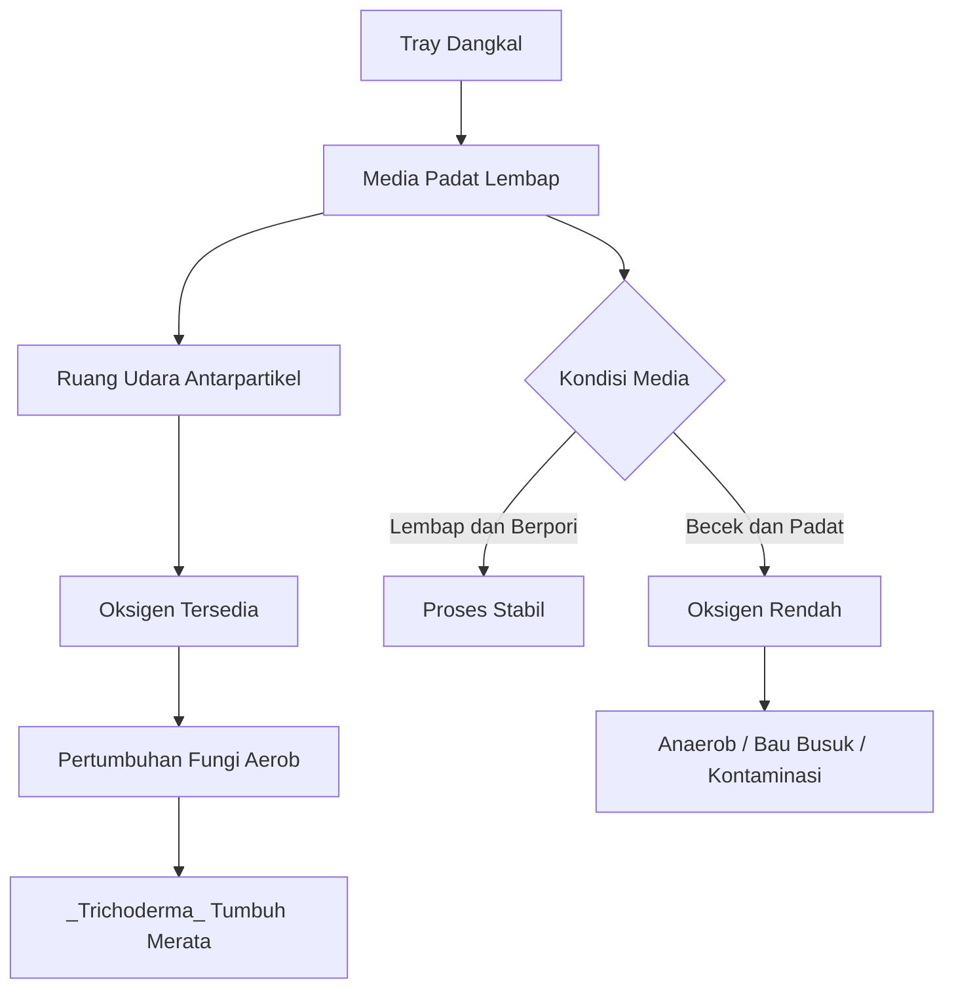

**Keterangan gambar:** Fermentasi padat yang benar menggunakan media lembap dan berpori. Media terlalu basah atau terlalu tebal dapat mengurangi oksigen dan memicu kontaminasi.

---

## Tabel 2.2. Perbandingan Bioreactor Cair dan Fermentasi Padat

| Aspek           | Bioreactor Cair                     | Fermentasi Padat                           |
| --------------- | ----------------------------------- | ------------------------------------------ |
| Bentuk media    | Cair                                | Padat lembap                               |
| Mikroba utama   | Bakteri PGPM tertentu               | Fungi PGPM seperti _Trichoderma_           |
| Kebutuhan utama | Aerasi, sirkulasi, kebersihan       | Kelembapan tepat, pori udara, tray dangkal |
| Risiko utama    | Anaerob, busa, lendir, kontaminasi  | Media becek, panas, jamur liar             |
| Contoh mikroba  | _Bacillus_, _Azotobacter_, PSB, KSB | _Trichoderma_, fungi pelarut fosfat        |
| Penutup         | Tidak boleh rapat tanpa outlet      | Breathable, tidak kedap udara              |
| Panen           | Kultur cair                         | Media padat terkolonisasi                  |
| Aplikasi        | Kocor akar, aktivasi cair           | Media semai, kompos, lubang tanam, tanah   |

---

## 2.3 Jenis Bioreactor Berdasarkan Kebutuhan Oksigen

Selain berdasarkan bentuk media, bioreactor juga perlu dipahami berdasarkan kebutuhan oksigen mikroba. Ini penting karena kesalahan oksigen adalah salah satu penyebab utama kegagalan pembiakan PGPM.

Secara praktis, sistem dapat dibagi menjadi:

1. sistem aerob,
2. sistem anaerob,
3. sistem fakultatif,
4. sistem mikroaerofilik.

---

## A. Sistem Aerob

Sistem aerob adalah sistem yang membutuhkan oksigen. Banyak PGPM akar termasuk kelompok yang lebih sesuai dengan kondisi aerob. Hal ini masuk akal karena akar tanaman sehat juga membutuhkan oksigen. Tanah yang tergenang, busuk, dan anaerob justru sering membuat akar stres.

Sistem aerob sesuai untuk:

- bioreactor cair beraerasi,
- fermentasi padat berpori,
- tray _Trichoderma_,
- kultur bakteri PGPM yang membutuhkan oksigen.

Contoh mikroba yang berkaitan dengan sistem aerob:

- _Trichoderma_,
- _Azotobacter_,
- banyak _Pseudomonas_,
- _Bacillus_ tertentu,
- _Streptomyces_.

Dalam sistem cair, aerob dicapai melalui aerasi. Dalam sistem padat, aerob dicapai melalui ruang udara antarpartikel media, ketebalan media yang tidak berlebihan, dan penutup yang tidak kedap udara.

---

### Prinsip Sistem Aerob

Prinsip sistem aerob:

- oksigen harus tersedia,
- media tidak boleh membusuk,
- wadah tidak boleh tertutup rapat tanpa outlet,
- aerasi harus stabil pada sistem cair,
- media harus berpori pada sistem padat,
- bau busuk adalah tanda bahaya,
- lendir berlebihan perlu diwaspadai.

Sistem aerob yang baik tidak harus selalu memakai alat mahal. Untuk sistem cair, pompa udara dan diffuser dapat cukup pada skala kecil. Untuk sistem padat, tray dangkal dan penutup breathable sudah membantu menjaga oksigen.

---

## B. Sistem Anaerob

Istilah yang tepat adalah **anaerob**, bukan “unaerob”. Sistem anaerob adalah sistem yang berlangsung tanpa oksigen. Dalam pertanian, proses anaerob dapat ditemukan pada beberapa fermentasi organik tertentu. Namun, sistem anaerob **tidak cocok untuk sebagian besar PGPM akar cabai dan sayuran**.

Banyak mikroba PGPM yang dibahas dalam panduan ini bekerja di zona akar yang membutuhkan oksigen. Karena itu, membiakkan PGPM dalam jerigen tertutup rapat tanpa aerasi sering kali tidak sesuai dengan kebutuhan mikroba target.

---

### Risiko Sistem Anaerob untuk PGPM Akar

Risiko proses anaerob yang tidak tepat meliputi:

- bau busuk,
- gas berlebihan,
- kontaminasi,
- mikroba target kalah,
- produk tidak stabil,
- perubahan pH ekstrem,
- potensi fitotoksik bila media membusuk,
- hasil aplikasi tidak konsisten.

Sistem anaerob tidak boleh dianggap berhasil hanya karena ada gas. Gas dapat berasal dari mikroba liar atau fermentasi yang tidak sesuai dengan PGPM target.

Kalimat praktisnya:

**Jika targetnya PGPM akar aerob, maka wadah tertutup menggembung bukan tanda keberhasilan. Itu tanda proses harus dievaluasi.**

---

## C. Sistem Fakultatif dan Mikroaerofilik

Tidak semua mikroba hanya bisa hidup dalam kondisi aerob penuh atau anaerob penuh. Ada mikroba yang bersifat fakultatif dan ada yang mikroaerofilik.

### Mikroba fakultatif

Mikroba fakultatif dapat hidup pada kondisi dengan oksigen maupun oksigen rendah. Beberapa _Bacillus_ relatif lebih fleksibel. Namun, fleksibel bukan berarti boleh diperbanyak sembarangan. Kondisi busuk, kotor, atau terlalu lama tetap dapat menurunkan mutu produk.

Prinsip praktis:

- tetap gunakan starter jelas,
- tetap jaga kebersihan,
- tetap hindari bau busuk,
- tetap hindari wadah bertekanan,
- tetap lakukan uji kecil sebelum aplikasi luas.

### Mikroba mikroaerofilik

Mikroba mikroaerofilik membutuhkan oksigen rendah, tetapi bukan kondisi busuk tanpa oksigen. Beberapa _Azospirillum_ lebih sensitif dan memerlukan kontrol yang lebih baik. Karena itu, _Azospirillum_ tidak ideal diperbanyak secara kasar di tingkat petani tanpa prosedur yang jelas.

Kondisi mikroaerofilik tidak sama dengan jerigen tertutup berbau busuk. Mikroaerofilik tetap membutuhkan pengendalian kondisi, bukan sekadar menutup wadah rapat.

---

## Tabel 2.3. Kebutuhan Oksigen Beberapa PGPM

| Jenis Mikroba  | Kebutuhan Oksigen Umum             | Sistem Lebih Sesuai        | Catatan                                  |
| -------------- | ---------------------------------- | -------------------------- | ---------------------------------------- |
| _Trichoderma_  | Aerob                              | Fermentasi padat berpori   | Media lembap, tidak becek                |
| _Bacillus_     | Aerob/fakultatif tergantung jenis  | Cair beraerasi atau padat  | Relatif fleksibel tetapi tetap perlu SOP |
| _Pseudomonas_  | Umumnya aerob                      | Cair terkontrol            | Butuh sanitasi lebih ketat               |
| _Azotobacter_  | Aerob kuat                         | Cair beraerasi             | Butuh oksigen cukup                      |
| _Azospirillum_ | Mikroaerofilik/fakultatif tertentu | Semi-lab/produk siap pakai | Lebih sensitif                           |
| PSB            | Tergantung isolat                  | Cair/padat terkontrol      | Fungsi pelarut P harus jelas             |
| KSB            | Tergantung strain                  | Cair/padat terkontrol      | Lebih aman memakai strain teruji         |
| _Streptomyces_ | Aerob                              | Padat/semi-lab             | Perlu kontrol lebih baik                 |
| Mikoriza       | Simbiotik dengan akar hidup        | Trap culture               | Tidak bisa fermentasi cair biasa         |

---

## Gambar 2.4. Pemilihan Sistem Berdasarkan Kebutuhan Oksigen

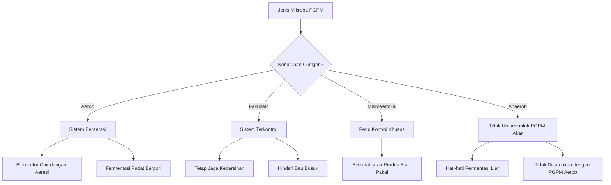

**Keterangan gambar:** Pemilihan sistem pembiakan harus mengikuti kebutuhan oksigen mikroba. Mayoritas PGPM akar lebih sesuai dengan sistem aerob atau setidaknya sistem yang tidak busuk dan tidak tertutup ekstrem.

---

## 2.4 Mengapa Bioreactor Penting untuk Petani

Bioreactor penting bagi petani karena dapat membantu menjembatani kebutuhan PGPM yang tinggi dengan keterbatasan biaya dan ketersediaan produk. Namun, manfaat bioreactor hanya muncul bila prosesnya dilakukan dengan benar.

---

### 1. Membantu Menghasilkan PGPM Lebih Konsisten

Dengan bioreactor sederhana, proses pembiakan dapat lebih teratur. Petani dapat mencatat starter, media, waktu inkubasi, suhu, pH, aerasi, aroma, dan hasil akhir. Catatan ini membantu menilai apakah proses berjalan baik atau tidak.

Tanpa bioreactor dan SOP, hasil pembiakan sulit diprediksi. Batch pertama bisa tampak baik, batch berikutnya gagal, dan penyebabnya tidak diketahui.

---

### 2. Mengurangi Risiko Fermentasi Liar

Fermentasi liar terjadi ketika mikroba yang tumbuh tidak dikendalikan. Biasanya ini terjadi karena starter tidak jelas, media terlalu kaya, wadah tidak bersih, air tercemar, atau proses terlalu anaerob.

Bioreactor membantu mengurangi risiko tersebut dengan:

- starter yang jelas,
- media yang sesuai,
- wadah bersih,
- aerasi atau kelembapan yang benar,
- waktu inkubasi terukur,
- panen pada waktu yang tepat.

---

### 3. Menekan Biaya Pembelian Produk Mikroba

PGPM sering perlu diaplikasikan berulang. Untuk petani atau kelompok tani, pembelian produk berulang dapat menjadi beban biaya. Pembiakan terbatas dengan sistem yang benar dapat membantu menekan biaya per aplikasi.

Namun, penghematan biaya tidak boleh mengorbankan mutu. Produk murah tetapi gagal atau terkontaminasi justru dapat merugikan. Karena itu, analisis ekonomi harus selalu dikaitkan dengan mutu dan keberhasilan aplikasi.

---

### 4. Meningkatkan Kemandirian Petani dan Kelompok Tani

Bioreactor sederhana dapat membantu petani dan kelompok tani menjadi lebih mandiri dalam penyediaan inokulan. Kemandirian ini penting terutama pada lokasi yang sulit memperoleh produk PGPM berkualitas atau saat harga input naik.

Namun, kemandirian harus dibangun dengan disiplin teknis. Produksi sendiri tidak boleh berarti produksi sembarangan.

---

### 5. Memudahkan Produksi Skala Kecil yang Terkontrol

Bioreactor cair 10 liter dan fermentasi padat 5 kg merupakan skala yang sesuai untuk pembelajaran, uji coba, dan produksi terbatas. Skala ini tidak terlalu besar sehingga risiko kerugian masih dapat dikendalikan bila terjadi kegagalan batch.

Dengan skala kecil, petani dapat:

- mencoba satu jenis mikroba terlebih dahulu,
- mencatat hasil,
- melakukan uji kecil di lahan,
- memperbaiki SOP,
- baru memperbesar volume bila proses stabil.

---

### 6. Membantu Kontrol Mutu Sebelum Aplikasi

Bioreactor tidak otomatis menjamin produk bermutu, tetapi memudahkan kontrol mutu. Produk dapat diperiksa dari aroma, warna, busa, lendir, pH, kontaminasi visual, kondisi media, dan respons uji kecil di tanaman.

Produk yang berbau busuk, berlendir, menggembung keras, atau terkontaminasi tidak boleh digunakan luas. Dengan SOP, batch gagal dapat ditolak sebelum merugikan lahan.

---

### 7. Mengurangi Praktik Jerigen Tertutup yang Berisiko

Salah satu tujuan utama panduan ini adalah mengurangi penggunaan jerigen tertutup sebagai “bioreactor” tanpa aerasi dan tanpa kontrol. Praktik tersebut berisiko tinggi untuk PGPM akar aerob.

Bioreactor sederhana yang benar harus memberi ruang bagi kebutuhan mikroba. Untuk sistem cair aerob, perlu aerasi dan outlet udara. Untuk fermentasi padat, perlu media berpori dan penutup breathable.

---

### 8. Membantu Petani Membedakan PGPM yang Benar dan Fermentasi Asal Berbusa

Banyak produk fermentasi tampak aktif karena berbusa atau menghasilkan gas. Namun, pembiakan PGPM tidak bisa dinilai hanya dari tampilan tersebut. Petani perlu memahami bahwa keberhasilan PGPM ditentukan oleh:

- mikroba target,
- populasi yang layak,
- media yang sesuai,
- proses yang bersih,
- tidak ada kontaminasi berat,
- produk tidak rusak,
- respons tanaman setelah aplikasi.

Dengan pemahaman ini, petani tidak mudah tertipu oleh tanda-tanda fermentasi yang menyesatkan.

---

### 9. Menjadi Dasar Produksi PGPM yang Lebih Bertanggung Jawab

Produksi PGPM, meskipun skala kecil, tetap harus bertanggung jawab. Produk yang dihasilkan akan diaplikasikan ke lahan, tanah, akar, dan tanaman. Jika produk terkontaminasi atau rusak, dampaknya dapat merugikan petani sendiri.

Karena itu, bioreactor harus dipandang sebagai bagian dari sistem mutu, bukan hanya alat produksi.

---

## Gambar 2.5. Manfaat Bioreactor Sederhana bagi Petani

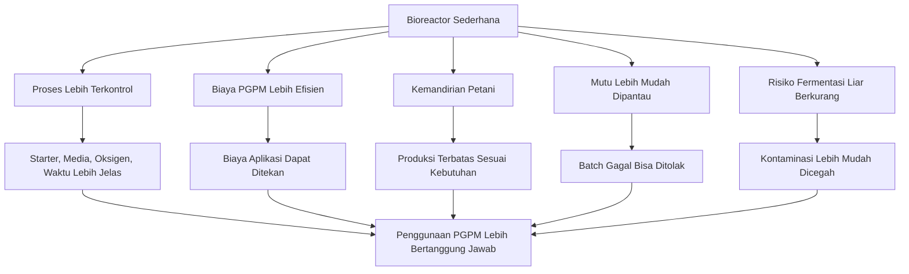

**Keterangan gambar:** Bioreactor sederhana membantu petani menghasilkan PGPM dengan proses yang lebih terkendali, biaya lebih efisien, dan risiko fermentasi liar lebih rendah. Namun, manfaat ini hanya tercapai jika SOP dan kontrol mutu dilakukan dengan disiplin.

---

## Ringkasan Bab 2

Bioreactor adalah sistem untuk mengontrol pertumbuhan mikroba, bukan sekadar wadah tertutup. Dalam pembiakan PGPM, bioreactor harus memperhatikan media, starter, suhu, oksigen, kelembapan, pH, waktu inkubasi, kebersihan, dan risiko kontaminasi.

Berdasarkan bentuk media, bioreactor dibagi menjadi bioreactor cair dan fermentasi padat. Bioreactor cair menggunakan media cair dan cocok untuk beberapa bakteri PGPM seperti _Bacillus_, _Azotobacter_, sebagian _Pseudomonas_, PSB, dan KSB. Fermentasi padat menggunakan media padat lembap dan lebih cocok untuk fungi aerob seperti _Trichoderma_.

Berdasarkan kebutuhan oksigen, sistem pembiakan dapat berupa aerob, anaerob, fakultatif, atau mikroaerofilik. Untuk mayoritas PGPM akar, sistem aerob lebih relevan. Sistem anaerob tertutup tidak cocok untuk sebagian besar PGPM akar cabai dan sayuran karena berisiko menghasilkan bau busuk, gas berlebihan, kontaminasi, dan produk tidak stabil.

Bioreactor penting bagi petani karena membantu menghasilkan PGPM lebih konsisten, mengurangi fermentasi liar, menekan biaya, meningkatkan kemandirian, memudahkan kontrol mutu, dan mencegah kesalahan umum seperti jerigen tertutup yang dianggap sebagai bioreactor.

---

# Bab 3. Kebutuhan Pembiakan PGPM dan Kesesuaian Metode

Bab ini membahas alasan PGPM perlu dibiakkan, batas aman pembiakan di tingkat petani, kesesuaian mikroba dengan sistem cair dan padat, serta perbedaan antara aktivasi, perbanyakan terbatas, dan produksi. Bab ini penting karena tidak semua PGPM dapat diperlakukan sama. Setiap mikroba memiliki kebutuhan media, oksigen, kebersihan, dan sistem pembiakan yang berbeda.

Kesalahan umum di lapangan adalah menganggap semua produk mikroba bisa diperbanyak dengan cara yang sama. Misalnya, semua produk dicampur ke dalam jerigen, ditambah molase, ditutup rapat, lalu dianggap berhasil jika muncul gas atau busa. Cara seperti ini berisiko tinggi karena mikroba target bisa kalah oleh mikroba lain, komposisi produk berubah, atau produk menjadi tidak stabil.

Dalam pembiakan PGPM, pertanyaan utama bukan hanya “bisa diperbanyak atau tidak”, tetapi:

**mikroba apa yang diperbanyak, untuk tujuan apa, dengan metode apa, dan seberapa besar risikonya bila dilakukan di tingkat petani.**

---

## 3.1 Mengapa PGPM Perlu Dibiakkan

PGPM perlu dibiakkan karena kebutuhan aplikasi di lapangan sering lebih besar daripada volume produk awal yang tersedia. Pada budidaya intensif, terutama cabai, tomat, melon, semangka, sayuran daun, dan hortikultura lain, PGPM tidak hanya digunakan sekali. Mikroba dapat digunakan sejak media semai, pindah tanam, fase vegetatif, fase generatif, pemulihan setelah pestisida berat, hingga pemeliharaan tanaman selama panen.

Namun, pembiakan PGPM harus dilakukan secara hati-hati. Tujuannya bukan sekadar memperbanyak cairan atau memperbanyak volume, tetapi memperbanyak mikroba target yang benar dengan kondisi yang mendukung.

---

### A. Menambah Volume Aplikasi

Alasan paling umum petani ingin membiakkan PGPM adalah untuk menambah volume aplikasi. Produk awal sering terbatas, sementara kebutuhan lapangan cukup besar. Misalnya, aplikasi kocor akar pada ribuan tanaman membutuhkan volume larutan yang tidak sedikit.

Namun, perlu dibedakan antara:

- memperbanyak mikroba,
- mengencerkan produk,
- mengaktivasi produk,
- dan membuat fermentasi baru.

Mengencerkan produk hanya menambah volume larutan, tetapi tidak selalu menambah populasi mikroba. Aktivasi dapat membantu menyiapkan mikroba sebelum aplikasi, tetapi belum tentu sama dengan produksi. Perbanyakan mikroba membutuhkan starter jelas, media sesuai, kondisi oksigen tepat, kebersihan, dan waktu inkubasi yang terkendali.

### Kotak Hitung 3.1. Menghitung Kebutuhan Larutan PGPM untuk Aplikasi

```text id="bab3-rumus-01"
Total larutan aplikasi (L) =
jumlah tanaman × volume aplikasi per tanaman (ml) ÷ 1.000
```

Contoh:

```text id="bab3-contoh-01"
Jumlah tanaman = 2.000 tanaman
Volume kocor = 150 ml/tanaman

Total larutan aplikasi =
2.000 × 150 ÷ 1.000

Total larutan aplikasi = 300 L
```

Perhitungan ini menunjukkan bahwa kebutuhan larutan aplikasi dapat jauh lebih besar daripada volume produk PGPM awal. Namun, kebutuhan larutan besar tidak berarti semua larutan harus berasal dari hasil pembiakan sendiri. Petani tetap perlu mempertimbangkan mutu, risiko kontaminasi, dan kelayakan ekonomi.

---

### B. Menyiapkan Mikroba Sebelum Aplikasi

Beberapa produk PGPM perlu disiapkan sebelum aplikasi. Persiapan ini dapat berupa pelarutan, pengenceran, pengaktifan singkat, atau pencampuran dengan air bersih sesuai petunjuk produk. Tujuannya agar mikroba lebih siap diaplikasikan ke zona akar, media semai, kompos matang, atau lubang tanam.

Pada tahap ini, yang dilakukan biasanya adalah **aktivasi**, bukan produksi. Aktivasi harus mengikuti petunjuk produk. Bila produk tidak memberikan instruksi aktivasi, jangan melakukan fermentasi tambahan secara sembarangan.

Prinsip praktis:

- Gunakan air bersih.
- Hindari air berklorin tinggi.
- Jangan gunakan wadah bekas pestisida.
- Jangan campur dengan fungisida, bakterisida, tembaga, atau pupuk pekat.
- Gunakan larutan segera setelah disiapkan.
- Jangan menyimpan larutan aktivasi terlalu lama.

---

### C. Memperbanyak Mikroba Tertentu dengan Starter Jelas

Pembiakan PGPM hanya layak dilakukan bila starter mikroba jelas. Starter yang jelas berarti identitas mikroba diketahui, sumbernya dapat dipercaya, dan produk awal masih layak digunakan.

Contoh starter yang lebih aman:

- produk _Bacillus_ dengan label jelas,
- produk _Trichoderma_ dengan identitas jelas,
- starter dari laboratorium atau produsen terpercaya,
- isolat yang sudah diuji oleh lembaga atau unit teknis.

Contoh sumber yang tidak disarankan:

- cairan busuk dari jerigen lama,
- tanah dari tanaman sakit,
- akar tanaman sakit,
- buah busuk,
- kompos mentah berbau,
- larutan fermentasi tidak jelas,
- campuran banyak produk mikroba yang tidak diketahui kompatibilitasnya.

Pembiakan dari sumber tidak jelas berisiko membawa patogen, kontaminan, atau mikroba yang tidak diinginkan ke lahan.

---

### D. Mengurangi Biaya Operasional

Pembiakan PGPM secara terbatas dapat membantu menurunkan biaya operasional, terutama bila aplikasi dilakukan berulang. Namun, penghematan hanya bernilai bila produk hasil pembiakan tetap layak pakai.

Produk yang murah tetapi rusak dapat menyebabkan kerugian lebih besar, misalnya:

- tanaman stres setelah aplikasi,
- akar terganggu,
- aplikasi tidak memberi respons,
- penyakit tanah tidak terkendali,
- waktu dan tenaga terbuang,
- batch harus dibuang.

Karena itu, pembiakan PGPM perlu dihitung sebagai keputusan teknis dan ekonomi, bukan hanya keputusan penghematan biaya.

### Kotak Hitung 3.2. Menghitung Kebutuhan Batch Pembiakan Cair

```text id="bab3-rumus-02"
Jumlah batch =
total volume PGPM cair yang dibutuhkan ÷ volume kerja bioreactor per batch
```

Contoh:

```text id="bab3-contoh-02"
Total volume PGPM cair yang dibutuhkan = 30 L
Volume kerja bioreactor = 10 L/batch

Jumlah batch = 30 ÷ 10
Jumlah batch = 3 batch
```

Catatan: hasil pembiakan tidak boleh langsung diasumsikan 100% layak. Dalam analisis ekonomi, perlu memperhitungkan kemungkinan batch gagal atau ditolak.

---

### E. Mendukung Program Budidaya Terpadu

PGPM lebih efektif bila menjadi bagian dari sistem budidaya terpadu. Artinya, PGPM tidak berdiri sendiri, tetapi diintegrasikan dengan:

- bahan organik matang,
- pengelolaan pH,
- drainase,
- irigasi,
- pemupukan berimbang,
- pengendalian hama penyakit,
- sanitasi lahan,
- monitoring akar dan tanaman.

Pembiakan PGPM yang baik membantu memastikan ketersediaan inokulan untuk kebutuhan budidaya tersebut. Namun, PGPM tidak boleh diposisikan sebagai pengganti total pupuk, pestisida, atau manajemen lahan.

---

### F. Menyediakan Inokulan untuk Beberapa Titik Aplikasi

PGPM hasil pembiakan dapat digunakan untuk beberapa kebutuhan lapangan, selama jenis mikroba, bentuk produk, dan metode aplikasinya sesuai.

Titik aplikasi PGPM meliputi:

#### 1. Media semai

Media semai dapat diinokulasi dengan mikroba tertentu, terutama _Trichoderma_, untuk membantu menciptakan media yang lebih sehat. Namun, media harus matang, bersih, tidak becek, dan tidak berbau busuk.

#### 2. Lubang tanam

Beberapa PGPM dapat diberikan pada lubang tanam, terutama _Trichoderma_ dan mikoriza. Untuk mikoriza, perlu ditegaskan bahwa mikoriza tidak diperbanyak melalui fermentasi cair biasa. Mikoriza harus dekat dengan akar hidup.

#### 3. Kocor akar

PGPM cair seperti _Bacillus_, _Azotobacter_, PSB, dan KSB dapat diaplikasikan melalui kocor akar, asalkan produk layak, tidak terkontaminasi, dan tidak diberikan berdekatan dengan pestisida berat.

#### 4. Kompos matang

Kompos matang dapat diinokulasi dengan _Trichoderma_ atau mikroba tertentu untuk mendukung aktivitas biologis tanah. Kompos yang masih panas, berbau amonia, busuk, atau berlendir tidak boleh digunakan.

#### 5. Pemulihan lahan

PGPM dapat digunakan untuk membantu pemulihan lahan yang mengalami stres biologis, misalnya setelah penggunaan pestisida berat atau pada tanah dengan bahan organik rendah. Namun, pemulihan lahan tetap memerlukan perbaikan drainase, bahan organik, pH, dan sanitasi.

#### 6. Area bekas penyakit tanah

Pada area bekas layu, busuk akar, atau rebah semai, PGPM dapat menjadi bagian dari strategi pencegahan. Aplikasi harus dimulai sejak persiapan lahan, bukan hanya setelah tanaman mati.

---

## Gambar 3.1. Alasan Pembiakan PGPM di Tingkat Petani

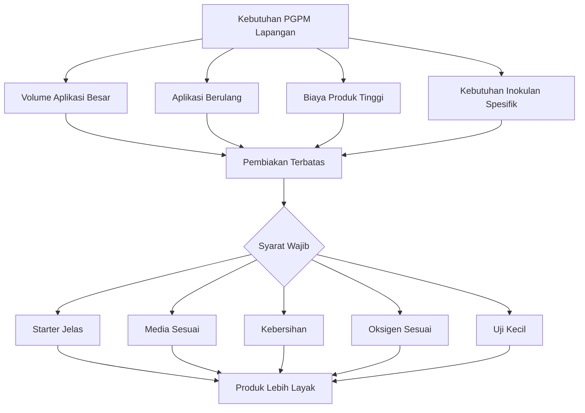

**Keterangan gambar:** Pembiakan PGPM dapat membantu memenuhi kebutuhan aplikasi, tetapi hanya layak dilakukan bila starter, media, kebersihan, oksigen, dan uji kecil diperhatikan.

---

## 3.2 Batasan Pembiakan PGPM di Tingkat Petani

Pembiakan PGPM di tingkat petani memiliki batasan. Batasan ini penting agar petani tidak memaksakan semua jenis mikroba untuk diperbanyak dengan alat dan prosedur sederhana.

Prinsip dasarnya adalah:

**semakin kompleks karakter mikroba, semakin tinggi kebutuhan kontrol prosesnya.**

---

### A. Tidak Semua PGPM Bisa Dibiakkan Petani

Beberapa mikroba relatif lebih mudah diperbanyak secara terbatas, misalnya _Trichoderma_ pada fermentasi padat atau _Bacillus_ pada sistem cair aerob sederhana. Namun, mikroba lain membutuhkan kontrol lebih baik, misalnya _Pseudomonas_, _Azospirillum_, _Streptomyces_, endofit, dan mikoriza.

Pembiakan PGPM tidak boleh disamaratakan. Mikroba yang berbeda membutuhkan media, oksigen, suhu, dan cara panen yang berbeda.

---

### B. Starter Harus Jelas

Starter adalah fondasi pembiakan. Bila starter tidak jelas, hasil akhir juga tidak dapat dipercaya.

Starter yang tidak jelas dapat menyebabkan:

- mikroba target tidak ada,
- kontaminan tumbuh,
- fungsi produk berubah,
- hasil aplikasi tidak konsisten,
- risiko membawa mikroba tidak diinginkan ke lahan.

Starter yang jelas minimal memiliki informasi jenis mikroba, sumber produk, tanggal produksi, masa simpan, dan kondisi fisik normal.

---

### C. Media Harus Sesuai

Media adalah sumber nutrisi bagi mikroba. Media yang salah dapat menyebabkan mikroba target tidak tumbuh, sementara kontaminan tumbuh lebih cepat.

Contoh kesalahan media:

- terlalu banyak gula,
- media berbau busuk,
- bahan organik mentah,
- air tercemar,
- media terlalu becek pada fermentasi padat,
- media tidak mendukung mikroba target.

Media harus disesuaikan dengan jenis mikroba dan sistem pembiakan. Media untuk _Trichoderma_ padat berbeda dengan media untuk bakteri cair.

---

### D. Kebersihan Wajib Dijaga

Kebersihan bukan tambahan, tetapi syarat utama. Mikroba sangat mudah terkontaminasi oleh lingkungan. Kontaminasi dapat berasal dari:

- air,
- wadah,
- tangan,
- alat,
- udara,
- debu,
- serangga,
- media,
- bahan organik,
- ruang produksi,
- botol kemasan.

Wadah bekas pestisida tidak boleh digunakan. Alat yang berbau pestisida, minyak, limbah, atau bahan kimia harus ditolak.

---

### E. Hasil Pembiakan Tidak Selalu Sama dengan Produk Asal

Produk hasil pembiakan tidak selalu identik dengan produk asal. Hal ini terutama terjadi bila:

- starter berupa konsorsium,
- media tidak sesuai,
- aerasi tidak cukup,
- waktu inkubasi terlalu lama,
- kontaminasi masuk,
- mikroba tertentu tumbuh lebih cepat dari yang lain.

Pada konsorsium campuran, mikroba yang paling cepat tumbuh dapat mendominasi, sedangkan mikroba lain menurun atau hilang. Akibatnya, hasil pembiakan tidak lagi memiliki komposisi dan fungsi yang sama dengan produk awal.

---

### F. Konsorsium Campuran Tidak Disarankan Diperbanyak Ulang Sembarangan

Konsorsium mikroba adalah campuran beberapa mikroba. Setiap mikroba dalam konsorsium dapat memiliki kebutuhan yang berbeda. Ada yang aerob, fakultatif, sensitif, cepat tumbuh, lambat tumbuh, cocok cair, cocok padat, atau membutuhkan kondisi khusus.

Jika konsorsium difermentasi ulang sembarangan, risiko yang terjadi antara lain:

- komposisi berubah,
- mikroba dominan mengalahkan mikroba lain,
- fungsi produk berubah,
- kontaminan masuk,
- hasil tidak konsisten,
- produk menjadi sulit dipertanggungjawabkan.

Karena itu, konsorsium campuran sebaiknya digunakan sesuai petunjuk produk, bukan diperbanyak ulang tanpa kontrol.

---

### G. Mikoriza Tidak Bisa Diperbanyak dengan Fermentasi Cair Biasa

Mikoriza berbeda dari bakteri PGPM. Mikoriza arbuskula membutuhkan akar tanaman inang untuk tumbuh dan membentuk propagul. Propagul mikoriza dapat berupa spora, hifa, dan akar yang terkolonisasi.

Karena itu, mikoriza tidak dapat diperbanyak dengan cara:

- dimasukkan ke jerigen,
- diberi molase,
- difermentasi cair,
- ditunggu sampai berbusa.

Busa tidak menunjukkan mikoriza berkembang. Perbanyakan mikoriza membutuhkan sistem tanaman inang atau trap culture, bukan fermentasi cair biasa.

---

### H. Endofit dan Mikroba Sensitif Sebaiknya Tidak Diperbanyak Tanpa Kontrol Semi-Lab/Lab

Endofit adalah mikroba yang hidup di dalam jaringan tanaman. Karena posisinya dekat dengan jaringan tanaman, identitas dan keamanan mikroba endofit harus jelas. Salah mikroba dapat berisiko bagi tanaman.

Mikroba sensitif seperti beberapa _Pseudomonas_, _Azospirillum_, _Streptomyces_, dan endofit lebih baik diperbanyak dengan kontrol semi-lab atau laboratorium. Di tingkat petani, produk siap pakai atau starter teruji lebih aman.

---

### I. Produk Hasil Pembiakan Sendiri Harus Diuji Kecil

Produk hasil pembiakan sendiri tidak boleh langsung diaplikasikan ke seluruh lahan. Uji kecil wajib dilakukan untuk mengurangi risiko.

Prinsip uji kecil:

- gunakan pada 1–5% tanaman,
- pilih area yang mudah diamati,
- amati 3–7 hari,
- bandingkan dengan tanaman yang tidak diberi produk,
- hentikan penggunaan bila tanaman menunjukkan stres,
- jangan gunakan batch yang berbau busuk, berlendir, atau terkontaminasi.

### Kotak Hitung 3.3. Menentukan Jumlah Tanaman untuk Uji Kecil

```text id="bab3-rumus-03"
Jumlah tanaman uji =
jumlah tanaman total × persentase uji kecil ÷ 100
```

Contoh:

```text id="bab3-contoh-03"
Jumlah tanaman total = 3.000 tanaman
Persentase uji kecil = 2%

Jumlah tanaman uji =
3.000 × 2 ÷ 100

Jumlah tanaman uji = 60 tanaman
```

---

## Gambar 3.2. Batas Aman Pembiakan PGPM di Tingkat Petani

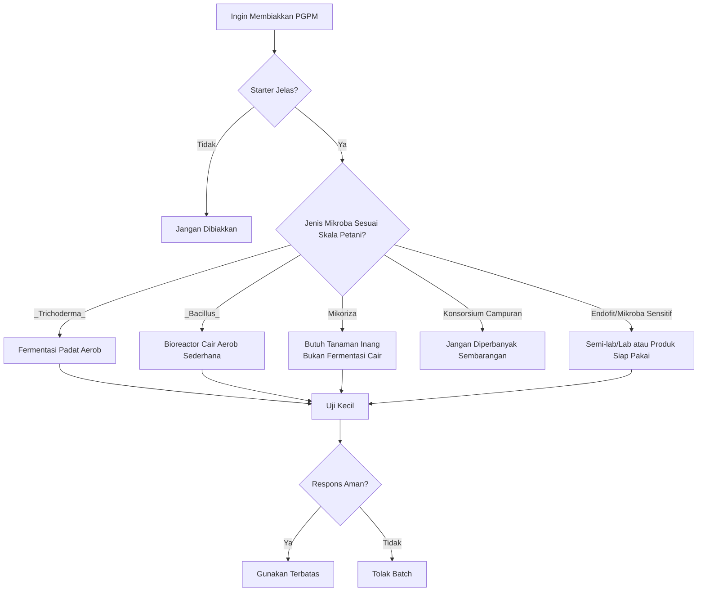

**Keterangan gambar:** Pembiakan PGPM di tingkat petani harus dimulai dari starter yang jelas dan jenis mikroba yang sesuai. _Trichoderma_ dan _Bacillus_ relatif lebih memungkinkan, sedangkan mikoriza, endofit, dan konsorsium campuran perlu kehati-hatian tinggi.

---

## 3.3 Kesesuaian Mikroba dengan Sistem Cair dan Padat

Pemilihan sistem pembiakan harus mengikuti karakter mikroba. Sistem cair tidak selalu lebih baik daripada sistem padat. Sebaliknya, sistem padat juga tidak cocok untuk semua mikroba. Tujuan utama adalah memilih metode yang paling sesuai dengan mikroba target dan kemampuan kontrol di lapangan.

---

## Tabel 3.1. Kesesuaian Mikroba dengan Sistem Cair dan Padat

| Jenis PGPM          |      Bioreactor Cair |               Fermentasi Padat | Catatan                                |
| ------------------- | -------------------: | -----------------------------: | -------------------------------------- |
| _Bacillus_          |               Sesuai |                           Bisa | Relatif paling aman untuk cair aerob   |
| _Pseudomonas_       |   Sesuai bila bersih |                    Kurang umum | Lebih baik semi-lab                    |
| _Azotobacter_       | Sesuai dengan aerasi |                    Kurang umum | Butuh oksigen tinggi                   |
| _Azospirillum_      |        Perlu kontrol |                    Kurang umum | Sensitif, lebih baik produk siap pakai |
| PSB                 |                 Bisa |         Bisa tergantung isolat | Harus jelas fungsi pelarut fosfat      |
| KSB                 |        Bisa terbatas |                  Bisa terbatas | Lebih aman produk teruji               |
| _Trichoderma_       |             Terbatas |                  Sangat sesuai | Lebih cocok padat aerob                |
| _Streptomyces_      |             Terbatas |            Bisa dengan kontrol | Sebaiknya semi-lab/lab                 |
| Mikoriza            |         Tidak sesuai | Tidak seperti fermentasi biasa | Perlu tanaman inang                    |
| Endofit             |     Tidak disarankan |               Tidak disarankan | Risiko salah mikroba                   |
| Konsorsium campuran |     Tidak disarankan |               Tidak disarankan | Komposisi mudah berubah                |

---

### A. _Bacillus_

_Bacillus_ relatif paling aman untuk sistem cair aerob sederhana karena beberapa spesies mampu membentuk spora dan lebih toleran terhadap kondisi lingkungan dibanding banyak bakteri lain. Namun, ini bukan berarti _Bacillus_ boleh diperbanyak sembarangan.

Syarat utama:

- starter jelas,
- media sesuai,
- aerasi cukup,
- wadah bersih,
- tidak berbau busuk,
- tidak berlendir,
- tidak dicampur pestisida.

_Bacillus_ juga bisa diformulasikan dalam bentuk padat tertentu, tetapi untuk skala petani, sistem cair aerob sederhana sering lebih praktis.

---

### B. _Pseudomonas_

_Pseudomonas_ memiliki banyak fungsi di rhizosfer, tetapi pembiakannya membutuhkan kebersihan lebih ketat. Mikroba ini umumnya aerob dan rentan kalah oleh kontaminan bila proses tidak bersih.

Untuk petani, _Pseudomonas_ lebih aman digunakan sebagai produk siap pakai atau diperbanyak dalam sistem semi-lab. Bila tetap menggunakan bioreactor cair sederhana, kebersihan, starter, media, dan waktu inkubasi harus sangat diperhatikan.

---

### C. _Azotobacter_

_Azotobacter_ membutuhkan oksigen tinggi. Karena itu, sistem cair untuk _Azotobacter_ harus memiliki aerasi yang baik. Wadah tertutup tanpa aerasi tidak sesuai.

Risiko bila aerasi kurang:

- pertumbuhan lemah,
- kontaminan dominan,
- produk berbau,
- hasil tidak stabil.

_Azotobacter_ lebih cocok untuk bioreactor cair aerob daripada fermentasi padat biasa.

---

### D. _Azospirillum_

_Azospirillum_ lebih sensitif dan sering membutuhkan kondisi yang lebih spesifik. Beberapa isolat dikaitkan dengan kondisi mikroaerofilik, yaitu oksigen rendah tetapi tetap terkendali. Ini berbeda dari kondisi anaerob busuk dalam jerigen tertutup.

Karena itu, _Azospirillum_ sebaiknya tidak diperbanyak secara kasar di tingkat petani. Produk siap pakai atau produksi semi-lab lebih aman.

---

### E. PSB

PSB atau mikroba pelarut fosfat dapat berupa bakteri atau fungi. Karena itu, sistem pembiakannya tergantung isolat.

PSB berbasis bakteri dapat menggunakan sistem cair terkontrol. PSB berbasis fungi tertentu dapat lebih sesuai dengan sistem padat. Namun, keberhasilan PSB tidak dapat dinilai dari busa atau bau fermentasi. Yang penting adalah kemampuan mikroba melarutkan fosfat.

Catatan praktis:

- isolat harus jelas,
- fungsi pelarut fosfat harus terbukti,
- jangan menganggap semua fermentasi aktif sebagai PSB,
- gunakan produk teruji bila tidak memiliki kemampuan kontrol mutu.

---

### F. KSB

KSB atau mikroba pelarut kalium memiliki karakter yang sangat tergantung strain. Sebagian dapat tumbuh dalam sistem cair, sebagian dapat dikembangkan pada carrier padat, tetapi efektivitasnya harus diuji.

KSB tidak cukup dinilai dari warna, busa, atau aroma fermentasi. Fungsi pelarut kalium harus berasal dari mikroba yang memang memiliki kemampuan tersebut.

---

### G. _Trichoderma_

_Trichoderma_ lebih cocok dengan fermentasi padat aerob. Media padat lembap memberi ruang bagi miselium dan spora untuk berkembang. Sistem tray dangkal lebih baik dibanding wadah tebal.

Kondisi ideal untuk _Trichoderma_:

- media padat lembap,
- tidak becek,
- berpori,
- tidak berbau busuk,
- tidak dicampur fungisida,
- penutup breathable,
- ruang bersih.

Fermentasi cair bukan metode utama untuk _Trichoderma_ skala petani.

---

### H. _Streptomyces_

_Streptomyces_ termasuk aktinomisetes yang dapat menghasilkan senyawa antimikroba tertentu dan berperan dalam dekomposisi. Namun, pembiakannya membutuhkan kontrol lebih baik. Di tingkat petani, _Streptomyces_ sebaiknya digunakan dalam produk teruji atau sistem semi-lab.

---

### I. Mikoriza

Mikoriza tidak sesuai untuk bioreactor cair. Mikoriza membutuhkan akar hidup untuk berkembang. Sistem pembiakan mikoriza menggunakan tanaman inang, bukan fermentasi cair.

Kesalahan yang harus dihindari:

- mengocok mikoriza dalam air lalu menyebutnya diperbanyak,
- memfermentasi mikoriza dengan molase,
- menganggap busa sebagai tanda mikoriza aktif,
- menyimpan mikoriza di media basah tanpa tanaman inang.

---

### J. Endofit

Endofit hidup di dalam jaringan tanaman. Karena itu, risiko salah mikroba lebih tinggi. Endofit sebaiknya tidak diperbanyak di tingkat petani tanpa kontrol laboratorium atau semi-lab.

---

### K. Konsorsium Campuran

Konsorsium campuran tidak disarankan diperbanyak ulang sembarangan. Mikroba di dalam konsorsium dapat memiliki kebutuhan yang berbeda. Jika difermentasi ulang, komposisi dapat berubah dan fungsi produk tidak lagi sama.

Prinsip aman:

- gunakan sesuai label,
- jangan difermentasi ulang,
- jangan campur dengan produk lain,
- jangan simpan terlalu lama setelah dilarutkan,
- lakukan uji kecil bila ragu.

---

## Gambar 3.3. Pemilihan Metode Berdasarkan Jenis PGPM

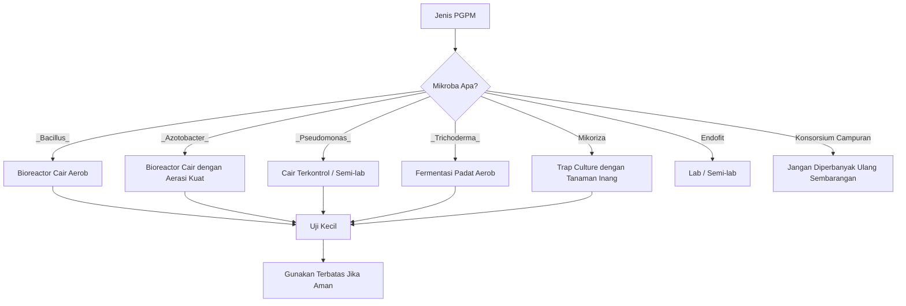

**Keterangan gambar:** Metode pembiakan harus mengikuti jenis mikroba. _Bacillus_ lebih sesuai dengan bioreactor cair aerob, _Trichoderma_ lebih sesuai dengan fermentasi padat, mikoriza membutuhkan tanaman inang, dan konsorsium campuran tidak disarankan diperbanyak ulang sembarangan.

---

## 3.4 Aktivasi, Perbanyakan Terbatas, dan Produksi

Dalam praktik lapangan, tiga istilah ini sering tercampur: aktivasi, perbanyakan terbatas, dan produksi. Padahal ketiganya memiliki tujuan, risiko, dan kebutuhan kontrol yang berbeda.

---

## A. Aktivasi

Aktivasi adalah proses menyiapkan produk PGPM sebelum aplikasi sesuai petunjuk produk. Aktivasi biasanya dilakukan dalam waktu singkat dan tidak dimaksudkan untuk memproduksi mikroba dalam jumlah besar.

Contoh aktivasi:

- melarutkan PGPM dalam air bersih,
- mendiamkan sesuai petunjuk produk,
- mengaduk ringan sebelum aplikasi,
- langsung mengaplikasikan ke zona akar.

Aktivasi relatif lebih aman dibanding perbanyakan, karena waktunya singkat dan mengikuti instruksi produk. Namun, aktivasi tetap harus dilakukan dengan air bersih, wadah bersih, dan tidak dicampur dengan bahan berisiko.

Aktivasi bukan berarti:

- menambah banyak molase,
- menyimpan berhari-hari,
- menutup rapat hingga menggembung,
- mencampur banyak produk mikroba,
- memperpanjang umur simpan produk.

---

## B. Perbanyakan Terbatas

Perbanyakan terbatas adalah upaya memperbanyak mikroba tertentu dengan starter jelas, media sesuai, dan kontrol sederhana. Perbanyakan ini dapat dilakukan oleh petani atau kelompok tani untuk kebutuhan sendiri, selama risikonya dipahami.

Contoh yang relatif memungkinkan:

- _Trichoderma_ pada fermentasi padat aerob,
- _Bacillus_ pada bioreactor cair aerob sederhana,
- inokulasi kompos matang dengan mikroba tertentu.

Syarat perbanyakan terbatas:

- starter jelas,
- media sesuai,
- alat bersih,
- proses tidak berbau busuk,
- tidak ada kontaminasi berat,
- produk diuji kecil,
- tidak digunakan untuk klaim komersial berlebihan.

Perbanyakan terbatas tidak cocok untuk:

- mikoriza cair,
- endofit,
- konsorsium campuran,
- mikroba sensitif tanpa kontrol,
- produk yang akan dijual luas tanpa uji mutu dan izin.

---

## C. Produksi

Produksi adalah proses menghasilkan produk mikroba dengan standar mutu yang lebih ketat. Produksi komersial membutuhkan kontrol yang lebih lengkap dibanding perbanyakan terbatas.

Produksi idealnya melibatkan:

- starter murni atau terverifikasi,
- media standar,
- alat bersih,
- kontrol suhu,
- kontrol pH,
- kontrol aerasi,
- uji populasi mikroba,
- uji kontaminasi,
- carrier yang sesuai,
- stabilitas penyimpanan,
- label produk,
- izin edar bila dijual.

Produksi komersial tidak boleh hanya mengandalkan bau, busa, atau warna. Produk yang dijual kepada pihak lain harus dapat dipertanggungjawabkan dari sisi mutu, keamanan, label, klaim manfaat, dan legalitas.

---

## D. Perbedaan Produksi untuk Pemakaian Sendiri dan Produksi Komersial

Produksi untuk pemakaian sendiri memiliki risiko yang ditanggung oleh pembuatnya sendiri. Namun, tetap harus dilakukan dengan SOP agar tidak merugikan lahan.

Produksi komersial memiliki tanggung jawab lebih besar karena produk digunakan oleh orang lain. Karena itu, produksi komersial harus memperhatikan:

- izin,
- standar mutu,
- klaim yang benar,
- pengujian mikroba,
- masa simpan,
- keamanan pengguna,
- informasi label,
- kompatibilitas penggunaan.

Petani atau kelompok tani boleh belajar membuat PGPM untuk kebutuhan sendiri, tetapi tidak boleh menjual produk tanpa standar dan legalitas yang sesuai.

---

## E. Batasan Legal dan Teknis Bila Produk Dijual

Bila produk hasil pembiakan akan dijual, maka pembuat tidak lagi hanya bertindak sebagai pengguna, tetapi sebagai produsen input pertanian. Ini memiliki konsekuensi legal dan teknis.

Batasan teknis:

- harus ada identitas mikroba,
- harus ada standar populasi,
- harus ada uji kontaminasi,
- harus ada tanggal produksi dan batas pakai,
- harus ada dosis,
- harus ada cara simpan,
- harus ada petunjuk aplikasi,
- harus ada data pendukung manfaat.

Batasan legal:

- mengikuti aturan produk hayati yang berlaku,
- memiliki izin bila diwajibkan,
- tidak membuat klaim berlebihan,
- tidak menjual produk yang tidak jelas isinya.

---

## Tabel 3.2. Perbedaan Aktivasi, Perbanyakan Terbatas, dan Produksi

| Aspek              | Aktivasi                           | Perbanyakan Terbatas                   | Produksi                         |
| ------------------ | ---------------------------------- | -------------------------------------- | -------------------------------- |
| Tujuan             | Menyiapkan produk sebelum aplikasi | Menambah jumlah mikroba tertentu       | Menghasilkan produk standar      |
| Skala              | Kecil, langsung pakai              | Kecil–menengah untuk kebutuhan sendiri | Lebih besar dan terstandar       |
| Lama proses        | Singkat                            | Lebih lama                             | Terkontrol                       |
| Risiko kontaminasi | Rendah bila sesuai label           | Sedang                                 | Harus ditekan dengan uji mutu    |
| Cocok untuk petani | Ya                                 | Terbatas                               | Tidak untuk komersial tanpa izin |
| Contoh             | Melarutkan PGPM sebelum kocor      | _Trichoderma_ padat, _Bacillus_ cair   | Produk hayati komersial          |
| Perlu uji kecil    | Dianjurkan                         | Wajib                                  | Wajib uji mutu dan lapangan      |
| Legalitas          | Tidak untuk dijual                 | Untuk pemakaian sendiri                | Perlu sesuai regulasi            |

---

## Gambar 3.4. Tingkatan Pengelolaan PGPM

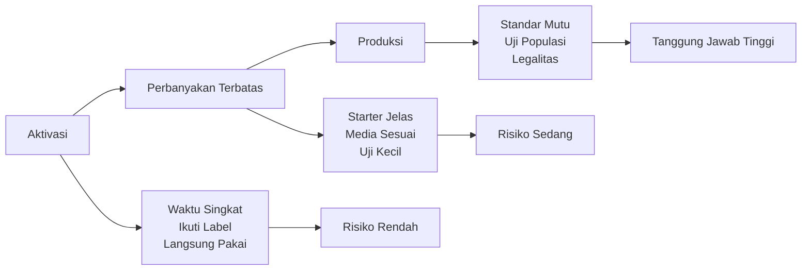

**Keterangan gambar:** Aktivasi, perbanyakan terbatas, dan produksi memiliki tingkat risiko dan tanggung jawab yang berbeda. Semakin tinggi tingkat pengelolaan, semakin besar kebutuhan kontrol mutu dan legalitas.

---

## Ringkasan Bab 3

PGPM perlu dibiakkan karena kebutuhan aplikasi di lapangan sering besar dan berulang. Pembiakan dapat membantu menambah volume aplikasi, menyiapkan mikroba sebelum digunakan, mengurangi biaya operasional, mendukung budidaya terpadu, serta menyediakan inokulan untuk media semai, lubang tanam, kocor akar, kompos matang, pemulihan lahan, dan area bekas penyakit tanah.

Namun, pembiakan PGPM memiliki batasan. Tidak semua PGPM bisa dibiakkan di tingkat petani. Starter harus jelas, media harus sesuai, kebersihan wajib dijaga, dan hasil pembiakan tidak selalu sama dengan produk asal. Konsorsium campuran tidak disarankan diperbanyak ulang sembarangan. Mikoriza tidak dapat diperbanyak dengan fermentasi cair biasa. Endofit dan mikroba sensitif sebaiknya tidak diperbanyak tanpa kontrol semi-lab atau laboratorium.

Kesesuaian metode harus mengikuti jenis mikroba. _Bacillus_ relatif paling aman untuk bioreactor cair aerob. _Trichoderma_ lebih cocok pada fermentasi padat aerob. _Azotobacter_ membutuhkan aerasi kuat. _Pseudomonas_ membutuhkan sanitasi lebih ketat. PSB dan KSB harus jelas isolat dan fungsinya. Mikoriza membutuhkan tanaman inang. Konsorsium campuran sebaiknya tidak diperbanyak ulang.

Aktivasi, perbanyakan terbatas, dan produksi harus dibedakan. Aktivasi adalah menyiapkan produk sebelum aplikasi. Perbanyakan terbatas adalah memperbanyak mikroba tertentu untuk kebutuhan sendiri dengan kontrol sederhana. Produksi adalah menghasilkan produk standar yang membutuhkan uji mutu dan legalitas bila dijual. Prinsip paling penting adalah: **produk hasil pembiakan sendiri harus diuji kecil sebelum diaplikasikan luas.**

---

# Bab 4. Rancangan Bioreactor Liquid Kapasitas 10 Liter

Bab ini membahas rancangan **bioreactor liquid atau bioreactor cair aerob** untuk pembiakan PGPM skala kecil dengan kapasitas kerja 5–10 liter. Desain ini ditujukan untuk petani, kelompok tani, teknisi lapang, dan unit produksi mikroba terbatas yang membutuhkan sistem pembiakan PGPM lebih aman dibanding fermentasi dalam jerigen tertutup.

Rancangan ini tidak dimaksudkan sebagai bioreactor laboratorium atau industri. Desain ini adalah **bioreactor sederhana skala praktisi** yang menekankan empat hal utama: **aerasi, kebersihan, keamanan proses, dan kemudahan penggunaan**.

Bioreactor ini terutama ditujukan untuk mikroba PGPM cair yang relatif sesuai dengan sistem aerob, seperti _Bacillus_, _Azotobacter_, PSB/KSB tertentu, dan sebagian _Pseudomonas_ dengan sanitasi lebih ketat. Bioreactor ini **tidak cocok untuk mikoriza**, tidak cocok untuk konsorsium liar yang tidak jelas, dan tidak boleh digunakan untuk membiakkan mikroba yang tidak diketahui identitasnya.


---

## 4.1 Konsep Desain

Bioreactor liquid yang dirancang dalam bab ini adalah **bioreactor cair aerob non-tekanan**. Artinya, sistem bekerja dengan suplai udara dari pompa, tetapi tidak boleh menghasilkan tekanan tertahan di dalam vessel. Udara harus dapat masuk melalui jalur inlet dan keluar melalui jalur outlet.

Prinsip dasarnya adalah sebagai berikut:

- Media berada dalam bentuk cair.
- Mikroba target tumbuh dalam media cair.
- Udara masuk dari bagian bawah melalui diffuser.
- Gelembung udara membantu menyediakan oksigen.
- Udara keluar melalui outlet.
- Foam trap digunakan untuk menangkap busa.
- Sistem tidak boleh ditutup rapat tanpa jalur udara keluar.


Kapasitas vessel yang direkomendasikan adalah **15 liter**, sedangkan volume kerja adalah **5–10 liter**. Selisih antara kapasitas vessel dan volume kerja digunakan sebagai **headspace**, yaitu ruang kosong di bagian atas media. Headspace penting untuk menampung busa, pergerakan udara, dan mencegah cairan terdorong keluar melalui outlet.

Untuk volume kerja 10 liter dalam vessel 15 liter, headspace tersedia sekitar 5 liter atau 33,3%. Ini sudah memenuhi kebutuhan minimal headspace 30%.

### Rumus 4.1. Menghitung Headspace

```text id="bab4-rumus-01"
Headspace (L) = kapasitas vessel total (L) - volume kerja (L)
```

Contoh:

```text id="bab4-contoh-01"
Kapasitas vessel = 15 L
Volume kerja = 10 L

Headspace = 15 - 10
Headspace = 5 L
```

### Rumus 4.2. Persentase Headspace

```text id="bab4-rumus-02"
Persentase headspace (%) =
headspace (L) ÷ kapasitas vessel total (L) × 100
```

Contoh:

```text id="bab4-contoh-02"
Headspace = 5 L
Kapasitas vessel = 15 L

Persentase headspace =
5 ÷ 15 × 100

Persentase headspace = 33,3%
```

Dengan headspace 33,3%, vessel 15 liter aman digunakan untuk volume kerja 10 liter. Volume kerja di atas 10 liter tidak disarankan karena ruang busa dan ruang udara menjadi terlalu sempit.

---

## Gambar 4.1. Konsep Umum Bioreactor Liquid Aerob 10 Liter

```text id="bab4-gambar-01"
                 FILTER OUTLET
                      │
                 FOAM TRAP
                      │
              ┌───────┴────────┐
              │   AIR OUTLET   │
              │                │
     AIR      │   HEADSPACE    │     PORT
     INLET ───┤   30% MIN.     │     INOKULASI
              │                │        │
              │~~~~~~~~~~~~~~~~│        │
              │   MEDIA CAIR   │        │
              │   5–10 L       │        │
              │                │        │
              │      ↑ ↑ ↑     │
              │      ↑ ↑ ↑     │
              │   GELEMBUNG    │
              │                │
              │    DIFFUSER    │
              └───────┬────────┘
                      │
                  KRAN PANEN
```

**Keterangan gambar:** Bioreactor cair aerob bekerja dengan udara yang masuk dari bawah melalui diffuser. Udara naik dalam bentuk gelembung, membawa oksigen ke media, lalu keluar melalui outlet. Foam trap mencegah busa masuk ke jalur outlet. Sistem harus memiliki headspace dan tidak boleh bertekanan.


---

## 4.2 Spesifikasi Teknis

Spesifikasi berikut dirancang untuk bioreactor cair sederhana kapasitas kerja 5–10 liter. Spesifikasi dapat disesuaikan dengan ketersediaan bahan lokal, tetapi prinsip aerasi, headspace, kebersihan, dan jalur udara keluar harus tetap dipertahankan.

| Parameter        | Spesifikasi                           |
| ---------------- | ------------------------------------- |
| Tipe             | Bioreactor cair aerob                 |
| Kapasitas vessel | 15 L                                  |
| Volume kerja     | 5–10 L                                |
| Sistem aerasi    | Pompa udara + diffuser                |
| Debit udara      | 5–10 L/menit                          |
| Headspace        | Minimal 30%                           |
| Material vessel  | Food grade PP/HDPE/PC/PETG atau SS304 |
| Port inlet       | 1/4 inch                              |
| Port outlet      | 1/4 inch                              |
| Port inokulasi   | 1/2 inch                              |
| Kran bawah       | 1/2 inch                              |
| Foam trap        | 250–500 ml                            |
| Filter udara     | Inline filter                         |
| Suhu operasi     | 28–32°C                               |
| pH awal          | 6,5–7,2                               |

---

### A. Kapasitas Vessel

Kapasitas vessel yang direkomendasikan adalah 15 liter. Kapasitas ini memberi ruang cukup untuk volume kerja 10 liter dan headspace minimal 30%. Vessel yang terlalu kecil akan mudah meluapkan busa dan meningkatkan risiko cairan masuk ke outlet.

Rekomendasi volume kerja:

| Volume Kerja | Status              | Catatan                      |
| -----------: | ------------------- | ---------------------------- |
|          5 L | Aman                | Cocok untuk uji awal         |
|        7–8 L | Ideal               | Stabil dan headspace besar   |
|         10 L | Maksimum disarankan | Headspace masih cukup        |
|        >10 L | Tidak disarankan    | Risiko busa dan tekanan naik |

---

### B. Material Vessel

Material vessel harus aman, tidak bereaksi dengan media, mudah dibersihkan, dan tidak menyerap bau pestisida. Material yang dapat digunakan:

- food grade PP,
- HDPE food grade,
- PC/PETG food grade,
- stainless steel SS304.

Material yang tidak disarankan:

- wadah bekas pestisida,
- jerigen bekas bahan kimia,
- logam mudah berkarat,
- plastik tipis yang mudah pecah,
- wadah yang sulit dibersihkan,
- wadah yang berbau minyak, pestisida, atau limbah.

---

### C. Aerasi

Aerasi menjadi komponen utama dalam bioreactor cair aerob. Aerasi berfungsi menyediakan oksigen dan membantu mengaduk media secara ringan. Untuk kapasitas kerja 5–10 liter, debit udara praktis yang disarankan adalah 5–10 L/menit.

### Rumus 4.3. Menghitung Debit Udara Berdasarkan VVM

```text id="bab4-rumus-03"
Debit udara (L/menit) =
volume kerja (L) × nilai VVM
```

Untuk bioreactor sederhana, nilai VVM praktis yang digunakan adalah 0,5–1,0.

Contoh untuk volume kerja 10 liter:

```text id="bab4-contoh-03"
Volume kerja = 10 L
Nilai VVM = 0,5–1,0

Debit udara =
10 × 0,5 sampai 10 × 1,0

Debit udara = 5–10 L/menit
```

Dengan demikian, pompa udara yang direkomendasikan adalah pompa adjustable dengan debit sekitar 8–12 L/menit. Debit dapat diatur sesuai volume kerja dan tingkat pembentukan busa.

---

### D. Suhu Operasi

Suhu operasi praktis untuk banyak PGPM cair adalah 28–32°C. Suhu terlalu rendah dapat memperlambat pertumbuhan, sedangkan suhu terlalu tinggi dapat menekan mikroba target dan meningkatkan risiko kontaminasi.

Bioreactor sebaiknya ditempatkan di lokasi:

- teduh,
- tidak terkena matahari langsung,
- tidak dekat mesin panas,
- tidak berada di ruang tertutup pengap,
- tidak dekat pestisida atau bahan kimia.

---

### E. pH Awal

pH awal yang disarankan adalah 6,5–7,2. Kisaran ini relatif aman untuk banyak PGPM cair. Namun, kebutuhan pH dapat berbeda tergantung jenis mikroba dan starter.

Jika tidak tersedia pH meter, minimal gunakan air dan media yang tidak berbau busuk, tidak terlalu asam menyengat, dan tidak tercemar bahan kimia. Untuk proses yang lebih tertib, penggunaan pH meter sederhana sangat dianjurkan.

---

## 4.3 Komponen Utama

Bioreactor cair kapasitas 10 liter terdiri dari beberapa komponen utama. Setiap komponen memiliki fungsi teknis yang berbeda. Bila salah satu komponen dihilangkan, risiko kegagalan proses dapat meningkat.

---

## Tabel 4.1. Komponen Utama Bioreactor Liquid 10 Liter

| Komponen             | Fungsi                                  | Catatan Teknis                |
| -------------------- | --------------------------------------- | ----------------------------- |
| Vessel 15 L          | Wadah utama media cair                  | Food grade, mudah dibersihkan |
| Tutup dengan gasket  | Menutup vessel tanpa bocor berlebihan   | Tetap harus ada outlet udara  |
| Air pump             | Menyuplai udara                         | Debit 8–12 L/menit disarankan |
| Filter udara inlet   | Menyaring udara masuk                   | Mengurangi risiko kontaminasi |
| Check valve          | Mencegah cairan balik ke pompa          | Wajib pada jalur inlet        |
| Selang silikon       | Jalur udara                             | Lebih aman dan lentur         |
| Diffuser / air stone | Membagi udara menjadi gelembung         | Dipasang dekat dasar vessel   |
| Port inokulasi       | Jalur memasukkan starter/media tambahan | Ukuran 1/2 inch               |
| Air outlet           | Jalur udara keluar                      | Tidak boleh tersumbat         |
| Foam trap            | Menangkap busa                          | Volume 250–500 ml             |
| Filter outlet        | Menyaring udara keluar                  | Optional tetapi dianjurkan    |
| Kran bawah           | Panen dan drainase                      | Ukuran 1/2 inch               |
| Dudukan/rangka       | Menjaga alat stabil                     | Optional tetapi disarankan    |

---

### A. Vessel 15 Liter

Vessel adalah bagian utama bioreactor. Bentuk terbaik adalah silinder atau ember/tangki food grade dengan tutup yang dapat dimodifikasi. Vessel harus cukup kuat, mudah dicuci, dan tidak mudah bocor.

Kriteria vessel yang baik:

- kapasitas total 15 liter,
- bagian dalam halus,
- tidak banyak sudut mati,
- mudah dibersihkan,
- tidak berbau bahan kimia,
- tahan terhadap pencucian berulang,
- memiliki tutup yang dapat dipasang port.

---

### B. Tutup dengan Gasket

Tutup berfungsi mengurangi masuknya debu dan kontaminan. Namun, tutup tidak boleh membuat sistem menjadi tertutup total tanpa outlet udara. Gasket membantu mengurangi kebocoran cairan atau percikan, tetapi outlet udara tetap harus tersedia.

Prinsip penting:

**tutup boleh rapat secara fisik, tetapi sistem tidak boleh tertutup secara tekanan.**

---

### C. Air Pump

Air pump menyuplai udara ke media. Untuk volume kerja 5–10 liter, gunakan pompa udara dengan debit 8–12 L/menit atau pompa yang dapat diatur.

Ciri pompa yang baik:

- debit cukup,
- operasi stabil,
- tidak cepat panas,
- memiliki pengatur aliran bila memungkinkan,
- mudah mendapatkan suku cadang,
- tidak menghasilkan tekanan berlebihan.

---

### D. Filter Udara Inlet

Filter inlet mengurangi risiko masuknya debu dan kontaminan dari udara. Untuk skala sederhana, filter inline dapat digunakan. Semakin baik sistem filtrasi, semakin rendah risiko kontaminasi.

Filter inlet diletakkan sebelum udara masuk ke vessel.

Urutan jalur udara:

```text id="bab4-alur-01"
Pompa udara → filter inlet → check valve → port inlet → diffuser
```

---

### E. Check Valve

Check valve mencegah cairan kembali ke pompa saat pompa mati. Komponen ini kecil, murah, tetapi sangat penting. Tanpa check valve, cairan media dapat masuk ke selang dan merusak pompa.

---

### F. Selang Silikon

Selang silikon lebih disarankan karena lentur, relatif aman, dan mudah dibersihkan. Selang yang digunakan harus bersih dan tidak berbau bahan kimia.

Hindari selang bekas pestisida, oli, bahan bakar, atau bahan kimia lain.

---

### G. Diffuser / Air Stone

Diffuser dipasang di dekat dasar vessel. Fungsinya membagi udara menjadi gelembung kecil agar kontak antara udara dan media lebih baik.

Kriteria diffuser:

- gelembung cukup halus,
- mudah dibersihkan,
- tidak mudah tersumbat,
- sesuai ukuran selang,
- tahan digunakan berulang.

Diffuser dapat berupa air stone keramik, diffuser akuarium berkualitas baik, atau sparger stainless sederhana.

---

### H. Port Inokulasi

Port inokulasi digunakan untuk memasukkan starter atau tambahan media tanpa membuka seluruh tutup. Port ini membantu mengurangi risiko kontaminasi.

Ukuran yang disarankan adalah 1/2 inch. Port dapat menggunakan tutup ulir, stopper, atau fitting yang mudah dibuka dan ditutup.

---

### I. Air Outlet

Air outlet adalah jalur udara keluar. Komponen ini wajib ada. Tanpa outlet, sistem dapat bertekanan, busa terdorong ke jalur yang tidak diinginkan, atau vessel menggembung.

Air outlet harus:

- tidak tersumbat,
- tidak terendam media,
- terhubung ke foam trap,
- memiliki jalur keluar bebas,
- mudah dibersihkan.

---

### J. Foam Trap

Foam trap adalah penangkap busa. Pada beberapa kultur, terutama _Bacillus_, busa dapat muncul selama aerasi. Jika tidak ditangkap, busa bisa masuk ke filter outlet atau keluar dari sistem.

Foam trap sederhana dapat dibuat dari botol bersih 250–500 ml dengan dua port:

- inlet dari air outlet vessel,
- outlet menuju filter udara keluar.

Foam trap tidak boleh diisi terlalu penuh dan harus mudah dibersihkan.

---

### K. Kran Bawah

Kran bawah digunakan untuk panen, sampling, dan drainase. Ukuran praktis adalah 1/2 inch. Kran harus mudah dibersihkan dan tidak bocor.

Kran bawah sebaiknya ditempatkan sedikit di atas dasar agar endapan kasar tidak langsung menyumbat kran.

---

### L. Dudukan atau Rangka

Dudukan membantu vessel tetap stabil. Jika menggunakan kran bawah, vessel perlu dinaikkan agar botol atau wadah panen dapat diletakkan di bawah kran.

Dudukan dapat dibuat dari:

- rangka besi,
- kayu kuat,
- meja kecil,
- rak plastik kuat,
- dudukan stainless.

---

## 4.4 Prinsip Aliran Udara

Aliran udara adalah inti dari desain bioreactor cair aerob. Udara masuk dari pompa, disaring, melewati check valve, masuk ke vessel melalui inlet, turun ke diffuser, keluar sebagai gelembung dari dasar media, lalu keluar melalui outlet.

Urutan aliran udara:

```text id="bab4-alur-02"
Pompa udara
→ filter udara inlet
→ check valve
→ air inlet
→ diffuser di dasar vessel
→ media cair
→ air outlet
→ foam trap
→ filter outlet
→ udara bebas
```

---

## Gambar 4.2. Skema Aliran Udara Bioreactor Liquid


**Keterangan gambar:** Udara masuk dari pompa, disaring, melewati check valve, masuk ke diffuser di dasar vessel, lalu naik melalui media. Udara keluar melalui outlet dan melewati foam trap. Sistem tidak boleh ditutup rapat.

---

### A. Udara Harus Masuk dari Bawah

Udara harus masuk dari bagian bawah agar kontak dengan media lebih baik. Gelembung udara yang naik membantu:

- menyediakan oksigen,
- mengaduk media secara ringan,
- mengurangi zona anaerob,
- menjaga distribusi mikroba lebih merata.

Jika udara hanya dimasukkan dari atas, oksigenasi media menjadi kurang efektif.

---

### B. Udara Keluar Tidak Boleh Tersumbat

Outlet udara harus selalu terbuka. Jika outlet tersumbat, tekanan dapat meningkat. Pada vessel plastik, tekanan dapat membuat wadah menggembung atau sambungan bocor. Pada sistem yang tertutup kuat, tekanan dapat menjadi berbahaya.

Tanda outlet bermasalah:

- tutup terdorong,
- vessel menggembung,
- busa naik berlebihan,
- suara pompa berubah,
- aliran gelembung melemah,
- udara keluar dari celah tidak semestinya.

Jika tanda tersebut muncul, proses harus dihentikan sementara dan jalur outlet diperiksa.

---

### C. Sistem Tidak Boleh Ditutup Rapat

Sistem aerob membutuhkan udara masuk dan keluar. Karena itu, bioreactor cair tidak boleh dibuat seperti jerigen tertutup. Tutup boleh dipasang untuk mencegah debu, tetapi harus ada jalur udara keluar.

Kalimat praktis:

**bioreactor cair aerob bukan wadah tertutup, tetapi wadah terkontrol dengan aliran udara.**

---

### D. Foam Trap Mencegah Busa Masuk ke Jalur Outlet

Foam trap sangat penting bila kultur menghasilkan busa. Foam trap mencegah busa langsung masuk ke filter outlet atau keluar dari sistem. Jika busa masuk ke filter, filter dapat tersumbat dan tekanan meningkat.

Foam trap sebaiknya:

- mudah dilepas,
- mudah dicuci,
- transparan bila memungkinkan,
- memiliki volume cukup,
- diletakkan lebih rendah dari outlet vessel tetapi tidak sampai menarik cairan balik.

---

### E. Filter Inlet Mengurangi Risiko Kontaminasi

Udara bebas mengandung debu dan mikroba. Filter inlet membantu mengurangi risiko tersebut. Pada skala sederhana, filter inline cukup membantu, meskipun tidak setara sistem steril laboratorium.

Filter harus diganti atau dibersihkan sesuai kondisi. Filter yang basah, kotor, atau tersumbat dapat menjadi sumber masalah.

---

## 4.5 Gambar Rancangan Engineering

Bagian ini memberikan gambar engineering sederhana sebagai acuan pembuatan. Gambar menggunakan pendekatan skema teknis agar mudah diterjemahkan oleh teknisi bengkel, petani, atau kelompok tani.

---

## Gambar 4.3. Tampak Depan Bioreactor Liquid 10 Liter

```text id="bab4-gambar-02"
TAMPAK DEPAN

                    ┌─────────────────────┐
                    │     FILTER OUTLET   │
                    └──────────┬──────────┘
                               │
                         ┌─────┴─────┐
                         │ FOAM TRAP │ 250–500 ml
                         └─────┬─────┘
                               │
                    ┌──────────┴──────────┐
                    │      AIR OUTLET      │
        AIR INLET ──┤                      │── PORT INOKULASI
        1/4 inch    │      HEADSPACE       │   1/2 inch
                    │      ±5 L            │
                    │~~~~~~~~~~~~~~~~~~~~~~│
                    │                      │
                    │      MEDIA CAIR      │
                    │      5–10 L          │
                    │                      │
                    │        ↑ ↑ ↑         │
                    │        ↑ ↑ ↑         │
                    │      DIFFUSER        │
                    │                      │
                    └──────────┬──────────┘
                               │
                          KRAN BAWAH
                           1/2 inch
```

**Keterangan gambar:** Tampak depan menunjukkan posisi inlet, outlet, foam trap, port inokulasi, media cair, diffuser, dan kran bawah. Port outlet ditempatkan di bagian atas agar udara dapat keluar. Kran bawah digunakan untuk panen dan pembersihan.

---

## Gambar 4.4. Tampak Samping Bioreactor Liquid

```text id="bab4-gambar-03"
TAMPAK SAMPING

            Selang ke foam trap
                    │
            ┌───────┴────────┐
            │    TUTUP       │
            │ dengan gasket  │
            ├────────────────┤
            │                │
            │   HEADSPACE    │
            │                │
            │~~~~~~~~~~~~~~~~│
            │                │
            │   MEDIA CAIR   │
            │                │
            │      ↑↑↑       │
            │      ↑↑↑       │
            │   DIFFUSER     │
            │   1–2 cm       │
            │   dari dasar   │
            └───────┬────────┘
                    │
                KRAN BAWAH
```

**Keterangan gambar:** Diffuser ditempatkan dekat dasar vessel, sekitar 1–2 cm dari dasar. Posisi ini membantu gelembung udara bergerak melalui sebagian besar volume media.

---

## Gambar 4.5. Tampak Atas Tutup Bioreactor

```text id="bab4-gambar-04"
TAMPAK ATAS TUTUP

        ┌───────────────────────────────┐
        │                               │
        │   [A] AIR OUTLET              │
        │        1/4 inch               │
        │                               │
        │               [C] PORT        │
        │                   INOKULASI   │
        │                   1/2 inch    │
        │                               │
        │   [B] AIR INLET               │
        │       1/4 inch                │
        │                               │
        │   [D] PORT OPSIONAL           │
        │       pH / suhu / sampling    │
        │                               │
        └───────────────────────────────┘
```

**Keterangan gambar:** Tutup memiliki minimal tiga port: air inlet, air outlet, dan port inokulasi. Port tambahan dapat digunakan untuk sensor suhu, pH, atau sampling.

---

## Gambar 4.6. Potongan Melintang Bioreactor

```text id="bab4-gambar-05"
POTONGAN MELINTANG

                AIR OUTLET
                    │
        ┌───────────┴───────────┐
        │       HEADSPACE       │
        │       minimal 30%     │
        │                       │
        │~~~~~~~~~~~~~~~~~~~~~~~│ ← batas permukaan media
        │                       │
        │       MEDIA CAIR      │
        │       5–10 L          │
        │                       │
        │       ↑ ↑ ↑ ↑         │
        │       ↑ ↑ ↑ ↑         │
        │   GELEMBUNG UDARA     │
        │                       │
        │  ┌─────────────────┐  │
        │  │    DIFFUSER     │  │
        │  └─────────────────┘  │
        └───────────┬───────────┘
                    │
                KRAN PANEN
```

**Keterangan gambar:** Potongan melintang memperlihatkan tiga zona utama: media cair, headspace, dan jalur udara keluar. Headspace harus tersedia agar busa tidak langsung masuk ke outlet.

---

## Gambar 4.7. Detail Port Inlet

```text id="bab4-gambar-06"
DETAIL AIR INLET

Pompa udara
    │
Filter inlet
    │
Check valve
    │
Selang silikon
    │
Bulkhead fitting 1/4 inch
    │
Selang internal turun ke dasar
    │
Diffuser / air stone
```

**Keterangan gambar:** Air inlet harus melewati filter dan check valve sebelum masuk ke vessel. Selang internal diarahkan ke diffuser di dasar.

---

## Gambar 4.8. Detail Port Outlet dan Foam Trap

```text id="bab4-gambar-07"
DETAIL AIR OUTLET DAN FOAM TRAP

Air outlet vessel
       │
       │ selang pendek
       ▼
┌─────────────────┐
│    FOAM TRAP    │
│  botol 250–500  │
│       ml        │
└────────┬────────┘
         │
         ▼
  Filter outlet
         │
         ▼
     Udara bebas
```

**Keterangan gambar:** Foam trap dipasang setelah outlet vessel. Fungsinya menangkap busa sebelum udara keluar melalui filter outlet. Foam trap harus mudah dilepas dan dibersihkan.

---

## Gambar 4.9. Detail Kran Bawah

```text id="bab4-gambar-08"
DETAIL KRAN BAWAH

Dinding vessel
     │
Bulkhead fitting 1/2 inch
     │
Ball valve / kran 1/2 inch
     │
Selang panen opsional
     │
Wadah panen bersih
```

**Keterangan gambar:** Kran bawah digunakan untuk panen dan drainase. Sambungan harus kuat, tidak bocor, dan mudah dibersihkan.

---

## Tabel 4.2. Daftar Port dan Fitting

| Port/Fitting     |         Ukuran | Fungsi                   | Catatan                |
| ---------------- | -------------: | ------------------------ | ---------------------- |
| Air inlet        |       1/4 inch | Jalur udara masuk        | Terhubung ke diffuser  |
| Air outlet       |       1/4 inch | Jalur udara keluar       | Terhubung ke foam trap |
| Port inokulasi   |       1/2 inch | Memasukkan starter/media | Harus mudah ditutup    |
| Kran bawah       |       1/2 inch | Panen dan drainase       | Gunakan ball valve     |
| Port opsional    |   1/4–1/2 inch | Sensor/sampling          | Tidak wajib            |
| Bulkhead fitting |    Sesuai port | Sambungan dinding vessel | Gunakan gasket         |
| Gasket/seal      | Sesuai fitting | Mencegah bocor           | Food grade lebih baik  |

---

## Tabel 4.3. Bill of Materials Bioreactor Liquid 10 Liter

| Komponen                | Spesifikasi   |     Jumlah | Catatan                    |
| ----------------------- | ------------- | ---------: | -------------------------- |
| Vessel food grade       | 15 L          |          1 | PP/HDPE/PC/PETG/SS304      |
| Tutup vessel            | Dengan gasket |          1 | Bisa dimodifikasi port     |
| Pompa udara             | 8–12 L/menit  |          1 | Adjustable lebih baik      |
| Selang silikon          | 1/4 inch      |      2–3 m | Jalur udara                |
| Filter inlet            | Inline filter |          1 | Sebelum check valve        |
| Check valve             | 1/4 inch      |          1 | Mencegah aliran balik      |
| Diffuser/air stone      | Medium/large  |        1–2 | Di dasar vessel            |
| Bulkhead fitting inlet  | 1/4 inch      |          1 | Untuk air inlet            |
| Bulkhead fitting outlet | 1/4 inch      |          1 | Untuk air outlet           |
| Port inokulasi          | 1/2 inch      |          1 | Dengan tutup               |
| Kran bawah              | 1/2 inch      |          1 | Ball valve lebih baik      |
| Foam trap               | 250–500 ml    |          1 | Botol bersih dengan 2 port |
| Filter outlet           | Inline filter |          1 | Optional tetapi dianjurkan |
| Dudukan/rangka          | Sesuai vessel |          1 | Agar stabil                |
| Gasket/seal             | Food grade    | secukupnya | Untuk mencegah bocor       |

---

## 4.6 Keunggulan Desain

Desain bioreactor liquid 10 liter ini memiliki beberapa keunggulan untuk penggunaan skala petani dan kelompok tani.

### A. Mudah Dibuat

Komponen yang digunakan relatif mudah diperoleh. Vessel dapat menggunakan tangki atau ember food grade, sedangkan sistem aerasi dapat menggunakan pompa udara dan diffuser. Fitting, selang, kran, dan filter juga mudah ditemukan di toko perlengkapan air, akuarium, hidroponik, atau teknik.

### B. Biaya Relatif Rendah

Dibanding bioreactor laboratorium, desain ini jauh lebih murah. Petani dapat membuat unit dasar terlebih dahulu, lalu meningkatkan kualitas komponen secara bertahap. Misalnya, dimulai dari vessel food grade dan pompa udara, lalu ditambah filter yang lebih baik, foam trap, dan sensor sederhana.

### C. Tidak Perlu Agitator Mekanik

Untuk kapasitas 5–10 liter, pengadukan dapat dibantu oleh gelembung udara dari diffuser. Agitator mekanik tidak wajib. Ini menurunkan biaya, mengurangi titik bocor, dan memudahkan perawatan.

### D. Mudah Dibersihkan

Desain sederhana membuat alat mudah dibongkar, dicuci, dan dikeringkan. Kran bawah memudahkan panen dan pengurasan. Foam trap dapat dilepas dan dicuci terpisah.

### E. Cocok untuk Skala Petani atau Kelompok Tani

Volume kerja 5–10 liter cocok untuk:

- uji coba pembiakan PGPM,
- produksi terbatas,
- aplikasi pada lahan kecil hingga menengah,
- pelatihan kelompok tani,
- produksi batch awal sebelum skala diperbesar.

### F. Lebih Aman daripada Jerigen Tertutup

Desain ini lebih aman karena memiliki aliran udara dan outlet. Gas tidak tertahan di dalam vessel. Risiko vessel menggembung, tekanan naik, atau fermentasi anaerob ekstrem lebih rendah dibanding jerigen tertutup.

### G. Dapat Digunakan Berulang Jika SOP Sanitasi Baik

Alat dapat digunakan berulang selama dibersihkan dan disanitasi dengan baik. Namun, setiap batch tetap harus dicatat dan dievaluasi. Alat yang tidak dibersihkan dapat menjadi sumber kontaminasi pada batch berikutnya.

---

## 4.7 Keterbatasan Desain

Meskipun praktis, desain ini memiliki keterbatasan. Pengguna harus memahami batasan tersebut agar tidak menggunakannya secara berlebihan.

### A. Belum Setara Bioreactor Laboratorium

Bioreactor ini belum memiliki kontrol otomatis untuk suhu, pH, oksigen terlarut, agitasi, tekanan, dan sterilitas. Karena itu, hasilnya tidak dapat disamakan dengan produksi laboratorium atau industri.

### B. Kontrol pH dan Suhu Masih Manual

pH dan suhu perlu dipantau manual. Bila tersedia alat ukur, pH dan suhu sebaiknya dicatat. Tanpa pencatatan, penyebab kegagalan batch akan sulit diketahui.

### C. Tidak Cocok untuk Mikoriza

Mikoriza tidak dapat diperbanyak dengan bioreactor cair biasa. Mikoriza membutuhkan akar tanaman inang. Karena itu, alat ini tidak boleh digunakan untuk mengklaim perbanyakan mikoriza.

### D. Tidak Cocok untuk Konsorsium Liar

Konsorsium campuran yang tidak jelas tidak disarankan diperbanyak dengan alat ini. Mikroba yang berbeda memiliki kebutuhan berbeda. Dalam sistem cair, mikroba yang paling cepat tumbuh dapat mendominasi dan mengubah komposisi produk.

### E. Perlu Sanitasi Ketat untuk _Pseudomonas_

_Pseudomonas_ umumnya lebih sensitif terhadap kontaminasi. Bila ingin membiakkan _Pseudomonas_, sanitasi harus lebih ketat, starter harus jelas, media harus sesuai, dan hasil harus diuji kecil. Untuk petani umum, _Bacillus_ lebih aman sebagai mikroba awal untuk pembelajaran.

### F. Mutu Tetap Perlu Diuji Sebelum Aplikasi Luas

Bioreactor tidak otomatis menjamin produk bermutu. Produk tetap perlu diperiksa dari aroma, warna, lendir, busa, pH, dan gejala kontaminasi. Produk hasil batch harus diuji kecil sebelum diaplikasikan luas.

---

## Gambar 4.10. Alur Keputusan Penggunaan Bioreactor Liquid

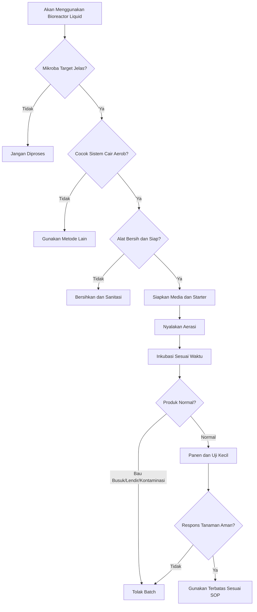

**Keterangan gambar:** Penggunaan bioreactor cair harus dimulai dari mikroba target yang jelas dan sesuai sistem cair aerob. Produk yang berbau busuk, berlendir, atau terkontaminasi harus ditolak. Produk normal tetap harus diuji kecil sebelum aplikasi luas.

---

## Ringkasan Bab 4

Bioreactor liquid kapasitas 10 liter dirancang sebagai sistem cair aerob non-tekanan. Vessel yang disarankan berkapasitas 15 liter dengan volume kerja 5–10 liter dan headspace minimal 30%. Sistem menggunakan pompa udara, filter inlet, check valve, diffuser, outlet udara, foam trap, filter outlet, port inokulasi, dan kran bawah.

Udara harus masuk dari bawah melalui diffuser dan keluar melalui outlet. Sistem tidak boleh ditutup rapat seperti jerigen fermentasi. Foam trap diperlukan untuk mencegah busa masuk ke jalur outlet, sedangkan filter inlet membantu mengurangi risiko kontaminasi dari udara masuk.

Desain ini cocok untuk pembiakan terbatas PGPM cair seperti _Bacillus_, _Azotobacter_, PSB/KSB tertentu, dan sebagian _Pseudomonas_ dengan sanitasi lebih ketat. Desain ini tidak cocok untuk mikoriza, konsorsium liar, atau mikroba yang tidak jelas identitasnya.

Keunggulan desain ini adalah mudah dibuat, biaya relatif rendah, tidak memerlukan agitator mekanik, mudah dibersihkan, cocok untuk skala petani/kelompok tani, lebih aman daripada jerigen tertutup, dan dapat digunakan berulang bila SOP sanitasi baik. Keterbatasannya adalah belum setara bioreactor laboratorium, kontrol pH dan suhu masih manual, serta mutu produk tetap harus diuji sebelum aplikasi luas.

---

# Bab 5. Rancangan Bioreactor Padat Kapasitas 5 kg

Bab ini membahas rancangan **bioreactor padat** atau **fermentasi padat aerob** untuk pembiakan PGPM skala kecil, terutama _Trichoderma_ dan fungi PGPM sejenis. Sistem ini dirancang untuk kapasitas **5 kg media basah** dengan pendekatan modular menggunakan beberapa tray dangkal.

Fermentasi padat berbeda dari bioreactor cair. Pada sistem cair, mikroba tumbuh dalam larutan dan membutuhkan aerasi melalui pompa udara. Pada fermentasi padat, mikroba tumbuh pada media padat yang lembap, berpori, dan tetap memiliki ruang udara. Karena itu, keberhasilan fermentasi padat sangat bergantung pada **ketebalan media, kelembapan, aerasi pasif, kebersihan, dan kontrol kontaminasi**.

Prinsip utama bab ini adalah:

**fermentasi padat PGPM bukan menumpuk media basah dalam wadah tertutup, tetapi menumbuhkan mikroba pada media lembap-berpori dalam kondisi aerob yang bersih dan terkendali.**


---

## 5.1 Konsep Desain

Rancangan bioreactor padat pada panduan ini menggunakan konsep **fermentasi padat aerob modular**. Sistem ini tidak menggunakan satu wadah besar berisi 5 kg media, melainkan beberapa tray dangkal. Setiap tray berisi sekitar **1 kg media basah** dengan ketebalan media **3–5 cm**.

Pendekatan modular lebih aman karena setiap tray dapat dipantau secara terpisah. Bila satu tray terkontaminasi, tray tersebut dapat dipisahkan tanpa merusak seluruh batch.

Desain ini terdiri dari:

- rak fermentasi terbuka,
- 5 tray food grade,
- media padat lembap,
- penutup breathable,
- ruang inkubasi bersih,
- ventilasi pasif,
- kontrol suhu dan kelembapan ruang.

Sistem ini cocok untuk:

- _Trichoderma harzianum_,
- _Trichoderma asperellum_,
- fungi PGPM sejenis,
- sebagian fungi pelarut fosfat,
- inokulasi kompos matang dengan kontrol sederhana.

Sistem ini tidak ditujukan untuk:

- bakteri PGPM cair seperti _Bacillus_ atau _Azotobacter_,
- mikoriza dalam arti fermentasi biasa,
- endofit,
- konsorsium campuran yang tidak jelas,
- produksi komersial tanpa uji mutu tambahan.

---

## Gambar 5.1. Ilustrasi Riil Unit Fermentasi Padat 5 kg

**Deskripsi visual yang direkomendasikan:**
Sebuah rak fermentasi kecil 4 tingkat berada di ruang bersih dan teduh. Pada rak terdapat 5 tray food grade berwarna putih atau transparan, masing-masing berisi media padat lembap setebal 3–5 cm. Setiap tray ditutup kain kasa atau spunbond putih yang memungkinkan udara masuk. Di samping rak terdapat termometer-higrometer digital, sprayer air bersih, timbangan, dan meja persiapan. Tidak ada penutupan plastik rapat. Tidak ada genangan air. Ruang tampak bersih, kering, dan tidak terkena matahari langsung.


```text id="bab5-gambar-01"
ILUSTRASI UNIT FERMENTASI PADAT 5 KG

Ruang bersih dan teduh
Tidak terkena matahari langsung
Tidak dekat pestisida / kandang / tempat sampah

        ┌──────────────────────────────┐
        │ Tray 1: ±1 kg media lembap   │
        │ Penutup kain breathable      │
        ├──────────────────────────────┤
        │ Tray 2: ±1 kg media lembap   │
        │ Penutup kain breathable      │
        ├──────────────────────────────┤
        │ Tray 3: ±1 kg media lembap   │
        │ Penutup kain breathable      │
        ├──────────────────────────────┤
        │ Tray 4: ±1 kg media lembap   │
        │ Penutup kain breathable      │
        ├──────────────────────────────┤
        │ Tray 5: ±1 kg media lembap   │
        │ Penutup kain breathable      │
        └──────────────────────────────┘

Peralatan pendukung:
- termometer-higrometer
- sprayer air bersih
- timbangan
- sarung tangan
- meja persiapan bersih
```

**Keterangan gambar:** Unit fermentasi padat menggunakan sistem tray dangkal. Setiap tray berisi media lembap, bukan becek, dan ditutup bahan breathable. Rak tidak boleh tertutup rapat karena proses membutuhkan oksigen.

---

## 5.2 Spesifikasi Teknis

Spesifikasi teknis berikut digunakan sebagai acuan dasar untuk membangun unit fermentasi padat kapasitas 5 kg.

| Parameter          | Spesifikasi            |
| ------------------ | ---------------------- |
| Tipe               | Fermentasi padat aerob |
| Kapasitas total    | 5 kg media basah       |
| Kapasitas per tray | ±1 kg                  |
| Jumlah tray        | 5 tray                 |
| Ukuran tray        | ±40 × 30 × 8 cm        |
| Ketebalan media    | 3–5 cm                 |
| Rak                | 3–4 tingkat            |
| Jarak antartray    | 20–25 cm               |
| Penutup            | Kain kasa/spunbond     |
| Suhu operasi       | 25–30°C                |
| Kelembapan ruang   | 70–85% RH              |
| Mikroba target     | _Trichoderma_          |
| Lama inkubasi      | 5–10 hari              |

---

### A. Kapasitas Total

Kapasitas total yang dirancang adalah **5 kg media basah**. Media basah berarti media yang sudah dikondisikan dengan kadar air sesuai kebutuhan fermentasi, bukan media kering.

Untuk menjaga aerasi, 5 kg media tidak ditempatkan dalam satu wadah besar, tetapi dibagi menjadi 5 tray.

```text id="bab5-rumus-01"
Jumlah tray = total media basah ÷ kapasitas media per tray
```

Contoh:

```text id="bab5-contoh-01"
Total media basah = 5 kg
Kapasitas per tray = 1 kg

Jumlah tray = 5 ÷ 1
Jumlah tray = 5 tray
```

Dengan pembagian ini, risiko panas berlebih, kekurangan oksigen, dan kontaminasi dapat dikurangi.

---

### B. Ketebalan Media

Ketebalan media ideal adalah **3–5 cm**. Media yang terlalu tebal berisiko kekurangan oksigen di bagian bawah dan tengah. Media yang terlalu tipis lebih cepat kering.

```text id="bab5-rumus-02"
Ketebalan media (cm) =
volume media dalam tray (cm³) ÷ luas dasar tray (cm²)
```

Contoh:

```text id="bab5-contoh-02"
Ukuran dasar tray = 40 cm × 30 cm
Luas dasar tray = 1.200 cm²

Jika volume media dalam tray = 4.800 cm³

Ketebalan media =
4.800 ÷ 1.200

Ketebalan media = 4 cm
```

Ketebalan 4 cm berada dalam kisaran aman untuk fermentasi padat aerob.

---

### C. Ukuran Tray

Ukuran tray yang direkomendasikan adalah sekitar **40 × 30 × 8 cm**. Ukuran ini cukup untuk menampung ±1 kg media basah dengan ketebalan 3–5 cm.

Tray terlalu dalam tidak disarankan bila media ditumpuk tebal. Kedalaman tray boleh 8 cm, tetapi media tidak boleh memenuhi seluruh kedalaman. Harus ada ruang udara di atas media.

---

### D. Rak Fermentasi

Rak fermentasi sebaiknya memiliki 3–4 tingkat dengan jarak antartray 20–25 cm. Jarak ini memberi ruang untuk sirkulasi udara, pemeriksaan visual, dan pengambilan tray.

Rak dapat dibuat dari:

- stainless steel,
- aluminium,
- plastik food grade,
- besi dilapisi antikarat,
- kayu bersih yang mudah dikeringkan.

Rak harus stabil, mudah dibersihkan, dan tidak diletakkan langsung di lantai lembap.

---

### E. Suhu dan Kelembapan Ruang

Suhu operasi yang disarankan adalah **25–30°C**. Kelembapan ruang yang disarankan adalah **70–85% RH**. Suhu terlalu tinggi dapat mempercepat kontaminasi, sedangkan suhu terlalu rendah dapat memperlambat pertumbuhan mikroba.

Kelembapan ruang terlalu rendah membuat media cepat kering. Kelembapan terlalu tinggi membuat ruang menjadi pengap dan dapat meningkatkan kontaminasi.

---

## 5.3 Komponen Utama

Unit fermentasi padat kapasitas 5 kg terdiri dari beberapa komponen utama. Setiap komponen harus dipilih dengan memperhatikan kebersihan, kemudahan penggunaan, dan risiko kontaminasi.

---

## Tabel 5.1. Komponen Utama Fermentasi Padat 5 kg

| Komponen              | Fungsi                              | Catatan Teknis                     |
| --------------------- | ----------------------------------- | ---------------------------------- |
| Rak fermentasi        | Menyusun tray secara bertingkat     | Harus stabil dan mudah dibersihkan |
| Tray food grade       | Wadah media padat                   | Ukuran ±40 × 30 × 8 cm             |
| Penutup breathable    | Melindungi media dari debu/serangga | Kain kasa atau spunbond            |
| Termometer-higrometer | Memantau suhu dan RH ruang          | Diletakkan dekat rak               |
| Sprayer air bersih    | Koreksi kelembapan ringan           | Jangan menyemprot berlebihan       |
| Timbangan             | Menimbang media dan carrier         | Kapasitas 5–10 kg                  |
| Meja persiapan        | Area pencampuran media dan starter  | Harus bersih dan kering            |
| Sarung tangan         | Menekan kontaminasi dari tangan     | Digunakan saat inokulasi/panen     |
| Ruang inkubasi bersih | Tempat fermentasi berlangsung       | Teduh, tidak berdebu               |
| Kipas kecil optional  | Membantu sirkulasi udara ruang      | Tidak diarahkan langsung ke media  |

---

### A. Rak Fermentasi

Rak fermentasi berfungsi menempatkan tray dalam posisi bertingkat dan tidak saling menempel. Rak harus memberi ruang untuk ventilasi pasif.

Kriteria rak yang baik:

- kuat,
- stabil,
- tidak mudah berkarat,
- mudah dibersihkan,
- tidak lembap,
- tidak terlalu rapat,
- memiliki jarak antartray cukup.

Rak tidak perlu ditutup rapat. Bila rak dibuat seperti kabinet, kabinet harus memiliki ventilasi. Kabinet tertutup tanpa ventilasi dapat menyebabkan kelembapan berlebihan dan meningkatkan risiko kontaminasi.

---

### B. Tray Food Grade

Tray adalah wadah utama media fermentasi. Gunakan tray food grade agar tidak mencemari media.

Kriteria tray yang baik:

- permukaan halus,
- mudah dicuci,
- tidak berbau bahan kimia,
- tidak retak,
- tidak menyerap bau,
- tidak terlalu dalam,
- tidak bekas pestisida.

Tray harus dibersihkan sebelum digunakan. Setelah panen, tray harus dicuci, dibilas, dikeringkan, dan disimpan di tempat bersih.

---

### C. Penutup Breathable

Penutup breathable berfungsi melindungi media dari debu, serangga, dan kontaminasi kasar, tetapi tetap memungkinkan pertukaran udara.

Bahan penutup yang dapat digunakan:

- kain kasa bersih,
- spunbond,
- kain tipis bersih,
- kertas breathable,
- tutup berlubang dengan filter.

Bahan yang tidak disarankan:

- plastik rapat tanpa lubang,
- tutup kedap udara,
- karung kotor,
- kain lembap berjamur,
- bahan bekas pestisida.

Prinsipnya:

**penutup digunakan untuk melindungi, bukan untuk mengunci udara.**

---

### D. Termometer-Higrometer

Termometer-higrometer digunakan untuk memantau suhu dan kelembapan ruang inkubasi. Alat sederhana sudah cukup untuk skala petani.

Parameter yang dipantau:

- suhu ruang,
- kelembapan relatif ruang,
- perubahan kondisi harian.

Pencatatan suhu dan kelembapan membantu mengevaluasi keberhasilan atau kegagalan batch.

---

### E. Sprayer Air Bersih

Sprayer digunakan untuk koreksi kelembapan ringan bila media terlalu kering. Namun, penyemprotan harus hati-hati. Terlalu banyak air dapat membuat media becek dan mendorong kondisi anaerob.

Gunakan hanya air bersih. Jangan menggunakan sprayer bekas pestisida.

---

### F. Timbangan

Timbangan digunakan untuk memastikan kapasitas per tray konsisten. Dengan penimbangan, setiap tray dapat diisi sekitar 1 kg media basah. Ini membantu menjaga ketebalan media tetap seragam.

---

### G. Meja Persiapan

Meja persiapan digunakan untuk mencampur media dan starter. Meja harus bersih, kering, dan jauh dari pestisida, pupuk kimia pekat, bahan busuk, atau sumber debu.

---

### H. Sarung Tangan

Sarung tangan digunakan untuk mengurangi kontaminasi dari tangan. Sarung tangan bukan pengganti kebersihan, tetapi membantu menjaga proses lebih higienis.

---

### I. Ruang Inkubasi Bersih

Ruang inkubasi tidak harus berupa laboratorium, tetapi harus memenuhi syarat dasar:

- bersih,
- teduh,
- tidak terkena matahari langsung,
- tidak dekat kandang,
- tidak dekat tempat sampah,
- tidak dekat pestisida,
- tidak banyak debu,
- tidak banyak serangga,
- memiliki ventilasi cukup.

---

### J. Kipas Kecil Optional

Kipas kecil dapat digunakan untuk membantu sirkulasi udara ruang, tetapi tidak boleh diarahkan langsung ke media. Angin langsung dapat membuat media cepat kering dan membawa debu ke tray.

---

## 5.4 Prinsip Aerasi pada Fermentasi Padat

Fermentasi padat untuk _Trichoderma_ dan fungi PGPM sejenis adalah proses **aerob**. Artinya, proses membutuhkan oksigen. Berbeda dengan bioreactor cair yang memakai aerator, fermentasi padat memperoleh oksigen dari ruang udara antarpartikel media dan ventilasi pasif.

---

### A. Aerasi Berasal dari Ruang Udara Antarpartikel Media

Media padat yang baik harus memiliki pori udara. Pori udara terbentuk bila media tidak terlalu halus, tidak terlalu padat, dan tidak terlalu basah.

Ruang udara antarpartikel membantu:

- menyediakan oksigen,
- mendukung pertumbuhan miselium,
- mencegah bau busuk,
- mengurangi risiko kondisi anaerob,
- membantu pertumbuhan _Trichoderma_ lebih merata.

---

### B. Media Tidak Boleh Terlalu Basah

Media yang terlalu basah akan mengisi ruang udara dengan air. Akibatnya, oksigen berkurang dan proses dapat bergeser ke kondisi anaerob.

Tanda media terlalu basah:

- air menetes saat diremas,
- media menggumpal seperti bubur,
- permukaan mengilap basah,
- muncul bau asam/busuk,
- media berlendir,
- pertumbuhan tidak merata.

Kondisi ideal:

- lembap,
- menggumpal ringan bila diremas,
- tidak meneteskan air,
- tetap remah,
- tidak berbau busuk.

---

### C. Ketebalan Tidak Boleh Berlebihan

Media terlalu tebal menyebabkan bagian tengah kekurangan oksigen dan mudah panas. Karena itu, ketebalan media harus dijaga 3–5 cm.

Jika kapasitas ingin diperbesar, jangan menambah ketebalan media. Tambahkan jumlah tray.

Prinsip skala naik:

```text id="bab5-prinsip-01"
Kapasitas dinaikkan dengan menambah jumlah tray,
bukan dengan menebalkan media dalam satu tray.
```

---

### D. Penutup Tidak Boleh Kedap Udara

Penutup tray harus breathable. Plastik rapat tanpa lubang dapat menahan udara dan membuat kondisi terlalu lembap. Pada fermentasi padat aerob, ini berisiko menyebabkan kontaminasi dan bau busuk.

Penutup yang benar:

- melindungi dari debu,
- mencegah lalat/serangga,
- tetap memungkinkan udara masuk,
- tidak menempel langsung ke permukaan media.

---

### E. Kipas Tidak Diarahkan Langsung ke Media

Sirkulasi udara ruang penting, tetapi angin langsung ke media tidak disarankan. Angin langsung dapat:

- mengeringkan permukaan media,
- membawa debu,
- menyebarkan kontaminan,
- membuat pertumbuhan tidak merata.

Jika menggunakan kipas, arahkan ke dinding atau ruang, bukan langsung ke tray.

---

### F. Media Becek Berubah Menjadi Anaerob dan Berisiko Busuk

Fermentasi padat yang gagal sering dimulai dari media terlalu basah. Ketika pori udara hilang, mikroba aerob sulit tumbuh. Mikroba lain yang tahan kondisi rendah oksigen dapat berkembang. Hasilnya media berbau busuk, berlendir, dan tidak layak digunakan.

---

### G. Tray Dangkal Lebih Aman daripada Satu Wadah Besar

Tray dangkal membuat media lebih mudah mendapatkan oksigen dan lebih mudah dipantau. Satu wadah besar berisi media tebal berisiko:

- panas,
- anaerob di bagian tengah,
- pertumbuhan tidak merata,
- kontaminasi sulit dilokalisir,
- seluruh batch bisa gagal.

Karena itu, untuk 5 kg media basah, desain terbaik adalah:

```text id="bab5-prinsip-02"
5 kg media basah = 5 tray × 1 kg media basah
```

---

## Gambar 5.2. Fermentasi Padat Aerob: Media Benar vs Media Salah

```text id="bab5-gambar-02"
MEDIA BENAR                         MEDIA SALAH

Tray dangkal                         Wadah dalam / tumpukan tebal
Media 3–5 cm                         Media terlalu tebal
Lembap, remah                        Becek, menggumpal
Ada ruang udara                      Pori tertutup air
Penutup breathable                   Tutup plastik rapat
Tidak bau busuk                      Bau busuk / lendir

┌─────────────────────┐              ┌─────────────────────┐
│ kain breathable     │              │ plastik rapat        │
├─────────────────────┤              ├─────────────────────┤
│ media 3–5 cm        │              │ media tebal/becek    │
│ pori udara ada      │              │ oksigen rendah       │
└─────────────────────┘              └─────────────────────┘

Aerob stabil                         Risiko anaerob
```

**Keterangan gambar:** Fermentasi padat yang benar menggunakan media tipis, lembap, berpori, dan ditutup bahan breathable. Media becek, tebal, dan tertutup rapat berisiko berubah menjadi anaerob.

---

## 5.5 Media Fermentasi Padat

Media fermentasi padat berfungsi sebagai tempat tumbuh dan sumber nutrisi mikroba. Pemilihan media harus disesuaikan dengan mikroba target, tujuan aplikasi, biaya, dan kemudahan pengendalian kontaminasi.

Media yang umum digunakan antara lain:

- beras,
- jagung giling,
- dedak/bekatul,
- kompos matang,
- carrier padat.

---

### A. Beras

Beras sering digunakan untuk pembiakan _Trichoderma_ karena teksturnya mendukung pertumbuhan fungi dan relatif mudah diamati. Namun, biaya beras lebih tinggi dibanding media lain.

Kelebihan:

- mudah ditumbuhi fungi,
- struktur cukup baik,
- pertumbuhan mudah terlihat.

Kekurangan:

- biaya relatif tinggi,
- perlu dikondisikan agar tidak terlalu basah,
- rentan kontaminasi bila tidak bersih.

---

### B. Jagung Giling

Jagung giling dapat digunakan sebagai media padat karena memiliki struktur cukup baik dan pori antarpartikel. Jagung juga relatif mudah ditemukan.

Kelebihan:

- struktur cukup berpori,
- biaya dapat lebih rendah dari beras,
- cocok untuk media padat.

Kekurangan:

- perlu kebersihan baik,
- ukuran partikel harus sesuai,
- bila terlalu halus dapat menggumpal.

---

### C. Dedak/Bekatul

Dedak atau bekatul murah dan mudah diperoleh. Namun, media ini mudah menggumpal bila terlalu basah dan mudah terkontaminasi bila kualitasnya buruk.

Kelebihan:

- murah,
- mudah diperoleh,
- dapat dicampur dengan carrier lain.

Kekurangan:

- mudah becek,
- mudah menggumpal,
- rentan jamur liar bila sudah lama disimpan,
- perlu kontrol kelembapan lebih hati-hati.

---

### D. Kompos Matang

Kompos matang dapat digunakan sebagai carrier atau media inokulasi untuk aplikasi tanah. Namun, kompos harus benar-benar matang.

Ciri kompos matang:

- tidak panas,
- tidak berbau busuk,
- tidak berbau amonia tajam,
- tekstur remah,
- warna stabil,
- tidak berlendir,
- tidak banyak bahan mentah.

Kompos mentah tidak boleh digunakan karena dapat membawa patogen, menghasilkan panas, dan mengganggu mikroba target.

---

### E. Carrier Padat

Carrier padat dapat digunakan untuk membantu penyimpanan dan aplikasi. Contohnya:

- talc agri grade,
- kaolin,
- zeolit halus,
- biochar halus matang,
- vermikulit,
- peat steril,
- kompos matang halus.

Carrier harus bersih, tidak beracun, tidak berbau, dan tidak tercemar pestisida.

---

## Tabel 5.2. Pilihan Media Fermentasi Padat

| Media              | Kelebihan                | Risiko                             | Catatan                            |
| ------------------ | ------------------------ | ---------------------------------- | ---------------------------------- |
| Beras              | Mudah ditumbuhi fungi    | Biaya lebih tinggi                 | Cocok untuk uji awal               |
| Jagung giling      | Struktur berpori         | Bisa menggumpal bila terlalu halus | Perlu ukuran partikel sesuai       |
| Dedak/bekatul      | Murah                    | Mudah becek dan kontaminasi        | Perlu kontrol kelembapan           |
| Kompos matang      | Cocok aplikasi tanah     | Harus benar-benar matang           | Jangan gunakan kompos mentah       |
| Talc/kaolin/zeolit | Baik sebagai carrier     | Perlu formulasi                    | Cocok untuk penyimpanan lebih baik |
| Biochar matang     | Mendukung aplikasi tanah | Harus bebas kontaminan             | Jangan gunakan biochar tercemar    |

---

### Syarat Media yang Layak

Media fermentasi padat harus memenuhi syarat berikut:

- tidak busuk,
- tidak tercemar pestisida,
- tidak terlalu halus,
- tidak menggumpal becek,
- tidak berjamur liar,
- tidak terlalu panas,
- tidak berasal dari bahan organik mentah yang belum stabil,
- tidak berbau limbah,
- tidak berlendir,
- tidak mengandung serangga atau belatung.

Media yang meragukan sebaiknya tidak digunakan. Lebih baik menolak media sejak awal daripada gagal satu batch.

---

### Uji Genggam Media

Uji genggam adalah metode sederhana untuk mengevaluasi kelembapan media.

Cara uji:

1. Ambil segenggam media.
2. Remas dengan tangan bersarung.
3. Amati bentuk dan keluarnya air.

| Hasil Uji                        | Makna               | Keputusan                          |
| -------------------------------- | ------------------- | ---------------------------------- |
| Media hancur seperti kering      | Terlalu kering      | Tambah air sedikit                 |
| Menggumpal ringan, tidak menetes | Ideal               | Siap digunakan                     |
| Air menetes saat diremas         | Terlalu basah       | Tambah media kering/angin-anginkan |
| Berlendir                        | Tidak layak         | Tolak media                        |
| Bau busuk                        | Kontaminasi/anaerob | Tolak media                        |

---

### Rumus Penambahan Air Sederhana

```text id="bab5-rumus-03"
Air yang ditambahkan =
target bobot media basah - bobot media kering
```

Contoh:

```text id="bab5-contoh-03"
Bobot media kering = 3 kg
Target media basah = 5 kg

Air yang ditambahkan =
5 - 3

Air yang ditambahkan = 2 kg air
```

Karena 1 liter air kira-kira setara 1 kg:

```text id="bab5-contoh-04"
2 kg air ≈ 2 liter air
```

Catatan: air sebaiknya ditambahkan bertahap sambil melakukan uji genggam. Jangan langsung memasukkan seluruh air bila karakter media belum diketahui.

---

## 5.6 Gambar Rancangan Engineering

Bagian ini berisi rancangan engineering sederhana untuk unit fermentasi padat kapasitas 5 kg. Gambar dibuat agar pembaca memahami bentuk unit, posisi tray, ketebalan media, penutup, ventilasi, dan alur proses.

---

## Gambar 5.3. Gambar Isometri Unit Fermentasi Padat

```text id="bab5-gambar-03"
GAMBAR ISOMETRI SEDERHANA

            Rak fermentasi 4 tingkat
        dengan 5 tray food grade

             ┌───────────────────┐
            /│ Tray 1            /│
           / └──────────────────/ │
          /────────────────────/  │
         │ Tray 2             │   │
         │────────────────────│   │
         │ Tray 3             │   │
         │────────────────────│   │
         │ Tray 4             │   │
         │────────────────────│   │
         │ Tray 5 / cadangan  │  /
         │────────────────────│ /
         └────────────────────┘/

Keterangan:
- setiap tray berisi ±1 kg media basah
- ketebalan media 3–5 cm
- tray ditutup kain breathable
- rak terbuka untuk ventilasi pasif
```

---

## Gambar 5.4. Tampak Depan Rak Fermentasi Padat

```text id="bab5-gambar-04"
TAMPAK DEPAN

Tinggi rak ±100–120 cm
Lebar rak ±50–60 cm

┌──────────────────────────────┐
│ Tray 1: ±1 kg media          │
│ Jarak ke tray berikut 20 cm  │
├──────────────────────────────┤
│ Tray 2: ±1 kg media          │
│ Jarak ke tray berikut 20 cm  │
├──────────────────────────────┤
│ Tray 3: ±1 kg media          │
│ Jarak ke tray berikut 20 cm  │
├──────────────────────────────┤
│ Tray 4: ±1 kg media          │
│ Jarak ke tray berikut 20 cm  │
├──────────────────────────────┤
│ Tray 5: ±1 kg media/cadangan │
└──────────────────────────────┘
```

**Keterangan gambar:** Rak memiliki beberapa tingkat dengan jarak antartray 20–25 cm. Jarak ini penting untuk ventilasi pasif dan kemudahan pemeriksaan.

---

## Gambar 5.5. Tampak Samping Rak Fermentasi Padat

```text id="bab5-gambar-05"
TAMPAK SAMPING

Kedalaman rak ±35–45 cm

        Ventilasi pasif
              ↓
┌──────────────────────┐
│ Tray + penutup       │
│ breathable           │
├──────────────────────┤
│ Ruang udara 20–25 cm │
├──────────────────────┤
│ Tray + penutup       │
│ breathable           │
├──────────────────────┤
│ Ruang udara 20–25 cm │
├──────────────────────┤
│ Tray + penutup       │
│ breathable           │
└──────────────────────┘

Catatan:
- rak tidak tertutup rapat
- kipas bila ada tidak diarahkan langsung ke media
```

---

## Gambar 5.6. Tampak Atas Tray

```text id="bab5-gambar-06"
TAMPAK ATAS TRAY

Ukuran tray ±40 × 30 × 8 cm

┌──────────────────────────────────┐
│                                  │
│     Media padat lembap           │
│     diratakan merata             │
│                                  │
│     Ketebalan 3–5 cm             │
│                                  │
└──────────────────────────────────┘

Permukaan media:
- rata
- tidak becek
- tidak menggumpal besar
- tidak menempel pada penutup
```

---

## Gambar 5.7. Potongan Melintang Tray

```text id="bab5-gambar-07"
POTONGAN MELINTANG TRAY

        Penutup breathable
    ┌───────────────────────┐
    │ kain kasa / spunbond  │
    └───────────────────────┘
              ruang udara
    ┌───────────────────────┐
    │ media padat lembap    │  ← 3–5 cm
    │ berpori, tidak becek  │
    └───────────────────────┘
    │ dasar tray food grade │
    └───────────────────────┘
```

**Keterangan gambar:** Penutup tidak boleh menempel langsung ke media. Media harus setebal 3–5 cm dan tetap memiliki pori udara.

---

## Gambar 5.8. Detail Penutup Breathable

```text id="bab5-gambar-08"
DETAIL PENUTUP BREATHABLE

Bahan yang disarankan:
- kain kasa bersih
- spunbond
- kain tipis bersih
- kertas breathable

Fungsi:
- menahan debu
- mengurangi serangga
- tetap memungkinkan pertukaran udara

Tidak disarankan:
- plastik rapat
- tutup kedap udara
- kain kotor/lembap/berjamur
```

---

## Gambar 5.9. Skema Ventilasi Ruangan

```text id="bab5-gambar-09"
SKEMA VENTILASI RUANG FERMENTASI

        Udara masuk lembut
              ↓
 ┌──────────────────────────────┐
 │                              │
 │     Rak fermentasi padat     │
 │                              │
 │     Tray tidak tertutup      │
 │     rapat                    │
 │                              │
 └──────────────────────────────┘
              ↓
       Udara keluar

Catatan:
- ventilasi cukup
- tidak berdebu
- tidak ada angin langsung ke media
- tidak dekat pestisida
- tidak dekat bahan busuk
```

---

## Gambar 5.10. Flow Proses Fermentasi Padat

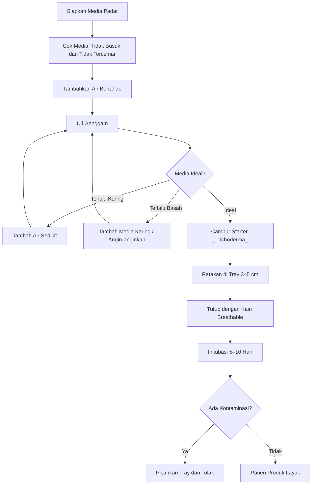

**Keterangan gambar:** Proses fermentasi padat dimulai dari pemilihan media, pengaturan kelembapan, inokulasi starter, inkubasi, dan panen. Media terlalu kering atau terlalu basah harus dikoreksi sebelum inokulasi.

---

## Tabel 5.3. Bill of Materials Fermentasi Padat 5 kg

| Komponen              | Spesifikasi        |     Jumlah | Catatan                      |
| --------------------- | ------------------ | ---------: | ---------------------------- |
| Rak fermentasi        | 3–4 tingkat        |          1 | Stabil dan mudah dibersihkan |
| Tray food grade       | ±40 × 30 × 8 cm    |          5 | Kapasitas ±1 kg/tray         |
| Penutup breathable    | Kain kasa/spunbond |   5 lembar | Ukuran menutup tray          |
| Termometer-higrometer | Digital sederhana  |          1 | Pantau suhu dan RH           |
| Sprayer air bersih    | 500 ml–1 L         |          1 | Bukan bekas pestisida        |
| Timbangan             | 5–10 kg            |          1 | Untuk media dan carrier      |
| Meja persiapan        | Mudah dibersihkan  |          1 | Area pencampuran             |
| Sarung tangan         | Bersih             | secukupnya | Saat inokulasi/panen         |
| Wadah pencampur       | Food grade         |        1–2 | Untuk media                  |
| Kain lap bersih       | Bersih/kering      | secukupnya | Sanitasi alat                |
| Kipas kecil           | Optional           |          1 | Tidak diarahkan ke media     |

---

## 5.7 Keunggulan Desain

Desain fermentasi padat kapasitas 5 kg ini memiliki beberapa keunggulan bagi petani dan kelompok tani.

### A. Murah

Komponen yang digunakan sederhana dan mudah diperoleh. Rak, tray, penutup breathable, sprayer, dan termometer-higrometer relatif murah dibanding sistem produksi mikroba skala laboratorium.

### B. Modular

Sistem modular memudahkan pengaturan kapasitas. Untuk kapasitas 5 kg digunakan 5 tray. Bila ingin kapasitas 10 kg, jumlah tray dapat ditambah menjadi 10 tray dengan tetap mempertahankan ketebalan media 3–5 cm.

### C. Mudah Dikontrol

Setiap tray dapat diamati secara terpisah. Petani dapat memantau aroma, warna, kelembapan, kontaminasi, dan pertumbuhan mikroba pada masing-masing tray.

### D. Kontaminasi Mudah Dilokalisir

Jika satu tray terkontaminasi, tray tersebut dapat dipisahkan. Ini lebih aman dibanding satu wadah besar, di mana kontaminasi dapat merusak seluruh batch.

### E. Cocok untuk _Trichoderma_

_ Trichoderma_ lebih cocok tumbuh pada media padat lembap dan aerob. Sistem tray dangkal memberi kondisi yang lebih sesuai untuk pertumbuhan miselium dan sporulasi dibanding wadah cair tertutup.

### F. Tidak Membutuhkan Listrik Besar

Sistem ini menggunakan ventilasi pasif. Listrik hanya dibutuhkan bila menggunakan kipas kecil atau alat ukur digital. Ini membuat sistem cocok untuk daerah dengan keterbatasan listrik.

### G. Sesuai untuk Petani dan Kelompok Tani

Kapasitas 5 kg cukup untuk pembelajaran, uji batch, dan produksi terbatas. Petani dapat meningkatkan kapasitas setelah SOP stabil.

### H. Kapasitas Bisa Dinaikkan dengan Menambah Tray

Peningkatan kapasitas dilakukan dengan menambah jumlah tray, bukan menambah ketebalan media. Ini menjaga aerasi tetap baik.

---

## 5.8 Keterbatasan Desain

Desain ini juga memiliki batasan yang harus dipahami.

### A. Tidak Cocok untuk Bakteri Cair

Sistem fermentasi padat tidak dirancang untuk bakteri cair seperti _Azotobacter_ atau sebagian _Pseudomonas_. Untuk bakteri cair, gunakan bioreactor liquid dengan aerasi.

### B. Tidak Cocok untuk Mikoriza dalam Arti Fermentasi Biasa

Mikoriza membutuhkan tanaman inang. Fermentasi padat ini tidak boleh diklaim sebagai sistem pembiakan mikoriza kecuali menggunakan metode khusus seperti trap culture dengan akar terkolonisasi.

### C. Perlu Ruang Bersih

Walaupun sederhana, sistem ini tetap membutuhkan ruang yang bersih. Ruang kotor, berdebu, dekat kandang, atau dekat tempat sampah akan meningkatkan risiko kontaminasi.

### D. Rentan Kontaminasi Bila Terlalu Sering Dibuka

Tray tidak boleh sering dibuka tanpa alasan. Setiap pembukaan meningkatkan risiko masuknya debu, spora liar, serangga, atau kontaminan.

### E. Mutu Tetap Perlu Uji Kecil Sebelum Aplikasi Luas

Produk yang tampak baik tetap harus diuji kecil. Uji kecil dilakukan pada sebagian kecil tanaman atau media sebelum digunakan luas.

### F. Tidak Cocok untuk Produksi Komersial tanpa Standar Mutu Tambahan

Untuk produksi komersial, dibutuhkan standar tambahan seperti uji populasi mikroba, uji kontaminasi, stabilitas penyimpanan, label, izin, dan klaim yang bertanggung jawab.

---

## Gambar 5.11. Alur Keputusan Penggunaan Fermentasi Padat

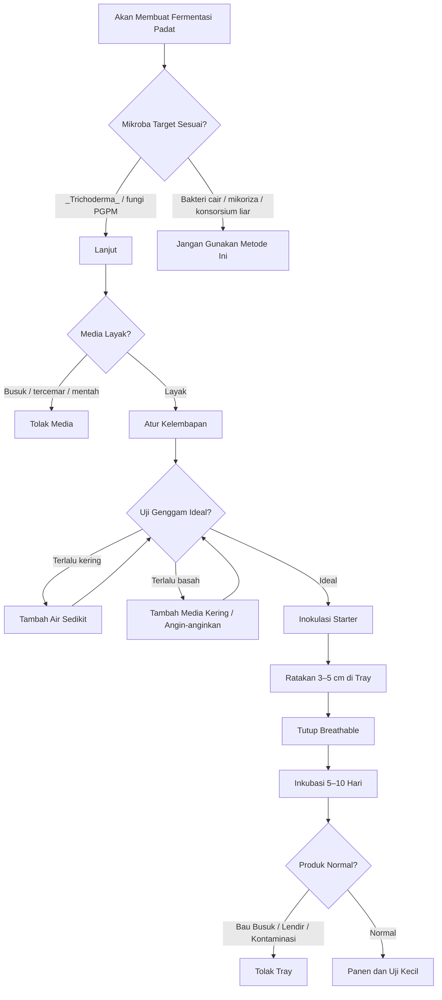

**Keterangan gambar:** Fermentasi padat hanya digunakan untuk mikroba yang sesuai, terutama _Trichoderma_ dan fungi PGPM sejenis. Media harus layak, kelembapan harus tepat, dan produk harus diuji kecil sebelum aplikasi luas.

---

## Ringkasan Bab 5

Bioreactor padat kapasitas 5 kg dirancang sebagai sistem fermentasi padat aerob menggunakan 5 tray modular. Setiap tray berisi sekitar 1 kg media basah dengan ketebalan 3–5 cm. Sistem ini menggunakan rak terbuka, ventilasi pasif, penutup breathable, dan ruang inkubasi bersih.

Desain ini cocok untuk _Trichoderma_ dan fungi PGPM sejenis. Media yang digunakan dapat berupa beras, jagung giling, dedak/bekatul, kompos matang, atau carrier padat lain yang sesuai. Media harus lembap, tidak becek, tidak busuk, tidak tercemar pestisida, tidak terlalu halus, tidak menggumpal, tidak berjamur liar, dan tidak berasal dari bahan organik mentah yang belum stabil.

Aerasi pada fermentasi padat berasal dari ruang udara antarpartikel media. Karena itu, media tidak boleh terlalu basah atau terlalu tebal. Penutup tray harus breathable dan tidak boleh kedap udara. Jika kapasitas ingin dinaikkan, jumlah tray ditambah, bukan ketebalan media.

Keunggulan desain ini adalah murah, modular, mudah dikontrol, kontaminasi mudah dilokalisir, cocok untuk _Trichoderma_, tidak membutuhkan listrik besar, dan sesuai untuk petani/kelompok tani. Keterbatasannya adalah tidak cocok untuk bakteri cair, tidak cocok untuk mikoriza dalam arti fermentasi biasa, memerlukan ruang bersih, rentan kontaminasi bila sering dibuka, dan belum memadai untuk produksi komersial tanpa standar mutu tambahan.

---

# Bab 6. SOP Operasi Bioreactor Liquid dan Padat

Bab ini membahas **SOP operasi** untuk dua sistem pembiakan PGPM yang telah dirancang pada bab sebelumnya, yaitu **bioreactor liquid kapasitas kerja 10 liter** dan **fermentasi padat kapasitas 5 kg**. SOP diperlukan agar proses pembiakan tidak bergantung pada kebiasaan, perkiraan, atau tanda visual yang menyesatkan seperti busa dan bau fermentasi.

Dalam produksi mikroba, alat yang baik tidak cukup. Hasil tetap dapat gagal bila sanitasi buruk, starter tidak jelas, media tercemar, aerasi tidak stabil, kelembapan salah, atau proses tidak dicatat. Karena itu, SOP harus menjadi acuan kerja setiap batch.

Prinsip utama Bab 6 adalah:

**setiap batch PGPM harus memiliki starter jelas, alat bersih, media sesuai, proses terkendali, catatan produksi, dan kriteria tolak yang tegas.**

---

## Gambar 6.1. Alur Umum SOP Pembiakan PGPM

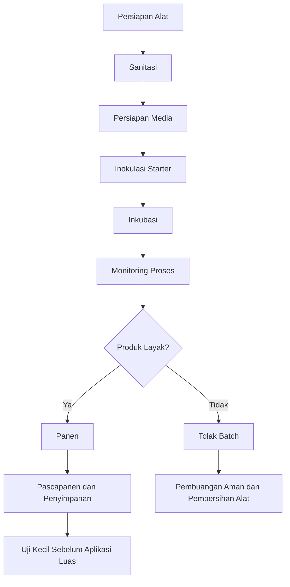

**Keterangan gambar:** SOP pembiakan PGPM dimulai dari persiapan alat dan sanitasi, lalu dilanjutkan dengan persiapan media, inokulasi, inkubasi, monitoring, panen, pascapanen, dan uji kecil. Batch yang tidak layak harus ditolak.

---

## 6.1 SOP Umum Sanitasi

Sanitasi adalah fondasi utama dalam pembiakan PGPM. Mikroba target dapat kalah oleh kontaminan bila alat, media, air, tangan, ruang kerja, atau kemasan tidak bersih. Pada skala petani, sanitasi tidak harus serumit laboratorium, tetapi harus cukup untuk menekan risiko kontaminasi.

Sanitasi berlaku untuk semua sistem, baik bioreactor liquid maupun fermentasi padat.

---

### A. Cuci Alat

Semua alat harus dicuci sebelum digunakan. Alat yang terlihat bersih belum tentu bebas dari residu organik, debu, pestisida, atau mikroba liar.

Alat yang perlu dicuci:

- vessel bioreactor,
- tutup vessel,
- selang,
- diffuser,
- foam trap,
- kran,
- tray,
- wadah pencampur,
- sprayer,
- sendok/pengaduk,
- botol atau kemasan,
- meja kerja.

Gunakan air bersih dan sabun ringan bila diperlukan. Hindari sabun beraroma kuat yang sulit dibilas.

---

### B. Bilas dari Sabun

Setelah dicuci, alat harus dibilas sampai tidak ada sisa sabun. Residu sabun dapat mengganggu mikroba dan menyebabkan proses tidak stabil.

Tanda alat belum layak digunakan:

- masih licin,
- masih berbau sabun,
- masih berbusa saat dibilas,
- masih ada noda media lama,
- masih berbau pestisida atau bahan kimia.

Jika alat masih berbau pestisida, jangan digunakan untuk PGPM.

---

### C. Sanitasi Alat

Setelah dicuci dan dibilas, alat perlu disanitasi sesuai kemampuan lapangan. Sanitasi bertujuan menurunkan jumlah kontaminan sebelum proses dimulai.

Pilihan sanitasi lapangan:

- air panas,
- uap panas sederhana,
- larutan sanitasi food grade,
- alkohol untuk permukaan kecil,
- pengeringan di tempat bersih,
- pasteurisasi media bila memungkinkan.

Catatan penting:

**sanitasi bukan pengganti kebersihan. Alat kotor tidak bisa langsung disanitasi tanpa dicuci terlebih dahulu.**

---

### D. Gunakan Air Bersih

Air adalah sumber risiko kontaminasi yang sangat besar. Air yang digunakan untuk mencuci, membuat media, mengatur kelembapan, atau mengencerkan produk harus bersih.

Air yang layak:

- tidak berbau busuk,
- tidak berbau pestisida,
- tidak keruh ekstrem,
- tidak berasal dari saluran limbah,
- tidak berklorin tinggi,
- tidak tercampur pupuk atau pestisida.

Jika menggunakan air PAM yang berbau kaporit kuat, air sebaiknya diendapkan terlebih dahulu sebelum digunakan untuk mikroba.

---

### E. Jangan Memakai Wadah Bekas Pestisida

Wadah bekas pestisida tidak boleh digunakan untuk pembiakan PGPM, meskipun sudah dicuci. Residu pestisida dapat menekan mikroba dan mencemari produk.

Wadah yang harus dihindari:

- jerigen bekas pestisida,
- botol bekas herbisida,
- ember bekas fungisida,
- sprayer bekas pestisida yang tidak dapat dipastikan bersih,
- selang bekas bahan kimia,
- wadah bekas oli atau bahan bakar.

Gunakan hanya wadah food grade atau wadah baru yang jelas riwayatnya.

---

### F. Gunakan Sarung Tangan

Sarung tangan membantu mengurangi kontaminasi dari tangan. Sarung tangan digunakan saat:

- menyiapkan starter,
- mencampur media,
- menginokulasi,
- memanen produk,
- menangani tray,
- menangani produk padat berspora,
- membersihkan kontaminasi.

Sarung tangan tidak boleh menyentuh pestisida, tanah kotor, uang, makanan, atau benda lain lalu digunakan untuk proses inokulasi tanpa diganti atau dibersihkan.

---

### G. Hindari Ruang Kotor, Kandang, Tempat Sampah, dan Debu

Ruang kerja sangat mempengaruhi keberhasilan batch. Produksi mikroba tidak boleh dilakukan di area yang banyak debu, dekat kandang, dekat tempat sampah, dekat kompos mentah, dekat saluran limbah, atau dekat penyimpanan pestisida.

Ruang yang disarankan:

- bersih,
- teduh,
- kering,
- berventilasi cukup,
- tidak terkena matahari langsung,
- tidak banyak serangga,
- tidak berbau bahan kimia,
- mudah dibersihkan.

---

### H. Catat Seluruh Proses

Setiap batch harus dicatat. Catatan proses membantu mengetahui penyebab keberhasilan atau kegagalan. Tanpa catatan, batch yang berhasil sulit diulang dan batch yang gagal sulit dievaluasi.

Minimal catat:

- tanggal produksi,
- nomor batch,
- jenis mikroba,
- sumber starter,
- jenis media,
- volume/bobot media,
- waktu inokulasi,
- suhu,
- pH bila tersedia,
- lama inkubasi,
- aroma,
- busa,
- kontaminasi,
- hasil panen,
- keputusan layak/tolak.

---

### I. Pisahkan Area Produksi Mikroba dari Penyimpanan Pestisida

Area produksi PGPM harus dipisahkan dari pestisida. Pestisida, terutama fungisida, bakterisida, herbisida, tembaga, dan antibiotik pertanian, dapat mengganggu mikroba.

Prinsip pemisahan:

- jangan menyimpan PGPM dekat pestisida,
- jangan mencuci alat PGPM di area pencucian sprayer pestisida,
- jangan memakai gelas ukur bekas pestisida,
- jangan menaruh starter di gudang pestisida,
- jangan menggunakan meja yang baru dipakai mencampur pestisida.

---

## Tabel 6.1. Checklist Sanitasi Umum

| Pemeriksaan                   | Status   | Catatan |
| ----------------------------- | -------- | ------- |
| Alat sudah dicuci             | Ya/Tidak |         |
| Alat sudah dibilas dari sabun | Ya/Tidak |         |
| Alat tidak berbau pestisida   | Ya/Tidak |         |
| Air bersih tersedia           | Ya/Tidak |         |
| Starter jelas                 | Ya/Tidak |         |
| Area kerja bersih             | Ya/Tidak |         |
| Sarung tangan tersedia        | Ya/Tidak |         |
| Area jauh dari pestisida      | Ya/Tidak |         |
| Form catatan batch tersedia   | Ya/Tidak |         |

---

## 6.2 SOP Bioreactor Liquid 10 Liter

SOP bioreactor liquid digunakan untuk pembiakan PGPM cair aerob dengan volume kerja 5–10 liter. Sistem ini cocok untuk mikroba tertentu seperti _Bacillus_, _Azotobacter_, PSB/KSB tertentu, dan sebagian _Pseudomonas_ dengan sanitasi lebih ketat.

SOP ini tidak digunakan untuk mikoriza, konsorsium liar, mikroba tidak jelas, atau fermentasi anaerob tertutup.

---

## Gambar 6.2. Alur SOP Bioreactor Liquid 10 Liter

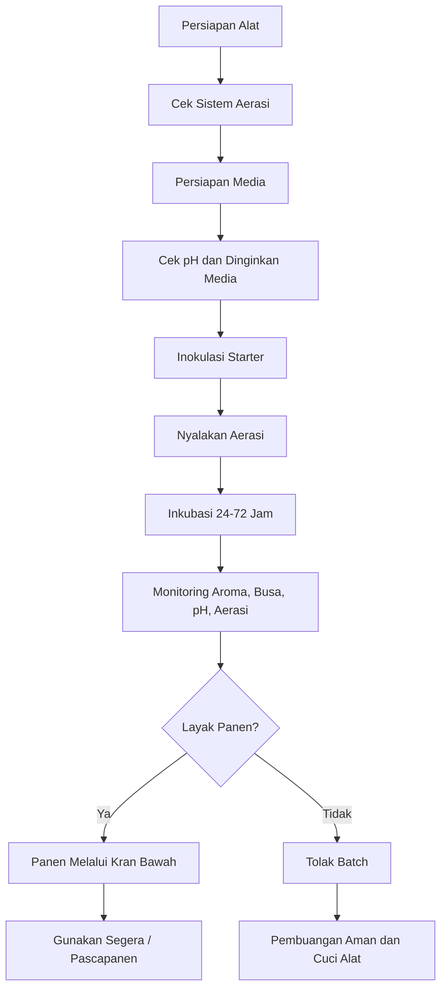

**Keterangan gambar:** Bioreactor liquid harus melalui tahapan persiapan alat, persiapan media, inokulasi, aerasi, inkubasi, monitoring, dan panen. Produk yang tidak normal harus ditolak.

---

### A. Persiapan Alat

Persiapan alat dilakukan sebelum media dan starter dimasukkan. Tujuannya memastikan semua komponen bekerja dan tidak ada sumber kontaminasi besar.

#### Langkah Kerja

1. Cek vessel.
2. Cek tutup dan gasket.
3. Cek pompa udara.
4. Cek filter inlet.
5. Cek check valve.
6. Cek selang.
7. Cek diffuser.
8. Cek kebocoran.
9. Cek port outlet.
10. Pastikan foam trap bersih.
11. Pastikan filter outlet tersedia bila digunakan.
12. Pastikan kran bawah berfungsi.
13. Pastikan vessel stabil di dudukan.

---

### 1. Cek Vessel

Pastikan vessel:

- bersih,
- tidak berbau,
- tidak retak,
- tidak bocor,
- tidak berlendir,
- tidak ada sisa batch lama,
- tidak berbau pestisida.

Jika vessel masih berbau busuk atau bahan kimia, jangan digunakan.

---

### 2. Cek Pompa

Pompa harus dapat mengalirkan udara stabil. Nyalakan pompa sebelum proses dimulai untuk memastikan aliran udara berjalan.

Tanda pompa bermasalah:

- suara tidak normal,
- udara lemah,
- pompa cepat panas,
- aliran udara tidak stabil,
- pompa mati-hidup.

Jika pompa tidak stabil, perbaiki sebelum batch dimulai.

---

### 3. Cek Filter

Filter inlet harus bersih dan tidak basah. Filter yang basah atau kotor dapat menghambat aliran udara dan menjadi sumber kontaminasi.

Jika filter terlihat kotor atau aliran udara melemah, ganti filter.

---

### 4. Cek Check Valve

Check valve harus dipasang dengan arah yang benar. Fungsinya mencegah media cair masuk kembali ke pompa saat pompa mati.

Cara cek sederhana:

- udara dari pompa harus bisa masuk ke vessel,
- cairan tidak boleh bisa kembali ke pompa,
- arah panah pada check valve harus menuju vessel.

---

### 5. Cek Diffuser

Diffuser harus bersih dan tidak tersumbat. Saat diuji dalam air, diffuser harus menghasilkan gelembung merata.

Diffuser yang tersumbat menyebabkan aerasi tidak merata dan meningkatkan risiko zona anaerob.

---

### 6. Cek Kebocoran

Isi vessel dengan sedikit air bersih untuk uji kebocoran. Periksa:

- sambungan port,
- kran bawah,
- tutup,
- selang,
- fitting,
- foam trap.

Jika ada kebocoran, perbaiki sebelum proses dimulai.

---

### 7. Cek Port Outlet

Port outlet harus terbuka dan tidak tersumbat. Outlet adalah jalur udara keluar. Jika outlet tersumbat, tekanan dapat naik.

Prinsip wajib:

**bioreactor liquid aerob tidak boleh bertekanan.**

---

### 8. Pastikan Foam Trap Bersih

Foam trap harus bersih, kering, dan terpasang benar. Foam trap membantu menangkap busa agar tidak masuk ke filter outlet.

Foam trap yang kotor dapat menjadi sumber kontaminasi.

---

### 9. Pastikan Kran Bawah Berfungsi

Kran bawah digunakan untuk panen dan drainase. Pastikan kran:

- tidak bocor,
- mudah dibuka,
- mudah ditutup,
- bersih,
- tidak tersumbat.

---

## Tabel 6.2. Checklist Persiapan Alat Bioreactor Liquid

| Komponen     | Pemeriksaan                       | Status   |
| ------------ | --------------------------------- | -------- |
| Vessel       | Bersih, tidak bocor, tidak berbau | Ya/Tidak |
| Tutup        | Terpasang baik, ada gasket        | Ya/Tidak |
| Pompa        | Aliran udara stabil               | Ya/Tidak |
| Filter inlet | Bersih, tidak basah               | Ya/Tidak |
| Check valve  | Arah benar                        | Ya/Tidak |
| Selang       | Bersih, tidak bocor               | Ya/Tidak |
| Diffuser     | Gelembung merata                  | Ya/Tidak |
| Outlet       | Tidak tersumbat                   | Ya/Tidak |
| Foam trap    | Bersih dan terpasang              | Ya/Tidak |
| Kran bawah   | Berfungsi dan tidak bocor         | Ya/Tidak |

---

### B. Persiapan Media

Media cair adalah sumber nutrisi untuk mikroba. Media harus sesuai dengan mikroba target dan tidak boleh berbau busuk atau tercemar.

#### Langkah Kerja

1. Siapkan air bersih.
2. Siapkan bahan media nutrisi sesuai mikroba target.
3. Larutkan media nutrisi sampai merata.
4. Cek pH awal bila tersedia.
5. Sterilisasi atau pasteurisasi bila memungkinkan.
6. Dinginkan media sebelum inokulasi.
7. Masukkan media ke vessel.
8. Jangan gunakan media yang berbau busuk atau tercemar.

---

### 1. Siapkan Air Bersih

Air yang digunakan harus:

- tidak berbau kaporit kuat,
- tidak berbau limbah,
- tidak berbau pestisida,
- tidak keruh ekstrem,
- tidak panas,
- tidak berasal dari saluran tercemar.

Jika air berbau kaporit, endapkan terlebih dahulu.

---

### 2. Larutkan Media Nutrisi

Media nutrisi harus larut merata. Media yang menggumpal dapat menjadi sumber kontaminasi atau menyumbat kran.

Media tidak boleh terlalu kaya gula. Media terlalu kaya nutrisi dapat menyebabkan busa berlebihan, fermentasi liar, dan perubahan pH ekstrem.

---

### 3. Cek pH Awal

pH awal yang disarankan adalah 6,5–7,2 untuk banyak PGPM cair. Bila tersedia pH meter, lakukan pencatatan.

```text id="bab6-rumus-01"
pH awal ideal praktis untuk banyak PGPM cair = 6,5 sampai 7,2
```

Jika pH terlalu ekstrem, media sebaiknya tidak digunakan sebelum dikoreksi sesuai prosedur yang aman.

---

### 4. Sterilisasi atau Pasteurisasi Bila Memungkinkan

Jika fasilitas memungkinkan, media dapat dipasteurisasi atau dipanaskan sesuai kebutuhan untuk menekan kontaminasi. Setelah perlakuan panas, media harus didinginkan sebelum starter dimasukkan.

Jangan memasukkan starter ke media panas karena dapat membunuh mikroba target.

---

### 5. Dinginkan Sebelum Inokulasi

Media harus berada pada suhu aman sebelum inokulasi. Untuk praktik lapangan, media sebaiknya tidak terasa panas saat disentuh dari luar wadah.

Jika menggunakan termometer, pastikan media mendekati suhu operasi yang aman.

---

### C. Inokulasi

Inokulasi adalah proses memasukkan starter mikroba ke media. Tahap ini sangat kritis karena membuka peluang kontaminasi.

#### Langkah Kerja

1. Pastikan media sudah siap dan tidak panas.
2. Siapkan starter yang jelas.
3. Kocok ringan starter bila sesuai petunjuk produk.
4. Buka port inokulasi seperlunya.
5. Masukkan starter.
6. Tutup kembali port inokulasi.
7. Nyalakan aerasi.
8. Catat waktu mulai inkubasi.

---

### Dosis Inokulum

Dosis inokulum praktis adalah 5–10% dari volume kerja.

### Rumus 6.1. Menghitung Volume Inokulum

```text id="bab6-rumus-02"
Volume inokulum =
volume media kerja × persentase inokulum ÷ 100
```

Contoh untuk 10 liter media:

```text id="bab6-contoh-01"
Volume media kerja = 10 L
Persentase inokulum = 5%

Volume inokulum =
10 × 5 ÷ 100

Volume inokulum = 0,5 L
```

Contoh untuk 10%:

```text id="bab6-contoh-02"
Volume media kerja = 10 L
Persentase inokulum = 10%

Volume inokulum =
10 × 10 ÷ 100

Volume inokulum = 1 L
```

Jadi, untuk volume kerja 10 liter, inokulum 5–10% setara dengan 0,5–1 liter starter.

---

### D. Inkubasi

Inkubasi adalah tahap pertumbuhan mikroba di dalam bioreactor. Pada tahap ini, aerasi harus stabil dan proses harus dipantau.

#### Parameter Inkubasi

| Parameter   |                  Rekomendasi |
| ----------- | ---------------------------: |
| Suhu        |                      28–32°C |
| Aerasi      |                       Stabil |
| pH          |       Dipantau bila tersedia |
| Lama proses | 24–72 jam tergantung mikroba |
| Outlet      |        Tidak boleh tersumbat |
| Tekanan     |       Tidak boleh bertekanan |
| Busa        |                     Dipantau |
| Aroma       |                  Tidak busuk |

---

### 1. Suhu 28–32°C

Suhu operasi praktis untuk banyak PGPM cair adalah 28–32°C. Bila suhu terlalu tinggi, pindahkan bioreactor ke tempat lebih teduh. Bila suhu terlalu rendah, proses dapat berjalan lebih lambat.

---

### 2. Aerasi Stabil

Aerasi harus berjalan selama proses. Jika aerasi mati terlalu lama, kondisi media dapat berubah dan mikroba aerob dapat tertekan.

Tanda aerasi baik:

- gelembung muncul merata,
- tidak ada suara pompa aneh,
- outlet udara berfungsi,
- tidak ada tekanan tertahan,
- media tidak berbau busuk.

---

### 3. Amati Busa

Busa dapat muncul pada kultur tertentu. Busa yang masih terkendali dapat ditangani oleh foam trap. Namun, busa berlebihan perlu diwaspadai.

Kemungkinan penyebab busa berlebihan:

- media terlalu kaya,
- aerasi terlalu kuat,
- kontaminasi,
- protein/organik terlalu tinggi,
- proses terlalu lama.

---

### 4. Amati Aroma

Aroma adalah indikator lapangan yang penting. Produk PGPM cair tidak boleh berbau busuk menyengat.

Tanda bahaya:

- bau busuk,
- bau bangkai,
- bau telur busuk,
- bau limbah,
- bau asam menyengat yang tidak normal,
- bau pestisida.

Jika aroma sangat menyimpang, batch sebaiknya ditolak.

---

### 5. Cek pH Bila Tersedia

pH dapat berubah selama inkubasi. Perubahan ekstrem menunjukkan proses tidak stabil. Catat pH awal dan pH akhir bila tersedia.

---

### 6. Lama Proses 24–72 Jam

Lama proses tergantung mikroba dan media. Acuan praktis:

| Mikroba       |           Lama Inkubasi Praktis |
| ------------- | ------------------------------: |
| _Bacillus_    |                       24–48 jam |
| _Azotobacter_ |                       36–72 jam |
| _Pseudomonas_ | 24–48 jam dengan sanitasi ketat |
| PSB/KSB       |     24–72 jam tergantung isolat |

Jangan memperpanjang inkubasi hanya karena ingin larutan lebih “kuat”. Inkubasi terlalu lama dapat membuat media menua, pH berubah, dan kontaminasi meningkat.

---

### 7. Jangan Biarkan Outlet Tersumbat

Outlet harus selalu terbuka. Foam trap harus diperiksa. Jika busa naik ke outlet, hentikan aerasi sementara dan bersihkan foam trap bila perlu.

---

### 8. Jangan Menutup Sistem hingga Bertekanan

Bioreactor ini adalah sistem non-tekanan. Jangan menutup outlet, menekan selang, atau memasang tutup tanpa jalur udara keluar.

---

### E. Panen

Panen dilakukan setelah proses inkubasi selesai dan produk dinilai layak secara visual dan aroma. Panen dilakukan melalui kran bawah agar tutup utama tidak perlu dibuka lebar.

#### Langkah Kerja

1. Matikan aerasi.
2. Diamkan singkat agar busa turun.
3. Siapkan wadah panen bersih.
4. Buka kran bawah.
5. Ambil kultur.
6. Tutup kembali kran.
7. Gunakan segera bila tanpa stabilisasi.
8. Jangan simpan terlalu lama tanpa carrier atau stabilisasi.
9. Cuci vessel setelah selesai.

---

### Kriteria Produk Cair Layak Panen

| Parameter          | Kondisi Layak              |
| ------------------ | -------------------------- |
| Aroma              | Tidak busuk                |
| Busa               | Terkendali                 |
| Lendir             | Tidak ada lendir abnormal  |
| Warna              | Sesuai karakter media      |
| Outlet             | Tidak tersumbat            |
| pH                 | Tidak ekstrem bila diukur  |
| Tekanan            | Tidak ada tekanan tertahan |
| Kontaminasi visual | Tidak tampak berat         |

---

### Kriteria Batch Cair Ditolak

Batch harus ditolak bila:

- berbau busuk,
- berlendir,
- menggumpal abnormal,
- ada kontaminasi mencolok,
- pH sangat ekstrem,
- media berubah menjadi busuk,
- vessel menggembung karena tekanan,
- ada endapan busuk,
- sumber starter ternyata tidak jelas.

---

## 6.3 SOP Fermentasi Padat 5 kg

SOP fermentasi padat digunakan untuk pembiakan _Trichoderma_ dan fungi PGPM sejenis pada media padat lembap. Sistem ini menggunakan tray dangkal dengan ketebalan media 3–5 cm.

Fermentasi padat adalah proses aerob. Media harus lembap, berpori, tidak becek, dan tidak ditutup kedap udara.

---

## Gambar 6.3. Alur SOP Fermentasi Padat 5 kg

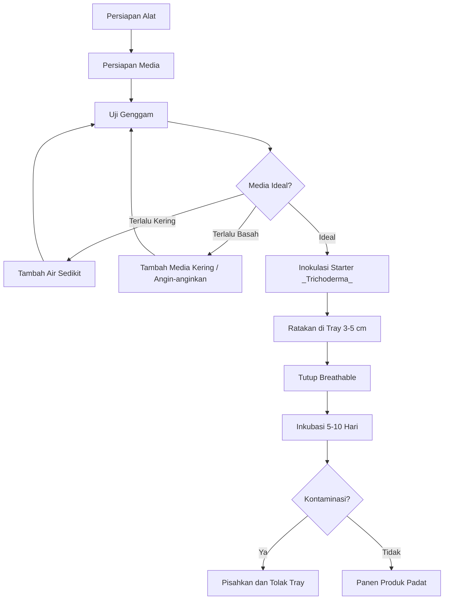

**Keterangan gambar:** Fermentasi padat dimulai dari persiapan media dan uji genggam. Media harus ideal sebelum starter dimasukkan. Tray yang terkontaminasi harus dipisahkan.

---

### A. Persiapan Alat

#### Langkah Kerja

1. Bersihkan tray.
2. Siapkan rak.
3. Siapkan kain penutup.
4. Cek suhu dan kelembapan ruang.
5. Siapkan sprayer air bersih.
6. Siapkan area kerja bersih.
7. Siapkan timbangan.
8. Siapkan sarung tangan.
9. Siapkan form catatan batch.

---

### 1. Bersihkan Tray

Tray harus bersih, tidak berbau, tidak berlendir, dan tidak bekas pestisida. Setelah dicuci, tray dikeringkan di tempat bersih.

---

### 2. Siapkan Rak

Rak harus stabil, bersih, dan tidak lembap. Jarak antartray harus cukup untuk ventilasi, yaitu sekitar 20–25 cm.

---

### 3. Siapkan Kain Penutup

Kain penutup harus bersih dan kering. Kain berjamur atau berbau tidak boleh digunakan.

Bahan yang dapat digunakan:

- kain kasa,
- spunbond,
- kain tipis bersih,
- kertas breathable.

---

### 4. Cek Suhu dan Kelembapan Ruang

Suhu ruang ideal adalah 25–30°C. Kelembapan ruang ideal adalah 70–85% RH. Ruang tidak boleh terlalu panas, terlalu lembap, berdebu, atau dekat sumber kontaminasi.

---

### 5. Siapkan Sprayer Air Bersih

Sprayer digunakan hanya untuk koreksi kelembapan ringan. Sprayer bekas pestisida tidak boleh digunakan.

---

### B. Persiapan Media

#### Langkah Kerja

1. Timbang media.
2. Tambahkan air bertahap.
3. Lakukan uji genggam.
4. Pasteurisasi atau sterilisasi bila memungkinkan.
5. Dinginkan media.
6. Pastikan media lembap, bukan becek.

---

### 1. Timbang Media

Untuk kapasitas 5 kg media basah, gunakan 5 tray dengan isi ±1 kg per tray.

```text id="bab6-rumus-03"
Media per tray =
total media basah ÷ jumlah tray
```

Contoh:

```text id="bab6-contoh-03"
Total media basah = 5 kg
Jumlah tray = 5

Media per tray =
5 ÷ 5

Media per tray = 1 kg
```

---

### 2. Tambahkan Air Bertahap

Air ditambahkan sedikit demi sedikit. Jangan langsung memasukkan seluruh air karena setiap media memiliki kemampuan menyerap air yang berbeda.

Media yang terlalu basah lebih berbahaya daripada media sedikit kurang lembap, karena media basah dapat berubah menjadi anaerob.

---

### 3. Uji Genggam

Uji genggam wajib dilakukan sebelum inokulasi.

| Hasil Uji                        | Makna          | Keputusan                          |
| -------------------------------- | -------------- | ---------------------------------- |
| Media hancur kering              | Terlalu kering | Tambah air sedikit                 |
| Menggumpal ringan, tidak menetes | Ideal          | Siap inokulasi                     |
| Air menetes                      | Terlalu basah  | Tambah media kering/angin-anginkan |
| Berlendir                        | Tidak layak    | Tolak media                        |
| Bau busuk                        | Kontaminasi    | Tolak media                        |

---

### 4. Pasteurisasi atau Sterilisasi Bila Memungkinkan

Media dapat dipasteurisasi atau dipanaskan bila fasilitas tersedia. Tujuannya mengurangi kontaminan awal. Setelah itu, media harus didinginkan sebelum starter dimasukkan.

Jangan memasukkan starter ke media panas.

---

### 5. Pastikan Media Lembap, Bukan Becek

Kondisi akhir media harus:

- lembap,
- tidak meneteskan air,
- tetap remah,
- tidak seperti bubur,
- tidak panas,
- tidak bau busuk.

---

### C. Inokulasi

Inokulasi fermentasi padat adalah proses mencampur starter _Trichoderma_ ke media. Tahap ini harus dilakukan cepat, bersih, dan merata.

#### Langkah Kerja

1. Pastikan media sudah dingin.
2. Gunakan sarung tangan.
3. Masukkan starter _Trichoderma_ sesuai dosis produk.
4. Campur merata.
5. Bagi media ke 5 tray.
6. Ratakan media setebal 3–5 cm.
7. Tutup dengan kain breathable.
8. Catat tanggal dan nomor batch.

---

### 1. Campur Starter Merata

Starter harus tersebar merata agar pertumbuhan _Trichoderma_ tidak hanya muncul di satu titik. Pencampuran dilakukan di meja bersih atau wadah pencampur bersih.

---

### 2. Ratakan Media pada Tray

Setiap tray diisi ±1 kg media basah. Media diratakan dengan ketebalan 3–5 cm.

Ketebalan berlebihan harus dihindari karena dapat menyebabkan bagian tengah kekurangan oksigen.

---

### 3. Tutup dengan Kain Breathable

Kain penutup berfungsi melindungi media dari debu dan serangga. Penutup tidak boleh kedap udara.

---

### 4. Catat Tanggal dan Nomor Batch

Setiap tray harus memiliki catatan batch. Jika memungkinkan, beri label kecil pada tray.

Informasi minimal:

- nomor batch,
- tanggal inokulasi,
- jenis mikroba,
- jenis media,
- jumlah media,
- nama operator.

---

### D. Inkubasi

Inkubasi adalah tahap pertumbuhan mikroba pada media padat.

#### Parameter Inkubasi

| Parameter        |                         Rekomendasi |
| ---------------- | ----------------------------------: |
| Suhu ruang       |                             25–30°C |
| Kelembapan ruang |                           70–85% RH |
| Lama inkubasi    |                           5–10 hari |
| Ketebalan media  |                              3–5 cm |
| Penutup          |                          Breathable |
| Cahaya           | Teduh, tidak kena matahari langsung |

---

### 1. Simpan di Rak

Tray disimpan di rak dengan jarak antartray cukup. Jangan menumpuk tray saling menempel.

---

### 2. Jangan Sering Dibuka

Tray tidak boleh sering dibuka. Setiap pembukaan meningkatkan risiko kontaminasi. Pemeriksaan cukup dilakukan secara visual dari luar bila penutup memungkinkan.

---

### 3. Pisahkan Tray Terkontaminasi

Jika satu tray menunjukkan kontaminasi, pisahkan segera. Jangan mencampur tray terkontaminasi dengan tray sehat.

Tanda kontaminasi:

- jamur hitam dominan,
- jamur merah/oranye mencolok,
- bau busuk,
- lendir,
- belatung,
- media becek,
- media panas tidak normal.

---

### 4. Hindari Sinar Matahari Langsung

Sinar matahari langsung dapat mengeringkan media, menaikkan suhu, dan menekan mikroba. Inkubasi dilakukan di tempat teduh.

---

### E. Panen

Panen dilakukan setelah pertumbuhan mikroba merata dan produk dinilai layak. Untuk _Trichoderma_, pertumbuhan dapat terlihat sebagai koloni putih kehijauan hingga hijau sesuai karakter isolat dan media.

#### Langkah Kerja

1. Cek aroma.
2. Cek tekstur media.
3. Cek warna pertumbuhan.
4. Cek kontaminasi.
5. Pisahkan tray bermasalah.
6. Panen tray yang layak.
7. Gunakan untuk media semai, kompos, lubang tanam, atau bedengan.
8. Jangan gunakan produk yang berbau busuk, berlendir, becek, atau kontaminasi dominan.

---

### Kriteria Produk Padat Layak Panen

| Parameter   | Kondisi Layak                  |
| ----------- | ------------------------------ |
| Aroma       | Tidak busuk                    |
| Tekstur     | Remah, tidak berlendir         |
| Kelembapan  | Lembap, tidak becek            |
| Warna       | Sesuai karakter mikroba target |
| Kontaminasi | Tidak dominan                  |
| Suhu media  | Tidak panas                    |
| Serangga    | Tidak ada belatung/serangga    |
| Pertumbuhan | Relatif merata                 |

---

### Kriteria Tray Ditolak

Tray harus ditolak bila:

- bau busuk,
- berlendir,
- becek,
- jamur hitam dominan,
- jamur merah/oranye dominan,
- ada belatung,
- media panas,
- kontaminasi menyebar,
- media berasal dari bahan yang ternyata tidak layak.

---

## 6.4 SOP Pembersihan Setelah Produksi

Pembersihan setelah produksi sama pentingnya dengan sanitasi sebelum produksi. Alat yang tidak dibersihkan akan menjadi sumber kontaminasi pada batch berikutnya.

---

### Langkah Kerja

1. Buang sisa media.
2. Cuci vessel atau tray.
3. Bilas sampai bersih.
4. Bersihkan selang, diffuser, foam trap, dan kran.
5. Keringkan alat.
6. Simpan alat di tempat bersih.
7. Ganti filter bila perlu.
8. Catat kerusakan alat.
9. Jangan menyimpan alat di dekat pestisida.

---

### A. Buang Sisa Media

Sisa media tidak boleh dibiarkan membusuk dalam vessel atau tray. Media gagal atau terkontaminasi harus dipisahkan dan dibuang secara aman.

Jangan membuang kultur gagal ke saluran air, kolam, sumur, atau sumber irigasi.

---

### B. Cuci Vessel dan Tray

Vessel dan tray dicuci setelah digunakan. Bersihkan sisa lendir, endapan, media, atau spora yang menempel.

Gunakan sikat khusus yang tidak dipakai untuk pestisida.

---

### C. Bilas

Bilas sampai tidak ada sisa sabun atau bahan pembersih. Residu pembersih dapat mengganggu batch berikutnya.

---

### D. Keringkan

Alat harus dikeringkan sebelum disimpan. Alat lembap mudah ditumbuhi jamur liar dan bakteri kontaminan.

---

### E. Simpan Alat di Tempat Bersih

Simpan alat di tempat:

- kering,
- teduh,
- tidak berdebu,
- tidak dekat pestisida,
- tidak dekat bahan busuk,
- tidak dekat kandang,
- tidak langsung di lantai lembap.

---

### F. Ganti Filter Bila Perlu

Filter yang kotor, basah, atau tersumbat harus diganti. Filter tidak boleh dipakai terus-menerus tanpa evaluasi.

---

### G. Catat Kerusakan Alat

Catat jika ada:

- kran bocor,
- selang retak,
- diffuser tersumbat,
- pompa melemah,
- fitting longgar,
- tray retak,
- rak berkarat.

Kerusakan kecil dapat menyebabkan kegagalan batch bila diabaikan.

---

## Tabel 6.3. Checklist Pembersihan Setelah Produksi

| Item                        | Pemeriksaan              | Status   |
| --------------------------- | ------------------------ | -------- |
| Vessel/tray dikosongkan     | Tidak ada sisa media     | Ya/Tidak |
| Alat dicuci                 | Tidak ada lendir/endapan | Ya/Tidak |
| Alat dibilas                | Tidak ada sabun          | Ya/Tidak |
| Selang/diffuser dibersihkan | Tidak tersumbat          | Ya/Tidak |
| Foam trap dicuci            | Bersih                   | Ya/Tidak |
| Kran dibersihkan            | Tidak bocor/tersumbat    | Ya/Tidak |
| Alat dikeringkan            | Tidak lembap             | Ya/Tidak |
| Alat disimpan bersih        | Jauh dari pestisida      | Ya/Tidak |
| Kerusakan dicatat           | Ada/tidak ada            | Ya/Tidak |

---

## 6.5 SOP Keselamatan Kerja

Pembiakan PGPM dilakukan dengan mikroba yang ditujukan untuk pertanian. Namun, keselamatan kerja tetap penting karena proses dapat menghasilkan spora, debu, aerosol, bau, atau kontaminan bila terjadi kegagalan batch.

SOP keselamatan kerja bertujuan melindungi operator, lingkungan produksi, tanaman, dan sumber air.

---

### A. Gunakan Masker Saat Menangani Spora

Produk padat seperti _Trichoderma_ dapat menghasilkan spora. Spora dan debu media tidak boleh terhirup berlebihan. Gunakan masker saat:

- membuka tray,
- memanen produk padat,
- mencampur carrier,
- membersihkan tray,
- menangani media kering.

---

### B. Gunakan Sarung Tangan

Sarung tangan digunakan untuk melindungi operator dan produk dari kontaminasi. Gunakan sarung tangan saat:

- mencampur media,
- memasukkan starter,
- memanen kultur,
- menangani batch gagal,
- mencuci alat kotor.

---

### C. Hindari Menghirup Debu Media

Media seperti dedak, bekatul, kompos halus, talc, kaolin, zeolit, dan biochar halus dapat menghasilkan debu. Hindari menghirup debu tersebut.

Tindakan praktis:

- gunakan masker,
- basahi ringan bila perlu,
- jangan menuang media dari ketinggian,
- lakukan di ruang berventilasi baik.

---

### D. Jangan Bekerja Dekat Makanan

Area produksi PGPM harus dipisahkan dari dapur, meja makan, penyimpanan makanan, atau area konsumsi. Alat PGPM tidak boleh digunakan untuk makanan atau minuman.

---

### E. Jangan Membuang Kultur Gagal ke Saluran Air

Batch gagal dapat mengandung mikroba kontaminan atau media busuk. Jangan membuangnya ke:

- sumur,
- kolam ikan,
- saluran irigasi,
- sungai,
- parit aktif,
- sumber air rumah tangga.

Batch gagal sebaiknya ditangani secara aman, misalnya dikumpulkan, dinonaktifkan sesuai prosedur lokal yang aman, lalu dibuang di tempat yang tidak mencemari sumber air.

---

### F. Jauhkan dari Anak-Anak dan Hewan

Area produksi harus aman dari anak-anak, hewan peliharaan, unggas, tikus, dan serangga. Hewan dapat membawa kontaminan dan merusak batch.

---

### G. Tangani Kontaminasi dengan Hati-Hati

Jika ditemukan batch terkontaminasi:

- jangan diaduk ulang,
- jangan dicampur dengan batch sehat,
- jangan digunakan ke tanaman utama,
- pisahkan segera,
- tutup wadah,
- bersihkan area,
- cuci tangan dan alat.

---

### H. Buang Batch Gagal Secara Aman

Batch gagal harus ditolak. Jangan mencoba “menyelamatkan” batch yang sudah berbau busuk, berlendir, atau terkontaminasi berat. Menggunakan batch gagal dapat merugikan lahan.

---

## Tabel 6.4. Kriteria Tindakan pada Batch Bermasalah

| Gejala                               | Tindakan                                               |
| ------------------------------------ | ------------------------------------------------------ |
| Bau busuk ringan tetapi mencurigakan | Jangan aplikasi luas, evaluasi dan uji kecil bila ragu |
| Bau busuk menyengat                  | Tolak batch                                            |
| Lendir berlebihan                    | Tolak batch                                            |
| Jamur hitam/merah dominan            | Tolak tray/batch                                       |
| Botol/vessel bertekanan              | Hentikan proses, evaluasi outlet                       |
| Aerasi mati lama                     | Evaluasi, jangan langsung gunakan                      |
| Media padat becek                    | Tolak atau pisahkan sesuai tingkat kerusakan           |
| Belatung/serangga                    | Tolak batch                                            |
| Starter tidak jelas                  | Jangan lanjutkan produksi                              |

---

## Format Catatan Batch Produksi

Catatan batch digunakan untuk bioreactor liquid maupun fermentasi padat. Format ini dapat dicetak dan digunakan setiap produksi.

| Data Produksi      | Isi                       |
| ------------------ | ------------------------- |
| Nomor batch        |                           |
| Tanggal produksi   |                           |
| Operator           |                           |
| Jenis mikroba      |                           |
| Sumber starter     |                           |
| Bentuk produksi    | Liquid / padat            |
| Jenis media        |                           |
| Volume/bobot media |                           |
| pH awal            |                           |
| Suhu awal          |                           |
| Waktu inokulasi    |                           |
| Waktu panen        |                           |
| Lama inkubasi      |                           |
| Aroma              |                           |
| Busa/lendir        |                           |
| Kontaminasi        |                           |
| Hasil panen        |                           |
| Keputusan          | Layak / tolak / uji kecil |
| Catatan koreksi    |                           |

---

## Gambar 6.4. Titik Kontrol Kritis dalam SOP Produksi PGPM

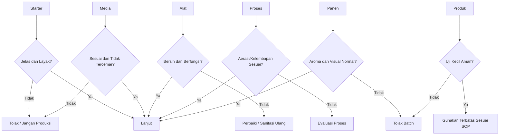

**Keterangan gambar:** Titik kontrol kritis meliputi starter, media, alat, proses, panen, dan uji kecil. Jika salah satu titik gagal, batch harus diperbaiki, dievaluasi, atau ditolak.

---

## Ringkasan Bab 6

SOP operasi diperlukan agar pembiakan PGPM berlangsung lebih aman, bersih, dan konsisten. Sanitasi umum harus dilakukan sebelum semua proses, meliputi pencucian alat, pembilasan dari sabun, sanitasi alat, penggunaan air bersih, larangan memakai wadah bekas pestisida, penggunaan sarung tangan, pemilihan ruang kerja yang bersih, pencatatan proses, serta pemisahan area produksi mikroba dari penyimpanan pestisida.

Pada bioreactor liquid 10 liter, SOP dimulai dari persiapan alat, pengecekan vessel, pompa, filter, check valve, diffuser, kebocoran, outlet, foam trap, dan kran bawah. Media disiapkan dengan air bersih, pH awal diperiksa bila tersedia, dan media didinginkan sebelum inokulasi. Starter dimasukkan dengan dosis 5–10% dari volume kerja, aerasi dinyalakan, dan proses diinkubasi 24–72 jam tergantung mikroba. Produk dipanen melalui kran bawah dan digunakan segera bila tanpa stabilisasi.

Pada fermentasi padat 5 kg, SOP dimulai dari persiapan tray, rak, kain penutup, ruang inkubasi, sprayer, dan area kerja bersih. Media ditimbang, air ditambahkan bertahap, uji genggam dilakukan, lalu starter _Trichoderma_ dicampur merata. Media diratakan pada tray setebal 3–5 cm, ditutup kain breathable, dan diinkubasi 5–10 hari. Tray yang berbau busuk, berlendir, becek, atau terkontaminasi dominan harus ditolak.

Setelah produksi, alat harus segera dibersihkan, dibilas, dikeringkan, disimpan di tempat bersih, dan tidak diletakkan dekat pestisida. Filter, selang, diffuser, foam trap, kran, tray, dan vessel perlu diperiksa secara berkala.

Keselamatan kerja juga wajib diperhatikan. Gunakan masker saat menangani spora, gunakan sarung tangan, hindari menghirup debu media, jangan bekerja dekat makanan, jangan membuang kultur gagal ke saluran air, jauhkan area produksi dari anak-anak dan hewan, serta tangani kontaminasi dengan hati-hati. Batch gagal harus ditolak dan dibuang secara aman.

---

# Bab 7. Penanganan Pascapanen, Carrier, Penyimpanan, dan Distribusi PGPM

Bab ini membahas tahapan setelah proses pembiakan PGPM selesai, baik dari **bioreactor liquid** maupun **fermentasi padat**. Tahap ini sering dianggap sederhana, padahal sangat menentukan mutu akhir produk. Banyak batch yang sebenarnya tumbuh baik saat inkubasi akhirnya menurun mutunya karena salah panen, salah kemasan, salah carrier, disimpan terlalu lama, atau terkena panas selama distribusi.

Prinsip utama Bab 7 adalah:

**PGPM tidak selesai pada tahap “tumbuh”. Produk PGPM baru layak digunakan bila setelah panen tetap bersih, tidak berbau busuk, tidak terkontaminasi, carrier sesuai, kemasan benar, penyimpanan tepat, dan lulus uji kelayakan sebelum aplikasi.**

---

## 7.1 Pengertian Pascapanen PGPM

Pascapanen PGPM adalah seluruh tahapan yang dilakukan setelah proses pembiakan selesai dan sebelum produk diaplikasikan ke tanaman atau tanah. Pascapanen mencakup kegiatan panen kultur, penyaringan, pencampuran carrier, pengemasan, pelabelan, penyimpanan, distribusi, dan uji mutu sederhana sebelum aplikasi.

Pada produk hasil bioreactor liquid, pascapanen berhubungan dengan bagaimana kultur cair dipanen, disaring, dikemas, disimpan, dan digunakan sebelum mutunya turun. Pada produk fermentasi padat, pascapanen berhubungan dengan bagaimana media fermentasi dipanen, dikering-anginkan bila perlu, dicampur carrier, dikemas, dan disimpan agar mikroba tetap hidup.

Tahap pascapanen memiliki tiga tujuan utama:

1. **Menjaga mikroba tetap hidup.**
   Mikroba PGPM adalah organisme hidup. Kesalahan suhu, kelembapan, carrier, atau kemasan dapat menurunkan viabilitasnya.

2. **Menjaga produk tetap stabil.**
   Produk yang masih terlalu aktif, terlalu basah, terlalu kaya nutrisi, atau terlalu tertutup dapat berubah komposisi, menghasilkan gas, membusuk, atau terkontaminasi.

3. **Memudahkan aplikasi di lapangan.**
   Produk yang baik harus mudah dikocor, dicampur media, ditebar, ditabur, atau diaplikasikan sesuai tujuan.

---

## Gambar 7.1. Alur Pascapanen PGPM

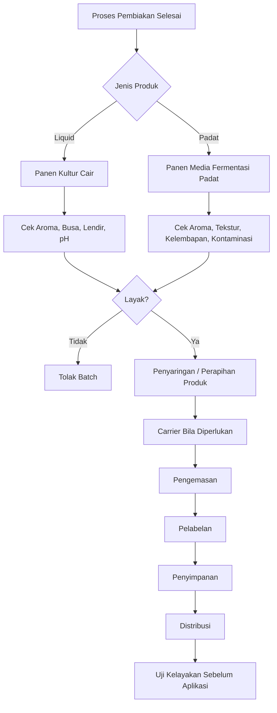

**Keterangan gambar:** Pascapanen PGPM dimulai setelah pembiakan selesai. Produk harus diperiksa terlebih dahulu sebelum dikemas. Batch yang berbau busuk, berlendir, becek, atau terkontaminasi tidak boleh diteruskan ke tahap penyimpanan dan aplikasi.

---

### Catatan penting

**Produk PGPM tidak berhenti pada tahap “berhasil tumbuh”. Produk baru layak dipakai bila setelah panen masih bersih, tidak berbau busuk, populasinya cukup, carrier sesuai, dan disimpan dengan benar.**

Produk yang salah ditangani setelah panen dapat mengalami beberapa masalah:

- mikroba target menurun,
- kontaminan meningkat,
- pH berubah ekstrem,
- produk menghasilkan gas,
- kemasan menggembung,
- media padat berjamur liar,
- produk berbau busuk,
- efektivitas lapangan menurun.

Karena itu, pascapanen harus dianggap sebagai bagian dari SOP produksi, bukan pekerjaan tambahan.

---

# 7.2 Titik Panen Bioreactor Liquid

Kultur cair dipanen saat mikroba sudah aktif tetapi media belum rusak. Panen terlalu cepat menyebabkan populasi mikroba belum cukup. Sebaliknya, panen terlalu lama dapat menyebabkan media menua, nutrisi habis, pH berubah ekstrem, kontaminasi meningkat, dan produk menjadi tidak stabil.

Pada bioreactor liquid sederhana, titik panen tidak hanya ditentukan oleh waktu, tetapi juga oleh kondisi visual, aroma, busa, lendir, aerasi, dan pH bila tersedia.

---

## A. Acuan Umum Waktu Panen

Acuan waktu panen berikut bersifat praktis. Waktu aktual dapat berbeda tergantung starter, media, suhu, aerasi, dan kondisi proses.

| Jenis Mikroba   |          Acuan Waktu Panen Praktis | Catatan                                                         |
| --------------- | ---------------------------------: | --------------------------------------------------------------- |
| _Bacillus_      |                          24–48 jam | Relatif lebih stabil, tetapi tetap harus dicek aroma dan lendir |
| _Azotobacter_   |                          36–72 jam | Membutuhkan aerasi baik                                         |
| _Pseudomonas_   |                          24–48 jam | Harus sangat bersih, rentan kontaminasi                         |
| PSB/KSB         |                          24–72 jam | Tergantung isolat dan media                                     |
| Konsorsium cair | Tidak disarankan diperbanyak ulang | Komposisi mudah berubah                                         |

Waktu panen tidak boleh diperpanjang hanya karena ingin produk terlihat lebih “kuat”. Pada kultur cair, proses yang terlalu lama justru sering menurunkan stabilitas.

---

## B. Panen Terlalu Cepat

Panen terlalu cepat menyebabkan populasi mikroba belum optimal. Secara visual, kultur bisa tampak belum berubah banyak. Namun, pada skala lapangan, sulit memastikan populasi tanpa uji laboratorium. Karena itu, waktu inkubasi minimal perlu mengikuti karakter mikroba dan pengalaman batch sebelumnya.

Risiko panen terlalu cepat:

- populasi mikroba rendah,
- aplikasi kurang memberikan respons,
- biaya produksi tidak efisien,
- produk tampak normal tetapi lemah secara fungsi.

---

## C. Panen Terlalu Lama

Panen terlalu lama lebih sering menjadi masalah di tingkat petani. Produk dibiarkan terlalu lama karena dianggap semakin lama semakin kuat. Padahal, media dapat rusak dan kontaminan dapat meningkat.

Risiko panen terlalu lama:

- pH berubah ekstrem,
- bau tidak normal,
- media menua,
- kontaminasi meningkat,
- gas berlebihan,
- lendir muncul,
- produk tidak stabil saat disimpan,
- tanaman berisiko stres setelah aplikasi.

---

## D. Indikator Kultur Cair Layak Panen

| Parameter          | Kondisi Layak                  |
| ------------------ | ------------------------------ |
| Aroma              | Normal, tidak busuk            |
| Warna              | Sesuai karakter media/kultur   |
| Busa               | Terkendali, tidak berlebihan   |
| Lendir             | Tidak ada lendir abnormal      |
| Aerasi             | Berjalan stabil selama proses  |
| pH                 | Tidak berubah ekstrem          |
| Kontaminasi visual | Tidak tampak kontaminasi berat |
| Tekanan gas        | Tidak ada tekanan tertahan     |

Catatan penting:

**Busa bukan indikator utama keberhasilan. Bau busuk, lendir, atau gas berlebihan justru menjadi tanda bahaya.**

---

## E. Kriteria Kultur Cair Harus Ditolak

Kultur cair harus ditolak bila muncul tanda berikut:

- bau busuk menyengat,
- bau telur busuk,
- bau limbah,
- lendir berlebihan,
- botol atau vessel menggembung keras,
- busa tidak terkendali,
- pH sangat ekstrem bila diukur,
- warna berubah tidak normal,
- ada endapan busuk,
- ada kontaminasi visual berat,
- starter awal ternyata tidak jelas.

Produk yang meragukan tidak boleh langsung diaplikasikan ke seluruh lahan. Minimal lakukan uji kecil. Bila tanda kerusakan berat, batch harus ditolak.

---

## Gambar 7.2. Keputusan Panen Kultur Cair

```mermaid id="bioreactor-bab7-02"
flowchart TD
    A[Waktu Inkubasi Tercapai] --> B[Cek Aroma]
    B --> C{Bau Busuk?}
    C -->|Ya| D[Tolak Batch]
    C -->|Tidak| E[Cek Busa dan Lendir]

    E --> F{Busa/Lendir Abnormal?}
    F -->|Ya| D
    F -->|Tidak| G[Cek pH Bila Ada]

    G --> H{pH Ekstrem?}
    H -->|Ya| D
    H -->|Tidak| I[Cek Tekanan Gas dan Kontaminasi]

    I --> J{Ada Tekanan/Kontaminasi Berat?}
    J -->|Ya| D
    J -->|Tidak| K[Panen Kultur Cair]

    K --> L[Gunakan Segera atau Simpan Sesuai SOP]
```

**Keterangan gambar:** Kultur cair dipanen hanya bila indikator dasar menunjukkan kondisi normal. Bau busuk, lendir abnormal, tekanan gas, dan kontaminasi berat adalah alasan untuk menolak batch.

---

# 7.3 Titik Panen Fermentasi Padat

Fermentasi padat dipanen saat pertumbuhan mikroba sudah merata dan media masih dalam kondisi baik. Untuk _Trichoderma_, indikator umum adalah pertumbuhan koloni yang merata dengan warna putih kehijauan hingga hijau sesuai karakter isolat dan media.

Namun, warna saja tidak cukup. Media juga harus tidak becek, tidak berlendir, tidak panas, tidak berbau busuk, dan tidak didominasi jamur liar.

---

## A. Waktu Panen Umum

Lama inkubasi fermentasi padat umumnya **5–10 hari**, tergantung:

- jenis starter,
- jenis media,
- kelembapan media,
- suhu ruang,
- ketebalan media,
- kebersihan proses,
- tingkat aerasi pasif.

Media yang terlalu basah dapat tampak cepat berubah tetapi sebenarnya rusak. Media yang terlalu kering dapat memperlambat pertumbuhan.

---

## B. Indikator Fermentasi Padat Layak Panen

| Parameter         | Kondisi Layak                  |
| ----------------- | ------------------------------ |
| Aroma             | Tidak busuk                    |
| Tekstur           | Remah, tidak berlendir         |
| Kelembapan        | Lembap, tidak becek            |
| Warna             | Sesuai karakter mikroba target |
| Kontaminasi       | Tidak ada jamur liar dominan   |
| Suhu media        | Tidak panas                    |
| Serangga/belatung | Tidak ada                      |
| Pertumbuhan       | Merata                         |

---

## C. Produk Padat yang Tidak Layak

Produk fermentasi padat harus ditolak bila:

- berbau busuk,
- berlendir,
- becek,
- terlalu panas,
- muncul belatung,
- didominasi jamur hitam,
- didominasi jamur merah/oranye mencolok,
- media menggumpal busuk,
- ada kontaminasi menyebar,
- pertumbuhan mikroba target tidak merata dan kalah oleh mikroba liar.

---

## D. Panen Bertahap per Tray

Pada sistem modular 5 tray, panen dapat dilakukan per tray. Tidak semua tray harus dipanen bila kondisinya berbeda. Tray yang layak dapat dipanen, sedangkan tray yang mencurigakan dipisahkan.

Keuntungan panen per tray:

- kontaminasi mudah dilokalisir,
- produk sehat tidak tercampur produk rusak,
- mutu lebih mudah dikontrol,
- catatan batch lebih akurat.

---

## Gambar 7.3. Keputusan Panen Fermentasi Padat

```mermaid id="bioreactor-bab7-03"
flowchart TD
    A[Inkubasi 5-10 Hari] --> B[Cek Pertumbuhan]
    B --> C{Pertumbuhan Merata?}

    C -->|Tidak| D[Evaluasi: Starter, Media, Kelembapan]
    C -->|Ya| E[Cek Aroma]

    E --> F{Bau Busuk?}
    F -->|Ya| G[Tolak Tray]
    F -->|Tidak| H[Cek Tekstur dan Kelembapan]

    H --> I{Becek/Berlendir/Panas?}
    I -->|Ya| G
    I -->|Tidak| J[Cek Kontaminasi]

    J --> K{Jamur Liar Dominan / Belatung?}
    K -->|Ya| G
    K -->|Tidak| L[Panen Tray Layak]

    L --> M[Gunakan Segera atau Pascapanen Padat]
```

**Keterangan gambar:** Fermentasi padat dipanen berdasarkan kondisi tiap tray. Tray yang berbau busuk, berlendir, becek, panas, atau terkontaminasi dominan harus ditolak.

---

# 7.4 Carrier atau Bahan Pembawa PGPM

Carrier adalah bahan pembawa mikroba setelah proses pembiakan. Carrier berfungsi menjaga mikroba tetap hidup, memudahkan pengemasan, memperbaiki daya simpan, dan memudahkan aplikasi.

Carrier yang salah dapat mempercepat kerusakan produk. Misalnya, carrier cair yang terlalu kaya gula dapat membuat mikroba terus tumbuh, menghasilkan gas, mengubah pH, dan menyebabkan produk tidak stabil. Carrier padat yang terlalu basah dapat memicu jamur liar dan kontaminasi.

---

## Fungsi Carrier

Carrier memiliki beberapa fungsi utama:

- menjaga mikroba tetap hidup,
- memudahkan penyimpanan,
- memudahkan pengemasan,
- memudahkan aplikasi,
- membantu stabilitas produk,
- mengurangi perubahan kondisi produk,
- membantu distribusi mikroba ke media tanam atau tanah.

Carrier tidak boleh dipilih hanya berdasarkan ketersediaan bahan. Carrier harus sesuai dengan jenis mikroba dan bentuk produk.

---

## Syarat Carrier yang Baik

Carrier harus memenuhi syarat berikut:

- bersih,
- tidak beracun bagi mikroba,
- tidak berbau busuk,
- tidak mengandung pestisida,
- tidak terlalu basah,
- mudah dicampur,
- sesuai dengan jenis mikroba,
- mendukung daya simpan,
- tidak memicu panas,
- tidak membawa jamur liar dominan,
- tidak berasal dari bahan organik mentah yang belum stabil.

---

## A. Carrier untuk PGPM Cair

Carrier cair digunakan untuk mempertahankan mikroba dalam bentuk larutan atau suspensi. Pada produk cair skala petani, carrier terbaik sering kali adalah carrier sederhana dengan risiko rendah, bukan media yang terlalu kaya nutrisi.

| Carrier Cair            | Kegunaan                    | Catatan                                    |
| ----------------------- | --------------------------- | ------------------------------------------ |
| Air bersih non-klorin   | Pengencer dasar             | Daya simpan pendek                         |
| Air steril/pasteurisasi | Lebih aman                  | Lebih baik untuk produk cair               |
| Media nutrisi rendah    | Menjaga mikroba tetap hidup | Jangan terlalu kaya gula untuk penyimpanan |
| Buffer sederhana        | Menjaga pH lebih stabil     | Perlu kontrol teknis                       |
| Ekstrak organik ringan  | Bisa mendukung mikroba      | Risiko kontaminasi bila tidak bersih       |

### Catatan penting

**Carrier cair untuk penyimpanan tidak boleh terlalu kaya nutrisi. Media yang terlalu kaya gula dapat membuat mikroba terus tumbuh, pH berubah, gas meningkat, dan komposisi mikroba menjadi tidak stabil.**

Untuk petani, produk cair hasil bioreactor sebaiknya digunakan segera. Bila harus disimpan, simpan di tempat teduh atau dingin, gunakan kemasan bersih, beri label, dan jangan menyimpan terlalu lama.

---

## B. Carrier untuk PGPM Padat

Carrier padat digunakan untuk produk seperti _Trichoderma_ atau mikroba yang akan diaplikasikan ke media semai, kompos, lubang tanam, atau tanah.

| Carrier Padat                   | Kegunaan                       | Catatan                     |
| ------------------------------- | ------------------------------ | --------------------------- |
| Beras/jagung hasil fermentasi   | Carrier sekaligus media tumbuh | Cocok untuk pemakaian cepat |
| Dedak/bekatul kering terkondisi | Murah dan mudah                | Harus tidak berjamur liar   |
| Kompos matang                   | Cocok untuk aplikasi tanah     | Tidak boleh panas/busuk     |
| Talc food/agri grade            | Carrier kering                 | Lebih cocok semi-produksi   |
| Kaolin                          | Carrier mineral                | Perlu formulasi             |
| Zeolit halus                    | Menyerap kelembapan            | Baik untuk tanah            |
| Biochar halus matang            | Mendukung aplikasi tanah       | Harus bebas kontaminan      |
| Vermikulit/peat steril          | Carrier lebih stabil           | Biaya lebih tinggi          |

Carrier padat harus dikondisikan agar tidak terlalu basah. Semakin basah carrier, semakin pendek daya simpan dan semakin tinggi risiko kontaminasi.

---

## C. Kesesuaian Carrier Berdasarkan Jenis PGPM

| Jenis PGPM          | Carrier Lebih Sesuai                     | Catatan                                         |
| ------------------- | ---------------------------------------- | ----------------------------------------------- |
| _Bacillus_          | Cair atau padat mineral                  | Relatif tahan, cocok untuk formulasi cair/padat |
| _Pseudomonas_       | Cair segar atau carrier steril           | Daya simpan lebih sensitif                      |
| _Azotobacter_       | Cair beraerasi/segar                     | Jangan simpan lama tanpa uji mutu               |
| PSB                 | Cair atau padat sesuai isolat            | Fungsi pelarut P harus tetap diuji              |
| KSB                 | Cair/padat sesuai strain                 | Lebih aman produk teruji                        |
| _Trichoderma_       | Padat, kompos matang, talc, beras/jagung | Lebih cocok padat                               |
| Mikoriza            | Carrier propagul akar/spora/hifa         | Bukan fermentasi cair                           |
| Konsorsium campuran | Sangat hati-hati                         | Carrier harus diuji kompatibilitas              |

---

## D. Menghitung Kebutuhan Carrier Padat

Bila produk fermentasi padat ingin dicampur dengan carrier kering untuk menurunkan kelembapan atau memperbesar volume aplikasi, kebutuhan carrier dapat dihitung sederhana.

```text id="bab7-rumus-01"
Kebutuhan carrier padat =
target bobot akhir produk - bobot produk fermentasi awal
```

Contoh:

```text id="bab7-contoh-01"
Bobot produk fermentasi awal = 5 kg
Target bobot akhir = 8 kg

Kebutuhan carrier padat =
8 - 5

Kebutuhan carrier padat = 3 kg
```

Catatan: penambahan carrier tidak boleh hanya mengejar volume. Carrier harus bersih, kering terkondisi, tidak tercemar, dan sesuai dengan mikroba target.

---

# 7.5 Lama Simpan PGPM

Lama simpan PGPM tergantung pada jenis mikroba, carrier, kadar air, suhu, kebersihan, populasi awal, dan kemasan. Lama simpan yang disajikan dalam panduan ini adalah **acuan praktis**, bukan jaminan mutlak.

Produk hasil produksi skala petani sebaiknya tidak disimpan terlalu lama. Prinsip paling aman adalah:

**produksi secukupnya, gunakan secepatnya, dan jangan menumpuk stok tanpa kontrol mutu.**

---

## A. Lama Simpan PGPM Cair

| Jenis Produk Cair                            | Kondisi Simpan   |          Lama Simpan Praktis |
| -------------------------------------------- | ---------------- | ---------------------------: |
| Kultur cair segar tanpa stabilisasi          | Suhu ruang teduh |                     1–7 hari |
| Kultur cair segar                            | Dingin 4–10°C    |                   1–4 minggu |
| _Bacillus_ cair relatif stabil               | Teduh/dingin     |                   2–8 minggu |
| Kultur cair dengan carrier/stabilizer teruji | Dingin/teduh     |                    1–3 bulan |
| Konsorsium cair campuran                     | Suhu ruang       | Tidak disarankan simpan lama |

Catatan:

- Produk cair sebaiknya digunakan segera.
- Jangan simpan dalam wadah yang menggembung.
- Jangan simpan di bawah matahari.
- Jangan simpan dekat pestisida.
- Jika berbau busuk, berlendir, atau menggembung, jangan digunakan.
- Semakin aktif produk cair, semakin besar risiko perubahan selama penyimpanan.

---

## B. Lama Simpan PGPM Padat

| Jenis Produk Padat                         | Kondisi Simpan     | Lama Simpan Praktis |
| ------------------------------------------ | ------------------ | ------------------: |
| _Trichoderma_ pada media fermentasi segar  | Teduh              |          1–2 minggu |
| _Trichoderma_ padat agak dikering-anginkan | Teduh, kering      |           1–3 bulan |
| Formulasi talc/kaolin/zeolit terkontrol    | Kemasan baik       |           3–6 bulan |
| Produk komersial teruji                    | Sesuai label       |          6–12 bulan |
| Kompos matang diinokulasi                  | Teduh, tidak becek |          2–6 minggu |

Catatan:

**Semakin tinggi kadar air, semakin pendek daya simpan dan semakin tinggi risiko kontaminasi.**

---

## C. Faktor yang Memperpendek Lama Simpan

Lama simpan PGPM dapat menjadi lebih pendek bila:

- produk terlalu basah,
- carrier tidak bersih,
- kemasan kotor,
- suhu penyimpanan tinggi,
- terkena matahari langsung,
- disimpan dekat pestisida,
- produk masih terlalu aktif,
- kemasan terlalu penuh,
- kemasan menahan gas,
- produk awal sudah terkontaminasi,
- pH berubah ekstrem.

---

## D. Rumus Sederhana Menentukan Batas Pakai Internal

Untuk produk hasil produksi sendiri, batas pakai sebaiknya ditetapkan konservatif. Jika tidak ada uji laboratorium, gunakan batas simpan pendek dan catat respons lapangan.

```text id="bab7-rumus-02"
Batas pakai internal =
tanggal panen + lama simpan praktis yang dipilih
```

Contoh:

```text id="bab7-contoh-02"
Tanggal panen = 1 Mei
Lama simpan praktis = 7 hari

Batas pakai internal =
1 Mei + 7 hari

Batas pakai internal = 8 Mei
```

Untuk produk cair segar tanpa stabilisasi, batas pakai pendek lebih aman.

---

# 7.6 Pengemasan PGPM

Pengemasan bertujuan melindungi produk dari kontaminasi, panas, sinar matahari, kelembapan ekstrem, dan kerusakan selama penyimpanan atau transportasi. Pengemasan yang salah dapat merusak produk meskipun proses pembiakan berhasil.

---

## A. Pengemasan Produk Cair

Syarat kemasan produk cair:

- bersih,
- tidak bekas pestisida,
- tidak mudah bocor,
- tidak diisi terlalu penuh,
- diberi ruang headspace,
- tidak menahan gas berlebihan bila produk masih aktif,
- diberi label jelas.

Produk cair tidak boleh dikemas penuh sampai bibir botol. Harus ada ruang kosong untuk mengantisipasi ekspansi, busa ringan, atau perubahan kecil selama penyimpanan.

### Rumus 7.1. Menghitung Headspace Kemasan Cair

```text id="bab7-rumus-03"
Headspace kemasan =
kapasitas kemasan - volume isi produk
```

Contoh:

```text id="bab7-contoh-03"
Kapasitas botol = 1.000 ml
Volume isi produk = 850 ml

Headspace kemasan =
1.000 - 850

Headspace kemasan = 150 ml
```

Headspace ini membantu mengurangi risiko botol terlalu penuh. Namun, headspace bukan alasan untuk menyimpan produk aktif terlalu lama. Jika botol menggembung keras, produk harus dievaluasi.

---

### Label Minimal Produk Cair

Label produk cair minimal mencantumkan:

- nama mikroba,
- tanggal produksi,
- tanggal panen,
- nomor batch,
- volume,
- cara simpan,
- batas pakai,
- dosis aplikasi,
- catatan larangan pencampuran,
- nama pembuat/operator.

Contoh catatan larangan:

```text id="bab7-label-01"
Jangan dicampur dengan fungisida, bakterisida, tembaga,
herbisida, atau pupuk pekat dalam satu tangki.
```

---

## B. Pengemasan Produk Padat

Syarat kemasan produk padat:

- bersih,
- kering atau sesuai kondisi produk,
- breathable bila produk masih agak lembap,
- lebih rapat bila produk sudah stabil kering,
- tidak terkena matahari,
- tidak dicampur dengan bahan busuk,
- tidak disimpan dekat pestisida,
- diberi label batch.

| Kondisi Produk                | Kemasan                                  |
| ----------------------------- | ---------------------------------------- |
| Produk padat segar            | Kantong breathable/kertas/kain           |
| Produk padat agak kering      | Plastik tebal dengan sedikit ruang udara |
| Produk carrier mineral kering | Plastik/aluminium foil pouch             |
| Kompos inokulan               | Karung breathable                        |

Produk padat segar yang masih lembap tidak boleh langsung dikemas rapat tanpa pertimbangan. Kemasan rapat pada produk lembap dapat memicu kondensasi, jamur liar, dan bau busuk.

---

## Gambar 7.4. Prinsip Pengemasan PGPM Cair dan Padat

```mermaid id="bioreactor-bab7-04"
flowchart TD
    A[Produk PGPM Dipanen] --> B{Bentuk Produk}

    B -->|Cair| C[Gunakan Botol/Jerigen Bersih]
    C --> D[Sisakan Headspace]
    D --> E[Label Batch]
    E --> F[Simpan Teduh/Dingin]

    B -->|Padat Segar| G[Gunakan Kemasan Breathable]
    G --> H[Simpan Teduh]
    H --> I[Gunakan Cepat]

    B -->|Padat Kering Stabil| J[Gunakan Kemasan Lebih Rapat]
    J --> K[Hindari Kelembapan]
    K --> L[Label Batch]
```

**Keterangan gambar:** Produk cair membutuhkan kemasan bersih dengan headspace. Produk padat segar membutuhkan kemasan breathable, sedangkan produk padat yang sudah lebih stabil dapat dikemas lebih rapat.

---

# 7.7 SOP Pascapanen Bioreactor Liquid

## Tujuan

SOP pascapanen bioreactor liquid bertujuan menjaga kultur cair tetap layak pakai setelah panen dan mencegah kontaminasi pascapanen. Tahap ini juga memastikan bahwa produk tidak langsung disimpan atau diedarkan tanpa pemeriksaan.

---

## A. Sebelum Panen

Checklist sebelum panen:

- [ ] Pastikan proses fermentasi selesai sesuai waktu.
- [ ] Cek aroma.
- [ ] Cek busa.
- [ ] Cek lendir.
- [ ] Cek pH bila tersedia.
- [ ] Pastikan tidak ada kontaminasi visual berat.
- [ ] Siapkan botol/jerigen bersih.
- [ ] Siapkan label batch.
- [ ] Pastikan kran panen bersih.
- [ ] Pastikan area panen tidak dekat pestisida.

Jika sebelum panen produk sudah menunjukkan bau busuk, lendir abnormal, atau kontaminasi berat, proses tidak perlu diteruskan ke pengemasan. Batch harus ditolak.

---

## B. Panen

Langkah panen kultur cair:

- [ ] Matikan aerasi.
- [ ] Diamkan singkat agar busa turun.
- [ ] Siapkan wadah panen bersih.
- [ ] Ambil kultur melalui kran bawah atau port panen.
- [ ] Hindari membuka tutup utama terlalu lama.
- [ ] Saring kasar bila ada partikel media besar.
- [ ] Masukkan ke kemasan bersih.
- [ ] Jangan isi penuh; sisakan headspace.
- [ ] Tutup dengan aman, tetapi hindari tekanan gas berlebih.

Catatan:

Jika produk masih sangat aktif dan berpotensi menghasilkan gas, jangan memakai kemasan yang dapat menahan tekanan berlebihan tanpa pengawasan. Produk cair segar sebaiknya segera digunakan.

---

## C. Setelah Panen

Checklist setelah panen:

- [ ] Labeli produk.
- [ ] Simpan di tempat teduh atau dingin.
- [ ] Gunakan secepat mungkin.
- [ ] Jangan simpan dekat pestisida.
- [ ] Jangan simpan di bawah matahari.
- [ ] Jangan simpan dalam kendaraan panas.
- [ ] Cuci bioreactor segera.
- [ ] Catat hasil batch.

---

## D. Kriteria Produk Cair Ditolak

Produk cair ditolak bila:

- bau busuk,
- lendir berlebihan,
- botol menggembung keras,
- warna berubah tidak normal,
- ada kontaminasi mencolok,
- pH ekstrem,
- ada endapan busuk,
- produk berasal dari starter tidak jelas,
- produk tersimpan terlalu lama tanpa kontrol.

---

# 7.8 SOP Pascapanen Fermentasi Padat

## Tujuan

SOP pascapanen fermentasi padat bertujuan memanen dan menyimpan PGPM padat agar tetap hidup, tidak rusak, dan mudah diaplikasikan. Produk padat, terutama _Trichoderma_, sangat dipengaruhi oleh kadar air, carrier, kemasan, dan kebersihan.

---

## A. Sebelum Panen

Checklist sebelum panen:

- [ ] Cek pertumbuhan mikroba merata.
- [ ] Cek aroma.
- [ ] Cek kelembapan media.
- [ ] Cek kontaminasi.
- [ ] Cek suhu media.
- [ ] Siapkan carrier tambahan bila diperlukan.
- [ ] Siapkan kemasan.
- [ ] Siapkan masker dan sarung tangan.
- [ ] Siapkan area panen bersih.

Tray yang mencurigakan harus dipisahkan sebelum produk sehat dipanen.

---

## B. Panen

Langkah panen produk padat:

- [ ] Buka penutup tray secara hati-hati.
- [ ] Pisahkan tray yang terkontaminasi.
- [ ] Ambil media fermentasi yang layak.
- [ ] Remukkan ringan bila menggumpal.
- [ ] Campur dengan carrier padat kering bila ingin menurunkan kelembapan.
- [ ] Jangan mencampur produk sehat dengan produk terkontaminasi.
- [ ] Catat bobot hasil panen.

---

## C. Pengering-anginan Ringan

Pengering-anginan ringan dapat dilakukan bila produk terlalu lembap untuk disimpan. Tujuannya bukan membunuh mikroba atau menjemur keras, tetapi menurunkan kelembapan secara hati-hati.

Langkah pengering-anginan:

- [ ] Lakukan di tempat teduh.
- [ ] Jangan jemur di bawah matahari langsung.
- [ ] Hindari debu dan serangga.
- [ ] Jangan keringkan sampai mikroba stres berlebihan.
- [ ] Balik tipis bila perlu.
- [ ] Gunakan alas bersih.
- [ ] Jangan lakukan di lantai terbuka.

Catatan:

Produk padat yang dikeringkan terlalu ekstrem dapat mengalami penurunan viabilitas. Pengering-anginan harus dilakukan secukupnya.

---

## D. Pengemasan

Langkah pengemasan produk padat:

- [ ] Gunakan kemasan bersih.
- [ ] Pilih breathable bila produk masih agak lembap.
- [ ] Pilih kemasan lebih rapat bila produk sudah stabil kering.
- [ ] Beri label batch.
- [ ] Simpan di tempat teduh dan kering.
- [ ] Jangan simpan langsung di lantai.
- [ ] Jangan simpan dekat pestisida.

---

## E. Kriteria Produk Padat Ditolak

Produk padat ditolak bila:

- berbau busuk,
- berlendir,
- becek,
- jamur hitam/merah dominan,
- ada belatung,
- media panas,
- kontaminasi menyebar,
- produk tersimpan di tempat lembap dan rusak,
- kemasan berjamur.

---

# 7.9 SOP Penyimpanan PGPM Cair dan Padat

Penyimpanan bertujuan mempertahankan mutu produk sampai waktu aplikasi. Penyimpanan yang salah dapat membuat produk rusak meskipun saat panen terlihat baik.

---

## A. Penyimpanan PGPM Cair

Checklist penyimpanan PGPM cair:

- [ ] Simpan di tempat teduh.
- [ ] Lebih baik pada suhu dingin 4–10°C bila tersedia.
- [ ] Hindari matahari langsung.
- [ ] Jangan simpan dekat pestisida.
- [ ] Jangan simpan dalam wadah yang menggembung.
- [ ] Gunakan segera setelah dibuka.
- [ ] Kocok ringan sebelum aplikasi bila sesuai produk.
- [ ] Jangan gunakan bila berbau busuk.
- [ ] Catat tanggal masuk dan batas pakai.

Produk cair segar tanpa stabilisasi sebaiknya digunakan dalam waktu pendek. Bila harus disimpan lebih lama, perlu carrier dan sistem stabilisasi yang lebih baik.

---

## B. Penyimpanan PGPM Padat

Checklist penyimpanan PGPM padat:

- [ ] Simpan di tempat teduh dan kering.
- [ ] Hindari kelembapan tinggi.
- [ ] Hindari sinar matahari.
- [ ] Jangan simpan dekat pestisida.
- [ ] Jangan simpan langsung di lantai lembap.
- [ ] Gunakan alas atau rak.
- [ ] Cek berkala aroma dan kontaminasi.
- [ ] Jaga kemasan tetap tertutup sesuai jenis produk.
- [ ] Gunakan produk yang lebih lama terlebih dahulu.

Prinsip penyimpanan:

**kering, teduh, bersih, terlabel, dan jauh dari pestisida.**

---

# 7.10 SOP Distribusi dan Transportasi

Distribusi dan transportasi harus menjaga produk tetap aman sampai lokasi aplikasi. Produk PGPM dapat rusak bila terkena panas, guncangan ekstrem, sinar matahari langsung, atau disimpan bersama pestisida.

---

## A. Distribusi Produk Cair

Checklist distribusi produk cair:

- gunakan wadah kuat dan bersih,
- hindari panas dalam kendaraan,
- hindari guncangan berlebihan,
- jangan biarkan botol menggembung,
- kirim dalam waktu singkat,
- gunakan pendingin bila perjalanan jauh,
- jangan menaruh produk di bawah sinar matahari,
- jangan mengirim bersama pestisida,
- pastikan label terbaca.

Produk cair lebih sensitif dibanding produk padat. Karena itu, distribusi produk cair harus dilakukan cepat dan teduh.

---

## B. Distribusi Produk Padat

Checklist distribusi produk padat:

- pastikan kemasan tidak bocor,
- hindari hujan dan kelembapan,
- jangan ditumpuk terlalu berat,
- hindari panas langsung,
- jangan dikirim bersama pestisida,
- hindari kendaraan yang basah atau berbau bahan kimia,
- gunakan kemasan sekunder bila perlu.

Produk padat yang masih agak lembap tidak boleh dikirim dalam kemasan kedap dan panas terlalu lama.

---

## Gambar 7.5. Risiko Selama Penyimpanan dan Transportasi

```mermaid id="bioreactor-bab7-05"
flowchart TD
    A[Produk PGPM Dikemas] --> B{Risiko Penyimpanan/Transportasi}

    B --> C[Panas]
    B --> D[Matahari Langsung]
    B --> E[Kelembapan Tinggi]
    B --> F[Dekat Pestisida]
    B --> G[Kemasan Terlalu Penuh]
    B --> H[Perjalanan Terlalu Lama]

    C --> I[Viabilitas Mikroba Turun]
    D --> I
    E --> J[Kontaminasi/Jamur Liar]
    F --> K[Mikroba Tertekan]
    G --> L[Gas dan Kemasan Menggembung]
    H --> M[Mutu Tidak Stabil]

    I --> N[Produk Tidak Layak]
    J --> N
    K --> N
    L --> N
    M --> N
```

**Keterangan gambar:** Penyimpanan dan transportasi dapat menurunkan mutu PGPM. Panas, matahari langsung, kelembapan, pestisida, dan kemasan terlalu penuh adalah faktor risiko utama.

---

# 7.11 Uji Kelayakan Sebelum Aplikasi

Uji kelayakan dilakukan sebelum produk diaplikasikan luas. Tujuannya mencegah kerugian bila produk ternyata rusak, terkontaminasi, atau menyebabkan stres pada tanaman.

Uji kelayakan terdiri dari:

1. uji visual dan aroma,
2. uji kecil lapangan.

---

## A. Uji Visual dan Aroma

| Parameter   | Layak              | Tidak Layak             |
| ----------- | ------------------ | ----------------------- |
| Aroma       | Normal             | Busuk menyengat         |
| Lendir      | Tidak ada          | Berlendir               |
| Warna       | Sesuai produk      | Berubah ekstrem         |
| Gas         | Tidak berlebihan   | Botol menggembung keras |
| Kontaminasi | Tidak tampak berat | Jamur liar dominan      |

Produk yang tidak lolos uji visual dan aroma tidak perlu diuji lapangan. Produk seperti itu harus ditolak.

---

## B. Uji Kecil Lapangan

Uji kecil lapangan dilakukan sebelum aplikasi luas, terutama untuk produk hasil produksi sendiri.

Prinsip uji kecil:

- gunakan pada 1–5% tanaman,
- amati 3–7 hari,
- jangan langsung aplikasi seluruh lahan,
- pilih tanaman yang mudah diamati,
- bandingkan dengan tanaman tanpa aplikasi,
- hentikan penggunaan batch bila tanaman stres.

### Rumus 7.2. Jumlah Tanaman untuk Uji Kecil

```text id="bab7-rumus-04"
Jumlah tanaman uji =
jumlah tanaman total × persentase uji kecil ÷ 100
```

Contoh:

```text id="bab7-contoh-04"
Jumlah tanaman total = 2.000 tanaman
Persentase uji kecil = 2%

Jumlah tanaman uji =
2.000 × 2 ÷ 100

Jumlah tanaman uji = 40 tanaman
```

Jika 40 tanaman menunjukkan respons aman selama 3–7 hari, produk dapat dipertimbangkan untuk digunakan lebih luas. Jika muncul stres, layu, bau tanah tidak normal, atau gejala buruk lain, batch dihentikan.

---

## C. Indikator Respons Aman Setelah Uji Kecil

Produk relatif aman dilanjutkan bila:

- tanaman tidak layu,
- daun tidak menguning mendadak,
- tidak muncul bau busuk di zona akar,
- tanah tidak berlendir,
- akar tidak menunjukkan gejala rusak,
- tanaman tetap segar,
- tidak ada reaksi negatif dalam 3–7 hari.

Produk harus dihentikan bila:

- tanaman layu setelah aplikasi,
- media atau tanah berbau busuk,
- daun menguning mendadak,
- akar tampak rusak,
- muncul lendir di sekitar zona aplikasi,
- produk mencurigakan secara aroma atau visual.

---

## Format Catatan Pascapanen dan Penyimpanan

| Tanggal Panen | Batch | Jenis Mikroba | Bentuk     | Carrier | Volume/Berat | Aroma | Warna | Kemasan | Lokasi Simpan | Batas Pakai | Catatan |
| ------------- | ----- | ------------- | ---------- | ------- | -----------: | ----- | ----- | ------- | ------------- | ----------- | ------- |
|               |       |               | Cair/Padat |         |              |       |       |         |               |             |         |

---

## Format Label Produk PGPM

```text id="bab7-label-02"
Nama produk:
Jenis mikroba:
Bentuk produk: cair / padat
Nomor batch:
Tanggal produksi:
Tanggal panen:
Tanggal batas pakai:
Volume / berat:
Carrier:
Dosis aplikasi:
Cara simpan:
Larangan pencampuran:
Catatan mutu:
Nama pembuat/operator:
```

---

## Ringkasan Bab 7

Pascapanen PGPM adalah tahapan setelah proses pembiakan selesai, mencakup panen kultur, penyaringan, pencampuran carrier, pengemasan, pelabelan, penyimpanan, distribusi, dan uji kelayakan sebelum aplikasi. Tahapan ini penting karena produk PGPM belum tentu layak digunakan hanya karena berhasil tumbuh saat inkubasi.

Kultur cair dipanen saat mikroba sudah aktif tetapi media belum rusak. Acuan praktis waktu panen adalah 24–48 jam untuk _Bacillus_, 36–72 jam untuk _Azotobacter_, 24–48 jam untuk _Pseudomonas_ dengan sanitasi ketat, serta 24–72 jam untuk PSB/KSB tergantung isolat dan media. Produk cair harus ditolak bila berbau busuk, berlendir, menggembung keras, atau terkontaminasi.

Fermentasi padat dipanen saat pertumbuhan mikroba merata, media tidak becek, tidak panas, tidak berlendir, dan tidak berbau busuk. Untuk _Trichoderma_, indikator umum adalah pertumbuhan putih kehijauan hingga hijau sesuai karakter isolat. Tray yang terkontaminasi harus dipisahkan dan tidak boleh dicampur dengan produk sehat.

Carrier berfungsi menjaga mikroba tetap hidup, memudahkan pengemasan, penyimpanan, dan aplikasi. Carrier cair tidak boleh terlalu kaya nutrisi karena dapat memicu gas, perubahan pH, dan ketidakstabilan. Carrier padat harus bersih, tidak beracun, tidak tercemar pestisida, tidak berjamur liar, dan sesuai dengan jenis mikroba.

Lama simpan PGPM sangat tergantung jenis mikroba, carrier, kadar air, suhu, kebersihan, populasi awal, dan kemasan. Produk cair segar sebaiknya digunakan segera, sedangkan produk padat seperti _Trichoderma_ dapat disimpan lebih lama bila kelembapan dikendalikan dan carrier sesuai.

Pengemasan harus menggunakan wadah bersih, tidak bekas pestisida, diberi label jelas, dan disesuaikan dengan bentuk produk. Produk cair perlu headspace, sedangkan produk padat segar sering memerlukan kemasan breathable. Produk tidak boleh disimpan dekat pestisida, di bawah matahari, atau di tempat lembap.

Sebelum aplikasi luas, produk harus diuji visual, aroma, dan uji kecil lapangan pada 1–5% tanaman. Produk yang menyebabkan stres tanaman, berbau busuk, berlendir, menggembung keras, atau menunjukkan kontaminasi berat harus ditolak.

---

# Bab 8. Monitoring Mutu dan Troubleshooting

Monitoring mutu adalah proses memeriksa apakah produk PGPM hasil bioreactor masih layak digunakan. Dalam produksi PGPM skala petani, monitoring mutu tidak selalu menggunakan alat laboratorium. Namun, pemeriksaan sederhana tetap wajib dilakukan agar batch yang rusak, terkontaminasi, atau tidak stabil tidak diaplikasikan ke tanaman.

Troubleshooting adalah proses mencari penyebab masalah dan menentukan tindakan koreksi. Tujuannya bukan sekadar menyelamatkan batch, tetapi mencegah kesalahan yang sama terulang pada batch berikutnya.

Prinsip utama Bab 8 adalah:

**batch yang meragukan tidak boleh diaplikasikan luas. Produk PGPM harus lolos pemeriksaan visual, aroma, kondisi fisik, catatan proses, dan uji kecil sebelum digunakan pada seluruh lahan.**

---

## Gambar 8.1. Alur Monitoring Mutu PGPM

```mermaid id="bioreactor-bab8-01"
flowchart TD
    A[Batch PGPM Selesai Diproduksi] --> B[Cek Catatan Proses]
    B --> C[Cek Visual]
    C --> D[Cek Aroma]
    D --> E[Cek Kondisi Fisik]
    E --> F{Ada Tanda Bahaya?}

    F -->|Ya| G[Tolak Batch / Jangan Aplikasi Luas]
    F -->|Tidak| H[Uji Kecil Lapangan]

    H --> I{Respons Tanaman Aman?}
    I -->|Ya| J[Gunakan Terbatas Sesuai SOP]
    I -->|Tidak| K[Hentikan Penggunaan dan Evaluasi]
```

**Keterangan gambar:** Monitoring mutu dilakukan sebelum produk diaplikasikan luas. Produk yang menunjukkan tanda bahaya harus ditolak. Produk yang tampak normal tetap perlu uji kecil lapangan.

---

# 8.1 Parameter Mutu Bioreactor Liquid

Produk PGPM cair harus diperiksa sebelum panen, setelah panen, sebelum penyimpanan, dan sebelum aplikasi. Pemeriksaan dilakukan dengan melihat aroma, busa, lendir, tekanan gas, kondisi aerasi, pH, dan tanda kontaminasi visual.

Produk cair lebih sensitif dibanding produk padat karena media cair dapat berubah cepat bila terjadi kontaminasi, fermentasi lanjut, atau perubahan pH. Karena itu, produk cair sebaiknya digunakan segera setelah panen, terutama bila tidak memakai carrier atau stabilisasi khusus.

---

## A. Aroma Normal

Aroma adalah indikator praktis yang paling cepat dikenali di lapangan. Produk cair yang layak tidak boleh berbau busuk menyengat.

Aroma yang masih dapat diterima biasanya:

- normal sesuai media,
- tidak busuk,
- tidak menyengat ekstrem,
- tidak berbau limbah,
- tidak berbau pestisida.

Aroma yang tidak layak:

- bau busuk,
- bau telur busuk,
- bau bangkai,
- bau limbah,
- bau asam menyengat tidak normal,
- bau pestisida,
- bau alkohol terlalu kuat disertai gas tinggi dan lendir.

Jika aroma sudah busuk, batch tidak perlu diuji lebih lanjut untuk aplikasi luas. Batch harus ditolak.

---

## B. Tidak Busuk

Kebusukan menunjukkan proses tidak terkendali. Produk cair yang busuk kemungkinan mengalami kontaminasi, kondisi anaerob, media rusak, atau waktu inkubasi terlalu lama.

Tanda busuk:

- aroma menyengat,
- endapan busuk,
- lendir,
- warna berubah ekstrem,
- gas berlebihan,
- botol menggembung,
- permukaan media tampak tidak normal.

Produk busuk tidak boleh digunakan untuk tanaman.

---

## C. Tidak Berlendir

Lendir abnormal sering menunjukkan kontaminasi atau perubahan media yang tidak diinginkan. Tidak semua perubahan viskositas berarti gagal, tetapi lendir berlebihan perlu dianggap sebagai tanda bahaya.

Batch cair perlu ditolak bila:

- lendir tampak jelas,
- cairan menjadi kental tidak normal,
- ada gumpalan berlendir,
- kran atau selang tersumbat lendir,
- lendir disertai bau busuk.

---

## D. Tidak Menggembung karena Gas Tertahan

Produk cair yang dikemas dalam botol atau jerigen tidak boleh menggembung keras. Gas tertahan menunjukkan fermentasi masih berlangsung, outlet tidak berfungsi, kemasan terlalu rapat, atau kontaminasi.

Tanda bahaya:

- botol keras saat ditekan,
- tutup terdorong,
- terdengar desis kuat saat dibuka,
- busa keluar berlebihan,
- aroma berubah busuk.

Produk seperti ini jangan langsung diaplikasikan. Buka dengan hati-hati, evaluasi aroma dan kondisi fisik, lalu tolak bila terdapat tanda kerusakan.

---

## E. Aerasi Berjalan Baik

Pada bioreactor liquid aerob, aerasi adalah titik kontrol kritis. Aerasi yang baik membantu menyediakan oksigen dan mengurangi risiko kondisi anaerob.

Tanda aerasi baik:

- gelembung muncul stabil,
- diffuser tidak tersumbat,
- pompa berjalan normal,
- outlet udara berfungsi,
- foam trap tidak penuh,
- tidak ada tekanan tertahan.

Tanda aerasi bermasalah:

- gelembung sangat lemah,
- gelembung hanya muncul di satu titik,
- diffuser tersumbat,
- pompa mati,
- outlet tersumbat,
- foam trap penuh,
- vessel menggembung.

Jika aerasi berhenti dalam waktu lama, batch harus dievaluasi ulang sebelum digunakan.

---

## F. Busa Masih Terkendali

Busa dapat muncul pada beberapa kultur, terutama bila media mengandung komponen organik tertentu. Busa masih dapat diterima bila terkendali dan tidak masuk ke jalur outlet secara berlebihan.

Busa bermasalah bila:

- memenuhi headspace,
- masuk ke outlet,
- memenuhi foam trap,
- menyebabkan filter tersumbat,
- disertai bau busuk,
- muncul bersama lendir,
- terus meningkat meski aerasi dikurangi.

Busa bukan indikator keberhasilan. Busa hanya menunjukkan adanya aktivitas, dan aktivitas tersebut belum tentu berasal dari mikroba target.

---

## G. Tidak Ada Kontaminasi Visual Berat

Kontaminasi visual pada produk cair dapat berupa lapisan asing, gumpalan, endapan busuk, film permukaan, warna tidak normal, atau benda asing.

Produk cair perlu ditolak bila terlihat:

- lapisan jamur liar di permukaan,
- gumpalan tidak normal,
- endapan busuk,
- warna berubah ekstrem,
- partikel asing dari alat kotor,
- serangga atau larva,
- media tampak rusak.

---

## H. pH Tidak Berubah Ekstrem

pH yang berubah ekstrem menunjukkan proses tidak stabil. Bila tersedia pH meter, pH sebaiknya dicatat pada awal dan akhir proses.

Untuk banyak PGPM cair, pH awal praktis berada di kisaran 6,5–7,2. Setelah inkubasi, pH dapat berubah, tetapi perubahan ekstrem perlu diwaspadai.

### Rumus 8.1. Perubahan pH

```text id="bab8-rumus-01"
Perubahan pH = pH akhir - pH awal
```

Contoh:

```text id="bab8-contoh-01"
pH awal = 6,8
pH akhir = 6,2

Perubahan pH = 6,2 - 6,8
Perubahan pH = -0,6
```

Catatan praktis: perubahan kecil masih dapat terjadi. Namun, bila pH menjadi sangat asam atau sangat basa dan disertai bau, lendir, atau gas, batch perlu ditolak.

---

## I. Tidak Ada Tekanan Gas Berlebih

Bioreactor liquid dalam panduan ini adalah sistem non-tekanan. Tekanan gas berlebih menunjukkan outlet tersumbat atau fermentasi berlangsung tidak terkendali.

Tekanan gas berlebih berbahaya karena dapat:

- membuat sambungan bocor,
- mendorong busa ke outlet,
- membuat kemasan menggembung,
- meningkatkan risiko tumpahan,
- menunjukkan proses tidak stabil.

---

## Tabel 8.1. Parameter Mutu Bioreactor Liquid

| Parameter   | Kondisi Layak       | Tanda Bahaya                | Keputusan             |
| ----------- | ------------------- | --------------------------- | --------------------- |
| Aroma       | Normal, tidak busuk | Busuk/limbah/telur busuk    | Tolak batch           |
| Lendir      | Tidak ada           | Lendir berlebihan           | Tolak batch           |
| Gas         | Tidak tertahan      | Botol/vessel menggembung    | Evaluasi/tolak        |
| Aerasi      | Stabil              | Pompa mati/outlet tersumbat | Evaluasi proses       |
| Busa        | Terkendali          | Meluap/masuk outlet         | Evaluasi media/aerasi |
| Kontaminasi | Tidak tampak berat  | Lapisan/gumpalan asing      | Tolak batch           |
| pH          | Tidak ekstrem       | Sangat asam/basa            | Evaluasi/tolak        |
| Tekanan     | Tidak ada           | Tekanan tinggi              | Hentikan proses       |

---

# 8.2 Parameter Mutu Fermentasi Padat

Produk fermentasi padat, terutama _Trichoderma_, harus diperiksa berdasarkan kondisi media, aroma, tekstur, pertumbuhan mikroba, suhu media, dan kontaminasi. Produk padat yang tampak hijau belum tentu layak bila media becek, berbau busuk, panas, atau didominasi jamur liar.

---

## A. Media Lembap

Media harus tetap lembap agar mikroba dapat bertahan. Media terlalu kering dapat menurunkan aktivitas mikroba, sedangkan media terlalu basah dapat menyebabkan kondisi anaerob.

Kondisi ideal:

- lembap,
- remah,
- tidak meneteskan air,
- tidak menggumpal becek,
- tidak berdebu ekstrem.

---

## B. Tidak Becek

Media becek adalah tanda bahaya. Media becek mengurangi ruang udara, memicu kondisi anaerob, dan meningkatkan risiko bau busuk.

Tanda media becek:

- air keluar saat diremas,
- media menggumpal basah,
- permukaan mengilap,
- aroma asam/busuk,
- muncul lendir.

Media becek tidak cocok untuk penyimpanan dan tidak boleh dicampur dengan produk sehat.

---

## C. Tidak Bau Busuk

Fermentasi padat aerob yang baik tidak boleh berbau busuk. Bau busuk menunjukkan kondisi anaerob atau kontaminasi.

Jika satu tray berbau busuk, tray tersebut harus dipisahkan. Jangan mencampurnya dengan tray lain.

---

## D. Pertumbuhan Mikroba Merata

Pertumbuhan mikroba target sebaiknya relatif merata pada media. Pertumbuhan yang hanya muncul di titik tertentu dapat menunjukkan pencampuran starter tidak merata, media terlalu kering, media terlalu basah, atau starter lemah.

Pada _Trichoderma_, pertumbuhan dapat tampak putih pada awalnya, kemudian berubah kehijauan sesuai isolat dan kondisi media.

---

## E. Tidak Ada Jamur Hitam/Merah Dominan

Jamur hitam, merah, oranye, atau warna mencolok lain yang dominan perlu dianggap sebagai kontaminasi. Tidak semua warna asing otomatis berbahaya, tetapi untuk produksi skala petani, pendekatan paling aman adalah menolak tray yang didominasi jamur liar.

---

## F. Tidak Berlendir

Lendir pada produk padat menunjukkan media terlalu basah, kontaminasi bakteri, atau proses anaerob. Produk berlendir tidak layak digunakan.

---

## G. Tidak Panas

Media yang masih panas menunjukkan aktivitas biologis tinggi atau media belum stabil. Produk padat yang panas tidak boleh dikemas rapat karena dapat memicu kondensasi, busuk, dan kontaminasi.

Cek suhu media dengan cara praktis:

- sentuh bagian luar tray,
- gunakan termometer bila tersedia,
- bandingkan dengan suhu ruang.

Jika media terasa jauh lebih panas dari suhu ruang, jangan dikemas. Evaluasi ketebalan media, kadar air, dan kontaminasi.

---

## H. Tidak Ada Belatung atau Serangga

Belatung, lalat, semut, atau serangga menunjukkan sanitasi dan penutupan tray tidak baik. Produk dengan belatung harus ditolak.

---

## I. Warna Sesuai Karakter Mikroba Target

Untuk _Trichoderma_, warna pertumbuhan umumnya putih pada fase awal dan dapat menjadi hijau sesuai karakter isolat. Namun, warna harus dibaca bersama indikator lain. Warna hijau saja tidak cukup bila media berbau busuk atau berlendir.

---

## Tabel 8.2. Parameter Mutu Fermentasi Padat

| Parameter   | Kondisi Layak         | Tanda Bahaya                     | Keputusan        |
| ----------- | --------------------- | -------------------------------- | ---------------- |
| Kelembapan  | Lembap                | Terlalu kering/becek             | Koreksi/evaluasi |
| Tekstur     | Remah                 | Berlendir/menggumpal busuk       | Tolak tray       |
| Aroma       | Tidak busuk           | Busuk/asam menyengat             | Tolak tray       |
| Pertumbuhan | Merata                | Tidak tumbuh/bercak aneh dominan | Evaluasi         |
| Warna       | Sesuai mikroba target | Hitam/merah dominan              | Tolak tray       |
| Suhu media  | Tidak panas           | Panas berlebih                   | Evaluasi/tolak   |
| Serangga    | Tidak ada             | Belatung/lalat/semut banyak      | Tolak tray       |
| Kontaminasi | Tidak dominan         | Menyebar                         | Tolak tray       |

---

## Gambar 8.2. Keputusan Mutu Fermentasi Padat

```mermaid id="bioreactor-bab8-02"
flowchart TD
    A[Tray Fermentasi Padat] --> B[Cek Aroma]
    B --> C{Bau Busuk?}

    C -->|Ya| D[Tolak Tray]
    C -->|Tidak| E[Cek Tekstur]

    E --> F{Becek/Berlendir?}
    F -->|Ya| D
    F -->|Tidak| G[Cek Warna dan Kontaminasi]

    G --> H{Jamur Liar Dominan?}
    H -->|Ya| D
    H -->|Tidak| I[Cek Suhu dan Serangga]

    I --> J{Panas/Belatung?}
    J -->|Ya| D
    J -->|Tidak| K[Layak Uji Kecil / Digunakan Terbatas]
```

**Keterangan gambar:** Tray fermentasi padat harus ditolak bila berbau busuk, becek, berlendir, didominasi jamur liar, panas, atau terdapat belatung.

---

# 8.3 Troubleshooting Liquid

Troubleshooting liquid dilakukan bila proses bioreactor cair menunjukkan gejala tidak normal. Tujuannya adalah menentukan apakah batch masih dapat dievaluasi, perlu diuji kecil, atau harus ditolak.

---

## Tabel 8.3. Troubleshooting Bioreactor Liquid

| Masalah               | Penyebab Kemungkinan           | Tindakan                          |
| --------------------- | ------------------------------ | --------------------------------- |
| Bau busuk             | Kontaminasi/anaerob            | Hentikan, jangan gunakan          |
| Busa berlebihan       | Media terlalu kaya/proses liar | Gunakan foam trap, evaluasi media |
| Tidak ada pertumbuhan | Starter lemah/media salah      | Cek starter dan media             |
| Endapan/lendir        | Kontaminasi                    | Jangan aplikasikan luas           |
| Pompa mati            | Aerasi terhenti                | Perbaiki sebelum lanjut           |
| Outlet tersumbat      | Foam naik                      | Bersihkan foam trap/outlet        |

---

## A. Bau Busuk

### Penyebab Kemungkinan

- Kontaminasi.
- Kondisi anaerob.
- Media tercemar.
- Inkubasi terlalu lama.
- Starter tidak jelas.
- Alat kurang bersih.
- Aerasi lemah atau mati.

### Tindakan

- Hentikan proses.
- Jangan gunakan ke tanaman.
- Jangan dicampur dengan batch lain.
- Catat gejala.
- Buang batch secara aman.
- Cuci dan sanitasi alat.
- Evaluasi media, starter, dan aerasi.

Batch berbau busuk tidak perlu diselamatkan. Risiko aplikasi lebih besar daripada potensi manfaat.

---

## B. Busa Berlebihan

### Penyebab Kemungkinan

- Media terlalu kaya nutrisi.
- Aerasi terlalu kuat.
- Foaming dari bahan organik.
- Proses liar.
- Kontaminasi.
- Foam trap terlalu kecil.
- Inkubasi terlalu lama.

### Tindakan

- Pastikan foam trap terpasang.
- Kurangi debit aerasi bila terlalu kuat.
- Evaluasi komposisi media.
- Jangan menutup outlet.
- Cek aroma dan lendir.
- Jika busa disertai bau busuk/lendir, tolak batch.
- Perbesar headspace atau kurangi volume kerja pada batch berikutnya.

---

## C. Tidak Ada Pertumbuhan

### Penyebab Kemungkinan

- Starter mati/lemah.
- Starter kedaluwarsa.
- Media tidak sesuai.
- Suhu terlalu rendah.
- pH tidak sesuai.
- Residu sanitasi/sabun masih ada.
- Air mengandung klorin tinggi.
- Aerasi tidak sesuai.

### Tindakan

- Cek kualitas starter.
- Cek tanggal produksi starter.
- Cek air yang digunakan.
- Cek pH awal.
- Cek media nutrisi.
- Evaluasi suhu.
- Ulangi dengan batch kecil.
- Jangan menaikkan dosis sembarangan sebelum penyebab diketahui.

---

## D. Endapan atau Lendir

### Penyebab Kemungkinan

- Kontaminasi.
- Media rusak.
- Pertumbuhan mikroba tidak diinginkan.
- Inkubasi terlalu lama.
- Sanitasi kurang.
- Bahan media tidak larut.

### Tindakan

- Jangan aplikasikan luas.
- Cek aroma.
- Cek pH bila tersedia.
- Jika lendir berlebihan, tolak batch.
- Bersihkan kran dan vessel.
- Evaluasi media dan waktu inkubasi.

---

## E. Pompa Mati

### Penyebab Kemungkinan

- Listrik mati.
- Pompa rusak.
- Selang terlepas.
- Check valve tersumbat.
- Diffuser tersumbat.
- Filter terlalu kotor.

### Tindakan

- Periksa sumber listrik.
- Periksa pompa.
- Periksa selang dan check valve.
- Bersihkan diffuser.
- Ganti filter bila tersumbat.
- Catat lama aerasi terhenti.

Jika aerasi mati lama, batch harus dievaluasi lebih ketat. Untuk mikroba aerob, aerasi yang terhenti dapat menurunkan mutu.

---

## F. Outlet Tersumbat

### Penyebab Kemungkinan

- Busa masuk outlet.
- Foam trap penuh.
- Filter outlet basah.
- Selang terlipat.
- Endapan masuk jalur udara.
- Port outlet terlalu kecil atau kotor.

### Tindakan

- Matikan aerasi sementara.
- Bersihkan foam trap.
- Ganti filter outlet bila basah.
- Pastikan selang tidak tertekuk.
- Jangan membuka sistem sembarangan di area kotor.
- Setelah bersih, nyalakan aerasi kembali.
- Periksa tekanan.

Outlet tersumbat adalah masalah serius karena dapat membuat sistem bertekanan.

---

## Gambar 8.3. Alur Troubleshooting Liquid

```mermaid id="bioreactor-bab8-03"
flowchart TD
    A[Masalah pada Bioreactor Liquid] --> B{Bau Busuk atau Lendir?}

    B -->|Ya| C[Tolak Batch]
    B -->|Tidak| D{Aerasi Bermasalah?}

    D -->|Ya| E[Cek Pompa, Selang, Diffuser, Filter]
    D -->|Tidak| F{Busa Berlebihan?}

    F -->|Ya| G[Cek Media, Aerasi, Foam Trap]
    F -->|Tidak| H{Pertumbuhan Lemah?}

    H -->|Ya| I[Cek Starter, Media, Suhu, pH]
    H -->|Tidak| J[Uji Kecil Sebelum Aplikasi]

    E --> K[Evaluasi Batch]
    G --> K
    I --> K

    K --> L{Masih Normal?}
    L -->|Ya| J
    L -->|Tidak| C
```

**Keterangan gambar:** Masalah liquid harus dipilah berdasarkan tanda bahaya. Bau busuk dan lendir adalah alasan kuat untuk menolak batch.

---

# 8.4 Troubleshooting Padat

Troubleshooting padat dilakukan pada produk fermentasi padat seperti _Trichoderma_. Masalah paling umum adalah media terlalu kering, terlalu becek, bau busuk, jamur liar, pertumbuhan lambat, dan media panas.

---

## Tabel 8.4. Troubleshooting Fermentasi Padat

| Masalah             | Penyebab Kemungkinan             | Tindakan                     |
| ------------------- | -------------------------------- | ---------------------------- |
| Media kering        | Air kurang/angin langsung        | Koreksi kelembapan           |
| Media becek         | Air berlebih                     | Tambah media kering/pisahkan |
| Bau busuk           | Anaerob/kontaminasi              | Buang tray                   |
| Jamur hitam dominan | Kontaminasi                      | Pisahkan dan musnahkan       |
| Pertumbuhan lambat  | Starter lemah/suhu rendah        | Evaluasi starter             |
| Media panas         | Terlalu tebal/aktivitas berlebih | Kurangi ketebalan            |

---

## A. Media Kering

### Penyebab Kemungkinan

- Air awal kurang.
- Kelembapan ruang rendah.
- Kipas langsung mengarah ke tray.
- Media terlalu tipis.
- Penutup kurang sesuai.
- Inkubasi terlalu lama.

### Tindakan

- Semprot ringan dengan air bersih bila masih memungkinkan.
- Jangan menyemprot berlebihan.
- Jauhkan dari angin langsung.
- Perbaiki kelembapan ruang.
- Tutup dengan bahan breathable yang sesuai.
- Catat kondisi untuk batch berikutnya.

Media kering ekstrem dapat menurunkan viabilitas. Produk dapat digunakan cepat bila masih tidak terkontaminasi, tetapi sebaiknya diuji kecil.

---

## B. Media Becek

### Penyebab Kemungkinan

- Air terlalu banyak.
- Media terlalu halus.
- Ketebalan media berlebihan.
- Penutup terlalu rapat.
- Ventilasi buruk.
- Media awal belum stabil.

### Tindakan

- Pisahkan tray.
- Jangan dicampur dengan tray sehat.
- Tambah carrier kering hanya bila belum berbau dan belum berlendir.
- Jika sudah bau atau berlendir, buang tray.
- Pada batch berikutnya, tambahkan air bertahap dan lakukan uji genggam.

Media becek adalah salah satu penyebab utama kegagalan fermentasi padat.

---

## C. Bau Busuk

### Penyebab Kemungkinan

- Kondisi anaerob.
- Kontaminasi.
- Media terlalu basah.
- Media berasal dari bahan busuk.
- Kompos belum matang.
- Tray terlalu tebal.
- Penutup kedap udara.

### Tindakan

- Buang tray.
- Jangan gunakan ke tanaman.
- Jangan campur dengan produk sehat.
- Bersihkan area dan alat.
- Evaluasi media, air, ketebalan, dan penutup.

---

## D. Jamur Hitam Dominan

### Penyebab Kemungkinan

- Kontaminasi jamur liar.
- Ruang terlalu kotor.
- Media tidak dipasteurisasi.
- Penutup tidak bersih.
- Starter lemah.
- Tray sering dibuka.

### Tindakan

- Pisahkan tray.
- Jangan dibuka lebar di dekat tray sehat.
- Buang atau musnahkan secara aman.
- Bersihkan rak dan area.
- Evaluasi sanitasi ruang.
- Gunakan media dan starter yang lebih baik.

---

## E. Pertumbuhan Lambat

### Penyebab Kemungkinan

- Starter lemah.
- Starter kedaluwarsa.
- Media tidak sesuai.
- Media terlalu kering.
- Suhu terlalu rendah.
- pH atau kondisi media tidak mendukung.
- Residu sanitasi masih ada.

### Tindakan

- Evaluasi starter.
- Cek suhu ruang.
- Cek kelembapan media.
- Gunakan media yang lebih sesuai.
- Lakukan uji batch kecil.
- Jangan memperpanjang inkubasi terlalu lama bila muncul tanda kontaminasi.

---

## F. Media Panas

### Penyebab Kemungkinan

- Media terlalu tebal.
- Aktivitas mikroba liar tinggi.
- Kompos belum matang.
- Kelembapan berlebihan.
- Ventilasi buruk.
- Tray terlalu rapat.

### Tindakan

- Kurangi ketebalan media pada batch berikutnya.
- Gunakan media lebih matang.
- Pisahkan tray panas.
- Jangan kemas media panas.
- Evaluasi kontaminasi.
- Perbaiki ventilasi.

Media panas tidak boleh langsung dikemas karena dapat menyebabkan kondensasi dan mempercepat kerusakan.

---

## Gambar 8.4. Alur Troubleshooting Padat

```mermaid id="bioreactor-bab8-04"
flowchart TD
    A[Masalah Fermentasi Padat] --> B{Bau Busuk / Lendir / Becek Berat?}

    B -->|Ya| C[Tolak Tray]
    B -->|Tidak| D{Media Kering?}

    D -->|Ya| E[Koreksi Kelembapan Ringan]
    D -->|Tidak| F{Jamur Liar Dominan?}

    F -->|Ya| C
    F -->|Tidak| G{Pertumbuhan Lambat?}

    G -->|Ya| H[Cek Starter, Suhu, Media]
    G -->|Tidak| I{Media Panas?}

    I -->|Ya| J[Evaluasi Ketebalan dan Media]
    I -->|Tidak| K[Panen / Uji Kecil]

    E --> K
    H --> K
    J --> L{Tanda Kontaminasi?}
    L -->|Ya| C
    L -->|Tidak| K
```

**Keterangan gambar:** Pada fermentasi padat, bau busuk, lendir, becek berat, dan jamur liar dominan adalah alasan untuk menolak tray. Masalah ringan seperti media agak kering dapat dikoreksi bila belum terkontaminasi.

---

# 8.5 Troubleshooting Pascapanen

Masalah pascapanen muncul setelah produk dipanen, dikemas, disimpan, atau didistribusikan. Tahap ini sering menjadi penyebab produk yang awalnya baik menjadi rusak sebelum aplikasi.

---

## Tabel 8.5. Troubleshooting Pascapanen

| Masalah Pascapanen          | Penyebab Kemungkinan             | Tindakan                                       |
| --------------------------- | -------------------------------- | ---------------------------------------------- |
| Produk cair menggembung     | Gas tertahan, fermentasi lanjut  | Buka hati-hati, evaluasi, jangan aplikasi luas |
| Produk cair berbau busuk    | Kontaminasi/anaerob              | Tolak batch                                    |
| Produk cair berlendir       | Kontaminasi                      | Tolak batch                                    |
| Produk padat berjamur hitam | Kontaminasi jamur liar           | Pisahkan dan buang                             |
| Produk padat becek          | Kelembapan terlalu tinggi        | Jangan simpan lama, evaluasi                   |
| Produk padat kering ekstrem | Viabilitas bisa turun            | Gunakan cepat/uji kecil                        |
| Produk berubah warna        | Kontaminasi/oksidasi/media rusak | Evaluasi batch                                 |
| Daya simpan pendek          | Carrier tidak sesuai             | Ubah carrier dan kelembapan                    |

---

## A. Produk Cair Menggembung

### Penyebab Kemungkinan

- Fermentasi masih berlanjut.
- Produk terlalu aktif saat dikemas.
- Kemasan terlalu penuh.
- Tidak ada headspace cukup.
- Media terlalu kaya nutrisi.
- Kontaminasi.
- Suhu penyimpanan terlalu tinggi.

### Tindakan

- Jangan dikocok.
- Buka hati-hati di tempat aman.
- Cek aroma dan lendir.
- Jangan aplikasi luas.
- Tolak bila berbau busuk atau berlendir.
- Perbaiki proses pengemasan pada batch berikutnya.

---

## B. Produk Cair Berbau Busuk

Produk cair berbau busuk harus ditolak. Jangan mencoba menetralkan bau dengan pengenceran, molase, atau bahan lain.

Tindakan:

- tolak batch,
- jangan campur dengan batch sehat,
- buang aman,
- cuci kemasan dan alat,
- evaluasi sanitasi dan lama simpan.

---

## C. Produk Cair Berlendir

Produk cair berlendir menunjukkan ketidakstabilan atau kontaminasi. Produk seperti ini tidak boleh diaplikasikan luas.

Tindakan:

- tolak batch,
- jangan saring lalu digunakan,
- evaluasi media dan penyimpanan,
- periksa kebersihan kemasan.

---

## D. Produk Padat Berjamur Hitam

Produk padat yang berjamur hitam dominan harus dipisahkan dan dibuang. Jangan dicampur dengan produk sehat.

Tindakan:

- pisahkan,
- jangan dibuka dekat produk sehat,
- buang aman,
- bersihkan area penyimpanan,
- evaluasi kelembapan dan kemasan.

---

## E. Produk Padat Becek

Produk padat becek tidak cocok disimpan lama. Bila belum berbau dan belum berlendir, produk dapat dievaluasi untuk penggunaan cepat pada area uji kecil. Namun, bila sudah berbau, berlendir, atau terkontaminasi, produk harus ditolak.

---

## F. Produk Padat Kering Ekstrem

Produk padat yang terlalu kering mungkin mengalami penurunan viabilitas. Produk tidak otomatis berbahaya, tetapi efektivitas bisa turun.

Tindakan:

- gunakan cepat bila masih bersih,
- lakukan uji kecil,
- jangan simpan terlalu lama,
- evaluasi pengering-anginan,
- perbaiki kemasan.

---

## G. Produk Berubah Warna

Perubahan warna dapat menunjukkan kontaminasi, oksidasi, media rusak, atau perubahan mikroba. Produk perlu dievaluasi bersama aroma, tekstur, dan kondisi kemasan.

Jika perubahan warna disertai bau busuk, lendir, jamur liar, atau gas, batch harus ditolak.

---

## H. Daya Simpan Pendek

Daya simpan pendek biasanya disebabkan oleh carrier tidak sesuai, kadar air terlalu tinggi, kemasan salah, suhu terlalu panas, atau produk awal tidak stabil.

Tindakan koreksi:

- gunakan carrier lebih kering,
- kurangi kadar air,
- ubah kemasan,
- simpan di tempat lebih sejuk,
- produksi dalam volume lebih kecil,
- gunakan produk lebih cepat.

---

## Gambar 8.5. Keputusan Pascapanen Produk PGPM

```mermaid id="bioreactor-bab8-05"
flowchart TD
    A[Produk PGPM Setelah Disimpan] --> B{Bentuk Produk}

    B -->|Cair| C[Cek Gas, Aroma, Lendir]
    B -->|Padat| D[Cek Kelembapan, Jamur, Aroma]

    C --> E{Menggembung/Bau/Lendir?}
    E -->|Ya| F[Tolak atau Evaluasi Ketat]
    E -->|Tidak| G[Uji Kecil]

    D --> H{Becek/Jamur Hitam/Bau Busuk?}
    H -->|Ya| I[Tolak Produk]
    H -->|Tidak| G

    G --> J{Tanaman Aman 3-7 Hari?}
    J -->|Ya| K[Gunakan Terbatas]
    J -->|Tidak| L[Hentikan Penggunaan]
```

**Keterangan gambar:** Produk pascapanen tetap harus dicek sebelum aplikasi. Penyimpanan dapat mengubah mutu produk. Produk yang rusak harus ditolak.

---

# 8.6 Uji Kecil Sebelum Aplikasi Luas

Uji kecil adalah tahap wajib untuk produk hasil pembiakan sendiri. Tujuannya adalah memastikan produk tidak menimbulkan reaksi negatif pada tanaman sebelum diaplikasikan ke seluruh lahan.

Uji kecil bukan jaminan penuh bahwa produk sangat efektif, tetapi membantu mencegah kerugian besar bila batch bermasalah.

---

## A. Prinsip Uji Kecil

Prinsip uji kecil:

- gunakan pada 1–5% tanaman,
- amati selama 3–7 hari,
- jangan langsung aplikasikan ke seluruh lahan,
- catat respons tanaman,
- hentikan penggunaan batch bila muncul gejala buruk,
- bandingkan dengan tanaman kontrol bila memungkinkan.

---

## B. Menghitung Jumlah Tanaman Uji

### Rumus 8.2. Jumlah Tanaman Uji

```text id="bab8-rumus-02"
Jumlah tanaman uji =
jumlah tanaman total × persentase uji kecil ÷ 100
```

Contoh:

```text id="bab8-contoh-02"
Jumlah tanaman total = 4.000 tanaman
Persentase uji kecil = 2%

Jumlah tanaman uji =
4.000 × 2 ÷ 100

Jumlah tanaman uji = 80 tanaman
```

Artinya, produk diuji terlebih dahulu pada 80 tanaman. Jika aman selama 3–7 hari, penggunaan dapat dilanjutkan secara bertahap.

---

## C. Desain Uji Kecil Sederhana

Uji kecil sebaiknya menggunakan tanaman yang mewakili kondisi kebun. Jangan hanya memilih tanaman yang sangat sehat atau sangat lemah. Pilih area yang mudah diamati dan tidak tercampur perlakuan lain.

Contoh desain sederhana:

| Perlakuan               | Jumlah Tanaman | Tujuan                 |
| ----------------------- | -------------: | ---------------------- |
| Tanpa PGPM hasil batch  |     40 tanaman | Kontrol                |
| Dengan PGPM hasil batch |     40 tanaman | Uji respons            |
| Total                   |     80 tanaman | Perbandingan sederhana |

Dengan kontrol, petani dapat membedakan apakah perubahan tanaman disebabkan oleh produk atau oleh kondisi lingkungan.

---

## D. Parameter yang Diamati

Parameter pengamatan 3–7 hari:

- daun layu atau tidak,
- daun menguning mendadak atau tidak,
- pucuk tetap aktif atau tidak,
- akar tidak berbau busuk,
- tanah/media tidak berlendir,
- tidak ada stres setelah aplikasi,
- tanaman tampak pulih atau minimal tidak memburuk.

---

## E. Kriteria Lanjut Aplikasi

Produk dapat dilanjutkan secara terbatas bila:

- tanaman tidak stres,
- tidak ada layu mendadak,
- tidak ada bau busuk di zona akar,
- daun tetap segar,
- tidak muncul gejala negatif,
- respons tanaman uji setara atau lebih baik dari kontrol.

Produk harus dihentikan bila:

- tanaman layu setelah aplikasi,
- daun menguning mendadak,
- tanah/media berbau busuk,
- akar tampak rusak,
- muncul lendir,
- tanaman uji lebih buruk dari kontrol.

---

## F. Catatan Uji Kecil

| Tanggal | Batch | Tanaman | Jumlah Uji | Dosis | Kondisi Awal | Respons 3 Hari | Respons 7 Hari | Keputusan    |
| ------- | ----- | ------- | ---------: | ----- | ------------ | -------------- | -------------- | ------------ |
|         |       |         |            |       |              |                |                | Lanjut/Tolak |

---

## Gambar 8.6. Alur Uji Kecil Sebelum Aplikasi Luas

```mermaid id="bioreactor-bab8-06"
flowchart TD
    A[Produk PGPM Lolos Cek Visual dan Aroma] --> B[Tentukan 1-5% Tanaman Uji]
    B --> C[Siapkan Kontrol Bila Memungkinkan]
    C --> D[Aplikasikan Produk pada Area Uji]
    D --> E[Amati 3-7 Hari]
    E --> F{Ada Gejala Buruk?}

    F -->|Ya| G[Hentikan Penggunaan Batch]
    F -->|Tidak| H[Gunakan Bertahap]
    H --> I[Tetap Catat Respons Lapangan]
```

**Keterangan gambar:** Uji kecil dilakukan setelah produk lolos pemeriksaan visual dan aroma. Batch hanya boleh dilanjutkan bila tidak menimbulkan gejala buruk pada tanaman uji.

---

# Format Monitoring Mutu Batch

Format berikut dapat digunakan untuk mencatat mutu batch sebelum produk digunakan.

| Parameter          | Liquid | Padat | Catatan               |
| ------------------ | ------ | ----- | --------------------- |
| Nomor batch        |        |       |                       |
| Tanggal produksi   |        |       |                       |
| Tanggal panen      |        |       |                       |
| Jenis mikroba      |        |       |                       |
| Starter            |        |       |                       |
| Media/carrier      |        |       |                       |
| Aroma              |        |       | Normal/busuk          |
| Lendir             |        |       | Ada/tidak             |
| Busa               |        |       | Terkendali/berlebih   |
| Gas/tekanan        |        |       | Ada/tidak             |
| Kelembapan media   |        |       | Kering/lembap/becek   |
| Kontaminasi visual |        |       | Ada/tidak             |
| pH awal            |        |       | Bila tersedia         |
| pH akhir           |        |       | Bila tersedia         |
| Keputusan mutu     |        |       | Layak/uji kecil/tolak |
| Catatan koreksi    |        |       |                       |

---

# Ringkasan Bab 8

Monitoring mutu bertujuan memastikan produk PGPM hasil bioreactor masih layak digunakan. Pada produk liquid, parameter utama yang diperiksa adalah aroma, lendir, gas, aerasi, busa, kontaminasi visual, pH, dan tekanan. Produk liquid harus ditolak bila berbau busuk, berlendir, menggembung keras, terkontaminasi berat, atau menunjukkan tekanan gas berlebih.

Pada fermentasi padat, parameter mutu meliputi kelembapan media, tekstur, aroma, pertumbuhan mikroba, warna, suhu media, kontaminasi, dan keberadaan serangga. Produk padat harus lembap, tidak becek, tidak bau busuk, tidak berlendir, tidak panas, tidak ada belatung, serta tidak didominasi jamur hitam atau merah.

Troubleshooting liquid mencakup bau busuk, busa berlebihan, tidak ada pertumbuhan, endapan/lendir, pompa mati, dan outlet tersumbat. Troubleshooting padat mencakup media kering, media becek, bau busuk, jamur hitam dominan, pertumbuhan lambat, dan media panas. Troubleshooting pascapanen mencakup produk menggembung, berbau busuk, berlendir, berubah warna, berjamur, becek, kering ekstrem, dan daya simpan pendek.

Produk hasil pembiakan sendiri wajib diuji kecil sebelum aplikasi luas. Uji kecil dilakukan pada 1–5% tanaman selama 3–7 hari. Jika tanaman menunjukkan stres, batch harus dihentikan. Jika aman, penggunaan dapat dilanjutkan secara bertahap sambil tetap mencatat respons lapangan.

---

# Bab 9. RAB dan Analisis Ekonomi

Bab ini membahas **Rencana Anggaran Biaya (RAB)** dan analisis ekonomi sederhana untuk unit pembiakan PGPM skala kecil, baik **bioreactor liquid kapasitas kerja 10 liter** maupun **fermentasi padat kapasitas 5 kg**. Tujuannya adalah membantu petani, kelompok tani, teknisi, dan pelaku agribisnis menilai apakah produksi PGPM sendiri layak secara ekonomi dibanding membeli produk jadi.

Analisis ekonomi tidak boleh hanya melihat harga alat atau harga bahan. Produksi PGPM juga memiliki biaya tersembunyi, seperti tenaga kerja, sanitasi, kemasan, carrier, listrik, penyusutan alat, pendinginan, dan risiko batch gagal. Bila komponen ini tidak dihitung, produksi sendiri bisa terlihat murah di atas kertas, tetapi ternyata mahal atau tidak efisien di lapangan.

Prinsip utama Bab 9 adalah:

**produksi PGPM sendiri layak dilakukan bila mutu bisa dijaga, biaya per unit lebih efisien, risiko batch gagal terkendali, dan manfaat lapangan lebih besar daripada biaya produksi.**

---

## 9.1 Pengertian CAPEX dan OPEX

Dalam analisis ekonomi unit pembiakan PGPM, biaya dibagi menjadi dua kelompok utama, yaitu **CAPEX** dan **OPEX**.

---

### A. CAPEX

**CAPEX** atau **Capital Expenditure** adalah biaya investasi awal untuk membeli atau membuat alat. CAPEX dikeluarkan di awal dan biasanya digunakan untuk beberapa kali produksi.

Contoh CAPEX pada bioreactor liquid:

- vessel 15 liter,
- pompa udara,
- selang silikon,
- filter udara,
- diffuser,
- fitting,
- kran bawah,
- foam trap,
- alat ukur sederhana.

Contoh CAPEX pada fermentasi padat:

- rak fermentasi,
- tray food grade,
- termometer-higrometer,
- timbangan,
- sprayer,
- meja kerja,
- peralatan kecil.

CAPEX tidak langsung habis dalam satu batch. Karena alat digunakan berulang, biaya investasi perlu dihitung sebagai **penyusutan alat** per batch atau per bulan.

---

### B. OPEX

**OPEX** atau **Operational Expenditure** adalah biaya operasional setiap kali produksi. OPEX dikeluarkan berulang setiap batch.

Contoh OPEX:

- starter mikroba,
- media nutrisi,
- media padat,
- air,
- listrik,
- tenaga kerja,
- sanitasi,
- carrier,
- kemasan,
- label,
- pendinginan,
- filter pengganti,
- biaya pengering-anginan,
- biaya kerugian batch gagal.

OPEX sangat menentukan harga pokok produksi. Produk PGPM hasil produksi sendiri baru bisa dikatakan murah bila OPEX per liter atau per kilogram lebih rendah daripada harga beli produk sejenis, dengan mutu yang tetap layak.

---

### C. Mengapa CAPEX dan OPEX Harus Dihitung

CAPEX dan OPEX harus dihitung karena produksi PGPM memiliki risiko. Alat yang murah tidak selalu menghasilkan produk murah bila batch sering gagal. Sebaliknya, alat yang sedikit lebih baik bisa lebih ekonomis bila mengurangi kontaminasi, memperpanjang umur alat, dan meningkatkan konsistensi produk.

Analisis ekonomi harus memasukkan:

- biaya alat,
- biaya bahan,
- biaya tenaga,
- biaya sanitasi,
- biaya kemasan,
- biaya carrier,
- biaya pascapanen,
- penyusutan alat,
- risiko batch gagal,
- volume hasil layak pakai,
- manfaat penghematan dibanding beli produk.

---

## Gambar 9.1. Struktur Biaya Produksi PGPM

```mermaid id="bioreactor-bab9-01"
flowchart TD
    A[Biaya Produksi PGPM] --> B[CAPEX]
    A --> C[OPEX]

    B --> B1[Alat Utama]
    B --> B2[Peralatan Pendukung]
    B --> B3[Penyusutan Alat]

    C --> C1[Starter]
    C --> C2[Media]
    C --> C3[Air dan Listrik]
    C --> C4[Tenaga Kerja]
    C --> C5[Sanitasi]
    C --> C6[Carrier]
    C --> C7[Kemasan dan Label]
    C --> C8[Batch Gagal]

    B3 --> D[HPP Produk]
    C1 --> D
    C2 --> D
    C3 --> D
    C4 --> D
    C5 --> D
    C6 --> D
    C7 --> D
    C8 --> D
```

**Keterangan gambar:** Harga pokok produksi PGPM tidak hanya berasal dari bahan dan starter, tetapi juga penyusutan alat, tenaga kerja, kemasan, carrier, sanitasi, dan risiko batch gagal.

---

# 9.2 RAB CAPEX Bioreactor Liquid 10 Liter

RAB CAPEX bioreactor liquid mencakup investasi alat untuk membuat sistem pembiakan PGPM cair aerob kapasitas kerja 5–10 liter. Estimasi biaya dapat berbeda antarwilayah, tergantung kualitas material, merek alat, dan ketersediaan komponen.

---

## Tabel 9.1. RAB CAPEX Bioreactor Liquid 10 Liter

| Komponen                 |    Estimasi Biaya |
| ------------------------ | ----------------: |
| Vessel 15 L food grade   | Rp100.000–300.000 |
| Pompa udara 8–12 L/menit | Rp200.000–600.000 |
| Selang silikon           |  Rp50.000–150.000 |
| Filter udara inlet       | Rp100.000–300.000 |
| Check valve              |   Rp20.000–50.000 |
| Diffuser/air stone       |  Rp30.000–150.000 |
| Fitting dan port         | Rp100.000–300.000 |
| Kran bawah               |  Rp50.000–150.000 |
| Foam trap                |  Rp30.000–100.000 |
| Alat ukur sederhana      | Rp100.000–300.000 |

Estimasi total:

**Rp780.000 – Rp2.400.000**

---

### A. Interpretasi Biaya

Biaya terendah biasanya diperoleh bila menggunakan komponen ekonomis, seperti vessel food grade sederhana, pompa akuarium berkualitas cukup, fitting standar, dan alat ukur dasar.

Biaya tertinggi biasanya terjadi bila menggunakan:

- vessel lebih kuat,
- fitting lebih rapi,
- filter lebih baik,
- pompa lebih stabil,
- alat ukur pH dan suhu lebih lengkap,
- rangka atau dudukan khusus.

Untuk petani atau kelompok tani, opsi ekonomis dapat digunakan sebagai tahap awal, selama prinsip dasar tidak dikorbankan: ada aerasi, outlet, headspace, foam trap, dan alat bersih.

---

### B. Komponen yang Tidak Boleh Dihemat Secara Berlebihan

Beberapa komponen sebaiknya tidak dipilih terlalu asal karena berpengaruh langsung pada mutu dan keamanan proses.

Komponen prioritas:

- vessel food grade,
- pompa udara stabil,
- check valve,
- diffuser,
- filter inlet,
- kran bawah,
- fitting yang tidak bocor.

Komponen yang buruk dapat menyebabkan:

- aerasi tidak stabil,
- kebocoran,
- kontaminasi,
- tekanan gas,
- panen sulit,
- alat cepat rusak.

---

# 9.3 RAB CAPEX Fermentasi Padat 5 kg

RAB CAPEX fermentasi padat mencakup investasi alat untuk produksi PGPM padat, terutama _Trichoderma_, dengan kapasitas 5 kg media basah per batch.

---

## Tabel 9.2. RAB CAPEX Fermentasi Padat 5 kg

| Komponen                   |    Estimasi Biaya |
| -------------------------- | ----------------: |
| Rak 3–4 tingkat            | Rp200.000–700.000 |
| Tray food grade 5 buah     | Rp150.000–500.000 |
| Penutup breathable         |  Rp30.000–100.000 |
| Termometer-higrometer      |  Rp40.000–150.000 |
| Timbangan                  | Rp100.000–300.000 |
| Sprayer                    |   Rp15.000–50.000 |
| Meja kerja/peralatan kecil | Rp100.000–300.000 |

Estimasi total:

**Rp635.000 – Rp2.100.000**

---

### A. Interpretasi Biaya

Unit fermentasi padat cenderung lebih murah daripada bioreactor liquid karena tidak membutuhkan pompa udara, fitting tekanan, foam trap, atau sistem aerasi aktif. Namun, fermentasi padat tetap membutuhkan ruang bersih, tray layak, rak stabil, dan penutup breathable.

Biaya dapat lebih rendah bila petani sudah memiliki:

- rak bersih,
- meja kerja,
- timbangan,
- sprayer baru,
- ruang inkubasi yang layak.

Namun, alat yang pernah digunakan untuk pestisida tidak boleh dialihkan untuk produksi PGPM.

---

### B. Komponen Prioritas

Komponen yang perlu diprioritaskan:

- tray food grade,
- rak bersih,
- penutup breathable,
- termometer-higrometer,
- timbangan.

Tray yang buruk, berbau bahan kimia, atau sulit dibersihkan dapat menjadi sumber kontaminasi. Penutup yang salah, misalnya plastik rapat, dapat membuat media menjadi terlalu lembap dan anaerob.

---

# 9.4 OPEX Bioreactor Liquid per Batch

OPEX bioreactor liquid adalah biaya yang dikeluarkan setiap kali produksi PGPM cair. OPEX harus dihitung berdasarkan batch, bukan hanya berdasarkan harga starter.

---

## Komponen OPEX Bioreactor Liquid

Komponen utama OPEX liquid meliputi:

- starter mikroba,
- media nutrisi,
- air,
- listrik pompa,
- tenaga kerja,
- sanitasi,
- filter pengganti,
- botol atau kemasan,
- label,
- pendinginan bila digunakan,
- penyusutan alat,
- risiko batch gagal.

---

## Tabel 9.3. Format OPEX Bioreactor Liquid per Batch

| Komponen           | Biaya per Batch |
| ------------------ | --------------: |
| Starter mikroba    |                 |
| Media nutrisi      |                 |
| Air                |                 |
| Listrik            |                 |
| Tenaga kerja       |                 |
| Sanitasi           |                 |
| Kemasan            |                 |
| Label              |                 |
| Pendinginan        |                 |
| Penyusutan alat    |                 |
| Risiko batch gagal |                 |
| Total OPEX         |                 |

---

### A. Biaya Starter

Starter adalah biaya penting karena menentukan mikroba awal. Starter yang murah tetapi tidak jelas dapat menyebabkan batch gagal. Dalam analisis ekonomi, kualitas starter lebih penting daripada harga termurah.

---

### B. Biaya Media Nutrisi

Media nutrisi harus sesuai dengan mikroba. Media terlalu kaya dapat menyebabkan busa, gas, dan fermentasi liar. Media terlalu miskin dapat membuat pertumbuhan lemah.

Biaya media harus dicatat setiap batch agar HPP dapat dihitung.

---

### C. Biaya Listrik

Bioreactor liquid menggunakan pompa udara. Biaya listrik dapat dihitung berdasarkan daya pompa dan lama operasi.

### Rumus 9.1. Biaya Listrik Pompa

```text id="bab9-rumus-01"
Biaya listrik =
daya pompa (watt) ÷ 1.000 × lama operasi (jam) × tarif listrik per kWh
```

Contoh:

```text id="bab9-contoh-01"
Daya pompa = 20 watt
Lama operasi = 48 jam
Tarif listrik = Rp1.500/kWh

Biaya listrik =
20 ÷ 1.000 × 48 × 1.500

Biaya listrik =
0,02 × 48 × 1.500

Biaya listrik = Rp1.440
```

Pada skala kecil, biaya listrik biasanya tidak besar, tetapi tetap perlu dicatat.

---

### D. Biaya Tenaga Kerja

Tenaga kerja sering diabaikan karena dikerjakan sendiri. Namun, secara ekonomi, tenaga tetap memiliki nilai.

Aktivitas yang membutuhkan tenaga:

- mencuci alat,
- menyiapkan media,
- inokulasi,
- monitoring,
- panen,
- pengemasan,
- pembersihan alat,
- pencatatan batch.

### Rumus 9.2. Biaya Tenaga Kerja

```text id="bab9-rumus-02"
Biaya tenaga kerja =
jumlah jam kerja × upah per jam
```

Contoh:

```text id="bab9-contoh-02"
Jam kerja total = 3 jam
Upah per jam = Rp15.000

Biaya tenaga kerja =
3 × 15.000

Biaya tenaga kerja = Rp45.000
```

---

### E. Biaya Penyusutan Alat

Penyusutan alat adalah cara membagi biaya investasi alat ke beberapa batch produksi.

### Rumus 9.3. Penyusutan Alat per Batch

```text id="bab9-rumus-03"
Penyusutan alat per batch =
total CAPEX ÷ estimasi jumlah batch selama umur pakai alat
```

Contoh:

```text id="bab9-contoh-03"
Total CAPEX = Rp1.500.000
Estimasi umur pakai = 100 batch

Penyusutan alat per batch =
1.500.000 ÷ 100

Penyusutan alat per batch = Rp15.000
```

Penyusutan alat perlu dimasukkan ke OPEX agar HPP tidak terlihat terlalu rendah.

---

### F. Biaya Risiko Batch Gagal

Batch gagal harus dihitung. Jika tidak, analisis ekonomi akan terlalu optimistis.

### Rumus 9.4. Biaya Risiko Batch Gagal

```text id="bab9-rumus-04"
Biaya risiko batch gagal =
total OPEX sebelum risiko × persentase risiko gagal ÷ 100
```

Contoh:

```text id="bab9-contoh-04"
Total OPEX sebelum risiko = Rp150.000
Risiko gagal = 10%

Biaya risiko batch gagal =
150.000 × 10 ÷ 100

Biaya risiko batch gagal = Rp15.000
```

Jika SOP belum stabil, persentase risiko gagal sebaiknya dibuat lebih tinggi, misalnya 10–20%. Setelah proses stabil, risiko dapat diturunkan.

---

# 9.5 OPEX Fermentasi Padat per Batch

OPEX fermentasi padat adalah biaya operasional setiap kali produksi PGPM padat, terutama _Trichoderma_.

---

## Komponen OPEX Fermentasi Padat

Komponen utama:

- starter,
- media padat,
- air,
- tenaga kerja,
- sanitasi,
- penutup sekali pakai bila digunakan,
- carrier tambahan,
- kemasan,
- label,
- pengering-anginan,
- penyusutan tray/rak,
- kerugian batch gagal.

---

## Tabel 9.4. Format OPEX Fermentasi Padat per Batch

| Komponen              | Biaya per Batch |
| --------------------- | --------------: |
| Starter _Trichoderma_ |                 |
| Media padat           |                 |
| Air                   |                 |
| Tenaga kerja          |                 |
| Sanitasi              |                 |
| Penutup sekali pakai  |                 |
| Carrier tambahan      |                 |
| Kemasan               |                 |
| Label                 |                 |
| Pengering-anginan     |                 |
| Penyusutan tray/rak   |                 |
| Risiko batch gagal    |                 |
| Total OPEX            |                 |

---

### A. Biaya Media Padat

Media padat bisa berupa beras, jagung giling, dedak/bekatul, kompos matang, atau carrier tertentu. Pilihan media sangat mempengaruhi biaya.

Media seperti beras lebih mahal tetapi mudah diamati. Dedak lebih murah tetapi lebih mudah becek dan terkontaminasi. Kompos matang lebih relevan untuk aplikasi tanah, tetapi harus benar-benar stabil.

---

### B. Biaya Carrier Tambahan

Carrier tambahan digunakan bila produk ingin diperbanyak volume aplikasinya, diturunkan kelembapannya, atau diformulasikan lebih stabil.

Carrier tambahan dapat berupa:

- dedak kering terkondisi,
- kompos matang,
- zeolit,
- kaolin,
- talc,
- biochar matang,
- vermikulit.

Carrier harus dihitung sebagai OPEX, bukan dianggap gratis.

---

### C. Biaya Pengering-anginan

Pengering-anginan membutuhkan ruang, waktu, tenaga, dan alas bersih. Bila dilakukan dalam skala lebih besar, biaya ruang dan tenaga harus dimasukkan.

---

### D. Risiko Batch Gagal pada Fermentasi Padat

Fermentasi padat dapat gagal karena:

- media terlalu basah,
- media terlalu kering,
- jamur liar,
- starter lemah,
- ruang kotor,
- kompos belum matang,
- tray terlalu tebal,
- kontaminasi serangga.

Risiko batch gagal harus dihitung dalam OPEX, terutama pada masa awal belajar.

---

# 9.6 Komponen OPEX Pascapanen

Pascapanen sering menjadi sumber biaya yang terlupakan. Padahal, pascapanen menentukan apakah produk bisa disimpan, dikemas, dan diaplikasikan dengan baik.

---

## A. OPEX Pascapanen untuk PGPM Cair

| Komponen             | Catatan                      |
| -------------------- | ---------------------------- |
| Botol/jerigen bersih | Kemasan produk               |
| Label                | Identitas batch              |
| Filter/saringan      | Penyaringan kasar            |
| Pendinginan          | Bila memakai kulkas/cool box |
| Sanitasi kemasan     | Menekan kontaminasi          |
| Tenaga pengemasan    | Biaya kerja                  |
| Kerugian batch gagal | Harus dihitung               |

Produk cair yang tidak segera digunakan sering membutuhkan kemasan lebih baik dan penyimpanan lebih hati-hati. Jika pendinginan digunakan, biaya listrik atau cool box juga harus masuk perhitungan.

---

## B. OPEX Pascapanen untuk PGPM Padat

| Komponen             | Catatan                                   |
| -------------------- | ----------------------------------------- |
| Carrier tambahan     | Talc, zeolit, kompos matang, dedak kering |
| Kemasan              | Plastik, kertas, karung breathable        |
| Label                | Identitas batch                           |
| Pengering-anginan    | Tenaga dan ruang                          |
| Sanitasi kemasan     | Menekan kontaminasi                       |
| Kerugian batch gagal | Harus dihitung                            |

Produk padat sering terlihat lebih tahan simpan, tetapi tetap membutuhkan carrier dan kemasan yang sesuai. Produk padat yang terlalu lembap dapat cepat rusak.

---

# 9.7 Perhitungan Harga Pokok Produksi

Harga Pokok Produksi atau **HPP** adalah biaya produksi per satuan produk layak pakai. Untuk PGPM cair, HPP dihitung per liter. Untuk PGPM padat, HPP dihitung per kilogram.

HPP harus dihitung berdasarkan **hasil layak pakai**, bukan hanya volume atau bobot awal. Jika dari 10 liter hasil produksi hanya 8 liter yang layak pakai, maka HPP harus dihitung dari 8 liter.

---

## A. HPP PGPM Cair

```text id="bab9-rumus-05"
HPP PGPM cair per liter =
total OPEX per batch ÷ volume hasil layak pakai
```

Contoh:

```text id="bab9-contoh-05"
Total OPEX per batch = Rp180.000
Volume hasil layak pakai = 10 L

HPP PGPM cair per liter =
180.000 ÷ 10

HPP PGPM cair per liter = Rp18.000/L
```

Jika hanya 8 liter yang layak pakai:

```text id="bab9-contoh-06"
Total OPEX per batch = Rp180.000
Volume hasil layak pakai = 8 L

HPP PGPM cair per liter =
180.000 ÷ 8

HPP PGPM cair per liter = Rp22.500/L
```

Artinya, batch gagal sebagian langsung menaikkan HPP.

---

## B. HPP PGPM Padat

```text id="bab9-rumus-06"
HPP PGPM padat per kg =
total OPEX per batch ÷ bobot hasil layak pakai
```

Contoh:

```text id="bab9-contoh-07"
Total OPEX per batch = Rp150.000
Bobot hasil layak pakai = 5 kg

HPP PGPM padat per kg =
150.000 ÷ 5

HPP PGPM padat per kg = Rp30.000/kg
```

Jika hanya 4 kg yang layak:

```text id="bab9-contoh-08"
Total OPEX per batch = Rp150.000
Bobot hasil layak pakai = 4 kg

HPP PGPM padat per kg =
150.000 ÷ 4

HPP PGPM padat per kg = Rp37.500/kg
```

---

## C. HPP dengan Penyusutan Alat

Agar lebih realistis, penyusutan alat dimasukkan ke OPEX.

```text id="bab9-rumus-07"
Total OPEX lengkap =
OPEX bahan + OPEX tenaga + OPEX pascapanen + penyusutan alat + risiko batch gagal
```

Kemudian:

```text id="bab9-rumus-08"
HPP lengkap =
total OPEX lengkap ÷ hasil layak pakai
```

---

## D. HPP dengan Risiko Batch Gagal

Jika risiko batch gagal cukup tinggi, HPP perlu disesuaikan. Cara sederhana adalah memasukkan biaya risiko batch gagal ke dalam OPEX.

```text id="bab9-rumus-09"
OPEX setelah risiko =
OPEX sebelum risiko + biaya risiko batch gagal
```

Contoh:

```text id="bab9-contoh-09"
OPEX sebelum risiko = Rp160.000
Biaya risiko batch gagal = Rp16.000

OPEX setelah risiko =
160.000 + 16.000

OPEX setelah risiko = Rp176.000
```

Jika hasil layak pakai 10 liter:

```text id="bab9-contoh-10"
HPP =
176.000 ÷ 10

HPP = Rp17.600/L
```

---

## Gambar 9.2. Alur Perhitungan HPP PGPM

```mermaid id="bioreactor-bab9-02"
flowchart TD
    A[Hitung OPEX Bahan] --> B[Tambah Tenaga Kerja]
    B --> C[Tambah Pascapanen]
    C --> D[Tambah Penyusutan Alat]
    D --> E[Tambah Risiko Batch Gagal]
    E --> F[Total OPEX Lengkap]
    F --> G[Hitung Hasil Layak Pakai]
    G --> H[HPP = Total OPEX ÷ Hasil Layak Pakai]
```

**Keterangan gambar:** HPP PGPM dihitung dari total OPEX lengkap dibagi hasil yang benar-benar layak pakai. Batch gagal, penyusutan alat, tenaga kerja, dan pascapanen harus masuk perhitungan.

---

# 9.8 Analisis Titik Impas Investasi

Titik impas investasi menunjukkan berapa batch produksi yang diperlukan agar biaya investasi alat dapat tertutup dari penghematan atau margin produksi.

Jika PGPM diproduksi untuk pemakaian sendiri, titik impas dihitung dari **penghematan per batch** dibanding membeli produk. Jika diproduksi untuk dijual, titik impas dihitung dari **margin per batch**.

---

## A. Rumus Titik Impas Batch

```text id="bab9-rumus-10"
Titik impas batch =
total CAPEX ÷ penghematan atau margin per batch
```

Contoh produksi untuk pemakaian sendiri:

```text id="bab9-contoh-11"
Total CAPEX = Rp1.500.000
Penghematan per batch = Rp150.000

Titik impas batch =
1.500.000 ÷ 150.000

Titik impas batch = 10 batch
```

Artinya, investasi alat kembali setelah 10 batch produksi, dengan catatan mutu produk layak dan penghematan benar-benar terjadi.

---

## B. Menghitung Penghematan per Batch

```text id="bab9-rumus-11"
Penghematan per batch =
biaya beli produk setara - total OPEX produksi sendiri
```

Contoh:

```text id="bab9-contoh-12"
Biaya beli produk setara = Rp350.000
Total OPEX produksi sendiri = Rp200.000

Penghematan per batch =
350.000 - 200.000

Penghematan per batch = Rp150.000
```

Jika batch gagal, penghematan menjadi nol atau bahkan negatif. Karena itu, risiko batch gagal harus dihitung.

---

## C. Titik Impas dalam Bulan

Jika frekuensi produksi diketahui, titik impas dapat dihitung dalam bulan.

```text id="bab9-rumus-12"
Titik impas bulan =
titik impas batch ÷ jumlah batch per bulan
```

Contoh:

```text id="bab9-contoh-13"
Titik impas batch = 10 batch
Produksi = 2 batch per bulan

Titik impas bulan =
10 ÷ 2

Titik impas bulan = 5 bulan
```

---

## D. Faktor yang Mempercepat Titik Impas

Titik impas lebih cepat tercapai bila:

- alat sering digunakan,
- batch jarang gagal,
- volume hasil layak tinggi,
- OPEX rendah,
- tenaga kerja efisien,
- produk beli setara mahal,
- produksi dilakukan oleh kelompok tani,
- alat digunakan bersama beberapa anggota.

---

## E. Faktor yang Memperlambat Titik Impas

Titik impas menjadi lambat bila:

- alat jarang digunakan,
- batch sering gagal,
- hasil layak rendah,
- tenaga kerja mahal,
- media mahal,
- kemasan mahal,
- carrier tidak efisien,
- produk beli setara murah,
- pencatatan biaya tidak lengkap.

---

# 9.9 Perbandingan Beli Produk vs Produksi Sendiri

Keputusan membeli produk atau produksi sendiri tidak boleh hanya berdasarkan harga. Mutu, risiko, kemampuan teknis, kebutuhan volume, dan ketersediaan tenaga juga harus diperhitungkan.

---

## Tabel 9.5. Perbandingan Beli Produk vs Produksi Sendiri

| Aspek         | Beli Produk              | Produksi Sendiri        |
| ------------- | ------------------------ | ----------------------- |
| Mutu          | Tergantung produsen      | Tergantung SOP          |
| Biaya         | Lebih mahal per unit     | Lebih murah bila stabil |
| Risiko        | Produk palsu/kedaluwarsa | Kontaminasi             |
| Fleksibilitas | Terbatas                 | Lebih fleksibel         |
| Perlu skill   | Rendah                   | Sedang–tinggi           |
| Cocok untuk   | Petani umum              | Kelompok tani/teknisi   |

---

## A. Kapan Lebih Baik Membeli Produk

Membeli produk lebih tepat bila:

- kebutuhan volume kecil,
- petani belum siap SOP,
- tidak ada ruang produksi bersih,
- tidak ada tenaga khusus,
- tidak ada starter jelas,
- risiko batch gagal tinggi,
- produk komersial terpercaya tersedia,
- butuh mikroba sensitif seperti mikoriza, endofit, atau konsorsium teruji.

Membeli produk juga lebih aman untuk petani yang belum memiliki pengalaman membiakkan mikroba.

---

## B. Kapan Produksi Sendiri Layak Dipertimbangkan

Produksi sendiri layak dipertimbangkan bila:

- kebutuhan PGPM besar dan rutin,
- ada kelompok tani atau teknisi yang bertanggung jawab,
- starter jelas tersedia,
- alat bisa disanitasi dengan baik,
- ada ruang produksi bersih,
- SOP dijalankan,
- batch dicatat,
- hasil diuji kecil sebelum aplikasi luas,
- HPP lebih rendah daripada beli produk setara.

Produksi sendiri lebih cocok untuk mikroba yang relatif lebih aman dibiakkan secara terbatas, seperti _Bacillus_ cair aerob dan _Trichoderma_ padat.

---

## C. Keputusan Praktis

Keputusan dapat dibuat dengan tiga pertanyaan utama:

1. **Apakah mutu bisa dijaga?**
   Jika tidak, lebih baik membeli produk.

2. **Apakah biaya per unit benar-benar lebih rendah?**
   Jika tidak, produksi sendiri tidak memberikan keuntungan ekonomi.

3. **Apakah risiko batch gagal bisa dikendalikan?**
   Jika tidak, produksi sendiri dapat merugikan.

---

## Gambar 9.3. Alur Keputusan Beli atau Produksi Sendiri

```mermaid id="bioreactor-bab9-03"
flowchart TD
    A[Kebutuhan PGPM] --> B{Volume Besar dan Rutin?}

    B -->|Tidak| C[Beli Produk Terpercaya]
    B -->|Ya| D{Ada SOP, Alat, dan Ruang Bersih?}

    D -->|Tidak| C
    D -->|Ya| E{Starter Jelas Tersedia?}

    E -->|Tidak| C
    E -->|Ya| F{HPP Produksi Sendiri Lebih Rendah?}

    F -->|Tidak| C
    F -->|Ya| G{Risiko Batch Gagal Terkendali?}

    G -->|Tidak| C
    G -->|Ya| H[Produksi Sendiri Terbatas]
    H --> I[Uji Kecil Sebelum Aplikasi Luas]
```

**Keterangan gambar:** Produksi sendiri layak dilakukan bila kebutuhan besar, SOP tersedia, starter jelas, HPP lebih rendah, dan risiko batch gagal terkendali. Bila salah satu syarat utama tidak terpenuhi, membeli produk terpercaya lebih aman.

---

# Contoh Analisis Ekonomi Sederhana

Berikut contoh simulasi untuk membantu memahami cara membaca kelayakan ekonomi.

---

## Contoh 1. Bioreactor Liquid 10 Liter

Asumsi:

| Komponen             |       Nilai |
| -------------------- | ----------: |
| Total CAPEX          | Rp1.500.000 |
| OPEX bahan dan media |    Rp90.000 |
| Tenaga kerja         |    Rp45.000 |
| Kemasan dan label    |    Rp25.000 |
| Sanitasi dan filter  |    Rp15.000 |
| Listrik              |     Rp2.000 |
| Penyusutan alat      |    Rp15.000 |
| Risiko batch gagal   |    Rp20.000 |
| Total OPEX           |   Rp212.000 |
| Hasil layak pakai    |        10 L |

HPP:

```text id="bab9-contoh-14"
HPP PGPM cair per liter =
212.000 ÷ 10

HPP PGPM cair per liter = Rp21.200/L
```

Jika harga beli produk setara Rp40.000/L, maka penghematan:

```text id="bab9-contoh-15"
Penghematan per liter =
40.000 - 21.200

Penghematan per liter = Rp18.800/L
```

Penghematan per batch:

```text id="bab9-contoh-16"
Penghematan per batch =
18.800 × 10

Penghematan per batch = Rp188.000
```

Titik impas batch:

```text id="bab9-contoh-17"
Titik impas batch =
1.500.000 ÷ 188.000

Titik impas batch ≈ 8 batch
```

Interpretasi:

Jika SOP stabil dan mutu layak, investasi dapat kembali sekitar 8 batch. Namun, bila batch sering gagal, titik impas akan mundur.

---

## Contoh 2. Fermentasi Padat 5 kg

Asumsi:

| Komponen           |       Nilai |
| ------------------ | ----------: |
| Total CAPEX        | Rp1.000.000 |
| Starter            |    Rp40.000 |
| Media padat        |    Rp60.000 |
| Carrier tambahan   |    Rp30.000 |
| Tenaga kerja       |    Rp45.000 |
| Kemasan dan label  |    Rp20.000 |
| Sanitasi           |    Rp10.000 |
| Penyusutan alat    |    Rp10.000 |
| Risiko batch gagal |    Rp20.000 |
| Total OPEX         |   Rp235.000 |
| Hasil layak pakai  |        5 kg |

HPP:

```text id="bab9-contoh-18"
HPP PGPM padat per kg =
235.000 ÷ 5

HPP PGPM padat per kg = Rp47.000/kg
```

Jika produk padat setara dibeli Rp75.000/kg:

```text id="bab9-contoh-19"
Penghematan per kg =
75.000 - 47.000

Penghematan per kg = Rp28.000/kg
```

Penghematan per batch:

```text id="bab9-contoh-20"
Penghematan per batch =
28.000 × 5

Penghematan per batch = Rp140.000
```

Titik impas:

```text id="bab9-contoh-21"
Titik impas batch =
1.000.000 ÷ 140.000

Titik impas batch ≈ 8 batch
```

Interpretasi:

Fermentasi padat dapat layak secara ekonomi bila kontaminasi rendah, hasil layak tinggi, dan produk digunakan secara rutin.

---

# Ringkasan Bab 9

Analisis ekonomi pembiakan PGPM harus membedakan **CAPEX** dan **OPEX**. CAPEX adalah biaya investasi alat, sedangkan OPEX adalah biaya operasional setiap batch. Keduanya wajib dihitung agar unit pembiakan PGPM tidak terlihat murah secara semu.

CAPEX bioreactor liquid kapasitas kerja 10 liter diperkirakan **Rp780.000–Rp2.400.000**, tergantung kualitas vessel, pompa, fitting, filter, foam trap, dan alat ukur. CAPEX fermentasi padat kapasitas 5 kg diperkirakan **Rp635.000–Rp2.100.000**, tergantung rak, tray, penutup, alat ukur, timbangan, dan peralatan kerja.

OPEX liquid meliputi starter, media nutrisi, air, listrik pompa, tenaga kerja, sanitasi, filter pengganti, kemasan, label, pendinginan, penyusutan alat, dan risiko batch gagal. OPEX padat meliputi starter, media padat, air, tenaga kerja, sanitasi, carrier tambahan, kemasan, pengering-anginan, penyusutan alat, dan risiko batch gagal.

Harga Pokok Produksi dihitung berdasarkan hasil yang benar-benar layak pakai. Untuk produk cair, HPP dihitung per liter. Untuk produk padat, HPP dihitung per kilogram. Batch gagal, hasil yang dibuang, dan produk yang tidak layak harus masuk perhitungan.

Titik impas investasi dihitung dari total CAPEX dibagi penghematan atau margin per batch. Produksi sendiri layak bila kebutuhan PGPM besar dan rutin, SOP berjalan baik, starter jelas, mutu terkendali, risiko batch gagal rendah, serta HPP lebih rendah daripada membeli produk setara.

Keputusan akhir bukan sekadar “mana yang lebih murah”, tetapi **mana yang lebih aman, stabil, terukur, dan memberi manfaat nyata di lapangan**.

---

# Bab 10. Manajemen Risiko dan Batasan Penggunaan

Produksi PGPM dengan bioreactor liquid maupun fermentasi padat dapat memberi manfaat besar bagi petani dan kelompok tani. Namun, proses ini tetap memiliki risiko. Risiko tersebut tidak hanya berkaitan dengan alat dan mikroba, tetapi juga menyangkut aplikasi di lahan, biaya produksi, penyimpanan, hingga aspek legal bila produk akan diedarkan atau dijual.

Bab ini membahas risiko utama yang harus dikelola sebelum petani atau kelompok tani memutuskan memproduksi PGPM sendiri. Tujuannya bukan untuk menghambat inovasi, tetapi untuk memastikan bahwa produksi PGPM dilakukan secara aman, terukur, dan bertanggung jawab.

Prinsip utama Bab 10 adalah:

**PGPM hasil produksi sendiri hanya layak digunakan bila prosesnya terkendali, mutunya layak, aplikasinya tepat, dan risikonya dipahami.**

---

## 10.1 Risiko Teknis

Risiko teknis adalah risiko yang muncul selama proses produksi, panen, pascapanen, penyimpanan, dan penanganan produk PGPM. Risiko teknis biasanya menjadi penyebab utama batch gagal atau produk tidak konsisten.

Dalam produksi PGPM, kegagalan teknis tidak selalu terlihat sejak awal. Produk dapat tampak normal, tetapi mikroba target sudah menurun atau kontaminan mulai dominan. Karena itu, risiko teknis harus dicegah sejak pemilihan starter, persiapan media, sanitasi, proses inkubasi, hingga penyimpanan.

---

## Gambar 10.1. Titik Risiko Teknis Produksi PGPM

```mermaid id="bioreactor-bab10-01"
flowchart TD
    A[Produksi PGPM] --> B[Starter]
    A --> C[Media]
    A --> D[Alat dan Sanitasi]
    A --> E[Proses Inkubasi]
    A --> F[Pascapanen]
    A --> G[Penyimpanan]

    B --> B1[Starter tidak jelas]
    C --> C1[Media salah / tercemar]
    D --> D1[Sanitasi buruk]
    E --> E1[Aerasi gagal / suhu tidak sesuai]
    F --> F1[Carrier tidak sesuai]
    G --> G1[Lama simpan terlalu panjang]

    B1 --> H[Produk Tidak Konsisten]
    C1 --> H
    D1 --> H
    E1 --> H
    F1 --> H
    G1 --> H

    H --> I[Batch Ditolak / Risiko Aplikasi]
```

**Keterangan gambar:** Risiko teknis dapat muncul dari starter, media, alat, sanitasi, proses inkubasi, carrier, dan penyimpanan. Jika tidak dikendalikan, produk menjadi tidak konsisten dan berisiko saat diaplikasikan.

---

### A. Kontaminasi

Kontaminasi adalah masuk dan berkembangnya mikroba yang tidak diinginkan dalam produk. Kontaminasi dapat berasal dari air, alat, media, udara, tangan, serangga, ruang kerja, kemasan, atau starter yang tidak bersih.

Kontaminasi dapat menyebabkan:

- produk berbau busuk,
- produk berlendir,
- warna berubah tidak normal,
- jamur liar tumbuh dominan,
- pH berubah ekstrem,
- mikroba target kalah,
- produk tidak stabil,
- tanaman stres setelah aplikasi.

Sumber kontaminasi yang paling umum:

| Sumber Kontaminasi | Contoh                                                  |
| ------------------ | ------------------------------------------------------- |
| Air                | Air kotor, air berklorin tinggi, air limbah             |
| Alat               | Vessel/tray kotor, selang berlendir, diffuser tersumbat |
| Media              | Media busuk, kompos mentah, dedak berjamur              |
| Udara              | Ruang berdebu, dekat kandang, dekat sampah              |
| Operator           | Tangan kotor, sarung tangan terkontaminasi              |
| Kemasan            | Botol bekas pestisida, plastik lembap, karung kotor     |
| Starter            | Produk kedaluwarsa, starter tidak jelas                 |

Pencegahan kontaminasi:

- gunakan starter jelas,
- gunakan air bersih,
- cuci dan sanitasi alat,
- hindari wadah bekas pestisida,
- gunakan ruang kerja bersih,
- tutup tray dengan bahan breathable bersih,
- jangan membuka sistem terlalu sering,
- tolak batch yang berbau busuk atau berlendir.

---

### B. Starter Tidak Jelas

Starter adalah sumber mikroba awal. Jika starter tidak jelas, maka hasil akhir tidak dapat dipertanggungjawabkan. Starter yang tidak jelas dapat mengandung mikroba yang tidak diinginkan, mikroba mati, kontaminan, atau campuran yang tidak stabil.

Risiko starter tidak jelas:

- mikroba target tidak tumbuh,
- produk tidak sesuai fungsi,
- kontaminan dominan,
- hasil tidak konsisten,
- tanaman tidak merespons,
- batch sulit dievaluasi.

Starter yang layak minimal memiliki informasi:

- nama mikroba,
- produsen atau sumber,
- tanggal produksi,
- masa simpan,
- cara simpan,
- dosis penggunaan,
- kondisi fisik normal.

Jangan menggunakan starter dari:

- tanaman sakit,
- tanah bekas tanaman layu,
- buah busuk,
- cairan fermentasi lama,
- produk tanpa label,
- produk kedaluwarsa,
- campuran banyak mikroba yang tidak jelas kompatibilitasnya.

---

### C. Media Salah

Media adalah sumber nutrisi dan tempat tumbuh mikroba. Media yang salah dapat membuat mikroba target tidak tumbuh, sementara kontaminan justru berkembang.

Contoh kesalahan media pada bioreactor liquid:

- terlalu banyak gula,
- media berbau busuk,
- air tidak bersih,
- media terlalu pekat,
- media tidak sesuai dengan mikroba target,
- media tidak didinginkan sebelum inokulasi.

Contoh kesalahan media pada fermentasi padat:

- media terlalu basah,
- media terlalu halus,
- media busuk,
- kompos belum matang,
- dedak sudah berjamur,
- media terlalu tebal dalam tray.

Dampak media salah:

- busa berlebihan,
- pH berubah ekstrem,
- media berlendir,
- bau busuk,
- pertumbuhan lambat,
- kontaminasi meningkat,
- batch gagal.

---

### D. Aerasi Gagal

Aerasi adalah faktor kritis pada bioreactor liquid aerob. Banyak PGPM cair membutuhkan oksigen. Jika aerasi gagal, kondisi media dapat berubah menjadi rendah oksigen atau anaerob.

Penyebab aerasi gagal:

- pompa mati,
- listrik mati,
- selang terlepas,
- check valve tersumbat,
- diffuser tersumbat,
- filter inlet kotor,
- outlet tertutup,
- foam trap penuh.

Dampak aerasi gagal:

- mikroba aerob menurun,
- kontaminan meningkat,
- bau busuk,
- pH berubah,
- busa tidak terkendali,
- batch tidak stabil.

Tindakan pencegahan:

- cek pompa sebelum produksi,
- gunakan check valve,
- bersihkan diffuser,
- pastikan outlet terbuka,
- pantau foam trap,
- catat bila aerasi berhenti.

---

### E. Suhu Terlalu Tinggi

Suhu terlalu tinggi dapat menekan mikroba target dan mempercepat kontaminasi. Pada produk cair, suhu tinggi dapat mempercepat fermentasi lanjut dan gas. Pada produk padat, suhu tinggi dapat membuat media panas, kering, atau busuk.

Risiko suhu tinggi:

- mikroba target stres,
- kontaminasi meningkat,
- media cepat rusak,
- produk cair menggembung,
- produk padat cepat kering,
- daya simpan turun.

Pencegahan:

- tempatkan bioreactor di tempat teduh,
- hindari matahari langsung,
- jangan menyimpan produk dalam kendaraan panas,
- gunakan termometer-higrometer,
- simpan produk di tempat sejuk.

---

### F. Kelembapan Tidak Stabil

Kelembapan sangat penting pada fermentasi padat. Media terlalu kering menghambat pertumbuhan, sedangkan media terlalu basah menyebabkan kondisi anaerob.

Risiko kelembapan terlalu rendah:

- pertumbuhan lambat,
- sporulasi tidak merata,
- viabilitas turun,
- media berdebu.

Risiko kelembapan terlalu tinggi:

- media becek,
- pori udara hilang,
- bau busuk,
- lendir,
- jamur liar,
- kontaminasi bakteri.

Pencegahan:

- gunakan uji genggam,
- tambahkan air bertahap,
- jangan menyemprot berlebihan,
- gunakan tray dangkal,
- gunakan penutup breathable,
- hindari angin langsung.

---

### G. Sanitasi Buruk

Sanitasi buruk adalah penyebab utama kegagalan batch. Sanitasi buruk dapat terjadi pada alat, media, air, kemasan, ruang, atau operator.

Tanda sanitasi buruk:

- batch sering berbau busuk,
- kontaminasi berulang,
- jamur liar dominan,
- produk berlendir,
- hasil antar batch tidak konsisten,
- daya simpan pendek.

Pencegahan:

- cuci alat sebelum digunakan,
- bilas dari sabun,
- sanitasi alat,
- keringkan alat,
- simpan alat di tempat bersih,
- gunakan alat khusus PGPM,
- jangan gunakan alat bekas pestisida.

---

### H. Produk Tidak Konsisten

Produk tidak konsisten berarti hasil antar batch berbeda-beda. Kadang baik, kadang gagal, kadang berbau, kadang tidak tumbuh. Ini menunjukkan SOP belum stabil.

Penyebab produk tidak konsisten:

- starter berbeda-beda,
- media tidak terukur,
- suhu tidak dicatat,
- aerasi tidak stabil,
- sanitasi berubah-ubah,
- waktu inkubasi tidak tetap,
- kelembapan tidak diuji,
- tidak ada catatan batch.

Solusi:

- gunakan form catatan produksi,
- standarkan media,
- gunakan starter dari sumber sama,
- catat waktu inkubasi,
- catat suhu dan pH bila tersedia,
- evaluasi batch gagal,
- jangan memperbesar skala sebelum batch kecil stabil.

---

### I. Carrier Tidak Sesuai

Carrier yang tidak sesuai dapat merusak produk setelah panen. Carrier cair yang terlalu kaya nutrisi dapat membuat fermentasi berlanjut. Carrier padat yang terlalu basah dapat memicu jamur liar.

Risiko carrier tidak sesuai:

- daya simpan pendek,
- produk menggembung,
- pH berubah,
- kontaminasi meningkat,
- produk padat berjamur,
- mikroba target menurun.

Pencegahan:

- pilih carrier sesuai mikroba,
- jangan gunakan carrier busuk,
- jangan gunakan carrier tercemar pestisida,
- jangan gunakan carrier terlalu basah,
- uji kecil sebelum produksi banyak.

---

### J. Lama Simpan Terlalu Panjang

PGPM adalah produk hidup. Semakin lama disimpan, semakin besar risiko penurunan viabilitas, perubahan komposisi, kontaminasi, dan kerusakan carrier.

Risiko penyimpanan terlalu lama:

- populasi mikroba turun,
- produk cair menggembung,
- produk padat berjamur,
- aroma berubah,
- efektivitas menurun,
- produk tidak aman digunakan.

Pencegahan:

- produksi sesuai kebutuhan,
- gunakan batas pakai internal,
- gunakan sistem FIFO,
- simpan teduh,
- simpan dingin bila tersedia,
- jangan menumpuk stok tanpa uji mutu.

FIFO berarti **First In, First Out**: produk yang diproduksi lebih dulu harus digunakan lebih dulu.

---

## Tabel 10.1. Ringkasan Risiko Teknis dan Pencegahannya

| Risiko Teknis               | Dampak                        | Pencegahan                            |
| --------------------------- | ----------------------------- | ------------------------------------- |
| Kontaminasi                 | Produk rusak/tidak stabil     | Sanitasi, starter jelas, ruang bersih |
| Starter tidak jelas         | Fungsi produk tidak pasti     | Gunakan starter terlabel/teruji       |
| Media salah                 | Pertumbuhan lemah/kontaminasi | Sesuaikan media dengan mikroba        |
| Aerasi gagal                | Anaerob, bau busuk            | Cek pompa, diffuser, outlet           |
| Suhu terlalu tinggi         | Mikroba stres                 | Simpan teduh, pantau suhu             |
| Kelembapan tidak stabil     | Kering/becek                  | Uji genggam, tray dangkal             |
| Sanitasi buruk              | Batch sering gagal            | SOP cuci dan sanitasi                 |
| Produk tidak konsisten      | Hasil tidak dapat diprediksi  | Catatan batch dan SOP                 |
| Carrier tidak sesuai        | Daya simpan pendek            | Pilih carrier sesuai mikroba          |
| Lama simpan terlalu panjang | Viabilitas turun              | Produksi sesuai kebutuhan             |

---

## 10.2 Risiko Agronomis

Risiko agronomis adalah risiko yang muncul saat produk PGPM diaplikasikan ke tanaman, tanah, media semai, kompos, atau lahan produksi. Produk yang secara teknis berhasil dibuat belum tentu aman bila diaplikasikan dengan cara, dosis, waktu, atau kondisi lahan yang salah.

PGPM bukan bahan ajaib. PGPM harus digunakan sebagai bagian dari sistem budidaya terpadu. Bila digunakan sembarangan, manfaatnya tidak terlihat atau bahkan dapat menimbulkan masalah.

---

## Gambar 10.2. Risiko Agronomis Penggunaan PGPM

```mermaid id="bioreactor-bab10-02"
flowchart TD
    A[Produk PGPM] --> B{Cara Aplikasi}
    B --> C[Uji Kecil]
    B --> D[Dosis]
    B --> E[Kondisi Tanah]
    B --> F[Campuran Input]
    B --> G[Waktu Aplikasi]

    C --> C1[Tanpa Uji Kecil]
    D --> D1[Dosis Tidak Sesuai]
    E --> E1[Tanah Kering/Becek]
    F --> F1[Dicampur Pestisida]
    G --> G1[Aplikasi Saat Tanaman Stres]

    C1 --> H[Risiko Tanaman Stres]
    D1 --> H
    E1 --> H
    F1 --> H
    G1 --> H

    H --> I[Manfaat PGPM Tidak Optimal]
```

**Keterangan gambar:** Risiko agronomis muncul bila PGPM diaplikasikan tanpa uji kecil, dosis tidak sesuai, tanah terlalu kering atau becek, dicampur pestisida, atau diberikan saat tanaman stres.

---

### A. Produk Diaplikasikan ke Lahan Tanpa Uji Kecil

Aplikasi langsung ke seluruh lahan adalah kesalahan besar, terutama untuk produk hasil pembiakan sendiri. Batch yang terlihat normal tetap dapat mengandung risiko. Uji kecil diperlukan untuk melihat respons awal tanaman.

Risiko tanpa uji kecil:

- seluruh lahan terdampak bila batch rusak,
- tanaman stres luas,
- sulit menarik kembali produk,
- biaya pemulihan meningkat,
- penyebab masalah sulit ditelusuri.

Pencegahan:

- uji pada 1–5% tanaman,
- amati 3–7 hari,
- gunakan kontrol bila memungkinkan,
- catat respons,
- lanjutkan bertahap bila aman.

---

### B. Tanaman Stres

PGPM sebaiknya tidak diaplikasikan pada tanaman yang sedang stres berat tanpa perbaikan kondisi dasar. Tanaman yang sangat kekeringan, tergenang, baru terkena pestisida keras, atau akarnya rusak berat mungkin tidak merespons baik.

Kondisi tanaman yang perlu diwaspadai:

- layu berat,
- akar busuk,
- tanah sangat kering,
- tanah tergenang,
- baru terkena pestisida berat,
- baru pindah tanam saat cuaca ekstrem,
- daun terbakar pupuk.

PGPM dapat membantu pemulihan, tetapi harus diberikan pada kondisi yang mendukung, terutama kelembapan tanah yang cukup dan tidak becek.

---

### C. Dicampur Pestisida

PGPM tidak boleh dicampur langsung dengan pestisida, terutama:

- fungisida,
- bakterisida,
- tembaga,
- antibiotik pertanian,
- herbisida,
- larutan kimia pekat.

Risiko pencampuran dengan pestisida:

- mikroba mati,
- populasi menurun,
- produk tidak efektif,
- tanaman stres,
- aplikasi sia-sia.

Prinsip aman:

**pisahkan waktu aplikasi PGPM dengan pestisida kimia, terutama fungisida dan bakterisida.**

---

### D. Dosis Tidak Sesuai

Dosis terlalu rendah dapat membuat respons tidak terlihat. Dosis terlalu tinggi belum tentu lebih baik dan dapat membuang biaya. Pada produk hasil produksi sendiri, dosis juga harus memperhatikan konsentrasi produk, bentuk produk, dan tujuan aplikasi.

Risiko dosis tidak sesuai:

- biaya boros,
- respons tidak stabil,
- tanaman stres bila produk rusak,
- tanah/media terlalu basah,
- aplikasi tidak efisien.

Pencegahan:

- ikuti SOP internal,
- mulai dari dosis konservatif,
- uji kecil,
- catat respons,
- koreksi bertahap.

---

### E. Aplikasi Saat Tanah Kering atau Becek

PGPM akar bekerja di zona akar. Kondisi tanah sangat menentukan keberhasilan. Tanah terlalu kering membuat mikroba sulit aktif. Tanah terlalu becek mengurangi oksigen dan dapat menyebabkan akar stres.

Kondisi aplikasi yang lebih baik:

- tanah lembap,
- tidak tergenang,
- tidak retak kering,
- suhu tidak terlalu panas,
- aplikasi pagi atau sore,
- tidak menjelang hujan deras.

Kondisi yang dihindari:

- siang panas,
- tanah sangat kering,
- tanah tergenang,
- media berbau anaerob,
- sebelum hujan deras,
- setelah pestisida berat tanpa jeda aman.

---

### F. Produk Rusak Tetap Digunakan

Menggunakan produk rusak adalah risiko besar. Produk yang rusak tidak boleh “diselamatkan” dengan pengenceran, penambahan gula, penambahan air, atau dicampur ke kompos.

Tanda produk rusak:

- bau busuk,
- lendir,
- gas berlebihan,
- kemasan menggembung,
- jamur liar dominan,
- belatung,
- media becek,
- warna berubah ekstrem.

Produk seperti ini harus ditolak.

---

### G. PGPM Digunakan sebagai Pengganti Total Pupuk/Pestisida

PGPM bukan pengganti total pupuk dan pestisida. PGPM membantu efisiensi hara, kesehatan akar, dan ketahanan tanaman, tetapi tanaman tetap membutuhkan nutrisi dan pengendalian OPT sesuai kondisi.

Risiko menjadikan PGPM sebagai pengganti total:

- tanaman kekurangan hara,
- serangan OPT tidak terkendali,
- produksi turun,
- petani kecewa,
- PGPM dianggap gagal padahal penggunaannya salah.

PGPM harus digunakan sebagai bagian dari:

- pemupukan berimbang,
- bahan organik matang,
- drainase baik,
- irigasi tepat,
- pH sesuai,
- pengendalian OPT terpadu.

---

## Tabel 10.2. Ringkasan Risiko Agronomis

| Risiko Agronomis                | Dampak                       | Pencegahan                   |
| ------------------------------- | ---------------------------- | ---------------------------- |
| Tanpa uji kecil                 | Risiko luas bila batch rusak | Uji 1–5% tanaman             |
| Tanaman stres                   | Respons buruk                | Perbaiki kondisi dasar dulu  |
| Dicampur pestisida              | Mikroba mati                 | Pisah waktu aplikasi         |
| Dosis tidak sesuai              | Boros/tidak efektif          | Dosis bertahap dan catat     |
| Tanah kering/becek              | Mikroba tidak optimal        | Aplikasi saat lembap         |
| Produk rusak digunakan          | Tanaman stres                | Tolak batch rusak            |
| Pengganti total pupuk/pestisida | Produksi turun               | Gunakan dalam sistem terpadu |

---

## 10.3 Risiko Ekonomi

Risiko ekonomi adalah risiko kerugian finansial akibat investasi alat, biaya operasional, batch gagal, produk tidak bermanfaat, atau perhitungan biaya yang tidak lengkap. Produksi PGPM sendiri tidak otomatis lebih murah. Produksi sendiri baru layak bila mutu stabil dan biaya nyata lebih rendah dibanding membeli produk setara.

---

### A. CAPEX Tidak Kembali

CAPEX tidak kembali bila alat jarang digunakan, batch sering gagal, kebutuhan PGPM kecil, atau produksi tidak dilanjutkan.

Penyebab CAPEX tidak kembali:

- volume kebutuhan rendah,
- alat dibeli terlalu mahal,
- tidak ada operator yang disiplin,
- tidak ada SOP,
- tidak ada starter jelas,
- batch sering rusak,
- produk tidak digunakan secara rutin.

Pencegahan:

- mulai dari skala kecil,
- hitung kebutuhan PGPM per musim,
- gunakan alat sesuai kapasitas,
- lakukan produksi bersama kelompok tani,
- jangan membeli alat mahal sebelum SOP stabil.

---

### B. OPEX Lebih Tinggi dari Beli Produk

Produksi sendiri dapat menjadi lebih mahal bila biaya bahan, tenaga, carrier, kemasan, sanitasi, dan batch gagal tidak terkendali.

Penyebab OPEX tinggi:

- media mahal,
- starter mahal,
- banyak batch gagal,
- hasil layak rendah,
- kemasan mahal,
- tenaga kerja tidak efisien,
- alat sering rusak,
- produk disimpan terlalu lama lalu dibuang.

Pencegahan:

- hitung HPP per liter/kg,
- hitung hasil layak pakai,
- gunakan media efisien,
- kurangi batch gagal,
- produksi sesuai kebutuhan,
- bandingkan dengan harga beli produk setara.

---

### C. Batch Gagal

Batch gagal adalah biaya nyata. Jika batch gagal tidak dihitung, analisis ekonomi menjadi tidak jujur.

Kerugian batch gagal meliputi:

- starter terbuang,
- media terbuang,
- tenaga terbuang,
- listrik terpakai,
- waktu hilang,
- alat perlu dibersihkan ulang,
- peluang aplikasi tertunda.

Batch gagal harus dicatat dan dihitung sebagai biaya risiko.

---

### D. Tidak Ada Pencatatan

Tanpa pencatatan, petani tidak bisa menghitung HPP, penyebab gagal, titik impas, atau manfaat aplikasi. Produksi menjadi berbasis ingatan, bukan data.

Risiko tanpa pencatatan:

- biaya tidak jelas,
- batch gagal berulang,
- mutu tidak konsisten,
- HPP tidak diketahui,
- sulit mengevaluasi penghematan,
- tidak tahu produk mana yang efektif.

Pencegahan:

- gunakan form batch,
- catat biaya,
- catat hasil layak,
- catat aplikasi,
- catat respons tanaman,
- catat produk yang ditolak.

---

### E. Produk Tidak Memberi Manfaat Lapangan

Produk dapat gagal memberi manfaat karena mutunya rendah, aplikasi salah, kondisi lahan buruk, atau harapan terlalu tinggi. PGPM bukan solusi tunggal untuk semua masalah.

Penyebab produk tidak memberi manfaat:

- mikroba target rendah,
- aplikasi terlambat,
- tanah terlalu kering,
- pestisida baru diaplikasikan,
- bahan organik rendah,
- pH ekstrem,
- penyakit sudah terlalu berat,
- tanaman sudah stres parah.

Pencegahan:

- uji kecil,
- gunakan PGPM sejak awal,
- perbaiki tanah dan drainase,
- pisahkan aplikasi dari pestisida,
- integrasikan dengan SOP budidaya.

---

### F. Produk Disimpan Terlalu Lama hingga Mutu Turun

Produksi berlebihan dapat menyebabkan stok menumpuk. Produk yang disimpan terlalu lama dapat menurun mutunya dan akhirnya dibuang.

Pencegahan:

- produksi sesuai kebutuhan,
- gunakan sistem FIFO,
- tetapkan batas pakai internal,
- jangan membuat stok berlebihan,
- pantau produk sebelum aplikasi.

---

### G. Biaya Carrier dan Kemasan Tidak Dihitung

Carrier dan kemasan sering dianggap biaya kecil, padahal dapat signifikan bila produksi rutin.

Biaya yang harus dihitung:

- botol,
- jerigen,
- plastik,
- karung,
- label,
- talc,
- zeolit,
- kompos matang,
- dedak kering,
- biochar,
- pendinginan,
- tenaga pengemasan.

Jika biaya ini tidak dihitung, HPP terlihat lebih rendah dari kenyataan.

---

## Tabel 10.3. Ringkasan Risiko Ekonomi

| Risiko Ekonomi                 | Dampak                  | Pencegahan                       |
| ------------------------------ | ----------------------- | -------------------------------- |
| CAPEX tidak kembali            | Investasi rugi          | Hitung kebutuhan dan titik impas |
| OPEX lebih tinggi              | Produksi tidak ekonomis | Hitung HPP lengkap               |
| Batch gagal                    | Biaya terbuang          | SOP dan sanitasi                 |
| Tidak ada pencatatan           | Tidak bisa evaluasi     | Form produksi dan aplikasi       |
| Produk tidak bermanfaat        | Penghematan semu        | Uji kecil dan integrasi budidaya |
| Produk terlalu lama disimpan   | Mutu turun              | Produksi sesuai kebutuhan        |
| Carrier/kemasan tidak dihitung | HPP tidak akurat        | Masukkan semua komponen biaya    |

---

## Gambar 10.3. Keputusan Ekonomi Produksi PGPM Sendiri

```mermaid id="bioreactor-bab10-03"
flowchart TD
    A[Ingin Produksi PGPM Sendiri] --> B{Kebutuhan Rutin?}

    B -->|Tidak| C[Beli Produk Terpercaya]
    B -->|Ya| D{SOP dan Operator Siap?}

    D -->|Tidak| C
    D -->|Ya| E{HPP Lengkap Lebih Rendah?}

    E -->|Tidak| C
    E -->|Ya| F{Batch Gagal Terkendali?}

    F -->|Tidak| G[Perbaiki SOP Sebelum Skala Besar]
    F -->|Ya| H[Produksi Terbatas Layak Dilanjutkan]

    H --> I[Catat Mutu, Biaya, dan Respons Lapangan]
```

**Keterangan gambar:** Produksi PGPM sendiri layak secara ekonomi hanya bila kebutuhan rutin, SOP siap, HPP lengkap lebih rendah, dan batch gagal terkendali.

---

## 10.4 Batasan Legal dan Komersial

Produksi PGPM untuk kebutuhan sendiri berbeda dengan produksi untuk dijual. Ketika produk digunakan sendiri, risiko ditanggung oleh pembuat. Namun, ketika produk dijual, pembuat memiliki tanggung jawab terhadap pembeli, mutu produk, klaim manfaat, keamanan, label, dan aturan yang berlaku.

Bagian ini penting agar petani, kelompok tani, atau unit kecil tidak langsung menjual produk hasil pembiakan tanpa standar mutu dan legalitas.

---

### A. Produksi untuk Sendiri Berbeda dengan Produksi untuk Dijual

Produksi untuk sendiri bertujuan memenuhi kebutuhan kebun sendiri atau kelompok terbatas. Produk tetap harus dibuat dengan SOP, tetapi tidak diklaim sebagai produk komersial.

Produksi untuk dijual berarti produk masuk ke pasar. Produk harus memiliki standar mutu dan informasi yang dapat dipertanggungjawabkan.

Perbedaan utama:

| Aspek        | Produksi untuk Sendiri       | Produksi untuk Dijual             |
| ------------ | ---------------------------- | --------------------------------- |
| Tujuan       | Kebutuhan internal           | Komersial                         |
| Risiko       | Ditanggung sendiri           | Ditanggung juga oleh pembeli      |
| Standar mutu | Internal                     | Harus lebih formal                |
| Label        | Untuk catatan batch          | Wajib jelas dan bertanggung jawab |
| Klaim        | Tidak untuk promosi luas     | Harus berbasis data               |
| Legalitas    | Mengikuti kebutuhan internal | Mengikuti regulasi yang berlaku   |

---

### B. Produk Komersial Perlu Izin

Produk PGPM yang dijual sebagai input pertanian dapat masuk dalam kategori produk hayati atau pupuk hayati, tergantung komposisi, klaim, dan aturan yang berlaku. Produk seperti ini umumnya memerlukan persyaratan legal, pengujian, label, dan standar mutu.

Hal yang perlu diperhatikan sebelum menjual produk:

- identitas mikroba,
- populasi mikroba,
- uji kontaminasi,
- carrier,
- masa simpan,
- dosis aplikasi,
- klaim manfaat,
- keamanan pengguna,
- izin atau registrasi sesuai aturan,
- informasi label yang benar.

Jangan menjual produk yang hanya dibuat berdasarkan fermentasi tanpa uji mutu.

---

### C. Label, Mutu, dan Klaim Harus Bertanggung Jawab

Label bukan sekadar nama produk. Label adalah janji teknis kepada pengguna. Karena itu, label harus jujur dan tidak berlebihan.

Label minimal untuk produk komersial harus memuat:

- nama produk,
- jenis mikroba,
- populasi atau standar mutu bila tersedia,
- carrier,
- tanggal produksi,
- masa simpan,
- dosis aplikasi,
- cara penggunaan,
- cara penyimpanan,
- larangan pencampuran,
- nama produsen,
- nomor izin bila diwajibkan.

Klaim yang harus dihindari:

- pasti menyembuhkan semua penyakit,
- menggantikan semua pupuk,
- menggantikan semua pestisida,
- meningkatkan hasil tanpa syarat,
- membunuh semua patogen,
- cocok untuk semua tanaman dan semua kondisi.

Klaim yang lebih bertanggung jawab:

- membantu mendukung pertumbuhan akar,
- membantu efisiensi hara,
- membantu menjaga kesehatan rhizosfer,
- mendukung sistem budidaya terpadu,
- hasil bergantung pada kondisi lahan, tanaman, dan aplikasi.

---

### D. Jangan Menjual Produk Tanpa Standar Mutu

Menjual produk tanpa standar mutu dapat merugikan pengguna dan merusak kepercayaan terhadap PGPM. Produk yang dijual harus memiliki dasar mutu minimal.

Standar mutu minimal yang perlu diperhatikan:

- mikroba target jelas,
- proses produksi terdokumentasi,
- batch tercatat,
- produk tidak berbau busuk,
- tidak terkontaminasi berat,
- masa simpan diuji,
- dosis aplikasi jelas,
- produk aman ditangani,
- klaim tidak berlebihan.

Tanpa standar mutu, produk sebaiknya hanya digunakan untuk pembelajaran internal, bukan dijual.

---

### E. Jangan Mengklaim Efektivitas Tanpa Data Lapangan dan Uji Mutu

Efektivitas PGPM sangat dipengaruhi oleh banyak faktor:

- jenis tanaman,
- kondisi tanah,
- bahan organik,
- pH,
- kelembapan,
- suhu,
- jenis mikroba,
- populasi mikroba,
- cara aplikasi,
- penggunaan pestisida,
- tekanan penyakit,
- manajemen pupuk.

Karena itu, klaim efektivitas harus berdasarkan data. Minimal, lakukan pengamatan lapangan dengan pembanding.

Data yang dapat dikumpulkan:

- jumlah tanaman uji,
- perlakuan PGPM dan kontrol,
- dosis,
- waktu aplikasi,
- kondisi tanah,
- respons tanaman,
- jumlah tanaman hidup,
- hasil panen,
- kejadian penyakit,
- biaya aplikasi.

Tanpa data, klaim sebaiknya dibuat konservatif.

---

## Gambar 10.4. Batas Produksi Internal dan Komersial

```mermaid id="bioreactor-bab10-04"
flowchart TD
    A[Produksi PGPM] --> B{Untuk Siapa?}

    B -->|Kebutuhan Sendiri| C[Produksi Internal]
    C --> C1[SOP Internal]
    C --> C2[Catatan Batch]
    C --> C3[Uji Kecil]
    C --> C4[Tidak untuk Dijual Luas]

    B -->|Untuk Dijual| D[Produksi Komersial]
    D --> D1[Standar Mutu]
    D --> D2[Uji Populasi dan Kontaminasi]
    D --> D3[Label Bertanggung Jawab]
    D --> D4[Izin Sesuai Regulasi]
    D --> D5[Klaim Berbasis Data]
```

**Keterangan gambar:** Produksi untuk kebutuhan sendiri berbeda dengan produksi komersial. Produk komersial membutuhkan standar mutu, uji, label, legalitas, dan klaim yang dapat dipertanggungjawabkan.

---

# Matriks Risiko Produksi dan Penggunaan PGPM

Matriks berikut membantu menentukan prioritas risiko. Risiko dengan dampak tinggi dan peluang tinggi harus dikendalikan lebih ketat.

| Risiko                               | Peluang Terjadi | Dampak        | Prioritas     |
| ------------------------------------ | --------------- | ------------- | ------------- |
| Kontaminasi karena sanitasi buruk    | Tinggi          | Tinggi        | Sangat tinggi |
| Starter tidak jelas                  | Sedang–tinggi   | Tinggi        | Sangat tinggi |
| Media padat terlalu basah            | Tinggi          | Tinggi        | Sangat tinggi |
| Aerasi liquid gagal                  | Sedang          | Tinggi        | Tinggi        |
| Produk diaplikasikan tanpa uji kecil | Tinggi          | Tinggi        | Sangat tinggi |
| Produk disimpan terlalu lama         | Sedang          | Sedang–tinggi | Tinggi        |
| Dosis tidak sesuai                   | Sedang          | Sedang        | Sedang        |
| CAPEX tidak kembali                  | Sedang          | Sedang        | Sedang        |
| Biaya carrier tidak dihitung         | Tinggi          | Sedang        | Tinggi        |
| Klaim komersial tanpa data           | Sedang          | Tinggi        | Tinggi        |

---

# Prinsip Pengendalian Risiko

Untuk mengurangi risiko produksi dan penggunaan PGPM, gunakan prinsip berikut.

## 1. Mulai dari Skala Kecil

Jangan langsung produksi besar. Mulai dari batch kecil, catat hasil, evaluasi, lalu naikkan kapasitas jika proses stabil.

## 2. Gunakan Starter Jelas

Jangan menggunakan bahan busuk atau sumber mikroba yang tidak jelas. Starter menentukan arah produksi.

## 3. Standarkan SOP

Gunakan SOP yang sama untuk setiap batch. Perubahan media, suhu, starter, atau waktu inkubasi harus dicatat.

## 4. Tolak Batch yang Rusak

Batch berbau busuk, berlendir, becek, menggembung keras, atau terkontaminasi berat harus ditolak.

## 5. Uji Kecil Sebelum Aplikasi Luas

Produk hasil produksi sendiri harus diuji pada 1–5% tanaman selama 3–7 hari sebelum digunakan luas.

## 6. Hitung Biaya Secara Lengkap

Masukkan biaya alat, bahan, tenaga, kemasan, carrier, sanitasi, penyusutan, dan batch gagal.

## 7. Jangan Menjual Tanpa Standar Mutu

Produksi untuk dijual membutuhkan standar mutu, label, data, dan legalitas.

---

# Ringkasan Bab 10

Produksi PGPM dengan bioreactor liquid dan fermentasi padat memiliki manfaat, tetapi juga risiko. Risiko teknis meliputi kontaminasi, starter tidak jelas, media salah, aerasi gagal, suhu terlalu tinggi, kelembapan tidak stabil, sanitasi buruk, produk tidak konsisten, carrier tidak sesuai, dan lama simpan terlalu panjang. Risiko teknis dikendalikan dengan SOP, starter jelas, sanitasi, pencatatan, dan kriteria tolak batch.

Risiko agronomis muncul saat produk diaplikasikan ke lahan. Produk tidak boleh digunakan tanpa uji kecil, tidak boleh dicampur pestisida, tidak boleh diaplikasikan pada kondisi tanah sangat kering atau becek, dan tidak boleh digunakan sebagai pengganti total pupuk atau pestisida. Produk rusak harus ditolak.

Risiko ekonomi meliputi CAPEX tidak kembali, OPEX lebih tinggi daripada membeli produk, batch gagal, tidak ada pencatatan, produk tidak memberi manfaat lapangan, produk terlalu lama disimpan, serta biaya carrier dan kemasan yang tidak dihitung. Produksi sendiri hanya layak bila HPP lengkap lebih rendah, mutu stabil, dan kebutuhan PGPM rutin.

Produksi untuk kebutuhan sendiri berbeda dengan produksi komersial. Produk yang dijual harus memiliki standar mutu, label yang benar, klaim yang bertanggung jawab, data pendukung, dan izin sesuai regulasi. Jangan menjual produk tanpa standar mutu dan jangan mengklaim efektivitas tanpa data lapangan serta uji mutu.

Prinsip akhir manajemen risiko adalah: **mulai kecil, gunakan starter jelas, jalankan SOP, catat semua proses, tolak batch rusak, uji kecil sebelum aplikasi luas, dan jangan menjual produk tanpa standar mutu.**

---

# Bab 11. Template Catatan Produksi

Catatan produksi adalah bagian penting dalam pembiakan PGPM. Tanpa catatan, keberhasilan batch sulit diulang, kegagalan sulit ditelusuri, biaya sulit dihitung, dan mutu produk tidak dapat dibandingkan antarproduksi. Dalam praktik lapangan, pencatatan sering dianggap pekerjaan tambahan. Padahal, untuk produksi mikroba, pencatatan adalah bagian dari kontrol mutu.

Bab ini menyediakan template catatan yang dapat langsung digunakan oleh petani, kelompok tani, teknisi lapang, atau unit produksi mikroba skala kecil. Form dapat dicetak, diisi manual, atau dipindahkan ke spreadsheet sederhana.

Prinsip utama Bab 11 adalah:

**setiap batch PGPM harus memiliki identitas, riwayat produksi, hasil panen, penyimpanan, dan catatan aplikasi lapangan.**

---

## 11.1 Form Produksi Liquid

Form produksi liquid digunakan untuk mencatat proses pembiakan PGPM cair pada bioreactor liquid kapasitas kerja 5–10 liter. Form ini penting untuk memantau starter, media, pH, suhu, aerasi, busa, aroma, hasil akhir, dan volume produk yang benar-benar layak pakai.

Catatan produksi liquid harus diisi sejak awal proses, bukan setelah batch selesai. Kesalahan umum di lapangan adalah baru mencatat ketika terjadi masalah. Padahal, informasi seperti pH awal, suhu, jam mulai aerasi, dan kondisi starter harus dicatat sejak awal agar evaluasi batch lebih akurat.

---

### A. Identitas Batch Liquid

| Parameter                   | Isian                                            |
| --------------------------- | ------------------------------------------------ |
| Nomor batch                 |                                                  |
| Tanggal produksi            |                                                  |
| Jam mulai produksi          |                                                  |
| Operator                    |                                                  |
| Lokasi produksi             |                                                  |
| Jenis mikroba               |                                                  |
| Sumber starter              |                                                  |
| Tanggal produksi starter    |                                                  |
| Tanggal kedaluwarsa starter |                                                  |
| Tujuan produksi             | Kocor akar / aktivasi / stok internal / uji coba |
| Volume target               |                                                  |
| Volume aktual               |                                                  |

---

### B. Form Produksi Liquid

| Parameter Produksi    | Isian                                    | Catatan                                     |
| --------------------- | ---------------------------------------- | ------------------------------------------- |
| Tanggal batch         |                                          | Tanggal mulai produksi                      |
| Jenis mikroba         |                                          | Contoh: _Bacillus_, _Azotobacter_, PSB, KSB |
| Starter               |                                          | Nama produk/sumber starter                  |
| Dosis starter         |                                          | Contoh: 5–10% volume kerja                  |
| Volume media          |                                          | Liter                                       |
| Jenis media nutrisi   |                                          | Catat bahan utama                           |
| pH awal               |                                          | Bila tersedia pH meter                      |
| Suhu awal media       |                                          | °C                                          |
| Suhu ruang            |                                          | °C                                          |
| Lama inkubasi rencana |                                          | Jam                                         |
| Lama inkubasi aktual  |                                          | Jam                                         |
| Aerasi                | Stabil / tidak stabil                    | Catat debit bila tersedia                   |
| Kondisi diffuser      | Baik / tersumbat                         |                                             |
| Kondisi outlet        | Lancar / tersumbat                       |                                             |
| Kondisi foam trap     | Bersih / penuh / tersumbat               |                                             |
| Aroma selama inkubasi | Normal / mencurigakan / busuk            |                                             |
| Busa                  | Tidak ada / ringan / sedang / berlebihan |                                             |
| Lendir                | Tidak ada / ada                          |                                             |
| pH akhir              |                                          | Bila tersedia                               |
| Hasil akhir           | Layak / uji kecil / tolak                |                                             |
| Volume layak pakai    |                                          | Liter                                       |
| Carrier               |                                          | Bila digunakan                              |
| Kemasan               | Botol / jerigen / lainnya                |                                             |
| Catatan masalah       |                                          | Pompa mati, busa naik, bau, dll.            |
| Keputusan batch       | Gunakan / uji kecil / tolak              |                                             |
| Tanda tangan operator |                                          |                                             |

---

### C. Catatan Monitoring Liquid Selama Inkubasi

| Waktu Pengamatan | Suhu |  pH | Aerasi | Busa | Aroma | Foam Trap | Catatan |
| ---------------- | ---: | --: | ------ | ---- | ----- | --------- | ------- |
| Jam ke-0         |      |     |        |      |       |           |         |
| Jam ke-12        |      |     |        |      |       |           |         |
| Jam ke-24        |      |     |        |      |       |           |         |
| Jam ke-36        |      |     |        |      |       |           |         |
| Jam ke-48        |      |     |        |      |       |           |         |
| Jam ke-72        |      |     |        |      |       |           |         |

Catatan:

- Tidak semua batch harus diamati setiap 12 jam, tetapi semakin lengkap catatan semakin mudah evaluasi.
- Bila terjadi masalah seperti pompa mati, outlet tersumbat, busa berlebihan, atau bau menyimpang, waktu kejadian harus dicatat.
- Batch yang berbau busuk atau berlendir tidak boleh dilanjutkan ke aplikasi luas.

---

### D. Format Kode Batch Liquid

Agar setiap produksi mudah dilacak, gunakan kode batch sederhana.

```text id="bab11-kode-01"
Format kode batch liquid:

LQ-JENISMIKROBA-TANGGAL-NOMORURUT
```

Contoh:

```text id="bab11-contoh-01"
LQ-BAC-20260501-01
```

Keterangan:

- LQ = liquid,
- BAC = _Bacillus_,
- 20260501 = tanggal produksi 1 Mei 2026,
- 01 = nomor urut batch.

Kode batch ini harus ditulis pada form produksi, kemasan, form penyimpanan, dan form aplikasi lapangan.

---

## 11.2 Form Produksi Padat

Form produksi padat digunakan untuk mencatat proses fermentasi padat, terutama untuk _Trichoderma_ dan fungi PGPM sejenis. Form ini membantu mengontrol media, bobot, kelembapan, ketebalan, jumlah tray, suhu ruang, lama inkubasi, warna pertumbuhan, aroma, kontaminasi, carrier tambahan, dan bobot hasil layak pakai.

Fermentasi padat sangat dipengaruhi oleh kelembapan dan ketebalan media. Karena itu, dua parameter ini harus dicatat dengan disiplin. Media yang terlalu basah, terlalu tebal, atau berasal dari bahan organik belum matang merupakan penyebab utama kegagalan batch padat.

---

### A. Identitas Batch Padat

| Parameter          | Isian                                                     |
| ------------------ | --------------------------------------------------------- |
| Nomor batch        |                                                           |
| Tanggal produksi   |                                                           |
| Jam inokulasi      |                                                           |
| Operator           |                                                           |
| Lokasi produksi    |                                                           |
| Jenis mikroba      |                                                           |
| Sumber starter     |                                                           |
| Jenis media utama  |                                                           |
| Jumlah tray        |                                                           |
| Bobot target total |                                                           |
| Tujuan penggunaan  | Media semai / lubang tanam / kompos / bedengan / uji coba |

---

### B. Form Produksi Padat

| Parameter Produksi      | Isian                           | Catatan                                               |
| ----------------------- | ------------------------------- | ----------------------------------------------------- |
| Tanggal batch           |                                 | Tanggal inokulasi                                     |
| Jenis mikroba           |                                 | Contoh: _Trichoderma harzianum_                       |
| Media                   |                                 | Beras / jagung / dedak / kompos matang / carrier lain |
| Bobot media kering      |                                 | kg                                                    |
| Bobot media basah       |                                 | kg                                                    |
| Kelembapan              | Kering / ideal / terlalu basah  | Berdasarkan uji genggam                               |
| Ketebalan media         |                                 | cm                                                    |
| Jumlah tray             |                                 | Unit                                                  |
| Bobot per tray          |                                 | kg/tray                                               |
| Suhu ruang              |                                 | °C                                                    |
| Kelembapan ruang        |                                 | % RH                                                  |
| Lama inkubasi rencana   |                                 | Hari                                                  |
| Lama inkubasi aktual    |                                 | Hari                                                  |
| Penutup tray            | Kasa / spunbond / lainnya       | Harus breathable                                      |
| Warna pertumbuhan       |                                 | Putih / hijau / tidak merata / warna asing            |
| Aroma                   | Normal / busuk / asam menyengat |                                                       |
| Kontaminasi             | Tidak ada / ringan / dominan    |                                                       |
| Media berlendir         | Ya / tidak                      |                                                       |
| Media panas             | Ya / tidak                      |                                                       |
| Serangga/belatung       | Ada / tidak                     |                                                       |
| Hasil akhir             | Layak / uji kecil / tolak       |                                                       |
| Carrier tambahan        |                                 | Bila digunakan                                        |
| Bobot hasil layak pakai |                                 | kg                                                    |
| Catatan masalah         |                                 | Media becek, kering, kontaminasi, dll.                |
| Keputusan batch         | Gunakan / uji kecil / tolak     |                                                       |
| Tanda tangan operator   |                                 |                                                       |

---

### C. Form Monitoring per Tray

| Nomor Tray | Bobot Media | Ketebalan | Kondisi Media | Warna Pertumbuhan | Aroma | Kontaminasi | Keputusan     |
| ---------- | ----------: | --------: | ------------- | ----------------- | ----- | ----------- | ------------- |
| Tray 1     |             |           |               |                   |       |             | Layak / tolak |
| Tray 2     |             |           |               |                   |       |             | Layak / tolak |
| Tray 3     |             |           |               |                   |       |             | Layak / tolak |
| Tray 4     |             |           |               |                   |       |             | Layak / tolak |
| Tray 5     |             |           |               |                   |       |             | Layak / tolak |

Catatan:

- Penilaian sebaiknya dilakukan per tray, bukan hanya per batch.
- Tray yang terkontaminasi harus dipisahkan dan tidak boleh dicampur dengan tray sehat.
- Bobot hasil layak pakai dihitung hanya dari tray yang lolos seleksi.

---

### D. Uji Genggam Media

| Hasil Uji Genggam                | Interpretasi          | Tindakan                             |
| -------------------------------- | --------------------- | ------------------------------------ |
| Media hancur kering              | Terlalu kering        | Tambah air sedikit                   |
| Menggumpal ringan, tidak menetes | Ideal                 | Siap inokulasi                       |
| Air menetes saat diremas         | Terlalu basah         | Tambah media kering / angin-anginkan |
| Berlendir                        | Tidak layak           | Tolak media                          |
| Bau busuk                        | Kontaminasi / anaerob | Tolak media                          |

---

### E. Format Kode Batch Padat

```text id="bab11-kode-02"
Format kode batch padat:

PD-JENISMIKROBA-TANGGAL-NOMORURUT
```

Contoh:

```text id="bab11-contoh-02"
PD-TRI-20260501-01
```

Keterangan:

- PD = padat,
- TRI = _Trichoderma_,
- 20260501 = tanggal produksi 1 Mei 2026,
- 01 = nomor urut batch.

---

## 11.3 Form Pascapanen dan Penyimpanan

Form pascapanen dan penyimpanan digunakan untuk mencatat kondisi produk setelah panen, carrier yang digunakan, bentuk produk, kemasan, lokasi simpan, batas pakai, dan catatan mutu. Form ini sangat penting karena produk PGPM dapat berubah setelah panen.

Produk yang awalnya layak dapat menjadi tidak layak bila disimpan terlalu lama, terkena panas, disimpan dekat pestisida, dikemas terlalu rapat, atau memakai carrier yang tidak sesuai.

---

### A. Form Pascapanen dan Penyimpanan

| Tanggal Panen | Batch | Jenis Mikroba | Bentuk     | Carrier | Volume/Berat | Aroma | Warna | Kemasan | Lokasi Simpan | Batas Pakai | Catatan |
| ------------- | ----- | ------------- | ---------- | ------- | -----------: | ----- | ----- | ------- | ------------- | ----------- | ------- |
|               |       |               | Cair/Padat |         |              |       |       |         |               |             |         |

---

### B. Detail Pemeriksaan Pascapanen

| Parameter     | Produk Cair                     | Produk Padat                     | Keputusan     |
| ------------- | ------------------------------- | -------------------------------- | ------------- |
| Aroma         | Normal / busuk                  | Normal / busuk                   | Layak / tolak |
| Lendir        | Ada / tidak                     | Ada / tidak                      | Layak / tolak |
| Gas           | Ada / tidak                     | Tidak relevan                    | Evaluasi      |
| Kelembapan    | Tidak relevan                   | Kering / lembap / becek          | Evaluasi      |
| Kontaminasi   | Ada / tidak                     | Ada / tidak                      | Layak / tolak |
| Warna         | Normal / menyimpang             | Normal / menyimpang              | Evaluasi      |
| Kemasan       | Bersih / tidak                  | Bersih / tidak                   | Layak / ganti |
| Label         | Ada / tidak                     | Ada / tidak                      | Lengkapi      |
| Lokasi simpan | Teduh / panas / dekat pestisida | Teduh / lembap / dekat pestisida | Perbaiki      |

---

### C. Form Label Internal Produk

```text id="bab11-label-01"
Nama produk:
Jenis mikroba:
Bentuk produk: cair / padat
Nomor batch:
Tanggal produksi:
Tanggal panen:
Tanggal batas pakai:
Volume / berat:
Carrier:
Dosis aplikasi:
Cara simpan:
Larangan pencampuran:
Catatan mutu:
Nama pembuat/operator:
```

Contoh pengisian:

```text id="bab11-label-02"
Nama produk: PGPM Cair Bacillus
Jenis mikroba: Bacillus spp.
Bentuk produk: cair
Nomor batch: LQ-BAC-20260501-01
Tanggal produksi: 1 Mei 2026
Tanggal panen: 3 Mei 2026
Tanggal batas pakai: 10 Mei 2026
Volume / berat: 1 liter
Carrier: media cair rendah nutrisi
Dosis aplikasi: sesuai SOP internal
Cara simpan: teduh, lebih baik dingin
Larangan pencampuran: jangan campur fungisida, bakterisida, tembaga, herbisida, atau pupuk pekat
Catatan mutu: aroma normal, tidak berlendir, uji kecil wajib
Nama pembuat/operator:
```

---

### D. Sistem FIFO Penyimpanan

Produk PGPM harus menggunakan sistem FIFO, yaitu **First In, First Out**. Produk yang lebih dulu diproduksi harus lebih dulu digunakan. Sistem ini mencegah produk lama tertumpuk dan melewati batas pakai.

```text id="bab11-prinsip-01"
FIFO = produk masuk lebih dulu digunakan lebih dulu
```

Form FIFO sederhana:

| Nomor Batch | Tanggal Masuk Simpan | Batas Pakai | Jumlah Awal | Jumlah Terpakai | Sisa | Status                |
| ----------- | -------------------- | ----------- | ----------: | --------------: | ---: | --------------------- |
|             |                      |             |             |                 |      | Aktif / habis / tolak |

---

## 11.4 Form Aplikasi Lapangan

Form aplikasi lapangan digunakan untuk menghubungkan catatan produksi dengan hasil di kebun. Tanpa form ini, petani tidak dapat mengetahui apakah batch tertentu memberi respons baik, tidak berpengaruh, atau justru menimbulkan masalah.

Form aplikasi juga membantu mengevaluasi dosis, waktu aplikasi, kondisi tanah, riwayat pupuk, riwayat pestisida, dan respons tanaman setelah 3–7 hari.

---

### A. Form Aplikasi Lapangan

| Parameter                  | Isian                                       |
| -------------------------- | ------------------------------------------- |
| Tanggal aplikasi           |                                             |
| Produk hasil batch         |                                             |
| Jenis mikroba              |                                             |
| Bentuk produk              | Cair / padat                                |
| Dosis                      |                                             |
| Volume aplikasi            |                                             |
| Tanaman                    |                                             |
| Varietas                   |                                             |
| Umur tanaman               |                                             |
| Luas/area aplikasi         |                                             |
| Jumlah tanaman aplikasi    |                                             |
| Kondisi tanah              | Lembap / kering / becek                     |
| Cuaca saat aplikasi        | Pagi / sore / mendung / panas               |
| Pupuk terakhir             |                                             |
| Tanggal pupuk terakhir     |                                             |
| Pestisida terakhir         |                                             |
| Tanggal pestisida terakhir |                                             |
| Cara aplikasi              | Kocor / campur media / tabur / lubang tanam |
| Respons awal tanaman       |                                             |
| Catatan koreksi            |                                             |
| Hasil pengamatan 3 hari    |                                             |
| Hasil pengamatan 7 hari    |                                             |
| Keputusan batch            | Lanjut / ulang uji / tolak                  |
| Nama pengamat              |                                             |

---

### B. Form Uji Kecil Lapangan

Uji kecil dilakukan sebelum aplikasi luas. Produk hasil produksi sendiri sebaiknya diuji pada 1–5% tanaman terlebih dahulu.

| Parameter                   | Isian                      |
| --------------------------- | -------------------------- |
| Nomor batch                 |                            |
| Tanggal uji kecil           |                            |
| Tanaman                     |                            |
| Umur tanaman                |                            |
| Jumlah tanaman total        |                            |
| Persentase uji kecil        |                            |
| Jumlah tanaman uji          |                            |
| Jumlah tanaman kontrol      |                            |
| Dosis uji                   |                            |
| Cara aplikasi               |                            |
| Kondisi tanah saat aplikasi |                            |
| Pengamatan hari ke-3        |                            |
| Pengamatan hari ke-7        |                            |
| Gejala negatif              | Ada / tidak                |
| Keputusan                   | Lanjut / tolak / ulang uji |

---

### C. Rumus Jumlah Tanaman Uji

```text id="bab11-rumus-01"
Jumlah tanaman uji =
jumlah tanaman total × persentase uji kecil ÷ 100
```

Contoh:

```text id="bab11-contoh-03"
Jumlah tanaman total = 5.000 tanaman
Persentase uji kecil = 2%

Jumlah tanaman uji =
5.000 × 2 ÷ 100

Jumlah tanaman uji = 100 tanaman
```

---

### D. Form Pengamatan Respons Tanaman

| Parameter Pengamatan    | Hari ke-0 | Hari ke-3 | Hari ke-7 | Catatan |
| ----------------------- | --------- | --------- | --------- | ------- |
| Warna daun              |           |           |           |         |
| Kesegaran pucuk         |           |           |           |         |
| Gejala layu             |           |           |           |         |
| Gejala kuning           |           |           |           |         |
| Kondisi tanah/media     |           |           |           |         |
| Bau zona akar           |           |           |           |         |
| Respons akar bila dicek |           |           |           |         |
| Serangan hama/penyakit  |           |           |           |         |
| Catatan cuaca           |           |           |           |         |
| Keputusan sementara     |           |           |           |         |

---

### E. Kriteria Keputusan Aplikasi

| Kondisi Setelah Uji Kecil                          | Keputusan                              |
| -------------------------------------------------- | -------------------------------------- |
| Tanaman normal, tidak ada gejala negatif           | Dapat dilanjutkan bertahap             |
| Tanaman lebih segar dibanding kontrol              | Dapat dilanjutkan, tetap catat         |
| Tidak ada perubahan, tetapi tidak ada gejala buruk | Dapat diuji ulang atau lanjut terbatas |
| Tanaman layu setelah aplikasi                      | Hentikan batch                         |
| Daun menguning mendadak                            | Hentikan dan evaluasi                  |
| Tanah/media berbau busuk                           | Hentikan batch                         |
| Muncul lendir di zona aplikasi                     | Hentikan batch                         |
| Respons tanaman uji lebih buruk dari kontrol       | Tolak batch                            |

---

## Gambar 11.1. Hubungan Catatan Produksi sampai Aplikasi Lapangan

```mermaid id="bioreactor-bab11-01"
flowchart TD
    A[Form Produksi] --> B[Nomor Batch]
    B --> C[Form Pascapanen dan Penyimpanan]
    C --> D[Label Produk]
    D --> E[Form Aplikasi Lapangan]
    E --> F[Pengamatan 3-7 Hari]
    F --> G{Keputusan}

    G -->|Aman| H[Batch Dapat Digunakan Bertahap]
    G -->|Bermasalah| I[Batch Ditolak]
    G -->|Tidak Jelas| J[Uji Ulang Terbatas]

    H --> K[Data untuk Evaluasi Musim Berikutnya]
    I --> K
    J --> K
```

**Keterangan gambar:** Nomor batch menghubungkan seluruh catatan, mulai dari produksi, pascapanen, penyimpanan, label, aplikasi, hingga respons tanaman. Dengan sistem ini, setiap keberhasilan atau kegagalan dapat ditelusuri.

---

## Template Rekap Bulanan Produksi PGPM

Rekap bulanan membantu melihat kinerja unit produksi secara lebih luas.

| Bulan    | Jumlah Batch Liquid | Batch Liquid Layak | Batch Liquid Tolak | Jumlah Batch Padat | Batch Padat Layak | Batch Padat Tolak | Catatan Utama |
| -------- | ------------------: | -----------------: | -----------------: | -----------------: | ----------------: | ----------------: | ------------- |
| Januari  |                     |                    |                    |                    |                   |                   |               |
| Februari |                     |                    |                    |                    |                   |                   |               |
| Maret    |                     |                    |                    |                    |                   |                   |               |
| April    |                     |                    |                    |                    |                   |                   |               |
| Mei      |                     |                    |                    |                    |                   |                   |               |
| Juni     |                     |                    |                    |                    |                   |                   |               |

---

## Rumus Tingkat Keberhasilan Batch

```text id="bab11-rumus-02"
Tingkat keberhasilan batch (%) =
jumlah batch layak ÷ jumlah batch total × 100
```

Contoh:

```text id="bab11-contoh-04"
Jumlah batch total = 10
Jumlah batch layak = 8

Tingkat keberhasilan batch =
8 ÷ 10 × 100

Tingkat keberhasilan batch = 80%
```

Tingkat keberhasilan batch dapat digunakan untuk menilai apakah SOP sudah stabil. Bila tingkat keberhasilan masih rendah, produksi sebaiknya tidak diperbesar.

---

## Template Rekap Biaya Produksi per Batch

| Nomor Batch | Jenis Produk | Total OPEX | Hasil Layak | HPP per Liter/kg | Batch Layak/Tolak | Catatan |
| ----------- | ------------ | ---------: | ----------: | ---------------: | ----------------- | ------- |
|             | Liquid/Padat |            |             |                  |                   |         |

---

## Rumus HPP Rekap Batch

```text id="bab11-rumus-03"
HPP per satuan =
total OPEX batch ÷ hasil layak pakai
```

Untuk produk liquid:

```text id="bab11-contoh-05"
HPP cair per liter =
total OPEX batch ÷ liter layak pakai
```

Untuk produk padat:

```text id="bab11-contoh-06"
HPP padat per kg =
total OPEX batch ÷ kg layak pakai
```

---

## Ringkasan Bab 11

Catatan produksi adalah bagian penting dari sistem mutu PGPM. Setiap batch harus memiliki identitas, data produksi, hasil panen, penyimpanan, dan catatan aplikasi lapangan. Tanpa pencatatan, petani tidak dapat mengetahui penyebab keberhasilan atau kegagalan batch.

Form produksi liquid mencatat tanggal batch, jenis mikroba, starter, volume media, pH awal, suhu, lama inkubasi, aerasi, aroma, busa, hasil akhir, volume layak pakai, carrier, kemasan, dan catatan masalah. Form produksi padat mencatat media, bobot, kelembapan, ketebalan, jumlah tray, suhu ruang, lama inkubasi, warna pertumbuhan, aroma, kontaminasi, carrier tambahan, dan bobot hasil layak pakai.

Form pascapanen dan penyimpanan mencatat tanggal panen, nomor batch, bentuk produk, carrier, volume atau berat, aroma, warna, kemasan, lokasi simpan, batas pakai, dan catatan mutu. Form aplikasi lapangan menghubungkan produk hasil batch dengan respons tanaman di kebun.

Nomor batch harus digunakan secara konsisten pada semua tahapan: produksi, label, penyimpanan, aplikasi, dan evaluasi. Dengan sistem pencatatan yang baik, produksi PGPM menjadi lebih terukur, risiko lebih terkendali, dan keputusan penggunaan batch lebih bertanggung jawab.

---

# Bab 12. Lembar Cepat Petani

Bab ini berisi ringkasan praktis untuk petani, kelompok tani, dan teknisi lapang. Lembar cepat ini dapat dicetak dan ditempel di ruang produksi PGPM, ruang penyimpanan, rumah bibit, atau area persiapan aplikasi.

Tujuan bab ini adalah memberi panduan ringkas agar kesalahan utama dalam pembiakan dan penggunaan PGPM dapat dihindari. Lembar ini bukan pengganti SOP lengkap, tetapi berfungsi sebagai pengingat cepat sebelum produksi, saat inkubasi, saat panen, saat penyimpanan, dan sebelum aplikasi ke lahan.

Prinsip utama Bab 12 adalah:

**lebih baik membuat PGPM sedikit tetapi benar, daripada membuat banyak tetapi tidak jelas mutunya.**

---

## 12.1 Aturan Emas Bioreactor PGPM

Aturan emas berikut wajib dipahami sebelum petani melakukan pembiakan PGPM, baik dalam bentuk cair maupun padat.

---

### 1. Gunakan Starter Jelas

Starter adalah sumber mikroba awal. Bila starter tidak jelas, hasil akhirnya juga tidak dapat dipercaya.

Starter yang baik harus memiliki informasi:

- nama mikroba,
- sumber atau produsen,
- tanggal produksi,
- masa simpan,
- cara simpan,
- dosis penggunaan,
- kondisi fisik normal.

Jangan menggunakan starter dari bahan busuk, tanah sakit, buah busuk, cairan fermentasi lama, atau produk tanpa label.

---

### 2. Gunakan Wadah Bersih

Wadah harus bersih, tidak berbau, tidak berlendir, dan tidak tercemar bahan kimia. Cuci, bilas, sanitasi, dan keringkan alat sebelum digunakan.

Wadah bersih membantu menekan kontaminasi dan membuat hasil produksi lebih konsisten.

---

### 3. Jangan Pakai Wadah Bekas Pestisida

Wadah bekas pestisida tidak boleh digunakan untuk PGPM, meskipun sudah dicuci. Residu pestisida dapat membunuh mikroba atau menurunkan mutunya.

Yang harus dihindari:

- botol bekas pestisida,
- jerigen bekas herbisida,
- ember bekas fungisida,
- sprayer bekas pestisida,
- selang bekas bahan kimia.

Gunakan wadah food grade atau wadah baru yang jelas riwayatnya.

---

### 4. PGPM Cair Butuh Aerasi

Bioreactor liquid untuk PGPM cair harus memiliki aerasi. Udara masuk dari pompa, melewati filter, check valve, diffuser, lalu keluar melalui outlet.

Sistem cair aerob tidak boleh dibuat seperti jerigen tertutup. Bila udara tidak keluar, gas dapat tertahan dan proses bisa berubah tidak stabil.

---

### 5. Fermentasi Padat Butuh Media Lembap, Bukan Becek

Fermentasi padat untuk _Trichoderma_ membutuhkan media lembap dan berpori. Media tidak boleh becek.

Media ideal:

- lembap,
- remah,
- menggumpal ringan saat diremas,
- tidak meneteskan air,
- tidak berbau busuk.

Media becek dapat berubah menjadi anaerob, berlendir, dan busuk.

---

### 6. Jangan Tutup Rapat Sistem Aerob

Sistem aerob membutuhkan oksigen. Pada bioreactor cair, harus ada outlet udara. Pada fermentasi padat, penutup harus breathable seperti kain kasa atau spunbond.

Jangan menutup sistem aerob dengan plastik rapat tanpa ventilasi.

---

### 7. Jangan Percaya Busa sebagai Satu-Satunya Tanda Berhasil

Busa bukan bukti PGPM berhasil. Busa hanya menunjukkan ada aktivitas. Aktivitas itu bisa berasal dari mikroba target, tetapi bisa juga dari kontaminasi atau fermentasi liar.

Tanda keberhasilan harus dilihat dari:

- starter jelas,
- proses sesuai SOP,
- aroma tidak busuk,
- tidak berlendir,
- tidak ada kontaminasi berat,
- produk diuji kecil sebelum aplikasi luas.

---

### 8. Jangan Gunakan Produk Berbau Busuk

Produk yang berbau busuk harus ditolak. Bau busuk menunjukkan proses tidak normal, kontaminasi, atau kondisi anaerob.

Jangan mencoba menyelamatkan produk busuk dengan pengenceran, penambahan molase, atau dicampur ke kompos.

---

### 9. Jangan Gunakan Produk Berlendir

Lendir adalah tanda bahaya, terutama pada produk cair atau media padat. Produk berlendir dapat menunjukkan kontaminasi atau media rusak.

Produk berlendir tidak boleh diaplikasikan ke tanaman utama.

---

### 10. Jangan Simpan Produk Cair Terlalu Lama

Produk cair segar lebih cepat berubah dibanding produk padat. Gunakan segera setelah panen bila tidak ada stabilisasi atau carrier khusus.

Acuan praktis:

- produk cair segar suhu ruang: gunakan dalam 1–7 hari,
- produk cair dingin: dapat lebih lama, tetapi tetap harus dicek,
- produk menggembung, bau, atau berlendir: tolak.

---

### 11. Gunakan Carrier Sesuai Mikroba

Carrier harus sesuai dengan jenis mikroba dan bentuk produk.

Contoh:

- _Bacillus_: bisa cair atau carrier padat tertentu,
- _Trichoderma_: lebih cocok padat, kompos matang, zeolit, talc, atau media fermentasi padat,
- mikoriza: bukan carrier cair biasa, membutuhkan propagul dan tanaman inang,
- konsorsium campuran: jangan diperbanyak sembarangan.

Carrier tidak boleh busuk, tercemar pestisida, terlalu basah, atau berjamur liar.

---

### 12. Uji Kecil Sebelum Aplikasi Luas

Produk hasil pembiakan sendiri wajib diuji kecil sebelum digunakan ke seluruh lahan.

Prinsip uji kecil:

- gunakan pada 1–5% tanaman,
- amati 3–7 hari,
- bandingkan dengan tanaman kontrol bila memungkinkan,
- hentikan batch bila tanaman stres,
- lanjutkan bertahap bila aman.

Jangan langsung menggunakan produk hasil batch baru ke seluruh lahan.

---

### 13. Catat Semua Proses

Setiap produksi harus dicatat. Catatan membantu mengetahui batch mana yang berhasil, batch mana yang gagal, dan apa penyebabnya.

Minimal catat:

- nomor batch,
- tanggal produksi,
- jenis mikroba,
- starter,
- media,
- pH bila ada,
- suhu,
- lama inkubasi,
- aroma,
- busa,
- kontaminasi,
- hasil panen,
- lokasi simpan,
- hasil uji kecil.

---

## Tabel 12.1. Aturan Emas Bioreactor PGPM

|  No | Aturan Emas                            | Alasan Praktis                              |
| --: | -------------------------------------- | ------------------------------------------- |
|   1 | Gunakan starter jelas                  | Menjamin mikroba awal lebih dapat dipercaya |
|   2 | Gunakan wadah bersih                   | Menekan kontaminasi                         |
|   3 | Jangan pakai wadah bekas pestisida     | Residu kimia dapat membunuh mikroba         |
|   4 | PGPM cair butuh aerasi                 | Banyak PGPM akar membutuhkan oksigen        |
|   5 | Media padat harus lembap, bukan becek  | Media becek memicu anaerob dan busuk        |
|   6 | Jangan tutup rapat sistem aerob        | Sistem aerob butuh pertukaran udara         |
|   7 | Jangan percaya busa saja               | Busa bukan bukti mikroba target tumbuh      |
|   8 | Jangan gunakan produk busuk            | Risiko kontaminasi tinggi                   |
|   9 | Jangan gunakan produk berlendir        | Tanda proses tidak normal                   |
|  10 | Jangan simpan produk cair terlalu lama | Mutu produk cair cepat berubah              |
|  11 | Gunakan carrier sesuai mikroba         | Carrier salah menurunkan daya simpan        |
|  12 | Uji kecil sebelum aplikasi luas        | Mengurangi risiko kerugian lahan            |
|  13 | Catat semua proses                     | Memudahkan evaluasi batch                   |

---

## Gambar 12.1. Alur Cepat Sebelum Menggunakan PGPM Hasil Produksi Sendiri

```mermaid id="bioreactor-bab12-01"
flowchart TD
    A[Produk PGPM Hasil Produksi Sendiri] --> B{Starter Jelas dan Batch Tercatat?}
    B -->|Tidak| C[Jangan Gunakan Luas]
    B -->|Ya| D{Aroma Normal?}

    D -->|Tidak| E[Tolak Batch]
    D -->|Ya| F{Tidak Berlendir / Tidak Becek / Tidak Menggembung?}

    F -->|Tidak| E
    F -->|Ya| G{Tidak Ada Kontaminasi Berat?}

    G -->|Tidak| E
    G -->|Ya| H[Uji Kecil 1-5% Tanaman]

    H --> I{Aman 3-7 Hari?}
    I -->|Tidak| E
    I -->|Ya| J[Gunakan Bertahap Sesuai SOP]
```

**Keterangan gambar:** Produk PGPM hasil produksi sendiri harus melalui pemeriksaan dasar dan uji kecil sebelum digunakan luas. Produk yang busuk, berlendir, menggembung, becek, atau terkontaminasi harus ditolak.

---

# 12.2 Bioreactor Liquid: Boleh dan Tidak Boleh

Bioreactor liquid digunakan untuk pembiakan PGPM cair aerob. Sistem ini cocok untuk mikroba tertentu seperti _Bacillus_, _Azotobacter_, PSB/KSB tertentu, dan sebagian _Pseudomonas_ dengan sanitasi lebih ketat.

Kunci bioreactor liquid adalah **aerasi, outlet, headspace, foam trap, starter jelas, dan kebersihan**.

---

## Tabel 12.2. Bioreactor Liquid: Boleh dan Tidak Boleh

| Boleh                | Tidak Boleh                 |
| -------------------- | --------------------------- |
| Aerasi cukup         | Jerigen tertutup            |
| Filter udara         | Tanpa outlet                |
| Starter jelas        | Campur banyak mikroba liar  |
| Foam trap            | Membiarkan tekanan gas      |
| Uji kecil            | Langsung aplikasi luas      |
| Simpan teduh/dingin  | Simpan di bawah matahari    |
| Pakai kemasan bersih | Pakai botol bekas pestisida |

---

## Penjelasan Praktis

### 1. Boleh: Aerasi Cukup

PGPM cair aerob membutuhkan oksigen. Gunakan pompa udara dan diffuser. Pastikan gelembung muncul stabil selama proses.

### Tidak Boleh: Jerigen Tertutup

Jerigen tertutup tanpa aerasi bukan bioreactor liquid aerob. Sistem seperti ini dapat menahan gas, mengurangi oksigen, dan memicu fermentasi liar.

---

### 2. Boleh: Filter Udara

Filter udara membantu mengurangi kontaminan dari udara masuk. Filter tidak membuat sistem steril sempurna, tetapi sangat membantu menurunkan risiko kontaminasi.

### Tidak Boleh: Tanpa Outlet

Outlet udara wajib ada. Tanpa outlet, tekanan gas dapat tertahan dan proses menjadi tidak aman.

---

### 3. Boleh: Starter Jelas

Gunakan starter dengan identitas mikroba yang jelas. Untuk pembelajaran, _Bacillus_ relatif lebih aman dibanding mikroba yang lebih sensitif.

### Tidak Boleh: Campur Banyak Mikroba Liar

Mencampur banyak mikroba tanpa uji kompatibilitas dapat mengubah komposisi produk. Mikroba yang tumbuh paling cepat dapat mendominasi.

---

### 4. Boleh: Foam Trap

Foam trap membantu menangkap busa agar tidak masuk ke outlet dan filter. Ini penting terutama bila kultur menghasilkan busa.

### Tidak Boleh: Membiarkan Tekanan Gas

Tekanan gas adalah tanda bahaya. Bioreactor liquid harus non-tekanan. Jika vessel atau botol menggembung, proses harus dievaluasi.

---

### 5. Boleh: Uji Kecil

Sebelum aplikasi luas, uji produk pada sebagian kecil tanaman.

### Tidak Boleh: Langsung Aplikasi Luas

Aplikasi langsung ke seluruh lahan berisiko besar bila batch ternyata rusak atau tidak stabil.

---

### 6. Boleh: Simpan Teduh atau Dingin

Produk cair sebaiknya disimpan di tempat teduh. Penyimpanan dingin lebih baik bila tersedia.

### Tidak Boleh: Simpan di Bawah Matahari

Panas dan sinar matahari dapat menurunkan viabilitas mikroba dan mempercepat kerusakan produk.

---

### 7. Boleh: Pakai Kemasan Bersih

Gunakan botol atau jerigen bersih yang tidak berbau dan tidak bekas pestisida.

### Tidak Boleh: Pakai Botol Bekas Pestisida

Botol bekas pestisida dapat mengandung residu yang membunuh mikroba atau mencemari produk.

---

## Checklist Cepat Bioreactor Liquid

Sebelum produksi:

- [ ] Vessel bersih.
- [ ] Pompa berfungsi.
- [ ] Filter inlet tersedia.
- [ ] Check valve terpasang benar.
- [ ] Diffuser tidak tersumbat.
- [ ] Outlet terbuka.
- [ ] Foam trap bersih.
- [ ] Kran bawah berfungsi.
- [ ] Starter jelas.
- [ ] Media tidak busuk.
- [ ] Air bersih.
- [ ] Area jauh dari pestisida.

Saat inkubasi:

- [ ] Aerasi stabil.
- [ ] Busa terkendali.
- [ ] Outlet tidak tersumbat.
- [ ] Tidak ada tekanan gas.
- [ ] Aroma tidak busuk.
- [ ] Tidak berlendir.

Sebelum aplikasi:

- [ ] Produk tidak bau busuk.
- [ ] Produk tidak berlendir.
- [ ] Kemasan tidak menggembung.
- [ ] Produk belum melewati batas pakai.
- [ ] Uji kecil sudah dilakukan.
- [ ] Respons tanaman aman.

---

# 12.3 Fermentasi Padat: Boleh dan Tidak Boleh

Fermentasi padat digunakan untuk _Trichoderma_ dan fungi PGPM sejenis. Sistem ini menggunakan media padat lembap, tray dangkal, penutup breathable, dan ventilasi pasif.

Kunci fermentasi padat adalah **media lembap, tidak becek, tidak terlalu tebal, tidak tertutup rapat, dan ruang bersih**.

---

## Tabel 12.3. Fermentasi Padat: Boleh dan Tidak Boleh

| Boleh                     | Tidak Boleh             |
| ------------------------- | ----------------------- |
| Media lembap              | Media becek             |
| Tray dangkal              | Media terlalu tebal     |
| Kain breathable           | Plastik rapat           |
| Ruang bersih              | Ruang kotor/lembap      |
| Pisahkan tray kontaminasi | Campur semua tray       |
| Kering-anginkan teduh     | Jemur langsung panas    |
| Simpan di rak             | Simpan di lantai lembap |

---

## Penjelasan Praktis

### 1. Boleh: Media Lembap

Media harus cukup lembap agar mikroba tumbuh. Gunakan uji genggam.

Media ideal:

- menggumpal ringan saat diremas,
- tidak meneteskan air,
- tetap remah,
- tidak bau busuk.

### Tidak Boleh: Media Becek

Media becek menghilangkan ruang udara. Kondisi ini dapat membuat media menjadi anaerob, berlendir, dan busuk.

---

### 2. Boleh: Tray Dangkal

Gunakan tray dangkal dengan ketebalan media 3–5 cm. Untuk kapasitas 5 kg, gunakan 5 tray × 1 kg.

### Tidak Boleh: Media Terlalu Tebal

Media terlalu tebal membuat bagian tengah kekurangan oksigen dan mudah panas. Jika ingin menambah kapasitas, tambahkan jumlah tray, bukan ketebalan media.

---

### 3. Boleh: Kain Breathable

Gunakan kain kasa, spunbond, atau bahan penutup yang masih memungkinkan udara masuk.

### Tidak Boleh: Plastik Rapat

Plastik rapat dapat menahan kelembapan dan mengurangi oksigen. Ini berisiko menyebabkan kontaminasi dan bau busuk.

---

### 4. Boleh: Ruang Bersih

Ruang produksi harus bersih, teduh, tidak berdebu, tidak dekat kandang, tidak dekat sampah, dan tidak dekat pestisida.

### Tidak Boleh: Ruang Kotor atau Lembap

Ruang kotor dan lembap meningkatkan risiko jamur liar, bakteri kontaminan, lalat, semut, dan belatung.

---

### 5. Boleh: Pisahkan Tray Kontaminasi

Sistem tray modular memudahkan pemisahan. Bila satu tray rusak, pisahkan segera.

### Tidak Boleh: Campur Semua Tray

Jangan mencampur tray sehat dengan tray berbau busuk, berlendir, becek, atau berjamur liar dominan.

---

### 6. Boleh: Kering-anginkan Teduh

Jika produk terlalu lembap, kering-anginkan di tempat teduh dan bersih.

### Tidak Boleh: Jemur Langsung Panas

Jemur langsung di bawah matahari dapat menurunkan viabilitas mikroba dan membuat produk stres.

---

### 7. Boleh: Simpan di Rak

Produk padat harus disimpan di tempat teduh, kering, dan di atas rak.

### Tidak Boleh: Simpan di Lantai Lembap

Lantai lembap dapat meningkatkan risiko jamur liar dan kontaminasi.

---

## Checklist Cepat Fermentasi Padat

Sebelum produksi:

- [ ] Tray bersih.
- [ ] Rak bersih.
- [ ] Penutup breathable tersedia.
- [ ] Media tidak busuk.
- [ ] Media tidak tercemar pestisida.
- [ ] Starter jelas.
- [ ] Air bersih.
- [ ] Area kerja bersih.
- [ ] Ruang jauh dari kandang, sampah, dan pestisida.

Saat persiapan media:

- [ ] Media ditimbang.
- [ ] Air ditambahkan bertahap.
- [ ] Uji genggam dilakukan.
- [ ] Media lembap, bukan becek.
- [ ] Media tidak panas.
- [ ] Media tidak berbau busuk.

Saat inkubasi:

- [ ] Media setebal 3–5 cm.
- [ ] Tray ditutup kain breathable.
- [ ] Suhu ruang 25–30°C.
- [ ] Kelembapan ruang 70–85% RH.
- [ ] Tray tidak sering dibuka.
- [ ] Tray kontaminasi dipisahkan.

Sebelum aplikasi:

- [ ] Produk tidak bau busuk.
- [ ] Produk tidak berlendir.
- [ ] Produk tidak becek.
- [ ] Tidak ada jamur hitam/merah dominan.
- [ ] Tidak ada belatung.
- [ ] Produk diuji kecil.
- [ ] Produk disimpan teduh dan kering.

---

## Gambar 12.2. Lembar Cepat Fermentasi Padat

```text id="bab12-gambar-01"
FERMENTASI PADAT PGPM

BENAR:
- Media lembap, tidak becek
- Tebal media 3–5 cm
- Tray dangkal
- Penutup kain breathable
- Ruang bersih dan teduh
- Tray kontaminasi dipisahkan

SALAH:
- Media becek
- Media terlalu tebal
- Plastik rapat
- Ruang kotor/lembap
- Semua tray dicampur
- Dijemur panas langsung
```

---

# Lembar Ringkas Satu Halaman untuk Petani

Bagian ini dapat langsung dicetak sebagai poster kecil.

## PGPM Cair

**Yang harus dilakukan:**

- Gunakan starter jelas.
- Pakai vessel bersih.
- Gunakan air bersih.
- Aerasi harus stabil.
- Outlet udara wajib terbuka.
- Foam trap harus bersih.
- Simpan produk di tempat teduh.
- Uji kecil sebelum aplikasi luas.
- Catat nomor batch.

**Yang harus dihindari:**

- Jerigen tertutup.
- Tanpa outlet udara.
- Botol bekas pestisida.
- Produk berbau busuk.
- Produk berlendir.
- Botol menggembung keras.
- Campur fungisida/bakterisida.
- Simpan di bawah matahari.
- Langsung aplikasi seluruh lahan.

---

## PGPM Padat / _Trichoderma_

**Yang harus dilakukan:**

- Gunakan media bersih.
- Media lembap, bukan becek.
- Gunakan tray dangkal.
- Tebal media 3–5 cm.
- Tutup kain breathable.
- Simpan di ruang bersih.
- Pisahkan tray kontaminasi.
- Kering-anginkan di tempat teduh.
- Uji kecil sebelum aplikasi luas.

**Yang harus dihindari:**

- Media busuk.
- Media terlalu basah.
- Media terlalu tebal.
- Plastik rapat.
- Kompos mentah.
- Ruang dekat kandang/sampah.
- Jamur hitam dominan.
- Produk berlendir.
- Jemur langsung panas.

---

## Keputusan Cepat: Gunakan atau Tolak?

| Kondisi Produk                                      | Keputusan                             |
| --------------------------------------------------- | ------------------------------------- |
| Aroma normal, tidak berlendir, tidak terkontaminasi | Uji kecil                             |
| Uji kecil aman 3–7 hari                             | Gunakan bertahap                      |
| Bau busuk                                           | Tolak                                 |
| Berlendir                                           | Tolak                                 |
| Botol menggembung keras                             | Evaluasi ketat / tolak                |
| Media padat becek                                   | Evaluasi / tolak bila berbau          |
| Jamur hitam/merah dominan                           | Tolak                                 |
| Ada belatung                                        | Tolak                                 |
| Produk terlalu lama disimpan                        | Evaluasi / uji kecil / tolak          |
| Starter tidak jelas                                 | Jangan produksi / jangan gunakan luas |

---

## Ringkasan Bab 12

Lembar cepat petani berfungsi sebagai pengingat praktis agar produksi dan penggunaan PGPM tidak menyimpang dari prinsip dasar. Aturan emasnya adalah menggunakan starter jelas, wadah bersih, air bersih, sistem aerob yang tidak ditutup rapat, media padat yang lembap tetapi tidak becek, carrier sesuai mikroba, uji kecil sebelum aplikasi luas, dan pencatatan setiap proses.

Untuk bioreactor liquid, hal yang wajib dilakukan adalah menyediakan aerasi cukup, filter udara, starter jelas, foam trap, kemasan bersih, penyimpanan teduh atau dingin, serta uji kecil sebelum aplikasi. Hal yang harus dihindari adalah jerigen tertutup, sistem tanpa outlet, campuran mikroba liar, tekanan gas, botol bekas pestisida, penyimpanan di bawah matahari, dan aplikasi langsung ke seluruh lahan.

Untuk fermentasi padat, hal yang wajib dilakukan adalah menggunakan media lembap, tray dangkal, kain breathable, ruang bersih, pemisahan tray terkontaminasi, pengering-anginan teduh, dan penyimpanan di rak. Hal yang harus dihindari adalah media becek, media terlalu tebal, plastik rapat, ruang kotor/lembap, mencampur semua tray, jemur langsung panas, dan penyimpanan di lantai lembap.

Prinsip akhir lembar cepat ini adalah sederhana:

**jika produk busuk, berlendir, menggembung keras, becek, berjamur liar dominan, atau menimbulkan stres tanaman pada uji kecil, produk harus ditolak.**

---

# Lampiran

Lampiran ini disusun sebagai bagian praktis dari panduan. Isinya dapat digunakan langsung sebagai acuan belanja alat, pembuatan unit bioreactor, penyusunan SOP, pelabelan produk, pencatatan pascapanen, penyimpanan, serta pelatihan petani atau operator lapangan.

---

# Lampiran 1. Bill of Materials Lengkap Bioreactor Liquid

Lampiran ini berisi daftar komponen untuk membuat **bioreactor liquid aerob kapasitas kerja 5–10 liter** dengan vessel total sekitar 15 liter.

## A. Bill of Materials Utama

|  No | Komponen                | Spesifikasi Utama                |           Jumlah |                     Estimasi Harga | Catatan                            |
| --: | ----------------------- | -------------------------------- | ---------------: | ---------------------------------: | ---------------------------------- |
|   1 | Vessel food grade       | 15 L, PP/HDPE/PC/PETG/SS304      |           1 unit |                  Rp100.000–300.000 | Wadah utama media cair             |
|   2 | Tutup vessel            | Dengan gasket/seal               |           1 unit | Termasuk vessel / Rp30.000–100.000 | Harus bisa dipasang port           |
|   3 | Pompa udara             | 8–12 L/menit                     |           1 unit |                  Rp200.000–600.000 | Adjustable lebih baik              |
|   4 | Selang silikon          | 1/4 inch                         |            2–3 m |                   Rp50.000–150.000 | Untuk jalur udara                  |
|   5 | Filter udara inlet      | Inline filter                    |           1 unit |                  Rp100.000–300.000 | Mengurangi kontaminasi udara masuk |
|   6 | Check valve             | 1/4 inch                         |           1 unit |                    Rp20.000–50.000 | Mencegah cairan balik ke pompa     |
|   7 | Diffuser / air stone    | Medium/large                     |         1–2 unit |                   Rp30.000–150.000 | Dipasang dekat dasar vessel        |
|   8 | Bulkhead fitting inlet  | 1/4 inch                         |           1 unit |                    Rp25.000–75.000 | Jalur udara masuk                  |
|   9 | Bulkhead fitting outlet | 1/4 inch                         |           1 unit |                    Rp25.000–75.000 | Jalur udara keluar                 |
|  10 | Port inokulasi          | 1/2 inch, bertutup               |           1 unit |                   Rp50.000–150.000 | Untuk memasukkan starter           |
|  11 | Kran bawah              | 1/2 inch, ball valve             |           1 unit |                   Rp50.000–150.000 | Untuk panen dan drainase           |
|  12 | Foam trap               | Botol 250–500 ml dengan 2 port   |           1 unit |                   Rp30.000–100.000 | Menangkap busa                     |
|  13 | Filter outlet           | Inline filter                    |           1 unit |                   Rp50.000–150.000 | Optional tetapi dianjurkan         |
|  14 | Dudukan/rangka          | Kayu/besi/stainless/plastik kuat |           1 unit |                  Rp100.000–300.000 | Menjaga vessel stabil              |
|  15 | pH meter sederhana      | Digital                          |           1 unit |                   Rp75.000–250.000 | Optional tetapi dianjurkan         |
|  16 | Termometer              | Digital/manual                   |           1 unit |                   Rp25.000–100.000 | Memantau suhu media/ruang          |
|  17 | Gelas ukur              | 100 ml–1 L                       |         1–2 unit |                   Rp20.000–100.000 | Untuk starter/media                |
|  18 | Corong bersih           | Food grade                       |           1 unit |                    Rp10.000–30.000 | Untuk pengisian                    |
|  19 | Botol/jerigen kemasan   | 500 ml–5 L                       | sesuai kebutuhan |                           variatif | Tidak boleh bekas pestisida        |
|  20 | Label tahan air         | Stiker/kertas label              | sesuai kebutuhan |                           variatif | Identitas batch                    |

Estimasi total dasar:

**Rp780.000–Rp2.400.000**

Angka ini bersifat acuan. Harga aktual dapat berbeda menurut lokasi, kualitas komponen, dan ketersediaan barang.

---

## B. Ukuran Fitting yang Direkomendasikan

| Bagian                 |   Ukuran | Catatan                                        |
| ---------------------- | -------: | ---------------------------------------------- |
| Air inlet              | 1/4 inch | Terhubung ke filter, check valve, dan diffuser |
| Air outlet             | 1/4 inch | Terhubung ke foam trap                         |
| Port inokulasi         | 1/2 inch | Lebih nyaman untuk memasukkan starter          |
| Kran bawah             | 1/2 inch | Lebih mudah untuk panen                        |
| Selang udara           | 1/4 inch | Sesuaikan dengan pompa dan fitting             |
| Foam trap inlet/outlet | 1/4 inch | Sesuaikan dengan selang udara                  |

---

## C. Alternatif Material

| Komponen  | Material Utama          | Alternatif Ekonomis        | Catatan                           |
| --------- | ----------------------- | -------------------------- | --------------------------------- |
| Vessel    | SS304 / PC / PETG       | PP/HDPE food grade         | Jangan gunakan bekas pestisida    |
| Diffuser  | Stainless sparger       | Air stone akuarium         | Air stone harus mudah dibersihkan |
| Foam trap | Botol lab/plastik tebal | Botol food grade bersih    | Harus punya 2 port                |
| Dudukan   | Stainless/besi          | Kayu kuat/plastik tebal    | Harus stabil                      |
| Selang    | Silikon                 | Selang food grade          | Jangan selang bekas kimia         |
| Port      | Bulkhead fitting        | Nipple + gasket food grade | Pastikan tidak bocor              |

---

## D. Material yang Harus Dihindari

| Material/Wadah             | Alasan Dihindari                       |
| -------------------------- | -------------------------------------- |
| Jerigen bekas pestisida    | Residu kimia dapat membunuh mikroba    |
| Botol bekas herbisida      | Risiko toksik tinggi                   |
| Ember bekas fungisida      | Dapat menekan PGPM                     |
| Wadah berkarat             | Mencemari media                        |
| Plastik tipis mudah pecah  | Tidak aman dan sulit dibersihkan       |
| Wadah berbau minyak/oli    | Berisiko mencemari produk              |
| Selang bekas bahan kimia   | Residu tidak terlihat tetapi berbahaya |
| Kain/penutup kotor         | Sumber kontaminasi                     |
| Diffuser sulit dibersihkan | Menjadi sumber biofilm dan kontaminasi |

---

## E. Catatan Pengganti Ekonomis

Jika anggaran terbatas, komponen dapat disusun bertahap:

| Prioritas | Komponen          | Keterangan                            |
| --------: | ----------------- | ------------------------------------- |
|         1 | Vessel food grade | Wajib                                 |
|         2 | Pompa udara       | Wajib untuk sistem aerob              |
|         3 | Diffuser          | Wajib untuk aerasi bawah              |
|         4 | Outlet udara      | Wajib agar tidak bertekanan           |
|         5 | Check valve       | Sangat dianjurkan                     |
|         6 | Foam trap         | Sangat dianjurkan                     |
|         7 | Filter inlet      | Dianjurkan                            |
|         8 | pH meter          | Dianjurkan untuk kontrol mutu         |
|         9 | Rangka/dudukan    | Dapat dibuat sederhana                |
|        10 | Filter outlet     | Optional tetapi baik untuk kebersihan |

---

# Lampiran 2. Bill of Materials Lengkap Fermentasi Padat

Lampiran ini berisi daftar komponen untuk membuat unit **fermentasi padat aerob kapasitas 5 kg media basah**, terutama untuk _Trichoderma_ dan fungi PGPM sejenis.

## A. Bill of Materials Utama

|  No | Komponen              | Spesifikasi                            |           Jumlah |    Estimasi Harga | Catatan                    |
| --: | --------------------- | -------------------------------------- | ---------------: | ----------------: | -------------------------- |
|   1 | Rak fermentasi        | 3–4 tingkat                            |           1 unit | Rp200.000–700.000 | Stabil, mudah dibersihkan  |
|   2 | Tray food grade       | ±40 × 30 × 8 cm                        |           5 unit | Rp150.000–500.000 | Isi ±1 kg media/tray       |
|   3 | Penutup breathable    | Kain kasa/spunbond                     |         5 lembar |  Rp30.000–100.000 | Tidak boleh plastik rapat  |
|   4 | Termometer-higrometer | Digital sederhana                      |           1 unit |  Rp40.000–150.000 | Pantau suhu dan RH         |
|   5 | Timbangan             | Kapasitas 5–10 kg                      |           1 unit | Rp100.000–300.000 | Untuk media dan carrier    |
|   6 | Sprayer air bersih    | 500 ml–1 L                             |           1 unit |   Rp15.000–50.000 | Tidak bekas pestisida      |
|   7 | Meja kerja            | Mudah dibersihkan                      |           1 unit | Rp100.000–300.000 | Area pencampuran           |
|   8 | Wadah pencampur       | Food grade                             |         1–2 unit |  Rp30.000–150.000 | Untuk media                |
|   9 | Sarung tangan         | Sekali pakai/cuci ulang                |       secukupnya |          variatif | Saat inokulasi/panen       |
|  10 | Masker                | Untuk debu/spora                       |       secukupnya |          variatif | Wajib saat panen spora     |
|  11 | Kain lap bersih       | Kering dan bersih                      |       secukupnya |          variatif | Untuk sanitasi             |
|  12 | Carrier tambahan      | Zeolit/talc/kompos matang/dedak kering | sesuai kebutuhan |          variatif | Sesuaikan mikroba          |
|  13 | Kemasan               | Plastik/kertas/karung breathable       | sesuai kebutuhan |          variatif | Sesuaikan kadar air produk |
|  14 | Label                 | Kertas/stiker                          | sesuai kebutuhan |          variatif | Identitas batch            |

Estimasi total dasar:

**Rp635.000–Rp2.100.000**

---

## B. Spesifikasi Tray

| Parameter       |                                Rekomendasi |
| --------------- | -----------------------------------------: |
| Ukuran tray     |                            ±40 × 30 × 8 cm |
| Kapasitas media |                     ±1 kg media basah/tray |
| Ketebalan media |                                     3–5 cm |
| Material        | PP food grade/stainless/plastik food grade |
| Warna           |     Terang/transparan lebih mudah dipantau |
| Penutup         |                         Kain kasa/spunbond |
| Lubang bawah    |          Tidak wajib bila kelembapan benar |

---

## C. Spesifikasi Rak

| Parameter       |                                     Rekomendasi |
| --------------- | ----------------------------------------------: |
| Tinggi rak      |                                      100–120 cm |
| Lebar rak       |                                        50–60 cm |
| Kedalaman rak   |                                        35–45 cm |
| Jumlah tingkat  |                                     3–4 tingkat |
| Jarak antartray |                                        20–25 cm |
| Material        | Stainless/aluminium/plastik kuat/besi antikarat |
| Posisi          |               Ruang bersih, teduh, tidak lembap |

---

## D. Carrier Padat yang Dapat Digunakan

| Carrier                       | Kelebihan                      | Catatan                          |
| ----------------------------- | ------------------------------ | -------------------------------- |
| Beras/jagung hasil fermentasi | Carrier sekaligus media tumbuh | Cocok untuk pemakaian cepat      |
| Dedak kering terkondisi       | Murah dan mudah                | Rentan jamur bila kualitas buruk |
| Kompos matang                 | Cocok aplikasi tanah           | Harus matang dan tidak panas     |
| Zeolit halus                  | Menyerap kelembapan            | Baik untuk aplikasi tanah        |
| Talc agri/food grade          | Carrier kering                 | Perlu formulasi lebih rapi       |
| Kaolin                        | Carrier mineral                | Cocok untuk produk padat         |
| Biochar matang halus          | Mendukung tanah                | Harus bebas kontaminan           |
| Vermikulit/peat steril        | Stabil                         | Biaya lebih tinggi               |

---

## E. Material yang Harus Dihindari

| Material                             | Alasan                                  |
| ------------------------------------ | --------------------------------------- |
| Kompos mentah                        | Panas, membawa kontaminan, belum stabil |
| Dedak berjamur liar                  | Sumber kontaminasi                      |
| Media berbau busuk                   | Tidak layak                             |
| Media terlalu halus                  | Mudah menggumpal dan becek              |
| Plastik rapat untuk penutup inkubasi | Mengurangi oksigen                      |
| Tray bekas pestisida                 | Residu kimia berbahaya                  |
| Kain penutup kotor                   | Sumber kontaminasi                      |
| Carrier tercemar pestisida           | Menekan mikroba target                  |
| Media terlalu basah                  | Memicu anaerob dan busuk                |

---

# Lampiran 3. Gambar Engineering

Lampiran ini berisi gambar engineering sederhana untuk membantu pembuatan alat dan mengurangi salah interpretasi.

---

## A. Bioreactor Liquid 10 Liter — Tampak Depan

```text id="lampiran3-gambar-01"
TAMPAK DEPAN BIOREACTOR LIQUID 10 L

                    FILTER OUTLET
                         │
                    ┌────┴────┐
                    │FOAM TRAP│ 250–500 ml
                    └────┬────┘
                         │
              ┌──────────┴──────────┐
              │      AIR OUTLET      │
              │      1/4 inch        │
 AIR INLET ───┤                      │── PORT INOKULASI
 1/4 inch     │      HEADSPACE       │   1/2 inch
              │      minimal 30%     │
              │~~~~~~~~~~~~~~~~~~~~~~│
              │                      │
              │      MEDIA CAIR      │
              │      5–10 L          │
              │                      │
              │        ↑ ↑ ↑         │
              │        ↑ ↑ ↑         │
              │      DIFFUSER        │
              │                      │
              └──────────┬──────────┘
                         │
                    KRAN BAWAH
                     1/2 inch
```

---

## B. Bioreactor Liquid — Detail Airflow

```text id="lampiran3-gambar-02"
SKEMA ALIRAN UDARA

Pompa udara
    │
Filter inlet
    │
Check valve
    │
Air inlet 1/4 inch
    │
Selang internal
    │
Diffuser di dasar vessel
    │
Gelembung udara naik melalui media
    │
Headspace
    │
Air outlet 1/4 inch
    │
Foam trap
    │
Filter outlet
    │
Udara bebas
```

---

## C. Detail Foam Trap

```text id="lampiran3-gambar-03"
FOAM TRAP SEDERHANA

Dari air outlet vessel
          │
          ▼
   ┌───────────────┐
   │               │
   │   FOAM TRAP   │
   │   250–500 ml  │
   │               │
   └───────┬───────┘
           │
           ▼
     Filter outlet
           │
           ▼
       Udara bebas

Catatan:
- foam trap harus bersih
- mudah dilepas
- jangan sampai penuh busa
- bila penuh, hentikan aerasi sementara dan bersihkan
```

---

## D. Detail Port Tutup Bioreactor

```text id="lampiran3-gambar-04"
TAMPAK ATAS TUTUP BIOREACTOR

┌───────────────────────────────┐
│                               │
│  [A] AIR OUTLET 1/4 inch      │
│                               │
│          [C] PORT INOKULASI   │
│              1/2 inch         │
│                               │
│  [B] AIR INLET 1/4 inch       │
│                               │
│  [D] PORT OPSIONAL            │
│      pH / suhu / sampling     │
│                               │
└───────────────────────────────┘
```

---

## E. Fermentasi Padat 5 kg — Tampak Depan

```text id="lampiran3-gambar-05"
TAMPAK DEPAN RAK FERMENTASI PADAT 5 KG

┌──────────────────────────────┐
│ Tray 1: ±1 kg media lembap   │
│ Penutup kain breathable      │
├──────────────────────────────┤
│ Jarak antartray 20–25 cm     │
├──────────────────────────────┤
│ Tray 2: ±1 kg media lembap   │
│ Penutup kain breathable      │
├──────────────────────────────┤
│ Jarak antartray 20–25 cm     │
├──────────────────────────────┤
│ Tray 3: ±1 kg media lembap   │
│ Penutup kain breathable      │
├──────────────────────────────┤
│ Tray 4: ±1 kg media lembap   │
│ Penutup kain breathable      │
├──────────────────────────────┤
│ Tray 5: ±1 kg media lembap   │
│ Penutup kain breathable      │
└──────────────────────────────┘
```

---

## F. Fermentasi Padat — Detail Tray

```text id="lampiran3-gambar-06"
POTONGAN MELINTANG TRAY

        Penutup breathable
   ┌────────────────────────┐
   │ Kain kasa / spunbond   │
   └────────────────────────┘
           ruang udara
   ┌────────────────────────┐
   │ Media padat lembap     │ ← tebal 3–5 cm
   │ Berpori, tidak becek   │
   └────────────────────────┘
   │ Dasar tray food grade  │
   └────────────────────────┘
```

---

## G. Detail Penutup Breathable

```text id="lampiran3-gambar-07"
PENUTUP BREATHABLE

Bahan disarankan:
- kain kasa bersih
- spunbond
- kain tipis bersih
- kertas breathable

Fungsi:
- menahan debu
- mengurangi serangga
- tetap memungkinkan udara masuk

Tidak disarankan:
- plastik rapat
- tutup kedap udara
- kain kotor/lembap/berjamur
```

---

## H. Layout Ruang Kerja Sederhana

```text id="lampiran3-gambar-08"
LAYOUT RUANG KERJA PRODUKSI PGPM

┌────────────────────────────────────────────┐
│                                            │
│  [1] Meja persiapan media dan starter      │
│                                            │
│  [2] Area bioreactor liquid                │
│      - dekat listrik                       │
│      - tidak terkena matahari langsung     │
│                                            │
│  [3] Rak fermentasi padat                  │
│      - ventilasi cukup                     │
│      - tidak dekat lantai lembap           │
│                                            │
│  [4] Rak penyimpanan produk jadi           │
│      - teduh                               │
│      - jauh dari pestisida                 │
│                                            │
│  [5] Area cuci alat                        │
│      - air bersih                          │
│      - tidak bercampur alat pestisida      │
│                                            │
└────────────────────────────────────────────┘

Catatan:
- gudang pestisida harus terpisah
- jangan produksi dekat kandang/tempat sampah
- alat PGPM tidak boleh bercampur alat pestisida
```

---

# Lampiran 4. SOP Sanitasi

SOP sanitasi digunakan sebelum produksi, selama produksi, setelah produksi, dan saat menangani batch gagal.

---

## A. SOP Pembersihan Alat

1. Kosongkan alat dari sisa media.
2. Cuci alat dengan air bersih.
3. Gunakan sabun ringan bila perlu.
4. Sikat bagian yang berlendir atau berendapan.
5. Bilas sampai tidak ada sisa sabun.
6. Keringkan di tempat bersih.
7. Simpan alat tertutup atau di rak bersih.
8. Jangan simpan dekat pestisida.

Checklist:

| Item                        | Status   |
| --------------------------- | -------- |
| Vessel/tray kosong          | Ya/Tidak |
| Sisa media dibersihkan      | Ya/Tidak |
| Alat dicuci                 | Ya/Tidak |
| Alat dibilas dari sabun     | Ya/Tidak |
| Alat dikeringkan            | Ya/Tidak |
| Alat tidak berbau pestisida | Ya/Tidak |
| Alat disimpan bersih        | Ya/Tidak |

---

## B. SOP Sanitasi Ruang

1. Bersihkan lantai dari debu dan sisa media.
2. Jauhkan bahan busuk, sampah, pakan ternak, dan pestisida.
3. Pastikan ventilasi cukup.
4. Hindari angin langsung ke tray fermentasi padat.
5. Bersihkan meja kerja sebelum inokulasi.
6. Batasi lalu lintas orang di ruang produksi.
7. Jauhkan hewan, unggas, tikus, lalat, dan semut.
8. Catat bila terjadi kontaminasi berulang.

Checklist:

| Item                          | Status   |
| ----------------------------- | -------- |
| Ruang bersih                  | Ya/Tidak |
| Tidak dekat kandang           | Ya/Tidak |
| Tidak dekat tempat sampah     | Ya/Tidak |
| Tidak dekat pestisida         | Ya/Tidak |
| Ventilasi cukup               | Ya/Tidak |
| Tidak berdebu berlebihan      | Ya/Tidak |
| Meja kerja bersih             | Ya/Tidak |
| Tidak ada serangga berlebihan | Ya/Tidak |

---

## C. SOP Sanitasi Kemasan

1. Gunakan kemasan baru atau food grade bersih.
2. Jangan gunakan botol bekas pestisida.
3. Cuci kemasan bila perlu.
4. Bilas sampai bersih.
5. Keringkan.
6. Pastikan tidak ada bau sabun atau bahan kimia.
7. Beri label sebelum atau segera setelah pengisian.
8. Simpan kemasan kosong di tempat bersih.

Checklist:

| Item                     | Status   |
| ------------------------ | -------- |
| Kemasan bersih           | Ya/Tidak |
| Bukan bekas pestisida    | Ya/Tidak |
| Tidak berbau kimia       | Ya/Tidak |
| Tidak bocor              | Ya/Tidak |
| Kering sebelum digunakan | Ya/Tidak |
| Label tersedia           | Ya/Tidak |

---

## D. SOP Penanganan Kontaminasi

1. Jangan mencampur batch terkontaminasi dengan batch sehat.
2. Pisahkan tray atau vessel bermasalah.
3. Jangan membuka produk rusak dekat produk sehat.
4. Gunakan sarung tangan dan masker.
5. Tandai batch sebagai “TOLAK”.
6. Catat gejala kontaminasi.
7. Buang batch secara aman.
8. Cuci dan sanitasi alat.
9. Evaluasi penyebab kontaminasi.

Gejala kontaminasi yang harus ditolak:

- bau busuk,
- lendir,
- jamur hitam/merah dominan,
- belatung,
- media becek dan busuk,
- gas berlebihan,
- botol menggembung keras,
- endapan busuk.

---

## E. SOP Pembuangan Batch Gagal

1. Tandai batch gagal.
2. Jangan gunakan ke tanaman utama.
3. Jangan buang ke sumur, kolam, sungai, atau saluran irigasi.
4. Kumpulkan dalam wadah tertutup.
5. Perlakukan sesuai prosedur aman lokal.
6. Buang di tempat yang tidak mencemari sumber air.
7. Bersihkan alat dan area.
8. Catat penyebab gagal bila diketahui.

---

## F. SOP Penyimpanan Alat Bersih

1. Pastikan alat kering.
2. Simpan di rak.
3. Jangan taruh langsung di lantai lembap.
4. Jauhkan dari pestisida.
5. Jauhkan dari bahan busuk.
6. Tutup alat bila ruang berdebu.
7. Pisahkan alat PGPM dari alat pestisida.
8. Periksa alat sebelum produksi berikutnya.

---

# Lampiran 5. Template Label Produk PGPM

Label digunakan untuk memastikan setiap produk memiliki identitas batch yang jelas. Label wajib ditempel pada produk cair, produk padat, carrier, atau kemasan hasil panen.

## A. Template Label Minimal

```text id="lampiran5-label-01"
Nama produk:
Jenis mikroba:
Bentuk produk: cair / padat
Nomor batch:
Tanggal produksi:
Tanggal panen:
Tanggal batas pakai:
Volume / berat:
Carrier:
Dosis aplikasi:
Cara simpan:
Larangan pencampuran:
Catatan mutu:
Nama produsen/pembuat:
```

---

## B. Contoh Label Produk Cair

```text id="lampiran5-label-02"
Nama produk: PGPM Cair Bacillus
Jenis mikroba: Bacillus spp.
Bentuk produk: cair
Nomor batch: LQ-BAC-20260501-01
Tanggal produksi: 1 Mei 2026
Tanggal panen: 3 Mei 2026
Tanggal batas pakai: 10 Mei 2026
Volume / berat: 1 liter
Carrier: media cair rendah nutrisi
Dosis aplikasi: sesuai SOP internal
Cara simpan: teduh, lebih baik dingin
Larangan pencampuran: jangan campur fungisida, bakterisida, tembaga, herbisida, atau pupuk pekat
Catatan mutu: aroma normal, tidak berlendir, uji kecil wajib sebelum aplikasi luas
Nama produsen/pembuat:
```

---

## C. Contoh Label Produk Padat

```text id="lampiran5-label-03"
Nama produk: PGPM Padat Trichoderma
Jenis mikroba: Trichoderma spp.
Bentuk produk: padat
Nomor batch: PD-TRI-20260501-01
Tanggal produksi: 1 Mei 2026
Tanggal panen: 8 Mei 2026
Tanggal batas pakai: 8 Juni 2026
Volume / berat: 1 kg
Carrier: media jagung/kompos matang/zeolit
Dosis aplikasi: sesuai SOP internal
Cara simpan: teduh, kering, tidak dekat pestisida
Larangan pencampuran: jangan campur fungisida atau bahan kimia pekat
Catatan mutu: tidak bau busuk, tidak berlendir, tidak ada jamur hitam dominan
Nama produsen/pembuat:
```

---

## D. Catatan Label

Label harus:

- terbaca jelas,
- tidak mudah hilang,
- sesuai nomor batch,
- mencantumkan batas pakai,
- mencantumkan larangan pencampuran,
- tidak membuat klaim berlebihan.

---

# Lampiran 6. Form Pascapanen dan Penyimpanan

Form ini digunakan untuk mencatat hasil panen, carrier, bentuk produk, kemasan, lokasi penyimpanan, batas pakai, dan kondisi mutu.

| Tanggal Panen | Batch | Jenis Mikroba | Bentuk     | Carrier | Volume/Berat | Aroma | Warna | Kemasan | Lokasi Simpan | Batas Pakai | Catatan |
| ------------- | ----- | ------------- | ---------- | ------- | -----------: | ----- | ----- | ------- | ------------- | ----------- | ------- |
|               |       |               | Cair/Padat |         |              |       |       |         |               |             |         |

---

## A. Form Pemeriksaan Sebelum Simpan

| Parameter               | Kondisi                 | Keputusan                |
| ----------------------- | ----------------------- | ------------------------ |
| Aroma                   | Normal / busuk          | Layak / tolak            |
| Lendir                  | Ada / tidak             | Layak / tolak            |
| Gas/tekanan             | Ada / tidak             | Evaluasi / tolak         |
| Kelembapan produk padat | Kering / lembap / becek | Layak / evaluasi / tolak |
| Kontaminasi visual      | Ada / tidak             | Layak / tolak            |
| Kemasan                 | Bersih / tidak          | Gunakan / ganti          |
| Label                   | Lengkap / tidak         | Lengkapi                 |
| Lokasi simpan           | Sesuai / tidak          | Simpan / pindahkan       |

---

## B. Form Stok Penyimpanan

| Nomor Batch | Produk | Tanggal Masuk | Jumlah Awal | Jumlah Keluar | Sisa | Batas Pakai | Status            |
| ----------- | ------ | ------------- | ----------: | ------------: | ---: | ----------- | ----------------- |
|             |        |               |             |               |      |             | Aktif/Habis/Tolak |

---

# Lampiran 7. Tabel Lama Simpan Praktis

Tabel berikut merupakan acuan praktis untuk penyimpanan PGPM. Lama simpan aktual dapat berbeda tergantung starter, populasi mikroba, carrier, kadar air, suhu, kebersihan, dan kemasan.

| Produk                        | Carrier                       | Suhu Simpan        | Lama Simpan Praktis |
| ----------------------------- | ----------------------------- | ------------------ | ------------------: |
| PGPM cair segar               | Air/media cair rendah nutrisi | Suhu ruang teduh   |            1–7 hari |
| PGPM cair segar               | Air/media cair rendah nutrisi | 4–10°C             |          1–4 minggu |
| _Bacillus_ cair               | Carrier cair terkontrol       | Teduh/dingin       |          2–8 minggu |
| _Trichoderma_ segar           | Media beras/jagung            | Teduh              |          1–2 minggu |
| _Trichoderma_ agak kering     | Carrier padat                 | Teduh/kering       |           1–3 bulan |
| _Trichoderma_ carrier mineral | Talc/kaolin/zeolit            | Teduh/kering       |           3–6 bulan |
| Kompos inokulan               | Kompos matang                 | Teduh, tidak becek |          2–6 minggu |

---

## Catatan Penting Lama Simpan

Produk harus ditolak bila:

- berbau busuk,
- berlendir,
- botol menggembung keras,
- media padat becek,
- ada belatung,
- jamur hitam/merah dominan,
- warna berubah ekstrem,
- melewati batas pakai internal,
- disimpan dekat pestisida,
- terkena panas berlebihan.

Prinsip penyimpanan:

```text id="lampiran7-prinsip-01"
Produksi secukupnya, gunakan secepatnya, catat batas pakai,
dan jangan menumpuk produk tanpa uji mutu.
```

---

# Lampiran 8. Glosarium

## Bioreactor

Sistem atau perangkat untuk menumbuhkan dan memperbanyak mikroorganisme dalam kondisi yang lebih terkendali. Bioreactor bukan sekadar wadah tertutup, tetapi sistem yang memperhatikan media, starter, oksigen, suhu, pH, kebersihan, waktu inkubasi, dan risiko kontaminasi.

## Fermentasi Cair

Proses pembiakan mikroba dalam media cair. Untuk banyak PGPM akar, fermentasi cair membutuhkan aerasi, outlet udara, dan kontrol kebersihan. Contohnya pembiakan terbatas _Bacillus_ dalam bioreactor liquid aerob.

## Fermentasi Padat

Proses pembiakan mikroba pada media padat lembap. Media harus berpori, tidak becek, dan tidak terlalu tebal. Cocok untuk _Trichoderma_ dan fungi PGPM sejenis.

## Aerob

Kondisi yang membutuhkan oksigen. Banyak PGPM akar membutuhkan kondisi aerob atau setidaknya kondisi dengan oksigen cukup.

## Anaerob

Kondisi tanpa oksigen. Sistem anaerob tidak cocok untuk sebagian besar PGPM akar cabai dan sayuran. Istilah yang benar adalah **anaerob**, bukan “unaerob”.

## Fakultatif

Mikroba yang dapat hidup pada kondisi dengan oksigen maupun oksigen rendah. Meski fleksibel, mikroba fakultatif tetap membutuhkan proses yang bersih dan terkendali.

## Mikroaerofilik

Mikroba yang membutuhkan oksigen rendah, tetapi bukan kondisi busuk tanpa oksigen. Beberapa _Azospirillum_ cenderung lebih sensitif dan memerlukan kontrol lebih baik.

## Inokulum

Bahan yang mengandung mikroba hidup yang dimasukkan ke media untuk memulai proses pembiakan.

## Starter

Sumber mikroba awal untuk pembiakan. Starter harus jelas identitasnya, sumbernya, masa simpannya, dan cara penggunaannya.

## Media

Bahan tempat mikroba tumbuh dan memperoleh nutrisi. Media dapat berupa cair atau padat, tergantung jenis mikroba dan sistem pembiakan.

## Carrier

Bahan pembawa mikroba setelah pembiakan. Carrier membantu penyimpanan, pengemasan, distribusi, dan aplikasi. Carrier dapat berupa cair atau padat.

## Kontaminasi

Masuk dan berkembangnya mikroba yang tidak diinginkan dalam produk. Kontaminasi dapat menyebabkan produk berbau busuk, berlendir, berubah warna, atau tidak stabil.

## Batch

Satu siklus produksi PGPM dari awal sampai panen. Setiap batch harus memiliki nomor identitas agar mudah ditelusuri.

## CAPEX

Capital Expenditure, yaitu biaya investasi alat. Contohnya vessel, pompa, rak, tray, timbangan, dan alat ukur.

## OPEX

Operational Expenditure, yaitu biaya operasional setiap produksi. Contohnya starter, media, air, listrik, tenaga kerja, sanitasi, carrier, kemasan, dan label.

## HPP

Harga Pokok Produksi. HPP dihitung dari total biaya operasional dibagi hasil layak pakai.

```text id="lampiran8-rumus-01"
HPP = total OPEX ÷ hasil layak pakai
```

## Foam Trap

Perangkap busa pada bioreactor liquid. Foam trap mencegah busa masuk ke jalur outlet dan menyumbat filter.

## Diffuser

Alat untuk memecah aliran udara menjadi gelembung kecil di dalam media cair. Diffuser dipasang dekat dasar vessel.

## Headspace

Ruang kosong di atas media cair dalam vessel atau kemasan. Headspace penting untuk menampung busa dan mencegah cairan masuk ke outlet.

## Pascapanen PGPM

Tahapan setelah proses pembiakan selesai, meliputi panen, penyaringan, pencampuran carrier, pengemasan, pelabelan, penyimpanan, distribusi, dan uji kelayakan.

## Uji Kecil

Pengujian produk pada sebagian kecil tanaman sebelum aplikasi luas. Uji kecil biasanya dilakukan pada 1–5% tanaman dan diamati selama 3–7 hari.

## Re-inokulasi

Aplikasi ulang mikroba ke media, tanah, atau zona akar. Re-inokulasi dapat dilakukan setelah pestisida berat, stres tanaman, atau saat populasi mikroba perlu diperbarui.

---

# Penutup Lampiran

Lampiran ini berfungsi sebagai bagian operasional dari panduan. Bagian ini dapat langsung digunakan untuk belanja alat, menyusun unit produksi, membuat SOP sanitasi, memberi label produk, mencatat penyimpanan, dan melatih operator.

Prinsip akhir lampiran ini adalah:

**alat boleh sederhana, tetapi starter harus jelas, proses harus bersih, batch harus tercatat, produk rusak harus ditolak, dan aplikasi luas harus didahului uji kecil.**

---

<small>
  **_Catatan Penyusunan_** Artikel ini disusun sebagai materi edukasi dan
  referensi umum berdasarkan berbagai sumber pustaka, praktik lapangan, serta
  bantuan alat penulisan. Pembaca disarankan untuk melakukan verifikasi lanjutan
  dan penyesuaian sesuai dengan kondisi serta kebutuhan masing-masing sistem.
</small>
