# **_Isolasi Mikroba Lokal untuk PGPM dan Agen Pengendali Hayati APH_**

_Panduan Praktis dari Pengambilan Sampel, Pemurnian Isolat, Uji Fungsi, hingga Pembuatan Media_

---

- [**_Isolasi Mikroba Lokal untuk PGPM dan Agen Pengendali Hayati APH_**](#isolasi-mikroba-lokal-untuk-pgpm-dan-agen-pengendali-hayati-aph)
- [**BAB 1. PENGANTAR**](#bab-1-pengantar)
  - [**1.1 Tujuan Penulisan**](#11-tujuan-penulisan)
  - [**1.2 Ruang Lingkup**](#12-ruang-lingkup)
    - [**A. Prosedur Isolasi Mikroba**](#a-prosedur-isolasi-mikroba)
    - [**B. Prosedur Pembuatan Media**](#b-prosedur-pembuatan-media)
  - [**1.3 Alur Besar Proses Isolasi**](#13-alur-besar-proses-isolasi)
- [**BAB 2. PENDAHULUAN**](#bab-2-pendahuluan)
  - [**2.1 Dasar Pemikiran Isolasi Mikroba Lokal**](#21-dasar-pemikiran-isolasi-mikroba-lokal)
  - [**2.2 Perbedaan Fokus PGPM dan APH**](#22-perbedaan-fokus-pgpm-dan-aph)
  - [**2.3 Mengapa Prosedur Harus Bertahap**](#23-mengapa-prosedur-harus-bertahap)
  - [**2.4 Hubungan Tahapan Isolasi dengan Media**](#24-hubungan-tahapan-isolasi-dengan-media)
  - [**2.5 Posisi Pembuatan Media dalam Serial Prosedur**](#25-posisi-pembuatan-media-dalam-serial-prosedur)
  - [**2.6 Prinsip Keamanan dan Kelayakan Isolat**](#26-prinsip-keamanan-dan-kelayakan-isolat)
  - [**2.7 Cara Menggunakan Panduan Ini**](#27-cara-menggunakan-panduan-ini)
  - [**2.8 Jembatan Menuju Serial Prosedur**](#28-jembatan-menuju-serial-prosedur)
- [Tahap 1: Pengambilan Sampel](#tahap-1-pengambilan-sampel)
  - [Tujuan tahap ini](#tujuan-tahap-ini)
  - [1. Prinsip utama pengambilan sampel](#1-prinsip-utama-pengambilan-sampel)
  - [2. Sumber sampel yang disarankan](#2-sumber-sampel-yang-disarankan)
  - [3. Sumber sampel yang harus dihindari](#3-sumber-sampel-yang-harus-dihindari)
  - [4. Alat yang digunakan](#4-alat-yang-digunakan)
  - [5. Cara mengambil sampel tanah rizosfer](#5-cara-mengambil-sampel-tanah-rizosfer)
  - [6. Cara mengambil sampel akar](#6-cara-mengambil-sampel-akar)
  - [7. Cara mengambil sampel kompos matang](#7-cara-mengambil-sampel-kompos-matang)
  - [8. Cara mengambil sampel serasah](#8-cara-mengambil-sampel-serasah)
  - [9. Sistem pengambilan sampel yang lebih representatif](#9-sistem-pengambilan-sampel-yang-lebih-representatif)
  - [10. Format label sampel](#10-format-label-sampel)
  - [11. Penyimpanan dan transportasi sampel](#11-penyimpanan-dan-transportasi-sampel)
  - [12. Kesalahan yang sering terjadi](#12-kesalahan-yang-sering-terjadi)
  - [13. Output dari tahap 1](#13-output-dari-tahap-1)
- [Tahap 2: Pembuatan Suspensi Awal](#tahap-2-pembuatan-suspensi-awal)
  - [Tujuan tahap ini](#tujuan-tahap-ini-1)
  - [1. Prinsip dasar tahap 2](#1-prinsip-dasar-tahap-2)
  - [2. Definisi istilah penting](#2-definisi-istilah-penting)
  - [3. Bahan yang disiapkan](#3-bahan-yang-disiapkan)
  - [4. Cara membuat larutan NaCl steril 0,85%](#4-cara-membuat-larutan-nacl-steril-085)
  - [5. Persiapan sebelum membuat suspensi](#5-persiapan-sebelum-membuat-suspensi)
  - [6. Langkah kerja pembuatan suspensi awal](#6-langkah-kerja-pembuatan-suspensi-awal)
  - [7. Hasil akhir tahap 2](#7-hasil-akhir-tahap-2)
  - [8. Fungsi NaCl steril 0,85%](#8-fungsi-nacl-steril-085)
  - [9. Kenapa harus 1 gram + 9 ml?](#9-kenapa-harus-1-gram--9-ml)
  - [10. Catatan untuk berbagai jenis sampel](#10-catatan-untuk-berbagai-jenis-sampel)
  - [11. Kontrol kebersihan](#11-kontrol-kebersihan)
  - [12. Kesalahan yang sering terjadi](#12-kesalahan-yang-sering-terjadi-1)
  - [13. Indikator tahap 2 berhasil](#13-indikator-tahap-2-berhasil)
  - [14. Output tahap 2](#14-output-tahap-2)
- [Tahap 3: Pengenceran Bertingkat](#tahap-3-pengenceran-bertingkat)
  - [1. Prinsip pengenceran bertingkat](#1-prinsip-pengenceran-bertingkat)
  - [2. Definisi sederhana](#2-definisi-sederhana)
  - [3. Alat dan bahan](#3-alat-dan-bahan)
  - [4. Persiapan tabung](#4-persiapan-tabung)
  - [5. Langkah kerja pengenceran bertingkat](#5-langkah-kerja-pengenceran-bertingkat)
  - [6. Ringkasan dalam tabel](#6-ringkasan-dalam-tabel)
  - [7. Diagram alur sederhana](#7-diagram-alur-sederhana)
  - [8. Mengapa harus dikocok setiap tahap?](#8-mengapa-harus-dikocok-setiap-tahap)
  - [9. Pengenceran mana yang nanti ditanam?](#9-pengenceran-mana-yang-nanti-ditanam)
  - [10. Rekomendasi pengenceran berdasarkan jenis sampel](#10-rekomendasi-pengenceran-berdasarkan-jenis-sampel)
  - [11. Rekomendasi pengenceran berdasarkan target mikroba](#11-rekomendasi-pengenceran-berdasarkan-target-mikroba)
  - [12. Aturan penting agar tidak kontaminasi](#12-aturan-penting-agar-tidak-kontaminasi)
  - [13. Kesalahan yang sering terjadi](#13-kesalahan-yang-sering-terjadi)
  - [14. Contoh pencatatan tahap 3](#14-contoh-pencatatan-tahap-3)
  - [15. Output tahap 3](#15-output-tahap-3)
- [Tahap 4: Penanaman pada Media](#tahap-4-penanaman-pada-media)
  - [1. Prinsip penanaman pada media](#1-prinsip-penanaman-pada-media)
  - [2. Definisi istilah penting](#2-definisi-istilah-penting-1)
  - [3. Media yang digunakan](#3-media-yang-digunakan)
  - [4. Media tambahan bila target lebih spesifik](#4-media-tambahan-bila-target-lebih-spesifik)
  - [5. Persiapan sebelum penanaman](#5-persiapan-sebelum-penanaman)
  - [6. Label cawan sebelum ditanam](#6-label-cawan-sebelum-ditanam)
  - [7. Pengenceran yang dipilih untuk ditanam](#7-pengenceran-yang-dipilih-untuk-ditanam)
  - [8. Langkah kerja metode spread plate](#8-langkah-kerja-metode-spread-plate)
  - [9. Jumlah cawan yang disarankan](#9-jumlah-cawan-yang-disarankan)
  - [10. Kontrol negatif](#10-kontrol-negatif)
  - [11. Penanaman berdasarkan target PGPM](#11-penanaman-berdasarkan-target-pgpm)
  - [12. Penanaman berdasarkan target APH](#12-penanaman-berdasarkan-target-aph)
  - [13. Teknik kerja steril saat menanam](#13-teknik-kerja-steril-saat-menanam)
  - [14. Kesalahan yang sering terjadi](#14-kesalahan-yang-sering-terjadi)
  - [15. Tanda penanaman yang baik](#15-tanda-penanaman-yang-baik)
  - [16. Output tahap 4](#16-output-tahap-4)
- [Tahap 5: Inkubasi dan Pertumbuhan Koloni](#tahap-5-inkubasi-dan-pertumbuhan-koloni)
  - [1. Prinsip dasar inkubasi](#1-prinsip-dasar-inkubasi)
  - [2. Posisi cawan saat inkubasi](#2-posisi-cawan-saat-inkubasi)
  - [3. Kondisi inkubasi untuk bakteri](#3-kondisi-inkubasi-untuk-bakteri)
  - [4. Kondisi inkubasi untuk jamur](#4-kondisi-inkubasi-untuk-jamur)
  - [5. Kondisi inkubasi untuk Streptomyces](#5-kondisi-inkubasi-untuk-streptomyces)
  - [6. Jangan membuka cawan terlalu sering](#6-jangan-membuka-cawan-terlalu-sering)
  - [7. Pengamatan harian](#7-pengamatan-harian)
  - [8. Parameter koloni yang diamati](#8-parameter-koloni-yang-diamati)
  - [9. Contoh format pencatatan koloni](#9-contoh-format-pencatatan-koloni)
  - [10. Ciri cawan yang baik untuk seleksi](#10-ciri-cawan-yang-baik-untuk-seleksi)
  - [11. Ciri cawan yang kurang baik](#11-ciri-cawan-yang-kurang-baik)
  - [12. Pengamatan khusus pada media PGPM](#12-pengamatan-khusus-pada-media-pgpm)
  - [13. Pengamatan khusus pada media APH](#13-pengamatan-khusus-pada-media-aph)
  - [14. Keamanan saat inkubasi](#14-keamanan-saat-inkubasi)
  - [15. Kapan cawan siap masuk Tahap 6?](#15-kapan-cawan-siap-masuk-tahap-6)
  - [16. Kesalahan yang sering terjadi](#16-kesalahan-yang-sering-terjadi)
  - [17. Output tahap 5](#17-output-tahap-5)
- [Tahap 6: Seleksi Koloni dan Pemurnian](#tahap-6-seleksi-koloni-dan-pemurnian)
  - [Tujuan tahap ini](#tujuan-tahap-ini-2)
  - [1. Prinsip dasar seleksi dan pemurnian](#1-prinsip-dasar-seleksi-dan-pemurnian)
  - [2. Definisi istilah penting](#2-definisi-istilah-penting-2)
  - [3. Alat dan bahan](#3-alat-dan-bahan-1)
  - [4. Memilih cawan yang layak untuk seleksi](#4-memilih-cawan-yang-layak-untuk-seleksi)
  - [5. Kriteria koloni yang dipilih](#5-kriteria-koloni-yang-dipilih)
  - [6. Kriteria koloni untuk PGPM](#6-kriteria-koloni-untuk-pgpm)
  - [7. Kriteria koloni untuk APH](#7-kriteria-koloni-untuk-aph)
  - [8. Koloni yang sebaiknya tidak dilanjutkan](#8-koloni-yang-sebaiknya-tidak-dilanjutkan)
  - [9. Pemberian kode isolat](#9-pemberian-kode-isolat)
  - [10. Cara pemurnian bakteri dengan metode gores](#10-cara-pemurnian-bakteri-dengan-metode-gores)
  - [11. Cara pemurnian jamur / Trichoderma](#11-cara-pemurnian-jamur--trichoderma)
  - [12. Tanda isolat sudah murni](#12-tanda-isolat-sudah-murni)
  - [13. Berapa kali pemurnian perlu dilakukan?](#13-berapa-kali-pemurnian-perlu-dilakukan)
  - [14. Pencatatan morfologi isolat](#14-pencatatan-morfologi-isolat)
  - [15. Contoh tabel seleksi koloni](#15-contoh-tabel-seleksi-koloni)
  - [16. Kesalahan yang sering terjadi](#16-kesalahan-yang-sering-terjadi-1)
  - [17. Keamanan kerja](#17-keamanan-kerja)
  - [18. Output tahap 6](#18-output-tahap-6)
- [Tahap 7: Uji Fungsi PGPM dan APH](#tahap-7-uji-fungsi-pgpm-dan-aph)
  - [Tujuan tahap ini](#tujuan-tahap-ini-3)
  - [1. Definisi istilah penting](#1-definisi-istilah-penting)
  - [2. Prinsip seleksi fungsi](#2-prinsip-seleksi-fungsi)
  - [3. Uji fungsi utama untuk PGPM](#3-uji-fungsi-utama-untuk-pgpm)
  - [4. Uji pelarut fosfat](#4-uji-pelarut-fosfat)
  - [5. Uji pelarut kalium](#5-uji-pelarut-kalium)
  - [6. Uji penghasil IAA](#6-uji-penghasil-iaa)
  - [7. Uji siderofor](#7-uji-siderofor)
  - [8. Uji kemampuan tumbuh pada media tanpa nitrogen](#8-uji-kemampuan-tumbuh-pada-media-tanpa-nitrogen)
  - [9. Uji vigor benih untuk PGPM](#9-uji-vigor-benih-untuk-pgpm)
  - [10. Uji fungsi utama untuk APH](#10-uji-fungsi-utama-untuk-aph)
  - [11. Uji antagonis APH dengan metode dual culture](#11-uji-antagonis-aph-dengan-metode-dual-culture)
  - [12. Rumus persentase hambatan patogen](#12-rumus-persentase-hambatan-patogen)
  - [13. Uji zona hambat untuk bakteri APH](#13-uji-zona-hambat-untuk-bakteri-aph)
  - [14. Uji proteksi awal pada benih atau bibit](#14-uji-proteksi-awal-pada-benih-atau-bibit)
  - [15. Uji keamanan sederhana pada benih](#15-uji-keamanan-sederhana-pada-benih)
  - [16. Skoring seleksi isolat](#16-skoring-seleksi-isolat)
  - [17. Contoh tabel hasil uji PGPM](#17-contoh-tabel-hasil-uji-pgpm)
  - [18. Contoh tabel hasil uji APH](#18-contoh-tabel-hasil-uji-aph)
  - [19. Kriteria isolat yang layak masuk tahap berikutnya](#19-kriteria-isolat-yang-layak-masuk-tahap-berikutnya)
  - [20. Kesalahan yang sering terjadi](#20-kesalahan-yang-sering-terjadi)
  - [21. Output tahap 7](#21-output-tahap-7)
- [Tahap 8: Kode Isolat, Penyimpanan, dan Uji Awal](#tahap-8-kode-isolat-penyimpanan-dan-uji-awal)
  - [Tujuan tahap ini](#tujuan-tahap-ini-4)
  - [1. Prinsip utama Tahap 8](#1-prinsip-utama-tahap-8)
  - [2. Pemberian kode isolat](#2-pemberian-kode-isolat)
  - [3. Contoh sistem kode lengkap](#3-contoh-sistem-kode-lengkap)
  - [4. Data yang harus dicatat](#4-data-yang-harus-dicatat)
  - [5. Format lembar data isolat](#5-format-lembar-data-isolat)
  - [6. Membuat kultur simpan pada agar miring](#6-membuat-kultur-simpan-pada-agar-miring)
  - [7. Cara membuat agar miring](#7-cara-membuat-agar-miring)
  - [8. Memindahkan isolat ke agar miring](#8-memindahkan-isolat-ke-agar-miring)
  - [9. Label pada tabung agar miring](#9-label-pada-tabung-agar-miring)
  - [10. Penyimpanan jangka pendek](#10-penyimpanan-jangka-pendek)
  - [11. Lama penyimpanan jangka pendek](#11-lama-penyimpanan-jangka-pendek)
  - [12. Penyimpanan jangka lebih panjang](#12-penyimpanan-jangka-lebih-panjang)
  - [13. Konsep stok kerja dan stok master](#13-konsep-stok-kerja-dan-stok-master)
  - [14. Pemeriksaan kemurnian setelah penyimpanan](#14-pemeriksaan-kemurnian-setelah-penyimpanan)
  - [15. Uji viabilitas isolat](#15-uji-viabilitas-isolat)
  - [16. Uji awal pada benih](#16-uji-awal-pada-benih)
  - [17. Uji awal pada pot kecil](#17-uji-awal-pada-pot-kecil)
  - [18. Parameter uji pot kecil](#18-parameter-uji-pot-kecil)
  - [19. Contoh desain uji pot sederhana](#19-contoh-desain-uji-pot-sederhana)
  - [20. Uji kompatibilitas isolat sebelum dibuat konsorsium](#20-uji-kompatibilitas-isolat-sebelum-dibuat-konsorsium)
  - [21. Evaluasi stabilitas fungsi](#21-evaluasi-stabilitas-fungsi)
  - [22. Skoring akhir isolat](#22-skoring-akhir-isolat)
  - [23. Kriteria isolat layak lanjut](#23-kriteria-isolat-layak-lanjut)
  - [24. Kesalahan yang sering terjadi](#24-kesalahan-yang-sering-terjadi)
  - [25. Keamanan dan pembuangan limbah](#25-keamanan-dan-pembuangan-limbah)
  - [26. Output akhir Tahap 8](#26-output-akhir-tahap-8)
- [Pembuatan Media](#pembuatan-media)
  - [A. Prinsip Umum Pembuatan Media](#a-prinsip-umum-pembuatan-media)
  - [B. Larutan NaCl Steril 0,85%](#b-larutan-nacl-steril-085)
  - [C. NA — Nutrient Agar](#c-na--nutrient-agar)
  - [D. TSA — Tryptic Soy Agar](#d-tsa--tryptic-soy-agar)
  - [E. PDA — Potato Dextrose Agar](#e-pda--potato-dextrose-agar)
  - [F. Pikovskaya Agar](#f-pikovskaya-agar)
  - [G. NBRIP Agar](#g-nbrip-agar)
  - [H. Aleksandrov Agar](#h-aleksandrov-agar)
  - [I. King’s B Agar](#i-kings-b-agar)
  - [J. Starch Casein Agar](#j-starch-casein-agar)
  - [K. Starch Casein Agar Slant](#k-starch-casein-agar-slant)
  - [L. YMEA — Yeast Malt Extract Agar](#l-ymea--yeast-malt-extract-agar)
  - [M. Ashby Mannitol Agar](#m-ashby-mannitol-agar)
  - [N. N-free Malate Semi-solid Medium](#n-n-free-malate-semi-solid-medium)
  - [O. CAS Agar](#o-cas-agar)
  - [P. Media Cair untuk Uji IAA](#p-media-cair-untuk-uji-iaa)
  - [Q. Media Agar Miring / Slant](#q-media-agar-miring--slant)
  - [R. Ringkasan Media Berdasarkan Tahap](#r-ringkasan-media-berdasarkan-tahap)
  - [S. Ringkasan Fungsi Media](#s-ringkasan-fungsi-media)
  - [T. Quality Control Media](#t-quality-control-media)
  - [U. Penyimpanan Media Jadi](#u-penyimpanan-media-jadi)
- [**Lampiran. Grading Kemudahan Isolasi PGPM/APH dan Sumber Mikroba Lokal dari Alam**](#lampiran-grading-kemudahan-isolasi-pgpmaph-dan-sumber-mikroba-lokal-dari-alam)
  - [**Lampiran 1. Grading Kemudahan Isolasi Mikroba dari Alam**](#lampiran-1-grading-kemudahan-isolasi-mikroba-dari-alam)
  - [**Lampiran 2. Sumber Mikroba Lokal dari Alam**](#lampiran-2-sumber-mikroba-lokal-dari-alam)
  - [**Lampiran 3. Cara Mengambil Sumber Mikroba dari Alam**](#lampiran-3-cara-mengambil-sumber-mikroba-dari-alam)
    - [**A. Akar bambu**](#a-akar-bambu)
    - [**B. Akar alang-alang**](#b-akar-alang-alang)
    - [**C. Rizosfer tanaman budidaya sehat**](#c-rizosfer-tanaman-budidaya-sehat)
    - [**D. Kompos matang**](#d-kompos-matang)
    - [**E. Serasah sehat**](#e-serasah-sehat)
  - [**Lampiran 4. Prioritas Sumber Berdasarkan Target Mikroba**](#lampiran-4-prioritas-sumber-berdasarkan-target-mikroba)
  - [**Lampiran 5. Format Label Sampel Alam**](#lampiran-5-format-label-sampel-alam)
  - [**Lampiran 6. Sumber yang Harus Dihindari**](#lampiran-6-sumber-yang-harus-dihindari)
  - [**Lampiran 7. Rekomendasi Praktis untuk Pemula**](#lampiran-7-rekomendasi-praktis-untuk-pemula)
- [Lampiran 8. Ciri Morfologi Koloni Mikroba Target](#lampiran-8-ciri-morfologi-koloni-mikroba-target)
  - [1. **Bacillus**](#1-bacillus)
  - [2. **Trichoderma**](#2-trichoderma)
  - [3. **PSB — Bakteri Pelarut Fosfat**](#3-psb--bakteri-pelarut-fosfat)
  - [4. **KSB — Bakteri Pelarut Kalium**](#4-ksb--bakteri-pelarut-kalium)
  - [5. **Streptomyces**](#5-streptomyces)
  - [6. **Jamur Dekomposer**](#6-jamur-dekomposer)
  - [7. **Pseudomonas fluorescens**](#7-pseudomonas-fluorescens)
  - [8. **Azotobacter**](#8-azotobacter)
  - [9. **Azospirillum**](#9-azospirillum)
  - [10. **Endofit**](#10-endofit)
  - [11. **Mikoriza**](#11-mikoriza)
- [Lampiran 9. Ciri Morfologi Berdasarkan Paket Pemula](#lampiran-9-ciri-morfologi-berdasarkan-paket-pemula)
  - [Paket 1 — Kompos Matang](#paket-1--kompos-matang)
  - [Paket 2 — Akar Bambu](#paket-2--akar-bambu)
  - [Paket 3 — Akar Alang-Alang](#paket-3--akar-alang-alang)
  - [Paket 4 — Rizosfer Cabai Sehat](#paket-4--rizosfer-cabai-sehat)
  - [Paket 5 — Serasah Sehat](#paket-5--serasah-sehat)
  - [Ringkasan Seleksi Visual untuk Pemula](#ringkasan-seleksi-visual-untuk-pemula)

---

# **BAB 1. PENGANTAR**

Mikroba lokal merupakan salah satu sumber daya hayati penting dalam pertanian. Mikroba ini dapat ditemukan pada tanah rizosfer, akar tanaman sehat, kompos matang, serasah sehat, serta lingkungan pertanian yang produktif. Dari sumber-sumber tersebut, sebagian mikroba berpotensi dikembangkan sebagai **PGPM** dan **APH**.

**PGPM** adalah singkatan dari _Plant Growth Promoting Microorganisms_, yaitu mikroba pemacu pertumbuhan tanaman. Mikroba kelompok ini dapat membantu tanaman melalui berbagai mekanisme, seperti melarutkan unsur hara, menghasilkan senyawa pemacu pertumbuhan, mendukung perkembangan akar, atau meningkatkan vigor tanaman.

**APH** adalah singkatan dari **Agen Pengendali Hayati**, yaitu mikroba yang berpotensi membantu menekan patogen penyebab penyakit tanaman. Kelompok ini dapat bekerja melalui kompetisi ruang dan nutrisi, antibiosis, parasitisme terhadap patogen, atau membantu meningkatkan ketahanan tanaman.

Dalam praktik pertanian modern, penggunaan PGPM dan APH menjadi semakin penting karena keduanya dapat mendukung sistem budidaya yang lebih sehat, efisien, dan berkelanjutan. Namun, mikroba lokal tidak dapat langsung digunakan begitu saja. Sampel dari lapangan selalu mengandung campuran berbagai mikroba. Di dalamnya bisa terdapat mikroba bermanfaat, mikroba netral, mikroba pembusuk, bahkan mikroba yang tidak diinginkan.

Oleh karena itu, diperlukan prosedur isolasi yang sistematis agar mikroba yang diperoleh dapat dipisahkan, dimurnikan, diuji, disimpan, dan diseleksi dengan baik. Tulisan ini disusun sebagai panduan praktis untuk mengarahkan proses tersebut secara bertahap.

---

## **1.1 Tujuan Penulisan**

Tulisan ini bertujuan memberikan panduan kerja yang runtut untuk:

1. Mengambil sampel mikroba lokal dari sumber yang aman.
2. Mengisolasi mikroba calon PGPM dan APH.
3. Memurnikan koloni mikroba menjadi isolat.
4. Menguji fungsi awal isolat sebagai pemacu pertumbuhan atau pengendali hayati.
5. Menyimpan isolat agar tetap tertata dan dapat digunakan untuk uji lanjutan.
6. Menyiapkan media yang diperlukan selama proses isolasi, pemurnian, uji fungsi, dan penyimpanan.

Dengan susunan ini, pembaca dapat memahami proses isolasi bukan sebagai satu langkah tunggal, tetapi sebagai rangkaian kerja yang saling terhubung.

---

## **1.2 Ruang Lingkup**

Ruang lingkup tulisan ini meliputi dua bagian besar.

### **A. Prosedur Isolasi Mikroba**

Bagian ini terdiri dari delapan tahap utama:

1. Pengambilan sampel.
2. Pembuatan suspensi awal.
3. Pengenceran bertingkat.
4. Penanaman pada media.
5. Inkubasi dan pertumbuhan koloni.
6. Seleksi koloni dan pemurnian.
7. Uji fungsi PGPM dan APH.
8. Kode isolat, penyimpanan, dan uji awal.

### **B. Prosedur Pembuatan Media**

Bagian ini menjelaskan media yang digunakan selama proses isolasi dan uji fungsi, antara lain:

- NaCl steril 0,85%.
- NA atau _Nutrient Agar_.
- TSA atau _Tryptic Soy Agar_.
- PDA atau _Potato Dextrose Agar_.
- Pikovskaya Agar.
- NBRIP Agar.
- Aleksandrov Agar.
- King’s B Agar.
- Starch Casein Agar.
- YMEA.
- Ashby Mannitol Agar.
- N-free Malate.
- CAS Agar.
- Media agar miring atau slant.

---

## **1.3 Alur Besar Proses Isolasi**

Secara umum, proses isolasi bergerak dari sampel lapangan menuju isolat kandidat yang siap diuji lebih lanjut. Alurnya dapat digambarkan sebagai berikut.

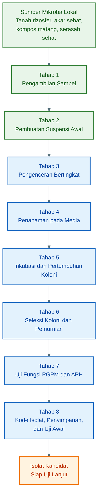

Diagram tersebut menunjukkan bahwa isolasi mikroba adalah proses bertahap. Setiap tahap menghasilkan bahan atau data yang menjadi dasar bagi tahap berikutnya.

---

# **BAB 2. PENDAHULUAN**

## **2.1 Dasar Pemikiran Isolasi Mikroba Lokal**

Lahan pertanian yang sehat biasanya memiliki keragaman mikroba yang tinggi. Di sekitar akar tanaman terdapat zona yang disebut **rizosfer**, yaitu wilayah tanah yang sangat dipengaruhi oleh aktivitas akar. Pada zona ini, akar tanaman mengeluarkan berbagai senyawa organik yang dapat menjadi sumber energi bagi mikroba.

Karena itu, rizosfer sering menjadi lokasi yang kaya mikroba bermanfaat. Beberapa mikroba dapat membantu tanaman memperoleh unsur hara, sementara yang lain dapat bersaing dengan patogen tanaman. Selain rizosfer, kompos matang dan serasah sehat juga menjadi sumber penting karena mengandung mikroba dekomposer, jamur antagonis, dan bakteri lingkungan yang telah beradaptasi dengan bahan organik.

Namun, tidak semua mikroba dari sumber tersebut otomatis bermanfaat. Prosedur isolasi dibutuhkan agar mikroba yang diperoleh dapat dipisahkan satu per satu, diamati cirinya, diuji fungsinya, dan dipilih yang paling potensial.

---

## **2.2 Perbedaan Fokus PGPM dan APH**

Walaupun sering berasal dari sumber sampel yang sama, PGPM dan APH memiliki fokus fungsi yang berbeda.

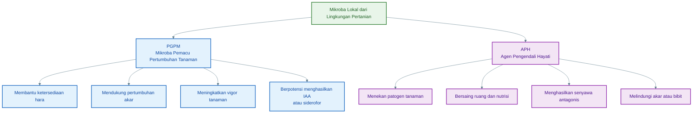

Dalam praktiknya, satu isolat dapat memiliki lebih dari satu fungsi. Misalnya, isolat _Bacillus_ tertentu dapat berperan sebagai PGPM karena mendukung pertumbuhan akar, sekaligus sebagai APH karena mampu menekan jamur patogen tanaman. Karena itu, uji fungsi menjadi tahap penting dalam proses seleksi.

---

## **2.3 Mengapa Prosedur Harus Bertahap**

Proses isolasi tidak bisa dilakukan secara acak. Setiap tahap memiliki tujuan yang spesifik.

Tahap pengambilan sampel memastikan sumber mikroba berasal dari bahan yang aman dan relevan. Tahap suspensi dan pengenceran bertujuan membuat mikroba tersebar merata dan tidak terlalu padat. Tahap penanaman pada media bertujuan menumbuhkan koloni yang dapat diamati. Tahap pemurnian bertujuan memisahkan mikroba menjadi isolat tunggal. Tahap uji fungsi membuktikan apakah isolat tersebut benar-benar memiliki manfaat.

Alur kerja ini penting karena kualitas isolat akhir sangat bergantung pada ketertiban proses sejak awal.

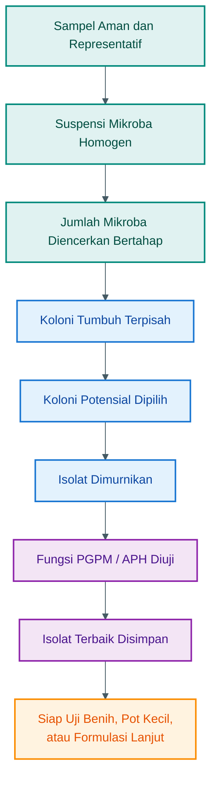

---

## **2.4 Hubungan Tahapan Isolasi dengan Media**

Media memiliki peran penting dalam proses isolasi. Setiap media digunakan untuk tujuan yang berbeda. Ada media yang digunakan untuk menumbuhkan bakteri umum, ada media untuk jamur, ada media untuk pelarut fosfat, ada media untuk _Pseudomonas_, dan ada pula media untuk penyimpanan isolat.

Dengan memahami fungsi media, proses isolasi menjadi lebih terarah. Kita tidak hanya menumbuhkan mikroba, tetapi menumbuhkan mikroba pada media yang sesuai dengan target seleksi.

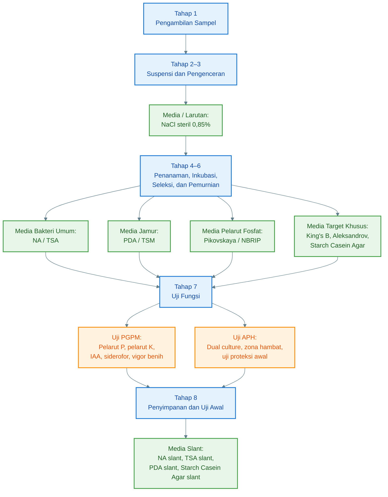

---

## **2.5 Posisi Pembuatan Media dalam Serial Prosedur**

Bagian pembuatan media tidak berdiri sendiri. Media disiapkan untuk mendukung seluruh tahapan isolasi. Tanpa media yang sesuai, koloni tidak akan tumbuh dengan baik, fungsi mikroba sulit diamati, dan penyimpanan isolat menjadi tidak stabil.

Secara praktis, media digunakan dalam empat kelompok besar:

1. **Larutan kerja awal**, seperti NaCl steril 0,85%.
2. **Media isolasi dan pemurnian**, seperti NA, TSA, PDA, Pikovskaya, NBRIP, King’s B, Aleksandrov, dan Starch Casein Agar.
3. **Media uji fungsi**, seperti CAS Agar, media IAA, Ashby, N-free Malate, dan PDA untuk uji antagonis.
4. **Media penyimpanan**, seperti agar miring atau slant.

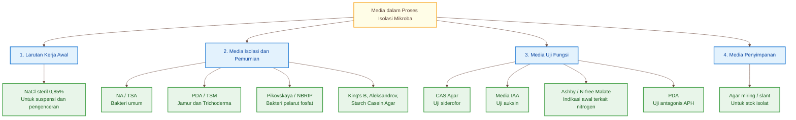

---

## **2.6 Prinsip Keamanan dan Kelayakan Isolat**

Karena isolat berasal dari lingkungan terbuka, semua mikroba yang diperoleh harus diperlakukan sebagai mikroba yang belum diketahui identitas dan sifatnya. Artinya, isolat tidak boleh langsung diaplikasikan ke lahan luas tanpa proses seleksi bertahap.

Sumber sampel harus dipilih dari bahan yang aman, seperti tanah rizosfer, akar sehat, kompos matang, dan serasah sehat. Hindari sumber seperti feses, bangkai, limbah tercemar, air got, atau bahan yang berbau busuk menyengat.

Isolat yang layak dikembangkan harus memenuhi beberapa prinsip:

- berasal dari sumber aman,
- dapat dimurnikan,
- tumbuh stabil,
- tidak berbau busuk,
- tidak menurunkan daya kecambah,
- memiliki fungsi PGPM atau APH yang terukur,
- dapat disimpan dan ditumbuhkan ulang,
- serta memberikan hasil positif pada uji awal tanaman.

---

## **2.7 Cara Menggunakan Panduan Ini**

Panduan ini sebaiknya dibaca secara berurutan.

Pertama, pembaca memahami bagian pengantar dan pendahuluan ini untuk melihat gambaran besar proses isolasi mikroba. Setelah itu, pembaca dapat masuk ke serial utama yang terdiri dari delapan tahap isolasi. Masing-masing tahap menjelaskan tujuan, prinsip, alat, bahan, langkah kerja, kesalahan umum, dan output yang diharapkan.

Setelah delapan tahap selesai, bagian pembuatan media digunakan sebagai rujukan teknis untuk menyiapkan media yang diperlukan. Dengan cara ini, pembaca tidak hanya mengetahui langkah isolasi, tetapi juga memahami peran media dalam setiap fase proses.

Urutan pembacaan yang disarankan adalah sebagai berikut.

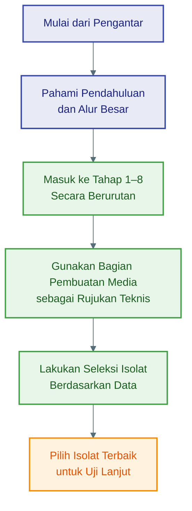

---

## **2.8 Jembatan Menuju Serial Prosedur**

Berdasarkan uraian di atas, proses isolasi mikroba PGPM dan APH dapat dipahami sebagai perjalanan dari **sumber mikroba lokal** menuju **isolat kandidat yang siap diuji lanjut**.

Tahap awal berfokus pada pengambilan dan pengenceran sampel. Tahap tengah berfokus pada penumbuhan, pengamatan, seleksi, dan pemurnian koloni. Tahap akhir berfokus pada uji fungsi, penyimpanan, pencatatan, dan uji awal tanaman.

Dengan kerangka tersebut, pembahasan berikutnya dapat langsung masuk ke bagian utama, yaitu:

```text
Tahap 1. Pengambilan Sampel
Tahap 2. Pembuatan Suspensi Awal
Tahap 3. Pengenceran Bertingkat
Tahap 4. Penanaman pada Media
Tahap 5. Inkubasi dan Pertumbuhan Koloni
Tahap 6. Seleksi Koloni dan Pemurnian
Tahap 7. Uji Fungsi PGPM dan APH
Tahap 8. Kode Isolat, Penyimpanan, dan Uji Awal
```

Setelah delapan tahap tersebut, tulisan kemudian dilanjutkan dengan bagian:

```text
Prosedur Pembuatan Media yang Digunakan dalam Proses Isolasi PGPM dan APH
```

---

# Tahap 1: Pengambilan Sampel

## Tujuan tahap ini

Tahap pertama bertujuan mendapatkan **sumber mikroba lokal yang aman, representatif, dan berpeluang memiliki fungsi sebagai PGPM atau APH**.

**PGPM** adalah _Plant Growth Promoting Microorganisms_, yaitu mikroba pemacu pertumbuhan tanaman.
**APH** adalah **Agen Pengendali Hayati**, yaitu mikroba yang berpotensi menekan patogen tanaman.

Pada tahap ini, kualitas sampel sangat menentukan keberhasilan isolasi. Sampel yang baik biasanya berasal dari tanaman sehat, akar aktif, tanah rizosfer, kompos matang, atau bahan organik sehat.


---

## 1. Prinsip utama pengambilan sampel

**Diagram Tahap 1 — Pengambilan Sampel**

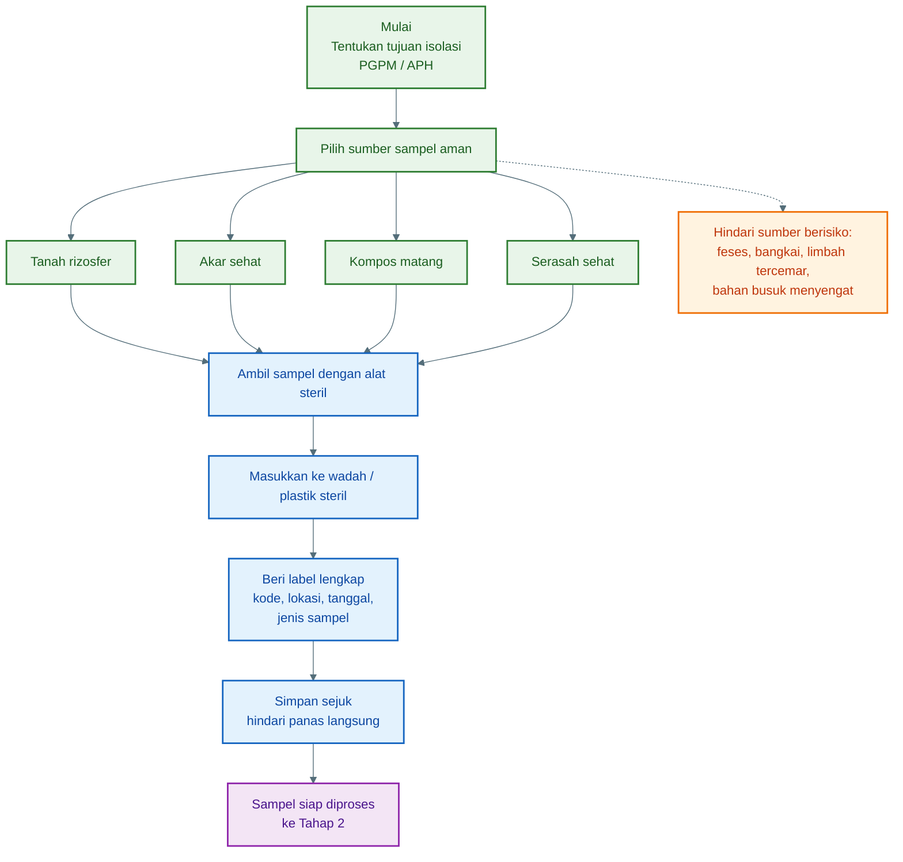

---

Ambil sampel dari lokasi yang memiliki peluang tinggi menyimpan mikroba bermanfaat.

Untuk **PGPM**, pilih:

- Tanaman yang tumbuh paling sehat
- Tanaman dengan akar kuat
- Tanaman dengan daun hijau, vigor bagus, dan pertumbuhan seragam
- Lahan yang produktif
- Area yang tidak terlalu sering memakai pestisida kimia berat

Untuk **APH**, pilih:

- Tanaman sehat di lahan yang ada tekanan penyakit
- Tanaman yang tetap sehat saat tanaman sekitarnya sakit
- Rizosfer tanaman sehat dekat area serangan penyakit
- Kompos matang yang stabil dan tidak berbau busuk

Prinsip praktisnya:

**PGPM dicari dari tanaman yang tumbuh kuat.**
**APH dicari dari tanaman sehat yang mampu bertahan di lingkungan berpenyakit.**

---

## 2. Sumber sampel yang disarankan

✓ A. Tanah rizosfer

**Rizosfer** adalah tanah yang menempel atau berada sangat dekat dengan akar tanaman.

Ini adalah sumber utama untuk isolasi PGPM dan APH karena banyak mikroba aktif hidup di zona akar.

Cara mengambilnya:

1. Pilih tanaman sehat.
2. Gali perlahan sampai akar terlihat.
3. Ambil tanah yang menempel di sekitar akar.
4. Jangan ambil tanah terlalu jauh dari akar.
5. Masukkan ke plastik steril atau wadah steril.

Jumlah sampel yang disarankan: **10–20 gram per titik sampel**.

---

✓ B. Akar sehat

Akar sehat dapat menjadi sumber mikroba yang hidup di permukaan akar atau di sekitar jaringan akar.

Pilih akar yang:

- Tidak busuk
- Tidak berlendir
- Tidak berbau
- Tidak berwarna hitam abnormal
- Memiliki rambut akar aktif

Ambil potongan akar kecil, sekitar **1–3 cm**, lalu simpan dalam plastik steril.

---

✓ C. Kompos matang

Kompos matang bisa menjadi sumber mikroba dekomposer, Bacillus, Trichoderma, dan mikroba antagonis lainnya.

Ciri kompos matang yang layak:

- Berbau tanah
- Tidak panas
- Tidak berbau amonia tajam
- Tidak berlendir
- Warna cokelat gelap sampai hitam
- Tekstur remah

Jangan ambil kompos yang masih panas, busuk, atau berbau menyengat.

---

✓ D. Serasah sehat

Serasah adalah daun, ranting kecil, atau bahan organik yang mulai lapuk secara alami.

Pilih serasah yang:

- Tidak berbau busuk
- Tidak tercemar limbah
- Berasal dari kebun sehat
- Tidak bercampur kotoran hewan

Serasah bisa digunakan untuk mencari jamur dekomposer atau calon APH seperti Trichoderma.

---

## 3. Sumber sampel yang harus dihindari

Jangan gunakan sampel dari:

- Feses
- Bangkai
- Limbah rumah tangga
- Limbah rumah sakit
- Selokan
- Air got
- Sampah busuk
- Tanah tercemar oli, pestisida berat, atau bahan kimia
- Bahan yang berbau busuk menyengat

Alasannya: sumber tersebut berisiko membawa mikroba patogen, mikroba pembusuk, atau kontaminan yang tidak aman untuk dikembangkan.

---

## 4. Alat yang digunakan

Siapkan:

| Alat                            | Fungsi                                       |
| ------------------------------- | -------------------------------------------- |
| Sarung tangan                   | Mengurangi kontaminasi dari tangan           |
| Sendok/spatula steril           | Mengambil tanah, akar, atau kompos           |
| Plastik steril / zip bag steril | Menyimpan sampel                             |
| Marker permanen                 | Memberi kode sampel                          |
| Alkohol 70%                     | Membersihkan alat kerja                      |
| Tisu steril / kain bersih       | Membersihkan permukaan alat                  |
| Cooler box sederhana            | Menjaga sampel tetap sejuk saat transportasi |

Bila tidak ada plastik steril laboratorium, gunakan plastik zip baru yang bersih, lalu minimalkan sentuhan bagian dalam plastik.

---

## 5. Cara mengambil sampel tanah rizosfer

✓ Langkah kerja

1. Pilih tanaman sehat.
2. Bersihkan permukaan tanah dari daun kering berlebih.
3. Gali tanah perlahan sedalam sekitar **5–15 cm**, tergantung jenis tanaman.
4. Temukan bagian akar aktif.
5. Ambil tanah yang menempel di akar atau tanah sekitar **±1–5 cm dari akar**.
6. Masukkan sampel ke plastik steril.
7. Tutup plastik dengan rapat.
8. Beri label lengkap.

Untuk tanaman kecil seperti cabai, tomat, melon, pakcoy, selada, dan tanaman hortikultura lain, tanah rizosfer biasanya mudah diambil dari area sekitar perakaran aktif.

---

## 6. Cara mengambil sampel akar

1. Pilih akar muda yang sehat.
2. Potong akar kecil sepanjang **1–3 cm**.
3. Jangan ambil akar yang busuk atau berlendir.
4. Masukkan ke wadah steril.
5. Beri label.

Untuk isolasi mikroba dari akar, sebaiknya akar tidak dicuci di lapangan. Pembersihan dilakukan nanti saat proses laboratorium.

---

## 7. Cara mengambil sampel kompos matang

1. Pilih tumpukan kompos yang sudah matang.
2. Ambil dari bagian tengah, bukan hanya permukaan.
3. Gunakan sendok atau spatula steril.
4. Ambil sekitar **10–20 gram**.
5. Masukkan ke plastik steril.
6. Beri label.

Jika kompos masih panas, jangan digunakan untuk isolasi PGPM atau APH utama. Kompos panas menunjukkan proses dekomposisi belum stabil.

---

## 8. Cara mengambil sampel serasah

1. Pilih serasah dari area kebun sehat.
2. Ambil daun atau ranting yang mulai lapuk alami.
3. Hindari bagian yang berbau busuk.
4. Ambil sekitar **5–10 gram**.
5. Masukkan ke plastik steril.
6. Beri label.

Serasah cocok untuk mencari mikroba dekomposer dan jamur antagonis tertentu.

---

## 9. Sistem pengambilan sampel yang lebih representatif

Untuk satu lahan, jangan hanya ambil dari satu titik.

Gunakan pola sederhana:

- Ambil dari **5 titik tanaman sehat**
- Setiap titik ambil **10–20 gram**
- Bisa digabung menjadi satu sampel komposit, atau dipisah per titik

Untuk riset atau seleksi isolat yang lebih rapi, lebih baik **dipisah per titik** agar asal isolat bisa dilacak.

Contoh kode:

| Kode sampel | Arti                   |
| ----------- | ---------------------- |
| RZ-CB-01    | Rizosfer cabai titik 1 |
| RZ-TM-01    | Rizosfer tomat titik 1 |
| KP-01       | Kompos matang sampel 1 |
| SR-01       | Serasah sampel 1       |
| AK-CB-01    | Akar cabai titik 1     |

---

## 10. Format label sampel

Setiap sampel wajib diberi label.

Isi label minimal:

```text
Kode sampel     :
Lokasi          :
Tanggal         :
Jenis tanaman   :
Jenis sampel    :
Kondisi tanaman :
Catatan lahan   :
```

Contoh:

```text
Kode sampel     : RZ-CB-01
Lokasi          : Blok A, kebun cabai
Tanggal         : 12/05/2026
Jenis tanaman   : Cabai
Jenis sampel    : Tanah rizosfer
Kondisi tanaman : Sehat, vigor tinggi
Catatan lahan   : Sekitar tanaman lain ada layu ringan
```

---

## 11. Penyimpanan dan transportasi sampel

Setelah sampel diambil:

- Simpan di tempat sejuk
- Hindari sinar matahari langsung
- Jangan dibiarkan dalam kendaraan panas
- Jangan ditambah air
- Jangan dicampur dengan bahan lain
- Proses secepatnya, idealnya dalam **24 jam**

Jika belum langsung diproses, simpan sementara pada suhu sejuk, misalnya dalam cooler box. Jangan dibekukan, karena pembekuan dapat menurunkan viabilitas sebagian mikroba.

---

## 12. Kesalahan yang sering terjadi

Kesalahan umum pada tahap pengambilan sampel:

- Mengambil tanah terlalu jauh dari akar
- Mengambil sampel dari tanaman sakit parah
- Sampel tidak diberi label
- Plastik sampel terbuka terlalu lama
- Alat tidak steril
- Sampel terkena panas matahari
- Sampel dicampur tanpa catatan asal
- Mengambil kompos yang belum matang
- Menggunakan sampel dari sumber berisiko seperti feses atau limbah

---

## 13. Output dari tahap 1

Hasil akhir dari tahap ini adalah **sampel mikroba lokal siap diproses**.

Output minimal:

| Output                | Keterangan                      |
| --------------------- | ------------------------------- |
| Sampel tanah rizosfer | Sumber utama PGPM dan APH       |
| Sampel akar sehat     | Sumber mikroba akar             |
| Sampel kompos matang  | Sumber dekomposer dan antagonis |
| Sampel serasah sehat  | Sumber jamur dan dekomposer     |
| Label sampel lengkap  | Agar asal isolat dapat dilacak  |
| Catatan lapangan      | Membantu seleksi isolat terbaik |

---

✓ Ringkasan Tahap 1

**Pilih tanaman/lahan sehat → ambil tanah rizosfer, akar, kompos matang, atau serasah sehat → gunakan alat steril → hindari sumber berisiko → beri label lengkap → simpan sejuk → segera proses.**

---

# Tahap 2: Pembuatan Suspensi Awal

## Tujuan tahap ini

Tahap 2 bertujuan **memindahkan mikroba dari sampel padat ke dalam larutan steril**, sehingga mikroba tersebar merata dan siap diencerkan pada tahap berikutnya.

Sampel seperti tanah rizosfer, akar, kompos, atau serasah masih berbentuk padat. Mikroba di dalamnya menempel pada partikel tanah, permukaan akar, bahan organik, atau serasah. Karena itu, sampel perlu dibuat menjadi **suspensi awal**.

**Suspensi awal** adalah campuran antara sampel dan larutan steril yang dikocok sampai mikroba tersebar di dalam cairan.


---

## 1. Prinsip dasar tahap 2

Pada tahap ini digunakan perbandingan:

```text
1 gram sampel + 9 ml larutan NaCl steril 0,85%
```

Hasilnya disebut **pengenceran awal 10⁻¹**.

Artinya, sampel sudah diencerkan **10 kali** dari kondisi awal.

---

✓ **Diagram Tahap 2 — Pembuatan Suspensi Awal**

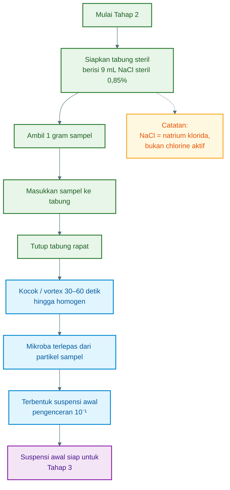

---

## 2. Definisi istilah penting

| Istilah               | Arti                                          |
| --------------------- | --------------------------------------------- |
| **NaCl**              | Natrium klorida, yaitu garam                  |
| **NaCl steril 0,85%** | Larutan garam steril dengan konsentrasi 0,85% |
| **Suspensi**          | Campuran mikroba dalam cairan                 |
| **Homogen**           | Tercampur merata                              |
| **10⁻¹**              | Pengenceran 1 banding 10                      |
| **Tabung steril**     | Tabung yang bebas mikroba kontaminan          |

Catatan penting: **NaCl bukan chlorine aktif.**
NaCl adalah garam. Yang membunuh mikroba adalah chlorine aktif seperti kaporit, pemutih, atau sodium hypochlorite.

---

## 3. Bahan yang disiapkan

Untuk setiap sampel, siapkan:

| Bahan                                           | Jumlah           |
| ----------------------------------------------- | ---------------- |
| Sampel tanah rizosfer / akar / kompos / serasah | 1 gram           |
| Larutan NaCl steril 0,85%                       | 9 ml             |
| Tabung steril                                   | 1 buah           |
| Pipet steril atau mikropipet                    | Sesuai kebutuhan |
| Spatula/sendok steril                           | 1 buah           |
| Label                                           | 1 buah           |
| Marker permanen                                 | 1 buah           |

---

## 4. Cara membuat larutan NaCl steril 0,85%

Jika belum tersedia, larutan NaCl 0,85% dapat dibuat dengan rumus:

```text
0,85 gram NaCl + 100 ml aquadest
```

Atau untuk volume lebih besar:

```text
8,5 gram NaCl + 1 liter aquadest
```

Langkah membuatnya:

1. Timbang NaCl sesuai kebutuhan.
2. Larutkan ke dalam aquadest.
3. Aduk sampai larut sempurna.
4. Masukkan ke botol atau tabung.
5. Sterilkan dengan autoklaf bila tersedia.
6. Dinginkan sebelum digunakan.

Jika tidak ada autoklaf, gunakan larutan steril siap pakai dari laboratorium atau supplier. Untuk hasil isolasi yang rapi, sebaiknya jangan menggunakan air PAM langsung karena bisa mengandung chlorine.

---

## 5. Persiapan sebelum membuat suspensi

Sebelum sampel dimasukkan ke tabung:

1. Bersihkan meja kerja.
2. Semprot permukaan kerja dengan alkohol 70%.
3. Gunakan sarung tangan.
4. Siapkan tabung berisi **9 ml NaCl steril 0,85%**.
5. Beri label pada tabung.
6. Pastikan kode tabung sama dengan kode sampel.

Contoh label:

```text
RZ-CB-01 / 10⁻¹
```

Artinya:

- **RZ** = rizosfer
- **CB** = cabai
- **01** = sampel nomor 1
- **10⁻¹** = suspensi awal

---

## 6. Langkah kerja pembuatan suspensi awal

✓ Langkah 1 — Ambil 1 gram sampel

Ambil **1 gram sampel** menggunakan spatula atau sendok steril.

Untuk sampel tanah rizosfer:

- Ambil tanah yang dekat akar.
- Hindari batu besar, akar kasar, atau sisa bahan yang terlalu besar.
- Jika ada gumpalan besar, hancurkan perlahan secara steril.

Untuk sampel kompos:

- Pilih bagian yang remah.
- Hindari potongan kayu besar.
- Jangan gunakan kompos yang masih panas atau berbau busuk.

Untuk sampel serasah:

- Potong kecil-kecil secara steril.
- Gunakan bagian yang lapuk sehat, bukan yang busuk.

Untuk sampel akar:

- Potong kecil-kecil sekitar 0,5–1 cm.
- Gunakan akar sehat, bukan akar busuk.
- Jika akar masih banyak tanah, tanah yang menempel boleh ikut sebagai sumber mikroba rizosfer.

---

✓ Langkah 2 — Masukkan ke tabung berisi 9 ml NaCl steril

Masukkan **1 gram sampel** ke dalam tabung yang sudah berisi:

```text
9 ml NaCl steril 0,85%
```

Pastikan sampel masuk ke dalam cairan, bukan menempel di dinding tabung bagian atas.

---

✓ Langkah 3 — Tutup tabung

Tutup tabung dengan rapat.

Tujuannya:

- Mencegah kontaminasi dari udara
- Mencegah larutan tumpah saat dikocok
- Menjaga kondisi tetap steril

---

✓ Langkah 4 — Kocok sampai homogen

Kocok tabung selama **30–60 detik**.

Jika tersedia alat vortex, gunakan vortex agar campuran lebih merata.

Jika tidak ada vortex, kocok manual dengan gerakan kuat namun hati-hati.

Tujuannya:

- Melepaskan mikroba dari partikel tanah
- Menyebarkan mikroba ke dalam larutan
- Membuat suspensi menjadi lebih merata
- Menghasilkan pengenceran awal **10⁻¹**

---

## 7. Hasil akhir tahap 2

Setelah dikocok, isi tabung akan tampak seperti campuran keruh.

Untuk tanah rizosfer, biasanya larutan menjadi cokelat keruh.

Untuk kompos, larutan bisa lebih gelap.

Untuk akar atau serasah, mungkin ada potongan kecil bahan organik di dalam tabung.

Itu normal, selama sampel berasal dari sumber aman dan tidak berbau busuk.

Hasil tahap ini disebut:

```text
Suspensi awal 10⁻¹
```

---

## 8. Fungsi NaCl steril 0,85%

Larutan NaCl steril 0,85% memiliki beberapa fungsi:

| Fungsi                               | Penjelasan                                                   |
| ------------------------------------ | ------------------------------------------------------------ |
| Menjaga kestabilan sel mikroba       | Mikroba tidak terlalu stres akibat perbedaan tekanan osmotik |
| Membantu pelepasan mikroba           | Mikroba lebih mudah terlepas dari tanah, akar, atau kompos   |
| Membuat sampel mudah diencerkan      | Suspensi cair lebih mudah dipindahkan dengan pipet           |
| Mengurangi risiko kontaminasi        | Karena larutan sudah steril                                  |
| Menjadi dasar pengenceran bertingkat | Dari 10⁻¹ dilanjutkan ke 10⁻² sampai 10⁻⁶                    |

---

## 9. Kenapa harus 1 gram + 9 ml?

Karena kombinasi tersebut menghasilkan pengenceran **1 banding 10**.

Perhitungannya:

```text
Total campuran = 1 gram sampel + 9 ml larutan
Total ≈ 10 bagian
```

Maka:

```text
1 bagian sampel dalam total 10 bagian = 10⁻¹
```

Itulah sebabnya tahap ini disebut **pengenceran awal 10⁻¹**.

---

## 10. Catatan untuk berbagai jenis sampel

✓ A. Tanah rizosfer

Ini sampel paling umum dan paling mudah diproses.

Gunakan:

```text
1 gram tanah rizosfer + 9 ml NaCl steril 0,85%
```

Kocok sampai tanah terdispersi merata.

---

✓ B. Kompos matang

Gunakan kompos matang yang remah.

Jika kompos terlalu kasar:

1. Pilih bagian halus.
2. Ambil 1 gram.
3. Masukkan ke 9 ml NaCl steril.
4. Kocok kuat.

Kompos biasanya menghasilkan suspensi lebih gelap.

---

✓ C. Serasah sehat

Untuk serasah:

1. Potong kecil-kecil.
2. Timbang 1 gram.
3. Masukkan ke 9 ml NaCl steril.
4. Kocok lebih lama, sekitar 1–2 menit.

Karena mikroba sering menempel kuat pada permukaan bahan organik.

---

✓ D. Akar sehat

Untuk akar:

1. Potong kecil akar sehat.
2. Timbang 1 gram.
3. Masukkan ke 9 ml NaCl steril.
4. Kocok atau vortex.

Jika targetnya mikroba sekitar akar, tanah yang menempel pada akar masih bisa ikut.
Jika targetnya mikroba permukaan akar, gunakan akar yang masih segar dan sehat.

---

## 11. Kontrol kebersihan

Pada tahap ini sebaiknya siapkan satu tabung kontrol:

```text
9 ml NaCl steril tanpa sampel
```

Tabung ini tidak diberi sampel.

Fungsinya untuk mengecek apakah larutan NaCl atau tabung sudah terkontaminasi.

Jika nanti kontrol ikut tumbuh mikroba, berarti ada masalah pada sterilitas larutan, tabung, atau teknik kerja.

---

## 12. Kesalahan yang sering terjadi

| Kesalahan                           | Akibat                         |
| ----------------------------------- | ------------------------------ |
| Sampel tidak ditimbang 1 gram       | Konsentrasi tidak konsisten    |
| Larutan bukan 9 ml                  | Pengenceran tidak tepat        |
| Tabung tidak steril                 | Kontaminasi                    |
| Sampel tidak dikocok                | Mikroba tidak tersebar merata  |
| Menggunakan air PAM langsung        | Risiko chlorine dan kontaminan |
| Tidak memberi label                 | Sampel tertukar                |
| Menggunakan sampel busuk            | Risiko mikroba tidak aman      |
| Mengambil bagian yang terlalu kasar | Suspensi sulit homogen         |

---

## 13. Indikator tahap 2 berhasil

Tahap ini dianggap berhasil jika:

- Tabung sudah berlabel jelas
- Sampel masuk seluruhnya ke larutan
- Suspensi tampak merata setelah dikocok
- Tidak ada bau busuk menyengat
- Tidak ada kesalahan kode sampel
- Suspensi siap digunakan untuk pengenceran berikutnya

---

## 14. Output tahap 2

Output dari tahap ini adalah:

```text
Tabung suspensi awal 10⁻¹
```

Contoh pencatatan:

| Kode sampel | Jenis sampel     | Larutan           | Status             |
| ----------- | ---------------- | ----------------- | ------------------ |
| RZ-CB-01    | Rizosfer cabai   | NaCl steril 0,85% | Suspensi 10⁻¹ siap |
| KP-01       | Kompos matang    | NaCl steril 0,85% | Suspensi 10⁻¹ siap |
| AK-TM-01    | Akar tomat sehat | NaCl steril 0,85% | Suspensi 10⁻¹ siap |

---

✓ Ringkasan Tahap 2

**Ambil 1 gram sampel → masukkan ke 9 ml NaCl steril 0,85% → tutup tabung → kocok 30–60 detik sampai homogen → hasilnya adalah suspensi awal 10⁻¹.**

---

# Tahap 3: Pengenceran Bertingkat

✓ Tujuan tahap ini

Tahap 3 bertujuan **menurunkan jumlah mikroba secara bertahap** agar saat ditanam pada media agar, koloni tidak tumbuh terlalu padat dan dapat dipisahkan satu per satu.

Pada tahap sebelumnya, kita sudah punya **suspensi awal 10⁻¹**, yaitu:

```text
1 gram sampel + 9 ml NaCl steril 0,85%
```

Suspensi 10⁻¹ ini masih mengandung mikroba dalam jumlah sangat banyak. Jika langsung ditanam ke media agar, kemungkinan besar koloni akan tumbuh menumpuk dan sulit dipilih. Karena itu perlu dibuat pengenceran lanjutan sampai **10⁻⁶**.


---

## 1. Prinsip pengenceran bertingkat

Pengenceran bertingkat dilakukan dengan pola:

```text
1 ml suspensi sebelumnya + 9 ml NaCl steril 0,85%
```

Setiap perpindahan akan menurunkan kepadatan mikroba **10 kali lipat**.

Contoh:

```text
10⁻¹ → 10⁻² → 10⁻³ → 10⁻⁴ → 10⁻⁵ → 10⁻⁶
```

Artinya, semakin besar angka pangkat negatifnya, semakin encer jumlah mikroba di dalam larutan.

---

✓ **Diagram Tahap 3 — Pengenceran Bertingkat**

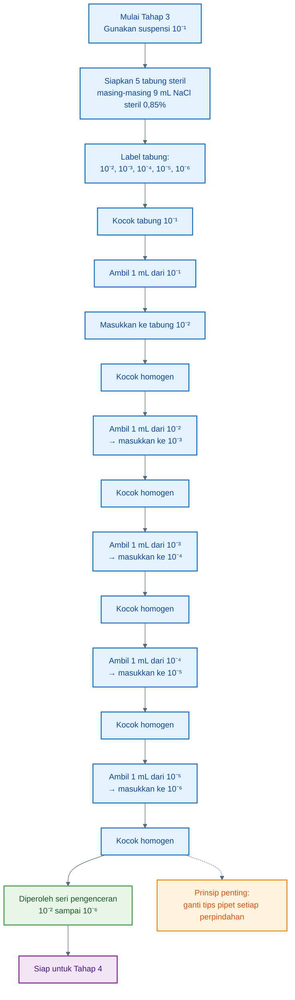

---

## 2. Definisi sederhana

| Istilah  | Arti                            |
| -------- | ------------------------------- |
| **10⁻¹** | Pengenceran 1 banding 10        |
| **10⁻²** | Pengenceran 1 banding 100       |
| **10⁻³** | Pengenceran 1 banding 1.000     |
| **10⁻⁴** | Pengenceran 1 banding 10.000    |
| **10⁻⁵** | Pengenceran 1 banding 100.000   |
| **10⁻⁶** | Pengenceran 1 banding 1.000.000 |

Semakin encer, koloni yang tumbuh di media agar akan semakin sedikit dan lebih mudah dipisahkan.

---

## 3. Alat dan bahan

Siapkan untuk setiap sampel:

| Alat/Bahan                | Jumlah                              |
| ------------------------- | ----------------------------------- |
| Suspensi awal 10⁻¹        | 1 tabung                            |
| Tabung steril             | 5 tabung                            |
| NaCl steril 0,85%         | 9 ml per tabung                     |
| Pipet steril / mikropipet | Sesuai kebutuhan                    |
| Tips pipet steril         | Beberapa buah                       |
| Rak tabung                | 1 buah                              |
| Marker permanen           | 1 buah                              |
| Alkohol 70%               | Untuk menjaga kebersihan area kerja |

Karena tabung 10⁻¹ sudah dibuat pada tahap 2, pada tahap ini kita menyiapkan tabung tambahan untuk:

```text
10⁻²
10⁻³
10⁻⁴
10⁻⁵
10⁻⁶
```

---

## 4. Persiapan tabung

Siapkan 5 tabung steril, masing-masing diisi:

```text
9 ml NaCl steril 0,85%
```

Lalu beri label:

```text
10⁻²
10⁻³
10⁻⁴
10⁻⁵
10⁻⁶
```

Jika sampelnya banyak, label harus lebih lengkap.

Contoh:

```text
RZ-CB-01 / 10⁻²
RZ-CB-01 / 10⁻³
RZ-CB-01 / 10⁻⁴
RZ-CB-01 / 10⁻⁵
RZ-CB-01 / 10⁻⁶
```

Jangan hanya menulis angka pengenceran tanpa kode sampel, karena tabung mudah tertukar.

---

## 5. Langkah kerja pengenceran bertingkat

✓ Langkah 1 — Homogenkan tabung 10⁻¹

Sebelum diambil, kocok dulu tabung **10⁻¹** selama beberapa detik.

Tujuannya agar mikroba tersebar merata di dalam larutan.

Jangan mengambil cairan dari tabung yang belum dikocok, karena mikroba bisa mengendap bersama partikel tanah.

---

✓ Langkah 2 — Buat pengenceran 10⁻²

Ambil:

```text
1 ml dari tabung 10⁻¹
```

Masukkan ke tabung baru berisi:

```text
9 ml NaCl steril 0,85%
```

Kocok sampai homogen.

Hasilnya adalah:

```text
Pengenceran 10⁻²
```

---

✓ Langkah 3 — Buat pengenceran 10⁻³

Kocok dulu tabung **10⁻²**.

Ambil:

```text
1 ml dari tabung 10⁻²
```

Masukkan ke tabung baru berisi:

```text
9 ml NaCl steril 0,85%
```

Kocok sampai homogen.

Hasilnya adalah:

```text
Pengenceran 10⁻³
```

---

✓ Langkah 4 — Buat pengenceran 10⁻⁴

Kocok dulu tabung **10⁻³**.

Ambil:

```text
1 ml dari tabung 10⁻³
```

Masukkan ke tabung baru berisi:

```text
9 ml NaCl steril 0,85%
```

Kocok sampai homogen.

Hasilnya adalah:

```text
Pengenceran 10⁻⁴
```

---

✓ Langkah 5 — Buat pengenceran 10⁻⁵

Kocok dulu tabung **10⁻⁴**.

Ambil:

```text
1 ml dari tabung 10⁻⁴
```

Masukkan ke tabung baru berisi:

```text
9 ml NaCl steril 0,85%
```

Kocok sampai homogen.

Hasilnya adalah:

```text
Pengenceran 10⁻⁵
```

---

✓ Langkah 6 — Buat pengenceran 10⁻⁶

Kocok dulu tabung **10⁻⁵**.

Ambil:

```text
1 ml dari tabung 10⁻⁵
```

Masukkan ke tabung baru berisi:

```text
9 ml NaCl steril 0,85%
```

Kocok sampai homogen.

Hasilnya adalah:

```text
Pengenceran 10⁻⁶
```

---

## 6. Ringkasan dalam tabel

| Tabung | Cara membuat                      | Hasil                                 |
| ------ | --------------------------------- | ------------------------------------- |
| 10⁻¹   | 1 g sampel + 9 ml NaCl steril     | Suspensi awal                         |
| 10⁻²   | 1 ml dari 10⁻¹ + 9 ml NaCl steril | 100 kali lebih encer dari sampel awal |
| 10⁻³   | 1 ml dari 10⁻² + 9 ml NaCl steril | 1.000 kali lebih encer                |
| 10⁻⁴   | 1 ml dari 10⁻³ + 9 ml NaCl steril | 10.000 kali lebih encer               |
| 10⁻⁵   | 1 ml dari 10⁻⁴ + 9 ml NaCl steril | 100.000 kali lebih encer              |
| 10⁻⁶   | 1 ml dari 10⁻⁵ + 9 ml NaCl steril | 1.000.000 kali lebih encer            |

---

## 7. Diagram alur sederhana

```text
10⁻¹
  ↓ ambil 1 ml + 9 ml NaCl steril
10⁻²
  ↓ ambil 1 ml + 9 ml NaCl steril
10⁻³
  ↓ ambil 1 ml + 9 ml NaCl steril
10⁻⁴
  ↓ ambil 1 ml + 9 ml NaCl steril
10⁻⁵
  ↓ ambil 1 ml + 9 ml NaCl steril
10⁻⁶
```

Setiap tahap wajib dikocok sebelum dipindahkan ke tabung berikutnya.

---

## 8. Mengapa harus dikocok setiap tahap?

Mikroba tidak selalu tersebar merata. Sebagian bisa menempel pada partikel kecil, sebagian bisa mengendap, dan sebagian berada di permukaan cairan.

Jika tabung tidak dikocok:

- Jumlah mikroba yang terambil bisa tidak akurat
- Hasil pengenceran tidak konsisten
- Koloni yang tumbuh bisa terlalu padat atau terlalu sedikit
- Perbandingan antar isolat menjadi kurang valid

Karena itu, aturan pentingnya:

```text
Kocok dulu → ambil 1 ml → pindahkan → kocok lagi
```

---

## 9. Pengenceran mana yang nanti ditanam?

Untuk isolasi mikroba pemacu pertumbuhan tanaman dan agen pengendali hayati, biasanya yang ditanam ke media agar adalah:

```text
10⁻³
10⁻⁴
10⁻⁵
10⁻⁶
```

Alasannya:

- **10⁻¹ dan 10⁻²** sering masih terlalu pekat
- **10⁻³ sampai 10⁻⁶** lebih berpeluang menghasilkan koloni terpisah
- Koloni terpisah lebih mudah dipilih untuk dimurnikan

Namun pemilihan pengenceran juga tergantung jenis sampel.

---

## 10. Rekomendasi pengenceran berdasarkan jenis sampel

| Jenis sampel                      | Pengenceran yang disarankan untuk ditanam |
| --------------------------------- | ----------------------------------------- |
| Tanah rizosfer                    | 10⁻³, 10⁻⁴, 10⁻⁵, 10⁻⁶                    |
| Kompos matang                     | 10⁻⁴, 10⁻⁵, 10⁻⁶                          |
| Serasah sehat                     | 10⁻², 10⁻³, 10⁻⁴                          |
| Akar sehat                        | 10⁻², 10⁻³, 10⁻⁴                          |
| Tanah sangat subur/organik tinggi | 10⁻⁴, 10⁻⁵, 10⁻⁶                          |

Untuk sampel yang kaya mikroba seperti kompos, gunakan pengenceran lebih tinggi karena jumlah mikrobanya biasanya sangat padat.

---

## 11. Rekomendasi pengenceran berdasarkan target mikroba

| Target mikroba          | Pengenceran yang sering dipakai |
| ----------------------- | ------------------------------- |
| Bakteri umum            | 10⁻⁴, 10⁻⁵, 10⁻⁶                |
| Bakteri pelarut fosfat  | 10⁻³, 10⁻⁴, 10⁻⁵                |
| Bakteri pelarut kalium  | 10⁻³, 10⁻⁴, 10⁻⁵                |
| Bacillus                | 10⁻³, 10⁻⁴, 10⁻⁵                |
| Pseudomonas fluorescens | 10⁻³, 10⁻⁴, 10⁻⁵                |
| Trichoderma             | 10⁻², 10⁻³, 10⁻⁴                |
| Streptomyces            | 10⁻³, 10⁻⁴, 10⁻⁵                |
| Yeast/khamir            | 10⁻³, 10⁻⁴, 10⁻⁵                |

---

## 12. Aturan penting agar tidak kontaminasi

Beberapa aturan kerja yang harus dijaga:

1. Gunakan tabung steril.
2. Gunakan NaCl steril 0,85%.
3. Ganti tips pipet setiap perpindahan.
4. Jangan memasukkan tips bekas ke tabung lain.
5. Jangan menyentuh bagian dalam tutup tabung.
6. Jangan membuka tabung terlalu lama.
7. Selalu kocok tabung sebelum mengambil cairan.
8. Beri label sebelum mulai bekerja.
9. Kerjakan dekat api bunsen atau di ruang kerja bersih jika tersedia.
10. Buang tips bekas ke wadah limbah yang aman.

---

## 13. Kesalahan yang sering terjadi

| Kesalahan                              | Akibat                                   |
| -------------------------------------- | ---------------------------------------- |
| Tidak mengganti tips pipet             | Pengenceran silang dan hasil tidak valid |
| Tabung tidak dikocok                   | Mikroba tidak merata                     |
| Salah label tabung                     | Data isolat kacau                        |
| Mengambil lebih/kurang dari 1 ml       | Tingkat pengenceran tidak tepat          |
| Volume NaCl tidak 9 ml                 | Pengenceran berubah                      |
| Tabung terlalu lama terbuka            | Kontaminasi udara                        |
| Menanam dari pengenceran terlalu pekat | Koloni menyatu                           |
| Menanam dari pengenceran terlalu encer | Koloni terlalu sedikit                   |

---

## 14. Contoh pencatatan tahap 3

Gunakan tabel sederhana seperti ini:

| Kode sampel | Pengenceran | Volume diambil | Pengencer        | Keterangan |
| ----------- | ----------: | -------------: | ---------------- | ---------- |
| RZ-CB-01    |        10⁻² | 1 ml dari 10⁻¹ | 9 ml NaCl steril | Homogen    |
| RZ-CB-01    |        10⁻³ | 1 ml dari 10⁻² | 9 ml NaCl steril | Homogen    |
| RZ-CB-01    |        10⁻⁴ | 1 ml dari 10⁻³ | 9 ml NaCl steril | Homogen    |
| RZ-CB-01    |        10⁻⁵ | 1 ml dari 10⁻⁴ | 9 ml NaCl steril | Homogen    |
| RZ-CB-01    |        10⁻⁶ | 1 ml dari 10⁻⁵ | 9 ml NaCl steril | Homogen    |

---

## 15. Output tahap 3

Hasil akhir tahap ini adalah satu rangkaian tabung pengenceran:

```text
10⁻¹, 10⁻², 10⁻³, 10⁻⁴, 10⁻⁵, 10⁻⁶
```

Tabung yang paling sering dilanjutkan ke tahap penanaman media adalah:

```text
10⁻³, 10⁻⁴, 10⁻⁵, dan 10⁻⁶
```

---

✓ Ringkasan Tahap 3

**Kocok tabung 10⁻¹ → ambil 1 ml → masukkan ke 9 ml NaCl steril untuk membuat 10⁻² → kocok → ulangi pola yang sama sampai 10⁻⁶.**

---

# Tahap 4: Penanaman pada Media

✓ Tujuan tahap ini

Tahap 4 bertujuan **menumbuhkan mikroba dari hasil pengenceran pada media agar yang sesuai**, sehingga koloni dapat tumbuh terpisah dan mudah dipilih pada tahap berikutnya.

Pada tahap sebelumnya sudah tersedia tabung pengenceran:

```text
10⁻¹, 10⁻², 10⁻³, 10⁻⁴, 10⁻⁵, 10⁻⁶
```

Untuk penanaman pada media, biasanya digunakan pengenceran:

```text
10⁻³, 10⁻⁴, 10⁻⁵, dan 10⁻⁶
```

Karena pada pengenceran tersebut jumlah mikroba sudah lebih rendah, sehingga peluang mendapatkan koloni yang terpisah lebih besar.

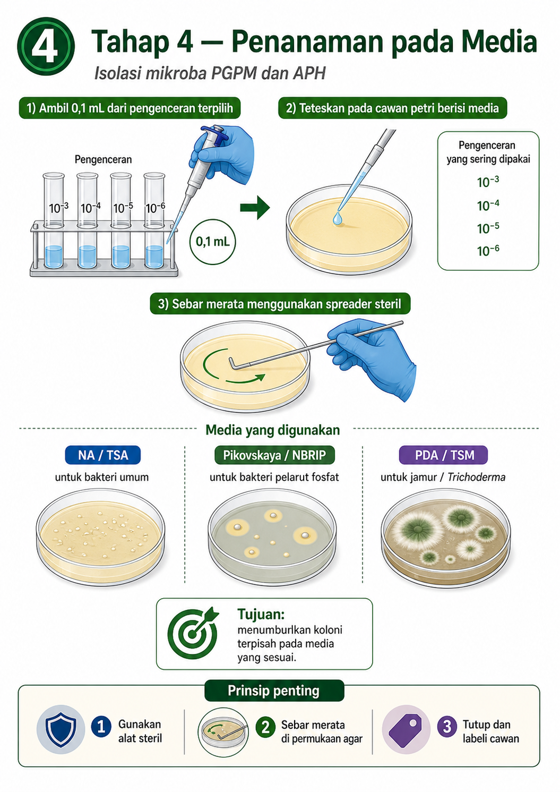

---

## 1. Prinsip penanaman pada media

Prinsipnya sederhana:

```text
Ambil 0,1 ml suspensi hasil pengenceran
↓
Teteskan ke permukaan media agar
↓
Sebarkan merata
↓
Tutup cawan
↓
Labeli
↓
Siap diinkubasi
```

Volume **0,1 ml** sama dengan **100 mikroliter**.

Volume ini umum dipakai karena cukup untuk menyebarkan mikroba di permukaan agar tanpa membuat media terlalu basah.

---

✓ **Diagram Tahap 4 — Penanaman pada Media**

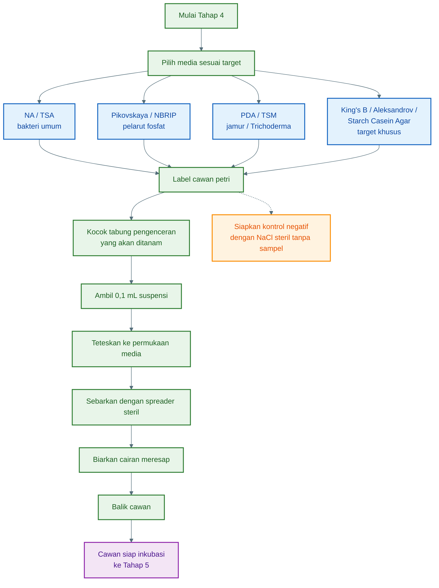

---

## 2. Definisi istilah penting

| Istilah             | Arti                                                                      |
| ------------------- | ------------------------------------------------------------------------- |
| **Media agar**      | Media padat untuk menumbuhkan mikroba                                     |
| **Cawan petri**     | Wadah bundar untuk media agar                                             |
| **Koloni**          | Kumpulan mikroba yang tumbuh dan terlihat sebagai titik/bercak            |
| **Spread plate**    | Metode menanam mikroba dengan cara menyebarkan suspensi di permukaan agar |
| **Spreader**        | Alat steril untuk meratakan suspensi di permukaan agar                    |
| **0,1 ml**          | Volume suspensi yang ditanam, sama dengan 100 mikroliter                  |
| **Kontrol negatif** | Media tanpa sampel untuk memastikan media tidak terkontaminasi            |

---

## 3. Media yang digunakan

Pemilihan media tergantung target mikroba.

✓ A. NA / TSA untuk bakteri umum

**NA** adalah _Nutrient Agar_.
**TSA** adalah _Tryptic Soy Agar_.

Keduanya digunakan untuk menumbuhkan bakteri umum dari tanah, rizosfer, akar, dan kompos.

Cocok untuk isolasi awal:

- Bacillus
- Bakteri rizosfer umum
- Calon mikroba pemacu pertumbuhan tanaman
- Calon bakteri antagonis

Perbedaan praktis:

| Media   | Keterangan                                                  |
| ------- | ----------------------------------------------------------- |
| **NA**  | Lebih sederhana, murah, cocok untuk isolasi awal            |
| **TSA** | Lebih kaya nutrisi, pertumbuhan bakteri biasanya lebih kuat |

Untuk pekerjaan awal, **NA sudah cukup**.

---

✓ B. Pikovskaya / NBRIP untuk bakteri pelarut fosfat

**Pikovskaya Agar** dan **NBRIP Agar** digunakan untuk mencari **bakteri pelarut fosfat**.

Bakteri pelarut fosfat adalah mikroba yang membantu melarutkan fosfat tidak larut sehingga lebih mudah tersedia bagi tanaman.

Tanda positif pada media:

```text
Ada zona bening di sekitar koloni
```

Zona bening menunjukkan adanya aktivitas pelarutan fosfat.

Keterangan:

| Media               | Fungsi                                                                  |
| ------------------- | ----------------------------------------------------------------------- |
| **Pikovskaya Agar** | Media klasik untuk seleksi pelarut fosfat                               |
| **NBRIP Agar**      | Media seleksi pelarut fosfat dengan zona bening yang sering lebih jelas |

---

✓ C. PDA / TSM untuk jamur dan Trichoderma

**PDA** adalah _Potato Dextrose Agar_.
**TSM** adalah _Trichoderma Selective Medium_.

Keduanya digunakan untuk menumbuhkan jamur.

| Media   | Fungsi                           |
| ------- | -------------------------------- |
| **PDA** | Media umum untuk jamur           |
| **TSM** | Media selektif untuk Trichoderma |

Jika targetnya jamur umum atau Trichoderma dari kompos, tanah, atau serasah, gunakan **PDA** untuk isolasi awal.
Jika ingin lebih spesifik mencari **Trichoderma**, gunakan **TSM** bila tersedia.

Ciri awal Trichoderma:

- Tumbuh cepat
- Awalnya putih
- Kemudian berubah hijau
- Tekstur seperti kapas atau tepung
- Tidak berbau busuk

---

## 4. Media tambahan bila target lebih spesifik

Selain media pada gambar, beberapa media lain bisa digunakan bila target mikroba lebih spesifik.

| Target                  | Media yang digunakan                                               |
| ----------------------- | ------------------------------------------------------------------ |
| Bakteri pelarut kalium  | Aleksandrov Agar                                                   |
| Pseudomonas fluorescens | King’s B Agar                                                      |
| Streptomyces            | Starch Casein Agar                                                 |
| Yeast/khamir rizosfer   | YMEA atau PDA                                                      |
| Bacillus                | NA atau TSA, sering didahului perlakuan panas ringan pada suspensi |

Namun untuk tahap dasar, cukup mulai dari:

```text
NA/TSA
Pikovskaya/NBRIP
PDA/TSM
```

---

## 5. Persiapan sebelum penanaman

Sebelum mulai, siapkan:

| Alat/Bahan                          | Fungsi                       |
| ----------------------------------- | ---------------------------- |
| Cawan petri berisi media agar       | Tempat mikroba ditumbuhkan   |
| Tabung pengenceran 10⁻³ sampai 10⁻⁶ | Sumber mikroba               |
| Mikropipet atau pipet steril        | Mengambil 0,1 ml suspensi    |
| Tips pipet steril                   | Mencegah kontaminasi silang  |
| Spreader steril                     | Meratakan suspensi           |
| Alkohol 70%                         | Membersihkan area kerja      |
| Marker permanen                     | Memberi label cawan          |
| Bunsen / area kerja bersih          | Mengurangi kontaminasi udara |

Pastikan media agar sudah padat, tidak terlalu basah, dan tidak ada kontaminasi sebelum digunakan.

---

## 6. Label cawan sebelum ditanam

Labeli bagian bawah cawan, bukan tutupnya.

Isi label minimal:

```text
Kode sampel
Pengenceran
Jenis media
Tanggal tanam
Target mikroba
```

Contoh label:

```text
RZ-CB-01 / 10⁻⁴ / NA / 12-05-2026
```

Artinya:

- **RZ-CB-01** = sampel rizosfer cabai nomor 1
- **10⁻⁴** = pengenceran yang ditanam
- **NA** = Nutrient Agar
- **12-05-2026** = tanggal penanaman

Contoh untuk media lain:

```text
RZ-CB-01 / 10⁻⁴ / Pikovskaya / PSB
```

```text
KP-01 / 10⁻³ / PDA / Jamur
```

---

## 7. Pengenceran yang dipilih untuk ditanam

Umumnya gunakan:

```text
10⁻³
10⁻⁴
10⁻⁵
10⁻⁶
```

Rekomendasi praktis:

| Target                                       | Pengenceran yang ditanam |
| -------------------------------------------- | ------------------------ |
| Bakteri umum pada NA/TSA                     | 10⁻⁴, 10⁻⁵, 10⁻⁶         |
| Bakteri pelarut fosfat pada Pikovskaya/NBRIP | 10⁻³, 10⁻⁴, 10⁻⁵         |
| Jamur pada PDA/TSM                           | 10⁻², 10⁻³, 10⁻⁴         |
| Trichoderma dari kompos                      | 10⁻², 10⁻³, 10⁻⁴         |
| Kompos matang yang sangat kaya mikroba       | 10⁻⁴, 10⁻⁵, 10⁻⁶         |

Jika belum tahu kepadatan mikroba sampel, tanam beberapa pengenceran sekaligus agar peluang mendapatkan koloni terpisah lebih besar.

---

## 8. Langkah kerja metode spread plate

✓ Langkah 1 — Homogenkan tabung pengenceran

Sebelum mengambil suspensi, kocok dulu tabung pengenceran.

Contoh:

```text
Tabung 10⁻⁴ dikocok dulu sebelum diambil 0,1 ml
```

Tujuannya agar mikroba tersebar merata dan tidak hanya mengendap di bawah tabung.

---

✓ Langkah 2 — Ambil 0,1 ml suspensi

Ambil:

```text
0,1 ml dari tabung pengenceran terpilih
```

Gunakan pipet steril atau mikropipet dengan tips steril.

Contoh:

```text
0,1 ml dari 10⁻⁴
```

Jangan memakai tips yang sama untuk pengenceran berbeda.

---

✓ Langkah 3 — Teteskan ke media agar

Buka cawan petri secukupnya saja.

Teteskan suspensi ke permukaan agar.

Jangan menyentuhkan ujung pipet ke permukaan agar.

Setelah diteteskan, segera tutup kembali cawan untuk mengurangi kontaminasi.

---

✓ Langkah 4 — Sebarkan dengan spreader steril

Gunakan spreader steril untuk meratakan suspensi.

Gerakkan spreader perlahan di seluruh permukaan agar.

Pola penyebaran:

```text
Gerakan memutar
Gerakan kanan-kiri
Gerakan menyilang
```

Tujuannya agar suspensi tersebar merata dan koloni tumbuh terpisah.

---

✓ Langkah 5 — Tunggu cairan meresap

Setelah disebar, biarkan cawan tertutup selama beberapa menit sampai permukaan agar tidak terlalu basah.

Jangan langsung membalik cawan jika masih ada cairan menggenang.

Cawan yang terlalu basah dapat menyebabkan koloni menyebar dan menyatu.

---

✓ Langkah 6 — Balik cawan

Setelah cairan meresap, cawan dapat dibalik.

Posisi inkubasi biasanya:

```text
Media di atas
Tutup cawan di bawah
```

Tujuannya agar embun tidak menetes ke permukaan agar.

Namun jika permukaan masih terlalu basah, tunggu dulu sampai cairan terserap.

---

## 9. Jumlah cawan yang disarankan

Untuk hasil yang rapi, gunakan minimal duplikasi.

Contoh sederhana untuk satu sampel:

| Media      | Pengenceran | Jumlah cawan |
| ---------- | ----------- | ------------ |
| NA         | 10⁻⁴        | 1 cawan      |
| NA         | 10⁻⁵        | 1 cawan      |
| NA         | 10⁻⁶        | 1 cawan      |
| Pikovskaya | 10⁻³        | 1 cawan      |
| Pikovskaya | 10⁻⁴        | 1 cawan      |
| Pikovskaya | 10⁻⁵        | 1 cawan      |
| PDA        | 10⁻²        | 1 cawan      |
| PDA        | 10⁻³        | 1 cawan      |
| PDA        | 10⁻⁴        | 1 cawan      |

Jika sumber daya terbatas, gunakan pengenceran prioritas:

```text
NA         : 10⁻⁵
Pikovskaya : 10⁻⁴
PDA        : 10⁻³
```

---

## 10. Kontrol negatif

Siapkan minimal satu cawan kontrol untuk setiap jenis media.

Cara membuat kontrol negatif:

```text
Teteskan 0,1 ml NaCl steril tanpa sampel ke media agar
Sebarkan seperti sampel biasa
Inkubasi bersama cawan lain
```

Fungsi kontrol negatif:

- Mengecek apakah media steril
- Mengecek apakah NaCl steril benar-benar bersih
- Mengecek apakah teknik penanaman menyebabkan kontaminasi

Jika kontrol negatif tumbuh mikroba, berarti ada kontaminasi pada media, larutan, alat, atau proses kerja.

---

## 11. Penanaman berdasarkan target PGPM

**PGPM** adalah mikroba pemacu pertumbuhan tanaman.

Target awal yang umum:

✓ A. Bakteri umum calon PGPM

Media:

```text
NA atau TSA
```

Ambil dari pengenceran:

```text
10⁻⁴, 10⁻⁵, atau 10⁻⁶
```

Koloni yang nanti dicari:

- Tumbuh terpisah
- Bentuk jelas
- Tidak berbau busuk
- Warna dan tekstur beragam
- Mudah dimurnikan

---

✓ B. Bakteri pelarut fosfat

Media:

```text
Pikovskaya atau NBRIP
```

Ambil dari pengenceran:

```text
10⁻³, 10⁻⁴, atau 10⁻⁵
```

Koloni yang nanti dicari:

```text
Koloni dengan zona bening di sekelilingnya
```

Semakin jelas zona bening, semakin menarik untuk diuji lanjut.

---

✓ C. Bakteri pelarut kalium

Jika menggunakan media Aleksandrov Agar, ambil dari:

```text
10⁻³, 10⁻⁴, atau 10⁻⁵
```

Koloni positif biasanya memiliki zona bening di sekitar koloni.

---

## 12. Penanaman berdasarkan target APH

**APH** adalah agen pengendali hayati, yaitu mikroba yang berpotensi menekan patogen tanaman.

Target awal yang umum:

✓ A. Trichoderma

Media:

```text
PDA atau TSM
```

Pengenceran:

```text
10⁻², 10⁻³, atau 10⁻⁴
```

Koloni awal yang dicari:

- Tumbuh cepat
- Miselium putih di awal
- Berubah hijau setelah beberapa hari
- Tidak berlendir
- Tidak berbau busuk

---

✓ B. Bacillus

Media:

```text
NA atau TSA
```

Pengenceran:

```text
10⁻³, 10⁻⁴, atau 10⁻⁵
```

Jika ingin memperkaya Bacillus, suspensi dapat diberi perlakuan panas ringan sebelum ditanam karena Bacillus membentuk spora yang relatif tahan.

Koloni awal yang dicari:

- Warna putih, krem, atau kekuningan
- Permukaan agak kering
- Tepi bisa rata atau tidak beraturan
- Tumbuh cukup cepat

---

✓ C. Pseudomonas fluorescens

Media:

```text
King’s B Agar
```

Pengenceran:

```text
10⁻³, 10⁻⁴, atau 10⁻⁵
```

Koloni awal yang dicari:

- Tumbuh baik
- Beberapa isolat menunjukkan fluoresensi kehijauan di bawah UV
- Tidak berbau busuk

---

✓ D. Streptomyces

Media:

```text
Starch Casein Agar
```

Pengenceran:

```text
10⁻³, 10⁻⁴, atau 10⁻⁵
```

Koloni awal yang dicari:

- Kering
- Bertepung
- Berbau tanah
- Tumbuh lebih lambat dibanding bakteri umum

---

## 13. Teknik kerja steril saat menanam

Prinsip kerja steril sangat penting.

Lakukan hal berikut:

1. Bersihkan meja dengan alkohol 70%.
2. Jangan berbicara langsung di atas cawan terbuka.
3. Buka cawan hanya sebentar.
4. Jangan menyentuh permukaan agar.
5. Ganti tips pipet setiap sampel dan setiap pengenceran.
6. Sterilkan spreader sebelum dipakai atau gunakan spreader sekali pakai steril.
7. Jangan menumpuk cawan terbuka.
8. Labeli cawan sebelum penanaman.
9. Pisahkan cawan bakteri dan jamur bila memungkinkan.
10. Buang limbah ke wadah yang aman.

---

## 14. Kesalahan yang sering terjadi

| Kesalahan                              | Akibat                              |
| -------------------------------------- | ----------------------------------- |
| Tidak mengocok tabung sebelum diambil  | Mikroba tidak merata                |
| Mengambil lebih dari 0,1 ml            | Media terlalu basah                 |
| Tidak menyebarkan suspensi merata      | Koloni menumpuk di satu area        |
| Tidak mengganti tips pipet             | Kontaminasi silang                  |
| Cawan terlalu lama terbuka             | Kontaminasi udara                   |
| Salah label media atau pengenceran     | Data tidak valid                    |
| Menanam dari pengenceran terlalu pekat | Koloni menyatu                      |
| Menanam dari pengenceran terlalu encer | Koloni terlalu sedikit              |
| Media agar basah berlebihan            | Koloni menyebar dan sulit dipilih   |
| Tidak memakai kontrol negatif          | Sulit mengetahui sumber kontaminasi |

---

## 15. Tanda penanaman yang baik

Penanaman dianggap baik bila:

- Suspensi tersebar merata di permukaan agar
- Tidak ada cairan menggenang
- Cawan berlabel jelas
- Media tidak rusak atau sobek
- Tidak ada kontaminasi terlihat sebelum inkubasi
- Pengenceran yang ditanam sesuai target
- Kontrol negatif disiapkan
- Cawan siap diinkubasi

---

## 16. Output tahap 4

Hasil akhir tahap ini adalah:

```text
Cawan media yang sudah diinokulasi suspensi mikroba
```

Contoh output:

| Kode cawan                   | Isi                          |
| ---------------------------- | ---------------------------- |
| RZ-CB-01 / 10⁻⁴ / NA         | Calon bakteri umum PGPM/APH  |
| RZ-CB-01 / 10⁻⁴ / Pikovskaya | Calon bakteri pelarut fosfat |
| KP-01 / 10⁻³ / PDA           | Calon jamur/Trichoderma      |
| RZ-CB-01 / kontrol / NA      | Kontrol negatif              |

---

✓ Ringkasan Tahap 4

**Kocok tabung pengenceran → ambil 0,1 ml → teteskan ke media agar → sebar merata dengan spreader steril → tutup cawan → beri label → siapkan kontrol negatif → lanjut ke inkubasi.**

---

# Tahap 5: Inkubasi dan Pertumbuhan Koloni

✓# Tujuan tahap ini

Tahap 5 bertujuan **memberi waktu dan kondisi yang sesuai agar mikroba tumbuh menjadi koloni yang terlihat**, sehingga dapat diamati, dibandingkan, dan dipilih pada tahap berikutnya.

Setelah suspensi mikroba ditanam pada media agar di Tahap 4, mikroba belum langsung terlihat. Mikroba perlu waktu untuk memperbanyak diri sampai membentuk **koloni**.

**Koloni** adalah kumpulan sel mikroba yang tumbuh pada satu titik di media agar dan tampak sebagai bercak, titik, lingkaran, kapas, tepung, atau lapisan tertentu.


---

## 1. Prinsip dasar inkubasi

Setelah cawan petri ditanami mikroba, cawan disimpan pada suhu dan durasi tertentu agar mikroba dapat tumbuh.

Prinsipnya:

```text
Cawan sudah ditanam
↓
Cawan ditutup dan dilabeli
↓
Cawan diinkubasi
↓
Koloni tumbuh
↓
Koloni diamati
↓
Koloni siap diseleksi
```

Untuk isolasi mikroba pertanian, suhu inkubasi yang umum digunakan adalah suhu mesofilik sedang, bukan suhu tubuh manusia.

Rekomendasi umum:

| Kelompok mikroba        | Suhu inkubasi | Lama inkubasi |
| ----------------------- | ------------: | ------------: |
| Bakteri umum PGPM / APH |       28–30°C |     24–72 jam |
| Bakteri pelarut fosfat  |       28–30°C |      2–5 hari |
| Bacillus                |       28–30°C |     24–72 jam |
| Pseudomonas rizosfer    |       28–30°C |     24–72 jam |
| Jamur umum              |       25–28°C |      3–7 hari |
| Trichoderma             |       25–28°C |      3–5 hari |
| Streptomyces            |       28–30°C |     5–10 hari |

Catatan: hindari inkubasi pada **37°C** untuk isolasi awal mikroba lingkungan, karena suhu tersebut lebih dekat dengan suhu tubuh manusia dan bisa meningkatkan peluang tumbuhnya mikroba yang tidak diinginkan dari sisi keamanan.

---

✓ **Diagram Tahap 5 — Inkubasi dan Pertumbuhan Koloni**

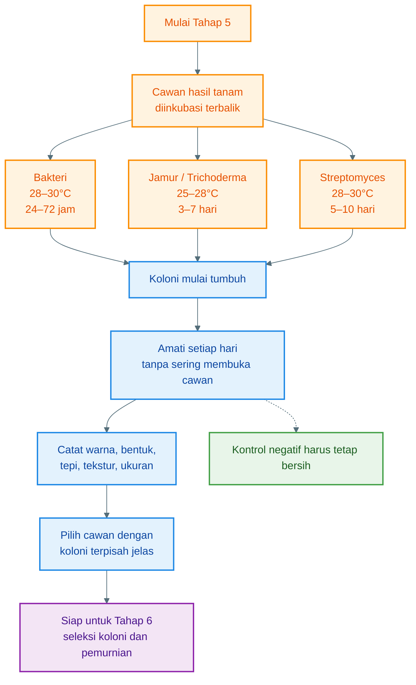

---

## 2. Posisi cawan saat inkubasi

Cawan petri sebaiknya diinkubasi dalam posisi **terbalik**.

Artinya:

```text
Bagian media agar berada di atas
Tutup cawan berada di bawah
```

Tujuannya:

- Mengurangi tetesan embun ke permukaan media
- Mencegah koloni menyebar karena air kondensasi
- Menjaga bentuk koloni tetap jelas
- Memudahkan pengamatan morfologi koloni

Namun, jika permukaan media masih terlalu basah setelah penanaman, tunggu beberapa menit sampai cairan terserap sebelum cawan dibalik.

---

## 3. Kondisi inkubasi untuk bakteri

Untuk bakteri calon PGPM dan APH, gunakan:

```text
Suhu       : 28–30°C
Waktu      : 24–72 jam
Media umum : NA, TSA, Pikovskaya, NBRIP, Aleksandrov, King's B
```

Pada 24 jam pertama, koloni bakteri cepat tumbuh biasanya mulai terlihat sebagai titik kecil.

Pada 48 jam, koloni lebih jelas.

Pada 72 jam, koloni biasanya sudah cukup besar untuk diamati dan dipilih.

Contoh hasil yang diharapkan:

| Media                          | Target                 | Tanda awal                                           |
| ------------------------------ | ---------------------- | ---------------------------------------------------- |
| NA / TSA                       | Bakteri umum           | Koloni bulat, krem, putih, kuning, atau bening       |
| Pikovskaya / NBRIP             | Bakteri pelarut fosfat | Koloni dengan zona bening                            |
| Aleksandrov                    | Bakteri pelarut kalium | Koloni dengan zona bening                            |
| King’s B                       | Pseudomonas            | Koloni halus, beberapa dapat fluoresen               |
| NA/TSA setelah perlakuan panas | Bacillus               | Koloni putih/krem, agak kering, tepi bisa tidak rata |

---

## 4. Kondisi inkubasi untuk jamur

Untuk jamur calon APH seperti Trichoderma, gunakan:

```text
Suhu       : 25–28°C
Waktu      : 3–7 hari
Media umum : PDA atau TSM
```

Jamur biasanya tumbuh lebih lambat dibanding bakteri, tetapi hifanya bisa menyebar lebih luas.

Ciri umum jamur:

- Muncul benang halus atau miselium
- Awalnya putih
- Bisa berubah warna menjadi hijau, abu-abu, hitam, kuning, atau cokelat
- Permukaan bisa seperti kapas, tepung, beludru, atau serbuk

Untuk Trichoderma, ciri awal yang sering dicari:

- Pertumbuhan cepat
- Miselium awal berwarna putih
- Setelah beberapa hari berubah hijau
- Permukaan seperti kapas lalu menjadi bertepung
- Tidak berbau busuk

---

## 5. Kondisi inkubasi untuk Streptomyces

Streptomyces termasuk kelompok bakteri berfilamen yang pertumbuhannya lebih lambat.

Gunakan:

```text
Suhu       : 28–30°C
Waktu      : 5–10 hari
Media umum : Starch Casein Agar
```

Ciri awal Streptomyces:

- Koloni kering
- Permukaan bertepung
- Warna putih, abu-abu, krem, atau cokelat muda
- Sering berbau tanah
- Tumbuh lebih lambat daripada bakteri biasa

Streptomyces menarik sebagai calon APH karena banyak isolatnya mampu menghasilkan senyawa antimikroba, tetapi tetap perlu uji keamanan dan uji fungsi.

---

## 6. Jangan membuka cawan terlalu sering

Selama inkubasi, cawan sebaiknya **tidak sering dibuka**.

Alasannya:

- Udara membawa spora jamur dan bakteri kontaminan
- Cawan bisa terkontaminasi
- Koloni asli bisa terganggu
- Risiko paparan mikroba meningkat
- Data menjadi tidak valid

Pengamatan awal cukup dilakukan dari luar cawan.

Jika perlu melihat lebih jelas, gunakan:

- Lampu dari samping
- Kaca pembesar
- Kamera ponsel
- Marker untuk menandai bagian bawah cawan

---

## 7. Pengamatan harian

Lakukan pengamatan setiap hari tanpa membuka cawan.

Catat:

| Hari         | Yang diamati                                          |
| ------------ | ----------------------------------------------------- |
| Hari ke-1    | Ada/tidaknya koloni bakteri cepat tumbuh              |
| Hari ke-2    | Bentuk, warna, jumlah, dan kepadatan koloni           |
| Hari ke-3    | Koloni bakteri matang, awal pertumbuhan jamur         |
| Hari ke-4–5  | Jamur dan Trichoderma mulai jelas                     |
| Hari ke-6–7  | Jamur lebih matang, warna spora terlihat              |
| Hari ke-8–10 | Streptomyces dan mikroba lambat tumbuh lebih terlihat |

Untuk bakteri umum, biasanya seleksi bisa mulai dilakukan setelah 24–72 jam.
Untuk jamur, seleksi biasanya mulai dilakukan setelah 3–7 hari.

---

## 8. Parameter koloni yang diamati

Amati morfologi koloni, yaitu ciri fisik koloni yang terlihat.

✓ A. Warna koloni

Catat warna utama koloni.

Contoh:

```text
Putih
Krem
Kuning
Oranye
Hijau
Abu-abu
Cokelat
Bening
```

Warna dapat membantu membedakan isolat, tetapi belum cukup untuk identifikasi.

---

✓ B. Bentuk koloni

Bentuk koloni bisa berupa:

```text
Bulat
Tidak beraturan
Berfilamen
Menyebar
Titik kecil
Bercabang
```

Koloni bakteri sering berbentuk bulat atau tidak beraturan.
Koloni jamur sering berfilamen atau menyebar seperti kapas.

---

✓ C. Tepi koloni

Tepi koloni dapat diamati sebagai:

```text
Rata
Bergelombang
Bergerigi
Bercabang
Berfilamen
```

Ciri tepi berguna untuk membedakan koloni yang tampak mirip.

---

✓ D. Elevasi koloni

Elevasi adalah bentuk permukaan koloni dari samping.

Contoh:

```text
Datar
Cembung
Timbul
Seperti kubah
Tidak rata
```

Koloni Bacillus sering tampak agak kering dan bisa tidak rata.
Koloni Pseudomonas sering tampak halus dan mengilap.

---

✓ E. Tekstur koloni

Tekstur koloni bisa berupa:

```text
Licin
Berlendir
Kering
Kasar
Bertepung
Seperti kapas
Beludru
```

Untuk APH jamur, tekstur sangat penting. Trichoderma sering tampak seperti kapas pada awalnya, lalu menjadi hijau bertepung.

---

✓ F. Ukuran koloni

Catat ukuran koloni secara sederhana:

```text
Kecil
Sedang
Besar
```

Atau lebih rapi dengan ukuran diameter:

```text
1 mm
2 mm
5 mm
10 mm
```

Ukuran membantu melihat kecepatan pertumbuhan.

---

## 9. Contoh format pencatatan koloni

Gunakan tabel sederhana.

| Kode cawan | Media      | Pengenceran | Hari | Ciri koloni dominan             | Catatan                |
| ---------- | ---------- | ----------: | ---: | ------------------------------- | ---------------------- |
| RZ-CB-01   | NA         |        10⁻⁵ |    2 | Koloni krem bulat, tepi rata    | Banyak koloni terpisah |
| RZ-CB-01   | Pikovskaya |        10⁻⁴ |    3 | Koloni kecil dengan zona bening | Calon pelarut fosfat   |
| KP-01      | PDA        |        10⁻³ |    4 | Jamur putih-hijau tumbuh cepat  | Calon Trichoderma      |
| RZ-CB-01   | King’s B   |        10⁻⁴ |    2 | Koloni halus kekuningan         | Perlu cek fluoresensi  |

---

## 10. Ciri cawan yang baik untuk seleksi

Cawan yang baik untuk tahap seleksi memiliki ciri:

- Koloni tumbuh terpisah
- Tidak terlalu padat
- Tidak tertutup jamur kontaminan menyebar
- Koloni punya bentuk yang jelas
- Media tidak terlalu basah
- Label lengkap
- Kontrol negatif tetap bersih

Cawan yang ideal biasanya berisi koloni yang cukup banyak tetapi masih dapat dipilih satu per satu.

Secara praktis, pilih cawan yang:

```text
Tidak kosong
Tidak terlalu padat
Koloni terpisah jelas
```

---

## 11. Ciri cawan yang kurang baik

Cawan kurang baik bila:

| Kondisi                           | Masalah                                             |
| --------------------------------- | --------------------------------------------------- |
| Semua permukaan penuh mikroba     | Pengenceran terlalu pekat                           |
| Koloni menyatu                    | Sulit dimurnikan                                    |
| Ada cairan mengalir               | Media terlalu basah                                 |
| Jamur cepat menutup seluruh cawan | Koloni lain tertutup                                |
| Kontrol negatif tumbuh mikroba    | Ada kontaminasi proses/media                        |
| Tidak ada koloni sama sekali      | Pengenceran terlalu encer atau mikroba tidak viabel |
| Label hilang/salah                | Data tidak bisa dipercaya                           |

Jika koloni terlalu padat, gunakan cawan dari pengenceran yang lebih tinggi, misalnya dari 10⁻⁵ atau 10⁻⁶.

Jika koloni terlalu sedikit, gunakan cawan dari pengenceran yang lebih rendah, misalnya 10⁻³ atau 10⁻⁴.

---

## 12. Pengamatan khusus pada media PGPM

✓ A. Media NA / TSA

Pada media ini, amati variasi koloni bakteri umum.

Koloni yang menarik untuk dipilih:

- Tumbuh terpisah
- Tidak berbau busuk
- Bentuk jelas
- Warna berbeda
- Tidak terlalu berlendir ekstrem
- Tumbuh stabil

Contoh calon isolat:

```text
Koloni krem bulat
Koloni putih kering
Koloni kuning halus
Koloni tidak beraturan tapi stabil
```

---

✓ B. Media Pikovskaya / NBRIP

Media ini digunakan untuk mencari bakteri pelarut fosfat.

Koloni yang menarik adalah koloni dengan:

```text
Zona bening di sekitar koloni
```

Catat:

- Diameter koloni
- Diameter zona bening
- Kejelasan zona bening
- Kecepatan munculnya zona bening

Contoh catatan:

```text
Koloni PSB-01:
Diameter koloni 3 mm
Diameter zona bening 8 mm
Zona jelas pada hari ke-3
```

Isolat dengan zona bening besar dan cepat muncul lebih menarik untuk diuji lanjut.

---

✓ C. Media Aleksandrov

Jika menggunakan media pelarut kalium, amati zona bening.

Koloni menarik:

- Tumbuh baik
- Ada zona bening
- Zona tidak terlalu samar
- Koloni mudah dipisahkan

---

✓ D. Media bebas nitrogen

Jika menggunakan media bebas nitrogen untuk calon penambat nitrogen, koloni yang tumbuh menunjukkan kemampuan awal untuk bertahan pada media tanpa nitrogen tambahan.

Namun, ini baru indikasi awal. Perlu uji lanjutan sebelum dinyatakan sebagai penambat nitrogen.

---

## 13. Pengamatan khusus pada media APH

✓ A. Calon Trichoderma pada PDA / TSM

Ciri yang dicari:

- Pertumbuhan cepat
- Awal putih
- Kemudian hijau
- Tepi pertumbuhan aktif
- Tidak berbau busuk
- Tidak berwarna hitam pekat menyebar cepat

Koloni Trichoderma biasanya mulai terlihat sebagai miselium putih, lalu bagian tengah atau permukaan berubah hijau karena pembentukan spora.

---

✓ B. Calon Bacillus pada NA / TSA

Ciri yang sering dijumpai:

- Koloni putih/krem
- Permukaan agak kering
- Tepi bisa rata atau bergelombang
- Tumbuh cepat
- Beberapa tampak kasar atau berkerut

Bacillus menarik sebagai APH karena banyak isolatnya tahan formulasi, mampu membentuk spora, dan mudah dikembangkan.

---

✓ C. Calon Pseudomonas pada King’s B

Ciri awal:

- Koloni halus
- Tumbuh dalam 24–48 jam
- Beberapa isolat menghasilkan pigmen fluoresen
- Dapat diamati di bawah UV bila fasilitas tersedia

Jangan membuka cawan sembarangan saat pengecekan. Gunakan pengamatan dari luar cawan.

---

✓ D. Calon Streptomyces

Ciri awal:

- Koloni kering
- Tampak seperti tepung
- Berbau tanah
- Tumbuh lambat
- Warna putih, krem, abu-abu, atau cokelat muda

Streptomyces biasanya perlu waktu inkubasi lebih panjang dibanding bakteri umum.

---

## 14. Keamanan saat inkubasi

Karena isolat belum diketahui identitasnya, perlakukan semua cawan sebagai bahan biologis yang perlu hati-hati.

Aturan aman:

1. Jangan menghirup langsung aroma dari cawan.
2. Jangan membuka cawan tanpa kebutuhan.
3. Jangan menyentuh koloni dengan tangan.
4. Jangan menyimpan cawan dekat makanan atau minuman.
5. Jangan membawa cawan ke area rumah tangga.
6. Gunakan sarung tangan saat memindahkan cawan.
7. Cawan yang tidak dipakai harus disterilkan sebelum dibuang.
8. Jika muncul koloni berbau busuk kuat, berlendir ekstrem, atau tampak mencurigakan, jangan dilanjutkan.

---

## 15. Kapan cawan siap masuk Tahap 6?

Cawan siap masuk Tahap 6 bila:

- Koloni sudah terlihat jelas
- Ada koloni yang terpisah
- Ciri koloni bisa dibedakan
- Cawan tidak terlalu penuh
- Kontrol negatif bersih
- Koloni target sudah cukup matang untuk dipindahkan

Waktu praktis:

| Target                 | Waktu mulai seleksi |
| ---------------------- | ------------------: |
| Bakteri umum           |           24–72 jam |
| Bakteri pelarut fosfat |            2–5 hari |
| Bacillus               |           24–72 jam |
| Pseudomonas            |           24–72 jam |
| Trichoderma            |            3–5 hari |
| Jamur umum             |            3–7 hari |
| Streptomyces           |           5–10 hari |

---

## 16. Kesalahan yang sering terjadi

| Kesalahan                                   | Akibat                                     |
| ------------------------------------------- | ------------------------------------------ |
| Suhu terlalu tinggi                         | Mikroba target stres atau mati             |
| Cawan tidak dibalik                         | Embun menetes dan koloni menyebar          |
| Cawan sering dibuka                         | Kontaminasi meningkat                      |
| Inkubasi terlalu lama                       | Koloni saling menutup                      |
| Tidak mencatat hari pengamatan              | Data seleksi tidak rapi                    |
| Cawan disimpan dekat sinar matahari         | Suhu tidak stabil                          |
| Kontrol negatif diabaikan                   | Kontaminasi tidak terdeteksi               |
| Semua jenis mikroba diinkubasi terlalu lama | Koloni cepat tumbuh menutupi koloni lambat |

---

## 17. Output tahap 5

Output tahap ini adalah:

```text
Cawan dengan koloni mikroba yang sudah tumbuh dan siap diseleksi
```

Contoh output:

| Kode cawan                   | Hasil                                              |
| ---------------------------- | -------------------------------------------------- |
| RZ-CB-01 / NA / 10⁻⁵         | Koloni bakteri terpisah, variasi krem-putih-kuning |
| RZ-CB-01 / Pikovskaya / 10⁻⁴ | Beberapa koloni membentuk zona bening              |
| KP-01 / PDA / 10⁻³           | Jamur putih-hijau tumbuh cepat, calon Trichoderma  |
| RZ-CB-01 / kontrol / NA      | Tidak ada pertumbuhan, kontrol bersih              |

---

✓ Ringkasan Tahap 5

**Cawan yang sudah ditanam → diinkubasi pada suhu sesuai target → diamati tanpa sering dibuka → dicatat warna, bentuk, tepi, ukuran, tekstur, dan jumlah koloni → pilih cawan dengan koloni terpisah untuk tahap pemurnian.**

---

# Tahap 6: Seleksi Koloni dan Pemurnian

## Tujuan tahap ini

Tahap 6 bertujuan **memilih koloni mikroba yang potensial**, lalu memindahkannya ke media baru sampai diperoleh **isolat murni**.

**Isolat murni** adalah kultur mikroba yang berasal dari satu koloni terpisah dan memiliki ciri pertumbuhan yang seragam.

Pada tahap sebelumnya, cawan hasil inkubasi masih berisi campuran berbagai mikroba. Di tahap ini kita mulai memilih koloni terbaik untuk dikembangkan lebih lanjut sebagai:

- **PGPM**: mikroba pemacu pertumbuhan tanaman
- **APH**: agen pengendali hayati


---

## 1. Prinsip dasar seleksi dan pemurnian

Alurnya:

```text
Cawan hasil inkubasi
↓
Pilih koloni yang berbeda dan terpisah
↓
Ambil satu koloni dengan ose steril
↓
Goreskan ke media baru
↓
Inkubasi
↓
Pilih koloni tunggal yang seragam
↓
Ulangi 2–3 kali
↓
Diperoleh isolat murni
```

Tujuan utamanya bukan langsung memperbanyak mikroba, tetapi **memisahkan satu jenis mikroba dari campuran mikroba lain**.

---

✓ **Diagram Tahap 6 — Seleksi Koloni dan Pemurnian**

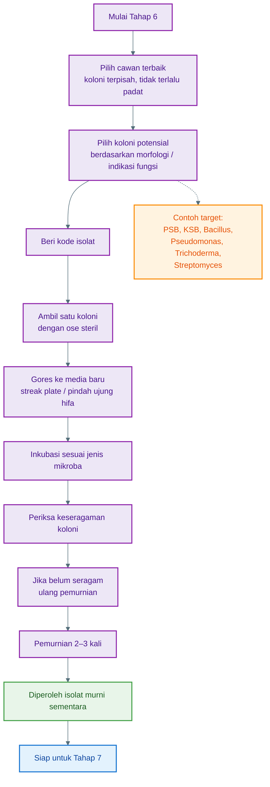

---

## 2. Definisi istilah penting

| Istilah              | Arti                                                                      |
| -------------------- | ------------------------------------------------------------------------- |
| **Koloni**           | Kumpulan mikroba yang tumbuh pada satu titik di media agar                |
| **Isolat**           | Mikroba yang sudah dipisahkan dari campuran                               |
| **Isolat murni**     | Isolat yang ciri koloninya seragam dan tidak tercampur mikroba lain       |
| **Ose**              | Jarum/kawat kecil untuk mengambil dan menggores mikroba                   |
| **Streak plate**     | Teknik menggores mikroba pada media agar untuk mendapatkan koloni tunggal |
| **Koloni tunggal**   | Koloni yang tumbuh terpisah dari koloni lain                              |
| **Morfologi koloni** | Ciri fisik koloni, seperti warna, bentuk, tepi, tekstur, dan ukuran       |

---

## 3. Alat dan bahan

Siapkan:

| Alat/Bahan                            | Fungsi                          |
| ------------------------------------- | ------------------------------- |
| Cawan hasil inkubasi                  | Sumber koloni yang akan dipilih |
| Cawan media baru                      | Tempat pemurnian isolat         |
| Ose steril / jarum inokulasi steril   | Mengambil dan menggores koloni  |
| Spidol permanen                       | Memberi kode isolat             |
| Alkohol 70%                           | Membersihkan area kerja         |
| Bunsen / spiritus / area kerja bersih | Membantu menjaga kondisi steril |
| Sarung tangan                         | Melindungi pekerja dan sampel   |
| Parafilm/plastik wrap laboratorium    | Menutup cawan bila diperlukan   |
| Buku catatan isolat                   | Mencatat ciri dan asal koloni   |

---

## 4. Memilih cawan yang layak untuk seleksi

Jangan semua cawan langsung dipakai. Pilih cawan yang paling rapi.

Cawan yang layak:

- Koloni tumbuh terpisah
- Tidak terlalu padat
- Tidak tertutup jamur menyebar
- Tidak ada kontaminasi ekstrem
- Label lengkap
- Media tidak terlalu basah
- Kontrol negatif bersih

Cawan yang kurang layak:

- Koloni terlalu padat dan menyatu
- Seluruh permukaan tertutup mikroba
- Banyak cairan mengalir
- Ada bau busuk kuat
- Ada koloni berlendir ekstrem
- Kontrol negatif ikut tumbuh mikroba
- Label tidak jelas

Jika cawan terlalu padat, pilih cawan dari pengenceran lebih tinggi, misalnya **10⁻⁵ atau 10⁻⁶**.

---

## 5. Kriteria koloni yang dipilih

Koloni dipilih berdasarkan **perbedaan morfologi** dan **indikasi fungsi**.

✓ A. Ciri morfologi koloni

Amati:

| Ciri             | Contoh                              |
| ---------------- | ----------------------------------- |
| Warna            | putih, krem, kuning, hijau, abu-abu |
| Bentuk           | bulat, tidak beraturan, menyebar    |
| Tepi             | rata, bergelombang, bergerigi       |
| Permukaan        | halus, kasar, berkerut, bertepung   |
| Elevasi          | datar, cembung, timbul              |
| Ukuran           | kecil, sedang, besar                |
| Kecepatan tumbuh | cepat, sedang, lambat               |
| Tekstur          | kering, licin, kapas, tepung        |

Pilih beberapa koloni yang berbeda agar keragaman isolat tetap terjaga.

---

## 6. Kriteria koloni untuk PGPM

Untuk calon **PGPM**, pilih koloni dengan ciri berikut.

✓ A. Dari media NA / TSA

Media ini untuk bakteri umum.

Pilih koloni yang:

- Tumbuh terpisah
- Tidak berbau busuk
- Bentuk jelas
- Warna berbeda-beda
- Mudah dipindahkan
- Tidak menyebar terlalu liar

Contoh pilihan:

```text
PGPM-01: koloni krem, bulat, tepi rata
PGPM-02: koloni putih, agak kering, tepi bergelombang
PGPM-03: koloni kuning muda, halus, cembung
```

---

✓ B. Dari media Pikovskaya / NBRIP

Media ini untuk mencari **bakteri pelarut fosfat**.

Pilih koloni yang memiliki:

```text
Zona bening di sekitar koloni
```

Prioritas seleksi:

1. Zona bening jelas
2. Zona bening besar
3. Koloni tumbuh stabil
4. Koloni terpisah dari koloni lain
5. Zona muncul cepat

Contoh kode:

```text
PSB-01: koloni putih, zona bening jelas
PSB-02: koloni krem, zona bening sedang
PSB-03: koloni kecil, zona bening besar
```

**PSB** adalah _Phosphate Solubilizing Bacteria_, yaitu bakteri pelarut fosfat.

---

✓ C. Dari media pelarut kalium

Jika menggunakan media pelarut kalium, misalnya Aleksandrov Agar, pilih koloni dengan zona bening.

Contoh kode:

```text
KSB-01
KSB-02
KSB-03
```

**KSB** adalah _Potassium Solubilizing Bacteria_, yaitu bakteri pelarut kalium.

---

## 7. Kriteria koloni untuk APH

Untuk calon **APH**, pilih koloni yang berpotensi menekan patogen tanaman.

✓ A. Calon Trichoderma

Dari media **PDA** atau **TSM**, pilih koloni jamur dengan ciri:

- Tumbuh cepat
- Awalnya putih
- Kemudian berubah hijau
- Tepi pertumbuhan aktif
- Tekstur seperti kapas lalu bertepung
- Tidak berbau busuk

Contoh kode:

```text
TRI-01
TRI-02
TRI-03
```

Catatan: Trichoderma sebaiknya dimurnikan dari **bagian tepi koloni yang masih aktif tumbuh**, bukan dari bagian tengah yang terlalu tua.

---

✓ B. Calon Bacillus

Dari media **NA** atau **TSA**, pilih koloni bakteri dengan ciri:

- Putih, krem, atau kekuningan
- Agak kering
- Bisa berkerut
- Tepi bisa bergelombang
- Tumbuh cukup cepat

Contoh kode:

```text
BAC-01
BAC-02
BAC-03
```

Bacillus menarik sebagai APH karena banyak jenisnya mampu membentuk spora dan relatif tahan dalam formulasi.

---

✓ C. Calon Pseudomonas

Dari media **King’s B**, pilih koloni dengan ciri:

- Halus
- Licin
- Tumbuh cepat
- Beberapa menunjukkan warna fluoresen kehijauan di bawah lampu UV

Contoh kode:

```text
PSE-01
PSE-02
PSE-03
```

---

✓ D. Calon Streptomyces

Dari media **Starch Casein Agar**, pilih koloni dengan ciri:

- Kering
- Bertepung
- Tumbuh lambat
- Warna putih, krem, abu-abu, atau cokelat muda
- Bau seperti tanah, bukan bau busuk

Contoh kode:

```text
STR-01
STR-02
STR-03
```

---

## 8. Koloni yang sebaiknya tidak dilanjutkan

Jangan lanjutkan koloni yang:

- Berbau busuk menyengat
- Berlendir ekstrem
- Menyebar sangat invasif sampai menutup semua media
- Berasal dari cawan kontrol negatif yang terkontaminasi
- Tumbuh dari sumber sampel berisiko
- Menunjukkan warna dan bau mencurigakan
- Sulit dikendalikan saat dipindahkan
- Menyebabkan media cepat rusak atau cair

Untuk pekerjaan pertanian, lebih baik memilih isolat yang **stabil, aman, dan mudah dikultur**, bukan hanya yang tumbuh paling cepat.

---

## 9. Pemberian kode isolat

Setiap koloni yang dipilih harus langsung diberi kode.

Format kode sederhana:

```text
Jenis target - sumber - nomor isolat
```

Contoh:

| Kode       | Arti                                               |
| ---------- | -------------------------------------------------- |
| PGPM-RZ-01 | Calon PGPM dari rizosfer nomor 1                   |
| PSB-RZ-01  | Bakteri pelarut fosfat dari rizosfer nomor 1       |
| KSB-RZ-01  | Bakteri pelarut kalium dari rizosfer nomor 1       |
| TRI-KP-01  | Calon Trichoderma dari kompos nomor 1              |
| BAC-RZ-01  | Calon Bacillus dari rizosfer nomor 1               |
| PSE-RZ-01  | Calon Pseudomonas dari rizosfer nomor 1            |
| STR-RZ-01  | Calon Streptomyces dari rizosfer nomor 1           |
| APH-RZ-01  | Calon agen pengendali hayati dari rizosfer nomor 1 |

Kode harus dicatat sejak awal agar isolat tidak tertukar.

---

## 10. Cara pemurnian bakteri dengan metode gores

Metode ini digunakan untuk bakteri seperti PGPM umum, PSB, KSB, Bacillus, Pseudomonas, dan Streptomyces muda.

✓ Langkah kerja

✓ Langkah 1 — Siapkan media baru

Gunakan media sesuai asal isolat.

Contoh:

| Asal koloni                    | Media pemurnian    |
| ------------------------------ | ------------------ |
| Koloni dari NA                 | NA baru            |
| Koloni dari TSA                | TSA baru           |
| Koloni dari Pikovskaya         | Pikovskaya atau NA |
| Koloni dari NBRIP              | NBRIP atau NA      |
| Koloni dari King’s B           | King’s B atau NA   |
| Koloni dari Starch Casein Agar | Starch Casein Agar |

Untuk pemurnian awal, sebaiknya gunakan media yang sama dengan media asal agar isolat tidak stres.

---

✓ Langkah 2 — Labeli cawan baru

Contoh label:

```text
PSB-RZ-01 / Purifikasi 1 / Pikovskaya / Tanggal
```

Atau lebih singkat:

```text
PSB-RZ-01 / P1 / 12-05-2026
```

Keterangan:

- **P1** = pemurnian pertama
- **P2** = pemurnian kedua
- **P3** = pemurnian ketiga

---

✓ Langkah 3 — Ambil satu koloni terpisah

Buka cawan sebentar saja.

Ambil satu koloni target menggunakan ose steril.

Ambil dari koloni yang:

- Terpisah
- Tidak menyentuh koloni lain
- Ciri morfologinya jelas
- Tidak tercampur koloni lain

Jangan mengambil bagian koloni yang menempel dengan koloni lain.

---

✓ Langkah 4 — Goreskan ke media baru

Goreskan ose pada media baru dengan pola kuadran atau zigzag.

Contoh pola sederhana:

```text
Area 1: gores rapat
Area 2: tarik dari area 1, gores lebih renggang
Area 3: tarik dari area 2, gores lebih renggang
Area 4: tarik dari area 3, gores paling renggang
```

Tujuan pola ini adalah membuat jumlah mikroba semakin berkurang pada setiap area, sehingga muncul koloni tunggal.

---

✓ Langkah 5 — Inkubasi

Inkubasi sesuai jenis mikroba:

| Mikroba      |    Suhu |     Waktu |
| ------------ | ------: | --------: |
| Bakteri umum | 28–30°C | 24–72 jam |
| PSB / KSB    | 28–30°C |  2–5 hari |
| Bacillus     | 28–30°C | 24–72 jam |
| Pseudomonas  | 28–30°C | 24–72 jam |
| Streptomyces | 28–30°C | 5–10 hari |

---

✓ Langkah 6 — Periksa keseragaman

Setelah tumbuh, amati:

- Apakah bentuk koloni seragam?
- Apakah warna koloni sama?
- Apakah teksturnya sama?
- Apakah masih ada koloni berbeda?
- Apakah ada kontaminasi jamur atau bakteri lain?

Jika masih ada koloni berbeda, lakukan pemurnian ulang.

---

## 11. Cara pemurnian jamur / Trichoderma

Untuk jamur, terutama Trichoderma, tekniknya sedikit berbeda.

✓ Langkah kerja

✓ Langkah 1 — Pilih bagian tepi koloni

Ambil dari bagian tepi koloni yang masih aktif tumbuh.

Bagian tepi biasanya lebih muda dan lebih bersih daripada bagian tengah.

---

✓ Langkah 2 — Ambil potongan kecil miselium

Gunakan jarum steril atau ose steril.

Ambil potongan kecil dari ujung hifa atau bagian tepi miselium.

**Miselium** adalah benang-benang halus penyusun tubuh jamur.

---

✓ Langkah 3 — Pindahkan ke PDA atau TSM baru

Letakkan potongan kecil tersebut di bagian tengah media baru.

Gunakan media:

```text
PDA untuk jamur umum
TSM untuk Trichoderma bila tersedia
```

---

✓ Langkah 4 — Inkubasi

Inkubasi pada:

```text
25–28°C selama 3–5 hari
```

Untuk jamur tertentu bisa sampai 7 hari.

---

✓ Langkah 5 — Ulangi sampai seragam

Jika masih ada jamur lain atau bakteri ikut tumbuh, ulangi pemindahan dari tepi koloni yang paling bersih.

Biasanya perlu:

```text
2–3 kali pemurnian
```

---

## 12. Tanda isolat sudah murni

Isolat dianggap murni sementara bila:

- Koloni terlihat seragam
- Warna koloni sama
- Bentuk koloni sama
- Tepi koloni sama
- Tekstur koloni sama
- Tidak ada koloni lain yang berbeda
- Saat digores ulang, hasilnya tetap seragam
- Tidak muncul kontaminan pada media baru

Untuk kepastian lebih kuat, isolat perlu diuji lanjut secara mikroskopis atau molekuler, tetapi untuk tahap seleksi awal, keseragaman koloni sudah cukup sebagai dasar kerja berikutnya.

---

## 13. Berapa kali pemurnian perlu dilakukan?

Rekomendasi praktis:

```text
Pemurnian 1: mengambil koloni target dari cawan campuran
Pemurnian 2: mengambil koloni tunggal dari hasil pemurnian 1
Pemurnian 3: konfirmasi keseragaman isolat
```

Jadi minimal lakukan **2 kali**, idealnya **3 kali**.

Kode pencatatan:

| Tahap             | Kode |
| ----------------- | ---- |
| Pemurnian pertama | P1   |
| Pemurnian kedua   | P2   |
| Pemurnian ketiga  | P3   |

Contoh:

```text
PSB-RZ-01-P1
PSB-RZ-01-P2
PSB-RZ-01-P3
```

---

## 14. Pencatatan morfologi isolat

Setiap isolat harus dicatat.

Format catatan:

| Parameter        | Contoh catatan |
| ---------------- | -------------- |
| Kode isolat      | PSB-RZ-01      |
| Asal sampel      | Rizosfer cabai |
| Media asal       | Pikovskaya     |
| Pengenceran asal | 10⁻⁴           |
| Warna koloni     | Krem           |
| Bentuk           | Bulat          |
| Tepi             | Rata           |
| Permukaan        | Halus          |
| Elevasi          | Cembung        |
| Zona bening      | Ada            |
| Tanggal isolasi  | 12-05-2026     |
| Status           | Pemurnian ke-2 |

---

## 15. Contoh tabel seleksi koloni

| Kode isolat | Target         | Media asal | Ciri utama                | Alasan dipilih             |
| ----------- | -------------- | ---------- | ------------------------- | -------------------------- |
| PGPM-RZ-01  | PGPM umum      | NA         | Krem, bulat, halus        | Koloni terpisah dan stabil |
| PSB-RZ-01   | Pelarut fosfat | Pikovskaya | Krem, zona bening         | Indikasi pelarut fosfat    |
| BAC-RZ-01   | APH bakteri    | NA         | Putih, kering, berkerut   | Calon Bacillus             |
| TRI-KP-01   | APH jamur      | PDA        | Putih-hijau, cepat tumbuh | Calon Trichoderma          |
| PSE-RZ-01   | APH/PGPM       | King’s B   | Halus, fluoresen          | Calon Pseudomonas          |
| STR-RZ-01   | APH            | SCA        | Kering, bertepung         | Calon Streptomyces         |

---

## 16. Kesalahan yang sering terjadi

| Kesalahan                                         | Akibat                                            |
| ------------------------------------------------- | ------------------------------------------------- |
| Mengambil koloni yang menempel dengan koloni lain | Isolat tidak murni                                |
| Tidak mengganti atau mensterilkan ose             | Kontaminasi silang                                |
| Tidak memberi kode sejak awal                     | Isolat tertukar                                   |
| Mengambil jamur dari bagian yang terlalu tua      | Kontaminasi lebih tinggi                          |
| Tidak mengulang pemurnian                         | Isolat masih campuran                             |
| Membuka cawan terlalu lama                        | Kontaminasi udara                                 |
| Memilih koloni hanya karena tumbuh cepat          | Bisa kehilangan isolat penting yang tumbuh lambat |
| Tidak mencatat media asal                         | Sulit menelusuri fungsi isolat                    |
| Mengabaikan koloni dengan zona bening             | Calon PGPM potensial terlewat                     |

---

## 17. Keamanan kerja

Karena identitas isolat belum pasti, lakukan prinsip aman berikut:

1. Jangan mencium koloni secara langsung.
2. Jangan menyentuh koloni dengan tangan.
3. Jangan membuka cawan terlalu lama.
4. Gunakan sarung tangan.
5. Kerjakan di area bersih.
6. Jangan membawa kultur ke area makan/minum.
7. Jangan melanjutkan isolat yang berbau busuk kuat.
8. Sterilkan limbah sebelum dibuang.
9. Simpan cawan dalam wadah tertutup.
10. Beri label “kultur mikroba” agar tidak disalahgunakan.

---

## 18. Output tahap 6

Hasil akhir Tahap 6 adalah **isolat murni sementara** yang siap diuji fungsinya.

Output yang diharapkan:

| Output                      | Keterangan                       |
| --------------------------- | -------------------------------- |
| Isolat PGPM murni sementara | Calon mikroba pemacu pertumbuhan |
| Isolat PSB                  | Calon bakteri pelarut fosfat     |
| Isolat KSB                  | Calon bakteri pelarut kalium     |
| Isolat Bacillus             | Calon APH dan PGPM               |
| Isolat Pseudomonas          | Calon APH dan PGPM               |
| Isolat Trichoderma          | Calon APH jamur                  |
| Isolat Streptomyces         | Calon APH bakteri berfilamen     |
| Catatan morfologi isolat    | Data dasar tiap isolat           |

---

✓ Ringkasan Tahap 6

**Pilih cawan dengan koloni terpisah → amati morfologi koloni → pilih koloni potensial → beri kode → ambil satu koloni dengan ose steril → gores ke media baru → inkubasi → ulangi 2–3 kali sampai koloni seragam.**

---

# Tahap 7: Uji Fungsi PGPM dan APH

## Tujuan tahap ini

Tahap 7 bertujuan **menguji apakah isolat yang sudah dimurnikan benar-benar memiliki fungsi bermanfaat**.

Pada Tahap 6, kita baru mendapatkan isolat yang tampak murni. Namun, isolat murni belum tentu berguna. Karena itu, perlu dilakukan uji fungsi.

Fokus uji dibagi menjadi dua kelompok:

1. **Uji fungsi PGPM**
   Untuk mengetahui kemampuan isolat dalam mendukung pertumbuhan tanaman.

2. **Uji fungsi APH**
   Untuk mengetahui kemampuan isolat dalam menekan patogen penyebab penyakit tanaman.


---

## 1. Definisi istilah penting

| Istilah             | Arti                                                                               |
| ------------------- | ---------------------------------------------------------------------------------- |
| **PGPM**            | _Plant Growth Promoting Microorganisms_, mikroba pemacu pertumbuhan tanaman        |
| **APH**             | Agen Pengendali Hayati, mikroba yang membantu menekan patogen tanaman              |
| **Patogen tanaman** | Mikroba penyebab penyakit pada tanaman                                             |
| **Antagonis**       | Mikroba yang mampu menghambat mikroba lain                                         |
| **Zona bening**     | Area jernih di sekitar koloni, tanda aktivitas pelarutan atau hambatan             |
| **Zona hambat**     | Area terhambatnya pertumbuhan patogen                                              |
| **IAA**             | _Indole-3-Acetic Acid_, hormon auksin alami yang dapat merangsang pertumbuhan akar |
| **Siderofor**       | Senyawa pengikat besi yang membantu mikroba bersaing dan dapat menekan patogen     |
| **Vigor benih**     | Kekuatan tumbuh benih, dilihat dari panjang akar, tunas, dan persentase kecambah   |

---

## 2. Prinsip seleksi fungsi

Jangan langsung memakai isolat ke tanaman luas.

Urutannya harus:

```text
Isolat murni
↓
Uji fungsi di laboratorium
↓
Uji keamanan sederhana pada benih
↓
Uji pot kecil
↓
Seleksi isolat terbaik
↓
Baru dipertimbangkan untuk formulasi
```

Isolat yang baik harus memenuhi tiga syarat utama:

```text
Aman
Stabil
Memberi efek positif
```

---

✓ **Diagram Tahap 7 — Uji Fungsi PGPM dan APH**

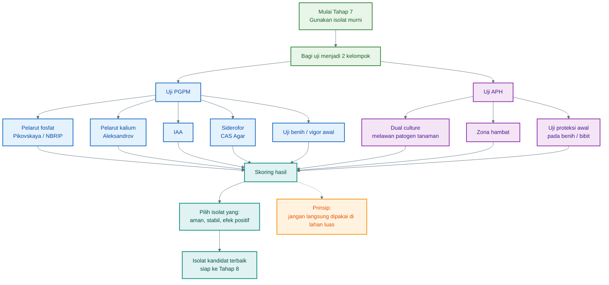

---

## 3. Uji fungsi utama untuk PGPM

PGPM diuji berdasarkan kemampuan meningkatkan pertumbuhan tanaman.

Uji awal yang disarankan:

| Fungsi PGPM            | Uji yang dilakukan                          | Indikator positif                  |
| ---------------------- | ------------------------------------------- | ---------------------------------- |
| Pelarut fosfat         | Media Pikovskaya / NBRIP                    | Zona bening                        |
| Pelarut kalium         | Media Aleksandrov                           | Zona bening                        |
| Penghasil IAA          | Media cair + L-triptofan + reagen Salkowski | Warna merah muda                   |
| Penghasil siderofor    | Media CAS                                   | Zona oranye/kuning                 |
| Penambat nitrogen awal | Media tanpa nitrogen                        | Isolat mampu tumbuh                |
| Pemacu vigor benih     | Uji perkecambahan                           | Akar/tunas lebih baik dari kontrol |

---

## 4. Uji pelarut fosfat

- Tujuan

Mengetahui apakah isolat mampu melarutkan fosfat tidak larut menjadi bentuk yang lebih tersedia bagi tanaman.

- Media

Gunakan salah satu:

```text
Pikovskaya Agar
NBRIP Agar
```

- Langkah kerja

1. Siapkan isolat murni.
2. Gores atau totol isolat pada media Pikovskaya atau NBRIP.
3. Inkubasi pada suhu **28–30°C**.
4. Amati selama **2–5 hari**.
5. Lihat apakah muncul zona bening di sekitar koloni.

- Indikator positif

Isolat positif bila muncul:

```text
Zona bening di sekitar koloni
```

Semakin besar dan semakin jelas zona bening, semakin menarik isolat tersebut untuk diuji lanjut.

- Data yang dicatat

| Parameter            | Keterangan                  |
| -------------------- | --------------------------- |
| Kode isolat          | Misalnya PSB-RZ-01          |
| Diameter koloni      | Ukuran koloni               |
| Diameter zona bening | Ukuran zona bening + koloni |
| Hari muncul zona     | Hari ke-2, ke-3, dst.       |
| Kejelasan zona       | samar, sedang, jelas        |

- Skor praktis

| Hasil                       | Skor |
| --------------------------- | ---: |
| Tidak ada zona bening       |    0 |
| Zona bening samar           |    1 |
| Zona bening sedang          |    2 |
| Zona bening jelas dan besar |    3 |

---

## 5. Uji pelarut kalium

- Tujuan

Mengetahui apakah isolat mampu membantu melarutkan kalium dari mineral tidak larut.

- Media

Gunakan:

```text
Aleksandrov Agar
```

- Langkah kerja

1. Totol isolat murni pada media Aleksandrov.
2. Inkubasi pada suhu **28–30°C**.
3. Amati selama **3–7 hari**.
4. Lihat apakah terbentuk zona bening.

- Indikator positif

```text
Koloni tumbuh + ada zona bening di sekitar koloni
```

- Catatan seleksi

Pilih isolat yang:

- Zona bening jelas
- Tumbuh stabil
- Tidak berubah morfologi saat dimurnikan ulang
- Tidak menghambat perkecambahan benih

---

## 6. Uji penghasil IAA

- Tujuan

Mengetahui apakah isolat mampu menghasilkan senyawa mirip hormon auksin yang dapat membantu pertumbuhan akar.

**IAA** adalah _Indole-3-Acetic Acid_, salah satu bentuk auksin.

- Prinsip uji

Isolat ditumbuhkan pada media cair yang diberi **L-triptofan**.
Jika isolat menghasilkan IAA, setelah ditambah reagen Salkowski akan muncul warna merah muda sampai kemerahan.

- Bahan umum

| Bahan                                            | Fungsi                    |
| ------------------------------------------------ | ------------------------- |
| Media cair Nutrient Broth atau Tryptic Soy Broth | Menumbuhkan bakteri       |
| L-triptofan                                      | Prekursor pembentukan IAA |
| Reagen Salkowski                                 | Indikator perubahan warna |
| Tabung reaksi                                    | Wadah uji                 |
| Isolat murni                                     | Mikroba yang diuji        |

- Langkah kerja sederhana

1. Masukkan isolat ke media cair yang mengandung L-triptofan.
2. Inkubasi pada suhu **28–30°C** selama **24–72 jam**.
3. Ambil cairan kultur bagian atas atau filtratnya.
4. Tambahkan reagen Salkowski.
5. Diamkan beberapa menit di tempat tidak terkena cahaya langsung.
6. Amati perubahan warna.

- Indikator positif

| Warna            | Interpretasi               |
| ---------------- | -------------------------- |
| Tidak berubah    | Negatif atau sangat rendah |
| Merah muda pucat | Positif lemah              |
| Merah muda jelas | Positif sedang             |
| Merah kemerahan  | Positif kuat               |

- Catatan penting

Isolat penghasil IAA tinggi belum tentu selalu terbaik. IAA yang terlalu tinggi dapat mengganggu pertumbuhan akar. Karena itu, hasil uji IAA harus dikonfirmasi dengan **uji benih** atau **uji pot kecil**.

---

## 7. Uji siderofor

- Tujuan

Mengetahui apakah isolat mampu menghasilkan siderofor, yaitu senyawa yang mengikat besi.

Siderofor penting karena:

- Membantu mikroba memperoleh unsur besi
- Membantu mikroba bersaing di sekitar akar
- Dapat menekan patogen karena patogen kekurangan besi
- Mendukung fungsi PGPM dan APH

- Media

Gunakan:

```text
CAS Agar
```

**CAS** adalah _Chrome Azurol S Agar_, media indikator untuk siderofor.

- Langkah kerja

1. Totol isolat pada CAS Agar.
2. Inkubasi pada suhu **28–30°C**.
3. Amati selama **2–5 hari**.
4. Perhatikan perubahan warna di sekitar koloni.

- Indikator positif

Isolat positif bila muncul:

```text
Zona oranye / kuning di sekitar koloni
```

- Skor praktis

| Hasil                      | Skor |
| -------------------------- | ---: |
| Tidak ada perubahan warna  |    0 |
| Zona oranye kecil          |    1 |
| Zona oranye sedang         |    2 |
| Zona oranye jelas dan luas |    3 |

---

## 8. Uji kemampuan tumbuh pada media tanpa nitrogen

- Tujuan

Menyeleksi awal isolat yang berpotensi berperan dalam siklus nitrogen.

- Media

Gunakan media tanpa nitrogen, misalnya:

```text
Ashby
N-free malate
JNFb
```

- Langkah kerja

1. Inokulasikan isolat ke media tanpa nitrogen.
2. Inkubasi pada suhu **28–30°C**.
3. Amati pertumbuhan selama **2–7 hari**.
4. Bandingkan dengan kontrol tanpa isolat.

- Indikator awal positif

```text
Isolat mampu tumbuh pada media tanpa nitrogen
```

- Catatan penting

Kemampuan tumbuh pada media tanpa nitrogen **belum cukup untuk menyatakan isolat sebagai penambat nitrogen kuat**. Itu baru indikasi awal. Perlu uji lanjutan untuk memastikan fungsinya.

---

## 9. Uji vigor benih untuk PGPM

- Tujuan

Mengetahui apakah isolat memberi efek positif, netral, atau negatif terhadap perkecambahan dan pertumbuhan awal tanaman.

Ini uji yang sangat penting karena isolat yang bagus di media laboratorium belum tentu bagus untuk tanaman.

- Bahan

| Bahan                                      | Fungsi              |
| ------------------------------------------ | ------------------- |
| Benih sehat dan seragam                    | Bahan uji           |
| Isolat murni                               | Perlakuan           |
| Air steril / NaCl steril                   | Kontrol             |
| Tisu steril / kertas merang / kapas steril | Media perkecambahan |
| Wadah steril                               | Tempat uji          |
| Label                                      | Identitas perlakuan |

- Perlakuan minimal

Gunakan minimal dua perlakuan:

```text
Kontrol       : benih tanpa isolat
Perlakuan 1   : benih + isolat PGPM
```

Lebih baik jika ada beberapa isolat:

```text
Kontrol
PGPM-01
PGPM-02
PGPM-03
PSB-01
BAC-01
PSE-01
```

- Langkah kerja

1. Pilih benih yang ukurannya seragam.
2. Rendam atau perlakukan benih dengan suspensi isolat.
3. Susun benih di atas media perkecambahan lembap.
4. Inkubasi pada kondisi sesuai kebutuhan benih.
5. Amati selama beberapa hari.
6. Catat persentase kecambah, panjang akar, panjang tunas, dan kondisi bibit.

- Data yang dicatat

| Parameter           | Keterangan                 |
| ------------------- | -------------------------- |
| Persentase kecambah | Berapa persen benih tumbuh |
| Panjang akar        | Indikator efek pada akar   |
| Panjang tunas       | Indikator pertumbuhan awal |
| Jumlah akar lateral | Indikator stimulasi akar   |
| Warna kecambah      | Sehat atau pucat           |
| Gejala busuk        | Ada atau tidak             |
| Vigor umum          | Lemah, sedang, kuat        |

- Interpretasi

| Hasil                             | Keputusan                              |
| --------------------------------- | -------------------------------------- |
| Kecambah lebih baik dari kontrol  | Isolat layak lanjut                    |
| Sama dengan kontrol               | Isolat netral, masih bisa diuji lanjut |
| Kecambah lebih buruk dari kontrol | Isolat tidak diprioritaskan            |
| Muncul busuk benih/akar           | Isolat dihentikan                      |

---

## 10. Uji fungsi utama untuk APH

APH diuji berdasarkan kemampuannya menekan patogen tanaman.

Uji awal yang disarankan:

| Fungsi APH              | Uji yang dilakukan                        | Indikator positif                           |
| ----------------------- | ----------------------------------------- | ------------------------------------------- |
| Antagonis jamur patogen | Dual culture                              | Pertumbuhan patogen terhambat               |
| Antibiosis bakteri      | Zona hambat                               | Ada area hambatan                           |
| Kompetisi ruang         | Pertumbuhan APH cepat dan menekan patogen |                                             |
| Mikoparasitisme         | APH tumbuh menutupi patogen               | Perlu pengamatan lanjut                     |
| Proteksi awal tanaman   | Uji benih/pot kecil                       | Tanaman lebih sehat dibanding kontrol sakit |

---

## 11. Uji antagonis APH dengan metode dual culture

- Tujuan

Mengetahui apakah isolat APH mampu menghambat pertumbuhan patogen tanaman pada media agar.

Uji ini umum digunakan untuk calon APH seperti:

- Trichoderma
- Bacillus
- Pseudomonas
- Streptomyces
- Yeast antagonis

- Catatan keamanan

Gunakan hanya **patogen tanaman** yang jelas asal-usulnya dan ditangani di laboratorium yang sesuai. Jangan menggunakan mikroba dari manusia, hewan, feses, limbah medis, atau sumber berisiko.

---

✓ A. Dual culture untuk Trichoderma melawan jamur patogen

- Media

Biasanya menggunakan:

```text
PDA
```

- Prinsip

APH dan patogen ditumbuhkan pada satu cawan yang sama, tetapi ditempatkan berhadapan. Lalu diamati apakah APH mampu menghambat pertumbuhan patogen.

- Langkah kerja umum

1. Siapkan cawan PDA baru.
2. Letakkan potongan kecil patogen tanaman di satu sisi cawan.
3. Letakkan potongan kecil calon APH di sisi berlawanan.
4. Jarak antar keduanya dibuat cukup agar pertumbuhan dapat diamati.
5. Inkubasi pada suhu **25–28°C**.
6. Amati pertumbuhan setiap hari.
7. Bandingkan dengan kontrol patogen tanpa APH.

- Indikator positif

Isolat APH dianggap potensial bila:

- Pertumbuhan patogen lebih lambat dibanding kontrol
- Ada zona hambat antara APH dan patogen
- APH tumbuh mendekati atau menutupi patogen
- Patogen berubah warna, menipis, atau berhenti tumbuh
- Diameter patogen lebih kecil dibanding kontrol

---

## 12. Rumus persentase hambatan patogen

Gunakan rumus:

```text
% hambatan = [(R1 - R2) / R1] × 100
```

Keterangan:

| Simbol | Arti                                                    |
| ------ | ------------------------------------------------------- |
| **R1** | Jari-jari pertumbuhan patogen pada kontrol tanpa APH    |
| **R2** | Jari-jari pertumbuhan patogen pada perlakuan dengan APH |

- Interpretasi praktis

| Persentase hambatan | Kategori |
| ------------------- | -------- |
| < 30%               | Lemah    |
| 30–60%              | Sedang   |
| >60%                | Kuat     |

Isolat dengan hambatan **di atas 60%** layak diprioritaskan untuk uji lanjutan.

---

## 13. Uji zona hambat untuk bakteri APH

- Tujuan

Mengetahui apakah bakteri calon APH menghasilkan senyawa yang dapat menghambat patogen tanaman.

Cocok untuk:

- Bacillus
- Pseudomonas
- Streptomyces
- Yeast antagonis tertentu

- Prinsip

Patogen ditumbuhkan di media, lalu calon APH ditempatkan di dekatnya. Jika APH menghasilkan senyawa penghambat, akan muncul area hambatan.

- Indikator positif

```text
Ada area kosong / zona hambat di sekitar koloni APH
```

- Data yang dicatat

| Parameter            | Keterangan                |
| -------------------- | ------------------------- |
| Kode APH             | Misalnya BAC-RZ-01        |
| Patogen target       | Misalnya Fusarium tanaman |
| Diameter zona hambat | Dalam mm                  |
| Hari pengamatan      | Hari ke-1, ke-2, dst.     |
| Kategori             | Lemah, sedang, kuat       |

---

## 14. Uji proteksi awal pada benih atau bibit

- Tujuan

Mengetahui apakah APH mampu membantu tanaman bertahan terhadap tekanan penyakit pada skala kecil.

Uji ini dilakukan setelah isolat menunjukkan hasil baik pada uji laboratorium.

- Perlakuan minimal

Gunakan beberapa perlakuan:

```text
Kontrol sehat             : tanaman tanpa patogen, tanpa APH
Kontrol sakit             : tanaman + patogen, tanpa APH
Perlakuan APH             : tanaman + APH + patogen
Perlakuan APH saja        : tanaman + APH, tanpa patogen
```

- Parameter yang diamati

| Parameter                | Keterangan                            |
| ------------------------ | ------------------------------------- |
| Persentase tanaman hidup | Semakin tinggi semakin baik           |
| Tingkat penyakit         | Layu, busuk akar, rebah semai, bercak |
| Panjang akar             | Indikator kesehatan akar              |
| Bobot segar tanaman      | Indikator pertumbuhan                 |
| Warna daun               | Hijau, pucat, kuning                  |
| Gejala fitotoksik        | Ada/tidak efek negatif dari isolat    |

- Interpretasi

APH layak lanjut bila:

- Tanaman perlakuan APH lebih sehat daripada kontrol sakit
- Tingkat penyakit lebih rendah
- Akar lebih baik
- Tidak ada gejala toksik pada tanaman
- APH saja tidak merusak tanaman

---

## 15. Uji keamanan sederhana pada benih

Sebelum isolat PGPM atau APH dipakai ke tanaman, lakukan uji keamanan awal.

- Tujuan

Mengetahui apakah isolat menyebabkan gangguan pada benih atau kecambah.

- Tanda isolat tidak aman untuk lanjut

Hentikan isolat bila muncul:

- Benih busuk
- Akar menghitam
- Kecambah pendek abnormal
- Bau busuk
- Pertumbuhan jamur liar berlebihan
- Persentase kecambah turun tajam
- Bibit layu setelah perlakuan isolat

Isolat pertanian yang baik seharusnya tidak merusak benih atau akar muda.

---

## 16. Skoring seleksi isolat

Gunakan sistem skor agar seleksi lebih objektif.

✓ A. Skor PGPM

| Kriteria       |     Skor 0 | Skor 1 |           Skor 2 |         Skor 3 |
| -------------- | ---------: | -----: | ---------------: | -------------: |
| Pelarut fosfat |  Tidak ada |  Lemah |           Sedang |           Kuat |
| Pelarut kalium |  Tidak ada |  Lemah |           Sedang |           Kuat |
| IAA            |  Tidak ada |  Lemah |           Sedang |           Kuat |
| Siderofor      |  Tidak ada |  Lemah |           Sedang |           Kuat |
| Tumbuh stabil  |      Tidak | Kurang |            Cukup |         Stabil |
| Uji benih      | Menghambat | Netral | Meningkat sedang | Meningkat kuat |

- Prioritas PGPM

Pilih isolat dengan:

```text
Skor tinggi
Tidak menghambat benih
Stabil saat dikultur ulang
Efek positif pada akar
```

---

✓ B. Skor APH

| Kriteria          |           Skor 0 | Skor 1 |     Skor 2 |             Skor 3 |
| ----------------- | ---------------: | -----: | ---------: | -----------------: |
| Hambatan patogen  |        Tidak ada |  < 30% |     30–60% |               >60% |
| Zona hambat       |        Tidak ada |  Kecil |     Sedang |              Besar |
| Pertumbuhan APH   |     Tidak stabil | Lambat |     Sedang |       Cepat stabil |
| Uji benih         |          Merusak | Netral | Cukup aman | Aman dan mendukung |
| Uji proteksi awal | Tidak melindungi |  Lemah |     Sedang |               Kuat |

- Prioritas APH

Pilih isolat dengan:

```text
Hambatan patogen tinggi
Tidak merusak tanaman
Pertumbuhan stabil
Mudah diperbanyak
Efek proteksi terlihat
```

---

## 17. Contoh tabel hasil uji PGPM

| Kode isolat | Pelarut P |    IAA | Siderofor | Uji benih          | Keputusan          |
| ----------- | --------: | -----: | --------: | ------------------ | ------------------ |
| PGPM-RZ-01  |    Sedang | Sedang |   Positif | Akar lebih panjang | Lanjut             |
| PSB-RZ-01   |      Kuat |  Lemah |   Negatif | Netral             | Lanjut sebagai PSB |
| PGPM-RZ-02  |     Lemah |   Kuat |   Positif | Akar pendek        | Tidak prioritas    |
| BAC-RZ-01   |    Sedang | Sedang |   Positif | Vigor naik         | Lanjut             |

---

## 18. Contoh tabel hasil uji APH

| Kode isolat | Target patogen      | Hambatan | Uji benih  | Keputusan       |
| ----------- | ------------------- | -------: | ---------- | --------------- |
| TRI-KP-01   | Fusarium tanaman    |      72% | Aman       | Lanjut          |
| BAC-RZ-01   | Rhizoctonia tanaman |      55% | Aman       | Lanjut          |
| PSE-RZ-01   | Fusarium tanaman    |      35% | Vigor naik | Lanjut terbatas |
| APH-RZ-04   | Patogen tanaman     |      20% | Netral     | Tidak prioritas |

---

## 19. Kriteria isolat yang layak masuk tahap berikutnya

Isolat layak dilanjutkan bila memenuhi sebagian besar kriteria berikut:

✓ Untuk PGPM

- Memiliki minimal satu fungsi utama yang jelas
- Tidak menghambat perkecambahan
- Meningkatkan panjang akar atau tunas
- Tumbuh stabil
- Tidak berbau busuk
- Mudah dikultur ulang
- Tidak mudah terkontaminasi

✓ Untuk APH

- Menghambat patogen tanaman
- Tidak merusak benih atau bibit
- Tumbuh stabil
- Mudah dimurnikan ulang
- Memiliki efek proteksi awal
- Tidak menunjukkan ciri berisiko

---

## 20. Kesalahan yang sering terjadi

| Kesalahan                                        | Akibat                                |
| ------------------------------------------------ | ------------------------------------- |
| Menganggap zona bening sebagai bukti final       | Perlu uji tanaman juga                |
| Hanya memilih isolat yang tumbuh cepat           | Bisa melewatkan isolat potensial lain |
| Tidak memakai kontrol                            | Hasil sulit dipercaya                 |
| Tidak mengulang uji                              | Data kurang kuat                      |
| Tidak mencatat ukuran zona                       | Seleksi tidak objektif                |
| Langsung aplikasi ke lahan luas                  | Risiko gagal atau tidak aman          |
| Mengabaikan uji benih                            | Isolat bisa merusak akar muda         |
| Mencampur banyak isolat tanpa uji kompatibilitas | Isolat bisa saling menghambat         |

---

## 21. Output tahap 7

Hasil akhir Tahap 7 adalah daftar isolat terpilih berdasarkan fungsi.

Output yang diharapkan:

| Output                | Keterangan                                    |
| --------------------- | --------------------------------------------- |
| Kandidat PGPM terbaik | Isolat yang mendukung pertumbuhan tanaman     |
| Kandidat PSB terbaik  | Isolat pelarut fosfat dengan zona jelas       |
| Kandidat KSB terbaik  | Isolat pelarut kalium dengan zona jelas       |
| Kandidat APH terbaik  | Isolat yang menghambat patogen tanaman        |
| Data uji benih        | Bukti awal aman/tidaknya isolat               |
| Skor seleksi          | Dasar memilih isolat terbaik                  |
| Isolat prioritas      | Siap masuk penyimpanan dan uji awal/pot kecil |

---

✓ Ringkasan Tahap 7

**Isolat murni → uji fungsi PGPM seperti pelarut fosfat, pelarut kalium, IAA, siderofor, dan vigor benih → uji fungsi APH seperti dual culture, zona hambat, dan uji proteksi awal → beri skor → pilih isolat yang aman, stabil, dan memberi efek positif.**

---

# Tahap 8: Kode Isolat, Penyimpanan, dan Uji Awal

## Tujuan tahap ini

Tahap 8 bertujuan **menata, menyimpan, dan menguji isolat terpilih secara awal** agar isolat tidak tertukar, tetap hidup, stabil, dan siap digunakan untuk uji lanjutan.

Pada tahap ini, isolat yang sudah lolos seleksi awal dari Tahap 7 belum langsung dianggap sebagai produk. Isolat masih perlu:

```text
Diberi kode jelas
↓
Disimpan dengan benar
↓
Dicatat karakteristiknya
↓
Diuji ulang stabilitas dan keamanannya
↓
Diuji pada benih atau pot kecil
↓
Dipilih isolat terbaik
```


---

## 1. Prinsip utama Tahap 8

Isolat yang bagus harus memenuhi empat syarat:

| Syarat                 | Penjelasan                                                                |
| ---------------------- | ------------------------------------------------------------------------- |
| **Tertelusur**         | Asal sampel, media, dan hasil uji jelas                                   |
| **Murni**              | Tidak tercampur mikroba lain                                              |
| **Stabil**             | Bentuk koloni dan fungsi tidak berubah saat dikultur ulang                |
| **Aman untuk tanaman** | Tidak menurunkan kecambah, tidak menyebabkan busuk, tidak menghambat akar |

Jadi, tahap ini bukan hanya menyimpan isolat, tetapi juga memastikan isolat layak masuk uji lanjutan.

---

✓ **Diagram Tahap 8 — Kode Isolat, Penyimpanan, dan Uji Awal**

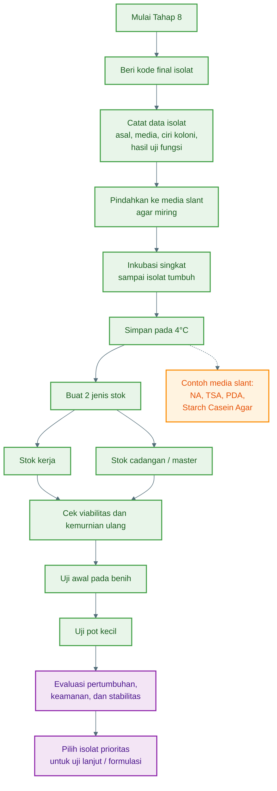

---

## 2. Pemberian kode isolat

Setiap isolat wajib memiliki kode unik.

Format kode yang disarankan:

```text
Kelompok fungsi - Sumber sampel - Nomor isolat
```

Contoh:

| Kode isolat    | Arti                                                   |
| -------------- | ------------------------------------------------------ |
| **PGPM-RZ-01** | Calon mikroba pemacu pertumbuhan dari rizosfer nomor 1 |
| **PSB-RZ-01**  | Bakteri pelarut fosfat dari rizosfer nomor 1           |
| **KSB-RZ-01**  | Bakteri pelarut kalium dari rizosfer nomor 1           |
| **BAC-RZ-01**  | Calon Bacillus dari rizosfer nomor 1                   |
| **PSE-RZ-01**  | Calon Pseudomonas dari rizosfer nomor 1                |
| **TRI-KP-01**  | Calon Trichoderma dari kompos nomor 1                  |
| **STR-RZ-01**  | Calon Streptomyces dari rizosfer nomor 1               |
| **APH-RZ-01**  | Calon agen pengendali hayati dari rizosfer nomor 1     |

Keterangan sumber:

| Kode   | Sumber   |
| ------ | -------- |
| **RZ** | Rizosfer |
| **AK** | Akar     |
| **KP** | Kompos   |
| **SR** | Serasah  |
| **TN** | Tanah    |

---

## 3. Contoh sistem kode lengkap

Agar lebih rapi, kode bisa dibuat lebih lengkap:

```text
Jenis tanaman - sumber - fungsi - nomor isolat
```

Contoh:

```text
CB-RZ-PSB-01
```

Artinya:

- **CB** = cabai
- **RZ** = rizosfer
- **PSB** = bakteri pelarut fosfat
- **01** = isolat nomor 1

Contoh lain:

```text
TM-RZ-BAC-02
```

Artinya:

- **TM** = tomat
- **RZ** = rizosfer
- **BAC** = calon Bacillus
- **02** = isolat nomor 2

Pilih satu sistem kode dan gunakan secara konsisten.

---

## 4. Data yang harus dicatat

Setiap isolat harus punya catatan lengkap.

Minimal data yang dicatat:

| Data             | Contoh                          |
| ---------------- | ------------------------------- |
| Kode isolat      | PSB-RZ-01                       |
| Asal sampel      | Rizosfer cabai                  |
| Lokasi           | Blok A kebun cabai              |
| Tanggal isolasi  | 12/05/2026                      |
| Media asal       | Pikovskaya                      |
| Pengenceran asal | 10⁻⁴                            |
| Warna koloni     | Krem                            |
| Bentuk koloni    | Bulat                           |
| Tepi koloni      | Rata                            |
| Tekstur          | Halus                           |
| Fungsi awal      | Pelarut fosfat                  |
| Hasil uji benih  | Akar lebih panjang dari kontrol |
| Status           | Layak simpan dan uji pot kecil  |

---

## 5. Format lembar data isolat

Gunakan format seperti ini:

```text
Kode isolat        :
Tanggal isolasi    :
Asal sampel        :
Jenis tanaman      :
Lokasi             :
Media asal         :
Pengenceran asal   :
Ciri koloni        :
Target fungsi      :
Hasil uji PGPM     :
Hasil uji APH      :
Hasil uji benih    :
Status isolat      :
Catatan khusus     :
```

Contoh pengisian:

```text
Kode isolat        : PSB-RZ-01
Tanggal isolasi    : 12/05/2026
Asal sampel        : Tanah rizosfer
Jenis tanaman      : Cabai
Lokasi             : Blok A
Media asal         : Pikovskaya
Pengenceran asal   : 10⁻⁴
Ciri koloni        : Krem, bulat, tepi rata, permukaan halus
Target fungsi      : Pelarut fosfat
Hasil uji PGPM     : Zona bening jelas
Hasil uji APH      : Belum diuji
Hasil uji benih    : Akar lebih panjang dari kontrol
Status isolat      : Disimpan sebagai kandidat PGPM
Catatan khusus     : Stabil sampai pemurnian ke-3
```

---

## 6. Membuat kultur simpan pada agar miring

**Agar miring** atau **slant** adalah media agar padat di dalam tabung yang dimiringkan saat membeku, sehingga permukaannya lebih luas.

Fungsinya:

- Menyimpan isolat lebih rapi
- Mengurangi risiko kontaminasi
- Menghemat ruang
- Memudahkan pengambilan kultur ulang
- Cocok untuk penyimpanan jangka pendek

---

✓ A. Media agar miring sesuai target isolat

| Jenis isolat         | Media simpan yang disarankan    |
| -------------------- | ------------------------------- |
| Bakteri umum PGPM    | NA atau TSA slant               |
| PSB / pelarut fosfat | NA slant atau Pikovskaya slant  |
| KSB / pelarut kalium | NA slant atau Aleksandrov slant |
| Bacillus             | NA atau TSA slant               |
| Pseudomonas          | NA, TSA, atau King’s B slant    |
| Trichoderma          | PDA atau TSM slant              |
| Streptomyces         | Starch Casein Agar slant        |

Untuk penyimpanan umum, gunakan media yang membuat isolat stabil. Untuk isolat yang sensitif, gunakan media yang sama dengan media asalnya.

---

## 7. Cara membuat agar miring

Langkah umum:

1. Siapkan media agar sesuai kebutuhan.
2. Masukkan media cair ke tabung steril.
3. Sterilkan media.
4. Setelah steril, letakkan tabung dalam posisi miring.
5. Biarkan sampai media memadat.
6. Setelah padat, agar miring siap diinokulasi isolat.

Agar miring yang baik:

- Permukaannya miring dan cukup luas
- Tidak terlalu basah
- Tidak retak
- Tidak terkontaminasi
- Tabung tertutup rapat
- Label jelas

---

## 8. Memindahkan isolat ke agar miring

✓ Langkah kerja

1. Ambil isolat murni dari cawan pemurnian terakhir.
2. Gunakan ose steril.
3. Goreskan isolat pada permukaan agar miring.
4. Jangan menusuk terlalu dalam ke media.
5. Tutup tabung dengan rapat.
6. Beri label lengkap.
7. Inkubasi sebentar sampai mikroba tumbuh.
8. Setelah tumbuh baik, simpan di lemari es.

---

✓ Waktu inkubasi sebelum disimpan

| Jenis isolat |    Suhu | Waktu sebelum disimpan |
| ------------ | ------: | ---------------------: |
| Bakteri umum | 28–30°C |              24–48 jam |
| Bacillus     | 28–30°C |              24–48 jam |
| Pseudomonas  | 28–30°C |              24–48 jam |
| PSB / KSB    | 28–30°C |               2–4 hari |
| Trichoderma  | 25–28°C |               3–5 hari |
| Streptomyces | 28–30°C |              5–10 hari |

Jangan menyimpan tabung sebelum isolat tumbuh dengan baik, karena nanti sulit memastikan isolat masih hidup.

---

## 9. Label pada tabung agar miring

Label minimal:

```text
Kode isolat
Media simpan
Tanggal simpan
Nama operator
```

Contoh:

```text
PSB-RZ-01
NA Slant
15/05/2026
Operator: A
```

Untuk isolat yang sudah diuji fungsi, tambahkan status:

```text
PSB-RZ-01
Pelarut fosfat kuat
NA Slant
15/05/2026
```

---

## 10. Penyimpanan jangka pendek

Untuk penyimpanan jangka pendek, simpan agar miring di suhu:

```text
±4°C
```

Umumnya menggunakan lemari es laboratorium.

Tujuannya:

- Memperlambat pertumbuhan mikroba
- Mengurangi perubahan karakter
- Menjaga isolat tetap hidup
- Mengurangi kebutuhan subkultur terlalu sering

Jangan simpan kultur mikroba di lemari es yang digunakan untuk makanan.

---

## 11. Lama penyimpanan jangka pendek

Lama penyimpanan tergantung jenis isolat.

| Jenis isolat |          Lama simpan sementara |
| ------------ | -----------------------------: |
| Bakteri umum |                      1–3 bulan |
| Bacillus     | 3–6 bulan, kadang lebih stabil |
| Pseudomonas  |                      1–2 bulan |
| PSB / KSB    |                      1–3 bulan |
| Trichoderma  |                      2–6 bulan |
| Streptomyces |                      3–6 bulan |

Tetap lakukan pengecekan berkala karena viabilitas isolat bisa berbeda-beda.

---

## 12. Penyimpanan jangka lebih panjang

Jika fasilitas laboratorium tersedia, isolat bisa disimpan dengan metode yang lebih stabil.

Pilihan umum:

| Metode                  | Keterangan                                 |
| ----------------------- | ------------------------------------------ |
| Agar miring di 4°C      | Mudah, cocok jangka pendek                 |
| Gliserol stok beku      | Cocok untuk bakteri, lebih stabil          |
| Penyimpanan spora jamur | Cocok untuk Trichoderma                    |
| Liofilisasi             | Sangat baik, tetapi butuh fasilitas khusus |

Untuk skala praktis, minimal buat dua stok:

```text
Stok kerja
Stok cadangan
```

**Stok kerja** digunakan untuk aktivitas rutin.
**Stok cadangan** disimpan dan jarang dibuka.

---

## 13. Konsep stok kerja dan stok master

Sebaiknya isolat dibagi menjadi dua kelompok.

✓ A. Stok master

Stok master adalah stok utama.

Ciri:

- Disimpan paling aman
- Jarang dibuka
- Tidak dipakai untuk kerja harian
- Menjadi sumber bila stok kerja rusak

✓ B. Stok kerja

Stok kerja adalah stok yang digunakan untuk uji rutin.

Ciri:

- Boleh sering digunakan
- Dibuat dari stok master
- Diganti secara berkala
- Tidak boleh menjadi satu-satunya stok

Prinsipnya:

```text
Stok master jangan sering dibuka.
Gunakan stok kerja untuk aktivitas harian.
```

---

## 14. Pemeriksaan kemurnian setelah penyimpanan

Setelah isolat disimpan, lakukan pengecekan ulang.

Caranya:

1. Ambil sedikit kultur dari agar miring.
2. Goreskan ke media baru.
3. Inkubasi sesuai jenis mikroba.
4. Amati apakah koloni tetap seragam.
5. Bandingkan dengan catatan morfologi sebelumnya.

Isolat dianggap stabil bila:

- Warna tetap sama
- Bentuk koloni tetap sama
- Tekstur tidak berubah drastis
- Tidak muncul koloni lain
- Fungsi awal masih muncul saat diuji ulang

---

## 15. Uji viabilitas isolat

**Viabilitas** berarti kemampuan isolat untuk tetap hidup.

Tanda isolat masih viabel:

- Tumbuh kembali saat digores ke media baru
- Koloni muncul dalam waktu normal
- Bentuk koloni masih sesuai catatan
- Tidak muncul kontaminan dominan
- Tidak ada bau busuk atau perubahan aneh

Jika isolat tidak tumbuh kembali, isolat dianggap lemah atau mati dan perlu diganti dari stok cadangan.

---

## 16. Uji awal pada benih

Setelah isolat stabil, lakukan uji awal pada benih untuk memastikan efeknya terhadap tanaman.

✓ Tujuan

Menilai apakah isolat:

- Aman untuk benih
- Tidak menyebabkan busuk
- Meningkatkan perkecambahan
- Meningkatkan panjang akar
- Meningkatkan vigor awal

---

✓ Perlakuan minimal

Gunakan:

```text
Kontrol tanpa isolat
Isolat 1
Isolat 2
Isolat 3
```

Jika isolat berasal dari kelompok berbeda, bisa diuji terpisah:

```text
PGPM-RZ-01
PSB-RZ-01
BAC-RZ-01
TRI-KP-01
PSE-RZ-01
```

---

✓ Parameter yang diamati

| Parameter           | Arti                           |
| ------------------- | ------------------------------ |
| Persentase kecambah | Jumlah benih yang tumbuh       |
| Panjang akar        | Efek terhadap akar             |
| Panjang tunas       | Efek terhadap pertumbuhan awal |
| Jumlah akar lateral | Indikator stimulasi akar       |
| Warna kecambah      | Hijau/sehat atau pucat         |
| Gejala busuk        | Ada/tidak efek negatif         |
| Keseragaman bibit   | Seragam atau tidak             |

Isolat yang menyebabkan benih busuk, akar pendek, atau kecambah abnormal sebaiknya tidak dilanjutkan.

---

## 17. Uji awal pada pot kecil

Setelah lolos uji benih, lanjutkan ke pot kecil.

✓ Tujuan

Mengetahui apakah isolat memberikan efek positif pada tanaman dalam media tanam yang lebih nyata.

✓ Desain sederhana

Minimal gunakan:

| Perlakuan            | Keterangan                                        |
| -------------------- | ------------------------------------------------- |
| Kontrol              | Tanpa isolat                                      |
| PGPM-01              | Perlakuan isolat PGPM                             |
| PSB-01               | Perlakuan isolat pelarut fosfat                   |
| APH-01               | Perlakuan isolat APH                              |
| Konsorsium sederhana | Gabungan isolat yang kompatibel, bila sudah diuji |

Gunakan minimal **3 ulangan** per perlakuan agar hasil lebih dapat dipercaya.

---

## 18. Parameter uji pot kecil

Amati:

| Parameter           | Waktu pengamatan |
| ------------------- | ---------------- |
| Tinggi tanaman      | Mingguan         |
| Jumlah daun         | Mingguan         |
| Warna daun          | Mingguan         |
| Panjang akar        | Akhir uji        |
| Bobot segar tajuk   | Akhir uji        |
| Bobot segar akar    | Akhir uji        |
| Gejala penyakit     | Selama uji       |
| Gejala fitotoksik   | Selama uji       |
| Keseragaman tanaman | Selama uji       |

Untuk PGPM, fokus pada peningkatan pertumbuhan.

Untuk APH, fokus pada kesehatan tanaman dan penurunan gejala penyakit jika ada uji tekanan patogen tanaman.

---

## 19. Contoh desain uji pot sederhana

Misalnya menguji 4 isolat pada cabai.

| Perlakuan            | Ulangan | Jumlah pot |
| -------------------- | ------: | ---------: |
| Kontrol tanpa isolat |       3 |      3 pot |
| PGPM-RZ-01           |       3 |      3 pot |
| PSB-RZ-01            |       3 |      3 pot |
| BAC-RZ-01            |       3 |      3 pot |
| TRI-KP-01            |       3 |      3 pot |

Total:

```text
5 perlakuan × 3 ulangan = 15 pot
```

Catatan penting: semua pot harus menggunakan media, volume air, umur bibit, dan kondisi lingkungan yang sama.

---

## 20. Uji kompatibilitas isolat sebelum dibuat konsorsium

Jangan langsung mencampur banyak isolat.

Isolat perlu diuji apakah saling cocok.

✓ Tujuan

Mengetahui apakah satu isolat menghambat isolat lain.

Contoh kombinasi yang sering diinginkan:

```text
Bacillus + Trichoderma
Bacillus + PSB
Pseudomonas + PSB
Trichoderma + Streptomyces
PGPM + APH
```

✓ Prinsip uji sederhana

Letakkan dua isolat pada media yang sama dengan jarak tertentu, lalu amati apakah terjadi hambatan.

Kombinasi dianggap kurang cocok bila:

- Salah satu isolat tidak tumbuh
- Ada zona hambat kuat di antara keduanya
- Salah satu isolat menutup total isolat lain
- Pertumbuhan berubah abnormal

Konsorsium hanya dibuat dari isolat yang saling kompatibel.

---

## 21. Evaluasi stabilitas fungsi

Isolat yang sudah disimpan perlu diuji ulang fungsinya.

Contoh:

| Isolat     | Fungsi awal        | Uji ulang                  |
| ---------- | ------------------ | -------------------------- |
| PSB-RZ-01  | Pelarut fosfat     | Ulangi di Pikovskaya/NBRIP |
| KSB-RZ-01  | Pelarut kalium     | Ulangi di Aleksandrov      |
| PGPM-RZ-01 | Meningkatkan vigor | Ulangi uji benih           |
| TRI-KP-01  | Antagonis patogen  | Ulangi dual culture        |
| BAC-RZ-01  | Zona hambat        | Ulangi uji antagonis       |

Isolat layak lanjut bila fungsinya tetap muncul setelah penyimpanan dan subkultur ulang.

---

## 22. Skoring akhir isolat

Gunakan skor untuk menentukan isolat terbaik.

| Kriteria          |             Skor 1 |             Skor 2 |                         Skor 3 |
| ----------------- | -----------------: | -----------------: | -----------------------------: |
| Kemurnian         | Sering kontaminasi |       Cukup stabil |                         Stabil |
| Pertumbuhan ulang |       Lambat/lemah |             Sedang |               Cepat dan normal |
| Fungsi PGPM/APH   |              Lemah |             Sedang |                           Kuat |
| Uji benih         |             Netral |         Cukup baik |             Meningkatkan vigor |
| Uji pot           |      Tidak berbeda | Sedikit lebih baik |  Jelas lebih baik dari kontrol |
| Penyimpanan       |     Sulit disimpan |       Cukup stabil |                 Stabil di stok |
| Keamanan tanaman  |  Ada gejala ringan |               Aman | Aman dan mendukung pertumbuhan |

Prioritaskan isolat dengan skor total tertinggi.

---

## 23. Kriteria isolat layak lanjut

✓ A. Kandidat PGPM layak lanjut bila:

- Stabil saat disimpan
- Tumbuh ulang dengan baik
- Tidak menghambat benih
- Meningkatkan akar atau tunas
- Memiliki fungsi jelas, misalnya pelarut fosfat, pelarut kalium, IAA sedang, atau siderofor
- Memberi hasil lebih baik dari kontrol pada uji pot kecil

✓ B. Kandidat APH layak lanjut bila:

- Stabil saat disimpan
- Tidak merusak benih atau bibit
- Mampu menghambat patogen tanaman pada uji awal
- Memberi proteksi pada uji pot kecil
- Tidak menimbulkan gejala negatif pada tanaman
- Bisa dikultur ulang dengan mudah

---

## 24. Kesalahan yang sering terjadi

| Kesalahan                          | Akibat                              |
| ---------------------------------- | ----------------------------------- |
| Kode isolat tidak konsisten        | Isolat tertukar                     |
| Label hanya ditulis di tutup cawan | Data hilang jika tutup tertukar     |
| Tidak membuat stok cadangan        | Isolat hilang jika stok kerja rusak |
| Menyimpan kultur di kulkas makanan | Tidak aman                          |
| Tidak mengecek kemurnian ulang     | Kontaminasi tidak terdeteksi        |
| Langsung membuat konsorsium        | Isolat bisa saling menghambat       |
| Tidak memakai kontrol pada uji pot | Efek isolat sulit dinilai           |
| Tidak mencatat tanggal subkultur   | Umur isolat tidak terpantau         |
| Terlalu sering subkultur           | Risiko perubahan karakter meningkat |

---

## 25. Keamanan dan pembuangan limbah

Karena isolat belum tentu teridentifikasi penuh, perlakukan sebagai bahan biologis yang perlu hati-hati.

Aturan aman:

1. Simpan kultur di tempat khusus, bukan area makanan.
2. Jangan membuka tabung/cawan sembarangan.
3. Jangan mencium kultur secara langsung.
4. Jangan memakai isolat yang berbau busuk tajam.
5. Jangan menyebarkan isolat ke lahan luas sebelum uji bertahap.
6. Sterilkan limbah kultur sebelum dibuang.
7. Cawan lama, tips, dan tabung bekas harus dimatikan dahulu dengan autoklaf atau disinfektan yang sesuai.
8. Catat semua isolat yang disimpan dan yang dibuang.

---

## 26. Output akhir Tahap 8

Hasil akhir Tahap 8 adalah:

| Output                  | Keterangan                                    |
| ----------------------- | --------------------------------------------- |
| Kode isolat final       | Semua isolat punya identitas jelas            |
| Stok agar miring        | Isolat tersimpan jangka pendek                |
| Stok cadangan           | Menghindari kehilangan isolat                 |
| Lembar data isolat      | Asal, ciri, fungsi, dan status tercatat       |
| Hasil uji viabilitas    | Isolat terbukti masih hidup                   |
| Hasil uji benih         | Isolat aman atau tidak untuk kecambah         |
| Hasil uji pot kecil     | Isolat dibandingkan dengan kontrol            |
| Daftar isolat prioritas | Kandidat terbaik untuk uji lanjutan/formulasi |

---

✓ Ringkasan Tahap 8

**Beri kode isolat → catat asal dan cirinya → pindahkan ke agar miring → inkubasi sampai tumbuh → simpan di 4°C → buat stok kerja dan stok cadangan → cek kemurnian dan viabilitas → uji benih → uji pot kecil → pilih isolat terbaik.**

---

# Pembuatan Media

Media merupakan komponen utama dalam proses isolasi, pemurnian, uji fungsi, dan penyimpanan mikroba. Tanpa media yang sesuai, mikroba target sulit tumbuh dengan baik, koloni sulit dibedakan, dan fungsi mikroba seperti pelarutan fosfat, pelarutan kalium, produksi siderofor, atau aktivitas antagonis terhadap patogen tanaman tidak dapat diamati secara jelas.

Dalam isolasi mikroba **PGPM** dan **Agen Pengendali Hayati (APH)**, setiap media memiliki peran yang berbeda. Ada media yang digunakan sebagai larutan pengencer, media umum untuk menumbuhkan bakteri, media khusus untuk jamur, media selektif untuk kelompok mikroba tertentu, media uji fungsi, serta media penyimpanan dalam bentuk agar miring atau _slant_.

Karena itu, pembuatan media harus dilakukan dengan teliti. Komposisi bahan, volume air, pH, proses pemanasan, sterilisasi, hingga cara penyimpanan perlu diperhatikan agar media yang dihasilkan steril, stabil, dan mampu mendukung pertumbuhan mikroba sesuai tujuan.

Bagian ini membahas prosedur pembuatan media yang digunakan sepanjang proses isolasi mikroba lokal, mulai dari tahap suspensi awal, pengenceran, penanaman, pemurnian, uji fungsi, sampai penyimpanan isolat.

Fokus media:

1. **NaCl steril 0,85%**
2. **NA — Nutrient Agar**
3. **TSA — Tryptic Soy Agar**
4. **PDA — Potato Dextrose Agar**
5. **Pikovskaya Agar**
6. **NBRIP Agar**
7. **Aleksandrov Agar**
8. **King’s B Agar**
9. **Starch Casein Agar**
10. **YMEA — Yeast Malt Extract Agar**
11. **Ashby Mannitol Agar**
12. **N-free Malate Semi-solid**
13. **CAS Agar**
14. **Media agar miring / slant**

---

## A. Prinsip Umum Pembuatan Media

✓ 1. Alat dasar

Siapkan:

| Alat                                    | Fungsi                   |
| --------------------------------------- | ------------------------ |
| Timbangan digital                       | Menimbang bahan          |
| Gelas ukur                              | Mengukur air             |
| Beaker glass / erlenmeyer               | Melarutkan media         |
| Hot plate / kompor pemanas              | Memanaskan media         |
| Magnetic stirrer / batang pengaduk      | Mengaduk media           |
| pH meter / kertas pH                    | Mengukur pH              |
| Autoklaf / pressure cooker laboratorium | Sterilisasi              |
| Cawan petri steril                      | Media plate              |
| Tabung reaksi                           | Media slant              |
| Botol media                             | Menyimpan media          |
| Aluminium foil / tutup botol            | Penutup saat sterilisasi |

---

✓ 2. Aturan umum

Untuk hampir semua media:

```text
Timbang bahan
↓
Larutkan dalam aquadest
↓
Atur pH
↓
Tambahkan agar bila media padat
↓
Panaskan sampai larut
↓
Sterilisasi
↓
Tuang ke cawan atau tabung
↓
Dinginkan
↓
Label dan simpan
```

---

✓ 3. Sterilisasi umum

Standar sterilisasi media:

```text
121°C selama 15–20 menit
```

Jika menggunakan pressure cooker laboratorium:

```text
Tekanan ±15 psi
Waktu 15–20 menit setelah tekanan tercapai
```

Catatan: bahan sensitif panas seperti antibiotik, beberapa vitamin, dan beberapa indikator sebaiknya **disterilkan dengan filter** lalu ditambahkan setelah media turun ke suhu ±45–50°C.

---

✓ 4. Volume media per cawan dan tabung

| Bentuk media               |        Volume umum |
| -------------------------- | -----------------: |
| Cawan petri 90 mm          | 15–20 ml per cawan |
| Tabung agar miring / slant |  5–7 ml per tabung |
| Tabung media cair          | 5–10 ml per tabung |
| Botol stok media           |   Sesuai kebutuhan |

---

## B. Larutan NaCl Steril 0,85%

Dipakai pada:

- Tahap 2: pembuatan suspensi awal
- Tahap 3: pengenceran bertingkat
- Tahap 4: kontrol negatif
- Tahap 7–8: pembuatan suspensi isolat sederhana

✓ Komposisi 1 liter

| Bahan    |   Jumlah |
| -------- | -------: |
| NaCl     |    8,5 g |
| Aquadest | 1.000 ml |

✓ Komposisi 100 ml

| Bahan    | Jumlah |
| -------- | -----: |
| NaCl     | 0,85 g |
| Aquadest | 100 ml |

✓ Cara membuat

1. Timbang NaCl.
2. Larutkan dalam aquadest.
3. Masukkan ke botol atau tabung.
4. Sterilisasi pada **121°C selama 15 menit**.
5. Dinginkan.
6. Simpan dalam kondisi tertutup.

**Catatan:** NaCl adalah natrium klorida, bukan chlorine aktif. Jangan gunakan air PAM langsung.

---

## C. NA — Nutrient Agar

Dipakai untuk:

- Isolasi bakteri umum
- Bacillus
- PGPM umum
- Pemurnian bakteri
- Media slant bakteri

✓ Komposisi 1 liter

| Bahan                         |    Jumlah |
| ----------------------------- | --------: |
| Peptone                       |       5 g |
| Beef extract / ekstrak daging |       3 g |
| NaCl                          |       5 g |
| Agar                          |      15 g |
| Aquadest                      |  1.000 ml |
| pH akhir                      | 7,0 ± 0,2 |

✓ Cara membuat

1. Masukkan ±800 ml aquadest ke erlenmeyer.
2. Tambahkan peptone, beef extract, dan NaCl.
3. Aduk sampai larut.
4. Tambahkan agar.
5. Tambahkan aquadest sampai volume 1 liter.
6. Atur pH ke sekitar 7,0.
7. Panaskan sambil diaduk sampai agar larut.
8. Sterilisasi pada **121°C selama 15–20 menit**.
9. Dinginkan sampai ±45–50°C.
10. Tuang ke cawan petri steril sebanyak 15–20 ml per cawan.
11. Biarkan memadat.

✓ Jika pakai media instan

Biasanya gunakan:

```text
Nutrient Agar powder ±28 g/L
```

Tetap ikuti dosis pada label produk karena tiap merek bisa berbeda.

---

## D. TSA — Tryptic Soy Agar

Dipakai untuk:

- Bakteri umum
- Bacillus
- Pseudomonas
- PGPM/APH bakteri
- Pemurnian isolat bakteri

TSA lebih kaya nutrisi daripada NA.

✓ Komposisi 1 liter

| Bahan                                       |   Jumlah |
| ------------------------------------------- | -------: |
| Tryptone / pancreatic digest of casein      |     15 g |
| Soy peptone / papaic digest of soybean meal |      5 g |
| NaCl                                        |      5 g |
| Agar                                        |     15 g |
| Aquadest                                    | 1.000 ml |
| pH akhir                                    |  7,2–7,3 |

✓ Cara membuat

1. Masukkan ±800 ml aquadest ke erlenmeyer.
2. Tambahkan tryptone, soy peptone, dan NaCl.
3. Aduk sampai larut.
4. Tambahkan agar.
5. Tambahkan aquadest sampai 1 liter.
6. Atur pH ke 7,2–7,3.
7. Panaskan sampai agar larut.
8. Sterilisasi **121°C selama 15–20 menit**.
9. Dinginkan sampai ±45–50°C.
10. Tuang ke cawan petri steril.

✓ Jika pakai media instan

Umumnya:

```text
TSA powder ±40 g/L
```

Ikuti instruksi merek yang dipakai.

---

## E. PDA — Potato Dextrose Agar

Dipakai untuk:

- Jamur umum
- Trichoderma
- APH jamur
- Pemurnian jamur
- Dual culture APH vs patogen tanaman
- PDA slant untuk penyimpanan Trichoderma

✓ Komposisi 1 liter versi laboratorium

| Bahan              |          Jumlah |
| ------------------ | --------------: |
| Kentang kupas      |           200 g |
| Dextrose / glucose |            20 g |
| Agar               |            15 g |
| Aquadest           | Sampai 1.000 ml |
| pH akhir           |            ±5,6 |

✓ Cara membuat dari kentang

1. Kupas kentang.
2. Potong kecil-kecil.
3. Rebus 200 g kentang dalam ±500–700 ml aquadest selama 20–30 menit.
4. Saring air rebusan kentang.
5. Ambil filtratnya.
6. Tambahkan dextrose 20 g.
7. Tambahkan agar 15 g.
8. Tambahkan aquadest sampai volume 1 liter.
9. Atur pH sekitar 5,6.
10. Panaskan sampai agar larut.
11. Sterilisasi **121°C selama 15–20 menit**.
12. Dinginkan sampai ±45–50°C.
13. Tuang ke cawan petri steril.

✓ Jika pakai media instan

Umumnya:

```text
PDA powder ±39 g/L
```

Ikuti label produk.

✓ Catatan

Untuk menekan bakteri pada isolasi jamur, laboratorium kadang menambahkan antibiotik setelah media disterilkan dan suhunya turun ke ±45–50°C. Namun untuk penggunaan praktis, lebih aman gunakan **PDA biasa** atau **TSM siap pakai** bila tersedia.

---

## F. Pikovskaya Agar

Dipakai untuk:

- Isolasi bakteri pelarut fosfat
- Uji awal PSB
- Seleksi PGPM pelarut fosfat

**PSB** = _Phosphate Solubilizing Bacteria_, bakteri pelarut fosfat.

✓ Komposisi 1 liter

| Bahan                            |   Jumlah |
| -------------------------------- | -------: |
| Glucose                          |     10 g |
| Tricalcium phosphate / Ca₃(PO₄)₂ |      5 g |
| Yeast extract                    |    0,5 g |
| Ammonium sulfate / (NH₄)₂SO₄     |    0,5 g |
| NaCl                             |    0,2 g |
| KCl                              |    0,2 g |
| Magnesium sulfate / MgSO₄·7H₂O   |    0,1 g |
| Manganese sulfate / MnSO₄        |  0,002 g |
| Ferrous sulfate / FeSO₄·7H₂O     |  0,002 g |
| Agar                             |     15 g |
| Aquadest                         | 1.000 ml |
| pH akhir                         |     ±7,0 |

✓ Cara membuat

1. Masukkan ±800 ml aquadest ke erlenmeyer.
2. Tambahkan semua bahan kecuali agar.
3. Aduk sampai merata.
4. Tambahkan agar.
5. Tambahkan aquadest sampai 1 liter.
6. Atur pH ke ±7,0.
7. Panaskan sambil diaduk.
8. Media akan tampak agak keruh karena tricalcium phosphate tidak larut sempurna. Itu normal.
9. Sterilisasi **121°C selama 15–20 menit**.
10. Saat akan menuang, goyangkan perlahan agar endapan fosfat tersebar merata.
11. Tuang ke cawan petri steril.

✓ Indikator hasil

Koloni PSB positif biasanya membentuk:

```text
Zona bening di sekitar koloni
```

---

## G. NBRIP Agar

Dipakai untuk:

- Seleksi bakteri pelarut fosfat
- Alternatif Pikovskaya
- Sering menghasilkan zona bening lebih jelas

✓ Komposisi 1 liter

| Bahan                            |   Jumlah |
| -------------------------------- | -------: |
| Glucose                          |     10 g |
| Tricalcium phosphate / Ca₃(PO₄)₂ |      5 g |
| Magnesium chloride / MgCl₂·6H₂O  |      5 g |
| Magnesium sulfate / MgSO₄·7H₂O   |   0,25 g |
| KCl                              |    0,2 g |
| Ammonium sulfate / (NH₄)₂SO₄     |    0,1 g |
| Agar                             |     15 g |
| Aquadest                         | 1.000 ml |
| pH akhir                         |     ±7,0 |

✓ Cara membuat

1. Larutkan glucose, MgCl₂, MgSO₄, KCl, dan ammonium sulfate dalam ±800 ml aquadest.
2. Tambahkan tricalcium phosphate.
3. Tambahkan agar.
4. Tambahkan aquadest sampai 1 liter.
5. Atur pH sekitar 7,0.
6. Panaskan sampai agar larut.
7. Sterilisasi **121°C selama 15–20 menit**.
8. Goyang perlahan sebelum menuang karena fosfat bisa mengendap.
9. Tuang ke cawan petri steril.

✓ Catatan

Endapan putih pada media adalah normal karena sumber fosfatnya tidak larut. Justru itu yang menjadi dasar uji pelarutan fosfat.

---

## H. Aleksandrov Agar

Dipakai untuk:

- Isolasi bakteri pelarut kalium
- Uji KSB

**KSB** = _Potassium Solubilizing Bacteria_, bakteri pelarut kalium.

✓ Komposisi 1 liter versi umum

| Bahan                                                                |   Jumlah |
| -------------------------------------------------------------------- | -------: |
| Glucose                                                              |      5 g |
| Magnesium sulfate / MgSO₄·7H₂O                                       |    0,5 g |
| Calcium carbonate / CaCO₃                                            |    0,1 g |
| Ferric chloride / FeCl₃                                              |  0,005 g |
| Calcium phosphate / Ca₃(PO₄)₂                                        |      2 g |
| Sumber K tidak larut: mica/feldspar/potassium aluminosilicate powder |      2 g |
| Agar                                                                 |  15–20 g |
| Aquadest                                                             | 1.000 ml |
| pH akhir                                                             |  7,0–7,2 |

✓ Cara membuat

1. Masukkan ±800 ml aquadest ke erlenmeyer.
2. Tambahkan glucose, MgSO₄, CaCO₃, FeCl₃, dan Ca₃(PO₄)₂.
3. Tambahkan sumber kalium tidak larut, misalnya mica atau feldspar halus.
4. Tambahkan agar.
5. Tambahkan aquadest sampai 1 liter.
6. Atur pH ke 7,0–7,2.
7. Panaskan sambil diaduk sampai agar larut.
8. Sterilisasi **121°C selama 15–20 menit**.
9. Goyang perlahan sebelum menuang agar mineral tidak mengendap berat di bawah.
10. Tuang ke cawan petri steril.

✓ Indikator hasil

KSB positif biasanya menunjukkan:

```text
Zona bening di sekitar koloni
```

✓ Catatan penting

Jangan memakai sumber K yang mudah larut sebagai sumber utama kalium, karena tujuan media ini adalah menyeleksi mikroba yang mampu melarutkan kalium dari mineral tidak larut.

---

## I. King’s B Agar

Dipakai untuk:

- Isolasi Pseudomonas fluorescens
- Seleksi bakteri rizosfer fluoresen
- Kandidat PGPM dan APH

✓ Komposisi 1 liter

| Bahan            |   Jumlah |
| ---------------- | -------: |
| Proteose peptone |     20 g |
| Glycerol         |    10 ml |
| K₂HPO₄           |    1,5 g |
| MgSO₄·7H₂O       |    1,5 g |
| Agar             |     15 g |
| Aquadest         | 1.000 ml |
| pH akhir         |  7,0–7,2 |

✓ Cara membuat

1. Masukkan ±800 ml aquadest ke erlenmeyer.
2. Tambahkan proteose peptone, K₂HPO₄, dan MgSO₄.
3. Tambahkan glycerol.
4. Tambahkan agar.
5. Tambahkan aquadest sampai 1 liter.
6. Atur pH ke 7,0–7,2.
7. Panaskan sampai agar larut.
8. Sterilisasi **121°C selama 15–20 menit**.
9. Dinginkan sampai ±45–50°C.
10. Tuang ke cawan petri steril.

✓ Indikator hasil

Beberapa isolat Pseudomonas fluorescens menunjukkan:

```text
Fluoresensi hijau-kuning di bawah lampu UV
```

---

## J. Starch Casein Agar

Dipakai untuk:

- Isolasi Streptomyces
- Actinomycetes tanah
- Kandidat APH

✓ Komposisi 1 liter

| Bahan          |   Jumlah |
| -------------- | -------: |
| Soluble starch |     10 g |
| Casein         |    0,3 g |
| KNO₃           |      2 g |
| NaCl           |      2 g |
| K₂HPO₄         |      2 g |
| MgSO₄·7H₂O     |   0,05 g |
| CaCO₃          |   0,02 g |
| FeSO₄·7H₂O     |   0,01 g |
| Agar           |  15–18 g |
| Aquadest       | 1.000 ml |
| pH akhir       |  7,0–7,2 |

✓ Cara membuat

1. Masukkan ±800 ml aquadest ke erlenmeyer.
2. Tambahkan soluble starch dan casein.
3. Tambahkan KNO₃, NaCl, K₂HPO₄, MgSO₄, CaCO₃, dan FeSO₄.
4. Tambahkan agar.
5. Tambahkan aquadest sampai 1 liter.
6. Atur pH ke 7,0–7,2.
7. Panaskan sambil diaduk sampai homogen.
8. Sterilisasi **121°C selama 15–20 menit**.
9. Tuang ke cawan petri steril atau tabung slant.

✓ Ciri target

Streptomyces biasanya tumbuh sebagai koloni:

- Kering
- Bertepung
- Warna putih, abu-abu, krem, atau cokelat
- Berbau tanah

---

## K. Starch Casein Agar Slant

Dipakai untuk:

- Penyimpanan sementara Streptomyces
- Stok kerja isolat actinomycetes

✓ Cara membuat slant

1. Buat Starch Casein Agar seperti resep di atas.
2. Saat media masih cair, masukkan **5–7 ml** ke tiap tabung reaksi.
3. Tutup tabung.
4. Sterilisasi **121°C selama 15–20 menit**.
5. Setelah keluar dari autoklaf, letakkan tabung dalam posisi miring.
6. Biarkan memadat.
7. Setelah padat, slant siap diinokulasi.

✓ Penyimpanan setelah inokulasi

1. Gores isolat Streptomyces pada permukaan slant.
2. Inkubasi **28–30°C selama 5–10 hari**.
3. Setelah tumbuh baik, simpan di **4°C**.

---

## L. YMEA — Yeast Malt Extract Agar

Dipakai untuk:

- Yeast/khamir rizosfer
- Yeast antagonis
- Mikroba fermentatif non-patogen dari lingkungan tanaman

✓ Komposisi 1 liter

| Bahan              |   Jumlah |
| ------------------ | -------: |
| Yeast extract      |      3 g |
| Malt extract       |      3 g |
| Peptone            |      5 g |
| Glucose / dextrose |     10 g |
| Agar               |     15 g |
| Aquadest           | 1.000 ml |
| pH akhir           |  6,0–6,5 |

✓ Cara membuat

1. Larutkan yeast extract, malt extract, peptone, dan glucose dalam ±800 ml aquadest.
2. Tambahkan agar.
3. Tambahkan aquadest sampai 1 liter.
4. Atur pH ke 6,0–6,5.
5. Panaskan sampai agar larut.
6. Sterilisasi **121°C selama 15–20 menit**.
7. Tuang ke cawan petri steril.

---

## M. Ashby Mannitol Agar

Dipakai untuk:

- Seleksi awal mikroba yang mampu tumbuh pada media tanpa nitrogen
- Terutama untuk calon Azotobacter dan mikroba terkait siklus nitrogen

✓ Komposisi 1 liter

| Bahan      |   Jumlah |
| ---------- | -------: |
| Mannitol   |     20 g |
| K₂HPO₄     |    0,2 g |
| MgSO₄·7H₂O |    0,2 g |
| NaCl       |    0,2 g |
| K₂SO₄      |    0,1 g |
| CaCO₃      |      5 g |
| Agar       |     15 g |
| Aquadest   | 1.000 ml |
| pH akhir   |  7,0–7,2 |

✓ Cara membuat

1. Larutkan mannitol, K₂HPO₄, MgSO₄, NaCl, dan K₂SO₄ dalam ±800 ml aquadest.
2. Tambahkan CaCO₃.
3. Tambahkan agar.
4. Tambahkan aquadest sampai 1 liter.
5. Atur pH ke 7,0–7,2.
6. Panaskan sampai agar larut.
7. Sterilisasi **121°C selama 15–20 menit**.
8. Goyang perlahan sebelum menuang karena CaCO₃ dapat mengendap.
9. Tuang ke cawan petri steril.

✓ Catatan

Pertumbuhan pada media ini hanya indikasi awal. Jangan langsung menyatakan isolat sebagai penambat nitrogen kuat tanpa uji lanjutan.

---

## N. N-free Malate Semi-solid Medium

Dipakai untuk:

- Seleksi awal Azospirillum dan mikroba terkait penambatan nitrogen
- Media semi-padat, bukan agar padat penuh

✓ Komposisi 1 liter versi praktis

| Bahan        |   Jumlah |
| ------------ | -------: |
| Malic acid   |      5 g |
| K₂HPO₄       |    0,5 g |
| KH₂PO₄       |    0,4 g |
| MgSO₄·7H₂O   |    0,2 g |
| NaCl         |    0,1 g |
| CaCl₂        |   0,02 g |
| FeCl₃        |   0,01 g |
| Na₂MoO₄·2H₂O |  0,002 g |
| Agar         |  1,5–2 g |
| Aquadest     | 1.000 ml |
| pH akhir     |  6,8–7,0 |

✓ Cara membuat

1. Larutkan semua garam mineral dalam ±800 ml aquadest.
2. Tambahkan malic acid.
3. Atur pH ke 6,8–7,0.
4. Tambahkan agar rendah, hanya **1,5–2 g/L**.
5. Tambahkan aquadest sampai 1 liter.
6. Panaskan sampai agar larut.
7. Masukkan ke tabung sebanyak 5–10 ml.
8. Sterilisasi **121°C selama 15 menit**.
9. Dinginkan dalam posisi tegak.

✓ Indikator awal

Isolat positif awal biasanya membentuk:

```text
Lapisan pelikel atau cincin pertumbuhan di bawah permukaan media
```

---

## O. CAS Agar

Dipakai untuk:

- Uji siderofor
- Seleksi PGPM dan APH yang mampu mengikat besi

**CAS** = _Chrome Azurol S Agar_.

Media ini lebih rumit daripada NA, PDA, atau Pikovskaya. Untuk praktik yang lebih aman dan konsisten, sebaiknya gunakan **CAS agar siap pakai** atau kit dari supplier laboratorium.

✓ Prinsip hasil

Isolat penghasil siderofor akan membentuk:

```text
Zona oranye / kuning di sekitar koloni
```

✓ Prosedur praktis bila memakai CAS premix

1. Timbang CAS agar powder sesuai dosis label produk.
2. Larutkan dalam aquadest.
3. Panaskan sampai homogen.
4. Sterilisasi sesuai instruksi produk.
5. Dinginkan sampai ±45–50°C.
6. Tuang ke cawan petri steril.
7. Biarkan memadat.
8. Simpan gelap di 4°C.

✓ Catatan penting

CAS sensitif terhadap kesalahan pH, komposisi besi, dan indikator warna. Jika hasil harus valid untuk riset atau produksi, gunakan media komersial atau SOP laboratorium resmi.

---

## P. Media Cair untuk Uji IAA

Dipakai untuk:

- Uji produksi IAA oleh isolat PGPM
- Biasanya memakai Nutrient Broth atau Tryptic Soy Broth dengan tambahan L-triptofan

✓ Komposisi 1 liter versi sederhana

| Bahan                                 |                 Jumlah |
| ------------------------------------- | ---------------------: |
| Nutrient Broth atau Tryptic Soy Broth | Sesuai label / formula |
| L-tryptophan                          |              0,1–0,5 g |
| Aquadest                              |               1.000 ml |
| pH akhir                              |              7,0 ± 0,2 |

✓ Cara membuat

1. Buat media cair NB atau TSB.
2. Tambahkan L-tryptophan.
3. Atur pH sekitar 7,0.
4. Masukkan ke tabung masing-masing 5–10 ml.
5. Sterilisasi **121°C selama 15 menit**.
6. Dinginkan.
7. Media siap diinokulasi isolat.

✓ Catatan

Uji IAA memerlukan reagen Salkowski. Reagen ini bukan media pertumbuhan, melainkan reagen deteksi warna.

---

## Q. Media Agar Miring / Slant

Dipakai pada Tahap 8 untuk penyimpanan isolat.

Media yang bisa dibuat slant:

| Target isolat | Media slant                  |
| ------------- | ---------------------------- |
| Bakteri umum  | NA slant atau TSA slant      |
| Bacillus      | NA slant / TSA slant         |
| Pseudomonas   | King’s B slant / NA slant    |
| PSB           | Pikovskaya slant / NA slant  |
| KSB           | Aleksandrov slant / NA slant |
| Trichoderma   | PDA slant / TSM slant        |
| Streptomyces  | Starch Casein Agar slant     |
| Yeast         | YMEA slant                   |

✓ Cara umum membuat slant

1. Buat media sesuai resep.
2. Saat masih cair, masukkan **5–7 ml** ke tabung reaksi.
3. Tutup tabung.
4. Sterilisasi **121°C selama 15–20 menit**.
5. Setelah sterilisasi, letakkan tabung dalam posisi miring.
6. Biarkan media memadat.
7. Setelah padat, beri label.
8. Simpan sampai digunakan.

✓ Cara inokulasi slant

1. Ambil isolat murni dengan ose steril.
2. Goreskan pada permukaan slant.
3. Inkubasi sesuai jenis mikroba.
4. Setelah tumbuh, simpan di **4°C**.

---

## R. Ringkasan Media Berdasarkan Tahap

| Tahap                            | Kebutuhan media / larutan                                                              |
| -------------------------------- | -------------------------------------------------------------------------------------- |
| Tahap 1 — Pengambilan sampel     | Belum memakai media, hanya wadah steril                                                |
| Tahap 2 — Suspensi awal          | NaCl steril 0,85%                                                                      |
| Tahap 3 — Pengenceran bertingkat | NaCl steril 0,85%                                                                      |
| Tahap 4 — Penanaman media        | NA, TSA, PDA, Pikovskaya, NBRIP, Aleksandrov, King’s B, Starch Casein Agar             |
| Tahap 5 — Inkubasi               | Media hasil penanaman dari Tahap 4                                                     |
| Tahap 6 — Pemurnian              | Media baru sesuai asal isolat                                                          |
| Tahap 7 — Uji fungsi             | Pikovskaya, NBRIP, Aleksandrov, CAS, media IAA, PDA dual culture, Ashby, N-free malate |
| Tahap 8 — Penyimpanan            | NA slant, TSA slant, PDA slant, Starch Casein Agar slant, King’s B slant, YMEA slant   |

---

## S. Ringkasan Fungsi Media

| Media              | Fungsi utama                                     |
| ------------------ | ------------------------------------------------ |
| NaCl steril 0,85%  | Suspensi dan pengenceran                         |
| NA                 | Bakteri umum                                     |
| TSA                | Bakteri umum, lebih kaya nutrisi                 |
| PDA                | Jamur dan Trichoderma                            |
| Pikovskaya         | Bakteri pelarut fosfat                           |
| NBRIP              | Bakteri pelarut fosfat, zona bening sering jelas |
| Aleksandrov        | Bakteri pelarut kalium                           |
| King’s B           | Pseudomonas fluorescens                          |
| Starch Casein Agar | Streptomyces / actinomycetes                     |
| YMEA               | Yeast/khamir                                     |
| Ashby Mannitol     | Seleksi awal mikroba bebas nitrogen              |
| N-free Malate      | Seleksi awal Azospirillum                        |
| CAS Agar           | Uji siderofor                                    |
| Slant              | Penyimpanan isolat                               |

---

## T. Quality Control Media

Sebelum media digunakan untuk isolasi, lakukan kontrol sederhana.

✓ Kontrol sterilitas

1. Ambil 1 cawan dari setiap batch media.
2. Inkubasi tanpa inokulasi.
3. Amati 2–3 hari.

Media layak dipakai bila:

```text
Tidak ada pertumbuhan mikroba
```

Jika muncul koloni pada media kosong, media tidak steril dan jangan digunakan.

---

✓ Kontrol fungsi

| Media              | Kontrol fungsi sederhana                          |
| ------------------ | ------------------------------------------------- |
| NA / TSA           | Bakteri umum tumbuh baik                          |
| PDA                | Jamur tumbuh baik                                 |
| Pikovskaya / NBRIP | Tampak keruh karena fosfat tidak larut            |
| Aleksandrov        | Ada mineral tidak larut sebagai sumber K          |
| King’s B           | Pseudomonas dapat tumbuh                          |
| Starch Casein Agar | Koloni actinomycetes tumbuh perlahan              |
| CAS                | Warna dasar stabil dan berubah bila ada siderofor |

---

## U. Penyimpanan Media Jadi

| Bentuk media                   | Cara simpan             | Lama simpan praktis |
| ------------------------------ | ----------------------- | ------------------: |
| Cawan NA/TSA                   | 4°C, terbalik, tertutup |          2–4 minggu |
| Cawan PDA                      | 4°C, tertutup           |          2–4 minggu |
| Cawan Pikovskaya/NBRIP         | 4°C, tertutup           |          2–4 minggu |
| Cawan CAS                      | 4°C, gelap              |          1–2 minggu |
| Slant steril belum diinokulasi | 4°C                     |           1–2 bulan |
| NaCl steril                    | Suhu ruang / 4°C        |           1–3 bulan |

Sebelum dipakai, keluarkan media dari lemari es dan biarkan mencapai suhu ruang agar tidak banyak kondensasi.

---

✓ Catatan akhir

Untuk pekerjaan praktis, prioritas media minimal yang perlu dibuat adalah:

```text
NaCl steril 0,85%
NA
PDA
Pikovskaya atau NBRIP
Starch Casein Agar
King’s B
Aleksandrov
Media slant sesuai isolat
```

Jika fasilitas terbatas, mulai dari:

```text
NaCl steril 0,85%
NA
PDA
Pikovskaya
Agar miring NA dan PDA
```

Media lainnya bisa ditambahkan setelah isolat awal diperoleh dan siap diuji fungsi.

---

# **Lampiran. Grading Kemudahan Isolasi PGPM/APH dan Sumber Mikroba Lokal dari Alam**

Lampiran ini digunakan sebagai panduan awal untuk memilih **target mikroba yang paling mudah diisolasi oleh pemula** serta menentukan **sumber sampel alami** yang berpeluang tinggi mengandung mikroba bermanfaat. Dalam kelompok PGPM terdapat berbagai mikroba seperti _Bacillus_, _Pseudomonas_, _Azotobacter_, _Azospirillum_, _Trichoderma_, _Streptomyces_, mikoriza, PSB, KSB, dan endofit, dengan fungsi yang berbeda untuk akar, hara, vigor, dan perlindungan tanaman.

---

## **Lampiran 1. Grading Kemudahan Isolasi Mikroba dari Alam**

| Tingkat | Target mikroba                   |    Kemudahan | Cocok untuk pemula          | Keterangan                                                       |
| ------- | -------------------------------- | -----------: | --------------------------- | ---------------------------------------------------------------- |
| 1       | **Bacillus**                     | Sangat mudah | Ya                          | Tahan, cepat tumbuh, banyak ditemukan di rizosfer dan kompos     |
| 2       | **Trichoderma**                  |        Mudah | Ya                          | Mudah dicari dari kompos, serasah, tanah organik                 |
| 3       | **PSB / bakteri pelarut fosfat** | Mudah–sedang | Ya                          | Indikator jelas berupa zona bening pada Pikovskaya/NBRIP         |
| 4       | **KSB / bakteri pelarut kalium** |       Sedang | Setelah dasar dikuasai      | Butuh media Aleksandrov dan sumber mineral K tidak larut         |
| 5       | **Azotobacter**                  |       Sedang | Setelah dasar dikuasai      | Bisa dicari dari tanah subur dan rizosfer                        |
| 6       | **Pseudomonas fluorescens**      |       Sedang | Pemula menengah             | Lebih baik bila tersedia King’s B dan lampu UV                   |
| 7       | **Streptomyces**                 | Sedang–sulit | Pemula menengah             | Tumbuh lambat, perlu kesabaran dan media khusus                  |
| 8       | **Azospirillum**                 |        Sulit | Tidak untuk awal            | Butuh media semi-padat dan interpretasi pelikel                  |
| 9       | **Endofit**                      |        Sulit | Tidak disarankan untuk awal | Perlu sterilisasi permukaan jaringan tanaman yang rapi           |
| 10      | **Mikoriza**                     | Sangat sulit | Tidak untuk isolasi awal    | Tidak mudah dikultur di cawan agar biasa, perlu akar hidup/inang |

**Rekomendasi awal untuk pemula:**

```text
Bacillus → Trichoderma → PSB → KSB → Pseudomonas → Azotobacter → Streptomyces
```

Untuk latihan pertama, cukup mulai dari:

```text
1. Bacillus
2. Trichoderma
3. PSB / bakteri pelarut fosfat
```

---

## **Lampiran 2. Sumber Mikroba Lokal dari Alam**

Sumber terbaik adalah bagian tanaman atau lingkungan yang **sehat, aktif secara biologis, tidak tercemar, dan tidak berbau busuk**. Sampel yang diambil sebaiknya berasal dari tanah yang menempel di akar, tanah sekitar akar, kompos matang, atau serasah sehat.

| Sumber alam                        | Bagian yang diambil                                 | Target mikroba potensial                                  | Tingkat rekomendasi |
| ---------------------------------- | --------------------------------------------------- | --------------------------------------------------------- | ------------------- |
| **Akar bambu**                     | Tanah yang menempel di akar dan serasah bambu lapuk | Bacillus, Trichoderma, Streptomyces, PSB, dekomposer      | Sangat baik         |
| **Akar alang-alang**               | Rizosfer dan akar muda sehat                        | PGPR tahan stres, Bacillus, Pseudomonas, Azotobacter, KSB | Baik                |
| **Rizosfer cabai sehat**           | Tanah sekitar akar cabai sehat                      | PGPM spesifik cabai, Bacillus, PSB, Pseudomonas           | Sangat baik         |
| **Akar tanaman legum/kacangan**    | Tanah sekitar akar dan bintil akar sehat            | Rhizobacteria, Azotobacter, PSB                           | Baik                |
| **Kompos matang**                  | Bagian tengah kompos yang sudah stabil              | Trichoderma, Bacillus, Streptomyces, dekomposer           | Sangat baik         |
| **Serasah hutan/kebun sehat**      | Daun lapuk sehat, tanah bawah serasah               | Trichoderma, Streptomyces, jamur dekomposer               | Baik                |
| **Akar pisang sehat**              | Tanah sekitar akar aktif                            | Bacillus, Pseudomonas, Trichoderma, PSB                   | Baik                |
| **Rizosfer padi/sawah sehat**      | Tanah sekitar akar padi                             | Azospirillum, Azotobacter, PSB                            | Sedang              |
| **Akar jagung/rumput gajah**       | Tanah sekitar akar serabut                          | Bacillus, Azospirillum, KSB, PSB                          | Baik                |
| **Tanah kebun organik lama**       | Tanah sekitar tanaman sehat                         | Bacillus, PSB, KSB, Streptomyces                          | Baik                |
| **Tanah bawah tanaman liar sehat** | Rizosfer gulma sehat yang tumbuh kuat               | PGPR adaptif lokal                                        | Sedang–baik         |

---

## **Lampiran 3. Cara Mengambil Sumber Mikroba dari Alam**

### **A. Akar bambu**

Akar bambu sering menjadi sumber mikroba lokal yang menarik karena area perakarannya kaya bahan organik, serasah, dan aktivitas mikroba.

**Bagian yang diambil:**

- Tanah yang menempel pada akar bambu
- Tanah 1–5 cm dari akar
- Serasah bambu yang sudah lapuk sehat
- Tanah di bawah lapisan serasah bambu

**Target mikroba potensial:**

- _Bacillus_
- _Trichoderma_
- _Streptomyces_
- PSB
- Mikroba dekomposer

**Cara mengambil:**

1. Pilih rumpun bambu yang sehat.
2. Hindari area yang tercemar sampah, limbah, atau bau busuk.
3. Buka lapisan serasah bambu bagian atas.
4. Ambil tanah remah di sekitar akar halus bambu.
5. Ambil ±10–20 gram tanah per titik.
6. Masukkan ke plastik steril atau wadah bersih steril.
7. Beri label: `RZ-BMB-01`.

**Catatan:** jangan mengambil tanah yang terlalu kering ekstrem atau bercampur kotoran hewan.

---

### **B. Akar alang-alang**

Alang-alang tumbuh kuat di lahan miskin hara, kering, atau terganggu. Rizosfernya dapat menjadi sumber mikroba yang tahan stres lingkungan.

**Bagian yang diambil:**

- Tanah sekitar akar alang-alang
- Tanah yang menempel pada akar/rimpang
- Akar muda sehat bila diperlukan

**Target mikroba potensial:**

- Bacillus
- Pseudomonas
- Azotobacter
- Azospirillum-like rhizobacteria
- KSB
- Mikroba tahan kering

**Cara mengambil:**

1. Pilih alang-alang yang tumbuh sehat dan kuat.
2. Gali perlahan sampai akar dan rimpang terlihat.
3. Ambil tanah yang menempel pada akar/rimpang.
4. Hindari akar yang busuk atau berbau.
5. Ambil ±10–20 gram tanah rizosfer.
6. Simpan dalam plastik steril.
7. Beri label: `RZ-ALG-01`.

**Catatan:** alang-alang cocok untuk mencari mikroba adaptif, tetapi tetap perlu uji fungsi sebelum dipakai ke tanaman budidaya.

---

### **C. Rizosfer tanaman budidaya sehat**

Ini adalah sumber paling relevan bila target akhirnya untuk tanaman budidaya, misalnya cabai, tomat, melon, padi, jagung, atau hortikultura lain.

**Bagian yang diambil:**

- Tanah yang menempel di akar tanaman sehat
- Tanah sekitar 1–5 cm dari akar aktif

**Target mikroba potensial:**

- PGPR
- Bacillus
- Pseudomonas
- PSB
- KSB
- APH rizosfer

**Cara mengambil:**

1. Pilih tanaman paling sehat di lahan.
2. Utamakan tanaman yang tetap sehat walaupun tanaman sekitar ada yang sakit.
3. Gali bagian akar secara hati-hati.
4. Ambil tanah yang menempel di akar.
5. Simpan dalam wadah steril.
6. Beri label sesuai tanaman, misalnya: `RZ-CB-01` untuk rizosfer cabai.

---

### **D. Kompos matang**

Kompos matang merupakan sumber terbaik untuk pemula yang ingin mencari _Trichoderma_, _Bacillus_, dan mikroba dekomposer.

**Ciri kompos yang layak:**

- Berbau tanah
- Tidak panas
- Tidak berlendir
- Tidak berbau busuk
- Tekstur remah
- Warna cokelat gelap sampai hitam

**Target mikroba potensial:**

- Trichoderma
- Bacillus
- Streptomyces
- Dekomposer
- Yeast lingkungan

**Cara mengambil:**

1. Pilih kompos matang.
2. Ambil dari bagian tengah tumpukan, bukan hanya permukaan.
3. Ambil ±10–20 gram.
4. Masukkan ke wadah steril.
5. Beri label: `KP-01`.

---

### **E. Serasah sehat**

Serasah adalah daun, ranting kecil, atau bahan organik yang mulai lapuk secara alami.

**Bagian yang diambil:**

- Daun lapuk sehat
- Tanah tipis di bawah serasah
- Ranting kecil yang mulai terdekomposisi

**Target mikroba potensial:**

- Trichoderma
- Streptomyces
- Jamur dekomposer
- Bacillus
- Mikroba pengurai bahan organik

**Cara mengambil:**

1. Pilih serasah dari kebun sehat atau bawah tegakan tanaman sehat.
2. Hindari serasah yang berbau busuk.
3. Ambil ±5–10 gram serasah dan sedikit tanah bawahnya.
4. Masukkan ke plastik steril.
5. Beri label: `SR-01`.

---

## **Lampiran 4. Prioritas Sumber Berdasarkan Target Mikroba**

| Target isolasi   | Sumber alam terbaik                                               | Media awal yang disarankan                    |
| ---------------- | ----------------------------------------------------------------- | --------------------------------------------- |
| **Bacillus**     | Rizosfer cabai, akar bambu, kompos matang, akar alang-alang       | NA / TSA                                      |
| **Trichoderma**  | Kompos matang, serasah bambu, tanah bawah serasah, rizosfer sehat | PDA / TSM                                     |
| **PSB**          | Rizosfer tanaman sehat, akar bambu, tanah kebun organik           | Pikovskaya / NBRIP                            |
| **KSB**          | Akar alang-alang, rumput, jagung, tanah mineral                   | Aleksandrov Agar                              |
| **Pseudomonas**  | Rizosfer tanaman sehat, tanah lembap sekitar akar                 | King’s B                                      |
| **Azotobacter**  | Tanah subur, rizosfer rumput, kebun organik                       | Ashby Mannitol                                |
| **Azospirillum** | Rizosfer rumput, padi, jagung, alang-alang                        | N-free Malate semi-solid                      |
| **Streptomyces** | Tanah kering remah, kompos matang, serasah lapuk                  | Starch Casein Agar                            |
| **Yeast/khamir** | Permukaan buah sehat, serasah, kompos matang                      | YMEA / PDA                                    |
| **Mikoriza**     | Tanah dekat akar tanaman sehat                                    | Bukan isolasi agar biasa; perlu tanaman inang |

---

## **Lampiran 5. Format Label Sampel Alam**

Gunakan format label sederhana:

```text
Kode sampel     :
Sumber          :
Lokasi          :
Tanggal         :
Jenis tanaman   :
Kondisi tanaman :
Catatan lokasi  :
```

Contoh:

```text
Kode sampel     : RZ-BMB-01
Sumber          : Tanah rizosfer bambu
Lokasi          : Kebun belakang blok A
Tanggal         : 12/05/2026
Jenis tanaman   : Bambu
Kondisi tanaman : Sehat
Catatan lokasi  : Banyak serasah lapuk, tanah remah, tidak berbau
```

Contoh lain:

```text
Kode sampel     : RZ-ALG-01
Sumber          : Tanah sekitar akar alang-alang
Lokasi          : Tepi lahan kering
Tanggal         : 12/05/2026
Jenis tanaman   : Alang-alang
Kondisi tanaman : Sehat dan tumbuh kuat
Catatan lokasi  : Lahan kering, tidak tercemar
```

---

## **Lampiran 6. Sumber yang Harus Dihindari**

Jangan mengambil sampel dari:

- Feses
- Bangkai
- Air got
- Selokan
- Sampah busuk
- Limbah rumah tangga
- Limbah peternakan segar
- Limbah rumah sakit
- Tanah tercemar oli
- Tanah tercemar pestisida berat
- Bahan yang berbau busuk menyengat

Sumber seperti ini berisiko membawa mikroba patogen, pembusuk, atau kontaminan yang tidak aman untuk dikembangkan.

---

## **Lampiran 7. Rekomendasi Praktis untuk Pemula**

Untuk latihan awal, gunakan kombinasi berikut:

| Paket   | Sumber               | Target                               | Media                    |
| ------- | -------------------- | ------------------------------------ | ------------------------ |
| Paket 1 | Kompos matang        | Trichoderma + Bacillus               | PDA + NA                 |
| Paket 2 | Akar bambu           | Bacillus + Trichoderma + PSB         | NA + PDA + Pikovskaya    |
| Paket 3 | Akar alang-alang     | Bacillus + KSB + mikroba tahan stres | NA + Aleksandrov         |
| Paket 4 | Rizosfer cabai sehat | PGPM spesifik cabai                  | NA + Pikovskaya          |
| Paket 5 | Serasah sehat        | Jamur dekomposer + Streptomyces      | PDA + Starch Casein Agar |

**Paket paling disarankan untuk pemula:**

```text
Akar bambu + kompos matang + rizosfer tanaman sehat
```

Dengan tiga sumber tersebut, peluang memperoleh **Bacillus, Trichoderma, PSB, dan mikroba dekomposer** relatif tinggi serta lebih mudah dipelajari.

---

# Lampiran 8. Ciri Morfologi Koloni Mikroba Target


## 1. **Bacillus**

**Media umum:** NA / TSA
**Sumber umum:** kompos matang, rizosfer cabai, akar bambu, akar alang-alang

| Ciri             | Morfologi umum                        |
| ---------------- | ------------------------------------- |
| Warna            | putih, krem, kekuningan muda          |
| Bentuk           | bulat sampai tidak beraturan          |
| Tepi             | rata, bergelombang, kadang bergerigi  |
| Permukaan        | kering, agak kasar, kadang berkerut   |
| Elevasi          | datar sampai cembung                  |
| Ukuran           | sedang sampai besar                   |
| Kecepatan tumbuh | cepat, 24–48 jam                      |
| Tekstur          | kering, matte, tidak terlalu mengilap |

**Ciri yang dicari:** koloni kering, stabil, tidak berbau busuk, tumbuh cepat, mudah digores ulang.

**Catatan:** _Bacillus_ sering lebih mudah dipilih dari koloni yang tampak kering atau agak berkerut dibanding koloni yang sangat berlendir.

---

## 2. **Trichoderma**

**Media umum:** PDA / TSM
**Sumber umum:** kompos matang, akar bambu, serasah sehat, tanah organik

| Ciri             | Morfologi umum                                 |
| ---------------- | ---------------------------------------------- |
| Warna awal       | putih                                          |
| Warna lanjut     | hijau muda, hijau tua, hijau kebiruan          |
| Bentuk           | menyebar melingkar                             |
| Tepi             | halus sampai berfilamen                        |
| Permukaan        | seperti kapas saat muda, bertepung saat matang |
| Elevasi          | datar menyebar                                 |
| Ukuran           | besar, cepat memenuhi cawan                    |
| Kecepatan tumbuh | cepat, 2–5 hari                                |
| Tekstur          | kapas, beludru, lalu bertepung                 |

**Ciri yang dicari:** koloni awal putih cepat tumbuh, kemudian berubah hijau, tidak berbau busuk, dan tepi koloni aktif.

**Catatan:** untuk pemurnian, ambil bagian **tepi koloni yang masih aktif**, bukan bagian tengah yang terlalu tua.

---

## 3. **PSB — Bakteri Pelarut Fosfat**

**Media umum:** Pikovskaya / NBRIP
**Sumber umum:** rizosfer cabai sehat, akar bambu, tanah kebun organik

PSB adalah **kelompok fungsi**, bukan satu genus. Isolat PSB bisa berasal dari _Bacillus_, _Pseudomonas_, _Paenibacillus_, _Aspergillus_, atau _Penicillium_.

| Ciri             | Morfologi umum                        |
| ---------------- | ------------------------------------- |
| Warna            | putih, krem, kuning muda, bening      |
| Bentuk           | bulat, kecil sampai sedang            |
| Tepi             | rata sampai sedikit bergelombang      |
| Permukaan        | halus, licin, kadang agak kering      |
| Elevasi          | datar sampai cembung                  |
| Ukuran           | kecil sampai sedang                   |
| Kecepatan tumbuh | 2–5 hari                              |
| Tekstur          | licin atau kering ringan              |
| Ciri utama       | ada **zona bening** di sekitar koloni |

**Ciri yang dicari:** koloni dengan zona bening jelas dan stabil.

**Skor sederhana zona bening:**

| Hasil                | Keterangan       |
| -------------------- | ---------------- |
| Tidak ada zona       | negatif          |
| Zona samar           | lemah            |
| Zona sedang          | cukup baik       |
| Zona lebar dan jelas | sangat potensial |

---

## 4. **KSB — Bakteri Pelarut Kalium**

**Media umum:** Aleksandrov Agar
**Sumber umum:** akar alang-alang, rizosfer rumput, jagung, tanah mineral, kebun kering

KSB juga merupakan **kelompok fungsi**, bukan satu genus. Contohnya dapat berupa _Bacillus_, _Paenibacillus_, _Frateuria_, atau mikroba pelarut mineral lain.

| Ciri             | Morfologi umum                              |
| ---------------- | ------------------------------------------- |
| Warna            | putih, krem, kuning pucat                   |
| Bentuk           | bulat sampai tidak beraturan                |
| Tepi             | rata, bergelombang                          |
| Permukaan        | halus, agak kering, kadang berlendir ringan |
| Elevasi          | datar sampai cembung                        |
| Ukuran           | kecil sampai sedang                         |
| Kecepatan tumbuh | sedang, 3–7 hari                            |
| Tekstur          | halus atau kering ringan                    |
| Ciri utama       | zona bening di sekitar koloni               |

**Ciri yang dicari:** koloni tumbuh baik pada Aleksandrov dan membentuk zona bening di sekitar koloni.

**Catatan:** zona bening KSB kadang tidak setegas PSB, jadi pilih koloni yang zonanya konsisten saat diuji ulang.

---

## 5. **Streptomyces**

**Media umum:** Starch Casein Agar
**Sumber umum:** serasah sehat, tanah remah agak kering, kompos matang, akar bambu

| Ciri             | Morfologi umum                         |
| ---------------- | -------------------------------------- |
| Warna            | putih, krem, abu-abu, cokelat muda     |
| Bentuk           | bulat tidak sempurna, berfilamen halus |
| Tepi             | tidak rata, berumbai, berfilamen       |
| Permukaan        | kering, bertepung, seperti kapur       |
| Elevasi          | datar sampai sedikit timbul            |
| Ukuran           | kecil sampai sedang                    |
| Kecepatan tumbuh | lambat, 5–10 hari                      |
| Tekstur          | kering, powdery, chalky                |
| Aroma            | sering berbau tanah                    |

**Ciri yang dicari:** koloni kering, bertepung, tumbuh lambat, tidak berlendir, dan beraroma tanah ringan.

**Catatan:** jangan tertukar dengan jamur. _Streptomyces_ biasanya lebih kompak, kering, dan tidak membentuk miselium kapas menyebar seperti jamur cepat tumbuh.

---

## 6. **Jamur Dekomposer**

**Media umum:** PDA
**Sumber umum:** serasah sehat, kompos matang, tanah bawah serasah, akar bambu

Jamur dekomposer adalah kelompok luas. Bisa mencakup _Aspergillus_, _Penicillium_, _Mucor_, _Rhizopus_, dan jamur saprofit lain.

| Ciri             | Morfologi umum                                |
| ---------------- | --------------------------------------------- |
| Warna            | putih, hijau, abu-abu, hitam, kuning, cokelat |
| Bentuk           | menyebar melingkar atau tidak beraturan       |
| Tepi             | berfilamen, bercabang, menyebar               |
| Permukaan        | kapas, beludru, tepung, granular              |
| Elevasi          | datar menyebar sampai menggumpal              |
| Ukuran           | sedang sampai besar                           |
| Kecepatan tumbuh | cepat sampai sangat cepat                     |
| Tekstur          | kapas, tepung, beludru                        |

**Ciri yang dicari:** untuk tujuan dekomposer, pilih jamur yang tumbuh stabil, tidak berbau busuk, dan tidak terlalu invasif menutup semua koloni lain terlalu cepat.

**Catatan:** untuk pemula, prioritaskan jamur yang tampak stabil dan mudah dimurnikan. Hindari jamur hitam yang sangat cepat menutup seluruh cawan bila tujuan utamanya bukan dekomposer.

---

## 7. **Pseudomonas fluorescens**

**Media umum:** King’s B Agar
**Sumber umum:** rizosfer cabai sehat, tanah lembap sekitar akar, rizosfer tanaman sehat

| Ciri             | Morfologi umum                                          |
| ---------------- | ------------------------------------------------------- |
| Warna            | putih transparan, krem, kekuningan pucat                |
| Bentuk           | bulat                                                   |
| Tepi             | rata                                                    |
| Permukaan        | halus, licin, mengilap                                  |
| Elevasi          | datar sampai sedikit cembung                            |
| Ukuran           | kecil sampai sedang                                     |
| Kecepatan tumbuh | cepat, 24–48 jam                                        |
| Tekstur          | licin, lembap                                           |
| Ciri khusus      | beberapa isolat berfluoresensi hijau-kuning di bawah UV |

**Ciri yang dicari:** koloni halus, licin, tumbuh baik pada King’s B, dan bila tersedia lampu UV, menunjukkan fluoresensi.

**Catatan:** tidak semua _Pseudomonas_ fluoresen, dan tidak semua koloni fluoresen otomatis aman atau bermanfaat. Tetap perlu uji lanjut.

---

## 8. **Azotobacter**

**Media umum:** Ashby Mannitol Agar
**Sumber umum:** tanah subur, rizosfer rumput, rizosfer cabai sehat, kebun organik

| Ciri             | Morfologi umum                        |
| ---------------- | ------------------------------------- |
| Warna            | bening, putih susu, krem              |
| Bentuk           | bulat                                 |
| Tepi             | rata                                  |
| Permukaan        | licin, mukoid, kadang berlendir       |
| Elevasi          | cembung                               |
| Ukuran           | sedang sampai besar                   |
| Kecepatan tumbuh | sedang, 2–5 hari                      |
| Tekstur          | licin, berlendir ringan sampai mukoid |

**Ciri yang dicari:** koloni tumbuh pada media bebas nitrogen, tampak licin/mukoid, dan stabil saat dipindah ulang.

**Catatan:** kemampuan tumbuh di media bebas nitrogen masih indikasi awal, belum cukup untuk menyatakan kemampuan penambatan nitrogen kuat.

---

## 9. **Azospirillum**

**Media umum:** N-free Malate semi-solid
**Sumber umum:** akar rumput, alang-alang, jagung, padi, tanaman berakar serabut

| Ciri               | Morfologi umum                                             |
| ------------------ | ---------------------------------------------------------- |
| Bentuk pertumbuhan | pelikel/cincin di bawah permukaan media semi-padat         |
| Warna              | putih keruh, tipis                                         |
| Posisi             | beberapa mm di bawah permukaan media                       |
| Kecepatan tumbuh   | sedang, 3–7 hari                                           |
| Tekstur            | bukan koloni padat di permukaan agar, tetapi lapisan tipis |

**Ciri yang dicari:** terbentuk pelikel tipis seperti cincin di bawah permukaan media semi-padat.

**Catatan:** ini bukan target paling mudah untuk pemula, karena interpretasi hasilnya lebih sulit daripada koloni pada cawan agar.

---

## 10. **Endofit**

**Media umum:** NA/TSA untuk bakteri endofit, PDA untuk jamur endofit
**Sumber umum:** akar, batang, atau daun tanaman sehat setelah sterilisasi permukaan

| Ciri             | Morfologi umum                          |
| ---------------- | --------------------------------------- |
| Warna            | sangat bervariasi                       |
| Bentuk           | bulat, tidak beraturan, atau berfilamen |
| Tepi             | rata sampai tidak rata                  |
| Permukaan        | halus, kering, kapas, tergantung jenis  |
| Elevasi          | bervariasi                              |
| Ukuran           | kecil sampai sedang                     |
| Kecepatan tumbuh | lambat sampai cepat                     |
| Tekstur          | bervariasi                              |

**Ciri yang dicari:** koloni yang tumbuh dari jaringan steril permukaan, bukan dari kontaminan luar.

**Catatan penting:** endofit tidak cocok untuk latihan awal karena perlu sterilisasi permukaan jaringan. Jika teknik kurang rapi, mikroba permukaan akar/daun akan ikut tumbuh dan dikira endofit.

---

## 11. **Mikoriza**

**Media umum:** bukan media agar biasa
**Sumber umum:** tanah dekat akar tanaman sehat, terutama tanaman yang tumbuh baik pada tanah miskin P

| Ciri          | Morfologi umum                                           |
| ------------- | -------------------------------------------------------- |
| Bentuk target | spora di tanah dan kolonisasi akar                       |
| Warna spora   | kuning, cokelat, oranye, bening, tergantung genus        |
| Ukuran spora  | mikroskopis sampai terlihat dengan bantuan lup/mikroskop |
| Media tumbuh  | perlu akar hidup/inang                                   |
| Kecepatan     | lambat                                                   |
| Ciri utama    | membentuk asosiasi dengan akar tanaman                   |

**Ciri yang dicari:** spora mikoriza di tanah dan kolonisasi akar, bukan koloni seperti bakteri atau jamur biasa di cawan agar.

**Catatan:** mikoriza tidak disarankan untuk isolasi pemula karena tidak mudah dikultur di media agar biasa.

---

# Lampiran 9. Ciri Morfologi Berdasarkan Paket Pemula

## Paket 1 — Kompos Matang

**Target:** Trichoderma + Bacillus
**Media:** PDA + NA

| Target          | Ciri utama yang dicari                                         |
| --------------- | -------------------------------------------------------------- |
| **Trichoderma** | koloni putih cepat tumbuh, berubah hijau, tekstur kapas/tepung |
| **Bacillus**    | koloni putih/krem, agak kering, kadang berkerut, tumbuh cepat  |

---

## Paket 2 — Akar Bambu

**Target:** Bacillus + Trichoderma + PSB
**Media:** NA + PDA + Pikovskaya

| Target          | Ciri utama yang dicari                              |
| --------------- | --------------------------------------------------- |
| **Bacillus**    | putih/krem, kering, tepi bergelombang, tumbuh cepat |
| **Trichoderma** | putih lalu hijau, menyebar cepat di PDA             |
| **PSB**         | koloni dengan zona bening di Pikovskaya             |

---

## Paket 3 — Akar Alang-Alang

**Target:** Bacillus + KSB + mikroba tahan stres
**Media:** NA + Aleksandrov

| Target                  | Ciri utama yang dicari                                                                  |
| ----------------------- | --------------------------------------------------------------------------------------- |
| **Bacillus**            | koloni kering, stabil, putih/krem                                                       |
| **KSB**                 | koloni dengan zona bening di Aleksandrov                                                |
| **Mikroba tahan stres** | koloni yang tetap tumbuh baik dari sumber kering/miskin hara dan stabil saat dimurnikan |

---

## Paket 4 — Rizosfer Cabai Sehat

**Target:** PGPM spesifik cabai
**Media:** NA + Pikovskaya

| Target                 | Ciri utama yang dicari                      |
| ---------------------- | ------------------------------------------- |
| **PGPR umum**          | koloni terpisah, stabil, tidak berbau busuk |
| **Bacillus**           | putih/krem, kering, kadang berkerut         |
| **Pseudomonas**        | halus, licin, krem/bening, tumbuh cepat     |
| **PSB**                | zona bening di Pikovskaya                   |
| **Calon APH rizosfer** | koloni stabil yang nantinya diuji antagonis |

---

## Paket 5 — Serasah Sehat

**Target:** Jamur dekomposer + Streptomyces
**Media:** PDA + Starch Casein Agar

| Target                    | Ciri utama yang dicari                                                 |
| ------------------------- | ---------------------------------------------------------------------- |
| **Jamur dekomposer**      | koloni kapas/beludru/tepung, warna bervariasi, tumbuh pada PDA         |
| **Trichoderma potensial** | putih cepat tumbuh lalu hijau                                          |
| **Streptomyces**          | kering, bertepung, tumbuh lambat, aroma tanah, pada Starch Casein Agar |

---

## Ringkasan Seleksi Visual untuk Pemula

| Target               | Media              | Ciri paling mudah dikenali                   |
| -------------------- | ------------------ | -------------------------------------------- |
| **Bacillus**         | NA/TSA             | koloni putih-krem, kering, agak berkerut     |
| **Trichoderma**      | PDA/TSM            | putih cepat tumbuh lalu hijau                |
| **PSB**              | Pikovskaya/NBRIP   | zona bening                                  |
| **KSB**              | Aleksandrov        | zona bening, biasanya lebih samar            |
| **Pseudomonas**      | King’s B           | koloni licin, beberapa fluoresen             |
| **Streptomyces**     | Starch Casein Agar | kering, bertepung, tumbuh lambat             |
| **Jamur dekomposer** | PDA                | kapas/beludru/tepung, warna bervariasi       |
| **Azotobacter**      | Ashby              | koloni licin/mukoid pada media bebas N       |
| **Azospirillum**     | N-free Malate      | pelikel/cincin di bawah permukaan            |
| **Mikoriza**         | akar hidup/inang   | spora dan kolonisasi akar, bukan koloni agar |

---

<small>
  **_Catatan Penyusunan_** Artikel ini disusun sebagai materi edukasi dan
  referensi umum berdasarkan berbagai sumber pustaka, praktik lapangan, serta
  bantuan alat penulisan. Pembaca disarankan untuk melakukan verifikasi lanjutan
  dan penyesuaian sesuai dengan kondisi serta kebutuhan masing-masing sistem.
</small>
