# **_JAKABA, POC, dan PGPM: Formulasi, Fermentasi, Standar Mutu, serta Aplikasi pada Cabai dan Durian_**

---

- [**_JAKABA, POC, dan PGPM: Formulasi, Fermentasi, Standar Mutu, serta Aplikasi pada Cabai dan Durian_**](#jakaba-poc-dan-pgpm-formulasi-fermentasi-standar-mutu-serta-aplikasi-pada-cabai-dan-durian)
- [1. Konsep Dasar JAKABA, POC, dan PGPM](#1-konsep-dasar-jakaba-poc-dan-pgpm)
  - [1.1 Latar Belakang](#11-latar-belakang)
    - [Ilustrasi 1. Posisi JAKABA, POC, dan PGPM dalam Sistem Budidaya](#ilustrasi-1-posisi-jakaba-poc-dan-pgpm-dalam-sistem-budidaya)
  - [1.2 Pengertian JAKABA](#12-pengertian-jakaba)
    - [Catatan Teknis](#catatan-teknis)
  - [1.3 Pengertian POC](#13-pengertian-poc)
    - [POC Vegetatif](#poc-vegetatif)
    - [POC Generatif](#poc-generatif)
  - [1.4 Pengertian PGPM/PGPR](#14-pengertian-pgpmpgpr)
    - [Ilustrasi 2. Hubungan PGPM, PGPR, JAKABA, POC, dan MOL](#ilustrasi-2-hubungan-pgpm-pgpr-jakaba-poc-dan-mol)
  - [1.5 Perbedaan JAKABA, POC, dan PGPM](#15-perbedaan-jakaba-poc-dan-pgpm)
    - [Ringkasan Praktis](#ringkasan-praktis)
  - [1.6 Mikroba yang Berpotensi Ada pada JAKABA](#16-mikroba-yang-berpotensi-ada-pada-jakaba)
    - [1. Mikroba Rizosfer](#1-mikroba-rizosfer)
    - [2. Mikroba Pengurai Bahan Organik](#2-mikroba-pengurai-bahan-organik)
    - [3. Bakteri Asam Laktat](#3-bakteri-asam-laktat)
    - [4. Khamir atau Ragi Alami](#4-khamir-atau-ragi-alami)
    - [5. Jamur Saprofit](#5-jamur-saprofit)
    - [6. Kemungkinan Kelompok _Pseudomonas_ dan Bakteri Pektinolitik](#6-kemungkinan-kelompok-pseudomonas-dan-bakteri-pektinolitik)
    - [Catatan Penting](#catatan-penting)
  - [1.7 Nutrisi yang Berpotensi Ada pada JAKABA dan POC](#17-nutrisi-yang-berpotensi-ada-pada-jakaba-dan-poc)
    - [Ilustrasi 3. Alur Nutrisi dan Mikroba dalam JAKABA/POC](#ilustrasi-3-alur-nutrisi-dan-mikroba-dalam-jakabapoc)
  - [1.8 Posisi Agronomis JAKABA dan POC](#18-posisi-agronomis-jakaba-dan-poc)
  - [1.9 Batasan dan Risiko Salah Persepsi](#19-batasan-dan-risiko-salah-persepsi)
    - [1. JAKABA Tidak Selalu Mengandung Mikroba yang Sama](#1-jakaba-tidak-selalu-mengandung-mikroba-yang-sama)
    - [2. POC Tidak Selalu Kaya Hara](#2-poc-tidak-selalu-kaya-hara)
    - [3. Produk Fermentasi Buruk Dapat Bersifat Fitotoksik](#3-produk-fermentasi-buruk-dapat-bersifat-fitotoksik)
    - [4. Dosis Berlebihan Dapat Merusak Tanaman](#4-dosis-berlebihan-dapat-merusak-tanaman)
    - [5. Produk Berbau Busuk Tidak Layak Dipakai](#5-produk-berbau-busuk-tidak-layak-dipakai)
    - [6. Tetap Perlu Uji Kecil](#6-tetap-perlu-uji-kecil)
  - [Ringkasan Bab 1](#ringkasan-bab-1)
- [2. Formulasi, Fermentasi, dan Penyimpanan JAKABA 10 Liter](#2-formulasi-fermentasi-dan-penyimpanan-jakaba-10-liter)
  - [2.1 Prinsip Dasar Pembuatan JAKABA](#21-prinsip-dasar-pembuatan-jakaba)
  - [2.2 Aerob, Anaerob, dan Aerob-Statis](#22-aerob-anaerob-dan-aerob-statis)
  - [2.3 Bahan Utama JAKABA](#23-bahan-utama-jakaba)
  - [2.4 Fungsi Tiap Bahan dalam JAKABA](#24-fungsi-tiap-bahan-dalam-jakaba)
  - [2.5 Formula JAKABA dari Starter untuk 10 Liter](#25-formula-jakaba-dari-starter-untuk-10-liter)
  - [2.6 Formula JAKABA dari Alam/Akar Bambu untuk 10 Liter](#26-formula-jakaba-dari-alamakar-bambu-untuk-10-liter)
  - [2.7 Cara Menyiapkan Ekstrak Toge](#27-cara-menyiapkan-ekstrak-toge)
  - [2.8 Cara Menyiapkan Larutan Gula](#28-cara-menyiapkan-larutan-gula)
  - [2.9 Persiapan Akar Bambu](#29-persiapan-akar-bambu)
  - [2.10 Prosedur Fermentasi JAKABA](#210-prosedur-fermentasi-jakaba)
  - [2.11 Kondisi Fermentasi JAKABA](#211-kondisi-fermentasi-jakaba)
  - [2.12 Tanda JAKABA Berhasil](#212-tanda-jakaba-berhasil)
  - [2.13 Tanda JAKABA Gagal](#213-tanda-jakaba-gagal)
  - [2.14 Standar Mutu dan Uji Kelayakan Sederhana JAKABA](#214-standar-mutu-dan-uji-kelayakan-sederhana-jakaba)
  - [2.15 Penyaringan dan Penyimpanan JAKABA](#215-penyaringan-dan-penyimpanan-jakaba)
  - [2.16 Masa Simpan JAKABA](#216-masa-simpan-jakaba)
- [3. Formulasi, Fermentasi, dan Penyimpanan POC 10 Liter](#3-formulasi-fermentasi-dan-penyimpanan-poc-10-liter)
  - [3.1 Prinsip Dasar Pembuatan POC](#31-prinsip-dasar-pembuatan-poc)
    - [Ilustrasi 3.1. Prinsip Dasar Pembuatan POC](#ilustrasi-31-prinsip-dasar-pembuatan-poc)
  - [3.2 Perbedaan POC Vegetatif dan POC Generatif](#32-perbedaan-poc-vegetatif-dan-poc-generatif)
    - [POC Vegetatif](#poc-vegetatif-1)
    - [POC Generatif](#poc-generatif-1)
    - [Catatan Teknis](#catatan-teknis-1)
  - [3.3 Sistem Fermentasi POC](#33-sistem-fermentasi-poc)
    - [Sistem Fermentasi yang Dapat Digunakan](#sistem-fermentasi-yang-dapat-digunakan)
    - [Ilustrasi 3.2. Sistem Fermentasi POC](#ilustrasi-32-sistem-fermentasi-poc)
    - [Rekomendasi Praktis](#rekomendasi-praktis)
  - [3.4 Formula POC Vegetatif 10 Liter](#34-formula-poc-vegetatif-10-liter)
    - [Perhitungan Formula POC Vegetatif](#perhitungan-formula-poc-vegetatif)
    - [Catatan Formula](#catatan-formula)
  - [3.5 Formula POC Generatif 10 Liter](#35-formula-poc-generatif-10-liter)
    - [Perhitungan Formula POC Generatif](#perhitungan-formula-poc-generatif)
    - [Catatan Formula](#catatan-formula-1)
  - [3.6 Fungsi Tiap Bahan dalam POC](#36-fungsi-tiap-bahan-dalam-poc)
    - [Penjelasan Fungsi Bahan](#penjelasan-fungsi-bahan)
- [3.7 Formulasi dan Pembuatan MOL 10 Liter](#37-formulasi-dan-pembuatan-mol-10-liter)
  - [3.7.1 Pengertian MOL](#371-pengertian-mol)
  - [3.7.2 Perbedaan MOL, POC, dan JAKABA](#372-perbedaan-mol-poc-dan-jakaba)
  - [3.7.3 Formula MOL Serbaguna 10 Liter](#373-formula-mol-serbaguna-10-liter)
    - [Perhitungan Volume MOL](#perhitungan-volume-mol)
  - [3.7.4 Fungsi Tiap Bahan dalam MOL](#374-fungsi-tiap-bahan-dalam-mol)
  - [3.7.5 Cara Membuat Larutan Gula/Molase](#375-cara-membuat-larutan-gulamolase)
    - [Prosedur](#prosedur)
  - [3.7.6 Prosedur Pembuatan MOL 10 Liter](#376-prosedur-pembuatan-mol-10-liter)
    - [Peralatan](#peralatan)
    - [Langkah Pembuatan](#langkah-pembuatan)
  - [3.7.7 Sistem Fermentasi MOL](#377-sistem-fermentasi-mol)
    - [Ilustrasi Fermentasi MOL](#ilustrasi-fermentasi-mol)
  - [3.7.8 Kondisi Fermentasi MOL](#378-kondisi-fermentasi-mol)
  - [3.7.9 Tanda MOL Berhasil](#379-tanda-mol-berhasil)
  - [3.7.10 Tanda MOL Gagal](#3710-tanda-mol-gagal)
  - [3.7.11 Penyaringan dan Penyimpanan MOL](#3711-penyaringan-dan-penyimpanan-mol)
    - [Prosedur Penyaringan](#prosedur-penyaringan)
    - [Contoh Label Batch MOL](#contoh-label-batch-mol)
  - [3.7.12 Masa Simpan MOL](#3712-masa-simpan-mol)
  - [3.7.13 Dosis Penggunaan MOL](#3713-dosis-penggunaan-mol)
    - [Rumus Penggunaan MOL](#rumus-penggunaan-mol)
    - [Contoh MOL sebagai Starter POC 10 Liter](#contoh-mol-sebagai-starter-poc-10-liter)
  - [3.7.14 Uji Aktivitas MOL Sebelum Digunakan](#3714-uji-aktivitas-mol-sebelum-digunakan)
  - [3.7.15 Catatan Keamanan Penggunaan MOL](#3715-catatan-keamanan-penggunaan-mol)
    - [Uji Fitotoksik MOL](#uji-fitotoksik-mol)
  - [3.8 Prosedur Fermentasi POC](#38-prosedur-fermentasi-poc)
    - [Peralatan](#peralatan-1)
    - [Prosedur Fermentasi](#prosedur-fermentasi)
    - [Ilustrasi 3.3. Alur Kerja Pembuatan POC 10 Liter](#ilustrasi-33-alur-kerja-pembuatan-poc-10-liter)
    - [Catatan Sanitasi](#catatan-sanitasi)
  - [3.9 Durasi Fermentasi POC](#39-durasi-fermentasi-poc)
    - [Tahapan Fermentasi](#tahapan-fermentasi)
    - [Catatan Khusus Bahan Ikan](#catatan-khusus-bahan-ikan)
  - [3.10 Tanda POC Berhasil](#310-tanda-poc-berhasil)
    - [Uji Kematangan Sederhana](#uji-kematangan-sederhana)
  - [3.11 Tanda POC Gagal](#311-tanda-poc-gagal)
    - [Penyebab Umum Kegagalan](#penyebab-umum-kegagalan)
  - [3.12 Standar Mutu dan Uji Kelayakan Sederhana POC](#312-standar-mutu-dan-uji-kelayakan-sederhana-poc)
    - [Parameter Mutu Sederhana](#parameter-mutu-sederhana)
    - [Uji pH](#uji-ph)
    - [Uji Pengenceran](#uji-pengenceran)
    - [Uji Fitotoksik](#uji-fitotoksik)
    - [Uji Semai Benih](#uji-semai-benih)
    - [Catatan Laboratorium](#catatan-laboratorium)
  - [3.13 Penyaringan dan Penyimpanan POC](#313-penyaringan-dan-penyimpanan-poc)
    - [Prosedur Penyaringan](#prosedur-penyaringan-1)
    - [Label Batch Produksi](#label-batch-produksi)
    - [Penyimpanan](#penyimpanan)
    - [Ilustrasi 3.4. Alur Pasca-Fermentasi POC](#ilustrasi-34-alur-pasca-fermentasi-poc)
  - [3.14 Masa Simpan POC](#314-masa-simpan-poc)
    - [Rekomendasi Masa Pakai](#rekomendasi-masa-pakai)
    - [Tanda POC Tidak Layak Setelah Disimpan](#tanda-poc-tidak-layak-setelah-disimpan)
  - [3.15 Risiko POC yang Perlu Dikendalikan](#315-risiko-poc-yang-perlu-dikendalikan)
    - [1. Fitotoksik Akibat Fermentasi Belum Matang](#1-fitotoksik-akibat-fermentasi-belum-matang)
    - [2. Bau Menyengat Akibat Bahan Protein Tinggi](#2-bau-menyengat-akibat-bahan-protein-tinggi)
    - [3. Salinitas Tinggi](#3-salinitas-tinggi)
    - [4. Kontaminasi Mikroba Tidak Diinginkan](#4-kontaminasi-mikroba-tidak-diinginkan)
    - [5. Dosis Terlalu Pekat](#5-dosis-terlalu-pekat)
    - [6. Penyumbatan Nozzle dan Irigasi Tetes](#6-penyumbatan-nozzle-dan-irigasi-tetes)
    - [Matriks Risiko POC](#matriks-risiko-poc)
    - [Ilustrasi 3.5. Titik Kendali Risiko POC](#ilustrasi-35-titik-kendali-risiko-poc)
  - [Ringkasan Bab 3](#ringkasan-bab-3)
- [4. Strategi Aplikasi pada Cabai Rawit, Cabai Besar, dan Durian](#4-strategi-aplikasi-pada-cabai-rawit-cabai-besar-dan-durian)
  - [4.1 Prinsip Umum Aplikasi](#41-prinsip-umum-aplikasi)
    - [Prinsip Utama Aplikasi](#prinsip-utama-aplikasi)
    - [Rumus Umum Pengenceran](#rumus-umum-pengenceran)
    - [Ilustrasi 4.1. Posisi JAKABA dan POC dalam Sistem Pemupukan](#ilustrasi-41-posisi-jakaba-dan-poc-dalam-sistem-pemupukan)
  - [4.2 Perbedaan Fungsi Aplikasi JAKABA dan POC](#42-perbedaan-fungsi-aplikasi-jakaba-dan-poc)
    - [JAKABA](#jakaba)
    - [POC Vegetatif](#poc-vegetatif-2)
    - [POC Generatif](#poc-generatif-2)
    - [Catatan Pencampuran](#catatan-pencampuran)
  - [4.3 Aplikasi pada Cabai Fase Persemaian](#43-aplikasi-pada-cabai-fase-persemaian)
    - [Strategi Aplikasi](#strategi-aplikasi)
    - [Contoh Perhitungan untuk Tray Semai](#contoh-perhitungan-untuk-tray-semai)
    - [Catatan Teknis](#catatan-teknis-2)
  - [4.4 Aplikasi Cabai Fase Pindah Tanam sampai 21 HST](#44-aplikasi-cabai-fase-pindah-tanam-sampai-21-hst)
    - [Strategi Aplikasi](#strategi-aplikasi-1)
    - [Contoh Perhitungan untuk 100 Tanaman Cabai](#contoh-perhitungan-untuk-100-tanaman-cabai)
    - [Catatan Teknis](#catatan-teknis-3)
  - [4.5 Aplikasi Cabai Fase Vegetatif Aktif](#45-aplikasi-cabai-fase-vegetatif-aktif)
    - [Strategi Aplikasi](#strategi-aplikasi-2)
    - [Contoh Perhitungan Tangki 16 Liter](#contoh-perhitungan-tangki-16-liter)
    - [Parameter yang Diamati](#parameter-yang-diamati)
  - [4.6 Aplikasi Cabai Fase Berbunga dan Berbuah](#46-aplikasi-cabai-fase-berbunga-dan-berbuah)
    - [Strategi Aplikasi](#strategi-aplikasi-3)
    - [Contoh Pola Aplikasi 2 Minggu](#contoh-pola-aplikasi-2-minggu)
    - [Catatan Menjelang Panen](#catatan-menjelang-panen)
  - [4.7 Aplikasi pada Cabai Panen Berulang](#47-aplikasi-pada-cabai-panen-berulang)
    - [Tujuan Aplikasi](#tujuan-aplikasi)
    - [Strategi Praktis](#strategi-praktis)
    - [Evaluasi Setiap 1–2 Minggu](#evaluasi-setiap-12-minggu)
  - [4.8 Aplikasi pada Durian Bibit/Polybag](#48-aplikasi-pada-durian-bibitpolybag)
    - [Strategi Aplikasi](#strategi-aplikasi-4)
    - [Contoh Perhitungan Durian Bibit](#contoh-perhitungan-durian-bibit)
    - [Catatan Teknis](#catatan-teknis-4)
  - [4.9 Aplikasi pada Durian Belum Menghasilkan](#49-aplikasi-pada-durian-belum-menghasilkan)
    - [Area Aplikasi](#area-aplikasi)
    - [Ilustrasi 4.2. Area Aplikasi pada Durian](#ilustrasi-42-area-aplikasi-pada-durian)
    - [Contoh Perhitungan per Pohon](#contoh-perhitungan-per-pohon)
    - [Catatan Teknis](#catatan-teknis-5)
  - [4.10 Aplikasi pada Durian Produksi](#410-aplikasi-pada-durian-produksi)
    - [Setelah Panen](#setelah-panen)
    - [Flush Vegetatif](#flush-vegetatif)
    - [Menjelang Induksi Bunga](#menjelang-induksi-bunga)
    - [Pembungaan](#pembungaan)
    - [Pembesaran Buah](#pembesaran-buah)
    - [Menjelang Panen](#menjelang-panen)
  - [4.11 Jadwal Aplikasi Praktis Cabai](#411-jadwal-aplikasi-praktis-cabai)
    - [Contoh Kalender Aplikasi Cabai 8 Minggu Pertama](#contoh-kalender-aplikasi-cabai-8-minggu-pertama)
    - [Ilustrasi 4.3. Perubahan Fokus Aplikasi pada Cabai](#ilustrasi-43-perubahan-fokus-aplikasi-pada-cabai)
  - [4.12 Jadwal Aplikasi Praktis Durian](#412-jadwal-aplikasi-praktis-durian)
    - [Contoh Kalender Durian Produksi](#contoh-kalender-durian-produksi)
    - [Catatan Teknis Durian](#catatan-teknis-durian)
  - [4.13 Kombinasi dengan Pupuk Utama](#413-kombinasi-dengan-pupuk-utama)
    - [Komponen Pemupukan Terpadu](#komponen-pemupukan-terpadu)
    - [Pola Integrasi](#pola-integrasi)
    - [Catatan Penggunaan Dolomit dan Kieserite](#catatan-penggunaan-dolomit-dan-kieserite)
  - [4.14 Evaluasi Respons Tanaman](#414-evaluasi-respons-tanaman)
    - [Parameter yang Diamati](#parameter-yang-diamati-1)
    - [Format Catatan Lapangan](#format-catatan-lapangan)
    - [Skor Evaluasi Sederhana](#skor-evaluasi-sederhana)
    - [Evaluasi Ekonomi](#evaluasi-ekonomi)
  - [4.15 Kesalahan Aplikasi yang Perlu Dihindari](#415-kesalahan-aplikasi-yang-perlu-dihindari)
    - [Kesalahan Umum](#kesalahan-umum)
    - [Uji Kompatibilitas Campuran](#uji-kompatibilitas-campuran)
    - [Rekomendasi Aman](#rekomendasi-aman)
  - [Ringkasan Bab 4](#ringkasan-bab-4)
- [5. Lampiran Produk JAKABA, POC, dan MOL di Pasaran](#5-lampiran-produk-jakaba-poc-dan-mol-di-pasaran)
  - [Pupuk Organik Cair Air Media JAKABA](#pupuk-organik-cair-air-media-jakaba)
    - [JAKABA cair](#jakaba-cair)
  - [POC Murni JAKABA Super](#poc-murni-jakaba-super)
    - [Campuran POC](#campuran-poc)
  - [Air JAKABA Super 100 ml](#air-jakaba-super-100-ml)
    - [Kemasan kecil](#kemasan-kecil)
  - [POC JAKABA 5 Liter](#poc-jakaba-5-liter)
    - [Volume besar](#volume-besar)
  - [Pupuk Air JAKABA](#pupuk-air-jakaba)
    - [Siap pakai](#siap-pakai)
  - [JAKABA 1 Galon](#jakaba-1-galon)
    - [Galon](#galon)
  - [Bibit JAKABA 500 ml](#bibit-jakaba-500-ml)
    - [Starter cair](#starter-cair)
  - [Pupuk Organik Air JAKABA 1,5 Liter](#pupuk-organik-air-jakaba-15-liter)
    - [Ekonomis](#ekonomis)
  - [POC Booster Durian 1 Liter](#poc-booster-durian-1-liter)
    - [Durian 1 L](#durian-1-l)
  - [POC Durian Premium 500 ml](#poc-durian-premium-500-ml)
    - [Durian premium](#durian-premium)
  - [Pupuk Cair Pelebat Durian 1 Liter](#pupuk-cair-pelebat-durian-1-liter)
    - [Pelebat buah](#pelebat-buah)
  - [POC Booster Durian 5 Liter](#poc-booster-durian-5-liter)
    - [Volume besar](#volume-besar-1)
  - [POC Booster Durian 5 Liter](#poc-booster-durian-5-liter-1)
    - [Generatif](#generatif)
  - [POC Booster Durian 1000 ml](#poc-booster-durian-1000-ml)
    - [Booster buah](#booster-buah)
  - [POC Booster Durian 500 ml](#poc-booster-durian-500-ml)
    - [Kemasan kecil](#kemasan-kecil-1)
  - [Pupuk Organik Cair POC](#pupuk-organik-cair-poc)
    - [POC umum](#poc-umum)
  - [MOL Mikroorganisme Lokal](#mol-mikroorganisme-lokal)
    - [MOL cair](#mol-cair)
  - [PROMOL-12 Serbuk Organik MOL](#promol-12-serbuk-organik-mol)
    - [MOL serbuk](#mol-serbuk)
  - [MOL Efektif Mikroorganisme Lokal 500 ml](#mol-efektif-mikroorganisme-lokal-500-ml)
    - [Dekomposer](#dekomposer)
  - [EM4 Mikroorganisme Pertanian 1 Liter](#em4-mikroorganisme-pertanian-1-liter)
    - [EM pertanian](#em-pertanian)
  - [EM4 Pertanian 1 Liter](#em4-pertanian-1-liter)
    - [Starter mikroba](#starter-mikroba)
  - [EM4 Mikroorganisme Pertanian 1 Liter](#em4-mikroorganisme-pertanian-1-liter-1)
    - [Fermentasi](#fermentasi)
  - [MOL Bioaktivator Dekomposer](#mol-bioaktivator-dekomposer)
    - [Bioaktivator](#bioaktivator)
  - [Pupuk Organik Cair EM4 MOL POC](#pupuk-organik-cair-em4-mol-poc)
    - [POC mikroba](#poc-mikroba)
  - [5.1 Tujuan Lampiran](#51-tujuan-lampiran)
  - [5.2 Bentuk Produk JAKABA di Pasaran](#52-bentuk-produk-jakaba-di-pasaran)
    - [5.2.1 JAKABA Cair Siap Pakai](#521-jakaba-cair-siap-pakai)
    - [5.2.2 Biang atau Starter JAKABA](#522-biang-atau-starter-jakaba)
    - [5.2.3 JAKABA Super atau Konsentrat](#523-jakaba-super-atau-konsentrat)
    - [5.2.4 JAKABA Campuran POC](#524-jakaba-campuran-poc)
  - [5.3 Bentuk Produk POC di Pasaran](#53-bentuk-produk-poc-di-pasaran)
    - [5.3.1 POC Vegetatif](#531-poc-vegetatif)
    - [5.3.2 POC Generatif atau POC Buah](#532-poc-generatif-atau-poc-buah)
    - [5.3.3 POC Ikan atau Asam Amino Ikan](#533-poc-ikan-atau-asam-amino-ikan)
    - [5.3.4 POC Urin Ternak](#534-poc-urin-ternak)
    - [5.3.5 POC Khusus Cabai dan Durian](#535-poc-khusus-cabai-dan-durian)
  - [5.4 Bentuk Produk MOL di Pasaran](#54-bentuk-produk-mol-di-pasaran)
    - [5.4.1 MOL Cair](#541-mol-cair)
    - [5.4.2 MOL Serbuk](#542-mol-serbuk)
    - [5.4.3 Bioaktivator dan Dekomposer](#543-bioaktivator-dan-dekomposer)
    - [5.4.4 EM Pertanian](#544-em-pertanian)
    - [Perbedaan Praktis MOL, EM, dan JAKABA](#perbedaan-praktis-mol-em-dan-jakaba)
  - [5.5 Parameter Membandingkan Produk JAKABA, POC, dan MOL](#55-parameter-membandingkan-produk-jakaba-poc-dan-mol)
    - [Rumus Harga per Liter](#rumus-harga-per-liter)
    - [Rumus Biaya Aplikasi](#rumus-biaya-aplikasi)
    - [Rumus Biaya per Tanaman](#rumus-biaya-per-tanaman)
  - [5.6 Catatan Membeli JAKABA](#56-catatan-membeli-jakaba)
    - [Kriteria JAKABA yang Lebih Layak Dipilih](#kriteria-jakaba-yang-lebih-layak-dipilih)
    - [Kriteria JAKABA yang Perlu Dihindari](#kriteria-jakaba-yang-perlu-dihindari)
    - [Uji Awal Produk JAKABA yang Dibeli](#uji-awal-produk-jakaba-yang-dibeli)
  - [5.7 Catatan Membeli POC](#57-catatan-membeli-poc)
    - [Panduan Memilih POC Berdasarkan Fase](#panduan-memilih-poc-berdasarkan-fase)
    - [Catatan Khusus POC Ikan](#catatan-khusus-poc-ikan)
    - [Catatan Khusus POC Urin](#catatan-khusus-poc-urin)
    - [Uji Awal Produk POC yang Dibeli](#uji-awal-produk-poc-yang-dibeli)
  - [5.8 Catatan Membeli MOL](#58-catatan-membeli-mol)
    - [Tujuan Penggunaan MOL](#tujuan-penggunaan-mol)
    - [Kriteria MOL yang Lebih Layak Dipilih](#kriteria-mol-yang-lebih-layak-dipilih)
    - [Kriteria MOL yang Perlu Dihindari](#kriteria-mol-yang-perlu-dihindari)
    - [Uji Aktivitas MOL Sederhana](#uji-aktivitas-mol-sederhana)
  - [5.9 Template Tabel Produk JAKABA Pasaran](#59-template-tabel-produk-jakaba-pasaran)
  - [5.10 Template Tabel Produk POC Pasaran](#510-template-tabel-produk-poc-pasaran)
  - [5.11 Template Tabel Produk MOL Pasaran](#511-template-tabel-produk-mol-pasaran)
  - [5.12 Kriteria Produk yang Layak Dipilih](#512-kriteria-produk-yang-layak-dipilih)
    - [Kriteria Umum](#kriteria-umum)
    - [Kriteria Tambahan untuk Agribisnis](#kriteria-tambahan-untuk-agribisnis)
  - [5.13 Kriteria Produk yang Perlu Dihindari](#513-kriteria-produk-yang-perlu-dihindari)
    - [Hindari Produk dengan Ciri Berikut](#hindari-produk-dengan-ciri-berikut)
    - [Red Flag Klaim Produk](#red-flag-klaim-produk)
  - [5.14 Cara Membuat Daftar Perbandingan Produk Sebelum Membeli](#514-cara-membuat-daftar-perbandingan-produk-sebelum-membeli)
    - [Tabel Skoring Produk](#tabel-skoring-produk)
    - [Interpretasi Skor](#interpretasi-skor)
  - [5.15 Prosedur Uji Produk Pasaran Sebelum Aplikasi Luas](#515-prosedur-uji-produk-pasaran-sebelum-aplikasi-luas)
    - [Prosedur Umum Uji Kecil](#prosedur-umum-uji-kecil)
    - [Parameter Pengamatan Uji Kecil](#parameter-pengamatan-uji-kecil)
  - [5.16 Ilustrasi Alur Pemilihan Produk Pasaran](#516-ilustrasi-alur-pemilihan-produk-pasaran)
  - [5.17 Ringkasan Perbandingan JAKABA, POC, dan MOL Pasaran](#517-ringkasan-perbandingan-jakaba-poc-dan-mol-pasaran)
  - [Ringkasan Bab 5](#ringkasan-bab-5)
- [Penutup Artikel](#penutup-artikel)
  - [Kesimpulan Utama](#kesimpulan-utama)
    - [Ringkasan Posisi Produk](#ringkasan-posisi-produk)
  - [Rekomendasi Praktis](#rekomendasi-praktis-1)
    - [1. Gunakan JAKABA untuk Memperbaiki Rizosfer dan Mendukung Akar](#1-gunakan-jakaba-untuk-memperbaiki-rizosfer-dan-mendukung-akar)
    - [2. Gunakan POC Vegetatif pada Fase Pertumbuhan](#2-gunakan-poc-vegetatif-pada-fase-pertumbuhan)
    - [3. Gunakan POC Generatif pada Fase Bunga dan Buah](#3-gunakan-poc-generatif-pada-fase-bunga-dan-buah)
    - [4. Jangan Gunakan Produk Fermentasi yang Gagal atau Berbau Busuk](#4-jangan-gunakan-produk-fermentasi-yang-gagal-atau-berbau-busuk)
    - [5. Selalu Lakukan Uji Kecil Sebelum Aplikasi Luas](#5-selalu-lakukan-uji-kecil-sebelum-aplikasi-luas)
    - [6. Catat Setiap Batch Produksi dan Respons Tanaman](#6-catat-setiap-batch-produksi-dan-respons-tanaman)
    - [Contoh Format Catatan Produksi](#contoh-format-catatan-produksi)
    - [Contoh Format Catatan Respons Tanaman](#contoh-format-catatan-respons-tanaman)
  - [Rekomendasi Akhir](#rekomendasi-akhir)

---

# 1. Konsep Dasar JAKABA, POC, dan PGPM

## 1.1 Latar Belakang

Kebutuhan input pertanian yang lebih efisien, murah, dan ramah lingkungan semakin penting dalam sistem budidaya modern. Biaya pupuk, fluktuasi harga sarana produksi, penurunan kualitas tanah, serta meningkatnya tuntutan terhadap produk pertanian yang lebih aman mendorong petani dan pelaku agribisnis untuk mencari input alternatif yang tetap rasional secara teknis.

Dalam konteks tersebut, **JAKABA**, **POC**, dan **PGPM/PGPR** menjadi menarik untuk dibahas. Ketiganya sering disebut dalam praktik pertanian organik, semi-organik, pertanian regeneratif, dan sistem budidaya berbasis mikroba. Namun, ketiganya tidak boleh dipahami sebagai produk yang sama.

JAKABA lebih tepat dilihat sebagai **biostimulan berbasis mikroba lokal**. POC lebih tepat dilihat sebagai **pupuk organik cair atau larutan hasil fermentasi bahan organik**. Sementara PGPM/PGPR adalah istilah ilmiah untuk **kelompok mikroorganisme fungsional** yang mampu membantu pertumbuhan tanaman melalui berbagai mekanisme biologis.

Perbedaan ini penting karena kesalahan memahami fungsi produk dapat menyebabkan kesalahan aplikasi. Misalnya, JAKABA sering dianggap sebagai pengganti penuh pupuk NPK, padahal kekuatan utamanya bukan pada kandungan hara makro, melainkan pada aktivitas mikroba dan dukungan terhadap ekosistem rizosfer. Demikian juga POC tidak selalu kaya hara; kualitasnya sangat tergantung pada bahan baku, proses fermentasi, kematangan produk, dan cara penyimpanan.

Dalam konteks regulasi, pupuk organik, pupuk hayati, dan pembenah tanah di Indonesia termasuk kelompok produk yang memiliki pengaturan terkait pendaftaran, mutu, efektivitas, dan pengawasan. Permentan No. 1 Tahun 2019 mengatur pendaftaran pupuk organik, pupuk hayati, dan pembenah tanah, sedangkan Kepmentan No. 261/KPTS/SR.310/M/4/2019 memuat persyaratan teknis minimal untuk kelompok produk tersebut. Ini menunjukkan bahwa input berbasis organik dan mikroba tetap perlu dilihat secara teknis, bukan sekadar berdasarkan klaim manfaat. ([Database Peraturan | JDIH BPK][1])

<ResourceBox
  title="Artikel Terkait:"
  items={[
    {
      name: 'README — Framework Praktis Memulai Bisnis Agribisnis Terpadu di Lahan Gumuk Berlereng',
      href: '/blog/agri/kebon/agribisnis-gumuk/README',
    },
    {
      name: 'Proposal Pembangunan Sistem Drip Irrigation',
      href: '/blog/agri/kebon/proposal-pembangunan-drip-irigation',
    },
    {
      name: 'PROPOSAL RENCANA KERJA PENGEMBANGAN KEBUN GUMUK 1 TAHUN',
      href: '/blog/agri/kebon/agribisnis-gumuk/proposal-pengembangan-gumuk',
    },
    {
      name: 'OPT Penggagal Panen pada Cabai Rawit dan Cabai Besar',
      href: '/blog/agri/pengendalian-opt-cabai',
    },
    {
      name: 'Pedoman lengkap bergambar pengendalian OPT cabai - kutu kebul dan thrips',
      href: '/blog/agri/pengendalian-kutu-kebul-thrips',
    },
    {
      name: 'Panduan Praktis Pembiakan Trichoderma dari Starter Komersial',
      href: '/blog/agri/agen-hayati/trichoderma-pembiakan',
    },
    {
      name: 'Panduan Praktis Integrasi PGPM, Pupuk Kimia, dan Pestisida Kimia pada Budidaya Cabai Rawit dan Cabai Besar',
      href: '/blog/agri/agen-hayati/panduan-praktis-integrasi-pgpm-cabai',
    },
    {
      name: 'Agen Hayati untuk Pengendalian OPT Cabai: Panduan Praktis dari Persemaian sampai Panen',
      href: '/blog/agri/agen-hayati/agen-hayati-cabai',
    },
    {
      name: 'Rancangan Bioreactor Sederhana untuk Pembiakan PGPM Cair dan Padat Skala Petani',
      href: '/blog/agri/agen-hayati/bioreactor-design',
    },
    {
      name: 'Panduan Lengkap Pengendalian Lalat Buah di Kebun Campuran',
      href: '/blog/agri/lalat-buah',
    },
    {
      name: 'Panduan Praktis Talas untuk Kebun Gumuk',
      href: '/blog/agri/kebon/budidaya-talas-gumuk',
    },
    {
      name: 'README - Pupuk Tepat, Panen Untung - Model Low-Lab untuk Petani Makmur di Gambiran',
      href: '/blog/agri/pupuk-tepat-panen-untung/README',
    },
  ]}
/>

### Ilustrasi 1. Posisi JAKABA, POC, dan PGPM dalam Sistem Budidaya

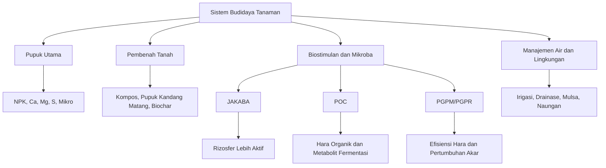

---

## 1.2 Pengertian JAKABA

**JAKABA** adalah singkatan dari **Jamur Keberuntungan Abadi**. Dalam praktik petani, JAKABA dikenal sebagai larutan hasil fermentasi yang umumnya dibuat dari **air cucian beras**, kemudian dapat diperkaya dengan bahan lain seperti akar bambu, tanah rizosfer bambu, bekatul, toge, gula merah, molase, terasi, atau bahan organik lain.

Secara populer, JAKABA sering disebut “jamur”. Namun, dari sudut pandang mikrobiologi praktis, JAKABA sebaiknya tidak dianggap sebagai satu spesies jamur tunggal. JAKABA lebih aman dipahami sebagai **konsorsium mikroba lokal**, yaitu campuran berbagai mikroorganisme yang berkembang selama proses fermentasi. Mikroba tersebut dapat berasal dari air cucian beras, akar bambu, tanah sekitar perakaran, serasah, bahan tambahan, udara, wadah, dan lingkungan produksi.

Beberapa sumber penyuluhan pertanian menyebut JAKABA dibuat dari air cucian beras dan dimanfaatkan pada tanaman dengan cara dikocor atau disemprot setelah diencerkan. Ada juga praktik pembuatan JAKABA yang menggunakan akar bambu, bekatul, dan air cucian beras, lalu difermentasi sekitar 14 hari di tempat teduh dan tidak terkena sinar matahari langsung. ([distankan.bulelengkab.go.id][2])

Dalam artikel ini, JAKABA didefinisikan sebagai:

> **JAKABA adalah produk fermentasi berbasis air cucian beras dan sumber mikroba lokal yang berfungsi terutama sebagai biostimulan, aktivator mikroba tanah, dan pendukung kesehatan rizosfer, bukan sebagai pupuk utama.**

Kata kunci dari definisi tersebut adalah **biostimulan** dan **rizosfer**. Rizosfer adalah zona tanah di sekitar akar yang sangat aktif secara biologis. Di wilayah inilah akar, mikroba, eksudat akar, bahan organik, dan unsur hara saling berinteraksi. Jika aktivitas biologis rizosfer baik, akar biasanya lebih mudah berkembang dan tanaman lebih responsif terhadap pemupukan.

### Catatan Teknis

JAKABA yang dibuat secara tradisional memiliki variasi yang tinggi. Dua batch JAKABA dengan formula sama belum tentu memiliki mikroba, aroma, pH, dan efektivitas yang sama. Karena itu, JAKABA sebaiknya digunakan sebagai **input pendukung**, bukan sebagai satu-satunya sumber pemupukan.

---

## 1.3 Pengertian POC

**POC** adalah singkatan dari **Pupuk Organik Cair**. POC dibuat melalui proses fermentasi bahan organik, baik bahan cair maupun bahan padat, yang kemudian menghasilkan larutan mengandung bahan organik terlarut, unsur hara, asam amino, asam organik, enzim, mikroba fermentasi, dan senyawa metabolit lain.

Bahan baku POC dapat sangat beragam, antara lain:

- limbah sayuran,
- buah-buahan,
- daun hijau,
- daun legum,
- bonggol pisang,
- air cucian beras,
- air kelapa,
- limbah ikan,
- urin ternak,
- kotoran ternak,
- molase atau gula merah,
- MOL atau starter mikroba.

POC berbeda dengan pupuk kimia cair. Pupuk kimia cair biasanya memiliki kandungan hara yang lebih terukur dan spesifik. POC memiliki karakter yang lebih kompleks, tetapi juga lebih bervariasi. Kandungan haranya sangat bergantung pada bahan baku dan proses fermentasi.

Secara fungsi, POC dapat dibagi menjadi dua kelompok utama:

### POC Vegetatif

POC vegetatif diarahkan untuk mendukung fase pertumbuhan daun, batang, tunas, dan akar. Bahan yang sering digunakan biasanya kaya nitrogen organik, asam amino, mineral, dan bahan organik mudah terurai. Contohnya daun hijau, daun legum, azolla, bonggol pisang, air kelapa, dan air cucian beras.

### POC Generatif

POC generatif diarahkan untuk mendukung pembungaan, pembentukan buah, pembesaran buah, dan kualitas hasil. Bahan yang sering digunakan biasanya mengandung unsur kalium, fosfor, kalsium, magnesium, asam amino, dan mineral pendukung. Contohnya kulit pisang, sabut kelapa, air kelapa, limbah ikan, tepung ikan, dan bahan mineral organik lain.

Namun, penting dicatat bahwa POC tidak otomatis memenuhi standar sebagai pupuk organik cair komersial. Untuk diedarkan sebagai produk, pupuk organik cair tetap perlu memperhatikan ketentuan mutu, efektivitas, label, dan pendaftaran sesuai regulasi yang berlaku. ([Database Peraturan | JDIH BPK][1])

---

## 1.4 Pengertian PGPM/PGPR

**PGPM** adalah singkatan dari **Plant Growth Promoting Microorganisms**, yaitu mikroorganisme yang dapat membantu atau memacu pertumbuhan tanaman. Istilah ini lebih luas karena mencakup berbagai jenis mikroba, baik bakteri, jamur, maupun mikroorganisme lain yang memiliki fungsi positif terhadap tanaman.

**PGPR** adalah singkatan dari **Plant Growth Promoting Rhizobacteria**, yaitu bakteri pemacu pertumbuhan tanaman yang hidup di sekitar akar atau rizosfer. PGPR merupakan bagian dari PGPM, tetapi lebih spesifik pada kelompok bakteri rizosfer.

PGPM/PGPR dapat membantu tanaman melalui beberapa mekanisme, antara lain:

- membantu fiksasi nitrogen,
- melarutkan fosfat,
- memobilisasi unsur hara,
- menghasilkan fitohormon,
- menghasilkan enzim tertentu,
- membantu ketersediaan besi melalui siderofor,
- menekan sebagian patogen melalui mekanisme antagonis,
- memperbaiki kondisi biologis di sekitar akar.

Kajian ilmiah tentang PGPR menunjukkan bahwa mekanisme langsungnya dapat mencakup fiksasi nitrogen, mobilisasi hara melalui fosfatase, siderofor, asam organik, serta produksi fitohormon dan enzim. Sementara mekanisme tidak langsung dapat terjadi melalui penekanan organisme patogen atau pengurangan tekanan biologis pada tanaman. ([Journal of Pure and Applied Microbiology][3])

Dalam konteks artikel ini, hubungan antara JAKABA, POC, MOL, dan PGPM dapat dijelaskan sebagai berikut:

- **JAKABA** dapat mengandung mikroba lokal yang berpotensi berperan seperti PGPM, tetapi komposisinya tidak selalu pasti.
- **POC** dapat mengandung mikroba fermentasi dan senyawa organik, tetapi fungsi utamanya lebih sering diarahkan sebagai input hara cair tambahan.
- **MOL** atau Mikroorganisme Lokal adalah sumber mikroba lokal yang dapat digunakan sebagai starter fermentasi.
- **Pupuk hayati** adalah produk mikroba yang lebih terstandar dan biasanya dirancang dengan mikroba spesifik.

### Ilustrasi 2. Hubungan PGPM, PGPR, JAKABA, POC, dan MOL

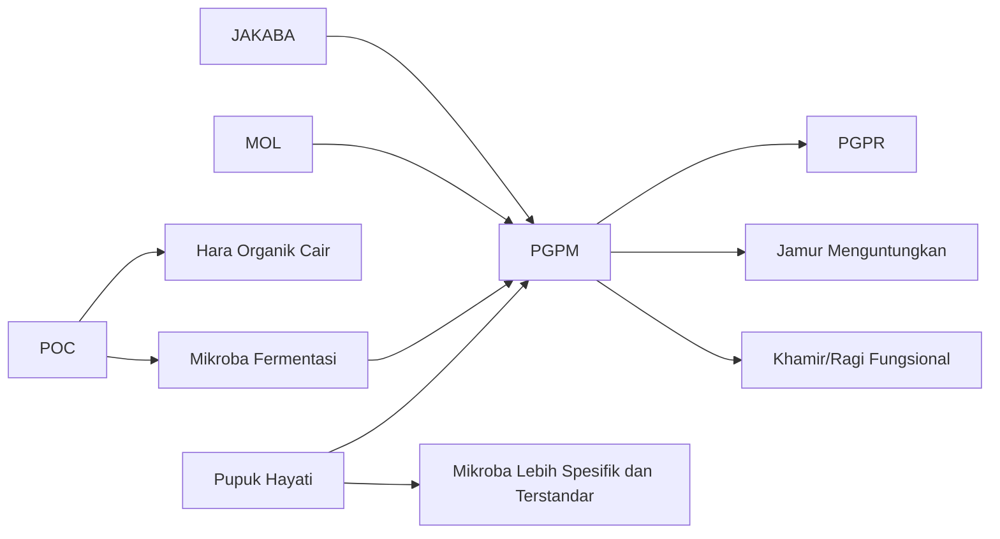

---

## 1.5 Perbedaan JAKABA, POC, dan PGPM

JAKABA, POC, dan PGPM sering dibahas dalam satu kelompok karena sama-sama berkaitan dengan bahan organik, fermentasi, dan mikroba. Namun, secara teknis ketiganya berbeda.

| Aspek           | JAKABA                                         | POC                                               | PGPM/PGPR                                      |
| --------------- | ---------------------------------------------- | ------------------------------------------------- | ---------------------------------------------- |
| Bentuk          | Cair/koloni mikroba                            | Cair                                              | Mikroorganisme fungsional                      |
| Tujuan utama    | Biostimulan dan mikroba lokal                  | Hara tambahan dan bahan organik cair              | Pemacu pertumbuhan tanaman                     |
| Sumber          | Air cucian beras, akar bambu, bahan fermentasi | Limbah organik, hijauan, buah, ikan, urin, molase | Mikroba tanah/rizosfer                         |
| Fungsi dominan  | Aktivasi mikroba tanah dan akar                | Suplai nutrisi tambahan                           | Meningkatkan efisiensi hara dan kesehatan akar |
| Sistem produksi | Aerob-statis                                   | Anaerob/semi-anaerob                              | Isolasi/perbanyakan mikroba                    |
| Keterbatasan    | Komposisi mikroba tidak stabil                 | Kandungan hara bervariasi                         | Perlu mikroba spesifik dan viabilitas baik     |

Dari tabel tersebut, terlihat bahwa JAKABA dan POC sama-sama dapat berupa cairan hasil fermentasi, tetapi orientasi penggunaannya berbeda. JAKABA lebih diarahkan pada **aktivitas biologis dan kesehatan rizosfer**, sedangkan POC lebih diarahkan pada **tambahan bahan organik cair dan nutrisi**.

PGPM/PGPR berbeda lagi. PGPM/PGPR bukan nama produk tertentu, melainkan kategori mikroorganisme berdasarkan fungsinya. Satu produk JAKABA atau POC dapat saja mengandung mikroba yang berperan sebagai PGPM, tetapi hal itu perlu dibuktikan melalui uji mikrobiologi, bukan hanya berdasarkan aroma, warna, atau klaim.

### Ringkasan Praktis

| Produk/Istilah | Cara Memahami                                                      |
| -------------- | ------------------------------------------------------------------ |
| JAKABA         | Fermentasi lokal berbasis air cucian beras dan mikroba alam        |
| POC            | Pupuk organik cair dari fermentasi bahan organik                   |
| PGPM           | Kelompok mikroba pemacu pertumbuhan tanaman                        |
| PGPR           | Kelompok bakteri rizosfer pemacu pertumbuhan tanaman               |
| MOL            | Sumber mikroba lokal untuk fermentasi                              |
| Pupuk hayati   | Produk mikroba yang lebih spesifik dan seharusnya lebih terstandar |

---

## 1.6 Mikroba yang Berpotensi Ada pada JAKABA

Mikroba dalam JAKABA tidak bersifat tetap. Komposisinya sangat dipengaruhi oleh bahan baku, sumber inokulum, kebersihan alat, kualitas air, suhu, lama fermentasi, dan kondisi udara selama proses pembuatan.

Jika JAKABA dibuat dari air cucian beras dan akar bambu, maka sumber mikroba utamanya berasal dari:

- air cucian beras,
- akar bambu,
- tanah rizosfer bambu,
- serasah bambu,
- bekatul/dedak,
- bahan tambahan seperti toge, terasi, dan molase,
- lingkungan fermentasi.

Kelompok mikroba yang berpotensi ada antara lain:

### 1. Mikroba Rizosfer

Mikroba rizosfer berasal dari zona perakaran. Pada akar bambu, mikroba ini hidup di sekitar akar dan memanfaatkan eksudat akar serta bahan organik dari serasah. Mikroba rizosfer dapat berperan dalam dekomposisi bahan organik, siklus hara, dan interaksi dengan akar tanaman.

### 2. Mikroba Pengurai Bahan Organik

Kelompok ini membantu memecah pati, protein, lemak, serat, dan senyawa organik kompleks menjadi senyawa yang lebih sederhana. Dalam JAKABA, mikroba pengurai berperan penting karena bahan seperti air cucian beras, bekatul, toge, dan terasi membutuhkan proses dekomposisi.

### 3. Bakteri Asam Laktat

Bakteri asam laktat dapat muncul dalam fermentasi bahan organik yang mengandung karbohidrat. Kelompok ini dapat membantu menurunkan pH, menekan sebagian mikroba pembusuk, dan menghasilkan aroma asam fermentasi yang lebih stabil.

### 4. Khamir atau Ragi Alami

Khamir dapat memanfaatkan gula sederhana dari molase, gula merah, atau bahan organik lain. Aktivitas khamir biasanya berkaitan dengan pembentukan senyawa metabolit fermentasi dan aroma khas fermentasi.

### 5. Jamur Saprofit

Jamur saprofit adalah jamur pengurai bahan organik mati. Koloni yang muncul di permukaan JAKABA kemungkinan besar merupakan campuran jamur, khamir, bakteri, dan biofilm mikroba, bukan satu jenis jamur tunggal.

### 6. Kemungkinan Kelompok _Pseudomonas_ dan Bakteri Pektinolitik

Beberapa praktik penyuluhan menyebut kemungkinan adanya kelompok mikroba seperti _Pseudomonas_ dan bakteri pektinolitik pada JAKABA. Secara umum, beberapa anggota _Pseudomonas_ dikenal sebagai mikroba rizosfer yang dapat berperan dalam interaksi positif dengan tanaman, sedangkan bakteri pektinolitik berperan dalam penguraian bahan organik yang mengandung pektin. Namun, keberadaan mikroba tersebut dalam setiap batch JAKABA tidak bisa dipastikan tanpa analisis laboratorium.

### Catatan Penting

JAKABA yang tampak bagus secara visual belum tentu memiliki komposisi mikroba ideal. Sebaliknya, JAKABA yang tidak membentuk koloni besar belum tentu gagal. Karena itu, indikator visual harus dilengkapi dengan indikator lain seperti aroma, pH, uji fitotoksik, dan respons tanaman.

---

## 1.7 Nutrisi yang Berpotensi Ada pada JAKABA dan POC

JAKABA dan POC sama-sama mengandung nutrisi dari bahan baku, tetapi konsentrasinya dapat sangat bervariasi. Pada JAKABA, nutrisi umumnya berasal dari air cucian beras, toge, bekatul, gula merah/molase, terasi, dan sumber mikroba alam. Pada POC, nutrisi bergantung pada bahan utama yang digunakan, misalnya hijauan, buah, ikan, urin ternak, atau air kelapa.

Air cucian beras mengandung senyawa yang larut atau terlepas dari beras, sehingga dapat menjadi bahan dasar fermentasi. Kajian tentang fermented washed rice water menunjukkan bahwa air cucian beras berpotensi digunakan sebagai input pertanian karena kandungan nutrisi dan efeknya terhadap aktivitas mikroba, meskipun penggunaannya tetap perlu dikendalikan agar tidak menimbulkan masalah seperti bau, jamur berlebih, atau ketidakseimbangan mikroba. ([PMC][4])

Sumber nutrisi potensial dalam JAKABA dan POC dapat dilihat pada tabel berikut.

| Sumber Bahan      | Nutrisi/Senyawa Potensial                             | Peran dalam Fermentasi dan Tanaman                                                 |
| ----------------- | ----------------------------------------------------- | ---------------------------------------------------------------------------------- |
| Air cucian beras  | Karbohidrat, pati, sedikit mineral                    | Sumber energi mikroba dan bahan dasar fermentasi                                   |
| Toge/kecambah     | Asam amino, enzim, vitamin, senyawa pertumbuhan alami | Mendukung aktivitas mikroba dan biostimulan ringan                                 |
| Bekatul/dedak     | Vitamin B, mineral, bahan organik                     | Menambah nutrisi mikroba                                                           |
| Gula merah/molase | Gula sederhana                                        | Energi cepat untuk mikroba fermentasi                                              |
| Terasi            | Protein, asam amino, mineral, garam                   | Sumber nitrogen organik, tetapi perlu dibatasi karena dapat meningkatkan salinitas |
| Limbah ikan       | Protein, asam amino, N, P, mineral                    | Bahan POC kaya nitrogen dan asam amino                                             |
| Kulit pisang      | Bahan organik, kalium                                 | Umum digunakan untuk POC generatif                                                 |
| Sabut kelapa      | Kalium dan bahan organik                              | Mendukung formula POC generatif                                                    |
| Air kelapa        | Mineral, gula, senyawa organik                        | Mendukung fermentasi dan metabolit organik                                         |

Perlu ditekankan bahwa kandungan nutrisi potensial tidak sama dengan kandungan nutrisi terukur. Untuk mengetahui kadar N, P, K, C-organik, pH, salinitas, dan unsur mikro secara pasti, diperlukan analisis laboratorium.

### Ilustrasi 3. Alur Nutrisi dan Mikroba dalam JAKABA/POC

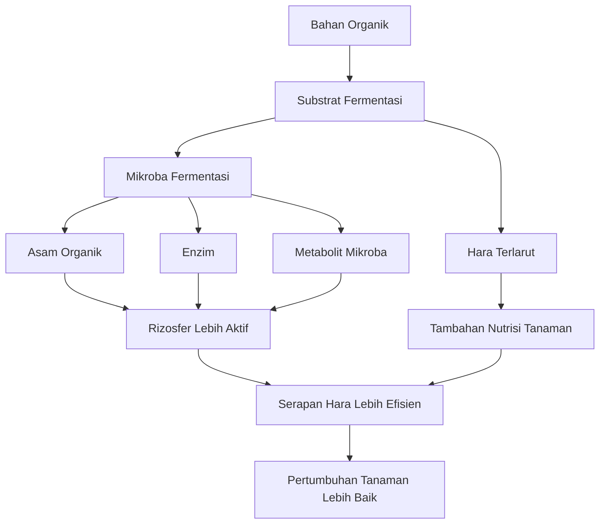

---

## 1.8 Posisi Agronomis JAKABA dan POC

Secara agronomis, JAKABA dan POC harus ditempatkan sebagai **komponen pendukung** dalam sistem pemupukan, bukan sebagai pengganti penuh pupuk utama.

JAKABA lebih tepat digunakan untuk:

- mendukung kehidupan mikroba tanah,
- memperbaiki aktivitas rizosfer,
- membantu pemulihan tanaman stres,
- merangsang perkembangan akar secara tidak langsung,
- mendukung dekomposisi bahan organik,
- meningkatkan efisiensi pemanfaatan pupuk utama.

POC lebih tepat digunakan untuk:

- menambah bahan organik cair,
- menyediakan hara tambahan,
- menyediakan asam amino dan senyawa organik,
- mendukung fase vegetatif atau generatif sesuai bahan baku,
- membantu pemulihan tanaman setelah stres lingkungan.

Namun, cabai, durian, dan tanaman produksi lain tetap membutuhkan hara dalam jumlah cukup dan seimbang. Unsur seperti N, P, K, Ca, Mg, S, Fe, Zn, Mn, B, Cu, dan Mo tidak bisa selalu dicukupi hanya dari JAKABA atau POC rumahan.

Karena itu, posisi terbaik JAKABA dan POC adalah sebagai bagian dari sistem terpadu:

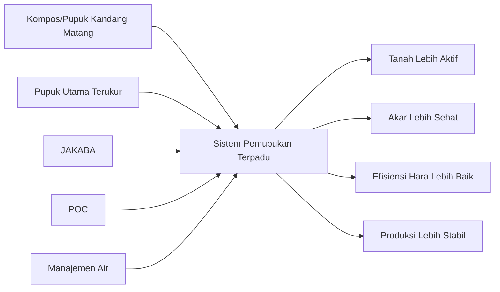

Dalam praktik agribisnis, JAKABA dan POC sebaiknya tidak dinilai hanya dari “tanaman tampak hijau” dalam jangka pendek. Evaluasi harus mencakup pertumbuhan akar, jumlah cabang produktif, ketahanan tanaman terhadap stres, pembungaan, pembentukan buah, kualitas buah, biaya input, dan konsistensi hasil.

---

## 1.9 Batasan dan Risiko Salah Persepsi

JAKABA dan POC memiliki potensi manfaat, tetapi juga memiliki batasan. Kesalahan paling umum adalah menganggap keduanya sebagai input serbaguna yang bisa menggantikan semua pupuk dan pestisida. Dalam praktik lapangan, pendekatan seperti ini berisiko menurunkan produktivitas.

### 1. JAKABA Tidak Selalu Mengandung Mikroba yang Sama

Karena dibuat dari bahan alam dan proses terbuka, komposisi mikroba JAKABA dapat berbeda antar lokasi, antar pembuat, bahkan antar batch produksi. JAKABA dari akar bambu di satu kebun belum tentu sama dengan JAKABA dari akar bambu di lokasi lain.

### 2. POC Tidak Selalu Kaya Hara

Banyak POC rumahan memiliki kandungan hara rendah jika bahan bakunya miskin nutrisi atau fermentasinya tidak optimal. POC dari air cucian beras dan gula saja tentu berbeda dengan POC dari limbah ikan, daun legum, urin ternak, atau bahan kaya mineral.

### 3. Produk Fermentasi Buruk Dapat Bersifat Fitotoksik

Produk fermentasi yang belum matang atau gagal dapat mengandung senyawa yang merusak akar. Gejalanya dapat berupa tanaman layu, akar cokelat, daun menguning, pertumbuhan terhambat, atau bau media menjadi busuk.

### 4. Dosis Berlebihan Dapat Merusak Tanaman

Aplikasi terlalu pekat dapat meningkatkan tekanan osmotik di sekitar akar. Bahan seperti terasi, MSG, urin, limbah ikan, atau bahan asin lain juga dapat meningkatkan risiko salinitas bila digunakan berlebihan.

### 5. Produk Berbau Busuk Tidak Layak Dipakai

Aroma fermentasi yang baik biasanya asam segar, manis-asam, atau mirip tape. Bau bangkai, amonia tajam, busuk menyengat, atau lendir hitam berlebihan menunjukkan proses fermentasi tidak sehat.

### 6. Tetap Perlu Uji Kecil

Sebelum digunakan pada tanaman utama, JAKABA dan POC harus diuji terlebih dahulu pada skala kecil. Uji sederhana dapat dilakukan pada 5–10 tanaman atau pada tanaman indikator cepat tumbuh. Bila dalam 3–5 hari tidak muncul gejala layu, terbakar, atau stres berat, aplikasi dapat dilanjutkan dengan dosis bertahap.

---

## Ringkasan Bab 1

JAKABA, POC, dan PGPM saling berkaitan, tetapi tidak sama. **JAKABA** adalah fermentasi berbasis air cucian beras dan mikroba lokal yang lebih tepat diposisikan sebagai biostimulan rizosfer. **POC** adalah pupuk organik cair hasil fermentasi bahan organik yang berfungsi sebagai sumber hara tambahan dan bahan organik terlarut. **PGPM/PGPR** adalah kelompok mikroba fungsional yang dapat membantu pertumbuhan tanaman melalui mekanisme biologis seperti fiksasi nitrogen, pelarutan fosfat, produksi fitohormon, dan penekanan patogen.

Dalam sistem agribisnis, JAKABA dan POC sebaiknya digunakan sebagai bagian dari pemupukan terpadu. Keduanya dapat membantu meningkatkan kesehatan tanah dan efisiensi pemupukan, tetapi tidak boleh diperlakukan sebagai pengganti total pupuk utama. Keberhasilan penggunaannya sangat bergantung pada kualitas fermentasi, dosis, cara aplikasi, kondisi tanah, dan kebutuhan spesifik tanaman.

[1]: https://peraturan.bpk.go.id/Details/161054/permentan-no-01-tahun-2019 'Permentan No. 01 Tahun 2019'
[2]: https://distankan.bulelengkab.go.id/informasi/detail/artikel/45_jakaba-jamur-keberuntungan-abadi-dari-cucian-air-beras?utm_source=chatgpt.com 'JAKABA (JAMUR KEBERUNTUNGAN ABADI) DARI ...'
[3]: https://microbiologyjournal.org/plant-growth-promoting-rhizobacteria-pgpr-prospective-and-mechanisms-a-review/ 'Plant Growth Promoting Rhizobacteria (PGPR) - Prospective and Mechanisms: A Review - Journal of Pure and Applied Microbiology'
[4]: https://pmc.ncbi.nlm.nih.gov/articles/PMC10559983/?utm_source=chatgpt.com 'Combined benefits of fermented washed rice water and NPK ...'

---

# 2. Formulasi, Fermentasi, dan Penyimpanan JAKABA 10 Liter

## 2.1 Prinsip Dasar Pembuatan JAKABA

- JAKABA dibuat melalui proses fermentasi bahan organik kaya karbohidrat.
- Sistem fermentasi yang dianjurkan adalah **aerob-statis**.
- Fermentasi membutuhkan oksigen, tetapi tidak perlu aerator terus-menerus.
- Wadah tidak boleh ditutup rapat total.
- Koloni permukaan akan lebih mudah terbentuk bila wadah tidak sering diganggu.

## 2.2 Aerob, Anaerob, dan Aerob-Statis

| Sistem       | Karakter                           | Cocok untuk JAKABA?                                           |
| ------------ | ---------------------------------- | ------------------------------------------------------------- |
| Aerob aktif  | Banyak oksigen, bisa pakai aerator | Cocok untuk mikroba cair, tetapi koloni permukaan mudah pecah |
| Anaerob      | Tertutup rapat/minim oksigen       | Kurang cocok untuk JAKABA                                     |
| Aerob-statis | Ada oksigen, tetapi cairan tenang  | Paling cocok untuk JAKABA                                     |

## 2.3 Bahan Utama JAKABA

- Air cucian beras.
- Toge/kecambah.
- Gula merah/molase.
- Bekatul/dedak.
- Terasi.
- MSG/penyedap masakan, opsional.
- Starter JAKABA atau sumber mikroba alam seperti akar bambu.

## 2.4 Fungsi Tiap Bahan dalam JAKABA

| Bahan             | Fungsi                                                            |
| ----------------- | ----------------------------------------------------------------- |
| Air cucian beras  | Sumber karbohidrat/pati untuk energi mikroba                      |
| Toge              | Sumber enzim, vitamin, asam amino, dan senyawa biostimulan        |
| Gula merah/molase | Energi cepat untuk mempercepat pertumbuhan mikroba                |
| Bekatul/dedak     | Sumber vitamin B, mineral, dan nutrisi mikroba                    |
| Terasi            | Sumber protein, mineral, nitrogen organik, dan mikroba fermentasi |
| MSG/penyedap      | Sumber glutamat/asam amino ringan, tetapi harus dibatasi          |
| Starter JAKABA    | Inokulum untuk mempercepat fermentasi                             |
| Akar bambu        | Sumber mikroba alam dari rizosfer dan serasah bambu               |

## 2.5 Formula JAKABA dari Starter untuk 10 Liter

| Bahan                          |    Takaran |
| ------------------------------ | ---------: |
| Air cucian beras pertama/kedua |    7 liter |
| Ekstrak toge                   |  1,5 liter |
| Larutan gula merah/molase      |    1 liter |
| Starter JAKABA aktif           |     500 ml |
| Bekatul/dedak halus            |   100 gram |
| Terasi                         | 10–20 gram |
| MSG/penyedap                   |   0–5 gram |

## 2.6 Formula JAKABA dari Alam/Akar Bambu untuk 10 Liter

| Bahan                             |      Takaran |
| --------------------------------- | -----------: |
| Air cucian beras pertama/kedua    |      7 liter |
| Ekstrak toge                      |    1,5 liter |
| Larutan gula merah/molase         |      1 liter |
| Akar bambu + tanah rizosfer bambu | 300–500 gram |
| Bekatul/dedak halus               |     100 gram |
| Terasi                            |   10–20 gram |
| MSG/penyedap                      |     0–5 gram |

## 2.7 Cara Menyiapkan Ekstrak Toge

- Gunakan toge segar sebanyak **250 gram**.
- Tambahkan air bersih non-kaporit sebanyak **1,5 liter**.
- Blender halus.
- Saring dan ambil cairannya.
- Ampas sebaiknya tidak dimasukkan agar fermentasi lebih bersih.

## 2.8 Cara Menyiapkan Larutan Gula

- Larutkan gula merah/molase **150–200 gram** dalam air hangat.
- Tambahkan terasi **10–20 gram**.
- Tambahkan MSG **0–5 gram**, opsional.
- Tambahkan air hingga menjadi **1 liter larutan**.
- Dinginkan sebelum dicampurkan ke fermentor.

## 2.9 Persiapan Akar Bambu

- Ambil dari rumpun bambu sehat.
- Pilih akar halus, tanah rizosfer, dan sedikit serasah bambu lapuk.
- Hindari area yang terkena pestisida, herbisida, limbah, atau genangan tercemar.
- Masukkan akar bambu, tanah rizosfer, dan bekatul ke dalam kantong kain/kantong jaring.
- Tujuannya agar bahan padat tidak menyebar dan produk akhir mudah disaring.

## 2.10 Prosedur Fermentasi JAKABA

1. Gunakan fermentor minimal **12–15 liter** untuk target hasil 10 liter.
2. Masukkan air cucian beras.
3. Tambahkan ekstrak toge.
4. Tambahkan larutan gula-terasi-MSG.
5. Masukkan starter JAKABA atau kantong akar bambu.
6. Aduk rata pada awal pencampuran.
7. Tutup dengan kain/kasa/tutup longgar.
8. Simpan di tempat teduh dan redup.
9. Aduk ringan pada hari ke-1 sampai ke-3.
10. Setelah hari ke-4, diamkan agar koloni permukaan terbentuk.
11. Fermentasi selama **10–14 hari**, dapat diperpanjang sampai **21 hari** bila kondisi lambat.

## 2.11 Kondisi Fermentasi JAKABA

| Parameter         | Rekomendasi                          |
| ----------------- | ------------------------------------ |
| Sistem            | Aerob-statis                         |
| Cahaya            | Redup/teduh                          |
| Matahari langsung | Dihindari                            |
| Suhu ideal        | 25–32°C                              |
| Suhu terbaik      | 27–30°C                              |
| Tutup wadah       | Kain/kasa/tutup longgar              |
| Pengadukan        | Hari ke-1 sampai ke-3                |
| Durasi            | 10–14 hari, maksimal praktis 21 hari |

## 2.12 Tanda JAKABA Berhasil

- Aroma asam-manis fermentasi.
- Tidak berbau bangkai.
- Tidak berbau amonia tajam.
- Muncul koloni putih krem, kekuningan, atau cokelat muda.
- Tidak ada belatung.
- Tidak didominasi jamur hitam/hijau pekat.
- pH ideal sekitar **4–5,5**.

## 2.13 Tanda JAKABA Gagal

- Bau busuk menyengat.
- Bau bangkai atau amonia tajam.
- Ada belatung.
- Lendir hitam pekat berlebihan.
- Jamur hitam/hijau dominan.
- Cairan terlalu asin atau menyengat.
- Tanaman layu saat uji aplikasi kecil.

## 2.14 Standar Mutu dan Uji Kelayakan Sederhana JAKABA

- Uji aroma.
- Uji warna.
- Uji pH.
- Uji endapan.
- Uji fitotoksik pada 5–10 tanaman terlebih dahulu.
- Uji semai sederhana pada benih cepat tumbuh.
- Catat tanggal produksi, bahan, suhu, dan hasil fermentasi.
- Untuk skala usaha, disarankan uji laboratorium mikroba dan keamanan mikrobiologis.

## 2.15 Penyaringan dan Penyimpanan JAKABA

- Saring setelah fermentasi selesai.
- Gunakan kain saring halus.
- Simpan dalam botol/jerigen bersih.
- Jangan isi penuh karena masih mungkin menghasilkan gas.
- Simpan di tempat teduh dan sejuk.
- Buka tutup sesekali bila masih ada tekanan gas.

## 2.16 Masa Simpan JAKABA

| Kondisi Produk               | Estimasi Masa Simpan |
| ---------------------------- | -------------------: |
| Tidak disaring, banyak ampas |           2–4 minggu |
| Disaring bersih              |            1–2 bulan |
| Disimpan sejuk dan higienis  |       hingga 3 bulan |
| Bau berubah busuk            |    tidak layak pakai |

---

Berikut **Bab 3 lengkap** dalam format **MDX-ready**, mengikuti outline bab terlampir.

---

# 3. Formulasi, Fermentasi, dan Penyimpanan POC 10 Liter

## 3.1 Prinsip Dasar Pembuatan POC

**POC** atau **Pupuk Organik Cair** adalah larutan hasil fermentasi bahan organik yang digunakan sebagai input tambahan dalam budidaya tanaman. POC dapat dibuat dari bahan nabati, hewani, atau campuran keduanya. Bahan yang umum digunakan antara lain daun hijau, daun legum, bonggol pisang, kulit buah, limbah ikan, air cucian beras, air kelapa, molase, gula merah, urin ternak, kotoran ternak, serta starter mikroba seperti EM4 atau MOL.

Tujuan utama pembuatan POC adalah menghasilkan larutan yang mengandung:

- bahan organik terlarut,
- hara tambahan,
- asam amino,
- mineral,
- asam organik,
- enzim,
- senyawa metabolit hasil fermentasi,
- mikroba fermentasi yang masih aktif dalam batas tertentu.

Namun, POC tidak boleh langsung dianggap sebagai pupuk lengkap. Kualitas POC sangat tergantung pada bahan baku, rasio bahan, kebersihan proses, jenis starter, lama fermentasi, suhu, sistem penyimpanan, serta cara aplikasi. POC dari bahan yang miskin hara tentu berbeda dengan POC dari bahan kaya nitrogen, kalium, protein, atau mineral.

Dalam konteks agribisnis, POC harus diposisikan sebagai **pupuk organik cair tambahan**, bukan pengganti penuh pupuk dasar atau pupuk utama. Untuk produk yang diedarkan secara komersial, pupuk organik, pupuk hayati, dan pembenah tanah di Indonesia memiliki acuan persyaratan teknis minimal melalui Kepmentan No. 261/KPTS/SR.310/M/4/2019. ([psp.pertanian.go.id][1])

### Ilustrasi 3.1. Prinsip Dasar Pembuatan POC

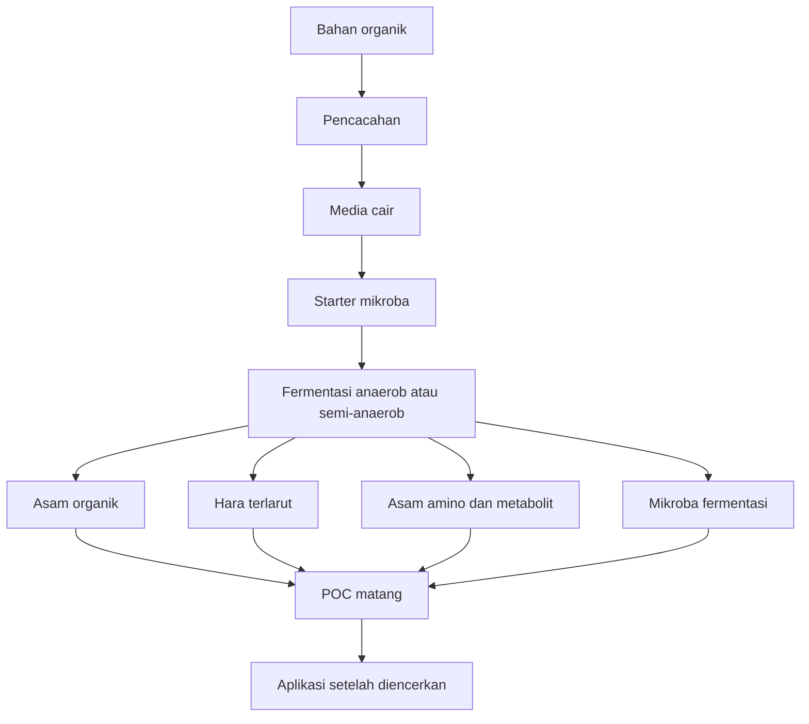

POC yang baik bukan hanya “jadi cairan berwarna cokelat”. POC yang layak digunakan harus memiliki aroma fermentasi yang wajar, tidak busuk menyengat, tidak mengandung belatung, tidak menghasilkan gas berlebihan setelah matang, dan tidak menyebabkan tanaman layu pada uji dosis rendah.

---

## 3.2 Perbedaan POC Vegetatif dan POC Generatif

POC sebaiknya dibuat berdasarkan tujuan fase pertumbuhan tanaman. Secara praktis, POC dapat dibagi menjadi dua kelompok utama, yaitu **POC vegetatif** dan **POC generatif**.

| Jenis POC     | Tujuan                                              | Bahan Dominan                                 |
| ------------- | --------------------------------------------------- | --------------------------------------------- |
| POC vegetatif | Mendukung daun, batang, akar, dan pemulihan tanaman | Daun hijau, legum, bonggol pisang, air kelapa |
| POC generatif | Mendukung bunga, buah, dan pengisian hasil          | Kulit pisang, sabut kelapa, ikan, air kelapa  |

### POC Vegetatif

POC vegetatif diarahkan untuk fase pertumbuhan awal sampai pertumbuhan aktif. Pada fase ini tanaman membutuhkan dukungan untuk pembentukan daun, batang, cabang, akar, dan tunas baru.

Bahan yang dipilih biasanya memiliki karakter:

- kaya bahan organik mudah terurai,
- mengandung nitrogen organik,
- mengandung mineral,
- mendukung pertumbuhan mikroba fermentasi,
- tidak terlalu tinggi garam.

Contoh bahan yang cocok adalah daun legum, daun gamal, daun kelor, azolla, bonggol pisang, air cucian beras, dan air kelapa.

### POC Generatif

POC generatif diarahkan untuk fase pembungaan, pembuahan, dan pengisian hasil. Pada fase ini tanaman membutuhkan dukungan unsur kalium, fosfor, kalsium, magnesium, asam amino, dan keseimbangan hara yang baik.

Bahan yang sering digunakan antara lain kulit pisang, sabut kelapa, air kelapa, limbah ikan, tepung ikan, dan molase. Limbah ikan atau tepung ikan digunakan dalam jumlah terbatas karena kaya protein dan dapat menghasilkan bau menyengat bila fermentasi tidak berjalan baik.

### Catatan Teknis

POC vegetatif tidak berarti hanya mengandung nitrogen, dan POC generatif tidak berarti hanya mengandung kalium. Pembagian ini adalah pendekatan praktis berdasarkan dominasi bahan dan tujuan aplikasi. Kandungan aktual tetap perlu diuji di laboratorium bila produk digunakan untuk skala komersial.

---

## 3.3 Sistem Fermentasi POC

Berbeda dengan JAKABA yang lebih cocok menggunakan sistem **aerob-statis**, POC umumnya dibuat dengan sistem **anaerob** atau **semi-anaerob**. Artinya, fermentor lebih tertutup, tetapi tetap harus memiliki mekanisme pelepasan gas.

Pada fase awal fermentasi, mikroba memecah gula dan bahan organik sehingga menghasilkan gas. Jika wadah ditutup rapat tanpa pelepasan gas, tekanan dapat meningkat dan menyebabkan botol menggembung, bocor, atau bahkan pecah.

Beberapa panduan pembuatan POC menyarankan bahan organik dimasukkan ke wadah fermentasi, ditambah molase atau gula merah, lalu ditambahkan EM4 sekitar 100–200 ml sebelum difermentasi. Proses seperti ini menunjukkan pentingnya sumber energi dan starter mikroba dalam fermentasi POC. ([P3BMS][2])

### Sistem Fermentasi yang Dapat Digunakan

| Sistem       | Karakter                                   | Kelebihan                                 | Risiko                                          |
| ------------ | ------------------------------------------ | ----------------------------------------- | ----------------------------------------------- |
| Anaerob      | Wadah tertutup dengan pelepasan gas        | Fermentasi lebih terkontrol               | Wadah bisa menggembung jika gas tidak keluar    |
| Semi-anaerob | Wadah tertutup longgar atau dibuka berkala | Lebih mudah untuk skala rumah tangga      | Risiko kontaminasi bila sering dibuka           |
| Aerob        | Terbuka/beroksigen tinggi                  | Bau bisa lebih ringan pada beberapa bahan | Kurang sesuai untuk POC berbahan protein tinggi |

### Ilustrasi 3.2. Sistem Fermentasi POC

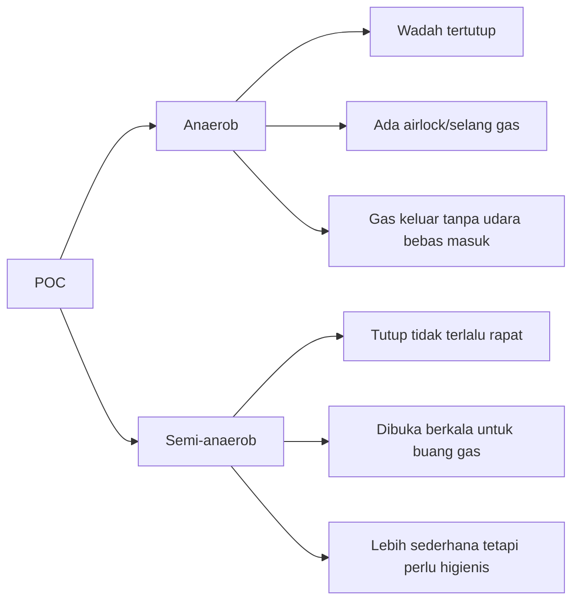

### Rekomendasi Praktis

Untuk produksi 10 liter, sistem yang paling aman adalah **semi-anaerob terkontrol** atau **anaerob dengan airlock sederhana**.

Airlock sederhana dapat dibuat dengan:

- selang kecil dari tutup fermentor,
- ujung selang dimasukkan ke botol berisi air,
- gas dari fermentor keluar melalui air,
- udara luar tidak mudah masuk kembali.

---

## 3.4 Formula POC Vegetatif 10 Liter

Formula POC vegetatif berikut dirancang untuk mendukung fase pertumbuhan daun, batang, akar, dan pemulihan tanaman. Formula ini cocok sebagai input pendamping untuk cabai pada fase awal dan durian pada fase bibit atau flush vegetatif.

| Bahan                                 |               Takaran |
| ------------------------------------- | --------------------: |
| Daun legum/gamal/kelor/azolla cincang |                  1 kg |
| Bonggol pisang cincang                |              500 gram |
| Air cucian beras                      |               5 liter |
| Air kelapa                            |               2 liter |
| Molase/gula merah                     |              250 gram |
| EM4 pertanian/MOL aktif               |                200 ml |
| Air non-kaporit                       | sampai total 10 liter |

### Perhitungan Formula POC Vegetatif

```mdx
Target volume akhir = 10 liter

Komponen cair utama:

- Air cucian beras = 5,0 L
- Air kelapa = 2,0 L
- EM4/MOL aktif = 0,2 L

Subtotal cairan awal = 5,0 + 2,0 + 0,2
Subtotal cairan awal = 7,2 L

Bahan padat:

- Daun hijau/legum = 1 kg
- Bonggol pisang = 0,5 kg
- Molase/gula merah = 250 g

Tambahkan air non-kaporit sampai total volume campuran mendekati 10 L.
Gunakan fermentor minimal 12–15 L agar tersedia ruang gas.
```

### Catatan Formula

Daun legum, gamal, kelor, atau azolla berfungsi sebagai sumber bahan organik dan nitrogen organik. Bonggol pisang menambah karbohidrat dan bahan organik mudah terurai. Air kelapa mendukung fermentasi karena mengandung gula, mineral, dan senyawa organik. Molase atau gula merah berfungsi sebagai sumber energi mikroba. EM4 atau MOL aktif berperan sebagai starter fermentasi.

Untuk skala teknis, bahan padat sebaiknya dicacah kecil agar proses dekomposisi lebih merata.

---

## 3.5 Formula POC Generatif 10 Liter

Formula POC generatif dirancang untuk mendukung fase pembungaan, pembentukan buah, dan pengisian hasil. Formula ini lebih sesuai digunakan saat tanaman memasuki fase generatif, misalnya cabai mulai berbunga atau durian setelah fase pemulihan vegetatif.

| Bahan                       |               Takaran |
| --------------------------- | --------------------: |
| Kulit pisang matang cincang |                  1 kg |
| Sabut kelapa/cocopeat kasar |              500 gram |
| Limbah ikan/tepung ikan     |              250 gram |
| Air cucian beras            |               5 liter |
| Air kelapa                  |               2 liter |
| Molase/gula merah           |              300 gram |
| EM4 pertanian/MOL aktif     |                200 ml |
| Air non-kaporit             | sampai total 10 liter |

### Perhitungan Formula POC Generatif

```mdx
Target volume akhir = 10 liter

Komponen cair utama:

- Air cucian beras = 5,0 L
- Air kelapa = 2,0 L
- EM4/MOL aktif = 0,2 L

Subtotal cairan awal = 5,0 + 2,0 + 0,2
Subtotal cairan awal = 7,2 L

Bahan padat:

- Kulit pisang matang = 1 kg
- Sabut kelapa/cocopeat kasar = 0,5 kg
- Limbah ikan/tepung ikan = 0,25 kg
- Molase/gula merah = 300 g

Tambahkan air non-kaporit sampai total volume campuran mendekati 10 L.
Gunakan fermentor minimal 12–15 L karena POC generatif, terutama yang mengandung ikan, berpotensi menghasilkan gas dan bau lebih kuat.
```

### Catatan Formula

Kulit pisang dan sabut kelapa digunakan karena umum dipakai sebagai bahan POC generatif berbasis bahan organik kaya kalium. Limbah ikan atau tepung ikan berfungsi sebagai sumber protein, nitrogen, fosfor, mineral, dan asam amino. Namun, bahan ikan harus dibatasi karena mudah menimbulkan bau busuk jika fermentasi gagal.

Untuk menekan bau pada formula berbahan ikan, dapat ditambahkan bahan aromatik dan antimikroba alami dalam jumlah kecil, misalnya:

| Bahan Tambahan Opsional | Dosis per 10 Liter | Fungsi                                          |
| ----------------------- | -----------------: | ----------------------------------------------- |
| Jahe cincang            |         25–50 gram | Mengurangi bau, mendukung stabilitas fermentasi |
| Kunyit cincang          |         25–50 gram | Membantu menekan bau menyengat                  |
| Lengkuas cincang        |         25–50 gram | Membantu aroma fermentasi lebih terkendali      |
| Daun pandan             |         2–3 lembar | Pengurang aroma tajam                           |

Bahan tambahan tersebut bukan bahan wajib. Fungsinya lebih sebagai pendukung aroma dan stabilitas proses, bukan sebagai sumber hara utama.

---

## 3.6 Fungsi Tiap Bahan dalam POC

Bahan POC harus dipilih berdasarkan tujuan formulasi. POC vegetatif membutuhkan bahan yang mendukung pertumbuhan daun, akar, dan pemulihan tanaman. POC generatif membutuhkan bahan yang lebih mendukung bunga, buah, dan pengisian hasil.

| Bahan                   | Fungsi                                      |
| ----------------------- | ------------------------------------------- |
| Daun hijau/legum        | Sumber nitrogen, mineral, dan bahan organik |
| Bonggol pisang          | Sumber karbohidrat dan mikroba lokal        |
| Kulit pisang            | Sumber bahan organik dan kalium             |
| Sabut kelapa/cocopeat   | Sumber kalium dan bahan organik             |
| Limbah ikan/tepung ikan | Sumber N, P, protein, dan asam amino        |
| Air cucian beras        | Sumber karbohidrat                          |
| Air kelapa              | Sumber mineral, gula, dan senyawa organik   |
| Molase/gula merah       | Sumber energi mikroba                       |
| EM4/MOL                 | Starter mikroba fermentasi                  |

### Penjelasan Fungsi Bahan

**Daun hijau dan legum** digunakan sebagai sumber bahan organik, nitrogen organik, dan mineral. Bahan ini cocok untuk POC vegetatif karena mendukung fase pertumbuhan daun dan tunas.

**Bonggol pisang** berfungsi sebagai sumber karbohidrat dan bahan organik lunak. Bahan ini mudah terurai dan sering digunakan dalam MOL atau POC tradisional.

**Kulit pisang** digunakan dalam POC generatif karena secara praktik sering dikaitkan dengan dukungan kalium organik. Kalium penting dalam proses pembesaran buah, pengaturan air, dan kualitas hasil.

**Sabut kelapa atau cocopeat kasar** digunakan sebagai bahan pendukung generatif karena mengandung bahan organik dan unsur mineral, terutama kalium dalam jumlah bervariasi.

**Limbah ikan atau tepung ikan** berfungsi sebagai sumber protein, nitrogen, fosfor, mineral, dan asam amino. Bahan berbasis ikan memiliki potensi baik untuk POC, tetapi perlu fermentasi yang lebih hati-hati karena mudah menimbulkan bau menyengat.

**Air cucian beras** menjadi sumber karbohidrat dan bahan organik mudah terurai.

**Air kelapa** membantu fermentasi karena mengandung gula, mineral, dan senyawa organik.

**Molase atau gula merah** adalah sumber energi cepat untuk starter mikroba. Dalam pembuatan pupuk organik cair, molase sering digunakan bersama EM4 sebagai sumber makanan mikroba. ([Neliti][3])

**EM4 atau MOL aktif** berfungsi sebagai sumber mikroba fermentasi. Starter membantu proses fermentasi lebih cepat dan lebih terarah dibanding fermentasi liar tanpa inokulum.

---

Baik. Tambahan ini paling tepat dimasukkan ke **Bab 3** sebagai sub-bab baru setelah **3.6 Fungsi Tiap Bahan dalam POC**, karena MOL berfungsi sebagai **starter/bioaktivator** untuk pembuatan POC, kompos, dan fermentasi bahan organik.

Rekomendasi penomoran:

```mdx
3.7 Formulasi dan Pembuatan MOL 10 Liter
```

Sub-bab lama **3.7 Prosedur Fermentasi POC** dan seterusnya tinggal digeser menjadi **3.8, 3.9, 3.10**, dan seterusnya.

---

# 3.7 Formulasi dan Pembuatan MOL 10 Liter

## 3.7.1 Pengertian MOL

**MOL** adalah singkatan dari **Mikroorganisme Lokal**. MOL merupakan larutan hasil fermentasi bahan organik lokal yang berfungsi sebagai sumber mikroba untuk membantu proses fermentasi, dekomposisi bahan organik, pembuatan POC, pembuatan kompos, bokashi, dan aktivasi bahan organik di tanah.

Berbeda dengan POC, MOL tidak diposisikan sebagai sumber hara utama. Fungsi utama MOL adalah sebagai **starter mikroba** atau **bioaktivator**. Artinya, MOL digunakan untuk memperbanyak aktivitas mikroba dalam bahan organik, bukan untuk menggantikan pupuk utama.

Dalam sistem budidaya, MOL dapat digunakan untuk:

- starter pembuatan POC,
- aktivator kompos,
- aktivator bokashi,
- dekomposer bahan organik,
- pendukung aktivitas mikroba tanah,
- bahan pembantu fermentasi limbah pertanian.

Secara praktis, MOL dapat dibuat dari berbagai bahan lokal seperti bonggol pisang, rebung bambu, akar bambu, nasi fermentasi, buah matang, air cucian beras, air kelapa, molase, dan gula merah.

---

## 3.7.2 Perbedaan MOL, POC, dan JAKABA

| Aspek                           | MOL                              | POC                                      | JAKABA                                |
| ------------------------------- | -------------------------------- | ---------------------------------------- | ------------------------------------- |
| Fungsi utama                    | Starter mikroba/bioaktivator     | Pupuk organik cair tambahan              | Biostimulan/mikroba rizosfer          |
| Target penggunaan               | Fermentasi, kompos, dekomposer   | Hara tambahan dan metabolit fermentasi   | Akar, tanah, rizosfer                 |
| Kandungan utama yang diharapkan | Mikroba aktif                    | Hara organik cair, asam amino, metabolit | Mikroba lokal dan senyawa biostimulan |
| Sistem fermentasi               | Anaerob/semi-anaerob             | Anaerob/semi-anaerob                     | Aerob-statis                          |
| Aplikasi utama                  | Sebagai starter atau kocor tanah | Kocor/semprot sesuai fase                | Kocor tanah/media                     |
| Keterbatasan                    | Komposisi mikroba tidak seragam  | Kandungan hara bervariasi                | Mikroba tidak stabil antar batch      |

MOL dapat digunakan untuk membantu pembuatan POC, tetapi MOL bukan POC. POC lebih diarahkan sebagai input cair bernutrisi, sedangkan MOL lebih diarahkan sebagai sumber mikroba fermentasi.

---

## 3.7.3 Formula MOL Serbaguna 10 Liter

Formula berikut dirancang sebagai **MOL serbaguna** untuk starter POC, kompos, bokashi, dan aktivator bahan organik. Bahan utamanya menggunakan bonggol pisang, air cucian beras, air kelapa, molase/gula merah, dan sumber mikroba lokal dari tanah rizosfer bambu atau serasah sehat.

Gunakan fermentor berkapasitas minimal **12–15 liter** untuk target hasil 10 liter.

| Bahan                                          |                Takaran |
| ---------------------------------------------- | ---------------------: |
| Air cucian beras pertama/kedua                 |                5 liter |
| Air kelapa                                     |                2 liter |
| Larutan gula merah/molase                      |                1 liter |
| Bonggol pisang cincang halus                   |                   1 kg |
| Tanah rizosfer bambu/serasah bambu lapuk sehat |               300 gram |
| Bekatul/dedak halus                            |               100 gram |
| Air non-kaporit                                | sampai total ±10 liter |

### Perhitungan Volume MOL

```mdx
Target volume MOL = 10 liter

Komponen cair:

- Air cucian beras = 5 L
- Air kelapa = 2 L
- Larutan gula/molase = 1 L

Subtotal cairan = 5 + 2 + 1
Subtotal cairan = 8 L

Tambahan:

- Bonggol pisang = 1 kg
- Tanah rizosfer/serasah bambu = 300 g
- Bekatul/dedak = 100 g

Tambahkan air non-kaporit sampai volume cairan mendekati 10 L.
Gunakan fermentor 12–15 L karena bahan padat membutuhkan ruang tambahan.
```

---

## 3.7.4 Fungsi Tiap Bahan dalam MOL

| Bahan                | Fungsi                                                     |
| -------------------- | ---------------------------------------------------------- |
| Air cucian beras     | Sumber karbohidrat/pati untuk energi mikroba               |
| Air kelapa           | Sumber mineral, gula, dan senyawa organik                  |
| Gula merah/molase    | Energi cepat untuk memperbanyak mikroba                    |
| Bonggol pisang       | Sumber karbohidrat, bahan organik lunak, dan mikroba lokal |
| Tanah rizosfer bambu | Sumber mikroba tanah/rizosfer                              |
| Serasah bambu lapuk  | Sumber mikroba pengurai bahan organik                      |
| Bekatul/dedak        | Sumber vitamin B, mineral, dan nutrisi mikroba             |
| Air non-kaporit      | Penyesuaian volume dan media fermentasi                    |

Bonggol pisang digunakan karena mudah terurai dan kaya bahan organik. Tanah rizosfer bambu atau serasah bambu lapuk digunakan sebagai sumber mikroba alam. Gula merah atau molase berperan sebagai energi awal agar mikroba cepat aktif.

---

## 3.7.5 Cara Membuat Larutan Gula/Molase

Larutan gula digunakan sebagai sumber energi cepat bagi mikroba.

| Bahan             |        Takaran |
| ----------------- | -------------: |
| Gula merah/molase |       300 gram |
| Air hangat        | sampai 1 liter |

### Prosedur

1. Siapkan air hangat, bukan air mendidih.
2. Masukkan gula merah atau molase.
3. Aduk sampai larut.
4. Tambahkan air hingga volume menjadi 1 liter.
5. Dinginkan sebelum dicampurkan ke fermentor.

```mdx
Formula larutan gula MOL:
Gula merah/molase = 300 g
Air hangat = sampai 1 L

Jangan masukkan larutan panas ke fermentor karena dapat menekan mikroba alami.
```

---

## 3.7.6 Prosedur Pembuatan MOL 10 Liter

### Peralatan

| Alat                         | Fungsi                                  |
| ---------------------------- | --------------------------------------- |
| Fermentor 12–15 liter        | Wadah fermentasi                        |
| Pisau/parang/chopper         | Mencacah bonggol pisang                 |
| Kain/kantong jaring          | Menahan bahan padat agar mudah disaring |
| Pengaduk bersih              | Mencampur bahan                         |
| Selang airlock/tutup longgar | Pelepasan gas                           |
| Kain saring                  | Menyaring MOL matang                    |
| Botol/jerigen bersih         | Penyimpanan                             |
| Label batch                  | Pencatatan produksi                     |

### Langkah Pembuatan

1. Bersihkan fermentor dan alat yang digunakan.
2. Cacah bonggol pisang hingga ukuran kecil.
3. Masukkan bonggol pisang, tanah rizosfer bambu/serasah bambu, dan bekatul ke dalam kantong kain atau kantong jaring.
4. Masukkan **5 liter air cucian beras** ke fermentor.
5. Tambahkan **2 liter air kelapa**.
6. Tambahkan **1 liter larutan gula/molase** yang sudah dingin.
7. Masukkan kantong bahan padat ke dalam fermentor.
8. Tambahkan air non-kaporit sampai volume cairan mendekati **10 liter**.
9. Aduk rata pada awal pencampuran.
10. Tutup fermentor dengan sistem **semi-anaerob**, yaitu tertutup tetapi tetap memiliki pelepasan gas.
11. Simpan di tempat teduh, sejuk, dan tidak terkena matahari langsung.
12. Fermentasikan selama **10–14 hari**.
13. Setelah fermentasi selesai, saring dan simpan dalam jerigen bersih.

---

## 3.7.7 Sistem Fermentasi MOL

MOL lebih cocok difermentasi dengan sistem **anaerob atau semi-anaerob**, bukan aerob-statis seperti JAKABA.

| Sistem        | Keterangan                            | Rekomendasi                            |
| ------------- | ------------------------------------- | -------------------------------------- |
| Anaerob       | Wadah tertutup dengan airlock         | Baik untuk fermentasi lebih terkontrol |
| Semi-anaerob  | Wadah tertutup longgar/dibuka berkala | Praktis untuk skala petani             |
| Aerob terbuka | Terlalu banyak udara bebas            | Risiko kontaminasi lebih tinggi        |

Sistem terbaik untuk produksi MOL 10 liter adalah **semi-anaerob terkontrol**. Gas fermentasi harus bisa keluar, tetapi lalat, debu, dan air hujan tidak boleh masuk.

### Ilustrasi Fermentasi MOL

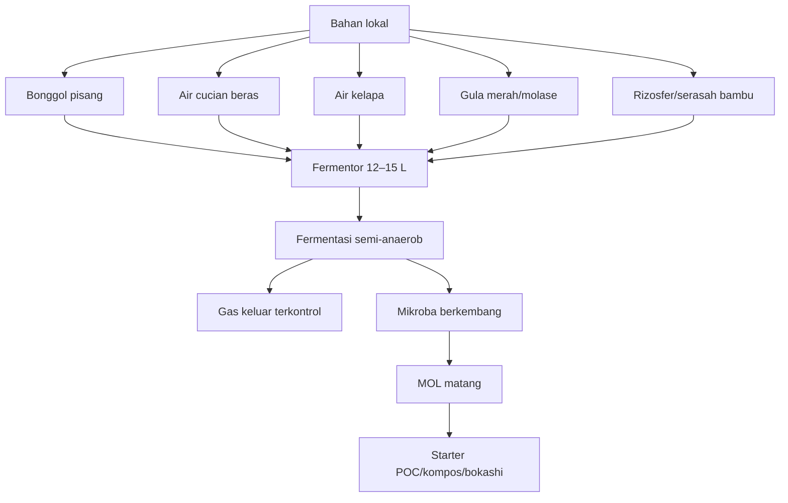

---

## 3.7.8 Kondisi Fermentasi MOL

| Parameter         | Rekomendasi                                         |
| ----------------- | --------------------------------------------------- |
| Sistem            | Anaerob/semi-anaerob                                |
| Suhu ideal        | 25–32°C                                             |
| Suhu terbaik      | 27–30°C                                             |
| Cahaya            | Teduh/redup                                         |
| Matahari langsung | Dihindari                                           |
| Durasi            | 10–14 hari                                          |
| Pengadukan        | Cukup awal fermentasi, lalu kocok ringan bila perlu |
| Pelepasan gas     | Wajib                                               |
| Wadah             | Tidak diisi penuh                                   |

Jika fermentor ditutup rapat tanpa pelepasan gas, tekanan dapat meningkat. Karena itu, gunakan airlock sederhana atau buka tutup sebentar setiap hari pada fase awal untuk membuang gas.

---

## 3.7.9 Tanda MOL Berhasil

MOL yang berhasil memiliki tanda fermentasi yang stabil dan tidak busuk.

| Parameter   | Ciri MOL Berhasil                                |
| ----------- | ------------------------------------------------ |
| Aroma       | Asam-manis fermentasi, mirip tape                |
| Warna       | Cokelat muda sampai cokelat tua                  |
| Gas         | Ada pada awal fermentasi, lalu menurun           |
| Ampas       | Mengendap                                        |
| Belatung    | Tidak ada                                        |
| Lendir      | Tidak berlebihan                                 |
| pH          | Umumnya asam ringan sampai sedang                |
| Respons uji | Tidak menyebabkan tanaman layu pada dosis rendah |

MOL yang baik biasanya berbau fermentasi segar, bukan berbau bangkai atau amonia tajam.

---

## 3.7.10 Tanda MOL Gagal

| Tanda Gagal                     | Kemungkinan Penyebab        | Tindakan                                         |
| ------------------------------- | --------------------------- | ------------------------------------------------ |
| Bau bangkai                     | Fermentasi busuk            | Jangan gunakan pada tanaman                      |
| Bau amonia tajam                | Pembusukan nitrogen/protein | Jangan gunakan langsung                          |
| Ada belatung                    | Wadah kemasukan lalat       | Tidak layak untuk aplikasi tanaman               |
| Lendir hitam berlebihan         | Fermentasi tidak sehat      | Buang atau gunakan sangat hati-hati untuk kompos |
| Botol menggembung ekstrem       | Gas tidak keluar            | Buka dengan hati-hati, evaluasi aroma            |
| Tidak ada aktivitas sama sekali | Mikroba lemah/gula kurang   | Aktivasi ulang atau buat batch baru              |

---

## 3.7.11 Penyaringan dan Penyimpanan MOL

Setelah fermentasi selesai, MOL perlu disaring agar lebih mudah digunakan sebagai starter.

### Prosedur Penyaringan

1. Buka fermentor dengan hati-hati.
2. Cek aroma dan warna.
3. Angkat kantong bahan padat.
4. Saring cairan dengan kain bersih.
5. Masukkan ke botol atau jerigen bersih.
6. Jangan isi botol sampai penuh.
7. Beri label tanggal produksi dan jenis MOL.
8. Simpan di tempat teduh dan sejuk.

### Contoh Label Batch MOL

```mdx
Nama produk: MOL Serbaguna 10 L
Batch: MOL-001
Tanggal produksi:
Tanggal saring:
Bahan utama: bonggol pisang + rizosfer bambu
Sistem fermentasi: semi-anaerob
Durasi fermentasi:
pH akhir:
Aroma:
Status uji tanaman:
Catatan:
```

---

## 3.7.12 Masa Simpan MOL

| Kondisi MOL                  | Estimasi Masa Simpan |
| ---------------------------- | -------------------: |
| Tidak disaring, banyak ampas |           2–4 minggu |
| Disaring bersih              |            1–2 bulan |
| Disimpan sejuk dan higienis  |            2–3 bulan |
| Bau berubah busuk            |    Tidak layak pakai |

MOL sebaiknya digunakan saat masih segar. Semakin lama disimpan, aktivitas mikroba dapat berubah. Untuk hasil terbaik, gunakan MOL dalam waktu **1 bulan setelah penyaringan**.

---

## 3.7.13 Dosis Penggunaan MOL

MOL dapat digunakan untuk beberapa tujuan berbeda. Dosisnya perlu disesuaikan dengan fungsi aplikasi.

| Tujuan Penggunaan      |                     Dosis MOL | Cara Pakai                                     |
| ---------------------- | ----------------------------: | ---------------------------------------------- |
| Starter POC            | 100–200 ml per 10 L bahan POC | Campurkan saat awal fermentasi                 |
| Aktivator kompos       |                  100 ml/L air | Siram ke bahan kompos                          |
| Bokashi                |               50–100 ml/L air | Campur dengan molase dan semprot ke bahan      |
| Kocor tanah            |                10–20 ml/L air | Kocor ke area perakaran                        |
| Aktivasi bahan organik |               50–100 ml/L air | Siram ke jerami/serasah/kompos setengah matang |

### Rumus Penggunaan MOL

```mdx
Rumus kebutuhan MOL:

Kebutuhan MOL = Dosis MOL × Volume air/bahan cair

Contoh:
Dosis MOL = 100 ml/L
Volume air = 10 L

Kebutuhan MOL = 100 × 10
Kebutuhan MOL = 1.000 ml
Kebutuhan MOL = 1 L
```

### Contoh MOL sebagai Starter POC 10 Liter

```mdx
Target POC = 10 L
Dosis MOL sebagai starter = 200 ml per 10 L

Maka:
Kebutuhan MOL = 200 ml

Campurkan 200 ml MOL aktif ke dalam bahan POC 10 L pada awal fermentasi.
```

---

## 3.7.14 Uji Aktivitas MOL Sebelum Digunakan

Sebelum MOL digunakan sebagai starter, lakukan uji aktivitas sederhana.

```mdx
Uji aktivitas MOL:

1. Siapkan 1 liter air non-kaporit.
2. Tambahkan 10 ml MOL.
3. Tambahkan 10 gram gula merah/molase.
4. Masukkan ke botol bersih.
5. Tutup longgar.
6. Diamkan 12–24 jam.
7. Amati aroma dan gas.

Indikasi MOL aktif:

- aroma fermentasi segar,
- sedikit gas,
- tidak berbau busuk,
- tidak berlendir hitam.
```

Jika setelah 24 jam tidak ada aroma fermentasi dan tidak ada tanda aktivitas, MOL kemungkinan sudah lemah. MOL masih bisa digunakan untuk kompos, tetapi kurang ideal sebagai starter utama POC.

---

## 3.7.15 Catatan Keamanan Penggunaan MOL

MOL tetap perlu digunakan dengan hati-hati karena berasal dari fermentasi bahan organik lokal. Komposisi mikrobanya tidak seragam dan dapat berubah antar batch.

Hal yang perlu diperhatikan:

- jangan gunakan MOL yang berbau busuk,
- jangan gunakan MOL yang mengandung belatung,
- jangan gunakan dosis pekat pada bibit muda,
- jangan semprot MOL mentah ke daun menjelang panen,
- jangan mencampur MOL dengan pestisida kimia tanpa uji kompatibilitas,
- lakukan uji kecil sebelum aplikasi luas.

### Uji Fitotoksik MOL

```mdx
Prosedur uji fitotoksik MOL:

1. Encerkan MOL 10 ml/L air.
2. Pilih 5–10 tanaman uji.
3. Aplikasikan dengan cara kocor ringan.
4. Amati selama 3–5 hari.
5. Jika tanaman tetap segar, MOL dapat digunakan bertahap.
6. Jika tanaman layu, daun terbakar, atau media berbau busuk, hentikan penggunaan.
```

---

## 3.8 Prosedur Fermentasi POC

Fermentasi POC harus dilakukan dengan memperhatikan kebersihan, ukuran bahan, rasio bahan, pelepasan gas, dan durasi. Proses yang tidak terkendali dapat menghasilkan POC berbau busuk, terlalu asam, terlalu pekat, atau fitotoksik.

### Peralatan

| Alat                     | Fungsi                                 |
| ------------------------ | -------------------------------------- |
| Fermentor 12–15 liter    | Wadah fermentasi untuk target 10 liter |
| Pisau/parang/chopper     | Mencacah bahan padat                   |
| Ember pencampur          | Melarutkan molase/gula merah           |
| Pengaduk bersih          | Mengaduk bahan                         |
| Selang airlock/tutup gas | Melepaskan gas fermentasi              |
| Kain saring              | Menyaring POC matang                   |
| pH meter/kertas lakmus   | Mengukur pH sederhana                  |
| Botol/jerigen bersih     | Penyimpanan POC                        |
| Label batch              | Mencatat tanggal dan formula           |

### Prosedur Fermentasi

1. Cuci dan bersihkan fermentor.
2. Cacah bahan padat agar luas permukaan meningkat.
3. Masukkan bahan padat ke fermentor.
4. Larutkan molase atau gula merah dalam sedikit air.
5. Tambahkan air cucian beras.
6. Tambahkan air kelapa.
7. Masukkan EM4 pertanian atau MOL aktif.
8. Tambahkan air non-kaporit sampai total volume mendekati 10 liter.
9. Aduk rata.
10. Tutup fermentor dengan sistem pelepasan gas.
11. Simpan di tempat teduh, tidak terkena matahari langsung.
12. Kocok atau aduk ringan secara berkala bila sistem memungkinkan.
13. Fermentasikan sesuai jenis bahan.
14. Setelah matang, saring dan simpan dalam jerigen bersih.

### Ilustrasi 3.3. Alur Kerja Pembuatan POC 10 Liter

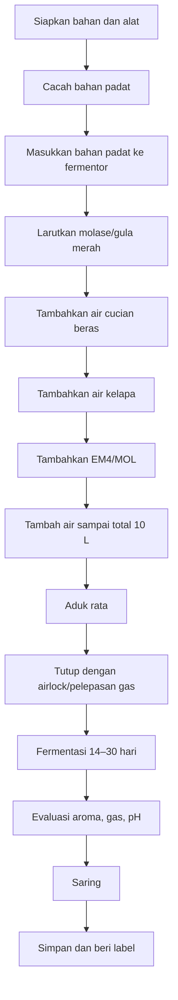

### Catatan Sanitasi

Sanitasi sederhana sangat penting. Fermentor tidak harus steril seperti laboratorium, tetapi harus bersih dari minyak, deterjen berlebih, sisa pestisida, bangkai serangga, tanah tercemar, dan bahan busuk.

---

## 3.9 Durasi Fermentasi POC

Durasi fermentasi POC tergantung pada jenis bahan. Bahan nabati lunak seperti sayur, buah, dan hijauan biasanya lebih cepat matang dibanding bahan protein tinggi seperti ikan atau urin/kotoran ternak.

| Jenis POC                      | Durasi Fermentasi |
| ------------------------------ | ----------------: |
| POC sayur/buah                 |        14–21 hari |
| POC hijauan                    |        14–21 hari |
| POC dengan limbah ikan         |        21–30 hari |
| POC dengan urin/kotoran ternak |        21–30 hari |

Panduan umum pembuatan POC yang menggunakan bahan organik, molase/gula merah, dan EM4 biasanya menyarankan fermentasi sekitar 2–3 minggu, dengan wadah tertutup dan pelepasan gas. ([P3BMS][2])

### Tahapan Fermentasi

| Fase            |    Periode | Ciri Umum                                        |
| --------------- | ---------: | ------------------------------------------------ |
| Fase awal       |   Hari 1–3 | Gas mulai terbentuk, aroma bahan masih kuat      |
| Fase aktif      |  Hari 4–14 | Fermentasi intensif, warna mulai gelap           |
| Fase pematangan | Hari 15–30 | Gas menurun, aroma lebih stabil, ampas mengendap |

### Catatan Khusus Bahan Ikan

POC dengan limbah ikan membutuhkan waktu lebih panjang. Jika pada hari ke-14 masih berbau amis busuk tajam, fermentasi belum matang atau prosesnya tidak seimbang. Tambahkan molase sedikit, aduk/kocok ringan, pastikan gas keluar, lalu lanjutkan fermentasi.

---

## 3.10 Tanda POC Berhasil

POC yang berhasil memiliki tanda fermentasi yang relatif stabil. Indikatornya bukan hanya warna, tetapi juga aroma, gas, endapan, dan respons tanaman.

| Parameter   | Ciri POC Berhasil                        |
| ----------- | ---------------------------------------- |
| Aroma       | Fermentasi seperti tape/asam segar       |
| Bau busuk   | Tidak ada bau bangkai                    |
| Warna       | Cokelat tua sampai kehitaman             |
| Gas         | Mulai berkurang setelah fase aktif       |
| Ampas       | Mengendap                                |
| Belatung    | Tidak ada                                |
| Uji tanaman | Tidak menyebabkan layu pada dosis rendah |

Aroma POC yang baik biasanya asam, manis-asam, atau menyerupai tape. Pada POC ikan, aroma khas bahan ikan mungkin masih ada, tetapi tidak boleh berbau bangkai menyengat.

### Uji Kematangan Sederhana

```mdx
POC dapat dianggap relatif matang apabila:

1. Gas sudah jauh berkurang.
2. Ampas mulai mengendap.
3. Aroma tidak busuk menyengat.
4. Warna stabil cokelat tua.
5. pH tidak ekstrem.
6. Uji tanaman dosis rendah tidak menyebabkan layu.
```

---

## 3.11 Tanda POC Gagal

POC gagal biasanya terjadi karena bahan terlalu busuk, starter tidak aktif, molase kurang, wadah terlalu panas, gas tidak keluar, atau kontaminasi serangga.

| Tanda Gagal                       | Kemungkinan Penyebab                        | Tindakan                            |
| --------------------------------- | ------------------------------------------- | ----------------------------------- |
| Bau bangkai menyengat             | Protein membusuk, fermentasi gagal          | Jangan gunakan pada tanaman utama   |
| Bau busuk tajam tidak normal      | Dominasi mikroba pembusuk                   | Hentikan penggunaan                 |
| Ada belatung                      | Wadah kemasukan lalat                       | Tidak layak untuk aplikasi tanaman  |
| Lendir berlebihan                 | Fermentasi tidak seimbang                   | Uji sangat hati-hati atau buang     |
| Gas tidak terkendali terlalu lama | Bahan terlalu aktif atau wadah tidak sesuai | Buka tekanan, evaluasi aroma        |
| Tanaman terbakar/layu             | Fitotoksik atau dosis terlalu pekat         | Encerkan tinggi atau hentikan       |
| pH ekstrem                        | Fermentasi tidak stabil                     | Uji ulang dan jangan langsung pakai |

### Penyebab Umum Kegagalan

Beberapa penyebab teknis yang sering terjadi adalah:

- bahan padat tidak dicacah,
- bahan ikan terlalu banyak,
- molase kurang,
- starter mati atau tidak aktif,
- wadah terlalu penuh,
- tidak ada pelepasan gas,
- fermentor terkena panas matahari langsung,
- sering dibuka di area banyak lalat,
- air mengandung kaporit tinggi,
- produk dipakai sebelum matang.

---

## 3.12 Standar Mutu dan Uji Kelayakan Sederhana POC

Untuk penggunaan agribisnis, POC perlu memiliki standar mutu internal. Standar ini tidak menggantikan uji laboratorium, tetapi membantu menyaring produk yang jelas tidak layak.

### Parameter Mutu Sederhana

| Parameter        | Target Praktis                    |
| ---------------- | --------------------------------- |
| Aroma            | Asam/tape, tidak busuk            |
| Warna            | Cokelat tua                       |
| pH               | Umumnya asam ringan sampai sedang |
| Gas              | Menurun setelah matang            |
| Ampas            | Mengendap                         |
| Belatung         | Tidak ada                         |
| Lendir           | Tidak berlebihan                  |
| Uji tanaman      | Tidak menyebabkan layu            |
| Catatan produksi | Ada batch, tanggal, formula       |

### Uji pH

pH POC dapat diukur dengan pH meter atau kertas lakmus. Nilai pH yang terlalu ekstrem perlu diwaspadai karena dapat menyebabkan stres akar atau daun, terutama bila POC digunakan terlalu pekat.

```mdx
Interpretasi pH praktis POC:

- pH 3,5–5,5 = umum pada POC fermentasi asam
- pH < 3,5 = terlalu asam, perlu pengenceran tinggi
- pH > 7 + bau busuk = indikasi fermentasi tidak sehat
```

### Uji Pengenceran

Uji pengenceran dilakukan untuk menilai apakah POC terlalu pekat atau terlalu menyengat.

```mdx
Uji pengenceran awal:

1. Campur 10 ml POC ke dalam 1 liter air.
2. Aduk rata.
3. Cium aromanya.
4. Jika aroma masih sangat busuk/menyengat, produk belum layak untuk tanaman utama.
5. Jika aroma asam ringan dan tidak busuk, lanjutkan uji tanaman.
```

### Uji Fitotoksik

Uji fitotoksik wajib dilakukan sebelum POC digunakan luas, terutama pada cabai, bibit durian, tanaman muda, dan tanaman dalam polybag.

```mdx
Prosedur uji fitotoksik POC:

1. Siapkan 5–10 tanaman uji.
2. Gunakan dosis rendah, misalnya 5–10 ml/L.
3. Aplikasikan dengan cara kocor ringan.
4. Jangan semprot daun terlebih dahulu.
5. Amati selama 3–5 hari.
6. Jika muncul layu, daun terbakar, atau akar busuk, hentikan penggunaan.
7. Jika aman, dosis dapat dinaikkan bertahap sesuai kebutuhan.
```

### Uji Semai Benih

```mdx
Prosedur uji semai:

1. Siapkan dua wadah semai.
2. Wadah A diberi air biasa sebagai kontrol.
3. Wadah B diberi larutan POC 5 ml/L.
4. Gunakan benih cepat tumbuh seperti kacang hijau atau sawi.
5. Amati daya kecambah, panjang akar, dan warna akar selama 3–5 hari.
6. POC tidak layak jika akar pendek, cokelat, busuk, atau kecambah banyak mati.
```

### Catatan Laboratorium

Untuk produksi komersial, uji sederhana perlu dilengkapi dengan analisis laboratorium. Parameter penting meliputi:

- pH,
- C-organik,
- N-total,
- P₂O₅,
- K₂O,
- unsur mikro,
- salinitas atau EC,
- cemaran logam berat,
- cemaran mikroba patogen,
- stabilitas simpan.

Keputusan Menteri Pertanian No. 261/KPTS/SR.310/M/4/2019 menjadi salah satu acuan untuk persyaratan teknis minimal pupuk organik, pupuk hayati, dan pembenah tanah. ([psp.pertanian.go.id][4])

---

## 3.13 Penyaringan dan Penyimpanan POC

Setelah fermentasi selesai, POC harus disaring. Penyaringan bertujuan mengurangi ampas, memperbaiki kestabilan penyimpanan, dan mencegah penyumbatan alat aplikasi.

### Prosedur Penyaringan

1. Buka fermentor secara hati-hati.
2. Pastikan tekanan gas sudah rendah.
3. Evaluasi aroma, warna, dan kondisi ampas.
4. Saring menggunakan kain saring bersih.
5. Untuk aplikasi semprot, lakukan penyaringan dua kali.
6. Pisahkan ampas dari cairan.
7. Masukkan POC ke jerigen atau botol bersih.
8. Jangan isi wadah terlalu penuh.
9. Beri label produksi.

### Label Batch Produksi

```mdx
Contoh label batch POC:
Nama produk: POC Vegetatif 10 L
Batch: POC-V-001
Tanggal produksi: 10 Mei 2026
Tanggal saring: 31 Mei 2026
Formula: Daun legum + bonggol pisang + air kelapa
Starter: EM4 200 ml
pH akhir: 4,6
Aroma: asam fermentasi
Status uji tanaman: aman pada 10 ml/L
```

### Penyimpanan

| Aspek          | Rekomendasi                                 |
| -------------- | ------------------------------------------- |
| Wadah          | Jerigen/botol bersih                        |
| Volume isi     | Jangan penuh, sisakan ruang gas             |
| Lokasi         | Teduh dan sejuk                             |
| Sinar matahari | Hindari                                     |
| Tutup          | Rapat tetapi buka berkala bila masih bergas |
| Ampas          | Sebaiknya dipisahkan                        |
| Label          | Wajib untuk kontrol produksi                |

### Ilustrasi 3.4. Alur Pasca-Fermentasi POC

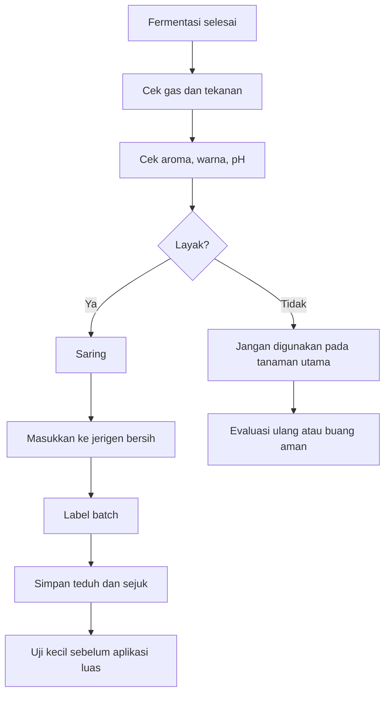

Ampas hasil saringan dapat dimanfaatkan untuk kompos, tetapi sebaiknya tidak langsung ditabur pada pangkal tanaman utama jika aromanya masih kuat. Campurkan terlebih dahulu ke bahan kompos dan biarkan matang.

---

## 3.14 Masa Simpan POC

Masa simpan POC bergantung pada bahan baku, tingkat penyaringan, kebersihan produksi, pH, suhu penyimpanan, dan jumlah ampas yang tersisa. POC yang masih banyak ampas biasanya lebih cepat berubah bau dibanding POC yang disaring bersih.

| Kondisi Produk             | Estimasi Masa Simpan |
| -------------------------- | -------------------: |
| Banyak ampas               |            1–2 bulan |
| Disaring bersih            |            2–3 bulan |
| Disimpan baik dan higienis |            3–6 bulan |
| Bau berubah busuk          |    tidak layak pakai |

### Rekomendasi Masa Pakai

```mdx
Rekomendasi praktis penggunaan POC:

- 0–30 hari setelah saring = fase terbaik
- 1–3 bulan = masih layak dengan evaluasi aroma dan pH
- 3–6 bulan = perlu uji ulang sebelum aplikasi
- > 6 bulan = tidak direkomendasikan tanpa uji mutu
```

### Tanda POC Tidak Layak Setelah Disimpan

POC sebaiknya tidak digunakan bila:

- bau berubah menjadi bangkai,
- botol menggembung ekstrem,
- muncul belatung,
- terbentuk lendir hitam berlebihan,
- pH berubah ekstrem,
- cairan berbau amonia tajam,
- tanaman uji layu pada dosis rendah.

POC yang disimpan terlalu lama dapat mengalami perubahan populasi mikroba dan komposisi senyawa organik. Karena itu, pencatatan tanggal produksi dan tanggal penyaringan sangat penting.

---

## 3.15 Risiko POC yang Perlu Dikendalikan

POC memiliki potensi manfaat, tetapi juga memiliki risiko. Risiko ini harus dikendalikan agar POC tidak merugikan tanaman.

### 1. Fitotoksik Akibat Fermentasi Belum Matang

POC yang belum matang dapat mengandung senyawa organik yang masih reaktif, asam berlebih, alkohol, amonia, atau produk pembusukan lain. Gejala fitotoksik dapat berupa daun layu, akar cokelat, pertumbuhan terhambat, dan media berbau busuk.

### 2. Bau Menyengat Akibat Bahan Protein Tinggi

Bahan seperti limbah ikan, urin, atau kotoran ternak dapat menghasilkan bau tajam jika fermentasi tidak seimbang. Gunakan bahan protein tinggi dalam dosis terbatas dan fermentasikan lebih lama.

### 3. Salinitas Tinggi

Bahan asin, urin berlebihan, limbah ikan asin, terasi, atau bahan kaya natrium dapat meningkatkan salinitas. Risiko ini lebih besar pada polybag, tray semai, pot, dan lahan dengan drainase buruk.

### 4. Kontaminasi Mikroba Tidak Diinginkan

Kontaminasi dapat berasal dari wadah kotor, air tercemar, bahan busuk, lalat, atau proses pembukaan fermentor yang terlalu sering. Kontaminasi berat ditandai dengan bau bangkai, belatung, jamur tidak normal, dan lendir berlebihan.

### 5. Dosis Terlalu Pekat

POC harus diencerkan sebelum aplikasi. Dosis terlalu pekat dapat membakar akar atau daun. Untuk uji awal, gunakan dosis rendah 5–10 ml/L, lalu naikkan bertahap sesuai respons tanaman.

### 6. Penyumbatan Nozzle dan Irigasi Tetes

POC yang tidak disaring halus dapat menyumbat sprayer, nozzle, selang drip, dan filter irigasi. Untuk aplikasi semprot atau fertigasi, penyaringan harus dilakukan lebih dari satu kali.

### Matriks Risiko POC

| Risiko              | Tingkat Risiko | Pencegahan                                     |
| ------------------- | -------------- | ---------------------------------------------- |
| Fitotoksik          | Tinggi         | Fermentasi sampai matang, uji tanaman          |
| Bau busuk           | Sedang–tinggi  | Seimbangkan molase, starter, dan bahan protein |
| Salinitas           | Sedang         | Batasi bahan asin dan urin                     |
| Kontaminasi         | Tinggi         | Sanitasi wadah dan tutup baik                  |
| Nozzle tersumbat    | Sedang         | Saring dua kali                                |
| Gas berlebih        | Sedang         | Gunakan airlock/pelepasan gas                  |
| Aplikasi berlebihan | Tinggi         | Gunakan dosis bertahap                         |

### Ilustrasi 3.5. Titik Kendali Risiko POC

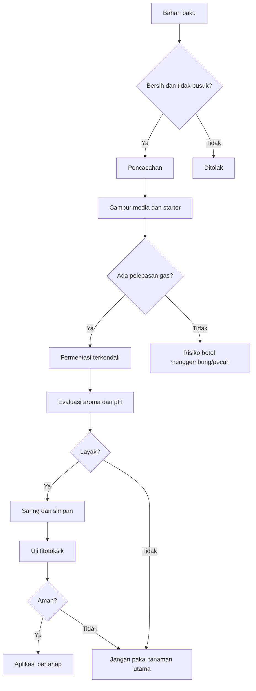

---

## Ringkasan Bab 3

POC adalah pupuk organik cair hasil fermentasi bahan organik yang berfungsi sebagai sumber hara tambahan, bahan organik terlarut, asam amino, mineral, dan metabolit fermentasi. POC dapat diarahkan menjadi **POC vegetatif** atau **POC generatif** sesuai bahan baku dan tujuan penggunaannya.

POC vegetatif dibuat dari bahan seperti daun legum, daun hijau, bonggol pisang, air cucian beras, air kelapa, molase, dan EM4/MOL. POC generatif dibuat dari bahan seperti kulit pisang, sabut kelapa, limbah ikan, air cucian beras, air kelapa, molase, dan EM4/MOL. Untuk target produksi 10 liter, fermentor yang digunakan sebaiknya berkapasitas minimal **12–15 liter** agar tersedia ruang gas selama proses fermentasi.

Selain POC, Bab 3 juga membahas **MOL atau Mikroorganisme Lokal** sebagai starter mikroba dan bioaktivator. MOL bukan POC, karena fungsi utamanya bukan sebagai sumber hara, melainkan sebagai sumber mikroba untuk membantu fermentasi POC, aktivasi kompos, pembuatan bokashi, dan dekomposisi bahan organik. MOL 10 liter dapat dibuat dari bahan seperti air cucian beras, air kelapa, gula merah/molase, bonggol pisang, tanah rizosfer bambu atau serasah bambu lapuk, bekatul, dan air non-kaporit.

Berbeda dengan JAKABA yang menggunakan sistem **aerob-statis**, POC dan MOL umumnya difermentasi secara **anaerob atau semi-anaerob** dengan pelepasan gas. Durasi fermentasi POC berkisar **14–21 hari** untuk bahan sayur, buah, dan hijauan, serta **21–30 hari** untuk bahan ikan, urin, atau kotoran ternak. MOL umumnya difermentasi selama **10–14 hari**, kemudian disaring dan digunakan sebagai starter atau bioaktivator.

POC yang baik memiliki aroma fermentasi asam segar atau mirip tape, warna cokelat tua, gas yang mulai berkurang, ampas mengendap, dan tidak menyebabkan tanaman layu pada uji kecil. MOL yang baik juga memiliki aroma fermentasi segar, tidak berbau bangkai, tidak mengandung belatung, dan masih menunjukkan aktivitas mikroba saat diuji dengan gula/molase. POC atau MOL yang berbau bangkai, mengandung belatung, berlendir berlebihan, atau menyebabkan tanaman terbakar tidak layak digunakan pada tanaman utama.

Dalam sistem agribisnis, POC dan MOL harus diproduksi dengan formula terukur, pencatatan batch, penyaringan baik, penyimpanan higienis, dan uji fitotoksik sebelum aplikasi luas. Dengan pendekatan ini, POC dapat menjadi input hara organik cair tambahan, sedangkan MOL dapat menjadi starter mikroba yang mendukung pembuatan POC, kompos, dan sistem pemupukan terpadu yang lebih aman, ekonomis, dan fungsional.

[1]: https://psp.pertanian.go.id/layanan-publik/keputusan-menteri-pertanian-nomor-261-kpts-sr-310-m-4-2019-tentang-persyaratan-teknis-minimal-pupuk-organik-pupuk-hayati-dan-pembenah-tanah?utm_source=chatgpt.com 'Keputusan Menteri Pertanian Nomor 261/KPTS/SR.310/M/4 ...'
[2]: https://p3bms.uma.ac.id/proses-pembuatan-pupuk-organik-cair/?utm_source=chatgpt.com 'Proses Pembuatan Pupuk Organik Cair - P3BMS'
[3]: https://media.neliti.com/media/publications/435168-none-fea10827.pdf?utm_source=chatgpt.com 'Studi pembuatan pupuk organik cair dari sampah ...'
[4]: https://psp.pertanian.go.id/storage/494/Keputusan-Menteri-Pertanian-Nomor-261_KPTS_SR.310_M_4_2019-tentang-Persyaratan-Teknis-Minimal-Pupuk-Organik-Pupuk-Hayati-dan-Pembenah-Tanah.pdf?utm_source=chatgpt.com 'Keputusan-Menteri-Pertanian-Nomor-261_KPTS_SR ...'

---

# 4. Strategi Aplikasi pada Cabai Rawit, Cabai Besar, dan Durian

Bab ini membahas strategi aplikasi JAKABA dan POC pada cabai rawit, cabai besar, serta durian. Fokusnya bukan menjadikan JAKABA dan POC sebagai pengganti total pupuk utama, melainkan sebagai **input pendukung** dalam sistem pemupukan terpadu. Struktur bab mengikuti outline yang telah ditetapkan pada dokumen terlampir.

---

## 4.1 Prinsip Umum Aplikasi

JAKABA dan POC digunakan sebagai **pelengkap sistem budidaya**, bukan sebagai satu-satunya sumber nutrisi tanaman. Dalam praktik agribisnis, tanaman tetap membutuhkan suplai hara utama yang cukup, terutama N, P, K, Ca, Mg, S, serta unsur mikro seperti B, Zn, Fe, Mn, Cu, dan Mo.

JAKABA lebih diarahkan untuk mendukung aktivitas mikroba tanah, memperbaiki kondisi rizosfer, dan membantu respons akar terhadap lingkungan. POC diarahkan sebagai sumber bahan organik cair, hara tambahan, asam amino, dan senyawa hasil fermentasi. Keduanya dapat membantu efisiensi pemupukan, tetapi tidak boleh menggantikan perhitungan kebutuhan hara tanaman.

Pada cabai, kebutuhan hara berubah sesuai fase pertumbuhan. Pada fase awal, tanaman membutuhkan dukungan akar, tunas, dan daun. Saat memasuki fase berbunga dan berbuah, kebutuhan terhadap kalium, kalsium, magnesium, boron, serta keseimbangan air menjadi semakin penting. Panduan nutrisi tanaman cabai dari beberapa sumber teknis menekankan pentingnya keseimbangan nitrogen dan kalium sebelum pembungaan, serta meningkatnya kebutuhan kalium saat mendekati panen. ([haifa-group.com][1])

Pada durian, prinsipnya lebih kompleks karena tanaman bersifat tahunan. Durian membutuhkan manajemen hara berdasarkan fase: pemulihan setelah panen, pembentukan flush vegetatif, induksi bunga, pembungaan, pembesaran buah, dan pemulihan kembali. Pada fase buah, kebutuhan kalium, kalsium, magnesium, dan unsur mikro seperti boron menjadi lebih penting untuk mendukung kualitas buah dan mengurangi risiko kerontokan. ([Shenyang MASL Biotechnology Co., Ltd.][2])

### Prinsip Utama Aplikasi

- JAKABA dan POC harus diencerkan sebelum digunakan.
- Aplikasi sebaiknya dilakukan pagi atau sore hari.
- Hindari aplikasi saat tanaman layu berat, media terlalu basah, atau suhu sangat panas.
- Hindari aplikasi produk yang berbau busuk, berlendir hitam, atau belum matang.
- Jangan menyiram larutan pekat langsung ke pangkal batang.
- Dosis dimulai rendah, lalu dinaikkan bertahap berdasarkan respons tanaman.
- Gunakan bersama kompos matang, pupuk kandang matang, pupuk utama, dan manajemen air yang baik.

### Rumus Umum Pengenceran

```mdx id="7v2d04"
Rumus kebutuhan produk:

Kebutuhan produk (ml) = Dosis produk (ml/L) × Volume air (L)

Contoh:
Dosis JAKABA = 30 ml/L
Volume air = 10 L

Kebutuhan JAKABA = 30 × 10
Kebutuhan JAKABA = 300 ml
```

### Ilustrasi 4.1. Posisi JAKABA dan POC dalam Sistem Pemupukan

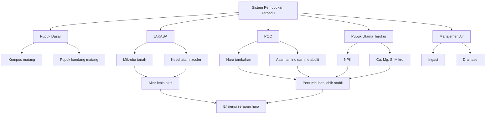

---

## 4.2 Perbedaan Fungsi Aplikasi JAKABA dan POC

JAKABA dan POC sama-sama berbentuk cair, tetapi fungsi aplikasinya berbeda. Perbedaan ini penting agar penggunaannya tidak tumpang tindih dan tidak berlebihan.

| Produk        | Fungsi Aplikasi                                           |
| ------------- | --------------------------------------------------------- |
| JAKABA        | Mendukung mikroba tanah, akar, dan kesehatan rizosfer     |
| POC vegetatif | Mendukung pertumbuhan daun, batang, akar, dan pemulihan   |
| POC generatif | Mendukung pembungaan, pembesaran buah, dan kualitas hasil |

### JAKABA

JAKABA paling tepat diaplikasikan dengan cara **kocor ke tanah atau media tanam**. Tujuannya adalah membawa mikroba dan metabolit fermentasi ke zona akar. Aplikasi ke daun tidak menjadi prioritas karena JAKABA tidak diformulasikan sebagai pupuk daun yang bersih dan steril.

JAKABA cocok digunakan pada:

- awal pertumbuhan akar,
- setelah pindah tanam,
- fase pemulihan tanaman stres,
- setelah pemangkasan,
- setelah panen pada tanaman tahunan,
- tanah yang mulai padat atau miskin aktivitas biologis.

### POC Vegetatif

POC vegetatif digunakan untuk mendukung pertumbuhan daun, batang, tunas, dan akar. Bahan dominannya biasanya hijauan, daun legum, bonggol pisang, air kelapa, dan air cucian beras.

POC vegetatif cocok digunakan pada:

- fase pembibitan,
- awal pertumbuhan,
- pemulihan tanaman setelah stres,
- pembentukan flush vegetatif durian,
- pertumbuhan cabang produktif pada cabai.

### POC Generatif

POC generatif digunakan saat tanaman mulai masuk fase bunga dan buah. Bahan dominannya dapat berupa kulit pisang, sabut kelapa, air kelapa, dan bahan protein seperti limbah ikan atau tepung ikan dalam dosis terkendali.

POC generatif cocok digunakan pada:

- menjelang pembungaan,
- awal pembentukan buah,
- pembesaran buah,
- pemulihan tanaman setelah panen berulang,
- pendamping pemupukan K, Ca, Mg, dan B.

### Catatan Pencampuran

JAKABA dan POC boleh digunakan dalam program yang sama, tetapi tidak selalu harus dicampur dalam satu tangki. Untuk keamanan, terutama pada produk buatan sendiri, lebih baik aplikasi dilakukan bergantian.

```mdx id="5vtyke"
Contoh pola bergantian:
Minggu 1: JAKABA kocor
Minggu 2: POC vegetatif/generatif
Minggu 3: JAKABA kocor
Minggu 4: POC sesuai fase tanaman
```

---

## 4.3 Aplikasi pada Cabai Fase Persemaian

Fase persemaian adalah fase paling sensitif. Akar bibit masih muda, media terbatas, dan tanaman mudah stres akibat kelebihan air, kepekatan larutan, atau fermentasi yang belum matang. Karena itu, dosis JAKABA dan POC pada fase ini harus rendah.

| Produk        |     Dosis | Cara                |  Interval |
| ------------- | --------: | ------------------- | --------: |
| JAKABA        | 5–10 ml/L | Kocor ringan        | 7–10 hari |
| POC vegetatif | 5–10 ml/L | Kocor/semprot halus | 7–10 hari |

### Strategi Aplikasi

Aplikasi pada persemaian sebaiknya dilakukan dengan cara kocor ringan di sekitar media, bukan langsung membanjiri tray semai. Larutan tidak boleh terlalu pekat karena akar muda mudah mengalami stres osmotik.

Untuk bibit cabai, JAKABA lebih aman digunakan sebagai kocor media. POC vegetatif boleh digunakan sebagai kocor ringan atau semprot halus, tetapi dosisnya harus rendah. Hindari penyemprotan saat daun masih sangat muda, saat media terlalu basah, atau saat bibit menunjukkan gejala rebah semai.

### Contoh Perhitungan untuk Tray Semai

```mdx id="khv8as"
Contoh:
Volume air semprot/kocor = 2 L
Dosis JAKABA = 5 ml/L

Kebutuhan JAKABA = 5 × 2
Kebutuhan JAKABA = 10 ml

Jadi, campurkan 10 ml JAKABA ke dalam 2 L air.
```

### Catatan Teknis

Pada fase semai, target utama bukan mempercepat pertumbuhan secara agresif, tetapi menjaga bibit tetap sehat, akar putih, batang kokoh, dan daun tidak terlalu lunak. Bibit yang terlalu subur karena kelebihan input cair dapat menjadi rentan rebah, stres saat pindah tanam, atau lebih mudah terserang penyakit.

---

## 4.4 Aplikasi Cabai Fase Pindah Tanam sampai 21 HST

Fase pindah tanam sampai 21 HST adalah fase adaptasi. Tanaman baru dipindahkan dari tray atau polybag kecil ke lahan, bedengan, atau polybag produksi. Pada fase ini akar mengalami stres transplanting, sehingga aplikasi JAKABA dan POC harus diarahkan untuk membantu pemulihan akar dan adaptasi media.

| Produk        |      Dosis | Cara                 |  Interval |
| ------------- | ---------: | -------------------- | --------: |
| JAKABA        |    20 ml/L | Kocor media          | 7–14 hari |
| POC vegetatif | 10–20 ml/L | Kocor/semprot ringan | 7–10 hari |

### Strategi Aplikasi

Aplikasi JAKABA lebih baik dilakukan **3–5 hari setelah pindah tanam**, bukan langsung pada hari pindah tanam jika tanaman masih layu. Tujuannya agar akar mulai aktif terlebih dahulu dan media tidak terlalu jenuh.

Larutan dikocorkan ke area sekitar perakaran, bukan tepat di pangkal batang. Pada cabai yang ditanam di bedengan, aplikasi dapat diarahkan 5–10 cm dari batang. Pada cabai polybag, aplikasi diarahkan ke sisi media.

### Contoh Perhitungan untuk 100 Tanaman Cabai

Asumsi volume kocor per tanaman adalah 100 ml larutan.

```mdx id="hk8071"
Jumlah tanaman = 100 tanaman
Volume larutan per tanaman = 100 ml

Total larutan = 100 × 100 ml
Total larutan = 10.000 ml
Total larutan = 10 L

Dosis JAKABA = 20 ml/L
Kebutuhan JAKABA = 20 × 10
Kebutuhan JAKABA = 200 ml

Jadi, untuk 100 tanaman, campurkan 200 ml JAKABA ke dalam 10 L air.
```

### Catatan Teknis

Pada fase ini, POC vegetatif digunakan untuk membantu pertumbuhan awal. Namun, jika daun terlihat terlalu hijau gelap dan batang terlalu lunak, dosis POC vegetatif perlu dikurangi. Tanaman cabai yang terlalu vegetatif dapat terlambat berbunga dan lebih rentan terhadap serangan hama tertentu.

---

## 4.5 Aplikasi Cabai Fase Vegetatif Aktif

Fase vegetatif aktif biasanya berlangsung setelah tanaman mulai pulih dari pindah tanam sampai menjelang pembungaan. Pada fase ini, tanaman membentuk daun, cabang, akar, dan struktur tajuk yang akan menentukan potensi produksi.

| Produk        |      Dosis | Cara              |  Interval |
| ------------- | ---------: | ----------------- | --------: |
| JAKABA        | 30–50 ml/L | Kocor tanah/media | 7–14 hari |
| POC vegetatif | 20–30 ml/L | Kocor/semprot     | 7–10 hari |

### Strategi Aplikasi

JAKABA diaplikasikan dengan cara kocor untuk mendukung kesehatan rizosfer. POC vegetatif dapat diaplikasikan dengan cara kocor atau semprot daun, tetapi semprot daun harus menggunakan dosis lebih rendah dan produk harus benar-benar matang serta tersaring halus.

Pada fase ini, pemupukan utama tetap harus berjalan. JAKABA dan POC tidak menggantikan kebutuhan NPK. Tanaman cabai tetap membutuhkan keseimbangan nitrogen, fosfor, kalium, kalsium, dan magnesium untuk membangun tajuk yang sehat. Crop guide cabai menyebut bahwa sebelum pembungaan, keseimbangan nitrogen dan kalium penting untuk perkembangan tanaman yang baik. ([haifa-group.com][1])

### Contoh Perhitungan Tangki 16 Liter

```mdx id="ldqqd0"
Contoh:
Volume tangki = 16 L
Dosis JAKABA = 40 ml/L

Kebutuhan JAKABA = 40 × 16
Kebutuhan JAKABA = 640 ml

Jika menggunakan POC vegetatif dosis 20 ml/L:
Kebutuhan POC = 20 × 16
Kebutuhan POC = 320 ml
```

### Parameter yang Diamati

Pada fase vegetatif aktif, respons tanaman dapat dievaluasi dari:

- warna daun,
- ketebalan daun,
- jumlah cabang,
- panjang ruas,
- kekokohan batang,
- pertumbuhan akar,
- kecepatan pulih setelah hujan/panas,
- munculnya gejala layu atau klorosis.

Tanaman yang ideal tidak selalu yang paling hijau. Tanaman yang terlalu hijau, ruas terlalu panjang, dan daun terlalu lunak bisa menunjukkan kelebihan nitrogen atau ketidakseimbangan hara.

---

## 4.6 Aplikasi Cabai Fase Berbunga dan Berbuah

Saat cabai mulai berbunga dan berbuah, fokus aplikasi berubah. Input vegetatif perlu dikurangi, sedangkan dukungan untuk bunga, buah, kalsium, kalium, magnesium, boron, dan manajemen air menjadi lebih penting.

| Produk        |      Dosis | Cara              |  Interval |
| ------------- | ---------: | ----------------- | --------: |
| JAKABA        | 20–30 ml/L | Kocor tanah/media |   14 hari |
| POC generatif | 20–30 ml/L | Kocor/semprot     | 7–10 hari |

### Strategi Aplikasi

JAKABA tetap digunakan, tetapi frekuensinya tidak perlu terlalu rapat. Fungsi utamanya adalah menjaga kesehatan rizosfer dan membantu tanaman tetap aktif menyerap hara.

POC generatif digunakan sebagai pendamping pemupukan utama. Namun, pada fase ini kebutuhan kalium dan kalsium tidak boleh hanya mengandalkan POC. Cabai membutuhkan kalium untuk pembesaran buah, kualitas buah, dan kontinuitas panen. Beberapa crop guide cabai menyebut serapan kalium meningkat setelah tanaman memasuki fase pertumbuhan lebih lanjut hingga panen pertama. ([haifa-group.com][1])

Kalsium juga penting untuk kekuatan jaringan dan kualitas buah. Pada sistem produksi cabai, kekurangan kalsium sering dikaitkan dengan gangguan kualitas buah seperti ujung buah rusak atau busuk ujung buah, terutama bila suplai air tidak stabil.

### Contoh Pola Aplikasi 2 Minggu

```mdx id="9wzlxi"
Minggu A:

- JAKABA 20–30 ml/L, kocor tanah
- Pupuk utama tetap sesuai program

Minggu B:

- POC generatif 20–30 ml/L
- Tambahan Ca, Mg, B, atau K sesuai kebutuhan tanaman

Ulangi pola berdasarkan kondisi tanaman dan cuaca.
```

### Catatan Menjelang Panen

Kurangi aplikasi produk fermentasi yang berbau tajam menjelang panen, terutama jika diaplikasikan dengan cara semprot. Untuk keamanan dan kualitas produk, aplikasi fermentasi cair lebih baik diarahkan ke tanah/media, bukan langsung ke buah.

---

## 4.7 Aplikasi pada Cabai Panen Berulang

Cabai rawit dan cabai besar dapat mengalami panen berulang. Pada fase ini, tanaman terus membentuk bunga dan buah sambil tetap mempertahankan tajuk. Tantangannya adalah menjaga keseimbangan antara pertumbuhan vegetatif dan generatif.

### Tujuan Aplikasi

Pada fase panen berulang, JAKABA dan POC digunakan untuk:

- menjaga aktivitas akar,
- mempertahankan kesehatan tanah/media,
- mendukung pembungaan lanjutan,
- membantu pembesaran buah,
- mempercepat pemulihan setelah panen,
- mengurangi stres akibat cuaca dan panen intensif.

### Strategi Praktis

| Input         | Tujuan                                    | Catatan                       |
| ------------- | ----------------------------------------- | ----------------------------- |
| JAKABA        | Menjaga rizosfer dan akar                 | Kocor 14 hari sekali          |
| POC generatif | Mendukung bunga dan buah                  | 7–10 hari sekali              |
| Ca            | Menguatkan jaringan dan kualitas buah     | Sesuai kebutuhan              |
| K             | Mendukung pembesaran dan kualitas buah    | Sesuai fase produksi          |
| Mg            | Mendukung klorofil dan fotosintesis       | Perlu bila daun tua menguning |
| B             | Mendukung pembungaan dan pembentukan buah | Dosis hati-hati               |

### Evaluasi Setiap 1–2 Minggu

Evaluasi dilakukan dengan melihat:

- jumlah bunga baru,
- bunga rontok,
- jumlah buah jadi,
- ukuran buah,
- warna daun,
- tunas baru,
- gejala layu,
- respons setelah pemupukan,
- kondisi media.

Jika bunga banyak tetapi rontok, masalahnya belum tentu kurang POC. Penyebabnya bisa suhu tinggi, kekurangan air, kelebihan nitrogen, kekurangan boron/kalsium, serangan trips/tungau, atau akar bermasalah.

---

## 4.8 Aplikasi pada Durian Bibit/Polybag

Durian bibit atau durian dalam polybag memerlukan aplikasi yang lebih hati-hati dibanding tanaman di lahan. Media terbatas, akar sensitif, dan risiko akumulasi garam lebih tinggi. Oleh karena itu, dosis JAKABA dan POC harus moderat.

| Produk        |      Dosis | Cara                | Interval |
| ------------- | ---------: | ------------------- | -------: |
| JAKABA        | 20–30 ml/L | Kocor pinggir media |  14 hari |
| POC vegetatif | 10–20 ml/L | Kocor ringan        |  14 hari |

### Strategi Aplikasi

Larutan dikocorkan di pinggir media, bukan tepat di pangkal batang. Hindari aplikasi saat media masih sangat basah. Media durian harus lembap, tetapi tidak becek. Akar durian tidak menyukai kondisi jenuh air berkepanjangan.

JAKABA digunakan untuk mendukung kehidupan mikroba media dan membantu perkembangan akar. POC vegetatif digunakan untuk mendukung daun baru dan pertumbuhan bibit, tetapi dosis harus rendah agar tidak merusak akar muda.

### Contoh Perhitungan Durian Bibit

Asumsi volume kocor per polybag adalah 250 ml larutan.

```mdx id="76alxg"
Jumlah bibit = 20 bibit
Volume larutan per bibit = 250 ml

Total larutan = 20 × 250 ml
Total larutan = 5.000 ml
Total larutan = 5 L

Dosis JAKABA = 20 ml/L
Kebutuhan JAKABA = 20 × 5
Kebutuhan JAKABA = 100 ml

Jadi, campurkan 100 ml JAKABA ke dalam 5 L air.
```

### Catatan Teknis

Gunakan kompos matang tipis sebagai pendamping, tetapi jangan menumpuk bahan organik basah tepat di pangkal batang. Pangkal batang durian perlu dijaga tetap bersih untuk mengurangi risiko busuk pangkal.

---

## 4.9 Aplikasi pada Durian Belum Menghasilkan

Durian belum menghasilkan membutuhkan pertumbuhan akar, batang, cabang primer, cabang sekunder, dan tajuk yang seimbang. Pada fase ini, JAKABA dan POC digunakan untuk mendukung perkembangan sistem perakaran dan flush vegetatif.

| Produk        |      Dosis | Volume Larutan |   Interval |
| ------------- | ---------: | -------------: | ---------: |
| JAKABA        |    50 ml/L |   5–10 L/pohon | 2–4 minggu |
| POC vegetatif | 20–30 ml/L |   5–10 L/pohon | 2–4 minggu |

### Area Aplikasi

Aplikasi tidak dilakukan tepat di pangkal batang. Larutan dikocorkan di area proyeksi tajuk, yaitu area di bawah ujung tajuk luar tempat akar serabut aktif banyak berkembang.

### Ilustrasi 4.2. Area Aplikasi pada Durian

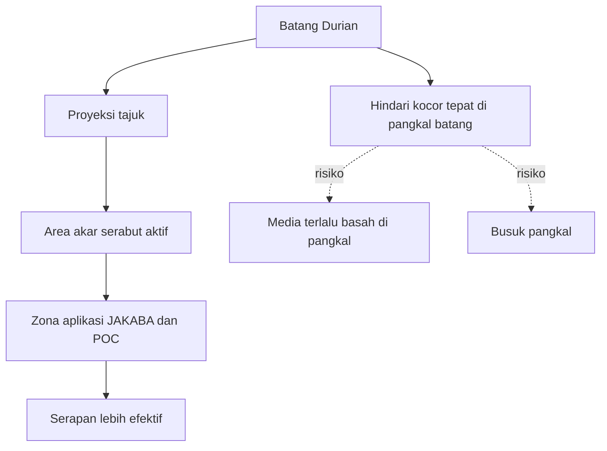

### Contoh Perhitungan per Pohon

```mdx id="qpe9g7"
Contoh:
Volume larutan = 10 L/pohon
Dosis JAKABA = 50 ml/L

Kebutuhan JAKABA per pohon = 50 × 10
Kebutuhan JAKABA per pohon = 500 ml

Jika 20 pohon:
Total JAKABA = 500 ml × 20
Total JAKABA = 10.000 ml
Total JAKABA = 10 L
```

### Catatan Teknis

Pada durian belum menghasilkan, POC vegetatif tidak boleh mendorong pertumbuhan terlalu lunak. Tajuk yang terlalu rimbun tetapi lemah dapat menyulitkan pembentukan struktur pohon yang baik. Pemupukan utama tetap harus memperhatikan umur tanaman, kondisi tanah, pH, drainase, dan target pertumbuhan.

---

## 4.10 Aplikasi pada Durian Produksi

Durian produksi membutuhkan strategi aplikasi berdasarkan fase fisiologis tanaman. Kesalahan umum pada durian produksi adalah memberikan input tinggi nitrogen terlalu dekat dengan fase induksi bunga, sehingga tanaman terdorong kembali ke vegetatif.

| Fase                    | Rekomendasi                                       |
| ----------------------- | ------------------------------------------------- |
| Setelah panen           | JAKABA 50–100 ml/L untuk pemulihan tanah dan akar |
| Flush vegetatif         | POC vegetatif + pemupukan utama                   |
| Menjelang induksi bunga | Kurangi input tinggi nitrogen                     |
| Pembungaan              | Gunakan input secara hati-hati, jangan berlebihan |
| Pembesaran buah         | Fokus K, Ca, Mg, B, dan air                       |
| Menjelang panen         | Hindari aplikasi fermentasi berbau/berisiko       |

### Setelah Panen

Setelah panen, tanaman kehilangan banyak cadangan energi dan hara. Pada fase ini, JAKABA dapat digunakan untuk memperbaiki rizosfer dan mendukung pemulihan akar. POC vegetatif dapat diberikan untuk membantu pembentukan flush baru, tetapi tetap harus diimbangi dengan pupuk utama.

### Flush Vegetatif

Flush vegetatif adalah fase munculnya daun dan tunas baru. Fase ini penting karena daun sehat akan menjadi sumber fotosintat untuk fase berikutnya. POC vegetatif dapat digunakan sebagai pendamping, sedangkan JAKABA tetap diarahkan ke tanah.

### Menjelang Induksi Bunga

Pada fase menjelang induksi bunga, input tinggi nitrogen perlu dikurangi. Tujuannya agar tanaman tidak terlalu terdorong membentuk tunas vegetatif baru. Pada banyak sistem budidaya buah, transisi dari vegetatif ke generatif membutuhkan pengaturan hara, air, dan tajuk.

### Pembungaan

Pada fase pembungaan, aplikasi harus hati-hati. Jangan memberi larutan fermentasi pekat atau berbau menyengat. Dukungan hara seperti boron, kalsium, magnesium, dan kalium perlu diperhatikan karena unsur-unsur tersebut berkaitan dengan pembungaan, perkembangan polen, dan pembentukan buah pada tanaman buah. Sumber teknis durian juga menekankan peran boron dalam perkembangan bunga dan kualitas buah. ([blog.agrobridge.com.my][3])

### Pembesaran Buah

Pada fase pembesaran buah, fokus utama adalah kalium, kalsium, magnesium, boron, dan manajemen air. Beberapa panduan nutrisi durian menyebut fase fruit set dan perkembangan buah sebagai fase yang sangat membutuhkan kalium, kalsium, dan magnesium. ([Shenyang MASL Biotechnology Co., Ltd.][2])

### Menjelang Panen

Menjelang panen, hindari aplikasi fermentasi yang berbau tajam atau belum matang. Input yang terlalu keras pada fase akhir dapat mengganggu kualitas buah, menimbulkan bau di area kebun, dan meningkatkan risiko kontaminasi.

---

## 4.11 Jadwal Aplikasi Praktis Cabai

Jadwal berikut adalah panduan awal. Dosis harus disesuaikan dengan varietas, media, musim, kesuburan tanah, sistem irigasi, dan respons tanaman.

| Fase         | JAKABA     | POC                  | Catatan               |
| ------------ | ---------- | -------------------- | --------------------- |
| Semai        | 5–10 ml/L  | 5–10 ml/L            | Dosis rendah          |
| Pindah tanam | 20 ml/L    | 10–20 ml/L           | Kocor media           |
| Vegetatif    | 30–50 ml/L | 20–30 ml/L           | Kombinasi pupuk utama |
| Bunga        | 20–30 ml/L | 20–30 ml/L generatif | Kurangi N berlebih    |
| Buah/panen   | 20–30 ml/L | 20–30 ml/L generatif | Fokus K dan Ca        |

### Contoh Kalender Aplikasi Cabai 8 Minggu Pertama

```mdx id="q74zfc"
Minggu 0:

- Pindah tanam
- Jangan langsung aplikasi pekat

Minggu 1:

- JAKABA 20 ml/L, kocor

Minggu 2:

- POC vegetatif 10–20 ml/L

Minggu 3:

- JAKABA 30 ml/L, kocor

Minggu 4:

- POC vegetatif 20 ml/L

Minggu 5:

- JAKABA 30–40 ml/L

Minggu 6:

- Mulai transisi ke POC generatif bila bunga mulai muncul

Minggu 7–8:

- JAKABA 20–30 ml/L tiap 14 hari
- POC generatif 20–30 ml/L tiap 7–10 hari
```

### Ilustrasi 4.3. Perubahan Fokus Aplikasi pada Cabai

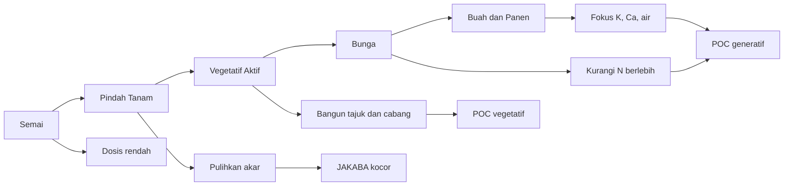

---

## 4.12 Jadwal Aplikasi Praktis Durian

Durian membutuhkan jadwal aplikasi yang lebih panjang karena siklus pertumbuhannya berbeda dengan cabai. Aplikasi JAKABA dan POC harus mengikuti fase fisiologis pohon.

| Fase               | JAKABA      | POC                  | Catatan            |
| ------------------ | ----------- | -------------------- | ------------------ |
| Bibit              | 20–30 ml/L  | 10–20 ml/L           | Tiap 14 hari       |
| Belum menghasilkan | 50 ml/L     | 20–30 ml/L           | Tiap 2–4 minggu    |
| Setelah panen      | 50–100 ml/L | 20–30 ml/L vegetatif | Pemulihan tanaman  |
| Flush              | 50 ml/L     | 20–30 ml/L vegetatif | Dukung daun baru   |
| Induksi bunga      | Dikurangi   | Dikurangi            | Hindari N berlebih |
| Pembesaran buah    | Terbatas    | POC generatif        | Fokus K, Ca, Mg    |

### Contoh Kalender Durian Produksi

```mdx id="rxak4w"
Fase setelah panen:

- JAKABA 50–100 ml/L
- POC vegetatif 20–30 ml/L
- Tambahkan kompos/pupuk kandang matang sesuai kebutuhan

Fase flush:

- JAKABA 50 ml/L
- POC vegetatif 20–30 ml/L
- Pupuk utama mengikuti kondisi tanaman

Fase menjelang induksi bunga:

- Kurangi input tinggi nitrogen
- JAKABA cukup terbatas bila kondisi tanah perlu pemulihan

Fase bunga:

- Aplikasi hati-hati
- Hindari larutan fermentasi pekat
- Perhatikan Ca, B, Mg, dan air

Fase pembesaran buah:

- Fokus K, Ca, Mg, B
- POC generatif dapat digunakan sebagai pendamping
- Hindari aplikasi fermentasi berbau tajam menjelang panen
```

### Catatan Teknis Durian

Pada durian, aplikasi input cair harus memperhatikan kondisi akar. Durian tidak menyukai genangan dan media yang terlalu basah. Jika tanah berat dan drainase buruk, aplikasi cair harus dikurangi. Sebaliknya, pada tanah sangat berpasir atau kering, aplikasi perlu disertai manajemen mulsa dan bahan organik.

---

## 4.13 Kombinasi dengan Pupuk Utama

JAKABA dan POC akan lebih efektif jika digunakan bersama sistem pemupukan utama yang seimbang. Keduanya bukan pengganti kompos, pupuk kandang, NPK, Ca, Mg, dan unsur mikro.

### Komponen Pemupukan Terpadu

| Komponen             | Fungsi                                                    |
| -------------------- | --------------------------------------------------------- |
| Kompos matang        | Menambah bahan organik dan memperbaiki struktur tanah     |
| Pupuk kandang matang | Menambah bahan organik, mikroba, dan hara lambat tersedia |
| NPK                  | Menyediakan hara makro utama                              |
| Ca                   | Menguatkan jaringan tanaman dan kualitas buah             |
| Mg                   | Mendukung pembentukan klorofil                            |
| B                    | Mendukung pembungaan dan pembentukan buah                 |
| Dolomit              | Menaikkan pH tanah masam dan menambah Ca/Mg               |
| Kieserite            | Sumber Mg dan S                                           |
| JAKABA               | Mendukung mikroba tanah dan rizosfer                      |
| POC                  | Menyediakan hara tambahan dan metabolit fermentasi        |

### Pola Integrasi

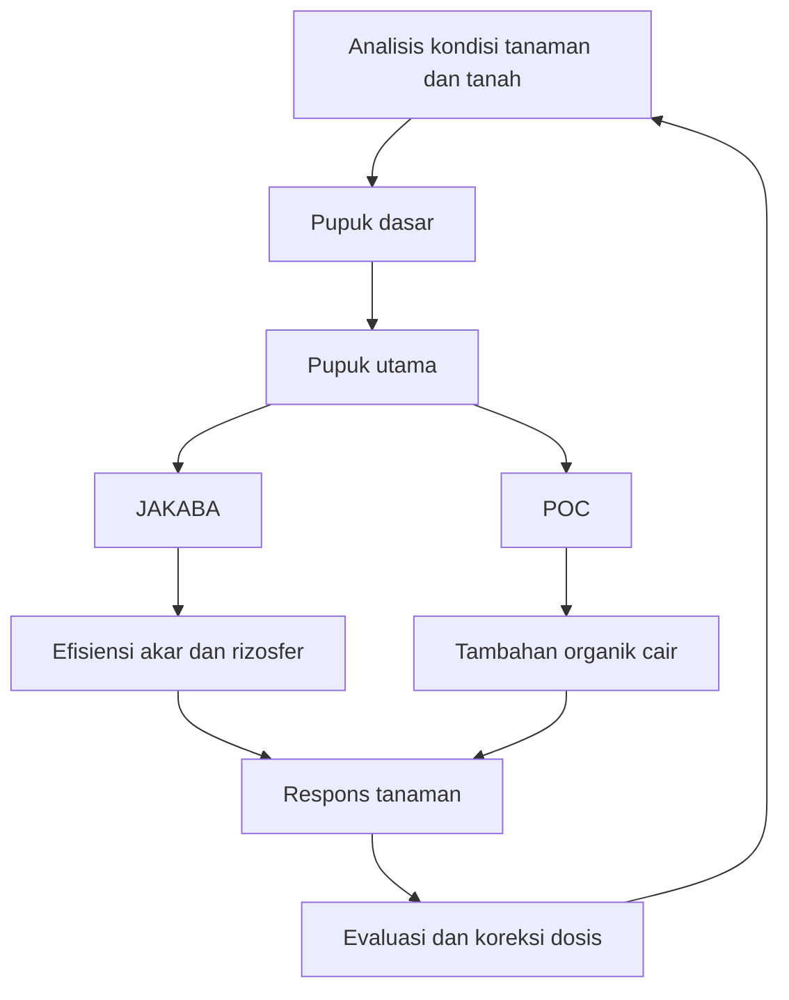

### Catatan Penggunaan Dolomit dan Kieserite

Dolomit dan kieserite tidak digunakan asal campur. Dolomit lebih tepat digunakan bila pH tanah rendah dan tanaman membutuhkan Ca/Mg. Kieserite digunakan bila kebutuhan Mg tinggi tetapi tidak ingin menaikkan pH terlalu kuat. Penggunaan keduanya sebaiknya berdasarkan kondisi tanah, gejala tanaman, atau hasil analisis tanah.

---

## 4.14 Evaluasi Respons Tanaman

Evaluasi adalah bagian penting dari strategi aplikasi. Tanpa evaluasi, penggunaan JAKABA dan POC mudah menjadi sekadar rutinitas tanpa ukuran keberhasilan.

### Parameter yang Diamati

| Parameter                     | Makna Agronomis                                |
| ----------------------------- | ---------------------------------------------- |
| Warna daun                    | Indikasi umum status N, Mg, Fe, atau stres     |
| Pertumbuhan tunas             | Menilai vigor tanaman                          |
| Jumlah cabang                 | Penting untuk produktivitas cabai              |
| Perkembangan akar             | Menilai kesehatan rizosfer dan media           |
| Jumlah bunga                  | Indikator transisi generatif                   |
| Persentase bunga menjadi buah | Menilai keberhasilan fruit set                 |
| Ukuran buah                   | Menilai kecukupan K, air, dan fotosintesis     |
| Kerontokan bunga/buah         | Indikasi stres, hara tidak seimbang, atau hama |
| Gejala layu                   | Indikasi akar, patogen, air, atau fitotoksik   |
| Kondisi tanah/media           | Menilai aerasi, drainase, dan kelembapan       |

### Format Catatan Lapangan

```mdx id="lqmu51"
Contoh catatan evaluasi mingguan:

Tanggal:
Komoditas:
Fase tanaman:
Produk diaplikasikan:
Dosis:
Cara aplikasi:
Cuaca:
Kondisi daun:
Kondisi bunga/buah:
Kondisi media:
Gejala stres:
Tindakan koreksi:
Catatan panen:
```

### Skor Evaluasi Sederhana

```mdx id="yxizz0"
Skor respons tanaman:
1 = buruk, tanaman stres berat
2 = kurang baik, ada gejala negatif
3 = netral, tidak ada perubahan jelas
4 = baik, pertumbuhan membaik
5 = sangat baik, respons jelas dan stabil

Produk dilanjutkan bila skor rata-rata minimal 3–4.
Produk dihentikan atau dosis dikurangi bila skor 1–2.
```

### Evaluasi Ekonomi

Dalam agribisnis, respons tanaman harus dikaitkan dengan biaya. Produk yang membuat tanaman terlihat lebih hijau belum tentu menguntungkan jika biaya tinggi dan hasil panen tidak meningkat.

```mdx id="mlzz1o"
Rumus sederhana evaluasi biaya:

Biaya aplikasi per tanaman = Total biaya larutan / Jumlah tanaman

Contoh:
Total biaya larutan = Rp 50.000
Jumlah tanaman = 1.000 tanaman

Biaya aplikasi per tanaman = 50.000 / 1.000
Biaya aplikasi per tanaman = Rp 50/tanaman
```

---

## 4.15 Kesalahan Aplikasi yang Perlu Dihindari

Kesalahan aplikasi JAKABA dan POC sering terjadi karena pengguna terlalu fokus pada manfaat, tetapi kurang memperhatikan dosis, kematangan produk, dan fase tanaman.

### Kesalahan Umum

| Kesalahan                                      | Risiko                                      |
| ---------------------------------------------- | ------------------------------------------- |
| Menggunakan JAKABA/POC pekat tanpa pengenceran | Akar terbakar, tanaman layu                 |
| Aplikasi terlalu sering                        | Media terlalu basah, salinitas naik         |
| Menggunakan produk berbau busuk                | Risiko fitotoksik dan kontaminasi           |
| Menyemprot menjelang panen                     | Risiko residu bau dan kontaminasi permukaan |
| Menganggap JAKABA sebagai pengganti pupuk      | Tanaman kekurangan hara utama               |
| Menggunakan POC belum matang                   | Tanaman stres atau akar rusak               |
| Mencampur semua input tanpa uji kompatibilitas | Endapan, reaksi kimia, fitotoksik           |
| Aplikasi siang hari panas                      | Daun terbakar, tanaman stres                |
| Menyiram tepat di pangkal batang durian        | Risiko busuk pangkal                        |

### Uji Kompatibilitas Campuran

Sebelum mencampur JAKABA, POC, pupuk daun, pestisida nabati, atau pupuk mikro dalam satu tangki, lakukan uji kompatibilitas sederhana.

```mdx id="axh0wt"
Uji kompatibilitas campuran:

1. Siapkan botol transparan 500 ml.
2. Masukkan air sesuai volume.
3. Tambahkan bahan satu per satu sesuai urutan dosis kecil.
4. Kocok ringan.
5. Diamkan 15–30 menit.
6. Amati endapan, gas, panas, gumpalan, atau bau menyengat.
7. Jika muncul reaksi tidak normal, jangan dicampur dalam tangki aplikasi.
```

### Rekomendasi Aman

Untuk penggunaan awal, lebih baik pisahkan aplikasi:

```mdx id="wrf2qt"
Pola aman:
Hari 1: Pupuk utama
Hari 3–4: JAKABA kocor
Hari 7: POC sesuai fase
Hari 10–14: Evaluasi respons tanaman
```

Pola seperti ini lebih aman dibanding mencampur semua input sekaligus, terutama jika produk dibuat sendiri dan belum memiliki data stabilitas.

---

## Ringkasan Bab 4

JAKABA dan POC memiliki peran penting sebagai input pendukung dalam budidaya cabai dan durian, tetapi keduanya harus digunakan secara rasional. JAKABA paling tepat diaplikasikan ke tanah atau media untuk mendukung rizosfer dan aktivitas akar. POC vegetatif digunakan untuk mendukung pertumbuhan daun, batang, akar, dan pemulihan tanaman. POC generatif digunakan untuk mendukung fase bunga, buah, dan kualitas hasil.

Pada cabai, dosis dimulai rendah pada fase semai, kemudian dinaikkan bertahap pada fase vegetatif, lalu dikurangi dan diarahkan ke dukungan generatif saat tanaman mulai berbunga dan berbuah. Pada durian, aplikasi harus mengikuti fase tanaman: bibit, belum menghasilkan, setelah panen, flush, induksi bunga, pembungaan, dan pembesaran buah.

Aplikasi terbaik bukan hanya berdasarkan dosis, tetapi berdasarkan **respons tanaman**. Oleh karena itu, setiap penggunaan JAKABA dan POC perlu diikuti dengan pencatatan, evaluasi, dan uji kecil sebelum aplikasi luas. Dalam sistem agribisnis, keberhasilan aplikasi diukur dari kesehatan tanaman, efisiensi biaya, stabilitas produksi, dan kualitas hasil panen.

[1]: https://www.haifa-group.com/articles/crop-guide-nutrients-pepper?utm_source=chatgpt.com 'Crop Guide: Nutrients for Pepper'
[2]: https://maslbiotech.com/durian-tree-nutrient-management-guide-how-to-use-durian-fertilizer-for-better-yield/?utm_source=chatgpt.com 'Durian Tree Nutrient Management Guide - MASL Biotechnology'
[3]: https://blog.agrobridge.com.my/en/knowledge/articles/boron-a-vital-part-of-durian-tree-development?utm_source=chatgpt.com 'Boron: A Vital Part of Durian Tree Development'

---

# 5. Lampiran Produk JAKABA, POC, dan MOL di Pasaran

### [Pupuk Organik Cair Air Media JAKABA]()

#### JAKABA cair

_Rp 2.000_

### [POC Murni JAKABA Super]()

#### Campuran POC

_Rp 11.998_

### [Air JAKABA Super 100 ml]()

#### Kemasan kecil

_Rp 16.900_

### [POC JAKABA 5 Liter]()

#### Volume besar

_Rp 18.000_

### [Pupuk Air JAKABA]()

#### Siap pakai

_Rp 21.500_

### [JAKABA 1 Galon]()

#### Galon

_Rp 183.600_

### [Bibit JAKABA 500 ml]()

#### Starter cair

_Rp 25.097_

### [Pupuk Organik Air JAKABA 1,5 Liter]()

#### Ekonomis

_Rp 15.105_

### [POC Booster Durian 1 Liter]()

#### Durian 1 L

_Rp 118.569_

### [POC Durian Premium 500 ml]()

#### Durian premium

_Rp 41.000_

### [Pupuk Cair Pelebat Durian 1 Liter]()

#### Pelebat buah

_Rp 72.800_

### [POC Booster Durian 5 Liter]()

#### Volume besar

_Rp 349.550_

### [POC Booster Durian 5 Liter]()

#### Generatif

_Rp 293.600_

### [POC Booster Durian 1000 ml]()

#### Booster buah

_Rp 54.340_

### [POC Booster Durian 500 ml]()

#### Kemasan kecil

_Rp 59.000_

### [Pupuk Organik Cair POC]()

#### POC umum

_Rp 10.000_

### [MOL Mikroorganisme Lokal]()

#### MOL cair

_Rp 12.000_

### [PROMOL-12 Serbuk Organik MOL]()

#### MOL serbuk

_Rp 250.000_

### [MOL Efektif Mikroorganisme Lokal 500 ml]()

#### Dekomposer

_Rp 13.000_

### [EM4 Mikroorganisme Pertanian 1 Liter]()

#### EM pertanian

_Rp 49.000_

### [EM4 Pertanian 1 Liter]()

#### Starter mikroba

_Rp 30.500_

### [EM4 Mikroorganisme Pertanian 1 Liter]()

#### Fermentasi

_Rp 36.000_

### [MOL Bioaktivator Dekomposer]()

#### Bioaktivator

_Rp 20.000_

### [Pupuk Organik Cair EM4 MOL POC]()

#### POC mikroba

_Rp 32.500_

## 5.1 Tujuan Lampiran

Lampiran ini disusun untuk memberikan gambaran tentang produk **JAKABA**, **POC**, dan **MOL** yang tersedia di pasaran. Bagian ini bukan dimaksudkan sebagai promosi produk tertentu, tetapi sebagai panduan teknis agar petani dan pelaku agribisnis dapat membandingkan produk secara lebih rasional.

Dalam praktik lapangan, produk fermentasi organik sering dijual dengan berbagai nama dagang, misalnya JAKABA cair, biang JAKABA, POC buah, POC durian, POC cabai, MOL, bioaktivator, dekomposer, EM, atau pupuk organik cair plus mikroba. Nama produk yang berbeda belum tentu menunjukkan fungsi yang benar-benar berbeda. Karena itu, pembeli perlu menilai komposisi, dosis, legalitas, harga, aroma, kemasan, dan kesesuaian produk dengan fase tanaman.

Lampiran ini memiliki beberapa tujuan utama:

- memberikan gambaran bentuk produk yang tersedia di pasaran,
- membantu pembaca membandingkan produk JAKABA, POC, dan MOL,
- memberikan panduan memilih produk yang lebih aman dan rasional,
- menghindari pembelian hanya berdasarkan klaim berlebihan,
- membantu menghitung biaya aplikasi per liter larutan atau per tanaman,
- mendorong uji kecil sebelum aplikasi luas.

Untuk produk yang diedarkan sebagai pupuk organik, pupuk hayati, atau pembenah tanah, aspek legalitas dan mutu tetap penting. Permentan No. 1 Tahun 2019 mengatur pendaftaran pupuk organik, pupuk hayati, dan pembenah tanah, sedangkan Kepmentan No. 261/KPTS/SR.310/M/4/2019 memuat persyaratan teknis minimal untuk kelompok produk tersebut. ([Database Peraturan | JDIH BPK][1])

---

## 5.2 Bentuk Produk JAKABA di Pasaran

Produk JAKABA di pasaran umumnya tersedia dalam bentuk cair, starter, konsentrat, atau campuran dengan POC. Sebagian produk dijual sebagai larutan siap pakai, sementara sebagian lain dijual sebagai biang untuk diperbanyak kembali.

Bentuk produk JAKABA yang umum dijumpai antara lain:

- JAKABA cair siap pakai,
- biang atau starter JAKABA,
- JAKABA super atau konsentrat,
- JAKABA campuran POC,
- bahan inokulum akar bambu,
- paket bahan pembuatan JAKABA.

### 5.2.1 JAKABA Cair Siap Pakai

JAKABA cair siap pakai biasanya dijual dalam kemasan kecil sampai sedang, misalnya 100 ml, 250 ml, 500 ml, 1 liter, atau lebih. Produk ini biasanya ditujukan untuk pengguna yang ingin langsung mengaplikasikan JAKABA tanpa membuat sendiri.

Kelebihannya adalah praktis. Kekurangannya, pembeli sering tidak mengetahui proses fermentasi, sumber mikroba, umur produk, atau kondisi penyimpanan sebelum dibeli.

### 5.2.2 Biang atau Starter JAKABA

Biang JAKABA digunakan sebagai inokulum untuk memperbanyak JAKABA baru. Produk ini lebih cocok untuk pengguna yang ingin membuat JAKABA sendiri tetapi membutuhkan sumber mikroba awal.

Starter sebaiknya dipilih dari penjual yang mencantumkan:

- tanggal produksi,
- dosis perbanyakan,
- cara memperbanyak,
- masa simpan,
- tanda produk masih aktif,
- cara aplikasi setelah diperbanyak.

### 5.2.3 JAKABA Super atau Konsentrat

Istilah “super” atau “konsentrat” sering digunakan dalam pemasaran. Namun, istilah ini perlu diuji secara rasional. Produk yang disebut konsentrat seharusnya memiliki dosis aplikasi yang jelas dan konsisten.

Pembeli perlu berhati-hati terhadap klaim seperti:

- pengganti total pupuk kimia,
- hasil panen berlipat tanpa pupuk lain,
- menyembuhkan semua penyakit tanaman,
- cocok untuk semua tanaman dan semua fase.

Klaim seperti itu perlu diuji terlebih dahulu, karena JAKABA secara agronomis lebih tepat diposisikan sebagai **biostimulan dan aktivator rizosfer**, bukan pupuk utama.

### 5.2.4 JAKABA Campuran POC

Sebagian produk dipasarkan sebagai JAKABA + POC. Produk campuran seperti ini perlu diperiksa lebih hati-hati karena fungsi JAKABA dan POC berbeda. Jika komposisinya tidak jelas, pembeli sulit menilai apakah produk tersebut lebih dominan sebagai mikroba, biostimulan, atau pupuk cair.

---

## 5.3 Bentuk Produk POC di Pasaran

POC di pasaran lebih beragam dibanding JAKABA. Produk POC dapat dibuat untuk fase vegetatif, generatif, tanaman buah, sayuran, cabai, durian, atau pembenah tanah. Ada juga produk yang dipasarkan sebagai POC plus mikroba, POC plus asam amino, atau POC plus unsur mikro.

Bentuk produk POC yang umum dijumpai antara lain:

- POC vegetatif,
- POC generatif atau POC buah,
- POC ikan atau asam amino ikan,
- POC urin kelinci, kambing, atau sapi,
- POC limbah buah atau sayur,
- POC mikroba/MOL/EM,
- POC khusus cabai,
- POC khusus durian,
- POC pembenah tanah,
- POC plus unsur mikro.

### 5.3.1 POC Vegetatif

POC vegetatif ditujukan untuk mendukung pertumbuhan daun, batang, tunas, akar, dan pemulihan tanaman. Produk ini biasanya dipakai pada fase awal pertumbuhan, setelah pindah tanam, setelah pemangkasan, atau setelah tanaman mengalami stres.

Ciri klaim yang umum muncul:

- merangsang pertumbuhan daun,
- mempercepat tunas,
- memperbaiki akar,
- menghijaukan tanaman,
- membantu pemulihan tanaman stres.

Produk seperti ini lebih cocok digunakan pada fase vegetatif, bukan saat tanaman sedang membutuhkan pengaturan bunga dan buah.

### 5.3.2 POC Generatif atau POC Buah

POC generatif ditujukan untuk mendukung bunga, buah, dan kualitas hasil. Produk ini biasanya dipasarkan dengan klaim seperti perangsang bunga, pelebat buah, pembesar buah, atau booster buah.

Produk generatif perlu dinilai dari kandungan atau klaim unsur pendukung seperti:

- kalium,
- fosfor,
- kalsium,
- magnesium,
- boron,
- asam amino,
- bahan organik cair.

Namun, pembeli tetap perlu berhati-hati. POC generatif tidak otomatis cukup untuk memenuhi kebutuhan K, Ca, Mg, dan B pada tanaman produksi tinggi seperti cabai atau durian.

### 5.3.3 POC Ikan atau Asam Amino Ikan

POC ikan biasanya dibuat dari fermentasi limbah ikan atau bahan berbasis protein. Produk ini berpotensi mengandung asam amino, nitrogen organik, fosfor, dan mineral. Namun, produk berbasis ikan juga memiliki risiko bau menyengat bila fermentasinya kurang matang.

Produk POC ikan yang baik seharusnya:

- tidak berbau bangkai,
- memiliki dosis aplikasi jelas,
- tidak menggembung ekstrem,
- tidak menimbulkan layu pada dosis rendah,
- disaring baik jika digunakan untuk semprot.

### 5.3.4 POC Urin Ternak

POC urin kelinci, kambing, atau sapi sering dipasarkan sebagai POC tinggi nitrogen. Produk seperti ini perlu diencerkan dengan hati-hati karena urin dapat mengandung garam, amonia, dan senyawa yang berisiko fitotoksik bila belum difermentasi sempurna.

POC urin lebih cocok untuk fase vegetatif dan tidak disarankan digunakan pekat pada bibit muda.

### 5.3.5 POC Khusus Cabai dan Durian

Produk khusus cabai atau durian biasanya dikemas dengan klaim yang lebih spesifik. Untuk cabai, klaim yang umum adalah merangsang bunga, memperbanyak buah, mengurangi rontok, dan memperbaiki ukuran buah. Untuk durian, klaim yang umum adalah mempercepat pertumbuhan, memperbaiki akar, merangsang bunga, dan melebatkan buah.

Produk khusus komoditas tetap perlu diuji kecil. Nama “khusus cabai” atau “khusus durian” tidak selalu menjamin produk sesuai untuk semua kondisi lahan, semua umur tanaman, dan semua fase pertumbuhan.

---

## 5.4 Bentuk Produk MOL di Pasaran

Selain JAKABA dan POC, produk **MOL** juga banyak dijumpai di pasaran. MOL adalah singkatan dari **Mikroorganisme Lokal**, yaitu sumber mikroba lokal yang biasa digunakan sebagai starter fermentasi, bioaktivator kompos, pengurai bahan organik, atau pendukung aktivitas mikroba tanah.

Dalam praktik lapangan, MOL dapat dibuat dari berbagai bahan, misalnya bonggol pisang, nasi basi, rebung bambu, buah busuk terkontrol, air kelapa, gula merah, keong mas, atau bahan lokal lain. Di pasaran, MOL biasanya tidak selalu disebut “MOL” secara eksplisit. Ada produk yang dipasarkan sebagai bioaktivator, dekomposer, mikroba pengurai, EM, starter kompos, atau mikroba fermentasi.

Bentuk MOL di pasaran antara lain:

- MOL cair,
- MOL serbuk,
- bioaktivator kompos,
- dekomposer bahan organik,
- starter fermentasi POC,
- starter bokashi,
- mikroba pengurai limbah organik,
- EM pertanian,
- mikroba tanah cair,
- paket starter MOL.

### 5.4.1 MOL Cair

MOL cair biasanya dijual dalam botol 250 ml, 500 ml, atau 1 liter. Produk ini digunakan sebagai starter pembuatan POC, kompos cair, bokashi, atau pengurai bahan organik.

Kelebihannya adalah mudah digunakan. Kekurangannya, viabilitas mikroba sangat tergantung pada umur produk, cara penyimpanan, dan kualitas bahan pembawa.

### 5.4.2 MOL Serbuk

MOL serbuk atau bioaktivator serbuk biasanya lebih stabil dalam penyimpanan dibanding produk cair, tergantung bahan pembawa dan teknologi produksinya. Produk ini umum digunakan untuk kompos, fermentasi bahan organik, dan dekomposisi limbah pertanian.

### 5.4.3 Bioaktivator dan Dekomposer

Bioaktivator dan dekomposer digunakan untuk mempercepat penguraian bahan organik. Produk ini lebih tepat diposisikan sebagai aktivator kompos atau starter fermentasi, bukan sebagai pupuk utama.

### 5.4.4 EM Pertanian

EM atau Effective Microorganisms sering digunakan sebagai starter fermentasi, terutama dalam pembuatan POC, bokashi, dan fermentasi bahan organik. Produk EM pertanian berada dalam kelompok mikroba fermentasi komersial yang lebih umum dikenal dibanding MOL tradisional.

### Perbedaan Praktis MOL, EM, dan JAKABA

| Istilah | Fungsi Utama                                        | Bentuk Umum | Catatan                                 |
| ------- | --------------------------------------------------- | ----------- | --------------------------------------- |
| MOL     | Sumber mikroba lokal                                | Cair/serbuk | Komposisi sangat tergantung bahan lokal |
| EM      | Starter mikroba fermentasi                          | Cair        | Umumnya produk komersial siap pakai     |
| JAKABA  | Biostimulan/mikroba lokal berbasis air cucian beras | Cair/koloni | Lebih diarahkan untuk rizosfer          |
| POC     | Pupuk organik cair                                  | Cair        | Lebih diarahkan sebagai hara tambahan   |

---

## 5.5 Parameter Membandingkan Produk JAKABA, POC, dan MOL

Dalam memilih produk di pasaran, pembeli tidak cukup hanya melihat nama produk dan klaim manfaat. Parameter teknis harus diperiksa agar produk yang dibeli sesuai kebutuhan dan tidak merugikan tanaman.

| Parameter        | Keterangan                                                                   |
| ---------------- | ---------------------------------------------------------------------------- |
| Nama produk      | Identitas dagang                                                             |
| Jenis produk     | JAKABA, starter, POC vegetatif, POC generatif, POC ikan, MOL, EM, dekomposer |
| Komposisi        | Bahan utama yang digunakan                                                   |
| Volume           | Isi kemasan                                                                  |
| Dosis aplikasi   | Anjuran pakai dari produsen                                                  |
| Harga per liter  | Untuk membandingkan biaya                                                    |
| Tanggal produksi | Menilai kesegaran produk                                                     |
| Masa simpan      | Menilai stabilitas produk                                                    |
| Aroma            | Tidak boleh busuk menyengat                                                  |
| Kondisi kemasan  | Tidak bocor, tidak menggembung ekstrem                                       |
| Legalitas        | Izin edar/label resmi bila tersedia                                          |
| Klaim fungsi     | Harus realistis dan tidak berlebihan                                         |
| Review pengguna  | Referensi tambahan, bukan bukti utama                                        |
| Data uji         | Kandungan hara, pH, mikroba, atau efektivitas bila tersedia                  |
| Kesesuaian fase  | Vegetatif, generatif, pembenah tanah, atau starter fermentasi                |

### Rumus Harga per Liter

```mdx id="4sf6yg"
Harga per liter = Harga produk / Volume produk dalam liter

Contoh:
Harga produk = Rp 25.000
Volume = 500 ml = 0,5 L

Harga per liter = 25.000 / 0,5
Harga per liter = Rp 50.000/L
```

### Rumus Biaya Aplikasi

```mdx id="dbenle"
Biaya aplikasi per tangki = Harga per ml produk × Kebutuhan produk per tangki

Harga per ml = Harga produk / Volume produk dalam ml

Contoh:
Harga produk = Rp 50.000
Volume produk = 1.000 ml
Harga per ml = 50.000 / 1.000
Harga per ml = Rp 50/ml

Dosis = 20 ml/L
Volume tangki = 16 L
Kebutuhan produk = 20 × 16 = 320 ml

Biaya aplikasi per tangki = 320 × 50
Biaya aplikasi per tangki = Rp 16.000
```

### Rumus Biaya per Tanaman

```mdx id="ycqtfe"
Biaya per tanaman = Total biaya aplikasi / Jumlah tanaman

Contoh:
Total biaya aplikasi = Rp 16.000
Jumlah tanaman = 500 tanaman

Biaya per tanaman = 16.000 / 500
Biaya per tanaman = Rp 32/tanaman
```

---

## 5.6 Catatan Membeli JAKABA

Produk JAKABA di pasaran perlu dipilih dengan hati-hati karena sebagian besar produk berbasis fermentasi lokal memiliki variasi tinggi. Pembeli perlu menilai apakah produk tersebut benar-benar layak digunakan sebagai input agribisnis.

### Kriteria JAKABA yang Lebih Layak Dipilih

- memiliki tanggal produksi,
- memiliki petunjuk dosis,
- tidak berbau busuk menyengat,
- tidak menggembung ekstrem,
- tidak mengandung belatung,
- tidak berlendir hitam berlebihan,
- penjual dapat menjelaskan cara penggunaan,
- memiliki anjuran pengenceran,
- tidak mengklaim sebagai pengganti total pupuk utama,
- pernah diuji pada tanaman sejenis.

### Kriteria JAKABA yang Perlu Dihindari

- tidak ada tanggal produksi,
- botol menggembung ekstrem,
- bau bangkai atau amonia tajam,
- klaim terlalu berlebihan,
- tidak ada dosis aplikasi,
- warna dan tekstur mencurigakan,
- penjual tidak bisa menjelaskan proses atau cara pakai.

### Uji Awal Produk JAKABA yang Dibeli

```mdx id="ptqzqc"
Prosedur uji awal JAKABA pasaran:

1. Amati kemasan: bocor atau menggembung ekstrem.
2. Cek aroma: harus fermentasi asam-manis, bukan busuk.
3. Encerkan 5–10 ml/L.
4. Aplikasikan pada 5–10 tanaman uji.
5. Amati 3–5 hari.
6. Jika aman, dosis dapat dinaikkan bertahap.
```

---

## 5.7 Catatan Membeli POC

POC lebih beragam dibanding JAKABA. Karena itu, pembeli harus memilih berdasarkan fase tanaman dan tujuan aplikasi.

### Panduan Memilih POC Berdasarkan Fase

| Fase Tanaman    | Jenis POC yang Lebih Sesuai     | Catatan                            |
| --------------- | ------------------------------- | ---------------------------------- |
| Bibit/semai     | POC ringan, dosis rendah        | Hindari POC pekat dan berbau tajam |
| Vegetatif       | POC vegetatif                   | Mendukung daun, tunas, dan akar    |
| Menjelang bunga | POC transisi/generatif ringan   | Hindari N berlebihan               |
| Bunga dan buah  | POC generatif                   | Perhatikan K, Ca, Mg, B            |
| Pemulihan       | POC asam amino/vegetatif ringan | Cocok setelah stres/panen          |

### Catatan Khusus POC Ikan

POC ikan dapat berguna sebagai sumber asam amino dan nitrogen organik. Namun, produk harus matang dan tidak berbau bangkai. Jika masih berbau busuk kuat, produk sebaiknya tidak digunakan pada tanaman utama.

### Catatan Khusus POC Urin

POC urin harus difermentasi sempurna dan diencerkan cukup. Produk urin yang belum matang berisiko mengandung amonia tinggi dan dapat merusak akar, terutama pada bibit, polybag, atau media tanam terbatas.

### Uji Awal Produk POC yang Dibeli

```mdx id="7ibp7n"
Prosedur uji awal POC pasaran:

1. Encerkan POC pada dosis rendah, misalnya 5–10 ml/L.
2. Gunakan pada 5–10 tanaman uji.
3. Jangan langsung semprot ke bunga atau buah.
4. Amati selama 3–5 hari.
5. Jika daun terbakar, tanaman layu, atau media berbau busuk, hentikan penggunaan.
```

---

## 5.8 Catatan Membeli MOL

MOL di pasaran perlu dipilih berdasarkan tujuan penggunaannya. Tidak semua MOL cocok langsung diaplikasikan ke tanaman. Sebagian produk MOL lebih tepat digunakan sebagai starter kompos atau starter pembuatan POC.

### Tujuan Penggunaan MOL

| Tujuan            | Jenis Produk yang Dicari    | Catatan                                  |
| ----------------- | --------------------------- | ---------------------------------------- |
| Membuat POC       | MOL cair/starter fermentasi | Pastikan dosis dan cara pakai jelas      |
| Membuat kompos    | Bioaktivator/dekomposer     | Cocok untuk bahan organik padat          |
| Memperbaiki tanah | MOL tanah/mikroba cair      | Perlu uji kecil                          |
| Membuat bokashi   | EM/MOL fermentasi           | Butuh molase dan bahan organik           |
| Mengurai limbah   | Dekomposer                  | Fokus pada penguraian, bukan pupuk utama |

### Kriteria MOL yang Lebih Layak Dipilih

- mencantumkan fungsi utama,
- memiliki dosis aplikasi,
- menjelaskan apakah untuk kompos, POC, tanah, atau bokashi,
- tidak berbau busuk menyengat,
- memiliki tanggal produksi,
- kemasan tidak bocor,
- tidak menggembung ekstrem,
- memiliki petunjuk penyimpanan,
- klaim manfaat masuk akal.

### Kriteria MOL yang Perlu Dihindari

- tidak jelas apakah untuk tanaman atau kompos,
- tidak ada dosis,
- tidak ada tanggal produksi,
- berbau bangkai,
- botol menggembung berlebihan,
- klaim terlalu umum seperti “untuk semua masalah tanaman”,
- tidak ada informasi bahan atau fungsi.

### Uji Aktivitas MOL Sederhana

```mdx id="chq4u8"
Uji aktivitas MOL sederhana:

1. Siapkan 1 liter air non-kaporit.
2. Tambahkan 10 ml MOL.
3. Tambahkan 10 gram gula merah/molase.
4. Tutup longgar.
5. Diamkan 12–24 jam.
6. Jika muncul aroma fermentasi ringan dan sedikit gas, MOL masih aktif.
7. Jika bau busuk tajam atau tidak ada aktivitas sama sekali, gunakan dengan hati-hati.
```

Uji ini hanya indikasi awal, bukan pengganti uji laboratorium. Untuk produksi komersial atau aplikasi skala besar, viabilitas dan keamanan mikroba tetap perlu diuji lebih serius.

---

## 5.9 Template Tabel Produk JAKABA Pasaran

Tabel berikut dapat digunakan untuk mencatat dan membandingkan produk JAKABA di pasaran.

| No  | Nama Produk         | Jenis       |    Volume | Klaim Fungsi        | Harga | Marketplace | Catatan                        |
| --- | ------------------- | ----------- | --------: | ------------------- | ----: | ----------- | ------------------------------ |
| 1   | JAKABA cair         | Siap pakai  |       1 L | Mikroba/biostimulan |     - | -           | Cek aroma dan tanggal produksi |
| 2   | Biang JAKABA        | Starter     |    250 ml | Perbanyakan JAKABA  |     - | -           | Cocok untuk produksi ulang     |
| 3   | JAKABA super        | Konsentrat  |    500 ml | Pemacu akar/tanah   |     - | -           | Uji dosis rendah               |
| 4   | JAKABA + POC        | Campuran    |       1 L | Mikroba dan hara    |     - | -           | Perlu cek komposisi            |
| 5   | Akar bambu inokulum | Bahan alam  | 250–500 g | Sumber mikroba alam |     - | -           | Perlu fermentasi ulang         |
| 6   | Paket JAKABA        | Paket bahan |  variatif | Pembuatan mandiri   |     - | -           | Cek isi paket                  |

---

## 5.10 Template Tabel Produk POC Pasaran

Tabel berikut digunakan untuk membandingkan berbagai jenis POC yang tersedia di pasar.

| No  | Nama Produk        | Jenis            | Volume | Klaim Fungsi          | Harga | Marketplace | Catatan                   |
| --- | ------------------ | ---------------- | -----: | --------------------- | ----: | ----------- | ------------------------- |
| 1   | POC vegetatif      | POC              |    1 L | Pertumbuhan daun/akar |     - | -           | Cocok fase awal           |
| 2   | POC buah           | POC generatif    |    1 L | Bunga dan buah        |     - | -           | Cocok fase generatif      |
| 3   | POC ikan           | Asam amino/POC   |    1 L | N, P, asam amino      |     - | -           | Cek bau dan dosis         |
| 4   | POC urin kelinci   | POC N tinggi     |    1 L | Vegetatif             |     - | -           | Perlu pengenceran cukup   |
| 5   | POC durian         | POC tanaman buah |    1 L | Buah/tajuk/akar       |     - | -           | Cek kandungan dan label   |
| 6   | POC cabai          | POC hortikultura |    1 L | Bunga dan buah cabai  |     - | -           | Uji kecil terlebih dahulu |
| 7   | POC pembenah tanah | POC tanah        |    1 L | Aktivitas tanah       |     - | -           | Lebih cocok kocor         |
| 8   | POC plus mikro     | POC + mikroba    |    1 L | Hara dan mikroba      |     - | -           | Cek komposisi             |

---

## 5.11 Template Tabel Produk MOL Pasaran

Tambahan tabel ini digunakan untuk mencatat produk MOL, EM, bioaktivator, atau dekomposer yang ada di pasaran.

| No  | Nama Produk         | Jenis                |     Volume | Klaim Fungsi           | Harga | Marketplace | Catatan                    |
| --- | ------------------- | -------------------- | ---------: | ---------------------- | ----: | ----------- | -------------------------- |
| 1   | MOL cair            | Mikroorganisme lokal |     500 ml | Starter POC/kompos     |     - | -           | Cek tanggal produksi       |
| 2   | MOL serbuk          | Bioaktivator         |      250 g | Dekomposer organik     |     - | -           | Lebih stabil bila kering   |
| 3   | EM pertanian        | Starter mikroba      |        1 L | Fermentasi POC/bokashi |     - | -           | Perlu molase saat aktivasi |
| 4   | Dekomposer kompos   | Mikroba pengurai     | 500 ml/1 L | Pengurai bahan organik |     - | -           | Cocok untuk kompos         |
| 5   | Bioaktivator limbah | Dekomposer           |        1 L | Limbah organik         |     - | -           | Bukan pupuk utama          |
| 6   | MOL tanah           | Mikroba tanah        |        1 L | Aktivasi tanah         |     - | -           | Uji kecil terlebih dahulu  |

---

## 5.12 Kriteria Produk yang Layak Dipilih

Produk JAKABA, POC, dan MOL yang layak dipilih sebaiknya memenuhi kriteria teknis dasar. Semakin besar skala usaha, semakin penting memilih produk yang jelas komposisi, dosis, dan legalitasnya.

### Kriteria Umum

- informasi komposisi jelas,
- dosis aplikasi jelas,
- tanggal produksi tersedia,
- masa simpan dicantumkan,
- tidak berbau busuk menyengat,
- kemasan baik,
- penjual memberi petunjuk teknis,
- klaim produk masuk akal,
- harga sesuai konsentrasi produk,
- ada data uji bila produk diklaim sebagai pupuk/hayati,
- untuk skala usaha, lebih baik memilih produk dengan legalitas.

### Kriteria Tambahan untuk Agribisnis

| Parameter              | Mengapa Penting                             |
| ---------------------- | ------------------------------------------- |
| Nomor izin/pendaftaran | Menilai kepatuhan produk                    |
| Kandungan hara         | Menilai fungsi sebagai POC                  |
| Kandungan mikroba      | Menilai fungsi sebagai pupuk hayati/starter |
| pH                     | Menilai stabilitas dan risiko fitotoksik    |
| EC/salinitas           | Penting untuk bibit, polybag, dan fertigasi |
| Dosis resmi            | Mengurangi risiko salah aplikasi            |
| Tanggal produksi       | Menilai kesegaran produk                    |
| Masa simpan            | Menilai viabilitas produk                   |
| Petunjuk penyimpanan   | Menjaga mutu setelah pembelian              |

Produk yang diklaim sebagai pupuk organik, pupuk hayati, atau pembenah tanah sebaiknya merujuk pada ketentuan pendaftaran dan persyaratan teknis yang berlaku. Permentan No. 1 Tahun 2019 memuat kerangka pendaftaran, sedangkan Kepmentan No. 261/KPTS/SR.310/M/4/2019 memuat persyaratan teknis minimal. ([Database Peraturan | JDIH BPK][1])

---

## 5.13 Kriteria Produk yang Perlu Dihindari

Produk fermentasi yang tidak layak dapat menimbulkan risiko fitotoksik, kontaminasi, bau, salinitas, dan kerugian tanaman. Karena itu, beberapa kriteria berikut perlu dihindari.

### Hindari Produk dengan Ciri Berikut

- tidak ada informasi komposisi,
- tidak ada dosis aplikasi,
- tidak ada tanggal produksi,
- klaim terlalu berlebihan,
- bau busuk tajam,
- bau bangkai,
- bau amonia menyengat,
- botol bocor,
- botol menggembung ekstrem,
- warna dan tekstur mencurigakan,
- ada belatung,
- berlendir hitam pekat,
- penjual tidak bisa menjelaskan cara penggunaan,
- produk diklaim sebagai pengganti total semua pupuk.

### Red Flag Klaim Produk

| Klaim                                    | Catatan Teknis                             |
| ---------------------------------------- | ------------------------------------------ |
| Mengganti 100% pupuk kimia               | Perlu bukti analisis hara dan uji lapangan |
| Panen naik berkali-kali lipat pasti      | Klaim terlalu absolut                      |
| Cocok untuk semua tanaman dan semua fase | Perlu hati-hati                            |
| Menyembuhkan semua penyakit              | Tidak realistis                            |
| Tidak perlu pupuk lain                   | Berisiko menyebabkan defisiensi hara       |
| Dosis semakin banyak semakin bagus       | Salah dan berbahaya                        |

---

## 5.14 Cara Membuat Daftar Perbandingan Produk Sebelum Membeli

Untuk pembelian skala usaha, sebaiknya jangan langsung memilih produk berdasarkan harga termurah. Gunakan tabel penilaian sederhana agar keputusan lebih objektif.

### Tabel Skoring Produk

```mdx id="9cwz07"
Skor penilaian:
1 = buruk/tidak jelas
2 = kurang
3 = cukup
4 = baik
5 = sangat baik

Parameter:

- Komposisi jelas
- Dosis jelas
- Tanggal produksi ada
- Legalitas ada
- Harga rasional
- Review wajar
- Kemasan baik
- Klaim realistis
- Sesuai fase tanaman
- Ada data uji
```

| Produk   | Komposisi | Dosis | Tanggal | Legalitas | Harga | Klaim | Total Skor | Keputusan    |
| -------- | --------: | ----: | ------: | --------: | ----: | ----: | ---------: | ------------ |
| Produk A |         4 |     5 |       4 |         3 |     4 |     4 |         24 | Layak uji    |
| Produk B |         2 |     2 |       1 |         1 |     5 |     1 |         12 | Hindari      |
| Produk C |         3 |     4 |       3 |         2 |     4 |     3 |         19 | Uji terbatas |

### Interpretasi Skor

```mdx id="tmln4z"
Interpretasi total skor:

- 24–30 = layak dipertimbangkan
- 18–23 = layak uji terbatas
- 12–17 = perlu hati-hati
- <12 = sebaiknya dihindari
```

---

## 5.15 Prosedur Uji Produk Pasaran Sebelum Aplikasi Luas

Produk JAKABA, POC, dan MOL sebaiknya diuji terlebih dahulu sebelum digunakan pada seluruh lahan. Uji ini penting terutama untuk tanaman bernilai ekonomi tinggi seperti cabai dan durian.

### Prosedur Umum Uji Kecil

```mdx id="lrd53c"
Prosedur uji kecil:

1. Pilih 5–10 tanaman uji.
2. Gunakan dosis 25–50% dari rekomendasi label.
3. Aplikasikan pada pagi atau sore hari.
4. Jangan campur dengan pestisida atau pupuk lain pada uji pertama.
5. Amati selama 3–5 hari.
6. Catat gejala daun, akar, media, dan pertumbuhan.
7. Jika aman, naikkan ke dosis normal secara bertahap.
8. Jika muncul layu, daun terbakar, atau media berbau busuk, hentikan penggunaan.
```

### Parameter Pengamatan Uji Kecil

| Parameter   | Aman               | Tidak Aman                    |
| ----------- | ------------------ | ----------------------------- |
| Daun        | Tetap segar        | Layu, gosong, menguning cepat |
| Akar        | Tetap putih/sehat  | Cokelat, busuk, bau           |
| Media       | Tidak berbau busuk | Bau busuk/amonia              |
| Pertumbuhan | Normal/membaik     | Terhambat                     |
| Serangga    | Tidak meningkat    | Lalat/semut meningkat drastis |
| Tanaman     | Tidak stres        | Stres dalam 1–3 hari          |

---

## 5.16 Ilustrasi Alur Pemilihan Produk Pasaran

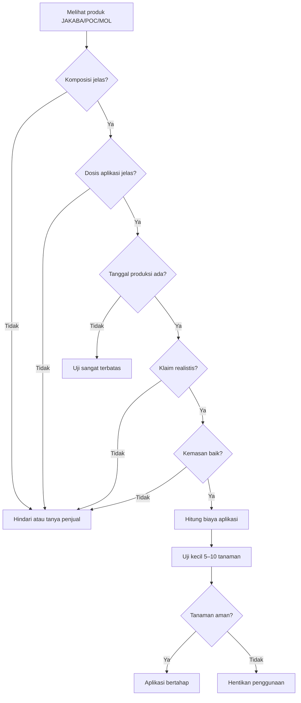

---

## 5.17 Ringkasan Perbandingan JAKABA, POC, dan MOL Pasaran

| Produk        | Fungsi Utama                     | Cocok untuk                 | Perlu Diwaspadai                           |
| ------------- | -------------------------------- | --------------------------- | ------------------------------------------ |
| JAKABA        | Biostimulan dan mikroba rizosfer | Kocor tanah/media           | Variasi mikroba, bau busuk, klaim berlebih |
| POC vegetatif | Hara tambahan fase tumbuh        | Daun, tunas, akar           | Kelebihan N, produk belum matang           |
| POC generatif | Pendukung bunga dan buah         | Cabai/durian fase generatif | Tidak otomatis cukup K, Ca, Mg             |
| POC ikan      | Asam amino dan N organik         | Pemulihan dan pertumbuhan   | Bau busuk, fitotoksik                      |
| MOL cair      | Starter fermentasi               | POC, kompos, tanah          | Viabilitas mikroba                         |
| MOL serbuk    | Dekomposer/bioaktivator          | Kompos dan bahan organik    | Aktivasi dan dosis                         |
| EM pertanian  | Starter mikroba komersial        | POC/bokashi                 | Perlu aktivasi sesuai petunjuk             |
| Dekomposer    | Pengurai bahan organik           | Kompos/limbah organik       | Bukan pupuk utama                          |

---

## Ringkasan Bab 5

Produk JAKABA, POC, dan MOL di pasaran tersedia dalam berbagai bentuk, mulai dari cair siap pakai, starter, konsentrat, bioaktivator, dekomposer, hingga produk khusus cabai dan durian. Ketiganya memiliki fungsi berbeda. JAKABA lebih tepat dipilih sebagai biostimulan dan pendukung rizosfer. POC dipilih sebagai pupuk organik cair tambahan sesuai fase tanaman. MOL dipilih sebagai starter mikroba, bioaktivator, atau dekomposer.

Dalam pembelian produk pasaran, parameter penting yang harus diperiksa adalah komposisi, dosis aplikasi, tanggal produksi, masa simpan, aroma, kondisi kemasan, legalitas, klaim fungsi, dan harga per liter. Produk yang berbau busuk, tidak memiliki dosis jelas, tidak mencantumkan tanggal produksi, atau mengklaim sebagai pengganti total semua pupuk sebaiknya dihindari.

Untuk penggunaan agribisnis, keputusan membeli tidak boleh hanya berdasarkan harga atau klaim. Produk harus diuji kecil terlebih dahulu pada 5–10 tanaman. Jika aman, aplikasi dapat diperluas secara bertahap. Pendekatan ini membantu mengurangi risiko fitotoksik, kerugian tanaman, dan pemborosan biaya input.

[1]: https://peraturan.bpk.go.id/Details/161054/permentan-no-01-tahun-2019?utm_source=chatgpt.com 'Permentan No. 01 Tahun 2019'

---

# Penutup Artikel

## Kesimpulan Utama

JAKABA, POC, dan PGPM merupakan tiga konsep yang saling berkaitan dalam sistem budidaya berbasis bahan organik dan mikroba, tetapi ketiganya memiliki fungsi yang berbeda. Perbedaan ini penting dipahami agar penggunaannya tidak keliru di lapangan.

**JAKABA** lebih tepat diposisikan sebagai **mikroba lokal atau biostimulan rizosfer**. Kekuatan utamanya bukan pada kandungan hara makro yang tinggi, melainkan pada potensi dukungannya terhadap aktivitas mikroba tanah, perkembangan akar, dan kesehatan area perakaran. Karena itu, JAKABA paling ideal diaplikasikan dengan cara kocor ke tanah atau media tanam.

**POC** lebih tepat diposisikan sebagai **pupuk organik cair tambahan**. Fungsi POC sangat bergantung pada bahan bakunya. POC dari bahan hijauan lebih sesuai untuk mendukung fase vegetatif, sedangkan POC dari bahan seperti kulit pisang, sabut kelapa, air kelapa, dan bahan protein terkontrol lebih sesuai sebagai pendukung fase generatif. Namun, POC tetap tidak boleh dianggap sebagai pupuk lengkap tanpa melihat kandungan aktualnya.

**PGPM/PGPR** adalah kelompok mikroba fungsional yang dapat membantu pertumbuhan tanaman melalui berbagai mekanisme, seperti mendukung ketersediaan hara, memperbaiki interaksi akar dan tanah, menghasilkan senyawa pemacu tumbuh, serta membantu tanaman menghadapi tekanan lingkungan. JAKABA, POC, MOL, dan pupuk hayati dapat saja mengandung mikroba yang berperan seperti PGPM, tetapi hal tersebut perlu dibuktikan melalui uji yang lebih terukur.

Pada cabai rawit, cabai besar, dan durian, strategi terbaik bukan memilih salah satu input secara tunggal, melainkan menggabungkan beberapa komponen secara seimbang:

```mdx id="z2awx1"
Sistem aplikasi terbaik =
Pupuk dasar matang

- Pupuk utama terukur
- JAKABA untuk rizosfer
- POC sesuai fase tanaman
- Manajemen air dan evaluasi lapangan
```

Dengan pendekatan tersebut, JAKABA dan POC tidak dibebani sebagai pengganti total pupuk utama. Keduanya digunakan pada posisi yang lebih tepat, yaitu sebagai pendukung kesehatan tanah, akar, efisiensi pemupukan, dan kestabilan pertumbuhan tanaman.

Keberhasilan penggunaan JAKABA dan POC sangat ditentukan oleh tiga faktor utama:

1. **Mutu fermentasi**
   Produk harus matang, tidak busuk, tidak berlendir berlebihan, tidak mengandung belatung, dan tidak menyebabkan tanaman stres.

2. **Dosis aplikasi**
   Semua produk fermentasi cair harus diencerkan. Dosis rendah lebih aman untuk uji awal, kemudian dapat dinaikkan bertahap sesuai respons tanaman.

3. **Evaluasi lapangan**
   Respons tanaman harus dicatat. Tanaman yang terlihat hijau saja belum cukup menjadi indikator keberhasilan. Evaluasi harus mencakup akar, tunas, bunga, buah, gejala stres, biaya aplikasi, dan hasil panen.

### Ringkasan Posisi Produk

| Produk/Istilah | Posisi Teknis               | Fungsi Utama                              | Catatan Penting                          |
| -------------- | --------------------------- | ----------------------------------------- | ---------------------------------------- |
| JAKABA         | Biostimulan/mikroba lokal   | Mendukung rizosfer dan akar               | Bukan pupuk utama                        |
| POC vegetatif  | Pupuk organik cair tambahan | Mendukung daun, batang, akar              | Gunakan pada fase tumbuh                 |
| POC generatif  | Pupuk organik cair tambahan | Mendukung bunga dan buah                  | Tetap perlu K, Ca, Mg, B terukur         |
| PGPM/PGPR      | Mikroba fungsional          | Membantu pertumbuhan tanaman              | Perlu viabilitas dan fungsi spesifik     |
| MOL            | Starter mikroba lokal       | Fermentasi, kompos, dekomposer            | Bukan otomatis pupuk lengkap             |
| Pupuk utama    | Sumber hara utama           | Memenuhi kebutuhan N, P, K, Ca, Mg, mikro | Tetap diperlukan dalam produksi intensif |

---

## Rekomendasi Praktis

Berdasarkan pembahasan dalam artikel ini, rekomendasi praktis penggunaan JAKABA, POC, dan MOL dalam sistem agribisnis adalah sebagai berikut.

### 1. Gunakan JAKABA untuk Memperbaiki Rizosfer dan Mendukung Akar

JAKABA sebaiknya digunakan dengan cara **kocor ke tanah atau media tanam**. Tujuan utamanya adalah mendukung aktivitas mikroba di sekitar akar, bukan memberi hara utama dalam jumlah besar.

Rekomendasi umum:

| Kondisi Tanaman    | Dosis Awal JAKABA | Cara Aplikasi             |
| ------------------ | ----------------: | ------------------------- |
| Bibit/semai        |         5–10 ml/L | Kocor ringan              |
| Tanaman muda       |           20 ml/L | Kocor media               |
| Vegetatif aktif    |        30–50 ml/L | Kocor area akar           |
| Generatif          |        20–30 ml/L | Kocor tanah/media         |
| Durian/pohon besar |       50–100 ml/L | Kocor area proyeksi tajuk |

Jangan gunakan JAKABA yang berbau bangkai, amonia tajam, berlendir hitam berlebihan, atau mengandung belatung.

---

### 2. Gunakan POC Vegetatif pada Fase Pertumbuhan

POC vegetatif digunakan saat tanaman sedang membentuk daun, batang, tunas, dan akar. Pada cabai, fase ini terjadi sejak bibit sampai menjelang bunga. Pada durian, fase ini terjadi pada bibit, tanaman belum menghasilkan, setelah panen, dan saat flush vegetatif.

Rekomendasi umum:

| Fase            | Dosis POC Vegetatif | Catatan                              |
| --------------- | ------------------: | ------------------------------------ |
| Bibit           |           5–10 ml/L | Dosis rendah                         |
| Awal tanam      |          10–20 ml/L | Kocor/semprot ringan                 |
| Vegetatif aktif |          20–30 ml/L | Tetap kombinasikan pupuk utama       |
| Durian flush    |          20–30 ml/L | Gunakan bersama manajemen hara utama |

POC vegetatif tidak boleh berlebihan karena dapat mendorong pertumbuhan terlalu lunak, terutama pada cabai menjelang fase bunga.

---

### 3. Gunakan POC Generatif pada Fase Bunga dan Buah

POC generatif digunakan saat tanaman memasuki fase pembungaan, pembentukan buah, dan pembesaran buah. Pada fase ini, kebutuhan hara bergeser dari dominan vegetatif menjadi lebih fokus pada kalium, kalsium, magnesium, boron, dan keseimbangan air.

Rekomendasi umum:

| Fase                   | Dosis POC Generatif | Catatan                    |
| ---------------------- | ------------------: | -------------------------- |
| Awal bunga             |             20 ml/L | Hindari N berlebih         |
| Buah muda              |          20–30 ml/L | Dukung pembentukan buah    |
| Pembesaran buah        |          20–30 ml/L | Tetap perlu K, Ca, Mg      |
| Panen berulang cabai   |          20–30 ml/L | Evaluasi bunga dan buah    |
| Durian pembesaran buah |    Sesuai uji kecil | Jangan aplikasi berlebihan |

POC generatif tidak otomatis cukup untuk memenuhi kebutuhan buah. Pada cabai dan durian produksi, unsur seperti K, Ca, Mg, dan B tetap perlu dikelola secara terukur.

---

### 4. Jangan Gunakan Produk Fermentasi yang Gagal atau Berbau Busuk

Produk fermentasi yang gagal dapat merusak tanaman. Aroma adalah indikator awal yang sangat penting.

| Kondisi Produk            | Keputusan                         |
| ------------------------- | --------------------------------- |
| Aroma asam-manis/tape     | Layak diuji kecil                 |
| Bau bangkai               | Hindari                           |
| Bau amonia tajam          | Hindari                           |
| Ada belatung              | Hindari                           |
| Lendir hitam pekat        | Hindari                           |
| Botol menggembung ekstrem | Hati-hati, buka aman dan evaluasi |
| Tanaman uji layu          | Hentikan penggunaan               |

Produk yang gagal sebaiknya tidak diaplikasikan pada tanaman utama. Jika ingin dimanfaatkan, gunakan hanya sebagai bahan aktivasi kompos dengan pengenceran tinggi dan tetap hati-hati.

---

### 5. Selalu Lakukan Uji Kecil Sebelum Aplikasi Luas

Uji kecil adalah langkah wajib, terutama untuk produk buatan sendiri atau produk pasaran yang belum pernah digunakan di lahan tersebut.

```mdx id="6i3exv"
Prosedur uji kecil:

1. Pilih 5–10 tanaman uji.
2. Gunakan dosis 25–50% dari dosis rencana.
3. Aplikasikan pada pagi atau sore hari.
4. Jangan campur dengan pestisida atau pupuk lain pada uji pertama.
5. Amati selama 3–5 hari.
6. Jika tanaman aman, dosis dapat dinaikkan bertahap.
7. Jika tanaman layu, daun terbakar, atau media berbau busuk, hentikan penggunaan.
```

Uji kecil membantu menghindari kerugian besar, terutama pada cabai fase generatif dan durian bernilai tinggi.

---

### 6. Catat Setiap Batch Produksi dan Respons Tanaman

Pencatatan adalah bagian penting dalam agribisnis. Tanpa catatan, sulit mengetahui formula mana yang berhasil, dosis mana yang aman, dan produk mana yang memberikan respons terbaik.

### Contoh Format Catatan Produksi

```mdx id="04s9xs"
Catatan batch JAKABA/POC/MOL:

Kode batch:
Tanggal produksi:
Jenis produk:
Formula bahan:
Sumber mikroba/starter:
Sistem fermentasi:
Durasi fermentasi:
pH akhir:
Aroma:
Warna:
Tanggal saring:
Tanggal aplikasi:
Dosis aplikasi:
Tanaman uji:
Respons 3 hari:
Respons 7 hari:
Catatan perbaikan:
```

### Contoh Format Catatan Respons Tanaman

```mdx id="09dv85"
Catatan respons tanaman:

Tanggal:
Komoditas:
Fase tanaman:
Produk yang digunakan:
Dosis:
Cara aplikasi:
Cuaca:
Kondisi daun:
Kondisi akar/media:
Jumlah bunga:
Jumlah buah:
Gejala stres:
Tindakan koreksi:
Hasil pengamatan:
```

Dengan catatan yang konsisten, formulasi dapat diperbaiki dari waktu ke waktu. Ini penting agar penggunaan JAKABA dan POC tidak hanya berdasarkan kebiasaan, tetapi berdasarkan data lapangan.

---

## Rekomendasi Akhir

Untuk penggunaan yang aman dan produktif, gunakan prinsip berikut:

```mdx id="pjt9p7"
JAKABA = pendukung rizosfer dan akar
POC vegetatif = pendukung pertumbuhan
POC generatif = pendukung bunga dan buah
MOL = starter mikroba/dekomposer
Pupuk utama = sumber hara utama
Evaluasi lapangan = dasar keputusan
```

Dalam sistem budidaya cabai dan durian, pendekatan paling rasional adalah **pemupukan terpadu**. Kompos matang, pupuk kandang matang, pupuk utama, JAKABA, POC, dan MOL memiliki peran masing-masing. Jika digunakan pada posisi yang tepat, input fermentasi berbasis mikroba dan bahan organik dapat membantu menekan biaya, memperbaiki kesehatan tanah, meningkatkan efisiensi serapan hara, dan mendukung produksi yang lebih stabil.

Namun, jika digunakan tanpa kontrol mutu, tanpa pengenceran, tanpa uji kecil, atau dengan klaim berlebihan, JAKABA dan POC justru dapat menjadi sumber masalah. Karena itu, prinsip terbaik adalah:

> **Produksi terukur, fermentasi sehat, dosis bertahap, aplikasi sesuai fase, dan evaluasi lapangan yang konsisten.**

---

<small>
  **_Catatan Penyusunan_** Artikel ini disusun sebagai materi edukasi dan
  referensi umum berdasarkan berbagai sumber pustaka, praktik lapangan, serta
  bantuan alat penulisan. Pembaca disarankan untuk melakukan verifikasi lanjutan
  dan penyesuaian sesuai dengan kondisi serta kebutuhan masing-masing sistem.
</small>
