# **_Panduan Praktis Integrasi PGPM, Pupuk Kimia, dan Pestisida Kimia pada Budidaya Cabai Rawit dan Cabai Besar_**

_Strategi Mikroba Pemacu Pertumbuhan Tanaman untuk Meningkatkan Produktivitas, Efisiensi Input, Kesehatan Akar, dan Keberlanjutan Budidaya Cabai_

---

- [**_Panduan Praktis Integrasi PGPM, Pupuk Kimia, dan Pestisida Kimia pada Budidaya Cabai Rawit dan Cabai Besar_**](#panduan-praktis-integrasi-pgpm-pupuk-kimia-dan-pestisida-kimia-pada-budidaya-cabai-rawit-dan-cabai-besar)
- [Bab 1. Pendahuluan](#bab-1-pendahuluan)
  - [1.1 Latar Belakang](#11-latar-belakang)
  - [1.2 Mengapa PGPM Penting dalam Agribisnis Cabai](#12-mengapa-pgpm-penting-dalam-agribisnis-cabai)
  - [Gambar 1.1. Posisi PGPM dalam Sistem Budidaya Cabai Terpadu](#gambar-11-posisi-pgpm-dalam-sistem-budidaya-cabai-terpadu)
  - [1.3 Tujuan Panduan](#13-tujuan-panduan)
  - [Ringkasan Bab 1](#ringkasan-bab-1)
- [Bab 2. Dasar-Dasar PGPM pada Tanaman Cabai](#bab-2-dasar-dasar-pgpm-pada-tanaman-cabai)
  - [2.1 Pengertian PGPM](#21-pengertian-pgpm)
  - [Gambar 2.1. Hubungan Istilah dalam Kelompok PGPM](#gambar-21-hubungan-istilah-dalam-kelompok-pgpm)
  - [2.2 Kelompok PGPM Penting untuk Cabai](#22-kelompok-pgpm-penting-untuk-cabai)
  - [Gambar 2.2. Zona Kerja PGPM pada Tanaman Cabai](#gambar-22-zona-kerja-pgpm-pada-tanaman-cabai)
  - [2.3 Fungsi PGPM bagi Cabai](#23-fungsi-pgpm-bagi-cabai)
  - [Tabel 2.2. Ringkasan Fungsi PGPM Berdasarkan Fase Budidaya Cabai](#tabel-22-ringkasan-fungsi-pgpm-berdasarkan-fase-budidaya-cabai)
  - [Ringkasan Bab 2](#ringkasan-bab-2)
- [Bab 3. Strategi Integrasi PGPM, Pupuk Kimia, Pestisida Kimia, dan Desain Konsorsium](#bab-3-strategi-integrasi-pgpm-pupuk-kimia-pestisida-kimia-dan-desain-konsorsium)
  - [3.1 Filosofi Integrasi](#31-filosofi-integrasi)
  - [Gambar 3.1. Model Integrasi PGPM, Pupuk Kimia, dan Pestisida Kimia](#gambar-31-model-integrasi-pgpm-pupuk-kimia-dan-pestisida-kimia)
  - [3.2 Prinsip Pisah Waktu, Pisah Tempat, Pisah Fungsi](#32-prinsip-pisah-waktu-pisah-tempat-pisah-fungsi)
  - [Gambar 3.2. Prinsip Pisah Waktu, Pisah Tempat, Pisah Fungsi](#gambar-32-prinsip-pisah-waktu-pisah-tempat-pisah-fungsi)
  - [3.3 Karakteristik Input Kimia yang Berpengaruh terhadap PGPM](#33-karakteristik-input-kimia-yang-berpengaruh-terhadap-pgpm)
  - [A. Pupuk Kimia](#a-pupuk-kimia)
  - [B. Pestisida Kimia](#b-pestisida-kimia)
  - [3.4 Tingkat Risiko Input Kimia terhadap PGPM](#34-tingkat-risiko-input-kimia-terhadap-pgpm)
  - [Gambar 3.3. Alur Keputusan Sebelum Mencampur atau Mendekatkan PGPM dengan Input Lain](#gambar-33-alur-keputusan-sebelum-mencampur-atau-mendekatkan-pgpm-dengan-input-lain)
  - [3.5 Desain Konsorsium PGPM untuk Cabai](#35-desain-konsorsium-pgpm-untuk-cabai)
  - [A. Konsorsium Akar dan Hara](#a-konsorsium-akar-dan-hara)
  - [B. Konsorsium Mikoriza–_Trichoderma_](#b-konsorsium-mikorizatrichoderma)
  - [C. Konsorsium Penekan Penyakit Tanah](#c-konsorsium-penekan-penyakit-tanah)
  - [D. Konsorsium Fase Generatif](#d-konsorsium-fase-generatif)
  - [Tabel 3.2. Desain Konsorsium PGPM Berdasarkan Tujuan Lapangan](#tabel-32-desain-konsorsium-pgpm-berdasarkan-tujuan-lapangan)
  - [Gambar 3.4. Desain Konsorsium PGPM Berdasarkan Fase Tanaman](#gambar-34-desain-konsorsium-pgpm-berdasarkan-fase-tanaman)
  - [3.6 Kombinasi yang Sebaiknya Dihindari](#36-kombinasi-yang-sebaiknya-dihindari)
  - [Tabel 3.3. Kombinasi yang Harus Dihindari dan Alternatif Aman](#tabel-33-kombinasi-yang-harus-dihindari-dan-alternatif-aman)
  - [Ringkasan Bab 3](#ringkasan-bab-3)
- [Bab 4. Panduan Aplikasi PGPM Cabai dari Semai sampai Panen](#bab-4-panduan-aplikasi-pgpm-cabai-dari-semai-sampai-panen)
  - [Gambar 4.1. Alur Umum Aplikasi PGPM pada Cabai](#gambar-41-alur-umum-aplikasi-pgpm-pada-cabai)
- [4.1 Metode Aplikasi PGPM](#41-metode-aplikasi-pgpm)
  - [A. Perlakuan Media Semai](#a-perlakuan-media-semai)
  - [B. Perlakuan Benih](#b-perlakuan-benih)
  - [C. Aplikasi Lubang Tanam](#c-aplikasi-lubang-tanam)
  - [D. Kocor Akar](#d-kocor-akar)
  - [E. Semprot Daun](#e-semprot-daun)
- [4.2 Jadwal Aplikasi Terintegrasi per Fase Tanaman](#42-jadwal-aplikasi-terintegrasi-per-fase-tanaman)
  - [A. Sebelum Semai](#a-sebelum-semai)
  - [B. Fase Semai](#b-fase-semai)
  - [C. Fase Pindah Tanam](#c-fase-pindah-tanam)
  - [D. Vegetatif Awal, 7–21 HST](#d-vegetatif-awal-721-hst)
  - [E. Vegetatif Lanjut, 21–35 HST](#e-vegetatif-lanjut-2135-hst)
  - [F. Fase Bunga dan Awal Buah](#f-fase-bunga-dan-awal-buah)
  - [G. Fase Panen Berulang](#g-fase-panen-berulang)
- [4.3 Integrasi PGPM dengan Pupuk Kimia](#43-integrasi-pgpm-dengan-pupuk-kimia)
  - [Prinsip Pemupukan Saat Menggunakan PGPM](#prinsip-pemupukan-saat-menggunakan-pgpm)
  - [Strategi Pupuk Dasar](#strategi-pupuk-dasar)
  - [Strategi Pupuk Susulan](#strategi-pupuk-susulan)
  - [Gambar 4.3. Contoh Pola Mingguan Integrasi Pupuk, PGPM, dan Pestisida](#gambar-43-contoh-pola-mingguan-integrasi-pupuk-pgpm-dan-pestisida)
- [4.4 Integrasi PGPM dengan Pestisida Kimia](#44-integrasi-pgpm-dengan-pestisida-kimia)
  - [Prinsip Umum](#prinsip-umum)
  - [Jeda Aplikasi](#jeda-aplikasi)
  - [Jika Pestisida Harus Digunakan Darurat](#jika-pestisida-harus-digunakan-darurat)
- [4.5 Paket Aplikasi Berdasarkan Kondisi Lahan](#45-paket-aplikasi-berdasarkan-kondisi-lahan)
  - [A. Paket Standar Lahan Sehat](#a-paket-standar-lahan-sehat)
  - [B. Paket Lahan Bekas Layu](#b-paket-lahan-bekas-layu)
  - [C. Paket Musim Hujan](#c-paket-musim-hujan)
  - [D. Paket Musim Kemarau](#d-paket-musim-kemarau)
  - [E. Paket Cabai Rawit Panen Panjang](#e-paket-cabai-rawit-panen-panjang)
  - [F. Paket Cabai Besar](#f-paket-cabai-besar)
  - [Tabel 4.5. Ringkasan Paket Aplikasi Berdasarkan Kondisi Lahan](#tabel-45-ringkasan-paket-aplikasi-berdasarkan-kondisi-lahan)
- [4.6 Contoh Kalender Aplikasi Cabai 0–90 HST](#46-contoh-kalender-aplikasi-cabai-090-hst)
  - [Cara Membaca Kalender](#cara-membaca-kalender)
  - [Gambar 4.4. Titik Kritis Aplikasi PGPM pada Kalender 0–90 HST](#gambar-44-titik-kritis-aplikasi-pgpm-pada-kalender-090-hst)
  - [Catatan Penting untuk Aplikasi Lapangan](#catatan-penting-untuk-aplikasi-lapangan)
  - [Ringkasan Bab 4](#ringkasan-bab-4)
- [Bab 5. Air, pH, Media, dan Kondisi Aplikasi](#bab-5-air-ph-media-dan-kondisi-aplikasi)
  - [Gambar 5.1. Faktor Penentu Keberhasilan Aplikasi PGPM](#gambar-51-faktor-penentu-keberhasilan-aplikasi-pgpm)
- [5.1 Kualitas Air](#51-kualitas-air)
  - [A. Hindari Air Berklorin Tinggi](#a-hindari-air-berklorin-tinggi)
  - [B. Hindari Air Terlalu Panas](#b-hindari-air-terlalu-panas)
  - [C. pH Air Ideal Netral hingga Agak Asam](#c-ph-air-ideal-netral-hingga-agak-asam)
  - [D. Gunakan Air Bersih dan Tidak Tercemar](#d-gunakan-air-bersih-dan-tidak-tercemar)
  - [Tabel 5.1. Checklist Kualitas Air untuk Aplikasi PGPM](#tabel-51-checklist-kualitas-air-untuk-aplikasi-pgpm)
- [5.2 Waktu Aplikasi](#52-waktu-aplikasi)
  - [A. Aplikasi Pagi atau Sore](#a-aplikasi-pagi-atau-sore)
  - [B. Tanah Harus Lembap](#b-tanah-harus-lembap)
  - [C. Jangan Aplikasi Saat Siang Panas](#c-jangan-aplikasi-saat-siang-panas)
  - [D. Jangan Aplikasi Sebelum Hujan Deras](#d-jangan-aplikasi-sebelum-hujan-deras)
  - [E. Jangan Aplikasi Saat Tanaman Stres Berat Akibat Kekeringan](#e-jangan-aplikasi-saat-tanaman-stres-berat-akibat-kekeringan)
  - [Gambar 5.2. Alur Keputusan Waktu Aplikasi PGPM](#gambar-52-alur-keputusan-waktu-aplikasi-pgpm)
  - [Tabel 5.2. Kondisi Waktu Aplikasi dan Keputusan Lapangan](#tabel-52-kondisi-waktu-aplikasi-dan-keputusan-lapangan)
- [5.3 Kondisi Tanah dan Media](#53-kondisi-tanah-dan-media)
  - [A. Bahan Organik Cukup](#a-bahan-organik-cukup)
  - [B. Drainase Baik](#b-drainase-baik)
  - [C. pH Tanah Sesuai](#c-ph-tanah-sesuai)
  - [D. Tanah Tidak Tergenang](#d-tanah-tidak-tergenang)
  - [E. Tanah Tidak Terlalu Kering](#e-tanah-tidak-terlalu-kering)
  - [F. Hindari Akumulasi Garam dari Pupuk Pekat](#f-hindari-akumulasi-garam-dari-pupuk-pekat)
  - [Gambar 5.3. Kondisi Tanah yang Mendukung dan Menghambat PGPM](#gambar-53-kondisi-tanah-yang-mendukung-dan-menghambat-pgpm)
  - [Tabel 5.3. Checklist Kondisi Tanah dan Media Sebelum Aplikasi PGPM](#tabel-53-checklist-kondisi-tanah-dan-media-sebelum-aplikasi-pgpm)
- [Catatan Praktis untuk Petani dan Teknisi Lapang](#catatan-praktis-untuk-petani-dan-teknisi-lapang)
  - [Tabel 5.4. Keputusan Cepat Sebelum Aplikasi PGPM](#tabel-54-keputusan-cepat-sebelum-aplikasi-pgpm)
  - [Ringkasan Bab 5](#ringkasan-bab-5)
- [Bab 6. Standar Mutu, Penyimpanan, dan Perbanyakan PGPM](#bab-6-standar-mutu-penyimpanan-dan-perbanyakan-pgpm)
  - [Gambar 6.1. Alur Kendali Mutu PGPM dari Produk sampai Aplikasi](#gambar-61-alur-kendali-mutu-pgpm-dari-produk-sampai-aplikasi)
- [6.1 Informasi yang Harus Ada pada Produk PGPM](#61-informasi-yang-harus-ada-pada-produk-pgpm)
  - [A. Nama Mikroba](#a-nama-mikroba)
  - [B. Strain Bila Tersedia](#b-strain-bila-tersedia)
  - [C. Populasi Mikroba atau CFU](#c-populasi-mikroba-atau-cfu)
  - [D. Tanggal Produksi dan Tanggal Kedaluwarsa](#d-tanggal-produksi-dan-tanggal-kedaluwarsa)
  - [E. Cara Simpan](#e-cara-simpan)
  - [F. Dosis Aplikasi](#f-dosis-aplikasi)
  - [G. Kompatibilitas dengan Input Lain](#g-kompatibilitas-dengan-input-lain)
  - [H. Nomor Izin Edar Bila Produk Komersial](#h-nomor-izin-edar-bila-produk-komersial)
  - [Tabel 6.1. Checklist Label Produk PGPM](#tabel-61-checklist-label-produk-pgpm)
- [6.2 Ciri Produk PGPM yang Baik](#62-ciri-produk-pgpm-yang-baik)
  - [A. Tidak Berbau Busuk Menyengat](#a-tidak-berbau-busuk-menyengat)
  - [B. Tidak Menggumpal Abnormal](#b-tidak-menggumpal-abnormal)
  - [C. Tidak Terkontaminasi Jamur Liar Berlebihan](#c-tidak-terkontaminasi-jamur-liar-berlebihan)
  - [D. Kemasan Tidak Bocor](#d-kemasan-tidak-bocor)
  - [E. Kemasan Tidak Menggembung](#e-kemasan-tidak-menggembung)
  - [F. Warna dan Aroma Sesuai Karakter Produk](#f-warna-dan-aroma-sesuai-karakter-produk)
  - [G. Instruksi Penggunaan Jelas](#g-instruksi-penggunaan-jelas)
  - [Tabel 6.2. Ciri Produk PGPM Layak dan Tidak Layak](#tabel-62-ciri-produk-pgpm-layak-dan-tidak-layak)
- [6.3 Penyimpanan PGPM](#63-penyimpanan-pgpm)
  - [A. Simpan di Tempat Teduh](#a-simpan-di-tempat-teduh)
  - [B. Hindari Panas Langsung dan Sinar Matahari](#b-hindari-panas-langsung-dan-sinar-matahari)
  - [C. Jangan Simpan Dekat Pestisida](#c-jangan-simpan-dekat-pestisida)
  - [D. Tutup Rapat Setelah Digunakan](#d-tutup-rapat-setelah-digunakan)
  - [E. Gunakan Segera Setelah Diencerkan](#e-gunakan-segera-setelah-diencerkan)
  - [Tabel 6.3. Panduan Penyimpanan PGPM](#tabel-63-panduan-penyimpanan-pgpm)
- [6.4 Prinsip Umum Perbanyakan PGPM](#64-prinsip-umum-perbanyakan-pgpm)
  - [A. Tidak Semua PGPM Bisa Diperbanyak Petani](#a-tidak-semua-pgpm-bisa-diperbanyak-petani)
  - [B. Perbanyakan Sembarangan Menyebabkan Kontaminasi](#b-perbanyakan-sembarangan-menyebabkan-kontaminasi)
  - [C. Produk yang Tampak “Hidup” Belum Tentu Benar](#c-produk-yang-tampak-hidup-belum-tentu-benar)
  - [D. Konsorsium Campuran Tidak Selalu Stabil](#d-konsorsium-campuran-tidak-selalu-stabil)
  - [E. Faktor yang Harus Diperhatikan dalam Perbanyakan](#e-faktor-yang-harus-diperhatikan-dalam-perbanyakan)
  - [Gambar 6.2. Risiko Perbanyakan PGPM Tanpa Kontrol](#gambar-62-risiko-perbanyakan-pgpm-tanpa-kontrol)
- [6.5 Klasifikasi PGPM Berdasarkan Kelayakan Perbanyakan di Tingkat Petani](#65-klasifikasi-pgpm-berdasarkan-kelayakan-perbanyakan-di-tingkat-petani)
  - [Cara Membaca Tabel](#cara-membaca-tabel)
- [6.6 Metode Perbanyakan Praktis Berdasarkan Jenis PGPM](#66-metode-perbanyakan-praktis-berdasarkan-jenis-pgpm)
  - [6.6.1 Dasar Sistem Perbanyakan PGPM](#661-dasar-sistem-perbanyakan-pgpm)
  - [6.6.2 Fermentasi Padat](#662-fermentasi-padat)
    - [Tabel 6.6A. Ciri Fermentasi Padat yang Baik dan Buruk](#tabel-66a-ciri-fermentasi-padat-yang-baik-dan-buruk)
  - [6.6.3 Fermentasi Cair dan Bio-reaktor](#663-fermentasi-cair-dan-bio-reaktor)
    - [Perbedaan Fermentasi Cair Sederhana dan Bio-reaktor](#perbedaan-fermentasi-cair-sederhana-dan-bio-reaktor)
  - [6.6.4 Aerob, Fakultatif, Mikroaerofilik, dan Anaerob](#664-aerob-fakultatif-mikroaerofilik-dan-anaerob)
    - [Aerob](#aerob)
    - [Fakultatif](#fakultatif)
    - [Mikroaerofilik](#mikroaerofilik)
    - [Anaerob](#anaerob)
    - [Tabel 6.6B. Kebutuhan Oksigen Beberapa PGPM](#tabel-66b-kebutuhan-oksigen-beberapa-pgpm)
  - [6.6.5 Aktivasi, Perbanyakan Terbatas, dan Produksi](#665-aktivasi-perbanyakan-terbatas-dan-produksi)
    - [Aktivasi](#aktivasi)
    - [Perbanyakan Terbatas](#perbanyakan-terbatas)
    - [Produksi](#produksi)
    - [Tabel 6.6C. Perbedaan Aktivasi, Perbanyakan Terbatas, dan Produksi](#tabel-66c-perbedaan-aktivasi-perbanyakan-terbatas-dan-produksi)
  - [Gambar 6.2A. Pemilihan Sistem Perbanyakan PGPM](#gambar-62a-pemilihan-sistem-perbanyakan-pgpm)
  - [6.6.6 Prinsip Aerasi dalam Perbanyakan Cair](#666-prinsip-aerasi-dalam-perbanyakan-cair)
    - [Tabel 6.6D. Indikator Proses Cair yang Perlu Diwaspadai](#tabel-66d-indikator-proses-cair-yang-perlu-diwaspadai)
  - [6.6.7 Batasan Fermentasi Anaerob untuk PGPM Cabai](#667-batasan-fermentasi-anaerob-untuk-pgpm-cabai)
  - [6.6.8 Tabel Pemilihan Metode Berdasarkan Jenis PGPM](#668-tabel-pemilihan-metode-berdasarkan-jenis-pgpm)
  - [A. Perbanyakan _Trichoderma_](#a-perbanyakan-trichoderma)
  - [B. Perbanyakan _Bacillus_](#b-perbanyakan-bacillus)
  - [C. Perbanyakan _Pseudomonas_](#c-perbanyakan-pseudomonas)
  - [D. Perbanyakan _Azotobacter_](#d-perbanyakan-azotobacter)
  - [E. Perbanyakan _Azospirillum_](#e-perbanyakan-azospirillum)
  - [F. Perbanyakan PSB](#f-perbanyakan-psb)
  - [G. Perbanyakan KSB](#g-perbanyakan-ksb)
  - [H. Perbanyakan Mikoriza](#h-perbanyakan-mikoriza)
  - [I. Perbanyakan Konsorsium Campuran](#i-perbanyakan-konsorsium-campuran)
  - [Gambar 6.3. Kelayakan Perbanyakan PGPM di Tingkat Petani](#gambar-63-kelayakan-perbanyakan-pgpm-di-tingkat-petani)
- [6.7 Batas Aman Perbanyakan di Tingkat Petani](#67-batas-aman-perbanyakan-di-tingkat-petani)
  - [A. Yang Relatif Boleh Dilakukan](#a-yang-relatif-boleh-dilakukan)
  - [B. Yang Sebaiknya Tidak Dilakukan Sembarangan](#b-yang-sebaiknya-tidak-dilakukan-sembarangan)
  - [Tabel 6.4. Batas Aman Perbanyakan PGPM di Tingkat Petani](#tabel-64-batas-aman-perbanyakan-pgpm-di-tingkat-petani)
  - [C. Uji Kecil Sebelum Aplikasi Luas](#c-uji-kecil-sebelum-aplikasi-luas)
  - [D. Catatan Mutu Perbanyakan](#d-catatan-mutu-perbanyakan)
  - [Gambar 6.4. Alur Aman Perbanyakan Terbatas di Tingkat Petani](#gambar-64-alur-aman-perbanyakan-terbatas-di-tingkat-petani)
- [Catatan Keselamatan dan Kebersihan](#catatan-keselamatan-dan-kebersihan)
- [Ringkasan Bab 6](#ringkasan-bab-6)
- [Bab 7. SOP Lapangan, Monitoring, Troubleshooting, dan Checklist](#bab-7-sop-lapangan-monitoring-troubleshooting-dan-checklist)
  - [Gambar 7.1. Siklus SOP dan Monitoring PGPM di Lapangan](#gambar-71-siklus-sop-dan-monitoring-pgpm-di-lapangan)
- [7.1 SOP Sebelum Tanam](#71-sop-sebelum-tanam)
  - [A. Analisis Riwayat Lahan](#a-analisis-riwayat-lahan)
  - [B. Cek Riwayat Layu dan Penyakit Tanah](#b-cek-riwayat-layu-dan-penyakit-tanah)
  - [C. Perbaiki Drainase](#c-perbaiki-drainase)
  - [D. Perbaiki pH Bila Diperlukan](#d-perbaiki-ph-bila-diperlukan)
  - [E. Gunakan Kompos Matang](#e-gunakan-kompos-matang)
  - [F. Inokulasi _Trichoderma_ pada Media atau Kompos](#f-inokulasi-trichoderma-pada-media-atau-kompos)
  - [G. Siapkan Jadwal Pupuk, PGPM, dan Pestisida](#g-siapkan-jadwal-pupuk-pgpm-dan-pestisida)
  - [H. Siapkan Sumber Air yang Layak](#h-siapkan-sumber-air-yang-layak)
  - [Tabel 7.1. SOP Sebelum Tanam](#tabel-71-sop-sebelum-tanam)
- [7.2 SOP Saat Tanam](#72-sop-saat-tanam)
  - [A. Mikoriza Kontak Akar](#a-mikoriza-kontak-akar)
  - [B. _Trichoderma_ di Sekitar Akar](#b-trichoderma-di-sekitar-akar)
  - [C. Pupuk Kimia Tidak Menempel Langsung pada Akar](#c-pupuk-kimia-tidak-menempel-langsung-pada-akar)
  - [D. Hindari Fungisida di Lubang Tanam](#d-hindari-fungisida-di-lubang-tanam)
  - [E. Tanah dalam Kondisi Cukup Lembap](#e-tanah-dalam-kondisi-cukup-lembap)
  - [F. Tanam Sore Hari Bila Kondisi Panas](#f-tanam-sore-hari-bila-kondisi-panas)
  - [Gambar 7.2. Posisi Input Saat Tanam](#gambar-72-posisi-input-saat-tanam)
- [7.3 SOP Pemeliharaan](#73-sop-pemeliharaan)
  - [A. PGPR pada 7–10 HST](#a-pgpr-pada-710-hst)
  - [B. PGPR + PSB + KSB pada 14–21 HST](#b-pgpr--psb--ksb-pada-1421-hst)
  - [C. KSB + PSB Saat Bunga dan Buah](#c-ksb--psb-saat-bunga-dan-buah)
  - [D. PGPM Pemeliharaan Tiap 14–21 Hari](#d-pgpm-pemeliharaan-tiap-1421-hari)
  - [E. Re-inokulasi Setelah Pestisida Berat](#e-re-inokulasi-setelah-pestisida-berat)
  - [F. Monitoring Akar dan Tajuk Setiap Minggu](#f-monitoring-akar-dan-tajuk-setiap-minggu)
  - [Tabel 7.2. SOP Pemeliharaan PGPM Berdasarkan Umur Tanaman](#tabel-72-sop-pemeliharaan-pgpm-berdasarkan-umur-tanaman)
- [7.4 SOP Setelah Aplikasi Pestisida Berat](#74-sop-setelah-aplikasi-pestisida-berat)
  - [A. Tunggu 5–7 Hari](#a-tunggu-57-hari)
  - [B. Kocor PGPM Ulang](#b-kocor-pgpm-ulang)
  - [C. Gunakan Bahan Organik Matang Bila Perlu](#c-gunakan-bahan-organik-matang-bila-perlu)
  - [D. Pantau Akar dan Gejala Stres](#d-pantau-akar-dan-gejala-stres)
  - [E. Hindari Pupuk Pekat Saat Tanaman Stres Berat](#e-hindari-pupuk-pekat-saat-tanaman-stres-berat)
  - [Gambar 7.3. SOP Pemulihan Setelah Pestisida Berat](#gambar-73-sop-pemulihan-setelah-pestisida-berat)
- [7.5 Monitoring Keberhasilan PGPM](#75-monitoring-keberhasilan-pgpm)
  - [A. Indikator Tanaman](#a-indikator-tanaman)
  - [B. Indikator Tanah](#b-indikator-tanah)
  - [C. Indikator Produksi](#c-indikator-produksi)
  - [Tabel 7.3. Indikator Monitoring Keberhasilan PGPM](#tabel-73-indikator-monitoring-keberhasilan-pgpm)
- [7.6 Troubleshooting Lapangan](#76-troubleshooting-lapangan)
  - [A. PGPM Tidak Terlihat Hasilnya](#a-pgpm-tidak-terlihat-hasilnya)
  - [B. Tanaman Tetap Layu](#b-tanaman-tetap-layu)
  - [Gambar 7.4. Alur Diagnosis Tanaman Layu](#gambar-74-alur-diagnosis-tanaman-layu)
  - [C. Bunga Rontok](#c-bunga-rontok)
  - [D. Tanaman Keriting](#d-tanaman-keriting)
  - [E. Buah Busuk atau Antraknosa](#e-buah-busuk-atau-antraknosa)
  - [Tabel 7.4. Troubleshooting Cepat Masalah Lapangan](#tabel-74-troubleshooting-cepat-masalah-lapangan)
- [7.7 Checklist Lapangan](#77-checklist-lapangan)
  - [A. Checklist Sebelum Aplikasi PGPM](#a-checklist-sebelum-aplikasi-pgpm)
  - [B. Checklist Sebelum Mencampur Input](#b-checklist-sebelum-mencampur-input)
  - [C. Checklist Monitoring Mingguan](#c-checklist-monitoring-mingguan)
  - [Gambar 7.5. Alur Keputusan Sebelum Aplikasi PGPM](#gambar-75-alur-keputusan-sebelum-aplikasi-pgpm)
- [Format Catatan Lapangan Sederhana](#format-catatan-lapangan-sederhana)
- [Ringkasan Bab 7](#ringkasan-bab-7)
- [Bab 8. Analisis Ekonomi Sederhana](#bab-8-analisis-ekonomi-sederhana)
  - [Gambar 8.1. Alur Penilaian Ekonomi Penggunaan PGPM](#gambar-81-alur-penilaian-ekonomi-penggunaan-pgpm)
- [8.1 Biaya Tambahan PGPM](#81-biaya-tambahan-pgpm)
  - [A. Biaya Produk PGPM](#a-biaya-produk-pgpm)
  - [B. Biaya Tenaga Aplikasi](#b-biaya-tenaga-aplikasi)
  - [C. Biaya Air](#c-biaya-air)
  - [D. Biaya Alat](#d-biaya-alat)
  - [E. Biaya Bahan Organik Tambahan](#e-biaya-bahan-organik-tambahan)
  - [F. Biaya Re-inokulasi Setelah Pestisida Berat](#f-biaya-re-inokulasi-setelah-pestisida-berat)
  - [Tabel 8.1. Komponen Biaya Tambahan PGPM](#tabel-81-komponen-biaya-tambahan-pgpm)
  - [Rumus 8.4. Total Biaya Tambahan PGPM](#rumus-84-total-biaya-tambahan-pgpm)
- [8.2 Potensi Manfaat Ekonomi](#82-potensi-manfaat-ekonomi)
  - [A. Pengurangan Pupuk Bertahap](#a-pengurangan-pupuk-bertahap)
  - [B. Penurunan Kehilangan Akibat Layu](#b-penurunan-kehilangan-akibat-layu)
  - [C. Panen Lebih Panjang](#c-panen-lebih-panjang)
  - [D. Tanaman Lebih Seragam](#d-tanaman-lebih-seragam)
  - [E. Kualitas Buah Lebih Baik](#e-kualitas-buah-lebih-baik)
  - [F. Efisiensi Pestisida Bila Tanaman Lebih Sehat](#f-efisiensi-pestisida-bila-tanaman-lebih-sehat)
  - [G. Risiko Gagal Panen Lebih Rendah](#g-risiko-gagal-panen-lebih-rendah)
  - [Tabel 8.2. Potensi Manfaat Ekonomi PGPM](#tabel-82-potensi-manfaat-ekonomi-pgpm)
- [8.3 Skenario Penghematan Pupuk](#83-skenario-penghematan-pupuk)
  - [Tabel 8.3. Skenario Penghematan Pupuk](#tabel-83-skenario-penghematan-pupuk)
  - [A. Skenario Konservatif](#a-skenario-konservatif)
  - [B. Skenario Moderat](#b-skenario-moderat)
  - [C. Skenario Progresif](#c-skenario-progresif)
  - [D. Skenario Agresif](#d-skenario-agresif)
  - [Gambar 8.2. Alur Keputusan Pengurangan Pupuk Saat Menggunakan PGPM](#gambar-82-alur-keputusan-pengurangan-pupuk-saat-menggunakan-pgpm)
- [8.4 Cara Menghitung Dampak Ekonomi](#84-cara-menghitung-dampak-ekonomi)
  - [A. Rumus Dasar Pendapatan](#a-rumus-dasar-pendapatan)
  - [B. Tabel Perbandingan Tanpa PGPM dan Dengan PGPM](#b-tabel-perbandingan-tanpa-pgpm-dan-dengan-pgpm)
  - [C. Contoh Simulasi Sederhana](#c-contoh-simulasi-sederhana)
  - [D. Menghitung Manfaat Bersih PGPM](#d-menghitung-manfaat-bersih-pgpm)
  - [E. Menghitung Rasio Manfaat Tambahan terhadap Biaya PGPM](#e-menghitung-rasio-manfaat-tambahan-terhadap-biaya-pgpm)
- [8.5 Titik Impas Penggunaan PGPM](#85-titik-impas-penggunaan-pgpm)
  - [A. Titik Impas Berdasarkan Tambahan Hasil Panen](#a-titik-impas-berdasarkan-tambahan-hasil-panen)
  - [B. Titik Impas Berdasarkan Pengurangan Kematian Tanaman](#b-titik-impas-berdasarkan-pengurangan-kematian-tanaman)
  - [C. Titik Impas Berdasarkan Panen Tambahan](#c-titik-impas-berdasarkan-panen-tambahan)
  - [D. Titik Impas Berdasarkan Penghematan Pupuk](#d-titik-impas-berdasarkan-penghematan-pupuk)
  - [E. Titik Impas Berdasarkan Kombinasi Manfaat](#e-titik-impas-berdasarkan-kombinasi-manfaat)
  - [Gambar 8.3. Titik Impas Penggunaan PGPM](#gambar-83-titik-impas-penggunaan-pgpm)
- [Contoh Format Analisis Ekonomi Lapangan](#contoh-format-analisis-ekonomi-lapangan)
  - [Rumus 8.22. Persentase Tanaman Hidup](#rumus-822-persentase-tanaman-hidup)
  - [Rumus 8.23. Persentase Kenaikan Hasil](#rumus-823-persentase-kenaikan-hasil)
- [Cara Menafsirkan Hasil Analisis](#cara-menafsirkan-hasil-analisis)
  - [PGPM Layak Dilanjutkan Bila:](#pgpm-layak-dilanjutkan-bila)
  - [PGPM Perlu Dievaluasi Bila:](#pgpm-perlu-dievaluasi-bila)
  - [PGPM Tidak Boleh Langsung Disalahkan Bila:](#pgpm-tidak-boleh-langsung-disalahkan-bila)
- [Catatan Praktis untuk Pengambilan Keputusan](#catatan-praktis-untuk-pengambilan-keputusan)
- [Ringkasan Bab 8](#ringkasan-bab-8)
- [Bab 9. Lampiran](#bab-9-lampiran)
- [Lampiran 1. Tabel Kompatibilitas PGPM dengan Input Kimia](#lampiran-1-tabel-kompatibilitas-pgpm-dengan-input-kimia)
  - [Keterangan Tingkat Kompatibilitas](#keterangan-tingkat-kompatibilitas)
  - [Tabel 9.1. Kompatibilitas PGPM dengan Input Kimia](#tabel-91-kompatibilitas-pgpm-dengan-input-kimia)
  - [Tabel 9.2. Kompatibilitas Berdasarkan Jenis PGPM](#tabel-92-kompatibilitas-berdasarkan-jenis-pgpm)
  - [Catatan Penggunaan Tabel Kompatibilitas](#catatan-penggunaan-tabel-kompatibilitas)
- [Lampiran 2. Contoh Formulir Monitoring](#lampiran-2-contoh-formulir-monitoring)
  - [Formulir Monitoring Aplikasi PGPM](#formulir-monitoring-aplikasi-pgpm)
  - [Formulir Monitoring Mingguan](#formulir-monitoring-mingguan)
  - [Formulir Monitoring Tanaman Layu](#formulir-monitoring-tanaman-layu)
  - [Formulir Monitoring Produksi](#formulir-monitoring-produksi)
- [Lampiran 3. Contoh Jadwal Aplikasi Satu Musim](#lampiran-3-contoh-jadwal-aplikasi-satu-musim)
  - [Tabel 9.3. Jadwal Aplikasi Satu Musim Cabai](#tabel-93-jadwal-aplikasi-satu-musim-cabai)
  - [Catatan Jadwal](#catatan-jadwal)
- [Lampiran 4. Template SOP Kebun](#lampiran-4-template-sop-kebun)
  - [SOP 1. Sebelum Tanam](#sop-1-sebelum-tanam)
  - [SOP 2. Saat Tanam](#sop-2-saat-tanam)
  - [SOP 3. Pemeliharaan PGPM](#sop-3-pemeliharaan-pgpm)
  - [SOP 4. Aplikasi PGPM](#sop-4-aplikasi-pgpm)
  - [SOP 5. Setelah Pestisida Berat](#sop-5-setelah-pestisida-berat)
  - [SOP 6. Saat Tanaman Layu](#sop-6-saat-tanaman-layu)
  - [SOP 7. Saat Bunga Rontok](#sop-7-saat-bunga-rontok)
  - [SOP 8. Saat Serangan Antraknosa](#sop-8-saat-serangan-antraknosa)
- [Lampiran 5. Glosarium](#lampiran-5-glosarium)
  - [PGPM](#pgpm)
  - [PGPR](#pgpr)
  - [PGPF](#pgpf)
  - [PSB](#psb)
  - [KSB](#ksb)
  - [CFU](#cfu)
  - [Mikoriza](#mikoriza)
  - [Rizosfer](#rizosfer)
  - [Endofit](#endofit)
  - [Biostimulan](#biostimulan)
  - [Agens Hayati](#agens-hayati)
  - [Fungisida Kontak](#fungisida-kontak)
  - [Fungisida Sistemik](#fungisida-sistemik)
  - [Bakterisida](#bakterisida)
  - [Re-inokulasi](#re-inokulasi)
  - [Konsorsium Mikroba](#konsorsium-mikroba)
- [Lampiran 6. Lembar Cepat untuk Petani](#lampiran-6-lembar-cepat-untuk-petani)
  - [Lembar Cepat Aplikasi PGPM Cabai](#lembar-cepat-aplikasi-pgpm-cabai)
  - [Waktu Aplikasi Terbaik](#waktu-aplikasi-terbaik)
  - [Posisi Aplikasi yang Benar](#posisi-aplikasi-yang-benar)
  - [Jeda Aman dengan Input Kimia](#jeda-aman-dengan-input-kimia)
  - [Tanda PGPM Mulai Bekerja Baik](#tanda-pgpm-mulai-bekerja-baik)
  - [Saat Tanaman Bermasalah](#saat-tanaman-bermasalah)
  - [Catatan Wajib Setiap Aplikasi](#catatan-wajib-setiap-aplikasi)
- [Lampiran 7. Contoh Produk dan Bahan Berbasis Mikroba, PGPM, Agens Hayati, dan Biostimulan yang Beredar di Lapangan](#lampiran-7-contoh-produk-dan-bahan-berbasis-mikroba-pgpm-agens-hayati-dan-biostimulan-yang-beredar-di-lapangan)
  - [Catatan Penggunaan Lampiran](#catatan-penggunaan-lampiran)
  - [A. Koreksi Penting: Tidak Semua Produk Mikroba adalah PGPM](#a-koreksi-penting-tidak-semua-produk-mikroba-adalah-pgpm)
  - [B. Kelompok Produk Mikroba untuk Tanah, Akar, dan Kompos](#b-kelompok-produk-mikroba-untuk-tanah-akar-dan-kompos)
  - [C. Mikroba untuk Nematoda dan Penyakit Tanah Khusus](#c-mikroba-untuk-nematoda-dan-penyakit-tanah-khusus)
  - [E. Produk Agen Hayati untuk Hama Serangga](#e-produk-agen-hayati-untuk-hama-serangga)
  - [F. Predator, Parasitoid, dan Musuh Alami](#f-predator-parasitoid-dan-musuh-alami)
  - [G. Cara Membaca Produk agar Tidak Salah Pakai](#g-cara-membaca-produk-agar-tidak-salah-pakai)
  - [H. Rekomendasi Praktis Berdasarkan Masalah di Kebun Cabai](#h-rekomendasi-praktis-berdasarkan-masalah-di-kebun-cabai)
  - [I. Checklist Sebelum Membeli Produk Mikroba atau Agen Hayati](#i-checklist-sebelum-membeli-produk-mikroba-atau-agen-hayati)
  - [J. Koreksi Narasi Produk Lapangan](#j-koreksi-narasi-produk-lapangan)
  - [K. Kalimat Kunci Lampiran](#k-kalimat-kunci-lampiran)
- [**Lampiran 8. Contoh Produk dan Bahan Berbasis Mikroba, PGPM, Agens Hayati, dan Biostimulan yang Beredar di Lapangan**](#lampiran-8-contoh-produk-dan-bahan-berbasis-mikroba-pgpm-agens-hayati-dan-biostimulan-yang-beredar-di-lapangan)
  - [Pupuk Organik Cair Air Media JAKABA](#pupuk-organik-cair-air-media-jakaba)
    - [JAKABA cair](#jakaba-cair)
  - [POC Murni JAKABA Super](#poc-murni-jakaba-super)
    - [Campuran POC](#campuran-poc)
  - [Air JAKABA Super 100 ml](#air-jakaba-super-100-ml)
    - [Kemasan kecil](#kemasan-kecil)
  - [POC JAKABA 5 Liter](#poc-jakaba-5-liter)
    - [Volume besar](#volume-besar)
  - [Pupuk Air JAKABA](#pupuk-air-jakaba)
    - [Siap pakai](#siap-pakai)
  - [JAKABA 1 Galon](#jakaba-1-galon)
    - [Galon](#galon)
  - [Bibit JAKABA 500 ml](#bibit-jakaba-500-ml)
    - [Starter cair](#starter-cair)
  - [Pupuk Organik Air JAKABA 1,5 Liter](#pupuk-organik-air-jakaba-15-liter)
    - [Ekonomis](#ekonomis)
  - [POC Booster Durian 1 Liter](#poc-booster-durian-1-liter)
    - [Durian 1 L](#durian-1-l)
  - [POC Durian Premium 500 ml](#poc-durian-premium-500-ml)
    - [Durian premium](#durian-premium)
  - [Pupuk Cair Pelebat Durian 1 Liter](#pupuk-cair-pelebat-durian-1-liter)
    - [Pelebat buah](#pelebat-buah)
  - [POC Booster Durian 5 Liter](#poc-booster-durian-5-liter)
    - [Volume besar](#volume-besar-1)
  - [POC Booster Durian 5 Liter](#poc-booster-durian-5-liter-1)
    - [Generatif](#generatif)
  - [POC Booster Durian 1000 ml](#poc-booster-durian-1000-ml)
    - [Booster buah](#booster-buah)
  - [POC Booster Durian 500 ml](#poc-booster-durian-500-ml)
    - [Kemasan kecil](#kemasan-kecil-1)
  - [Pupuk Organik Cair POC](#pupuk-organik-cair-poc)
    - [POC umum](#poc-umum)
  - [MOL Mikroorganisme Lokal](#mol-mikroorganisme-lokal)
    - [MOL cair](#mol-cair)
  - [PROMOL-12 Serbuk Organik MOL](#promol-12-serbuk-organik-mol)
    - [MOL serbuk](#mol-serbuk)
  - [MOL Efektif Mikroorganisme Lokal 500 ml](#mol-efektif-mikroorganisme-lokal-500-ml)
    - [Dekomposer](#dekomposer)
  - [EM4 Mikroorganisme Pertanian 1 Liter](#em4-mikroorganisme-pertanian-1-liter)
    - [EM pertanian](#em-pertanian)
  - [EM4 Pertanian 1 Liter](#em4-pertanian-1-liter)
    - [Starter mikroba](#starter-mikroba)
  - [EM4 Mikroorganisme Pertanian 1 Liter](#em4-mikroorganisme-pertanian-1-liter-1)
    - [Fermentasi](#fermentasi)
  - [MOL Bioaktivator Dekomposer](#mol-bioaktivator-dekomposer)
    - [Bioaktivator](#bioaktivator)
  - [Pupuk Organik Cair EM4 MOL POC](#pupuk-organik-cair-em4-mol-poc)
    - [POC mikroba](#poc-mikroba)
  - [8.1 Tujuan Lampiran](#81-tujuan-lampiran)
  - [8.2 Bentuk Produk JAKABA di Pasaran](#82-bentuk-produk-jakaba-di-pasaran)
    - [8.2.1 JAKABA Cair Siap Pakai](#821-jakaba-cair-siap-pakai)
    - [8.2.2 Biang atau Starter JAKABA](#822-biang-atau-starter-jakaba)
    - [8.2.3 JAKABA Super atau Konsentrat](#823-jakaba-super-atau-konsentrat)
    - [8.2.4 JAKABA Campuran POC](#824-jakaba-campuran-poc)
  - [8.3 Bentuk Produk POC di Pasaran](#83-bentuk-produk-poc-di-pasaran)
    - [8.3.1 POC Vegetatif](#831-poc-vegetatif)
    - [8.3.2 POC Generatif atau POC Buah](#832-poc-generatif-atau-poc-buah)
    - [8.3.3 POC Ikan atau Asam Amino Ikan](#833-poc-ikan-atau-asam-amino-ikan)
    - [8.3.4 POC Urin Ternak](#834-poc-urin-ternak)
    - [8.3.5 POC Khusus Cabai dan Durian](#835-poc-khusus-cabai-dan-durian)
  - [8.4 Bentuk Produk MOL di Pasaran](#84-bentuk-produk-mol-di-pasaran)
    - [8.4.1 MOL Cair](#841-mol-cair)
    - [8.4.2 MOL Serbuk](#842-mol-serbuk)
    - [8.4.3 Bioaktivator dan Dekomposer](#843-bioaktivator-dan-dekomposer)
    - [8.4.4 EM Pertanian](#844-em-pertanian)
    - [Perbedaan Praktis MOL, EM, dan JAKABA](#perbedaan-praktis-mol-em-dan-jakaba)
  - [8.5 Parameter Membandingkan Produk JAKABA, POC, dan MOL](#85-parameter-membandingkan-produk-jakaba-poc-dan-mol)
    - [Rumus Harga per Liter](#rumus-harga-per-liter)
    - [Rumus Biaya Aplikasi](#rumus-biaya-aplikasi)
    - [Rumus Biaya per Tanaman](#rumus-biaya-per-tanaman)
  - [8.6 Catatan Membeli JAKABA](#86-catatan-membeli-jakaba)
    - [Kriteria JAKABA yang Lebih Layak Dipilih](#kriteria-jakaba-yang-lebih-layak-dipilih)
    - [Kriteria JAKABA yang Perlu Dihindari](#kriteria-jakaba-yang-perlu-dihindari)
    - [Uji Awal Produk JAKABA yang Dibeli](#uji-awal-produk-jakaba-yang-dibeli)
  - [8.7 Catatan Membeli POC](#87-catatan-membeli-poc)
    - [Panduan Memilih POC Berdasarkan Fase](#panduan-memilih-poc-berdasarkan-fase)
    - [Catatan Khusus POC Ikan](#catatan-khusus-poc-ikan)
    - [Catatan Khusus POC Urin](#catatan-khusus-poc-urin)
    - [Uji Awal Produk POC yang Dibeli](#uji-awal-produk-poc-yang-dibeli)
  - [8.8 Catatan Membeli MOL](#88-catatan-membeli-mol)
    - [Tujuan Penggunaan MOL](#tujuan-penggunaan-mol)
    - [Kriteria MOL yang Lebih Layak Dipilih](#kriteria-mol-yang-lebih-layak-dipilih)
    - [Kriteria MOL yang Perlu Dihindari](#kriteria-mol-yang-perlu-dihindari)
    - [Uji Aktivitas MOL Sederhana](#uji-aktivitas-mol-sederhana)
  - [8.9 Template Tabel Produk JAKABA Pasaran](#89-template-tabel-produk-jakaba-pasaran)
  - [8.10 Template Tabel Produk POC Pasaran](#810-template-tabel-produk-poc-pasaran)
  - [8.11 Template Tabel Produk MOL Pasaran](#811-template-tabel-produk-mol-pasaran)
  - [8.12 Kriteria Produk yang Layak Dipilih](#812-kriteria-produk-yang-layak-dipilih)
    - [Kriteria Umum](#kriteria-umum)
    - [Kriteria Tambahan untuk Agribisnis](#kriteria-tambahan-untuk-agribisnis)
  - [8.13 Kriteria Produk yang Perlu Dihindari](#813-kriteria-produk-yang-perlu-dihindari)
    - [Hindari Produk dengan Ciri Berikut](#hindari-produk-dengan-ciri-berikut)
    - [Red Flag Klaim Produk](#red-flag-klaim-produk)
  - [8.14 Cara Membuat Daftar Perbandingan Produk Sebelum Membeli](#814-cara-membuat-daftar-perbandingan-produk-sebelum-membeli)
    - [Tabel Skoring Produk](#tabel-skoring-produk)
    - [Interpretasi Skor](#interpretasi-skor)
  - [8.15 Prosedur Uji Produk Pasaran Sebelum Aplikasi Luas](#815-prosedur-uji-produk-pasaran-sebelum-aplikasi-luas)
    - [Prosedur Umum Uji Kecil](#prosedur-umum-uji-kecil)
    - [Parameter Pengamatan Uji Kecil](#parameter-pengamatan-uji-kecil)
  - [8.16 Ilustrasi Alur Pemilihan Produk Pasaran](#816-ilustrasi-alur-pemilihan-produk-pasaran)
  - [8.17 Ringkasan Perbandingan JAKABA, POC, dan MOL Pasaran](#817-ringkasan-perbandingan-jakaba-poc-dan-mol-pasaran)
  - [Ringkasan LAmpiran 8](#ringkasan-lampiran-8)

---

# Bab 1. Pendahuluan

## 1.1 Latar Belakang

Cabai, baik cabai rawit maupun cabai besar, merupakan salah satu komoditas hortikultura yang memiliki nilai ekonomi tinggi. Permintaan pasar relatif kuat karena cabai digunakan luas untuk kebutuhan rumah tangga, industri pangan, kuliner, dan perdagangan segar. Pada saat harga tinggi, cabai dapat memberikan keuntungan yang menarik bagi petani dan pelaku agribisnis. Namun, di balik potensi keuntungan tersebut, cabai juga dikenal sebagai komoditas dengan risiko budidaya yang tinggi.

Risiko utama dalam budidaya cabai berasal dari kombinasi beberapa faktor: serangan hama dan penyakit, fluktuasi cuaca, ketidakseimbangan hara, kondisi tanah yang menurun, serta ketergantungan yang besar terhadap pupuk dan pestisida kimia. Tanaman cabai memiliki siklus produksi yang cukup panjang, terutama pada cabai rawit yang dipanen berulang. Karena itu, kesehatan akar, stabilitas pertumbuhan, dan kemampuan tanaman bertahan dari stres menjadi faktor penting dalam menentukan keberhasilan usaha tani.

Di lapangan, beberapa masalah umum yang sering menurunkan produktivitas cabai antara lain layu fusarium, busuk akar, antraknosa, keriting daun akibat infeksi virus, rontok bunga dan buah, serta pertumbuhan tanaman yang tidak seragam. Masalah-masalah tersebut sering muncul secara berurutan maupun bersamaan. Misalnya, akar yang lemah akibat drainase buruk dapat membuat tanaman lebih mudah terserang patogen tanah. Tanaman yang stres karena kekeringan atau pemupukan tidak seimbang juga lebih rentan mengalami rontok bunga dan penurunan produksi.

Salah satu tantangan terbesar dalam budidaya cabai modern adalah tingginya ketergantungan terhadap input kimia. Pupuk kimia dibutuhkan untuk menyediakan hara secara cepat, terutama pada fase pertumbuhan aktif, pembungaan, dan pengisian buah. Pestisida kimia juga masih diperlukan dalam kondisi tekanan hama dan penyakit yang tinggi. Namun, penggunaan input kimia yang tidak tepat dapat menimbulkan masalah baru, seperti biaya produksi meningkat, tanah menjadi kurang sehat, mikroba menguntungkan terganggu, risiko resistensi hama dan patogen meningkat, serta efisiensi pemupukan menurun.

Dalam kondisi tersebut, budidaya cabai memerlukan pendekatan yang lebih seimbang. Sistem produksi tidak cukup hanya mengandalkan pupuk dan pestisida kimia, tetapi juga perlu memperhatikan kesehatan tanah, aktivitas mikroba menguntungkan, kualitas akar, keseimbangan hara, pengelolaan air, serta monitoring tanaman secara rutin. Salah satu pendekatan yang dapat digunakan adalah integrasi **Plant Growth-Promoting Microorganisms** atau **PGPM** ke dalam sistem budidaya cabai.

PGPM bukan pendekatan tunggal yang berdiri sendiri. PGPM harus dipahami sebagai bagian dari sistem budidaya terpadu. Mikroba menguntungkan dapat membantu tanaman menyerap hara lebih efisien, memperkuat zona perakaran, menekan sebagian patogen tanah, dan membantu tanaman pulih dari stres. Namun, manfaat tersebut hanya dapat optimal bila aplikasi PGPM dilakukan dengan benar, kualitas produk baik, kondisi lahan mendukung, dan penggunaannya tidak bertabrakan dengan pupuk atau pestisida kimia yang berisiko merusak mikroba.

Karena itu, kebutuhan utama di tingkat lapangan bukan hanya mengetahui “PGPM itu baik”, tetapi memahami **bagaimana PGPM digunakan secara benar dalam sistem budidaya cabai yang tetap memakai pupuk kimia dan pestisida kimia secara terukur**. Panduan ini disusun untuk menjawab kebutuhan tersebut.

<ResourceBox
  title="Artikel Terkait:"
  items={[
    {
      name: 'README — Framework Praktis Memulai Bisnis Agribisnis Terpadu di Lahan Gumuk Berlereng',
      href: '/blog/agri/kebon/agribisnis-gumuk/README',
    },
    {
      name: 'Tipuan Mikroba dalam Pertanian: Trichoderma, PGPR, PGPM, PGPF, MOL, dan JAKABA',
      href: '/blog/agri/agen-hayati/tipuan-mikroba-pertanian',
    },
    {
      name: 'Isolasi Mikroba Lokal untuk PGPM dan Agen Pengendali Hayati (APH)',
      href: '/blog/agri/agen-hayati/isolasi-mikroba-lokal',
    },
    {
      name: 'OPT Penggagal Panen pada Cabai Rawit dan Cabai Besar',
      href: '/blog/agri/kebon/pengendalian-opt-cabai',
    },
    {
      name: 'Pedoman lengkap bergambar pengendalian OPT cabai - kutu kebul dan thrips',
      href: '/blog/agri/kebon/pengendalian-kutu-kebul-thrips',
    },
    {
      name: 'Panduan Praktis Pembiakan Trichoderma dari Starter Komersial',
      href: '/blog/agri/agen-hayati/trichoderma-pembiakan',
    },
    {
      name: 'Panduan Praktis Pengembangan Cabai di Desa Gambiran, Banyuwangi',
      href: '/blog/agri/kebon/panduan-pengembangan-cabai',
    },
    {
      name: 'Rumah Mikroba Rizosfer: Cara Praktis Menyiapkan Tanah Cabai agar Mikroba Menguntungkan Bisa Bekerja',
      href: '/blog/agri/agen-hayati/rumah-mikroba-rizosphere',
    },
    {
      name: 'Keseimbangan Akar dan Tajuk: Fondasi Tanaman Sehat, Produktif, dan Tidak Terjebak Tipuan Input',
      href: '/blog/agri/kebon/keseimbangan-akar-dan-tajuk',
    },
    {
      name: 'Panduan Lengkap Pengendalian Lalat Buah di Kebun Campuran',
      href: '/blog/agri/kebon/lalat-buah-ipm',
    },
    {
      name: 'Panduan Praktis Talas untuk Kebun Gumuk',
      href: '/blog/agri/kebon/budidaya-talas-gumuk',
    },
    {
      name: 'README - Pupuk Tepat, Panen Untung - Model Low-Lab untuk Petani Makmur di Gambiran',
      href: '/blog/agri/pupuk-terintegrasi/README',
    },
  ]}
/>

---

## 1.2 Mengapa PGPM Penting dalam Agribisnis Cabai

PGPM penting dalam agribisnis cabai karena produktivitas tanaman tidak hanya ditentukan oleh banyaknya pupuk yang diberikan, tetapi juga oleh kemampuan tanaman menyerap dan memanfaatkan hara tersebut. Dalam banyak kasus, masalah utama bukan semata-mata kekurangan pupuk, melainkan akar yang lemah, tanah yang kurang aktif secara biologis, kondisi rhizosfer yang tidak sehat, atau tanaman yang mengalami stres berulang.

PGPM bekerja terutama di sekitar perakaran tanaman. Beberapa kelompok mikroba dapat membantu merangsang pertumbuhan akar, melarutkan fosfat, membantu ketersediaan kalium, menambat nitrogen, menghasilkan senyawa pemacu tumbuh, serta menekan perkembangan patogen tertentu. Pada cabai, fungsi ini penting karena akar yang sehat menjadi dasar bagi pertumbuhan vegetatif, pembentukan bunga, pengisian buah, dan kemampuan tanaman bertahan selama masa panen panjang.

Namun, PGPM tidak boleh diposisikan sebagai pengganti total pupuk kimia dan pestisida kimia. Dalam budidaya intensif, terutama pada cabai komersial, tanaman tetap membutuhkan pasokan hara yang cukup dan cepat. Pestisida juga tetap diperlukan bila tekanan hama atau penyakit sudah melewati ambang kendali. Peran PGPM lebih tepat dipahami sebagai **penguat sistem budidaya**, bukan sebagai pengganti seluruh input kimia.

Dengan pendekatan yang benar, PGPM dapat membantu meningkatkan efisiensi pupuk. Artinya, sebagian hara yang diberikan melalui pupuk kimia dapat lebih mudah dimanfaatkan tanaman karena sistem akar lebih aktif dan lingkungan perakaran lebih mendukung. Dalam jangka panjang, hal ini membuka peluang pengurangan pupuk secara bertahap, bukan pengurangan mendadak yang berisiko menurunkan produksi.

PGPM juga berperan dalam menekan penyakit tanah. Mikroba seperti _Trichoderma_, _Bacillus_, dan _Pseudomonas_ dapat membantu menciptakan lingkungan perakaran yang lebih kompetitif terhadap patogen. Pada lahan dengan riwayat layu atau busuk akar, pendekatan ini penting sebagai bagian dari strategi pencegahan. Meski demikian, PGPM tidak boleh dianggap sebagai obat instan untuk tanaman yang sudah terserang parah. Pada kondisi serangan berat, tindakan sanitasi, perbaikan drainase, pengaturan kelembapan, dan penggunaan pestisida sesuai diagnosis tetap diperlukan.

Manfaat lain PGPM adalah membantu mengurangi stres pindah tanam. Pada fase awal setelah tanam, cabai sering mengalami stagnasi pertumbuhan karena akar belum aktif, cuaca panas, atau media tanam berbeda dengan kondisi lahan. Aplikasi PGPM yang tepat pada benih, media semai, lubang tanam, atau kocor awal dapat membantu mempercepat pemulihan tanaman. Tanaman yang lebih cepat pulih biasanya lebih seragam dan lebih siap memasuki fase vegetatif aktif.

Dalam sistem cabai rawit panen panjang, PGPM juga memiliki nilai strategis. Tanaman yang dipanen berulang sering mengalami penurunan vigor setelah beberapa kali panen besar. Bila akar melemah, bunga berikutnya mudah rontok, buah menjadi kecil, dan tanaman cepat tua. PGPM yang diaplikasikan sebagai pemeliharaan dapat membantu menjaga aktivitas akar, mendukung pembentukan bunga baru, dan membantu tanaman bertahan lebih lama dalam kondisi produktif.

Dengan demikian, nilai PGPM dalam agribisnis cabai tidak hanya dilihat dari sisi biologis, tetapi juga dari sisi ekonomi. Bila PGPM mampu membantu menurunkan kematian tanaman, memperpanjang umur produktif, meningkatkan keseragaman panen, dan mengurangi pemborosan input, maka kontribusinya terhadap keuntungan usaha tani menjadi nyata.

---

## Gambar 1.1. Posisi PGPM dalam Sistem Budidaya Cabai Terpadu

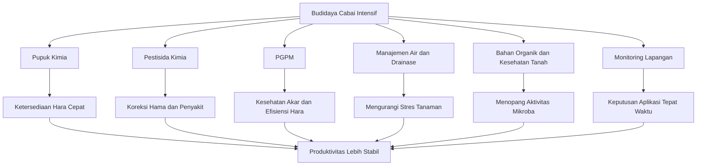

**Keterangan gambar:** PGPM bekerja paling baik bila ditempatkan sebagai bagian dari sistem budidaya terpadu. Pupuk kimia tetap berperan sebagai penyedia hara cepat, pestisida kimia digunakan secara korektif, sedangkan PGPM membantu memperkuat akar, efisiensi hara, dan ketahanan tanaman. Faktor air, drainase, bahan organik, dan monitoring lapangan menjadi penentu keberhasilan integrasi tersebut.

---

## 1.3 Tujuan Panduan

Panduan ini disusun untuk memberikan acuan praktis mengenai penggunaan PGPM pada budidaya cabai rawit dan cabai besar. Fokus utama panduan ini bukan hanya menjelaskan jenis-jenis mikroba, tetapi juga bagaimana mikroba tersebut digunakan secara benar di lapangan, terutama ketika petani masih menggunakan pupuk kimia dan pestisida kimia.

Tujuan pertama panduan ini adalah memberikan pemahaman praktis mengenai fungsi PGPM pada tanaman cabai. Pembaca diharapkan dapat memahami bahwa PGPM berperan dalam mendukung kesehatan akar, efisiensi hara, ketahanan tanaman, dan stabilitas produksi. Dengan pemahaman tersebut, PGPM tidak diperlakukan sebagai produk ajaib, tetapi sebagai komponen teknologi yang harus digunakan dengan cara yang tepat.

Tujuan kedua adalah menjelaskan cara mengintegrasikan PGPM dengan pupuk kimia. Integrasi ini penting karena kesalahan aplikasi sering terjadi di lapangan, misalnya mencampur PGPM dengan larutan pupuk yang terlalu pekat, menempatkan mikoriza jauh dari akar, atau mengurangi pupuk kimia secara terlalu drastis sejak awal. Panduan ini menekankan bahwa efisiensi pupuk harus dibangun secara bertahap berdasarkan respons tanaman, kondisi tanah, dan hasil monitoring.

Tujuan ketiga adalah menjelaskan hubungan PGPM dengan pestisida kimia. Banyak kegagalan aplikasi PGPM terjadi karena mikroba diaplikasikan berdekatan dengan fungisida, bakterisida, tembaga, atau bahan kimia lain yang berisiko menekan kehidupan mikroba. Karena itu, panduan ini memberikan prinsip pemisahan waktu, tempat, dan fungsi antara PGPM dan pestisida kimia.

Tujuan keempat adalah mengurangi kesalahan aplikasi di lapangan. Kesalahan yang sering terjadi antara lain mencampur semua input dalam satu tangki, menggunakan air berklorin tinggi, mengaplikasikan PGPM saat tanah kering, menyimpan larutan PGPM terlalu lama setelah diencerkan, serta memperbanyak produk mikroba secara sembarangan. Kesalahan seperti ini dapat membuat PGPM tidak efektif, bahkan berpotensi menimbulkan kontaminasi.

Tujuan kelima adalah membantu penyusunan SOP budidaya cabai berbasis mikroba. SOP diperlukan agar aplikasi PGPM tidak dilakukan secara acak, tetapi mengikuti fase tanaman, kondisi lahan, jadwal pemupukan, jadwal pengendalian hama penyakit, dan hasil monitoring. Dengan adanya SOP, penggunaan PGPM dapat lebih mudah dievaluasi secara teknis maupun ekonomi.

Panduan ini ditujukan bagi petani, teknisi lapang, konsultan budidaya, formulator produk, manajer kebun, penyuluh, dan pelaku agribisnis cabai. Bahasa dan pendekatan yang digunakan dibuat praktis agar dapat diterapkan di lapangan, tetapi tetap cukup teknis untuk mendukung pengambilan keputusan yang lebih baik.

Pada akhirnya, panduan ini diharapkan dapat membantu pelaku budidaya cabai membangun sistem produksi yang lebih efisien, adaptif, dan berkelanjutan. PGPM bukan satu-satunya jawaban atas masalah cabai, tetapi bila digunakan dengan benar, PGPM dapat menjadi salah satu alat penting untuk meningkatkan kesehatan tanaman, menekan risiko produksi, dan memperbaiki profitabilitas usaha tani cabai.

---

## Ringkasan Bab 1

Cabai merupakan komoditas bernilai tinggi, tetapi memiliki risiko budidaya yang besar akibat serangan penyakit, gangguan hama, ketidakseimbangan hara, stres lingkungan, dan ketergantungan tinggi pada input kimia. PGPM hadir sebagai komponen pendukung dalam sistem budidaya terpadu untuk memperkuat akar, meningkatkan efisiensi hara, membantu menekan penyakit tanah, mengurangi stres tanaman, dan menjaga produktivitas panen.

PGPM tidak menggantikan total pupuk dan pestisida kimia. Perannya adalah membantu membuat sistem budidaya lebih efisien dan stabil. Karena itu, keberhasilan PGPM sangat bergantung pada kualitas produk, cara aplikasi, kondisi tanah, pengelolaan air, bahan organik, serta pemisahan yang tepat dari input kimia berisiko tinggi.

Panduan ini disusun sebagai referensi teknis-praktis untuk membantu petani dan pelaku agribisnis menerapkan PGPM secara benar dalam budidaya cabai rawit dan cabai besar.

---

# Bab 2. Dasar-Dasar PGPM pada Tanaman Cabai

## 2.1 Pengertian PGPM

**PGPM** adalah singkatan dari **Plant Growth-Promoting Microorganisms**, yaitu kelompok mikroorganisme yang mampu mendukung pertumbuhan tanaman melalui berbagai mekanisme biologis. Mikroorganisme ini dapat hidup di sekitar akar, di permukaan akar, di dalam jaringan tanaman, di media tanam, atau berasosiasi dengan sistem perakaran tanaman.

Dalam budidaya cabai, PGPM digunakan untuk membantu tanaman tumbuh lebih sehat, terutama melalui perbaikan lingkungan perakaran. Akar merupakan titik awal dari banyak proses penting, mulai dari penyerapan air, penyerapan hara, pembentukan hormon alami, hingga respons tanaman terhadap cekaman lingkungan dan serangan patogen tanah. Karena itu, keberadaan mikroba menguntungkan di sekitar akar dapat memberikan pengaruh besar terhadap performa tanaman cabai.

PGPM tidak bekerja seperti pupuk kimia yang langsung menyediakan unsur hara dalam bentuk tersedia. PGPM juga tidak bekerja seperti pestisida kimia yang langsung membunuh target hama atau patogen. PGPM bekerja dengan cara mendukung proses biologis tanaman, misalnya membantu melarutkan hara yang terikat di tanah, menghasilkan senyawa pemacu tumbuh, memperbaiki aktivitas akar, meningkatkan kompetisi dengan patogen, serta membantu tanaman lebih tahan terhadap stres.

Dalam praktik lapangan, PGPM sering disebut dengan berbagai istilah. Beberapa istilah tersebut saling berhubungan, tetapi tidak selalu memiliki arti yang sama. Pemahaman istilah ini penting agar petani, teknisi, dan pelaku agribisnis tidak salah menempatkan fungsi produk mikroba.

---

✓ PGPM

PGPM adalah istilah payung untuk semua mikroorganisme yang dapat membantu pertumbuhan tanaman. Di dalamnya dapat termasuk bakteri, fungi, aktinomisetes, endofit, maupun mikoriza. Jadi, PGPM merupakan kelompok besar yang mencakup berbagai mikroba bermanfaat.

Pada cabai, PGPM dapat digunakan untuk tujuan memperkuat akar, meningkatkan efisiensi hara, menekan sebagian penyakit tanah, membantu pemulihan tanaman, dan menjaga stabilitas produksi.

Contoh PGPM:

- _Bacillus_
- _Pseudomonas_
- _Azospirillum_
- _Azotobacter_
- _Trichoderma_
- _Rhizophagus/Glomus_
- _Streptomyces_

---

✓ PGPR

**PGPR** adalah singkatan dari **Plant Growth-Promoting Rhizobacteria**, yaitu bakteri pemacu pertumbuhan tanaman yang hidup dan beraktivitas di daerah perakaran atau rhizosfer.

PGPR merupakan bagian dari PGPM, tetapi khusus untuk kelompok bakteri. Mikroba ini banyak digunakan dalam budidaya cabai karena aplikasinya relatif mudah, terutama melalui perendaman benih, kocor akar, atau aplikasi pada media semai.

Contoh PGPR:

- _Bacillus subtilis_
- _Bacillus velezensis_
- _Pseudomonas fluorescens_
- _Azospirillum_
- _Azotobacter_

Fungsi utama PGPR pada cabai:

- Merangsang pertumbuhan akar.
- Membantu penyerapan hara.
- Menghasilkan senyawa pemacu tumbuh.
- Membantu tanaman menghadapi stres pindah tanam.
- Mendukung ketahanan tanaman terhadap gangguan tertentu.

---

✓ PGPF

**PGPF** adalah singkatan dari **Plant Growth-Promoting Fungi**, yaitu fungi atau jamur menguntungkan yang dapat mendukung pertumbuhan tanaman. PGPF juga termasuk bagian dari PGPM, tetapi khusus untuk kelompok fungi.

Pada cabai, PGPF penting karena beberapa jenis fungi dapat membantu menekan patogen tanah, memperbaiki lingkungan perakaran, atau membantu tanaman menyerap hara dan air.

Contoh PGPF:

- _Trichoderma harzianum_
- _Trichoderma asperellum_
- _Aspergillus_
- _Penicillium_
- Mikoriza arbuskula seperti _Rhizophagus_ atau _Glomus_

Fungsi utama PGPF pada cabai:

- Menekan patogen tanah.
- Membantu dekomposisi bahan organik.
- Meningkatkan ketersediaan unsur tertentu.
- Memperbaiki aktivitas akar.
- Membantu tanaman lebih tahan terhadap cekaman lingkungan.

---

✓ Pupuk Hayati

**Pupuk hayati** adalah produk yang mengandung mikroorganisme hidup yang berfungsi membantu penyediaan hara bagi tanaman. Fokus utama pupuk hayati adalah mendukung ketersediaan atau efisiensi unsur hara.

Pupuk hayati tidak sama dengan pupuk kimia. Pupuk kimia membawa unsur hara dalam jumlah tertentu, sedangkan pupuk hayati membawa mikroba yang membantu proses biologis agar hara lebih tersedia atau lebih mudah diserap tanaman.

Contoh fungsi pupuk hayati:

- Menambat nitrogen.
- Melarutkan fosfat.
- Melarutkan kalium.
- Membantu ketersediaan unsur mikro.
- Meningkatkan efisiensi pemupukan.

Contoh mikroba dalam pupuk hayati:

- _Azotobacter_
- _Azospirillum_
- _Bacillus megaterium_
- _Pseudomonas fluorescens_
- _Paenibacillus_
- Mikoriza

Dalam budidaya cabai, pupuk hayati dapat membantu menekan pemborosan pupuk, tetapi pengurangan pupuk kimia tetap harus dilakukan secara bertahap berdasarkan respons tanaman dan kondisi lahan.

---

✓ Agens Hayati

**Agens hayati** adalah mikroorganisme yang digunakan untuk membantu mengendalikan organisme pengganggu tanaman, terutama patogen penyebab penyakit. Fokus utama agens hayati adalah perlindungan tanaman, bukan sekadar penyediaan hara.

Contoh agens hayati:

- _Trichoderma_ untuk menekan patogen tanah.
- _Bacillus subtilis_ untuk membantu menekan beberapa penyakit.
- _Pseudomonas fluorescens_ untuk kompetisi di daerah akar.
- _Streptomyces_ sebagai penghasil senyawa antimikroba alami.

Pada cabai, agens hayati sering digunakan untuk membantu menekan penyakit seperti layu fusarium, rebah semai, busuk akar, dan kompleks penyakit tanah. Namun, agens hayati bukan obat instan. Bila tanaman sudah terserang berat, tetap diperlukan tindakan sanitasi, perbaikan drainase, pencabutan tanaman sakit, dan pengendalian sesuai diagnosis.

---

✓ Biostimulan Mikroba

**Biostimulan mikroba** adalah mikroorganisme atau produk berbasis mikroba yang berfungsi merangsang proses fisiologis tanaman sehingga tanaman dapat tumbuh lebih baik, lebih efisien menyerap hara, atau lebih toleran terhadap stres.

Biostimulan mikroba tidak selalu diklaim sebagai pupuk atau pestisida. Fokusnya adalah membantu tanaman bekerja lebih efisien. Dalam praktik cabai, biostimulan mikroba dapat membantu tanaman pulih setelah pindah tanam, mengurangi stres lingkungan, mendukung pembungaan, dan menjaga vigor selama masa panen.

Contoh fungsi biostimulan mikroba:

- Merangsang pembentukan akar muda.
- Membantu tanaman pulih dari stres.
- Mendukung aktivitas fisiologis tanaman.
- Meningkatkan keseragaman pertumbuhan.
- Membantu tanaman tetap produktif pada kondisi kurang ideal.

---

✓ Endofit

**Endofit** adalah mikroorganisme yang hidup di dalam jaringan tanaman tanpa menimbulkan gejala penyakit. Endofit dapat berada di akar, batang, daun, atau bagian tanaman lainnya.

Pada cabai, endofit menarik karena dapat membantu tanaman dari dalam jaringan. Beberapa endofit mampu mendukung ketahanan tanaman, menghasilkan senyawa pemacu tumbuh, atau membantu tanaman menghadapi cekaman tertentu.

Contoh endofit:

- _Bacillus_
- _Pseudomonas_
- _Enterobacter_

Namun, penggunaan endofit perlu lebih hati-hati dibanding PGPR umum. Tidak semua mikroba yang masuk ke jaringan tanaman otomatis bermanfaat. Karena itu, produk endofit sebaiknya berasal dari sumber yang jelas dan teruji.

---

✓ Mikoriza

**Mikoriza** adalah fungi yang bersimbiosis dengan akar tanaman. Pada cabai, jenis yang banyak dibahas adalah mikoriza arbuskula, yaitu fungi yang membantu memperluas jangkauan serapan akar melalui jaringan hifa.

Mikoriza berbeda dari PGPR cair biasa. Mikoriza tidak bekerja hanya dengan dikocor seperti bakteri. Agar efektif, propagul mikoriza harus berada dekat dengan akar hidup sehingga dapat membentuk kolonisasi.

Fungsi utama mikoriza pada cabai:

- Membantu serapan fosfor.
- Membantu serapan air.
- Mendukung toleransi terhadap kekeringan.
- Memperluas area eksplorasi akar.
- Membantu tanaman lebih stabil pada kondisi tanah kurang ideal.

Kesalahan umum dalam aplikasi mikoriza adalah menempatkannya terlalu jauh dari akar atau mencampurnya langsung dengan pupuk fosfat dosis tinggi di titik tanam. Keduanya dapat menurunkan efektivitas mikoriza.

---

## Gambar 2.1. Hubungan Istilah dalam Kelompok PGPM

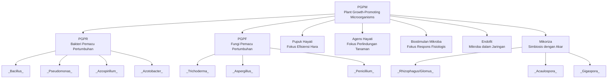

**Keterangan gambar:** PGPM adalah istilah besar yang mencakup berbagai kelompok mikroorganisme bermanfaat. PGPR adalah bakteri, PGPF adalah fungi, pupuk hayati berfokus pada efisiensi hara, agens hayati berfokus pada perlindungan tanaman, sedangkan mikoriza adalah fungi simbiotik yang harus berasosiasi langsung dengan akar.

---

## 2.2 Kelompok PGPM Penting untuk Cabai

Tidak semua PGPM memiliki fungsi yang sama. Dalam budidaya cabai, pemilihan PGPM harus disesuaikan dengan tujuan aplikasi. Ada PGPM yang lebih cocok untuk fase awal pertumbuhan, ada yang lebih berperan dalam efisiensi hara, ada yang kuat untuk menekan patogen tanah, dan ada yang lebih penting untuk mendukung tanaman selama fase generatif dan panen panjang.

Tabel berikut merangkum kelompok PGPM yang penting untuk cabai.

| Kelompok           | Contoh                                                                         | Fungsi Utama                                              |
| ------------------ | ------------------------------------------------------------------------------ | --------------------------------------------------------- |
| PGPR               | _Bacillus_, _Pseudomonas_, _Azospirillum_, _Azotobacter_                       | Merangsang akar, membantu serapan hara, induksi ketahanan |
| Pelarut fosfat/PSB | _Bacillus megaterium_, _Pseudomonas fluorescens_, _Aspergillus_, _Penicillium_ | Meningkatkan ketersediaan fosfor                          |
| Pelarut kalium/KSB | _Frateuria_, _Paenibacillus_, _Bacillus mucilaginosus_                         | Membantu pelepasan kalium                                 |
| Mikoriza           | _Rhizophagus/Glomus_, _Acaulospora_, _Gigaspora_                               | Memperluas serapan akar terhadap air dan hara             |
| Fungi antagonis    | _Trichoderma harzianum_, _T. asperellum_                                       | Menekan patogen tanah                                     |
| Aktinomisetes      | _Streptomyces_                                                                 | Antimikroba alami dan dekomposer                          |
| Endofit            | _Bacillus_, _Pseudomonas_, _Enterobacter_                                      | Mendukung ketahanan tanaman dari dalam jaringan           |

---

✓ PGPR

PGPR merupakan kelompok mikroba yang sangat penting dalam budidaya cabai karena berhubungan langsung dengan daerah perakaran. Pada fase awal, PGPR dapat membantu bibit lebih cepat pulih setelah pindah tanam. Pada fase vegetatif, PGPR membantu mendukung pembentukan akar dan pertumbuhan tajuk. Pada fase generatif, PGPR membantu menjaga akar tetap aktif sehingga tanaman tidak cepat drop.

Contoh PGPR yang umum digunakan adalah _Bacillus_, _Pseudomonas_, _Azospirillum_, dan _Azotobacter_. Masing-masing memiliki karakter yang berbeda. _Bacillus_ relatif tahan terhadap kondisi lingkungan karena beberapa spesies mampu membentuk spora. _Pseudomonas_ dikenal aktif di rhizosfer dan dapat membantu kompetisi dengan mikroba lain. _Azospirillum_ dan _Azotobacter_ banyak dikaitkan dengan dukungan terhadap nitrogen dan pertumbuhan akar.

Dalam praktik lapangan, PGPR umumnya diaplikasikan melalui:

- Perendaman benih.
- Kocor media semai.
- Kocor akar setelah pindah tanam.
- Kocor pemeliharaan selama pertumbuhan.

PGPR sebaiknya tidak dicampur langsung dengan fungisida, bakterisida, atau larutan pupuk yang terlalu pekat.

---

✓ Pelarut Fosfat atau PSB

PSB adalah kelompok mikroba pelarut fosfat. Fosfor merupakan unsur penting bagi pertumbuhan akar, pembentukan energi tanaman, pembungaan, dan perkembangan buah. Masalahnya, sebagian fosfor di tanah sering berada dalam bentuk yang tidak mudah diserap tanaman.

Mikroba pelarut fosfat membantu meningkatkan ketersediaan fosfor melalui proses biologis, misalnya dengan menghasilkan asam organik atau senyawa tertentu yang membantu melepaskan fosfat terikat. Pada cabai, PSB penting terutama pada fase pembentukan akar, menjelang pembungaan, dan fase pembentukan buah.

Contoh PSB:

- _Bacillus megaterium_
- _Pseudomonas fluorescens_
- _Aspergillus_
- _Penicillium_

Meski PSB membantu ketersediaan fosfor, bukan berarti pupuk P dapat langsung dihentikan. Strategi yang lebih aman adalah tetap memberikan pupuk P secara terukur, lalu menggunakan PSB untuk membantu efisiensi pemanfaatannya.

---

✓ Pelarut Kalium atau KSB

KSB adalah kelompok mikroba pelarut kalium. Kalium sangat penting dalam budidaya cabai karena berhubungan dengan pembungaan, pembentukan buah, ukuran buah, ketahanan jaringan tanaman, dan kualitas hasil panen.

Pada cabai rawit panen panjang, kebutuhan kalium cukup besar karena tanaman terus membentuk bunga dan buah baru. Bila akar melemah atau kalium tidak tersedia cukup, tanaman mudah mengalami penurunan vigor, rontok bunga, buah kecil, dan panen tidak stabil.

Contoh KSB:

- _Frateuria_
- _Paenibacillus_
- _Bacillus mucilaginosus_

KSB dapat digunakan sebagai bagian dari konsorsium generatif bersama PGPR dan PSB. Aplikasinya lebih efektif bila kondisi tanah cukup lembap, bahan organik tersedia, dan pemupukan kalium tetap diberikan secara seimbang.

---

✓ Mikoriza

Mikoriza merupakan kelompok PGPM yang sangat penting untuk sistem perakaran. Fungi ini membentuk hubungan simbiotik dengan akar tanaman. Hifa mikoriza dapat menjelajah area tanah yang lebih luas dibanding akar biasa, sehingga tanaman terbantu dalam menyerap air dan hara, terutama fosfor.

Pada cabai, mikoriza sangat berguna pada lahan yang rentan kekeringan, tanah dengan ketersediaan fosfor rendah, atau sistem budidaya yang ingin memperkuat akar sejak awal. Mikoriza sebaiknya diaplikasikan saat tanam, diletakkan dekat dengan akar, dan tidak ditumpuk langsung dengan pupuk fosfat dosis tinggi.

Contoh mikoriza:

- _Rhizophagus/Glomus_
- _Acaulospora_
- _Gigaspora_

Mikoriza perlu dipahami berbeda dari PGPM cair. Mikoriza tidak cukup hanya disiram di permukaan tanah jauh dari akar. Kunci keberhasilannya adalah kontak atau kedekatan dengan akar hidup.

---

✓ Fungi Antagonis

Fungi antagonis adalah fungi yang dapat membantu menekan perkembangan patogen. Kelompok yang paling sering digunakan dalam budidaya cabai adalah _Trichoderma_.

_Trichoderma_ banyak digunakan untuk membantu menekan penyakit tanah, memperbaiki lingkungan media, dan mendukung dekomposisi bahan organik. Pada cabai, _Trichoderma_ relevan untuk media semai, lubang tanam, kompos, dan area perakaran.

Contoh fungi antagonis:

- _Trichoderma harzianum_
- _Trichoderma asperellum_

Fungsi penting _Trichoderma_:

- Membantu menekan patogen tanah.
- Mendukung kesehatan media tanam.
- Membantu mengurangi risiko rebah semai.
- Membantu perlindungan awal pada zona akar.
- Mendukung sistem budidaya pada lahan bekas layu.

Aplikasi _Trichoderma_ perlu dipisahkan dari fungisida kimia. Bila fungisida digunakan terlalu dekat dengan aplikasi _Trichoderma_, efektivitasnya dapat menurun.

---

✓ Aktinomisetes

Aktinomisetes adalah kelompok mikroorganisme yang memiliki karakter antara bakteri dan fungi dalam perilaku pertumbuhannya. Salah satu contoh penting adalah _Streptomyces_.

_Streptomyces_ dikenal mampu menghasilkan senyawa antimikroba alami dan berperan dalam dekomposisi bahan organik. Dalam sistem tanah yang sehat, aktinomisetes menjadi bagian dari komunitas mikroba yang membantu menjaga keseimbangan biologis.

Pada cabai, aktinomisetes dapat mendukung kesehatan tanah, terutama bila digunakan dalam produk yang teruji. Namun, penggunaannya perlu hati-hati karena efektivitasnya sangat tergantung strain, formulasi, dan kondisi lingkungan.

Contoh aktinomisetes:

- _Streptomyces_

Fungsi utama:

- Membantu dekomposisi bahan organik.
- Mendukung keseimbangan mikroba tanah.
- Menghasilkan senyawa antimikroba alami.
- Membantu menekan sebagian patogen tanah.

---

✓ Endofit

Endofit adalah mikroba yang hidup di dalam jaringan tanaman. Kelompok ini menarik karena dapat memberikan dukungan dari dalam tanaman, bukan hanya dari permukaan akar atau tanah sekitar akar.

Pada cabai, endofit dapat membantu meningkatkan ketahanan tanaman, mendukung respons terhadap stres, dan membantu tanaman menghadapi tekanan lingkungan. Namun, penggunaan endofit di tingkat lapangan sebaiknya berbasis produk yang sudah jelas dan teruji, karena mikroba yang hidup di dalam jaringan tanaman harus benar-benar aman dan kompatibel.

Contoh endofit:

- _Bacillus_
- _Pseudomonas_
- _Enterobacter_

Endofit tidak disarankan diperbanyak sembarangan di tingkat petani tanpa kontrol mutu. Risiko kontaminasi atau salah mikroba lebih tinggi dibanding penggunaan PGPR umum.

---

## Gambar 2.2. Zona Kerja PGPM pada Tanaman Cabai

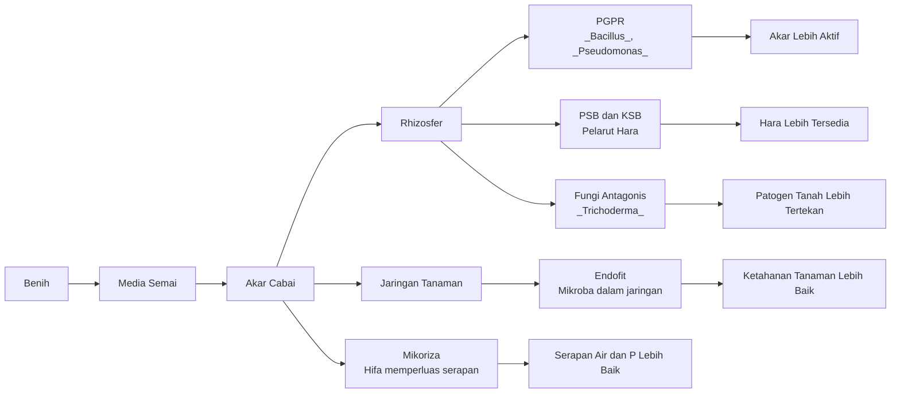

**Keterangan gambar:** PGPM bekerja pada beberapa zona. PGPR, PSB, KSB, dan _Trichoderma_ banyak bekerja di sekitar akar atau rhizosfer. Mikoriza harus berasosiasi langsung dengan akar. Endofit bekerja dari dalam jaringan tanaman. Pemahaman zona kerja ini penting agar aplikasi tidak salah tempat.

---

## 2.3 Fungsi PGPM bagi Cabai

PGPM memiliki banyak fungsi, tetapi dalam budidaya cabai fungsi tersebut perlu diterjemahkan menjadi manfaat lapangan yang mudah diamati. Manfaat PGPM tidak selalu terlihat dalam waktu cepat seperti pupuk daun atau pestisida kontak. Sebagian manfaatnya muncul secara bertahap melalui perbaikan akar, peningkatan vigor, pertumbuhan yang lebih seragam, penurunan stres, dan stabilitas produksi.

---

✓ Merangsang Pertumbuhan Akar

Fungsi paling penting PGPM pada cabai adalah membantu merangsang pertumbuhan akar. Tanaman cabai yang memiliki akar aktif akan lebih mampu menyerap air dan hara. Akar yang sehat juga membantu tanaman pulih lebih cepat setelah pindah tanam dan lebih kuat menghadapi cuaca panas atau kondisi tanah yang kurang ideal.

PGPM seperti _Bacillus_, _Pseudomonas_, _Azospirillum_, dan _Azotobacter_ dapat membantu membentuk lingkungan perakaran yang lebih mendukung. Mikoriza juga berperan penting karena memperluas area serapan akar melalui jaringan hifa.

Indikator lapangan yang dapat diamati:

- Akar putih lebih banyak.
- Bibit lebih cepat pulih setelah pindah tanam.
- Tanaman lebih seragam.
- Daun muda tumbuh lebih stabil.
- Tanaman tidak mudah layu saat cuaca panas.

---

✓ Membantu Ketersediaan N, P, K, dan Unsur Mikro

PGPM dapat membantu meningkatkan ketersediaan unsur hara melalui proses biologis. Beberapa mikroba membantu penambatan nitrogen, sebagian membantu melarutkan fosfat, sebagian membantu pelepasan kalium, dan sebagian lain membantu unsur mikro menjadi lebih mudah dimanfaatkan tanaman.

Pada cabai, fungsi ini sangat penting karena kebutuhan hara berubah sesuai fase pertumbuhan. Fase vegetatif membutuhkan dukungan nitrogen dan unsur pembentuk jaringan. Fase pembungaan dan buah membutuhkan keseimbangan fosfor, kalium, kalsium, magnesium, dan unsur mikro.

PGPM tidak menggantikan seluruh pupuk kimia, tetapi dapat membantu meningkatkan efisiensi pemupukan. Dengan sistem akar yang lebih sehat dan aktivitas mikroba yang baik, pupuk yang diberikan berpeluang lebih banyak dimanfaatkan tanaman.

Contoh hubungan mikroba dan hara:

| Fungsi                     | Contoh Mikroba                                   | Manfaat pada Cabai                                     |
| -------------------------- | ------------------------------------------------ | ------------------------------------------------------ |
| Penambatan nitrogen        | _Azotobacter_, _Azospirillum_                    | Mendukung pertumbuhan vegetatif                        |
| Pelarutan fosfat           | _Bacillus megaterium_, _Pseudomonas fluorescens_ | Mendukung akar, bunga, dan energi tanaman              |
| Pelarutan kalium           | _Frateuria_, _Paenibacillus_                     | Mendukung buah, ketahanan jaringan, dan panen berulang |
| Dukungan serapan P dan air | Mikoriza                                         | Membantu akar menjangkau hara dan air lebih luas       |

---

✓ Mengurangi Stres Pindah Tanam

Pindah tanam adalah salah satu fase kritis dalam budidaya cabai. Pada fase ini, akar bibit mengalami perubahan lingkungan dari media semai ke lahan. Bila kondisi lahan panas, kering, terlalu basah, atau banyak patogen, bibit dapat mengalami stagnasi pertumbuhan.

PGPM dapat membantu mengurangi stres pindah tanam dengan mendukung aktivitas akar dan memperbaiki lingkungan rhizosfer. Aplikasi PGPM dapat dilakukan sejak perlakuan benih, media semai, lubang tanam, atau kocor awal setelah tanam.

Tanda tanaman yang mampu melewati stres pindah tanam dengan baik:

- Tidak terlalu lama layu setelah tanam.
- Daun muda cepat muncul.
- Warna daun stabil.
- Pertumbuhan antar tanaman lebih seragam.
- Akar baru cepat terbentuk.

---

✓ Menekan Patogen Tanah

Penyakit tanah merupakan salah satu masalah serius pada cabai. Layu fusarium, busuk akar, rebah semai, dan kompleks patogen tanah dapat menyebabkan kematian tanaman dan menurunkan populasi produktif di lahan.

Beberapa PGPM membantu menekan patogen melalui kompetisi ruang dan makanan, produksi senyawa antimikroba, parasitisme terhadap patogen tertentu, serta induksi ketahanan tanaman. Kelompok yang banyak digunakan untuk tujuan ini antara lain _Trichoderma_, _Bacillus_, _Pseudomonas_, dan _Streptomyces_.

Namun, peran PGPM dalam menekan penyakit tanah lebih kuat sebagai tindakan pencegahan dan pendukung. Bila serangan sudah berat, PGPM saja tidak cukup. Perlu kombinasi dengan sanitasi, drainase, pergiliran tanaman, pencabutan tanaman sakit, perbaikan bahan organik, dan penggunaan pestisida sesuai diagnosis.

---

✓ Memperbaiki Efisiensi Pemupukan

Dalam budidaya cabai intensif, pupuk sering menjadi salah satu komponen biaya terbesar. Masalahnya, tidak semua pupuk yang diberikan dapat diserap tanaman. Sebagian tercuci, terikat di tanah, menguap, atau tidak termanfaatkan karena akar kurang aktif.

PGPM membantu memperbaiki efisiensi pemupukan melalui beberapa cara:

- Membantu akar tumbuh lebih aktif.
- Membantu hara tertentu menjadi lebih tersedia.
- Memperbaiki lingkungan perakaran.
- Membantu tanaman menyerap hara lebih stabil.
- Mengurangi stres yang menghambat penyerapan hara.

Dengan demikian, PGPM membuka peluang pengurangan pupuk secara bertahap. Namun, pengurangan pupuk tidak boleh dilakukan secara drastis. Pada musim pertama, pendekatan yang lebih aman adalah mengamati respons tanaman terlebih dahulu sebelum melakukan efisiensi lebih besar.

---

✓ Mendukung Pembungaan dan Pembentukan Buah

Cabai membutuhkan akar yang aktif dan suplai hara yang seimbang saat memasuki fase generatif. Bila akar lemah, air tidak stabil, atau hara tidak seimbang, tanaman mudah mengalami rontok bunga, buah kecil, dan panen tidak seragam.

PGPM mendukung fase generatif dengan menjaga akar tetap aktif dan membantu efisiensi hara, terutama fosfor dan kalium. PSB berhubungan dengan ketersediaan fosfor, KSB berhubungan dengan dukungan kalium, sedangkan PGPR dan mikoriza membantu memperkuat sistem akar.

Pada fase bunga dan buah, PGPM bukan pengganti pupuk K, Ca, Mg, atau unsur mikro. PGPM berperan sebagai pendukung agar tanaman lebih mampu memanfaatkan input yang diberikan.

---

✓ Memperpanjang Umur Produktif Tanaman

Pada cabai rawit, umur produktif tanaman menjadi faktor penting karena panen dilakukan berulang. Tanaman yang akarnya cepat rusak akan lebih cepat mengalami penurunan produksi. Gejalanya dapat berupa pucuk melemah, bunga berkurang, buah mengecil, daun menguning, dan tanaman mudah layu.

PGPM dapat membantu menjaga aktivitas akar selama masa panen, terutama bila diaplikasikan secara pemeliharaan setiap 14–21 hari sesuai kondisi lahan. Aplikasi pemeliharaan ini penting terutama setelah panen besar, setelah penggunaan pestisida berat, atau saat tanaman mulai menunjukkan tanda penurunan vigor.

Manfaat yang diharapkan:

- Tanaman tidak cepat drop.
- Bunga baru tetap muncul.
- Buah lebih stabil.
- Panen lebih panjang.
- Populasi tanaman produktif lebih banyak bertahan.

---

## Tabel 2.2. Ringkasan Fungsi PGPM Berdasarkan Fase Budidaya Cabai

| Fase Budidaya    | Fungsi PGPM yang Diprioritaskan                                         | Kelompok PGPM yang Relevan                     |
| ---------------- | ----------------------------------------------------------------------- | ---------------------------------------------- |
| Benih            | Meningkatkan vigor awal                                                 | PGPR                                           |
| Media semai      | Menekan rebah semai, memperkuat bibit                                   | _Trichoderma_, PGPR                            |
| Pindah tanam     | Mengurangi stres, mempercepat akar baru                                 | PGPR, mikoriza, _Trichoderma_                  |
| Vegetatif awal   | Memperkuat akar dan pertumbuhan tajuk                                   | PGPR, PSB, KSB                                 |
| Vegetatif lanjut | Mendukung cabang produktif dan efisiensi hara                           | PGPR, PSB, KSB                                 |
| Bunga awal       | Mendukung pembungaan dan mengurangi rontok                              | PSB, KSB, PGPR                                 |
| Buah dan panen   | Menjaga akar aktif dan stabilitas produksi                              | KSB, PSB, PGPR, mikoriza                       |
| Pemulihan stres  | Membantu tanaman pulih setelah pestisida berat, panas, atau panen besar | PGPR, _Bacillus_, _Pseudomonas_, _Trichoderma_ |

---

## Ringkasan Bab 2

PGPM adalah kelompok mikroorganisme yang membantu pertumbuhan tanaman melalui dukungan terhadap akar, hara, ketahanan tanaman, dan keseimbangan lingkungan perakaran. Di dalam PGPM terdapat berbagai kelompok, seperti PGPR, PGPF, pupuk hayati, agens hayati, biostimulan mikroba, endofit, dan mikoriza.

Dalam budidaya cabai, kelompok PGPM yang penting meliputi _Bacillus_, _Pseudomonas_, _Azospirillum_, _Azotobacter_, PSB, KSB, mikoriza, _Trichoderma_, _Streptomyces_, dan endofit. Masing-masing memiliki fungsi berbeda, sehingga pemilihan produk dan waktu aplikasi harus disesuaikan dengan tujuan budidaya.

Fungsi utama PGPM pada cabai adalah merangsang akar, membantu ketersediaan hara, mengurangi stres pindah tanam, menekan patogen tanah, memperbaiki efisiensi pemupukan, mendukung pembungaan dan buah, serta memperpanjang umur produktif tanaman. Keberhasilan PGPM sangat ditentukan oleh kualitas produk, cara aplikasi, kondisi tanah, kelembapan, bahan organik, serta kompatibilitas dengan pupuk dan pestisida kimia.

---

# Bab 3. Strategi Integrasi PGPM, Pupuk Kimia, Pestisida Kimia, dan Desain Konsorsium

## 3.1 Filosofi Integrasi

Prinsip utama dalam integrasi PGPM, pupuk kimia, dan pestisida kimia adalah sebagai berikut:

**Pupuk kimia menyediakan hara cepat, PGPM menjaga kesehatan akar dan efisiensi hara, sedangkan pestisida kimia digunakan sebagai tindakan korektif saat tekanan hama atau penyakit melewati ambang kendali.**

Prinsip ini penting karena dalam praktik budidaya cabai, masing-masing input memiliki fungsi yang berbeda. Pupuk kimia dibutuhkan untuk menyediakan unsur hara dalam bentuk yang relatif cepat tersedia bagi tanaman. Tanaman cabai, terutama pada fase pertumbuhan aktif, pembungaan, pembentukan buah, dan panen berulang, membutuhkan pasokan hara yang stabil. Tanpa pemupukan yang cukup, tanaman akan sulit mencapai potensi produksinya.

PGPM memiliki peran yang berbeda. Mikroba ini tidak dimaksudkan sebagai pengganti total pupuk kimia, tetapi sebagai pendukung sistem perakaran, efisiensi hara, kesehatan tanah, dan ketahanan tanaman. PGPM bekerja melalui proses biologis, seperti merangsang pertumbuhan akar, membantu pelarutan hara, menekan sebagian patogen tanah, dan mendukung pemulihan tanaman dari stres.

Pestisida kimia juga masih memiliki tempat dalam sistem budidaya cabai. Pada kondisi tekanan hama dan penyakit yang tinggi, tindakan korektif sering tetap diperlukan. Namun, penggunaan pestisida sebaiknya berbasis hasil monitoring, bukan sekadar kebiasaan kalender. Pestisida yang digunakan tanpa pertimbangan dapat meningkatkan biaya, mengganggu mikroba menguntungkan, memicu resistensi, dan menurunkan keseimbangan ekosistem lahan.

Dengan demikian, integrasi PGPM bukan berarti meninggalkan input kimia secara total. Integrasi berarti menempatkan setiap input sesuai fungsi, waktu, dosis, dan targetnya. Pupuk kimia digunakan untuk memenuhi kebutuhan hara, PGPM digunakan untuk memperbaiki sistem biologis perakaran, sedangkan pestisida digunakan untuk mengendalikan gangguan hama dan penyakit ketika memang diperlukan.

Dalam agribisnis cabai, tujuan akhirnya adalah meningkatkan efisiensi input, menjaga stabilitas produksi, memperpanjang umur produktif tanaman, dan menurunkan risiko gagal panen. Pendekatan ini lebih realistis dibanding mengandalkan satu jenis input sebagai solusi tunggal.

---

## Gambar 3.1. Model Integrasi PGPM, Pupuk Kimia, dan Pestisida Kimia

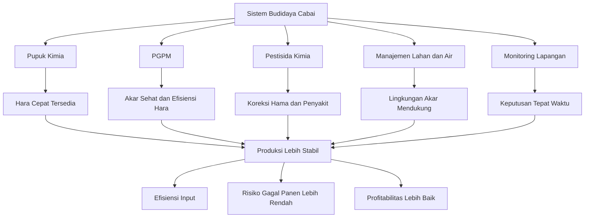

**Keterangan gambar:** Integrasi PGPM bukan berarti mengganti semua input kimia. Pupuk kimia, PGPM, pestisida, manajemen air, dan monitoring lapangan harus bekerja sebagai satu sistem. PGPM berperan memperkuat akar dan efisiensi hara, sedangkan pupuk dan pestisida tetap digunakan secara terukur sesuai kebutuhan tanaman dan kondisi lapangan.

---

PGPM bekerja optimal bila lingkungan akar mendukung. Aplikasi PGPM pada tanah yang terlalu kering, terlalu panas, tergenang, terlalu asam, miskin bahan organik, atau baru terkena pestisida berat sering tidak memberikan hasil yang baik. Mikroba membutuhkan lingkungan yang layak untuk bertahan dan berkembang.

Karena itu, keberhasilan integrasi PGPM sangat dipengaruhi oleh beberapa faktor dasar:

- Kelembapan tanah cukup.
- Drainase baik.
- Bahan organik tersedia.
- pH tanah tidak ekstrem.
- Akar tanaman aktif.
- Aplikasi tidak bersamaan dengan bahan kimia yang merusak mikroba.
- Produk PGPM memiliki kualitas dan populasi mikroba yang baik.

Integrasi juga harus berbasis fase tanaman. Kebutuhan tanaman cabai pada fase semai berbeda dengan fase vegetatif, bunga, buah, dan panen berulang. Pada fase awal, fokus utama adalah pembentukan akar dan pemulihan pindah tanam. Pada fase vegetatif, fokusnya adalah pertumbuhan tajuk dan cabang produktif. Pada fase generatif, fokusnya bergeser pada pembungaan, pengisian buah, dan stabilitas panen.

Selain fase tanaman, kondisi lahan juga menentukan strategi. Lahan sehat tidak memerlukan pendekatan yang sama dengan lahan bekas layu. Musim hujan tidak sama dengan musim kemarau. Cabai rawit panen panjang juga membutuhkan strategi pemeliharaan akar yang lebih kuat dibanding cabai besar dengan siklus panen yang lebih pendek.

Dengan pendekatan ini, PGPM menjadi bagian dari sistem manajemen risiko. Tujuannya bukan hanya membuat tanaman tumbuh lebih subur, tetapi membuat sistem budidaya lebih tahan terhadap gangguan.

---

## 3.2 Prinsip Pisah Waktu, Pisah Tempat, Pisah Fungsi

Salah satu kunci keberhasilan integrasi PGPM dengan input kimia adalah prinsip:

**pisah waktu, pisah tempat, dan pisah fungsi.**

Prinsip ini sederhana, tetapi sangat penting. Banyak kegagalan aplikasi PGPM di lapangan bukan karena mikroba tidak bermanfaat, melainkan karena cara aplikasinya salah. Kesalahan paling umum adalah mencampur PGPM dengan fungisida, bakterisida, larutan pupuk pekat, atau pestisida lain dalam satu tangki.

PGPM adalah mikroorganisme hidup. Bila dicampur dengan bahan kimia yang bersifat antimikroba atau larutan dengan tekanan garam tinggi, populasinya dapat turun drastis. Akibatnya, produk yang seharusnya membantu akar justru tidak sempat bekerja.

---

✓ Pisah Waktu

Pisah waktu berarti PGPM dan input kimia tertentu tidak diberikan pada waktu yang sama. Hal ini terutama penting untuk fungisida, bakterisida, tembaga, antibiotik pertanian, dan larutan pupuk pekat.

Contoh praktik lapangan:

- Pupuk kimia kocor diberikan hari Senin.
- PGPM dikocor hari Rabu atau Kamis.
- Pestisida daun diberikan hari Sabtu atau Minggu bila diperlukan.

Pola seperti ini memberi jarak aman agar PGPM tidak langsung terkena konsentrasi pupuk atau pestisida yang tinggi.

---

✓ Pisah Tempat

Pisah tempat berarti setiap input diarahkan ke lokasi kerja yang tepat.

PGPM untuk akar sebaiknya diarahkan ke zona perakaran. Mikoriza harus ditempatkan dekat akar atau kontak dengan akar. Pupuk dasar sebaiknya tidak menempel langsung pada akar muda. Pestisida daun diarahkan ke tajuk, bukan disiram ke tanah, kecuali memang pestisida tersebut ditujukan untuk target di tanah dan penggunaannya sesuai rekomendasi.

Contoh praktik lapangan:

- Mikoriza diletakkan di lubang tanam dekat akar.
- _Trichoderma_ ditempatkan di media semai, kompos, atau sekitar akar.
- PGPR, PSB, dan KSB dikocor ke area perakaran.
- Insektisida untuk hama daun disemprotkan ke tajuk, tidak diarahkan ke tanah.
- Pupuk granul ditempatkan dengan jarak aman dari batang dan akar muda.

---

✓ Pisah Fungsi

Pisah fungsi berarti setiap input digunakan sesuai tujuan utamanya.

Pupuk kimia berfungsi sebagai sumber hara. PGPM berfungsi mendukung sistem biologis perakaran. Pestisida berfungsi mengendalikan hama atau penyakit. Ketiganya tidak boleh diperlakukan sebagai bahan yang selalu bisa dicampur menjadi satu larutan.

Kesalahan yang sering terjadi adalah anggapan bahwa semua produk pertanian bisa dicampur selama tidak menggumpal di tangki. Padahal, larutan yang tampak tidak menggumpal belum tentu aman bagi mikroba. Bisa saja secara fisik terlihat kompatibel, tetapi secara biologis merusak PGPM.

---

## Gambar 3.2. Prinsip Pisah Waktu, Pisah Tempat, Pisah Fungsi

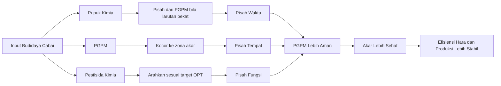

**Keterangan gambar:** PGPM harus diperlakukan sebagai mikroba hidup. Karena itu, aplikasinya perlu dipisahkan dari pupuk pekat, fungisida, bakterisida, dan bahan kimia berisiko tinggi. Prinsip ini membantu menjaga populasi PGPM tetap layak saat sampai ke zona akar.

---

Secara praktis, prinsip ini dapat diterjemahkan menjadi beberapa aturan lapangan:

- PGPM tidak dicampur langsung dengan fungisida atau bakterisida.
- PGPM tidak dicampur dengan larutan pupuk kimia pekat.
- Mikoriza harus ditempatkan dekat akar.
- Pestisida daun difokuskan ke tajuk, bukan tanah.
- PGPM lebih efektif dikocor ke zona akar.
- Aplikasi dilakukan saat tanah lembap.
- Hindari aplikasi PGPM saat tanah sangat kering, tergenang, atau pada siang hari yang panas.

Prinsip ini akan menjadi dasar untuk bab berikutnya, terutama saat membahas jadwal aplikasi, dosis, dan SOP lapangan.

---

## 3.3 Karakteristik Input Kimia yang Berpengaruh terhadap PGPM

Input kimia tidak semuanya memiliki risiko yang sama terhadap PGPM. Sebagian relatif aman bila digunakan dengan benar, sebagian perlu diberi jeda, dan sebagian berisiko tinggi bila bersentuhan langsung dengan mikroba.

Pemahaman karakter input kimia penting agar petani tidak salah membuat campuran. Dalam budidaya cabai intensif, pupuk dan pestisida tetap digunakan, tetapi harus dikelola agar tidak merusak fungsi PGPM.

---

## A. Pupuk Kimia

Pupuk kimia berperan penting dalam budidaya cabai karena menyediakan hara dalam bentuk cepat tersedia. Cabai membutuhkan hara secara berkelanjutan mulai dari fase vegetatif sampai panen. Karena itu, penggunaan PGPM tidak berarti pupuk kimia harus dihentikan.

Masalah yang perlu dihindari adalah kontak langsung PGPM dengan larutan pupuk yang terlalu pekat atau area tanah dengan konsentrasi garam tinggi. Larutan pupuk pekat dapat menciptakan tekanan osmotik yang tidak nyaman bagi mikroba dan akar muda. Akibatnya, PGPM bisa melemah, akar stres, dan tanaman tidak merespons dengan baik.

Berikut karakter beberapa pupuk kimia yang umum digunakan pada cabai.

---

✓ Urea

Urea adalah sumber nitrogen yang umum digunakan untuk mendukung pertumbuhan vegetatif. Nitrogen penting untuk pembentukan daun, batang, dan pertumbuhan awal tanaman.

Dalam integrasi dengan PGPM, urea tetap dapat digunakan. Namun, pemberian berlebihan dapat membuat tanaman terlalu rimbun, jaringan lunak, dan lebih rentan terhadap beberapa gangguan. Pada tanah yang lembap dan aktif, penggunaan urea perlu diimbangi dengan kalium, kalsium, magnesium, dan mikroba pendukung akar.

Prinsip praktis:

- Jangan mencampur PGPM langsung dengan larutan urea pekat.
- Gunakan urea sesuai fase tanaman.
- Hindari nitrogen berlebihan menjelang fase generatif.
- Beri jeda 1–3 hari antara pupuk kocor pekat dan PGPM.

---

✓ ZA

ZA mengandung nitrogen dan sulfur. Pupuk ini sering digunakan untuk mendukung pertumbuhan vegetatif dan kebutuhan sulfur tanaman.

ZA memiliki efek mengasamkan tanah bila digunakan berlebihan dalam jangka panjang. Pada lahan dengan pH rendah, penggunaan ZA perlu lebih hati-hati karena pH ekstrem dapat menurunkan kenyamanan akar dan mikroba.

Prinsip praktis:

- Gunakan sesuai kebutuhan tanaman dan kondisi pH tanah.
- Hindari penggunaan berlebihan pada tanah masam.
- PGPM sebaiknya diaplikasikan saat kelembapan cukup dan tidak bersamaan dengan larutan ZA pekat.

---

✓ NPK

NPK adalah pupuk majemuk yang mengandung nitrogen, fosfor, dan kalium. Formulanya beragam, sehingga penggunaannya harus disesuaikan dengan fase tanaman.

Pada fase vegetatif, formula NPK dengan nitrogen lebih tinggi dapat digunakan secara terukur. Pada fase generatif, kebutuhan kalium biasanya meningkat. Dalam integrasi PGPM, NPK tetap boleh digunakan, tetapi tidak diberikan secara pekat bersamaan dengan PGPM.

Prinsip praktis:

- Sesuaikan formula NPK dengan fase tanaman.
- Hindari penempatan pupuk granul menempel langsung pada akar muda.
- PGPM dikocor 1–3 hari setelah pemupukan agar risiko kontak langsung lebih rendah.
- Pengurangan dosis pupuk dilakukan bertahap berdasarkan respons tanaman.

---

✓ KCl

KCl adalah sumber kalium yang umum digunakan. Kalium penting untuk pembentukan buah, ketahanan jaringan, pengaturan air, dan kualitas panen.

Namun, KCl memiliki kandungan klorida. Pada kondisi tertentu, terutama bila digunakan berlebihan atau pada tanah dengan drainase buruk, akumulasi garam dapat mengganggu akar. Dalam sistem yang menggunakan PGPM, pengelolaan dosis dan kelembapan tanah menjadi penting.

Prinsip praktis:

- Gunakan KCl secara terukur.
- Hindari kontak langsung dengan akar muda dan PGPM.
- Pastikan drainase baik.
- Pada fase generatif, kombinasikan strategi kalium dengan KSB sebagai pendukung efisiensi, bukan sebagai pengganti total.

---

✓ MKP

MKP atau mono kalium fosfat mengandung fosfor dan kalium. Pupuk ini sering digunakan pada fase pembungaan dan pembentukan buah.

Dalam integrasi dengan mikoriza, pupuk fosfat dosis tinggi di dekat akar perlu hati-hati. Mikoriza bekerja lebih baik ketika tanaman membutuhkan dukungan serapan fosfor. Bila fosfor tersedia terlalu tinggi tepat di zona akar, kolonisasi mikoriza dapat kurang optimal.

Prinsip praktis:

- MKP tetap dapat digunakan pada fase generatif.
- Jangan menumpuk MKP dosis tinggi tepat bersama mikoriza di lubang tanam.
- Gunakan PSB dan mikoriza sebagai pendukung efisiensi fosfor.
- Pisahkan aplikasi MKP pekat dengan PGPM.

---

✓ KNO₃

KNO₃ mengandung kalium dan nitrogen nitrat. Pupuk ini sering digunakan untuk mendukung pertumbuhan dan kualitas buah, terutama saat tanaman membutuhkan kalium tetapi masih memerlukan nitrogen dalam jumlah terukur.

Dalam sistem PGPM, KNO₃ relatif dapat digunakan selama konsentrasinya tidak terlalu pekat dan tidak dicampur langsung dengan mikroba.

Prinsip praktis:

- Gunakan sesuai fase tanaman.
- Hindari larutan terlalu pekat.
- Pisahkan dari PGPM sekitar 1–3 hari.
- Perhatikan keseimbangan dengan Ca dan Mg.

---

✓ CaNO₃

CaNO₃ atau kalsium nitrat menyediakan kalsium dan nitrogen nitrat. Kalsium penting untuk kekuatan jaringan, kualitas buah, dan mengurangi beberapa gangguan fisiologis.

Dalam budidaya cabai, kalsium perlu dikelola dengan baik karena unsur ini bergerak mengikuti aliran air dalam tanaman. Kelembapan tanah yang tidak stabil dapat mengganggu distribusi kalsium.

Prinsip praktis:

- Gunakan untuk mendukung kualitas jaringan dan buah.
- Jangan mencampur langsung dengan PGPM.
- Pastikan irigasi stabil agar kalsium dapat termanfaatkan.
- Hindari pencampuran dengan pupuk tertentu yang dapat menimbulkan endapan, sesuai kaidah kompatibilitas pupuk.

---

✓ MgSO₄

MgSO₄ menyediakan magnesium dan sulfur. Magnesium berperan penting dalam klorofil dan aktivitas fotosintesis. Pada cabai, kekurangan magnesium dapat mengganggu performa daun dan produktivitas.

MgSO₄ relatif dapat digunakan dalam program pemupukan, tetapi tetap perlu dipisahkan dari PGPM bila digunakan dalam larutan pekat.

Prinsip praktis:

- Gunakan sesuai gejala dan kebutuhan tanaman.
- Pisahkan dari aplikasi PGPM bila konsentrasi tinggi.
- Pastikan keseimbangan Mg, Ca, dan K tetap diperhatikan.

---

✓ Pupuk Mikro

Pupuk mikro mengandung unsur seperti boron, zinc, mangan, besi, molibdenum, dan tembaga dalam kadar kecil. Unsur mikro penting untuk pembungaan, pembentukan jaringan, aktivitas enzim, dan metabolisme tanaman.

Namun, beberapa unsur mikro, terutama tembaga dalam bentuk tertentu, dapat bersifat antimikroba bila konsentrasinya tinggi. Karena itu, produk mikro yang mengandung tembaga perlu lebih hati-hati bila berdekatan dengan aplikasi PGPM.

Prinsip praktis:

- Gunakan pupuk mikro sesuai kebutuhan.
- Hindari overdosis.
- Jangan mencampur PGPM dengan produk mikro yang mengandung tembaga tinggi.
- Aplikasi pupuk mikro daun sebaiknya dipisahkan dari PGPM akar.

---

✓ Prinsip Umum Integrasi PGPM dengan Pupuk Kimia

Pupuk kimia tetap boleh digunakan dalam sistem budidaya berbasis PGPM. Yang harus diperbaiki adalah cara, waktu, dan dosisnya.

Prinsip umum:

- Hindari kontak langsung PGPM dengan pupuk pekat.
- Jangan mengurangi pupuk secara drastis pada awal penggunaan PGPM.
- Pengurangan pupuk dilakukan bertahap berdasarkan hasil tanaman.
- PGPM diaplikasikan ketika tanah cukup lembap.
- Bahan organik perlu tersedia sebagai penyangga kehidupan mikroba.
- Pupuk dasar tidak menempel langsung pada akar muda.
- Mikoriza tidak ditumpuk langsung dengan fosfat dosis tinggi.

---

## B. Pestisida Kimia

Pestisida kimia digunakan untuk mengendalikan organisme pengganggu tanaman. Dalam budidaya cabai, pestisida sering digunakan untuk mengendalikan thrips, tungau, kutu kebul, ulat, lalat buah, antraknosa, bercak daun, busuk batang, layu, dan penyakit lain.

Dalam integrasi dengan PGPM, pestisida perlu dipahami berdasarkan target dan risikonya terhadap mikroba. Pestisida yang diaplikasikan ke tajuk belum tentu berisiko besar terhadap PGPM di akar, selama tidak banyak mengenai tanah. Sebaliknya, pestisida yang bersifat antijamur atau antibakteri dan mengenai zona akar dapat sangat mengganggu PGPM.

---

✓ Insektisida

Insektisida digunakan untuk mengendalikan serangga hama, seperti thrips, kutu kebul, aphid, ulat, dan lalat buah. Secara umum, insektisida daun memiliki risiko lebih rendah terhadap PGPM akar dibanding fungisida atau bakterisida, terutama bila aplikasinya fokus ke tajuk.

Namun, insektisida tetap perlu digunakan secara hati-hati. Penyemprotan berlebihan yang sampai membasahi tanah dapat meningkatkan risiko gangguan pada mikroba tanah.

Prinsip praktis:

- Fokuskan semprotan ke tajuk sesuai target hama.
- Hindari limpasan berlebihan ke tanah.
- Pisahkan dari aplikasi PGPM sekitar 1–3 hari.
- Gunakan berdasarkan monitoring hama.

---

✓ Akarisida

Akarisida digunakan untuk mengendalikan tungau. Risiko terhadap PGPM akar umumnya rendah hingga sedang bila digunakan sebagai semprotan tajuk. Namun, tetap perlu dipisahkan dari aplikasi PGPM agar tidak terjadi kontak langsung yang tidak perlu.

Prinsip praktis:

- Gunakan saat populasi tungau mulai merusak.
- Fokuskan aplikasi ke bagian tanaman yang menjadi tempat tungau.
- Pisahkan dari PGPM sekitar 2–3 hari.
- Hindari aplikasi berlebihan yang menetes ke tanah.

---

✓ Fungisida Kontak

Fungisida kontak bekerja di permukaan tanaman atau area yang terkena semprotan. Bahan ini digunakan untuk mencegah atau menekan penyakit jamur pada daun, batang, bunga, dan buah.

Risiko fungisida kontak terhadap PGPM bergantung pada bahan aktif, dosis, frekuensi, dan apakah mengenai zona akar. Bila fungisida kontak mengenai tanah atau dicampur langsung dengan PGPM, risikonya meningkat.

Prinsip praktis:

- Jangan mencampur PGPM dengan fungisida kontak.
- Pisahkan aplikasi 3–5 hari.
- Fokuskan penyemprotan ke tajuk bila targetnya penyakit daun atau buah.
- Re-inokulasi PGPM dapat dilakukan bila penggunaan fungisida intensif.

---

✓ Fungisida Sistemik

Fungisida sistemik masuk ke jaringan tanaman dan digunakan untuk mengendalikan penyakit tertentu. Dalam sistem budidaya cabai, fungisida sistemik sering digunakan saat tekanan penyakit tinggi atau sebagai bagian rotasi fungisida.

Risiko terhadap PGPM dapat lebih tinggi dibanding fungisida kontak, terutama bila diaplikasikan ke tanah atau digunakan terlalu dekat dengan aplikasi mikroba. Beberapa fungisida sistemik dapat menekan fungi menguntungkan seperti _Trichoderma_ dan mikoriza.

Prinsip praktis:

- Jangan mencampur dengan PGPM.
- Pisahkan aplikasi 5–7 hari.
- Gunakan berdasarkan kebutuhan, bukan rutinitas berlebihan.
- Lakukan re-inokulasi PGPM setelah periode aman bila aplikasi fungisida cukup berat.

---

✓ Bakterisida

Bakterisida digunakan untuk menekan penyakit yang disebabkan oleh bakteri. Karena targetnya bakteri, bahan ini berisiko tinggi terhadap PGPR seperti _Bacillus_, _Pseudomonas_, _Azospirillum_, dan _Azotobacter_.

Dalam sistem PGPM, bakterisida harus dipisahkan dengan jelas. Jangan mencampur bakterisida dengan PGPM dalam satu tangki. Bila bakterisida digunakan, lakukan jeda dan pertimbangkan re-inokulasi setelah kondisi aman.

Prinsip praktis:

- Risiko tinggi terhadap PGPR.
- Pisahkan minimal 7 hari.
- Jangan diarahkan ke zona akar kecuali memang diperlukan dan sesuai diagnosis.
- Setelah aplikasi berat, lakukan pemulihan mikroba.

---

✓ Tembaga

Produk berbasis tembaga banyak digunakan untuk membantu menekan penyakit tertentu, terutama penyakit bakteri dan jamur. Namun, tembaga memiliki sifat antimikroba dan dapat berisiko terhadap mikroba menguntungkan bila digunakan berlebihan atau mengenai zona akar.

Prinsip praktis:

- Jangan mencampur PGPM dengan produk berbasis tembaga.
- Pisahkan minimal 7 hari.
- Hindari akumulasi tembaga di tanah.
- Gunakan sesuai kebutuhan dan label.

---

✓ Antibiotik Pertanian

Antibiotik pertanian digunakan pada beberapa kasus penyakit bakteri. Penggunaannya harus sangat hati-hati karena dapat menekan bakteri menguntungkan dan berisiko terhadap keseimbangan mikroba.

Dalam konteks PGPM, antibiotik pertanian termasuk input berisiko tinggi, terutama terhadap PGPR.

Prinsip praktis:

- Jangan dicampur dengan PGPM.
- Gunakan hanya bila benar-benar diperlukan dan sesuai ketentuan.
- Pisahkan minimal 7 hari.
- Lakukan re-inokulasi PGPM setelah masa jeda aman.

---

✓ Herbisida

Herbisida digunakan untuk mengendalikan gulma. Risiko terhadap PGPM tergantung jenis herbisida, cara aplikasi, waktu aplikasi, dan apakah bahan mengenai tanah aktif atau zona akar tanaman.

Herbisida sebaiknya digunakan sebelum tanam atau diarahkan secara hati-hati agar tidak mengenai area perakaran cabai. Bila herbisida mengenai tanah aktif, mikroba tanah dapat terganggu.

Prinsip praktis:

- Lebih aman digunakan sebelum tanam.
- Hindari kontak dengan akar cabai dan zona PGPM.
- Pisahkan 7–14 hari dari aplikasi PGPM.
- Jangan gunakan sembarangan pada bedengan aktif.

---

## 3.4 Tingkat Risiko Input Kimia terhadap PGPM

Tabel berikut memberikan panduan praktis mengenai tingkat risiko input kimia terhadap PGPM. Tabel ini bukan pengganti petunjuk label produk, tetapi dapat digunakan sebagai acuan awal dalam menyusun jadwal aplikasi di lapangan.

| Input Kimia         |             Risiko terhadap PGPM | Strategi Lapangan                          |
| ------------------- | -------------------------------: | ------------------------------------------ |
| Pupuk granul        |      Sedang bila kontak langsung | Beri jarak dari akar dan PGPM              |
| Pupuk larut pekat   |                    Sedang–tinggi | Pisah aplikasi 1–3 hari                    |
| Insektisida daun    |                    Rendah–sedang | Pisah 1–3 hari                             |
| Akarisida           |                    Rendah–sedang | Pisah 2–3 hari                             |
| Fungisida kontak    |                           Sedang | Pisah 3–5 hari                             |
| Fungisida sistemik  |                    Sedang–tinggi | Pisah 5–7 hari                             |
| Bakterisida/tembaga |                           Tinggi | Pisah 7 hari dan lakukan re-inokulasi      |
| Herbisida           | Tinggi bila mengenai tanah aktif | Gunakan sebelum tanam atau pisah 7–14 hari |

---

Tingkat risiko pada tabel di atas harus dibaca bersama kondisi lapangan. Misalnya, insektisida daun biasanya memiliki risiko rendah sampai sedang terhadap PGPM akar. Namun, bila penyemprotan dilakukan sampai larutan mengalir ke tanah dalam jumlah banyak, risikonya meningkat. Sebaliknya, fungisida dapat lebih aman bagi PGPM bila aplikasinya terbatas pada tajuk dan tidak berdekatan dengan aplikasi mikroba di akar.

Prinsip paling aman adalah tidak mencampur PGPM dengan input kimia yang belum jelas kompatibilitasnya. Bila ragu, pisahkan waktu aplikasi.

---

## Gambar 3.3. Alur Keputusan Sebelum Mencampur atau Mendekatkan PGPM dengan Input Lain

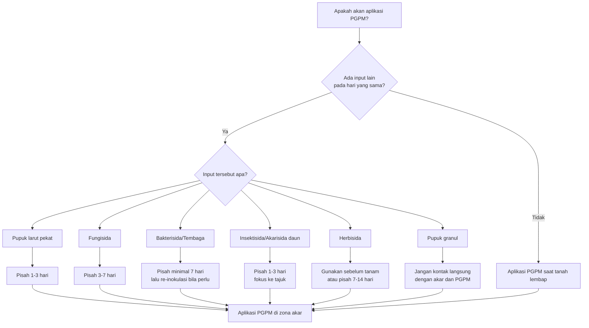

**Keterangan gambar:** Sebelum aplikasi PGPM, petani perlu mengecek apakah ada pupuk atau pestisida yang diaplikasikan berdekatan. Bila ada input berisiko, aplikasi perlu dipisahkan berdasarkan tingkat risikonya. Alur ini membantu menghindari kesalahan pencampuran di lapangan.

---

## 3.5 Desain Konsorsium PGPM untuk Cabai

Dalam praktik, PGPM sering digunakan dalam bentuk konsorsium. Konsorsium adalah kombinasi beberapa mikroba yang memiliki fungsi saling mendukung. Tujuannya bukan sekadar mencampur banyak mikroba, tetapi menyusun kombinasi yang sesuai dengan kebutuhan tanaman dan kondisi lahan.

Konsorsium yang baik harus mempertimbangkan:

- Fungsi masing-masing mikroba.
- Kompatibilitas antar mikroba.
- Fase tanaman.
- Target masalah di lapangan.
- Cara aplikasi.
- Kualitas produk.
- Stabilitas formulasi.
- Risiko bila difermentasi ulang.

Semakin banyak jenis mikroba dalam satu produk, belum tentu semakin baik. Bila mikroba tidak kompatibel, salah satu dapat mendominasi dan menekan mikroba lain. Karena itu, konsorsium sebaiknya berasal dari produk yang sudah teruji atau disusun dengan prinsip yang jelas.

Pada budidaya cabai, desain konsorsium dapat dibagi menjadi beberapa kelompok fungsi.

---

## A. Konsorsium Akar dan Hara

Konsorsium akar dan hara bertujuan memperkuat sistem perakaran dan meningkatkan efisiensi serapan hara. Konsorsium ini cocok digunakan pada fase awal pertumbuhan, fase vegetatif, dan sebagai pemeliharaan selama tanaman aktif.

Komponen utama:

- _Bacillus subtilis/velezensis_
- _Pseudomonas fluorescens/putida_
- _Azospirillum_
- _Azotobacter_
- PSB
- KSB

Fungsi utama:

- Memperkuat akar.
- Meningkatkan serapan nitrogen, fosfor, dan kalium.
- Mengurangi stres pindah tanam.
- Mendukung pertumbuhan vegetatif sehat.
- Membantu tanaman lebih seragam.

Konsorsium ini sangat berguna pada 7–21 HST, saat tanaman sedang membentuk akar baru setelah pindah tanam. Pada fase ini, akar yang cepat aktif akan menentukan kecepatan pertumbuhan berikutnya.

Dalam sistem cabai intensif, konsorsium akar dan hara dapat diaplikasikan melalui kocor akar. Aplikasi dilakukan saat tanah lembap, sebaiknya pagi atau sore hari, dan tidak berdekatan dengan pupuk kimia pekat.

---

## B. Konsorsium Mikoriza–_Trichoderma_

Konsorsium mikoriza–_Trichoderma_ dirancang untuk mendukung perakaran sejak awal tanam. Mikoriza membantu memperluas jangkauan serapan akar, terutama terhadap fosfor dan air. _Trichoderma_ membantu menciptakan lingkungan media yang lebih kompetitif terhadap patogen tanah.

Komponen utama:

- Mikoriza arbuskula.
- _Trichoderma harzianum/asperellum_.

Fungsi utama:

- Memperluas jangkauan akar.
- Meningkatkan serapan fosfor dan air.
- Membantu menekan penyakit tanah.
- Mendukung tanaman pada lahan dengan stres lingkungan.
- Cocok ditempatkan sejak pindah tanam.

Konsorsium ini paling baik diaplikasikan di lubang tanam atau dekat zona akar. Mikoriza harus berada dekat akar hidup agar dapat membentuk kolonisasi. _Trichoderma_ dapat ditempatkan di sekitar akar, media semai, atau kompos matang.

Kesalahan yang perlu dihindari:

- Mikoriza diletakkan terlalu jauh dari akar.
- Mikoriza ditabur di permukaan tanpa kontak akar.
- Mikoriza dicampur langsung dengan pupuk fosfat dosis tinggi.
- _Trichoderma_ diaplikasikan berdekatan dengan fungisida.
- Media terlalu basah hingga anaerob.

---

## C. Konsorsium Penekan Penyakit Tanah

Konsorsium ini ditujukan untuk lahan dengan riwayat layu, busuk akar, rebah semai, atau kompleks penyakit tanah. Fokusnya bukan hanya membunuh patogen, tetapi membangun lingkungan perakaran yang lebih sehat dan kompetitif.

Komponen utama:

- _Trichoderma_.
- _Bacillus subtilis/velezensis_.
- _Pseudomonas fluorescens_.
- _Streptomyces_, bila tersedia dalam produk teruji.

Target utama:

- Layu fusarium.
- Busuk akar.
- Rebah semai.
- Kompleks penyakit tanah.

Konsorsium penekan penyakit tanah sebaiknya digunakan sejak awal, bukan setelah tanaman banyak yang mati. Pada lahan bekas layu, aplikasi perlu dimulai dari persiapan lahan, media semai, kompos matang, lubang tanam, dan kocor pemeliharaan.

Namun, penting ditegaskan bahwa konsorsium ini bukan obat instan untuk tanaman yang sudah rusak parah. Bila tanaman sudah layu berat, akar busuk, atau pangkal batang rusak, tindakan sanitasi dan pencabutan tanaman sakit tetap diperlukan. PGPM berperan lebih kuat sebagai pencegahan, penguatan akar, dan pemulihan populasi tanaman sehat.

Strategi praktis:

- Gunakan kompos matang, bukan bahan organik mentah.
- Perbaiki drainase.
- Hindari genangan.
- Cabut tanaman sakit berat.
- Aplikasikan _Trichoderma_ sebelum tanam dan saat tanam.
- Kocor _Bacillus_ dan _Pseudomonas_ secara berkala.
- Gunakan fungisida atau bakterisida hanya bila diagnosis mengarah ke kebutuhan tersebut.
- Re-inokulasi PGPM setelah aplikasi pestisida berat.

---

## D. Konsorsium Fase Generatif

Konsorsium fase generatif difokuskan untuk mendukung pembungaan, pengisian buah, dan panen berulang. Pada fase ini, tanaman cabai membutuhkan akar yang tetap aktif, keseimbangan hara, dan pasokan kalium yang cukup.

Komponen utama:

- PSB.
- KSB.
- _Bacillus_.
- _Pseudomonas_.
- Mikoriza yang sudah terkolonisasi sejak awal.

Fungsi utama:

- Mendukung pembungaan.
- Mengurangi rontok bunga.
- Membantu pengisian buah.
- Menjaga akar tetap aktif saat panen berulang.
- Membantu tanaman pulih setelah panen besar.

Pada fase generatif, PGPM tidak menggantikan kebutuhan pupuk K, Ca, Mg, dan unsur mikro. PGPM berperan membantu sistem akar dan efisiensi hara agar input yang diberikan lebih efektif. Bila akar lemah, pupuk sebanyak apa pun tidak akan optimal.

Konsorsium ini penting terutama pada cabai rawit yang dipanen berulang. Setelah panen besar, tanaman sering mengalami penurunan vigor. Aplikasi PGPM pemeliharaan dapat membantu menjaga akar tetap aktif dan mendukung munculnya bunga baru.

---

## Tabel 3.2. Desain Konsorsium PGPM Berdasarkan Tujuan Lapangan

| Tujuan Lapangan                   | Konsorsium Utama                                            | Waktu Aplikasi Utama                        | Catatan Praktis                                             |
| --------------------------------- | ----------------------------------------------------------- | ------------------------------------------- | ----------------------------------------------------------- |
| Memperkuat akar awal              | PGPR + PSB + KSB                                            | 7–21 HST                                    | Kocor saat tanah lembap                                     |
| Mengurangi stres pindah tanam     | PGPR + mikoriza + _Trichoderma_                             | Saat tanam sampai 14 HST                    | Mikoriza harus dekat akar                                   |
| Menekan penyakit tanah            | _Trichoderma_ + _Bacillus_ + _Pseudomonas_                  | Sebelum tanam, saat tanam, dan pemeliharaan | Fokus pencegahan, bukan pengobatan instan                   |
| Mendukung pembungaan              | PSB + KSB + PGPR                                            | Menjelang bunga sampai awal buah            | Tetap jaga K, Ca, Mg, dan air                               |
| Menjaga panen panjang             | KSB + PGPR + mikoriza aktif                                 | Selama panen berulang                       | Aplikasi pemeliharaan tiap 14–21 hari                       |
| Pemulihan setelah pestisida berat | _Bacillus_ + _Pseudomonas_ + _Trichoderma_ sesuai kebutuhan | 5–7 hari setelah pestisida berat            | Jangan diberikan terlalu dekat dengan bakterisida/fungisida |

---

## Gambar 3.4. Desain Konsorsium PGPM Berdasarkan Fase Tanaman

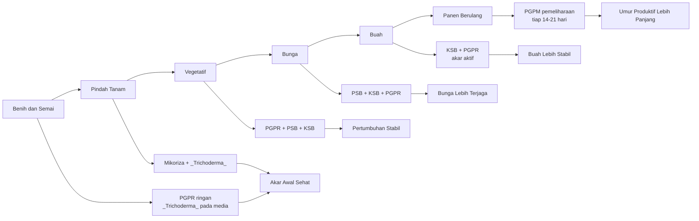

**Keterangan gambar:** Konsorsium PGPM perlu disesuaikan dengan fase tanaman. Fase awal membutuhkan penguatan akar, fase vegetatif membutuhkan dukungan pertumbuhan, fase generatif membutuhkan efisiensi hara dan stabilitas bunga-buah, sedangkan fase panen berulang membutuhkan pemeliharaan akar secara berkala.

---

## 3.6 Kombinasi yang Sebaiknya Dihindari

Tidak semua input boleh dicampur dengan PGPM. Beberapa kombinasi berisiko menurunkan populasi mikroba, menghambat kolonisasi akar, atau membuat aplikasi PGPM tidak efektif.

Prinsip dasarnya adalah: bila suatu bahan berfungsi membunuh jamur atau bakteri, maka bahan tersebut berpotensi mengganggu PGPM yang juga berupa jamur atau bakteri menguntungkan.

---

✓ PGPM + Fungisida dalam Satu Tangki

Kombinasi ini sebaiknya dihindari. Fungisida dirancang untuk menekan jamur, sedangkan beberapa PGPM penting seperti _Trichoderma_ dan mikoriza adalah fungi menguntungkan. Mencampur keduanya dalam satu tangki dapat menurunkan viabilitas mikroba.

Risiko utama:

- _Trichoderma_ melemah atau mati.
- Mikoriza terganggu.
- Konsorsium PGPM tidak bekerja optimal.
- Biaya aplikasi terbuang.

Strategi aman:

- Pisahkan 3–5 hari untuk fungisida kontak.
- Pisahkan 5–7 hari untuk fungisida sistemik.
- Re-inokulasi PGPM bila penggunaan fungisida intensif.

---

✓ PGPM + Bakterisida atau Tembaga

Kombinasi ini berisiko tinggi, terutama untuk PGPR seperti _Bacillus_, _Pseudomonas_, _Azospirillum_, dan _Azotobacter_. Bakterisida ditujukan untuk menekan bakteri, sehingga dapat ikut menekan bakteri menguntungkan.

Produk berbasis tembaga juga perlu hati-hati karena memiliki sifat antimikroba.

Strategi aman:

- Jangan campur PGPM dengan bakterisida atau tembaga.
- Pisahkan minimal 7 hari.
- Setelah aplikasi berat, lakukan re-inokulasi PGPM.
- Hindari limpasan ke tanah bila target aplikasi adalah tajuk.

---

✓ Mikoriza + Pupuk Fosfat Dosis Tinggi Langsung di Titik Akar

Mikoriza membantu tanaman menyerap fosfor, tetapi kolonisasinya dapat kurang optimal bila fosfor tersedia terlalu tinggi tepat di zona akar sejak awal. Karena itu, mikoriza sebaiknya tidak ditumpuk langsung dengan pupuk fosfat dosis tinggi di lubang tanam.

Strategi aman:

- Letakkan mikoriza dekat akar.
- Letakkan pupuk dasar dengan jarak aman.
- Gunakan lapisan tanah pemisah.
- Berikan fosfor secara terukur.
- Gunakan PSB untuk mendukung efisiensi fosfor.

---

✓ PGPM + Air Kaporit Tinggi

Air dengan kandungan klorin tinggi dapat menekan mikroba. Air PAM yang masih kuat bau kaporit sebaiknya tidak langsung digunakan untuk melarutkan PGPM.

Strategi aman:

- Endapkan air 12–24 jam bila berbau kaporit.
- Gunakan air bersih yang tidak tercemar pestisida.
- Hindari air terlalu panas.
- Gunakan larutan PGPM segera setelah diencerkan.

---

✓ PGPM + Larutan Pupuk EC Tinggi

Larutan pupuk dengan konsentrasi tinggi dapat mengganggu mikroba dan akar muda. Dalam praktik lapangan, petani sering mencampur pupuk, pestisida, perekat, dan PGPM dalam satu tangki agar praktis. Cara ini sebaiknya dihindari.

Strategi aman:

- Pisahkan PGPM dari pupuk pekat.
- Beri jeda 1–3 hari setelah aplikasi pupuk.
- Aplikasikan PGPM saat tanah lembap.
- Jangan menyimpan larutan PGPM yang sudah dicampur terlalu lama.

---

✓ Konsorsium Mikroba yang Belum Diuji Lalu Difermentasi Ulang Sembarangan

Kesalahan lain yang sering terjadi adalah mencampur berbagai produk mikroba lalu difermentasi ulang dengan molase, air kelapa, air cucian beras, atau bahan lain tanpa kontrol. Secara visual larutan mungkin terlihat aktif, berbusa, atau berbau fermentasi, tetapi tidak ada jaminan mikroba yang tumbuh adalah mikroba yang diinginkan.

Risiko utama:

- Mikroba dominan mengalahkan mikroba lain.
- Komposisi konsorsium berubah.
- Kontaminan tumbuh.
- Produk menjadi tidak stabil.
- Efektivitas lapangan tidak konsisten.
- Risiko membawa mikroba yang tidak diinginkan ke lahan.

Strategi aman:

- Jangan memperbanyak konsorsium campuran sembarangan.
- Ikuti petunjuk produsen.
- Gunakan produk dengan identitas mikroba jelas.
- Untuk perbanyakan, fokus pada jenis yang relatif aman seperti _Trichoderma_ atau _Bacillus_ dengan kontrol kebersihan.
- Mikoriza tidak diperbanyak seperti PGPR cair.

---

## Tabel 3.3. Kombinasi yang Harus Dihindari dan Alternatif Aman

| Kombinasi Berisiko                        | Risiko Utama                              | Alternatif Aman                       |
| ----------------------------------------- | ----------------------------------------- | ------------------------------------- |
| PGPM + fungisida satu tangki              | Fungi menguntungkan terganggu             | Pisah 3–7 hari sesuai jenis fungisida |
| PGPM + bakterisida/tembaga                | PGPR tertekan                             | Pisah minimal 7 hari dan re-inokulasi |
| Mikoriza + fosfat tinggi di titik akar    | Kolonisasi mikoriza kurang optimal        | Pisahkan posisi pupuk dan mikoriza    |
| PGPM + air kaporit tinggi                 | Mikroba melemah                           | Endapkan air 12–24 jam                |
| PGPM + pupuk EC tinggi                    | Tekanan garam mengganggu mikroba          | Pisah 1–3 hari                        |
| Konsorsium difermentasi ulang sembarangan | Komposisi mikroba berubah dan kontaminasi | Gunakan produk sesuai petunjuk        |

---

## Ringkasan Bab 3

Integrasi PGPM, pupuk kimia, dan pestisida kimia harus dilakukan berdasarkan fungsi masing-masing input. Pupuk kimia menyediakan hara cepat, PGPM menjaga kesehatan akar dan efisiensi hara, sedangkan pestisida kimia digunakan sebagai tindakan korektif saat tekanan hama atau penyakit melewati ambang kendali.

Prinsip utama integrasi adalah **pisah waktu, pisah tempat, dan pisah fungsi**. PGPM tidak boleh dicampur langsung dengan fungisida, bakterisida, tembaga, larutan pupuk pekat, atau input lain yang belum jelas kompatibilitasnya. Aplikasi PGPM paling efektif dilakukan ke zona akar pada kondisi tanah lembap.

Desain konsorsium PGPM harus disesuaikan dengan tujuan lapangan. Konsorsium akar dan hara digunakan untuk memperkuat pertumbuhan, konsorsium mikoriza–_Trichoderma_ digunakan sejak awal tanam, konsorsium penekan penyakit tanah digunakan pada lahan berisiko, dan konsorsium generatif digunakan untuk mendukung bunga, buah, dan panen berulang.

Keberhasilan PGPM tidak ditentukan oleh banyaknya jenis mikroba yang dicampur, tetapi oleh ketepatan fungsi, kualitas produk, cara aplikasi, waktu aplikasi, kondisi lahan, dan kompatibilitas dengan input lain.

---

# Bab 4. Panduan Aplikasi PGPM Cabai dari Semai sampai Panen

Bab ini membahas cara aplikasi PGPM pada cabai secara praktis, mulai dari perlakuan media semai, benih, lubang tanam, kocor akar, sampai pemeliharaan pada fase panen. Fokus utama bab ini adalah menjawab pertanyaan lapangan: **kapan PGPM diberikan, bagaimana cara aplikasinya, berapa dosis acuannya, bagaimana jedanya dengan pupuk dan pestisida, serta bagaimana menyesuaikan aplikasi dengan kondisi lahan.**

Aplikasi PGPM tidak boleh dilakukan secara asal. Mikroba adalah organisme hidup, sehingga keberhasilannya sangat dipengaruhi oleh kondisi air, tanah, kelembapan, bahan organik, suhu, kualitas produk, dan jarak aplikasi dengan input kimia. Kesalahan kecil seperti mencampur PGPM dengan fungisida, mengocor saat tanah kering, atau menempatkan mikoriza jauh dari akar dapat membuat manfaat PGPM tidak muncul di lapangan.

Dalam budidaya cabai, PGPM sebaiknya diposisikan sebagai teknologi pendukung sistem akar. Artinya, aplikasi PGPM harus mengikuti fase perkembangan akar dan kebutuhan tanaman. Fase awal membutuhkan perlindungan media dan pembentukan akar baru. Fase vegetatif membutuhkan akar aktif untuk menopang pertumbuhan tajuk. Fase generatif membutuhkan sistem akar yang kuat agar bunga tidak mudah rontok dan buah dapat berkembang baik. Fase panen berulang membutuhkan pemeliharaan akar agar tanaman tidak cepat drop.

---

## Gambar 4.1. Alur Umum Aplikasi PGPM pada Cabai

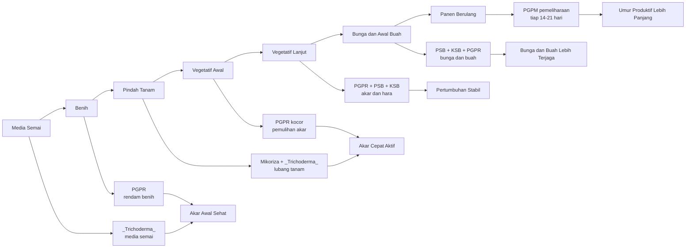

**Keterangan gambar:** Aplikasi PGPM sebaiknya dimulai sejak media semai dan dilanjutkan sesuai fase tanaman. Titik kritis aplikasi adalah media semai, benih, lubang tanam, 7–21 HST, fase bunga-buah, dan masa panen berulang.

---

# 4.1 Metode Aplikasi PGPM

Metode aplikasi PGPM harus disesuaikan dengan jenis mikroba dan target kerjanya. Tidak semua PGPM cocok disemprotkan ke daun. Tidak semua PGPM cukup efektif bila hanya ditabur di permukaan tanah. Mikoriza, misalnya, harus dekat dengan akar hidup. PGPR, PSB, dan KSB lebih efektif bila dikocor ke zona akar. _Trichoderma_ dapat digunakan pada media semai, kompos, lubang tanam, dan sekitar perakaran.

Secara umum, metode aplikasi PGPM pada cabai dapat dibagi menjadi lima cara utama:

1. Perlakuan media semai.
2. Perlakuan benih.
3. Aplikasi lubang tanam.
4. Kocor akar.
5. Semprot daun untuk produk tertentu.

---

## A. Perlakuan Media Semai

Media semai adalah titik awal kesehatan tanaman cabai. Bibit yang tumbuh pada media sehat biasanya memiliki akar lebih putih, batang lebih kokoh, dan pertumbuhan lebih seragam. Sebaliknya, media semai yang terlalu basah, belum matang, atau mengandung patogen dapat menyebabkan rebah semai, busuk akar, pertumbuhan lambat, dan bibit tidak seragam.

PGPM yang paling relevan untuk media semai adalah _Trichoderma_. Mikroba ini digunakan untuk membantu menekan patogen media, mendukung dekomposisi bahan organik matang, dan menciptakan lingkungan awal yang lebih sehat bagi akar bibit.

Media semai yang baik untuk aplikasi _Trichoderma_ sebaiknya memiliki ciri sebagai berikut:

- Remah dan tidak padat.
- Tidak berbau busuk.
- Tidak terlalu basah.
- Mengandung bahan organik matang.
- Bebas dari sisa pestisida berlebihan.
- Memiliki drainase baik.
- Tidak menggunakan kompos mentah.

Dosis acuan:

| Bahan               |            Dosis Acuan | Cara Aplikasi                  |
| ------------------- | ---------------------: | ------------------------------ |
| _Trichoderma_ padat |  5–10 g/kg media semai | Dicampur merata ke media       |
| _Trichoderma_ cair  | Mengikuti label produk | Dikocor ringan ke media lembap |

Aplikasi _Trichoderma_ pada media semai sebaiknya dilakukan beberapa hari sebelum benih disemai. Tujuannya agar mikroba mulai beradaptasi pada media. Media tidak boleh terlalu basah karena kondisi becek dan anaerob dapat mengganggu pertumbuhan bibit dan mikroba menguntungkan.

Kesalahan yang perlu dihindari:

- Menggunakan kompos mentah.
- Media terlalu becek.
- Mencampur _Trichoderma_ dengan fungisida.
- Menjemur media yang sudah diberi PGPM di bawah panas langsung.
- Menggunakan media yang berbau busuk.
- Menyimpan media terlalu lama dalam kondisi tertutup dan lembap berlebihan.

Dalam praktik lapangan, perlakuan media semai sangat penting untuk lahan yang memiliki riwayat penyakit tanah. Bibit yang sehat sejak awal akan lebih siap menghadapi stres pindah tanam.

---

## B. Perlakuan Benih

Perlakuan benih dengan PGPM bertujuan membantu vigor awal tanaman. PGPM yang umum digunakan untuk perlakuan benih adalah kelompok PGPR seperti _Bacillus_, _Pseudomonas_, _Azospirillum_, dan _Azotobacter_. Perlakuan ini dilakukan dengan cara merendam benih dalam larutan PGPR sebelum penyemaian.

Perlakuan benih tidak dimaksudkan untuk menggantikan benih bermutu. Benih tetap harus berasal dari sumber yang baik, memiliki daya kecambah tinggi, tidak kedaluwarsa, dan tidak terkontaminasi penyakit. PGPR hanya membantu mendukung fase awal perkecambahan dan pembentukan akar.

Dosis acuan:

| Produk           |            Dosis Acuan | Lama Perlakuan |
| ---------------- | ---------------------: | -------------: |
| PGPR cair        |          5–10 ml/L air | 30 menit–2 jam |
| PGPR padat larut | Mengikuti label produk | 30 menit–2 jam |

Langkah praktis perlakuan benih:

1. Siapkan air bersih yang tidak berbau kaporit kuat.
2. Larutkan PGPR sesuai dosis.
3. Masukkan benih cabai.
4. Rendam selama 30 menit sampai 2 jam.
5. Tiriskan benih.
6. Segera semai pada media yang sudah disiapkan.

Perlakuan benih sebaiknya tidak dilakukan bersamaan dengan fungisida benih yang kuat, kecuali produk tersebut memang sudah diketahui kompatibel. Bila benih sudah dilapisi bahan perlakuan benih dari pabrikan, perlu lebih hati-hati karena bahan tersebut dapat mempengaruhi mikroba.

Kesalahan yang perlu dihindari:

- Merendam benih terlalu lama.
- Menggunakan larutan PGPR yang sudah disimpan terlalu lama.
- Menggunakan air berklorin tinggi.
- Mencampur PGPR dengan fungisida tanpa uji kompatibilitas.
- Menyemai benih pada media yang terlalu basah.

---

## C. Aplikasi Lubang Tanam

Aplikasi lubang tanam merupakan salah satu titik paling penting dalam penggunaan PGPM pada cabai. Pada fase ini, bibit baru dipindahkan dari media semai ke lahan. Akar sedang mengalami stres dan perlu segera beradaptasi dengan lingkungan baru.

PGPM yang paling relevan pada lubang tanam adalah mikoriza dan _Trichoderma_. Mikoriza harus ditempatkan dekat akar agar dapat membentuk kolonisasi. _Trichoderma_ ditempatkan di sekitar akar untuk membantu menciptakan zona perakaran yang lebih sehat.

Dosis acuan:

| PGPM                |     Dosis Acuan | Posisi Aplikasi                       |
| ------------------- | --------------: | ------------------------------------- |
| Mikoriza granular   | 10–20 g/tanaman | Lubang tanam, dekat/kontak akar       |
| _Trichoderma_ padat | 10–20 g/tanaman | Sekitar akar atau media tanam         |
| PGPM cair akar      | Mengikuti label | Kocor setelah tanam pada tanah lembap |

Prinsip penting aplikasi lubang tanam:

- Mikoriza harus dekat dengan akar hidup.
- _Trichoderma_ ditempatkan di sekitar zona akar.
- Pupuk dasar tidak boleh menempel langsung pada akar.
- Pupuk fosfat dosis tinggi tidak ditumpuk langsung dengan mikoriza.
- Lubang tanam tidak diberi fungisida bersamaan dengan PGPM.
- Tanah harus cukup lembap, tetapi tidak becek.

Ilustrasi posisi aplikasi:

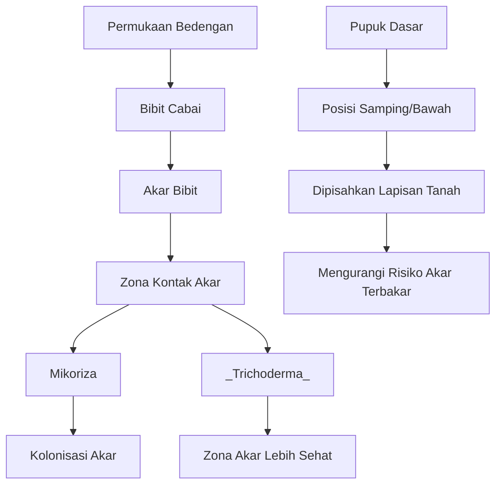

**Keterangan gambar:** Mikoriza dan _Trichoderma_ ditempatkan dekat akar, sedangkan pupuk dasar diberi jarak aman dan dipisahkan lapisan tanah. Tujuannya agar akar muda tidak stres dan mikroba tidak langsung terkena konsentrasi pupuk tinggi.

Kesalahan umum pada aplikasi lubang tanam:

- Mikoriza ditabur terlalu jauh dari akar.
- Mikoriza dicampur langsung dengan pupuk fosfat dosis tinggi.
- _Trichoderma_ diberikan bersamaan dengan fungisida.
- Pupuk dasar menempel pada akar.
- Lubang tanam terlalu basah atau tergenang.
- Aplikasi dilakukan saat tanah panas dan kering.

---

## D. Kocor Akar

Kocor akar adalah metode utama untuk aplikasi PGPR, PSB, KSB, dan konsorsium akar. Metode ini bertujuan membawa mikroba langsung ke zona perakaran, tempat mikroba dapat berinteraksi dengan akar dan lingkungan rhizosfer.

Kocor akar lebih efektif dibanding semprot daun untuk PGPM yang target kerjanya di akar. Aplikasi sebaiknya dilakukan saat tanah lembap, bukan saat tanah kering ekstrem. Bila tanah terlalu kering, sebagian mikroba dapat stres sebelum sempat beradaptasi. Bila tanah terlalu becek, oksigen rendah dan akar dapat terganggu.

Dosis acuan:

| Bentuk Produk PGPM |                                    Dosis Acuan |
| ------------------ | ---------------------------------------------: |
| PGPM cair          |                                  5–10 ml/L air |
| PGPM padat larut   |                                    2–5 g/L air |
| PGPM pemulihan     | Mengikuti label; umumnya dosis menengah–tinggi |
| PGPM pemeliharaan  |   Mengikuti label; umumnya dosis rendah–sedang |

Volume kocor berdasarkan fase tanaman:

| Fase Tanaman      |       Volume Kocor |
| ----------------- | -----------------: |
| Bibit/pasca tanam |  50–100 ml/tanaman |
| 7–14 HST          | 100–150 ml/tanaman |
| 14–30 HST         | 150–250 ml/tanaman |
| Bunga–buah        | 250–300 ml/tanaman |
| Panen panjang     | 250–300 ml/tanaman |

✓ Kotak Hitung Lapangan 4.1. Menghitung Kebutuhan Larutan PGPM

Rumus praktis:

```text
Total larutan PGPM (L) = jumlah tanaman × volume kocor per tanaman (ml) ÷ 1.000
```

Contoh:

```text
Jumlah tanaman = 1.000 tanaman
Volume kocor = 150 ml/tanaman

Total larutan = 1.000 × 150 ÷ 1.000
Total larutan = 150 L
```

Bila dosis PGPM cair adalah 5 ml/L air:

```text
Kebutuhan PGPM cair = total larutan (L) × dosis PGPM (ml/L)
Kebutuhan PGPM cair = 150 × 5
Kebutuhan PGPM cair = 750 ml
```

Catatan: perhitungan ini adalah contoh teknis. Dosis akhir tetap mengikuti label produk, umur tanaman, kondisi lahan, dan tujuan aplikasi.

Waktu terbaik untuk kocor akar:

- Pagi hari saat suhu belum tinggi.
- Sore hari saat panas mulai turun.
- Setelah tanah cukup lembap.
- Setelah irigasi ringan, bila tanah terlalu kering.
- Tidak dilakukan menjelang hujan deras.

Kesalahan yang perlu dihindari:

- Mengocor PGPM saat tanah sangat kering.
- Mengocor saat siang panas.
- Mencampur PGPM dengan pupuk pekat.
- Menggunakan air berkaporit kuat.
- Menggunakan tangki bekas pestisida tanpa dicuci bersih.
- Menyimpan larutan PGPM terlalu lama setelah diencerkan.

---

## E. Semprot Daun

Semprot daun bukan metode utama untuk PGPM akar. Sebagian besar PGPM yang dibahas dalam panduan ini bekerja di daerah perakaran. Karena itu, untuk _Bacillus_, _Pseudomonas_, PSB, KSB, _Trichoderma_, dan mikoriza, aplikasi utama tetap diarahkan ke media atau zona akar.

Semprot daun lebih cocok untuk produk yang memang diformulasikan sebagai foliar, misalnya biostimulan mikroba tertentu, metabolit mikroba, atau mikroba yang dirancang untuk permukaan daun. Penggunaan foliar harus mengikuti label produk karena mikroba pada permukaan daun lebih mudah terpapar sinar UV, panas, kekeringan, dan residu pestisida.

Kondisi yang perlu diperhatikan saat semprot daun:

- Dilakukan pagi atau sore.
- Tidak dilakukan saat matahari terik.
- Tidak dilakukan sebelum hujan.
- Tidak dicampur dengan fungisida atau bakterisida.
- Tidak diaplikasikan pada daun yang baru terkena pestisida keras.
- Gunakan hanya bila produk memang direkomendasikan untuk aplikasi foliar.

Dalam panduan ini, aplikasi PGPM lebih difokuskan pada akar karena sistem akar adalah pusat keberhasilan budidaya cabai berbasis mikroba.

---

# 4.2 Jadwal Aplikasi Terintegrasi per Fase Tanaman

Jadwal aplikasi PGPM perlu mengikuti fase tanaman. Kesalahan umum di lapangan adalah memberikan PGPM tanpa melihat umur tanaman, kondisi akar, status pemupukan, dan riwayat pestisida. Akibatnya, PGPM diberikan pada waktu yang kurang tepat atau terlalu dekat dengan input kimia berisiko.

Jadwal yang baik harus mempertimbangkan empat hal:

1. Fase pertumbuhan tanaman.
2. Kondisi tanah dan kelembapan.
3. Jadwal pupuk kimia.
4. Jadwal pestisida dan tekanan OPT.

---

## A. Sebelum Semai

Fase sebelum semai bertujuan menyiapkan media yang sehat dan mendukung perkecambahan. Pada fase ini, PGPM digunakan untuk memperbaiki lingkungan awal bibit.

| Waktu           | Aplikasi              | Tujuan                 |
| --------------- | --------------------- | ---------------------- |
| H-14 sampai H-7 | Media + _Trichoderma_ | Menekan patogen media  |
| H-1 sampai H-0  | Rendam benih PGPR     | Mempercepat vigor awal |

Pada H-14 sampai H-7, media semai dapat diinokulasi dengan _Trichoderma_ bila menggunakan media campuran kompos matang. Media perlu dijaga tetap lembap, tetapi tidak basah. Bila media terlalu basah, risiko rebah semai dan busuk akar meningkat.

Pada H-1 sampai H-0, benih dapat direndam dalam larutan PGPR. Setelah direndam, benih sebaiknya segera disemai. Jangan menyimpan benih yang sudah direndam terlalu lama karena dapat menurunkan kualitas benih.

---

## B. Fase Semai

Fase semai merupakan fase pembentukan bibit. Pada fase ini, target utama adalah bibit sehat, akar putih, batang kuat, dan pertumbuhan seragam. PGPM dapat digunakan secara ringan bila bibit tampak lemah atau media membutuhkan dukungan biologis.

Prinsip pada fase semai:

- Jaga kelembapan media.
- Hindari media terlalu basah.
- Hindari fungisida berlebihan.
- Jangan memberi pupuk pekat pada bibit muda.
- PGPM dapat dikocor ringan bila bibit lemah.
- Bibit siap pindah bila akar sehat, batang kuat, dan daun normal.

Aplikasi PGPM pada fase semai harus hati-hati. Volume kocor terlalu banyak dapat membuat media becek. Untuk bibit muda, aplikasi ringan lebih aman dibanding aplikasi berlebihan.

Indikator bibit siap pindah tanam:

- Akar terlihat putih dan aktif.
- Batang kokoh.
- Daun normal dan tidak menguning berlebihan.
- Bibit tidak etiolasi.
- Tidak ada gejala rebah semai.
- Pertumbuhan relatif seragam.

---

## C. Fase Pindah Tanam

Pindah tanam adalah fase kritis. Pada fase ini, tanaman cabai sering mengalami stres karena perubahan lingkungan. Akar yang sebelumnya tumbuh di media semai harus menyesuaikan diri dengan tanah atau bedengan.

Pada fase ini, mikoriza dan _Trichoderma_ menjadi prioritas.

| Input         | Posisi                             | Catatan                      |
| ------------- | ---------------------------------- | ---------------------------- |
| Mikoriza      | Lubang tanam, kontak akar          | Jangan jauh dari akar        |
| _Trichoderma_ | Sekitar akar                       | Jangan dicampur fungisida    |
| Pupuk dasar   | Samping/bawah, tidak menempel akar | Beri lapisan tanah pemisah   |
| Pestisida     | Bila perlu saja                    | Jangan bersamaan dengan PGPM |

Langkah praktis saat pindah tanam:

1. Pastikan bedengan cukup lembap.
2. Siapkan lubang tanam.
3. Tempatkan mikoriza di dekat posisi akar.
4. Tambahkan _Trichoderma_ di sekitar zona akar bila diperlukan.
5. Pastikan pupuk dasar tidak menempel langsung dengan akar.
6. Tanam bibit dengan hati-hati agar akar tidak rusak.
7. Siram secukupnya.
8. Hindari fungisida di lubang tanam bila PGPM sedang diaplikasikan.

Kesalahan yang perlu dihindari:

- Tanam saat tanah terlalu panas dan kering.
- Mikoriza tidak kontak dengan akar.
- Pupuk dasar menempel akar.
- PGPM diberikan bersamaan dengan fungisida.
- Tanaman langsung diberi pupuk pekat setelah pindah tanam.

---

## D. Vegetatif Awal, 7–21 HST

Fase 7–21 HST adalah fase pemulihan pindah tanam dan pembentukan akar baru. Pada fase ini, tanaman membutuhkan akar aktif agar pertumbuhan tajuk dapat berjalan baik.

Fokus utama:

- Kocor PGPR.
- Mendukung pembentukan akar baru.
- Mengurangi stres pindah tanam.
- Menjaga kelembapan tanah.
- Memulai pemupukan ringan sesuai kondisi tanaman.

Contoh pola aplikasi:

| Hari      | Kegiatan                       |
| --------- | ------------------------------ |
| 7 HST     | PGPR kocor                     |
| 10 HST    | Pupuk susulan ringan           |
| 14 HST    | PGPR + PSB + KSB               |
| 18–21 HST | Pestisida daun bila diperlukan |

Pada fase ini, pemupukan tetap diperlukan, tetapi jangan terlalu pekat. PGPM sebaiknya dipisahkan dari pupuk kimia minimal 1–3 hari. Bila tanaman masih stres, daun layu, atau akar belum aktif, pemberian pupuk pekat dapat memperparah stres.

Indikator fase vegetatif awal berjalan baik:

- Tanaman mulai mengeluarkan daun baru.
- Warna daun stabil.
- Batang mulai kokoh.
- Tanaman tidak terlalu lama layu setelah siang hari.
- Pertumbuhan antar tanaman mulai seragam.

---

## E. Vegetatif Lanjut, 21–35 HST

Pada fase vegetatif lanjut, tanaman mulai membentuk cabang produktif. Pertumbuhan tajuk harus kuat, tetapi tidak boleh terlalu rimbun. Tanaman yang terlalu rimbun dapat meningkatkan kelembapan tajuk dan memicu penyakit, terutama pada musim hujan.

Fokus utama:

- Pembentukan cabang produktif.
- Penguatan akar.
- Efisiensi N, P, dan K.
- Monitoring hama dan penyakit.
- Menjaga tajuk tidak terlalu lembap.

PGPM yang relevan:

- PGPR.
- PSB.
- KSB.
- _Bacillus_.
- _Pseudomonas_.

Aplikasi dapat dilakukan melalui kocor akar. Pada fase ini, PGPM membantu menjaga akar tetap aktif sehingga pemupukan vegetatif lebih efisien.

Hal yang perlu diperhatikan:

- Jangan berlebihan nitrogen.
- Perhatikan gejala thrips, kutu kebul, tungau, dan penyakit daun.
- Hindari aplikasi PGPM terlalu dekat dengan fungisida.
- Pastikan drainase baik.
- Mulai siapkan strategi menjelang fase generatif.

---

## F. Fase Bunga dan Awal Buah

Fase bunga dan awal buah adalah fase sensitif. Tanaman cabai membutuhkan keseimbangan air, hara, dan kondisi akar yang sehat. Gangguan kecil pada fase ini dapat menyebabkan bunga rontok, bakal buah gagal berkembang, dan produksi awal tidak maksimal.

Fokus utama:

- Hindari stres air.
- Hindari pemupukan terlalu pekat.
- Gunakan KSB, PSB, _Bacillus_, dan _Pseudomonas_.
- Jaga keseimbangan K, Ca, Mg, dan unsur mikro.
- Pestisida daun dilakukan selektif.
- Jangan arahkan pestisida ke zona akar.

Pada fase ini, PGPM berfungsi sebagai pendukung efisiensi hara dan kesehatan akar. PGPM bukan pengganti pupuk kalium, kalsium, magnesium, atau unsur mikro. Bila bunga rontok karena kekurangan air, suhu tinggi, thrips, atau ketidakseimbangan hara, PGPM saja tidak cukup. Penyebab utama tetap harus dikoreksi.

Tanda fase bunga dan awal buah berjalan baik:

- Bunga muncul stabil.
- Rontok bunga rendah.
- Bakal buah terbentuk normal.
- Daun tidak terlalu gelap akibat kelebihan nitrogen.
- Tanaman tidak mudah layu.
- Akar tetap aktif.

---

## G. Fase Panen Berulang

Fase panen berulang terutama penting pada cabai rawit. Setelah beberapa kali panen, tanaman sering mengalami penurunan vigor. Bila akar melemah, tanaman akan sulit membentuk bunga baru, buah mengecil, dan umur produktif memendek.

Fokus utama:

- Menjaga akar tetap aktif.
- Menjaga bunga baru tetap muncul.
- Membantu tanaman pulih setelah panen besar.
- Menjaga keseimbangan K, Ca, Mg, dan mikro.
- Mengurangi stres akibat pestisida intensif.
- Re-inokulasi PGPM setelah fungisida/bakterisida berat.

PGPM pemeliharaan dapat diberikan setiap 14–21 hari, tergantung kondisi tanaman dan riwayat aplikasi pestisida. Pada lahan sehat, interval 21 hari dapat cukup. Pada lahan stres, bekas layu, atau setelah pestisida berat, interval dapat dibuat lebih rapat sesuai kebutuhan.

Tanda tanaman perlu pemulihan akar:

- Daun mulai kusam.
- Bunga baru berkurang.
- Buah mengecil.
- Tanaman mudah layu saat panas.
- Pertumbuhan pucuk melemah.
- Respons terhadap pupuk menurun.

---

# 4.3 Integrasi PGPM dengan Pupuk Kimia

Integrasi PGPM dengan pupuk kimia harus dilakukan secara realistis. PGPM bukan alasan untuk menghentikan pupuk secara tiba-tiba. Pada budidaya cabai intensif, tanaman tetap membutuhkan pasokan hara yang cukup. Yang ingin dicapai adalah efisiensi, bukan pengurangan ekstrem yang mengorbankan hasil.

PGPM membantu akar dan lingkungan rhizosfer agar pupuk yang diberikan lebih efektif dimanfaatkan tanaman. Namun, hasilnya bergantung pada kualitas tanah, bahan organik, kelembapan, kesehatan akar, dan ketepatan aplikasi.

---

## Prinsip Pemupukan Saat Menggunakan PGPM

Prinsip utama:

- Jangan memangkas pupuk kimia secara ekstrem sejak awal.
- Pengurangan pupuk dilakukan bertahap.
- Evaluasi respons tanaman sebelum menurunkan dosis.
- Jangan mencampur PGPM dengan larutan pupuk pekat.
- PGPM diberikan saat tanah cukup lembap.
- Perbaiki bahan organik agar mikroba memiliki lingkungan yang mendukung.

Strategi pengurangan pupuk:

| Tahap            |                Pengurangan Pupuk | Syarat Lapangan                                   |
| ---------------- | -------------------------------: | ------------------------------------------------- |
| Musim pertama    |                           10–15% | Tanaman respons baik, akar sehat                  |
| Musim berikutnya |                           20–25% | Sistem budidaya stabil                            |
| Lebih dari 25%   | Tidak disarankan tanpa data kuat | Harus ada catatan hasil, tanah, dan produktivitas |

Pengurangan pupuk sebaiknya dimulai dari pendekatan konservatif. Bila pada musim pertama tanaman menunjukkan respons baik, hasil stabil, dan tidak terjadi defisiensi, efisiensi dapat ditingkatkan secara bertahap pada musim berikutnya.

---

## Strategi Pupuk Dasar

Pupuk dasar berfungsi menyiapkan cadangan hara awal bagi tanaman. Dalam sistem PGPM, pupuk dasar tetap digunakan, tetapi posisinya harus diatur agar tidak merusak akar muda dan tidak mengganggu mikroba.

Prinsip pupuk dasar:

- Gunakan kompos matang sebagai rumah mikroba.
- Hindari bahan organik mentah.
- Pupuk P dan K diberikan terukur.
- Mikoriza tidak ditumpuk langsung dengan fosfat tinggi.
- Pupuk dasar tidak menempel langsung pada akar.
- Beri lapisan tanah pemisah antara pupuk dan akar.

Pada lahan dengan bahan organik rendah, PGPM sering tidak bekerja optimal. Mikroba membutuhkan lingkungan hidup. Karena itu, kompos matang, pupuk kandang matang, atau bahan organik stabil menjadi komponen penting.

---

## Strategi Pupuk Susulan

Pupuk susulan diberikan sesuai fase pertumbuhan tanaman. Pada sistem PGPM, pupuk susulan tetap dilakukan, tetapi jadwalnya dipisahkan dari aplikasi PGPM.

Prinsip pupuk susulan:

- Pupuk kimia diberikan sesuai fase tanaman.
- PGPM diberikan 1–3 hari setelah pupuk kimia.
- Tanah perlu cukup lembap saat PGPM dikocor.
- Hindari pupuk larut pekat bersamaan dengan PGPM.
- Jangan memaksa tanaman stres menerima pupuk dosis tinggi.

Contoh pola mingguan:

| Hari         | Kegiatan                  |
| ------------ | ------------------------- |
| Senin        | Pupuk kimia kocor/tabur   |
| Rabu/Kamis   | PGPM kocor                |
| Sabtu/Minggu | Pestisida daun bila perlu |

Pola ini tidak harus kaku. Jadwal bisa disesuaikan dengan cuaca, kondisi tanaman, dan intensitas serangan OPT. Yang penting, PGPM tidak ditempatkan terlalu dekat dengan pupuk pekat atau pestisida berisiko tinggi.

---

## Gambar 4.3. Contoh Pola Mingguan Integrasi Pupuk, PGPM, dan Pestisida

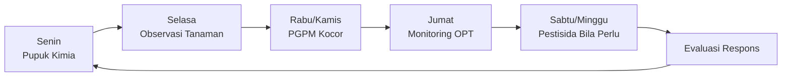

**Keterangan gambar:** Pola mingguan membantu memisahkan aplikasi pupuk, PGPM, dan pestisida. Tujuannya bukan membuat jadwal kaku, tetapi menghindari pencampuran input yang berisiko merusak mikroba.

---

# 4.4 Integrasi PGPM dengan Pestisida Kimia

Pestisida kimia tetap dapat digunakan dalam sistem budidaya cabai berbasis PGPM. Namun, penggunaannya harus lebih selektif dan berbasis monitoring. Pestisida yang digunakan tanpa diagnosis dapat meningkatkan biaya, menekan mikroba menguntungkan, dan mengganggu keseimbangan sistem budidaya.

Prinsip utama integrasi PGPM dengan pestisida adalah menjaga agar pestisida tidak merusak populasi mikroba yang sedang dibangun di zona akar.

---

## Prinsip Umum

Prinsip umum penggunaan pestisida dalam sistem PGPM:

- Pestisida digunakan berdasarkan monitoring.
- Prioritaskan pestisida selektif.
- Hindari penyemprotan berlebihan sampai mengenai tanah.
- Jangan mencampur PGPM dengan fungisida atau bakterisida.
- PGPM diberikan ulang setelah penggunaan pestisida berisiko tinggi.
- Gunakan pestisida sesuai label dan target OPT.
- Rotasi bahan aktif perlu dilakukan untuk mengurangi risiko resistensi.

Pestisida daun seperti insektisida dan akarisida umumnya lebih aman terhadap PGPM akar bila tidak banyak mengenai tanah. Namun, fungisida, bakterisida, tembaga, dan antibiotik pertanian perlu dipisahkan lebih jauh dari PGPM.

---

## Jeda Aplikasi

| Jenis Pestisida     | Jeda Aman Sebelum/Sesudah PGPM |
| ------------------- | -----------------------------: |
| Insektisida daun    |                       1–3 hari |
| Akarisida           |                       2–3 hari |
| Fungisida kontak    |                       3–5 hari |
| Fungisida sistemik  |                       5–7 hari |
| Bakterisida/tembaga |                         7 hari |
| Herbisida           |                      7–14 hari |

Jeda ini merupakan acuan praktis. Pada kondisi pestisida digunakan intensif, terutama saat serangan penyakit tinggi, re-inokulasi PGPM perlu dipertimbangkan setelah masa aman.

---

## Jika Pestisida Harus Digunakan Darurat

Pada kondisi tertentu, pestisida harus digunakan segera untuk menyelamatkan tanaman. Misalnya serangan antraknosa tinggi, populasi thrips meningkat cepat, atau gejala penyakit menyebar. Dalam situasi seperti ini, keselamatan tanaman menjadi prioritas.

Langkah praktis:

1. Identifikasi masalah utama.
2. Gunakan pestisida sesuai target dan label.
3. Hindari aplikasi berlebihan ke tanah bila targetnya tajuk.
4. Tunda PGPM sesuai jeda aman.
5. Setelah 5–7 hari, lakukan pemulihan mikroba dengan PGPM kocor bila diperlukan.
6. Tambahkan bahan organik matang ringan bila kondisi tanah mendukung.
7. Pantau respons akar, pucuk, bunga, dan buah.

PGPM tidak boleh dipaksakan masuk pada saat pestisida berat baru saja digunakan. Berikan waktu agar risiko residu terhadap mikroba menurun.

---

# 4.5 Paket Aplikasi Berdasarkan Kondisi Lahan

Kondisi lahan sangat menentukan strategi aplikasi PGPM. Lahan sehat, lahan bekas layu, musim hujan, musim kemarau, cabai rawit panen panjang, dan cabai besar membutuhkan penekanan yang berbeda.

Paket berikut bukan resep kaku, tetapi kerangka praktis yang dapat disesuaikan dengan kondisi lapangan.

---

## A. Paket Standar Lahan Sehat

Paket ini digunakan untuk lahan dengan drainase baik, riwayat penyakit rendah, bahan organik cukup, dan pertumbuhan tanaman relatif stabil.

Fokus utama:

- Mempertahankan kesehatan akar.
- Meningkatkan efisiensi pupuk.
- Menjaga pertumbuhan seragam.
- Mengurangi risiko penyakit sejak awal.

Strategi aplikasi:

- Mikoriza + _Trichoderma_ saat tanam.
- PGPR + PSB + KSB kocor rutin.
- Pupuk kimia dikurangi ringan secara bertahap.
- Pestisida digunakan berdasarkan monitoring.
- PGPM pemeliharaan setiap 14–21 hari sesuai kondisi tanaman.

Catatan praktis:

Pada lahan sehat, jangan berlebihan aplikasi. Fokusnya adalah konsistensi dan efisiensi, bukan menambah terlalu banyak produk.

---

## B. Paket Lahan Bekas Layu

Lahan bekas layu membutuhkan strategi lebih hati-hati. PGPM dapat membantu, tetapi tidak cukup bila sanitasi dan drainase buruk. Penyakit layu sering melibatkan kompleks faktor: patogen tanah, kelembapan berlebihan, akar lemah, pH tidak sesuai, dan sisa tanaman sakit.

Fokus utama:

- Menekan sumber penyakit.
- Memperbaiki drainase.
- Memperkuat akar sejak awal.
- Mengurangi kematian tanaman.
- Mencegah penyebaran penyakit.

Strategi aplikasi:

- Sanitasi tanaman sakit.
- Gunakan kompos matang.
- Aplikasi _Trichoderma_ pada kompos/media/lubang tanam.
- Mikoriza saat tanam.
- _Bacillus_ + _Pseudomonas_ kocor rutin.
- Hindari genangan.
- Gunakan fungisida atau bakterisida hanya berdasarkan diagnosis.
- Re-inokulasi PGPM setelah pestisida berat.

Catatan praktis:

Pada lahan bekas layu, PGPM harus dimulai sebelum tanam. Jika PGPM baru diberikan setelah banyak tanaman mati, hasilnya biasanya tidak optimal.

---

## C. Paket Musim Hujan

Musim hujan meningkatkan risiko kelembapan berlebih, drainase buruk, penyakit daun, antraknosa, busuk batang, dan penyakit tanah. Pada kondisi ini, PGPM perlu dikombinasikan dengan manajemen air dan tajuk.

Fokus utama:

- Memperkuat drainase.
- Menekan penyakit tanah.
- Mengurangi kelembapan tajuk.
- Menjaga akar tetap sehat.
- Mengelola fungisida dengan bijak.

Strategi aplikasi:

- Perkuat drainase bedengan.
- Tingkatkan perhatian pada _Trichoderma_ dan _Bacillus_.
- Gunakan PGPM saat tanah tidak terlalu becek.
- Kurangi kelembapan berlebih di tajuk.
- Rotasi fungisida untuk antraknosa bila tekanan tinggi.
- Re-inokulasi PGPM setelah fungisida intensif.

Catatan praktis:

Jangan mengocor PGPM saat tanah jenuh air. Mikroba akar membutuhkan oksigen. Tanah becek dapat membuat akar stres dan menurunkan efektivitas PGPM.

---

## D. Paket Musim Kemarau

Musim kemarau menimbulkan tantangan berupa kekeringan, suhu tinggi, stres garam dari pupuk, dan fluktuasi kelembapan. Pada kondisi ini, mikoriza menjadi sangat penting karena membantu memperluas jangkauan serapan air dan hara.

Fokus utama:

- Menjaga kelembapan tanah.
- Mengurangi stres panas.
- Menghindari pupuk terlalu pekat.
- Memperkuat serapan air dan hara.
- Menjaga akar tetap aktif.

Strategi aplikasi:

- Mikoriza menjadi prioritas sejak tanam.
- PGPM diberikan sore hari.
- Jaga kelembapan tanah sebelum aplikasi PGPM.
- Kurangi risiko stres garam dari pupuk pekat.
- Irigasi lebih teratur.
- Gunakan mulsa untuk menjaga kelembapan bila tersedia.

Catatan praktis:

Pada musim kemarau, PGPM tidak boleh dikocor ke tanah yang sangat kering. Lakukan irigasi ringan terlebih dahulu, lalu aplikasikan PGPM saat tanah sudah cukup lembap.

---

## E. Paket Cabai Rawit Panen Panjang

Cabai rawit memiliki karakter panen berulang sehingga kesehatan akar jangka panjang menjadi sangat penting. Tanaman yang awalnya baik dapat menurun setelah beberapa kali panen bila akar tidak dipelihara.

Fokus utama:

- Menjaga akar sehat jangka panjang.
- Mendukung bunga baru.
- Mencegah tanaman drop setelah panen besar.
- Menjaga efisiensi K, Ca, Mg, dan mikro.
- Mengurangi kehilangan populasi tanaman produktif.

Strategi aplikasi:

- Mikoriza + _Trichoderma_ sejak tanam.
- PGPR + PSB + KSB rutin.
- PGPM pemeliharaan setiap 14–21 hari.
- KSB diprioritaskan saat panen berulang.
- Re-inokulasi setelah pestisida berat.
- Jangan biarkan tanaman kekurangan air setelah panen besar.

Catatan praktis:

Setelah panen besar, tanaman membutuhkan pemulihan. PGPM dapat dikombinasikan dengan pemupukan seimbang dan irigasi stabil untuk menjaga siklus bunga berikutnya.

---

## F. Paket Cabai Besar

Cabai besar membutuhkan perhatian pada ukuran buah, keseragaman buah, kualitas kulit, dan pencegahan antraknosa. Sistem akar tetap penting, tetapi fokus generatif lebih menekankan keseimbangan hara dan kualitas buah.

Fokus utama:

- Pembentukan buah besar dan seragam.
- Efisiensi K, Ca, Mg, dan unsur mikro.
- Pencegahan antraknosa.
- Menjaga akar aktif selama fase buah.
- Menghindari stres air.

Strategi aplikasi:

- Mikoriza + _Trichoderma_ saat tanam.
- PGPR + PSB + KSB pada fase vegetatif.
- KSB, PSB, _Bacillus_, dan _Pseudomonas_ menjelang generatif.
- Jaga pemupukan Ca dan Mg.
- Pencegahan antraknosa dilakukan lebih disiplin.
- Hindari tajuk terlalu lembap.

Catatan praktis:

Pada cabai besar, kualitas buah sangat menentukan nilai jual. PGPM membantu dari sisi akar dan efisiensi hara, tetapi kualitas buah tetap memerlukan pemupukan, air, dan pengendalian penyakit yang rapi.

---

## Tabel 4.5. Ringkasan Paket Aplikasi Berdasarkan Kondisi Lahan

| Kondisi          | Fokus Utama                    | PGPM Prioritas                           | Catatan Kritis                     |
| ---------------- | ------------------------------ | ---------------------------------------- | ---------------------------------- |
| Lahan sehat      | Efisiensi dan stabilitas       | Mikoriza, _Trichoderma_, PGPR, PSB, KSB  | Jangan berlebihan input            |
| Lahan bekas layu | Pencegahan penyakit tanah      | _Trichoderma_, _Bacillus_, _Pseudomonas_ | Sanitasi dan drainase wajib        |
| Musim hujan      | Akar sehat dan penyakit rendah | _Trichoderma_, _Bacillus_, PGPR          | Jangan aplikasi saat tanah becek   |
| Musim kemarau    | Toleransi stres air            | Mikoriza, PGPR, KSB                      | Tanah harus lembap saat aplikasi   |
| Cabai rawit      | Panen panjang                  | KSB, PGPR, mikoriza                      | PGPM rutin 14–21 hari              |
| Cabai besar      | Buah besar dan seragam         | PSB, KSB, PGPR                           | Jaga Ca, Mg, mikro, dan antraknosa |

---

# 4.6 Contoh Kalender Aplikasi Cabai 0–90 HST

Kalender berikut merupakan contoh umum. Dalam praktik, jadwal harus disesuaikan dengan varietas, musim, kondisi tanah, sistem irigasi, intensitas hujan, tekanan hama penyakit, serta respons tanaman.

| Umur   | PGPM                     | Pupuk Kimia                    | Pestisida                          |
| ------ | ------------------------ | ------------------------------ | ---------------------------------- |
| H-14   | _Trichoderma_ + kompos   | Pupuk dasar bila perlu         | Herbisida pra-tanam bila digunakan |
| H-0    | Mikoriza + _Trichoderma_ | Pupuk dasar, tidak kontak akar | Hindari fungisida di lubang tanam  |
| 7 HST  | PGPR kocor               | —                              | Monitoring hama                    |
| 10 HST | —                        | Pupuk susulan ringan           | —                                  |
| 14 HST | PGPR + PSB + KSB         | —                              | Insektisida bila perlu             |
| 21 HST | PGPR/PSB/KSB             | Pupuk vegetatif                | Pestisida selektif                 |
| 30 HST | PSB + KSB + _Bacillus_   | Pupuk bunga awal               | Fungisida bila tekanan tinggi      |
| 45 HST | PGPM pemeliharaan        | K tinggi, Ca, Mg               | Rotasi pestisida                   |
| 60 HST | PGPM pemulihan akar      | Pupuk buah                     | Kendali antraknosa                 |
| 75 HST | PGPM pemeliharaan        | Pupuk panen                    | Sesuai monitoring                  |
| 90 HST | PGPM ulang               | Pupuk panen lanjut             | Sesuai monitoring                  |

---

## Cara Membaca Kalender

Kalender ini tidak dimaksudkan sebagai jadwal kaku. Kalender digunakan sebagai kerangka berpikir agar aplikasi PGPM tidak bertabrakan dengan pupuk dan pestisida.

Contoh penerapan:

- Bila hari ke-21 dilakukan pemupukan vegetatif, PGPM dapat diberikan 1–3 hari setelahnya.
- Bila pada hari ke-30 terjadi tekanan penyakit tinggi dan fungisida harus digunakan, PGPM ditunda 3–7 hari sesuai jenis fungisida.
- Bila bakterisida atau tembaga digunakan, PGPM ditunda sekitar 7 hari dan re-inokulasi dilakukan setelah kondisi aman.
- Bila hujan deras terjadi, aplikasi PGPM sebaiknya ditunda sampai tanah tidak jenuh air.
- Bila tanah sangat kering, lakukan irigasi ringan sebelum aplikasi PGPM.

---

## Gambar 4.4. Titik Kritis Aplikasi PGPM pada Kalender 0–90 HST

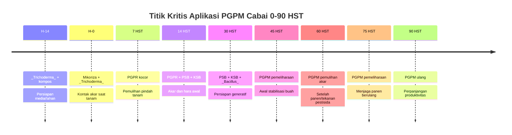

**Keterangan gambar:** Titik kritis PGPM berada pada awal persiapan media, saat tanam, pemulihan pindah tanam, awal vegetatif, menjelang generatif, dan masa panen. Pada cabai rawit, aplikasi setelah 90 HST masih dapat dilanjutkan sesuai kondisi tanaman.

---

## Catatan Penting untuk Aplikasi Lapangan

Agar aplikasi PGPM lebih konsisten, petani dan teknisi lapang sebaiknya memperhatikan beberapa catatan berikut.

Pertama, **PGPM membutuhkan tanah lembap**. Tanah yang terlalu kering membuat mikroba sulit bertahan, sedangkan tanah yang terlalu becek mengurangi oksigen bagi akar dan mikroba.

Kedua, **PGPM tidak boleh diperlakukan seperti pupuk kimia biasa**. PGPM adalah mikroba hidup, sehingga sensitif terhadap fungisida, bakterisida, tembaga, air berkaporit tinggi, dan larutan pupuk yang terlalu pekat.

Ketiga, **mikoriza harus kontak atau dekat dengan akar**. Aplikasi mikoriza yang jauh dari akar sering tidak efektif karena mikoriza membutuhkan akar hidup untuk membentuk simbiosis.

Keempat, **PGPM paling kuat sebagai pencegahan dan pemeliharaan**. Pada tanaman yang sudah sakit berat, PGPM tidak dapat bekerja sebagai obat instan. Sanitasi, diagnosis penyakit, pengaturan drainase, dan pengendalian sesuai kondisi tetap diperlukan.

Kelima, **catatan aplikasi sangat penting**. Setiap aplikasi PGPM sebaiknya dicatat: tanggal, umur tanaman, jenis PGPM, dosis, volume kocor, pupuk terakhir, pestisida terakhir, kondisi cuaca, dan respons tanaman. Tanpa catatan, sulit menilai apakah PGPM benar-benar memberi manfaat ekonomi.

---

## Ringkasan Bab 4

Aplikasi PGPM pada cabai harus mengikuti fase tanaman dan kondisi lahan. Metode utama aplikasi meliputi perlakuan media semai, perlakuan benih, aplikasi lubang tanam, kocor akar, dan semprot daun untuk produk tertentu. Untuk PGPM akar, metode paling penting adalah aplikasi ke zona perakaran.

Pada media semai, _Trichoderma_ digunakan untuk membantu menekan patogen media. Pada benih, PGPR dapat digunakan untuk mendukung vigor awal. Pada lubang tanam, mikoriza dan _Trichoderma_ perlu ditempatkan dekat akar. Pada fase vegetatif sampai generatif, PGPR, PSB, dan KSB dikocor untuk mendukung akar dan efisiensi hara. Pada fase panen berulang, PGPM pemeliharaan diberikan setiap 14–21 hari sesuai kondisi tanaman.

Integrasi dengan pupuk kimia dilakukan dengan prinsip tidak mencampur PGPM dengan pupuk pekat dan tidak memangkas pupuk secara ekstrem. Integrasi dengan pestisida dilakukan dengan prinsip jeda aplikasi, terutama terhadap fungisida, bakterisida, tembaga, dan herbisida.

Strategi PGPM harus disesuaikan dengan kondisi lahan. Lahan sehat membutuhkan pemeliharaan efisiensi, lahan bekas layu membutuhkan penguatan penyakit tanah, musim hujan membutuhkan drainase dan perlindungan akar, musim kemarau membutuhkan kelembapan dan mikoriza, cabai rawit membutuhkan pemeliharaan panen panjang, sedangkan cabai besar membutuhkan dukungan kualitas buah dan pencegahan antraknosa.

---

# Bab 5. Air, pH, Media, dan Kondisi Aplikasi

Keberhasilan aplikasi PGPM tidak hanya ditentukan oleh jenis mikroba dan dosis produk. Faktor lingkungan saat aplikasi sering lebih menentukan apakah mikroba dapat bertahan, beradaptasi, dan bekerja di zona akar. Air yang kurang sesuai, tanah terlalu kering, media terlalu basah, pH ekstrem, panas berlebihan, atau residu pestisida dapat membuat PGPM tidak efektif meskipun produk yang digunakan berkualitas baik.

Dalam praktik lapangan, banyak kegagalan PGPM bukan disebabkan oleh konsep PGPM yang salah, tetapi oleh kondisi aplikasi yang tidak mendukung. Mikroba hidup membutuhkan lingkungan yang layak. Karena itu, sebelum PGPM diberikan, petani dan teknisi perlu memastikan bahwa air, media, tanah, waktu aplikasi, dan kondisi tanaman berada dalam keadaan yang mendukung.

Bab ini membahas tiga faktor utama yang harus dikendalikan:

1. Kualitas air.
2. Waktu aplikasi.
3. Kondisi tanah dan media.

---

## Gambar 5.1. Faktor Penentu Keberhasilan Aplikasi PGPM

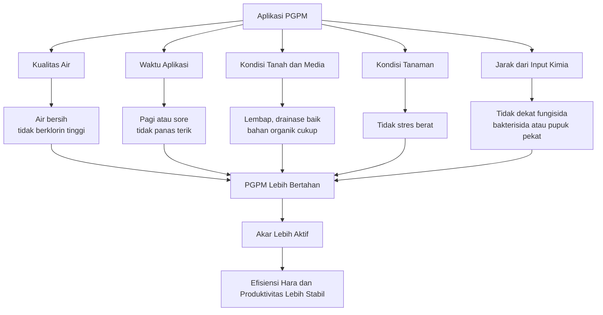

**Keterangan gambar:** PGPM akan bekerja lebih baik bila air, waktu aplikasi, kondisi tanah, kondisi tanaman, dan jarak dari input kimia mendukung kehidupan mikroba.

---

# 5.1 Kualitas Air

Air adalah media pembawa PGPM saat aplikasi, terutama untuk produk cair, produk padat larut, dan aplikasi kocor akar. Kualitas air sangat penting karena mikroba akan kontak langsung dengan air sebelum sampai ke tanah. Bila air mengandung klorin tinggi, terlalu panas, tercemar pestisida, atau memiliki pH ekstrem, viabilitas mikroba dapat menurun.

Air untuk aplikasi PGPM tidak harus selalu air laboratorium, tetapi harus cukup aman untuk mikroba. Prinsip paling praktis adalah menggunakan air bersih, tidak berbau menyengat, tidak panas, tidak tercemar pestisida, dan tidak berbau kaporit kuat.

---

## A. Hindari Air Berklorin Tinggi

Klorin umum digunakan untuk menekan mikroorganisme dalam air. Karena PGPM adalah mikroorganisme hidup, air dengan klorin tinggi dapat menurunkan populasi mikroba sebelum aplikasi dilakukan.

Air PAM yang masih berbau kaporit kuat sebaiknya tidak langsung digunakan untuk melarutkan PGPM. Bila sumber air yang tersedia adalah air PAM, air dapat diendapkan terlebih dahulu.

Praktik lapangan yang disarankan:

- Endapkan air PAM selama 12–24 jam bila berbau kaporit.
- Gunakan wadah terbuka atau tidak tertutup rapat saat pengendapan.
- Hindari penggunaan air yang baru diberi desinfektan.
- Jangan mencampur PGPM dengan air yang berbau bahan kimia.

Tanda air yang perlu diwaspadai:

- Berbau kaporit kuat.
- Berbau pestisida.
- Berbau limbah.
- Berwarna tidak normal.
- Mengandung minyak atau busa mencurigakan.
- Terasa terlalu panas saat disentuh.

---

## B. Hindari Air Terlalu Panas

Air yang terlalu panas dapat mengganggu mikroba. Dalam praktik lapangan, air yang tersimpan di dalam drum, selang, tandon terbuka, atau wadah hitam di bawah matahari dapat menjadi panas. Bila air seperti ini langsung digunakan untuk melarutkan PGPM, mikroba dapat mengalami stres.

Praktik yang disarankan:

- Gunakan air bersuhu normal.
- Hindari air dari selang yang baru terkena panas matahari.
- Buang aliran awal dari selang bila air terasa panas.
- Simpan air aplikasi di tempat teduh.
- Jangan menjemur larutan PGPM.

Air yang nyaman untuk tangan umumnya lebih aman digunakan dibanding air yang terasa panas. Pendekatan ini sederhana tetapi cukup membantu di lapangan.

---

## C. pH Air Ideal Netral hingga Agak Asam

pH air mempengaruhi kenyamanan mikroba dan stabilitas larutan aplikasi. Secara praktis, air dengan pH netral hingga agak asam lebih aman untuk sebagian besar aplikasi PGPM. Arah praktisnya adalah menggunakan air yang tidak terlalu asam dan tidak terlalu basa.

Acuan praktis:

| Kondisi pH Air   | Kelayakan untuk PGPM                     | Catatan                                         |
| ---------------- | ---------------------------------------- | ----------------------------------------------- |
| Terlalu asam     | Kurang aman                              | Dapat menekan mikroba tertentu                  |
| Agak asam–netral | Baik                                     | Umumnya lebih aman untuk aplikasi PGPM          |
| Agak basa        | Masih dapat digunakan bila tidak ekstrem | Perlu cek kompatibilitas produk                 |
| Sangat basa      | Kurang aman                              | Dapat mengganggu mikroba dan stabilitas larutan |

Bila tersedia alat ukur pH sederhana, petani dapat menggunakannya untuk mengecek air. Namun, bila tidak ada alat, minimal gunakan air bersih dari sumber yang sudah biasa dipakai untuk irigasi dan tidak berbau bahan kimia.

Catatan penting: jangan menambahkan bahan penurun atau penaik pH secara sembarangan ke larutan PGPM. Koreksi pH yang terlalu agresif dapat merusak mikroba. Bila produk PGPM memiliki petunjuk khusus, ikuti petunjuk produsen.

---

## D. Gunakan Air Bersih dan Tidak Tercemar

Air yang digunakan untuk PGPM sebaiknya tidak tercemar pestisida, herbisida, limbah rumah tangga, limbah kandang segar, atau bahan kimia lain. Kontaminasi seperti ini dapat menurunkan populasi mikroba dan mengganggu akar tanaman.

Sumber air yang relatif aman:

- Air sumur bersih.
- Air irigasi yang tidak tercemar limbah.
- Air hujan yang ditampung dengan wadah bersih.
- Air PAM yang sudah diendapkan bila berbau kaporit.

Sumber air yang perlu dihindari:

- Air bekas cucian tangki pestisida.
- Air parit tercemar limbah.
- Air yang terkena herbisida.
- Air yang berbau busuk.
- Air dari wadah bekas pestisida.
- Air yang mengandung minyak atau deterjen.

---

## Tabel 5.1. Checklist Kualitas Air untuk Aplikasi PGPM

| Parameter   | Kondisi yang Disarankan                           | Risiko Bila Tidak Sesuai                                |
| ----------- | ------------------------------------------------- | ------------------------------------------------------- |
| Bau air     | Tidak berbau kaporit kuat, pestisida, atau limbah | Mikroba bisa tertekan                                   |
| Suhu air    | Sejuk atau suhu normal                            | Mikroba stres bila air panas                            |
| pH air      | Netral hingga agak asam                           | pH ekstrem menurunkan kenyamanan mikroba                |
| Kebersihan  | Tidak tercemar pestisida/limbah                   | Risiko mikroba mati atau akar terganggu                 |
| Wadah air   | Bersih dari residu pestisida                      | Kontaminasi bahan kimia                                 |
| Waktu pakai | Larutan segera digunakan                          | Populasi mikroba dapat turun bila terlalu lama disimpan |

---

# 5.2 Waktu Aplikasi

Waktu aplikasi menentukan seberapa baik PGPM dapat bertahan setelah diberikan. Mikroba lebih aman diaplikasikan pada kondisi lingkungan yang tidak ekstrem. Karena itu, aplikasi PGPM sebaiknya dilakukan pada pagi atau sore hari, saat suhu lebih rendah dan sinar matahari tidak terlalu kuat.

Aplikasi saat siang panas, tanah kering, atau menjelang hujan deras sebaiknya dihindari. Pada siang hari, suhu tinggi dapat meningkatkan stres pada mikroba dan tanaman. Pada tanah kering, mikroba sulit beradaptasi. Menjelang hujan deras, PGPM berisiko tercuci sebelum sempat berada stabil di zona akar.

---

## A. Aplikasi Pagi atau Sore

Waktu terbaik untuk aplikasi PGPM adalah pagi atau sore. Pada waktu tersebut, suhu lebih bersahabat, penguapan lebih rendah, dan tanaman tidak berada pada tekanan panas tertinggi.

Pilihan waktu yang disarankan:

- Pagi hari setelah embun mulai berkurang.
- Sore hari saat panas mulai turun.
- Setelah irigasi ringan bila tanah terlalu kering.
- Saat cuaca teduh tetapi tidak menjelang hujan deras.

Untuk kocor akar, sore hari sering menjadi pilihan baik pada musim kemarau karena tanah mulai lebih sejuk. Namun, tanah tetap harus cukup lembap.

---

## B. Tanah Harus Lembap

Kondisi tanah lembap adalah syarat penting aplikasi PGPM. Tanah lembap membantu larutan PGPM masuk ke zona akar dan memberi kondisi awal yang lebih baik bagi mikroba.

Tanah terlalu kering membuat PGPM sulit bertahan. Tanah terlalu basah atau tergenang juga tidak baik karena oksigen rendah dan akar dapat stres. Kondisi ideal adalah lembap, tetapi tidak becek.

Cara praktis menilai kelembapan tanah:

- Ambil segenggam tanah dari sekitar zona akar.
- Bila tanah dapat menggumpal ringan tetapi tidak mengeluarkan air, kondisi cukup baik.
- Bila tanah hancur seperti debu, terlalu kering.
- Bila tanah mengeluarkan air saat diremas, terlalu basah.

---

## C. Jangan Aplikasi Saat Siang Panas

Aplikasi PGPM pada siang hari yang panas sebaiknya dihindari. Pada kondisi ini, suhu tanah dan permukaan bedengan dapat meningkat. Mikroba yang baru diaplikasikan lebih mudah mengalami stres, terutama bila tanah juga kering.

Risiko aplikasi saat siang panas:

- Mikroba cepat stres.
- Larutan cepat menguap.
- Tanaman sedang dalam tekanan transpirasi tinggi.
- Akar kurang nyaman menerima aplikasi.
- Efektivitas PGPM menurun.

Bila jadwal aplikasi terpaksa dilakukan pada hari yang panas, lebih baik ditunda sampai sore.

---

## D. Jangan Aplikasi Sebelum Hujan Deras

Hujan ringan setelah aplikasi belum tentu menjadi masalah bila tanah mampu menyerap larutan dengan baik. Namun, hujan deras dapat mencuci PGPM dari zona akar, terutama pada bedengan miring, tanah padat, atau drainase buruk.

Risiko aplikasi sebelum hujan deras:

- PGPM tercuci.
- Tanah menjadi jenuh air.
- Akar kekurangan oksigen.
- Risiko penyakit tanah meningkat.
- Biaya aplikasi terbuang.

Praktik yang disarankan:

- Cek kondisi cuaca sebelum aplikasi.
- Tunda aplikasi bila langit menunjukkan potensi hujan deras.
- Pastikan drainase bedengan baik.
- Aplikasikan PGPM setelah hujan berhenti dan tanah tidak jenuh air.

---

## E. Jangan Aplikasi Saat Tanaman Stres Berat Akibat Kekeringan

Tanaman yang sedang stres berat akibat kekeringan perlu dipulihkan kondisi airnya terlebih dahulu. PGPM tidak boleh dipaksakan sebagai solusi tunggal pada tanaman yang akarnya sedang sangat tertekan.

Urutan yang lebih aman:

1. Pulihkan kelembapan tanah dengan irigasi ringan.
2. Tunggu tanaman mulai pulih.
3. Aplikasikan PGPM pada pagi atau sore.
4. Hindari pupuk pekat sampai tanaman stabil.
5. Pantau respons daun dan pucuk.

Bila PGPM dikocor langsung pada tanah yang sangat kering, mikroba tidak mendapat lingkungan yang baik untuk bertahan. Selain itu, akar yang stres juga belum tentu mampu merespons aplikasi dengan optimal.

---

## Gambar 5.2. Alur Keputusan Waktu Aplikasi PGPM

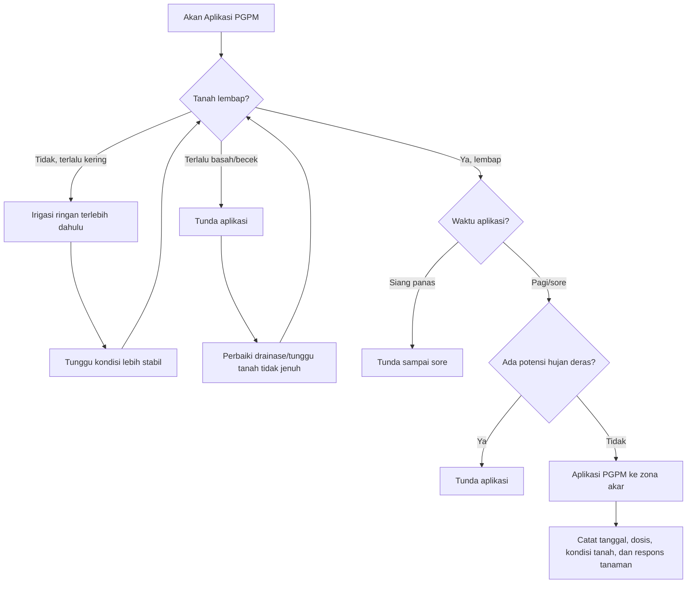

**Keterangan gambar:** PGPM sebaiknya diaplikasikan saat tanah lembap, bukan terlalu kering atau becek. Waktu terbaik adalah pagi atau sore, dan aplikasi sebaiknya ditunda bila ada potensi hujan deras.

---

## Tabel 5.2. Kondisi Waktu Aplikasi dan Keputusan Lapangan

| Kondisi Lapangan                 | Keputusan                | Alasan                     |
| -------------------------------- | ------------------------ | -------------------------- |
| Pagi, tanah lembap               | Aplikasi dapat dilakukan | Kondisi mendukung mikroba  |
| Sore, tanah lembap               | Aplikasi dapat dilakukan | Suhu lebih rendah          |
| Siang panas                      | Tunda                    | Risiko mikroba stres       |
| Tanah sangat kering              | Irigasi ringan dulu      | Mikroba sulit bertahan     |
| Tanah becek                      | Tunda                    | Oksigen rendah, akar stres |
| Menjelang hujan deras            | Tunda                    | Risiko PGPM tercuci        |
| Tanaman layu berat karena kering | Pulihkan air dulu        | Akar belum siap merespons  |

---

# 5.3 Kondisi Tanah dan Media

Tanah dan media adalah tempat utama PGPM bekerja. Pada budidaya cabai, sebagian besar PGPM diarahkan ke zona akar. Karena itu, kondisi tanah sangat menentukan keberhasilan aplikasi.

Tanah yang baik untuk PGPM bukan hanya tanah yang subur secara kimia, tetapi juga memiliki struktur baik, bahan organik cukup, drainase baik, kelembapan stabil, dan tidak mengandung residu bahan kimia berlebihan. Bila tanah terlalu padat, miskin bahan organik, tergenang, terlalu kering, atau memiliki akumulasi garam tinggi, PGPM akan sulit bekerja optimal.

---

## A. Bahan Organik Cukup

Bahan organik berperan sebagai penyangga kehidupan mikroba. Tanah dengan bahan organik cukup biasanya memiliki struktur lebih baik, kelembapan lebih stabil, dan aktivitas mikroba lebih tinggi. PGPM akan lebih mudah bertahan pada tanah yang memiliki bahan organik matang dibanding tanah yang miskin bahan organik.

Namun, bahan organik yang digunakan harus matang. Kompos atau pupuk kandang mentah dapat menimbulkan panas, bau, gas, atau membawa patogen. Pada cabai, penggunaan bahan organik mentah dapat meningkatkan risiko penyakit akar.

Ciri bahan organik matang:

- Tidak berbau busuk.
- Tidak panas saat digenggam.
- Warna lebih gelap dan stabil.
- Tekstur remah.
- Tidak banyak bahan kasar yang belum terurai.
- Tidak menarik banyak lalat.

Fungsi bahan organik bagi PGPM:

- Menyediakan habitat mikroba.
- Membantu menjaga kelembapan tanah.
- Memperbaiki struktur tanah.
- Mengurangi risiko tanah terlalu padat.
- Mendukung aktivitas biologis di rhizosfer.

---

## B. Drainase Baik

Drainase sangat penting dalam budidaya cabai. Cabai tidak menyukai kondisi tergenang. Tanah yang tergenang menyebabkan oksigen rendah, akar stres, dan penyakit tanah lebih mudah berkembang. PGPM juga tidak bekerja optimal pada kondisi anaerob.

Pada musim hujan, drainase menjadi faktor penentu keberhasilan aplikasi PGPM. Aplikasi mikroba pada tanah yang jenuh air sering tidak efektif karena akar tanaman sendiri sedang terganggu.

Ciri drainase baik:

- Air tidak menggenang lama setelah hujan.
- Bedengan tidak mudah becek.
- Parit antarbedengan berfungsi.
- Tanah tidak berbau anaerob.
- Akar tidak berwarna cokelat busuk.
- Tanaman tidak mudah layu meskipun tanah basah.

Perbaikan drainase dapat dilakukan dengan:

- Meninggikan bedengan.
- Membersihkan parit.
- Menghindari pemadatan tanah.
- Mengatur saluran keluar air.
- Mengurangi penyiraman berlebihan.
- Menggunakan bahan organik matang untuk memperbaiki struktur tanah.

---

## C. pH Tanah Sesuai

pH tanah mempengaruhi ketersediaan hara, aktivitas akar, dan kehidupan mikroba. Pada pH yang terlalu asam atau terlalu basa, beberapa unsur hara menjadi sulit tersedia, akar terganggu, dan aktivitas mikroba dapat menurun.

Untuk budidaya cabai, pH tanah yang mendekati netral umumnya lebih mendukung. Bila tanah terlalu masam, pengapuran dapat dipertimbangkan sebelum tanam. Bila tanah terlalu basa, perlu strategi pengelolaan bahan organik, pemupukan, dan sumber air yang lebih hati-hati.

Dampak pH ekstrem:

| Kondisi pH Tanah | Dampak pada Cabai dan PGPM                                                     |
| ---------------- | ------------------------------------------------------------------------------ |
| Terlalu asam     | Akar terganggu, beberapa unsur toksik meningkat, mikroba tertentu kurang aktif |
| Mendekati netral | Lebih mendukung akar, hara, dan mikroba                                        |
| Terlalu basa     | Beberapa unsur mikro sulit tersedia, respons tanaman dapat menurun             |

Catatan praktis:

- Pengukuran pH tanah sebaiknya dilakukan sebelum tanam.
- Koreksi pH dilakukan sebelum aplikasi PGPM intensif.
- Jangan mencampur bahan koreksi pH langsung dengan PGPM tanpa petunjuk jelas.
- Setelah pengapuran, beri waktu sebelum aplikasi PGPM agar kondisi tanah lebih stabil.

---

## D. Tanah Tidak Tergenang

Tanah tergenang merupakan salah satu kondisi paling merugikan bagi akar cabai. Pada kondisi tergenang, oksigen di zona akar menurun. Akar menjadi lemah, mudah busuk, dan lebih rentan terhadap patogen tanah.

PGPM tidak dapat menggantikan fungsi drainase. Bila lahan tergenang, prioritas pertama adalah mengeluarkan air dan memperbaiki saluran. Aplikasi PGPM baru dilakukan setelah kondisi tanah lebih stabil.

Urutan tindakan pada tanah tergenang:

1. Buang kelebihan air.
2. Perbaiki parit dan saluran.
3. Tunggu tanah tidak jenuh air.
4. Cek kondisi akar.
5. Lakukan aplikasi PGPM pemulihan bila akar masih layak.
6. Hindari pupuk pekat sampai tanaman pulih.

---

## E. Tanah Tidak Terlalu Kering

Tanah yang terlalu kering membuat akar cabai stres dan mikroba sulit bertahan. Pada musim kemarau, aplikasi PGPM harus selalu dikaitkan dengan pengelolaan air. PGPM sebaiknya diberikan setelah tanah dilembapkan, bukan sebelum irigasi besar yang berpotensi membawa larutan menjauh dari zona akar.

Ciri tanah terlalu kering:

- Tanah pecah atau berdebu.
- Tanaman layu pada siang hari dan lambat pulih.
- Pucuk melambat.
- Bunga mudah rontok.
- Respons terhadap pupuk rendah.
- Larutan kocor cepat hilang tanpa meresap merata.

Praktik yang disarankan:

- Irigasi ringan sebelum aplikasi PGPM.
- Gunakan mulsa bila tersedia.
- Aplikasi PGPM pada sore hari.
- Hindari pupuk pekat saat tanaman kekeringan.
- Jaga interval penyiraman lebih stabil.

---

## F. Hindari Akumulasi Garam dari Pupuk Pekat

Budidaya cabai intensif sering menggunakan pupuk kimia dalam frekuensi tinggi. Bila pupuk diberikan terlalu pekat atau drainase buruk, garam dapat menumpuk di zona akar. Akumulasi garam mengganggu penyerapan air, menekan akar, dan dapat membuat PGPM kurang nyaman.

Tanda kemungkinan stres garam:

- Ujung daun terbakar.
- Tanaman layu meskipun tanah lembap.
- Akar kecokelatan.
- Pertumbuhan melambat.
- Daun tampak kaku atau kusam.
- Respons terhadap pupuk semakin buruk.

Strategi mengurangi risiko akumulasi garam:

- Hindari pupuk terlalu pekat.
- Beri jeda antara pupuk kimia dan PGPM.
- Pastikan drainase baik.
- Gunakan bahan organik matang.
- Lakukan penyiraman cukup untuk menjaga kelembapan stabil.
- Evaluasi dosis pupuk bila tanaman menunjukkan gejala stres.

PGPM sebaiknya tidak diberikan bersamaan dengan larutan pupuk ber-EC tinggi. Bila pupuk kocor baru diberikan, PGPM dapat diaplikasikan 1–3 hari setelahnya, tergantung kondisi tanaman dan kelembapan tanah.

---

## Gambar 5.3. Kondisi Tanah yang Mendukung dan Menghambat PGPM

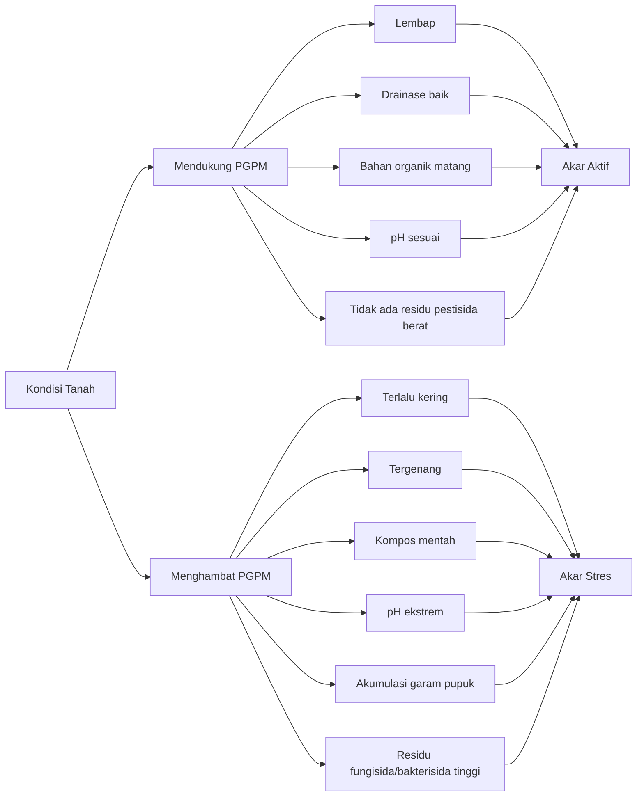

**Keterangan gambar:** PGPM lebih efektif pada tanah yang lembap, berdrainase baik, mengandung bahan organik matang, dan memiliki pH sesuai. Tanah terlalu kering, tergenang, mengandung kompos mentah, pH ekstrem, atau garam pupuk tinggi dapat menghambat kerja PGPM.

---

## Tabel 5.3. Checklist Kondisi Tanah dan Media Sebelum Aplikasi PGPM

| Faktor           | Kondisi Layak                                  | Tindakan Bila Tidak Layak                    |
| ---------------- | ---------------------------------------------- | -------------------------------------------- |
| Kelembapan tanah | Lembap, tidak becek                            | Irigasi ringan bila kering; tunda bila becek |
| Drainase         | Air tidak menggenang                           | Bersihkan parit dan saluran                  |
| Bahan organik    | Matang dan tidak busuk                         | Ganti atau matangkan bahan organik           |
| pH tanah         | Tidak ekstrem                                  | Koreksi pH sebelum tanam                     |
| Residu pestisida | Tidak baru terkena fungisida/bakterisida berat | Beri jeda aplikasi                           |
| Garam pupuk      | Tidak ada gejala stres garam                   | Kurangi pupuk pekat dan perbaiki penyiraman  |
| Media semai      | Remah, bersih, tidak terlalu basah             | Perbaiki komposisi media                     |

---

# Catatan Praktis untuk Petani dan Teknisi Lapang

Sebelum aplikasi PGPM, gunakan prinsip sederhana berikut:

**PGPM diberikan saat tanah lembap, air bersih, suhu tidak panas, tanaman tidak stres berat, dan tidak berdekatan dengan fungisida, bakterisida, tembaga, atau pupuk pekat.**

Prinsip ini lebih penting daripada sekadar menambah dosis. Dosis tinggi tidak akan banyak membantu bila kondisi aplikasi buruk. Sebaliknya, dosis sesuai label dengan kondisi aplikasi yang tepat sering memberikan hasil lebih konsisten.

---

## Tabel 5.4. Keputusan Cepat Sebelum Aplikasi PGPM

| Pertanyaan Lapangan                       | Jika Jawaban “Ya” | Keputusan               |
| ----------------------------------------- | ----------------- | ----------------------- |
| Apakah air berbau kaporit kuat?           | Ya                | Endapkan 12–24 jam      |
| Apakah air berbau pestisida/limbah?       | Ya                | Jangan digunakan        |
| Apakah tanah sangat kering?               | Ya                | Irigasi ringan dulu     |
| Apakah tanah becek/tergenang?             | Ya                | Tunda aplikasi          |
| Apakah cuaca siang panas?                 | Ya                | Tunda sampai sore       |
| Apakah akan hujan deras?                  | Ya                | Tunda aplikasi          |
| Apakah tanaman layu berat karena kering?  | Ya                | Pulihkan air dulu       |
| Apakah baru pakai fungisida/bakterisida?  | Ya                | Beri jeda sesuai risiko |
| Apakah baru pupuk kocor pekat?            | Ya                | Tunggu 1–3 hari         |
| Apakah alat bekas pestisida belum dicuci? | Ya                | Cuci bersih dulu        |

---

## Ringkasan Bab 5

Keberhasilan aplikasi PGPM sangat dipengaruhi oleh kualitas air, waktu aplikasi, serta kondisi tanah dan media. Air yang digunakan harus bersih, tidak berbau kaporit kuat, tidak panas, tidak tercemar pestisida atau limbah, dan memiliki pH yang tidak ekstrem. Bila menggunakan air PAM yang berbau kaporit, air sebaiknya diendapkan selama 12–24 jam sebelum digunakan.

Waktu aplikasi terbaik adalah pagi atau sore hari saat suhu lebih rendah. PGPM sebaiknya tidak diaplikasikan saat siang panas, sebelum hujan deras, pada tanah yang sangat kering, tanah becek, atau tanaman sedang stres berat akibat kekeringan. Tanah harus lembap agar mikroba dapat masuk dan bertahan di zona akar.

Kondisi tanah dan media juga menentukan hasil. Tanah yang mendukung PGPM adalah tanah dengan bahan organik cukup, drainase baik, pH sesuai, tidak tergenang, tidak terlalu kering, dan tidak mengalami akumulasi garam dari pupuk pekat. PGPM tidak dapat menggantikan drainase, bahan organik matang, pengelolaan air, atau koreksi pH. PGPM bekerja paling baik bila lingkungan akar memang layak untuk kehidupan mikroba dan pertumbuhan akar cabai.

---

# Bab 6. Standar Mutu, Penyimpanan, dan Perbanyakan PGPM

PGPM adalah produk berbasis mikroorganisme hidup. Karena itu, keberhasilannya sangat bergantung pada mutu produk, cara penyimpanan, umur simpan, cara aplikasi, dan kehati-hatian dalam perbanyakan. Produk PGPM yang terlihat normal belum tentu masih efektif. Sebaliknya, produk yang tampak aktif atau berbusa setelah difermentasi ulang belum tentu berisi mikroba yang benar.

Di lapangan, kegagalan PGPM sering terjadi bukan karena konsep PGPM tidak bekerja, tetapi karena beberapa hal berikut:

- Produk sudah lemah atau mati.
- Produk disimpan di tempat panas.
- Produk terkena sinar matahari langsung.
- Produk disimpan dekat pestisida.
- Produk dicampur dengan fungisida atau bakterisida.
- Produk diencerkan terlalu lama sebelum digunakan.
- Produk difermentasi ulang sembarangan.
- Konsorsium mikroba berubah komposisinya.
- Mikroba terkontaminasi organisme lain.

Bab ini membahas standar mutu produk PGPM, cara penyimpanan, prinsip umum perbanyakan, klasifikasi mikroba berdasarkan kelayakan diperbanyak di tingkat petani, serta batas aman perbanyakan agar tidak menimbulkan masalah baru di lahan.

---

## Gambar 6.1. Alur Kendali Mutu PGPM dari Produk sampai Aplikasi

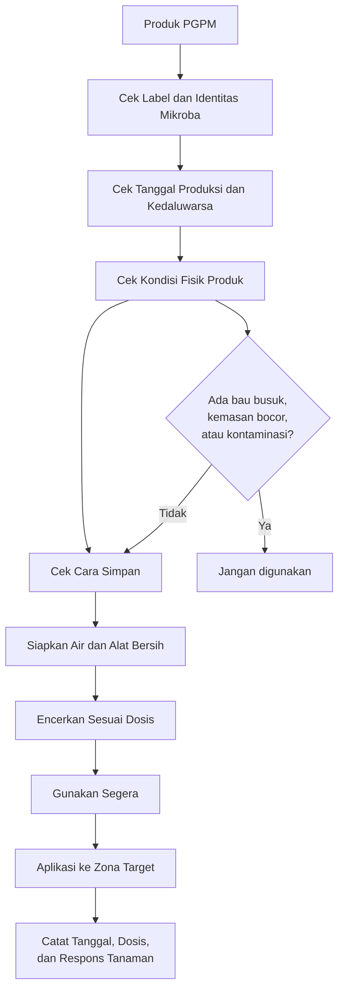

**Keterangan gambar:** Mutu PGPM perlu dikendalikan sejak produk diterima sampai diaplikasikan. Pemeriksaan label, kondisi fisik, cara simpan, air, alat, dan waktu penggunaan sangat menentukan keberhasilan aplikasi.

---

# 6.1 Informasi yang Harus Ada pada Produk PGPM

Produk PGPM yang baik harus memberikan informasi yang jelas kepada pengguna. Informasi ini penting agar petani dan teknisi lapang mengetahui mikroba apa yang digunakan, berapa dosisnya, bagaimana cara menyimpannya, serta apa saja batas kompatibilitasnya dengan input lain.

Produk yang hanya mencantumkan klaim umum seperti “mengandung mikroba penyubur tanaman” tanpa menyebutkan nama mikroba sebaiknya diperlakukan dengan hati-hati. Dalam penggunaan PGPM, identitas mikroba sangat penting karena setiap jenis mikroba memiliki fungsi, cara aplikasi, dan sensitivitas yang berbeda.

---

## A. Nama Mikroba

Label produk sebaiknya mencantumkan nama mikroba yang terkandung di dalamnya. Minimal, nama genus perlu disebutkan. Lebih baik lagi bila mencantumkan spesies.

Contoh:

- _Bacillus subtilis_
- _Bacillus velezensis_
- _Pseudomonas fluorescens_
- _Trichoderma harzianum_
- _Trichoderma asperellum_
- _Azotobacter_
- _Azospirillum_
- Mikoriza arbuskula

Nama mikroba membantu pengguna memahami fungsi produk. Misalnya, produk berbasis _Trichoderma_ lebih relevan untuk media, kompos, dan penyakit tanah. Produk berbasis PGPR lebih relevan untuk kocor akar dan pemulihan tanaman. Produk mikoriza harus ditempatkan dekat akar hidup.

---

## B. Strain Bila Tersedia

Strain adalah identitas yang lebih spesifik dari mikroba. Dua mikroba dengan spesies yang sama belum tentu memiliki kemampuan yang sama. Misalnya, dua isolat _Bacillus subtilis_ dapat berbeda dalam kemampuan melarutkan fosfat, menghasilkan metabolit, atau menekan patogen.

Bila produk mencantumkan strain, hal ini menjadi nilai tambah karena menunjukkan identitas produk lebih jelas. Namun, tidak semua produk komersial mencantumkan strain. Bila strain tidak dicantumkan, minimal nama mikroba dan fungsi produk harus jelas.

---

## C. Populasi Mikroba atau CFU

CFU adalah singkatan dari **Colony Forming Unit**, yaitu satuan yang digunakan untuk memperkirakan jumlah mikroba hidup yang mampu tumbuh. Pada produk PGPM, informasi populasi mikroba penting karena produk berbasis mikroba harus mengandung jumlah mikroba hidup yang cukup.

Contoh penulisan pada label:

- 10⁶ CFU/ml
- 10⁷ CFU/ml
- 10⁸ CFU/g

Semakin tinggi angka CFU tidak selalu otomatis lebih baik, tetapi produk harus memiliki populasi yang layak dan stabil sampai masa kedaluwarsa. Produk dengan populasi mikroba rendah, rusak, atau sudah melewati masa simpan berisiko tidak memberikan respons yang jelas di lapangan.

✓ Kotak Hitung 6.1. Menghitung Jumlah Mikroba Berdasarkan Label CFU

```text id="bab6-cfu-01"
Total mikroba hidup = konsentrasi CFU × volume atau berat produk
```

Contoh produk cair:

```text id="bab6-cfu-02"
Konsentrasi produk = 10^8 CFU/ml
Volume produk yang digunakan = 100 ml

Total mikroba hidup = 10^8 × 100
Total mikroba hidup = 10^10 CFU
```

Contoh ini hanya untuk memahami informasi label. Dalam praktik aplikasi, dosis tetap mengikuti petunjuk produk dan kondisi lapangan.

---

## D. Tanggal Produksi dan Tanggal Kedaluwarsa

PGPM memiliki umur simpan. Semakin lama produk disimpan, terutama dalam kondisi panas atau terkena sinar matahari, populasi mikroba dapat menurun. Karena itu, tanggal produksi dan tanggal kedaluwarsa harus diperhatikan.

Prinsip praktis:

- Pilih produk yang masih jauh dari tanggal kedaluwarsa.
- Jangan menggunakan produk yang sudah kedaluwarsa.
- Produk lama perlu lebih hati-hati, terutama bila penyimpanannya tidak jelas.
- Produk yang sudah dibuka sebaiknya digunakan sesuai anjuran produsen.

Tanggal kedaluwarsa bukan sekadar formalitas. Pada produk mikroba, masa simpan sangat berhubungan dengan viabilitas mikroba.

---

## E. Cara Simpan

Label produk harus mencantumkan cara penyimpanan. Informasi ini penting karena sebagian mikroba sensitif terhadap panas, sinar matahari, dan bahan kimia.

Cara simpan umum:

- Simpan di tempat teduh.
- Hindari panas langsung.
- Jangan terkena sinar matahari.
- Jangan simpan dekat pestisida.
- Tutup rapat setelah digunakan.
- Jangan simpan di tempat lembap ekstrem bila produk berbentuk padat.

Produk yang tidak mencantumkan cara penyimpanan membuat pengguna sulit menjaga mutu produk.

---

## F. Dosis Aplikasi

Produk PGPM harus mencantumkan dosis aplikasi yang jelas. Dosis bisa berbeda tergantung bentuk produk dan tujuan aplikasi.

Contoh dosis yang perlu dicantumkan:

- Dosis per liter air.
- Dosis per tanaman.
- Dosis per kilogram media.
- Dosis per hektare.
- Volume kocor per tanaman.
- Interval aplikasi.

Dosis yang tidak jelas dapat menyebabkan aplikasi terlalu rendah atau terlalu tinggi. Dosis terlalu rendah bisa tidak efektif, sedangkan dosis terlalu tinggi belum tentu memberi hasil lebih baik dan dapat memboroskan biaya.

---

## G. Kompatibilitas dengan Input Lain

Produk PGPM sebaiknya mencantumkan informasi kompatibilitas dengan pupuk, pestisida, fungisida, bakterisida, atau bahan lain. Informasi ini penting karena PGPM adalah mikroba hidup.

Informasi kompatibilitas yang ideal:

- Boleh atau tidak dicampur dengan pupuk tertentu.
- Jeda dengan fungisida.
- Jeda dengan bakterisida.
- Jeda dengan produk berbasis tembaga.
- Saran kualitas air.
- Larangan pencampuran dengan bahan tertentu.

Bila label tidak mencantumkan kompatibilitas, gunakan prinsip aman: **jangan campur PGPM dengan fungisida, bakterisida, tembaga, herbisida, atau larutan pupuk pekat.**

---

## H. Nomor Izin Edar Bila Produk Komersial

Produk komersial sebaiknya memiliki nomor izin edar sesuai ketentuan yang berlaku. Nomor izin edar menunjukkan bahwa produk tersebut masuk dalam pengawasan administratif. Meski izin edar tidak selalu menjamin hasil lapangan, keberadaannya menjadi salah satu indikator bahwa produk memiliki identitas yang lebih jelas.

Petani dan pelaku usaha sebaiknya lebih berhati-hati terhadap produk tanpa identitas produsen, tanpa komposisi mikroba, tanpa tanggal produksi, dan tanpa petunjuk penggunaan.

---

## Tabel 6.1. Checklist Label Produk PGPM

| Informasi pada Label |             Harus Ada? | Fungsi Praktis                 |
| -------------------- | ---------------------: | ------------------------------ |
| Nama mikroba         |                     Ya | Mengetahui fungsi utama produk |
| Strain               |          Bila tersedia | Menilai spesifisitas produk    |
| Populasi/CFU         |                     Ya | Menilai jumlah mikroba hidup   |
| Tanggal produksi     |                     Ya | Menilai umur produk            |
| Tanggal kedaluwarsa  |                     Ya | Menghindari produk lemah/mati  |
| Cara simpan          |                     Ya | Menjaga viabilitas mikroba     |
| Dosis aplikasi       |                     Ya | Mencegah salah dosis           |
| Kompatibilitas       |      Sangat dianjurkan | Mencegah pencampuran berisiko  |
| Nomor izin edar      | Untuk produk komersial | Indikator legalitas produk     |

---

# 6.2 Ciri Produk PGPM yang Baik

Selain membaca label, pengguna perlu memeriksa kondisi fisik produk. Pemeriksaan fisik tidak dapat menggantikan uji laboratorium, tetapi dapat membantu mendeteksi produk yang rusak, tercemar, atau tidak layak pakai.

Produk PGPM yang baik umumnya memiliki kondisi fisik sesuai karakter produk, kemasan baik, tidak berbau busuk menyengat, tidak menggumpal abnormal, dan tidak menunjukkan kontaminasi yang mencurigakan.

---

## A. Tidak Berbau Busuk Menyengat

Sebagian produk mikroba memang memiliki aroma khas fermentasi atau aroma media. Namun, bau busuk menyengat, bau bangkai, bau telur busuk, atau bau limbah adalah tanda yang perlu diwaspadai.

Bau busuk dapat menunjukkan:

- Kontaminasi mikroba tidak diinginkan.
- Fermentasi anaerob yang tidak terkendali.
- Produk rusak.
- Media pembawa membusuk.
- Penyimpanan tidak tepat.

Bila produk berbau sangat menyimpang dari karakter normalnya, sebaiknya jangan digunakan.

---

## B. Tidak Menggumpal Abnormal

Produk padat dapat memiliki tekstur tertentu sesuai formulasi. Namun, penggumpalan keras, berlendir, basah tidak merata, atau berubah menjadi massa busuk perlu diwaspadai.

Kemungkinan penyebab:

- Produk terkena air.
- Penyimpanan terlalu lembap.
- Kontaminasi.
- Kemasan bocor.
- Produk sudah rusak.

Untuk produk cair, perubahan ekstrem seperti endapan busuk, lapisan lendir tidak normal, gas berlebihan, atau pemisahan fase yang tidak sesuai petunjuk perlu diperhatikan.

---

## C. Tidak Terkontaminasi Jamur Liar Berlebihan

Pada produk fungi seperti _Trichoderma_, warna hijau dapat menjadi ciri umum pertumbuhan spora. Namun, munculnya jamur liar berwarna hitam, merah, oranye, atau pertumbuhan jamur tidak seragam yang disertai bau busuk perlu diwaspadai.

Kontaminasi dapat menurunkan efektivitas produk dan berisiko membawa mikroba yang tidak diinginkan ke media tanam.

Prinsip praktis:

- Kenali warna dan aroma normal produk.
- Jangan gunakan produk dengan jamur liar mencurigakan.
- Jangan gunakan produk yang berlendir dan berbau busuk.
- Jangan campur produk terkontaminasi ke media semai.

---

## D. Kemasan Tidak Bocor

Kemasan yang bocor dapat menyebabkan kontaminasi, kehilangan kelembapan, masuknya udara berlebihan, atau kerusakan produk. Untuk produk cair, kebocoran juga dapat mengubah konsentrasi dan meningkatkan risiko kontaminasi.

Produk dengan kemasan bocor sebaiknya tidak digunakan, terutama untuk aplikasi pada benih, media semai, atau bibit muda.

---

## E. Kemasan Tidak Menggembung

Kemasan menggembung dapat menunjukkan produksi gas berlebihan akibat fermentasi tidak terkendali atau kontaminasi. Pada produk tertentu, sedikit tekanan mungkin terjadi sesuai karakter formulasi, tetapi kemasan menggembung ekstrem perlu diwaspadai.

Tanda bahaya:

- Botol menggembung keras.
- Tutup terasa sangat bertekanan.
- Produk menyembur saat dibuka.
- Bau busuk keluar saat kemasan dibuka.
- Ada buih berlebihan yang tidak normal.

Bila ragu, jangan gunakan produk tersebut pada tanaman utama.

---

## F. Warna dan Aroma Sesuai Karakter Produk

Setiap produk memiliki karakter fisik yang berbeda. Produk _Trichoderma_ padat berbeda dengan PGPR cair. Produk mikoriza granular berbeda dengan pupuk hayati cair. Karena itu, pengguna perlu membaca petunjuk produsen atau mengenali karakter normal produk.

Contoh umum:

- Produk _Trichoderma_ padat dapat berwarna kehijauan bila sporulasi baik.
- Produk bakteri cair dapat memiliki aroma fermentasi ringan.
- Produk mikoriza granular biasanya berupa pembawa padat berisi propagul.
- Produk yang berlendir busuk atau berbau limbah tidak layak digunakan.

---

## G. Instruksi Penggunaan Jelas

Produk yang baik harus memiliki instruksi penggunaan yang jelas. Instruksi ini membantu mengurangi kesalahan aplikasi.

Instruksi minimal:

- Dosis.
- Cara melarutkan.
- Waktu aplikasi.
- Target aplikasi.
- Cara simpan.
- Masa simpan setelah dibuka.
- Larangan pencampuran.
- Jeda dengan pestisida tertentu.

Produk dengan klaim besar tetapi instruksi tidak jelas sebaiknya digunakan dengan sangat hati-hati.

---

## Tabel 6.2. Ciri Produk PGPM Layak dan Tidak Layak

| Aspek          | Produk Layak             | Produk Tidak Layak                        |
| -------------- | ------------------------ | ----------------------------------------- |
| Aroma          | Khas produk, tidak busuk | Busuk menyengat, bau limbah               |
| Kemasan        | Utuh, tidak bocor        | Bocor, rusak, menggembung ekstrem         |
| Tekstur        | Sesuai formulasi         | Berlendir, menggumpal abnormal            |
| Warna          | Sesuai karakter produk   | Berubah ekstrem atau kontaminasi mencolok |
| Label          | Lengkap dan jelas        | Tidak ada identitas mikroba/dosis         |
| Kedaluwarsa    | Masih berlaku            | Lewat kedaluwarsa                         |
| Petunjuk pakai | Jelas                    | Tidak jelas atau hanya klaim umum         |

---

# 6.3 Penyimpanan PGPM

Penyimpanan menentukan umur dan efektivitas PGPM. Produk yang baik dapat rusak bila disimpan sembarangan. Karena PGPM adalah mikroba hidup, perlakuannya berbeda dari pupuk kimia biasa.

Kesalahan penyimpanan yang sering terjadi:

- Produk ditaruh di bawah sinar matahari.
- Produk disimpan di gudang panas.
- Produk diletakkan dekat pestisida.
- Produk terbuka setelah digunakan.
- Produk cair dibiarkan dalam tangki terlalu lama.
- Produk padat terkena air atau lembap.
- Produk dibawa di kendaraan terbuka saat panas.

---

## A. Simpan di Tempat Teduh

Produk PGPM sebaiknya disimpan di tempat teduh, sejuk, dan tidak terkena panas langsung. Ruang penyimpanan tidak harus berpendingin khusus, kecuali label produk mensyaratkan demikian, tetapi harus terlindung dari suhu ekstrem.

Tempat yang dianjurkan:

- Rak gudang teduh.
- Ruang penyimpanan bersih.
- Lemari khusus input hayati.
- Area terpisah dari pestisida.

Tempat yang perlu dihindari:

- Di atas bedengan.
- Di dalam kendaraan panas.
- Dekat mesin atau sumber panas.
- Di bawah atap seng yang sangat panas.
- Terkena sinar matahari langsung.

---

## B. Hindari Panas Langsung dan Sinar Matahari

Panas dan sinar matahari dapat menurunkan viabilitas mikroba. Sinar UV juga dapat merusak mikroba tertentu. Produk cair lebih rentan mengalami perubahan bila sering terkena panas.

Prinsip praktis:

- Jangan menjemur produk PGPM.
- Jangan meninggalkan botol PGPM di pinggir lahan saat siang.
- Tutup kembali produk setelah digunakan.
- Bawa produk ke lahan secukupnya.
- Hindari menyimpan produk di bak kendaraan terbuka.

---

## C. Jangan Simpan Dekat Pestisida

PGPM sebaiknya tidak disimpan dekat pestisida, terutama fungisida, bakterisida, herbisida, dan bahan berbasis tembaga. Risiko kontaminasi uap, tumpahan, atau salah campur lebih tinggi bila disimpan berdekatan.

Prinsip penyimpanan:

- Pisahkan rak PGPM dari pestisida.
- Gunakan label yang jelas.
- Jangan menggunakan tutup atau alat ukur bekas pestisida.
- Jangan menyimpan PGPM di kardus bekas pestisida.
- Jangan memindahkan PGPM ke botol bekas pestisida.

---

## D. Tutup Rapat Setelah Digunakan

Produk yang sudah dibuka lebih rentan terkontaminasi. Setelah digunakan, kemasan harus ditutup rapat. Untuk produk padat, hindari masuknya air atau kelembapan berlebihan. Untuk produk cair, hindari memasukkan alat ukur kotor ke dalam kemasan.

Praktik yang disarankan:

- Tuang produk secukupnya.
- Jangan mencelupkan alat kotor ke botol utama.
- Tutup segera setelah digunakan.
- Simpan kembali di tempat teduh.
- Catat tanggal pembukaan bila perlu.

---

## E. Gunakan Segera Setelah Diencerkan

Larutan PGPM yang sudah diencerkan sebaiknya segera digunakan. Setelah dicampur air, kondisi lingkungan mikroba berubah. Bila larutan dibiarkan terlalu lama, populasi mikroba dapat berubah, oksigen berkurang, kontaminasi meningkat, atau efektivitas menurun.

Prinsip praktis:

- Campur PGPM hanya sesuai kebutuhan hari itu.
- Jangan menyimpan larutan PGPM semalaman dalam tangki.
- Jangan meninggalkan larutan di bawah matahari.
- Jangan mencampur larutan PGPM dengan bahan lain tanpa petunjuk.
- Bersihkan tangki setelah aplikasi.

---

## Tabel 6.3. Panduan Penyimpanan PGPM

| Hal yang Dilakukan              | Status     | Alasan                              |
| ------------------------------- | ---------- | ----------------------------------- |
| Simpan di tempat teduh          | Dianjurkan | Menjaga mikroba tetap hidup         |
| Simpan dekat pestisida          | Dihindari  | Risiko kontaminasi                  |
| Terkena matahari langsung       | Dihindari  | Menurunkan viabilitas mikroba       |
| Tutup rapat setelah dibuka      | Wajib      | Mencegah kontaminasi                |
| Larutan encer digunakan segera  | Wajib      | Menghindari penurunan mutu          |
| Simpan di botol bekas pestisida | Dilarang   | Risiko residu kimia                 |
| Produk padat terkena lembap     | Dihindari  | Risiko kontaminasi dan penggumpalan |

---

# 6.4 Prinsip Umum Perbanyakan PGPM

Perbanyakan PGPM adalah topik yang sering menarik perhatian petani karena dianggap dapat menekan biaya. Namun, perbanyakan mikroba tidak boleh disamakan dengan membuat pupuk cair biasa. Tidak semua PGPM bisa diperbanyak di tingkat petani. Tidak semua produk yang difermentasi ulang tetap berisi mikroba yang sama. Produk yang tampak hidup, berbusa, atau berbau fermentasi belum tentu mengandung mikroba yang benar.

Prinsip utama yang harus dipegang:

**Perbanyakan PGPM hanya layak dilakukan bila jenis mikroba jelas, starter jelas, media sesuai, kebersihan terjaga, dan hasilnya digunakan secara hati-hati.**

Perbanyakan sembarangan dapat menyebabkan kontaminasi. Kontaminasi ini dapat berasal dari air, wadah, udara, bahan organik, tangan, alat, atau lingkungan sekitar. Bila mikroba kontaminan tumbuh lebih dominan, fungsi produk awal dapat berubah total.

---

## A. Tidak Semua PGPM Bisa Diperbanyak Petani

Beberapa mikroba relatif lebih mudah diperbanyak dengan kontrol sederhana, misalnya _Trichoderma_ pada media padat atau _Bacillus_ dengan starter jelas. Namun, mikroba lain membutuhkan kontrol lebih baik, seperti _Pseudomonas_, _Azospirillum_, _Streptomyces_, endofit, dan mikoriza.

Mikoriza tidak bisa diperbanyak seperti bakteri cair biasa. Mikoriza arbuskula membutuhkan tanaman inang dan sistem perbanyakan khusus. Karena itu, klaim perbanyakan mikoriza dengan fermentasi cair sederhana perlu dicermati.

---

## B. Perbanyakan Sembarangan Menyebabkan Kontaminasi

Kontaminasi adalah risiko terbesar dalam perbanyakan PGPM. Kontaminasi dapat menyebabkan produk berubah fungsi, berbau busuk, menurunkan efektivitas, atau bahkan membawa mikroba yang merugikan.

Sumber kontaminasi umum:

- Air tidak bersih.
- Wadah bekas pestisida.
- Media tidak matang.
- Alat tidak bersih.
- Starter tidak jelas.
- Fermentasi terlalu lama.
- Kondisi anaerob.
- Penyimpanan panas.
- Campuran terlalu banyak jenis mikroba.

---

## C. Produk yang Tampak “Hidup” Belum Tentu Benar

Busa, gas, bau fermentasi, atau perubahan warna tidak membuktikan bahwa mikroba target tumbuh. Banyak mikroba liar juga dapat menghasilkan gas, busa, dan aroma fermentasi. Karena itu, indikator visual hanya dapat digunakan sebagai peringatan awal, bukan bukti mutu.

Tanda aktivitas yang tidak selalu berarti baik:

- Larutan berbusa.
- Botol menggembung.
- Bau asam atau alkohol.
- Endapan tebal.
- Warna berubah.
- Ada lapisan di permukaan.

Tanpa pengujian, tidak bisa dipastikan mikroba mana yang dominan.

---

## D. Konsorsium Campuran Tidak Selalu Stabil

Konsorsium adalah campuran beberapa mikroba. Bila konsorsium difermentasi ulang sembarangan, mikroba yang paling cepat tumbuh dapat mendominasi. Mikroba lain bisa menurun atau hilang. Akibatnya, produk hasil perbanyakan tidak lagi sama dengan produk awal.

Contoh risiko:

- _Bacillus_ mendominasi dan menekan mikroba lain.
- Fungi tidak tumbuh baik dalam media cair.
- Mikroba sensitif kalah oleh kontaminan.
- Fungsi pelarut P atau K menurun.
- Produk menjadi tidak konsisten antar batch.

Karena itu, konsorsium campuran sebaiknya tidak diperbanyak ulang tanpa kontrol.

---

## E. Faktor yang Harus Diperhatikan dalam Perbanyakan

Bila perbanyakan dilakukan, faktor berikut harus diperhatikan:

| Faktor              | Fungsi                      | Risiko Bila Diabaikan      |
| ------------------- | --------------------------- | -------------------------- |
| Starter murni/jelas | Menjamin mikroba awal benar | Mikroba target tidak jelas |
| Media               | Menyediakan nutrisi         | Kontaminan bisa dominan    |
| Kebersihan          | Menekan kontaminasi         | Produk busuk/tercemar      |
| Aerasi              | Mendukung mikroba aerob     | Fermentasi anaerob         |
| Suhu                | Menjaga pertumbuhan stabil  | Mikroba stres/mati         |
| Lama inkubasi       | Menghindari over-fermentasi | Produk berubah dan rusak   |
| Aroma               | Indikator awal mutu         | Bau busuk tanda bahaya     |
| Kontaminasi         | Menjaga fungsi produk       | Efektivitas turun          |
| Daya simpan         | Menentukan penggunaan       | Produk cepat rusak         |

---

## Gambar 6.2. Risiko Perbanyakan PGPM Tanpa Kontrol

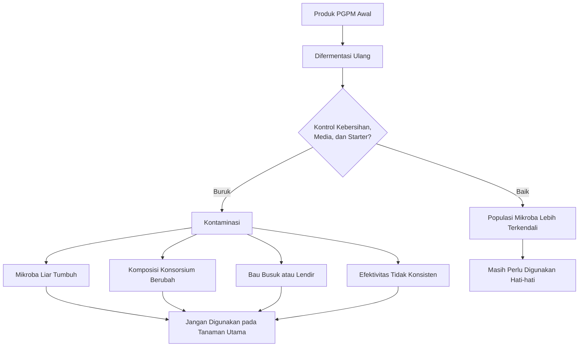

**Keterangan gambar:** Perbanyakan PGPM tanpa kontrol dapat mengubah komposisi mikroba dan meningkatkan risiko kontaminasi. Produk hasil perbanyakan tidak otomatis sama dengan produk awal.

---

# 6.5 Klasifikasi PGPM Berdasarkan Kelayakan Perbanyakan di Tingkat Petani

Tidak semua jenis PGPM memiliki tingkat risiko yang sama bila diperbanyak. Beberapa relatif memungkinkan dilakukan di tingkat petani dengan kontrol sederhana, beberapa membutuhkan fasilitas semi-lab, dan beberapa sebaiknya hanya dilakukan oleh produsen atau laboratorium.

Tabel berikut digunakan sebagai panduan praktis.

| Jenis PGPM          |       Kelayakan Diperbanyak Petani | Catatan Praktis                                                                                 |
| ------------------- | ---------------------------------: | ----------------------------------------------------------------------------------------------- |
| _Trichoderma_       |      Bisa dengan kontrol sederhana | Cocok pada media padat seperti beras, jagung, atau kompos matang; harus dijaga dari kontaminasi |
| _Bacillus_          |                       Relatif bisa | Lebih tahan karena membentuk spora; tetap membutuhkan starter baik                              |
| _Pseudomonas_       |             Sebaiknya semi-lab/lab | Lebih rentan kontaminasi                                                                        |
| _Azotobacter_       |                      Bisa semi-lab | Perlu aerasi dan media yang baik                                                                |
| _Azospirillum_      |             Sebaiknya semi-lab/lab | Lebih sensitif terhadap kondisi media                                                           |
| PSB                 |  Bisa, tetapi perlu kontrol isolat | Banyak mikroba bisa tumbuh, belum tentu efektif melarutkan P                                    |
| KSB                 |            Sebaiknya produk teruji | Efektivitas sangat tergantung strain                                                            |
| Mikoriza            | Tidak bisa difermentasi cair biasa | Harus diperbanyak dengan tanaman inang atau trap culture                                        |
| _Streptomyces_      |                      Sebaiknya lab | Perlu kontrol media dan identifikasi                                                            |
| Endofit             |                      Sebaiknya lab | Risiko salah mikroba tinggi                                                                     |
| Konsorsium campuran |     Jangan diperbanyak sembarangan | Komposisi mikroba bisa berubah total                                                            |

---

## Cara Membaca Tabel

Tabel ini bukan larangan mutlak untuk belajar produksi mikroba, tetapi merupakan panduan risiko. Untuk petani, tujuan utama bukan menjadi produsen mikroba, melainkan menggunakan PGPM secara aman dan efektif. Bila perbanyakan dilakukan tanpa kontrol, risiko kegagalan di lahan bisa lebih mahal daripada penghematan biaya produk.

Kategori “bisa” tetap berarti harus ada kontrol kebersihan, starter jelas, media layak, dan penggunaan segera. Kategori “semi-lab/lab” berarti membutuhkan kontrol lebih baik, seperti alat bersih, prosedur lebih rapi, dan kemampuan memeriksa mutu. Kategori “jangan diperbanyak sembarangan” berarti risikonya tinggi bila dilakukan hanya dengan mencampur bahan dan menunggu fermentasi.

---

# 6.6 Metode Perbanyakan Praktis Berdasarkan Jenis PGPM

Bagian ini menjelaskan metode umum perbanyakan PGPM berdasarkan jenis mikroba. Penjelasan dibuat sebagai panduan kehati-hatian, bukan sebagai standar produksi laboratorium. Untuk produksi komersial, perbanyakan harus mengikuti standar mutu, perizinan, dan pengujian yang sesuai.

Prinsip penting: **jangan memperbanyak mikroba dari tanaman sakit, bahan busuk, atau sumber yang tidak jelas. Gunakan starter yang identitasnya jelas dan hindari kultivasi mikroba yang tidak diketahui.**

---

## 6.6.1 Dasar Sistem Perbanyakan PGPM

Perbanyakan PGPM perlu dibedakan berdasarkan sistem medianya. Secara praktis, ada dua sistem utama yang sering digunakan, yaitu **perbanyakan padat** dan **perbanyakan cair**. Di lapangan, perbanyakan cair sering disebut fermentasi cair atau bio-reaktor, meskipun secara teknis tidak semua wadah fermentasi cair dapat disebut bio-reaktor.

Perbedaan sistem ini penting karena setiap jenis mikroba memiliki kebutuhan yang berbeda. _Trichoderma_ lebih cocok diperbanyak pada media padat yang lembap dan beraerasi. _Bacillus_ relatif lebih fleksibel karena dapat diperbanyak pada media cair atau padat dengan kontrol yang baik. _Pseudomonas_, _Azotobacter_, _Azospirillum_, PSB, dan KSB umumnya membutuhkan sistem cair yang lebih terkendali. Mikoriza berbeda sama sekali karena tidak dapat diperbanyak dengan fermentasi cair biasa dan membutuhkan tanaman inang.

Kesalahan yang sering terjadi di lapangan adalah menganggap semua mikroba dapat diperbanyak dengan cara yang sama: dimasukkan ke jerigen, diberi molase, ditutup rapat, lalu ditunggu sampai berbusa. Cara seperti ini berisiko tinggi karena tidak semua PGPM cocok dalam kondisi tertutup dan rendah oksigen. Produk yang berbusa atau menghasilkan gas belum tentu mengandung mikroba target yang diinginkan.

Prinsip utama:

**Metode perbanyakan harus mengikuti karakter mikroba, bukan mengikuti kebiasaan fermentasi umum.**

---

## 6.6.2 Fermentasi Padat

Fermentasi padat adalah perbanyakan mikroba pada media padat atau semi-padat yang lembap, tetapi tidak becek. Media padat menyediakan permukaan tumbuh bagi mikroba, terutama fungi yang membentuk miselium dan spora.


Fermentasi padat lebih cocok untuk:

- _Trichoderma_.
- Beberapa fungi pelarut fosfat seperti _Aspergillus_ dan _Penicillium_.
- Beberapa aktinomisetes tertentu dalam kondisi lebih terkontrol.
- Inokulasi kompos matang.

Media yang dapat digunakan antara lain:

- Beras.
- Jagung giling.
- Dedak atau bekatul yang dikondisikan bersih.
- Kompos matang terkontrol.
- Carrier padat lain yang sesuai.


Prinsip fermentasi padat:

- Media harus lembap, bukan basah.
- Media harus tetap memiliki ruang udara.
- Proses membutuhkan oksigen.
- Wadah tidak boleh menciptakan kondisi anaerob ekstrem.
- Media tidak boleh berbau busuk.
- Media tidak boleh berlendir.
- Kontaminasi jamur liar harus dihindari.
- Hasil perbanyakan sebaiknya segera digunakan.

Kelembapan menjadi titik kritis. Media yang terlalu kering membuat mikroba sulit tumbuh. Sebaliknya, media yang terlalu basah akan mengurangi ruang udara dan mendorong kondisi anaerob. Pada kondisi anaerob, risiko bau busuk, lendir, dan kontaminasi meningkat.

### Tabel 6.6A. Ciri Fermentasi Padat yang Baik dan Buruk

| Aspek      | Kondisi Baik                    | Kondisi Buruk                       |
| ---------- | ------------------------------- | ----------------------------------- |
| Kelembapan | Lembap, tidak becek             | Terlalu basah atau berlendir        |
| Aroma      | Khas media/mikroba, tidak busuk | Busuk, asam menyengat, bau bangkai  |
| Aerasi     | Ada ruang udara                 | Tertutup rapat dan anaerob          |
| Warna      | Sesuai karakter mikroba         | Jamur liar hitam/merah dominan      |
| Tekstur    | Remah, tidak menggumpal busuk   | Menggumpal basah dan berlendir      |
| Penggunaan | Segera digunakan                | Disimpan terlalu lama tanpa kontrol |

---

## 6.6.3 Fermentasi Cair dan Bio-reaktor

Fermentasi cair adalah perbanyakan mikroba dalam media cair. Sistem ini sering digunakan untuk bakteri PGPM seperti _Bacillus_, _Pseudomonas_, _Azotobacter_, _Azospirillum_, PSB, dan KSB. Namun, fermentasi cair membutuhkan kontrol yang lebih baik dibanding sekadar mencampur bahan dalam jerigen tertutup.


Di tingkat lapangan, istilah bio-reaktor sering digunakan untuk wadah fermentasi cair. Namun, secara praktis perlu ditegaskan:

**Bio-reaktor bukan sekadar jerigen tertutup. Bio-reaktor idealnya memiliki aerasi, pengadukan, kebersihan, dan kontrol proses yang memadai.**


Bio-reaktor sederhana untuk PGPM cair minimal harus memperhatikan:

- Starter mikroba jelas.
- Air bersih.
- Media nutrisi sesuai.
- Wadah bersih.
- Aerasi cukup.
- Pengadukan atau sirkulasi.
- Suhu tidak ekstrem.
- Lama proses tidak berlebihan.
- Tidak berbau busuk.
- Tidak tercampur pestisida atau pupuk pekat.
- Digunakan segera setelah siap.

Fermentasi cair tanpa aerasi cenderung mengarah ke kondisi anaerob, terutama bila wadah ditutup rapat. Kondisi ini tidak cocok untuk banyak PGPM akar yang membutuhkan oksigen. Akibatnya, mikroba target bisa kalah oleh mikroba liar yang lebih tahan kondisi anaerob.

### Perbedaan Fermentasi Cair Sederhana dan Bio-reaktor

| Aspek              | Fermentasi Cair Sederhana | Bio-reaktor yang Lebih Baik         |
| ------------------ | ------------------------- | ----------------------------------- |
| Wadah              | Ember, drum, jerigen      | Wadah dengan aerasi/sirkulasi       |
| Aerasi             | Sering tidak ada          | Ada aerasi atau pengadukan          |
| Kontrol suhu       | Umumnya tidak ada         | Lebih diperhatikan                  |
| Kontrol pH         | Jarang dilakukan          | Dapat dipantau                      |
| Risiko kontaminasi | Tinggi                    | Lebih rendah bila prosedur baik     |
| Kesesuaian PGPM    | Terbatas                  | Lebih sesuai untuk bakteri tertentu |
| Mutu hasil         | Tidak konsisten           | Lebih konsisten                     |

Catatan penting:

**Jerigen tertutup yang menggembung bukan tanda bio-reaktor berhasil. Itu bisa menjadi tanda produksi gas akibat fermentasi liar atau kontaminasi.**

---

## 6.6.4 Aerob, Fakultatif, Mikroaerofilik, dan Anaerob

Kebutuhan oksigen adalah faktor penting dalam perbanyakan PGPM. Banyak PGPM yang digunakan pada cabai bekerja di zona akar yang relatif membutuhkan oksigen. Tanah yang terlalu becek dan anaerob justru membuat akar cabai stres. Karena itu, perbanyakan PGPM akar umumnya lebih aman diarahkan ke sistem **aerob** atau minimal tidak anaerob ekstrem.

### Aerob

Mikroba aerob membutuhkan oksigen untuk tumbuh optimal. Contohnya banyak fungi seperti _Trichoderma_, serta bakteri seperti _Azotobacter_ dan banyak _Pseudomonas_.

Implikasi praktis:

- Membutuhkan aerasi.
- Tidak cocok dalam wadah tertutup rapat tanpa oksigen.
- Media tidak boleh terlalu becek.
- Bau busuk adalah tanda bahaya.

### Fakultatif

Mikroba fakultatif dapat bertahan pada kondisi dengan oksigen maupun oksigen rendah, tetapi performanya tetap tergantung jenis mikroba dan tujuan perbanyakan. Beberapa _Bacillus_ relatif lebih toleran, tetapi tetap lebih aman diperbanyak dalam kondisi cukup oksigen.

Implikasi praktis:

- Lebih fleksibel.
- Tetap perlu kebersihan.
- Kondisi anaerob busuk tetap harus dihindari.
- Jangan menjadikan ketahanan mikroba sebagai alasan untuk fermentasi sembarangan.

### Mikroaerofilik

Mikroba mikroaerofilik membutuhkan oksigen rendah, bukan tanpa oksigen sama sekali. Beberapa _Azospirillum_ sering dikaitkan dengan kondisi seperti ini. Mikroba kelompok ini lebih sensitif dan tidak ideal untuk perbanyakan kasar di tingkat petani.

Implikasi praktis:

- Lebih cocok semi-lab/lab.
- Perlu media dan kondisi khusus.
- Tidak ideal dalam jerigen tertutup sembarangan.
- Aktivasi lapangan sebaiknya mengikuti petunjuk produsen.

### Anaerob

Mikroba anaerob tumbuh tanpa oksigen. Sistem anaerob umum ditemukan pada beberapa fermentasi organik tertentu, tetapi tidak otomatis cocok untuk PGPM spesifik akar cabai. Banyak PGPM penting seperti _Trichoderma_, _Pseudomonas_, _Azotobacter_, dan mikoriza tidak diperbanyak dengan sistem anaerob tertutup.

Implikasi praktis:

- Tidak menjadi metode utama untuk PGPM akar cabai.
- Berisiko menghasilkan bau busuk bila proses tidak terkendali.
- Dapat mendorong pertumbuhan mikroba liar.
- Tidak boleh dijadikan patokan keberhasilan PGPM hanya karena ada gas atau busa.

### Tabel 6.6B. Kebutuhan Oksigen Beberapa PGPM

| Jenis PGPM          | Kebutuhan Oksigen Umum             | Sistem Lebih Sesuai                | Catatan Praktis                                 |
| ------------------- | ---------------------------------- | ---------------------------------- | ----------------------------------------------- |
| _Trichoderma_       | Aerob                              | Fermentasi padat                   | Media lembap, berpori, tidak becek              |
| _Bacillus_          | Umumnya aerob/fakultatif           | Cair beraerasi atau padat          | Relatif tahan, tetapi tetap perlu starter jelas |
| _Pseudomonas_       | Umumnya aerob                      | Cair terkontrol/semi-lab           | Rentan kontaminasi                              |
| _Azotobacter_       | Aerob kuat                         | Cair beraerasi/semi-lab            | Tidak cocok anaerob                             |
| _Azospirillum_      | Mikroaerofilik/fakultatif tertentu | Semi-lab/lab                       | Sensitif terhadap kondisi media                 |
| PSB                 | Tergantung isolat                  | Cair/padat terkontrol              | Fungsi pelarut P harus jelas                    |
| KSB                 | Tergantung strain                  | Produk teruji/semi-lab             | Sulit dinilai dari aroma atau warna             |
| _Streptomyces_      | Aerob                              | Padat/semi-lab/lab                 | Perlu kontrol media                             |
| Mikoriza            | Simbiotik dengan akar hidup        | Trap culture tanaman inang         | Tidak bisa fermentasi cair biasa                |
| Endofit             | Tergantung isolat                  | Lab/semi-lab                       | Risiko salah mikroba tinggi                     |
| Konsorsium campuran | Campuran kebutuhan berbeda         | Tidak disarankan diperbanyak ulang | Komposisi mudah berubah                         |

---

## 6.6.5 Aktivasi, Perbanyakan Terbatas, dan Produksi

Dalam praktik PGPM, perlu dibedakan antara **aktivasi**, **perbanyakan terbatas**, dan **produksi**. Ketiganya sering dianggap sama, padahal tingkat risikonya berbeda.

### Aktivasi

Aktivasi adalah menyiapkan produk PGPM sebelum aplikasi sesuai petunjuk produsen. Aktivasi biasanya berlangsung singkat dan tidak dimaksudkan untuk mengubah komposisi mikroba secara besar-besaran.

Contoh:

- Melarutkan PGPM sesuai dosis.
- Menggunakan air bersih.
- Menunggu sesuai petunjuk bila diminta.
- Segera mengaplikasikan ke tanaman.

Aktivasi relatif aman bila mengikuti label produk.

### Perbanyakan Terbatas

Perbanyakan terbatas adalah upaya memperbanyak mikroba tertentu dengan starter jelas, media sesuai, dan kontrol sederhana. Ini masih mungkin dilakukan untuk jenis tertentu seperti _Trichoderma_ padat atau _Bacillus_ tertentu.

Namun, perbanyakan terbatas tetap memiliki risiko:

- Kontaminasi.
- Populasi tidak stabil.
- Media tidak sesuai.
- Mikroba target kalah.
- Hasil antar batch tidak seragam.

Perbanyakan terbatas sebaiknya tidak dilakukan untuk konsorsium campuran, mikoriza cair, endofit, atau mikroba yang membutuhkan kondisi semi-lab.

### Produksi

Produksi adalah proses menghasilkan mikroba dalam jumlah besar dengan standar mutu. Produksi membutuhkan kontrol lebih lengkap, termasuk:

- Starter murni.
- Media standar.
- Peralatan bersih.
- Aerasi atau pengadukan terukur.
- Kontrol pH dan suhu.
- Uji populasi mikroba.
- Uji kontaminasi.
- Stabilitas formulasi.
- Pengemasan dan penyimpanan yang benar.
- Legalitas bila produk dijual komersial.

Produksi PGPM komersial tidak bisa disamakan dengan fermentasi rumahan.

### Tabel 6.6C. Perbedaan Aktivasi, Perbanyakan Terbatas, dan Produksi

| Aspek              | Aktivasi                           | Perbanyakan Terbatas                      | Produksi                          |
| ------------------ | ---------------------------------- | ----------------------------------------- | --------------------------------- |
| Tujuan             | Menyiapkan produk sebelum aplikasi | Menambah jumlah mikroba tertentu          | Menghasilkan produk standar       |
| Durasi             | Singkat                            | Lebih lama                                | Terkontrol                        |
| Risiko kontaminasi | Rendah bila sesuai label           | Sedang–tinggi                             | Ditekan dengan prosedur mutu      |
| Cocok untuk petani | Ya                                 | Terbatas                                  | Tidak, kecuali memiliki fasilitas |
| Contoh             | Melarutkan PGPM sebelum kocor      | _Trichoderma_ padat, _Bacillus_ sederhana | Produk komersial/lab              |
| Perlu uji mutu     | Tidak selalu                       | Dianjurkan uji kecil                      | Wajib                             |

---

## Gambar 6.2A. Pemilihan Sistem Perbanyakan PGPM

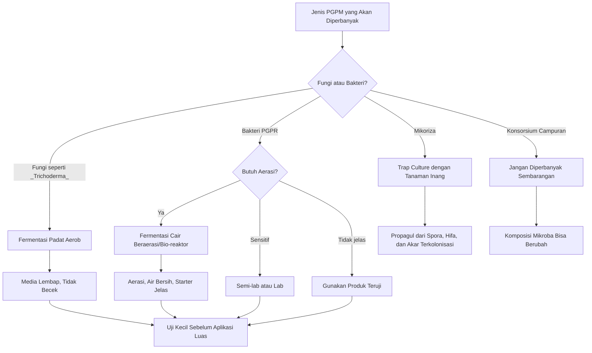

**Keterangan gambar:** Pemilihan metode perbanyakan harus mengikuti jenis mikroba. _Trichoderma_ lebih cocok pada fermentasi padat aerob, bakteri PGPR lebih cocok pada fermentasi cair yang cukup aerasi, mikoriza membutuhkan tanaman inang, sedangkan konsorsium campuran tidak disarankan diperbanyak ulang sembarangan.

---

## 6.6.6 Prinsip Aerasi dalam Perbanyakan Cair

Pada perbanyakan cair, aerasi menjadi faktor kunci untuk banyak PGPM. Aerasi membantu menyediakan oksigen, menjaga media lebih homogen, dan mengurangi risiko terbentuknya zona busuk anaerob.

Aerasi dapat berupa:

- Gelembung udara dari aerator.
- Pengadukan berkala yang bersih.
- Sirkulasi cairan.
- Wadah yang tidak ditutup rapat total, sesuai kebutuhan mikroba.

Namun, aerasi juga harus dilakukan dengan alat bersih. Aerator, selang, batu aerasi, dan pengaduk dapat menjadi sumber kontaminasi bila tidak dibersihkan.

Prinsip aerasi:

- Gunakan alat bersih.
- Jangan gunakan wadah bekas pestisida.
- Jangan tutup rapat bila mikroba membutuhkan oksigen.
- Hindari bau busuk.
- Hindari buih berlebihan yang tidak normal.
- Jangan menilai keberhasilan hanya dari gas atau busa.
- Gunakan hasil perbanyakan segera bila tidak ada sistem penyimpanan yang baik.

### Tabel 6.6D. Indikator Proses Cair yang Perlu Diwaspadai

| Tanda                   | Kemungkinan Makna                       | Keputusan                         |
| ----------------------- | --------------------------------------- | --------------------------------- |
| Bau busuk menyengat     | Fermentasi liar/kontaminasi             | Jangan gunakan                    |
| Botol menggembung keras | Gas berlebihan, proses tidak terkendali | Waspada, jangan aplikasikan luas  |
| Lendir berlebihan       | Kontaminasi atau media rusak            | Jangan gunakan                    |
| Busa berlebihan         | Tidak selalu tanda berhasil             | Evaluasi aroma dan sumber starter |
| Endapan busuk           | Media rusak/kontaminasi                 | Jangan gunakan                    |
| Aroma normal ringan     | Bisa diterima bila sesuai produk        | Tetap uji kecil                   |
| Tidak ada bau busuk     | Tanda awal lebih aman                   | Bukan jaminan mutu penuh          |

---

## 6.6.7 Batasan Fermentasi Anaerob untuk PGPM Cabai

Fermentasi anaerob tidak boleh dijadikan metode umum untuk memperbanyak PGPM cabai. Sebagian besar PGPM yang dibahas dalam panduan ini berfungsi di zona akar yang membutuhkan oksigen. Tanah cabai yang sehat bukan tanah tergenang dan anaerob. Karena itu, logika perbanyakan PGPM sebaiknya mengikuti kondisi kerja mikroba di lapangan.

Fermentasi anaerob lebih cocok untuk beberapa proses organik tertentu, tetapi tidak otomatis cocok untuk memperbanyak:

- _Trichoderma_.
- Mikoriza.
- _Azotobacter_.
- Banyak _Pseudomonas_.
- Banyak _Streptomyces_.
- Konsorsium PGPM akar.
- Produk endofit.

Kondisi anaerob tertutup dapat menyebabkan:

- Bau busuk.
- Dominasi mikroba liar.
- Komposisi konsorsium berubah.
- Mikroba target menurun.
- Produk tidak stabil.
- Risiko fitotoksik bila media membusuk.
- Hasil aplikasi tidak konsisten.

Kalimat praktis untuk petani:

**PGPM akar cabai umumnya lebih membutuhkan proses yang bersih dan cukup oksigen, bukan fermentasi tertutup sampai menggembung.**

---

## 6.6.8 Tabel Pemilihan Metode Berdasarkan Jenis PGPM

Tambahkan tabel berikut sebelum bagian **A. Perbanyakan _Trichoderma_**.

| Jenis PGPM          |       Fermentasi Padat |    Fermentasi Cair/Bio-reaktor | Aerob/Anaerob                      | Rekomendasi Praktis                                       |
| ------------------- | ---------------------: | -----------------------------: | ---------------------------------- | --------------------------------------------------------- |
| _Trichoderma_       |          Sangat sesuai |                       Terbatas | Aerob                              | Gunakan media padat lembap dan berpori                    |
| _Bacillus_          |                   Bisa |                           Bisa | Aerob/fakultatif                   | Relatif bisa, tetapi tetap perlu aerasi dan starter jelas |
| _Pseudomonas_       |            Kurang umum |         Sesuai bila terkontrol | Aerob                              | Sebaiknya semi-lab/lab                                    |
| _Azotobacter_       |            Kurang umum |          Sesuai bila beraerasi | Aerob kuat                         | Perlu aerasi, tidak cocok tertutup anaerob                |
| _Azospirillum_      |               Terbatas |                  Perlu kontrol | Mikroaerofilik/fakultatif tertentu | Sebaiknya produk siap pakai/semi-lab                      |
| PSB                 | Bisa tergantung isolat |         Bisa tergantung isolat | Umumnya aerob/fakultatif           | Harus jelas isolat dan fungsi pelarut P                   |
| KSB                 |          Bisa terbatas |                  Bisa terbatas | Tergantung strain                  | Lebih aman produk teruji                                  |
| _Streptomyces_      |    Bisa dengan kontrol |                       Terbatas | Aerob                              | Sebaiknya lab/semi-lab                                    |
| Endofit             |       Tidak disarankan | Tidak disarankan tanpa kontrol | Tergantung isolat                  | Sebaiknya lab                                             |
| Mikoriza            | Bukan fermentasi biasa |                   Tidak sesuai | Simbiotik akar                     | Gunakan trap culture/tanaman inang                        |
| Konsorsium campuran |       Tidak disarankan |               Tidak disarankan | Campuran                           | Jangan difermentasi ulang sembarangan                     |

> Untuk memperpanjang daya simpan PGPM, kultur hasil pembiakan sebaiknya tidak selalu disimpan dalam bentuk cair. Mikroba yang sesuai, terutama Trichoderma dan sebagian Bacillus, dapat diformulasikan dalam bentuk padat menggunakan carrier bersih seperti talc, kaolin, zeolit, biochar matang, kompos matang, atau media padat terkolonisasi. Bentuk padat umumnya lebih stabil karena kadar air lebih rendah dan aktivitas mikroba lebih lambat. Namun, formulasi padat hanya layak dilakukan pada kultur yang sehat dan tidak terkontaminasi. Carrier tidak boleh digunakan untuk menyelamatkan batch yang sudah berbau busuk, berlendir, atau rusak.

---

## A. Perbanyakan _Trichoderma_

_Trichoderma_ adalah salah satu PGPM yang relatif paling memungkinkan diperbanyak di tingkat petani dengan kontrol sederhana. Biasanya _Trichoderma_ diperbanyak pada media padat, bukan hanya dalam air. Media padat memberi tempat tumbuh bagi miselium dan spora.

> Secara prinsip, _Trichoderma_ lebih sesuai diperbanyak dengan sistem **fermentasi padat aerob**. Media harus lembap, berpori, dan tidak becek agar miselium dan spora dapat berkembang. Bila media terlalu basah atau wadah terlalu tertutup, proses dapat bergeser ke kondisi anaerob yang meningkatkan risiko kontaminasi dan bau busuk.

Metode umum:

- Menggunakan starter _Trichoderma_ yang jelas.
- Media dapat berupa bahan padat yang bersih dan matang.
- Media harus lembap tetapi tidak becek.
- Inkubasi dilakukan di tempat teduh.
- Hindari panas langsung.
- Hindari kontaminasi jamur hitam, merah, atau bau busuk.
- Gunakan hasil perbanyakan secepat mungkin.

Media yang sering digunakan secara lapangan:

- Beras.
- Jagung giling.
- Dedak yang dikondisikan bersih.
- Kompos matang terkontrol.

Catatan penting:

- Jangan gunakan bahan yang berbau busuk.
- Jangan gunakan media berlendir.
- Jangan gunakan media dari bahan organik mentah.
- Jangan mencampur _Trichoderma_ dengan fungisida.
- Jangan aplikasikan produk terkontaminasi ke media semai.

Ciri hasil perbanyakan yang lebih layak:

- Aroma tidak busuk.
- Warna pertumbuhan relatif sesuai karakter _Trichoderma_.
- Tidak ada jamur liar mencolok.
- Tidak berlendir.
- Tidak panas.
- Media tidak becek.

Ciri hasil yang perlu ditolak:

- Bau busuk menyengat.
- Jamur hitam atau merah dominan.
- Media berlendir.
- Banyak belatung atau serangga.
- Kemasan menggembung tidak normal.
- Media terlalu basah.

Penggunaan:

- Media semai.
- Kompos matang.
- Lubang tanam.
- Sekitar zona akar.

Produk hasil perbanyakan petani sebaiknya tidak disimpan terlalu lama karena mutu sulit dijamin tanpa pengujian.

---

## B. Perbanyakan _Bacillus_

_Bacillus_ relatif lebih tahan dibanding banyak bakteri lain karena beberapa spesies mampu membentuk spora. Karena itu, _Bacillus_ sering dianggap lebih mudah ditangani dibanding bakteri yang lebih sensitif. Namun, perbanyakan tetap memerlukan starter yang jelas dan kebersihan yang baik.

> _Bacillus_ relatif lebih toleran dibanding banyak bakteri lain, tetapi perbanyakan yang baik tetap sebaiknya dilakukan dalam kondisi cukup oksigen. Fermentasi cair _Bacillus_ dalam wadah tertutup rapat tanpa aerasi dapat menghasilkan kondisi yang tidak stabil. Bila muncul bau busuk, lendir, atau gas berlebihan, hasil perbanyakan sebaiknya tidak digunakan pada tanaman utama.

Metode umum:

- Menggunakan starter _Bacillus_ yang teruji.
- Menggunakan media cair atau padat yang bersih.
- Menjaga aerasi karena banyak _Bacillus_ bermanfaat bersifat aerob.
- Menghindari kondisi anaerob yang menghasilkan bau busuk.
- Menggunakan wadah bersih, bukan bekas pestisida.
- Menggunakan air bersih.
- Menghindari fermentasi terlalu lama.

Catatan praktis:

- _Bacillus_ cocok untuk aplikasi kocor akar.
- Jangan mencampur proses perbanyakan dengan pestisida.
- Jangan menggunakan larutan yang berbau busuk menyengat.
- Jangan menyimpan hasil perbanyakan terlalu lama.
- Gunakan sebagai aktivasi terbatas, bukan produksi besar tanpa uji mutu.

Ciri hasil yang perlu diwaspadai:

- Bau busuk atau bau bangkai.
- Lendir berlebihan.
- Gas berlebihan.
- Warna berubah ekstrem.
- Ada pertumbuhan jamur liar.
- Wadah menggembung keras.

Untuk petani, pendekatan paling aman adalah menggunakan produk _Bacillus_ komersial atau teruji, lalu melakukan aktivasi ringan hanya bila sesuai petunjuk produsen.

---

## C. Perbanyakan _Pseudomonas_

_Pseudomonas_ memiliki banyak manfaat di rhizosfer, tetapi perbanyakannya lebih sensitif dibanding _Bacillus_. Mikroba ini lebih mudah kalah oleh kontaminan bila kebersihan, media, dan kondisi tidak dikendalikan.

> _Pseudomonas_ umumnya lebih sesuai diperbanyak pada sistem cair yang bersih dan cukup oksigen. Karena sifatnya rentan kalah oleh kontaminan, perbanyakan _Pseudomonas_ di jerigen tertutup tanpa aerasi tidak disarankan. Produk siap pakai atau produksi semi-lab lebih aman untuk menjaga identitas dan fungsi mikroba.

Karena itu, perbanyakan _Pseudomonas_ sebaiknya dilakukan di fasilitas semi-lab atau laboratorium.

Metode umum:

- Menggunakan isolat atau starter yang jelas.
- Menggunakan media dan alat yang bersih.
- Menghindari kontaminasi.
- Mengendalikan kondisi pertumbuhan lebih rapi.
- Melakukan pemeriksaan mutu bila memungkinkan.

Catatan praktis:

- Petani lebih aman memakai produk siap pakai.
- Aktivasi hanya dilakukan bila mengikuti petunjuk produsen.
- Jangan mencampur _Pseudomonas_ dengan banyak produk lain lalu difermentasi bersama.
- Jangan menggunakan hasil fermentasi yang berbau busuk atau tidak normal.

Risiko bila diperbanyak sembarangan:

- Kontaminan tumbuh lebih dominan.
- Populasi _Pseudomonas_ turun.
- Fungsi produk berubah.
- Hasil aplikasi tidak konsisten.

---

## D. Perbanyakan _Azotobacter_

_Azotobacter_ dikenal sebagai bakteri penambat nitrogen bebas. Mikroba ini membutuhkan kondisi yang mendukung, terutama aerasi yang cukup. Bila kondisi terlalu anaerob, kualitas hasil perbanyakan dapat menurun.

> _Azotobacter_ termasuk kelompok yang membutuhkan oksigen tinggi. Karena itu, sistem cair untuk _Azotobacter_ harus memperhatikan aerasi. Perbanyakan dalam wadah tertutup tanpa aerasi berisiko menurunkan mutu dan mendorong kontaminasi mikroba lain.

Metode umum:

- Menggunakan starter _Azotobacter_ yang jelas.
- Menggunakan media yang mendukung pertumbuhan bakteri penambat N bebas.
- Menjaga aerasi cukup.
- Menghindari media yang mudah membusuk.
- Menjaga kebersihan wadah.
- Menggunakan air bersih.

Catatan praktis:

- Lebih cocok dilakukan pada skala semi-lapang dengan pengawasan.
- Tidak ideal bila hanya difermentasi tertutup tanpa aerasi.
- Hasil perbanyakan sebaiknya segera digunakan.
- Jangan gunakan bila berbau busuk atau berlendir tidak normal.

_Azotobacter_ dapat mendukung sistem akar dan efisiensi nitrogen, tetapi tidak menggantikan seluruh pupuk nitrogen. Penggunaan tetap perlu dikombinasikan dengan pemupukan seimbang.

---

## E. Perbanyakan _Azospirillum_

_Azospirillum_ lebih sensitif dibanding _Bacillus_. Mikroba ini membutuhkan kondisi media yang sesuai dan lebih mudah terganggu bila proses tidak bersih atau lingkungan tidak mendukung.

> _Azospirillum_ tidak ideal diperbanyak secara kasar karena kebutuhan lingkungannya lebih spesifik. Sebagian isolat lebih menyukai kondisi oksigen rendah tetapi bukan anaerob busuk. Karena itu, istilah “ditutup rapat agar anaerob” tidak boleh disamakan dengan kondisi mikroaerofilik yang terkontrol.

Metode umum:

- Sebaiknya menggunakan produk siap pakai.
- Produksi lebih baik dilakukan di semi-lab atau lab.
- Membutuhkan starter jelas.
- Membutuhkan kondisi media yang sesuai.
- Hindari perbanyakan kasar dengan bahan tidak terkontrol.

Catatan praktis:

- Tidak direkomendasikan untuk perbanyakan kasar di tingkat petani.
- Lebih aman digunakan sebagai produk formulasi cair atau padat dari produsen terpercaya.
- Aktivasi lapangan hanya dilakukan sesuai instruksi produk.
- Jangan mencampur dengan pestisida atau pupuk pekat.

---

## F. Perbanyakan PSB

PSB atau mikroba pelarut fosfat berfungsi membantu meningkatkan ketersediaan fosfor. Namun, tidak semua mikroba yang tumbuh dalam media fermentasi mampu melarutkan fosfat secara efektif. Karena itu, perbanyakan PSB perlu kontrol isolat.

> Dalam perbanyakan PSB, keberhasilan tidak dapat dinilai hanya dari busa, aroma, atau perubahan warna. Yang penting adalah apakah mikroba target benar-benar memiliki kemampuan melarutkan fosfat. Karena itu, isolat harus jelas dan proses sebaiknya tidak dilakukan dalam kondisi liar yang memungkinkan mikroba lain mendominasi.

Metode umum:

- Menggunakan isolat pelarut fosfat yang jelas.
- Media perlu mendukung fungsi pelarutan fosfat.
- Perlu kebersihan yang baik.
- Perlu indikator atau pengujian sederhana bila tersedia.
- Jangan hanya menilai dari bau, warna, atau busa.

Catatan praktis:

- Produk terstandar lebih aman.
- Aktivasi lapangan boleh dilakukan bila sesuai petunjuk produsen.
- Jangan mencampur PSB dengan banyak mikroba lain tanpa uji kompatibilitas.
- Jangan menganggap semua fermentasi yang aktif sebagai PSB.

Risiko utama perbanyakan PSB sembarangan adalah mikroba tumbuh, tetapi fungsi pelarut fosfat tidak jelas.

---

## G. Perbanyakan KSB

KSB atau mikroba pelarut kalium berfungsi membantu pelepasan kalium dari sumber mineral tertentu. Efektivitas KSB sangat tergantung pada strain mikroba dan sumber mineral yang tersedia. Karena itu, KSB lebih sulit dinilai hanya dari tampilan fermentasi.

> Sama seperti PSB, KSB tidak cukup dinilai dari aktif atau tidaknya fermentasi. Efektivitas KSB bergantung pada strain dan kemampuannya membantu pelepasan kalium. Fermentasi cair yang berbusa tidak membuktikan bahwa fungsi pelarut kalium meningkat.

Metode umum:

- Menggunakan isolat KSB yang jelas.
- Memerlukan media yang sesuai.
- Efektivitas dipengaruhi jenis mineral dan strain mikroba.
- Perlu kontrol mutu.
- Sulit dinilai hanya dari aroma atau warna.

Catatan praktis:

- Lebih aman menggunakan produk teruji.
- Jangan mengklaim hasil perbanyakan efektif tanpa uji atau pengalaman lapang berulang.
- Aktivasi hanya dilakukan sesuai petunjuk produsen.
- KSB penting pada fase generatif, tetapi tetap bukan pengganti total pupuk kalium.

---

## H. Perbanyakan Mikoriza

Mikoriza berbeda dari bakteri PGPR. Mikoriza arbuskula tidak dapat diperbanyak seperti bakteri cair biasa. Mikoriza membutuhkan akar tanaman inang untuk berkembang. Propagul mikoriza dapat berupa spora, hifa, dan akar yang sudah terkolonisasi.

> Karena mikoriza membutuhkan akar hidup, maka istilah fermentasi padat atau fermentasi cair tidak tepat digunakan seperti pada _Trichoderma_ atau bakteri PGPR. Perbanyakan mikoriza dilakukan melalui tanaman inang, sehingga indikator keberhasilannya adalah propagul, spora, hifa, dan akar terkolonisasi, bukan busa, aroma fermentasi, atau gas.

Metode umum:

- Tidak diperbanyak dengan fermentasi cair biasa.
- Membutuhkan tanaman inang.
- Perbanyakan dilakukan dengan sistem trap culture.
- Membutuhkan media yang sesuai dan relatif bersih.
- Propagul berasal dari spora, hifa, dan akar terkolonisasi.
- Mutu perlu dinilai berdasarkan kolonisasi atau propagul, bukan busa fermentasi.

Catatan praktis:

- Mikoriza harus kontak dengan akar saat aplikasi.
- Produk cair yang mengklaim mikoriza perlu dicermati.
- Mikoriza tidak sama dengan PGPR cair.
- Petani lebih aman menggunakan produk mikoriza teruji.
- Jangan mencampur mikoriza dengan fungisida.
- Jangan menumpuk mikoriza dengan pupuk fosfat dosis tinggi di titik akar.

Kesalahan umum:

- Menganggap mikoriza bisa diperbanyak dengan molase dalam jerigen.
- Mengocor mikoriza jauh dari akar.
- Menyimpan mikoriza di tempat panas.
- Mencampur mikoriza dengan fungisida.
- Memberi fosfat tinggi langsung di zona mikoriza.

---

## I. Perbanyakan Konsorsium Campuran

Konsorsium campuran adalah produk yang mengandung beberapa mikroba sekaligus. Produk seperti ini harus diperlakukan hati-hati. Perbanyakan ulang tanpa kontrol tidak direkomendasikan karena komposisi mikroba dapat berubah.

> Risiko perubahan komposisi semakin tinggi bila konsorsium mengandung mikroba dengan kebutuhan oksigen berbeda. Misalnya, fungi aerob, bakteri aerob, bakteri fakultatif, dan mikroba sensitif dicampur dalam satu media cair tertutup. Mikroba yang paling cepat beradaptasi akan mendominasi, sedangkan mikroba lain dapat menurun atau hilang.

Risiko utama:

- Mikroba dominan mengalahkan mikroba lain.
- Mikroba sensitif hilang.
- Kontaminan masuk.
- Fungsi produk berubah.
- Hasil tidak konsisten.
- Produk menjadi berbeda dari produk asal.

Contoh kesalahan lapangan:

- Mencampur PGPR, _Trichoderma_, mikoriza, molase, air cucian beras, dan pupuk cair dalam satu wadah.
- Memfermentasi semua produk mikroba bersama-sama.
- Menggunakan produk hasil fermentasi karena berbusa.
- Menyimpan hasil fermentasi terlalu lama.
- Menggunakan hasil fermentasi pada media semai tanpa uji kecil.

Strategi aman:

- Jangan memperbanyak konsorsium campuran sembarangan.
- Gunakan sesuai dosis label.
- Bila ingin aktivasi, ikuti instruksi produsen.
- Uji pada area kecil sebelum aplikasi luas.
- Jangan gunakan bila berbau busuk atau tampak terkontaminasi.

---

## Gambar 6.3. Kelayakan Perbanyakan PGPM di Tingkat Petani

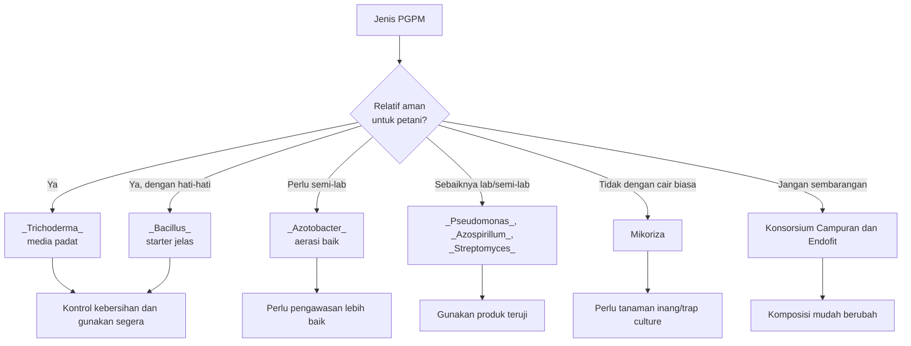

**Keterangan gambar:** Tidak semua PGPM cocok diperbanyak di tingkat petani. _Trichoderma_ dan _Bacillus_ relatif lebih memungkinkan dengan kontrol sederhana, sedangkan mikoriza, endofit, _Pseudomonas_, _Azospirillum_, _Streptomyces_, dan konsorsium campuran memerlukan kehati-hatian lebih tinggi.

---

# 6.7 Batas Aman Perbanyakan di Tingkat Petani

Perbanyakan PGPM di tingkat petani harus dibatasi pada aktivitas yang relatif aman dan dapat dikendalikan. Tujuannya bukan untuk menggantikan produksi laboratorium, tetapi untuk membantu efisiensi aplikasi tanpa mengorbankan mutu dan keamanan lahan.

Batas aman ini penting agar petani tidak terjebak pada praktik “semua mikroba dicampur dan difermentasi bersama”. Praktik seperti itu sering menghasilkan produk yang tidak jelas komposisinya.

---

## A. Yang Relatif Boleh Dilakukan

Beberapa aktivitas masih relatif aman bila dilakukan dengan kontrol kebersihan dan starter jelas.

✓ 1. Aktivasi Ringan Sesuai Petunjuk Produsen

Aktivasi ringan berarti menyiapkan produk sesuai petunjuk label sebelum aplikasi. Aktivasi ini bukan fermentasi ulang jangka panjang.

Prinsip:

- Ikuti label produk.
- Gunakan air bersih.
- Gunakan wadah bersih.
- Jangan dicampur pestisida.
- Gunakan segera.
- Jangan disimpan lama.

---

✓ 2. Perbanyakan _Trichoderma_ Padat dengan Starter Jelas

Perbanyakan _Trichoderma_ pada media padat relatif dapat dilakukan petani, terutama untuk kebutuhan kompos, media semai, atau lubang tanam. Namun, starter harus jelas dan media harus bersih.

Batas aman:

- Gunakan starter _Trichoderma_ terpercaya.
- Media tidak busuk.
- Media tidak terlalu basah.
- Hindari kontaminasi jamur liar.
- Jangan simpan terlalu lama.
- Jangan gunakan bila berbau busuk.

---

✓ 3. Perbanyakan _Bacillus_ Sederhana dengan Kontrol Kebersihan

_Bacillus_ relatif lebih tahan, tetapi tetap membutuhkan starter jelas dan kondisi bersih.

Batas aman:

- Gunakan starter jelas.
- Gunakan air bersih.
- Jaga aerasi.
- Hindari bau busuk.
- Jangan campur pestisida.
- Gunakan segera setelah siap.
- Uji pada sebagian kecil tanaman bila ragu.

---

✓ 4. Pembuatan Kompos Matang yang Diinokulasi Mikroba

Menggunakan PGPM untuk membantu kompos matang lebih aman dibanding membuat fermentasi cair campuran yang tidak jelas. Kompos matang dapat menjadi habitat mikroba dan mendukung kesehatan tanah.

Batas aman:

- Gunakan bahan organik matang atau proses pengomposan yang benar.
- Jangan gunakan bahan busuk segar langsung ke tanaman.
- Jangan gunakan kompos yang masih panas.
- Jangan gunakan kompos berbau amonia atau busuk.
- Inokulasi dilakukan setelah kondisi kompos lebih stabil.

---

## B. Yang Sebaiknya Tidak Dilakukan Sembarangan

Beberapa praktik perlu dihindari karena risikonya tinggi.

✓ 1. Fermentasi Ulang Konsorsium Campuran

Konsorsium campuran tidak stabil bila difermentasi ulang tanpa kontrol. Mikroba dominan bisa mengubah komposisi produk.

Risiko:

- Fungsi produk berubah.
- Efektivitas tidak konsisten.
- Kontaminasi meningkat.
- Mikroba target hilang.

---

✓ 2. Perbanyakan Mikoriza dalam Cairan

Mikoriza tidak diperbanyak seperti PGPR cair. Mikoriza membutuhkan akar tanaman inang.

Risiko:

- Produk hasil fermentasi tidak benar-benar mengandung propagul mikoriza aktif.
- Petani merasa sudah memakai mikoriza, padahal tidak efektif.
- Aplikasi menjadi tidak tepat sasaran.

---

✓ 3. Perbanyakan Endofit Tanpa Kontrol

Endofit hidup di dalam jaringan tanaman. Penggunaannya membutuhkan identitas dan keamanan yang jelas. Perbanyakan endofit sembarangan berisiko tinggi karena mikroba yang masuk jaringan tanaman harus benar-benar kompatibel.

---

✓ 4. Perbanyakan _Pseudomonas_, _Azospirillum_, dan _Streptomyces_ Tanpa Kontrol

Kelompok ini sebaiknya diperbanyak dengan fasilitas lebih baik. Tanpa kontrol, hasilnya mudah terkontaminasi atau berubah.

---

✓ 5. Mencampur Banyak Produk Mikroba Lalu Difermentasi Bersama

Ini adalah kesalahan lapangan yang paling sering terjadi. Banyak petani mencampur beberapa produk mikroba, molase, air cucian beras, air kelapa, pupuk organik cair, dan bahan lain dalam satu wadah. Hasilnya mungkin tampak aktif, tetapi komposisinya tidak jelas.

Risiko:

- Mikroba saling mengalahkan.
- Kontaminan tumbuh.
- Produk berbau busuk.
- Fungsi awal hilang.
- Hasil aplikasi tidak konsisten.
- Risiko membawa mikroba tidak diinginkan ke lahan.

---

## Tabel 6.4. Batas Aman Perbanyakan PGPM di Tingkat Petani

| Praktik                                 | Status                  | Catatan                        |
| --------------------------------------- | ----------------------- | ------------------------------ |
| Aktivasi ringan sesuai label            | Aman                    | Gunakan segera                 |
| Perbanyakan _Trichoderma_ padat         | Relatif aman            | Starter jelas dan media bersih |
| Perbanyakan _Bacillus_ sederhana        | Relatif aman            | Perlu kebersihan dan aerasi    |
| Inokulasi kompos matang                 | Aman bila kompos matang | Jangan gunakan kompos mentah   |
| Fermentasi ulang konsorsium             | Tidak disarankan        | Komposisi berubah              |
| Perbanyakan mikoriza cair               | Tidak disarankan        | Mikoriza perlu tanaman inang   |
| Perbanyakan endofit                     | Tidak disarankan        | Risiko salah mikroba           |
| Perbanyakan _Pseudomonas_ tanpa kontrol | Tidak disarankan        | Rentan kontaminasi             |
| Campur banyak produk lalu fermentasi    | Tidak disarankan        | Risiko paling tinggi           |

---

## C. Uji Kecil Sebelum Aplikasi Luas

Bila petani tetap menggunakan produk hasil perbanyakan sendiri, sebaiknya jangan langsung diaplikasikan ke seluruh lahan. Lakukan uji kecil terlebih dahulu.

Prinsip uji kecil:

- Gunakan pada sebagian kecil tanaman.
- Pilih area yang mudah diamati.
- Jangan gunakan pada bibit utama dalam jumlah besar.
- Amati 3–7 hari setelah aplikasi.
- Periksa bau tanah, kondisi daun, dan gejala stres.
- Hentikan penggunaan bila muncul gejala buruk.

✓ Kotak Hitung 6.2. Menentukan Luas Uji Kecil

```text id="bab6-uji-01"
Jumlah tanaman uji = 1% sampai 5% dari total tanaman
```

Contoh:

```text id="bab6-uji-02"
Total tanaman = 2.000 tanaman
Uji kecil 2% = 2.000 × 2 ÷ 100
Uji kecil = 40 tanaman
```

Dengan uji kecil, risiko kerugian dapat ditekan bila produk hasil perbanyakan ternyata tidak sesuai.

---

## D. Catatan Mutu Perbanyakan

Setiap proses perbanyakan sebaiknya dicatat. Catatan sederhana membantu mengevaluasi hasil dan mencegah kesalahan berulang.

Format catatan minimal:

| Tanggal | Jenis Mikroba | Starter | Media | Lama Proses | Aroma | Warna | Hasil Aplikasi |
| ------- | ------------- | ------- | ----- | ----------- | ----- | ----- | -------------- |
|         |               |         |       |             |       |       |                |

Hal yang perlu dicatat:

- Sumber starter.
- Tanggal mulai.
- Tanggal selesai.
- Media yang digunakan.
- Kondisi aroma.
- Kondisi warna.
- Ada atau tidak kontaminasi.
- Tanggal aplikasi.
- Respons tanaman.

Tanpa catatan, sulit mengetahui apakah hasil baik berasal dari PGPM, cuaca, pupuk, varietas, atau faktor lain.

---

## Gambar 6.4. Alur Aman Perbanyakan Terbatas di Tingkat Petani

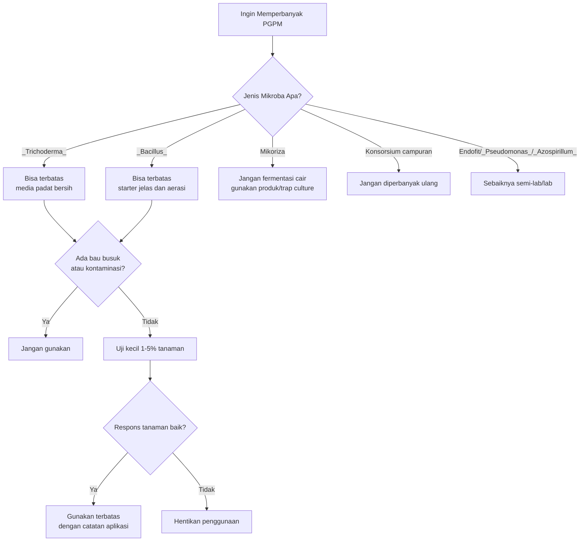

**Keterangan gambar:** Perbanyakan terbatas hanya layak untuk jenis tertentu dan tetap harus melalui pemeriksaan sederhana serta uji kecil sebelum digunakan lebih luas.

---

# Catatan Keselamatan dan Kebersihan

Dalam perbanyakan PGPM, keselamatan pengguna tetap penting. Meskipun PGPM ditujukan untuk pertanian, proses memperbanyak mikroba dapat menghasilkan spora, debu, aerosol, atau kontaminan bila tidak hati-hati.

Prinsip keselamatan:

- Gunakan sarung tangan saat menangani produk.
- Hindari menghirup debu atau spora.
- Gunakan masker saat menangani produk padat berdebu.
- Jangan memperbanyak mikroba di ruang makan atau dapur.
- Jangan gunakan wadah makanan untuk kultur mikroba.
- Jauhkan dari anak-anak dan hewan.
- Jangan membuang produk busuk ke sumber air.
- Cuci alat setelah digunakan.
- Jangan menggunakan wadah bekas pestisida.

Produk yang busuk, terkontaminasi, atau tidak jelas sebaiknya tidak digunakan pada tanaman utama. Lebih baik membuang produk yang meragukan daripada merusak satu musim tanam.

---

# Ringkasan Bab 6

PGPM adalah produk berbasis mikroba hidup sehingga mutu produk, penyimpanan, dan cara perbanyakan sangat menentukan keberhasilannya. Produk PGPM yang baik harus mencantumkan nama mikroba, strain bila tersedia, populasi atau CFU, tanggal produksi, tanggal kedaluwarsa, cara simpan, dosis aplikasi, kompatibilitas, dan nomor izin edar bila produk komersial.

Ciri produk yang baik antara lain tidak berbau busuk menyengat, tidak menggumpal abnormal, tidak terkontaminasi jamur liar berlebihan, kemasan tidak bocor, kemasan tidak menggembung ekstrem, warna dan aroma sesuai karakter produk, serta instruksi penggunaan jelas. Produk harus disimpan di tempat teduh, tidak terkena panas langsung, tidak disimpan dekat pestisida, ditutup rapat setelah dibuka, dan digunakan segera setelah diencerkan.

Perbanyakan PGPM harus dilakukan hati-hati. Tidak semua PGPM bisa diperbanyak di tingkat petani. _Trichoderma_ dan _Bacillus_ relatif lebih memungkinkan dengan kontrol sederhana, sedangkan _Pseudomonas_, _Azospirillum_, _Streptomyces_, endofit, KSB tertentu, dan konsorsium campuran sebaiknya tidak diperbanyak sembarangan. Mikoriza tidak dapat diperbanyak seperti bakteri cair biasa karena membutuhkan tanaman inang.

Batas aman perbanyakan di tingkat petani adalah aktivasi ringan sesuai petunjuk produsen, perbanyakan _Trichoderma_ padat dengan starter jelas, perbanyakan _Bacillus_ sederhana dengan kontrol kebersihan, dan inokulasi kompos matang. Praktik yang sebaiknya dihindari adalah fermentasi ulang konsorsium campuran, perbanyakan mikoriza dalam cairan, perbanyakan endofit, serta mencampur banyak produk mikroba lalu difermentasi bersama.

> Dalam perbanyakan PGPM, sistem fermentasi harus disesuaikan dengan jenis mikroba. Fermentasi padat lebih sesuai untuk fungi seperti _Trichoderma_ karena membutuhkan media lembap, berpori, dan cukup oksigen. Fermentasi cair atau bio-reaktor lebih sesuai untuk beberapa bakteri PGPM, tetapi harus memperhatikan aerasi, kebersihan, starter, dan media. Bio-reaktor tidak sama dengan jerigen tertutup; bio-reaktor idealnya memiliki aerasi atau pengadukan. Sebagian besar PGPM akar cabai bekerja pada lingkungan yang membutuhkan oksigen, sehingga fermentasi anaerob tertutup bukan metode utama untuk memperbanyak PGPM cabai.

Prinsip paling penting: **produk yang tampak hidup belum tentu benar, produk yang berbusa belum tentu efektif, dan produk yang berbau busuk sebaiknya tidak digunakan.**

---

# Bab 7. SOP Lapangan, Monitoring, Troubleshooting, dan Checklist

Bab ini berisi panduan kerja lapangan agar aplikasi PGPM pada cabai tidak dilakukan secara acak. PGPM akan lebih efektif bila dimasukkan ke dalam SOP budidaya, bukan hanya diberikan ketika tanaman sudah bermasalah. Karena itu, bab ini menggabungkan empat hal penting: **SOP aplikasi, monitoring keberhasilan, troubleshooting masalah, dan checklist lapangan**.

Dalam praktik budidaya cabai, masalah sering muncul karena keputusan lapangan tidak berbasis catatan. Misalnya, tanaman layu langsung diberi PGPM tanpa memeriksa akar, drainase, riwayat pestisida, atau kelembapan tanah. Bunga rontok langsung diberi hormon atau pupuk daun tanpa mengecek thrips, stres air, atau ketidakseimbangan nitrogen dan kalium. Akibatnya, tindakan koreksi tidak tepat sasaran.

SOP dan monitoring membantu petani mengambil keputusan lebih terukur. Prinsipnya sederhana:

**lakukan aplikasi sesuai SOP, amati respons tanaman, diagnosis masalah, lakukan koreksi, lalu catat hasilnya.**

---

## Gambar 7.1. Siklus SOP dan Monitoring PGPM di Lapangan

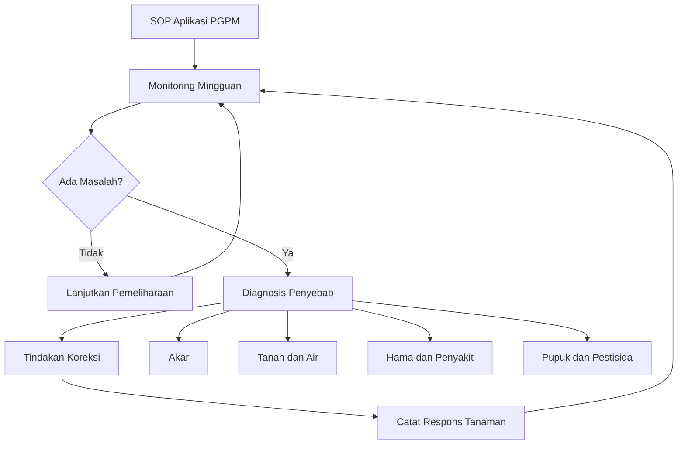

**Keterangan gambar:** Aplikasi PGPM harus menjadi bagian dari siklus kerja lapangan. Monitoring diperlukan untuk mengetahui apakah SOP berjalan baik atau perlu koreksi.

---

# 7.1 SOP Sebelum Tanam

SOP sebelum tanam bertujuan menyiapkan lahan, media, air, input, dan jadwal aplikasi agar PGPM dapat bekerja sejak awal. Fase sebelum tanam sangat penting karena sebagian besar masalah cabai berawal dari akar, media, drainase, dan riwayat penyakit tanah.

PGPM sebaiknya tidak baru dipikirkan setelah tanaman layu. Pada lahan yang memiliki riwayat penyakit, aplikasi PGPM harus dimulai sejak persiapan media, kompos, dan lubang tanam.

---

## A. Analisis Riwayat Lahan

Langkah pertama sebelum menggunakan PGPM adalah memahami riwayat lahan. Riwayat lahan membantu menentukan tingkat risiko dan paket aplikasi yang diperlukan.

Hal yang perlu dicatat:

- Tanaman sebelumnya.
- Riwayat layu.
- Riwayat busuk akar.
- Riwayat antraknosa.
- Riwayat penggunaan herbisida.
- Riwayat penggunaan fungisida atau bakterisida tanah.
- Kondisi drainase pada musim hujan.
- Kondisi kekeringan pada musim kemarau.
- Tingkat kematian tanaman pada musim sebelumnya.

Lahan bekas layu memerlukan strategi berbeda dari lahan sehat. Pada lahan bekas layu, fokusnya bukan hanya memberi PGPM, tetapi juga sanitasi, perbaikan drainase, bahan organik matang, dan pencegahan sejak awal.

---

## B. Cek Riwayat Layu dan Penyakit Tanah

Penyakit tanah menjadi salah satu penyebab utama kegagalan cabai. Bila lahan pernah mengalami layu berat, jangan langsung menanam ulang tanpa perbaikan.

Tanda lahan berisiko tinggi:

- Banyak tanaman mati mendadak pada musim sebelumnya.
- Akar tanaman lama berwarna cokelat atau busuk.
- Pangkal batang pernah membusuk.
- Tanaman layu meskipun tanah lembap.
- Layu menyebar berkelompok di bedengan tertentu.
- Drainase buruk atau sering tergenang.

Tindakan sebelum tanam:

- Bersihkan sisa tanaman sakit.
- Jangan membenamkan tanaman sakit ke bedengan.
- Perbaiki parit dan saluran air.
- Gunakan kompos matang.
- Inokulasi _Trichoderma_ pada kompos atau media.
- Siapkan PGPM penekan penyakit tanah seperti _Trichoderma_, _Bacillus_, dan _Pseudomonas_.

---

## C. Perbaiki Drainase

PGPM tidak dapat menggantikan drainase. Bila lahan tergenang, akar cabai akan stres dan penyakit tanah lebih mudah berkembang. Mikroba menguntungkan juga sulit bekerja optimal pada tanah anaerob.

Tindakan perbaikan drainase:

- Tinggikan bedengan bila lahan rawan becek.
- Bersihkan parit antarbedengan.
- Pastikan air hujan dapat keluar dari lahan.
- Hindari pemadatan tanah.
- Jangan menutup saluran pembuangan air.
- Atur arah bedengan mengikuti kondisi lahan.

Pada musim hujan, drainase lebih menentukan keberhasilan daripada menambah dosis PGPM. Bila akar kekurangan oksigen, PGPM tidak akan banyak membantu.

---

## D. Perbaiki pH Bila Diperlukan

pH tanah mempengaruhi akar, ketersediaan hara, dan aktivitas mikroba. Tanah yang terlalu asam atau terlalu basa dapat membuat PGPM tidak optimal.

Sebelum tanam, pH tanah sebaiknya dicek. Bila terlalu asam, pengapuran dapat dilakukan sesuai kebutuhan. Pengapuran sebaiknya dilakukan sebelum aplikasi PGPM intensif agar kondisi tanah lebih stabil.

Prinsip praktis:

- Cek pH tanah sebelum tanam.
- Koreksi pH dilakukan sebelum aplikasi PGPM utama.
- Jangan mencampur bahan pengapuran langsung dengan PGPM.
- Beri waktu agar tanah stabil setelah koreksi pH.
- Gunakan bahan organik matang untuk membantu penyangga tanah.

---

## E. Gunakan Kompos Matang

Kompos matang berfungsi sebagai penyangga kehidupan mikroba. Tanah dengan bahan organik cukup lebih mendukung aktivitas PGPM dibanding tanah miskin bahan organik.

Ciri kompos matang:

- Tidak berbau busuk.
- Tidak panas.
- Warna gelap dan stabil.
- Tekstur remah.
- Tidak berlendir.
- Tidak banyak bahan kasar yang belum terurai.

Kompos mentah tidak disarankan karena dapat menghasilkan panas, gas, atau membawa patogen. Pada cabai, penggunaan bahan organik mentah dapat meningkatkan risiko busuk akar.

---

## F. Inokulasi _Trichoderma_ pada Media atau Kompos

_Trichoderma_ dapat digunakan sebelum tanam untuk membantu menekan patogen media dan mendukung kesehatan zona akar. Aplikasi dapat dilakukan pada media semai, kompos matang, atau sekitar lubang tanam.

Prinsip aplikasi:

- Gunakan starter atau produk _Trichoderma_ yang jelas.
- Campurkan pada media atau kompos matang.
- Jaga kelembapan, tetapi jangan becek.
- Jangan campur dengan fungisida.
- Aplikasikan sebelum atau saat tanam sesuai kebutuhan.

---

## G. Siapkan Jadwal Pupuk, PGPM, dan Pestisida

Sebelum tanam, jadwal aplikasi harus disusun agar pupuk, PGPM, dan pestisida tidak saling bertabrakan. Jadwal tidak perlu terlalu kaku, tetapi harus memiliki kerangka dasar.

Contoh prinsip jadwal:

| Jenis Input       | Prinsip Penjadwalan                             |
| ----------------- | ----------------------------------------------- |
| Pupuk dasar       | Diberikan sebelum/saat tanam, tidak kontak akar |
| Mikoriza          | Saat tanam, dekat/kontak akar                   |
| _Trichoderma_     | Media, kompos, lubang tanam, atau sekitar akar  |
| PGPR              | 7–10 HST dan pemeliharaan                       |
| PSB + KSB         | 14–21 HST, generatif, dan panen                 |
| Pestisida         | Berdasarkan monitoring, bukan rutinitas buta    |
| Re-inokulasi PGPM | Setelah pestisida berat dan jeda aman           |

---

## H. Siapkan Sumber Air yang Layak

Air untuk PGPM harus bersih dan tidak berklorin tinggi. Air berbau kaporit kuat, limbah, atau pestisida dapat menurunkan viabilitas mikroba.

Sebelum aplikasi, pastikan:

- Air tidak berbau kaporit kuat.
- Air tidak berbau pestisida.
- Air tidak tercemar limbah.
- Air tidak terlalu panas.
- Wadah air bersih.
- Tangki aplikasi bebas residu pestisida.

Bila menggunakan air PAM yang berbau kaporit, endapkan 12–24 jam sebelum digunakan.

---

## Tabel 7.1. SOP Sebelum Tanam

| Langkah                 | Tujuan                     | Catatan Kritis                         |
| ----------------------- | -------------------------- | -------------------------------------- |
| Analisis riwayat lahan  | Menilai risiko             | Lahan bekas layu butuh strategi khusus |
| Cek penyakit tanah      | Mencegah kegagalan awal    | Sanitasi wajib dilakukan               |
| Perbaiki drainase       | Mencegah akar busuk        | PGPM tidak menggantikan drainase       |
| Cek dan koreksi pH      | Mendukung akar dan mikroba | Koreksi sebelum aplikasi PGPM utama    |
| Gunakan kompos matang   | Menopang mikroba           | Hindari kompos mentah                  |
| Inokulasi _Trichoderma_ | Menekan patogen media      | Jangan campur fungisida                |
| Susun jadwal input      | Mencegah benturan aplikasi | Pisah PGPM dari pestisida berisiko     |
| Siapkan air layak       | Menjaga mikroba hidup      | Hindari air berklorin tinggi           |

---

# 7.2 SOP Saat Tanam

SOP saat tanam bertujuan memastikan PGPM ditempatkan pada posisi yang benar dan bibit tidak mengalami stres berlebihan. Fase tanam adalah titik penting karena akar bibit sedang beradaptasi dari media semai ke lahan.

Kesalahan pada fase ini dapat berdampak panjang. Mikoriza yang diletakkan jauh dari akar, pupuk dasar yang menempel pada akar, atau fungisida yang masuk ke lubang tanam bersama PGPM dapat menurunkan keberhasilan aplikasi.

---

## A. Mikoriza Kontak Akar

Mikoriza harus ditempatkan dekat atau kontak dengan akar. Bila mikoriza terlalu jauh dari akar, kolonisasi tidak optimal.

Prinsip aplikasi:

- Letakkan mikoriza di dasar atau sisi lubang tanam yang bersentuhan dengan akar.
- Gunakan dosis sesuai produk.
- Jangan campur langsung dengan fungisida.
- Jangan tumpuk dengan pupuk fosfat dosis tinggi.
- Pastikan tanah cukup lembap.

Mikoriza berbeda dari PGPR cair. Mikoriza memerlukan akar hidup untuk membentuk simbiosis.

---

## B. _Trichoderma_ di Sekitar Akar

_Trichoderma_ ditempatkan di sekitar akar atau media tanam untuk membantu menciptakan zona perakaran yang lebih sehat.

Prinsip aplikasi:

- Aplikasikan di sekitar akar.
- Gunakan pada media, kompos matang, atau lubang tanam.
- Jangan campur dengan fungisida.
- Hindari media terlalu basah.
- Jangan gunakan produk yang berbau busuk atau terkontaminasi.

---

## C. Pupuk Kimia Tidak Menempel Langsung pada Akar

Pupuk dasar tetap dapat digunakan, tetapi tidak boleh menempel langsung pada akar muda. Kontak langsung dengan pupuk pekat dapat menyebabkan stres akar.

Strategi aman:

- Letakkan pupuk dasar di samping atau bawah lubang tanam.
- Beri lapisan tanah pemisah.
- Hindari pupuk P tinggi langsung menempel pada mikoriza.
- Jangan memberi pupuk larut pekat segera setelah tanam bila bibit stres.

---

## D. Hindari Fungisida di Lubang Tanam

Bila PGPM diberikan saat tanam, fungisida sebaiknya tidak dimasukkan bersamaan ke lubang tanam. Fungisida dapat menekan _Trichoderma_ dan mikoriza.

Bila lahan sangat berisiko penyakit dan fungisida tanah harus digunakan, jadwal perlu diatur dengan hati-hati. Setelah masa aman, PGPM dapat diberikan ulang melalui kocor akar.

---

## E. Tanah dalam Kondisi Cukup Lembap

Tanah saat tanam harus cukup lembap. Tanah terlalu kering membuat bibit stres dan PGPM sulit bertahan. Tanah terlalu becek membuat oksigen rendah dan meningkatkan risiko busuk akar.

Kondisi ideal:

- Tanah lembap.
- Tidak mengeluarkan air saat diremas.
- Tidak berdebu.
- Tidak tergenang.
- Bedengan tidak terlalu panas.

---

## F. Tanam Sore Hari Bila Kondisi Panas

Pada kondisi panas, tanam sore hari lebih aman. Suhu lebih rendah dan bibit memiliki waktu beradaptasi sebelum terkena panas siang berikutnya.

Prinsip praktis:

- Tanam sore hari saat cuaca panas.
- Siram secukupnya setelah tanam.
- Hindari pupuk pekat saat tanaman baru pindah.
- Pantau layu pada 1–3 hari pertama.
- Bila perlu, lakukan penyulaman pada tanaman yang gagal tumbuh.

---

## Gambar 7.2. Posisi Input Saat Tanam

```mermaid id="pgpm-bab7-02"
flowchart TB
    A[Bibit Cabai] --> B[Akar Bibit]
    B --> C[Zona Akar]
    C --> D[Mikoriza Kontak Akar]
    C --> E[_Trichoderma_ Sekitar Akar]

    F[Pupuk Dasar] --> G[Posisi Samping/Bawah]
    G --> H[Dipisahkan Lapisan Tanah]

    I[Fungisida] --> J[Jangan Bersamaan di Lubang Tanam<br/>dengan PGPM]

    D --> K[Kolonisasi dan Serapan Lebih Baik]
    E --> L[Zona Akar Lebih Sehat]
    H --> M[Akar Tidak Stres]
```

**Keterangan gambar:** Saat tanam, mikoriza dan _Trichoderma_ ditempatkan dekat akar. Pupuk dasar diberi jarak aman, sedangkan fungisida tidak diberikan bersamaan dengan PGPM di lubang tanam.

---

# 7.3 SOP Pemeliharaan

SOP pemeliharaan bertujuan menjaga akar tetap aktif, pertumbuhan tanaman stabil, dan aplikasi PGPM berjalan sesuai fase. Setelah tanam, PGPM tidak cukup hanya diberikan sekali. Pada cabai, terutama cabai rawit panen panjang, aplikasi pemeliharaan perlu dilakukan secara berkala.

---

## A. PGPR pada 7–10 HST

Pada 7–10 HST, tanaman sedang memulihkan diri setelah pindah tanam. PGPR dapat dikocor untuk membantu pembentukan akar baru dan mengurangi stres awal.

Prinsip aplikasi:

- Gunakan PGPR seperti _Bacillus_, _Pseudomonas_, _Azospirillum_, atau _Azotobacter_.
- Kocor ke zona akar.
- Tanah harus lembap.
- Jangan campur dengan pupuk pekat.
- Jangan lakukan dekat aplikasi fungisida atau bakterisida.

Target fase ini:

- Tanaman cepat pulih.
- Daun muda mulai muncul.
- Akar baru terbentuk.
- Pertumbuhan lebih seragam.

---

## B. PGPR + PSB + KSB pada 14–21 HST

Pada 14–21 HST, tanaman mulai masuk fase vegetatif aktif. Akar harus mendukung pertumbuhan tajuk dan cabang produktif. Kombinasi PGPR, PSB, dan KSB dapat digunakan untuk mendukung akar dan efisiensi hara.

Fungsi:

- PGPR membantu aktivitas akar.
- PSB membantu ketersediaan fosfor.
- KSB membantu dukungan kalium.
- Kombinasi ini mendukung pertumbuhan vegetatif yang sehat.

Prinsip aplikasi:

- Kocor ke zona akar.
- Pisahkan 1–3 hari dari pupuk kimia.
- Aplikasi pagi atau sore.
- Hindari tanah terlalu kering atau becek.

---

## C. KSB + PSB Saat Bunga dan Buah

Saat tanaman memasuki fase bunga dan buah, kebutuhan fosfor, kalium, kalsium, magnesium, dan unsur mikro menjadi penting. KSB dan PSB digunakan untuk mendukung efisiensi hara, bukan menggantikan semua pupuk generatif.

Fokus aplikasi:

- Menjaga akar aktif.
- Mendukung pembungaan.
- Mengurangi risiko rontok bunga akibat akar lemah.
- Mendukung pengisian buah.
- Membantu tanaman tetap stabil selama panen.

Catatan penting:

- Bila bunga rontok karena thrips, PGPM saja tidak cukup.
- Bila rontok karena kekeringan, perbaiki irigasi.
- Bila tanaman terlalu rimbun akibat nitrogen berlebihan, koreksi pemupukan.
- Bila akar lemah, PGPM membantu pemulihan tetapi penyebab utama tetap harus ditangani.

---

## D. PGPM Pemeliharaan Tiap 14–21 Hari

PGPM pemeliharaan dilakukan untuk menjaga populasi mikroba dan aktivitas akar. Interval 14–21 hari dapat disesuaikan dengan kondisi lahan.

Interval lebih rapat dapat dipilih bila:

- Lahan bekas layu.
- Musim hujan dengan tekanan penyakit tinggi.
- Tanaman baru terkena pestisida berat.
- Tanaman mulai drop setelah panen besar.
- Tanah miskin bahan organik.
- Pertumbuhan tidak seragam.

Interval lebih panjang dapat digunakan bila:

- Lahan sehat.
- Akar aktif.
- Tanaman stabil.
- Tidak ada pestisida berat.
- Kelembapan dan drainase baik.

---

## E. Re-inokulasi Setelah Pestisida Berat

Setelah penggunaan fungisida, bakterisida, tembaga, atau pestisida tanah berisiko tinggi, PGPM perlu diberikan ulang setelah jeda aman. Tujuannya untuk memulihkan kembali mikroba menguntungkan di zona akar.

Acuan praktis:

| Jenis Input Berat         | Jeda Sebelum PGPM Ulang |
| ------------------------- | ----------------------: |
| Fungisida kontak          |                3–5 hari |
| Fungisida sistemik        |                5–7 hari |
| Bakterisida/tembaga       |                 ±7 hari |
| Herbisida dekat area akar |               7–14 hari |

Re-inokulasi dilakukan saat tanaman tidak dalam kondisi stres berat dan tanah cukup lembap.

---

## F. Monitoring Akar dan Tajuk Setiap Minggu

Monitoring dilakukan minimal seminggu sekali. Monitoring bukan hanya melihat daun, tetapi juga mengecek akar, kelembapan tanah, hama, penyakit, bunga, dan respons setelah aplikasi.

Aspek yang dipantau:

- Warna daun.
- Pertumbuhan pucuk.
- Kondisi akar.
- Kelembapan tanah.
- Gejala layu.
- Serangan hama.
- Bunga rontok.
- Buah busuk.
- Respons setelah pupuk.
- Respons setelah PGPM.

---

## Tabel 7.2. SOP Pemeliharaan PGPM Berdasarkan Umur Tanaman

| Umur/Fase               | Aplikasi PGPM    | Tujuan                 | Catatan                |
| ----------------------- | ---------------- | ---------------------- | ---------------------- |
| 7–10 HST                | PGPR             | Pemulihan pindah tanam | Tanah lembap           |
| 14–21 HST               | PGPR + PSB + KSB | Akar dan hara awal     | Pisah dari pupuk pekat |
| 21–35 HST               | PGPR + PSB + KSB | Cabang produktif       | Monitoring OPT ketat   |
| Bunga awal              | PSB + KSB + PGPR | Dukung bunga           | Jaga air dan hara      |
| Buah/panen              | KSB + PGPR       | Jaga akar dan buah     | PGPM tiap 14–21 hari   |
| Setelah pestisida berat | PGPM ulang       | Pemulihan mikroba      | Tunggu jeda aman       |

---

# 7.4 SOP Setelah Aplikasi Pestisida Berat

Pestisida berat dalam konteks ini adalah input yang berisiko menekan mikroba, terutama fungisida, bakterisida, tembaga, antibiotik pertanian, atau herbisida yang mengenai tanah aktif. Setelah aplikasi bahan seperti ini, PGPM tidak langsung diberikan pada hari yang sama.

Prinsipnya: **selamatkan tanaman lebih dulu, beri jeda aman, lalu pulihkan mikroba dan akar.**

---

## A. Tunggu 5–7 Hari

Setelah aplikasi pestisida berat, tunggu sekitar 5–7 hari sebelum kocor PGPM ulang. Untuk fungisida kontak, jeda 3–5 hari bisa cukup. Untuk fungisida sistemik, bakterisida, atau tembaga, jeda 5–7 hari lebih aman.

Jangan memaksa PGPM masuk terlalu cepat karena mikroba dapat tertekan oleh residu pestisida.

---

## B. Kocor PGPM Ulang

Setelah masa jeda, PGPM dapat dikocor ulang ke zona akar. Pilih PGPM sesuai kebutuhan.

Contoh:

- Setelah fungisida intensif: gunakan PGPR dan _Trichoderma_ sesuai jeda aman.
- Setelah bakterisida: gunakan kembali PGPR seperti _Bacillus_ atau _Pseudomonas_ setelah jeda cukup.
- Setelah tanaman stres: gunakan PGPM akar dengan dosis pemulihan sesuai label.

---

## C. Gunakan Bahan Organik Matang Bila Perlu

Bahan organik matang dapat membantu memulihkan lingkungan mikroba. Namun, jangan menggunakan bahan organik mentah atau busuk karena dapat memperparah masalah akar.

Bahan organik yang digunakan harus:

- Matang.
- Tidak panas.
- Tidak berbau busuk.
- Tidak berlendir.
- Tidak membawa sumber penyakit.
- Diberikan secukupnya.

---

## D. Pantau Akar dan Gejala Stres

Setelah pestisida berat, pantau respons tanaman. Jangan hanya melihat daun. Periksa akar bila memungkinkan pada tanaman contoh.

Yang dipantau:

- Akar putih baru.
- Warna akar lama.
- Pangkal batang.
- Daun muda.
- Pucuk.
- Bunga.
- Gejala layu.
- Respons setelah PGPM ulang.

---

## E. Hindari Pupuk Pekat Saat Tanaman Stres Berat

Setelah tanaman mengalami stres akibat penyakit, pestisida, panas, atau kekeringan, hindari pupuk pekat. Akar yang lemah tidak siap menerima tekanan garam tinggi.

Urutan pemulihan yang lebih aman:

1. Stabilkan air.
2. Kurangi stres lingkungan.
3. Tunggu jeda pestisida.
4. Kocor PGPM pemulihan.
5. Berikan pupuk ringan.
6. Naikkan pupuk bertahap setelah tanaman pulih.

---

## Gambar 7.3. SOP Pemulihan Setelah Pestisida Berat

```mermaid id="pgpm-bab7-03"
flowchart TD
    A[Aplikasi Pestisida Berat] --> B[Tunggu Jeda Aman]
    B --> C{Tanaman Masih Stres Berat?}

    C -->|Ya| D[Stabilkan Air dan Lingkungan]
    D --> E[Hindari Pupuk Pekat]
    E --> F[Pantau Akar dan Pucuk]
    F --> G[Kocor PGPM Pemulihan]

    C -->|Tidak| G[Kocor PGPM Pemulihan]

    G --> H[Tambahkan Bahan Organik Matang Bila Perlu]
    H --> I[Monitoring 3-7 Hari]
    I --> J{Respons Membaik?}

    J -->|Ya| K[Lanjut SOP Pemeliharaan]
    J -->|Tidak| L[Diagnosis Ulang Penyebab]
```

**Keterangan gambar:** Setelah pestisida berat, PGPM tidak langsung diberikan. Beri jeda aman, stabilkan kondisi tanaman, lalu lakukan kocor PGPM pemulihan dan monitoring ulang.

---

# 7.5 Monitoring Keberhasilan PGPM

Keberhasilan PGPM tidak selalu terlihat dalam satu atau dua hari. PGPM bekerja melalui perbaikan akar, rhizosfer, efisiensi hara, dan ketahanan tanaman. Karena itu, monitoring harus dilakukan secara rutin dan menggunakan indikator yang tepat.

Monitoring keberhasilan PGPM dapat dibagi menjadi tiga kelompok:

1. Indikator tanaman.
2. Indikator tanah.
3. Indikator produksi.

---

## A. Indikator Tanaman

Indikator tanaman adalah tanda yang paling mudah diamati. Namun, pengamatan harus dilakukan berulang, bukan hanya sekali.

Indikator positif:

- Akar putih lebih banyak.
- Tanaman cepat pulih setelah pindah tanam.
- Daun lebih segar.
- Pertumbuhan lebih seragam.
- Bunga lebih stabil.
- Tanaman tidak mudah layu saat panas.
- Panen lebih stabil.

✓ Akar Putih Lebih Banyak

Akar putih menunjukkan akar muda aktif. Akar seperti ini penting untuk penyerapan air dan hara. Bila setelah aplikasi PGPM akar putih bertambah, ini menjadi tanda baik.

Namun, pengamatan akar harus dilakukan hati-hati. Jangan mencabut banyak tanaman produktif. Gunakan tanaman contoh di pinggir bedengan atau tanaman yang memang perlu diperiksa.

---

✓ Tanaman Cepat Pulih Setelah Pindah Tanam

Tanaman yang cepat pulih biasanya menunjukkan daun muda baru, batang lebih tegak, dan tidak layu berkepanjangan. Bila tanaman lama stagnan setelah pindah tanam, perlu dicek kondisi akar, kelembapan tanah, dan riwayat pupuk.

---

✓ Pertumbuhan Lebih Seragam

PGPM yang bekerja baik sering terlihat dari pertumbuhan tanaman yang lebih seragam. Keseragaman penting dalam budidaya cabai karena mempengaruhi jadwal pemupukan, pengendalian hama, dan panen.

---

✓ Bunga Lebih Stabil

Pada fase generatif, indikator PGPM tidak hanya daun hijau, tetapi juga bunga yang lebih stabil. Bila akar aktif dan hara lebih efisien, tanaman lebih siap mendukung pembungaan.

Namun, rontok bunga tetap dapat disebabkan oleh thrips, suhu tinggi, kekurangan air, atau ketidakseimbangan hara. Jadi, interpretasi harus hati-hati.

---

## B. Indikator Tanah

Tanah adalah tempat PGPM bekerja. Karena itu, indikator tanah perlu diamati.

Indikator positif:

- Tanah lebih remah.
- Tidak berbau anaerob.
- Akar lebih aktif.
- Serangan busuk akar menurun.
- Drainase lebih baik.

✓ Tanah Lebih Remah

Tanah remah memudahkan akar berkembang dan membantu pertukaran udara. Bahan organik matang, akar aktif, dan aktivitas mikroba dapat memperbaiki struktur tanah secara bertahap.

---

✓ Tidak Berbau Anaerob

Bau busuk atau bau lumpur menyengat menunjukkan kondisi anaerob. PGPM akar tidak optimal pada tanah seperti ini. Bila tanah berbau anaerob, prioritas utama adalah memperbaiki drainase dan mengurangi genangan.

---

✓ Serangan Busuk Akar Menurun

Pada lahan yang sebelumnya rawan busuk akar, penurunan kejadian busuk akar dapat menjadi indikator positif. Namun, hal ini harus dibandingkan dengan musim sebelumnya atau petak pembanding agar penilaiannya lebih objektif.

---

## C. Indikator Produksi

Indikator produksi adalah ukuran akhir yang penting bagi agribisnis. PGPM harus dinilai bukan hanya dari tanaman yang tampak hijau, tetapi dari dampaknya terhadap hasil, umur produktif, dan efisiensi input.

Indikator positif:

- Jumlah buah per tanaman meningkat.
- Buah lebih seragam.
- Umur produktif lebih panjang.
- Kebutuhan pupuk bisa lebih efisien.
- Persentase tanaman mati menurun.
- Panen lebih stabil.

✓ Kotak Hitung 7.1. Menghitung Persentase Tanaman Hidup dan Tanaman Mati

```text id="bab7-monitoring-01"
Persentase tanaman hidup (%) = jumlah tanaman hidup ÷ jumlah tanaman awal × 100
```

Contoh:

```text id="bab7-monitoring-02"
Jumlah tanaman awal = 2.000 tanaman
Jumlah tanaman hidup = 1.860 tanaman

Persentase tanaman hidup = 1.860 ÷ 2.000 × 100
Persentase tanaman hidup = 93%
```

```text id="bab7-monitoring-03"
Persentase tanaman mati (%) = jumlah tanaman mati ÷ jumlah tanaman awal × 100
```

Contoh:

```text id="bab7-monitoring-04"
Jumlah tanaman mati = 140 tanaman
Jumlah tanaman awal = 2.000 tanaman

Persentase tanaman mati = 140 ÷ 2.000 × 100
Persentase tanaman mati = 7%
```

✓ Kotak Hitung 7.2. Menghitung Produktivitas per Tanaman Hidup

```text id="bab7-monitoring-05"
Produktivitas per tanaman hidup = total panen (kg) ÷ jumlah tanaman hidup
```

Contoh:

```text id="bab7-monitoring-06"
Total panen = 1.500 kg
Jumlah tanaman hidup = 1.860 tanaman

Produktivitas per tanaman hidup = 1.500 ÷ 1.860
Produktivitas per tanaman hidup = 0,81 kg/tanaman
```

Perhitungan sederhana ini membantu menilai apakah penggunaan PGPM memberi dampak terhadap populasi tanaman hidup dan hasil panen.

---

## Tabel 7.3. Indikator Monitoring Keberhasilan PGPM

| Kelompok Indikator | Tanda Positif                               | Catatan                          |
| ------------------ | ------------------------------------------- | -------------------------------- |
| Tanaman            | Akar putih, daun segar, pertumbuhan seragam | Perlu diamati berkala            |
| Tanah              | Remah, tidak berbau anaerob, drainase baik  | Sangat dipengaruhi bahan organik |
| Penyakit           | Busuk akar dan layu menurun                 | Bandingkan dengan riwayat lahan  |
| Produksi           | Buah seragam, panen stabil                  | Catatan panen wajib dibuat       |
| Efisiensi input    | Pupuk dapat dikurangi bertahap              | Jangan turunkan pupuk ekstrem    |
| Umur produktif     | Tanaman tidak cepat drop                    | Penting untuk cabai rawit        |

---

# 7.6 Troubleshooting Lapangan

Troubleshooting diperlukan ketika hasil aplikasi PGPM tidak sesuai harapan atau tanaman menunjukkan masalah. Prinsip troubleshooting adalah mencari penyebab utama sebelum menentukan tindakan.

PGPM bukan solusi untuk semua masalah. Bila penyebabnya virus, kekeringan, genangan, pupuk berlebihan, atau serangan hama berat, PGPM hanya menjadi pendukung, bukan penyelesaian utama.

---

## A. PGPM Tidak Terlihat Hasilnya

PGPM tidak selalu memberi efek cepat. Namun, bila setelah beberapa kali aplikasi tidak ada perbaikan akar, pertumbuhan, atau keseragaman tanaman, perlu dilakukan evaluasi.

✓ Kemungkinan Penyebab

| Penyebab                        | Penjelasan                                |
| ------------------------------- | ----------------------------------------- |
| Produk mati atau kualitas buruk | Mikroba tidak aktif atau populasi rendah  |
| Dicampur pestisida kimia        | Terutama fungisida, bakterisida, tembaga  |
| Tanah terlalu kering            | Mikroba sulit bertahan                    |
| Bahan organik rendah            | Habitat mikroba kurang mendukung          |
| pH tanah ekstrem                | Akar dan mikroba terganggu                |
| Aplikasi terlalu jarang         | Populasi mikroba tidak terjaga            |
| Dosis terlalu rendah            | Jumlah mikroba tidak cukup                |
| Tekanan penyakit terlalu berat  | PGPM tidak cukup sebagai tindakan tunggal |

✓ Tindakan Koreksi

- Cek kualitas produk dan tanggal kedaluwarsa.
- Pastikan produk tidak berbau busuk atau rusak.
- Perbaiki cara aplikasi.
- Pisahkan PGPM dari pestisida.
- Tambahkan bahan organik matang.
- Evaluasi pH dan kelembapan.
- Ulangi aplikasi pada kondisi tanah lembap.
- Buat petak pembanding bila memungkinkan.

---

## B. Tanaman Tetap Layu

Tanaman layu harus didiagnosis dengan hati-hati. Layu bisa disebabkan oleh jamur, bakteri, nematoda, busuk akar, kekeringan, genangan, kerusakan akar, atau pupuk pekat.

Jangan langsung menyimpulkan semua layu disebabkan fusarium. Salah diagnosis akan membuat tindakan salah.

✓ Langkah Diagnosis

1. Periksa kondisi tanah: kering, lembap, atau becek.
2. Periksa akar: putih, cokelat, busuk, atau putus.
3. Periksa pangkal batang.
4. Cek apakah layu terjadi sporadis atau berkelompok.
5. Cek riwayat aplikasi pupuk pekat.
6. Cek riwayat pestisida.
7. Cek kemungkinan nematoda bila akar berbintil.
8. Cabut tanaman yang sudah parah dan musnahkan.

✓ Tindakan Koreksi

- Cabut tanaman yang sudah parah.
- Jangan membenamkan tanaman sakit ke bedengan.
- Perbaiki drainase.
- Gunakan _Trichoderma_ + _Bacillus_ + _Pseudomonas_ pada area sekitar tanaman sehat.
- Bila perlu gunakan fungisida atau bakterisida sesuai diagnosis.
- Re-inokulasi PGPM setelah jeda aman.
- Hindari pupuk pekat pada tanaman stres.

---

## Gambar 7.4. Alur Diagnosis Tanaman Layu

```mermaid id="pgpm-bab7-04"
flowchart TD
    A[Tanaman Layu] --> B{Tanah Kering?}
    B -->|Ya| C[Perbaiki Irigasi<br/>Jangan langsung pupuk pekat]
    B -->|Tidak| D{Tanah Becek/Tergenang?}

    D -->|Ya| E[Perbaiki Drainase<br/>Cek Busuk Akar]
    D -->|Tidak| F[Cabut Tanaman Contoh]

    F --> G{Akar Busuk/Cokelat?}
    G -->|Ya| H[Curiga Penyakit Akar<br/>Gunakan Sanitasi + PGPM + Koreksi Drainase]
    G -->|Tidak| I{Pangkal Batang Rusak?}

    I -->|Ya| J[Curiga Penyakit Pangkal Batang<br/>Koreksi Sesuai Diagnosis]
    I -->|Tidak| K{Akar Berbintil?}

    K -->|Ya| L[Curiga Nematoda<br/>Kelola Lahan dan Akar]
    K -->|Tidak| M[Cek Pupuk Pekat, Pestisida,<br/>dan Stres Lingkungan]
```

**Keterangan gambar:** Tanaman layu tidak selalu disebabkan oleh satu penyakit. Diagnosis harus dimulai dari tanah, akar, pangkal batang, dan riwayat aplikasi input.

---

## C. Bunga Rontok

Bunga rontok pada cabai dapat disebabkan oleh banyak faktor. PGPM dapat membantu bila penyebabnya berkaitan dengan akar lemah atau efisiensi hara, tetapi tidak menyelesaikan masalah bila penyebab utamanya thrips, kekeringan, atau suhu tinggi.

✓ Kemungkinan Penyebab

- Kekurangan K, Ca, B, atau air.
- Suhu tinggi.
- Serangan thrips.
- Stres pestisida.
- Akar lemah.
- Ketidakseimbangan nitrogen dan kalium.
- Tanaman terlalu rimbun.
- Fluktuasi kelembapan tanah.

✓ Tindakan Koreksi

- Perbaiki irigasi.
- Kocor PSB + KSB + PGPR.
- Atur pupuk K, Ca, Mg, dan unsur mikro.
- Kendalikan thrips bila ada.
- Hindari pupuk nitrogen berlebihan.
- Kurangi stres pestisida.
- Jaga kelembapan tanah lebih stabil.

✓ Catatan Praktis

Bila bunga rontok disertai daun keriting, pucuk rusak, atau terlihat thrips, prioritas utama adalah pengendalian vektor/hama. PGPM tetap digunakan untuk menjaga vigor tanaman sehat.

---

## D. Tanaman Keriting

Tanaman keriting sering berkaitan dengan infeksi virus, serangan vektor seperti kutu kebul atau thrips, atau kerusakan akibat hama pengisap. PGPM tidak membunuh virus.

✓ Catatan Utama

- PGPM tidak membunuh virus.
- Fokus pengendalian pada vektor.
- Cabut tanaman sumber virus bila parah.
- Gunakan perangkap dan pengendalian serangga vektor.
- PGPM digunakan untuk menjaga vigor tanaman sehat.

✓ Tindakan Koreksi

- Identifikasi tingkat serangan.
- Cabut tanaman yang sangat parah dan menjadi sumber infeksi.
- Kendalikan kutu kebul, thrips, atau vektor lain.
- Gunakan perangkap kuning/biru sesuai target.
- Kurangi gulma inang.
- Jaga tanaman sehat dengan PGPM akar dan pemupukan seimbang.
- Jangan mengandalkan PGPM sebagai antivirus.

---

## E. Buah Busuk atau Antraknosa

Antraknosa merupakan salah satu penyakit penting pada cabai, terutama saat kelembapan tinggi. PGPM akar dapat membantu menjaga vigor tanaman, tetapi pengendalian antraknosa tetap membutuhkan sanitasi, pengaturan tajuk, dan fungisida bila tekanan tinggi.

✓ Tindakan Koreksi

- Kurangi kelembapan tajuk.
- Perbaiki sirkulasi udara.
- Panen buah terinfeksi dan musnahkan.
- Hindari membiarkan buah sakit di lahan.
- Gunakan fungisida secara rotasi bila tekanan tinggi.
- Hindari penyemprotan PGPM foliar bersamaan dengan fungisida.
- PGPM tetap difokuskan pada pemulihan akar.

✓ Catatan Praktis

Pada musim hujan, jangan hanya menaikkan dosis PGPM. Perbaiki drainase, sanitasi buah sakit, dan manajemen tajuk. Bila fungisida intensif digunakan, PGPM akar dapat diberikan ulang setelah jeda aman.

---

## Tabel 7.4. Troubleshooting Cepat Masalah Lapangan

| Masalah                      | Kemungkinan Penyebab                             | Tindakan Utama                     | Peran PGPM                       |
| ---------------------------- | ------------------------------------------------ | ---------------------------------- | -------------------------------- |
| PGPM tidak terlihat hasilnya | Produk buruk, tanah kering, dicampur pestisida   | Evaluasi produk dan cara aplikasi  | Ulangi saat kondisi sesuai       |
| Tanaman layu                 | Penyakit akar, kekeringan, genangan, pupuk pekat | Diagnosis akar dan tanah           | Pemulihan dan pencegahan         |
| Bunga rontok                 | Air, thrips, K/Ca/B, akar lemah                  | Koreksi penyebab utama             | Dukung akar dan hara             |
| Tanaman keriting             | Virus/vektor                                     | Kendalikan vektor dan cabut sumber | Jaga vigor tanaman sehat         |
| Antraknosa                   | Kelembapan tinggi, sanitasi buruk                | Sanitasi, tajuk, fungisida rotasi  | Pemulihan akar setelah pestisida |
| Tanaman drop panen           | Akar lemah, hara tidak seimbang                  | Irigasi, pupuk seimbang            | PGPM pemeliharaan                |

---

# 7.7 Checklist Lapangan

Checklist membantu memastikan aplikasi PGPM tidak dilakukan dalam kondisi yang salah. Checklist sebaiknya dicetak dan digunakan oleh petani atau teknisi sebelum aplikasi.

---

## A. Checklist Sebelum Aplikasi PGPM

Gunakan checklist ini sebelum mengocor atau menyemprot PGPM.

| Pertanyaan                                  | Ya/Tidak | Keputusan                          |
| ------------------------------------------- | -------- | ---------------------------------- |
| Tanah lembap?                               |          | Jika tidak, irigasi ringan dulu    |
| Tidak baru disemprot fungisida/bakterisida? |          | Jika baru, tunggu jeda aman        |
| Air tidak berklorin tinggi?                 |          | Jika berbau kaporit, endapkan      |
| Produk belum kedaluwarsa?                   |          | Jika kedaluwarsa, jangan digunakan |
| Dosis sesuai label?                         |          | Sesuaikan sebelum aplikasi         |
| Aplikasi pagi/sore?                         |          | Hindari siang panas                |
| Alat bersih dari residu pestisida?          |          | Cuci bersih sebelum digunakan      |
| Larutan akan segera digunakan?              |          | Jangan simpan terlalu lama         |

---

## B. Checklist Sebelum Mencampur Input

Prinsip utama: bila ragu, jangan campur.

| Pertanyaan                                | Risiko Bila Ya               | Keputusan Aman          |
| ----------------------------------------- | ---------------------------- | ----------------------- |
| Apakah ada fungisida?                     | Menekan fungi PGPM           | Jangan campur           |
| Apakah ada bakterisida?                   | Menekan PGPR                 | Jangan campur           |
| Apakah ada tembaga?                       | Antimikroba                  | Jangan campur           |
| Apakah larutan pupuk terlalu pekat?       | Tekanan garam tinggi         | Pisahkan 1–3 hari       |
| Apakah pH air ekstrem?                    | Mikroba stres                | Koreksi sesuai petunjuk |
| Apakah produk PGPM memang boleh dicampur? | Jika tidak jelas, berisiko   | Ikuti label             |
| Apakah larutan akan langsung digunakan?   | Larutan lama menurun mutunya | Gunakan segera          |

---

## C. Checklist Monitoring Mingguan

Checklist monitoring mingguan digunakan untuk mengevaluasi tanaman dan mengambil keputusan koreksi.

| Komponen Monitoring       | Kondisi yang Diamati             | Catatan |
| ------------------------- | -------------------------------- | ------- |
| Pertumbuhan pucuk         | Aktif/lambat                     |         |
| Warna daun                | Hijau normal/pucat/terlalu gelap |         |
| Kondisi akar              | Putih/cokelat/busuk              |         |
| Kelembapan tanah          | Kering/lembap/becek              |         |
| Gejala layu               | Ada/tidak                        |         |
| Hama daun                 | Thrips/kutu/tungau/ulat          |         |
| Bunga rontok              | Rendah/sedang/tinggi             |         |
| Buah busuk/antraknosa     | Ada/tidak                        |         |
| Respons setelah pemupukan | Baik/buruk                       |         |
| Respons setelah PGPM      | Ada/tidak terlihat               |         |
| Pestisida terakhir        | Jenis dan tanggal                |         |
| Rencana koreksi           | Tindakan berikutnya              |         |

---

## Gambar 7.5. Alur Keputusan Sebelum Aplikasi PGPM

```mermaid id="pgpm-bab7-05"
flowchart TD
    A[Akan Aplikasi PGPM] --> B{Produk Layak?}
    B -->|Tidak| C[Jangan Gunakan]
    B -->|Ya| D{Air Layak?}

    D -->|Tidak| E[Perbaiki Sumber Air<br/>atau Endapkan]
    D -->|Ya| F{Tanah Lembap?}

    F -->|Terlalu Kering| G[Irigasi Ringan]
    F -->|Terlalu Becek| H[Tunda Aplikasi]
    F -->|Ya| I{Baru Pakai Pestisida Berat?}

    I -->|Ya| J[Tunggu Jeda Aman]
    I -->|Tidak| K{Alat Bersih?}

    K -->|Tidak| L[Cuci Alat]
    K -->|Ya| M[Aplikasi PGPM Pagi/Sore]

    M --> N[Catat Tanggal, Dosis,<br/>dan Respons Tanaman]
```

**Keterangan gambar:** Sebelum aplikasi PGPM, cek produk, air, tanah, riwayat pestisida, dan kebersihan alat. Aplikasi hanya dilakukan bila kondisi mendukung.

---

# Format Catatan Lapangan Sederhana

Catatan lapangan membantu menilai efektivitas PGPM secara objektif. Tanpa catatan, petani sulit membedakan apakah hasil baik berasal dari PGPM, pupuk, cuaca, varietas, atau faktor lain.

| Tanggal | Umur Tanaman | Aplikasi PGPM | Dosis | Pupuk Terakhir | Pestisida Terakhir | Kondisi Tanah | Respons Tanaman | Catatan Koreksi |
| ------- | ------------ | ------------- | ----- | -------------- | ------------------ | ------------- | --------------- | --------------- |
|         |              |               |       |                |                    |               |                 |                 |

Catatan minimal yang harus ada:

- Tanggal aplikasi.
- Umur tanaman.
- Jenis PGPM.
- Dosis.
- Volume kocor.
- Pupuk terakhir.
- Pestisida terakhir.
- Kondisi tanah.
- Respons tanaman.
- Tindakan koreksi.

---

# Ringkasan Bab 7

SOP lapangan diperlukan agar aplikasi PGPM pada cabai berjalan konsisten dan dapat dievaluasi. Sebelum tanam, petani perlu menganalisis riwayat lahan, mengecek riwayat layu, memperbaiki drainase, mengoreksi pH bila diperlukan, menggunakan kompos matang, menginokulasi _Trichoderma_, menyusun jadwal input, dan menyiapkan air yang layak.

Saat tanam, mikoriza harus kontak dengan akar, _Trichoderma_ ditempatkan di sekitar akar, pupuk kimia tidak boleh menempel langsung pada akar, fungisida dihindari di lubang tanam, dan tanah harus cukup lembap. Pada kondisi panas, tanam sore hari lebih aman.

Pada fase pemeliharaan, PGPR diberikan pada 7–10 HST, PGPR + PSB + KSB pada 14–21 HST, KSB + PSB digunakan saat bunga dan buah, dan PGPM pemeliharaan diberikan setiap 14–21 hari. Setelah pestisida berat, PGPM diberikan ulang setelah jeda aman, umumnya 5–7 hari, dengan tetap memperhatikan kondisi tanaman.

Monitoring keberhasilan PGPM dilakukan melalui indikator tanaman, tanah, dan produksi. Indikator penting meliputi akar putih, tanaman cepat pulih, pertumbuhan seragam, bunga lebih stabil, tanah tidak berbau anaerob, serangan busuk akar menurun, panen lebih stabil, dan persentase tanaman mati menurun.

Troubleshooting harus berbasis diagnosis. PGPM tidak terlihat hasilnya bisa disebabkan produk buruk, aplikasi salah, tanah kering, bahan organik rendah, pH ekstrem, atau tekanan penyakit terlalu berat. Tanaman layu harus dibedakan penyebabnya, bunga rontok perlu dicek air, hara, thrips, dan akar, tanaman keriting difokuskan pada pengendalian vektor, sedangkan antraknosa perlu dikendalikan melalui sanitasi, tajuk, dan fungisida rotasi bila diperlukan.

Checklist lapangan membantu mencegah kesalahan aplikasi. Prinsip akhirnya adalah: **aplikasikan PGPM hanya ketika produk layak, air bersih, tanah lembap, alat bersih, tidak berdekatan dengan pestisida berat, dan aplikasi dilakukan pada pagi atau sore hari.**

---

# Bab 8. Analisis Ekonomi Sederhana

PGPM tidak cukup dinilai hanya dari sisi teknis. Dalam agribisnis cabai, setiap input harus bisa dijawab dengan pertanyaan sederhana: **apakah tambahan biaya PGPM menghasilkan manfaat ekonomi yang lebih besar daripada biayanya?**

Petani dan pelaku usaha tidak selalu membutuhkan analisis ekonomi yang rumit. Yang dibutuhkan adalah cara hitung sederhana untuk menilai apakah PGPM membantu meningkatkan keuntungan, menurunkan risiko, mengurangi pemborosan input, memperpanjang umur panen, atau menekan kehilangan tanaman akibat penyakit.

Bab ini membahas cara menghitung biaya tambahan PGPM, potensi manfaat ekonomi, skenario penghematan pupuk, dampak terhadap produksi, titik impas, dan contoh simulasi sederhana. Angka pada contoh bersifat ilustratif. Dalam praktik, angka harus diganti dengan data kebun masing-masing.

---

## Gambar 8.1. Alur Penilaian Ekonomi Penggunaan PGPM

```mermaid id="pgpm-bab8-01"
flowchart TD
    A[Penggunaan PGPM] --> B[Biaya Tambahan]
    A --> C[Potensi Manfaat]

    B --> B1[Produk PGPM]
    B --> B2[Tenaga Aplikasi]
    B --> B3[Air dan Alat]
    B --> B4[Bahan Organik Tambahan]
    B --> B5[Re-inokulasi]

    C --> C1[Pupuk Lebih Efisien]
    C --> C2[Kematian Tanaman Menurun]
    C --> C3[Panen Lebih Panjang]
    C --> C4[Buah Lebih Seragam]
    C --> C5[Risiko Gagal Panen Lebih Rendah]

    B1 --> D[Total Biaya PGPM]
    B2 --> D
    B3 --> D
    B4 --> D
    B5 --> D

    C1 --> E[Tambahan Manfaat Ekonomi]
    C2 --> E
    C3 --> E
    C4 --> E
    C5 --> E

    D --> F[Analisis Titik Impas]
    E --> F

    F --> G{Manfaat > Biaya?}
    G -->|Ya| H[PGPM Layak Dilanjutkan]
    G -->|Tidak| I[Evaluasi Produk, SOP, dan Kondisi Lahan]
```

**Keterangan gambar:** Analisis ekonomi PGPM dilakukan dengan membandingkan biaya tambahan dengan manfaat ekonomi yang dihasilkan. Manfaat tidak hanya berasal dari kenaikan hasil, tetapi juga dari penurunan kematian tanaman, efisiensi pupuk, umur panen lebih panjang, dan risiko gagal panen yang lebih rendah.

---

# 8.1 Biaya Tambahan PGPM

Penggunaan PGPM menambah biaya produksi. Biaya ini harus dihitung dengan jujur agar keputusan penggunaan PGPM tidak hanya berdasarkan kesan tanaman terlihat lebih segar. Dalam usaha tani cabai, biaya kecil yang berulang dapat menjadi besar bila tidak dicatat.

Biaya tambahan PGPM terdiri dari beberapa komponen:

1. Biaya produk PGPM.
2. Biaya tenaga aplikasi.
3. Biaya air.
4. Biaya alat.
5. Biaya bahan organik tambahan.
6. Biaya re-inokulasi setelah pestisida berat.

---

## A. Biaya Produk PGPM

Biaya produk adalah biaya pembelian PGPM, baik dalam bentuk cair, padat, granular, maupun produk khusus seperti mikoriza dan _Trichoderma_. Biaya ini dapat dihitung per botol, per kilogram, per liter, per tanaman, atau per hektare.

Produk yang umum masuk dalam biaya PGPM:

- PGPR cair.
- PSB.
- KSB.
- _Trichoderma_.
- Mikoriza.
- Konsorsium akar dan hara.
- Konsorsium penekan penyakit tanah.
- PGPM pemulihan setelah pestisida berat.

✓ Rumus 8.1. Biaya Produk PGPM

```text id="bab8-rumus-01"
Biaya produk PGPM = jumlah produk yang digunakan × harga produk per unit
```

Contoh:

```text id="bab8-contoh-01"
Jumlah PGPM cair = 3 liter
Harga PGPM cair = Rp80.000/liter

Biaya produk PGPM = 3 × Rp80.000
Biaya produk PGPM = Rp240.000
```

Untuk produk granular seperti mikoriza:

```text id="bab8-contoh-02"
Jumlah mikoriza = 10 kg
Harga mikoriza = Rp60.000/kg

Biaya mikoriza = 10 × Rp60.000
Biaya mikoriza = Rp600.000
```

---

## B. Biaya Tenaga Aplikasi

PGPM memerlukan tenaga aplikasi, terutama untuk kocor akar, aplikasi media semai, perlakuan lubang tanam, atau re-inokulasi. Biaya tenaga harus dihitung karena aplikasi PGPM sering dilakukan berulang.

✓ Rumus 8.2. Biaya Tenaga Aplikasi

```text id="bab8-rumus-02"
Biaya tenaga aplikasi = jumlah tenaga kerja × upah per orang per hari × jumlah hari kerja
```

Contoh:

```text id="bab8-contoh-03"
Jumlah tenaga kerja = 2 orang
Upah = Rp100.000/orang/hari
Lama kerja = 1 hari

Biaya tenaga aplikasi = 2 × Rp100.000 × 1
Biaya tenaga aplikasi = Rp200.000
```

Jika aplikasi dilakukan beberapa kali dalam satu musim, seluruh biaya tenaga harus dijumlahkan.

---

## C. Biaya Air

Pada sebagian lahan, air tidak dianggap sebagai biaya karena tersedia dari irigasi. Namun, pada lahan yang menggunakan pompa, tandon, tenaga pengangkutan, atau pembelian air, biaya air perlu dihitung.

Komponen biaya air dapat meliputi:

- Biaya pompa.
- Biaya bahan bakar/listrik.
- Biaya pengangkutan air.
- Biaya tenaga pengisian.
- Biaya penyusutan tandon atau selang.

Pada lahan kecil, biaya air bisa dimasukkan ke biaya operasional umum. Pada lahan komersial, biaya air sebaiknya dicatat agar analisis lebih akurat.

---

## D. Biaya Alat

Aplikasi PGPM membutuhkan alat seperti sprayer, ember, gelas ukur, tangki kocor, selang, drum, atau pompa. Bila alat sudah tersedia, biaya alat dapat dihitung sebagai penyusutan sederhana.

✓ Rumus 8.3. Penyusutan Alat Sederhana

```text id="bab8-rumus-03"
Penyusutan alat per musim = harga alat ÷ umur pakai alat dalam jumlah musim
```

Contoh:

```text id="bab8-contoh-04"
Harga tangki kocor = Rp600.000
Umur pakai = 6 musim

Penyusutan alat per musim = Rp600.000 ÷ 6
Penyusutan alat per musim = Rp100.000
```

Bila alat digunakan bersama untuk pupuk, pestisida, dan PGPM, biaya penyusutan dapat dibagi secara proporsional.

---

## E. Biaya Bahan Organik Tambahan

PGPM bekerja lebih baik bila tanah memiliki bahan organik cukup. Karena itu, penggunaan PGPM sering perlu didukung kompos matang, pupuk kandang matang, atau bahan organik stabil lainnya.

Biaya bahan organik meliputi:

- Harga kompos.
- Ongkos angkut.
- Tenaga aplikasi.
- Biaya pengomposan bila dibuat sendiri.
- Biaya inokulasi _Trichoderma_ pada kompos.

Kompos matang tidak selalu dihitung sebagai biaya PGPM murni, karena manfaatnya juga untuk perbaikan tanah. Namun, bila penambahan bahan organik dilakukan khusus untuk mendukung program PGPM, biayanya perlu dicatat.

---

## F. Biaya Re-inokulasi Setelah Pestisida Berat

Pada budidaya cabai intensif, penggunaan fungisida, bakterisida, atau tembaga kadang tidak bisa dihindari. Setelah aplikasi pestisida berat, PGPM mungkin perlu diberikan ulang untuk memulihkan mikroba di zona akar.

Biaya re-inokulasi meliputi:

- Produk PGPM ulang.
- Tenaga aplikasi.
- Air.
- Waktu kerja.
- Bahan organik matang bila diperlukan.

Biaya ini penting karena lahan dengan tekanan penyakit tinggi biasanya membutuhkan aplikasi PGPM lebih sering dibanding lahan sehat.

---

## Tabel 8.1. Komponen Biaya Tambahan PGPM

| Komponen Biaya         |        Contoh Satuan | Catatan                                       |
| ---------------------- | -------------------: | --------------------------------------------- |
| Produk PGPM cair       |             Rp/liter | PGPR, PSB, KSB, konsorsium                    |
| Produk PGPM padat      |                Rp/kg | _Trichoderma_, mikoriza, carrier mikroba      |
| Tenaga aplikasi        |               Rp/HOK | HOK = hari orang kerja                        |
| Air aplikasi           |             Rp/musim | Dihitung bila menggunakan pompa atau beli air |
| Alat aplikasi          |             Rp/musim | Dihitung sebagai penyusutan                   |
| Bahan organik tambahan | Rp/kg atau Rp/karung | Harus matang                                  |
| Re-inokulasi           |          Rp/aplikasi | Setelah pestisida berat                       |

---

## Rumus 8.4. Total Biaya Tambahan PGPM

```text id="bab8-rumus-04"
Total biaya tambahan PGPM =
biaya produk PGPM
+ biaya tenaga aplikasi
+ biaya air
+ biaya alat
+ biaya bahan organik tambahan
+ biaya re-inokulasi
```

Contoh:

```text id="bab8-contoh-05"
Biaya produk PGPM = Rp900.000
Biaya tenaga aplikasi = Rp400.000
Biaya air = Rp100.000
Biaya alat = Rp100.000
Biaya bahan organik tambahan = Rp500.000
Biaya re-inokulasi = Rp200.000

Total biaya tambahan PGPM =
Rp900.000 + Rp400.000 + Rp100.000 + Rp100.000 + Rp500.000 + Rp200.000

Total biaya tambahan PGPM = Rp2.200.000
```

---

# 8.2 Potensi Manfaat Ekonomi

Manfaat ekonomi PGPM tidak hanya berasal dari kenaikan hasil panen. Dalam banyak kasus, PGPM memberi manfaat melalui penurunan risiko, pengurangan kematian tanaman, stabilitas panen, efisiensi pupuk, dan perpanjangan umur produktif.

Manfaat PGPM perlu dihitung dari beberapa sisi:

1. Pengurangan pupuk bertahap.
2. Penurunan kehilangan akibat layu.
3. Panen lebih panjang.
4. Tanaman lebih seragam.
5. Kualitas buah lebih baik.
6. Efisiensi pestisida bila tanaman lebih sehat.
7. Risiko gagal panen lebih rendah.

---

## A. Pengurangan Pupuk Bertahap

PGPM dapat membantu efisiensi pemupukan melalui perbaikan akar dan ketersediaan hara. Namun, pengurangan pupuk tidak boleh dilakukan secara ekstrem sejak awal.

Penghematan pupuk paling aman dilakukan bertahap:

- Musim pertama: 5–10% atau 10–15%.
- Musim berikutnya: 15–25% bila respons tanaman baik.
- Lebih dari 25% hanya bila ada data lapangan kuat.

✓ Rumus 8.5. Nilai Penghematan Pupuk

```text id="bab8-rumus-05"
Nilai penghematan pupuk = biaya pupuk awal × persentase pengurangan pupuk
```

Contoh:

```text id="bab8-contoh-06"
Biaya pupuk awal = Rp12.000.000
Pengurangan pupuk = 10%

Nilai penghematan pupuk = Rp12.000.000 × 10 ÷ 100
Nilai penghematan pupuk = Rp1.200.000
```

---

## B. Penurunan Kehilangan Akibat Layu

Pada cabai, kematian tanaman akibat layu dan busuk akar dapat menurunkan hasil secara signifikan. Bila PGPM membantu menurunkan persentase tanaman mati, manfaat ekonominya dapat dihitung.

✓ Rumus 8.6. Tambahan Tanaman Hidup

```text id="bab8-rumus-06"
Tambahan tanaman hidup = jumlah tanaman hidup dengan PGPM - jumlah tanaman hidup tanpa PGPM
```

✓ Rumus 8.7. Manfaat Ekonomi dari Tambahan Tanaman Hidup

```text id="bab8-rumus-07"
Manfaat tambahan tanaman hidup =
tambahan tanaman hidup × produktivitas rata-rata per tanaman × harga jual rata-rata per kg
```

Contoh:

```text id="bab8-contoh-07"
Tambahan tanaman hidup = 200 tanaman
Produktivitas rata-rata = 0,6 kg/tanaman
Harga jual cabai = Rp25.000/kg

Manfaat tambahan tanaman hidup =
200 × 0,6 × Rp25.000

Manfaat tambahan tanaman hidup = Rp3.000.000
```

Manfaat ini sering lebih besar daripada penghematan pupuk, terutama pada lahan yang memiliki riwayat layu.

---

## C. Panen Lebih Panjang

Pada cabai rawit, panen panjang sangat menentukan keuntungan. Bila PGPM membantu menjaga akar tetap aktif, tanaman dapat bertahan lebih lama dalam kondisi produktif. Tambahan beberapa kali panen dapat memberi dampak ekonomi besar.

✓ Rumus 8.8. Manfaat Tambahan Panen

```text id="bab8-rumus-08"
Manfaat tambahan panen =
tambahan hasil panen (kg) × harga jual rata-rata per kg
```

Contoh:

```text id="bab8-contoh-08"
Tambahan hasil panen = 150 kg
Harga jual rata-rata = Rp25.000/kg

Manfaat tambahan panen = 150 × Rp25.000
Manfaat tambahan panen = Rp3.750.000
```

---

## D. Tanaman Lebih Seragam

Tanaman yang seragam memudahkan manajemen pupuk, pestisida, tenaga panen, dan prediksi hasil. Keseragaman tanaman juga mengurangi area kosong atau tanaman tertinggal yang tidak produktif.

Manfaat ekonomi dari keseragaman memang lebih sulit dihitung langsung, tetapi dapat terlihat dari:

- Panen lebih merata.
- Ukuran buah lebih konsisten.
- Tenaga kerja lebih efisien.
- Pemupukan lebih tepat.
- Penyemprotan lebih seragam.
- Risiko tanaman tertinggal lebih rendah.

Untuk mencatat manfaat ini, petani dapat membandingkan jumlah tanaman produktif dan hasil panen per petak.

---

## E. Kualitas Buah Lebih Baik

Buah yang lebih seragam, tidak mudah kecil, dan kualitasnya stabil dapat meningkatkan nilai jual. Pada cabai besar, kualitas buah sangat berpengaruh terhadap harga. Pada cabai rawit, kesegaran, warna, dan ukuran juga mempengaruhi penerimaan pasar.

Manfaat kualitas dapat dihitung bila ada perbedaan harga jual.

✓ Rumus 8.9. Manfaat Kenaikan Harga karena Kualitas

```text id="bab8-rumus-09"
Manfaat kualitas =
hasil panen (kg) × selisih harga jual per kg
```

Contoh:

```text id="bab8-contoh-09"
Hasil panen = 1.000 kg
Selisih harga karena kualitas = Rp1.000/kg

Manfaat kualitas = 1.000 × Rp1.000
Manfaat kualitas = Rp1.000.000
```

---

## F. Efisiensi Pestisida Bila Tanaman Lebih Sehat

Tanaman yang lebih sehat tidak otomatis bebas hama dan penyakit. Namun, akar yang kuat dan tanaman yang tidak mudah stres dapat membantu sistem budidaya lebih stabil. Bila monitoring dilakukan dengan baik, penggunaan pestisida dapat lebih selektif.

Potensi efisiensi pestisida dapat berasal dari:

- Penyemprotan lebih berbasis monitoring.
- Reaksi tanaman lebih baik setelah stres.
- Penyakit tanah lebih terkendali.
- Tanaman tidak mudah drop setelah pestisida.
- Penggunaan pestisida tanah berkurang bila pencegahan berjalan baik.

Penghematan pestisida harus dihitung hati-hati. Jangan mengurangi pestisida bila tekanan OPT tinggi. Pengurangan hanya dilakukan bila monitoring menunjukkan kondisi aman.

---

## G. Risiko Gagal Panen Lebih Rendah

Manfaat terbesar PGPM kadang bukan kenaikan hasil yang sangat tinggi, tetapi penurunan risiko gagal panen. Pada cabai, risiko gagal panen dapat terjadi akibat layu berat, busuk akar, antraknosa, kekeringan, atau tanaman drop sebelum panen optimal.

PGPM dapat membantu menurunkan risiko melalui:

- Akar lebih sehat.
- Tanaman lebih cepat pulih.
- Penyakit tanah lebih terkendali.
- Populasi tanaman produktif lebih banyak bertahan.
- Panen lebih stabil.
- Tanaman lebih tahan terhadap stres sedang.

Manfaat penurunan risiko sulit dihitung secara pasti, tetapi dapat diamati dari perbandingan musim tanam, petak pembanding, atau catatan kematian tanaman.

---

## Tabel 8.2. Potensi Manfaat Ekonomi PGPM

| Sumber Manfaat                  | Cara Menghitung                             | Catatan                       |
| ------------------------------- | ------------------------------------------- | ----------------------------- |
| Penghematan pupuk               | Biaya pupuk × % pengurangan                 | Dilakukan bertahap            |
| Tambahan tanaman hidup          | Tambahan tanaman × kg/tanaman × harga       | Penting pada lahan bekas layu |
| Tambahan panen                  | Tambahan kg panen × harga                   | Penting pada cabai rawit      |
| Kualitas buah                   | Total kg × selisih harga                    | Penting pada cabai besar      |
| Efisiensi pestisida             | Biaya pestisida awal - biaya pestisida baru | Hanya bila monitoring aman    |
| Risiko gagal panen lebih rendah | Dibandingkan dengan musim/petak sebelumnya  | Perlu catatan lapangan        |

---

# 8.3 Skenario Penghematan Pupuk

Penghematan pupuk harus dilakukan secara bertahap. Kesalahan yang sering terjadi adalah terlalu percaya pada PGPM lalu memangkas pupuk secara drastis. Akibatnya tanaman kekurangan hara, pertumbuhan melambat, bunga rontok, dan hasil turun.

PGPM membantu efisiensi pupuk, tetapi tidak menggantikan seluruh kebutuhan hara cabai. Tanaman tetap memerlukan nitrogen, fosfor, kalium, kalsium, magnesium, sulfur, dan unsur mikro sesuai fase pertumbuhan.

---

## Tabel 8.3. Skenario Penghematan Pupuk

| Skenario    | Pengurangan Pupuk | Catatan                                               |
| ----------- | ----------------: | ----------------------------------------------------- |
| Konservatif |             5–10% | Untuk musim pertama atau lahan belum stabil           |
| Moderat     |            10–15% | Bila respons tanaman baik                             |
| Progresif   |            20–25% | Bila sistem budidaya, tanah, dan irigasi sudah stabil |
| Agresif     |              >25% | Tidak disarankan tanpa data lapangan kuat             |

---

## A. Skenario Konservatif

Skenario konservatif cocok untuk musim pertama penggunaan PGPM, lahan baru, lahan dengan data terbatas, atau petani yang belum yakin dengan respons tanaman.

Ciri penggunaan:

- Pengurangan pupuk hanya 5–10%.
- Fokus utama pada kesehatan akar.
- Tidak mengejar penghematan besar.
- Evaluasi dilakukan dari respons tanaman.
- Cocok untuk mengurangi risiko.

Contoh:

```text id="bab8-contoh-10"
Biaya pupuk awal = Rp12.000.000
Pengurangan pupuk = 5%

Penghematan = Rp12.000.000 × 5 ÷ 100
Penghematan = Rp600.000
```

---

## B. Skenario Moderat

Skenario moderat dapat digunakan bila tanaman menunjukkan respons baik terhadap PGPM. Misalnya akar aktif, tanaman seragam, tidak mudah layu, dan hasil awal cukup stabil.

Ciri penggunaan:

- Pengurangan pupuk 10–15%.
- Cocok untuk lahan yang mulai stabil.
- Tetap memantau gejala defisiensi.
- Pupuk generatif tidak dipangkas sembarangan.

Contoh:

```text id="bab8-contoh-11"
Biaya pupuk awal = Rp12.000.000
Pengurangan pupuk = 15%

Penghematan = Rp12.000.000 × 15 ÷ 100
Penghematan = Rp1.800.000
```

---

## C. Skenario Progresif

Skenario progresif hanya layak bila sistem budidaya sudah stabil. Artinya, tanah cukup baik, irigasi teratur, bahan organik cukup, PGPM terbukti memberi respons, dan petani memiliki catatan beberapa musim.

Ciri penggunaan:

- Pengurangan pupuk 20–25%.
- Perlu monitoring ketat.
- Cocok untuk sistem yang sudah matang.
- Tidak disarankan pada lahan stres atau musim ekstrem.
- Harus didukung catatan hasil.

Contoh:

```text id="bab8-contoh-12"
Biaya pupuk awal = Rp12.000.000
Pengurangan pupuk = 25%

Penghematan = Rp12.000.000 × 25 ÷ 100
Penghematan = Rp3.000.000
```

---

## D. Skenario Agresif

Pengurangan pupuk lebih dari 25% tidak disarankan tanpa data lapangan kuat. Pada cabai, risiko penurunan hasil akibat kekurangan hara bisa lebih besar daripada penghematan pupuk.

Skenario agresif hanya dapat dipertimbangkan bila:

- Ada data tanah.
- Ada catatan hasil beberapa musim.
- Sistem irigasi sangat baik.
- Bahan organik tinggi.
- Populasi tanaman sehat.
- Respons PGPM konsisten.
- Pengurangan dilakukan bertahap, bukan mendadak.

Untuk petani umum, pendekatan konservatif sampai moderat lebih aman.

---

## Gambar 8.2. Alur Keputusan Pengurangan Pupuk Saat Menggunakan PGPM

```mermaid id="pgpm-bab8-02"
flowchart TD
    A[Menggunakan PGPM] --> B{Musim Pertama?}
    B -->|Ya| C[Gunakan Skenario Konservatif<br/>5-10%]
    B -->|Tidak| D{Respons Tanaman Baik?}

    D -->|Tidak| E[Jangan Kurangi Pupuk<br/>Evaluasi SOP PGPM]
    D -->|Ya| F{Tanah, Air, dan Akar Stabil?}

    F -->|Belum| G[Skenario Moderat<br/>10-15%]
    F -->|Ya| H{Ada Data Beberapa Musim?}

    H -->|Tidak| G
    H -->|Ya| I[Skenario Progresif<br/>20-25%]

    I --> J{Ingin >25%?}
    J -->|Ya| K[Tidak Disarankan<br/>Kecuali Ada Data Sangat Kuat]
    J -->|Tidak| L[Lanjut Monitoring]
```

**Keterangan gambar:** Pengurangan pupuk harus mengikuti respons tanaman dan kondisi sistem budidaya. Pada musim pertama, pengurangan konservatif lebih aman. Pengurangan lebih besar hanya dilakukan bila data lapangan mendukung.

---

# 8.4 Cara Menghitung Dampak Ekonomi

Analisis ekonomi sederhana dilakukan dengan membandingkan kondisi **tanpa PGPM** dan **dengan PGPM**. Perbandingan paling baik dilakukan pada lahan, musim, varietas, dan sistem budidaya yang mirip. Bila memungkinkan, gunakan petak pembanding.

Komponen yang perlu dicatat:

- Biaya pupuk.
- Biaya pestisida.
- Biaya PGPM.
- Biaya tenaga aplikasi.
- Jumlah tanaman hidup.
- Hasil panen total.
- Harga jual rata-rata.
- Pendapatan kotor.
- Pendapatan bersih.
- B/C ratio.

---

## A. Rumus Dasar Pendapatan

✓ Rumus 8.10. Pendapatan Kotor

```text id="bab8-rumus-10"
Pendapatan kotor = hasil panen total (kg) × harga jual rata-rata per kg
```

Contoh:

```text id="bab8-contoh-13"
Hasil panen total = 2.000 kg
Harga jual rata-rata = Rp25.000/kg

Pendapatan kotor = 2.000 × Rp25.000
Pendapatan kotor = Rp50.000.000
```

---

✓ Rumus 8.11. Total Biaya Produksi

```text id="bab8-rumus-11"
Total biaya produksi =
biaya pupuk
+ biaya pestisida
+ biaya PGPM
+ biaya tenaga aplikasi
+ biaya lain-lain
```

---

✓ Rumus 8.12. Pendapatan Bersih

```text id="bab8-rumus-12"
Pendapatan bersih = pendapatan kotor - total biaya produksi
```

---

✓ Rumus 8.13. B/C Ratio Sederhana

```text id="bab8-rumus-13"
B/C ratio sederhana = pendapatan kotor ÷ total biaya produksi
```

Interpretasi praktis:

| Nilai B/C Ratio | Makna                                                |
| --------------: | ---------------------------------------------------- |
|           < 1,0 | Usaha belum layak secara hitungan sederhana          |
|           = 1,0 | Impas                                                |
|           > 1,0 | Usaha menghasilkan penerimaan lebih besar dari biaya |
|  Semakin tinggi | Semakin baik, selama risiko terkendali               |

Catatan: dalam beberapa analisis, istilah R/C ratio digunakan untuk pendapatan kotor dibagi biaya. Dalam panduan ini, istilah B/C sederhana digunakan untuk memudahkan pembacaan praktis.

---

## B. Tabel Perbandingan Tanpa PGPM dan Dengan PGPM

| Komponen              | Tanpa PGPM | Dengan PGPM | Selisih |
| --------------------- | ---------: | ----------: | ------: |
| Biaya pupuk           |            |             |         |
| Biaya pestisida       |            |             |         |
| Biaya PGPM            |            |             |         |
| Biaya tenaga aplikasi |            |             |         |
| Jumlah tanaman hidup  |            |             |         |
| Hasil panen total     |            |             |         |
| Harga jual rata-rata  |            |             |         |
| Pendapatan kotor      |            |             |         |
| Pendapatan bersih     |            |             |         |
| B/C ratio             |            |             |         |

Tabel ini sebaiknya diisi setiap musim. Bila data dikumpulkan beberapa musim, keputusan penggunaan PGPM akan lebih objektif.

---

## C. Contoh Simulasi Sederhana

Contoh berikut menggunakan angka ilustratif. Angka sebenarnya harus disesuaikan dengan kondisi lahan, jumlah tanaman, harga input, harga cabai, dan hasil panen masing-masing.

✓ Kondisi Tanpa PGPM

```text id="bab8-simulasi-01"
Biaya pupuk = Rp12.000.000
Biaya pestisida = Rp8.000.000
Biaya PGPM = Rp0
Biaya tenaga aplikasi tambahan = Rp0
Biaya lain-lain = Rp10.000.000

Total biaya produksi = Rp30.000.000

Jumlah tanaman hidup = 1.800 tanaman
Hasil panen total = 2.000 kg
Harga jual rata-rata = Rp25.000/kg

Pendapatan kotor = 2.000 × Rp25.000
Pendapatan kotor = Rp50.000.000

Pendapatan bersih = Rp50.000.000 - Rp30.000.000
Pendapatan bersih = Rp20.000.000

B/C ratio = Rp50.000.000 ÷ Rp30.000.000
B/C ratio = 1,67
```

✓ Kondisi Dengan PGPM

Asumsi:

- Biaya PGPM dan aplikasi tambahan = Rp2.200.000.
- Pupuk berkurang 10%.
- Tanaman hidup meningkat.
- Hasil panen meningkat karena tanaman lebih banyak bertahan dan panen lebih stabil.

```text id="bab8-simulasi-02"
Biaya pupuk awal = Rp12.000.000
Pengurangan pupuk = 10%

Biaya pupuk baru = Rp12.000.000 - Rp1.200.000
Biaya pupuk baru = Rp10.800.000

Biaya pestisida = Rp7.500.000
Biaya PGPM + aplikasi = Rp2.200.000
Biaya lain-lain = Rp10.000.000

Total biaya produksi =
Rp10.800.000 + Rp7.500.000 + Rp2.200.000 + Rp10.000.000

Total biaya produksi = Rp30.500.000

Jumlah tanaman hidup = 1.950 tanaman
Hasil panen total = 2.250 kg
Harga jual rata-rata = Rp25.000/kg

Pendapatan kotor = 2.250 × Rp25.000
Pendapatan kotor = Rp56.250.000

Pendapatan bersih = Rp56.250.000 - Rp30.500.000
Pendapatan bersih = Rp25.750.000

B/C ratio = Rp56.250.000 ÷ Rp30.500.000
B/C ratio = 1,84
```

✓ Perbandingan Hasil

| Komponen              |   Tanpa PGPM |  Dengan PGPM |      Selisih |
| --------------------- | -----------: | -----------: | -----------: |
| Biaya pupuk           | Rp12.000.000 | Rp10.800.000 | -Rp1.200.000 |
| Biaya pestisida       |  Rp8.000.000 |  Rp7.500.000 |   -Rp500.000 |
| Biaya PGPM + aplikasi |          Rp0 |  Rp2.200.000 | +Rp2.200.000 |
| Biaya lain-lain       | Rp10.000.000 | Rp10.000.000 |          Rp0 |
| Total biaya produksi  | Rp30.000.000 | Rp30.500.000 |   +Rp500.000 |
| Jumlah tanaman hidup  |        1.800 |        1.950 |         +150 |
| Hasil panen total     |     2.000 kg |     2.250 kg |      +250 kg |
| Harga jual rata-rata  |  Rp25.000/kg |  Rp25.000/kg |          Rp0 |
| Pendapatan kotor      | Rp50.000.000 | Rp56.250.000 | +Rp6.250.000 |
| Pendapatan bersih     | Rp20.000.000 | Rp25.750.000 | +Rp5.750.000 |
| B/C ratio             |         1,67 |         1,84 |        +0,17 |

Dalam contoh ini, total biaya produksi naik Rp500.000 karena ada tambahan biaya PGPM, tetapi pendapatan bersih naik Rp5.750.000. Artinya, penggunaan PGPM layak secara ekonomi pada skenario tersebut.

---

## D. Menghitung Manfaat Bersih PGPM

✓ Rumus 8.14. Manfaat Bersih PGPM

```text id="bab8-rumus-14"
Manfaat bersih PGPM =
pendapatan bersih dengan PGPM - pendapatan bersih tanpa PGPM
```

Contoh:

```text id="bab8-contoh-14"
Pendapatan bersih dengan PGPM = Rp25.750.000
Pendapatan bersih tanpa PGPM = Rp20.000.000

Manfaat bersih PGPM = Rp25.750.000 - Rp20.000.000
Manfaat bersih PGPM = Rp5.750.000
```

---

## E. Menghitung Rasio Manfaat Tambahan terhadap Biaya PGPM

Rasio ini berguna untuk melihat berapa rupiah manfaat tambahan yang diperoleh dari setiap rupiah biaya PGPM.

✓ Rumus 8.15. Rasio Manfaat Tambahan PGPM

```text id="bab8-rumus-15"
Rasio manfaat tambahan PGPM =
manfaat bersih PGPM ÷ total biaya tambahan PGPM
```

Contoh:

```text id="bab8-contoh-15"
Manfaat bersih PGPM = Rp5.750.000
Total biaya tambahan PGPM = Rp2.200.000

Rasio manfaat tambahan PGPM = Rp5.750.000 ÷ Rp2.200.000
Rasio manfaat tambahan PGPM = 2,61
```

Artinya, setiap Rp1 biaya PGPM menghasilkan manfaat bersih sekitar Rp2,61 pada contoh tersebut.

---

# 8.5 Titik Impas Penggunaan PGPM

Titik impas atau break-even point adalah kondisi ketika tambahan manfaat PGPM sama dengan biaya tambahannya. Dengan kata lain, PGPM minimal harus menghasilkan tambahan panen atau penghematan senilai biaya yang dikeluarkan.

Titik impas penting karena membantu petani menjawab: **berapa tambahan hasil minimal yang dibutuhkan agar PGPM tidak merugikan?**

---

## A. Titik Impas Berdasarkan Tambahan Hasil Panen

Rumus sederhana:

```text id="bab8-rumus-16"
Tambahan hasil minimal = tambahan biaya PGPM ÷ harga jual cabai per kg
```

Contoh:

```text id="bab8-contoh-16"
Tambahan biaya PGPM = Rp2.200.000
Harga jual cabai = Rp25.000/kg

Tambahan hasil minimal = Rp2.200.000 ÷ Rp25.000
Tambahan hasil minimal = 88 kg
```

Artinya, dengan biaya tambahan PGPM Rp2.200.000 dan harga cabai Rp25.000/kg, petani hanya perlu tambahan hasil minimal 88 kg agar biaya PGPM tertutup.

Bila tambahan hasil lebih dari 88 kg, maka PGPM mulai memberi keuntungan tambahan.

---

## B. Titik Impas Berdasarkan Pengurangan Kematian Tanaman

Pada lahan bekas layu, manfaat PGPM sering berasal dari lebih banyak tanaman yang bertahan hidup.

✓ Rumus 8.17. Tambahan Tanaman Hidup Minimal

```text id="bab8-rumus-17"
Tambahan tanaman hidup minimal =
tambahan biaya PGPM ÷ (produktivitas per tanaman × harga jual per kg)
```

Contoh:

```text id="bab8-contoh-17"
Tambahan biaya PGPM = Rp2.200.000
Produktivitas per tanaman = 0,6 kg/tanaman
Harga jual = Rp25.000/kg

Nilai produksi per tanaman = 0,6 × Rp25.000
Nilai produksi per tanaman = Rp15.000

Tambahan tanaman hidup minimal = Rp2.200.000 ÷ Rp15.000
Tambahan tanaman hidup minimal = 146,7 tanaman
```

Dibulatkan menjadi:

```text id="bab8-contoh-18"
Tambahan tanaman hidup minimal ≈ 147 tanaman
```

Artinya, bila PGPM membantu menyelamatkan minimal 147 tanaman produktif, biaya PGPM sudah tertutup.

---

## C. Titik Impas Berdasarkan Panen Tambahan

Pada cabai rawit panen panjang, tambahan satu atau dua kali panen dapat menutup biaya PGPM.

✓ Rumus 8.18. Nilai Tambahan Panen

```text id="bab8-rumus-18"
Nilai tambahan panen = tambahan hasil panen × harga jual rata-rata
```

Contoh:

```text id="bab8-contoh-19"
Tambahan hasil karena panen lebih panjang = 120 kg
Harga jual rata-rata = Rp25.000/kg

Nilai tambahan panen = 120 × Rp25.000
Nilai tambahan panen = Rp3.000.000
```

Jika biaya PGPM Rp2.200.000, maka tambahan panen 120 kg sudah melewati titik impas.

---

## D. Titik Impas Berdasarkan Penghematan Pupuk

Bila PGPM digunakan untuk efisiensi pupuk, penghematan pupuk juga dapat dihitung sebagai bagian dari manfaat.

✓ Rumus 8.19. Sisa Biaya PGPM Setelah Penghematan Pupuk

```text id="bab8-rumus-19"
Sisa biaya PGPM yang harus ditutup hasil tambahan =
total biaya PGPM - nilai penghematan pupuk
```

Contoh:

```text id="bab8-contoh-20"
Total biaya PGPM = Rp2.200.000
Penghematan pupuk = Rp1.200.000

Sisa biaya PGPM = Rp2.200.000 - Rp1.200.000
Sisa biaya PGPM = Rp1.000.000
```

Tambahan hasil minimal setelah penghematan pupuk:

```text id="bab8-contoh-21"
Harga cabai = Rp25.000/kg
Sisa biaya PGPM = Rp1.000.000

Tambahan hasil minimal = Rp1.000.000 ÷ Rp25.000
Tambahan hasil minimal = 40 kg
```

Artinya, bila penghematan pupuk sudah menutup Rp1.200.000 dari biaya PGPM, maka tambahan hasil yang dibutuhkan tinggal 40 kg.

---

## E. Titik Impas Berdasarkan Kombinasi Manfaat

Dalam praktik, manfaat PGPM biasanya tidak berasal dari satu sumber saja. Manfaat dapat berasal dari kombinasi penghematan pupuk, tambahan tanaman hidup, panen lebih panjang, dan kualitas buah lebih baik.

✓ Rumus 8.20. Total Manfaat PGPM

```text id="bab8-rumus-20"
Total manfaat PGPM =
penghematan pupuk
+ penghematan pestisida
+ nilai tambahan tanaman hidup
+ nilai tambahan panen
+ nilai kenaikan kualitas buah
```

✓ Rumus 8.21. Kelayakan PGPM

```text id="bab8-rumus-21"
PGPM layak secara ekonomi bila:
total manfaat PGPM > total biaya tambahan PGPM
```

Contoh:

```text id="bab8-contoh-22"
Penghematan pupuk = Rp1.200.000
Penghematan pestisida = Rp500.000
Nilai tambahan tanaman hidup = Rp2.250.000
Nilai tambahan panen = Rp2.000.000
Nilai kualitas buah = Rp500.000

Total manfaat PGPM =
Rp1.200.000 + Rp500.000 + Rp2.250.000 + Rp2.000.000 + Rp500.000

Total manfaat PGPM = Rp6.450.000

Total biaya PGPM = Rp2.200.000

Karena Rp6.450.000 > Rp2.200.000,
PGPM layak secara ekonomi pada contoh ini.
```

---

## Gambar 8.3. Titik Impas Penggunaan PGPM

```mermaid id="pgpm-bab8-03"
flowchart TD
    A[Total Biaya Tambahan PGPM] --> B{Ditutup dari mana?}

    B --> C[Tambahan Hasil Panen]
    B --> D[Tambahan Tanaman Hidup]
    B --> E[Penghematan Pupuk]
    B --> F[Panen Lebih Panjang]
    B --> G[Kualitas Buah Lebih Baik]

    C --> H[Total Manfaat PGPM]
    D --> H
    E --> H
    F --> H
    G --> H

    H --> I{Total Manfaat > Total Biaya?}

    I -->|Ya| J[PGPM Layak]
    I -->|Tidak| K[Evaluasi Produk, Dosis, SOP,<br/>Kondisi Lahan, dan Timing Aplikasi]
```

**Keterangan gambar:** Titik impas PGPM dapat dicapai dari tambahan hasil, tambahan tanaman hidup, penghematan pupuk, panen lebih panjang, atau kenaikan kualitas buah. Analisis sebaiknya tidak hanya melihat satu sumber manfaat.

---

# Contoh Format Analisis Ekonomi Lapangan

Format berikut dapat digunakan oleh petani, teknisi, atau konsultan untuk membandingkan perlakuan tanpa PGPM dan dengan PGPM.

| Komponen                     | Tanpa PGPM | Dengan PGPM | Selisih |
| ---------------------------- | ---------: | ----------: | ------: |
| Jumlah tanaman awal          |            |             |         |
| Jumlah tanaman hidup         |            |             |         |
| Persentase tanaman hidup     |            |             |         |
| Biaya pupuk                  |            |             |         |
| Biaya pestisida              |            |             |         |
| Biaya PGPM                   |            |             |         |
| Biaya tenaga aplikasi        |            |             |         |
| Biaya bahan organik tambahan |            |             |         |
| Total biaya produksi         |            |             |         |
| Hasil panen total            |            |             |         |
| Harga jual rata-rata         |            |             |         |
| Pendapatan kotor             |            |             |         |
| Pendapatan bersih            |            |             |         |
| B/C ratio                    |            |             |         |
| Catatan masalah utama        |            |             |         |
| Catatan respons tanaman      |            |             |         |

---

## Rumus 8.22. Persentase Tanaman Hidup

```text id="bab8-rumus-22"
Persentase tanaman hidup =
jumlah tanaman hidup ÷ jumlah tanaman awal × 100
```

Contoh:

```text id="bab8-contoh-23"
Jumlah tanaman awal = 2.000
Jumlah tanaman hidup = 1.900

Persentase tanaman hidup = 1.900 ÷ 2.000 × 100
Persentase tanaman hidup = 95%
```

---

## Rumus 8.23. Persentase Kenaikan Hasil

```text id="bab8-rumus-23"
Persentase kenaikan hasil =
(hasil dengan PGPM - hasil tanpa PGPM) ÷ hasil tanpa PGPM × 100
```

Contoh:

```text id="bab8-contoh-24"
Hasil tanpa PGPM = 2.000 kg
Hasil dengan PGPM = 2.250 kg

Persentase kenaikan hasil =
(2.250 - 2.000) ÷ 2.000 × 100

Persentase kenaikan hasil = 12,5%
```

---

# Cara Menafsirkan Hasil Analisis

Setelah data dihitung, hasil dapat ditafsirkan secara praktis.

## PGPM Layak Dilanjutkan Bila:

- Pendapatan bersih meningkat.
- B/C ratio membaik.
- Tanaman hidup lebih banyak.
- Hasil panen lebih stabil.
- Penghematan pupuk tidak menurunkan produksi.
- Tanaman tidak cepat drop.
- Biaya tambahan PGPM tertutup oleh manfaatnya.
- Hasil konsisten minimal dalam beberapa kali aplikasi atau satu musim.

## PGPM Perlu Dievaluasi Bila:

- Biaya naik tetapi hasil tidak berubah.
- Tanaman tetap banyak mati.
- Tidak ada perbaikan akar.
- PGPM sering diberikan dekat pestisida berat.
- Produk tidak jelas mutunya.
- Aplikasi dilakukan saat tanah kering atau becek.
- Pupuk dikurangi terlalu drastis.
- Tidak ada catatan aplikasi dan hasil.

## PGPM Tidak Boleh Langsung Disalahkan Bila:

- Lahan tergenang.
- Tanaman terserang virus berat.
- Thrips atau kutu kebul tidak dikendalikan.
- Pupuk dipangkas ekstrem.
- Produk dicampur fungisida/bakterisida.
- Aplikasi dilakukan pada tanah sangat kering.
- Benih atau bibit sejak awal bermasalah.
- Serangan penyakit sudah terlalu berat.

Dalam kondisi tersebut, masalah utama bukan pada PGPM, tetapi pada sistem budidaya yang belum mendukung.

---

# Catatan Praktis untuk Pengambilan Keputusan

Dalam agribisnis cabai, PGPM layak digunakan bila memberi manfaat nyata terhadap salah satu atau beberapa aspek berikut:

1. Menurunkan kematian tanaman.
2. Meningkatkan hasil panen.
3. Memperpanjang umur produktif.
4. Mengurangi pupuk secara bertahap tanpa menurunkan hasil.
5. Membuat tanaman lebih seragam.
6. Mengurangi kerugian akibat penyakit tanah.
7. Meningkatkan pendapatan bersih.

Namun, PGPM tidak layak diperlakukan sebagai biaya tambahan tanpa evaluasi. Setiap aplikasi sebaiknya memiliki catatan teknis dan ekonomi. Minimal catat tanggal aplikasi, jenis PGPM, dosis, biaya, kondisi tanaman, hasil panen, dan masalah yang muncul.

---

# Ringkasan Bab 8

Analisis ekonomi PGPM penting untuk memastikan bahwa penggunaan mikroba benar-benar memberi manfaat bagi usaha tani cabai. Biaya tambahan PGPM mencakup biaya produk, tenaga aplikasi, air, alat, bahan organik tambahan, dan re-inokulasi setelah pestisida berat.

Manfaat ekonomi PGPM dapat berasal dari pengurangan pupuk bertahap, penurunan kematian tanaman akibat layu, panen lebih panjang, tanaman lebih seragam, kualitas buah lebih baik, efisiensi pestisida bila tanaman lebih sehat, dan risiko gagal panen yang lebih rendah.

Penghematan pupuk harus dilakukan bertahap. Skenario konservatif adalah 5–10%, moderat 10–15%, progresif 20–25%, sedangkan pengurangan lebih dari 25% tidak disarankan tanpa data lapangan kuat.

Dampak ekonomi dihitung dengan membandingkan kondisi tanpa PGPM dan dengan PGPM. Komponen penting yang perlu dicatat adalah biaya pupuk, biaya pestisida, biaya PGPM, biaya tenaga aplikasi, jumlah tanaman hidup, hasil panen, harga jual, pendapatan kotor, pendapatan bersih, dan B/C ratio.

Titik impas PGPM dapat dihitung dengan rumus sederhana:

```text id="bab8-ringkasan-01"
Tambahan hasil minimal = tambahan biaya PGPM ÷ harga jual cabai per kg
```

PGPM layak secara ekonomi bila total manfaat yang dihasilkan lebih besar daripada total biaya tambahannya. Dalam praktik, manfaat PGPM paling kuat terlihat bila penggunaannya dilakukan dengan SOP yang benar, kualitas produk baik, kondisi tanah mendukung, dan seluruh data aplikasi serta hasil panen dicatat secara konsisten.

---

# Bab 9. Lampiran

Lampiran disusun sebagai bagian praktis dari panduan ini. Fungsinya bukan untuk menambah teori, tetapi menyediakan alat bantu yang dapat langsung digunakan oleh petani, teknisi lapang, konsultan, penyuluh, atau manajer kebun.

Lampiran ini mencakup tabel kompatibilitas, formulir monitoring, contoh jadwal aplikasi satu musim, template SOP kebun, glosarium istilah, dan lembar cepat untuk petani. Bagian ini dapat dicetak terpisah agar mudah dibawa ke kebun.

---

# Lampiran 1. Tabel Kompatibilitas PGPM dengan Input Kimia

Tabel ini digunakan untuk membantu petani menentukan apakah PGPM boleh diaplikasikan berdekatan dengan pupuk atau pestisida tertentu. Prinsip utama tetap sama: **bila ragu, jangan campur dalam satu tangki. Pisahkan waktu aplikasi.**

## Keterangan Tingkat Kompatibilitas

| Simbol            | Arti                               | Keputusan Lapangan                                  |
| ----------------- | ---------------------------------- | --------------------------------------------------- |
| Aman relatif      | Risiko rendah bila digunakan benar | Masih tetap ikuti label produk                      |
| Perlu jeda        | Jangan dicampur langsung           | Pisahkan waktu aplikasi                             |
| Hindari           | Risiko tinggi terhadap PGPM        | Jangan dicampur dan lakukan re-inokulasi bila perlu |
| Tergantung produk | Perlu cek label dan uji kecil      | Ikuti petunjuk produsen                             |

---

## Tabel 9.1. Kompatibilitas PGPM dengan Input Kimia

| Input Kimia                    |             Risiko terhadap PGPM |                Jeda Aman | Catatan Praktis                                  |
| ------------------------------ | -------------------------------: | -----------------------: | ------------------------------------------------ |
| Pupuk granul                   |      Sedang bila kontak langsung | 1–3 hari bila dekat akar | Jangan menempel akar dan PGPM                    |
| Pupuk larut pekat              |                    Sedang–tinggi |                 1–3 hari | Hindari larutan EC tinggi bersama PGPM           |
| Urea/ZA                        |                Sedang bila pekat |                 1–3 hari | Jangan campur langsung dengan PGPM               |
| NPK kocor                      |         Sedang–tinggi bila pekat |                 1–3 hari | Berikan PGPM setelah tanah cukup lembap          |
| KCl                            |         Sedang bila dosis tinggi |                 1–3 hari | Hindari stres garam pada akar                    |
| MKP/fosfat tinggi              |         Sedang terhadap mikoriza |   Pisah posisi dan waktu | Jangan tumpuk langsung dengan mikoriza           |
| KNO₃/CaNO₃/MgSO₄               |                Sedang bila pekat |                 1–3 hari | Gunakan sesuai fase tanaman                      |
| Pupuk mikro non-tembaga        |                    Rendah–sedang |                 1–3 hari | Tetap hindari overdosis                          |
| Pupuk mikro mengandung tembaga |                           Tinggi |                  ±7 hari | Jangan campur dengan PGPM                        |
| Insektisida daun               |                    Rendah–sedang |                 1–3 hari | Fokus ke tajuk, jangan membasahi tanah           |
| Akarisida                      |                    Rendah–sedang |                 2–3 hari | Hindari limpasan ke tanah                        |
| Fungisida kontak               |                           Sedang |                 3–5 hari | Jangan campur dengan _Trichoderma_ atau mikoriza |
| Fungisida sistemik             |                    Sedang–tinggi |                 5–7 hari | Pertimbangkan re-inokulasi                       |
| Bakterisida                    |                           Tinggi |                  ±7 hari | Berisiko terhadap PGPR                           |
| Tembaga                        |                           Tinggi |                  ±7 hari | Hindari kontak dengan PGPM                       |
| Antibiotik pertanian           |                           Tinggi |                  ±7 hari | Gunakan hanya sesuai diagnosis                   |
| Herbisida                      | Tinggi bila mengenai tanah aktif |                7–14 hari | Lebih aman sebelum tanam                         |

---

## Tabel 9.2. Kompatibilitas Berdasarkan Jenis PGPM

| Jenis PGPM          |                         Pupuk Pekat |         Insektisida Daun |  Fungisida | Bakterisida/Tembaga |               Herbisida |
| ------------------- | ----------------------------------: | -----------------------: | ---------: | ------------------: | ----------------------: |
| PGPR                |                          Perlu jeda |        Perlu jeda ringan | Perlu jeda |             Hindari | Hindari bila kena tanah |
| PSB                 |                          Perlu jeda |        Perlu jeda ringan | Perlu jeda |             Hindari | Hindari bila kena tanah |
| KSB                 |                          Perlu jeda |        Perlu jeda ringan | Perlu jeda |             Hindari | Hindari bila kena tanah |
| _Trichoderma_       |                          Perlu jeda |        Perlu jeda ringan |    Hindari |          Perlu jeda | Hindari bila kena tanah |
| Mikoriza            | Hindari fosfat tinggi di titik akar | Relatif aman bila foliar |    Hindari |             Hindari | Hindari bila kena tanah |
| _Bacillus_          |                          Perlu jeda |        Perlu jeda ringan | Perlu jeda |             Hindari | Hindari bila kena tanah |
| _Pseudomonas_       |                          Perlu jeda |        Perlu jeda ringan | Perlu jeda |             Hindari | Hindari bila kena tanah |
| Konsorsium campuran |                          Perlu jeda |        Perlu jeda ringan |    Hindari |             Hindari | Hindari bila kena tanah |

---

## Catatan Penggunaan Tabel Kompatibilitas

Tabel ini bersifat panduan umum. Bila label produk memberikan instruksi berbeda, ikuti label produk. Untuk produk baru, lakukan uji kecil terlebih dahulu sebelum aplikasi luas. PGPM tidak disarankan dicampur dengan fungisida, bakterisida, tembaga, herbisida, atau pupuk larut pekat dalam satu tangki.

---

# Lampiran 2. Contoh Formulir Monitoring

Formulir monitoring digunakan untuk mencatat aplikasi PGPM, pupuk, pestisida, kondisi cuaca, kondisi tanah, dan respons tanaman. Catatan ini penting untuk menilai apakah PGPM benar-benar memberi manfaat teknis dan ekonomi.

## Formulir Monitoring Aplikasi PGPM

| Kolom                                     | Isi Catatan                                           |
| ----------------------------------------- | ----------------------------------------------------- |
| Tanggal aplikasi                          |                                                       |
| Umur tanaman                              |                                                       |
| Fase tanaman                              | Semai / vegetatif / bunga / buah / panen              |
| Jenis PGPM                                |                                                       |
| Mikroba utama                             |                                                       |
| Dosis                                     |                                                       |
| Volume kocor                              |                                                       |
| Cara aplikasi                             | Rendam benih / media / lubang tanam / kocor / semprot |
| Pupuk terakhir                            | Jenis, dosis, tanggal                                 |
| Pestisida terakhir                        | Jenis, bahan aktif, tanggal                           |
| Kondisi cuaca                             | Cerah / mendung / hujan / panas ekstrem               |
| Kondisi tanah                             | Kering / lembap / becek                               |
| Kondisi tanaman sebelum aplikasi          |                                                       |
| Respons tanaman 3–7 hari setelah aplikasi |                                                       |
| Serangan hama                             |                                                       |
| Gejala penyakit                           |                                                       |
| Tindakan koreksi                          |                                                       |
| Petugas pencatat                          |                                                       |

---

## Formulir Monitoring Mingguan

| Tanggal | Umur Tanaman | Kondisi Akar | Warna Daun | Pucuk | Bunga | Buah | Hama | Penyakit | Kelembapan Tanah | Catatan Koreksi |
| ------- | -----------: | ------------ | ---------- | ----- | ----- | ---- | ---- | -------- | ---------------- | --------------- |
|         |              |              |            |       |       |      |      |          |                  |                 |

---

## Formulir Monitoring Tanaman Layu

| Tanggal | Nomor Bedengan | Jumlah Tanaman Layu | Pola Serangan          | Kondisi Tanah           | Kondisi Akar            | Pangkal Batang       | Dugaan Penyebab | Tindakan |
| ------- | -------------- | ------------------: | ---------------------- | ----------------------- | ----------------------- | -------------------- | --------------- | -------- |
|         |                |                     | Sporadis / berkelompok | Kering / lembap / becek | Putih / cokelat / busuk | Sehat / busuk / luka |                 |          |

---

## Formulir Monitoring Produksi

| Tanggal Panen | Umur Tanaman | Jumlah Tanaman Hidup | Hasil Panen | Kualitas Buah          | Harga Jual | Catatan Masalah |
| ------------- | -----------: | -------------------: | ----------: | ---------------------- | ---------: | --------------- |
|               |              |                      |             | Baik / sedang / rendah |            |                 |

---

# Lampiran 3. Contoh Jadwal Aplikasi Satu Musim

Jadwal ini adalah contoh umum. Pelaksanaannya harus disesuaikan dengan varietas, musim, kondisi tanah, tekanan hama penyakit, dan respons tanaman.

## Tabel 9.3. Jadwal Aplikasi Satu Musim Cabai

| Waktu/Umur      | Fase                  | PGPM                          | Pupuk                         | Pestisida                                       | Irigasi      | Monitoring             | Koreksi                           |
| --------------- | --------------------- | ----------------------------- | ----------------------------- | ----------------------------------------------- | ------------ | ---------------------- | --------------------------------- |
| H-14 sampai H-7 | Persiapan media/lahan | _Trichoderma_ + kompos matang | Pupuk dasar bila perlu        | Herbisida pra-tanam bila digunakan              | Jaga lembap  | Cek media dan drainase | Perbaiki pH/drainase              |
| H-1 sampai H-0  | Benih                 | Rendam benih PGPR             | —                             | Hindari fungisida benih kuat kecuali kompatibel | —            | Cek daya kecambah      | Gunakan benih sehat               |
| H-0             | Tanam                 | Mikoriza + _Trichoderma_      | Pupuk dasar tidak kontak akar | Hindari fungisida di lubang tanam               | Siram cukup  | Cek posisi akar        | Tanam sore bila panas             |
| 7 HST           | Vegetatif awal        | PGPR kocor                    | —                             | Monitoring hama                                 | Tanah lembap | Cek pemulihan bibit    | Koreksi tanaman stagnan           |
| 10 HST          | Vegetatif awal        | —                             | Pupuk susulan ringan          | —                                               | Stabil       | Cek warna daun         | Hindari pupuk pekat               |
| 14 HST          | Vegetatif awal        | PGPR + PSB + KSB              | —                             | Insektisida bila perlu                          | Tanah lembap | Cek akar dan pucuk     | Ulangi PGPM bila stres            |
| 21 HST          | Vegetatif lanjut      | PGPR/PSB/KSB                  | Pupuk vegetatif               | Pestisida selektif                              | Cukup        | Cek hama daun          | Kendalikan thrips/kutu            |
| 30 HST          | Menjelang bunga       | PSB + KSB + _Bacillus_        | Pupuk bunga awal              | Fungisida bila tekanan tinggi                   | Stabil       | Cek bunga awal         | Pisah PGPM dari fungisida         |
| 45 HST          | Bunga/buah            | PGPM pemeliharaan             | K tinggi, Ca, Mg              | Rotasi pestisida                                | Stabil       | Cek rontok bunga       | Koreksi air dan hara              |
| 60 HST          | Buah/panen awal       | PGPM pemulihan akar           | Pupuk buah                    | Kendali antraknosa                              | Stabil       | Cek buah busuk         | Sanitasi buah sakit               |
| 75 HST          | Panen                 | PGPM pemeliharaan             | Pupuk panen                   | Sesuai monitoring                               | Stabil       | Cek tanaman drop       | Pemulihan setelah panen besar     |
| 90 HST          | Panen lanjut          | PGPM ulang                    | Pupuk panen lanjut            | Sesuai monitoring                               | Stabil       | Cek akar dan pucuk     | Re-inokulasi bila pestisida berat |
| >90 HST         | Panen berulang        | PGPM tiap 14–21 hari          | Sesuai produksi               | Sesuai monitoring                               | Stabil       | Cek produktivitas      | Pertahankan tanaman sehat         |

---

## Catatan Jadwal

PGPM tidak harus diberikan pada tanggal yang kaku. Jadwal perlu disesuaikan dengan kondisi lapangan. Bila baru dilakukan aplikasi fungisida atau bakterisida berat, PGPM ditunda sesuai jeda aman. Bila tanah kering, irigasi ringan terlebih dahulu. Bila tanah becek, aplikasi PGPM ditunda sampai kondisi lebih stabil.

---

# Lampiran 4. Template SOP Kebun

Template SOP berikut dapat digunakan sebagai dasar penyusunan SOP kebun cabai berbasis PGPM.

---

## SOP 1. Sebelum Tanam

✓ Tujuan

Menyiapkan lahan, media, input, dan jadwal agar PGPM dapat bekerja optimal sejak awal.

✓ Langkah Kerja

- [ ] Cek riwayat lahan.
- [ ] Cek riwayat layu dan penyakit tanah.
- [ ] Bersihkan sisa tanaman sakit.
- [ ] Perbaiki parit dan drainase.
- [ ] Cek pH tanah.
- [ ] Lakukan koreksi pH bila diperlukan.
- [ ] Gunakan kompos matang.
- [ ] Inokulasi _Trichoderma_ pada media atau kompos.
- [ ] Siapkan produk PGPM sesuai fase.
- [ ] Siapkan jadwal pupuk, PGPM, dan pestisida.
- [ ] Siapkan sumber air yang layak.
- [ ] Pastikan alat aplikasi bersih dari residu pestisida.

✓ Catatan Kritis

Jangan gunakan kompos mentah. Jangan mulai aplikasi PGPM pada lahan yang drainasenya belum diperbaiki.

---

## SOP 2. Saat Tanam

✓ Tujuan

Menempatkan PGPM pada posisi yang benar dan mengurangi stres pindah tanam.

✓ Langkah Kerja

- [ ] Pastikan tanah cukup lembap.
- [ ] Buat lubang tanam.
- [ ] Letakkan mikoriza dekat atau kontak dengan akar.
- [ ] Letakkan _Trichoderma_ di sekitar akar.
- [ ] Pastikan pupuk dasar tidak menempel akar.
- [ ] Beri lapisan tanah pemisah antara pupuk dasar dan akar.
- [ ] Hindari fungisida di lubang tanam.
- [ ] Tanam sore hari bila kondisi panas.
- [ ] Siram secukupnya setelah tanam.
- [ ] Catat tanggal tanam dan jenis PGPM yang digunakan.

✓ Catatan Kritis

Mikoriza harus dekat akar. _Trichoderma_ jangan dicampur fungisida. Pupuk dasar jangan menempel akar muda.

---

## SOP 3. Pemeliharaan PGPM

✓ Tujuan

Menjaga akar tetap aktif dan mendukung efisiensi hara selama pertumbuhan.

✓ Langkah Kerja

- [ ] PGPR kocor pada 7–10 HST.
- [ ] PGPR + PSB + KSB pada 14–21 HST.
- [ ] Lanjutkan PGPM sesuai fase vegetatif.
- [ ] Gunakan PSB + KSB saat bunga dan buah.
- [ ] Berikan PGPM pemeliharaan tiap 14–21 hari.
- [ ] Pisahkan PGPM dari pupuk pekat 1–3 hari.
- [ ] Pisahkan PGPM dari fungisida 3–7 hari.
- [ ] Pisahkan PGPM dari bakterisida/tembaga ±7 hari.
- [ ] Catat respons tanaman.

✓ Catatan Kritis

PGPM paling efektif dikocor pada tanah lembap, pagi atau sore hari.

---

## SOP 4. Aplikasi PGPM

✓ Tujuan

Memastikan PGPM diaplikasikan pada kondisi yang mendukung mikroba.

✓ Checklist Sebelum Aplikasi

- [ ] Produk belum kedaluwarsa.
- [ ] Produk tidak berbau busuk.
- [ ] Air tidak berklorin tinggi.
- [ ] Alat bersih dari pestisida.
- [ ] Tanah lembap.
- [ ] Tidak baru aplikasi fungisida/bakterisida.
- [ ] Dosis sesuai label.
- [ ] Aplikasi pagi atau sore.
- [ ] Larutan segera digunakan.

✓ Catatan Kritis

Larutan PGPM yang sudah diencerkan sebaiknya segera digunakan. Jangan disimpan semalaman dalam tangki.

---

## SOP 5. Setelah Pestisida Berat

✓ Tujuan

Memulihkan mikroba dan akar setelah aplikasi pestisida yang berisiko tinggi terhadap PGPM.

✓ Langkah Kerja

- [ ] Catat jenis pestisida yang digunakan.
- [ ] Tentukan jeda aman.
- [ ] Tunggu 3–5 hari setelah fungisida kontak.
- [ ] Tunggu 5–7 hari setelah fungisida sistemik.
- [ ] Tunggu ±7 hari setelah bakterisida/tembaga.
- [ ] Pastikan tanaman tidak stres berat.
- [ ] Pastikan tanah lembap.
- [ ] Kocor PGPM pemulihan.
- [ ] Tambahkan bahan organik matang bila diperlukan.
- [ ] Pantau akar dan pucuk 3–7 hari kemudian.

✓ Catatan Kritis

Jangan langsung memberi PGPM pada hari yang sama setelah pestisida berat.

---

## SOP 6. Saat Tanaman Layu

✓ Tujuan

Membedakan penyebab layu dan menentukan tindakan yang tepat.

✓ Langkah Kerja

- [ ] Cek tanah: kering, lembap, atau becek.
- [ ] Cabut tanaman contoh.
- [ ] Periksa akar.
- [ ] Periksa pangkal batang.
- [ ] Cek pola serangan: sporadis atau berkelompok.
- [ ] Cek riwayat pupuk pekat.
- [ ] Cek riwayat pestisida.
- [ ] Cabut tanaman yang sudah parah.
- [ ] Perbaiki drainase bila becek.
- [ ] Kocor PGPM pada tanaman sehat sekitar area serangan.
- [ ] Gunakan fungisida/bakterisida hanya sesuai diagnosis.
- [ ] Re-inokulasi PGPM setelah jeda aman.

✓ Catatan Kritis

PGPM bukan obat instan untuk tanaman yang sudah layu parah. Fokus pada tanaman sehat di sekitar area serangan.

---

## SOP 7. Saat Bunga Rontok

✓ Tujuan

Mengurangi rontok bunga dengan mencari penyebab utama.

✓ Langkah Kerja

- [ ] Cek kelembapan tanah.
- [ ] Cek suhu dan stres panas.
- [ ] Cek serangan thrips.
- [ ] Cek keseimbangan N dan K.
- [ ] Cek kebutuhan K, Ca, Mg, dan B.
- [ ] Cek kondisi akar.
- [ ] Perbaiki irigasi.
- [ ] Kendalikan thrips bila ada.
- [ ] Kocor PSB + KSB + PGPR.
- [ ] Hindari nitrogen berlebihan.
- [ ] Catat respons 3–7 hari.

✓ Catatan Kritis

Bunga rontok tidak selalu karena kekurangan hormon. Sering kali penyebabnya adalah air, hama, akar, atau ketidakseimbangan hara.

---

## SOP 8. Saat Serangan Antraknosa

✓ Tujuan

Mengurangi kehilangan hasil akibat buah busuk/antraknosa.

✓ Langkah Kerja

- [ ] Panen dan musnahkan buah terinfeksi.
- [ ] Kurangi kelembapan tajuk.
- [ ] Perbaiki sirkulasi udara.
- [ ] Hindari tajuk terlalu rimbun.
- [ ] Gunakan fungisida secara rotasi bila tekanan tinggi.
- [ ] Jangan semprot PGPM foliar bersamaan dengan fungisida.
- [ ] Kocor PGPM akar setelah jeda aman bila fungisida intensif.
- [ ] Catat tingkat serangan.

✓ Catatan Kritis

PGPM akar membantu menjaga vigor tanaman, tetapi pengendalian antraknosa tetap membutuhkan sanitasi, manajemen tajuk, dan fungisida bila tekanan tinggi.

---

# Lampiran 5. Glosarium

## PGPM

**Plant Growth-Promoting Microorganisms**, yaitu kelompok mikroorganisme yang membantu pertumbuhan tanaman melalui dukungan terhadap akar, hara, ketahanan tanaman, dan kesehatan rhizosfer.

## PGPR

**Plant Growth-Promoting Rhizobacteria**, yaitu bakteri pemacu pertumbuhan tanaman yang hidup di sekitar akar atau rhizosfer. Contohnya _Bacillus_, _Pseudomonas_, _Azospirillum_, dan _Azotobacter_.

## PGPF

**Plant Growth-Promoting Fungi**, yaitu fungi pemacu pertumbuhan tanaman. Contohnya _Trichoderma_, _Aspergillus_, _Penicillium_, dan mikoriza.

## PSB

**Phosphate Solubilizing Bacteria** atau mikroba pelarut fosfat. Fungsinya membantu meningkatkan ketersediaan fosfor bagi tanaman.

## KSB

**Potassium Solubilizing Bacteria** atau mikroba pelarut kalium. Fungsinya membantu pelepasan kalium dari sumber mineral tertentu.

## CFU

**Colony Forming Unit**, satuan untuk memperkirakan jumlah mikroba hidup yang mampu tumbuh membentuk koloni.

## Mikoriza

Fungi yang bersimbiosis dengan akar tanaman. Pada cabai, mikoriza membantu serapan fosfor dan air melalui jaringan hifa. Mikoriza harus berada dekat atau kontak dengan akar hidup.

## Rizosfer

Zona tanah di sekitar akar yang dipengaruhi oleh aktivitas akar dan mikroorganisme. Rizosfer adalah area utama kerja banyak PGPM.

## Endofit

Mikroorganisme yang hidup di dalam jaringan tanaman tanpa menyebabkan gejala penyakit. Endofit dapat membantu ketahanan tanaman, tetapi penggunaannya perlu produk yang jelas dan teruji.

## Biostimulan

Bahan atau mikroorganisme yang membantu merangsang proses fisiologis tanaman, meningkatkan efisiensi hara, atau membantu tanaman menghadapi stres.

## Agens Hayati

Mikroorganisme yang digunakan untuk membantu menekan organisme pengganggu tanaman, terutama patogen penyebab penyakit.

## Fungisida Kontak

Fungisida yang bekerja terutama pada permukaan bagian tanaman yang terkena aplikasi. Biasanya digunakan untuk pencegahan atau perlindungan permukaan.

## Fungisida Sistemik

Fungisida yang dapat masuk dan bergerak di dalam jaringan tanaman. Biasanya digunakan untuk pengendalian penyakit tertentu sesuai label.

## Bakterisida

Bahan yang digunakan untuk menekan penyakit yang disebabkan bakteri. Berisiko tinggi terhadap PGPR bila diaplikasikan berdekatan.

## Re-inokulasi

Aplikasi ulang PGPM setelah populasi mikroba diduga terganggu, misalnya setelah penggunaan fungisida, bakterisida, tembaga, atau pestisida berat.

## Konsorsium Mikroba

Campuran beberapa mikroba yang memiliki fungsi saling mendukung. Konsorsium harus stabil dan kompatibel. Tidak disarankan difermentasi ulang sembarangan.

---

# Lampiran 6. Lembar Cepat untuk Petani

Bagian ini dapat dicetak sebagai lembar satu halaman dan ditempel di gudang input, rumah semai, atau area persiapan aplikasi.

---

## Lembar Cepat Aplikasi PGPM Cabai

✓ Aturan Utama

- Jangan campur PGPM dengan fungisida.
- Jangan campur PGPM dengan bakterisida.
- Jangan campur PGPM dengan tembaga.
- Jangan campur PGPM dengan pupuk pekat.
- Jangan gunakan air berbau kaporit kuat.
- Jangan gunakan alat bekas pestisida tanpa dicuci bersih.
- Jangan aplikasi PGPM saat tanah sangat kering.
- Jangan aplikasi PGPM saat tanah becek.
- Jangan aplikasi PGPM saat siang panas.
- Jangan simpan larutan PGPM terlalu lama setelah diencerkan.

---

## Waktu Aplikasi Terbaik

| Kondisi                          | Keputusan           |
| -------------------------------- | ------------------- |
| Pagi, tanah lembap               | Baik untuk aplikasi |
| Sore, tanah lembap               | Baik untuk aplikasi |
| Siang panas                      | Tunda               |
| Tanah kering                     | Siram ringan dulu   |
| Tanah becek                      | Tunda               |
| Akan hujan deras                 | Tunda               |
| Baru pakai fungisida/bakterisida | Tunggu jeda aman    |

---

## Posisi Aplikasi yang Benar

| Jenis PGPM    | Posisi Aplikasi                           |
| ------------- | ----------------------------------------- |
| Mikoriza      | Dekat/kontak akar saat tanam              |
| _Trichoderma_ | Media, kompos, lubang tanam, sekitar akar |
| PGPR          | Kocor zona akar                           |
| PSB           | Kocor zona akar                           |
| KSB           | Kocor zona akar                           |
| PGPM foliar   | Hanya bila produk memang untuk daun       |

---

## Jeda Aman dengan Input Kimia

| Input               | Jeda Aman |
| ------------------- | --------: |
| Pupuk larut pekat   |  1–3 hari |
| Insektisida daun    |  1–3 hari |
| Akarisida           |  2–3 hari |
| Fungisida kontak    |  3–5 hari |
| Fungisida sistemik  |  5–7 hari |
| Bakterisida/tembaga |   ±7 hari |
| Herbisida           | 7–14 hari |

---

## Tanda PGPM Mulai Bekerja Baik

- Akar putih lebih banyak.
- Tanaman cepat pulih setelah pindah tanam.
- Daun lebih segar.
- Pertumbuhan lebih seragam.
- Tanaman tidak mudah layu saat panas.
- Bunga lebih stabil.
- Panen lebih konsisten.
- Tanaman tidak cepat drop setelah panen besar.

---

## Saat Tanaman Bermasalah

| Masalah                   | Jangan Langsung                        | Lakukan Ini                                     |
| ------------------------- | -------------------------------------- | ----------------------------------------------- |
| Tanaman layu              | Jangan langsung tambah pupuk pekat     | Cek akar, tanah, drainase, dan penyakit         |
| Bunga rontok              | Jangan langsung beri hormon            | Cek air, thrips, K, Ca, B, dan akar             |
| Tanaman keriting          | Jangan anggap PGPM bisa membunuh virus | Kendalikan vektor dan cabut sumber infeksi      |
| Buah busuk                | Jangan hanya tambah PGPM               | Sanitasi buah, kurangi lembap, rotasi fungisida |
| PGPM tidak terlihat hasil | Jangan langsung naik dosis             | Cek produk, air, tanah, pestisida, dan pH       |

---

## Catatan Wajib Setiap Aplikasi

- Tanggal aplikasi.
- Umur tanaman.
- Jenis PGPM.
- Dosis.
- Volume kocor.
- Pupuk terakhir.
- Pestisida terakhir.
- Kondisi tanah.
- Kondisi cuaca.
- Respons tanaman.

---

Berikut **versi lampiran yang sudah dilengkapi dan dikoreksi**. Saya sarankan bagian ini dimasukkan sebagai **Lampiran 7** karena Lampiran 1–8 sebelumnya sudah berisi BOM, SOP, label, form, lama simpan, dan glosarium.

Koreksi utamanya: tidak semua produk/bahan dalam lampiran ini adalah **PGPM**. Sebagian adalah **pupuk hayati**, **agens hayati/biopestisida**, **dekomposer**, **biostimulan lokal**, atau **musuh alami**. Karena itu, lampiran perlu diberi batas yang jelas agar petani tidak menganggap semua mikroba bisa dipakai untuk semua masalah tanaman. Daftar awal yang Anda berikan sudah kuat sebagai bahan lapangan, tetapi perlu diperjelas fungsi, risiko salah pakai, status verifikasi label, dan posisi masing-masing produk dalam sistem PGPM.

---

# Lampiran 7. Contoh Produk dan Bahan Berbasis Mikroba, PGPM, Agens Hayati, dan Biostimulan yang Beredar di Lapangan

## Catatan Penggunaan Lampiran

Lampiran ini berisi contoh kelompok produk, bahan, dan agen biologis yang sering dijumpai di lapangan. Lampiran ini **bukan endorsement**, bukan daftar final produk terdaftar, dan bukan pengganti label resmi produk.

Produk mikroba dapat berubah dari sisi:

- komposisi mikroba,
- strain,
- konsentrasi CFU/spora,
- carrier,
- masa simpan,
- nomor pendaftaran,
- dosis,
- sasaran OPT,
- klaim kegunaan,
- produsen atau distributor.

Sebelum membeli dan menggunakan produk, petani wajib memeriksa:

1. nama mikroba atau bahan aktif,
2. nomor pendaftaran bila produk komersial,
3. produsen atau pemegang izin,
4. tanggal produksi dan kedaluwarsa,
5. dosis aplikasi,
6. cara aplikasi,
7. sasaran tanaman atau OPT,
8. cara penyimpanan,
9. larangan pencampuran,
10. kondisi fisik produk.

Untuk produk pupuk dan pestisida resmi, verifikasi dapat dilakukan melalui basis data pupuk dan pestisida terdaftar Kementerian Pertanian/AP-SIMPEL; situs tersebut juga memberi catatan bahwa data disediakan sebagai informasi umum dan tetap memerlukan verifikasi lebih lanjut. ([Simpel Pertanian][1])

---

## A. Koreksi Penting: Tidak Semua Produk Mikroba adalah PGPM

Dalam praktik lapangan, istilah PGPM, pupuk hayati, agens hayati, dekomposer, biostimulan, MOL, POC, dan biopestisida sering tercampur. Ini perlu diluruskan.

| Kelompok              | Fungsi Utama                                              | Contoh                                                   | Catatan                                  |
| --------------------- | --------------------------------------------------------- | -------------------------------------------------------- | ---------------------------------------- |
| PGPM / PGPR           | Mendukung pertumbuhan akar, efisiensi hara, vigor tanaman | _Bacillus_, _Pseudomonas_, _Azotobacter_, _Azospirillum_ | Fokus utama pada akar/rizosfer           |
| Pupuk hayati          | Penambat N, pelarut P/K, dukungan hara                    | PSB, KSB, mikoriza, _Azotobacter_                        | Bukan pengendali OPT utama               |
| Agens hayati tanah    | Menekan patogen tanah                                     | _Trichoderma_, _Bacillus_, _Pseudomonas_, _Streptomyces_ | Umumnya preventif, bukan obat instan     |
| Biopestisida serangga | Menekan hama serangga                                     | _Beauveria_, _Metarhizium_, Bt, NPV                      | Bukan PGPM akar                          |
| Dekomposer            | Mempercepat penguraian bahan organik                      | EM-4, Biotara, Bio-TRIBA, MOL tertentu                   | Bukan otomatis pengendali penyakit/hama  |
| Biostimulan lokal     | Mendukung pertumbuhan, tergantung bahan/proses            | JAKABA, POC, PGPR lokal                                  | Tidak terstandar, mutu sangat bervariasi |
| Musuh alami           | Predator/parasitoid hidup                                 | _Trichogramma_, _Orius_, lacewing                        | Bukan mikroba PGPM                       |

**Kalimat kunci:**
Produk mikroba harus dibaca berdasarkan fungsi. Ada yang berperan sebagai PGPM, ada yang pupuk hayati, ada yang agens hayati, ada yang biopestisida, ada yang dekomposer, dan ada yang hanya biostimulan lokal. Semuanya bisa bermanfaat, tetapi tidak boleh disamakan.

---

## B. Kelompok Produk Mikroba untuk Tanah, Akar, dan Kompos

Kelompok ini paling dekat dengan tema utama tulisan, yaitu PGPM dan mikroba pendukung kesehatan akar. Produk dalam kelompok ini dapat digunakan untuk media semai, lubang tanam, bedengan, kompos matang, atau kocor akar, tergantung label dan jenis mikroba.

| Produk/Bahan yang Umum Dijumpai           | Mikroba/Kandungan Utama                                                                                             | Fungsi Utama                                                 | Kegunaan pada Cabai                                                | Catatan Penting                                                                                                                                                                                                                                                       |
| ----------------------------------------- | ------------------------------------------------------------------------------------------------------------------- | ------------------------------------------------------------ | ------------------------------------------------------------------ | --------------------------------------------------------------------------------------------------------------------------------------------------------------------------------------------------------------------------------------------------------------------- |
| _Trichoderma_ komersial                   | _Trichoderma harzianum_, _T. asperellum_, _T. viride_, atau _Trichoderma_ spp.                                      | Agens antagonis patogen tanah, pendukung kesehatan rhizosfer | Rebah semai, layu fusarium, busuk akar, busuk pangkal batang       | Lebih cocok preventif. Gunakan pada media semai, kompos matang, bedengan, lubang tanam, atau kocor akar. Jangan campur fungisida.                                                                                                                                     |
| Tricho-kompos                             | Kompos matang diperkaya _Trichoderma_                                                                               | Pembenah tanah + agens hayati                                | Persiapan lahan, lubang tanam, pemulihan tanah                     | Kompos harus matang, tidak panas, tidak busuk, tidak berbau amonia.                                                                                                                                                                                                   |
| _Gliocladium_ / _Clonostachys_            | _Gliocladium_ spp. atau _Clonostachys_ spp.                                                                         | Jamur antagonis                                              | Rebah semai, busuk akar, penyakit tular tanah                      | Lebih tepat untuk pencegahan pada media dan tanah.                                                                                                                                                                                                                    |
| _Bacillus_ komersial                      | Umumnya _Bacillus subtilis_, _B. velezensis_, _B. amyloliquefaciens_, _B. firmus_, atau _Bacillus_ spp.             | PGPR, antagonis patogen, sebagian bionematisida              | Kesehatan akar, rizosfer, layu bakteri tertentu, nematoda tertentu | Gunakan sesuai label. Jangan campur bakterisida, tembaga, atau pupuk pekat.                                                                                                                                                                                           |
| _Pseudomonas_ komersial/lokal APH         | Umumnya _Pseudomonas fluorescens_ atau _Pseudomonas_ spp.                                                           | PGPR dan antagonis patogen                                   | Dukungan akar, layu bakteri, layu fusarium, kesehatan rizosfer     | Lebih sensitif terhadap kualitas air, suhu, dan penyimpanan.                                                                                                                                                                                                          |
| _Azotobacter_                             | _Azotobacter_ spp.                                                                                                  | Penambat N bebas, PGPR                                       | Dukungan vegetatif dan akar                                        | Butuh oksigen baik. Lebih cocok pada sistem cair beraerasi.                                                                                                                                                                                                           |
| _Azospirillum_                            | _Azospirillum_ spp.                                                                                                 | Penambat N asosiatif, PGPR                                   | Dukungan pertumbuhan akar dan vigor                                | Lebih sensitif. Untuk petani, lebih aman memakai produk siap pakai teruji.                                                                                                                                                                                            |
| PSB                                       | Bakteri/fungi pelarut fosfat, misalnya _Bacillus_, _Pseudomonas_, _Aspergillus_, _Penicillium_                      | Meningkatkan ketersediaan P                                  | Dukungan akar, pembungaan, dan pembentukan buah                    | Fungsi pelarut fosfat harus jelas; tidak semua fermentasi disebut PSB.                                                                                                                                                                                                |
| KSB                                       | Mikroba pelarut kalium, misalnya _Bacillus_, _Paenibacillus_, _Frateuria_                                           | Membantu pelepasan K                                         | Pengisian buah, ketahanan tanaman                                  | Lebih aman memakai produk teruji.                                                                                                                                                                                                                                     |
| _Streptomyces_                            | _Streptomyces_ spp.                                                                                                 | Antagonis patogen tanah, dekomposer, penghasil metabolit     | Kesehatan tanah, busuk akar                                        | Sebaiknya digunakan sebagai produk teruji atau dari APH terpercaya.                                                                                                                                                                                                   |
| Mikoriza komersial                        | Fungi mikoriza arbuskula, misalnya _Glomus/Rhizophagus_, _Acaulospora_, _Gigaspora_                                 | Serapan P, air, toleransi stres                              | Dukungan akar, lahan marginal, efisiensi hara                      | Bukan pengendali OPT langsung. Tidak diperbanyak dengan fermentasi cair biasa; perlu akar inang.                                                                                                                                                                      |
| Bio-TRIBA / Organo-TRIBA / varian terkait | Literatur menyebut kombinasi _Bacillus pantotkenticus_ dan _Trichoderma lactae_ pada formula Bio-TRIBA/Organo-TRIBA | Dekomposer, agens hayati tanah, dukungan kesehatan tanaman   | Pengomposan, kesehatan tanah, dukungan akar                        | Komposisi bisa berbeda antar varian. Gunakan berdasarkan label produk. Literatur menyebut Bio-TRIBA berkaitan dengan _Bacillus pantotkenticus_ dan _Trichoderma lactae_; tetap perlu verifikasi label karena nama/komposisi produk lapang bisa berubah. ([Neliti][2]) |
| Biotara                                   | Konsorsium _Trichoderma_ sp., _Bacillus_ sp., dan _Azospirillum_ sp.                                                | Pupuk hayati/dekomposer, pelarut P, penambat N               | Pembenah tanah dan dukungan hara                                   | Lebih tepat diposisikan sebagai pupuk hayati/pembenah tanah, bukan biopestisida utama. Sumber Kementan menyebut Biotara mengandung dekomposer _Trichoderma_ sp., pelarut P _Bacillus_ sp., dan penambat N _Azospirillum_ sp. ([Repository Pertanian][3])              |

---

## C. Mikroba untuk Nematoda dan Penyakit Tanah Khusus

Kelompok ini penting untuk cabai karena nematoda puru akar, busuk akar, rebah semai, dan layu sering menjadi masalah berat. Namun, produk kelompok ini harus dipakai berdasarkan label dan diagnosis masalah.

| Agen Hayati                 | Target Umum                                                     | Kegunaan pada Cabai                        | Catatan                                                            |
| --------------------------- | --------------------------------------------------------------- | ------------------------------------------ | ------------------------------------------------------------------ |
| _Purpureocillium lilacinum_ | Nematoda, terutama telur/juvenil beberapa nematoda              | Nematoda puru akar                         | Perlu kelembapan dan aplikasi preventif. Jangan campur fungisida.  |
| _Pochonia chlamydosporia_   | Nematoda, terutama telur nematoda                               | Nematoda puru akar                         | Lebih khusus untuk program jangka panjang kesehatan tanah.         |
| _Bacillus firmus_           | Nematoda tertentu                                               | Dukungan pengendalian nematoda             | Gunakan sesuai label; tidak semua _Bacillus_ adalah bionematisida. |
| _Trichoderma_ spp.          | Patogen tanah, sebagian membantu menekan kompleks penyakit akar | Busuk akar, rebah semai, layu fusarium     | Lebih efektif preventif dan sebagai bagian sistem tanah sehat.     |
| _Pseudomonas fluorescens_   | Patogen tanah/rizosfer tertentu                                 | Layu bakteri, layu fusarium, dukungan akar | Perlu kondisi bersih dan penyimpanan baik.                         |
| _Streptomyces_ spp.         | Patogen tanah tertentu                                          | Busuk akar, kesehatan tanah                | Perlu produk/isolat teruji.                                        |

**Catatan praktis:**
Untuk nematoda, jangan hanya mengandalkan satu produk. Perlu integrasi dengan rotasi tanaman, bahan organik matang, solarisasi bila memungkinkan, sanitasi akar tanaman sakit, varietas toleran bila tersedia, dan monitoring puru akar.

---

#3 D. Produk/Bahan Dekomposer dan Pupuk Hayati Cair yang Sering Dijumpai

Kelompok ini sering digunakan petani, tetapi harus dibaca dengan benar. Banyak produk dekomposer dan biostimulan **bukan agens hayati spesifik** untuk penyakit atau hama.

| Produk/Bahan                      | Mikroba/Kandungan Umum                                                                                                                                                                            | Fungsi Utama                                                           | Kegunaan pada Cabai                                    | Catatan Penting                                                                                                                                           |
| --------------------------------- | ------------------------------------------------------------------------------------------------------------------------------------------------------------------------------------------------- | ---------------------------------------------------------------------- | ------------------------------------------------------ | --------------------------------------------------------------------------------------------------------------------------------------------------------- |
| EM-4 Pertanian                    | Mengandung mikroorganisme fermentasi seperti _Lactobacillus_ sp., _Rhodopseudomonas_ sp., _Actinomycetes_, _Streptomyces_, ragi, dan jamur pengurai selulosa menurut informasi resmi EM Indonesia | Bioaktivator fermentasi bahan organik, dekomposer, pendukung kesuburan | Pembuatan kompos, bokashi, POC, dukungan bahan organik | Bukan pengendali OPT spesifik. Jangan diposisikan sebagai pengganti _Trichoderma_, Bt, _Beauveria_, atau agens hayati spesifik lain. ([EM4 Indonesia][4]) |
| JAKABA                            | Tidak terstandar; umumnya dari air cucian beras/air leri dan bahan organik lokal                                                                                                                  | POC/biostimulan lokal                                                  | Dukungan pertumbuhan vegetatif                         | Bukan APH terstandar. Mikroba dan mutu sangat bergantung bahan, sanitasi, dan proses.                                                                     |
| PGPR akar bambu/akar rumput lokal | Tidak seragam; dapat mengandung mikroba rizosfer lokal                                                                                                                                            | PGPR/biostimulan lokal                                                 | Kocor akar, dukungan pertumbuhan awal                  | Kualitas tidak standar. Risiko kontaminasi tinggi bila dibuat tanpa sanitasi.                                                                             |
| MOL/POC lokal                     | Mikroba fermentasi campuran tergantung bahan                                                                                                                                                      | Dekomposer, biostimulan, tambahan organik                              | Kompos, dukungan tanah                                 | Bukan agens hayati spesifik. Jangan dicampur sembarangan dengan produk mikroba komersial.                                                                 |
| Asam humat/fulvat                 | Bukan mikroba; senyawa organik humat                                                                                                                                                              | Pembenah tanah, dukungan akar dan hara                                 | Pendukung aplikasi PGPM                                | Bukan agens hayati. Gunakan sesuai label.                                                                                                                 |
| Kompos matang                     | Bahan organik stabil, dapat diinokulasi mikroba                                                                                                                                                   | Pembenah tanah                                                         | Persiapan lahan dan lubang tanam                       | Kompos harus matang, tidak panas, tidak busuk, dan tidak berbau amonia.                                                                                   |

**Koreksi penting:**
EM-4, JAKABA, MOL, dan POC lokal dapat berguna sebagai pendukung bahan organik atau biostimulan, tetapi tidak boleh diklaim sebagai pengendali spesifik fusarium, thrips, kutu kebul, ulat, atau nematoda tanpa data uji.

---

## E. Produk Agen Hayati untuk Hama Serangga

Kelompok ini **bukan PGPM utama**, tetapi penting dalam sistem budidaya cabai terpadu. Produk ini bekerja pada hama serangga, bukan pada akar sebagai PGPM.

| Produk/Agen                    | Mikroba/Agen                                                                     | Sasaran Umum                                                                          | Kegunaan pada Cabai                               | Catatan Penting                                                                                                                                                                                                                                     |
| ------------------------------ | -------------------------------------------------------------------------------- | ------------------------------------------------------------------------------------- | ------------------------------------------------- | --------------------------------------------------------------------------------------------------------------------------------------------------------------------------------------------------------------------------------------------------- |
| _Beauveria bassiana_           | Cendawan entomopatogen                                                           | Thrips, kutu kebul, kutu daun, wereng, beberapa ulat muda tergantung strain/formulasi | Semprot tajuk untuk hama pengisap                 | Semprot sore hari, fokus bawah daun/pucuk/bunga. Jangan campur fungisida. Kementan memiliki referensi teknologi Be-Bas berbahan _Beauveria bassiana_. ([Repository Pertanian][5])                                                                   |
| _Metarhizium anisopliae_       | Cendawan entomopatogen                                                           | Hama tanah, wereng, kumbang, beberapa serangga lain tergantung strain                 | Hama tanah/serangga tertentu, rotasi biologis     | Perlu kelembapan. Jangan campur fungisida atau insektisida keras.                                                                                                                                                                                   |
| Metarizep                      | Produk yang disebut mengandung _Metarhizium anisopliae_ dan _Beauveria bassiana_ | Wereng, kutu, kutu daun, thrips menurut klaim produk                                  | Bisa dipertimbangkan bila label sesuai            | Cek izin, label, dosis, sasaran tanaman, dan masa simpan. Sumber produk menyebut kombinasi _Metarhizium anisopliae_ dan _Beauveria bassiana_; portal bioproteksi juga menampilkan produk ini sebagai terdaftar di Indonesia. ([Prima Agro Tech][6]) |
| _Lecanicillium lecanii_        | Cendawan entomopatogen                                                           | Kutu kebul, aphid, thrips, hama bertubuh lunak                                        | Semprot tajuk, bawah daun, pucuk                  | Lebih sensitif terhadap kondisi lingkungan; butuh kelembapan cukup.                                                                                                                                                                                 |
| _Isaria/Cordyceps fumosorosea_ | Cendawan entomopatogen                                                           | Kutu kebul, thrips, hama pengisap                                                     | Rotasi biologis hama pengisap                     | Ketersediaan produk bervariasi. Cek label.                                                                                                                                                                                                          |
| Bt                             | _Bacillus thuringiensis_                                                         | Larva Lepidoptera/ulat                                                                | Ulat grayak, ulat daun, ulat buah saat larva muda | Bt harus termakan larva. Sumber produk DiPel menyebut efektif pada stadia larva dan tidak efektif pada telur/pupa; aplikasi ideal saat telur akan menetas atau larva masih muda. ([Nufarm][7])                                                      |
| NPV/SlNPV/HaNPV                | Nucleopolyhedrovirus spesifik                                                    | SlNPV untuk _Spodoptera_, HaNPV untuk _Helicoverpa_                                   | Ulat grayak dan ulat buah sesuai jenis NPV        | Sangat spesifik. Aplikasi saat larva muda. Gunakan produk/APH terpercaya.                                                                                                                                                                           |

**Catatan aplikasi biopestisida serangga:**

- Aplikasi umumnya lebih efektif sore hari.
- Hindari sinar matahari terik.
- Jangan campur dengan fungisida.
- Gunakan air bersih.
- Semprot sasaran langsung: bawah daun, pucuk, bunga, atau tempat hama berada.
- Jangan berharap efek secepat insektisida kimia kontak.
- Masukkan dalam rotasi PHT, bukan sebagai satu-satunya tindakan.

---

## F. Predator, Parasitoid, dan Musuh Alami

Kelompok ini bukan PGPM dan bukan produk mikroba. Namun, sangat relevan dalam sistem Pengendalian Hama Terpadu cabai, terutama greenhouse, screenhouse, dan kebun yang mengurangi insektisida broad-spectrum.

| Agen                       | Organisme             | Sasaran                                                 | Kegunaan pada Cabai                                 | Catatan Penting                                                                     |
| -------------------------- | --------------------- | ------------------------------------------------------- | --------------------------------------------------- | ----------------------------------------------------------------------------------- |
| _Trichogramma_             | Parasitoid telur ulat | Telur ulat                                              | Pencegahan ulat sebelum larva merusak daun/buah     | Efektif bila dilepas saat ada telur atau risiko tinggi. Sensitif insektisida keras. |
| _Encarsia_ / _Eretmocerus_ | Parasitoid kutu kebul | Nimfa kutu kebul                                        | Menekan kutu kebul, terutama greenhouse/screenhouse | Hindari insektisida broad-spectrum.                                                 |
| _Aphidius_ / _Aphelinus_   | Parasitoid kutu daun  | Aphid/kutu daun                                         | Menekan koloni aphid                                | Butuh konservasi musuh alami.                                                       |
| _Orius_                    | Predator thrips       | Thrips                                                  | Sangat relevan pada fase berbunga                   | Sensitif terhadap insektisida keras.                                                |
| Kumbang koksi/ladybird     | Predator              | Kutu daun, kutu kebul muda                              | Konservasi alami di kebun                           | Jangan langsung dimatikan dengan insektisida broad-spectrum.                        |
| Lacewing/_Chrysoperla_     | Predator              | Aphid, thrips muda, telur serangga                      | Pendukung biologis                                  | Dukung dengan refugia.                                                              |
| Tungau predator            | Predator              | Thrips muda, tungau, kutu kebul muda tergantung spesies | Lebih umum pada greenhouse/screenhouse              | Membutuhkan penyedia khusus dan lingkungan sesuai.                                  |
| Parasitoid lalat buah      | Parasitoid            | Lalat buah                                              | Dukungan pengendalian lalat buah                    | Tidak menggantikan sanitasi buah dan perangkap.                                     |

---

## G. Cara Membaca Produk agar Tidak Salah Pakai

| Jenis Produk di Pasaran    | Cara Membaca                                                  | Risiko Salah Tafsir                                               |
| -------------------------- | ------------------------------------------------------------- | ----------------------------------------------------------------- |
| PGPM/PGPR                  | Lihat mikroba, fungsi akar/rizosfer, dosis kocor, masa simpan | Disangka bisa membunuh semua patogen                              |
| Pupuk hayati/biofertilizer | Lihat fungsi: penambat N, pelarut P/K, mikoriza, dekomposer   | Disangka pestisida hayati                                         |
| Agens hayati tanah         | Lihat sasaran patogen tanah, cara aplikasi tanah/media        | Dipakai terlambat setelah tanaman mati                            |
| Biopestisida mikroba       | Lihat bahan aktif, strain, CFU/spora, sasaran OPT, dosis      | Mengira semua mikroba bisa untuk semua hama                       |
| Dekomposer                 | Lihat klaim pengomposan/fermentasi bahan organik              | Disangka bisa mengendalikan thrips, kutu kebul, ulat              |
| POC/MOL/JAKABA             | Lihat sebagai biostimulan/pupuk organik lokal                 | Disangka APH spesifik padahal tidak terstandar                    |
| Musuh alami hidup          | Lihat organisme, sasaran, cara pelepasan, umur simpan         | Mati sebelum dilepas karena salah simpan atau terkena insektisida |

---

## H. Rekomendasi Praktis Berdasarkan Masalah di Kebun Cabai

Petani sebaiknya tidak membeli produk berdasarkan nama dagang saja. Pilih berdasarkan **masalah utama di kebun**.

| Masalah Utama                 | Kelompok Produk yang Relevan                                         | Catatan                                                                            |
| ----------------------------- | -------------------------------------------------------------------- | ---------------------------------------------------------------------------------- |
| Rebah semai                   | _Trichoderma_, _Bacillus_, _Pseudomonas_, _Gliocladium/Clonostachys_ | Aplikasi preventif pada media semai.                                               |
| Layu fusarium                 | _Trichoderma_, _Bacillus_, _Pseudomonas_, _Streptomyces_             | Tidak menyembuhkan tanaman yang sudah parah. Fokus pencegahan dan kesehatan tanah. |
| Layu bakteri                  | _Bacillus_, _Pseudomonas_, sanitasi lahan                            | PGPM membantu, tetapi sanitasi dan drainase sangat penting.                        |
| Busuk akar                    | _Trichoderma_, _Bacillus_, _Streptomyces_, kompos matang             | Perbaiki drainase dan hindari media becek.                                         |
| Nematoda puru akar            | _Purpureocillium_, _Pochonia_, _Bacillus firmus_                     | Integrasikan dengan rotasi, bahan organik matang, dan sanitasi akar sakit.         |
| Akar lemah/stres pindah tanam | PGPR, _Bacillus_, _Azotobacter_, mikoriza                            | Aplikasi awal lebih efektif.                                                       |
| Efisiensi P                   | PSB, mikoriza                                                        | Jangan menaruh fosfat dosis tinggi langsung pada titik mikoriza.                   |
| Efisiensi K/pengisian buah    | KSB, PGPR, manajemen pupuk K-Ca-Mg                                   | Bukan pengganti total pupuk K.                                                     |
| Thrips                        | _Beauveria_, _Lecanicillium_, _Isaria/Cordyceps_, _Orius_            | Semprot tajuk; PGPM akar tidak membunuh thrips.                                    |
| Kutu kebul                    | _Beauveria_, _Lecanicillium_, _Isaria/Cordyceps_, parasitoid         | Fokus bawah daun dan pengendalian vektor virus.                                    |
| Ulat grayak/ulat buah         | Bt, NPV, _Trichogramma_                                              | Bt/NPV efektif pada larva muda.                                                    |
| Lalat buah                    | Sanitasi buah, perangkap, atraktan, parasitoid                       | Produk mikroba bukan solusi utama tunggal.                                         |

---

## I. Checklist Sebelum Membeli Produk Mikroba atau Agen Hayati

Gunakan checklist ini sebelum membeli produk.

| Pertanyaan                                                              | Ya/Tidak |
| ----------------------------------------------------------------------- | -------- |
| Ada nama mikroba/bahan aktif yang jelas?                                |          |
| Ada nomor pendaftaran bila produk komersial?                            |          |
| Ada nama produsen/pemegang izin?                                        |          |
| Ada tanggal produksi dan kedaluwarsa?                                   |          |
| Ada dosis aplikasi?                                                     |          |
| Ada sasaran tanaman/OPT?                                                |          |
| Ada cara penyimpanan?                                                   |          |
| Ada larangan pencampuran?                                               |          |
| Produk tidak bocor?                                                     |          |
| Produk tidak berbau busuk?                                              |          |
| Produk tidak menggumpal rusak?                                          |          |
| Produk sesuai masalah kebun?                                            |          |
| Produk tidak diklaim “bisa untuk semua penyakit”?                       |          |
| Bisa diverifikasi di AP-SIMPEL bila termasuk pupuk/pestisida komersial? |          |

---

## J. Koreksi Narasi Produk Lapangan

Bagian ini penting untuk mencegah salah klaim.

✓ 1. EM-4

EM-4 lebih tepat diposisikan sebagai **bioaktivator/dekomposer bahan organik dan pendukung kesuburan**, bukan agens hayati spesifik untuk mengendalikan fusarium, thrips, kutu kebul, ulat, atau nematoda. Informasi resmi EM Indonesia menyebut kandungan mikroorganisme fermentasi seperti bakteri asam laktat, bakteri fotosintetik, Actinomycetes, _Streptomyces_, ragi, dan jamur pengurai selulosa. ([EM4 Indonesia][4])

✓ 2. JAKABA, MOL, POC, dan PGPR Lokal

Produk lokal seperti JAKABA, MOL, POC, dan PGPR akar bambu dapat digunakan sebagai pendukung budidaya bila dibuat dengan bersih. Namun, produk ini **tidak terstandar**, sehingga tidak boleh diklaim sebagai pengganti agens hayati spesifik. Mutunya sangat bergantung pada bahan, sanitasi, proses, dan penyimpanan.

✓ 3. _Trichoderma_

_Trichoderma_ lebih tepat untuk pencegahan penyakit tanah dan perbaikan kesehatan media/tanah. Jangan menggunakannya seperti fungisida kimia kuratif pada tanaman yang sudah mati atau layu berat.

✓ 4. _Bacillus_ dan _Pseudomonas_

_Bacillus_ dan _Pseudomonas_ dapat berperan sebagai PGPR dan agens antagonis, tetapi efektivitasnya tergantung strain, populasi, carrier, kondisi tanah, dan cara aplikasi. Tidak semua produk _Bacillus_ atau _Pseudomonas_ otomatis bekerja untuk semua penyakit.

✓ 5. Mikoriza

Mikoriza adalah PGPM/biofertilizer penting untuk serapan P dan air. Namun, mikoriza bukan pengendali OPT langsung dan tidak dapat diperbanyak dengan fermentasi cair biasa.

✓ 6. Bt dan NPV

Bt dan NPV adalah biopestisida untuk ulat, bukan PGPM akar. Bt harus termakan larva dan paling efektif pada larva muda. ([Nufarm][7])

✓ 7. _Beauveria_ dan _Metarhizium_

_Beauveria_ dan _Metarhizium_ adalah cendawan entomopatogen untuk hama serangga, bukan PGPM akar. Keduanya tidak boleh dicampur fungisida dan umumnya lebih baik diaplikasikan sore hari dengan kelembapan cukup.

---

## K. Kalimat Kunci Lampiran

> Produk mikroba di pasaran harus dibaca berdasarkan fungsi. Ada yang benar-benar PGPM, ada yang pupuk hayati, ada yang agens hayati tanah, ada yang biopestisida serangga, ada yang dekomposer, ada yang biostimulan lokal, dan ada yang musuh alami. Semuanya bisa berguna, tetapi tidak boleh disamakan.

> Untuk cabai, PGPM difokuskan pada akar, rizosfer, efisiensi hara, kesehatan tanah, dan ketahanan tanaman. Untuk hama tajuk seperti thrips, kutu kebul, kutu daun, dan ulat, gunakan agens hayati atau biopestisida yang memang ditujukan untuk hama tersebut.

> Jangan membeli produk hanya karena nama dagang. Beli berdasarkan mikroba, fungsi, sasaran, label, masa simpan, nomor pendaftaran, dan kecocokan dengan masalah kebun.

---

# **Lampiran 8. Contoh Produk dan Bahan Berbasis Mikroba, PGPM, Agens Hayati, dan Biostimulan yang Beredar di Lapangan**

### [Pupuk Organik Cair Air Media JAKABA]()

#### JAKABA cair

_Rp 2.000_

### [POC Murni JAKABA Super]()

#### Campuran POC

_Rp 11.998_

### [Air JAKABA Super 100 ml]()

#### Kemasan kecil

_Rp 16.900_

### [POC JAKABA 5 Liter]()

#### Volume besar

_Rp 18.000_

### [Pupuk Air JAKABA]()

#### Siap pakai

_Rp 21.500_

### [JAKABA 1 Galon]()

#### Galon

_Rp 183.600_

### [Bibit JAKABA 500 ml]()

#### Starter cair

_Rp 25.097_

### [Pupuk Organik Air JAKABA 1,5 Liter]()

#### Ekonomis

_Rp 15.105_

### [POC Booster Durian 1 Liter]()

#### Durian 1 L

_Rp 118.569_

### [POC Durian Premium 500 ml]()

#### Durian premium

_Rp 41.000_

### [Pupuk Cair Pelebat Durian 1 Liter]()

#### Pelebat buah

_Rp 72.800_

### [POC Booster Durian 5 Liter]()

#### Volume besar

_Rp 349.550_

### [POC Booster Durian 5 Liter]()

#### Generatif

_Rp 293.600_

### [POC Booster Durian 1000 ml]()

#### Booster buah

_Rp 54.340_

### [POC Booster Durian 500 ml]()

#### Kemasan kecil

_Rp 59.000_

### [Pupuk Organik Cair POC]()

#### POC umum

_Rp 10.000_

### [MOL Mikroorganisme Lokal]()

#### MOL cair

_Rp 12.000_

### [PROMOL-12 Serbuk Organik MOL]()

#### MOL serbuk

_Rp 250.000_

### [MOL Efektif Mikroorganisme Lokal 500 ml]()

#### Dekomposer

_Rp 13.000_

### [EM4 Mikroorganisme Pertanian 1 Liter]()

#### EM pertanian

_Rp 49.000_

### [EM4 Pertanian 1 Liter]()

#### Starter mikroba

_Rp 30.500_

### [EM4 Mikroorganisme Pertanian 1 Liter]()

#### Fermentasi

_Rp 36.000_

### [MOL Bioaktivator Dekomposer]()

#### Bioaktivator

_Rp 20.000_

### [Pupuk Organik Cair EM4 MOL POC]()

#### POC mikroba

_Rp 32.500_

## 8.1 Tujuan Lampiran

Lampiran ini disusun untuk memberikan gambaran tentang produk **JAKABA**, **POC**, dan **MOL** yang tersedia di pasaran. Bagian ini bukan dimaksudkan sebagai promosi produk tertentu, tetapi sebagai panduan teknis agar petani dan pelaku agribisnis dapat membandingkan produk secara lebih rasional.

Dalam praktik lapangan, produk fermentasi organik sering dijual dengan berbagai nama dagang, misalnya JAKABA cair, biang JAKABA, POC buah, POC durian, POC cabai, MOL, bioaktivator, dekomposer, EM, atau pupuk organik cair plus mikroba. Nama produk yang berbeda belum tentu menunjukkan fungsi yang benar-benar berbeda. Karena itu, pembeli perlu menilai komposisi, dosis, legalitas, harga, aroma, kemasan, dan kesesuaian produk dengan fase tanaman.

Lampiran ini memiliki beberapa tujuan utama:

- memberikan gambaran bentuk produk yang tersedia di pasaran,
- membantu pembaca membandingkan produk JAKABA, POC, dan MOL,
- memberikan panduan memilih produk yang lebih aman dan rasional,
- menghindari pembelian hanya berdasarkan klaim berlebihan,
- membantu menghitung biaya aplikasi per liter larutan atau per tanaman,
- mendorong uji kecil sebelum aplikasi luas.

Untuk produk yang diedarkan sebagai pupuk organik, pupuk hayati, atau pembenah tanah, aspek legalitas dan mutu tetap penting. Permentan No. 1 Tahun 2019 mengatur pendaftaran pupuk organik, pupuk hayati, dan pembenah tanah, sedangkan Kepmentan No. 261/KPTS/SR.310/M/4/2019 memuat persyaratan teknis minimal untuk kelompok produk tersebut. ([Database Peraturan | JDIH BPK][1])

---

## 8.2 Bentuk Produk JAKABA di Pasaran

Produk JAKABA di pasaran umumnya tersedia dalam bentuk cair, starter, konsentrat, atau campuran dengan POC. Sebagian produk dijual sebagai larutan siap pakai, sementara sebagian lain dijual sebagai biang untuk diperbanyak kembali.

Bentuk produk JAKABA yang umum dijumpai antara lain:

- JAKABA cair siap pakai,
- biang atau starter JAKABA,
- JAKABA super atau konsentrat,
- JAKABA campuran POC,
- bahan inokulum akar bambu,
- paket bahan pembuatan JAKABA.

### 8.2.1 JAKABA Cair Siap Pakai

JAKABA cair siap pakai biasanya dijual dalam kemasan kecil sampai sedang, misalnya 100 ml, 250 ml, 500 ml, 1 liter, atau lebih. Produk ini biasanya ditujukan untuk pengguna yang ingin langsung mengaplikasikan JAKABA tanpa membuat sendiri.

Kelebihannya adalah praktis. Kekurangannya, pembeli sering tidak mengetahui proses fermentasi, sumber mikroba, umur produk, atau kondisi penyimpanan sebelum dibeli.

### 8.2.2 Biang atau Starter JAKABA

Biang JAKABA digunakan sebagai inokulum untuk memperbanyak JAKABA baru. Produk ini lebih cocok untuk pengguna yang ingin membuat JAKABA sendiri tetapi membutuhkan sumber mikroba awal.

Starter sebaiknya dipilih dari penjual yang mencantumkan:

- tanggal produksi,
- dosis perbanyakan,
- cara memperbanyak,
- masa simpan,
- tanda produk masih aktif,
- cara aplikasi setelah diperbanyak.

### 8.2.3 JAKABA Super atau Konsentrat

Istilah “super” atau “konsentrat” sering digunakan dalam pemasaran. Namun, istilah ini perlu diuji secara rasional. Produk yang disebut konsentrat seharusnya memiliki dosis aplikasi yang jelas dan konsisten.

Pembeli perlu berhati-hati terhadap klaim seperti:

- pengganti total pupuk kimia,
- hasil panen berlipat tanpa pupuk lain,
- menyembuhkan semua penyakit tanaman,
- cocok untuk semua tanaman dan semua fase.

Klaim seperti itu perlu diuji terlebih dahulu, karena JAKABA secara agronomis lebih tepat diposisikan sebagai **biostimulan dan aktivator rizosfer**, bukan pupuk utama.

### 8.2.4 JAKABA Campuran POC

Sebagian produk dipasarkan sebagai JAKABA + POC. Produk campuran seperti ini perlu diperiksa lebih hati-hati karena fungsi JAKABA dan POC berbeda. Jika komposisinya tidak jelas, pembeli sulit menilai apakah produk tersebut lebih dominan sebagai mikroba, biostimulan, atau pupuk cair.

---

## 8.3 Bentuk Produk POC di Pasaran

POC di pasaran lebih beragam dibanding JAKABA. Produk POC dapat dibuat untuk fase vegetatif, generatif, tanaman buah, sayuran, cabai, durian, atau pembenah tanah. Ada juga produk yang dipasarkan sebagai POC plus mikroba, POC plus asam amino, atau POC plus unsur mikro.

Bentuk produk POC yang umum dijumpai antara lain:

- POC vegetatif,
- POC generatif atau POC buah,
- POC ikan atau asam amino ikan,
- POC urin kelinci, kambing, atau sapi,
- POC limbah buah atau sayur,
- POC mikroba/MOL/EM,
- POC khusus cabai,
- POC khusus durian,
- POC pembenah tanah,
- POC plus unsur mikro.

### 8.3.1 POC Vegetatif

POC vegetatif ditujukan untuk mendukung pertumbuhan daun, batang, tunas, akar, dan pemulihan tanaman. Produk ini biasanya dipakai pada fase awal pertumbuhan, setelah pindah tanam, setelah pemangkasan, atau setelah tanaman mengalami stres.

Ciri klaim yang umum muncul:

- merangsang pertumbuhan daun,
- mempercepat tunas,
- memperbaiki akar,
- menghijaukan tanaman,
- membantu pemulihan tanaman stres.

Produk seperti ini lebih cocok digunakan pada fase vegetatif, bukan saat tanaman sedang membutuhkan pengaturan bunga dan buah.

### 8.3.2 POC Generatif atau POC Buah

POC generatif ditujukan untuk mendukung bunga, buah, dan kualitas hasil. Produk ini biasanya dipasarkan dengan klaim seperti perangsang bunga, pelebat buah, pembesar buah, atau booster buah.

Produk generatif perlu dinilai dari kandungan atau klaim unsur pendukung seperti:

- kalium,
- fosfor,
- kalsium,
- magnesium,
- boron,
- asam amino,
- bahan organik cair.

Namun, pembeli tetap perlu berhati-hati. POC generatif tidak otomatis cukup untuk memenuhi kebutuhan K, Ca, Mg, dan B pada tanaman produksi tinggi seperti cabai atau durian.

### 8.3.3 POC Ikan atau Asam Amino Ikan

POC ikan biasanya dibuat dari fermentasi limbah ikan atau bahan berbasis protein. Produk ini berpotensi mengandung asam amino, nitrogen organik, fosfor, dan mineral. Namun, produk berbasis ikan juga memiliki risiko bau menyengat bila fermentasinya kurang matang.

Produk POC ikan yang baik seharusnya:

- tidak berbau bangkai,
- memiliki dosis aplikasi jelas,
- tidak menggembung ekstrem,
- tidak menimbulkan layu pada dosis rendah,
- disaring baik jika digunakan untuk semprot.

### 8.3.4 POC Urin Ternak

POC urin kelinci, kambing, atau sapi sering dipasarkan sebagai POC tinggi nitrogen. Produk seperti ini perlu diencerkan dengan hati-hati karena urin dapat mengandung garam, amonia, dan senyawa yang berisiko fitotoksik bila belum difermentasi sempurna.

POC urin lebih cocok untuk fase vegetatif dan tidak disarankan digunakan pekat pada bibit muda.

### 8.3.5 POC Khusus Cabai dan Durian

Produk khusus cabai atau durian biasanya dikemas dengan klaim yang lebih spesifik. Untuk cabai, klaim yang umum adalah merangsang bunga, memperbanyak buah, mengurangi rontok, dan memperbaiki ukuran buah. Untuk durian, klaim yang umum adalah mempercepat pertumbuhan, memperbaiki akar, merangsang bunga, dan melebatkan buah.

Produk khusus komoditas tetap perlu diuji kecil. Nama “khusus cabai” atau “khusus durian” tidak selalu menjamin produk sesuai untuk semua kondisi lahan, semua umur tanaman, dan semua fase pertumbuhan.

---

## 8.4 Bentuk Produk MOL di Pasaran

Selain JAKABA dan POC, produk **MOL** juga banyak dijumpai di pasaran. MOL adalah singkatan dari **Mikroorganisme Lokal**, yaitu sumber mikroba lokal yang biasa digunakan sebagai starter fermentasi, bioaktivator kompos, pengurai bahan organik, atau pendukung aktivitas mikroba tanah.

Dalam praktik lapangan, MOL dapat dibuat dari berbagai bahan, misalnya bonggol pisang, nasi basi, rebung bambu, buah busuk terkontrol, air kelapa, gula merah, keong mas, atau bahan lokal lain. Di pasaran, MOL biasanya tidak selalu disebut “MOL” secara eksplisit. Ada produk yang dipasarkan sebagai bioaktivator, dekomposer, mikroba pengurai, EM, starter kompos, atau mikroba fermentasi.

Bentuk MOL di pasaran antara lain:

- MOL cair,
- MOL serbuk,
- bioaktivator kompos,
- dekomposer bahan organik,
- starter fermentasi POC,
- starter bokashi,
- mikroba pengurai limbah organik,
- EM pertanian,
- mikroba tanah cair,
- paket starter MOL.

### 8.4.1 MOL Cair

MOL cair biasanya dijual dalam botol 250 ml, 500 ml, atau 1 liter. Produk ini digunakan sebagai starter pembuatan POC, kompos cair, bokashi, atau pengurai bahan organik.

Kelebihannya adalah mudah digunakan. Kekurangannya, viabilitas mikroba sangat tergantung pada umur produk, cara penyimpanan, dan kualitas bahan pembawa.

### 8.4.2 MOL Serbuk

MOL serbuk atau bioaktivator serbuk biasanya lebih stabil dalam penyimpanan dibanding produk cair, tergantung bahan pembawa dan teknologi produksinya. Produk ini umum digunakan untuk kompos, fermentasi bahan organik, dan dekomposisi limbah pertanian.

### 8.4.3 Bioaktivator dan Dekomposer

Bioaktivator dan dekomposer digunakan untuk mempercepat penguraian bahan organik. Produk ini lebih tepat diposisikan sebagai aktivator kompos atau starter fermentasi, bukan sebagai pupuk utama.

### 8.4.4 EM Pertanian

EM atau Effective Microorganisms sering digunakan sebagai starter fermentasi, terutama dalam pembuatan POC, bokashi, dan fermentasi bahan organik. Produk EM pertanian berada dalam kelompok mikroba fermentasi komersial yang lebih umum dikenal dibanding MOL tradisional.

### Perbedaan Praktis MOL, EM, dan JAKABA

| Istilah | Fungsi Utama                                        | Bentuk Umum | Catatan                                 |
| ------- | --------------------------------------------------- | ----------- | --------------------------------------- |
| MOL     | Sumber mikroba lokal                                | Cair/serbuk | Komposisi sangat tergantung bahan lokal |
| EM      | Starter mikroba fermentasi                          | Cair        | Umumnya produk komersial siap pakai     |
| JAKABA  | Biostimulan/mikroba lokal berbasis air cucian beras | Cair/koloni | Lebih diarahkan untuk rizosfer          |
| POC     | Pupuk organik cair                                  | Cair        | Lebih diarahkan sebagai hara tambahan   |

---

## 8.5 Parameter Membandingkan Produk JAKABA, POC, dan MOL

Dalam memilih produk di pasaran, pembeli tidak cukup hanya melihat nama produk dan klaim manfaat. Parameter teknis harus diperiksa agar produk yang dibeli sesuai kebutuhan dan tidak merugikan tanaman.

| Parameter        | Keterangan                                                                   |
| ---------------- | ---------------------------------------------------------------------------- |
| Nama produk      | Identitas dagang                                                             |
| Jenis produk     | JAKABA, starter, POC vegetatif, POC generatif, POC ikan, MOL, EM, dekomposer |
| Komposisi        | Bahan utama yang digunakan                                                   |
| Volume           | Isi kemasan                                                                  |
| Dosis aplikasi   | Anjuran pakai dari produsen                                                  |
| Harga per liter  | Untuk membandingkan biaya                                                    |
| Tanggal produksi | Menilai kesegaran produk                                                     |
| Masa simpan      | Menilai stabilitas produk                                                    |
| Aroma            | Tidak boleh busuk menyengat                                                  |
| Kondisi kemasan  | Tidak bocor, tidak menggembung ekstrem                                       |
| Legalitas        | Izin edar/label resmi bila tersedia                                          |
| Klaim fungsi     | Harus realistis dan tidak berlebihan                                         |
| Review pengguna  | Referensi tambahan, bukan bukti utama                                        |
| Data uji         | Kandungan hara, pH, mikroba, atau efektivitas bila tersedia                  |
| Kesesuaian fase  | Vegetatif, generatif, pembenah tanah, atau starter fermentasi                |

### Rumus Harga per Liter

```mdx id="4sf6yg"
Harga per liter = Harga produk / Volume produk dalam liter

Contoh:
Harga produk = Rp 25.000
Volume = 500 ml = 0,5 L

Harga per liter = 25.000 / 0,5
Harga per liter = Rp 50.000/L
```

### Rumus Biaya Aplikasi

```mdx id="dbenle"
Biaya aplikasi per tangki = Harga per ml produk × Kebutuhan produk per tangki

Harga per ml = Harga produk / Volume produk dalam ml

Contoh:
Harga produk = Rp 50.000
Volume produk = 1.000 ml
Harga per ml = 50.000 / 1.000
Harga per ml = Rp 50/ml

Dosis = 20 ml/L
Volume tangki = 16 L
Kebutuhan produk = 20 × 16 = 320 ml

Biaya aplikasi per tangki = 320 × 50
Biaya aplikasi per tangki = Rp 16.000
```

### Rumus Biaya per Tanaman

```mdx id="ycqtfe"
Biaya per tanaman = Total biaya aplikasi / Jumlah tanaman

Contoh:
Total biaya aplikasi = Rp 16.000
Jumlah tanaman = 500 tanaman

Biaya per tanaman = 16.000 / 500
Biaya per tanaman = Rp 32/tanaman
```

---

## 8.6 Catatan Membeli JAKABA

Produk JAKABA di pasaran perlu dipilih dengan hati-hati karena sebagian besar produk berbasis fermentasi lokal memiliki variasi tinggi. Pembeli perlu menilai apakah produk tersebut benar-benar layak digunakan sebagai input agribisnis.

### Kriteria JAKABA yang Lebih Layak Dipilih

- memiliki tanggal produksi,
- memiliki petunjuk dosis,
- tidak berbau busuk menyengat,
- tidak menggembung ekstrem,
- tidak mengandung belatung,
- tidak berlendir hitam berlebihan,
- penjual dapat menjelaskan cara penggunaan,
- memiliki anjuran pengenceran,
- tidak mengklaim sebagai pengganti total pupuk utama,
- pernah diuji pada tanaman sejenis.

### Kriteria JAKABA yang Perlu Dihindari

- tidak ada tanggal produksi,
- botol menggembung ekstrem,
- bau bangkai atau amonia tajam,
- klaim terlalu berlebihan,
- tidak ada dosis aplikasi,
- warna dan tekstur mencurigakan,
- penjual tidak bisa menjelaskan proses atau cara pakai.

### Uji Awal Produk JAKABA yang Dibeli

```mdx id="ptqzqc"
Prosedur uji awal JAKABA pasaran:

1. Amati kemasan: bocor atau menggembung ekstrem.
2. Cek aroma: harus fermentasi asam-manis, bukan busuk.
3. Encerkan 5–10 ml/L.
4. Aplikasikan pada 5–10 tanaman uji.
5. Amati 3–5 hari.
6. Jika aman, dosis dapat dinaikkan bertahap.
```

---

## 8.7 Catatan Membeli POC

POC lebih beragam dibanding JAKABA. Karena itu, pembeli harus memilih berdasarkan fase tanaman dan tujuan aplikasi.

### Panduan Memilih POC Berdasarkan Fase

| Fase Tanaman    | Jenis POC yang Lebih Sesuai     | Catatan                            |
| --------------- | ------------------------------- | ---------------------------------- |
| Bibit/semai     | POC ringan, dosis rendah        | Hindari POC pekat dan berbau tajam |
| Vegetatif       | POC vegetatif                   | Mendukung daun, tunas, dan akar    |
| Menjelang bunga | POC transisi/generatif ringan   | Hindari N berlebihan               |
| Bunga dan buah  | POC generatif                   | Perhatikan K, Ca, Mg, B            |
| Pemulihan       | POC asam amino/vegetatif ringan | Cocok setelah stres/panen          |

### Catatan Khusus POC Ikan

POC ikan dapat berguna sebagai sumber asam amino dan nitrogen organik. Namun, produk harus matang dan tidak berbau bangkai. Jika masih berbau busuk kuat, produk sebaiknya tidak digunakan pada tanaman utama.

### Catatan Khusus POC Urin

POC urin harus difermentasi sempurna dan diencerkan cukup. Produk urin yang belum matang berisiko mengandung amonia tinggi dan dapat merusak akar, terutama pada bibit, polybag, atau media tanam terbatas.

### Uji Awal Produk POC yang Dibeli

```mdx id="7ibp7n"
Prosedur uji awal POC pasaran:

1. Encerkan POC pada dosis rendah, misalnya 5–10 ml/L.
2. Gunakan pada 5–10 tanaman uji.
3. Jangan langsung semprot ke bunga atau buah.
4. Amati selama 3–5 hari.
5. Jika daun terbakar, tanaman layu, atau media berbau busuk, hentikan penggunaan.
```

---

## 8.8 Catatan Membeli MOL

MOL di pasaran perlu dipilih berdasarkan tujuan penggunaannya. Tidak semua MOL cocok langsung diaplikasikan ke tanaman. Sebagian produk MOL lebih tepat digunakan sebagai starter kompos atau starter pembuatan POC.

### Tujuan Penggunaan MOL

| Tujuan            | Jenis Produk yang Dicari    | Catatan                                  |
| ----------------- | --------------------------- | ---------------------------------------- |
| Membuat POC       | MOL cair/starter fermentasi | Pastikan dosis dan cara pakai jelas      |
| Membuat kompos    | Bioaktivator/dekomposer     | Cocok untuk bahan organik padat          |
| Memperbaiki tanah | MOL tanah/mikroba cair      | Perlu uji kecil                          |
| Membuat bokashi   | EM/MOL fermentasi           | Butuh molase dan bahan organik           |
| Mengurai limbah   | Dekomposer                  | Fokus pada penguraian, bukan pupuk utama |

### Kriteria MOL yang Lebih Layak Dipilih

- mencantumkan fungsi utama,
- memiliki dosis aplikasi,
- menjelaskan apakah untuk kompos, POC, tanah, atau bokashi,
- tidak berbau busuk menyengat,
- memiliki tanggal produksi,
- kemasan tidak bocor,
- tidak menggembung ekstrem,
- memiliki petunjuk penyimpanan,
- klaim manfaat masuk akal.

### Kriteria MOL yang Perlu Dihindari

- tidak jelas apakah untuk tanaman atau kompos,
- tidak ada dosis,
- tidak ada tanggal produksi,
- berbau bangkai,
- botol menggembung berlebihan,
- klaim terlalu umum seperti “untuk semua masalah tanaman”,
- tidak ada informasi bahan atau fungsi.

### Uji Aktivitas MOL Sederhana

```mdx id="chq4u8"
Uji aktivitas MOL sederhana:

1. Siapkan 1 liter air non-kaporit.
2. Tambahkan 10 ml MOL.
3. Tambahkan 10 gram gula merah/molase.
4. Tutup longgar.
5. Diamkan 12–24 jam.
6. Jika muncul aroma fermentasi ringan dan sedikit gas, MOL masih aktif.
7. Jika bau busuk tajam atau tidak ada aktivitas sama sekali, gunakan dengan hati-hati.
```

Uji ini hanya indikasi awal, bukan pengganti uji laboratorium. Untuk produksi komersial atau aplikasi skala besar, viabilitas dan keamanan mikroba tetap perlu diuji lebih serius.

---

## 8.9 Template Tabel Produk JAKABA Pasaran

Tabel berikut dapat digunakan untuk mencatat dan membandingkan produk JAKABA di pasaran.

| No  | Nama Produk         | Jenis       |    Volume | Klaim Fungsi        | Harga | Marketplace | Catatan                        |
| --- | ------------------- | ----------- | --------: | ------------------- | ----: | ----------- | ------------------------------ |
| 1   | JAKABA cair         | Siap pakai  |       1 L | Mikroba/biostimulan |     - | -           | Cek aroma dan tanggal produksi |
| 2   | Biang JAKABA        | Starter     |    250 ml | Perbanyakan JAKABA  |     - | -           | Cocok untuk produksi ulang     |
| 3   | JAKABA super        | Konsentrat  |    500 ml | Pemacu akar/tanah   |     - | -           | Uji dosis rendah               |
| 4   | JAKABA + POC        | Campuran    |       1 L | Mikroba dan hara    |     - | -           | Perlu cek komposisi            |
| 5   | Akar bambu inokulum | Bahan alam  | 250–500 g | Sumber mikroba alam |     - | -           | Perlu fermentasi ulang         |
| 6   | Paket JAKABA        | Paket bahan |  variatif | Pembuatan mandiri   |     - | -           | Cek isi paket                  |

---

## 8.10 Template Tabel Produk POC Pasaran

Tabel berikut digunakan untuk membandingkan berbagai jenis POC yang tersedia di pasar.

| No  | Nama Produk        | Jenis            | Volume | Klaim Fungsi          | Harga | Marketplace | Catatan                   |
| --- | ------------------ | ---------------- | -----: | --------------------- | ----: | ----------- | ------------------------- |
| 1   | POC vegetatif      | POC              |    1 L | Pertumbuhan daun/akar |     - | -           | Cocok fase awal           |
| 2   | POC buah           | POC generatif    |    1 L | Bunga dan buah        |     - | -           | Cocok fase generatif      |
| 3   | POC ikan           | Asam amino/POC   |    1 L | N, P, asam amino      |     - | -           | Cek bau dan dosis         |
| 4   | POC urin kelinci   | POC N tinggi     |    1 L | Vegetatif             |     - | -           | Perlu pengenceran cukup   |
| 5   | POC durian         | POC tanaman buah |    1 L | Buah/tajuk/akar       |     - | -           | Cek kandungan dan label   |
| 6   | POC cabai          | POC hortikultura |    1 L | Bunga dan buah cabai  |     - | -           | Uji kecil terlebih dahulu |
| 7   | POC pembenah tanah | POC tanah        |    1 L | Aktivitas tanah       |     - | -           | Lebih cocok kocor         |
| 8   | POC plus mikro     | POC + mikroba    |    1 L | Hara dan mikroba      |     - | -           | Cek komposisi             |

---

## 8.11 Template Tabel Produk MOL Pasaran

Tambahan tabel ini digunakan untuk mencatat produk MOL, EM, bioaktivator, atau dekomposer yang ada di pasaran.

| No  | Nama Produk         | Jenis                |     Volume | Klaim Fungsi           | Harga | Marketplace | Catatan                    |
| --- | ------------------- | -------------------- | ---------: | ---------------------- | ----: | ----------- | -------------------------- |
| 1   | MOL cair            | Mikroorganisme lokal |     500 ml | Starter POC/kompos     |     - | -           | Cek tanggal produksi       |
| 2   | MOL serbuk          | Bioaktivator         |      250 g | Dekomposer organik     |     - | -           | Lebih stabil bila kering   |
| 3   | EM pertanian        | Starter mikroba      |        1 L | Fermentasi POC/bokashi |     - | -           | Perlu molase saat aktivasi |
| 4   | Dekomposer kompos   | Mikroba pengurai     | 500 ml/1 L | Pengurai bahan organik |     - | -           | Cocok untuk kompos         |
| 5   | Bioaktivator limbah | Dekomposer           |        1 L | Limbah organik         |     - | -           | Bukan pupuk utama          |
| 6   | MOL tanah           | Mikroba tanah        |        1 L | Aktivasi tanah         |     - | -           | Uji kecil terlebih dahulu  |

---

## 8.12 Kriteria Produk yang Layak Dipilih

Produk JAKABA, POC, dan MOL yang layak dipilih sebaiknya memenuhi kriteria teknis dasar. Semakin besar skala usaha, semakin penting memilih produk yang jelas komposisi, dosis, dan legalitasnya.

### Kriteria Umum

- informasi komposisi jelas,
- dosis aplikasi jelas,
- tanggal produksi tersedia,
- masa simpan dicantumkan,
- tidak berbau busuk menyengat,
- kemasan baik,
- penjual memberi petunjuk teknis,
- klaim produk masuk akal,
- harga sesuai konsentrasi produk,
- ada data uji bila produk diklaim sebagai pupuk/hayati,
- untuk skala usaha, lebih baik memilih produk dengan legalitas.

### Kriteria Tambahan untuk Agribisnis

| Parameter              | Mengapa Penting                             |
| ---------------------- | ------------------------------------------- |
| Nomor izin/pendaftaran | Menilai kepatuhan produk                    |
| Kandungan hara         | Menilai fungsi sebagai POC                  |
| Kandungan mikroba      | Menilai fungsi sebagai pupuk hayati/starter |
| pH                     | Menilai stabilitas dan risiko fitotoksik    |
| EC/salinitas           | Penting untuk bibit, polybag, dan fertigasi |
| Dosis resmi            | Mengurangi risiko salah aplikasi            |
| Tanggal produksi       | Menilai kesegaran produk                    |
| Masa simpan            | Menilai viabilitas produk                   |
| Petunjuk penyimpanan   | Menjaga mutu setelah pembelian              |

Produk yang diklaim sebagai pupuk organik, pupuk hayati, atau pembenah tanah sebaiknya merujuk pada ketentuan pendaftaran dan persyaratan teknis yang berlaku. Permentan No. 1 Tahun 2019 memuat kerangka pendaftaran, sedangkan Kepmentan No. 261/KPTS/SR.310/M/4/2019 memuat persyaratan teknis minimal. ([Database Peraturan | JDIH BPK][1])

---

## 8.13 Kriteria Produk yang Perlu Dihindari

Produk fermentasi yang tidak layak dapat menimbulkan risiko fitotoksik, kontaminasi, bau, salinitas, dan kerugian tanaman. Karena itu, beberapa kriteria berikut perlu dihindari.

### Hindari Produk dengan Ciri Berikut

- tidak ada informasi komposisi,
- tidak ada dosis aplikasi,
- tidak ada tanggal produksi,
- klaim terlalu berlebihan,
- bau busuk tajam,
- bau bangkai,
- bau amonia menyengat,
- botol bocor,
- botol menggembung ekstrem,
- warna dan tekstur mencurigakan,
- ada belatung,
- berlendir hitam pekat,
- penjual tidak bisa menjelaskan cara penggunaan,
- produk diklaim sebagai pengganti total semua pupuk.

### Red Flag Klaim Produk

| Klaim                                    | Catatan Teknis                             |
| ---------------------------------------- | ------------------------------------------ |
| Mengganti 100% pupuk kimia               | Perlu bukti analisis hara dan uji lapangan |
| Panen naik berkali-kali lipat pasti      | Klaim terlalu absolut                      |
| Cocok untuk semua tanaman dan semua fase | Perlu hati-hati                            |
| Menyembuhkan semua penyakit              | Tidak realistis                            |
| Tidak perlu pupuk lain                   | Berisiko menyebabkan defisiensi hara       |
| Dosis semakin banyak semakin bagus       | Salah dan berbahaya                        |

---

## 8.14 Cara Membuat Daftar Perbandingan Produk Sebelum Membeli

Untuk pembelian skala usaha, sebaiknya jangan langsung memilih produk berdasarkan harga termurah. Gunakan tabel penilaian sederhana agar keputusan lebih objektif.

### Tabel Skoring Produk

```mdx id="9cwz07"
Skor penilaian:
1 = buruk/tidak jelas
2 = kurang
3 = cukup
4 = baik
5 = sangat baik

Parameter:

- Komposisi jelas
- Dosis jelas
- Tanggal produksi ada
- Legalitas ada
- Harga rasional
- Review wajar
- Kemasan baik
- Klaim realistis
- Sesuai fase tanaman
- Ada data uji
```

| Produk   | Komposisi | Dosis | Tanggal | Legalitas | Harga | Klaim | Total Skor | Keputusan    |
| -------- | --------: | ----: | ------: | --------: | ----: | ----: | ---------: | ------------ |
| Produk A |         4 |     5 |       4 |         3 |     4 |     4 |         24 | Layak uji    |
| Produk B |         2 |     2 |       1 |         1 |     5 |     1 |         12 | Hindari      |
| Produk C |         3 |     4 |       3 |         2 |     4 |     3 |         19 | Uji terbatas |

### Interpretasi Skor

```mdx id="tmln4z"
Interpretasi total skor:

- 24–30 = layak dipertimbangkan
- 18–23 = layak uji terbatas
- 12–17 = perlu hati-hati
- < 12 = sebaiknya dihindari
```

---

## 8.15 Prosedur Uji Produk Pasaran Sebelum Aplikasi Luas

Produk JAKABA, POC, dan MOL sebaiknya diuji terlebih dahulu sebelum digunakan pada seluruh lahan. Uji ini penting terutama untuk tanaman bernilai ekonomi tinggi seperti cabai dan durian.

### Prosedur Umum Uji Kecil

```mdx id="lrd53c"
Prosedur uji kecil:

1. Pilih 5–10 tanaman uji.
2. Gunakan dosis 25–50% dari rekomendasi label.
3. Aplikasikan pada pagi atau sore hari.
4. Jangan campur dengan pestisida atau pupuk lain pada uji pertama.
5. Amati selama 3–5 hari.
6. Catat gejala daun, akar, media, dan pertumbuhan.
7. Jika aman, naikkan ke dosis normal secara bertahap.
8. Jika muncul layu, daun terbakar, atau media berbau busuk, hentikan penggunaan.
```

### Parameter Pengamatan Uji Kecil

| Parameter   | Aman               | Tidak Aman                    |
| ----------- | ------------------ | ----------------------------- |
| Daun        | Tetap segar        | Layu, gosong, menguning cepat |
| Akar        | Tetap putih/sehat  | Cokelat, busuk, bau           |
| Media       | Tidak berbau busuk | Bau busuk/amonia              |
| Pertumbuhan | Normal/membaik     | Terhambat                     |
| Serangga    | Tidak meningkat    | Lalat/semut meningkat drastis |
| Tanaman     | Tidak stres        | Stres dalam 1–3 hari          |

---

## 8.16 Ilustrasi Alur Pemilihan Produk Pasaran

```mermaid id="8gemx9"
flowchart TD
    A[Melihat produk JAKABA/POC/MOL] --> B{Komposisi jelas?}
    B -->|Tidak| X[Hindari atau tanya penjual]
    B -->|Ya| C{Dosis aplikasi jelas?}

    C -->|Tidak| X
    C -->|Ya| D{Tanggal produksi ada?}

    D -->|Tidak| E[Uji sangat terbatas]
    D -->|Ya| F{Klaim realistis?}

    F -->|Tidak| X
    F -->|Ya| G{Kemasan baik?}

    G -->|Tidak| X
    G -->|Ya| H[Hitung biaya aplikasi]

    H --> I[Uji kecil 5–10 tanaman]
    I --> J{Tanaman aman?}

    J -->|Ya| K[Aplikasi bertahap]
    J -->|Tidak| L[Hentikan penggunaan]
```

---

## 8.17 Ringkasan Perbandingan JAKABA, POC, dan MOL Pasaran

| Produk        | Fungsi Utama                     | Cocok untuk                 | Perlu Diwaspadai                           |
| ------------- | -------------------------------- | --------------------------- | ------------------------------------------ |
| JAKABA        | Biostimulan dan mikroba rizosfer | Kocor tanah/media           | Variasi mikroba, bau busuk, klaim berlebih |
| POC vegetatif | Hara tambahan fase tumbuh        | Daun, tunas, akar           | Kelebihan N, produk belum matang           |
| POC generatif | Pendukung bunga dan buah         | Cabai/durian fase generatif | Tidak otomatis cukup K, Ca, Mg             |
| POC ikan      | Asam amino dan N organik         | Pemulihan dan pertumbuhan   | Bau busuk, fitotoksik                      |
| MOL cair      | Starter fermentasi               | POC, kompos, tanah          | Viabilitas mikroba                         |
| MOL serbuk    | Dekomposer/bioaktivator          | Kompos dan bahan organik    | Aktivasi dan dosis                         |
| EM pertanian  | Starter mikroba komersial        | POC/bokashi                 | Perlu aktivasi sesuai petunjuk             |
| Dekomposer    | Pengurai bahan organik           | Kompos/limbah organik       | Bukan pupuk utama                          |

---

## Ringkasan LAmpiran 8

Produk JAKABA, POC, dan MOL di pasaran tersedia dalam berbagai bentuk, mulai dari cair siap pakai, starter, konsentrat, bioaktivator, dekomposer, hingga produk khusus cabai dan durian. Ketiganya memiliki fungsi berbeda. JAKABA lebih tepat dipilih sebagai biostimulan dan pendukung rizosfer. POC dipilih sebagai pupuk organik cair tambahan sesuai fase tanaman. MOL dipilih sebagai starter mikroba, bioaktivator, atau dekomposer.

Dalam pembelian produk pasaran, parameter penting yang harus diperiksa adalah komposisi, dosis aplikasi, tanggal produksi, masa simpan, aroma, kondisi kemasan, legalitas, klaim fungsi, dan harga per liter. Produk yang berbau busuk, tidak memiliki dosis jelas, tidak mencantumkan tanggal produksi, atau mengklaim sebagai pengganti total semua pupuk sebaiknya dihindari.

Untuk penggunaan agribisnis, keputusan membeli tidak boleh hanya berdasarkan harga atau klaim. Produk harus diuji kecil terlebih dahulu pada 5–10 tanaman. Jika aman, aplikasi dapat diperluas secara bertahap. Pendekatan ini membantu mengurangi risiko fitotoksik, kerugian tanaman, dan pemborosan biaya input.

[1]: https://peraturan.bpk.go.id/Details/161054/permentan-no-01-tahun-2019?utm_source=chatgpt.com 'Permentan No. 01 Tahun 2019'

---

<small>
  **_Catatan Penyusunan_** Artikel ini disusun sebagai materi edukasi dan
  referensi umum berdasarkan berbagai sumber pustaka, praktik lapangan, serta
  bantuan alat penulisan. Pembaca disarankan untuk melakukan verifikasi lanjutan
  dan penyesuaian sesuai dengan kondisi serta kebutuhan masing-masing sistem.
</small>
