# **_Rumah Mikroba Rizosfer: Cara Praktis Menyiapkan Tanah Cabai agar Mikroba Menguntungkan Bisa Bekerja_**

---

- [**_Rumah Mikroba Rizosfer: Cara Praktis Menyiapkan Tanah Cabai agar Mikroba Menguntungkan Bisa Bekerja_**](#rumah-mikroba-rizosfer-cara-praktis-menyiapkan-tanah-cabai-agar-mikroba-menguntungkan-bisa-bekerja)
- [Rumah Mikroba Rizosfer](#rumah-mikroba-rizosfer)
  - [Cara Praktis Menyiapkan Tanah Cabai agar Mikroba Menguntungkan Bisa Bekerja](#cara-praktis-menyiapkan-tanah-cabai-agar-mikroba-menguntungkan-bisa-bekerja)
- [Tujuan Artikel](#tujuan-artikel)
- [1. Pengantar: Mikroba Tidak Cukup Hanya Ditambahkan](#1-pengantar-mikroba-tidak-cukup-hanya-ditambahkan)
  - [Diagram Bab 1 — Mengapa Mikroba Sering Tidak Konsisten?](#diagram-bab-1--mengapa-mikroba-sering-tidak-konsisten)
- [2. Apa Itu Rumah Mikroba?](#2-apa-itu-rumah-mikroba)
  - [Diagram Bab 2 — Komponen Rumah Mikroba](#diagram-bab-2--komponen-rumah-mikroba)
- [3. Ciri Tanah yang Sudah Layak Dihuni Mikroba](#3-ciri-tanah-yang-sudah-layak-dihuni-mikroba)
  - [3.1 Ciri tanah/media yang baik](#31-ciri-tanahmedia-yang-baik)
  - [3.2 Ciri tanah/media yang belum siap](#32-ciri-tanahmedia-yang-belum-siap)
  - [3.3 Bedakan “hidup” dan “busuk”](#33-bedakan-hidup-dan-busuk)
  - [Diagram Bab 3 — Tanah Siap vs Belum Siap](#diagram-bab-3--tanah-siap-vs-belum-siap)
  - [Penutup Bagian 1](#penutup-bagian-1)
- [4. Uji Lapang Murah: Cara Petani Membaca Rumah Mikroba](#4-uji-lapang-murah-cara-petani-membaca-rumah-mikroba)
  - [Diagram Bab 4 — Alur Uji Lapang Rumah Mikroba](#diagram-bab-4--alur-uji-lapang-rumah-mikroba)
- [4.1 Uji Bau](#41-uji-bau)
  - [Alat](#alat)
  - [Cara melakukan](#cara-melakukan)
  - [Cara membaca hasil](#cara-membaca-hasil)
  - [Makna untuk cabai](#makna-untuk-cabai)
- [4.2 Uji Remah](#42-uji-remah)
  - [Cara melakukan](#cara-melakukan-1)
  - [Cara membaca hasil](#cara-membaca-hasil-1)
  - [Makna untuk cabai](#makna-untuk-cabai-1)
- [4.3 Uji Air Meresap](#43-uji-air-meresap)
  - [Alat](#alat-1)
  - [Cara melakukan](#cara-melakukan-2)
  - [Cara membaca hasil](#cara-membaca-hasil-2)
  - [Makna untuk cabai](#makna-untuk-cabai-2)
- [4.4 Uji Agregat dalam Gelas](#44-uji-agregat-dalam-gelas)
  - [Alat](#alat-2)
  - [Cara melakukan](#cara-melakukan-3)
  - [Cara membaca hasil](#cara-membaca-hasil-3)
  - [Makna untuk cabai](#makna-untuk-cabai-3)
- [4.5 Uji Tanaman Indikator](#45-uji-tanaman-indikator)
  - [Cara melakukan](#cara-melakukan-4)
  - [Cara membaca hasil](#cara-membaca-hasil-4)
  - [Makna untuk cabai](#makna-untuk-cabai-4)
- [4.6 Uji pH dan EC Murah](#46-uji-ph-dan-ec-murah)
  - [4.6.1 Uji pH](#461-uji-ph)
  - [Cara uji pH sederhana](#cara-uji-ph-sederhana)
  - [Cara membaca pH](#cara-membaca-ph)
  - [4.6.2 Uji EC](#462-uji-ec)
  - [Cara uji EC sederhana](#cara-uji-ec-sederhana)
  - [Cara membaca EC secara praktis](#cara-membaca-ec-secara-praktis)
  - [Makna untuk cabai](#makna-untuk-cabai-5)
  - [Ringkasan Bab 4](#ringkasan-bab-4)
- [5. Skor Rumah Mikroba](#5-skor-rumah-mikroba)
  - [5.1 Sistem Skor](#51-sistem-skor)
  - [5.2 Panduan Pemberian Skor](#52-panduan-pemberian-skor)
  - [1. Bau tanah](#1-bau-tanah)
  - [2. Struktur remah](#2-struktur-remah)
  - [3. Kelembapan stabil](#3-kelembapan-stabil)
  - [4. Air meresap](#4-air-meresap)
  - [5. Agregat tanah](#5-agregat-tanah)
  - [6. Bahan organik matang](#6-bahan-organik-matang)
  - [7. Akar tanaman uji](#7-akar-tanaman-uji)
  - [8. pH sesuai](#8-ph-sesuai)
  - [9. EC/garam tidak tinggi](#9-ecgaram-tidak-tinggi)
  - [10. Biopori/akar lama](#10-bioporiakar-lama)
  - [5.3 Interpretasi Total Skor](#53-interpretasi-total-skor)
  - [Cara membaca keputusan](#cara-membaca-keputusan)
    - [Skor 0–8: Rumah mikroba buruk](#skor-08-rumah-mikroba-buruk)
    - [Skor 9–13: Sedang](#skor-913-sedang)
    - [Skor 14–17: Baik](#skor-1417-baik)
    - [Skor 18–20: Sangat baik](#skor-1820-sangat-baik)
  - [Diagram Bab 5 — Keputusan Berdasarkan Skor](#diagram-bab-5--keputusan-berdasarkan-skor)
  - [5.4 Contoh Perhitungan Skor](#54-contoh-perhitungan-skor)
- [5.5 Skor Ini Bukan Pengganti Pengamatan Tanaman](#55-skor-ini-bukan-pengganti-pengamatan-tanaman)
  - [Penutup Bagian 2](#penutup-bagian-2)
- [6. Cara Membangun Rumah Mikroba untuk Cabai](#6-cara-membangun-rumah-mikroba-untuk-cabai)
  - [Diagram Bab 6 — Urutan Membangun Rumah Mikroba](#diagram-bab-6--urutan-membangun-rumah-mikroba)
- [6.1 Untuk Lahan Bedengan](#61-untuk-lahan-bedengan)
  - [6.1.1 Bersihkan sisa tanaman sakit](#611-bersihkan-sisa-tanaman-sakit)
  - [6.1.2 Perbaiki drainase dan tinggi bedengan](#612-perbaiki-drainase-dan-tinggi-bedengan)
  - [6.1.3 Tambahkan kompos matang](#613-tambahkan-kompos-matang)
  - [6.1.4 Tambahkan sekam bakar atau biochar](#614-tambahkan-sekam-bakar-atau-biochar)
  - [6.1.5 Koreksi pH bila terlalu asam](#615-koreksi-ph-bila-terlalu-asam)
  - [6.1.6 Bila bahan organik belum matang, lakukan dekomposisi lebih dulu](#616-bila-bahan-organik-belum-matang-lakukan-dekomposisi-lebih-dulu)
  - [6.1.7 Pasang mulsa untuk menjaga suhu dan kelembapan](#617-pasang-mulsa-untuk-menjaga-suhu-dan-kelembapan)
  - [6.1.8 Tambahkan mikoriza dekat akar saat tanam](#618-tambahkan-mikoriza-dekat-akar-saat-tanam)
  - [6.1.9 Kocor PGPR atau mikroba rizosfer setelah tanaman mulai pulih](#619-kocor-pgpr-atau-mikroba-rizosfer-setelah-tanaman-mulai-pulih)
  - [Ringkasan 6.1 — Bedengan Cabai](#ringkasan-61--bedengan-cabai)
- [6.2 Untuk Polybag](#62-untuk-polybag)
  - [6.2.1 Formula dasar media](#621-formula-dasar-media)
  - [6.2.2 Syarat media polybag yang baik](#622-syarat-media-polybag-yang-baik)
  - [6.2.3 Tambahkan mikoriza saat tanam](#623-tambahkan-mikoriza-saat-tanam)
  - [6.2.4 Gunakan agen hayati akar sesuai kebutuhan](#624-gunakan-agen-hayati-akar-sesuai-kebutuhan)
  - [6.2.5 PGPR setelah bibit pulih](#625-pgpr-setelah-bibit-pulih)
  - [6.2.6 Pupuk tetap diberikan sesuai kebutuhan](#626-pupuk-tetap-diberikan-sesuai-kebutuhan)
  - [Ringkasan 6.2 — Polybag Cabai](#ringkasan-62--polybag-cabai)
- [7. Peran Mikroba Fungsional: Dekomposer, Agen Hayati, PGPR, dan Mikoriza](#7-peran-mikroba-fungsional-dekomposer-agen-hayati-pgpr-dan-mikoriza)
  - [7.1 Ringkasan Peran Mikroba dan Input Pendukung](#71-ringkasan-peran-mikroba-dan-input-pendukung)
  - [Diagram Bab 7 — Fungsi Mikroba dalam Rumah Rizosfer](#diagram-bab-7--fungsi-mikroba-dalam-rumah-rizosfer)
- [7.2 Dekomposer](#72-dekomposer)
- [7.3 Agen Hayati Antagonis](#73-agen-hayati-antagonis)
- [7.4 PGPR](#74-pgpr)
- [7.5 Mikoriza](#75-mikoriza)
- [7.6 Kompos Matang](#76-kompos-matang)
- [7.7 Biochar atau Sekam Bakar](#77-biochar-atau-sekam-bakar)
- [7.8 Pupuk](#78-pupuk)
- [7.9 Cara Memilih Mikroba Berdasarkan Fungsi](#79-cara-memilih-mikroba-berdasarkan-fungsi)
- [7.10 Urutan Aplikasi yang Lebih Aman](#710-urutan-aplikasi-yang-lebih-aman)
  - [Penutup Bagian 3](#penutup-bagian-3)
- [8. Kesalahan Umum yang Harus Dihindari](#8-kesalahan-umum-yang-harus-dihindari)
  - [8.1 Memasukkan bahan organik mentah dekat akar cabai](#81-memasukkan-bahan-organik-mentah-dekat-akar-cabai)
  - [8.2 Memakai bokashi segar langsung ke lubang tanam](#82-memakai-bokashi-segar-langsung-ke-lubang-tanam)
  - [8.3 Menganggap mikroba bisa menggantikan pupuk](#83-menganggap-mikroba-bisa-menggantikan-pupuk)
  - [8.4 Tanah terlalu becek](#84-tanah-terlalu-becek)
  - [8.5 Tanah terlalu padat](#85-tanah-terlalu-padat)
  - [8.6 Tidak memperbaiki drainase](#86-tidak-memperbaiki-drainase)
  - [8.7 PGPR dicampur langsung dengan fungisida atau bakterisida](#87-pgpr-dicampur-langsung-dengan-fungisida-atau-bakterisida)
  - [8.8 Pupuk berlebihan sampai EC tinggi](#88-pupuk-berlebihan-sampai-ec-tinggi)
  - [8.9 Tidak ada kompos matang](#89-tidak-ada-kompos-matang)
  - [8.10 Tidak memakai mulsa pada tanah panas](#810-tidak-memakai-mulsa-pada-tanah-panas)
  - [8.11 Langsung aplikasi luas tanpa uji kecil](#811-langsung-aplikasi-luas-tanpa-uji-kecil)
  - [Diagram Bab 8 — Kesalahan yang Merusak Rumah Mikroba](#diagram-bab-8--kesalahan-yang-merusak-rumah-mikroba)
- [9. Uji Kecil Sebelum Diterapkan Luas](#9-uji-kecil-sebelum-diterapkan-luas)
  - [9.1 Mengapa uji kecil wajib dilakukan?](#91-mengapa-uji-kecil-wajib-dilakukan)
  - [9.2 Rancangan uji sederhana](#92-rancangan-uji-sederhana)
  - [Diagram Bab 9 — Rancangan Uji Kecil](#diagram-bab-9--rancangan-uji-kecil)
  - [9.3 Jumlah tanaman untuk uji](#93-jumlah-tanaman-untuk-uji)
  - [9.4 Parameter pengamatan](#94-parameter-pengamatan)
  - [9.5 Jadwal pengamatan](#95-jadwal-pengamatan)
  - [9.6 Rumus persentase layu](#96-rumus-persentase-layu)
  - [9.7 Rumus rata-rata hasil per tanaman](#97-rumus-rata-rata-hasil-per-tanaman)
  - [9.8 Rumus peningkatan hasil dibanding kontrol](#98-rumus-peningkatan-hasil-dibanding-kontrol)
  - [9.9 Rumus biaya tambahan per tanaman](#99-rumus-biaya-tambahan-per-tanaman)
  - [9.10 Rumus tambahan pendapatan](#910-rumus-tambahan-pendapatan)
  - [9.11 Rumus keuntungan bersih tambahan](#911-rumus-keuntungan-bersih-tambahan)
  - [9.12 Cara membaca hasil akhir](#912-cara-membaca-hasil-akhir)
- [10. Kesimpulan Praktis](#10-kesimpulan-praktis)
  - [Diagram Kesimpulan — Prinsip Rumah Mikroba Cabai](#diagram-kesimpulan--prinsip-rumah-mikroba-cabai)
  - [Penutup Artikel](#penutup-artikel)
- [Lampiran A](#lampiran-a)
  - [Perawatan Rumah Mikroba Antar Musim Tanam dan Saat Rotasi Tanaman](#perawatan-rumah-mikroba-antar-musim-tanam-dan-saat-rotasi-tanaman)
  - [A.1 Apakah Rumah Mikroba Harus Dibuat Ulang Setiap Musim?](#a1-apakah-rumah-mikroba-harus-dibuat-ulang-setiap-musim)
  - [A.2 Apa yang Masih Tersisa Setelah Panen?](#a2-apa-yang-masih-tersisa-setelah-panen)
  - [A.3 Audit Rumah Mikroba Setelah Panen](#a3-audit-rumah-mikroba-setelah-panen)
  - [A.4 Refresh Ringan Antar Musim](#a4-refresh-ringan-antar-musim)
  - [A.5 Perbaikan Sedang](#a5-perbaikan-sedang)
  - [A.6 Renovasi Besar](#a6-renovasi-besar)
  - [A.7 Bagaimana Jika Dilakukan Rotasi Tanaman?](#a7-bagaimana-jika-dilakukan-rotasi-tanaman)
  - [A.8 Apakah Mikroba Lama Masih Bertahan Saat Rotasi?](#a8-apakah-mikroba-lama-masih-bertahan-saat-rotasi)
  - [A.9 Siklus Perawatan Rumah Mikroba Antar Musim](#a9-siklus-perawatan-rumah-mikroba-antar-musim)
  - [A.10 Keputusan Praktis Antar Musim](#a10-keputusan-praktis-antar-musim)
  - [A.11 Kesimpulan Lampiran A](#a11-kesimpulan-lampiran-a)
- [Lampiran B](#lampiran-b)
  - [Merawat Rumah dan Mikroba selama masa tanam](#merawat-rumah-dan-mikroba-selama-masa-tanam)
  - [B.1 Apakah Pestisida Tajuk Merusak Rumah Mikroba?](#b1-apakah-pestisida-tajuk-merusak-rumah-mikroba)
  - [B.2 Risiko Berdasarkan Jenis Pestisida](#b2-risiko-berdasarkan-jenis-pestisida)
  - [B.3 Cara Mengurangi Dampak Pestisida Tajuk](#b3-cara-mengurangi-dampak-pestisida-tajuk)
  - [B.4 Bagaimana dengan Pupuk Kimia di Rizosfer?](#b4-bagaimana-dengan-pupuk-kimia-di-rizosfer)
  - [B.5 Dampak Pupuk Kimia pada Rumah Mikroba](#b5-dampak-pupuk-kimia-pada-rumah-mikroba)
  - [Dampak positif bila tepat](#dampak-positif-bila-tepat)
  - [Dampak negatif bila berlebihan](#dampak-negatif-bila-berlebihan)
  - [B.6 Prinsip Aman Pupuk Kimia di Rizosfer](#b6-prinsip-aman-pupuk-kimia-di-rizosfer)
  - [B.7 Pantau EC sebagai Alarm Garam](#b7-pantau-ec-sebagai-alarm-garam)
  - [B.8 Integrasi Pestisida, Pupuk, dan Mikroba](#b8-integrasi-pestisida-pupuk-dan-mikroba)
  - [B.9 Diagram Merawat Rumah dan Mikroba](#b9-diagram-merawat-rumah-dan-mikroba)
  - [B.10 Kesimpulan Lampiran B](#b10-kesimpulan-lampiran-b)
- [Lampiran C: Contoh Produk dan Bahan Berbasis Mikroba, PGPM, Agens Hayati, dan Biostimulan yang Beredar di Lapangan](#lampiran-c-contoh-produk-dan-bahan-berbasis-mikroba-pgpm-agens-hayati-dan-biostimulan-yang-beredar-di-lapangan)
  - [Pupuk Organik Cair Air Media JAKABA](#pupuk-organik-cair-air-media-jakaba)
    - [JAKABA cair](#jakaba-cair)
  - [POC Murni JAKABA Super](#poc-murni-jakaba-super)
    - [Campuran POC](#campuran-poc)
  - [Air JAKABA Super 100 ml](#air-jakaba-super-100-ml)
    - [Kemasan kecil](#kemasan-kecil)
  - [POC JAKABA 5 Liter](#poc-jakaba-5-liter)
    - [Volume besar](#volume-besar)
  - [Pupuk Air JAKABA](#pupuk-air-jakaba)
    - [Siap pakai](#siap-pakai)
  - [JAKABA 1 Galon](#jakaba-1-galon)
    - [Galon](#galon)
  - [Bibit JAKABA 500 ml](#bibit-jakaba-500-ml)
    - [Starter cair](#starter-cair)
  - [Pupuk Organik Air JAKABA 1,5 Liter](#pupuk-organik-air-jakaba-15-liter)
    - [Ekonomis](#ekonomis)
  - [POC Booster Durian 1 Liter](#poc-booster-durian-1-liter)
    - [Durian 1 L](#durian-1-l)
  - [POC Durian Premium 500 ml](#poc-durian-premium-500-ml)
    - [Durian premium](#durian-premium)
  - [Pupuk Cair Pelebat Durian 1 Liter](#pupuk-cair-pelebat-durian-1-liter)
    - [Pelebat buah](#pelebat-buah)
  - [POC Booster Durian 5 Liter](#poc-booster-durian-5-liter)
    - [Volume besar](#volume-besar-1)
  - [POC Booster Durian 5 Liter](#poc-booster-durian-5-liter-1)
    - [Generatif](#generatif)
  - [POC Booster Durian 1000 ml](#poc-booster-durian-1000-ml)
    - [Booster buah](#booster-buah)
  - [POC Booster Durian 500 ml](#poc-booster-durian-500-ml)
    - [Kemasan kecil](#kemasan-kecil-1)
  - [Pupuk Organik Cair POC](#pupuk-organik-cair-poc)
    - [POC umum](#poc-umum)
  - [MOL Mikroorganisme Lokal](#mol-mikroorganisme-lokal)
    - [MOL cair](#mol-cair)
  - [PROMOL-12 Serbuk Organik MOL](#promol-12-serbuk-organik-mol)
    - [MOL serbuk](#mol-serbuk)
  - [MOL Efektif Mikroorganisme Lokal 500 ml](#mol-efektif-mikroorganisme-lokal-500-ml)
    - [Dekomposer](#dekomposer)
  - [EM4 Mikroorganisme Pertanian 1 Liter](#em4-mikroorganisme-pertanian-1-liter)
    - [EM pertanian](#em-pertanian)
  - [EM4 Pertanian 1 Liter](#em4-pertanian-1-liter)
    - [Starter mikroba](#starter-mikroba)
  - [EM4 Mikroorganisme Pertanian 1 Liter](#em4-mikroorganisme-pertanian-1-liter-1)
    - [Fermentasi](#fermentasi)
  - [MOL Bioaktivator Dekomposer](#mol-bioaktivator-dekomposer)
    - [Bioaktivator](#bioaktivator)
  - [Pupuk Organik Cair EM4 MOL POC](#pupuk-organik-cair-em4-mol-poc)
    - [POC mikroba](#poc-mikroba)
  - [C.1 Tujuan Lampiran](#c1-tujuan-lampiran)
  - [C.2 Bentuk Produk JAKABA di Pasaran](#c2-bentuk-produk-jakaba-di-pasaran)
    - [C.2.1 JAKABA Cair Siap Pakai](#c21-jakaba-cair-siap-pakai)
    - [C.2.2 Biang atau Starter JAKABA](#c22-biang-atau-starter-jakaba)
    - [C.2.3 JAKABA Super atau Konsentrat](#c23-jakaba-super-atau-konsentrat)
    - [C.2.4 JAKABA Campuran POC](#c24-jakaba-campuran-poc)
  - [C.3 Bentuk Produk POC di Pasaran](#c3-bentuk-produk-poc-di-pasaran)
    - [C.3.1 POC Vegetatif](#c31-poc-vegetatif)
    - [C.3.2 POC Generatif atau POC Buah](#c32-poc-generatif-atau-poc-buah)
    - [C.3.3 POC Ikan atau Asam Amino Ikan](#c33-poc-ikan-atau-asam-amino-ikan)
    - [C.3.4 POC Urin Ternak](#c34-poc-urin-ternak)
    - [C.3.5 POC Khusus Cabai dan Durian](#c35-poc-khusus-cabai-dan-durian)
  - [C.4 Bentuk Produk MOL di Pasaran](#c4-bentuk-produk-mol-di-pasaran)
    - [C.4.1 MOL Cair](#c41-mol-cair)
    - [C.4.2 MOL Serbuk](#c42-mol-serbuk)
    - [C.4.3 Bioaktivator dan Dekomposer](#c43-bioaktivator-dan-dekomposer)
    - [C.4.4 EM Pertanian](#c44-em-pertanian)
    - [Perbedaan Praktis MOL, EM, dan JAKABA](#perbedaan-praktis-mol-em-dan-jakaba)
  - [C.5 Parameter Membandingkan Produk JAKABA, POC, dan MOL](#c5-parameter-membandingkan-produk-jakaba-poc-dan-mol)
    - [Rumus Harga per Liter](#rumus-harga-per-liter)
    - [Rumus Biaya Aplikasi](#rumus-biaya-aplikasi)
    - [Rumus Biaya per Tanaman](#rumus-biaya-per-tanaman)
  - [C.6 Catatan Membeli JAKABA](#c6-catatan-membeli-jakaba)
    - [Kriteria JAKABA yang Lebih Layak Dipilih](#kriteria-jakaba-yang-lebih-layak-dipilih)
    - [Kriteria JAKABA yang Perlu Dihindari](#kriteria-jakaba-yang-perlu-dihindari)
    - [Uji Awal Produk JAKABA yang Dibeli](#uji-awal-produk-jakaba-yang-dibeli)
  - [C.7 Catatan Membeli POC](#c7-catatan-membeli-poc)
    - [Panduan Memilih POC Berdasarkan Fase](#panduan-memilih-poc-berdasarkan-fase)
    - [Catatan Khusus POC Ikan](#catatan-khusus-poc-ikan)
    - [Catatan Khusus POC Urin](#catatan-khusus-poc-urin)
    - [Uji Awal Produk POC yang Dibeli](#uji-awal-produk-poc-yang-dibeli)
  - [C.8 Catatan Membeli MOL](#c8-catatan-membeli-mol)
    - [Tujuan Penggunaan MOL](#tujuan-penggunaan-mol)
    - [Kriteria MOL yang Lebih Layak Dipilih](#kriteria-mol-yang-lebih-layak-dipilih)
    - [Kriteria MOL yang Perlu Dihindari](#kriteria-mol-yang-perlu-dihindari)
    - [Uji Aktivitas MOL Sederhana](#uji-aktivitas-mol-sederhana)
  - [C.9 Template Tabel Produk JAKABA Pasaran](#c9-template-tabel-produk-jakaba-pasaran)
  - [C.10 Template Tabel Produk POC Pasaran](#c10-template-tabel-produk-poc-pasaran)
  - [C.11 Template Tabel Produk MOL Pasaran](#c11-template-tabel-produk-mol-pasaran)
  - [C.12 Kriteria Produk yang Layak Dipilih](#c12-kriteria-produk-yang-layak-dipilih)
    - [Kriteria Umum](#kriteria-umum)
    - [Kriteria Tambahan untuk Agribisnis](#kriteria-tambahan-untuk-agribisnis)
  - [C.13 Kriteria Produk yang Perlu Dihindari](#c13-kriteria-produk-yang-perlu-dihindari)
    - [Hindari Produk dengan Ciri Berikut](#hindari-produk-dengan-ciri-berikut)
    - [Red Flag Klaim Produk](#red-flag-klaim-produk)
  - [C.14 Cara Membuat Daftar Perbandingan Produk Sebelum Membeli](#c14-cara-membuat-daftar-perbandingan-produk-sebelum-membeli)
    - [Tabel Skoring Produk](#tabel-skoring-produk)
    - [Interpretasi Skor](#interpretasi-skor)
  - [C.15 Prosedur Uji Produk Pasaran Sebelum Aplikasi Luas](#c15-prosedur-uji-produk-pasaran-sebelum-aplikasi-luas)
    - [Prosedur Umum Uji Kecil](#prosedur-umum-uji-kecil)
    - [Parameter Pengamatan Uji Kecil](#parameter-pengamatan-uji-kecil)
  - [C.16 Ilustrasi Alur Pemilihan Produk Pasaran](#c16-ilustrasi-alur-pemilihan-produk-pasaran)
  - [C.17 Ringkasan Perbandingan JAKABA, POC, dan MOL Pasaran](#c17-ringkasan-perbandingan-jakaba-poc-dan-mol-pasaran)
  - [Ringkasan Lampiran C](#ringkasan-lampiran-c)

---

# Rumah Mikroba Rizosfer

## Cara Praktis Menyiapkan Tanah Cabai agar Mikroba Menguntungkan Bisa Bekerja

---

# Tujuan Artikel

Artikel ini menjadi panduan praktis bagi petani dan praktisi **cabai rawit** maupun **cabai besar** untuk menilai dan menyiapkan tanah sebelum aplikasi mikroba menguntungkan seperti **dekomposer, agen hayati, PGPR, mikoriza, atau mikroba rizosfer lokal**.

Fokus utama artikel:

> **Mikroba tidak cukup hanya ditambahkan. Mikroba perlu rumah yang layak agar bisa hidup, menetap, dan bekerja di sekitar akar cabai.**

Dalam konteks cabai, “rumah mikroba” berarti tanah atau media tanam yang punya **bahan organik matang, struktur remah, pori udara, kelembapan stabil, pH sesuai, dan akar aktif**. Bahan organik tanah berperan penting dalam memperbaiki struktur tanah, kemampuan menahan air, ketersediaan hara, serta aktivitas organisme tanah. ([FAOHome][1])

Penting ditegaskan sejak awal:

> **Mikroba bukan pengganti pupuk. Pupuk tetap sumber utama hara. Mikroba membantu akar dan tanah agar hara lebih mudah dimanfaatkan.**

<ResourceBox
  title="Artikel Terkait:"
  items={[
    {
      name: 'README — Framework Praktis Memulai Bisnis Agribisnis Terpadu di Lahan Gumuk Berlereng',
      href: '/blog/agri/kebon/agribisnis-gumuk/README',
    },
    {
      name: 'Isolasi Mikroba Lokal untuk PGPM dan Agen Pengendali Hayati (APH)',
      href: '/blog/agri/agen-hayati/isolasi-mikroba-lokal',
    },
    {
      name: 'Bioaktivator Rizosfer Bambu Kaya Silikat',
      href: '/blog/agri/kebon/biaktivator-rizosfer-bambu',
    },
    {
      name: 'Tanah Hidup untuk Budidaya Cabai: Meniru Rizosfer Rumpun Bambu untuk Akar yang Sehat dan Produktif',
      href: '/blog/agri/kebon/tanah-hidup-menirukan-rumpun-bambu',
    },
    {
      name: 'Membangun Rizosfer Cabai yang Tangguh dengan Mikroba dari Rumpun Bambu',
      href: '/blog/agri/kebon/rizosphere-cabai-tangguh-rumpun-bambu',
    },
    {
      name: 'Tipuan Mikroba dalam Pertanian: Trichoderma, PGPR, PGPM, PGPF, MOL, dan JAKABA',
      href: '/blog/agri/agen-hayati/tipuan-mikroba-pertanian',
    },
    {
      name: 'Menanam Cabai dengan Prinsip Pohon Bambu: Akar Kuat, Tanah Hidup, Tanaman Tahan Stres',
      href: '/blog/agri/kebon/budidaya-cabai-prinsip-rumpun-bambu',
    },
    {
      name: 'Panduan Praktis Pembiakan Trichoderma dari Starter Komersial',
      href: '/blog/agri/agen-hayati/trichoderma-pembiakan',
    },
    {
      name: 'Keseimbangan Akar dan Tajuk: Fondasi Tanaman Sehat, Produktif, dan Tidak Terjebak Tipuan Input',
      href: '/blog/agri/kebon/keseimbangan-akar-dan-tajuk',
    },
    {
      name: 'Menanam Cabai dengan Prinsip Pohon Bambu: Akar Kuat, Tanah Hidup, Tanaman Tahan Stres',
      href: '/blog/agri/kebon/budidaya-cabai-prinsip-rumpun-bambu',
    },
  ]}
/>

---

# 1. Pengantar: Mikroba Tidak Cukup Hanya Ditambahkan

Dalam beberapa tahun terakhir, penggunaan mikroba pertanian semakin populer. Petani memakai dekomposer, PGPR, Trichoderma, mikoriza, dan berbagai mikroba lokal dengan harapan tanaman lebih sehat, tanah lebih hidup, dan hasil meningkat.

Namun di lapangan, hasilnya sering tidak konsisten. Di satu lahan mikroba terlihat membantu, tetapi di lahan lain dampaknya lemah. Bahkan ada kasus tanaman tetap kerdil, akar tetap busuk, atau tanah tetap keras walaupun mikroba sudah diberikan.

Masalahnya sering bukan semata-mata pada mikrobanya.

Masalah utamanya bisa jadi:

> **rumah untuk mikroba belum siap.**

Mikroba adalah makhluk hidup. Ia butuh tempat tinggal, makanan, kelembapan, udara, dan kondisi tanah yang tidak ekstrem. Jika tanah terlalu padat, terlalu panas, terlalu asam, terlalu asin, terlalu becek, atau bahan organiknya masih mentah, mikroba sulit menetap dan bekerja.

Untuk cabai, kondisi ini sangat penting. Cabai adalah tanaman bernilai tinggi, tetapi akarnya cukup sensitif. Cabai rawit memang sering dianggap lebih tahan, tetapi tetap bisa terganggu bila akar rusak. Cabai besar biasanya lebih menuntut kestabilan air, hara, dan media karena ukuran buah dan beban produksinya lebih besar.

Cabai yang akarnya lemah akan mudah menunjukkan gejala:

- layu setelah pindah tanam,
- daun pucat walaupun sudah dipupuk,
- pertumbuhan lambat,
- bunga mudah rontok,
- buah kecil atau tidak seragam,
- tanaman mudah terserang penyakit tanah.

Karena itu, sebelum bertanya “mikroba apa yang paling bagus?”, pertanyaan yang lebih mendasar adalah:

> **Apakah tanah saya sudah layak menjadi rumah mikroba?**

Untuk cabai, pH tanah juga perlu diperhatikan. Beberapa panduan produksi pepper/cabai menyebut pH terbaik umumnya sekitar **6,0–6,8**, meskipun tanaman masih dapat toleran pada pH yang sedikit lebih rendah. ([extension.okstate.edu][2])

Kalimat kunci bab ini:

> **Jangan mulai dari botol mikroba. Mulailah dari rumahnya.**

---

## Diagram Bab 1 — Mengapa Mikroba Sering Tidak Konsisten?

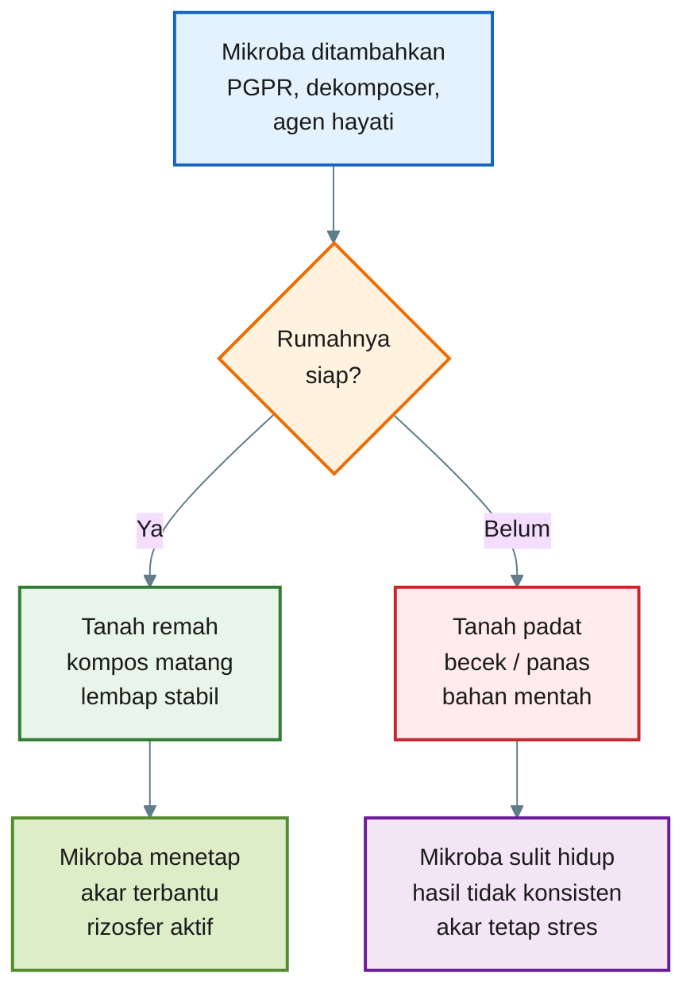

[**Kembali ke atas**](#rumah-mikroba-rizosfer-cara-praktis-menyiapkan-tanah-cabai-agar-mikroba-menguntungkan-bisa-bekerja)

---

# 2. Apa Itu Rumah Mikroba?

**Rumah mikroba** adalah kondisi tanah atau media tanam yang memungkinkan mikroba hidup, berkembang, dan bekerja di sekitar akar.

Dalam budidaya cabai, rumah mikroba bukan sekadar tanah yang diberi banyak bahan organik. Rumah mikroba yang baik adalah tanah yang **matang, stabil, remah, cukup udara, tidak busuk, dan nyaman untuk akar**.

Mikroba rizosfer hidup di zona sekitar akar. Di sana akar mengeluarkan eksudat, yaitu senyawa seperti gula, asam organik, asam amino, dan senyawa lain yang menjadi makanan sekaligus sinyal bagi mikroba. Tetapi eksudat akar saja tidak cukup. Mikroba tetap membutuhkan tanah yang secara fisik dan kimia mendukung.

Komponen utama rumah mikroba adalah sebagai berikut:

| Komponen                | Fungsi                             |
| ----------------------- | ---------------------------------- |
| **Kompos matang**       | Makanan dan habitat mikroba        |
| **Sekam bakar/biochar** | Pori mikro dan rumah fisik         |
| **Struktur remah**      | Ruang udara, air, dan akar         |
| **Kelembapan stabil**   | Menjaga aktivitas mikroba          |
| **Oksigen cukup**       | Mencegah pembusukan anaerob        |
| **pH sesuai**           | Mendukung mikroba dan serapan hara |
| **Akar hidup**          | Sumber eksudat untuk mikroba       |
| **Mulsa**               | Menjaga suhu dan kelembapan tanah  |

Bahan organik yang matang sangat penting karena ia memperbaiki banyak fungsi tanah sekaligus: struktur, porositas, infiltrasi air, kemampuan menahan kelembapan, aktivitas organisme tanah, dan ketersediaan hara. ([FAOHome][3])

Namun perlu dibedakan antara **bahan organik matang** dan **bahan organik mentah**.

Bahan organik matang:

- berbau tanah,
- tidak panas,
- remah,
- tidak berlendir,
- tidak berbau amonia,
- bentuk bahan asal sudah sulit dikenali.

Bahan organik mentah:

- masih berupa daun/pupuk kandang segar,
- masih panas,
- bau asam tajam, busuk, atau amonia,
- masih aktif membusuk,
- bisa mengganggu akar cabai.

Untuk cabai, bahan organik mentah bukan rumah mikroba yang aman. Ia justru bisa menciptakan zona akar yang panas, asam, kekurangan oksigen, atau penuh mikroba pembusuk.

Penegasan penting:

> **Bahan organik mentah bukan rumah mikroba yang aman untuk cabai. Yang dibutuhkan adalah bahan organik matang dan stabil.**

---

## Diagram Bab 2 — Komponen Rumah Mikroba

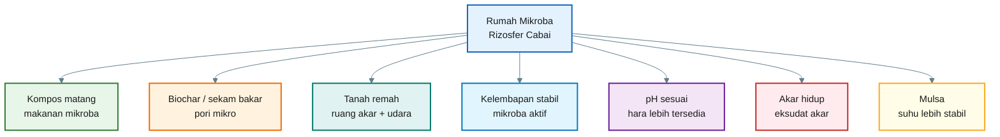

[**Kembali ke atas**](#rumah-mikroba-rizosfer-cara-praktis-menyiapkan-tanah-cabai-agar-mikroba-menguntungkan-bisa-bekerja)

---

# 3. Ciri Tanah yang Sudah Layak Dihuni Mikroba

Tanah yang layak dihuni mikroba biasanya bisa dikenali dari tanda-tanda sederhana. Petani tidak harus langsung memakai laboratorium untuk membaca kondisi awal tanah. Banyak sinyal penting bisa dilihat, dicium, disentuh, dan diuji sederhana di lapangan.

Untuk cabai rawit dan cabai besar, tanah/media yang siap menjadi rumah mikroba umumnya memiliki ciri berikut.

## 3.1 Ciri tanah/media yang baik

| Indikator            | Ciri Tanah Layak                                           |
| -------------------- | ---------------------------------------------------------- |
| **Bau**              | Berbau tanah segar                                         |
| **Struktur**         | Remah, gembur, tidak padat                                 |
| **Air**              | Meresap baik, tidak menggenang lama                        |
| **Kelembapan**       | Lembap stabil, tidak terlalu kering atau becek             |
| **Suhu media**       | Tidak panas                                                |
| **Bahan organik**    | Kompos sudah matang dan menyatu                            |
| **Akar tanaman uji** | Putih/krem, bercabang, tidak busuk                         |
| **Biopori**          | Ada lubang akar lama, pori, atau aktivitas organisme tanah |
| **pH**               | Mendekati 6,0–6,8                                          |
| **EC/garam**         | Tidak terlalu tinggi, akar tidak stres                     |

Struktur tanah yang baik penting karena mikroba membutuhkan ruang mikro untuk udara dan air. NRCS menjelaskan bahwa stabilitas agregat tanah berkaitan dengan kandungan bahan organik, aktivitas biologis, dan siklus hara tanah. ([Natural Resources Conservation Service][4])

## 3.2 Ciri tanah/media yang belum siap

| Indikator            | Ciri Tanah Belum Layak                     |
| -------------------- | ------------------------------------------ |
| **Bau**              | Busuk, amonia, telur busuk, septic         |
| **Struktur**         | Terlalu padat, keras, atau lengket         |
| **Air**              | Menggenang lama atau terlalu cepat hilang  |
| **Kelembapan**       | Terlalu becek atau terlalu kering          |
| **Suhu media**       | Terasa panas akibat kompos belum matang    |
| **Bahan organik**    | Masih mentah, masih jelas bentuk asalnya   |
| **Akar tanaman uji** | Cokelat, pendek, busuk, berbau             |
| **Biopori**          | Hampir tidak ada pori/akar lama            |
| **pH**               | Terlalu asam atau terlalu basa             |
| **EC/garam**         | Terlalu tinggi akibat pupuk/kompos “panas” |

Tanah yang terlalu becek dan kekurangan oksigen akan mendorong proses anaerob. Dalam kondisi seperti ini, mikroba menguntungkan sulit bekerja optimal, sedangkan pembusukan dan penyakit akar lebih mudah berkembang.

Tanah yang terlalu padat juga bermasalah. Akar cabai akan sulit menembus tanah, oksigen rendah, air tidak seimbang, dan mikroba rizosfer tidak mendapat ruang hidup yang baik.

Tanah yang terlalu panas karena kompos belum matang juga berisiko. Bahan organik yang belum stabil dapat menghasilkan amonia, asam organik berlebih, atau panas fermentasi lanjutan yang mengganggu akar muda cabai.

## 3.3 Bedakan “hidup” dan “busuk”

Ini penting. Banyak petani mengira tanah yang bau menyengat berarti tanahnya “aktif”. Padahal tidak semua aktivitas mikroba itu baik.

Tanah yang hidup biasanya:

- berbau tanah segar,
- remah,
- lembap,
- tidak panas,
- ada akar sehat,
- bahan organik menyatu.

Tanah yang busuk biasanya:

- bau amonia atau got,
- terlalu basah,
- berlendir,
- bahan organik masih mentah,
- akar mudah cokelat,
- muncul pembusukan di sekitar pangkal tanaman.

Kalimat kunci bab ini:

> **Tanah siap mikroba biasanya berbau tanah segar, bukan bau fermentasi tajam, amonia, atau busuk.**

---

## Diagram Bab 3 — Tanah Siap vs Belum Siap

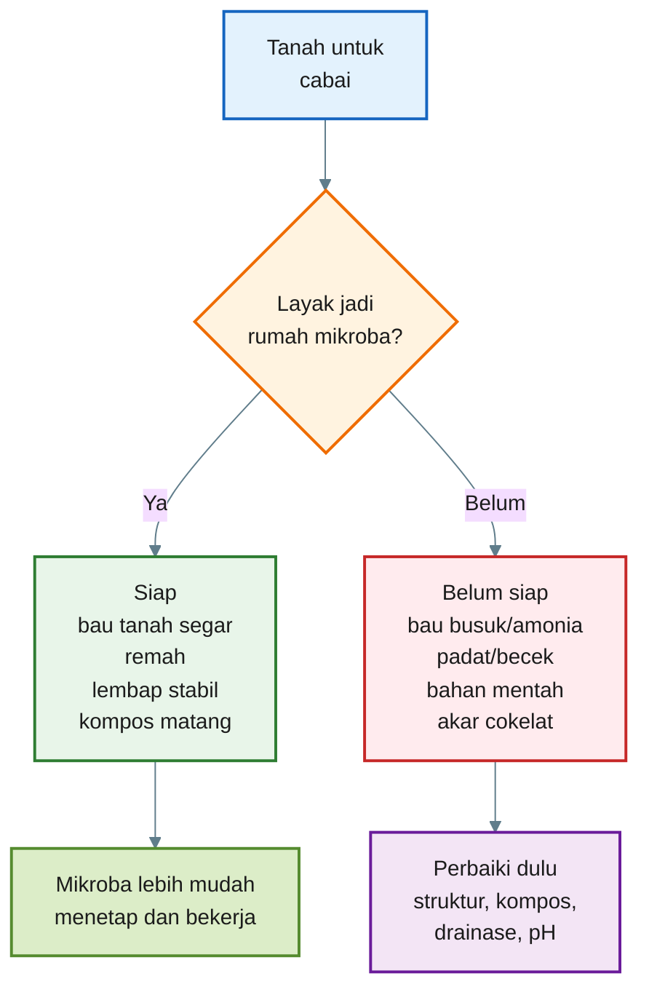

---

## Penutup Bagian 1

Sampai Bab 3, prinsip dasarnya sudah jelas:

1. Mikroba tidak cukup hanya ditambahkan.
2. Mikroba butuh rumah yang layak.
3. Rumah mikroba adalah tanah/media yang matang, remah, lembap stabil, cukup udara, dan nyaman untuk akar cabai.
4. Bahan organik mentah bukan rumah yang aman untuk cabai.
5. Tanah yang siap biasanya berbau tanah segar, bukan bau busuk atau amonia.
6. Pupuk tetap wajib sebagai sumber utama hara; mikroba membantu efisiensi kerja akar dan rizosfer.

[1]: https://www.fao.org/4/a0100e/a0100e08.htm?utm_source=chatgpt.com 'Chapter 5. Creating drought-resistant soil'
[2]: https://extension.okstate.edu/fact-sheets/pepper-production?utm_source=chatgpt.com 'Pepper Production | Oklahoma State University'
[3]: https://www.fao.org/4/a0100e/a0100e0f.htm?utm_source=chatgpt.com 'The importance of soil organic matter'
[4]: https://www.nrcs.usda.gov/sites/default/files/2022-10/Rangeland_Soil_Health_Aggregate_Stability_SD-FS-85c.pdf?utm_source=chatgpt.com 'Rangeland Soil Health - Aggregate Stability'

---

[**Kembali ke atas**](#rumah-mikroba-rizosfer-cara-praktis-menyiapkan-tanah-cabai-agar-mikroba-menguntungkan-bisa-bekerja)

---

# 4. Uji Lapang Murah: Cara Petani Membaca Rumah Mikroba

Petani tidak harus memiliki laboratorium lengkap untuk mulai membaca kesehatan tanah. Banyak tanda penting bisa diketahui dengan cara sederhana: **dicium, diremas, diberi air, diamati akarnya, dan dicek dengan alat murah seperti pH meter serta EC meter**.

Uji-uji ini tidak menggantikan analisis laboratorium. Namun, untuk keputusan praktis di lapangan, uji ini cukup membantu menjawab pertanyaan utama:

> **Apakah tanah ini sudah cukup layak menjadi rumah mikroba?**

Untuk cabai rawit dan cabai besar, uji lapang ini sangat penting karena akar cabai sensitif terhadap tanah yang padat, becek, panas, terlalu asam, terlalu asin, atau penuh bahan organik mentah.

---

## Diagram Bab 4 — Alur Uji Lapang Rumah Mikroba

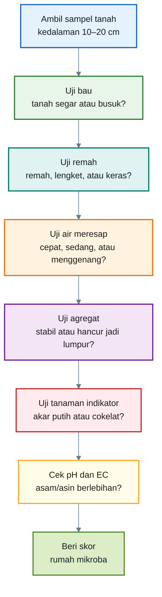

---

# 4.1 Uji Bau

Uji bau adalah uji paling sederhana, tetapi sangat berguna. Tanah yang siap menjadi rumah mikroba biasanya berbau **tanah segar**, bukan busuk.

## Alat

- Cangkul kecil, cetok, atau sekop.
- Wadah kecil.
- Sarung tangan bila tersedia.

## Cara melakukan

1. Ambil tanah dari kedalaman sekitar **10–20 cm**.
2. Pilih tanah yang mewakili zona akar cabai, bukan hanya permukaan.
3. Remas tanah sedikit agar aromanya keluar.
4. Cium dari jarak aman.

## Cara membaca hasil

| Bau Tanah                           | Arti Lapangan                                | Keputusan                    |
| ----------------------------------- | -------------------------------------------- | ---------------------------- |
| Tanah segar, seperti tanah hutan    | Proses biologis lebih sehat                  | Baik                         |
| Netral, hampir tidak berbau         | Sedang, perlu lihat uji lain                 | Cukup                        |
| Amonia, pesing, pupuk kandang tajam | Bahan organik belum matang / N terlalu aktif | Belum siap                   |
| Busuk, got, septic, telur busuk     | Anaerob/busuk                                | Jangan aplikasi mikroba dulu |
| Asam tajam menyengat                | Fermentasi belum stabil                      | Hati-hati                    |

## Makna untuk cabai

Cabai tidak menyukai zona akar yang busuk dan kekurangan oksigen. Jika tanah berbau amonia atau busuk, akar muda cabai bisa stres. Mikroba menguntungkan seperti PGPR, agen hayati, atau mikoriza juga sulit bekerja optimal pada tanah yang proses pembusukannya tidak sehat.

Kalimat praktis:

> **Kalau tanahnya bau busuk, jangan buru-buru menambah mikroba. Perbaiki dulu rumahnya.**

---

# 4.2 Uji Remah

Uji remah dipakai untuk membaca struktur tanah. Mikroba, akar, air, dan udara membutuhkan ruang. Tanah yang terlalu padat membuat akar sulit tumbuh dan mikroba kekurangan ruang hidup.

## Cara melakukan

1. Ambil segenggam tanah lembap.
2. Remas perlahan.
3. Buka telapak tangan.
4. Tekan gumpalan tanah dengan jari.

## Cara membaca hasil

| Hasil Remasan                                   | Arti Lapangan                  | Keputusan                          |
| ----------------------------------------------- | ------------------------------ | ---------------------------------- |
| Tanah membentuk gumpalan kecil lalu pecah remah | Struktur baik                  | Baik                               |
| Tanah agak remah tetapi masih ada bagian padat  | Sedang                         | Perlu perbaikan ringan             |
| Tanah lengket seperti lem                       | Terlalu liat/becek             | Perlu aerasi dan bahan berpori     |
| Tanah keras seperti batu                        | Padat/kekurangan bahan organik | Perlu kompos matang dan pembenahan |
| Tanah pasir lepas dan tidak menahan bentuk      | Terlalu porous                 | Perlu bahan organik matang         |

## Makna untuk cabai

Cabai membutuhkan tanah yang bisa menahan air, tetapi tetap memiliki udara. Tanah yang terlalu padat membuat akar sulit berkembang. Tanah yang terlalu lepas membuat air dan hara cepat hilang.

Tanah ideal untuk cabai adalah tanah yang:

- remah,
- mudah ditembus akar,
- tidak becek,
- tidak keras,
- memiliki pori udara.

Kalimat praktis:

> **Tanah remah adalah rumah fisik bagi akar dan mikroba.**

---

# 4.3 Uji Air Meresap

Uji ini membantu membaca drainase dan aerasi. Tanah yang airnya menggenang lama biasanya berisiko kekurangan oksigen. Tanah yang airnya hilang terlalu cepat bisa sulit menjaga kelembapan.

## Alat

- Kaleng bekas tanpa dasar, pipa PVC, atau botol plastik besar yang dipotong.
- Air 500 ml.
- Jam atau stopwatch.

## Cara melakukan

1. Tancapkan kaleng/pipa ke tanah sedalam 3–5 cm.
2. Tuang **500 ml air** ke dalamnya.
3. Catat waktu sampai air meresap habis.
4. Ulangi di beberapa titik lahan.

## Cara membaca hasil

|   Waktu 500 ml Air Meresap | Arti Lapangan                           | Keputusan                      |
| -------------------------: | --------------------------------------- | ------------------------------ |
|                  < 2 menit | Sangat cepat, tanah bisa terlalu porous | Tambah bahan organik matang    |
|                 2–10 menit | Umumnya baik                            | Layak                          |
|                10–30 menit | Agak lambat                             | Perbaiki struktur dan drainase |
|                 > 30 menit | Buruk, risiko genangan                  | Jangan aplikasi luas dulu      |
| Tidak meresap / menggenang | Drainase buruk                          | Perbaiki bedengan/parit        |

Angka ini bukan standar mutlak untuk semua jenis tanah. Tanah liat wajar lebih lambat daripada tanah berpasir. Gunakan uji ini terutama untuk **membandingkan antar petak di lahan sendiri**.

## Makna untuk cabai

Cabai tidak menyukai akar yang tergenang. Tanah yang terlalu basah dan miskin oksigen memudahkan busuk akar dan penyakit layu. Sebaliknya, tanah yang terlalu cepat kehilangan air membuat tanaman mudah layu saat panas.

Kalimat praktis:

> **Air harus masuk, tetapi tidak boleh tinggal terlalu lama di zona akar.**

---

# 4.4 Uji Agregat dalam Gelas

Uji agregat membantu melihat apakah tanah memiliki struktur yang stabil. Agregat yang baik adalah gumpalan kecil tanah yang tidak langsung hancur menjadi lumpur saat terkena air.

Agregat penting karena menjadi tempat bertemunya:

- udara,
- air,
- akar,
- bahan organik,
- mikroba.

## Alat

- Gelas bening.
- Air bersih.
- Gumpalan tanah kering atau agak lembap ukuran 1–2 cm.

## Cara melakukan

1. Isi gelas dengan air.
2. Masukkan gumpalan tanah secara perlahan.
3. Jangan diaduk.
4. Diamkan 5–10 menit.
5. Amati apakah tanah tetap utuh atau hancur.

## Cara membaca hasil

| Hasil                              | Arti Lapangan                            | Keputusan                  |
| ---------------------------------- | ---------------------------------------- | -------------------------- |
| Gumpalan tetap cukup utuh          | Agregat stabil                           | Baik                       |
| Sebagian hancur, sebagian bertahan | Sedang                                   | Perlu perbaikan            |
| Langsung hancur jadi lumpur        | Agregat lemah                            | Rumah mikroba belum kuat   |
| Air cepat keruh pekat              | Struktur lemah / tanah mudah terdispersi | Perlu bahan organik matang |

## Makna untuk cabai

Agregat tanah yang stabil membuat akar cabai lebih mudah mendapatkan air dan udara secara seimbang. Mikroba juga lebih mudah tinggal di pori-pori kecil dalam agregat.

Jika tanah langsung hancur menjadi lumpur, setelah hujan atau penyiraman tanah bisa cepat memadat. Ini membuat akar cabai lebih sulit bernapas.

Kalimat praktis:

> **Agregat yang stabil adalah kamar-kamar kecil tempat mikroba tinggal.**

---

# 4.5 Uji Tanaman Indikator

Uji tanaman indikator adalah cara paling dekat dengan kenyataan. Tanah yang terlihat baik belum tentu nyaman untuk akar. Dengan menanam tanaman uji, kita bisa melihat respons akar secara langsung.

Tanaman indikator yang bisa dipakai:

- kacang hijau,
- jagung,
- cabai,
- sawi,
- bayam.

Untuk uji cepat, **kacang hijau** sering praktis karena cepat tumbuh. Namun untuk hasil paling relevan, gunakan juga bibit cabai.

## Cara melakukan

1. Ambil tanah dari lahan yang akan diuji.
2. Masukkan ke pot kecil, gelas bekas, atau tray.
3. Tanam 5–10 benih kacang hijau atau cabai.
4. Siram secukupnya.
5. Letakkan di tempat terang, tidak terlalu panas.
6. Amati setelah **7–14 hari**.
7. Cabut perlahan beberapa tanaman.
8. Lihat kondisi akarnya.

## Cara membaca hasil

| Kondisi Akar                              | Arti Lapangan                             | Keputusan            |
| ----------------------------------------- | ----------------------------------------- | -------------------- |
| Putih/krem, bercabang, banyak rambut akar | Tanah cukup nyaman                        | Baik                 |
| Akar sedang, sedikit cabang               | Cukup, perlu perbaikan ringan             | Sedang               |
| Akar pendek, cokelat                      | Tanah kurang nyaman                       | Belum siap           |
| Akar busuk/berbau                         | Masalah serius di media                   | Jangan aplikasi luas |
| Bibit rebah                               | Media terlalu basah/patogen/terlalu panas | Perbaiki dulu        |

## Makna untuk cabai

Uji akar lebih penting daripada sekadar melihat daun. Tanaman bisa tampak hijau sebentar, tetapi akarnya belum tentu sehat.

Untuk cabai, akar yang baik biasanya:

- putih atau krem muda,
- memiliki akar lateral,
- tidak berbau busuk,
- tidak berlendir,
- pangkal batang sehat.

Kalimat praktis:

> **Jika akar tanaman uji tidak nyaman, mikroba baik juga belum tentu nyaman.**

---

# 4.6 Uji pH dan EC Murah

pH dan EC bisa dibaca dengan alat sederhana. Alat murah memang tidak seakurat laboratorium, tetapi cukup membantu sebagai alarm awal.

## 4.6.1 Uji pH

pH menunjukkan tingkat keasaman tanah. Cabai umumnya lebih nyaman pada pH sekitar **6,0–6,8**.

## Cara uji pH sederhana

1. Ambil tanah dari kedalaman 10–20 cm.
2. Campur tanah dengan air bersih.
3. Aduk dan diamkan beberapa menit.
4. Masukkan pH meter atau gunakan kertas lakmus.
5. Catat hasilnya.

## Cara membaca pH

|      pH | Arti Praktis untuk Cabai                      |
| ------: | --------------------------------------------- |
|   < 5,5 | Terlalu asam, serapan hara bisa terganggu     |
| 5,5–6,0 | Agak asam, masih bisa tetapi perlu perhatian  |
| 6,0–6,8 | Umumnya ideal                                 |
| 6,8–7,5 | Masih bisa, tergantung kondisi hara           |
|   > 7,5 | Terlalu basa, unsur mikro bisa sulit tersedia |

Jika pH terlalu rendah, koreksi bisa dilakukan dengan kapur pertanian atau dolomit secara bertahap. Jangan berlebihan karena pH yang terlalu tinggi juga bisa menimbulkan masalah.

---

## 4.6.2 Uji EC

EC atau **Electrical Conductivity** menunjukkan banyaknya garam/ion terlarut dalam tanah atau media. Dalam praktik, EC membantu membaca apakah tanah terlalu “panas” karena pupuk, kompos belum matang, atau garam larut tinggi.

## Cara uji EC sederhana

Gunakan metode ekstrak sederhana:

```mdx id="cara-uji-ec"
1 bagian tanah

- 2 bagian air bersih

Aduk rata.
Diamkan 15–30 menit.
Ukur cairannya dengan EC meter.
```

## Cara membaca EC secara praktis

| EC Ekstrak 1:2 | Arti Lapangan                        |
| -------------: | ------------------------------------ |
|    < 0,5 mS/cm | Rendah, hara larut mungkin minim     |
|  0,5–1,5 mS/cm | Umumnya aman                         |
|  1,5–2,0 mS/cm | Waspada, lihat kondisi akar          |
|    > 2,0 mS/cm | Risiko garam tinggi, akar bisa stres |

Angka ini adalah panduan praktis awal, bukan standar mutlak. Media, jenis tanah, kualitas air, dan fase tanaman dapat memengaruhi pembacaan.

## Makna untuk cabai

Cabai bisa stres bila kadar garam terlalu tinggi. Gejalanya:

- daun layu walau media basah,
- tepi daun terbakar,
- akar pendek,
- pertumbuhan terhambat,
- bibit mudah mati.

Kalimat praktis:

> **EC tinggi berarti akar bisa sulit minum walaupun tanah terlihat basah.**

---

## Ringkasan Bab 4

| Uji                   | Yang Dibaca           | Tanda Baik            |
| --------------------- | --------------------- | --------------------- |
| Uji bau               | Proses biologis tanah | Bau tanah segar       |
| Uji remah             | Struktur tanah        | Remah dan tidak padat |
| Uji air meresap       | Drainase dan aerasi   | Meresap sedang        |
| Uji agregat           | Stabilitas struktur   | Tidak langsung hancur |
| Uji tanaman indikator | Kenyamanan akar       | Akar putih bercabang  |
| Uji pH                | Keasaman tanah        | Sekitar 6,0–6,8       |
| Uji EC                | Garam/pupuk larut     | Tidak terlalu tinggi  |

Kalimat kunci Bab 4:

> **Petani tidak harus punya laboratorium untuk mulai membaca kesehatan tanah.**

[**Kembali ke atas**](#rumah-mikroba-rizosfer-cara-praktis-menyiapkan-tanah-cabai-agar-mikroba-menguntungkan-bisa-bekerja)

---

# 5. Skor Rumah Mikroba

Setelah melakukan uji lapang, hasilnya perlu dibuat lebih objektif. Karena itu, kita gunakan **Skor Rumah Mikroba**.

Tujuannya sederhana:

> **Mengubah pengamatan lapangan menjadi angka keputusan.**

Dengan skor ini, petani bisa menentukan apakah tanah sudah layak diberi mikroba secara luas, perlu perbaikan dulu, atau masih harus diuji kecil.

---

## 5.1 Sistem Skor

Gunakan skor 0, 1, dan 2.

```mdx id="skor-dasar-rumah-mikroba"
0 = buruk
1 = sedang
2 = baik
```

Ada 10 indikator. Total maksimal adalah 20.

|  No | Indikator             | Skor |
| --: | --------------------- | ---: |
|   1 | Bau tanah             |  0–2 |
|   2 | Struktur remah        |  0–2 |
|   3 | Kelembapan stabil     |  0–2 |
|   4 | Air meresap           |  0–2 |
|   5 | Agregat tanah         |  0–2 |
|   6 | Bahan organik matang  |  0–2 |
|   7 | Akar tanaman uji      |  0–2 |
|   8 | pH sesuai             |  0–2 |
|   9 | EC/garam tidak tinggi |  0–2 |
|  10 | Biopori/akar lama     |  0–2 |

Rumus total skor:

```mdx id="rumus-total-skor"
Total Skor Rumah Mikroba =
Skor Bau Tanah

- Skor Struktur Remah
- Skor Kelembapan Stabil
- Skor Air Meresap
- Skor Agregat Tanah
- Skor Bahan Organik Matang
- Skor Akar Tanaman Uji
- Skor pH
- Skor EC
- Skor Biopori/Akar Lama
```

Atau ditulis ringkas:

$$
\text{Total Skor} =
S_1 + S_2 + S_3 + S_4 + S_5 + S_6 + S_7 + S_8 + S_9 + S_{10}
$$

Keterangan:

```mdx id="keterangan-skor"
S1 = bau tanah
S2 = struktur remah
S3 = kelembapan stabil
S4 = air meresap
S5 = agregat tanah
S6 = bahan organik matang
S7 = akar tanaman uji
S8 = pH sesuai
S9 = EC/garam tidak tinggi
S10 = biopori/akar lama
```

---

## 5.2 Panduan Pemberian Skor

## 1. Bau tanah

| Skor | Kriteria                                        |
| ---: | ----------------------------------------------- |
|    0 | Bau busuk, amonia, got, septic                  |
|    1 | Netral atau sedikit asam, belum jelas bau tanah |
|    2 | Bau tanah segar                                 |

## 2. Struktur remah

| Skor | Kriteria                                     |
| ---: | -------------------------------------------- |
|    0 | Padat, keras, lengket, atau menggumpal berat |
|    1 | Agak remah tetapi masih ada bagian padat     |
|    2 | Remah, gembur, mudah ditembus akar           |

## 3. Kelembapan stabil

| Skor | Kriteria                            |
| ---: | ----------------------------------- |
|    0 | Terlalu kering atau terlalu becek   |
|    1 | Kadang terlalu kering/becek         |
|    2 | Lembap stabil seperti spons diperas |

## 4. Air meresap

| Skor | Kriteria                                  |
| ---: | ----------------------------------------- |
|    0 | Menggenang lama atau tidak meresap        |
|    1 | Meresap terlalu lambat atau terlalu cepat |
|    2 | Meresap cukup baik dan tidak menggenang   |

## 5. Agregat tanah

| Skor | Kriteria                             |
| ---: | ------------------------------------ |
|    0 | Gumpalan langsung hancur jadi lumpur |
|    1 | Sebagian hancur, sebagian bertahan   |
|    2 | Gumpalan cukup stabil dalam air      |

## 6. Bahan organik matang

| Skor | Kriteria                                            |
| ---: | --------------------------------------------------- |
|    0 | Masih mentah, panas, bau amonia/busuk               |
|    1 | Setengah matang, sebagian bahan asal masih terlihat |
|    2 | Matang, remah, bau tanah, tidak panas               |

## 7. Akar tanaman uji

| Skor | Kriteria                            |
| ---: | ----------------------------------- |
|    0 | Akar cokelat, busuk, pendek, berbau |
|    1 | Akar sedang, sedikit cabang         |
|    2 | Akar putih/krem, bercabang, aktif   |

## 8. pH sesuai

| Skor | Kriteria             |
| ---: | -------------------- |
|    0 | < 5,5 atau > 7,5     |
|    1 | 5,5–6,0 atau 6,8–7,5 |
|    2 | 6,0–6,8              |

## 9. EC/garam tidak tinggi

| Skor | Kriteria                                         |
| ---: | ------------------------------------------------ |
|    0 | > 2,0 mS/cm atau tanaman menunjukkan stres garam |
|    1 | 1,5–2,0 mS/cm                                    |
|    2 | 0,5–1,5 mS/cm dan tanaman tidak stres            |

Jika EC < 0,5 mS/cm, artinya tidak tinggi garam, tetapi hara larut mungkin rendah. Dalam konteks “rumah mikroba”, ini tidak selalu buruk. Namun untuk produksi cabai, tetap perlu program pupuk yang cukup.

## 10. Biopori/akar lama

| Skor | Kriteria                                                        |
| ---: | --------------------------------------------------------------- |
|    0 | Hampir tidak ada pori, akar lama, atau tanda organisme tanah    |
|    1 | Ada sedikit                                                     |
|    2 | Cukup banyak biopori, akar lama, atau aktivitas organisme tanah |

---

## 5.3 Interpretasi Total Skor

| Skor Total | Kategori    | Keputusan                      |
| ---------: | ----------- | ------------------------------ |
|        0–8 | Buruk       | Jangan aplikasi mikroba dulu   |
|       9–13 | Sedang      | Perbaiki tanah, lalu uji kecil |
|      14–17 | Baik        | Layak diberi mikroba           |
|      18–20 | Sangat baik | Siap untuk program rizosfer    |

## Cara membaca keputusan

### Skor 0–8: Rumah mikroba buruk

Tanah belum siap. Mikroba yang diberikan kemungkinan sulit bertahan.

Prioritas:

- perbaiki drainase,
- tambah kompos matang,
- tambah biochar/sekam bakar,
- hentikan bahan organik mentah dekat akar,
- koreksi pH bila ekstrem,
- kurangi pupuk berlebih bila EC tinggi.

### Skor 9–13: Sedang

Tanah mulai bisa mendukung mikroba, tetapi belum stabil.

Keputusan:

- boleh uji kecil,
- jangan langsung aplikasi luas,
- tambahkan bahan organik matang,
- perbaiki struktur dan kelembapan.

### Skor 14–17: Baik

Tanah sudah layak menerima mikroba.

Keputusan:

- mikroba bisa diaplikasikan lebih percaya diri,
- tetap lakukan uji petak kecil,
- jaga kelembapan dan bahan organik.

### Skor 18–20: Sangat baik

Tanah sangat siap untuk program rizosfer.

Keputusan:

- cocok untuk PGPR, agen hayati, mikoriza,
- pertahankan dengan mulsa, kompos matang, dan pengelolaan pupuk seimbang.

---

## Diagram Bab 5 — Keputusan Berdasarkan Skor

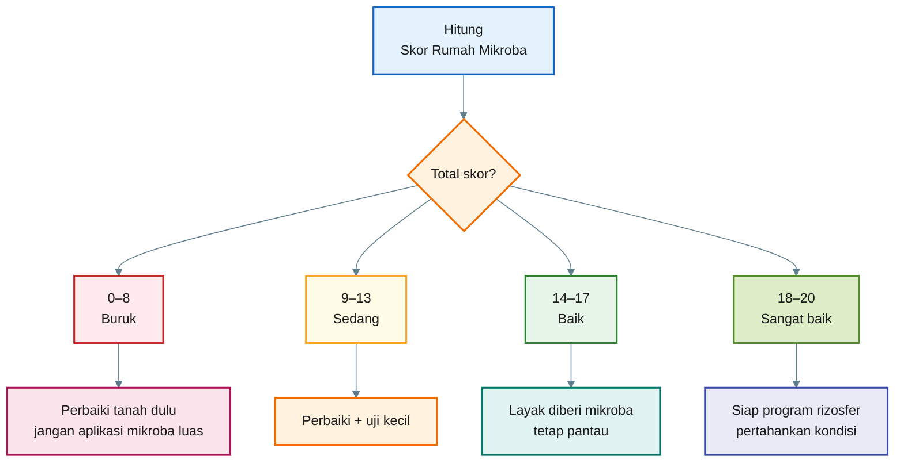

---

## 5.4 Contoh Perhitungan Skor

Misalnya petani menilai satu petak lahan cabai dengan hasil berikut:

| Indikator             | Skor |
| --------------------- | ---: |
| Bau tanah             |    2 |
| Struktur remah        |    1 |
| Kelembapan stabil     |    1 |
| Air meresap           |    1 |
| Agregat tanah         |    1 |
| Bahan organik matang  |    2 |
| Akar tanaman uji      |    1 |
| pH sesuai             |    2 |
| EC/garam tidak tinggi |    1 |
| Biopori/akar lama     |    1 |

Perhitungan:

```mdx id="contoh-hitung-skor-rumah"
Total skor =
2 + 1 + 1 + 1 + 1 + 2 + 1 + 2 + 1 + 1

Total skor = 13
```

Interpretasi:

```mdx id="interpretasi-skor-13"
Skor 13 = kategori sedang.

Keputusan:

- tanah belum ideal untuk aplikasi mikroba luas,
- boleh uji kecil,
- perbaiki struktur,
- tambah biochar/sekam bakar,
- jaga kelembapan,
- amati akar tanaman uji lagi.
```

Contoh lain:

| Indikator             | Skor |
| --------------------- | ---: |
| Bau tanah             |    2 |
| Struktur remah        |    2 |
| Kelembapan stabil     |    2 |
| Air meresap           |    2 |
| Agregat tanah         |    1 |
| Bahan organik matang  |    2 |
| Akar tanaman uji      |    2 |
| pH sesuai             |    2 |
| EC/garam tidak tinggi |    2 |
| Biopori/akar lama     |    1 |

Perhitungan:

```mdx id="contoh-hitung-skor-rumah-18"
Total skor =
2 + 2 + 2 + 2 + 1 + 2 + 2 + 2 + 2 + 1

Total skor = 18
```

Interpretasi:

```mdx id="interpretasi-skor-18"
Skor 18 = sangat baik.

Keputusan:

- tanah siap untuk program rizosfer,
- mikroba boleh diaplikasikan,
- tetap gunakan pupuk sesuai kebutuhan,
- jaga kondisi dengan mulsa dan kompos matang.
```

---

# 5.5 Skor Ini Bukan Pengganti Pengamatan Tanaman

Skor membantu membuat keputusan lebih objektif, tetapi tanaman tetap menjadi indikator utama.

Setelah tanah diberi mikroba, tetap amati:

- akar,
- daun,
- pertumbuhan,
- layu,
- bunga,
- buah,
- hasil panen.

Jika skor tanah tinggi tetapi tanaman tetap bermasalah, penyebabnya bisa berasal dari faktor lain:

- penyakit terbawa bibit,
- pupuk tidak seimbang,
- air irigasi buruk,
- pH berubah,
- salinitas meningkat,
- serangan hama,
- varietas tidak cocok,
- cuaca ekstrem.

Jadi skor rumah mikroba adalah alat bantu, bukan satu-satunya penentu.

Kalimat kunci Bab 5:

> **Target minimal sebelum aplikasi mikroba luas: skor 14 dari 20.**

---

## Penutup Bagian 2

Bab 4 dan Bab 5 memberikan alat praktis bagi petani untuk membaca tanah sebelum menambahkan mikroba.

Ringkasnya:

1. Uji bau membaca proses biologis tanah.
2. Uji remah membaca struktur fisik.
3. Uji air meresap membaca drainase dan aerasi.
4. Uji agregat membaca kestabilan tanah.
5. Uji tanaman indikator membaca kenyamanan akar.
6. Uji pH dan EC membantu membaca keasaman serta garam larut.
7. Skor rumah mikroba membantu menentukan apakah tanah sudah layak menerima mikroba.

[**Kembali ke atas**](#rumah-mikroba-rizosfer-cara-praktis-menyiapkan-tanah-cabai-agar-mikroba-menguntungkan-bisa-bekerja)

---

# 6. Cara Membangun Rumah Mikroba untuk Cabai

Setelah tanah dinilai dengan uji lapang dan skor rumah mikroba, langkah berikutnya adalah **membangun rumah mikroba**. Ini berarti memperbaiki tanah agar mikroba menguntungkan bisa hidup, menetap, dan bekerja di sekitar akar cabai.

Prinsipnya sederhana:

> **Jangan memasukkan mikroba ke tanah yang belum nyaman untuk akar. Perbaiki rumahnya dulu, baru masukkan penghuninya.**

Untuk cabai rawit dan cabai besar, rumah mikroba yang baik harus memenuhi beberapa syarat:

- tanah remah,
- bahan organik matang,
- drainase baik,
- tidak becek,
- tidak panas,
- pH tidak terlalu asam,
- cukup pori udara,
- ada sumber karbon stabil,
- akar bisa tumbuh aktif.

Mikroba fungsional seperti dekomposer, agen hayati antagonis, PGPR, dan mikoriza akan bekerja lebih baik bila tanahnya sudah mendukung. Jika tanah terlalu padat, bahan organik masih mentah, atau zona akar kekurangan oksigen, mikroba yang diberikan mudah kalah atau tidak aktif.

---

## Diagram Bab 6 — Urutan Membangun Rumah Mikroba

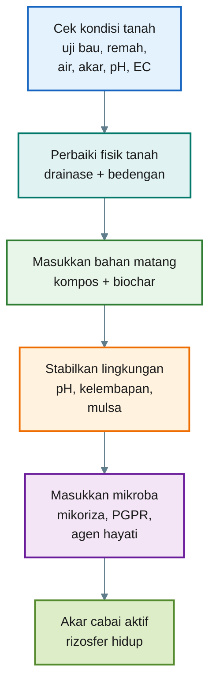

---

# 6.1 Untuk Lahan Bedengan

Lahan bedengan cocok untuk cabai skala lapang. Namun, bedengan harus disiapkan bukan hanya sebagai tempat tanam, tetapi sebagai **zona rizosfer**.

Berikut langkah praktisnya.

---

## 6.1.1 Bersihkan sisa tanaman sakit

Langkah pertama adalah membersihkan sisa tanaman yang berpotensi membawa penyakit.

Cabut dan keluarkan:

- akar tanaman cabai lama yang sakit,
- batang busuk,
- tanaman layu,
- buah busuk,
- gulma besar,
- sisa tanaman yang terinfeksi jamur/bakteri.

Jangan membenamkan sisa tanaman sakit langsung ke bedengan cabai. Jika sisa tanaman mengandung patogen tanah, ia bisa menjadi sumber masalah pada musim tanam berikutnya.

Sisa tanaman sehat boleh dikomposkan, tetapi harus melalui proses dekomposisi sampai matang. Sisa tanaman sakit lebih aman dikeluarkan dari area produksi atau dikelola terpisah dengan perlakuan sanitasi yang baik.

Kalimat praktis:

> **Rumah mikroba tidak boleh dimulai dari bahan sakit yang dibenamkan ke zona akar.**

---

## 6.1.2 Perbaiki drainase dan tinggi bedengan

Cabai tidak tahan zona akar yang terlalu lama becek. Akar cabai membutuhkan oksigen. Tanah yang terlalu basah membuat akar sulit bernapas dan memudahkan patogen tanah berkembang.

<figure>
  
  <figcaption>Morphologi cabai rawit.</figcaption>
</figure>

<figure>
  
  <figcaption>Morphologi cabai besar.</figcaption>
</figure>

Bedengan sebaiknya dibuat lebih tinggi jika:

- lahan sering tergenang,
- tanah berat/liat,
- musim hujan,
- riwayat layu tinggi,
- air sulit keluar dari petak.

Panduan praktis:

| Kondisi Lahan               | Rekomendasi Bedengan                 |
| --------------------------- | ------------------------------------ |
| Tanah gembur, drainase baik | Bedengan sedang                      |
| Tanah liat/agak berat       | Bedengan lebih tinggi                |
| Musim hujan                 | Bedengan tinggi + parit jelas        |
| Lahan sering tergenang      | Perbaiki saluran utama sebelum tanam |
| Polybag/greenhouse          | Fokus pada porositas media           |

Ukuran bedengan bisa disesuaikan dengan sistem lokal, tetapi prinsipnya:

```mdx id="prinsip-bedengan-cabai"
Tujuan bedengan:

- air berlebih cepat keluar,
- akar tetap mendapat oksigen,
- kelembapan tetap tersedia,
- zona akar tidak becek berkepanjangan.
```

Kalimat praktis:

> **Mikroba rizosfer butuh air, tetapi bukan genangan.**

---

## 6.1.3 Tambahkan kompos matang

Kompos matang adalah fondasi rumah mikroba. Ia menjadi sumber karbon, habitat mikroba, dan pembenah struktur tanah.

Kompos yang baik untuk cabai memiliki ciri:

- bau tanah segar,
- tidak panas,
- tidak bau amonia,
- tidak berlendir,
- warna cokelat tua sampai hitam,
- remah,
- bahan asal sulit dikenali.

Kompos yang belum matang bisa menimbulkan masalah:

- akar stres,
- media panas,
- bau amonia,
- aktivitas busuk,
- bibit lambat tumbuh,
- akar cokelat.

Untuk bedengan cabai, kompos matang sebaiknya dicampurkan merata ke lapisan olah tanah, bukan hanya ditumpuk mentah di lubang tanam.

Panduan umum:

```mdx id="kompos-bedengan"
Gunakan kompos matang sebagai pembenah tanah.

Prinsip aplikasi:

- campur merata di zona olah,
- jangan menempelkan bahan mentah ke akar,
- gunakan bertahap dan konsisten,
- sesuaikan jumlah dengan kondisi tanah.
```

Kalimat praktis:

> **Kompos matang adalah dapur dan ruang tinggal mikroba.**

---

## 6.1.4 Tambahkan sekam bakar atau biochar

Sekam bakar atau biochar berfungsi sebagai **rumah fisik mikroba**. Pori-porinya menyediakan ruang mikro yang dapat menahan air, udara, dan tempat berlindung bagi mikroba.

Manfaat untuk cabai:

- memperbaiki aerasi tanah,
- mengurangi pemadatan,
- membantu menjaga kelembapan,
- menyediakan pori mikro,
- mendukung akar halus,
- membantu menstabilkan zona rizosfer.

Sekam bakar/biochar sangat berguna pada:

- tanah berat,
- media polybag,
- tanah yang mudah becek,
- tanah yang struktur remahnya lemah.

Namun jangan berlebihan. Terlalu banyak bahan berpori pada tanah berpasir bisa membuat air dan hara cepat hilang.

Panduan praktis:

```mdx id="biochar-sekam"
Sekam bakar/biochar digunakan sebagai pembenah fisik.

Fungsi utama:

- menambah pori,
- memberi ruang mikroba,
- membantu aerasi,
- menahan sebagian air.
```

Kalimat praktis:

> **Kompos memberi makanan, biochar memberi kamar.**

---

## 6.1.5 Koreksi pH bila terlalu asam

pH memengaruhi mikroba dan ketersediaan hara. Untuk cabai, target praktis pH tanah biasanya mendekati **6,0–6,8**.

Jika pH terlalu asam, beberapa hara menjadi sulit tersedia, akar bisa terganggu, dan aktivitas mikroba tertentu tidak optimal.

Bila pH rendah, koreksi bisa dilakukan dengan:

- dolomit,
- kapur pertanian,
- bahan pengapuran lain yang sesuai.

Namun pengapuran jangan dilakukan asal banyak. Lakukan bertahap dan sesuaikan dengan kondisi tanah.

Panduan praktis:

```mdx id="koreksi-ph"
Jika pH < 5,5:

- pertimbangkan pengapuran bertahap,
- gunakan dolomit/kapur pertanian,
- campurkan merata,
- beri waktu sebelum tanam.

Jika pH 6,0–6,8:

- umumnya sudah baik untuk cabai.
```

Kalimat praktis:

> **pH yang terlalu ekstrem membuat akar dan mikroba sama-sama tidak nyaman.**

---

## 6.1.6 Bila bahan organik belum matang, lakukan dekomposisi lebih dulu

Ini poin penting. Jangan mengejar cepat dengan memasukkan bahan organik mentah ke bedengan cabai.

Bahan yang belum matang antara lain:

- daun hijau segar,
- pupuk kandang segar,
- bokashi baru jadi,
- seresah kasar belum lapuk,
- sisa tanaman yang masih jelas bentuknya,
- bahan yang masih panas atau berbau menyengat.

Jika bahan organik belum matang, lakukan dekomposisi di luar zona akar terlebih dahulu. Gunakan dekomposer atau proses pengomposan aerob sampai bahan menjadi stabil.

Ciri bahan sudah siap:

- tidak panas,
- bau tanah,
- remah,
- tidak bau amonia,
- tidak berlendir,
- bentuk bahan asal sulit dikenali.

Alur yang aman:

```mdx id="alur-bahan-organik-aman"
Bahan organik mentah
→ dicacah
→ didekomposisi secara aerob
→ menjadi kompos matang
→ baru masuk bedengan cabai
```

Bukan:

```mdx id="alur-bahan-organik-tidak-aman"
Bahan organik mentah
→ langsung ditaruh dekat akar cabai
```

Kalimat praktis:

> **Untuk cabai, bahan organik harus matang dulu. Fermentasi saja belum tentu cukup.**

---

## 6.1.7 Pasang mulsa untuk menjaga suhu dan kelembapan

Mulsa membantu rumah mikroba tetap stabil. Tanah yang terbuka langsung terkena matahari cepat panas dan cepat kering. Kondisi ini membuat mikroba lebih sulit aktif.

Mulsa berfungsi:

- menjaga kelembapan,
- menurunkan fluktuasi suhu tanah,
- mengurangi percikan tanah ke daun,
- menekan gulma,
- menjaga struktur permukaan tanah.

Mulsa yang bisa digunakan:

- mulsa plastik perak hitam,
- jerami matang/kering bebas biji gulma,
- daun kering yang aman,
- seresah organik yang sudah stabil,
- bahan penutup tanah sesuai kondisi lahan.

Untuk cabai intensif, mulsa plastik banyak dipakai karena praktis. Untuk sistem lebih organik/regeneratif, mulsa organik juga bisa digunakan, tetapi harus bebas bahan sakit dan tidak mentah berlebihan.

Kalimat praktis:

> **Mulsa adalah atap rumah mikroba.**

---

## 6.1.8 Tambahkan mikoriza dekat akar saat tanam

Mikoriza harus diletakkan dekat akar karena fungi ini perlu kontak dengan akar hidup. Jika ditabur jauh dari akar, efektivitasnya menurun.

Waktu terbaik:

- saat pindah tanam,
- di lubang tanam,
- dekat zona akar bibit.

Cara praktis:

```mdx id="aplikasi-mikoriza"
Saat tanam:

- buat lubang tanam,
- letakkan mikoriza sesuai dosis label,
- posisikan dekat akar bibit,
- tanam bibit,
- siram secukupnya.
```

Hindari mencampur mikoriza langsung dengan fungisida kimia. Jika perlu aplikasi fungisida, beri jarak waktu dan pertimbangkan risiko terhadap mikroba.

Kalimat praktis:

> **Mikoriza harus bertemu akar, bukan sekadar ditabur di tanah.**

---

## 6.1.9 Kocor PGPR atau mikroba rizosfer setelah tanaman mulai pulih

PGPR atau mikroba rizosfer sebaiknya dikocorkan setelah tanaman mulai pulih dari pindah tanam. Jangan terlalu pekat pada bibit yang baru stres.

Waktu praktis:

- 5–7 hari setelah pindah tanam,
- setelah bibit tampak segar,
- pagi atau sore,
- tanah lembap tetapi tidak becek.

Prinsip aplikasi:

```mdx id="aplikasi-pgpr-cabai"
PGPR/mikroba rizosfer:

- gunakan sebagai kocor zona akar,
- aplikasikan saat tanah lembap,
- jangan dicampur langsung dengan fungisida/bakterisida,
- mulai dari dosis rendah,
- ulangi sesuai respons tanaman.
```

Kalimat praktis:

> **PGPR dimasukkan setelah rumahnya siap dan akar mulai aktif.**

---

## Ringkasan 6.1 — Bedengan Cabai

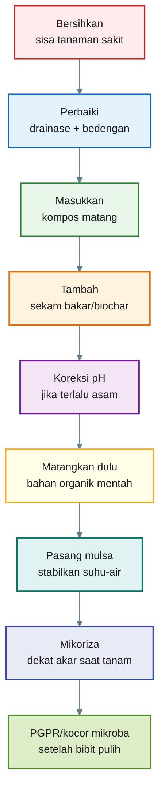

---

# 6.2 Untuk Polybag

Polybag memberi kontrol lebih besar dibanding lahan terbuka. Namun, risiko utamanya adalah media terlalu padat, terlalu basah, terlalu panas, atau terlalu tinggi pupuk.

Untuk cabai rawit dan cabai besar dalam polybag, media harus ringan, remah, dan tidak cepat becek.

---

## 6.2.1 Formula dasar media

Formula dasar yang aman:

```mdx id="formula-media-polybag-cabai"
50% tanah sehat
30% kompos matang
20% sekam bakar/biochar
```

Makna formula:

| Komponen            | Fungsi                                   |
| ------------------- | ---------------------------------------- |
| Tanah sehat         | Struktur mineral, penyangga hara         |
| Kompos matang       | Bahan organik, makanan mikroba           |
| Sekam bakar/biochar | Aerasi, pori mikro, penyangga kelembapan |

Formula ini bukan angka mutlak. Pada tanah yang sangat liat, bagian sekam bakar/biochar bisa sedikit dinaikkan. Pada tanah yang terlalu berpasir, kompos matang bisa diperkuat, tetapi tetap jangan membuat media terlalu basah.

---

## 6.2.2 Syarat media polybag yang baik

Media polybag yang layak menjadi rumah mikroba memiliki ciri:

- ringan tetapi tidak terlalu lepas,
- remah,
- air siraman keluar dari bawah polybag,
- tidak menggenang,
- tidak bau busuk,
- tidak panas,
- kompos matang,
- akar mudah menembus media.

Jika media terlalu padat, akar cabai akan lambat berkembang. Jika media terlalu lembek dan basah, akar mudah kekurangan oksigen.

Kalimat praktis:

> **Media polybag yang baik harus bisa menyimpan air, tetapi tetap bernapas.**

---

## 6.2.3 Tambahkan mikoriza saat tanam

Sama seperti di bedengan, mikoriza sebaiknya diletakkan dekat akar bibit saat tanam.

Cara:

```mdx id="mikoriza-polybag"
Saat tanam di polybag:

- isi sebagian media,
- letakkan mikoriza sesuai label,
- posisikan dekat akar,
- masukkan bibit,
- tutup dengan media,
- siram secukupnya.
```

Jangan menaburkan mikoriza hanya di permukaan jauh dari akar. Mikoriza memerlukan kontak dengan akar untuk bekerja.

---

## 6.2.4 Gunakan agen hayati akar sesuai kebutuhan

Agen hayati antagonis dapat digunakan untuk membantu menjaga kesehatan akar, terutama bila riwayat media atau lahan pernah mengalami busuk akar, layu, atau patogen tanah.

Aplikasi bisa dilakukan:

- dicampur tipis pada media,
- dikocor setelah tanam,
- diberikan sesuai label produk,
- tidak dicampur langsung dengan fungisida/bakterisida.

Namun, agen hayati tetap membutuhkan media yang sehat. Jika media becek dan busuk, agen hayati sulit bekerja optimal.

---

## 6.2.5 PGPR setelah bibit pulih

Untuk polybag, PGPR atau mikroba rizosfer sebaiknya diberikan setelah bibit mulai pulih dari pindah tanam.

Panduan praktis:

```mdx id="pgpr-polybag"
Waktu:
5–7 hari setelah tanam, atau saat bibit tampak pulih.

Cara:
kocor di sekitar pangkal tanaman.

Catatan:
gunakan dosis ringan lebih dulu,
hindari media terlalu basah.
```

Jika media polybag terlalu basah, tunda aplikasi mikroba cair. Perbaiki aerasi dan kurangi penyiraman.

---

## 6.2.6 Pupuk tetap diberikan sesuai kebutuhan

Ini wajib ditegaskan. Kompos, biochar, PGPR, mikoriza, dan agen hayati bukan pengganti penuh kebutuhan hara cabai.

Cabai tetap membutuhkan:

- nitrogen,
- fosfor,
- kalium,
- kalsium,
- magnesium,
- sulfur,
- unsur mikro.

Kompos matang memberi sebagian hara dan memperbaiki tanah, tetapi untuk produksi cabai yang intensif, pupuk tetap perlu diberikan sesuai kebutuhan tanaman, fase pertumbuhan, kondisi media, dan target hasil.

Kalimat kunci:

> **Mikroba membantu akar memanfaatkan hara. Pupuk tetap menyediakan hara.**

---

## Ringkasan 6.2 — Polybag Cabai

| Tahap                   | Tindakan                                                      |
| ----------------------- | ------------------------------------------------------------- |
| Media dasar             | 50% tanah sehat + 30% kompos matang + 20% sekam bakar/biochar |
| Saat tanam              | Tambahkan mikoriza dekat akar                                 |
| Setelah bibit pulih     | Kocor PGPR/mikroba rizosfer dosis ringan                      |
| Bila ada risiko patogen | Gunakan agen hayati akar                                      |
| Sepanjang budidaya      | Pupuk tetap diberikan sesuai kebutuhan                        |
| Kunci media             | Tidak padat, tidak becek, tidak panas, berbau tanah           |

Kalimat kunci Bab 6:

> **Rumah mikroba dibangun sebelum mikroba dimasukkan.**

[**Kembali ke atas**](#rumah-mikroba-rizosfer-cara-praktis-menyiapkan-tanah-cabai-agar-mikroba-menguntungkan-bisa-bekerja)

---

# 7. Peran Mikroba Fungsional: Dekomposer, Agen Hayati, PGPR, dan Mikoriza

Setelah rumah mikroba dibangun, barulah kita memilih mikroba fungsional sesuai kebutuhan. Dalam artikel ini, istilah yang dipakai adalah istilah generik, bukan merek produk.

Ini penting agar keputusan petani tidak bergantung pada nama produk tertentu, tetapi pada **fungsi mikroba**.

> **Yang penting bukan mereknya, tetapi fungsi mikroba, kualitas produk, dan kecocokannya dengan tanah serta akar cabai.**

Mikroba fungsional tidak semuanya punya peran yang sama. Ada yang lebih cocok untuk mengurai bahan organik, ada yang membantu akar, ada yang menekan patogen, dan ada yang membantu serapan fosfor serta air.

---

## 7.1 Ringkasan Peran Mikroba dan Input Pendukung

| Kelompok Mikroba/Input    | Peran                                                                       |
| ------------------------- | --------------------------------------------------------------------------- |
| **Dekomposer**            | Mengurai bahan organik menjadi lebih matang dan stabil                      |
| **Agen hayati antagonis** | Membantu menekan patogen tanah dan menjaga kesehatan akar                   |
| **PGPR**                  | Mengaktifkan rizosfer, merangsang akar, dan membantu efisiensi serapan hara |
| **Mikoriza**              | Memperluas jangkauan serapan air dan fosfor                                 |
| **Kompos matang**         | Rumah dan makanan mikroba                                                   |
| **Biochar/sekam bakar**   | Rumah fisik mikroba dan penyangga kelembapan                                |
| **Pupuk**                 | Sumber utama hara tanaman                                                   |

Penegasan wajib:

> **Mikroba bukan pengganti pupuk. Pupuk tetap sumber utama hara. Mikroba membantu akar memanfaatkan hara lebih efisien.**

---

## Diagram Bab 7 — Fungsi Mikroba dalam Rumah Rizosfer

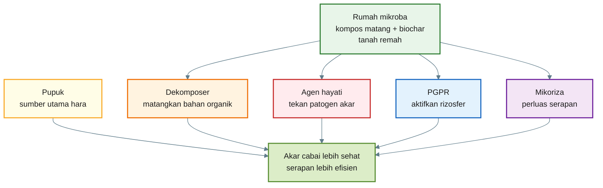

---

# 7.2 Dekomposer

Dekomposer adalah mikroba yang membantu mengurai bahan organik menjadi lebih matang, stabil, dan aman untuk tanah.

Contoh kelompok mikroba dekomposer:

- fungi pengurai,
- bakteri pengurai,
- actinomycetes,
- konsorsium mikroba pengompos.

Fungsi dekomposer:

- mempercepat penguraian daun, jerami, sisa tanaman, dan pupuk kandang,
- membantu pembentukan kompos matang,
- mengurangi bahan organik mentah,
- membantu bahan menjadi lebih remah,
- mengurangi risiko panas dan bau jika proses berjalan baik.

Dekomposer sebaiknya digunakan **sebelum bahan organik masuk ke zona akar cabai**, terutama bila bahan masih mentah.

Alur yang benar:

```mdx id="alur-dekomposer"
Bahan organik mentah
→ dekomposer
→ proses pengomposan/dekomposisi
→ kompos matang
→ masuk tanah cabai
```

Dekomposer bukan berarti semua bahan bisa langsung aman. Prosesnya tetap membutuhkan waktu, oksigen, kelembapan, dan pembalikan bila perlu.

Kalimat praktis:

> **Dekomposer mematangkan bahan, bukan membuat bahan mentah langsung aman dalam semalam.**

---

# 7.3 Agen Hayati Antagonis

Agen hayati antagonis adalah mikroba yang membantu menekan patogen tanah dan menjaga kesehatan akar.

Targetnya bukan memberi hara utama, tetapi membantu mengurangi tekanan penyakit di sekitar akar.

Fungsi agen hayati:

- bersaing dengan patogen,
- menghasilkan senyawa penghambat patogen,
- membantu melindungi akar muda,
- mendukung keseimbangan mikroba tanah,
- membantu menekan risiko busuk akar atau penyakit tular tanah tertentu.

Contoh kelompok yang sering digunakan:

- fungi antagonis,
- bakteri antagonis,
- aktinomiset tertentu.

Aplikasi terbaik:

- saat pra-tanam,
- saat media sudah tidak panas,
- di sekitar lubang tanam,
- sebagai kocor tanah,
- tidak dicampur langsung dengan fungisida/bakterisida.

Agen hayati tidak bisa bekerja baik bila:

- tanah becek,
- bahan organik mentah,
- pH ekstrem,
- akar sudah rusak berat,
- residu bahan kimia terlalu keras,
- tidak ada bahan organik matang sebagai habitat.

Kalimat praktis:

> **Agen hayati membantu menjaga pintu rumah akar, tetapi rumahnya tetap harus layak.**

---

# 7.4 PGPR

PGPR atau **Plant Growth-Promoting Rhizobacteria** adalah bakteri rizosfer yang mendukung pertumbuhan tanaman melalui berbagai mekanisme.

Fungsi PGPR:

- membantu merangsang akar,
- mendukung pembentukan rambut akar,
- membantu efisiensi serapan hara,
- memobilisasi hara tertentu,
- menghasilkan senyawa pemacu pertumbuhan,
- membantu tanaman menghadapi stres ringan,
- mendukung keseimbangan mikroba di sekitar akar.

Namun PGPR bukan pupuk utama. PGPR tidak menggantikan kebutuhan nitrogen, fosfor, kalium, kalsium, magnesium, dan unsur mikro.

PGPR bekerja lebih baik jika:

- tanah punya kompos matang,
- akar aktif,
- kelembapan stabil,
- tidak becek,
- tidak dicampur pestisida kimia keras,
- pH tidak ekstrem.

Aplikasi terbaik:

```mdx id="aplikasi-pgpr-umum"
PGPR:

- kocor ke zona akar,
- aplikasikan pagi/sore,
- tanah lembap tetapi tidak becek,
- mulai dosis rendah,
- ulangi sesuai respons tanaman.
```

Kalimat praktis:

> **PGPR membantu akar bekerja lebih efisien, tetapi tetap membutuhkan pupuk sebagai sumber hara.**

---

# 7.5 Mikoriza

Mikoriza adalah fungi yang bersimbiosis dengan akar tanaman. Perannya sangat penting dalam memperluas jangkauan serapan akar, terutama untuk air dan fosfor.

Fungsi mikoriza:

- memperluas area serapan akar,
- membantu penyerapan fosfor,
- membantu serapan air,
- mendukung ketahanan terhadap kekeringan ringan,
- memperbaiki hubungan akar dengan tanah.

Mikoriza berbeda dengan mikroba kocor biasa. Ia perlu kontak dekat dengan akar hidup. Karena itu, waktu terbaik adalah saat tanam.

Aplikasi yang benar:

```mdx id="aplikasi-mikoriza-umum"
Mikoriza:

- letakkan di lubang tanam,
- dekat dengan akar bibit,
- gunakan sesuai dosis label,
- jangan ditabur jauh dari akar,
- hindari kontak langsung dengan fungisida kimia.
```

Mikoriza tidak langsung memberi hasil instan. Ia membutuhkan waktu untuk membentuk hubungan dengan akar. Karena itu, mikoriza lebih efektif bila diberikan sejak awal.

Kalimat praktis:

> **Mikoriza bukan disiram asal-asalan; mikoriza harus bertemu akar.**

---

# 7.6 Kompos Matang

Kompos matang bukan mikroba komersial, tetapi ia adalah bagian utama dari sistem mikroba.

Peran kompos matang:

- menjadi makanan mikroba,
- menyediakan karbon,
- memperbaiki struktur tanah,
- meningkatkan kapasitas tanah menahan air,
- mendukung agregat tanah,
- menjadi habitat mikroba.

Tanpa kompos matang, mikroba yang diberikan sering tidak punya cukup makanan dan tempat tinggal.

Namun kompos harus matang. Kompos mentah bisa menjadi sumber masalah.

Ciri kompos matang:

- bau tanah,
- tidak panas,
- remah,
- tidak bau amonia,
- tidak berlendir,
- bahan asal sulit dikenali.

Kalimat praktis:

> **Kompos matang adalah makanan sekaligus lantai rumah mikroba.**

---

# 7.7 Biochar atau Sekam Bakar

Biochar atau sekam bakar adalah pendukung fisik rumah mikroba. Ia menyediakan pori mikro yang bisa menjadi tempat perlindungan mikroba.

Fungsi:

- menyediakan pori,
- membantu aerasi,
- menahan sebagian air,
- menstabilkan kelembapan,
- memperbaiki struktur media,
- mendukung akar halus.

Biochar/sekam bakar sebaiknya tidak berdiri sendiri. Ia paling baik dikombinasikan dengan kompos matang.

Formula prinsip:

```mdx id="kompos-biochar-prinsip"
Kompos matang = makanan mikroba
Biochar/sekam bakar = ruang mikroba
Akar hidup = sumber eksudat
Pupuk = sumber hara tanaman
```

Kalimat praktis:

> **Biochar bukan makanan utama mikroba, tetapi kamar kecil tempat mikroba berlindung.**

---

# 7.8 Pupuk

Pupuk harus tetap ditempatkan sebagai sumber utama hara tanaman.

Ini penting agar tidak terjadi salah paham:

> **Mikroba bukan pengganti pupuk.**

Cabai tetap membutuhkan hara makro dan mikro dalam jumlah cukup, terutama saat:

- pembentukan akar,
- pertumbuhan vegetatif,
- pembungaan,
- pembesaran buah,
- panen berulang.

Hara penting untuk cabai:

| Hara        | Fungsi Umum                           |
| ----------- | ------------------------------------- |
| Nitrogen    | Pertumbuhan daun dan vegetatif        |
| Fosfor      | Akar, energi, pembungaan              |
| Kalium      | Buah, ketahanan, kualitas panen       |
| Kalsium     | Kekuatan jaringan dan kualitas buah   |
| Magnesium   | Klorofil dan fotosintesis             |
| Sulfur      | Protein dan metabolisme               |
| Unsur mikro | Enzim, bunga, buah, kesehatan tanaman |

Mikroba membantu:

- akar lebih aktif,
- hara lebih mudah dimanfaatkan,
- bahan organik lebih cepat diproses,
- serapan lebih efisien.

Tetapi jika hara tidak tersedia, mikroba tidak bisa menciptakan panen tinggi dari ruang kosong.

Kalimat praktis:

> **Pupuk menyediakan isi gudang. Mikroba membantu akar membuka dan memanfaatkan gudang itu.**

---

# 7.9 Cara Memilih Mikroba Berdasarkan Fungsi

Jangan memilih produk hanya karena namanya populer. Pilih berdasarkan kebutuhan tanah dan tanaman.

| Masalah Lapangan                      | Kelompok yang Dibutuhkan                                   |
| ------------------------------------- | ---------------------------------------------------------- |
| Bahan organik masih kasar             | Dekomposer                                                 |
| Riwayat busuk akar/layu tinggi        | Agen hayati antagonis                                      |
| Akar kurang aktif                     | PGPR                                                       |
| Tanah mudah kering / P sulit tersedia | Mikoriza                                                   |
| Tanah padat                           | Kompos matang + biochar + perbaikan struktur               |
| Tanah miskin hara                     | Pupuk utama + perbaikan bahan organik                      |
| EC tinggi                             | Kurangi garam/pupuk berlebih, perbaiki pencucian dan media |

Kalimat praktis:

> **Beda masalah, beda mikroba. Jangan semua masalah dijawab dengan satu botol.**

---

# 7.10 Urutan Aplikasi yang Lebih Aman

Urutan yang disarankan untuk cabai:

```mdx id="urutan-aplikasi-mikroba-cabai"
1. Perbaiki tanah/media.
2. Masukkan kompos matang dan biochar/sekam bakar.
3. Matangkan bahan organik mentah di luar zona akar.
4. Koreksi pH bila perlu.
5. Tambahkan mikoriza saat tanam.
6. Gunakan agen hayati akar sesuai kebutuhan.
7. Kocor PGPR setelah bibit pulih.
8. Berikan pupuk sesuai fase tanaman.
9. Pantau akar, daun, layu, bunga, dan buah.
```

Kalimat kunci Bab 7:

> **Yang penting bukan mereknya, tetapi fungsi mikroba, kualitas produk, dan kecocokannya dengan tanah serta akar cabai.**

---

## Penutup Bagian 3

Bab 6 dan Bab 7 menjelaskan bahwa membangun rumah mikroba adalah pekerjaan bertahap.

Ringkasnya:

1. Bersihkan sumber penyakit.
2. Perbaiki drainase dan struktur tanah.
3. Gunakan kompos matang, bukan bahan mentah.
4. Tambahkan biochar/sekam bakar sebagai rumah fisik mikroba.
5. Stabilkan pH, air, dan suhu tanah.
6. Masukkan mikroba fungsional sesuai peran.
7. Pupuk tetap wajib sebagai sumber utama hara.

[**Kembali ke atas**](#rumah-mikroba-rizosfer-cara-praktis-menyiapkan-tanah-cabai-agar-mikroba-menguntungkan-bisa-bekerja)

---

# 8. Kesalahan Umum yang Harus Dihindari

Membangun rumah mikroba bukan sekadar menambahkan kompos, biochar, PGPR, mikoriza, atau agen hayati. Banyak kegagalan di lapangan terjadi karena urutannya salah, bahannya belum matang, atau kondisi tanah belum layak dihuni mikroba.

Kesalahan paling umum adalah menganggap mikroba bisa menyelesaikan semua masalah tanah. Padahal, mikroba tetap membutuhkan lingkungan yang mendukung.

Kalimat kunci bab ini:

> **Mikroba tidak memperbaiki semua masalah jika tanahnya sendiri belum layak dihuni.**

---

## 8.1 Memasukkan bahan organik mentah dekat akar cabai

Ini salah satu kesalahan paling berisiko.

Bahan organik mentah seperti daun hijau segar, pupuk kandang segar, seresah belum lapuk, rumput muda, atau sisa tanaman yang belum terurai tidak boleh langsung ditempatkan dekat akar cabai.

Risikonya:

- bahan masih panas,
- menghasilkan amonia,
- memicu pembusukan lokal,
- mengurangi oksigen di zona akar,
- menarik lalat atau serangga tertentu,
- membuat akar muda stres,
- memicu akar cokelat dan busuk.

Untuk cabai, bahan organik harus **matang dan stabil** terlebih dahulu.

Alur yang salah:

```mdx id="alur-salah-bahan-mentah"
Daun hijau segar / pupuk kandang mentah
→ langsung masuk lubang tanam
→ akar cabai stres
→ tanaman lambat tumbuh atau layu
```

Alur yang benar:

```mdx id="alur-benar-bahan-organik"
Bahan organik mentah
→ dicacah
→ didekomposisi sampai matang
→ berbau tanah dan tidak panas
→ baru masuk bedengan/media cabai
```

---

## 8.2 Memakai bokashi segar langsung ke lubang tanam

Bokashi adalah bahan organik terfermentasi. Fermentasi tidak selalu sama dengan kematangan kompos. Bokashi segar masih bisa bersifat asam, aktif, dan belum stabil.

Bokashi segar bisa berguna sebagai tahap pra-olah bahan organik, tetapi tidak ideal bila langsung diletakkan dekat akar cabai muda.

Risiko bokashi segar:

| Risiko             | Dampak pada Cabai               |
| ------------------ | ------------------------------- |
| Terlalu asam       | Akar muda stres                 |
| Belum stabil       | Fermentasi lanjut di tanah      |
| Amonium tinggi     | Akar terganggu                  |
| Kurang oksigen     | Zona akar menjadi anaerob       |
| Bahan belum matang | Patogen/pembusuk bisa meningkat |

Untuk cabai, lebih aman menggunakan:

> **kompos matang, bukan bokashi segar.**

Bokashi bisa dipakai bila sudah dilanjutkan proses aerasi/dekomposisi sampai bahan menjadi remah, tidak panas, dan berbau tanah.

---

## 8.3 Menganggap mikroba bisa menggantikan pupuk

Ini kesalahan konsep yang harus dihindari.

Mikroba membantu akar, rizosfer, dan efisiensi pemanfaatan hara. Namun mikroba bukan sumber hara utama 100%.

Cabai tetap membutuhkan:

- nitrogen,
- fosfor,
- kalium,
- kalsium,
- magnesium,
- sulfur,
- unsur mikro.

Mikroba dapat membantu melarutkan, memobilisasi, atau membuat hara lebih mudah dimanfaatkan. Tetapi bila hara tidak tersedia, mikroba tidak bisa menciptakan panen tinggi dari tanah kosong.

Kalimat praktis:

> **Pupuk menyediakan hara. Mikroba membantu akar memanfaatkannya.**

---

## 8.4 Tanah terlalu becek

Tanah becek adalah musuh akar cabai dan mikroba aerob. Zona akar yang terlalu lama tergenang akan kekurangan oksigen.

Dampaknya:

- akar sulit bernapas,
- akar mudah cokelat,
- patogen tanah lebih mudah berkembang,
- PGPR sulit bekerja,
- mikoriza sulit berkembang,
- tanaman mudah layu walau tanah basah.

Solusinya:

- naikkan bedengan,
- perbaiki parit,
- kurangi penyiraman,
- tambah bahan berpori seperti sekam bakar/biochar,
- jangan memasukkan bahan organik mentah.

---

## 8.5 Tanah terlalu padat

Tanah padat membuat akar dan mikroba kekurangan ruang. Air sulit masuk secara merata, udara rendah, dan akar cabai sulit bercabang.

Tanda tanah padat:

- sulit dicangkul,
- air mengalir di permukaan,
- akar tanaman pendek,
- akar sedikit bercabang,
- tanah retak keras saat kering,
- lengket berat saat basah.

Solusi:

- tambah kompos matang,
- tambah sekam bakar/biochar,
- kurangi injakan di bedengan,
- buat bedengan lebih baik,
- gunakan mulsa,
- lakukan olah tanah seperlunya.

---

## 8.6 Tidak memperbaiki drainase

Drainase adalah fondasi. Mikroba tidak akan bekerja baik bila air tidak bisa keluar.

Kesalahan yang sering terjadi:

- bedengan terlalu rendah,
- parit dangkal,
- saluran utama tersumbat,
- air dari luar lahan masuk ke bedengan,
- mulsa dipasang tetapi aliran air tidak diatur.

Untuk cabai, drainase harus disiapkan sebelum aplikasi mikroba. Jangan berharap PGPR atau agen hayati menyelamatkan akar yang terus-menerus tergenang.

---

## 8.7 PGPR dicampur langsung dengan fungisida atau bakterisida

PGPR dan agen hayati adalah mikroba hidup. Fungisida dan bakterisida dapat mengganggu atau membunuh mikroba tersebut.

Kesalahan umum:

```mdx id="kesalahan-campur-pgpr"
PGPR + fungisida/bakterisida
→ dicampur dalam satu tangki
→ mikroba melemah atau mati
→ aplikasi menjadi tidak efektif
```

Praktik yang lebih aman:

```mdx id="jarak-aplikasi-mikroba-kimia"
Aplikasi mikroba dan pestisida kimia keras:
beri jarak minimal 5–7 hari,
terutama untuk fungisida dan bakterisida.
```

Jika perlu pengendalian penyakit, pilih urutan dan jarak aplikasi dengan hati-hati.

---

## 8.8 Pupuk berlebihan sampai EC tinggi

Pupuk berlebih bisa membuat kadar garam tanah/media naik. Akar cabai bisa stres walaupun tanah tampak basah.

Gejala kemungkinan EC tinggi:

- tanaman layu walau media basah,
- ujung daun terbakar,
- daun menggulung,
- akar pendek,
- pertumbuhan lambat,
- bibit mudah mati.

Mikroba tidak bisa bekerja optimal bila akar sudah stres karena garam tinggi.

Solusi:

- ukur EC bila memungkinkan,
- kurangi pupuk berlebih,
- siram/pencucian media bila aman,
- gunakan pupuk bertahap,
- kombinasikan dengan bahan organik matang.

---

## 8.9 Tidak ada kompos matang

Banyak petani memakai mikroba tetapi lupa menyediakan makanan dan habitatnya. Tanpa kompos matang, mikroba sulit menetap.

Kompos matang berperan sebagai:

- sumber karbon,
- habitat mikroba,
- pembentuk struktur remah,
- penyangga kelembapan,
- pendukung biopori,
- penyangga aktivitas rizosfer.

Tanpa rumah, mikroba hanya “lewat” dan tidak menetap.

Kalimat praktis:

> **Mikroba butuh penghuni, tetapi tanah juga butuh rumahnya: kompos matang.**

---

## 8.10 Tidak memakai mulsa pada tanah panas

Tanah terbuka cepat panas dan cepat kehilangan air. Pada lahan cabai terbuka, suhu permukaan tanah bisa berubah ekstrem antara siang dan malam.

Dampaknya:

- mikroba stres,
- kelembapan tidak stabil,
- akar halus mudah rusak,
- bahan organik cepat kering,
- pertumbuhan tidak konsisten.

Mulsa membantu menjaga:

- kelembapan,
- suhu tanah,
- struktur permukaan,
- aktivitas akar,
- aktivitas mikroba.

Mulsa bukan sekadar penutup tanah, tetapi bagian dari rumah mikroba.

---

## 8.11 Langsung aplikasi luas tanpa uji kecil

Ini kesalahan manajemen.

Setiap lahan berbeda. Tanah, air, kompos, varietas cabai, cuaca, riwayat penyakit, dan pupuk yang dipakai bisa berbeda. Formula yang berhasil di satu lahan belum tentu otomatis berhasil di lahan lain.

Jangan langsung menerapkan formula baru ke seluruh lahan.

Urutan aman:

```mdx id="urutan-uji-sebelum-luas"
Uji kecil
→ catat hasil
→ bandingkan dengan kontrol
→ hitung biaya dan hasil
→ perbaiki formula
→ perluas bertahap
```

Kalimat praktis:

> **Praktisi yang baik tidak menebak. Ia menguji kecil, mencatat, lalu memperluas bertahap.**

---

## Diagram Bab 8 — Kesalahan yang Merusak Rumah Mikroba

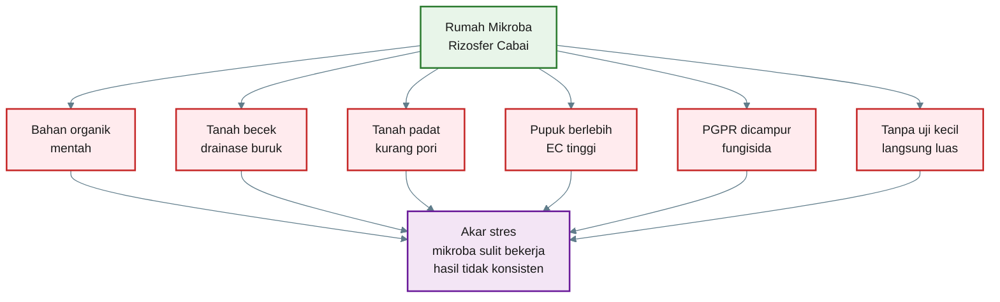

[**Kembali ke atas**](#rumah-mikroba-rizosfer-cara-praktis-menyiapkan-tanah-cabai-agar-mikroba-menguntungkan-bisa-bekerja)

---

# 9. Uji Kecil Sebelum Diterapkan Luas

Setelah memahami cara membangun rumah mikroba dan kesalahan yang harus dihindari, langkah berikutnya adalah melakukan **uji kecil**.

Uji kecil penting karena tujuan kita bukan sekadar membuat tanaman tampak hijau di awal, tetapi memastikan formula tanah dan mikroba **stabil sampai panen**.

Kalimat kunci bab ini:

> **Formula terbaik adalah yang stabil sampai panen, bukan yang hanya terlihat bagus di awal.**

---

## 9.1 Mengapa uji kecil wajib dilakukan?

Uji kecil membantu menjawab pertanyaan praktis:

1. Apakah tanah/media sudah lebih nyaman untuk akar?
2. Apakah kompos matang memberi perbedaan nyata?
3. Apakah biochar/sekam bakar memperbaiki media?
4. Apakah agen hayati/dekomposer memberi manfaat tambahan?
5. Apakah mikoriza dan PGPR membantu pertumbuhan cabai?
6. Apakah kejadian layu menurun?
7. Apakah hasil panen meningkat?
8. Apakah biaya tambahan tertutup oleh hasil?

Tanpa uji kecil, keputusan hanya berdasarkan dugaan.

---

## 9.2 Rancangan uji sederhana

Gunakan lima perlakuan:

| Perlakuan | Isi                                              |
| --------- | ------------------------------------------------ |
| P0        | Tanah biasa                                      |
| P1        | Kompos matang                                    |
| P2        | Kompos matang + biochar                          |
| P3        | Kompos matang + biochar + agen hayati/dekomposer |
| P4        | Kompos matang + biochar + mikoriza + PGPR        |

Catatan penting:

> **Semua perlakuan harus mendapat program pupuk yang sama, kecuali pupuk memang sedang diuji.**

Tujuannya agar perbedaan hasil tidak bias. Jika P4 diberi pupuk lebih banyak daripada P0, maka hasilnya tidak bisa dibaca sebagai efek rumah mikroba atau mikroba.

---

## Diagram Bab 9 — Rancangan Uji Kecil

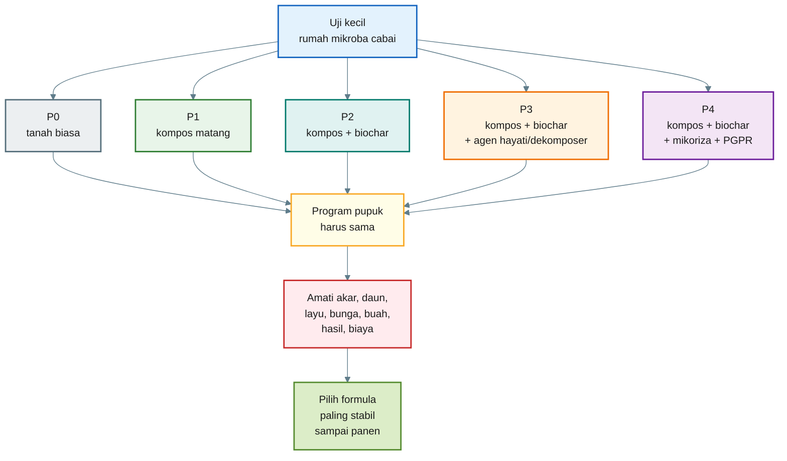

---

## 9.3 Jumlah tanaman untuk uji

Jumlah tanaman tidak harus besar, tetapi harus cukup untuk melihat kecenderungan.

| Skala Uji       | Jumlah Tanaman per Perlakuan | Total 5 Perlakuan |
| --------------- | ---------------------------: | ----------------: |
| Sangat kecil    |                    5 tanaman |        25 tanaman |
| Praktis minimal |                   10 tanaman |        50 tanaman |
| Lebih baik      |                   20 tanaman |       100 tanaman |
| Lebih kuat      |                   30 tanaman |       150 tanaman |

Untuk praktisi, minimal gunakan **10 tanaman per perlakuan**. Jika memungkinkan, 20 tanaman per perlakuan lebih baik.

---

## 9.4 Parameter pengamatan

Amati lebih dari satu parameter. Jangan hanya melihat tinggi tanaman.

| Parameter      | Yang Diamati                               |
| -------------- | ------------------------------------------ |
| Warna daun     | pucat, hijau sedang, hijau segar           |
| Pertumbuhan    | tinggi tanaman, jumlah cabang, keseragaman |
| Kondisi akar   | putih/krem, bercabang, cokelat, busuk      |
| Kejadian layu  | layu sementara, layu permanen, mati        |
| Bunga          | jumlah bunga, rontok bunga, awal berbunga  |
| Buah           | jumlah buah, ukuran, keseragaman           |
| Hasil panen    | total bobot panen                          |
| Biaya tambahan | kompos, biochar, mikroba, tenaga kerja     |

---

## 9.5 Jadwal pengamatan

Gunakan jadwal sederhana:

| Waktu        | Fokus Pengamatan                         |
| ------------ | ---------------------------------------- |
| 7 HST        | pemulihan pindah tanam, layu, warna daun |
| 14 HST       | pertumbuhan awal, akar sampel            |
| 21 HST       | cabang, daun, keseragaman                |
| 30 HST       | akar, vigor, awal bunga                  |
| 45 HST       | bunga, buah awal, layu                   |
| Setiap panen | jumlah dan bobot buah                    |

HST = hari setelah tanam.

---

## 9.6 Rumus persentase layu

Gunakan rumus berikut:

$$
\text{Persentase Layu} =
\frac{\text{Jumlah Tanaman Layu}}{\text{Jumlah Tanaman Diamati}}
\times 100
$$

Contoh:

```mdx id="contoh-persentase-layu"
Jumlah tanaman diamati = 20
Jumlah tanaman layu = 4

Persentase layu =
(4 / 20) × 100

Persentase layu = 20%
```

Interpretasi:

| Persentase Layu | Arti Praktis     |
| --------------: | ---------------- |
|            0–5% | sangat baik      |
|           6–15% | masih terkendali |
|          16–30% | perlu evaluasi   |
|            >30% | masalah serius   |

---

## 9.7 Rumus rata-rata hasil per tanaman

$$
\text{Hasil per Tanaman} =
\frac{\text{Total Bobot Panen}}{\text{Jumlah Tanaman Panen}}
$$

Contoh:

```mdx id="contoh-hasil-per-tanaman"
Total bobot panen = 12 kg
Jumlah tanaman panen = 20 tanaman

Hasil per tanaman =
12 / 20

Hasil per tanaman = 0,6 kg/tanaman
```

---

## 9.8 Rumus peningkatan hasil dibanding kontrol

Gunakan P0 sebagai pembanding.

$$
\text{Peningkatan Hasil} =
\frac{\text{Hasil Perlakuan} - \text{Hasil Kontrol}}
{\text{Hasil Kontrol}}
\times 100
$$

Contoh:

```mdx id="contoh-peningkatan-hasil"
Hasil P0 = 10 kg
Hasil P4 = 14 kg

Peningkatan hasil =
((14 - 10) / 10) × 100

Peningkatan hasil = 40%
```

Interpretasi:

| Peningkatan Hasil | Arti Praktis                              |
| ----------------: | ----------------------------------------- |
|              < 5% | belum menarik                             |
|             5–10% | ada sinyal, perlu ulang uji               |
|            10–20% | menarik                                   |
|              >20% | sangat menarik, cek biaya dan konsistensi |

---

## 9.9 Rumus biaya tambahan per tanaman

$$
\text{Biaya Tambahan per Tanaman} =
\frac{\text{Total Biaya Tambahan}}{\text{Jumlah Tanaman Perlakuan}}
$$

Contoh:

```mdx id="contoh-biaya-tambahan-tanaman"
Total biaya tambahan P4 = Rp100.000
Jumlah tanaman P4 = 100 tanaman

Biaya tambahan per tanaman =
100.000 / 100

Biaya tambahan per tanaman = Rp1.000/tanaman
```

Biaya tambahan mencakup:

- kompos,
- biochar/sekam bakar,
- mikroba,
- mikoriza,
- tenaga kerja,
- air,
- wadah/alat bila khusus.

---

## 9.10 Rumus tambahan pendapatan

$$
\text{Tambahan Pendapatan} =
\text{Tambahan Panen} \times \text{Harga Jual per kg}
$$

Contoh:

```mdx id="contoh-tambahan-pendapatan"
Tambahan panen P4 dibanding P0 = 4 kg
Harga jual cabai = Rp30.000/kg

Tambahan pendapatan =
4 × 30.000

Tambahan pendapatan = Rp120.000
```

---

## 9.11 Rumus keuntungan bersih tambahan

$$
\text{Keuntungan Bersih Tambahan} =
\text{Tambahan Pendapatan} - \text{Biaya Tambahan}
$$

Contoh:

```mdx id="contoh-keuntungan-bersih-tambahan"
Tambahan pendapatan = Rp120.000
Biaya tambahan = Rp100.000

Keuntungan bersih tambahan =
120.000 - 100.000

Keuntungan bersih tambahan = Rp20.000
```

Jika keuntungan bersih tambahan positif dan hasil tanaman lebih stabil, formula layak diuji lebih luas.

---

## 9.12 Cara membaca hasil akhir

| Hasil Uji                      | Keputusan                                                         |
| ------------------------------ | ----------------------------------------------------------------- |
| P0 sama dengan semua perlakuan | Perbaikan belum memberi efek nyata                                |
| P1 lebih baik dari P0          | Kompos matang sudah memberi manfaat                               |
| P2 lebih baik dari P1          | Biochar/sekam bakar membantu struktur                             |
| P3 lebih baik dari P2          | Agen hayati/dekomposer memberi nilai tambah                       |
| P4 paling stabil               | Paket rumah mikroba + mikoriza + PGPR layak diuji lebih luas      |
| Semua buruk                    | Masalah utama mungkin drainase, penyakit, air, pH, EC, atau bibit |

Jangan hanya memilih perlakuan yang paling tinggi di awal. Pilih perlakuan yang:

- akarnya sehat,
- layunya rendah,
- pertumbuhannya seragam,
- bunganya stabil,
- buahnya banyak,
- hasilnya naik,
- biayanya masuk akal.

---

# 10. Kesimpulan Praktis

Mikroba menguntungkan bisa membantu budidaya cabai, tetapi hanya bila tanahnya siap menjadi tempat hidup. Mikroba bukan benda mati yang langsung bekerja setelah disiramkan. Mikroba adalah makhluk hidup yang membutuhkan rumah.

Rumah mikroba adalah tanah atau media yang:

- matang,
- remah,
- lembap stabil,
- cukup udara,
- tidak busuk,
- tidak panas,
- memiliki bahan organik matang,
- memiliki pori fisik,
- memiliki akar aktif,
- pH-nya tidak ekstrem,
- kadar garam/pupuknya tidak berlebihan.

Untuk cabai, bahan organik harus matang. Bahan mentah, bokashi segar, pupuk kandang segar, atau daun hijau segar tidak boleh langsung ditempatkan dekat akar cabai.

Mikroba fungsional seperti dekomposer, agen hayati, PGPR, dan mikoriza bekerja lebih baik jika rumahnya sudah siap. Tetapi mikroba tetap bukan pengganti pupuk.

Penegasan utama:

> **Pupuk tetap sumber utama hara. Mikroba membantu akar dan rizosfer memanfaatkan hara dengan lebih efisien.**

Tanah bisa dinilai dengan uji lapang murah:

- uji bau,
- uji remah,
- uji air meresap,
- uji agregat,
- uji tanaman indikator,
- uji pH,
- uji EC sederhana.

Target praktis sebelum aplikasi mikroba luas:

> **Skor rumah mikroba minimal 14 dari 20.**

Jika skor masih rendah, jangan buru-buru menambah mikroba. Perbaiki dulu drainase, struktur tanah, bahan organik, pH, kelembapan, dan kondisi akar.

---

## Diagram Kesimpulan — Prinsip Rumah Mikroba Cabai

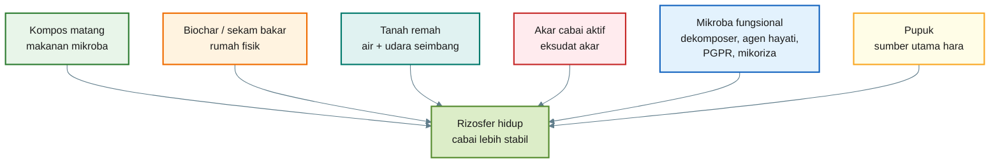

---

## Penutup Artikel

Kunci keberhasilan bukan mencari mikroba sebanyak mungkin, tetapi menyiapkan lingkungan agar mikroba yang tepat bisa bekerja.

Untuk cabai rawit maupun cabai besar, prinsip akhirnya adalah:

> **Kompos matang dan biochar adalah rumah. Mikroba adalah penghuni. Pupuk adalah sumber hara. Akar cabai adalah pusat seleksi.**

Maka urutan kerja yang paling aman adalah:

```mdx id="urutan-akhir-rumah-mikroba"
1. Baca kondisi tanah.
2. Beri skor rumah mikroba.
3. Perbaiki struktur, drainase, bahan organik, pH, dan kelembapan.
4. Gunakan kompos matang dan biochar/sekam bakar.
5. Masukkan mikroba fungsional sesuai kebutuhan.
6. Berikan pupuk sesuai fase tanaman.
7. Uji kecil sebelum diperluas.
8. Pilih formula yang stabil sampai panen.
```

Dengan pendekatan ini, penggunaan mikroba tidak lagi menjadi coba-coba buta. Mikroba ditempatkan dalam sistem yang benar: **rumahnya siap, akarnya aktif, pupuknya cukup, dan hasilnya diuji.**

[**Kembali ke atas**](#rumah-mikroba-rizosfer-cara-praktis-menyiapkan-tanah-cabai-agar-mikroba-menguntungkan-bisa-bekerja)

---

# Lampiran A

## Perawatan Rumah Mikroba Antar Musim Tanam dan Saat Rotasi Tanaman

Rumah mikroba tidak perlu selalu dibangun ulang dari nol setiap musim tanam. Jika pada musim sebelumnya tanah sudah memiliki kompos matang, biochar/sekam bakar, struktur remah, pori udara, akar sehat, dan mikroba yang aktif, maka sebagian besar fondasinya masih tertinggal setelah panen.

Namun rumah mikroba juga tidak boleh dibiarkan begitu saja. Setelah satu musim cabai, tanah mengalami perubahan: sebagian bahan organik terurai, sebagian hara diserap tanaman, pupuk bisa meninggalkan garam, tanah bisa memadat, pH bisa berubah, dan patogen bisa meningkat bila ada tanaman sakit.

Maka prinsipnya:

> **Rumah mikroba bukan proyek sekali jadi. Ia adalah aset tanah yang harus dirawat antar musim.**

---

## A.1 Apakah Rumah Mikroba Harus Dibuat Ulang Setiap Musim?

Tidak selalu.

Jika kondisi tanah masih baik, cukup dilakukan **refresh ringan**. Jika kondisi tanah menurun, dilakukan **perbaikan sedang**. Jika tanah rusak berat atau terjadi serangan penyakit akar, perlu **renovasi besar**.

Gunakan prinsip berikut:

```mdx
Skor rumah mikroba ≥ 14:
cukup refresh ringan

Skor rumah mikroba 9–13:
perlu perbaikan sedang

Skor rumah mikroba ≤ 8:
perlu renovasi besar sebelum tanam ulang
```

Jadi, rumah mikroba tidak selalu dibangun ulang, tetapi **selalu perlu diaudit** sebelum musim tanam berikutnya.

---

## A.2 Apa yang Masih Tersisa Setelah Panen?

Setelah panen cabai, kemungkinan masih tersisa:

| Komponen            | Status Setelah Panen                                | Tindakan                                          |
| ------------------- | --------------------------------------------------- | ------------------------------------------------- |
| Kompos matang       | Sebagian sudah terurai, sebagian masih aktif        | Tambah tipis bila perlu                           |
| Biochar/sekam bakar | Umumnya masih bertahan                              | Pertahankan                                       |
| Mikroba tanah       | Masih ada, tetapi komunitas berubah                 | Dukung dengan akar hidup dan bahan organik matang |
| Akar cabai lama     | Bisa jadi sumber bahan organik atau sumber penyakit | Buang jika sakit/busuk                            |
| Mulsa               | Bisa menipis/rusak                                  | Ganti atau tambahkan                              |
| Pupuk/garam larut   | Bisa menumpuk                                       | Cek EC bila memungkinkan                          |
| Struktur tanah      | Bisa memadat                                        | Remahkan dan tambah bahan matang bila perlu       |

Jika sisa bahan organik masih **matang, remah, tidak panas, dan berbau tanah**, bahan tersebut tidak perlu dibuang. Itu bagian dari rumah mikroba.

Namun jika bahan masih **mentah, bau busuk, berlendir, atau panas**, jangan langsung ditanami cabai. Lanjutkan dekomposisi dulu di luar zona akar.

---

## A.3 Audit Rumah Mikroba Setelah Panen

Sebelum musim tanam berikutnya, lakukan audit sederhana.

Cek kembali:

1. Bau tanah.
2. Struktur remah.
3. Drainase.
4. Kelembapan.
5. Sisa akar.
6. Bahan organik.
7. pH.
8. EC/garam larut.
9. Riwayat layu atau busuk akar.
10. Keberadaan biopori dan akar lama.

Gunakan kembali skor rumah mikroba.

|  Skor | Kondisi                   | Keputusan                 |
| ----: | ------------------------- | ------------------------- |
|   0–8 | Rumah mikroba rusak       | Renovasi besar            |
|  9–13 | Rumah mikroba sedang      | Perbaikan sedang          |
| 14–17 | Rumah mikroba baik        | Refresh ringan            |
| 18–20 | Rumah mikroba sangat baik | Pertahankan dan lanjutkan |

---

## A.4 Refresh Ringan Antar Musim

Refresh ringan dilakukan jika tanah masih layak, tidak ada penyakit berat, dan skor rumah mikroba masih minimal 14.

Langkahnya:

```mdx
1. Bersihkan sisa tanaman sakit.
2. Pertahankan struktur tanah yang masih remah.
3. Tambahkan kompos matang tipis.
4. Tambahkan biochar/sekam bakar bila struktur mulai turun.
5. Pasang atau perbarui mulsa.
6. Cek pH dan EC bila tersedia alat.
7. Tambahkan mikroba fungsional sesuai kebutuhan.
8. Pupuk tetap diberikan sesuai tanaman berikutnya.
```

Refresh ringan bertujuan menjaga rumah mikroba tetap aktif tanpa mengganggu struktur tanah secara berlebihan.

---

## A.5 Perbaikan Sedang

Perbaikan sedang dilakukan jika skor rumah mikroba berada di kisaran 9–13.

Tanda umum:

- tanah mulai padat,
- kompos mulai menipis,
- air mulai lambat meresap,
- akar tanaman sebelumnya kurang sehat,
- mulsa habis,
- tanah mulai panas atau kering,
- pH/EC mulai kurang ideal.

Langkahnya:

```mdx
1. Keluarkan sisa tanaman sakit.
2. Tambahkan kompos matang lebih banyak dibanding refresh ringan.
3. Tambahkan biochar/sekam bakar untuk memperbaiki pori.
4. Perbaiki parit dan drainase.
5. Koreksi pH bila terlalu asam.
6. Tanam tanaman rotasi atau cover crop.
7. Uji ulang sebelum cabai ditanam kembali.
```

---

## A.6 Renovasi Besar

Renovasi besar diperlukan bila lahan mengalami masalah serius.

Tanda-tandanya:

- banyak cabai layu atau mati,
- akar busuk meluas,
- tanah bau busuk atau amonia,
- bedengan sering tergenang,
- EC tinggi,
- pH ekstrem,
- bahan organik mentah masih banyak,
- tanah sangat padat,
- ada dugaan nematoda atau patogen tanah berat.

Langkah renovasi besar:

```mdx
1. Cabut dan keluarkan tanaman sakit dari lahan.
2. Jangan langsung menanam cabai kembali.
3. Perbaiki drainase dan bentuk bedengan.
4. Aerasi tanah.
5. Tambahkan kompos matang, bukan bahan mentah.
6. Tambahkan biochar/sekam bakar.
7. Koreksi pH bila perlu.
8. Tanam tanaman rotasi non-solanaceae atau cover crop.
9. Uji ulang rumah mikroba sebelum cabai kembali.
```

Renovasi besar bukan hanya untuk memperbaiki rumah mikroba, tetapi juga untuk menurunkan tekanan OPT di tanah.

---

## A.7 Bagaimana Jika Dilakukan Rotasi Tanaman?

Rotasi tanaman tidak merusak rumah mikroba. Justru rotasi adalah salah satu cara merawat rumah mikroba dan memutus siklus OPT.

Setelah cabai, sebaiknya hindari langsung menanam tanaman satu keluarga dengan cabai, seperti:

- tomat,
- terong,
- kentang,
- paprika,
- cabai lagi.

Tanaman tersebut masih satu famili **Solanaceae**, sehingga sebagian OPT bisa tetap bertahan.

Pilihan rotasi yang lebih aman:

| Kelompok Rotasi     | Contoh                                     | Manfaat                                        |
| ------------------- | ------------------------------------------ | ---------------------------------------------- |
| Legum               | kacang hijau, kacang tanah, kacang tunggak | akar hidup, bahan organik, dukungan N biologis |
| Serealia            | jagung, sorgum                             | akar banyak, memperbaiki struktur              |
| Brassica            | sawi, pakcoy, kubis                        | variasi eksudat akar                           |
| Umbi non-solanaceae | bawang merah, bawang daun                  | memutus famili cabai                           |
| Cover crop          | mucuna, cowpea, crotalaria sesuai lokasi   | menutup tanah dan menjaga akar hidup           |

Rotasi membantu karena akar tanaman berbeda menghasilkan eksudat yang berbeda. Ini membuat komunitas mikroba tanah lebih beragam dan tidak didominasi oleh sistem cabai terus-menerus.

---

## A.8 Apakah Mikroba Lama Masih Bertahan Saat Rotasi?

Sebagian bertahan, sebagian berubah.

Mikroba rizosfer sangat dipengaruhi oleh akar tanaman. Saat cabai diganti tanaman rotasi, komunitas mikroba akan menyesuaikan diri dengan eksudat tanaman baru. Ini normal dan justru baik untuk keragaman tanah.

Yang penting:

> **Jangan biarkan tanah kosong terlalu lama.**

Tanah kosong berarti tidak ada akar hidup. Jika tidak ada akar hidup, pasokan eksudat untuk mikroba berkurang.

Karena itu, setelah panen lebih baik menggunakan:

- tanaman rotasi,
- cover crop,
- mulsa,
- kompos matang tipis,
- tanaman sela yang tidak menjadi inang utama OPT cabai.

---

## A.9 Siklus Perawatan Rumah Mikroba Antar Musim

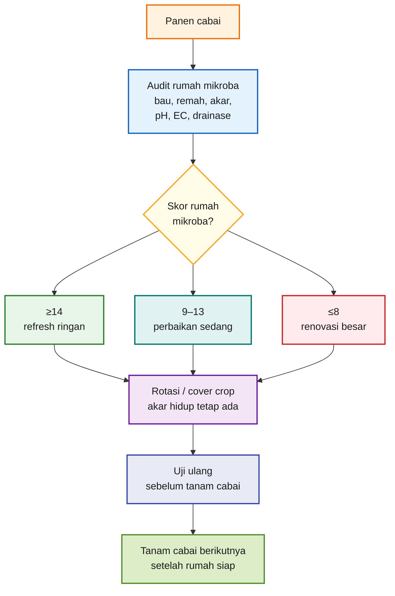

---

## A.10 Keputusan Praktis Antar Musim

| Kondisi Setelah Panen                    | Tindakan                                 |
| ---------------------------------------- | ---------------------------------------- |
| Tanah masih remah, bau segar, akar sehat | Refresh ringan                           |
| Kompos menipis, struktur mulai turun     | Tambah kompos matang dan biochar         |
| Ada sedikit layu tetapi tidak meluas     | Perbaikan sedang dan rotasi              |
| Banyak layu/busuk akar                   | Renovasi besar dan jangan langsung cabai |
| Bahan organik masih matang               | Pertahankan                              |
| Bahan organik masih mentah               | Dekomposisikan dulu                      |
| Tanah kosong lama                        | Tanam cover crop atau beri mulsa         |
| Rotasi tanaman dilakukan                 | Rumah mikroba tetap dirawat              |

---

## A.11 Kesimpulan Lampiran A

Rumah mikroba tidak harus dibangun ulang dari nol setiap musim, tetapi harus selalu **diaudit dan dirawat**.

Jika kondisinya baik, cukup refresh ringan. Jika menurun, lakukan perbaikan sedang. Jika rusak berat atau ada penyakit akar serius, lakukan renovasi besar dan rotasi tanaman.

Rotasi tanaman bukan berarti menghilangkan rumah mikroba. Rotasi justru membantu menjaga keragaman mikroba, mempertahankan akar hidup, dan memutus siklus OPT.

Kalimat kunci Lampiran A:

> **Rumah mikroba adalah aset tanah. Jangan dibongkar jika masih sehat, tetapi jangan dibiarkan rusak tanpa perawatan. Rotasi tanaman adalah bagian dari perawatan rumah mikroba, bukan pengganti rumah mikroba.**

[**Kembali ke atas**](#rumah-mikroba-rizosfer-cara-praktis-menyiapkan-tanah-cabai-agar-mikroba-menguntungkan-bisa-bekerja)

---

# Lampiran B

## Merawat Rumah dan Mikroba selama masa tanam

Rumah mikroba tidak hanya dibangun sebelum tanam. Setelah mikroba dimasukkan, rumah itu harus tetap dirawat agar mikroba bisa hidup, menetap, dan bekerja di sekitar akar cabai.

Dalam praktik cabai, dua input yang paling sering berinteraksi dengan rumah mikroba adalah:

1. **pestisida kimia di tajuk**, seperti insektisida, fungisida, dan bakterisida,
2. **pupuk kimia di rizosfer**, baik pupuk dasar, kocor, tabur, maupun fertigasi.

Keduanya tetap dapat dipakai dalam budidaya cabai, tetapi harus dikelola agar tidak merusak rumah mikroba.

Kalimat kunci Lampiran B:

> **Pestisida tajuk harus dicegah agar tidak menjadi residu tanah. Pupuk kimia di rizosfer harus diberikan sebagai nutrisi terukur, bukan sebagai tekanan garam.**

---

## B.1 Apakah Pestisida Tajuk Merusak Rumah Mikroba?

Aplikasi insektisida, fungisida, atau bakterisida di tajuk **tidak otomatis merusak rumah mikroba**, karena target aplikasinya adalah daun, batang, bunga, atau buah, bukan tanah.

Namun risikonya tetap ada.

Bahan kimia dari tajuk bisa masuk ke tanah melalui:

| Jalur Masuk              | Penjelasan                                         |
| ------------------------ | -------------------------------------------------- |
| Tetesan semprot berlebih | Semprotan terlalu basah sampai menetes ke bedengan |
| Drift                    | Kabut semprot jatuh ke permukaan tanah             |
| Hujan/embun berat        | Residu di daun tercuci ke tanah                    |
| Daun rontok              | Daun membawa residu lalu masuk bahan organik       |
| Aplikasi berulang        | Residu tertentu bisa terakumulasi                  |
| Mulsa rusak/tidak ada    | Tanah lebih mudah terkena tetesan langsung         |

Jadi, aplikasi tajuk relatif lebih aman dibanding aplikasi langsung ke tanah, tetapi **bukan berarti risikonya nol**.

---

## B.2 Risiko Berdasarkan Jenis Pestisida

| Jenis Input                   | Risiko terhadap Rumah Mikroba | Catatan Praktis                                                           |
| ----------------------------- | ----------------------------- | ------------------------------------------------------------------------- |
| Insektisida tajuk             | Rendah–sedang                 | Risiko meningkat jika spray menetes ke tanah atau aplikasi terlalu sering |
| Fungisida tajuk               | Sedang–tinggi                 | Dapat mengganggu fungi menguntungkan bila residu masuk tanah              |
| Bakterisida tajuk             | Sedang–tinggi                 | Berisiko terhadap bakteri menguntungkan jika masuk rizosfer               |
| Fungisida/bakterisida tembaga | Tinggi bila berulang          | Perlu hati-hati karena residu dapat menumpuk                              |
| Pestisida sistemik            | Tergantung bahan aktif        | Perlu baca label dan interval aplikasi                                    |
| Pestisida kontak              | Lebih tergantung run-off      | Jangan semprot sampai menetes                                             |

Risiko tertinggi biasanya berasal dari:

- fungisida spektrum luas,
- bakterisida,
- bahan berbasis tembaga,
- aplikasi sampai run-off,
- aplikasi berulang tanpa jeda,
- tanah tanpa mulsa,
- rumah mikroba yang masih lemah.

---

## B.3 Cara Mengurangi Dampak Pestisida Tajuk

Agar rumah mikroba tetap terlindungi:

```mdx id="lampiran-b-pestisida-tajuk"
1. Semprot tajuk secukupnya, jangan sampai menetes ke tanah.
2. Gunakan nozzle yang arah semprotnya terkendali.
3. Hindari semprot sebelum hujan.
4. Gunakan mulsa untuk melindungi permukaan tanah.
5. Jangan campur PGPR, mikoriza, atau agen hayati dengan fungisida/bakterisida.
6. Beri jarak aplikasi antara mikroba dan pestisida kimia.
7. Gunakan pestisida hanya saat diperlukan, bukan otomatis rutin tanpa pengamatan.
8. Terapkan rotasi bahan aktif untuk mengurangi residu dan resistensi.
```

Jarak aplikasi yang lebih aman:

```mdx id="lampiran-b-jarak-aplikasi"
PGPR / agen hayati / mikoriza
vs
fungisida / bakterisida / insektisida kimia:

minimal 5–7 hari.

Untuk fungisida/bakterisida kuat atau berbasis tembaga:
lebih aman 7–14 hari.
```

Kalimat praktis:

> **Semprot tajuk boleh, tetapi jangan jadikan tanah sebagai tempat jatuhnya residu semprotan.**

---

## B.4 Bagaimana dengan Pupuk Kimia di Rizosfer?

Pupuk kimia berbeda dengan pestisida tajuk karena pupuk memang sengaja diberikan ke zona akar atau rizosfer.

Pupuk kimia **tidak otomatis merusak rumah mikroba**. Bahkan, pupuk tetap diperlukan karena cabai membutuhkan hara utama seperti nitrogen, fosfor, kalium, kalsium, magnesium, sulfur, dan unsur mikro.

Yang berbahaya bukan pupuk kimianya secara mutlak, tetapi:

- dosis terlalu tinggi,
- konsentrasi terlalu pekat,
- pupuk menempel akar,
- aplikasi terlalu sering tanpa melihat kondisi tanaman,
- EC/garam larut terlalu tinggi,
- pupuk tidak seimbang,
- tanah miskin bahan organik,
- media terlalu kering saat diberi pupuk.

Penegasan penting:

> **Pupuk tetap sumber utama hara. Mikroba membantu akar memanfaatkan hara, bukan menggantikan hara.**

---

## B.5 Dampak Pupuk Kimia pada Rumah Mikroba

## Dampak positif bila tepat

Pupuk kimia yang diberikan secara terukur dapat:

- mendukung pertumbuhan akar,
- memperkuat pertumbuhan daun,
- membantu pembungaan dan buah,
- meningkatkan fotosintesis,
- mendukung produksi eksudat akar,
- menyediakan hara yang bisa dimanfaatkan tanaman.

Jika tanaman sehat dan akar aktif, mikroba juga mendapat manfaat dari eksudat akar.

## Dampak negatif bila berlebihan

| Kesalahan Pemupukan       | Dampak pada Akar dan Mikroba           |
| ------------------------- | -------------------------------------- |
| EC/garam terlalu tinggi   | Akar sulit menyerap air, mikroba stres |
| Pupuk pekat dekat akar    | Akar terbakar/osmotic stress           |
| Urea/ammonium berlebih    | Risiko amonia dan perubahan pH mikro   |
| Fosfor berlebih           | Dapat menekan kerja mikoriza           |
| KCl berlebih              | Risiko garam/Cl tinggi                 |
| Pemupukan tidak seimbang  | Tanaman stres, eksudat akar berubah    |
| Tanah tanpa bahan organik | Rumah mikroba cepat melemah            |

Kalimat praktis:

> **Pupuk kimia harus menjadi nutrisi, bukan tekanan garam.**

---

## B.6 Prinsip Aman Pupuk Kimia di Rizosfer

Gunakan pupuk kimia dengan prinsip **terukur, terbagi, tidak pekat, dan tidak menempel akar**.

Prinsip aman:

```mdx id="lampiran-b-pupuk-aman"
1. Berikan pupuk sesuai fase tanaman.
2. Jangan menaruh pupuk pekat langsung menempel akar.
3. Bagi dosis menjadi beberapa aplikasi kecil.
4. Siram secukupnya setelah aplikasi bila perlu.
5. Pantau EC bila memungkinkan.
6. Jaga bahan organik matang tetap tersedia.
7. Kombinasikan dengan biochar/sekam bakar untuk membantu stabilitas media.
8. Jangan memupuk berat saat tanaman sedang stres berat.
```

Lebih aman:

```mdx id="lampiran-b-pupuk-dibagi"
Dosis total pupuk
dibagi menjadi beberapa aplikasi kecil

daripada

satu aplikasi besar sekaligus.
```

---

## B.7 Pantau EC sebagai Alarm Garam

EC membantu membaca kadar garam/pupuk larut di tanah atau media.

Panduan praktis ekstrak tanah 1:2:

|            EC | Keputusan                            |
| ------------: | ------------------------------------ |
|   < 0,5 mS/cm | Hara larut rendah, cek program pupuk |
| 0,5–1,5 mS/cm | Umumnya aman                         |
| 1,5–2,0 mS/cm | Waspada, lihat kondisi akar          |
|   > 2,0 mS/cm | Risiko akar dan mikroba stres        |

Jika EC tinggi:

- kurangi pupuk sementara,
- siram/pencucian media bila aman,
- perbaiki drainase,
- tambah bahan organik matang,
- hindari pupuk pekat,
- cek kualitas air.

---

## B.8 Integrasi Pestisida, Pupuk, dan Mikroba

Agar rumah mikroba tetap aman, semua input perlu ditempatkan sesuai fungsi.

| Input                 | Posisi Aman                                             |
| --------------------- | ------------------------------------------------------- |
| Pestisida tajuk       | Gunakan tepat sasaran, jangan sampai run-off ke tanah   |
| Fungisida/bakterisida | Jangan dekat waktu aplikasi mikroba                     |
| Pupuk kimia           | Tetap wajib, tetapi dosis bertahap dan tidak pekat      |
| PGPR/agen hayati      | Kocor saat tanah lembap, jauh dari aplikasi kimia keras |
| Mikoriza              | Saat tanam, dekat akar, hindari fungisida               |
| Kompos matang/biochar | Fondasi rumah mikroba                                   |
| Mulsa                 | Pelindung tanah dari panas dan tetesan langsung         |

Urutan aman:

```mdx id="lampiran-b-urutan-aman"
1. Bangun rumah mikroba:
   kompos matang + biochar + struktur remah.

2. Berikan pupuk dasar sesuai kebutuhan,
   jangan pekat menempel akar.

3. Tambahkan mikoriza saat tanam,
   dekat akar.

4. Kocor PGPR/agen hayati setelah bibit pulih.

5. Gunakan pestisida tajuk sesuai kebutuhan,
   jangan sampai menetes ke tanah.

6. Beri jarak 5–7 hari antara mikroba dan fungisida/bakterisida.

7. Pantau pH, EC, akar, dan kejadian layu.
```

---

## B.9 Diagram Merawat Rumah dan Mikroba

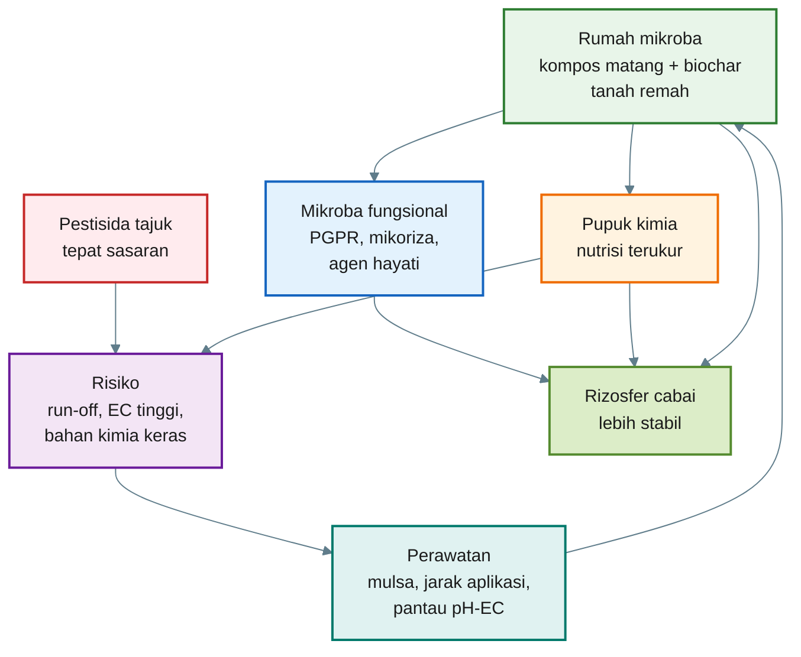

---

## B.10 Kesimpulan Lampiran B

Aplikasi pestisida di tajuk tidak otomatis merusak rumah mikroba, tetapi bisa berdampak bila residunya jatuh ke tanah melalui tetesan semprot, drift, hujan, daun rontok, atau aplikasi berulang.

Aplikasi pupuk kimia di rizosfer juga tidak otomatis buruk. Pupuk tetap wajib sebagai sumber utama hara. Yang perlu dihindari adalah pupuk pekat, EC tinggi, penempatan terlalu dekat akar, dan pemupukan berlebihan.

Rumah mikroba tetap dijaga dengan:

- kompos matang,
- biochar/sekam bakar,
- mulsa,
- drainase baik,
- pH sesuai,
- EC terkendali,
- jarak aplikasi mikroba dan pestisida,
- pupuk seimbang.

Kalimat kunci Lampiran B:

> **Merawat rumah mikroba berarti menjaga agar input kimia tetap bekerja sebagai alat budidaya, bukan berubah menjadi tekanan bagi akar dan mikroba.**

[**Kembali ke atas**](#rumah-mikroba-rizosfer-cara-praktis-menyiapkan-tanah-cabai-agar-mikroba-menguntungkan-bisa-bekerja)

---

# Lampiran C: Contoh Produk dan Bahan Berbasis Mikroba, PGPM, Agens Hayati, dan Biostimulan yang Beredar di Lapangan

### [Pupuk Organik Cair Air Media JAKABA]()

#### JAKABA cair

_Rp 2.000_

### [POC Murni JAKABA Super]()

#### Campuran POC

_Rp 11.998_

### [Air JAKABA Super 100 ml]()

#### Kemasan kecil

_Rp 16.900_

### [POC JAKABA 5 Liter]()

#### Volume besar

_Rp 18.000_

### [Pupuk Air JAKABA]()

#### Siap pakai

_Rp 21.500_

### [JAKABA 1 Galon]()

#### Galon

_Rp 183.600_

### [Bibit JAKABA 500 ml]()

#### Starter cair

_Rp 25.097_

### [Pupuk Organik Air JAKABA 1,5 Liter]()

#### Ekonomis

_Rp 15.105_

### [POC Booster Durian 1 Liter]()

#### Durian 1 L

_Rp 118.569_

### [POC Durian Premium 500 ml]()

#### Durian premium

_Rp 41.000_

### [Pupuk Cair Pelebat Durian 1 Liter]()

#### Pelebat buah

_Rp 72.800_

### [POC Booster Durian 5 Liter]()

#### Volume besar

_Rp 349.550_

### [POC Booster Durian 5 Liter]()

#### Generatif

_Rp 293.600_

### [POC Booster Durian 1000 ml]()

#### Booster buah

_Rp 54.340_

### [POC Booster Durian 500 ml]()

#### Kemasan kecil

_Rp 59.000_

### [Pupuk Organik Cair POC]()

#### POC umum

_Rp 10.000_

### [MOL Mikroorganisme Lokal]()

#### MOL cair

_Rp 12.000_

### [PROMOL-12 Serbuk Organik MOL]()

#### MOL serbuk

_Rp 250.000_

### [MOL Efektif Mikroorganisme Lokal 500 ml]()

#### Dekomposer

_Rp 13.000_

### [EM4 Mikroorganisme Pertanian 1 Liter]()

#### EM pertanian

_Rp 49.000_

### [EM4 Pertanian 1 Liter]()

#### Starter mikroba

_Rp 30.500_

### [EM4 Mikroorganisme Pertanian 1 Liter]()

#### Fermentasi

_Rp 36.000_

### [MOL Bioaktivator Dekomposer]()

#### Bioaktivator

_Rp 20.000_

### [Pupuk Organik Cair EM4 MOL POC]()

#### POC mikroba

_Rp 32.500_

## C.1 Tujuan Lampiran

Lampiran ini disusun untuk memberikan gambaran tentang produk **JAKABA**, **POC**, dan **MOL** yang tersedia di pasaran. Bagian ini bukan dimaksudkan sebagai promosi produk tertentu, tetapi sebagai panduan teknis agar petani dan pelaku agribisnis dapat membandingkan produk secara lebih rasional.

Dalam praktik lapangan, produk fermentasi organik sering dijual dengan berbagai nama dagang, misalnya JAKABA cair, biang JAKABA, POC buah, POC durian, POC cabai, MOL, bioaktivator, dekomposer, EM, atau pupuk organik cair plus mikroba. Nama produk yang berbeda belum tentu menunjukkan fungsi yang benar-benar berbeda. Karena itu, pembeli perlu menilai komposisi, dosis, legalitas, harga, aroma, kemasan, dan kesesuaian produk dengan fase tanaman.

Lampiran ini memiliki beberapa tujuan utama:

- memberikan gambaran bentuk produk yang tersedia di pasaran,
- membantu pembaca membandingkan produk JAKABA, POC, dan MOL,
- memberikan panduan memilih produk yang lebih aman dan rasional,
- menghindari pembelian hanya berdasarkan klaim berlebihan,
- membantu menghitung biaya aplikasi per liter larutan atau per tanaman,
- mendorong uji kecil sebelum aplikasi luas.

Untuk produk yang diedarkan sebagai pupuk organik, pupuk hayati, atau pembenah tanah, aspek legalitas dan mutu tetap penting. Permentan No. 1 Tahun 2019 mengatur pendaftaran pupuk organik, pupuk hayati, dan pembenah tanah, sedangkan Kepmentan No. 261/KPTS/SR.310/M/4/2019 memuat persyaratan teknis minimal untuk kelompok produk tersebut. ([Database Peraturan | JDIH BPK][1])

---

## C.2 Bentuk Produk JAKABA di Pasaran

Produk JAKABA di pasaran umumnya tersedia dalam bentuk cair, starter, konsentrat, atau campuran dengan POC. Sebagian produk dijual sebagai larutan siap pakai, sementara sebagian lain dijual sebagai biang untuk diperbanyak kembali.

Bentuk produk JAKABA yang umum dijumpai antara lain:

- JAKABA cair siap pakai,
- biang atau starter JAKABA,
- JAKABA super atau konsentrat,
- JAKABA campuran POC,
- bahan inokulum akar bambu,
- paket bahan pembuatan JAKABA.

### C.2.1 JAKABA Cair Siap Pakai

JAKABA cair siap pakai biasanya dijual dalam kemasan kecil sampai sedang, misalnya 100 ml, 250 ml, 500 ml, 1 liter, atau lebih. Produk ini biasanya ditujukan untuk pengguna yang ingin langsung mengaplikasikan JAKABA tanpa membuat sendiri.

Kelebihannya adalah praktis. Kekurangannya, pembeli sering tidak mengetahui proses fermentasi, sumber mikroba, umur produk, atau kondisi penyimpanan sebelum dibeli.

### C.2.2 Biang atau Starter JAKABA

Biang JAKABA digunakan sebagai inokulum untuk memperbanyak JAKABA baru. Produk ini lebih cocok untuk pengguna yang ingin membuat JAKABA sendiri tetapi membutuhkan sumber mikroba awal.

Starter sebaiknya dipilih dari penjual yang mencantumkan:

- tanggal produksi,
- dosis perbanyakan,
- cara memperbanyak,
- masa simpan,
- tanda produk masih aktif,
- cara aplikasi setelah diperbanyak.

### C.2.3 JAKABA Super atau Konsentrat

Istilah “super” atau “konsentrat” sering digunakan dalam pemasaran. Namun, istilah ini perlu diuji secara rasional. Produk yang disebut konsentrat seharusnya memiliki dosis aplikasi yang jelas dan konsisten.

Pembeli perlu berhati-hati terhadap klaim seperti:

- pengganti total pupuk kimia,
- hasil panen berlipat tanpa pupuk lain,
- menyembuhkan semua penyakit tanaman,
- cocok untuk semua tanaman dan semua fase.

Klaim seperti itu perlu diuji terlebih dahulu, karena JAKABA secara agronomis lebih tepat diposisikan sebagai **biostimulan dan aktivator rizosfer**, bukan pupuk utama.

### C.2.4 JAKABA Campuran POC

Sebagian produk dipasarkan sebagai JAKABA + POC. Produk campuran seperti ini perlu diperiksa lebih hati-hati karena fungsi JAKABA dan POC berbeda. Jika komposisinya tidak jelas, pembeli sulit menilai apakah produk tersebut lebih dominan sebagai mikroba, biostimulan, atau pupuk cair.

---

## C.3 Bentuk Produk POC di Pasaran

POC di pasaran lebih beragam dibanding JAKABA. Produk POC dapat dibuat untuk fase vegetatif, generatif, tanaman buah, sayuran, cabai, durian, atau pembenah tanah. Ada juga produk yang dipasarkan sebagai POC plus mikroba, POC plus asam amino, atau POC plus unsur mikro.

Bentuk produk POC yang umum dijumpai antara lain:

- POC vegetatif,
- POC generatif atau POC buah,
- POC ikan atau asam amino ikan,
- POC urin kelinci, kambing, atau sapi,
- POC limbah buah atau sayur,
- POC mikroba/MOL/EM,
- POC khusus cabai,
- POC khusus durian,
- POC pembenah tanah,
- POC plus unsur mikro.

### C.3.1 POC Vegetatif

POC vegetatif ditujukan untuk mendukung pertumbuhan daun, batang, tunas, akar, dan pemulihan tanaman. Produk ini biasanya dipakai pada fase awal pertumbuhan, setelah pindah tanam, setelah pemangkasan, atau setelah tanaman mengalami stres.

Ciri klaim yang umum muncul:

- merangsang pertumbuhan daun,
- mempercepat tunas,
- memperbaiki akar,
- menghijaukan tanaman,
- membantu pemulihan tanaman stres.

Produk seperti ini lebih cocok digunakan pada fase vegetatif, bukan saat tanaman sedang membutuhkan pengaturan bunga dan buah.

### C.3.2 POC Generatif atau POC Buah

POC generatif ditujukan untuk mendukung bunga, buah, dan kualitas hasil. Produk ini biasanya dipasarkan dengan klaim seperti perangsang bunga, pelebat buah, pembesar buah, atau booster buah.

Produk generatif perlu dinilai dari kandungan atau klaim unsur pendukung seperti:

- kalium,
- fosfor,
- kalsium,
- magnesium,
- boron,
- asam amino,
- bahan organik cair.

Namun, pembeli tetap perlu berhati-hati. POC generatif tidak otomatis cukup untuk memenuhi kebutuhan K, Ca, Mg, dan B pada tanaman produksi tinggi seperti cabai atau durian.

### C.3.3 POC Ikan atau Asam Amino Ikan

POC ikan biasanya dibuat dari fermentasi limbah ikan atau bahan berbasis protein. Produk ini berpotensi mengandung asam amino, nitrogen organik, fosfor, dan mineral. Namun, produk berbasis ikan juga memiliki risiko bau menyengat bila fermentasinya kurang matang.

Produk POC ikan yang baik seharusnya:

- tidak berbau bangkai,
- memiliki dosis aplikasi jelas,
- tidak menggembung ekstrem,
- tidak menimbulkan layu pada dosis rendah,
- disaring baik jika digunakan untuk semprot.

### C.3.4 POC Urin Ternak

POC urin kelinci, kambing, atau sapi sering dipasarkan sebagai POC tinggi nitrogen. Produk seperti ini perlu diencerkan dengan hati-hati karena urin dapat mengandung garam, amonia, dan senyawa yang berisiko fitotoksik bila belum difermentasi sempurna.

POC urin lebih cocok untuk fase vegetatif dan tidak disarankan digunakan pekat pada bibit muda.

### C.3.5 POC Khusus Cabai dan Durian

Produk khusus cabai atau durian biasanya dikemas dengan klaim yang lebih spesifik. Untuk cabai, klaim yang umum adalah merangsang bunga, memperbanyak buah, mengurangi rontok, dan memperbaiki ukuran buah. Untuk durian, klaim yang umum adalah mempercepat pertumbuhan, memperbaiki akar, merangsang bunga, dan melebatkan buah.

Produk khusus komoditas tetap perlu diuji kecil. Nama “khusus cabai” atau “khusus durian” tidak selalu menjamin produk sesuai untuk semua kondisi lahan, semua umur tanaman, dan semua fase pertumbuhan.

---

## C.4 Bentuk Produk MOL di Pasaran

Selain JAKABA dan POC, produk **MOL** juga banyak dijumpai di pasaran. MOL adalah singkatan dari **Mikroorganisme Lokal**, yaitu sumber mikroba lokal yang biasa digunakan sebagai starter fermentasi, bioaktivator kompos, pengurai bahan organik, atau pendukung aktivitas mikroba tanah.

Dalam praktik lapangan, MOL dapat dibuat dari berbagai bahan, misalnya bonggol pisang, nasi basi, rebung bambu, buah busuk terkontrol, air kelapa, gula merah, keong mas, atau bahan lokal lain. Di pasaran, MOL biasanya tidak selalu disebut “MOL” secara eksplisit. Ada produk yang dipasarkan sebagai bioaktivator, dekomposer, mikroba pengurai, EM, starter kompos, atau mikroba fermentasi.

Bentuk MOL di pasaran antara lain:

- MOL cair,
- MOL serbuk,
- bioaktivator kompos,
- dekomposer bahan organik,
- starter fermentasi POC,
- starter bokashi,
- mikroba pengurai limbah organik,
- EM pertanian,
- mikroba tanah cair,
- paket starter MOL.

### C.4.1 MOL Cair

MOL cair biasanya dijual dalam botol 250 ml, 500 ml, atau 1 liter. Produk ini digunakan sebagai starter pembuatan POC, kompos cair, bokashi, atau pengurai bahan organik.

Kelebihannya adalah mudah digunakan. Kekurangannya, viabilitas mikroba sangat tergantung pada umur produk, cara penyimpanan, dan kualitas bahan pembawa.

### C.4.2 MOL Serbuk

MOL serbuk atau bioaktivator serbuk biasanya lebih stabil dalam penyimpanan dibanding produk cair, tergantung bahan pembawa dan teknologi produksinya. Produk ini umum digunakan untuk kompos, fermentasi bahan organik, dan dekomposisi limbah pertanian.

### C.4.3 Bioaktivator dan Dekomposer

Bioaktivator dan dekomposer digunakan untuk mempercepat penguraian bahan organik. Produk ini lebih tepat diposisikan sebagai aktivator kompos atau starter fermentasi, bukan sebagai pupuk utama.

### C.4.4 EM Pertanian

EM atau Effective Microorganisms sering digunakan sebagai starter fermentasi, terutama dalam pembuatan POC, bokashi, dan fermentasi bahan organik. Produk EM pertanian berada dalam kelompok mikroba fermentasi komersial yang lebih umum dikenal dibanding MOL tradisional.

### Perbedaan Praktis MOL, EM, dan JAKABA

| Istilah | Fungsi Utama                                        | Bentuk Umum | Catatan                                 |
| ------- | --------------------------------------------------- | ----------- | --------------------------------------- |
| MOL     | Sumber mikroba lokal                                | Cair/serbuk | Komposisi sangat tergantung bahan lokal |
| EM      | Starter mikroba fermentasi                          | Cair        | Umumnya produk komersial siap pakai     |
| JAKABA  | Biostimulan/mikroba lokal berbasis air cucian beras | Cair/koloni | Lebih diarahkan untuk rizosfer          |
| POC     | Pupuk organik cair                                  | Cair        | Lebih diarahkan sebagai hara tambahan   |

---

## C.5 Parameter Membandingkan Produk JAKABA, POC, dan MOL

Dalam memilih produk di pasaran, pembeli tidak cukup hanya melihat nama produk dan klaim manfaat. Parameter teknis harus diperiksa agar produk yang dibeli sesuai kebutuhan dan tidak merugikan tanaman.

| Parameter        | Keterangan                                                                   |
| ---------------- | ---------------------------------------------------------------------------- |
| Nama produk      | Identitas dagang                                                             |
| Jenis produk     | JAKABA, starter, POC vegetatif, POC generatif, POC ikan, MOL, EM, dekomposer |
| Komposisi        | Bahan utama yang digunakan                                                   |
| Volume           | Isi kemasan                                                                  |
| Dosis aplikasi   | Anjuran pakai dari produsen                                                  |
| Harga per liter  | Untuk membandingkan biaya                                                    |
| Tanggal produksi | Menilai kesegaran produk                                                     |
| Masa simpan      | Menilai stabilitas produk                                                    |
| Aroma            | Tidak boleh busuk menyengat                                                  |
| Kondisi kemasan  | Tidak bocor, tidak menggembung ekstrem                                       |
| Legalitas        | Izin edar/label resmi bila tersedia                                          |
| Klaim fungsi     | Harus realistis dan tidak berlebihan                                         |
| Review pengguna  | Referensi tambahan, bukan bukti utama                                        |
| Data uji         | Kandungan hara, pH, mikroba, atau efektivitas bila tersedia                  |
| Kesesuaian fase  | Vegetatif, generatif, pembenah tanah, atau starter fermentasi                |

### Rumus Harga per Liter

```mdx id="4sf6yg"
Harga per liter = Harga produk / Volume produk dalam liter

Contoh:
Harga produk = Rp 25.000
Volume = 500 ml = 0,5 L

Harga per liter = 25.000 / 0,5
Harga per liter = Rp 50.000/L
```

### Rumus Biaya Aplikasi

```mdx id="dbenle"
Biaya aplikasi per tangki = Harga per ml produk × Kebutuhan produk per tangki

Harga per ml = Harga produk / Volume produk dalam ml

Contoh:
Harga produk = Rp 50.000
Volume produk = 1.000 ml
Harga per ml = 50.000 / 1.000
Harga per ml = Rp 50/ml

Dosis = 20 ml/L
Volume tangki = 16 L
Kebutuhan produk = 20 × 16 = 320 ml

Biaya aplikasi per tangki = 320 × 50
Biaya aplikasi per tangki = Rp 16.000
```

### Rumus Biaya per Tanaman

```mdx id="ycqtfe"
Biaya per tanaman = Total biaya aplikasi / Jumlah tanaman

Contoh:
Total biaya aplikasi = Rp 16.000
Jumlah tanaman = 500 tanaman

Biaya per tanaman = 16.000 / 500
Biaya per tanaman = Rp 32/tanaman
```

---

## C.6 Catatan Membeli JAKABA

Produk JAKABA di pasaran perlu dipilih dengan hati-hati karena sebagian besar produk berbasis fermentasi lokal memiliki variasi tinggi. Pembeli perlu menilai apakah produk tersebut benar-benar layak digunakan sebagai input agribisnis.

### Kriteria JAKABA yang Lebih Layak Dipilih

- memiliki tanggal produksi,
- memiliki petunjuk dosis,
- tidak berbau busuk menyengat,
- tidak menggembung ekstrem,
- tidak mengandung belatung,
- tidak berlendir hitam berlebihan,
- penjual dapat menjelaskan cara penggunaan,
- memiliki anjuran pengenceran,
- tidak mengklaim sebagai pengganti total pupuk utama,
- pernah diuji pada tanaman sejenis.

### Kriteria JAKABA yang Perlu Dihindari

- tidak ada tanggal produksi,
- botol menggembung ekstrem,
- bau bangkai atau amonia tajam,
- klaim terlalu berlebihan,
- tidak ada dosis aplikasi,
- warna dan tekstur mencurigakan,
- penjual tidak bisa menjelaskan proses atau cara pakai.

### Uji Awal Produk JAKABA yang Dibeli

```mdx id="ptqzqc"
Prosedur uji awal JAKABA pasaran:

1. Amati kemasan: bocor atau menggembung ekstrem.
2. Cek aroma: harus fermentasi asam-manis, bukan busuk.
3. Encerkan 5–10 ml/L.
4. Aplikasikan pada 5–10 tanaman uji.
5. Amati 3–5 hari.
6. Jika aman, dosis dapat dinaikkan bertahap.
```

---

## C.7 Catatan Membeli POC

POC lebih beragam dibanding JAKABA. Karena itu, pembeli harus memilih berdasarkan fase tanaman dan tujuan aplikasi.

### Panduan Memilih POC Berdasarkan Fase

| Fase Tanaman    | Jenis POC yang Lebih Sesuai     | Catatan                            |
| --------------- | ------------------------------- | ---------------------------------- |
| Bibit/semai     | POC ringan, dosis rendah        | Hindari POC pekat dan berbau tajam |
| Vegetatif       | POC vegetatif                   | Mendukung daun, tunas, dan akar    |
| Menjelang bunga | POC transisi/generatif ringan   | Hindari N berlebihan               |
| Bunga dan buah  | POC generatif                   | Perhatikan K, Ca, Mg, B            |
| Pemulihan       | POC asam amino/vegetatif ringan | Cocok setelah stres/panen          |

### Catatan Khusus POC Ikan

POC ikan dapat berguna sebagai sumber asam amino dan nitrogen organik. Namun, produk harus matang dan tidak berbau bangkai. Jika masih berbau busuk kuat, produk sebaiknya tidak digunakan pada tanaman utama.

### Catatan Khusus POC Urin

POC urin harus difermentasi sempurna dan diencerkan cukup. Produk urin yang belum matang berisiko mengandung amonia tinggi dan dapat merusak akar, terutama pada bibit, polybag, atau media tanam terbatas.

### Uji Awal Produk POC yang Dibeli

```mdx id="7ibp7n"
Prosedur uji awal POC pasaran:

1. Encerkan POC pada dosis rendah, misalnya 5–10 ml/L.
2. Gunakan pada 5–10 tanaman uji.
3. Jangan langsung semprot ke bunga atau buah.
4. Amati selama 3–5 hari.
5. Jika daun terbakar, tanaman layu, atau media berbau busuk, hentikan penggunaan.
```

---

## C.8 Catatan Membeli MOL

MOL di pasaran perlu dipilih berdasarkan tujuan penggunaannya. Tidak semua MOL cocok langsung diaplikasikan ke tanaman. Sebagian produk MOL lebih tepat digunakan sebagai starter kompos atau starter pembuatan POC.

### Tujuan Penggunaan MOL

| Tujuan            | Jenis Produk yang Dicari    | Catatan                                  |
| ----------------- | --------------------------- | ---------------------------------------- |
| Membuat POC       | MOL cair/starter fermentasi | Pastikan dosis dan cara pakai jelas      |
| Membuat kompos    | Bioaktivator/dekomposer     | Cocok untuk bahan organik padat          |
| Memperbaiki tanah | MOL tanah/mikroba cair      | Perlu uji kecil                          |
| Membuat bokashi   | EM/MOL fermentasi           | Butuh molase dan bahan organik           |
| Mengurai limbah   | Dekomposer                  | Fokus pada penguraian, bukan pupuk utama |

### Kriteria MOL yang Lebih Layak Dipilih

- mencantumkan fungsi utama,
- memiliki dosis aplikasi,
- menjelaskan apakah untuk kompos, POC, tanah, atau bokashi,
- tidak berbau busuk menyengat,
- memiliki tanggal produksi,
- kemasan tidak bocor,
- tidak menggembung ekstrem,
- memiliki petunjuk penyimpanan,
- klaim manfaat masuk akal.

### Kriteria MOL yang Perlu Dihindari

- tidak jelas apakah untuk tanaman atau kompos,
- tidak ada dosis,
- tidak ada tanggal produksi,
- berbau bangkai,
- botol menggembung berlebihan,
- klaim terlalu umum seperti “untuk semua masalah tanaman”,
- tidak ada informasi bahan atau fungsi.

### Uji Aktivitas MOL Sederhana

```mdx id="chq4u8"
Uji aktivitas MOL sederhana:

1. Siapkan 1 liter air non-kaporit.
2. Tambahkan 10 ml MOL.
3. Tambahkan 10 gram gula merah/molase.
4. Tutup longgar.
5. Diamkan 12–24 jam.
6. Jika muncul aroma fermentasi ringan dan sedikit gas, MOL masih aktif.
7. Jika bau busuk tajam atau tidak ada aktivitas sama sekali, gunakan dengan hati-hati.
```

Uji ini hanya indikasi awal, bukan pengganti uji laboratorium. Untuk produksi komersial atau aplikasi skala besar, viabilitas dan keamanan mikroba tetap perlu diuji lebih serius.

---

## C.9 Template Tabel Produk JAKABA Pasaran

Tabel berikut dapat digunakan untuk mencatat dan membandingkan produk JAKABA di pasaran.

| No  | Nama Produk         | Jenis       |    Volume | Klaim Fungsi        | Harga | Marketplace | Catatan                        |
| --- | ------------------- | ----------- | --------: | ------------------- | ----: | ----------- | ------------------------------ |
| 1   | JAKABA cair         | Siap pakai  |       1 L | Mikroba/biostimulan |     - | -           | Cek aroma dan tanggal produksi |
| 2   | Biang JAKABA        | Starter     |    250 ml | Perbanyakan JAKABA  |     - | -           | Cocok untuk produksi ulang     |
| 3   | JAKABA super        | Konsentrat  |    500 ml | Pemacu akar/tanah   |     - | -           | Uji dosis rendah               |
| 4   | JAKABA + POC        | Campuran    |       1 L | Mikroba dan hara    |     - | -           | Perlu cek komposisi            |
| 5   | Akar bambu inokulum | Bahan alam  | 250–500 g | Sumber mikroba alam |     - | -           | Perlu fermentasi ulang         |
| 6   | Paket JAKABA        | Paket bahan |  variatif | Pembuatan mandiri   |     - | -           | Cek isi paket                  |

---

## C.10 Template Tabel Produk POC Pasaran

Tabel berikut digunakan untuk membandingkan berbagai jenis POC yang tersedia di pasar.

| No  | Nama Produk        | Jenis            | Volume | Klaim Fungsi          | Harga | Marketplace | Catatan                   |
| --- | ------------------ | ---------------- | -----: | --------------------- | ----: | ----------- | ------------------------- |
| 1   | POC vegetatif      | POC              |    1 L | Pertumbuhan daun/akar |     - | -           | Cocok fase awal           |
| 2   | POC buah           | POC generatif    |    1 L | Bunga dan buah        |     - | -           | Cocok fase generatif      |
| 3   | POC ikan           | Asam amino/POC   |    1 L | N, P, asam amino      |     - | -           | Cek bau dan dosis         |
| 4   | POC urin kelinci   | POC N tinggi     |    1 L | Vegetatif             |     - | -           | Perlu pengenceran cukup   |
| 5   | POC durian         | POC tanaman buah |    1 L | Buah/tajuk/akar       |     - | -           | Cek kandungan dan label   |
| 6   | POC cabai          | POC hortikultura |    1 L | Bunga dan buah cabai  |     - | -           | Uji kecil terlebih dahulu |
| 7   | POC pembenah tanah | POC tanah        |    1 L | Aktivitas tanah       |     - | -           | Lebih cocok kocor         |
| 8   | POC plus mikro     | POC + mikroba    |    1 L | Hara dan mikroba      |     - | -           | Cek komposisi             |

---

## C.11 Template Tabel Produk MOL Pasaran

Tambahan tabel ini digunakan untuk mencatat produk MOL, EM, bioaktivator, atau dekomposer yang ada di pasaran.

| No  | Nama Produk         | Jenis                |     Volume | Klaim Fungsi           | Harga | Marketplace | Catatan                    |
| --- | ------------------- | -------------------- | ---------: | ---------------------- | ----: | ----------- | -------------------------- |
| 1   | MOL cair            | Mikroorganisme lokal |     500 ml | Starter POC/kompos     |     - | -           | Cek tanggal produksi       |
| 2   | MOL serbuk          | Bioaktivator         |      250 g | Dekomposer organik     |     - | -           | Lebih stabil bila kering   |
| 3   | EM pertanian        | Starter mikroba      |        1 L | Fermentasi POC/bokashi |     - | -           | Perlu molase saat aktivasi |
| 4   | Dekomposer kompos   | Mikroba pengurai     | 500 ml/1 L | Pengurai bahan organik |     - | -           | Cocok untuk kompos         |
| 5   | Bioaktivator limbah | Dekomposer           |        1 L | Limbah organik         |     - | -           | Bukan pupuk utama          |
| 6   | MOL tanah           | Mikroba tanah        |        1 L | Aktivasi tanah         |     - | -           | Uji kecil terlebih dahulu  |

---

## C.12 Kriteria Produk yang Layak Dipilih

Produk JAKABA, POC, dan MOL yang layak dipilih sebaiknya memenuhi kriteria teknis dasar. Semakin besar skala usaha, semakin penting memilih produk yang jelas komposisi, dosis, dan legalitasnya.

### Kriteria Umum

- informasi komposisi jelas,
- dosis aplikasi jelas,
- tanggal produksi tersedia,
- masa simpan dicantumkan,
- tidak berbau busuk menyengat,
- kemasan baik,
- penjual memberi petunjuk teknis,
- klaim produk masuk akal,
- harga sesuai konsentrasi produk,
- ada data uji bila produk diklaim sebagai pupuk/hayati,
- untuk skala usaha, lebih baik memilih produk dengan legalitas.

### Kriteria Tambahan untuk Agribisnis

| Parameter              | Mengapa Penting                             |
| ---------------------- | ------------------------------------------- |
| Nomor izin/pendaftaran | Menilai kepatuhan produk                    |
| Kandungan hara         | Menilai fungsi sebagai POC                  |
| Kandungan mikroba      | Menilai fungsi sebagai pupuk hayati/starter |
| pH                     | Menilai stabilitas dan risiko fitotoksik    |
| EC/salinitas           | Penting untuk bibit, polybag, dan fertigasi |
| Dosis resmi            | Mengurangi risiko salah aplikasi            |
| Tanggal produksi       | Menilai kesegaran produk                    |
| Masa simpan            | Menilai viabilitas produk                   |
| Petunjuk penyimpanan   | Menjaga mutu setelah pembelian              |

Produk yang diklaim sebagai pupuk organik, pupuk hayati, atau pembenah tanah sebaiknya merujuk pada ketentuan pendaftaran dan persyaratan teknis yang berlaku. Permentan No. 1 Tahun 2019 memuat kerangka pendaftaran, sedangkan Kepmentan No. 261/KPTS/SR.310/M/4/2019 memuat persyaratan teknis minimal. ([Database Peraturan | JDIH BPK][1])

---

## C.13 Kriteria Produk yang Perlu Dihindari

Produk fermentasi yang tidak layak dapat menimbulkan risiko fitotoksik, kontaminasi, bau, salinitas, dan kerugian tanaman. Karena itu, beberapa kriteria berikut perlu dihindari.

### Hindari Produk dengan Ciri Berikut

- tidak ada informasi komposisi,
- tidak ada dosis aplikasi,
- tidak ada tanggal produksi,
- klaim terlalu berlebihan,
- bau busuk tajam,
- bau bangkai,
- bau amonia menyengat,
- botol bocor,
- botol menggembung ekstrem,
- warna dan tekstur mencurigakan,
- ada belatung,
- berlendir hitam pekat,
- penjual tidak bisa menjelaskan cara penggunaan,
- produk diklaim sebagai pengganti total semua pupuk.

### Red Flag Klaim Produk

| Klaim                                    | Catatan Teknis                             |
| ---------------------------------------- | ------------------------------------------ |
| Mengganti 100% pupuk kimia               | Perlu bukti analisis hara dan uji lapangan |
| Panen naik berkali-kali lipat pasti      | Klaim terlalu absolut                      |
| Cocok untuk semua tanaman dan semua fase | Perlu hati-hati                            |
| Menyembuhkan semua penyakit              | Tidak realistis                            |
| Tidak perlu pupuk lain                   | Berisiko menyebabkan defisiensi hara       |
| Dosis semakin banyak semakin bagus       | Salah dan berbahaya                        |

---

## C.14 Cara Membuat Daftar Perbandingan Produk Sebelum Membeli

Untuk pembelian skala usaha, sebaiknya jangan langsung memilih produk berdasarkan harga termurah. Gunakan tabel penilaian sederhana agar keputusan lebih objektif.

### Tabel Skoring Produk

```mdx id="9cwz07"
Skor penilaian:
1 = buruk/tidak jelas
2 = kurang
3 = cukup
4 = baik
5 = sangat baik

Parameter:

- Komposisi jelas
- Dosis jelas
- Tanggal produksi ada
- Legalitas ada
- Harga rasional
- Review wajar
- Kemasan baik
- Klaim realistis
- Sesuai fase tanaman
- Ada data uji
```

| Produk   | Komposisi | Dosis | Tanggal | Legalitas | Harga | Klaim | Total Skor | Keputusan    |
| -------- | --------: | ----: | ------: | --------: | ----: | ----: | ---------: | ------------ |
| Produk A |         4 |     5 |       4 |         3 |     4 |     4 |         24 | Layak uji    |
| Produk B |         2 |     2 |       1 |         1 |     5 |     1 |         12 | Hindari      |
| Produk C |         3 |     4 |       3 |         2 |     4 |     3 |         19 | Uji terbatas |

### Interpretasi Skor

```mdx id="tmln4z"
Interpretasi total skor:

- 24–30 = layak dipertimbangkan
- 18–23 = layak uji terbatas
- 12–17 = perlu hati-hati
- < 12 = sebaiknya dihindari
```

---

## C.15 Prosedur Uji Produk Pasaran Sebelum Aplikasi Luas

Produk JAKABA, POC, dan MOL sebaiknya diuji terlebih dahulu sebelum digunakan pada seluruh lahan. Uji ini penting terutama untuk tanaman bernilai ekonomi tinggi seperti cabai dan durian.

### Prosedur Umum Uji Kecil

```mdx id="lrd53c"
Prosedur uji kecil:

1. Pilih 5–10 tanaman uji.
2. Gunakan dosis 25–50% dari rekomendasi label.
3. Aplikasikan pada pagi atau sore hari.
4. Jangan campur dengan pestisida atau pupuk lain pada uji pertama.
5. Amati selama 3–5 hari.
6. Catat gejala daun, akar, media, dan pertumbuhan.
7. Jika aman, naikkan ke dosis normal secara bertahap.
8. Jika muncul layu, daun terbakar, atau media berbau busuk, hentikan penggunaan.
```

### Parameter Pengamatan Uji Kecil

| Parameter   | Aman               | Tidak Aman                    |
| ----------- | ------------------ | ----------------------------- |
| Daun        | Tetap segar        | Layu, gosong, menguning cepat |
| Akar        | Tetap putih/sehat  | Cokelat, busuk, bau           |
| Media       | Tidak berbau busuk | Bau busuk/amonia              |
| Pertumbuhan | Normal/membaik     | Terhambat                     |
| Serangga    | Tidak meningkat    | Lalat/semut meningkat drastis |
| Tanaman     | Tidak stres        | Stres dalam 1–3 hari          |

---

## C.16 Ilustrasi Alur Pemilihan Produk Pasaran

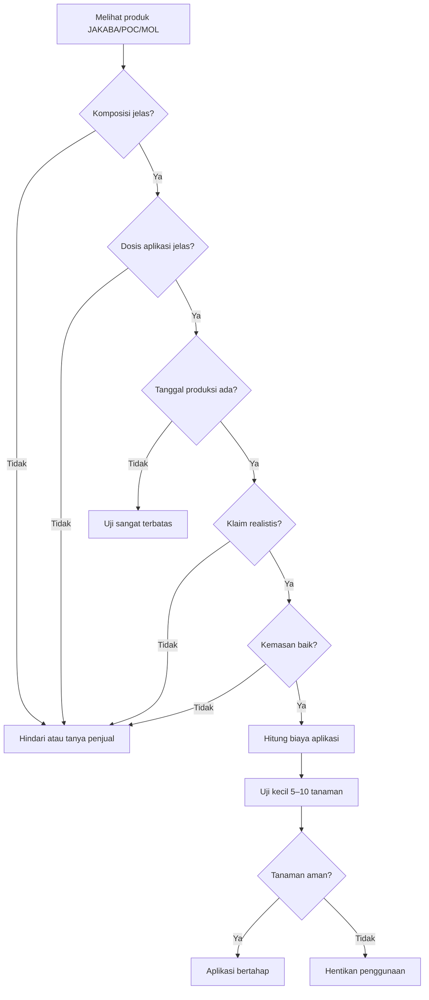

---

## C.17 Ringkasan Perbandingan JAKABA, POC, dan MOL Pasaran

| Produk        | Fungsi Utama                     | Cocok untuk                 | Perlu Diwaspadai                           |
| ------------- | -------------------------------- | --------------------------- | ------------------------------------------ |
| JAKABA        | Biostimulan dan mikroba rizosfer | Kocor tanah/media           | Variasi mikroba, bau busuk, klaim berlebih |
| POC vegetatif | Hara tambahan fase tumbuh        | Daun, tunas, akar           | Kelebihan N, produk belum matang           |
| POC generatif | Pendukung bunga dan buah         | Cabai/durian fase generatif | Tidak otomatis cukup K, Ca, Mg             |
| POC ikan      | Asam amino dan N organik         | Pemulihan dan pertumbuhan   | Bau busuk, fitotoksik                      |
| MOL cair      | Starter fermentasi               | POC, kompos, tanah          | Viabilitas mikroba                         |
| MOL serbuk    | Dekomposer/bioaktivator          | Kompos dan bahan organik    | Aktivasi dan dosis                         |
| EM pertanian  | Starter mikroba komersial        | POC/bokashi                 | Perlu aktivasi sesuai petunjuk             |
| Dekomposer    | Pengurai bahan organik           | Kompos/limbah organik       | Bukan pupuk utama                          |

---

## Ringkasan Lampiran C

Produk JAKABA, POC, dan MOL di pasaran tersedia dalam berbagai bentuk, mulai dari cair siap pakai, starter, konsentrat, bioaktivator, dekomposer, hingga produk khusus cabai dan durian. Ketiganya memiliki fungsi berbeda. JAKABA lebih tepat dipilih sebagai biostimulan dan pendukung rizosfer. POC dipilih sebagai pupuk organik cair tambahan sesuai fase tanaman. MOL dipilih sebagai starter mikroba, bioaktivator, atau dekomposer.

Dalam pembelian produk pasaran, parameter penting yang harus diperiksa adalah komposisi, dosis aplikasi, tanggal produksi, masa simpan, aroma, kondisi kemasan, legalitas, klaim fungsi, dan harga per liter. Produk yang berbau busuk, tidak memiliki dosis jelas, tidak mencantumkan tanggal produksi, atau mengklaim sebagai pengganti total semua pupuk sebaiknya dihindari.

Untuk penggunaan agribisnis, keputusan membeli tidak boleh hanya berdasarkan harga atau klaim. Produk harus diuji kecil terlebih dahulu pada 5–10 tanaman. Jika aman, aplikasi dapat diperluas secara bertahap. Pendekatan ini membantu mengurangi risiko fitotoksik, kerugian tanaman, dan pemborosan biaya input.

[1]: https://peraturan.bpk.go.id/Details/161054/permentan-no-01-tahun-2019?utm_source=chatgpt.com 'Permentan No. 01 Tahun 2019'

[**Kembali ke atas**](#rumah-mikroba-rizosfer-cara-praktis-menyiapkan-tanah-cabai-agar-mikroba-menguntungkan-bisa-bekerja)

---

<small>
  **_Catatan Penyusunan_** Artikel ini disusun sebagai materi edukasi dan
  referensi umum berdasarkan berbagai sumber pustaka, praktik lapangan, serta
  bantuan alat penulisan. Pembaca disarankan untuk melakukan verifikasi lanjutan
  dan penyesuaian sesuai dengan kondisi serta kebutuhan masing-masing sistem.
</small>
