# **_Tipuan Mikroba dalam Pertanian: Trichoderma, PGPR, PGPM, PGPF, MOL, dan JAKABA_**

---

- [**_Tipuan Mikroba dalam Pertanian: Trichoderma, PGPR, PGPM, PGPF, MOL, dan JAKABA_**](#tipuan-mikroba-dalam-pertanian-trichoderma-pgpr-pgpm-pgpf-mol-dan-jakaba)
- [Tipuan Mikroba dalam Pertanian: Jangan Mudah Percaya Mikroba yang Belum Terbukti](#tipuan-mikroba-dalam-pertanian-jangan-mudah-percaya-mikroba-yang-belum-terbukti)
  - [1. Pembukaan: Mikroba Bukan Selalu Baik](#1-pembukaan-mikroba-bukan-selalu-baik)
    - [1.1. Mikroba adalah input biologis aktif](#11-mikroba-adalah-input-biologis-aktif)
    - [1.2. Letak “tipuan mikroba”](#12-letak-tipuan-mikroba)
  - [2. Memahami Istilah “Trichoderma sp.”](#2-memahami-istilah-trichoderma-sp)
    - [2.1. Arti kata “sp.”](#21-arti-kata-sp)
    - [2.2. Nama genus belum cukup](#22-nama-genus-belum-cukup)
    - [2.3. Mengapa istilah ini penting bagi praktisi?](#23-mengapa-istilah-ini-penting-bagi-praktisi)
  - [3. Trichoderma yang Berguna untuk Cabai](#3-trichoderma-yang-berguna-untuk-cabai)
    - [3.1. Jenis Trichoderma yang sering dipakai](#31-jenis-trichoderma-yang-sering-dipakai)
    - [3.2. Target utama Trichoderma pada cabai](#32-target-utama-trichoderma-pada-cabai)
    - [3.3. Fungsi utama Trichoderma pada cabai](#33-fungsi-utama-trichoderma-pada-cabai)
    - [3.4. Kesalahan umum penggunaan Trichoderma pada cabai](#34-kesalahan-umum-penggunaan-trichoderma-pada-cabai)
      - [Pertama, aplikasi terlambat](#pertama-aplikasi-terlambat)
      - [Kedua, target penyakit salah](#kedua-target-penyakit-salah)
      - [Ketiga, produk tidak jelas](#ketiga-produk-tidak-jelas)
      - [Keempat, dosis tidak terukur](#keempat-dosis-tidak-terukur)
      - [Kelima, dicampur sembarangan](#kelima-dicampur-sembarangan)
    - [3.5. Posisi Trichoderma dalam sistem budidaya cabai](#35-posisi-trichoderma-dalam-sistem-budidaya-cabai)
    - [3.6. Kesimpulan Bab 3](#36-kesimpulan-bab-3)
- [Tipuan Mikroba dalam Pertanian: Dari Morfologi sampai Risiko Dominasi Mikroba](#tipuan-mikroba-dalam-pertanian-dari-morfologi-sampai-risiko-dominasi-mikroba)
  - [4. Morfologi Trichoderma: Bisa Dicari, Tapi Jangan Terlalu Percaya](#4-morfologi-trichoderma-bisa-dicari-tapi-jangan-terlalu-percaya)
    - [4.1. Ciri umum koloni Trichoderma](#41-ciri-umum-koloni-trichoderma)
    - [4.2. Pembeda kasar dengan jamur lain](#42-pembeda-kasar-dengan-jamur-lain)
    - [4.3. Morfologi tidak cukup untuk memastikan spesies](#43-morfologi-tidak-cukup-untuk-memastikan-spesies)
    - [4.4. Hubungan morfologi dengan “tipuan mikroba”](#44-hubungan-morfologi-dengan-tipuan-mikroba)
  - [5. Trichoderma dari Alam: Isolat Lokal atau Risiko Lokal?](#5-trichoderma-dari-alam-isolat-lokal-atau-risiko-lokal)
    - [5.1. Sumber isolat lokal yang sering dicari](#51-sumber-isolat-lokal-yang-sering-dicari)
    - [5.2. Jalur yang benar untuk isolat lokal](#52-jalur-yang-benar-untuk-isolat-lokal)
    - [5.3. Mengapa isolat lokal belum tentu aman?](#53-mengapa-isolat-lokal-belum-tentu-aman)
    - [5.4. Tabel status isolat lokal](#54-tabel-status-isolat-lokal)
    - [5.5. Hubungan isolat lokal dengan “tipuan mikroba”](#55-hubungan-isolat-lokal-dengan-tipuan-mikroba)
  - [6. Trichoderma Bisa Mengganggu Mikroba Menguntungkan Lain](#6-trichoderma-bisa-mengganggu-mikroba-menguntungkan-lain)
    - [6.1. Trichoderma tidak membaca label “baik” atau “jahat”](#61-trichoderma-tidak-membaca-label-baik-atau-jahat)
    - [6.2. Mikroba menguntungkan yang bisa terdampak](#62-mikroba-menguntungkan-yang-bisa-terdampak)
    - [6.3. Kapan risiko gangguan meningkat?](#63-kapan-risiko-gangguan-meningkat)
    - [6.4. Prinsip aman menggunakan Trichoderma bersama mikroba lain](#64-prinsip-aman-menggunakan-trichoderma-bersama-mikroba-lain)
    - [6.5. Kesimpulan Bab 6](#65-kesimpulan-bab-6)
  - [7. Kesalahan Umum: Semakin Banyak Mikroba Dianggap Semakin Baik](#7-kesalahan-umum-semakin-banyak-mikroba-dianggap-semakin-baik)
    - [7.1. Kesalahan praktisi yang sering terjadi](#71-kesalahan-praktisi-yang-sering-terjadi)
    - [7.2. Risiko dari prinsip “semakin banyak semakin baik”](#72-risiko-dari-prinsip-semakin-banyak-semakin-baik)
    - [7.3. Mengapa molase/gula berlebihan berisiko?](#73-mengapa-molasegula-berlebihan-berisiko)
    - [7.4. Campuran mikroba tidak selalu menjadi konsorsium](#74-campuran-mikroba-tidak-selalu-menjadi-konsorsium)
    - [7.5. Prinsip penggunaan mikroba yang benar](#75-prinsip-penggunaan-mikroba-yang-benar)
    - [7.6. Kesimpulan Bab 7](#76-kesimpulan-bab-7)
- [Tipuan Mikroba dalam Pertanian: Dosis, Aplikasi, Produk Teruji, dan Patogen Target](#tipuan-mikroba-dalam-pertanian-dosis-aplikasi-produk-teruji-dan-patogen-target)
  - [8. Dosis Trichoderma untuk Cabai](#8-dosis-trichoderma-untuk-cabai)
    - [8.1. Dosis per aplikasi](#81-dosis-per-aplikasi)
    - [8.2. Total dosis satu musim](#82-total-dosis-satu-musim)
    - [8.3. Rumus kebutuhan Trichoderma](#83-rumus-kebutuhan-trichoderma)
    - [8.4. Contoh kebutuhan per hektare](#84-contoh-kebutuhan-per-hektare)
      - [Populasi 20.000 tanaman/ha](#populasi-20000-tanamanha)
      - [Populasi 25.000 tanaman/ha](#populasi-25000-tanamanha)
    - [8.5. Jadwal aplikasi praktis](#85-jadwal-aplikasi-praktis)
    - [8.6. Alur keputusan dosis](#86-alur-keputusan-dosis)
    - [8.7. Kesalahan dosis yang perlu dihindari](#87-kesalahan-dosis-yang-perlu-dihindari)
    - [8.8. Kesimpulan Bab 8](#88-kesimpulan-bab-8)
  - [9. Trichoderma dan Akar Tanaman](#9-trichoderma-dan-akar-tanaman)
    - [9.1. Trichoderma boleh dekat akar](#91-trichoderma-boleh-dekat-akar)
    - [9.2. Yang tidak boleh mengenai akar](#92-yang-tidak-boleh-mengenai-akar)
    - [9.3. Posisi aplikasi di lubang tanam](#93-posisi-aplikasi-di-lubang-tanam)
    - [9.4. Posisi aplikasi susulan](#94-posisi-aplikasi-susulan)
    - [9.5. Jarak dengan pupuk kimia dan fungisida](#95-jarak-dengan-pupuk-kimia-dan-fungisida)
    - [9.6. Kesimpulan Bab 9](#96-kesimpulan-bab-9)
  - [10. Beli Produk Teruji atau Isolasi Sendiri?](#10-beli-produk-teruji-atau-isolasi-sendiri)
    - [10.1. Untuk produksi, pilih yang teruji](#101-untuk-produksi-pilih-yang-teruji)
    - [10.2. Untuk riset, isolasi lokal boleh dilakukan](#102-untuk-riset-isolasi-lokal-boleh-dilakukan)
    - [10.3. Perbandingan produk teruji dan isolat lokal](#103-perbandingan-produk-teruji-dan-isolat-lokal)
    - [10.4. Strategi terbaik: dua jalur](#104-strategi-terbaik-dua-jalur)
    - [10.5. Jangan jadikan lahan produksi sebagai tempat eksperimen mikroba liar](#105-jangan-jadikan-lahan-produksi-sebagai-tempat-eksperimen-mikroba-liar)
    - [10.6. Kesimpulan Bab 10](#106-kesimpulan-bab-10)
  - [11. Mencari Patogen Target: Fusarium, Phytophthora, Rhizoctonia](#11-mencari-patogen-target-fusarium-phytophthora-rhizoctonia)
    - [11.1. Mengapa harus mencari patogen target?](#111-mengapa-harus-mencari-patogen-target)
    - [11.2. Fusarium pada cabai](#112-fusarium-pada-cabai)
    - [11.3. Phytophthora pada cabai](#113-phytophthora-pada-cabai)
    - [11.4. Rhizoctonia pada cabai](#114-rhizoctonia-pada-cabai)
    - [11.5. Ringkasan gejala patogen target](#115-ringkasan-gejala-patogen-target)
    - [11.6. Alur pengambilan sampel](#116-alur-pengambilan-sampel)
    - [11.7. Cara mengambil sampel yang benar](#117-cara-mengambil-sampel-yang-benar)
    - [11.8. Jangan memperbanyak patogen sembarangan](#118-jangan-memperbanyak-patogen-sembarangan)
    - [11.9. Hubungan patogen target dengan “tipuan mikroba”](#119-hubungan-patogen-target-dengan-tipuan-mikroba)
    - [11.10. Kesimpulan Bab 11](#1110-kesimpulan-bab-11)
- [Tipuan Mikroba dalam Pertanian: Bukti Kemanjuran, Risiko Mikroba Campuran, dan Kultur yang Harus Ditolak](#tipuan-mikroba-dalam-pertanian-bukti-kemanjuran-risiko-mikroba-campuran-dan-kultur-yang-harus-ditolak)
  - [12. Apakah Trichoderma Terbukti Manjur?](#12-apakah-trichoderma-terbukti-manjur)
    - [12.1. Penyakit yang paling relevan](#121-penyakit-yang-paling-relevan)
    - [12.2. Faktor yang menentukan kemanjuran](#122-faktor-yang-menentukan-kemanjuran)
    - [12.3. Laboratorium tidak sama dengan lapangan](#123-laboratorium-tidak-sama-dengan-lapangan)
    - [12.4. Ukuran manjur untuk praktisi](#124-ukuran-manjur-untuk-praktisi)
    - [12.5. Kesimpulan Bab 12](#125-kesimpulan-bab-12)
  - [13. PGPM, PGPR, PGPF, Agen Hayati, MOL, dan JAKABA Juga Patut Dicurigai](#13-pgpm-pgpr-pgpf-agen-hayati-mol-dan-jakaba-juga-patut-dicurigai)
    - [13.1. Memahami istilah PGPM, PGPR, dan PGPF](#131-memahami-istilah-pgpm-pgpr-dan-pgpf)
    - [13.2. Mengapa perlu dicurigai?](#132-mengapa-perlu-dicurigai)
    - [13.3. MOL dan JAKABA: bukan otomatis salah, tetapi jangan didewakan](#133-mol-dan-jakaba-bukan-otomatis-salah-tetapi-jangan-didewakan)
    - [13.4. Posisi aman MOL dan JAKABA](#134-posisi-aman-mol-dan-jakaba)
    - [13.5. Kesimpulan Bab 13](#135-kesimpulan-bab-13)
  - [14. Mikroba Berguna Tapi Berisiko](#14-mikroba-berguna-tapi-berisiko)
    - [14.1. Bacillus](#141-bacillus)
    - [14.2. Pseudomonas](#142-pseudomonas)
    - [14.3. Burkholderia](#143-burkholderia)
    - [14.4. Aspergillus dan Penicillium](#144-aspergillus-dan-penicillium)
    - [14.5. Serratia, Enterobacter, dan Klebsiella](#145-serratia-enterobacter-dan-klebsiella)
    - [14.6. Peta risiko mikroba](#146-peta-risiko-mikroba)
    - [14.7. Pertanyaan audit sebelum memakai mikroba](#147-pertanyaan-audit-sebelum-memakai-mikroba)
    - [14.8. Kesimpulan Bab 14](#148-kesimpulan-bab-14)
  - [15. Tanda Kultur Mikroba Patut Ditolak](#15-tanda-kultur-mikroba-patut-ditolak)
    - [15.1. Tanda fisik dan bau yang mencurigakan](#151-tanda-fisik-dan-bau-yang-mencurigakan)
    - [15.2. Tanda setelah uji kecil](#152-tanda-setelah-uji-kecil)
    - [15.3. Alur keputusan menerima atau menolak kultur](#153-alur-keputusan-menerima-atau-menolak-kultur)
    - [15.4. Jangan menyelamatkan kultur yang sudah gagal](#154-jangan-menyelamatkan-kultur-yang-sudah-gagal)
    - [15.5. Bedakan fermentasi baik dan pembusukan](#155-bedakan-fermentasi-baik-dan-pembusukan)
    - [15.6. Cara membuang kultur gagal](#156-cara-membuang-kultur-gagal)
    - [15.7. Kesimpulan Bab 15](#157-kesimpulan-bab-15)
- [Tipuan Mikroba dalam Pertanian: Standar Seleksi, Prinsip Anti-Tipuan, dan Rumus Praktis untuk Petani Cabai](#tipuan-mikroba-dalam-pertanian-standar-seleksi-prinsip-anti-tipuan-dan-rumus-praktis-untuk-petani-cabai)
  - [16. Standar Sebelum Mikroba Dipakai Luas](#16-standar-sebelum-mikroba-dipakai-luas)
    - [16.1. Level 1: Aman dicoba kecil](#161-level-1-aman-dicoba-kecil)
    - [16.2. Level 2: Layak dipakai terbatas](#162-level-2-layak-dipakai-terbatas)
    - [16.3. Level 3: Layak produksi](#163-level-3-layak-produksi)
    - [16.4. Diagram standar seleksi mikroba](#164-diagram-standar-seleksi-mikroba)
    - [16.5. Tabel keputusan penggunaan mikroba](#165-tabel-keputusan-penggunaan-mikroba)
    - [16.6. Kesimpulan Bab 16](#166-kesimpulan-bab-16)
  - [17. Prinsip Anti-Tipuan Mikroba](#17-prinsip-anti-tipuan-mikroba)
    - [17.1. Jangan percaya hanya karena kata “organik”](#171-jangan-percaya-hanya-karena-kata-organik)
    - [17.2. Jangan percaya hanya karena “dari alam”](#172-jangan-percaya-hanya-karena-dari-alam)
    - [17.3. Jangan percaya hanya karena “mikroba lokal”](#173-jangan-percaya-hanya-karena-mikroba-lokal)
    - [17.4. Jangan percaya hanya karena “jamur hijau”](#174-jangan-percaya-hanya-karena-jamur-hijau)
    - [17.5. Jangan percaya hanya karena “bau fermentasi”](#175-jangan-percaya-hanya-karena-bau-fermentasi)
    - [17.6. Jangan percaya produk tanpa spesies atau strain](#176-jangan-percaya-produk-tanpa-spesies-atau-strain)
    - [17.7. Jangan percaya klaim tanpa dosis](#177-jangan-percaya-klaim-tanpa-dosis)
    - [17.8. Jangan percaya klaim tanpa target penyakit](#178-jangan-percaya-klaim-tanpa-target-penyakit)
    - [17.9. Jangan percaya klaim “bisa untuk semua tanaman dan semua penyakit”](#179-jangan-percaya-klaim-bisa-untuk-semua-tanaman-dan-semua-penyakit)
    - [17.10. Jangan aplikasikan luas tanpa uji petak](#1710-jangan-aplikasikan-luas-tanpa-uji-petak)
    - [17.11. Diagram prinsip anti-tipuan mikroba](#1711-diagram-prinsip-anti-tipuan-mikroba)
    - [17.12. Kesimpulan Bab 17](#1712-kesimpulan-bab-17)
  - [18. Rumus Praktis untuk Petani Cabai](#18-rumus-praktis-untuk-petani-cabai)
    - [18.1. Rumus keputusan mikroba](#181-rumus-keputusan-mikroba)
    - [18.2. Contoh kasus: layu Fusarium pada cabai](#182-contoh-kasus-layu-fusarium-pada-cabai)
    - [18.3. Formula evaluasi penurunan penyakit](#183-formula-evaluasi-penurunan-penyakit)
    - [18.4. Formula peningkatan hasil panen](#184-formula-peningkatan-hasil-panen)
    - [18.5. Formula kebutuhan Trichoderma](#185-formula-kebutuhan-trichoderma)
    - [18.6. Format pencatatan lapang](#186-format-pencatatan-lapang)
    - [18.7. Kriteria keputusan praktis](#187-kriteria-keputusan-praktis)
    - [18.8. Kesimpulan Bab 18](#188-kesimpulan-bab-18)
  - [19. Penutup: Mikroba Bukan Musuh, Tapi Jangan Didewakan](#19-penutup-mikroba-bukan-musuh-tapi-jangan-didewakan)
    - [19.1. Tujuan agribisnis bukan memperbanyak mikroba sebanyak-banyaknya](#191-tujuan-agribisnis-bukan-memperbanyak-mikroba-sebanyak-banyaknya)
    - [19.2. Posisi mikroba dalam sistem budidaya cabai](#192-posisi-mikroba-dalam-sistem-budidaya-cabai)
    - [19.3. Ringkasan besar artikel](#193-ringkasan-besar-artikel)
    - [19.4. Checklist akhir anti-tipuan mikroba](#194-checklist-akhir-anti-tipuan-mikroba)
    - [19.5. Kalimat penutup](#195-kalimat-penutup)
- [Lampiran](#lampiran)
  - [Tanaman Produktif: Mikroba Seimbang, Nutrisi Terjamin, dan Tidak Harus 100% Organik](#tanaman-produktif-mikroba-seimbang-nutrisi-terjamin-dan-tidak-harus-100-organik)
  - [1. Mikroba Seimbang dan Nutrisi Terjamin](#1-mikroba-seimbang-dan-nutrisi-terjamin)
  - [2. Mikroba Seimbang Bukan Berarti Mikroba Banyak](#2-mikroba-seimbang-bukan-berarti-mikroba-banyak)
  - [3. Nutrisi Terjamin Bukan Berarti Pupuk Banyak](#3-nutrisi-terjamin-bukan-berarti-pupuk-banyak)
  - [4. Tanaman Produktif Tidak Harus 100% Organik](#4-tanaman-produktif-tidak-harus-100-organik)
  - [5. Mengapa Tidak Harus 100% Organik?](#5-mengapa-tidak-harus-100-organik)
  - [6. Pola Budidaya Berimbang](#6-pola-budidaya-berimbang)
  - [7. Kesimpulan Lampiran](#7-kesimpulan-lampiran)

---

# Tipuan Mikroba dalam Pertanian: Jangan Mudah Percaya Mikroba yang Belum Terbukti

Dalam beberapa tahun terakhir, istilah seperti **mikroba baik**, **pupuk hayati**, **PGPR**, **PGPM**, **PGPF**, **MOL**, **JAKABA**, dan **Trichoderma sp.** makin sering dipakai dalam dunia pertanian. Di satu sisi, ini perkembangan yang baik. Petani mulai sadar bahwa tanah bukan sekadar media tanam mati, tetapi ekosistem hidup yang penuh mikroorganisme.

Namun di sisi lain, muncul masalah baru: **mikroba sering dijual dan dipromosikan dengan klaim yang terlalu besar**.

Ada produk yang diklaim bisa menyuburkan tanah, menekan semua penyakit, mempercepat panen, memperbesar buah, memperkuat akar, mengurangi pupuk kimia, bahkan menyembuhkan hampir semua masalah tanaman. Kata-kata seperti “alami”, “organik”, “ramah lingkungan”, “mikroba lokal”, dan “fermentasi” sering dipakai untuk membangun kepercayaan.

Padahal, dalam praktik lapang, mikroba tidak sesederhana itu.

Mikroba adalah makhluk hidup. Ia bisa berkembang, bersaing, menyerang, bertahan, mati, atau justru mengganggu organisme lain. Mikroba tidak otomatis baik hanya karena berasal dari alam. Mikroba juga tidak otomatis aman hanya karena disebut organik. Bahkan mikroba yang dikenal bermanfaat pun tetap harus dilihat **jenisnya, strain-nya, dosisnya, media pembawanya, cara aplikasinya, dan bukti efektivitasnya**.

Artikel ini ditulis untuk praktisi pertanian, terutama petani dan pelaku agribisnis cabai, agar lebih kritis dalam menggunakan mikroba pertanian. Fokus utama pembahasan adalah **Trichoderma sp.**, tetapi prinsipnya berlaku juga untuk PGPR, PGPM, PGPF, MOL, JAKABA, dan berbagai input hayati lainnya.

Inti besar artikel ini sederhana:

> **Jangan tertipu oleh nama mikroba. Percayalah pada bukti, dosis, fungsi, dan hasil uji lapang.**

<ResourceBox
  title="Artikel Terkait:"
  items={[
    {
      name: 'README — Framework Praktis Memulai Bisnis Agribisnis Terpadu di Lahan Gumuk Berlereng',
      href: '/blog/agri/kebon/agribisnis-gumuk/README',
    },
    {
      name: 'Isolasi Mikroba Lokal untuk PGPM dan Agen Pengendali Hayati (APH)',
      href: '/blog/agri/agen-hayati/isolasi-mikroba-lokal',
    },
    {
      name: 'OPT Penggagal Panen pada Cabai Rawit dan Cabai Besar',
      href: '/blog/agri/kebon/pengendalian-opt-cabai',
    },
    {
      name: 'Pedoman lengkap bergambar pengendalian OPT cabai - kutu kebul dan thrips',
      href: '/blog/agri/kebon/pengendalian-kutu-kebul-thrips',
    },
    {
      name: 'Panduan Praktis Pembiakan Trichoderma dari Starter Komersial',
      href: '/blog/agri/agen-hayati/trichoderma-pembiakan',
    },
    {
      name: 'Panduan Praktis Pengembangan Cabai di Desa Gambiran, Banyuwangi',
      href: '/blog/agri/kebon/panduan-pengembangan-cabai',
    },
    {
      name: 'Panduan Lengkap Pengendalian Lalat Buah di Kebun Campuran',
      href: '/blog/agri/kebon/lalat-buah',
    },
    {
      name: 'README - Pupuk Tepat, Panen Untung - Model Low-Lab untuk Petani Makmur di Gambiran',
      href: '/blog/agri/pupuk-terintegrasi/README',
    },
  ]}
/>

---

## 1. Pembukaan: Mikroba Bukan Selalu Baik

Mikroba pertanian sering dipromosikan dengan bahasa yang sangat menarik. Biasanya disebut sebagai:

- alami;
- organik;
- ramah lingkungan;
- aman untuk tanah;
- aman untuk tanaman;
- bisa menggantikan bahan kimia;
- meningkatkan hasil;
- memperbaiki kesuburan tanah.

Sebagian klaim itu memang bisa benar. Banyak mikroba memang berguna dalam pertanian. Ada mikroba yang membantu akar menyerap hara, melarutkan fosfat, menghasilkan hormon tumbuh, menekan patogen, mempercepat dekomposisi bahan organik, atau memperbaiki struktur tanah.

Tetapi tidak semua mikroba bekerja seperti itu.

Dalam ekosistem tanah, mikroba memiliki banyak peran. Ada yang membantu tanaman, ada yang hanya hidup biasa tanpa efek besar, ada yang bersaing dengan mikroba lain, ada yang merugikan tanaman, dan ada juga yang menjadi patogen.

Dengan kata lain, mikroba tidak bisa dinilai hanya dari label “baik” atau “jahat”. Ia harus dinilai dari **perilakunya dalam kondisi tertentu**.

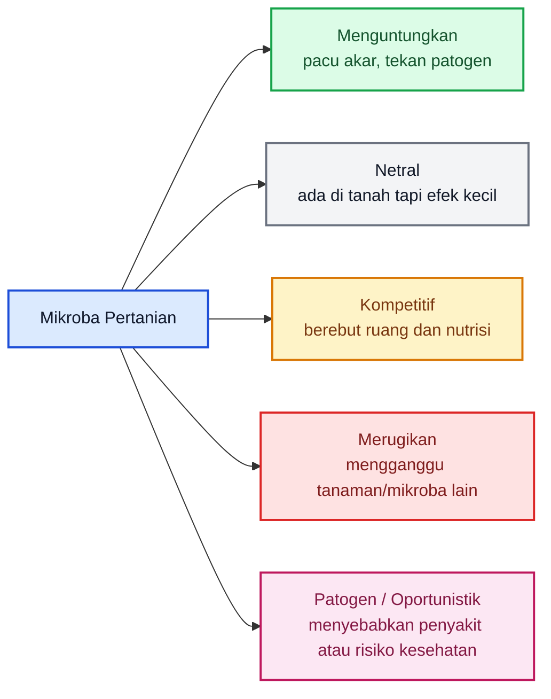

Masalah besar dalam praktik pertanian adalah ketika semua mikroba langsung dianggap baik hanya karena berasal dari alam. Ini cara berpikir yang berbahaya.

Contohnya, tanah hutan, kompos, akar bambu, serasah, air cucian beras, buah busuk, nasi basi, atau bahan fermentasi memang bisa mengandung mikroba bermanfaat. Tetapi bahan-bahan itu juga bisa mengandung mikroba pembusuk, jamur penghasil toksin, bakteri oportunistik, atau patogen tanaman.

Jadi kalimat seperti:

> “Ini dari alam, pasti aman.”

tidak selalu benar.

Kalimat yang lebih tepat adalah:

> “Ini dari alam, tetapi tetap harus diuji.”

### 1.1. Mikroba adalah input biologis aktif

Dalam pertanian, pupuk kimia, pestisida, benih, media tanam, dan kapur pertanian biasanya diperlakukan sebagai input yang harus jelas dosisnya. Petani bertanya:

- berapa gram per tanaman?
- berapa kilogram per hektare?
- kapan diberikan?
- boleh dicampur apa?
- targetnya apa?
- efek sampingnya apa?

Anehnya, ketika berbicara tentang mikroba, banyak orang menjadi terlalu longgar. Ada yang hanya berkata:

- “kocorkan secukupnya”;
- “semprot rutin”;
- “pakai banyak lebih bagus”;
- “campur saja semua mikroba”;
- “yang penting organik”;
- “kalau dari alam pasti aman”.

Padahal mikroba adalah input biologis aktif. Ia bisa berkembang biak, berkompetisi, berubah populasinya, dan memengaruhi ekosistem tanah.

Karena itu, mikroba harus diperlakukan serius seperti input agribisnis lainnya.

### 1.2. Letak “tipuan mikroba”

“Tipuan mikroba” tidak selalu berarti penjualnya sengaja menipu. Kadang masalahnya adalah penyederhanaan berlebihan.

Tipuan mikroba biasanya muncul dalam bentuk klaim seperti:

- satu mikroba bisa menyelesaikan semua penyakit;
- semua jamur hijau disebut Trichoderma;
- semua fermentasi disebut pupuk hayati;
- semua MOL dianggap aman;
- semua PGPR dianggap pasti menyuburkan;
- semua mikroba lokal dianggap lebih unggul;
- semakin banyak mikroba dianggap semakin baik;
- nama genus dianggap cukup sebagai bukti manfaat.

Padahal, dalam mikrobiologi pertanian, manfaat mikroba sangat bergantung pada identitas, strain, lingkungan, dan cara aplikasi.

> **Mikroba disebut bermanfaat setelah terbukti, bukan karena namanya terdengar alami.**

---

## 2. Memahami Istilah “Trichoderma sp.”

Salah satu istilah yang paling sering muncul dalam pertanian biologis adalah **Trichoderma sp.**

Banyak petani mendengar bahwa Trichoderma bagus untuk tanaman cabai. Ada yang menggunakannya untuk mencegah layu, busuk akar, busuk pangkal batang, dan rebah semai. Secara umum, ini benar. Banyak anggota genus Trichoderma memang dikenal sebagai jamur antagonis yang bisa menekan beberapa patogen tanah.

Tetapi masalahnya muncul ketika label hanya menulis:

> **Trichoderma sp.**

Apa artinya?

### 2.1. Arti kata “sp.”

Dalam taksonomi biologi, **Trichoderma** adalah nama genus. Sementara **sp.** adalah singkatan dari _species_, yang berarti spesiesnya belum diketahui atau belum dipastikan.

Jadi:

> **Trichoderma sp. = jamur dari genus Trichoderma, tetapi spesies pastinya belum jelas.**

Ini berbeda dengan nama spesies yang lebih lengkap, misalnya:

- _Trichoderma harzianum_;
- _Trichoderma asperellum_;
- _Trichoderma viride_;
- _Trichoderma atroviride_;
- _Trichoderma koningii_;
- _Trichoderma longibrachiatum_.

Diagram sederhananya seperti ini:

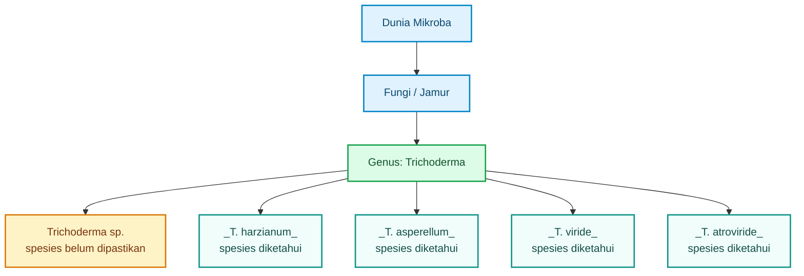

Penulisan **Trichoderma sp.** bukan sesuatu yang salah. Dalam tahap awal identifikasi, penulisan itu memang wajar. Misalnya, seorang praktisi menemukan jamur yang bentuk koloninya mirip Trichoderma, lalu dari pengamatan awal ia cukup yakin bahwa jamur itu masuk genus Trichoderma. Namun ia belum memastikan spesiesnya. Maka penulisan yang hati-hati adalah **Trichoderma sp.**

Yang menjadi masalah adalah ketika istilah **Trichoderma sp.** dipakai untuk memberi kesan bahwa produk atau kultur tersebut sudah pasti efektif.

Padahal belum tentu.

### 2.2. Nama genus belum cukup

Dalam pertanian, menyebut “Trichoderma sp.” mirip seperti menyebut “cabai sp.” Kita tahu itu kelompok cabai, tetapi belum tahu apakah cabai rawit, cabai besar, cabai keriting, cabai hias, atau jenis lainnya. Masing-masing bisa punya sifat berbeda.

Begitu juga dengan Trichoderma.

Satu spesies Trichoderma bisa memiliki banyak strain. Bahkan dalam spesies yang sama, strain A dan strain B bisa berbeda kemampuannya. Ada yang kuat menekan Fusarium, ada yang lebih cocok menekan Phytophthora, ada yang bagus memacu akar, ada yang biasa saja, dan ada yang tidak stabil ketika diperbanyak.

Jadi, klaim seperti ini perlu dicurigai:

> “Ini Trichoderma sp., pasti bagus untuk semua tanaman.”

Pernyataan yang lebih benar adalah:

> “Ini Trichoderma sp., masih perlu diketahui spesies, strain, target patogen, dosis, dan efektivitasnya.”

### 2.3. Mengapa istilah ini penting bagi praktisi?

Karena banyak keputusan lapang dimulai dari label. Jika label hanya menulis “Trichoderma sp.” tanpa informasi lain, maka praktisi harus bertanya lebih lanjut:

- spesiesnya apa?
- strain-nya apa?
- jumlah sporanya berapa?
- target penyakitnya apa?
- sudah diuji pada tanaman apa?
- dosis aplikasinya berapa?
- media pembawanya apa?
- tanggal produksinya kapan?
- masa simpannya berapa lama?
- apakah ada uji lapang?

Jika pertanyaan-pertanyaan itu tidak bisa dijawab, maka produk atau kultur tersebut sebaiknya tidak langsung dipakai luas.

Bukan berarti pasti buruk. Tetapi statusnya masih **belum terbukti**.

> **Tulisan “Trichoderma sp.” bukan bukti bahwa mikroba itu pasti manjur.**

---

## 3. Trichoderma yang Berguna untuk Cabai

Pada tanaman cabai, Trichoderma paling relevan digunakan untuk menghadapi masalah **penyakit tular tanah**. Artinya, penyakit yang sumber serangannya berasal dari tanah, akar, pangkal batang, media semai, atau sisa tanaman sakit.

Trichoderma bekerja terutama di sekitar akar. Ia dapat bersaing dengan patogen, menguasai ruang tumbuh, menghasilkan senyawa penghambat, dan membantu akar menjadi lebih kuat. Karena itu, Trichoderma lebih tepat disebut sebagai **penjaga zona akar**, bukan obat umum untuk semua penyakit cabai.

### 3.1. Jenis Trichoderma yang sering dipakai

Beberapa jenis Trichoderma yang sering disebut dalam pertanian cabai antara lain:

- _Trichoderma harzianum_;
- _Trichoderma asperellum_;
- _Trichoderma viride_;
- _Trichoderma atroviride_.

Dari sisi praktik, dua nama yang paling sering dipakai untuk cabai adalah **_Trichoderma harzianum_** dan **_Trichoderma asperellum_**.

Keduanya banyak digunakan karena dikenal sebagai antagonis patogen tanah. Namun sekali lagi, yang menentukan bukan hanya nama spesies, tetapi juga strain dan kualitas formulasi.

### 3.2. Target utama Trichoderma pada cabai

Trichoderma paling masuk akal digunakan untuk menekan penyakit seperti:

- layu Fusarium;
- busuk akar;
- busuk pangkal batang;
- rebah semai;
- serangan Rhizoctonia;
- serangan Pythium;
- serangan Phytophthora.

Penyakit-penyakit ini berkaitan erat dengan kondisi tanah, kelembapan, akar, dan pangkal batang. Di situlah Trichoderma punya ruang kerja paling relevan.

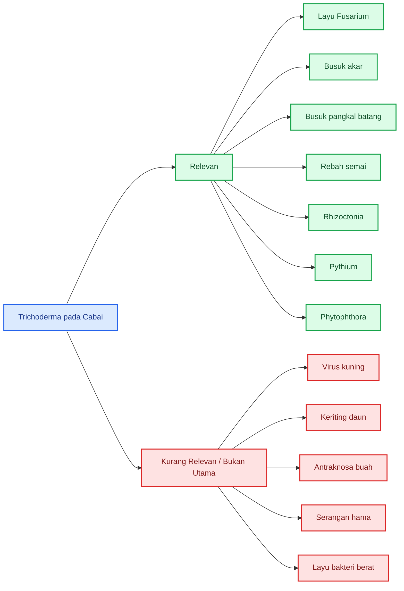

Diagram di atas penting untuk mencegah salah pakai. Banyak kegagalan aplikasi mikroba terjadi bukan karena mikroba selalu buruk, tetapi karena targetnya salah.

Jika tanaman cabai terserang virus kuning, masalah utamanya bukan jamur tanah. Masalah utamanya adalah virus dan serangga vektor seperti kutu kebul. Trichoderma tidak bisa dijadikan pengendali utama untuk kasus itu.

Jika buah cabai busuk karena antraknosa, Trichoderma di tanah juga bukan solusi utama. Perlu sanitasi kebun, pengaturan kelembapan tajuk, jarak tanam, pemangkasan, rotasi fungisida yang bijak, dan pengelolaan sumber inokulum.

Jika tanaman layu karena bakteri, Trichoderma mungkin membantu memperbaiki kesehatan tanah dan akar, tetapi tidak bisa dianggap sebagai obat utama.

### 3.3. Fungsi utama Trichoderma pada cabai

Dalam praktik cabai, Trichoderma sebaiknya diposisikan sebagai:

1. **pelindung awal akar;**
2. **pengisi ruang biologis di sekitar akar;**
3. **kompetitor patogen tanah;**
4. **pendamping kompos matang;**
5. **bagian dari pencegahan penyakit tular tanah.**

Bukan sebagai:

- obat semua penyakit;
- pengganti total pupuk;
- pengganti total fungisida;
- pengendali virus;
- pengendali utama hama;
- ramuan ajaib untuk semua kondisi lahan.

Trichoderma paling baik digunakan **sebelum penyakit meledak**. Misalnya sejak persiapan media semai, lubang tanam, awal pindah tanam, dan pemeliharaan awal. Jika tanaman sudah layu parah, akar sudah rusak, dan pembuluh batang sudah terganggu, Trichoderma sulit menyelamatkan tanaman tersebut.

Jadi cara berpikirnya harus pencegahan, bukan penyembuhan darurat.

### 3.4. Kesalahan umum penggunaan Trichoderma pada cabai

Beberapa kesalahan yang sering terjadi di lapangan:

#### Pertama, aplikasi terlambat

Trichoderma baru diberikan setelah banyak tanaman layu. Pada tahap itu, patogen sudah kuat dan tanaman sudah rusak. Hasilnya sering mengecewakan.

#### Kedua, target penyakit salah

Petani menggunakan Trichoderma untuk virus kuning, keriting, atau hama daun. Akibatnya, ketika tidak berhasil, Trichoderma dianggap tidak berguna. Padahal targetnya memang tidak tepat.

#### Ketiga, produk tidak jelas

Produk hanya menulis “Trichoderma sp.” tanpa informasi spesies, dosis, jumlah spora, umur simpan, atau target penyakit.

#### Keempat, dosis tidak terukur

Aplikasi dilakukan dengan istilah “secukupnya”, “banyakkan saja”, atau “kocor rutin”. Ini berisiko membuat hasil tidak konsisten.

#### Kelima, dicampur sembarangan

Trichoderma dicampur dengan pupuk kimia pekat, fungisida keras, MOL busuk, atau fermentasi yang tidak jelas. Akibatnya, Trichoderma mati, akar stres, atau mikroba lain terganggu.

### 3.5. Posisi Trichoderma dalam sistem budidaya cabai

Trichoderma sebaiknya tidak berdiri sendiri. Ia harus menjadi bagian dari sistem pengendalian terpadu.

Untuk cabai, sistem yang lebih sehat mencakup:

- benih sehat;
- media semai bersih;
- drainase baik;
- bedengan cukup tinggi;
- kompos matang;
- rotasi tanaman;
- sanitasi tanaman sakit;
- pengendalian serangga vektor;
- pemupukan seimbang;
- penggunaan Trichoderma secara terukur;
- monitoring penyakit sejak awal.

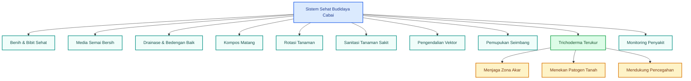

Diagram ini menunjukkan bahwa Trichoderma hanya satu bagian dari sistem. Jika drainase buruk, tanah becek, bibit sudah terinfeksi, dan sanitasi kebun jelek, maka Trichoderma tidak akan mampu bekerja optimal.

### 3.6. Kesimpulan Bab 3

Untuk cabai, Trichoderma memang bisa berguna. Tetapi kegunaannya harus ditempatkan secara benar.

Trichoderma cocok untuk membantu menekan penyakit tular tanah, terutama yang menyerang akar dan pangkal batang. Trichoderma tidak cocok dijadikan obat serbaguna untuk semua masalah cabai.

Prinsip praktisnya:

> **Trichoderma berguna terutama sebagai penjaga akar, bukan obat semua penyakit cabai.**

Dan prinsip anti-tipuan mikrobanya:

> **Jangan percaya klaim “Trichoderma bisa untuk semua penyakit”. Tanyakan dulu: penyakit apa, strain apa, dosis berapa, dan sudah diuji di mana.**

---

# Tipuan Mikroba dalam Pertanian: Dari Morfologi sampai Risiko Dominasi Mikroba

Pada bagian sebelumnya, kita sudah membahas bahwa **mikroba bukan selalu baik**, istilah **Trichoderma sp.** belum cukup untuk membuktikan manfaat, dan Trichoderma pada cabai paling relevan sebagai **penjaga zona akar** terhadap penyakit tular tanah.

Bagian ini masuk ke wilayah yang lebih kritis: bagaimana mengenali Trichoderma, mengapa isolat lokal tidak boleh langsung dipercaya, bagaimana Trichoderma bisa mengganggu mikroba menguntungkan lain, dan mengapa prinsip **“semakin banyak mikroba semakin baik”** adalah salah satu bentuk tipuan mikroba yang paling sering terjadi di lapangan.

---

## 4. Morfologi Trichoderma: Bisa Dicari, Tapi Jangan Terlalu Percaya

Banyak praktisi tertarik mencari Trichoderma sendiri dari alam. Biasanya sumber yang dicari adalah tanah sekitar akar tanaman sehat, kompos matang, serasah bambu, tanah kebun organik, atau rizosfer tanaman yang tetap sehat di lahan yang pernah terserang penyakit.

Secara prinsip, pencarian isolat lokal itu boleh. Bahkan, isolat lokal bisa menjadi sumber agens hayati yang potensial karena sudah beradaptasi dengan kondisi lingkungan setempat. Namun masalah dimulai ketika pengenalan hanya mengandalkan warna koloni.

Kesalahan paling umum adalah:

> “Jamurnya hijau, berarti Trichoderma.”

Pernyataan ini tidak aman.

Tidak semua jamur hijau adalah Trichoderma. Beberapa jamur lain seperti _Penicillium_, _Aspergillus_, dan jamur saprofit lain juga bisa menghasilkan koloni hijau, hijau kebiruan, hijau tua, abu-abu kehijauan, bahkan kehitaman. Jadi, warna koloni hanya petunjuk awal, bukan bukti final.

### 4.1. Ciri umum koloni Trichoderma

Pada media sederhana seperti PDA, Trichoderma umumnya menunjukkan ciri-ciri berikut:

- koloni awal berwarna putih;
- pertumbuhan cepat;
- kemudian berubah menjadi hijau muda, hijau tua, atau hijau kekuningan;
- sporulasi cukup banyak;
- tekstur bisa seperti kapas, tepung, atau granular;
- sering membentuk zona pertumbuhan melingkar;
- beberapa isolat memiliki bau khas, tetapi bau bukan patokan utama.

Secara mikroskopis, ciri yang biasa dicari adalah:

- konidiofor bercabang;
- fialid berbentuk botol;
- konidia berbentuk bulat, agak bulat, oval, atau elips;
- konidia berkumpul di ujung fialid;
- pada beberapa isolat dapat ditemukan klamidospora.

Ringkasnya:

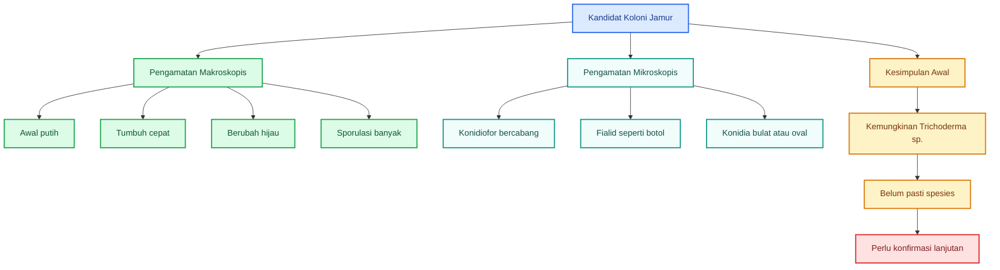

Diagram di atas menunjukkan bahwa pengamatan morfologi hanya membawa kita pada kesimpulan awal: **kemungkinan Trichoderma sp.** Bukan langsung memastikan bahwa itu _Trichoderma harzianum_, _T. asperellum_, atau strain unggul.

### 4.2. Pembeda kasar dengan jamur lain

Di lapangan atau laboratorium sederhana, beberapa jamur bisa terlihat mirip. Karena itu, praktisi harus berhati-hati.

| Jamur                | Ciri yang sering tampak                                             | Risiko salah tafsir                                |
| -------------------- | ------------------------------------------------------------------- | -------------------------------------------------- |
| **Trichoderma**      | Awal putih, cepat hijau, sporulasi banyak, koloni cepat             | Bisa disangka semua jamur hijau adalah Trichoderma |
| **Penicillium**      | Hijau kebiruan, sering tampak seperti tepung halus                  | Sering tertukar dengan Trichoderma                 |
| **Aspergillus**      | Bisa hijau, kuning, hitam, cokelat; sering membentuk kepala konidia | Beberapa spesies berisiko menghasilkan toksin      |
| **Fusarium**         | Putih, merah muda, ungu, atau krem; beberapa patogen tanaman        | Bisa ikut tumbuh sebagai kontaminan                |
| **Rhizopus / Mucor** | Kapas tinggi, cepat, sering ada titik hitam sporangium              | Umumnya bukan Trichoderma                          |

Artinya, identifikasi dengan mata telanjang sangat terbatas. Warna hijau hanya indikator, bukan jaminan.

### 4.3. Morfologi tidak cukup untuk memastikan spesies

Banyak spesies Trichoderma sangat mirip. Bahkan di dalam kelompok _Trichoderma harzianum_ saja, terdapat kompleks spesies yang sulit dibedakan hanya dengan bentuk koloni.

Maka, jika tujuannya hanya untuk catatan awal, istilah **Trichoderma sp.** masih bisa diterima. Tetapi jika tujuannya untuk produksi agens hayati, klaim komersial, atau aplikasi luas, perlu identifikasi lebih kuat.

Tingkat keyakinan identifikasi bisa dibayangkan seperti ini:

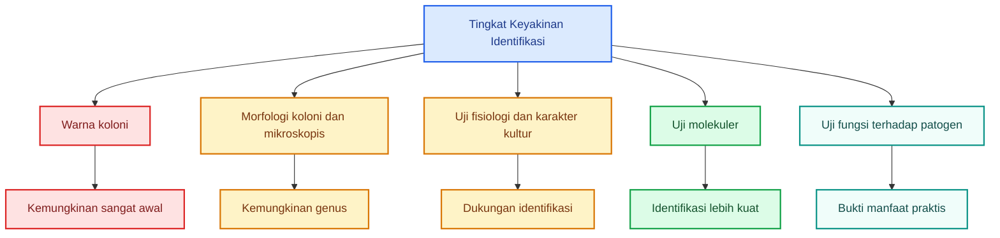

Yang menarik, untuk praktisi pertanian, identitas spesies memang penting, tetapi **fungsi lapang lebih penting**.

Maksudnya: walaupun isolat sudah diduga Trichoderma, ia tetap harus diuji apakah benar mampu menekan patogen target cabai. Jangan berhenti pada morfologi.

### 4.4. Hubungan morfologi dengan “tipuan mikroba”

Dalam banyak kasus, tipuan mikroba dimulai dari pengamatan dangkal:

- ada jamur hijau;
- tumbuh cepat;
- disebut Trichoderma;
- diperbanyak;
- diklaim sebagai agen hayati;
- disebar ke lahan.

Urutan ini terlalu cepat dan berisiko.

Urutan yang lebih benar adalah:

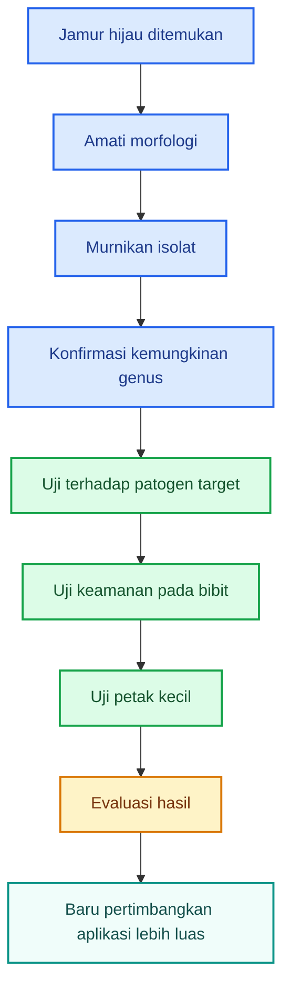

Pesan pentingnya:

> **Tidak semua jamur hijau adalah Trichoderma. Tidak semua Trichoderma adalah agens hayati unggul.**

---

## 5. Trichoderma dari Alam: Isolat Lokal atau Risiko Lokal?

Isolat lokal sering terdengar menarik. Banyak praktisi berpendapat bahwa mikroba dari lahan sendiri lebih cocok karena sudah beradaptasi dengan iklim, tanah, tanaman, dan tekanan penyakit setempat.

Pandangan ini ada benarnya. Isolat lokal memang bisa sangat potensial. Misalnya, jika di lahan cabai yang banyak terserang layu masih ada beberapa tanaman yang tetap sehat, tanah di sekitar akar tanaman sehat itu bisa menjadi sumber mikroba antagonis yang menarik untuk diteliti.

Namun potensi bukan jaminan.

Isolat lokal harus diperlakukan sebagai:

> **kandidat agens hayati, bukan produk siap pakai.**

### 5.1. Sumber isolat lokal yang sering dicari

Beberapa sumber yang biasa digunakan untuk mencari Trichoderma antara lain:

- rizosfer cabai sehat;
- tanah sekitar akar tanaman sehat;
- tanah kebun organik;
- kompos matang;
- serasah bambu;
- serasah daun;
- tanah dekat perakaran rumput;
- tanah dari lahan yang tidak mudah terserang penyakit.

Dari sumber-sumber itu, peluang menemukan Trichoderma memang ada. Tetapi peluang menemukan mikroba lain juga besar. Karena itu, proses isolasi harus dilanjutkan dengan pemurnian dan pengujian.

### 5.2. Jalur yang benar untuk isolat lokal

Isolat alam tidak boleh langsung diperbanyak massal. Tahapannya harus bertingkat.

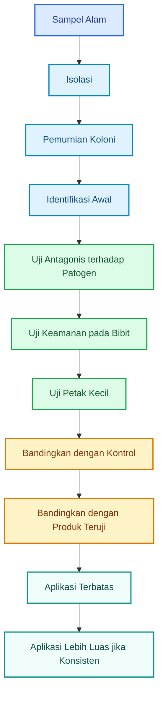

Tahap paling sering dilewati adalah **uji keamanan bibit** dan **uji petak kecil**. Padahal dua tahap ini sangat penting. Isolat yang tampak bagus di cawan belum tentu aman dan efektif di tanaman hidup.

### 5.3. Mengapa isolat lokal belum tentu aman?

Ada beberapa alasan.

Pertama, kultur bisa tidak murni. Koloni yang terlihat dominan bisa saja bercampur dengan jamur atau bakteri lain. Saat diperbanyak dalam media kaya nutrisi, kontaminan bisa ikut berkembang.

Kedua, isolat belum tentu efektif. Bisa saja ia Trichoderma, tetapi kemampuan antagonisnya lemah terhadap Fusarium atau Phytophthora.

Ketiga, isolat bisa terlalu agresif. Ia mungkin menekan patogen, tetapi juga menekan jamur menguntungkan lain seperti mikoriza atau jamur dekomposer lokal.

Keempat, isolat belum tentu stabil. Pada perbanyakan pertama hasilnya bagus, tetapi setelah beberapa kali subkultur, sporulasi menurun atau sifat antagonis melemah.

Kelima, isolat bisa kalah di lapangan. Di cawan petri ia terlihat kuat, tetapi di tanah nyata ia harus bersaing dengan mikroba asli, pH, kelembapan, suhu, bahan organik, pupuk, dan pestisida.

### 5.4. Tabel status isolat lokal

| Status isolat                     | Keterangan                          | Boleh dipakai luas?     |
| --------------------------------- | ----------------------------------- | ----------------------- |
| Baru ditemukan dari alam          | Belum jelas identitas dan fungsinya | Tidak                   |
| Sudah diduga Trichoderma          | Baru berdasarkan morfologi awal     | Tidak                   |
| Sudah murni                       | Risiko kontaminasi lebih rendah     | Belum                   |
| Sudah menghambat patogen di cawan | Ada potensi antagonis               | Belum luas              |
| Aman pada bibit                   | Tidak merusak tanaman muda          | Bisa uji terbatas       |
| Bagus di petak kecil              | Ada bukti lapang awal               | Bisa diperluas bertahap |
| Konsisten beberapa musim          | Lebih layak dipakai produksi        | Ya, dengan kontrol mutu |

Isolat lokal itu seperti calon varietas unggul. Ia harus diseleksi. Tidak semua calon layak dilepas.

### 5.5. Hubungan isolat lokal dengan “tipuan mikroba”

Tipuan mikroba sering muncul dalam bentuk romantisasi alam.

Contohnya:

- “Ini mikroba lokal, pasti cocok.”
- “Ini dari tanah hutan, pasti kuat.”
- “Ini dari akar bambu, pasti PGPR bagus.”
- “Ini dari tanaman sehat, pasti bisa menyembuhkan tanaman sakit.”
- “Ini jamur hijau lokal, pasti Trichoderma unggul.”

Pernyataan itu terlalu cepat.

Kalimat yang lebih tepat:

> **Isolat lokal itu potensi, bukan jaminan.**

---

## 6. Trichoderma Bisa Mengganggu Mikroba Menguntungkan Lain

Trichoderma sering dipromosikan sebagai jamur baik. Secara umum, memang banyak Trichoderma bermanfaat. Namun kita perlu memahami sifat ekologisnya: Trichoderma adalah **kompetitor kuat**.

Ia bisa:

- tumbuh cepat;
- merebut ruang;
- menggunakan nutrisi lebih agresif;
- menghasilkan enzim pemecah dinding sel jamur;
- menghasilkan senyawa antijamur;
- menekan mikroba pesaing.

Sifat ini menguntungkan ketika targetnya patogen seperti Fusarium, Rhizoctonia, Pythium, atau Phytophthora. Tetapi sifat yang sama juga bisa berdampak pada jamur non-target.

### 6.1. Trichoderma tidak membaca label “baik” atau “jahat”

Manusia membagi mikroba menjadi “baik” dan “jahat” berdasarkan kepentingan budidaya. Tetapi Trichoderma tidak berpikir seperti itu.

Trichoderma merespons:

- keberadaan pesaing;
- sumber karbon;
- ruang tumbuh;
- sinyal kimia;
- kondisi akar;
- kelembapan;
- bahan organik;
- tekanan lingkungan.

Jika ada jamur lain yang bersaing, Trichoderma bisa merespons dengan kompetisi atau antagonisme. Jamur pesaing itu bisa patogen, tetapi bisa juga jamur menguntungkan.

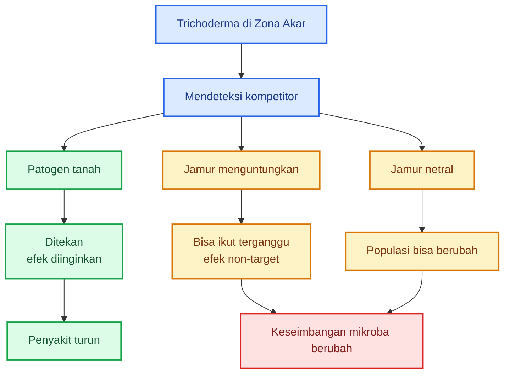

### 6.2. Mikroba menguntungkan yang bisa terdampak

Beberapa kelompok mikroba yang perlu diperhatikan:

| Kelompok                       | Fungsi menguntungkan                                | Potensi gangguan dari Trichoderma               |
| ------------------------------ | --------------------------------------------------- | ----------------------------------------------- |
| **Mikoriza / AMF**             | Membantu serapan fosfor, air, dan ketahanan cekaman | Bisa terganggu oleh strain Trichoderma tertentu |
| **Jamur dekomposer lokal**     | Membantu penguraian bahan organik                   | Bisa kalah kompetisi ruang dan substrat         |
| **Jamur endofit akar**         | Mendukung ketahanan tanaman                         | Bisa tersisih dari ruang kolonisasi             |
| **Beauveria**                  | Agen hayati hama serangga                           | Bisa terganggu jika dicampur tanpa uji          |
| **Metarhizium**                | Agen hayati hama tanah/serangga                     | Bisa kalah kompetisi pada media tertentu        |
| **Jamur antagonis lokal lain** | Menjaga keseimbangan patogen                        | Bisa tertekan bila Trichoderma terlalu dominan  |

Ini bukan berarti Trichoderma pasti merusak semuanya. Dalam beberapa kondisi, Trichoderma bisa netral atau bahkan sinergis dengan mikroba lain. Tetapi kompatibilitas tidak boleh diasumsikan. Harus diuji.

### 6.3. Kapan risiko gangguan meningkat?

Risiko gangguan terhadap mikroba non-target meningkat ketika:

- dosis terlalu tinggi;
- aplikasi terlalu sering;
- isolat belum teridentifikasi;
- kultur tidak murni;
- memakai molase atau gula berlebihan;
- Trichoderma dicampur langsung dengan mikoriza;
- Trichoderma dicampur dengan Beauveria atau Metarhizium tanpa uji;
- semua mikroba dikocor bersama dalam satu tangki;
- tanah sedang miskin bahan organik dan biodiversitas rendah;
- aplikasi dilakukan terus-menerus walau tidak ada tekanan penyakit.

Bila Trichoderma digunakan secara lokal, terukur, dan pada saat risiko penyakit tinggi, manfaatnya bisa lebih besar daripada risikonya. Tetapi bila digunakan seperti “banjir mikroba”, risiko ketidakseimbangan meningkat.

### 6.4. Prinsip aman menggunakan Trichoderma bersama mikroba lain

Untuk praktisi, gunakan prinsip berikut:

| Kombinasi                   | Saran praktis                                                      |
| --------------------------- | ------------------------------------------------------------------ |
| Trichoderma + kompos matang | Umumnya aman dan sering bagus                                      |
| Trichoderma + mikoriza      | Jangan dicampur langsung tanpa uji; beri jarak waktu/lokasi        |
| Trichoderma + Beauveria     | Hindari mencampur dalam satu media/tangki tanpa uji kompatibilitas |
| Trichoderma + Metarhizium   | Gunakan terpisah sesuai target                                     |
| Trichoderma + PGPR bakteri  | Bisa dicoba, tetapi tetap uji kecil                                |
| Trichoderma + MOL/JAKABA    | Perlu hati-hati karena komposisi MOL/JAKABA tidak jelas            |

Skema penggunaan yang lebih aman:

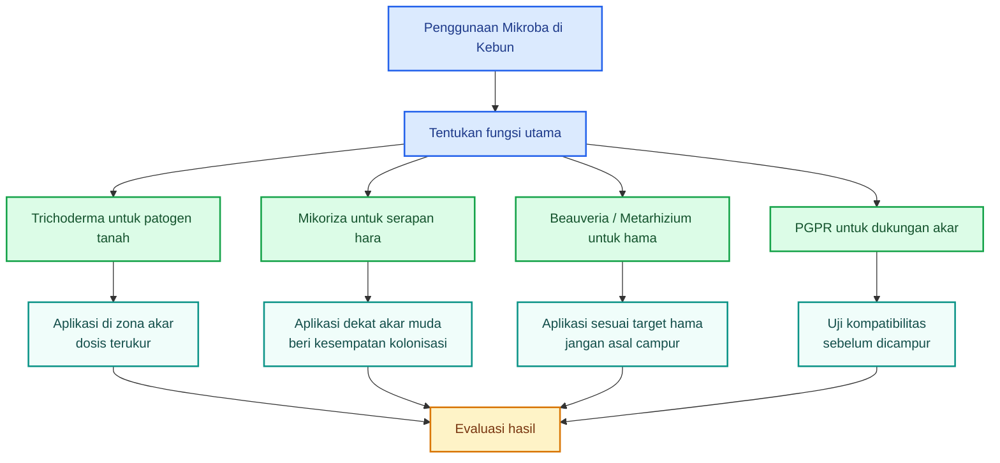

### 6.5. Kesimpulan Bab 6

Trichoderma berguna karena ia kuat. Tetapi kekuatan itulah yang membuatnya harus dikendalikan.

Jika targetnya patogen tanah, sifat kompetitif Trichoderma sangat membantu. Namun jika diberikan berlebihan, dicampur sembarangan, atau dilepas tanpa uji, ia berpotensi mengganggu mikroba lain yang sebenarnya mendukung tanaman.

> **Trichoderma adalah pisau tajam. Berguna bila tepat, berisiko bila berlebihan.**

---

## 7. Kesalahan Umum: Semakin Banyak Mikroba Dianggap Semakin Baik

Salah satu kesalahan terbesar dalam pertanian biologis adalah keyakinan bahwa semakin banyak mikroba, semakin baik hasilnya.

Ini tampak masuk akal di permukaan. Jika satu mikroba bagus, maka banyak mikroba dianggap lebih bagus. Jika Trichoderma baik, maka dosis tinggi dianggap lebih baik. Jika PGPR baik, maka dicampur dengan MOL, JAKABA, mikoriza, Beauveria, dan Trichoderma dianggap semakin lengkap.

Padahal ekologi mikroba tidak bekerja sesederhana itu.

Mikroba bisa saling mendukung, tetapi juga bisa saling menekan. Mikroba yang satu bisa menghasilkan metabolit yang menghambat mikroba lain. Ada yang bersaing memperebutkan ruang akar. Ada yang lebih cepat tumbuh lalu mendominasi. Ada yang mati karena pH, pupuk, pestisida, atau senyawa dari mikroba lain.

Jadi, mencampur banyak mikroba tanpa uji tidak otomatis menghasilkan konsorsium yang baik. Bisa saja yang terjadi adalah perang mikroba.

### 7.1. Kesalahan praktisi yang sering terjadi

Beberapa kesalahan umum:

- memperbanyak Trichoderma sebanyak-banyaknya;
- mengocor mikroba setiap minggu tanpa alasan penyakit;
- mencampur banyak mikroba sekaligus;
- memakai molase atau gula berlebihan;
- mencampur Trichoderma, mikoriza, PGPR, MOL, dan JAKABA tanpa uji kompatibilitas;
- memakai kultur cair yang tidak jelas komposisinya;
- menggunakan mikroba sebagai pengganti semua input budidaya;
- tidak membuat kontrol pembanding;
- tidak mencatat hasil.

Kesalahan-kesalahan ini sering muncul karena petani ingin hasil cepat. Tetapi dalam mikrobiologi tanah, hasil cepat yang tidak terukur bisa menipu.

### 7.2. Risiko dari prinsip “semakin banyak semakin baik”

Jika mikroba diberikan tanpa ukuran, beberapa risiko bisa muncul:

- mikroba saling menghambat;
- satu mikroba mendominasi;
- mikroba asli tanah terganggu;
- akar mengalami stres;
- tanah menjadi tidak stabil;
- hasil antar musim tidak konsisten;
- muncul fitotoksisitas;
- bahan fermentasi menjadi sumber kontaminan;
- klaim manfaat tidak terbukti;
- biaya produksi naik tanpa hasil jelas.

Alurnya sering seperti ini:

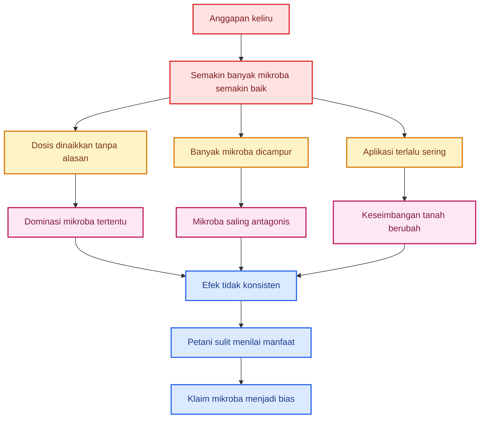

### 7.3. Mengapa molase/gula berlebihan berisiko?

Molase, gula merah, air cucian beras, dan bahan kaya karbohidrat sering dipakai untuk memperbanyak mikroba. Bahan seperti ini memang bisa menjadi sumber energi. Tetapi jika diberikan berlebihan ke tanah, ia juga bisa memicu ledakan populasi mikroba tertentu secara tidak terkendali.

Risikonya:

- mikroba cepat tumbuh tetapi tidak seimbang;
- oksigen di zona akar bisa turun bila aktivitas mikroba terlalu tinggi;
- mikroba pembusuk bisa ikut berkembang;
- akar bisa stres;
- bau tanah menjadi asam atau busuk;
- patogen tertentu bisa ikut memanfaatkan sumber karbon.

Jadi, sumber gula bukan musuh. Tetapi penggunaannya harus terkendali. Jangan menjadikan lahan sebagai tangki fermentasi terbuka.

### 7.4. Campuran mikroba tidak selalu menjadi konsorsium

Konsorsium mikroba yang baik adalah campuran mikroba yang sudah diuji kompatibilitasnya dan memiliki fungsi saling mendukung. Misalnya:

- satu mikroba melarutkan fosfat;
- satu mikroba menghasilkan hormon;
- satu mikroba menekan patogen;
- satu mikroba membantu dekomposisi;
- semuanya bisa hidup bersama tanpa saling menekan berlebihan.

Tetapi jika praktisi hanya mencampur banyak produk atau kultur tanpa uji, itu belum bisa disebut konsorsium. Itu baru campuran.

Perbedaannya:

| Campuran mikroba asal-asalan                   | Konsorsium mikroba teruji           |
| ---------------------------------------------- | ----------------------------------- |
| Mikroba dicampur karena dianggap semuanya baik | Mikroba dipilih karena fungsi jelas |
| Tidak ada uji kompatibilitas                   | Ada uji kompatibilitas              |
| Dosis tidak jelas                              | Dosis terukur                       |
| Tidak ada kontrol                              | Ada pembanding                      |
| Hasil tidak konsisten                          | Hasil lebih dapat dievaluasi        |
| Berisiko saling menekan                        | Dirancang untuk saling mendukung    |

Diagram sederhana:

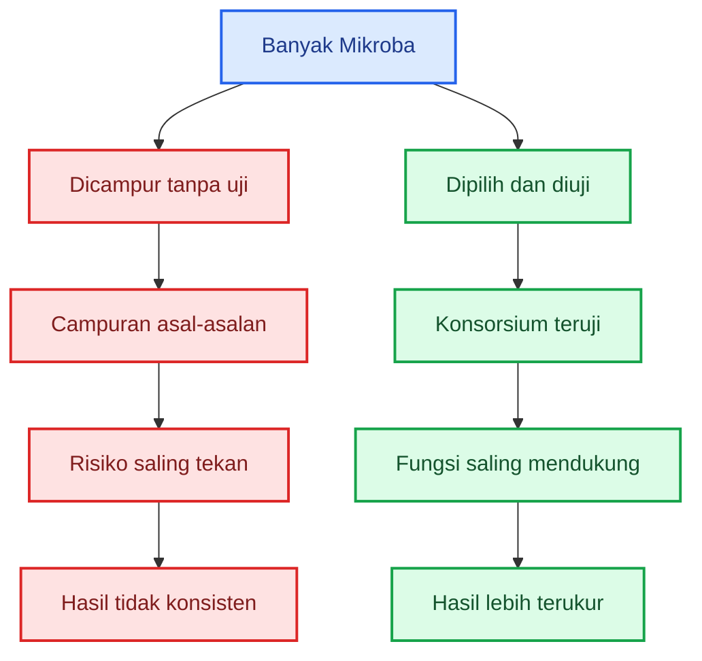

### 7.5. Prinsip penggunaan mikroba yang benar

Untuk praktisi, prinsipnya sederhana:

1. Mulai dari masalah yang jelas.
2. Pilih mikroba dengan fungsi yang sesuai.
3. Gunakan dosis terukur.
4. Jangan mencampur semua mikroba tanpa uji.
5. Buat petak kontrol.
6. Catat hasil.
7. Perluas hanya jika hasilnya konsisten.

Contoh berpikir yang benar:

| Masalah               | Mikroba yang mungkin relevan                | Catatan                                           |
| --------------------- | ------------------------------------------- | ------------------------------------------------- |
| Layu Fusarium         | Trichoderma, Bacillus, Pseudomonas tertentu | Fokus di zona akar                                |
| Serapan fosfor rendah | Mikoriza, bakteri pelarut P                 | Perhatikan pupuk P berlebih                       |
| Rebah semai           | Trichoderma, Bacillus tertentu              | Aplikasi sejak media semai                        |
| Hama serangga         | Beauveria, Metarhizium                      | Targetnya hama, bukan akar                        |
| Kompos lambat matang  | Dekomposer                                  | Gunakan pada proses kompos, bukan asal ke tanaman |

Jadi, bukan mikroba sebanyak-banyaknya. Tetapi mikroba yang sesuai fungsi.

### 7.6. Kesimpulan Bab 7

Dalam mikrobiologi tanah, lebih banyak tidak selalu lebih baik. Dosis tinggi, aplikasi terlalu sering, dan campuran mikroba tanpa uji justru bisa menimbulkan masalah baru.

Yang benar adalah:

> **Tepat fungsi, tepat dosis, tepat waktu, tepat tempat, dan terbukti hasilnya.**

Pesan anti-tipuan mikrobanya:

> **Jangan percaya klaim “semakin banyak mikroba semakin subur”. Tanah sehat dibangun dari keseimbangan, bukan dominasi satu atau banyak mikroba tanpa kendali.**

---

# Tipuan Mikroba dalam Pertanian: Dosis, Aplikasi, Produk Teruji, dan Patogen Target

Pada bagian sebelumnya, kita sudah membahas bahwa Trichoderma tidak boleh dipakai secara membabi buta. Ia memang bisa berguna, tetapi juga bisa menjadi masalah bila dosisnya tidak jelas, aplikasinya terlalu sering, atau dicampur dengan mikroba lain tanpa uji kompatibilitas.

Bagian ini masuk ke aspek yang lebih praktis: **berapa dosisnya, bagaimana menaruhnya di dekat akar, kapan sebaiknya membeli produk teruji, kapan boleh isolasi sendiri, dan bagaimana mencari patogen target untuk menguji apakah Trichoderma benar-benar berguna.**

---

## 8. Dosis Trichoderma untuk Cabai

Salah satu penyebab terbesar kegagalan penggunaan mikroba di lapangan adalah dosis yang tidak terukur. Banyak petani menggunakan istilah:

- sedikit;
- sedang;
- banyak;
- segenggam;
- secukupnya;
- kocor rutin;
- makin banyak makin bagus.

Istilah seperti itu tidak cukup untuk praktik agribisnis. Dalam penggunaan Trichoderma, dosis harus dihitung. Bukan karena Trichoderma selalu berbahaya, tetapi karena ia adalah organisme hidup yang bisa berkembang dan memengaruhi ekosistem akar.

Untuk cabai, dosis kerja yang lebih masuk akal adalah memakai ukuran **gram per tanaman per aplikasi** dan **total gram per tanaman per musim**.

### 8.1. Dosis per aplikasi

Dosis per aplikasi adalah jumlah Trichoderma yang diberikan pada satu kali perlakuan.

Patokan praktis:

| Kategori dosis |  Dosis per aplikasi | Situasi penggunaan                                 |
| -------------- | ------------------: | -------------------------------------------------- |
| Rendah         |  **5–10 g/tanaman** | Tanah relatif sehat, pencegahan ringan             |
| Normal         | **10–20 g/tanaman** | Lahan cabai biasa atau ada riwayat penyakit ringan |
| Tinggi         | **20–30 g/tanaman** | Lahan riwayat layu/busuk akar cukup berat          |

Dosis tinggi tidak berarti lebih baik untuk semua kondisi. Dosis tinggi hanya masuk akal jika ada alasan penyakit yang jelas, misalnya lahan sering terkena layu Fusarium, busuk pangkal, atau rebah semai.

### 8.2. Total dosis satu musim

Selain dosis per aplikasi, praktisi harus menghitung total satu musim. Ini penting agar aplikasi tidak berlebihan.

Patokan praktis:

| Kondisi lahan          | Total Trichoderma satu musim |
| ---------------------- | ---------------------------: |
| Lahan sehat            |    **20–30 g/tanaman/musim** |
| Lahan riwayat penyakit |    **30–45 g/tanaman/musim** |
| Lahan sakit berat      |    **45–60 g/tanaman/musim** |

Batas penting:

> **Jangan rutin melebihi 60 g/tanaman/musim tanpa uji petak.**

Jika dosis total sudah melewati angka itu, penggunaan Trichoderma mulai masuk wilayah yang perlu alasan kuat. Bukan berarti pasti merusak, tetapi risikonya meningkat: biaya naik, mikroba lain bisa terganggu, dan manfaat tambahan belum tentu sebanding.

### 8.3. Rumus kebutuhan Trichoderma

Untuk menghitung kebutuhan per lahan, gunakan rumus sederhana.

```mdx
Total kebutuhan Trichoderma = jumlah tanaman × dosis per tanaman
```

Dalam bentuk formula:

$$
Kebutuhan\ Trichoderma\ (g) = Jumlah\ Tanaman \times Dosis\ per\ Tanaman\ (g)
$$

Untuk mengubah gram menjadi kilogram:

$$
Kebutuhan\ Trichoderma\ (kg) = \frac{Jumlah\ Tanaman \times Dosis\ per\ Tanaman\ (g)}{1000}
$$

Contoh:

Jumlah tanaman cabai = **20.000 tanaman**
Dosis = **10 g/tanaman**

$$
Kebutuhan = \frac{20.000 \times 10}{1000}
$$

$$
Kebutuhan = 200\ kg
$$

Jadi, untuk satu kali aplikasi pada 20.000 tanaman dengan dosis 10 g/tanaman, kebutuhan Trichoderma adalah **200 kg**.

### 8.4. Contoh kebutuhan per hektare

Populasi cabai berbeda-beda tergantung jarak tanam. Tetapi untuk gambaran praktis, gunakan simulasi berikut.

#### Populasi 20.000 tanaman/ha

| Dosis per tanaman | Kebutuhan per aplikasi |
| ----------------: | ---------------------: |
|               5 g |              100 kg/ha |
|              10 g |              200 kg/ha |
|              20 g |              400 kg/ha |
|              30 g |              600 kg/ha |

#### Populasi 25.000 tanaman/ha

| Dosis per tanaman | Kebutuhan per aplikasi |
| ----------------: | ---------------------: |
|               5 g |              125 kg/ha |
|              10 g |              250 kg/ha |
|              20 g |              500 kg/ha |
|              30 g |              750 kg/ha |

Jadi, jika ada produk Trichoderma yang disarankan “pakai sebanyak-banyaknya”, praktisi harus langsung bertanya:

> “Berapa gram per tanaman? Berapa kilogram per hektare? Berapa kali aplikasi sampai panen?”

Tanpa jawaban itu, klaim dosis masih kabur.

### 8.5. Jadwal aplikasi praktis

Untuk cabai, Trichoderma sebaiknya diberikan sejak awal, bukan menunggu tanaman sakit parah.

Contoh jadwal lahan normal:

| Waktu aplikasi    |           Dosis | Keterangan             |
| ----------------- | --------------: | ---------------------- |
| Media semai       | 5–10 g/kg media | Dicampur merata        |
| Lubang tanam      |    10 g/tanaman | Saat pindah tanam      |
| Susulan 21 HST    |    10 g/tanaman | Tabur/kocor di pangkal |
| Susulan 45–60 HST |    10 g/tanaman | Hanya bila perlu       |

Total musim: sekitar **20–30 g/tanaman**, di luar perlakuan media semai.

Contoh jadwal lahan riwayat penyakit:

| Waktu aplikasi    |           Dosis | Keterangan               |
| ----------------- | --------------: | ------------------------ |
| Media semai       | 5–10 g/kg media | Pencegahan awal          |
| Lubang tanam      | 15–20 g/tanaman | Saat tanam               |
| Susulan 21 HST    | 10–15 g/tanaman | Fokus zona akar          |
| Susulan 45–60 HST |    10 g/tanaman | Bila gejala masih muncul |

Total musim: sekitar **35–45 g/tanaman**.

Contoh jadwal lahan sakit berat:

| Waktu aplikasi    |           Dosis | Keterangan                         |
| ----------------- | --------------: | ---------------------------------- |
| Media semai       |   10 g/kg media | Pencegahan sejak awal              |
| Lubang tanam      | 20–30 g/tanaman | Dosis tinggi terkendali            |
| Susulan 21 HST    | 15–20 g/tanaman | Jika risiko tinggi                 |
| Susulan 45–60 HST |    10 g/tanaman | Evaluasi gejala                    |
| Susulan tambahan  |    10 g/tanaman | Hanya saat tekanan penyakit tinggi |

Total musim: sekitar **45–60 g/tanaman**.

### 8.6. Alur keputusan dosis

Gunakan alur sederhana berikut.

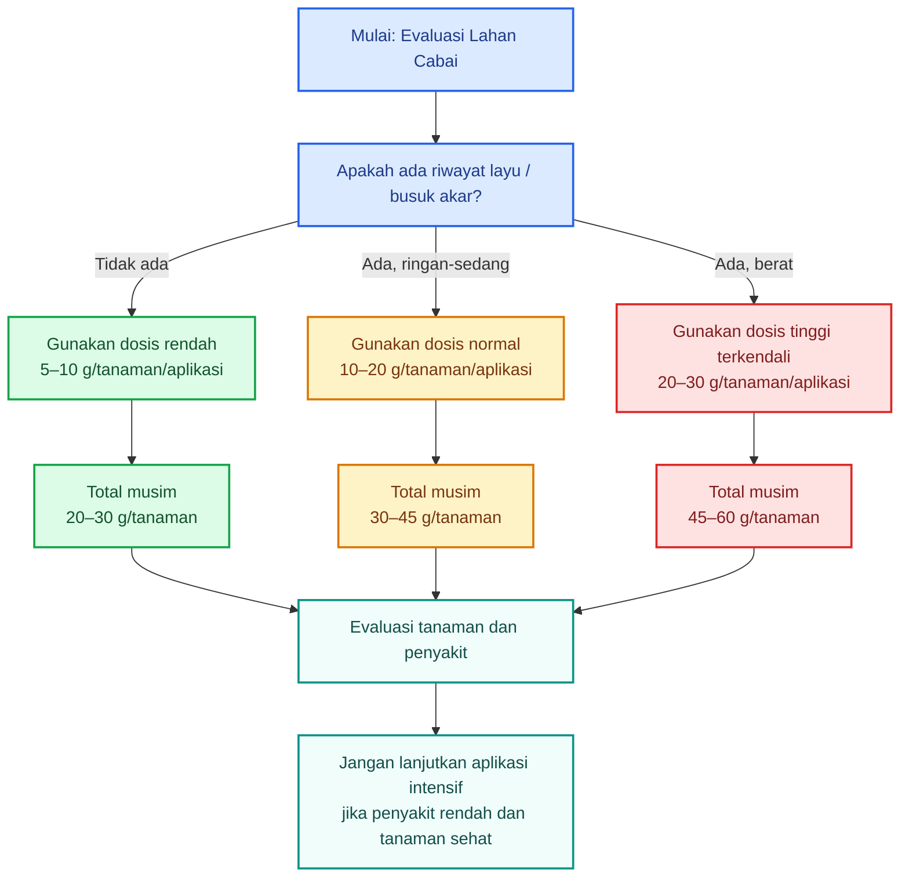

### 8.7. Kesalahan dosis yang perlu dihindari

Hindari praktik berikut:

- mengocor Trichoderma setiap minggu tanpa alasan penyakit;
- menaikkan dosis hanya karena tanaman terlihat kurang subur;
- memakai Trichoderma sebagai pengganti pupuk utama;
- mencampur Trichoderma dengan banyak MOL tanpa ukuran;
- memakai kultur padat busuk karena dianggap “mikrobanya banyak”;
- memberi dosis tinggi pada lahan yang sebenarnya sehat;
- tidak menghitung total dosis sampai panen.

Trichoderma bukan pupuk NPK. Ia tidak seharusnya dipakai dengan logika “tanaman kurang subur, tambah Trichoderma”. Fungsi utamanya adalah mendukung kesehatan akar dan menekan patogen tanah.

### 8.8. Kesimpulan Bab 8

Dosis Trichoderma harus dihitung. Ukuran yang bisa dipakai praktisi adalah:

- **5–10 g/tanaman/aplikasi** untuk dosis rendah;
- **10–20 g/tanaman/aplikasi** untuk dosis normal;
- **20–30 g/tanaman/aplikasi** untuk dosis tinggi;
- **20–60 g/tanaman/musim** sebagai kisaran total, tergantung kondisi lahan.

Pesan kunci:

> **Dosis Trichoderma harus dihitung, bukan dikira-kira dengan istilah “banyak” atau “sedikit”.**

---

## 9. Trichoderma dan Akar Tanaman

Pupuk kimia pekat sebaiknya tidak langsung mengenai akar. Alasannya jelas: pupuk seperti urea, KCl, atau NPK pekat dapat menyebabkan stres garam, peningkatan tekanan osmotik, bahkan luka pada akar muda.

Namun Trichoderma berbeda. Trichoderma bukan garam pupuk. Ia adalah mikroba hidup yang justru bekerja di sekitar akar.

Target terbaik Trichoderma adalah **rizosfer**, yaitu zona tanah yang dipengaruhi oleh aktivitas akar. Di zona inilah Trichoderma dapat bersaing dengan patogen, menggunakan eksudat akar, dan membantu membentuk perlindungan biologis.

Jadi, prinsipnya:

> **Trichoderma boleh dekat akar, tetapi tidak boleh diberikan dalam bentuk yang merusak akar.**

### 9.1. Trichoderma boleh dekat akar

Trichoderma idealnya ditempatkan di sekitar:

- media semai;
- lubang tanam;
- pangkal tanaman;
- zona akar aktif;
- campuran kompos matang;
- tanah sekitar akar.

Tetapi bentuk aplikasinya harus benar. Jangan menaruh kultur sebagai gumpalan pekat tepat menempel pada akar muda. Lebih aman mencampurnya dengan tanah halus atau kompos matang agar menyebar merata.

### 9.2. Yang tidak boleh mengenai akar

Walaupun Trichoderma boleh dekat akar, ada beberapa bentuk yang tidak boleh diberikan langsung:

- gumpalan Trichoderma terlalu pekat;
- kultur berbau busuk;
- kompos belum matang;
- kompos masih panas;
- fermentasi cair tidak jelas;
- campuran dengan pupuk kimia pekat;
- campuran dengan fungisida keras;
- media perbanyakan yang tercemar jamur lain.

Perbedaan perlakuannya seperti ini:

| Bahan                              | Boleh dekat akar? | Catatan                            |
| ---------------------------------- | ----------------- | ---------------------------------- |
| Trichoderma bersih + kompos matang | Boleh             | Campur merata                      |
| Trichoderma bersih + tanah halus   | Boleh             | Baik untuk lubang tanam            |
| Trichoderma sebagai gumpalan pekat | Sebaiknya tidak   | Sebarkan dulu                      |
| Trichoderma + kompos panas         | Tidak             | Bisa merusak akar                  |
| Trichoderma + pupuk kimia pekat    | Tidak             | Risiko akar stres dan mikroba mati |
| Trichoderma + fungisida keras      | Tidak             | Trichoderma bisa mati              |
| Fermentasi busuk                   | Tidak             | Risiko kontaminasi tinggi          |

### 9.3. Posisi aplikasi di lubang tanam

Untuk cabai, cara yang lebih aman:

1. Siapkan lubang tanam.
2. Campur Trichoderma dengan tanah halus atau kompos matang.
3. Letakkan campuran di sekitar zona akar.
4. Jangan membuat gumpalan pekat langsung menempel pada akar.
5. Tutup tipis dengan tanah.
6. Tanam bibit.
7. Siram secukupnya.

Diagram top-down:

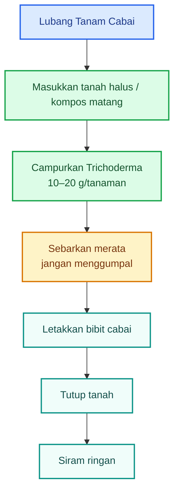

### 9.4. Posisi aplikasi susulan

Untuk aplikasi susulan, jangan menumpuk bahan tepat di batang. Taburkan di sekitar pangkal tanaman dengan jarak sekitar **5–10 cm dari batang**, mengikuti zona akar aktif.

Pola praktis:

- buat alur melingkar dangkal;
- taburkan Trichoderma;
- tutup tipis dengan tanah atau kompos matang;
- siram ringan;
- jangan campur langsung dengan pupuk kimia pekat.

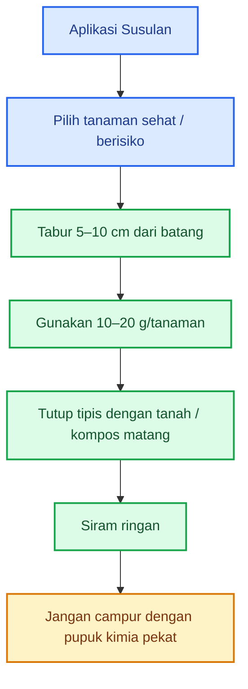

### 9.5. Jarak dengan pupuk kimia dan fungisida

Trichoderma adalah jamur hidup. Karena itu, ia sensitif terhadap beberapa perlakuan kimia, terutama fungisida.

Aturan praktis:

| Perlakuan                             |                      Saran jarak |
| ------------------------------------- | -------------------------------: |
| Trichoderma dengan kompos matang      |                   Boleh dicampur |
| Trichoderma dengan tanah halus        |                   Boleh dicampur |
| Trichoderma dengan pupuk kimia pekat  |         Jangan dicampur langsung |
| Trichoderma setelah pupuk kimia kocor |               Beri jeda 3–7 hari |
| Pupuk kimia setelah Trichoderma       |               Beri jeda 3–7 hari |
| Trichoderma dengan fungisida keras    |                 Jangan bersamaan |
| Trichoderma setelah fungisida         | Beri jeda minimal sekitar 7 hari |

Jeda ini bukan angka mutlak untuk semua bahan aktif, tetapi sebagai pegangan praktis agar Trichoderma tidak langsung terkena tekanan kimia berat.

### 9.6. Kesimpulan Bab 9

Trichoderma berbeda dari pupuk kimia. Ia boleh dekat akar karena memang bekerja di zona akar. Namun aplikasinya harus bersih, matang, dan tersebar.

Pesan kunci:

> **Trichoderma boleh dekat akar, tetapi harus dalam bentuk bersih, matang, tersebar, dan tidak dicampur bahan keras.**

---

## 10. Beli Produk Teruji atau Isolasi Sendiri?

Banyak praktisi ingin mandiri. Mereka ingin mencari Trichoderma sendiri dari alam, memperbanyaknya, lalu menggunakannya di lahan. Secara semangat, ini bagus. Kemandirian hayati bisa menekan biaya dan membuka peluang menemukan isolat lokal yang cocok.

Tetapi untuk lahan produksi cabai komersial, prinsipnya harus lebih hati-hati.

Produksi cabai bukan tempat ideal untuk eksperimen mikroba liar. Risiko gagal panen terlalu besar. Karena itu, pilihan antara membeli produk teruji atau isolasi sendiri harus disesuaikan dengan tujuan.

### 10.1. Untuk produksi, pilih yang teruji

Jika tujuannya adalah panen, stabilitas produksi, dan pengurangan risiko, maka lebih aman memakai produk atau isolat yang sudah jelas.

Produk yang lebih layak dipilih biasanya memiliki informasi:

- spesies Trichoderma jelas;
- lebih baik lagi bila strain jelas;
- jumlah spora atau propagul jelas;
- dosis aplikasi jelas;
- tanggal produksi jelas;
- masa simpan jelas;
- target penyakit jelas;
- produsen atau laboratorium jelas;
- tidak berbau busuk;
- formulasi stabil.

Produk seperti ini belum tentu sempurna, tetapi risikonya lebih rendah dibanding kultur alam yang belum diuji.

### 10.2. Untuk riset, isolasi lokal boleh dilakukan

Isolasi lokal cocok untuk tujuan:

- penelitian kecil;
- pengembangan agens hayati lokal;
- seleksi mikroba adaptif;
- pembelajaran mikrobiologi pertanian;
- membandingkan dengan produk komersial;
- membangun kemandirian teknologi.

Namun isolat lokal harus melewati seleksi. Jangan langsung diperbanyak dan disebar.

Status awalnya adalah:

> **Trichoderma sp. kandidat isolat lokal.**

Bukan:

> **produk hayati siap aplikasi massal.**

### 10.3. Perbandingan produk teruji dan isolat lokal

| Aspek                             | Produk/isolat teruji       | Isolat lokal dari alam   |
| --------------------------------- | -------------------------- | ------------------------ |
| Identitas                         | Lebih jelas                | Sering belum jelas       |
| Dosis                             | Biasanya ada               | Harus ditentukan sendiri |
| Stabilitas                        | Lebih terkendali           | Belum tentu stabil       |
| Risiko kontaminasi                | Lebih rendah               | Lebih tinggi             |
| Efektivitas                       | Ada peluang sudah diuji    | Harus dibuktikan         |
| Biaya awal                        | Bisa lebih mahal           | Bisa lebih murah         |
| Potensi lokal                     | Belum tentu paling adaptif | Bisa sangat potensial    |
| Kelayakan untuk produksi langsung | Lebih layak                | Belum layak              |

### 10.4. Strategi terbaik: dua jalur

Strategi paling bijak bukan memilih salah satu secara ekstrem. Untuk praktisi serius, gunakan dua jalur.

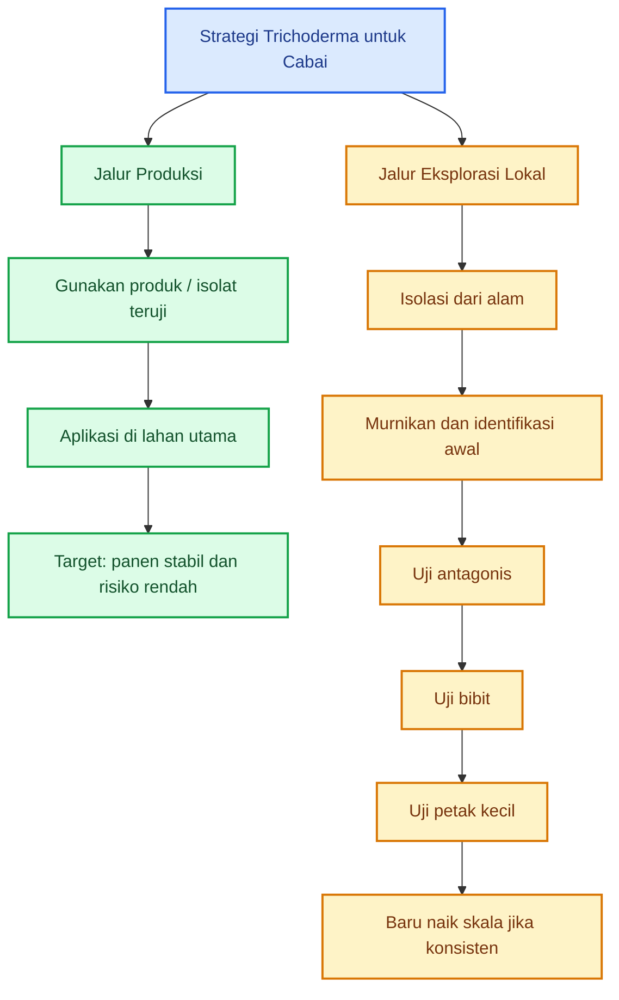

Dengan cara ini, lahan utama tetap aman, tetapi inovasi lokal tetap berjalan.

### 10.5. Jangan jadikan lahan produksi sebagai tempat eksperimen mikroba liar

Ini prinsip penting. Lahan produksi cabai memiliki biaya tinggi: benih, pupuk, tenaga kerja, ajir, mulsa, pestisida, irigasi, dan waktu. Jika isolat liar ternyata tidak efektif atau membawa kontaminan, kerugiannya bisa besar.

Maka, isolat lokal sebaiknya diuji di:

- tray semai;
- polybag;
- petak kecil;
- baris percobaan;
- lahan non-produksi;
- area pembanding terbatas.

Jangan langsung diaplikasikan ke seluruh lahan.

### 10.6. Kesimpulan Bab 10

Untuk tujuan panen, gunakan produk atau isolat yang lebih jelas dan teruji. Untuk tujuan riset dan kemandirian, isolasi sendiri boleh dilakukan, tetapi harus bertahap.

Pesan kunci:

> **Untuk panen, pakai yang teruji. Untuk riset, silakan eksplorasi isolat lokal secara bertahap.**

---

## 11. Mencari Patogen Target: Fusarium, Phytophthora, Rhizoctonia

Trichoderma tidak cukup hanya dikenali dari bentuk koloninya. Ia harus diuji melawan patogen yang jelas. Jika targetnya cabai, maka patogen yang sering menjadi perhatian adalah:

- Fusarium;
- Phytophthora;
- Rhizoctonia;
- Pythium;
- Sclerotium;
- patogen tular tanah lain.

Pada bab ini, fokusnya adalah tiga patogen utama: **Fusarium, Phytophthora, dan Rhizoctonia**.

Prinsip pentingnya:

> **Agen hayati yang baik harus diuji melawan musuh yang jelas.**

### 11.1. Mengapa harus mencari patogen target?

Banyak orang hanya menguji Trichoderma dari tampilan koloni. Misalnya, jika tumbuh cepat dan hijau, langsung dianggap bagus. Padahal agens hayati harus dinilai berdasarkan kemampuannya menekan patogen target.

Contoh:

- Trichoderma A kuat menekan Fusarium, tetapi lemah terhadap Phytophthora.
- Trichoderma B bagus melawan Rhizoctonia, tetapi tidak kuat di tanah basah.
- Trichoderma C tumbuh cepat di cawan, tetapi gagal kolonisasi akar.
- Trichoderma D bagus di media laboratorium, tetapi kalah di lahan.

Jadi, tanpa patogen target, uji Trichoderma menjadi tidak lengkap.

### 11.2. Fusarium pada cabai

Fusarium sering dikaitkan dengan layu bertahap pada cabai. Penyakit ini biasanya berkembang dari akar dan pembuluh batang.

Ciri lapang yang perlu dicurigai:

- tanaman layu perlahan;
- daun bawah menguning;
- layu sering lebih jelas saat siang;
- pada awal serangan tanaman kadang tampak sedikit pulih saat pagi;
- pembuluh batang berubah cokelat bila dibelah;
- akar mulai rusak;
- tanaman akhirnya kering dan mati.

Sampel yang baik diambil dari tanaman yang **baru mulai sakit**, bukan yang sudah mati total.

Bagian sampel:

- akar;
- pangkal batang;
- batang bawah;
- sedikit tanah yang menempel di akar.

Jangan hanya mengambil daun layu. Untuk Fusarium, bagian penting adalah akar dan jaringan pembuluh batang bawah.

### 11.3. Phytophthora pada cabai

Phytophthora, terutama _Phytophthora capsici_, sering muncul pada kondisi lembap, drainase buruk, dan musim hujan. Patogen ini sangat berbahaya karena bisa menyerang akar, pangkal batang, dan buah.

Ciri lapang yang perlu dicurigai:

- tanaman layu cepat;
- pangkal batang busuk kehitaman;
- tanah sekitar akar sering basah;
- akar membusuk;
- daun menggantung seperti kekurangan air, padahal tanah lembap;
- buah bisa busuk berair;
- serangan sering menyebar cepat pada lahan becek.

Sampel terbaik:

- pangkal batang yang baru busuk;
- jaringan peralihan antara sehat dan sakit;
- akar yang mulai cokelat tetapi belum hancur;
- tanah lembap sekitar akar;
- buah busuk berair bila ada.

Jangan mengambil jaringan yang sudah hancur dan bau busuk karena biasanya sudah dipenuhi mikroba pembusuk sekunder.

### 11.4. Rhizoctonia pada cabai

Rhizoctonia sering terkait dengan rebah semai dan busuk pangkal bibit. Penyakit ini banyak muncul pada media semai lembap, padat, kurang sirkulasi, atau bibit terlalu rapat.

Ciri lapang yang perlu dicurigai:

- bibit rebah;
- pangkal batang mengecil seperti terjepit;
- luka cokelat di leher akar;
- bibit tumbang walau daun masih tampak hijau;
- benih gagal tumbuh atau kecambah mati sebelum muncul;
- serangan sering muncul di persemaian.

Sampel terbaik:

- bibit yang baru rebah;
- pangkal batang bergejala;
- akar;
- media semai di sekitar akar.

Jangan mengambil bibit yang sudah busuk lama karena peluang kontaminasi sangat tinggi.

### 11.5. Ringkasan gejala patogen target

| Patogen          | Gejala utama                                              | Sampel terbaik                                 |
| ---------------- | --------------------------------------------------------- | ---------------------------------------------- |
| **Fusarium**     | Layu perlahan, daun bawah kuning, pembuluh batang cokelat | Akar, pangkal batang, batang bawah             |
| **Phytophthora** | Layu cepat, pangkal busuk kehitaman, tanah basah          | Pangkal batang busuk segar, akar, tanah lembap |
| **Rhizoctonia**  | Rebah semai, pangkal bibit mengecil, luka cokelat         | Bibit baru rebah, pangkal batang, media semai  |

### 11.6. Alur pengambilan sampel

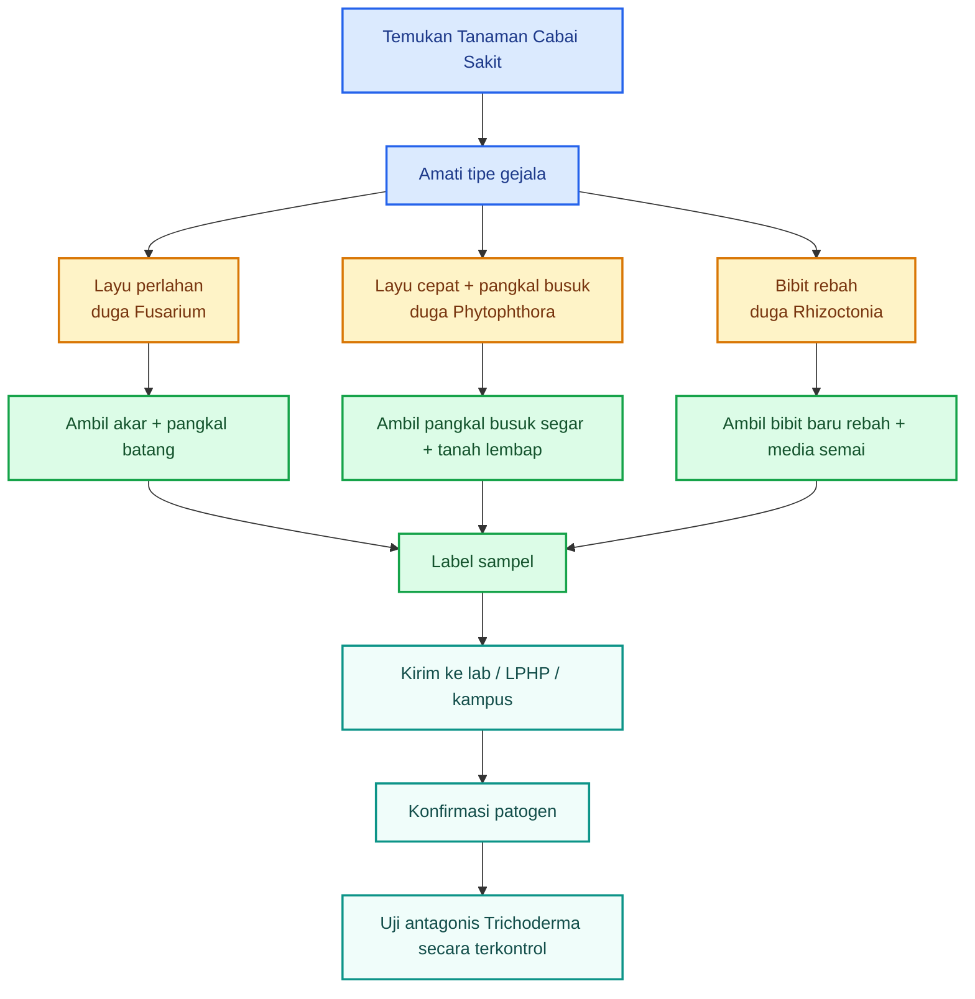

### 11.7. Cara mengambil sampel yang benar

Ambil sampel dari tanaman yang baru sakit. Jangan dari tanaman yang sudah mati total.

Aturan praktis:

- pilih tanaman dengan gejala jelas;
- ambil bagian peralihan antara jaringan sehat dan sakit;
- jangan mencuci akar sampai bersih;
- jangan mencampur semua sampel menjadi satu;
- masukkan tiap sampel ke kantong terpisah;
- beri label tanggal, lokasi, varietas, umur tanaman, dan gejala;
- simpan di tempat sejuk;
- kirim secepat mungkin ke laboratorium.

Format label sederhana:

```mdx
Lokasi:
Tanggal:
Varietas cabai:
Umur tanaman:
Gejala utama:
Bagian tanaman yang diambil:
Riwayat pupuk/pestisida:
Kondisi lahan: kering / lembap / becek
```

### 11.8. Jangan memperbanyak patogen sembarangan

Untuk praktisi, tujuan mencari patogen adalah diagnosis dan uji terkontrol, bukan memperbanyak penyakit secara bebas.

Patogen seperti Fusarium, Phytophthora, dan Rhizoctonia dapat menyebar dan bertahan di tanah. Jika diperbanyak sembarangan, risikonya adalah mencemari area kerja, media semai, alat, atau lahan sehat.

Karena itu:

- jangan membuat kultur patogen di area produksi;
- jangan membuang sisa kultur ke lahan;
- jangan menggunakan alat yang sama tanpa sanitasi;
- jangan membawa tanah sakit ke area sehat;
- kirim sampel ke laboratorium bila memungkinkan.

### 11.9. Hubungan patogen target dengan “tipuan mikroba”

Tipuan mikroba sering terjadi ketika produk diklaim mampu mengatasi penyakit tanpa menyebut target spesifik.

Contoh klaim yang perlu dicurigai:

- “mengatasi semua layu”;
- “membunuh semua jamur tanah”;
- “menyembuhkan semua penyakit akar”;
- “cocok untuk semua tanaman”;
- “cukup kocor, penyakit hilang”.

Klaim yang lebih masuk akal harus menyebut:

- patogen target;
- tanaman target;
- dosis;
- waktu aplikasi;
- bukti uji;
- kondisi aplikasi.

Contoh klaim yang lebih baik:

> “Isolat ini diuji untuk menekan Fusarium pada cabai pada dosis tertentu dan dibandingkan dengan kontrol.”

Atau:

> “Produk ini ditujukan untuk pencegahan penyakit tular tanah, bukan untuk virus atau hama.”

### 11.10. Kesimpulan Bab 11

Untuk menilai Trichoderma, kita harus tahu musuhnya. Trichoderma yang baik bukan hanya yang tumbuh hijau dan cepat, tetapi yang terbukti menekan patogen target.

Fusarium dicari dari tanaman layu perlahan dengan pembuluh batang cokelat. Phytophthora dicari dari tanaman layu cepat dengan pangkal batang busuk kehitaman, terutama pada kondisi basah. Rhizoctonia dicari dari bibit rebah dengan luka cokelat di pangkal batang.

Pesan kunci:

> **Agen hayati yang baik harus diuji melawan musuh yang jelas.**

---

# Tipuan Mikroba dalam Pertanian: Bukti Kemanjuran, Risiko Mikroba Campuran, dan Kultur yang Harus Ditolak

Pada bagian sebelumnya, kita sudah membahas dosis, cara aplikasi, posisi Trichoderma di sekitar akar, pilihan antara produk teruji dan isolat lokal, serta pentingnya mengenali patogen target seperti **Fusarium**, **Phytophthora**, dan **Rhizoctonia**.

Bagian ini membahas pertanyaan yang lebih tajam: **apakah Trichoderma benar-benar manjur, apakah PGPR/MOL/JAKABA juga perlu dicurigai, mikroba apa saja yang berguna tetapi berisiko, dan kapan kultur mikroba harus ditolak sebelum merusak tanaman.**

---

## 12. Apakah Trichoderma Terbukti Manjur?

Jawaban jujurnya: **ya, Trichoderma bisa terbukti manjur**, terutama untuk beberapa penyakit tular tanah. Namun, kalimat itu harus diberi batas yang jelas.

Yang terbukti bukan berarti semua Trichoderma pasti manjur. Yang terbukti adalah **strain tertentu**, pada **penyakit tertentu**, dengan **dosis tertentu**, dalam **kondisi tertentu**.

Jadi, kalimat yang benar bukan:

> “Trichoderma pasti ampuh.”

Melainkan:

> “Beberapa strain Trichoderma terbukti mampu menekan penyakit tular tanah bila digunakan dengan cara yang tepat.”

### 12.1. Penyakit yang paling relevan

Trichoderma paling kuat posisinya untuk penyakit tular tanah, terutama:

- Fusarium;
- Phytophthora;
- Rhizoctonia;
- Pythium.

Penyakit-penyakit ini berhubungan dengan tanah, akar, pangkal batang, media semai, kelembapan, dan sisa tanaman sakit. Karena Trichoderma bekerja terutama di zona akar, maka penyakit seperti ini lebih masuk akal menjadi targetnya.

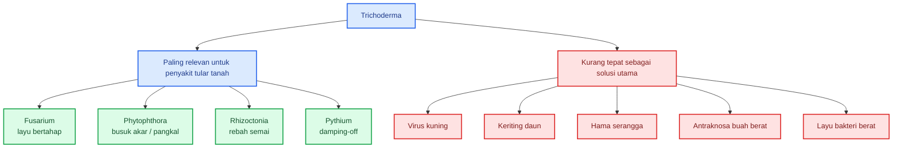

Kesalahan umum di lapangan adalah memakai Trichoderma untuk masalah yang bukan target utamanya. Misalnya, cabai terkena virus kuning, lalu petani mengocor Trichoderma. Ketika tidak berhasil, Trichoderma dianggap tidak manjur.

Padahal masalahnya bukan selalu pada Trichoderma. Sering kali masalahnya adalah **target penyakit salah**.

### 12.2. Faktor yang menentukan kemanjuran

Efektivitas Trichoderma tergantung pada banyak faktor.

| Faktor              | Dampaknya terhadap hasil                                                     |
| ------------------- | ---------------------------------------------------------------------------- |
| **Strain**          | Strain berbeda bisa punya kemampuan antagonis berbeda                        |
| **Dosis**           | Terlalu rendah tidak efektif; terlalu tinggi bisa mengganggu keseimbangan    |
| **Patogen target**  | Trichoderma yang kuat melawan Fusarium belum tentu kuat melawan Phytophthora |
| **Kondisi tanah**   | pH, bahan organik, kelembapan, suhu, dan mikroba asli sangat menentukan      |
| **Formulasi**       | Produk hidup, spora aktif, pembawa stabil, dan tidak tercemar                |
| **Waktu aplikasi**  | Lebih baik pencegahan sejak awal daripada terapi saat tanaman sudah parah    |
| **Teknik aplikasi** | Harus dekat zona akar, bukan asal disemprot ke daun                          |
| **Manajemen kebun** | Drainase, sanitasi, rotasi, dan bibit sehat tetap penting                    |

Dengan kata lain, Trichoderma bukan input ajaib yang bekerja sendiri. Ia bekerja dalam sistem budidaya.

### 12.3. Laboratorium tidak sama dengan lapangan

Banyak isolat Trichoderma terlihat sangat kuat di laboratorium. Misalnya, dalam uji cawan, koloni Trichoderma mampu menekan atau menutupi koloni patogen.

Namun, hasil di cawan tidak selalu sama dengan hasil di tanah. Di lapangan, Trichoderma harus menghadapi:

- suhu berubah;
- kelembapan berubah;
- pH tanah;
- pupuk kimia;
- pestisida;
- mikroba asli tanah;
- bahan organik;
- kondisi akar;
- persaingan dengan mikroorganisme lain.

Karena itu, bukti laboratorium harus dilanjutkan dengan uji bibit, uji pot, dan uji petak kecil.

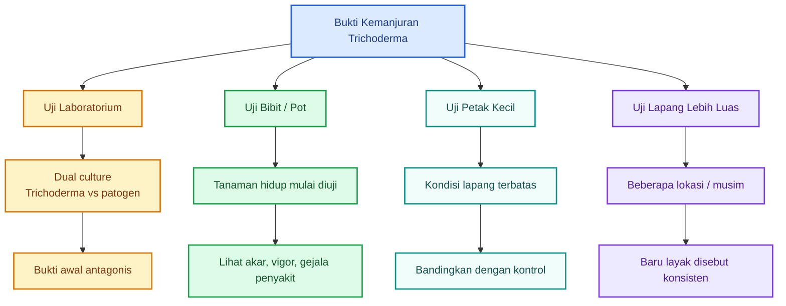

### 12.4. Ukuran manjur untuk praktisi

Praktisi tidak cukup bertanya, “Apakah Trichoderma bagus?”

Pertanyaan yang lebih berguna:

- Apakah jumlah tanaman layu turun?
- Apakah akar lebih sehat?
- Apakah bibit lebih kuat?
- Apakah hasil panen naik?
- Apakah biaya penyakit turun?
- Apakah hasilnya konsisten dibanding kontrol?

Ukuran praktis:

| Indikator                     |                                     Target realistis |
| ----------------------------- | ---------------------------------------------------: |
| Penurunan tanaman layu        |                    Minimal **30%** dibanding kontrol |
| Penurunan intensitas penyakit |                              **30–50%** lebih rendah |
| Peningkatan bibit hidup       |                Minimal **20%** pada lahan bermasalah |
| Peningkatan hasil panen       |           **10–20%** atau biaya penyakit turun nyata |
| Efek negatif                  | Tidak ada gejala akar rusak, kerdil, atau fitotoksik |

Tanpa pembanding, hasil mudah menipu. Tanaman terlihat bagus belum tentu karena Trichoderma. Bisa saja karena hujan cukup, pupuk lebih baik, varietas lebih tahan, atau tekanan penyakit memang rendah.

### 12.5. Kesimpulan Bab 12

Trichoderma memang memiliki dasar ilmiah dan bukti praktis, terutama untuk penyakit tular tanah. Tetapi kemanjurannya tidak boleh digeneralisasi.

Yang harus ditanyakan selalu:

- strain apa?
- target patogen apa?
- dosis berapa?
- diaplikasikan kapan?
- formulasi apa?
- diuji di kondisi apa?
- dibandingkan dengan kontrol atau tidak?

Pesan kunci:

> **Trichoderma bisa manjur, tetapi bukan semua Trichoderma otomatis manjur.**

---

## 13. PGPM, PGPR, PGPF, Agen Hayati, MOL, dan JAKABA Juga Patut Dicurigai

Trichoderma bukan satu-satunya mikroba yang perlu diaudit. Semua input mikroba pertanian harus diperiksa secara kritis, termasuk:

- PGPM;
- PGPR;
- PGPF;
- agen hayati;
- MOL;
- JAKABA;
- POC fermentasi;
- kultur akar bambu;
- kultur nasi basi;
- fermentasi air cucian beras;
- limbah organik fermentasi.

Bukan berarti semuanya buruk. Banyak yang bisa berguna. Namun, semuanya tetap harus diperlakukan sebagai **input biologis aktif yang perlu bukti**.

### 13.1. Memahami istilah PGPM, PGPR, dan PGPF

Beberapa istilah sering digunakan dalam pertanian mikroba.

| Istilah         | Arti umum                             | Contoh fungsi                                             |
| --------------- | ------------------------------------- | --------------------------------------------------------- |
| **PGPM**        | Plant Growth Promoting Microorganisms | Mikroba pemacu pertumbuhan tanaman                        |
| **PGPR**        | Plant Growth Promoting Rhizobacteria  | Bakteri pemacu pertumbuhan di sekitar akar                |
| **PGPF**        | Plant Growth Promoting Fungi          | Jamur pemacu pertumbuhan tanaman                          |
| **Agen hayati** | Organisme untuk menekan OPT           | Menekan patogen atau hama                                 |
| **MOL**         | Mikroorganisme lokal                  | Kultur campuran dari bahan lokal                          |
| **JAKABA**      | Jamur keberuntungan abadi             | Kultur jamur/fermentasi tradisional dari air cucian beras |

Masalahnya, istilah-istilah ini sering dipakai terlalu longgar. Produk atau kultur disebut PGPR, tetapi tidak jelas bakteri apa di dalamnya. Disebut MOL, tetapi tidak jelas mikroba dominannya. Disebut JAKABA, tetapi tidak jelas spesies jamurnya.

### 13.2. Mengapa perlu dicurigai?

Input mikroba perlu dicurigai karena beberapa alasan.

Pertama, **identitas mikroba sering tidak jelas**. Label atau narasi hanya menyebut “mikroba lokal”, “bakteri baik”, “jamur baik”, atau “fermentasi alami”. Ini belum cukup.

Kedua, **komposisi bisa berubah antar batch**. MOL yang dibuat hari ini belum tentu sama dengan MOL yang dibuat bulan depan, walaupun bahannya sama.

Ketiga, **kontaminasi mudah terjadi**. Kultur terbuka bisa dimasuki jamur liar, bakteri pembusuk, atau mikroba patogen.

Keempat, **dosis tidak terukur**. Praktisi sering tidak tahu berapa jumlah mikroba hidup yang diberikan ke tanaman.

Kelima, **klaim sering lebih besar daripada bukti**. Banyak kultur diklaim bisa menyuburkan, mengendalikan penyakit, mempercepat panen, dan memperbesar buah sekaligus.

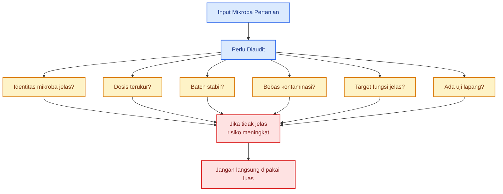

### 13.3. MOL dan JAKABA: bukan otomatis salah, tetapi jangan didewakan

MOL dan JAKABA sering populer karena murah, mudah dibuat, dan terasa dekat dengan praktik lokal. Ini nilai positif. Namun, dari sisi keamanan dan konsistensi, keduanya perlu hati-hati.

MOL dan JAKABA sebaiknya dipandang sebagai:

> **kultur campuran tradisional atau biostimulan lokal yang perlu diuji.**

Bukan langsung sebagai:

> **agens hayati spesifik yang sudah terbukti.**

Perbedaannya penting.

Agens hayati spesifik seharusnya memiliki:

- identitas mikroba jelas;
- target OPT jelas;
- dosis jelas;
- cara aplikasi jelas;
- bukti efektivitas;
- mutu batch stabil.

Sementara MOL/JAKABA rumahan umumnya:

- komposisinya tidak pasti;
- mikroba dominannya bisa berubah;
- kualitas tergantung bahan dan kebersihan;
- sulit menentukan dosis mikroba hidup;
- bisa tercemar mikroba tidak diinginkan.

### 13.4. Posisi aman MOL dan JAKABA

Untuk praktisi cabai, penggunaan yang lebih aman adalah:

| Penggunaan                        | Tingkat risiko   | Catatan                                     |
| --------------------------------- | ---------------- | ------------------------------------------- |
| Aktivator kompos                  | Lebih rendah     | Mikroba bekerja dalam proses pengomposan    |
| Kocor tanah encer                 | Sedang           | Harus uji kecil dulu                        |
| Semprot daun                      | Lebih tinggi     | Risiko bercak, fitotoksik, atau kontaminasi |
| Semprot buah siap panen           | Tidak disarankan | Risiko keamanan pangan                      |
| Dicampur dengan semua agen hayati | Tidak disarankan | Kompatibilitas tidak jelas                  |
| Dipakai pekat ke akar muda        | Tidak disarankan | Risiko stres akar                           |

MOL dan JAKABA lebih baik dijadikan bagian dari proses pembenahan bahan organik, bukan langsung dianggap sebagai obat tanaman.

### 13.5. Kesimpulan Bab 13

Semua input mikroba harus diaudit. Label PGPR, PGPM, PGPF, MOL, atau JAKABA bukan jaminan.

Pesan kunci:

> **MOL dan JAKABA sebaiknya dianggap sebagai kultur campuran tradisional, bukan agens hayati spesifik yang sudah terbukti.**

---

## 14. Mikroba Berguna Tapi Berisiko

Dalam mikrobiologi pertanian, nama genus sering menipu. Satu genus bisa memiliki anggota yang sangat bermanfaat, tetapi juga anggota yang berisiko.

Karena itu, tidak cukup hanya membaca label:

- Bacillus sp.;
- Pseudomonas sp.;
- Burkholderia sp.;
- Aspergillus sp.;
- Penicillium sp.;
- Serratia sp.;
- Enterobacter sp.;
- Klebsiella sp.

Nama genus belum cukup. Yang lebih menentukan adalah **spesies, strain, fungsi, keamanan, dan bukti uji**.

### 14.1. Bacillus

Bacillus adalah salah satu kelompok bakteri yang banyak dipakai dalam pertanian. Beberapa spesies dikenal sebagai PGPR dan agen hayati.

Contoh yang sering dianggap bermanfaat:

- _Bacillus subtilis_;
- _Bacillus velezensis_;
- _Bacillus amyloliquefaciens_.

Potensi manfaatnya:

- menghasilkan senyawa antimikroba;
- membantu pertumbuhan akar;
- menekan beberapa patogen;
- membentuk spora sehingga lebih tahan disimpan;
- cocok untuk formulasi pupuk hayati atau biopestisida.

Namun, kelompok Bacillus juga memiliki anggota yang perlu hati-hati, misalnya kelompok _Bacillus cereus_. Beberapa anggotanya berisiko dari sisi keamanan pangan atau kesehatan.

Jadi, label **Bacillus sp.** saja belum cukup.

### 14.2. Pseudomonas

Pseudomonas juga banyak dikenal sebagai PGPR. Beberapa strain mampu menghasilkan siderofor, enzim, dan senyawa penghambat patogen.

Contoh yang sering dipakai:

- _Pseudomonas fluorescens_.

Potensi manfaatnya:

- membantu akar;
- menekan patogen tertentu;
- bersaing memperebutkan besi melalui siderofor;
- mendukung kesehatan rizosfer.

Namun, tidak semua Pseudomonas aman untuk dipakai bebas. _Pseudomonas aeruginosa_, misalnya, dikenal sebagai mikroba oportunistik pada manusia. Walaupun beberapa strain bisa menunjukkan sifat pemacu pertumbuhan, penggunaannya dalam praktik umum pertanian harus sangat hati-hati.

Jadi, jangan memperbanyak Pseudomonas liar tanpa identifikasi.

### 14.3. Burkholderia

Burkholderia adalah contoh kelompok mikroba yang membuat praktisi harus ekstra kritis. Beberapa anggotanya punya potensi biokontrol, pelarut hara, atau bioremediasi.

Namun, beberapa kelompok Burkholderia juga berhubungan dengan risiko kesehatan manusia, terutama sebagai patogen oportunistik.

Untuk praktik cabai, saya tidak menyarankan penggunaan **Burkholderia sp. liar** tanpa dukungan laboratorium yang kuat.

### 14.4. Aspergillus dan Penicillium

Beberapa _Aspergillus_ dan _Penicillium_ dapat membantu pelarutan fosfat atau dekomposisi bahan organik. Namun, kelompok ini juga memiliki anggota yang bisa menghasilkan mikotoksin.

Contoh yang perlu sangat hati-hati adalah _Aspergillus flavus_ liar, karena sebagian strain dapat menghasilkan aflatoksin.

Ini penting karena banyak kultur rumahan menghasilkan jamur hijau, abu-abu, hitam, atau kuning. Jangan langsung menganggapnya jamur baik.

Jamur yang tumbuh pada nasi basi, air cucian beras, buah busuk, atau media fermentasi terbuka bisa saja berguna, tetapi bisa juga berisiko.

### 14.5. Serratia, Enterobacter, dan Klebsiella

Beberapa anggota kelompok ini pernah dilaporkan sebagai PGPR. Namun, sebagian juga dikenal sebagai mikroba oportunistik.

Dalam konteks praktik pertanian rakyat, kelompok ini sebaiknya tidak dijadikan target perbanyakan rumahan. Apalagi bila sumbernya berasal dari bahan busuk, limbah dapur, limbah hewani, atau fermentasi yang berbau tidak sedap.

### 14.6. Peta risiko mikroba

```mermaid
flowchart TB
    A["Mikroba Pertanian"] --> B["Relatif aman jika strain jelas"]
    A --> C["Perlu hati-hati sedang"]
    A --> D["Perlu hati-hati tinggi"]
    A --> E["Hindari tanpa lab"]

    B --> B1["_Bacillus subtilis_"]
    B --> B2["_B. velezensis_"]
    B --> B3["_B. amyloliquefaciens_"]
    B --> B4["Mikoriza komersial"]

    C --> C1["_Trichoderma_ teruji"]
    C --> C2["_Pseudomonas fluorescens_"]
    C --> C3["_Beauveria_"]
    C --> C4["_Metarhizium_"]

    D --> D1["_Bacillus cereus_ group"]
    D --> D2["_Pseudomonas aeruginosa_"]
    D --> D3["_Burkholderia_ sp."]
    D --> D4["_Serratia_ / _Klebsiella_ / _Enterobacter_"]

    E --> E1["_Aspergillus flavus_ liar"]
    E --> E2["_Fusarium_ sp."]
    E --> E3["Jamur/bakteri busuk tak dikenal"]
    E --> E4["Kultur fermentasi bau busuk"]

    classDef main fill:#DBEAFE,stroke:#2563EB,color:#1E3A8A,stroke-width:2px;
    classDef safe fill:#DCFCE7,stroke:#16A34A,color:#14532D,stroke-width:2px;
    classDef medium fill:#FEF3C7,stroke:#D97706,color:#78350F,stroke-width:2px;
    classDef high fill:#FEE2E2,stroke:#DC2626,color:#7F1D1D,stroke-width:2px;
    classDef avoid fill:#FCE7F3,stroke:#BE185D,color:#831843,stroke-width:2px;

    class A main;
    class B,B1,B2,B3,B4 safe;
    class C,C1,C2,C3,C4 medium;
    class D,D1,D2,D3,D4 high;
    class E,E1,E2,E3,E4 avoid;
```

Diagram ini bukan daftar mutlak. Tujuannya memberi pola berpikir: **jangan menilai mikroba hanya dari nama genus**.

### 14.7. Pertanyaan audit sebelum memakai mikroba

Sebelum memakai produk atau kultur mikroba, tanyakan:

- Mikroba apa?
- Spesiesnya apa?
- Strain-nya jelas atau tidak?
- Target fungsinya apa?
- Dosisnya berapa?
- Jumlah CFU/spora/propagul berapa?
- Aman untuk tanaman apa?
- Aman untuk pekerja dan lingkungan?
- Ada uji lapang?
- Ada kontrol mutu batch?
- Boleh dicampur dengan apa?
- Tidak boleh dicampur dengan apa?

Jika sebagian besar pertanyaan tidak bisa dijawab, jangan gunakan luas.

### 14.8. Kesimpulan Bab 14

Beberapa mikroba memang berguna. Tetapi nama genus tidak cukup untuk membuktikan keamanan dan manfaat. Dalam satu genus bisa ada strain baik, strain netral, strain agresif, atau strain berisiko.

Pesan kunci:

> **Nama genus tidak cukup. Spesies dan strain menentukan aman atau tidak.**

---

## 15. Tanda Kultur Mikroba Patut Ditolak

Tidak semua kultur mikroba layak dipakai. Bahkan, sebagian kultur harus langsung ditolak sebelum masuk ke lahan.

Ini terutama berlaku untuk kultur rumahan seperti MOL, POC fermentasi, JAKABA, kultur nasi, kultur air cucian beras, kultur buah busuk, atau perbanyakan mikroba dari bahan organik lokal.

Kultur yang gagal bukan pupuk hayati. Kultur yang gagal adalah sumber risiko.

### 15.1. Tanda fisik dan bau yang mencurigakan

Jangan gunakan kultur yang menunjukkan tanda berikut:

- bau busuk;
- bau bangkai;
- bau got;
- bau telur busuk;
- lendir berlebihan;
- ada belatung;
- warna jamur liar tidak seragam;
- botol menggembung ekstrem;
- muncul jamur hitam;
- muncul jamur abu-abu mencurigakan;
- muncul jamur kuning mencurigakan;
- ada lapisan busuk berlendir;
- cairan terlalu pekat dan menyengat;
- muncul gas berlebihan tanpa kontrol.

Bau asam-manis ringan atau aroma fermentasi ringan masih bisa dianggap wajar pada beberapa fermentasi. Tetapi bau busuk, bangkai, got, atau telur busuk adalah tanda bahaya.

### 15.2. Tanda setelah uji kecil

Selain tanda pada kultur, lihat juga reaksi tanaman. Jangan gunakan lebih luas bila setelah uji kecil muncul gejala:

- daun terbakar;
- bercak daun;
- pucuk layu;
- akar cokelat;
- akar membusuk;
- bibit rebah;
- tanaman kerdil;
- tanah menjadi bau;
- pangkal batang busuk;
- muncul jamur liar di permukaan media.

Uji kecil harus dilakukan sebelum aplikasi luas. Misalnya pada 10–20 tanaman atau satu tray bibit kecil.

### 15.3. Alur keputusan menerima atau menolak kultur

```mermaid
flowchart TB
    A["Kultur Mikroba / Fermentasi"] --> B["Cek bau"]
    B --> C["Bau segar / asam-manis ringan"]
    B --> D["Bau busuk / bangkai / got / telur busuk"]

    D --> E["TOLAK<br/>jangan gunakan"]

    C --> F["Cek tampilan"]
    F --> G["Seragam dan tidak mencurigakan"]
    F --> H["Jamur liar hitam/abu/kuning<br/>lendir berlebihan / belatung"]

    H --> E

    G --> I["Uji kecil pada sedikit tanaman"]
    I --> J["Tanaman normal"]
    I --> K["Daun terbakar / akar rusak / bercak / busuk"]

    K --> E
    J --> L["Boleh uji petak terbatas"]
    L --> M["Evaluasi sebelum diperluas"]

    classDef start fill:#DBEAFE,stroke:#2563EB,color:#1E3A8A,stroke-width:2px;
    classDef safe fill:#DCFCE7,stroke:#16A34A,color:#14532D,stroke-width:2px;
    classDef caution fill:#FEF3C7,stroke:#D97706,color:#78350F,stroke-width:2px;
    classDef reject fill:#FEE2E2,stroke:#DC2626,color:#7F1D1D,stroke-width:2px;
    classDef test fill:#F0FDFA,stroke:#0D9488,color:#134E4A,stroke-width:2px;

    class A,B,F,I start;
    class C,G,J safe;
    class D,H,K caution;
    class E reject;
    class L,M test;
```

### 15.4. Jangan menyelamatkan kultur yang sudah gagal

Kesalahan umum adalah mencoba “menyelamatkan” kultur busuk dengan menambah gula, molase, EM, ragi, atau mikroba lain.

Ini tidak disarankan.

Jika kultur sudah busuk dan tercemar, menambah bahan baru sering hanya memberi makanan tambahan untuk mikroba yang tidak diinginkan. Hasilnya bisa lebih buruk.

Prinsipnya:

> Kultur gagal lebih baik dibuang dengan aman daripada dipaksakan ke tanaman.

### 15.5. Bedakan fermentasi baik dan pembusukan

Fermentasi dan pembusukan sama-sama melibatkan mikroba, tetapi hasilnya berbeda.

| Kondisi                | Ciri umum                                                   | Status              |
| ---------------------- | ----------------------------------------------------------- | ------------------- |
| Fermentasi terkendali  | Bau asam-manis ringan, tidak busuk, tidak berlendir ekstrem | Bisa diuji kecil    |
| Pembusukan             | Bau bangkai/got/telur busuk, berlendir, gas ekstrem         | Tolak               |
| Kontaminasi jamur liar | Warna tidak seragam, hitam/abu/kuning mencurigakan          | Tolak atau uji lab  |
| Kultur tidak stabil    | Batch berbeda jauh, hasil tidak konsisten                   | Jangan dipakai luas |

### 15.6. Cara membuang kultur gagal

Jangan membuang kultur gagal ke bedengan, media semai, kolam, atau saluran dekat lahan produksi.

Cara lebih aman:

- kubur jauh dari area produksi;
- campur dengan bahan kering dan biarkan terdekomposisi di tempat khusus;
- jangan gunakan untuk tanaman pangan;
- bersihkan wadah dengan sabun dan desinfektan ringan;
- jangan gunakan alat yang sama untuk media semai sebelum dicuci.

### 15.7. Kesimpulan Bab 15

Kultur mikroba yang gagal bukan input pertanian. Ia adalah sumber risiko biologis.

Tanda-tanda seperti bau busuk, lendir ekstrem, belatung, jamur liar mencurigakan, botol menggembung ekstrem, dan tanaman terbakar saat uji kecil harus dianggap sebagai sinyal penolakan.

Pesan kunci:

> **Fermentasi yang gagal bukan pupuk hayati, tetapi sumber risiko.**

---

# Tipuan Mikroba dalam Pertanian: Standar Seleksi, Prinsip Anti-Tipuan, dan Rumus Praktis untuk Petani Cabai

Pada bagian sebelumnya, kita sudah membahas bukti kemanjuran Trichoderma, risiko MOL/JAKABA dan kultur mikroba campuran, contoh mikroba yang berguna tetapi berisiko, serta tanda kultur yang harus ditolak.

Bagian terakhir ini menjadi penutup praktis: **bagaimana menentukan apakah mikroba layak dipakai luas, prinsip anti-tipuan mikroba, rumus keputusan untuk petani cabai, dan kesimpulan besar agar mikroba dipakai sebagai teknologi biologis, bukan mantra.**

---

## 16. Standar Sebelum Mikroba Dipakai Luas

Kesalahan besar dalam penggunaan mikroba pertanian adalah langsung melompat dari “menemukan mikroba” ke “mengaplikasikan ke seluruh lahan”.

Padahal, sebelum mikroba dipakai luas, ia harus melewati beberapa tingkat seleksi. Tujuannya bukan mempersulit petani, tetapi melindungi lahan produksi dari risiko input biologis yang belum jelas.

Mikroba yang belum diuji bisa saja:

- tidak efektif;
- tidak stabil;
- tercemar;
- merusak bibit;
- mengganggu mikroba menguntungkan;
- membawa patogen tanaman;
- menyebabkan hasil tidak konsisten.

Karena itu, gunakan sistem level.

### 16.1. Level 1: Aman dicoba kecil

Level 1 adalah tahap paling awal. Pada tahap ini, mikroba belum boleh dipakai luas. Ia hanya boleh dicoba pada skala sangat kecil.

Syarat minimal:

- tidak bau busuk;
- tidak bau bangkai;
- tidak bau got;
- tidak terlihat kontaminan mencolok;
- tidak ada belatung;
- tidak berlendir ekstrem;
- tidak muncul jamur liar mencurigakan;
- diuji pada sedikit tanaman terlebih dahulu.

Contoh uji kecil:

- 10–20 tanaman cabai;
- 1 tray bibit;
- beberapa polybag;
- satu baris pendek di pinggir lahan.

Tujuan Level 1 adalah memastikan mikroba **tidak langsung menimbulkan kerusakan**.

Jangan mencari hasil panen pada Level 1. Fokusnya adalah keamanan awal.

### 16.2. Level 2: Layak dipakai terbatas

Level 2 berarti mikroba sudah melewati uji kecil dan tidak menimbulkan kerusakan nyata. Pada tahap ini, mikroba boleh diuji pada petak terbatas.

Syarat minimal:

- ada hasil uji kecil;
- tidak menyebabkan stres tanaman;
- tidak membuat daun terbakar;
- tidak merusak akar;
- tidak menimbulkan bercak atau busuk;
- ada manfaat terlihat;
- dosis mulai konsisten;
- cara aplikasi sudah jelas.

Contoh uji terbatas:

- 100–500 tanaman;
- beberapa bedeng;
- satu blok kecil;
- satu petak percobaan yang dibandingkan dengan kontrol.

Pada Level 2, mulai catat data:

- jumlah tanaman layu;
- tinggi tanaman;
- jumlah tanaman hidup;
- kondisi akar;
- jumlah buah;
- bobot panen;
- biaya perlakuan.

Level 2 adalah tahap pembuktian awal di lapangan.

### 16.3. Level 3: Layak produksi

Level 3 adalah standar yang lebih kuat. Mikroba pada level ini lebih layak dipakai untuk lahan produksi.

Syarat ideal:

- identitas mikroba jelas;
- spesies atau strain diketahui;
- jumlah mikroba hidup terukur;
- tidak mengandung patogen indikator;
- efektivitas terbukti;
- dosis jelas;
- cara aplikasi jelas;
- batch stabil;
- aman bagi tanaman;
- aman bagi pekerja;
- aman bagi lingkungan;
- hasil lebih baik dibanding kontrol;
- hasil konsisten pada beberapa uji.

Mikroba Level 3 tidak harus selalu sempurna, tetapi sudah cukup layak diperlakukan sebagai input agribisnis yang serius.

### 16.4. Diagram standar seleksi mikroba

```mermaid id="u21kb7"
flowchart TB
    A["Mikroba / Kultur Baru"] --> B["Level 1<br/>Aman Dicoba Kecil"]
    B --> C["Cek bau, tampilan,<br/>kontaminasi, uji 10–20 tanaman"]

    C --> D{"Tanaman aman?"}
    D -->|Tidak| E["TOLAK<br/>jangan dipakai"]
    D -->|Ya| F["Level 2<br/>Uji Petak Terbatas"]

    F --> G["Catat gejala, akar,<br/>tanaman hidup, hasil awal"]
    G --> H{"Ada manfaat nyata<br/>dan tidak ada efek negatif?"}

    H -->|Tidak| I["Jangan diperluas<br/>evaluasi ulang"]
    H -->|Ya| J["Level 3<br/>Layak Produksi"]

    J --> K["Identitas jelas<br/>dosis jelas<br/>batch stabil<br/>efektivitas terbukti"]
    K --> L["Aplikasi lebih luas<br/>dengan monitoring"]

    classDef start fill:#DBEAFE,stroke:#2563EB,color:#1E3A8A,stroke-width:2px;
    classDef level1 fill:#FEF3C7,stroke:#D97706,color:#78350F,stroke-width:2px;
    classDef level2 fill:#DCFCE7,stroke:#16A34A,color:#14532D,stroke-width:2px;
    classDef level3 fill:#F0FDFA,stroke:#0D9488,color:#134E4A,stroke-width:2px;
    classDef reject fill:#FEE2E2,stroke:#DC2626,color:#7F1D1D,stroke-width:2px;

    class A,D,H start;
    class B,C level1;
    class F,G level2;
    class J,K,L level3;
    class E,I reject;
```

### 16.5. Tabel keputusan penggunaan mikroba

| Kondisi mikroba                               | Status          | Keputusan               |
| --------------------------------------------- | --------------- | ----------------------- |
| Bau busuk, berlendir, ada belatung            | Berisiko tinggi | Tolak                   |
| Jamur/bakteri tidak jelas, belum diuji        | Belum layak     | Uji kecil dulu          |
| Aman di 10–20 tanaman                         | Potensial       | Uji petak terbatas      |
| Aman dan ada manfaat di petak kecil           | Layak terbatas  | Bisa diperluas bertahap |
| Identitas jelas, dosis jelas, hasil konsisten | Layak produksi  | Bisa dipakai lebih luas |
| Tidak ada data, hanya testimoni               | Belum terbukti  | Jangan langsung percaya |

### 16.6. Kesimpulan Bab 16

Mikroba tidak boleh langsung dipercaya hanya karena tampak alami, berbau fermentasi, atau berasal dari tanah lokal. Sebelum dipakai luas, ia harus melewati tahap seleksi.

Pesan kunci:

> **Yang tidak teridentifikasi, tidak terukur, dan tidak diuji, jangan diaplikasikan luas.**

---

## 17. Prinsip Anti-Tipuan Mikroba

Prinsip anti-tipuan mikroba diperlukan agar praktisi tidak mudah terjebak klaim berlebihan. Mikroba memang penting, tetapi klaim mikroba harus diuji seperti input pertanian lainnya.

Berikut prinsip yang bisa dijadikan pegangan.

### 17.1. Jangan percaya hanya karena kata “organik”

Kata “organik” tidak otomatis berarti aman, efektif, atau stabil. Bahan organik yang belum matang bisa merusak akar. Fermentasi organik yang gagal bisa membawa mikroba pembusuk.

Organik adalah kategori bahan, bukan bukti efektivitas.

### 17.2. Jangan percaya hanya karena “dari alam”

Banyak mikroba baik berasal dari alam. Tetapi patogen juga berasal dari alam. Jamur penghasil toksin juga berasal dari alam. Bakteri pembusuk juga berasal dari alam.

Kalimat “dari alam” hanya menjelaskan asal, bukan kualitas.

### 17.3. Jangan percaya hanya karena “mikroba lokal”

Mikroba lokal bisa sangat potensial, tetapi tetap harus diuji. Lokal tidak otomatis unggul. Lokal juga bisa membawa risiko lokal.

Isolat lokal harus diperlakukan sebagai kandidat, bukan jaminan.

### 17.4. Jangan percaya hanya karena “jamur hijau”

Jamur hijau bisa Trichoderma. Tetapi bisa juga Penicillium, Aspergillus, atau jamur lain. Warna hijau bukan bukti identitas.

Morfologi adalah petunjuk awal, bukan bukti final.

### 17.5. Jangan percaya hanya karena “bau fermentasi”

Bau fermentasi tidak cukup untuk membuktikan manfaat. Fermentasi yang baik perlu proses terkendali. Bau asam-manis ringan mungkin wajar, tetapi bau busuk, bangkai, got, atau telur busuk adalah tanda bahaya.

### 17.6. Jangan percaya produk tanpa spesies atau strain

Label “Bacillus sp.”, “Pseudomonas sp.”, atau “Trichoderma sp.” belum cukup. Nama genus belum membuktikan fungsi.

Minimal harus jelas:

- spesies;
- target fungsi;
- dosis;
- jumlah mikroba;
- cara aplikasi;
- batas penggunaan.

Lebih baik lagi bila strain diketahui.

### 17.7. Jangan percaya klaim tanpa dosis

Klaim tanpa dosis tidak bisa dipraktikkan dengan benar. Praktisi butuh angka:

- gram per tanaman;
- mililiter per liter;
- liter per hektare;
- jumlah aplikasi;
- jarak antar aplikasi;
- total per musim.

Tanpa dosis, klaim hanya menjadi narasi.

### 17.8. Jangan percaya klaim tanpa target penyakit

Produk yang mengklaim bisa mengatasi semua penyakit harus dicurigai.

Klaim yang baik harus menyebut target:

- Fusarium;
- Phytophthora;
- Rhizoctonia;
- Pythium;
- antraknosa;
- bakteri;
- virus;
- hama tertentu.

Mikroba yang efektif terhadap satu patogen belum tentu efektif terhadap patogen lain.

### 17.9. Jangan percaya klaim “bisa untuk semua tanaman dan semua penyakit”

Ini salah satu tanda klaim berlebihan. Tanaman berbeda, tanah berbeda, patogen berbeda, iklim berbeda, dan teknik budidaya berbeda.

Input mikroba yang serius biasanya punya batas penggunaan.

### 17.10. Jangan aplikasikan luas tanpa uji petak

Uji petak adalah benteng terakhir sebelum kerugian besar. Jangan langsung menerapkan input mikroba baru ke seluruh lahan cabai.

Minimal bandingkan:

- kontrol tanpa mikroba;
- produk atau kultur yang diuji;
- perlakuan standar petani.

### 17.11. Diagram prinsip anti-tipuan mikroba

```mermaid id="r7jpo9"
flowchart TB
    A["Klaim Mikroba"] --> B{"Ada identitas jelas?"}
    B -->|Tidak| C["Curiga"]
    B -->|Ya| D{"Ada dosis jelas?"}

    D -->|Tidak| C
    D -->|Ya| E{"Ada target fungsi / penyakit?"}

    E -->|Tidak| C
    E -->|Ya| F{"Ada uji kecil / petak?"}

    F -->|Tidak| G["Jangan langsung dipakai luas"]
    F -->|Ya| H{"Hasil lebih baik dari kontrol?"}

    H -->|Tidak| I["Evaluasi ulang"]
    H -->|Ya| J["Bisa dipakai bertahap<br/>dengan monitoring"]

    C --> K["Minta data<br/>atau uji sendiri skala kecil"]
    G --> K
    I --> K

    classDef main fill:#DBEAFE,stroke:#2563EB,color:#1E3A8A,stroke-width:2px;
    classDef question fill:#FEF3C7,stroke:#D97706,color:#78350F,stroke-width:2px;
    classDef caution fill:#FEE2E2,stroke:#DC2626,color:#7F1D1D,stroke-width:2px;
    classDef good fill:#DCFCE7,stroke:#16A34A,color:#14532D,stroke-width:2px;

    class A main;
    class B,D,E,F,H question;
    class C,G,I,K caution;
    class J good;
```

### 17.12. Kesimpulan Bab 17

Prinsip anti-tipuan mikroba bukan berarti menolak mikroba. Prinsip ini justru membantu agar mikroba yang benar-benar berguna bisa dipakai secara tepat.

Pesan kunci:

> **Mikroba pertanian bukan mantra. Ia harus diuji seperti input agribisnis lainnya.**

---

## 18. Rumus Praktis untuk Petani Cabai

Agar mudah diterapkan, gunakan rumus keputusan berikut:

> **Masalah jelas → mikroba jelas → dosis jelas → cara aplikasi jelas → uji kecil → baru perluas.**

Rumus ini sederhana, tetapi sangat kuat untuk mencegah kesalahan penggunaan mikroba.

### 18.1. Rumus keputusan mikroba

```mermaid id="kz8giv"
flowchart TB
    A["1. Masalah jelas"] --> B["2. Mikroba jelas"]
    B --> C["3. Dosis jelas"]
    C --> D["4. Cara aplikasi jelas"]
    D --> E["5. Uji kecil"]
    E --> F["6. Evaluasi data"]
    F --> G["7. Baru perluas bertahap"]

    A --> A1["Contoh:<br/>layu Fusarium"]
    B --> B1["Contoh:<br/>_Trichoderma harzianum_ teruji"]
    C --> C1["Contoh:<br/>10–20 g/tanaman/aplikasi"]
    D --> D1["Contoh:<br/>media semai, lubang tanam,<br/>susulan 21 HST"]
    E --> E1["Contoh:<br/>100–500 tanaman"]
    F --> F1["Contoh:<br/>tanaman layu turun ≥30%"]
    G --> G1["Contoh:<br/>perluas ke blok lain"]

    classDef step fill:#DBEAFE,stroke:#2563EB,color:#1E3A8A,stroke-width:2px;
    classDef example fill:#DCFCE7,stroke:#16A34A,color:#14532D,stroke-width:2px;

    class A,B,C,D,E,F,G step;
    class A1,B1,C1,D1,E1,F1,G1 example;
```

### 18.2. Contoh kasus: layu Fusarium pada cabai

Misalnya masalah utama di lahan adalah layu Fusarium.

Langkah praktis:

| Tahap    | Keputusan                                                 |
| -------- | --------------------------------------------------------- |
| Masalah  | Layu Fusarium                                             |
| Gejala   | Layu perlahan, daun bawah kuning, pembuluh batang cokelat |
| Mikroba  | _Trichoderma harzianum_ atau _T. asperellum_ teruji       |
| Dosis    | 10–20 g/tanaman per aplikasi                              |
| Waktu    | Media semai, lubang tanam, susulan 21 HST                 |
| Cara     | Campur dengan kompos matang/tanah halus di zona akar      |
| Uji      | Bandingkan dengan kontrol                                 |
| Evaluasi | Tanaman layu turun minimal 30%                            |

### 18.3. Formula evaluasi penurunan penyakit

Untuk menilai apakah perlakuan benar-benar membantu, gunakan persentase penurunan penyakit.

```mdx id="hs3x3d"
Penurunan penyakit (%) = ((Penyakit kontrol - Penyakit perlakuan) / Penyakit kontrol) × 100
```

Dalam bentuk formula:

$$
Penurunan\ Penyakit\ (%) =
\frac{Penyakit\ Kontrol - Penyakit\ Perlakuan}{Penyakit\ Kontrol}
\times 100
$$

Contoh:

Pada petak kontrol, tanaman layu = **40 tanaman**.
Pada petak Trichoderma, tanaman layu = **25 tanaman**.

$$
Penurunan =
\frac{40 - 25}{40}
\times 100
$$

$$
Penurunan =
\frac{15}{40}
\times 100
$$

$$
Penurunan = 37{,}5%
$$

Artinya, perlakuan Trichoderma menurunkan tanaman layu sebesar **37,5%** dibanding kontrol.

Jika target minimal adalah 30%, maka hasil ini layak dipertimbangkan untuk uji lanjutan.

### 18.4. Formula peningkatan hasil panen

Selain penyakit, hasil panen juga perlu dihitung.

```mdx id="k1ebz5"
Peningkatan hasil (%) = ((Hasil perlakuan - Hasil kontrol) / Hasil kontrol) × 100
```

Dalam bentuk formula:

$$
Peningkatan\ Hasil\ (%) =
\frac{Hasil\ Perlakuan - Hasil\ Kontrol}{Hasil\ Kontrol}
\times 100
$$

Contoh:

Hasil panen kontrol = **800 kg**.
Hasil panen perlakuan Trichoderma = **920 kg**.

$$
Peningkatan =
\frac{920 - 800}{800}
\times 100
$$

$$
Peningkatan =
\frac{120}{800}
\times 100
$$

$$
Peningkatan = 15%
$$

Artinya, perlakuan memberi peningkatan hasil **15%** dibanding kontrol.

### 18.5. Formula kebutuhan Trichoderma

Untuk menghitung kebutuhan Trichoderma:

```mdx id="vf2vcp"
Kebutuhan Trichoderma (kg) = (Jumlah tanaman × Dosis per tanaman dalam gram) / 1000
```

Dalam bentuk formula:

$$
Kebutuhan\ Trichoderma\ (kg) =
\frac{Jumlah\ Tanaman \times Dosis\ per\ Tanaman\ (g)}{1000}
$$

Contoh:

Jumlah tanaman = **20.000 tanaman**
Dosis = **15 g/tanaman**

$$
Kebutuhan =
\frac{20.000 \times 15}{1000}
$$

$$
Kebutuhan = 300\ kg
$$

Jadi, untuk satu kali aplikasi, kebutuhan Trichoderma adalah **300 kg**.

Jika aplikasi dilakukan dua kali dengan dosis sama:

$$
Total\ Musim = 300\ kg \times 2
$$

$$
Total\ Musim = 600\ kg
$$

### 18.6. Format pencatatan lapang

Agar keputusan tidak berdasarkan perasaan, gunakan catatan sederhana.

```mdx id="wz4zir"
Tanggal aplikasi:
Lokasi/blok:
Jumlah tanaman:
Jenis mikroba:
Spesies/strain jika ada:
Dosis per tanaman:
Cara aplikasi:
Kondisi cuaca:
Gejala penyakit sebelum aplikasi:
Jumlah tanaman sakit sebelum aplikasi:
Jumlah tanaman sakit 7 hari setelah aplikasi:
Jumlah tanaman sakit 14 hari setelah aplikasi:
Jumlah tanaman sakit 21 hari setelah aplikasi:
Catatan akar/tajuk:
Hasil panen:
Kesimpulan sementara:
```

Tanpa catatan seperti ini, petani mudah tertipu oleh kesan visual. Tanaman terlihat lebih hijau belum tentu karena mikroba. Bisa jadi karena hujan, pupuk, varietas, atau kondisi lahan yang memang berbeda.

### 18.7. Kriteria keputusan praktis

| Hasil uji                                 | Keputusan                 |
| ----------------------------------------- | ------------------------- |
| Penyakit tidak turun dan hasil tidak naik | Jangan lanjutkan          |
| Penyakit turun sedikit, hasil sama        | Evaluasi biaya            |
| Penyakit turun ≥30%                       | Layak uji lanjutan        |
| Hasil naik ≥10%                           | Menarik secara agribisnis |
| Hasil naik, penyakit turun, tanaman aman  | Layak diperluas bertahap  |
| Tanaman stres atau akar rusak             | Hentikan                  |

### 18.8. Kesimpulan Bab 18

Penggunaan mikroba harus berbasis pengamatan dan data. Testimoni bisa menjadi petunjuk awal, tetapi tidak cukup untuk mengambil keputusan produksi.

Pesan kunci:

> **Keputusan mikroba harus berbasis pengamatan, bukan testimoni.**

---

## 19. Penutup: Mikroba Bukan Musuh, Tapi Jangan Didewakan

Mikroba sangat penting dalam pertanian berkelanjutan. Tanah yang sehat bukan tanah steril. Tanah yang sehat adalah tanah yang memiliki kehidupan biologis aktif, seimbang, dan mendukung tanaman.

Trichoderma, PGPR, mikoriza, Bacillus, Pseudomonas, Beauveria, Metarhizium, dan mikroba lain bisa sangat berguna. Mereka dapat membantu akar, menekan patogen, memperbaiki serapan hara, mendukung dekomposisi, dan mengurangi ketergantungan pada input kimia tertentu.

Namun, mikroba juga bisa salah sasaran.

Mikroba bisa:

- tidak efektif;
- kalah di lapangan;
- mengganggu mikroba lain;
- membawa kontaminan;
- menimbulkan fitotoksisitas;
- merusak keseimbangan tanah;
- hanya bekerja pada kondisi tertentu;
- gagal karena dosis dan aplikasi salah.

Jadi, mikroba bukan musuh. Tetapi mikroba juga jangan didewakan.

### 19.1. Tujuan agribisnis bukan memperbanyak mikroba sebanyak-banyaknya

Dalam pertanian modern, tujuan kita bukan membuat tanah penuh dengan mikroba sebanyak mungkin. Tujuan yang benar adalah membangun ekosistem tanah yang:

- stabil;
- produktif;
- terukur;
- seimbang;
- mendukung akar;
- menekan patogen secara alami;
- responsif terhadap input;
- aman bagi tanaman, pekerja, dan konsumen.

Mikroba harus menjadi bagian dari strategi, bukan pengganti semua strategi.

### 19.2. Posisi mikroba dalam sistem budidaya cabai

```mermaid id="vz5t6e"
flowchart TB
    A["Budidaya Cabai Sehat"] --> B["Benih dan Bibit Sehat"]
    A --> C["Media Semai Bersih"]
    A --> D["Drainase Baik"]
    A --> E["Kompos Matang"]
    A --> F["Pemupukan Seimbang"]
    A --> G["Sanitasi Tanaman Sakit"]
    A --> H["Pengendalian Hama dan Vektor"]
    A --> I["Rotasi Tanaman"]
    A --> J["Mikroba Teruji"]

    J --> K["Trichoderma<br/>patogen tanah"]
    J --> L["PGPR<br/>dukungan akar"]
    J --> M["Mikoriza<br/>serapan hara"]
    J --> N["Beauveria / Metarhizium<br/>hama tertentu"]

    K --> O["Dipakai presisi"]
    L --> O
    M --> O
    N --> O

    O --> P["Tanah lebih stabil<br/>tanaman lebih sehat<br/>hasil lebih terukur"]

    classDef main fill:#DBEAFE,stroke:#2563EB,color:#1E3A8A,stroke-width:2px;
    classDef system fill:#DCFCE7,stroke:#16A34A,color:#14532D,stroke-width:2px;
    classDef microbe fill:#FEF3C7,stroke:#D97706,color:#78350F,stroke-width:2px;
    classDef result fill:#F0FDFA,stroke:#0D9488,color:#134E4A,stroke-width:2px;

    class A main;
    class B,C,D,E,F,G,H,I system;
    class J,K,L,M,N,O microbe;
    class P result;
```

Diagram ini menunjukkan bahwa mikroba hanya satu bagian dari sistem. Trichoderma tidak akan bekerja optimal bila drainase buruk, bibit sudah sakit, kompos belum matang, sanitasi buruk, dan hama vektor tidak dikendalikan.

### 19.3. Ringkasan besar artikel

Inti seluruh pembahasan dapat diringkas menjadi beberapa prinsip:

| Topik                  | Kesimpulan praktis                                                |
| ---------------------- | ----------------------------------------------------------------- |
| Mikroba alami          | Tidak otomatis aman atau efektif                                  |
| Trichoderma sp.        | Baru menunjukkan genus, belum membuktikan spesies/strain unggul   |
| Jamur hijau            | Belum tentu Trichoderma                                           |
| Trichoderma pada cabai | Berguna terutama untuk penyakit tular tanah                       |
| Isolat lokal           | Potensi besar, tetapi harus diuji                                 |
| Dosis                  | Harus dihitung per aplikasi dan per musim                         |
| Aplikasi akar          | Boleh dekat akar, tetapi harus bersih dan tersebar                |
| Produk teruji          | Lebih aman untuk produksi                                         |
| MOL/JAKABA             | Kultur campuran tradisional, bukan otomatis agens hayati spesifik |
| Mikroba berisiko       | Nama genus tidak cukup; spesies dan strain penting                |
| Kultur gagal           | Harus ditolak                                                     |
| Uji petak              | Wajib sebelum aplikasi luas                                       |

### 19.4. Checklist akhir anti-tipuan mikroba

Sebelum memakai mikroba, tanyakan:

```mdx id="3wftk0"
[ ] Mikroba apa yang digunakan?
[ ] Spesies atau strain jelas?
[ ] Target masalah jelas?
[ ] Dosis per tanaman jelas?
[ ] Total dosis per musim jelas?
[ ] Cara aplikasi jelas?
[ ] Boleh dicampur dengan apa?
[ ] Tidak boleh dicampur dengan apa?
[ ] Ada uji kecil?
[ ] Ada kontrol pembanding?
[ ] Ada data hasil?
[ ] Tidak ada tanda kontaminasi?
[ ] Tidak ada efek negatif pada tanaman?
[ ] Hasil layak secara biaya?
```

Jika sebagian besar jawaban masih kosong, jangan aplikasikan luas.

### 19.5. Kalimat penutup

Mikroba adalah masa depan penting dalam pertanian, tetapi masa depan itu harus dibangun dengan kehati-hatian. Pertanian berkelanjutan tidak boleh berubah menjadi pasar klaim tanpa bukti.

Mikroba yang benar bisa menjadi alat hebat untuk memperkuat budidaya cabai. Tetapi mikroba yang salah, dosis yang salah, atau klaim yang salah bisa menjadi sumber kerugian.

Kalimat penutup artikel ini:

> **Tipuan mikroba terjadi ketika nama mikroba dijual lebih besar daripada buktinya. Dalam pertanian modern, mikroba harus diperlakukan sebagai teknologi biologis: diuji, diukur, dibandingkan, lalu dipakai secara presisi.**

---

# Lampiran

## Tanaman Produktif: Mikroba Seimbang, Nutrisi Terjamin, dan Tidak Harus 100% Organik

Tanaman yang subur, sehat, dan berproduksi baik biasanya bukan hasil dari satu faktor tunggal. Produktivitas tanaman lahir dari keseimbangan antara **akar sehat, mikroba tanah yang seimbang, nutrisi tersedia, air terkendali, patogen rendah, dan manajemen budidaya yang konsisten**.

Tanaman yang baik tidak cukup hanya diberi pupuk. Ia membutuhkan sistem akar yang aktif dan lingkungan tanah yang mendukung. Akar adalah titik temu antara tanaman, pupuk, air, bahan organik, dan mikroba tanah.

## 1. Mikroba Seimbang dan Nutrisi Terjamin

Mikroba tanah yang seimbang membantu tanaman melalui beberapa fungsi penting:

| Fungsi Mikroba            | Dampak pada Tanaman                      |
| ------------------------- | ---------------------------------------- |
| Dekomposisi bahan organik | Hara dilepas perlahan                    |
| Pelarutan fosfat          | Akar lebih mudah menyerap fosfor         |
| Dukungan nitrogen         | Pertumbuhan vegetatif lebih stabil       |
| Produksi hormon alami     | Akar lebih aktif                         |
| Kompetisi dengan patogen  | Risiko layu dan busuk akar menurun       |
| Pembentukan agregat tanah | Tanah lebih gembur dan aerasi lebih baik |

Namun, mikroba saja tidak cukup. Bila nutrisi kurang, tanaman tetap tidak optimal. Bila pupuk berlebihan, akar bisa stres. Bila tanah terlalu becek, akar kekurangan oksigen. Bila pH tidak sesuai, unsur hara bisa terkunci. Bila patogen terlalu dominan, mikroba baik bisa kalah bersaing.

Hubungan yang benar dapat dirumuskan seperti ini:

```mermaid id="0q8ff2"
flowchart TB
    A["Tanaman Produktif"] --> B["Akar Sehat"]
    A --> C["Nutrisi Seimbang"]
    A --> D["Air dan Oksigen Terkendali"]
    A --> E["Mikroba Tanah Seimbang"]
    A --> F["Patogen Rendah"]

    B --> G["Serapan hara stabil"]
    C --> G
    D --> G
    E --> H["Rizosfer aktif"]
    F --> H

    G --> I["Pertumbuhan kuat"]
    H --> I
    I --> J["Bunga, buah, dan hasil lebih stabil"]

    classDef main fill:#DBEAFE,stroke:#2563EB,color:#1E3A8A,stroke-width:2px;
    classDef factor fill:#DCFCE7,stroke:#16A34A,color:#14532D,stroke-width:2px;
    classDef result fill:#FEF3C7,stroke:#D97706,color:#78350F,stroke-width:2px;

    class A main;
    class B,C,D,E,F factor;
    class G,H,I,J result;
```

## 2. Mikroba Seimbang Bukan Berarti Mikroba Banyak

Mikroba seimbang bukan berarti semua mikroba harus diperbanyak sebanyak-banyaknya. Mikroba seimbang berarti tidak ada satu kelompok mikroba yang mendominasi secara merusak, patogen terkendali, dan fungsi biologis tanah berjalan.

Tanah yang baik biasanya memiliki:

- bakteri pengurai;
- jamur dekomposer;
- mikoriza;
- aktinomiset;
- PGPR;
- jamur antagonis seperti Trichoderma;
- mikroba netral yang ikut menjaga kestabilan ekosistem.

Jika satu mikroba dibanjiri terus, misalnya Trichoderma secara berlebihan, keseimbangan bisa berubah. Tujuan budidaya bukan membuat tanah penuh satu jenis mikroba, tetapi membuat tanah **stabil secara biologis**.

## 3. Nutrisi Terjamin Bukan Berarti Pupuk Banyak

Tanaman membutuhkan nutrisi lengkap, tetapi tidak boleh berlebihan.

Secara sederhana:

| Fase Tanaman    | Fokus Nutrisi                                |
| --------------- | -------------------------------------------- |
| Bibit           | akar sehat, fosfor cukup, EC tidak tinggi    |
| Vegetatif awal  | nitrogen cukup, kalsium-magnesium seimbang   |
| Menjelang bunga | fosfor, kalium, kalsium, boron, seng penting |
| Pembesaran buah | kalium, kalsium, magnesium, dan air stabil   |
| Panen berulang  | suplai hara bertahap dan konsisten           |

Jika nitrogen terlalu tinggi, tanaman bisa terlalu rimbun tetapi bunga mudah rontok. Jika kalium kurang, pembentukan buah tidak maksimal. Jika kalsium tidak stabil, buah mudah bermasalah. Jika magnesium kurang, daun tua menguning. Jika pH tidak sesuai, pupuk mahal pun tidak terserap optimal.

Jadi, “nutrisi terjamin” artinya:

> **Hara tersedia dalam jumlah cukup, bentuknya bisa diserap, waktunya sesuai fase tanaman, dan tidak merusak akar.**

Rumus praktisnya:

```mdx id="r3u4ur"
Tanaman produktif = akar sehat + mikroba seimbang + nutrisi tersedia + air terkendali + patogen rendah + manajemen konsisten
```

Atau dalam bentuk kalimat:

> **Hasil yang baik berasal dari akar yang sehat. Akar sehat berasal dari tanah yang seimbang. Tanah seimbang berasal dari nutrisi, air, bahan organik, dan mikroba yang tidak berlebihan.**

## 4. Tanaman Produktif Tidak Harus 100% Organik

Tanaman produktif **tidak harus 100% organik**.

Yang paling penting bukan label **organik murni**, tetapi sistem budidaya yang sehat, terukur, dan tidak merusak akar maupun tanah.

Pendekatan yang paling realistis untuk praktisi adalah:

> **Semi-organik, organik-terpadu, atau pertanian berimbang: bahan organik + mikroba teruji + pupuk kimia terukur + pengendalian OPT bijak.**

## 5. Mengapa Tidak Harus 100% Organik?

Karena tanaman budidaya, terutama tanaman bernilai ekonomi tinggi dan berproduksi intensif, memiliki kebutuhan hara yang besar dan waktunya spesifik. Jika hanya mengandalkan organik tanpa perhitungan, sering muncul masalah:

- suplai hara lambat;
- kebutuhan kalium, kalsium, magnesium, boron, dan seng tidak terpenuhi tepat waktu;
- pertumbuhan tidak seragam;
- produksi turun;
- respons koreksi defisiensi lambat;
- kebutuhan bahan organik dan tenaga kerja bisa tinggi.

Sebaliknya, jika terlalu mengandalkan pupuk kimia tanpa bahan organik dan tanpa dukungan kehidupan tanah, masalahnya juga besar:

- tanah menjadi keras;
- akar melemah;
- aktivitas mikroba menurun;
- penyakit tular tanah meningkat;
- pupuk makin boros;
- tanaman mudah stres.

Jadi, sistem yang lebih sehat adalah **kombinasi cerdas**.

## 6. Pola Budidaya Berimbang

| Komponen                               | Peran                                                                  |
| -------------------------------------- | ---------------------------------------------------------------------- |
| **Kompos matang/pupuk kandang matang** | memperbaiki tanah, meningkatkan C-organik, menyediakan habitat mikroba |
| **Mikroba teruji**                     | menjaga rizosfer, menekan patogen, mendukung akar                      |
| **Pupuk kimia terukur**                | memenuhi kebutuhan hara secara cepat dan presisi                       |
| **Kapur/dolomit bila perlu**           | mengatur pH dan menyuplai kalsium-magnesium                            |
| **Irigasi baik**                       | menjaga hara tetap bisa diserap                                        |
| **Sanitasi dan rotasi**                | menurunkan tekanan penyakit                                            |

Prinsip utamanya:

**Organik membangun tanah.**
**Kimia terukur memberi presisi nutrisi.**
**Mikroba menjaga fungsi biologis.**
**Air dan pH menentukan serapan.**

Jika semuanya seimbang, tanaman bisa sehat dan produktif tanpa harus fanatik 100% organik.

```mermaid id="9niot1"
flowchart TB
    A["Tanaman Produktif"] --> B["Bahan Organik"]
    A --> C["Pupuk Kimia Terukur"]
    A --> D["Mikroba Teruji"]
    A --> E["Air dan pH Terkendali"]
    A --> F["Pengendalian OPT Bijak"]

    B --> G["Tanah lebih hidup"]
    C --> H["Hara tersedia presisi"]
    D --> I["Rizosfer lebih stabil"]
    E --> J["Serapan hara optimal"]
    F --> K["Tekanan penyakit menurun"]

    G --> L["Sistem budidaya berimbang"]
    H --> L
    I --> L
    J --> L
    K --> L

    classDef main fill:#DBEAFE,stroke:#2563EB,color:#1E3A8A,stroke-width:2px;
    classDef input fill:#DCFCE7,stroke:#16A34A,color:#14532D,stroke-width:2px;
    classDef result fill:#FEF3C7,stroke:#D97706,color:#78350F,stroke-width:2px;

    class A main;
    class B,C,D,E,F input;
    class G,H,I,K,J,L result;
```

## 7. Kesimpulan Lampiran

Tanaman yang subur dan produktif adalah indikator bahwa sistem bawah tanahnya berjalan baik: akar aktif, nutrisi tersedia seimbang, air tidak ekstrem, patogen terkendali, dan mikroba tanah berada dalam keseimbangan fungsi, bukan dalam dominasi satu mikroba tertentu.

Sistem budidaya yang sehat bukan soal memilih organik atau kimia secara ekstrem. Sistem yang kuat adalah sistem yang mampu menggabungkan bahan organik, mikroba teruji, nutrisi presisi, air terkendali, pH sesuai, sanitasi, dan pengendalian OPT secara bijak.

Kalimat praktisnya:

> **Tanaman tidak menuntut sistem 100% organik; tanaman menuntut akar sehat, hara cukup, tanah hidup, air terkendali, dan input tidak berlebihan.**

Bagi praktisi, target terbaik bukan “anti-kimia”, tetapi:

> **Mengurangi ketergantungan kimia dengan memperbaiki tanah, bukan menghapus pupuk kimia secara membabi buta.**

---

<small>
  **_Catatan Penyusunan_** Artikel ini disusun sebagai materi edukasi dan
  referensi umum berdasarkan berbagai sumber pustaka, praktik lapangan, serta
  bantuan alat penulisan. Pembaca disarankan untuk melakukan verifikasi lanjutan
  dan penyesuaian sesuai dengan kondisi serta kebutuhan masing-masing sistem.
</small>
