# **_Uji Fitotoksik Mikroba Sebelum Aplikasi MOL, POC, JAKABA, dan Produk Mikroba pada Tanaman_**

---

- [**_Uji Fitotoksik Mikroba Sebelum Aplikasi MOL, POC, JAKABA, dan Produk Mikroba pada Tanaman_**](#uji-fitotoksik-mikroba-sebelum-aplikasi-mol-poc-jakaba-dan-produk-mikroba-pada-tanaman)
- [1. Pendahuluan](#1-pendahuluan)
  - [1.1 Mengapa Uji Fitotoksik Diperlukan](#11-mengapa-uji-fitotoksik-diperlukan)
    - [Diagram 1.1. Mengapa Uji Fitotoksik Diperlukan](#diagram-11-mengapa-uji-fitotoksik-diperlukan)
  - [1.2 Tujuan Tulisan](#12-tujuan-tulisan)
- [2. Prinsip Dasar Uji Fitotoksik](#2-prinsip-dasar-uji-fitotoksik)
  - [2.1 Pengertian Uji Fitotoksik](#21-pengertian-uji-fitotoksik)
  - [2.2 Apa yang Bisa dan Tidak Bisa Dibuktikan](#22-apa-yang-bisa-dan-tidak-bisa-dibuktikan)
  - [2.3 Prinsip Kontrol dan Perlakuan](#23-prinsip-kontrol-dan-perlakuan)
    - [Diagram 2.1. Prinsip Kontrol dan Perlakuan](#diagram-21-prinsip-kontrol-dan-perlakuan)
- [3. Produk yang Perlu Diuji](#3-produk-yang-perlu-diuji)
  - [3.1 Produk Tidak Terstandar](#31-produk-tidak-terstandar)
    - [MOL](#mol)
    - [POC](#poc)
    - [JAKABA](#jakaba)
  - [3.2 Produk Mikroba Komersial](#32-produk-mikroba-komersial)
  - [3.3 Produk yang Harus Lebih Hati-Hati](#33-produk-yang-harus-lebih-hati-hati)
    - [Produk Berbahan Protein Tinggi](#produk-berbahan-protein-tinggi)
    - [Produk dengan Bau Menyengat](#produk-dengan-bau-menyengat)
    - [Produk dengan Endapan atau Lendir Berlebihan](#produk-dengan-endapan-atau-lendir-berlebihan)
    - [Produk untuk Fase Sensitif](#produk-untuk-fase-sensitif)
    - [Tabel 3.1. Tingkat Kehati-Hatian Produk](#tabel-31-tingkat-kehati-hatian-produk)
    - [Diagram 3.1. Produk yang Perlu Diuji](#diagram-31-produk-yang-perlu-diuji)
  - [Ringkasan Bab 1–3](#ringkasan-bab-13)
- [4. Screening Awal Sebelum Uji Fitotoksik](#4-screening-awal-sebelum-uji-fitotoksik)
  - [4.1 Pemeriksaan Aroma dan Visual](#41-pemeriksaan-aroma-dan-visual)
    - [Cara Membaca Aroma](#cara-membaca-aroma)
    - [Cara Membaca Warna](#cara-membaca-warna)
    - [Cara Membaca Gas](#cara-membaca-gas)
    - [Cara Membaca Lendir dan Endapan](#cara-membaca-lendir-dan-endapan)
    - [SOP Screening Aroma dan Visual](#sop-screening-aroma-dan-visual)
    - [Diagram 4.1. Screening Aroma dan Visual](#diagram-41-screening-aroma-dan-visual)
  - [4.2 Pemeriksaan pH dan EC](#42-pemeriksaan-ph-dan-ec)
    - [Pengertian pH](#pengertian-ph)
    - [Pengertian EC](#pengertian-ec)
    - [Urutan Screening Awal](#urutan-screening-awal)
    - [Cara Praktis Mengukur pH dan EC](#cara-praktis-mengukur-ph-dan-ec)
    - [Tabel Keputusan pH dan EC](#tabel-keputusan-ph-dan-ec)
    - [Catatan untuk Praktisi](#catatan-untuk-praktisi)
    - [Diagram 4.2. Screening pH dan EC](#diagram-42-screening-ph-dan-ec)
- [5. Metode Uji Fitotoksik Berbasis Benih](#5-metode-uji-fitotoksik-berbasis-benih)
  - [5.1 Benih yang Disarankan](#51-benih-yang-disarankan)
    - [Rekomendasi Praktis](#rekomendasi-praktis)
    - [Jumlah Benih](#jumlah-benih)
  - [5.2 Alat dan Bahan](#52-alat-dan-bahan)
    - [Alat](#alat)
    - [Bahan](#bahan)
    - [Kebersihan Alat](#kebersihan-alat)
  - [5.3 Perlakuan dan Pengenceran](#53-perlakuan-dan-pengenceran)
    - [Perlakuan Minimal](#perlakuan-minimal)
    - [Alternatif Lebih Aman untuk Produk Baru](#alternatif-lebih-aman-untuk-produk-baru)
    - [Konversi Praktis](#konversi-praktis)
    - [Rumus Pengenceran Sederhana](#rumus-pengenceran-sederhana)
    - [Catatan untuk Produk Komersial](#catatan-untuk-produk-komersial)
    - [Catatan untuk Produk Tidak Terstandar](#catatan-untuk-produk-tidak-terstandar)
- [6. Prosedur Germination Index / GI](#6-prosedur-germination-index--gi)
  - [6.1 Langkah Uji](#61-langkah-uji)
    - [Penjelasan Langkah Penting](#penjelasan-langkah-penting)
      - [1. Jangan Sampai Tergenang](#1-jangan-sampai-tergenang)
      - [2. Simpan di Tempat Teduh](#2-simpan-di-tempat-teduh)
      - [3. Gunakan Waktu yang Sama](#3-gunakan-waktu-yang-sama)
      - [4. Ukur Akar dengan Cara Sama](#4-ukur-akar-dengan-cara-sama)
    - [Diagram 6.1. Prosedur GI](#diagram-61-prosedur-gi)
  - [6.2 Parameter yang Diamati](#62-parameter-yang-diamati)
    - [Jumlah Benih Berkecambah](#jumlah-benih-berkecambah)
    - [Panjang Akar](#panjang-akar)
    - [Warna Akar](#warna-akar)
    - [Bentuk Akar](#bentuk-akar)
    - [Bau Media](#bau-media)
    - [Lendir dan Jamur Liar](#lendir-dan-jamur-liar)
  - [6.3 Tanda Fitotoksik](#63-tanda-fitotoksik)
    - [Perbandingan Sederhana](#perbandingan-sederhana)
    - [Contoh Pembacaan Lapangan](#contoh-pembacaan-lapangan)
    - [Diagram 6.2. Tanda Fitotoksik](#diagram-62-tanda-fitotoksik)
  - [Ringkasan Bab 4–6](#ringkasan-bab-46)
- [7. Rumus dan Contoh Perhitungan GI](#7-rumus-dan-contoh-perhitungan-gi)
  - [7.1 Rumus Dasar](#71-rumus-dasar)
  - [7.2 Rumus Lengkap](#72-rumus-lengkap)
    - [Penjelasan Istilah](#penjelasan-istilah)
    - [Cara Mengukur Panjang Akar](#cara-mengukur-panjang-akar)
  - [7.3 Contoh Perhitungan](#73-contoh-perhitungan)
    - [Langkah 1 — Hitung RSG](#langkah-1--hitung-rsg)
    - [Langkah 2 — Hitung RRG](#langkah-2--hitung-rrg)
    - [Langkah 3 — Hitung GI](#langkah-3--hitung-gi)
    - [Interpretasi](#interpretasi)
  - [7.4 Contoh Perhitungan Kedua: Produk Relatif Aman](#74-contoh-perhitungan-kedua-produk-relatif-aman)
  - [7.5 Contoh Perhitungan Ketiga: Produk Sangat Berisiko](#75-contoh-perhitungan-ketiga-produk-sangat-berisiko)
  - [7.6 Diagram Alur Perhitungan GI](#76-diagram-alur-perhitungan-gi)
- [8. Interpretasi Hasil dan Keputusan](#8-interpretasi-hasil-dan-keputusan)
  - [8.1 Tabel Keputusan](#81-tabel-keputusan)
    - [GI \> 80%](#gi--80)
    - [GI 60–80%](#gi-6080)
    - [GI \< 60%](#gi--60)
  - [8.2 Makna Lolos GI](#82-makna-lolos-gi)
  - [8.3 Keputusan Berdasarkan Kombinasi GI dan Gejala Visual](#83-keputusan-berdasarkan-kombinasi-gi-dan-gejala-visual)
    - [Tabel Kombinasi Keputusan](#tabel-kombinasi-keputusan)
  - [8.4 Diagram Keputusan Hasil GI](#84-diagram-keputusan-hasil-gi)
- [9. Uji Lanjutan pada Bibit Tanaman Target](#9-uji-lanjutan-pada-bibit-tanaman-target)
  - [9.1 Mengapa Perlu Uji Lanjutan](#91-mengapa-perlu-uji-lanjutan)
  - [9.2 Prosedur Uji Bibit Cabai](#92-prosedur-uji-bibit-cabai)
    - [Persiapan Bibit](#persiapan-bibit)
    - [Kontrol Bibit](#kontrol-bibit)
    - [Cara Aplikasi](#cara-aplikasi)
  - [9.3 Keputusan Uji Bibit](#93-keputusan-uji-bibit)
    - [Gejala yang Harus Diamati](#gejala-yang-harus-diamati)
      - [1. Layu](#1-layu)
      - [2. Daun Terbakar](#2-daun-terbakar)
      - [3. Pucuk Berhenti](#3-pucuk-berhenti)
      - [4. Media Bau](#4-media-bau)
      - [5. Pertumbuhan Normal](#5-pertumbuhan-normal)
  - [9.4 Status Setelah Lolos Uji Bibit](#94-status-setelah-lolos-uji-bibit)
    - [Contoh Keputusan Lapangan](#contoh-keputusan-lapangan)
  - [9.5 Diagram Uji Lanjutan Bibit Target](#95-diagram-uji-lanjutan-bibit-target)
  - [Ringkasan Bab 7–9](#ringkasan-bab-79)
- [10. Penyimpanan Batch Selama Pengujian](#10-penyimpanan-batch-selama-pengujian)
  - [10.1 Masalah Waktu Uji](#101-masalah-waktu-uji)
    - [Risiko Perubahan Selama Masa Uji](#risiko-perubahan-selama-masa-uji)
    - [Contoh Masalah Praktis](#contoh-masalah-praktis)
  - [10.2 Prosedur Simpan Sementara](#102-prosedur-simpan-sementara)
    - [Prosedur Simpan Sementara](#prosedur-simpan-sementara)
    - [Penjelasan Teknis](#penjelasan-teknis)
      - [1. Saring Produk](#1-saring-produk)
      - [2. Gunakan Wadah Bersih Food Grade](#2-gunakan-wadah-bersih-food-grade)
      - [3. Jangan Tutup Rapat Jika Masih Bergas](#3-jangan-tutup-rapat-jika-masih-bergas)
      - [4. Simpan di Tempat Teduh dan Sejuk](#4-simpan-di-tempat-teduh-dan-sejuk)
      - [5. Gunakan Sistem Batch Kecil](#5-gunakan-sistem-batch-kecil)
    - [Label Batch](#label-batch)
  - [10.3 Checklist Harian](#103-checklist-harian)
    - [Cara Mengisi Checklist](#cara-mengisi-checklist)
    - [Contoh Pengisian](#contoh-pengisian)
    - [Keputusan Selama Penyimpanan](#keputusan-selama-penyimpanan)
    - [Diagram 10.1. Penyimpanan Batch Selama Pengujian](#diagram-101-penyimpanan-batch-selama-pengujian)
- [11. Alur Keputusan Praktis](#11-alur-keputusan-praktis)
  - [11.1 Keputusan Akhir](#111-keputusan-akhir)
    - [Penjelasan Keputusan](#penjelasan-keputusan)
      - [1. Gagal Aroma/Visual](#1-gagal-aromavisual)
      - [2. pH/EC Berisiko](#2-phec-berisiko)
      - [3. GI \< 60%](#3-gi--60)
      - [4. GI 60–80%](#4-gi-6080)
      - [5. GI \> 80%](#5-gi--80)
      - [6. Bibit Target Stres](#6-bibit-target-stres)
      - [7. Bibit Target Aman](#7-bibit-target-aman)
      - [8. Aplikasi Luas](#8-aplikasi-luas)
  - [11.2 Status Penggunaan Produk](#112-status-penggunaan-produk)
    - [Batasan Status “Layak Terbatas”](#batasan-status-layak-terbatas)
  - [11.3 Diagram Alur Keputusan](#113-diagram-alur-keputusan)
  - [11.4 Keputusan Berdasarkan Tujuan Penggunaan](#114-keputusan-berdasarkan-tujuan-penggunaan)
    - [Prinsip Kehati-hatian](#prinsip-kehati-hatian)
- [12. Template Catatan Uji Fitotoksik](#12-template-catatan-uji-fitotoksik)
  - [12.1 Identitas Batch](#121-identitas-batch)
    - [Penjelasan Kolom](#penjelasan-kolom)
    - [Contoh Pengisian](#contoh-pengisian-1)
  - [12.2 Data Uji Benih](#122-data-uji-benih)
    - [Penjelasan Kolom](#penjelasan-kolom-1)
    - [Contoh Pengisian Data Uji Benih](#contoh-pengisian-data-uji-benih)
    - [Template Tabel Uji Benih](#template-tabel-uji-benih)
  - [12.3 Data Uji Bibit Tanaman Target](#123-data-uji-bibit-tanaman-target)
    - [Penjelasan Kolom](#penjelasan-kolom-2)
    - [Contoh Pengisian Data Uji Bibit](#contoh-pengisian-data-uji-bibit)
  - [12.4 Format Rekap Keputusan Batch](#124-format-rekap-keputusan-batch)
    - [Contoh Rekap](#contoh-rekap)
  - [12.5 Diagram Alur Pencatatan](#125-diagram-alur-pencatatan)
  - [Ringkasan Bab 10–12](#ringkasan-bab-1012)
- [13. Kesimpulan dan Rekomendasi Praktis](#13-kesimpulan-dan-rekomendasi-praktis)
  - [13.1 Kesimpulan Utama](#131-kesimpulan-utama)
  - [13.2 Rekomendasi untuk Praktisi](#132-rekomendasi-untuk-praktisi)
    - [Rekomendasi Operasional](#rekomendasi-operasional)
    - [Rekomendasi Berdasarkan Jenis Produk](#rekomendasi-berdasarkan-jenis-produk)
    - [Prinsip Praktis](#prinsip-praktis)
  - [13.3 Penegasan Akhir](#133-penegasan-akhir)
  - [Diagram 13.1. Ringkasan SOP Uji Fitotoksik untuk Praktisi](#diagram-131-ringkasan-sop-uji-fitotoksik-untuk-praktisi)
  - [Ringkasan Operasional](#ringkasan-operasional)

---

# 1. Pendahuluan

Penggunaan MOL, POC, JAKABA, PGPM, agens hayati, dan berbagai produk mikroba semakin populer di kalangan petani. Input-input ini sering dipakai untuk memperbaiki tanah, merangsang akar, mendukung pertumbuhan tanaman, mempercepat penguraian bahan organik, atau membantu pemulihan tanaman setelah stres.

Namun, ada satu masalah penting yang sering diabaikan: **tidak semua produk organik cair dan produk mikroba aman langsung diaplikasikan ke tanaman**.

MOL, POC, dan JAKABA buatan sendiri umumnya tidak memiliki standar teknis yang jelas. Komposisi mikroba, jumlah mikroba hidup, pH, EC, kandungan hara, cemaran, dan stabilitas antarbatch tidak selalu diketahui. Di sisi lain, produk mikroba komersial pun tetap bisa mengalami penurunan mutu bila disimpan terlalu lama, terkena panas, terkena sinar matahari langsung, kemasan rusak, atau sudah mendekati kedaluwarsa.

Karena itu, sebelum diaplikasikan luas di kebun, terutama pada tanaman bernilai ekonomi seperti cabai, tomat, melon, semangka, durian muda, atau tanaman hortikultura intensif lain, produk tersebut perlu diuji terlebih dahulu. Salah satu uji paling praktis untuk petani adalah **uji fitotoksik**.

Uji fitotoksik bukan uji laboratorium lengkap. Uji ini adalah **filter awal** untuk menjawab pertanyaan sederhana:

```mdx id="uji-fitotoksik-pertanyaan-awal"
Apakah produk ini aman untuk tanaman,
atau justru berpotensi menghambat akar dan merusak bibit?
```


<ResourceBox
  title="Artikel Terkait:"
  items={[
    {
      name: 'Isolasi Mikroba Lokal untuk PGPM dan Agen Pengendali Hayati (APH)',
      href: '/blog/agri/agen-hayati/isolasi-mikroba-lokal',
    },
    {
      name: 'JAKABA, MOL, POC, dan PGPM: Formulasi, Fermentasi, Standar Mutu, serta Aplikasi pada Cabai dan Durian',
      href: '/blog/agri/agen-hayati/jakaba-poc-cabai-durian',
    },
    {
      name: 'OPT Penggagal Panen pada Cabai Rawit dan Cabai Besar',
      href: '/blog/agri/kebon/pengendalian-opt-cabai',
    },
    {
      name: 'Panduan Praktis Pembiakan Trichoderma dari Starter Komersial',
      href: '/blog/agri/agen-hayati/trichoderma-pembiakan',
    },
    {
      name: 'Panduan Praktis Integrasi PGPM, Pupuk Kimia, dan Pestisida Kimia pada Budidaya Cabai Rawit dan Cabai Besar',
      href: '/blog/agri/agen-hayati/panduan-praktis-integrasi-pgpm-cabai',
    },
    {
      name: 'Agen Hayati untuk Pengendalian OPT Cabai: Panduan Praktis dari Persemaian sampai Panen',
      href: '/blog/agri/agen-hayati/agen-hayati-cabai',
    },
    {
      name: 'Rancangan Bioreactor Sederhana untuk Pembiakan PGPM Cair dan Padat Skala Petani',
      href: '/blog/agri/agen-hayati/bioreactor-design',
    },
  ]}
/>

---

## 1.1 Mengapa Uji Fitotoksik Diperlukan

MOL, POC, dan JAKABA banyak digunakan petani karena bahan bakunya mudah diperoleh, biaya pembuatannya murah, dan prosesnya terlihat sederhana. Banyak informasi lapangan menyebut bahwa fermentasi dianggap berhasil bila tidak berbau busuk, berbau asam segar, atau mirip tape.

Indikator tersebut memang berguna sebagai pemeriksaan awal. Tetapi secara teknis, **aroma tidak cukup untuk membuktikan keamanan produk**.

```mdx id="aroma-bukan-validasi"
Tidak bau busuk
≠ pasti aman

Tidak bau busuk
≠ pasti mengandung mikroba baik

Tidak bau busuk
≠ pasti cocok untuk akar

Tidak bau busuk
≠ pasti layak aplikasi luas
```

Produk yang tidak berbau busuk tetap bisa bermasalah karena beberapa faktor berikut:

- pH terlalu asam atau terlalu basa,
- EC terlalu tinggi,
- larutan terlalu pekat,
- fermentasi belum stabil,
- masih banyak gas aktif,
- terdapat metabolit fermentasi yang menekan akar,
- ada kontaminasi yang tidak terdeteksi dari aroma,
- produk berubah selama penyimpanan,
- mikroba yang dominan tidak diketahui.

Pada tanaman, risiko tersebut dapat muncul sebagai:

- benih sulit berkecambah,
- akar pendek,
- akar cokelat,
- bibit layu,
- daun terbakar,
- pertumbuhan berhenti,
- media berbau,
- akar busuk,
- tanaman stres setelah aplikasi.

Risiko ini menjadi lebih besar bila produk digunakan pada fase sensitif, seperti:

| Fase Tanaman        | Risiko Bila Produk Tidak Aman             |
| ------------------- | ----------------------------------------- |
| Semai               | rebah, akar pendek, bibit kerdil          |
| Pindah tanam        | stres transplanting makin berat           |
| Vegetatif awal      | pertumbuhan terhambat                     |
| Pra-bunga           | tanaman gagal masuk generatif dengan baik |
| Bunga dan buah      | bunga rontok, tanaman stres               |
| Tanaman sakit/stres | pemulihan makin lambat                    |

Produk mikroba komersial juga tetap perlu diperlakukan hati-hati. Walaupun memiliki label, produk dapat rusak bila:

- terkena panas saat transportasi,
- disimpan di toko tanpa kontrol suhu,
- kemasan bocor,
- terkena sinar matahari langsung,
- sudah kedaluwarsa,
- tercampur bahan kimia,
- terkena air atau kontaminasi,
- mikroba di dalamnya sudah tidak aktif.

Karena itu, uji fitotoksik diperlukan bukan hanya untuk MOL, POC, dan JAKABA, tetapi juga untuk produk mikroba yang akan diaplikasikan pada tanaman sensitif atau tanaman bernilai ekonomi tinggi.

### Diagram 1.1. Mengapa Uji Fitotoksik Diperlukan

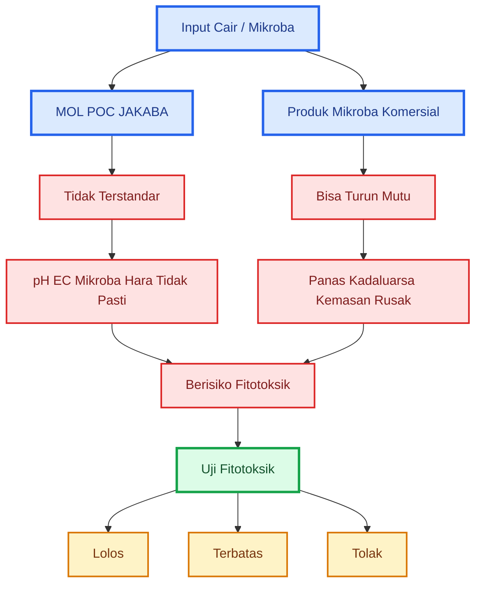

---

## 1.2 Tujuan Tulisan

Tulisan ini disusun sebagai rujukan praktis bagi petani, penyuluh, teknisi kebun, pelaku agribisnis, dan praktisi pertanian yang menggunakan input organik cair atau produk mikroba.

Tujuan utamanya adalah memberikan metode sederhana untuk menguji keamanan awal produk sebelum digunakan di lapangan.

Secara khusus, tulisan ini bertujuan untuk:

1. **Memberikan metode praktis untuk menguji keamanan MOL, POC, JAKABA, dan produk mikroba.**
   Praktisi tidak selalu memiliki akses ke laboratorium. Karena itu, diperlukan metode lapangan yang murah, cepat, dan mudah dilakukan.

2. **Membantu menentukan status produk: layak diuji lanjut, dibatasi, atau ditolak.**
   Tidak semua produk harus langsung dibuang. Tetapi tidak semua produk juga layak digunakan luas. Uji fitotoksik membantu membuat keputusan lebih rasional.

3. **Mengurangi risiko kerusakan tanaman akibat aplikasi produk yang tidak aman.**
   Kerusakan 1.000 m² cabai jauh lebih mahal daripada biaya uji sederhana dengan benih kacang hijau atau sawi.

4. **Menyusun SOP sederhana yang bisa diterapkan di tingkat petani, kebun, dan usaha agribisnis.**
   Uji fitotoksik harus bisa dilakukan berulang, dicatat, dan dibandingkan antarbatch.

5. **Meluruskan salah persepsi bahwa produk tidak berbau busuk pasti aman.**
   Aroma hanya indikator awal, bukan bukti teknis bahwa produk aman, stabil, atau bermanfaat.

6. **Membantu membangun disiplin kontrol mutu input hayati dan organik cair.**
   Dalam sistem pertanian modern, input murah tetap harus diuji agar tidak menjadi sumber risiko.

Prinsip utama tulisan ini:

```mdx id="prinsip-tulisan-uji-fitotoksik"
Lebih baik menolak 1 batch produk yang meragukan
daripada merusak 1 hamparan tanaman produksi.
```

---

# 2. Prinsip Dasar Uji Fitotoksik

Uji fitotoksik adalah uji keamanan awal terhadap tanaman. Uji ini digunakan untuk mengetahui apakah suatu produk cair, fermentasi, pupuk organik cair, atau produk mikroba berpotensi menghambat perkecambahan dan pertumbuhan akar.

Dalam praktik lapangan, uji ini sangat berguna karena akar muda dan benih yang baru tumbuh sangat sensitif terhadap bahan yang bermasalah. Jika suatu produk menghambat benih dan akar muda, maka produk tersebut patut dicurigai berisiko bagi tanaman utama.

Uji fitotoksik sebaiknya dipahami sebagai **saringan pertama**, bukan pembuktian akhir. Produk yang lolos uji fitotoksik belum tentu efektif meningkatkan hasil. Tetapi produk yang gagal uji fitotoksik jelas tidak layak digunakan pada tanaman utama.

---

## 2.1 Pengertian Uji Fitotoksik

Uji fitotoksik adalah pengujian untuk mengetahui apakah suatu bahan berpotensi menyebabkan efek toksik terhadap tanaman.

Efek toksik tersebut dapat berupa:

- benih tidak berkecambah,
- benih lambat berkecambah,
- akar pendek,
- akar cokelat,
- akar menghitam,
- akar membusuk,
- kecambah lemah,
- pertumbuhan terhambat,
- bibit layu,
- daun terbakar,
- media menjadi bau.

Dalam konteks MOL, POC, JAKABA, dan produk mikroba, uji fitotoksik digunakan untuk mengetahui apakah larutan tersebut aman pada dosis tertentu.

```mdx id="definisi-uji-fitotoksik"
Uji fitotoksik =
uji untuk melihat apakah suatu produk menghambat perkecambahan,
menekan pertumbuhan akar,
atau menyebabkan stres awal pada tanaman.
```

Uji ini sangat penting untuk produk yang tidak terstandar, terutama:

- produk fermentasi buatan sendiri,
- POC dari bahan campuran,
- MOL dari bahan lokal,
- JAKABA dari air cucian beras dan bahan tambahan,
- produk organik cair lama,
- produk mikroba yang penyimpanannya tidak jelas.

Namun, uji ini juga relevan untuk produk komersial bila produk tersebut:

- sudah lama disimpan,
- kemasan rusak,
- berbau tidak normal,
- terkena panas,
- terkena sinar matahari langsung,
- mendekati kedaluwarsa,
- akan diaplikasikan pada semai atau akar muda.

---

## 2.2 Apa yang Bisa dan Tidak Bisa Dibuktikan

Uji fitotoksik harus dibaca dengan benar. Uji ini tidak boleh diberi makna berlebihan.

Produk yang lolos uji fitotoksik **belum tentu** mengandung mikroba baik. Produk yang lolos juga **belum tentu** menjadi PGPM, pupuk hayati, agens hayati, atau pupuk lengkap.

Yang dibuktikan hanya: **pada dosis uji, produk tersebut relatif tidak menghambat benih dan akar muda dibanding kontrol**.

| Aspek                          | Bisa Dinilai | Tidak Bisa Dibuktikan |
| ------------------------------ | ------------ | --------------------- |
| Keamanan awal                  | Ya           |                       |
| Hambatan perkecambahan         | Ya           |                       |
| Pertumbuhan akar muda          | Ya           |                       |
| Gejala stres awal              | Ya           |                       |
| Kandungan mikroba baik         |              | Tidak                 |
| Jumlah CFU                     |              | Tidak                 |
| Identitas mikroba              |              | Tidak                 |
| Kandungan hara lengkap         |              | Tidak                 |
| Efektivitas hasil panen        |              | Tidak                 |
| Status PGPM/agens hayati       |              | Tidak                 |
| Kemampuan mengendalikan OPT    |              | Tidak                 |
| Stabilitas masa simpan panjang |              | Tidak                 |

Dengan kata lain:

```mdx id="makna-lolos-uji-fitotoksik"
Lolos uji fitotoksik
= relatif aman untuk uji lanjut

Bukan berarti:
= pasti efektif
= pasti mengandung mikroba baik
= pasti pupuk lengkap
= pasti PGPM
= pasti agens hayati
= pasti layak aplikasi luas
```

Sebaliknya, bila produk gagal uji fitotoksik, maka keputusan harus tegas:

```mdx id="makna-gagal-uji-fitotoksik"
Gagal uji fitotoksik
= jangan digunakan pada tanaman utama.
```

---

## 2.3 Prinsip Kontrol dan Perlakuan

Dasar uji fitotoksik adalah membandingkan pertumbuhan benih pada air bersih dengan pertumbuhan benih pada larutan produk yang diuji.

```mdx id="prinsip-kontrol-perlakuan"
Kontrol = benih + air bersih

Perlakuan = benih + larutan MOL/POC/JAKABA/produk mikroba

Jika perlakuan lebih buruk dari kontrol,
maka produk berpotensi fitotoksik.
```

Kontrol sangat penting. Tanpa kontrol, kita tidak tahu apakah benih gagal tumbuh karena produk yang diuji atau karena benihnya memang jelek.

Contoh sederhana:

| Kondisi                              | Interpretasi                                                             |
| ------------------------------------ | ------------------------------------------------------------------------ |
| Kontrol tumbuh baik, perlakuan buruk | produk diduga fitotoksik                                                 |
| Kontrol buruk, perlakuan buruk       | benih atau kondisi uji bermasalah                                        |
| Kontrol baik, perlakuan baik         | produk relatif aman untuk uji lanjut                                     |
| Kontrol baik, perlakuan lebih baik   | produk mungkin mendukung pertumbuhan awal, tetapi tetap perlu uji lanjut |

Uji fitotoksik yang baik minimal harus memiliki:

- kontrol air bersih,
- satu atau lebih perlakuan dosis,
- jumlah benih yang cukup,
- kondisi lembap yang sama,
- waktu pengamatan yang sama,
- catatan hasil yang jelas.

### Diagram 2.1. Prinsip Kontrol dan Perlakuan

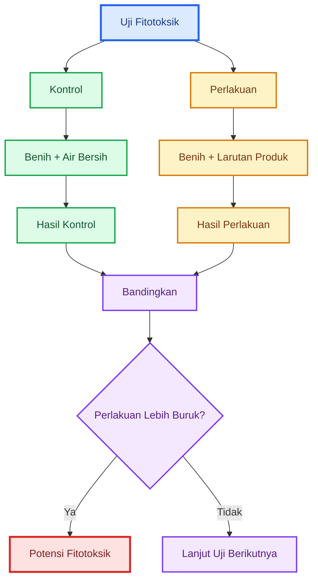

---

# 3. Produk yang Perlu Diuji

Tidak semua produk memiliki tingkat risiko yang sama. Produk yang paling perlu diuji adalah produk yang tidak terstandar, produk yang berbahan organik kompleks, produk yang sudah lama disimpan, produk yang kondisinya meragukan, atau produk yang akan diaplikasikan pada fase tanaman sensitif.

Secara praktis, produk yang perlu diuji dapat dibagi menjadi tiga kelompok:

1. produk tidak terstandar,
2. produk mikroba komersial,
3. produk yang harus lebih hati-hati.

---

## 3.1 Produk Tidak Terstandar

Produk tidak terstandar adalah produk yang dibuat tanpa kontrol laboratorium, tanpa data mikroba, tanpa data pH/EC yang konsisten, tanpa uji cemaran, dan tanpa standar antarbatch.

Kelompok ini meliputi MOL, POC, dan JAKABA buatan sendiri.

### MOL

MOL atau mikroorganisme lokal dibuat dari berbagai bahan lokal. Setiap bahan membawa mikroba, hara, gula, protein, senyawa organik, dan risiko kontaminasi yang berbeda.

Contoh MOL yang umum digunakan:

- MOL akar bambu,
- MOL bonggol pisang,
- MOL nasi,
- MOL buah,
- MOL sayuran,
- MOL air cucian beras,
- MOL urin ternak,
- MOL ikan,
- MOL limbah dapur,
- MOL campuran bahan lokal.

Risiko utama MOL adalah komposisi mikroba yang tidak diketahui. Produk dapat mengandung mikroba fermentatif, mikroba pengurai, khamir, bakteri asam laktat, bakteri lingkungan, atau kontaminan. Tanpa uji laboratorium, sulit memastikan mikroba mana yang dominan.

### POC

POC atau pupuk organik cair dibuat dari bahan organik yang difermentasi. Tujuannya biasanya sebagai tambahan hara organik cair, asam amino, mineral, atau senyawa hasil fermentasi.

Contoh POC yang perlu diuji:

- POC vegetatif,
- POC generatif,
- POC ikan,
- POC buah,
- POC hijauan,
- POC daun legum,
- POC urin,
- POC kotoran ternak,
- POC limbah dapur,
- POC campuran molase dan bahan organik.

Risiko utama POC adalah kandungan hara, pH, dan EC yang tidak pasti. POC dari bahan protein tinggi seperti ikan, terasi, urin, atau kotoran ternak lebih berisiko menghasilkan amonia, bau menyengat, atau larutan dengan EC tinggi.

### JAKABA

JAKABA sering dibuat dari air cucian beras, akar bambu, toge, terasi, penyedap, gula, atau bahan lokal lain. Dalam praktiknya, JAKABA diposisikan sebagai biostimulan atau pendukung rizosfer.

Namun, JAKABA bukan produk mikroba terstandar. Mikroba di dalamnya dapat berbeda antarbatch, tergantung bahan, air, wadah, suhu, lama fermentasi, dan sanitasi.

Contoh JAKABA yang perlu diuji:

- JAKABA air cucian beras,
- JAKABA dengan akar bambu,
- JAKABA dengan toge,
- JAKABA dengan terasi,
- JAKABA dengan starter lama,
- JAKABA dari formula campuran.

Catatan penting:

```mdx id="catatan-produk-tidak-terstandar"
MOL, POC, dan JAKABA tidak terstandar
tidak boleh langsung dianggap aman hanya karena tidak berbau busuk.

Setiap batch harus dianggap berbeda
dan perlu diuji sebelum aplikasi.
```

---

## 3.2 Produk Mikroba Komersial

Produk mikroba komersial umumnya lebih jelas dibanding produk buatan sendiri karena biasanya memiliki label, dosis, cara aplikasi, dan masa simpan. Namun, produk komersial tetap bisa menurun mutunya bila penanganannya buruk.

Produk mikroba komersial yang sebaiknya diuji sebelum aplikasi luas meliputi:

- PGPM/PGPR cair,
- produk _Bacillus_,
- produk _Pseudomonas_,
- produk _Trichoderma_ cair,
- dekomposer,
- kompos tea komersial,
- pupuk hayati cair,
- produk mikroba yang sudah lama disimpan,
- produk yang kemasannya rusak,
- produk yang terkena panas,
- produk yang mendekati kedaluwarsa,
- produk yang berbau tidak sesuai label,
- produk yang akan digunakan pada semai atau akar muda.

Produk komersial dapat bermasalah karena:

| Masalah             | Risiko                                |
| ------------------- | ------------------------------------- |
| Terkena panas       | mikroba mati atau turun viabilitasnya |
| Terkena matahari    | mikroba sensitif rusak                |
| Kemasan bocor       | kontaminasi                           |
| Kedaluwarsa         | populasi mikroba menurun              |
| Salah simpan        | produk berubah                        |
| Produk menggumpal   | distribusi mikroba tidak merata       |
| Berbau tidak normal | indikasi perubahan atau kontaminasi   |

Untuk produk mikroba komersial, uji fitotoksik tidak membuktikan mikroba masih hidup dalam jumlah cukup. Tetapi uji ini tetap berguna untuk melihat apakah produk aman terhadap tanaman pada dosis tertentu.

```mdx id="produk-komersial-tetap-diuji"
Produk komersial berlabel
lebih baik daripada produk tidak terstandar.

Namun:
jika kondisi produk meragukan,
tetap lakukan uji kecil sebelum aplikasi luas.
```

---

## 3.3 Produk yang Harus Lebih Hati-Hati

Beberapa produk memiliki risiko lebih tinggi dan harus diuji lebih ketat sebelum digunakan. Produk seperti ini tidak boleh langsung diaplikasikan pada semai, akar muda, tanaman stres, atau lahan produksi luas.

### Produk Berbahan Protein Tinggi

Produk berbahan protein tinggi lebih berisiko menghasilkan amonia, bau menyengat, atau senyawa hasil pembusukan bila fermentasi tidak stabil.

Contohnya:

- POC ikan,
- POC terasi,
- MOL ikan,
- fermentasi limbah daging,
- fermentasi limbah dapur tinggi protein,
- POC kotoran ternak,
- POC urin ternak.

Produk jenis ini wajib diuji karena berpotensi:

- menghasilkan amonia,
- meningkatkan EC,
- menyebabkan akar terbakar,
- menimbulkan bau tajam,
- menarik lalat,
- meningkatkan risiko kontaminasi.

### Produk dengan Bau Menyengat

Produk yang berbau menyengat tidak selalu otomatis gagal, tetapi harus dicurigai. Bau yang perlu diwaspadai:

- bau bangkai,
- bau telur busuk,
- bau amonia tajam,
- bau got,
- bau septic tank,
- bau busuk menyengat.

Jika bau seperti ini muncul, produk sebaiknya langsung ditolak untuk tanaman utama.

### Produk dengan Endapan atau Lendir Berlebihan

Endapan dan lendir berlebihan dapat menunjukkan produk tidak stabil. Selain berisiko bagi tanaman, produk seperti ini juga dapat menyumbat drip, nozzle, atau filter.

Risikonya:

- sumbatan irigasi,
- distribusi tidak merata,
- akar stres,
- media menjadi anaerob,
- mikroba tidak diinginkan berkembang.

### Produk untuk Fase Sensitif

Produk apa pun harus lebih hati-hati bila akan diaplikasikan pada:

- semai,
- bibit muda,
- pindah tanam,
- akar baru,
- tanaman stres,
- tanaman baru dipupuk pekat,
- tanaman setelah aplikasi pestisida,
- fase bunga,
- tanaman dalam polybag kecil.

Pada fase-fase ini, dosis harus rendah dan uji fitotoksik menjadi lebih penting.

### Tabel 3.1. Tingkat Kehati-Hatian Produk

| Produk                | Risiko        | Kewajiban Uji                      |
| --------------------- | ------------- | ---------------------------------- |
| MOL akar/bonggol/nasi | sedang        | uji aroma, pH, EC, fitotoksik      |
| POC hijauan/buah      | sedang        | uji pH, EC, fitotoksik             |
| POC ikan/terasi/urin  | tinggi        | wajib uji ketat                    |
| JAKABA lokal          | sedang-tinggi | wajib uji sebelum aplikasi luas    |
| PGPM komersial baru   | rendah-sedang | uji kecil bila untuk fase sensitif |
| Produk mikroba lama   | sedang-tinggi | wajib uji kecil                    |
| Produk kemasan rusak  | tinggi        | sebaiknya ditolak                  |
| Produk berbau busuk   | sangat tinggi | tolak                              |

### Diagram 3.1. Produk yang Perlu Diuji

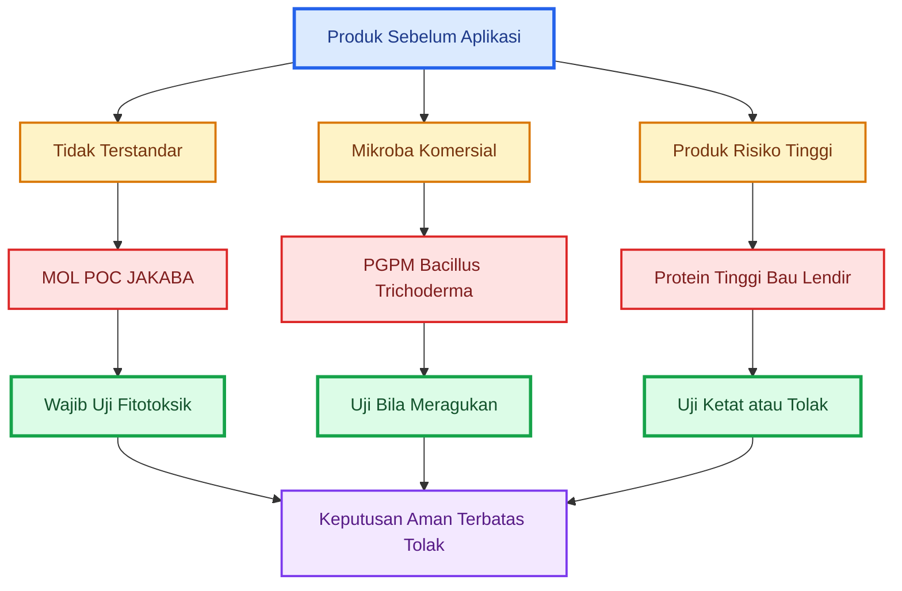

---

## Ringkasan Bab 1–3

Uji fitotoksik diperlukan karena MOL, POC, dan JAKABA umumnya tidak terstandar, sedangkan produk mikroba komersial pun dapat menurun mutunya bila penyimpanan buruk, kemasan rusak, atau sudah mendekati kedaluwarsa. Aroma tidak busuk bukan bukti bahwa produk aman. Produk tetap dapat berisiko karena pH ekstrem, EC tinggi, fermentasi belum stabil, metabolit fitotoksik, atau kontaminasi.

Uji fitotoksik adalah uji keamanan awal untuk melihat apakah produk menghambat perkecambahan, menekan pertumbuhan akar, atau menyebabkan stres tanaman. Uji ini dapat menilai keamanan awal, hambatan perkecambahan, dan pertumbuhan akar muda, tetapi tidak dapat membuktikan kandungan mikroba baik, jumlah CFU, kandungan hara lengkap, efektivitas hasil panen, atau status produk sebagai PGPM/agens hayati.

Produk yang perlu diuji meliputi MOL, POC, JAKABA, produk mikroba komersial yang kondisinya meragukan, serta produk berisiko tinggi seperti bahan protein tinggi, ikan, terasi, urin, kotoran ternak, produk berbau menyengat, atau produk dengan endapan/lendir berlebihan. Prinsip utama bagian ini adalah: **setiap produk yang tidak jelas mutunya harus diuji sebelum menyentuh tanaman utama**.

---

# 4. Screening Awal Sebelum Uji Fitotoksik

Screening awal adalah tahap penyaringan sebelum produk diuji dengan benih. Tujuannya sederhana: **membuang batch yang jelas-jelas berisiko** agar tidak membuang waktu pada produk yang sejak awal sudah tidak layak.

Screening awal tidak membuktikan bahwa produk aman. Screening hanya menjawab:

```mdx id="screening-pertanyaan-awal"
Apakah produk ini masih layak masuk tahap uji fitotoksik,
atau harus langsung ditolak?
```

Untuk MOL, POC, JAKABA, kompos tea, dan produk mikroba cair, screening awal minimal mencakup:

- aroma,
- warna,
- gas,
- lendir,
- belatung,
- endapan,
- pH,
- EC.

---

## 4.1 Pemeriksaan Aroma dan Visual

Aroma dan visual adalah pemeriksaan paling awal. Pemeriksaan ini murah, cepat, dan bisa dilakukan semua praktisi. Namun, hasilnya harus dibaca hati-hati.

Produk yang tidak berbau busuk **belum tentu aman**, tetapi produk yang berbau busuk, amonia tajam, telur busuk, atau bangkai sebaiknya langsung ditolak untuk tanaman utama.

| Parameter | Masih Layak Uji                     | Langsung Tolak                          |
| --------- | ----------------------------------- | --------------------------------------- |
| Aroma     | asam segar, tape, fermentasi ringan | bangkai, telur busuk, amonia tajam, got |
| Warna     | cokelat/kuning stabil               | hitam busuk, berubah ekstrem            |
| Gas       | mulai berkurang                     | menggembung terus                       |
| Lendir    | tidak berlebihan                    | lendir hitam/pekat                      |
| Belatung  | tidak ada                           | ada                                     |
| Endapan   | wajar                               | busuk, menggumpal, berlendir            |

### Cara Membaca Aroma

Aroma yang masih dapat diterima biasanya:

- asam segar,
- manis-asam,
- mirip tape,
- fermentasi ringan,
- sedikit alkohol/ragi.

Aroma yang harus dihindari:

- bau bangkai,
- bau telur busuk,
- bau got,
- bau amonia tajam,
- bau septic tank,
- bau busuk menyengat.

```mdx id="catatan-aroma-screening"
Aroma tidak busuk = hanya lolos screening awal.

Aroma busuk = tanda bahaya,
produk sebaiknya langsung ditolak.
```

### Cara Membaca Warna

Warna produk fermentasi dapat berbeda tergantung bahan. POC hijauan, POC buah, MOL nasi, JAKABA, dan POC ikan tidak harus memiliki warna yang sama.

Yang lebih penting adalah **stabilitas warna**.

Produk masih layak diuji jika:

- warna relatif stabil,
- tidak berubah ekstrem,
- tidak ada lapisan hitam busuk,
- tidak ada busa atau lendir berlebihan.

Produk perlu ditolak jika:

- berubah menjadi hitam busuk,
- muncul lapisan pekat berlendir,
- tampak seperti pembusukan aktif,
- ada jamur liar dominan berwarna hitam/hijau pekat,
- ada belatung.

### Cara Membaca Gas

Gas adalah bagian umum dari fermentasi. Namun, gas yang terus berlebihan menunjukkan produk belum stabil.

| Kondisi Gas                   | Interpretasi              |
| ----------------------------- | ------------------------- |
| Gas mulai berkurang           | lebih stabil              |
| Gas masih aktif tetapi ringan | hati-hati, simpan longgar |
| Wadah menggembung terus       | belum stabil              |
| Gas berbau busuk              | tolak                     |
| Gas disertai lendir/belatung  | tolak                     |

Produk yang masih aktif menghasilkan gas sebaiknya tidak langsung diaplikasikan ke tanaman utama. Produk tersebut masih berubah dan hasil uji bisa tidak mewakili kondisi saat aplikasi.

### Cara Membaca Lendir dan Endapan

Endapan pada POC, MOL, atau JAKABA masih bisa wajar jika berasal dari partikel bahan organik. Namun, endapan yang busuk, berlendir, menggumpal, atau berbau tajam harus dicurigai.

| Kondisi                           | Keputusan               |
| --------------------------------- | ----------------------- |
| Endapan tipis dan tidak bau       | masih layak uji         |
| Endapan banyak tetapi tidak busuk | saring, lalu uji lanjut |
| Lendir tipis                      | hati-hati               |
| Lendir pekat/hitam                | tolak                   |
| Endapan busuk                     | tolak                   |
| Belatung                          | tolak                   |

Untuk sistem drip, produk dengan endapan tinggi tetap bermasalah meskipun tidak fitotoksik, karena dapat menyumbat filter dan emitter.

### SOP Screening Aroma dan Visual

```mdx id="sop-screening-aroma-visual"
SOP screening aroma dan visual:

1. Buka wadah secara hati-hati.
2. Jangan langsung menghirup dekat lubang wadah.
3. Amati gas, warna, endapan, lendir, dan belatung.
4. Cium aroma dari jarak aman.
5. Catat kondisi produk.
6. Jika ada bau busuk, amonia tajam, belatung, atau lendir hitam:
   tolak batch.
7. Jika aroma dan visual masih wajar:
   lanjutkan ke uji pH dan EC.
```

### Diagram 4.1. Screening Aroma dan Visual

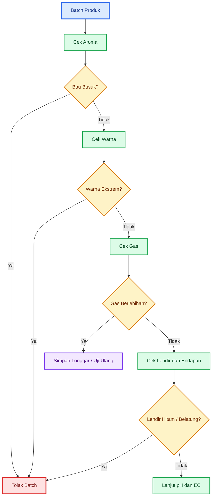

---

## 4.2 Pemeriksaan pH dan EC

Setelah produk lolos aroma dan visual, lanjutkan dengan pemeriksaan pH dan EC.

pH dan EC penting karena produk yang tampak normal masih dapat merusak akar jika terlalu asam, terlalu basa, atau terlalu pekat.

### Pengertian pH

pH menunjukkan tingkat keasaman atau kebasaan larutan.

- pH rendah = asam,
- pH tinggi = basa,
- pH ekstrem = berisiko bagi akar.

Pada produk fermentasi, pH biasanya cenderung asam. Namun, terlalu asam dapat mengganggu akar muda. Sebaliknya, produk berbahan protein, urin, atau kotoran ternak dapat berisiko menghasilkan kondisi basa/amonia bila proses tidak stabil.

### Pengertian EC

EC atau **Electrical Conductivity** menunjukkan tingkat kepekatan ion terlarut dalam larutan. Dalam praktik lapangan, EC sering dipakai sebagai indikator awal salinitas atau kepekatan larutan.

EC tinggi dapat menyebabkan akar stres osmotik. Gejalanya bisa seperti terbakar, layu, atau pertumbuhan terhenti.

Produk yang perlu lebih hati-hati dari sisi EC:

- POC ikan,
- POC urin,
- POC kotoran ternak,
- POC terasi,
- POC dengan banyak molase,
- produk fermentasi pekat,
- produk dengan endapan tinggi,
- produk lama yang mengental.

```mdx id="catatan-ph-ec"
Produk tidak bau busuk
tetap bisa berbahaya bila pH ekstrem atau EC tinggi.
```

### Urutan Screening Awal

```mdx id="urutan-screening-awal"
Urutan screening awal:

Aroma dan visual
→ pH
→ EC
→ uji fitotoksik
→ uji bibit tanaman target
```

### Cara Praktis Mengukur pH dan EC

```mdx id="cara-ukur-ph-ec"
Cara mengukur pH dan EC:

1. Saring produk terlebih dahulu.
2. Ambil sampel cairan.
3. Encerkan sesuai rencana uji, misalnya 1:100 atau 1:50.
4. Ukur pH larutan uji, bukan hanya larutan pekat.
5. Ukur EC larutan uji.
6. Catat hasil.
7. Bandingkan antarbatch.
```

Mengukur larutan pekat tetap berguna, tetapi yang lebih penting bagi tanaman adalah pH dan EC pada **dosis aplikasi**.

### Tabel Keputusan pH dan EC

| Kondisi                           | Keputusan                                        |
| --------------------------------- | ------------------------------------------------ |
| pH wajar, EC rendah-sedang        | lanjut uji fitotoksik                            |
| pH terlalu asam                   | encerkan atau tolak untuk tanaman muda           |
| pH terlalu basa                   | hati-hati, terutama produk berbahan protein/urin |
| EC tinggi                         | encerkan, jangan ke semai/akar muda              |
| EC sangat tinggi                  | tolak untuk tanaman utama                        |
| pH/EC berubah cepat selama simpan | batch tidak stabil, uji ulang                    |

Karena setiap tanaman memiliki toleransi berbeda, artikel ini tidak menetapkan satu angka universal untuk semua produk. Yang paling penting adalah: **ukur, catat, bandingkan, dan jangan gunakan produk ekstrem pada tanaman utama**.

### Catatan untuk Praktisi

Untuk petani atau kebun yang belum memiliki pH meter dan EC meter, minimal lakukan uji fitotoksik. Namun, untuk usaha cabai komersial atau aplikasi luas, pH meter dan EC meter sangat disarankan karena harganya jauh lebih murah dibanding kerusakan tanaman.

### Diagram 4.2. Screening pH dan EC

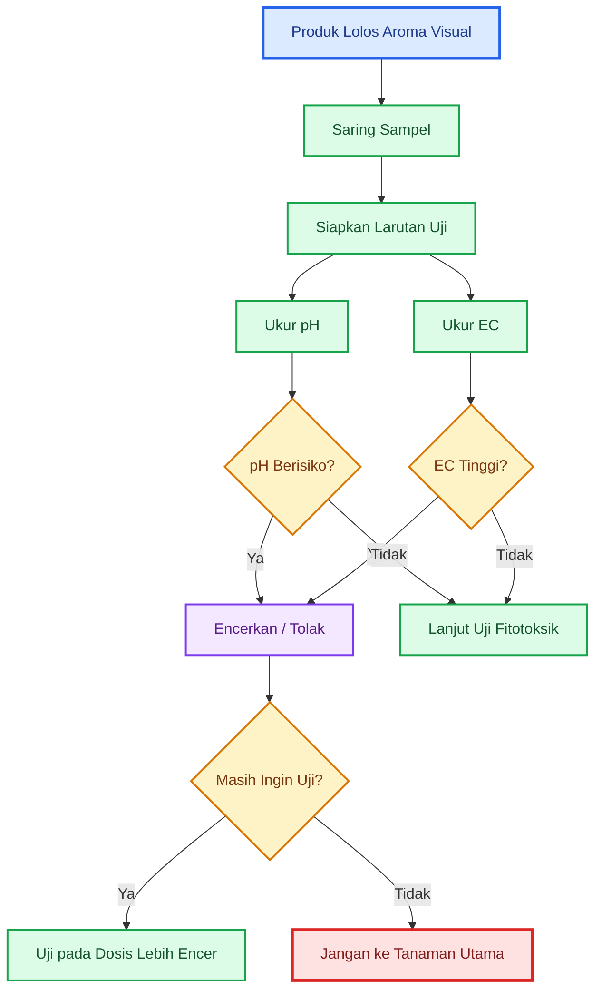

---

# 5. Metode Uji Fitotoksik Berbasis Benih

Setelah produk lolos screening awal, tahap berikutnya adalah uji fitotoksik berbasis benih. Uji ini digunakan untuk melihat apakah larutan produk menghambat perkecambahan dan pertumbuhan akar muda.

Benih dipilih karena murah, cepat tumbuh, dan sensitif terhadap bahan yang merugikan. Jika suatu produk bermasalah, gejalanya biasanya cepat terlihat pada akar kecambah.

---

## 5.1 Benih yang Disarankan

Benih yang digunakan sebaiknya memiliki kriteria:

- cepat berkecambah,
- mudah didapat,
- murah,
- pertumbuhan akar mudah diamati,
- cukup sensitif terhadap bahan fitotoksik,
- hasilnya mudah dibandingkan dengan kontrol.

| Benih        | Kelebihan                | Catatan                                |
| ------------ | ------------------------ | -------------------------------------- |
| Kacang hijau | cepat, murah, akar jelas | pilihan paling praktis                 |
| Sawi         | sensitif, cepat tumbuh   | baik untuk uji fitotoksik              |
| Kangkung     | mudah tumbuh             | cocok untuk lapangan                   |
| Mentimun     | akar besar dan jelas     | mudah diukur                           |
| Selada       | sensitif                 | baik jika tersedia                     |
| Cabai        | tanaman target           | lebih lambat, cocok untuk uji lanjutan |

### Rekomendasi Praktis

```mdx id="rekomendasi-benih-uji"
Uji cepat:
kacang hijau atau sawi

Uji lanjutan:
bibit cabai atau tanaman target lain
```

Kacang hijau paling praktis untuk petani karena dalam 2–3 hari akar sudah jelas terlihat. Sawi juga baik karena cukup sensitif. Cabai lebih relevan sebagai tanaman target, tetapi kurang cocok untuk uji cepat karena waktu berkecambah lebih lama.

### Jumlah Benih

Untuk screening sederhana, gunakan minimal 10 benih per perlakuan. Untuk hasil lebih baik, gunakan 20 benih per perlakuan. Jika memungkinkan, gunakan 3 ulangan.

| Tingkat Uji     |         Jumlah Benih |
| --------------- | -------------------: |
| Screening cepat |   10 benih/perlakuan |
| Uji lebih baik  |   20 benih/perlakuan |
| Uji lebih andal | 20 benih × 3 ulangan |

```mdx id="catatan-jumlah-benih"
Semakin sedikit benih,
semakin besar kemungkinan hasil dipengaruhi kebetulan.

Gunakan 20 benih per perlakuan bila memungkinkan.
```

---

## 5.2 Alat dan Bahan

Alat dan bahan yang digunakan sederhana dan mudah diperoleh.

### Alat

- wadah plastik kecil,
- cawan petri jika tersedia,
- piring kecil,
- tisu,
- kertas merang,
- kapas tipis,
- gelas ukur,
- pipet,
- sendok takar kecil,
- penggaris,
- label,
- spidol,
- buku catatan,
- pH meter bila tersedia,
- EC meter bila tersedia.

### Bahan

- benih uji,
- air bersih/non-kaporit,
- MOL/POC/JAKABA/produk mikroba yang diuji,
- alkohol atau sabun ringan untuk membersihkan alat,
- sarung tangan bila tersedia.

### Kebersihan Alat

Kebersihan alat penting agar hasil uji tidak bias. Wadah yang kotor dapat membuat benih busuk bukan karena produk yang diuji, tetapi karena kontaminasi dari wadah.

Jangan gunakan:

- wadah bekas pestisida,
- wadah bekas pupuk kimia pekat,
- wadah bekas oli,
- wadah bekas deterjen kuat,
- wadah berminyak,
- wadah berbau tajam.

Gunakan wadah bersih, bilas dengan air bersih, lalu keringkan sebelum digunakan.

```mdx id="catatan-kebersihan-uji"
Uji fitotoksik yang baik dimulai dari alat yang bersih.

Jika wadah kotor,
hasil uji bisa salah dibaca.
```

---

## 5.3 Perlakuan dan Pengenceran

Perlakuan adalah variasi larutan yang diberikan pada benih. Minimal ada satu kontrol dan dua dosis perlakuan.

### Perlakuan Minimal

| Perlakuan | Komposisi          |
| --------- | ------------------ |
| A         | Air bersih/kontrol |
| B         | Larutan 1:100      |
| C         | Larutan 1:50       |

Perlakuan 1:100 berarti 1 bagian produk dicampur dengan 100 bagian air. Perlakuan 1:50 berarti 1 bagian produk dicampur dengan 50 bagian air.

### Alternatif Lebih Aman untuk Produk Baru

Untuk produk yang baru pertama kali dibuat atau dicurigai pekat, gunakan pengenceran lebih aman.

| Perlakuan | Komposisi          |
| --------- | ------------------ |
| A         | Air bersih/kontrol |
| B         | 1:200              |
| C         | 1:100              |
| D         | 1:50               |

Produk yang bahkan pada 1:200 sudah menekan akar perlu dicurigai kuat sebagai fitotoksik.

### Konversi Praktis

| Rasio | Contoh                     |
| ----- | -------------------------- |
| 1:200 | 0,5 ml produk + 100 ml air |
| 1:100 | 1 ml produk + 100 ml air   |
| 1:50  | 2 ml produk + 100 ml air   |
| 1:25  | 4 ml produk + 100 ml air   |

### Rumus Pengenceran Sederhana

```mdx id="rumus-pengenceran-uji-fitotoksik"
Volume produk =
Volume air / Rasio pengenceran

Contoh:
Target larutan 1:100 dengan 100 ml air

Volume produk =
100 ml / 100
Volume produk =
1 ml

Jadi:
campurkan 1 ml produk dengan 100 ml air.
```

### Catatan untuk Produk Komersial

Untuk produk komersial, uji sebaiknya mengikuti dosis label dan setengah dosis label.

```mdx id="uji-produk-komersial"
Uji produk komersial:

Perlakuan A = air bersih
Perlakuan B = setengah dosis label
Perlakuan C = dosis label

Jika dosis label menghambat akar,
jangan langsung aplikasi luas.
```

### Catatan untuk Produk Tidak Terstandar

Untuk MOL, POC, dan JAKABA tidak terstandar, jangan mulai dari dosis tinggi. Gunakan dosis rendah terlebih dahulu.

```mdx id="uji-produk-tidak-standar"
Uji produk tidak terstandar:

Mulai dari:
1:200
→ 1:100
→ 1:50

Jangan langsung uji dosis pekat.
```

---

# 6. Prosedur Germination Index / GI

Germination Index atau GI adalah indeks yang menggabungkan dua data utama:

1. jumlah benih yang berkecambah,
2. panjang akar kecambah.

GI lebih baik daripada hanya menghitung jumlah benih tumbuh, karena suatu produk bisa saja tidak menghambat benih untuk berkecambah, tetapi tetap membuat akar menjadi pendek dan lemah.

Dalam uji fitotoksik, akar adalah indikator penting karena akar muda sangat sensitif terhadap larutan bermasalah.

---

## 6.1 Langkah Uji

Berikut prosedur praktis yang dapat dilakukan petani atau teknisi kebun.

```mdx id="prosedur-uji-fitotoksik-gi"
Prosedur uji fitotoksik:

1. Siapkan wadah sesuai jumlah perlakuan.
2. Beri label:

   - kontrol
   - 1:100
   - 1:50

3. Letakkan tisu/kertas merang dalam wadah.
4. Masukkan 10–20 benih per perlakuan.
5. Basahi dengan larutan sesuai perlakuan.
6. Jangan sampai tergenang.
7. Tutup wadah secara longgar.
8. Simpan di tempat teduh.
9. Inkubasi 48–72 jam.
10. Hitung jumlah benih berkecambah.
11. Ukur panjang akar rata-rata.
12. Hitung Germination Index.
```

### Penjelasan Langkah Penting

#### 1. Jangan Sampai Tergenang

Media harus lembap, bukan banjir. Jika benih tergenang, oksigen rendah dan benih bisa busuk. Hasil uji menjadi tidak valid.

#### 2. Simpan di Tempat Teduh

Jangan simpan di bawah sinar matahari langsung. Panas dapat mengeringkan media atau merusak benih.

#### 3. Gunakan Waktu yang Sama

Semua perlakuan harus diamati pada waktu yang sama, misalnya 48 jam atau 72 jam. Jangan membandingkan kontrol umur 72 jam dengan perlakuan umur 48 jam.

#### 4. Ukur Akar dengan Cara Sama

Gunakan akar utama. Jika akar sangat bercabang, ukur akar utama yang paling panjang. Catat bila akar tampak abnormal.

### Diagram 6.1. Prosedur GI

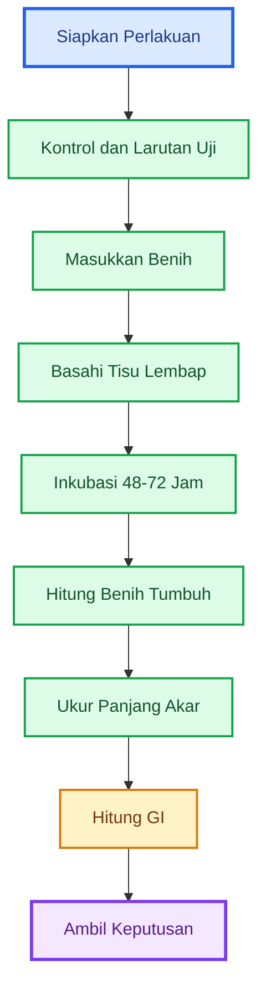

---

## 6.2 Parameter yang Diamati

Parameter utama yang diamati adalah jumlah benih berkecambah dan panjang akar. Parameter pendukung adalah warna akar, bentuk akar, bau media, lendir, dan jamur liar.

| Parameter                | Tujuan                            |
| ------------------------ | --------------------------------- |
| Jumlah benih berkecambah | melihat hambatan perkecambahan    |
| Panjang akar             | melihat hambatan pertumbuhan akar |
| Warna akar               | melihat stres atau kerusakan      |
| Bentuk akar              | melihat abnormalitas              |
| Bau media                | mendeteksi pembusukan             |
| Lendir/jamur liar        | mendeteksi kontaminasi            |

### Jumlah Benih Berkecambah

Benih dianggap berkecambah jika akar kecil atau radikula sudah muncul dengan jelas. Untuk konsistensi, gunakan standar yang sama untuk semua perlakuan.

Contoh:

```mdx id="standar-kecambah"
Benih dihitung berkecambah bila akar awal sudah keluar
dan terlihat jelas dari kulit benih.
```

### Panjang Akar

Panjang akar diukur dari pangkal akar sampai ujung akar. Gunakan penggaris kecil. Jika akar melengkung, ukur dengan pendekatan wajar dan konsisten.

### Warna Akar

Akar normal biasanya putih atau krem muda. Akar bermasalah dapat tampak:

- cokelat,
- hitam,
- transparan lembek,
- membusuk,
- pendek dan membengkak.

### Bentuk Akar

Akar sehat biasanya memanjang, relatif lurus, dan aktif. Akar bermasalah dapat tampak pendek, bengkok, keriting, patah, atau busuk.

### Bau Media

Media uji yang sehat biasanya netral atau sedikit asam ringan. Media yang berbau busuk menunjukkan proses pembusukan.

### Lendir dan Jamur Liar

Lendir dan jamur liar berlebihan menunjukkan kontaminasi atau produk tidak stabil. Jika tisu menjadi berlendir atau cokelat busuk, batch perlu dicurigai.

---

## 6.3 Tanda Fitotoksik

Tanda fitotoksik dapat terlihat dari benih, akar, media, dan keseragaman pertumbuhan.

Tanda-tanda yang perlu diwaspadai:

- benih tidak tumbuh,
- benih tumbuh lebih sedikit dibanding kontrol,
- akar jauh lebih pendek dari kontrol,
- akar cokelat atau hitam,
- akar membusuk,
- akar bengkok tidak normal,
- kecambah lemah,
- pertumbuhan tidak seragam,
- media berbau busuk,
- tisu berlendir,
- muncul jamur liar berlebihan,
- perlakuan jauh lebih buruk dari kontrol.

### Perbandingan Sederhana

| Kondisi                        | Interpretasi                     |
| ------------------------------ | -------------------------------- |
| Kontrol bagus, perlakuan bagus | lanjut hitung GI                 |
| Kontrol bagus, perlakuan buruk | produk berpotensi fitotoksik     |
| Kontrol buruk, perlakuan buruk | benih atau metode uji bermasalah |
| Kontrol buruk, perlakuan bagus | ulangi uji, hasil tidak normal   |

### Contoh Pembacaan Lapangan

```mdx id="contoh-pembacaan-tanda-fitotoksik"
Contoh:

Kontrol:
18 dari 20 benih tumbuh,
akar putih panjang.

Perlakuan:
10 dari 20 benih tumbuh,
akar pendek dan cokelat.

Kesimpulan awal:
produk berpotensi fitotoksik,
lanjut hitung GI untuk memperjelas keputusan.
```

### Diagram 6.2. Tanda Fitotoksik

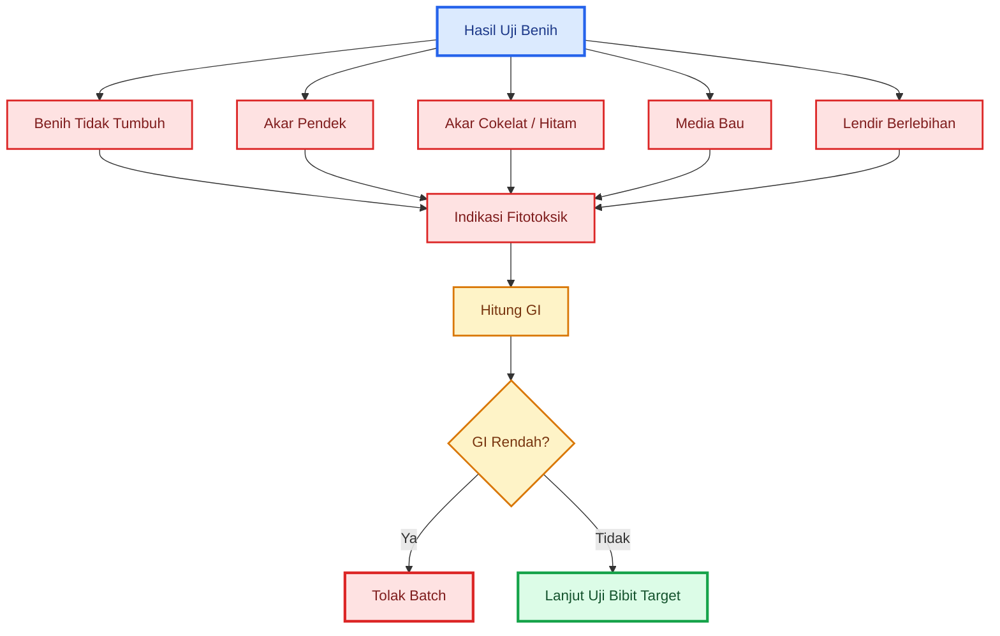

---

## Ringkasan Bab 4–6

Screening awal dilakukan sebelum uji fitotoksik untuk menolak batch yang jelas bermasalah. Pemeriksaan aroma dan visual mencakup aroma, warna, gas, lendir, belatung, dan endapan. Produk yang berbau bangkai, telur busuk, amonia tajam, mengandung belatung, atau berlendir hitam sebaiknya langsung ditolak. Produk yang lolos aroma dan visual belum tentu aman, sehingga perlu dilanjutkan ke uji pH dan EC.

pH menunjukkan tingkat keasaman atau kebasaan, sedangkan EC menunjukkan kepekatan larutan. Produk yang tidak berbau busuk tetap bisa berisiko bila pH ekstrem atau EC tinggi. Urutan screening yang disarankan adalah aroma dan visual, pH, EC, uji fitotoksik, lalu uji bibit tanaman target.

Uji fitotoksik berbasis benih menggunakan benih cepat tumbuh seperti kacang hijau atau sawi. Benih cabai lebih cocok untuk uji lanjutan karena pertumbuhannya lebih lambat. Perlakuan minimal terdiri dari kontrol air bersih, larutan 1:100, dan larutan 1:50. Untuk produk baru atau berisiko tinggi, pengenceran dapat dimulai dari 1:200.

Prosedur Germination Index dilakukan dengan meletakkan benih pada tisu lembap, memberi larutan sesuai perlakuan, menginkubasi 48–72 jam, menghitung jumlah benih berkecambah, mengukur panjang akar, lalu menghitung GI. Tanda fitotoksik meliputi benih tidak tumbuh, akar pendek, akar cokelat/hitam, akar busuk, kecambah lemah, media berbau, dan tisu berlendir. Produk yang menunjukkan gejala ini harus dicurigai dan tidak boleh langsung digunakan pada tanaman utama.

---

# 7. Rumus dan Contoh Perhitungan GI

Setelah uji benih dilakukan selama 48–72 jam, hasilnya tidak cukup hanya dilihat secara visual. Visual tetap penting, tetapi untuk keputusan yang lebih objektif, perlu dihitung **Germination Index** atau **GI**.

GI membantu menjawab:

```mdx id="tujuan-rumus-gi"
Apakah perlakuan produk membuat benih dan akar tumbuh mendekati kontrol,
atau justru menekan perkecambahan dan pertumbuhan akar?
```

Dalam uji fitotoksik, kontrol adalah pembanding utama. Kontrol menggunakan air bersih. Perlakuan menggunakan larutan MOL, POC, JAKABA, atau produk mikroba pada pengenceran tertentu.

---

## 7.1 Rumus Dasar

Rumus dasar GI adalah:

```mdx id="rumus-dasar-gi"
GI (%) =
(Persentase kecambah perlakuan / Persentase kecambah kontrol)
×
(Panjang akar perlakuan / Panjang akar kontrol)
× 100
```

Rumus ini menggabungkan dua komponen penting:

1. **jumlah benih yang berkecambah**,
2. **panjang akar rata-rata**.

Mengapa dua komponen ini harus digabung?

Karena produk bisa saja tidak menurunkan jumlah benih yang tumbuh, tetapi tetap membuat akar jauh lebih pendek. Dalam kondisi seperti ini, bila hanya menghitung jumlah benih berkecambah, produk terlihat aman. Padahal sebenarnya produk sudah menekan pertumbuhan akar.

Contoh sederhana:

| Kondisi                           | Makna                 |
| --------------------------------- | --------------------- |
| Benih tumbuh banyak, akar panjang | relatif aman          |
| Benih tumbuh banyak, akar pendek  | berisiko menekan akar |
| Benih tumbuh sedikit, akar pendek | fitotoksik kuat       |
| Benih tidak tumbuh                | batch ditolak         |

Jadi, akar menjadi indikator penting karena akar muda sangat sensitif terhadap produk yang terlalu asam, terlalu pekat, mengandung amonia, garam tinggi, atau metabolit fermentasi yang belum stabil.

---

## 7.2 Rumus Lengkap

Untuk menghitung GI dengan lebih rapi, gunakan tahapan berikut.

```mdx id="rumus-lengkap-germination-index"
Persentase kecambah =
Jumlah benih berkecambah / Total benih × 100

Relative Seed Germination / RSG =
Persentase kecambah perlakuan / Persentase kecambah kontrol × 100

Relative Root Growth / RRG =
Panjang akar rata-rata perlakuan / Panjang akar rata-rata kontrol × 100

Germination Index / GI =
RSG × RRG / 100
```

### Penjelasan Istilah

| Istilah             | Arti                                                 | Fungsi                                           |
| ------------------- | ---------------------------------------------------- | ------------------------------------------------ |
| Persentase kecambah | jumlah benih tumbuh dibanding total benih            | melihat hambatan perkecambahan                   |
| RSG                 | perbandingan kecambah perlakuan terhadap kontrol     | melihat seberapa jauh benih perlakuan tertinggal |
| RRG                 | perbandingan panjang akar perlakuan terhadap kontrol | melihat hambatan akar                            |
| GI                  | gabungan RSG dan RRG                                 | keputusan fitotoksik                             |

### Cara Mengukur Panjang Akar

Panjang akar dihitung dari akar utama, bukan total seluruh rambut akar.

```mdx id="cara-ukur-akar"
Cara mengukur panjang akar:

1. Pilih benih yang berkecambah.
2. Ukur akar utama dari pangkal sampai ujung akar.
3. Catat panjang setiap akar.
4. Hitung rata-ratanya.
5. Gunakan satuan yang sama, misalnya cm.
```

Contoh:

```mdx id="contoh-rata-rata-akar"
Panjang akar 5 kecambah:
3 cm, 4 cm, 4 cm, 5 cm, 4 cm

Rata-rata =
(3 + 4 + 4 + 5 + 4) / 5
Rata-rata =
20 / 5
Rata-rata =
4 cm
```

Untuk uji praktis, tidak harus mengukur semua akar bila jumlah benih banyak. Pilih akar yang mewakili, misalnya 10 kecambah normal per perlakuan. Namun, untuk pencatatan lebih baik, ukur semua kecambah yang tumbuh.

---

## 7.3 Contoh Perhitungan

Misalnya dilakukan uji fitotoksik POC pada pengenceran 1:100 menggunakan 20 benih kacang hijau.

| Parameter              | Kontrol | Perlakuan POC 1:100 |
| ---------------------- | ------: | ------------------: |
| Total benih            |      20 |                  20 |
| Benih berkecambah      |      18 |                  16 |
| Persentase kecambah    |     90% |                 80% |
| Panjang akar rata-rata |    4 cm |              2,5 cm |

### Langkah 1 — Hitung RSG

```mdx id="contoh-rsg"
RSG =
Persentase kecambah perlakuan / Persentase kecambah kontrol × 100

RSG =
80 / 90 × 100

RSG =
88,9%
```

Artinya, jumlah benih yang berkecambah pada perlakuan masih sekitar 88,9% dibanding kontrol.

### Langkah 2 — Hitung RRG

```mdx id="contoh-rrg"
RRG =
Panjang akar perlakuan / Panjang akar kontrol × 100

RRG =
2,5 / 4 × 100

RRG =
62,5%
```

Artinya, panjang akar perlakuan hanya 62,5% dibanding kontrol. Ini sudah menunjukkan adanya tekanan pada pertumbuhan akar.

### Langkah 3 — Hitung GI

```mdx id="contoh-gi"
GI =
RSG × RRG / 100

GI =
88,9 × 62,5 / 100

GI =
55,6%
```

### Interpretasi

```mdx id="interpretasi-contoh-gi"
GI = 55,6%

Artinya:
Produk berpotensi fitotoksik dan tidak layak digunakan pada tanaman utama.
```

Walaupun jumlah benih yang tumbuh masih cukup banyak, akar pada perlakuan jauh lebih pendek. Karena akar adalah indikator sensitif, produk ini tidak boleh langsung digunakan pada tanaman utama.

---

## 7.4 Contoh Perhitungan Kedua: Produk Relatif Aman

Misalnya produk PGPM cair diuji pada dosis label. Hasilnya sebagai berikut.

| Parameter              | Kontrol | Perlakuan PGPM |
| ---------------------- | ------: | -------------: |
| Total benih            |      20 |             20 |
| Benih berkecambah      |      19 |             18 |
| Persentase kecambah    |     95% |            90% |
| Panjang akar rata-rata |  4,2 cm |           4 cm |

```mdx id="contoh-gi-aman"
RSG =
90 / 95 × 100
RSG =
94,7%

RRG =
4 / 4,2 × 100
RRG =
95,2%

GI =
94,7 × 95,2 / 100
GI =
90,2%
```

Interpretasi:

```mdx id="interpretasi-gi-aman"
GI = 90,2%

Artinya:
Produk relatif aman untuk uji lanjut pada bibit tanaman target.

Catatan:
Lolos GI belum berarti produk pasti efektif,
tetapi produk tidak menunjukkan tekanan kuat pada benih dan akar.
```

---

## 7.5 Contoh Perhitungan Ketiga: Produk Sangat Berisiko

Misalnya JAKABA buatan sendiri diuji pada pengenceran 1:50.

| Parameter              | Kontrol | Perlakuan JAKABA 1:50 |
| ---------------------- | ------: | --------------------: |
| Total benih            |      20 |                    20 |
| Benih berkecambah      |      18 |                     8 |
| Persentase kecambah    |     90% |                   40% |
| Panjang akar rata-rata |    4 cm |                  1 cm |

```mdx id="contoh-gi-berisiko"
RSG =
40 / 90 × 100
RSG =
44,4%

RRG =
1 / 4 × 100
RRG =
25%

GI =
44,4 × 25 / 100
GI =
11,1%
```

Interpretasi:

```mdx id="interpretasi-gi-berisiko"
GI = 11,1%

Artinya:
Produk sangat fitotoksik pada pengenceran 1:50.
Batch harus ditolak untuk tanaman utama.
```

Produk seperti ini tidak cukup hanya diencerkan lalu langsung dipakai. Jika ingin diuji ulang, lakukan pada pengenceran lebih aman, misalnya 1:200. Namun, untuk tanaman utama, batch ini sebaiknya tidak digunakan.

---

## 7.6 Diagram Alur Perhitungan GI

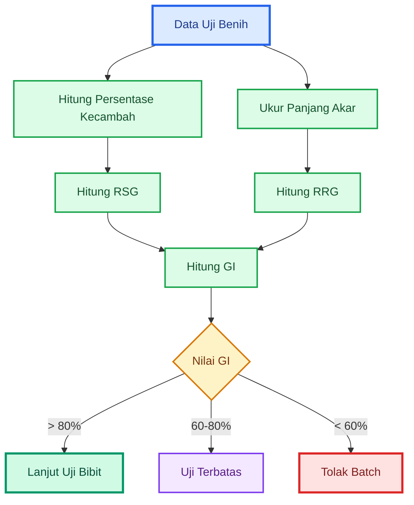

---

# 8. Interpretasi Hasil dan Keputusan

Setelah GI dihitung, langkah berikutnya adalah membuat keputusan. Bagian ini penting karena tujuan uji fitotoksik bukan sekadar menghasilkan angka, tetapi menentukan apakah produk:

1. bisa lanjut uji bibit,
2. hanya boleh diuji sangat terbatas,
3. harus ditolak.

Keputusan harus tegas, terutama untuk tanaman bernilai ekonomi tinggi. Produk yang meragukan tidak boleh dipaksakan ke tanaman utama hanya karena bahan pembuatannya murah atau sudah telanjur dibuat.

---

## 8.1 Tabel Keputusan

|               Hasil | Status          | Keputusan                               |
| ------------------: | --------------- | --------------------------------------- |
|            GI > 80% | relatif aman    | lanjut uji bibit tanaman target         |
|           GI 60–80% | meragukan       | uji sangat terbatas atau encerkan ulang |
|            GI < 60% | fitotoksik      | tolak batch                             |
| akar cokelat/pendek | berisiko        | tolak atau uji ulang                    |
|  benih tidak tumbuh | sangat berisiko | tolak                                   |
|  media busuk/lendir | tidak layak     | tolak                                   |

### GI > 80%

Nilai GI di atas 80% menunjukkan bahwa perlakuan tidak jauh lebih buruk daripada kontrol. Produk relatif aman untuk uji lanjut.

Namun, keputusan ini belum final. Produk tetap harus diuji pada bibit tanaman target, misalnya bibit cabai.

```mdx id="interpretasi-gi-diatas-80"
GI > 80%
= relatif aman untuk uji lanjut

Bukan:
= langsung aplikasi luas
```

### GI 60–80%

Nilai GI 60–80% menunjukkan hasil meragukan. Produk mungkin terlalu pekat, belum stabil, atau mengandung senyawa yang mulai menekan akar.

Keputusan yang disarankan:

- jangan gunakan pada tanaman utama,
- jangan gunakan pada semai,
- jangan gunakan pada tanaman stres,
- uji ulang dengan pengenceran lebih tinggi,
- gunakan sangat terbatas hanya jika benar-benar diperlukan.

```mdx id="interpretasi-gi-60-80"
GI 60–80%
= zona hati-hati

Tindakan:
encerkan ulang,
uji lagi,
atau batasi hanya pada percobaan kecil.
```

### GI < 60%

Nilai GI di bawah 60% menunjukkan produk berpotensi fitotoksik. Produk seperti ini tidak layak digunakan pada tanaman utama.

```mdx id="interpretasi-gi-dibawah-60"
GI < 60%
= fitotoksik

Keputusan:
tolak batch untuk tanaman utama.
```

---

## 8.2 Makna Lolos GI

Produk yang lolos GI sering disalahartikan sebagai produk yang bagus. Ini harus diluruskan.

```mdx id="makna-lolos-gi"
Lolos GI
= relatif aman untuk uji lanjut

Bukan berarti:

- terbukti efektif
- terbukti mengandung mikroba baik
- terbukti sebagai PGPM
- terbukti sebagai pupuk lengkap
- layak aplikasi luas
```

Lolos GI hanya berarti produk tidak menunjukkan hambatan kuat terhadap benih dan akar muda pada dosis yang diuji. Produk tetap belum terbukti sebagai:

- pupuk utama,
- PGPM,
- agens hayati,
- biopestisida,
- pembenah tanah,
- pemacu hasil panen.

Untuk membuktikan hal tersebut, diperlukan uji lain:

| Klaim                      | Uji yang Dibutuhkan              |
| -------------------------- | -------------------------------- |
| Mengandung mikroba hidup   | uji mikrobiologi/CFU             |
| Mengandung PGPM            | uji identitas dan fungsi mikroba |
| Mengandung hara            | uji laboratorium hara            |
| Aman dari cemaran          | uji cemaran mikroba/logam berat  |
| Efektif meningkatkan hasil | uji lapangan terkontrol          |
| Stabil disimpan            | uji stabilitas batch             |

Jadi, GI adalah **filter keamanan**, bukan bukti efektivitas.

---

## 8.3 Keputusan Berdasarkan Kombinasi GI dan Gejala Visual

Jangan hanya membaca angka GI. Tetap baca kondisi fisik kecambah.

Produk harus ditolak bila:

- GI rendah,
- akar cokelat,
- akar hitam,
- akar busuk,
- media berlendir,
- media berbau busuk,
- benih banyak yang mati,
- pertumbuhan sangat tidak seragam.

Ada kemungkinan GI terlihat sedang, tetapi akar tampak cokelat dan media berbau. Dalam kasus seperti ini, keputusan harus mengikuti prinsip kehati-hatian.

```mdx id="prinsip-keputusan-visual"
Jika angka GI meragukan
dan gejala visual buruk,
maka batch ditolak.
```

### Tabel Kombinasi Keputusan

|     GI | Gejala Visual            | Keputusan                   |
| -----: | ------------------------ | --------------------------- |
|  > 80% | akar putih, media normal | lanjut uji bibit            |
|  > 80% | media bau/lendir         | tolak atau uji ulang        |
| 60–80% | akar normal              | uji ulang dosis lebih encer |
| 60–80% | akar cokelat             | tolak                       |
|  < 60% | apa pun                  | tolak untuk tanaman utama   |

---

## 8.4 Diagram Keputusan Hasil GI

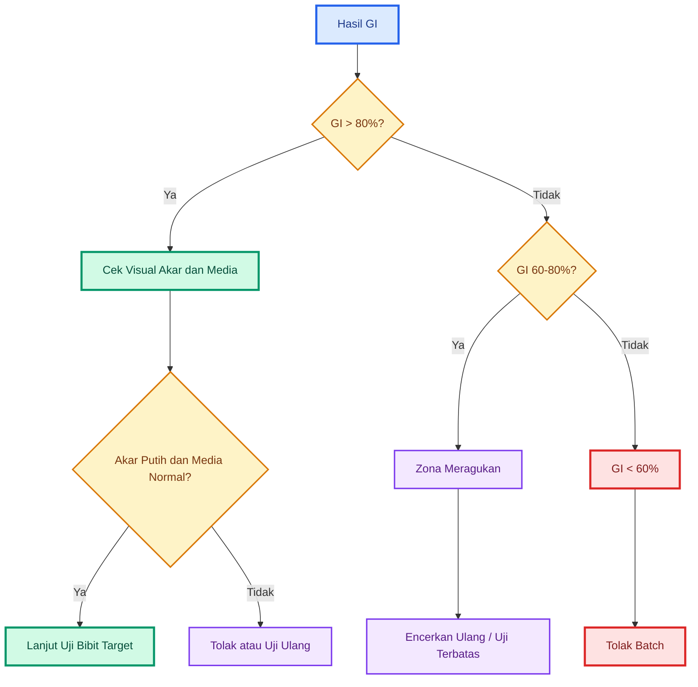

---

# 9. Uji Lanjutan pada Bibit Tanaman Target

Uji GI menggunakan benih cepat tumbuh seperti kacang hijau atau sawi. Ini sangat berguna untuk screening cepat. Namun, hasil pada kacang hijau atau sawi belum tentu sama dengan hasil pada cabai, tomat, melon, durian muda, atau tanaman target lain.

Karena itu, produk yang lolos GI sebaiknya dilanjutkan ke uji bibit tanaman target.

Untuk artikel ini, contoh yang digunakan adalah **bibit cabai**, karena cabai sensitif terhadap stres akar, pH ekstrem, EC tinggi, dan aplikasi produk fermentasi yang tidak stabil.

---

## 9.1 Mengapa Perlu Uji Lanjutan

Uji lanjutan diperlukan karena:

- hasil pada kacang hijau/sawi belum tentu sama dengan cabai,
- cabai bisa lebih sensitif,
- aplikasi lapangan biasanya menyentuh akar, media, dan daun,
- produk yang aman untuk benih cepat tumbuh belum tentu aman untuk bibit cabai,
- uji ini mengurangi risiko sebelum aplikasi luas.

Bibit cabai pada fase muda sangat rentan terhadap:

- akar terbakar,
- media terlalu asam,
- media terlalu pekat,
- daun layu,
- pucuk berhenti,
- stres transplanting,
- rebah semai,
- busuk akar.

Karena itu, produk yang akan digunakan pada cabai sebaiknya diuji pada bibit cabai sebelum masuk ke lahan utama.

```mdx id="alasan-uji-bibit-target"
GI lolos
→ lanjut uji bibit target

Karena:
benih uji cepat bukan tanaman utama.
```

---

## 9.2 Prosedur Uji Bibit Cabai

Uji bibit cabai dilakukan setelah produk lolos GI, terutama jika GI > 80% dan kondisi visual kecambah baik.

```mdx id="prosedur-uji-bibit-cabai"
Uji lanjutan bibit cabai:

1. Pilih 10 bibit cabai sehat.
2. Siapkan 10 bibit kontrol.
3. Gunakan dosis terendah yang lolos GI.
4. Kocor ringan pada media.
5. Jangan aplikasi berlebihan.
6. Amati 3–5 hari.

Catat:

- layu atau tidak,
- daun terbakar atau tidak,
- pucuk normal atau tidak,
- media bau atau tidak,
- pertumbuhan berhenti atau tidak.
```

### Persiapan Bibit

Gunakan bibit yang seragam agar hasil uji lebih mudah dibaca.

Bibit yang dipilih sebaiknya:

- sehat,
- tidak layu,
- tidak terserang penyakit,
- ukurannya seragam,
- media tidak terlalu basah,
- media tidak terlalu kering,
- memiliki daun normal,
- tidak baru saja diberi pestisida atau pupuk pekat.

Jangan menggunakan bibit yang sejak awal sudah lemah, karena hasil uji akan sulit dibaca.

### Kontrol Bibit

Kontrol tetap diperlukan. Kontrol diberi air bersih, bukan produk uji.

| Kelompok  | Perlakuan                                |
| --------- | ---------------------------------------- |
| Kontrol   | air bersih                               |
| Perlakuan | produk pada dosis terendah yang lolos GI |

Jika kontrol sehat tetapi bibit perlakuan layu, maka produk diduga bermasalah. Jika kontrol dan perlakuan sama-sama layu, kemungkinan ada faktor lain seperti cuaca, media, air, atau bibit yang tidak sehat.

### Cara Aplikasi

Aplikasi sebaiknya dilakukan dengan kocor ringan, bukan disiram berlebihan.

```mdx id="cara-aplikasi-uji-bibit"
Cara aplikasi:

1. Gunakan dosis terendah yang lolos GI.
2. Kocor ringan di media sekitar akar.
3. Jangan sampai media becek.
4. Jangan semprot daun dulu.
5. Amati 3–5 hari.
```

Untuk bibit cabai, jangan langsung menggunakan dosis tinggi meskipun GI bagus. Bibit muda tetap sensitif.

---

## 9.3 Keputusan Uji Bibit

| Gejala Bibit       | Keputusan          |
| ------------------ | ------------------ |
| Normal             | boleh uji terbatas |
| Layu               | tolak              |
| Daun terbakar      | tolak              |
| Media bau          | tolak              |
| Pucuk berhenti     | tolak/uji ulang    |
| Pertumbuhan normal | lanjut terbatas    |

### Gejala yang Harus Diamati

#### 1. Layu

Jika bibit perlakuan layu sementara kontrol tetap segar, produk berisiko. Layu dapat menunjukkan akar terganggu atau larutan terlalu pekat.

#### 2. Daun Terbakar

Daun terbakar dapat muncul sebagai:

- tepi daun cokelat,
- bercak kering,
- daun menggulung,
- pucuk mengering.

Ini bisa terjadi bila larutan terlalu pekat atau mengandung senyawa fitotoksik.

#### 3. Pucuk Berhenti

Pucuk yang berhenti tumbuh menunjukkan stres. Jika pucuk tidak berkembang selama 3–5 hari, produk perlu dicurigai.

#### 4. Media Bau

Media yang berubah bau setelah aplikasi menunjukkan produk dapat memicu kondisi tidak stabil di sekitar akar.

#### 5. Pertumbuhan Normal

Jika bibit perlakuan tetap normal dan tidak berbeda buruk dari kontrol, produk bisa lanjut ke uji terbatas di lapangan.

---

## 9.4 Status Setelah Lolos Uji Bibit

Produk yang lolos uji bibit tidak otomatis layak diaplikasikan luas. Statusnya adalah **layak terbatas sebagai pendukung**.

```mdx id="status-lolos-uji-bibit"
Lolos uji bibit
= layak uji terbatas di lapangan

Bukan:
= langsung aplikasi luas
= pengganti pupuk utama
= terbukti PGPM
= terbukti agens hayati
```

Tahap berikutnya adalah uji lapangan terbatas, misalnya pada:

- 5–10 tanaman pinggir,
- 1 bedengan kecil,
- 1 zona drip kecil,
- tanaman yang tidak sedang fase kritis.

### Contoh Keputusan Lapangan

| Hasil Uji Bibit         | Tindakan                         |
| ----------------------- | -------------------------------- |
| Bibit aman 3–5 hari     | uji terbatas di tanaman lapangan |
| Bibit sedikit stres     | encerkan ulang atau tunda        |
| Bibit layu              | tolak batch                      |
| Media bau               | tolak batch                      |
| Daun terbakar           | tolak batch                      |
| Kontrol juga bermasalah | ulangi uji dengan bibit sehat    |

---

## 9.5 Diagram Uji Lanjutan Bibit Target

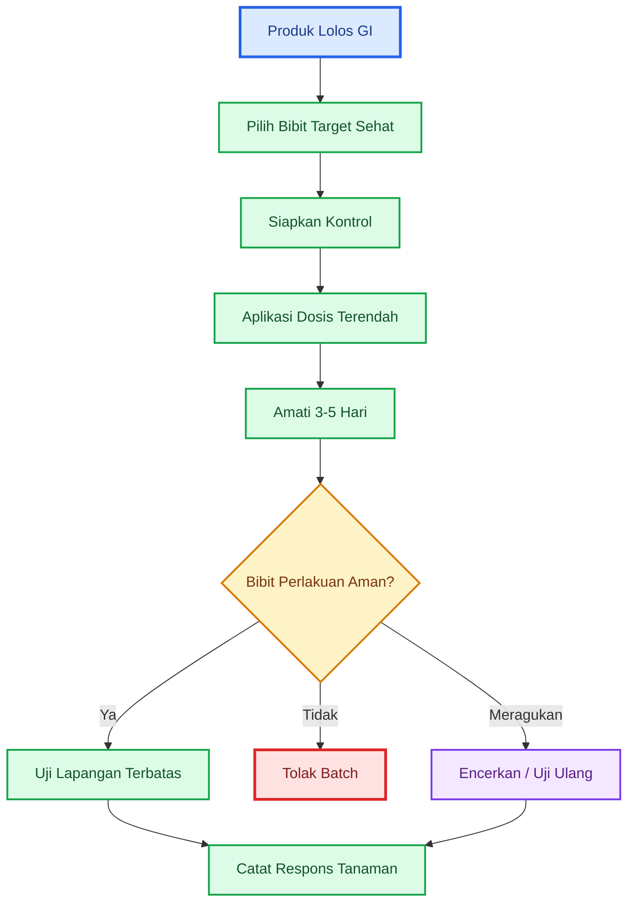

---

## Ringkasan Bab 7–9

Germination Index atau GI digunakan untuk menghitung tingkat keamanan awal produk berdasarkan dua komponen: persentase benih berkecambah dan panjang akar rata-rata. Rumus GI membantu membuat keputusan lebih objektif dibanding hanya melihat visual. Produk yang menghasilkan GI rendah berpotensi fitotoksik dan tidak layak digunakan pada tanaman utama.

Interpretasi praktisnya adalah: GI di atas 80% relatif aman untuk uji lanjut, GI 60–80% masuk zona meragukan, dan GI di bawah 60% menunjukkan produk berisiko fitotoksik. Namun, angka GI harus tetap dibaca bersama gejala visual seperti akar cokelat, akar pendek, media berbau, lendir, atau benih busuk.

Produk yang lolos GI belum tentu efektif, belum tentu mengandung mikroba baik, belum tentu PGPM, dan belum tentu pupuk lengkap. Lolos GI hanya berarti produk relatif aman untuk uji lanjut.

Tahap berikutnya adalah uji bibit tanaman target, misalnya bibit cabai. Bibit perlakuan dibandingkan dengan bibit kontrol selama 3–5 hari. Jika bibit perlakuan layu, daun terbakar, media bau, atau pucuk berhenti, batch harus ditolak. Jika bibit tetap normal, produk dapat diuji terbatas di lapangan, tetapi belum layak langsung diaplikasikan luas.

---

# 10. Penyimpanan Batch Selama Pengujian

Penyimpanan batch selama pengujian adalah bagian penting dalam uji fitotoksik. Banyak praktisi hanya fokus pada uji benih dan uji bibit, tetapi lupa bahwa produk yang sedang diuji juga terus berubah selama masa tunggu.

Untuk MOL, POC, dan JAKABA, perubahan ini sangat penting karena produk fermentasi tidak selalu stabil. Selama 5–8 hari masa pengujian, produk dapat berubah aroma, pH, EC, gas, warna, endapan, dan aktivitas fermentasinya.

Artinya, produk yang diuji pada hari pertama belum tentu sama kondisinya saat akan diaplikasikan beberapa hari kemudian.

```mdx id="prinsip-penyimpanan-batch"
Prinsip penyimpanan batch:

Produk yang diuji harus tetap dipantau selama masa uji.

Jika produk berubah negatif selama masa tunggu,
maka hasil uji awal tidak cukup mewakili kondisi produk saat aplikasi.
```

---

## 10.1 Masalah Waktu Uji

Uji fitotoksik tidak selesai dalam beberapa menit. Ada waktu tunggu yang harus diperhitungkan.

- Uji benih membutuhkan 48–72 jam.
- Uji bibit membutuhkan 3–5 hari.
- Total waktu uji dapat mencapai ±5–8 hari.
- Selama menunggu, MOL/POC/JAKABA dapat berubah.

Masalahnya, MOL, POC, dan JAKABA bukan larutan stabil seperti produk kimia standar. Produk ini masih dapat mengalami perubahan biologis dan kimia, terutama bila masih mengandung gula, bahan organik, protein, endapan, atau gas aktif.

### Risiko Perubahan Selama Masa Uji

| Perubahan             | Risiko                                 |
| --------------------- | -------------------------------------- |
| Aroma berubah busuk   | indikasi pembusukan atau kontaminasi   |
| Gas bertambah         | fermentasi belum stabil                |
| pH berubah tajam      | produk tidak stabil                    |
| EC meningkat          | larutan makin pekat/berisiko bagi akar |
| Lendir bertambah      | risiko kontaminasi dan sumbatan drip   |
| Endapan membusuk      | potensi fitotoksik                     |
| Belatung muncul       | batch tidak layak                      |
| Warna berubah ekstrem | indikasi proses tidak stabil           |

### Contoh Masalah Praktis

```mdx id="contoh-masalah-waktu-uji"
Hari 0:
POC disaring dan diuji pada benih.

Hari 3:
Benih menunjukkan hasil cukup baik.

Hari 5:
Batch utama mulai berbau amonia dan gas meningkat.

Kesimpulan:
Hasil uji benih hari ke-3 tidak lagi cukup mewakili batch utama.
Produk harus ditolak atau diuji ulang.
```

Karena itu, uji fitotoksik harus selalu disertai pemantauan batch utama.

---

## 10.2 Prosedur Simpan Sementara

Tujuan penyimpanan sementara adalah menjaga produk tetap sebersih dan sestabil mungkin selama proses uji berlangsung. Penyimpanan tidak membuat produk menjadi standar, tetapi dapat mengurangi risiko perubahan yang terlalu cepat.

### Prosedur Simpan Sementara

- Saring produk.
- Simpan dalam wadah bersih food grade.
- Jangan gunakan wadah logam.
- Jangan gunakan bekas pestisida/pupuk kimia.
- Simpan di tempat teduh dan sejuk.
- Jangan tutup rapat jika masih bergas.
- Beri label kode batch dan tanggal.
- Cek ulang sebelum aplikasi.

### Penjelasan Teknis

#### 1. Saring Produk

Produk perlu disaring untuk memisahkan padatan besar, ampas, dan bahan yang mudah membusuk. Penyaringan juga membantu mengurangi risiko sumbatan bila produk nanti digunakan lewat kocor atau sistem irigasi.

```mdx id="penyaringan-produk"
Penyaringan minimal:

Saringan kasar
→ kain bersih
→ saringan lebih halus bila akan masuk drip
```

Untuk aplikasi lewat drip, penyaringan harus jauh lebih ketat. Produk berlendir atau banyak endapan sebaiknya tidak dimasukkan ke sistem drip.

#### 2. Gunakan Wadah Bersih Food Grade

Wadah harus bersih dan tidak bereaksi dengan larutan. Gunakan:

- jerigen HDPE food grade,
- botol plastik tebal bersih,
- botol kaca tebal,
- galon bersih,
- wadah plastik bersih yang tidak bekas bahan kimia.

Jangan gunakan:

- wadah bekas pestisida,
- wadah bekas herbisida,
- wadah bekas pupuk pekat,
- wadah bekas oli,
- wadah logam,
- wadah yang masih berbau sabun atau bahan kimia.

#### 3. Jangan Tutup Rapat Jika Masih Bergas

Jika produk masih menghasilkan gas, jangan menutup wadah terlalu rapat. Tekanan gas dapat membuat wadah menggembung, bocor, atau pecah.

```mdx id="aturan-wadah-bergas"
Jika masih bergas:

- tutup longgar,
- buka gas harian,
- gunakan airlock sederhana,
- jangan jemur wadah,
- jangan simpan di tempat panas.
```

Jika gas terus aktif dan tidak menurun, produk belum stabil. Produk seperti ini tidak layak langsung diaplikasikan ke tanaman utama.

#### 4. Simpan di Tempat Teduh dan Sejuk

Panas mempercepat perubahan. Sinar matahari langsung dapat menurunkan mutu produk mikroba, mempercepat gas, dan mengubah kondisi larutan.

Tempat simpan yang disarankan:

- teduh,
- tidak terkena matahari langsung,
- tidak dekat gudang pestisida,
- tidak dekat pupuk kimia,
- tidak terkena hujan,
- aman dari serangga dan tikus,
- suhu relatif stabil.

#### 5. Gunakan Sistem Batch Kecil

Lebih aman menyimpan produk dalam beberapa wadah kecil daripada satu wadah besar yang sering dibuka-tutup.

```mdx id="sistem-batch-kecil"
Lebih aman:

5 botol × 1 liter

Daripada:

1 jerigen × 5 liter yang sering dibuka-tutup.
```

Keuntungan batch kecil:

- risiko kontaminasi lebih rendah,
- mudah diuji,
- mudah dibandingkan,
- jika rusak tidak semua produk terbuang,
- lebih mudah diberi label.

### Label Batch

Setiap batch harus diberi label. Label minimal memuat:

```mdx id="label-batch-produk"
Kode batch:
Jenis produk:
Tanggal produksi:
Tanggal matang/saring:
Bahan utama:
Tanggal mulai uji:
Tanggal rencana aplikasi:
Status uji:
```

Contoh:

```mdx id="contoh-label-batch"
Kode batch: POC-GEN-2026-001
Jenis produk: POC generatif
Bahan utama: kulit pisang + air kelapa + molase
Tanggal produksi: 1 Juni 2026
Tanggal saring: 21 Juni 2026
Tanggal uji: 22 Juni 2026
Status: menunggu hasil GI
```

---

## 10.3 Checklist Harian

Selama uji berlangsung, batch utama harus dicek setiap hari. Checklist harian membantu memastikan produk tidak berubah negatif selama masa tunggu.

```mdx id="checklist-harian-penyimpanan-batch"
Tanggal:
Kode batch:
Aroma:
pH:
EC:
Gas:
Warna:
Endapan:
Lendir:
Belatung:
Keputusan:
```

### Cara Mengisi Checklist

| Parameter | Yang Dicatat                            |
| --------- | --------------------------------------- |
| Aroma     | normal, asam segar, tape, amonia, busuk |
| pH        | angka pH bila tersedia                  |
| EC        | angka EC bila tersedia                  |
| Gas       | tidak ada, ringan, sedang, berlebihan   |
| Warna     | stabil atau berubah                     |
| Endapan   | normal, banyak, busuk, menggumpal       |
| Lendir    | tidak ada, ringan, pekat                |
| Belatung  | ada/tidak                               |
| Keputusan | lanjut uji, uji ulang, tolak            |

### Contoh Pengisian

```mdx id="contoh-checklist-penyimpanan"
Tanggal: 24 Juni 2026
Kode batch: JAKABA-2026-004
Aroma: asam ringan
pH: 4,8
EC: 1,2 mS/cm
Gas: ringan
Warna: cokelat muda stabil
Endapan: tipis
Lendir: tidak ada
Belatung: tidak ada
Keputusan: lanjut uji
```

Contoh batch bermasalah:

```mdx id="contoh-checklist-batch-bermasalah"
Tanggal: 25 Juni 2026
Kode batch: POC-IKAN-2026-002
Aroma: amonia tajam
pH: 8,5
EC: tinggi
Gas: masih kuat
Warna: makin gelap
Endapan: menggumpal
Lendir: ada
Belatung: tidak ada
Keputusan: tolak batch untuk tanaman utama
```

### Keputusan Selama Penyimpanan

Jika produk berubah negatif selama masa tunggu, hasil uji sebelumnya dianggap tidak cukup mewakili kondisi produk saat aplikasi.

```mdx id="keputusan-produk-berubah"
Jika produk berubah negatif selama masa uji:

- jangan aplikasi luas,
- ulangi screening,
- ulangi pH/EC,
- ulangi uji fitotoksik bila perlu,
- atau tolak batch.
```

### Diagram 10.1. Penyimpanan Batch Selama Pengujian

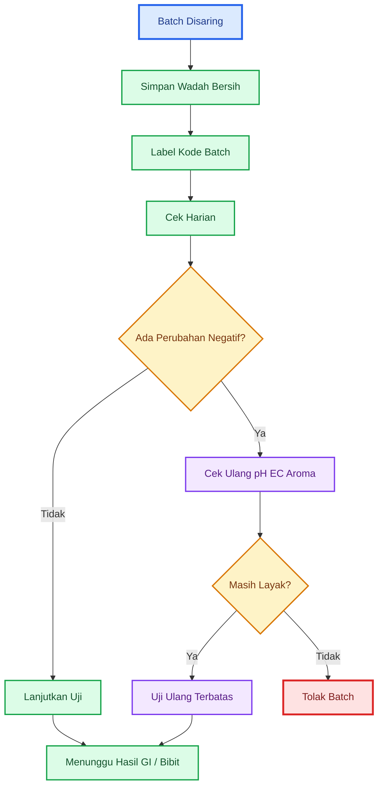

---

# 11. Alur Keputusan Praktis

Alur keputusan diperlukan agar hasil uji tidak ditafsirkan secara subjektif. Dalam praktik lapangan, banyak produk tetap dipakai karena “sayang dibuang”, “bahan sudah telanjur dibuat”, atau “di YouTube katanya bagus”. Padahal, jika hasil uji menunjukkan risiko, produk harus ditolak.

Prinsip utama alur keputusan:

```mdx id="prinsip-alur-keputusan"
Keputusan harus mengikuti hasil uji,
bukan mengikuti rasa sayang terhadap produk.
```

Produk murah bisa menjadi mahal jika merusak tanaman produksi.

---

## 11.1 Keputusan Akhir

```mdx id="keputusan-akhir-uji-fitotoksik"
Keputusan akhir:

1. Gagal aroma/visual:
   tolak batch.

2. pH/EC berisiko:
   jangan ke tanaman utama.

3. GI < 60%:
   tolak batch.

4. GI 60–80%:
   uji terbatas atau encerkan ulang.

5. GI > 80%:
   lanjut uji bibit tanaman target.

6. Bibit target stres:
   tolak batch.

7. Bibit target aman:
   layak terbatas sebagai pendukung.

8. Aplikasi luas:
   perlu uji laboratorium dan konsistensi batch.
```

### Penjelasan Keputusan

#### 1. Gagal Aroma/Visual

Jika produk berbau busuk, mengandung belatung, berlendir hitam, atau berubah ekstrem, batch langsung ditolak. Tidak perlu lanjut uji.

#### 2. pH/EC Berisiko

Jika pH ekstrem atau EC tinggi, produk tidak boleh masuk tanaman utama. Bisa diuji ulang dengan pengenceran lebih tinggi, tetapi untuk fase sensitif sebaiknya dihindari.

#### 3. GI < 60%

GI di bawah 60% menunjukkan produk berpotensi fitotoksik. Batch ditolak untuk tanaman utama.

#### 4. GI 60–80%

Ini zona meragukan. Produk tidak langsung ditolak total, tetapi tidak boleh dipakai luas. Pilihannya:

- encerkan ulang,
- uji ulang,
- gunakan sangat terbatas,
- jangan gunakan pada semai atau tanaman stres.

#### 5. GI > 80%

Produk dapat lanjut ke uji bibit tanaman target. Namun, belum boleh langsung masuk aplikasi luas.

#### 6. Bibit Target Stres

Jika bibit cabai atau tanaman target menunjukkan layu, daun terbakar, pucuk berhenti, atau media bau, batch ditolak.

#### 7. Bibit Target Aman

Jika bibit aman 3–5 hari, produk boleh diuji terbatas di lapangan.

#### 8. Aplikasi Luas

Untuk aplikasi luas, terutama pada tanaman komersial, uji fitotoksik saja belum cukup. Perlu uji laboratorium dan konsistensi antarbatch.

---

## 11.2 Status Penggunaan Produk

| Hasil Akhir              | Status         | Penggunaan                       |
| ------------------------ | -------------- | -------------------------------- |
| Gagal screening          | ditolak        | jangan digunakan                 |
| GI < 60%                 | ditolak        | jangan ke tanaman utama          |
| GI 60–80%                | meragukan      | uji ulang atau sangat terbatas   |
| GI > 80%                 | relatif aman   | lanjut uji bibit                 |
| Bibit aman               | layak terbatas | uji lapangan kecil               |
| Konsisten beberapa batch | lebih layak    | bisa masuk SOP internal          |
| Lolos uji lab            | lebih kuat     | layak dipertimbangkan lebih luas |

### Batasan Status “Layak Terbatas”

Layak terbatas berarti:

- bukan untuk semua tanaman,
- bukan untuk semua fase,
- bukan untuk aplikasi luas,
- bukan pengganti pupuk utama,
- bukan bukti sebagai PGPM,
- bukan bukti sebagai agens hayati.

```mdx id="makna-layak-terbatas"
Layak terbatas =
boleh diuji pada skala kecil
dengan dosis rendah
dan tetap dicatat respons tanaman.
```

---

## 11.3 Diagram Alur Keputusan

Diagram berikut dibuat vertikal agar lebih nyaman dibaca di layar HP.

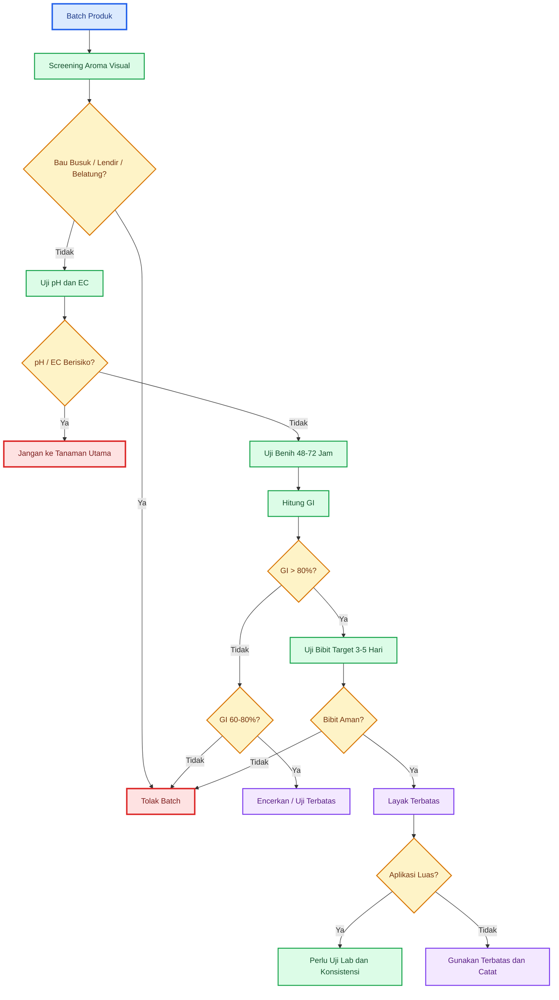

---

## 11.4 Keputusan Berdasarkan Tujuan Penggunaan

Keputusan juga harus mempertimbangkan tujuan aplikasi. Produk yang mungkin masih bisa diuji pada tanaman pinggir belum tentu layak untuk semai atau tanaman utama.

| Tujuan Aplikasi     | Syarat Minimal                      |
| ------------------- | ----------------------------------- |
| Aktivator kompos    | lolos aroma/visual, tidak busuk     |
| Uji tanaman pinggir | lolos pH/EC, GI, dan uji bibit      |
| Semai               | harus sangat aman, dosis rendah     |
| Pindah tanam        | harus lolos uji bibit               |
| Fase bunga/buah     | jangan gunakan produk meragukan     |
| Drip irrigation     | harus tersaring, tidak berlendir    |
| Aplikasi luas       | perlu uji lab dan konsistensi batch |

### Prinsip Kehati-hatian

```mdx id="prinsip-kehati-hatian-aplikasi"
Semakin sensitif fase tanaman,
semakin ketat syarat uji.

Semakin luas aplikasi,
semakin kuat data yang dibutuhkan.
```

---

# 12. Template Catatan Uji Fitotoksik

Pencatatan adalah bagian penting dari uji fitotoksik. Tanpa catatan, hasil uji sulit dibandingkan antarbatch. Petani juga sulit mengetahui formula mana yang aman, formula mana yang perlu dikurangi, dan formula mana yang harus dihentikan.

Template catatan sebaiknya sederhana, tetapi cukup lengkap untuk mengambil keputusan.

---

## 12.1 Identitas Batch

Identitas batch mencatat asal-usul produk yang diuji. Ini penting karena MOL, POC, dan JAKABA dapat berbeda antarbatch.

```mdx id="template-identitas-batch"
Kode batch:
Jenis produk:
Bahan utama:
Tanggal produksi:
Tanggal matang:
Tanggal uji:
Aroma:
pH:
EC:
Catatan fisik:
```

### Penjelasan Kolom

| Kolom            | Fungsi                                  |
| ---------------- | --------------------------------------- |
| Kode batch       | membedakan satu batch dengan batch lain |
| Jenis produk     | MOL, POC, JAKABA, PGPM, dekomposer      |
| Bahan utama      | sumber risiko dan pembanding            |
| Tanggal produksi | menghitung umur fermentasi              |
| Tanggal matang   | menghitung umur produk siap uji         |
| Tanggal uji      | melacak waktu pengujian                 |
| Aroma            | screening awal                          |
| pH               | risiko keasaman/basa                    |
| EC               | risiko kepekatan/salinitas              |
| Catatan fisik    | warna, gas, lendir, endapan             |

### Contoh Pengisian

```mdx id="contoh-identitas-batch"
Kode batch: POC-VEG-2026-003
Jenis produk: POC vegetatif
Bahan utama: daun legum + air kelapa + molase
Tanggal produksi: 1 Juni 2026
Tanggal matang: 18 Juni 2026
Tanggal uji: 19 Juni 2026
Aroma: asam segar
pH: 4,6
EC: 1,1 mS/cm
Catatan fisik: cokelat stabil, endapan tipis, tidak berlendir
```

---

## 12.2 Data Uji Benih

Data uji benih mencatat hasil kontrol dan perlakuan. Dari data ini, GI dapat dihitung.

```mdx id="template-data-uji-benih"
Jenis benih:
Jumlah benih kontrol:
Jumlah benih perlakuan:
Rasio pengenceran:
Jumlah berkecambah kontrol:
Jumlah berkecambah perlakuan:
Panjang akar rata-rata kontrol:
Panjang akar rata-rata perlakuan:
GI:
Keputusan:
```

### Penjelasan Kolom

| Kolom                        | Fungsi                                   |
| ---------------------------- | ---------------------------------------- |
| Jenis benih                  | kacang hijau, sawi, kangkung, dll.       |
| Jumlah benih kontrol         | dasar pembanding                         |
| Jumlah benih perlakuan       | jumlah benih pada larutan produk         |
| Rasio pengenceran            | 1:200, 1:100, 1:50, dll.                 |
| Jumlah berkecambah kontrol   | menghitung persentase kecambah kontrol   |
| Jumlah berkecambah perlakuan | menghitung persentase kecambah perlakuan |
| Panjang akar kontrol         | pembanding akar normal                   |
| Panjang akar perlakuan       | melihat tekanan terhadap akar            |
| GI                           | nilai keputusan                          |
| Keputusan                    | lanjut, terbatas, tolak                  |

### Contoh Pengisian Data Uji Benih

```mdx id="contoh-data-uji-benih"
Jenis benih: kacang hijau
Jumlah benih kontrol: 20
Jumlah benih perlakuan: 20
Rasio pengenceran: 1:100
Jumlah berkecambah kontrol: 18
Jumlah berkecambah perlakuan: 16
Panjang akar rata-rata kontrol: 4 cm
Panjang akar rata-rata perlakuan: 2,5 cm
GI: 55,6%
Keputusan: tolak batch untuk tanaman utama
```

### Template Tabel Uji Benih

| Parameter              | Kontrol | Perlakuan |
| ---------------------- | ------: | --------: |
| Jumlah benih           |         |           |
| Jumlah berkecambah     |         |           |
| Persentase kecambah    |         |           |
| Panjang akar rata-rata |         |           |
| RSG                    |         |           |
| RRG                    |         |           |
| GI                     |         |           |
| Keputusan              |         |           |

---

## 12.3 Data Uji Bibit Tanaman Target

Setelah GI lolos, produk diuji pada bibit tanaman target. Untuk cabai, uji dilakukan 3–5 hari.

```mdx id="template-data-uji-bibit-target"
Jenis tanaman:
Jumlah bibit kontrol:
Jumlah bibit perlakuan:
Dosis:
Cara aplikasi:
Hari pengamatan:
Gejala daun:
Gejala akar:
Media bau/tidak:
Keputusan:
```

### Penjelasan Kolom

| Kolom                  | Fungsi                            |
| ---------------------- | --------------------------------- |
| Jenis tanaman          | cabai, tomat, melon, durian, dll. |
| Jumlah bibit kontrol   | pembanding tanpa produk           |
| Jumlah bibit perlakuan | bibit yang diberi produk          |
| Dosis                  | dosis yang diuji                  |
| Cara aplikasi          | kocor, semprot, rendam akar       |
| Hari pengamatan        | hari ke-1 sampai hari ke-5        |
| Gejala daun            | layu, terbakar, normal            |
| Gejala akar            | normal, cokelat, busuk            |
| Media bau/tidak        | indikasi masalah di zona akar     |
| Keputusan              | lanjut, ulangi, tolak             |

### Contoh Pengisian Data Uji Bibit

```mdx id="contoh-data-uji-bibit"
Jenis tanaman: cabai rawit
Jumlah bibit kontrol: 10
Jumlah bibit perlakuan: 10
Dosis: 10 ml/L
Cara aplikasi: kocor ringan
Hari pengamatan: 5 hari
Gejala daun: normal
Gejala akar: tidak diamati langsung, tanaman tidak layu
Media bau/tidak: tidak bau
Keputusan: layak uji terbatas di lapangan
```

Contoh batch ditolak:

```mdx id="contoh-uji-bibit-ditolak"
Jenis tanaman: cabai besar
Jumlah bibit kontrol: 10
Jumlah bibit perlakuan: 10
Dosis: 20 ml/L
Cara aplikasi: kocor
Hari pengamatan: 3 hari
Gejala daun: 6 bibit layu, 3 daun terbakar
Gejala akar: sebagian cokelat
Media bau/tidak: media berbau asam menyengat
Keputusan: tolak batch
```

---

## 12.4 Format Rekap Keputusan Batch

Format rekap ini digunakan untuk memutuskan apakah batch boleh dilanjutkan atau tidak.

```mdx id="template-rekap-keputusan-batch"
Kode batch:
Jenis produk:
Lolos aroma/visual:
pH aman:
EC aman:
GI:
Uji bibit:
Status akhir:
Catatan:
```

### Contoh Rekap

```mdx id="contoh-rekap-keputusan-batch"
Kode batch: JAKABA-2026-007
Jenis produk: JAKABA air cucian beras
Lolos aroma/visual: ya
pH aman: ya
EC aman: ya
GI: 84%
Uji bibit: aman 5 hari
Status akhir: layak terbatas sebagai pendukung
Catatan: gunakan dosis rendah, jangan untuk semai, catat respons lapangan
```

Contoh rekap tolak:

```mdx id="contoh-rekap-tolak"
Kode batch: POC-IKAN-2026-002
Jenis produk: POC ikan
Lolos aroma/visual: tidak
pH aman: tidak
EC aman: tidak
GI: tidak diuji
Uji bibit: tidak diuji
Status akhir: tolak
Catatan: bau amonia tajam, gas kuat, endapan berlendir
```

---

## 12.5 Diagram Alur Pencatatan

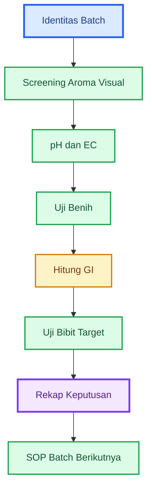

---

## Ringkasan Bab 10–12

Penyimpanan batch selama pengujian sangat penting karena MOL, POC, dan JAKABA dapat berubah selama masa uji. Uji benih membutuhkan 48–72 jam, sedangkan uji bibit tanaman target membutuhkan 3–5 hari. Total waktu uji dapat mencapai 5–8 hari. Selama masa ini, produk dapat berubah aroma, pH, EC, gas, warna, endapan, atau lendir. Jika produk berubah negatif, hasil uji awal tidak lagi cukup mewakili kondisi produk saat aplikasi.

Produk harus disaring, disimpan dalam wadah bersih food grade, tidak menggunakan wadah logam atau bekas bahan kimia, diletakkan di tempat teduh dan sejuk, tidak ditutup rapat bila masih bergas, serta diberi kode batch dan tanggal. Checklist harian perlu mencatat aroma, pH, EC, gas, warna, endapan, lendir, belatung, dan keputusan.

Alur keputusan praktis harus tegas. Produk yang gagal aroma/visual ditolak. Produk dengan pH/EC berisiko tidak boleh ke tanaman utama. GI di bawah 60% berarti batch ditolak, GI 60–80% berarti meragukan, sedangkan GI di atas 80% dapat lanjut uji bibit tanaman target. Jika bibit target stres, batch ditolak. Jika bibit aman, produk hanya layak terbatas sebagai pendukung.

Template catatan diperlukan agar hasil uji tidak hilang dan bisa dibandingkan antarbatch. Catatan minimal meliputi identitas batch, data uji benih, data uji bibit tanaman target, dan rekap keputusan akhir. Dengan pencatatan yang baik, praktisi dapat membangun SOP internal dan menghindari pengulangan kesalahan pada batch berikutnya.

---

# 13. Kesimpulan dan Rekomendasi Praktis

Uji fitotoksik adalah bagian penting dalam penggunaan MOL, POC, JAKABA, dan produk mikroba sebelum diaplikasikan ke tanaman. Dalam praktik pertanian, terutama pada tanaman bernilai ekonomi seperti cabai, tomat, melon, semangka, durian muda, atau hortikultura intensif lain, produk organik cair dan mikroba tidak boleh langsung dianggap aman hanya karena tidak berbau busuk atau terlihat normal.

MOL, POC, dan JAKABA umumnya tidak terstandar. Produk mikroba komersial pun tetap dapat menurun mutunya bila salah simpan, terkena panas, kemasan rusak, atau sudah mendekati kedaluwarsa. Karena itu, uji fitotoksik menjadi alat praktis untuk menyaring risiko sebelum produk menyentuh tanaman utama.

---

## 13.1 Kesimpulan Utama

Uji fitotoksik adalah **filter keamanan awal** sebelum aplikasi MOL, POC, JAKABA, dan produk mikroba. Uji ini tidak menggantikan laboratorium, tetapi sangat berguna untuk mencegah produk berisiko masuk ke tanaman utama.

Poin kesimpulan utama:

1. **Uji fitotoksik lebih kuat daripada hanya mengandalkan aroma atau warna.**
   Produk yang tidak berbau busuk belum tentu aman. Produk tetap bisa memiliki pH ekstrem, EC tinggi, fermentasi belum stabil, metabolit fitotoksik, atau cemaran yang tidak terlihat.

2. **Germination Index/GI menilai dua hal penting.**
   GI menggabungkan jumlah benih yang berkecambah dan panjang akar. Ini penting karena produk bisa saja tidak menghambat benih tumbuh, tetapi tetap membuat akar pendek, cokelat, atau lemah.

3. **Produk yang lolos uji fitotoksik belum tentu efektif.**
   Lolos GI hanya berarti produk relatif aman untuk uji lanjut. Bukan berarti produk terbukti sebagai PGPM, pupuk hayati, agens hayati, pupuk lengkap, atau peningkat hasil panen.

4. **Produk yang gagal uji tidak layak digunakan pada tanaman utama.**
   Produk dengan GI rendah, akar cokelat, akar pendek, media busuk, lendir, atau benih tidak tumbuh harus ditolak atau diuji ulang dengan pengenceran lebih aman.

5. **Produk yang lolos uji tetap harus diuji pada bibit tanaman target.**
   Kacang hijau atau sawi hanya berfungsi sebagai indikator cepat. Untuk cabai, tomat, melon, atau tanaman lain, uji lanjutan pada bibit tanaman target tetap diperlukan.

6. **Aplikasi luas membutuhkan data lebih kuat.**
   Untuk lahan komersial, uji fitotoksik harus dilengkapi uji pH, EC, cemaran mikroba, kandungan hara, dan konsistensi antarbatch.

```mdx id="kesimpulan-utama-uji-fitotoksik"
Kesimpulan utama:

Uji fitotoksik
= filter keamanan awal

Bukan:
= bukti efektivitas
= bukti kandungan mikroba baik
= bukti PGPM
= bukti pupuk lengkap
= izin aplikasi luas tanpa uji lanjut
```

---

## 13.2 Rekomendasi untuk Praktisi

Rekomendasi utama bagi praktisi adalah menggunakan uji fitotoksik sebagai bagian dari SOP sebelum aplikasi produk cair atau mikroba ke tanaman. Ini berlaku untuk produk buatan sendiri maupun produk komersial yang kondisinya meragukan.

```mdx id="urutan-aman-aplikasi-lapangan"
Urutan aman sebelum aplikasi lapangan:

Screening aroma/visual
→ uji pH dan EC
→ uji fitotoksik benih
→ uji bibit tanaman target
→ aplikasi terbatas
→ aplikasi lebih luas hanya jika konsisten
```

### Rekomendasi Operasional

| Tahap             | Tujuan                                | Keputusan                                 |
| ----------------- | ------------------------------------- | ----------------------------------------- |
| Aroma dan visual  | menolak produk yang jelas rusak       | tolak bila busuk, berlendir, ada belatung |
| pH dan EC         | membaca risiko keasaman dan salinitas | jangan gunakan bila ekstrem               |
| Uji benih         | melihat hambatan kecambah dan akar    | hitung GI                                 |
| Uji bibit target  | melihat respons tanaman utama         | lanjut bila bibit aman                    |
| Aplikasi terbatas | uji di lapangan kecil                 | catat respons                             |
| Aplikasi luas     | hanya bila konsisten                  | perlu data tambahan                       |

### Rekomendasi Berdasarkan Jenis Produk

| Produk                   | Rekomendasi                                       |
| ------------------------ | ------------------------------------------------- |
| MOL buatan sendiri       | wajib screening dan uji fitotoksik                |
| POC buatan sendiri       | wajib uji pH, EC, dan GI                          |
| JAKABA                   | wajib uji kecil, jangan langsung ke tanaman utama |
| Produk PGPM baru         | ikuti label, uji kecil bila untuk fase sensitif   |
| Produk mikroba lama      | uji fitotoksik sebelum aplikasi                   |
| Produk rusak/berbau aneh | tolak                                             |
| Produk untuk semai       | gunakan syarat paling ketat                       |
| Produk untuk drip        | wajib saring dan pastikan tidak berlendir         |

### Prinsip Praktis

```mdx id="prinsip-praktis-petani"
Untuk praktisi:

1. Jangan percaya aroma saja.
2. Jangan langsung aplikasi luas.
3. Uji dulu pada benih.
4. Lanjutkan pada bibit tanaman target.
5. Gunakan terbatas sebelum skala luas.
6. Catat setiap batch.
7. Tolak produk yang meragukan.
```

---

## 13.3 Penegasan Akhir

Untuk MOL, POC, dan JAKABA tidak terstandar, uji fitotoksik sebaiknya menjadi syarat minimal sebelum produk digunakan pada tanaman. Ketiganya tidak boleh diperlakukan seperti produk teknis yang memiliki standar mutu, dosis, kandungan, identitas mikroba, dan masa simpan yang jelas.

Untuk produk mikroba komersial, uji fitotoksik tetap berguna bila produk:

- sudah lama disimpan,
- mendekati kedaluwarsa,
- terkena panas,
- terkena sinar matahari langsung,
- kemasan rusak,
- berubah bau,
- berubah warna,
- akan digunakan pada semai,
- akan diaplikasikan ke akar muda,
- akan dipakai pada tanaman stres.

Untuk aplikasi luas dan bernilai ekonomi tinggi, uji fitotoksik harus dilengkapi dengan uji laboratorium, terutama:

- pH,
- EC,
- kandungan hara,
- cemaran mikroba,
- logam berat bila bahan baku berisiko,
- jumlah mikroba hidup/CFU bila diklaim sebagai produk mikroba,
- identitas mikroba bila diklaim sebagai PGPM atau agens hayati,
- konsistensi antarbatch.

Penegasan akhir artikel:

```mdx id="penegasan-akhir-uji-fitotoksik"
Produk yang lolos uji fitotoksik
boleh dilanjutkan ke uji terbatas.

Produk yang gagal uji fitotoksik
tidak layak digunakan pada tanaman utama.

Produk yang akan diaplikasikan luas
harus memiliki data lebih kuat daripada sekadar aroma, warna, dan testimoni.
```

Dalam sistem pertanian profesional, produk murah tetap harus diuji. Biaya uji sederhana jauh lebih kecil dibanding risiko kerusakan tanaman, gagal panen, atau kehilangan satu siklus produksi.

---

## Diagram 13.1. Ringkasan SOP Uji Fitotoksik untuk Praktisi

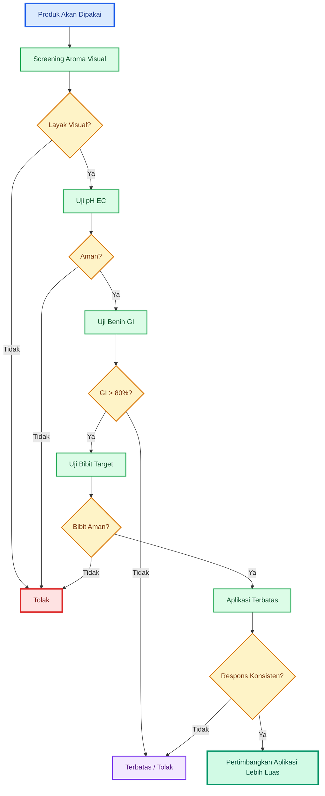

---

## Ringkasan Operasional

```mdx id="ringkasan-operasional-uji-fitotoksik"
SOP singkat:

1. Tolak produk busuk, berlendir, atau ada belatung.
2. Ukur pH dan EC bila alat tersedia.
3. Uji benih 48–72 jam.
4. Hitung GI.
5. GI > 80% lanjut uji bibit.
6. GI 60–80% hati-hati.
7. GI < 60% tolak.
8. Bibit target aman 3–5 hari = boleh uji terbatas.
9. Aplikasi luas perlu uji lab dan konsistensi batch.
```

---

<small>
  **_Catatan Penyusunan_** Artikel ini disusun sebagai materi edukasi dan
  referensi umum berdasarkan berbagai sumber pustaka, praktik lapangan, serta
  bantuan alat penulisan. Pembaca disarankan untuk melakukan verifikasi lanjutan
  dan penyesuaian sesuai dengan kondisi serta kebutuhan masing-masing sistem.
</small>
