# **_Air Lift Pump: Prinsip, Desain, dan Aplikasi dalam Akuakultur_**

---

## **Konsep Airlift Pump**

- [**_Air Lift Pump: Prinsip, Desain, dan Aplikasi dalam Akuakultur_**](#air-lift-pump-prinsip-desain-dan-aplikasi-dalam-akuakultur)
  - [**Konsep Airlift Pump**](#konsep-airlift-pump)
- [Kata Pengantar](#kata-pengantar)
- [1. Pendahuluan](#1-pendahuluan)
  - [1.1 Latar Belakang](#11-latar-belakang)
  - [1.2 Tujuan Artikel](#12-tujuan-artikel)
  - [1.3 Ruang Lingkup](#13-ruang-lingkup)
- [2. Terminologi dan Konfigurasi Dasar Airlift Pump](#2-terminologi-dan-konfigurasi-dasar-airlift-pump)
  - [2.1 Komponen Sistem](#21-komponen-sistem)
  - [2.2 Definisi Parameter Geometri](#22-definisi-parameter-geometri)
  - [2.3 Submergence Ratio](#23-submergence-ratio)
- [3. Prinsip Kerja Airlift Pump](#3-prinsip-kerja-airlift-pump)
  - [3.1 Perbedaan Densitas Kolom](#31-perbedaan-densitas-kolom)
  - [3.2 Tekanan Hidrostatik](#32-tekanan-hidrostatik)
  - [3.3 Ekspansi Udara Sepanjang Riser](#33-ekspansi-udara-sepanjang-riser)
  - [3.4 Konsep Void Fraction](#34-konsep-void-fraction)
- [4. Aliran Dua-Fase dan Rezim Aliran](#4-aliran-dua-fase-dan-rezim-aliran)
  - [4.1 Kecepatan Superfisial](#41-kecepatan-superfisial)
  - [4.2 Zona Rezim Aliran](#42-zona-rezim-aliran)
  - [4.3 Dampak Rezim terhadap Kinerja](#43-dampak-rezim-terhadap-kinerja)
  - [4.4 Target Rezim untuk Airlift Akuakultur](#44-target-rezim-untuk-airlift-akuakultur)
- [5. Model Dasar Performa Airlift](#5-model-dasar-performa-airlift)
  - [5.1 Neraca Tekanan Dua-Fase](#51-neraca-tekanan-dua-fase)
  - [5.2 Driving Pressure](#52-driving-pressure)
  - [5.3 Rugi Tekanan Sistem](#53-rugi-tekanan-sistem)
  - [5.4 Estimasi Void Fraction dengan Drift-Flux](#54-estimasi-void-fraction-dengan-drift-flux)
  - [5.5 Iterasi Debit Air](#55-iterasi-debit-air)
- [6. Desain Riser](#6-desain-riser)
  - [6.1 Pemilihan Diameter Riser](#61-pemilihan-diameter-riser)
  - [6.2 Panjang Vertikal dan Posisi Injeksi](#62-panjang-vertikal-dan-posisi-injeksi)
  - [6.3 Elbow dan Pipa Outlet](#63-elbow-dan-pipa-outlet)
  - [6.4 Intake Airlift](#64-intake-airlift)
- [7. Desain Diffuser dan Multi-Bore Injector](#7-desain-diffuser-dan-multi-bore-injector)
  - [7.1 Fungsi Diffuser](#71-fungsi-diffuser)
  - [7.2 Diameter Bore](#72-diameter-bore)
  - [7.3 Jumlah Bore](#73-jumlah-bore)
  - [7.4 Batas Geometri Diffuser](#74-batas-geometri-diffuser)
  - [7.5 Pressure Drop Diffuser](#75-pressure-drop-diffuser)
  - [7.6 Rekomendasi untuk Airlift Bioflok](#76-rekomendasi-untuk-airlift-bioflok)
- [8. Pemilihan Blower atau Kompresor](#8-pemilihan-blower-atau-kompresor)
  - [8.1 Tekanan Sistem yang Diperlukan](#81-tekanan-sistem-yang-diperlukan)
  - [8.2 Kebutuhan Debit Udara](#82-kebutuhan-debit-udara)
  - [8.3 Kurva Blower](#83-kurva-blower)
  - [8.4 Daya Pneumatik dan Daya Listrik](#84-daya-pneumatik-dan-daya-listrik)
- [9. Contoh Desain Airlift Pump](#9-contoh-desain-airlift-pump)
  - [9.1 Contoh A: Riser ID 22,4 mm](#91-contoh-a-riser-id-224-mm)
  - [9.2 Contoh B: Riser ID 37,4 mm](#92-contoh-b-riser-id-374-mm)
  - [9.3 Contoh C: Perbandingan Diameter Riser](#93-contoh-c-perbandingan-diameter-riser)
  - [9.4 Batas Validitas Contoh](#94-batas-validitas-contoh)
- [10. Aplikasi untuk Kolam Bioflok](#10-aplikasi-untuk-kolam-bioflok)
  - [10.1 Tujuan Penggunaan Airlift pada Bioflok](#101-tujuan-penggunaan-airlift-pada-bioflok)
  - [10.2 Penempatan Airlift](#102-penempatan-airlift)
  - [10.3 Posisi Outlet](#103-posisi-outlet)
  - [10.4 Pencegahan Endapan Bioflok](#104-pencegahan-endapan-bioflok)
- [11. Aplikasi untuk RAS dan Hidroponik](#11-aplikasi-untuk-ras-dan-hidroponik)
  - [11.1 RAS](#111-ras)
  - [11.2 Hidroponik dan Akuaponik](#112-hidroponik-dan-akuaponik)
  - [11.3 Batas Klaim Oksigenasi](#113-batas-klaim-oksigenasi)
- [12. Pengujian, Validasi, dan Kalibrasi](#12-pengujian-validasi-dan-kalibrasi)
  - [12.1 Pengukuran Debit Air](#121-pengukuran-debit-air)
  - [12.2 Pengukuran Debit Udara](#122-pengukuran-debit-udara)
  - [12.3 Pengukuran Tekanan](#123-pengukuran-tekanan)
  - [12.4 Observasi Rezim Aliran](#124-observasi-rezim-aliran)
  - [12.5 Kalibrasi Spreadsheet](#125-kalibrasi-spreadsheet)
- [13. Troubleshooting](#13-troubleshooting)
  - [13.1 Debit Air Rendah](#131-debit-air-rendah)
  - [13.2 Aliran Terlalu Pulsatif](#132-aliran-terlalu-pulsatif)
  - [13.3 Bioflok Mengendap](#133-bioflok-mengendap)
  - [13.4 Air Masuk ke Jalur Udara](#134-air-masuk-ke-jalur-udara)
- [14. Kesimpulan](#14-kesimpulan)
- [Lampiran](#lampiran)
  - [Lampiran A — Daftar Simbol](#lampiran-a--daftar-simbol)
  - [Lampiran B — Template Spreadsheet](#lampiran-b--template-spreadsheet)
  - [Lampiran C — Tabel Konversi Tekanan](#lampiran-c--tabel-konversi-tekanan)
  - [Lampiran D — Referensi Teknis](#lampiran-d--referensi-teknis)

---

# Air Lift Pump: Prinsip, Desain, dan Aplikasi dalam Akuakultur

## Kata Pengantar

Akuakultur modern memerlukan pengelolaan air yang stabil, terutama untuk menjaga oksigen terlarut, mengurangi akumulasi karbon dioksida, mencegah zona mati, dan menjaga padatan seperti bioflok tetap bergerak. Dalam sistem kolam, bioflok, _Recirculating Aquaculture System_ (RAS), maupun hidroponik, sirkulasi air bukan hanya berfungsi memindahkan air dari satu titik ke titik lain. Sirkulasi juga memengaruhi distribusi oksigen, suhu, nutrisi, partikel padat, dan kualitas lingkungan bagi ikan maupun tanaman.

Air lift pump menawarkan pendekatan yang sederhana untuk kebutuhan tersebut. Sistem ini menggunakan udara bertekanan yang diinjeksi ke dalam pipa vertikal. Campuran udara dan air di dalam pipa menjadi lebih ringan daripada air di luar pipa, sehingga air terdorong naik dan keluar melalui outlet. Dengan satu sistem, airlift dapat berperan sebagai perangkat sirkulasi, aerasi tambahan, dan degassing.

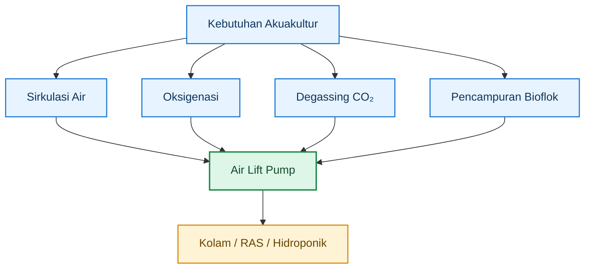
```mermaid
flowchart TD
    A["Kebutuhan Akuakultur"] --> B["Sirkulasi Air"]
    A --> C["Oksigenasi"]
    A --> D["Degassing CO₂"]
    A --> E["Pencampuran Bioflok"]

    B --> F["Air Lift Pump"]
    C --> F
    D --> F
    E --> F

    F --> G["Kolam / RAS / Hidroponik"]

    classDef need fill:#E7F3FF,stroke:#1976D2,color:#0D355C,stroke-width:1.5px;
    classDef pump fill:#DDF6E8,stroke:#218C4A,color:#124A27,stroke-width:2px;
    classDef output fill:#FFF3D6,stroke:#D88700,color:#6A4300,stroke-width:1.5px;

    class A,B,C,D,E need;
    class F pump;
    class G output;
```

Namun, airlift pump bukan perangkat yang dapat dirancang hanya dari diameter pipa atau kapasitas blower. Kinerja sistem ditentukan oleh kombinasi diameter riser, kedalaman injeksi, debit udara, rezim aliran dua-fase, desain diffuser, rugi tekanan pipa, bentuk elbow, dan posisi outlet.

Artikel ini membahas airlift pump sebagai perangkat _low-head circulation_, yaitu sistem pemindahan air dengan perbedaan elevasi relatif kecil. Fokusnya adalah aplikasi air–udara untuk kolam ikan, bioflok, RAS, akuaponik, dan hidroponik. Pembahasan tidak ditujukan untuk airlift industri bertekanan tinggi, pengangkatan slurry berat, atau sistem sumur dalam.

Seluruh hasil perhitungan dalam artikel ini harus diperlakukan sebagai dasar desain awal. Kinerja akhir tetap perlu divalidasi melalui pengukuran debit air, debit udara, tekanan sistem, dan observasi pola aliran aktual.

[**Kembali ke Atas**](#air-lift-pump-prinsip-desain-dan-aplikasi-dalam-akuakultur)

---

# 1. Pendahuluan

## 1.1 Latar Belakang

Pada kolam ikan dan sistem akuakultur, air yang diam atau bersirkulasi lemah dapat menimbulkan berbagai masalah. Oksigen terlarut dapat tidak merata, karbon dioksida dapat terakumulasi, padatan organik dapat terkumpul pada area tertentu, dan terbentuk zona mati di dasar atau sudut kolam. Pada sistem bioflok, kondisi tersebut dapat menyebabkan flok mengendap, mempercepat pembentukan lumpur, serta menciptakan kondisi lokal dengan kualitas air yang kurang baik.

Sirkulasi air diperlukan untuk membawa oksigen, nutrisi, panas, dan partikel tersuspensi ke seluruh volume kolam. Akan tetapi, debit total saja tidak cukup untuk menjamin kondisi kolam yang baik. Arah aliran, posisi discharge, kecepatan dekat dasar, serta pola sirkulasi tiga-dimensi juga menentukan apakah sistem mampu mencegah endapan dan zona mati.

Air lift pump menjadi menarik karena dapat menghasilkan sirkulasi dengan memanfaatkan udara bertekanan. Tidak seperti pompa sentrifugal, airlift tidak memiliki impeller atau motor yang bekerja langsung di dalam air. Udara diinjeksi pada bagian bawah riser, kemudian campuran air–udara naik menuju outlet akibat perbedaan densitas antara kolom air di luar pipa dan campuran dua-fase di dalam pipa.

Dalam aplikasi _low-head_, airlift dapat menjadi solusi yang sederhana dan tangguh. Sistem ini terutama sesuai ketika air hanya perlu dipindahkan pada elevasi rendah, misalnya dari dasar kolam ke permukaan, dari satu bak RAS ke bak berikutnya, atau dari kolam ikan menuju saluran akuaponik yang posisinya dekat dengan muka air.

Namun, airlift tidak selalu lebih unggul daripada pompa sentrifugal. Keunggulan airlift muncul terutama ketika sistem memang membutuhkan aerasi, sirkulasi, dan degassing secara bersamaan. Untuk head tinggi, perpipaan panjang, atau kebutuhan tekanan besar, pompa sentrifugal dapat lebih sesuai.

| Aspek                         | Air Lift Pump                                 | Pompa Sentrifugal                           |
| ----------------------------- | --------------------------------------------- | ------------------------------------------- |
| Sumber penggerak              | Udara bertekanan                              | Motor dan impeller                          |
| Head yang sesuai              | Rendah hingga sedang                          | Rendah hingga tinggi                        |
| Komponen bergerak dalam air   | Tidak ada                                     | Ada                                         |
| Aerasi dan degassing          | Dapat terjadi sebagai fungsi tambahan         | Biasanya memerlukan perangkat tambahan      |
| Sensitivitas terhadap kotoran | Relatif baik pada desain bore cukup besar     | Bergantung tipe impeller dan strainer       |
| Efisiensi                     | Sangat bergantung pada submergence dan blower | Sangat bergantung pada kurva pompa dan head |
| Aplikasi utama                | Bioflok, RAS low-head, degassing, mixing      | Transfer air, filtrasi, head lebih tinggi   |

Pada kolam bioflok, airlift dapat dipasang di beberapa titik dan diarahkan tangensial untuk membentuk arus melingkar. Tetapi pengaturan tersebut perlu diuji. Outlet yang terlalu dekat permukaan dapat menghasilkan arus permukaan yang kuat, sementara dasar kolam tetap lambat. Sebaliknya, outlet yang terlalu dalam dapat menambah tekanan balik dan menurunkan debit airlift.

Karena itu, desain airlift untuk akuakultur tidak cukup menggunakan aturan praktis seperti “semakin banyak udara semakin besar debit air” atau “gelembung semakin kecil selalu semakin baik.” Debit udara yang terlalu besar pada riser kecil dapat meningkatkan pulsasi, memperbesar rugi tekanan, dan mendorong sistem menuju rezim aliran yang tidak stabil.

Artikel ini menggunakan pendekatan aliran dua-fase untuk menjelaskan hubungan antara udara, air, diameter riser, diffuser, dan performa sistem.

## 1.2 Tujuan Artikel

Artikel ini bertujuan memberikan dasar praktis dan teknis untuk merancang airlift pump pada aplikasi akuakultur, terutama untuk kolam bioflok, RAS, akuaponik, dan hidroponik.

Secara khusus, artikel ini bertujuan untuk:

1. Menjelaskan prinsip kerja airlift pump sebagai sistem aliran dua-fase air–udara.

2. Menjelaskan pengaruh diameter riser, kedalaman injeksi, debit udara, dan posisi outlet terhadap performa airlift.

3. Memperkenalkan konsep rezim aliran, seperti _bubbly flow_, _slug flow_, _churn flow_, dan _annular flow_.

4. Menjelaskan penggunaan kecepatan superfisial gas dan cairan sebagai dasar evaluasi kondisi operasi.

5. Menyusun metode pemilihan diameter riser berdasarkan target debit air dan target rezim aliran.

6. Menjelaskan desain diffuser multi-bore berdasarkan debit udara, diameter bore, jumlah bore, tebal dinding diffuser, dan batas geometri.

7. Menjelaskan kebutuhan tekanan blower, termasuk tekanan hidrostatik, rugi diffuser, rugi pipa udara, manifold, valve, dan faktor keamanan.

8. Menyediakan dasar spreadsheet desain yang dapat digunakan untuk membandingkan beberapa ukuran riser dan konfigurasi diffuser.

9. Menjelaskan metode validasi melalui pengukuran debit air, tekanan udara, dan observasi pola gelembung.

Tujuan utama artikel ini bukan menghasilkan satu ukuran airlift yang berlaku untuk semua kondisi. Tujuan utamanya adalah menyediakan kerangka desain yang dapat disesuaikan dengan geometri kolam, target sirkulasi, jenis ikan, konsentrasi bioflok, dan kapasitas blower yang tersedia.

## 1.3 Ruang Lingkup

Pembahasan dalam artikel ini dibatasi pada sistem airlift dengan fluida air–udara. Air dianggap sebagai fluida cair utama, sedangkan udara dari blower atau kompresor digunakan sebagai gas pengangkat.

Konfigurasi utama yang dibahas adalah riser vertikal dengan udara diinjeksi pada bagian bawah pipa. Outlet berada dekat muka air atau sedikit di bawah muka air, sehingga sistem bekerja sebagai perangkat _low-head circulation_.

Topik utama yang termasuk dalam pembahasan adalah:

- airlift pump untuk kolam ikan dan kolam bioflok;
- airlift untuk sirkulasi dan pencampuran air;
- airlift untuk RAS dan degassing sederhana;
- airlift untuk akuaponik dan hidroponik;
- riser PVC atau HDPE;
- diffuser multi-bore dan short-orifice;
- blower tekanan rendah;
- elbow dan pipa horizontal pendek pada outlet;
- pengukuran debit air dan tekanan sistem.

Topik berikut tidak dibahas secara rinci:

- airlift industri dengan tekanan tinggi;
- pengangkatan lumpur padat, pasir, atau slurry abrasif;
- desain sumur dalam;
- transportasi fluida minyak–gas;
- desain kompresor industri multi-stage;
- simulasi CFD tiga-dimensi secara penuh;
- desain transfer oksigen berdasarkan nilai _oxygen transfer rate_ spesifik.

Dengan batasan tersebut, artikel ini diarahkan untuk sistem yang sederhana, dapat dibuat dengan material lokal, mudah diuji, dan dapat dikembangkan secara bertahap berdasarkan data lapangan.

[**Kembali ke Atas**](#air-lift-pump-prinsip-desain-dan-aplikasi-dalam-akuakultur)

---

# 2. Terminologi dan Konfigurasi Dasar Airlift Pump# 2. Terminologi dan Konfigurasi Dasar Airlift Pump

Sebelum menghitung kapasitas airlift pump, setiap komponen dan parameter geometri harus didefinisikan dengan konsisten. Kesalahan paling umum adalah menyamakan panjang total pipa dengan tinggi angkat, atau memakai diameter nominal pipa sebagai diameter aliran. Dalam desain, yang digunakan adalah **diameter dalam aktual** dan elevasi aktual setiap titik sistem.

## 2.1 Komponen Sistem

Konfigurasi dasar airlift pump terdiri dari jalur udara, bagian injeksi, riser, dan outlet air.

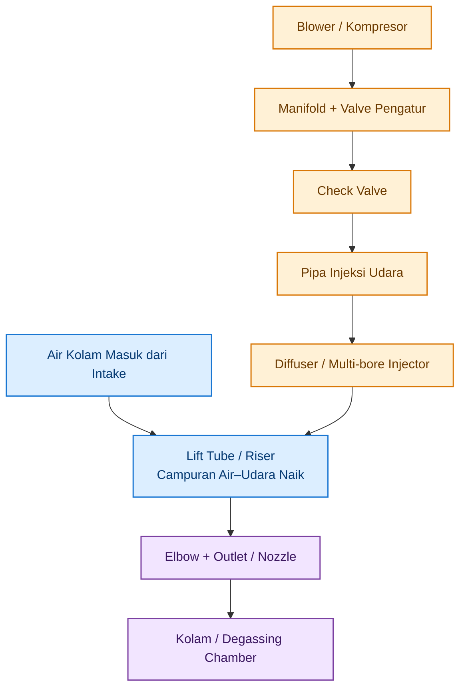
```mermaid
flowchart TB
    A["Blower / Kompresor"] --> B["Manifold + Valve Pengatur"]
    B --> C["Check Valve"]
    C --> D["Pipa Injeksi Udara"]
    D --> E["Diffuser / Multi-bore Injector"]

    I["Air Kolam Masuk dari Intake"] --> F["Lift Tube / Riser<br/>Campuran Air–Udara Naik"]
    E --> F
    F --> G["Elbow + Outlet / Nozzle"]
    G --> H["Kolam / Degassing Chamber"]

    classDef air fill:#FFF1D6,stroke:#D97706,color:#6B3A00,stroke-width:1.5px;
    classDef water fill:#DCEEFF,stroke:#1976D2,color:#073B73,stroke-width:1.5px;
    classDef component fill:#DCF5E5,stroke:#218C4A,color:#0E4A27,stroke-width:1.5px;
    classDef outlet fill:#F2E5FF,stroke:#7B3FA1,color:#3B1760,stroke-width:1.5px;

    class A,B,C,D,E air;
    class F,I water;
    class G,H outlet;
```

| Komponen                           | Fungsi utama                                                      | Catatan desain                                                                    |
| ---------------------------------- | ----------------------------------------------------------------- | --------------------------------------------------------------------------------- |
| **Lift tube / riser**              | Jalur naik campuran air–udara.                                    | Diameter dalam riser menentukan kecepatan superfisial gas dan cairan.             |
| **Pipa injeksi udara**             | Menyalurkan udara dari blower ke diffuser.                        | Harus cukup besar agar rugi tekanan udara rendah.                                 |
| **Diffuser / multi-bore injector** | Mengubah aliran udara menjadi beberapa jet atau gelembung awal.   | Jumlah dan diameter bore memengaruhi pressure drop dan distribusi udara.          |
| **Blower atau kompresor**          | Menyediakan debit udara pada tekanan kerja.                       | Dipilih dari kurva tekanan–debit, bukan hanya dari daya listrik.                  |
| **Manifold dan valve**             | Membagi serta mengatur debit udara ke beberapa riser.             | Setiap riser idealnya memiliki valve pengatur sendiri.                            |
| **Check valve**                    | Mencegah air masuk kembali ke jalur udara ketika blower berhenti. | Dipasang pada jalur udara, terutama bila manifold berada di bawah muka air.       |
| **Elbow**                          | Mengubah arah aliran dari vertikal ke horizontal.                 | Elbow tajam dapat meningkatkan pulsasi dan rugi tekanan.                          |
| **Outlet / nozzle discharge**      | Mengarahkan aliran air kembali ke kolam atau tangki.              | Posisi dan arah outlet menentukan pola sirkulasi kolam.                           |
| **Degassing chamber**              | Memisahkan gas dari air sebelum discharge akhir.                  | Berguna bila outlet airlift membawa banyak gelembung dan aliran terlalu pulsatif. |

### Lift tube atau riser

Riser adalah bagian utama airlift. Campuran air–udara bergerak ke atas di dalam pipa ini karena densitas campuran lebih rendah daripada densitas air di luar pipa.

Luas penampang aliran riser dihitung dari diameter dalam:

$$
A=\frac{\pi D^2}{4}
$$

dengan:

- $A$ = luas penampang riser, m²
- $D$ = diameter dalam riser, m

Diameter luar pipa tidak digunakan untuk menghitung kecepatan aliran.

### Pipa injeksi udara

Pipa injeksi menghubungkan blower dengan diffuser. Walaupun ukurannya lebih kecil daripada riser, pipa ini harus tetap diperiksa karena selang terlalu kecil, terlalu panjang, atau banyak sambungan dapat meningkatkan rugi tekanan udara.

Pada sistem dengan beberapa airlift, pipa utama udara terhubung ke manifold. Dari manifold, udara dibagi menuju tiap riser melalui cabang yang memiliki valve pengatur.

### Diffuser atau multi-bore injector

Diffuser berada dekat titik injeksi pada bagian bawah riser. Untuk desain sederhana, diffuser dapat berupa tabung atau penutup pipa dengan beberapa bore.

Luas total bukaan bore:

$$
A_o=N_b\frac{\pi d_b^2}{4}
$$

dengan:

- $A_o$ = luas total bukaan bore, m²
- $N_b$ = jumlah bore
- $d_b$ = diameter bore, m

Diffuser tidak hanya berfungsi menghasilkan gelembung kecil. Ia juga menentukan kecepatan udara keluar, pressure drop, distribusi udara, serta ketahanan terhadap fouling atau penyumbatan.

### Blower atau kompresor

Blower atau kompresor harus mampu menyediakan debit udara pada tekanan operasi sistem. Tekanan ini terdiri dari tekanan hidrostatik di lokasi diffuser, pressure drop diffuser, rugi pipa udara, rugi valve, manifold, dan margin operasi.

Untuk aplikasi kolam dangkal dan airlift _low-head_, blower tekanan rendah umumnya lebih sesuai daripada kompresor bertekanan tinggi. Namun pemilihan tetap harus berdasarkan kurva performa alat.

### Manifold, valve, dan check valve

Manifold digunakan ketika satu blower melayani beberapa riser. Valve pada setiap cabang diperlukan agar debit udara ke setiap airlift dapat diseimbangkan.

Check valve mencegah air masuk kembali ke saluran udara saat blower mati. Selain check valve, posisi manifold sebaiknya ditempatkan lebih tinggi dari muka air bila memungkinkan.

### Elbow, outlet, dan nozzle discharge

Pada banyak aplikasi kolam, riser vertikal dihubungkan ke elbow 90° untuk menghasilkan discharge horizontal. Bagian ini penting karena aliran dua-fase dari riser dapat berubah setelah melewati elbow.

Outlet dapat diarahkan:

- tangensial untuk membentuk arus melingkar;
- horizontal untuk sirkulasi permukaan;
- sedikit menurun untuk membawa momentum ke lapisan tengah atau bawah;
- ke degassing chamber sebelum air kembali ke kolam.

### Degassing chamber

Degassing chamber adalah ruang tambahan setelah outlet airlift yang memberi waktu bagi udara untuk terpisah dari air. Komponen ini bermanfaat ketika:

- aliran outlet terlalu banyak membawa udara;
- discharge sangat pulsatif;
- air perlu diarahkan melalui nozzle terendam;
- sistem membutuhkan pelepasan CO₂ sebelum air kembali ke kolam.

---

## 2.2 Definisi Parameter Geometri

Untuk menghindari kesalahan interpretasi, semua parameter geometri perlu memakai satu titik referensi yang sama.

Pada artikel ini, muka air kolam sumber digunakan sebagai elevasi referensi:

$$
z=0
$$

Kedalaman di bawah muka air dianggap positif untuk $H_s$, sedangkan elevasi outlet bebas di atas muka air dianggap positif untuk $H_d$.

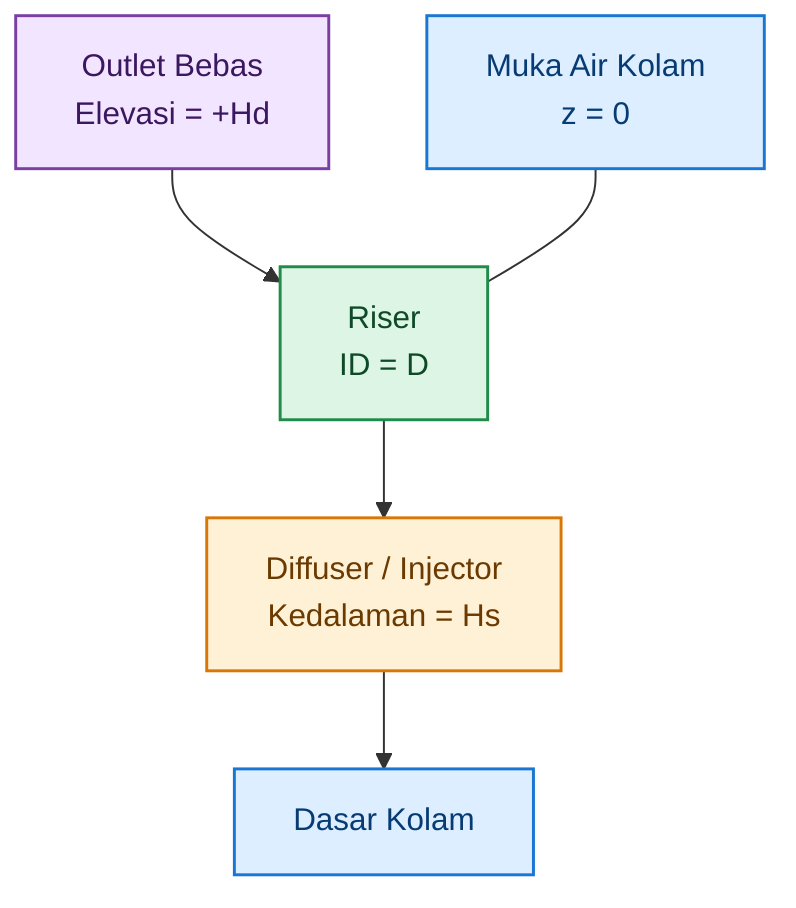
```mermaid
flowchart TB
    O["Outlet Bebas<br/>Elevasi = +Hd"] --> R["Riser<br/>ID = D"]
    W["Muka Air Kolam<br/>z = 0"] --- R
    R --> I["Diffuser / Injector<br/>Kedalaman = Hs"]
    I --> B["Dasar Kolam"]

    classDef outlet fill:#F2E5FF,stroke:#7B3FA1,color:#3B1760,stroke-width:1.5px;
    classDef pipe fill:#DCF5E5,stroke:#218C4A,color:#0E4A27,stroke-width:1.5px;
    classDef water fill:#DCEEFF,stroke:#1976D2,color:#073B73,stroke-width:1.5px;
    classDef diffuser fill:#FFF1D6,stroke:#D97706,color:#6B3A00,stroke-width:1.5px;

    class O outlet;
    class R pipe;
    class W,B water;
    class I diffuser;
```

| Parameter              | Simbol               | Definisi                                                     |
| ---------------------- | -------------------- | ------------------------------------------------------------ |
| Diameter dalam riser   | $D$                  | Diameter aliran aktual di dalam lift tube.                   |
| Luas riser             | $A$                  | Luas penampang internal riser.                               |
| Kedalaman injeksi      | $H_s$                | Jarak vertikal dari muka air sumber ke titik injeksi udara.  |
| Static lift            | $H_d$                | Elevasi outlet bebas di atas muka air sumber.                |
| Panjang vertikal       | $L_v$                | Panjang fisik bagian vertikal pipa.                          |
| Panjang horizontal     | $L_h$                | Panjang fisik pipa setelah elbow atau bagian discharge.      |
| Panjang total pipa     | $L_{\mathrm{total}}$ | Jumlah panjang riser, elbow ekuivalen, dan pipa outlet.      |
| Diameter diffuser      | $D_{\mathrm{diff}}$  | Diameter diffuser atau badan injector.                       |
| Diameter bore          | $d_b$                | Diameter satu lubang udara.                                  |
| Jumlah bore            | $N_b$                | Jumlah seluruh lubang pada diffuser.                         |
| Tebal dinding diffuser | $t_{\mathrm{wall}}$  | Panjang efektif bore untuk diffuser dengan dinding lurus.    |
| Pitch circle diameter  | $D_{\mathrm{pcd}}$   | Diameter lintasan pusat bore pada diffuser berbentuk tabung. |

### Diameter dalam riser

Diameter dalam riser adalah parameter paling penting karena menentukan luas penampang aliran.

Untuk diameter yang sama, perubahan kecil pada $D$ dapat menghasilkan perubahan besar pada luas penampang:

$$
A=\frac{\pi D^2}{4}
$$

Karena luas berbanding dengan kuadrat diameter, riser ID 37,4 mm memiliki luas sekitar 2,8 kali lebih besar daripada riser ID 22,4 mm.

Akibatnya, pada debit udara yang sama, riser kecil akan memiliki kecepatan superfisial gas lebih tinggi dan lebih mudah masuk ke slug–churn flow.

### Kedalaman injeksi

Kedalaman injeksi udara menentukan tekanan hidrostatik minimum yang harus dilawan oleh blower:

$$
\Delta P_h=\rho_l g H_s
$$

dengan:

- $\Delta P_h$ = tekanan hidrostatik, Pa
- $\rho_l$ = densitas air, kg/m³
- $g$ = percepatan gravitasi, m/s²
- $H_s$ = kedalaman injeksi, m

Kedalaman injeksi yang lebih besar memberi kolom campuran yang lebih panjang dan meningkatkan potensi gaya angkat. Namun, kebutuhan tekanan blower juga meningkat.

### Static lift

Static lift adalah perbedaan elevasi antara muka air sumber dan outlet bebas.

Jika outlet berada tepat di muka air:

$$
H_d \approx 0
$$

Jika outlet berada 20 cm di atas muka air:

$$
H_d=0.20\ \mathrm{m}
$$

Static lift bukan panjang total pipa. Pipa horizontal sepanjang 1 m pada elevasi yang sama tidak menambah static lift, tetapi tetap menambah rugi gesek dan rugi lokal.

### Panjang vertikal dan horizontal

Panjang vertikal memengaruhi panjang kolom dua-fase dan rugi gesek riser. Panjang horizontal setelah elbow tidak meningkatkan tinggi angkat bila elevasinya tetap, tetapi tetap dapat mengurangi debit melalui:

- rugi gesek;
- rugi elbow;
- perubahan pola aliran dua-fase;
- pemisahan gas dan cairan;
- gas bypass pada bagian atas pipa horizontal.

Untuk sistem sederhana dengan outlet bebas:

$$
L_{\mathrm{active}}\approx H_s+H_d
$$

Nilai ini menggambarkan panjang vertikal utama yang dilalui campuran air–udara dari injector menuju outlet. Namun, panjang pipa aktual untuk perhitungan gesekan tetap harus mencakup seluruh jalur.

### Diameter, jumlah, dan pola bore diffuser

Diameter bore, jumlah bore, serta pola penempatannya perlu dipilih bersama-sama.

Rasio panjang bore terhadap diameter bore:

$$
\left(\frac{L}{D}\right)_{\mathrm{bore}}
=

\frac{t_{\mathrm{wall}}}{d_b}
$$

Untuk diffuser dengan dinding 2 mm dan bore Ø2 mm:

$$
\left(\frac{L}{D}\right)_{\mathrm{bore}}=1
$$

Kondisi ini lebih mendekati _short orifice_ daripada capillary tube panjang.

Pada diffuser berbentuk tabung dengan bore radial, diameter pitch circle dapat diperkirakan:

$$
D_{\mathrm{pcd}}
\approx
D_{\mathrm{diff,ID}}+t_{\mathrm{wall}}
$$

Persamaan tersebut hanya berlaku untuk bore yang dibor radial pada dinding tabung. Untuk bore pada piringan datar atau _end cap_, geometri pitch circle perlu dihitung sesuai bentuk aktualnya.

---

## 2.3 Submergence Ratio

Submergence ratio menunjukkan seberapa besar bagian sistem yang berada di bawah muka air dibandingkan total tinggi pengangkatan.

Untuk outlet bebas di atas atau sejajar muka air sumber:

$$
SR=
\frac{H_s}{H_s+H_d}
$$

dengan:

- $SR$ = submergence ratio
- $H_s$ = kedalaman injeksi udara
- $H_d$ = static lift outlet bebas di atas muka air sumber

Nilai $SR$ selalu berada antara 0 dan 1 untuk konfigurasi outlet bebas.

### Arti fisik submergence ratio

Submergence ratio menggambarkan keseimbangan antara bagian yang membantu pembentukan gaya angkat dan bagian yang menjadi beban elevasi.

Semakin tinggi nilai $SR$, semakin besar bagian sistem berada di bawah muka air dan semakin kecil static lift yang harus dilawan.

| Kondisi            |    Nilai $SR$ | Interpretasi                                                     |
| ------------------ | ------------: | ---------------------------------------------------------------- |
| $SR < 0.4$         |        Rendah | Airlift umumnya sulit bekerja efisien.                           |
| $SR = 0.5$         |        Sedang | Masih dapat bekerja, tetapi debit sensitif terhadap rugi sistem. |
| $SR = 0.6{-}0.8$   |          Baik | Umumnya sesuai untuk airlift low-head.                           |
| $SR \rightarrow 1$ | Sangat tinggi | Outlet dekat muka air; static lift sangat kecil.                 |

Nilai tersebut adalah panduan awal. Kinerja aktual tetap bergantung pada diameter riser, debit udara, diffuser, dan rugi pipa.

### Outlet di atas muka air

Jika diffuser berada 0,6 m di bawah muka air dan outlet bebas berada 0,2 m di atas muka air:

$$
H_s=0.6\ \mathrm{m}
$$

$$
H_d=0.2\ \mathrm{m}
$$

$$
SR=
\frac{0.6}{0.6+0.2}
=

0.75
$$

Artinya, 75% dari tinggi total sistem berada dalam kondisi terendam.

### Outlet sejajar muka air

Jika outlet berada tepat pada elevasi muka air sumber:

$$
H_d\approx0
$$

maka:

$$
SR\approx1
$$

Kondisi ini ideal dari sisi static lift, tetapi bukan berarti tidak ada rugi tekanan. Elbow, pipa horizontal, nozzle, diffuser, dan perubahan aliran dua-fase tetap membatasi debit airlift.

### Outlet di bawah muka air

Untuk outlet yang terendam, jangan memasukkan nilai negatif ke dalam $H_d$ pada rumus submergence ratio.

Outlet terendam menimbulkan tekanan balik:

$$
\Delta P_{\mathrm{out,sub}}
\approx
\rho_l g h_{\mathrm{out}}
$$

dengan:

- $h_{\mathrm{out}}$ = kedalaman outlet di bawah muka air penerima
- $\Delta P_{\mathrm{out,sub}}$ = tekanan balik outlet terendam

Tekanan tersebut harus dimasukkan ke dalam neraca tekanan sistem, bukan dianggap sebagai static lift negatif.

Hal ini penting untuk kolam bioflok. Menurunkan nozzle 5–25 cm di bawah permukaan dapat membantu memasukkan momentum jet ke dalam air, tetapi juga meningkatkan back-pressure airlift.

### Static lift bukan panjang total pipa

Dua sistem berikut dapat memiliki static lift yang sama tetapi debit berbeda:

| Sistem                                | Static lift | Panjang total pipa | Dampak                                      |
| ------------------------------------- | ----------: | -----------------: | ------------------------------------------- |
| Riser lurus, outlet dekat permukaan   |  Hampir 0 m |             Pendek | Rugi rendah, debit lebih tinggi             |
| Riser + elbow + outlet horizontal 1 m |  Hampir 0 m |      Lebih panjang | Static lift sama, tetapi rugi lebih besar   |
| Outlet 20 cm di atas permukaan        |       0.2 m |        Bisa pendek | Static lift lebih besar, debit lebih rendah |

Karena itu, perhitungan airlift harus membedakan:

$$
\text{Static lift}
\neq
\text{panjang total pipa}
$$

Static lift berkaitan dengan perubahan elevasi, sedangkan panjang pipa berkaitan dengan rugi gesekan dan rugi lokal.

[**Kembali ke Atas**](#air-lift-pump-prinsip-desain-dan-aplikasi-dalam-akuakultur)

---

# 3. Prinsip Kerja Airlift Pump

Airlift pump bekerja sebagai sistem aliran dua-fase, yaitu campuran air dan udara di dalam riser. Udara bertekanan diinjeksi pada bagian bawah riser. Gelembung yang terbentuk menurunkan densitas rata-rata campuran di dalam pipa, sehingga kolom air di luar riser yang lebih berat mendorong campuran tersebut naik.

Airlift tidak mengangkat air karena udara “mendorong” air seperti piston. Mekanisme utamanya adalah perbedaan tekanan hidrostatik antara:

- kolom air di luar riser; dan
- kolom campuran air–udara di dalam riser.

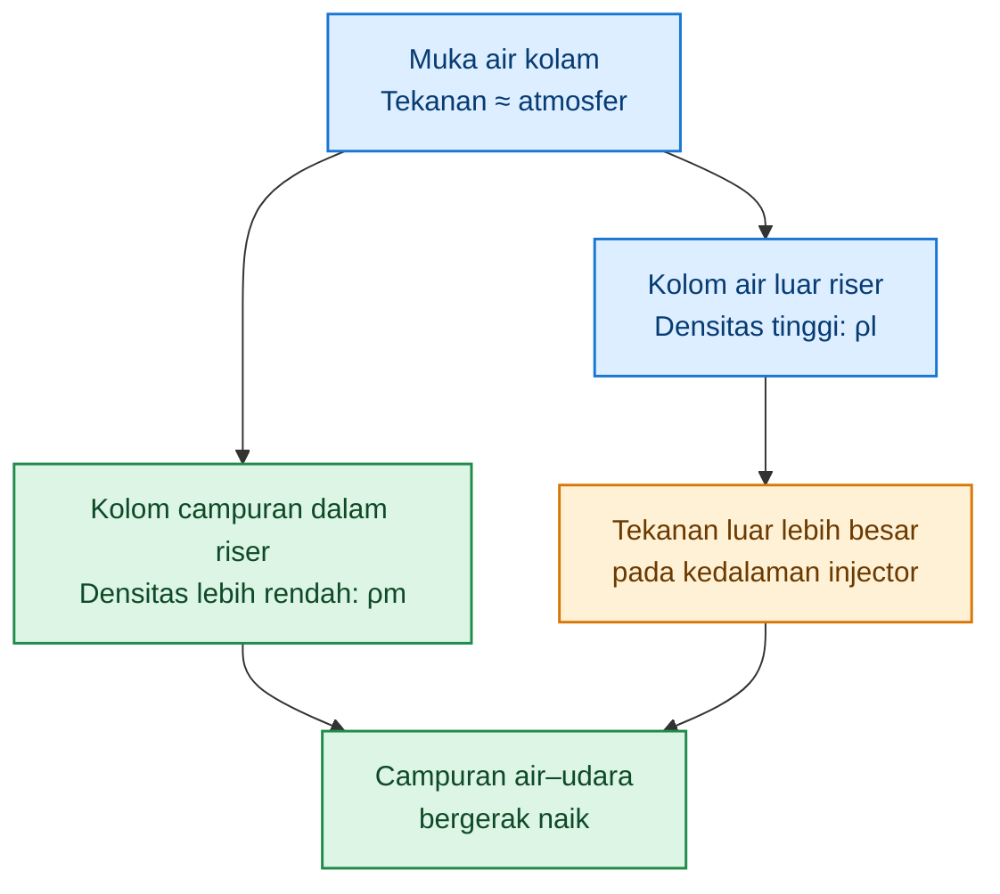
```mermaid
flowchart TB
    A["Muka air kolam<br/>Tekanan ≈ atmosfer"] --> B["Kolom air luar riser<br/>Densitas tinggi: ρl"]
    A --> C["Kolom campuran dalam riser<br/>Densitas lebih rendah: ρm"]
    B --> D["Tekanan luar lebih besar<br/>pada kedalaman injector"]
    C --> E["Campuran air–udara<br/>bergerak naik"]
    D --> E

    classDef water fill:#DCEEFF,stroke:#1976D2,color:#073B73,stroke-width:1.5px;
    classDef mix fill:#DCF5E5,stroke:#218C4A,color:#0E4A27,stroke-width:1.5px;
    classDef pressure fill:#FFF1D6,stroke:#D97706,color:#6B3A00,stroke-width:1.5px;

    class A,B water;
    class C,E mix;
    class D pressure;
```

Proses kerja airlift dapat diringkas sebagai berikut:

1. Riser terisi air dari kolam melalui intake bagian bawah.
2. Blower mengalirkan udara menuju diffuser atau multi-bore injector.
3. Udara keluar sebagai gelembung dan bercampur dengan air di dalam riser.
4. Densitas campuran di riser turun dibandingkan air di luar riser.
5. Tekanan kolom air luar mendorong campuran air–udara naik.
6. Campuran keluar dari outlet, udara terlepas, dan air kembali ke kolam atau unit proses berikutnya.

## 3.1 Perbedaan Densitas Kolom

Air memiliki densitas jauh lebih tinggi daripada udara. Pada kondisi normal, densitas air tawar sekitar:

$$
\rho_l \approx 1000\ \mathrm{kg/m^3}
$$

Sedangkan densitas udara sekitar:

$$
\rho_g \approx 1.2\ \mathrm{kg/m^3}
$$

Ketika udara berada di dalam riser, sebagian volume pipa ditempati gas dan sisanya ditempati air. Densitas campuran rata-rata dapat diperkirakan dengan:

$$
\rho_m
=

\alpha_g \rho_g
+
\left(1-\alpha_g\right)\rho_l
$$

dengan:

- $\rho_m$ = densitas campuran air–udara, $\mathrm{kg/m^3}$
- $\alpha_g$ = void fraction gas
- $\rho_g$ = densitas udara, $\mathrm{kg/m^3}$
- $\rho_l$ = densitas air, $\mathrm{kg/m^3}$

Karena $\rho_g$ jauh lebih kecil daripada $\rho_l$, kenaikan $\alpha_g$ akan menurunkan densitas campuran.

Contoh sederhana dengan:

$$
\alpha_g=0.30
$$

maka:

$$
\rho_m
=

0.30(1.2)
+
(1-0.30)(1000)
$$

$$
\rho_m
\approx700.4\ \mathrm{kg/m^3}
$$

Artinya, kolom campuran di dalam riser memiliki densitas sekitar 700 $\mathrm{kg/m^3}$, sedangkan air di luar riser mendekati 1000 $\mathrm{kg/m^3}$.

Perbedaan densitas tersebut menciptakan tekanan pendorong teoritis:

$$
\Delta P_{\mathrm{drive}}
\approx
\alpha_g
\left(\rho_l-\rho_g\right)
gH_s
$$

Untuk estimasi yang lebih realistis, karena void fraction berubah sepanjang riser akibat ekspansi udara, bentuk integral lebih sesuai:

$$
\Delta P_{\mathrm{drive}}
=

\int_0^{H_s}
\left[
\rho_l-\rho_m(z)
\right]
g,dz
$$

Persamaan sederhana dengan satu nilai $\alpha_g$ dapat dipakai untuk _screening design_. Namun, desain final perlu mempertimbangkan bahwa $\alpha_g$ tidak konstan dari diffuser sampai outlet.

> Semakin tinggi void fraction tidak selalu berarti debit air semakin besar. Void fraction terlalu tinggi dapat meningkatkan pulsasi, memperbesar rugi tekanan, dan mendorong aliran menuju churn flow.

## 3.2 Tekanan Hidrostatik

Udara dari blower harus memiliki tekanan yang cukup untuk masuk ke diffuser pada kedalaman tertentu. Tekanan hidrostatik air di lokasi injector dihitung dengan:

$$
\Delta P_h
=

\rho_l g H_s
$$

dengan:

- $\Delta P_h$ = tekanan hidrostatik, Pa
- $\rho_l$ = densitas air, $\mathrm{kg/m^3}$
- $g$ = percepatan gravitasi, $9.81\ \mathrm{m/s^2}$
- $H_s$ = kedalaman injector di bawah muka air, m

Untuk air tawar:

$$
\Delta P_h
\approx
9810H_s
$$

dengan $\Delta P_h$ dalam Pa dan $H_s$ dalam meter.

Contoh untuk kedalaman injector 0,6 m:

$$
\Delta P_h
=

1000
\times9.81
\times0.6
$$

$$
\Delta P_h
=

5886\ \mathrm{Pa}
$$

Nilai tersebut setara dengan:

$$
5886\ \mathrm{Pa}
=

0.0589\ \mathrm{bar}
=

600\ \mathrm{mmH_2O}
$$

Tabel berikut menunjukkan tekanan hidrostatik minimum pada beberapa kedalaman injector.

| Kedalaman injector, $H_s$ | Tekanan hidrostatik | Bar gauge |       mmH₂O |
| ------------------------: | ------------------: | --------: | ----------: |
|                    0.30 m |            2,943 Pa | 0.029 bar |   300 mmH₂O |
|                    0.60 m |            5,886 Pa | 0.059 bar |   600 mmH₂O |
|                    1.00 m |            9,810 Pa | 0.098 bar | 1,000 mmH₂O |
|                    1.50 m |           14,715 Pa | 0.147 bar | 1,500 mmH₂O |
|                    2.00 m |           19,620 Pa | 0.196 bar | 2,000 mmH₂O |

Tekanan hidrostatik bukan satu-satunya tekanan yang harus disediakan blower. Tekanan suplai aktual juga harus mengatasi rugi diffuser, selang, manifold, valve, dan margin operasi.

$$
\Delta P_{\mathrm{supply}}
\approx
\Delta P_h
+
\Delta P_{\mathrm{diffuser}}
+
\Delta P_{\mathrm{airline}}
+
\Delta P_{\mathrm{valve}}
+
\Delta P_{\mathrm{margin}}
$$

Untuk aplikasi praktis, blower harus dipilih berdasarkan kemampuan memberikan debit udara yang dibutuhkan pada tekanan total tersebut.

### Konversi tekanan

Hubungan konversi yang umum digunakan:

$$
1\ \mathrm{bar}
=

100{,}000\ \mathrm{Pa}
$$

$$
1\ \mathrm{mmH_2O}
=

9.80665\ \mathrm{Pa}
$$

$$
\mathrm{mmH_2O}
=

\frac{\mathrm{Pa}}{9.80665}
$$

$$
\mathrm{Pa}
=

\mathrm{mmH_2O}
\times9.80665
$$

Pada desain airlift kolam, satuan mmH₂O sering praktis karena kedalaman air dapat langsung dibandingkan dengan tekanan blower.


```mermaid
flowchart LR
    A["Blower<br/>Tekanan suplai"] --> B["Rugi selang, valve,<br/>dan manifold"]
    B --> C["Rugi diffuser<br/>dan pembentukan gelembung"]
    C --> D["Tekanan hidrostatik<br/>pada kedalaman Hs"]
    D --> E["Udara masuk<br/>ke riser"]

    classDef source fill:#FFF1D6,stroke:#D97706,color:#6B3A00,stroke-width:1.5px;
    classDef loss fill:#FDE6E6,stroke:#C62828,color:#6A1010,stroke-width:1.5px;
    classDef result fill:#DCF5E5,stroke:#218C4A,color:#0E4A27,stroke-width:1.5px;

    class A source;
    class B,C,D loss;
    class E result;
```

## 3.3 Ekspansi Udara Sepanjang Riser

Udara bersifat kompresibel. Udara yang masuk pada kedalaman injector berada pada tekanan lebih tinggi dibandingkan udara yang keluar di dekat permukaan.

Ketika gelembung naik, tekanan statis di sekitarnya turun. Akibatnya, volume udara membesar. Pada kondisi temperatur mendekati konstan, hubungan ini dapat diperkirakan menggunakan hukum gas ideal:

$$
P_1Q_1
\approx
P_2Q_2
$$

atau:

$$
Q_2
\approx
Q_1
\frac{P_1}{P_2}
$$

Tekanan yang digunakan harus berupa tekanan absolut:

$$
P_{\mathrm{abs}}
=

P_{\mathrm{atm}}
+
P_{\mathrm{gauge}}
$$

Untuk injector pada kedalaman 0,6 m:

$$
P_{\mathrm{inj,abs}}
=

101.325
+
5.886
$$

$$
P_{\mathrm{inj,abs}}
\approx
107.211\ \mathrm{kPa}
$$

Di outlet terbuka dekat muka air:

$$
P_{\mathrm{out,abs}}
\approx
101.325\ \mathrm{kPa}
$$

Maka rasio ekspansi udara dari injector menuju outlet adalah:

$$
\frac{Q_{g,\mathrm{out}}}
{Q_{g,\mathrm{inj}}}
\approx
\frac{107.211}{101.325}
$$

$$
\frac{Q_{g,\mathrm{out}}}
{Q_{g,\mathrm{inj}}}
\approx1.058
$$

Artinya, udara mengembang sekitar 5,8% sepanjang riser dengan kedalaman injector 0,6 m.

### SLPM, NLPM, dan actual LPM

Debit udara harus selalu ditulis bersama kondisi referensinya. Angka “30 LPM” tanpa penjelasan dapat memiliki arti berbeda.

| Istilah    | Definisi                                                   | Catatan penggunaan                                                     |
| ---------- | ---------------------------------------------------------- | ---------------------------------------------------------------------- |
| SLPM       | _Standard litre per minute_                                | Debit udara dikonversi ke kondisi standar tertentu.                    |
| NLPM       | _Normal litre per minute_                                  | Mirip SLPM, tetapi kondisi “normal” harus disebutkan secara eksplisit. |
| Actual LPM | Debit volumetrik aktual pada tekanan dan temperatur lokal. | Nilainya berubah sepanjang riser karena udara mengembang.              |

Kondisi standar tidak selalu sama antarprodusen atau negara. Beberapa alat memakai kondisi 0°C dan 1 atm, sementara alat lain memakai 20°C atau 25°C dan 1 atm. Karena itu, spesifikasi blower atau flow meter harus selalu diperiksa.

Hubungan umum antara debit pada kondisi referensi dan kondisi lokal:

$$
Q_{\mathrm{local}}
=

Q_{\mathrm{ref}}
\frac{P_{\mathrm{ref}}}{P_{\mathrm{local}}}
\frac{T_{\mathrm{local}}}{T_{\mathrm{ref}}}
$$

dengan:

- $Q_{\mathrm{local}}$ = debit aktual pada lokasi tertentu
- $Q_{\mathrm{ref}}$ = debit pada kondisi referensi
- $P_{\mathrm{ref}}$ = tekanan absolut referensi
- $P_{\mathrm{local}}$ = tekanan absolut lokal
- $T_{\mathrm{ref}}$ = temperatur absolut referensi
- $T_{\mathrm{local}}$ = temperatur absolut lokal

Untuk pendekatan awal pada kolam dangkal, perubahan temperatur sepanjang riser sering dapat diabaikan:

$$
T_{\mathrm{local}}
\approx
T_{\mathrm{ref}}
$$

Sehingga:

$$
Q_{\mathrm{local}}
\approx
Q_{\mathrm{ref}}
\frac{P_{\mathrm{ref}}}{P_{\mathrm{local}}}
$$

Ekspansi udara menyebabkan kecepatan superfisial gas meningkat menuju outlet. Oleh karena itu, rezim aliran perlu diperiksa bukan hanya dekat diffuser, tetapi juga di bagian atas riser dan setelah elbow.

## 3.4 Konsep Void Fraction

Void fraction menunjukkan fraksi luas atau volume lokal yang ditempati gas dalam aliran dua-fase.

Secara sederhana:

$$
\alpha_g
=

\frac{A_g}{A}
$$

dengan:

- $\alpha_g$ = void fraction gas
- $A_g$ = luas penampang yang ditempati gas
- $A$ = luas total penampang riser

Jika:

$$
\alpha_g=0.30
$$

maka secara rata-rata sekitar 30% penampang riser ditempati gas dan 70% ditempati air.

Void fraction sangat penting karena memengaruhi:

- densitas campuran;
- gaya pendorong airlift;
- pressure drop;
- kecepatan fase gas;
- kecepatan fase cair;
- stabilitas slug flow;
- pulsasi pada outlet.

### Void fraction dan gas volume fraction

Void fraction sering disamakan dengan gas volume fraction, tetapi keduanya tidak selalu sama.

Gas volume fraction berbasis debit dapat ditulis:

$$
\varepsilon_g
=

\frac{Q_g}{Q_g+Q_l}
$$

Apabila debit dihitung pada kondisi lokal yang sama:

$$
\varepsilon_g
=

\frac{\alpha_g u_g}
{\alpha_g u_g+(1-\alpha_g)u_l}
$$

dengan:

- $u_g$ = kecepatan aktual fase gas
- $u_l$ = kecepatan aktual fase cair

Void fraction bergantung pada distribusi fase di dalam pipa, sedangkan gas volume fraction bergantung pada perbandingan debit gas dan cairan.

Pada kondisi homogen, yaitu bila kecepatan gas dan air sama:

$$
u_g=u_l
$$

maka:

$$
\alpha_g=\varepsilon_g
$$

Tetapi kondisi ini jarang terjadi pada airlift. Gas biasanya bergerak lebih cepat daripada air, terutama pada slug flow.

### Kecepatan superfisial dan kecepatan aktual fase

Kecepatan superfisial gas dan cairan ditulis sebagai:

$$
j_g
=

\frac{Q_g}{A}
$$

$$
j_l
=

\frac{Q_l}{A}
$$

Kecepatan aktual masing-masing fase adalah:

$$
u_g
=

\frac{j_g}{\alpha_g}
$$

$$
u_l
=

\frac{j_l}{1-\alpha_g}
$$

Karena gas biasanya naik lebih cepat, terjadi _slip_ antara gas dan air.

Rasio slip dapat ditulis:

$$
S
=

\frac{u_g}{u_l}
$$

Jika:

$$
S>1
$$

maka gas bergerak lebih cepat daripada air.

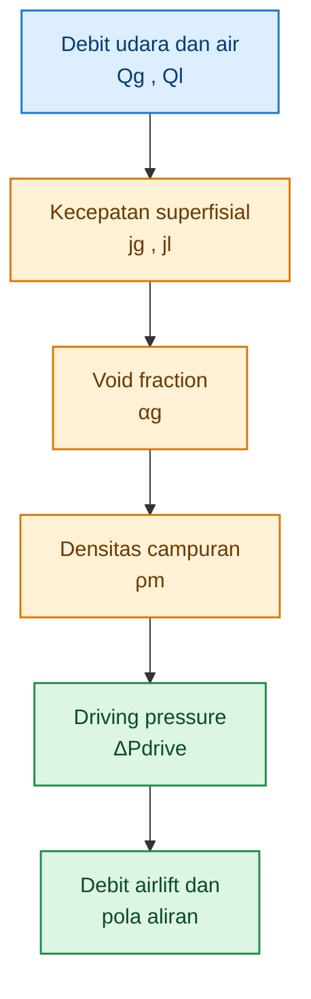
```mermaid
flowchart TB
    A["Debit udara dan air<br/>Qg , Ql"] --> B["Kecepatan superfisial<br/>jg , jl"]
    B --> C["Void fraction<br/>αg"]
    C --> D["Densitas campuran<br/>ρm"]
    D --> E["Driving pressure<br/>ΔPdrive"]
    E --> F["Debit airlift dan<br/>pola aliran"]

    classDef input fill:#DCEEFF,stroke:#1976D2,color:#073B73,stroke-width:1.5px;
    classDef calc fill:#FFF1D6,stroke:#D97706,color:#6B3A00,stroke-width:1.5px;
    classDef result fill:#DCF5E5,stroke:#218C4A,color:#0E4A27,stroke-width:1.5px;

    class A input;
    class B,C,D calc;
    class E,F result;
```

Pada airlift, peningkatan debit udara akan menaikkan $j_g$. Akan tetapi, hubungan antara $j_g$ dan $\alpha_g$ tidak linear karena adanya slip, koalesensi gelembung, ekspansi gas, dan perubahan rezim aliran.

Karena itu, desain airlift tidak boleh memakai asumsi:

$$
\alpha_g
=

\frac{Q_g}{Q_g+Q_l}
$$

tanpa memeriksa slip gas–air dan rezim aliran.

Pada bab berikutnya, kecepatan superfisial gas dan cairan digunakan untuk menentukan zona rezim aliran seperti bubbly flow, slug flow, churn flow, dan annular flow.

[**Kembali ke Atas**](#air-lift-pump-prinsip-desain-dan-aplikasi-dalam-akuakultur)

---

# 4. Aliran Dua-Fase dan Rezim Aliran

Airlift pump adalah sistem aliran dua-fase air–udara. Karena itu, debit udara saja tidak cukup untuk menjelaskan performa pompa. Kondisi operasi harus dilihat dari hubungan antara aliran udara, aliran air, diameter riser, tekanan lokal, serta pola distribusi gas di dalam pipa.

Rezim aliran menentukan bagaimana udara dan air tersusun di dalam riser. Perubahan rezim dapat mengubah void fraction, rugi tekanan, pulsasi, dan debit air yang dihasilkan. Pada satu airlift, rezim juga dapat berubah dari bagian bawah riser menuju outlet karena udara mengembang saat tekanan menurun.

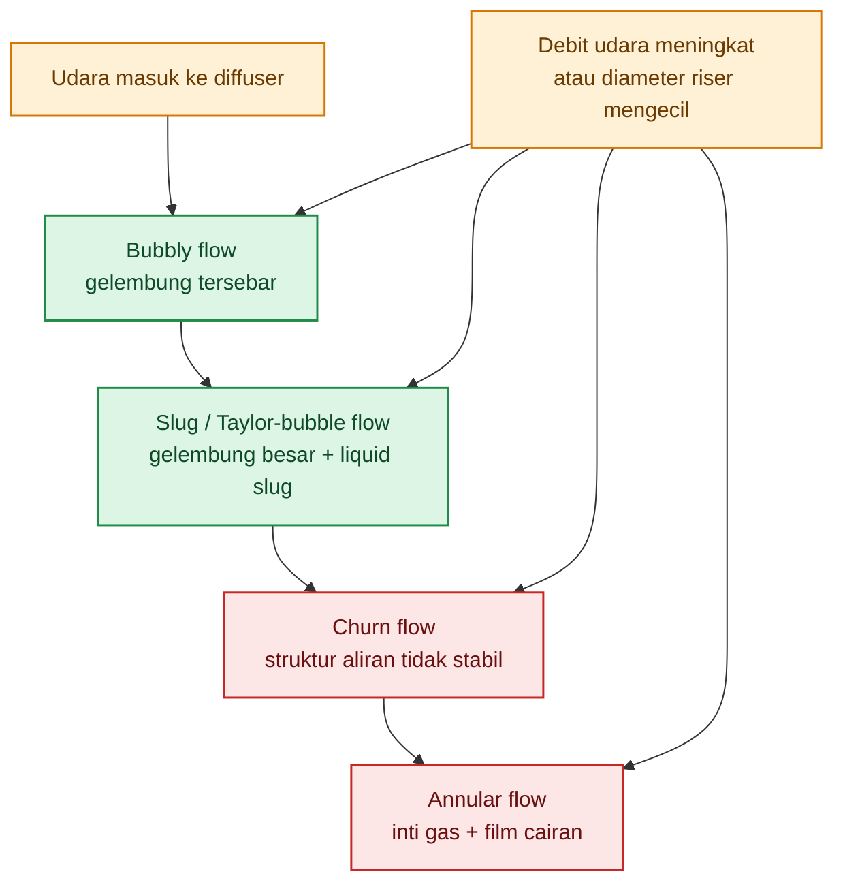
```mermaid
flowchart TD
    A["Udara masuk ke diffuser"] --> B["Bubbly flow<br/>gelembung tersebar"]
    B --> C["Slug / Taylor-bubble flow<br/>gelembung besar + liquid slug"]
    C --> D["Churn flow<br/>struktur aliran tidak stabil"]
    D --> E["Annular flow<br/>inti gas + film cairan"]

    F["Debit udara meningkat<br/>atau diameter riser mengecil"] --> B
    F --> C
    F --> D
    F --> E

    classDef gas fill:#FFF1D6,stroke:#D97706,color:#6B3A00,stroke-width:1.5px;
    classDef stable fill:#DCF5E5,stroke:#218C4A,color:#0E4A27,stroke-width:1.5px;
    classDef unstable fill:#FDE6E6,stroke:#C62828,color:#6A1010,stroke-width:1.5px;

    class A,F gas;
    class B,C stable;
    class D,E unstable;
```

## 4.1 Kecepatan Superfisial

Kecepatan superfisial adalah kecepatan hipotetis suatu fase apabila fase tersebut mengalir sendiri dan menggunakan seluruh luas penampang riser.

Kecepatan superfisial gas:

$$
j_g
=

\frac{Q_g}{A}
$$

Kecepatan superfisial cairan:

$$
j_l
=

\frac{Q_l}{A}
$$

Luas penampang internal riser:

$$
A
=

\frac{\pi D^2}{4}
$$

dengan:

- $j_g$ = kecepatan superfisial gas, $\mathrm{m/s}$
- $j_l$ = kecepatan superfisial cairan, $\mathrm{m/s}$
- $Q_g$ = debit volumetrik gas pada kondisi lokal, $\mathrm{m^3/s}$
- $Q_l$ = debit volumetrik air, $\mathrm{m^3/s}$
- $A$ = luas penampang internal riser, $\mathrm{m^2}$
- $D$ = diameter dalam riser, $\mathrm{m}$

Kecepatan superfisial bukan kecepatan aktual fase. Gas dan air tidak menempati seluruh luas pipa secara bersamaan.

Jika void fraction gas adalah $\alpha_g$, maka kecepatan aktual gas dan cairan dapat diperkirakan dengan:

$$
u_g
=

\frac{j_g}{\alpha_g}
$$

$$
u_l
=

\frac{j_l}{1-\alpha_g}
$$

Karena gas umumnya bergerak lebih cepat daripada cairan, maka:

$$
u_g>u_l
$$

Perbedaan ini disebut _slip_ gas–cairan.

### Contoh perhitungan kecepatan superfisial

Misalkan riser memiliki diameter dalam:

$$
D=37.4\ \mathrm{mm}
=

0.0374\ \mathrm{m}
$$

Luas riser:

$$
A
=

\frac{\pi(0.0374)^2}{4}
$$

$$
A
=

1.099\times10^{-3}\ \mathrm{m^2}
$$

Apabila debit udara aktual pada injector adalah:

$$
Q_g
=

28.4\ \mathrm{LPM}
=

4.73\times10^{-4}\ \mathrm{m^3/s}
$$

maka:

$$
j_g
=

\frac{4.73\times10^{-4}}
{1.099\times10^{-3}}
$$

$$
j_g
\approx
0.43\ \mathrm{m/s}
$$

Apabila debit air terukur adalah:

$$
Q_l
=

48\ \mathrm{LPM}
=

8.00\times10^{-4}\ \mathrm{m^3/s}
$$

maka:

$$
j_l
=

\frac{8.00\times10^{-4}}
{1.099\times10^{-3}}
$$

$$
j_l
\approx
0.73\ \mathrm{m/s}
$$

Nilai $j_g$ dan $j_l$ tersebut dapat dipakai sebagai titik operasi awal pada peta rezim aliran vertikal.

> Untuk gas, gunakan debit aktual pada tekanan lokal. Debit udara di dekat diffuser lebih kecil daripada debit udara di outlet karena udara mengembang sepanjang riser.

---

## 4.2 Zona Rezim Aliran

Rezim aliran adalah pola distribusi gas dan cairan di dalam riser. Rezim tidak hanya ditentukan oleh $j_g$. Penentuan yang lebih baik membutuhkan:

$$
j_g,\quad j_l,\quad D,\quad \rho_l,\quad \rho_g,\quad \mu_l,\quad \sigma
$$

dengan:

- $\mu_l$ = viskositas cairan
- $\sigma$ = tegangan permukaan

Untuk airlift air–air, empat zona utama yang perlu dipahami adalah _bubbly flow_, _slug flow_, _churn flow_, dan _annular flow_.

| Rezim                     | Struktur utama                                                 | Karakter aliran                                        | Konsekuensi untuk airlift                               |
| ------------------------- | -------------------------------------------------------------- | ------------------------------------------------------ | ------------------------------------------------------- |
| Bubbly flow               | Gelembung kecil tersebar dalam air kontinu                     | Relatif stabil, pulsasi rendah                         | Lifting dapat masih rendah bila void fraction kecil     |
| Slug / Taylor-bubble flow | Gelembung besar memanjang, dipisahkan liquid slug              | Intermittent tetapi masih terstruktur                  | Sering sesuai sebagai titik awal airlift kecil–menengah |
| Churn flow                | Taylor bubble pecah, recirculation kuat, pola tidak teratur    | Pulsasi dan fluktuasi tinggi                           | Tambahan udara tidak selalu meningkatkan debit air      |
| Annular flow              | Gas dominan pada inti, cairan sebagai film dinding dan droplet | Gas sangat cepat, liquid carry-over dapat tidak stabil | Biasanya tidak diinginkan untuk airlift sirkulasi air   |

### Bubbly flow

Pada _bubbly flow_, gas berada dalam bentuk gelembung kecil yang tersebar dalam fase cair kontinu.

Ciri utamanya:

- air masih menjadi fase kontinu dominan;
- gelembung relatif terpisah;
- pulsasi tekanan rendah;
- void fraction cenderung rendah hingga sedang;
- discharge relatif lebih halus.

Bubbly flow dapat muncul tepat setelah diffuser, terutama bila diffuser memiliki banyak bore atau pori kecil. Namun, pada riser sempit, gelembung sering berkoalesensi beberapa diameter pipa di atas injector. Karena itu, bubbly flow dekat diffuser tidak menjamin bubbly flow bertahan sampai outlet.

### Slug / Taylor-bubble flow

Pada _slug flow_, gas membentuk gelembung besar memanjang yang mendekati diameter riser. Gelembung ini sering disebut Taylor bubble.

Di antara gelembung besar terdapat bagian cairan yang disebut _liquid slug_. Struktur aliran menjadi berulang:

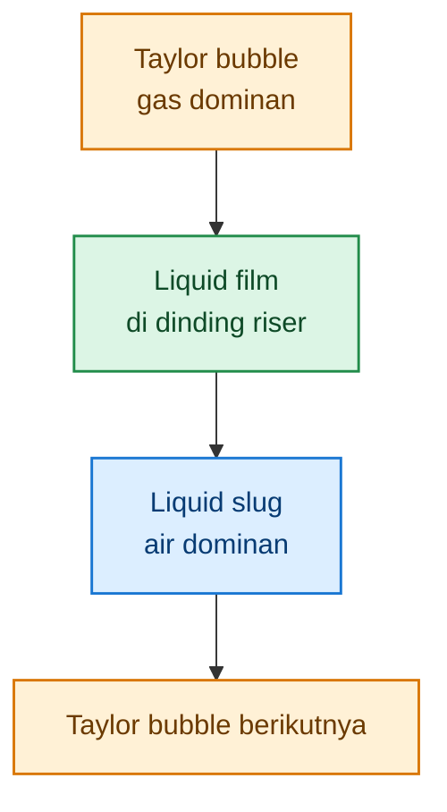
```mermaid
flowchart TB
    A["Taylor bubble<br/>gas dominan"] --> B["Liquid film<br/>di dinding riser"]
    B --> C["Liquid slug<br/>air dominan"]
    C --> D["Taylor bubble berikutnya"]

    classDef gas fill:#FFF1D6,stroke:#D97706,color:#6B3A00,stroke-width:1.5px;
    classDef liquid fill:#DCEEFF,stroke:#1976D2,color:#073B73,stroke-width:1.5px;
    classDef mix fill:#DCF5E5,stroke:#218C4A,color:#0E4A27,stroke-width:1.5px;

    class A,D gas;
    class B mix;
    class C liquid;
```

Karakter slug flow:

- void fraction cukup besar untuk menurunkan densitas campuran;
- gas dan air masih memiliki struktur aliran yang dapat dikenali;
- debit air biasanya cukup baik;
- discharge bersifat intermiten;
- tekanan dan kecepatan berfluktuasi saat Taylor bubble dan liquid slug lewat.

Untuk riser kecil hingga menengah pada aplikasi airlift, slug flow sering menjadi kondisi awal yang praktis. Hal ini bukan berarti slug flow selalu paling efisien pada semua geometri, tetapi karena rezim ini sering memberi kompromi yang baik antara gaya angkat, kestabilan, dan kebutuhan udara.

### Churn flow

Churn flow adalah kondisi ketika struktur Taylor bubble mulai pecah dan aliran menjadi sangat tidak teratur.

Ciri umum churn flow:

- gelembung besar tidak lagi stabil;
- terjadi pencampuran kuat dan recirculation;
- arah lokal air dapat berubah sesaat;
- pressure fluctuation meningkat;
- outlet dapat mengalami semburan gas dan air yang tidak seragam.

Pada airlift, churn flow sering muncul ketika debit udara dinaikkan terlalu tinggi untuk diameter riser tertentu. Kenaikan debit udara tidak selalu memberi kenaikan debit air yang sebanding.

Dalam kondisi ini, sebagian energi blower dapat terbuang untuk:

- mempercepat gas;
- meningkatkan turbulensi;
- menimbulkan pulsasi;
- mendorong gas keluar tanpa membawa proporsi air yang setara.

### Annular flow

Pada annular flow, gas membentuk inti utama di tengah pipa, sementara cairan mengalir sebagai film pada dinding dan sebagian sebagai droplet yang terbawa gas.

Karakter utamanya:

- void fraction sangat tinggi;
- gas menjadi fase dominan;
- kecepatan gas tinggi;
- film cairan di dinding dapat tidak stabil;
- pressure drop dapat meningkat tajam.

Untuk airlift kolam dan RAS, annular flow umumnya bukan target operasi karena sistem lebih banyak mengalirkan gas daripada mengangkat air secara stabil.

---

## 4.3 Dampak Rezim terhadap Kinerja

Rezim aliran menentukan cara gas dan cairan berbagi penampang riser. Karena itu, perubahan rezim akan mengubah hampir seluruh parameter performa airlift.

### Void fraction

Void fraction memengaruhi densitas campuran:

$$
\rho_m
=

\alpha_g\rho_g
+
(1-\alpha_g)\rho_l
$$

Kenaikan $\alpha_g$ umumnya menurunkan $\rho_m$ dan meningkatkan potensi driving pressure.

Namun, hubungan tersebut tidak linear. Pada churn dan annular flow, peningkatan gas dapat disertai slip yang lebih besar, rugi tekanan lebih tinggi, serta discharge yang kurang stabil.

### Pressure drop

Pressure drop pada airlift terdiri dari beberapa komponen:

$$
\Delta P_{\mathrm{total}}
=

\Delta P_{\mathrm{friction}}
+
\Delta P_{\mathrm{local}}
+
\Delta P_{\mathrm{acceleration}}
+
\Delta P_{\mathrm{outlet}}
$$

Rezim aliran memengaruhi seluruh komponen tersebut.

| Rezim   | Dampak umum terhadap pressure drop                      |
| ------- | ------------------------------------------------------- |
| Bubbly  | Relatif rendah dan stabil                               |
| Slug    | Berfluktuasi karena liquid slug dan Taylor bubble       |
| Churn   | Tinggi dan sangat fluktuatif                            |
| Annular | Dapat tinggi akibat kecepatan gas dan gesekan antarfase |

### Pulsasi

Pulsasi adalah variasi tekanan, debit, atau kecepatan terhadap waktu.

Pada bubbly flow, aliran cenderung lebih halus. Pada slug flow, pulsasi mulai jelas karena setiap Taylor bubble dan liquid slug memiliki karakter aliran berbeda. Pada churn flow, pulsasi dapat menjadi kuat dan tidak teratur.

Pulsasi perlu diperhatikan pada sistem dengan:

- elbow 90°;
- pipa horizontal setelah riser;
- outlet sempit;
- degassing chamber kecil;
- beberapa riser yang berbagi satu manifold udara.

Pulsasi berlebihan dapat menyebabkan aliran discharge menyembur, distribusi air ke kolam tidak merata, dan suara operasi meningkat.

### Debit air

Debit air tidak selalu meningkat secara proporsional dengan debit udara.

Secara umum, ketika $Q_g$ dinaikkan:

1. void fraction meningkat;
2. densitas campuran menurun;
3. gaya pendorong bertambah;
4. debit air dapat meningkat.

Tetapi setelah titik tertentu:

1. rugi tekanan bertambah;
2. slip gas–air meningkat;
3. aliran dapat masuk churn flow;
4. tambahan udara lebih banyak keluar sebagai gas;
5. kenaikan debit air melambat atau bahkan menurun.

Hubungan performa yang sering dijumpai berbentuk kurva dengan titik operasi optimum:

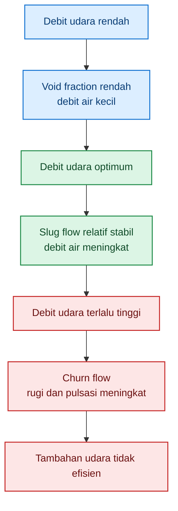
```mermaid
flowchart TB
    A["Debit udara rendah"] --> B["Void fraction rendah<br/>debit air kecil"]
    B --> C["Debit udara optimum"]
    C --> D["Slug flow relatif stabil<br/>debit air meningkat"]
    D --> E["Debit udara terlalu tinggi"]
    E --> F["Churn flow<br/>rugi dan pulsasi meningkat"]
    F --> G["Tambahan udara tidak efisien"]

    classDef low fill:#DCEEFF,stroke:#1976D2,color:#073B73,stroke-width:1.5px;
    classDef optimum fill:#DCF5E5,stroke:#218C4A,color:#0E4A27,stroke-width:1.5px;
    classDef high fill:#FDE6E6,stroke:#C62828,color:#6A1010,stroke-width:1.5px;

    class A,B low;
    class C,D optimum;
    class E,F,G high;
```

### Efisiensi energi

Efisiensi airlift tidak hanya ditentukan oleh debit air. Efisiensi harus dinilai terhadap energi blower.

Salah satu indikator sederhana adalah debit air per daya listrik blower:

$$
\eta_Q
=

\frac{Q_l}{P_{\mathrm{electric}}}
$$

dengan:

- $\eta_Q$ = indikator debit air per daya listrik
- $Q_l$ = debit air
- $P_{\mathrm{electric}}$ = daya listrik blower

Indikator tersebut tidak sama dengan efisiensi termodinamika, tetapi berguna untuk membandingkan beberapa konfigurasi riser, diffuser, atau blower dalam kondisi operasi yang sama.

Pada titik operasi yang terlalu dekat dengan churn flow, konsumsi udara dan daya blower dapat meningkat lebih cepat daripada kenaikan debit air. Dalam kondisi tersebut, efisiensi sistem turun.

### Stabilitas discharge

Discharge yang stabil penting untuk kolam bioflok, RAS, dan hidroponik.

Discharge yang tidak stabil dapat menyebabkan:

- arus permukaan yang tidak konsisten;
- percikan dan kehilangan energi;
- pemisahan gas–air yang tidak terkontrol;
- short-circuit flow di dekat outlet;
- distribusi padatan yang tidak merata.

Pada sistem dengan pipa horizontal setelah elbow, slug flow vertikal dapat mengalami perubahan struktur. Gas yang lebih ringan cenderung bergerak pada bagian atas pipa horizontal, sedangkan air berada pada bagian bawah. Kondisi tersebut dapat mengubah discharge menjadi intermittent atau stratified.

---

## 4.4 Target Rezim untuk Airlift Akuakultur

Untuk airlift pada kolam, bioflok, RAS low-head, dan hidroponik, target awal yang umum digunakan adalah:

$$
\boxed{
\text{transisi bubbly–slug atau slug / Taylor-bubble flow yang stabil}
}
$$

Target ini dipilih karena kondisi tersebut biasanya memberikan keseimbangan antara:

- void fraction yang cukup untuk menghasilkan gaya angkat;
- debit air yang cukup;
- pressure drop yang masih terkendali;
- pulsasi yang masih dapat diterima;
- kebutuhan udara yang tidak terlalu besar;
- discharge yang masih dapat diarahkan.

### Mengapa slug flow sering dipilih

Slug flow sering cocok sebagai kondisi awal desain karena Taylor bubble dapat menghasilkan volume gas yang cukup besar di dalam riser untuk menurunkan densitas campuran.

Pada saat yang sama, air masih bergerak sebagai liquid slug yang relatif kontinu. Hal ini berbeda dengan annular flow, ketika gas dapat mendominasi penampang dan air hanya bergerak sebagai film atau droplet.

Dalam desain awal, slug flow dapat diprediksi dengan memeriksa nilai $j_g$ dan $j_l$ terhadap peta rezim aliran yang sesuai. Namun, hasil akhirnya tetap perlu diverifikasi melalui uji aktual atau pengamatan visual.

### Risiko churn flow pada riser kecil

Riser kecil memiliki luas penampang yang lebih kecil:

$$
A
=

\frac{\pi D^2}{4}
$$

Untuk debit udara yang sama:

$$
j_g
=

\frac{Q_g}{A}
$$

akan meningkat ketika $D$ mengecil.

Misalnya, jika diameter riser turun, debit udara yang sebelumnya menghasilkan slug flow dapat mendorong sistem menuju churn flow. Karena itu, debit udara tidak boleh dipindahkan langsung dari riser besar ke riser kecil tanpa menghitung ulang $j_g$.

Prinsip desain praktis:

$$
\boxed{
\text{Diameter riser mengecil}
\Rightarrow
\text{debit udara harus dievaluasi ulang}
}
$$

Bukan hanya jumlah bore diffuser yang harus diubah, tetapi target debit udara dan blower juga harus disesuaikan.

### Perubahan rezim setelah elbow

Rezim aliran pada riser vertikal tidak selalu sama dengan rezim pada outlet horizontal.

Pada bagian vertikal, buoyancy mendukung gerakan gas ke atas. Setelah elbow 90°, gravitasi bekerja tegak lurus terhadap arah aliran utama. Gas cenderung naik ke sisi atas pipa horizontal, sedangkan air cenderung berada di bawah.

Akibatnya, slug flow vertikal dapat berubah menjadi:

- intermittent flow;
- stratified flow;
- gas bypass;
- discharge air–gas yang tidak seragam.

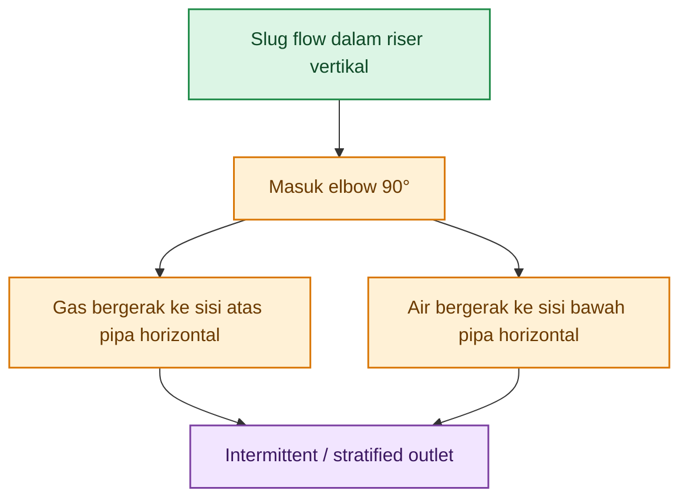
```mermaid
flowchart TD
    A["Slug flow dalam riser vertikal"] --> B["Masuk elbow 90°"]
    B --> C["Gas bergerak ke sisi atas pipa horizontal"]
    B --> D["Air bergerak ke sisi bawah pipa horizontal"]
    C --> E["Intermittent / stratified outlet"]
    D --> E

    classDef vertical fill:#DCF5E5,stroke:#218C4A,color:#0E4A27,stroke-width:1.5px;
    classDef elbow fill:#FFF1D6,stroke:#D97706,color:#6B3A00,stroke-width:1.5px;
    classDef outlet fill:#F2E5FF,stroke:#7B3FA1,color:#3B1760,stroke-width:1.5px;

    class A vertical;
    class B,C,D elbow;
    class E outlet;
```

Untuk mengurangi dampak perubahan tersebut:

- gunakan elbow _long-radius_ bila memungkinkan;
- minimalkan panjang pipa horizontal;
- hindari penyempitan tajam setelah elbow;
- gunakan degassing chamber bila gas perlu dipisahkan;
- uji pola discharge pada debit udara rendah, sedang, dan tinggi;
- evaluasi posisi outlet terhadap muka air.

Pada kolam bioflok, outlet dapat diarahkan tangensial agar membentuk arus melingkar. Namun, rezim aliran di dalam pipa dan pola jet setelah keluar harus dievaluasi terpisah. Aliran slug yang baik di dalam riser belum tentu menghasilkan sirkulasi dasar kolam yang baik.

[**Kembali ke Atas**](#air-lift-pump-prinsip-desain-dan-aplikasi-dalam-akuakultur)

---

# 5. Model Dasar Performa Airlift

Model dasar airlift bertujuan memperkirakan debit air yang dapat diangkat oleh kombinasi riser, diffuser, dan blower tertentu. Model ini tidak langsung “menetapkan” debit air. Sebaliknya, debit air diperoleh ketika gaya pendorong akibat perbedaan densitas sudah seimbang dengan seluruh rugi tekanan sistem.

Untuk aplikasi kolam, bioflok, RAS _low-head_, dan hidroponik, model berikut dapat digunakan sebagai _screening model_ sebelum dibuat prototipe dan dilakukan pengujian aktual.

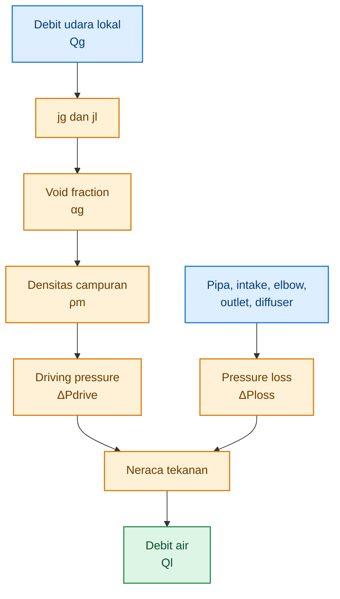
```mermaid
flowchart TD
    A["Debit udara lokal<br/>Qg"] --> B["jg dan jl"]
    B --> C["Void fraction<br/>αg"]
    C --> D["Densitas campuran<br/>ρm"]
    D --> E["Driving pressure<br/>ΔPdrive"]

    F["Pipa, intake, elbow,<br/>outlet, diffuser"] --> G["Pressure loss<br/>ΔPloss"]

    E --> H["Neraca tekanan"]
    G --> H
    H --> I["Debit air<br/>Ql"]

    classDef input fill:#DCEEFF,stroke:#1976D2,color:#073B73,stroke-width:1.5px;
    classDef calc fill:#FFF1D6,stroke:#D97706,color:#6B3A00,stroke-width:1.5px;
    classDef result fill:#DCF5E5,stroke:#218C4A,color:#0E4A27,stroke-width:1.5px;

    class A,F input;
    class B,C,D,E,G,H calc;
    class I result;
```

## 5.1 Neraca Tekanan Dua-Fase

Pada airlift, tekanan pendorong dari kolom air luar riser harus mengatasi seluruh beban sistem.

Bentuk umum neraca tekanan adalah:

$$
\Delta P_{\text{drive}}
=

\Delta P_{\text{static}}
+
\Delta P_{\text{friction}}
+
\Delta P_{\text{local}}
+
\Delta P_{\text{acceleration}}
+
\Delta P_{\text{back}}
$$

dengan:

- $\Delta P_{\text{drive}}$ = tekanan pendorong dari perbedaan densitas kolom;
- $\Delta P_{\text{static}}$ = tekanan untuk mengangkat air ke elevasi outlet;
- $\Delta P_{\text{friction}}$ = rugi gesek sepanjang pipa;
- $\Delta P_{\text{local}}$ = rugi intake, elbow, contraction, outlet, dan fitting;
- $\Delta P_{\text{acceleration}}$ = perubahan momentum akibat percepatan dan ekspansi gas;
- $\Delta P_{\text{back}}$ = tekanan balik, misalnya dari outlet yang terendam.

Untuk outlet bebas tepat di muka air sumber:

$$
H_d\approx0
$$

dan outlet tidak terendam:

$$
\Delta P_{\text{static}}
\approx0
$$

$$
\Delta P_{\text{back}}
\approx0
$$

Sehingga bentuk sederhananya menjadi:

$$
\Delta P_{\text{drive}}
\approx
\Delta P_{\text{friction}}
+
\Delta P_{\text{local}}
+
\Delta P_{\text{acceleration}}
$$

Model ini menjelaskan mengapa dua airlift dengan diameter dan debit udara sama dapat menghasilkan debit air berbeda apabila salah satunya memakai elbow tajam, pipa horizontal panjang, outlet sempit, atau diffuser yang lebih restriktif.

---

## 5.2 Driving Pressure

Driving pressure berasal dari perbedaan berat antara kolom air luar riser dan kolom campuran air–udara di dalam riser.

Pendekatan sederhana:

$$
\Delta P_{\text{drive}}
\approx
\alpha_g
\left(
\rho_l-\rho_g
\right)
gH_s
$$

dengan:

- $\alpha_g$ = void fraction gas;
- $\rho_l$ = densitas air, $\mathrm{kg/m^3}$;
- $\rho_g$ = densitas udara, $\mathrm{kg/m^3}$;
- $g$ = percepatan gravitasi, $9.81\ \mathrm{m/s^2}$;
- $H_s$ = kedalaman injeksi udara, m.

Karena:

$$
\rho_g\ll\rho_l
$$

maka untuk air–udara persamaan dapat disederhanakan secara kasar menjadi:

$$
\Delta P_{\text{drive}}
\approx
\alpha_g\rho_lgH_s
$$

Contoh untuk kedalaman injeksi:

$$
H_s=0.60\ \mathrm{m}
$$

dan void fraction rata-rata:

$$
\alpha_g=0.30
$$

maka:

$$
\Delta P_{\text{drive}}
\approx
0.30
\times1000
\times9.81
\times0.60
$$

$$
\Delta P_{\text{drive}}
\approx
1766\ \mathrm{Pa}
$$

atau:

$$
\Delta P_{\text{drive}}
\approx
180\ \mathrm{mmH_2O}
$$

Tekanan ini bukan tekanan blower. Nilai tersebut adalah tekanan pendorong efektif yang tersedia di dalam riser untuk mengatasi rugi aliran air–udara.

Driving pressure meningkat bila:

- kedalaman injector bertambah;
- void fraction meningkat;
- densitas campuran di riser turun.

Namun, void fraction yang terlalu tinggi tidak selalu menguntungkan. Pada kondisi churn atau annular flow, peningkatan udara dapat menaikkan rugi tekanan dan slip gas–air lebih cepat daripada peningkatan gaya angkat.

---

## 5.3 Rugi Tekanan Sistem

Rugi tekanan sistem harus dihitung dari seluruh jalur aliran, bukan hanya riser vertikal.

Untuk pendekatan awal, rugi pipa dan fitting dapat digabungkan menjadi koefisien rugi total:

$$
K_{\text{total}}
=

f
\frac{L_{\text{total}}}{D}
+
K_{\text{inlet}}
+
K_{\text{elbow}}
+
K_{\text{outlet}}
+
K_{\text{extra}}
$$

dengan:

- $f$ = faktor gesek Darcy;
- $L_{\text{total}}$ = panjang total jalur air;
- $D$ = diameter dalam riser;
- $K_{\text{inlet}}$ = koefisien rugi intake;
- $K_{\text{elbow}}$ = koefisien rugi elbow;
- $K_{\text{outlet}}$ = koefisien rugi discharge;
- $K_{\text{extra}}$ = rugi fitting tambahan.

Kecepatan campuran superfisial:

$$
j_m=j_g+j_l
$$

Rugi dua-fase sederhana dapat ditulis:

$$
\Delta P_{\text{loss}}
\approx
M_{2\phi}
\left(
\frac{1}{2}
\rho_m
K_{\text{total}}
j_m^2
\right)
$$

dengan:

- $\rho_m$ = densitas campuran;
- $M_{2\phi}$ = pengali rugi dua-fase;
- $j_m$ = kecepatan superfisial campuran.

Parameter $M_{2\phi}$ adalah faktor koreksi praktis untuk memasukkan efek dua-fase yang tidak tertangkap oleh model satu-fase sederhana. Pada tahap awal dapat digunakan:

$$
M_{2\phi}=1
$$

Setelah airlift diuji, nilai tersebut dapat dikalibrasi agar hasil spreadsheet mendekati debit aktual.

### Gesekan pipa

Rugi gesek meningkat ketika:

- riser lebih panjang;
- diameter riser lebih kecil;
- debit air dan udara meningkat;
- pipa horizontal setelah elbow lebih panjang;
- permukaan pipa lebih kasar.

Untuk airlift dengan ID kecil, perubahan diameter sangat berpengaruh karena:

$$
\Delta P_{\text{friction}}
\propto
\frac{L}{D}j_m^2
$$

Diameter kecil meningkatkan kecepatan campuran dan rasio $L/D$ secara bersamaan.

### Rugi intake

Intake terlalu sempit, tertutup bioflok, atau memiliki bentuk tajam dapat menurunkan debit airlift. Intake sebaiknya memiliki area masuk yang cukup besar agar kecepatan masuk air rendah.

Rugi intake dapat meningkat akibat:

- saringan terlalu rapat;
- lumpur atau flok menempel;
- bukaan intake terlalu kecil;
- pipa masuk terlalu dekat dasar;
- ada vortex atau pusaran di sekitar intake.

### Rugi elbow 90°

Elbow 90° mengubah arah aliran dua-fase dari vertikal menjadi horizontal. Pada titik ini, slug flow dapat berubah menjadi aliran intermittent atau stratified.

Elbow tajam umumnya menghasilkan rugi lebih tinggi daripada elbow _long-radius_. Pada sistem airlift, elbow juga dapat meningkatkan pulsasi karena Taylor bubble dan liquid slug harus berubah arah secara cepat.

### Rugi outlet dan pipa horizontal

Pipa horizontal tidak selalu menambah static lift, tetapi tetap menambah:

- rugi gesek;
- rugi perubahan arah;
- kemungkinan pemisahan gas–air;
- risiko gas bypass;
- variasi discharge.

Jika outlet diturunkan ke bawah muka air, muncul tekanan balik:

$$
\Delta P_{\text{back}}
\approx
\rho_lgh_{\text{out}}
$$

dengan:

- $h_{\text{out}}$ = kedalaman outlet di bawah muka air.

Contoh outlet 5 cm di bawah permukaan:

$$
\Delta P_{\text{back}}
=

1000
\times9.81
\times0.05
$$

$$
\Delta P_{\text{back}}
\approx
491\ \mathrm{Pa}
$$

atau:

$$
\Delta P_{\text{back}}
\approx
50\ \mathrm{mmH_2O}
$$

Tekanan balik ini dapat membantu memasukkan momentum jet ke dalam kolam, tetapi dapat sedikit menurunkan debit airlift.

### Rugi percepatan

Gas mengembang ketika naik di dalam riser. Kecepatan fase gas berubah, sehingga ada komponen rugi percepatan.

Pendekatan momentum sederhana:

$$
\Delta P_{\text{acceleration}}
\approx
\left[
\rho_g\frac{j_g^2}{\alpha_g}
+
\rho_l\frac{j_l^2}{1-\alpha_g}
\right]_{\text{out}}
-
\left[
\rho_g\frac{j_g^2}{\alpha_g}
+
\rho_l\frac{j_l^2}{1-\alpha_g}
\right]_{\text{inj}}
$$

Untuk airlift dangkal dengan $H_s$ sekitar 0.4–0.8 m, komponen ini sering lebih kecil dibandingkan pressure loss pipa dan fitting. Namun, komponen percepatan perlu diperiksa pada kondisi berikut:

- riser lebih dalam;
- debit udara tinggi;
- diameter riser kecil;
- ekspansi udara besar;
- outlet berada jauh di atas muka air;
- aliran mendekati churn flow.

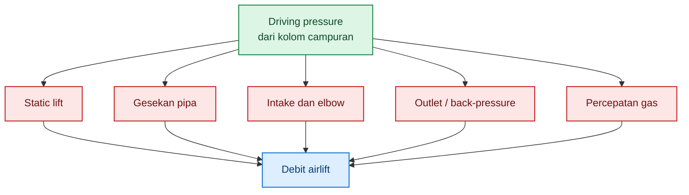
```mermaid id="cp3d72"
flowchart TD
    A["Driving pressure<br/>dari kolom campuran"] --> B["Static lift"]
    A --> C["Gesekan pipa"]
    A --> D["Intake dan elbow"]
    A --> E["Outlet / back-pressure"]
    A --> F["Percepatan gas"]

    B --> G["Debit airlift"]
    C --> G
    D --> G
    E --> G
    F --> G

    classDef drive fill:#DCF5E5,stroke:#218C4A,color:#0E4A27,stroke-width:1.5px;
    classDef loss fill:#FDE6E6,stroke:#C62828,color:#6A1010,stroke-width:1.5px;
    classDef result fill:#DCEEFF,stroke:#1976D2,color:#073B73,stroke-width:1.5px;

    class A drive;
    class B,C,D,E,F loss;
    class G result;
```

---

## 5.4 Estimasi Void Fraction dengan Drift-Flux

Void fraction tidak dapat ditentukan hanya dari perbandingan debit gas dan debit air karena gas dan air bergerak dengan kecepatan berbeda.

Model drift-flux memberikan hubungan:

$$
j_g
=

\alpha_g
\left[
C_0
\left(
j_g+j_l
\right)
+
V_{gj}
\right]
$$

Sehingga void fraction dapat ditulis:

$$
\alpha_g
=

\frac{j_g}
{
C_0
\left(
j_g+j_l
\right)
+
V_{gj}
}
$$

dengan:

- $C_0$ = distribution parameter;
- $V_{gj}$ = drift velocity gas terhadap campuran, $\mathrm{m/s}$;
- $j_g$ = kecepatan superfisial gas;
- $j_l$ = kecepatan superfisial cairan.

Untuk estimasi awal air–udara dalam riser vertikal kecil, nilai awal yang dapat digunakan adalah:

$$
C_0\approx1.2
$$

Untuk kondisi Taylor bubble atau slug flow, pendekatan awal drift velocity:

$$
V_{gj}
\approx
0.35\sqrt{gD}
$$

Nilai tersebut hanya titik awal. Pada sistem nyata, $C_0$ dan $V_{gj}$ dapat berbeda karena dipengaruhi oleh:

- diameter riser;
- rezim aliran;
- bentuk diffuser;
- jenis fluida;
- viskositas air;
- tegangan permukaan;
- perubahan arah pada elbow;
- distribusi gelembung.

Contoh untuk riser:

$$
D=0.0224\ \mathrm{m}
$$

maka:

$$
V_{gj}
\approx
0.35\sqrt{9.81\times0.0224}
$$

$$
V_{gj}
\approx
0.16\ \mathrm{m/s}
$$

Jika:

$$
j_g=0.566\ \mathrm{m/s}
$$

dan:

$$
j_l=0.688\ \mathrm{m/s}
$$

maka:

$$
\alpha_g
=

\frac{0.566}
{
1.2(0.566+0.688)+0.16
}
$$

$$
\alpha_g
\approx0.34
$$

Artinya, sekitar 34% penampang riser ditempati gas secara rata-rata.

---

## 5.5 Iterasi Debit Air

Debit air:

$$
Q_l
$$

bukan parameter input bebas. Nilainya baru diketahui setelah hubungan berikut mencapai keseimbangan:

$$
\Delta P_{\text{drive}}
=

\Delta P_{\text{loss}}
$$

Karena:

$$
\alpha_g
=

f(j_g,j_l)
$$

dan:

$$
\Delta P_{\text{loss}}
=

f(j_g,j_l,\rho_m,K_{\text{total}})
$$

maka debit air perlu dicari secara iteratif atau melalui penyelesaian akar persamaan.

### Urutan perhitungan

1. Tentukan geometri riser, diffuser, intake, elbow, dan outlet.

2. Tentukan debit udara standar dari blower:

$$
Q_{g,\text{std}}
$$

3. Konversikan debit udara menjadi debit aktual pada injector.

4. Hitung:

$$
j_g=\frac{Q_g}{A}
$$

5. Tentukan nilai kandidat:

$$
j_l
$$

6. Hitung:

$$
\alpha_g
$$

dengan model drift-flux.

7. Hitung densitas campuran:

$$
\rho_m
=

\alpha_g\rho_g
+
(1-\alpha_g)\rho_l
$$

8. Hitung:

$$
\Delta P_{\text{drive}}
$$

dan:

$$
\Delta P_{\text{loss}}
$$

9. Cari nilai $j_l$ yang membuat residual mendekati nol:

$$
R
=

\Delta P_{\text{drive}}
-

\Delta P_{\text{loss}}
\approx0
$$

10. Hitung debit air:

$$
Q_l
=

Aj_l
$$

### Metode spreadsheet tanpa Goal Seek

Cara paling stabil dan mudah untuk spreadsheet adalah memakai tabel pencarian residual.

Buat deret nilai kandidat:

$$
j_l=
0.00,\ 0.01,\ 0.02,\dots,\ 2.00\ \mathrm{m/s}
$$

Untuk setiap nilai $j_l$, hitung:

| Kolom spreadsheet         | Perhitungan                                      |     |     |
| ------------------------- | ------------------------------------------------ | --- | --- |
| $j_l$ kandidat            | Nilai uji kecepatan superfisial air              |     |     |
| $j_m$                     | $j_g+j_l$                                        |     |     |
| $\alpha_g$                | Model drift-flux                                 |     |     |
| $\rho_m$                  | Densitas campuran                                |     |     |
| $\Delta P_{\text{drive}}$ | Driving pressure                                 |     |     |
| $\Delta P_{\text{loss}}$  | Total pressure loss                              |     |     |
| $R$                       | $\Delta P_{\text{drive}}-\Delta P_{\text{loss}}$ |     |     |
| $\lvert R\rvert$          | Nilai absolut residual                           |     |     |

Nilai $j_l$ terbaik adalah nilai dengan:

$$
\left|R\right|
=

\min
$$

Kemudian debit air dihitung:

$$
Q_l
=

Aj_l
$$

Metode ini tidak membutuhkan Goal Seek, tidak membutuhkan formula kubik yang panjang, dan tetap dapat digunakan ketika outlet dinaikkan, outlet diturunkan, atau koefisien rugi sistem diubah.

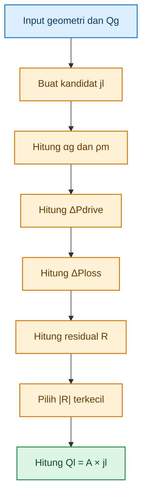
```mermaid id="e3hmsc"
flowchart TD
    A["Input geometri dan Qg"] --> B["Buat kandidat jl"]
    B --> C["Hitung αg dan ρm"]
    C --> D["Hitung ΔPdrive"]
    D --> E["Hitung ΔPloss"]
    E --> F["Hitung residual R"]
    F --> G["Pilih |R| terkecil"]
    G --> H["Hitung Ql = A × jl"]

    classDef input fill:#DCEEFF,stroke:#1976D2,color:#073B73,stroke-width:1.5px;
    classDef calc fill:#FFF1D6,stroke:#D97706,color:#6B3A00,stroke-width:1.5px;
    classDef output fill:#DCF5E5,stroke:#218C4A,color:#0E4A27,stroke-width:1.5px;

    class A input;
    class B,C,D,E,F,G calc;
    class H output;
```

### Bentuk kubik untuk kondisi sederhana

Untuk sistem dengan:

$$
H_d=0
$$

$$
\Delta P_{\text{back}}=0
$$

$$
\Delta P_{\text{acceleration}}\approx0
$$

dan faktor gesek dianggap tetap, persamaan neraca tekanan dapat disederhanakan menjadi persamaan kubik.

Definisikan:

$$
J=j_m=j_g+j_l
$$

dan:

$$
\Delta\rho=\rho_l-\rho_g
$$

Maka:

$$
aJ^3+bJ^2+c=0
$$

dengan:

$$
a=
\frac{1}{2}
M_{2\phi}
K_{\text{total}}
\rho_lC_0
$$

$$
b=
\frac{1}{2}
M_{2\phi}
K_{\text{total}}
\left(
\frac{\rho_lV_{gj}}{\Delta\rho j_g}
\right)
$$

$$
c=
-
\Delta\rho
gH_sj_g
$$

Setelah akar positif $J$ diperoleh:

$$
j_l=J-j_g
$$

dan:

$$
Q_l=Aj_l
$$

Bentuk kubik ini berguna untuk memeriksa spreadsheet, tetapi metode residual scan tetap lebih praktis untuk pemakaian lapangan karena dapat menangani perubahan outlet, elbow, pipa horizontal, dan tekanan balik tanpa mengubah struktur utama model.

### Batas penggunaan model

Model pada bab ini cocok untuk:

- desain awal airlift air–udara;
- riser vertikal pendek hingga sedang;
- aplikasi low-head;
- estimasi debit air;
- perbandingan beberapa diameter riser;
- evaluasi awal diffuser dan blower.

Model ini belum menggantikan pengukuran aktual pada:

- aliran churn yang kuat;
- outlet horizontal panjang;
- air dengan bioflok sangat pekat;
- air asin;
- slurry atau padatan berat;
- geometri riser tidak seragam;
- sistem multi-riser dengan distribusi udara tidak seimbang.

Setelah prototipe dibuat, parameter paling penting yang harus diukur adalah:

$$
Q_l=\frac{V}{t}
$$

dan tekanan udara sebelum diffuser atau pada manifold. Hasil pengujian tersebut digunakan untuk memperbarui $M_{2\phi}$, faktor rugi, serta parameter drift-flux agar spreadsheet semakin mendekati kinerja airlift nyata.

[**Kembali ke Atas**](#air-lift-pump-prinsip-desain-dan-aplikasi-dalam-akuakultur)

---

# 6. Desain Riser

Riser adalah komponen utama airlift pump karena diameter, panjang vertikal, posisi injeksi, bentuk intake, serta geometri outlet menentukan kecepatan superfisial, rezim aliran, rugi tekanan, dan debit air akhir. Bab ini melanjutkan pembahasan pemilihan pipa dari naskah awal, tetapi menggunakan dasar aliran dua-fase agar sizing riser tidak hanya bergantung pada asumsi kecepatan air tunggal.

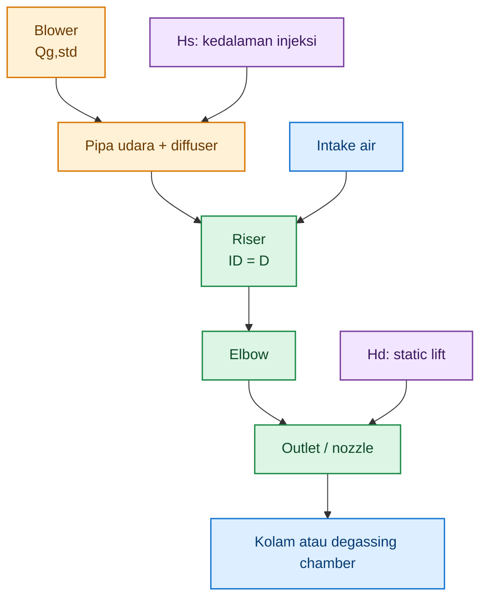
```mermaid
flowchart TB
    A["Blower<br/>Qg,std"] --> B["Pipa udara + diffuser"]
    B --> C["Riser<br/>ID = D"]
    D["Intake air"] --> C
    C --> E["Elbow"]
    E --> F["Outlet / nozzle"]
    F --> G["Kolam atau degassing chamber"]

    H["Hs: kedalaman injeksi"] --> B
    I["Hd: static lift"] --> F

    classDef air fill:#FFF1D6,stroke:#D97706,color:#6B3A00,stroke-width:1.5px;
    classDef water fill:#DCEEFF,stroke:#1976D2,color:#073B73,stroke-width:1.5px;
    classDef pipe fill:#DCF5E5,stroke:#218C4A,color:#0E4A27,stroke-width:1.5px;
    classDef geometry fill:#F2E5FF,stroke:#7B3FA1,color:#3B1760,stroke-width:1.5px;

    class A,B air;
    class D,G water;
    class C,E,F pipe;
    class H,I geometry;
```

## 6.1 Pemilihan Diameter Riser

Diameter dalam riser menentukan luas penampang aliran:

$$
A
=

\frac{\pi D^2}{4}
$$

Kecepatan superfisial gas pada titik injeksi:

$$
j_g
=

\frac{Q_{g,\mathrm{inj}}}{A}
$$

Kecepatan superfisial cairan:

$$
j_l
=

\frac{Q_l}{A}
$$

Untuk debit udara yang sama, riser lebih kecil menghasilkan $j_g$ lebih tinggi. Sebaliknya, riser lebih besar menghasilkan $j_g$ lebih rendah.

Hubungan ini penting karena rezim aliran tidak ditentukan oleh debit udara saja, tetapi oleh kombinasi:

$$
j_g,\quad j_l,\quad D,\quad H_s,\quad \alpha_g
$$

Diameter nominal pipa tidak boleh langsung digunakan dalam perhitungan. Gunakan diameter dalam aktual hasil pengukuran atau data spesifikasi pipa.

### Menentukan debit udara dari target $j_g$

Apabila target awal $j_g$ sudah dipilih, debit udara aktual di injector dapat dihitung:

$$
Q_{g,\mathrm{inj}}
=

j_{g,\mathrm{target}}A
$$

Untuk mengubahnya menjadi debit standar:

$$
Q_{g,\mathrm{std}}
\approx
Q_{g,\mathrm{inj}}
\frac{P_{\mathrm{inj,abs}}}{P_{\mathrm{std}}}
$$

dengan asumsi temperatur udara di titik referensi dan injector hampir sama.

Pada contoh desain artikel ini, nilai awal berikut dapat dipakai untuk evaluasi slug/Taylor-bubble flow:

$$
0.45
\leq
j_{g,\mathrm{inj}}
\leq
0.70\ \mathrm{m/s}
$$

Rentang tersebut bukan batas universal. Nilai akhir tetap harus diperiksa terhadap debit air, void fraction, pressure loss, dan pola discharge aktual.

### Perbandingan diameter pada debit udara sama

Contoh berikut memakai asumsi:

$$
Q_{g,\mathrm{std}}
=

30\ \mathrm{SLPM}
$$

$$
H_s
=

0.60\ \mathrm{m}
$$

Dengan tekanan absolut injector sekitar:

$$
P_{\mathrm{inj,abs}}
=

107.21\ \mathrm{kPa}
$$

maka debit udara aktual di injector kira-kira:

$$
Q_{g,\mathrm{inj}}
\approx
28.4\ \mathrm{LPM}
$$

| ID riser | Luas riser | $j_g$ di injector | Indikasi awal                         |
| -------: | ---------: | ----------------: | ------------------------------------- |
|  22.4 mm |    394 mm² |          1.20 m/s | Gas loading tinggi; risiko slug–churn |
|  28.0 mm |    616 mm² |          0.77 m/s | Slug kuat; perlu cek pulsasi          |
|  37.4 mm |  1,099 mm² |          0.43 m/s | Transisi bubbly–slug atau slug awal   |
|  43.4 mm |  1,479 mm² |          0.32 m/s | Gas loading lebih rendah              |
|  55.4 mm |  2,410 mm² |          0.20 m/s | Mungkin perlu debit udara lebih besar |
|  70.8 mm |  3,937 mm² |          0.12 m/s | Void fraction dapat terlalu rendah    |

Tabel tersebut hanya menunjukkan pengaruh diameter terhadap gas loading. Rezim akhir tetap memerlukan nilai $j_l$ atau debit air aktual.

### Debit udara untuk target $j_g=0.55\ \mathrm{m/s}$

Dengan kondisi injeksi yang sama, target:

$$
j_{g,\mathrm{target}}
=

0.55\ \mathrm{m/s}
$$

memberi kebutuhan udara berikut.

| ID riser | Debit udara aktual di injector | Debit udara standar perkiraan |
| -------: | -----------------------------: | ----------------------------: |
|  22.4 mm |                       13.0 LPM |                     13.8 SLPM |
|  28.0 mm |                       20.3 LPM |                     21.5 SLPM |
|  37.4 mm |                       36.3 LPM |                     38.4 SLPM |
|  43.4 mm |                       48.8 LPM |                     51.7 SLPM |
|  55.4 mm |                       79.6 LPM |                     84.2 SLPM |
|  70.8 mm |                      129.9 LPM |                    137.5 SLPM |

Tabel ini menunjukkan bahwa diameter riser dan kebutuhan blower tidak dapat dipisahkan. Riser lebih besar membutuhkan debit udara jauh lebih besar untuk mencapai $j_g$ yang sama.

### Risiko riser terlalu kecil

Riser terlalu kecil dapat menghasilkan $j_g$ dan $j_l$ terlalu tinggi. Dampaknya meliputi:

- kecenderungan masuk ke slug–churn flow;
- pulsasi discharge lebih kuat;
- rugi gesek meningkat;
- gas dapat keluar lebih cepat daripada air;
- elbow menjadi lebih kritis;
- noise dan getaran bertambah;
- efisiensi udara dapat menurun.

Untuk target debit air yang sama, kecepatan cairan meningkat tajam saat diameter mengecil.

Secara kasar, bila faktor gesek dianggap tetap:

$$
\Delta P_f
\propto
\frac{LQ_l^2}{D^5}
$$

Artinya, pengurangan diameter riser dapat menaikkan rugi gesek secara sangat tajam.

### Risiko riser terlalu besar

Riser terlalu besar juga tidak selalu menguntungkan. Pada debit udara terbatas:

$$
j_g
=

\frac{Q_g}{A}
$$

akan menjadi rendah karena luas penampang terlalu besar.

Dampaknya dapat berupa:

- void fraction rendah;
- driving pressure tidak cukup;
- gelembung naik tanpa membawa air secara efektif;
- distribusi gas tidak merata;
- kebutuhan debit udara blower meningkat;
- debit air aktual lebih rendah daripada prediksi berbasis luas riser.

Prinsip desain yang lebih tepat adalah:

$$
\boxed{
\text{Pilih diameter riser agar }j_g\text{ dan }j_l
\text{ berada pada zona operasi yang diinginkan.}
}
$$

Bukan hanya memilih riser terbesar yang tersedia.

---

## 6.2 Panjang Vertikal dan Posisi Injeksi

Panjang vertikal riser dan kedalaman injeksi menentukan panjang kolom campuran air–udara yang menghasilkan gaya angkat.

Untuk outlet bebas di atas muka air:

$$
L_{\mathrm{active}}
\approx
H_s+H_d
$$

dengan:

- $L_{\mathrm{active}}$ = panjang vertikal aktif;
- $H_s$ = kedalaman injector;
- $H_d$ = static lift outlet.

Jika outlet berada tepat di muka air:

$$
H_d\approx0
$$

maka:

$$
L_{\mathrm{active}}
\approx
H_s
$$

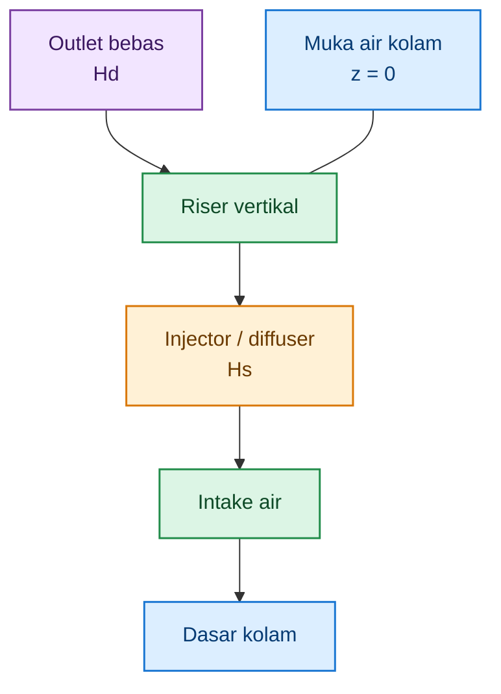
```mermaid
flowchart TB
    A["Outlet bebas<br/>Hd"] --> B["Riser vertikal"]
    C["Muka air kolam<br/>z = 0"] --- B
    B --> D["Injector / diffuser<br/>Hs"]
    D --> E["Intake air"]
    E --> F["Dasar kolam"]

    classDef outlet fill:#F2E5FF,stroke:#7B3FA1,color:#3B1760,stroke-width:1.5px;
    classDef pipe fill:#DCF5E5,stroke:#218C4A,color:#0E4A27,stroke-width:1.5px;
    classDef water fill:#DCEEFF,stroke:#1976D2,color:#073B73,stroke-width:1.5px;
    classDef gas fill:#FFF1D6,stroke:#D97706,color:#6B3A00,stroke-width:1.5px;

    class A outlet;
    class B,E pipe;
    class C,F water;
    class D gas;
```

### Kedalaman injeksi

Kedalaman injector menentukan tekanan hidrostatik:

$$
\Delta P_h
=

\rho_lgH_s
$$

Kedalaman juga berpengaruh pada driving pressure:

$$
\Delta P_{\mathrm{drive}}
\approx
\alpha_g
\left(
\rho_l-\rho_g
\right)
gH_s
$$

Contoh dengan asumsi:

$$
\alpha_g=0.30
$$

| Kedalaman injector | Tekanan hidrostatik | Driving pressure perkiraan |
| -----------------: | ------------------: | -------------------------: |
|             0.40 m |            3.92 kPa |                   1.18 kPa |
|             0.60 m |            5.89 kPa |                   1.77 kPa |
|             0.80 m |            7.85 kPa |                   2.35 kPa |

Kedalaman lebih besar meningkatkan potensi gaya angkat. Namun, tekanan blower yang dibutuhkan juga naik secara proporsional.

Karena itu, prinsipnya bukan sekadar:

> “Semakin dalam selalu semakin baik.”

Prinsip yang lebih tepat adalah:

> Kedalaman injector ditingkatkan selama tambahan driving pressure masih memberi peningkatan debit air yang lebih besar daripada tambahan kebutuhan tekanan blower dan rugi sistem.

### Posisi injector

Injector sebaiknya ditempatkan serendah mungkin secara praktis, tetapi tidak boleh tertutup lumpur atau terlalu dekat dengan dasar hingga sulit dibersihkan.

Hal yang perlu diperhatikan:

- diffuser tidak terendam dalam sediment;
- ada ruang cukup untuk air masuk ke riser;
- udara tidak langsung keluar dari intake;
- jalur pipa udara tidak mudah tertarik atau tertekuk;
- diffuser dapat dilepas untuk pembersihan;
- posisi injector tidak menyebabkan debris menutup bore.

Untuk kolam dangkal, jarak bebas beberapa sentimeter dari dasar dapat menjadi titik awal geometri. Nilai akhirnya bergantung pada ketebalan endapan, bentuk intake, serta strategi pengangkutan padatan.

### Pengaruh submergence terhadap kapasitas

Submergence ratio:

$$
SR=
\frac{H_s}{H_s+H_d}
$$

Nilai $SR$ tinggi berarti static lift relatif kecil dibanding kedalaman injector.

Contoh:

$$
H_s=0.60\ \mathrm{m}
$$

$$
H_d=0.20\ \mathrm{m}
$$

maka:

$$
SR=
\frac{0.60}{0.60+0.20}
=

0.75
$$

Pada aplikasi kolam, outlet dekat muka air biasanya lebih menguntungkan daripada outlet tinggi di atas muka air.

---

## 6.3 Elbow dan Pipa Outlet

Elbow dan pipa horizontal sering dianggap bagian kecil dari airlift. Padahal, bagian ini dapat menentukan kestabilan discharge, terutama pada slug flow.

Pada riser vertikal, buoyancy membantu gas bergerak ke atas. Setelah melewati elbow 90°, gas dan air mengalami perubahan arah yang cepat. Gas cenderung bergerak ke bagian atas pipa horizontal, sedangkan air berada di bagian bawah.

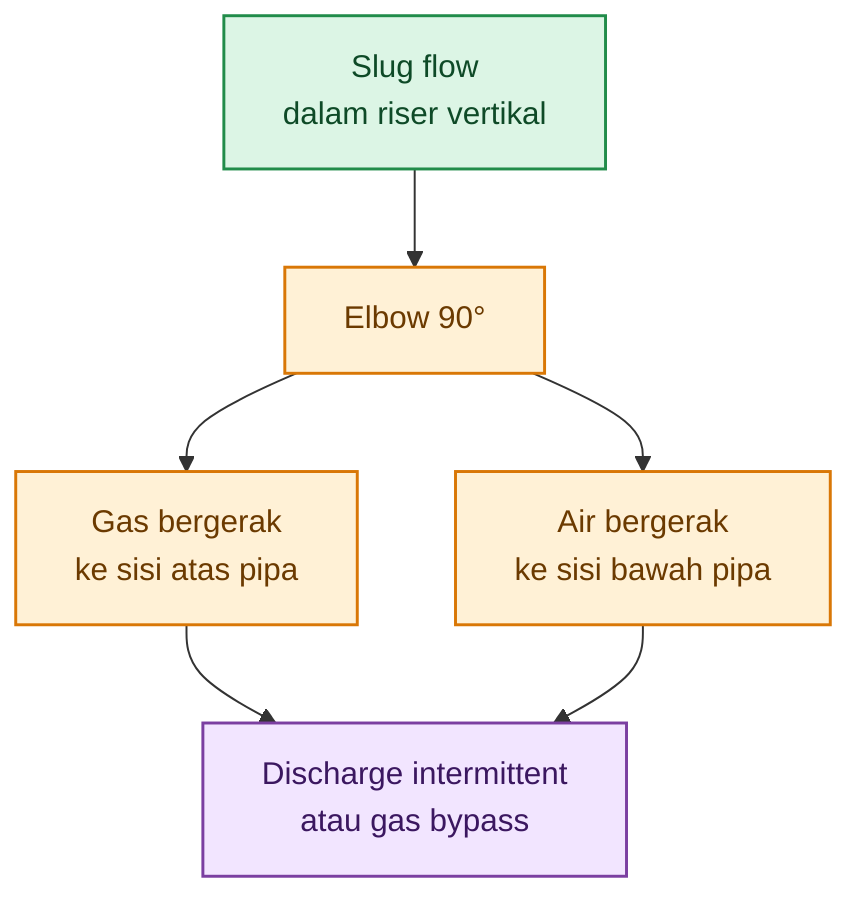
```mermaid
flowchart TB
    A["Slug flow<br/>dalam riser vertikal"] --> B["Elbow 90°"]
    B --> C["Gas bergerak<br/>ke sisi atas pipa"]
    B --> D["Air bergerak<br/>ke sisi bawah pipa"]
    C --> E["Discharge intermittent<br/>atau gas bypass"]
    D --> E

    classDef vertical fill:#DCF5E5,stroke:#218C4A,color:#0E4A27,stroke-width:1.5px;
    classDef elbow fill:#FFF1D6,stroke:#D97706,color:#6B3A00,stroke-width:1.5px;
    classDef outlet fill:#F2E5FF,stroke:#7B3FA1,color:#3B1760,stroke-width:1.5px;

    class A vertical;
    class B,C,D elbow;
    class E outlet;
```

### Rugi elbow

Rugi lokal secara sederhana dapat ditulis:

$$
\Delta P_{\mathrm{local}}
\approx
\frac{1}{2}
\rho_m
K
j_m^2
$$

dengan:

$$
j_m=j_g+j_l
$$

Untuk aliran dua-fase, nilai $K$ dari tabel satu-fase hanya dipakai sebagai estimasi awal. Efek dua-fase perlu dikalibrasi melalui faktor koreksi atau data uji.

| Jenis belokan     | Karakter                                                | Rekomendasi                          |
| ----------------- | ------------------------------------------------------- | ------------------------------------ |
| Elbow tajam       | Perubahan arah cepat, pulsasi dan rugi lebih besar      | Hindari bila ruang memungkinkan      |
| Elbow standar     | Dapat digunakan pada sistem sederhana                   | Periksa discharge aktual             |
| Long-radius elbow | Belokan lebih halus, rugi dan gangguan fase lebih kecil | Pilihan utama untuk airlift          |
| Selang melengkung | Fleksibel, tetapi risiko tekuk atau penyempitan         | Pastikan radius lengkung cukup besar |

Untuk desain awal, gunakan long-radius elbow bila memungkinkan. Radius belokan yang lebih besar membantu mengurangi pemisahan fase mendadak dan rugi perubahan arah.

### Pipa horizontal

Pipa horizontal tidak meningkatkan static lift bila elevasi outlet tidak berubah. Namun, pipa ini tetap menambah:

- rugi gesek;
- waktu tinggal gas–air;
- kecenderungan pemisahan fase;
- kemungkinan gas bypass;
- ketidakstabilan discharge.

Prinsip praktis untuk pipa horizontal:

- gunakan diameter penuh, tanpa penyempitan mendadak;
- buat sepanjang mungkin hanya bila benar-benar diperlukan;
- hindari lekukan yang membentuk perangkap gas atau air;
- hindari sambungan kasar dan katup restriktif;
- gunakan jalur dengan kemiringan konsisten menuju outlet;
- evaluasi pola aliran pada debit udara rendah, sedang, dan tinggi.

### Posisi outlet terhadap muka air

Posisi outlet menentukan static lift atau tekanan balik.

| Posisi outlet             | Konsekuensi hidrolik                                           |
| ------------------------- | -------------------------------------------------------------- |
| Di atas muka air          | Menambah static lift dan menurunkan debit airlift              |
| Tepat pada muka air       | Static lift mendekati nol                                      |
| Sedikit di bawah muka air | Menambah back-pressure, tetapi jet lebih terkopel ke air kolam |
| Terlalu dalam             | Back-pressure besar dan debit airlift dapat turun tajam        |

Untuk outlet terendam:

$$
\Delta P_{\mathrm{back}}
\approx
\rho_lgh_{\mathrm{out}}
$$

Contoh tekanan balik outlet terendam:

| Kedalaman outlet | Tekanan balik |    Setara |
| ---------------: | ------------: | --------: |
|             5 cm |        491 Pa |  50 mmH₂O |
|            15 cm |      1,472 Pa | 150 mmH₂O |
|            25 cm |      2,453 Pa | 250 mmH₂O |

Nilai tersebut perlu dibandingkan dengan driving pressure airlift.

Contoh pada:

$$
H_s=0.60\ \mathrm{m}
$$

$$
\alpha_g=0.30
$$

maka:

$$
\Delta P_{\mathrm{drive}}
\approx
1.77\ \mathrm{kPa}
$$

Outlet 5 cm di bawah muka air memberi tekanan balik sekitar:

$$
0.49\ \mathrm{kPa}
$$

atau sekitar 28% dari driving pressure sederhana tersebut.

Karena itu, outlet terendam 5 cm bukan selalu “beban kecil” bagi airlift. Nilainya memang hanya sekitar 8% dari tekanan hidrostatik injector, tetapi dapat menjadi bagian berarti dari tekanan pendorong campuran.

Untuk kolam bioflok, nozzle terendam dapat meningkatkan transfer momentum ke badan air. Namun, bila tujuan utama adalah sirkulasi dasar kolam, konfigurasi yang lebih baik sering berupa:

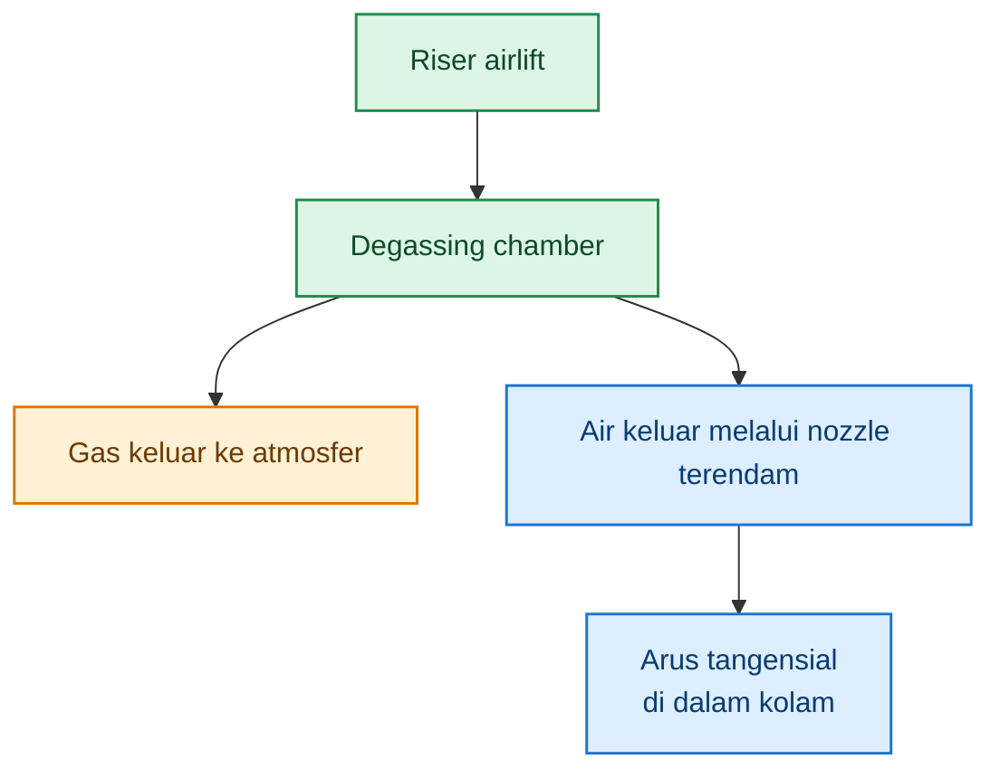
```mermaid
flowchart TB
    A["Riser airlift"] --> B["Degassing chamber"]
    B --> C["Gas keluar ke atmosfer"]
    B --> D["Air keluar melalui nozzle terendam"]
    D --> E["Arus tangensial<br/>di dalam kolam"]

    classDef pipe fill:#DCF5E5,stroke:#218C4A,color:#0E4A27,stroke-width:1.5px;
    classDef gas fill:#FFF1D6,stroke:#D97706,color:#6B3A00,stroke-width:1.5px;
    classDef water fill:#DCEEFF,stroke:#1976D2,color:#073B73,stroke-width:1.5px;

    class A,B pipe;
    class C gas;
    class D,E water;
```

Konfigurasi tersebut memungkinkan udara dipisahkan lebih dahulu sebelum air diarahkan sebagai jet terendam.

---

## 6.4 Intake Airlift

Intake menentukan bagaimana air masuk ke riser. Walaupun tidak menggunakan impeller, airlift tetap dapat mengalami penurunan performa apabila intake terlalu kecil, tertutup flok, tersumbat debris, atau membentuk vortex.

Luas intake efektif sebaiknya dihitung dari target debit air:

$$
A_{\mathrm{in}}
\geq
\frac{Q_l}{u_{\mathrm{in,target}}}
$$

dengan:

- $A_{\mathrm{in}}$ = luas bukaan intake efektif;
- $Q_l$ = debit air target;
- $u_{\mathrm{in,target}}$ = kecepatan masuk air yang diinginkan.

Kecepatan intake yang terlalu tinggi dapat meningkatkan risiko:

- flok atau lumpur tertarik berlebihan;
- debris terkumpul pada screen;
- vortex lokal;
- rugi masuk meningkat;
- distribusi inflow menjadi tidak seragam.

Sebagai pendekatan awal, luas intake total sebaiknya beberapa kali lebih besar daripada luas riser. Nilai akhir perlu disesuaikan dengan tujuan sistem: hanya sirkulasi air, pengangkutan flok, atau pengumpulan padatan dasar.

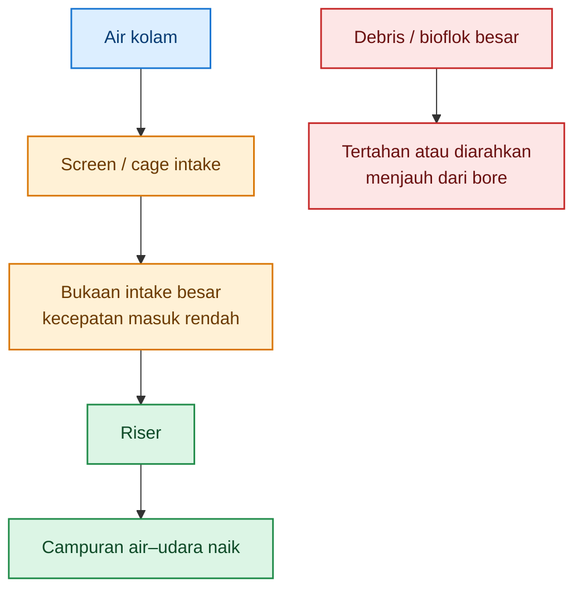
```mermaid
flowchart TB
    A["Air kolam"] --> B["Screen / cage intake"]
    B --> C["Bukaan intake besar<br/>kecepatan masuk rendah"]
    C --> D["Riser"]
    D --> E["Campuran air–udara naik"]

    F["Debris / bioflok besar"] --> G["Tertahan atau diarahkan<br/>menjauh dari bore"]

    classDef water fill:#DCEEFF,stroke:#1976D2,color:#073B73,stroke-width:1.5px;
    classDef screen fill:#FFF1D6,stroke:#D97706,color:#6B3A00,stroke-width:1.5px;
    classDef pipe fill:#DCF5E5,stroke:#218C4A,color:#0E4A27,stroke-width:1.5px;
    classDef debris fill:#FDE6E6,stroke:#C62828,color:#6A1010,stroke-width:1.5px;

    class A water;
    class B,C screen;
    class D,E pipe;
    class F,G debris;
```

### Bentuk intake

| Bentuk intake               | Kelebihan                                 | Risiko atau batasan                         |
| --------------------------- | ----------------------------------------- | ------------------------------------------- |
| Ujung pipa terbuka ke bawah | Sederhana dan mudah dibuat                | Dapat menarik lumpur atau debris dari dasar |
| Bell-mouth                  | Rugi masuk lebih rendah                   | Membutuhkan ruang dan komponen tambahan     |
| Slot samping                | Distribusi intake lebih luas              | Slot dapat tersumbat bioflok                |
| Cincin atau cage berlubang  | Area intake besar, kecepatan masuk rendah | Harus mudah dilepas untuk dibersihkan       |
| Screen halus                | Menahan debris kecil                      | Sangat berisiko fouling pada sistem bioflok |

Untuk kolam bioflok, screen terlalu halus biasanya bukan pilihan baik karena flok dan biofilm dapat menutup area terbuka. Lebih baik menggunakan cage kasar dengan area terbuka besar dan akses pembersihan mudah.

### Risiko vortex

Vortex dapat muncul apabila intake terlalu dekat dengan muka air atau kecepatan masuk terlalu tinggi. Vortex dapat menyebabkan udara dari permukaan masuk sebelum titik injector, sehingga pola aliran menjadi tidak stabil.

Untuk mengurangi risiko tersebut:

- tempatkan intake cukup jauh dari muka air;
- gunakan area intake lebih besar;
- hindari aliran masuk hanya dari satu titik kecil;
- gunakan cage atau intake annular;
- jangan menempatkan intake tepat di bawah jet discharge lain.

### Risiko debris dan penyumbatan

Debris, sisa pakan, flok besar, daun, atau organisme air dapat mengganggu intake maupun diffuser.

Langkah desain yang disarankan:

- gunakan bore diffuser yang cukup besar untuk kondisi air kotor;
- hindari screen sangat rapat;
- sediakan akses pembongkaran diffuser;
- gunakan check valve agar air tidak masuk ke pipa udara saat blower mati;
- tempatkan intake agar tidak langsung menyedot lumpur dasar;
- lakukan inspeksi berkala pada cage dan diffuser.

### Posisi intake terhadap pengangkutan padatan

Posisi intake harus disesuaikan dengan fungsi airlift.

| Tujuan                         | Posisi intake yang lebih sesuai                                   |
| ------------------------------ | ----------------------------------------------------------------- |
| Sirkulasi umum                 | Intake sisi atau intake luas pada elevasi menengah–bawah          |
| Menahan flok tetap tersuspensi | Intake bawah dengan area besar, tanpa menghisap lumpur berlebihan |
| Pengumpulan padatan dasar      | Intake dekat titik sump atau dasar miring                         |
| Menghindari lumpur             | Intake dinaikkan dari dasar dan diberi cage                       |

Untuk kolam bioflok, satu airlift tidak selalu perlu menjalankan dua fungsi sekaligus. Airlift untuk sirkulasi dapat memakai intake luas dan discharge tangensial, sedangkan pengumpulan sludge dapat memakai intake khusus di titik dasar atau sump.

Dengan pemisahan fungsi tersebut, sistem lebih mudah diatur dan risiko penyumbatan dapat dikurangi.

[**Kembali ke Atas**](#air-lift-pump-prinsip-desain-dan-aplikasi-dalam-akuakultur)

---

# 7. Desain Diffuser dan Multi-Bore Injector

Diffuser atau _multi-bore injector_ adalah komponen yang memasukkan udara dari pipa injeksi ke dalam riser. Fungsinya bukan hanya membuat gelembung, tetapi juga mengatur distribusi udara, kecepatan jet udara, pressure drop, kestabilan pembagian udara antar-lubang, dan kondisi awal aliran dua-fase.

Pada airlift dengan riser kecil hingga menengah, gelembung dari diffuser umumnya akan berkoalesensi beberapa diameter pipa di atas injector. Karena itu, diffuser tidak dirancang semata-mata untuk menghasilkan gelembung sekecil mungkin. Diffuser harus dirancang agar udara masuk secara stabil, pressure drop masih sesuai kemampuan blower, dan bore tidak mudah tersumbat.

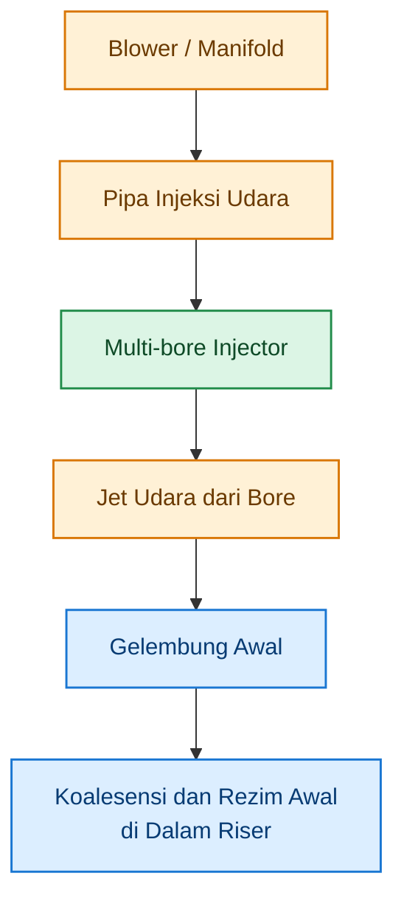
```mermaid
flowchart TB
    A["Blower / Manifold"] --> B["Pipa Injeksi Udara"]
    B --> C["Multi-bore Injector"]
    C --> D["Jet Udara dari Bore"]
    D --> E["Gelembung Awal"]
    E --> F["Koalesensi dan Rezim Awal<br/>di Dalam Riser"]

    classDef air fill:#FFF1D6,stroke:#D97706,color:#6B3A00,stroke-width:1.5px;
    classDef injector fill:#DCF5E5,stroke:#218C4A,color:#0E4A27,stroke-width:1.5px;
    classDef flow fill:#DCEEFF,stroke:#1976D2,color:#073B73,stroke-width:1.5px;

    class A,B,D air;
    class C injector;
    class E,F flow;
```

## 7.1 Fungsi Diffuser

Diffuser memiliki tiga fungsi utama dalam airlift pump.

### Distribusi udara awal

Udara dari pipa injeksi sebaiknya tidak keluar melalui satu lubang besar saja, terutama pada riser dengan diameter lebih besar. Satu lubang dapat menghasilkan jet udara terkonsentrasi, distribusi gas tidak merata, dan kecenderungan aliran tidak simetris.

Multi-bore injector membagi udara ke beberapa titik keluaran.

Keuntungan distribusi multi-bore:

- pembagian udara lebih merata pada penampang riser;
- tekanan di jalur udara lebih stabil;
- udara tidak hanya terkonsentrasi pada satu sisi pipa;
- awal pembentukan gelembung lebih seragam;
- risiko aliran miring atau _gas channeling_ dapat dikurangi.

Namun, jumlah bore terlalu banyak juga tidak selalu lebih baik. Bore terlalu kecil atau terlalu banyak dapat meningkatkan risiko fouling, biofilm, kerak, dan penyumbatan.

### Pembentukan gelembung awal

Setelah keluar dari bore, udara membentuk jet dan kemudian berkembang menjadi gelembung. Diameter bore, orientasi bore, kecepatan udara, tegangan permukaan, dan kondisi dinding diffuser memengaruhi ukuran gelembung awal.

Gelembung awal yang lebih kecil dapat meningkatkan luas antarmuka udara–air. Hal ini bermanfaat untuk transfer gas, khususnya oksigenasi dan degassing.

Namun, pada riser airlift, gelembung kecil sering bergabung menjadi gelembung lebih besar.

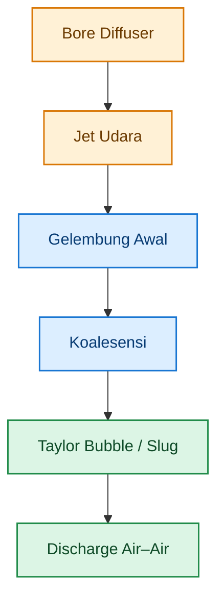
```mermaid
flowchart TB
    A["Bore Diffuser"] --> B["Jet Udara"]
    B --> C["Gelembung Awal"]
    C --> D["Koalesensi"]
    D --> E["Taylor Bubble / Slug"]
    E --> F["Discharge Air–Air"]

    classDef bore fill:#FFF1D6,stroke:#D97706,color:#6B3A00,stroke-width:1.5px;
    classDef bubble fill:#DCEEFF,stroke:#1976D2,color:#073B73,stroke-width:1.5px;
    classDef slug fill:#DCF5E5,stroke:#218C4A,color:#0E4A27,stroke-width:1.5px;

    class A,B bore;
    class C,D bubble;
    class E,F slug;
```

Karena itu, ukuran bore diffuser tidak boleh dianggap sebagai satu-satunya pengendali ukuran gelembung sepanjang riser.

### Hubungan diffuser dengan rezim awal

Diffuser memengaruhi kondisi awal aliran, terutama dekat injector. Namun, rezim aliran beberapa puluh sentimeter di atas diffuser lebih dipengaruhi oleh:

$$
j_g,\quad j_l,\quad D,\quad \alpha_g,\quad \text{dan slip gas–air}
$$

Diffuser Ø1 mm dengan banyak bore dapat membentuk gelembung awal lebih halus daripada bore Ø2 mm. Namun, pada riser ID 22,4 mm hingga 37,4 mm, keduanya tetap dapat berkembang menjadi slug atau Taylor-bubble flow.

Prinsip desain yang lebih tepat adalah:

$$
\boxed{
\text{Diffuser mengatur kondisi awal, tetapi riser menentukan rezim berkembang penuh.}
}
$$

---

## 7.2 Diameter Bore

Diameter bore memengaruhi luas bukaan total, kecepatan udara, pressure drop, ukuran gelembung awal, dan risiko fouling.

Dua diameter yang praktis untuk airlift kecil adalah:

$$
d_{\mathrm{bore}}=1\ \mathrm{mm}
$$

dan:

$$
d_{\mathrm{bore}}=2\ \mathrm{mm}
$$

### Perbandingan bore Ø1 mm dan Ø2 mm

| Parameter                             | Bore Ø1 mm                   | Bore Ø2 mm            |
| ------------------------------------- | ---------------------------- | --------------------- |
| Luas satu bore                        | 0.785 mm²                    | 3.142 mm²             |
| Luas relatif per bore                 | 1                            | 4 kali lebih besar    |
| Kecepatan udara pada jumlah bore sama | Lebih tinggi                 | Lebih rendah          |
| Pressure drop                         | Lebih tinggi                 | Lebih rendah          |
| Gelembung awal                        | Cenderung lebih kecil        | Cenderung lebih besar |
| Risiko biofilm dan fouling            | Lebih tinggi                 | Lebih rendah          |
| Kemudahan pembersihan                 | Lebih sulit                  | Lebih mudah           |
| Kesesuaian untuk bioflok              | Perlu perawatan lebih sering | Lebih robust          |
| Rasio $L/D$ untuk dinding 2 mm        | 2                            | 1                     |

Luas satu bore dihitung dengan:

$$
A_{\mathrm{bore}}
=

\frac{\pi d_{\mathrm{bore}}^2}{4}
$$

Untuk bore Ø1 mm:

$$
A_{\mathrm{bore,1mm}}
=

\frac{\pi(0.001)^2}{4}
=

0.785\ \mathrm{mm^2}
$$

Untuk bore Ø2 mm:

$$
A_{\mathrm{bore,2mm}}
=

\frac{\pi(0.002)^2}{4}
=

3.142\ \mathrm{mm^2}
$$

Sehingga:

$$
\frac{A_{\mathrm{bore,2mm}}}
{A_{\mathrm{bore,1mm}}}
=

4
$$

Artinya, satu bore Ø2 mm memiliki luas setara dengan empat bore Ø1 mm.

### Perbandingan yang adil

Perbandingan diameter bore harus dilakukan pada dua kondisi berbeda.

#### Jumlah bore sama

Misalnya, 4 bore Ø1 mm dibandingkan 4 bore Ø2 mm.

Pada jumlah bore sama, total area bore Ø2 mm menjadi empat kali lebih besar.

Akibatnya, untuk debit udara yang sama:

$$
U_{\mathrm{bore,1mm}}
\approx
4U_{\mathrm{bore,2mm}}
$$

Karena pressure drop secara kasar berbanding dengan kuadrat kecepatan:

$$
\Delta P
\propto
U_{\mathrm{bore}}^2
$$

maka:

$$
\Delta P_{\mathrm{1mm}}
\approx
16\Delta P_{\mathrm{2mm}}
$$

dengan asumsi nilai $C_d$ serupa.

#### Luas total bore sama

Perbandingan yang lebih adil adalah:

$$
12\times\varnothing1\ \mathrm{mm}
\quad \text{dibandingkan dengan} \quad
3\times\varnothing2\ \mathrm{mm}
$$

Karena:

$$
12(0.785)
\approx
3(3.142)
\approx
9.42\ \mathrm{mm^2}
$$

Pada luas total bore yang sama, kecepatan udara rata-rata secara teoritis mendekati sama. Perbedaannya kemudian lebih banyak terletak pada:

- distribusi titik injeksi;
- ukuran gelembung awal;
- rasio $L/D$ bore;
- risiko fouling;
- kemudahan cleaning;
- kualitas manufaktur.

### Risiko fouling dan biofilm

Pada aplikasi bioflok, diffuser berada pada lingkungan dengan:

- padatan tersuspensi;
- biofilm;
- mikroorganisme;
- sisa pakan;
- kerak mineral;
- kemungkinan air masuk ke bore saat blower berhenti.

Bore kecil lebih rentan terhadap penyumbatan. Karena itu, desain bioflok umumnya lebih aman memakai bore Ø2 mm dibanding bore Ø1 mm.

Bore Ø1 mm masih dapat dipakai apabila:

- air relatif bersih;
- diffuser mudah dilepas;
- sistem memiliki filtrasi awal;
- blower tidak sering berhenti;
- ada prosedur cleaning rutin;
- target utama adalah distribusi gelembung awal lebih halus.

---

## 7.3 Jumlah Bore

Jumlah bore ditentukan dari debit udara aktual pada injector dan target kecepatan udara melalui bore.

Luas total bukaan diffuser:

$$
A_o
=

N
\frac{\pi d_{\mathrm{bore}}^2}{4}
$$

dengan:

- $A_o$ = luas total bore, $\mathrm{m^2}$
- $N$ = jumlah bore
- $d_{\mathrm{bore}}$ = diameter bore, m

Kecepatan udara rata-rata pada bore:

$$
U_{\mathrm{bore}}
=

\frac{Q_g}{A_o}
$$

dengan:

- $U_{\mathrm{bore}}$ = kecepatan udara pada total bore, $\mathrm{m/s}$
- $Q_g$ = debit udara aktual pada tekanan injector, $\mathrm{m^3/s}$

Jumlah bore minimum dapat dihitung:

$$
N_{\mathrm{req}}
=

\left\lceil
\frac{Q_g}
{U_{\mathrm{bore,target}}A_{\mathrm{bore}}}
\right\rceil
$$

dengan:

$$
A_{\mathrm{bore}}
=

\frac{\pi d_{\mathrm{bore}}^2}{4}
$$

Simbol $\lceil \rceil$ berarti nilai dibulatkan ke atas.

### Pemilihan target kecepatan bore

Untuk desain awal multi-bore injector airlift kecil, target berikut dapat dipakai sebagai titik awal:

$$
20
\leq
U_{\mathrm{bore,target}}
\leq
40\ \mathrm{m/s}
$$

Rentang tersebut bukan batas universal. Nilai akhirnya harus diperiksa terhadap:

- pressure drop diffuser;
- kemampuan blower;
- diameter bore;
- jumlah bore;
- risiko fouling;
- pulsasi airlift;
- hasil uji aktual.

Kecepatan bore terlalu rendah dapat menyebabkan pressure drop sangat kecil sehingga pembagian udara antar-bore kurang stabil. Sebaliknya, kecepatan bore terlalu tinggi meningkatkan rugi tekanan dan beban blower.

### Contoh: riser ID 22,4 mm

Misalkan target desain riser ID 22,4 mm menggunakan:

$$
Q_{g,\mathrm{inj}}
=

13\ \mathrm{LPM}
=

2.167\times10^{-4}\ \mathrm{m^3/s}
$$

Dengan bore Ø2 mm:

$$
d_{\mathrm{bore}}
=

0.002\ \mathrm{m}
$$

maka:

$$
A_{\mathrm{bore}}
=

\frac{\pi(0.002)^2}{4}
=

3.142\times10^{-6}\ \mathrm{m^2}
$$

Gunakan target:

$$
U_{\mathrm{bore,target}}
=

30\ \mathrm{m/s}
$$

Maka jumlah bore minimum:

$$
N_{\mathrm{req}}
=

\left\lceil
\frac{2.167\times10^{-4}}
{30(3.142\times10^{-6})}
\right\rceil
$$

$$
N_{\mathrm{req}}
=

\left\lceil2.30\right\rceil
=

3
$$

Untuk 3 bore Ø2 mm:

$$
A_o
=

3(3.142\times10^{-6})
=

9.425\times10^{-6}\ \mathrm{m^2}
$$

Kecepatan udara aktual pada bore:

$$
U_{\mathrm{bore}}
=

\frac{2.167\times10^{-4}}
{9.425\times10^{-6}}
$$

$$
U_{\mathrm{bore}}
\approx
23.0\ \mathrm{m/s}
$$

Dengan demikian, konfigurasi awal yang sesuai adalah:

$$
\boxed{
3\times\varnothing2\ \mathrm{mm}
}
$$

untuk debit udara sekitar 13 LPM aktual pada injector.

### Konfigurasi bore simetris

Bore sebaiknya ditempatkan simetris agar distribusi udara tidak condong ke satu sisi riser.

|       Jumlah bore | Pola awal yang disarankan                     |
| ----------------: | --------------------------------------------- |
|            3 bore | Sudut 120° antar-bore                         |
|            4 bore | Sudut 90° antar-bore                          |
|            6 bore | Sudut 60° antar-bore                          |
|            8 bore | Sudut 45° antar-bore                          |
| Lebih dari 8 bore | Satu atau beberapa ring dengan pola staggered |

Untuk diffuser silinder, bore dapat dibor radial mengelilingi dinding diffuser. Untuk diffuser berbentuk _end cap_ atau piringan, bore dapat ditempatkan pada satu atau beberapa lingkaran konsentris.

---

## 7.4 Batas Geometri Diffuser

Jumlah bore yang dibutuhkan secara hidrolik harus dicek terhadap ukuran fisik diffuser.

Diffuser terlalu kecil dapat menyebabkan bore terlalu rapat, dinding melemah, atau retak saat dibor. Karena itu, jumlah bore desain harus memenuhi dua syarat:

$$
N_{\mathrm{design}}
\geq
N_{\mathrm{req}}
$$

dan:

$$
N_{\mathrm{design}}
\leq
N_{\mathrm{geom,max}}
$$

### Diameter diffuser dan pitch circle diameter

Untuk diffuser berbentuk tabung dengan bore radial, pitch circle diameter dapat diperkirakan:

$$
D_{\mathrm{pcd}}
\approx
D_{\mathrm{diff,ID}}
+
t_{\mathrm{wall}}
$$

dengan:

- $D_{\mathrm{pcd}}$ = diameter lintasan pusat bore;
- $D_{\mathrm{diff,ID}}$ = diameter dalam diffuser;
- $t_{\mathrm{wall}}$ = tebal dinding diffuser.

Persamaan tersebut berlaku bila bore dibor pada tengah ketebalan dinding tabung.

### Minimum ligament antar-lubang

Minimum pitch antar pusat bore dapat ditulis:

$$
p_{\mathrm{min}}
=

d_{\mathrm{bore}}
+
s_{\mathrm{lig}}
$$

dengan:

- $p_{\mathrm{min}}$ = jarak minimum pusat ke pusat bore;
- $d_{\mathrm{bore}}$ = diameter bore;
- $s_{\mathrm{lig}}$ = ligament bersih antar-lubang.

Ligament adalah sisa material di antara dua bore. Nilainya harus cukup untuk menjaga kekuatan diffuser dan menghindari retak saat pengeboran.

Jumlah bore maksimum dalam satu ring:

$$
N_{\mathrm{ring,max}}
=

\left\lfloor
\frac{\pi D_{\mathrm{pcd}}}
{p_{\mathrm{min}}}
\right\rfloor
$$

dengan $\lfloor \rfloor$ berarti pembulatan ke bawah.

### Contoh batas geometri

Misalkan diffuser memiliki:

$$
D_{\mathrm{diff,ID}}
=

18\ \mathrm{mm}
$$

$$
t_{\mathrm{wall}}
=

2\ \mathrm{mm}
$$

$$
d_{\mathrm{bore}}
=

2\ \mathrm{mm}
$$

$$
s_{\mathrm{lig}}
=

1\ \mathrm{mm}
$$

Maka:

$$
D_{\mathrm{pcd}}
=

18+2
=

20\ \mathrm{mm}
$$

$$
p_{\mathrm{min}}
=

2+1
=

3\ \mathrm{mm}
$$

Jumlah bore maksimum satu ring:

$$
N_{\mathrm{ring,max}}
=

\left\lfloor
\frac{\pi(20)}
{3}
\right\rfloor
$$

$$
N_{\mathrm{ring,max}}
=

20
$$

Secara geometris, hingga 20 bore Ø2 mm dapat ditempatkan pada satu ring. Namun, jumlah ini belum tentu diperlukan secara hidrolik.

Pada contoh sebelumnya, hanya diperlukan:

$$
N_{\mathrm{req}}=3
$$

Maka 3 bore Ø2 mm sangat aman dari sisi geometri.

### Diffuser dengan beberapa ring

Jika jumlah bore yang dibutuhkan lebih besar daripada kapasitas satu ring, pilihan desainnya adalah:

1. memperbesar diameter diffuser;
2. menggunakan dua atau lebih ring bore;
3. menggunakan bore diameter lebih besar;
4. membagi debit udara ke lebih dari satu riser;
5. menaikkan kecepatan target bore dengan konsekuensi pressure drop lebih tinggi.

Untuk diffuser dengan beberapa ring:

$$
N_{\mathrm{geom,max}}
=

\sum_{k=1}^{n_{\mathrm{ring}}}
N_{\mathrm{ring,max},k}
$$

Bore antar-ring sebaiknya dibuat _staggered_, bukan berada dalam satu garis lurus, agar distribusi udara lebih merata dan dinding diffuser tidak melemah pada satu bidang.

### Diffuser berbentuk piringan

Untuk diffuser berbentuk piringan atau _end cap_, radius pitch circle maksimum perlu memperhitungkan sisa dinding di tepi:

$$
r_{\mathrm{pcd}}
\leq
\frac{D_{\mathrm{cap}}}{2}
-
s_{\mathrm{edge}}
-
\frac{d_{\mathrm{bore}}}{2}
$$

dengan:

- $D_{\mathrm{cap}}$ = diameter piringan;
- $s_{\mathrm{edge}}$ = jarak minimum dari bore ke tepi piringan.

Jumlah bore maksimum per ring kemudian dihitung:

$$
N_{\mathrm{ring,max}}
=

\left\lfloor
\frac{2\pi r_{\mathrm{pcd}}}
{p_{\mathrm{min}}}
\right\rfloor
$$

---

## 7.5 Pressure Drop Diffuser

Pressure drop diffuser adalah tekanan tambahan yang diperlukan agar udara dapat melewati bore dan keluar ke dalam air.

Untuk pendekatan awal short-orifice:

$$
\Delta P_{\mathrm{diffuser}}
=

\frac{1}{2}
\rho_g
\left(
\frac{U_{\mathrm{bore}}}{C_d}
\right)^2
$$

dengan:

- $\Delta P_{\mathrm{diffuser}}$ = pressure drop diffuser, Pa;
- $\rho_g$ = densitas udara pada kondisi injector, $\mathrm{kg/m^3}$;
- $U_{\mathrm{bore}}$ = kecepatan udara pada bore, $\mathrm{m/s}$;
- $C_d$ = coefficient of discharge.

Untuk desain awal bore pendek tanpa chamfer, nilai berikut dapat dipakai sebagai asumsi awal:

$$
0.6
\leq
C_d
\leq
0.75
$$

Nilai sebenarnya bergantung pada:

- ketajaman tepi bore;
- chamfer;
- burr hasil pengeboran;
- rasio $L/D$;
- arah bore;
- material diffuser;
- kondisi biofilm;
- tekanan operasi.

### Contoh pressure drop diffuser

Gunakan contoh:

$$
U_{\mathrm{bore}}
=

23.0\ \mathrm{m/s}
$$

$$
\rho_g
=

1.2\ \mathrm{kg/m^3}
$$

$$
C_d
=

0.70
$$

Maka:

$$
\Delta P_{\mathrm{diffuser}}
=

\frac{1}{2}
(1.2)
\left(
\frac{23.0}{0.70}
\right)^2
$$

$$
\Delta P_{\mathrm{diffuser}}
\approx
648\ \mathrm{Pa}
$$

Konversi menjadi mmH₂O:

$$
\Delta P_{\mathrm{diffuser}}
=

\frac{648}{9.80665}
$$

$$
\Delta P_{\mathrm{diffuser}}
\approx
66\ \mathrm{mmH_2O}
$$

Nilai ini harus ditambahkan ke tekanan hidrostatik, rugi selang, valve, manifold, dan margin operasi ketika memilih blower.

### Dynamic pressure tidak ditambahkan lagi

Dynamic pressure pada bore adalah:

$$
q
=

\frac{1}{2}
\rho_g
U_{\mathrm{bore}}^2
$$

Pada contoh sebelumnya:

$$
q
=

\frac{1}{2}
(1.2)(23)^2
$$

$$
q
\approx
317\ \mathrm{Pa}
$$

Nilai dynamic pressure tersebut sudah termasuk secara implisit dalam persamaan:

$$
\Delta P_{\mathrm{diffuser}}
=

\frac{1}{2}
\rho_g
\left(
\frac{U_{\mathrm{bore}}}{C_d}
\right)^2
$$

Karena itu:

$$
\boxed{
\text{Jangan menambahkan dynamic pressure bore sekali lagi ke } \Delta P_{\mathrm{diffuser}}.
}
$$

Hal tersebut akan menyebabkan _double counting_.

### Short-orifice dan capillary bore

Rasio panjang bore terhadap diameter bore:

$$
\left(
\frac{L}{D}
\right)_{\mathrm{bore}}
=

\frac{t_{\mathrm{wall}}}
{d_{\mathrm{bore}}}
$$

Untuk diffuser dengan dinding 2 mm:

| Diameter bore | Tebal dinding | $L/D$ | Interpretasi praktis                  |
| ------------: | ------------: | ----: | ------------------------------------- |
|          1 mm |          2 mm |     2 | Short-orifice / short-tube            |
|          2 mm |          2 mm |     1 | Short-orifice                         |
|          2 mm |         20 mm |    10 | Mulai memiliki karakter tube friction |
|          1 mm |         20 mm |    20 | Capillary-like bore                   |

Sebagai panduan desain awal:

- $L/D \leq 2$: umumnya dapat diperlakukan sebagai short-orifice;
- $2 < L/D < 10$: efek short-tube dan entrance loss mulai penting;
- $L/D \geq 10$: rugi gesek bore perlu diperiksa lebih serius.

Batas tersebut hanya panduan praktis, bukan batas fisik yang mutlak.

### Rugi kapiler

Bila bore cukup panjang dan nilai $C_d$ tidak mencakup rugi gesek internal, pressure drop kapiler dapat diperkirakan:

$$
\Delta P_{\mathrm{capillary}}
=

f
\frac{L}{d_{\mathrm{bore}}}
\left(
\frac{1}{2}
\rho_gU_{\mathrm{bore}}^2
\right)
$$

dengan:

- $f$ = faktor gesek Darcy;
- $L$ = panjang bore;
- $d_{\mathrm{bore}}$ = diameter bore.

Reynolds number bore:

$$
Re_{\mathrm{bore}}
=

\frac{\rho_g
U_{\mathrm{bore}}
d_{\mathrm{bore}}}
{\mu_g}
$$

Untuk udara pada kondisi normal:

$$
\mu_g
\approx
1.85\times10^{-5}\ \mathrm{Pa}\cdot\mathrm{s}
$$

Jika aliran dianggap turbulen dalam bore halus, pendekatan awal faktor gesek dapat menggunakan:

$$
f
\approx
\frac{0.3164}
{Re_{\mathrm{bore}}^{0.25}}
$$

Pendekatan tersebut hanya cocok sebagai estimasi awal. Pada bore sangat pendek, entrance effect dapat lebih dominan daripada rugi gesek berkembang penuh.

### Risiko double counting

Ada dua pendekatan yang dapat dipilih.

#### Pendekatan A: gunakan $C_d$ total

Gunakan:

$$
\Delta P_{\mathrm{diffuser}}
=

\frac{1}{2}
\rho_g
\left(
\frac{U_{\mathrm{bore}}}{C_d}
\right)^2
$$

Pendekatan ini cocok bila $C_d$ mewakili short-orifice atau data diffuser aktual.

Pada pendekatan ini:

$$
\boxed{
\Delta P_{\mathrm{capillary}}
\text{ tidak ditambahkan lagi secara terpisah.}
}
$$

#### Pendekatan B: hitung rugi komponen terpisah

Gunakan pendekatan:

$$
\Delta P_{\mathrm{injector}}
\approx
\Delta P_{\mathrm{entry}}
+
\Delta P_{\mathrm{capillary}}
+
\Delta P_{\mathrm{exit}}
+
\Delta P_{\mathrm{bubble}}
$$

Pendekatan ini lebih rinci, tetapi membutuhkan data koefisien loss yang lebih baik.

Jangan menggabungkan pendekatan A dan B tanpa memastikan definisi $C_d$. Jika tidak, pressure drop dapat dihitung dua kali.

### Tekanan pembentukan gelembung

Selain rugi bore, udara harus mengatasi tekanan pembentukan gelembung pada ujung bore. Estimasi sederhana tekanan kapiler:

$$
\Delta P_{\sigma}
\approx
\frac{4\sigma}{d_{\mathrm{bore}}}
$$

dengan:

- $\sigma$ = tegangan permukaan air, $\mathrm{N/m}$;
- $d_{\mathrm{bore}}$ = diameter bore.

Untuk air bersih:

$$
\sigma
\approx
0.072\ \mathrm{N/m}
$$

Maka:

| Diameter bore | $\Delta P_{\sigma}$ perkiraan |   Setara |
| ------------: | ----------------------------: | -------: |
|          1 mm |                        288 Pa | 29 mmH₂O |
|          2 mm |                        144 Pa | 15 mmH₂O |

Nilai aktual dapat berubah akibat:

- wetting material;
- biofilm;
- surfaktan;
- temperatur;
- geometri ujung bore;
- arah bore;
- kondisi gelembung sebelumnya.

Untuk desain awal, tekanan pembentukan gelembung dapat diperlakukan sebagai margin tambahan. Setelah sistem diuji, nilai ini sebaiknya dikalibrasi dari data tekanan aktual.

### Kapan memakai model gas kompresibel

Persamaan orifice sederhana di atas menggunakan pendekatan densitas gas tetap. Pendekatan ini cukup untuk _screening_ bila pressure drop diffuser kecil dibanding tekanan absolut di injector.

Jika:

$$
\frac{\Delta P_{\mathrm{diffuser}}}
{P_{\mathrm{inj,abs}}}
$$

mulai besar, atau kecepatan bore sangat tinggi, gunakan persamaan orifice gas kompresibel.

Pada airlift kolam dangkal, kondisi _choked flow_ biasanya tidak terjadi. Namun, risiko tersebut harus diperiksa bila bore sangat kecil, jumlah bore terlalu sedikit, atau blower bekerja pada tekanan jauh lebih tinggi dari tekanan air di sekitar diffuser.

---

## 7.6 Rekomendasi untuk Airlift Bioflok

Untuk aplikasi bioflok, diffuser perlu dipilih dengan prioritas operasi jangka panjang, bukan hanya berdasarkan ukuran gelembung awal.

Rekomendasi awal:

$$
\boxed{
\text{Bore } \varnothing2\ \mathrm{mm}
\text{ umumnya lebih aman sebagai titik awal desain bioflok.}
}
$$

Alasannya:

- lebih tahan biofilm dan fouling;
- lebih mudah dibersihkan;
- pressure drop lebih rendah;
- tidak terlalu sensitif terhadap burr pengeboran;
- lebih sesuai untuk air dengan padatan tersuspensi;
- masih dapat memberikan distribusi udara yang baik bila jumlah bore cukup.

### Konfigurasi awal yang praktis

| Kondisi                                    | Konfigurasi awal                                      |
| ------------------------------------------ | ----------------------------------------------------- |
| Riser kecil, debit udara rendah            | 3 × Ø2 mm                                             |
| Riser kecil–menengah, debit udara sedang   | 4–6 × Ø2 mm                                           |
| Debit udara lebih besar                    | Tambah jumlah bore atau gunakan dua ring              |
| Air bersih dan target gelembung awal halus | 8–16 × Ø1 mm                                          |
| Bioflok pekat atau risiko fouling tinggi   | Bore Ø2 mm atau lebih besar, diffuser mudah dibongkar |

Jumlah bore tetap harus dihitung dari:

$$
Q_g,\quad U_{\mathrm{bore,target}},\quad d_{\mathrm{bore}}
$$

bukan dipilih hanya berdasarkan kebiasaan.

### Multi-bore simetris

Bore harus disusun simetris terhadap sumbu riser.

Contoh susunan sederhana:

```mermaid
flowchart TB
    A["Diffuser Silinder"] --> B["3 Bore<br/>120°"]
    A --> C["4 Bore<br/>90°"]
    A --> D["6 Bore<br/>60°"]
    A --> E["Multi-ring<br/>Staggered"]

    classDef diffuser fill:#DCF5E5,stroke:#218C4A,color:#0E4A27,stroke-width:1.5px;
    classDef bore fill:#FFF1D6,stroke:#D97706,color:#6B3A00,stroke-width:1.5px;

    class A diffuser;
    class B,C,D,E bore;
```

Susunan simetris membantu:

- distribusi udara lebih merata;
- pembentukan slug lebih stabil;
- beban lokal pada dinding riser lebih seimbang;
- mengurangi kecenderungan aliran condong pada satu sisi.

### Check valve dan anti-siphon

Check valve perlu dipasang pada jalur udara untuk mencegah air masuk ke selang saat blower berhenti.

Konfigurasi dasar:

```mermaid
flowchart LR
    A["Blower"] --> B["Manifold"]
    B --> C["Valve Pengatur"]
    C --> D["Check Valve"]
    D --> E["Pipa Udara"]
    E --> F["Multi-bore Injector"]

    classDef air fill:#FFF1D6,stroke:#D97706,color:#6B3A00,stroke-width:1.5px;
    classDef safety fill:#FDE6E6,stroke:#C62828,color:#6A1010,stroke-width:1.5px;
    classDef injector fill:#DCF5E5,stroke:#218C4A,color:#0E4A27,stroke-width:1.5px;

    class A,B,C,E air;
    class D safety;
    class F injector;
```

Selain check valve:

- manifold sebaiknya berada di atas muka air;
- pipa udara tidak membentuk titik rendah yang mudah menampung air;
- diffuser perlu dapat dilepas untuk inspeksi;
- sambungan perlu cukup kuat agar tidak terlepas akibat pulsasi.

### Kemudahan pembongkaran dan pembersihan

Pada aplikasi bioflok, diffuser perlu didesain sebagai komponen yang dapat dibongkar.

Praktik desain yang baik:

- gunakan union atau sambungan ulir;
- sediakan akses visual ke bore;
- hindari bore yang sulit dijangkau;
- gunakan material tahan korosi;
- bersihkan diffuser secara berkala;
- periksa bore setelah blower berhenti lama;
- lakukan uji aliran udara sebelum diffuser dipasang kembali.

### Checklist desain diffuser

Sebelum diffuser diproduksi, pastikan hal berikut telah diperiksa:

| Pemeriksaan                                 | Status yang harus dipenuhi |
| ------------------------------------------- | -------------------------- |
| Debit udara pada kondisi injector diketahui | Ya                         |
| Diameter bore dipilih sesuai risiko fouling | Ya                         |
| Jumlah bore dihitung                        | Ya                         |
| Kecepatan bore diperiksa                    | Ya                         |
| Pressure drop diffuser diperiksa            | Ya                         |
| Geometri bore muat pada diffuser            | Ya                         |
| Ligament antar-bore cukup                   | Ya                         |
| Bore disusun simetris                       | Ya                         |
| Check valve tersedia                        | Ya                         |
| Diffuser dapat dibongkar dan dibersihkan    | Ya                         |

Diffuser yang baik bukan diffuser dengan bore paling kecil atau jumlah bore paling banyak. Diffuser yang baik adalah diffuser yang memberi distribusi udara stabil, sesuai tekanan blower, tahan fouling, dan mudah dirawat selama operasi airlift.

[**Kembali ke Atas**](#air-lift-pump-prinsip-desain-dan-aplikasi-dalam-akuakultur)

---

# 8. Pemilihan Blower atau Kompresor

Blower atau kompresor dipilih berdasarkan kemampuan memasok **debit udara yang dibutuhkan pada tekanan kerja sistem**, bukan hanya berdasarkan daya listrik dalam watt atau kapasitas aliran pada kondisi tanpa beban. Pada airlift, tekanan kerja ditentukan oleh kedalaman injector, diffuser, jalur udara, valve, manifold, dan kondisi operasi aktual.

```mermaid
flowchart TB
    A["Blower / Kompresor"] --> B["Manifold"]
    B --> C["Valve + Check Valve"]
    C --> D["Selang / Pipa Udara"]
    D --> E["Diffuser"]

    F["Tekanan Hidrostatik"] --> G["Tekanan Sistem Total"]
    H["Rugi Diffuser"] --> G
    I["Rugi Selang + Valve"] --> G
    J["Margin Fouling"] --> G
    G --> A

    classDef source fill:#FFF1D6,stroke:#D97706,color:#6B3A00,stroke-width:1.5px;
    classDef line fill:#DCEEFF,stroke:#1976D2,color:#073B73,stroke-width:1.5px;
    classDef calc fill:#FDE6E6,stroke:#C62828,color:#6A1010,stroke-width:1.5px;

    class A source;
    class B,C,D,E line;
    class F,G,H,I,J calc;
```

## 8.1 Tekanan Sistem yang Diperlukan

Tekanan suplai minimum dihitung sebagai jumlah tekanan hidrostatik dan seluruh rugi tekanan pada jalur udara.

$$
\Delta P_{\mathrm{supply}}
=

\rho_lgH_s
+
\Delta P_{\mathrm{diffuser}}
+
\Delta P_{\mathrm{hose}}
+
\Delta P_{\mathrm{manifold}}
+
\Delta P_{\mathrm{valve}}
+
\Delta P_{\mathrm{margin}}
$$

dengan:

- $\Delta P_{\mathrm{supply}}$ = tekanan suplai minimum blower, Pa gauge;
- $\rho_lgH_s$ = tekanan hidrostatik pada titik injector;
- $\Delta P_{\mathrm{diffuser}}$ = pressure drop multi-bore injector;
- $\Delta P_{\mathrm{hose}}$ = rugi pipa atau selang udara;
- $\Delta P_{\mathrm{manifold}}$ = rugi manifold dan sambungan;
- $\Delta P_{\mathrm{valve}}$ = rugi valve, check valve, dan fitting;
- $\Delta P_{\mathrm{margin}}$ = margin untuk fouling, variasi debit, toleransi manufaktur, dan ketidakpastian model.

Tekanan tersebut adalah tekanan **gauge**, yaitu tekanan di atas tekanan atmosfer.

$$
P_{\mathrm{blower,abs}}
=

P_{\mathrm{atm}}
+
\Delta P_{\mathrm{supply}}
$$

### Tekanan hidrostatik

Tekanan hidrostatik pada diffuser:

$$
\Delta P_h
=

\rho_lgH_s
$$

Untuk air tawar:

$$
\Delta P_h
\approx
9810H_s
$$

dengan $H_s$ dalam meter dan hasil dalam Pa.

Contoh untuk injector pada kedalaman 0,6 m:

$$
\Delta P_h
=

1000
\times
9.81
\times
0.6
=

5886\ \mathrm{Pa}
$$

$$
\Delta P_h
=

600\ \mathrm{mmH_2O}
=

0.0589\ \mathrm{bar(g)}
$$

### Pressure drop diffuser

Pressure drop diffuser diperoleh dari desain bore pada Bab 7:

$$
\Delta P_{\mathrm{diffuser}}
=

\frac{1}{2}
\rho_g
\left(
\frac{U_{\mathrm{bore}}}{C_d}
\right)^2
$$

Nilai ini sudah mencakup efek utama kecepatan jet bore dan koefisien rugi orifice. Dynamic pressure bore tidak boleh dijumlahkan lagi secara terpisah.

### Rugi selang dan pipa udara

Untuk pendekatan awal, rugi gesek di jalur udara dapat dihitung menggunakan bentuk Darcy–Weisbach:

$$
\Delta P_{\mathrm{hose}}
\approx
f
\frac{L_{\mathrm{hose}}}{D_{\mathrm{hose}}}
\left(
\frac{1}{2}
\rho_gU_{\mathrm{hose}}^2
\right)
$$

dengan:

$$
U_{\mathrm{hose}}
=

\frac{4Q_g}
{\pi D_{\mathrm{hose}}^2}
$$

dengan:

- $f$ = faktor gesek pipa udara;
- $L_{\mathrm{hose}}$ = panjang selang atau pipa udara;
- $D_{\mathrm{hose}}$ = diameter dalam jalur udara;
- $U_{\mathrm{hose}}$ = kecepatan udara aktual dalam hose.

Untuk sistem airlift kecil, rugi selang sering tidak dominan bila diameter selang cukup besar dan jalurnya pendek. Namun, rugi dapat meningkat tajam bila:

- selang terlalu kecil;
- manifold berada jauh dari riser;
- banyak sambungan atau quick coupling;
- ada valve kecil;
- check valve terlalu restriktif;
- beberapa riser memakai satu jalur kecil.

### Rugi manifold dan valve

Rugi manifold serta valve bergantung pada geometri aktual dan debit tiap cabang. Pada sistem multi-riser, jalur terjauh atau jalur dengan fitting paling restriktif dapat menjadi cabang pembatas.

Untuk pemilihan blower, gunakan cabang dengan rugi terbesar:

$$
\Delta P_{\mathrm{branch,max}}
=

\max
\left(
\Delta P_{\mathrm{hose}}
+
\Delta P_{\mathrm{valve}}
+
\Delta P_{\mathrm{diffuser}}
\right)
$$

Tekanan sistem total kemudian dihitung menggunakan jalur tersebut.

### Margin desain

Margin tekanan bukan rugi fisik tetap. Margin digunakan untuk mengantisipasi kondisi berikut:

- diffuser mulai tertutup biofilm;
- bore mengalami kerak mineral;
- perubahan debit akibat valve adjustment;
- kenaikan rugi check valve;
- variasi kualitas manufaktur;
- perubahan temperatur udara;
- perbedaan tinggi muka air.

Margin harus ditulis secara eksplisit dalam spreadsheet, bukan disembunyikan sebagai perubahan nilai $C_d$ atau faktor gesek.

### Contoh pressure budget

Contoh berikut hanya untuk _screening design_.

| Komponen                  | Nilai asumsi |
| ------------------------- | -----------: |
| Kedalaman injector, $H_s$ |       0.60 m |
| Tekanan hidrostatik       |     5,886 Pa |
| Pressure drop diffuser    |       648 Pa |
| Hose, manifold, dan valve |       250 Pa |
| Margin desain             |       500 Pa |
| Tekanan suplai total      |     7,284 Pa |

$$
\Delta P_{\mathrm{supply}}
=

5886
+
648
+
250
+
500
$$

$$
\Delta P_{\mathrm{supply}}
=

7284\ \mathrm{Pa}
$$

Konversi:

$$
\Delta P_{\mathrm{supply}}
=

\frac{7284}{9.80665}
\approx
743\ \mathrm{mmH_2O}
$$

$$
\Delta P_{\mathrm{supply}}
\approx
0.0728\ \mathrm{bar(g)}
$$

Nilai tersebut bukan rekomendasi universal. Nilai hose, valve, diffuser, dan margin harus dihitung untuk konfigurasi aktual.

---

## 8.2 Kebutuhan Debit Udara

Debit udara harus dinyatakan dengan kondisi referensi yang jelas. Pernyataan seperti “blower 30 LPM” tidak cukup tanpa mengetahui apakah nilai tersebut adalah SLPM, NLPM, atau debit aktual pada tekanan kerja.

### Definisi SLPM

SLPM berarti _standard litre per minute_, yaitu debit volumetrik udara yang dikonversi ke kondisi standar tertentu.

Kondisi standar dapat berbeda antarprodusen, misalnya:

- 0°C dan 1 atm;
- 20°C dan 1 atm;
- 25°C dan 1 atm.

Karena itu, data blower dan flow meter harus selalu diperiksa.

Debit massa udara tetap konstan:

$$
\dot m_g
=

\frac{P Q_g}
{R T}
$$

Hubungan debit pada kondisi standar dan debit aktual di injector:

$$
Q_{g,\mathrm{std}}
=

Q_{g,\mathrm{inj}}
\left(
\frac{P_{\mathrm{inj,abs}}}
{P_{\mathrm{std}}}
\right)
\left(
\frac{T_{\mathrm{std}}}
{T_{\mathrm{inj}}}
\right)
$$

Untuk pendekatan awal dengan temperatur hampir sama:

$$
Q_{g,\mathrm{std}}
\approx
Q_{g,\mathrm{inj}}
\frac{P_{\mathrm{inj,abs}}}
{P_{\mathrm{std}}}
$$

### Debit udara per riser

Debit udara injector dapat ditentukan dari target kecepatan superfisial gas:

$$
Q_{g,\mathrm{inj}}
=

j_{g,\mathrm{target}}A
$$

dengan:

$$
A
=

\frac{\pi D^2}{4}
$$

Contoh untuk riser ID 22,4 mm:

$$
D
=

0.0224\ \mathrm{m}
$$

$$
A
=

3.94
\times
10^{-4}\ \mathrm{m^2}
$$

Dengan target:

$$
j_{g,\mathrm{target}}
=

0.55\ \mathrm{m/s}
$$

maka:

$$
Q_{g,\mathrm{inj}}
=

0.55
\times
3.94
\times
10^{-4}
$$

$$
Q_{g,\mathrm{inj}}
=

2.17
\times
10^{-4}\ \mathrm{m^3/s}
$$

$$
Q_{g,\mathrm{inj}}
\approx
13.0\ \mathrm{LPM}
$$

Pada kedalaman injector 0,6 m, debit standar perkiraannya sekitar:

$$
Q_{g,\mathrm{std}}
\approx
13.8\ \mathrm{SLPM}
$$

### Debit total untuk beberapa riser

Untuk $n$ airlift yang bekerja bersamaan:

$$
Q_{g,\mathrm{total}}
=

\sum_{i=1}^{n}
Q_{g,i}
+
Q_{g,\mathrm{bleed}}
$$

dengan:

- $Q_{g,i}$ = debit udara tiap riser;
- $Q_{g,\mathrm{bleed}}$ = debit udara bypass atau bleed valve, bila digunakan.

Jika empat riser identik masing-masing membutuhkan:

$$
Q_{g,\mathrm{std}}
=

14\ \mathrm{SLPM}
$$

maka:

$$
Q_{g,\mathrm{total}}
=

4
\times
14
=

56\ \mathrm{SLPM}
$$

Blower harus mampu memasok 56 SLPM pada tekanan sistem total, bukan hanya pada kondisi bebas tanpa tekanan.

### Pembagian udara pada manifold

Cabang manifold tidak otomatis menerima debit udara yang sama. Aliran udara akan cenderung lebih besar ke cabang dengan pressure drop lebih rendah.

Penyebab ketidakseimbangan meliputi:

- panjang selang cabang berbeda;
- diameter selang tidak seragam;
- diffuser memiliki jumlah bore berbeda;
- bore sebagian tersumbat;
- valve terbuka tidak sama;
- kedalaman injector berbeda;
- manifold terlalu kecil.

```mermaid
flowchart TB
    A["Blower"] --> B["Manifold"]
    B --> C["Valve 1"]
    B --> D["Valve 2"]
    B --> E["Valve 3"]
    B --> F["Valve 4"]

    C --> G["Riser 1"]
    D --> H["Riser 2"]
    E --> I["Riser 3"]
    F --> J["Riser 4"]

    classDef source fill:#FFF1D6,stroke:#D97706,color:#6B3A00,stroke-width:1.5px;
    classDef line fill:#DCEEFF,stroke:#1976D2,color:#073B73,stroke-width:1.5px;
    classDef riser fill:#DCF5E5,stroke:#218C4A,color:#0E4A27,stroke-width:1.5px;

    class A source;
    class B,C,D,E,F line;
    class G,H,I,J riser;
```

Praktik desain yang baik:

- gunakan manifold dengan diameter cukup;
- buat panjang cabang mendekati sama;
- pasang valve pengatur di setiap cabang;
- gunakan check valve pada tiap cabang bila diperlukan;
- ukur debit udara tiap cabang saat commissioning;
- hindari diffuser dengan kondisi bore berbeda antar-riser.

---

## 8.3 Kurva Blower

Blower harus dipilih menggunakan kurva tekanan–debit dari produsen.

Kurva tersebut biasanya menunjukkan hubungan:

$$
Q_g
\quad \text{vs} \quad
\Delta P
$$

Pada satu blower, debit udara yang dapat diberikan akan menurun ketika tekanan sistem meningkat.

Titik operasi diperoleh dari perpotongan antara:

- kurva blower;
- kurva kebutuhan sistem.

$$
\Delta P_{\mathrm{blower}}(Q_g)
=

\Delta P_{\mathrm{system}}(Q_g)
$$

Kurva sistem dapat ditulis secara umum:

$$
\Delta P_{\mathrm{system}}
=

\Delta P_h
+
\Delta P_{\mathrm{fixed}}
+
kQ_g^2
$$

dengan:

- $\Delta P_h$ = tekanan hidrostatik;
- $\Delta P_{\mathrm{fixed}}$ = rugi yang relatif tetap;
- $kQ_g^2$ = rugi yang meningkat terhadap kuadrat debit udara.

```mermaid
flowchart TB
    A["Kurva Blower<br/>Debit turun saat tekanan naik"] --> C["Titik Operasi"]
    B["Kurva Sistem<br/>Tekanan naik saat debit naik"] --> C
    C --> D["Qg aktual"]
    C --> E["ΔP aktual"]

    classDef blower fill:#FFF1D6,stroke:#D97706,color:#6B3A00,stroke-width:1.5px;
    classDef system fill:#DCEEFF,stroke:#1976D2,color:#073B73,stroke-width:1.5px;
    classDef result fill:#DCF5E5,stroke:#218C4A,color:#0E4A27,stroke-width:1.5px;

    class A blower;
    class B system;
    class C,D,E result;
```

### Mengapa watt tidak cukup

Dua blower dapat sama-sama memiliki label 60 W, tetapi menghasilkan performa yang sangat berbeda.

Perbedaan dapat berasal dari:

- jenis blower;
- desain impeller atau diaphragm;
- motor dan efisiensi;
- kemampuan tekanan maksimum;
- kurva tekanan–debit;
- pendinginan;
- kualitas manufaktur;
- kemampuan operasi kontinu.

Blower 60 W dengan debit tinggi pada tekanan nol dapat gagal memasok udara ketika sistem membutuhkan 800 mmH₂O. Sebaliknya, blower dengan debit bebas lebih kecil dapat bekerja lebih baik pada tekanan tersebut.

Karena itu, spesifikasi minimum yang dibutuhkan adalah:

$$
\boxed{
Q_{g,\mathrm{total}}
\text{ pada }
\Delta P_{\mathrm{supply}}
}
$$

Bukan hanya:

$$
\boxed{
\text{daya motor dalam watt}
}
$$

### Pemeriksaan kurva blower

Sebelum memilih alat, periksa:

| Pemeriksaan              | Pertanyaan desain                                                               |
| ------------------------ | ------------------------------------------------------------------------------- |
| Debit pada tekanan kerja | Apakah blower memberi $Q_{g,\mathrm{total}}$ pada $\Delta P_{\mathrm{supply}}$? |
| Tekanan maksimum         | Apakah tekanannya cukup saat diffuser mulai fouling?                            |
| Operasi kontinu          | Apakah blower dirancang untuk kerja 24 jam?                                     |
| Stabilitas multi-riser   | Apakah tekanan cukup saat semua cabang terbuka?                                 |
| Noise dan getaran        | Apakah sesuai lokasi kolam atau bangunan?                                       |
| Suhu operasi             | Apakah blower membutuhkan ventilasi tambahan?                                   |
| Daya listrik aktual      | Berapa watt terukur saat tekanan kerja nyata?                                   |

### Margin dan fouling

Blower tidak sebaiknya dipilih tepat di titik batas kurva.

Kondisi bersih saat commissioning dapat berubah setelah operasi:

- bore diffuser mulai tertutup biofilm;
- selang mengeras atau tertekuk;
- valve berubah posisi;
- air masuk sementara ke jalur udara;
- tekanan hidrostatik naik saat muka air bertambah;
- jumlah riser aktif bertambah.

Margin perlu tersedia, tetapi oversizing ekstrem juga tidak selalu baik. Blower terlalu besar dapat:

- memaksa riser kecil menuju churn flow;
- menghasilkan pulsasi tinggi;
- meningkatkan konsumsi energi;
- membuat pengaturan valve lebih sensitif;
- menambah noise.

Pemilihan yang baik adalah blower yang memiliki ruang operasi cukup pada kondisi kotor, tetapi tetap dapat diatur pada debit target menggunakan valve, bypass, atau kontrol kecepatan.

---

## 8.4 Daya Pneumatik dan Daya Listrik

Daya blower harus dinilai dari tekanan dan debit udara aktual, bukan hanya angka nominal motor.

### Daya pneumatik pendekatan sederhana

Untuk blower tekanan rendah dengan kenaikan tekanan kecil dibanding tekanan absolut, daya pneumatik dapat diperkirakan:

$$
P_{\mathrm{pneumatic}}
\approx
\Delta P_{\mathrm{supply}}
Q_{g,\mathrm{inlet}}
$$

dengan:

- $P_{\mathrm{pneumatic}}$ = daya pneumatik, W;
- $\Delta P_{\mathrm{supply}}$ = tekanan suplai gauge, Pa;
- $Q_{g,\mathrm{inlet}}$ = debit udara aktual di inlet blower, $\mathrm{m^3/s}$.

Pendekatan ini sesuai untuk estimasi awal airlift low-head.

### Daya kompresi gas

Untuk perhitungan kompresi gas yang lebih lengkap, gunakan pendekatan isentropik:

$$
\dot W_{\mathrm{is}}
=

\frac{
\dot m_gRT_1
}{
k-1
}
\left[
\left(
\frac{P_2}{P_1}
\right)^{
\frac{k-1}{k}
}
-

1
\right]
$$

dengan:

- $\dot W_{\mathrm{is}}$ = daya kompresi isentropik;
- $\dot m_g$ = laju massa udara;
- $R$ = konstanta gas udara;
- $T_1$ = temperatur absolut inlet;
- $k$ = rasio panas spesifik udara;
- $P_1$ = tekanan absolut inlet;
- $P_2$ = tekanan absolut discharge.

Daya listrik aktual diperkirakan:

$$
P_{\mathrm{electric}}
=

\frac{
\dot W_{\mathrm{is}}
}{
\eta_{\mathrm{total}}
}
$$

dengan:

$$
\eta_{\mathrm{total}}
=

\eta_{\mathrm{blower}}
\eta_{\mathrm{motor}}
\eta_{\mathrm{transmission}}
$$

Dalam praktik lapangan, nilai paling dapat dipercaya adalah daya listrik hasil pengukuran menggunakan watt meter pada tekanan kerja aktual.

### Efisiensi sistem

Salah satu indikator praktis untuk airlift adalah debit air per daya listrik:

$$
\eta_Q
=

\frac{
Q_l
}{
P_{\mathrm{electric}}
}
$$

Nilai yang lebih tinggi menunjukkan lebih banyak air bersirkulasi untuk daya listrik yang sama.

Untuk pelaporan energi yang lebih mudah dibandingkan, gunakan energi spesifik:

$$
E_{\mathrm{water}}
=

\frac{
P_{\mathrm{electric}}
}{
Q_{l,\mathrm{total}}
}
$$

Jika:

- $P_{\mathrm{electric}}$ dalam W;
- $Q_{l,\mathrm{total}}$ dalam $\mathrm{m^3/h}$;

maka:

$$
E_{\mathrm{water}}
\quad
\text{berunit}
\quad
\mathrm{Wh/m^3}
$$

Contoh:

$$
P_{\mathrm{electric}}
=

60\ \mathrm{W}
$$

$$
Q_{l,\mathrm{total}}
=

4\ \mathrm{m^3/h}
$$

maka:

$$
E_{\mathrm{water}}
=

\frac{60}{4}
=

15\ \mathrm{Wh/m^3}
$$

Nilai tersebut hanya menunjukkan energi sirkulasi air. Pada airlift, sebagian daya blower juga menghasilkan aerasi dan degassing. Karena itu, evaluasi energi harus menjelaskan apakah blower memang digunakan sekaligus sebagai sumber aerasi.

### Konsumsi energi per volume kolam

Waktu turnover ekuivalen:

$$
t_{\mathrm{turnover}}
=

\frac{
V_{\mathrm{kolam}}
}{
Q_{l,\mathrm{total}}
}
$$

dengan:

- $V_{\mathrm{kolam}}$ = volume kolam, $\mathrm{m^3}$;
- $Q_{l,\mathrm{total}}$ = debit total airlift, $\mathrm{m^3/h}$.

Energi untuk satu turnover:

$$
E_{\mathrm{turnover}}
=

P_{\mathrm{electric}}
t_{\mathrm{turnover}}
$$

Jika $P_{\mathrm{electric}}$ dalam watt dan $t_{\mathrm{turnover}}$ dalam jam, hasilnya dalam Wh.

Contoh:

$$
V_{\mathrm{kolam}}
=

8.65\ \mathrm{m^3}
$$

$$
Q_{l,\mathrm{total}}
=

4.0\ \mathrm{m^3/h}
$$

$$
t_{\mathrm{turnover}}
=

\frac{8.65}{4.0}
=

2.16\ \mathrm{h}
$$

Dengan blower:

$$
P_{\mathrm{electric}}
=

60\ \mathrm{W}
$$

maka:

$$
E_{\mathrm{turnover}}
=

60
\times
2.16
=

130\ \mathrm{Wh}
$$

### Ringkasan pemilihan blower

Blower atau kompresor dipilih dengan urutan berikut:

1. Tentukan target $j_g$ dan debit udara per riser.

2. Hitung total debit udara:

$$
Q_{g,\mathrm{total}}
=

\sum Q_{g,i}
$$

3. Hitung tekanan sistem:

$$
\Delta P_{\mathrm{supply}}
$$

4. Tambahkan margin fouling dan variasi operasi.

5. Temukan blower yang mampu memberikan:

$$
Q_{g,\mathrm{total}}
\text{ pada }
\Delta P_{\mathrm{supply}}
$$

6. Periksa kurva blower, bukan hanya watt atau free-air flow.

7. Ukur debit udara dan daya listrik saat sistem telah dipasang.

8. Kalibrasikan model berdasarkan tekanan dan debit aktual.

[**Kembali ke Atas**](#air-lift-pump-prinsip-desain-dan-aplikasi-dalam-akuakultur)

---

# 9. Contoh Desain Airlift Pump

Bab ini menunjukkan penggunaan model pada Bab 5–8 untuk dua konfigurasi riser. Seluruh hasil adalah _preliminary design_, bukan kurva performa final.

Asumsi umum:

$$
\rho_l=1000\ \mathrm{kg/m^3}
$$

$$
\rho_g=1.2\ \mathrm{kg/m^3}
$$

$$
g=9.81\ \mathrm{m/s^2}
$$

$$
H_s=0.60\ \mathrm{m}
$$

$$
H_d=0
$$

$$
L_{\mathrm{total}}=1.0\ \mathrm{m}
$$

$$
f=0.03
$$

$$
K_{\mathrm{inlet}}=0.5
$$

$$
K_{\mathrm{elbow}}=1.0
$$

$$
K_{\mathrm{outlet}}=1.0
$$

$$
M_{2\phi}=1.0
$$

$$
C_0=1.2
$$

$$
V_{gj}=0.35\sqrt{gD}
$$

$$
C_d=0.70
$$

Outlet diasumsikan berada tepat pada muka air. Karena itu:

$$
H_d\approx0
$$

dan tidak ada tekanan balik outlet terendam pada contoh ini.

```mermaid
flowchart TB
    A["Input Geometri<br/>D, Hs, Ltotal"] --> B["Target Debit Udara<br/>Qg,std"]
    B --> C["Hitung jg dan Diffuser"]
    C --> D["Hitung Void Fraction<br/>dan Driving Pressure"]
    D --> E["Hitung Pressure Loss"]
    E --> F["Estimasi Ql"]
    F --> G["Uji Debit dan Tekanan Aktual"]

    classDef input fill:#DCEEFF,stroke:#1976D2,color:#073B73,stroke-width:1.5px;
    classDef calc fill:#FFF1D6,stroke:#D97706,color:#6B3A00,stroke-width:1.5px;
    classDef result fill:#DCF5E5,stroke:#218C4A,color:#0E4A27,stroke-width:1.5px;

    class A,B input;
    class C,D,E calc;
    class F,G result;
```

## 9.1 Contoh A: Riser ID 22,4 mm

Contoh pertama menggunakan riser kecil dengan target awal slug/Taylor-bubble flow yang relatif stabil.

### Input desain

| Parameter                |                  Simbol |            Nilai |
| ------------------------ | ----------------------: | ---------------: |
| Diameter dalam riser     |                     $D$ |          22.4 mm |
| Kedalaman injector       |                   $H_s$ |           0.60 m |
| Panjang total jalur air  |    $L_{\mathrm{total}}$ |            1.0 m |
| Target $j_g$ di injector | $j_{g,\mathrm{target}}$ |         0.55 m/s |
| Diameter bore diffuser   |     $d_{\mathrm{bore}}$ |             2 mm |
| Tebal dinding diffuser   |     $t_{\mathrm{wall}}$ |             2 mm |
| Jumlah bore              |                     $N$ |           3 bore |
| Outlet                   |                       — | Sejajar muka air |

### Luas riser

$$
A
=

\frac{\pi D^2}{4}
$$

$$
A
=

\frac{\pi(0.0224)^2}{4}
$$

$$
A
=

3.94\times10^{-4}\ \mathrm{m^2}
$$

### Debit udara pada injector

$$
Q_{g,\mathrm{inj}}
=

j_{g,\mathrm{target}}A
$$

$$
Q_{g,\mathrm{inj}}
=

0.55
\times
3.94\times10^{-4}
$$

$$
Q_{g,\mathrm{inj}}
=

2.17\times10^{-4}\ \mathrm{m^3/s}
$$

$$
Q_{g,\mathrm{inj}}
\approx
13.0\ \mathrm{LPM}
$$

Tekanan absolut pada injector:

$$
P_{\mathrm{inj,abs}}
=

P_{\mathrm{atm}}
+
\rho_lgH_s
$$

$$
P_{\mathrm{inj,abs}}
=

101.325
+
5.886
$$

$$
P_{\mathrm{inj,abs}}
=

107.211\ \mathrm{kPa(abs)}
$$

Dengan asumsi temperatur udara tidak berubah signifikan:

$$
Q_{g,\mathrm{std}}
\approx
Q_{g,\mathrm{inj}}
\frac{P_{\mathrm{inj,abs}}}{P_{\mathrm{atm}}}
$$

$$
Q_{g,\mathrm{std}}
\approx
13.8\ \mathrm{SLPM}
$$

### Desain diffuser 3 × Ø2 mm

Luas satu bore:

$$
A_{\mathrm{bore}}
=

\frac{\pi(0.002)^2}{4}
$$

$$
A_{\mathrm{bore}}
=

3.142\times10^{-6}\ \mathrm{m^2}
$$

Luas total bore:

$$
A_o
=

3A_{\mathrm{bore}}
$$

$$
A_o
=

9.425\times10^{-6}\ \mathrm{m^2}
$$

Kecepatan udara melalui total bore:

$$
U_{\mathrm{bore}}
=

\frac{Q_{g,\mathrm{inj}}}{A_o}
$$

$$
U_{\mathrm{bore}}
=

\frac{2.17\times10^{-4}}
{9.425\times10^{-6}}
$$

$$
U_{\mathrm{bore}}
\approx
23.0\ \mathrm{m/s}
$$

Pressure drop diffuser:

$$
\Delta P_{\mathrm{diffuser}}
=

\frac{1}{2}
\rho_g
\left(
\frac{U_{\mathrm{bore}}}{C_d}
\right)^2
$$

$$
\Delta P_{\mathrm{diffuser}}
=

\frac{1}{2}
(1.2)
\left(
\frac{23.0}{0.70}
\right)^2
$$

$$
\Delta P_{\mathrm{diffuser}}
\approx
648\ \mathrm{Pa}
$$

$$
\Delta P_{\mathrm{diffuser}}
\approx
66\ \mathrm{mmH_2O}
$$

### Estimasi debit air

Kecepatan gas di outlet sedikit lebih tinggi akibat ekspansi udara:

$$
j_{g,\mathrm{out}}
\approx
0.582\ \mathrm{m/s}
$$

Kecepatan gas rata-rata untuk model:

$$
j_{g,\mathrm{avg}}
=

\frac{j_{g,\mathrm{inj}}+j_{g,\mathrm{out}}}{2}
$$

$$
j_{g,\mathrm{avg}}
\approx
0.566\ \mathrm{m/s}
$$

Drift velocity:

$$
V_{gj}
=

0.35\sqrt{gD}
$$

$$
V_{gj}
=

0.35\sqrt{9.81(0.0224)}
$$

$$
V_{gj}
\approx
0.164\ \mathrm{m/s}
$$

Koefisien rugi total:

$$
K_{\mathrm{total}}
=

f\frac{L_{\mathrm{total}}}{D}
+
K_{\mathrm{inlet}}
+
K_{\mathrm{elbow}}
+
K_{\mathrm{outlet}}
$$

$$
K_{\mathrm{total}}
=

0.03
\frac{1.0}{0.0224}
+
0.5
+
1.0
+
1.0
$$

$$
K_{\mathrm{total}}
\approx
3.84
$$

Hasil penyelesaian residual tekanan memberikan:

$$
j_l
\approx
0.688\ \mathrm{m/s}
$$

Void fraction hasil drift-flux:

$$
\alpha_g
\approx
0.339
$$

Debit air:

$$
Q_l
=

Aj_l
$$

$$
Q_l
=

3.94\times10^{-4}
\times
0.688
$$

$$
Q_l
\approx
2.71\times10^{-4}\ \mathrm{m^3/s}
$$

$$
\boxed{
Q_l
\approx
16.3\ \mathrm{LPM}
}
$$

$$
\boxed{
Q_l
\approx
0.98\ \mathrm{m^3/h}
}
$$

### Pressure budget blower

| Komponen tekanan                                     |    Nilai |
| ---------------------------------------------------- | -------: |
| Tekanan hidrostatik                                  | 5,886 Pa |
| Pressure drop diffuser                               |   648 Pa |
| Hose, manifold, dan valve                            |   250 Pa |
| Margin bubble formation, fouling, dan ketidakpastian |   500 Pa |
| Total tekanan suplai                                 | 7,284 Pa |

$$
\Delta P_{\mathrm{supply}}
=

5886
+
648
+
250
+
500
$$

$$
\Delta P_{\mathrm{supply}}
=

7284\ \mathrm{Pa}
$$

$$
\boxed{
\Delta P_{\mathrm{supply}}
\approx
743\ \mathrm{mmH_2O}
}
$$

$$
\boxed{
\Delta P_{\mathrm{supply}}
\approx
0.073\ \mathrm{bar(g)}
}
$$

### Ringkasan Contoh A

$$
\boxed{
\text{Riser ID 22.4 mm}
+
\text{udara }13.8\ \mathrm{SLPM}
+
3\times\varnothing2\ \mathrm{mm}
}
$$

Prediksi awal:

$$
\boxed{
Q_l
\approx
16.3\ \mathrm{LPM}
}
$$

Rezim target:

$$
\boxed{
\text{Slug / Taylor-bubble flow}
}
$$

---

## 9.2 Contoh B: Riser ID 37,4 mm

Contoh kedua menggunakan riser ID 37,4 mm dengan debit udara sekitar 30 SLPM. Konfigurasi ini lebih sesuai untuk debit air lebih besar dibanding riser ID 22,4 mm.

### Input desain

| Parameter               |               Simbol |            Nilai |
| ----------------------- | -------------------: | ---------------: |
| Diameter dalam riser    |                  $D$ |          37.4 mm |
| Kedalaman injector      |                $H_s$ |           0.60 m |
| Panjang total jalur air | $L_{\mathrm{total}}$ |            1.0 m |
| Debit udara standar     | $Q_{g,\mathrm{std}}$ |          30 SLPM |
| Diameter bore diffuser  |  $d_{\mathrm{bore}}$ |             2 mm |
| Jumlah bore             |                  $N$ |           6 bore |
| Outlet                  |                    — | Sejajar muka air |

### Luas riser

$$
A
=

\frac{\pi(0.0374)^2}{4}
$$

$$
A
=

1.099\times10^{-3}\ \mathrm{m^2}
$$

### Debit udara aktual pada injector

$$
Q_{g,\mathrm{inj}}
\approx
Q_{g,\mathrm{std}}
\frac{P_{\mathrm{atm}}}{P_{\mathrm{inj,abs}}}
$$

$$
Q_{g,\mathrm{inj}}
=

30
\frac{101.325}{107.211}
$$

$$
Q_{g,\mathrm{inj}}
\approx
28.35\ \mathrm{LPM}
$$

Kecepatan superfisial gas pada injector:

$$
j_{g,\mathrm{inj}}
=

\frac{Q_{g,\mathrm{inj}}}{A}
$$

$$
j_{g,\mathrm{inj}}
\approx
0.430\ \mathrm{m/s}
$$

Kecepatan superfisial gas di outlet:

$$
j_{g,\mathrm{out}}
=

\frac{30\ \mathrm{LPM}}{A}
$$

$$
j_{g,\mathrm{out}}
\approx
0.455\ \mathrm{m/s}
$$

Kecepatan gas rata-rata:

$$
j_{g,\mathrm{avg}}
\approx
0.443\ \mathrm{m/s}
$$

Nilai ini menjadi indikasi awal bahwa aliran kemungkinan berada pada zona transisi bubbly–slug atau slug/Taylor-bubble flow.

### Diffuser 6 × Ø2 mm

Luas total bore:

$$
A_o
=

6
\frac{\pi(0.002)^2}{4}
$$

$$
A_o
=

18.85\times10^{-6}\ \mathrm{m^2}
$$

Kecepatan udara bore:

$$
U_{\mathrm{bore}}
=

\frac{Q_{g,\mathrm{inj}}}{A_o}
$$

$$
U_{\mathrm{bore}}
=

\frac{4.725\times10^{-4}}
{18.85\times10^{-6}}
$$

$$
U_{\mathrm{bore}}
\approx
25.1\ \mathrm{m/s}
$$

Pressure drop diffuser:

$$
\Delta P_{\mathrm{diffuser}}
=

\frac{1}{2}
(1.2)
\left(
\frac{25.1}{0.70}
\right)^2
$$

$$
\Delta P_{\mathrm{diffuser}}
\approx
770\ \mathrm{Pa}
$$

$$
\Delta P_{\mathrm{diffuser}}
\approx
79\ \mathrm{mmH_2O}
$$

Konfigurasi 5 × Ø2 mm masih dapat digunakan, tetapi kecepatan bore naik menjadi sekitar 30 m/s dan pressure drop diffuser juga meningkat. Konfigurasi 6 bore dipilih sebagai desain awal yang lebih rendah rugi dan lebih toleran terhadap fouling.

### Estimasi debit air

Untuk diameter riser ini:

$$
V_{gj}
=

0.35\sqrt{gD}
$$

$$
V_{gj}
\approx
0.212\ \mathrm{m/s}
$$

Koefisien rugi total:

$$
K_{\mathrm{total}}
=

0.03
\frac{1.0}{0.0374}
+
0.5
+
1.0
+
1.0
$$

$$
K_{\mathrm{total}}
\approx
3.30
$$

Penyelesaian model pressure balance memberikan:

$$
j_l
\approx
0.720\ \mathrm{m/s}
$$

$$
\alpha_g
\approx
0.275
$$

Debit air:

$$
Q_l
=

Aj_l
$$

$$
Q_l
=

1.099\times10^{-3}
\times
0.720
$$

$$
Q_l
\approx
7.91\times10^{-4}\ \mathrm{m^3/s}
$$

$$
\boxed{
Q_l
\approx
47.5\ \mathrm{LPM}
}
$$

$$
\boxed{
Q_l
\approx
2.85\ \mathrm{m^3/h}
}
$$

### Pressure budget blower

| Komponen tekanan                                     |    Nilai |
| ---------------------------------------------------- | -------: |
| Tekanan hidrostatik                                  | 5,886 Pa |
| Pressure drop diffuser                               |   770 Pa |
| Hose, manifold, dan valve                            |   250 Pa |
| Margin bubble formation, fouling, dan ketidakpastian |   500 Pa |
| Total tekanan suplai                                 | 7,406 Pa |

$$
\Delta P_{\mathrm{supply}}
=

5886
+
770
+
250
+
500
$$

$$
\Delta P_{\mathrm{supply}}
=

7406\ \mathrm{Pa}
$$

$$
\boxed{
\Delta P_{\mathrm{supply}}
\approx
755\ \mathrm{mmH_2O}
}
$$

$$
\boxed{
\Delta P_{\mathrm{supply}}
\approx
0.074\ \mathrm{bar(g)}
}
$$

### Ringkasan Contoh B

$$
\boxed{
\text{Riser ID 37.4 mm}
+
\text{udara }30\ \mathrm{SLPM}
+
6\times\varnothing2\ \mathrm{mm}
}
$$

Prediksi awal:

$$
\boxed{
Q_l
\approx
47.5\ \mathrm{LPM}
}
$$

Rezim indikatif:

$$
\boxed{
\text{Slug / Taylor-bubble flow, perlu verifikasi visual}
}
$$

---

## 9.3 Contoh C: Perbandingan Diameter Riser

Tabel berikut membandingkan beberapa diameter riser dengan asumsi:

$$
j_{g,\mathrm{inj}}
=

0.55\ \mathrm{m/s}
$$

$$
H_s=0.60\ \mathrm{m}
$$

$$
d_{\mathrm{bore}}
=

2\ \mathrm{mm}
$$

$$
U_{\mathrm{bore,target}}
\leq
30\ \mathrm{m/s}
$$

Parameter loss, diffuser, outlet, dan kondisi air mengikuti asumsi umum di awal bab.

| ID riser | $Q_{g,\mathrm{std}}$ | Bore Ø2 mm | $U_{\mathrm{bore}}$ | $\Delta P_{\mathrm{diffuser}}$ | Estimasi $Q_l$ | Rezim indikatif                              |
| -------: | -------------------: | ---------: | ------------------: | -----------------------------: | -------------: | -------------------------------------------- |
|  22.4 mm |            13.8 SLPM |          3 |            23.0 m/s |                       0.65 kPa |       16.3 LPM | Slug/Taylor; churn risk bila udara dinaikkan |
|  28.0 mm |            21.5 SLPM |          4 |            27.0 m/s |                       0.89 kPa |       26.2 LPM | Slug/Taylor                                  |
|  37.4 mm |            38.4 SLPM |          7 |            27.5 m/s |                       0.92 kPa |       48.1 LPM | Slug/Taylor                                  |
|  43.4 mm |            51.7 SLPM |          9 |            28.8 m/s |                       1.01 kPa |       65.5 LPM | Slug/intermittent; perlu uji                 |
|  55.4 mm |            84.2 SLPM |         15 |            28.1 m/s |                       0.97 kPa |      108.1 LPM | Intermittent; perlu uji distribusi gas       |
|  70.8 mm |           137.5 SLPM |         23 |            30.0 m/s |                       1.10 kPa |      177.8 LPM | Intermittent; perlu evaluasi radial          |

Tabel tersebut menunjukkan beberapa prinsip penting.

### Diameter lebih besar membutuhkan debit udara lebih besar

Untuk mempertahankan nilai:

$$
j_g=0.55\ \mathrm{m/s}
$$

debit udara meningkat mengikuti luas riser:

$$
Q_g
=

j_gA
$$

Karena:

$$
A\propto D^2
$$

maka kebutuhan udara meningkat cepat ketika diameter riser diperbesar.

### Diameter besar tidak otomatis lebih efisien

Riser besar memang dapat menghasilkan debit air lebih besar, tetapi konsekuensinya adalah:

- kebutuhan blower bertambah;
- manifold perlu lebih besar;
- jumlah bore diffuser meningkat;
- diffuser mungkin memerlukan dua ring bore;
- distribusi gas menjadi lebih sulit dijaga seragam;
- biaya pipa dan blower meningkat.

Pada ID 70,8 mm, kebutuhan 23 bore Ø2 mm dapat melebihi kapasitas praktis diffuser satu ring kecil. Solusinya adalah memakai diffuser lebih besar, beberapa ring bore, atau membagi debit udara ke dua injector.

### Diameter kecil tidak otomatis hemat energi

Riser kecil memerlukan debit udara lebih rendah, tetapi juga memiliki:

- kecepatan campuran lebih tinggi;
- rugi gesek lebih besar;
- risiko pulsasi lebih tinggi;
- risiko churn flow bila debit udara dinaikkan;
- debit air yang lebih terbatas.

```mermaid
flowchart TB
    A["Diameter Riser Bertambah"] --> B["Luas Riser Bertambah"]
    B --> C["Qg yang Dibutuhkan<br/>untuk jg sama Bertambah"]
    C --> D["Jumlah Bore dan Kapasitas Blower Bertambah"]
    D --> E["Ql Potensial Bertambah"]

    F["Diameter Riser Terlalu Kecil"] --> G["jg dan jl Tinggi"]
    G --> H["Rugi Gesek dan Pulsasi Naik"]
    H --> I["Risiko Churn Flow"]

    classDef large fill:#DCEEFF,stroke:#1976D2,color:#073B73,stroke-width:1.5px;
    classDef small fill:#FDE6E6,stroke:#C62828,color:#6A1010,stroke-width:1.5px;
    classDef result fill:#DCF5E5,stroke:#218C4A,color:#0E4A27,stroke-width:1.5px;

    class A,B,C,D large;
    class E result;
    class F,G,H,I small;
```

---

## 9.4 Batas Validitas Contoh

Nilai pada bab ini adalah hasil _screening model_. Nilai tersebut berguna untuk memilih ukuran prototipe, menghitung kebutuhan udara awal, menentukan jumlah bore, dan memperkirakan kapasitas blower.

Nilai tersebut tidak boleh diperlakukan sebagai kurva performa final.

Perbedaan antara prediksi dan hasil aktual dapat berasal dari:

- diameter dalam pipa aktual berbeda dari data nominal;
- debit blower berbeda dari label spesifikasi;
- flow meter membaca SLPM, NLPM, atau actual LPM;
- diffuser memiliki $C_d$ berbeda akibat proses pengeboran;
- bore tertutup biofilm atau kerak;
- elbow terlalu tajam;
- pipa horizontal terlalu panjang;
- outlet terendam;
- intake tertutup flok atau debris;
- air mengandung bioflok dengan viskositas dan densitas lebih tinggi;
- rezim aktual berubah menjadi churn flow;
- distribusi udara antar-riser tidak seimbang.

### Uji minimum yang wajib dilakukan

Setelah prototipe dipasang, lakukan pengukuran berikut.

| Parameter          | Metode                                         |
| ------------------ | ---------------------------------------------- |
| Debit air, $Q_l$   | Tampung volume air selama waktu tertentu       |
| Debit udara, $Q_g$ | Flow meter udara atau data blower terkalibrasi |
| Tekanan manifold   | Manometer atau pressure gauge mmH₂O            |
| Kedalaman injector | Ukur dari muka air ke titik injeksi            |
| Posisi outlet      | Catat elevasi atau kedalaman outlet            |
| Pola aliran        | Observasi visual slug, pulsasi, dan discharge  |
| Kondisi diffuser   | Bersih, fouling, atau sebagian tersumbat       |

Debit air aktual dihitung:

$$
Q_l
=

\frac{V_{\mathrm{collected}}}{t}
$$

Contoh apabila 20 liter air terkumpul dalam 75 detik:

$$
Q_l
=

\frac{20}{75}
=

0.267\ \mathrm{L/s}
$$

$$
Q_l
=

16.0\ \mathrm{LPM}
$$

### Kalibrasi spreadsheet

Gunakan data pengujian untuk mengkalibrasi model secara bertahap.

1. Ukur tekanan udara aktual pada manifold.

2. Pastikan diffuser bersih saat uji awal.

3. Bandingkan debit air model dan debit air hasil pengukuran.

4. Kalibrasikan faktor rugi dua-fase:

$$
M_{2\phi}
$$

5. Kalibrasikan $C_d$ diffuser hanya bila pressure drop diffuser dapat diukur atau dipisahkan dari rugi jalur udara.

6. Jangan mengubah $M_{2\phi}$ dan $C_d$ secara bersamaan hanya dari satu data uji, karena penyebab perbedaan hasil tidak dapat dipisahkan dengan jelas.

Setelah satu atau beberapa uji tersedia, spreadsheet dapat digunakan sebagai basis yang jauh lebih kuat untuk membandingkan diameter riser, jumlah airlift, pola diffuser, dan kebutuhan blower.

[**Kembali ke Atas**](#air-lift-pump-prinsip-desain-dan-aplikasi-dalam-akuakultur)

---

# 10. Aplikasi untuk Kolam Bioflok

Pada kolam bioflok, airlift pump dapat berfungsi sebagai perangkat sirkulasi, aerasi tambahan, pencampuran flok, dan pengarah padatan. Namun, debit airlift yang tinggi tidak otomatis berarti bioflok akan selalu tersuspensi. Keberhasilan sistem ditentukan oleh distribusi arus di seluruh kolam, khususnya pada lapisan dekat dasar.

```mermaid id="bioflok-airlift-flow"
flowchart TB
    A["Airlift Pump"] --> B["Discharge Tangensial"]
    B --> C["Sirkulasi Kolam"]
    C --> D["Pencampuran Bioflok"]
    C --> E["Pengurangan Zona Mati"]
    C --> F["Pengarahan Padatan ke Sump"]

    classDef pump fill:#FFF1D6,stroke:#D97706,color:#6B3A00,stroke-width:1.5px;
    classDef flow fill:#DCEEFF,stroke:#1976D2,color:#073B73,stroke-width:1.5px;
    classDef result fill:#DCF5E5,stroke:#218C4A,color:#0E4A27,stroke-width:1.5px;

    class A pump;
    class B,C flow;
    class D,E,F result;
```

## 10.1 Tujuan Penggunaan Airlift pada Bioflok

Airlift pada kolam bioflok dapat dipakai untuk beberapa tujuan sekaligus, tetapi setiap tujuan memiliki indikator keberhasilan yang berbeda.

| Tujuan                | Fungsi airlift                                        | Indikator praktis                                        |
| --------------------- | ----------------------------------------------------- | -------------------------------------------------------- |
| Sirkulasi air         | Membentuk pergerakan air antar-zona kolam             | Tidak ada area air diam atau stagnan                     |
| Aerasi tambahan       | Membawa udara dan menciptakan kontak gas–air          | DO meningkat atau lebih stabil                           |
| Pencampuran flok      | Menjaga flok tetap bergerak dan tidak mengendap cepat | Flok tidak terkumpul permanen di dasar                   |
| Pengurangan zona mati | Mengurangi area dengan kecepatan rendah               | Tracer tidak tertahan lama di sudut atau dasar           |
| Pengarahan padatan    | Membawa sludge menuju titik pengumpulan               | Padatan terkumpul pada sump atau drain yang direncanakan |

Debit total airlift dapat dipakai untuk menghitung waktu turnover ekuivalen:

$$
t_{\mathrm{turnover}}
=

\frac{V_{\mathrm{kolam}}}
{Q_{l,\mathrm{total}}}
$$

dengan:

- $t_{\mathrm{turnover}}$ = waktu turnover ekuivalen;
- $V_{\mathrm{kolam}}$ = volume kolam;
- $Q_{l,\mathrm{total}}$ = total debit airlift.

Namun, turnover tidak sama dengan kualitas pencampuran.

Kolam dapat memiliki turnover cepat tetapi tetap memiliki:

- zona mati dekat dasar;
- arus dominan hanya di permukaan;
- sudut kolam dengan kecepatan rendah;
- akumulasi flok atau lumpur di satu sisi.

Karena itu, untuk bioflok, indikator yang lebih penting adalah distribusi kecepatan dan shear dekat dasar.

Tegangan geser dasar dapat ditulis secara konseptual:

$$
\tau_b
=

\rho_lu_*^2
$$

dengan:

- $\tau_b$ = tegangan geser dasar;
- $\rho_l$ = densitas air;
- $u_*$ = friction velocity dekat dasar.

Nilai $\tau_b$ yang terlalu rendah membuat flok dan padatan lebih mudah mengendap. Nilai yang terlalu tinggi juga dapat mengganggu struktur flok atau menyebabkan ikan stres. Karena itu, target desain bukan “arus maksimum”, tetapi arus yang cukup merata dan terkendali.

---

## 10.2 Penempatan Airlift

Penempatan airlift harus mengikuti bentuk kolam, arah discharge, posisi intake, dan titik pengumpulan padatan.

Pada kolam persegi panjang, airlift dapat ditempatkan di sudut atau sepanjang sisi kolam. Bila targetnya adalah membentuk sirkulasi melingkar, seluruh discharge harus diarahkan dalam satu arah rotasi.

```mermaid id="bioflok-corner-layout"
flowchart TB
    A["Sudut 1<br/>Outlet →"] --> B["Sudut 2<br/>Outlet ↓"]
    B --> C["Sudut 3<br/>Outlet ←"]
    C --> D["Sudut 4<br/>Outlet ↑"]
    D --> A

    classDef pump fill:#DCF5E5,stroke:#218C4A,color:#0E4A27,stroke-width:1.5px;
    classDef flow fill:#DCEEFF,stroke:#1976D2,color:#073B73,stroke-width:1.5px;

    class A,B,C,D pump;
```

Diagram tersebut hanya menunjukkan arah konseptual. Pada kolam nyata, bentuk arus tidak akan menjadi lingkaran sempurna. Sudut kolam, struktur pipa, ikan, aerator, dan bentuk dasar akan memecah aliran menjadi beberapa sel sirkulasi.

### Penempatan di sudut

Penempatan airlift pada empat sudut dapat membantu distribusi arus perimeter. Konfigurasi ini cocok bila:

- seluruh outlet diarahkan searah;
- intake tidak langsung menyedot air dari outlet sendiri;
- discharge tidak terlalu dekat dengan sudut;
- ada ruang cukup untuk jet berkembang;
- aliran dari satu airlift mendukung aliran airlift berikutnya.

| Konfigurasi            | Kelebihan                                 | Risiko                                        |
| ---------------------- | ----------------------------------------- | --------------------------------------------- |
| Empat airlift di sudut | Cakupan perimeter cukup baik              | Tengah kolam atau dasar dapat tetap lemah     |
| Airlift di tengah sisi | Membantu mengurangi zona mati antar-sudut | Instalasi lebih kompleks                      |
| Satu airlift besar     | Sistem sederhana                          | Arus tidak merata dan risiko zona mati tinggi |
| Banyak airlift kecil   | Distribusi lebih merata                   | Manifold dan balancing udara lebih rumit      |

### Arah discharge tangensial

Discharge tangensial berarti arah jet mengikuti dinding kolam, bukan diarahkan langsung menuju tengah kolam.

Keuntungan discharge tangensial:

- membantu membentuk arus keliling;
- mengurangi tabrakan antar-jet;
- dapat mengarahkan padatan menuju satu area;
- lebih cocok untuk kolam dengan dasar sedikit miring menuju sump.

Untuk kolam persegi panjang, arah tangensial dapat dibuat mengikuti sisi terpanjang terlebih dahulu. Pada area sudut, guide vane atau elbow pendek dapat membantu mencegah jet langsung menghantam dinding.

### Semua discharge harus searah

Bila sebagian outlet diarahkan searah jarum jam dan sebagian lain berlawanan arah, maka arus utama dapat saling bertabrakan.

Akibatnya:

- energi jet hilang pada titik tumbukan;
- terbentuk zona stagnan;
- flok dapat terkumpul pada garis pertemuan arus;
- pola aliran menjadi sulit diprediksi.

Prinsip sederhananya:

$$
\boxed{
\text{Satu kolam utama sebaiknya memiliki satu arah sirkulasi dominan.}
}
$$

### Risiko arus permukaan dominan

Airlift dengan outlet tepat di muka air cenderung menghasilkan arus dominan di lapisan atas. Permukaan dapat terlihat sangat aktif, tetapi dasar kolam tetap memiliki kecepatan rendah.

Kondisi ini perlu dicurigai bila:

- flok terlihat bergerak cepat di permukaan;
- lumpur tetap terkumpul di dasar;
- sudut dasar kolam berwarna lebih gelap;
- tracer yang diinjeksi dekat dasar bergerak sangat lambat;
- endapan kembali terbentuk beberapa jam setelah pembersihan.

---

## 10.3 Posisi Outlet

Posisi outlet menentukan dua hal sekaligus:

1. tekanan balik yang harus diatasi airlift;
2. seberapa baik momentum jet masuk ke badan air.

Tekanan balik outlet terendam dapat dihitung:

$$
\Delta P_{\mathrm{back}}
\approx
\rho_lgh_{\mathrm{out}}
$$

dengan:

- $h_{\mathrm{out}}$ = kedalaman outlet di bawah muka air;
- $\Delta P_{\mathrm{back}}$ = tekanan balik outlet.

| Posisi outlet            | Tekanan balik | Dampak utama                                                  |
| ------------------------ | ------------: | ------------------------------------------------------------- |
| Tepat di muka air        |   Hampir 0 Pa | Arus dominan di permukaan                                     |
| 5 cm di bawah permukaan  |        491 Pa | Jet lebih masuk ke air, back-pressure mulai terasa            |
| 15 cm di bawah permukaan |      1,472 Pa | Distribusi momentum ke lapisan tengah lebih baik              |
| 25 cm di bawah permukaan |      2,453 Pa | Efek bawah lebih baik, tetapi debit airlift dapat turun nyata |

### Outlet tepat di muka air

Keuntungan:

- static lift hampir nol;
- debit airlift cenderung lebih tinggi;
- rugi tekanan rendah;
- outlet mudah diamati.

Kekurangan:

- energi jet banyak membentuk gelombang dan percikan;
- arus dominan di permukaan;
- pengaruh terhadap dasar relatif kecil;
- gelembung langsung lepas ke atmosfer.

Konfigurasi ini cocok bila prioritas utama adalah transfer air low-head atau degassing sederhana, bukan pengadukan dasar kolam.

### Outlet 5 cm di bawah permukaan

Outlet yang diturunkan sekitar 5 cm dapat membuat jet lebih efektif masuk ke air.

Keuntungan:

- splash berkurang;
- jet tidak langsung pecah di permukaan;
- arus permukaan menjadi lebih stabil;
- momentum mulai masuk ke lapisan atas kolam.

Namun, kedalaman 5 cm masih relatif dangkal untuk kolam dengan tinggi air 60–70 cm. Efek utama tetap berada di lapisan atas.

### Outlet 15–25 cm di bawah permukaan

Outlet pada kedalaman 15–25 cm lebih efektif untuk menghasilkan sirkulasi volume, terutama bila jet diarahkan horizontal atau sedikit ke bawah.

Keuntungan:

- momentum dapat menjangkau lapisan tengah;
- sirkulasi vertikal lebih baik;
- arus permukaan tidak terlalu dominan;
- lebih baik untuk mengurangi zona mati bagian tengah.

Kekurangannya adalah tekanan balik meningkat. Tekanan balik tersebut harus dimasukkan ke dalam model airlift.

Untuk contoh airlift dengan:

$$
H_s=0.60\ \mathrm{m}
$$

dan:

$$
\alpha_g\approx0.30
$$

driving pressure sederhana sekitar:

$$
\Delta P_{\mathrm{drive}}
\approx
0.30(1000)(9.81)(0.60)
$$

$$
\Delta P_{\mathrm{drive}}
\approx
1766\ \mathrm{Pa}
$$

Outlet 15 cm di bawah muka air memberi:

$$
\Delta P_{\mathrm{back}}
\approx
1472\ \mathrm{Pa}
$$

Nilai ini cukup besar terhadap driving pressure sederhana. Karena itu, outlet terendam tidak boleh dipilih hanya berdasarkan pertimbangan arah arus. Debit airlift harus dihitung ulang atau diuji.

### Degassing chamber sebelum nozzle terendam

Untuk outlet lebih dalam, konfigurasi yang lebih efektif adalah memisahkan udara lebih dahulu.

```mermaid id="bioflok-degassing-nozzle"
flowchart TB
    A["Riser Airlift"] --> B["Degassing Chamber"]
    B --> C["Udara Keluar"]
    B --> D["Nozzle Air Terendam"]
    D --> E["Jet Tangensial<br/>Lapisan Tengah / Bawah"]

    classDef riser fill:#DCF5E5,stroke:#218C4A,color:#0E4A27,stroke-width:1.5px;
    classDef gas fill:#FFF1D6,stroke:#D97706,color:#6B3A00,stroke-width:1.5px;
    classDef water fill:#DCEEFF,stroke:#1976D2,color:#073B73,stroke-width:1.5px;

    class A,B riser;
    class C gas;
    class D,E water;
```

Dengan konfigurasi tersebut, udara dipisahkan sebelum air keluar melalui nozzle. Jet air menjadi lebih stabil dan dapat diarahkan tanpa langsung terdorong naik oleh buoyancy gelembung.

---

## 10.4 Pencegahan Endapan Bioflok

Pencegahan endapan bioflok tidak dapat didasarkan hanya pada angka debit total atau waktu turnover. Fokus utama adalah kecepatan dan shear pada area yang rentan terhadap endapan.

Area kritis biasanya meliputi:

- dasar kolam;
- sudut bawah;
- area di antara outlet;
- bagian tengah kolam;
- sisi berlawanan dari discharge utama;
- area dekat intake yang memiliki kecepatan sangat rendah.

### Kecepatan dekat dasar lebih penting

Kecepatan rata-rata kolam dapat dihitung secara kasar:

$$
U_{\mathrm{bulk}}
\approx
\frac{Q_{l,\mathrm{total}}}
{A_{\mathrm{flow}}}
$$

Tetapi nilai ini hanya estimasi skala besar. Nilai tersebut tidak menunjukkan kecepatan sebenarnya pada dasar.

Untuk evaluasi bioflok, lebih baik membedakan:

| Parameter             | Fungsi                                          |
| --------------------- | ----------------------------------------------- |
| Debit total airlift   | Menunjukkan kapasitas sirkulasi sistem          |
| Kecepatan arus utama  | Menunjukkan kekuatan jalur sirkulasi utama      |
| Kecepatan dekat dasar | Menentukan kecenderungan flok mengendap         |
| Tegangan geser dasar  | Menunjukkan kemampuan menjaga partikel bergerak |
| Distribusi tracer     | Menunjukkan zona mati dan short-circuit flow    |

Tidak ada satu angka kecepatan universal yang menjamin bioflok tidak mengendap. Konsentrasi TSS, ukuran flok, viskositas air, bentuk kolam, dan biomassa ikan memengaruhi kebutuhan mixing.

### Baffle dan guide vane

Baffle atau guide vane dapat dipakai untuk mengarahkan arus dan mencegah jet langsung membentur dinding.

Fungsi guide vane:

- membelokkan jet agar mengikuti perimeter;
- mengurangi zona stagnan di sudut;
- membantu membentuk sirkulasi utama;
- mengurangi energi jet yang hilang akibat tumbukan dinding.

Baffle tidak boleh terlalu besar atau terlalu banyak karena dapat justru menciptakan zona mati di belakangnya.

### Kombinasi airlift dan aerasi dasar

Airlift dapat memberi sirkulasi horizontal dan vertikal. Namun, untuk kolam bioflok dengan beban padatan tinggi, aerasi dasar masih dapat diperlukan untuk mendukung pencampuran lokal.

Peran kedua sistem dapat dibedakan:

| Sistem                 | Peran utama                                    |
| ---------------------- | ---------------------------------------------- |
| Airlift tangensial     | Membentuk arus utama dan mengarahkan padatan   |
| Aerasi dasar           | Menambah mixing vertikal dan oksigenasi        |
| Degassing chamber      | Memisahkan gas sebelum jet air diarahkan       |
| Sump atau bottom drain | Mengeluarkan padatan yang memang harus dibuang |

Aerasi dasar perlu ditempatkan agar mendukung arah sirkulasi, bukan melawannya. Plume udara yang sangat kuat di tengah kolam dapat memecah pola sirkulasi keliling bila tidak direncanakan dengan baik.

### Uji pewarna atau tracer

Uji tracer adalah cara praktis untuk melihat pola aliran tanpa CFD.

Gunakan tracer yang aman untuk organisme, misalnya pewarna makanan yang sesuai atau partikel ringan yang mudah diamati. Jangan gunakan tracer kimia tanpa memastikan keamanannya terhadap ikan dan mikroorganisme.

Prosedur sederhana:

1. Jalankan semua airlift pada kondisi operasi normal.
2. Lepaskan tracer dekat dasar, sudut, dan tengah kolam secara terpisah.
3. Amati arah dan waktu pergerakan tracer.
4. Catat titik tempat tracer berhenti atau bergerak sangat lambat.
5. Ulangi uji setelah posisi outlet atau arah nozzle diubah.

| Hasil observasi                              | Interpretasi                                         |
| -------------------------------------------- | ---------------------------------------------------- |
| Tracer bergerak mengikuti satu arah keliling | Sirkulasi utama terbentuk                            |
| Tracer tertahan di sudut                     | Ada zona mati lokal                                  |
| Tracer cepat naik ke permukaan lalu berhenti | Arus dominan hanya di lapisan atas                   |
| Tracer bergerak ke sump                      | Pengarahan padatan berfungsi                         |
| Tracer berputar kecil tanpa berpindah        | Ada recirculation lokal, bukan sirkulasi kolam penuh |

Tujuan uji bukan menghasilkan pola yang tampak indah di permukaan. Tujuannya adalah menemukan dan mengurangi area dengan transport padatan yang lemah.

[**Kembali ke Atas**](#air-lift-pump-prinsip-desain-dan-aplikasi-dalam-akuakultur)

---

# 11. Aplikasi untuk RAS dan Hidroponik

Airlift pump dapat digunakan pada RAS, akuaponik, dan hidroponik ketika sistem membutuhkan transfer air dengan head rendah sekaligus kontak gas–air. Namun, fungsi airlift dalam setiap aplikasi perlu dibedakan agar desain tidak mengandalkan satu perangkat untuk semua kebutuhan tanpa verifikasi.

```mermaid id="airlift-application-map"
flowchart TB
    A["Airlift Pump"] --> B["RAS"]
    A --> C["Akuaponik"]
    A --> D["Hidroponik"]

    B --> E["Low-head transfer<br/>Degassing"]
    C --> F["Sirkulasi air ikan<br/>ke tanaman"]
    D --> G["Sirkulasi nutrisi<br/>dan aerasi akar"]

    classDef pump fill:#FFF1D6,stroke:#D97706,color:#6B3A00,stroke-width:1.5px;
    classDef app fill:#DCEEFF,stroke:#1976D2,color:#073B73,stroke-width:1.5px;
    classDef benefit fill:#DCF5E5,stroke:#218C4A,color:#0E4A27,stroke-width:1.5px;

    class A pump;
    class B,C,D app;
    class E,F,G benefit;
```

## 11.1 RAS

Pada RAS, airlift paling sesuai untuk perpindahan air dengan perbedaan elevasi rendah, terutama pada sistem yang dirancang agar muka air antarunit relatif dekat.

Contoh aplikasi:

- transfer air dari tangki pemeliharaan ke degassing chamber;
- pengangkatan air dari sump ke biofilter rendah;
- sirkulasi antar-kompartemen;
- pengangkatan air menuju saluran gravitasi;
- degassing CO₂ sebelum air kembali ke tangki.

```mermaid id="ras-airlift-layout"
flowchart TB
    A["Tangki Ikan"] --> B["Airlift"]
    B --> C["Degassing Chamber"]
    C --> D["Biofilter / Filter"]
    D --> E["Tangki Ikan"]

    classDef tank fill:#DCEEFF,stroke:#1976D2,color:#073B73,stroke-width:1.5px;
    classDef airlift fill:#FFF1D6,stroke:#D97706,color:#6B3A00,stroke-width:1.5px;
    classDef treatment fill:#DCF5E5,stroke:#218C4A,color:#0E4A27,stroke-width:1.5px;

    class A,E tank;
    class B airlift;
    class C,D treatment;
```

### Low-head transfer

Airlift bekerja paling baik bila static lift kecil.

Untuk RAS, rancangan elevasi sebaiknya mempertimbangkan:

- muka air tangki;
- elevasi outlet airlift;
- head pada filter;
- kehilangan tekanan pada pipa;
- kebutuhan aliran gravitasi setelah airlift.

Jika air harus dinaikkan terlalu tinggi, kebutuhan udara dan tekanan meningkat. Dalam kondisi tersebut, pompa sentrifugal dapat menjadi pilihan yang lebih sesuai.

### Degassing CO₂

Airlift dapat membantu pelepasan CO₂ karena air mengalami kontak dengan udara dan turbulensi pada outlet. Efek degassing dapat ditingkatkan bila:

- outlet airlift masuk ke degassing chamber;
- air dibuat menyebar sebagai film atau percikan terkendali;
- gelembung dipisahkan dari air sebelum air kembali ke tangki;
- terdapat ventilasi yang baik pada chamber.

Namun, airlift bukan jaminan bahwa CO₂ selalu berada pada tingkat aman. Kapasitas degassing harus sesuai dengan beban respirasi ikan dan mikroorganisme.

### Aerasi tambahan

Airlift dapat menambah kontak udara–air dan membantu menjaga DO. Tetapi fungsi ini harus dibedakan dari sistem aerasi utama.

Pada RAS dengan kepadatan ikan tinggi, kebutuhan oksigen dapat melampaui kemampuan transfer oksigen airlift. Dalam kondisi tersebut, airlift dapat digunakan untuk sirkulasi dan degassing, sementara sistem oksigenasi utama menggunakan aerator, oxygen cone, low-head oxygenator, atau injeksi oksigen sesuai kebutuhan desain.

### Keterbatasan untuk head tinggi

Airlift kurang cocok bila sistem membutuhkan:

- elevasi outlet tinggi;
- pipa panjang dengan banyak belokan;
- tekanan filtrasi tinggi;
- distribusi air ke beberapa lantai;
- kebutuhan jet bertekanan;
- aliran stabil pada head besar.

Dalam kondisi tersebut, airlift dapat tetap digunakan sebagai perangkat tambahan, tetapi bukan sebagai pompa utama.

| Kondisi RAS                                 | Kesesuaian airlift   |
| ------------------------------------------- | -------------------- |
| Transfer antar-tangki dengan elevasi rendah | Sangat sesuai        |
| Degassing chamber dekat tangki              | Sesuai               |
| Sirkulasi sump dangkal                      | Sesuai               |
| Return line ke biofilter tinggi             | Terbatas             |
| Sistem multi-level                          | Kurang sesuai        |
| Pompa utama untuk head tinggi               | Umumnya tidak sesuai |

---

## 11.2 Hidroponik dan Akuaponik

Dalam hidroponik dan akuaponik, airlift dapat digunakan untuk mengalirkan nutrisi, mengangkat air dari bak ikan, atau memberi aerasi pada zona akar.

### Sirkulasi nutrisi

Airlift dapat mengangkat air dari reservoir menuju saluran tanam dengan head rendah.

Kapasitas aliran perlu disesuaikan dengan:

- volume reservoir;
- panjang saluran;
- kebutuhan aliran akar;
- elevasi return line;
- kapasitas overflow;
- volume air dalam pipa.

Pada sistem NFT atau saluran dangkal, debit terlalu besar dapat menyebabkan akar terendam berlebihan atau aliran menjadi tidak seragam. Pada sistem media bed, debit terlalu rendah dapat menyebabkan distribusi nutrisi tidak merata.

### Oksigenasi zona akar

Airlift dapat meningkatkan pertukaran udara–air sebelum air masuk ke zona akar. Hal ini dapat membantu menjaga kondisi akar lebih aerobik.

Namun, airlift tidak selalu berarti seluruh zona akar menerima oksigen yang sama. Faktor penting lain meliputi:

- suhu larutan nutrisi;
- laju aliran di saluran;
- ketebalan film air;
- kepadatan akar;
- kondisi drainase;
- desain return line;
- pertumbuhan biofilm.

### Pemilihan diffuser berdasarkan kebersihan air

Air hidroponik yang bersih lebih memungkinkan penggunaan bore kecil atau diffuser berpori. Sebaliknya, sistem akuaponik membawa padatan, mikroorganisme, sisa pakan, dan biofilm lebih banyak.

| Jenis sistem                     | Kondisi air           | Diffuser yang lebih praktis                    |
| -------------------------------- | --------------------- | ---------------------------------------------- |
| Hidroponik bersih                | Padatan rendah        | Bore kecil atau diffuser halus dapat digunakan |
| Akuaponik dengan filtrasi baik   | Padatan sedang        | Multi-bore Ø1–2 mm                             |
| Akuaponik tanpa filtrasi memadai | Padatan tinggi        | Bore Ø2 mm atau lebih besar                    |
| Bioflok langsung ke tanaman      | Sangat tinggi padatan | Tidak disarankan tanpa pemisahan padatan       |

Pada akuaponik, filter padatan sebaiknya ditempatkan sebelum air memasuki area akar yang sensitif. Airlift dapat tetap digunakan untuk transfer air, tetapi tidak menggantikan kebutuhan filtrasi.

### Konfigurasi sederhana akuaponik

```mermaid id="aquaponic-airlift-layout"
flowchart TB
    A["Kolam Ikan"] --> B["Airlift"]
    B --> C["Pemisahan Padatan"]
    C --> D["Bed Tanaman"]
    D --> E["Return Gravitasi"]
    E --> A

    classDef fish fill:#DCEEFF,stroke:#1976D2,color:#073B73,stroke-width:1.5px;
    classDef airlift fill:#FFF1D6,stroke:#D97706,color:#6B3A00,stroke-width:1.5px;
    classDef filter fill:#DCF5E5,stroke:#218C4A,color:#0E4A27,stroke-width:1.5px;

    class A,E fish;
    class B airlift;
    class C,D filter;
```

---

## 11.3 Batas Klaim Oksigenasi

Airlift dapat meningkatkan DO, tetapi peningkatan tersebut tidak boleh diasumsikan hanya dari debit udara atau ukuran diffuser.

Laju transfer oksigen umumnya ditulis:

$$
OTR
=

k_LaV
\left(
C^*-C
\right)
$$

dengan:

- $OTR$ = oxygen transfer rate;
- $k_La$ = volumetric mass-transfer coefficient;
- $V$ = volume air efektif;
- $C^*$ = konsentrasi oksigen jenuh;
- $C$ = konsentrasi oksigen aktual.

Nilai $k_La$ dipengaruhi oleh:

- ukuran gelembung;
- luas kontak gas–air;
- kedalaman diffuser;
- salinitas;
- temperatur;
- konsentrasi padatan;
- turbulensi;
- pola aliran;
- waktu tinggal gelembung.

Karena itu:

$$
\boxed{
\text{Debit udara tinggi tidak otomatis berarti }OTR\text{ tinggi.}
}
$$

### Airlift dapat meningkatkan DO

Airlift dapat meningkatkan DO melalui:

- gelembung yang naik dalam riser;
- turbulensi campuran air–udara;
- pecahnya gelembung pada outlet;
- sirkulasi air menuju area dengan DO lebih rendah;
- kontak air dengan atmosfer di degassing chamber.

Namun, peningkatan DO harus diverifikasi dengan pengukuran.

### OTR tidak boleh diasumsikan

OTR aktual perlu diuji pada kondisi sistem nyata, terutama bila air mengandung bioflok atau padatan tinggi.

Pengujian dapat dilakukan dengan memantau perubahan DO terhadap waktu pada kondisi yang terkontrol. Nilai hasil uji sebaiknya diambil pada beberapa lokasi:

- dekat outlet airlift;
- tengah kolam;
- dekat dasar;
- area terjauh dari discharge;
- inlet dan outlet unit RAS.

### Kebutuhan oksigen ikan dihitung terpisah

Kebutuhan oksigen ikan tidak sama dengan kapasitas sirkulasi airlift.

Kebutuhan tersebut dipengaruhi oleh:

- biomassa ikan;
- spesies;
- ukuran ikan;
- suhu;
- laju pemberian pakan;
- aktivitas ikan;
- konsentrasi amonia;
- beban mikroorganisme;
- kepadatan tebar.

Airlift dapat menjadi bagian dari sistem oksigenasi, tetapi tidak boleh dianggap otomatis memenuhi seluruh kebutuhan oksigen ikan.

Pendekatan desain yang lebih aman adalah:

$$
\text{Kebutuhan O}_2
\leq
\text{OTR aerasi utama}
+
\text{OTR airlift}
+
\text{margin keselamatan}
$$

Dengan demikian, airlift dapat dinilai secara realistis sebagai perangkat multifungsi: membantu transfer air, degassing, aerasi tambahan, dan mixing, tetapi bukan pengganti otomatis untuk seluruh sistem oksigenasi.

[**Kembali ke Atas**](#air-lift-pump-prinsip-desain-dan-aplikasi-dalam-akuakultur)

---

# 12. Pengujian, Validasi, dan Kalibrasi

Perhitungan airlift memberikan titik awal desain. Namun, performa aktual hanya dapat dipastikan melalui pengujian debit air, debit udara, tekanan, dan observasi pola aliran.

Tujuan pengujian bukan hanya menentukan apakah airlift “bekerja”, tetapi untuk membangun data performa yang dapat digunakan kembali pada desain berikutnya.

```mermaid
flowchart TB
    A["Prototipe Airlift"] --> B["Ukur Ql, Qg, dan Tekanan"]
    B --> C["Amati Rezim Aliran"]
    C --> D["Bandingkan dengan Spreadsheet"]
    D --> E["Kalibrasi Cd dan M₂φ"]
    E --> F["Buat Kurva Performa Aktual"]

    classDef test fill:#DCEEFF,stroke:#1976D2,color:#073B73,stroke-width:1.5px;
    classDef calc fill:#FFF1D6,stroke:#D97706,color:#6B3A00,stroke-width:1.5px;
    classDef result fill:#DCF5E5,stroke:#218C4A,color:#0E4A27,stroke-width:1.5px;

    class A,B,C test;
    class D,E calc;
    class F result;
```

## 12.1 Pengukuran Debit Air

Debit air aktual diukur dengan metode volumetrik:

$$
Q_l
=

\frac{V}{t}
$$

dengan:

- $Q_l$ = debit air;
- $V$ = volume air yang ditampung;
- $t$ = waktu penampungan.

Untuk hasil dalam LPM:

$$
Q_{l,\mathrm{LPM}}
=

\frac{60V_{\mathrm{L}}}{t_{\mathrm{s}}}
$$

Contoh: air sebanyak 20 L tertampung selama 75 detik.

$$
Q_{l,\mathrm{LPM}}
=

\frac{60(20)}{75}
=

16.0\ \mathrm{LPM}
$$

### Prosedur pengujian

1. Pastikan diffuser bersih dan seluruh sambungan udara tidak bocor.

2. Atur kedalaman injector, posisi outlet, dan valve udara sesuai kondisi uji.

3. Jalankan airlift sampai tekanan dan pola discharge tidak lagi berubah secara nyata.

4. Tampung seluruh air dari outlet ke wadah ukur.

5. Gunakan volume penampungan cukup besar agar kesalahan pembacaan waktu tidak dominan.

6. Ulangi pengukuran minimal tiga kali pada kondisi yang sama.

7. Catat bersamaan dengan debit udara, tekanan manifold, kedalaman injector, dan posisi outlet.

Untuk discharge dua-fase, wadah ukur harus memungkinkan udara keluar tanpa membawa air keluar dari wadah. Baffle sederhana atau ruang pemisah gas–air dapat membantu mengurangi kesalahan pembacaan.

Debit rata-rata:

$$
\overline{Q_l}
=

\frac{1}{n}
\sum_{i=1}^{n}Q_{l,i}
$$

Variasi hasil dapat dicatat melalui koefisien variasi:

$$
CV
=

\frac{s}{\overline{Q_l}}
\times100\%
$$

dengan $s$ adalah simpangan baku debit hasil pengukian.

| Kondisi hasil uji                        | Interpretasi awal                                                             |
| ---------------------------------------- | ----------------------------------------------------------------------------- |
| Debit stabil antar-ulangan               | Sistem relatif konsisten                                                      |
| Debit berubah besar antar-ulangan        | Pulsasi tinggi, aliran belum stabil, atau metode penampungan perlu diperbaiki |
| Debit turun perlahan selama uji          | Diffuser mulai fouling, tekanan blower berubah, atau intake mulai tertutup    |
| Debit tinggi tetapi discharge banyak gas | Perlu cek gas bypass dan kualitas pemisahan gas–air                           |

---

## 12.2 Pengukuran Debit Udara

Debit udara perlu diukur pada kondisi referensi yang jelas. Nilai “LPM” tanpa definisi kondisi dapat menimbulkan kesalahan saat membandingkan data blower, flow meter, dan spreadsheet.

### Flow meter udara

Flow meter dapat dipasang pada:

- jalur utama sebelum manifold, untuk mengukur debit total;
- tiap cabang riser, untuk menyeimbangkan distribusi udara;
- satu cabang secara bergantian, menggunakan flow meter portabel saat commissioning.

Pada sistem multi-riser, pengukuran total saja belum cukup. Setiap cabang dapat menerima debit berbeda karena panjang hose, valve, diffuser, atau kedalaman injector tidak sama.

```mermaid
flowchart TB
    A["Blower"] --> B["Flow Meter Total"]
    B --> C["Manifold"]
    C --> D["Flow Meter Cabang 1"]
    C --> E["Flow Meter Cabang 2"]
    C --> F["Flow Meter Cabang 3"]
    C --> G["Flow Meter Cabang 4"]

    D --> H["Riser 1"]
    E --> I["Riser 2"]
    F --> J["Riser 3"]
    G --> K["Riser 4"]

    classDef source fill:#FFF1D6,stroke:#D97706,color:#6B3A00,stroke-width:1.5px;
    classDef meter fill:#DCEEFF,stroke:#1976D2,color:#073B73,stroke-width:1.5px;
    classDef riser fill:#DCF5E5,stroke:#218C4A,color:#0E4A27,stroke-width:1.5px;

    class A source;
    class B,C,D,E,F,G meter;
    class H,I,J,K riser;
```

### Definisi kondisi standar

Jika flow meter menyatakan debit sebagai SLPM, pastikan kondisi standar yang digunakan produsen diketahui.

Hubungan debit pada lokasi meter dan debit standar dapat ditulis:

$$
Q_{g,\mathrm{std}}
=

Q_{g,\mathrm{meter}}
\left(
\frac{P_{\mathrm{meter,abs}}}
{P_{\mathrm{std}}}
\right)
\left(
\frac{T_{\mathrm{std}}}
{T_{\mathrm{meter}}}
\right)
$$

Jika flow meter sudah membaca SLPM secara langsung, jangan melakukan koreksi kedua kali.

Untuk memperoleh debit aktual pada injector:

$$
Q_{g,\mathrm{inj}}
\approx
Q_{g,\mathrm{std}}
\left(
\frac{P_{\mathrm{std}}}
{P_{\mathrm{inj,abs}}}
\right)
\left(
\frac{T_{\mathrm{inj}}}
{T_{\mathrm{std}}}
\right)
$$

Pada airlift dangkal dengan temperatur udara tidak banyak berubah:

$$
Q_{g,\mathrm{inj}}
\approx
Q_{g,\mathrm{std}}
\frac{P_{\mathrm{std}}}
{P_{\mathrm{inj,abs}}}
$$

### Pembagian udara antar-riser

Penyeimbangan udara dilakukan saat seluruh riser beroperasi, bukan ketika satu riser diuji sendirian.

Urutan praktis:

1. Buka seluruh valve cabang pada posisi awal yang sama.

2. Jalankan blower hingga tekanan stabil.

3. Ukur debit udara tiap cabang.

4. Atur valve cabang dengan debit paling tinggi terlebih dahulu.

5. Ulangi pengukuran semua cabang.

6. Catat posisi valve atau gunakan penanda permanen.

Sebagai target operasional awal, distribusi antar-riser dapat diusahakan mendekati target desain masing-masing. Perbedaan kecil masih mungkin terjadi, tetapi cabang dengan debit jauh lebih rendah harus diperiksa karena dapat menunjukkan bore tersumbat, hose tertekuk, atau valve bermasalah.

---

## 12.3 Pengukuran Tekanan

Tekanan memberikan informasi penting untuk memisahkan masalah blower, hose, valve, diffuser, dan hydrostatic head.

Tekanan sebaiknya dicatat sebagai tekanan gauge.

$$
P_{\mathrm{gauge}}
=

P_{\mathrm{abs}}
-

P_{\mathrm{atm}}
$$

### Titik pengukuran

| Lokasi pengukuran                            | Tujuan                                         |
| -------------------------------------------- | ---------------------------------------------- |
| Outlet blower atau sebelum manifold          | Memeriksa tekanan total yang disediakan blower |
| Cabang setelah manifold                      | Membandingkan tekanan antar-riser              |
| Dekat diffuser, melalui tee pada jalur udara | Memeriksa rugi jalur cabang dan diffuser       |
| Sebelum dan sesudah valve tertentu           | Memeriksa apakah valve terlalu restriktif      |

Pengukuran dekat diffuser tidak harus berarti sensor ditempatkan di dalam air. Tekanan dapat dibaca dari tee pada jalur udara yang berada di atas muka air, dengan konfigurasi yang mencegah air masuk ke sensor.

```mermaid
flowchart TB
    A["Blower"] --> B["Pressure Gauge 1<br/>Sebelum Manifold"]
    B --> C["Manifold"]
    C --> D["Valve + Check Valve"]
    D --> E["Pressure Gauge 2<br/>Cabang Airlift"]
    E --> F["Diffuser"]

    classDef source fill:#FFF1D6,stroke:#D97706,color:#6B3A00,stroke-width:1.5px;
    classDef gauge fill:#F2E5FF,stroke:#7B3FA1,color:#3B1760,stroke-width:1.5px;
    classDef line fill:#DCEEFF,stroke:#1976D2,color:#073B73,stroke-width:1.5px;

    class A source;
    class B,E gauge;
    class C,D,F line;
```

### Konversi Pa ke mmH₂O

$$
1\ \mathrm{mmH_2O}
=

9.80665\ \mathrm{Pa}
$$

$$
\mathrm{mmH_2O}
=

\frac{\mathrm{Pa}}{9.80665}
$$

$$
\mathrm{Pa}
=

\mathrm{mmH_2O}
\times9.80665
$$

Contoh:

$$
5886\ \mathrm{Pa}
\approx
600\ \mathrm{mmH_2O}
$$

Untuk airlift dengan injector 0,6 m di bawah muka air, tekanan hidrostatik minimum sudah sekitar 600 mmH₂O sebelum rugi diffuser, valve, hose, dan margin dimasukkan.

### Interpretasi pembacaan tekanan

| Kondisi                                  | Kemungkinan penyebab                                                  |
| ---------------------------------------- | --------------------------------------------------------------------- |
| Tekanan rendah dan debit udara rendah    | Blower kurang kuat, kebocoran, atau supply listrik bermasalah         |
| Tekanan tinggi tetapi debit udara rendah | Hose, valve, check valve, atau diffuser restriktif atau tersumbat     |
| Tekanan antar-cabang berbeda besar       | Distribusi manifold tidak seimbang atau ada perbedaan hambatan cabang |
| Tekanan naik perlahan selama operasi     | Fouling diffuser atau perubahan muka air                              |
| Tekanan stabil tetapi debit air turun    | Masalah intake, outlet, atau perubahan rezim aliran                   |

---

## 12.4 Observasi Rezim Aliran

Observasi rezim aliran diperlukan untuk memeriksa apakah kondisi desain benar-benar menghasilkan pola aliran yang diharapkan.

Metode pengamatan dapat menggunakan:

- bagian pipa transparan pada prototipe;
- sight glass dengan diameter dalam sama dengan riser;
- kamera smartphone;
- lampu belakang agar struktur gelembung terlihat;
- rekaman slow-motion untuk melihat pulsasi dan perioda slug.

Bagian transparan harus memiliki diameter dalam yang tidak menyempit dan sambungan yang tidak menambah restriksi berarti.

### Lokasi observasi

| Lokasi                 | Informasi yang diperoleh                            |
| ---------------------- | --------------------------------------------------- |
| Tepat di atas diffuser | Distribusi udara dan gelembung awal                 |
| Bagian tengah riser    | Koalesensi dan pembentukan Taylor bubble            |
| Sebelum elbow          | Rezim berkembang penuh pada riser vertikal          |
| Sesudah elbow          | Gas bypass, stratifikasi, dan perubahan pola aliran |
| Outlet                 | Pulsasi discharge dan pemisahan gas–air             |

### Ciri visual rezim

| Rezim                     | Indikasi visual                                           |
| ------------------------- | --------------------------------------------------------- |
| Bubbly flow               | Banyak gelembung kecil tersebar dalam cairan kontinu      |
| Slug / Taylor bubble flow | Gelembung panjang berulang, dipisahkan liquid slug        |
| Churn flow                | Gelembung pecah, aliran tidak teratur, recirculation kuat |
| Annular flow              | Inti gas dominan dengan film cairan pada dinding          |

### Pola slug

Slug flow tidak selalu merupakan masalah. Pola ini dapat diterima bila:

- Taylor bubble terbentuk berulang dengan pola relatif stabil;
- discharge masih membawa air secara konsisten;
- tekanan tidak berfluktuasi ekstrem;
- tidak terjadi semburan gas panjang tanpa aliran air yang memadai.

Parameter sederhana yang dapat dicatat:

$$
T_{\mathrm{slug}}
=

\text{waktu antar-Taylor bubble}
$$

$$
f_{\mathrm{slug}}
=

\frac{1}{T_{\mathrm{slug}}}
$$

Nilai tersebut tidak perlu menjadi target universal, tetapi berguna untuk membandingkan perubahan akibat penyesuaian debit udara atau diffuser.

### Gas bypass setelah elbow

Gas bypass terjadi ketika gas bergerak lebih cepat daripada air setelah elbow dan keluar tanpa membawa liquid slug yang proporsional.

Indikasi gas bypass:

- terdengar semburan udara panjang pada outlet;
- air keluar tidak merata;
- pipa horizontal bagian atas terlihat dominan gas;
- debit air tidak naik walaupun debit udara ditambah;
- discharge menjadi terlalu berisik atau memercik.

Jika gas bypass terlihat kuat, evaluasi:

- debit udara terlalu tinggi;
- elbow terlalu tajam;
- pipa horizontal terlalu panjang;
- outlet terlalu restriktif;
- riser terlalu kecil untuk debit udara saat itu.

---

## 12.5 Kalibrasi Spreadsheet

Spreadsheet desain perlu dikalibrasi menggunakan data hasil uji. Kalibrasi dilakukan agar parameter empiris mendekati kondisi airlift nyata.

Dua parameter yang paling relevan adalah:

$$
C_d
$$

untuk diffuser, dan:

$$
M_{2\phi}
$$

untuk koreksi rugi dua-fase.

### Urutan kalibrasi

1. Tetapkan geometri aktual: diameter dalam riser, panjang pipa, kedalaman injector, diffuser, elbow, dan outlet.

2. Lakukan uji awal dengan diffuser bersih.

3. Catat minimum empat titik debit udara berbeda.

4. Untuk setiap titik, ukur:

   - $Q_{g,\mathrm{std}}$;
   - tekanan manifold;
   - $Q_l$;
   - posisi valve;
   - kedalaman injector;
   - rezim aliran;
   - daya listrik blower bila tersedia.

5. Kalibrasikan $C_d$ diffuser hanya bila pressure drop diffuser dapat dipisahkan dari rugi hose, valve, dan manifold.

6. Setelah $C_d$ ditetapkan, kalibrasikan $M_{2\phi}$ berdasarkan perbedaan debit air model dan hasil uji.

```mermaid
flowchart TB
    A["Ukur Qg, Ql, dan Tekanan"] --> B["Tetapkan Geometri Aktual"]
    B --> C["Kalibrasi Cd Diffuser"]
    C --> D["Kalibrasi M₂φ"]
    D --> E["Bangun Kurva Ql vs Qg"]
    E --> F["Gunakan sebagai Basis Desain Berikutnya"]

    classDef test fill:#DCEEFF,stroke:#1976D2,color:#073B73,stroke-width:1.5px;
    classDef calc fill:#FFF1D6,stroke:#D97706,color:#6B3A00,stroke-width:1.5px;
    classDef result fill:#DCF5E5,stroke:#218C4A,color:#0E4A27,stroke-width:1.5px;

    class A,B test;
    class C,D calc;
    class E,F result;
```

### Kalibrasi $C_d$

Jika pressure drop diffuser dapat diperkirakan:

$$
\Delta P_{\mathrm{diffuser,meas}}
\approx
P_{\mathrm{branch}}
-
\Delta P_h
-
\Delta P_{\mathrm{hose}}
-
\Delta P_{\mathrm{valve}}
$$

maka nilai efektif $C_d$ dapat diperkirakan:

$$
C_d
=

U_{\mathrm{bore}}
\sqrt{
\frac{\rho_g}
{2\Delta P_{\mathrm{diffuser,meas}}}
}
$$

Nilai ini adalah $C_d$ efektif untuk diffuser aktual, termasuk pengaruh proses pengeboran, burr, geometri, dan kondisi permukaan.

### Kalibrasi $M_{2\phi}$

Setelah diffuser dikalibrasi atau nilainya ditetapkan, ubah $M_{2\phi}$ hingga debit hasil model mendekati hasil uji.

Salah satu ukuran kesalahan:

$$
\epsilon_Q
=
\frac{
Q_{l,\mathrm{model}}
-
Q_{l,\mathrm{test}}
}{
Q_{l,\mathrm{test}}
}
\times 100\%
$$

Kalibrasi sebaiknya memakai lebih dari satu titik operasi. Jangan mengubah $C_d$ dan $M_{2\phi}$ sekaligus hanya dari satu pengujian, karena sumber kesalahan tidak dapat dipisahkan dengan baik.

### Kurva performa aktual

Kurva performa paling berguna untuk operasi lapangan adalah:

$$
Q_l
\quad \text{terhadap} \quad
Q_{g,\mathrm{std}}
$$

dengan informasi tambahan:

- tekanan manifold;
- daya listrik blower;
- rezim aliran;
- posisi outlet;
- kondisi diffuser;
- kedalaman injector.

Kurva tersebut hanya berlaku untuk konfigurasi yang diuji. Jika diameter riser, diffuser, panjang outlet, kedalaman injector, atau kualitas air berubah besar, pengujian perlu diulang.

[**Kembali ke Atas**](#air-lift-pump-prinsip-desain-dan-aplikasi-dalam-akuakultur)

---

# 13. Troubleshooting

Troubleshooting airlift sebaiknya dilakukan berdasarkan data, bukan hanya berdasarkan suara blower atau tampilan gelembung. Urutan pemeriksaan paling efektif adalah:

1. periksa tekanan dan debit udara;
2. periksa diffuser serta jalur udara;
3. periksa intake dan riser;
4. periksa elbow dan outlet;
5. periksa pola aliran dan kondisi kolam.

```mermaid
flowchart TB
    A["Masalah Airlift"] --> B["Ukur Tekanan dan Qg"]
    B --> C["Periksa Diffuser dan Jalur Udara"]
    C --> D["Periksa Intake, Riser, dan Outlet"]
    D --> E["Amati Rezim Aliran"]
    E --> F["Atur Qg atau Ubah Geometri"]

    classDef problem fill:#FDE6E6,stroke:#C62828,color:#6A1010,stroke-width:1.5px;
    classDef check fill:#FFF1D6,stroke:#D97706,color:#6B3A00,stroke-width:1.5px;
    classDef action fill:#DCF5E5,stroke:#218C4A,color:#0E4A27,stroke-width:1.5px;

    class A problem;
    class B,C,D,E check;
    class F action;
```

## 13.1 Debit Air Rendah

Debit air rendah tidak selalu berarti blower kurang besar. Penyebab dapat berada pada sisi udara, sisi air, diffuser, intake, atau outlet.

| Gejala                                   | Kemungkinan penyebab                                   | Tindakan awal                                             |
| ---------------------------------------- | ------------------------------------------------------ | --------------------------------------------------------- |
| Tekanan rendah dan $Q_g$ rendah          | Blower kurang kuat, kebocoran, valve tertutup          | Periksa kurva blower, sumber listrik, hose, dan sambungan |
| Tekanan tinggi tetapi $Q_g$ rendah       | Diffuser, valve, check valve, atau hose restriktif     | Bersihkan diffuser, cek valve, cek hose tertekuk          |
| $Q_g$ sesuai target tetapi $Q_l$ rendah  | Intake tertutup, outlet restriktif, static lift tinggi | Periksa intake, elbow, outlet, dan posisi discharge       |
| Air keluar banyak gas tetapi sedikit air | Gas bypass, riser terlalu kecil, debit udara berlebih  | Turunkan $Q_g$ bertahap dan amati rezim                   |
| Debit turun perlahan selama hari operasi | Fouling diffuser atau perubahan muka air               | Bersihkan diffuser dan cek kedalaman injector             |

### Tekanan blower tidak cukup

Tekanan blower harus lebih besar dari:

$$
\Delta P_{\mathrm{supply}}
=

\rho_lgH_s
+
\Delta P_{\mathrm{diffuser}}
+
\Delta P_{\mathrm{hose}}
+
\Delta P_{\mathrm{manifold}}
+
\Delta P_{\mathrm{valve}}
+
\Delta P_{\mathrm{margin}}
$$

Jika blower tidak mampu mencapai tekanan tersebut pada debit target, udara yang masuk ke diffuser akan lebih kecil dari nilai desain.

Jangan hanya melihat kapasitas “free air flow” blower. Periksa kapasitas blower pada tekanan kerja aktual.

### Diffuser tersumbat

Diffuser tersumbat biasanya ditandai oleh:

- tekanan udara naik;
- debit udara turun;
- gelembung keluar tidak merata;
- satu sisi diffuser lebih aktif daripada sisi lain;
- pulsasi bertambah;
- debit air turun.

Langkah perbaikan:

1. Hentikan blower dan amankan jalur udara.

2. Lepas diffuser jika desain memungkinkan.

3. Periksa bore terhadap biofilm, kerak, lumpur, atau burr.

4. Bersihkan dengan metode yang sesuai material diffuser.

5. Uji aliran udara sebelum diffuser dipasang kembali.

6. Bandingkan tekanan dan debit sebelum serta sesudah cleaning.

### Riser terlalu kecil atau terlalu besar

Riser terlalu kecil dapat menghasilkan:

- $j_g$ tinggi;
- slug–churn flow;
- pulsasi kuat;
- rugi gesek tinggi;
- gas bypass setelah elbow.

Riser terlalu besar dapat menghasilkan:

- $j_g$ terlalu rendah;
- void fraction rendah;
- lifting lemah;
- kebutuhan udara lebih tinggi;
- distribusi gas tidak merata.

Solusi bukan selalu mengganti riser. Sebelum mengubah diameter, ukur terlebih dahulu:

$$
Q_g,\quad Q_l,\quad \Delta P,\quad j_g,\quad \text{dan rezim aliran}
$$

### Static lift terlalu tinggi

Outlet terlalu tinggi di atas muka air meningkatkan static lift:

$$
\Delta P_{\mathrm{static}}
=

\rho_lgH_d
$$

Turunkan outlet atau gunakan jalur gravitasi setelah airlift bila sistem memungkinkan.

### Elbow dan outlet terlalu restriktif

Periksa:

- elbow tajam;
- penyempitan diameter;
- pipa horizontal terlalu panjang;
- outlet terendam terlalu dalam;
- nozzle terlalu kecil;
- adanya perangkap gas pada pipa horizontal.

Gunakan elbow long-radius, pertahankan diameter outlet, dan minimalkan jalur horizontal bila discharge stabil menjadi prioritas.

---

## 13.2 Aliran Terlalu Pulsatif

Slug flow memang bersifat intermittent, tetapi pulsasi berlebihan dapat menurunkan kenyamanan operasi, memperbesar percikan, dan membuat discharge tidak stabil.

| Gejala                              | Indikasi                                | Tindakan                                                 |
| ----------------------------------- | --------------------------------------- | -------------------------------------------------------- |
| Semburan air–gas besar berulang     | Slug sangat panjang atau menuju churn   | Turunkan debit udara bertahap                            |
| Tekanan manifold naik-turun besar   | Aliran dua-fase sangat tidak stabil     | Periksa diffuser, valve, dan diameter riser              |
| Gas keluar panjang tanpa air        | Gas bypass setelah elbow                | Pendekkan pipa horizontal atau gunakan degassing chamber |
| Suara hentakan pada elbow           | Liquid slug berubah arah secara agresif | Gunakan long-radius elbow                                |
| Air keluar tidak merata antar-riser | Distribusi udara tidak seimbang         | Seimbangkan valve dan ukur $Q_g$ cabang                  |

### Masuk slug–churn flow

Churn flow dapat muncul ketika debit udara terlalu tinggi terhadap diameter riser.

Pendekatan awal:

$$
j_g
=

\frac{Q_g}{A}
$$

Jika riser kecil diberi debit udara tinggi, nilai $j_g$ meningkat dan aliran dapat menjadi terlalu agresif.

Langkah koreksi:

1. Turunkan $Q_g$ secara bertahap.

2. Catat perubahan $Q_l$, tekanan, dan pola discharge.

3. Cari titik operasi yang memberi debit air baik dengan pulsasi masih dapat diterima.

4. Jangan meningkatkan udara lagi jika tambahan $Q_g$ tidak lagi memberi kenaikan $Q_l$ yang berarti.

### Elbow tajam dan pipa horizontal panjang

Elbow tajam memperbesar gangguan aliran saat Taylor bubble dan liquid slug berpindah dari vertikal ke horizontal.

Perbaikan yang dapat dilakukan:

- gunakan elbow long-radius;
- kurangi panjang pipa horizontal;
- hindari perubahan diameter setelah elbow;
- hindari pipa horizontal yang menahan gas;
- gunakan chamber pemisah gas–air bila outlet harus panjang.

---

## 13.3 Bioflok Mengendap

Endapan bioflok tidak selalu menunjukkan bahwa debit airlift terlalu rendah. Masalah utama dapat berupa distribusi arus yang buruk.

### Arus hanya dominan di permukaan

Gejala:

- permukaan kolam terlihat aktif;
- dasar tetap kotor;
- flok bergerak di atas tetapi mengendap di bawah;
- tracer dekat dasar bergerak lambat.

Perbaikan:

- arahkan discharge tetap tangensial;
- evaluasi outlet sedikit di bawah permukaan;
- gunakan degassing chamber dan nozzle air terendam;
- tambah aerasi dasar bila diperlukan;
- jangan hanya menambah debit udara tanpa memeriksa pola aliran.

### Outlet terlalu tinggi

Outlet pada muka air atau di atas muka air memberi arus dominan di permukaan. Menurunkan outlet dapat memperbaiki transfer momentum ke badan air, tetapi menambah tekanan balik:

$$
\Delta P_{\mathrm{back}}
=

\rho_lgh_{\mathrm{out}}
$$

Karena itu, setiap perubahan kedalaman outlet harus diikuti pengukuran ulang:

$$
Q_l,\quad Q_g,\quad \Delta P,\quad \text{dan pola arus}
$$

### Titik discharge terlalu sedikit

Empat airlift di sudut dapat membentuk arus perimeter, tetapi bagian tengah dan dasar tetap dapat lemah.

Pilihan perbaikan:

- tambah discharge di tengah sisi panjang;
- gunakan nozzle arah tangensial;
- gunakan guide vane;
- pisahkan airlift untuk sirkulasi dan airlift untuk pengangkutan padatan;
- gunakan bottom aeration sebagai pendukung mixing vertikal.

### Zona mati dasar

Zona mati dapat ditemukan dengan uji tracer.

```mermaid
flowchart TB
    A["Lepaskan Tracer Dekat Dasar"] --> B["Amati Jalur Tracer"]
    B --> C["Tracer Bergerak ke Sump"]
    B --> D["Tracer Tertahan di Sudut"]
    B --> E["Tracer Cepat Naik ke Permukaan"]

    C --> F["Pola Dasar Cukup Baik"]
    D --> G["Zona Mati: Ubah Arah Outlet / Tambah Guide Vane"]
    E --> H["Arus Permukaan Dominan: Evaluasi Outlet Terendam"]

    classDef test fill:#DCEEFF,stroke:#1976D2,color:#073B73,stroke-width:1.5px;
    classDef good fill:#DCF5E5,stroke:#218C4A,color:#0E4A27,stroke-width:1.5px;
    classDef issue fill:#FDE6E6,stroke:#C62828,color:#6A1010,stroke-width:1.5px;

    class A,B test;
    class C,F good;
    class D,E,G,H issue;
```

Tidak ada nilai kecepatan dasar tunggal yang berlaku untuk seluruh kolam bioflok. Kebutuhan pencampuran dipengaruhi oleh TSS, ukuran flok, kedalaman kolam, bentuk dasar, biomassa ikan, dan arah aerasi.

---

## 13.4 Air Masuk ke Jalur Udara

Saat blower berhenti, air dapat naik melalui diffuser dan masuk ke pipa udara. Kondisi ini dapat merusak blower, mengganggu valve, dan menyebabkan start-up berikutnya tidak stabil.

Penyebab utama:

- tidak ada check valve;
- check valve bocor atau tersumbat;
- manifold berada di bawah muka air;
- pipa udara membentuk jalur siphon;
- tidak ada pengaturan anti-siphon;
- blower berhenti karena listrik padam.

### Lapisan perlindungan

```mermaid
flowchart TB
    A["Blower"] --> B["Manifold di Atas Muka Air"]
    B --> C["Valve Cabang"]
    C --> D["Check Valve"]
    D --> E["High Loop / Anti-Siphon"]
    E --> F["Diffuser Terendam"]

    classDef source fill:#FFF1D6,stroke:#D97706,color:#6B3A00,stroke-width:1.5px;
    classDef safety fill:#FDE6E6,stroke:#C62828,color:#6A1010,stroke-width:1.5px;
    classDef submerged fill:#DCEEFF,stroke:#1976D2,color:#073B73,stroke-width:1.5px;

    class A source;
    class B,C,D,E safety;
    class F submerged;
```

Prinsip perlindungan:

1. Tempatkan manifold di atas elevasi maksimum muka air.

2. Gunakan check valve pada setiap cabang airlift.

3. Tempatkan check valve agar mudah diperiksa dan diganti.

4. Buat jalur udara naik ke titik tinggi di atas muka air sebelum turun menuju diffuser.

5. Hindari titik rendah pada hose yang dapat menampung air.

6. Gunakan anti-siphon arrangement yang tidak menyebabkan kebocoran udara saat blower beroperasi.

7. Tambahkan prosedur pemeriksaan setelah listrik padam atau blower berhenti lama.

Jika air sudah masuk ke jalur udara:

- matikan dan isolasi blower;
- lepaskan hose yang terisi air;
- buang air dari jalur;
- periksa check valve;
- jangan mengoperasikan blower jika rumah blower atau motor kemasukan air;
- uji ulang tekanan dan debit udara setelah sistem dipasang kembali.

[**Kembali ke Atas**](#air-lift-pump-prinsip-desain-dan-aplikasi-dalam-akuakultur)

---

# 14. Kesimpulan

Airlift pump adalah perangkat sederhana secara mekanis, tetapi perilakunya ditentukan oleh aliran dua-fase air–udara. Karena itu, desain airlift tidak cukup hanya menggunakan persamaan:

$$
Q=A\times v
$$

atau rasio udara–air yang bersifat umum.

Parameter utama yang harus dihitung dan diuji adalah:

$$
j_g,\quad
j_l,\quad
\alpha_g,\quad
H_s,\quad
SR,\quad
\Delta P_{\mathrm{loss}},\quad
Q_l
$$

Rezim aliran perlu digunakan sebagai dasar desain karena pola bubbly, slug, churn, dan annular flow memiliki pengaruh langsung terhadap void fraction, pressure loss, pulsasi, debit air, dan stabilitas discharge.

Untuk aplikasi akuakultur, slug atau Taylor-bubble flow yang relatif stabil sering menjadi target awal yang praktis. Namun, kondisi tersebut tetap harus diverifikasi melalui pengamatan visual dan pengukuran debit aktual.

Diffuser perlu dirancang dari debit udara aktual pada injector, diameter bore, jumlah bore, target kecepatan bore, pressure drop, dan batas geometri diffuser. Bore kecil tidak selalu lebih baik, terutama pada sistem bioflok yang memiliki risiko fouling dan biofilm.

Blower dipilih dari kebutuhan:

$$
Q_{g,\mathrm{total}}
\quad \text{pada} \quad
\Delta P_{\mathrm{supply}}
$$

bukan hanya dari angka watt atau kapasitas udara bebas.

```mermaid
flowchart TB
    A["Tentukan Target Ql dan Aplikasi"] --> B["Pilih D, Hs, dan Outlet"]
    B --> C["Tentukan Target jg dan Qg"]
    C --> D["Desain Diffuser"]
    D --> E["Hitung Pressure Budget"]
    E --> F["Pilih Blower dari Kurva"]
    F --> G["Bangun Prototipe"]
    G --> H["Ukur Ql, Qg, Tekanan, dan Rezim"]
    H --> I["Kalibrasi Spreadsheet"]

    classDef design fill:#DCEEFF,stroke:#1976D2,color:#073B73,stroke-width:1.5px;
    classDef calc fill:#FFF1D6,stroke:#D97706,color:#6B3A00,stroke-width:1.5px;
    classDef validate fill:#DCF5E5,stroke:#218C4A,color:#0E4A27,stroke-width:1.5px;

    class A,B,C design;
    class D,E,F calc;
    class G,H,I validate;
```

Kinerja akhir airlift wajib divalidasi melalui:

$$
Q_l
=

\frac{V}{t}
$$

serta pengukuran debit udara, tekanan sistem, kondisi diffuser, dan pola aliran.

Dengan pendekatan ini, airlift tidak hanya menjadi pipa dengan gelembung udara, tetapi menjadi sistem yang dapat dihitung, diuji, dikalibrasi, dan dikembangkan untuk kolam bioflok, RAS, akuaponik, maupun hidroponik.

[**Kembali ke Atas**](#air-lift-pump-prinsip-desain-dan-aplikasi-dalam-akuakultur)

---

# Lampiran

## Lampiran A — Daftar Simbol

| Simbol                         |               Satuan | Definisi                                                            |
| ------------------------------ | -------------------: | ------------------------------------------------------------------- |
| $Q_g$                          |        m³/s atau LPM | Debit volumetrik udara pada lokasi dan kondisi tekanan tertentu     |
| $Q_{g,\mathrm{std}}$           |       SLPM atau NLPM | Debit udara pada kondisi standar atau normal yang didefinisikan     |
| $Q_{g,\mathrm{inj}}$           |        m³/s atau LPM | Debit udara aktual pada tekanan di titik injector                   |
| $Q_l$                          | m³/s, LPM, atau m³/h | Debit air yang diangkat airlift                                     |
| $j_g$                          |                  m/s | Kecepatan superfisial gas                                           |
| $j_l$                          |                  m/s | Kecepatan superfisial cairan                                        |
| $j_m$                          |                  m/s | Kecepatan superfisial campuran, $j_m=j_g+j_l$                       |
| $u_g$                          |                  m/s | Kecepatan aktual fase gas                                           |
| $u_l$                          |                  m/s | Kecepatan aktual fase cair                                          |
| $\alpha_g$                     |                    – | Void fraction atau fraksi penampang/volume lokal yang ditempati gas |
| $\rho_l$                       |                kg/m³ | Densitas air atau cairan                                            |
| $\rho_g$                       |                kg/m³ | Densitas udara atau gas                                             |
| $\rho_m$                       |                kg/m³ | Densitas rata-rata campuran air–udara                               |
| $\mu_l$                        |                 Pa·s | Viskositas dinamis cairan                                           |
| $\sigma$                       |                  N/m | Tegangan permukaan cairan                                           |
| $D$                            |                    m | Diameter dalam riser                                                |
| $A$                            |                   m² | Luas penampang internal riser                                       |
| $H_s$                          |                    m | Kedalaman titik injeksi dari muka air sumber                        |
| $H_d$                          |                    m | Static lift outlet bebas di atas muka air sumber                    |
| $h_{\mathrm{out}}$             |                    m | Kedalaman outlet terendam di bawah muka air penerima                |
| $SR$                           |                    – | Submergence ratio                                                   |
| $L_{\mathrm{total}}$           |                    m | Panjang total jalur aliran air                                      |
| $f$                            |                    – | Faktor gesek Darcy                                                  |
| $K_{\mathrm{total}}$           |                    – | Koefisien rugi total sistem                                         |
| $K_{\mathrm{inlet}}$           |                    – | Koefisien rugi intake                                               |
| $K_{\mathrm{elbow}}$           |                    – | Koefisien rugi elbow                                                |
| $K_{\mathrm{outlet}}$          |                    – | Koefisien rugi outlet                                               |
| $M_{2\phi}$                    |                    – | Faktor koreksi rugi aliran dua-fase                                 |
| $C_0$                          |                    – | Distribution parameter pada model drift-flux                        |
| $V_{gj}$                       |                  m/s | Drift velocity gas terhadap campuran                                |
| $d_{\mathrm{bore}}$            |                    m | Diameter satu bore diffuser                                         |
| $N$                            |                    – | Jumlah bore diffuser                                                |
| $A_{\mathrm{bore}}$            |                   m² | Luas satu bore diffuser                                             |
| $A_o$                          |                   m² | Luas total seluruh bore diffuser                                    |
| $U_{\mathrm{bore}}$            |                  m/s | Kecepatan udara rata-rata melalui bore                              |
| $C_d$                          |                    – | Coefficient of discharge diffuser                                   |
| $\Delta P_h$                   |                   Pa | Tekanan hidrostatik pada titik injector                             |
| $\Delta P_{\mathrm{drive}}$    |                   Pa | Driving pressure akibat perbedaan densitas kolom                    |
| $\Delta P_{\mathrm{diffuser}}$ |                   Pa | Pressure drop diffuser                                              |
| $\Delta P_{\mathrm{loss}}$     |                   Pa | Total rugi tekanan jalur air                                        |
| $\Delta P_{\mathrm{supply}}$   |                   Pa | Tekanan suplai minimum blower                                       |

---

## Lampiran B — Template Spreadsheet

Template spreadsheet sebaiknya dipisahkan menjadi empat sheet utama:

1. **Input_Desain**
2. **Perhitungan_Riser**
3. **Residual_Scan**
4. **Data_Uji_Kalibrasi**

```mermaid id="8bme8p"
flowchart TD
    A["Input Desain"] --> B["Perhitungan Udara<br/>dan Diffuser"]
    B --> C["Residual Scan<br/>untuk jl"]
    C --> D["Estimasi Ql"]
    D --> E["Pemilihan Blower"]
    E --> F["Data Uji dan Kalibrasi"]

    classDef input fill:#DCEEFF,stroke:#1976D2,color:#073B73,stroke-width:1.5px;
    classDef calc fill:#FFF1D6,stroke:#D97706,color:#6B3A00,stroke-width:1.5px;
    classDef result fill:#DCF5E5,stroke:#218C4A,color:#0E4A27,stroke-width:1.5px;

    class A input;
    class B,C,E calc;
    class D,F result;
```

### Sheet 1 — Input_Desain

| Parameter                  |                         Simbol |  Satuan | Contoh nilai awal |
| -------------------------- | -----------------------------: | ------: | ----------------: |
| Diameter dalam riser       |                            $D$ |       m |            0.0224 |
| Kedalaman injector         |                          $H_s$ |       m |              0.60 |
| Static lift outlet bebas   |                          $H_d$ |       m |              0.00 |
| Kedalaman outlet terendam  |             $h_{\mathrm{out}}$ |       m |              0.00 |
| Panjang total jalur air    |           $L_{\mathrm{total}}$ |       m |              1.00 |
| Faktor gesek Darcy         |                            $f$ |       – |              0.03 |
| Rugi intake                |           $K_{\mathrm{inlet}}$ |       – |              0.50 |
| Rugi elbow                 |           $K_{\mathrm{elbow}}$ |       – |              1.00 |
| Rugi outlet                |          $K_{\mathrm{outlet}}$ |       – |              1.00 |
| Rugi tambahan              |           $K_{\mathrm{extra}}$ |       – |              0.00 |
| Faktor rugi dua-fase       |                    $M_{2\phi}$ |       – |              1.00 |
| Densitas air               |                       $\rho_l$ |   kg/m³ |              1000 |
| Densitas udara             |                       $\rho_g$ |   kg/m³ |              1.20 |
| Gravitasi                  |                            $g$ |    m/s² |              9.81 |
| Distribution parameter     |                          $C_0$ |       – |              1.20 |
| Debit udara standar        |           $Q_{g,\mathrm{std}}$ |    SLPM |              13.8 |
| Tekanan standar            |             $P_{\mathrm{std}}$ | kPa abs |           101.325 |
| Temperatur standar         |             $T_{\mathrm{std}}$ |       K |            293.15 |
| Temperatur injector        |             $T_{\mathrm{inj}}$ |       K |            293.15 |
| Diameter bore              |            $d_{\mathrm{bore}}$ |       m |             0.002 |
| Jumlah bore desain         |                            $N$ |       – |                 3 |
| Coefficient of discharge   |                          $C_d$ |       – |              0.70 |
| Target kecepatan bore      |     $U_{\mathrm{bore,target}}$ |     m/s |                30 |
| Rugi hose                  |     $\Delta P_{\mathrm{hose}}$ |      Pa |               100 |
| Rugi manifold              | $\Delta P_{\mathrm{manifold}}$ |      Pa |                50 |
| Rugi valve dan check valve |    $\Delta P_{\mathrm{valve}}$ |      Pa |               100 |
| Margin desain              |   $\Delta P_{\mathrm{margin}}$ |      Pa |               500 |

### Sheet 2 — Perhitungan_Riser

#### Luas riser

$$
A=
\frac{\pi D^2}{4}
$$

Formula Excel:

```excel
=PI()*ID_riser^2/4
```

#### Tekanan absolut di titik injector

$$
P_{\mathrm{inj,abs}}
=

P_{\mathrm{atm}}
+
\frac{\rho_lgH_s}{1000}
$$

Formula Excel, dalam kPa absolut:

```excel
=P_atm_kPa+(rho_l*g*Hs/1000)
```

#### Debit udara aktual pada injector

$$
Q_{g,\mathrm{inj}}
=

Q_{g,\mathrm{std}}
\left(
\frac{P_{\mathrm{std}}}{P_{\mathrm{inj,abs}}}
\right)
\left(
\frac{T_{\mathrm{inj}}}{T_{\mathrm{std}}}
\right)
$$

Formula Excel, hasil m³/s:

```excel
=(Qg_std_LPM/60000)*(P_std_kPa/P_inj_abs_kPa)*(T_inj_K/T_std_K)
```

#### Kecepatan superfisial gas

$$
j_{g,\mathrm{inj}}
=

\frac{Q_{g,\mathrm{inj}}}{A}
$$

```excel
=Qg_inj_m3s/A_riser
```

#### Luas bore dan jumlah bore minimum

$$
A_{\mathrm{bore}}
=

\frac{\pi d_{\mathrm{bore}}^2}{4}
$$

```excel
=PI()*d_bore^2/4
```

$$
N_{\mathrm{req}}
=

\left\lceil
\frac{Q_{g,\mathrm{inj}}}
{U_{\mathrm{bore,target}}A_{\mathrm{bore}}}
\right\rceil
$$

```excel
=ROUNDUP(Qg_inj_m3s/(U_bore_target*A_bore);0)
```

#### Luas total bore dan kecepatan bore

$$
A_o
=

N A_{\mathrm{bore}}
$$

```excel
=N_design*A_bore
```

$$
U_{\mathrm{bore}}
=

\frac{Q_{g,\mathrm{inj}}}{A_o}
$$

```excel
=Qg_inj_m3s/A_total_bore
```

#### Pressure drop diffuser

$$
\Delta P_{\mathrm{diffuser}}
=

\frac{1}{2}
\rho_g
\left(
\frac{U_{\mathrm{bore}}}{C_d}
\right)^2
$$

```excel
=0.5*rho_g*(U_bore/Cd)^2
```

#### Koefisien rugi total

$$
K_{\mathrm{total}}
=

f
\frac{L_{\mathrm{total}}}{D}
+
K_{\mathrm{inlet}}
+
K_{\mathrm{elbow}}
+
K_{\mathrm{outlet}}
+
K_{\mathrm{extra}}
$$

```excel
=f*(L_total/ID_riser)+K_inlet+K_elbow+K_outlet+K_extra
```

#### Drift velocity awal

$$
V_{gj}
\approx
0.35\sqrt{gD}
$$

```excel
=0.35*SQRT(g*ID_riser)
```

### Sheet 3 — Residual_Scan

Debit air tidak dimasukkan sebagai input bebas. Spreadsheet mencari nilai $j_l$ yang membuat residual tekanan mendekati nol.

Buat kolom kandidat $j_l$ dari 0 sampai nilai maksimum awal, misalnya:

$$
j_l=
0.00,\ 0.01,\ 0.02,\dots,\ 2.00\ \mathrm{m/s}
$$

| Kolom                       | Perhitungan                            |     |     |
| --------------------------- | -------------------------------------- | --- | --- |
| $j_l$ kandidat              | Nilai uji kecepatan superfisial cairan |     |     |
| $j_m$                       | $j_g+j_l$                              |     |     |
| $\alpha_g$                  | Void fraction drift-flux               |     |     |
| $\rho_m$                    | Densitas campuran                      |     |     |
| $\Delta P_{\mathrm{drive}}$ | Driving pressure                       |     |     |
| $\Delta P_{\mathrm{loss}}$  | Pressure loss sistem                   |     |     |
| $R$                         | Residual tekanan                       |     |     |
| $\lvert R\rvert$            | Nilai absolut residual                 |     |     |
| $Q_l$                       | Debit air hasil kandidat               |     |     |

#### Void fraction drift-flux

$$
\alpha_g
=

\frac{j_g}
{
C_0(j_g+j_l)+V_{gj}
}
$$

```excel
=jg_avg/(C0*(jg_avg+jl_candidate)+Vgj)
```

#### Densitas campuran

$$
\rho_m
=

\alpha_g\rho_g
+
(1-\alpha_g)\rho_l
$$

```excel
=alpha_g*rho_g+(1-alpha_g)*rho_l
```

#### Driving pressure

$$
\Delta P_{\mathrm{drive}}
=

\alpha_g
(\rho_l-\rho_g)
gH_s
$$

```excel
=alpha_g*(rho_l-rho_g)*g*Hs
```

#### Static lift dan tekanan balik outlet

$$
\Delta P_{\mathrm{static}}
=

\rho_lgH_d
$$

$$
\Delta P_{\mathrm{back}}
=

\rho_lgh_{\mathrm{out}}
$$

Static lift digunakan untuk outlet bebas di atas muka air. Tekanan balik digunakan untuk outlet terendam. Jangan menghitung satu kondisi outlet dua kali.

#### Pressure loss sederhana

$$
\Delta P_{\mathrm{loss}}
=

M_{2\phi}
\left(
\frac{1}{2}
\rho_mK_{\mathrm{total}}j_m^2
\right)
+
\rho_lgH_d
+
\rho_lgh_{\mathrm{out}}
$$

```excel
=M_2ph*0.5*rho_m*K_total*jm^2+(rho_l*g*Hd)+(rho_l*g*h_out)
```

#### Residual tekanan

$$
R
=

\Delta P_{\mathrm{drive}}
-

\Delta P_{\mathrm{loss}}
$$

```excel
=dP_drive-dP_loss
```

Pilih baris dengan nilai:

$$
\left|R\right|
=

\min
$$

Debit air kemudian dihitung:

$$
Q_l
=

Aj_l
$$

```excel
=A_riser*jl_candidate*60000
```

Formula di atas menghasilkan debit air dalam LPM.

### Sheet 4 — Data_Uji_Kalibrasi

| Tanggal | ID riser | $Q_{g,\mathrm{std}}$ | Tekanan manifold | $Q_l$ terukur | Rezim aliran      | Kondisi diffuser | Daya blower |
| ------- | -------: | -------------------: | ---------------: | ------------: | ----------------- | ---------------- | ----------: |
|         |       mm |                 SLPM |            mmH₂O |           LPM | Bubbly/Slug/Churn | Bersih/Fouling   |           W |

Data ini digunakan untuk memperbarui:

$$
C_d
\quad \text{dan} \quad
M_{2\phi}
$$

Jangan mengubah kedua parameter tersebut sekaligus dari satu hasil uji, karena sumber kesalahan tidak dapat dipisahkan dengan baik.

> Gunakan salah satu pendekatan diffuser: koefisien $C_d$ total, atau rugi entry–friction–exit secara terpisah. Jangan menambahkan rugi kapiler lagi apabila nilai $C_d$ sudah dianggap mewakili rugi total bore.

---

## Lampiran C — Tabel Konversi Tekanan

### Persamaan dasar

$$
1\ \mathrm{mmH_2O}
=

9.80665\ \mathrm{Pa}
$$

$$
1\ \mathrm{Pa}
=

0.10197\ \mathrm{mmH_2O}
$$

$$
1\ \mathrm{bar}
=

100{,}000\ \mathrm{Pa}
$$

$$
1\ \mathrm{kPa}
=

1000\ \mathrm{Pa}
=

101.97\ \mathrm{mmH_2O}
$$

### Konversi Pa ke mmH₂O

|     Pa |    mmH₂O |
| -----: | -------: |
|    100 |    10.20 |
|    250 |    25.49 |
|    500 |    50.99 |
|  1,000 |   101.97 |
|  2,500 |   254.93 |
|  5,000 |   509.86 |
|  5,886 |   600.20 |
|  7,000 |   713.80 |
|  7,500 |   764.79 |
| 10,000 | 1,019.72 |

### Konversi kPa ke mmH₂O

| kPa |    mmH₂O |
| --: | -------: |
|   1 |   101.97 |
|   2 |   203.94 |
|   5 |   509.86 |
|   6 |   611.83 |
|   7 |   713.80 |
| 7.5 |   764.79 |
|  10 | 1,019.72 |
|  15 | 1,529.58 |
|  20 | 2,039.43 |

### Konversi bar ke Pa dan mmH₂O

| bar(g) |     Pa |    mmH₂O |
| -----: | -----: | -------: |
|   0.01 |  1,000 |   101.97 |
|   0.05 |  5,000 |   509.86 |
|   0.06 |  6,000 |   611.83 |
|  0.075 |  7,500 |   764.79 |
|   0.10 | 10,000 | 1,019.72 |
|   0.15 | 15,000 | 1,529.58 |
|   0.20 | 20,000 | 2,039.43 |

### Hubungan kedalaman air dan tekanan

Untuk air tawar:

$$
\Delta P_h
=

\rho_lgH_s
$$

Dengan pendekatan:

$$
\rho_l
\approx
1000\ \mathrm{kg/m^3}
$$

maka:

$$
1\ \text{m air}
\approx
9.81\ \mathrm{kPa}
\approx
1000\ \mathrm{mmH_2O}
$$

| Kedalaman air |     Tekanan hidrostatik |
| ------------: | ----------------------: |
|        0.10 m |      981 Pa ≈ 100 mmH₂O |
|        0.30 m |    2,943 Pa ≈ 300 mmH₂O |
|        0.60 m |    5,886 Pa ≈ 600 mmH₂O |
|        1.00 m |  9,810 Pa ≈ 1,000 mmH₂O |
|        1.50 m | 14,715 Pa ≈ 1,500 mmH₂O |

---

## Lampiran D — Referensi Teknis

### Airlift performance

1. Stenning, A. H., dan C. B. Martin. 1968. _An Analytical and Experimental Study of Air-Lift Pump Performance_. Journal of Engineering for Power.

2. Wallis, G. B. 1969. _One-Dimensional Two-Phase Flow_. McGraw-Hill.

3. Khalil, M. F., K. A. Elshorbagy, S. Z. Kassab, dan R. I. Fahmy. 1999. _Effect of Air Injection Method on the Performance of an Air Lift Pump_. International Journal of Heat and Fluid Flow.

### Drift-flux dan void fraction

4. Zuber, N., dan J. A. Findlay. 1965. “Average Volumetric Concentration in Two-Phase Flow Systems.” _Journal of Heat Transfer_, 87(4), 453–468.

5. Ishii, M., dan T. Hibiki. 2011. _Thermo-Fluid Dynamics of Two-Phase Flow_. Springer.

### Flow regime dan slug flow

6. Nicklin, D. J., J. O. Wilkes, dan J. F. Davidson. 1962. “Two-Phase Flow in Vertical Tubes.” _Transactions of the Institution of Chemical Engineers_, 40, 61–68.

7. Taitel, Y., D. Barnea, dan A. E. Dukler. 1980. “Modelling Flow Pattern Transitions for Steady Upward Gas-Liquid Flow in Vertical Tubes.” _AIChE Journal_, 26(3), 345–354.

8. Shoham, O. 2006. _Mechanistic Modeling of Gas-Liquid Two-Phase Flow in Pipes_. Society of Petroleum Engineers.

### Two-phase pressure drop

9. Chisholm, D. 1983. _Two-Phase Flow in Pipelines and Heat Exchangers_. Longman.

10. Ishii, M., dan T. Hibiki. 2011. _Thermo-Fluid Dynamics of Two-Phase Flow_. Springer.

### Hydraulic resistance, elbow, valve, dan diffuser

11. Idelchik, I. E. 2007. _Handbook of Hydraulic Resistance_. CRC Press.

12. Crane Co. _Flow of Fluids Through Valves, Fittings, and Pipe_. Technical Paper No. 410.

Referensi satu-fase seperti Crane TP-410 dan Idelchik berguna untuk estimasi awal intake, elbow, valve, serta pipa. Untuk riser airlift, nilai rugi tersebut perlu dikoreksi atau dikalibrasi karena aliran yang terjadi adalah aliran dua-fase.

[**Kembali ke Atas**](#air-lift-pump-prinsip-desain-dan-aplikasi-dalam-akuakultur)

---

<small>
  **_Catatan Penyusunan_** Artikel ini disusun sebagai materi edukasi dan
  referensi umum berdasarkan berbagai sumber pustaka, praktik lapangan, serta
  bantuan alat penulisan. Pembaca disarankan untuk melakukan verifikasi lanjutan
  dan penyesuaian sesuai dengan kondisi serta kebutuhan masing-masing sistem.
</small>
