# **_Fermentasi, Pengomposan, dan Pembusukan: Meluruskan Istilah agar Praktisi Agri Tidak Salah Interpretasi_**

---

- [**_Fermentasi, Pengomposan, dan Pembusukan: Meluruskan Istilah agar Praktisi Agri Tidak Salah Interpretasi_**](#fermentasi-pengomposan-dan-pembusukan-meluruskan-istilah-agar-praktisi-agri-tidak-salah-interpretasi)
- [Bab 1 — Kenapa Istilah Ini Sering Membingungkan?](#bab-1--kenapa-istilah-ini-sering-membingungkan)
- [Bab 2 — Kerangka Dasar: Bahan Organik + Mikroba = Biokonversi](#bab-2--kerangka-dasar-bahan-organik--mikroba--biokonversi)
- [Bab 3 — Apa Itu Fermentasi?](#bab-3--apa-itu-fermentasi)
- [Bab 4 — Apa Itu Pengomposan?](#bab-4--apa-itu-pengomposan)
- [Bab 5 — Apa Itu Pembusukan?](#bab-5--apa-itu-pembusukan)
- [Bab 6 — Bokashi: Fermentasi atau Kompos?](#bab-6--bokashi-fermentasi-atau-kompos)
- [Bab 7 — Silase Ikan, Hidrolisat Protein, dan Kompos Limbah Ikan: Jangan Disamakan](#bab-7--silase-ikan-hidrolisat-protein-dan-kompos-limbah-ikan-jangan-disamakan)
- [Bab 8 — Parameter Pembeda: Jangan Menilai dari Nama, Nilai dari Indikator](#bab-8--parameter-pembeda-jangan-menilai-dari-nama-nilai-dari-indikator)
  - [Fermentasi berhasil](#fermentasi-berhasil)
  - [Kompos matang](#kompos-matang)
  - [Pembusukan](#pembusukan)
- [Bab 9 — Tabel Besar Perbandingan Praktis](#bab-9--tabel-besar-perbandingan-praktis)
- [Bab 10 — Panduan Bahasa: Istilah yang Lebih Tepat untuk Praktisi](#bab-10--panduan-bahasa-istilah-yang-lebih-tepat-untuk-praktisi)
- [Bab 11 — Diagram Keputusan: Ini Fermentasi, Kompos, atau Busuk?](#bab-11--diagram-keputusan-ini-fermentasi-kompos-atau-busuk)
- [Bab 12 — Kesalahan Umum di Lapangan](#bab-12--kesalahan-umum-di-lapangan)
- [Bab 13 — Kesimpulan: Gunakan Istilah Berdasarkan Proses dan Tujuan](#bab-13--kesimpulan-gunakan-istilah-berdasarkan-proses-dan-tujuan)
- [Struktur Ringkas Artikel](#struktur-ringkas-artikel)
- [Bab 10 — Lampiran Mikroba yang Terlibat](#bab-10--lampiran-mikroba-yang-terlibat)
  - [10.1. Mikroba pada Fermentasi](#101-mikroba-pada-fermentasi)
    - [Inti praktis](#inti-praktis)
  - [10.2. Mikroba pada Pengomposan](#102-mikroba-pada-pengomposan)
    - [Inti praktis](#inti-praktis-1)
  - [10.3. Mikroba pada Pembusukan](#103-mikroba-pada-pembusukan)
    - [Inti praktis](#inti-praktis-2)
  - [10.4. Tabel Pembeda Cepat: Mikroba Baik vs Mikroba Salah Arah](#104-tabel-pembeda-cepat-mikroba-baik-vs-mikroba-salah-arah)
  - [10.5. Kesimpulan Lampiran](#105-kesimpulan-lampiran)

---

# Bab 1 — Kenapa Istilah Ini Sering Membingungkan?

Di lapangan, kata **fermentasi** sering dipakai terlalu luas. Hampir semua proses yang melibatkan bahan organik, air, molase, EM/probiotik, mikroba, atau wadah tertutup sering disebut “fermentasi”.

Akibatnya, banyak proses yang sebenarnya berbeda menjadi tercampur dalam satu istilah.

Contohnya:

- limbah ikan diberi molase dan probiotik disebut fermentasi,
- pupuk organik cair disebut fermentasi,
- bokashi disebut kompos fermentasi,
- pelet dibasahi probiotik disebut fermentasi pakan,
- bahan busuk yang berbau asam juga kadang disebut fermentasi,
- kompos yang belum matang dianggap sudah jadi karena “sudah difermentasi”.

Padahal, **fermentasi, pengomposan, bokashi, silase, dekomposisi, dan pembusukan tidak selalu sama**. Semuanya memang melibatkan mikroba, tetapi tujuan, arah proses, kondisi lingkungan, dan produk akhirnya berbeda.

Kalimat pembuka yang harus dipegang:

> **Semua proses ini melibatkan mikroba, tetapi tidak semua proses mikroba layak disebut fermentasi yang berhasil.**

<figure>
  
  <figcaption>
    Perbandingan proses fermentasi, pengemposan, dan pembusukan pada bahan
    organik.
  </figcaption>
</figure>

<ResourceBox
  title="Artikel Terkait:"
  items={[
    {
      name: 'Rancangan Bioreactor Sederhana untuk Pembiakan PGPM Cair dan Padat Skala Petani',
      href: '/blog/agri/agen-hayati/bioreactor-design',
    },
    {
      name: 'Fermentasi Protein untuk Pakan Lele: Membuat Hidrolisat Asam Amino yang Aman, Rasional, dan Bernilai Guna',
      href: '/blog/agri/perikanan/fermentasi-protein-untuk-pakan-lele',
    },
    {
      name: 'Panduan Praktis Pembiakan Trichoderma dari Starter Komersial',
      href: '/blog/agri/agen-hayati/trichoderma-pembiakan',
    },
    {
      name: 'Panduan Praktis Integrasi PGPM, Pupuk Kimia, dan Pestisida Kimia pada Budidaya Cabai Rawit dan Cabai Besar',
      href: '/blog/agri/agen-hayati/panduan-praktis-integrasi-pgpm-cabai',
    },
    {
      name: 'Agen Hayati untuk Pengendalian OPT Cabai: Panduan Praktis dari Persemaian sampai Panen',
      href: '/blog/agri/agen-hayati/agen-hayati-cabai',
    },
  ]}
/>

---

## 1.1. Masalah Utama: Satu Kata untuk Banyak Proses

Dalam praktik agri, kata “fermentasi” sering menjadi istilah umum untuk semua proses biologis. Ini membuat komunikasi menjadi kabur.

Misalnya seseorang berkata:

> “Saya membuat fermentasi ikan.”

Kalimat itu belum jelas.

Pertanyaan lanjutannya:

- Apakah yang dibuat **silase ikan**?
- Apakah yang dibuat **asam amino cair/protein hidrolisat**?
- Apakah bahan ikan itu sedang **dikomposkan**?
- Apakah bahan ikan itu sebenarnya sudah **membusuk**?
- Apakah produknya untuk **pakan**, **pupuk**, atau hanya limbah organik?

Tanpa penjelasan tambahan, kata “fermentasi ikan” bisa berarti banyak hal.

Contoh lain:

> “Saya fermentasi pelet dengan probiotik.”

Ini juga belum jelas. Bisa jadi hanya pelet dibasahi probiotik beberapa jam. Itu lebih tepat disebut **conditioning pakan dengan probiotik**, bukan fermentasi penuh.

---

## 1.2. Kenapa Kesalahan Istilah Berbahaya?

Kesalahan istilah bukan hanya masalah bahasa. Dalam praktik agri, salah istilah bisa menyebabkan salah perlakuan.

Misalnya:

| Salah sebut                                       | Salah interpretasi                    | Risiko praktik                   |
| ------------------------------------------------- | ------------------------------------- | -------------------------------- |
| Bahan busuk disebut fermentasi                    | Dianggap aman                         | Diberikan ke ikan/ternak/tanaman |
| Bokashi dianggap kompos matang                    | Dianggap stabil                       | Langsung ditaruh dekat akar muda |
| Pelet basah probiotik disebut fermentasi sempurna | Dianggap sudah lebih bergizi          | Pelet disimpan lama sampai rusak |
| Silase ikan disamakan dengan kompos ikan          | Tujuan pakan dan pupuk tercampur      | Produk salah digunakan           |
| Bau amonia dianggap asam amino tinggi             | Pembusukan dianggap berhasil          | Risiko toksik dan pencemaran     |
| Semua EM dianggap membuat produk aman             | Starter dianggap solusi semua masalah | Sanitasi dan pH diabaikan        |

Jadi, istilah yang tidak tepat bisa membuat praktisi mengambil keputusan yang salah.

---

## 1.3. Contoh Salah Kaprah di Lapangan

### 1. Bahan busuk dianggap fermentasi

Ini kesalahan paling sering.

Bahan organik yang dibiarkan, lalu berubah bau, berlendir, dan berjamur, kadang disebut “sudah fermentasi”.

Padahal itu bisa saja **pembusukan**.

Ciri pembusukan:

- bau bangkai,
- bau amonia,
- gas busuk,
- lendir,
- belatung,
- jamur liar,
- warna kusam,
- produk tidak stabil.

Fermentasi yang berhasil harus punya arah yang jelas, bukan sekadar bahan berubah bau.

---

### 2. Bokashi dianggap kompos matang

Bokashi memang proses fermentasi bahan organik. Tetapi bokashi yang baru jadi belum tentu sama dengan kompos matang.

Bokashi biasanya masih berupa bahan organik terfermentasi. Setelah masuk tanah, proses penguraian lanjut masih terjadi.

Kesalahan praktiknya:

```mdx
bokashi baru jadi
→ langsung ditempelkan ke akar muda
→ akar stres
→ tanaman layu
```

Lebih aman:

```mdx
bokashi
→ benamkan ke tanah
→ tunggu 7–14 hari
→ baru tanam
```

Untuk bibit sensitif, waktu tunggu bisa lebih lama.

---

### 3. Pelet basah probiotik dianggap fermentasi sempurna

Pelet yang dicampur air, molase, dan probiotik selama beberapa jam belum tentu mengalami fermentasi sempurna.

Sering kali yang terjadi hanya:

```mdx
pelet kering

- air
- probiotik
- molase
  → pelet lembap beraroma
```

Itu lebih tepat disebut:

> **conditioning pakan dengan probiotik**

Risikonya, jika pelet basah disimpan terlalu lama:

- jamur tumbuh,
- pakan menggumpal,
- bau berubah,
- nutrisi rusak,
- air kolam tercemar.

---

### 4. Silase ikan dianggap sama dengan kompos limbah ikan

Bahan awalnya bisa sama, yaitu limbah ikan. Tetapi arah prosesnya berbeda.

Jika dibuat silase ikan:

```mdx
limbah ikan

- molase
- bakteri asam laktat
  → pH turun
  → protein terawetkan
  → bahan/aditif pakan
```

Jika dikomposkan:

```mdx
limbah ikan

- bahan karbon
- oksigen
- mikroba kompos
  → bahan organik stabil
  → pupuk/kompos
```

Jika dibiarkan membusuk:

```mdx
limbah ikan

- mikroba liar
- kondisi tidak terkendali
  → bau bangkai
  → amonia
  → gas busuk
  → limbah berisiko
```

Bahan sama, tetapi proses dan hasilnya berbeda total.

---

## 1.4. Semua Melibatkan Mikroba, tetapi Tidak Sama

Fermentasi, pengomposan, bokashi, silase, dan pembusukan memang sama-sama melibatkan mikroba.

Namun mikroba hanya satu bagian dari cerita.

Yang menentukan nama proses adalah:

- **tujuannya apa**,
- **bahan awalnya apa**,
- **mikroba dominannya apa**,
- **oksigennya dikendalikan atau tidak**,
- **produk akhirnya untuk apa**,
- **indikator suksesnya apa**.

Diagram berikut menunjukkan sumber kebingungan utama.

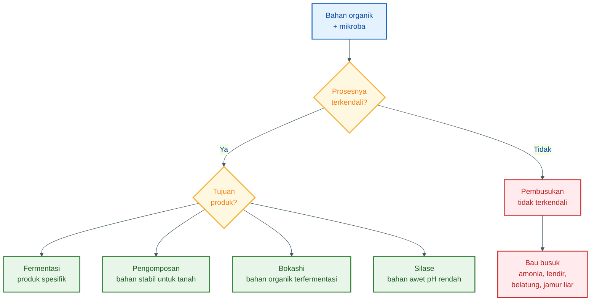

---

## 1.5. Kata “Fermentasi” Harus Dilengkapi

Agar tidak salah paham, kata “fermentasi” sebaiknya tidak dipakai sendirian.

Gunakan pola:

```mdx
fermentasi

- bahan
- mikroba/kondisi
- tujuan produk
```

Contoh istilah yang lebih jelas:

| Istilah terlalu umum      | Istilah lebih tepat                                    |
| ------------------------- | ------------------------------------------------------ |
| Fermentasi ikan           | Silase ikan berbasis asam laktat                       |
| Asam amino cair           | Protein hidrolisat fermentasi                          |
| Fermentasi pelet          | Conditioning pelet dengan probiotik                    |
| Fermentasi pupuk          | Bokashi / POC fermentasi / ekstrak organik fermentasi  |
| Kompos fermentasi         | Bokashi, jika prosesnya minim oksigen dengan EM/molase |
| Fermentasi tanaman        | Kultur PGPM / bioinokulan / ekstrak fermentasi tanaman |
| Limbah organik fermentasi | Harus dicek: bokashi, kompos, atau busuk               |

Istilah yang baik membuat proses lebih mudah dikontrol.

---

## 1.6. Penegasan Awal

Artikel ini tidak akan memakai kata fermentasi secara sembarangan.

Setiap proses akan dibedakan berdasarkan:

1. bahan awal,
2. mikroba dominan,
3. oksigen,
4. arah perubahan,
5. tujuan akhir,
6. indikator keberhasilan,
7. kelayakan penggunaan.

Prinsip dasarnya:

```mdx
Proses mikroba yang terarah
≠
proses mikroba yang liar
```

Fermentasi yang berhasil adalah proses yang dikendalikan. Pengomposan yang baik juga proses terkendali. Pembusukan adalah proses mikroba yang tidak terkendali dan hasilnya tidak diinginkan.

---

## 1.7. Kesimpulan Bab 1

Istilah “fermentasi” sering membingungkan karena dipakai untuk terlalu banyak proses. Padahal, tidak semua bahan organik yang berubah oleh mikroba layak disebut fermentasi berhasil.

Kesalahan istilah dapat menyebabkan kesalahan praktik:

- bahan busuk dianggap aman,
- bokashi dianggap kompos matang,
- pelet basah dianggap pakan terfermentasi sempurna,
- silase ikan disamakan dengan kompos limbah ikan.

Kesimpulan praktisnya:

> **Semua proses ini melibatkan mikroba, tetapi tidak semua proses mikroba layak disebut fermentasi yang berhasil. Yang menentukan bukan hanya adanya mikroba, tetapi arah proses dan produk akhirnya.**

[**Kembali ke Atas**](#fermentasi-pengomposan-dan-pembusukan-meluruskan-istilah-agar-praktisi-agri-tidak-salah-interpretasi)

---

# Bab 2 — Kerangka Dasar: Bahan Organik + Mikroba = Biokonversi

Untuk menghindari kebingungan, kita perlu memakai istilah yang lebih netral terlebih dahulu, yaitu **biokonversi**.

Biokonversi berarti perubahan bahan oleh aktivitas biologis, terutama mikroba dan enzim.

Dengan istilah ini, kita tidak langsung menyebut suatu proses sebagai fermentasi, kompos, atau pembusukan sebelum melihat arah dan hasilnya.

Pola umumnya:

```mdx
bahan organik

- mikroba / enzim
- kondisi lingkungan
  → produk baru
```

Pola ini berlaku untuk fermentasi, pengomposan, bokashi, silase, dan pembusukan. Tetapi hasil akhirnya berbeda.

Kalimat kunci bab ini:

> **Fermentasi, pengomposan, dan pembusukan sama-sama biokonversi, tetapi arah dan hasilnya berbeda.**

---

## 2.1. Apa Itu Biokonversi?

Biokonversi adalah proses perubahan bahan oleh agen biologis.

Agen biologis bisa berupa:

- bakteri,
- kapang/jamur,
- ragi/khamir,
- aktinomiset,
- enzim,
- konsorsium mikroba.

Bahan yang diubah bisa berupa:

- limbah ikan,
- dedak,
- ampas tahu,
- kotoran ternak,
- jerami,
- daun kering,
- sisa sayuran,
- susu,
- kedelai,
- singkong,
- pelet,
- bahan organik lain.

Hasilnya bisa berupa:

- asam laktat,
- alkohol,
- asam asetat,
- peptida,
- kompos,
- humus,
- bokashi,
- silase,
- gas,
- amonia,
- lendir,
- atau bahan rusak.

Jadi, biokonversi adalah payung besar. Di bawahnya ada proses yang berguna dan ada proses yang merugikan.

---

## 2.2. Rumus Dasar Biokonversi

Dalam bentuk paling sederhana:

```mdx
bahan organik

- mikroba / enzim
- kondisi lingkungan
  → produk baru
```

Namun untuk praktik agri, rumus itu perlu diperjelas:

```mdx
bahan organik

- mikroba dominan
- oksigen / tanpa oksigen
- air
- suhu
- pH
- waktu
  → produk akhir
```

Artinya, hasil akhir tidak hanya ditentukan oleh bahan dan mikroba, tetapi juga oleh kondisi proses.

Contoh:

```mdx
limbah ikan + LAB + molase + anaerob + pH rendah
→ silase ikan / protein hidrolisat fermentasi
```

Berbeda dengan:

```mdx
limbah ikan + mikroba liar + udara terbuka + waktu lama
→ ikan busuk
```

Bahan awalnya sama, tetapi hasilnya berbeda karena kondisi dan arah proses berbeda.

---

## 2.3. Diagram Dasar Biokonversi

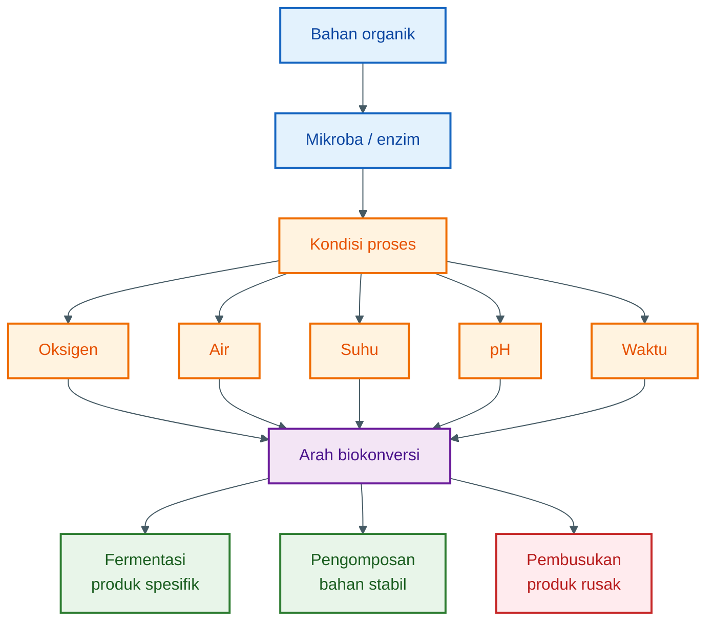

Diagram ini menunjukkan bahwa bahan organik dan mikroba belum cukup untuk menentukan nama proses. Yang menentukan adalah **arah biokonversi**.

---

## 2.4. Faktor Pembeda Utama

Agar praktisi tidak salah sebut, setiap proses harus dibaca dari tujuh faktor.

### 1. Tujuan proses

Pertanyaan pertama:

```mdx
Saya ingin menghasilkan apa?
```

Contoh:

| Tujuan                                          | Proses yang mungkin |
| ----------------------------------------------- | ------------------- |
| Produk asam, aroma, atau peptida                | Fermentasi          |
| Bahan organik stabil untuk tanah                | Pengomposan         |
| Bahan organik terfermentasi sebelum masuk tanah | Bokashi             |
| Bahan pakan protein awet pH rendah              | Silase ikan         |
| Tidak ada tujuan, hanya dibiarkan               | Pembusukan berisiko |

Tujuan menentukan arah proses.

---

### 2. Mikroba dominan

Mikroba yang dominan menentukan produk yang terbentuk.

Contoh:

| Mikroba dominan      | Produk/proses umum          |
| -------------------- | --------------------------- |
| Bakteri asam laktat  | Asam laktat, pH turun       |
| Ragi/khamir          | Alkohol, CO₂, aroma         |
| Rhizopus             | Tempe, enzim, miselium      |
| Acetobacter          | Asam asetat/cuka            |
| Bakteri aerob kompos | Panas, CO₂, kompos          |
| Mikroba liar         | Pembusukan tidak terkendali |

Mikroba yang berbeda menghasilkan arah yang berbeda.

---

### 3. Ada atau tidak oksigen

Oksigen sangat menentukan.

| Kondisi oksigen       | Contoh proses                                    |
| --------------------- | ------------------------------------------------ |
| Anaerob/minim oksigen | Silase, bokashi, fermentasi asam laktat tertentu |
| Aerob                 | Kompos, tempe, cuka                              |
| Semi-aerob            | Tape, beberapa fermentasi tradisional            |
| Tidak terkendali      | Pembusukan                                       |

Kesalahan umum adalah menganggap semua fermentasi harus anaerob. Tidak selalu.

Tempe butuh oksigen. Cuka juga butuh oksigen. Silase ikan justru sebaiknya minim oksigen.

---

### 4. Arah perubahan bahan

Bahan organik bisa berubah ke banyak arah.

Contoh:

```mdx
protein → peptida
protein → amonia
pati → gula
gula → asam laktat
gula → alkohol
bahan organik → humus
bahan organik → gas busuk
```

Tidak semua penguraian berarti baik.

Protein menjadi peptida bisa berguna. Protein menjadi amonia busuk bisa merugikan.

---

### 5. Produk akhir

Produk akhir adalah penentu utama.

| Proses      | Produk akhir yang diharapkan                          |
| ----------- | ----------------------------------------------------- |
| Fermentasi  | Produk spesifik: asam, alkohol, enzim, peptida, aroma |
| Pengomposan | Kompos stabil, humus, bahan organik matang            |
| Bokashi     | Bahan organik terfermentasi                           |
| Silase ikan | Protein awet pH rendah                                |
| Pembusukan  | Produk rusak: amonia, gas busuk, lendir, toksin       |

Jika produk akhirnya berbau bangkai dan berlendir, jangan disebut fermentasi berhasil.

---

### 6. Indikator sukses

Setiap proses punya indikator sukses berbeda.

Fermentasi asam laktat:

```mdx
pH turun
aroma asam khas
tidak busuk
```

Kompos:

```mdx
bau tanah
suhu stabil
tekstur remah
tidak panas
```

Bokashi:

```mdx
bau asam-manis
tidak busuk
bahan terfermentasi
```

Pembusukan:

```mdx
bau amonia
lendir
belatung
jamur liar
gas busuk
```

Jadi, indikator sukses tidak bisa disamakan.

---

### 7. Kelayakan penggunaan

Pertanyaan terakhir:

```mdx
Produk ini layak dipakai untuk apa?
```

Contoh:

| Produk                       | Kegunaan yang benar                                        |
| ---------------------------- | ---------------------------------------------------------- |
| Silase ikan                  | Aditif/bahan pakan                                         |
| Kompos matang                | Pupuk/pembenah tanah                                       |
| Bokashi                      | Bahan organik terfermentasi untuk tanah, perlu masa tunggu |
| Pelet conditioning probiotik | Diberikan segera                                           |
| Bahan busuk                  | Sebaiknya ditolak/dibuang atau ditangani ulang secara aman |

Kelayakan penggunaan menentukan apakah produk boleh masuk ke pakan, tanah, atau harus dibuang.

---

## 2.5. Bahan yang Sama Bisa Menjadi Produk Berbeda

Inilah inti biokonversi.

Satu bahan yang sama dapat menghasilkan produk yang sangat berbeda tergantung prosesnya.

Contoh bahan: **limbah ikan**.

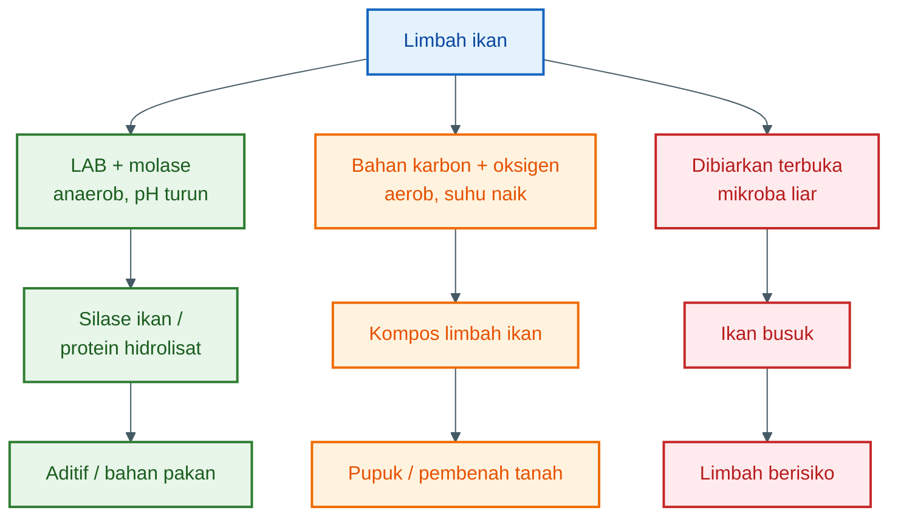

Bahan awal sama, tetapi hasil akhirnya:

- bisa menjadi bahan pakan,
- bisa menjadi kompos,
- bisa menjadi limbah busuk.

Yang membedakan adalah proses.

---

## 2.6. Fermentasi, Pengomposan, dan Pembusukan dalam Kerangka Biokonversi

| Aspek             | Fermentasi                           | Pengomposan              | Pembusukan                        |
| ----------------- | ------------------------------------ | ------------------------ | --------------------------------- |
| Jenis biokonversi | Terarah                              | Terkendali menuju stabil | Tidak terkendali                  |
| Tujuan            | Produk spesifik                      | Kompos/humus             | Tidak diinginkan                  |
| Mikroba           | Dipilih/dikondisikan                 | Mikroba dekomposer aerob | Mikroba liar                      |
| Oksigen           | Bisa anaerob/aerob                   | Umumnya aerob            | Tidak terkendali                  |
| Produk            | Asam, alkohol, peptida, enzim, aroma | Kompos matang, humus     | Amonia, gas busuk, lendir, toksin |
| Bau ideal         | Khas fermentasi                      | Bau tanah                | Bau busuk                         |
| Kelayakan         | Pangan, pakan, bioinput tertentu     | Tanah/media tanam        | Tidak layak                       |

Tabel ini menunjukkan bahwa pembeda utama bukan “ada mikroba atau tidak”, tetapi **arah proses dan hasil akhir**.

---

## 2.7. Biokonversi yang Berguna vs Biokonversi yang Merugikan

Tidak semua biokonversi menguntungkan.

Biokonversi berguna memiliki ciri:

- tujuan jelas,
- kondisi dikendalikan,
- mikroba dominan sesuai,
- indikator sukses terukur,
- produk akhir layak digunakan.

Biokonversi merugikan memiliki ciri:

- tidak ada tujuan jelas,
- bahan dibiarkan,
- mikroba liar dominan,
- bau busuk,
- produk tidak stabil,
- risiko patogen atau toksin,
- tidak layak digunakan.

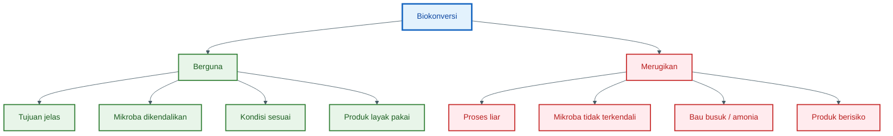

---

## 2.8. Kesimpulan Bab 2

Istilah paling netral untuk semua proses bahan organik yang diubah oleh mikroba atau enzim adalah **biokonversi**.

Pola dasarnya:

```mdx
bahan organik

- mikroba / enzim
- kondisi lingkungan
  → produk baru
```

Namun, hasilnya bisa sangat berbeda. Bahan yang sama dapat menjadi fermentasi yang berguna, kompos yang stabil, atau pembusukan yang berbahaya.

Yang membedakan adalah:

- tujuan proses,
- mikroba dominan,
- ada/tidak oksigen,
- arah perubahan bahan,
- produk akhir,
- indikator sukses,
- kelayakan penggunaan.

Kesimpulan praktisnya:

> **Fermentasi, pengomposan, dan pembusukan sama-sama biokonversi, tetapi arah dan hasilnya berbeda. Karena itu, jangan menilai proses hanya dari adanya mikroba; nilai dari tujuan, kondisi, indikator, dan produk akhirnya.**

[**Kembali ke Atas**](#fermentasi-pengomposan-dan-pembusukan-meluruskan-istilah-agar-praktisi-agri-tidak-salah-interpretasi)

---

# Bab 3 — Apa Itu Fermentasi?

Fermentasi adalah **biokonversi terarah** oleh mikroba atau enzim untuk menghasilkan produk tertentu. Produk itu bisa berupa asam, alkohol, aroma, enzim, peptida, tekstur baru, bahan awet, atau metabolit lain yang diinginkan.

Kesalahan umum di lapangan adalah menganggap fermentasi selalu berarti:

```mdx id="p0zzl9"
fermentasi = Lactobacillus
fermentasi = anaerob
fermentasi = asam
fermentasi = diberi EM4
```

Padahal tidak selalu begitu.

Fermentasi bisa dilakukan oleh:

- bakteri,
- ragi/khamir,
- kapang/jamur,
- konsorsium mikroba,
- enzim yang bekerja bersama mikroba.

Fermentasi juga bisa berlangsung dalam kondisi:

- anaerob,
- aerob,
- semi-aerob,
- padat,
- cair,
- asam,
- netral,
- bersuhu ruang,
- bersuhu terkontrol.

Kalimat kunci bab ini:

> **Fermentasi harus disebut bersama bahan, mikroba, kondisi, dan tujuannya. Kata “fermentasi” saja tidak cukup.**

---

## 3.1. Fermentasi sebagai Proses Terarah

Fermentasi bukan sekadar bahan berubah karena mikroba. Fermentasi yang benar harus punya arah dan target.

Pola dasarnya:

```mdx id="eon75p"
bahan tertentu

- mikroba/enzim tertentu
- kondisi tertentu
  → produk tertentu
```

Contoh:

```mdx id="nlfw5d"
susu

- bakteri asam laktat
- suhu sesuai
  → yogurt
```

```mdx id="arsnif"
kedelai

- Rhizopus
- oksigen cukup
  → tempe
```

```mdx id="gbvhww"
limbah ikan

- molase
- bakteri asam laktat
- kondisi anaerob
  → silase ikan
```

Jadi, fermentasi yang baik selalu bisa menjawab empat pertanyaan:

1. Bahannya apa?
2. Mikrobanya apa?
3. Kondisinya bagaimana?
4. Produk akhirnya apa?

Jika tidak bisa menjawab empat pertanyaan itu, istilah “fermentasi” masih terlalu kabur.

---

## 3.2. Peta Besar Fermentasi

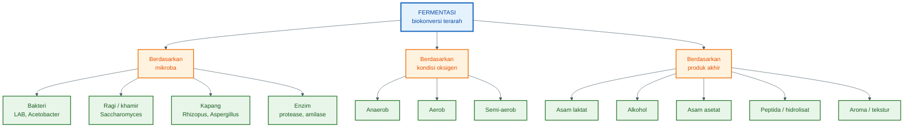

Diagram ini menunjukkan bahwa fermentasi bukan satu proses tunggal. Fermentasi adalah kelompok proses biologis yang arahnya berbeda-beda.

---

## 3.3. Tidak Semua Fermentasi Memakai Lactobacillus

Lactobacillus atau bakteri asam laktat memang penting pada banyak fermentasi, terutama fermentasi asam seperti yogurt, silase, dan beberapa produk sayur.

Namun, banyak fermentasi lain tidak didominasi Lactobacillus.

Contoh:

| Produk      | Mikroba utama            | Fungsi utama                                      |
| ----------- | ------------------------ | ------------------------------------------------- |
| Yogurt      | Bakteri asam laktat      | Menghasilkan asam laktat                          |
| Tape        | Kapang amilolitik + ragi | Memecah pati, menghasilkan gula, alkohol, aroma   |
| Tempe       | Rhizopus                 | Membentuk miselium, enzim, tekstur, dan kecernaan |
| Cuka        | Acetobacter              | Mengubah alkohol menjadi asam asetat              |
| Silase ikan | Bakteri asam laktat      | Menurunkan pH dan mengawetkan protein             |
| Bokashi     | Konsorsium EM, LAB, ragi | Fermentasi bahan organik minim oksigen            |

Jadi, fermentasi tidak bisa disamakan dengan Lactobacillus saja.

Prinsipnya:

```mdx id="ix7u7v"
Fermentasi asam laktat membutuhkan LAB.
Fermentasi tape membutuhkan kapang dan ragi.
Fermentasi tempe membutuhkan Rhizopus.
Fermentasi cuka membutuhkan bakteri asam asetat.
```

---

## 3.4. Fermentasi Asam Laktat

Fermentasi asam laktat adalah fermentasi yang menggunakan bakteri asam laktat untuk mengubah gula menjadi asam laktat.

Contoh:

- yogurt,
- silase ikan,
- silase hijauan,
- fermentasi sayuran,
- sebagian bokashi,
- sebagian produk probiotik.

Pola dasarnya:

```mdx id="gbakq1"
gula

- bakteri asam laktat
  → asam laktat
  → pH turun
```

Fungsi utama:

- menurunkan pH,
- menghambat mikroba pembusuk,
- mengawetkan bahan,
- membentuk rasa asam,
- menstabilkan produk.

Dalam pakan ikan atau silase ikan, fermentasi asam laktat penting karena bahan protein basah mudah busuk. pH rendah menjadi pagar pengaman.

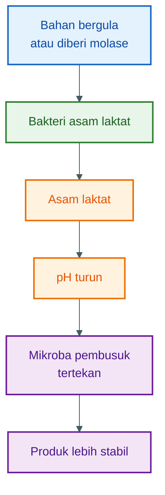

Ciri fermentasi asam laktat yang baik:

- aroma asam segar,
- tidak bau busuk,
- pH turun,
- tidak berlendir busuk,
- tidak ada jamur liar dominan,
- produk lebih stabil.

---

## 3.5. Fermentasi Alkohol

Fermentasi alkohol biasanya dilakukan oleh ragi atau khamir, terutama Saccharomyces dan beberapa khamir lain.

Pola dasarnya:

```mdx id="z69var"
gula

- ragi/khamir
  → alkohol
- CO₂
- aroma
```

Contoh:

- tape,
- roti,
- minuman fermentasi,
- sebagian proses bioetanol.

Pada tape, prosesnya tidak hanya alkohol. Sebelum gula difermentasi, pati harus dipecah dulu menjadi gula. Karena itu tape membutuhkan kapang atau mikroba amilolitik.

Alur tape secara sederhana:

```mdx id="a1z4eu"
pati singkong/ketan
→ gula
→ alkohol ringan
→ aroma tape
```

Jadi tape bukan fermentasi asam laktat murni. Tape lebih tepat dipahami sebagai fermentasi pati oleh konsorsium kapang dan ragi, dengan bakteri lain ikut berperan.

Ciri fermentasi alkohol yang baik:

- aroma khas,
- ada perubahan rasa,
- ada sedikit gas,
- tidak bau bangkai,
- tidak berlendir busuk,
- tidak didominasi jamur liar berbahaya.

---

## 3.6. Fermentasi Kapang

Fermentasi kapang menggunakan jamur berfilamen. Contoh paling dikenal adalah tempe.

Pada tempe, kedelai difermentasi oleh Rhizopus. Rhizopus tumbuh membentuk miselium putih yang mengikat biji kedelai menjadi padat.

Fungsi Rhizopus:

- menghasilkan enzim,
- memecah sebagian protein,
- menurunkan sebagian antinutrisi,
- membentuk tekstur tempe,
- membentuk aroma khas,
- meningkatkan kecernaan.

Pola sederhana:

```mdx id="o1uzs3"
kedelai matang

- Rhizopus
- oksigen cukup
  → tempe
```

Berbeda dengan silase ikan, tempe membutuhkan oksigen. Jika tempe terlalu basah dan kekurangan oksigen, proses bisa berubah menjadi busuk.

Ciri fermentasi kapang yang baik:

- miselium putih merata,
- aroma khas tempe,
- tidak berlendir,
- tidak bau amonia,
- tidak didominasi jamur hitam/hijau liar.

---

## 3.7. Fermentasi Oksidatif

Fermentasi oksidatif adalah istilah praktis untuk proses mikroba yang membutuhkan oksigen, misalnya pembuatan cuka.

Pada cuka, alkohol diubah menjadi asam asetat oleh bakteri asam asetat seperti Acetobacter.

Pola dasarnya:

```mdx id="x0jjq7"
alkohol

- bakteri asam asetat
- oksigen
  → asam asetat
```

Ini berbeda dari silase atau bokashi yang biasanya minim oksigen.

Cuka membutuhkan oksigen. Jika oksigen kurang, proses asam asetat tidak optimal.

Ciri fermentasi cuka yang baik:

- aroma asam cuka,
- tidak busuk,
- tidak berlendir,
- proses tidak tertutup rapat total,
- ada akses oksigen terkontrol.

---

## 3.8. Fermentasi Pakan dan Hidrolisat Protein

Dalam dunia pakan, istilah fermentasi juga sering dipakai untuk berbagai proses:

- fermentasi bungkil,
- fermentasi dedak,
- fermentasi ampas tahu,
- silase ikan,
- protein hidrolisat fermentasi,
- pelet diberi probiotik,
- pakan basah fermentasi.

Namun, tidak semuanya sama.

### Fermentasi bahan pakan

Bahan pakan seperti bungkil, dedak, atau ampas tahu difermentasi untuk:

- menurunkan antinutrisi,
- memperbaiki aroma,
- meningkatkan kecernaan,
- memanfaatkan limbah lokal,
- meningkatkan nilai guna nutrisi.

### Hidrolisat protein

Bahan tinggi protein seperti ikan, keong, maggot, atau limbah udang dapat diproses menjadi protein hidrolisat fermentasi.

Pola dasarnya:

```mdx id="oj29hr"
protein

- enzim protease
- fermentasi terkontrol
  → peptida
- sebagian asam amino bebas
- pH lebih stabil
```

Tujuannya bukan membuat asam amino murni, tetapi memecah sebagian protein agar lebih mudah digunakan.

### Pelet diberi probiotik

Pelet yang dibasahi dengan probiotik dan langsung diberikan tidak selalu layak disebut fermentasi penuh.

Istilah yang lebih tepat:

```mdx id="mkrqnz"
conditioning pelet dengan probiotik
```

Bukan otomatis fermentasi pakan sempurna.

---

## 3.9. Fermentasi Bisa Anaerob, Aerob, atau Semi-Aerob

| Kondisi               | Contoh                                                | Catatan                                                   |
| --------------------- | ----------------------------------------------------- | --------------------------------------------------------- |
| Anaerob/minim oksigen | Silase ikan, bokashi, beberapa fermentasi asam laktat | Cocok untuk pH rendah dan pengawetan                      |
| Aerob                 | Tempe, cuka                                           | Butuh oksigen untuk kapang atau bakteri asam asetat       |
| Semi-aerob            | Tape, beberapa fermentasi tradisional                 | Tidak tertutup total, tetapi tidak seperti kompos terbuka |

Kesalahan umum:

```mdx id="kyqfxk"
semua fermentasi harus tertutup rapat
```

Tidak benar.

Tempe dan cuka justru butuh oksigen. Silase ikan dan bokashi biasanya butuh kondisi tertutup/minim oksigen.

---

## 3.10. Cara Menyebut Fermentasi dengan Benar

Jangan hanya mengatakan “fermentasi”. Sebutkan lengkap.

Format yang lebih tepat:

```mdx id="aw13su"
fermentasi + bahan + mikroba/kondisi + tujuan
```

Contoh:

| Kurang tepat                 | Lebih tepat                                  |
| ---------------------------- | -------------------------------------------- |
| Fermentasi ikan              | Silase ikan berbasis asam laktat             |
| Fermentasi pelet             | Conditioning pelet dengan probiotik          |
| Fermentasi kedelai           | Fermentasi kedelai oleh Rhizopus untuk tempe |
| Fermentasi bahan organik     | Bokashi anaerob/minim oksigen                |
| Fermentasi gula              | Fermentasi alkohol oleh ragi                 |
| Fermentasi alkohol jadi cuka | Fermentasi oksidatif oleh Acetobacter        |

Bahasa yang lebih tepat membuat praktik lebih aman.

---

## 3.11. Kesimpulan Bab 3

Fermentasi adalah biokonversi terarah untuk menghasilkan produk tertentu. Fermentasi tidak selalu memakai Lactobacillus, tidak selalu anaerob, dan tidak selalu menghasilkan asam.

Fermentasi bisa berbasis:

- bakteri,
- ragi,
- kapang,
- enzim,
- konsorsium mikroba.

Fermentasi bisa menghasilkan:

- asam laktat,
- alkohol,
- asam asetat,
- peptida,
- enzim,
- aroma,
- tekstur baru,
- bahan awet.

Kesimpulan praktisnya:

> **Fermentasi harus disebut bersama bahan, mikroba, kondisi, dan tujuannya. Kata “fermentasi” saja tidak cukup.**

[**Kembali ke Atas**](#fermentasi-pengomposan-dan-pembusukan-meluruskan-istilah-agar-praktisi-agri-tidak-salah-interpretasi)

---

# Bab 4 — Apa Itu Pengomposan?

Pengomposan adalah **dekomposisi terkendali** bahan organik untuk menghasilkan kompos yang stabil dan aman digunakan sebagai pembenah tanah.

Berbeda dengan fermentasi yang biasanya mengejar produk spesifik seperti asam, alkohol, peptida, aroma, atau enzim, pengomposan mengejar **stabilisasi bahan organik**.

Tujuan pengomposan bukan mempertahankan nilai bahan sebagai pakan. Tujuannya adalah mengubah bahan organik menjadi bentuk yang lebih stabil untuk tanah.

Kalimat kunci bab ini:

> **Kompos matang adalah hasil dekomposisi terkendali, bukan sekadar bahan organik yang sudah diberi mikroba.**

---

## 4.1. Pengomposan sebagai Dekomposisi Terkendali

Pengomposan melibatkan mikroba dekomposer yang mengurai bahan organik.

Bahan umum untuk kompos:

- daun kering,
- jerami,
- rumput,
- sisa tanaman,
- kotoran ternak,
- sekam,
- serbuk gergaji,
- sisa sayuran,
- limbah organik pertanian.

Mikroba yang bekerja:

- bakteri aerob,
- fungi/jamur,
- aktinomiset,
- mikroba tanah lain.

Tujuannya:

```mdx id="hzu1se"
bahan organik mentah
→ bahan organik stabil
→ kompos matang
→ pembenah tanah
```

Pengomposan yang baik biasanya berlangsung secara **aerob**, yaitu membutuhkan oksigen.

---

## 4.2. Perbedaan Pengomposan dan Fermentasi

| Aspek        | Fermentasi                           | Pengomposan                             |
| ------------ | ------------------------------------ | --------------------------------------- |
| Tujuan       | Produk spesifik                      | Bahan organik stabil                    |
| Kondisi      | Bisa anaerob/aerob                   | Umumnya aerob                           |
| Produk       | Asam, alkohol, peptida, aroma, enzim | Kompos, humus, mineral                  |
| Bau ideal    | Khas fermentasi                      | Bau tanah                               |
| Energi bahan | Banyak masih tersimpan               | Banyak hilang sebagai panas dan CO₂     |
| Kegunaan     | Pangan, pakan, bioinput tertentu     | Tanah/media tanam                       |
| Risiko gagal | Busuk, kontaminasi                   | Anaerob, bau busuk, kompos tidak matang |

Jadi kompos bukan sekadar bahan yang “difermentasi”. Kompos adalah hasil dekomposisi terkendali yang sudah cukup stabil.

---

## 4.3. Apa yang Terjadi dalam Pengomposan?

Dalam pengomposan terjadi beberapa proses sekaligus:

1. **Mineralisasi**
2. **Humifikasi**
3. **Pelepasan CO₂**
4. **Pelepasan panas**
5. **Penurunan bahan mudah busuk**
6. **Pembentukan bahan organik stabil**

Alurnya:

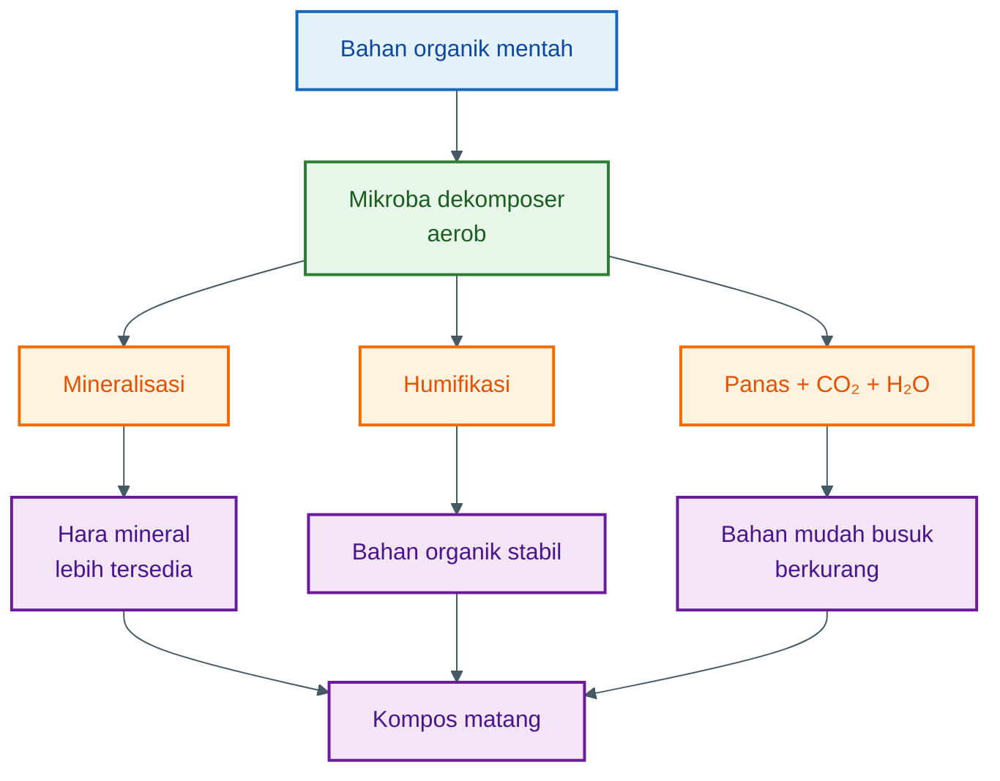

---

## 4.4. Mineralisasi

Mineralisasi adalah proses perubahan bahan organik menjadi bentuk mineral yang lebih sederhana.

Contoh:

```mdx id="gi1jvs"
protein organik → amonium → nitrat
fosfor organik → fosfat
sulfur organik → sulfat
karbon organik → CO₂
```

Mineralisasi membantu melepaskan unsur hara dari bahan organik. Namun, pelepasan ini tidak selalu langsung cepat tersedia bagi tanaman. Tergantung kematangan kompos, rasio C/N, kelembapan, dan aktivitas mikroba tanah.

---

## 4.5. Humifikasi

Humifikasi adalah pembentukan bahan organik yang lebih stabil. Ini salah satu alasan kompos matang baik untuk tanah.

Produk humifikasi membantu:

- memperbaiki struktur tanah,
- meningkatkan kemampuan tanah menahan air,
- meningkatkan kapasitas tukar kation,
- mendukung kehidupan mikroba tanah,
- memperbaiki agregat tanah.

Jadi, kompos matang bukan hanya sumber hara, tetapi juga pembenah sifat fisik, kimia, dan biologis tanah.

---

## 4.6. Pelepasan CO₂ dan Panas

Dalam pengomposan aerob, mikroba menggunakan oksigen untuk menguraikan bahan organik. Sebagian karbon dilepaskan sebagai CO₂, dan sebagian energi keluar sebagai panas.

Pola sederhananya:

```mdx id="r9k8kv"
bahan organik

- O₂
  → CO₂
- H₂O
- panas
- kompos stabil
```

Karena itu tumpukan kompos yang aktif biasanya mengalami kenaikan suhu.

Suhu naik bukan masalah selama terkendali. Justru suhu panas dapat membantu:

- mempercepat penguraian,
- menekan patogen tertentu,
- menekan biji gulma,
- mempercepat stabilisasi bahan.

Namun suhu terlalu tinggi atau terlalu lama juga bisa merugikan karena dapat membunuh mikroba menguntungkan dan menghilangkan nitrogen.

---

## 4.7. Fase Pengomposan

Pengomposan umumnya melewati beberapa fase.

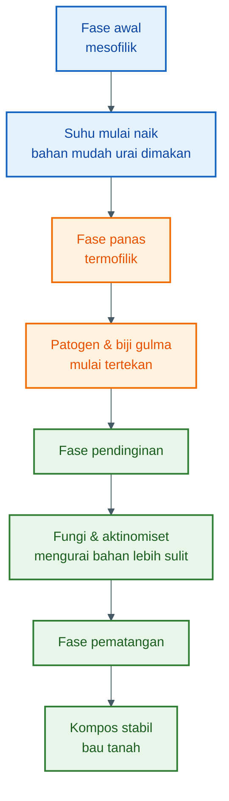

Fase umum:

| Fase             | Ciri                                      |
| ---------------- | ----------------------------------------- |
| Awal / mesofilik | Suhu mulai naik, bahan lunak cepat diurai |
| Termofilik       | Suhu tinggi, mikroba panas dominan        |
| Pendinginan      | Suhu menurun, fungi dan aktinomiset aktif |
| Pematangan       | Bahan stabil, bau tanah, tidak panas      |

---

## 4.8. Kompos Matang Harus Stabil

Kompos matang bukan hanya bahan organik yang sudah berubah warna. Kompos matang harus stabil.

Ciri kompos matang:

- bau tanah,
- tidak bau busuk,
- tidak bau amonia tajam,
- suhu mendekati suhu lingkungan,
- tekstur remah,
- warna coklat tua sampai hitam,
- tidak menarik banyak lalat,
- bahan asal sebagian besar tidak mudah dikenali,
- tidak panas saat digenggam,
- aman untuk tanaman.

Kompos yang belum matang bisa merugikan tanaman.

Risikonya:

- akar panas,
- akar stres,
- nitrogen tanah diikat mikroba,
- muncul bau,
- pertumbuhan bibit terganggu,
- fitotoksik pada tanaman muda.

---

## 4.9. Kompos Ideal Berbau Tanah, Bukan Asam atau Busuk

Aroma adalah indikator penting.

| Aroma                 | Interpretasi                                                         |
| --------------------- | -------------------------------------------------------------------- |
| Bau tanah segar       | Kompos cenderung matang                                              |
| Bau amonia            | Nitrogen berlebih, aerasi buruk, proses belum stabil                 |
| Bau busuk             | Anaerob/pembusukan                                                   |
| Bau asam tajam        | Bisa terlalu basah atau proses mirip fermentasi, belum kompos matang |
| Bau tengik            | Ada lemak/minyak yang rusak                                          |
| Bau kotoran menyengat | Belum matang                                                         |

Kompos yang baik tidak berbau seperti silase. Kompos juga tidak berbau seperti tape. Kompos matang idealnya berbau tanah.

---

## 4.10. Faktor yang Menentukan Keberhasilan Kompos

Ada empat faktor utama:

1. suhu,
2. aerasi,
3. kelembapan,
4. rasio C/N.

### Suhu

Suhu menunjukkan aktivitas mikroba.

```mdx id="g2tcoa"
Suhu naik = mikroba aktif
Suhu turun setelah proses panjang = kompos mulai matang
```

Suhu yang terlalu rendah bisa berarti proses lambat. Suhu terlalu tinggi bisa menghilangkan nitrogen dan mematikan mikroba tertentu.

### Aerasi

Pengomposan idealnya aerob. Tumpukan perlu oksigen.

Jika kekurangan oksigen:

```mdx id="m85p79"
kompos aerob
→ berubah anaerob
→ bau busuk
→ proses melambat
```

Aerasi bisa dibantu dengan:

- membalik kompos,
- menambahkan bahan kasar,
- tidak terlalu padat,
- mengatur kelembapan.

### Kelembapan

Kelembapan harus cukup, tetapi tidak becek.

Prinsip praktis:

```mdx id="aqap4z"
terlalu kering → mikroba lambat
terlalu basah → oksigen kurang → bau busuk
```

Uji genggam sederhana:

- bila digenggam terasa lembap dan hanya sedikit menetes, cukup,
- bila air menetes banyak, terlalu basah,
- bila buyar kering, terlalu kering.

### Rasio C/N

Rasio C/N adalah perbandingan karbon dan nitrogen.

Bahan tinggi karbon:

- daun kering,
- jerami,
- sekam,
- serbuk gergaji,
- ranting halus.

Bahan tinggi nitrogen:

- kotoran ternak,
- limbah sayur hijau,
- rumput segar,
- limbah dapur basah,
- sisa ikan dalam jumlah kecil dan terkendali.

Rasio C/N praktis awal kompos biasanya diarahkan sekitar:

```mdx id="tj5qnh"
C/N awal ideal ≈ 25–30 : 1
```

Jika terlalu tinggi karbon:

```mdx id="qbcfhj"
terlalu banyak jerami/sekam/daun kering
→ proses lambat
→ nitrogen kurang
```

Jika terlalu tinggi nitrogen:

```mdx id="l8uxt9"
terlalu banyak kotoran segar/limbah protein
→ bau amonia
→ panas berlebih
→ nitrogen hilang
```

---

## 4.11. Rumus Praktis C/N Campuran

Untuk praktisi yang ingin menghitung kasar C/N campuran, gunakan rumus sederhana:

```mdx id="r6au2p"
C/N campuran =
(total karbon dari semua bahan)
÷
(total nitrogen dari semua bahan)
```

Secara praktis:

```mdx id="zlytnw"
Total C = (berat bahan 1 × %C bahan 1) + (berat bahan 2 × %C bahan 2) + ...

Total N = (berat bahan 1 × %N bahan 1) + (berat bahan 2 × %N bahan 2) + ...

C/N campuran = Total C ÷ Total N
```

Contoh sederhana:

```mdx id="lxhj3q"
Jika bahan terlalu basah dan bau amonia:
tambahkan bahan karbon seperti sekam, jerami, atau daun kering.

Jika bahan terlalu kering dan lambat panas:
tambahkan bahan nitrogen seperti kotoran ternak atau hijauan segar.
```

Dalam praktik lapang, tidak semua petani perlu menghitung presisi. Tetapi memahami arah koreksi sangat penting.

---

## 4.12. Kompos Bukan Sekadar Bahan yang Diberi Mikroba

Menambahkan mikroba starter tidak otomatis membuat kompos matang.

Kompos matang membutuhkan:

- waktu,
- oksigen,
- kelembapan,
- suhu,
- bahan seimbang,
- pembalikan,
- proses stabilisasi.

Kesalahan umum:

```mdx id="y5g8ic"
bahan organik + EM4
→ dianggap langsung jadi kompos
```

Padahal belum tentu.

Jika bahan masih panas, bau tajam, berlendir, atau masih mudah busuk, berarti belum matang.

---

## 4.13. Kesimpulan Bab 4

Pengomposan adalah dekomposisi terkendali bahan organik untuk menghasilkan kompos stabil. Umumnya proses ini berlangsung secara aerob dan melibatkan bakteri, fungi, aktinomiset, serta mikroba tanah lain.

Dalam pengomposan terjadi:

- mineralisasi,
- humifikasi,
- pelepasan CO₂,
- pelepasan panas,
- penurunan bahan mudah busuk,
- pembentukan bahan organik stabil.

Kompos matang harus stabil, berbau tanah, tidak panas, tidak busuk, dan tidak fitotoksik bagi tanaman.

Kesimpulan praktisnya:

> **Kompos matang adalah hasil dekomposisi terkendali, bukan sekadar bahan organik yang sudah diberi mikroba.**

[**Kembali ke Atas**](#fermentasi-pengomposan-dan-pembusukan-meluruskan-istilah-agar-praktisi-agri-tidak-salah-interpretasi)

---

# Bab 5 — Apa Itu Pembusukan?

Pembusukan adalah **dekomposisi tidak terkendali**. Proses ini tetap melibatkan mikroba, tetapi arah prosesnya salah dan produk akhirnya tidak diinginkan.

Dalam pembusukan, bahan organik diuraikan oleh mikroba liar tanpa kendali yang jelas. Hasilnya sering berupa bau busuk, amonia, gas, lendir, jamur liar, belatung, patogen, dan senyawa yang dapat merugikan tanaman, ikan, ternak, atau manusia.

Kalimat kunci bab ini:

> **Pembusukan adalah proses mikroba juga, tetapi arahnya salah dan produknya tidak layak untuk pakan atau pangan.**

---

## 5.1. Pembusukan Bukan Fermentasi

Fermentasi dan pembusukan sama-sama melibatkan mikroba. Namun, keduanya berbeda secara arah proses.

Fermentasi yang benar:

```mdx id="aywqhe"
bahan organik

- mikroba terarah
- kondisi terkendali
  → produk yang diinginkan
```

Pembusukan:

```mdx id="fyj5sp"
bahan organik

- mikroba liar
- kondisi tidak terkendali
  → produk rusak
```

Jadi, perbedaannya bukan pada ada atau tidaknya mikroba. Perbedaannya ada pada **kendali proses dan kelayakan hasil**.

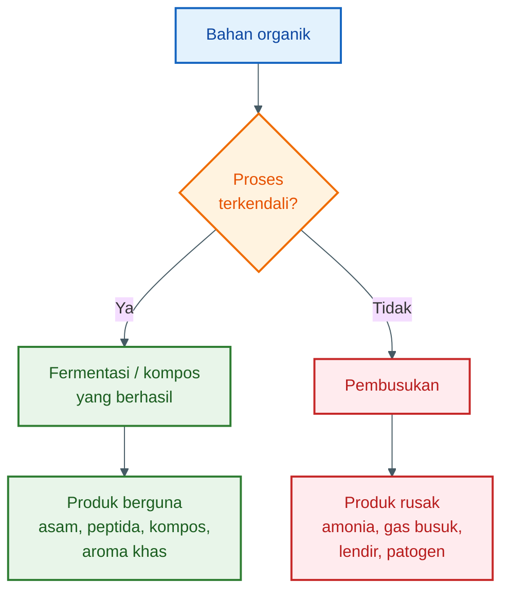

Bila hasilnya bau bangkai, berlendir, berbelatung, dan tidak stabil, jangan disebut fermentasi berhasil. Itu pembusukan.

---

## 5.2. Apa yang Terjadi Saat Bahan Membusuk?

Dalam pembusukan, mikroba liar menguraikan bahan organik tanpa arah yang diinginkan.

Bahan yang kaya protein, seperti ikan, ampas tahu, darah, jeroan, dan limbah dapur basah, sangat mudah mengalami pembusukan. Protein dapat rusak menjadi senyawa nitrogen berbau tajam.

Contoh arah pembusukan protein:

```mdx id="a2lzmg"
protein
→ asam amino
→ amonia

- amina busuk
- senyawa sulfur
- bau bangkai
```

Pada bahan yang kaya karbohidrat, pembusukan bisa menghasilkan asam liar, alkohol liar, gas, lendir, atau jamur.

Pada bahan yang kaya lemak, pembusukan dapat menghasilkan bau tengik dan asam lemak bebas.

---

## 5.3. Produk yang Umum Muncul dalam Pembusukan

Pembusukan sering menghasilkan senyawa dan tanda fisik yang tidak diinginkan.

| Hasil pembusukan | Sumber umum              | Dampak praktis                     |
| ---------------- | ------------------------ | ---------------------------------- |
| Amonia           | Protein rusak            | Bau tajam, indikasi nitrogen lepas |
| Bau bangkai      | Protein hewani membusuk  | Tidak layak untuk pakan            |
| Gas busuk        | Pembusukan anaerob liar  | Wadah menggembung, bau menyengat   |
| Lendir           | Bakteri liar             | Tekstur rusak                      |
| Jamur liar       | Permukaan terbuka/lembap | Risiko toksin                      |
| Belatung         | Lalat masuk dan bertelur | Tanda sanitasi buruk               |
| Toksin           | Mikroba tertentu         | Risiko bagi ikan, ternak, tanaman  |
| Patogen          | Kontaminasi liar         | Risiko penyakit                    |

Pembusukan bukan sekadar “fermentasi yang berbau kuat”. Pembusukan adalah tanda bahwa mikroba liar menguasai proses.

---

## 5.4. Bau Busuk Bukan Tanda Fermentasi Kuat

Ini salah kaprah yang sangat penting diluruskan.

Banyak praktisi menganggap bau menyengat berarti fermentasi “kuat” atau “jadi”. Padahal, bau menyengat bisa berasal dari pembusukan.

### Aroma fermentasi yang baik

- asam segar,
- manis-asam,
- gurih,
- aroma khas tape/tempe/silase,
- tidak menusuk seperti amonia,
- tidak seperti bangkai.

### Aroma pembusukan

- bau bangkai,
- bau urin/amonia tajam,
- bau telur busuk,
- bau got,
- bau anyir busuk,
- bau tengik,
- bau apek jamur.

```mdx id="ig1fwz"
Bau asam khas ≠ bau busuk.
Bau gurih fermentasi ≠ bau bangkai.
Bau amonia ≠ tanda asam amino tinggi.
```

Bau bisa menjadi indikator awal, tetapi tidak cukup. Perlu dilihat juga pH, tekstur, jamur, gas, dan kondisi bahan.

---

## 5.5. Amonia Tajam Bukan Tanda Asam Amino Tinggi

Pada bahan protein, bau amonia sering disalahartikan sebagai tanda “protein sudah pecah” atau “asam amino tinggi”.

Memang benar protein bisa terurai. Tetapi arahnya bisa berbeda.

Arah yang diinginkan:

```mdx id="to3z4x"
protein
→ peptida
→ sebagian asam amino bebas
```

Arah yang tidak diinginkan:

```mdx id="pb9mud"
protein
→ asam amino
→ amonia

- amina busuk
- bau tajam
```

Amonia menunjukkan bahwa nitrogen sudah lepas ke bentuk yang tidak diinginkan. Untuk pakan ikan atau ternak, bau amonia kuat adalah tanda bahaya, bukan tanda kualitas tinggi.

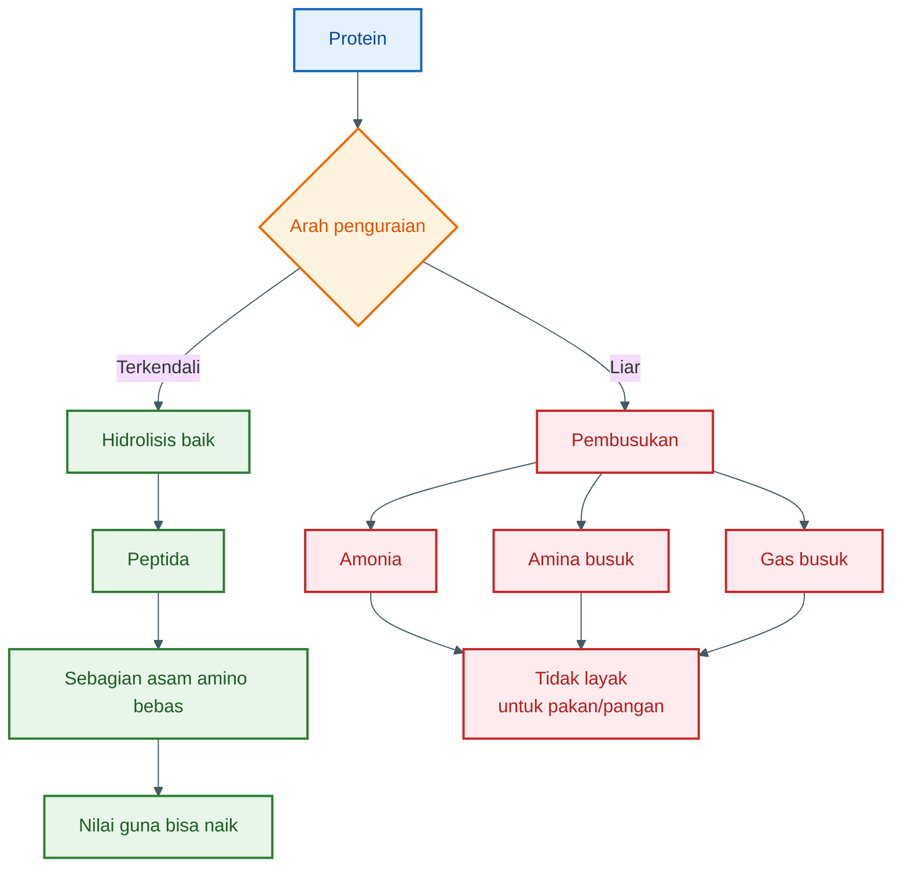

---

## 5.6. Bahan Busuk Tidak Menjadi Aman Hanya karena Diberi EM atau Probiotik

Ini prinsip penting.

EM, probiotik, molase, atau starter mikroba tidak bisa menyulap bahan busuk menjadi bahan aman secara otomatis.

Jika bahan awal sudah:

- busuk,
- berbelatung,
- berbau bangkai,
- berlendir,
- berjamur,
- tercemar bahan kimia,
- mengandung patogen tinggi,

maka penambahan EM/probiotik tidak menjamin bahan menjadi aman.

Starter hanya bekerja baik bila:

- bahan awal masih layak,
- sanitasi cukup,
- kondisi proses dikendalikan,
- pH/suhu/oksigen sesuai,
- mikroba target bisa dominan.

```mdx id="pwa0us"
Bahan segar + proses terkendali = peluang berhasil tinggi.
Bahan busuk + starter = risiko tetap tinggi.
```

Mikroba baik bukan obat untuk semua kesalahan proses.

---

## 5.7. Pembusukan Bisa Terjadi pada Banyak Sistem

Pembusukan tidak hanya terjadi pada limbah dapur. Dalam praktik agri, pembusukan bisa terjadi di banyak tempat.

### Pada bahan pakan

Contoh:

- tepung ikan lembap,
- pelet basah,
- ampas tahu,
- dedak tengik,
- pakan fermentasi gagal.

Risiko:

- ikan tidak mau makan,
- air kolam rusak,
- amonia naik,
- penyakit meningkat.

### Pada bahan kompos

Pembusukan terjadi bila tumpukan terlalu basah, padat, dan kekurangan oksigen.

Tanda:

- bau busuk,
- bau amonia,
- warna hitam berlendir,
- lalat banyak,
- panas tidak merata.

### Pada bokashi gagal

Bokashi gagal biasanya terjadi karena kadar air terlalu tinggi, wadah bocor, bahan busuk, atau starter tidak bekerja.

Tanda:

- bau bangkai,
- belatung,
- lendir,
- jamur hitam/hijau dominan,
- aroma tidak asam-manis.

### Pada silase gagal

Silase gagal terjadi bila pH tidak turun, molase kurang, bahan terlalu kotor, atau wadah tidak tertutup.

Tanda:

- pH tinggi,
- bau amonia,
- gas busuk,
- warna menyimpang,
- jamur permukaan.

### Pada pelet basah

Pelet yang dibasahi probiotik, molase, atau air lalu disimpan terlalu lama dapat rusak.

Tanda:

- bau berubah,
- pelet menggumpal,
- jamur,
- lendir,
- pakan hancur,
- ikan menolak makan.

### Pada limbah ikan

Limbah ikan adalah bahan yang sangat cepat busuk.

Tanda:

- bau bangkai,
- amonia tajam,
- cairan busuk,
- belatung,
- warna kusam,
- gas kuat.

### Pada ampas tahu

Ampas tahu tinggi air dan cepat rusak.

Tanda:

- asam busuk,
- lendir,
- jamur,
- bau menyengat,
- berair berlebihan.

---

## 5.8. Tanda Pembusukan yang Harus Ditolak

Gunakan daftar ini sebagai standar praktis.

| Tanda                  | Keputusan                          |
| ---------------------- | ---------------------------------- |
| Bau bangkai            | Tolak/buang                        |
| Bau amonia tajam       | Tolak/buang                        |
| Ada belatung           | Tolak/buang untuk pakan/pangan     |
| Lendir busuk           | Tolak/buang                        |
| Jamur hitam/hijau liar | Tolak/buang                        |
| Gas busuk menyengat    | Tolak/buang                        |
| Warna kusam berlendir  | Tolak/buang                        |
| pH tidak sesuai target | Evaluasi, jangan langsung pakai    |
| Bahan awal sudah busuk | Jangan diproses untuk pakan/pangan |

Untuk pupuk atau kompos, bahan bermasalah masih mungkin ditangani ulang dalam sistem kompos yang benar. Tetapi untuk pakan atau pangan, standar harus jauh lebih ketat.

---

## 5.9. Diagram Keputusan: Fermentasi atau Pembusukan?

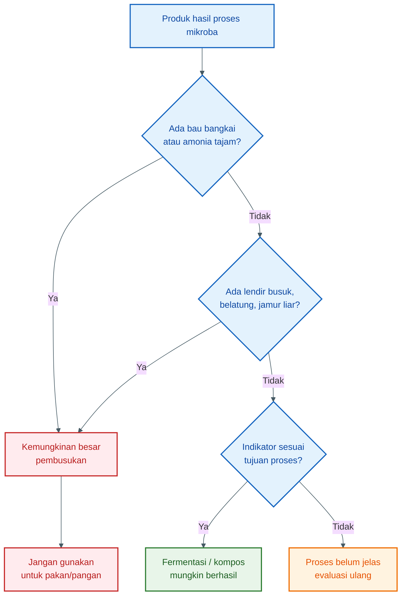

---

## 5.10. Kesimpulan Bab 5

Pembusukan adalah dekomposisi tidak terkendali. Proses ini memang melibatkan mikroba, tetapi arahnya salah dan produknya tidak diinginkan.

Pembusukan dapat menghasilkan:

- amonia,
- bau bangkai,
- gas busuk,
- lendir,
- patogen,
- toksin,
- jamur liar,
- belatung.

Pembusukan bisa terjadi pada bahan pakan, bahan kompos, bokashi gagal, silase gagal, pelet basah, limbah ikan, dan ampas tahu.

Kesimpulan praktisnya:

> **Pembusukan adalah proses mikroba juga, tetapi arahnya salah dan produknya tidak layak untuk pakan atau pangan. Bau busuk bukan tanda fermentasi kuat, dan amonia tajam bukan tanda asam amino tinggi.**

---

# Bab 6 — Bokashi: Fermentasi atau Kompos?

Bokashi sering disebut “kompos bokashi” atau “kompos fermentasi”. Istilah ini populer, tetapi bisa membingungkan.

Secara proses, bokashi lebih tepat disebut:

> **bahan organik terfermentasi**

Bokashi dibuat melalui proses fermentasi bahan organik dengan bantuan mikroba, molase, dan kondisi tertutup atau minim oksigen. Namun, bokashi yang baru selesai belum tentu sama dengan kompos matang.

Kalimat kunci bab ini:

> **Bokashi adalah fermentasi bahan organik, tetapi belum tentu sama dengan kompos matang.**

---

## 6.1. Apa Itu Bokashi?

Bokashi adalah bahan organik yang difermentasi dengan bantuan mikroba, biasanya menggunakan EM/probiotik, molase, dan bahan pembawa seperti dedak atau sekam.

Bahan yang sering dipakai:

- kotoran ternak,
- dedak,
- sekam,
- jerami cincang,
- daun kering,
- hijauan,
- sisa sayuran,
- limbah dapur nabati,
- arang sekam,
- tanah halus,
- bahan organik lokal lain.

Bahan pendukung:

- EM/probiotik,
- molase/gula merah,
- air,
- dedak/sekam sebagai bahan penyerap dan sumber karbon.

Kondisi proses:

```mdx id="e0fun2"
tertutup
minim oksigen
lembap
tidak becek
beraroma asam-manis
```

---

## 6.2. Bokashi Berbeda dari Kompos Aerob

Bokashi dan kompos sama-sama memakai bahan organik, tetapi arah prosesnya berbeda.

| Aspek          | Bokashi                                      | Kompos aerob                      |
| -------------- | -------------------------------------------- | --------------------------------- |
| Proses utama   | Fermentasi bahan organik                     | Dekomposisi aerob                 |
| Oksigen        | Minim oksigen/tertutup                       | Butuh oksigen                     |
| Mikroba        | EM/probiotik, LAB, ragi, mikroba fermentatif | Bakteri aerob, fungi, aktinomiset |
| Bahan tambahan | Molase sering dipakai                        | Molase tidak wajib                |
| Suhu           | Tidak harus panas tinggi                     | Sering naik pada fase aktif       |
| Aroma ideal    | Asam-manis/tape                              | Bau tanah                         |
| Produk awal    | Bahan organik terfermentasi                  | Bahan organik lebih stabil        |
| Kematangan     | Belum tentu matang                           | Ditargetkan matang/stabil         |

Jadi bokashi bukan sekadar kompos yang diberi EM. Bokashi adalah jalur proses yang berbeda.

---

## 6.3. Alur Proses Bokashi

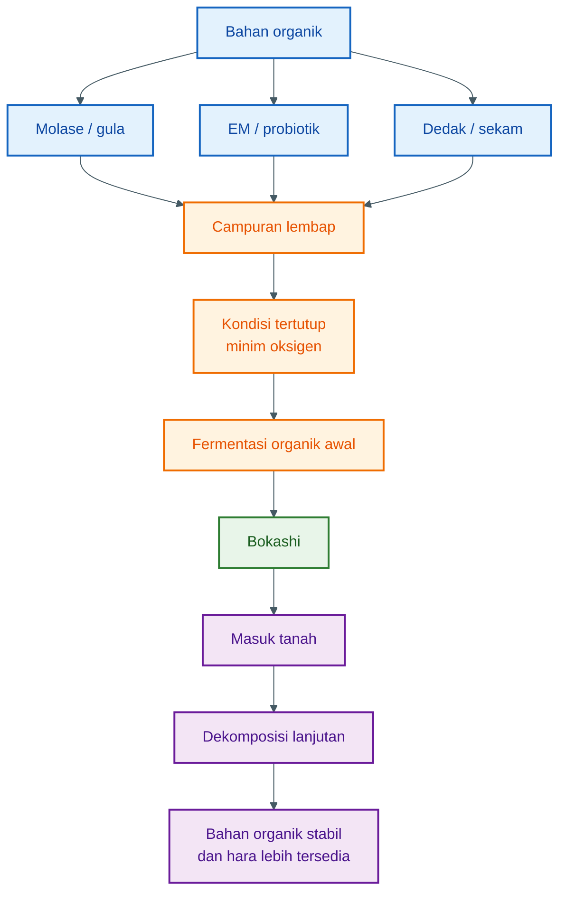

Alur ini menunjukkan bahwa bokashi bukan akhir dari seluruh proses. Setelah masuk tanah, bokashi masih mengalami dekomposisi lanjutan.

---

## 6.4. Bokashi = Fermentasi Organik Awal

Bokashi dapat disebut fermentasi karena prosesnya melibatkan mikroba fermentatif dan kondisi minim oksigen.

Mikroba mengubah sebagian bahan organik menjadi:

- asam organik,
- metabolit mikroba,
- bahan yang lebih lunak,
- aroma asam-manis,
- bahan organik yang lebih siap diurai lanjut.

Namun, bokashi biasanya belum mengalami stabilisasi sejauh kompos matang. Bentuk bahan asal sering masih terlihat.

Contoh:

```mdx id="co5ge8"
jerami masih terlihat
sekam masih terlihat
dedak masih terlihat
kotoran ternak belum sepenuhnya menjadi humus
```

Ini tidak selalu berarti gagal. Memang bokashi adalah produk antara.

---

## 6.5. Kompos Aerob = Dekomposisi Matang

Kompos aerob ditargetkan menjadi bahan yang lebih stabil. Pada kompos matang, bahan organik mudah busuk sudah banyak berkurang, suhu turun, aroma menjadi bau tanah, dan tekstur menjadi remah.

Kompos matang ideal:

```mdx id="bg7ql9"
bau tanah
suhu stabil
tekstur remah
tidak panas
tidak busuk
tidak fitotoksik
```

Sedangkan bokashi yang baru jadi bisa masih:

```mdx id="ii1sq4"
asam
beraroma tape
bahan asal masih terlihat
masih aktif secara biologis
perlu lanjut proses di tanah
```

Itulah sebabnya bokashi tidak selalu boleh diperlakukan sama seperti kompos matang.

---

## 6.6. Bokashi yang Baik Berbau Asam-Manis, Bukan Busuk

Aroma bokashi adalah indikator penting.

### Bokashi berhasil

Ciri:

- bau asam-manis,
- mirip tape,
- tidak bau bangkai,
- tidak bau amonia tajam,
- tidak berlendir busuk,
- tidak banyak belatung,
- tidak didominasi jamur hitam/hijau,
- bahan lembap tetapi tidak becek.

### Bokashi gagal

Ciri:

- bau busuk,
- bau kotoran menyengat,
- bau amonia,
- terlalu basah,
- berlendir,
- banyak belatung,
- jamur hitam/hijau dominan,
- warna kusam dan busuk.

```mdx id="zrw9f3"
Bau asam-manis = tanda fermentasi bokashi mungkin berjalan.
Bau bangkai/amonia = tanda proses mengarah ke pembusukan.
```

---

## 6.7. Bokashi Perlu Masa Tunggu Sebelum Tanam

Karena bokashi belum tentu matang seperti kompos, aplikasi langsung dekat akar muda bisa berisiko.

Risiko bokashi terlalu muda:

- akar stres,
- tanah terlalu asam sementara,
- mikroba mengambil nitrogen untuk mengurai bahan,
- muncul panas lokal,
- bibit terganggu,
- fitotoksik pada tanaman sensitif.

Praktik aman:

```mdx id="vnq0k8"
Bokashi matang awal
→ benamkan ke tanah
→ tutup tanah
→ tunggu 7–14 hari
→ baru tanam
```

Untuk bibit muda atau tanaman sensitif:

```mdx id="vkfx52"
Tunggu lebih lama:
14–21 hari
```

Untuk tanaman besar atau lahan terbuka, risiko lebih kecil, tetapi tetap sebaiknya tidak menempel langsung pada akar aktif.

---

## 6.8. Posisi Bokashi dalam Spektrum Proses

Bokashi berada di antara fermentasi dan dekomposisi tanah.

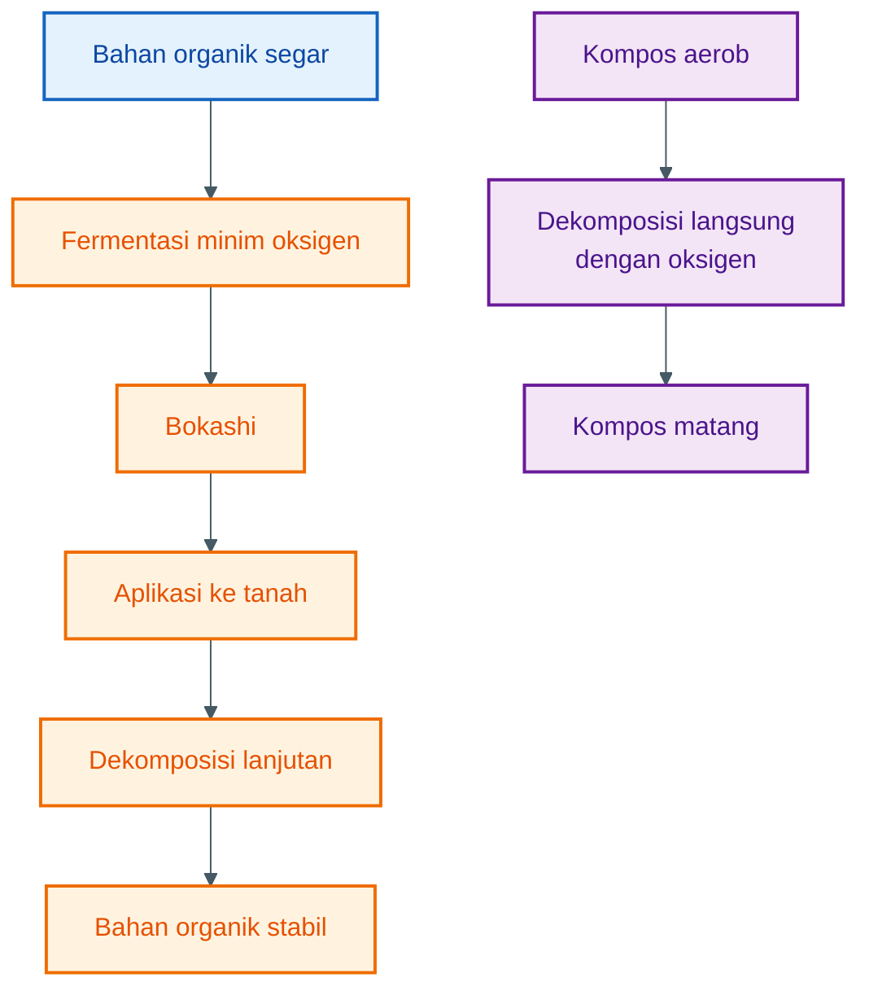

Diagram ini menegaskan bahwa bokashi tidak identik dengan kompos matang. Bokashi adalah bahan organik terfermentasi yang masih perlu lanjut stabilisasi setelah masuk tanah.

---

## 6.9. Kapan Bokashi Layak Digunakan?

Bokashi layak digunakan bila:

- aromanya asam-manis,
- tidak busuk,
- tidak berlendir,
- tidak ada belatung,
- tidak didominasi jamur liar,
- kelembapan pas,
- bahan tidak tercemar bahan kimia,
- disimpan dengan benar.

Bokashi cocok untuk:

- memperbaiki bahan organik tanah,
- meningkatkan aktivitas mikroba tanah,
- memperkaya bahan organik,
- memanfaatkan limbah organik lokal,
- memperbaiki struktur tanah secara bertahap.

Namun bokashi sebaiknya tidak digunakan sebagai:

- media semai murni,
- pupuk langsung menempel akar muda,
- pengganti kompos matang sepenuhnya,
- solusi untuk bahan organik busuk berat.

---

## 6.10. Kesalahan Umum tentang Bokashi

| Kesalahan                                     | Koreksi                                           |
| --------------------------------------------- | ------------------------------------------------- |
| Bokashi selalu sama dengan kompos matang      | Tidak. Bokashi adalah bahan organik terfermentasi |
| Semua bokashi aman langsung ke akar           | Tidak. Perlu masa tunggu                          |
| Bau busuk berarti bokashi kuat                | Salah. Bau busuk tanda gagal                      |
| EM bisa menyelamatkan bahan busuk             | Tidak selalu. Bahan awal tetap harus layak        |
| Bokashi tidak perlu tanah untuk lanjut proses | Salah. Bokashi masih lanjut terurai di tanah      |
| Bokashi pasti lebih baik dari kompos          | Tergantung tujuan dan cara pakai                  |
| Bokashi boleh terlalu basah asal tertutup     | Salah. Terlalu basah memicu busuk                 |

---

## 6.11. Kesimpulan Bab 6

Bokashi sering disebut kompos, tetapi secara proses lebih tepat disebut bahan organik terfermentasi.

Bokashi biasanya dibuat dari:

```mdx id="t5k1ix"
bahan organik

- EM/probiotik
- molase
- dedak/sekam
- kondisi tertutup/minim oksigen
```

Hasilnya adalah bahan organik yang mengalami fermentasi awal, bukan selalu kompos matang.

Setelah masuk tanah, bokashi masih mengalami dekomposisi lanjutan. Karena itu, bokashi sebaiknya diberi masa tunggu sebelum tanam, terutama untuk bibit muda atau tanaman sensitif.

Kesimpulan praktisnya:

> **Bokashi adalah fermentasi bahan organik, tetapi belum tentu sama dengan kompos matang. Bokashi yang baik berbau asam-manis seperti tape, bukan busuk.**

[**Kembali ke Atas**](#fermentasi-pengomposan-dan-pembusukan-meluruskan-istilah-agar-praktisi-agri-tidak-salah-interpretasi)

---

# Bab 7 — Silase Ikan, Hidrolisat Protein, dan Kompos Limbah Ikan: Jangan Disamakan

Salah satu sumber kebingungan terbesar di lapangan adalah ketika **bahan awalnya sama**, tetapi proses dan produk akhirnya berbeda.

Contoh paling jelas adalah **limbah ikan**.

Limbah ikan bisa menjadi:

1. **silase ikan / hidrolisat protein** untuk bahan atau aditif pakan,
2. **kompos limbah ikan** untuk pupuk organik,
3. **ikan busuk** yang menjadi limbah berisiko.

Bahan awalnya sama, tetapi arah prosesnya berbeda. Karena itu hasil akhirnya juga berbeda.

Kalimat kunci bab ini:

> **Bahan yang sama bisa menjadi pakan, pupuk, atau limbah berbahaya tergantung arah prosesnya.**

---

## 7.1. Limbah Ikan sebagai Bahan Awal

Limbah ikan bisa berupa:

- kepala ikan,
- tulang ikan,
- kulit ikan,
- jeroan,
- ikan rucah,
- sisa pasar ikan,
- limbah pengolahan ikan,
- ikan kecil yang tidak layak jual tetapi masih segar.

Bahan ini kaya protein, lemak, mineral, dan air. Karena itu, limbah ikan punya dua sisi.

Di satu sisi, ia bernilai sebagai bahan pakan atau pupuk. Di sisi lain, ia sangat cepat busuk bila tidak diproses dengan benar.

Masalahnya muncul ketika semua proses limbah ikan disebut “fermentasi ikan”, padahal hasilnya bisa sangat berbeda.

---

## 7.2. Tiga Arah Proses dari Bahan yang Sama

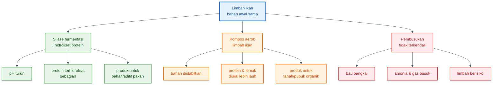

Diagram ini penting karena menunjukkan bahwa **nama proses tidak boleh ditentukan hanya dari bahan awal**. Limbah ikan bukan otomatis silase, bukan otomatis kompos, dan bukan otomatis pakan.

Yang menentukan adalah prosesnya.

---

## 7.3. Jika Dibuat Silase Ikan

Silase ikan adalah proses pengawetan bahan ikan dengan menurunkan pH. Penurunan pH bisa dilakukan dengan asam langsung atau melalui fermentasi bakteri asam laktat.

Dalam konteks praktisi, silase fermentasi biasanya memakai:

- limbah ikan segar,
- molase atau gula,
- bakteri asam laktat/probiotik,
- garam terbatas,
- kondisi tertutup atau anaerob,
- kadang dibantu enzim protease.

Tujuan utamanya:

```mdx id="vmrw63"
limbah ikan segar
→ pH turun
→ pembusukan ditekan
→ protein terhidrolisis sebagian
→ bahan/aditif pakan
```

### Ciri silase ikan yang berhasil

- pH rendah,
- bau asam-gurih,
- tidak bau bangkai,
- tidak bau amonia tajam,
- tidak ada jamur hitam/hijau dominan,
- tidak ada belatung,
- tekstur lebih cair atau lunak,
- protein terhidrolisis sebagian.

Target praktis:

```mdx id="x22uuk"
pH akhir silase ikan ≈ 3,5–4,5
```

Silase ikan masih mempertahankan nilai nutrisi sebagai bahan pakan. Protein tidak dihancurkan sampai menjadi kompos, tetapi distabilkan dan sebagian dipecah menjadi peptida serta asam amino bebas.

---

## 7.4. Silase Ikan dan Hidrolisat Protein

Silase ikan dan hidrolisat protein sering beririsan.

Silase ikan menekankan:

```mdx id="spojav"
pengawetan bahan ikan dengan pH rendah
```

Hidrolisat protein menekankan:

```mdx id="a6enc4"
pemecahan protein menjadi peptida dan sebagian asam amino bebas
```

Dalam praktik, keduanya bisa terjadi bersamaan.

```mdx id="zlw6qg"
limbah ikan

- enzim protease
- bakteri asam laktat
- molase
  → pH turun
- protein terhidrolisis sebagian
  → silase / hidrolisat protein fermentasi
```

Produk akhirnya cocok diposisikan sebagai:

- bahan pakan,
- aditif pakan,
- peningkat palatabilitas,
- sumber protein terhidrolisis sebagian,
- pemanfaatan limbah protein segar.

Namun, produk ini **bukan kompos** dan **bukan pupuk utama**. Tujuannya adalah pakan, bukan stabilisasi tanah.

---

## 7.5. Jika Limbah Ikan Dikomposkan

Limbah ikan juga bisa dijadikan kompos, tetapi prosesnya berbeda.

Pada pengomposan, tujuan utamanya bukan mempertahankan protein untuk pakan. Tujuannya adalah membuat bahan organik menjadi lebih stabil untuk tanah.

Prosesnya membutuhkan:

- bahan karbon tinggi seperti sekam, daun kering, jerami, serbuk gergaji,
- oksigen,
- kelembapan terkendali,
- pembalikan,
- rasio C/N yang seimbang,
- waktu pematangan.

Alur sederhananya:

```mdx id="eu0v5h"
limbah ikan

- bahan karbon
- oksigen
- mikroba kompos
  → panas
  → CO₂
  → bahan organik stabil
  → kompos
```

Dalam kompos, protein dan lemak ikan diurai lebih jauh. Sebagian karbon hilang sebagai CO₂, sebagian energi hilang sebagai panas, dan bahan akhirnya menjadi lebih stabil untuk tanah.

### Ciri kompos limbah ikan yang berhasil

- tidak bau ikan busuk,
- tidak bau amonia tajam,
- tidak menarik banyak lalat,
- suhu naik pada fase aktif lalu turun,
- tekstur menjadi lebih remah,
- bau akhir seperti tanah,
- bahan tidak lagi mudah busuk,
- aman untuk tanaman setelah matang.

Kompos limbah ikan yang baik **bukan untuk pakan**, tetapi untuk tanah.

---

## 7.6. Jika Limbah Ikan Membusuk

Jika limbah ikan dibiarkan tanpa kontrol, prosesnya menjadi pembusukan.

Ciri:

- bau bangkai,
- bau amonia,
- banyak lalat,
- belatung,
- gas busuk,
- lendir,
- warna kusam,
- cairan busuk,
- risiko patogen.

Alurnya:

```mdx id="m96zkb"
limbah ikan

- mikroba liar
- kondisi tidak terkendali
  → amonia
- gas busuk
- lendir
- patogen
  → limbah berisiko
```

Produk seperti ini tidak layak untuk pakan. Untuk pupuk pun tidak boleh langsung diberikan begitu saja, terutama dekat akar atau pada lahan intensif. Bahan busuk harus ditangani ulang secara benar, misalnya masuk sistem kompos aerob dengan bahan karbon cukup dan manajemen aerasi.

---

## 7.7. Tabel Pembeda Limbah Ikan

| Bahan sama  | Proses berbeda     | Produk berbeda               | Tujuan penggunaan  |
| ----------- | ------------------ | ---------------------------- | ------------------ |
| Limbah ikan | Silase fermentasi  | Protein awet pH rendah       | Aditif/bahan pakan |
| Limbah ikan | Hidrolisat protein | Peptida dan protein terlarut | Aditif/bahan pakan |
| Limbah ikan | Kompos aerob       | Bahan organik stabil         | Pupuk organik      |
| Limbah ikan | Pembusukan         | Amonia, gas, patogen         | Limbah berisiko    |

---

## 7.8. Kesalahan Praktis yang Harus Dihindari

### Kesalahan 1: silase ikan dianggap kompos

Silase ikan masih kaya bahan organik mudah urai dan asam. Ia tidak sama dengan kompos matang.

Jika silase ikan langsung ditaruh banyak di tanah dekat akar, risiko muncul:

- bau,
- asam lokal,
- mikroba aktif berlebihan,
- gangguan akar,
- ketidakseimbangan nitrogen.

### Kesalahan 2: kompos limbah ikan dianggap pakan

Kompos tidak boleh diberikan sebagai pakan. Pada kompos, bahan protein sudah diurai lebih jauh dan tujuannya bukan nutrisi hewan.

### Kesalahan 3: ikan busuk dianggap asam amino cair

Bau amonia dan bau bangkai bukan tanda asam amino tinggi. Itu tanda pembusukan protein.

### Kesalahan 4: bahan yang sama dianggap hasilnya sama

Limbah ikan bisa menjadi produk berguna atau limbah berbahaya. Yang menentukan adalah arah proses.

---

## 7.9. Kesimpulan Bab 7

Limbah ikan bisa menjadi tiga jenis produk yang sangat berbeda:

```mdx id="e6t8vf"
silase ikan / hidrolisat protein
→ bahan/aditif pakan

kompos limbah ikan
→ pupuk organik

ikan busuk
→ limbah berisiko
```

Bahan awalnya sama, tetapi prosesnya berbeda.

Kesimpulan praktisnya:

> **Bahan yang sama bisa menjadi pakan, pupuk, atau limbah berbahaya tergantung arah prosesnya. Jangan menyamakan silase ikan, hidrolisat protein, kompos limbah ikan, dan ikan busuk.**

[**Kembali ke Atas**](#fermentasi-pengomposan-dan-pembusukan-meluruskan-istilah-agar-praktisi-agri-tidak-salah-interpretasi)

---

# Bab 8 — Parameter Pembeda: Jangan Menilai dari Nama, Nilai dari Indikator

Nama produk sering menipu. Produk yang diberi label “fermentasi” belum tentu berhasil. Bahan yang disebut “kompos” belum tentu matang. Bokashi yang disebut “jadi” belum tentu aman langsung ke akar.

Karena itu, praktisi harus menilai dari indikator objektif.

Kalimat kunci bab ini:

> **Jangan percaya label. Ukur proses dari pH, bau, suhu, tekstur, oksigen, dan produk akhirnya.**

---

## 8.1. Kenapa Indikator Lebih Penting daripada Nama?

Nama bisa dibuat bebas. Indikator tidak bisa ditipu.

Seseorang bisa menyebut produknya:

- fermentasi,
- kompos,
- bokashi,
- silase,
- asam amino,
- pupuk organik,
- probiotik.

Tetapi produk harus tetap diuji dari cirinya.

Pertanyaan praktisnya:

```mdx id="eh9cur"
Apakah pH sesuai?
Apakah baunya normal?
Apakah suhunya sesuai?
Apakah teksturnya stabil?
Apakah ada jamur liar?
Apakah ada belatung?
Apakah produk akhirnya layak digunakan?
```

Jika indikatornya buruk, nama produk tidak menyelamatkan kualitasnya.

---

## 8.2. Indikator Fermentasi Berhasil

Fermentasi berhasil bila produk sesuai dengan tujuan fermentasinya.

Karena jenis fermentasi berbeda-beda, indikatornya juga tidak selalu sama. Namun secara umum, fermentasi berhasil memiliki ciri:

- produk sesuai tujuan,
- aroma khas normal,
- mikroba target dominan,
- tidak busuk,
- tidak berlendir busuk,
- tidak ada jamur liar dominan,
- tidak ada belatung,
- tekstur sesuai produk,
- pH sesuai target bila fermentasi asam.

Contoh target pada fermentasi asam:

```mdx id="m2x7j5"
silase ikan / fermentasi asam:
pH akhir ideal ≈ 3,5–4,5
```

Contoh target pada tempe:

```mdx id="yve5bi"
tempe:
miselium putih merata
aroma khas tempe
tidak berlendir
tidak bau amonia
```

Contoh target pada tape:

```mdx id="zdu5zi"
tape:
aroma khas tape
tekstur lunak
rasa manis-asam
tidak busuk
tidak berjamur liar dominan
```

Jadi, fermentasi tidak dinilai dengan satu parameter saja. Harus sesuai jenis produknya.

---

## 8.3. Indikator Kompos Matang

Kompos matang memiliki ciri yang berbeda dari fermentasi.

Ciri kompos matang:

- bau tanah,
- suhu mendekati suhu lingkungan,
- bahan lebih remah,
- warna coklat tua sampai hitam,
- tidak panas,
- tidak menyengat,
- tidak menarik banyak lalat,
- tidak berlendir,
- bahan asal tidak terlalu mudah dikenali,
- aman untuk tanaman.

Kompos matang bukan berbau asam tajam. Kompos matang juga bukan berbau kotoran menyengat.

Indikator praktis:

```mdx id="lyyso5"
Bau tanah

- suhu stabil
- tekstur remah
- tidak busuk
  = kompos cenderung matang
```

Jika kompos masih panas, bau amonia, atau berlendir, berarti belum matang atau prosesnya bermasalah.

---

## 8.4. Indikator Pembusukan

Pembusukan memiliki tanda yang kuat dan harus diwaspadai.

Ciri pembusukan:

- bau bangkai,
- bau amonia,
- lendir,
- belatung,
- gas busuk,
- jamur hitam/hijau liar,
- pH tidak sesuai,
- warna kusam,
- produk tidak stabil,
- cairan busuk,
- lalat banyak,
- tekstur hancur dan menjijikkan.

Tanda paling penting:

```mdx id="q39v09"
bau bangkai
bau amonia tajam
lendir busuk
belatung
jamur liar dominan
```

Jika tanda ini muncul, jangan memaksakan produk sebagai pakan atau pangan. Untuk pupuk pun harus ditangani ulang dengan benar.

---

## 8.5. Parameter yang Perlu Diamati

| Parameter      | Fermentasi berhasil      | Kompos matang                    | Pembusukan           |
| -------------- | ------------------------ | -------------------------------- | -------------------- |
| Bau            | Khas fermentasi          | Bau tanah                        | Bau busuk/amonia     |
| pH             | Sesuai target proses     | Cenderung stabil                 | Tidak terkendali     |
| Suhu           | Tergantung proses        | Mendekati lingkungan saat matang | Bisa tidak stabil    |
| Tekstur        | Sesuai produk            | Remah, stabil                    | Lendir, hancur busuk |
| Oksigen        | Sesuai jenis fermentasi  | Aerob                            | Tidak terkendali     |
| Jamur          | Terkendali sesuai produk | Tidak dominan liar               | Jamur liar dominan   |
| Lalat/belatung | Tidak ada                | Tidak menarik lalat              | Sering ada           |
| Kelayakan      | Sesuai tujuan            | Untuk tanah                      | Tidak layak          |

---

## 8.6. Diagram Keputusan Praktis

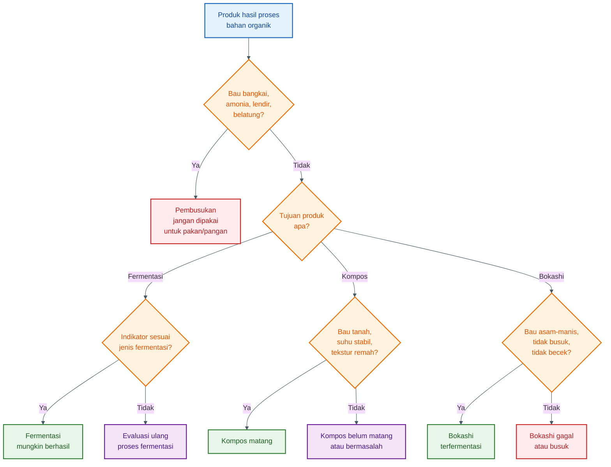

---

## 8.7. Alat Ukur Minimal untuk Praktisi

Praktisi tidak harus punya laboratorium, tetapi sebaiknya memiliki alat ukur dasar.

### Untuk fermentasi asam/silase

Alat penting:

- pH meter,
- termometer,
- timbangan,
- wadah bersih,
- catatan tanggal proses.

Parameter minimal:

```mdx id="ntbfyz"
pH
bau
warna
tekstur
ada/tidak jamur
ada/tidak belatung
```

### Untuk kompos

Alat penting:

- termometer kompos,
- alat pembalik,
- alat uji kelembapan sederhana,
- catatan bahan dan tanggal.

Parameter minimal:

```mdx id="gqmurc"
suhu
bau
kelembapan
tekstur
warna
ada/tidak lalat
```

### Untuk bokashi

Alat penting:

- wadah tertutup,
- timbangan,
- alat cek kelembapan sederhana,
- catatan proses.

Parameter minimal:

```mdx id="evf0hl"
bau asam-manis
tidak busuk
tidak becek
tidak belatung
tidak jamur liar dominan
```

---

## 8.8. Kesimpulan Bab 8

Jangan menilai produk dari namanya. Nilai dari indikatornya.

Fermentasi berhasil harus menunjukkan indikator sesuai jenis fermentasinya. Kompos matang harus stabil, berbau tanah, dan aman untuk tanaman. Pembusukan ditandai bau bangkai, amonia, lendir, belatung, gas busuk, dan produk yang tidak stabil.

Kesimpulan praktisnya:

> **Jangan percaya label. Ukur proses dari pH, bau, suhu, tekstur, oksigen, dan produk akhirnya. Jika indikatornya buruk, nama “fermentasi” atau “kompos” tidak membuat produk menjadi aman.**

[**Kembali ke Atas**](#fermentasi-pengomposan-dan-pembusukan-meluruskan-istilah-agar-praktisi-agri-tidak-salah-interpretasi)

---

# Bab 9 — Tabel Besar Perbandingan Praktis

Bab ini merangkum perbedaan fermentasi, pengomposan, dan pembusukan dalam bentuk tabel agar praktisi dapat cepat membedakan.

Kalimat kunci bab ini:

> **Pembeda utama bukan mikroba, tetapi arah proses dan produk akhirnya.**

---

## 9.1. Tabel Besar Perbandingan

| Aspek            | Fermentasi                                | Pengomposan                          | Pembusukan                   |
| ---------------- | ----------------------------------------- | ------------------------------------ | ---------------------------- |
| Arah proses      | Terarah                                   | Terkendali menuju stabil             | Liar/tidak terkendali        |
| Tujuan           | Produk spesifik                           | Kompos/pembenah tanah                | Tidak diinginkan             |
| Oksigen          | Bisa anaerob/aerob                        | Umumnya aerob                        | Bisa anaerob liar            |
| Mikroba          | Dipilih/dikondisikan                      | Dekomposer aerob                     | Mikroba liar                 |
| Produk           | Asam, alkohol, peptida, enzim, aroma      | Humus, mineral, bahan organik stabil | Amonia, gas busuk, toksin    |
| Contoh           | Yogurt, tape, tempe, silase ikan, bokashi | Kompos daun, kompos kotoran ternak   | Ikan busuk, ampas tahu busuk |
| Bau ideal        | Khas fermentasi                           | Bau tanah                            | Busuk                        |
| Suhu             | Tergantung jenis proses                   | Naik saat aktif, turun saat matang   | Tidak terkendali             |
| pH               | Sesuai target proses                      | Stabil mendekati aman untuk tanah    | Tidak terkendali             |
| Risiko           | Kontaminasi bila gagal                    | Anaerob bila kurang aerasi           | Patogen dan toksin           |
| Layak untuk      | Pangan, pakan, bioinput tertentu          | Tanah/media tanam                    | Tidak layak                  |
| Indikator sukses | Produk sesuai tujuan                      | Stabil, remah, bau tanah             | Tidak ada; ini proses gagal  |

---

## 9.2. Tabel Contoh Praktis di Lapangan

| Kasus lapangan                              | Sebutan yang sering dipakai | Sebutan yang lebih tepat         | Catatan                          |
| ------------------------------------------- | --------------------------- | -------------------------------- | -------------------------------- |
| Limbah ikan + molase + LAB, pH turun        | Fermentasi ikan             | Silase ikan / hidrolisat protein | Untuk bahan/aditif pakan         |
| Limbah ikan + sekam + aerasi + panas        | Fermentasi ikan             | Kompos limbah ikan               | Untuk tanah                      |
| Limbah ikan dibiarkan bau bangkai           | Fermentasi gagal            | Ikan busuk                       | Limbah berisiko                  |
| Pelet + probiotik + air, langsung diberikan | Fermentasi pelet            | Conditioning pelet probiotik     | Jangan disimpan lama             |
| Kotoran ternak + sekam + EM + tertutup      | Kompos fermentasi           | Bokashi                          | Perlu masa tunggu                |
| Daun + jerami + kotoran + aerasi            | Fermentasi kompos           | Pengomposan aerob                | Target kompos matang             |
| Ampas tahu berlendir dan bau                | Fermentasi ampas tahu       | Ampas tahu busuk                 | Jangan untuk pakan               |
| Kedelai + Rhizopus                          | Fermentasi kedelai          | Tempe                            | Fermentasi kapang aerob          |
| Singkong + ragi tape                        | Fermentasi singkong         | Tape                             | Fermentasi pati oleh kapang/ragi |

---

## 9.3. Ringkasan Visual Perbandingan

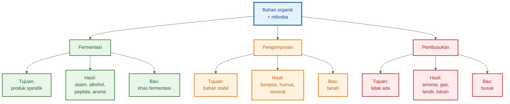

---

## 9.4. Prinsip Penggunaan Produk

| Produk                       | Boleh digunakan untuk     | Jangan digunakan untuk             |
| ---------------------------- | ------------------------- | ---------------------------------- |
| Fermentasi pangan            | Pangan sesuai standar     | Pakan/tanah tanpa pertimbangan     |
| Silase ikan                  | Bahan/aditif pakan        | Kompos matang langsung             |
| Hidrolisat protein           | Aditif pakan              | Pengganti pelet lengkap            |
| Bokashi                      | Tanah setelah masa tunggu | Langsung menempel akar muda        |
| Kompos matang                | Tanah/media tanam         | Pakan ikan/ternak                  |
| Pelet conditioning probiotik | Diberikan segera          | Disimpan basah berhari-hari        |
| Bahan busuk                  | Ditolak/ditangani ulang   | Pakan, pangan, atau pupuk langsung |

---

## 9.5. Kalimat Praktis untuk Komunikasi Lapangan

Gunakan bahasa yang lebih presisi.

Kurang tepat:

```mdx id="f7fnop"
Saya fermentasi limbah ikan.
```

Lebih tepat:

```mdx id="dnq7rn"
Saya membuat silase ikan berbasis asam laktat
untuk aditif pakan, target pH 3,5–4,5.
```

Kurang tepat:

```mdx id="lhxyim"
Saya fermentasi kotoran ternak.
```

Lebih tepat:

```mdx id="bgm8io"
Saya membuat bokashi kotoran ternak
dengan EM/molase dalam kondisi minim oksigen.
```

Atau:

```mdx id="upouko"
Saya membuat kompos aerob dari kotoran ternak
dengan sekam dan pembalikan rutin.
```

Kurang tepat:

```mdx id="odlmsj"
Pelet saya fermentasi.
```

Lebih tepat:

```mdx id="hw8qsq"
Pelet saya conditioning dengan probiotik,
lalu diberikan segera agar tidak rusak.
```

---

## 9.6. Kesimpulan Bab 9

Fermentasi, pengomposan, dan pembusukan sama-sama melibatkan mikroba, tetapi ketiganya berbeda dalam arah proses dan produk akhirnya.

Fermentasi mengejar produk spesifik. Pengomposan mengejar bahan organik stabil. Pembusukan adalah proses liar yang menghasilkan produk tidak diinginkan.

Kesimpulan praktisnya:

> **Pembeda utama bukan mikroba, tetapi arah proses dan produk akhirnya. Karena itu, jangan hanya bertanya “pakai mikroba apa?”, tetapi tanyakan “prosesnya diarahkan ke produk apa dan indikator suksesnya apa?”**

[**Kembali ke Atas**](#fermentasi-pengomposan-dan-pembusukan-meluruskan-istilah-agar-praktisi-agri-tidak-salah-interpretasi)

---

# Bab 10 — Panduan Bahasa: Istilah yang Lebih Tepat untuk Praktisi

Fokus:

Agar komunikasi tidak salah, gunakan istilah yang lebih spesifik.

| Istilah kabur          | Istilah lebih tepat                                   |
| ---------------------- | ----------------------------------------------------- |
| Fermentasi ikan        | Silase ikan / protein hidrolisat fermentasi           |
| Asam amino cair        | Protein hidrolisat fermentasi                         |
| Fermentasi pelet       | Conditioning pelet dengan probiotik                   |
| Fermentasi PGPM        | Perbanyakan/kultur PGPM                               |
| Fermentasi pupuk       | Bokashi / ekstrak organik fermentasi / POC fermentasi |
| Kompos fermentasi      | Bokashi, jika prosesnya anaerob dengan EM/molase      |
| Bahan sudah fermentasi | Harus dicek: fermentasi atau busuk?                   |
| Bau tajam berarti jadi | Salah; bisa jadi amonia/pembusukan                    |

Kalimat kunci:

> Jangan hanya mengatakan “fermentasi”. Sebutkan bahan, mikroba, kondisi, dan tujuan.

---

# Bab 11 — Diagram Keputusan: Ini Fermentasi, Kompos, atau Busuk?

Fokus:

Buat alur keputusan praktis.

Pertanyaan kunci:

1. Apakah prosesnya punya tujuan produk spesifik?
2. Apakah mikroba/starternya jelas?
3. Apakah kondisi oksigen dikendalikan?
4. Apakah pH/suhu/bau sesuai target?
5. Apakah produk akhirnya layak digunakan?
6. Apakah muncul bau busuk, amonia, belatung, atau jamur liar?

Output klasifikasi:

- fermentasi berhasil,
- kompos matang,
- bokashi belum matang,
- proses gagal,
- pembusukan.

Kalimat kunci:

> Jika hasilnya bau busuk, berlendir, dan tidak terkendali, jangan menyebutnya fermentasi. Itu pembusukan.

---

# Bab 12 — Kesalahan Umum di Lapangan

Fokus:

- Semua yang diberi EM dianggap fermentasi.
- Semua yang tertutup rapat dianggap bokashi.
- Semua yang berbau asam dianggap berhasil.
- Bahan busuk dianggap bisa diselamatkan dengan molase.
- Kompos muda dianggap kompos matang.
- Bokashi langsung ditanam dekat akar muda.
- Pelet basah disimpan lama dan disebut fermentasi pakan.
- Limbah ikan busuk disebut asam amino cair.
- Tidak membedakan produk untuk pakan dan produk untuk tanah.

Kalimat kunci:

> Mikroba bukan sulap. Proses yang salah tidak menjadi benar hanya karena diberi nama fermentasi.

---

# Bab 13 — Kesimpulan: Gunakan Istilah Berdasarkan Proses dan Tujuan

Fokus:

- Fermentasi, pengomposan, dan pembusukan memang sama-sama melibatkan mikroba.
- Namun ketiganya berbeda secara praktis.
- Fermentasi menghasilkan produk spesifik.
- Pengomposan menghasilkan bahan organik stabil untuk tanah.
- Pembusukan menghasilkan produk tidak diinginkan.
- Bokashi adalah fermentasi bahan organik, tetapi bukan selalu kompos matang.
- Silase ikan adalah fermentasi/pengasaman bahan protein untuk pakan, bukan kompos.
- Praktisi harus memakai istilah spesifik agar tidak salah interpretasi.

Kalimat penutup:

> **Semua fermentasi adalah biokonversi, tetapi tidak semua biokonversi adalah fermentasi yang berhasil. Kompos adalah dekomposisi terkendali. Pembusukan adalah dekomposisi liar. Kesalahan istilah akan menghasilkan kesalahan praktik.**

---

# Struktur Ringkas Artikel

Agar artikel tidak terlalu panjang, bisa dikunci menjadi **9 bab inti**:

1. Kenapa istilah ini membingungkan
2. Kerangka dasar: biokonversi
3. Fermentasi
4. Pengomposan
5. Pembusukan
6. Bokashi: fermentasi atau kompos?
7. Silase ikan, hidrolisat protein, dan kompos limbah ikan
8. Parameter pembeda dan tabel perbandingan
9. Panduan istilah dan kesimpulan praktis

Struktur ini paling cocok untuk praktisi: **konseptual cukup, tabel jelas, dan langsung mencegah salah sebut di lapangan.**

[**Kembali ke Atas**](#fermentasi-pengomposan-dan-pembusukan-meluruskan-istilah-agar-praktisi-agri-tidak-salah-interpretasi)

---

# Bab 10 — Lampiran Mikroba yang Terlibat

Lampiran ini membedakan mikroba berdasarkan **arah proses**, bukan sekadar nama mikroba. Mikroba yang sama kadang bisa bermanfaat atau merugikan tergantung kondisi, bahan, oksigen, suhu, pH, dan tujuan proses.

Cornell Composting menjelaskan bahwa pengomposan bergantung pada kerja bakteri dan fungi yang mengurai bahan organik menjadi karbon dioksida, air, panas, dan humus; proses ini berlangsung dalam fase mesofilik, termofilik, lalu pematangan. ([Cornell Composting][1])
Dalam fermentasi pangan, kelompok mikroba umum meliputi bakteri asam laktat, bakteri asam asetat, khamir/ragi, dan kapang/filamentous fungi. ([ScienceDirect][2])
Dalam pembusukan, agen utama umumnya adalah bakteri, ragi, dan kapang yang mengubah warna, bau, rasa, tekstur, serta dapat menghasilkan senyawa tidak diinginkan seperti amina dan amonia. ([ScienceDirect][3])

---

## 10.1. Mikroba pada Fermentasi

Fermentasi adalah proses terarah. Mikroba dipilih atau dikondisikan agar menghasilkan produk tertentu: asam laktat, alkohol, asam asetat, enzim, peptida, aroma, atau biomassa mikroba.

| Kelompok mikroba                      | Contoh genus                                                                          | Contoh proses                                              | Fungsi utama                                                     | Catatan praktis                                                   |
| ------------------------------------- | ------------------------------------------------------------------------------------- | ---------------------------------------------------------- | ---------------------------------------------------------------- | ----------------------------------------------------------------- |
| **Bakteri asam laktat / LAB**         | _Lactobacillus_, _Lactiplantibacillus_, _Leuconostoc_, _Pediococcus_, _Streptococcus_ | Yogurt, silase, fermentasi sayur, silase ikan              | Mengubah gula menjadi asam laktat, menurunkan pH                 | Cocok untuk pengawetan asam dan penekanan mikroba pembusuk        |
| **Khamir / ragi**                     | _Saccharomyces_, _Candida_, _Pichia_, _Saccharomycopsis_                              | Tape, roti, alkohol, beberapa biofermentasi                | Mengubah gula menjadi alkohol, CO₂, aroma                        | Tidak otomatis menurunkan pH kuat                                 |
| **Kapang / jamur fermentatif**        | _Rhizopus_, _Mucor_, _Amylomyces_, _Aspergillus_                                      | Tempe, tape, koji                                          | Menghasilkan enzim: amilase, protease, lipase                    | Banyak yang butuh oksigen; tidak cocok untuk silase anaerob basah |
| **Bakteri asam asetat**               | _Acetobacter_, _Gluconobacter_, _Komagataeibacter_                                    | Cuka                                                       | Mengubah alkohol menjadi asam asetat                             | Butuh oksigen; berbeda dari fermentasi anaerob                    |
| **Bakteri pembentuk enzim/probiotik** | _Bacillus_                                                                            | Probiotik pakan, bioinput, fermentasi bahan pakan tertentu | Menghasilkan enzim, membantu degradasi bahan                     | Banyak spesies aerob/fakultatif; perlu strain yang aman           |
| **PGPM / bioinokulan**                | _Bacillus_, _Pseudomonas_, _Azospirillum_, _Rhizobium_, _Trichoderma_                 | Kultur PGPM, biofertilizer                                 | Membantu akar, pelarutan hara, hormon tumbuh, antagonis penyakit | Lebih tepat disebut kultur/perbanyakan mikroba, bukan silase      |

### Inti praktis

```mdx
Fermentasi tidak selalu Lactobacillus.
Tape dominan ragi/kapang.
Tempe dominan Rhizopus.
Cuka dominan Acetobacter.
Silase ikan idealnya dominan bakteri asam laktat.
PGPM fokusnya mikroba hidup, bukan pH rendah.
```

[**Kembali ke Atas**](#fermentasi-pengomposan-dan-pembusukan-meluruskan-istilah-agar-praktisi-agri-tidak-salah-interpretasi)

---

## 10.2. Mikroba pada Pengomposan

Pengomposan adalah dekomposisi terkendali, umumnya aerob. Mikroba bekerja bertahap sesuai suhu, oksigen, kadar air, dan jenis bahan.

| Fase kompos          | Mikroba dominan                   | Contoh genus/kelompok                                                           | Fungsi utama                                              | Tanda proses            |
| -------------------- | --------------------------------- | ------------------------------------------------------------------------------- | --------------------------------------------------------- | ----------------------- |
| **Mesofilik awal**   | Bakteri mesofilik, fungi awal     | _Pseudomonas_, _Bacillus_, _Enterobacter_, fungi saprofit                       | Mengurai gula, protein mudah urai, bahan lunak            | Suhu mulai naik         |
| **Termofilik**       | Bakteri termofilik                | _Bacillus_, _Geobacillus_, _Thermus_, bakteri termofilik lain                   | Mengurai bahan cepat, menghasilkan panas, menekan patogen | Suhu tinggi             |
| **Fase pendinginan** | Fungi dan aktinomiset             | _Streptomyces_, _Thermoactinomyces_, _Nocardia_, fungi selulolitik              | Mengurai selulosa, hemiselulosa, kitin, lignin parsial    | Bau mulai seperti tanah |
| **Pematangan**       | Aktinomiset, fungi, mikroba tanah | _Streptomyces_, _Trichoderma_, _Penicillium_, _Aspergillus_, mikroba tanah lain | Membentuk bahan organik stabil dan humus                  | Suhu turun, bahan remah |

Cornell menyebut fase pengomposan meliputi fase mesofilik, termofilik, dan pendinginan/pematangan; mikroorganisme seperti bakteri dan fungi mencerna bahan organik dan mengubahnya menjadi bentuk yang lebih stabil. ([Cornell Composting][1])

### Inti praktis

```mdx
Kompos yang baik bukan pH rendah seperti silase.
Kompos yang baik butuh oksigen, kelembapan tepat, dan suhu terkontrol.
Aroma akhirnya tanah, bukan asam menyengat atau busuk.
```

[**Kembali ke Atas**](#fermentasi-pengomposan-dan-pembusukan-meluruskan-istilah-agar-praktisi-agri-tidak-salah-interpretasi)

---

## 10.3. Mikroba pada Pembusukan

Pembusukan adalah dekomposisi tidak terkendali. Mikroba yang terlibat bisa beragam, tetapi hasilnya tidak diinginkan: bau busuk, amonia, gas, lendir, toksin, dan risiko patogen.

| Jenis pembusukan                | Mikroba umum                 | Contoh genus                                                              | Produk/efek                                   | Tanda praktis                    |
| ------------------------------- | ---------------------------- | ------------------------------------------------------------------------- | --------------------------------------------- | -------------------------------- |
| **Pembusukan protein**          | Bakteri proteolitik          | _Proteus_, _Clostridium_, _Pseudomonas_, _Bacillus_ liar                  | Amonia, amina busuk, sulfur busuk             | Bau bangkai, bau urin/amonia     |
| **Pembusukan anaerob**          | Bakteri anaerob              | _Clostridium_, bakteri pembentuk gas                                      | Gas busuk, asam tidak stabil, toksin tertentu | Wadah menggembung, bau menyengat |
| **Pembusukan aerob permukaan**  | Bakteri aerob + kapang       | _Pseudomonas_, _Aspergillus_, _Penicillium_, _Mucor_ liar                 | Lendir, jamur, bau apek                       | Permukaan berubah warna, berbulu |
| **Pembusukan gula/bahan basah** | Ragi liar + bakteri          | _Candida_, _Pichia_, bakteri liar                                         | Alkohol liar, gas, asam menyimpang            | Bau alkohol tajam, berbusa       |
| **Pembusukan lemak**            | Mikroba lipolitik + oksidasi | _Pseudomonas_, kapang lipolitik                                           | Tengik, asam lemak bebas                      | Bau tengik                       |
| **Kontaminasi patogen**         | Patogen pangan/pakan         | _Salmonella_, _E. coli_ patogen, _Staphylococcus_, _Clostridium_ tertentu | Risiko penyakit                               | Tidak selalu terlihat dari bau   |

Agen pembusukan pangan/pakan secara umum adalah bakteri, ragi, dan kapang; mereka menggunakan makanan sebagai sumber karbon dan energi, lalu menyebabkan perubahan bau, warna, rasa, tekstur, dan mutu. ([ScienceDirect][3])

### Inti praktis

```mdx
Pembusukan juga memakai mikroba.
Tetapi arahnya liar dan produknya tidak diinginkan.
Bau busuk bukan tanda fermentasi kuat.
Amonia bukan tanda asam amino tinggi.
```

[**Kembali ke Atas**](#fermentasi-pengomposan-dan-pembusukan-meluruskan-istilah-agar-praktisi-agri-tidak-salah-interpretasi)

---

## 10.4. Tabel Pembeda Cepat: Mikroba Baik vs Mikroba Salah Arah

| Proses                 | Mikroba yang diharapkan     | Kondisi yang diinginkan           | Produk yang dicari             | Jika gagal berubah menjadi   |
| ---------------------- | --------------------------- | --------------------------------- | ------------------------------ | ---------------------------- |
| Fermentasi asam laktat | LAB                         | Anaerob/minim oksigen, gula cukup | Asam laktat, pH turun          | Busuk, pH tinggi, amonia     |
| Fermentasi tape        | Kapang amilolitik + ragi    | Semi-aerob, pati cukup            | Gula, alkohol ringan, aroma    | Asam busuk, jamur liar       |
| Fermentasi tempe       | _Rhizopus_                  | Aerob, padat, bersih              | Miselium putih, enzim, tekstur | Busuk, berlendir, jamur liar |
| Fermentasi cuka        | _Acetobacter_               | Aerob, ada alkohol                | Asam asetat                    | Busuk/terkontaminasi         |
| Kompos aerob           | Bakteri, fungi, aktinomiset | Aerob, lembap, C/N seimbang       | Kompos stabil                  | Anaerob, bau busuk           |
| Bokashi                | LAB, ragi, mikroba EM       | Tertutup/minim oksigen            | Bahan organik terfermentasi    | Busuk, amonia, belatung      |
| Pembusukan             | Mikroba liar                | Tidak terkendali                  | Tidak ada target berguna       | Limbah berisiko              |

---

## 10.5. Kesimpulan Lampiran

Untuk praktisi, nama mikroba tidak cukup. Yang lebih penting adalah **arah prosesnya**.

```mdx
Mikroba + bahan + kondisi terkendali + tujuan jelas
= fermentasi atau kompos yang berguna

Mikroba + bahan + kondisi liar + tanpa kontrol
= pembusukan
```

Kesimpulan paling praktis:

> **Fermentasi mengejar produk spesifik. Kompos mengejar bahan organik stabil. Pembusukan adalah proses liar yang menghasilkan produk tidak diinginkan. Mikroba yang terlibat bisa mirip, tetapi arah proses dan indikator suksesnya berbeda.**

[1]: https://compost.css.cornell.edu/microorg.html?utm_source=chatgpt.com 'Compost Microorganisms - CORNELL Composting'
[2]: https://www.sciencedirect.com/topics/immunology-and-microbiology/fermentation?utm_source=chatgpt.com 'Fermentation - an overview | ScienceDirect Topics'
[3]: https://www.sciencedirect.com/science/article/pii/S2772753X24002478?utm_source=chatgpt.com 'A review on food spoilage mechanisms, food borne ...'

[**Kembali ke Atas**](#fermentasi-pengomposan-dan-pembusukan-meluruskan-istilah-agar-praktisi-agri-tidak-salah-interpretasi)

---

<small>
  **_Catatan Penyusunan_** Artikel ini disusun sebagai materi edukasi dan
  referensi umum berdasarkan berbagai sumber pustaka, praktik lapangan, serta
  bantuan alat penulisan. Pembaca disarankan untuk melakukan verifikasi lanjutan
  dan penyesuaian sesuai dengan kondisi serta kebutuhan masing-masing sistem.
</small>
