# **_Bioaktivator Rizosfer Bambu Kaya Silikat_**

_Membiakkan MOL dari Lingkungan Rumpun Bambu untuk Menghidupkan Tanah dan Memperkuat Tanaman_

---

- [**_Bioaktivator Rizosfer Bambu Kaya Silikat_**](#bioaktivator-rizosfer-bambu-kaya-silikat)
- [1. Pendahuluan: Bukan POC, tetapi Bioaktivator Tanah](#1-pendahuluan-bukan-poc-tetapi-bioaktivator-tanah)
  - [1.1 Mengapa istilah POC kurang tepat](#11-mengapa-istilah-poc-kurang-tepat)
  - [1.2 Gagasan utama artikel](#12-gagasan-utama-artikel)
  - [1.3 Posisi bioaktivator ini dalam budidaya](#13-posisi-bioaktivator-ini-dalam-budidaya)
  - [Diagram: Perbedaan POC vs MOL/Bioaktivator](#diagram-perbedaan-poc-vs-molbioaktivator)
- [2. Mengapa Rumpun Bambu Menarik sebagai Sumber MOL](#2-mengapa-rumpun-bambu-menarik-sebagai-sumber-mol)
  - [2.1 Rumpun bambu sebagai ekosistem mikro](#21-rumpun-bambu-sebagai-ekosistem-mikro)
  - [2.2 Bambu sebagai tanaman akumulator silika](#22-bambu-sebagai-tanaman-akumulator-silika)
  - [2.3 Rizosfer bambu sebagai kandidat mikroba pelarut silikat](#23-rizosfer-bambu-sebagai-kandidat-mikroba-pelarut-silikat)
  - [2.4 Mengapa tidak semua rumpun bambu layak](#24-mengapa-tidak-semua-rumpun-bambu-layak)
  - [Diagram: Siklus silika di rumpun bambu](#diagram-siklus-silika-di-rumpun-bambu)
  - [Penutup Bab 1–2](#penutup-bab-12)
- [3. Konsep Dasar Bioaktivator Rizosfer Bambu Kaya Silikat](#3-konsep-dasar-bioaktivator-rizosfer-bambu-kaya-silikat)
  - [3.1 Definisi](#31-definisi)
  - [3.2 Fungsi Utama](#32-fungsi-utama)
  - [3.3 Bukan Pupuk Cair Utama](#33-bukan-pupuk-cair-utama)
  - [3.3.1 Bioaktivator Komunitas, Bukan Kultur Steril](#331-bioaktivator-komunitas-bukan-kultur-steril)
  - [3.4 Prinsip Kerja](#34-prinsip-kerja)
  - [Diagram: Alur kerja bioaktivator](#diagram-alur-kerja-bioaktivator)
- [4. Bahan Baku Bioaktivator](#4-bahan-baku-bioaktivator)
  - [4.1 Sumber Mikroba Utama](#41-sumber-mikroba-utama)
  - [4.2 Sumber Makanan Mikroba](#42-sumber-makanan-mikroba)
    - [Molase](#molase)
    - [Gula merah cair](#gula-merah-cair)
    - [Air cucian beras](#air-cucian-beras)
    - [Dedak halus](#dedak-halus)
    - [Kompos matang](#kompos-matang)
  - [4.3 Sumber Silikat Alami](#43-sumber-silikat-alami)
    - [Sekam bakar](#sekam-bakar)
    - [Abu sekam matang](#abu-sekam-matang)
    - [Jerami lapuk](#jerami-lapuk)
    - [Daun bambu lapuk](#daun-bambu-lapuk)
    - [Kompos bambu](#kompos-bambu)
    - [Mineral silikat pertanian](#mineral-silikat-pertanian)
    - [Debu batuan silikat yang aman](#debu-batuan-silikat-yang-aman)
  - [4.4 Bahan Pendukung](#44-bahan-pendukung)
    - [Air bersih non-klorin](#air-bersih-non-klorin)
    - [Wadah bersih](#wadah-bersih)
    - [Kain atau karung penutup berpori](#kain-atau-karung-penutup-berpori)
    - [Pengaduk bersih](#pengaduk-bersih)
    - [Ember fermentasi](#ember-fermentasi)
  - [4.5 Bahan yang Harus Dihindari](#45-bahan-yang-harus-dihindari)
    - [Pupuk kandang mentah](#pupuk-kandang-mentah)
    - [Sampah dapur busuk](#sampah-dapur-busuk)
    - [Bangkai](#bangkai)
    - [Limbah cair](#limbah-cair)
    - [Air berbau kaporit kuat](#air-berbau-kaporit-kuat)
    - [Tanah dari lokasi tercemar](#tanah-dari-lokasi-tercemar)
    - [Abu berlebihan](#abu-berlebihan)
  - [Diagram: Kelompok bahan bioaktivator](#diagram-kelompok-bahan-bioaktivator)
- [Ringkasan Bab 3–4](#ringkasan-bab-34)
- [5. Seleksi Lokasi dan Cara Mengambil Starter Bambu](#5-seleksi-lokasi-dan-cara-mengambil-starter-bambu)
  - [5.1 Kriteria Rumpun Bambu Ideal](#51-kriteria-rumpun-bambu-ideal)
    - [Rumpun sehat](#rumpun-sehat)
    - [Daun hijau normal](#daun-hijau-normal)
    - [Tanah remah](#tanah-remah)
    - [Serasah lapuk alami](#serasah-lapuk-alami)
    - [Bau tanah segar](#bau-tanah-segar)
    - [Tidak tergenang](#tidak-tergenang)
    - [Tidak dekat sumber pencemar](#tidak-dekat-sumber-pencemar)
    - [Ringkasan praktis](#ringkasan-praktis)
  - [5.2 Titik Pengambilan](#52-titik-pengambilan)
    - [Lapisan serasah setengah lapuk](#lapisan-serasah-setengah-lapuk)
    - [Tanah tipis di bawah serasah](#tanah-tipis-di-bawah-serasah)
    - [Humus dekat akar halus](#humus-dekat-akar-halus)
    - [Tidak menggali dalam](#tidak-menggali-dalam)
    - [Tidak merusak rimpang](#tidak-merusak-rimpang)
  - [Diagram: Penampang lantai rumpun bambu dan titik pengambilan starter](#diagram-penampang-lantai-rumpun-bambu-dan-titik-pengambilan-starter)
  - [5.3 Etika Pengambilan](#53-etika-pengambilan)
    - [Ambil sedikit dari beberapa titik](#ambil-sedikit-dari-beberapa-titik)
    - [Tutup kembali bekas pengambilan](#tutup-kembali-bekas-pengambilan)
    - [Jangan mengambil dari kawasan konservasi tanpa izin](#jangan-mengambil-dari-kawasan-konservasi-tanpa-izin)
    - [Jangan merusak rumpun bambu](#jangan-merusak-rumpun-bambu)
    - [Prinsip praktis](#prinsip-praktis)
  - [5.4 Uji Awal Kualitas Starter](#54-uji-awal-kualitas-starter)
    - [Bau tanah hutan](#bau-tanah-hutan)
    - [Tidak busuk](#tidak-busuk)
    - [Tidak berlendir](#tidak-berlendir)
    - [Tidak berbau got](#tidak-berbau-got)
    - [Tidak terlalu basah anaerob](#tidak-terlalu-basah-anaerob)
    - [Checklist cepat uji starter](#checklist-cepat-uji-starter)
    - [Diagram: Keputusan awal kualitas starter](#diagram-keputusan-awal-kualitas-starter)
  - [5.5 Risiko Kontaminasi Sejak Sumber Starter](#55-risiko-kontaminasi-sejak-sumber-starter)
- [6. Formula Bioaktivator Rizosfer Bambu Kaya Silikat](#6-formula-bioaktivator-rizosfer-bambu-kaya-silikat)
  - [6.1 Formula Cair MOL Rizosfer Bambu](#61-formula-cair-mol-rizosfer-bambu)
    - [Tujuan](#tujuan)
    - [Formula praktis untuk ±20 liter MOL cair](#formula-praktis-untuk-20-liter-mol-cair)
      - [Bahan](#bahan)
    - [Catatan bahan](#catatan-bahan)
    - [Langkah umum pencampuran](#langkah-umum-pencampuran)
    - [Lama fermentasi praktis](#lama-fermentasi-praktis)
  - [6.2 Formula Padat Bioaktivator Bambu](#62-formula-padat-bioaktivator-bambu)
    - [Tujuan](#tujuan-1)
    - [Formula praktis untuk ±10–11 kg bioaktivator padat](#formula-praktis-untuk-1011-kg-bioaktivator-padat)
      - [Bahan](#bahan-1)
    - [Catatan bahan](#catatan-bahan-1)
    - [Uji kelembapan](#uji-kelembapan)
    - [Fermentasi praktis](#fermentasi-praktis)
  - [6.2.1 Metode Pancingan Padat Ekologis Sebelum Media Akhir](#621-metode-pancingan-padat-ekologis-sebelum-media-akhir)
    - [Formula Pancingan Padat Ekologis Skala Kecil](#formula-pancingan-padat-ekologis-skala-kecil)
  - [6.3 Perbandingan Formula Cair dan Padat](#63-perbandingan-formula-cair-dan-padat)
    - [Kesimpulan praktis](#kesimpulan-praktis)
  - [Diagram: Pilih bentuk sesuai kebutuhan](#diagram-pilih-bentuk-sesuai-kebutuhan)
  - [6.3.1 Perbandingan Metode Langsung dan Metode Pancingan](#631-perbandingan-metode-langsung-dan-metode-pancingan)
  - [6.4 Rumus Pengenceran MOL](#64-rumus-pengenceran-mol)
    - [Penjelasan praktis](#penjelasan-praktis)
    - [Contoh 1: membuat 31 liter larutan dengan rasio 1:30](#contoh-1-membuat-31-liter-larutan-dengan-rasio-130)
    - [Contoh 2: membuat 51 liter larutan dengan rasio 1:50](#contoh-2-membuat-51-liter-larutan-dengan-rasio-150)
    - [Rasio praktis yang aman](#rasio-praktis-yang-aman)
    - [Catatan penting](#catatan-penting)
- [Ringkasan Bab 5–6](#ringkasan-bab-56)
- [7. Proses Fermentasi dan Pembiakan Mikroba](#7-proses-fermentasi-dan-pembiakan-mikroba)
  - [7.1 Prinsip Fermentasi yang Benar](#71-prinsip-fermentasi-yang-benar)
  - [7.1.1 Kendali Kontaminasi: Sanitasi, Bukan Sterilisasi Penuh](#711-kendali-kontaminasi-sanitasi-bukan-sterilisasi-penuh)
  - [7.2 Proses Pembuatan MOL Cair](#72-proses-pembuatan-mol-cair)
    - [Langkah pembuatan](#langkah-pembuatan)
    - [Waktu fermentasi](#waktu-fermentasi)
  - [7.3 Proses Pembuatan Bioaktivator Padat](#73-proses-pembuatan-bioaktivator-padat)
    - [Langkah pembuatan](#langkah-pembuatan-1)
    - [Ciri bioaktivator padat yang siap](#ciri-bioaktivator-padat-yang-siap)
  - [7.4 Ciri Fermentasi Berhasil](#74-ciri-fermentasi-berhasil)
  - [7.5 Ciri Fermentasi Gagal](#75-ciri-fermentasi-gagal)
    - [Diagram keputusan fermentasi berhasil/gagal](#diagram-keputusan-fermentasi-berhasilgagal)
- [8. Mengarahkan Bioaktivator ke Pelarutan Silikat](#8-mengarahkan-bioaktivator-ke-pelarutan-silikat)
  - [8.1 Mengapa Perlu Sumber Silikat](#81-mengapa-perlu-sumber-silikat)
  - [Diagram: Mengarahkan bioaktivator ke pelarutan silikat](#diagram-mengarahkan-bioaktivator-ke-pelarutan-silikat)
  - [8.2 Bahan Silikat Terbaik untuk Skala Petani](#82-bahan-silikat-terbaik-untuk-skala-petani)
    - [Sekam bakar](#sekam-bakar-1)
    - [Abu sekam matang](#abu-sekam-matang-1)
    - [Jerami lapuk](#jerami-lapuk-1)
    - [Daun bambu lapuk](#daun-bambu-lapuk-1)
    - [Kompos bambu](#kompos-bambu-1)
    - [Mineral silikat aman](#mineral-silikat-aman)
  - [8.3 Peran Mikroba Pelarut Silikat](#83-peran-mikroba-pelarut-silikat)
  - [8.4 Batasan Klaim](#84-batasan-klaim)
  - [8.5 Strategi Kombinasi](#85-strategi-kombinasi)
- [Ringkasan Bab 7–8](#ringkasan-bab-78)
- [9. Aplikasi Bioaktivator pada Budidaya Cabai](#9-aplikasi-bioaktivator-pada-budidaya-cabai)
  - [9.1 Sebelum Tanam](#91-sebelum-tanam)
    - [Mengapa fase ini paling penting?](#mengapa-fase-ini-paling-penting)
    - [Dosis praktis sebelum tanam](#dosis-praktis-sebelum-tanam)
  - [9.2 Saat Tanam](#92-saat-tanam)
    - [Cara aman saat tanam](#cara-aman-saat-tanam)
    - [Catatan penting](#catatan-penting-1)
  - [9.3 Fase Vegetatif](#93-fase-vegetatif)
    - [Mengapa fase vegetatif penting?](#mengapa-fase-vegetatif-penting)
    - [Praktik lapangan](#praktik-lapangan)
    - [Tujuan fase vegetatif](#tujuan-fase-vegetatif)
  - [9.4 Fase Generatif](#94-fase-generatif)
    - [Prinsip penggunaan pada fase generatif](#prinsip-penggunaan-pada-fase-generatif)
    - [Catatan penting](#catatan-penting-2)
  - [9.5 Setelah Hujan Lebat atau Stres](#95-setelah-hujan-lebat-atau-stres)
    - [Mengapa?](#mengapa)
    - [Strategi pemulihan](#strategi-pemulihan)
  - [Diagram: Waktu aplikasi bioaktivator pada cabai](#diagram-waktu-aplikasi-bioaktivator-pada-cabai)
- [10. Integrasi dengan Sistem “Lingkungan Bambu Buatan”](#10-integrasi-dengan-sistem-lingkungan-bambu-buatan)
  - [10.1 Komponen Sistem](#101-komponen-sistem)
    - [Kompos matang](#kompos-matang-1)
    - [Bioaktivator rizosfer bambu](#bioaktivator-rizosfer-bambu)
    - [Sumber silikat alami](#sumber-silikat-alami)
    - [Mulsa](#mulsa)
    - [Drainase](#drainase)
    - [Irigasi stabil](#irigasi-stabil)
    - [Tanaman sehat](#tanaman-sehat)
  - [10.2 Tujuan Sistem](#102-tujuan-sistem)
    - [Meniru lantai rumpun bambu](#meniru-lantai-rumpun-bambu)
    - [Menjaga kelembapan](#menjaga-kelembapan)
    - [Melindungi tanah](#melindungi-tanah)
    - [Memberi makan mikroba](#memberi-makan-mikroba)
    - [Mendukung pelepasan silikat bertahap](#mendukung-pelepasan-silikat-bertahap)
    - [Membuat akar tanaman lebih nyaman](#membuat-akar-tanaman-lebih-nyaman)
  - [10.3 Contoh Paket Bedengan Cabai](#103-contoh-paket-bedengan-cabai)
    - [Komponen paket](#komponen-paket)
    - [Skema praktis bedengan](#skema-praktis-bedengan)
    - [Mengapa paket ini kuat?](#mengapa-paket-ini-kuat)
  - [Diagram: Sistem lingkungan bambu buatan pada bedengan cabai](#diagram-sistem-lingkungan-bambu-buatan-pada-bedengan-cabai)
- [Ringkasan Bab 9–10](#ringkasan-bab-910)
- [11. Kesalahan Umum dan Cara Menghindarinya](#11-kesalahan-umum-dan-cara-menghindarinya)
  - [11.1 Menganggap MOL sebagai Pupuk Utama](#111-menganggap-mol-sebagai-pupuk-utama)
    - [Cara menghindarinya](#cara-menghindarinya)
  - [11.2 Menggunakan Bahan Busuk](#112-menggunakan-bahan-busuk)
    - [Cara menghindarinya](#cara-menghindarinya-1)
  - [11.3 Memakai Larutan Terlalu Pekat](#113-memakai-larutan-terlalu-pekat)
    - [Cara menghindarinya](#cara-menghindarinya-2)
  - [11.4 Mencampur dengan Bahan Kimia Keras](#114-mencampur-dengan-bahan-kimia-keras)
    - [Cara menghindarinya](#cara-menghindarinya-3)
  - [11.5 Mengabaikan Drainase](#115-mengabaikan-drainase)
    - [Cara menghindarinya](#cara-menghindarinya-4)
  - [11.6 Terlalu Banyak Abu Sekam](#116-terlalu-banyak-abu-sekam)
    - [Cara menghindarinya](#cara-menghindarinya-5)
  - [11.7 Mengambil Starter dari Lokasi Tercemar](#117-mengambil-starter-dari-lokasi-tercemar)
    - [Cara menghindarinya](#cara-menghindarinya-6)
  - [Diagram: Kesalahan umum dan pencegahannya](#diagram-kesalahan-umum-dan-pencegahannya)
- [12. Uji Sederhana Sebelum Aplikasi Luas](#12-uji-sederhana-sebelum-aplikasi-luas)
  - [12.1 Uji Bau](#121-uji-bau)
    - [Interpretasi](#interpretasi)
  - [12.2 Uji Kompos Kecil](#122-uji-kompos-kecil)
    - [Cara uji](#cara-uji)
    - [Hasil yang diharapkan](#hasil-yang-diharapkan)
  - [12.3 Uji Tanaman Kecil](#123-uji-tanaman-kecil)
    - [Cara uji](#cara-uji-1)
    - [Tanda aman](#tanda-aman)
  - [12.3.1 Uji Pancingan Padat Sebelum Produksi Besar](#1231-uji-pancingan-padat-sebelum-produksi-besar)
  - [12.4 Uji pH Sederhana](#124-uji-ph-sederhana)
    - [Cara uji](#cara-uji-2)
    - [Panduan praktis](#panduan-praktis)
    - [Catatan](#catatan)
  - [12.5 Catatan Lapangan](#125-catatan-lapangan)
  - [Diagram: Uji sebelum aplikasi luas](#diagram-uji-sebelum-aplikasi-luas)
- [13. Contoh SOP Produksi dan Aplikasi](#13-contoh-sop-produksi-dan-aplikasi)
  - [13.1 SOP Produksi MOL Cair 20 Liter](#131-sop-produksi-mol-cair-20-liter)
    - [Tujuan](#tujuan-2)
    - [Bahan](#bahan-2)
    - [Langkah pembuatan](#langkah-pembuatan-2)
    - [Lama fermentasi](#lama-fermentasi)
    - [Ciri siap pakai](#ciri-siap-pakai)
    - [Cara simpan](#cara-simpan)
    - [Cara aplikasi](#cara-aplikasi)
  - [13.2 SOP Produksi Bioaktivator Padat 10 kg](#132-sop-produksi-bioaktivator-padat-10-kg)
    - [Tujuan](#tujuan-3)
    - [Bahan](#bahan-3)
    - [Cara mencampur](#cara-mencampur)
    - [Uji kelembapan](#uji-kelembapan-1)
    - [Fermentasi](#fermentasi)
    - [Ciri matang/siap pakai](#ciri-matangsiap-pakai)
    - [Cara aplikasi](#cara-aplikasi-1)
  - [13.2.1 SOP Opsional: Pancingan Padat Ekologis](#1321-sop-opsional-pancingan-padat-ekologis)
    - [Tujuan](#tujuan-4)
    - [Bahan](#bahan-4)
    - [Langkah kerja](#langkah-kerja)
    - [Ciri hasil pancingan layak](#ciri-hasil-pancingan-layak)
    - [Ciri hasil pancingan ditolak](#ciri-hasil-pancingan-ditolak)
  - [13.3 SOP Aktivasi Kompos](#133-sop-aktivasi-kompos)
    - [Bahan](#bahan-5)
    - [Cara menggunakan MOL cair](#cara-menggunakan-mol-cair)
    - [Cara menggunakan bioaktivator padat](#cara-menggunakan-bioaktivator-padat)
    - [Ciri kompos aktif yang baik](#ciri-kompos-aktif-yang-baik)
  - [13.4 SOP Aplikasi Cabai](#134-sop-aplikasi-cabai)
    - [A. Pra-tanam](#a-pra-tanam)
    - [B. Saat tanam](#b-saat-tanam)
    - [C. Fase vegetatif](#c-fase-vegetatif)
    - [D. Fase generatif](#d-fase-generatif)
    - [E. Setelah hujan lebat atau stres](#e-setelah-hujan-lebat-atau-stres)
- [Ringkasan Bab 11–13](#ringkasan-bab-1113)
- [14. Checklist Lapangan](#14-checklist-lapangan)
  - [14.1 Checklist Sumber Bambu](#141-checklist-sumber-bambu)
  - [14.2 Checklist Bahan](#142-checklist-bahan)
  - [14.3 Checklist Fermentasi](#143-checklist-fermentasi)
  - [14.4 Checklist Aplikasi](#144-checklist-aplikasi)
  - [Diagram Ringkas Checklist Lapangan](#diagram-ringkas-checklist-lapangan)
- [15. Penutup: Membiakkan Ekosistem, Bukan Sekadar Membuat MOL](#15-penutup-membiakkan-ekosistem-bukan-sekadar-membuat-mol)
  - [15.1 Ringkasan Gagasan](#151-ringkasan-gagasan)
  - [15.2 Pesan Utama](#152-pesan-utama)
  - [Diagram: Membiakkan ekosistem, bukan sekadar MOL](#diagram-membiakkan-ekosistem-bukan-sekadar-mol)
  - [15.2.1 Batas antara Praktik Lapangan dan Pendekatan Semi-Lab](#1521-batas-antara-praktik-lapangan-dan-pendekatan-semi-lab)
  - [15.3 Kalimat Penutup](#153-kalimat-penutup)
- [Finalisasi Artikel](#finalisasi-artikel)
  - [**Bioaktivator Rizosfer Bambu Kaya Silikat**](#bioaktivator-rizosfer-bambu-kaya-silikat-1)
- [1. Ringkasan Inti Artikel](#1-ringkasan-inti-artikel)
- [2. Tabel Dosis Praktis](#2-tabel-dosis-praktis)
  - [2.1 Produksi MOL Cair 20 Liter](#21-produksi-mol-cair-20-liter)
  - [2.2 Produksi Bioaktivator Padat ±10 kg](#22-produksi-bioaktivator-padat-10-kg)
  - [2.3 Dosis Aktivasi Kompos](#23-dosis-aktivasi-kompos)
  - [2.4 Rasio Pengenceran MOL](#24-rasio-pengenceran-mol)
  - [2.5 Rumus Pengenceran Aman untuk MDX](#25-rumus-pengenceran-aman-untuk-mdx)
- [3. Troubleshooting Lapangan](#3-troubleshooting-lapangan)
- [4. Checklist Final Lapangan](#4-checklist-final-lapangan)
  - [4.1 Sebelum Membuat MOL](#41-sebelum-membuat-mol)
  - [4.2 Saat Fermentasi](#42-saat-fermentasi)
  - [4.3 Sebelum Aplikasi](#43-sebelum-aplikasi)
- [5. Referensi Utama](#5-referensi-utama)

---

# 1. Pendahuluan: Bukan POC, tetapi Bioaktivator Tanah

Budidaya tanaman sering kali terlalu cepat diarahkan ke pertanyaan: **pupuk apa yang diberikan?** Padahal, sebelum bicara pupuk, ada satu hal yang jauh lebih mendasar, yaitu **apakah tanah masih hidup atau tidak**. Tanah yang hidup bukan hanya tempat berdirinya tanaman, tetapi merupakan ekosistem aktif yang di dalamnya ada bahan organik, mikroba, udara tanah, air, akar, dan berbagai proses biologis yang menentukan sehat atau tidaknya tanaman.

Dalam konteks itulah, istilah **Bioaktivator Rizosfer Bambu Kaya Silikat** menjadi penting. Produk atau bahan yang akan dibahas dalam artikel ini **bukan sekadar cairan hasil fermentasi**, dan juga **bukan pupuk cair organik (POC) dalam pengertian umum**. Fokus utamanya adalah membiakkan dan memperkaya **mikroba lokal dari lingkungan rumpun bambu** agar dapat digunakan untuk mengaktifkan tanah, mendukung dekomposisi bahan organik, membantu pembentukan rizosfer yang sehat, dan berpotensi mendukung pelepasan silikat secara bertahap.

Dengan kata lain, bahan ini lebih tepat diposisikan sebagai **MOL atau bioaktivator tanah**, bukan sebagai pupuk utama.

<ResourceBox
  title="Artikel Terkait:"
  items={[
    {
      name: 'README — Framework Praktis Memulai Bisnis Agribisnis Terpadu di Lahan Gumuk Berlereng',
      href: '/blog/agri/kebon/agribisnis-gumuk/README',
    },
    {
      name: 'Isolasi Mikroba Lokal untuk PGPM dan Agen Pengendali Hayati (APH)',
      href: '/blog/agri/agen-hayati/isolasi-mikroba-lokal',
    },
    {
      name: 'Tanah Hidup untuk Budidaya Cabai: Meniru Rizosfer Rumpun Bambu untuk Akar yang Sehat dan Produktif',
      href: '/blog/agri/kebon/tanah-hidup-menirukan-rumpun-bambu',
    },
    {
      name: 'Tipuan Mikroba dalam Pertanian: Trichoderma, PGPR, PGPM, PGPF, MOL, dan JAKABA',
      href: '/blog/agri/agen-hayati/tipuan-mikroba-pertanian',
    },
    {
      name: 'Menanam Cabai dengan Prinsip Pohon Bambu: Akar Kuat, Tanah Hidup, Tanaman Tahan Stres',
      href: '/blog/agri/kebon/budidaya-cabai-prinsip-rumpun-bambu',
    },
    {
      name: 'Panduan Praktis Pembiakan Trichoderma dari Starter Komersial',
      href: '/blog/agri/agen-hayati/trichoderma-pembiakan',
    },
    {
      name: 'Keseimbangan Akar dan Tajuk: Fondasi Tanaman Sehat, Produktif, dan Tidak Terjebak Tipuan Input',
      href: '/blog/agri/kebon/keseimbangan-akar-dan-tajuk',
    },
    {
      name: 'Menanam Cabai dengan Prinsip Pohon Bambu: Akar Kuat, Tanah Hidup, Tanaman Tahan Stres',
      href: '/blog/agri/kebon/budidaya-cabai-prinsip-rumpun-bambu',
    },
    {
      name: 'Panduan Lengkap Pengendalian Lalat Buah di Kebun Campuran',
      href: '/blog/agri/kebon/lalat-buah',
    },
    {
      name: 'README - Pupuk Tepat, Panen Untung - Model Low-Lab untuk Petani Makmur di Gambiran',
      href: '/blog/agri/pupuk-terintegrasi/README',
    },
  ]}
/>

## 1.1 Mengapa istilah POC kurang tepat

Di lapangan, istilah **POC** hampir selalu dipahami sebagai **pupuk organik cair**, yaitu cairan yang diharapkan menyumbang unsur hara bagi tanaman. Ketika orang mendengar kata POC, yang terbayang biasanya adalah cairan fermentasi yang diberikan ke tanaman dengan tujuan menambah nutrisi.

Masalahnya, pendekatan ini bisa menimbulkan salah arah bila diterapkan pada bahan yang berasal dari lingkungan rumpun bambu. Mengapa? Karena tujuan utamanya bukan membuat larutan dengan kandungan NPK tinggi, melainkan **mengambil, memperbanyak, dan memanfaatkan komunitas mikroba lokal** dari ekosistem bambu.

Artinya, jika bahan ini disebut POC, maka fokus pengguna bisa bergeser menjadi:

- berapa kandungan nitrogennya,
- berapa kandungan kaliumnya,
- apakah cukup sebagai pupuk utama,
- apakah bisa menggantikan pupuk dasar.

Padahal, fungsi utamanya justru berada di sisi lain, yaitu:

- mengaktifkan kompos,
- membantu pembentukan tanah yang lebih remah,
- memperkaya mikroba di sekitar akar,
- mendukung proses biologis di tanah,
- menjadi bagian dari strategi membangun lingkungan tumbuh yang lebih sehat.

Karena itu, istilah yang lebih tepat adalah:

- **MOL Rizosfer Bambu**, atau
- **Bioaktivator Rizosfer Bambu Kaya Silikat**.

Istilah ini lebih jujur terhadap fungsi aslinya, yaitu sebagai **penggerak proses biologis tanah**.

## 1.2 Gagasan utama artikel

Gagasan dasar artikel ini sederhana tetapi sangat penting:

> **Jika rumpun bambu mampu membangun lingkungan tanah yang hidup, stabil, dan kaya aktivitas biologis, maka lingkungan tersebut dapat ditiru untuk kepentingan budidaya.**

Rumpun bambu tidak tumbuh kuat hanya karena faktor genetik semata. Di bawah rumpun bambu, biasanya ditemukan kondisi yang sangat khas:

- ada lapisan serasah yang terus menutup permukaan tanah,
- ada akar dan rimpang yang aktif,
- ada bahan organik yang terus masuk ke sistem,
- ada kelembapan yang relatif stabil,
- ada tanah yang lebih remah,
- dan ada komunitas mikroba yang aktif bekerja.

Selain itu, bambu juga dikenal sebagai tanaman yang banyak berhubungan dengan **siklus silika**. Bambu menyerap silika, menyimpannya dalam jaringan, lalu mengembalikannya ke tanah melalui daun dan serasah yang gugur. Di titik inilah lingkungan bambu menjadi menarik, karena bukan hanya kaya bahan organik, tetapi juga berpotensi menjadi tempat berlangsungnya interaksi antara akar, mikroba, dan sumber silikat.

Artikel ini dibangun di atas gagasan bahwa:

1. **lingkungan bambu dapat dijadikan model**,
2. **mikroba dari lingkungan bambu dapat dibiakkan**,
3. **hasil pembiakan tersebut dapat digunakan sebagai bioaktivator**,
4. **bioaktivator tersebut dapat dipakai untuk menghidupkan tanah dan mendukung tanaman budidaya**, terutama pada sistem yang ingin meniru kekuatan ekologis bambu.


## 1.3 Posisi bioaktivator ini dalam budidaya

Salah satu hal paling penting sejak awal adalah menempatkan bioaktivator ini secara benar. Jika posisinya salah, maka penggunaannya juga akan salah.

Bioaktivator rizosfer bambu kaya silikat **bukan pengganti pupuk utama**. Artinya, jika tanaman membutuhkan nitrogen, fosfor, kalium, kalsium, magnesium, sulfur, dan unsur mikro, kebutuhan tersebut tetap harus dipenuhi melalui manajemen nutrisi yang benar.

Bioaktivator ini juga **bukan pengganti silika larut** bila targetnya adalah penguatan jaringan tanaman secara cepat. Jika petani membutuhkan efek cepat dari silika, misalnya pada fase tertentu tanaman, maka sumber silika larut tetap lebih tepat digunakan.

Lalu, apa posisinya?

Bioaktivator ini lebih tepat dipakai untuk:

- **aktivasi kompos**, agar bahan organik lebih hidup dan lebih siap masuk ke tanah,
- **pengayaan tanah**, agar aktivitas biologis meningkat,
- **pendukung mikroba rizosfer**, agar zona akar lebih aktif,
- **pembentuk lingkungan tanah yang lebih stabil**, bukan sekadar pemberi hara.

Dengan demikian, bioaktivator ini adalah bagian dari strategi yang lebih besar, yaitu **membangun tanah hidup**.

## Diagram: Perbedaan POC vs MOL/Bioaktivator

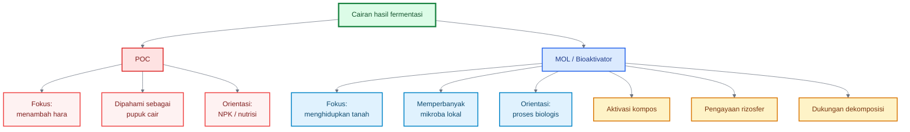

---

# 2. Mengapa Rumpun Bambu Menarik sebagai Sumber MOL

Jika kita ingin mencari contoh alami tentang tanah yang aktif dan relatif stabil, maka rumpun bambu adalah salah satu model yang sangat menarik. Banyak petani mengenal bambu sebagai tanaman yang kuat, tahan, dan mampu bertahan pada berbagai kondisi. Namun, bila diamati lebih dekat, kekuatan bambu tidak hanya ada pada batangnya, tetapi juga pada **lingkungan tanah di sekitarnya**.

Justru lingkungan bawah rumpun bambu inilah yang menjadi inspirasi utama bagi pengembangan bioaktivator rizosfer bambu.

## 2.1 Rumpun bambu sebagai ekosistem mikro

Rumpun bambu bukan hanya kumpulan batang. Ia adalah **ekosistem mikro** yang terus bekerja.

Di bawah rumpun bambu biasanya terdapat lapisan serasah daun yang tidak pernah benar-benar habis. Daun-daun yang gugur menutup tanah, menjaga kelembapan, mengurangi pukulan hujan langsung, mengurangi panas permukaan, dan menjadi sumber bahan organik yang terus masuk ke tanah.

Di bawah lapisan itu, terdapat akar dan rimpang yang aktif. Akar ini bukan hanya menyerap air dan hara, tetapi juga melepaskan eksudat akar yang menjadi makanan bagi mikroba rizosfer. Akibatnya, zona akar bambu menjadi ruang interaksi yang aktif antara tanaman, bahan organik, dan mikroorganisme.

Tanah di bawah rumpun bambu juga sering lebih:

- lembap,
- remah,
- sejuk,
- kaya bahan organik,
- tidak terlalu terbuka terhadap panas matahari langsung.

Kondisi seperti ini sangat mendukung berkembangnya mikroba tanah yang aktif.

Karena itu, ketika kita berbicara tentang sumber MOL dari lingkungan bambu, sesungguhnya yang kita incar bukan sekadar tanah dari bawah bambu, tetapi **komunitas biologis** yang hidup di dalamnya.

## 2.2 Bambu sebagai tanaman akumulator silika

Bambu termasuk kelompok tanaman yang dikenal banyak berhubungan dengan silika. Dalam praktik pertanian, ini sangat menarik karena silika berkaitan dengan kekuatan jaringan tanaman, ketahanan terhadap cekaman, dan kekokohan struktur.

Namun, hal penting yang harus dipahami adalah: meskipun bambu mampu menyerap banyak silika, **silika di alam sering berada dalam bentuk yang tidak langsung tersedia**. Banyak silika terikat dalam mineral, bahan silikat, atau bentuk lain yang kelarutannya rendah.

Akibatnya, di lingkungan rumpun bambu terjadi sebuah siklus yang aktif:

- tanah menyediakan sumber silika,
- bambu menyerap sebagian silikon yang tersedia,
- silika masuk ke jaringan bambu,
- daun dan serasah bambu kembali ke tanah,
- bahan organik dan silika kembali masuk ke sistem,
- mikroba dan proses dekomposisi ikut berperan dalam pelepasan unsur secara bertahap.

Dengan kata lain, rumpun bambu bukan hanya menyerap silika, tetapi juga berperan dalam **membangun siklus silika ekologis**.

Di titik inilah gagasan bioaktivator bambu menjadi semakin kuat: kita tidak hanya meniru mikroba, tetapi juga meniru **hubungan antara mikroba, serasah, akar, dan sumber silikat**.

## 2.3 Rizosfer bambu sebagai kandidat mikroba pelarut silikat

Karena banyak silika di alam tidak langsung tersedia, maka sangat masuk akal jika rizosfer bambu menjadi tempat berlangsungnya aktivitas mikroba yang berkaitan dengan pelarutan silikat.

Penting untuk ditegaskan: ini adalah **dugaan ilmiah yang kuat**, tetapi tidak boleh dinyatakan secara mutlak untuk semua rumpun bambu.

Yang bisa dikatakan dengan aman adalah:

- rizosfer bambu **layak diduga** mengandung mikroba yang berpotensi membantu pelarutan silikat,
- rumpun bambu sehat merupakan **kandidat sumber eksplorasi** mikroba pelarut silikat,
- lingkungan tersebut sangat menarik untuk pembiakan mikroba lokal karena memiliki kombinasi akar aktif, serasah, bahan organik, dan siklus silika.

Mengapa ini penting?

Karena bila kita ingin membuat bioaktivator yang tidak hanya mengaktifkan dekomposisi, tetapi juga mendukung pelepasan silikat secara bertahap, maka lingkungan bambu adalah salah satu lokasi yang paling logis untuk dijadikan sumber starter.

Namun, tetap perlu kehati-hatian. Tidak semua mikroba lokal otomatis menguntungkan. Maka, pendekatan yang benar adalah:

> **rumpun bambu sehat diposisikan sebagai kandidat sumber mikroba potensial, bukan jaminan mutlak.**

## 2.4 Mengapa tidak semua rumpun bambu layak

Ini bagian yang sangat penting untuk praktisi. Banyak orang mendengar bahwa lingkungan bambu bagus, lalu menyimpulkan bahwa semua rumpun bambu bisa diambil begitu saja sebagai sumber mikroba. Ini tidak tepat.

Tidak semua rumpun bambu layak dijadikan sumber starter MOL.

Rumpun bambu yang tidak layak misalnya:

- tumbuh di lokasi tercemar,
- berada dekat limbah rumah tangga atau industri,
- dekat tempat sampah,
- dekat kandang yang sangat kotor,
- dekat area yang sering terkena pestisida berat,
- memiliki tanah yang berbau busuk atau anaerob,
- memiliki banyak batang busuk,
- menunjukkan tanda lingkungan yang rusak.

Tanah yang berbau segar seperti tanah hutan sangat berbeda dengan tanah yang berbau busuk, menyengat, atau berlendir. Lingkungan yang buruk bisa membawa mikroba yang tidak diinginkan, serta menurunkan kualitas hasil pembiakan.

Karena itu, seleksi sumber starter adalah langkah awal yang sangat menentukan. Rumpun bambu yang dipilih harus:

- sehat,
- tanahnya remah,
- lembap tetapi tidak tergenang,
- berbau segar,
- memiliki serasah alami,
- jauh dari sumber pencemaran.

Dengan demikian, kualitas bioaktivator yang dihasilkan akan lebih terarah.

## Diagram: Siklus silika di rumpun bambu

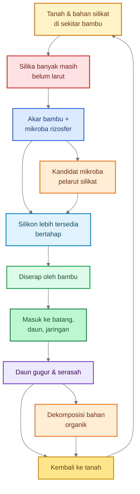

## Penutup Bab 1–2

Dari dua bab awal ini, ada satu hal yang harus benar-benar dipahami: **yang ingin dibangun bukan pupuk cair biasa, tetapi alat biologis untuk menghidupkan tanah**. Rumpun bambu dipilih bukan karena romantisme tanaman bambu, tetapi karena ia memberi contoh nyata bagaimana tanah, serasah, akar, mikroba, dan siklus silika dapat bekerja sebagai satu sistem.

Dengan dasar ini, pembahasan pada bab berikutnya akan bergerak ke pertanyaan yang lebih praktis: **apa sebenarnya bioaktivator rizosfer bambu kaya silikat itu, bagaimana prinsip kerjanya, dan bahan apa saja yang diperlukan untuk membuatnya.**

---

# 3. Konsep Dasar Bioaktivator Rizosfer Bambu Kaya Silikat

Bioaktivator rizosfer bambu kaya silikat adalah **MOL berbasis ekosistem bambu**, bukan pupuk cair biasa. Tujuan utamanya adalah membiakkan komunitas mikroba lokal dari lingkungan rumpun bambu, lalu mengarahkannya agar bekerja pada bahan organik, kompos, tanah, dan sumber silikat alami.

Dalam praktik lapangan, bioaktivator ini sebaiknya dipahami sebagai **starter kehidupan tanah**. Ia tidak didesain untuk memberi hara tinggi secara langsung, tetapi untuk membantu proses biologis: dekomposisi, pembentukan tanah remah, aktivitas rizosfer, pelepasan hara bertahap, dan kemungkinan pelarutan silikat dari bahan seperti sekam bakar, jerami lapuk, daun bambu lapuk, abu sekam matang, atau mineral silikat.

Secara ilmiah, pendekatan ini selaras dengan konsep biofertilizer, yaitu pemanfaatan mikroorganisme tanah untuk meningkatkan ketersediaan dan serapan mineral melalui berbagai mekanisme biologis. Pada konteks silikat, kelompok **silicate-solubilizing bacteria** atau mikroba pelarut silikat dikaji karena mampu membantu mengubah silikat tidak larut menjadi bentuk silikon yang lebih tersedia bagi tanaman. ([ScienceDirect][1])

---

## 3.1 Definisi

**Bioaktivator Rizosfer Bambu Kaya Silikat** adalah MOL yang dibuat dari kombinasi:

- tanah remah bawah rumpun bambu sehat,
- serasah bambu setengah lapuk,
- humus tipis di bawah serasah,
- bahan organik matang,
- makanan mikroba,
- dan sumber silikat alami.

Target utamanya adalah memperbanyak komunitas mikroba lokal yang mendukung tanah hidup. Karena sumber awalnya berasal dari lingkungan bambu, bioaktivator ini diharapkan membawa karakter ekologi bambu: kaya serasah, dekat dengan akar-rimpang, aktif secara biologis, dan berhubungan dengan siklus silika.

Namun, definisi ini harus tetap hati-hati. Bioaktivator ini bukan kultur murni laboratorium. Artinya, mikroba di dalamnya tidak sespesifik produk hayati komersial yang mencantumkan strain, populasi, dan target fungsi tertentu. Bioaktivator ini adalah **pengayaan komunitas mikroba**, bukan isolat tunggal.

Kalimat definisi praktisnya:

> **Bioaktivator Rizosfer Bambu Kaya Silikat adalah MOL berbasis tanah dan serasah bambu sehat yang diperkaya bahan organik serta sumber silikat alami untuk mengaktifkan kompos, menghidupkan tanah, dan mendukung rizosfer tanaman secara biologis.**

---

## 3.2 Fungsi Utama

Fungsi pertama adalah **mengaktifkan kompos**. Kompos yang sudah matang dapat menjadi media hidup yang baik bagi mikroba. Ketika bioaktivator dicampurkan ke kompos, mikroba mendapat tempat tinggal, makanan, dan kelembapan yang lebih stabil. Dengan cara ini, bioaktivator tidak langsung “dilempar” ke tanah kosong, tetapi masuk bersama media yang mendukung kehidupannya.

Fungsi kedua adalah **mempercepat dekomposisi bahan organik**. Di bawah rumpun bambu, serasah daun terus terurai dan menjadi bagian dari siklus tanah. Prinsip ini bisa ditiru dengan memasukkan bioaktivator ke bahan organik seperti kompos matang, jerami lapuk, daun bambu lapuk, atau mulsa organik. FAO menjelaskan bahwa bahan organik menyediakan nutrisi dan habitat bagi organisme tanah, membantu pembentukan agregat tanah, serta meningkatkan kemampuan tanah menahan air. ([FAOHome][2])

Fungsi ketiga adalah **mendukung mikroba rizosfer**. Rizosfer adalah zona di sekitar akar tempat akar, mikroba, air, udara, dan unsur hara saling berinteraksi. Pada zona ini, mikroba dapat membantu proses pelarutan hara, pembentukan agregat, kompetisi dengan patogen, serta dukungan terhadap pertumbuhan akar. FAO juga mencatat bahwa bakteri tanah dapat menghasilkan senyawa polisakarida yang membantu mengikat partikel tanah menjadi agregat, sehingga struktur tanah, infiltrasi air, dan kapasitas memegang air menjadi lebih baik. ([FAOHome][3])

Fungsi keempat adalah **membantu pelepasan hara secara biologis**. Bioaktivator tidak bekerja seperti pupuk kimia yang langsung menyediakan unsur tertentu dalam angka pasti. Ia bekerja melalui aktivitas mikroba: mengurai bahan organik, menghasilkan asam organik, mengaktifkan proses mineralisasi, dan membantu hara menjadi lebih tersedia secara bertahap.

Fungsi kelima adalah **berpotensi mendukung pelarutan silikat**. Ini menjadi pembeda utama bioaktivator ini. Dengan menambahkan sumber silikat alami seperti sekam bakar, jerami lapuk, daun bambu lapuk, atau abu sekam matang dalam dosis wajar, kita memberi “substrat ekologis” bagi mikroba yang berpotensi berinteraksi dengan mineral silikat. Literatur tentang bakteri pelarut silikat menjelaskan bahwa mikroba tersebut dapat meningkatkan ketersediaan silikon di tanah melalui pelarutan silikat tidak larut. ([ScienceDirect][4])

Fungsi keenam adalah **menjaga tanah lebih remah dan aktif**. Tanah remah terbentuk dari kombinasi bahan organik, akar, mikroba, air, dan udara. Karena itu, bioaktivator ini harus dipakai bersama kompos, mulsa, drainase baik, dan kelembapan stabil. Jika tanah tergenang, padat, atau miskin bahan organik, mikroba sulit bekerja optimal.

---

## 3.3 Bukan Pupuk Cair Utama

Bagian ini perlu ditegaskan agar praktisi tidak salah pakai. Bioaktivator rizosfer bambu kaya silikat **bukan pupuk cair utama**.

Alasannya ada tiga.

Pertama, kandungan haranya tidak terukur seperti pupuk. Pupuk memiliki kandungan N, P, K, Ca, Mg, atau unsur lain yang jelas. Bioaktivator lokal tidak memiliki angka hara yang stabil karena bahan, proses fermentasi, sumber mikroba, dan kualitas air bisa berbeda-beda.

Kedua, populasi mikrobanya tidak spesifik seperti produk hayati komersial. Produk hayati yang baik biasanya mencantumkan mikroba tertentu, misalnya _Trichoderma_, _Bacillus_, _Pseudomonas_, atau mikoriza, lengkap dengan populasi dan cara aplikasi. Pada MOL lokal, komunitasnya lebih beragam tetapi tidak terukur secara presisi.

Ketiga, fungsi utamanya adalah **aktivator biologis**, bukan sumber hara utama. Ia dipakai untuk membantu kompos dan tanah bekerja lebih baik. Jadi, penggunaannya tidak menggantikan pupuk dasar, pemupukan susulan, koreksi pH, perbaikan drainase, atau aplikasi silika larut bila dibutuhkan efek cepat.

Posisi yang tepat:

| Salah Kaprah                  | Posisi yang Benar                    |
| ----------------------------- | ------------------------------------ |
| MOL bambu sebagai pupuk utama | MOL bambu sebagai bioaktivator tanah |
| Mengganti semua pupuk         | Mendukung efisiensi proses tanah     |
| Harus kaya NPK                | Harus aktif secara biologis          |
| Disemprot pekat ke tanaman    | Lebih aman ke kompos/tanah           |
| Efek silika cepat             | Pelepasan silikat bertahap           |

Dengan posisi ini, bioaktivator tidak dibebani fungsi yang tidak sesuai. Ia menjadi bagian dari sistem budidaya, bukan satu-satunya solusi.

## 3.3.1 Bioaktivator Komunitas, Bukan Kultur Steril

Bioaktivator rizosfer bambu kaya silikat perlu dipahami sebagai bioaktivator komunitas, bukan kultur steril. Artinya, targetnya bukan memperbanyak satu jenis mikroba murni, tetapi memperkaya komunitas mikroba lokal yang berasal dari lingkungan bambu sehat.

Dalam pendekatan laboratorium, media sering disterilkan agar hanya mikroba target yang tumbuh. Namun dalam pendekatan MOL lapangan, tujuan utamanya berbeda. Yang dicari adalah komunitas mikroba yang stabil, tidak busuk, tidak berbau anaerob, dan mampu bekerja bersama bahan organik serta tanah.

Karena itu, tidak adanya sterilisasi penuh pada media akhir bukan otomatis kesalahan. Yang dibutuhkan adalah sanitasi dan seleksi ekologis: bahan harus sehat, wadah bersih, air tidak tercemar, fermentasi tidak anaerob, dan hasil akhir harus lolos uji bau, uji kompos kecil, serta uji tanaman kecil.

Namun, batasannya harus jelas. Bioaktivator komunitas tidak bisa diklaim memiliki strain tertentu atau populasi mikroba tertentu seperti produk hayati komersial. Ia valid sebagai bioaktivator lokal, tetapi efektivitasnya tetap perlu diuji di lapangan.

> Pada mikrobiologi tanah, tidak semua mikroba lingkungan mudah tumbuh pada media buatan. Fenomena ini dikenal sebagai great plate count anomaly, yaitu kondisi ketika hanya sebagian kecil mikroba lingkungan yang dapat dikultur pada media laboratorium biasa. Karena itu, seleksi koloni pada media padat tidak selalu mewakili seluruh komunitas mikroba rizosfer.

---

## 3.4 Prinsip Kerja

Bioaktivator rizosfer bambu bekerja dengan prinsip **meniru lingkungan bawah rumpun bambu**.

Di bawah rumpun bambu, mikroba tidak hidup sendirian. Mereka mendapat bahan organik dari serasah, berinteraksi dengan akar dan rimpang, hidup dalam kelembapan relatif stabil, serta berada di tanah yang tidak terus-menerus terganggu. Prinsip itulah yang ditiru.

Ada empat kunci kerja.

Pertama, **mikroba diberi sumber karbon**. Molase, gula merah cair, air cucian beras, dedak, dan kompos matang berperan sebagai sumber energi. Tanpa makanan, mikroba tidak berkembang baik.

Kedua, **mikroba diberi media hidup**. Kompos matang, humus, serasah lapuk, dan tanah remah menjadi tempat mikroba menempel, berkembang, dan bertahan. Ini alasan mengapa bentuk padat sering lebih stabil dibanding cair murni.

Ketiga, **mikroba diberi sumber silikat**. Sekam bakar, abu sekam matang, jerami lapuk, daun bambu lapuk, dan mineral silikat digunakan bukan karena langsung larut seluruhnya, tetapi sebagai bahan yang dapat menjadi bagian dari proses biologis jangka menengah. Abu sekam padi diketahui bersifat alkalis dan mengandung unsur seperti Si, K, Ca, dan Mg, sehingga penggunaannya perlu wajar agar tidak menaikkan pH berlebihan. ([Horizon e-Publishing Group][5])

Keempat, **mikroba diaplikasikan ke lingkungan yang mendukung**. Bioaktivator tidak akan optimal bila tanah tergenang, terlalu panas, terlalu kering, kekurangan bahan organik, atau baru saja diberi bahan kimia keras. Mikroba butuh tanah lembap, cukup udara, bahan organik, dan pH yang tidak ekstrem.

## Diagram: Alur kerja bioaktivator

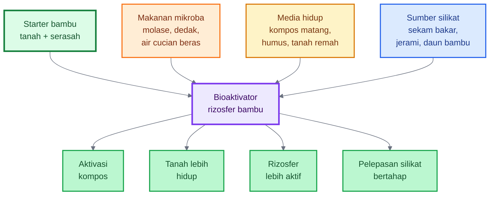

Intinya, bioaktivator ini bukan dibuat dengan prinsip “semakin banyak bahan semakin bagus”, tetapi dengan prinsip **membangun habitat mikroba yang seimbang**.

---

# 4. Bahan Baku Bioaktivator

Kualitas bioaktivator sangat ditentukan oleh kualitas bahan. Bahan yang baik akan menghasilkan fermentasi yang lebih stabil. Bahan yang buruk dapat menghasilkan bau busuk, dominasi mikroba pembusuk, atau bahkan membawa kontaminan ke lahan.

Dalam pembuatan bioaktivator rizosfer bambu kaya silikat, bahan dibagi menjadi lima kelompok:

1. sumber mikroba utama,
2. sumber makanan mikroba,
3. sumber silikat alami,
4. bahan pendukung,
5. bahan yang harus dihindari.

---

## 4.1 Sumber Mikroba Utama

Sumber mikroba utama berasal dari lingkungan rumpun bambu sehat.

Bagian yang digunakan:

- tanah remah bawah rumpun bambu,
- serasah daun bambu setengah lapuk,
- humus tipis di bawah serasah,
- sedikit tanah sekitar akar halus.

Yang dicari bukan tanah dalam jumlah banyak, tetapi **starter mikroba**. Karena itu, pengambilan cukup sedikit dari beberapa titik. Jangan menggali dalam, jangan merusak rimpang, dan jangan mengambil akar besar.

Sumber terbaik memiliki ciri:

- tanah remah,
- lembap tetapi tidak becek,
- berbau segar seperti tanah hutan,
- ada serasah lapuk alami,
- rumpun bambu tampak sehat,
- tidak ada bau busuk,
- tidak berlendir.

Sumber mikroba dari bambu dipilih karena lingkungan ini memiliki serasah, akar aktif, bahan organik, dan kemungkinan siklus silika yang lebih relevan. Namun, tetap harus dipahami bahwa ini adalah komunitas mikroba lokal yang beragam, bukan kultur murni. Karena itu, uji bau dan uji kecil tetap diperlukan sebelum aplikasi luas.

---

## 4.2 Sumber Makanan Mikroba

Mikroba membutuhkan energi. Dalam fermentasi MOL, sumber makanan mikroba berfungsi untuk mempercepat pertumbuhan dan aktivitas komunitas mikroba.

Bahan yang dapat digunakan:

### Molase

Molase adalah sumber gula yang umum digunakan dalam fermentasi mikroba lokal. Ia memberi energi cepat bagi mikroba. Gunakan secukupnya, jangan berlebihan. Molase terlalu banyak dapat membuat fermentasi tidak seimbang dan berisiko menimbulkan bau tidak enak.

### Gula merah cair

Gula merah cair dapat digunakan bila molase tidak tersedia. Fungsinya mirip, yaitu sebagai sumber karbon sederhana. Larutkan lebih dahulu agar mudah tercampur.

### Air cucian beras

Air cucian beras menyediakan sumber karbohidrat ringan dan sering digunakan dalam MOL tradisional. Gunakan air cucian beras yang masih segar, bukan yang sudah basi atau berbau busuk.

### Dedak halus

Dedak memberi karbon, sedikit protein, mineral, dan permukaan bagi mikroba. Pada formula padat, dedak sangat berguna karena membantu struktur bahan dan menjadi sumber makanan bertahap.

### Kompos matang

Kompos matang tidak hanya menjadi makanan, tetapi juga media hidup. Kompos yang baik membantu mikroba bertahan lebih stabil dibanding larutan cair yang hanya berisi gula dan air.

Prinsipnya:

> **Gula memberi energi cepat, dedak memberi makanan sedang, kompos matang memberi rumah dan makanan yang lebih stabil.**

---

## 4.3 Sumber Silikat Alami

Sumber silikat alami adalah ciri khas bioaktivator ini. Tujuannya bukan menghasilkan silika larut instan, tetapi menyediakan bahan kaya silikat agar komunitas mikroba terbiasa bekerja di lingkungan yang mengandung silikat.

Bahan yang dapat digunakan:

### Sekam bakar

Sekam bakar bersifat ringan, porous, dan relatif aman dalam jumlah wajar. Ia membantu aerasi bahan padat dan menjadi sumber silika bertahap. Sekam bakar cocok untuk formula bioaktivator padat.

### Abu sekam matang

Abu sekam kaya silika, tetapi cenderung alkalis. Karena itu, dosisnya harus wajar. Terlalu banyak abu sekam dapat menaikkan pH larutan atau media. Beberapa studi menyebut abu sekam bersifat alkalis dan dapat meningkatkan pH tanah, sehingga penggunaannya perlu disesuaikan dengan kondisi tanah. ([UIM Journal][6])

### Jerami lapuk

Jerami berasal dari tanaman padi yang juga banyak berhubungan dengan silika. Jerami lapuk lebih aman dibanding jerami segar karena proses dekomposisinya sudah berjalan. Gunakan jerami yang tidak berjamur busuk dan tidak berbau anaerob.

### Daun bambu lapuk

Daun bambu lapuk adalah bahan yang sangat sesuai dengan konsep ini karena berasal dari siklus bambu sendiri. Gunakan daun yang sudah setengah lapuk, bukan daun segar dalam jumlah banyak. Daun yang setengah lapuk lebih mudah diproses mikroba.

### Kompos bambu

Kompos dari daun atau serasah bambu dapat menjadi bahan yang baik jika sudah matang. Kompos bambu membawa bahan organik, struktur, dan kemungkinan sisa silika biogenik dari jaringan bambu.

### Mineral silikat pertanian

Mineral silikat pertanian dapat digunakan bila tersedia dan aman. Pilih bahan yang memang untuk pertanian, bukan limbah industri yang tidak jelas kandungannya.

### Debu batuan silikat yang aman

Debu batuan dapat menjadi sumber mineral jangka panjang, tetapi harus dipastikan aman dari logam berat dan kontaminan. Jangan menggunakan debu batuan dari sumber yang tidak jelas.

---

## 4.4 Bahan Pendukung

Bahan pendukung berfungsi menjaga proses fermentasi tetap bersih, aman, dan stabil.

### Air bersih non-klorin

Gunakan air sumur, air hujan bersih, atau air yang tidak berbau kaporit. Jika memakai air PAM yang berbau klorin, endapkan terlebih dahulu dalam wadah terbuka. Klorin dapat mengganggu mikroba.

### Wadah bersih

Gunakan ember atau drum bersih. Jangan menggunakan wadah bekas pestisida, oli, deterjen kuat, atau bahan kimia keras. Residu bahan kimia dapat merusak mikroba dan mencemari hasil bioaktivator.

### Kain atau karung penutup berpori

Penutup berpori berguna untuk mencegah serangga masuk, tetapi tetap memberi pertukaran udara. Fermentasi mikroba lokal sebaiknya tidak ditutup kedap total, terutama bila masih menghasilkan gas.

### Pengaduk bersih

Gunakan pengaduk kayu, bambu, atau plastik yang bersih. Jangan memakai alat berkarat atau alat bekas bahan kimia.

### Ember fermentasi

Untuk skala kecil, ember 20–30 liter cukup. Untuk skala lapangan, bisa memakai drum plastik bersih. Wadah sebaiknya tidak penuh sampai bibir atas agar ada ruang gas dan busa.

---

## 4.5 Bahan yang Harus Dihindari

Tidak semua bahan organik cocok untuk bioaktivator. Beberapa bahan justru berisiko merusak fermentasi atau membawa kontaminan.

### Pupuk kandang mentah

Pupuk kandang mentah dapat membawa patogen, telur hama, biji gulma, amonia, panas fermentasi, dan bau tidak stabil. Jika ingin memakai pupuk kandang, gunakan yang sudah benar-benar matang atau terfermentasi baik.

### Sampah dapur busuk

Sampah dapur busuk sering menghasilkan bau anaerob, belatung, minyak, garam, dan mikroba pembusuk. Ini tidak ideal untuk bioaktivator rizosfer.

### Bangkai

Bangkai tidak boleh digunakan. Selain berbau busuk, bahan ini berisiko membawa patogen dan mencemari proses.

### Limbah cair

Limbah cair rumah tangga, limbah kandang kotor, limbah industri, atau air got tidak boleh dipakai. Bioaktivator harus dibuat dari bahan sehat, bukan bahan tercemar.

### Air berbau kaporit kuat

Air berbau kaporit kuat dapat menekan mikroba. Bila terpaksa memakai air seperti ini, endapkan dahulu sebelum digunakan.

### Tanah dari lokasi tercemar

Hindari tanah dari dekat sampah, kandang kotor, selokan, limbah, pabrik, atau area yang sering disemprot pestisida berat. Mikroba lokal hanya sebaik lingkungan asalnya.

### Abu berlebihan

Abu sekam memang berguna sebagai sumber silikat, tetapi bila berlebihan dapat menaikkan pH dan mengganggu fermentasi. Gunakan dalam dosis wajar dan lebih aman pada formula padat daripada langsung terlalu banyak pada formula cair.

## Diagram: Kelompok bahan bioaktivator

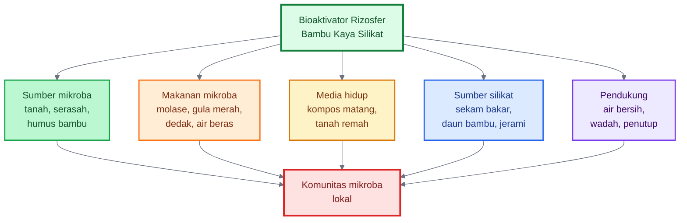

---

# Ringkasan Bab 3–4

Bioaktivator rizosfer bambu kaya silikat adalah **MOL tanah**, bukan POC. Tujuannya bukan memberi NPK tinggi, tetapi mengaktifkan proses biologis tanah melalui mikroba lokal dari lingkungan bambu.

Fungsi utamanya adalah mengaktifkan kompos, mempercepat dekomposisi, memperkaya rizosfer, membantu pelepasan hara biologis, mendukung pelarutan silikat secara bertahap, dan menjaga tanah lebih remah.

Bahan utamanya terdiri dari tanah/serasah bambu sehat, kompos matang, dedak, molase atau gula merah, air cucian beras, dan sumber silikat alami seperti sekam bakar, daun bambu lapuk, jerami lapuk, atau abu sekam matang dalam dosis wajar.

Kalimat kunci:

> **Bioaktivator ini tidak dibuat untuk menggantikan pupuk, tetapi untuk membangun rumah bagi mikroba agar tanah bekerja lebih hidup, lebih aktif, dan lebih siap mendukung tanaman.**

[1]: https://www.sciencedirect.com/science/article/abs/pii/S2452219822000969?utm_source=chatgpt.com 'Identification and profiling of silicate-solubilizing bacteria ...'
[2]: https://www.fao.org/4/a0100e/a0100e02.htm?utm_source=chatgpt.com 'The importance of soil organic matter'
[3]: https://www.fao.org/4/a0100e/a0100e0d.htm?utm_source=chatgpt.com 'Annex 1. Soil organisms'
[4]: https://www.sciencedirect.com/science/article/abs/pii/S2452219823000885?utm_source=chatgpt.com 'A review of the role of silicate-solubilizing bacteria'
[5]: https://horizonepublishing.com/index.php/PST/article/download/6514/5491/40779?utm_source=chatgpt.com 'Eco-friendly utilization of rice husk ash for amending acid ...'
[6]: https://journal.uim.ac.id/index.php/eam/article/download/3467/1630?utm_source=chatgpt.com 'Improving soil acidity on peat soil through rice husk ash ...'

---

# 5. Seleksi Lokasi dan Cara Mengambil Starter Bambu

Kualitas bioaktivator sangat ditentukan oleh **kualitas starter**. Pada praktiknya, banyak kegagalan bukan terjadi saat fermentasi, tetapi justru sejak tahap awal, yaitu ketika sumber mikroba diambil dari lokasi yang kurang tepat. Karena itu, sebelum membahas formula, praktisi harus memahami bahwa **tidak semua rumpun bambu layak dijadikan sumber starter**.

Starter yang baik bukan berarti diambil sebanyak-banyaknya, tetapi diambil **secara tepat, bersih, dan bijak**. Yang dicari bukan “tanah bambu” dalam jumlah besar, melainkan **komunitas mikroba aktif** dari lingkungan bambu sehat.

---

## 5.1 Kriteria Rumpun Bambu Ideal

Rumpun bambu yang ideal untuk sumber starter adalah rumpun yang menunjukkan tanda-tanda **ekosistem sehat**. Fokusnya bukan pada besar kecilnya bambu, melainkan pada kondisi lingkungan di bawahnya.

Kriteria utamanya adalah sebagai berikut.

### Rumpun sehat

Pilih rumpun bambu yang tampak hidup normal. Batangnya tidak dominan busuk, tidak menunjukkan kerusakan berat, dan masih menghasilkan daun yang normal. Rumpun yang sehat menunjukkan bahwa sistem akar, serasah, dan tanahnya juga masih aktif.

### Daun hijau normal

Daun hijau normal menandakan bambu masih aktif berfotosintesis dan berfungsi baik. Bila sebagian besar daun menguning, kering tidak wajar, atau menunjukkan gejala lingkungan buruk, maka kualitas ekosistem bawahnya perlu dicurigai.

### Tanah remah

Tanah remah adalah salah satu indikator terbaik. Tanah seperti ini biasanya cukup berpori, tidak padat, tidak lengket berlebihan, dan tidak becek. Tanah remah menunjukkan adanya aktivitas akar, bahan organik, dan mikroba.

### Serasah lapuk alami

Pilih rumpun yang memiliki lapisan serasah daun alami, terutama serasah yang mulai setengah lapuk. Serasah seperti ini menunjukkan bahwa proses dekomposisi berlangsung alami.

### Bau tanah segar

Bau tanah adalah indikator lapangan yang sangat penting. Tanah yang baik biasanya berbau segar seperti tanah hutan. Bau ini menunjukkan adanya kehidupan biologis yang aktif, bukan pembusukan anaerob.

### Tidak tergenang

Hindari rumpun yang tanahnya sering tergenang. Kondisi tergenang membuat tanah cenderung anaerob dan dapat mendukung mikroba yang kurang sesuai untuk bioaktivator tanah aerob.

### Tidak dekat sumber pencemar

Rumpun bambu yang dekat limbah, selokan kotor, area sampah, limbah ternak berat, atau area pestisida intensif sebaiknya dihindari. Sumber pencemar bisa membawa residu atau komunitas mikroba yang tidak diinginkan.

### Ringkasan praktis

Rumpun bambu ideal untuk starter adalah rumpun yang:

- sehat,
- tanahnya remah,
- ada serasah alami,
- baunya segar,
- tidak tergenang,
- dan tidak tercemar.

---

## 5.2 Titik Pengambilan

Setelah lokasi dipilih, tahap berikutnya adalah menentukan **bagian mana yang diambil**. Ini penting karena tidak semua bagian bawah rumpun bambu memiliki nilai yang sama.

Yang dicari adalah **zona aktif biologis**, yaitu tempat bahan organik, akar halus, dan mikroba paling aktif berinteraksi.

### Lapisan serasah setengah lapuk

Lapisan ini berada di bawah daun gugur yang masih terlihat bentuknya tetapi sudah mulai melunak dan terurai. Bagian ini sangat baik karena menjadi tempat hidup mikroba dekomposer dan penghubung antara daun gugur dan tanah.

### Tanah tipis di bawah serasah

Ambil lapisan tanah tipis tepat di bawah serasah. Bagian ini biasanya paling kaya interaksi antara bahan organik, kelembapan, dan mikroba.

### Humus dekat akar halus

Jika terlihat akar halus bambu, ambil sedikit humus atau tanah di sekitarnya, bukan akarnya. Zona ini biasanya paling aktif sebagai rizosfer.

### Tidak menggali dalam

Jangan menggali terlalu dalam. Lapisan dalam tidak selalu lebih baik, bahkan bisa lebih miskin oksigen. Starter terbaik biasanya justru berasal dari lapisan permukaan aktif.

### Tidak merusak rimpang

Rimpang adalah organ penting bambu. Jangan memotong, mencungkil, atau merusak rimpang saat mengambil starter.

## Diagram: Penampang lantai rumpun bambu dan titik pengambilan starter

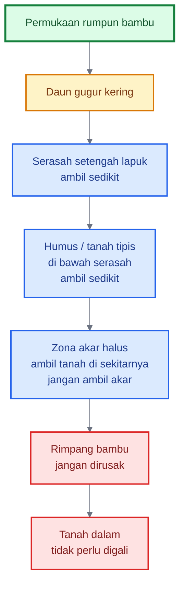

Dengan diagram ini, titik pengambilan yang paling dianjurkan adalah:

1. serasah setengah lapuk,
2. humus tipis di bawah serasah,
3. tanah sekitar akar halus.

Bukan tanah dalam, dan bukan bagian rimpang.

---

## 5.3 Etika Pengambilan

Pengambilan starter harus dilakukan dengan etika yang baik. Prinsipnya adalah **mengambil secukupnya tanpa merusak sumber**. Ingat, tujuan kita meniru ekosistem bambu, bukan merusaknya.

### Ambil sedikit dari beberapa titik

Lebih baik mengambil sedikit dari beberapa titik di sekitar rumpun daripada mengambil banyak dari satu titik. Cara ini membuat starter lebih beragam sekaligus mengurangi kerusakan lokal.

### Tutup kembali bekas pengambilan

Setelah starter diambil, tutup kembali area tersebut dengan serasah atau tanah. Ini membantu menjaga kelembapan dan mencegah kerusakan lingkungan mikro di bawah rumpun.

### Jangan mengambil dari kawasan konservasi tanpa izin

Jika rumpun bambu berada di kawasan khusus, hutan lindung, kebun koleksi, atau lokasi yang bukan milik sendiri, pengambilan harus mengikuti izin yang berlaku.

### Jangan merusak rumpun bambu

Jangan mencabut akar, memotong rimpang, atau membersihkan serasah secara berlebihan. Starter yang baik diambil dengan cara minimal invasif.

### Prinsip praktis

> **Ambil seperlunya, sebar titik pengambilan, dan tinggalkan rumpun bambu tetap sehat.**

---

## 5.4 Uji Awal Kualitas Starter

Sebelum starter dibawa ke tahap fermentasi, lakukan uji lapangan sederhana. Ini langkah murah tetapi sangat penting.

### Bau tanah hutan

Starter yang baik biasanya berbau seperti tanah hutan atau tanah kebun yang sehat. Ini adalah indikator paling mudah.

### Tidak busuk

Jika starter berbau busuk, menyengat, atau seperti pembusukan berat, jangan digunakan.

### Tidak berlendir

Starter yang berlendir berlebihan bisa menunjukkan kondisi anaerob atau pembusukan.

### Tidak berbau got

Bau got, limbah, atau selokan adalah tanda jelas bahwa starter tidak layak.

### Tidak terlalu basah anaerob

Starter yang terlalu basah, lengket, dan miskin udara sebaiknya dihindari.

### Checklist cepat uji starter

- Bau segar seperti tanah hutan → **layak**
- Ada serasah lapuk alami → **baik**
- Tidak ada bau busuk/got → **aman**
- Tidak berlendir → **aman**
- Tidak terlalu basah → **baik**
- Tidak ada indikasi pencemaran → **layak**

### Diagram: Keputusan awal kualitas starter

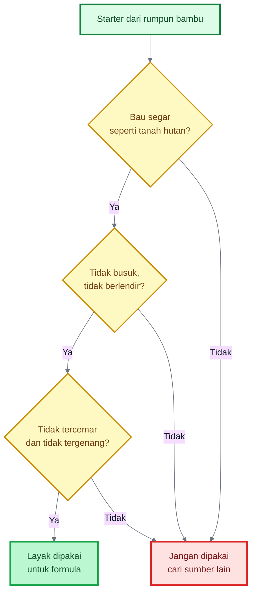

## 5.5 Risiko Kontaminasi Sejak Sumber Starter

Risiko kontaminasi paling awal muncul dari sumber starter. Jika starter diambil dari rumpun bambu yang sehat, tanah remah, berbau tanah hutan, dan jauh dari pencemar, peluang mendapatkan komunitas mikroba yang baik lebih besar. Sebaliknya, jika starter diambil dari lokasi dekat limbah, selokan, kandang kotor, pestisida berat, atau tanah anaerob, maka mikroba dan residu yang tidak diinginkan dapat ikut terbawa.

Dalam konteks bioaktivator komunitas, istilah kontaminasi tidak berarti semua mikroba luar pasti buruk. Tanah, serasah, dan kompos memang mengandung banyak mikroba. Yang perlu dicegah adalah dominasi mikroba pembusuk, patogen, mikroba dari limbah, serta kontaminan kimia seperti pestisida, deterjen, oli, logam berat, atau air tercemar.

Karena itu, seleksi lokasi bukan formalitas, tetapi tahap keamanan biologis. Starter yang buruk tidak boleh diperbaiki dengan molase, dedak, atau fermentasi. Jika sumber awal sudah berbau got, busuk, atau anaerob, lebih baik ditolak sejak awal.

> Prinsipnya: jangan memperbanyak masalah. Perbanyak hanya mikroba dari lingkungan yang sehat.

---

# 6. Formula Bioaktivator Rizosfer Bambu Kaya Silikat

Setelah starter diperoleh dengan benar, tahap berikutnya adalah menyusunnya menjadi formula yang stabil. Pada praktiknya, bioaktivator ini bisa dibuat dalam dua bentuk utama:

1. **MOL cair**,
2. **bioaktivator padat**.

Keduanya sama-sama berguna, tetapi masing-masing memiliki karakter berbeda. Bentuk cair lebih mudah dikocor atau dipakai untuk aktivasi kompos. Bentuk padat lebih stabil, lebih menyerupai habitat mikroba alami, dan sangat baik untuk campuran kompos atau bedengan.

---

## 6.1 Formula Cair MOL Rizosfer Bambu

Formula cair dirancang untuk menghasilkan **MOL cair** yang mudah diaplikasikan ke kompos atau tanah. Fokusnya adalah memperbanyak komunitas mikroba lokal dalam medium cair yang tetap mengandung unsur organik dan sedikit arah ke silikat.

### Tujuan

- membuat MOL cair untuk kocor tanah,
- mengaktifkan kompos,
- mendukung mikroba rizosfer.

### Formula praktis untuk ±20 liter MOL cair

#### Bahan

- tanah/serasah bambu sehat: **300–500 gram**
- kompos matang: **1 kg**
- dedak halus: **500 gram**
- air cucian beras segar: **2 liter**
- molase atau gula merah cair: **200–300 ml**
- air bersih non-klorin: tambah sampai total **20 liter**
- sekam bakar halus: **200–300 gram**
- abu sekam matang: **opsional 50–100 gram**, jangan berlebihan

### Catatan bahan

- Tanah/serasah bambu adalah sumber mikroba.
- Kompos matang menjadi media hidup dan penyangga mikroba.
- Dedak dan molase menjadi sumber makanan.
- Sekam bakar dan sedikit abu sekam menjadi arah silikat.
- Air cucian beras membantu karbon sederhana dan nutrisi ringan.

### Langkah umum pencampuran

1. Masukkan tanah/serasah bambu ke ember atau drum bersih.
2. Tambahkan kompos matang.
3. Masukkan dedak.
4. Tambahkan air cucian beras.
5. Larutkan molase/gula merah, lalu campurkan.
6. Tambahkan sekam bakar dan sedikit abu sekam bila dipakai.
7. Tambahkan air sampai total mendekati 20 liter.
8. Aduk rata.
9. Tutup longgar dengan kain atau tutup tidak rapat.
10. Simpan di tempat teduh.
11. Aduk 1 kali sehari.

### Lama fermentasi praktis

Umumnya **5–10 hari**, tergantung suhu, bahan, dan kualitas starter. Fermentasi yang baik berbau segar, asam-manis ringan, atau seperti tape, bukan busuk.

---

## 6.2 Formula Padat Bioaktivator Bambu

Bentuk padat lebih mendekati habitat alami mikroba karena mikroba hidup pada permukaan bahan organik dan partikel padat. Karena itu, bioaktivator padat umumnya lebih stabil dan lebih aman sebagai starter jangka menengah.

### Tujuan

- membuat starter padat,
- lebih stabil dibanding cair,
- cocok untuk aktivasi kompos dan bedengan.

### Formula praktis untuk ±10–11 kg bioaktivator padat

#### Bahan

- tanah/serasah bambu sehat: **1 kg**
- kompos matang: **5 kg**
- dedak halus: **2 kg**
- sekam bakar: **2 kg**
- daun bambu lapuk cincang: **1 kg**
- larutan molase encer 1–2%: secukupnya untuk melembapkan

### Catatan bahan

- Kompos matang menjadi basis utama media hidup.
- Dedak memberi makanan.
- Sekam bakar menjaga porositas dan memberi arah silikat.
- Daun bambu lapuk memperkuat karakter bahan.
- Larutan molase dipakai hanya untuk melembapkan, bukan membasahi berlebihan.

### Uji kelembapan

Setelah semua bahan dicampur, lakukan uji genggam:

- bila digenggam menggumpal ringan → **baik**
- bila air menetes → **terlalu basah**
- bila tidak bisa menggumpal sama sekali → **terlalu kering**

### Fermentasi praktis

- simpan dalam wadah atau tumpukan kecil,
- tutup dengan karung goni atau kain berpori,
- balik setiap 1–2 hari,
- jaga agar tidak terlalu panas dan tidak terlalu basah.

Biasanya bentuk padat siap dipakai saat aromanya segar, tidak panas berlebihan, dan teksturnya lembap-remah.

## 6.2.1 Metode Pancingan Padat Ekologis Sebelum Media Akhir

Selain metode langsung, bioaktivator juga dapat dibuat dengan metode pancingan padat ekologis. Pada metode ini, sampel rizosfer bambu tidak langsung dimasukkan ke media akhir cair atau padat dalam jumlah besar. Sampel terlebih dahulu dipancing pada media padat kecil yang berisi kompos matang, dedak, sekam bakar, daun bambu lapuk, dan sedikit larutan molase encer.

Tujuan tahap pancingan bukan membuat kultur steril, tetapi melakukan adaptasi dan penyaringan awal. Jika hasil pancingan berbau segar, tidak busuk, tidak panas ekstrem, dan tidak berlendir, maka hasilnya dapat digunakan sebagai starter untuk media akhir. Jika hasil pancingan berbau busuk atau anaerob, sampel ditolak sebelum diperbanyak dalam volume besar.

Metode ini lebih aman dibanding langsung memperbanyak sampel ke media akhir, karena ada tahap pemeriksaan awal. Selain itu, penggunaan sekam bakar dan daun bambu lapuk pada media pancingan membantu mengarahkan komunitas mikroba agar lebih akrab dengan bahan organik dan sumber silikat.

### Formula Pancingan Padat Ekologis Skala Kecil

Bahan:

- Kompos matang = 5 bagian
- Sekam bakar = 2 bagian
- Dedak halus = 1 bagian
- Daun bambu lapuk cincang = 1 bagian
- Starter tanah/serasah bambu = secukupnya
- Larutan molase 1% = secukupnya sampai lembap

Cara membuat:

1. Campur kompos matang, sekam bakar, dedak, dan daun bambu lapuk.
2. Tambahkan sedikit starter tanah/serasah bambu.
3. Basahi dengan larutan molase 1% sampai lembap.
4. Lakukan uji genggam: bahan menggumpal ringan tetapi tidak menetes.
5. Tutup dengan kain atau karung berpori.
6. Inkubasi 2–4 hari di tempat teduh.
7. Balik atau aduk ringan setiap hari.
8. Gunakan hanya jika aroma tetap segar dan tidak busuk.

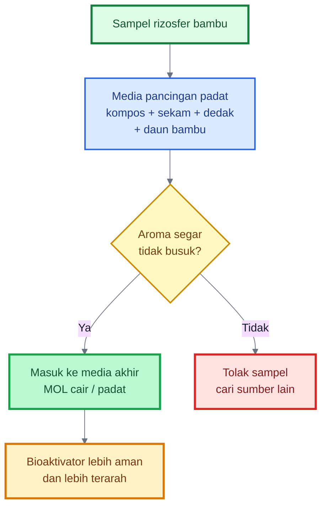

---

## 6.3 Perbandingan Formula Cair dan Padat

Berikut perbandingan praktis antara bentuk cair dan padat.

| Bentuk             | Kelebihan                                                                      | Kekurangan                                                                               | Penggunaan Terbaik              |
| ------------------ | ------------------------------------------------------------------------------ | ---------------------------------------------------------------------------------------- | ------------------------------- |
| MOL cair           | Mudah dikocor, mudah dicampur ke larutan, praktis untuk aktivasi kompos        | Lebih mudah gagal bila anaerob, lebih mudah busuk bila salah kelola                      | Kocor tanah dan aktivasi kompos |
| Bioaktivator padat | Lebih stabil, lebih dekat ke habitat mikroba alami, lebih aman sebagai starter | Perlu ruang fermentasi, agak lebih berat dan kurang praktis untuk aplikasi cair langsung | Campuran kompos dan bedengan    |

### Kesimpulan praktis

- Jika targetnya **aktivasi kompos dan kocor ringan**, pilih **MOL cair**.
- Jika targetnya **stabilitas, starter kompos, dan pengayaan bedengan**, pilih **bioaktivator padat**.
- Dalam praktik yang paling kuat, keduanya bisa dipakai bersama: padat untuk basis, cair untuk aktivasi dan susulan.

## Diagram: Pilih bentuk sesuai kebutuhan

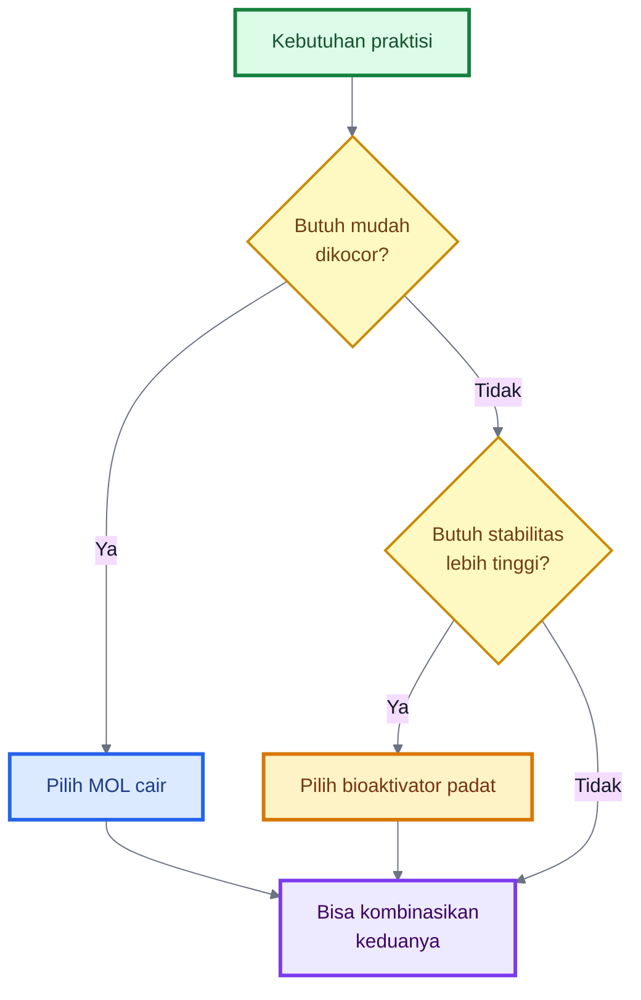

## 6.3.1 Perbandingan Metode Langsung dan Metode Pancingan

Ada dua cara untuk memperbanyak mikroba dari rizosfer bambu.

Metode pertama adalah metode langsung. Sampel tanah dan serasah bambu sehat langsung dimasukkan ke media akhir, baik cair maupun padat. Metode ini cepat, sederhana, dan menjaga keragaman mikroba lebih baik. Kekurangannya, jika sumber starter buruk, risiko kegagalan fermentasi akan langsung terbawa ke media akhir.

Metode kedua adalah metode pancingan padat ekologis. Sampel terlebih dahulu dipancing dalam media padat kecil. Setelah 2–4 hari, hasilnya dinilai dari aroma, tekstur, panas, dan tanda pembusukan. Jika hasilnya baik, baru dipindahkan ke media akhir. Metode ini lebih lambat, tetapi memberi tahap penyaringan awal.

Metode pancingan juga bisa diarahkan ke tujuan kaya silikat dengan memasukkan sekam bakar, daun bambu lapuk, jerami lapuk, atau sedikit abu sekam matang. Namun, metode ini tetap bukan seleksi mikroba murni. Ia hanya memperkaya komunitas yang mampu tumbuh pada bahan organik dan sumber silikat.

| Aspek                | Metode Langsung            | Metode Pancingan Padat                                |
| -------------------- | -------------------------- | ----------------------------------------------------- |
| Kecepatan            | Lebih cepat                | Lebih lambat                                          |
| Keragaman mikroba    | Lebih terjaga              | Sedikit lebih terseleksi                              |
| Risiko starter buruk | Langsung masuk media akhir | Bisa disaring lebih dulu                              |
| Kebutuhan alat       | Sederhana                  | Sedikit lebih teliti                                  |
| Kesesuaian petani    | Sangat cocok               | Cocok untuk praktisi maju                             |
| Arah ke silikat      | Ada, tetapi tidak spesifik | Lebih terarah bila media pancingan mengandung silikat |
| Risiko bias          | Lebih kecil                | Ada bias terhadap mikroba yang cepat tumbuh           |

---

## 6.4 Rumus Pengenceran MOL

Setelah MOL cair jadi, umumnya larutan tidak dipakai langsung dalam keadaan pekat. Larutan perlu diencerkan sesuai tujuan aplikasi.

Rumus pengenceran aman dalam format MDX adalah:

$$
V_{\text{stok}} =
\frac{V_{\text{akhir}}}{R + 1}
$$

Keterangan:

- `V_stok` = volume MOL stok
- `V_akhir` = total larutan akhir
- `R` = jumlah bagian air dalam rasio pengenceran

### Penjelasan praktis

Jika rasio pengenceran adalah **1:30**, artinya:

- 1 bagian MOL stok
- 30 bagian air

Jika rasio pengenceran adalah **1:50**, artinya:

- 1 bagian MOL stok
- 50 bagian air

### Contoh 1: membuat 31 liter larutan dengan rasio 1:30

$$
V_{\text{stok}} =
\frac{31}{30 + 1}
= 1\ \text{liter}
$$

Artinya:

- MOL stok = **1 liter**
- air = **30 liter**
- total = **31 liter**

### Contoh 2: membuat 51 liter larutan dengan rasio 1:50

$$
V_{\text{stok}} =
\frac{51}{50 + 1}
= 1\ \text{liter}
$$

Artinya:

- MOL stok = **1 liter**
- air = **50 liter**
- total = **51 liter**

### Rasio praktis yang aman

| Tujuan                    | Rasio yang umum dipakai |
| ------------------------- | ----------------------- |
| Aktivasi kompos           | 1:20 sampai 1:30        |
| Kocor tanah sebelum tanam | 1:20 sampai 1:30        |
| Kocor ringan sekitar akar | 1:30 sampai 1:50        |
| Uji awal pada tanaman     | 1:50 atau lebih encer   |

### Catatan penting

Semakin muda tanaman, semakin aman menggunakan larutan yang lebih encer. Untuk tanah dan kompos, larutan bisa sedikit lebih kuat. Untuk aplikasi awal ke tanaman, utamakan keamanan.

---

# Ringkasan Bab 5–6

Bab ini menegaskan bahwa kualitas bioaktivator dimulai dari **seleksi sumber starter**. Rumpun bambu ideal adalah yang sehat, tanahnya remah, ada serasah lapuk alami, baunya segar, tidak tergenang, dan tidak dekat pencemar. Starter terbaik diambil dari serasah setengah lapuk, humus tipis di bawah serasah, dan tanah sekitar akar halus tanpa merusak rimpang.

Setelah itu, starter bisa diformulasikan menjadi dua bentuk:

1. **MOL cair**, untuk kocor tanah dan aktivasi kompos,
2. **bioaktivator padat**, untuk starter yang lebih stabil dan campuran kompos/bedengan.

Keduanya menggunakan prinsip yang sama: starter bambu, makanan mikroba, media hidup, dan sumber silikat alami.

Kalimat kuncinya:

> **Starter yang baik menghasilkan bioaktivator yang baik. Dan bioaktivator yang baik bukan dibuat dari banyaknya bahan, tetapi dari tepatnya sumber, seimbangnya formula, dan benarnya proses.**

---

# 7. Proses Fermentasi dan Pembiakan Mikroba

Setelah starter bambu dan bahan formula disiapkan, tahap berikutnya adalah **fermentasi**. Pada tahap ini, target kita bukan membuat cairan berbau tajam, bukan juga membuat bahan organik menjadi busuk. Target yang benar adalah membiakkan komunitas mikroba lokal dalam kondisi yang masih sehat, cukup makanan, cukup kelembapan, dan tidak kehilangan oksigen sepenuhnya.

Fermentasi bioaktivator rizosfer bambu harus dipahami sebagai proses **mengaktifkan kehidupan mikroba**, bukan membiarkan bahan membusuk. Perbedaannya sangat besar. Fermentasi yang benar menghasilkan aroma segar, asam-manis, atau seperti tape. Pembusukan menghasilkan bau got, bangkai, telur busuk, amonia tajam, dan lendir berlebihan.

Dalam tanah, mikroorganisme berperan penting dalam dekomposisi bahan organik, siklus hara, pembentukan agregat, dan pengendalian keseimbangan organisme tanah. Karena itu, bioaktivator yang baik harus menjaga mikroba tetap hidup dan aktif, bukan menciptakan kondisi ekstrem yang justru merusak komunitas mikroba. ([FAOHome][1])

---

## 7.1 Prinsip Fermentasi yang Benar

Fermentasi yang benar dimulai dari kondisi bahan. Bahan harus **lembap, tetapi bukan becek**. Kelembapan diperlukan agar mikroba aktif, tetapi air berlebihan dapat menurunkan oksigen dan mendorong proses anaerob yang berbau busuk.

Pada formula cair, risiko utama adalah larutan menjadi terlalu anaerob karena wadah ditutup terlalu rapat, bahan terlalu banyak, gula berlebihan, atau tidak pernah diaduk. Pada formula padat, risiko utama adalah bahan terlalu basah, terlalu padat, atau tidak dibalik sehingga bagian tengah menjadi panas dan kekurangan oksigen.

Prinsip dasarnya:

- mikroba perlu makanan,
- mikroba perlu air,
- mikroba perlu ruang hidup,
- mikroba tetap membutuhkan pertukaran udara,
- bahan awal tidak boleh busuk.

Molase, gula merah, dedak, air cucian beras, dan kompos matang berfungsi sebagai sumber energi. Tanah/serasah bambu berfungsi sebagai sumber mikroba. Sekam bakar, daun bambu lapuk, jerami lapuk, dan abu sekam matang dalam dosis wajar berfungsi sebagai pengarah silikat. Kompos matang berfungsi sebagai media hidup.

Fermentasi sebaiknya tidak ditutup kedap total. Wadah perlu ditutup agar tidak dimasuki lalat atau kotoran, tetapi tetap harus ada ruang gas dan pertukaran udara. Gunakan kain, karung, atau tutup longgar. Pada formula cair, pengadukan harian membantu mengurangi kondisi anaerob. Pada formula padat, pembalikan setiap 1–2 hari membantu oksigen masuk dan panas berlebih keluar.

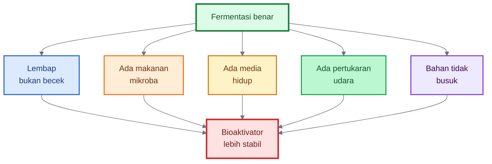

## 7.1.1 Kendali Kontaminasi: Sanitasi, Bukan Sterilisasi Penuh

Dalam pembuatan bioaktivator komunitas, media akhir tidak harus steril penuh. Namun, prosesnya harus bersih. Pendekatan yang lebih tepat adalah sanitasi dan seleksi ekologis.

Sanitasi berarti mengurangi sumber kontaminasi buruk: wadah dicuci bersih, air tidak tercemar, bahan tidak busuk, kompos harus matang, dedak tidak tengik, dan starter berasal dari rumpun bambu sehat. Seleksi ekologis berarti menciptakan kondisi yang mendukung mikroba tanah yang sehat: kelembapan cukup, tidak becek, ada bahan organik, ada pertukaran udara, gula tidak berlebihan, dan fermentasi tidak terlalu lama.

Media cair lebih rentan gagal dibanding media padat karena kadar air tinggi, oksigen cepat turun, dan gula mudah memicu ledakan mikroba. Karena itu, MOL cair wajib diaduk harian dan tidak boleh ditutup kedap total. Media padat lebih stabil, tetapi tetap harus dijaga agar tidak terlalu basah, tidak terlalu padat, dan tidak panas ekstrem.

Prinsipnya bukan membuat bahan steril, tetapi membuat mikroba sehat lebih dominan daripada mikroba pembusuk.

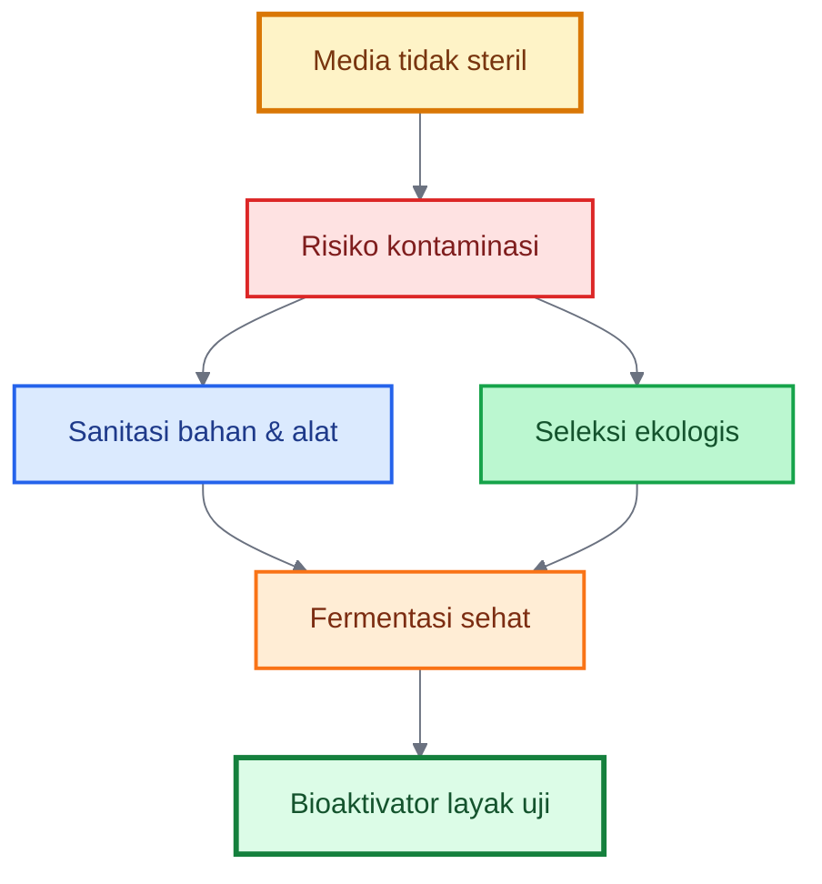

> Kualitas ekstrak kompos atau compost tea sangat dipengaruhi oleh bahan baku, waktu fermentasi, aerasi, sumber air, tambahan nutrisi, dan proses aplikasi. Karena itu, kontrol proses lebih penting daripada sekadar menambah bahan sebanyak-banyaknya.

---

## 7.2 Proses Pembuatan MOL Cair

MOL cair cocok digunakan untuk aktivasi kompos, kocor tanah, dan aplikasi susulan dalam bentuk encer. Namun, bentuk cair lebih mudah gagal jika prosesnya terlalu anaerob. Karena itu, prosesnya harus dijaga.

### Langkah pembuatan

Pertama, siapkan wadah bersih. Jangan gunakan wadah bekas pestisida, oli, deterjen kuat, atau bahan kimia lain. Masukkan tanah/serasah bambu sehat, kompos matang, dedak, sekam bakar halus, dan sedikit abu sekam matang bila digunakan.

Kedua, larutkan molase atau gula merah cair ke dalam air bersih. Jika memakai air cucian beras, pastikan masih segar dan tidak berbau basi. Masukkan larutan tersebut ke dalam wadah.

Ketiga, tambahkan air bersih non-klorin sampai volume yang diinginkan. Untuk formula 20 liter, sisakan ruang kosong di bagian atas wadah agar busa dan gas tidak meluap.

Keempat, aduk merata. Pengadukan awal penting agar bahan tidak menggumpal dan mikroba mendapat kontak dengan makanan serta media.

Kelima, tutup wadah secara longgar. Gunakan kain, karung, atau tutup yang tidak dikunci rapat. Tujuannya mencegah kotoran masuk, tetapi gas tetap bisa keluar.

Keenam, simpan di tempat teduh. Hindari panas matahari langsung karena suhu terlalu tinggi dapat mengganggu mikroba.

Ketujuh, aduk setiap hari. Pengadukan membantu memasukkan oksigen, meratakan bahan, dan mencegah bau anaerob.

Kedelapan, amati bau, busa, warna, dan tekstur. MOL cair yang baik biasanya beraroma asam-manis, segar, atau seperti tape. Busa ringan masih wajar. Bau busuk tajam adalah tanda masalah.

### Waktu fermentasi

Waktu fermentasi praktis biasanya **5–10 hari**, tergantung suhu lingkungan, kualitas bahan, jumlah gula, dan kualitas starter. Di daerah hangat, proses bisa lebih cepat. Di daerah sejuk, proses bisa lebih lambat.

Gunakan hanya jika fermentasinya baik. Jangan memaksakan MOL yang berbau busuk untuk aplikasi tanaman.

---

## 7.3 Proses Pembuatan Bioaktivator Padat

Bioaktivator padat lebih stabil karena mikroba hidup pada permukaan bahan padat seperti kompos, dedak, sekam bakar, tanah remah, dan serasah lapuk. Bentuk ini lebih mirip lingkungan alami di bawah rumpun bambu.

### Langkah pembuatan

Pertama, campur semua bahan padat: tanah/serasah bambu, kompos matang, dedak, sekam bakar, dan daun bambu lapuk cincang.

Kedua, buat larutan molase encer 1–2%. Larutan ini digunakan hanya untuk melembapkan bahan, bukan membuat bahan basah kuyup.

Ketiga, siram larutan molase sedikit demi sedikit sambil bahan diaduk. Jangan langsung menuang banyak air. Targetnya adalah lembap merata.

Keempat, lakukan **uji genggam**. Ambil segenggam bahan, remas ringan. Jika bahan menggumpal tetapi tidak meneteskan air, kelembapan sudah baik. Jika air menetes, terlalu basah. Jika bahan tidak bisa menggumpal, terlalu kering.

Kelima, tutup tumpukan dengan karung goni, kain, atau penutup berpori. Jangan menutup rapat dengan plastik tanpa ventilasi.

Keenam, balik bahan setiap 1–2 hari. Pembalikan penting untuk menurunkan panas, meratakan kelembapan, dan memasukkan oksigen.

Ketujuh, gunakan bila aroma sudah segar, tidak panas berlebihan, tidak busuk, dan teksturnya remah-lembap.

### Ciri bioaktivator padat yang siap

Bioaktivator padat yang baik biasanya:

- berbau segar,
- tidak panas ekstrem,
- tidak berlendir,
- tidak becek,
- tidak berbau amonia tajam,
- teksturnya remah-lembap.

Jika bahan terlalu panas, terlalu basah, atau berbau busuk, proses harus diperbaiki sebelum digunakan.

---

## 7.4 Ciri Fermentasi Berhasil

Fermentasi berhasil ditandai oleh kondisi yang **segar, stabil, dan tidak menyengat**.

Ciri utama:

- bau asam-manis,
- aroma seperti tape,
- bau tanah hutan,
- tidak menyengat,
- tidak berlendir busuk,
- tidak panas ekstrem,
- warna bahan masih wajar,
- tidak muncul bau got atau bangkai.

Pada MOL cair, busa ringan masih wajar. Endapan juga wajar karena bahan padat akan turun ke bawah. Yang penting adalah baunya. Bau adalah indikator lapangan paling praktis.

Pada bioaktivator padat, suhu sedikit hangat masih wajar. Namun, jika terlalu panas sampai terasa menyengat dan berbau amonia, bahan perlu dibalik dan dikering-anginkan.

Fermentasi berhasil bukan berarti semua mikroba di dalamnya sudah pasti spesifik dan unggul. Fermentasi berhasil berarti prosesnya **layak digunakan sebagai bioaktivator lapangan**.

---

## 7.5 Ciri Fermentasi Gagal

Fermentasi gagal biasanya disebabkan oleh bahan busuk, air terlalu banyak, gula terlalu banyak, wadah terlalu rapat, tidak diaduk, atau sumber starter buruk.

Ciri fermentasi gagal:

- bau bangkai,
- bau got,
- bau telur busuk,
- bau amonia tajam,
- lendir berlebihan,
- warna sangat mencurigakan,
- tekstur busuk,
- banyak belatung,
- panas ekstrem,
- muncul gas menyengat saat wadah dibuka.

Bila tanda ini muncul kuat, jangan gunakan ke tanaman. Bioaktivator yang gagal dapat mengganggu akar, menurunkan oksigen di sekitar zona akar, membawa mikroba pembusuk, dan membuat tanah berbau tidak sehat.

### Diagram keputusan fermentasi berhasil/gagal

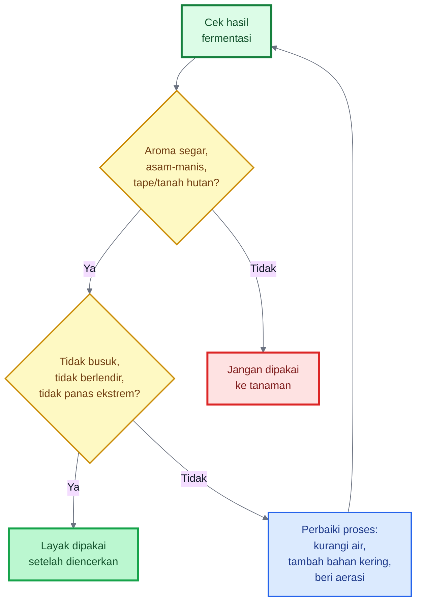

---

# 8. Mengarahkan Bioaktivator ke Pelarutan Silikat

Bioaktivator rizosfer bambu kaya silikat memiliki satu fokus khusus yang membedakannya dari MOL biasa, yaitu **mengarah ke lingkungan mikroba yang berinteraksi dengan silikat**.

Namun, bagian ini perlu dipahami dengan benar. Kita tidak sedang membuat larutan silika cepat seperti kalium silikat atau asam monosilikat komersial. Kita sedang membangun komunitas mikroba dan lingkungan tanah yang **berpotensi membantu pelepasan silikon secara bertahap** dari sumber silikat alami.

Silicate-solubilizing bacteria atau bakteri pelarut silikat diketahui dapat membantu melarutkan silikat tidak larut dan meningkatkan ketersediaan silikon bagi tanaman. Beberapa studi juga menunjukkan bahwa bakteri rizosfer yang mampu melarutkan silika dapat memiliki sifat pemacu pertumbuhan tanaman. ([ScienceDirect][2])

---

## 8.1 Mengapa Perlu Sumber Silikat

Jika bioaktivator hanya diberi gula, yang berkembang terutama mikroba yang cepat memanfaatkan gula. Ini tidak salah, tetapi belum tentu mengarah pada komunitas yang terbiasa berinteraksi dengan silikat.

Karena target kita adalah bioaktivator kaya silikat, maka mikroba perlu diberi **substrat ekologis** berupa bahan yang mengandung silikat. Tujuannya bukan agar semua silika langsung larut, tetapi agar lingkungan fermentasi memiliki unsur yang sesuai dengan targetnya.

Sumber silikat berfungsi sebagai:

- bahan mineral pendamping,
- substrat jangka menengah,
- bagian dari ekosistem mikroba,
- pengarah komunitas mikroba,
- peniru siklus silika di bawah rumpun bambu.

Dengan menambahkan sekam bakar, daun bambu lapuk, jerami lapuk, atau sedikit abu sekam matang, kita meniru lingkungan bambu: ada bahan organik, ada mikroba, dan ada sumber silikat.

## Diagram: Mengarahkan bioaktivator ke pelarutan silikat

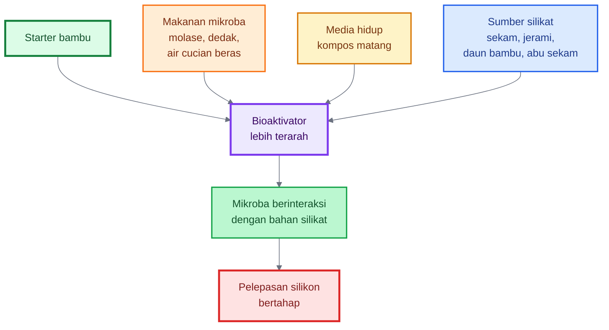

---

## 8.2 Bahan Silikat Terbaik untuk Skala Petani

Untuk skala petani, bahan silikat harus memenuhi tiga syarat:

1. mudah diperoleh,
2. aman digunakan,
3. tidak merusak pH atau fermentasi bila dosisnya wajar.

### Sekam bakar

Sekam bakar adalah bahan yang sangat praktis. Ia ringan, porous, membantu aerasi, dan mengandung silika. Sekam bakar cocok untuk formula padat karena membantu bahan tidak terlalu padat dan tidak terlalu basah.

### Abu sekam matang

Abu sekam mengandung silika dan mineral lain, tetapi cenderung alkalis. Penelitian tentang abu sekam menunjukkan bahwa bahan ini dapat digunakan sebagai sumber kapur untuk perbaikan tanah masam, yang berarti abu sekam memang berpotensi menaikkan pH. Karena itu, dosisnya harus rendah dan hati-hati. ([Horizon e-Publishing Group][3])

Pada formula cair, abu sekam sebaiknya sedikit saja. Pada formula padat, penggunaannya lebih aman karena tercampur dengan kompos, dedak, dan serasah.

### Jerami lapuk

Jerami padi adalah bahan kaya silika dari sistem pertanian. Gunakan jerami yang sudah lapuk, bukan jerami segar yang masih keras dan mudah memicu panas fermentasi. Jerami lapuk juga membantu menyediakan karbon dan struktur.

### Daun bambu lapuk

Daun bambu lapuk sangat sesuai dengan konsep ini karena berasal dari siklus bambu sendiri. Gunakan daun setengah lapuk atau lapuk, bukan daun segar dalam jumlah berlebihan.

### Kompos bambu

Kompos dari serasah bambu dapat menjadi bahan yang baik bila sudah matang. Ia menggabungkan bahan organik dan sisa silika biogenik dari jaringan bambu.

### Mineral silikat aman

Mineral silikat pertanian bisa digunakan bila sumbernya jelas dan memang diperuntukkan bagi pertanian. Hindari limbah industri atau debu batuan yang tidak jelas kandungan logam beratnya.

---

## 8.3 Peran Mikroba Pelarut Silikat

Mikroba pelarut silikat bekerja melalui beberapa mekanisme.

Pertama, mikroba dapat menghasilkan **asam organik**. Asam organik membantu menurunkan pH mikro di sekitar mineral dan mempercepat pelapukan lokal. Ini dapat membantu pelepasan unsur dari silikat tidak larut.

Kedua, mikroba dapat menghasilkan senyawa yang membantu **mengkelat kation pengikat silikat**. Banyak mineral silikat berasosiasi dengan unsur seperti K, Ca, Mg, Fe, atau Al. Ketika ikatan mineral terganggu, sebagian unsur dapat menjadi lebih tersedia.

Ketiga, mikroba membantu proses **bio-weathering** atau pelapukan biologis. Ini tidak instan, tetapi penting dalam proses jangka menengah-panjang di tanah.

Keempat, sebagian mikroba pelarut silikat juga memiliki sifat PGPR, misalnya membantu pertumbuhan akar, menghasilkan metabolit tertentu, atau mendukung ketahanan tanaman. Studi tentang silicate-solubilizing dan plant growth promoting bacteria menunjukkan bahwa kelompok mikroba ini dapat berinteraksi dengan silika biogenik dan mendukung performa tanaman dalam kondisi stres. ([PMC][4])

Dalam konteks bioaktivator bambu, kita tidak mengklaim bahwa semua mikroba yang tumbuh pasti pelarut silikat. Yang kita lakukan adalah **menciptakan kondisi pengayaan** agar mikroba yang mampu berinteraksi dengan silikat memiliki peluang berkembang.

---

## 8.4 Batasan Klaim

Bagian ini penting agar penggunaan bioaktivator tetap rasional.

Bioaktivator bambu kaya silikat **tidak menjamin kadar silika larut langsung tinggi**. Fermentasi biasa tidak sama dengan proses ekstraksi kimia. Misalnya, ekstraksi silika dari abu sekam dalam penelitian industri dapat melibatkan proses alkali dan asidifikasi; proses seperti itu bukan praktik MOL biasa dan tidak disarankan dilakukan sembarangan di tingkat petani. ([International Journal of Technology][5])

Bioaktivator ini juga **bukan pengganti silika larut komersial**. Jika tanaman membutuhkan efek cepat, sumber silika larut seperti kalium silikat atau asam monosilikat lebih terukur.

Efek bioaktivator bersifat bertahap. Ia bekerja melalui:

- aktivasi bahan organik,
- peningkatan aktivitas mikroba,
- perbaikan rizosfer,
- pelapukan biologis,
- pelepasan hara dan silikon secara perlahan.

Selain itu, bioaktivator perlu lingkungan tanah yang mendukung. Bila tanah tergenang, terlalu kering, terlalu panas, miskin bahan organik, atau sering terkena bahan kimia keras, mikroba sulit bekerja.

Kalimat batasan yang aman:

> **Bioaktivator rizosfer bambu kaya silikat bukan larutan silika instan, tetapi alat biologis untuk membantu membangun tanah yang lebih aktif dalam siklus bahan organik, hara, dan silikat.**

---

## 8.5 Strategi Kombinasi

Strategi terbaik bukan memilih satu input, tetapi membangun paket ekosistem.

Komponennya:

1. **Bioaktivator bambu** sebagai starter mikroba lokal.
2. **Kompos matang** sebagai rumah dan makanan mikroba.
3. **Sumber silikat alami** sebagai substrat jangka menengah.
4. **Mulsa** untuk menjaga kelembapan dan melindungi tanah.
5. **Drainase** agar mikroba dan akar tetap aerob.
6. **Silika larut** bila dibutuhkan efek cepat pada tanaman.

Strategi ini meniru rumpun bambu secara lebih lengkap. Di bawah bambu, mikroba tidak bekerja sendirian. Mereka bekerja bersama serasah, akar, kelembapan, mineral, dan struktur tanah.

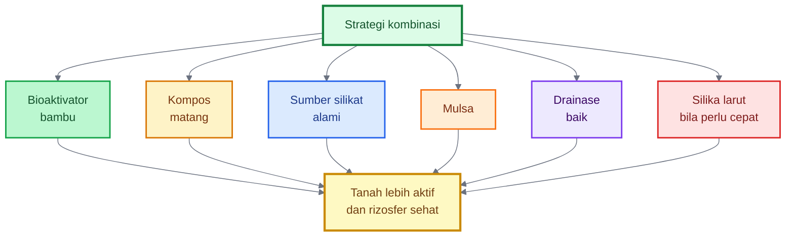

---

# Ringkasan Bab 7–8

Fermentasi bioaktivator rizosfer bambu harus diarahkan pada pembiakan mikroba sehat, bukan pembusukan. Prinsipnya adalah lembap tetapi tidak becek, ada makanan mikroba, ada media hidup, ada pertukaran udara, dan bahan awal tidak busuk.

MOL cair mudah digunakan tetapi lebih rentan gagal bila anaerob. Bioaktivator padat lebih stabil karena lebih menyerupai habitat mikroba alami. Fermentasi berhasil ditandai aroma asam-manis, tape, atau tanah hutan. Fermentasi gagal ditandai bau bangkai, got, telur busuk, amonia tajam, lendir berlebih, dan panas ekstrem.

Untuk mengarahkan bioaktivator ke pelarutan silikat, tambahkan sumber silikat alami seperti sekam bakar, sedikit abu sekam matang, jerami lapuk, daun bambu lapuk, kompos bambu, atau mineral silikat aman. Namun, efeknya bertahap dan bukan pengganti silika larut jika dibutuhkan efek cepat.

Kalimat kunci:

> **Bioaktivator bambu kaya silikat bukan larutan silika instan, tetapi sistem mikroba yang diarahkan untuk mengaktifkan bahan organik, rizosfer, dan pelepasan silikat secara bertahap.**

[1]: https://www.fao.org/4/a0100e/a0100e05.htm?utm_source=chatgpt.com '2. Organic matter decomposition and the soil food web'
[2]: https://www.sciencedirect.com/science/article/abs/pii/S2452219823000885?utm_source=chatgpt.com 'A review of the role of silicate-solubilizing bacteria'
[3]: https://horizonepublishing.com/index.php/PST/article/download/6514/5491/40779?utm_source=chatgpt.com 'Eco-friendly utilization of rice husk ash for amending acid ...'
[4]: https://pmc.ncbi.nlm.nih.gov/articles/PMC10374332/?utm_source=chatgpt.com 'Silicate solubilizing and plant growth promoting bacteria ...'
[5]: https://ijtech.eng.ui.ac.id/article/view/3335?utm_source=chatgpt.com 'Synthesis of Amorphous Silica from Rice Husk Ash'

---

# 9. Aplikasi Bioaktivator pada Budidaya Cabai

Setelah bioaktivator rizosfer bambu kaya silikat berhasil dibuat, pertanyaan berikutnya adalah: **kapan dan bagaimana menggunakannya pada cabai?** Ini penting karena bioaktivator bukan pupuk utama, bukan juga larutan yang dipakai sembarangan dalam kondisi pekat. Fungsinya adalah **membangun dan menjaga kehidupan tanah**, terutama di sekitar akar.

Dalam budidaya cabai, aplikasi bioaktivator paling efektif bila dilakukan pada fase-fase yang memang berhubungan dengan pembentukan tanah, kolonisasi akar, pemulihan rizosfer, dan pemeliharaan ekosistem bawah tanah. Dengan kata lain, bioaktivator sebaiknya masuk ke sistem budidaya sejak awal, bukan hanya diberikan saat tanaman sudah bermasalah.

Prinsip umumnya:

- lebih aman masuk ke **kompos dan tanah** daripada langsung ke tajuk,
- lebih efektif pada tanah yang **lembap dan tidak tergenang**,
- lebih baik dipakai **sebelum masalah berat muncul**,
- dan akan bekerja lebih baik jika dipadukan dengan kompos matang, mulsa, drainase baik, serta manajemen air yang stabil.

---

## 9.1 Sebelum Tanam

Fase sebelum tanam adalah waktu terbaik untuk menggunakan bioaktivator. Pada fase ini, kita belum berhadapan langsung dengan akar muda yang sensitif, sehingga bioaktivator bisa dipakai lebih leluasa untuk **mengaktifkan kompos dan membangun tanah**.

Langkah yang disarankan adalah sebagai berikut:

1. **Campurkan bioaktivator ke kompos matang**
   Bioaktivator, baik bentuk cair maupun padat, sebaiknya tidak langsung masuk ke lahan tanpa media pendamping. Kompos matang menjadi media hidup bagi mikroba dan membantu transisi bioaktivator ke tanah.

2. **Diamkan 5–7 hari**
   Setelah bioaktivator dicampur ke kompos, diamkan beberapa hari agar proses aktivasi berjalan. Dalam masa ini, mikroba mulai beradaptasi dan berkembang pada kompos.

3. **Masukkan ke bedengan**
   Kompos yang telah diaktifkan kemudian dimasukkan ke bedengan. Pada tahap ini, bioaktivator membantu menyiapkan lingkungan tanah sebelum cabai masuk.

4. **Tutup dengan mulsa**
   Mulsa membantu meniru serasah alami di bawah rumpun bambu. Mulsa menjaga kelembapan, menekan penguapan, mengurangi percikan tanah, dan melindungi permukaan tanah.

5. **Diamkan lahan 1–2 minggu**
   Waktu jeda ini penting agar tanah stabil, bahan organik menyatu dengan bedengan, dan kehidupan mikroba mulai menyesuaikan diri.

### Mengapa fase ini paling penting?

Karena bioaktivator paling baik bekerja sebagai **pembangun ekosistem**, bukan sebagai “obat darurat”. Bila tanah sudah dipersiapkan sejak awal, maka akar cabai akan masuk ke lingkungan yang lebih hidup, lebih remah, dan lebih nyaman.

### Dosis praktis sebelum tanam

Sebagai panduan praktis:

- **Bioaktivator cair**: 1 liter stok untuk 20–30 liter air, lalu disiramkan ke 100 kg kompos matang
- **Bioaktivator padat**: 1–2 kg untuk 100 kg kompos matang

Dosis ini bukan angka kaku, tetapi panduan aman untuk praktik lapangan.

---

## 9.2 Saat Tanam

Saat tanam adalah fase kritis karena bibit cabai baru pindah tanam masih sensitif terhadap perubahan lingkungan. Karena itu, penggunaan bioaktivator pada fase ini harus **lebih hati-hati dan lebih encer**.

Prinsip aplikasinya:

- gunakan MOL cair yang **sangat encer**,
- kocor ringan pada lubang tanam atau sekitar zona akar,
- jangan sampai tanah menjadi becek,
- jangan mengenai akar dengan larutan pekat.

### Cara aman saat tanam

1. Siapkan larutan bioaktivator cair dengan rasio encer, misalnya **1:30 sampai 1:50**.
2. Setelah bibit ditanam, berikan kocoran ringan di sekitar lubang tanam.
3. Gunakan volume secukupnya untuk melembapkan zona akar, bukan membanjiri bedengan.

### Catatan penting

Pada fase ini, tujuan bioaktivator bukan mendorong pertumbuhan cepat, melainkan:

- membantu transisi akar ke tanah baru,
- mendukung kolonisasi awal rizosfer,
- menjaga akar tetap berada pada lingkungan biologis yang lebih ramah.

Jika lahan baru saja diberi fungisida tanah atau bahan kimia keras, sebaiknya beri jeda sebelum aplikasi bioaktivator.

---

## 9.3 Fase Vegetatif

Pada fase vegetatif, cabai sedang aktif membentuk batang, daun, dan sistem akar. Pada fase ini, bioaktivator dapat digunakan untuk **memelihara kehidupan tanah** dan mendukung rizosfer tetap aktif.

Prinsipnya:

- kocor bioaktivator **setiap 2–4 minggu sekali**,
- lakukan aplikasi pagi atau sore,
- tanah harus lembap, bukan kering panas,
- tambahkan bahan organik ringan bila perlu.

### Mengapa fase vegetatif penting?

Karena pada fase ini akar cabai berkembang aktif. Jika tanah hidup, akar akan lebih mudah berinteraksi dengan mikroba, bahan organik, dan unsur hara. Pada fase ini pula sistem “lingkungan bambu buatan” mulai benar-benar bekerja.

### Praktik lapangan

- Gunakan larutan bioaktivator cair dengan rasio **1:30 sampai 1:50**
- Kocor di sekitar zona akar, bukan di pangkal batang secara berlebihan
- Aplikasi sebaiknya dilakukan setelah penyiraman ringan atau saat tanah cukup lembap

Jika dirasa perlu, tambahkan bahan organik ringan seperti kompos matang halus di sekitar tanaman agar mikroba mendapat makanan tambahan.

### Tujuan fase vegetatif

- menjaga tanah tetap aktif,
- menjaga rizosfer tetap hidup,
- mendukung pembentukan tanah remah,
- membangun fondasi akar yang lebih sehat.

---

## 9.4 Fase Generatif

Pada fase generatif, fokus budidaya cabai bergeser ke bunga, buah, dan stabilitas produksi. Pada fase ini, bioaktivator tetap berguna, tetapi posisinya harus dipahami dengan benar.

Bioaktivator digunakan untuk:

- menjaga mikroba akar tetap hidup,
- menjaga tanah tidak “mati” selama produksi,
- mendukung rizosfer agar tetap stabil.

Bioaktivator **bukan pupuk buah utama**. Jadi, bila tanaman membutuhkan kalium, kalsium, magnesium, boron, atau nutrisi lain untuk mendukung pembungaan dan pembentukan buah, kebutuhan itu tetap harus dipenuhi dengan program nutrisi yang benar.

### Prinsip penggunaan pada fase generatif

- gunakan sebagai pendukung rizosfer,
- hindari aplikasi terlalu dekat dengan fungisida keras,
- gunakan dalam dosis ringan dan tidak terlalu sering,
- utamakan kestabilan, bukan intensitas.

Pada fase ini, aplikasi bisa tetap dilakukan tiap **2–4 minggu sekali**, tetapi lebih hati-hati terhadap kondisi tanah dan program proteksi tanaman.

### Catatan penting

Jika penggunaan fungisida tanah atau bahan kimia keras tidak bisa dihindari, maka:

- jangan campurkan bioaktivator dalam satu tangki,
- beri jeda aplikasi,
- dan gunakan bioaktivator kembali setelah kondisi lebih aman.

---

## 9.5 Setelah Hujan Lebat atau Stres

Salah satu saat paling berguna untuk bioaktivator adalah **setelah hujan lebat, tanah jenuh air, atau tanaman mengalami stres**. Namun, di sini ada urutan yang harus dipatuhi.

Langkah pertama bukan langsung mengocor bioaktivator, tetapi:

1. **pastikan drainase lebih dulu**,
2. baru lakukan **pemulihan tanah**,
3. lalu kocor bioaktivator encer ke zona akar.

### Mengapa?

Karena hujan lebat dapat:

- merusak struktur permukaan tanah,
- mengurangi oksigen di zona akar,
- mencuci sebagian bahan organik larut,
- menekan aktivitas mikroba aerob,
- membuat tanah terlalu basah.

Jika bioaktivator langsung dimasukkan saat tanah masih becek dan anaerob, hasilnya justru tidak optimal.

### Strategi pemulihan

- Periksa parit dan saluran drainase
- Pastikan genangan hilang
- Kocor bioaktivator encer setelah tanah mulai stabil
- Tambahkan kompos matang ringan bila perlu
- Jaga mulsa tetap berfungsi

Pada fase pemulihan, tujuan bioaktivator adalah **menghidupkan kembali aktivitas biologis tanah**, bukan memaksa pertumbuhan.

## Diagram: Waktu aplikasi bioaktivator pada cabai

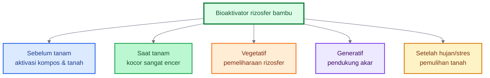

---

# 10. Integrasi dengan Sistem “Lingkungan Bambu Buatan”

Setelah memahami aplikasi bioaktivator pada cabai, langkah berikutnya adalah menempatkannya dalam sistem yang lebih utuh. Ini penting, karena bioaktivator tidak bekerja maksimal bila berdiri sendiri.

Konsep yang ingin dibangun bukan sekadar “memberi MOL”, tetapi **menciptakan lingkungan budidaya yang meniru lantai rumpun bambu**. Dengan kata lain, kita membuat **lingkungan bambu buatan** di bedengan cabai.

Pada rumpun bambu alami, kekuatan ekosistem muncul karena beberapa komponen bekerja bersama:

- ada serasah,
- ada bahan organik,
- ada mikroba,
- ada kelembapan stabil,
- ada tanah yang tidak telanjang,
- ada drainase alami,
- ada akar yang nyaman.

Prinsip yang sama harus diterjemahkan ke bedengan cabai.

---

## 10.1 Komponen Sistem

Sistem “lingkungan bambu buatan” terdiri dari beberapa komponen utama yang tidak boleh dipisahkan.

### Kompos matang

Kompos matang adalah dasar sistem. Ia berfungsi sebagai:

- sumber bahan organik,
- rumah bagi mikroba,
- penyangga tanah,
- pembentuk agregat,
- sumber makanan biologis.

Kompos matang lebih aman daripada bahan organik mentah. Kompos mentah justru berisiko memicu panas, pembusukan, dan gangguan akar.

### Bioaktivator rizosfer bambu

Bioaktivator menjadi **starter kehidupan biologis**. Ia membawa komunitas mikroba lokal yang berasal dari lingkungan bambu, lalu memperkaya kompos dan tanah.

### Sumber silikat alami

Komponen ini menjaga arah sistem agar tetap sesuai dengan prinsip “bambu kaya silika”. Sumber silikat alami seperti sekam bakar, jerami lapuk, daun bambu lapuk, atau sedikit abu sekam matang membantu menciptakan lingkungan yang lebih relevan bagi proses pelarutan silikat bertahap.

### Mulsa

Mulsa meniru fungsi serasah di bawah rumpun bambu. Mulsa:

- melindungi permukaan tanah,
- menjaga kelembapan,
- mengurangi penguapan,
- mengurangi fluktuasi suhu,
- mengurangi percikan tanah ke daun.

### Drainase

Drainase adalah syarat mutlak. Tanpa drainase, seluruh sistem bisa gagal. Mikroba baik dan akar cabai sama-sama membutuhkan tanah yang cukup udara. Genangan membuat akar stres dan mikroba aerob menurun.

### Irigasi stabil

Irigasi stabil menjaga ritme kehidupan tanah. Tanah yang terlalu kering lalu tiba-tiba sangat basah akan membuat aktivitas biologis tidak stabil.

### Tanaman sehat

Tanaman sehat bukan hanya hasil sistem, tetapi juga bagian dari sistem. Akar tanaman yang sehat akan mengeluarkan eksudat yang mendukung mikroba rizosfer, sehingga hubungan akar–mikroba menjadi saling menguatkan.

---

## 10.2 Tujuan Sistem

Tujuan utama sistem ini adalah **meniru fungsi ekologis rumpun bambu**, bukan menyalin bentuknya.

Ada beberapa tujuan praktis:

### Meniru lantai rumpun bambu

Di bawah rumpun bambu, tanah tidak terbuka telanjang. Ada serasah, ada bahan organik, ada mikroba, dan ada kondisi lembap yang relatif stabil. Sistem bedengan cabai perlu meniru pola ini.

### Menjaga kelembapan

Kelembapan stabil penting untuk akar dan mikroba. Tanah yang terlalu cepat kering membuat mikroba menurun, sedangkan tanah terlalu basah mengganggu akar dan memicu kondisi anaerob.

### Melindungi tanah

Tanah yang terlindungi tidak mudah rusak oleh pukulan hujan, panas matahari, dan erosi. Mulsa dan bahan organik menjadi pelindung utama.

### Memberi makan mikroba

Mikroba tidak hidup dari udara kosong. Mereka perlu bahan organik, eksudat akar, dan sumber energi. Kompos matang, dedak dalam formula awal, serta mulsa organik membantu menyediakan makanan bertahap.

### Mendukung pelepasan silikat bertahap

Dengan adanya sumber silikat alami dan mikroba yang aktif, sistem ini diarahkan untuk mendukung siklus silikat secara biologis. Hasilnya memang bertahap, tetapi lebih ekologis dan menyatu dengan tanah.

### Membuat akar tanaman lebih nyaman

Akar cabai tumbuh lebih baik dalam tanah yang remah, cukup udara, lembap stabil, dan aktif secara biologis. Inilah inti tujuan sistem.

---

## 10.3 Contoh Paket Bedengan Cabai

Agar konsep ini mudah diterapkan, berikut contoh paket bedengan cabai dengan pendekatan “lingkungan bambu buatan”.

### Komponen paket

- **Bedengan tinggi**
  Untuk menjaga drainase dan mengurangi risiko genangan.

- **Kompos matang**
  Sebagai dasar bahan organik dan media hidup mikroba.

- **Sekam bakar**
  Sebagai sumber silikat, pembenah tekstur, dan penambah porositas.

- **Bioaktivator padat bambu**
  Dicampurkan ke kompos atau bedengan sebagai starter stabil.

- **Mulsa organik atau plastik**
  Untuk melindungi tanah dan menjaga kelembapan.

- **Parit lancar**
  Menjamin air hujan atau kelebihan air cepat keluar.

- **Kocor MOL encer berkala**
  Sebagai pemeliharaan kehidupan rizosfer.

### Skema praktis bedengan

1. Bentuk bedengan tinggi sesuai kondisi lahan.
2. Masukkan kompos matang ke bedengan.
3. Tambahkan sekam bakar dan bioaktivator padat bambu.
4. Campur merata pada zona olah.
5. Diamkan sebentar agar sistem mulai aktif.
6. Pasang mulsa.
7. Tanam bibit cabai.
8. Kocor MOL encer sesuai fase.
9. Pastikan parit selalu lancar.

### Mengapa paket ini kuat?

Karena tidak hanya mengandalkan satu input. Paket ini menggabungkan:

- bahan organik,
- mikroba,
- sumber silikat,
- pelindung tanah,
- pengelolaan air,
- dan ritme pemeliharaan.

Itulah esensi “lingkungan bambu buatan”.

## Diagram: Sistem lingkungan bambu buatan pada bedengan cabai

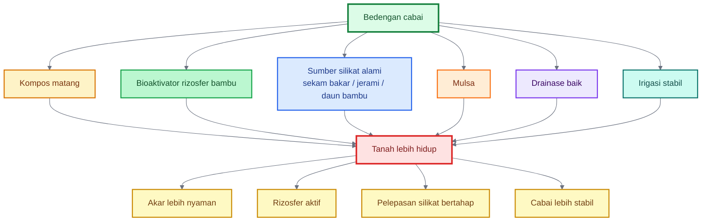

---

# Ringkasan Bab 9–10

Bioaktivator rizosfer bambu paling efektif digunakan sebagai bagian dari sistem budidaya cabai, bukan sebagai input tunggal. Waktu aplikasi terbaik adalah:

- **sebelum tanam** untuk aktivasi kompos dan tanah,
- **saat tanam** dalam bentuk sangat encer,
- **fase vegetatif** untuk menjaga rizosfer,
- **fase generatif** sebagai pendukung akar,
- dan **setelah hujan lebat atau stres** untuk pemulihan tanah setelah drainase diperbaiki.

Agar hasil lebih kuat, bioaktivator harus dipadukan dengan **kompos matang, sumber silikat alami, mulsa, drainase baik, irigasi stabil, dan pengelolaan tanaman sehat**. Inilah yang disebut sistem “lingkungan bambu buatan”.

Kalimat kuncinya:

> **Bioaktivator akan bekerja paling baik jika ia tidak berdiri sendiri, tetapi dimasukkan ke dalam sistem tanah yang memang disiapkan untuk hidup, terlindungi, dan aktif seperti lantai rumpun bambu.**

---

# 11. Kesalahan Umum dan Cara Menghindarinya

Bioaktivator rizosfer bambu kaya silikat bisa menjadi alat yang kuat untuk menghidupkan tanah, tetapi manfaatnya akan turun bahkan bisa menjadi masalah jika digunakan dengan cara yang salah. Kesalahan paling umum biasanya bukan pada idenya, melainkan pada **cara memahami fungsi MOL, kualitas bahan, proses fermentasi, dosis aplikasi, dan kondisi lahan**.

MOL bukan pupuk ajaib. Bioaktivator bukan pengganti drainase. Mikroba bukan pengganti nutrisi. Dan fermentasi bukan pembusukan. Empat kalimat ini perlu dipegang kuat oleh praktisi agar penggunaan bioaktivator tetap aman dan rasional.

---

## 11.1 Menganggap MOL sebagai Pupuk Utama

Kesalahan pertama adalah menganggap MOL sebagai pupuk utama. Ini sering terjadi karena MOL berbentuk cair, sehingga dianggap sama seperti pupuk cair. Padahal, bioaktivator rizosfer bambu lebih tepat diposisikan sebagai **aktivator biologis tanah**, bukan sumber utama NPK.

MOL dapat membantu proses dekomposisi dan mendukung aktivitas mikroba, tetapi tidak menjamin kebutuhan nitrogen, fosfor, kalium, kalsium, magnesium, sulfur, dan mikroelement tanaman terpenuhi. Tanaman cabai tetap membutuhkan program nutrisi yang seimbang sesuai fase pertumbuhan.

Bahan organik dan mikroorganisme memang berperan dalam dekomposisi, siklus hara, struktur tanah, dan kesehatan tanah, tetapi fungsi ini berbeda dari pemberian pupuk dengan kandungan unsur yang terukur. FAO menjelaskan bahwa organisme tanah mendukung kesehatan tanaman melalui dekomposisi bahan organik, siklus nutrisi, struktur tanah, dan pengendalian populasi organisme tanah, bukan sebagai pengganti seluruh kebutuhan hara tanaman. ([FAOHome][1])

### Cara menghindarinya

Gunakan bioaktivator sebagai:

- aktivator kompos,
- pendukung rizosfer,
- pengaya tanah,
- pendukung dekomposisi,
- bagian dari sistem tanah hidup.

Jangan gunakan sebagai satu-satunya sumber nutrisi.

---

## 11.2 Menggunakan Bahan Busuk

Kesalahan kedua adalah memakai bahan yang sudah busuk. Fermentasi dan pembusukan sering dianggap sama, padahal berbeda. Fermentasi yang sehat menghasilkan aroma segar, asam-manis, atau seperti tape. Pembusukan menghasilkan bau got, bangkai, telur busuk, amonia tajam, dan lendir berlebihan.

Bahan busuk dapat membawa mikroba yang tidak diinginkan, menghasilkan senyawa fitotoksik, dan mengganggu akar tanaman. Pada proses ekstrak atau teh kompos, aerasi sering dipakai untuk mendukung aktivitas aerob dan menghindari bau buruk serta senyawa yang dapat bersifat fitotoksik. ([SARE][2])

### Cara menghindarinya

Gunakan bahan yang sehat:

- tanah bambu berbau segar,
- serasah setengah lapuk, bukan busuk,
- kompos matang,
- air cucian beras segar,
- molase/gula merah bersih,
- wadah bersih.

Jika fermentasi sudah berbau busuk tajam, jangan gunakan ke tanaman.

---

## 11.3 Memakai Larutan Terlalu Pekat

Kesalahan ketiga adalah memakai MOL terlalu pekat. Banyak praktisi berpikir semakin pekat semakin bagus. Untuk mikroba dan akar muda, ini tidak selalu benar.

Larutan terlalu pekat bisa membawa kelebihan gula, asam organik, alkohol, garam, atau senyawa hasil fermentasi yang belum stabil. Pada bibit cabai atau tanaman muda, akar masih sensitif. Aplikasi pekat dapat menyebabkan stres akar, layu, atau stagnasi.

### Cara menghindarinya

Gunakan pengenceran.

Rasio aman:

| Tujuan                          | Rasio Aman            |
| ------------------------------- | --------------------- |
| Aktivasi kompos                 | 1:20 sampai 1:30      |
| Kocor tanah sebelum tanam       | 1:20 sampai 1:30      |
| Kocor sekitar akar tanaman muda | 1:30 sampai 1:50      |
| Uji awal tanaman                | 1:50 atau lebih encer |

Gunakan prinsip:

> **Untuk akar muda, lebih baik terlalu encer tetapi aman daripada terlalu pekat dan merusak.**

---

## 11.4 Mencampur dengan Bahan Kimia Keras

Kesalahan keempat adalah mencampur MOL dengan fungisida, bakterisida, klorin kuat, atau larutan berpH ekstrem. Mikroba adalah organisme hidup. Bahan kimia keras dapat menurunkan viabilitasnya.

Jika fungisida atau bakterisida memang diperlukan, aplikasikan secara terpisah. Jangan mencampur dalam satu tangki kecuali produk secara jelas menyatakan kompatibel.

### Cara menghindarinya

- Jangan campur MOL dengan fungisida/bakterisida.
- Jangan gunakan air berbau kaporit kuat.
- Endapkan air PAM sebelum digunakan.
- Hindari pencampuran dengan larutan sangat asam atau sangat basa.
- Beri jeda aplikasi antara bahan kimia keras dan MOL.

Diagram sederhana:

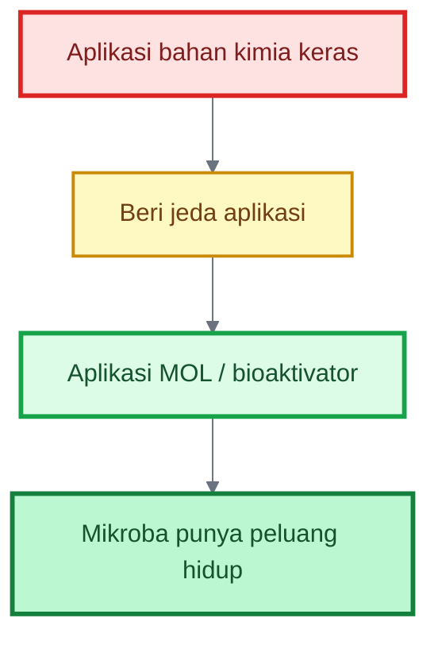

---

## 11.5 Mengabaikan Drainase

Kesalahan kelima adalah memakai MOL pada lahan yang drainasenya buruk. Ini sangat penting untuk cabai. Mikroba baik dan akar cabai sama-sama sulit bekerja pada tanah tergenang. Jika tanah becek, oksigen rendah, akar stres, dan patogen tular air lebih mudah berkembang.

Pada cabai, _Phytophthora blight_ sangat terkait dengan air dan kondisi lahan basah. NC State Extension merekomendasikan penanaman pepper pada lahan berdrainase baik, penggunaan bedengan tinggi, plastik mulsa bila memungkinkan, irigasi moderat melalui drip, dan menghindari irigasi overhead terutama saat buah sudah ada. ([Extension Resource Catalog][3])

### Cara menghindarinya

Sebelum memakai bioaktivator:

- pastikan parit lancar,
- hindari genangan,
- gunakan bedengan tinggi,
- jangan kocor saat tanah masih becek,
- aplikasikan saat tanah lembap tetapi cukup udara.

MOL tidak akan memperbaiki drainase buruk. Drainase harus dibenahi lebih dulu.

---

## 11.6 Terlalu Banyak Abu Sekam

Abu sekam memang menarik karena mengandung silika, tetapi penggunaannya harus wajar. Abu bersifat alkalis. Jika terlalu banyak, pH media atau larutan bisa naik terlalu tinggi dan mengganggu mikroba maupun akar tanaman.

Dalam bioaktivator ini, abu sekam sebaiknya hanya menjadi **pendukung sumber silikat**, bukan bahan dominan. Untuk formula cair, gunakan sedikit. Untuk formula padat, abu lebih aman karena tercampur kompos, dedak, dan bahan organik lain.

### Cara menghindarinya

- Gunakan sekam bakar sebagai pilihan utama.
- Gunakan abu sekam sedikit saja.
- Lakukan uji pH sederhana bila memungkinkan.
- Hindari larutan yang terlalu alkalis.
- Jangan menambahkan abu hanya karena ingin “lebih kaya silika”.

---

## 11.7 Mengambil Starter dari Lokasi Tercemar

Kesalahan ketujuh adalah mengambil starter dari rumpun bambu yang lingkungannya tidak sehat. Starter dari lokasi tercemar dapat membawa mikroba yang tidak diinginkan, residu kimia, logam berat, atau kontaminan lain.

Sumber starter harus sehat. Rumpun bambu dekat tempat sampah, selokan, limbah cair, pestisida berat, kandang kotor, atau tanah anaerob sebaiknya dihindari.

### Cara menghindarinya

Pilih sumber starter dengan ciri:

- rumpun sehat,
- tanah remah,
- serasah alami,
- bau tanah segar,
- tidak tergenang,
- jauh dari limbah,
- tidak berbau got atau bangkai.

## Diagram: Kesalahan umum dan pencegahannya

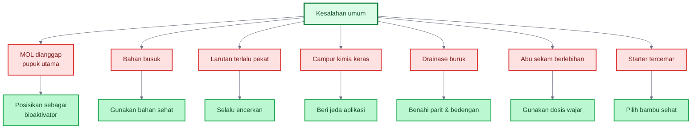

---

# 12. Uji Sederhana Sebelum Aplikasi Luas

Sebelum bioaktivator digunakan pada seluruh lahan, lakukan uji sederhana. Ini sangat penting karena MOL lokal tidak memiliki komposisi mikroba yang sepenuhnya terukur seperti produk hayati komersial.

Uji sederhana tidak memerlukan laboratorium. Praktisi cukup mengamati bau, perubahan pada kompos, respons tanaman kecil, pH, dan mencatat hasilnya. Tujuannya bukan membuktikan secara ilmiah penuh, tetapi mengurangi risiko aplikasi luas.

---

## 12.1 Uji Bau

Uji bau adalah uji paling cepat.

### Interpretasi

| Aroma                     | Keputusan                 |
| ------------------------- | ------------------------- |
| Segar seperti tanah hutan | Lanjut                    |
| Asam-manis ringan         | Lanjut                    |
| Seperti tape              | Lanjut                    |
| Busuk tajam               | Jangan digunakan          |
| Bau got                   | Jangan digunakan          |
| Bau bangkai               | Jangan digunakan          |
| Bau telur busuk           | Jangan digunakan          |
| Amonia menyengat          | Jangan digunakan langsung |

Jika ragu, jangan langsung aplikasikan ke tanaman. Uji dulu pada kompos kecil.

---

## 12.2 Uji Kompos Kecil

Uji ini dilakukan untuk melihat apakah bioaktivator aman dicampur ke bahan organik.

### Cara uji

1. Ambil 1–2 kg kompos matang.
2. Tambahkan sedikit MOL encer atau bioaktivator padat.
3. Aduk merata.
4. Simpan di ember terbuka atau karung kecil.
5. Amati selama 1–2 hari.

### Hasil yang diharapkan

- bau tetap segar,
- tidak muncul bau busuk,
- tidak berlendir,
- tidak panas berlebihan.

Jika kompos menjadi busuk atau sangat menyengat, bioaktivator belum layak digunakan.

---

## 12.3 Uji Tanaman Kecil

Uji tanaman kecil dilakukan sebelum aplikasi luas. Ini penting terutama bila MOL akan dikocor ke tanaman muda.

### Cara uji

1. Pilih 5–10 tanaman pinggir.
2. Gunakan larutan encer, misalnya 1:50.
3. Kocor sedikit di sekitar zona akar.
4. Amati 2–3 hari.

### Tanda aman

- tanaman tidak layu,
- daun tidak menggulung mendadak,
- tanah tidak berbau busuk,
- tidak muncul lendir di sekitar pangkal,
- pertumbuhan tetap normal.

Jika tanaman menunjukkan stres, hentikan aplikasi dan evaluasi bahan.

## 12.3.1 Uji Pancingan Padat Sebelum Produksi Besar

Untuk mengurangi risiko kontaminasi pada produksi skala besar, praktisi dapat melakukan uji pancingan padat. Uji ini dilakukan sebelum sampel rizosfer bambu dimasukkan ke media akhir 20 liter atau bioaktivator padat 10 kg.

Caranya, ambil sedikit sampel rizosfer bambu lalu campurkan ke media padat kecil yang terdiri dari kompos matang, sekam bakar, dedak, dan daun bambu lapuk. Inkubasi 2–4 hari. Jika aromanya segar, tidak busuk, tidak panas ekstrem, dan tidak berlendir, hasil pancingan dapat digunakan sebagai starter untuk media akhir. Jika berbau busuk, sampel ditolak.

Uji ini berfungsi sebagai tahap screening. Dengan cara ini, praktisi tidak langsung memperbanyak sampel yang belum terbukti aman. Ini sangat berguna bila sumber bambu baru pertama kali digunakan.

Checklist uji pancingan:

- Aroma tetap segar
- Tidak bau got
- Tidak bau bangkai
- Tidak berlendir
- Tidak panas ekstrem
- Bahan tetap remah-lembap
- Tidak ada tanda pembusukan anaerob

---

## 12.4 Uji pH Sederhana

Uji pH penting terutama bila formula memakai abu sekam. Abu bisa menaikkan pH. Larutan yang terlalu alkalis dapat mengganggu akar muda dan mikroba tertentu.

### Cara uji

Gunakan kertas lakmus atau pH meter sederhana. Tidak harus sangat presisi, tetapi cukup untuk mengetahui apakah larutan terlalu ekstrem.

### Panduan praktis

- pH mendekati netral sampai agak asam/lemah basa masih lebih aman,
- pH terlalu tinggi perlu diencerkan atau jangan digunakan langsung ke akar muda,
- bila memakai abu sekam, gunakan sedikit dan uji pH bila memungkinkan.

### Catatan

Uji pH bukan satu-satunya indikator. Larutan dengan pH wajar tetapi berbau busuk tetap tidak layak digunakan.

---

## 12.5 Catatan Lapangan

Catatan lapangan sering diabaikan, padahal sangat penting untuk meningkatkan kualitas produksi bioaktivator dari waktu ke waktu.

Catat minimal:

- tanggal pembuatan,
- lokasi sumber starter bambu,
- bahan yang digunakan,
- jumlah bahan,
- lama fermentasi,
- aroma fermentasi,
- rasio pengenceran,
- tanggal aplikasi,
- dosis aplikasi,
- kondisi cuaca,
- respons tanaman.

Dengan catatan ini, praktisi dapat mengetahui formula mana yang berhasil dan mana yang perlu diperbaiki.

## Diagram: Uji sebelum aplikasi luas

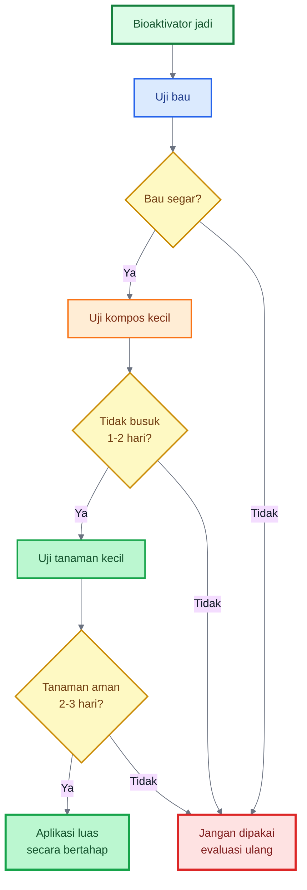

---

# 13. Contoh SOP Produksi dan Aplikasi

Bagian ini adalah inti operasional. SOP dibuat agar praktisi bisa memproduksi dan memakai bioaktivator dengan cara yang konsisten. SOP tidak dimaksudkan sebagai aturan kaku, tetapi sebagai standar kerja awal yang aman.

---

## 13.1 SOP Produksi MOL Cair 20 Liter

### Tujuan

Membuat MOL cair berbasis rizosfer bambu untuk aktivasi kompos, kocor tanah, dan pemeliharaan mikroba rizosfer.

### Bahan

| Bahan                     |                Jumlah |
| ------------------------- | --------------------: |
| Tanah/serasah bambu sehat |          300–500 gram |
| Kompos matang             |                  1 kg |
| Dedak halus               |              500 gram |
| Air cucian beras segar    |               2 liter |
| Molase/gula merah cair    |            200–300 ml |
| Sekam bakar halus         |          200–300 gram |
| Abu sekam matang          | 50–100 gram, opsional |
| Air bersih non-klorin     | sampai total 20 liter |

### Langkah pembuatan

1. Siapkan ember/drum bersih.
2. Masukkan tanah/serasah bambu.
3. Tambahkan kompos matang dan dedak.
4. Tambahkan sekam bakar dan sedikit abu sekam bila digunakan.
5. Larutkan molase/gula merah dalam air.
6. Masukkan air cucian beras.
7. Tambahkan air bersih sampai total ±20 liter.
8. Aduk merata.
9. Tutup longgar, jangan kedap total.
10. Simpan di tempat teduh.
11. Aduk setiap hari.

### Lama fermentasi

Umumnya **5–10 hari**.

### Ciri siap pakai

- bau segar,
- asam-manis ringan,
- seperti tape,
- tidak busuk,
- tidak berlendir berlebihan,
- tidak berbau got.

### Cara simpan

- Simpan teduh.
- Tutup longgar atau beri ventilasi.
- Gunakan lebih cepat lebih baik.
- Jika bau berubah busuk, jangan gunakan.

### Cara aplikasi

| Tujuan             | Pengenceran           |
| ------------------ | --------------------- |
| Aktivasi kompos    | 1:20 sampai 1:30      |
| Kocor pra-tanam    | 1:20 sampai 1:30      |
| Kocor tanaman muda | 1:30 sampai 1:50      |
| Uji awal           | 1:50 atau lebih encer |

---

## 13.2 SOP Produksi Bioaktivator Padat 10 kg

### Tujuan

Membuat bioaktivator padat yang lebih stabil untuk aktivasi kompos, campuran bedengan, dan pengayaan tanah.

### Bahan

| Bahan                     |     Jumlah |
| ------------------------- | ---------: |
| Tanah/serasah bambu sehat |       1 kg |
| Kompos matang             |       5 kg |
| Dedak halus               |       2 kg |
| Sekam bakar               |       2 kg |
| Daun bambu lapuk cincang  |       1 kg |
| Larutan molase 1–2%       | secukupnya |

### Cara mencampur

1. Campur tanah/serasah bambu, kompos matang, dedak, sekam bakar, dan daun bambu lapuk.
2. Aduk sampai merata.
3. Siram larutan molase encer sedikit demi sedikit.
4. Jangan membuat bahan terlalu basah.

### Uji kelembapan

Gunakan uji genggam:

- menggumpal ringan dan tidak menetes = ideal,
- menetes air = terlalu basah,
- hancur seperti debu = terlalu kering.

### Fermentasi

- Tumpuk bahan di tempat teduh.
- Tutup dengan karung/kain berpori.
- Jangan tutup kedap total.
- Balik setiap 1–2 hari.

### Ciri matang/siap pakai

- aroma segar,
- tidak busuk,
- tidak panas ekstrem,
- tekstur remah-lembap,
- tidak berlendir.

### Cara aplikasi

| Tujuan            | Dosis Praktis                                               |
| ----------------- | ----------------------------------------------------------- |
| Aktivasi kompos   | 1–2 kg per 100 kg kompos                                    |
| Campuran bedengan | campur tipis merata dengan kompos                           |
| Pemulihan tanah   | gunakan bersama kompos matang                               |
| Media tanam       | gunakan terbatas dan tidak menempel langsung pada akar muda |

## 13.2.1 SOP Opsional: Pancingan Padat Ekologis

SOP ini digunakan bila praktisi ingin menurunkan risiko kontaminasi dan membuat starter lebih terarah sebelum masuk ke media akhir.

### Tujuan

- Menyaring starter bambu sebelum diperbanyak.
- Mengurangi risiko memperbesar sampel buruk.
- Mengarahkan komunitas mikroba ke bahan organik dan sumber silikat.
- Menjaga pendekatan komunitas tanpa harus memakai kultur steril laboratorium.

### Bahan

| Bahan                    |     Jumlah |
| ------------------------ | ---------: |
| Kompos matang            |   5 bagian |
| Sekam bakar              |   2 bagian |
| Dedak halus              |   1 bagian |
| Daun bambu lapuk cincang |   1 bagian |
| Starter rizosfer bambu   |    sedikit |
| Larutan molase 1%        | secukupnya |

### Langkah kerja

1. Campur kompos matang, sekam bakar, dedak, dan daun bambu lapuk.
2. Tambahkan sedikit starter rizosfer bambu.
3. Basahi dengan larutan molase 1% sampai lembap.
4. Lakukan uji genggam.
5. Tutup dengan karung atau kain berpori.
6. Inkubasi 2–4 hari di tempat teduh.
7. Balik atau aduk ringan setiap hari.
8. Amati aroma, suhu, lendir, dan tekstur.
9. Jika hasil baik, gunakan sebagai starter ke media akhir cair atau padat.
10. Jika busuk, tolak dan cari sumber bambu lain.

### Ciri hasil pancingan layak

- Aroma tanah hutan, asam-manis ringan, atau segar.
- Tidak busuk.
- Tidak berlendir.
- Tidak panas ekstrem.
- Tekstur remah-lembap.
- Tidak ada bau got atau amonia tajam.

### Ciri hasil pancingan ditolak

- Bau bangkai.
- Bau got.
- Bau telur busuk.
- Bau amonia tajam.
- Lendir berlebihan.
- Terlalu panas.
- Terlalu basah dan anaerob.

---

## 13.3 SOP Aktivasi Kompos

Aktivasi kompos adalah penggunaan terbaik untuk bioaktivator. Kompos menjadi rumah bagi mikroba sebelum masuk ke tanah.

### Bahan

- Kompos matang: 100 kg
- MOL cair atau bioaktivator padat
- Air bersih bila perlu

### Cara menggunakan MOL cair

1. Encerkan MOL dengan rasio 1:20 sampai 1:30.
2. Siram merata ke kompos matang.
3. Aduk kompos sampai lembap merata.
4. Tutup dengan karung/kain.
5. Diamkan 5–7 hari.
6. Jika bau tetap segar, kompos siap digunakan.

### Cara menggunakan bioaktivator padat

1. Campurkan 1–2 kg bioaktivator padat ke 100 kg kompos matang.
2. Aduk merata.
3. Jaga kelembapan.
4. Tutup berpori.
5. Diamkan 5–7 hari.

### Ciri kompos aktif yang baik

- bau segar,
- tidak panas berlebihan,
- tidak busuk,
- lembap tetapi tidak becek,
- tekstur tetap remah.

Bahan organik memengaruhi struktur tanah, porositas, infiltrasi air, kapasitas menahan air, aktivitas biologis, dan ketersediaan hara; karena itu aktivasi kompos dengan mikroba harus tetap menjaga kompos dalam kondisi sehat, bukan busuk. ([FAOHome][4])

---

## 13.4 SOP Aplikasi Cabai

### A. Pra-tanam

Tujuan: membangun tanah sebelum bibit masuk.

Langkah:

1. Siapkan bedengan tinggi.
2. Pastikan parit lancar.
3. Masukkan kompos matang yang sudah diaktivasi.
4. Tambahkan sekam bakar atau sumber silikat alami.
5. Pasang mulsa.
6. Diamkan lahan 1–2 minggu bila memungkinkan.

### B. Saat tanam

Tujuan: membantu kolonisasi awal rizosfer.

Langkah:

1. Gunakan MOL cair sangat encer, 1:30 sampai 1:50.
2. Kocor ringan sekitar lubang tanam.
3. Jangan membuat lubang tanam becek.
4. Jangan gunakan larutan pekat ke akar muda.

### C. Fase vegetatif

Tujuan: menjaga tanah hidup saat akar dan tajuk berkembang.

Langkah:

1. Kocor MOL encer 2–4 minggu sekali.
2. Aplikasikan pagi/sore.
3. Tanah harus lembap.
4. Tambahkan kompos matang ringan bila perlu.
5. Tetap jaga nutrisi seimbang.

### D. Fase generatif

Tujuan: menjaga akar tetap aktif selama bunga dan buah.

Langkah:

1. Gunakan MOL sebagai pendukung rizosfer.
2. Jangan posisikan sebagai pupuk buah utama.
3. Hindari aplikasi dekat fungisida keras.
4. Beri jeda dengan aplikasi kimia.
5. Tetap jaga K, Ca, Mg, dan nutrisi generatif.

### E. Setelah hujan lebat atau stres

Tujuan: membantu pemulihan tanah.

Langkah:

1. Pastikan air tidak menggenang.
2. Benahi parit lebih dulu.
3. Setelah tanah mulai stabil, kocor MOL encer.
4. Tambahkan kompos matang jika tanah terlihat lemah.
5. Jangan aplikasi saat tanah masih anaerob atau becek.

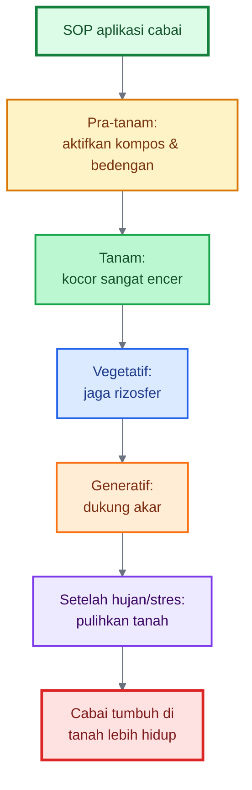

---

# Ringkasan Bab 11–13

Kesalahan utama dalam penggunaan bioaktivator rizosfer bambu adalah menganggap MOL sebagai pupuk utama, memakai bahan busuk, menggunakan larutan terlalu pekat, mencampur dengan bahan kimia keras, mengabaikan drainase, memakai abu sekam berlebihan, dan mengambil starter dari lokasi tercemar.

Sebelum aplikasi luas, lakukan uji sederhana: uji bau, uji kompos kecil, uji tanaman kecil, uji pH, dan catatan lapangan. Pendekatan ini membuat penggunaan bioaktivator lebih aman dan terukur.

SOP utama terdiri dari empat bagian: produksi MOL cair 20 liter, produksi bioaktivator padat 10 kg, aktivasi kompos, dan aplikasi pada cabai dari pra-tanam sampai fase pemulihan setelah hujan atau stres.

Kalimat kunci:

> **Bioaktivator yang baik bukan hanya dibuat dengan formula yang benar, tetapi juga diuji, diencerkan, dicatat, dan diaplikasikan pada tanah yang siap menerima kehidupan mikroba.**

[1]: https://www.fao.org/4/a0100e/a0100e05.htm?utm_source=chatgpt.com '2. Organic matter decomposition and the soil food web'
[2]: https://www.sare.org/wp-content/uploads/Compost-Tea-Manual.pdf?utm_source=chatgpt.com 'Tea Time'
[3]: https://content.ces.ncsu.edu/phytophthora-blight-of-peppers?utm_source=chatgpt.com 'Phytophthora Blight of Peppers'
[4]: https://www.fao.org/4/a0100e/a0100e.pdf?utm_source=chatgpt.com 'The importance of soil organic matter'

---

# 14. Checklist Lapangan

Checklist lapangan berfungsi sebagai alat kontrol sederhana agar pembuatan dan penggunaan **Bioaktivator Rizosfer Bambu Kaya Silikat** tetap aman, konsisten, dan mudah dievaluasi. Praktisi tidak perlu menghafal semua teori, tetapi cukup memastikan bahwa sumber, bahan, fermentasi, dan aplikasi sudah memenuhi syarat dasar.

Checklist ini dapat digunakan sebelum mengambil starter, saat menyiapkan bahan, selama proses fermentasi, dan sebelum aplikasi ke lahan.

---

## 14.1 Checklist Sumber Bambu

Sumber bambu menentukan kualitas awal bioaktivator. Pilih rumpun yang sehat dan hindari lokasi yang berisiko tercemar.

| Checklist Sumber Bambu                      | Status |
| ------------------------------------------- | ------ |
| Rumpun bambu sehat dan tidak dominan busuk  | ☐      |
| Daun bambu hijau normal                     | ☐      |
| Tanah di bawah rumpun remah                 | ☐      |
| Ada serasah daun setengah lapuk             | ☐      |
| Bau tanah segar seperti tanah hutan         | ☐      |
| Tidak berbau got, bangkai, atau telur busuk | ☐      |
| Tidak berlendir atau terlalu becek          | ☐      |
| Tidak tergenang                             | ☐      |
| Tidak dekat tempat sampah                   | ☐      |
| Tidak dekat limbah cair atau selokan kotor  | ☐      |
| Tidak dekat kandang yang kotor dan basah    | ☐      |
| Tidak dari lokasi dengan pestisida berat    | ☐      |

Prinsipnya:

> **Starter yang sehat berasal dari lingkungan yang sehat. Jangan memperbanyak mikroba dari sumber yang sudah bermasalah.**

---

## 14.2 Checklist Bahan

Bahan yang dipakai harus bersih, matang, dan tidak busuk. Bioaktivator yang baik tidak dibuat dari bahan sembarangan.

| Checklist Bahan                                      | Status |
| ---------------------------------------------------- | ------ |
| Tanah/serasah bambu sehat tersedia                   | ☐      |
| Kompos matang tersedia                               | ☐      |
| Dedak halus tersedia                                 | ☐      |
| Molase atau gula merah cair tersedia                 | ☐      |
| Air cucian beras masih segar                         | ☐      |
| Air bersih non-klorin tersedia                       | ☐      |
| Sekam bakar tersedia                                 | ☐      |
| Abu sekam digunakan sedikit dan wajar                | ☐      |
| Daun bambu lapuk tersedia bila membuat formula padat | ☐      |
| Wadah bersih dan bukan bekas bahan kimia             | ☐      |
| Pengaduk bersih                                      | ☐      |
| Penutup kain/karung berpori tersedia                 | ☐      |

Bahan yang harus ditolak:

| Bahan Berisiko             | Keputusan                 |
| -------------------------- | ------------------------- |
| Pupuk kandang mentah       | Jangan digunakan langsung |
| Sampah dapur busuk         | Hindari                   |
| Bangkai                    | Jangan digunakan          |
| Limbah cair                | Jangan digunakan          |
| Air berbau kaporit kuat    | Endapkan atau ganti       |
| Tanah dari lokasi tercemar | Jangan digunakan          |
| Abu sekam berlebihan       | Kurangi                   |

---

## 14.3 Checklist Fermentasi

Fermentasi yang benar menghasilkan bahan yang segar dan aktif, bukan busuk. Selama fermentasi, lakukan pengecekan bau, suhu, kelembapan, dan kondisi bahan.

| Checklist Fermentasi                       | Status |
| ------------------------------------------ | ------ |
| Wadah tidak ditutup kedap total            | ☐      |
| Fermentasi disimpan di tempat teduh        | ☐      |
| MOL cair diaduk setiap hari                | ☐      |
| Bioaktivator padat dibalik setiap 1–2 hari | ☐      |
| Bahan lembap tetapi tidak becek            | ☐      |
| Aroma asam-manis, tape, atau tanah hutan   | ☐      |
| Tidak berbau bangkai                       | ☐      |
| Tidak berbau got                           | ☐      |
| Tidak berbau telur busuk                   | ☐      |
| Tidak berbau amonia tajam                  | ☐      |
| Tidak berlendir busuk                      | ☐      |
| Tidak panas ekstrem                        | ☐      |
| Tidak ada kontaminasi bahan asing          | ☐      |

Jika fermentasi gagal, jangan dipaksakan. Lebih baik membuat ulang daripada merusak tanaman dan tanah.

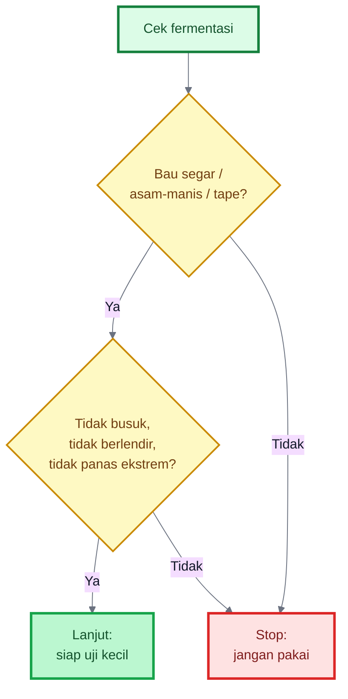

---

## 14.4 Checklist Aplikasi

Aplikasi harus dilakukan pada kondisi yang mendukung mikroba. Jangan aplikasikan bioaktivator pekat ke akar muda, jangan aplikasikan saat tanah becek, dan jangan dicampur dengan bahan kimia keras.

| Checklist Aplikasi                        | Status |
| ----------------------------------------- | ------ |
| MOL sudah diencerkan                      | ☐      |
| Larutan tidak berbau busuk                | ☐      |
| Tanah dalam kondisi lembap                | ☐      |
| Tanah tidak tergenang                     | ☐      |
| Aplikasi dilakukan pagi atau sore         | ☐      |
| Tidak dicampur fungisida keras            | ☐      |
| Tidak dicampur bakterisida                | ☐      |
| Tidak memakai air berkaporit kuat         | ☐      |
| Tidak diaplikasikan pekat ke akar muda    | ☐      |
| Uji kecil dilakukan sebelum aplikasi luas | ☐      |
| Dosis dan tanggal aplikasi dicatat        | ☐      |
| Respons tanaman diamati 2–3 hari          | ☐      |

Rasio aman yang bisa dipakai sebagai acuan:

| Tujuan                | Rasio Pengenceran     |
| --------------------- | --------------------- |
| Aktivasi kompos       | 1:20 sampai 1:30      |
| Kocor tanah pra-tanam | 1:20 sampai 1:30      |
| Kocor tanaman muda    | 1:30 sampai 1:50      |
| Uji awal tanaman      | 1:50 atau lebih encer |

Prinsip aplikasi:

> **Mikroba bekerja baik pada tanah yang lembap, cukup udara, punya bahan organik, dan tidak sedang tertekan bahan kimia keras.**

---

## Diagram Ringkas Checklist Lapangan

```mermaid
%%{init: {"theme":"base","themeVariables":{
"fontFamily":"Arial",
"primaryTextColor":"#111827",
"lineColor":"#6b7280"
}}}%%
flowchart TD
    A["Checklist lapangan"]:::main
    B["1. Sumber bambu<br/>sehat"]:::green
    C["2. Bahan<br/>bersih & matang"]:::blue
    D["3. Fermentasi<br/>tidak busuk"]:::orange
    E["4. Uji kecil<br/>lebih dulu"]:::purple
    F["5. Aplikasi<br/>encer & aman"]:::brown
    G["Bioaktivator layak<br/>dipakai di lahan"]:::result

    A --> B --> C --> D --> E --> F --> G

    classDef main fill:#dcfce7,stroke:#15803d,stroke-width:3px,color:#14532d;
    classDef green fill:#bbf7d0,stroke:#16a34a,stroke-width:2px,color:#14532d;
    classDef blue fill:#dbeafe,stroke:#2563eb,stroke-width:2px,color:#1e3a8a;
    classDef orange fill:#ffedd5,stroke:#f97316,stroke-width:2px,color:#7c2d12;
    classDef purple fill:#ede9fe,stroke:#7c3aed,stroke-width:2px,color:#3b0764;
    classDef brown fill:#fef3c7,stroke:#d97706,stroke-width:2px,color:#78350f;
    classDef result fill:#fee2e2,stroke:#dc2626,stroke-width:3px,color:#7f1d1d;
```

---

# 15. Penutup: Membiakkan Ekosistem, Bukan Sekadar Membuat MOL

Bioaktivator Rizosfer Bambu Kaya Silikat lahir dari cara pandang bahwa tanah bukan benda mati. Tanah adalah sistem hidup. Di dalamnya ada akar, mikroba, bahan organik, air, udara, mineral, dan proses biologis yang terus bergerak. Jika sistem ini aktif, tanaman lebih mudah tumbuh sehat. Jika sistem ini rusak, pupuk sebanyak apa pun sering tidak mampu memberi hasil optimal.

Rumpun bambu memberi contoh yang menarik. Di bawah rumpun bambu, tanah tidak dibiarkan telanjang. Ada serasah yang melindungi permukaan. Ada akar dan rimpang yang aktif. Ada bahan organik yang terus terurai. Ada kelembapan yang lebih stabil. Ada mikroba yang bekerja. Ada siklus silika yang berjalan antara tanah, akar, batang, daun, serasah, dan kembali lagi ke tanah.

Inilah yang ingin ditiru.

---

## 15.1 Ringkasan Gagasan

Bioaktivator rizosfer bambu bukan dibuat hanya karena bambu terlihat kuat. Ia dibuat karena rumpun bambu mewakili sebuah model ekosistem mikro yang aktif.

Gagasan besarnya adalah:

- rumpun bambu memiliki lingkungan tanah yang hidup,
- lingkungan itu dapat dijadikan sumber mikroba lokal,
- mikroba tersebut dapat dibiakkan dengan bahan organik,
- prosesnya dapat diarahkan dengan sumber silikat alami,
- hasilnya dapat digunakan untuk mengaktifkan kompos dan tanah budidaya.

Fokus bioaktivator ini bukan NPK tinggi. Fokusnya adalah:

- mikroba,
- bahan organik,
- silikat,
- rizosfer,
- tanah hidup,
- dan stabilitas lingkungan akar.

Dengan demikian, bioaktivator ini lebih tepat disebut sebagai **alat biologis untuk membangun tanah**, bukan pupuk cair utama.

---

## 15.2 Pesan Utama

Pesan utama dari seluruh artikel ini adalah:

> **MOL bambu bukan pupuk cair utama. Bioaktivator ini adalah alat untuk membangun proses biologis tanah.**

Karena itu, penggunaannya harus selalu dipadukan dengan sistem budidaya yang benar. Hasil terbaik muncul bila bioaktivator digunakan bersama:

- kompos matang,
- mulsa,
- drainase baik,
- irigasi stabil,
- sumber silikat alami,
- nutrisi seimbang,
- dan tanaman sehat.

Jika hanya membuat MOL lalu dikocor sembarangan, hasilnya tidak akan konsisten. Jika MOL dibuat dari bahan busuk, sumber tercemar, atau diaplikasikan terlalu pekat, justru bisa menimbulkan masalah. Jika drainase buruk, mikroba baik sulit bekerja. Jika nutrisi tidak seimbang, tanaman tetap lemah meskipun tanah diberi bioaktivator.

Jadi, kunci keberhasilan bukan hanya di formula, tetapi pada **sistem**.

## Diagram: Membiakkan ekosistem, bukan sekadar MOL

```mermaid
%%{init: {"theme":"base","themeVariables":{
"fontFamily":"Arial",
"primaryTextColor":"#111827",
"lineColor":"#6b7280"
}}}%%
flowchart TD
    A["Bukan sekadar<br/>membuat MOL"]:::bad
    B["Membiakkan ulang<br/>mikro-ekosistem bambu"]:::main

    B --> C["Starter bambu<br/>sehat"]:::green
    B --> D["Kompos matang<br/>sebagai rumah mikroba"]:::brown
    B --> E["Sumber silikat<br/>alami"]:::blue
    B --> F["Mulsa<br/>pelindung tanah"]:::orange
    B --> G["Drainase & air<br/>stabil"]:::purple
    B --> H["Nutrisi<br/>seimbang"]:::teal

    C --> I["Tanah lebih hidup"]:::result
    D --> I
    E --> I
    F --> I
    G --> I
    H --> I

    I --> J["Akar nyaman,<br/>rizosfer aktif,<br/>tanaman lebih kokoh"]:::final

    classDef bad fill:#fee2e2,stroke:#dc2626,stroke-width:2px,color:#7f1d1d;
    classDef main fill:#dcfce7,stroke:#15803d,stroke-width:3px,color:#14532d;
    classDef green fill:#bbf7d0,stroke:#16a34a,stroke-width:2px,color:#14532d;
    classDef brown fill:#fef3c7,stroke:#d97706,stroke-width:2px,color:#78350f;
    classDef blue fill:#dbeafe,stroke:#2563eb,stroke-width:2px,color:#1e3a8a;
    classDef orange fill:#ffedd5,stroke:#f97316,stroke-width:2px,color:#7c2d12;
    classDef purple fill:#ede9fe,stroke:#7c3aed,stroke-width:2px,color:#3b0764;
    classDef teal fill:#ccfbf1,stroke:#0f766e,stroke-width:2px,color:#134e4a;
    classDef result fill:#fef9c3,stroke:#ca8a04,stroke-width:3px,color:#713f12;
    classDef final fill:#fecaca,stroke:#dc2626,stroke-width:3px,color:#7f1d1d;
```

## 15.2.1 Batas antara Praktik Lapangan dan Pendekatan Semi-Lab

Bioaktivator rizosfer bambu kaya silikat dapat dibuat dengan pendekatan lapangan maupun pendekatan semi-lab. Pendekatan lapangan memakai prinsip komunitas mikroba: sumber bambu sehat, bahan matang, fermentasi terkendali, uji bau, uji kompos, dan uji tanaman. Pendekatan ini cocok untuk petani dan praktisi karena sederhana dan aplikatif.

Pendekatan semi-lab digunakan bila tujuan sudah bergeser ke seleksi mikroba tertentu, misalnya mencari isolat pelarut silikat. Pada pendekatan ini, media harus lebih steril, koloni harus diuji berdasarkan fungsi, dan hasilnya tidak cukup dinilai dari warna koloni. Warna koloni hanya menunjukkan perbedaan morfologi awal, bukan bukti kemampuan melarutkan silikat.

Karena itu, artikel ini menempatkan bioaktivator bambu sebagai teknologi lapangan berbasis komunitas mikroba. Jika ingin naik ke level seleksi strain, diperlukan uji fungsi yang lebih terukur.

---

## 15.3 Kalimat Penutup

**Bioaktivator Rizosfer Bambu Kaya Silikat bukan sekadar MOL dari bambu, tetapi upaya membiakkan ulang mikro-ekosistem rumpun bambu agar tanah budidaya lebih hidup, lebih aktif, dan lebih siap membentuk tanaman yang kokoh.**

Dalam bahasa yang lebih praktis:

> **Yang kita tiru dari bambu bukan hanya silikanya, tetapi sistemnya: serasah yang melindungi tanah, akar yang aktif, mikroba yang bekerja, bahan organik yang terus terurai, dan lingkungan akar yang stabil.**

Jika prinsip ini diterapkan dengan benar, bioaktivator bambu menjadi bagian dari strategi budidaya yang lebih sehat: tanah tidak hanya dipupuk, tetapi **dihidupkan**; tanaman tidak hanya dibesarkan, tetapi **dikuatkan**; dan lahan tidak hanya dipanen, tetapi **dipulihkan untuk siklus berikutnya**.

---

# Finalisasi Artikel

## **Bioaktivator Rizosfer Bambu Kaya Silikat**

Artikel ini selesai sebagai panduan praktis untuk membuat dan menggunakan **MOL berbasis rizosfer bambu**, bukan POC. Fokusnya adalah membiakkan mikroba lokal dari lingkungan rumpun bambu sehat, lalu memadukannya dengan kompos matang, bahan organik, dan sumber silikat alami agar tanah lebih hidup. Pendekatan ini selaras dengan konsep tanah sehat: bahan organik memengaruhi struktur, porositas, infiltrasi air, kapasitas memegang air, aktivitas organisme tanah, dan ketersediaan hara. ([FAOHome][1])

Rumpun bambu dipilih karena merupakan ekosistem mikro yang aktif: ada serasah, akar-rimpang, bahan organik, kelembapan relatif stabil, serta mikroba rizosfer. Kajian tentang mikroba pada ekosistem bambu menunjukkan bahwa tanaman merekrut mikroorganisme tanah melalui eksudat akar, sehingga komunitas rizosfer dapat berbeda antar tanaman dan berhubungan dengan fungsi ekosistem bambu. ([Frontiers][2])

---

# 1. Ringkasan Inti Artikel

**Bioaktivator Rizosfer Bambu Kaya Silikat** adalah MOL tanah yang dibuat dari:

- tanah remah bawah rumpun bambu sehat,
- serasah bambu setengah lapuk,
- kompos matang,
- dedak,
- molase atau gula merah,
- air non-klorin,
- sumber silikat alami seperti sekam bakar, daun bambu lapuk, jerami lapuk, atau sedikit abu sekam matang.

Fungsinya bukan sebagai pupuk utama, tetapi sebagai:

- aktivator kompos,
- pengaya mikroba tanah,
- pendukung dekomposisi bahan organik,
- pendukung rizosfer,
- pembantu pelepasan hara biologis,
- pendukung pelarutan silikat secara bertahap.

Bakteri pelarut silikat diketahui dapat meningkatkan ketersediaan silikon di tanah, tetapi efek bioaktivator bambu tetap harus diposisikan bertahap, bukan sebagai pengganti silika larut instan. ([ScienceDirect][3])

---

# 2. Tabel Dosis Praktis

## 2.1 Produksi MOL Cair 20 Liter

| Bahan                     |        Jumlah Praktis |
| ------------------------- | --------------------: |
| Tanah/serasah bambu sehat |          300–500 gram |
| Kompos matang             |                  1 kg |
| Dedak halus               |              500 gram |
| Air cucian beras segar    |               2 liter |
| Molase/gula merah cair    |            200–300 ml |
| Sekam bakar halus         |          200–300 gram |
| Abu sekam matang          | 50–100 gram, opsional |
| Air bersih non-klorin     | sampai total 20 liter |

## 2.2 Produksi Bioaktivator Padat ±10 kg

| Bahan                     | Jumlah Praktis |
| ------------------------- | -------------: |
| Tanah/serasah bambu sehat |           1 kg |
| Kompos matang             |           5 kg |
| Dedak halus               |           2 kg |
| Sekam bakar               |           2 kg |
| Daun bambu lapuk cincang  |           1 kg |
| Larutan molase 1–2%       |     secukupnya |

## 2.3 Dosis Aktivasi Kompos

| Bahan              |                         Dosis |
| ------------------ | ----------------------------: |
| Kompos matang      |                        100 kg |
| Bioaktivator padat |                        1–2 kg |
| MOL cair           | 1 liter MOL + 20–30 liter air |

## 2.4 Rasio Pengenceran MOL

| Tujuan                        | Rasio Aman            |
| ----------------------------- | --------------------- |
| Aktivasi kompos               | 1:20 sampai 1:30      |
| Kocor tanah pra-tanam         | 1:20 sampai 1:30      |
| Kocor tanaman muda            | 1:30 sampai 1:50      |
| Uji awal tanaman              | 1:50 atau lebih encer |
| Pemulihan setelah hujan/stres | 1:30 sampai 1:50      |

## 2.5 Rumus Pengenceran Aman untuk MDX

$$
V_{\text{stok}} =
\frac{V_{\text{akhir}}}{R + 1}
$$

Keterangan:

- `V_stok` = volume MOL stok
- `V_akhir` = total larutan akhir
- `R` = jumlah bagian air dalam rasio pengenceran

Contoh:

$$
V_{\text{stok}} =
\frac{31}{30 + 1}
= 1\ \text{liter}
$$

Artinya, untuk membuat **31 liter larutan 1:30**, gunakan **1 liter MOL stok + 30 liter air**.

---

# 3. Troubleshooting Lapangan

| Masalah                          | Kemungkinan Penyebab                                                    | Solusi                                                                                |
| -------------------------------- | ----------------------------------------------------------------------- | ------------------------------------------------------------------------------------- |
| MOL berbau busuk                 | Bahan awal busuk, wadah terlalu kedap, terlalu basah, kurang diaduk     | Jangan gunakan ke tanaman. Buat ulang atau gunakan ke lubang kompos jauh dari tanaman |
| Bau amonia tajam                 | Terlalu banyak bahan nitrogen, terlalu panas, fermentasi tidak seimbang | Tambah bahan karbon seperti kompos matang/sekam bakar, aduk, aerasi                   |
| MOL berlendir berlebihan         | Kondisi anaerob, bahan terlalu basah                                    | Jangan aplikasi ke akar. Perbaiki aerasi atau buang                                   |
| Bioaktivator padat terlalu panas | Tumpukan terlalu padat, terlalu banyak dedak/gula, kurang dibalik       | Balik bahan, tipiskan tumpukan, tambah sekam/kompos matang                            |
| Tanaman layu setelah aplikasi    | Larutan terlalu pekat, tanah becek, MOL gagal                           | Hentikan aplikasi, siram air bersih secukupnya, perbaiki drainase                     |
| Tanah berbau setelah kocor       | Aplikasi saat tanah anaerob atau MOL busuk                              | Benahi drainase, hentikan MOL, tambahkan kompos matang                                |
| pH terlalu tinggi                | Abu sekam terlalu banyak                                                | Kurangi abu, gunakan sekam bakar, uji pH sebelum aplikasi                             |
| Fermentasi tidak aktif           | Starter lemah, kurang makanan, suhu terlalu rendah                      | Tambahkan sedikit molase/dedak, gunakan starter bambu lebih segar                     |
| Hasil tidak terlihat             | MOL dipakai sendirian tanpa kompos, mulsa, drainase, dan nutrisi        | Integrasikan dengan sistem “lingkungan bambu buatan”                                  |
| Penyakit akar tetap tinggi       | Drainase buruk, tanah tergenang, patogen tinggi                         | Prioritaskan bedengan tinggi, parit lancar, sanitasi, dan agen hayati terarah         |

Pada cabai, drainase tetap menjadi syarat utama. _Phytophthora blight_ pada pepper sangat berkaitan dengan kondisi basah, dan pengelolaannya menekankan lahan berdrainase baik, bedengan, mulsa, dan irigasi terkendali. ([Extension Resource Catalog][4])

---

# 4. Checklist Final Lapangan

## 4.1 Sebelum Membuat MOL

| Checklist                               | Status |
| --------------------------------------- | ------ |
| Rumpun bambu sehat                      | ☐      |
| Tanah remah dan bau segar               | ☐      |
| Tidak dekat sampah/limbah/kandang kotor | ☐      |
| Tidak tergenang atau anaerob            | ☐      |
| Serasah setengah lapuk tersedia         | ☐      |
| Kompos matang tersedia                  | ☐      |
| Wadah bersih tersedia                   | ☐      |
| Air non-klorin tersedia                 | ☐      |

## 4.2 Saat Fermentasi

| Checklist                                  | Status |
| ------------------------------------------ | ------ |
| Tutup tidak kedap total                    | ☐      |
| MOL cair diaduk harian                     | ☐      |
| Bioaktivator padat dibalik 1–2 hari sekali | ☐      |
| Aroma segar/asam-manis/tape                | ☐      |
| Tidak bau got/bangkai/telur busuk          | ☐      |
| Tidak berlendir busuk                      | ☐      |
| Tidak panas ekstrem                        | ☐      |

## 4.3 Sebelum Aplikasi

| Checklist                            | Status |
| ------------------------------------ | ------ |
| MOL diencerkan                       | ☐      |
| Uji bau lolos                        | ☐      |
| Uji kompos kecil lolos               | ☐      |
| Uji tanaman kecil lolos              | ☐      |
| Tanah lembap, bukan becek            | ☐      |
| Aplikasi pagi/sore                   | ☐      |
| Tidak dicampur fungisida/bakterisida | ☐      |
| Dosis dan respons tanaman dicatat    | ☐      |

---

# 5. Referensi Utama

1. **FAO — The importance of soil organic matter**
   Menjelaskan peran bahan organik terhadap struktur tanah, porositas, infiltrasi air, kapasitas memegang air, aktivitas organisme tanah, dan ketersediaan hara. ([FAOHome][1])

2. **FAO — Soil organisms**
   Menjelaskan peran bakteri dalam menghasilkan polisakarida yang membantu agregasi tanah, infiltrasi air, dan kapasitas memegang air. ([FAOHome][5])

3. **Frontiers in Microbiology — Microbial diversity and function in bamboo ecosystems**
   Menjadi rujukan tentang mikroba pada ekosistem bambu, rizosfer, eksudat akar, dan fungsi mikroba dalam ekosistem bambu. ([Frontiers][2])

4. **Review of silicate-solubilizing bacteria**
   Menjelaskan bahwa bakteri pelarut silikat dapat meningkatkan ketersediaan silikon di tanah dan mendukung proses siklus Si. ([ScienceDirect][3])

5. **Silicate-solubilizing and plant-growth-promoting bacteria**
   Menjelaskan bahwa silikon tanah sering hanya tersedia terbatas, dan bakteri pelarut silikat dapat membantu meningkatkan ketersediaan silikat larut. ([Frontiers][6])

6. **NC State Extension — Phytophthora Blight of Peppers**
   Rujukan praktis untuk pentingnya drainase, bedengan, mulsa, dan pengelolaan air pada cabai/pepper. ([Extension Resource Catalog][4])

---

[1]: https://www.fao.org/4/a0100e/a0100e.pdf?utm_source=chatgpt.com 'The importance of soil organic matter'
[2]: https://www.frontiersin.org/journals/microbiology/articles/10.3389/fmicb.2025.1533061/full?utm_source=chatgpt.com 'Microbial diversity and function in bamboo ecosystems'
[3]: https://www.sciencedirect.com/science/article/abs/pii/S2452219823000885?utm_source=chatgpt.com 'A review of the role of silicate-solubilizing bacteria'
[4]: https://content.ces.ncsu.edu/phytophthora-blight-of-peppers?utm_source=chatgpt.com 'Phytophthora Blight of Peppers'
[5]: https://www.fao.org/4/a0100e/a0100e0d.htm?utm_source=chatgpt.com 'Annex 1. Soil organisms'
[6]: https://www.frontiersin.org/journals/microbiology/articles/10.3389/fmicb.2023.1168415/full?utm_source=chatgpt.com 'Silicate solubilizing and plant growth promoting bacteria ...'

7. Review tentang compost tea dan faktor yang memengaruhi kualitasnya. Kualitas compost tea dipengaruhi bahan baku, waktu fermentasi, aerasi, sumber air, dan tambahan nutrisi.

8. Literatur tentang great plate count anomaly. Tidak semua mikroba lingkungan dapat tumbuh pada media kultur biasa, sehingga seleksi koloni tidak mewakili seluruh komunitas mikroba tanah.

9. Review tentang silicate-solubilizing bacteria. Mikroba pelarut silikat dapat membantu meningkatkan ketersediaan silikon tanah, tetapi penggunaannya tetap perlu uji fungsi dan uji tanaman.

---

<small>
  **_Catatan Penyusunan_** Artikel ini disusun sebagai materi edukasi dan
  referensi umum berdasarkan berbagai sumber pustaka, praktik lapangan, serta
  bantuan alat penulisan. Pembaca disarankan untuk melakukan verifikasi lanjutan
  dan penyesuaian sesuai dengan kondisi serta kebutuhan masing-masing sistem.
</small>
