# **_Menanam Cabai dengan Prinsip Pohon Bambu: Akar Kuat, Tanah Hidup, Tanaman Tahan Stres_**

---

- [**_Menanam Cabai dengan Prinsip Pohon Bambu: Akar Kuat, Tanah Hidup, Tanaman Tahan Stres_**](#menanam-cabai-dengan-prinsip-pohon-bambu-akar-kuat-tanah-hidup-tanaman-tahan-stres)
- [1. Pendahuluan: Cabai Kuat Tidak Dibangun dari Pupuk Saja](#1-pendahuluan-cabai-kuat-tidak-dibangun-dari-pupuk-saja)
  - [1.1 Masalah Umum Budidaya Cabai](#11-masalah-umum-budidaya-cabai)
  - [1.2 Gagasan Utama](#12-gagasan-utama)
- [2. Kelebihan Rumpun Bambu sebagai Model Alami](#2-kelebihan-rumpun-bambu-sebagai-model-alami)
  - [2.1 Tahan terhadap Cekaman Air](#21-tahan-terhadap-cekaman-air)
  - [2.2 Jarang Sakit karena Pertahanan Berlapis](#22-jarang-sakit-karena-pertahanan-berlapis)
  - [2.3 Cepat Pulih Setelah Rusak](#23-cepat-pulih-setelah-rusak)
  - [2.4 Menciptakan Lingkungan Mikro Sendiri](#24-menciptakan-lingkungan-mikro-sendiri)
  - [2.5 Rumpun Bambu sebagai “Bank Mikroba Lokal”](#25-rumpun-bambu-sebagai-bank-mikroba-lokal)
- [3. Mencontoh Rumpun Bambu dalam Budidaya Cabai](#3-mencontoh-rumpun-bambu-dalam-budidaya-cabai)
  - [3.1 Memperkuat Jaringan Tanaman](#31-memperkuat-jaringan-tanaman)
    - [Aplikasi lapangan](#aplikasi-lapangan)
    - [Kesalahan yang perlu dihindari](#kesalahan-yang-perlu-dihindari)
  - [3.2 Membangun Akar yang Kuat](#32-membangun-akar-yang-kuat)
    - [Aplikasi lapangan](#aplikasi-lapangan-1)
    - [Tanda akar mulai kuat](#tanda-akar-mulai-kuat)
  - [3.3 Menghidupkan Mikroba Baik di Zona Akar](#33-menghidupkan-mikroba-baik-di-zona-akar)
    - [Aplikasi lapangan](#aplikasi-lapangan-2)
    - [Prinsip penting](#prinsip-penting)
  - [3.4 Meniru Serasah Bambu dengan Mulsa](#34-meniru-serasah-bambu-dengan-mulsa)
    - [Aplikasi lapangan](#aplikasi-lapangan-3)
  - [3.5 Menjaga Keseimbangan Nutrisi](#35-menjaga-keseimbangan-nutrisi)
    - [Aplikasi lapangan](#aplikasi-lapangan-4)
    - [Tanda nutrisi mulai seimbang](#tanda-nutrisi-mulai-seimbang)
    - [Tanda nutrisi tidak seimbang](#tanda-nutrisi-tidak-seimbang)
- [Ringkasan Bab 3](#ringkasan-bab-3)
- [4. Membuat Kondisi Lingkungan seperti Rumpun Bambu](#4-membuat-kondisi-lingkungan-seperti-rumpun-bambu)
  - [4.1 Tanah Gembur dan Kaya Bahan Organik](#41-tanah-gembur-dan-kaya-bahan-organik)
    - [Praktik lapangan](#praktik-lapangan)
    - [Indikator tanah siap tanam](#indikator-tanah-siap-tanam)
  - [4.2 Permukaan Tanah Terlindungi](#42-permukaan-tanah-terlindungi)
    - [Praktik lapangan](#praktik-lapangan-1)
  - [4.3 Drainase Baik](#43-drainase-baik)
    - [Praktik lapangan](#praktik-lapangan-2)
    - [Tes sederhana drainase](#tes-sederhana-drainase)
  - [4.4 Kelembapan Stabil](#44-kelembapan-stabil)
    - [Praktik lapangan](#praktik-lapangan-3)
    - [Prinsip kelembapan stabil](#prinsip-kelembapan-stabil)
  - [4.5 Ekosistem Lahan Lebih Beragam](#45-ekosistem-lahan-lebih-beragam)
    - [Praktik lapangan](#praktik-lapangan-4)
- [Ringkasan Bab 4](#ringkasan-bab-4)
- [5. Membuat Pengayaan Mikroba dari Lingkungan Rumpun Bambu](#5-membuat-pengayaan-mikroba-dari-lingkungan-rumpun-bambu)
  - [5.1 Mengapa Mikroba dari Rumpun Bambu Menarik?](#51-mengapa-mikroba-dari-rumpun-bambu-menarik)
  - [5.1.1 Rumpun bambu sebagai kandidat sumber mikroba pelarut silikat](#511-rumpun-bambu-sebagai-kandidat-sumber-mikroba-pelarut-silikat)
    - [Prinsip praktis](#prinsip-praktis)
  - [5.2 Fungsi Pengayaan Mikroba untuk Cabai](#52-fungsi-pengayaan-mikroba-untuk-cabai)
  - [5.3 Syarat Memilih Sumber Mikroba Bambu](#53-syarat-memilih-sumber-mikroba-bambu)
    - [Bagian yang diambil](#bagian-yang-diambil)
    - [Prinsip etika pengambilan](#prinsip-etika-pengambilan)
  - [5.4 Bentuk Pengayaan yang Bisa Dibuat](#54-bentuk-pengayaan-yang-bisa-dibuat)
    - [5.4.1 Bioaktivator lokal dari tanah dan serasah bambu](#541-bioaktivator-lokal-dari-tanah-dan-serasah-bambu)
    - [5.4.2 Kompos yang diinokulasi tanah bawah bambu](#542-kompos-yang-diinokulasi-tanah-bawah-bambu)
    - [5.4.3 Fermentasi bahan organik dengan sumber mikroba bambu](#543-fermentasi-bahan-organik-dengan-sumber-mikroba-bambu)
    - [5.4.4 Pupuk organik cair berbasis mikroba lokal](#544-pupuk-organik-cair-berbasis-mikroba-lokal)
    - [5.4.5 Starter dekomposer untuk jerami, sekam, daun, dan pupuk kandang](#545-starter-dekomposer-untuk-jerami-sekam-daun-dan-pupuk-kandang)
    - [5.4.6 Pengayaan mikroba pelarut silikat](#546-pengayaan-mikroba-pelarut-silikat)
  - [5.5 Prinsip Pembiakan Mikroba](#55-prinsip-pembiakan-mikroba)
    - [Formula dasar 1: larutan molase 1–2%](#formula-dasar-1-larutan-molase-12)
    - [Formula dasar 2: pengenceran larutan mikroba](#formula-dasar-2-pengenceran-larutan-mikroba)
  - [5.5.1 Contoh Formula Aman: Starter Padat Mikroba Bambu](#551-contoh-formula-aman-starter-padat-mikroba-bambu)
    - [Bahan](#bahan)
    - [Cara membuat](#cara-membuat)
    - [Cara pakai](#cara-pakai)
  - [5.5.2 Contoh Formula Aman: Bioaktivator Cair Mikroba Bambu](#552-contoh-formula-aman-bioaktivator-cair-mikroba-bambu)
    - [Bahan](#bahan-1)
    - [Cara membuat](#cara-membuat-1)
    - [Cara pakai](#cara-pakai-1)
  - [5.6 Cara Pemakaian di Lahan Cabai](#56-cara-pemakaian-di-lahan-cabai)
    - [5.6.1 Sebelum tanam](#561-sebelum-tanam)
    - [5.6.2 Saat tanam](#562-saat-tanam)
    - [5.6.3 Pemeliharaan](#563-pemeliharaan)
    - [5.6.4 Dosis praktis konservatif](#564-dosis-praktis-konservatif)
  - [5.7 Posisi Mikroba Bambu Dibanding Produk Hayati Komersial](#57-posisi-mikroba-bambu-dibanding-produk-hayati-komersial)
  - [Catatan Keamanan Penggunaan Mikroba Lokal](#catatan-keamanan-penggunaan-mikroba-lokal)
- [Ringkasan Bab 5](#ringkasan-bab-5)
- [6. Aplikasi Cabai Berdasarkan Prinsip Bambu dan Pengayaan Mikroba](#6-aplikasi-cabai-berdasarkan-prinsip-bambu-dan-pengayaan-mikroba)
- [6.1 Sebelum Tanam: Membangun Tanah seperti Lantai Rumpun Bambu](#61-sebelum-tanam-membangun-tanah-seperti-lantai-rumpun-bambu)
  - [6.1.1 Persiapan Lahan](#611-persiapan-lahan)
    - [Bedengan tinggi](#bedengan-tinggi)
    - [Tanah gembur](#tanah-gembur)
    - [Perbaikan pH](#perbaikan-ph)
    - [Parit lancar](#parit-lancar)
  - [6.1.2 Aplikasi Bahan Organik](#612-aplikasi-bahan-organik)
    - [Penggunaan bioaktivator mikroba bambu](#penggunaan-bioaktivator-mikroba-bambu)
    - [Waktu aplikasi](#waktu-aplikasi)
    - [Menghitung kebutuhan kompos](#menghitung-kebutuhan-kompos)
  - [6.1.3 Aplikasi Mikroba Terarah](#613-aplikasi-mikroba-terarah)
    - [Aplikasi berdasarkan riwayat lahan](#aplikasi-berdasarkan-riwayat-lahan)
    - [Urutan pra-tanam yang disarankan](#urutan-pra-tanam-yang-disarankan)
- [6.2 Saat Pembibitan: Membentuk Cabai Muda yang Kuat](#62-saat-pembibitan-membentuk-cabai-muda-yang-kuat)
  - [6.2.1 Media Semai](#621-media-semai)
    - [Formula campuran media semai sederhana](#formula-campuran-media-semai-sederhana)
    - [Uji sederhana media semai](#uji-sederhana-media-semai)
  - [6.2.2 Penguatan Akar Bibit](#622-penguatan-akar-bibit)
    - [Pola pembibitan praktis](#pola-pembibitan-praktis)
    - [Rumus kebutuhan larutan PGPR bibit](#rumus-kebutuhan-larutan-pgpr-bibit)
  - [6.2.3 Seleksi Bibit](#623-seleksi-bibit)
    - [Uji praktis bibit siap tanam](#uji-praktis-bibit-siap-tanam)
- [6.3 Saat Pindah Tanam: Kolonisasi Awal Akar](#63-saat-pindah-tanam-kolonisasi-awal-akar)
  - [6.3.1 Perlakuan Lubang Tanam](#631-perlakuan-lubang-tanam)
    - [Praktik lubang tanam](#praktik-lubang-tanam)
  - [6.3.2 Celup Akar](#632-celup-akar)
    - [Formula pengenceran larutan celup akar](#formula-pengenceran-larutan-celup-akar)
    - [Cara celup akar](#cara-celup-akar)
  - [6.3.3 Penyiraman Awal](#633-penyiraman-awal)
    - [Rumus kebutuhan air awal](#rumus-kebutuhan-air-awal)
    - [Mulsa setelah tanam](#mulsa-setelah-tanam)
- [Checklist Praktis Bab 6.1–6.3](#checklist-praktis-bab-6163)
  - [Pra-tanam](#pra-tanam)
  - [Pembibitan](#pembibitan)
  - [Pindah tanam](#pindah-tanam)
- [6.4 Fase Vegetatif: Membangun “Batang Bambu” pada Cabai](#64-fase-vegetatif-membangun-batang-bambu-pada-cabai)
  - [6.4.1 Nutrisi Seimbang](#641-nutrisi-seimbang)
    - [Praktik lapangan fase vegetatif](#praktik-lapangan-fase-vegetatif)
    - [Rumus sederhana menghitung kebutuhan pupuk](#rumus-sederhana-menghitung-kebutuhan-pupuk)
  - [6.4.2 Aplikasi Silika dan Kalsium](#642-aplikasi-silika-dan-kalsium)
    - [Praktik aplikasi silika dan kalsium](#praktik-aplikasi-silika-dan-kalsium)
    - [Uji kompatibilitas sederhana](#uji-kompatibilitas-sederhana)
  - [6.4.3 Pengayaan Mikroba Susulan](#643-pengayaan-mikroba-susulan)
    - [Praktik mikroba susulan](#praktik-mikroba-susulan)
    - [Rumus larutan kocor mikroba](#rumus-larutan-kocor-mikroba)
- [6.5 Fase Generatif: Menjaga Bunga, Buah, dan Umur Panen](#65-fase-generatif-menjaga-bunga-buah-dan-umur-panen)
  - [6.5.1 Perkuat Kalium](#651-perkuat-kalium)
    - [Praktik lapangan fase generatif](#praktik-lapangan-fase-generatif)
  - [6.5.2 Pertahankan Kalsium dan Silika](#652-pertahankan-kalsium-dan-silika)
    - [Praktik lapangan](#praktik-lapangan-5)
    - [Prinsip K–Ca–Mg](#prinsip-kcamg)
  - [6.5.3 Jaga Mikroba Akar Tetap Hidup](#653-jaga-mikroba-akar-tetap-hidup)
    - [Praktik lapangan](#praktik-lapangan-6)
- [7. Contoh Program Praktis Cabai ala Rumpun Bambu](#7-contoh-program-praktis-cabai-ala-rumpun-bambu)
  - [7.1 Program Pra-Tanam](#71-program-pra-tanam)
    - [Komponen utama](#komponen-utama)
    - [Urutan kerja](#urutan-kerja)
  - [7.2 Program Tanam](#72-program-tanam)
    - [Komponen utama](#komponen-utama-1)
    - [Urutan kerja](#urutan-kerja-1)
  - [7.3 Program Vegetatif](#73-program-vegetatif)
    - [Komponen utama](#komponen-utama-2)
    - [Urutan kerja](#urutan-kerja-2)
    - [Indikator berhasil](#indikator-berhasil)
  - [7.4 Program Generatif](#74-program-generatif)
    - [Komponen utama](#komponen-utama-3)
    - [Urutan kerja](#urutan-kerja-3)
    - [Indikator berhasil](#indikator-berhasil-1)
- [Formula Program Mingguan Sederhana](#formula-program-mingguan-sederhana)
  - [1. Kebutuhan larutan kocor](#1-kebutuhan-larutan-kocor)
  - [2. Kebutuhan pupuk berdasarkan kandungan unsur](#2-kebutuhan-pupuk-berdasarkan-kandungan-unsur)
- [8. Catatan Penting agar Pengayaan Mikroba Tidak Salah Arah](#8-catatan-penting-agar-pengayaan-mikroba-tidak-salah-arah)
  - [8.1 Jangan Menganggap Semua Mikroba Lokal Pasti Baik](#81-jangan-menganggap-semua-mikroba-lokal-pasti-baik)
  - [8.2 Jangan Memakai Bahan Busuk](#82-jangan-memakai-bahan-busuk)
    - [Uji sederhana sebelum aplikasi](#uji-sederhana-sebelum-aplikasi)
  - [8.3 Jangan Diaplikasikan Terlalu Pekat](#83-jangan-diaplikasikan-terlalu-pekat)
    - [Rumus pengenceran](#rumus-pengenceran)
    - [Prinsip praktis](#prinsip-praktis-1)
  - [8.4 Jangan Mencampur Mikroba dengan Bahan Kimia Keras](#84-jangan-mencampur-mikroba-dengan-bahan-kimia-keras)
    - [Praktik aman](#praktik-aman)
  - [8.5 Jangan Meninggalkan Prinsip Dasar Budidaya](#85-jangan-meninggalkan-prinsip-dasar-budidaya)
    - [Tiga hal yang tidak boleh digantikan oleh mikroba](#tiga-hal-yang-tidak-boleh-digantikan-oleh-mikroba)
    - [Aturan emas penggunaan mikroba lokal](#aturan-emas-penggunaan-mikroba-lokal)
- [9. Penutup: Cabai Kuat Dibangun seperti Ekosistem Bambu](#9-penutup-cabai-kuat-dibangun-seperti-ekosistem-bambu)
  - [9.1 Ringkasan](#91-ringkasan)
  - [9.2 Pesan Utama](#92-pesan-utama)
    - [Prinsip akhir untuk praktisi](#prinsip-akhir-untuk-praktisi)
  - [9.3 Kalimat Penutup](#93-kalimat-penutup)
- [Finalisasi Artikel](#finalisasi-artikel)
  - [**Menanam Cabai dengan Prinsip Pohon Bambu: Akar Kuat, Tanah Hidup, Tanaman Tahan Stres**](#menanam-cabai-dengan-prinsip-pohon-bambu-akar-kuat-tanah-hidup-tanaman-tahan-stres-1)
  - [Transisi Antar-Bab yang Disarankan](#transisi-antar-bab-yang-disarankan)
- [Ringkasan Praktis Artikel](#ringkasan-praktis-artikel)
- [Checklist Lapangan](#checklist-lapangan)
  - [1. Sebelum Tanam](#1-sebelum-tanam)
  - [2. Pembibitan](#2-pembibitan)
  - [3. Pindah Tanam](#3-pindah-tanam)
  - [4. Fase Vegetatif](#4-fase-vegetatif)
  - [5. Fase Generatif](#5-fase-generatif)
  - [6. Pengayaan Mikroba Bambu](#6-pengayaan-mikroba-bambu)
- [Rumus Praktis yang Tetap Dipakai dalam Artikel](#rumus-praktis-yang-tetap-dipakai-dalam-artikel)
  - [Kebutuhan kompos per bedengan](#kebutuhan-kompos-per-bedengan)
  - [Kebutuhan air/kocor per aplikasi](#kebutuhan-airkocor-per-aplikasi)
  - [Kebutuhan pupuk berdasarkan target unsur](#kebutuhan-pupuk-berdasarkan-target-unsur)
  - [Pengenceran larutan mikroba](#pengenceran-larutan-mikroba)
- [Daftar Referensi Utama](#daftar-referensi-utama)

---

# 1. Pendahuluan: Cabai Kuat Tidak Dibangun dari Pupuk Saja

Budidaya cabai sering diperlakukan seperti urusan mengejar pertumbuhan cepat: daun harus hijau, batang harus tinggi, bunga harus banyak, dan buah harus segera keluar. Akibatnya, banyak keputusan lapangan terlalu cepat diarahkan pada penambahan pupuk, perangsang, atau pestisida. Padahal, cabai yang terlihat subur belum tentu kuat. Tanaman bisa hijau dan rimbun, tetapi akarnya lemah, jaringannya lunak, tanahnya miskin kehidupan mikroba, dan daya tahannya rendah saat menghadapi hujan panjang, panas ekstrem, serangan patogen, atau kekeringan.

Dalam praktik lapangan, tanaman cabai sering gagal bukan karena satu faktor tunggal. Kegagalan biasanya terjadi karena **sistem tumbuhnya rapuh**. Akar tidak berkembang baik, tanah terlalu padat atau terlalu basah, drainase buruk, pupuk nitrogen terlalu dominan, bahan organik rendah, dan mikroba tanah tidak stabil. Dalam kondisi seperti itu, tanaman memang masih bisa tumbuh, tetapi tidak punya “pondasi biologis” yang cukup kuat.

Cabai termasuk tanaman bernilai ekonomi tinggi, tetapi juga sensitif terhadap gangguan lingkungan. Penyakit seperti layu, busuk akar, antraknosa, hawar Phytophthora, bercak daun, dan penyakit akibat virus dapat menurunkan performa tanaman secara serius. New Mexico State University, misalnya, menjelaskan bahwa **Phytophthora root rot** pada cabai/pepper sering muncul pada kondisi hujan berat, malam hangat, kelembapan tinggi, dan tajuk terlalu rapat; gejala awalnya berupa layu berat, lalu tanaman dapat kolaps dalam beberapa hari. ([pubs.nmsu.edu][1]) ACIAR juga mencatat bahwa di Indonesia, penyakit penting pada cabai mencakup antraknosa, Phytophthora blight, dan geminivirus yang ditularkan kutu kebul, sehingga pendekatan pengelolaan terpadu lebih dibutuhkan daripada sekadar penyemprotan rutin. ([ACIAR][2])

Masalahnya, pendekatan budidaya cabai di lapangan sering masih bertumpu pada pola reaktif: tanaman sakit lalu disemprot, tanaman pucat lalu dipupuk, tanaman layu lalu dikocor. Pola ini tidak selalu salah, tetapi sering terlambat. Tanaman yang sudah telanjur lemah membutuhkan energi besar untuk pulih. Karena itu, artikel ini mengajak pembaca melihat cabai bukan hanya sebagai tanaman yang harus “didorong produksinya”, tetapi sebagai organisme yang harus **dibangun ketahanannya sejak awal**.

Di sinilah prinsip rumpun bambu menjadi menarik.

Bambu bukan tanaman yang selalu tumbuh di lingkungan ideal. Banyak rumpun bambu hidup di tepi sungai, lereng, pekarangan, lahan kering, atau tanah yang tidak selalu subur. Namun, secara visual rumpun bambu sering tampak kokoh, jarang kolaps total, cepat pulih setelah dipotong, dan mampu mempertahankan kelembapan tanah di bawah naungannya. Kekuatan bambu bukan berasal dari satu “pupuk ajaib”, tetapi dari sistem yang lengkap: jaringan keras, akar-rimpang kuat, serasah pelindung tanah, cadangan energi bawah tanah, dan mikroba rizosfer yang aktif.

Prinsip inilah yang akan diterjemahkan ke dalam budidaya cabai.

<ResourceBox
  title="Artikel Terkait:"
  items={[
    {
      name: 'README — Framework Praktis Memulai Bisnis Agribisnis Terpadu di Lahan Gumuk Berlereng',
      href: '/blog/agri/kebon/agribisnis-gumuk/README',
    },
    {
      name: 'Isolasi Mikroba Lokal untuk PGPM dan Agen Pengendali Hayati (APH)',
      href: '/blog/agri/agen-hayati/isolasi-mikroba-lokal',
    },
    {
      name: 'OPT Penggagal Panen pada Cabai Rawit dan Cabai Besar',
      href: '/blog/agri/pengendalian-opt-cabai',
    },
    {
      name: 'Tipuan Mikroba dalam Pertanian: Trichoderma, PGPR, PGPM, PGPF, MOL, dan JAKABA',
      href: '/blog/agri/agen-hayati/tipuan-mikroba-pertanian',
    },
    {
      name: 'Bioaktivator Rizosfer Bambu Kaya Silikat',
      href: '/blog/agri/kebon/biaktivator-rizosfer-bambu',
    },
    {
      name: 'Panduan Praktis Pembiakan Trichoderma dari Starter Komersial',
      href: '/blog/agri/agen-hayati/trichoderma-pembiakan',
    },
    {
      name: 'Keseimbangan Akar dan Tajuk: Fondasi Tanaman Sehat, Produktif, dan Tidak Terjebak Tipuan Input',
      href: '/blog/agri/keseimbangan-akar-dan-tajuk',
    },
    {
      name: 'Menanam Cabai dengan Prinsip Pohon Bambu: Akar Kuat, Tanah Hidup, Tanaman Tahan Stres',
      href: '/blog/agri/kebon/budidaya-cabai-prinsip-rumpun-bambu',
    },
    {
      name: 'Panduan Lengkap Pengendalian Lalat Buah di Kebun Campuran',
      href: '/blog/agri/lalat-buah',
    },
    {
      name: 'README - Pupuk Tepat, Panen Untung - Model Low-Lab untuk Petani Makmur di Gambiran',
      href: '/blog/agri/pupuk-terintegrasi/README',
    },
  ]}
/>

## 1.1 Masalah Umum Budidaya Cabai

Masalah umum budidaya cabai dapat dikelompokkan menjadi empat lapis: **tanaman, akar, tanah, dan lingkungan mikro**.

Pada lapis tanaman, gejala yang sering terlihat adalah daun keriting, daun menguning, tanaman layu, bunga rontok, buah busuk, buah kecil, dan umur panen pendek. Gejala ini sering dianggap sebagai masalah daun atau buah saja. Padahal, banyak gejala tajuk sebenarnya bermula dari akar dan tanah. Tanaman yang layu pada siang hari, misalnya, tidak selalu kekurangan air; bisa jadi akar rusak, zona akar kekurangan oksigen, pembuluh tersumbat patogen, atau tanah terlalu panas.

Pada lapis akar, cabai sangat rentan jika media terlalu padat, terlalu basah, miskin oksigen, atau terlalu sering diberi pupuk pekat. Akar yang sehat seharusnya berwarna putih, banyak rambut akar, bercabang aktif, dan menyebar mengikuti kelembapan tanah. Akar yang cokelat, pendek, berlendir, atau mudah putus menunjukkan bahwa sistem bawah tanah sedang bermasalah. Ketika akar terganggu, pupuk sebanyak apa pun tidak otomatis bisa dimanfaatkan.

Pada lapis tanah, persoalan paling sering adalah bahan organik rendah, struktur tanah rusak, pH tidak sesuai, drainase buruk, residu garam tinggi, dan aktivitas mikroba rendah. Tanah seperti ini tidak mampu menjadi “rumah” yang baik bagi akar. Ia hanya menjadi tempat berdiri tanaman, bukan ekosistem yang mendukung tanaman. Padahal, tanaman yang sehat membutuhkan tanah yang mampu menyimpan air, mengalirkan udara, menyediakan hara, dan mendukung mikroba menguntungkan.

Pada lapis lingkungan mikro, cabai mudah terganggu oleh perubahan ekstrem. Tanah terlalu kering lalu tiba-tiba tergenang, tajuk terlalu lembap, suhu akar terlalu tinggi, atau permukaan tanah terbuka langsung terkena matahari dan hujan. Kondisi seperti ini membuat tanaman stres. Stres berulang melemahkan daya tahan tanaman, lalu membuka peluang bagi patogen dan hama.

Pola masalah tersebut dapat diringkas seperti diagram berikut.

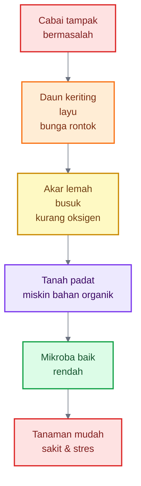

Diagram ini menunjukkan bahwa gejala di atas tanaman sering hanya puncak masalah. Bagian yang tidak terlihat—akar, tanah, mikroba, dan kelembapan—justru menentukan apakah cabai mampu bertahan lama atau cepat rusak.

Kesalahan umum yang sering terjadi adalah petani terlalu cepat mengejar pertumbuhan vegetatif. Cabai dibuat sangat hijau dengan nitrogen tinggi, tetapi lupa memperkuat dinding sel, akar, dan ekosistem tanah. Tanaman seperti ini biasanya terlihat bagus pada awal pertumbuhan, tetapi mudah tumbang ketika tekanan meningkat. Daun yang terlalu lunak lebih menarik bagi hama pengisap, tajuk yang terlalu rimbun menaikkan kelembapan mikro, dan akar yang lemah membuat tanaman mudah layu saat cuaca panas.

Dengan kata lain, **subur belum tentu kuat**. Subur lebih dekat dengan pertumbuhan. Kuat lebih dekat dengan ketahanan.

Cabai yang kuat harus memiliki beberapa ciri dasar: akar aktif, batang kokoh, daun tidak terlalu lunak, tanah remah, kelembapan stabil, drainase baik, dan mikroba rizosfer hidup. Pupuk tetap penting, tetapi pupuk hanyalah salah satu bagian dari sistem. Tanaman tidak bisa sehat hanya karena diberi pupuk; tanaman sehat karena seluruh lingkungan tumbuhnya mendukung.

## 1.2 Gagasan Utama

Gagasan utama artikel ini sederhana: **menanam cabai dengan prinsip pohon bambu berarti membangun ketahanan tanaman dari bawah, bukan hanya mendorong pertumbuhan dari atas**.

Rumpun bambu dipilih sebagai model karena memiliki sistem pertahanan alami yang menarik. Bambu memiliki jaringan yang keras, sistem akar-rimpang yang luas, serasah yang menutup permukaan tanah, dan lingkungan rizosfer yang kaya aktivitas biologis. Dalam literatur, rimpang bambu dijelaskan berperan penting dalam penyimpanan nutrisi, retensi air, dan pertumbuhan cepat; ini menjelaskan mengapa bambu mampu pulih dan tumbuh kembali setelah gangguan fisik. ([ScienceDirect][3]) Kajian lain tentang rimpang bambu juga menyoroti struktur anatomi, komposisi kimia, dan fungsi rimpang sebagai organ penting yang mendukung daya hidup rumpun. ([MDPI][4])

Prinsip bambu tidak berarti cabai harus diperlakukan sama persis seperti bambu. Cabai adalah tanaman semusim yang jauh lebih sensitif terhadap genangan, penyakit tular tanah, dan fluktuasi cuaca. Namun, cara bambu membangun ketahanan bisa dijadikan inspirasi. Yang ditiru bukan bentuk tanamannya, melainkan **logika ekologinya**.

Logika itu terdiri dari lima hal.

Pertama, bambu memperkuat jaringan. Bambu kaya struktur keras seperti serat, lignin, dan silika. Pada tanaman budidaya, silika diketahui dapat membantu tanaman menghadapi cekaman biotik dan abiotik, termasuk kekeringan, melalui penguatan jaringan, perlindungan fisiologis, dan peningkatan respons pertahanan. ([PMC][5]) Pada cabai, prinsip ini diterjemahkan menjadi program penguatan jaringan melalui nutrisi seimbang: silika, kalsium, kalium, magnesium, dan unsur mikro.

Kedua, bambu membangun kekuatan dari bawah tanah. Rimpang dan akar bambu bukan hanya alat penyerapan, tetapi juga pusat cadangan dan regenerasi. Pada cabai, padanannya adalah membangun akar putih, aktif, dan bercabang sejak pembibitan. Tanaman cabai yang akarnya kuat lebih mampu menyerap air dan hara, lebih stabil saat pindah tanam, dan lebih tahan saat cuaca berubah.

Ketiga, bambu melindungi tanahnya sendiri. Daun gugur membentuk serasah yang menutup permukaan tanah. Serasah ini membantu menjaga kelembapan, mengurangi pukulan langsung air hujan, menekan perubahan suhu ekstrem, dan menjadi bahan organik bagi mikroba. Pada cabai, prinsip ini diterapkan melalui mulsa, kompos matang, penutup tanah, dan pengelolaan bahan organik.

Keempat, bambu hidup bersama mikroba. Zona akar bambu bukan ruang steril, tetapi ruang biologis yang aktif. Review tentang mikroba dalam ekosistem bambu menunjukkan bahwa interaksi bambu dengan mikroorganisme tanah berkaitan dengan siklus hara, pertumbuhan, kesehatan tanaman, dan fungsi ekosistem bambu. ([PMC][6]) Dalam pertanian modern, konsep yang sama dikenal sebagai pengelolaan mikrobioma rizosfer, yaitu membangun komunitas mikroba yang mendukung serapan hara, kesehatan akar, dan penekanan penyakit. ([PMC][7])

Kelima, bambu membentuk lingkungan mikro. Di bawah rumpun bambu, tanah sering lebih teduh, lebih terlindungi, dan lebih stabil dibanding tanah terbuka. Pada cabai, prinsip ini diterjemahkan menjadi pengaturan bedengan, mulsa, drainase, irigasi, jarak tanam, sanitasi tajuk, dan tanaman refugia.

Gagasan besar artikel ini dapat diringkas sebagai berikut.

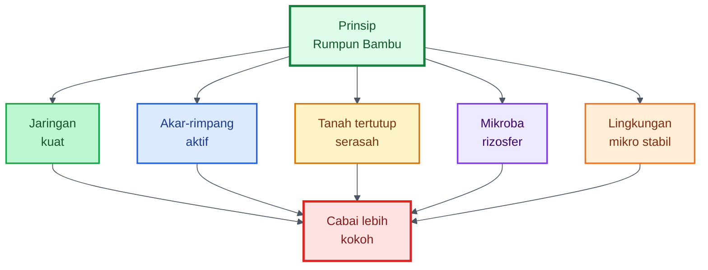

Dari diagram tersebut, arah artikel ini menjadi jelas. Kita tidak akan membahas cabai hanya dari sisi pupuk, pestisida, atau varietas. Artikel ini akan membangun cara pandang sistemik: **cabai kuat lahir dari tanaman yang diperkuat, tanah yang dihidupkan, akar yang dijaga, air yang dikelola, dan mikroba yang diberi ruang bekerja**.

Bambu menjadi guru ekologi. Cabai menjadi objek aplikasinya.


---

# 2. Kelebihan Rumpun Bambu sebagai Model Alami

Rumpun bambu menarik karena ia bukan hanya kumpulan batang. Ia adalah satu sistem hidup yang saling terhubung antara batang, daun, rimpang, akar, serasah, tanah, air, dan mikroba. Jika satu batang ditebang, rumpun tidak langsung mati. Jika musim kering datang, rumpun masih memiliki akar dan rimpang yang membantu mempertahankan hidup. Jika daun gugur, daun itu tidak hilang percuma, tetapi menjadi pelindung tanah dan sumber bahan organik.

Inilah yang membedakan bambu dari banyak tanaman semusim. Cabai sering berdiri sebagai individu yang rentan. Bambu berdiri sebagai komunitas yang saling menopang. Karena itu, ketika prinsip bambu diterapkan pada cabai, targetnya bukan membuat cabai menjadi bambu, tetapi membuat lahan cabai bekerja seperti sistem rumpun: ada cadangan, ada pelindung, ada akar kuat, ada mikroba, dan ada stabilitas lingkungan.

## 2.1 Tahan terhadap Cekaman Air

Salah satu kelebihan rumpun bambu adalah kemampuannya bertahan pada kondisi air yang tidak selalu ideal. Ini bukan berarti semua jenis bambu tahan kekeringan ekstrem, tetapi bambu memiliki perangkat morfologi dan ekologi yang membantu menghadapi fluktuasi air.

Kunci pertama ada pada rimpang. Rimpang bambu berada di bawah tanah dan berfungsi sebagai jaringan penghubung, penyimpanan, serta pusat pertumbuhan tunas baru. Review tentang rimpang bambu menekankan perannya dalam penyimpanan nutrisi, retensi air, dan kemampuan pertumbuhan cepat, sehingga rimpang menjadi komponen penting dalam daya hidup bambu. ([ScienceDirect][3]) Dalam bahasa praktis, rimpang adalah “gudang bawah tanah” yang membuat rumpun bambu tidak sepenuhnya bergantung pada kondisi satu batang.

Kunci kedua ada pada akar yang rapat. Sistem akar bambu membantu menangkap air saat tersedia dan menahan tanah agar tidak mudah tererosi. Di bawah rumpun yang sudah mapan, permukaan tanah biasanya tertutup daun kering, ranting halus, dan bahan organik. Lapisan ini bekerja seperti mulsa alami. Ia menahan penguapan, mengurangi pukulan langsung air hujan, dan menjaga suhu tanah lebih stabil.

Kunci ketiga adalah hubungan antara serasah dan tanah. Serasah bambu menjadi sumber karbon bagi mikroba tanah. Proses dekomposisi serasah berhubungan erat dengan siklus hara dan aktivitas mikroba. Studi pada hutan bambu moso menunjukkan bahwa perubahan jumlah dan kualitas serasah dapat memengaruhi aktivitas mikroba tanah dan dinamika hara, terutama ketika terjadi cekaman kekeringan. ([ScienceDirect][8]) Ini menunjukkan bahwa serasah bukan sekadar sampah daun, tetapi bagian dari mesin ekologi rumpun bambu.

Bagi budidaya cabai, pelajarannya jelas: tanaman cabai tidak boleh dibiarkan berdiri di tanah terbuka yang panas, keras, dan cepat kering. Cabai membutuhkan zona akar yang lembap stabil, bukan becek. Ia membutuhkan bahan organik, mulsa, dan struktur tanah yang mampu menyimpan air tanpa membuat akar kekurangan oksigen.

Prinsip praktisnya:

> **Jangan hanya menyiram cabai. Bangunlah tanah yang mampu menyimpan dan mengatur air.**

## 2.2 Jarang Sakit karena Pertahanan Berlapis

Rumpun bambu sering terlihat jarang sakit karena memiliki pertahanan berlapis. Lapisan pertama adalah pertahanan fisik. Batang bambu keras, berserat, dan kaya lignifikasi. Bambu juga dikenal sebagai tanaman yang banyak mengakumulasi silika, terutama karena termasuk kelompok rumput-rumputan. Pada tanaman secara umum, silikon atau silika telah banyak dikaji sebagai unsur bermanfaat yang dapat meningkatkan ketahanan terhadap cekaman kekeringan, salinitas, logam berat, dan serangan patogen tertentu. ([PMC][5])

Lapisan kedua adalah pertahanan fisiologis. Silika tidak hanya membentuk penghalang mekanis, tetapi juga berkaitan dengan respons antioksidan, pengaturan kehilangan air, serta aktivasi pertahanan tanaman. Dalam konteks cabai, prinsip ini dapat diterjemahkan menjadi penguatan jaringan tanaman melalui keseimbangan hara, bukan hanya mengejar hijau daun. Tanaman yang dinding selnya kuat dan metabolismenya seimbang cenderung lebih siap menghadapi serangan dibanding tanaman yang terlalu lunak akibat nitrogen berlebihan.

Lapisan ketiga adalah pertahanan biologis. Rizosfer bambu dihuni oleh komunitas mikroba yang beragam. Kajian tentang mikroba dalam ekosistem bambu menjelaskan bahwa mikroorganisme tanah pada ekosistem bambu terlibat dalam siklus nutrisi, dekomposisi, interaksi akar, dan kesehatan ekosistem secara umum. ([PMC][6]) Dalam ilmu tanah modern, tanah yang sehat dan kaya mikroba menguntungkan dapat membantu menekan penyakit melalui kompetisi, antagonisme, produksi senyawa antimikroba, serta stimulasi ketahanan tanaman. ([PMC][9])

Karena itu, “jarang sakit” pada bambu sebaiknya tidak dipahami sebagai bebas penyakit. Bambu tetap bisa terserang jamur, hama penggerek, busuk, atau gangguan lain. Namun, rumpun bambu memiliki sistem yang membuat kerusakan lokal tidak selalu berkembang menjadi kerusakan total. Jika satu batang terganggu, rumpun masih memiliki batang lain, rimpang, akar, dan cadangan energi bawah tanah.

Inilah pelajaran penting bagi cabai. Tanaman cabai memang tidak punya rimpang seperti bambu, tetapi bisa dibuat lebih tahan dengan membangun pertahanan berlapis:

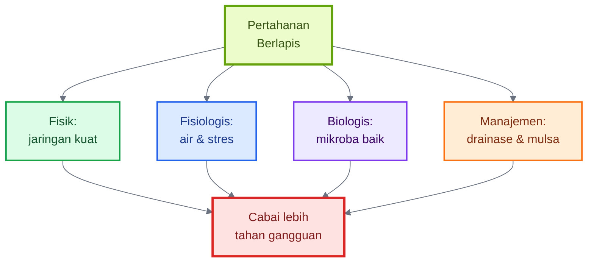

Dalam praktik cabai, pertahanan fisik berarti memperkuat jaringan dengan silika, kalsium, kalium, magnesium, dan unsur mikro. Pertahanan fisiologis berarti mengelola air, suhu, dan pemupukan agar tanaman tidak mudah stres. Pertahanan biologis berarti menghidupkan rizosfer dengan kompos matang, mikroba baik, dan bahan organik. Pertahanan manajemen berarti membuat bedengan, drainase, sanitasi, rotasi, dan mulsa dengan benar.

## 2.3 Cepat Pulih Setelah Rusak

Salah satu ciri paling menarik dari bambu adalah kemampuannya tumbuh kembali setelah dipotong. Ketika batang bambu ditebang, rumpun masih dapat mengeluarkan rebung baru selama rimpang dan cadangan bawah tanahnya sehat. Ini menunjukkan bahwa pusat daya hidup bambu tidak hanya berada pada batang yang terlihat, tetapi pada sistem bawah tanah yang tidak terlihat.

Rimpang bambu berperan sebagai jaringan horizontal yang menghubungkan batang-batang dalam satu rumpun. Ia menyimpan cadangan, mengalirkan sumber daya, dan menjadi titik tumbuh bagi rebung baru. Literatur terbaru tentang rimpang bambu menekankan bahwa organ ini penting bagi fungsi penyimpanan, pertumbuhan, dan regenerasi bambu. ([MDPI][4])

Dalam budidaya cabai, prinsip ini berarti: **pemulihan tanaman sangat bergantung pada kondisi akar dan cadangan energi tanaman**. Jika cabai terserang hama ringan tetapi akarnya sehat, tanaman masih bisa pulih. Jika cabai kehilangan sebagian daun tetapi akar aktif dan nutrisi seimbang, tunas baru masih bisa tumbuh. Sebaliknya, jika akar sudah busuk, tanah anaerob, dan pangkal batang rusak, tanaman sulit dipulihkan meskipun diberi banyak pupuk daun.

Ini mengubah cara kita membaca tanaman. Jangan hanya bertanya, “Daunnya kenapa?” Tanyakan juga:

- Apakah akarnya putih dan aktif?
- Apakah tanahnya gembur?
- Apakah drainasenya lancar?
- Apakah tanaman punya cukup kalium dan kalsium?
- Apakah bahan organik tersedia?
- Apakah mikroba baik masih hidup?

Rumpun bambu mengajarkan bahwa ketahanan bukan hanya kemampuan menolak penyakit, tetapi juga kemampuan **pulih setelah terganggu**. Dalam budidaya cabai, kemampuan pulih ini sangat penting karena tanaman hampir pasti menghadapi stres: pindah tanam, panas, hujan, pemangkasan, serangan hama, atau tekanan penyakit.

## 2.4 Menciptakan Lingkungan Mikro Sendiri

Rumpun bambu tidak hanya tumbuh di lingkungan; ia juga membentuk lingkungan. Di bawah rumpun bambu, tanah sering lebih teduh, suhu lebih stabil, permukaan tanah tertutup serasah, dan kelembapan lebih terjaga. Lapisan daun gugur menjadi mulsa alami. Akar dan rimpang membantu membentuk struktur tanah. Bahan organik terus masuk, terurai, dan menjadi bagian dari siklus hara.

Ini penting karena tanaman tidak hanya dipengaruhi oleh iklim makro seperti musim hujan dan musim kemarau. Tanaman juga sangat dipengaruhi oleh **iklim mikro** di sekitar akar dan tajuk. Dua lahan cabai di desa yang sama bisa menghasilkan performa berbeda jika satu lahan tanahnya terbuka, panas, dan becek setelah hujan, sedangkan lahan lain tertutup mulsa, drainasenya baik, dan kelembapannya stabil.

Pada cabai, lingkungan mikro yang buruk bisa mempercepat masalah. Tanah terbuka membuat suhu akar naik dan air cepat menguap. Hujan langsung ke permukaan tanah membuat percikan tanah naik ke daun bawah dan membawa patogen. Tajuk terlalu rapat meningkatkan kelembapan dan memperlambat pengeringan daun. Bedengan rendah membuat akar mudah tergenang. Kombinasi ini menciptakan kondisi ideal bagi penyakit.

Sebaliknya, lingkungan mikro yang baik membuat tanaman lebih stabil. Mulsa menjaga kelembapan, bedengan tinggi memberi oksigen pada akar, parit mengalirkan air, jarak tanam mengatur sirkulasi udara, dan bahan organik menjaga kehidupan tanah. Inilah cara cabai “dibuat seperti rumpun bambu”: bukan dalam bentuk fisiknya, tetapi dalam cara lingkungannya dikelola.

Skemanya sederhana.

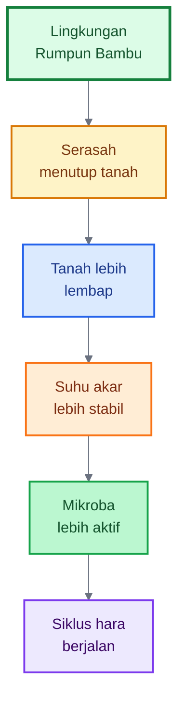

Untuk cabai, serasah bambu dapat diterjemahkan menjadi mulsa plastik, jerami, sekam, kompos permukaan, atau kombinasi bahan organik yang aman. Lingkungan mikro rumpun bambu dapat diterjemahkan menjadi bedengan tinggi, drainase baik, mulsa, irigasi terkontrol, dan tanah hidup.

## 2.5 Rumpun Bambu sebagai “Bank Mikroba Lokal”

Bagian paling menarik dari rumpun bambu adalah tanah di bawahnya. Di sana terdapat akar aktif, rimpang, serasah daun, bahan organik setengah lapuk, kelembapan relatif stabil, dan komunitas mikroba yang terus bekerja. Karena itu, lingkungan rumpun bambu bisa dipandang sebagai salah satu contoh **bank mikroba lokal**.

Istilah “bank mikroba lokal” dalam artikel ini tidak berarti semua mikroba di bawah bambu pasti baik. Mikroba tanah selalu beragam: ada yang menguntungkan, netral, bahkan berpotensi merugikan. Namun, rumpun bambu yang sehat biasanya menyediakan kondisi yang mendukung mikroba dekomposer, pelarut hara, dan mikroba yang berkompetisi dengan patogen. Kajian tentang ekosistem bambu menunjukkan bahwa mikroba tanah memiliki peran penting dalam fungsi ekosistem bambu, termasuk dekomposisi, siklus nutrisi, dan interaksi dengan akar. ([PMC][6])

Dalam ilmu pertanian, konsep ini selaras dengan gagasan **rizosfer sehat** dan **tanah supresif penyakit**. Tanah supresif penyakit adalah tanah yang mampu menekan perkembangan penyakit tertentu meskipun patogen, tanaman inang, dan kondisi lingkungan mendukung penyakit. Kemampuan ini banyak dikaitkan dengan aktivitas komunitas mikroba tanah. ([PMC][10])

Bagi budidaya cabai, gagasan ini sangat penting. Lahan cabai intensif sering mengalami penurunan kesehatan tanah karena tanam berulang, pupuk kimia tidak seimbang, pestisida berlebihan, bahan organik rendah, dan minim rotasi. Akibatnya, mikroba baik menurun, patogen tanah meningkat, dan tanaman makin mudah layu. Dengan meniru prinsip rumpun bambu, petani dapat mulai membangun kembali kehidupan tanah melalui kompos matang, mulsa, bioaktivator, PGPR, Trichoderma, Bacillus, Pseudomonas, mikoriza, dan pengayaan mikroba lokal yang dikelola hati-hati.

Namun, ada batas penting: mikroba dari rumpun bambu bukan pengganti total agen hayati komersial yang strain dan dosisnya jelas. Mikroba lokal lebih tepat diposisikan sebagai **pengayaan ekosistem tanah**, bukan obat instan. Ia membantu memperkaya bahan organik, mempercepat dekomposisi, dan meningkatkan keragaman mikroba, tetapi tetap harus didampingi oleh praktik budidaya yang benar.

Konsep “bank mikroba lokal” dapat digambarkan seperti ini.

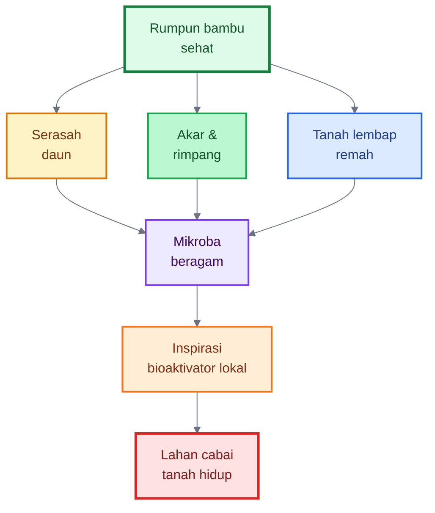

Dalam praktik nanti, bagian ini akan dikembangkan menjadi bab khusus tentang cara memilih rumpun bambu sehat, mengambil tanah/serasah secara bijak, membiakkan mikroba lokal, membedakan fermentasi baik dan gagal, serta cara aman mengaplikasikannya pada lahan cabai.

Untuk Bab 2 ini, kesimpulannya adalah: rumpun bambu memberi inspirasi karena ia membangun ketahanan melalui sistem. Ia tidak hanya punya batang kuat, tetapi juga akar-rimpang, serasah, tanah terlindungi, dan mikroba aktif. Jika prinsip itu diterjemahkan ke cabai, maka budidaya cabai tidak lagi dimulai dari pertanyaan “pupuk apa yang paling kuat?”, tetapi dari pertanyaan yang lebih mendasar:

> **Bagaimana membuat tanaman cabai punya akar kuat, jaringan kokoh, tanah hidup, dan lingkungan tumbuh yang stabil?**

Itulah fondasi dari seluruh artikel ini.

[1]: https://pubs.nmsu.edu/_circulars/CR549/?utm_source=chatgpt.com 'Chile Pepper Diseases | New Mexico State University'
[2]: https://www.aciar.gov.au/sites/default/files/2022-05/Final-Report-for-HORT-2004-048.pdf?utm_source=chatgpt.com 'Final report'
[3]: https://www.sciencedirect.com/science/article/pii/S2773139125000011?utm_source=chatgpt.com 'Unlocking the hidden power of bamboo rhizomes'
[4]: https://www.mdpi.com/1999-4907/17/1/6?utm_source=chatgpt.com 'Bamboo Rhizomes: Insights into Structure, Properties, and ...'
[5]: https://pmc.ncbi.nlm.nih.gov/articles/PMC8633297/?utm_source=chatgpt.com 'Functions of silicon in plant drought stress responses - PMC'
[6]: https://pmc.ncbi.nlm.nih.gov/articles/PMC12238013/?utm_source=chatgpt.com 'Microbial diversity and function in bamboo ecosystems - PMC'
[7]: https://pmc.ncbi.nlm.nih.gov/articles/PMC9796772/?utm_source=chatgpt.com 'The rhizosphere microbiome: Plant–microbial interactions for ...'
[8]: https://www.sciencedirect.com/science/article/abs/pii/S0048969722034489?utm_source=chatgpt.com 'Drought changes litter quantity and quality, and soil ...'
[9]: https://pmc.ncbi.nlm.nih.gov/articles/PMC10384710/?utm_source=chatgpt.com 'Soil and Phytomicrobiome for Plant Disease Suppression and ...'
[10]: https://pmc.ncbi.nlm.nih.gov/articles/PMC5712882/?utm_source=chatgpt.com 'Rhizosphere Microbiome Recruited from a Suppressive ... - PMC'

---

# 3. Mencontoh Rumpun Bambu dalam Budidaya Cabai

Pada Bab 1 dan Bab 2, kita sudah melihat bahwa kekuatan rumpun bambu tidak berdiri pada satu faktor. Bambu kuat karena memiliki **jaringan keras, akar-rimpang aktif, tanah tertutup serasah, mikroba rizosfer hidup, dan lingkungan mikro yang stabil**. Prinsip ini sangat relevan untuk cabai, karena cabai sering gagal bukan hanya karena kurang pupuk, tetapi karena sistem tumbuhnya rapuh.

Maka, mencontoh rumpun bambu dalam budidaya cabai berarti membangun tanaman secara berlapis: **jaringannya diperkuat, akarnya dibesarkan, tanahnya dihidupkan, permukaannya dilindungi, dan nutrisinya diseimbangkan**.

Cabai yang kuat bukan cabai yang hanya cepat tinggi dan hijau. Cabai yang kuat adalah cabai yang tetap tegak saat panas, tidak mudah layu setelah hujan, akarnya putih dan aktif, bunganya tidak mudah rontok, buahnya lebih padat, dan umurnya lebih panjang.

Prinsip besarnya dapat digambarkan seperti berikut.

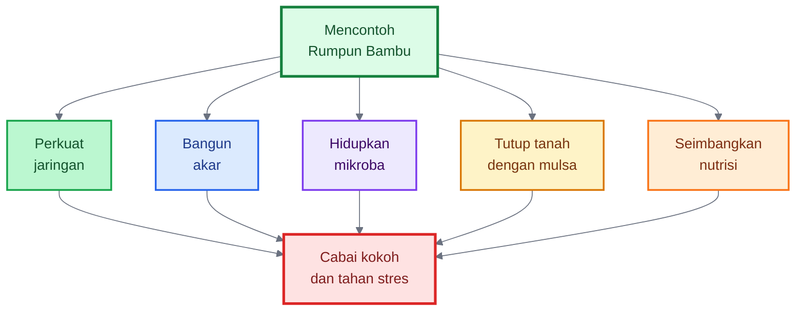

---

## 3.1 Memperkuat Jaringan Tanaman

Bambu memiliki batang yang keras dan lentur. Ia tidak hanya tumbuh cepat, tetapi juga membangun jaringan yang kuat. Pada cabai, prinsip ini diterjemahkan menjadi penguatan jaringan tanaman melalui **silika, kalsium, kalium, magnesium, dan unsur mikro**.

Silika berperan sebagai unsur bermanfaat bagi banyak tanaman. Ia dapat membantu memperkuat jaringan, meningkatkan ketahanan terhadap cekaman abiotik seperti kekeringan dan salinitas, serta membantu tanaman menghadapi beberapa tekanan biotik seperti penyakit dan hama. Kajian tentang silikon menunjukkan bahwa unsur ini dapat memperbaiki sistem tanah–tanaman dengan meningkatkan nutrisi silikon dan mendukung resistensi tanaman terhadap penyakit, serangga, dan cekaman lingkungan. ([PMC][1])

Pada kondisi kekeringan, silikon juga dikaitkan dengan kemampuan tanaman menjaga keseimbangan air, aktivitas antioksidan, dan fungsi fisiologis lain yang berhubungan dengan ketahanan stres. Review di _Horticulture Research_ menjelaskan bahwa fungsi silikon dalam respons kekeringan tidak tunggal, tetapi mencakup regulasi air, perlindungan jaringan, dan respons metabolik tanaman. ([Nature][2])

Kalsium memiliki peran berbeda tetapi saling melengkapi. Jika silika dapat dibayangkan sebagai “lapisan penguat”, maka kalsium adalah “perekat dinding sel”. Kalsium membantu stabilitas dinding sel dan membran, serta berperan dalam kualitas jaringan buah. Review tentang kalsium pada buah menjelaskan bahwa kalsium dapat memengaruhi sifat fisik, kerentanan penyakit, stabilitas membran, hubungan air, dan dinding sel melalui ikatan silang pektin. ([Frontiers][3])

Kalium berperan besar dalam pengaturan air, pembukaan stomata, translokasi hasil fotosintesis, pembentukan buah, dan ketahanan tanaman terhadap stres. Pada kondisi kekeringan, kalium dapat membantu tanaman melalui perubahan morfologi akar, eksudat akar, dan keragaman mikroba di sekitar akar. ([PMC][4]) Review klasik tentang kalium juga menunjukkan hubungan antara status kalium tanaman dengan kerentanan terhadap patogen dan serangga herbivora. ([Europe PMC][5])

Magnesium sering dilupakan, padahal ia adalah pusat klorofil. Tanaman cabai yang kekurangan magnesium biasanya mengalami gangguan fotosintesis, terutama pada daun tua yang menguning di antara tulang daun. Review tahun 2023 menegaskan bahwa magnesium berperan dalam fisiologi tanaman, fotosintesis, enzim, dan respons terhadap faktor lingkungan. ([PMC][6])

Dalam praktik cabai, penguatan jaringan berarti tidak hanya memberi NPK tinggi. Tanaman perlu diberi nutrisi yang membuat selnya padat, daun tidak terlalu lunak, batang kokoh, dan buah lebih kuat. Cabai yang terlalu cepat besar akibat nitrogen tinggi tetapi kekurangan kalsium, kalium, magnesium, dan silika biasanya tampak subur di awal, tetapi mudah layu, mudah terserang kutu, mudah rontok bunga, dan buahnya lebih rentan busuk.

### Aplikasi lapangan

Pada fase pembibitan sampai awal vegetatif, fokus utama adalah membentuk bibit yang pendek-kokoh, bukan tinggi-kurus. Nitrogen tetap diperlukan, tetapi jangan dibuat dominan. Mulai masukkan kalsium dan magnesium dalam dosis ringan sesuai produk yang digunakan. Bila memakai pupuk silika, aplikasikan sejak fase vegetatif awal agar penguatan jaringan terjadi sebelum tanaman menghadapi tekanan berat.

Pada fase vegetatif kuat, silika dapat diberikan secara berkala melalui kocor, fertigasi, atau semprot daun, tergantung bentuk produknya. Kalium mulai dinaikkan bertahap agar tanaman tidak hanya membentuk daun, tetapi juga membangun ketahanan. Kalsium dijaga rutin, terutama menjelang pembungaan dan pembentukan buah.

Pada fase generatif, keseimbangan **K–Ca–Mg** menjadi sangat penting. Kalium mendukung pengisian buah, kalsium mendukung kekuatan jaringan, dan magnesium menjaga fotosintesis. Silika tetap dapat dilanjutkan sebagai bagian dari program ketahanan, terutama pada musim hujan, panas ekstrem, atau lahan dengan tekanan penyakit tinggi.

### Kesalahan yang perlu dihindari

Jangan mencampur larutan silika pekat langsung dengan kalsium, fosfat pekat, atau larutan sangat asam dalam satu tangki tanpa uji kompatibilitas. Banyak produk silika bersifat alkalis dan mudah bereaksi dengan unsur lain. Akibatnya, larutan bisa menggumpal, mengendap, atau efektivitasnya turun.

Jangan menganggap silika sebagai obat penyakit. Silika adalah bagian dari program penguatan tanaman. Jika tanaman sudah busuk parah, akar mati, atau batang terserang berat, silika tidak bisa membalikkan kerusakan secara instan.

---

## 3.2 Membangun Akar yang Kuat

Pada bambu, kekuatan utama berada di bawah tanah. Rimpang dan akar menjadi pusat cadangan, penyerapan, regenerasi, dan stabilitas rumpun. Pada cabai, tidak ada rimpang seperti bambu, tetapi prinsipnya tetap sama: **tanaman kuat dimulai dari akar kuat**.

Akar cabai yang sehat berwarna putih, banyak cabang halus, aktif tumbuh, dan menyebar ke zona tanah yang lembap. Akar seperti ini membuat tanaman lebih mampu menyerap air dan hara. Tanaman juga lebih cepat pulih setelah pindah tanam, lebih tahan panas, dan tidak mudah layu saat cuaca berubah.

Sebaliknya, akar yang pendek, cokelat, busuk, berlendir, atau sedikit cabang menunjukkan tanaman sedang bermasalah. Dalam kondisi seperti itu, pupuk daun sering hanya menjadi bantuan sementara. Masalah utamanya tetap berada di bawah tanah.

Akar kuat tidak muncul tiba-tiba di lahan. Ia dibentuk sejak pembibitan. Banyak petani baru memperhatikan akar setelah tanaman layu, padahal akar sudah harus dibangun sejak media semai, pengairan bibit, pemilihan bibit, perlakuan pindah tanam, dan manajemen air awal.

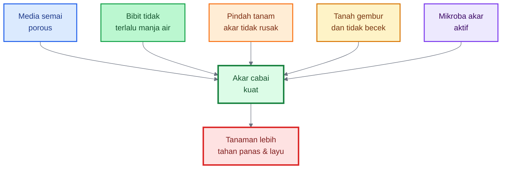

### Aplikasi lapangan

Pada pembibitan, gunakan media yang porous dan tidak mudah becek. Campuran dapat berupa tanah halus yang sehat, kompos matang, sekam bakar, dan cocopeat sesuai ketersediaan. Kuncinya bukan resep tunggal, tetapi sifat media: ringan, lembap stabil, tidak memadat, dan tidak menyimpan air berlebihan.

Bibit jangan terlalu dimanjakan dengan air. Media memang tidak boleh kering total, tetapi penyiraman terlalu sering membuat akar dangkal dan lemah. Bibit yang kuat biasanya memiliki batang kokoh, ruas pendek, daun tidak terlalu lunak, dan akar putih memenuhi media.

Saat pindah tanam, lubang tanam harus lembap tetapi tidak becek. Akar bibit jangan rusak parah. Bila memungkinkan, lakukan celup akar atau kocor awal dengan PGPR, Bacillus, Pseudomonas, Trichoderma, atau mikoriza sesuai produk yang tersedia. Tujuannya bukan sekadar memberi mikroba, tetapi membantu akar cepat beradaptasi dengan lingkungan baru.

Pada dua minggu pertama setelah tanam, jangan langsung mengejar tajuk terlalu cepat. Fase ini adalah fase adaptasi akar. Pemupukan terlalu pekat dapat melukai akar muda, terutama jika tanah kering atau EC tinggi. Lebih baik pupuk diberikan bertahap, air dijaga stabil, dan akar diberi ruang berkembang.

### Tanda akar mulai kuat

Tanaman tidak mudah layu saat siang meskipun cuaca panas. Pertumbuhan tunas baru stabil. Daun muda keluar normal. Tanaman tidak stagnan setelah pindah tanam. Jika beberapa tanaman dicabut sebagai sampel, akar tampak putih dan bercabang, bukan cokelat atau busuk.

---

## 3.3 Menghidupkan Mikroba Baik di Zona Akar

Rumpun bambu sehat karena zona akarnya hidup. Di bawah rumpun bambu terdapat serasah, akar aktif, bahan organik, kelembapan, dan komunitas mikroba yang bekerja terus-menerus. Pada cabai, prinsip ini diterjemahkan menjadi pembangunan **rizosfer sehat**.

Rizosfer adalah wilayah kecil di sekitar akar tempat akar dan mikroba saling berinteraksi. Akar mengeluarkan eksudat berupa gula, asam organik, asam amino, dan senyawa lain. Mikroba memanfaatkan eksudat tersebut, lalu sebagian mikroba membantu tanaman melalui pelarutan hara, produksi hormon tumbuh, kompetisi dengan patogen, atau stimulasi ketahanan tanaman.

Kelompok mikroba yang sering digunakan dalam budidaya cabai antara lain **Trichoderma, Bacillus, Pseudomonas, mikoriza, PGPR, dan bioaktivator lokal**. Review tahun 2024 tentang _Trichoderma_ dan _Bacillus_ menjelaskan bahwa keduanya dapat berperan sebagai pemacu pertumbuhan dan kesehatan tanaman melalui banyak sifat, termasuk dukungan terhadap toleransi stres dan interaksi mikroba–tanaman. ([Frontiers][7])

PGPR juga banyak dikaji sebagai kelompok bakteri yang mendukung pertumbuhan tanaman. Review tentang PGPR menyebutkan bahwa strain _Bacillus_ telah dilaporkan meningkatkan pertumbuhan beberapa tanaman sayuran, termasuk pepper, dalam kondisi greenhouse maupun lapangan. ([PMC][8]) Pada cabai, penelitian terhadap _Bacillus vallismortis_ BS07 menunjukkan potensi sebagai agen biokontrol terhadap beberapa patogen cabai melalui aplikasi kocor pada bibit. ([ScienceDirect][9])

Di Indonesia, riset tentang PGPR pada cabai juga berkembang. Sebuah penelitian lapangan pada penyakit kuning keriting cabai menyebut PGPR yang mengandung _Pseudomonas fluorescens_ dan _Bacillus polymyxa_ sebagai teknologi yang menjanjikan dalam pengelolaan penyakit yellow leaf curl pada cabai, terutama sebagai bagian dari strategi pengendalian terpadu. ([Tropical Plant Journal][10])

Namun, mikroba baik tidak akan efektif jika lingkungannya buruk. Mikroba memerlukan bahan organik, kelembapan cukup, aerasi, pH yang sesuai, dan tidak terus-menerus terkena bahan kimia keras. Jika tanah padat, tergenang, miskin bahan organik, atau sering diberi fungisida/bakterisida tanpa pertimbangan, mikroba baik sulit bertahan.

### Aplikasi lapangan

Sebelum tanam, campurkan kompos matang atau pupuk kandang fermentasi ke bedengan. Kompos matang menjadi sumber bahan organik dan makanan bagi mikroba. Trichoderma dapat dicampur ke kompos matang atau diaplikasikan di lubang tanam, terutama pada lahan dengan riwayat layu dan busuk akar.

Saat pindah tanam, aplikasikan mikroba di zona akar. Bentuknya bisa celup akar, kocor lubang tanam, atau kocor setelah tanam. Pilih produk yang jelas kandungan mikrobanya, misalnya Trichoderma, Bacillus, Pseudomonas, atau mikoriza. Bioaktivator lokal dari rumpun bambu dapat digunakan sebagai pelengkap untuk memperkaya aktivitas biologis tanah, tetapi jangan diposisikan sebagai pengganti total agen hayati yang strain dan dosisnya jelas.

Setelah tanam, mikroba perlu dipelihara. Kocor ulang setiap 2–4 minggu dapat dilakukan sesuai kondisi lahan dan produk. Aplikasi ulang sangat berguna setelah hujan lebat, setelah stres panas, atau setelah penggunaan pestisida yang berpotensi menekan mikroba. Beri jarak antara aplikasi mikroba dan fungisida/bakterisida kimia keras agar mikroba tidak langsung mati.

### Prinsip penting

Mikroba bukan “obat sulap”. Mikroba bekerja jika lingkungannya mendukung. Jika drainase buruk, akar tergenang, tanah terlalu asam, atau bahan organik rendah, hasilnya tidak stabil. Maka, mikroba harus selalu dipadukan dengan bedengan baik, mulsa, kompos matang, irigasi stabil, dan nutrisi seimbang.

---

## 3.4 Meniru Serasah Bambu dengan Mulsa

Di bawah rumpun bambu, tanah jarang telanjang. Daun gugur, ranting halus, pelepah, dan bahan organik menutup permukaan tanah. Lapisan ini berfungsi sebagai mulsa alami. Ia menjaga kelembapan, menahan pukulan air hujan, mengurangi fluktuasi suhu, memberi makanan mikroba, dan melindungi akar.

Pada cabai, prinsip ini sangat penting. Tanah yang terbuka langsung terkena matahari akan cepat panas dan cepat kering. Ketika hujan turun, permukaan tanah yang terbuka mudah memercikkan partikel tanah ke daun bagian bawah. Percikan ini dapat membawa patogen tular tanah atau spora penyakit ke tajuk bawah. Selain itu, tanah terbuka mendorong pertumbuhan gulma yang bersaing dengan cabai.

Mulsa dapat berupa mulsa plastik, jerami, sekam, daun kering, rumput kering tanpa biji, kompos kasar, atau kombinasi. Mulsa plastik banyak dipakai pada cabai intensif karena efektif mengurangi gulma, menjaga kelembapan, dan membuat bedengan lebih bersih. Mulsa organik lebih dekat dengan prinsip serasah bambu karena ikut menambah bahan organik dan mendukung biologi tanah. Penelitian tentang mulsa menunjukkan bahwa mulsa organik merupakan metode lama untuk konservasi air tanah dan membantu menjaga suhu pada zona akar. ([ScienceDirect][11])

Pemilihan mulsa harus disesuaikan dengan musim, jenis tanah, biaya, dan risiko penyakit. Pada musim hujan, mulsa plastik membantu mengurangi percikan tanah, tetapi drainase harus sangat baik agar air tidak tertahan di sekitar akar. Pada musim kemarau, mulsa organik membantu menjaga kelembapan dan menurunkan panas permukaan tanah. Pada lahan dengan tekanan penyakit tinggi, mulsa organik harus dipastikan bersih, tidak membawa sumber patogen, dan tidak terlalu menempel pada pangkal batang.

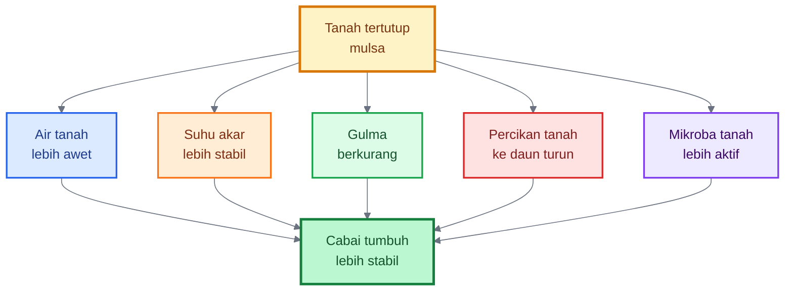

### Aplikasi lapangan

Untuk budidaya cabai intensif di lahan terbuka, mulsa plastik perak-hitam masih menjadi pilihan praktis. Warna perak membantu memantulkan cahaya dan dapat mengganggu beberapa serangga kecil, sedangkan sisi hitam menekan gulma. Namun, plastik tidak menambah bahan organik. Karena itu, sebelum pemasangan mulsa plastik, bedengan harus sudah diberi kompos matang dan mikroba.

Untuk sistem yang ingin lebih organik atau regeneratif, gunakan mulsa jerami, sekam, daun bambu kering, daun kacang-kacangan, atau rumput kering tanpa biji. Ketebalan jangan berlebihan di sekitar pangkal batang. Sisakan sedikit ruang agar pangkal cabai tidak terlalu lembap. Mulsa organik yang terlalu basah dan menempel pada batang dapat memicu busuk pangkal.

Untuk musim hujan, mulsa harus dikombinasikan dengan bedengan tinggi dan parit lancar. Mulsa tanpa drainase justru dapat memperburuk kelembapan berlebih. Untuk musim kemarau, mulsa dapat mengurangi frekuensi penyiraman dan menjaga akar tetap aktif lebih lama.

---

## 3.5 Menjaga Keseimbangan Nutrisi

Bambu tidak tumbuh kuat karena satu unsur saja. Ia membangun jaringan, akar, dan cadangan melalui keseimbangan. Pada cabai, keseimbangan nutrisi menjadi penentu apakah tanaman menjadi kokoh atau justru lunak.

Kesalahan yang paling sering terjadi adalah nitrogen berlebihan. Nitrogen memang membuat tanaman cepat hijau dan rimbun. Namun, bila nitrogen terlalu dominan, jaringan tanaman cenderung lebih lunak dan pertumbuhan vegetatif terlalu kuat. Penelitian menunjukkan bahwa kelebihan nitrogen dapat menurunkan kapasitas antioksidan tanaman, meningkatkan peroksidasi lipid, dan menyebabkan perubahan metabolik yang merugikan. ([PMC][12]) Laporan Technical University of Munich juga menyebut bahwa kadar nitrogen yang terlalu tinggi dapat membuat tanaman lebih rentan terhadap penyakit tertentu. ([TUM][13])

Untuk cabai, nitrogen berlebihan biasanya terlihat dari daun sangat hijau gelap, tajuk terlalu rimbun, ruas memanjang, jaringan lunak, bunga mudah rontok, dan tanaman lebih disukai hama pengisap seperti kutu daun, thrips, atau tungau. Tajuk yang terlalu rapat juga membuat kelembapan meningkat, sehingga penyakit daun dan buah lebih mudah berkembang.

Keseimbangan nutrisi berarti tanaman mendapat unsur sesuai fungsi dan fase. Pada fase awal, nitrogen dan fosfor tetap penting untuk pertumbuhan vegetatif dan akar. Namun, sejak awal tanaman juga harus mendapat kalsium, magnesium, kalium, sulfur, mikroelement, dan silika. Saat masuk generatif, kalium, kalsium, dan magnesium perlu lebih diperhatikan agar bunga, buah, dan fotosintesis stabil.

Nutrisi tidak boleh dilihat sebagai daftar produk, tetapi sebagai arsitektur ketahanan:

- **Nitrogen** untuk pertumbuhan, tetapi jangan berlebihan.
- **Fosfor** untuk akar dan energi, terutama awal pertumbuhan.
- **Kalium** untuk pengaturan air, buah, dan ketahanan stres.
- **Kalsium** untuk dinding sel, membran, dan kualitas jaringan.
- **Magnesium** untuk klorofil dan fotosintesis.
- **Sulfur** untuk protein, aroma, dan metabolisme tertentu.
- **Mikroelement** seperti boron, zinc, mangan, besi, tembaga, dan molibdenum untuk enzim dan pembentukan organ.
- **Silika** untuk mendukung kekuatan jaringan dan respons stres.

### Aplikasi lapangan

Pada fase vegetatif awal, gunakan nutrisi seimbang. Jangan membuat tanaman terlalu cepat rimbun. Cabai yang ideal pada fase ini adalah cabai yang tumbuh stabil, batang mulai kokoh, akar aktif, dan daun sehat. Warna daun hijau segar lebih baik daripada hijau tua berlebihan.

Pada fase menjelang bunga, mulai kurangi dominasi nitrogen dan perkuat kalium, kalsium, magnesium, serta boron dalam batas aman. Boron penting untuk pembungaan, tetapi dosisnya harus hati-hati karena rentang aman boron relatif sempit. Ikuti label produk dan jangan menaikkan dosis tanpa uji kecil.

Pada fase buah, kalium menjadi lebih penting untuk pengisian dan kualitas buah. Kalsium tetap harus dijaga karena mobilitasnya di tanaman terbatas; suplai air yang tidak stabil dapat mengganggu distribusi kalsium ke organ muda dan buah. Magnesium dijaga agar daun tetap mampu berfotosintesis. Silika dapat diteruskan untuk mendukung kekuatan jaringan dan toleransi stres.

### Tanda nutrisi mulai seimbang

Tanaman tidak terlalu rimbun, tetapi produktif. Daun hijau sehat, bukan hijau gelap berlebihan. Batang kokoh. Bunga lebih kuat. Buah lebih padat. Tanaman tidak mudah layu saat siang. Serangan hama dan penyakit tidak meledak cepat. Umur panen lebih panjang.

### Tanda nutrisi tidak seimbang

Jika nitrogen berlebihan, tanaman terlalu rimbun, ruas panjang, daun lunak, bunga rontok, dan banyak hama pengisap. Jika kalium kurang, tanaman lemah saat stres air, buah kecil, kualitas buah turun, dan tepi daun bisa menguning atau terbakar. Jika kalsium kurang, jaringan muda mudah rusak, pucuk terganggu, bunga dan buah muda bermasalah. Jika magnesium kurang, daun tua menguning di antara tulang daun. Jika silika kurang dalam sistem intensif, tanaman bisa lebih mudah rebah, daun lebih lemah, dan toleransi stres menurun, meskipun gejalanya tidak selalu spesifik.

---

# Ringkasan Bab 3

Mencontoh rumpun bambu dalam budidaya cabai berarti membangun tanaman sebagai sistem hidup, bukan sekadar objek pemupukan. Rumpun bambu mengajarkan bahwa ketahanan berasal dari kombinasi: **jaringan kuat, akar aktif, mikroba hidup, tanah terlindungi, dan nutrisi seimbang**.

Untuk cabai, penerapannya adalah:

1. **Perkuat jaringan tanaman** dengan silika, kalsium, kalium, magnesium, dan mikroelement.
2. **Bangun akar sejak pembibitan** agar tanaman tidak mudah layu dan cepat pulih.
3. **Hidupkan mikroba rizosfer** dengan kompos matang, PGPR, Trichoderma, Bacillus, Pseudomonas, mikoriza, dan bioaktivator lokal yang aman.
4. **Tutup tanah dengan mulsa** agar kelembapan, suhu, dan percikan tanah terkendali.
5. **Jaga keseimbangan nutrisi** agar cabai tidak hanya cepat tumbuh, tetapi benar-benar kokoh.

Kalimat kunci Bab 3:

> **Cabai yang kuat tidak dibangun dengan satu pupuk, tetapi dengan sistem: jaringan dipadatkan, akar dibesarkan, tanah dihidupkan, permukaan dilindungi, dan nutrisi diseimbangkan.**

[1]: https://pmc.ncbi.nlm.nih.gov/articles/PMC9332292/?utm_source=chatgpt.com 'Silicon as a Smart Fertilizer for Sustainability and Crop ... - PMC'
[2]: https://www.nature.com/articles/s41438-021-00681-1?utm_source=chatgpt.com 'Functions of silicon in plant drought stress responses'
[3]: https://www.frontiersin.org/journals/plant-science/articles/10.3389/fpls.2016.00569/full?utm_source=chatgpt.com 'Fruit Calcium: Transport and Physiology'
[4]: https://pmc.ncbi.nlm.nih.gov/articles/PMC7996290/?utm_source=chatgpt.com 'Potassium Improves Drought Stress Tolerance in Plants by ...'
[5]: https://europepmc.org/article/med/18331404?utm_source=chatgpt.com 'The effect of potassium nutrition on pest and disease ...'
[6]: https://pmc.ncbi.nlm.nih.gov/articles/PMC10628537/?utm_source=chatgpt.com 'The power of magnesium: unlocking the potential for ... - PMC'
[7]: https://www.frontiersin.org/journals/microbiology/articles/10.3389/fmicb.2024.1423980/full?utm_source=chatgpt.com 'Trichoderma and Bacillus multifunctional allies for plant ...'
[8]: https://pmc.ncbi.nlm.nih.gov/articles/PMC8622033/?utm_source=chatgpt.com 'Plant-Growth-Promoting Rhizobacteria Emerging as an ... - PMC'
[9]: https://www.sciencedirect.com/science/article/abs/pii/S1049964413000285?utm_source=chatgpt.com 'Systemic resistance and growth promotion of chili pepper ...'
[10]: https://jhpttropika.fp.unila.ac.id/index.php/jhpttropika/article/view/735?utm_source=chatgpt.com 'The use of combination plant growth promoting rhizobacteria ...'
[11]: https://www.sciencedirect.com/science/article/pii/S2666154322000072?utm_source=chatgpt.com 'Effect of organic and inorganic mulching on weed density ...'
[12]: https://pmc.ncbi.nlm.nih.gov/articles/PMC5324167/?utm_source=chatgpt.com 'Excessive nitrogen application dampens antioxidant capacity ...'
[13]: https://www.tum.de/en/news-and-events/all-news/press-releases/details/why-too-much-nitrogen-is-harmful-to-plants?utm_source=chatgpt.com 'Why too much nitrogen is harmful to plants'

---

# 4. Membuat Kondisi Lingkungan seperti Rumpun Bambu

Pada rumpun bambu, kekuatan tanaman tidak hanya berasal dari batang dan akarnya. Kekuatan itu juga muncul karena bambu mampu menciptakan **lingkungan tumbuh yang stabil**: tanah tertutup serasah, suhu tanah lebih sejuk, kelembapan lebih terjaga, bahan organik terus masuk, akar hidup bersama mikroba, dan air tidak langsung hilang dari permukaan tanah.

Inilah prinsip penting yang perlu diterjemahkan ke budidaya cabai. Cabai tidak punya rimpang seperti bambu, tetapi lahan cabai bisa dibuat memiliki “suasana ekologis” yang mirip: tanah remah, permukaan terlindungi, drainase baik, kelembapan stabil, dan ekosistem lahan lebih beragam.

Dengan kata lain, kita tidak hanya menanam cabai. Kita sedang membangun **rumah tumbuh** untuk cabai.

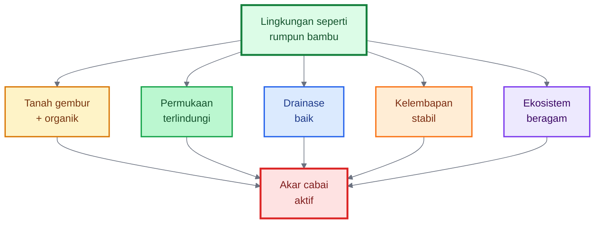

---

## 4.1 Tanah Gembur dan Kaya Bahan Organik

Tanah di bawah rumpun bambu biasanya tidak telanjang dan tidak miskin bahan organik. Daun bambu gugur, pelepah lapuk, akar halus mati, dan bahan organik terus masuk ke tanah. Proses ini membentuk lingkungan yang lebih hidup bagi mikroba dan akar.

Pada cabai, kondisi seperti ini harus dibuat secara sengaja. Tanah cabai perlu **remah, gembur, tidak padat, tidak becek, dan kaya bahan organik matang**. Bahan organik berperan sebagai sumber energi bagi mikroba tanah, membantu pembentukan agregat tanah, meningkatkan kemampuan tanah menyimpan air, serta memperbaiki ruang udara di sekitar akar. FAO menjelaskan bahwa bahan organik tanah menyediakan nutrisi dan habitat bagi organisme tanah, mengikat partikel tanah menjadi agregat, serta meningkatkan kapasitas tanah menahan air. ([FAOHome][1])

Tanah gembur penting karena akar cabai membutuhkan oksigen. Akar bukan hanya menyerap air dan pupuk; akar juga bernapas. Jika tanah terlalu padat atau selalu becek, oksigen rendah. Kondisi ini membuat akar stres, rambut akar berkurang, dan patogen tanah lebih mudah berkembang.

Bahan organik yang digunakan harus **matang**, bukan bahan mentah. Kompos matang atau pupuk kandang fermentasi lebih aman karena proses panas dan dekomposisinya sudah lebih stabil. Pupuk kandang mentah berisiko membawa patogen, biji gulma, telur hama, gas amonia, dan panas fermentasi yang dapat mengganggu akar muda.

Kompos juga mendukung kehidupan mikroba. Studi tentang kompos dan penutup tanah pada sistem sayuran organik menunjukkan bahwa mikroorganisme tanah berperan penting dalam mineralisasi dan penguraian senyawa organik kompleks, dan komunitas mikroba dipengaruhi oleh jumlah serta kualitas residu tanaman dan amandemen organik yang diberikan. ([ScienceDirect][2])

### Praktik lapangan

Sebelum tanam, tanah dibongkar dan digemburkan pada zona akar. Untuk cabai, kedalaman olah 20–30 cm sudah menjadi target minimal yang baik pada banyak kondisi lahan. Jika tanah sangat padat, terutama bekas sawah atau lahan yang sering terinjak, penggemburan harus lebih serius karena akar cabai sulit menembus lapisan keras.

Masukkan kompos matang atau pupuk kandang fermentasi ke bedengan. Dosis sangat tergantung kondisi tanah, ketersediaan bahan, biaya, dan sistem budidaya. Untuk lahan intensif, banyak praktisi menggunakan kisaran beberapa ton sampai belasan ton per hektare. Namun, angka terbaik tetap mengikuti hasil analisis tanah dan kualitas bahan organik.

Formula sederhana untuk menghitung kebutuhan kompos per bedengan:

$$
K_{\text{bedengan}} =
\frac{D_{\text{ha}} \times 1000 \times L_{\text{bedengan}}}{10.000}
$$

Keterangan:

- $K_{\text{bedengan}}$ = kebutuhan kompos per bedengan dalam kg
- $D_{\text{ha}}$ = dosis kompos dalam ton/ha
- $L_{\text{bedengan}}$ = luas bedengan dalam m²
- 1 ton = 1000 kg
- 1 hektare = 10.000 m²

Contoh:

Jika target kompos adalah $10\ \text{ton/ha}$, dan satu bedengan berukuran $1\ \text{m} \times 20\ \text{m} = 20\ \text{m}^2$, maka:

$$
K_{\text{bedengan}} =
\frac{10 \times 1000 \times 20}{10.000}
= 20\ \text{kg}
$$

Artinya, satu bedengan seluas 20 m² membutuhkan sekitar **20 kg kompos matang** untuk setara dengan dosis 10 ton/ha.

### Indikator tanah siap tanam

Tanah siap untuk cabai memiliki ciri: remah saat digenggam, tidak berbau busuk, tidak lengket berlebihan, tidak membentuk bongkah keras, air mudah meresap, tetapi tanah tetap mampu menyimpan kelembapan. Jika setelah hujan tanah cepat menggenang atau setelah kering tanah menjadi sangat keras dan retak, struktur tanah masih perlu diperbaiki.

---

## 4.2 Permukaan Tanah Terlindungi

Di bawah rumpun bambu, permukaan tanah tertutup serasah. Serasah ini bukan kotoran, tetapi pelindung alami. Ia menahan panas matahari, mengurangi pukulan air hujan, menjaga kelembapan, menekan erosi, dan menjadi makanan mikroba.

Pada cabai, fungsi serasah bambu dapat ditiru dengan **mulsa**. Mulsa bisa berupa jerami, sekam, daun kering, rumput kering tanpa biji, kompos kasar, plastik mulsa, atau kombinasi. Pilihan mulsa harus disesuaikan dengan musim, biaya, risiko penyakit, ketersediaan bahan, dan tujuan budidaya.

Mulsa berperan besar dalam mengatur lingkungan tumbuh. Literatur tentang mulsa pada tanaman sayuran menyebutkan bahwa mulsa organik membantu mengelola lingkungan pertumbuhan tanaman, menekan gulma, memperbaiki suhu tanah, mengurangi erosi akibat pukulan hujan, mencegah pencucian hara, meningkatkan aktivitas mikroorganisme, dan mengurangi kompetisi gulma. ([UGSpace][3])

Mulsa plastik banyak digunakan pada cabai intensif karena praktis, menekan gulma, menjaga bedengan lebih bersih, dan mengurangi percikan tanah ke daun bagian bawah. Namun, plastik tidak menambah bahan organik. Karena itu, jika memakai mulsa plastik, bahan organik dan mikroba harus dimasukkan **sebelum mulsa dipasang**.

Mulsa organik lebih mirip serasah bambu karena bisa terurai dan memberi makan tanah. Namun, mulsa organik harus bersih dan tidak terlalu menempel pada pangkal batang cabai. Jika terlalu tebal dan terlalu basah di dekat pangkal batang, risiko busuk pangkal meningkat.

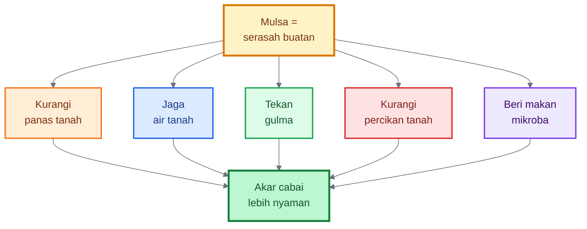

### Praktik lapangan

Untuk musim hujan, mulsa plastik perak-hitam sering lebih aman karena membantu mengurangi percikan tanah dan menekan gulma. Namun, bedengan harus tinggi dan parit harus lancar. Jangan sampai plastik justru membuat air terjebak di sekitar akar.

Untuk musim kemarau, mulsa organik sangat membantu menjaga kelembapan dan menurunkan suhu tanah. Bahan yang dapat digunakan antara lain jerami, sekam, daun bambu kering, daun legum kering, atau rumput kering tanpa biji. Ketebalan cukup dibuat merata, tetapi pangkal batang tetap diberi ruang agar tidak terlalu lembap.

Untuk sistem kombinasi, petani dapat memasukkan kompos matang di bedengan, menutup dengan plastik mulsa, lalu menambahkan bahan organik di parit atau pinggir bedengan. Cara ini menggabungkan kebersihan mulsa plastik dengan tambahan sumber karbon bagi mikroba di sekitar lahan.

---

## 4.3 Drainase Baik

Bambu dapat membantu menahan tanah dan mengelola kelembapan, tetapi cabai tidak tahan genangan. Inilah perbedaan penting yang harus dipahami. Meniru rumpun bambu bukan berarti membuat lahan cabai selalu lembap basah. Yang ditiru adalah **stabilitas kelembapan**, bukan kondisi becek.

Cabai sangat rentan terhadap penyakit akar dan pangkal batang ketika air menggenang. Patogen seperti _Phytophthora capsici_ dan _Pythium_ berkembang baik pada kondisi tanah basah dan drainase buruk. University of Minnesota Extension menegaskan bahwa _Phytophthora_ bergerak melalui air, sehingga pencegahannya harus fokus pada lahan berdrainase baik, bedengan tinggi, dan menghindari pekerjaan di tanah basah yang dapat memadatkan tanah. ([University of Minnesota Extension][4])

Pacific Northwest Plant Disease Management Handbook juga merekomendasikan penanaman pepper di lahan berdrainase baik dan penggunaan irigasi ringan agar tanah tidak terlalu basah; irigasi bawah permukaan atau drip dapat membantu menjaga permukaan tanah lebih kering dan menekan perkembangan penyakit. ([PNW Pest Handbooks][5])

Drainase adalah “asuransi akar”. Tanpa drainase, semua input lain bisa gagal. Kompos, pupuk, mikroba, silika, dan pestisida tidak akan optimal jika akar kekurangan oksigen karena tergenang.

### Praktik lapangan

Bedengan cabai harus dibuat lebih tinggi pada musim hujan atau pada tanah berat. Tinggi bedengan praktis dapat disesuaikan dengan jenis tanah dan curah hujan. Pada tanah ringan dan musim kemarau, bedengan tidak perlu terlalu tinggi. Pada tanah liat, bekas sawah, atau musim hujan, bedengan lebih tinggi dan parit lebih dalam sangat membantu.

Parit harus benar-benar berfungsi. Banyak lahan memiliki parit, tetapi air tidak mengalir karena parit terlalu dangkal, buntu, atau tidak punya arah pembuangan. Parit harus dibuat dengan kemiringan cukup agar air keluar dari lahan, bukan hanya berpindah dari satu bedengan ke bedengan lain.

Gunakan prinsip sederhana berikut:

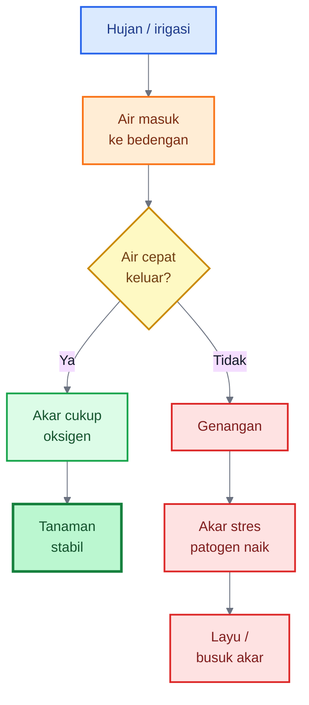

### Tes sederhana drainase

Setelah hujan deras, periksa lahan 1–3 jam kemudian. Jika air masih menggenang di parit dan masuk ke lubang tanam, drainase belum baik. Jika permukaan bedengan sangat becek, pangkal batang lembap terus, dan tanaman mulai layu meskipun tanah basah, akar kemungkinan kekurangan oksigen atau mulai terserang patogen.

Untuk lahan yang sering banjir, perbaikan drainase harus menjadi prioritas sebelum memikirkan pupuk mahal. Pada kasus tekanan _Phytophthora_, Michigan State University menyarankan penggunaan lahan berdrainase baik, bedengan dengan plastik mulsa dan irigasi tetes, menghindari air permukaan untuk irigasi, serta rotasi dengan tanaman tidak rentan. ([Ag & Natural Resources College][6])

---

## 4.4 Kelembapan Stabil

Rumpun bambu mengajarkan bahwa tanaman kuat bukan karena tanahnya selalu basah, tetapi karena kelembapan di sekitar akar relatif stabil. Serasah bambu membantu mengurangi penguapan, sementara akar dan bahan organik membantu tanah menyimpan air.

Cabai tidak suka pola ekstrem: hari ini sangat kering, besok tergenang. Pola seperti ini membuat akar stres. Saat tanah terlalu kering, akar halus mati dan serapan hara terganggu. Saat tiba-tiba disiram berlebihan atau terkena hujan deras, akar yang sudah lemah mudah rusak, oksigen turun, dan patogen tanah lebih aktif.

Irigasi cabai sebaiknya diarahkan ke **zona akar**, bukan hanya membasahi permukaan tanah. Penyiraman dangkal dan terlalu sering membuat akar cenderung berada di permukaan. Akibatnya, tanaman lebih mudah stres saat permukaan tanah panas atau kering. Penyiraman yang baik membasahi zona akar secara cukup, lalu diberi jeda sesuai kelembapan tanah.

Dalam pengelolaan penyakit pepper, Ohio State University menekankan bahwa praktik budaya seperti rotasi, drainase baik, bedengan tinggi, menghindari air permukaan untuk irigasi, dan sanitasi perlu dipakai bersama untuk mengelola penyakit akar seperti _Phytophthora_ dan _Pythium_. ([U.OSU][7])

### Praktik lapangan

Gunakan irigasi tetes jika memungkinkan. Irigasi tetes lebih efisien karena air langsung masuk ke zona akar, tidak banyak membasahi daun, dan lebih mudah dikontrol. Pada musim hujan, irigasi dikurangi dan fokus dialihkan pada pembuangan air. Pada musim kemarau, irigasi dibuat teratur agar tanaman tidak mengalami stres berulang.

Cara sederhana membaca kelembapan tanah adalah dengan mengambil tanah dari kedalaman 10–15 cm. Jika tanah bisa dikepal tetapi tidak mengeluarkan air, kelembapan biasanya cukup baik. Jika tanah hancur seperti debu, terlalu kering. Jika tanah mengeluarkan air atau lengket berlebihan, terlalu basah.

Rumus praktis untuk menghitung volume air irigasi dasar:

$$
V_{\text{air}} =
N_{\text{tanaman}} \times K_{\text{air}}
$$

Keterangan:

- $V_{\text{air}}$ = total air per aplikasi
- $N_{\text{tanaman}}$ = jumlah tanaman cabai
- $K_{\text{air}}$ = kebutuhan air per tanaman per aplikasi

Contoh:

Jika ada **1.000 tanaman** dan target penyiraman adalah **250 ml per tanaman**, maka:

$$
V_{\text{air}} =
1000 \times 0{,}25
= 250\ \text{liter}
$$

Angka $K_{\text{air}}$ harus disesuaikan dengan umur tanaman, jenis tanah, cuaca, mulsa, dan musim. Bibit muda membutuhkan air lebih sedikit daripada tanaman berbuah. Tanah berpasir perlu penyiraman lebih sering daripada tanah liat berstruktur baik. Lahan bermulsa biasanya lebih hemat air daripada lahan terbuka.

### Prinsip kelembapan stabil

Lebih baik tanah dijaga **lembap cukup secara konsisten** daripada dibuat sangat kering lalu disiram banyak. Kelembapan stabil membantu akar tetap aktif, mikroba bekerja, nutrisi terserap, dan tanaman tidak mudah mengalami rontok bunga akibat stres.

---

## 4.5 Ekosistem Lahan Lebih Beragam

Rumpun bambu adalah mini-ekosistem. Di sekitarnya ada serasah, mikroba, serangga, organisme tanah, dan tanaman lain. Sistem seperti ini lebih stabil daripada lahan kosong yang hanya berisi satu jenis tanaman dalam kondisi terbuka.

Dalam budidaya cabai, ekosistem yang terlalu sederhana membuat hama lebih mudah meledak. Jika satu hamparan hanya berisi cabai, tanpa refugia, tanpa rotasi, dan tanpa habitat musuh alami, maka hama seperti kutu kebul, thrips, kutu daun, tungau, dan lalat buah dapat berkembang lebih cepat ketika kondisi mendukung.

Refugia adalah tanaman yang menyediakan tempat berlindung, nektar, polen, atau mikrohabitat bagi musuh alami. Pada cabai, tanaman seperti kenikir, bunga matahari, marigold, basil, bunga kertas, atau tanaman berbunga lokal dapat digunakan di pinggir lahan. Studi pada cabai menunjukkan bahwa tanaman refugia di sekitar cabai dapat menjadi tempat berlindung sementara bagi musuh alami dan membantu menekan populasi kutu kebul; dalam penelitian tersebut, perlakuan kenikir menghasilkan populasi kutu kebul yang lebih kecil dibanding kontrol. ([SABRAO Journal of Breeding and Genetics][8])

Selain refugia, rotasi tanaman sangat penting. Cabai sebaiknya tidak ditanam terus-menerus di lahan yang sama tanpa pemulihan tanah. Tanam berulang satu famili tanaman memperbesar risiko penumpukan patogen tanah. Untuk penyakit seperti _Phytophthora capsici_, rotasi harus hati-hati karena pepper dan cucurbit sama-sama dapat menjadi inang; eOrganic menekankan bahwa pepper tidak sebaiknya dirotasi dengan cucurbit karena keduanya rentan terhadap _Phytophthora blight_. ([eOrganic][9])

New Mexico State University merekomendasikan rotasi cabai agar chile tidak ditanam lebih dari sekali dalam 3–4 tahun pada lahan yang sama, dan menyebut barley atau small grains dapat membantu mengurangi populasi patogen tertentu. ([NMSU Publications][10])

### Praktik lapangan

Tanam refugia di pinggir lahan, bukan terlalu rapat di tengah bedengan cabai. Refugia harus dirawat agar tidak menjadi sarang hama. Pilih tanaman yang berbunga bertahap, tidak terlalu bersaing dengan cabai, dan mudah dikendalikan. Refugia yang baik adalah yang mendukung musuh alami, bukan yang membuat lahan menjadi semak tidak terurus.

Lakukan rotasi dengan tanaman yang berbeda famili dan tidak menjadi inang utama penyakit yang sama. Setelah cabai, pilihan rotasi bisa diarahkan ke serealia, jagung, padi, kacang tertentu, atau tanaman penutup tanah sesuai kondisi lokal. Hindari rotasi langsung dengan tomat, terung, kentang, atau tanaman solanaceae lain jika masalah utamanya adalah patogen tular tanah keluarga solanaceae. Hindari pula rotasi dengan cucurbit seperti semangka, melon, timun, dan labu pada lahan dengan riwayat _Phytophthora capsici_.

Gunakan juga sanitasi lahan. Tanaman sakit berat jangan dibiarkan membusuk di lahan. Buah busuk, tanaman mati, dan sisa panen terinfeksi harus dikeluarkan dari area produksi. Gulma juga perlu dikendalikan karena beberapa gulma dapat menjadi inang hama atau penyakit.

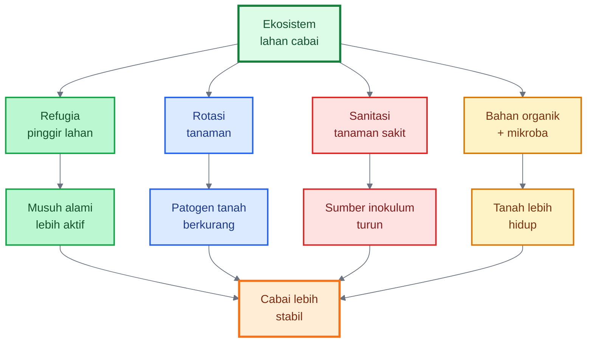

---

# Ringkasan Bab 4

Membuat kondisi lingkungan seperti rumpun bambu berarti menciptakan lahan cabai yang **tidak ekstrem**. Tanah tidak padat, tidak becek, tidak telanjang, tidak miskin bahan organik, dan tidak menjadi ekosistem tunggal yang rapuh.

Prinsip utamanya:

1. **Tanah gembur dan kaya bahan organik** agar akar mudah berkembang dan mikroba punya makanan.
2. **Permukaan tanah terlindungi** dengan mulsa agar kelembapan, suhu, erosi, gulma, dan percikan tanah lebih terkendali.
3. **Drainase baik** karena cabai sangat sensitif terhadap genangan dan penyakit akar.
4. **Kelembapan stabil** agar akar tidak stres akibat pola terlalu kering lalu terlalu basah.
5. **Ekosistem lahan lebih beragam** melalui refugia, rotasi, sanitasi, dan bahan organik.

Kalimat kunci Bab 4:

> **Cabai kuat tumbuh di lingkungan yang stabil: tanahnya remah, permukaannya tertutup, airnya terkendali, paritnya lancar, dan ekosistem lahannya hidup.**

[1]: https://www.fao.org/4/a0100e/a0100e.pdf?utm_source=chatgpt.com 'The importance of soil organic matter'
[2]: https://www.sciencedirect.com/science/article/abs/pii/S0929139312000753?utm_source=chatgpt.com 'Soil microbial biomass, functional microbial diversity, and ...'
[3]: https://ugspace.ug.edu.gh/server/api/core/bitstreams/e77a9b56-6cf7-4cc5-81c5-eb87587522c5/content?utm_source=chatgpt.com 'EFFECT OF ORGANIC MULCH ON GROWTH AND YIELD OF ...'
[4]: https://extension.umn.edu/disease-management/phytophthora?utm_source=chatgpt.com 'Managing phytophthora on farms'
[5]: https://pnwhandbooks.org/plantdisease/host-disease/pepper-capsicum-spp-phytophthora-blight-root-crown-rot?utm_source=chatgpt.com 'Pepper (Capsicum spp.)-Phytophthora Blight (Root and ...'
[6]: https://www.canr.msu.edu/news/phytophthora_can_blight_your_peppers_and_your_profits?utm_source=chatgpt.com 'Phytophthora can blight your peppers and your profits'
[7]: https://u.osu.edu/vegnetnews/2021/05/20/managing-phytophthora-blight-and-pythium-root-rot-in-peppers-fungicide-update-2/?utm_source=chatgpt.com 'Managing Phytophthora Blight and Pythium Root Rot in Peppers'
[8]: https://sabraojournal.org/wp-content/uploads/2023/10/SABRAO-J-Breed-Genet-55-5-1703-1712-MS23-156.pdf?utm_source=chatgpt.com 'PDF: EFFECT OF REFUGIA PLANTS ON WHITEFLY ...'
[9]: https://eorganic.org/pages/64951/soilborne-disease-management-in-organic-vegetable-production?utm_source=chatgpt.com 'Soilborne Disease Management in Organic Vegetable ...'
[10]: https://pubs.nmsu.edu/_circulars/CR549/?utm_source=chatgpt.com 'Chile Pepper Diseases | New Mexico State University'

---

# 5. Membuat Pengayaan Mikroba dari Lingkungan Rumpun Bambu

Bab ini adalah salah satu bagian paling penting dalam artikel ini, karena di sinilah prinsip rumpun bambu diterjemahkan menjadi praktik yang lebih khas: **mengambil inspirasi dari mikrobioma bambu untuk memperkaya kehidupan tanah cabai**.

Namun, sejak awal perlu ditegaskan: pengayaan mikroba dari rumpun bambu **bukan obat ajaib**, bukan pengganti pupuk utama, dan bukan pengganti agen hayati komersial yang strain-nya jelas. Pengayaan mikroba lokal lebih tepat diposisikan sebagai **bioaktivator ekosistem tanah**. Fungsinya membantu menghidupkan bahan organik, memperkaya keragaman mikroba, mendukung dekomposisi, dan memperbaiki lingkungan akar.

Rumpun bambu menarik karena di bawahnya terjadi proses biologis terus-menerus. Daun gugur menjadi serasah, akar dan rimpang aktif mengeluarkan eksudat, bahan organik terurai perlahan, tanah terlindungi dari panas langsung, dan kelembapan relatif lebih stabil. Kajian terbaru tentang mikroba pada ekosistem bambu menunjukkan bahwa mikroorganisme tanah berperan dalam siklus hara, interaksi akar, pertumbuhan bambu, dan fungsi ekosistem bambu secara keseluruhan. ([Frontiers][1])

Dalam konteks cabai, lingkungan seperti ini dapat dijadikan inspirasi untuk membuat tanah budidaya lebih hidup.

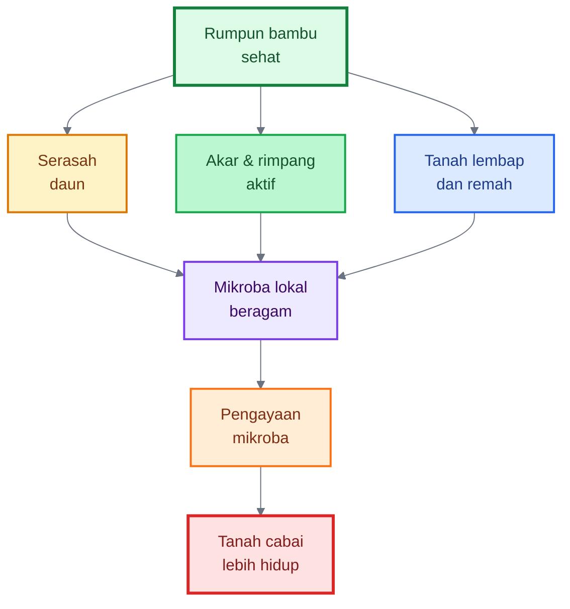

---

## 5.1 Mengapa Mikroba dari Rumpun Bambu Menarik?

Rumpun bambu memiliki tiga ciri lingkungan yang menarik bagi pengelolaan mikroba tanah.

Pertama, rumpun bambu memiliki **serasah daun yang terus terurai**. Daun bambu yang gugur membentuk lapisan organik di permukaan tanah. Lapisan ini menyediakan karbon bagi mikroba dekomposer. Mikroba dekomposer penting karena mereka membantu mengubah bahan organik kasar menjadi bentuk yang lebih stabil dan lebih mudah masuk ke siklus hara.

Kedua, tanah di bawah rumpun bambu biasanya lebih **lembap, terlindungi, dan tidak terlalu ekstrem** dibanding tanah terbuka. Kelembapan yang stabil mendukung aktivitas biologis tanah. Mikroba tanah tidak bekerja optimal pada kondisi terlalu kering, terlalu panas, terlalu asam ekstrem, atau tergenang tanpa oksigen.

Ketiga, akar dan rimpang bambu aktif berinteraksi dengan mikroba. Rizosfer, yaitu zona tanah di sekitar akar, menjadi tempat pertukaran senyawa antara tanaman dan mikroorganisme. Dalam ekosistem bambu, kajian mikrobiologi menunjukkan bahwa komunitas bakteri dan fungi pada rizosfer berhubungan dengan fungsi tanah, dekomposisi, dan ketersediaan hara. ([Frontiers][1])

Maka, ketika kita mengambil sedikit tanah remah atau serasah lapuk dari bawah rumpun bambu yang sehat, yang kita ambil bukan sekadar tanah. Yang kita ambil adalah **contoh kecil dari lingkungan biologis aktif**.

Namun, prinsipnya harus bijak. Kita tidak sedang “menambang” tanah bambu secara besar-besaran. Pengambilan cukup sedikit sebagai starter, lalu diperbanyak menggunakan bahan organik yang tersedia di lahan.

## 5.1.1 Rumpun bambu sebagai kandidat sumber mikroba pelarut silikat

Rumpun bambu sehat layak diduga sebagai salah satu sumber eksplorasi mikroba pelarut silikat. Alasannya, bambu merupakan tanaman yang banyak mengakumulasi silika, sementara tanah di bawah rumpun bambu memiliki serasah, akar aktif, bahan organik, dan rizosfer yang dinamis. Kondisi ini memungkinkan terjadinya siklus silika yang aktif antara tanah, akar, batang, daun, serasah, dan mikroba.

Namun, dugaan ini tidak boleh dinyatakan sebagai kepastian pada semua rumpun bambu. Tidak semua rumpun bambu otomatis kaya mikroba pelarut silikat. Keberadaan mikroba tersebut dipengaruhi oleh jenis bambu, umur rumpun, bahan induk tanah, pH, kelembapan, bahan organik, dan riwayat lokasi. Karena itu, rumpun bambu sehat lebih tepat disebut sebagai kandidat kuat atau sumber potensial mikroba pelarut silikat, bukan jaminan mutlak.

Dalam konteks budidaya cabai, gagasan ini penting karena mikroba pelarut silikat dapat membantu melepaskan silikon dari bahan silikat tidak larut seperti sekam, abu sekam, jerami, daun bambu, atau mineral silikat. Silikon yang lebih tersedia kemudian dapat mendukung penguatan jaringan tanaman cabai. Namun, proses ini bersifat bertahap dan tidak secepat aplikasi silika larut seperti kalium silikat atau asam monosilikat.

Dengan demikian, pengayaan mikroba dari rumpun bambu dapat dipadukan dengan sumber silikat alami sebagai strategi jangka menengah untuk membangun tanah hidup dan tanaman cabai yang lebih kokoh.

````

Lalu tambahkan diagram berikut setelah paragraf itu:

```mermaid
%%{init: {"theme": "base", "themeVariables": {
  "fontFamily": "Arial",
  "primaryTextColor": "#111827",
  "lineColor": "#6b7280"
}}}%%
flowchart TD
    A["Rumpun bambu<br/>sehat"]:::bamboo
    B["Potensi mikroba<br/>pelarut silikat"]:::green
    C["Sumber silikat:<br/>sekam, abu sekam,<br/>jerami, daun bambu"]:::brown
    D["Kompos matang<br/>+ bahan organik"]:::orange
    E["Rizosfer cabai<br/>lebih aktif"]:::blue
    F["Silika lebih tersedia<br/>bertahap"]:::purple
    G["Cabai lebih kokoh<br/>dan tahan stres"]:::result

    A --> B
    B --> E
    C --> E
    D --> E
    E --> F --> G

    classDef bamboo fill:#dcfce7,stroke:#15803d,stroke-width:3px,color:#14532d;
    classDef green fill:#bbf7d0,stroke:#16a34a,stroke-width:2px,color:#14532d;
    classDef brown fill:#fef3c7,stroke:#d97706,stroke-width:2px,color:#78350f;
    classDef orange fill:#ffedd5,stroke:#f97316,stroke-width:2px,color:#7c2d12;
    classDef blue fill:#dbeafe,stroke:#2563eb,stroke-width:2px,color:#1e3a8a;
    classDef purple fill:#ede9fe,stroke:#7c3aed,stroke-width:2px,color:#3b0764;
    classDef result fill:#fee2e2,stroke:#dc2626,stroke-width:3px,color:#7f1d1d;
````

### Prinsip praktis

> **Ambil sedikit mikroba dari lingkungan sehat, lalu perbanyak dengan bahan organik yang aman. Jangan mengambil banyak tanah dari rumpun bambu.**

---

## 5.2 Fungsi Pengayaan Mikroba untuk Cabai

Pengayaan mikroba dari lingkungan rumpun bambu memiliki beberapa fungsi praktis bagi lahan cabai.

Fungsi pertama adalah membantu **mempercepat penguraian bahan organik**. Bahan seperti jerami, sekam, daun kering, pupuk kandang fermentasi, kompos setengah matang, atau sisa tanaman membutuhkan mikroba agar terurai menjadi bahan yang lebih stabil. Penelitian tentang Indigenous Microorganisms atau IMO menunjukkan bahwa penambahan IMO pada proses kompos dapat meningkatkan mikroorganisme yang bertanggung jawab dalam dekomposisi bahan organik. ([ResearchGate][2])

Fungsi kedua adalah mendukung **pembentukan tanah remah**. Mikroba, bahan organik, akar, dan aktivitas organisme tanah bersama-sama membantu membentuk agregat tanah. Tanah yang remah lebih baik untuk akar cabai karena memiliki ruang udara, mampu menyimpan air, dan tidak mudah memadat.

Fungsi ketiga adalah membantu **kompetisi melawan patogen tanah**. Mikroba lokal yang beragam dapat bersaing dengan mikroba patogen dalam ruang dan makanan. Kompos yang memiliki sifat supresif penyakit diketahui dapat meningkatkan kemampuan tanah menekan patogen tular tanah melalui perubahan komunitas mikroba dan peningkatan aktivitas biologis tanah. ([ScienceDirect][3])

Fungsi keempat adalah menambah **keragaman mikroba di sekitar akar cabai**. Tanah pertanian intensif sering miskin keragaman mikroba karena tanam berulang, pestisida berlebih, pupuk tidak seimbang, bahan organik rendah, dan erosi. Pengayaan mikroba lokal dapat membantu mengisi kembali ruang biologis di zona akar, walaupun hasilnya tetap bergantung pada kondisi tanah.

Fungsi kelima adalah mendukung **adaptasi tanaman terhadap stres**. Mikroba menguntungkan dapat membantu tanaman menghadapi stres melalui pelarutan hara, produksi hormon tumbuh, kompetisi dengan patogen, dan stimulasi ketahanan tanaman. Mikroba seperti _Trichoderma_ dan _Bacillus_ banyak dikaji sebagai pemacu pertumbuhan dan kesehatan tanaman, termasuk dalam konteks toleransi stres dan biokontrol. ([Frontiers][4])

Fungsi keenam Berpotensi membantu pelarutan silikat dari bahan seperti sekam, abu sekam, jerami, daun bambu, atau mineral silikat sehingga silikon lebih tersedia secara bertahap bagi tanaman.

Fungsi ini penting karena silikon yang tersedia dapat membantu memperkuat jaringan cabai. Namun, pelepasan silikon melalui aktivitas mikroba bersifat bertahap. Jika targetnya adalah efek cepat, petani tetap lebih aman menggunakan sumber silika larut yang terukur. Mikroba pelarut silikat lebih tepat diposisikan sebagai bagian dari strategi jangka menengah untuk membangun tanah hidup.

Ringkasnya, pengayaan mikroba bukan bekerja seperti pupuk kimia yang langsung memberi angka hara tertentu. Ia bekerja dengan cara memperbaiki **proses biologis**.

```mermaid id="rdbw87"
%%{init: {"theme": "base", "themeVariables": {
  "fontFamily": "Arial",
  "primaryTextColor": "#111827",
  "lineColor": "#6b7280"
}}}%%
flowchart TD
    A["Pengayaan<br/>mikroba bambu"]:::main

    A --> B["Dekomposisi<br/>lebih aktif"]:::brown
    A --> C["Tanah lebih<br/>remah"]:::green
    A --> D["Kompetisi<br/>dengan patogen"]:::red
    A --> E["Keragaman<br/>mikroba naik"]:::purple
    A --> F["Akar lebih<br/>adaptif"]:::blue

    B --> G["Cabai tumbuh<br/>lebih stabil"]:::result
    C --> G
    D --> G
    E --> G
    F --> G

    classDef main fill:#dcfce7,stroke:#15803d,stroke-width:3px,color:#14532d;
    classDef brown fill:#fef3c7,stroke:#d97706,stroke-width:2px,color:#78350f;
    classDef green fill:#bbf7d0,stroke:#16a34a,stroke-width:2px,color:#14532d;
    classDef red fill:#fee2e2,stroke:#dc2626,stroke-width:2px,color:#7f1d1d;
    classDef purple fill:#ede9fe,stroke:#7c3aed,stroke-width:2px,color:#3b0764;
    classDef blue fill:#dbeafe,stroke:#2563eb,stroke-width:2px,color:#1e3a8a;
    classDef result fill:#ffedd5,stroke:#f97316,stroke-width:3px,color:#7c2d12;
```

---

## 5.3 Syarat Memilih Sumber Mikroba Bambu

Sumber mikroba harus dipilih dengan cermat. Tidak semua rumpun bambu layak dijadikan sumber pengayaan. Mikroba lokal sangat beragam; ada yang bermanfaat, ada yang netral, dan ada yang berpotensi merugikan. Karena itu, sumber harus berasal dari lingkungan yang sehat.

Pilih rumpun bambu yang sehat, hijau, tidak banyak batang busuk, tidak berbau busuk, dan tidak berada di lokasi tercemar. Tanah di bawahnya idealnya remah, lembap, gelap, dan berbau segar seperti tanah hutan. Bau tanah hutan biasanya menunjukkan adanya proses dekomposisi aerobik yang baik.

Hindari rumpun bambu di dekat tempat pembuangan sampah, limbah rumah tangga, limbah industri, kandang kotor, got, septic tank, pestisida berat, atau lahan yang sering terkena bahan kimia keras. Lokasi seperti ini berisiko membawa mikroba yang tidak diinginkan, logam berat, residu kimia, atau kontaminan lain.

Jangan ambil dari rumpun yang tanahnya berbau anaerob, menyengat, busuk, seperti bangkai, atau seperti telur busuk. Bau seperti itu menunjukkan proses pembusukan tanpa oksigen yang tidak ideal untuk pengayaan mikroba pertanian. Hindari juga serasah yang penuh jamur menyengat, berlendir, atau berwarna mencurigakan.

### Bagian yang diambil

Yang diambil cukup sedikit dari lapisan berikut:

- serasah bambu yang sudah agak lapuk,
- tanah remah tepat di bawah serasah,
- humus tipis yang berbau segar,
- sedikit tanah di sekitar akar halus, tanpa merusak rumpun.

Jangan mengambil akar besar atau merusak rimpang bambu. Tujuannya hanya mengambil starter mikroba, bukan mengambil bahan utama.

### Prinsip etika pengambilan

Ambil sedikit dari beberapa titik, lalu tutup kembali bekas pengambilan dengan serasah. Jangan menggali dalam. Jangan merusak rumpun. Jangan mengambil dari kawasan konservasi tanpa izin.

---

## 5.4 Bentuk Pengayaan yang Bisa Dibuat

Pengayaan mikroba bambu dapat dibuat dalam beberapa bentuk. Setiap bentuk punya fungsi berbeda.

### 5.4.1 Bioaktivator lokal dari tanah dan serasah bambu

Ini adalah bentuk paling sederhana. Tanah remah dan serasah lapuk dari rumpun bambu digunakan sebagai starter, lalu diperbanyak dengan sumber makanan seperti dedak, molase, air cucian beras, kompos matang, atau bahan organik halus.

Fungsinya adalah mengaktifkan bahan organik di lahan dan memperkaya komunitas mikroba. Bentuk ini cocok untuk kocor tanah, aktivasi kompos, atau fermentasi bahan organik.

### 5.4.2 Kompos yang diinokulasi tanah bawah bambu

Pada cara ini, starter bambu dicampurkan ke bahan kompos. Targetnya bukan membuat larutan mikroba, tetapi membuat kompos lebih aktif secara biologis. Ini lebih aman untuk petani karena mikroba berkembang pada media padat dan bahan organik.

Bentuk ini cocok untuk lahan cabai karena kompos adalah media masuk yang baik bagi mikroba. Kompos juga lebih stabil dibanding larutan yang mudah berubah kualitasnya.

### 5.4.3 Fermentasi bahan organik dengan sumber mikroba bambu

Bahan seperti jerami cincang, daun kering, sekam, dedak, pupuk kandang fermentasi, atau sisa tanaman dapat difermentasi menggunakan starter bambu. Tujuannya mempercepat pelapukan, menurunkan risiko bahan mentah, dan membuat bahan lebih ramah akar.

### 5.4.4 Pupuk organik cair berbasis mikroba lokal

Bentuk cair lebih mudah diaplikasikan melalui kocor, tetapi lebih berisiko gagal jika prosesnya terlalu anaerob, terlalu pekat, atau bahan yang digunakan tidak bersih. Karena itu, bentuk cair harus dibuat hati-hati dan lebih baik digunakan ke tanah, bukan disemprot pekat ke daun.

### 5.4.5 Starter dekomposer untuk jerami, sekam, daun, dan pupuk kandang

Ini penggunaan paling praktis. Mikroba bambu dipakai untuk membantu pelapukan bahan organik, bukan langsung dianggap pupuk. Starter ini dapat membantu membuat bahan organik lokal lebih cepat siap masuk ke lahan cabai.

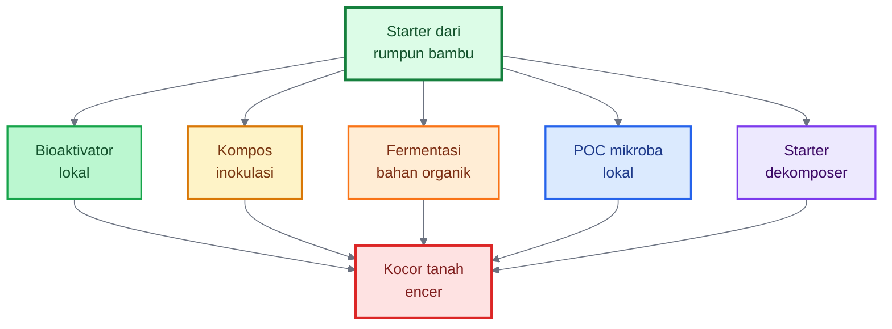

### 5.4.6 Pengayaan mikroba pelarut silikat

Pengayaan ini dibuat dengan menggabungkan starter mikroba dari rumpun bambu sehat, kompos matang, dan sumber silikat alami seperti sekam bakar, abu sekam matang, jerami lapuk, daun bambu lapuk, atau mineral silikat pertanian. Tujuannya bukan menghasilkan silika larut secara instan, tetapi membangun proses biologis yang membantu pelepasan silikon secara bertahap di zona akar cabai.

Pengayaan ini paling cocok digunakan sebelum tanam atau sebagai aktivator kompos, bukan sebagai larutan pekat yang langsung diberikan ke akar muda.

---

## 5.5 Prinsip Pembiakan Mikroba

Pembiakan mikroba lokal harus mengikuti prinsip sederhana: mikroba butuh makanan, air, udara yang cukup, suhu nyaman, dan media yang tidak tercemar. Jika prosesnya salah, yang terjadi bukan fermentasi baik, tetapi pembusukan.

Mikroba membutuhkan sumber makanan. Bahan yang umum digunakan adalah molase, gula merah, dedak, air cucian beras, kompos matang, serasah halus, atau bahan organik lain. Molase dan gula memberi energi cepat. Dedak memberi karbon, sedikit nitrogen, mineral, dan permukaan bagi mikroba. Kompos matang memberi media yang lebih stabil.

Mikroba juga membutuhkan kelembapan cukup. Untuk fermentasi padat, kelembapan ideal dapat diperkirakan dengan uji genggam: bahan terasa lembap, bisa menggumpal ringan saat digenggam, tetapi tidak meneteskan air. Jika terlalu kering, mikroba lambat bekerja. Jika terlalu basah, oksigen turun dan bau busuk mudah muncul.

Fermentasi yang baik umumnya berbau asam-manis, segar, seperti tape, atau seperti tanah hutan. Fermentasi yang gagal biasanya berbau busuk, menyengat, seperti bangkai, seperti got, atau seperti telur busuk. Jika muncul bau busuk kuat, jangan gunakan ke tanaman cabai.

### Formula dasar 1: larutan molase 1–2%

Untuk mengaktifkan mikroba, molase sering digunakan dalam konsentrasi rendah. Rumusnya:

$$
V_{\text{molase}} =
C_{\text{molase}} \times V_{\text{air}}
$$

Keterangan:

- $V_{\text{molase}}$ = volume molase yang dibutuhkan
- $C_{\text{molase}}$ = konsentrasi molase dalam desimal
- $V_{\text{air}}$ = volume air

Jika ingin membuat 10 liter larutan molase 1%, maka:

$$
V_{\text{molase}} =
0{,}01 \times 10
= 0{,}1\ \text{liter}
$$

Artinya, gunakan sekitar **100 ml molase untuk 10 liter air**.

Jika ingin 2%:

$$
V_{\text{molase}} =
0{,}02 \times 10
= 0{,}2\ \text{liter}
$$

Artinya, gunakan sekitar **200 ml molase untuk 10 liter air**.

Untuk aplikasi mikroba, konsentrasi rendah lebih aman daripada terlalu pekat. Molase yang terlalu banyak dapat memicu ledakan mikroba tidak seimbang, menurunkan oksigen di media, dan membuat fermentasi berbau.

### Formula dasar 2: pengenceran larutan mikroba

Jika memakai larutan mikroba sebagai stok, jangan langsung diberikan pekat ke akar muda. Gunakan pengenceran.

Untuk rasio 1:20, artinya:

$$
1\ \text{bagian stok} + 20\ \text{bagian air}
$$

Rumus volume stok:

$$
V_{\text{stok}} =
\frac{V_{\text{akhir}}}{R + 1}
$$

Keterangan:

- $V_{\text{stok}}$ = volume larutan mikroba stok
- $V_{\text{akhir}}$ = total larutan akhir yang ingin dibuat
- $R$ = jumlah bagian air dalam rasio pengenceran

Contoh membuat 21 liter larutan aplikasi dengan rasio 1:20:

$$
V_{\text{stok}} =
\frac{21}{20 + 1}
= 1\ \text{liter}
$$

Jadi, campurkan:

$$
1\ \text{liter stok} + 20\ \text{liter air}
= 21\ \text{liter larutan aplikasi}
$$

Untuk tanaman muda, rasio lebih encer seperti 1:30 sampai 1:50 lebih aman. Untuk kompos atau lahan sebelum tanam, rasio 1:20 masih dapat digunakan jika fermentasi berkualitas baik.

---

## 5.5.1 Contoh Formula Aman: Starter Padat Mikroba Bambu

Formula ini ditujukan sebagai **bioaktivator kompos dan tanah**, bukan pupuk utama.

### Bahan

- Tanah remah/serasah lapuk dari bawah bambu sehat: 1 bagian
- Dedak halus: 3 bagian
- Kompos matang halus: 5 bagian
- Air bersih secukupnya
- Molase 1–2% dari volume air yang digunakan

Contoh praktis:

- tanah/serasah bambu: 1 kg
- dedak: 3 kg
- kompos matang: 5 kg
- air molase 1–2% secukupnya sampai lembap
- total bahan padat: sekitar 9 kg

### Cara membuat

Campur tanah/serasah bambu, dedak, dan kompos matang sampai merata. Larutkan molase dalam air. Siram sedikit demi sedikit sambil diaduk sampai kelembapan cukup. Gunakan uji genggam: bahan menggumpal ringan tetapi tidak menetes.

Simpan di tempat teduh dan beralas bersih. Tutup dengan karung goni, daun kering, atau penutup yang masih memungkinkan pertukaran udara. Jangan ditutup rapat total karena proses biologis dapat menghasilkan gas dan panas.

Balik bahan setiap 1–2 hari agar tidak anaerob. Jika suhu terlalu panas atau bau mulai menyengat, bahan terlalu basah atau terlalu padat; tambahkan bahan kering seperti dedak, sekam, atau kompos matang, lalu aduk.

Starter padat siap digunakan jika baunya segar, asam-manis ringan, seperti tape, atau seperti tanah hutan. Jika berbau busuk kuat, jangan digunakan ke tanaman.

### Cara pakai

Untuk aktivasi kompos, campurkan starter padat ke tumpukan kompos atau pupuk kandang fermentasi. Untuk bedengan cabai, campurkan ke kompos matang lalu aplikasikan sebelum tanam. Jangan menabur starter pekat langsung menempel pada akar bibit.

---

## 5.5.2 Contoh Formula Aman: Bioaktivator Cair Mikroba Bambu

Formula cair lebih mudah dipakai, tetapi harus lebih hati-hati.

### Bahan

- Tanah remah/serasah lapuk dari bawah bambu sehat: 1 genggam besar sampai 250 gram
- Air cucian beras atau air bersih: 10 liter
- Molase: 100–200 ml
- Dedak halus: 100–200 gram

### Cara membuat

Masukkan air, molase, dedak, dan starter bambu ke wadah bersih. Aduk rata. Tutup longgar, bukan kedap total. Simpan di tempat teduh. Aduk atau buka sebentar setiap hari agar gas keluar dan oksigen tetap tersedia.

Fermentasi biasanya mulai aktif dalam beberapa hari. Gunakan hanya jika aromanya asam-manis, segar, seperti tape, atau tanah hutan. Jika berbau busuk, berlendir ekstrem, atau menyengat seperti bangkai, buang ke lubang kompos jauh dari tanaman produksi.

### Cara pakai

Gunakan sebagai kocor tanah setelah diencerkan. Untuk tanaman cabai muda, gunakan pengenceran lebih aman seperti 1:30 sampai 1:50. Untuk kompos atau bedengan sebelum tanam, pengenceran 1:20 dapat digunakan jika kualitas fermentasi baik.

Jangan semprotkan larutan pekat ke daun, bunga, atau buah. Risiko fitotoksik, kontaminasi, dan bau lebih tinggi pada aplikasi foliar.

---

## 5.6 Cara Pemakaian di Lahan Cabai

Pengayaan mikroba bambu paling aman digunakan sebagai **aktivator tanah dan kompos**, bukan sebagai pupuk utama. Nutrisi tanaman tetap harus dipenuhi melalui pupuk organik matang, pupuk hayati terukur, dan pemupukan mineral sesuai kebutuhan.

### 5.6.1 Sebelum tanam

Campurkan starter padat mikroba bambu ke kompos matang atau pupuk kandang fermentasi. Diamkan beberapa hari sampai bahan stabil dan tidak panas. Setelah itu, masukkan ke bedengan.

Pola ini lebih aman daripada menyiram larutan mikroba langsung ke tanah yang belum siap. Kompos menjadi “rumah awal” bagi mikroba. Saat kompos masuk ke bedengan, mikroba ikut masuk bersama makanan dan media hidupnya.

### 5.6.2 Saat tanam

Gunakan larutan mikroba yang sudah diencerkan sebagai kocor lubang tanam, tetapi jangan berlebihan. Lubang tanam cukup lembap, bukan becek. Bibit cabai yang baru pindah tanam masih sensitif, sehingga larutan pekat dapat mengganggu akar.

Jika memakai agen hayati komersial seperti _Trichoderma_, _Bacillus_, _Pseudomonas_, atau mikoriza, aplikasikan sesuai label. Mikroba lokal bambu dapat menjadi pelengkap, bukan pengganti total.

### 5.6.3 Pemeliharaan

Kocor ulang mikroba setiap 2–4 minggu sesuai kondisi. Aplikasi ulang lebih bermanfaat setelah hujan lebat, setelah stres panas, atau setelah pemberian bahan organik baru. Jangan aplikasikan mikroba terlalu dekat waktunya dengan fungisida atau bakterisida kimia keras.

Gunakan pola berikut sebagai panduan:

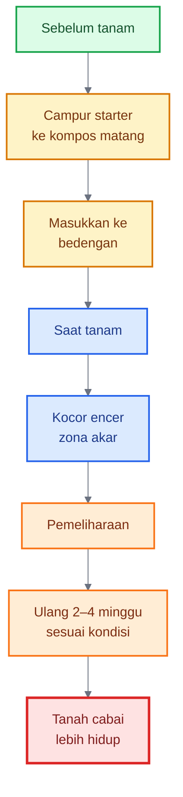

### 5.6.4 Dosis praktis konservatif

Untuk aplikasi awal, gunakan dosis kecil dan lihat respons tanaman. Pada skala praktik:

- kocor tanaman muda: larutan encer 1:30 sampai 1:50, secukupnya membasahi zona akar;
- kocor tanaman dewasa: larutan encer 1:20 sampai 1:30, sesuai kondisi tanah;
- aktivasi kompos: starter padat dicampur merata ke bahan kompos;
- aplikasi bedengan: lebih baik starter dicampur kompos matang daripada diberikan pekat langsung ke lubang tanam.

Jika tanaman menunjukkan stres setelah aplikasi, seperti layu mendadak, bau tanah tidak enak, atau permukaan tanah berlendir, hentikan aplikasi dan evaluasi kualitas fermentasi.

---

## 5.7 Posisi Mikroba Bambu Dibanding Produk Hayati Komersial

Mikroba lokal bambu dan produk hayati komersial punya posisi yang berbeda.

Mikroba lokal bambu unggul pada sisi **keragaman dan adaptasi lokal**. Ia berasal dari lingkungan sekitar, mudah dibuat, murah, dan bisa membantu memperkaya aktivitas biologis tanah. Namun, komposisinya tidak pasti. Kita tidak tahu persis spesies apa yang dominan, berapa populasinya, dan apakah semua kelompok mikroba yang tumbuh menguntungkan.

Produk hayati komersial lebih unggul pada sisi **keterukuran**. Produk yang baik mencantumkan mikroba, strain, jumlah populasi, cara aplikasi, tanggal kedaluwarsa, dan target penggunaan. Agen hayati seperti _Trichoderma_, _Bacillus_, _Pseudomonas_, dan mikoriza telah banyak dikaji sebagai pemacu pertumbuhan, biokontrol, dan pendukung kesehatan tanaman. Kombinasi _Trichoderma_ dengan bakteri menguntungkan bahkan dilaporkan memiliki potensi sinergis sebagai pemacu pertumbuhan dan agen biokontrol. ([ScienceDirect][5])

Karena itu, pendekatan terbaik bukan memilih salah satu secara ekstrem. Pendekatan terbaik adalah menggabungkan keduanya secara bijak:

> **Kompos matang + mikroba lokal bambu + agen hayati terpilih + lingkungan tanah yang mendukung.**

Kompos matang menyediakan media dan makanan. Mikroba lokal bambu menambah keragaman. Agen hayati komersial memberi fungsi yang lebih spesifik. Drainase, mulsa, pH, dan bahan organik memastikan semua mikroba punya peluang hidup.

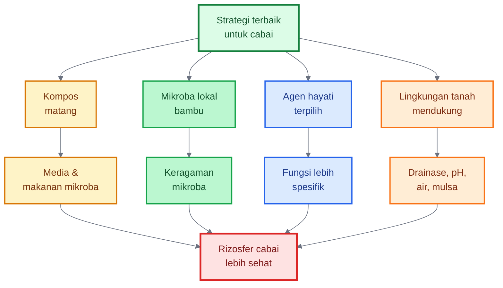

---

## Catatan Keamanan Penggunaan Mikroba Lokal

Karena mikroba lokal tidak teridentifikasi secara spesifik, penggunaannya harus hati-hati.

Jangan gunakan bahan dari lokasi tercemar. Jangan gunakan bahan yang berbau busuk. Jangan memakai wadah bekas pestisida, oli, deterjen, atau bahan kimia keras. Jangan menggunakan bahan hewani mentah, bangkai, tinja manusia, atau limbah dapur busuk untuk pembiakan mikroba cabai. Jangan menutup wadah fermentasi cair secara kedap total karena gas dapat terbentuk.

Gunakan sarung tangan saat mengambil tanah dan mengaduk fermentasi. Jangan menghirup debu bahan kering. Jangan mencicipi atau mengonsumsi hasil fermentasi. Simpan jauh dari anak-anak dan sumber air minum.

Untuk tanaman cabai, aplikasi paling aman adalah melalui tanah, kompos, atau bedengan. Hindari penyemprotan pekat ke daun, bunga, dan buah, terutama menjelang panen.

---

# Ringkasan Bab 5

Pengayaan mikroba dari lingkungan rumpun bambu adalah cara meniru salah satu kekuatan utama bambu: **tanah hidup di bawah rumpun**. Rumpun bambu sehat memiliki serasah, akar aktif, bahan organik, kelembapan stabil, dan mikroba yang bekerja dalam siklus tanah.

Untuk cabai, pengayaan mikroba bambu dapat digunakan untuk:

1. membantu dekomposisi bahan organik,
2. mendukung tanah lebih remah,
3. menambah keragaman mikroba rizosfer,
4. membantu kompetisi dengan patogen tanah,
5. mendukung akar lebih adaptif terhadap stres.

Namun, mikroba bambu harus digunakan dengan bijak. Pilih sumber yang sehat, hindari lokasi tercemar, jangan gunakan fermentasi busuk, encerkan sebelum aplikasi, dan posisikan sebagai **pelengkap**.

Kalimat kunci Bab 5:

> **Mikroba dari rumpun bambu bukan pupuk ajaib, tetapi starter kehidupan tanah. Ia paling kuat jika dipadukan dengan kompos matang, agen hayati terpilih, drainase baik, mulsa, dan manajemen cabai yang seimbang.**

[1]: https://www.frontiersin.org/journals/microbiology/articles/10.3389/fmicb.2025.1533061/full?utm_source=chatgpt.com 'Microbial diversity and function in bamboo ecosystems'
[2]: https://www.researchgate.net/publication/278103890_Indigenous_Microorganisms_Production_and_the_Effect_on_Composting_Process?utm_source=chatgpt.com 'Indigenous Microorganisms Production and the Effect on ...'
[3]: https://www.sciencedirect.com/science/article/abs/pii/S2452219819302046?utm_source=chatgpt.com 'Disease-suppressive compost enhances natural soil ...'
[4]: https://www.frontiersin.org/journals/microbiology/articles/10.3389/fmicb.2024.1423980/full?utm_source=chatgpt.com 'Trichoderma and Bacillus multifunctional allies for plant ...'
[5]: https://www.sciencedirect.com/science/article/pii/S1049964422002651?utm_source=chatgpt.com 'Combined use of Trichoderma and beneficial bacteria ( ...'

---

# 6. Aplikasi Cabai Berdasarkan Prinsip Bambu dan Pengayaan Mikroba

Bab sebelumnya membahas prinsip. Bab ini mulai masuk ke **aplikasi teknis**. Tujuannya adalah menerjemahkan filosofi rumpun bambu menjadi tindakan lapangan pada budidaya cabai.

Rumpun bambu kuat karena lingkungannya dibangun dari bawah: tanah terlindungi, akar-rimpang aktif, bahan organik tersedia, mikroba hidup, dan kelembapan stabil. Pada cabai, prinsip yang sama diterapkan melalui tiga fase awal yang sangat menentukan:

1. **Sebelum tanam**: membangun tanah seperti lantai rumpun bambu.
2. **Saat pembibitan**: membentuk cabai muda yang kokoh dan tidak manja.
3. **Saat pindah tanam**: membantu akar cepat beradaptasi dan terkolonisasi mikroba baik.

Fase awal ini sangat penting karena banyak kegagalan cabai sebenarnya dimulai sebelum tanaman masuk masa produksi. Tanaman yang akarnya sudah lemah sejak bibit akan sulit kuat di lapangan. Lahan yang drainasenya buruk akan tetap menjadi sumber masalah meskipun pupuknya mahal. Lubang tanam yang terlalu basah, terlalu panas, atau miskin mikroba akan membuat bibit stres sejak hari pertama.

Prinsip Bab 6 dapat digambarkan sebagai berikut.

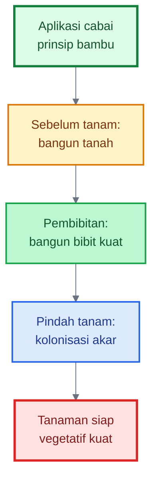

---

# 6.1 Sebelum Tanam: Membangun Tanah seperti Lantai Rumpun Bambu

Sebelum menanam cabai, petani perlu mengubah cara berpikir. Lahan bukan sekadar tempat menancapkan bibit. Lahan adalah **rumah akar**. Jika rumah akar buruk, cabai akan mudah layu, mudah terserang penyakit tanah, dan tidak stabil saat cuaca berubah.

Pada rumpun bambu, lantai tanahnya tertutup serasah dan kaya bahan organik. Tanahnya relatif lembap, terlindungi, dan hidup. Pada cabai, kondisi ini harus dibuat melalui olah tanah, bedengan, bahan organik, mikroba, drainase, dan pengaturan pH.

Tahap pra-tanam adalah saat terbaik untuk memperbaiki sistem. Setelah cabai ditanam, ruang koreksi menjadi lebih sempit. Karena itu, prinsipnya:

> **Perbaiki tanah sebelum cabai masuk, bukan setelah tanaman mulai sakit.**

---

## 6.1.1 Persiapan Lahan

Persiapan lahan dimulai dari empat pekerjaan utama: **membuat bedengan tinggi, menggemburkan tanah, memperbaiki pH bila terlalu masam, dan memastikan parit lancar**.

### Bedengan tinggi

Cabai sangat sensitif terhadap genangan. Pada lahan yang basah, penyakit akar dan pangkal batang lebih mudah berkembang. Penyakit seperti _Phytophthora blight_ pada pepper sangat terkait dengan air dan tanah basah. North Carolina State Extension merekomendasikan lahan berdrainase baik, penggunaan bedengan tinggi dan plastik mulsa bila memungkinkan, serta irigasi sedang melalui drip untuk mengurangi risiko _Phytophthora_ pada pepper. ([Extension Resource Catalog][1]) Oklahoma State Extension juga menekankan bahwa bedengan harus dibentuk agar air dapat keluar dari lahan dan tidak tertahan di cekungan sekitar transplanting karena _Phytophthora capsici_ merupakan patogen yang sangat dipengaruhi air. ([extension.okstate.edu][2])

Tinggi bedengan tidak harus sama di semua lokasi. Pada tanah ringan, musim kemarau, dan lahan yang mudah kering, bedengan sedang sudah cukup. Pada tanah berat, bekas sawah, musim hujan, atau lahan dengan riwayat busuk akar, bedengan harus lebih tinggi dan parit lebih dalam.

Sebagai panduan praktis:

- musim kemarau/tanah ringan: bedengan sedang, drainase tetap tersedia;
- musim hujan/tanah liat/bekas sawah: bedengan lebih tinggi, parit lebih dalam;
- lahan riwayat layu/busuk akar: prioritaskan bedengan tinggi, parit lancar, dan jangan ada cekungan air di sekitar pangkal tanaman.

### Tanah gembur

Tanah digemburkan agar akar cabai mudah masuk, udara tersedia, dan air tidak tertahan terlalu lama di sekitar akar. Tanah yang padat membuat akar pendek dan kurang oksigen. Jika akar kekurangan oksigen, tanaman mudah layu meskipun tanah tampak basah.

Target minimal zona olah untuk cabai adalah area tempat akar awal berkembang, yaitu sekitar 20–30 cm dari permukaan. Bila ditemukan lapisan keras di bawah olah tanah, terutama pada bekas sawah atau lahan yang sering dilewati alat berat, lapisan itu perlu dipecah agar air tidak tertahan di atasnya.

### Perbaikan pH

Cabai umumnya tumbuh baik pada tanah agak asam sampai netral. Beberapa panduan extension menempatkan pH pepper sekitar 6,0–6,8, sedangkan panduan Wisconsin untuk tomat, pepper, dan eggplant menyebut pH 6,8–7,0 untuk menjaga ketersediaan mikronutrien dan menyarankan pengapuran jika pH di bawah 6,0. ([ipmdata.ipmcenters.org][3]) Artinya, pH terlalu masam perlu dikoreksi karena dapat mengganggu ketersediaan hara, termasuk kalsium dan magnesium, serta memperlemah performa akar.

Dosis kapur sebaiknya berdasarkan analisis tanah. Jangan menebak berlebihan karena pH yang terlalu tinggi juga dapat mengunci unsur mikro. Bila hasil uji tanah tersedia, dosis kapur dapat dibagi ke setiap bedengan dengan rumus berikut.

$$
K_{\text{bedengan}} =
\frac{D_{\text{kapur}} \times L_{\text{bedengan}}}{10.000}
$$

Keterangan:

- $K_{\text{bedengan}}$ = kebutuhan kapur per bedengan dalam kg
- $D_{\text{kapur}}$ = dosis kapur rekomendasi dalam kg/ha
- $L_{\text{bedengan}}$ = luas bedengan dalam m²
- $10.000$ = luas 1 hektare dalam m²

Contoh:

Jika rekomendasi kapur adalah $1.000\ \text{kg/ha}$, dan luas satu bedengan $1\ \text{m} \times 20\ \text{m} = 20\ \text{m}^2$, maka:

$$
K_{\text{bedengan}} =
\frac{1.000 \times 20}{10.000}
= 2\ \text{kg}
$$

$$
K_{\text{bedengan}} =
\frac{1.000 \times 20}{10.000}
= 2\ \text{kg}
$$

Jadi, satu bedengan seluas 20 m² membutuhkan sekitar **2 kg kapur** untuk setara dengan 1 ton/ha.

Kapur sebaiknya diberikan sebelum tanam dan dicampur merata dengan tanah. Jangan menumpuk kapur tepat di lubang tanam karena dapat mengganggu akar muda.

### Parit lancar

Parit bukan pelengkap. Parit adalah sistem pengaman. Banyak lahan cabai gagal karena parit ada tetapi tidak berfungsi. Air hanya berpindah dari bedengan ke parit, lalu berhenti di situ. Saat hujan berulang, akar tetap tergenang.

Parit harus memiliki arah pembuangan. Setelah hujan, air di parit harus turun dan keluar dari area tanam. Jika air berhenti lama, parit perlu diperdalam, diperlebar, atau diberi saluran keluar.

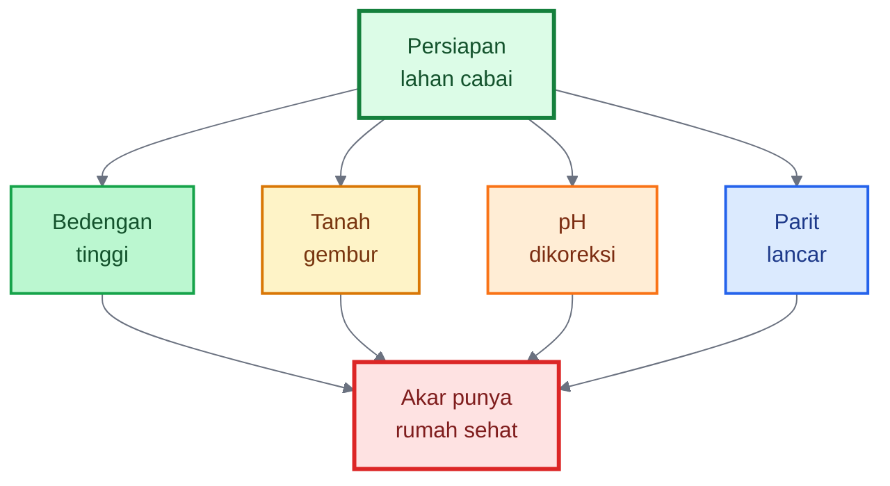

---

## 6.1.2 Aplikasi Bahan Organik

Setelah struktur lahan disiapkan, langkah berikutnya adalah memasukkan bahan organik. Pada prinsip bambu, bahan organik berperan seperti serasah: memberi makan mikroba, menjaga tanah lebih remah, dan memperbaiki kelembapan.

Bahan organik yang digunakan sebaiknya berupa **kompos matang atau pupuk kandang fermentasi**. Hindari pupuk kandang mentah karena masih dapat membawa patogen, biji gulma, panas fermentasi, gas amonia, dan bahan yang belum stabil. Pada fase awal, akar cabai masih sensitif, sehingga bahan organik mentah dapat menjadi sumber stres.

Kompos matang yang baik biasanya berwarna cokelat tua sampai kehitaman, tidak panas, tidak berbau busuk, teksturnya remah, dan tidak tampak bahan mentah dominan. Jika kompos masih berbau menyengat, panas, atau banyak bahan kasar belum lapuk, lebih baik difermentasi ulang.

### Penggunaan bioaktivator mikroba bambu

Bioaktivator mikroba bambu dapat digunakan untuk membantu mengaktifkan bahan organik dan memperkaya kehidupan tanah. Cara paling aman adalah mencampurkan bioaktivator ke kompos matang atau pupuk kandang fermentasi, lalu didiamkan beberapa hari sebelum masuk bedengan.

Pola ini lebih aman daripada menuang larutan mikroba pekat langsung ke lubang tanam. Kompos berfungsi sebagai “rumah awal” mikroba. Saat kompos dimasukkan ke tanah, mikroba ikut masuk bersama bahan makanan dan tempat hidupnya.

### Waktu aplikasi

Setelah bahan organik masuk, lahan sebaiknya didiamkan sekitar **1–2 minggu** sebelum tanam. Tujuannya agar bahan organik lebih menyatu dengan tanah, panas atau gas tersisa menurun, mikroba mulai aktif, dan kondisi bedengan lebih stabil.

Pada lahan sangat intensif atau lahan dengan riwayat penyakit tanah, jeda ini penting. Jangan memasukkan bahan organik banyak lalu langsung tanam pada hari yang sama, terutama jika bahan belum benar-benar matang.

### Menghitung kebutuhan kompos

Rumus kebutuhan kompos per bedengan:

$$
K_{\text{kompos}} =
\frac{D_{\text{kompos}} \times 1000 \times L_{\text{bedengan}}}{10.000}
$$

Keterangan:

- `K_kompos` = kebutuhan kompos per bedengan dalam kg
- `D_kompos` = dosis kompos dalam ton/ha
- `L_bedengan` = luas bedengan dalam m²
- `1000` = konversi ton ke kg
- `10000` = luas 1 hektare dalam m²

Contoh:

Dosis kompos **10 ton/ha**.  
Ukuran bedengan **1 m × 20 m = 20 m²**.

$$
K_{\text{kompos}} =
\frac{10 \times 1000 \times 20}{10.000}
= 20\ \text{kg}
$$

Jadi, satu bedengan 20 m² membutuhkan sekitar **20 kg kompos matang**.

Jika ingin menghitung kompos per tanaman:

$$
K_{\text{tanaman}} =
\frac{K_{\text{total}}}{N_{\text{tanaman}}}
$$

Keterangan:

- `K_tanaman` = kompos per tanaman
- `K_total` = total kompos yang digunakan
- `N_tanaman` = jumlah tanaman

Contoh:

Jika satu bedengan diberi **20 kg kompos** dan berisi **50 tanaman**, maka:

$$
K_{\text{tanaman}} =
\frac{20}{50}
= 0{,}4\ \text{kg/tanaman}
$$

Artinya, setara sekitar **400 gram kompos per tanaman**.

Angka ini bukan aturan kaku. Dosis akhir tetap menyesuaikan kesuburan tanah, kandungan bahan organik, musim, dan kualitas kompos.

---

## 6.1.3 Aplikasi Mikroba Terarah

Pengayaan mikroba bambu bagus sebagai pengaya ekosistem, tetapi pada lahan cabai kita juga perlu mikroba yang lebih terarah. Mikroba terarah adalah mikroba yang dipilih berdasarkan fungsi: menekan patogen, mendukung akar, melarutkan hara, atau memperluas jangkauan serapan.

Kelompok yang umum digunakan:

- **Trichoderma** untuk membantu menekan beberapa jamur patogen tanah dan mendukung kesehatan akar.
- **Bacillus** dan **Pseudomonas** sebagai PGPR untuk mendukung pertumbuhan akar dan kompetisi mikroba.
- **Mikoriza** untuk membantu perluasan serapan hara dan air, terutama fosfor dan kelembapan tanah.
- **Bioaktivator lokal bambu** sebagai pendukung keragaman mikroba dan aktivasi bahan organik.

Penelitian pada _Trichoderma gamsii_ strain TC959, misalnya, menunjukkan kemampuan menghambat patogen penyebab damping-off pepper seedling melalui metabolit sekunder, siderofor, dan enzim, serta mendukung pertumbuhan melalui senyawa pemacu tumbuh dan aktivasi ketahanan tanaman. ([ScienceDirect][4]) Review tentang _Trichoderma_ dan _Bacillus_ juga menjelaskan bahwa keduanya dapat berperan sebagai pemacu kesehatan tanaman, pendukung toleransi stres, dan agen biokontrol. ([ScienceDirect][4])

### Aplikasi berdasarkan riwayat lahan

Jika lahan memiliki riwayat layu, busuk akar, atau rebah semai, gunakan **Trichoderma** pada kompos, bedengan, atau lubang tanam. Jika targetnya memperkuat akar dan adaptasi bibit, gunakan **PGPR, Bacillus, atau Pseudomonas** saat pembibitan dan pindah tanam. Jika tersedia dan cocok dengan sistem budidaya, gunakan **mikoriza** langsung di lubang tanam atau dekat akar, karena mikoriza perlu kontak dengan akar agar efektif.

Jangan mencampur mikroba dengan fungisida atau bakterisida kimia keras dalam satu tangki. Jika harus memakai pestisida kimia, beri jeda waktu sebelum aplikasi mikroba. Mikroba adalah organisme hidup; bahan kimia tertentu dapat menurunkan populasinya.

### Urutan pra-tanam yang disarankan

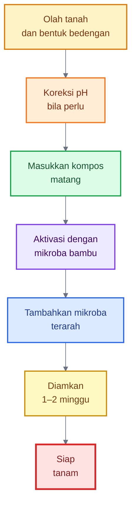

---

# 6.2 Saat Pembibitan: Membentuk Cabai Muda yang Kuat

Pembibitan adalah fase kecil yang dampaknya besar. Banyak tanaman cabai terlihat bermasalah di lahan, tetapi akarnya sudah lemah sejak tray semai. Bibit yang terlalu tinggi, kurus, lunak, atau akarnya sedikit akan mengalami stres saat pindah tanam. Setelah itu, tanaman mudah stagnan, layu, atau kalah oleh patogen tanah.

Prinsip pembibitan ala bambu adalah membangun **bibit kecil yang kokoh**, bukan bibit yang cepat tinggi. Bibit cabai ideal memiliki batang pendek-kokoh, daun sehat, akar putih, dan tidak terlalu lunak.

---

## 6.2.1 Media Semai

Media semai harus **porous, bersih, lembap stabil, dan tidak terlalu basah**. Bibit cabai sangat rentan terhadap rebah semai atau damping-off. UMass Extension menjelaskan bahwa damping-off pada bibit pepper dapat disebabkan oleh beberapa patogen seperti _Pythium_, _Phytophthora_, _Rhizoctonia_, atau _Fusarium_. ([UMass Amherst][5]) Panduan World Vegetable Center juga memperingatkan bahwa mencampur tanah lapang atau pupuk kandang ke media tanpa pengelolaan dapat menyebabkan damping-off parah, dan penyiraman sebaiknya dilakukan saat media sudah membutuhkan air, bukan terus-menerus basah. ([WorldVeg][6])

Media yang baik bukan harus steril mutlak, tetapi harus relatif aman. Untuk praktisi, istilah yang lebih tepat adalah **steril relatif**: bebas dari bahan busuk, patogen tinggi, telur hama, biji gulma, dan pupuk kandang mentah.

Campuran media bisa menggunakan:

- kompos matang halus,
- sekam bakar,
- cocopeat,
- tanah halus sehat,
- sedikit biochar/arang sekam bila tersedia,
- mikroba hayati ringan sesuai kebutuhan.

Kuncinya adalah struktur. Media tidak boleh terlalu padat. Jika terlalu padat, akar sulit masuk dan air mudah tertahan. Media juga tidak boleh terlalu basah karena akar muda butuh oksigen.

### Formula campuran media semai sederhana

Salah satu formula praktis:

$$
M =
40% \text{ kompos matang}

* 30% \text{ sekam bakar}
* 20% \text{ cocopeat}
* 10% \text{ tanah halus sehat}
$$

Formula ini bukan aturan mutlak. Pada daerah yang cocopeat sulit didapat, bagian cocopeat bisa dikurangi dan diganti sekam bakar atau kompos matang halus. Jika tanah lokal berat dan lengket, bagian tanah halus sebaiknya rendah.

### Uji sederhana media semai

Media yang baik saat digenggam terasa lembap, tetapi tidak menetes. Saat dilepas, media mudah remah. Jika media menjadi bola lengket, berarti terlalu halus atau terlalu basah. Jika media langsung hancur seperti debu, berarti terlalu kering atau kurang bahan penahan air.

```mermaid id="df8ool"
%%{init: {"theme": "base", "themeVariables": {
  "fontFamily": "Arial",
  "primaryTextColor": "#111827",
  "lineColor": "#6b7280"
}}}%%
flowchart TD
    A["Media semai<br/>ideal"]:::main
    B["Porous"]:::green
    C["Lembap<br/>stabil"]:::blue
    D["Tidak<br/>becek"]:::orange
    E["Bahan<br/>matang"]:::brown
    F["Akar bibit<br/>putih aktif"]:::result

    A --> B --> F
    A --> C --> F
    A --> D --> F
    A --> E --> F

    classDef main fill:#dcfce7,stroke:#15803d,stroke-width:3px,color:#14532d;
    classDef green fill:#bbf7d0,stroke:#16a34a,stroke-width:2px,color:#14532d;
    classDef blue fill:#dbeafe,stroke:#2563eb,stroke-width:2px,color:#1e3a8a;
    classDef orange fill:#ffedd5,stroke:#f97316,stroke-width:2px,color:#7c2d12;
    classDef brown fill:#fef3c7,stroke:#d97706,stroke-width:2px,color:#78350f;
    classDef result fill:#fee2e2,stroke:#dc2626,stroke-width:3px,color:#7f1d1d;
```

---

## 6.2.2 Penguatan Akar Bibit

Bibit cabai yang kuat dibangun dari akar. Akar bibit harus berkembang sebelum tanaman dipaksa mengejar tajuk. Kesalahan umum pada pembibitan adalah memberi nitrogen terlalu tinggi sejak awal. Akibatnya, bibit cepat tinggi, daun lebar, tetapi batang lunak dan akar kurang kuat.

Pada fase pembibitan, PGPR ringan dapat digunakan untuk mendukung akar. Namun, dosis harus rendah dan media tidak boleh terlalu basah. Mikroba akan bekerja lebih baik pada media yang punya oksigen dan bahan organik stabil.

Cahaya juga sangat penting. Bibit yang kurang cahaya akan etiolasi: tinggi, kurus, dan lemah. Bibit seperti ini tampak cepat tumbuh, tetapi tidak siap menghadapi lapangan. Bibit perlu mendapat cahaya cukup agar batang kokoh dan daun bekerja normal.

### Pola pembibitan praktis

Pada minggu awal setelah semai, fokus utama adalah kelembapan stabil dan pencegahan rebah semai. Jangan terlalu banyak pupuk. Setelah bibit mulai berdaun sejati, barulah nutrisi ringan diberikan. Kalsium dan magnesium ringan bisa masuk bila diperlukan, tetapi jangan membuat larutan terlalu pekat.

PGPR atau mikroba hayati bisa diberikan dengan kocor sangat encer. Tujuannya bukan membuat media basah terus, tetapi memberi sinyal biologis dan kolonisasi awal.

### Rumus kebutuhan larutan PGPR bibit

Jika menggunakan tray semai, kebutuhan larutan dapat dihitung sederhana:

$$
V_{\text{larutan}} =
N_{\text{bibit}} \times V_{\text{per bibit}}
$$

Keterangan:

- $V_{\text{larutan}}$ = total larutan yang dibutuhkan
- $N_{\text{bibit}}$ = jumlah bibit
- $V_{\text{per bibit}}$ = volume larutan per bibit

Contoh:

Jumlah bibit = 1.000 bibit
Volume larutan per bibit = 10 ml

$$
V_{\text{larutan}} =
1.000 \times 10
= 10.000\ \text{ml}
= 10\ \text{liter}
$$

Artinya, untuk 1.000 bibit dengan 10 ml per bibit, diperlukan sekitar **10 liter larutan**.

Untuk bibit muda, lebih baik larutan encer dan volume kecil daripada larutan pekat dan berlebihan.

---

## 6.2.3 Seleksi Bibit

Seleksi bibit adalah tahap yang sering diremehkan. Banyak petani menanam semua bibit karena sayang. Padahal, bibit lemah dapat menjadi sumber masalah di lahan. Bibit yang sakit, akar busuk, atau batang terlalu kurus akan tertinggal dan lebih rentan menjadi titik awal penyakit.

Bibit yang dipilih sebaiknya memiliki ciri:

- batang kokoh dan tidak terlalu tinggi,
- daun hijau sehat,
- akar putih dan banyak,
- media tidak berbau busuk,
- tidak ada gejala rebah semai,
- tidak ada daun keriting parah,
- tidak ada bercak mencurigakan,
- tidak terlalu lunak akibat nitrogen.

Bibit yang terlalu tua juga kurang ideal. Transplant pepper umumnya ditanam sebagai bibit pindahan, dan beberapa panduan budidaya menyebut transplant sebaiknya tidak terlalu keras atau terlalu tua karena dapat lambat berkembang setelah ditanam. ([ipmdata.ipmcenters.org][3])

### Uji praktis bibit siap tanam

Ambil beberapa bibit sampel. Lepaskan dari tray atau polybag kecil. Jika media terikat akar putih secara merata dan tidak hancur total, bibit biasanya siap. Jika akar masih sangat sedikit, bibit belum kuat. Jika akar cokelat, berbau, atau busuk, bibit harus dipisahkan dan jangan ditanam di lahan utama.

```mermaid id="vesdy9"
%%{init: {"theme": "base", "themeVariables": {
  "fontFamily": "Arial",
  "primaryTextColor": "#111827",
  "lineColor": "#6b7280"
}}}%%
flowchart TD
    A["Seleksi<br/>bibit cabai"]:::main
    B{"Bibit<br/>kokoh?"}:::decision
    C{"Akar putih<br/>banyak?"}:::decision
    D{"Daun sehat<br/>tidak lunak?"}:::decision
    E["Tanam di<br/>lahan utama"]:::green
    F["Afkir / rawat<br/>terpisah"]:::red

    A --> B
    B -->|"Ya"| C
    B -->|"Tidak"| F
    C -->|"Ya"| D
    C -->|"Tidak"| F
    D -->|"Ya"| E
    D -->|"Tidak"| F

    classDef main fill:#dcfce7,stroke:#15803d,stroke-width:3px,color:#14532d;
    classDef decision fill:#fef9c3,stroke:#ca8a04,stroke-width:2px,color:#713f12;
    classDef green fill:#bbf7d0,stroke:#16a34a,stroke-width:3px,color:#14532d;
    classDef red fill:#fee2e2,stroke:#dc2626,stroke-width:3px,color:#7f1d1d;
```

---

# 6.3 Saat Pindah Tanam: Kolonisasi Awal Akar

Pindah tanam adalah momen kritis. Bibit berpindah dari lingkungan semai yang relatif terlindungi ke lahan terbuka yang lebih panas, lebih berangin, lebih beragam mikroba, dan lebih tidak stabil. Pada fase ini, akar sering mengalami luka kecil, perubahan kelembapan, dan stres adaptasi.

Dalam prinsip bambu, akar dan mikroba adalah pasangan utama. Maka pada cabai, pindah tanam harus diarahkan untuk mempercepat **kolonisasi awal akar** oleh mikroba baik, sekaligus mengurangi stres transplanting.

Target pindah tanam bukan sekadar bibit masuk lubang. Targetnya adalah:

> **Akar cepat menyatu dengan tanah, mikroba baik hadir lebih awal, dan zona akar tetap lembap tanpa genangan.**

---

## 6.3.1 Perlakuan Lubang Tanam

Lubang tanam adalah titik awal kehidupan cabai di lahan. Lubang tanam harus lembap, gembur, tidak panas, tidak becek, dan tidak penuh bahan mentah.

Tambahkan kompos matang halus secukupnya. Kompos membantu menyediakan mikrohabitat bagi akar dan mikroba. Jika lahan memiliki riwayat layu atau busuk akar, berikan _Trichoderma_ atau agen hayati lain sesuai label. Jika menggunakan bioaktivator mikroba bambu, gunakan dalam dosis encer sebagai kocor tanah, bukan larutan pekat.

Pada lahan dengan risiko _Phytophthora_, lubang tanam tidak boleh menjadi cekungan yang menahan air. Oklahoma State Extension menekankan bahwa cekungan di sekitar transplanting yang menahan air perlu diminimalkan karena kondisi air mendukung penyakit _Phytophthora_. ([extension.okstate.edu][2])

### Praktik lubang tanam

Langkah praktis:

1. Buat lubang sesuai ukuran media bibit.
2. Masukkan sedikit kompos matang halus.
3. Tambahkan mikroba hayati sesuai fungsi.
4. Siram ringan jika tanah terlalu kering.
5. Tanam bibit tanpa merusak bola akar.
6. Tutup tanah secukupnya, jangan menimbun pangkal terlalu dalam.

Jika memakai mikoriza, letakkan dekat akar karena mikoriza perlu kontak dengan akar. Jika diletakkan terlalu jauh, efektivitasnya turun.

---

## 6.3.2 Celup Akar

Celup akar adalah salah satu cara untuk membantu bibit melewati stres pindah tanam. Bibit dapat dicelup ke larutan PGPR, _Bacillus_, _Pseudomonas_, _Trichoderma_, atau mikroba hayati lain sesuai produk. Tujuannya adalah memberi kontak awal antara akar dan mikroba baik.

Larutan celup harus encer dan bersih. Jangan terlalu pekat. Jangan mencampur mikroba dengan fungisida atau bakterisida kimia keras. Jika bibit sedang sangat lemah atau akarnya rusak, larutan yang terlalu pekat dapat menambah stres.

### Formula pengenceran larutan celup akar

Jika produk atau stok mikroba perlu diencerkan, gunakan rumus:

$$
V_{\text{stok}} =
\frac{V_{\text{akhir}}}{R + 1}
$$

Keterangan:

- $V_{\text{stok}}$ = volume stok mikroba
- $V_{\text{akhir}}$ = total larutan akhir
- $R$ = jumlah bagian air dalam rasio pengenceran

Contoh rasio 1:50 untuk membuat 10 liter larutan:

$$
V_{\text{stok}} =
\frac{10}{50 + 1}
= 0{,}196\ \text{liter}
$$

Jadi, gunakan sekitar **200 ml stok mikroba** lalu tambahkan air sampai total mendekati **10 liter**.

Untuk bibit muda, larutan encer lebih aman. Jika menggunakan produk komersial, dosis label tetap menjadi acuan utama.

### Cara celup akar

Celupkan bagian akar atau media akar beberapa detik sampai basah merata. Jangan merendam terlalu lama. Setelah dicelup, segera tanam. Jangan biarkan bibit yang sudah dicelup menumpuk di bawah panas matahari.

```mermaid id="p7ioap"
%%{init: {"theme": "base", "themeVariables": {
  "fontFamily": "Arial",
  "primaryTextColor": "#111827",
  "lineColor": "#6b7280"
}}}%%
flowchart TD
    A["Bibit sehat"]:::green
    B["Celup akar<br/>larutan mikroba encer"]:::blue
    C["Tanam di<br/>lubang siap"]:::brown
    D["Kocor ringan<br/>zona akar"]:::orange
    E["Akar cepat<br/>adaptasi"]:::result

    A --> B --> C --> D --> E

    classDef green fill:#bbf7d0,stroke:#16a34a,stroke-width:2px,color:#14532d;
    classDef blue fill:#dbeafe,stroke:#2563eb,stroke-width:2px,color:#1e3a8a;
    classDef brown fill:#fef3c7,stroke:#d97706,stroke-width:2px,color:#78350f;
    classDef orange fill:#ffedd5,stroke:#f97316,stroke-width:2px,color:#7c2d12;
    classDef result fill:#fee2e2,stroke:#dc2626,stroke-width:3px,color:#7f1d1d;
```

---

## 6.3.3 Penyiraman Awal

Setelah pindah tanam, penyiraman awal harus cukup untuk melembapkan zona akar. Tujuannya adalah membantu tanah menempel pada media bibit dan mengurangi rongga udara besar di sekitar akar. Namun, penyiraman tidak boleh membuat genangan.

Pepper rentan terhadap penyakit yang menyebar melalui air dan tanah basah. Tennessee Extension merekomendasikan tanah berdrainase baik, penggunaan plastik atau mulsa organik untuk mengurangi kontak buah dengan tanah dan percikan tanah, serta menghindari irigasi overhead untuk menurunkan percikan tanah dan air. ([UTIA][7]) North Carolina State Extension juga menyarankan drip irrigation dan menghindari overhead irrigation, terutama saat buah sudah ada, dalam pengelolaan _Phytophthora_ pada pepper. ([Extension Resource Catalog][1])

Pada prinsip bambu, air dijaga agar tidak ekstrem. Demikian juga pada cabai: cukup lembap, tidak kering, tidak tergenang.

### Rumus kebutuhan air awal

Untuk menghitung total air penyiraman awal:

$$
V_{\text{air}} =
N_{\text{tanaman}} \times V_{\text{per tanaman}}
$$

Keterangan:

- $V_{\text{air}}$ = total air yang dibutuhkan
- $N_{\text{tanaman}}$ = jumlah tanaman
- $V_{\text{per tanaman}}$ = volume air per tanaman

Contoh:

Jumlah tanaman = 2.000 tanaman
Air awal = 250 ml per tanaman

$$
V_{\text{air}} =
2.000 \times 0{,}25
= 500\ \text{liter}
$$

Jadi, untuk 2.000 tanaman dengan 250 ml per tanaman, dibutuhkan sekitar **500 liter air**.

Volume ini harus disesuaikan dengan kondisi tanah. Jika tanah sudah lembap karena hujan, volume dikurangi. Jika tanah kering dan panas, volume dapat dinaikkan bertahap, tetapi tetap jangan sampai menggenang.

### Mulsa setelah tanam

Setelah penyiraman awal, tanah perlu ditutup dengan mulsa. Jika menggunakan mulsa plastik, lubang tanam sebaiknya rapi dan tidak menjadi cekungan air. Jika menggunakan mulsa organik, jangan menumpuk bahan tepat menempel pada pangkal batang. Sisakan ruang kecil agar pangkal tidak terlalu lembap.

Mulsa membantu menjaga kelembapan, menekan gulma, dan mengurangi percikan tanah. Ini sama seperti serasah bambu yang menjaga lantai rumpun tetap terlindungi.

---

# Checklist Praktis Bab 6.1–6.3

## Pra-tanam

- Bedengan sudah tinggi sesuai musim dan jenis tanah.
- Parit punya arah pembuangan air.
- Tanah gembur minimal di zona akar.
- pH dicek; bila terlalu masam, dikoreksi dengan kapur sesuai rekomendasi.
- Kompos matang atau pupuk kandang fermentasi sudah masuk.
- Bioaktivator mikroba bambu digunakan sebagai aktivator kompos/tanah.
- Mikroba terarah seperti _Trichoderma_, PGPR, _Bacillus_, _Pseudomonas_, atau mikoriza disiapkan sesuai kebutuhan.
- Lahan didiamkan 1–2 minggu sebelum tanam bila memungkinkan.

## Pembibitan

- Media semai porous dan tidak becek.
- Tidak memakai pupuk kandang mentah.
- Bibit mendapat cahaya cukup.
- Nitrogen tidak berlebihan.
- PGPR atau mikroba diberikan ringan dan encer.
- Bibit lemah, sakit, atau akar busuk tidak ditanam di lahan utama.

## Pindah tanam

- Lubang tanam lembap, bukan becek.
- Kompos matang halus diberikan secukupnya.
- Mikroba hayati diberikan di zona akar.
- Celup akar dilakukan dengan larutan encer.
- Tidak mencampur mikroba dengan fungisida/bakterisida keras.
- Penyiraman awal cukup sampai zona akar lembap.
- Tanah ditutup mulsa dan drainase tetap lancar.

---

Kalimat kunci bagian ini:

> **Cabai yang kuat tidak dimulai dari pupuk buah, tetapi dari tanah pra-tanam, bibit berakar sehat, dan kolonisasi mikroba sejak hari pertama pindah tanam.**

[1]: https://content.ces.ncsu.edu/phytophthora-blight-of-peppers?utm_source=chatgpt.com 'Phytophthora Blight of Peppers'
[2]: https://extension.okstate.edu/fact-sheets/phytophthora-blight-of-cucurbits-and-peppers?utm_source=chatgpt.com 'Phytophthora Blight of Cucurbits and Peppers'
[3]: https://ipmdata.ipmcenters.org/documents/pmsps/OHPepper.pdf?utm_source=chatgpt.com 'Bell Pepper and Non-Bell Pepper Pest Management ...'
[4]: https://www.sciencedirect.com/science/article/pii/S2095311924000492?utm_source=chatgpt.com 'Trichoderma gamsii strain TC959 with comprehensive ...'
[5]: https://www.umass.edu/agriculture-food-environment/greenhouse-floriculture/photos/pepper-seedling-damping-off-fusarium?utm_source=chatgpt.com 'Pepper seedling - Damping off (Fusarium)'
[6]: https://worldveg.tind.io/record/39515/files/f0113.pdf?utm_source=chatgpt.com 'Damping Off on Pepper'
[7]: https://utia.tennessee.edu/publications/wp-content/uploads/sites/269/2023/10/W810.pdf?utm_source=chatgpt.com 'Managing Phytophthora Blight of Peppers and Cucurbits'

---

# 6.4 Fase Vegetatif: Membangun “Batang Bambu” pada Cabai

Fase vegetatif adalah fase membangun rangka tanaman. Pada fase ini, cabai sedang membentuk akar, batang, cabang, daun, dan fondasi tajuk yang kelak menanggung bunga dan buah. Jika fase vegetatif salah arah, tanaman memang bisa terlihat cepat besar, tetapi tidak kokoh. Daun terlalu lunak, batang mudah rebah, akar dangkal, dan tanaman mudah stres saat masuk fase generatif.

Dalam prinsip rumpun bambu, fase vegetatif cabai adalah fase membangun “batang bambu” versi cabai: **batang kokoh, daun sehat, akar aktif, jaringan tidak lunak, dan tanaman siap menanggung beban produksi**.

Fase ini bukan waktunya mengejar rimbun berlebihan. Targetnya adalah **pertumbuhan seimbang**.

```mermaid id="gz7wed"
%%{init: {"theme": "base", "themeVariables": {
  "fontFamily": "Arial",
  "primaryTextColor": "#111827",
  "lineColor": "#6b7280"
}}}%%
flowchart TD
    A["Fase vegetatif<br/>cabai"]:::main
    B["N cukup<br/>tidak berlebih"]:::green
    C["P dukung<br/>akar"]:::blue
    D["K, Ca, Mg<br/>mulai kuat"]:::orange
    E["Silika<br/>berkala"]:::purple
    F["Mikroba<br/>susulan"]:::brown
    G["Tanaman kokoh<br/>siap generatif"]:::result

    A --> B --> G
    A --> C --> G
    A --> D --> G
    A --> E --> G
    A --> F --> G

    classDef main fill:#dcfce7,stroke:#15803d,stroke-width:3px,color:#14532d;
    classDef green fill:#bbf7d0,stroke:#16a34a,stroke-width:2px,color:#14532d;
    classDef blue fill:#dbeafe,stroke:#2563eb,stroke-width:2px,color:#1e3a8a;
    classDef orange fill:#ffedd5,stroke:#f97316,stroke-width:2px,color:#7c2d12;
    classDef purple fill:#ede9fe,stroke:#7c3aed,stroke-width:2px,color:#3b0764;
    classDef brown fill:#fef3c7,stroke:#d97706,stroke-width:2px,color:#78350f;
    classDef result fill:#fee2e2,stroke:#dc2626,stroke-width:3px,color:#7f1d1d;
```

---

## 6.4.1 Nutrisi Seimbang

Pada fase vegetatif, nitrogen tetap dibutuhkan. Nitrogen membantu pembentukan daun, cabang, klorofil, dan pertumbuhan awal. Tetapi nitrogen tidak boleh menjadi unsur yang terlalu dominan. New England Vegetable Management Guide menegaskan bahwa kelebihan nitrogen pada pepper dapat menyebabkan pertumbuhan vegetatif berlebihan dan menurunkan hasil; panduan yang sama juga menyarankan pemupukan berdasarkan uji tanah dan menjaga pH 6,0–6,8. ([New England Vegetable Management Guide][1])

Fosfor penting untuk membantu pembentukan akar dan energi awal tanaman. Pada tanaman pindahan, fosfor sering dibutuhkan untuk mendukung pemulihan akar setelah transplanting, terutama pada kondisi tanah dingin atau akar lambat berkembang. Oklahoma State University menyebut bahwa pepper memerlukan perencanaan pemupukan berdasarkan uji tanah, dan pemupukan awal perlu mendukung pertumbuhan cepat setelah pindah tanam agar tanaman tidak terlalu cepat berbunga saat ukurannya masih kecil. ([extension.okstate.edu][2])

Kalium, kalsium, magnesium, dan silika mulai diperkuat pada fase ini. Kalium membantu pengaturan air dan kesiapan menuju pembentukan bunga. Kalsium memperkuat dinding sel dan titik tumbuh. Magnesium menjaga fotosintesis karena menjadi bagian penting dari klorofil. Silika membantu memperkuat jaringan dan mendukung ketahanan tanaman terhadap stres. Review ilmiah tentang silikon menyebut silikon berperan sebagai alat penting dalam mengatur cekaman biotik dan abiotik tanaman, termasuk perlindungan terhadap stres lingkungan. ([PMC][3])

Prinsipnya, fase vegetatif bukan hanya soal membesarkan daun. Fase ini harus membangun **struktur tanaman**.

### Praktik lapangan fase vegetatif

Pada 1–2 minggu setelah pindah tanam, fokus utama adalah pemulihan akar. Pemupukan jangan terlalu pekat. Berikan nutrisi ringan dan stabil. Jika menggunakan fertigasi, dosis kecil tetapi rutin lebih aman daripada dosis besar yang jarang.

Pada 2–4 minggu setelah tanam, tanaman mulai aktif membentuk cabang dan daun. Nitrogen boleh dinaikkan secukupnya, tetapi tetap diseimbangkan dengan fosfor, kalium, kalsium, magnesium, dan mikroba akar. Pada fase ini, tanaman tidak boleh dibuat terlalu hijau gelap dan lunak.

Menjelang awal pembungaan, dominasi nitrogen mulai dikurangi. Kalium, kalsium, magnesium, boron dalam dosis aman, dan silika mulai menjadi lebih penting. NC State Extension menjelaskan bahwa kebutuhan nutrisi bell pepper berubah dari vegetatif ke pembungaan dan fruit set, sehingga analisis daun dapat membantu penyesuaian nutrisi sesuai fase tanaman. ([Extension Resource Catalog][4])

### Rumus sederhana menghitung kebutuhan pupuk

Untuk menghitung kebutuhan pupuk berdasarkan target unsur:

$$
K_{\text{pupuk}} =
\frac{K_{\text{unsur}}}{P_{\text{kandungan}}}
$$

Keterangan:

- $K_{\text{pupuk}}$ = kebutuhan pupuk
- $K_{\text{unsur}}$ = target unsur yang ingin diberikan
- $P_{\text{kandungan}}$ = persentase kandungan unsur dalam bentuk desimal

Contoh:

Target nitrogen yang ingin diberikan adalah $5\ \text{kg N}$. Pupuk yang digunakan mengandung $46\%\ \text{N}$.

$$
K_{\text{pupuk}} =
\frac{5}{0{,}46}
= 10{,}87\ \text{kg}
$$

Artinya, dibutuhkan sekitar **10,9 kg pupuk** untuk menyediakan 5 kg N.

Rumus ini membantu petani tidak hanya berpikir “berapa kg pupuk”, tetapi juga “berapa kg unsur hara” yang benar-benar diberikan.

---

## 6.4.2 Aplikasi Silika dan Kalsium

Silika dan kalsium adalah dua unsur penting untuk membangun cabai yang lebih kokoh. Dalam prinsip bambu, silika berperan seperti penguat jaringan. Pada cabai, silika tidak membuat batang menjadi bambu, tetapi membantu tanaman membangun jaringan yang lebih tahan terhadap tekanan lingkungan.

Kalsium bekerja pada sisi yang berbeda. Ia membantu kekuatan dinding sel, kestabilan membran, dan kualitas jaringan muda. Pada pepper, masalah kekurangan kalsium sering muncul dalam bentuk gangguan jaringan buah seperti blossom-end rot. Pacific Northwest Plant Disease Management Handbook menekankan bahwa pengelolaan blossom-end rot pada pepper harus mencakup kelembapan tanah seragam, pertumbuhan tanaman yang tidak terlalu luxuriant, dan aplikasi kalsium yang hati-hati bila diperlukan. ([PNW Pest Handbooks][5])

Silika diberikan berkala, bukan hanya saat tanaman sakit. Aplikasi bisa melalui kocor, fertigasi, atau semprot daun, tergantung bentuk produk. Kalsium juga dapat diberikan melalui akar atau daun, tetapi harus disesuaikan dengan produk, fase tanaman, dan kondisi air.

Yang harus dihindari adalah mencampur silika pekat langsung dengan kalsium atau fosfat pekat dalam satu tangki. Banyak produk silika bersifat alkalis dan mudah bereaksi dengan unsur lain. NC State Extension juga menekankan pentingnya uji kompatibilitas saat mencampur pupuk daun atau produk lain, karena campuran yang tidak kompatibel dapat membentuk senyawa tidak larut, merusak daun, atau menyumbat sprayer. ([Extension Resource Catalog][4])

### Praktik aplikasi silika dan kalsium

Pola aman:

1. Silika diberikan sendiri atau dalam tangki terpisah.
2. Kalsium diberikan pada jadwal berbeda dari silika pekat.
3. Fosfat pekat tidak dicampur langsung dengan kalsium pekat.
4. Selalu lakukan uji kecil di gelas sebelum mencampur banyak bahan.
5. Gunakan dosis label sebagai batas utama.

### Uji kompatibilitas sederhana

Gunakan botol bening kecil. Campurkan air dan bahan sesuai urutan yang akan dipakai di tangki, tetapi dalam skala kecil. Aduk dan diamkan 15–30 menit. Jika muncul endapan, gumpalan, panas berlebih, gas kuat, atau perubahan warna ekstrem, jangan gunakan campuran tersebut.

```mermaid id="ghzj3l"
%%{init: {"theme": "base", "themeVariables": {
  "fontFamily": "Arial",
  "primaryTextColor": "#111827",
  "lineColor": "#6b7280"
}}}%%
flowchart TD
    A["Silika"]:::purple
    B["Kalsium"]:::blue
    C["Fosfat pekat"]:::orange
    D{"Campur langsung<br/>satu tangki?"}:::decision
    E["Risiko endapan<br/>dan reaksi"]:::red
    F["Jadwal terpisah<br/>lebih aman"]:::green

    A --> D
    B --> D
    C --> D
    D -->|"Ya"| E
    D -->|"Tidak"| F

    classDef purple fill:#ede9fe,stroke:#7c3aed,stroke-width:2px,color:#3b0764;
    classDef blue fill:#dbeafe,stroke:#2563eb,stroke-width:2px,color:#1e3a8a;
    classDef orange fill:#ffedd5,stroke:#f97316,stroke-width:2px,color:#7c2d12;
    classDef decision fill:#fef9c3,stroke:#ca8a04,stroke-width:2px,color:#713f12;
    classDef red fill:#fee2e2,stroke:#dc2626,stroke-width:3px,color:#7f1d1d;
    classDef green fill:#dcfce7,stroke:#16a34a,stroke-width:3px,color:#14532d;
```

---

## 6.4.3 Pengayaan Mikroba Susulan

Mikroba yang diberikan saat pra-tanam dan pindah tanam perlu dipelihara. Setelah tanaman masuk fase vegetatif, akar semakin luas dan eksudat akar semakin aktif. Ini adalah waktu yang baik untuk menjaga komunitas mikroba tetap hidup.

Kocor mikroba dapat dilakukan setiap 2–4 minggu, tergantung kondisi tanah, hujan, jenis mikroba, dan sistem budidaya. Mikroba susulan berguna setelah hujan lebat, setelah tanaman mengalami stres panas, atau setelah aplikasi bahan organik baru. Review Frontiers tahun 2024 menyebut _Trichoderma_ dan _Bacillus_ sebagai mikroba multi-trait yang dapat mendukung pertumbuhan dan kesehatan tanaman, meskipun penggunaannya tetap menghadapi tantangan dan tidak otomatis menggantikan semua input lain. ([Frontiers][6])

Mikroba membutuhkan makanan. Karena itu, aplikasi mikroba sebaiknya disertai bahan organik stabil, misalnya kompos matang, asam humat/fulvat sesuai kebutuhan, mulsa organik, atau bahan organik halus yang sudah aman. Jangan memberi bahan mentah berlebihan di sekitar akar karena dapat memicu panas, bau, dan kompetisi oksigen.

### Praktik mikroba susulan

Kocor mikroba dilakukan ke zona akar, bukan ke parit kosong. Aplikasi sebaiknya dilakukan pagi atau sore, saat tanah tidak terlalu panas. Jangan aplikasikan mikroba tepat setelah fungisida atau bakterisida keras. Beri jeda agar mikroba punya peluang hidup.

Pola sederhana:

- Minggu 2–3 setelah tanam: kocor mikroba ringan untuk mendukung akar.
- Minggu 4–5: ulangi jika tanaman aktif tumbuh atau setelah hujan lebat.
- Menjelang bunga: kocor mikroba + bahan organik ringan untuk menjaga rizosfer.
- Setelah stres cuaca: aplikasi mikroba encer dapat membantu pemulihan tanah dan akar.

### Rumus larutan kocor mikroba

Jika dosis aplikasi adalah $V_{\text{tanaman}}$ liter per tanaman:

$$
V_{\text{total}} =
N_{\text{tanaman}} \times V_{\text{tanaman}}
$$

Contoh:

Jumlah tanaman = 1.500 tanaman
Volume kocor = 100 ml per tanaman = 0,1 liter

$$
V_{\text{total}} =
1.500 \times 0{,}1
= 150\ \text{liter}
$$

Jadi, diperlukan sekitar **150 liter larutan kocor**.

---

# 6.5 Fase Generatif: Menjaga Bunga, Buah, dan Umur Panen

Fase generatif adalah fase ujian. Pada fase ini, cabai tidak hanya harus tumbuh, tetapi juga harus berbunga, membentuk buah, mengisi buah, menjaga daun tetap aktif, dan bertahan dari tekanan hama, penyakit, panas, hujan, serta fluktuasi air.

Jika fase vegetatif membangun “batang bambu”, maka fase generatif adalah fase menjaga agar “rumpun cabai” tetap produktif panjang. Tanaman tidak boleh terlalu lunak, tidak boleh kekurangan air, tidak boleh terlalu rimbun, dan tidak boleh kehilangan mikroba akar.

```mermaid id="qq9v6k"
%%{init: {"theme": "base", "themeVariables": {
  "fontFamily": "Arial",
  "primaryTextColor": "#111827",
  "lineColor": "#6b7280"
}}}%%
flowchart TD
    A["Fase generatif<br/>cabai"]:::main
    B["Kalium<br/>lebih kuat"]:::orange
    C["Kalsium<br/>tetap stabil"]:::blue
    D["Magnesium<br/>jaga fotosintesis"]:::green
    E["Silika<br/>lanjut"]:::purple
    F["Mikroba akar<br/>dipelihara"]:::brown
    G["Bunga kuat<br/>buah padat<br/>panen panjang"]:::result

    A --> B --> G
    A --> C --> G
    A --> D --> G
    A --> E --> G
    A --> F --> G

    classDef main fill:#dcfce7,stroke:#15803d,stroke-width:3px,color:#14532d;
    classDef orange fill:#ffedd5,stroke:#f97316,stroke-width:2px,color:#7c2d12;
    classDef blue fill:#dbeafe,stroke:#2563eb,stroke-width:2px,color:#1e3a8a;
    classDef green fill:#bbf7d0,stroke:#16a34a,stroke-width:2px,color:#14532d;
    classDef purple fill:#ede9fe,stroke:#7c3aed,stroke-width:2px,color:#3b0764;
    classDef brown fill:#fef3c7,stroke:#d97706,stroke-width:2px,color:#78350f;
    classDef result fill:#fee2e2,stroke:#dc2626,stroke-width:3px,color:#7f1d1d;
```

---

## 6.5.1 Perkuat Kalium

Kalium menjadi unsur kunci saat cabai masuk fase bunga dan buah. Kalium membantu pengaturan air, translokasi hasil fotosintesis, pembentukan buah, kualitas buah, dan ketahanan terhadap stres. FAO dalam panduan nutrisi hot pepper menyebut bahwa saat awal pembungaan, tujuan pemupukan bergeser untuk membantu tanaman menghasilkan bunga dan buah, sehingga pupuk dengan proporsi kalium lebih tinggi daripada nitrogen digunakan pada tahap tersebut. ([FAOHome][7])

Namun, kalium tidak boleh diberikan sendirian secara berlebihan. Keseimbangan K, Ca, dan Mg harus dijaga. Jika kalium terlalu dominan, penyerapan kalsium dan magnesium dapat terganggu. Akibatnya, daun bisa mengalami ketidakseimbangan, buah bermasalah, dan kualitas jaringan menurun.

### Praktik lapangan fase generatif

Saat bunga mulai banyak, nitrogen mulai dikendalikan. Tanaman tetap membutuhkan nitrogen untuk mempertahankan daun, tetapi tidak boleh terlalu rimbun. Kalium dinaikkan bertahap sesuai kebutuhan dan kondisi tanaman.

Tanda kalium mulai dibutuhkan lebih kuat:

- buah mulai terbentuk banyak,
- tanaman mudah layu saat panas,
- buah kecil atau pengisian lambat,
- daun tua mulai menunjukkan tepi menguning atau terbakar,
- panen mulai banyak tetapi tanaman tampak cepat lelah.

Kenaikan kalium sebaiknya disertai pemantauan kalsium dan magnesium. Pada sistem intensif, analisis daun dapat membantu membaca apakah nutrisi benar-benar masuk ke tanaman, bukan hanya tersedia di tanah. NC State Extension menekankan bahwa analisis daun membantu petani menyesuaikan nutrisi berdasarkan fase pertumbuhan, termasuk vegetatif, flowering, dan early fruit set. ([Extension Resource Catalog][4])

---

## 6.5.2 Pertahankan Kalsium dan Silika

Pada fase buah, kalsium harus dijaga stabil. Kalsium tidak bergerak bebas seperti nitrogen atau kalium. Distribusinya sangat dipengaruhi aliran air dan transpirasi. Karena itu, meskipun tanah mengandung kalsium, buah tetap bisa bermasalah jika air tidak stabil, akar rusak, atau tanaman terlalu rimbun.

Pacific Northwest Plant Disease Management Handbook menyarankan kelembapan tanah seragam selama fase berbuah, pemupukan moderat agar tanaman tidak terlalu luxuriant, dan pengelolaan sirkulasi udara untuk mendukung penyerapan kalsium. ([PNW Pest Handbooks][5])

Silika tetap dapat dilanjutkan pada fase generatif. Fungsinya menjaga kekuatan daun dan batang, terutama saat tanaman menanggung beban buah, cuaca panas, hujan, dan tekanan penyakit. Silika bukan pengganti fungisida saat infeksi berat, tetapi bagian dari strategi membuat jaringan tanaman lebih siap menghadapi stres. Review tentang silikon menyebut silikon berperan dalam regulasi berbagai cekaman tanaman, baik biologis maupun lingkungan. ([PMC][3])

### Praktik lapangan

Kalsium diberikan rutin dalam dosis aman, terutama saat buah mulai terbentuk. Jangan menunggu gejala buah rusak baru mulai memberi kalsium. Pada saat yang sama, air harus dijaga stabil. Kalsium tidak akan efektif jika akar kering, lalu tiba-tiba tergenang.

Silika diberikan sesuai jadwal terpisah dari kalsium pekat. Pada musim hujan, silika dapat membantu menjaga jaringan tanaman. Pada musim panas, silika mendukung ketahanan stres, tetapi tetap harus dibarengi irigasi yang benar.

### Prinsip K–Ca–Mg

```mermaid id="dxgq82"
%%{init: {"theme": "base", "themeVariables": {
  "fontFamily": "Arial",
  "primaryTextColor": "#111827",
  "lineColor": "#6b7280"
}}}%%
flowchart TD
    A["Keseimbangan<br/>fase buah"]:::main
    B["K<br/>isi buah & air"]:::orange
    C["Ca<br/>kuatkan jaringan"]:::blue
    D["Mg<br/>fotosintesis"]:::green
    E["Air stabil<br/>akar aktif"]:::brown
    F["Buah padat<br/>tanaman awet"]:::result

    B --> F
    C --> F
    D --> F
    E --> F
    A --> B
    A --> C
    A --> D
    A --> E

    classDef main fill:#dcfce7,stroke:#15803d,stroke-width:3px,color:#14532d;
    classDef orange fill:#ffedd5,stroke:#f97316,stroke-width:2px,color:#7c2d12;
    classDef blue fill:#dbeafe,stroke:#2563eb,stroke-width:2px,color:#1e3a8a;
    classDef green fill:#bbf7d0,stroke:#16a34a,stroke-width:2px,color:#14532d;
    classDef brown fill:#fef3c7,stroke:#d97706,stroke-width:2px,color:#78350f;
    classDef result fill:#fee2e2,stroke:#dc2626,stroke-width:3px,color:#7f1d1d;
```

---

## 6.5.3 Jaga Mikroba Akar Tetap Hidup

Pada fase generatif, banyak petani mulai fokus pada buah dan lupa akar. Padahal, saat buah banyak, beban akar semakin besar. Akar harus menyerap air, kalium, kalsium, magnesium, nitrogen, mikroelement, dan menjaga tanaman tetap hidup.

Mikroba akar perlu dijaga agar tidak mati akibat kondisi ekstrem. Fungisida tanah, bakterisida, air berklorin tinggi, garam pupuk berlebihan, genangan, dan bahan organik mentah dapat menekan mikroba baik. Jika harus memakai fungisida kimia, beri jeda sebelum aplikasi mikroba. Jangan mencampur mikroba hayati dengan bahan kimia keras dalam satu tangki.

Pengelolaan penyakit juga tetap harus terpadu. UConn IPM menyebut beberapa masalah utama pepper mencakup gulma, _Phytophthora_ blight, bacterial leaf spot, European corn borer, dan aphids; untuk _Phytophthora_, pengelolaan air menjadi kunci karena penyakit ini membutuhkan kejenuhan tanah 24–48 jam untuk memulai siklus penyakit. ([ipm.cahnr.uconn.edu][8])

### Praktik lapangan

Pada fase berbuah, kocor mikroba tetap dapat dilakukan setiap 2–4 minggu, terutama setelah hujan lebat atau setelah periode stres. Tambahkan kompos matang, bahan organik stabil, atau mulsa organik ringan sebagai makanan mikroba. Jangan menggunakan bahan organik busuk atau fermentasi gagal.

Jika lahan memakai mulsa plastik, bahan organik dapat ditambahkan di parit atau sisi bedengan, tidak harus tepat di pangkal batang. Jika memakai mulsa organik, jaga agar pangkal tanaman tidak terlalu lembap.

---

# 7. Contoh Program Praktis Cabai ala Rumpun Bambu

Bab ini menyusun semua prinsip menjadi program lapangan. Program ini bukan resep tunggal, tetapi kerangka kerja. Dosis pupuk, jenis produk, dan interval aplikasi tetap harus disesuaikan dengan varietas, musim, analisis tanah, sistem irigasi, dan kondisi lahan.

Program ini memakai lima prinsip utama:

1. **Tanah dibangun sebelum tanam.**
2. **Bibit dipilih yang kuat.**
3. **Akar dikolonisasi mikroba baik sejak awal.**
4. **Fase vegetatif diarahkan menjadi kokoh, bukan rimbun berlebihan.**
5. **Fase generatif dijaga dengan K–Ca–Mg, silika, air stabil, dan IPM.**

```mermaid id="dk4ncn"
%%{init: {"theme": "base", "themeVariables": {
  "fontFamily": "Arial",
  "primaryTextColor": "#111827",
  "lineColor": "#6b7280"
}}}%%
flowchart TD
    A["Pra-tanam"]:::brown
    B["Tanam"]:::green
    C["Vegetatif"]:::blue
    D["Generatif"]:::orange
    E["Panen panjang<br/>tanaman stabil"]:::result

    A --> B --> C --> D --> E

    A1["Kompos<br/>mikroba<br/>bedengan<br/>drainase"]:::brown
    B1["Bibit sehat<br/>celup akar<br/>kocor awal"]:::green
    C1["NPK seimbang<br/>silika<br/>Ca-Mg<br/>mikroba"]:::blue
    D1["K dominan<br/>Ca-Si lanjut<br/>sanitasi<br/>IPM"]:::orange

    A --> A1
    B --> B1
    C --> C1
    D --> D1

    classDef brown fill:#fef3c7,stroke:#d97706,stroke-width:2px,color:#78350f;
    classDef green fill:#dcfce7,stroke:#16a34a,stroke-width:2px,color:#14532d;
    classDef blue fill:#dbeafe,stroke:#2563eb,stroke-width:2px,color:#1e3a8a;
    classDef orange fill:#ffedd5,stroke:#f97316,stroke-width:2px,color:#7c2d12;
    classDef result fill:#fee2e2,stroke:#dc2626,stroke-width:3px,color:#7f1d1d;
```

---

## 7.1 Program Pra-Tanam

Program pra-tanam bertujuan membuat tanah seperti lantai rumpun bambu: gembur, hidup, terlindungi, tidak tergenang, dan kaya bahan organik.

### Komponen utama

| Komponen                   | Tujuan                                                    | Catatan Praktis                                                                             |
| -------------------------- | --------------------------------------------------------- | ------------------------------------------------------------------------------------------- |
| Kompos matang              | Memperbaiki struktur tanah dan makanan mikroba            | Hindari pupuk kandang mentah                                                                |
| Bioaktivator mikroba bambu | Mengaktifkan bahan organik dan menambah keragaman mikroba | Gunakan sebagai pelengkap                                                                   |
| Trichoderma                | Membantu menekan penyakit tanah tertentu                  | Cocok untuk lahan riwayat layu/busuk akar                                                   |
| Bedengan tinggi            | Menghindari genangan                                      | Wajib diperkuat saat musim hujan                                                            |
| Mulsa                      | Meniru serasah bambu                                      | Plastik atau organik sesuai kondisi                                                         |
| Drainase baik              | Mengeluarkan kelebihan air                                | Parit harus punya arah pembuangan                                                           |
| Sumber silikat alami       | Mendukung pelepasan silika bertahap                       | Gunakan sekam bakar, abu sekam matang, jerami lapuk, daun bambu lapuk, atau mineral silikat |

### Urutan kerja

1. Bersihkan lahan dari sisa tanaman sakit.
2. Gemburkan tanah dan pecah lapisan padat.
3. Bentuk bedengan sesuai musim.
4. Koreksi pH bila terlalu masam berdasarkan uji tanah.
5. Masukkan kompos matang atau pupuk kandang fermentasi.
6. Tambahkan bioaktivator mikroba bambu ke kompos/tanah.
7. Tambahkan _Trichoderma_ atau mikroba hayati sesuai riwayat lahan.
8. Pasang mulsa bila sistemnya memakai mulsa.
9. Diamkan lahan 1–2 minggu bila memungkinkan.

FAO menyebut pepper memerlukan tanah dengan kapasitas menahan air dan drainase baik, serta sensitif terhadap waterlogging; ini menguatkan pentingnya bedengan, bahan organik, dan drainase sebelum tanam. ([FAOHome][9])

---

## 7.2 Program Tanam

Program tanam bertujuan mengurangi stres pindah tanam dan mempercepat akar menyatu dengan tanah.

### Komponen utama

| Komponen                   | Tujuan                    | Catatan Praktis                      |
| -------------------------- | ------------------------- | ------------------------------------ |
| Bibit sehat                | Modal awal tanaman kuat   | Batang kokoh, akar putih, daun sehat |
| Celup akar PGPR            | Kolonisasi awal mikroba   | Larutan harus encer                  |
| Kocor mikroba lubang tanam | Mendukung zona akar       | Jangan becek                         |
| Penyiraman awal            | Menyatukan tanah dan akar | Cukup lembap, tidak tergenang        |
| Mulsa                      | Menjaga kelembapan        | Jangan menutup pangkal terlalu basah |

### Urutan kerja

1. Pilih bibit sehat dan seragam.
2. Buang bibit yang akar cokelat, busuk, atau batang terlalu lemah.
3. Siapkan larutan PGPR atau mikroba hayati encer.
4. Celup akar beberapa detik, jangan direndam terlalu lama.
5. Tanam bibit di lubang yang lembap dan gembur.
6. Kocor ringan zona akar.
7. Tutup tanah dengan mulsa.
8. Pantau 3–7 hari pertama untuk melihat gejala layu atau stagnan.

Oklahoma State University menyebut transplan pepper harus sehat dan bebas penyakit, lalu tanah di sekitar akar perlu dipadatkan ringan dan diberi starter untuk membantu pemulihan awal setelah tanam. ([extension.okstate.edu][2])

---

## 7.3 Program Vegetatif

Program vegetatif bertujuan membangun tanaman kokoh, bukan sekadar rimbun.

### Komponen utama

| Komponen        | Tujuan               | Catatan Praktis                                      |
| --------------- | -------------------- | ---------------------------------------------------- |
| NPK seimbang    | Pertumbuhan stabil   | N cukup, tidak berlebihan                            |
| Silika          | Penguatan jaringan   | Aplikasi berkala                                     |
| Kalsium         | Kekuatan dinding sel | Jangan dicampur sembarang dengan silika/fosfat pekat |
| Magnesium       | Fotosintesis         | Penting untuk daun aktif                             |
| Mikroba susulan | Menjaga rizosfer     | Kocor 2–4 minggu                                     |
| Irigasi stabil  | Akar aktif           | Hindari kering ekstrem dan genangan                  |

### Urutan kerja

1. Minggu awal: fokus akar, jangan pupuk pekat.
2. Setelah tanaman aktif: berikan NPK seimbang.
3. Mulai aplikasi silika berkala.
4. Masukkan kalsium dan magnesium dalam program.
5. Kocor mikroba susulan bila tanah mendukung.
6. Pantau warna daun; hindari hijau gelap berlebihan.
7. Pastikan irigasi stabil dan parit tetap lancar.

New England Vegetable Management Guide menyarankan nitrogen susulan dapat diberikan melalui drip, terutama pada tanah rawan pencucian, tetapi juga mengingatkan bahwa kelebihan nitrogen dapat membuat pertumbuhan vegetatif berlebihan dan menurunkan hasil. ([New England Vegetable Management Guide][1])

### Indikator berhasil

- Batang kokoh.
- Daun hijau sehat, bukan hijau tua berlebihan.
- Ruas tidak terlalu panjang.
- Tanaman tidak mudah layu siang hari.
- Akar putih dan aktif bila dicek sampel.
- Tunas baru normal.

---

## 7.4 Program Generatif

Program generatif bertujuan menjaga bunga, buah, dan umur panen.

### Komponen utama

| Komponen       | Tujuan                                    | Catatan Praktis                     |
| -------------- | ----------------------------------------- | ----------------------------------- |
| Kalium dominan | Pengisian buah dan ketahanan stres        | Naik bertahap                       |
| Kalsium lanjut | Kekuatan jaringan buah                    | Air harus stabil                    |
| Silika lanjut  | Daya tahan daun dan batang                | Jadwal terpisah dari Ca pekat       |
| Sanitasi tajuk | Mengurangi kelembapan dan sumber penyakit | Buang bagian sakit                  |
| Mikroba akar   | Menjaga fungsi akar                       | Jangan dekat dengan fungisida keras |
| IPM            | Mengendalikan hama/penyakit terpadu       | Scouting rutin                      |

### Urutan kerja

1. Saat bunga mulai banyak, kurangi dominasi nitrogen.
2. Naikkan kalium bertahap.
3. Pertahankan kalsium dan magnesium.
4. Lanjutkan silika sesuai jadwal.
5. Jaga kelembapan tanah stabil.
6. Lakukan sanitasi daun tua, buah busuk, dan tanaman sakit.
7. Pantau hama utama: kutu kebul, thrips, kutu daun, tungau, ulat, lalat buah.
8. Gunakan pengendalian hama terpadu, bukan hanya semprot rutin.
9. Kocor mikroba susulan setelah stres atau hujan berat.

UConn IPM menekankan bahwa petani pepper yang berhasil menyusun rencana pengelolaan berdasarkan masalah kronis utama, seperti gulma, _Phytophthora_ blight, bacterial leaf spot, European corn borer, dan aphids, lalu menjadikannya bagian dari SOP rutin. ([ipm.cahnr.uconn.edu][8])

### Indikator berhasil

- Bunga tidak banyak rontok.
- Buah lebih padat.
- Daun tetap aktif menopang panen.
- Tanaman tidak cepat lelah setelah panen awal.
- Penyakit tidak menyebar cepat setelah hujan.
- Umur panen lebih panjang.

---

# Formula Program Mingguan Sederhana

Program mingguan dapat dihitung berdasarkan jumlah tanaman.

## 1. Kebutuhan larutan kocor

$$
V_{\text{larutan}} =
N_{\text{tanaman}} \times V_{\text{per tanaman}}
$$

Contoh:

Jumlah tanaman = 2.000
Volume per tanaman = 150 ml = 0,15 liter

$$
V_{\text{larutan}} =
2.000 \times 0{,}15
= 300\ \text{liter}
$$

Jadi, untuk 2.000 tanaman dibutuhkan **300 liter larutan kocor**.

## 2. Kebutuhan pupuk berdasarkan kandungan unsur

$$
K_{\text{pupuk}} =
\frac{K_{\text{unsur target}}}{P_{\text{kandungan unsur}}}
$$

Contoh:

Target kalium dalam bentuk (K_2O) = 10 kg
Pupuk mengandung (50%\ K_2O)

$$
K_{\text{pupuk}} =
\frac{10}{0{,}50}
= 20\ \text{kg}
$$

Jadi, dibutuhkan **20 kg pupuk** untuk menyediakan 10 kg (K_2O).

---

Kalimat kunci:

> **Budidaya cabai ala rumpun bambu bukan mengejar tanaman rimbun, tetapi membangun tanaman kokoh: akar hidup, jaringan kuat, tanah aktif, air stabil, dan nutrisi seimbang dari awal sampai panen.**

[1]: https://nevegetable.org/crops/pepper 'Pepper : New England Vegetable Management Guide : UMass Amherst'
[2]: https://extension.okstate.edu/fact-sheets/pepper-production 'Pepper Production | Oklahoma State University'
[3]: https://pmc.ncbi.nlm.nih.gov/articles/PMC9104186/?utm_source=chatgpt.com 'The Multiple Role of Silicon Nutrition in Alleviating ... - PMC'
[4]: https://content.ces.ncsu.edu/foliar-analysis-for-bell-pepper-production-in-north-carolina-a-guide-for-growers 'Foliar Analysis for Bell Pepper Production in North Carolina: A Guide for Growers | NC State Extension Publications'
[5]: https://pnwhandbooks.org/plantdisease/host-disease/pepper-capsicum-spp-blossom-end-rot 'Pepper (Capsicum spp.)-Blossom-end Rot | Pacific Northwest Pest Management Handbooks'
[6]: https://www.frontiersin.org/journals/microbiology/articles/10.3389/fmicb.2024.1423980/full 'Frontiers | Trichoderma and Bacillus multifunctional allies for plant growth and health in saline soils: recent advances and future challenges'
[7]: https://www.fao.org/4/y5259e/y5259e07.htm 'Hot pepper seed and crop production in the Bahamas'
[8]: https://ipm.cahnr.uconn.edu/summary-pepper-integrated-pest-management-options/ 'Summary: Pepper Integrated Pest Management Options | Integrated Pest Management | College of Agriculture, Health and Natural Resources | University of Connecticut'
[9]: https://www.fao.org/land-water/databases-and-software/crop-information/pepper/en/ 'Pepper | Land & Water | Food and Agriculture Organization of the United Nations | Land & Water | Food and Agriculture Organization of the United Nations'

---

# 8. Catatan Penting agar Pengayaan Mikroba Tidak Salah Arah

Pengayaan mikroba dari lingkungan rumpun bambu adalah pendekatan yang menarik, murah, dan dekat dengan prinsip pertanian berbasis ekosistem. Namun, pendekatan ini harus digunakan dengan hati-hati. Mikroba lokal bukan bahan yang komposisinya selalu pasti. Di dalam satu genggam tanah atau serasah bisa terdapat bakteri, fungi, aktinomiset, ragi, protozoa, nematoda, dan organisme lain dengan fungsi yang berbeda-beda.

Karena itu, pengayaan mikroba lokal harus diperlakukan sebagai **alat bantu biologis**, bukan sebagai solusi tunggal. Ia bisa membantu menghidupkan tanah, mempercepat dekomposisi, dan memperkaya rizosfer. Tetapi ia tidak akan bekerja baik jika drainase buruk, bahan organik mentah, pH ekstrem, pupuk tidak seimbang, atau lahan penuh sumber penyakit.

Mikroba menguntungkan memang berpotensi meningkatkan ketersediaan hara, memperbaiki struktur tanah, mendukung kesehatan tanaman, dan mengurangi ketergantungan pada input kimia tertentu. Namun, keberhasilannya bergantung pada seleksi sumber, kualitas pembiakan, cara aplikasi, dan kondisi tanah tempat mikroba itu dilepas. ([MDPI][1])

```mermaid id="nwznv8"
%%{init: {"theme": "base", "themeVariables": {
  "fontFamily": "Arial",
  "primaryTextColor": "#111827",
  "lineColor": "#6b7280"
}}}%%
flowchart TD
    A["Pengayaan<br/>mikroba bambu"]:::main
    B{"Sumber<br/>sehat?"}:::decision
    C{"Fermentasi<br/>baik?"}:::decision
    D{"Aplikasi<br/>encer?"}:::decision
    E{"Budidaya dasar<br/>benar?"}:::decision
    F["Membantu<br/>tanah cabai"]:::green
    G["Berisiko<br/>mengganggu tanaman"]:::red

    A --> B
    B -->|"Ya"| C
    B -->|"Tidak"| G
    C -->|"Ya"| D
    C -->|"Tidak"| G
    D -->|"Ya"| E
    D -->|"Tidak"| G
    E -->|"Ya"| F
    E -->|"Tidak"| G

    classDef main fill:#dcfce7,stroke:#15803d,stroke-width:3px,color:#14532d;
    classDef decision fill:#fef9c3,stroke:#ca8a04,stroke-width:2px,color:#713f12;
    classDef green fill:#bbf7d0,stroke:#16a34a,stroke-width:3px,color:#14532d;
    classDef red fill:#fee2e2,stroke:#dc2626,stroke-width:3px,color:#7f1d1d;
```

---

## 8.1 Jangan Menganggap Semua Mikroba Lokal Pasti Baik

Kesalahan pertama adalah menganggap semua mikroba lokal pasti menguntungkan. Ini keliru. Mikroba lokal sangat beragam. Ada yang membantu dekomposisi, ada yang membantu pelarutan hara, ada yang bersifat antagonis terhadap patogen, ada yang netral, dan ada pula yang berpotensi merugikan tanaman.

Tanah sehat memang bergantung pada aktivitas organisme tanah. FAO menjelaskan bahwa organisme tanah berperan dalam fungsi ekosistem, siklus bahan organik, kesuburan tanah, dan keberlanjutan sistem pertanian. Namun, hal ini tidak berarti setiap sumber mikroba lokal otomatis aman untuk diperbanyak dan diaplikasikan ke tanaman. ([FAOHome][2])

Karena itu, sumber mikroba harus dipilih dari lingkungan yang sehat. Rumpun bambu yang dipilih sebaiknya tumbuh normal, tidak berbau busuk, tidak berada di dekat limbah, tidak dekat tumpukan sampah, tidak dekat saluran kotor, dan tidak berasal dari lahan yang sering terkena bahan kimia berat.

Ciri sumber mikroba yang baik:

- tanah di bawah bambu remah;
- berbau segar seperti tanah hutan;
- ada serasah lapuk yang tidak busuk;
- kelembapan cukup, bukan becek;
- rumpun bambu terlihat sehat;
- tidak ada bau menyengat seperti got, bangkai, atau telur busuk.

Ciri sumber yang sebaiknya dihindari:

- dekat tempat sampah atau limbah;
- dekat kandang yang kotor dan basah;
- tanah berlendir atau anaerob;
- serasah berjamur menyengat;
- rumpun banyak batang busuk;
- tanah berbau busuk kuat;
- area sering terkena pestisida atau herbisida berat.

Prinsipnya sederhana:

> **Mikroba lokal hanya sebaik sumbernya. Ambil dari lingkungan sehat, bukan dari tempat bermasalah.**
> Walaupun rumpun bambu sehat layak diduga sebagai kandidat sumber mikroba pelarut silikat, hal ini tetap tidak boleh digeneralisasi. Mikroba lokal harus diuji secara sederhana melalui bau fermentasi, uji kecil pada kompos, atau uji tanaman skala kecil sebelum aplikasi luas.

---

## 8.2 Jangan Memakai Bahan Busuk

Fermentasi berbeda dengan pembusukan. Dalam praktik lapangan, dua hal ini sering tertukar. Petani kadang menyebut semua proses berbau sebagai “fermentasi”, padahal bau busuk menyengat biasanya menandakan proses gagal atau dominasi mikroba pembusuk.

Fermentasi yang baik umumnya memiliki aroma:

- asam-manis;
- segar;
- seperti tape;
- seperti tanah hutan;
- tidak menyengat tajam;
- tidak membuat mual.

Fermentasi yang gagal biasanya memiliki aroma:

- busuk tajam;
- seperti bangkai;
- seperti got;
- seperti telur busuk;
- amonia menyengat;
- bau busuk yang menempel lama.

Jika fermentasi gagal, jangan dipaksakan ke tanaman cabai. Larutan atau bahan yang busuk bisa mengganggu akar, menurunkan oksigen di sekitar perakaran, membawa mikroba yang tidak diinginkan, dan membuat tanah menjadi tidak stabil.

Pembusukan sering terjadi karena beberapa sebab: bahan terlalu basah, wadah terlalu tertutup, oksigen kurang, molase/gula terlalu banyak, bahan awal sudah kotor, atau fermentasi tidak pernah diaduk. Untuk bahan padat, kelembapan sebaiknya cukup lembap tetapi tidak menetes. Untuk bahan cair, wadah jangan ditutup kedap total karena gas perlu keluar.

```mermaid id="b08yyu"
%%{init: {"theme": "base", "themeVariables": {
  "fontFamily": "Arial",
  "primaryTextColor": "#111827",
  "lineColor": "#6b7280"
}}}%%
flowchart TD
    A["Proses<br/>mikroba lokal"]:::main
    B["Fermentasi baik"]:::green
    C["Pembusukan"]:::red

    B --> D["Aroma asam-manis<br/>segar / tape"]:::green
    B --> E["Bahan tidak panas<br/>berlebihan"]:::green
    B --> F["Aman diuji<br/>ke kompos/tanah"]:::green

    C --> G["Bau busuk<br/>menyengat"]:::red
    C --> H["Anaerob<br/>berlendir"]:::red
    C --> I["Jangan dipakai<br/>ke cabai"]:::red

    A --> B
    A --> C

    classDef main fill:#dcfce7,stroke:#15803d,stroke-width:3px,color:#14532d;
    classDef green fill:#bbf7d0,stroke:#16a34a,stroke-width:2px,color:#14532d;
    classDef red fill:#fee2e2,stroke:#dc2626,stroke-width:2px,color:#7f1d1d;
```

### Uji sederhana sebelum aplikasi

Sebelum digunakan luas, lakukan uji kecil. Campurkan larutan mikroba encer ke sedikit kompos atau tanah di ember. Diamkan 1–2 hari. Jika baunya tetap segar dan tidak busuk, bahan lebih layak digunakan. Jika muncul bau busuk menyengat, jangan gunakan.

Untuk tanaman, uji pada beberapa tanaman pinggir terlebih dahulu. Amati 2–3 hari. Jika tanaman tidak layu, tanah tidak berbau, dan tidak ada gejala negatif, barulah aplikasi diperluas.

---

## 8.3 Jangan Diaplikasikan Terlalu Pekat

Kesalahan ketiga adalah memakai larutan mikroba terlalu pekat. Banyak praktisi berpikir bahwa semakin pekat semakin bagus. Dalam mikrobiologi tanah, ini tidak selalu benar. Larutan yang terlalu pekat dapat membawa kelebihan gula, asam organik, alkohol, garam, atau senyawa hasil fermentasi yang mengganggu akar muda.

Akar cabai muda sangat sensitif. Pada bibit baru pindah tanam, akar sedang mengalami adaptasi. Jika langsung diberi larutan pekat, apalagi dari fermentasi yang belum stabil, tanaman bisa layu, stagnan, atau akar terganggu.

Karena itu, pengayaan mikroba lokal lebih aman digunakan dalam bentuk:

- dicampur ke kompos;
- disiram ke bedengan sebelum tanam;
- dikocor encer ke zona akar;
- digunakan sebagai aktivator bahan organik;
- tidak disemprot pekat ke daun, bunga, atau buah.

### Rumus pengenceran

Untuk membuat larutan aplikasi dari stok mikroba:

$$
V_{\text{stok}} =
\frac{V_{\text{akhir}}}{R + 1}
$$

Keterangan:

- $V_{\text{stok}}$ = volume larutan mikroba stok
- $V_{\text{akhir}}$ = total larutan akhir yang ingin dibuat
- $R$ = jumlah bagian air pada rasio pengenceran

Contoh pengenceran 1:50 untuk membuat 10 liter larutan:

$$
V_{\text{stok}} =
\frac{10}{50 + 1}
= 0{,}196\ \text{liter}
$$

Jadi, gunakan sekitar **200 ml stok mikroba**, lalu tambahkan air sampai total mendekati **10 liter**.

Untuk tanaman muda, gunakan pengenceran lebih aman:

$$
1:30 \text{ sampai } 1:50
$$

Untuk kompos atau tanah sebelum tanam, larutan bisa sedikit lebih kuat, misalnya:

$$
1:20 \text{ sampai } 1:30
$$

Namun, kualitas fermentasi tetap menjadi syarat utama. Larutan busuk tetap tidak layak digunakan meskipun diencerkan.

### Prinsip praktis

> **Untuk akar muda, lebih baik terlalu encer tetapi aman daripada terlalu pekat dan merusak.**

---

## 8.4 Jangan Mencampur Mikroba dengan Bahan Kimia Keras

Mikroba adalah organisme hidup. Karena itu, mikroba bisa mati atau melemah jika dicampur dengan bahan yang bersifat membunuh mikroorganisme. Fungisida, bakterisida, air berklorin tinggi, pH ekstrem, atau bahan kimia tertentu dapat menurunkan viabilitas mikroba.

Dalam budidaya cabai, kadang fungisida memang dibutuhkan, terutama saat tekanan penyakit tinggi. Namun, aplikasinya perlu dipisahkan dari aplikasi mikroba. Jangan mencampur mikroba hayati dengan fungisida atau bakterisida dalam satu tangki kecuali label produk secara jelas menyatakan kompatibel.

Air juga perlu diperhatikan. Air dengan bau kaporit kuat sebaiknya diendapkan terlebih dahulu sebelum dipakai untuk melarutkan mikroba. Air dengan pH terlalu ekstrem juga tidak ideal. Mikroba umumnya lebih aman diaplikasikan dengan air bersih, suhu tidak terlalu panas, dan tanpa campuran bahan kimia keras.

Prinsip jeda aplikasi:

```mermaid id="y5y1nx"
%%{init: {"theme": "base", "themeVariables": {
  "fontFamily": "Arial",
  "primaryTextColor": "#111827",
  "lineColor": "#6b7280"
}}}%%
flowchart TD
    A["Aplikasi<br/>fungisida/bakterisida"]:::red
    B["Beri jeda<br/>sesuai kondisi"]:::yellow
    C["Aplikasi<br/>mikroba"]:::green
    D["Mikroba punya<br/>peluang hidup"]:::result

    A --> B --> C --> D

    E["Jangan campur<br/>satu tangki"]:::red
    E -.-> A
    E -.-> C

    classDef red fill:#fee2e2,stroke:#dc2626,stroke-width:3px,color:#7f1d1d;
    classDef yellow fill:#fef9c3,stroke:#ca8a04,stroke-width:2px,color:#713f12;
    classDef green fill:#dcfce7,stroke:#16a34a,stroke-width:3px,color:#14532d;
    classDef result fill:#bbf7d0,stroke:#15803d,stroke-width:3px,color:#14532d;
```

### Praktik aman

Jika harus memakai fungisida tanah, lakukan aplikasi sesuai kebutuhan dan jangan langsung diikuti mikroba pada hari yang sama. Setelah kondisi lebih aman, mikroba bisa diberikan ulang bersama bahan organik stabil.

Jika menggunakan air sumur, air hujan tampungan bersih, atau air irigasi yang tidak berbau kimia, biasanya lebih aman untuk mikroba. Jika memakai air PAM atau air berbau kaporit, endapkan terlebih dahulu dalam wadah terbuka sebelum digunakan.

---

## 8.5 Jangan Meninggalkan Prinsip Dasar Budidaya

Kesalahan terbesar adalah menganggap mikroba bisa menggantikan prinsip budidaya. Ini berbahaya. Mikroba tidak akan efektif jika drainase buruk, tanah tergenang, pH ekstrem, nutrisi tidak seimbang, atau sanitasi lahan diabaikan.

Pada cabai, air dan drainase adalah faktor utama. _Phytophthora_ pada pepper sangat terkait dengan air, genangan, dan tanah basah. NC State Extension merekomendasikan penanaman pada lahan berdrainase baik, penggunaan bedengan tinggi, plastik mulsa bila memungkinkan, irigasi moderat melalui drip, serta menghindari irigasi overhead terutama saat buah sudah ada. ([Extension Resource Catalog][3])

Mikroba juga tidak menggantikan kebutuhan nutrisi. Tanaman tetap membutuhkan nitrogen, fosfor, kalium, kalsium, magnesium, sulfur, mikroelement, dan silika sesuai fase. Mikroba dapat membantu proses biologis, tetapi tidak otomatis menyediakan seluruh hara dalam jumlah cukup.

Mikroba juga tidak menggantikan sanitasi dan pengendalian hama terpadu. Cabai tetap perlu pemantauan rutin terhadap kutu kebul, thrips, kutu daun, tungau, ulat, lalat buah, penyakit daun, busuk buah, dan tanaman layu. IPM atau pengendalian hama terpadu menekankan kombinasi pencegahan, monitoring, sanitasi, pengendalian hayati, varietas, kultur teknis, dan pestisida selektif bila diperlukan. Pada tanaman greenhouse, hama seperti aphids, thrips, whiteflies, dan spider mites dikenal sebagai kelompok penting yang juga dapat menjadi vektor penyakit. ([ATTRA][4])

### Tiga hal yang tidak boleh digantikan oleh mikroba

```mermaid id="il8tzd"
%%{init: {"theme": "base", "themeVariables": {
  "fontFamily": "Arial",
  "primaryTextColor": "#111827",
  "lineColor": "#6b7280"
}}}%%
flowchart TD
    A["Mikroba lokal<br/>bukan pengganti"]:::main

    A --> B["Drainase &<br/>manajemen air"]:::blue
    A --> C["Nutrisi<br/>seimbang"]:::orange
    A --> D["Sanitasi &<br/>IPM"]:::green

    B --> E["Akar tidak<br/>tergenang"]:::blue
    C --> F["Tanaman tidak<br/>defisiensi"]:::orange
    D --> G["Hama penyakit<br/>terkendali"]:::green

    E --> H["Cabai lebih<br/>stabil"]:::result
    F --> H
    G --> H

    classDef main fill:#dcfce7,stroke:#15803d,stroke-width:3px,color:#14532d;
    classDef blue fill:#dbeafe,stroke:#2563eb,stroke-width:2px,color:#1e3a8a;
    classDef orange fill:#ffedd5,stroke:#f97316,stroke-width:2px,color:#7c2d12;
    classDef green fill:#bbf7d0,stroke:#16a34a,stroke-width:2px,color:#14532d;
    classDef result fill:#fee2e2,stroke:#dc2626,stroke-width:3px,color:#7f1d1d;
```

### Aturan emas penggunaan mikroba lokal

1. Pilih sumber dari lingkungan sehat.
2. Jangan gunakan bahan busuk.
3. Encerkan sebelum aplikasi.
4. Lebih aman masuk tanah atau kompos daripada daun.
5. Jangan campur dengan bahan kimia keras.
6. Aplikasikan saat tanah lembap, bukan saat panas ekstrem.
7. Tetap perbaiki drainase, pH, nutrisi, mulsa, dan sanitasi.
8. Uji kecil sebelum aplikasi luas.

---

# 9. Penutup: Cabai Kuat Dibangun seperti Ekosistem Bambu

Rumpun bambu memberi pelajaran besar bagi budidaya cabai. Bambu tidak kuat karena satu faktor. Ia kuat karena sistemnya bekerja bersama: jaringan keras, akar-rimpang kuat, serasah pelindung tanah, cadangan bawah tanah, mikroba rizosfer, dan lingkungan mikro yang stabil.

Cabai memang bukan bambu. Cabai tidak memiliki rimpang besar seperti bambu, tidak sekeras bambu, dan jauh lebih sensitif terhadap genangan serta patogen tanah. Tetapi prinsip ekologinya bisa ditiru. Yang ditiru bukan bentuk bambunya, melainkan **cara bambu membangun ketahanan**.

Menanam cabai dengan prinsip pohon bambu berarti mengubah fokus budidaya dari sekadar “memberi pupuk agar cepat besar” menjadi “membangun sistem agar tanaman kuat”.

---

## 9.1 Ringkasan

Bambu kuat karena memiliki pertahanan berlapis. Jaringannya keras karena struktur sel, serat, lignin, dan silika. Akar-rimpangnya berfungsi sebagai pusat cadangan dan regenerasi. Serasah bambu melindungi permukaan tanah, menjaga kelembapan, mengurangi suhu ekstrem, dan menjadi sumber bahan organik. Di bawah rumpun bambu, tanah menjadi ruang hidup bagi mikroba yang berperan dalam dekomposisi, siklus hara, dan interaksi akar. Mikroorganisme tanah memang berperan penting dalam siklus bahan organik, kesuburan tanah, dan fungsi ekosistem pertanian. ([FAOHome][2])

Pada cabai, prinsip itu diterjemahkan menjadi beberapa tindakan utama:

- memperkuat jaringan tanaman dengan nutrisi seimbang;
- membangun akar sejak pembibitan;
- membuat tanah gembur dan kaya bahan organik;
- menutup permukaan tanah dengan mulsa;
- menjaga drainase dan kelembapan stabil;
- menghidupkan mikroba rizosfer;
- menggunakan pengayaan mikroba bambu secara bijak;
- menerapkan sanitasi dan pengendalian hama terpadu.

Pengayaan mikroba dari lingkungan bambu menambah dimensi penting dalam budidaya cabai: membangun tanah yang lebih hidup. Namun, mikroba lokal harus dipakai dengan rasional. Ia adalah pelengkap, bukan pengganti seluruh teknologi budidaya.

Formula besarnya:

```mermaid id="hqc7sq"
%%{init: {"theme": "base", "themeVariables": {
  "fontFamily": "Arial",
  "primaryTextColor": "#111827",
  "lineColor": "#6b7280"
}}}%%
flowchart TD
    A["Prinsip bambu"]:::bamboo

    A --> B["Jaringan<br/>kuat"]:::green
    A --> C["Akar<br/>aktif"]:::blue
    A --> D["Tanah<br/>tertutup"]:::brown
    A --> E["Mikroba<br/>hidup"]:::purple
    A --> F["Air<br/>stabil"]:::orange

    B --> G["Cabai tahan<br/>stres"]:::result
    C --> G
    D --> G
    E --> G
    F --> G

    classDef bamboo fill:#dcfce7,stroke:#15803d,stroke-width:3px,color:#14532d;
    classDef green fill:#bbf7d0,stroke:#16a34a,stroke-width:2px,color:#14532d;
    classDef blue fill:#dbeafe,stroke:#2563eb,stroke-width:2px,color:#1e3a8a;
    classDef brown fill:#fef3c7,stroke:#d97706,stroke-width:2px,color:#78350f;
    classDef purple fill:#ede9fe,stroke:#7c3aed,stroke-width:2px,color:#3b0764;
    classDef orange fill:#ffedd5,stroke:#f97316,stroke-width:2px,color:#7c2d12;
    classDef result fill:#fee2e2,stroke:#dc2626,stroke-width:3px,color:#7f1d1d;
```

---

## 9.2 Pesan Utama

Pesan utama artikel ini adalah: **menanam cabai tidak cukup dengan memberi pupuk**.

Pupuk penting, tetapi pupuk hanya satu bagian dari sistem. Tanaman cabai membutuhkan akar yang kuat, tanah yang hidup, air yang stabil, nutrisi yang seimbang, mikroba yang aktif, dan lingkungan mikro yang terlindungi.

Jika tanah padat, akar busuk, drainase buruk, dan tanaman terlalu lunak karena nitrogen berlebihan, maka pupuk tambahan tidak akan menyelesaikan masalah utama. Jika permukaan tanah terbuka, suhu akar ekstrem, dan percikan tanah membawa patogen ke daun bawah, maka pestisida saja tidak cukup. Jika lahan ditanami cabai terus-menerus tanpa rotasi dan sanitasi, maka penyakit tanah akan makin berat.

Sebaliknya, jika sistem dibangun dengan benar, tanaman menjadi lebih siap menghadapi tekanan. Tanaman yang akarnya sehat lebih tahan panas. Tanaman dengan jaringan kuat lebih tidak mudah lemas. Tanah yang hidup lebih mampu mendukung proses hara. Mulsa membantu menjaga kelembapan. Drainase mengurangi risiko busuk akar. Mikroba membantu mengisi ruang biologis di zona akar.

Dengan demikian, cabai kuat bukan hasil satu produk. Cabai kuat adalah hasil dari **ekosistem budidaya yang dirancang dengan benar**.

### Prinsip akhir untuk praktisi

- Jangan hanya mengejar daun hijau; kejar akar sehat.
- Jangan hanya mengejar tanaman cepat besar; kejar tanaman kokoh.
- Jangan hanya menambah pupuk; perbaiki tanah.
- Jangan hanya membunuh penyakit; bangun daya tahan tanaman.
- Jangan hanya menyiram; kelola kelembapan.
- Jangan hanya memakai mikroba; sediakan rumah dan makanan untuk mikroba.
- Jangan hanya panen cepat; bangun tanaman agar umur panennya panjang.

---

## 9.3 Kalimat Penutup

Menanam cabai dengan prinsip pohon bambu berarti meniru cara alam membangun ketahanan: tanah ditutup, akar diperkuat, jaringan tanaman dipadatkan, dan mikroba baik diperbanyak. Cabai yang kuat bukan hanya tumbuh subur, tetapi mampu bertahan lebih lama dan berproduksi lebih stabil.

Atau dalam satu kalimat praktis:

> **Bangun cabai seperti membangun rumpun bambu: kuat di bawah, terlindungi di permukaan, hidup di tanah, kokoh di batang, dan stabil sampai panen.**

[1]: https://www.mdpi.com/2223-7747/14/2/191?utm_source=chatgpt.com 'Microbial Inoculants in Sustainable Agriculture'
[2]: https://www.fao.org/fileadmin/templates/nr/images/resources/pdf_documents/CGRFA_SoilBiodSustAg.doc?utm_source=chatgpt.com 'SOIL BIODIVERSITY AND SUSTAINABLE AGRICULTURE'
[3]: https://content.ces.ncsu.edu/phytophthora-blight-of-peppers?utm_source=chatgpt.com 'Phytophthora Blight of Peppers'
[4]: https://attra.ncat.org/wp-content/uploads/2019/05/greenhouseipm.pdf?utm_source=chatgpt.com 'Integrated Pest Management for Greenhouse Crops'

---

# Finalisasi Artikel

## **Menanam Cabai dengan Prinsip Pohon Bambu: Akar Kuat, Tanah Hidup, Tanaman Tahan Stres**

Artikel ini sebaiknya dibaca sebagai **panduan sistem budidaya**, bukan sekadar daftar input. Benang merahnya adalah: cabai yang kuat tidak dibangun dari satu pupuk, satu pestisida, atau satu mikroba, tetapi dari kombinasi **akar sehat, tanah hidup, jaringan kokoh, air stabil, dan lingkungan mikro yang terlindungi**.

```mermaid id="l48r37"
%%{init: {"theme": "base", "themeVariables": {
  "fontFamily": "Arial",
  "primaryTextColor": "#111827",
  "lineColor": "#6b7280"
}}}%%
flowchart TD
    A["Prinsip<br/>Rumpun Bambu"]:::main
    B["Tanah<br/>tertutup"]:::brown
    C["Akar<br/>kuat"]:::blue
    D["Mikroba<br/>hidup"]:::purple
    E["Jaringan<br/>kokoh"]:::green
    F["Air<br/>stabil"]:::orange
    G["Cabai lebih<br/>tahan stres"]:::result

    A --> B --> G
    A --> C --> G
    A --> D --> G
    A --> E --> G
    A --> F --> G

    classDef main fill:#dcfce7,stroke:#15803d,stroke-width:3px,color:#14532d;
    classDef brown fill:#fef3c7,stroke:#d97706,stroke-width:2px,color:#78350f;
    classDef blue fill:#dbeafe,stroke:#2563eb,stroke-width:2px,color:#1e3a8a;
    classDef purple fill:#ede9fe,stroke:#7c3aed,stroke-width:2px,color:#3b0764;
    classDef green fill:#bbf7d0,stroke:#16a34a,stroke-width:2px,color:#14532d;
    classDef orange fill:#ffedd5,stroke:#f97316,stroke-width:2px,color:#7c2d12;
    classDef result fill:#fee2e2,stroke:#dc2626,stroke-width:3px,color:#7f1d1d;
```

## Transisi Antar-Bab yang Disarankan

**Bab 1 ke Bab 2**
Setelah menjelaskan bahwa cabai sering gagal karena sistem tumbuhnya rapuh, artikel masuk ke bambu sebagai model alami. Transisinya: _Jika cabai sering lemah karena akar, tanah, air, dan mikroba tidak dibangun, maka rumpun bambu memberi contoh bagaimana tanaman bertahan melalui sistem yang utuh._

**Bab 2 ke Bab 3**
Setelah kelebihan bambu dijelaskan, artikel bergerak ke penerjemahan prinsip. Transisinya: _Yang ditiru dari bambu bukan bentuk fisiknya, tetapi logika ekologinya: jaringan kuat, akar aktif, tanah tertutup, dan mikroba hidup._

**Bab 3 ke Bab 4**
Setelah prinsip budidaya dijelaskan, artikel masuk ke rekayasa lingkungan. Transisinya: _Prinsip bambu tidak cukup dipahami; ia harus diwujudkan dalam kondisi lahan yang menyerupai lantai rumpun bambu._

**Bab 4 ke Bab 5**
Setelah tanah, mulsa, drainase, kelembapan, dan biodiversitas dibahas, artikel masuk ke mikroba lokal. Transisinya: _Jika serasah bambu adalah pelindung tanah, maka mikrobioma di bawah rumpun bambu adalah mesin biologisnya._

**Bab 5 ke Bab 6**
Setelah pengayaan mikroba dijelaskan, artikel masuk ke SOP cabai. Transisinya: _Pengayaan mikroba hanya bermanfaat bila masuk ke sistem budidaya yang benar: pra-tanam, pembibitan, pindah tanam, vegetatif, dan generatif._

**Bab 6 ke Bab 7**
Setelah aplikasi teknis per fase dijelaskan, artikel merangkum menjadi program praktis. Transisinya: _Agar mudah diterapkan, prinsip dan aplikasi tersebut perlu diringkas menjadi program kerja lapangan._

**Bab 7 ke Bab 8**
Setelah program diberikan, artikel memberi batas keamanan. Transisinya: _Namun, pengayaan mikroba lokal tetap perlu rambu-rambu agar tidak berubah dari solusi menjadi sumber masalah._

**Bab 8 ke Bab 9**
Setelah catatan risiko, artikel ditutup dengan pesan besar. Transisinya: _Dengan batasan yang jelas, prinsip bambu dapat menjadi kerangka budidaya cabai yang lebih sehat, tahan stres, dan berumur panen lebih panjang._

---

# Ringkasan Praktis Artikel

Cabai kuat dibangun dari bawah. Fondasinya adalah tanah gembur, kompos matang, drainase baik, mulsa, akar sehat, dan mikroba rizosfer yang aktif. Pendekatan ini selaras dengan prinsip rumpun bambu: tanah terlindungi serasah, akar-rimpang aktif, bahan organik terus masuk, dan mikroba tanah bekerja menjaga siklus hara. Kajian mikrobioma bambu menunjukkan bahwa bakteri, fungi, dan aktinomiset pada rizosfer bambu berkaitan dengan jenis bambu, eksudat akar, dan kondisi tanah; ini menguatkan ide bahwa lingkungan bambu dapat menjadi inspirasi pengayaan mikroba lokal, tetapi bukan berarti semua mikroba lokal otomatis aman. ([Frontiers][1])

Pada sisi tanaman, cabai perlu dibuat kokoh, bukan hanya cepat hijau. Silika mendukung ketahanan tanaman terhadap cekaman abiotik dan biotik, sementara kalsium memperkuat dinding sel, membran, dan sinyal respons tanaman. Kalium menjaga pengaturan air dan pengisian buah, sedangkan magnesium menjaga fotosintesis. Karena itu, fase vegetatif harus diarahkan untuk membangun batang, daun, akar, dan jaringan yang kuat; fase generatif diarahkan untuk menjaga bunga, buah, dan umur panen. ([PMC][2])

Air adalah faktor kritis. Cabai membutuhkan kelembapan stabil, tetapi tidak tahan genangan. FAO mencatat kebutuhan air pepper cukup tinggi, terutama pada periode panjang dan banyak petikan, sedangkan sumber penyakit seperti _Phytophthora capsici_ dapat menyebar cepat melalui air. Karena itu, bedengan tinggi, parit lancar, mulsa, dan irigasi terkendali bukan pelengkap, melainkan bagian utama dari sistem ketahanan cabai. ([FAOHome][3])

Pengayaan mikroba bambu paling tepat digunakan sebagai **bioaktivator tanah dan kompos**. Ia membantu memperkaya aktivitas biologis, tetapi tetap perlu dipadukan dengan kompos matang, agen hayati terukur seperti _Trichoderma_, _Bacillus_, _Pseudomonas_, atau mikoriza, serta manajemen dasar yang benar. Review tentang _Trichoderma_ dan _Bacillus_ menunjukkan perannya sebagai pendukung pertumbuhan dan kesehatan tanaman, sementara kompos supresif penyakit dapat membantu meningkatkan kemampuan tanah menekan patogen tular tanah melalui perubahan komunitas mikroba. ([Frontiers][4])

---

# Checklist Lapangan

## 1. Sebelum Tanam

| Checklist                                                              | Status |
| ---------------------------------------------------------------------- | ------ |
| Lahan bebas dari sisa tanaman sakit berat                              | ☐      |
| Tanah digemburkan minimal pada zona akar                               | ☐      |
| Bedengan dibuat sesuai musim dan jenis tanah                           | ☐      |
| Parit memiliki arah pembuangan air                                     | ☐      |
| pH tanah dicek dan dikoreksi bila terlalu masam                        | ☐      |
| Kompos matang/pupuk kandang fermentasi masuk bedengan                  | ☐      |
| Bioaktivator mikroba bambu digunakan sebagai aktivator kompos/tanah    | ☐      |
| _Trichoderma_ atau agen hayati terarah diberikan pada lahan rawan layu | ☐      |
| Mulsa disiapkan sebelum tanam                                          | ☐      |
| Lahan didiamkan 1–2 minggu bila memungkinkan                           | ☐      |

## 2. Pembibitan

| Checklist                                                   | Status |
| ----------------------------------------------------------- | ------ |
| Media semai porous, tidak becek, dan relatif bersih         | ☐      |
| Tidak memakai pupuk kandang mentah                          | ☐      |
| Bibit mendapat cahaya cukup                                 | ☐      |
| Nitrogen tidak berlebihan                                   | ☐      |
| PGPR/mikroba diberikan ringan dan encer                     | ☐      |
| Bibit dipilih yang batangnya kokoh                          | ☐      |
| Akar bibit putih, banyak, dan tidak busuk                   | ☐      |
| Bibit sakit atau terlalu lemah tidak ditanam di lahan utama | ☐      |

## 3. Pindah Tanam

| Checklist                                                   | Status |
| ----------------------------------------------------------- | ------ |
| Lubang tanam lembap, bukan becek                            | ☐      |
| Kompos matang halus diberikan secukupnya                    | ☐      |
| Mikroba hayati diberikan di zona akar                       | ☐      |
| Bibit dicelup PGPR/mikroba encer bila tersedia              | ☐      |
| Mikroba tidak dicampur dengan fungisida/bakterisida keras   | ☐      |
| Penyiraman awal cukup, tidak menimbulkan genangan           | ☐      |
| Mulsa dipasang rapi dan pangkal batang tidak terlalu lembap | ☐      |

## 4. Fase Vegetatif

| Checklist                                                | Status |
| -------------------------------------------------------- | ------ |
| Pertumbuhan diarahkan kokoh, bukan terlalu rimbun        | ☐      |
| Nitrogen cukup, tidak berlebihan                         | ☐      |
| Fosfor mendukung perkembangan akar                       | ☐      |
| Kalium mulai diperkuat                                   | ☐      |
| Kalsium dan magnesium masuk program rutin                | ☐      |
| Silika diberikan berkala                                 | ☐      |
| Mikroba susulan dikocor setiap 2–4 minggu sesuai kondisi | ☐      |
| Irigasi stabil dan drainase tetap lancar                 | ☐      |

## 5. Fase Generatif

| Checklist                                                  | Status |
| ---------------------------------------------------------- | ------ |
| Kalium dinaikkan bertahap untuk pembentukan buah           | ☐      |
| Kalsium dipertahankan untuk kekuatan jaringan buah         | ☐      |
| Magnesium dijaga agar daun tetap aktif berfotosintesis     | ☐      |
| Silika tetap berjalan sesuai kebutuhan                     | ☐      |
| Sanitasi daun tua, buah busuk, dan tanaman sakit dilakukan | ☐      |
| Mikroba akar tetap dipelihara                              | ☐      |
| Pengendalian hama dilakukan dengan prinsip IPM             | ☐      |
| Air dijaga stabil agar bunga dan buah tidak mudah stres    | ☐      |

## 6. Pengayaan Mikroba Bambu

| Checklist                                                                  | Status |
| -------------------------------------------------------------------------- | ------ |
| Sumber diambil dari rumpun bambu sehat                                     | ☐      |
| Tanah/serasah berbau segar seperti tanah hutan                             | ☐      |
| Tidak mengambil dari dekat limbah, sampah, got, atau kandang kotor         | ☐      |
| Fermentasi berbau asam-manis/segar/tape                                    | ☐      |
| Fermentasi busuk tidak digunakan                                           | ☐      |
| Larutan selalu diencerkan sebelum aplikasi                                 | ☐      |
| Aplikasi lebih diarahkan ke tanah/kompos, bukan daun                       | ☐      |
| Tidak dicampur dengan fungisida, bakterisida, klorin kuat, atau pH ekstrem | ☐      |

---

# Rumus Praktis yang Tetap Dipakai dalam Artikel

## Kebutuhan kompos per bedengan

$$
K_{\text{kompos}} =
\frac{D_{\text{kompos}} \times 1000 \times L_{\text{bedengan}}}{10.000}
$$

## Kebutuhan air/kocor per aplikasi

$$
V_{\text{total}} =
N_{\text{tanaman}} \times V_{\text{per tanaman}}
$$

## Kebutuhan pupuk berdasarkan target unsur

$$
K_{\text{pupuk}} =
\frac{K_{\text{unsur target}}}{P_{\text{kandungan unsur}}}
$$

## Pengenceran larutan mikroba

$$
V_{\text{stok}} =
\frac{V_{\text{akhir}}}{R + 1}
$$

---

# Daftar Referensi Utama

1. **FAO Land & Water — Pepper Crop Information.** Rujukan untuk kebutuhan air pepper, sensitivitas terhadap kondisi air, dan prinsip pengelolaan air tanaman. ([FAOHome][3])
2. **NC State Extension — Phytophthora Blight of Peppers.** Rujukan untuk risiko _Phytophthora capsici_, penyebaran melalui air, serta pentingnya drainase, bedengan, dan irigasi terkendali. ([Extension Resource Catalog][5])
3. **Wang et al. — Functions of Silicon in Plant Drought Stress Responses.** Rujukan untuk peran silikon/silika dalam meningkatkan toleransi tanaman terhadap cekaman kekeringan dan stres lain. ([PMC][2])
4. **Thor — Calcium: Nutrient and Messenger.** Rujukan untuk peran kalsium dalam penguatan dinding sel, membran, dan sinyal respons tanaman terhadap lingkungan. ([Frontiers][6])
5. **Wang et al. — Microbial Diversity and Function in Bamboo Ecosystems.** Rujukan untuk hubungan bambu, rizosfer, eksudat akar, dan keragaman mikroba tanah. ([Frontiers][1])
6. **Santoyo et al. — Trichoderma and Bacillus as Multifunctional Allies.** Rujukan untuk peran _Trichoderma_ dan _Bacillus_ sebagai pendukung pertumbuhan, kesehatan tanaman, toleransi stres, dan biokontrol. ([Frontiers][4])
7. **De Corato — Disease-Suppressive Compost Review.** Rujukan untuk kompos supresif penyakit dan peran komunitas mikroba dalam menekan patogen tular tanah. ([ScienceDirect][7])
8. **Zhang et al. — Organic Mulching Effects.** Rujukan untuk manfaat mulsa organik terhadap suhu tanah, kelembapan, efisiensi air, dan performa tanaman. ([PMC][8])

[1]: https://www.frontiersin.org/journals/microbiology/articles/10.3389/fmicb.2025.1533061/full?utm_source=chatgpt.com 'Microbial diversity and function in bamboo ecosystems'
[2]: https://pmc.ncbi.nlm.nih.gov/articles/PMC8633297/?utm_source=chatgpt.com 'Functions of silicon in plant drought stress responses - PMC'
[3]: https://www.fao.org/land-water/databases-and-software/crop-information/pepper/en/?utm_source=chatgpt.com 'Pepper | Land & Water'
[4]: https://www.frontiersin.org/journals/microbiology/articles/10.3389/fmicb.2024.1423980/full?utm_source=chatgpt.com 'Trichoderma and Bacillus multifunctional allies for plant ...'
[5]: https://content.ces.ncsu.edu/phytophthora-blight-of-peppers?utm_source=chatgpt.com 'Phytophthora Blight of Peppers'
[6]: https://www.frontiersin.org/journals/plant-science/articles/10.3389/fpls.2019.00440/full?utm_source=chatgpt.com 'Calcium—Nutrient and Messenger'
[7]: https://www.sciencedirect.com/science/article/abs/pii/S2452219819302046?utm_source=chatgpt.com 'Disease-suppressive compost enhances natural soil ...'
[8]: https://pmc.ncbi.nlm.nih.gov/articles/PMC10420785/?utm_source=chatgpt.com 'Effects of organic mulching on moisture and temperature of ...'

---

<small>
  **_Catatan Penyusunan_** Artikel ini disusun sebagai materi edukasi dan
  referensi umum berdasarkan berbagai sumber pustaka, praktik lapangan, serta
  bantuan alat penulisan. Pembaca disarankan untuk melakukan verifikasi lanjutan
  dan penyesuaian sesuai dengan kondisi serta kebutuhan masing-masing sistem.
</small>
