# **_Dari Nutrisi ke Buah Cabai: Mekanisme Uptake Hara, Fotosintesis, Asimilasi Molekul, Pembentukan Jaringan, dan Strategi Pemupukan Berdasarkan Fase Tanaman_**

---

- [**_Dari Nutrisi ke Buah Cabai: Mekanisme Uptake Hara, Fotosintesis, Asimilasi Molekul, Pembentukan Jaringan, dan Strategi Pemupukan Berdasarkan Fase Tanaman_**](#dari-nutrisi-ke-buah-cabai-mekanisme-uptake-hara-fotosintesis-asimilasi-molekul-pembentukan-jaringan-dan-strategi-pemupukan-berdasarkan-fase-tanaman)
  - [Premis Utama Artikel](#premis-utama-artikel)
  - [Diagram Besar Artikel](#diagram-besar-artikel)
- [Sudut Pandang Artikel](#sudut-pandang-artikel)
- [Kerangka Final 7 Bab](#kerangka-final-7-bab)
  - [Bab 1 — Proses Uptake Nutrisi pada Tanaman Cabai](#bab-1--proses-uptake-nutrisi-pada-tanaman-cabai)
  - [Bab 2 — Fungsi Unsur Hara dalam Pembentukan Sel dan Jaringan](#bab-2--fungsi-unsur-hara-dalam-pembentukan-sel-dan-jaringan)
  - [Bab 3 — Fotosintesis: Fase Terang, Siklus Calvin, Produk, dan Unsur Hara yang Terlibat](#bab-3--fotosintesis-fase-terang-siklus-calvin-produk-dan-unsur-hara-yang-terlibat)
  - [Bab 4 — Asimilasi Molekul dan Pembentukan Jaringan Tanaman](#bab-4--asimilasi-molekul-dan-pembentukan-jaringan-tanaman)
  - [Bab 5 — Siklus Hidup Cabai dan Dominasi Proses Fisiologis](#bab-5--siklus-hidup-cabai-dan-dominasi-proses-fisiologis)
  - [Bab 6 — Rezim Pemupukan Cabai Berbasis Fase dan Rasio Hara](#bab-6--rezim-pemupukan-cabai-berbasis-fase-dan-rasio-hara)
  - [Bab 7 — Strategi Penguatan Tanaman terhadap OPT dan Stres Lingkungan](#bab-7--strategi-penguatan-tanaman-terhadap-opt-dan-stres-lingkungan)
- [Definisi Istilah Kunci](#definisi-istilah-kunci)
  - [1. Uptake nutrisi](#1-uptake-nutrisi)
  - [2. Ion hara](#2-ion-hara)
  - [3. Xilem](#3-xilem)
  - [4. Floem](#4-floem)
  - [5. Source dan sink](#5-source-dan-sink)
  - [6. Fotosintesis](#6-fotosintesis)
  - [7. Fase terang](#7-fase-terang)
  - [8. Fase gelap atau Siklus Calvin](#8-fase-gelap-atau-siklus-calvin)
  - [9. $\\mathrm{G3P}$](#9-mathrmg3p)
  - [10. Asimilasi](#10-asimilasi)
  - [11. Translokasi](#11-translokasi)
  - [12. Rasio hara](#12-rasio-hara)
  - [13. EC](#13-ec)
  - [14. pH](#14-ph)
  - [15. OPT](#15-opt)
- [Daftar Rujukan Utama yang Akan Dipakai](#daftar-rujukan-utama-yang-akan-dipakai)
  - [1. Texas A\&M AgriLife Extension — Essential Nutrients for Plants](#1-texas-am-agrilife-extension--essential-nutrients-for-plants)
  - [2. University of Florida IFAS — Nutrient Solution Formulation for Hydroponic Vegetable Production](#2-university-of-florida-ifas--nutrient-solution-formulation-for-hydroponic-vegetable-production)
  - [3. University of Florida IFAS — Fertilizer Management for Greenhouse Vegetables](#3-university-of-florida-ifas--fertilizer-management-for-greenhouse-vegetables)
  - [4. UC IPM — Cultural Tips for Growing Peppers](#4-uc-ipm--cultural-tips-for-growing-peppers)
  - [5. FAO — Nutrition of the Hot Pepper Crop](#5-fao--nutrition-of-the-hot-pepper-crop)
  - [6. Referensi pendukung fisiologi dan gangguan buah](#6-referensi-pendukung-fisiologi-dan-gangguan-buah)
- [Posisi Artikel untuk Praktisi](#posisi-artikel-untuk-praktisi)
  - [1. Lapis fisiologi](#1-lapis-fisiologi)
  - [2. Lapis agronomi](#2-lapis-agronomi)
  - [3. Lapis keputusan praktis](#3-lapis-keputusan-praktis)
- [Prinsip Besar yang Akan Dipakai Sepanjang Artikel](#prinsip-besar-yang-akan-dipakai-sepanjang-artikel)
  - [Prinsip 1 — Tidak ada unsur yang bekerja sendirian](#prinsip-1--tidak-ada-unsur-yang-bekerja-sendirian)
  - [Prinsip 2 — Organ berbeda, kebutuhan hara berbeda](#prinsip-2--organ-berbeda-kebutuhan-hara-berbeda)
  - [Prinsip 3 — Fase tanaman menentukan strategi pupuk](#prinsip-3--fase-tanaman-menentukan-strategi-pupuk)
  - [Prinsip 4 — Tanaman kuat dimulai dari akar dan daun](#prinsip-4--tanaman-kuat-dimulai-dari-akar-dan-daun)
  - [Prinsip 5 — Pemupukan harus mencegah ketidakseimbangan](#prinsip-5--pemupukan-harus-mencegah-ketidakseimbangan)
- [Arah Penulisan Bab Berikutnya](#arah-penulisan-bab-berikutnya)
- [Bab 1 — Proses Uptake Nutrisi oleh Tanaman](#bab-1--proses-uptake-nutrisi-oleh-tanaman)
  - [Pengantar Bab](#pengantar-bab)
  - [Diagram Ringkas Uptake Nutrisi](#diagram-ringkas-uptake-nutrisi)
- [1.1. Jalur Masuk Nutrisi](#11-jalur-masuk-nutrisi)
  - [A. Nutrisi dari Akar](#a-nutrisi-dari-akar)
  - [B. Mekanisme Hara Menuju Permukaan Akar](#b-mekanisme-hara-menuju-permukaan-akar)
    - [Implikasi untuk cabai](#implikasi-untuk-cabai)
  - [2. Difusi](#2-difusi)
    - [Implikasi untuk cabai](#implikasi-untuk-cabai-1)
- [C. Masuk ke Jaringan Akar](#c-masuk-ke-jaringan-akar)
  - [Diagram Jalur Masuk ke Akar](#diagram-jalur-masuk-ke-akar)
  - [1. Rambut akar: permukaan serapan utama](#1-rambut-akar-permukaan-serapan-utama)
  - [2. Epidermis dan korteks: jalur awal di dalam akar](#2-epidermis-dan-korteks-jalur-awal-di-dalam-akar)
    - [Implikasi praktis](#implikasi-praktis)
- [1.2. Jalur Xilem dan Floem](#12-jalur-xilem-dan-floem)
  - [A. Xilem](#a-xilem)
  - [B. Floem](#b-floem)
  - [Diagram Xilem dan Floem](#diagram-xilem-dan-floem)
- [1.3. Mobilitas Hara di Dalam Tanaman](#13-mobilitas-hara-di-dalam-tanaman)
  - [Hara relatif mobil](#hara-relatif-mobil)
  - [Hara relatif kurang mobil](#hara-relatif-kurang-mobil)
  - [3. pH media atau larutan nutrisi](#3-ph-media-atau-larutan-nutrisi)
  - [4. EC atau kepekatan larutan](#4-ec-atau-kepekatan-larutan)
- [1.5. Cara Membaca Uptake Nutrisi di Lapangan](#15-cara-membaca-uptake-nutrisi-di-lapangan)
  - [A. Bila daun pucat](#a-bila-daun-pucat)
  - [B. Bila tanaman layu siang tetapi media masih basah](#b-bila-tanaman-layu-siang-tetapi-media-masih-basah)
  - [C. Bila pucuk muda rusak atau tumbuh abnormal](#c-bila-pucuk-muda-rusak-atau-tumbuh-abnormal)
  - [D. Bila bunga mudah rontok](#d-bila-bunga-mudah-rontok)
- [1.6. Kesimpulan Bab 1](#16-kesimpulan-bab-1)
- [Bab 2 — Kegunaan Masing-Masing Unsur Hara dalam Pembentukan Sel dan Jaringan](#bab-2--kegunaan-masing-masing-unsur-hara-dalam-pembentukan-sel-dan-jaringan)
  - [Pengantar Bab](#pengantar-bab-1)
  - [Diagram Besar: Dari Unsur Hara Menjadi Jaringan](#diagram-besar-dari-unsur-hara-menjadi-jaringan)
- [2.1. Unsur Pembentuk Biomassa Utama](#21-unsur-pembentuk-biomassa-utama)
  - [A. Karbon, Hidrogen, dan Oksigen: Kerangka Utama Biomassa](#a-karbon-hidrogen-dan-oksigen-kerangka-utama-biomassa)
  - [B. Nitrogen: Pembentuk Protein, Enzim, dan Daun Produktif](#b-nitrogen-pembentuk-protein-enzim-dan-daun-produktif)
  - [C. Fosfor: Energi, Akar, dan Informasi Genetik](#c-fosfor-energi-akar-dan-informasi-genetik)
  - [D. Kalium: Pengatur Turgor, Stomata, Enzim, dan Gula](#d-kalium-pengatur-turgor-stomata-enzim-dan-gula)
  - [E. Kalsium: Dinding Sel, Membran, dan Jaringan Muda](#e-kalsium-dinding-sel-membran-dan-jaringan-muda)
  - [F. Magnesium: Inti Klorofil dan Aktivator Enzim](#f-magnesium-inti-klorofil-dan-aktivator-enzim)
  - [G. Sulfur: Asam Amino Sulfur, Protein, dan Enzim](#g-sulfur-asam-amino-sulfur-protein-dan-enzim)
- [2.2. Unsur Mikro dan Peran Struktural-Metabolik](#22-unsur-mikro-dan-peran-struktural-metabolik)
  - [A. Besi: Transfer Elektron dan Pembentukan Klorofil](#a-besi-transfer-elektron-dan-pembentukan-klorofil)
  - [B. Mangan: Fotosistem II dan Enzim](#b-mangan-fotosistem-ii-dan-enzim)
  - [C. Seng: Auksin, Enzim, dan Pemanjangan Akar](#c-seng-auksin-enzim-dan-pemanjangan-akar)
  - [D. Boron: Dinding Sel, Pembelahan Sel, dan Reproduksi](#d-boron-dinding-sel-pembelahan-sel-dan-reproduksi)
  - [E. Tembaga: Plastosianin, Lignifikasi, dan Enzim Pertahanan](#e-tembaga-plastosianin-lignifikasi-dan-enzim-pertahanan)
  - [F. Molibdenum: Reduksi Nitrat dan Asimilasi Nitrogen](#f-molibdenum-reduksi-nitrat-dan-asimilasi-nitrogen)
  - [G. Klor: Osmoregulasi dan Fotosistem II](#g-klor-osmoregulasi-dan-fotosistem-ii)
  - [H. Nikel: Urease dan Metabolisme Nitrogen](#h-nikel-urease-dan-metabolisme-nitrogen)
  - [Diagram Unsur Mikro dan Fungsi Metabolik](#diagram-unsur-mikro-dan-fungsi-metabolik)
- [2.3. Unsur Berdasarkan Organ Target](#23-unsur-berdasarkan-organ-target)
  - [A. Akar Muda](#a-akar-muda)
  - [B. Batang dan Cabang](#b-batang-dan-cabang)
  - [C. Daun](#c-daun)
  - [D. Bunga](#d-bunga)
  - [E. Buah Cabai](#e-buah-cabai)
  - [Diagram Organ Target dan Unsur Dominan](#diagram-organ-target-dan-unsur-dominan)
- [2.4. Mobilitas Unsur dan Gejala Kekurangan](#24-mobilitas-unsur-dan-gejala-kekurangan)
  - [Unsur relatif mobile](#unsur-relatif-mobile)
  - [Unsur relatif kurang mobile](#unsur-relatif-kurang-mobile)
  - [Diagram Mobilitas Unsur](#diagram-mobilitas-unsur)
- [2.5. Prinsip Keseimbangan Unsur Hara](#25-prinsip-keseimbangan-unsur-hara)
  - [A. Keseimbangan $\\mathrm{N}$ dan $\\mathrm{K}$](#a-keseimbangan-mathrmn-dan-mathrmk)
  - [B. Keseimbangan $\\mathrm{K}$, $\\mathrm{Ca}$, dan $\\mathrm{Mg}$](#b-keseimbangan-mathrmk-mathrmca-dan-mathrmmg)
  - [C. Keseimbangan $\\mathrm{N}$ dan $\\mathrm{S}$](#c-keseimbangan-mathrmn-dan-mathrms)
  - [D. Keseimbangan $\\mathrm{Ca}$ dan $\\mathrm{B}$](#d-keseimbangan-mathrmca-dan-mathrmb)
- [2.6. Implikasi Praktis untuk Pemupukan Cabai](#26-implikasi-praktis-untuk-pemupukan-cabai)
  - [Fase semai](#fase-semai)
  - [Fase vegetatif](#fase-vegetatif)
  - [Fase pra-bunga dan berbunga](#fase-pra-bunga-dan-berbunga)
  - [Fase fruit set dan pembesaran buah](#fase-fruit-set-dan-pembesaran-buah)
- [2.7. Kesimpulan Bab 2](#27-kesimpulan-bab-2)
- [Bab 3 — Proses Fotosintesis, Fase, Hara yang Terlibat, dan Produk](#bab-3--proses-fotosintesis-fase-hara-yang-terlibat-dan-produk)
  - [Pengantar Bab](#pengantar-bab-2)
  - [Diagram Ringkas Fotosintesis](#diagram-ringkas-fotosintesis)
- [3.1. Lokasi Fotosintesis](#31-lokasi-fotosintesis)
  - [Diagram Lokasi Proses di Kloroplas](#diagram-lokasi-proses-di-kloroplas)
- [3.2. Fase Terang](#32-fase-terang)
  - [A. Input Fase Terang](#a-input-fase-terang)
  - [B. Tujuan Fase Terang](#b-tujuan-fase-terang)
  - [C. Urutan Proses Fase Terang](#c-urutan-proses-fase-terang)
  - [Diagram Fase Terang](#diagram-fase-terang)
  - [D. Fotosistem II dan Pemecahan Air](#d-fotosistem-ii-dan-pemecahan-air)
  - [E. Rantai Transpor Elektron](#e-rantai-transpor-elektron)
  - [F. Gradien Proton dan Pembentukan ATP](#f-gradien-proton-dan-pembentukan-atp)
  - [G. Fotosistem I dan Pembentukan NADPH](#g-fotosistem-i-dan-pembentukan-nadph)
  - [H. Output Fase Terang](#h-output-fase-terang)
  - [I. Hara Penting Fase Terang](#i-hara-penting-fase-terang)
- [3.3. Fase Gelap / Siklus Calvin](#33-fase-gelap--siklus-calvin)
  - [A. Istilah “Fase Gelap” Perlu Diluruskan](#a-istilah-fase-gelap-perlu-diluruskan)
  - [B. Input Siklus Calvin](#b-input-siklus-calvin)
  - [C. Tiga Tahap Siklus Calvin](#c-tiga-tahap-siklus-calvin)
  - [Diagram Siklus Calvin](#diagram-siklus-calvin)
  - [Tahap 1 — Karboksilasi](#tahap-1--karboksilasi)
  - [Tahap 2 — Reduksi](#tahap-2--reduksi)
  - [Tahap 3 — Regenerasi RuBP](#tahap-3--regenerasi-rubp)
  - [D. Output Siklus Calvin](#d-output-siklus-calvin)
- [3.4. Hara Penting Siklus Calvin](#34-hara-penting-siklus-calvin)
- [3.5. Dari G3P Menjadi Produk Tanaman](#35-dari-g3p-menjadi-produk-tanaman)
  - [Diagram Produk dari G3P](#diagram-produk-dari-g3p)
  - [A. G3P Menjadi Sukrosa](#a-g3p-menjadi-sukrosa)
  - [B. G3P Menjadi Pati](#b-g3p-menjadi-pati)
  - [C. G3P Menjadi Selulosa dan Dinding Sel](#c-g3p-menjadi-selulosa-dan-dinding-sel)
  - [D. G3P Menjadi Asam Amino dan Protein](#d-g3p-menjadi-asam-amino-dan-protein)
  - [E. G3P Menjadi Lipid dan Membran Sel](#e-g3p-menjadi-lipid-dan-membran-sel)
- [3.6. Hubungan Fotosintesis dengan Unsur Hara](#36-hubungan-fotosintesis-dengan-unsur-hara)
  - [A. Unsur untuk klorofil](#a-unsur-untuk-klorofil)
  - [B. Unsur untuk transfer elektron](#b-unsur-untuk-transfer-elektron)
  - [C. Unsur untuk ATP dan energi](#c-unsur-untuk-atp-dan-energi)
  - [D. Unsur untuk stomata dan masuknya karbon](#d-unsur-untuk-stomata-dan-masuknya-karbon)
  - [E. Unsur untuk transport hasil fotosintesis](#e-unsur-untuk-transport-hasil-fotosintesis)
- [3.7. Makna Praktis untuk Tanaman Cabai](#37-makna-praktis-untuk-tanaman-cabai)
  - [A. Daun adalah pabrik gula](#a-daun-adalah-pabrik-gula)
  - [B. Buah cabai adalah sink utama](#b-buah-cabai-adalah-sink-utama)
  - [C. Cahaya tinggi tanpa hara seimbang bisa menjadi stres](#c-cahaya-tinggi-tanpa-hara-seimbang-bisa-menjadi-stres)
  - [D. Fotosintesis kuat perlu akar kuat](#d-fotosintesis-kuat-perlu-akar-kuat)
- [3.8. Ringkasan Hara Fotosintesis Berdasarkan Fungsi](#38-ringkasan-hara-fotosintesis-berdasarkan-fungsi)
- [3.9. Kesimpulan Bab 3](#39-kesimpulan-bab-3)
- [Bab 4 — Asimilasi Molekul dan Pembentukan Jaringan Tanaman](#bab-4--asimilasi-molekul-dan-pembentukan-jaringan-tanaman-1)
  - [Pengantar Bab](#pengantar-bab-3)
  - [Diagram Besar Asimilasi Molekul](#diagram-besar-asimilasi-molekul)
- [4.1. Konsep Dasar Asimilasi](#41-konsep-dasar-asimilasi)
  - [Mengapa Asimilasi Penting untuk Praktisi Cabai?](#mengapa-asimilasi-penting-untuk-praktisi-cabai)
- [4.2. Asimilasi Nitrogen](#42-asimilasi-nitrogen)
  - [Alur Asimilasi Nitrogen](#alur-asimilasi-nitrogen)
  - [Diagram Asimilasi Nitrogen](#diagram-asimilasi-nitrogen)
  - [Hara yang Terlibat dalam Asimilasi Nitrogen](#hara-yang-terlibat-dalam-asimilasi-nitrogen)
  - [Makna Praktis untuk Cabai](#makna-praktis-untuk-cabai)
- [4.3. Pembentukan Protein](#43-pembentukan-protein)
  - [Alur Pembentukan Protein](#alur-pembentukan-protein)
  - [Diagram Pembentukan Protein](#diagram-pembentukan-protein)
  - [Hara yang Terlibat dalam Pembentukan Protein](#hara-yang-terlibat-dalam-pembentukan-protein)
  - [Makna Praktis untuk Pemupukan Cabai](#makna-praktis-untuk-pemupukan-cabai)
- [4.4. Pembentukan Dinding Sel](#44-pembentukan-dinding-sel)
  - [Alur Pembentukan Dinding Sel](#alur-pembentukan-dinding-sel)
  - [Diagram Pembentukan Dinding Sel](#diagram-pembentukan-dinding-sel)
  - [Hara Penting untuk Dinding Sel](#hara-penting-untuk-dinding-sel)
  - [Peran Kalsium dalam Dinding Sel](#peran-kalsium-dalam-dinding-sel)
  - [Peran Boron dalam Dinding Sel](#peran-boron-dalam-dinding-sel)
  - [Peran Kalium dalam Pembesaran Sel](#peran-kalium-dalam-pembesaran-sel)
  - [Peran Tembaga dalam Lignifikasi](#peran-tembaga-dalam-lignifikasi)
- [4.5. Pembentukan Klorofil](#45-pembentukan-klorofil)
  - [Diagram Pembentukan Klorofil dan Fungsi Daun](#diagram-pembentukan-klorofil-dan-fungsi-daun)
  - [Nitrogen dalam Klorofil](#nitrogen-dalam-klorofil)
  - [Magnesium sebagai Inti Klorofil](#magnesium-sebagai-inti-klorofil)
  - [Besi dalam Pembentukan Klorofil dan Elektron](#besi-dalam-pembentukan-klorofil-dan-elektron)
- [4.6. Asimilasi Sulfur dan Pembentukan Asam Amino Sulfur](#46-asimilasi-sulfur-dan-pembentukan-asam-amino-sulfur)
- [4.7. Pembentukan Membran Sel](#47-pembentukan-membran-sel)
- [4.8. Dari Molekul Menjadi Jaringan](#48-dari-molekul-menjadi-jaringan)
  - [Diagram Molekul ke Jaringan Tanaman](#diagram-molekul-ke-jaringan-tanaman)
  - [A. Pembentukan Jaringan Akar](#a-pembentukan-jaringan-akar)
  - [B. Pembentukan Jaringan Daun](#b-pembentukan-jaringan-daun)
  - [C. Pembentukan Jaringan Bunga](#c-pembentukan-jaringan-bunga)
  - [D. Pembentukan Jaringan Buah](#d-pembentukan-jaringan-buah)
- [4.9. Hubungan Source–Sink dalam Pembentukan Jaringan](#49-hubungan-sourcesink-dalam-pembentukan-jaringan)
  - [Diagram Source–Sink pada Cabai](#diagram-sourcesink-pada-cabai)
- [4.10. Implikasi Praktis untuk Pemupukan Cabai](#410-implikasi-praktis-untuk-pemupukan-cabai)
  - [1. Jangan memisahkan pupuk dari fotosintesis](#1-jangan-memisahkan-pupuk-dari-fotosintesis)
  - [2. Nitrogen harus disertai unsur pendukung asimilasi](#2-nitrogen-harus-disertai-unsur-pendukung-asimilasi)
  - [3. Dinding sel kuat perlu $\\mathrm{Ca}$ dan $\\mathrm{B}$ sejak awal](#3-dinding-sel-kuat-perlu-mathrmca-dan-mathrmb-sejak-awal)
  - [4. Buah besar perlu daun yang tetap aktif](#4-buah-besar-perlu-daun-yang-tetap-aktif)
  - [5. Pada fase panen berulang, $\\mathrm{Mg}$ sering menjadi kunci](#5-pada-fase-panen-berulang-mathrmmg-sering-menjadi-kunci)
- [4.11. Kesimpulan Bab 4](#411-kesimpulan-bab-4)
- [Bab 5 — Siklus Hidup Cabai dan Dominasi Proses Fisiologis](#bab-5--siklus-hidup-cabai-dan-dominasi-proses-fisiologis-1)
  - [Pengantar Bab](#pengantar-bab-4)
  - [Diagram Siklus Hidup Cabai](#diagram-siklus-hidup-cabai)
- [5.1. Fase Semai](#51-fase-semai)
  - [Fokus fisiologi](#fokus-fisiologi)
  - [Organ yang dominan dibentuk](#organ-yang-dominan-dibentuk)
  - [Unsur hara prioritas fase semai](#unsur-hara-prioritas-fase-semai)
  - [Risiko utama fase semai](#risiko-utama-fase-semai)
- [5.2. Fase Pindah Tanam / Recovery Akar](#52-fase-pindah-tanam--recovery-akar)
  - [Fokus fisiologi](#fokus-fisiologi-1)
  - [Unsur hara prioritas](#unsur-hara-prioritas)
  - [Strategi lapangan](#strategi-lapangan)
- [5.3. Fase Vegetatif Awal](#53-fase-vegetatif-awal)
  - [Fokus fisiologi](#fokus-fisiologi-2)
  - [Organ yang dominan dibentuk](#organ-yang-dominan-dibentuk-1)
  - [Unsur hara prioritas](#unsur-hara-prioritas-1)
  - [Risiko utama fase vegetatif awal](#risiko-utama-fase-vegetatif-awal)
- [5.4. Fase Vegetatif Kuat](#54-fase-vegetatif-kuat)
  - [Fokus fisiologi](#fokus-fisiologi-3)
  - [Unsur hara prioritas](#unsur-hara-prioritas-2)
  - [Indikator tanaman ideal](#indikator-tanaman-ideal)
  - [Kesalahan umum](#kesalahan-umum)
- [5.5. Fase Pra-Bunga](#55-fase-pra-bunga)
  - [Fokus fisiologi](#fokus-fisiologi-4)
  - [Unsur hara prioritas](#unsur-hara-prioritas-3)
  - [Strategi pemupukan](#strategi-pemupukan)
- [5.6. Fase Berbunga](#56-fase-berbunga)
  - [Fokus fisiologi](#fokus-fisiologi-5)
  - [Unsur hara prioritas](#unsur-hara-prioritas-4)
  - [Faktor yang membuat bunga rontok](#faktor-yang-membuat-bunga-rontok)
- [5.7. Fase Fruit Set / Bakal Buah](#57-fase-fruit-set--bakal-buah)
  - [Fokus fisiologi](#fokus-fisiologi-6)
  - [Unsur hara prioritas](#unsur-hara-prioritas-5)
  - [Risiko utama](#risiko-utama)
- [5.8. Fase Pembesaran Buah](#58-fase-pembesaran-buah)
  - [Fokus fisiologi](#fokus-fisiologi-7)
  - [Unsur hara prioritas](#unsur-hara-prioritas-6)
  - [Catatan penting: K tinggi harus diimbangi Ca dan Mg](#catatan-penting-k-tinggi-harus-diimbangi-ca-dan-mg)
- [5.9. Fase Panen Berulang](#59-fase-panen-berulang)
  - [Fokus fisiologi](#fokus-fisiologi-8)
  - [Unsur hara prioritas](#unsur-hara-prioritas-7)
  - [Risiko utama panen berulang](#risiko-utama-panen-berulang)
- [5.10. Fase Akhir Produksi](#510-fase-akhir-produksi)
  - [Fokus fisiologi](#fokus-fisiologi-9)
  - [Strategi](#strategi)
- [5.11. Ringkasan Fase, Organ Dominan, dan Hara Prioritas](#511-ringkasan-fase-organ-dominan-dan-hara-prioritas)
  - [Diagram Hubungan Fase dan Unsur Prioritas](#diagram-hubungan-fase-dan-unsur-prioritas)
- [5.12. Kesimpulan Bab 5](#512-kesimpulan-bab-5)
- [Bab 6 — Rezim Pemupukan Cabai Terkait Siklus Hidup](#bab-6--rezim-pemupukan-cabai-terkait-siklus-hidup)
  - [6.1. Prinsip Umum Rezim Pemupukan Cabai](#61-prinsip-umum-rezim-pemupukan-cabai)
  - [Diagram Prinsip Pemupukan Cabai](#diagram-prinsip-pemupukan-cabai)
  - [Prinsip Kalibrasi Dosis](#prinsip-kalibrasi-dosis)
- [6.2. Kerangka Rasio NPK per Fase](#62-kerangka-rasio-npk-per-fase)
  - [Diagram Pergeseran Rasio Hara](#diagram-pergeseran-rasio-hara)
- [6.3. Contoh Program Pemupukan Tanah / Drip Fertigasi](#63-contoh-program-pemupukan-tanah--drip-fertigasi)
  - [A. Sebelum Tanam](#a-sebelum-tanam)
    - [Tujuan](#tujuan)
    - [Bahan yang umum dipertimbangkan](#bahan-yang-umum-dipertimbangkan)
  - [B. 0–14 HST: Setelah Tanam / Recovery](#b-014-hst-setelah-tanam--recovery)
    - [Fokus](#fokus)
  - [C. 15–30 HST: Vegetatif Aktif](#c-1530-hst-vegetatif-aktif)
    - [Fokus](#fokus-1)
  - [D. 30–45 HST: Pra-Bunga](#d-3045-hst-pra-bunga)
    - [Fokus](#fokus-2)
  - [E. 45–70 HST: Bunga dan Fruit Set](#e-4570-hst-bunga-dan-fruit-set)
    - [Fokus](#fokus-3)
  - [F. 70 HST ke Atas: Pembesaran Buah dan Panen](#f-70-hst-ke-atas-pembesaran-buah-dan-panen)
    - [Fokus](#fokus-4)
- [6.4. Contoh Karakter Pupuk per Fase](#64-contoh-karakter-pupuk-per-fase)
- [6.5. Catatan Khusus $\\mathrm{Ca}$, $\\mathrm{K}$, dan $\\mathrm{Mg}$ pada Cabai](#65-catatan-khusus-mathrmca-mathrmk-dan-mathrmmg-pada-cabai)
  - [A. Kalium $\\mathrm{K}$](#a-kalium-mathrmk)
    - [Fungsi](#fungsi)
    - [Risiko kelebihan](#risiko-kelebihan)
  - [B. Kalsium $\\mathrm{Ca}$](#b-kalsium-mathrmca)
    - [Fungsi](#fungsi-1)
    - [Catatan penting](#catatan-penting)
  - [C. Magnesium $\\mathrm{Mg}$](#c-magnesium-mathrmmg)
    - [Fungsi](#fungsi-2)
    - [Risiko defisiensi](#risiko-defisiensi)
- [6.6. Rasio $\\mathrm{Ca}$, $\\mathrm{K}$, $\\mathrm{Mg}$, dan $\\mathrm{P}$ terhadap $\\mathrm{N}$ pada Siklus Cabai](#66-rasio-mathrmca-mathrmk-mathrmmg-dan-mathrmp-terhadap-mathrmn-pada-siklus-cabai)
  - [Tabel Rasio Konseptual per Fase Cabai](#tabel-rasio-konseptual-per-fase-cabai)
- [6.7. Cara Membaca Rasio](#67-cara-membaca-rasio)
- [6.8. Logika Fisiologis Tiap Rasio](#68-logika-fisiologis-tiap-rasio)
  - [A. Semai](#a-semai)
  - [B. Pindah Tanam / Recovery Akar](#b-pindah-tanam--recovery-akar)
  - [C. Vegetatif](#c-vegetatif)
  - [D. Pra-Bunga dan Berbunga](#d-pra-bunga-dan-berbunga)
  - [E. Fruit Set / Bakal Buah](#e-fruit-set--bakal-buah)
  - [F. Pembesaran Buah dan Panen Berulang](#f-pembesaran-buah-dan-panen-berulang)
- [6.9. Keseimbangan Kritis: $\\mathrm{K}$, $\\mathrm{Ca}$, dan $\\mathrm{Mg}$](#69-keseimbangan-kritis-mathrmk-mathrmca-dan-mathrmmg)
  - [Diagram Antagonisme Kation](#diagram-antagonisme-kation)
  - [Jika $\\mathrm{K}$ Terlalu Tinggi](#jika-mathrmk-terlalu-tinggi)
  - [Jika $\\mathrm{Ca}$ Kurang](#jika-mathrmca-kurang)
  - [Jika $\\mathrm{Mg}$ Kurang](#jika-mathrmmg-kurang)
- [6.10. Strategi Penguatan Tanaman agar Tidak Mudah Diserang OPT dan Stres Lingkungan](#610-strategi-penguatan-tanaman-agar-tidak-mudah-diserang-opt-dan-stres-lingkungan)
  - [A. Penguatan Dinding Sel dan Jaringan](#a-penguatan-dinding-sel-dan-jaringan)
  - [B. Penguatan Fotosintesis](#b-penguatan-fotosintesis)
  - [C. Penguatan Akar dan Rhizosphere](#c-penguatan-akar-dan-rhizosphere)
  - [D. Penguatan terhadap Salinitas dan Stres Air](#d-penguatan-terhadap-salinitas-dan-stres-air)
  - [E. Penguatan terhadap OPT melalui Nutrisi Seimbang](#e-penguatan-terhadap-opt-melalui-nutrisi-seimbang)
    - [Jangan berlebihan $\\mathrm{N}$](#jangan-berlebihan-mathrmn)
    - [Perkuat $\\mathrm{Ca}$, $\\mathrm{B}$, dan $\\mathrm{Si}$](#perkuat-mathrmca-mathrmb-dan-mathrmsi)
    - [Jaga $\\mathrm{K}$ dan $\\mathrm{Mg}$](#jaga-mathrmk-dan-mathrmmg)
- [6.11. Paket Strategi “Tanaman Cabai Kuat” per Fase](#611-paket-strategi-tanaman-cabai-kuat-per-fase)
  - [Fase Semai](#fase-semai-1)
  - [Fase Pindah Tanam](#fase-pindah-tanam)
  - [Fase Vegetatif](#fase-vegetatif-1)
  - [Fase Pra-Bunga](#fase-pra-bunga)
  - [Fase Bunga dan Fruit Set](#fase-bunga-dan-fruit-set)
  - [Fase Pembesaran Buah](#fase-pembesaran-buah)
  - [Fase Panen Berulang](#fase-panen-berulang)
- [6.12. Formula Praktis Penguatan Cabai](#612-formula-praktis-penguatan-cabai)
  - [Akar Kuat](#akar-kuat)
  - [Daun Kuat](#daun-kuat)
  - [Bunga Kuat](#bunga-kuat)
  - [Buah Kuat](#buah-kuat)
  - [Tahan Stres](#tahan-stres)
  - [Menekan Kerentanan OPT](#menekan-kerentanan-opt)
- [6.13. Kesalahan Umum Pemupukan Cabai](#613-kesalahan-umum-pemupukan-cabai)
  - [1. $\\mathrm{N}$ terlalu tinggi saat generatif](#1-mathrmn-terlalu-tinggi-saat-generatif)
  - [2. $\\mathrm{K}$ terlalu tinggi tanpa $\\mathrm{Ca}$-$\\mathrm{Mg}$](#2-mathrmk-terlalu-tinggi-tanpa-mathrmca-mathrmmg)
  - [3. $\\mathrm{Ca}$ diberikan terlambat](#3-mathrmca-diberikan-terlambat)
  - [4. $\\mathrm{Mg}$ dilupakan saat buah banyak](#4-mathrmmg-dilupakan-saat-buah-banyak)
  - [5. $\\mathrm{B}$ berlebihan](#5-mathrmb-berlebihan)
  - [6. EC media tidak dipantau](#6-ec-media-tidak-dipantau)
- [Kesimpulan Bab 6](#kesimpulan-bab-6)
- [Bab 7 — Bagian Penutup Artikel](#bab-7--bagian-penutup-artikel)
  - [7.1. Kesimpulan Utama](#71-kesimpulan-utama)
  - [Diagram Rangkuman Akhir Artikel](#diagram-rangkuman-akhir-artikel)
  - [Kesimpulan per Proses](#kesimpulan-per-proses)
    - [1. Uptake hara dimulai dari akar](#1-uptake-hara-dimulai-dari-akar)
    - [2. Fotosintesis adalah sumber energi dan rangka karbon](#2-fotosintesis-adalah-sumber-energi-dan-rangka-karbon)
    - [3. Asimilasi mengubah ion hara menjadi molekul hidup](#3-asimilasi-mengubah-ion-hara-menjadi-molekul-hidup)
    - [4. Jaringan tanaman dibentuk dari hasil fotosintesis dan hara seimbang](#4-jaringan-tanaman-dibentuk-dari-hasil-fotosintesis-dan-hara-seimbang)
    - [5. Pemupukan harus mengikuti fase tanaman](#5-pemupukan-harus-mengikuti-fase-tanaman)
  - [7.2. Formula Praktis](#72-formula-praktis)
    - [Akar Sehat](#akar-sehat)
    - [Daun Sehat](#daun-sehat)
    - [Bunga Kuat](#bunga-kuat-1)
    - [Buah Besar dan Padat](#buah-besar-dan-padat)
    - [Panen Panjang](#panen-panjang)
  - [Diagram Formula Praktis Cabai](#diagram-formula-praktis-cabai)
  - [7.3. Pesan Akhir untuk Praktisi](#73-pesan-akhir-untuk-praktisi)
  - [Checklist Praktis Penutup](#checklist-praktis-penutup)
  - [Penutup Akhir](#penutup-akhir)
  - [Rujukan](#rujukan)

---

## Premis Utama Artikel

Tanaman cabai bukan hanya “diberi pupuk lalu tumbuh”. Proses biologisnya jauh lebih runtut:

$$
\text{akar menyerap air + ion hara}
\rightarrow
\text{xilem membawa hara ke daun}
\rightarrow
\text{daun melakukan fotosintesis}
\rightarrow
\text{terbentuk gula, } \mathrm{G3P}, \text{ dan sukrosa}
$$

$$
\rightarrow
\text{hara diasimilasi menjadi asam amino, protein, enzim, klorofil, dan dinding sel}
\rightarrow
\text{jaringan akar, batang, daun, bunga, dan buah terbentuk}
$$

$$
\rightarrow
\text{pemupukan harus mengikuti fase pertumbuhan tanaman}
$$

Tanaman memperoleh sebagian besar unsur mineral melalui akar, sementara karbon masuk terutama sebagai karbon dioksida melalui stomata daun. Unsur hara perlu tersedia dalam bentuk ion atau bentuk larut agar dapat diserap dan digunakan dalam metabolisme tanaman. Texas A&M AgriLife mengelompokkan unsur esensial tanaman menjadi unsur primer, sekunder, dan mikro; sedangkan IFAS menjelaskan bahwa unsur esensial tanaman dapat berasal dari udara, air, dan pupuk. ([Texas A&M AgriLife Extension Service][1])

<figure>
  
  <figcaption>
    Ilustrasi perjalanan unsur hara pada tanaman, mulai dari zona perakaran,
    penyerapan, transportasi, hingga pemanfaatan oleh jaringan tanaman.
  </figcaption>
</figure>

---

## Diagram Besar Artikel

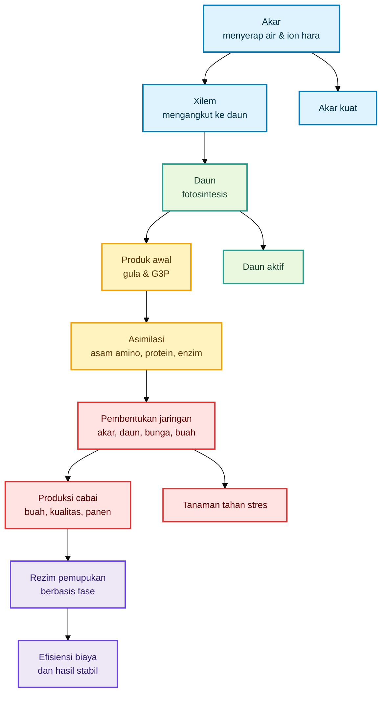
```mermaid
%%{init: {"theme": "base", "themeVariables": {"fontFamily": "Arial", "fontSize": "14px"}}}%%
flowchart TD
    A["Akar<br/>menyerap air & ion hara"] --> B["Xilem<br/>mengangkut ke daun"]
    B --> C["Daun<br/>fotosintesis"]
    C --> D["Produk awal<br/>gula & G3P"]
    D --> E["Asimilasi<br/>asam amino, protein, enzim"]
    E --> F["Pembentukan jaringan<br/>akar, daun, bunga, buah"]
    F --> G["Produksi cabai<br/>buah, kualitas, panen"]
    G --> H["Rezim pemupukan<br/>berbasis fase"]

    A --> I["Akar kuat"]
    C --> J["Daun aktif"]
    F --> K["Tanaman tahan stres"]
    H --> L["Efisiensi biaya<br/>dan hasil stabil"]

    classDef root fill:#dff3ff,stroke:#0077b6,stroke-width:2px,color:#003049;
    classDef leaf fill:#e9f8df,stroke:#2a9d8f,stroke-width:2px,color:#1b4332;
    classDef product fill:#fff3bf,stroke:#f59f00,stroke-width:2px,color:#5f370e;
    classDef tissue fill:#ffe3e3,stroke:#e03131,stroke-width:2px,color:#5c0000;
    classDef strategy fill:#ede7f6,stroke:#6741d9,stroke-width:2px,color:#2b1769;

    class A,B,I root;
    class C,J leaf;
    class D,E product;
    class F,G,K tissue;
    class H,L strategy;
```

---

# Sudut Pandang Artikel

Artikel ini ditulis untuk **praktisi pertanian cabai**, bukan sebagai tulisan akademik murni. Fokusnya adalah menghubungkan **fisiologi tanaman** dengan keputusan lapangan:

1. **Apa yang diserap tanaman?**
   Air, ion hara, dan karbon.

2. **Ke mana unsur hara bergerak?**
   Melalui akar, xilem, daun, floem, dan organ sink.

3. **Untuk apa unsur hara digunakan?**
   Membentuk klorofil, protein, enzim, dinding sel, jaringan akar, daun, bunga, dan buah.

4. **Kapan tanaman membutuhkan unsur tertentu lebih dominan?**
   Berbeda antara semai, vegetatif, pra-bunga, berbunga, fruit set, pembesaran buah, dan panen berulang.

5. **Bagaimana pemupukan harus disusun?**
   Bukan hanya berdasarkan merek pupuk, tetapi berdasarkan rasio fisiologis seperti:

$$
\mathrm{N:P:K:Ca:Mg}
$$

6. **Bagaimana tanaman diperkuat?**
   Dengan menjaga akar, daun, dinding sel, keseimbangan air, mikroklimat, serta pengendalian organisme pengganggu tanaman secara terpadu.

Cabai sangat sensitif terhadap stres air pada fase bunga dan awal buah; UC IPM mencatat bahwa stres saat pembungaan dapat menurunkan fruit set, sedangkan stres pada awal pertumbuhan buah dapat memicu blossom-end rot. Karena itu, artikel ini menempatkan pemupukan, air, dan kesehatan akar sebagai satu kesatuan manajemen. ([UC IPM][2])

---

# Kerangka Final 7 Bab

## Bab 1 — Proses Uptake Nutrisi pada Tanaman Cabai

Fokus bab:

- jalur masuk unsur hara melalui akar;
- bentuk ion yang diserap tanaman;
- mekanisme **mass flow**, **difusi**, dan **root interception**;
- peran rambut akar, korteks, endodermis, xilem, dan floem;
- pengaruh pH, EC, oksigen akar, suhu media, dan kelembapan;
- hubungan akar sehat dengan efisiensi pemupukan.

Contoh bentuk ion yang akan dibahas:

$$
\mathrm{NO_3^-},\ \mathrm{NH_4^+},\ \mathrm{H_2PO_4^-},\ \mathrm{K^+},\ \mathrm{Ca^{2+}},\ \mathrm{Mg^{2+}},\ \mathrm{SO_4^{2-}}
$$

---

## Bab 2 — Fungsi Unsur Hara dalam Pembentukan Sel dan Jaringan

Fokus bab:

- fungsi unsur makro dan mikro;
- unsur pembentuk klorofil, protein, enzim, ATP, DNA, membran, dan dinding sel;
- perbedaan unsur mobil dan kurang mobil;
- unsur dominan untuk akar, daun, bunga, dan buah;
- gejala kekurangan dan kelebihan secara praktis.

Unsur utama yang akan dibahas:

$$
\mathrm{C,\ H,\ O,\ N,\ P,\ K,\ Ca,\ Mg,\ S,\ Fe,\ Mn,\ Zn,\ B,\ Cu,\ Mo,\ Cl,\ Ni}
$$

Texas A&M AgriLife menjelaskan unsur primer, sekunder, dan mikro sebagai kelompok unsur esensial yang dibutuhkan tanaman dalam jumlah berbeda, sedangkan IFAS menyebut unsur seperti $\mathrm{N}$, $\mathrm{P}$, $\mathrm{K}$, $\mathrm{Ca}$, $\mathrm{Mg}$, dan $\mathrm{S}$ sebagai makronutrien karena dibutuhkan lebih besar dibanding unsur mikro. ([Texas A&M AgriLife Extension Service][1])

---

## Bab 3 — Fotosintesis: Fase Terang, Siklus Calvin, Produk, dan Unsur Hara yang Terlibat

Fokus bab:

- lokasi fotosintesis di kloroplas;
- fase terang pada membran tilakoid;
- fase gelap atau Siklus Calvin di stroma;
- input dan output tiap fase;
- keterlibatan unsur hara pada klorofil, fotosistem, transfer elektron, ATP, dan fiksasi karbon.

Persamaan umum fotosintesis:

$$
6CO_2 + 6H_2O + \text{cahaya}
\rightarrow
C_6H_{12}O_6 + 6O_2
$$

Fase terang:

$$
\text{cahaya} + H_2O + ADP + P_i + NADP^+
\rightarrow
ATP + NADPH + O_2
$$

Siklus Calvin:

$$
CO_2 + ATP + NADPH
\rightarrow
\mathrm{G3P}
\rightarrow
\text{sukrosa, pati, selulosa, asam amino, dan biomassa}
$$

---

## Bab 4 — Asimilasi Molekul dan Pembentukan Jaringan Tanaman

Fokus bab:

- pengertian asimilasi;
- asimilasi nitrogen;
- pembentukan asam amino;
- sintesis protein dan enzim;
- pembentukan klorofil;
- pembentukan dinding sel;
- pembentukan sukrosa, pati, lipid, dan jaringan baru;
- hubungan antara fotosintesis dan pertumbuhan organ.

Contoh alur asimilasi nitrogen:

$$
\mathrm{NO_3^-}
\rightarrow
\mathrm{NO_2^-}
\rightarrow
\mathrm{NH_4^+}
\rightarrow
\text{glutamin/glutamat}
\rightarrow
\text{asam amino}
\rightarrow
\text{protein dan enzim}
$$

---

## Bab 5 — Siklus Hidup Cabai dan Dominasi Proses Fisiologis

Fokus bab:

- semai;
- pindah tanam;
- vegetatif awal;
- vegetatif kuat;
- pra-bunga;
- berbunga;
- fruit set;
- pembesaran buah;
- panen berulang;
- akhir produksi.

Setiap fase akan dijelaskan berdasarkan:

1. organ yang sedang dominan dibentuk;
2. proses metabolik utama;
3. unsur hara prioritas;
4. risiko fisiologis;
5. indikator lapangan.

Contoh logika fase:

$$
\text{fase vegetatif}
\Rightarrow
\text{daun dan cabang dominan}
\Rightarrow
\mathrm{N,\ Mg,\ Fe,\ Mn,\ K,\ Ca}
$$

$$
\text{fase pembesaran buah}
\Rightarrow
\text{buah menjadi sink utama}
\Rightarrow
\mathrm{K,\ Ca,\ Mg,\ B}
$$

FAO mencatat bahwa pada fase awal berbunga cabai, pupuk dengan proporsi kalium lebih tinggi daripada nitrogen digunakan untuk membantu pembentukan bunga dan buah. ([FAOHome][3])

---

## Bab 6 — Rezim Pemupukan Cabai Berbasis Fase dan Rasio Hara

Fokus bab:

- prinsip pemupukan berbasis fase;
- rasio relatif:

$$
\mathrm{N:P:K:Ca:Mg}
$$

- strategi pemupukan semai sampai panen;
- pemupukan akar dan foliar;
- pH dan EC;
- pengaturan $\mathrm{Ca}$, $\mathrm{K}$, dan $\mathrm{Mg}$;
- risiko antagonisme hara;
- contoh kerangka fertigasi dan pemupukan tanah.

Rasio konseptual yang akan dikembangkan:

| Fase            | Fokus                      | Arah rasio hara                                                                            |
| --------------- | -------------------------- | ------------------------------------------------------------------------------------------ |
| Semai           | akar awal dan daun sejati  | $\mathrm{P}$, $\mathrm{Ca}$, $\mathrm{Zn}$, $\mathrm{B}$ cukup; $\mathrm{N}$ rendah-sedang |
| Vegetatif       | daun, cabang, fotosintesis | $\mathrm{N}$ cukup, $\mathrm{K}$ dan $\mathrm{Ca}$ mengikuti, $\mathrm{Mg}$ stabil         |
| Pra-bunga       | transisi generatif         | $\mathrm{N}$ ditahan, $\mathrm{P}$ dan $\mathrm{K}$ dinaikkan                              |
| Bunga           | bunga dan serbuk sari      | $\mathrm{P}$, $\mathrm{K}$, $\mathrm{B}$, $\mathrm{Zn}$, $\mathrm{Ca}$                     |
| Fruit set       | bakal buah                 | $\mathrm{K}$, $\mathrm{Ca}$, $\mathrm{B}$, $\mathrm{Mg}$                                   |
| Pembesaran buah | bobot dan kualitas         | $\mathrm{K}$ dominan, $\mathrm{Ca}$ dan $\mathrm{Mg}$ stabil                               |
| Panen berulang  | produksi berkelanjutan     | $\mathrm{K}$ tinggi-seimbang, $\mathrm{N}$ sedang, $\mathrm{Ca}$ dan $\mathrm{Mg}$ rutin   |

IFAS memberi contoh formulasi larutan nutrisi untuk sistem hidroponik dengan kebutuhan relatif tinggi pada $\mathrm{K}$ dan $\mathrm{Ca}$ dalam fase produksi sayuran buah, serta menekankan bahwa larutan nutrisi harus menyediakan unsur esensial dalam jumlah cukup tetapi tidak berlebihan. ([Ask IFAS - Powered by EDIS][4])

---

## Bab 7 — Strategi Penguatan Tanaman terhadap OPT dan Stres Lingkungan

Fokus bab:

- tanaman kuat bukan berarti kebal, tetapi lebih stabil secara fisiologis;
- hubungan nutrisi dengan dinding sel, stomata, akar, dan metabolisme pertahanan;
- strategi menghadapi panas, kekeringan, genangan, salinitas, dan fluktuasi air;
- hubungan kelebihan $\mathrm{N}$ dengan jaringan lunak;
- penguatan dengan $\mathrm{Ca}$, $\mathrm{B}$, $\mathrm{K}$, $\mathrm{Mg}$, $\mathrm{Si}$, $\mathrm{Zn}$, $\mathrm{Cu}$, dan mikroba baik;
- integrasi pemupukan dengan pengendalian OPT terpadu.

Formula praktis yang akan dibangun:

$$
\begin{aligned}
\text{akar kuat} &= \mathrm{P} + \mathrm{Ca} + \mathrm{B} + \mathrm{Zn} \\
&+ \text{oksigen akar} \\
&+ \text{mikroba baik}
\end{aligned}
$$

$$
\begin{aligned}
\text{daun kuat} &= \mathrm{N} + \mathrm{Mg} + \mathrm{Fe} + \mathrm{Mn} \\
&+ \mathrm{K} \\
&+ \text{cahaya cukup}
\end{aligned}
$$

$$
\begin{aligned}
\text{buah kuat} &= \mathrm{K} + \mathrm{Ca} + \mathrm{Mg} + \mathrm{B} \\
&+ \text{air stabil}
\end{aligned}
$$

---

# Definisi Istilah Kunci

## 1. Uptake nutrisi

**Uptake nutrisi** adalah proses masuknya air dan unsur hara dari larutan tanah atau media ke dalam akar tanaman.

Contoh bentuk hara yang diserap:

$$
\mathrm{NO_3^-},\ \mathrm{NH_4^+},\ \mathrm{K^+},\ \mathrm{Ca^{2+}},\ \mathrm{Mg^{2+}}
$$

---

## 2. Ion hara

**Ion hara** adalah bentuk bermuatan dari unsur hara yang larut dan dapat diserap akar.

Contoh:

$$
\mathrm{K^+}
$$

adalah bentuk kalium yang dapat diserap tanaman.

---

## 3. Xilem

**Xilem** adalah jaringan pengangkut air dan mineral dari akar menuju batang dan daun.

Alur sederhananya:

$$
\text{akar}
\rightarrow
\text{xilem}
\rightarrow
\text{daun}
$$

---

## 4. Floem

**Floem** adalah jaringan pengangkut hasil fotosintesis, terutama sukrosa, dari daun menuju organ sink seperti akar, pucuk, bunga, dan buah.

Alur sederhananya:

$$
\text{daun}
\rightarrow
\text{floem}
\rightarrow
\text{akar, bunga, buah}
$$

---

## 5. Source dan sink

**Source** adalah organ penghasil atau pelepas asimilat. Pada tanaman cabai, daun dewasa sehat adalah source utama.

**Sink** adalah organ penerima asimilat, misalnya:

- akar muda;
- pucuk muda;
- bunga;
- buah;
- biji.

Alurnya:

$$
\text{source}
\rightarrow
\text{sink}
$$

---

## 6. Fotosintesis

**Fotosintesis** adalah proses tanaman mengubah cahaya, air, dan karbon dioksida menjadi gula dan oksigen.

$$
6CO_2 + 6H_2O + \text{cahaya}
\rightarrow
C_6H_{12}O_6 + 6O_2
$$

---

## 7. Fase terang

**Fase terang** adalah fase fotosintesis yang membutuhkan cahaya secara langsung dan terjadi di membran tilakoid kloroplas.

Produk utama:

$$
ATP + NADPH + O_2
$$

---

## 8. Fase gelap atau Siklus Calvin

**Fase gelap** adalah fase yang menggunakan $CO_2$, $ATP$, dan $NADPH$ untuk membentuk molekul karbon awal, yaitu $\mathrm{G3P}$.

Fase ini tidak membutuhkan cahaya secara langsung, tetapi bergantung pada hasil fase terang.

$$
CO_2 + ATP + NADPH
\rightarrow
\mathrm{G3P}
$$

---

## 9. $\mathrm{G3P}$

$\mathrm{G3P}$ atau glyceraldehyde-3-phosphate adalah produk awal penting dari Siklus Calvin. Molekul ini menjadi bahan baku pembentukan:

- sukrosa;
- pati;
- selulosa;
- lipid;
- asam amino;
- biomassa tanaman.

---

## 10. Asimilasi

**Asimilasi** adalah proses mengubah unsur mineral menjadi senyawa organik yang berguna bagi tanaman.

Contoh:

$$
\mathrm{NO_3^-}
\rightarrow
\text{asam amino}
\rightarrow
\text{protein}
$$

---

## 11. Translokasi

**Translokasi** adalah perpindahan hasil fotosintesis dari daun ke organ lain melalui floem.

Contoh:

$$
\text{sukrosa dari daun}
\rightarrow
\text{buah cabai}
$$

---

## 12. Rasio hara

**Rasio hara** adalah perbandingan antar unsur hara. Dalam artikel ini, rasio yang sering digunakan adalah:

$$
\mathrm{N:P:K:Ca:Mg}
$$

Rasio ini membantu menentukan apakah formula pupuk lebih cocok untuk fase vegetatif, generatif, pembesaran buah, atau panen berulang.

---

## 13. EC

**EC** atau electrical conductivity adalah ukuran konsentrasi garam terlarut dalam larutan nutrisi atau larutan tanah.

Secara praktis:

$$
\text{EC tinggi}
\Rightarrow
\text{larutan lebih pekat}
\Rightarrow
\text{akar lebih sulit menyerap air}
$$

---

## 14. pH

**pH** adalah ukuran keasaman atau kebasaan larutan tanah/media. pH memengaruhi ketersediaan unsur hara.

Secara umum:

$$
\text{pH tidak sesuai}
\Rightarrow
\text{hara tersedia di media tetapi sulit diserap tanaman}
$$

---

## 15. OPT

**OPT** adalah organisme pengganggu tanaman, meliputi:

- hama;
- patogen penyakit;
- gulma;
- vektor virus.

Dalam konteks cabai, OPT penting antara lain trips, kutu kebul, kutu daun, tungau, antraknosa, layu bakteri, layu fusarium, virus kuning, dan busuk akar.

---

# Daftar Rujukan Utama yang Akan Dipakai

## 1. Texas A&M AgriLife Extension — Essential Nutrients for Plants

Digunakan untuk dasar pengelompokan unsur hara esensial, fungsi unsur primer, sekunder, dan mikro, serta pentingnya analisis tanah dalam keputusan pemupukan. ([Texas A&M AgriLife Extension Service][1])

## 2. University of Florida IFAS — Nutrient Solution Formulation for Hydroponic Vegetable Production

Digunakan untuk acuan formulasi larutan nutrisi, unsur esensial, konsentrasi relatif $\mathrm{N}$, $\mathrm{P}$, $\mathrm{K}$, $\mathrm{Ca}$, dan $\mathrm{Mg}$, serta prinsip penyediaan nutrisi pada sistem hidroponik dan substrat. ([Ask IFAS - Powered by EDIS][4])

## 3. University of Florida IFAS — Fertilizer Management for Greenhouse Vegetables

Digunakan untuk dasar pengelolaan pupuk pada sayuran greenhouse, pembagian makro dan mikro, serta prinsip pemberian nutrisi dalam jumlah cukup tetapi tidak berlebihan. ([Ask IFAS - Powered by EDIS][5])

## 4. UC IPM — Cultural Tips for Growing Peppers

Digunakan untuk aspek praktis budidaya cabai/paprika, khususnya hubungan kelembapan zona akar, stres air, pembungaan, fruit set, dan blossom-end rot. ([UC IPM][2])

## 5. FAO — Nutrition of the Hot Pepper Crop

Digunakan sebagai referensi praktis pemupukan cabai, terutama perubahan kebutuhan nutrisi saat tanaman masuk fase berbunga dan berbuah, termasuk peningkatan proporsi kalium terhadap nitrogen. ([FAOHome][3])

## 6. Referensi pendukung fisiologi dan gangguan buah

Akan digunakan untuk memperkuat pembahasan tentang peran $\mathrm{Ca}$, salinitas, dan blossom-end rot pada cabai, terutama pada bab pemupukan fase buah dan strategi menghadapi stres lingkungan. Salah satu rujukan yang relevan adalah artikel ISHS tentang mekanisme fisiologis blossom-end rot pada paprika/cabai greenhouse di bawah irigasi salin. ([ishs][6])

---

# Posisi Artikel untuk Praktisi

Artikel ini akan menjaga tiga lapis pembahasan:

## 1. Lapis fisiologi

Menjelaskan proses tanaman:

$$
\text{uptake}
\rightarrow
\text{transport}
\rightarrow
\text{fotosintesis}
\rightarrow
\text{asimilasi}
\rightarrow
\text{pembentukan jaringan}
$$

## 2. Lapis agronomi

Menerjemahkan proses fisiologi menjadi kebutuhan lapangan:

$$
\text{fase tanaman}
\rightarrow
\text{organ dominan}
\rightarrow
\text{unsur prioritas}
\rightarrow
\text{strategi pupuk}
$$

## 3. Lapis keputusan praktis

Menghasilkan panduan yang bisa dipakai untuk:

- memilih rasio pupuk;
- mengatur waktu aplikasi;
- membaca gejala tanaman;
- menghindari antagonisme hara;
- menjaga akar dan daun tetap produktif;
- memperkuat tanaman terhadap OPT dan stres;
- meningkatkan hasil cabai secara stabil.

---

# Prinsip Besar yang Akan Dipakai Sepanjang Artikel

## Prinsip 1 — Tidak ada unsur yang bekerja sendirian

Contoh:

$$
\text{daun hijau aktif}
\neq
\mathrm{N} \text{ saja}
$$

Tetapi:

$$
\begin{aligned}
\text{daun hijau aktif} &= \mathrm{N} + \mathrm{Mg} + \mathrm{Fe} + \mathrm{Mn} + \mathrm{S} + \mathrm{K} \\
&+ \text{cahaya cukup}
\end{aligned}
$$

---

## Prinsip 2 — Organ berbeda, kebutuhan hara berbeda

$$
\text{akar}
\Rightarrow
\mathrm{P,\ Ca,\ B,\ Zn,\ K}
$$

$$
\text{daun}
\Rightarrow
\mathrm{N,\ Mg,\ Fe,\ Mn,\ S,\ K}
$$

$$
\text{bunga}
\Rightarrow
\mathrm{P,\ K,\ B,\ Zn,\ Ca,\ Mo}
$$

$$
\text{buah}
\Rightarrow
\mathrm{K,\ Ca,\ Mg,\ B}
$$

---

## Prinsip 3 — Fase tanaman menentukan strategi pupuk

Cabai fase vegetatif tidak boleh diperlakukan sama dengan cabai fase pembesaran buah.

$$
\text{vegetatif}
\Rightarrow
\mathrm{N} \text{ lebih dominan}
$$

$$
\text{pembesaran buah}
\Rightarrow
\mathrm{K} \text{ lebih dominan, tetapi } \mathrm{Ca} \text{ dan } \mathrm{Mg} \text{ tetap stabil}
$$

---

## Prinsip 4 — Tanaman kuat dimulai dari akar dan daun

Akar menentukan serapan. Daun menentukan produksi gula. Buah hanya bisa besar bila akar dan daun masih sehat.

$$
\begin{aligned}
\text{akar sehat} + \text{daun aktif} &= \text{source kuat} \\
&+ \text{sink buah terisi}
\end{aligned}
$$

---

## Prinsip 5 — Pemupukan harus mencegah ketidakseimbangan

Contoh ketidakseimbangan umum:

$$
\mathrm{K} \text{ terlalu tinggi}
\Rightarrow
\text{risiko gangguan serapan } \mathrm{Ca} \text{ dan } \mathrm{Mg}
$$

$$
\mathrm{N} \text{ terlalu tinggi}
\Rightarrow
\text{tanaman terlalu vegetatif dan jaringan lebih lunak}
$$

$$
\mathrm{Ca} \text{ terlambat}
\Rightarrow
\text{jaringan muda dan buah lebih rentan bermasalah}
$$

---

# Arah Penulisan Bab Berikutnya

Mulai **Response 2**, artikel masuk ke **Bab 1 — Proses Uptake Nutrisi pada Tanaman Cabai**.

Bab 1 akan menjelaskan secara tajam:

- bagaimana akar menyerap ion;
- jalur air dan hara dari media ke xilem;
- peran rambut akar dan endodermis;
- kenapa oksigen akar menentukan penyerapan;
- kenapa pH dan EC sering lebih penting daripada menambah dosis pupuk;
- bagaimana membaca kondisi akar di lapangan.

[1]: https://agrilifeextension.tamu.edu/library/gardening/essential-nutrients-for-plants/?utm_source=chatgpt.com 'Essential Nutrients for Plants'
[2]: https://ipm.ucanr.edu/home-and-landscape/cultural-tips-for-growing-peppers/?utm_source=chatgpt.com 'Cultural Tips for Growing Peppers'
[3]: https://www.fao.org/4/y5259e/y5259e07.htm?utm_source=chatgpt.com 'nutrition of the hot pepper crop'
[4]: https://ask.ifas.ufl.edu/publication/CV216?utm_source=chatgpt.com 'HS796/CV216: Nutrient Solution Formulation for Hydroponic ...'
[5]: https://ask.ifas.ufl.edu/publication/CV265?utm_source=chatgpt.com 'Fertilizer Management for Greenhouse Vegetables ... - Ask IFAS'
[6]: https://ishs.org/ishs-article/609_9/?utm_source=chatgpt.com 'PHYSIOLOGICAL AND BIOCHEMICAL MECHANISMS ...'

---

# Bab 1 — Proses Uptake Nutrisi oleh Tanaman

## Pengantar Bab

Tanaman cabai tidak “memakan pupuk” dalam bentuk butiran atau larutan pekat. Tanaman menyerap **ion hara** yang sudah larut di air tanah, media tanam, atau larutan nutrisi.

Secara sederhana:

$$
\text{pupuk}
\rightarrow
\text{larut dalam air}
\rightarrow
\text{menjadi ion hara}
\rightarrow
\text{diserap akar}
\rightarrow
\text{diangkut ke jaringan tanaman}
$$

Akar tanaman hanya dapat menyerap unsur hara yang berada dalam bentuk larut, terutama bentuk ion. Karena itu, pupuk yang diberikan ke lahan atau sistem fertigasi belum tentu langsung bermanfaat bila tidak larut, pH tidak sesuai, EC terlalu tinggi, akar rusak, atau zona akar kekurangan oksigen. Missouri Extension menjelaskan bahwa pupuk yang larut akan terurai menjadi ion, dan akar tanaman menyerap nutrisi dalam bentuk ionik. ([nrcca.cals.cornell.edu][1])([MU Extension][2])trisi dalam bentuk ionik.

<figure>
  
  <figcaption>
    Ilustrasi uptake nutrisi pada tanaman cabai dari zona perakaran menuju
    jaringan tanaman untuk mendukung pertumbuhan vegetatif dan generatif.
  </figcaption>
</figure>

---

## Diagram Ringkas Uptake Nutrisi

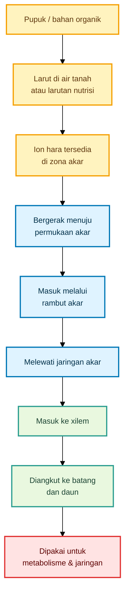
```mermaid
%%{init: {"theme": "base", "themeVariables": {"fontFamily": "Arial", "fontSize": "13px"}}}%%
flowchart TD
    A["Pupuk / bahan organik"] --> B["Larut di air tanah<br/>atau larutan nutrisi"]
    B --> C["Ion hara tersedia<br/>di zona akar"]
    C --> D["Bergerak menuju<br/>permukaan akar"]
    D --> E["Masuk melalui<br/>rambut akar"]
    E --> F["Melewati jaringan akar"]
    F --> G["Masuk ke xilem"]
    G --> H["Diangkut ke batang<br/>dan daun"]
    H --> I["Dipakai untuk<br/>metabolisme & jaringan"]

    classDef source fill:#fff3bf,stroke:#f59f00,stroke-width:2px,color:#5f370e;
    classDef root fill:#dff3ff,stroke:#0077b6,stroke-width:2px,color:#003049;
    classDef transport fill:#e9f8df,stroke:#2a9d8f,stroke-width:2px,color:#1b4332;
    classDef use fill:#ffe3e3,stroke:#e03131,stroke-width:2px,color:#5c0000;

    class A,B,C source;
    class D,E,F root;
    class G,H transport;
    class I use;
```

[**Kembali ke Atas**](#dari-nutrisi-ke-buah-cabai-mekanisme-uptake-hara-fotosintesis-asimilasi-molekul-pembentukan-jaringan-dan-strategi-pemupukan-berdasarkan-fase-tanaman)

---

# 1.1. Jalur Masuk Nutrisi

## A. Nutrisi dari Akar

Sebagian besar unsur mineral masuk melalui akar. Akar menyerap air dan ion hara dari larutan tanah atau media. Setelah itu, air dan hara mineral dibawa ke atas melalui xilem.

Bentuk umum unsur hara yang diserap tanaman adalah sebagai berikut:

| Unsur      | Bentuk umum diserap                          |
| ---------- | -------------------------------------------- |
| Nitrogen   | $\mathrm{NO_3^-}$, $\mathrm{NH_4^+}$         |
| Fosfor     | $\mathrm{H_2PO_4^-}$, $\mathrm{HPO_4^{2-}}$  |
| Kalium     | $\mathrm{K^+}$                               |
| Kalsium    | $\mathrm{Ca^{2+}}$                           |
| Magnesium  | $\mathrm{Mg^{2+}}$                           |
| Sulfur     | $\mathrm{SO_4^{2-}}$                         |
| Besi       | $\mathrm{Fe^{2+}}$, $\mathrm{Fe^{3+}}$/kelat |
| Seng       | $\mathrm{Zn^{2+}}$                           |
| Mangan     | $\mathrm{Mn^{2+}}$                           |
| Boron      | $\mathrm{H_3BO_3}$/borat                     |
| Tembaga    | $\mathrm{Cu^{2+}}$/kelat                     |
| Molibdenum | $\mathrm{MoO_4^{2-}}$                        |

Dalam praktik budidaya cabai, tabel ini penting karena pupuk yang “mengandung unsur” belum tentu langsung tersedia. Unsur harus larut, berada pada pH yang sesuai, dan berada dekat permukaan akar agar bisa diambil.

Contohnya:

$$
\mathrm{KNO_3}
\rightarrow
\mathrm{K^+} + \mathrm{NO_3^-}
$$

Kalium nitrat baru berguna bagi akar setelah larut menjadi ion $\mathrm{K^+}$ dan $\mathrm{NO_3^-}$.

---

## B. Mekanisme Hara Menuju Permukaan Akar

Sebelum masuk ke akar, hara harus lebih dulu **bergerak menuju permukaan akar**. Ada tiga mekanisme utama:

1. **Mass flow**
2. **Difusi**
3. **Root interception**

Cornell NRCCA menjelaskan bahwa pergerakan hara ke akar terjadi melalui mass flow, difusi, dan root interception; mass flow dominan untuk nitrat, sulfat, kalsium, dan magnesium, se([agry.purdue.edu][3])([agry.purdue.edu][3])n mengambil air untuk transpirasi.

### Implikasi untuk cabai

Mass flow sangat dipengaruhi oleh:

- ketersediaan air;
- transpirasi daun;
- kelembapan media;
- suhu;
- kesehatan akar;
- bukaan stomata.

Bila media terlalu kering, aliran air menuju akar menurun. Bila media terlalu becek, akar kekurangan oksigen. Keduanya sama-sama menurunkan uptake.

Rumus praktisnya:

$$
\begin{aligned}
\text{mass flow efektif} &= f(\text{air tersedia},\ \text{transpirasi},\ \text{akar aktif},\ \mathrm{O_2})
\end{aligned}
$$

---

## 2. Difusi

**Difusi** adalah pergerakan hara dari area berkonsentrasi tinggi ke area berkonsentrasi rendah.

Di sekitar akar, konsentrasi hara sering turun karena akar terus menyerap. Akibatnya, ion dari area yang lebih jauh bergerak perlahan menuju permukaan akar.

Alurnya:

$$
\text{konsentrasi hara tinggi di media}
\rightarrow
\text{konsentrasi rendah dekat akar}
\rightarrow
\text{hara bergerak menuju akar}
$$

Unsur yang sangat dipengaruhi difusi:

$$
\mathrm{H_2PO_4^-},\ \mathrm{HPO_4^{2-}},\ \mathrm{K^+},\ \mathrm{Zn^{2+}}
$$

Purdue Extension menjelaskan bahwa fosfor dan kalium banyak bergerak ke akar melalui difusi karena keduanya kuat terikat di tana([nrcca.cals.cornell.edu][1])([agry.purdue.edu][3])ukan jalur terbesar untuk semua hara.

### Implikasi untuk cabai

Pada cabai, root interception penting terutama saat:

- bibit baru pindah tanam;
- akar mulai memperluas area serapan;
- media mulai mengering di sebagian zona;
- pupuk dasar berada di sekitar perakaran;
- tanaman masuk fase vegetatif aktif.

Semakin baik volume akar aktif, semakin besar peluang akar menemukan hara.

---

# C. Masuk ke Jaringan Akar

Setelah hara sampai di permukaan akar, hara belum otomatis masuk ke xilem. Ion harus melewati jaringan akar.

Alurnya:

$$
\text{larutan tanah/media}
\rightarrow
\text{rambut akar}
\rightarrow
\text{epidermis}
\rightarrow
\text{korteks}
\rightarrow
\text{endodermis}
\rightarrow
\text{xilem}
\rightarrow
\text{batang}
\rightarrow
\text{daun}
$$

---

## Diagram Jalur Masuk ke Akar

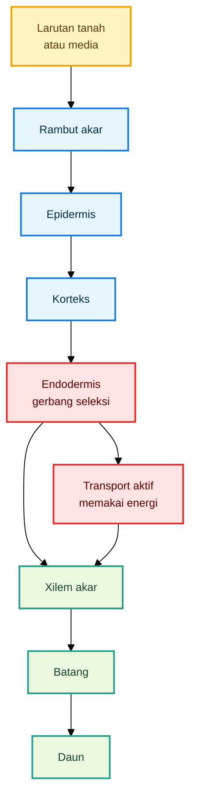
```mermaid
%%{init: {"theme": "base", "themeVariables": {"fontFamily": "Arial", "fontSize": "13px"}}}%%
flowchart TD
    A["Larutan tanah<br/>atau media"] --> B["Rambut akar"]
    B --> C["Epidermis"]
    C --> D["Korteks"]
    D --> E["Endodermis<br/>gerbang seleksi"]
    E --> F["Xilem akar"]
    F --> G["Batang"]
    G --> H["Daun"]

    E --> I["Transport aktif<br/>memakai energi"]
    I --> F

    classDef outside fill:#fff3bf,stroke:#f59f00,stroke-width:2px,color:#5f370e;
    classDef tissue fill:#e7f5ff,stroke:#1c7ed6,stroke-width:2px,color:#003049;
    classDef gate fill:#ffe3e3,stroke:#e03131,stroke-width:2px,color:#5c0000;
    classDef xylem fill:#e9f8df,stroke:#2a9d8f,stroke-width:2px,color:#1b4332;

    class A outside;
    class B,C,D tissue;
    class E,I gate;
    class F,G,H xylem;
```

---

## 1. Rambut akar: permukaan serapan utama

Rambut akar memperluas permukaan kontak akar dengan larutan tanah atau media.

Fungsinya:

- menyerap air;
- menyerap ion hara;
- memperluas bidang kontak;
- membantu eksplorasi zona hara;
- berinteraksi dengan mikroba rhizosphere.

Pada cabai muda, akar muda dan rambut akar sangat menentukan keberhasilan setelah pindah tanam. Bila rambut akar rusak akibat media terlalu panas, terlalu asin, terlalu asam, terlalu basa, atau terlalu becek, serapan hara langsung turun.

---

## 2. Epidermis dan korteks: jalur awal di dalam akar

Setelah melewati rambut akar, air dan ion masuk ke epidermis dan korteks.

Di bagian ini, hara bisa bergerak melalui dua jalur:

| Jalur       | Penjelasan                                                    |
| ----------- | ------------------------------------------------------------- |
| **Apoplas** | Bergerak melalui ruang dinding sel                            |
| **Simplas** | Bergerak dari sel ke sel melalui sitoplasma dan plasmodesmata |

Secara praktis, akar tidak bekerja seperti spons pasif. Akar melakukan seleksi ion, memakai energi, dan mengatur apa yang boleh masuk lebih jauh.

Purdue Extension menjelaskan bahwa uptake oleh akar merupakan proses aktif; pada titik tertentu, membran plasma dan endodermis mengatur pergerakan ion, dan protein pembawa digunakan u([MU Extension][2])([Ask IFAS - Powered by EDIS][4])optimum untuk produksi hidroponik.

### Implikasi praktis

Media terlalu becek dapat membuat akar “lapar oksigen”. Ketika akar kekurangan oksigen:

- respirasi akar turun;
- energi akar turun;
- transport aktif melemah;
- rambut akar rusak;
- akar mudah cokelat;
- serapan hara turun;
- tanaman terlihat seperti kekurangan pupuk, padahal masalah utamanya adalah akar.

---

# 1.2. Jalur Xilem dan Floem

Setelah masuk ke akar, hara bergerak melalui dua sistem utama:

1. **Xilem**
2. **Floem**

Keduanya punya fungsi berbeda.

---

## A. Xilem

Xilem mengangkut:

$$
\text{air} + \text{mineral}
$$

dari:

$$
\text{akar}
\rightarrow
\text{batang}
\rightarrow
\text{daun}
$$

Unsur yang dominan bergerak melalui xilem:

$$
\mathrm{NO_3^-},\ \mathrm{Ca^{2+}},\ \mathrm{Mg^{2+}},\ \mathrm{K^+},\ \mathrm{SO_4^{2-}}
$$

serta unsur mikro dalam jumlah kecil.

IFAS menjelaskan bahwa selama tanaman mengambil air, nutrisi mineral terlarut ikut diserap dan didistribusikan ke kanopi tanaman; IFAS juga membedakan unsur mobil yang dapat bergerak melalui xilem dan floem, serta unsur kur([Ask IFAS - Powered by EDIS][4])a bergerak melalui xilem.

---

## B. Floem

Floem mengangkut hasil fotosintesis dan sebagian hara mobil.

Yang dibawa floem antara lain:

$$
\text{sukrosa} + \text{asam amino} + \text{sinyal hormon} + \text{sebagian hara mobil}
$$

Tujuannya:

- akar;
- pucuk muda;
- bunga;
- buah;
- biji.

Alur sederhananya:

$$
\text{daun source}
\rightarrow
\text{floem}
\rightarrow
\text{organ sink}
$$

Organ **source** adalah organ penghasil asimilat, terutama daun dewasa sehat.

Organ **sink** adalah organ penerima asimilat, misalnya:

- akar muda;
- pucuk muda;
- bunga;
- buah cabai;
- biji.

---

## Diagram Xilem dan Floem

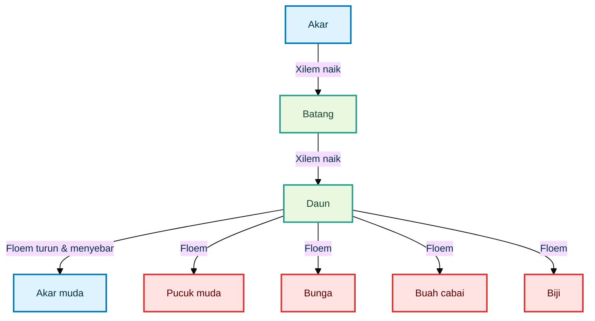
```mermaid
%%{init: {"theme": "base", "themeVariables": {"fontFamily": "Arial", "fontSize": "13px"}}}%%
flowchart TD
    A["Akar"] -->|Xilem naik| B["Batang"]
    B -->|Xilem naik| C["Daun"]

    C -->|Floem turun & menyebar| D["Akar muda"]
    C -->|Floem| E["Pucuk muda"]
    C -->|Floem| F["Bunga"]
    C -->|Floem| G["Buah cabai"]
    C -->|Floem| H["Biji"]

    classDef root fill:#dff3ff,stroke:#0077b6,stroke-width:2px,color:#003049;
    classDef leaf fill:#e9f8df,stroke:#2a9d8f,stroke-width:2px,color:#1b4332;
    classDef sink fill:#ffe3e3,stroke:#e03131,stroke-width:2px,color:#5c0000;

    class A,D root;
    class B,C leaf;
    class E,F,G,H sink;
```

---

# 1.3. Mobilitas Hara di Dalam Tanaman

Tidak semua hara mudah dipindahkan ulang dari daun tua ke jaringan muda.

## Hara relatif mobil

Unsur yang relatif mobil di dalam tanaman:

$$
\mathrm{N},\ \mathrm{P},\ \mathrm{K},\ \mathrm{Mg},\ \mathrm{S}
$$

Jika unsur ini kurang, gejala sering muncul lebih dulu pada daun tua karena tanaman memindahkan hara dari daun tua ke jaringan muda.

## Hara relatif kurang mobil

Unsur yang relatif kurang mobil:

$$
\mathrm{Ca},\ \mathrm{Fe},\ \mathrm{Zn},\ \mathrm{Cu},\ \mathrm{Mn},\ \mathrm{B},\ \mathrm{Mo}
$$

Jika unsur ini kurang, gejala sering muncul lebih dulu pada pucuk, daun muda, bunga, atau buah muda. IFAS menyebut hara mobil seperti $\mathrm{N}$, $\mathrm{P}$, $\mathrm{K}$, $\mathrm{Mg}$, dan $\mathrm{S}$ dapat bergerak ke area pertumbuhan aktif, sedangkan hara kurang mobil seperti $\mathrm{Ca}$, $\mathrm{Fe}$, $\mathrm{Zn}$, $\mathrm{Cu}$, $\mathrm{Mn}$, $\mathrm{B}$, dan $\mathrm{Mo}$ terutama bergerak melalui xilem dan([MU Extension][2])([Ask IFAS - Powered by EDIS][4])mampuan air menahan oksigen terlarut.

Secara praktis:

$$
\text{media terlalu becek}
\Rightarrow
\mathrm{O_2}\ \text{rendah}
\Rightarrow
\text{respirasi akar turun}
\Rightarrow
\text{uptake hara turun}
$$

---

## 3. pH media atau larutan nutrisi

pH mengatur apakah hara tersedia atau terkunci.

IFAS menjelaskan bahwa pada pH tanah tinggi, banyak unsur mikro dapat terikat dan menjadi tidak tersedia; pada pH sangat rendah, banyak unsur m([extension.okstate.edu][5])t menjadi tidak tersedia.

Secara praktis:

$$
\text{pH tidak sesuai}
\Rightarrow
\text{hara tersedia di media tetapi sulit diserap}
$$

Untuk sistem hidroponik atau soilless, Oklahoma State University Extension menyebut larutan nutrisi umumnya dijaga pada pH $5$ sampai $6$, biasanya sekitar $5{,}5$, agar lingkungan akar berada sekitar pH $6$ sampai $6{,}5$, yaitu rentang ketika hara paling mudah tersedia. Untuk peppers, tabel OSU mencantumkan kisaran hidroponik sekitar $\mathrm{EC}$ $0{,}8$–([extension.okstate.edu][5]) dan pH $5{,}5$–$6{,}0$.

---

## 4. EC atau kepekatan larutan

EC menunjukkan banyaknya garam terlarut dalam larutan.

$$
\text{EC tinggi}
\Rightarrow
\text{larutan lebih pekat}
$$

$$
\text{EC terlalu tinggi}
\Rightarrow
\text{tekanan osmotik meningkat}
\Rightarrow
\text{akar lebih sulit menyerap air}
$$

Oklahoma State University Extension menjelaskan bahwa EC adalah ukuran konsentrasi garam dalam larutan, dan kadar nutrisi yang terlalu tinggi dapat memicu stres osmotik,([agry.purdue.edu][3])l tetapi kebutuhan pertumbuhan cepat.

Implikasinya pada cabai:

- fase semai butuh media ringan dan aerasi baik;
- pindah tanam perlu menghindari kerusakan akar;
- pupuk starter harus mudah dijangkau akar muda;
- akar baru harus terus dirangsang selama fase generatif;
- media padat, becek, atau terlalu asin menghambat serapan sejak awal.

---

# 1.5. Cara Membaca Uptake Nutrisi di Lapangan

## A. Bila daun pucat

Kemungkinan:

- kekurangan $\mathrm{N}$;
- kekurangan $\mathrm{Mg}$;
- kekurangan $\mathrm{Fe}$;
- akar rusak;
- pH tidak sesuai;
- media terlalu basah;
- cahaya kurang.

Jangan langsung menyimpulkan kekurangan pupuk. Periksa akar, pH, EC, dan kelembapan media.

---

## B. Bila tanaman layu siang tetapi media masih basah

Kemungkinan:

- akar kekurangan oksigen;
- akar busuk;
- EC terlalu tinggi;
- suhu media tinggi;
- transpirasi melebihi kemampuan akar.

Rumus diagnosis:

$$
\text{media basah} + \text{tanaman layu}
\neq
\text{kurang air}
$$

Bisa jadi:

$$
\text{akar tidak mampu menyerap air}
$$

---

## C. Bila pucuk muda rusak atau tumbuh abnormal

Kemungkinan:

- kekurangan $\mathrm{Ca}$;
- kekurangan $\mathrm{B}$;
- akar tidak aktif;
- transpirasi tidak stabil;
- pH atau EC bermasalah.

Karena $\mathrm{Ca}$ dan $\mathrm{B}$ relatif kurang mobil, masalahnya sering muncul di jaringan muda.

---

## D. Bila bunga mudah rontok

Kemungkinan:

- air tidak stabil;
- akar stres;
- kekurangan $\mathrm{K}$;
- kekurangan $\mathrm{B}$;
- kekurangan $\mathrm{Ca}$;
- suhu terlalu tinggi;
- tanaman terlalu vegetatif akibat $\mathrm{N}$ berlebih;
- serangan trips atau tungau.

Pada cabai, bunga dan bakal buah adalah sink yang sensitif. Bila suplai air, hara, dan gula tidak stabil, tanaman akan menggugurkan bunga untuk mempertahankan hidup.

---

# 1.6. Kesimpulan Bab 1

Proses uptake nutrisi pada cabai dapat diringkas sebagai berikut:

$$
\text{hara larut}
\rightarrow
\text{bergerak ke akar}
\rightarrow
\text{masuk ke jaringan akar}
\rightarrow
\text{seleksi di endodermis}
\rightarrow
\text{xilem}
\rightarrow
\text{daun dan jaringan tumbuh}
$$

Tetapi efektivitasnya ditentukan oleh:

$$
\begin{aligned}
\text{uptake efektif} &= f(\text{akar sehat},\ \text{air cukup},\ \text{ion tersedia},\ \mathrm{O_2},\ \text{pH},\ \text{EC},\ \text{suhu akar})
\end{aligned}
$$

Prinsip praktis untuk cabai:

| Faktor  | Target praktis                            |
| ------- | ----------------------------------------- |
| Akar    | putih, aktif, bercabang, tidak busuk      |
| Air     | cukup dan stabil, tidak becek ekstrem     |
| Oksigen | media porous, drainase baik, aerasi cukup |
| pH      | dijaga sesuai sistem tanam                |
| EC      | cukup untuk nutrisi, tidak terlalu pekat  |
| Pupuk   | larut, tepat fase, dekat zona akar aktif  |
| Media   | tidak padat, tidak asin, tidak tergenang  |

Inti Bab 1:

\*\*Pemupukan cabai yang efektif dimulai bukan dari menambah dosis pupu

, tetapi dari memastikan akar mampu menyerap.\*\*

[1]: https://nrcca.cals.cornell.edu/nutrient/CA2/CA0209.php 'Certified Crop Advisor study resources (Northeast region)'
[2]: https://extension.missouri.edu/publications/g6984 'Hydroponic Nutrient Solutions | MU Extension'
[3]: https://www.agry.purdue.edu/ext/pubs/AGRY-95-08.pdf 'AGRY 95-08'
[4]: https://ask.ifas.ufl.edu/publication/HS1373 'HS1373/HS1373: Movement of Plant Nutrients'
[5]: https://extension.okstate.edu/fact-sheets/electrical-conductivity-and-ph-guide-for-hydroponics 'Electrical Conductivity and pH Guide for Hydroponics | Oklahoma State University'

[**Kembali ke Atas**](#dari-nutrisi-ke-buah-cabai-mekanisme-uptake-hara-fotosintesis-asimilasi-molekul-pembentukan-jaringan-dan-strategi-pemupukan-berdasarkan-fase-tanaman)

---

# Bab 2 — Kegunaan Masing-Masing Unsur Hara dalam Pembentukan Sel dan Jaringan

## Pengantar Bab

Setelah Bab 1 menjelaskan bagaimana unsur hara masuk melalui akar, Bab 2 membahas **untuk apa unsur hara itu digunakan di dalam tanaman**.

Pada tanaman cabai, unsur hara tidak hanya berfungsi untuk “menghijaukan daun” atau “membesarkan buah”. Unsur hara terlibat dalam pembentukan:

- sel akar;
- jaringan daun;
- batang dan cabang;
- bunga;
- buah;
- biji;
- enzim;
- klorofil;
- membran sel;
- dinding sel;
- gula;
- protein;
- hormon;
- sistem pertahanan tanaman.

Secara sederhana:

$$
\text{ion hara}
+
\text{gula hasil fotosintesis}
+
\text{energi}
\rightarrow
\text{molekul organik}
\rightarrow
\text{sel}
\rightarrow
\text{jaringan}
\rightarrow
\text{organ tanaman}
$$

<figure>
  
  <figcaption>
    Ilustrasi hubungan sel akar dan daun cabai dalam proses penyerapan,
    transportasi, dan pemanfaatan unsur hara untuk pertumbuhan tanaman.
  </figcaption>
</figure>

Texas A&M AgriLife mengelompokkan unsur hara esensial tanaman menjadi nutrisi primer, sekunder, dan mikro; unsur primer meliputi $\mathrm{C}$, $\mathrm{H}$, $\mathrm{N}$, $\mathrm{O}$, $\mathrm{P}$, dan $\mathrm{K}$, unsur sekunder meliputi $\mathrm{Ca}$, $\mathrm{Mg}$, dan $\mathrm{S}$, sedangkan unsur mikro meliputi $\mathrm{B}$, $\mathrm{Cl}$, $\mathrm{Cu}$, $\mathrm{Fe}$, $\mathrm{Mn}$, $\mathrm{Mo}$, dan $\mathrm{Zn}$. ([agrilifeextension.tamu.edu](https://agrilifeextension.tamu.edu/library/gardening/essential-nutrients-for-plants/))

---

## Diagram Besar: Dari Unsur Hara Menjadi Jaringan

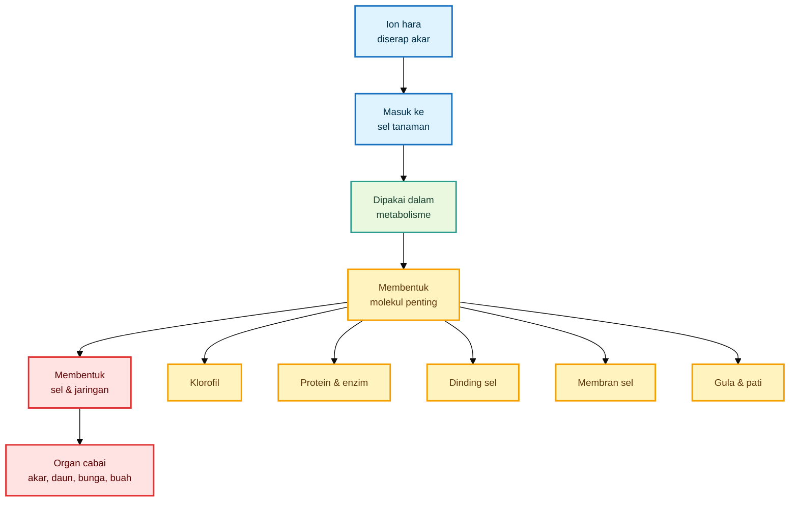
```mermaid
%%{init: {"theme": "base", "themeVariables": {"fontFamily": "Arial", "fontSize": "13px"}}}%%
flowchart TD
    A["Ion hara<br/>diserap akar"] --> B["Masuk ke<br/>sel tanaman"]
    B --> C["Dipakai dalam<br/>metabolisme"]
    C --> D["Membentuk<br/>molekul penting"]
    D --> E["Membentuk<br/>sel & jaringan"]
    E --> F["Organ cabai<br/>akar, daun, bunga, buah"]

    D --> G["Klorofil"]
    D --> H["Protein & enzim"]
    D --> I["Dinding sel"]
    D --> J["Membran sel"]
    D --> K["Gula & pati"]

    classDef input fill:#dff3ff,stroke:#1971c2,stroke-width:2px,color:#003049;
    classDef process fill:#e9f8df,stroke:#2a9d8f,stroke-width:2px,color:#1b4332;
    classDef molecule fill:#fff3bf,stroke:#f59f00,stroke-width:2px,color:#5f370e;
    classDef tissue fill:#ffe3e3,stroke:#e03131,stroke-width:2px,color:#5c0000;

    class A,B input;
    class C process;
    class D,G,H,I,J,K molecule;
    class E,F tissue;
```

---

# 2.1. Unsur Pembentuk Biomassa Utama

Unsur pembentuk biomassa utama adalah unsur yang membentuk struktur dasar tanaman atau menjalankan fungsi metabolik besar. Sebagian menjadi bagian langsung dari molekul organik, sebagian lagi menjadi pengatur proses fisiologis.

| Unsur         | Fungsi dalam sel dan jaringan                     |
| ------------- | ------------------------------------------------- |
| $\mathrm{C}$  | Rangka karbon gula, selulosa, protein, lipid      |
| $\mathrm{H}$  | Air, metabolit organik, reaksi reduksi            |
| $\mathrm{O}$  | Air, gula, respirasi, senyawa organik             |
| $\mathrm{N}$  | Asam amino, protein, enzim, klorofil, DNA/RNA     |
| $\mathrm{P}$  | ATP, energi, DNA/RNA, fosfolipid membran          |
| $\mathrm{K}$  | Aktivasi enzim, turgor, stomata, transport gula   |
| $\mathrm{Ca}$ | Dinding sel, membran, jaringan muda, titik tumbuh |
| $\mathrm{Mg}$ | Inti klorofil, aktivator enzim, penggunaan ATP    |
| $\mathrm{S}$  | Asam amino sulfur, protein, enzim                 |

IFAS menjelaskan bahwa unsur makro seperti $\mathrm{N}$, $\mathrm{P}$, $\mathrm{K}$, $\mathrm{Ca}$, $\mathrm{Mg}$, dan $\mathrm{S}$ dibutuhkan tanaman dalam jumlah besar, sedangkan unsur mikro seperti $\mathrm{Fe}$, $\mathrm{Mn}$, $\mathrm{Zn}$, $\mathrm{B}$, $\mathrm{Cu}$, $\mathrm{Mo}$, dan $\mathrm{Cl}$ dibutuhkan lebih sedikit tetapi tetap esensial. ([journals.flvc.org](https://journals.flvc.org/edis/article/download/129809/134045/233309))

---

## A. Karbon, Hidrogen, dan Oksigen: Kerangka Utama Biomassa

Tiga unsur terbesar dalam biomassa tanaman adalah:

$$
\mathrm{C},\ \mathrm{H},\ \mathrm{O}
$$

Ketiganya membentuk sebagian besar senyawa organik tanaman:

- gula;
- pati;
- selulosa;
- hemiselulosa;
- pektin;
- lipid;
- asam organik;
- rangka karbon asam amino.

Sumber utamanya:

| Unsur        | Sumber utama                        |
| ------------ | ----------------------------------- |
| $\mathrm{C}$ | $\mathrm{CO_2}$ dari udara          |
| $\mathrm{H}$ | $\mathrm{H_2O}$ dari air            |
| $\mathrm{O}$ | $\mathrm{CO_2}$ dan $\mathrm{H_2O}$ |

Persamaan umum fotosintesis:

$$
6CO_2 + 6H_2O + \text{cahaya}
\rightarrow
C_6H_{12}O_6 + 6O_2
$$

Makna praktis untuk cabai:

**tanaman tidak bisa membentuk jaringan hanya dari pupuk mineral.** Tanaman perlu cahaya, air, dan $\mathrm{CO_2}$ untuk membangun rangka karbon. Unsur hara mineral kemudian dipakai untuk mengubah rangka karbon tersebut menjadi jaringan hidup.

---

## B. Nitrogen: Pembentuk Protein, Enzim, dan Daun Produktif

Nitrogen, ditulis sebagai $\mathrm{N}$, adalah unsur utama untuk membentuk:

- asam amino;
- protein;
- enzim;
- klorofil;
- DNA;
- RNA;
- jaringan daun;
- jaringan muda.

Alur sederhananya:

$$
\mathrm{NO_3^-}
\rightarrow
\mathrm{NH_4^+}
\rightarrow
\text{asam amino}
\rightarrow
\text{protein}
\rightarrow
\text{enzim dan jaringan}
$$

Pada cabai, $\mathrm{N}$ sangat penting pada fase vegetatif karena tanaman sedang membentuk daun, batang, cabang, dan mesin fotosintesis. Namun, $\mathrm{N}$ berlebihan dapat membuat tanaman terlalu vegetatif, jaringan lunak, kanopi terlalu rimbun, bunga lebih mudah terganggu, dan keseimbangan generatif menurun.

Rumus praktis:

$$
\mathrm{N}\ \text{cukup}
\Rightarrow
\text{daun produktif}
$$

$$
\mathrm{N}\ \text{berlebihan}
\Rightarrow
\text{vegetatif berlebihan dan jaringan lunak}
$$

---

## C. Fosfor: Energi, Akar, dan Informasi Genetik

Fosfor, ditulis sebagai $\mathrm{P}$, tidak membentuk massa jaringan sebesar $\mathrm{C}$ atau $\mathrm{N}$, tetapi sangat penting untuk energi dan pembelahan sel.

Fungsi utama $\mathrm{P}$:

- membentuk ATP;
- membantu transfer energi;
- membentuk DNA dan RNA;
- membentuk fosfolipid membran;
- mendukung pertumbuhan akar;
- mendukung pembungaan dan pembentukan biji.

ATP adalah molekul energi utama tanaman:

$$
ADP + P_i
\rightarrow
ATP
$$

Pada fase semai dan pindah tanam cabai, $\mathrm{P}$ penting karena akar muda membutuhkan energi untuk membelah dan memanjang.

Rumus praktis:

$$
\mathrm{P}\ \text{cukup}
\Rightarrow
\text{akar aktif dan energi sel cukup}
$$

---

## D. Kalium: Pengatur Turgor, Stomata, Enzim, dan Gula

Kalium, ditulis sebagai $\mathrm{K}$, berbeda dari $\mathrm{N}$ atau $\mathrm{P}$. Kalium tidak banyak menjadi bagian struktur organik, tetapi berfungsi sebagai **pengatur fisiologis**.

Fungsi utama $\mathrm{K}$:

- mengatur turgor sel;
- membuka dan menutup stomata;
- mengaktifkan enzim;
- membantu transport gula;
- meningkatkan pengisian buah;
- mendukung toleransi stres air;
- menjaga keseimbangan ion.

Pada cabai fase buah, $\mathrm{K}$ sangat penting karena buah menjadi organ sink utama. Sukrosa dari daun perlu bergerak ke buah, dan proses ini sangat dipengaruhi oleh status kalium.

Rumus praktis:

$$
\mathrm{K}\ \text{cukup}
\Rightarrow
\text{stomata stabil + gula lancar + buah terisi}
$$

Tetapi $\mathrm{K}$ juga harus dikendalikan. Bila $\mathrm{K}$ terlalu tinggi, serapan $\mathrm{Ca}$ dan $\mathrm{Mg}$ bisa terganggu karena terjadi kompetisi antar kation.

$$
\mathrm{K^+}\ \text{berlebihan}
\Rightarrow
\text{risiko gangguan } \mathrm{Ca^{2+}} \text{ dan } \mathrm{Mg^{2+}}
$$

---

## E. Kalsium: Dinding Sel, Membran, dan Jaringan Muda

Kalsium, ditulis sebagai $\mathrm{Ca}$, adalah unsur struktural penting pada dinding sel dan membran.

Fungsi utama $\mathrm{Ca}$:

- memperkuat dinding sel;
- menjaga stabilitas membran;
- mendukung pembelahan sel;
- mendukung titik tumbuh akar dan pucuk;
- mengurangi jaringan lemah;
- penting untuk kualitas buah.

Pada buah cabai, kekurangan $\mathrm{Ca}$ sering terkait dengan jaringan buah yang lemah. Namun, masalah $\mathrm{Ca}$ tidak selalu berarti tanah atau larutan kurang $\mathrm{Ca}$. Sering kali masalahnya adalah $\mathrm{Ca}$ tidak sampai ke jaringan muda atau buah karena aliran air dan transpirasi tidak stabil.

Kalsium relatif kurang mobil di floem. Karena itu, jaringan muda sangat bergantung pada pasokan $\mathrm{Ca}$ yang kontinu melalui xilem. IFAS menjelaskan bahwa unsur seperti $\mathrm{Ca}$ tergolong kurang mobile di dalam tanaman, sehingga gejala defisiensi biasanya muncul pada jaringan muda. ([ask.ifas.ufl.edu](https://ask.ifas.ufl.edu/publication/AG462/pdf))

Rumus praktis:

$$
\mathrm{Ca}\ \text{cukup}
\Rightarrow
\text{dinding sel kuat + jaringan muda stabil}
$$

---

## F. Magnesium: Inti Klorofil dan Aktivator Enzim

Magnesium, ditulis sebagai $\mathrm{Mg}$, sangat penting untuk fotosintesis.

Fungsi utama $\mathrm{Mg}$:

- menjadi inti molekul klorofil;
- mengaktifkan enzim;
- membantu penggunaan ATP;
- mendukung pembentukan gula;
- menjaga daun tetap produktif.

Hubungan sederhana:

$$
\mathrm{Mg}
\rightarrow
\text{klorofil}
\rightarrow
\text{fotosintesis}
\rightarrow
\text{gula}
\rightarrow
\text{buah}
$$

Pada cabai fase panen berulang, $\mathrm{Mg}$ sering kurang diperhatikan. Padahal saat buah banyak, daun harus tetap aktif memproduksi gula. Bila $\mathrm{Mg}$ rendah, daun tua dapat menguning antar tulang daun, fotosintesis menurun, dan pengisian buah melemah.

Rumus praktis:

$$
\mathrm{Mg}\ \text{cukup}
\Rightarrow
\text{daun hijau aktif dan suplai gula stabil}
$$

---

## G. Sulfur: Asam Amino Sulfur, Protein, dan Enzim

Sulfur, ditulis sebagai $\mathrm{S}$, diperlukan untuk membentuk asam amino tertentu, terutama:

- sistein;
- metionin.

Fungsi utama $\mathrm{S}$:

- membentuk protein;
- membentuk enzim;
- mendukung metabolisme nitrogen;
- mendukung kloroplas;
- terlibat dalam senyawa pertahanan.

Hubungan $\mathrm{N}$ dan $\mathrm{S}$ sangat penting. Tanaman tidak cukup hanya punya $\mathrm{N}$ untuk membentuk protein. Tanaman juga membutuhkan $\mathrm{S}$ untuk menyusun protein tertentu.

Rumus praktis:

$$
\mathrm{N} + \mathrm{S}
\Rightarrow
\text{asam amino}
\Rightarrow
\text{protein dan enzim}
$$

---

# 2.2. Unsur Mikro dan Peran Struktural-Metabolik

Unsur mikro dibutuhkan dalam jumlah kecil, tetapi perannya sangat kritis. Kekurangan mikro bisa membuat tanaman tampak “aneh”: pucuk tidak normal, daun klorosis, bunga lemah, buah tidak seragam, atau akar tidak berkembang baik.

| Unsur         | Fokus fungsi                                           |
| ------------- | ------------------------------------------------------ |
| $\mathrm{Fe}$ | Klorofil tidak langsung, transfer elektron, feredoksin |
| $\mathrm{Mn}$ | Fotosistem II, pemecahan air, enzim                    |
| $\mathrm{Zn}$ | Enzim, pembentukan auksin, pemanjangan akar            |
| $\mathrm{B}$  | Dinding sel, pembelahan sel, serbuk sari, buah         |
| $\mathrm{Cu}$ | Plastosianin, lignifikasi, enzim oksidase              |
| $\mathrm{Mo}$ | Reduksi nitrat, asimilasi $\mathrm{N}$                 |
| $\mathrm{Cl}$ | Osmoregulasi, fotosistem II                            |
| $\mathrm{Ni}$ | Urease, metabolisme $\mathrm{N}$                       |

Review White dan Brown di _Annals of Botany_ menjelaskan bahwa tanaman membutuhkan sedikitnya 14 unsur mineral untuk nutrisi, termasuk makronutrien $\mathrm{N}$, $\mathrm{P}$, $\mathrm{K}$, $\mathrm{Ca}$, $\mathrm{Mg}$, dan $\mathrm{S}$ serta mikronutrien seperti $\mathrm{Fe}$, $\mathrm{Mn}$, $\mathrm{Zn}$, $\mathrm{B}$, $\mathrm{Cu}$, $\mathrm{Mo}$, $\mathrm{Cl}$, dan $\mathrm{Ni}$. ([pmc.ncbi.nlm.nih.gov](https://pmc.ncbi.nlm.nih.gov/articles/PMC2887071/))

---

## A. Besi: Transfer Elektron dan Pembentukan Klorofil

Besi, ditulis sebagai $\mathrm{Fe}$, berperan dalam:

- pembentukan klorofil secara tidak langsung;
- transfer elektron;
- feredoksin;
- sitokrom;
- respirasi;
- fotosintesis.

Bila $\mathrm{Fe}$ kurang, daun muda sering menguning tetapi tulang daun tetap relatif hijau. Ini terjadi karena $\mathrm{Fe}$ relatif kurang mobile di dalam tanaman.

Rumus praktis:

$$
\mathrm{Fe}\ \text{cukup}
\Rightarrow
\text{transfer elektron dan pembentukan klorofil berjalan baik}
$$

---

## B. Mangan: Fotosistem II dan Enzim

Mangan, ditulis sebagai $\mathrm{Mn}$, sangat penting pada fase terang fotosintesis, khususnya pada sistem pemecahan air.

Fungsi utama $\mathrm{Mn}$:

- membantu fotolisis air;
- mendukung fotosistem II;
- mengaktifkan enzim;
- membantu metabolisme nitrogen dan karbon.

Pada fase terang:

$$
2H_2O
\rightarrow
O_2 + 4H^+ + 4e^-
$$

Proses ini melibatkan kompleks pemecah air yang sangat bergantung pada $\mathrm{Mn}$.

Rumus praktis:

$$
\mathrm{Mn}\ \text{cukup}
\Rightarrow
\text{fase terang fotosintesis lebih stabil}
$$

---

## C. Seng: Auksin, Enzim, dan Pemanjangan Akar

Seng, ditulis sebagai $\mathrm{Zn}$, berperan dalam:

- aktivasi enzim;
- pembentukan hormon auksin;
- pemanjangan akar;
- pembentukan tunas;
- metabolisme karbohidrat.

Pada cabai, $\mathrm{Zn}$ penting sejak fase awal karena akar dan pucuk muda sangat bergantung pada keseimbangan hormon pertumbuhan.

Rumus praktis:

$$
\mathrm{Zn}\ \text{cukup}
\Rightarrow
\text{akar dan tunas lebih aktif}
$$

---

## D. Boron: Dinding Sel, Pembelahan Sel, dan Reproduksi

Boron, ditulis sebagai $\mathrm{B}$, penting untuk:

- pembentukan dinding sel;
- pembelahan sel;
- titik tumbuh;
- serbuk sari;
- tabung polen;
- pembentukan bakal buah;
- transport gula.

Pada cabai, $\mathrm{B}$ sangat penting pada fase pra-bunga, berbunga, dan fruit set. Namun $\mathrm{B}$ harus diberikan hati-hati karena jarak antara cukup dan berlebih relatif sempit.

Rumus praktis:

$$
\mathrm{B}\ \text{cukup}
\Rightarrow
\text{bunga lebih kuat dan pembelahan sel lebih baik}
$$

$$
\mathrm{B}\ \text{berlebihan}
\Rightarrow
\text{risiko toksisitas}
$$

---

## E. Tembaga: Plastosianin, Lignifikasi, dan Enzim Pertahanan

Tembaga, ditulis sebagai $\mathrm{Cu}$, berperan dalam:

- plastosianin pada fotosintesis;
- lignifikasi;
- enzim oksidase;
- metabolisme fenolik;
- penguatan jaringan.

Dalam jumlah cukup, $\mathrm{Cu}$ mendukung metabolisme dan penguatan jaringan. Namun seperti unsur mikro lain, kelebihan $\mathrm{Cu}$ dapat toksik.

Rumus praktis:

$$
\mathrm{Cu}\ \text{cukup}
\Rightarrow
\text{enzim redoks dan lignifikasi lebih baik}
$$

---

## F. Molibdenum: Reduksi Nitrat dan Asimilasi Nitrogen

Molibdenum, ditulis sebagai $\mathrm{Mo}$, diperlukan dalam enzim nitrate reductase.

Fungsi utamanya adalah membantu perubahan nitrat menjadi bentuk yang dapat diasimilasi lebih lanjut.

Alur sederhana:

$$
\mathrm{NO_3^-}
\rightarrow
\mathrm{NO_2^-}
\rightarrow
\mathrm{NH_4^+}
\rightarrow
\text{asam amino}
$$

Tanpa $\mathrm{Mo}$ yang cukup, tanaman bisa mengalami gangguan pemanfaatan $\mathrm{N}$, walaupun nitrat tersedia.

Rumus praktis:

$$
\mathrm{Mo}\ \text{cukup}
\Rightarrow
\text{asimilasi nitrat lebih lancar}
$$

---

## G. Klor: Osmoregulasi dan Fotosistem II

Klor, ditulis sebagai $\mathrm{Cl}$, sering dianggap hanya sebagai garam, padahal dalam jumlah kecil $\mathrm{Cl}$ diperlukan tanaman.

Fungsi utama $\mathrm{Cl}$:

- osmoregulasi;
- keseimbangan ion;
- fungsi fotosistem II;
- membantu proses pemecahan air.

Rumus praktis:

$$
\mathrm{Cl}\ \text{cukup rendah}
\Rightarrow
\text{keseimbangan ion dan fotosintesis terbantu}
$$

Tetapi pada air irigasi salin, $\mathrm{Cl^-}$ berlebih dapat menjadi masalah karena memicu stres garam.

---

## H. Nikel: Urease dan Metabolisme Nitrogen

Nikel, ditulis sebagai $\mathrm{Ni}$, dibutuhkan dalam jumlah sangat kecil. Peran utamanya adalah pada enzim urease, yang membantu metabolisme urea.

Reaksi sederhananya:

$$
\text{urea}
\rightarrow
\mathrm{NH_4^+}
$$

Pada budidaya cabai, defisiensi $\mathrm{Ni}$ jarang dibahas di lapangan, tetapi secara fisiologis tetap termasuk unsur esensial.

---

## Diagram Unsur Mikro dan Fungsi Metabolik

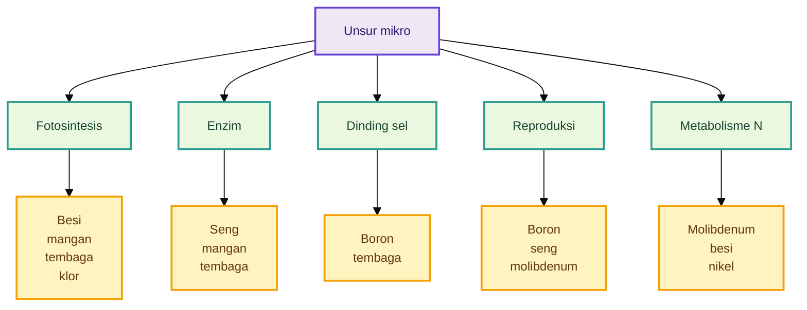
```mermaid
%%{init: {"theme": "base", "themeVariables": {"fontFamily": "Arial", "fontSize": "13px"}}}%%
flowchart TD
    A["Unsur mikro"] --> B["Fotosintesis"]
    A --> C["Enzim"]
    A --> D["Dinding sel"]
    A --> E["Reproduksi"]
    A --> F["Metabolisme N"]

    B --> B1["Besi<br/>mangan<br/>tembaga<br/>klor"]
    C --> C1["Seng<br/>mangan<br/>tembaga"]
    D --> D1["Boron<br/>tembaga"]
    E --> E1["Boron<br/>seng<br/>molibdenum"]
    F --> F1["Molibdenum<br/>besi<br/>nikel"]

    classDef main fill:#ede7f6,stroke:#6741d9,stroke-width:2px,color:#2b1769;
    classDef func fill:#e9f8df,stroke:#2a9d8f,stroke-width:2px,color:#1b4332;
    classDef element fill:#fff3bf,stroke:#f59f00,stroke-width:2px,color:#5f370e;

    class A main;
    class B,C,D,E,F func;
    class B1,C1,D1,E1,F1 element;
```

---

# 2.3. Unsur Berdasarkan Organ Target

Tanaman cabai membagi sumber daya berdasarkan organ yang sedang aktif tumbuh. Organ yang sedang aktif disebut **sink**. Setiap organ memiliki kebutuhan unsur dominan yang berbeda.

| Organ/jaringan | Unsur dominan                                                                         |
| -------------- | ------------------------------------------------------------------------------------- |
| Akar muda      | $\mathrm{P}$, $\mathrm{Ca}$, $\mathrm{B}$, $\mathrm{Zn}$, $\mathrm{K}$                |
| Batang         | $\mathrm{N}$, $\mathrm{K}$, $\mathrm{Ca}$, $\mathrm{B}$, $\mathrm{Si}$ opsional       |
| Daun           | $\mathrm{N}$, $\mathrm{Mg}$, $\mathrm{Fe}$, $\mathrm{Mn}$, $\mathrm{S}$, $\mathrm{K}$ |
| Bunga          | $\mathrm{P}$, $\mathrm{K}$, $\mathrm{B}$, $\mathrm{Zn}$, $\mathrm{Mo}$                |
| Buah cabai     | $\mathrm{K}$, $\mathrm{Ca}$, $\mathrm{Mg}$, $\mathrm{B}$, $\mathrm{N}$ seimbang       |

---

## A. Akar Muda

Akar muda membutuhkan unsur yang mendukung:

- pembelahan sel;
- pemanjangan akar;
- pembentukan rambut akar;
- energi;
- stabilitas membran;
- turgor.

Unsur dominan:

$$
\mathrm{P},\ \mathrm{Ca},\ \mathrm{B},\ \mathrm{Zn},\ \mathrm{K}
$$

Perannya:

| Unsur         | Peran pada akar muda              |
| ------------- | --------------------------------- |
| $\mathrm{P}$  | ATP dan energi pertumbuhan akar   |
| $\mathrm{Ca}$ | membran dan dinding sel akar muda |
| $\mathrm{B}$  | pembelahan sel dan titik tumbuh   |
| $\mathrm{Zn}$ | auksin dan pemanjangan akar       |
| $\mathrm{K}$  | turgor dan transport ion          |

Formula praktis:

$$
\begin{aligned}
\text{akar muda kuat} &= \mathrm{P} + \mathrm{Ca} + \mathrm{B} + \mathrm{Zn} + \mathrm{K} \\
&+ \mathrm{O_2}
\end{aligned}
$$

---

## B. Batang dan Cabang

Batang cabai perlu cukup kuat untuk menahan tajuk, bunga, dan buah.

Unsur dominan:

$$
\mathrm{N},\ \mathrm{K},\ \mathrm{Ca},\ \mathrm{B}
$$

Silika, ditulis sebagai $\mathrm{Si}$, bukan unsur esensial untuk semua tanaman, tetapi dapat berfungsi sebagai unsur bermanfaat pada banyak sistem budidaya karena membantu ketahanan jaringan dan toleransi stres.

Peran unsur pada batang:

| Unsur         | Peran                              |
| ------------- | ---------------------------------- |
| $\mathrm{N}$  | protein dan pertumbuhan jaringan   |
| $\mathrm{K}$  | turgor dan kekuatan sel            |
| $\mathrm{Ca}$ | dinding sel dan membran            |
| $\mathrm{B}$  | struktur dinding sel               |
| $\mathrm{Si}$ | penguatan jaringan secara opsional |

---

## C. Daun

Daun adalah pusat fotosintesis. Daun yang sehat bukan hanya hijau, tetapi juga aktif menghasilkan gula.

Unsur dominan:

$$
\mathrm{N},\ \mathrm{Mg},\ \mathrm{Fe},\ \mathrm{Mn},\ \mathrm{S},\ \mathrm{K}
$$

Peran unsur pada daun:

| Unsur         | Peran                                      |
| ------------- | ------------------------------------------ |
| $\mathrm{N}$  | klorofil, Rubisco, protein fotosintesis    |
| $\mathrm{Mg}$ | inti klorofil                              |
| $\mathrm{Fe}$ | transfer elektron dan pembentukan klorofil |
| $\mathrm{Mn}$ | fotosistem II                              |
| $\mathrm{S}$  | protein dan enzim                          |
| $\mathrm{K}$  | stomata dan transport gula                 |

Formula praktis:

$$
\begin{aligned}
\text{daun produktif} &= \mathrm{N} + \mathrm{Mg} + \mathrm{Fe} + \mathrm{Mn} + \mathrm{S} + \mathrm{K} \\
&+ \text{cahaya}
\end{aligned}
$$

---

## D. Bunga

Bunga cabai membutuhkan energi, gula, hormon, dan keseimbangan mikro. Pada fase ini, kelebihan vegetatif akibat $\mathrm{N}$ berlebihan bisa mengganggu pembungaan.

Unsur dominan:

$$
\mathrm{P},\ \mathrm{K},\ \mathrm{B},\ \mathrm{Zn},\ \mathrm{Mo}
$$

Peran unsur:

| Unsur         | Peran pada bunga             |
| ------------- | ---------------------------- |
| $\mathrm{P}$  | energi pembungaan            |
| $\mathrm{K}$  | aliran gula ke bunga         |
| $\mathrm{B}$  | serbuk sari dan tabung polen |
| $\mathrm{Zn}$ | hormon dan pembentukan bunga |
| $\mathrm{Mo}$ | metabolisme nitrogen         |

Formula praktis:

$$
\begin{aligned}
\text{bunga kuat} &= \mathrm{P} + \mathrm{K} + \mathrm{B} + \mathrm{Zn} + \mathrm{Mo} \\
&+ \text{gula cukup}
\end{aligned}
$$

---

## E. Buah Cabai

Buah cabai adalah sink utama pada fase generatif. Pada fase ini, daun tetap harus aktif karena buah membutuhkan suplai sukrosa dari fotosintesis.

Unsur dominan:

$$
\mathrm{K},\ \mathrm{Ca},\ \mathrm{Mg},\ \mathrm{B}
$$

dengan $\mathrm{N}$ tetap diperlukan secara seimbang.

Peran unsur pada buah:

| Unsur         | Peran                                             |
| ------------- | ------------------------------------------------- |
| $\mathrm{K}$  | pengisian buah dan transport gula                 |
| $\mathrm{Ca}$ | dinding sel dan kekuatan jaringan buah            |
| $\mathrm{Mg}$ | menjaga fotosintesis daun selama pengisian buah   |
| $\mathrm{B}$  | pembelahan sel dan transport gula                 |
| $\mathrm{N}$  | menjaga daun tetap aktif, tetapi tidak berlebihan |

Formula praktis:

$$
\begin{aligned}
\text{buah cabai berkualitas} &= \mathrm{K} + \mathrm{Ca} + \mathrm{Mg} + \mathrm{B} \\
&+ \mathrm{N}\ \text{seimbang}
\end{aligned}
$$

---

## Diagram Organ Target dan Unsur Dominan

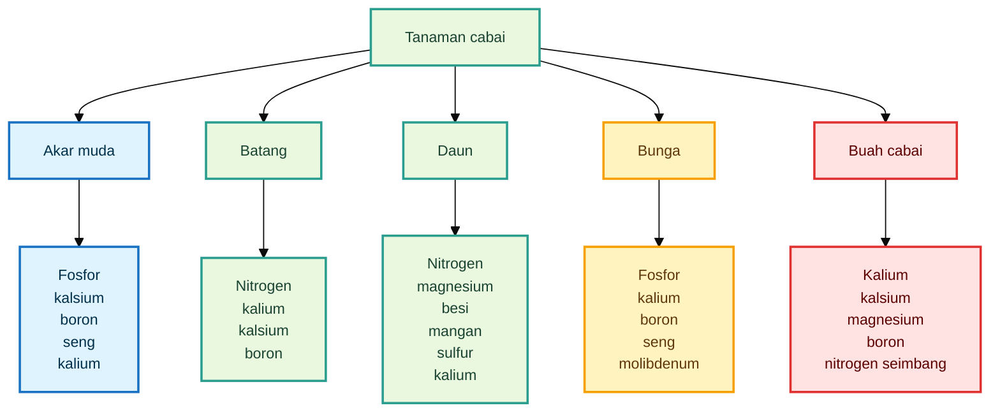
```mermaid
%%{init: {"theme": "base", "themeVariables": {"fontFamily": "Arial", "fontSize": "13px"}}}%%
flowchart TD
    A["Tanaman cabai"] --> B["Akar muda"]
    A --> C["Batang"]
    A --> D["Daun"]
    A --> E["Bunga"]
    A --> F["Buah cabai"]

    B --> B1["Fosfor<br/>kalsium<br/>boron<br/>seng<br/>kalium"]
    C --> C1["Nitrogen<br/>kalium<br/>kalsium<br/>boron"]
    D --> D1["Nitrogen<br/>magnesium<br/>besi<br/>mangan<br/>sulfur<br/>kalium"]
    E --> E1["Fosfor<br/>kalium<br/>boron<br/>seng<br/>molibdenum"]
    F --> F1["Kalium<br/>kalsium<br/>magnesium<br/>boron<br/>nitrogen seimbang"]

    classDef organ fill:#e9f8df,stroke:#2a9d8f,stroke-width:2px,color:#1b4332;
    classDef root fill:#dff3ff,stroke:#1971c2,stroke-width:2px,color:#003049;
    classDef flower fill:#fff3bf,stroke:#f59f00,stroke-width:2px,color:#5f370e;
    classDef fruit fill:#ffe3e3,stroke:#e03131,stroke-width:2px,color:#5c0000;
    classDef element fill:#f8f0fc,stroke:#9c36b5,stroke-width:2px,color:#3b0a45;

    class A organ;
    class B,B1 root;
    class C,D,C1,D1 organ;
    class E,E1 flower;
    class F,F1 fruit;
```

---

# 2.4. Mobilitas Unsur dan Gejala Kekurangan

Mobilitas unsur di dalam tanaman penting untuk membaca gejala lapangan. Bila unsur mobile kurang, tanaman dapat memindahkan unsur dari daun tua ke jaringan muda. Bila unsur kurang mobile kurang, jaringan muda yang lebih dulu terganggu.

Michigan State University Extension menekankan bahwa memahami mobilitas hara membantu diagnosis defisiensi; unsur mobile seperti $\mathrm{N}$, $\mathrm{P}$, $\mathrm{K}$, dan $\mathrm{Mg}$ cenderung menunjukkan gejala pada daun tua, sedangkan unsur tidak mobile seperti $\mathrm{Ca}$ dan $\mathrm{B}$ cenderung menimbulkan gejala pada jaringan muda. ([canr.msu.edu](https://www.canr.msu.edu/news/knowing_nutrient_mobility_is_helpful_in_diagnosing_plant_nutrient_deficienc))

## Unsur relatif mobile

$$
\mathrm{N},\ \mathrm{P},\ \mathrm{K},\ \mathrm{Mg},\ \mathrm{S}
$$

Gejala kekurangan sering muncul lebih dulu pada:

$$
\text{daun tua}
$$

Contoh:

- kekurangan $\mathrm{N}$: daun tua pucat;
- kekurangan $\mathrm{Mg}$: daun tua kuning antar tulang daun;
- kekurangan $\mathrm{K}$: tepi daun tua menguning atau nekrosis.

## Unsur relatif kurang mobile

$$
\mathrm{Ca},\ \mathrm{B},\ \mathrm{Fe},\ \mathrm{Mn},\ \mathrm{Cu},\ \mathrm{Zn}
$$

Gejala kekurangan sering muncul lebih dulu pada:

$$
\text{pucuk muda, daun muda, bunga, atau buah muda}
$$

Contoh:

- kekurangan $\mathrm{Ca}$: pucuk lemah, buah rentan gangguan jaringan;
- kekurangan $\mathrm{B}$: titik tumbuh dan bunga terganggu;
- kekurangan $\mathrm{Fe}$: daun muda menguning.

---

## Diagram Mobilitas Unsur

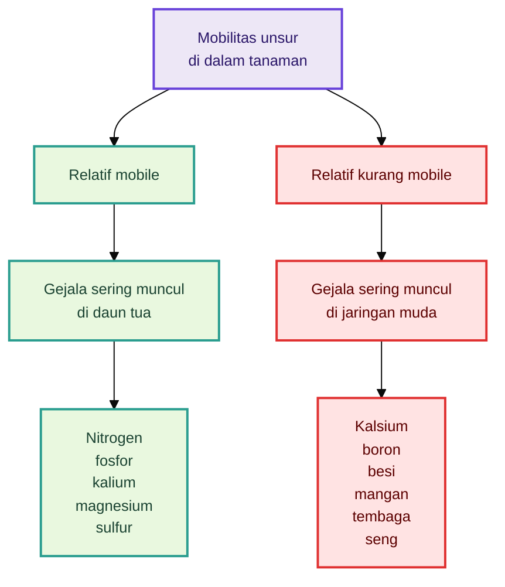
```mermaid
%%{init: {"theme": "base", "themeVariables": {"fontFamily": "Arial", "fontSize": "13px"}}}%%
flowchart TD
    A["Mobilitas unsur<br/>di dalam tanaman"] --> B["Relatif mobile"]
    A --> C["Relatif kurang mobile"]

    B --> B1["Gejala sering muncul<br/>di daun tua"]
    C --> C1["Gejala sering muncul<br/>di jaringan muda"]

    B1 --> B2["Nitrogen<br/>fosfor<br/>kalium<br/>magnesium<br/>sulfur"]
    C1 --> C2["Kalsium<br/>boron<br/>besi<br/>mangan<br/>tembaga<br/>seng"]

    classDef main fill:#ede7f6,stroke:#6741d9,stroke-width:2px,color:#2b1769;
    classDef mobile fill:#e9f8df,stroke:#2a9d8f,stroke-width:2px,color:#1b4332;
    classDef immobile fill:#ffe3e3,stroke:#e03131,stroke-width:2px,color:#5c0000;

    class A main;
    class B,B1,B2 mobile;
    class C,C1,C2 immobile;
```

---

# 2.5. Prinsip Keseimbangan Unsur Hara

Unsur hara tidak bekerja sendiri. Dalam praktik cabai, masalah sering muncul bukan karena satu unsur tidak ada, tetapi karena **rasio antar unsur tidak seimbang**.

## A. Keseimbangan $\mathrm{N}$ dan $\mathrm{K}$

$$
\mathrm{N}
\Rightarrow
\text{pertumbuhan daun}
$$

$$
\mathrm{K}
\Rightarrow
\text{pengaturan air, transport gula, pengisian buah}
$$

Pada fase vegetatif, $\mathrm{N}$ dibutuhkan lebih tinggi. Pada fase buah, $\mathrm{K}$ perlu lebih dominan.

Rumus praktis:

$$
\text{vegetatif}
\Rightarrow
\mathrm{N}\ \text{cukup}
$$

$$
\text{buah}
\Rightarrow
\mathrm{K}\ \text{naik, } \mathrm{N}\ \text{ditahan}
$$

---

## B. Keseimbangan $\mathrm{K}$, $\mathrm{Ca}$, dan $\mathrm{Mg}$

Tiga kation ini sering saling memengaruhi:

$$
\mathrm{K^+},\ \mathrm{Ca^{2+}},\ \mathrm{Mg^{2+}}
$$

Jika salah satu terlalu dominan, serapan unsur lain bisa terganggu.

Pada cabai fase buah:

$$
\begin{aligned}
\mathrm{K}\ \text{tinggi} + \mathrm{Ca}\ \text{stabil} + \mathrm{Mg}\ \text{cukup} &= \text{buah terisi dan daun tetap aktif}
\end{aligned}
$$

Jangan hanya menaikkan $\mathrm{K}$ tanpa menjaga $\mathrm{Ca}$ dan $\mathrm{Mg}$.

---

## C. Keseimbangan $\mathrm{N}$ dan $\mathrm{S}$

Untuk membuat protein, tanaman tidak cukup hanya memiliki $\mathrm{N}$. Tanaman juga memerlukan $\mathrm{S}$.

$$
\mathrm{N} + \mathrm{S}
\rightarrow
\text{asam amino}
\rightarrow
\text{protein}
$$

Bila $\mathrm{N}$ tinggi tetapi $\mathrm{S}$ kurang, efisiensi pembentukan protein bisa terganggu.

---

## D. Keseimbangan $\mathrm{Ca}$ dan $\mathrm{B}$

$\mathrm{Ca}$ dan $\mathrm{B}$ sama-sama penting untuk dinding sel dan jaringan muda.

$$
\mathrm{Ca} + \mathrm{B}
\rightarrow
\text{dinding sel kuat dan pertumbuhan titik tumbuh stabil}
$$

Namun $\mathrm{B}$ harus hati-hati karena rentang aman lebih sempit dibanding banyak unsur makro.

---

# 2.6. Implikasi Praktis untuk Pemupukan Cabai

## Fase semai

Fokus:

$$
\text{akar muda} + \text{daun sejati awal}
$$

Unsur prioritas:

$$
\mathrm{P},\ \mathrm{Ca},\ \mathrm{B},\ \mathrm{Zn},\ \mathrm{Mg},\ \mathrm{Fe}
$$

Prinsip:

- jangan terlalu tinggi $\mathrm{N}$;
- EC rendah-sedang;
- akar harus putih dan aktif;
- $\mathrm{P}$ dan $\mathrm{Ca}$ cukup;
- mikro diberikan rendah tetapi lengkap.

---

## Fase vegetatif

Fokus:

$$
\text{daun} + \text{batang} + \text{cabang}
$$

Unsur prioritas:

$$
\mathrm{N},\ \mathrm{K},\ \mathrm{Ca},\ \mathrm{Mg},\ \mathrm{Fe},\ \mathrm{Mn},\ \mathrm{S}
$$

Prinsip:

- $\mathrm{N}$ cukup untuk daun;
- $\mathrm{Mg}$ dan $\mathrm{Fe}$ menjaga klorofil;
- $\mathrm{K}$ menjaga stomata dan turgor;
- $\mathrm{Ca}$ menjaga jaringan muda.

---

## Fase pra-bunga dan berbunga

Fokus:

$$
\text{transisi generatif} + \text{pembentukan bunga}
$$

Unsur prioritas:

$$
\mathrm{P},\ \mathrm{K},\ \mathrm{B},\ \mathrm{Zn},\ \mathrm{Mo},\ \mathrm{Ca}
$$

Prinsip:

- $\mathrm{N}$ jangan berlebihan;
- $\mathrm{K}$ mulai dinaikkan;
- $\mathrm{B}$ dan $\mathrm{Zn}$ penting tetapi dosis harus hati-hati;
- tanaman harus cukup energi dari fotosintesis.

---

## Fase fruit set dan pembesaran buah

Fokus:

$$
\text{bakal buah} + \text{pengisian buah}
$$

Unsur prioritas:

$$
\mathrm{K},\ \mathrm{Ca},\ \mathrm{Mg},\ \mathrm{B},\ \mathrm{N}\ \text{seimbang}
$$

Prinsip:

- $\mathrm{K}$ dominan untuk pengisian buah;
- $\mathrm{Ca}$ stabil untuk jaringan buah;
- $\mathrm{Mg}$ cukup agar daun tetap menghasilkan gula;
- $\mathrm{N}$ tidak boleh nol, tetapi tidak boleh dominan berlebihan.

---

# 2.7. Kesimpulan Bab 2

Unsur hara bukan hanya “bahan pupuk”, tetapi bahan dan pengatur pembentukan sel, jaringan, dan organ tanaman.

Ringkasnya:

$$
\mathrm{C},\ \mathrm{H},\ \mathrm{O}
\Rightarrow
\text{rangka utama biomassa}
$$

$$
\mathrm{N},\ \mathrm{S}
\Rightarrow
\text{asam amino, protein, enzim}
$$

$$
\mathrm{P}
\Rightarrow
\text{ATP, DNA, RNA, energi}
$$

$$
\mathrm{K}
\Rightarrow
\text{turgor, stomata, enzim, transport gula}
$$

$$
\mathrm{Ca},\ \mathrm{B}
\Rightarrow
\text{dinding sel dan jaringan muda}
$$

$$
\mathrm{Mg},\ \mathrm{Fe},\ \mathrm{Mn},\ \mathrm{Cu}
\Rightarrow
\text{klorofil, fotosintesis, transfer elektron}
$$

$$
\mathrm{Mo},\ \mathrm{Ni}
\Rightarrow
\text{metabolisme nitrogen}
$$

Formula praktis untuk cabai:

$$
\begin{aligned}
\text{akar kuat} &= \mathrm{P} + \mathrm{Ca} + \mathrm{B} + \mathrm{Zn} + \mathrm{K}
\end{aligned}
$$

$$
\begin{aligned}
\text{daun produktif} &= \mathrm{N} + \mathrm{Mg} + \mathrm{Fe} + \mathrm{Mn} + \mathrm{S} + \mathrm{K}
\end{aligned}
$$

$$
\begin{aligned}
\text{bunga kuat} &= \mathrm{P} + \mathrm{K} + \mathrm{B} + \mathrm{Zn} + \mathrm{Mo}
\end{aligned}
$$

$$
\begin{aligned}
\text{buah berkualitas} &= \mathrm{K} + \mathrm{Ca} + \mathrm{Mg} + \mathrm{B} + \mathrm{N}\ \text{seimbang}
\end{aligned}
$$

Inti Bab 2:

**Pemupukan cabai yang baik bukan hanya memberi unsur sebanyak mungkin, tetapi memberi unsur yang tepat untuk jaringan yang sedang dibentuk.**

[**Kembali ke Atas**](#dari-nutrisi-ke-buah-cabai-mekanisme-uptake-hara-fotosintesis-asimilasi-molekul-pembentukan-jaringan-dan-strategi-pemupukan-berdasarkan-fase-tanaman)

---

# Bab 3 — Proses Fotosintesis, Fase, Hara yang Terlibat, dan Produk

## Pengantar Bab

Fotosintesis adalah proses utama yang membuat tanaman cabai mampu menghasilkan energi biologis, gula, jaringan baru, bunga, dan buah. Pupuk menyediakan unsur hara, tetapi **energi dan rangka karbon utama tanaman berasal dari fotosintesis**.

Secara sederhana:

$$
6CO_2 + 6H_2O + \text{cahaya}
\rightarrow
C_6H_{12}O_6 + 6O_2
$$

Namun di dalam tanaman, proses ini tidak berlangsung dalam satu langkah. Fotosintesis terdiri dari dua kelompok proses besar:

1. **Fase terang**, yang menangkap energi cahaya.
2. **Fase gelap / Siklus Calvin**, yang mengikat karbon dari $\mathrm{CO_2}$ menjadi molekul organik awal.

OpenStax Biology menjelaskan bahwa fotosintesis berlangsung dalam dua tahap: reaksi bergantung cahaya yang terjadi pada membran tilakoid dan menghasilkan $\mathrm{ATP}$ serta $\mathrm{NADPH}$, kemudian Siklus Calvin yang terjadi di stroma dan menggunakan energi tersebut untuk membentuk $\mathrm{G3P}$ dari $\mathrm{CO_2}$. ([OpenStax][1])

---

## Diagram Ringkas Fotosintesis

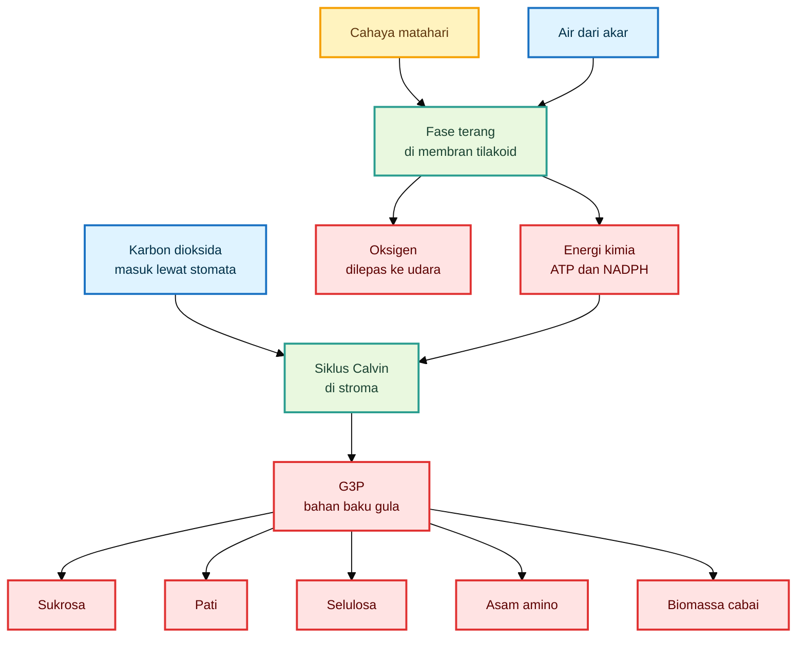
```mermaid
%%{init: {"theme": "base", "themeVariables": {"fontFamily": "Arial", "fontSize": "13px"}}}%%
flowchart TD
    A["Cahaya matahari"] --> B["Fase terang<br/>di membran tilakoid"]
    C["Air dari akar"] --> B
    B --> D["Energi kimia<br/>ATP dan NADPH"]
    B --> E["Oksigen<br/>dilepas ke udara"]

    F["Karbon dioksida<br/>masuk lewat stomata"] --> G["Siklus Calvin<br/>di stroma"]
    D --> G
    G --> H["G3P<br/>bahan baku gula"]
    H --> I["Sukrosa"]
    H --> J["Pati"]
    H --> K["Selulosa"]
    H --> L["Asam amino"]
    H --> M["Biomassa cabai"]

    classDef light fill:#fff3bf,stroke:#f59f00,stroke-width:2px,color:#5f370e;
    classDef water fill:#dff3ff,stroke:#1971c2,stroke-width:2px,color:#003049;
    classDef process fill:#e9f8df,stroke:#2a9d8f,stroke-width:2px,color:#1b4332;
    classDef product fill:#ffe3e3,stroke:#e03131,stroke-width:2px,color:#5c0000;
    classDef storage fill:#f8f0fc,stroke:#9c36b5,stroke-width:2px,color:#3b0a45;

    class A light;
    class C,F water;
    class B,G process;
    class D,E,H,I,J,K,L,M product;
```

---

# 3.1. Lokasi Fotosintesis

Fotosintesis terjadi terutama pada **daun**, khususnya di dalam organel bernama **kloroplas**. Pada tanaman cabai, sel daun yang banyak melakukan fotosintesis adalah sel mesofil.

Di dalam kloroplas terdapat beberapa bagian penting:

| Bagian kloroplas | Fungsi utama                                       |
| ---------------- | -------------------------------------------------- |
| Membran luar     | Pelindung kloroplas                                |
| Membran dalam    | Mengatur lalu lintas molekul                       |
| Stroma           | Cairan tempat Siklus Calvin berlangsung            |
| Tilakoid         | Kantong membran tempat fase terang berlangsung     |
| Granum           | Tumpukan tilakoid                                  |
| Lumen tilakoid   | Ruang di dalam tilakoid tempat proton terakumulasi |

Pembagian lokasi proses fotosintesis:

| Bagian kloroplas     | Proses                     |
| -------------------- | -------------------------- |
| **Membran tilakoid** | Fase terang                |
| **Stroma**           | Fase gelap / Siklus Calvin |

OpenStax menjelaskan bahwa kloroplas memiliki membran luar, membran dalam, stroma, dan tumpukan tilakoid yang disebut grana; fase terang berlangsung pada membran tilakoid, sedangkan Siklus Calvin berlangsung di stroma. ([OpenStax][1])

<figure>
  
  <figcaption>
    Ilustrasi mekanisme fotosintesis pada tanaman, mulai dari penyerapan cahaya,
    penggunaan air dan karbon dioksida, hingga pembentukan energi dan senyawa
    organik untuk pertumbuhan.
  </figcaption>
</figure>

---

## Diagram Lokasi Proses di Kloroplas

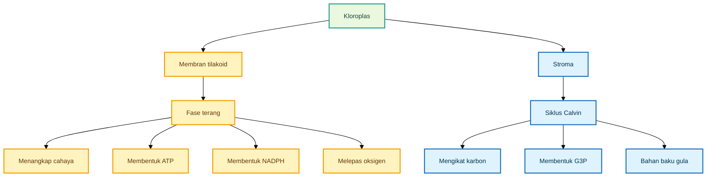
```mermaid
%%{init: {"theme": "base", "themeVariables": {"fontFamily": "Arial", "fontSize": "13px"}}}%%
flowchart TD
    A["Kloroplas"] --> B["Membran tilakoid"]
    A --> C["Stroma"]

    B --> D["Fase terang"]
    D --> E["Menangkap cahaya"]
    D --> F["Membentuk ATP"]
    D --> G["Membentuk NADPH"]
    D --> H["Melepas oksigen"]

    C --> I["Siklus Calvin"]
    I --> J["Mengikat karbon"]
    I --> K["Membentuk G3P"]
    I --> L["Bahan baku gula"]

    classDef chloro fill:#e9f8df,stroke:#2a9d8f,stroke-width:2px,color:#1b4332;
    classDef light fill:#fff3bf,stroke:#f59f00,stroke-width:2px,color:#5f370e;
    classDef calvin fill:#dff3ff,stroke:#1971c2,stroke-width:2px,color:#003049;
    classDef product fill:#ffe3e3,stroke:#e03131,stroke-width:2px,color:#5c0000;

    class A chloro;
    class B,D,E,F,G,H light;
    class C,I,J,K,L calvin;
```

---

# 3.2. Fase Terang

## A. Input Fase Terang

Fase terang membutuhkan:

$$
\text{cahaya} + H_2O + ADP + P_i + NADP^+
$$

Input tersebut dipakai untuk menghasilkan:

$$
ATP + NADPH + O_2
$$

Secara praktis, fase terang adalah proses mengubah **energi cahaya** menjadi **energi kimia**.

---

## B. Tujuan Fase Terang

Fase terang memiliki tiga tujuan utama:

1. menangkap energi cahaya;
2. memecah air dan melepas oksigen;
3. membentuk $\mathrm{ATP}$ dan $\mathrm{NADPH}$.

$$
\text{energi cahaya}
\rightarrow
\text{energi kimia dalam } ATP \text{ dan } NADPH
$$

$\mathrm{ATP}$ adalah sumber energi langsung. $\mathrm{NADPH}$ adalah pembawa daya reduksi yang dipakai untuk membentuk senyawa karbon pada Siklus Calvin.

---

## C. Urutan Proses Fase Terang

Alur utama fase terang:

$$
\text{cahaya mengenai PSII}
\rightarrow
\text{air dipecah}
\rightarrow
\text{elektron mengalir}
\rightarrow
\text{gradien proton terbentuk}
$$

$$
\rightarrow
ATP \text{ terbentuk}
\rightarrow
\text{cahaya mengenai PSI}
\rightarrow
NADP^+ \text{ direduksi menjadi } NADPH
$$

OpenStax AP Biology menjelaskan bahwa reaksi terang terjadi pada membran tilakoid; foton cahaya mengeksitasi elektron pada fotosistem, air dipecah untuk mengganti elektron pada PSII, rantai transpor elektron membangun gradien proton, $\mathrm{ATP}$ dibentuk oleh ATP synthase, dan PSI berperan dalam pembentukan $\mathrm{NADPH}$. ([OpenStax][2])

---

## Diagram Fase Terang

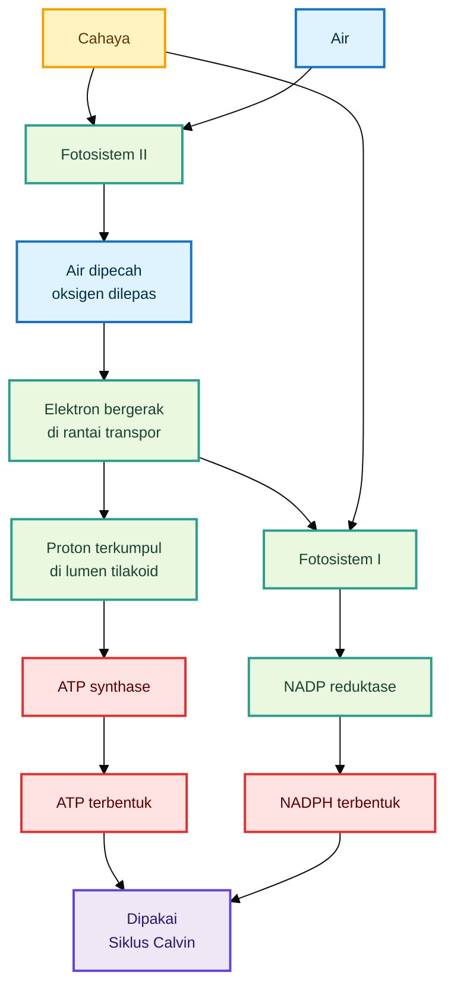
```mermaid
%%{init: {"theme": "base", "themeVariables": {"fontFamily": "Arial", "fontSize": "13px"}}}%%
flowchart TD
    A["Cahaya"] --> B["Fotosistem II"]
    C["Air"] --> B
    B --> D["Air dipecah<br/>oksigen dilepas"]
    D --> E["Elektron bergerak<br/>di rantai transpor"]
    E --> F["Proton terkumpul<br/>di lumen tilakoid"]
    F --> G["ATP synthase"]
    G --> H["ATP terbentuk"]

    E --> I["Fotosistem I"]
    A --> I
    I --> J["NADP reduktase"]
    J --> K["NADPH terbentuk"]

    H --> L["Dipakai<br/>Siklus Calvin"]
    K --> L

    classDef light fill:#fff3bf,stroke:#f59f00,stroke-width:2px,color:#5f370e;
    classDef ps fill:#e9f8df,stroke:#2a9d8f,stroke-width:2px,color:#1b4332;
    classDef water fill:#dff3ff,stroke:#1971c2,stroke-width:2px,color:#003049;
    classDef energy fill:#ffe3e3,stroke:#e03131,stroke-width:2px,color:#5c0000;
    classDef calvin fill:#ede7f6,stroke:#6741d9,stroke-width:2px,color:#2b1769;

    class A light;
    class C,D water;
    class B,E,F,I,J ps;
    class G,H,K energy;
    class L calvin;
```

---

## D. Fotosistem II dan Pemecahan Air

Fotosistem II atau PSII adalah titik awal penting pada fase terang. Di sini, cahaya membantu proses pemecahan air.

Reaksi sederhananya:

$$
2H_2O
\rightarrow
O_2 + 4H^+ + 4e^-
$$

Hasil dari proses ini:

| Hasil          | Fungsi                                   |
| -------------- | ---------------------------------------- |
| $\mathrm{O_2}$ | Dilepas ke udara                         |
| $\mathrm{H^+}$ | Membantu membentuk gradien proton        |
| $\mathrm{e^-}$ | Mengganti elektron yang hilang dari PSII |

Kompleks pemecah air pada PSII disebut **oxygen-evolving complex**. Kompleks ini melibatkan logam penting, terutama mangan dan kalsium. LibreTexts menjelaskan bahwa oxygen-evolving center pada PSII bertanggung jawab mengoksidasi air menjadi oksigen dan memiliki kluster yang mengandung mangan serta kalsium. ([Chemistry LibreTexts][3])

Unsur hara penting pada tahap ini:

$$
\mathrm{Mn},\ \mathrm{Ca},\ \mathrm{Cl},\ \mathrm{N},\ \mathrm{Mg}
$$

Perannya:

| Unsur         | Peran                                       |
| ------------- | ------------------------------------------- |
| $\mathrm{Mn}$ | Komponen penting dalam kompleks pemecah air |
| $\mathrm{Ca}$ | Menstabilkan kompleks PSII                  |
| $\mathrm{Cl}$ | Mendukung reaksi oksidasi air               |
| $\mathrm{N}$  | Protein fotosistem dan klorofil             |
| $\mathrm{Mg}$ | Klorofil dan struktur fotosintetik          |

Springer Photosynthesis Research menyebut bahwa ion klorida dan kalsium memiliki peran esensial dalam oksidasi air pada PSII, walaupun rincian mekanismenya masih menjadi objek studi. ([Springer][4])

---

## E. Rantai Transpor Elektron

Setelah PSII, elektron bergerak melalui beberapa pembawa elektron:

$$
PSII
\rightarrow
PQ
\rightarrow
\text{sitokrom } b_6f
\rightarrow
PC
\rightarrow
PSI
$$

Keterangan:

| Komponen        | Fungsi                                                        |
| --------------- | ------------------------------------------------------------- |
| $PSII$          | Menangkap cahaya dan memulai aliran elektron                  |
| $PQ$            | Plastokuinon, pembawa elektron                                |
| Sitokrom $b_6f$ | Kompleks transpor elektron dan pemompa proton                 |
| $PC$            | Plastosianin, pembawa elektron berbasis tembaga               |
| $PSI$           | Menangkap cahaya lagi dan membentuk elektron berenergi tinggi |

Unsur hara penting:

| Unsur         | Peran                                   |
| ------------- | --------------------------------------- |
| $\mathrm{Fe}$ | Sitokrom, feredoksin, transfer elektron |
| $\mathrm{Cu}$ | Plastosianin                            |
| $\mathrm{S}$  | Protein Fe-S                            |
| $\mathrm{N}$  | Protein pembawa elektron                |
| $\mathrm{Mg}$ | Klorofil                                |

OpenStax menjelaskan bahwa elektron dari PSII bergerak melalui plastokuinon, kompleks sitokrom, dan plastosianin menuju PSI; energi dari aliran elektron digunakan untuk memindahkan proton ke lumen tilakoid. ([OpenStax][2])

---

## F. Gradien Proton dan Pembentukan ATP

Ketika elektron bergerak, proton $\mathrm{H^+}$ dipompa ke lumen tilakoid. Akibatnya, terbentuk perbedaan konsentrasi proton antara lumen tilakoid dan stroma.

$$
\text{banyak } H^+ \text{ di lumen}
\rightarrow
\text{gradien proton}
\rightarrow
\text{ATP synthase aktif}
$$

ATP synthase menggunakan energi aliran proton untuk membentuk ATP:

$$
ADP + P_i
\rightarrow
ATP
$$

Unsur penting pada tahap ini:

| Unsur         | Peran                                           |
| ------------- | ----------------------------------------------- |
| $\mathrm{P}$  | Komponen fosfat pada ATP                        |
| $\mathrm{Mg}$ | Aktivator reaksi ATP                            |
| $\mathrm{K}$  | Keseimbangan ion dan aktivasi enzim             |
| $\mathrm{Fe}$ | Mendukung rantai elektron sebelum ATP terbentuk |
| $\mathrm{S}$  | Protein Fe-S                                    |

OpenStax menjelaskan bahwa ATP synthase memakai gradien elektrokimia proton pada tilakoid untuk membentuk $\mathrm{ATP}$ dari $\mathrm{ADP}$ dan fosfat anorganik. ([OpenStax][2])

---

## G. Fotosistem I dan Pembentukan NADPH

Pada Fotosistem I atau PSI, cahaya kembali mengeksitasi elektron. Elektron kemudian diteruskan ke feredoksin dan dipakai untuk mereduksi $\mathrm{NADP^+}$ menjadi $\mathrm{NADPH}$.

Reaksi sederhananya:

$$
NADP^+ + 2e^- + H^+
\rightarrow
NADPH
$$

Unsur penting:

| Unsur         | Peran               |
| ------------- | ------------------- |
| $\mathrm{Fe}$ | Feredoksin          |
| $\mathrm{S}$  | Protein Fe-S        |
| $\mathrm{N}$  | Protein dan koenzim |
| $\mathrm{Mg}$ | Aktivasi enzim      |

Produk $\mathrm{NADPH}$ kemudian dipakai dalam Siklus Calvin untuk mereduksi senyawa karbon menjadi $\mathrm{G3P}$.

---

## H. Output Fase Terang

Output fase terang:

$$
ATP + NADPH + O_2
$$

Maknanya:

| Produk           | Nasib                                               |
| ---------------- | --------------------------------------------------- |
| $\mathrm{ATP}$   | Dipakai sebagai energi Siklus Calvin                |
| $\mathrm{NADPH}$ | Dipakai sebagai daya reduksi Siklus Calvin          |
| $\mathrm{O_2}$   | Dilepas ke atmosfer atau sebagian dipakai respirasi |

---

## I. Hara Penting Fase Terang

| Unsur         | Peran                               |
| ------------- | ----------------------------------- |
| $\mathrm{N}$  | Klorofil, protein fotosistem        |
| $\mathrm{Mg}$ | Inti klorofil                       |
| $\mathrm{Mn}$ | Fotolisis air di PSII               |
| $\mathrm{Fe}$ | Sitokrom, feredoksin                |
| $\mathrm{Cu}$ | Plastosianin                        |
| $\mathrm{P}$  | ATP                                 |
| $\mathrm{S}$  | Protein Fe-S                        |
| $\mathrm{Cl}$ | Membantu pemecahan air              |
| $\mathrm{Ca}$ | Stabilitas kompleks PSII            |
| $\mathrm{K}$  | Aktivasi enzim dan keseimbangan ion |

Ringkasnya:

$$
\begin{aligned}
\text{fase terang kuat} &= \mathrm{N} + \mathrm{Mg} + \mathrm{Mn} + \mathrm{Fe} + \mathrm{Cu} \\
&+ \mathrm{P} + \mathrm{S} + \mathrm{Cl} + \mathrm{Ca} + \mathrm{K}
\end{aligned}
$$

---

# 3.3. Fase Gelap / Siklus Calvin

## A. Istilah “Fase Gelap” Perlu Diluruskan

Fase gelap bukan berarti proses ini hanya terjadi pada malam hari. Istilah yang lebih tepat adalah **Siklus Calvin** atau **reaksi tidak langsung bergantung cahaya**.

Siklus Calvin tidak memakai cahaya sebagai input langsung, tetapi sangat bergantung pada produk fase terang:

$$
ATP + NADPH
$$

Tanpa fase terang, Siklus Calvin tidak memiliki cukup energi dan daya reduksi untuk membentuk molekul karbon. OpenStax menyebut istilah “dark reactions” bisa menyesatkan karena tidak berarti reaksi terjadi hanya pada malam hari atau sepenuhnya independen dari cahaya; Siklus Calvin memerlukan $\mathrm{ATP}$ dan $\mathrm{NADPH}$ dari reaksi terang. ([OpenStax][5])

---

## B. Input Siklus Calvin

Siklus Calvin membutuhkan:

$$
CO_2 + ATP + NADPH
$$

Input tersebut menghasilkan:

$$
G3P
$$

$\mathrm{G3P}$ atau glyceraldehyde-3-phosphate adalah molekul tiga karbon yang menjadi bahan baku gula dan banyak molekul organik lain.

---

## C. Tiga Tahap Siklus Calvin

Siklus Calvin terdiri dari tiga tahap utama:

1. **Karboksilasi**
2. **Reduksi**
3. **Regenerasi**

OpenStax menjelaskan bahwa Siklus Calvin terdiri dari fiksasi karbon, reduksi, dan regenerasi; enzim Rubisco menggabungkan $\mathrm{CO_2}$ dengan RuBP, membentuk $\mathrm{3\text{-}PGA}$, lalu $\mathrm{ATP}$ dan $\mathrm{NADPH}$ digunakan untuk menghasilkan $\mathrm{G3P}$. ([OpenStax][5])

---

## Diagram Siklus Calvin

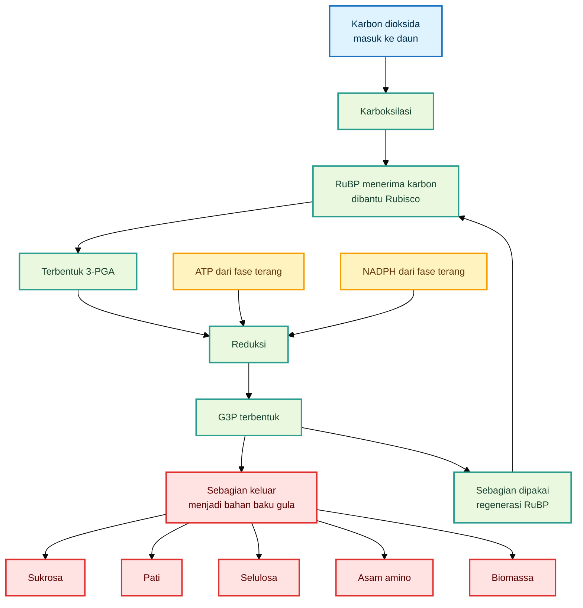
```mermaid
%%{init: {"theme": "base", "themeVariables": {"fontFamily": "Arial", "fontSize": "13px"}}}%%
flowchart TD
    A["Karbon dioksida<br/>masuk ke daun"] --> B["Karboksilasi"]
    B --> C["RuBP menerima karbon<br/>dibantu Rubisco"]
    C --> D["Terbentuk 3-PGA"]

    D --> E["Reduksi"]
    F["ATP dari fase terang"] --> E
    G["NADPH dari fase terang"] --> E
    E --> H["G3P terbentuk"]

    H --> I["Sebagian keluar<br/>menjadi bahan baku gula"]
    H --> J["Sebagian dipakai<br/>regenerasi RuBP"]
    J --> C

    I --> K["Sukrosa"]
    I --> L["Pati"]
    I --> M["Selulosa"]
    I --> N["Asam amino"]
    I --> O["Biomassa"]

    classDef input fill:#dff3ff,stroke:#1971c2,stroke-width:2px,color:#003049;
    classDef process fill:#e9f8df,stroke:#2a9d8f,stroke-width:2px,color:#1b4332;
    classDef energy fill:#fff3bf,stroke:#f59f00,stroke-width:2px,color:#5f370e;
    classDef product fill:#ffe3e3,stroke:#e03131,stroke-width:2px,color:#5c0000;

    class A input;
    class B,C,D,E,H,J process;
    class F,G energy;
    class I,K,L,M,N,O product;
```

---

## Tahap 1 — Karboksilasi

Pada tahap karboksilasi, $\mathrm{CO_2}$ diikat oleh molekul $\mathrm{RuBP}$ dengan bantuan enzim **Rubisco**.

Reaksi sederhananya:

$$
CO_2 + RuBP
\xrightarrow{\text{Rubisco}}
3\text{-}PGA
$$

Keterangan:

| Komponen                | Fungsi                     |
| ----------------------- | -------------------------- |
| $\mathrm{CO_2}$         | Sumber karbon              |
| $\mathrm{RuBP}$         | Penerima karbon            |
| Rubisco                 | Enzim utama fiksasi karbon |
| $\mathrm{3\text{-}PGA}$ | Produk awal tiga karbon    |

Unsur hara penting:

| Unsur         | Peran                                              |
| ------------- | -------------------------------------------------- |
| $\mathrm{C}$  | Sumber karbon                                      |
| $\mathrm{N}$  | Rubisco adalah protein                             |
| $\mathrm{Mg}$ | Aktivasi Rubisco                                   |
| $\mathrm{K}$  | Aktivasi enzim dan pengaturan pH/stomata           |
| $\mathrm{P}$  | RuBP dan $\mathrm{3\text{-}PGA}$ mengandung fosfat |

Pada tanaman cabai, tahap ini sangat dipengaruhi oleh bukaan stomata. Jika stomata menutup karena panas, kekeringan, atau kekurangan $\mathrm{K}$, maka $\mathrm{CO_2}$ yang masuk berkurang dan laju fotosintesis turun.

---

## Tahap 2 — Reduksi

Pada tahap reduksi, $\mathrm{3\text{-}PGA}$ diubah menjadi $\mathrm{G3P}$ menggunakan $\mathrm{ATP}$ dan $\mathrm{NADPH}$ dari fase terang.

Secara sederhana:

$$
3\text{-}PGA + ATP + NADPH
\rightarrow
G3P + ADP + P_i + NADP^+
$$

Makna tahap ini:

- $\mathrm{ATP}$ menyediakan energi;
- $\mathrm{NADPH}$ menyediakan elektron dan daya reduksi;
- $\mathrm{3\text{-}PGA}$ diubah menjadi molekul karbon yang lebih kaya energi.

Unsur hara penting:

| Unsur         | Peran                                                   |
| ------------- | ------------------------------------------------------- |
| $\mathrm{P}$  | ATP, $\mathrm{3\text{-}PGA}$, $\mathrm{G3P}$            |
| $\mathrm{Mg}$ | Aktivator enzim pengguna ATP                            |
| $\mathrm{N}$  | Enzim Siklus Calvin                                     |
| $\mathrm{Fe}$ | Mendukung pembentukan $\mathrm{NADPH}$ dari fase terang |
| $\mathrm{S}$  | Protein Fe-S                                            |
| $\mathrm{K}$  | Aktivasi enzim                                          |

---

## Tahap 3 — Regenerasi RuBP

Sebagian $\mathrm{G3P}$ tidak keluar dari siklus. Sebagian digunakan kembali untuk membentuk $\mathrm{RuBP}$ agar siklus dapat berulang.

Secara sederhana:

$$
G3P + ATP
\rightarrow
RuBP
$$

Maknanya:

$$
\text{Siklus Calvin berulang}
\Rightarrow
\text{tanaman terus mengikat karbon selama input tersedia}
$$

Unsur hara penting:

| Unsur         | Peran                          |
| ------------- | ------------------------------ |
| $\mathrm{P}$  | Molekul berfosfat dalam siklus |
| $\mathrm{Mg}$ | Aktivasi enzim berbasis ATP    |
| $\mathrm{K}$  | Aktivasi enzim                 |
| $\mathrm{N}$  | Enzim regenerasi               |

---

## D. Output Siklus Calvin

Output utama Siklus Calvin adalah:

$$
G3P
$$

Produk samping yang kembali ke fase terang:

$$
ADP + P_i + NADP^+
$$

Artinya, fase terang dan Siklus Calvin saling bertukar molekul:

$$
\text{fase terang}
\rightarrow
ATP + NADPH
\rightarrow
\text{Siklus Calvin}
$$

$$
\text{Siklus Calvin}
\rightarrow
ADP + P_i + NADP^+
\rightarrow
\text{fase terang}
$$

---

# 3.4. Hara Penting Siklus Calvin

| Unsur                       | Peran                                              |
| --------------------------- | -------------------------------------------------- |
| $\mathrm{C}$                | Sumber karbon dari $\mathrm{CO_2}$                 |
| $\mathrm{H}$, $\mathrm{O}$  | Air dan senyawa organik                            |
| $\mathrm{N}$                | Rubisco dan enzim Calvin                           |
| $\mathrm{Mg}$               | Aktivasi Rubisco                                   |
| $\mathrm{P}$                | ATP, RuBP, $\mathrm{3\text{-}PGA}$, $\mathrm{G3P}$ |
| $\mathrm{K}$                | Aktivasi enzim                                     |
| $\mathrm{Fe}$, $\mathrm{S}$ | Mendukung sistem reduksi                           |

Ringkasnya:

$$
\begin{aligned}
\text{Siklus Calvin kuat} &= \mathrm{C} + \mathrm{H} + \mathrm{O} \\
&+ \mathrm{N} + \mathrm{Mg} + \mathrm{P} + \mathrm{K} \\
&+ \mathrm{Fe} + \mathrm{S}
\end{aligned}
$$

---

# 3.5. Dari G3P Menjadi Produk Tanaman

$\mathrm{G3P}$ adalah titik penting. Dari molekul inilah tanaman membangun banyak produk.

Alurnya:

$$
G3P
\rightarrow
\text{sukrosa}
$$

$$
G3P
\rightarrow
\text{pati}
$$

$$
G3P
\rightarrow
\text{selulosa}
$$

$$
G3P + \mathrm{N}
\rightarrow
\text{asam amino}
\rightarrow
\text{protein}
$$

$$
G3P
\rightarrow
\text{lipid}
\rightarrow
\text{membran sel}
$$

---

## Diagram Produk dari G3P

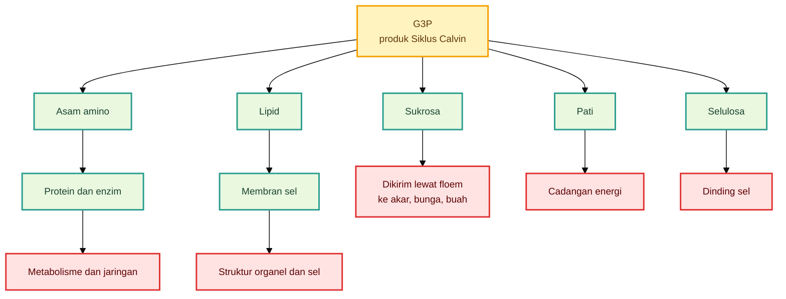
```mermaid
%%{init: {"theme": "base", "themeVariables": {"fontFamily": "Arial", "fontSize": "13px"}}}%%
flowchart TD
    A["G3P<br/>produk Siklus Calvin"] --> B["Sukrosa"]
    A --> C["Pati"]
    A --> D["Selulosa"]
    A --> E["Asam amino"]
    E --> F["Protein dan enzim"]
    A --> G["Lipid"]
    G --> H["Membran sel"]
    B --> I["Dikirim lewat floem<br/>ke akar, bunga, buah"]
    C --> J["Cadangan energi"]
    D --> K["Dinding sel"]
    F --> L["Metabolisme dan jaringan"]
    H --> M["Struktur organel dan sel"]

    classDef center fill:#fff3bf,stroke:#f59f00,stroke-width:2px,color:#5f370e;
    classDef product fill:#e9f8df,stroke:#2a9d8f,stroke-width:2px,color:#1b4332;
    classDef function fill:#ffe3e3,stroke:#e03131,stroke-width:2px,color:#5c0000;

    class A center;
    class B,C,D,E,F,G,H product;
    class I,J,K,L,M function;
```

---

## A. G3P Menjadi Sukrosa

Sukrosa adalah gula angkut utama pada banyak tanaman. Sukrosa dikirim melalui floem menuju organ sink.

Pada cabai, organ sink utama adalah:

- akar muda;
- pucuk muda;
- bunga;
- bakal buah;
- buah cabai;
- biji.

Alur praktis:

$$
G3P
\rightarrow
\text{sukrosa}
\rightarrow
\text{floem}
\rightarrow
\text{buah cabai}
$$

Unsur terkait:

| Unsur         | Peran                                        |
| ------------- | -------------------------------------------- |
| $\mathrm{K}$  | Loading floem dan transport gula             |
| $\mathrm{B}$  | Transport gula dan pertumbuhan jaringan muda |
| $\mathrm{Mg}$ | Aktivasi enzim                               |
| $\mathrm{P}$  | Transfer energi dan fosfat gula              |

K dan Mg penting dalam fotosintesis, translokasi fotoasimilat, serta transport sukrosa jarak jauh melalui floem; kekurangan keduanya dapat menurunkan asimilasi karbon dan distribusi hasil fotosintesis. ([ResearchGate][6])

---

## B. G3P Menjadi Pati

Sebagian hasil fotosintesis disimpan sebagai pati.

$$
G3P
\rightarrow
\text{glukosa}
\rightarrow
\text{pati}
$$

Fungsi pati:

- cadangan energi sementara di daun;
- sumber gula saat malam;
- cadangan pada jaringan penyimpanan.

Pada cabai, cadangan karbohidrat membantu tanaman tetap mendukung pertumbuhan akar, bunga, dan buah ketika cahaya menurun.

---

## C. G3P Menjadi Selulosa dan Dinding Sel

Selulosa adalah komponen utama dinding sel.

$$
G3P
\rightarrow
\text{gula struktural}
\rightarrow
\text{selulosa}
\rightarrow
\text{dinding sel}
$$

Unsur terkait:

| Unsur         | Peran                                   |
| ------------- | --------------------------------------- |
| $\mathrm{Ca}$ | Menguatkan dinding sel melalui pektat   |
| $\mathrm{B}$  | Struktur dinding sel dan pembelahan sel |
| $\mathrm{K}$  | Turgor dan pembesaran sel               |
| $\mathrm{P}$  | Energi pembentukan jaringan             |

Untuk cabai, ini penting pada:

- ujung akar;
- pucuk muda;
- bunga;
- bakal buah;
- kulit buah.

---

## D. G3P Menjadi Asam Amino dan Protein

Fotosintesis menyediakan rangka karbon. Nitrogen menyediakan unsur utama asam amino.

Alur sederhananya:

$$
G3P + \mathrm{N}
\rightarrow
\text{asam amino}
\rightarrow
\text{protein}
\rightarrow
\text{enzim dan jaringan}
$$

Unsur terkait:

| Unsur         | Peran                         |
| ------------- | ----------------------------- |
| $\mathrm{N}$  | Bahan utama asam amino        |
| $\mathrm{S}$  | Sistein dan metionin          |
| $\mathrm{Mo}$ | Reduksi nitrat                |
| $\mathrm{Fe}$ | Reduksi nitrit dan feredoksin |
| $\mathrm{Mg}$ | Aktivasi enzim                |
| $\mathrm{P}$  | ATP                           |
| $\mathrm{K}$  | Aktivasi enzim                |

---

## E. G3P Menjadi Lipid dan Membran Sel

Lipid dibutuhkan untuk membentuk membran sel dan membran organel.

$$
G3P
\rightarrow
\text{prekursor lipid}
\rightarrow
\text{membran sel}
$$

Unsur terkait:

| Unsur         | Peran              |
| ------------- | ------------------ |
| $\mathrm{P}$  | Fosfolipid membran |
| $\mathrm{N}$  | Protein membran    |
| $\mathrm{S}$  | Protein tertentu   |
| $\mathrm{Mg}$ | Enzim metabolisme  |
| $\mathrm{Ca}$ | Stabilitas membran |

---

# 3.6. Hubungan Fotosintesis dengan Unsur Hara

Fotosintesis tidak hanya membutuhkan cahaya dan air. Fotosintesis juga membutuhkan unsur hara yang membuat klorofil, enzim, fotosistem, transfer elektron, stomata, dan transport gula bekerja.

## A. Unsur untuk klorofil

Klorofil sangat bergantung pada:

$$
\mathrm{N} + \mathrm{Mg} + \mathrm{Fe}
$$

| Unsur         | Fungsi                                     |
| ------------- | ------------------------------------------ |
| $\mathrm{N}$  | Bagian struktur klorofil dan protein daun  |
| $\mathrm{Mg}$ | Inti molekul klorofil                      |
| $\mathrm{Fe}$ | Pembentukan klorofil dan transfer elektron |

Jika salah satu kurang, daun bisa pucat dan fotosintesis turun.

---

## B. Unsur untuk transfer elektron

Transfer elektron fase terang membutuhkan:

$$
\mathrm{Fe} + \mathrm{Cu} + \mathrm{S} + \mathrm{Mn}
$$

| Unsur         | Fungsi                  |
| ------------- | ----------------------- |
| $\mathrm{Fe}$ | Sitokrom dan feredoksin |
| $\mathrm{Cu}$ | Plastosianin            |
| $\mathrm{S}$  | Protein Fe-S            |
| $\mathrm{Mn}$ | Fotolisis air           |

---

## C. Unsur untuk ATP dan energi

Energi fotosintesis sangat terkait dengan:

$$
\mathrm{P} + \mathrm{Mg}
$$

| Unsur         | Fungsi              |
| ------------- | ------------------- |
| $\mathrm{P}$  | Komponen ATP        |
| $\mathrm{Mg}$ | Aktivasi reaksi ATP |

---

## D. Unsur untuk stomata dan masuknya karbon

$\mathrm{CO_2}$ masuk lewat stomata. Bukaan stomata sangat dipengaruhi oleh $\mathrm{K}$.

Alur sederhananya:

$$
\mathrm{K^+} \text{ masuk ke sel penjaga}
\rightarrow
\text{air masuk}
\rightarrow
\text{stomata membuka}
\rightarrow
CO_2 \text{ masuk}
$$

Jika $\mathrm{K}$ kurang, stomata kurang responsif. Akibatnya, $\mathrm{CO_2}$ yang masuk ke daun berkurang dan fotosintesis bisa turun.

---

## E. Unsur untuk transport hasil fotosintesis

Setelah gula terbentuk, tanaman harus mengirimnya ke organ sink.

Unsur penting:

$$
\mathrm{K},\ \mathrm{B},\ \mathrm{Mg},\ \mathrm{P}
$$

Peran:

| Unsur         | Fungsi                                |
| ------------- | ------------------------------------- |
| $\mathrm{K}$  | Loading floem dan transport gula      |
| $\mathrm{B}$  | Transport gula dan dinding sel        |
| $\mathrm{Mg}$ | Enzim fotosintesis dan penggunaan ATP |
| $\mathrm{P}$  | Metabolisme gula berfosfat            |

---

# 3.7. Makna Praktis untuk Tanaman Cabai

## A. Daun adalah pabrik gula

Pada cabai, daun dewasa sehat adalah organ source utama.

$$
\text{daun sehat}
\rightarrow
\text{fotosintesis tinggi}
\rightarrow
\text{sukrosa tinggi}
\rightarrow
\text{buah terisi}
$$

Jika daun rusak oleh hama, penyakit, kekurangan $\mathrm{Mg}$, kekurangan $\mathrm{Fe}$, atau stres air, maka suplai gula ke buah menurun.

---

## B. Buah cabai adalah sink utama

Saat tanaman masuk fase generatif, buah menjadi organ sink yang kuat.

$$
\begin{aligned}
\text{buah cabai} &= \text{sink gula + sink hara + sink energi}
\end{aligned}
$$

Karena itu, fase buah memerlukan:

$$
\mathrm{K} + \mathrm{Ca} + \mathrm{Mg} + \mathrm{B} + \mathrm{N}\ \text{seimbang}
$$

$\mathrm{K}$ membantu pengisian buah, $\mathrm{Ca}$ memperkuat jaringan buah, $\mathrm{Mg}$ menjaga daun tetap berfotosintesis, dan $\mathrm{B}$ mendukung pembelahan sel serta transport gula.

---

## C. Cahaya tinggi tanpa hara seimbang bisa menjadi stres

Cahaya tinggi tidak otomatis menghasilkan fotosintesis tinggi. Jika hara, air, atau $\mathrm{CO_2}$ membatasi, maka cahaya berlebih dapat menyebabkan stres.

Contoh:

$$
\text{cahaya tinggi} + \mathrm{Mg}\ \text{rendah}
\Rightarrow
\text{klorofil lemah}
\Rightarrow
\text{fotosintesis turun}
$$

$$
\text{cahaya tinggi} + \mathrm{K}\ \text{rendah}
\Rightarrow
\text{stomata tidak stabil}
\Rightarrow
CO_2 \text{ terbatas}
$$

$$
\text{cahaya tinggi} + \text{air rendah}
\Rightarrow
\text{stomata menutup}
\Rightarrow
\text{Siklus Calvin melambat}
$$

---

## D. Fotosintesis kuat perlu akar kuat

Daun membutuhkan air dan mineral dari akar. Jika akar rusak, daun tidak dapat mempertahankan fotosintesis.

Alur masalah:

$$
\text{akar rusak}
\rightarrow
\text{air dan hara turun}
\rightarrow
\text{stomata menutup}
\rightarrow
CO_2 \text{ turun}
\rightarrow
\text{fotosintesis turun}
$$

Karena itu, manajemen fotosintesis cabai bukan hanya urusan daun, tetapi juga urusan akar.

---

# 3.8. Ringkasan Hara Fotosintesis Berdasarkan Fungsi

| Fungsi fotosintesis     | Unsur dominan                                                                                     |
| ----------------------- | ------------------------------------------------------------------------------------------------- |
| Klorofil                | $\mathrm{N}$, $\mathrm{Mg}$, $\mathrm{Fe}$                                                        |
| Fotosistem              | $\mathrm{N}$, $\mathrm{Mg}$, $\mathrm{Mn}$, $\mathrm{Fe}$                                         |
| Fotolisis air           | $\mathrm{Mn}$, $\mathrm{Ca}$, $\mathrm{Cl}$                                                       |
| Transfer elektron       | $\mathrm{Fe}$, $\mathrm{Cu}$, $\mathrm{S}$                                                        |
| ATP                     | $\mathrm{P}$, $\mathrm{Mg}$                                                                       |
| Rubisco                 | $\mathrm{N}$, $\mathrm{Mg}$                                                                       |
| Siklus Calvin           | $\mathrm{C}$, $\mathrm{H}$, $\mathrm{O}$, $\mathrm{N}$, $\mathrm{Mg}$, $\mathrm{P}$, $\mathrm{K}$ |
| Stomata                 | $\mathrm{K}$, $\mathrm{Ca}$                                                                       |
| Transport gula          | $\mathrm{K}$, $\mathrm{B}$, $\mathrm{Mg}$, $\mathrm{P}$                                           |
| Perlindungan fotosistem | $\mathrm{K}$, $\mathrm{Mg}$, $\mathrm{Mn}$, $\mathrm{Fe}$, $\mathrm{Cu}$                          |

---

# 3.9. Kesimpulan Bab 3

Fotosintesis adalah pusat produksi energi dan biomassa tanaman cabai. Fase terang menangkap energi cahaya dan menghasilkan:

$$
ATP + NADPH + O_2
$$

Siklus Calvin menggunakan:

$$
CO_2 + ATP + NADPH
$$

untuk membentuk:

$$
G3P
$$

Kemudian $\mathrm{G3P}$ menjadi bahan baku:

$$
\text{sukrosa, pati, selulosa, asam amino, protein, lipid, dan biomassa}
$$

Formula praktis Bab 3:

$$
\begin{aligned}
\text{fotosintesis kuat} &= \text{cahaya cukup} \\
&+ H_2O \\
&+ CO_2 \\
&+ \text{kloroplas sehat} \\
&+ \text{hara seimbang}
\end{aligned}
$$

Hara paling penting untuk fotosintesis:

$$
\mathrm{N},\ \mathrm{Mg},\ \mathrm{P},\ \mathrm{K},\ \mathrm{Fe},\ \mathrm{Mn},\ \mathrm{Cu},\ \mathrm{S},\ \mathrm{Ca},\ \mathrm{Cl}
$$

Untuk cabai, pesan praktisnya:

**buah besar dan panen panjang tidak dimulai dari buah, tetapi dari daun yang mampu berfotosintesis kuat dan akar yang mampu memasok air serta hara secara stabil.**

[1]: https://openstax.org/books/biology-2e/pages/8-1-overview-of-photosynthesis '8.1 Overview of Photosynthesis - Biology 2e | OpenStax'
[2]: https://openstax.org/books/biology-ap-courses/pages/8-2-the-light-dependent-reaction-of-photosynthesis '8.2 The Light-Dependent Reaction of Photosynthesis - Biology for AP® Courses | OpenStax'
[3]: https://chem.libretexts.org/Courses/Saint_Marys_College_Notre_Dame_IN/CHEM_342%3A_Bio-inorganic_Chemistry/Readings/Metals_in_Biological_Systems_%28Saint_Mary%27s_College%29/The_Oxygen-Evolving_Center_%28OEC%29_of_Photosystem_II 'The Oxygen-Evolving Center (OEC) of Photosystem II - Chemistry LibreTexts'
[4]: https://link.springer.com/article/10.1023/A%3A1020486729283 'Chloride and calcium in Photosystem II: from effects to enigma* | Photosynthesis Research | Springer Nature Link'
[5]: https://openstax.org/books/biology-ap-courses/pages/8-3-using-light-to-make-organic-molecules '8.3 Using Light to Make Organic Molecules - Biology for AP® Courses | OpenStax'
[6]: https://www.researchgate.net/publication/324590579_Functioning_of_potassium_and_magnesium_in_photosynthesis_photosynthate_translocation_and_photoprotection '(PDF) Functioning of potassium and magnesium in photosynthesis, photosynthate translocation and photoprotection'

[**Kembali ke Atas**](#dari-nutrisi-ke-buah-cabai-mekanisme-uptake-hara-fotosintesis-asimilasi-molekul-pembentukan-jaringan-dan-strategi-pemupukan-berdasarkan-fase-tanaman)

---

# Bab 4 — Asimilasi Molekul dan Pembentukan Jaringan Tanaman

## Pengantar Bab

Pada Bab 1, kita membahas bagaimana akar menyerap ion hara. Pada Bab 2, kita melihat fungsi masing-masing unsur. Pada Bab 3, kita membahas fotosintesis sebagai sumber energi dan rangka karbon.

Bab 4 menjelaskan langkah berikutnya: **bagaimana ion hara dan hasil fotosintesis diubah menjadi molekul hidup dan jaringan tanaman**.

Secara sederhana:

$$
\text{ion hara}
+
\text{energi}
+
\text{rangka karbon}
\rightarrow
\text{molekul organik}
\rightarrow
\text{sel}
\rightarrow
\text{jaringan}
$$

Inilah yang disebut **asimilasi**. Tanaman tidak langsung memakai ion hara sebagai jaringan. Ion hara harus diolah lebih dulu menjadi molekul fungsional seperti asam amino, protein, enzim, klorofil, selulosa, pektin, lignin, lipid, dan senyawa metabolik lain.

---

## Diagram Besar Asimilasi Molekul

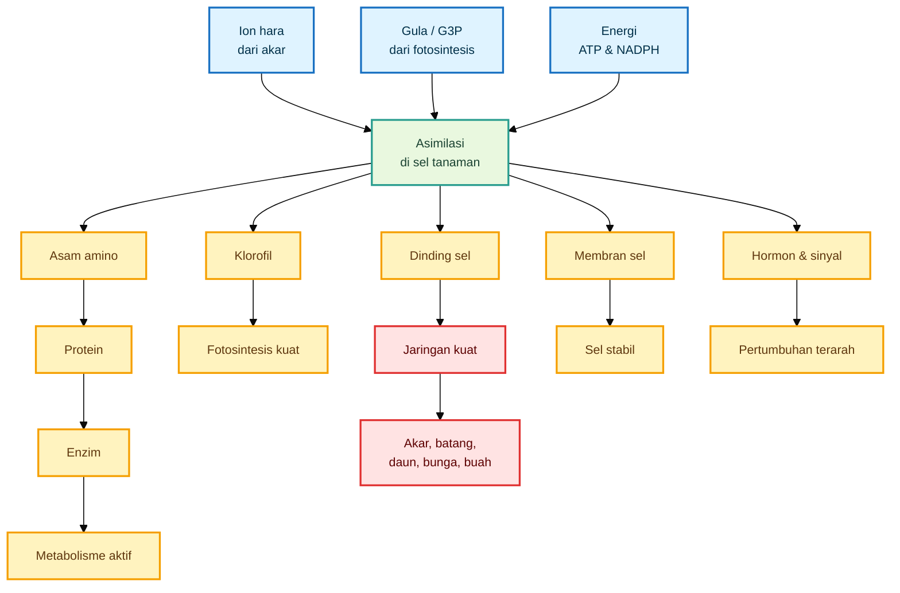
```mermaid
%%{init: {"theme": "base", "themeVariables": {"fontFamily": "Arial", "fontSize": "13px"}}}%%
flowchart TD
    A["Ion hara<br/>dari akar"] --> D["Asimilasi<br/>di sel tanaman"]
    B["Gula / G3P<br/>dari fotosintesis"] --> D
    C["Energi<br/>ATP & NADPH"] --> D

    D --> E["Asam amino"]
    E --> F["Protein"]
    F --> G["Enzim"]

    D --> H["Klorofil"]
    D --> I["Dinding sel"]
    D --> J["Membran sel"]
    D --> K["Hormon & sinyal"]

    G --> L["Metabolisme aktif"]
    H --> M["Fotosintesis kuat"]
    I --> N["Jaringan kuat"]
    J --> O["Sel stabil"]
    K --> P["Pertumbuhan terarah"]

    N --> Q["Akar, batang,<br/>daun, bunga, buah"]

    classDef input fill:#dff3ff,stroke:#1971c2,stroke-width:2px,color:#003049;
    classDef process fill:#e9f8df,stroke:#2a9d8f,stroke-width:2px,color:#1b4332;
    classDef molecule fill:#fff3bf,stroke:#f59f00,stroke-width:2px,color:#5f370e;
    classDef tissue fill:#ffe3e3,stroke:#e03131,stroke-width:2px,color:#5c0000;

    class A,B,C input;
    class D process;
    class E,F,G,H,I,J,K,L,M,O,P molecule;
    class N,Q tissue;
```

---

# 4.1. Konsep Dasar Asimilasi

**Asimilasi** adalah proses mengubah unsur mineral menjadi senyawa organik fungsional.

Alur dasarnya:

$$
\text{ion hara}
+
\text{energi}
+
\text{rangka karbon}
\rightarrow
\text{asam amino}
\rightarrow
\text{protein}
\rightarrow
\text{enzim}
\rightarrow
\text{jaringan}
$$

Ion hara yang diserap akar, misalnya:

$$
\mathrm{NO_3^-},\ \mathrm{NH_4^+},\ \mathrm{K^+},\ \mathrm{Ca^{2+}},\ \mathrm{Mg^{2+}},\ \mathrm{SO_4^{2-}}
$$

belum otomatis menjadi jaringan. Tanaman harus mengolahnya dengan bantuan:

1. **energi**, terutama dari $\mathrm{ATP}$;
2. **daya reduksi**, terutama dari $\mathrm{NADPH}$;
3. **rangka karbon**, terutama dari hasil fotosintesis seperti $\mathrm{G3P}$, gula, dan asam organik;
4. **enzim**, yang sebagian besar tersusun dari protein;
5. **unsur mikro**, sebagai kofaktor enzim.

Review tentang asimilasi nitrogen pada tanaman menjelaskan bahwa nitrat yang diserap tanaman harus direduksi dan dimasukkan ke dalam kerangka karbon untuk membentuk asam amino; proses ini memerlukan energi, reduktan, dan interaksi erat dengan metabolisme karbon. ([PMC][1])

<figure>
  
  <figcaption>
    Ilustrasi proses asimilasi molekul pada tanaman cabai, mulai dari penyerapan
    nutrisi hingga pembentukan senyawa pendukung pertumbuhan dan produksi.
  </figcaption>
</figure>

---

## Mengapa Asimilasi Penting untuk Praktisi Cabai?

Karena hasil panen bukan hanya ditentukan oleh berapa banyak pupuk diberikan, tetapi oleh kemampuan tanaman mengubah pupuk menjadi jaringan produktif.

Contohnya:

$$
\mathrm{N}\ \text{tersedia}
\neq
\text{protein terbentuk optimal}
$$

Yang lebih benar:

$$
\mathrm{N}
+
\text{gula}
+
\mathrm{ATP}
+
\mathrm{Mo}
+
\mathrm{Fe}
+
\mathrm{S}
+
\mathrm{Mg}
\rightarrow
\text{asam amino dan protein}
$$

Jadi, bila daun kurang cahaya, akar rusak, $\mathrm{Mg}$ kurang, atau $\mathrm{Mo}$ rendah, nitrogen yang tersedia belum tentu dapat dimanfaatkan optimal.

---

# 4.2. Asimilasi Nitrogen

Nitrogen adalah unsur utama pembentuk asam amino, protein, enzim, klorofil, DNA, RNA, dan jaringan muda.

Tanaman cabai umumnya menyerap nitrogen dalam dua bentuk utama:

$$
\mathrm{NO_3^-}
\quad \text{dan} \quad
\mathrm{NH_4^+}
$$

Namun, bentuk yang paling banyak diserap belum tentu langsung dipakai. Nitrat harus direduksi lebih dulu sebelum masuk ke pembentukan asam amino.

---

## Alur Asimilasi Nitrogen

$$
\mathrm{NO_3^-}
\rightarrow
\mathrm{NO_2^-}
\rightarrow
\mathrm{NH_4^+}
\rightarrow
\text{glutamin / glutamat}
\rightarrow
\text{asam amino lain}
\rightarrow
\text{protein / enzim}
$$

Tahap pentingnya:

| Tahap | Proses                                      | Enzim dominan        | Hara penting                                |
| ----- | ------------------------------------------- | -------------------- | ------------------------------------------- |
| 1     | $\mathrm{NO_3^-}$ menjadi $\mathrm{NO_2^-}$ | Nitrate reductase    | $\mathrm{Mo}$, $\mathrm{Fe}$, $\mathrm{N}$  |
| 2     | $\mathrm{NO_2^-}$ menjadi $\mathrm{NH_4^+}$ | Nitrite reductase    | $\mathrm{Fe}$, $\mathrm{S}$                 |
| 3     | $\mathrm{NH_4^+}$ masuk ke glutamin         | Glutamine synthetase | $\mathrm{N}$, $\mathrm{Mg}$, $\mathrm{ATP}$ |
| 4     | Pembentukan glutamat                        | Glutamate synthase   | $\mathrm{Fe}$, $\mathrm{S}$, reduktan       |
| 5     | Asam amino lain terbentuk                   | Transaminase         | $\mathrm{K}$, $\mathrm{Mg}$, enzim          |

Nitrate reductase dan nitrite reductase adalah enzim utama dalam reduksi nitrat menjadi amonium, sedangkan sistem $\mathrm{GS/GOGAT}$ memasukkan amonium ke dalam glutamin dan glutamat sebagai pusat pembentukan asam amino lain. ([Horizon e-Publishing Group][2])

---

## Diagram Asimilasi Nitrogen

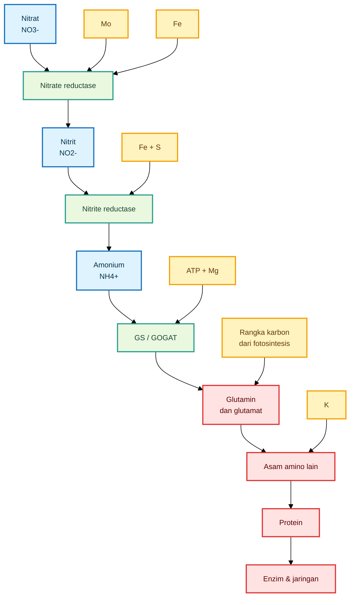
```mermaid
%%{init: {"theme": "base", "themeVariables": {"fontFamily": "Arial", "fontSize": "13px"}}}%%
flowchart TD
    A["Nitrat<br/>NO3-"] --> B["Nitrate reductase"]
    B --> C["Nitrit<br/>NO2-"]
    C --> D["Nitrite reductase"]
    D --> E["Amonium<br/>NH4+"]
    E --> F["GS / GOGAT"]
    F --> G["Glutamin<br/>dan glutamat"]
    G --> H["Asam amino lain"]
    H --> I["Protein"]
    I --> J["Enzim & jaringan"]

    K["Mo"] --> B
    L["Fe"] --> B
    M["Fe + S"] --> D
    N["ATP + Mg"] --> F
    O["Rangka karbon<br/>dari fotosintesis"] --> G
    P["K"] --> H

    classDef nitrogen fill:#dff3ff,stroke:#1971c2,stroke-width:2px,color:#003049;
    classDef enzyme fill:#e9f8df,stroke:#2a9d8f,stroke-width:2px,color:#1b4332;
    classDef element fill:#fff3bf,stroke:#f59f00,stroke-width:2px,color:#5f370e;
    classDef product fill:#ffe3e3,stroke:#e03131,stroke-width:2px,color:#5c0000;

    class A,C,E nitrogen;
    class B,D,F enzyme;
    class K,L,M,N,O,P element;
    class G,H,I,J product;
```

---

## Hara yang Terlibat dalam Asimilasi Nitrogen

| Unsur         | Fungsi                                       |
| ------------- | -------------------------------------------- |
| $\mathrm{N}$  | Bahan utama asam amino                       |
| $\mathrm{Mo}$ | Kofaktor nitrate reductase                   |
| $\mathrm{Fe}$ | Nitrite reductase, feredoksin                |
| $\mathrm{S}$  | Protein Fe-S dan asam amino sulfur           |
| $\mathrm{Mg}$ | Aktivasi enzim dan penggunaan $\mathrm{ATP}$ |
| $\mathrm{P}$  | Komponen $\mathrm{ATP}$                      |
| $\mathrm{K}$  | Aktivasi enzim dan keseimbangan ion          |

---

## Makna Praktis untuk Cabai

Pada cabai, nitrogen memang penting untuk pertumbuhan daun dan cabang. Tetapi nitrogen hanya produktif bila:

$$
\mathrm{N}
+
\text{cahaya cukup}
+
\text{gula cukup}
+
\mathrm{Mo}
+
\mathrm{Fe}
+
\mathrm{S}
+
\mathrm{Mg}
+
\mathrm{K}
\rightarrow
\text{protein dan enzim}
$$

Jika $\mathrm{N}$ tinggi tetapi cahaya kurang, akar lemah, atau $\mathrm{K}$, $\mathrm{Mg}$, dan $\mathrm{S}$ tidak cukup, tanaman bisa menjadi rimbun tetapi tidak efisien membentuk bunga dan buah.

Rumus praktis:

$$
\mathrm{N}\ \text{tinggi tanpa keseimbangan}
\Rightarrow
\text{vegetatif berlebihan}
$$

$$
\mathrm{N}\ \text{seimbang}
\Rightarrow
\text{daun produktif dan protein terbentuk}
$$

---

# 4.3. Pembentukan Protein

Protein adalah hasil lanjutan dari asam amino. Protein berfungsi sebagai:

- enzim;
- protein struktural;
- protein membran;
- protein fotosintesis;
- protein pertahanan;
- protein pembawa;
- protein penyusun jaringan.

Lokasi sintesis protein utama:

$$
\text{ribosom}
$$

Ribosom terdapat di:

$$
\text{sitoplasma}
$$

$$
\text{retikulum endoplasma kasar}
$$

$$
\text{kloroplas}
$$

$$
\text{mitokondria}
$$

OpenStax menjelaskan bahwa ribosom terdapat bebas di sitoplasma atau menempel pada retikulum endoplasma kasar pada sel eukariot, dan kloroplas serta mitokondria juga memiliki ribosom sendiri. ([OpenStax][3])

---

## Alur Pembentukan Protein

$$
\text{asam amino}
+
\text{energi}
+
\text{informasi genetik}
\rightarrow
\text{protein struktural}
+
\text{enzim}
$$

Secara biologis, prosesnya melibatkan:

1. DNA sebagai sumber informasi genetik;
2. mRNA sebagai salinan instruksi;
3. ribosom sebagai tempat perakitan;
4. tRNA sebagai pembawa asam amino;
5. asam amino sebagai bahan baku;
6. energi untuk merangkai ikatan peptida.

---

## Diagram Pembentukan Protein

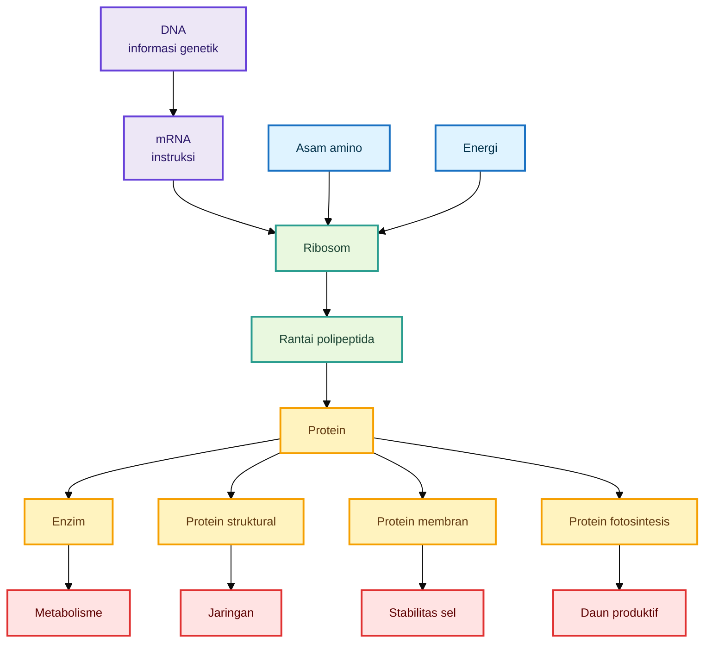
```mermaid
%%{init: {"theme": "base", "themeVariables": {"fontFamily": "Arial", "fontSize": "13px"}}}%%
flowchart TD
    A["DNA<br/>informasi genetik"] --> B["mRNA<br/>instruksi"]
    B --> C["Ribosom"]
    D["Asam amino"] --> C
    E["Energi"] --> C
    C --> F["Rantai polipeptida"]
    F --> G["Protein"]
    G --> H["Enzim"]
    G --> I["Protein struktural"]
    G --> J["Protein membran"]
    G --> K["Protein fotosintesis"]

    H --> L["Metabolisme"]
    I --> M["Jaringan"]
    J --> N["Stabilitas sel"]
    K --> O["Daun produktif"]

    classDef info fill:#ede7f6,stroke:#6741d9,stroke-width:2px,color:#2b1769;
    classDef input fill:#dff3ff,stroke:#1971c2,stroke-width:2px,color:#003049;
    classDef process fill:#e9f8df,stroke:#2a9d8f,stroke-width:2px,color:#1b4332;
    classDef product fill:#fff3bf,stroke:#f59f00,stroke-width:2px,color:#5f370e;
    classDef function fill:#ffe3e3,stroke:#e03131,stroke-width:2px,color:#5c0000;

    class A,B info;
    class D,E input;
    class C,F process;
    class G,H,I,J,K product;
    class L,M,N,O function;
```

---

## Hara yang Terlibat dalam Pembentukan Protein

| Unsur                        | Peran                                                  |
| ---------------------------- | ------------------------------------------------------ |
| $\mathrm{N}$                 | Bahan utama asam amino                                 |
| $\mathrm{S}$                 | Asam amino sulfur seperti sistein dan metionin         |
| $\mathrm{P}$                 | $\mathrm{ATP}$, DNA, RNA                               |
| $\mathrm{Mg}$                | Aktivasi enzim dan penggunaan $\mathrm{ATP}$           |
| $\mathrm{K}$                 | Aktivasi banyak enzim                                  |
| $\mathrm{Fe}$, $\mathrm{Mo}$ | Mendukung asimilasi nitrogen sebelum protein terbentuk |

Pada tanaman cabai, protein sangat penting untuk membangun daun produktif, akar aktif, bunga sehat, dan buah yang berkembang normal.

---

## Makna Praktis untuk Pemupukan Cabai

Pemupukan nitrogen harus selalu dibaca bersama unsur pendukung protein:

$$
\mathrm{N} + \mathrm{S} + \mathrm{Mg} + \mathrm{P} + \mathrm{K}
\rightarrow
\text{protein dan enzim}
$$

Jika $\mathrm{S}$ kurang, nitrogen tidak optimal menjadi protein. Jika $\mathrm{Mg}$ dan $\mathrm{P}$ kurang, energi dan aktivasi enzim terganggu. Jika $\mathrm{K}$ kurang, banyak reaksi enzimatik tidak efisien.

Rumus praktis:

$$
\text{protein tinggi}
\neq
\mathrm{N}\ \text{tinggi saja}
$$

Yang lebih benar:

$$
\begin{aligned}
\text{protein tinggi} &= \mathrm{N} \\
&+ \mathrm{S} \\
&+ \text{energi} \\
&+ \text{enzim aktif} \\
&+ \text{rangka karbon}
\end{aligned}
$$

---

# 4.4. Pembentukan Dinding Sel

Dinding sel adalah struktur luar sel tanaman yang memberi bentuk, kekuatan, perlindungan, dan ketahanan mekanis.

Dinding sel tidak bersifat mati dan kaku sepenuhnya. Dinding sel adalah struktur dinamis yang terus dibangun, diperkuat, dilonggarkan, dan dimodifikasi selama pertumbuhan tanaman. Review terbaru tentang dinding sel tanaman menjelaskan bahwa dinding sel tersusun dari polimer utama seperti selulosa, hemiselulosa, pektin, lignin, dan protein dinding sel, serta berperan dalam pertumbuhan, kekuatan, komunikasi sel, dan pertahanan. ([PMC][4])

Bahan utama dinding sel:

- selulosa;
- hemiselulosa;
- pektin;
- lignin;
- protein dinding sel.

---

## Alur Pembentukan Dinding Sel

$$
\mathrm{G3P}
\rightarrow
\text{gula struktural}
\rightarrow
\text{selulosa}
\rightarrow
\text{dinding sel}
$$

$$
\text{pektin}
+
\mathrm{Ca^{2+}}
\rightarrow
\text{pektat kalsium}
\rightarrow
\text{dinding sel lebih kuat}
$$

$$
\text{prekursor fenolik}
+
\mathrm{Cu}
\rightarrow
\text{lignifikasi}
\rightarrow
\text{jaringan lebih kokoh}
$$

---

## Diagram Pembentukan Dinding Sel

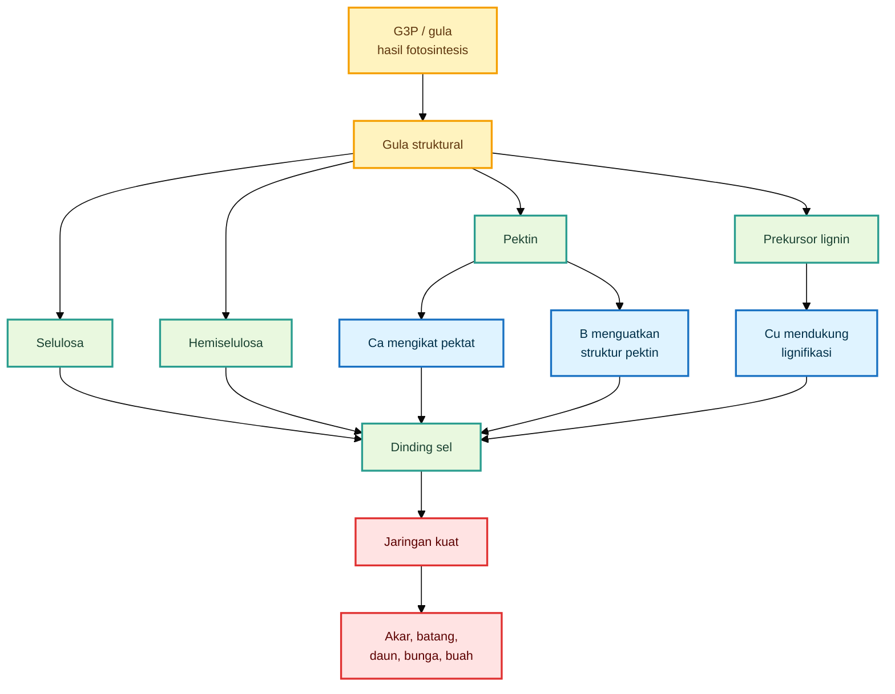
```mermaid
%%{init: {"theme": "base", "themeVariables": {"fontFamily": "Arial", "fontSize": "13px"}}}%%
flowchart TD
    A["G3P / gula<br/>hasil fotosintesis"] --> B["Gula struktural"]
    B --> C["Selulosa"]
    B --> D["Hemiselulosa"]
    B --> E["Pektin"]
    B --> F["Prekursor lignin"]

    E --> G["Ca mengikat pektat"]
    E --> H["B menguatkan<br/>struktur pektin"]
    F --> I["Cu mendukung<br/>lignifikasi"]

    C --> J["Dinding sel"]
    D --> J
    G --> J
    H --> J
    I --> J

    J --> K["Jaringan kuat"]
    K --> L["Akar, batang,<br/>daun, bunga, buah"]

    classDef carbon fill:#fff3bf,stroke:#f59f00,stroke-width:2px,color:#5f370e;
    classDef polymer fill:#e9f8df,stroke:#2a9d8f,stroke-width:2px,color:#1b4332;
    classDef mineral fill:#dff3ff,stroke:#1971c2,stroke-width:2px,color:#003049;
    classDef tissue fill:#ffe3e3,stroke:#e03131,stroke-width:2px,color:#5c0000;

    class A,B carbon;
    class C,D,E,F,J polymer;
    class G,H,I mineral;
    class K,L tissue;
```

---

## Hara Penting untuk Dinding Sel

| Unsur                      | Peran                                      |
| -------------------------- | ------------------------------------------ |
| $\mathrm{Ca}$              | Mengikat pektat dan memperkuat dinding sel |
| $\mathrm{B}$               | Struktur dinding sel dan pembelahan sel    |
| $\mathrm{K}$               | Turgor untuk pembesaran sel                |
| $\mathrm{P}$               | Energi pembentukan jaringan                |
| $\mathrm{Cu}$              | Lignifikasi                                |
| $\mathrm{N}$, $\mathrm{S}$ | Enzim pembentuk jaringan                   |

---

## Peran Kalsium dalam Dinding Sel

Kalsium membantu menguatkan dinding sel melalui interaksi dengan pektin.

Secara praktis:

$$
\mathrm{Ca^{2+}}
+
\text{pektin}
\rightarrow
\text{struktur dinding sel lebih stabil}
$$

Pada cabai, hal ini penting untuk:

- pucuk muda;
- akar muda;
- bunga;
- bakal buah;
- jaringan buah.

Karena $\mathrm{Ca}$ relatif kurang mobil di floem, pasokannya harus stabil dari akar melalui xilem. Kekurangan suplai $\mathrm{Ca}$ pada jaringan muda dapat menyebabkan jaringan lemah walaupun daun tua tampak normal.

---

## Peran Boron dalam Dinding Sel

Boron membantu struktur dinding sel, terutama melalui hubungan dengan komponen pektin. Annual Review of Plant Physiology and Plant Molecular Biology menyebut bahwa identifikasi kompleks boron-polisakarida pada dinding sel memberi bukti langsung bahwa boron membentuk ikatan silang pada polimer pektin. ([Annual Reviews][5])

Secara sederhana:

$$
\mathrm{B}
+
\text{pektin}
\rightarrow
\text{dinding sel lebih terorganisasi}
$$

Pada cabai, $\mathrm{B}$ penting untuk:

- titik tumbuh;
- pembelahan sel;
- pembentukan bunga;
- viabilitas serbuk sari;
- pembentukan bakal buah.

Namun, boron harus diberikan hati-hati karena jarak antara cukup dan berlebih relatif sempit.

---

## Peran Kalium dalam Pembesaran Sel

Kalium tidak terutama menjadi bahan struktur dinding sel, tetapi sangat penting untuk turgor.

$$
\mathrm{K^+}
\rightarrow
\text{tekanan turgor}
\rightarrow
\text{pembesaran sel}
$$

Pada buah cabai, pembesaran sel membutuhkan:

$$
\text{gula}
+
\text{air}
+
\mathrm{K}
+
\mathrm{Ca}
+
\mathrm{B}
$$

$\mathrm{K}$ membantu sel mengembang, sedangkan $\mathrm{Ca}$ dan $\mathrm{B}$ menjaga dinding sel tetap kuat.

---

## Peran Tembaga dalam Lignifikasi

Tembaga mendukung beberapa enzim oksidatif yang terkait dengan lignifikasi. Lignin memperkuat jaringan dan membantu ketahanan mekanis.

Secara praktis:

$$
\mathrm{Cu}
\rightarrow
\text{enzim oksidatif}
\rightarrow
\text{lignifikasi}
\rightarrow
\text{jaringan lebih kuat}
$$

Pada cabai, lignifikasi yang baik membantu batang dan jaringan pendukung menjadi lebih kokoh. Namun, $\mathrm{Cu}$ termasuk unsur mikro sehingga kelebihan dapat toksik.

---

# 4.5. Pembentukan Klorofil

Klorofil adalah pigmen utama fotosintesis. Tanpa klorofil yang cukup, tanaman cabai tidak dapat menangkap cahaya secara optimal.

Klorofil memerlukan:

$$
\mathrm{N} + \mathrm{Mg} + \mathrm{Fe}
$$

Perannya:

- $\mathrm{N}$ membentuk cincin klorofil dan protein daun;
- $\mathrm{Mg}$ menjadi inti molekul klorofil;
- $\mathrm{Fe}$ membantu pembentukan klorofil dan sistem elektron.

Review tentang magnesium pada tanaman menyatakan bahwa $\mathrm{Mg}$ adalah komponen fundamental pigmen klorofil pada kompleks penangkap cahaya kloroplas dan berperan dalam fotosintesis. ([PMC][6])

---

## Diagram Pembentukan Klorofil dan Fungsi Daun

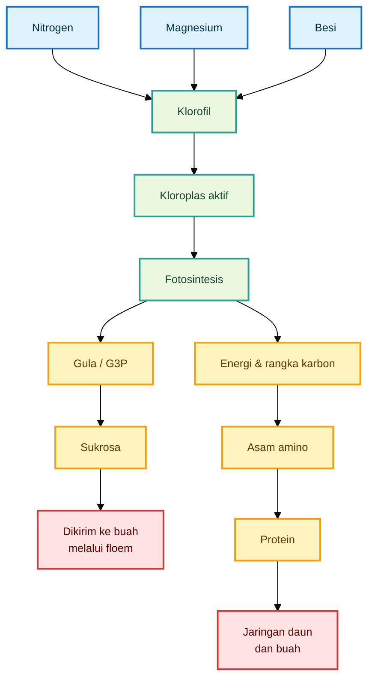
```mermaid
%%{init: {"theme": "base", "themeVariables": {"fontFamily": "Arial", "fontSize": "13px"}}}%%
flowchart TD
    A["Nitrogen"] --> D["Klorofil"]
    B["Magnesium"] --> D
    C["Besi"] --> D

    D --> E["Kloroplas aktif"]
    E --> F["Fotosintesis"]
    F --> G["Gula / G3P"]
    G --> H["Sukrosa"]
    H --> I["Dikirim ke buah<br/>melalui floem"]

    F --> J["Energi & rangka karbon"]
    J --> K["Asam amino"]
    K --> L["Protein"]
    L --> M["Jaringan daun<br/>dan buah"]

    classDef element fill:#dff3ff,stroke:#1971c2,stroke-width:2px,color:#003049;
    classDef chloro fill:#e9f8df,stroke:#2a9d8f,stroke-width:2px,color:#1b4332;
    classDef sugar fill:#fff3bf,stroke:#f59f00,stroke-width:2px,color:#5f370e;
    classDef tissue fill:#ffe3e3,stroke:#e03131,stroke-width:2px,color:#5c0000;

    class A,B,C element;
    class D,E,F chloro;
    class G,H,J,K,L sugar;
    class I,M tissue;
```

---

## Nitrogen dalam Klorofil

Nitrogen diperlukan untuk membentuk struktur klorofil dan protein daun. Daun cabai dengan $\mathrm{N}$ cukup biasanya hijau dan aktif, selama unsur lain juga seimbang.

Namun, kelebihan $\mathrm{N}$ tidak selalu baik. Jika $\mathrm{N}$ terlalu dominan, tanaman bisa terlalu vegetatif.

$$
\mathrm{N}\ \text{cukup}
\Rightarrow
\text{daun hijau produktif}
$$

$$
\mathrm{N}\ \text{berlebihan}
\Rightarrow
\text{tajuk terlalu rimbun dan generatif terganggu}
$$

---

## Magnesium sebagai Inti Klorofil

Magnesium berada di pusat struktur klorofil. Jika $\mathrm{Mg}$ kurang, daun tua sering menunjukkan klorosis antar tulang daun.

Rumus praktis:

$$
\mathrm{Mg}\ \text{cukup}
\Rightarrow
\text{klorofil cukup}
\Rightarrow
\text{fotosintesis stabil}
$$

Pada cabai fase panen berulang, $\mathrm{Mg}$ sangat penting karena daun harus terus memasok gula ke buah.

---

## Besi dalam Pembentukan Klorofil dan Elektron

Besi bukan inti klorofil, tetapi sangat penting untuk pembentukan klorofil dan transfer elektron. Penelitian tentang defisiensi besi menunjukkan bahwa kekurangan $\mathrm{Fe}$ dapat menurunkan pembentukan klorofil, merusak struktur kloroplas, dan menurunkan aktivitas fotosintesis. ([Frontiers][7])

Rumus praktis:

$$
\mathrm{Fe}\ \text{cukup}
\Rightarrow
\text{kloroplas aktif dan transfer elektron lancar}
$$

---

# 4.6. Asimilasi Sulfur dan Pembentukan Asam Amino Sulfur

Sulfur, ditulis sebagai $\mathrm{S}$, dibutuhkan untuk membentuk asam amino sulfur, terutama:

$$
\text{sistein}
\quad \text{dan} \quad
\text{metionin}
$$

Keduanya penting untuk protein, enzim, dan beberapa senyawa pertahanan.

Alur sederhana:

$$
\mathrm{SO_4^{2-}}
\rightarrow
\text{sulfur organik}
\rightarrow
\text{sistein}
\rightarrow
\text{metionin}
\rightarrow
\text{protein dan enzim}
$$

Makna praktis:

$$
\mathrm{N} + \mathrm{S}
\rightarrow
\text{asam amino lengkap}
\rightarrow
\text{protein efektif}
$$

Jika $\mathrm{N}$ cukup tetapi $\mathrm{S}$ kurang, pembentukan protein bisa tidak optimal.

---

# 4.7. Pembentukan Membran Sel

Membran sel mengatur apa yang masuk dan keluar dari sel. Membran juga menjadi tempat banyak enzim dan protein transport.

Komponen utama membran:

- fosfolipid;
- protein membran;
- sterol;
- glikolipid.

Unsur penting:

| Unsur         | Peran              |
| ------------- | ------------------ |
| $\mathrm{P}$  | Fosfolipid membran |
| $\mathrm{N}$  | Protein membran    |
| $\mathrm{S}$  | Protein tertentu   |
| $\mathrm{Ca}$ | Stabilitas membran |
| $\mathrm{Mg}$ | Aktivasi enzim     |
| $\mathrm{K}$  | Keseimbangan ion   |

Alur sederhananya:

$$
\text{gula hasil fotosintesis}
+
\mathrm{P}
+
\mathrm{N}
\rightarrow
\text{fosfolipid dan protein membran}
\rightarrow
\text{membran sel}
$$

Pada akar cabai, membran yang sehat penting untuk menyerap ion. Pada daun, membran kloroplas yang sehat penting untuk fotosintesis. Pada buah, membran yang stabil penting untuk kualitas jaringan.

---

# 4.8. Dari Molekul Menjadi Jaringan

Pembentukan jaringan tanaman adalah hasil gabungan dari banyak proses:

$$
\text{fotosintesis}
+
\text{asimilasi hara}
+
\text{sintesis protein}
+
\text{pembentukan dinding sel}
+
\text{pembesaran sel}
\rightarrow
\text{jaringan baru}
$$

---

## Diagram Molekul ke Jaringan Tanaman

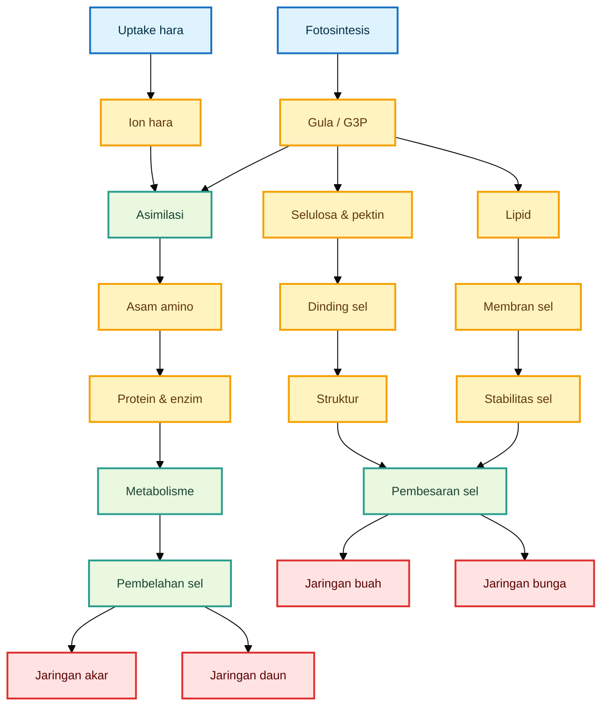
```mermaid
%%{init: {"theme": "base", "themeVariables": {"fontFamily": "Arial", "fontSize": "13px"}}}%%
flowchart TD
    A["Fotosintesis"] --> B["Gula / G3P"]
    C["Uptake hara"] --> D["Ion hara"]
    B --> E["Asimilasi"]
    D --> E

    E --> F["Asam amino"]
    F --> G["Protein & enzim"]

    B --> H["Selulosa & pektin"]
    H --> I["Dinding sel"]

    B --> J["Lipid"]
    J --> K["Membran sel"]

    G --> L["Metabolisme"]
    I --> M["Struktur"]
    K --> N["Stabilitas sel"]

    L --> O["Pembelahan sel"]
    M --> P["Pembesaran sel"]
    N --> P

    O --> Q["Jaringan akar"]
    O --> R["Jaringan daun"]
    P --> S["Jaringan buah"]
    P --> T["Jaringan bunga"]

    classDef input fill:#dff3ff,stroke:#1971c2,stroke-width:2px,color:#003049;
    classDef process fill:#e9f8df,stroke:#2a9d8f,stroke-width:2px,color:#1b4332;
    classDef molecule fill:#fff3bf,stroke:#f59f00,stroke-width:2px,color:#5f370e;
    classDef tissue fill:#ffe3e3,stroke:#e03131,stroke-width:2px,color:#5c0000;

    class A,C input;
    class E,L,O,P process;
    class B,D,F,G,H,I,J,K,M,N molecule;
    class Q,R,S,T tissue;
```

---

## A. Pembentukan Jaringan Akar

Jaringan akar membutuhkan:

$$
\mathrm{P} + \mathrm{Ca} + \mathrm{B} + \mathrm{Zn} + \mathrm{K}
$$

ditambah:

$$
\text{gula dari daun} + \mathrm{O_2}
$$

Alurnya:

$$
\text{sukrosa dari daun}
\rightarrow
\text{respirasi akar}
\rightarrow
\mathrm{ATP}
\rightarrow
\text{akar baru dan rambut akar}
$$

Makna praktis:

Akar tidak cukup hanya diberi pupuk akar. Akar juga membutuhkan gula dari daun. Jadi, daun sehat membantu akar kuat, dan akar kuat membantu daun sehat.

---

## B. Pembentukan Jaringan Daun

Jaringan daun membutuhkan:

$$
\mathrm{N} + \mathrm{Mg} + \mathrm{Fe} + \mathrm{Mn} + \mathrm{S} + \mathrm{K} + \mathrm{Ca}
$$

Fokusnya:

- klorofil;
- protein fotosintesis;
- enzim;
- membran kloroplas;
- stomata;
- dinding sel daun.

Formula praktis:

$$
\begin{aligned}
\text{daun aktif} &= \mathrm{N} \\
&+ \mathrm{Mg} \\
&+ \mathrm{Fe} \\
&+ \mathrm{Mn} \\
&+ \mathrm{S} \\
&+ \mathrm{K} \\
&+ \text{cahaya}
\end{aligned}
$$

---

## C. Pembentukan Jaringan Bunga

Jaringan bunga membutuhkan:

$$
\mathrm{P} + \mathrm{K} + \mathrm{B} + \mathrm{Zn} + \mathrm{Mo} + \mathrm{Ca}
$$

Fokusnya:

- pembentukan calon bunga;
- energi pembungaan;
- serbuk sari;
- tabung polen;
- bakal buah;
- keseimbangan hormon.

Boron dan seng sangat penting pada fase ini. Tetapi pemberian $\mathrm{B}$ harus hati-hati karena toksisitas bisa terjadi bila dosis berlebih.

---

## D. Pembentukan Jaringan Buah

Buah cabai membutuhkan:

$$
\mathrm{K} + \mathrm{Ca} + \mathrm{Mg} + \mathrm{B} + \mathrm{N}\ \text{seimbang}
$$

Fokusnya:

- pembelahan sel awal;
- pembesaran sel;
- pengisian gula;
- kekuatan dinding sel;
- warna dan kualitas buah;
- biji.

Alur sederhananya:

$$
\text{daun}
\rightarrow
\text{sukrosa}
\rightarrow
\text{floem}
\rightarrow
\text{buah cabai}
\rightarrow
\text{pembesaran dan pematangan}
$$

Pada fase buah, $\mathrm{K}$ naik penting, tetapi $\mathrm{Ca}$ dan $\mathrm{Mg}$ tidak boleh tertinggal.

---

# 4.9. Hubungan Source–Sink dalam Pembentukan Jaringan

Pembentukan jaringan sangat dipengaruhi hubungan **source** dan **sink**.

**Source** adalah organ penghasil asimilat, terutama daun dewasa sehat.

**Sink** adalah organ penerima asimilat, seperti:

- akar muda;
- pucuk muda;
- bunga;
- buah;
- biji.

Alur source–sink:

$$
\text{daun source}
\rightarrow
\text{sukrosa}
\rightarrow
\text{floem}
\rightarrow
\text{organ sink}
$$

Pada cabai fase generatif, buah menjadi sink utama. Jika buah banyak tetapi daun tidak cukup aktif, maka pengisian buah melemah.

---

## Diagram Source–Sink pada Cabai

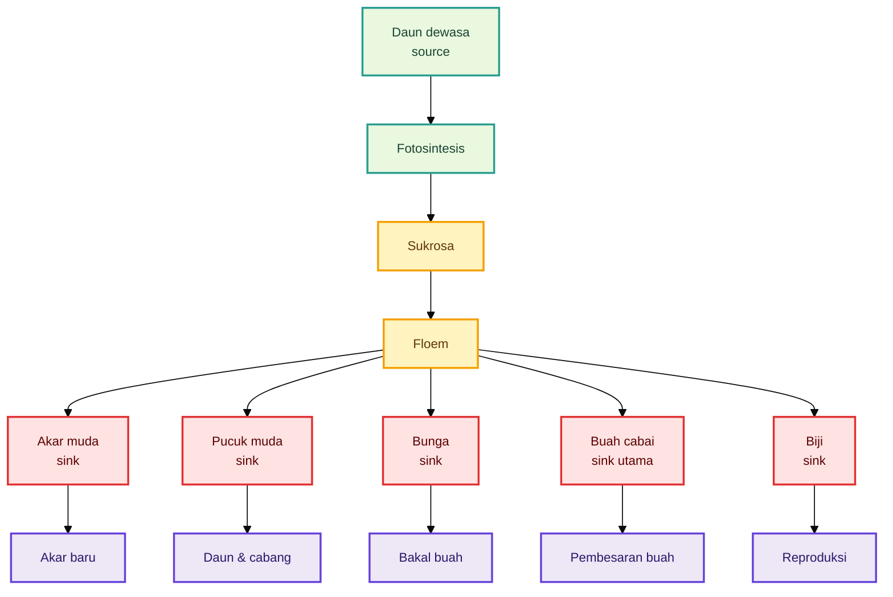
```mermaid
%%{init: {"theme": "base", "themeVariables": {"fontFamily": "Arial", "fontSize": "13px"}}}%%
flowchart TD
    A["Daun dewasa<br/>source"] --> B["Fotosintesis"]
    B --> C["Sukrosa"]
    C --> D["Floem"]

    D --> E["Akar muda<br/>sink"]
    D --> F["Pucuk muda<br/>sink"]
    D --> G["Bunga<br/>sink"]
    D --> H["Buah cabai<br/>sink utama"]
    D --> I["Biji<br/>sink"]

    E --> J["Akar baru"]
    F --> K["Daun & cabang"]
    G --> L["Bakal buah"]
    H --> M["Pembesaran buah"]
    I --> N["Reproduksi"]

    classDef source fill:#e9f8df,stroke:#2a9d8f,stroke-width:2px,color:#1b4332;
    classDef sugar fill:#fff3bf,stroke:#f59f00,stroke-width:2px,color:#5f370e;
    classDef sink fill:#ffe3e3,stroke:#e03131,stroke-width:2px,color:#5c0000;
    classDef result fill:#ede7f6,stroke:#6741d9,stroke-width:2px,color:#2b1769;

    class A,B source;
    class C,D sugar;
    class E,F,G,H,I sink;
    class J,K,L,M,N result;
```

---

# 4.10. Implikasi Praktis untuk Pemupukan Cabai

## 1. Jangan memisahkan pupuk dari fotosintesis

Pupuk menyediakan bahan mineral. Fotosintesis menyediakan energi dan rangka karbon.

$$
\text{pupuk tanpa fotosintesis kuat}
\Rightarrow
\text{asimilasi tidak optimal}
$$

Cabai yang kekurangan cahaya, daunnya rusak, atau stomatanya terganggu tidak akan optimal memanfaatkan pupuk.

---

## 2. Nitrogen harus disertai unsur pendukung asimilasi

Nitrogen produktif membutuhkan:

$$
\mathrm{N}
+
\mathrm{Mo}
+
\mathrm{Fe}
+
\mathrm{S}
+
\mathrm{Mg}
+
\mathrm{P}
+
\mathrm{K}
$$

Jadi pada fase vegetatif, jangan hanya menaikkan $\mathrm{N}$. Pastikan $\mathrm{Mg}$, $\mathrm{S}$, $\mathrm{Fe}$, dan $\mathrm{K}$ cukup.

---

## 3. Dinding sel kuat perlu $\mathrm{Ca}$ dan $\mathrm{B}$ sejak awal

Dinding sel tidak bisa diperbaiki sempurna hanya setelah gejala muncul. $\mathrm{Ca}$ dan $\mathrm{B}$ harus tersedia kontinu, terutama pada:

- akar muda;
- pucuk muda;
- bunga;
- bakal buah;
- buah muda.

Formula praktis:

$$
\mathrm{Ca} + \mathrm{B}
\rightarrow
\text{jaringan muda kuat}
$$

---

## 4. Buah besar perlu daun yang tetap aktif

Buah cabai tidak membesar hanya karena diberi $\mathrm{K}$. Buah membesar karena menerima gula dari daun, air dari akar, dan hara yang tepat.

$$
\begin{aligned}
\text{buah besar} &= \text{sukrosa cukup} \\
&+ \mathrm{K} \\
&+ \mathrm{Ca} \\
&+ \mathrm{Mg} \\
&+ \mathrm{B} \\
&+ \text{air stabil}
\end{aligned}
$$

---

## 5. Pada fase panen berulang, $\mathrm{Mg}$ sering menjadi kunci

Saat buah banyak, daun bekerja keras. Jika $\mathrm{Mg}$ rendah, klorofil turun, fotosintesis melemah, dan pengisian buah menurun.

$$
\mathrm{Mg}\ \text{cukup}
\Rightarrow
\text{daun tetap hijau}
\Rightarrow
\text{gula tetap mengalir ke buah}
$$

---

# 4.11. Kesimpulan Bab 4

Asimilasi adalah proses yang mengubah ion hara menjadi molekul organik dan jaringan tanaman.

Ringkasnya:

$$
\mathrm{NO_3^-}
\rightarrow
\mathrm{NO_2^-}
\rightarrow
\mathrm{NH_4^+}
\rightarrow
\text{glutamin / glutamat}
\rightarrow
\text{asam amino}
\rightarrow
\text{protein}
$$

$$
\mathrm{G3P}
\rightarrow
\text{sukrosa, pati, selulosa, lipid, dan rangka karbon asam amino}
$$

$$
\mathrm{Ca} + \mathrm{B}
\rightarrow
\text{dinding sel kuat}
$$

$$
\mathrm{N} + \mathrm{Mg} + \mathrm{Fe}
\rightarrow
\text{klorofil dan daun produktif}
$$

$$
\mathrm{K}
\rightarrow
\text{turgor, stomata, dan transport gula}
$$

Formula utama Bab 4:

$$
\begin{aligned}
\text{jaringan tanaman} &= \text{gula hasil fotosintesis} \\
&+ \text{ion hara} \\
&+ \text{energi} \\
&+ \text{enzim} \\
&+ \text{air}
\end{aligned}
$$

Untuk cabai, pesan praktisnya:

**pemupukan yang baik bukan hanya menyediakan unsur, tetapi memastikan unsur tersebut dapat diasimilasi menjadi klorofil, protein, dinding sel, akar, bunga, dan buah.**

[**Kembali ke Atas**](#dari-nutrisi-ke-buah-cabai-mekanisme-uptake-hara-fotosintesis-asimilasi-molekul-pembentukan-jaringan-dan-strategi-pemupukan-berdasarkan-fase-tanaman)

[1]: https://pmc.ncbi.nlm.nih.gov/articles/PMC7600499/?utm_source=chatgpt.com 'Light-Independent Nitrogen Assimilation in Plant Leaves - PMC'
[2]: https://horizonepublishing.com/journals/index.php/PST/article/download/637/365/5136?utm_source=chatgpt.com 'Nitrate assimilation pathway in higher plants'
[3]: https://openstax.org/books/biology-2e/pages/15-5-ribosomes-and-protein-synthesis?utm_source=chatgpt.com '15.5 Ribosomes and Protein Synthesis - Biology 2e'
[4]: https://pmc.ncbi.nlm.nih.gov/articles/PMC11062476/?utm_source=chatgpt.com 'The plant cell wall—dynamic, strong, and adaptable—is a ...'
[5]: https://www.annualreviews.org/doi/pdf/10.1146/annurev.arplant.49.1.481?utm_source=chatgpt.com 'BORON IN PLANT STRUCTURE AND FUNCTION'
[6]: https://pmc.ncbi.nlm.nih.gov/articles/PMC9085447/?utm_source=chatgpt.com 'Physiological Essence of Magnesium in Plants and Its ... - PMC'
[7]: https://www.frontiersin.org/journals/plant-science/articles/10.3389/fpls.2021.710093/full?utm_source=chatgpt.com 'Iron Deficiency Leads to Chlorosis Through Impacting ...'

---

# Bab 5 — Siklus Hidup Cabai dan Dominasi Proses Fisiologis

## Pengantar Bab

Setelah memahami uptake hara, fungsi unsur, fotosintesis, dan asimilasi molekul, Bab 5 menghubungkan semuanya ke **fase hidup tanaman cabai**.

Tanaman cabai tidak membutuhkan komposisi hara yang sama sepanjang hidupnya. Pada fase awal, tanaman lebih membutuhkan akar kuat. Saat vegetatif, fokusnya daun dan cabang. Saat generatif, fokus bergeser ke bunga, bakal buah, dan pengisian buah.

Secara sederhana:

$$
\text{fase tanaman}
\rightarrow
\text{organ dominan}
\rightarrow
\text{proses fisiologis dominan}
\rightarrow
\text{unsur hara prioritas}
\rightarrow
\text{strategi pemupukan}
$$

Cabai sensitif terhadap kondisi air, suhu, dan nutrisi pada fase bunga dan awal buah. UC IPM mencatat bahwa stres air saat pembungaan dapat menurunkan fruit set, sedangkan stres pada awal pertumbuhan buah dapat memicu blossom-end rot. ([ipm.ucanr.edu](https://ipm.ucanr.edu/home-and-landscape/cultural-tips-for-growing-peppers/?utm_source=chatgpt.com))

---

## Diagram Siklus Hidup Cabai

```mermaid
%%{init: {"theme": "base", "themeVariables": {"fontFamily": "Arial", "fontSize": "13px"}}}%%
flowchart TD
    A["Semai"] --> B["Pindah tanam"]
    B --> C["Vegetatif awal"]
    C --> D["Vegetatif kuat"]
    D --> E["Pra-bunga"]
    E --> F["Berbunga"]
    F --> G["Fruit set"]
    G --> H["Pembesaran buah"]
    H --> I["Panen berulang"]
    I --> J["Akhir produksi"]

    A --> A1["Akar awal<br/>daun sejati"]
    C --> C1["Daun<br/>cabang<br/>akar aktif"]
    F --> F1["Bunga<br/>serbuk sari"]
    G --> G1["Bakal buah"]
    H --> H1["Buah sebagai<br/>sink utama"]
    I --> I1["Daun tetap aktif<br/>buah kontinu"]

    classDef early fill:#dff3ff,stroke:#1971c2,stroke-width:2px,color:#003049;
    classDef veg fill:#e9f8df,stroke:#2a9d8f,stroke-width:2px,color:#1b4332;
    classDef flower fill:#fff3bf,stroke:#f59f00,stroke-width:2px,color:#5f370e;
    classDef fruit fill:#ffe3e3,stroke:#e03131,stroke-width:2px,color:#5c0000;
    classDef harvest fill:#ede7f6,stroke:#6741d9,stroke-width:2px,color:#2b1769;

    class A,B,A1 early;
    class C,D,C1 veg;
    class E,F,F1 flower;
    class G,H,G1,H1 fruit;
    class I,J,I1 harvest;
```

---

# 5.1. Fase Semai

## Fokus fisiologi

Fase semai adalah fase pembentukan fondasi tanaman.

Proses dominan:

$$
\text{perkecambahan}
\rightarrow
\text{akar primer}
\rightarrow
\text{kotiledon}
\rightarrow
\text{daun sejati awal}
\rightarrow
\text{akar lateral awal}
$$

Pada fase ini, tanaman belum membutuhkan pupuk pekat. Yang paling penting adalah akar sehat, media porous, kelembapan stabil, cahaya cukup, dan nutrisi ringan tetapi lengkap.

---

## Organ yang dominan dibentuk

| Organ        | Fungsi                              |
| ------------ | ----------------------------------- |
| Akar primer  | Menjangkar dan mulai menyerap air   |
| Rambut akar  | Memperluas serapan air dan ion      |
| Kotiledon    | Cadangan awal dan fotosintesis awal |
| Daun sejati  | Awal mesin fotosintesis             |
| Titik tumbuh | Sumber pertumbuhan berikutnya       |

---

## Unsur hara prioritas fase semai

$$
\mathrm{P},\ \mathrm{Ca},\ \mathrm{B},\ \mathrm{Zn},\ \mathrm{Mg},\ \mathrm{Fe},\ \mathrm{N}\ \text{rendah-sedang}
$$

| Unsur         | Peran pada semai                         |
| ------------- | ---------------------------------------- |
| $\mathrm{P}$  | Energi awal dan pertumbuhan akar         |
| $\mathrm{Ca}$ | Titik tumbuh akar dan stabilitas membran |
| $\mathrm{B}$  | Pembelahan sel                           |
| $\mathrm{Zn}$ | Auksin dan pemanjangan akar              |
| $\mathrm{Mg}$ | Klorofil awal                            |
| $\mathrm{Fe}$ | Pembentukan klorofil                     |
| $\mathrm{N}$  | Daun awal, tetapi jangan berlebihan      |

Formula praktis:

$$
\begin{aligned}
\text{semai kuat} &= \mathrm{P} \\
&+ \mathrm{Ca} \\
&+ \mathrm{B} \\
&+ \mathrm{Zn} \\
&+ \mathrm{Mg} \\
&+ \mathrm{Fe} \\
&+ \mathrm{N}\ \text{ringan}
\end{aligned}
$$

---

## Risiko utama fase semai

1. Media terlalu basah.
2. Akar kekurangan oksigen.
3. EC terlalu tinggi.
4. Bibit terlalu tinggi kurus karena cahaya kurang.
5. Serangan rebah semai.
6. Nitrogen terlalu tinggi sehingga jaringan lunak.

Prinsip praktis:

$$
\text{semai sehat}
\neq
\text{pupuk tinggi}
$$

Yang benar:

$$
\begin{aligned}
\text{semai sehat} &= \text{akar aktif} \\
&+ \text{media porous} \\
&+ \text{cahaya cukup} \\
&+ \text{nutrisi ringan-seimbang}
\end{aligned}
$$

---

# 5.2. Fase Pindah Tanam / Recovery Akar

## Fokus fisiologi

Pindah tanam adalah fase stres. Akar mengalami gangguan mekanis, tanaman menyesuaikan diri dengan media baru, dan keseimbangan air terganggu.

Proses dominan:

$$
\text{pemulihan akar}
\rightarrow
\text{akar lateral baru}
\rightarrow
\text{adaptasi stomata}
\rightarrow
\text{pertumbuhan vegetatif awal}
$$

UC IPM menyarankan bibit cabai dipindah tanam saat tanaman sudah cukup kuat, umumnya memiliki beberapa daun sejati, dan telah melalui proses pengerasan bibit agar lebih tahan terhadap kondisi lapangan. ([ipm.ucanr.edu](https://ipm.ucanr.edu/home-and-landscape/cultural-tips-for-growing-peppers/?utm_source=chatgpt.com))

---

## Unsur hara prioritas

$$
\mathrm{P},\ \mathrm{Ca},\ \mathrm{Zn},\ \mathrm{B},\ \mathrm{K},\ \mathrm{Mg}
$$

| Unsur         | Fungsi                       |
| ------------- | ---------------------------- |
| $\mathrm{P}$  | Energi untuk akar baru       |
| $\mathrm{Ca}$ | Ujung akar dan membran       |
| $\mathrm{Zn}$ | Auksin dan pemanjangan akar  |
| $\mathrm{B}$  | Pembelahan sel               |
| $\mathrm{K}$  | Turgor dan pemulihan tanaman |
| $\mathrm{Mg}$ | Awal fotosintesis stabil     |

Formula praktis:

$$
\begin{aligned}
\text{recovery pindah tanam} &= \mathrm{P} \\
&+ \mathrm{Ca} \\
&+ \mathrm{Zn} \\
&+ \mathrm{B} \\
&+ \mathrm{K} \\
&+ \mathrm{Mg} \\
&+ \mathrm{O_2}\ \text{akar}
\end{aligned}
$$

---

## Strategi lapangan

- Gunakan media atau bedengan yang drainasenya baik.
- Hindari pupuk pekat langsung mengenai akar.
- Jaga kelembapan stabil, bukan becek.
- Jangan langsung mendorong $\mathrm{N}$ tinggi.
- Bantu akar dengan bahan organik matang, asam humat/fulvat, atau mikroba akar bila sistem budidaya memungkinkan.

Pada fase ini, tujuan pemupukan bukan membuat tanaman langsung rimbun, tetapi membuat akar cepat pulih.

---

# 5.3. Fase Vegetatif Awal

## Fokus fisiologi

Vegetatif awal adalah fase pembentukan daun, batang, cabang awal, dan perluasan akar.

Proses dominan:

$$
\text{akar aktif}
\rightarrow
\text{daun bertambah}
\rightarrow
\text{batang menguat}
\rightarrow
\text{kapasitas fotosintesis naik}
$$

---

## Organ yang dominan dibentuk

| Organ        | Fungsi                         |
| ------------ | ------------------------------ |
| Daun         | Pabrik fotosintesis            |
| Batang       | Penopang tajuk                 |
| Cabang       | Lokasi calon bunga             |
| Akar lateral | Serapan air dan hara           |
| Pucuk muda   | Pertumbuhan vegetatif lanjutan |

---

## Unsur hara prioritas

$$
\mathrm{N},\ \mathrm{K},\ \mathrm{Ca},\ \mathrm{Mg},\ \mathrm{Fe},\ \mathrm{Mn},\ \mathrm{S}
$$

| Unsur         | Peran                                      |
| ------------- | ------------------------------------------ |
| $\mathrm{N}$  | Daun, protein, klorofil                    |
| $\mathrm{K}$  | Stomata, turgor, aktivasi enzim            |
| $\mathrm{Ca}$ | Jaringan muda dan dinding sel              |
| $\mathrm{Mg}$ | Inti klorofil                              |
| $\mathrm{Fe}$ | Pembentukan klorofil dan transfer elektron |
| $\mathrm{Mn}$ | Fotosistem II                              |
| $\mathrm{S}$  | Protein dan enzim                          |

Formula praktis:

$$
\begin{aligned}
\text{vegetatif sehat} &= \mathrm{N} \\
&+ \mathrm{K} \\
&+ \mathrm{Ca} \\
&+ \mathrm{Mg} \\
&+ \mathrm{Fe} \\
&+ \mathrm{Mn} \\
&+ \mathrm{S}
\end{aligned}
$$

---

## Risiko utama fase vegetatif awal

1. Kekurangan cahaya menyebabkan tanaman tinggi kurus.
2. $\mathrm{N}$ terlalu tinggi menyebabkan jaringan lunak.
3. $\mathrm{Mg}$ atau $\mathrm{Fe}$ kurang menyebabkan daun pucat.
4. Akar belum kuat tetapi tajuk dipaksa tumbuh cepat.
5. Kelembapan kanopi tinggi memicu penyakit.

Rumus praktis:

$$
\mathrm{N}\ \text{tinggi}
+
\text{cahaya kurang}
\Rightarrow
\text{tanaman rimbun tetapi lemah}
$$

---

# 5.4. Fase Vegetatif Kuat

## Fokus fisiologi

Pada fase vegetatif kuat, tanaman membangun “mesin produksi” sebelum masuk generatif.

Proses dominan:

$$
\text{daun dewasa}
\rightarrow
\text{fotosintesis tinggi}
\rightarrow
\text{akar makin aktif}
\rightarrow
\text{cadangan energi meningkat}
$$

Daun dewasa menjadi **source**, yaitu sumber gula bagi akar, pucuk muda, dan calon bunga.

---

## Unsur hara prioritas

$$
\mathrm{N},\ \mathrm{K},\ \mathrm{Ca},\ \mathrm{Mg},\ \mathrm{Fe},\ \mathrm{Mn},\ \mathrm{S},\ \mathrm{B}
$$

Pada fase ini, $\mathrm{N}$ masih penting, tetapi harus mulai diseimbangkan dengan $\mathrm{K}$ dan $\mathrm{Ca}$. Tujuannya agar tanaman kuat, bukan hanya rimbun.

---

## Indikator tanaman ideal

Tanaman cabai yang siap masuk fase generatif biasanya memiliki:

- daun hijau aktif, bukan terlalu gelap berlebihan;
- batang kokoh;
- cabang cukup;
- ruas tidak terlalu panjang;
- akar putih dan bercabang;
- tidak mudah layu siang;
- tidak terlalu vegetatif.

---

## Kesalahan umum

Kesalahan yang sering terjadi adalah terus mendorong $\mathrm{N}$ tinggi karena tanaman terlihat “bagus” dan hijau. Padahal, cabai yang terlalu vegetatif dapat terlambat berbunga dan rentan kanopi lembap.

CARDI dalam manual produksi hot pepper menekankan bahwa cabai membutuhkan tanah cukup subur, tetapi nutrisi yang terlalu berlimpah dapat menghasilkan pertumbuhan rimbun dengan mengorbankan produksi buah. ([cardi.org](https://www.cardi.org/wp-content/uploads/downloads/2013/02/Cbbean-hot-pepper-production-post-harvest-manual.pdf?utm_source=chatgpt.com))

---

# 5.5. Fase Pra-Bunga

## Fokus fisiologi

Pra-bunga adalah fase transisi dari dominasi vegetatif menuju generatif.

Proses dominan:

$$
\text{daun source kuat}
\rightarrow
\text{calon bunga terbentuk}
\rightarrow
\text{alokasi gula mulai bergeser}
\rightarrow
\text{tanaman siap berbunga}
$$

Pada fase ini, pemupukan harus mulai mengubah arah. Tanaman tidak boleh terus dipaksa vegetatif.

---

## Unsur hara prioritas

$$
\mathrm{P},\ \mathrm{K},\ \mathrm{B},\ \mathrm{Zn},\ \mathrm{Mo},\ \mathrm{Ca},\ \mathrm{Mg}
$$

| Unsur         | Peran                                  |
| ------------- | -------------------------------------- |
| $\mathrm{P}$  | Energi pembentukan bunga               |
| $\mathrm{K}$  | Transport gula ke calon bunga          |
| $\mathrm{B}$  | Pembelahan sel dan bakal bunga         |
| $\mathrm{Zn}$ | Hormon dan pembentukan tunas generatif |
| $\mathrm{Mo}$ | Metabolisme nitrogen                   |
| $\mathrm{Ca}$ | Jaringan muda                          |
| $\mathrm{Mg}$ | Menjaga fotosintesis daun              |

Formula praktis:

$$
\begin{aligned}
\text{pra-bunga optimal} &= \mathrm{P} \\
&+ \mathrm{K} \\
&+ \mathrm{B} \\
&+ \mathrm{Zn} \\
&+ \mathrm{Mo} \\
&+ \mathrm{Ca} \\
&+ \mathrm{Mg}
\end{aligned}
$$

---

## Strategi pemupukan

Pada fase ini:

$$
\mathrm{N}\ \text{mulai ditahan}
$$

$$
\mathrm{K}\ \text{mulai dinaikkan}
$$

$$
\mathrm{P},\ \mathrm{B},\ \mathrm{Zn},\ \mathrm{Mo}\ \text{dipastikan cukup}
$$

FAO menjelaskan bahwa pada awal pembungaan cabai, pupuk dengan proporsi kalium lebih tinggi daripada nitrogen digunakan untuk membantu pembentukan bunga dan buah. ([fao.org](https://www.fao.org/4/y5259e/y5259e07.htm?utm_source=chatgpt.com))

---

# 5.6. Fase Berbunga

## Fokus fisiologi

Fase berbunga adalah fase reproduksi awal. Tanaman membentuk bunga, serbuk sari, tabung polen, dan bakal buah.

Proses dominan:

$$
\text{bunga terbentuk}
\rightarrow
\text{serbuk sari matang}
\rightarrow
\text{penyerbukan}
\rightarrow
\text{fertilisasi}
\rightarrow
\text{bakal buah}
$$

---

## Unsur hara prioritas

$$
\mathrm{P},\ \mathrm{K},\ \mathrm{B},\ \mathrm{Zn},\ \mathrm{Mo},\ \mathrm{Ca}
$$

| Unsur         | Peran pada bunga             |
| ------------- | ---------------------------- |
| $\mathrm{P}$  | Energi pembungaan            |
| $\mathrm{K}$  | Aliran gula ke bunga         |
| $\mathrm{B}$  | Serbuk sari dan tabung polen |
| $\mathrm{Zn}$ | Hormon dan pembentukan bunga |
| $\mathrm{Mo}$ | Metabolisme $\mathrm{N}$     |
| $\mathrm{Ca}$ | Jaringan muda bunga          |

Formula praktis:

$$
\begin{aligned}
\text{bunga kuat} &= \mathrm{P} \\
&+ \mathrm{K} \\
&+ \mathrm{B} \\
&+ \mathrm{Zn} \\
&+ \mathrm{Mo} \\
&+ \mathrm{Ca} \\
&+ \text{gula cukup}
\end{aligned}
$$

---

## Faktor yang membuat bunga rontok

Bunga cabai mudah rontok jika source–sink tidak seimbang.

Penyebab umum:

- suhu terlalu tinggi;
- kekeringan;
- akar lemah;
- $\mathrm{N}$ terlalu tinggi;
- $\mathrm{K}$ rendah;
- $\mathrm{B}$ rendah;
- serangan trips;
- tanaman kekurangan energi;
- kelembapan ekstrem.

Alur fisiologisnya:

$$
\text{stres}
\rightarrow
\text{fotosintesis turun}
\rightarrow
\text{gula ke bunga turun}
\rightarrow
\text{bunga rontok}
$$

---

# 5.7. Fase Fruit Set / Bakal Buah

## Fokus fisiologi

Fruit set adalah fase ketika bunga berhasil menjadi bakal buah. Ini adalah salah satu fase paling kritis.

Proses dominan:

$$
\text{fertilisasi berhasil}
\rightarrow
\text{bakal buah terbentuk}
\rightarrow
\text{pembelahan sel buah}
\rightarrow
\text{buah muda dipertahankan}
$$

---

## Unsur hara prioritas

$$
\mathrm{K},\ \mathrm{Ca},\ \mathrm{B},\ \mathrm{Mg},\ \mathrm{P},\ \mathrm{N}\ \text{seimbang}
$$

| Unsur         | Peran                                      |
| ------------- | ------------------------------------------ |
| $\mathrm{K}$  | Transport gula dan awal pengisian buah     |
| $\mathrm{Ca}$ | Dinding sel buah muda                      |
| $\mathrm{B}$  | Pembelahan sel dan transport gula          |
| $\mathrm{Mg}$ | Fotosintesis daun                          |
| $\mathrm{P}$  | Energi                                     |
| $\mathrm{N}$  | Menjaga daun tetap aktif, tidak berlebihan |

Formula praktis:

$$
\begin{aligned}
\text{fruit set kuat} &= \mathrm{K} \\
&+ \mathrm{Ca} \\
&+ \mathrm{B} \\
&+ \mathrm{Mg} \\
&+ \mathrm{P} \\
&+ \mathrm{N}\ \text{seimbang}
\end{aligned}
$$

---

## Risiko utama

1. Bakal buah gugur.
2. Buah kecil.
3. Blossom-end rot.
4. Pertumbuhan vegetatif kembali dominan.
5. Tanaman stres panas.
6. Air tidak stabil.

Blossom-end rot pada pepper berkaitan dengan gangguan fisiologis yang melibatkan kalsium dan sering diperparah oleh salinitas atau stres lingkungan. Artikel ISHS pada greenhouse pepper menyebut BER terjadi di bawah salinitas dan berhubungan dengan gangguan kalsium serta stres oksidatif. ([ishs.org](https://ishs.org/ishs-article/609_9/?utm_source=chatgpt.com))

---

# 5.8. Fase Pembesaran Buah

## Fokus fisiologi

Pada fase ini, buah cabai menjadi sink utama. Tanaman mengarahkan gula, air, dan hara ke buah.

Proses dominan:

$$
\text{sukrosa dari daun}
\rightarrow
\text{floem}
\rightarrow
\text{buah}
\rightarrow
\text{pembesaran sel}
\rightarrow
\text{pengisian buah}
$$

---

## Unsur hara prioritas

$$
\mathrm{K},\ \mathrm{Ca},\ \mathrm{Mg},\ \mathrm{B},\ \mathrm{N}\ \text{seimbang}
$$

| Unsur         | Peran                                  |
| ------------- | -------------------------------------- |
| $\mathrm{K}$  | Pengisian buah, ukuran, transport gula |
| $\mathrm{Ca}$ | Kekuatan dinding sel buah              |
| $\mathrm{Mg}$ | Daun tetap fotosintesis                |
| $\mathrm{B}$  | Transport gula dan pembelahan sel      |
| $\mathrm{N}$  | Menjaga daun tetap produktif           |

Formula praktis:

$$
\begin{aligned}
\text{buah besar dan kuat} &= \mathrm{K} \\
&+ \mathrm{Ca} \\
&+ \mathrm{Mg} \\
&+ \mathrm{B} \\
&+ \mathrm{N}\ \text{seimbang} \\
&+ \text{air stabil}
\end{aligned}
$$

---

## Catatan penting: K tinggi harus diimbangi Ca dan Mg

Pada fase buah, $\mathrm{K}$ memang perlu dominan. Namun, $\mathrm{K}$ yang terlalu tinggi dapat mengganggu keseimbangan $\mathrm{Ca}$ dan $\mathrm{Mg}$.

$$
\mathrm{K^+}\ \text{terlalu tinggi}
\Rightarrow
\text{risiko gangguan serapan } \mathrm{Ca^{2+}} \text{ dan } \mathrm{Mg^{2+}}
$$

Maka strategi yang lebih aman:

$$
\mathrm{K}\ \text{tinggi}
+
\mathrm{Ca}\ \text{stabil}
+
\mathrm{Mg}\ \text{cukup}
$$

Haifa Group menjelaskan bahwa kalium pada pepper berperan dalam akumulasi karbohidrat dan kualitas, serta uptake kalium meningkat menuju panen pertama; sumber ini juga menekankan pentingnya suplai kalsium seimbang untuk kekuatan dinding sel dan kualitas buah. ([haifa-group.com](https://www.haifa-group.com/articles/crop-guide-nutrients-pepper?utm_source=chatgpt.com))

---

# 5.9. Fase Panen Berulang

## Fokus fisiologi

Cabai merupakan tanaman yang dapat dipanen berulang. Setelah buah pertama dipanen, tanaman masih harus:

- mempertahankan daun;
- membentuk bunga baru;
- mempertahankan akar;
- mengisi buah berikutnya;
- memulihkan energi.

Proses dominan:

$$
\text{panen}
\rightarrow
\text{source dipertahankan}
\rightarrow
\text{bunga baru}
\rightarrow
\text{buah baru}
\rightarrow
\text{panen berikutnya}
$$

---

## Unsur hara prioritas

$$
\mathrm{K},\ \mathrm{Ca},\ \mathrm{Mg},\ \mathrm{N}\ \text{sedang},\ \mathrm{B},\ \mathrm{Zn},\ \mathrm{Fe},\ \mathrm{Mn}
$$

| Unsur                        | Fungsi                                        |
| ---------------------------- | --------------------------------------------- |
| $\mathrm{K}$                 | Menjaga pengisian buah berulang               |
| $\mathrm{Ca}$                | Kualitas jaringan buah dan pucuk              |
| $\mathrm{Mg}$                | Daun tetap hijau aktif                        |
| $\mathrm{N}$                 | Menjaga daun, bukan mendorong rimbun berlebih |
| $\mathrm{B}$                 | Bunga dan bakal buah                          |
| $\mathrm{Zn}$                | Tunas dan hormon                              |
| $\mathrm{Fe}$, $\mathrm{Mn}$ | Fotosintesis                                  |

Formula praktis:

$$
\begin{aligned}
\text{panen panjang} &= \text{akar sehat} \\
&+ \text{daun aktif} \\
&+ \mathrm{K} \\
&+ \mathrm{Ca} \\
&+ \mathrm{Mg} \\
&+ \mathrm{N}\ \text{sedang} \\
&+ \text{mikro rutin}
\end{aligned}
$$

---

## Risiko utama panen berulang

1. Tanaman cepat drop.
2. Daun tua menguning.
3. Buah makin kecil.
4. Bunga baru sedikit.
5. Akar melemah.
6. Salinitas media meningkat.
7. Serangan OPT meningkat karena kanopi tua dan lembap.

Pada fase ini, $\mathrm{Mg}$ sering menjadi kunci karena daun harus terus berfotosintesis. Jika daun tua menguning antar tulang daun, pengisian buah berikutnya biasanya melemah.

---

# 5.10. Fase Akhir Produksi

## Fokus fisiologi

Fase akhir produksi terjadi saat tanaman mulai menurun produktivitasnya. Akar tidak seaktif fase awal, daun tua meningkat, dan kemampuan tanaman mempertahankan bunga serta buah menurun.

Proses dominan:

$$
\text{akar menua}
+
\text{daun tua}
+
\text{sink buah melemah}
\rightarrow
\text{hasil menurun}
$$

---

## Strategi

Pada fase akhir, keputusan praktisi adalah memilih:

1. mempertahankan tanaman jika masih ekonomis;
2. melakukan peremajaan ringan;
3. menghentikan produksi dan menyiapkan siklus baru.

Pemupukan pada fase ini tidak boleh terlalu agresif. Jika akar sudah lemah, pupuk pekat dapat memperparah stres.

Prinsip:

$$
\text{akar lemah}
+
\text{EC tinggi}
\Rightarrow
\text{tanaman makin drop}
$$

---

# 5.11. Ringkasan Fase, Organ Dominan, dan Hara Prioritas

| Fase            | Organ dominan          | Proses dominan              | Hara prioritas                                                                         |
| --------------- | ---------------------- | --------------------------- | -------------------------------------------------------------------------------------- |
| Semai           | Akar awal, daun sejati | Akar dan klorofil awal      | $\mathrm{P}$, $\mathrm{Ca}$, $\mathrm{B}$, $\mathrm{Zn}$, $\mathrm{Mg}$, $\mathrm{Fe}$ |
| Pindah tanam    | Akar baru              | Recovery akar               | $\mathrm{P}$, $\mathrm{Ca}$, $\mathrm{Zn}$, $\mathrm{B}$, $\mathrm{K}$                 |
| Vegetatif awal  | Daun, batang, akar     | Tajuk dan fotosintesis      | $\mathrm{N}$, $\mathrm{K}$, $\mathrm{Ca}$, $\mathrm{Mg}$, $\mathrm{Fe}$, $\mathrm{Mn}$ |
| Vegetatif kuat  | Daun dewasa, cabang    | Source kuat                 | $\mathrm{N}$, $\mathrm{K}$, $\mathrm{Ca}$, $\mathrm{Mg}$, $\mathrm{S}$                 |
| Pra-bunga       | Calon bunga            | Transisi generatif          | $\mathrm{P}$, $\mathrm{K}$, $\mathrm{B}$, $\mathrm{Zn}$, $\mathrm{Mo}$                 |
| Berbunga        | Bunga                  | Serbuk sari dan fertilisasi | $\mathrm{P}$, $\mathrm{K}$, $\mathrm{B}$, $\mathrm{Zn}$, $\mathrm{Ca}$                 |
| Fruit set       | Bakal buah             | Pembelahan sel buah         | $\mathrm{K}$, $\mathrm{Ca}$, $\mathrm{B}$, $\mathrm{Mg}$                               |
| Pembesaran buah | Buah                   | Pengisian buah              | $\mathrm{K}$, $\mathrm{Ca}$, $\mathrm{Mg}$, $\mathrm{B}$                               |
| Panen berulang  | Daun dan buah          | Produksi kontinu            | $\mathrm{K}$, $\mathrm{Ca}$, $\mathrm{Mg}$, $\mathrm{N}$ sedang, mikro                 |
| Akhir produksi  | Jaringan menua         | Penurunan vigor             | Nutrisi ringan, EC terkendali                                                          |

---

## Diagram Hubungan Fase dan Unsur Prioritas

```mermaid
%%{init: {"theme": "base", "themeVariables": {"fontFamily": "Arial", "fontSize": "13px"}}}%%
flowchart TD
    A["Semai"] --> A1["Akar awal<br/>P Ca B Zn Mg Fe"]
    B["Vegetatif"] --> B1["Daun dan cabang<br/>N K Ca Mg Fe Mn S"]
    C["Pra-bunga"] --> C1["Calon bunga<br/>P K B Zn Mo Ca"]
    D["Berbunga"] --> D1["Bunga<br/>P K B Zn Ca"]
    E["Fruit set"] --> E1["Bakal buah<br/>K Ca B Mg"]
    F["Pembesaran buah"] --> F1["Buah<br/>K Ca Mg B"]
    G["Panen berulang"] --> G1["Produksi kontinu<br/>K Ca Mg N sedang mikro"]

    classDef seed fill:#dff3ff,stroke:#1971c2,stroke-width:2px,color:#003049;
    classDef veg fill:#e9f8df,stroke:#2a9d8f,stroke-width:2px,color:#1b4332;
    classDef flower fill:#fff3bf,stroke:#f59f00,stroke-width:2px,color:#5f370e;
    classDef fruit fill:#ffe3e3,stroke:#e03131,stroke-width:2px,color:#5c0000;
    classDef harvest fill:#ede7f6,stroke:#6741d9,stroke-width:2px,color:#2b1769;

    class A,A1 seed;
    class B,B1 veg;
    class C,C1,D,D1 flower;
    class E,E1,F,F1 fruit;
    class G,G1 harvest;
```

---

# 5.12. Kesimpulan Bab 5

Siklus hidup cabai harus dibaca sebagai perubahan dominasi organ dan proses fisiologis.

Ringkasnya:

$$
\text{semai}
\Rightarrow
\text{akar dan daun awal}
$$

$$
\text{vegetatif}
\Rightarrow
\text{daun, cabang, fotosintesis}
$$

$$
\text{pra-bunga dan bunga}
\Rightarrow
\text{transisi generatif dan reproduksi}
$$

$$
\text{fruit set}
\Rightarrow
\text{bakal buah dan pembelahan sel}
$$

$$
\text{pembesaran buah}
\Rightarrow
\text{buah sebagai sink utama}
$$

$$
\text{panen berulang}
\Rightarrow
\text{source daun harus tetap kuat}
$$

Formula besar Bab 5:

$$
\begin{aligned}
\text{produksi cabai stabil} &= \text{akar sehat} \\
&+ \text{daun aktif} \\
&+ \text{bunga kuat} \\
&+ \text{buah sebagai sink terisi} \\
&+ \text{nutrisi sesuai fase}
\end{aligned}
$$

Pesan praktisnya:

**cabai tidak boleh dipupuk dengan pola yang sama dari awal sampai akhir. Pemupukan harus mengikuti fase hidup, organ yang sedang dominan dibentuk, dan proses fisiologis yang sedang paling aktif.**

[**Kembali ke Atas**](#dari-nutrisi-ke-buah-cabai-mekanisme-uptake-hara-fotosintesis-asimilasi-molekul-pembentukan-jaringan-dan-strategi-pemupukan-berdasarkan-fase-tanaman)

---

# Bab 6 — Rezim Pemupukan Cabai Terkait Siklus Hidup

Bab ini melanjutkan kerangka Bab 6 yang Anda berikan: pemupukan cabai tidak dibaca sebagai “berapa banyak pupuk diberikan”, tetapi sebagai **bagaimana rasio hara berubah mengikuti fase fisiologis tanaman**. Fokus utamanya adalah hubungan antara fase cabai, target organ, rasio $\mathrm{N:P:K:Ca:Mg}$, serta strategi menjaga tanaman tetap kuat selama produksi.

---

## 6.1. Prinsip Umum Rezim Pemupukan Cabai

Rezim pemupukan cabai harus mengikuti empat prinsip besar:

$$
\text{fase tanaman}
+
\text{target organ}
+
\text{status media/tanah}
+
\text{kondisi iklim dan air}
\rightarrow
\text{strategi pemupukan}
$$

Pemupukan yang baik bukan hanya memilih pupuk dengan angka tinggi. Pemupukan harus mempertimbangkan:

- fase tanaman;
- jaringan yang sedang dibentuk;
- kondisi akar;
- pH tanah atau larutan;
- EC media atau larutan;
- kualitas air;
- intensitas cahaya;
- suhu dan kelembapan;
- beban buah;
- tekanan OPT;
- gejala defisiensi atau toksisitas.

UC ANR menekankan prinsip **4R Nutrient Management**, yaitu sumber yang tepat, dosis yang tepat, waktu yang tepat, dan tempat yang tepat; prinsip ini penting karena kondisi lahan, iklim, dan kebutuhan tanaman berbeda antar lokasi. ([UC Agriculture and Natural Resources][1])

---

## Diagram Prinsip Pemupukan Cabai

```mermaid
%%{init: {"theme": "base", "themeVariables": {"fontFamily": "Arial", "fontSize": "13px"}}}%%
flowchart TD
    A["Fase tanaman"] --> E["Rezim pemupukan"]
    B["Target organ"] --> E
    C["Status tanah / media"] --> E
    D["Iklim, air, pH, EC"] --> E

    E --> F["Rasio hara"]
    E --> G["Dosis"]
    E --> H["Waktu aplikasi"]
    E --> I["Cara aplikasi"]

    F --> J["Akar kuat"]
    F --> K["Daun aktif"]
    F --> L["Bunga kuat"]
    F --> M["Buah terisi"]

    classDef input fill:#dff3ff,stroke:#1971c2,stroke-width:2px,color:#003049;
    classDef decision fill:#fff3bf,stroke:#f59f00,stroke-width:2px,color:#5f370e;
    classDef output fill:#e9f8df,stroke:#2a9d8f,stroke-width:2px,color:#1b4332;
    classDef organ fill:#ffe3e3,stroke:#e03131,stroke-width:2px,color:#5c0000;

    class A,B,C,D input;
    class E,F,G,H,I decision;
    class J,K,L,M organ;
```

---

## Prinsip Kalibrasi Dosis

Dosis akhir tidak boleh hanya mengikuti tabel umum. Dosis harus dikalibrasi dengan:

| Faktor               | Mengapa penting                                                                           |
| -------------------- | ----------------------------------------------------------------------------------------- |
| Analisis tanah/media | Mengetahui cadangan hara dan pH                                                           |
| Analisis air         | Mengetahui EC, pH, $\mathrm{Ca}$, $\mathrm{Mg}$, $\mathrm{Na}$, $\mathrm{Cl}$, bikarbonat |
| pH                   | Menentukan ketersediaan unsur                                                             |
| EC                   | Menentukan tingkat kepekatan garam                                                        |
| Warna daun           | Indikasi status $\mathrm{N}$, $\mathrm{Mg}$, $\mathrm{Fe}$                                |
| Kondisi akar         | Menentukan kemampuan uptake                                                               |
| Jumlah bunga         | Indikator transisi generatif                                                              |
| Fruit set            | Indikator keberhasilan bunga menjadi buah                                                 |
| Ukuran buah          | Indikator suplai gula, $\mathrm{K}$, air, dan keseimbangan hara                           |
| Gejala defisiensi    | Dasar koreksi nutrisi                                                                     |
| Gejala toksisitas    | Tanda pupuk atau garam berlebih                                                           |

Rumus praktis:

$$
\text{dosis pupuk tepat}
\neq
\text{dosis tinggi}
$$

Yang benar:

$$
\begin{aligned}
\text{dosis pupuk tepat} &= \text{kebutuhan tanaman} \\
&+ \text{pasokan dari tanah/media/air} \\
&+ \text{koreksi efisiensi serapan}
\end{aligned}
$$

---

# 6.2. Kerangka Rasio NPK per Fase

Pada level praktis, pemupukan cabai dapat dimulai dari kerangka rasio $\mathrm{NPK}$, lalu dilengkapi dengan $\mathrm{Ca}$, $\mathrm{Mg}$, $\mathrm{S}$, dan unsur mikro.

| Fase cabai            | Fokus                      | Rasio NPK konseptual                                                                              |
| --------------------- | -------------------------- | ------------------------------------------------------------------------------------------------- |
| Semai                 | Akar dan daun awal         | $\mathrm{N}$ rendah-sedang, $\mathrm{P}$ sedang, $\mathrm{K}$ sedang                              |
| Adaptasi pindah tanam | Akar baru                  | $\mathrm{P}$, $\mathrm{Ca}$, $\mathrm{Zn}$, $\mathrm{B}$ dominan                                  |
| Vegetatif             | Daun, cabang, fotosintesis | $\mathrm{N}$ dominan, $\mathrm{K}$ cukup                                                          |
| Pra-bunga             | Transisi generatif         | $\mathrm{N}$ mulai diturunkan, $\mathrm{P}$-$\mathrm{K}$ dinaikkan                                |
| Bunga                 | Bunga dan bakal buah       | $\mathrm{P}$-$\mathrm{K}$-$\mathrm{B}$-$\mathrm{Zn}$ dominan                                      |
| Fruit set             | Pembelahan sel buah        | $\mathrm{K}$-$\mathrm{Ca}$-$\mathrm{B}$ seimbang                                                  |
| Pembesaran buah       | Bobot dan kualitas         | $\mathrm{K}$ dominan, $\mathrm{Ca}$-$\mathrm{Mg}$ stabil                                          |
| Panen berulang        | Menjaga produksi           | $\mathrm{K}$ tinggi-seimbang, $\mathrm{N}$ sedang, $\mathrm{Ca}$-$\mathrm{Mg}$-$\mathrm{B}$ rutin |

FAO memberi contoh pada cabai bahwa saat awal pembungaan dan saat tanaman mulai berbuah, aplikasi pupuk dengan proporsi kalium tinggi, misalnya $\mathrm{N:P:K}=8:4:32$, digunakan untuk mendukung pembentukan bunga dan buah. ([FAOHome][2])

---

## Diagram Pergeseran Rasio Hara

```mermaid
%%{init: {"theme": "base", "themeVariables": {"fontFamily": "Arial", "fontSize": "13px"}}}%%
flowchart TD
    A["Semai"] --> B["Pindah tanam"]
    B --> C["Vegetatif"]
    C --> D["Pra-bunga"]
    D --> E["Bunga"]
    E --> F["Fruit set"]
    F --> G["Pembesaran buah"]
    G --> H["Panen berulang"]

    A --> A1["P, Ca, Zn, B<br/>akar awal"]
    C --> C1["N, Mg, Fe, Mn<br/>daun aktif"]
    D --> D1["P dan K naik<br/>N ditahan"]
    E --> E1["B, Zn, K, Ca<br/>bunga kuat"]
    F --> F1["K, Ca, B<br/>bakal buah"]
    G --> G1["K dominan<br/>Ca-Mg stabil"]
    H --> H1["K tinggi-seimbang<br/>N sedang"]

    classDef early fill:#dff3ff,stroke:#1971c2,stroke-width:2px,color:#003049;
    classDef veg fill:#e9f8df,stroke:#2a9d8f,stroke-width:2px,color:#1b4332;
    classDef flower fill:#fff3bf,stroke:#f59f00,stroke-width:2px,color:#5f370e;
    classDef fruit fill:#ffe3e3,stroke:#e03131,stroke-width:2px,color:#5c0000;
    classDef harvest fill:#ede7f6,stroke:#6741d9,stroke-width:2px,color:#2b1769;

    class A,B,A1 early;
    class C,C1 veg;
    class D,E,D1,E1 flower;
    class F,G,F1,G1 fruit;
    class H,H1 harvest;
```

---

# 6.3. Contoh Program Pemupukan Tanah / Drip Fertigasi

Bagian ini bukan dosis final, tetapi **kerangka kerja**. Angka akhir harus disesuaikan dengan analisis tanah/media, air irigasi, varietas, sistem tanam, musim, dan target hasil.

---

## A. Sebelum Tanam

### Tujuan

Sebelum tanaman masuk lahan atau media, tujuannya adalah membangun dasar:

$$
\text{media sehat}
+
\text{pH sesuai}
+
\text{akar mudah berkembang}
+
\text{hara dasar tersedia}
$$

Fokus:

- memperbaiki struktur media;
- menyediakan $\mathrm{P}$, $\mathrm{Ca}$, dan $\mathrm{Mg}$;
- meningkatkan kapasitas simpan air dan hara;
- memperbaiki aktivitas mikroba;
- menstabilkan pH.

### Bahan yang umum dipertimbangkan

| Bahan                                  | Fungsi                                                              |
| -------------------------------------- | ------------------------------------------------------------------- |
| Kompos matang / pupuk kandang matang   | Bahan organik, mikroba, kapasitas simpan air                        |
| Dolomit / kaptan                       | Koreksi pH rendah, sumber $\mathrm{Ca}$ dan/atau $\mathrm{Mg}$      |
| Gypsum                                 | Sumber $\mathrm{Ca}$ tanpa menaikkan pH secara kuat                 |
| SP-36 / MAP / MKP                      | Sumber $\mathrm{P}$, tergantung sistem dan kebutuhan                |
| $\mathrm{KCl}$ atau $\mathrm{K_2SO_4}$ | Sumber $\mathrm{K}$, dipilih sesuai sensitivitas terhadap klorida   |
| Asam humat / fulvat                    | Pendukung akar dan ketersediaan hara                                |
| Mikroba akar                           | Mendukung rhizosphere, tergantung kualitas produk dan kondisi media |

Catatan praktis:

$$
\text{pupuk dasar baik}
\neq
\text{pupuk dasar berlebihan}
$$

Pupuk dasar yang terlalu pekat dapat menaikkan EC dan mengganggu akar muda.

---

## B. 0–14 HST: Setelah Tanam / Recovery

### Fokus

$$
\text{pemulihan akar}
+
\text{akar lateral}
+
\text{adaptasi stomata}
$$

Dominan:

$$
\mathrm{P},\ \mathrm{Ca},\ \mathrm{Zn},\ \mathrm{B},\ \mathrm{K}\ \text{ringan}
$$

Strategi:

- gunakan nutrisi starter yang tidak terlalu pekat;
- $\mathrm{P}$ cukup untuk energi akar;
- $\mathrm{Ca}$ stabil untuk ujung akar;
- $\mathrm{Zn}$ dan $\mathrm{B}$ rendah tetapi tersedia;
- hindari $\mathrm{N}$ tinggi;
- jaga media lembap tetapi tidak becek;
- pastikan akar mendapat $\mathrm{O_2}$.

Hindari:

$$
\text{EC tinggi}
+
\text{media becek}
+
\mathrm{N}\ \text{berlebihan}
$$

karena kombinasi ini sering menyebabkan akar lambat pulih.

---

## C. 15–30 HST: Vegetatif Aktif

### Fokus

$$
\text{daun}
+
\text{cabang}
+
\text{kapasitas fotosintesis}
$$

Dominan:

$$
\mathrm{N},\ \mathrm{Mg},\ \mathrm{Fe},\ \mathrm{Mn},\ \mathrm{K},\ \mathrm{Ca}
$$

Strategi:

- $\mathrm{N}$ cukup untuk daun;
- $\mathrm{Mg}$ dan $\mathrm{Fe}$ dijaga agar klorofil kuat;
- $\mathrm{Mn}$ mendukung fotosistem;
- $\mathrm{K}$ mendukung stomata dan turgor;
- $\mathrm{Ca}$ menjaga jaringan muda.

Rumus praktis:

$$
\begin{aligned}
\text{vegetatif produktif} &= \mathrm{N} \\
&+ \mathrm{Mg} \\
&+ \mathrm{Fe} \\
&+ \mathrm{Mn} \\
&+ \mathrm{K} \\
&+ \mathrm{Ca} \\
&+ \text{cahaya cukup}
\end{aligned}
$$

---

## D. 30–45 HST: Pra-Bunga

### Fokus

$$
\text{tanaman siap generatif}
$$

Dominan:

$$
\mathrm{P},\ \mathrm{K},\ \mathrm{B},\ \mathrm{Zn},\ \mathrm{Mo},\ \mathrm{Ca}
$$

Strategi:

- turunkan dominasi $\mathrm{N}$;
- naikkan $\mathrm{K}$ bertahap;
- $\mathrm{P}$ cukup untuk energi;
- $\mathrm{B}$, $\mathrm{Zn}$, dan $\mathrm{Mo}$ diberikan rendah tetapi tepat;
- $\mathrm{Ca}$ tetap stabil;
- hindari tajuk terlalu rimbun.

Rumus praktis:

$$
\begin{aligned}
\text{pra-bunga baik} &= \text{daun cukup kuat} \\
&+ \mathrm{P} \\
&+ \mathrm{K} \\
&+ \mathrm{B} \\
&+ \mathrm{Zn} \\
&+ \mathrm{Mo} \\
&+ \mathrm{Ca}
\end{aligned}
$$

---

## E. 45–70 HST: Bunga dan Fruit Set

### Fokus

$$
\text{bunga tidak rontok}
+
\text{bakal buah jadi}
$$

Dominan:

$$
\mathrm{K},\ \mathrm{Ca},\ \mathrm{B},\ \mathrm{P},\ \mathrm{Zn},\ \mathrm{Mg}
$$

Strategi:

- $\mathrm{K}$ naik bertahap;
- $\mathrm{Ca}$ stabil, bukan diberikan mendadak;
- $\mathrm{B}$ harus cukup tetapi tidak berlebihan;
- $\mathrm{Mg}$ dijaga agar daun tetap fotosintesis;
- hindari stres air;
- hindari EC melonjak;
- kendalikan trips dan tungau sejak awal.

UC IPM mencatat bahwa stres air saat pembungaan dapat menurunkan fruit set pada pepper, dan stres saat awal pertumbuhan buah dapat memicu blossom-end rot. ([FLVC Journals][3])

---

## F. 70 HST ke Atas: Pembesaran Buah dan Panen

### Fokus

$$
\text{pengisian buah}
+
\text{warna}
+
\text{bobot}
+
\text{panen berulang}
$$

Dominan:

$$
\mathrm{K},\ \mathrm{Ca},\ \mathrm{Mg},\ \mathrm{N}\ \text{sedang},\ \mathrm{B}\ \text{rendah-rutin}
$$

Strategi:

- $\mathrm{K}$ dominan untuk pengisian buah;
- $\mathrm{Ca}$ dijaga stabil untuk dinding sel;
- $\mathrm{Mg}$ dijaga agar fotosintesis tetap kuat;
- $\mathrm{N}$ tidak boleh nol, karena daun harus tetap aktif;
- $\mathrm{B}$ diberikan rendah tetapi konsisten;
- pantau EC agar media tidak asin.

Rumus fase buah:

$$
\begin{aligned}
\text{buah terisi} &= \text{sukrosa dari daun} \\
&+ \mathrm{K} \\
&+ \mathrm{Ca} \\
&+ \mathrm{Mg} \\
&+ \mathrm{B} \\
&+ \text{air stabil}
\end{aligned}
$$

---

# 6.4. Contoh Karakter Pupuk per Fase

| Fase            | Contoh karakter pupuk                                                              |
| --------------- | ---------------------------------------------------------------------------------- |
| Semai           | NPK seimbang ringan + $\mathrm{Ca}$ + mikro                                        |
| Pindah tanam    | Tinggi $\mathrm{P}$ + $\mathrm{Ca}$ + $\mathrm{Zn}$ + $\mathrm{B}$                 |
| Vegetatif       | $\mathrm{N}$ lebih tinggi, $\mathrm{K}$ cukup, $\mathrm{Mg}$-$\mathrm{Fe}$ lengkap |
| Pra-bunga       | $\mathrm{N}$ sedang, $\mathrm{P}$ dan $\mathrm{K}$ naik                            |
| Bunga           | $\mathrm{K}$ tinggi, $\mathrm{P}$ cukup, $\mathrm{B}$-$\mathrm{Zn}$-$\mathrm{Mo}$  |
| Fruit set       | $\mathrm{K}$-$\mathrm{Ca}$-$\mathrm{B}$ seimbang                                   |
| Pembesaran buah | $\mathrm{K}$ tinggi, $\mathrm{Ca}$-$\mathrm{Mg}$ stabil                            |
| Panen berulang  | $\mathrm{K}$ tinggi-seimbang, $\mathrm{N}$ sedang, mikro rutin                     |

Penting: karakter pupuk bukan berarti satu pupuk tunggal harus memenuhi semua. Dalam sistem intensif, terutama fertigasi, sering diperlukan beberapa sumber pupuk agar rasio $\mathrm{N}$, $\mathrm{K}$, $\mathrm{Ca}$, dan $\mathrm{Mg}$ bisa dikendalikan.

---

# 6.5. Catatan Khusus $\mathrm{Ca}$, $\mathrm{K}$, dan $\mathrm{Mg}$ pada Cabai

Tiga unsur yang paling sering menentukan stabilitas produksi cabai adalah:

$$
\mathrm{K}
\leftrightarrow
\mathrm{Ca}
\leftrightarrow
\mathrm{Mg}
$$

Masalahnya bukan hanya kekurangan satu unsur, tetapi **ketidakseimbangan antar kation**.

---

## A. Kalium $\mathrm{K}$

### Fungsi

$\mathrm{K}$ penting untuk:

- transport gula;
- pembukaan dan penutupan stomata;
- turgor;
- pengisian buah;
- ukuran buah;
- kualitas buah;
- toleransi stres air.

Secara fisiologis:

$$
\mathrm{K}
\rightarrow
\text{stomata stabil}
+
\text{transport gula}
+
\text{buah terisi}
$$

### Risiko kelebihan

Jika $\mathrm{K}$ terlalu tinggi:

$$
\mathrm{K^+}\ \text{berlebihan}
\Rightarrow
\text{kompetisi dengan } \mathrm{Ca^{2+}} \text{ dan } \mathrm{Mg^{2+}}
$$

Dampaknya:

- $\mathrm{Ca}$ sulit terserap;
- $\mathrm{Mg}$ tertekan;
- daun tua klorosis karena $\mathrm{Mg}$ rendah;
- buah rawan gangguan fisiologis;
- tanaman cepat drop saat panen panjang.

IFAS menjelaskan bahwa penggunaan sumber $\mathrm{K}$ tertentu dapat memasok $\mathrm{N}$ terlalu tinggi dan membatasi ruang untuk kalsium nitrat; penurunan $\mathrm{Ca}$ yang terlalu jauh dapat mengarah ke blossom-end rot bila air tidak memasok cukup $\mathrm{Ca}$. ([Ask IFAS - Powered by EDIS][4])

---

## B. Kalsium $\mathrm{Ca}$

### Fungsi

$\mathrm{Ca}$ penting untuk:

- dinding sel;
- membran sel;
- titik tumbuh;
- akar muda;
- pucuk muda;
- bunga;
- kualitas buah;
- ketahanan jaringan.

Secara praktis:

$$
\mathrm{Ca}
\rightarrow
\text{dinding sel kuat}
+
\text{jaringan muda stabil}
$$

### Catatan penting

$\mathrm{Ca}$ bergerak terutama melalui xilem dan relatif sulit didistribusikan ulang lewat floem. Karena itu, buah muda dan titik tumbuh membutuhkan pasokan $\mathrm{Ca}$ yang stabil melalui aliran air. University of Georgia menjelaskan bahwa blossom-end rot pada pepper dan tomato terjadi ketika kalsium pada dinding sel kurang selama perkembangan buah muda, sehingga dinding sel dan membran kolaps. ([CAES Field Report][5])

Rumus praktis:

$$
\mathrm{Ca}\ \text{tersedia di tanah}
\neq
\mathrm{Ca}\ \text{sampai ke buah}
$$

Yang dibutuhkan:

$$
\mathrm{Ca}\ \text{larut}
+
\text{akar aktif}
+
\text{air stabil}
+
\text{transpirasi seimbang}
$$

---

## C. Magnesium $\mathrm{Mg}$

### Fungsi

$\mathrm{Mg}$ penting untuk:

- inti klorofil;
- fotosintesis;
- aktivasi enzim;
- penggunaan $\mathrm{ATP}$;
- pengisian buah tidak langsung melalui suplai gula dari daun.

Secara praktis:

$$
\mathrm{Mg}
\rightarrow
\text{klorofil}
\rightarrow
\text{fotosintesis}
\rightarrow
\text{gula}
\rightarrow
\text{buah}
$$

### Risiko defisiensi

Jika $\mathrm{Mg}$ kurang:

- daun tua menguning antar tulang daun;
- fotosintesis turun;
- suplai gula ke buah turun;
- buah mengecil;
- tanaman cepat lelah saat panen berulang.

Pada fase buah, $\mathrm{Mg}$ sering perlu dijaga lebih serius karena beban buah meningkat dan daun harus terus bekerja.

---

# 6.6. Rasio $\mathrm{Ca}$, $\mathrm{K}$, $\mathrm{Mg}$, dan $\mathrm{P}$ terhadap $\mathrm{N}$ pada Siklus Cabai

Prinsipnya: gunakan $\mathrm{N}$ sebagai angka dasar.

$$
\mathrm{N}=1
$$

Lalu unsur lain dibandingkan terhadap $\mathrm{N}$.

Format:

$$
\mathrm{N:P:K:Ca:Mg}
$$

Catatan penting: rasio ini menggunakan **unsur elemental**, bukan angka oksida pada label pupuk.

Konversi umum:

$$
P = P_2O_5 \times 0.436
$$

$$
K = K_2O \times 0.830
$$

Sebaliknya:

$$
P_2O_5 = P \times 2.29
$$

$$
K_2O = K \times 1.20
$$

---

## Tabel Rasio Konseptual per Fase Cabai

| Fase cabai                   | Fokus fisiologis                      | Rasio $\mathrm{N:P:K:Ca:Mg}$            |
| ---------------------------- | ------------------------------------- | --------------------------------------- |
| Semai                        | Akar awal, daun sejati, klorofil awal | (1:0.30-0.45:1.0-1.3:0.8-1.2:0.25-0.35) |
| Pindah tanam / recovery akar | Akar baru, adaptasi media, anti-stres | (1:0.40-0.70:1.2-1.5:1.2-1.8:0.30-0.45) |
| Vegetatif awal               | Daun, batang, cabang, fotosintesis    | (1:0.20-0.35:1.2-1.6:1.0-1.5:0.25-0.40) |
| Vegetatif kuat               | Tajuk produktif, akar aktif           | (1:0.18-0.30:1.3-1.7:1.0-1.4:0.30-0.45) |
| Pra-bunga                    | Transisi generatif, calon bunga       | (1:0.25-0.40:1.5-2.0:1.0-1.4:0.30-0.45) |
| Berbunga                     | Bunga, serbuk sari, energi bunga      | (1:0.25-0.40:1.7-2.2:1.1-1.6:0.30-0.45) |
| Fruit set / bakal buah       | Bunga jadi buah, pembelahan sel buah  | (1:0.20-0.35:1.8-2.4:1.2-1.7:0.35-0.50) |
| Pembesaran buah              | Pengisian buah, ukuran, bobot         | (1:0.15-0.30:2.0-2.8:1.1-1.6:0.35-0.55) |
| Panen berulang               | Daun tetap hijau, buah kontinu        | (1:0.15-0.25:1.8-2.5:1.2-1.7:0.40-0.60) |
| Akhir produksi               | Menjaga tanaman tidak drop            | (1:0.15-0.25:1.6-2.2:1.2-1.8:0.40-0.60) |

Rasio ini adalah kerangka agronomis. Dalam sistem hidroponik/substrat, IFAS memberi contoh larutan nutrisi untuk tomat yang juga dapat menjadi dasar bagi cabai, dengan kisaran tahap awal sampai akhir sekitar $\mathrm{N}=70{-}150\ \mathrm{ppm}$, $\mathrm{P}=50\ \mathrm{ppm}$, $\mathrm{K}=120{-}200\ \mathrm{ppm}$, $\mathrm{Ca}=150\ \mathrm{ppm}$, dan $\mathrm{Mg}=40{-}50\ \mathrm{ppm}$; ini menunjukkan bahwa $\mathrm{K}$ dan $\mathrm{Ca}$ relatif tinggi dibanding $\mathrm{N}$, terutama saat produksi. ([Ask IFAS - Powered by EDIS][4])

---

# 6.7. Cara Membaca Rasio

Misalnya fase pembesaran buah memakai rasio:

$$
\begin{aligned}
\mathrm{N:P:K:Ca:Mg} &= 1:0.20:2.40:1.40:0.45
\end{aligned}
$$

Jika $\mathrm{N}$ diberikan setara:

$$
\mathrm{N}=100\ \mathrm{ppm}
$$

Maka target relatifnya:

$$
P = 100 \times 0.20 = 20\ \mathrm{ppm}
$$

$$
K = 100 \times 2.40 = 240\ \mathrm{ppm}
$$

$$
Ca = 100 \times 1.40 = 140\ \mathrm{ppm}
$$

$$
Mg = 100 \times 0.45 = 45\ \mathrm{ppm}
$$

| Unsur         |      Target relatif |
| ------------- | ------------------: |
| $\mathrm{N}$  | $100\ \mathrm{ppm}$ |
| $\mathrm{P}$  |  $20\ \mathrm{ppm}$ |
| $\mathrm{K}$  | $240\ \mathrm{ppm}$ |
| $\mathrm{Ca}$ | $140\ \mathrm{ppm}$ |
| $\mathrm{Mg}$ |  $45\ \mathrm{ppm}$ |

Untuk budidaya tanah, angka ini tidak langsung berarti larutan tanah harus sama persis. Fungsinya adalah membaca arah:

$$
\text{fase buah}
\Rightarrow
\mathrm{K}\ \text{dominan}
+
\mathrm{Ca}\ \text{stabil}
+
\mathrm{Mg}\ \text{cukup}
+
\mathrm{N}\ \text{tidak berlebihan}
+
\mathrm{P}\ \text{cukup}
$$

---

# 6.8. Logika Fisiologis Tiap Rasio

## A. Semai

Fokus:

$$
\text{akar awal}
+
\text{daun sejati}
+
\text{klorofil awal}
$$

Rasio $\mathrm{N}$ tidak perlu tinggi. Jika $\mathrm{N}$ terlalu tinggi pada semai, jaringan menjadi lunak dan akar kurang proporsional.

Dominan:

| Unsur                       | Fungsi                   |
| --------------------------- | ------------------------ |
| $\mathrm{P}$                | Energi dan akar awal     |
| $\mathrm{Ca}$               | Titik tumbuh dan membran |
| $\mathrm{Mg}$               | Klorofil                 |
| $\mathrm{K}$                | Turgor                   |
| $\mathrm{Zn}$, $\mathrm{B}$ | Akar dan pembelahan sel  |

Strategi:

$$
\mathrm{N}\ \text{rendah-sedang}
+
\mathrm{P}\ \text{cukup}
+
\mathrm{Ca}\ \text{stabil}
+
\text{EC rendah}
+
\text{media porous}
$$

---

## B. Pindah Tanam / Recovery Akar

Fokus:

$$
\text{akar luka pulih}
\rightarrow
\text{akar lateral tumbuh}
\rightarrow
\text{tanaman mulai aktif menyerap}
$$

Pada fase ini, $\mathrm{Ca}$ perlu tinggi relatif terhadap $\mathrm{N}$ karena jaringan akar muda membutuhkan $\mathrm{Ca}$. $\mathrm{P}$ juga relatif tinggi karena akar membutuhkan energi untuk membentuk jaringan baru.

Rasio penting:

$$
\mathrm{Ca} \geq \mathrm{N}
$$

$$
\mathrm{K}\ \text{cukup}
+
\mathrm{P}\ \text{lebih tinggi dibanding vegetatif biasa}
+
\mathrm{Mg}\ \text{cukup}
$$

Strategi:

- gunakan starter kaya $\mathrm{P}$, $\mathrm{Ca}$, $\mathrm{Zn}$, dan $\mathrm{B}$;
- hindari $\mathrm{N}$ tinggi;
- jaga kelembapan stabil;
- hindari media becek;
- pastikan oksigen akar cukup.

---

## C. Vegetatif

Fokus:

$$
\text{daun}
+
\text{batang}
+
\text{cabang}
+
\text{mesin fotosintesis}
$$

Pada fase vegetatif, $\mathrm{N}$ naik karena tanaman membentuk daun, protein, dan klorofil. Tetapi $\mathrm{K}$, $\mathrm{Ca}$, dan $\mathrm{Mg}$ harus tetap mengikuti agar jaringan tidak lunak.

Rasio penting:

$$
\mathrm{K}=1.2{-}1.7 \times \mathrm{N}
$$

$$
\mathrm{Ca}=1.0{-}1.5 \times \mathrm{N}
$$

$$
\mathrm{Mg}=0.25{-}0.45 \times \mathrm{N}
$$

Jangan membuat formula hanya tinggi $\mathrm{N}$. Pemupukan $\mathrm{N}$ yang terlalu tinggi dapat mendorong pertumbuhan vegetatif berlebihan dan mengganggu keseimbangan generatif; pada sistem fertigasi, IFAS juga memperingatkan bahwa penggunaan sumber $\mathrm{K}$ berbasis potassium nitrate dapat ikut menaikkan $\mathrm{N}$ dan membatasi penambahan kalsium nitrat. ([Ask IFAS - Powered by EDIS][4])

---

## D. Pra-Bunga dan Berbunga

Fokus:

$$
\text{tanaman beralih dari daun}
\rightarrow
\text{bunga dan bakal buah}
$$

Pada fase ini, dominasi $\mathrm{N}$ mulai ditahan. $\mathrm{K}$ dan $\mathrm{P}$ dinaikkan relatif terhadap $\mathrm{N}$.

Rasio penting:

$$
\mathrm{K}\ \text{naik}
+
\mathrm{P}\ \text{cukup}
+
\mathrm{Ca}\ \text{stabil}
+
\mathrm{Mg}\ \text{tetap ada}
$$

Mikro penting:

$$
\mathrm{B}
+
\mathrm{Zn}
+
\mathrm{Mo}
$$

| Unsur         | Fungsi pada fase bunga       |
| ------------- | ---------------------------- |
| $\mathrm{P}$  | ATP dan energi pembungaan    |
| $\mathrm{K}$  | Aliran gula ke bunga         |
| $\mathrm{Ca}$ | Jaringan muda bunga          |
| $\mathrm{B}$  | Serbuk sari dan tabung polen |
| $\mathrm{Zn}$ | Hormon dan pembentukan bunga |
| $\mathrm{Mo}$ | Metabolisme nitrogen         |

---

## E. Fruit Set / Bakal Buah

Fokus:

$$
\text{bunga berhasil jadi buah}
\rightarrow
\text{pembelahan sel buah}
\rightarrow
\text{buah muda dipertahankan}
$$

Fase ini sangat sensitif terhadap:

- kekurangan air;
- panas tinggi;
- $\mathrm{Ca}$ tidak sampai ke buah;
- $\mathrm{B}$ kurang;
- $\mathrm{N}$ terlalu tinggi;
- $\mathrm{K}$ terlalu ekstrem;
- EC terlalu tinggi.

Rasio penting:

$$
\mathrm{K}\ \text{tinggi}
+
\mathrm{Ca}\ \text{tinggi-stabil}
+
\mathrm{Mg}\ \text{cukup}
+
\mathrm{N}\ \text{sedang}
+
\mathrm{B}\ \text{rendah-rutin}
$$

IFAS menyebut blossom-end rot pada bell pepper sebagai akibat defisiensi $\mathrm{Ca}$ pada jaringan buah muda yang berkembang cepat; gejalanya dimulai sebagai area hijau muda atau lesi kecil yang kemudian menjadi cekung dan nekrotik. ([Ask IFAS - Powered by EDIS][6])

---

## F. Pembesaran Buah dan Panen Berulang

Fokus:

$$
\text{buah menjadi sink utama}
\rightarrow
\text{sukrosa mengalir ke buah}
\rightarrow
\text{ukuran, bobot, warna, dan kualitas naik}
$$

Pada fase ini, $\mathrm{K}$ paling dominan karena cabai sedang mengisi buah. Namun, $\mathrm{K}$ yang terlalu tinggi dapat menekan $\mathrm{Ca}$ dan $\mathrm{Mg}$, sehingga keduanya tidak boleh ditinggalkan.

Rasio praktis:

$$
\mathrm{K}=2.0{-}2.8 \times \mathrm{N}
$$

$$
\mathrm{Ca}=1.1{-}1.6 \times \mathrm{N}
$$

$$
\mathrm{Mg}=0.35{-}0.55 \times \mathrm{N}
$$

$$
\mathrm{P}\ \text{cukup, tidak perlu terlalu tinggi}
$$

---

# 6.9. Keseimbangan Kritis: $\mathrm{K}$, $\mathrm{Ca}$, dan $\mathrm{Mg}$

Pada cabai produksi, keseimbangan paling rawan adalah:

$$
\mathrm{K}
\leftrightarrow
\mathrm{Ca}
\leftrightarrow
\mathrm{Mg}
$$

---

## Diagram Antagonisme Kation

```mermaid
%%{init: {"theme": "base", "themeVariables": {"fontFamily": "Arial", "fontSize": "13px"}}}%%
flowchart TD
    A["K tinggi"] --> B["Transport gula<br/>dan pengisian buah naik"]
    A --> C["Jika berlebihan:<br/>Ca dan Mg tertekan"]

    D["Ca stabil"] --> E["Dinding sel kuat<br/>buah lebih tahan"]
    D --> F["Jika rendah:<br/>BER dan pucuk lemah"]

    G["Mg cukup"] --> H["Klorofil dan<br/>fotosintesis kuat"]
    G --> I["Jika rendah:<br/>daun tua klorosis"]

    C --> J["Rasio harus seimbang"]
    F --> J
    I --> J

    J --> K["K tinggi<br/>Ca stabil<br/>Mg cukup"]

    classDef k fill:#fff3bf,stroke:#f59f00,stroke-width:2px,color:#5f370e;
    classDef ca fill:#dff3ff,stroke:#1971c2,stroke-width:2px,color:#003049;
    classDef mg fill:#e9f8df,stroke:#2a9d8f,stroke-width:2px,color:#1b4332;
    classDef warn fill:#ffe3e3,stroke:#e03131,stroke-width:2px,color:#5c0000;
    classDef balance fill:#ede7f6,stroke:#6741d9,stroke-width:2px,color:#2b1769;

    class A,B k;
    class D,E ca;
    class G,H mg;
    class C,F,I warn;
    class J,K balance;
```

---

## Jika $\mathrm{K}$ Terlalu Tinggi

Dampak:

- $\mathrm{Ca}$ sulit terserap;
- $\mathrm{Mg}$ tertekan;
- daun tua bisa klorosis;
- buah rawan blossom-end rot;
- kualitas buah tidak stabil;
- tanaman tampak produktif sesaat tetapi cepat drop.

Rumus praktis:

$$
\mathrm{K}\ \text{tinggi}
\neq
\text{buah selalu bagus}
$$

Yang benar:

$$
\begin{aligned}
\mathrm{K}\ \text{tinggi} + \mathrm{Ca}\ \text{stabil} + \mathrm{Mg}\ \text{cukup} &= \text{buah lebih stabil}
\end{aligned}
$$

---

## Jika $\mathrm{Ca}$ Kurang

Dampak:

- pucuk lemah;
- akar muda lemah;
- bunga dan bakal buah bermasalah;
- buah rawan BER;
- jaringan lebih mudah rusak.

University of Georgia menekankan bahwa blossom-end rot sering disalahartikan sebagai penyakit buah, padahal penyebab utamanya berkaitan dengan manajemen air dan nutrisi, terutama kalsium pada jaringan buah muda. ([CAES Field Report][5])

---

## Jika $\mathrm{Mg}$ Kurang

Dampak:

- fotosintesis turun;
- daun tua menguning antar tulang daun;
- suplai gula ke buah melemah;
- buah mengecil;
- tanaman cepat lelah saat panen berulang.

Rumus praktis:

$$
\mathrm{Mg}\ \text{cukup}
\Rightarrow
\text{daun tetap hijau}
\Rightarrow
\text{sukrosa tetap mengalir}
\Rightarrow
\text{buah tetap terisi}
$$

---

# 6.10. Strategi Penguatan Tanaman agar Tidak Mudah Diserang OPT dan Stres Lingkungan

Bagian ini menjadi jembatan menuju Bab 7. Fokusnya adalah strategi nutrisi yang membuat tanaman lebih kuat secara fisiologis.

Tujuannya bukan membuat tanaman “kebal”, tetapi membuat tanaman:

$$
\text{jaringan lebih kuat}
+
\text{fotosintesis lebih stabil}
+
\text{akar lebih aktif}
+
\text{stomata lebih terkendali}
+
\text{respon stres lebih cepat}
$$

---

## A. Penguatan Dinding Sel dan Jaringan

Unsur utama:

| Unsur         | Peran                                           |
| ------------- | ----------------------------------------------- |
| $\mathrm{Ca}$ | Memperkuat dinding sel dan membran              |
| $\mathrm{B}$  | Pembentukan dinding sel dan pembelahan sel      |
| $\mathrm{K}$  | Turgor dan kekuatan jaringan                    |
| $\mathrm{Si}$ | Membantu ketahanan jaringan dan toleransi stres |
| $\mathrm{Cu}$ | Lignifikasi dan enzim pertahanan                |
| $\mathrm{Zn}$ | Integritas membran dan hormon                   |

Strategi praktis:

$$
\mathrm{Ca}\ \text{rutin sejak awal}
+
\mathrm{B}\ \text{rendah-teratur}
+
\mathrm{K}\ \text{seimbang}
+
\mathrm{Si}\ \text{opsional}
$$

---

## B. Penguatan Fotosintesis

Unsur utama:

| Unsur         | Peran                                      |
| ------------- | ------------------------------------------ |
| $\mathrm{N}$  | Klorofil, Rubisco, protein daun            |
| $\mathrm{Mg}$ | Inti klorofil                              |
| $\mathrm{Fe}$ | Pembentukan klorofil dan transfer elektron |
| $\mathrm{Mn}$ | Fotosistem II                              |
| $\mathrm{Cu}$ | Plastosianin                               |
| $\mathrm{S}$  | Protein dan enzim                          |
| $\mathrm{K}$  | Stomata dan transport gula                 |

Formula:

$$
\begin{aligned}
\text{daun kuat} &= \mathrm{N} \\
&+ \mathrm{Mg} \\
&+ \mathrm{Fe} \\
&+ \mathrm{Mn} \\
&+ \mathrm{Cu} \\
&+ \mathrm{S} \\
&+ \mathrm{K} \\
&+ \text{cahaya cukup}
\end{aligned}
$$

Daun yang sehat menghasilkan gula untuk akar, bunga, dan buah. Bila fotosintesis lemah, tanaman lebih mudah rontok bunga, buah kecil, dan lambat pulih setelah serangan OPT.

---

## C. Penguatan Akar dan Rhizosphere

Unsur dan faktor utama:

| Komponen                        | Fungsi                               |
| ------------------------------- | ------------------------------------ |
| $\mathrm{P}$                    | Energi akar                          |
| $\mathrm{Ca}$                   | Ujung akar dan membran               |
| $\mathrm{Zn}$                   | Pemanjangan akar                     |
| $\mathrm{B}$                    | Pembelahan sel akar                  |
| $\mathrm{O_2}$                  | Respirasi akar                       |
| Bahan organik matang            | Habitat mikroba baik                 |
| _Trichoderma_, _Bacillus_, PGPR | Kompetisi patogen dan stimulasi akar |

Formula:

$$
\begin{aligned}
\text{akar kuat} &= \mathrm{P} \\
&+ \mathrm{Ca} \\
&+ \mathrm{Zn} \\
&+ \mathrm{B} \\
&+ \mathrm{O_2} \\
&+ \text{rhizosphere sehat}
\end{aligned}
$$

Strategi praktis:

- hindari media jenuh air;
- gunakan drainase baik;
- pantau pH;
- jangan menumpuk garam pupuk;
- aplikasikan mikroba hayati pada fase awal;
- jangan menunggu akar rusak parah baru memperbaiki rhizosphere.

---

## D. Penguatan terhadap Salinitas dan Stres Air

Masalah umum:

$$
\text{EC tinggi}
+
\text{air kurang}
+
\text{suhu tinggi}
+
\mathrm{Na}
+
\mathrm{Cl}
\Rightarrow
\text{stres osmotik}
$$

Unsur penting:

| Unsur                          | Fungsi                                         |
| ------------------------------ | ---------------------------------------------- |
| $\mathrm{K}$                   | Osmoregulasi, kompetisi dengan $\mathrm{Na}$   |
| $\mathrm{Ca}$                  | Stabilitas membran, menekan efek $\mathrm{Na}$ |
| $\mathrm{NO_3^-}$-$\mathrm{N}$ | Bersaing dengan $\mathrm{Cl^-}$                |
| $\mathrm{Zn}$                  | Integritas membran akar                        |
| $\mathrm{Mg}$                  | Fotosintesis saat stres                        |
| $\mathrm{Mn}$                  | Enzim antioksidan tertentu                     |

Strategi praktis:

$$
\text{EC terkendali}
+
\mathrm{K}
+
\mathrm{Ca}
+
\mathrm{Mg}
+
\mathrm{Zn}
+
\text{air stabil}
\Rightarrow
\text{tanaman lebih tahan stres}
$$

---

## E. Penguatan terhadap OPT melalui Nutrisi Seimbang

### Jangan berlebihan $\mathrm{N}$

$\mathrm{N}$ berlebih dapat membuat jaringan:

- lunak;
- berair;
- terlalu vegetatif;
- kanopi lembap;
- lebih disukai beberapa hama pengisap;
- lebih rentan penyakit.

Strategi:

$$
\text{vegetatif}
\Rightarrow
\mathrm{N}\ \text{cukup}
$$

$$
\text{generatif}
\Rightarrow
\mathrm{N}\ \text{ditahan}
$$

$$
\text{panen}
\Rightarrow
\mathrm{N}\ \text{sedang}
$$

### Perkuat $\mathrm{Ca}$, $\mathrm{B}$, dan $\mathrm{Si}$

$$
\mathrm{Ca}
+
\mathrm{B}
+
\mathrm{Si}
\Rightarrow
\text{jaringan lebih kokoh}
$$

### Jaga $\mathrm{K}$ dan $\mathrm{Mg}$

$$
\mathrm{K}
\Rightarrow
\text{regulasi air dan gula}
$$

$$
\mathrm{Mg}
\Rightarrow
\text{fotosintesis dan pemulihan energi}
$$

---

# 6.11. Paket Strategi “Tanaman Cabai Kuat” per Fase

## Fase Semai

Fokus:

$$
\text{akar kuat}
+
\text{jaringan tidak lunak}
$$

Strategi:

- $\mathrm{N}$ rendah-sedang;
- $\mathrm{P}$, $\mathrm{Ca}$, $\mathrm{Zn}$, $\mathrm{B}$ cukup;
- $\mathrm{Mg}$ dan $\mathrm{Fe}$ untuk daun hijau;
- mikroba akar sejak media semai;
- tray jangan terlalu lembap;
- cahaya cukup agar bibit tidak etiolasi.

---

## Fase Pindah Tanam

Fokus:

$$
\text{anti-stres transplanting}
$$

Strategi:

- starter $\mathrm{P}$-$\mathrm{Ca}$-$\mathrm{Zn}$-$\mathrm{B}$;
- asam humat/fulvat sebagai pendukung, bila sesuai;
- mikroba hayati;
- penyiraman stabil;
- naungan sementara jika panas ekstrem;
- jangan langsung $\mathrm{N}$ tinggi.

---

## Fase Vegetatif

Fokus:

$$
\text{tajuk sehat}
+
\text{daun aktif fotosintesis}
$$

Strategi:

- $\mathrm{N}$ cukup tetapi tidak berlebihan;
- $\mathrm{K}$ dan $\mathrm{Ca}$ tetap seimbang;
- $\mathrm{Mg}$, $\mathrm{Fe}$, dan $\mathrm{Mn}$ untuk fotosintesis;
- pruning ringan bila kanopi terlalu rapat;
- monitoring trips, aphid, tungau, dan kutu kebul;
- gunakan perangkap kuning/biru sesuai kebutuhan.

---

## Fase Pra-Bunga

Fokus:

$$
\text{tanaman siap generatif}
$$

Strategi:

- kurangi dominasi $\mathrm{N}$;
- naikkan $\mathrm{K}$ bertahap;
- $\mathrm{P}$ cukup;
- $\mathrm{B}$-$\mathrm{Zn}$-$\mathrm{Mo}$ dosis rendah;
- $\mathrm{Ca}$ stabil;
- jaga tanaman tidak terlalu rimbun.

---

## Fase Bunga dan Fruit Set

Fokus:

$$
\text{bunga tidak rontok}
+
\text{buah jadi}
$$

Strategi:

- $\mathrm{K}$ tinggi-seimbang;
- $\mathrm{Ca}$ rutin;
- $\mathrm{B}$ jangan kurang dan jangan berlebih;
- $\mathrm{Mg}$ cukup;
- hindari kekeringan mendadak;
- hindari pestisida keras saat bunga intensif jika ada penyerbuk;
- kendalikan trips karena dapat merusak bunga dan menjadi vektor virus.

---

## Fase Pembesaran Buah

Fokus:

$$
\text{buah besar}
+
\text{padat}
+
\text{tidak mudah rusak}
$$

Strategi:

- $\mathrm{K}$ dominan;
- $\mathrm{Ca}$ dan $\mathrm{Mg}$ dinaikkan mengikuti $\mathrm{K}$;
- $\mathrm{N}$ sedang;
- $\mathrm{Si}$ dapat dipakai sebagai penguat tambahan;
- kelembapan tanah/media stabil;
- kurangi fluktuasi air untuk menekan BER;
- sanitasi bunga dan buah rontok.

---

## Fase Panen Berulang

Fokus:

$$
\text{tanaman tidak cepat drop}
$$

Strategi:

- $\mathrm{N}$ sedang;
- $\mathrm{K}$ tetap tinggi;
- $\mathrm{Ca}$-$\mathrm{Mg}$ stabil;
- mikro rutin dosis rendah;
- peremajaan cabang seperlunya;
- buang daun tua sakit;
- jaga akar dari salinitas;
- rotasi bahan aktif pestisida bila harus intervensi kimia.

---

# 6.12. Formula Praktis Penguatan Cabai

## Akar Kuat

$$
\begin{aligned}
\text{akar kuat} &= \mathrm{P} \\
&+ \mathrm{Ca} \\
&+ \mathrm{B} \\
&+ \mathrm{Zn} \\
&+ \mathrm{O_2} \\
&+ \text{mikroba baik}
\end{aligned}
$$

## Daun Kuat

$$
\begin{aligned}
\text{daun kuat} &= \mathrm{N}\ \text{seimbang} \\
&+ \mathrm{Mg} \\
&+ \mathrm{Fe} \\
&+ \mathrm{Mn} \\
&+ \mathrm{K} \\
&+ \text{cahaya cukup}
\end{aligned}
$$

## Bunga Kuat

$$
\begin{aligned}
\text{bunga kuat} &= \mathrm{P} \\
&+ \mathrm{K} \\
&+ \mathrm{B} \\
&+ \mathrm{Zn} \\
&+ \mathrm{Mo} \\
&+ \mathrm{Ca}
\end{aligned}
$$

## Buah Kuat

$$
\begin{aligned}
\text{buah kuat} &= \mathrm{K}\ \text{tinggi} \\
&+ \mathrm{Ca}\ \text{stabil} \\
&+ \mathrm{Mg}\ \text{cukup} \\
&+ \mathrm{B}\ \text{rendah-rutin}
\end{aligned}
$$

## Tahan Stres

$$
\begin{aligned}
\text{tahan stres} &= \mathrm{K} \\
&+ \mathrm{Ca} \\
&+ \mathrm{Mg} \\
&+ \mathrm{Zn} \\
&+ \mathrm{Si} \\
&+ \text{air stabil} \\
&+ \text{EC terkendali}
\end{aligned}
$$

## Menekan Kerentanan OPT

$$
\begin{aligned}
\text{kerentanan OPT turun} &= \text{hindari } \mathrm{N}\ \text{berlebihan} \\
&+ \mathrm{Ca} \\
&+ \mathrm{B} \\
&+ \mathrm{Si} \\
&+ \mathrm{K} \\
&+ \mathrm{Mg} \\
&+ \text{kanopi kering} \\
&+ \text{akar sehat}
\end{aligned}
$$

---

# 6.13. Kesalahan Umum Pemupukan Cabai

## 1. $\mathrm{N}$ terlalu tinggi saat generatif

Dampaknya:

- tanaman terlalu rimbun;
- bunga berkurang;
- kanopi lembap;
- jaringan lunak;
- buah terlambat;
- risiko OPT meningkat.

Perbaikannya:

$$
\text{generatif}
\Rightarrow
\mathrm{N}\ \text{ditahan}
+
\mathrm{K}\ \text{dan } \mathrm{Ca}\ \text{diseimbangkan}
$$

---

## 2. $\mathrm{K}$ terlalu tinggi tanpa $\mathrm{Ca}$-$\mathrm{Mg}$

Dampaknya:

- $\mathrm{Ca}$ tertekan;
- $\mathrm{Mg}$ tertekan;
- buah rawan BER;
- daun tua klorosis;
- fotosintesis turun.

Perbaikannya:

$$
\mathrm{K}\ \text{tinggi}
+
\mathrm{Ca}\ \text{stabil}
+
\mathrm{Mg}\ \text{cukup}
$$

---

## 3. $\mathrm{Ca}$ diberikan terlambat

$\mathrm{Ca}$ harus tersedia sejak awal, terutama saat:

- akar muda;
- pucuk muda;
- bunga;
- bakal buah;
- buah muda.

Perbaikannya:

$$
\mathrm{Ca}\ \text{kontinu}
+
\text{air stabil}
+
\text{akar aktif}
$$

---

## 4. $\mathrm{Mg}$ dilupakan saat buah banyak

Saat panen berulang, daun harus terus memproduksi gula.

Jika $\mathrm{Mg}$ kurang:

$$
\mathrm{Mg}\ \text{rendah}
\Rightarrow
\text{klorofil turun}
\Rightarrow
\text{fotosintesis turun}
\Rightarrow
\text{buah mengecil}
$$

---

## 5. $\mathrm{B}$ berlebihan

$\mathrm{B}$ penting untuk bunga dan pembelahan sel, tetapi rentang amannya sempit.

Prinsip:

$$
\mathrm{B}\ \text{cukup}
\Rightarrow
\text{bunga dan jaringan muda baik}
$$

$$
\mathrm{B}\ \text{berlebih}
\Rightarrow
\text{risiko toksisitas}
$$

---

## 6. EC media tidak dipantau

EC terlalu tinggi membuat akar sulit menyerap air.

$$
\text{EC tinggi}
\Rightarrow
\text{tekanan osmotik tinggi}
\Rightarrow
\text{akar sulit menyerap air}
\Rightarrow
\text{tanaman stres}
$$

Pada fase buah, EC sering naik karena pupuk $\mathrm{K}$ dan garam lain meningkat. Karena itu, monitoring EC penting terutama pada fertigasi, polybag, greenhouse, dan substrat.

---

# Kesimpulan Bab 6

Cabai produktif bukan cabai yang selalu diberi pupuk tinggi. Cabai produktif adalah cabai yang menerima hara sesuai fase, organ target, dan kemampuan akar menyerap.

Rumus besar Bab 6:

$$
\begin{aligned}
\text{pemupukan efektif} &= \text{fase tepat} \\
&+ \text{rasio tepat} \\
&+ \text{dosis tepat} \\
&+ \text{waktu tepat} \\
&+ \text{akar sehat} \\
&+ \text{air stabil}
\end{aligned}
$$

Rasio hara harus berubah mengikuti fase:

$$
\text{semai}
\Rightarrow
\mathrm{P},\ \mathrm{Ca},\ \mathrm{Zn},\ \mathrm{B}
$$

$$
\text{vegetatif}
\Rightarrow
\mathrm{N},\ \mathrm{K},\ \mathrm{Ca},\ \mathrm{Mg},\ \mathrm{Fe},\ \mathrm{Mn}
$$

$$
\text{pra-bunga dan bunga}
\Rightarrow
\mathrm{P},\ \mathrm{K},\ \mathrm{B},\ \mathrm{Zn},\ \mathrm{Mo},\ \mathrm{Ca}
$$

$$
\text{buah}
\Rightarrow
\mathrm{K},\ \mathrm{Ca},\ \mathrm{Mg},\ \mathrm{B},\ \mathrm{N}\ \text{seimbang}
$$

Pesan praktisnya:

**Pemupukan cabai yang baik bukan mengejar NPK tinggi, tetapi mengatur rasio $\mathrm{N:P:K:Ca:Mg}$ agar sesuai dengan fase fisiologis tanaman.**

[1]: https://ucanr.edu/site/solution-center-nutrient-management/fertilizer-nitrogen?utm_source=chatgpt.com 'Fertilizer Nitrogen | Solution Center for Nutrient Management'
[2]: https://www.fao.org/4/y5259e/y5259e07.htm?utm_source=chatgpt.com 'nutrition of the hot pepper crop'
[3]: https://journals.flvc.org/edis/article/download/117929/115930/171934?utm_source=chatgpt.com 'Blossom-End Rot in Bell Pepper: Causes and Prevention1'
[4]: https://ask.ifas.ufl.edu/publication/CV216?utm_source=chatgpt.com 'HS796/CV216: Nutrient Solution Formulation for Hydroponic ...'
[5]: https://fieldreport.caes.uga.edu/publications/C938/blossom-end-rot-and-calcium-nutrition-of-pepper-and-tomato/?utm_source=chatgpt.com 'Blossom-End Rot and Calcium Nutrition of Pepper and Tomato'
[6]: https://ask.ifas.ufl.edu/publication/SS497?utm_source=chatgpt.com 'Blossom-End Rot in Bell Pepper: Causes and Prevention'

[**Kembali ke Atas**](#dari-nutrisi-ke-buah-cabai-mekanisme-uptake-hara-fotosintesis-asimilasi-molekul-pembentukan-jaringan-dan-strategi-pemupukan-berdasarkan-fase-tanaman)

---

# Bab 7 — Bagian Penutup Artikel

Bab ini menutup artikel dengan merangkum benang merah dari Bab 1 sampai Bab 6: pemupukan cabai harus mengikuti proses biologis tanaman, bukan hanya mengikuti kebiasaan aplikasi pupuk atau nama dagang produk. Kerangka Bab 7 ini mengikuti susunan penutup yang sudah dikunci sebelumnya.

---

## 7.1. Kesimpulan Utama

Pemupukan cabai yang baik bukan hanya memberi pupuk $\mathrm{NPK}$. Pemupukan harus mengikuti proses biologis yang terjadi di dalam tanaman.

Alur besarnya adalah:

$$
\text{uptake hara}
\rightarrow
\text{fotosintesis}
\rightarrow
\text{asimilasi}
\rightarrow
\text{pembentukan jaringan}
\rightarrow
\text{pengisian buah}
$$

Artinya, pupuk tidak langsung menjadi buah. Pupuk harus melewati rangkaian proses:

$$
\text{ion hara diserap akar}
+
\text{air}
+
\text{cahaya}
+
CO_2
\rightarrow
\text{gula, energi, asam amino, protein, enzim, dinding sel, dan jaringan}
$$

Baru setelah itu tanaman mampu membentuk:

- akar aktif;
- daun produktif;
- batang dan cabang kuat;
- bunga sehat;
- bakal buah;
- buah besar;
- panen berulang.

Texas A&M AgriLife menjelaskan bahwa unsur hara esensial memiliki fungsi berbeda dalam pertumbuhan tanaman, mulai dari pembentukan protein, klorofil, dinding sel, sampai regulasi air dan enzim. Karena itu, unsur hara harus dipahami sebagai bagian dari proses metabolisme, bukan sekadar angka pada karung pupuk. [^1]

---

## Diagram Rangkuman Akhir Artikel

```mermaid
%%{init: {"theme": "base", "themeVariables": {"fontFamily": "Arial", "fontSize": "13px"}}}%%
flowchart TD
    A["Akar menyerap<br/>air dan ion hara"] --> B["Xilem mengangkut<br/>air dan mineral"]
    B --> C["Daun melakukan<br/>fotosintesis"]
    C --> D["Gula dan energi<br/>terbentuk"]
    D --> E["Asimilasi molekul<br/>asam amino, protein, enzim"]
    E --> F["Pembentukan jaringan<br/>akar, daun, bunga, buah"]
    F --> G["Buah terisi<br/>dan panen berulang"]

    H["Pemupukan berbasis fase"] --> A
    H --> F
    I["Air stabil, pH, EC,<br/>akar sehat"] --> A
    J["Cahaya cukup<br/>daun sehat"] --> C
    K["Rasio hara seimbang"] --> E
    K --> G

    classDef root fill:#dff3ff,stroke:#1971c2,stroke-width:2px,color:#003049;
    classDef leaf fill:#e9f8df,stroke:#2a9d8f,stroke-width:2px,color:#1b4332;
    classDef energy fill:#fff3bf,stroke:#f59f00,stroke-width:2px,color:#5f370e;
    classDef tissue fill:#ffe3e3,stroke:#e03131,stroke-width:2px,color:#5c0000;
    classDef strategy fill:#ede7f6,stroke:#6741d9,stroke-width:2px,color:#2b1769;

    class A,B root;
    class C,J leaf;
    class D,E,K energy;
    class F,G tissue;
    class H,I strategy;
```

---

## Kesimpulan per Proses

### 1. Uptake hara dimulai dari akar

Akar adalah pintu masuk utama unsur mineral.

$$
\text{akar sehat}
\Rightarrow
\text{uptake air dan hara lebih efisien}
$$

Jika akar rusak, becek, kekurangan oksigen, atau tertekan EC tinggi, penambahan pupuk sering tidak menyelesaikan masalah. Bahkan, pupuk berlebih dapat memperparah stres akar.

Prinsipnya:

$$
\text{pupuk tersedia}
\neq
\text{pupuk pasti diserap}
$$

Yang lebih tepat:

$$
\begin{aligned}
\text{uptake efektif} &= f(\text{akar aktif},\ \text{ion tersedia},\ \mathrm{O_2},\ \text{pH},\ \text{EC},\ \text{air stabil})
\end{aligned}
$$

---

### 2. Fotosintesis adalah sumber energi dan rangka karbon

Daun cabai adalah pabrik gula. Dari daun, tanaman menghasilkan energi dan rangka karbon untuk membentuk jaringan.

$$
6CO_2 + 6H_2O + \text{cahaya}
\rightarrow
C_6H_{12}O_6 + 6O_2
$$

Fotosintesis membutuhkan:

$$
\text{cahaya}
+
H_2O
+
CO_2
+
\mathrm{N}
+
\mathrm{Mg}
+
\mathrm{Fe}
+
\mathrm{Mn}
+
\mathrm{P}
+
\mathrm{K}
+
\mathrm{S}
+
\mathrm{Cu}
+
\mathrm{Ca}
+
\mathrm{Cl}
$$

Jika daun rusak, kekurangan cahaya, kekurangan $\mathrm{Mg}$, kekurangan $\mathrm{Fe}$, atau stomata tidak stabil karena $\mathrm{K}$ rendah, produksi gula menurun. Akibatnya, akar, bunga, dan buah juga ikut melemah.

---

### 3. Asimilasi mengubah ion hara menjadi molekul hidup

Ion hara yang diserap akar harus diubah menjadi molekul organik.

Contoh asimilasi nitrogen:

$$
\mathrm{NO_3^-}
\rightarrow
\mathrm{NO_2^-}
\rightarrow
\mathrm{NH_4^+}
\rightarrow
\text{glutamin / glutamat}
\rightarrow
\text{asam amino}
\rightarrow
\text{protein}
$$

Proses ini membutuhkan:

$$
\mathrm{N}
+
\mathrm{Mo}
+
\mathrm{Fe}
+
\mathrm{S}
+
\mathrm{Mg}
+
\mathrm{P}
+
\mathrm{K}
+
\text{gula hasil fotosintesis}
$$

Jadi, nitrogen tidak cukup hanya tersedia. Nitrogen harus mampu diasimilasi menjadi asam amino, protein, enzim, klorofil, dan jaringan.

---

### 4. Jaringan tanaman dibentuk dari hasil fotosintesis dan hara seimbang

Jaringan akar, daun, bunga, dan buah dibentuk dari kombinasi:

$$
\text{gula}
+
\text{asam amino}
+
\text{protein}
+
\text{enzim}
+
\text{dinding sel}
+
\text{membran}
+
\text{air}
+
\text{hara mineral}
$$

Dinding sel membutuhkan:

$$
\mathrm{Ca}
+
\mathrm{B}
+
\mathrm{K}
+
\mathrm{P}
+
\mathrm{Cu}
+
\mathrm{N}
+
\mathrm{S}
$$

Klorofil membutuhkan:

$$
\mathrm{N}
+
\mathrm{Mg}
+
\mathrm{Fe}
$$

Protein membutuhkan:

$$
\mathrm{N}
+
\mathrm{S}
+
\mathrm{P}
+
\mathrm{Mg}
+
\mathrm{K}
$$

Buah cabai membutuhkan:

$$
\mathrm{K}
+
\mathrm{Ca}
+
\mathrm{Mg}
+
\mathrm{B}
+
\mathrm{N}\ \text{seimbang}
+
\text{daun aktif}
$$

---

### 5. Pemupukan harus mengikuti fase tanaman

Cabai tidak boleh dipupuk dengan pola yang sama dari semai sampai panen. Setiap fase memiliki organ target berbeda.

$$
\text{semai}
\Rightarrow
\text{akar awal dan daun sejati}
$$

$$
\text{vegetatif}
\Rightarrow
\text{daun, batang, cabang, fotosintesis}
$$

$$
\text{pra-bunga dan bunga}
\Rightarrow
\text{bunga, serbuk sari, bakal buah}
$$

$$
\text{fruit set dan pembesaran buah}
\Rightarrow
\text{pembelahan sel, pengisian buah, kualitas buah}
$$

$$
\text{panen berulang}
\Rightarrow
\text{daun tetap aktif, akar tetap sehat, buah tetap terisi}
$$

FAO memberi contoh bahwa pada awal pembungaan cabai, pupuk dengan proporsi kalium tinggi digunakan untuk mendukung pembentukan bunga dan buah. Ini menunjukkan bahwa rasio pupuk perlu bergeser saat tanaman masuk fase generatif. [^3]

---

## 7.2. Formula Praktis

Formula berikut bukan rumus matematis kaku, tetapi **cara berpikir fisiologis** untuk membaca kebutuhan cabai.

---

### Akar Sehat

$$
\begin{aligned}
\text{akar sehat} &= \mathrm{P} \\
&+ \mathrm{Ca} \\
&+ \mathrm{B} \\
&+ \mathrm{Zn} \\
&+ \mathrm{O_2} \\
&+ \text{media porous} \\
&+ \text{air stabil}
\end{aligned}
$$

Maknanya:

- $\mathrm{P}$ menyediakan energi untuk akar;
- $\mathrm{Ca}$ menjaga titik tumbuh dan membran akar;
- $\mathrm{B}$ membantu pembelahan sel;
- $\mathrm{Zn}$ mendukung auksin dan pemanjangan akar;
- $\mathrm{O_2}$ dibutuhkan untuk respirasi akar;
- media porous menjaga akar tidak kekurangan oksigen.

---

### Daun Sehat

$$
\begin{aligned}
\text{daun sehat} &= \mathrm{N} \\
&+ \mathrm{Mg} \\
&+ \mathrm{Fe} \\
&+ \mathrm{Mn} \\
&+ \mathrm{K} \\
&+ \mathrm{S} \\
&+ \text{cahaya} \\
&+ \text{air}
\end{aligned}
$$

Maknanya:

- $\mathrm{N}$ membentuk protein, klorofil, dan Rubisco;
- $\mathrm{Mg}$ menjadi inti klorofil;
- $\mathrm{Fe}$ membantu pembentukan klorofil dan transfer elektron;
- $\mathrm{Mn}$ berperan dalam fotosistem II;
- $\mathrm{K}$ mengatur stomata dan transport gula;
- $\mathrm{S}$ membentuk protein dan enzim;
- cahaya dan air menjadi input utama fotosintesis.

---

### Bunga Kuat

$$
\begin{aligned}
\text{bunga kuat} &= \mathrm{P} \\
&+ \mathrm{K} \\
&+ \mathrm{B} \\
&+ \mathrm{Zn} \\
&+ \mathrm{Mo} \\
&+ \mathrm{Ca} \\
&+ \text{gula cukup}
\end{aligned}
$$

Maknanya:

- $\mathrm{P}$ menyediakan energi;
- $\mathrm{K}$ membantu aliran gula ke bunga;
- $\mathrm{B}$ penting untuk serbuk sari dan tabung polen;
- $\mathrm{Zn}$ mendukung hormon dan pembungaan;
- $\mathrm{Mo}$ mendukung metabolisme nitrogen;
- $\mathrm{Ca}$ menjaga jaringan muda bunga;
- gula cukup diperlukan agar bunga tidak mudah gugur.

UC IPM mencatat bahwa stres air saat pembungaan dapat menurunkan fruit set pada pepper, sehingga nutrisi bunga harus selalu dibaca bersama kestabilan air. [^2]

---

### Buah Besar dan Padat

$$
\begin{aligned}
\text{buah besar dan padat} &= \mathrm{K} \\
&+ \mathrm{Ca} \\
&+ \mathrm{Mg} \\
&+ \mathrm{B} \\
&+ \text{daun aktif} \\
&+ \text{air stabil}
\end{aligned}
$$

Maknanya:

- $\mathrm{K}$ mengatur pengisian buah dan transport gula;
- $\mathrm{Ca}$ memperkuat dinding sel buah;
- $\mathrm{Mg}$ menjaga daun tetap menghasilkan gula;
- $\mathrm{B}$ membantu pembelahan sel dan transport gula;
- daun aktif menjadi sumber sukrosa;
- air stabil membantu aliran hara dan menekan stres fisiologis.

University of Georgia menjelaskan bahwa blossom-end rot pada pepper berkaitan dengan rendahnya kalsium pada jaringan buah muda yang berkembang cepat, dan kondisi ini sangat dipengaruhi oleh manajemen air serta nutrisi. [^6]

---

### Panen Panjang

$$
\begin{aligned}
\text{panen panjang} &= \text{akar sehat} \\
&+ \text{daun hijau aktif} \\
&+ \mathrm{K} \\
&+ \mathrm{Ca} \\
&+ \mathrm{Mg} \\
&+ \mathrm{N}\ \text{sedang} \\
&+ \text{mikro rutin}
\end{aligned}
$$

Maknanya:

- akar sehat menjaga uptake;
- daun hijau aktif menjaga suplai gula;
- $\mathrm{K}$ menjaga pengisian buah;
- $\mathrm{Ca}$ menjaga kualitas jaringan;
- $\mathrm{Mg}$ menjaga fotosintesis;
- $\mathrm{N}$ tetap perlu, tetapi jangan berlebihan;
- mikro seperti $\mathrm{B}$, $\mathrm{Zn}$, $\mathrm{Fe}$, $\mathrm{Mn}$, $\mathrm{Cu}$, dan $\mathrm{Mo}$ mendukung enzim, bunga, fotosintesis, dan metabolisme.

---

## Diagram Formula Praktis Cabai

```mermaid
%%{init: {"theme": "base", "themeVariables": {"fontFamily": "Arial", "fontSize": "13px"}}}%%
flowchart TD
    A["Akar sehat"] --> F["Produksi cabai stabil"]
    B["Daun sehat"] --> F
    C["Bunga kuat"] --> F
    D["Buah besar dan padat"] --> F
    E["Panen panjang"] --> F

    A --> A1["Energi akar<br/>kalsium, boron, seng<br/>oksigen akar"]
    B --> B1["Klorofil<br/>fotosintesis<br/>stomata aktif"]
    C --> C1["Energi bunga<br/>serbuk sari<br/>bakal buah"]
    D --> D1["Transport gula<br/>dinding sel<br/>daun aktif"]
    E --> E1["Akar sehat<br/>daun hijau<br/>rasio hara seimbang"]

    classDef root fill:#dff3ff,stroke:#1971c2,stroke-width:2px,color:#003049;
    classDef leaf fill:#e9f8df,stroke:#2a9d8f,stroke-width:2px,color:#1b4332;
    classDef flower fill:#fff3bf,stroke:#f59f00,stroke-width:2px,color:#5f370e;
    classDef fruit fill:#ffe3e3,stroke:#e03131,stroke-width:2px,color:#5c0000;
    classDef harvest fill:#ede7f6,stroke:#6741d9,stroke-width:2px,color:#2b1769;

    class A,A1 root;
    class B,B1 leaf;
    class C,C1 flower;
    class D,D1 fruit;
    class E,E1,F harvest;
```

---

## 7.3. Pesan Akhir untuk Praktisi

Jangan memupuk berdasarkan nama pupuk saja. Pupuklah berdasarkan:

$$
\text{fase tanaman}
+
\text{organ target}
+
\text{proses fisiologis dominan}
+
\text{kondisi akar}
+
\text{kondisi air}
+
\text{status media}
$$

Nama pupuk bisa sama, tetapi hasilnya berbeda jika digunakan pada fase yang salah.

Contohnya:

$$
\mathrm{N}\ \text{tinggi pada vegetatif}
\Rightarrow
\text{daun dan cabang bertambah}
$$

Tetapi:

$$
\mathrm{N}\ \text{tinggi saat generatif}
\Rightarrow
\text{tanaman terlalu rimbun dan bunga/buah terganggu}
$$

Contoh lain:

$$
\mathrm{K}\ \text{tinggi saat buah}
\Rightarrow
\text{pengisian buah terbantu}
$$

Tetapi:

$$
\mathrm{K}\ \text{terlalu tinggi tanpa } \mathrm{Ca}\text{-}\mathrm{Mg}
\Rightarrow
\text{risiko gangguan } \mathrm{Ca} \text{ dan } \mathrm{Mg}
$$

Maka keputusan pemupukan harus selalu menjawab lima pertanyaan:

1. **Tanaman sedang fase apa?**
2. **Organ apa yang sedang dominan dibentuk?**
3. **Proses fisiologis apa yang sedang paling aktif?**
4. **Unsur apa yang menjadi pembatas utama?**
5. **Apakah akar, air, pH, dan EC mendukung serapan?**

---

## Checklist Praktis Penutup

| Pertanyaan lapangan     | Arah keputusan                                                                                        |
| ----------------------- | ----------------------------------------------------------------------------------------------------- |
| Akar putih dan aktif?   | Lanjutkan program nutrisi; jika tidak, perbaiki akar dulu                                             |
| Daun hijau produktif?   | Jaga $\mathrm{N}$, $\mathrm{Mg}$, $\mathrm{Fe}$, $\mathrm{Mn}$, dan $\mathrm{K}$                      |
| Tanaman terlalu rimbun? | Tahan $\mathrm{N}$, naikkan keseimbangan $\mathrm{K}$ dan generatif                                   |
| Bunga mudah rontok?     | Periksa air, suhu, $\mathrm{K}$, $\mathrm{B}$, $\mathrm{Zn}$, $\mathrm{Ca}$, dan OPT                  |
| Buah kecil?             | Periksa daun aktif, $\mathrm{K}$, $\mathrm{Mg}$, air, dan beban buah                                  |
| Buah rawan busuk ujung? | Periksa $\mathrm{Ca}$, air stabil, EC, akar, dan antagonisme $\mathrm{K}$-$\mathrm{Ca}$-$\mathrm{Mg}$ |
| Panen mulai turun?      | Evaluasi akar, daun tua, $\mathrm{Mg}$, EC, dan tekanan OPT                                           |

---

## Penutup Akhir

Pemupukan cabai yang baik adalah pemupukan yang mengikuti kehidupan tanaman.

$$
\begin{aligned}
\text{pemupukan tepat} &= \text{tepat fase} \\
&+ \text{tepat rasio} \\
&+ \text{tepat dosis} \\
&+ \text{tepat waktu} \\
&+ \text{tepat kondisi akar}
\end{aligned}
$$

Cabai produktif bukan cabai yang selalu diberi pupuk tinggi. Cabai produktif adalah cabai yang mampu:

$$
\text{menyerap hara}
\rightarrow
\text{berfotosintesis kuat}
\rightarrow
\text{mengasimilasi molekul}
\rightarrow
\text{membentuk jaringan}
\rightarrow
\text{mengisi buah}
\rightarrow
\text{bertahan panen panjang}
$$

Pesan akhir untuk praktisi:

**Pupuk bukan tujuan akhir. Pupuk adalah alat untuk mengarahkan fisiologi tanaman. Gunakan pupuk sesuai fase, organ target, dan proses biologis yang sedang dominan.**

---

## Rujukan

[^1]: Texas A&M AgriLife Extension Service. _Essential Nutrients for Plants_. [https://agrilifeextension.tamu.edu/library/gardening/essential-nutrients-for-plants/](https://agrilifeextension.tamu.edu/library/gardening/essential-nutrients-for-plants/)
[^2]: UC Statewide IPM Program. _Cultural Tips for Growing Peppers_. [https://ipm.ucanr.edu/home-and-landscape/cultural-tips-for-growing-peppers/](https://ipm.ucanr.edu/home-and-landscape/cultural-tips-for-growing-peppers/)
[^3]: FAO. _Hot Pepper Seed and Crop Production in the Bahamas_. [https://www.fao.org/4/y5259e/y5259e07.htm](https://www.fao.org/4/y5259e/y5259e07.htm)
[^4]: University of Florida IFAS Extension. _Nutrient Solution Formulation for Hydroponic Tomatoes in Florida_. [https://edis.ifas.ufl.edu/publication/CV216](https://edis.ifas.ufl.edu/publication/CV216)
[^5]: UC Agriculture and Natural Resources. _Meet Crop Nutrient Requirements_. [https://ucanr.edu/site/solution-center-nutrient-management/meet-crop-nutrient-requirements](https://ucanr.edu/site/solution-center-nutrient-management/meet-crop-nutrient-requirements)
[^6]: University of Georgia Extension. _Blossom-End Rot and Calcium Nutrition of Pepper and Tomato_. [https://fieldreport.caes.uga.edu/publications/C938/blossom-end-rot-and-calcium-nutrition-of-pepper-and-tomato/](https://fieldreport.caes.uga.edu/publications/C938/blossom-end-rot-and-calcium-nutrition-of-pepper-and-tomato/)

[**Kembali ke Atas**](#dari-nutrisi-ke-buah-cabai-mekanisme-uptake-hara-fotosintesis-asimilasi-molekul-pembentukan-jaringan-dan-strategi-pemupukan-berdasarkan-fase-tanaman)

---

# Lampiran A — Cahaya dan Fotosintesis pada Tanaman Cabai

Lampiran ini menjelaskan empat hal penting: **kekuatan cahaya**, **waktu terjadinya fotosintesis dalam 24 jam**, **spektrum warna**, dan **syarat fotosintesis**.

---

## A.1. Kebutuhan / Kekuatan Cahaya untuk Fotosintesis

Ukuran cahaya yang tepat untuk tanaman bukan **lux**, tetapi **PPFD** dan **DLI**. Lux mengukur terang menurut mata manusia, sedangkan tanaman merespons jumlah foton dalam rentang fotosintetik. Virginia Tech Extension menjelaskan bahwa satuan seperti lux, candela, lumen, watt, dan joule tidak direkomendasikan sebagai ukuran utama cahaya tanaman; ukuran yang lebih relevan adalah **Photosynthetic Photon Flux Density** dan **Daily Light Integral**. ([Virginia Tech Publications][1])

### 1. PPFD

$$
\mathrm{PPFD}
=

\text{jumlah foton fotosintetik yang diterima tanaman per detik}
$$

Satuan:

$$
\mathrm{\mu mol\ m^{-2}\ s^{-1}}
$$

Maknanya: **kuat cahaya saat itu**.

---

### 2. DLI

$$
\mathrm{DLI}
=

\text{total cahaya fotosintetik yang diterima tanaman selama satu hari}
$$

Satuan:

$$
\mathrm{mol\ m^{-2}\ d^{-1}}
$$

Purdue Extension menjelaskan bahwa DLI mengukur total cahaya fotosintetik yang diterima tanaman dalam sehari, bukan hanya intensitas cahaya pada satu waktu. ([Purdue University - Extension][2])

Rumus praktis:

$$
\mathrm{DLI}
=

\mathrm{PPFD}
\times
\text{jam cahaya}
\times
0.0036
$$

Contoh:

$$
300\ \mathrm{\mu mol\ m^{-2}\ s^{-1}}
\times
16\ \mathrm{jam}
\times
0.0036
=

17.28\ \mathrm{mol\ m^{-2}\ d^{-1}}
$$

---

### 3. Patokan cahaya praktis untuk cabai

Angka berikut adalah **patokan awal operasional**, bukan angka mutlak. Target akhir perlu dikalibrasi dengan varietas cabai, fase tanaman, suhu, $\mathrm{CO_2}$, air, nutrisi, dan sistem budidaya.

| Fase cabai                  |                                  PPFD praktis |                              DLI praktis | Catatan                                                                    |
| --------------------------- | --------------------------------------------: | ---------------------------------------: | -------------------------------------------------------------------------- |
| Semai awal                  | $100{-}200\ \mathrm{\mu mol\ m^{-2}\ s^{-1}}$ |   $6{-}10\ \mathrm{mol\ m^{-2}\ d^{-1}}$ | Cegah bibit kurus, jangan terlalu ekstrem                                  |
| Semai siap tanam            | $200{-}350\ \mathrm{\mu mol\ m^{-2}\ s^{-1}}$ |  $10{-}15\ \mathrm{mol\ m^{-2}\ d^{-1}}$ | Bibit lebih kompak dan kuat                                                |
| Vegetatif                   | $300{-}600\ \mathrm{\mu mol\ m^{-2}\ s^{-1}}$ |  $15{-}22\ \mathrm{mol\ m^{-2}\ d^{-1}}$ | Mendorong daun dan cabang produktif                                        |
| Pra-bunga / berbunga        | $400{-}700\ \mathrm{\mu mol\ m^{-2}\ s^{-1}}$ |  $18{-}25\ \mathrm{mol\ m^{-2}\ d^{-1}}$ | Dukung source daun dan calon bunga                                         |
| Fruit set / pembesaran buah | $500{-}900\ \mathrm{\mu mol\ m^{-2}\ s^{-1}}$ | $20{-}30+\ \mathrm{mol\ m^{-2}\ d^{-1}}$ | Butuh daun aktif, air, $\mathrm{K}$, $\mathrm{Ca}$, $\mathrm{Mg}$ seimbang |

Untuk tanaman greenhouse, DLI di dalam rumah kaca sering berkurang karena struktur, glazing, musim, awan, dan shading; Purdue Extension menyebut nilai greenhouse jarang melebihi sekitar $25\ \mathrm{mol\ m^{-2}\ d^{-1}}$. ([Purdue University - Extension][3]) Penelitian pada sweet pepper juga menunjukkan fotosintesis kanopi dapat merespons cahaya tinggi, dengan pengukuran kapasitas fotosintesis pada intensitas sampai sekitar $1000\ \mathrm{\mu mol\ m^{-2}\ s^{-1}}$ pada kondisi $\mathrm{CO_2}$ tinggi. ([PMC][4])

---

## Diagram Hubungan PPFD, Durasi, dan DLI

```mermaid
%%{init: {"theme": "base", "themeVariables": {"fontFamily": "Arial", "fontSize": "13px"}}}%%
flowchart TD
    A["PPFD<br/>kuat cahaya sesaat"] --> C["DLI<br/>total cahaya harian"]
    B["Durasi cahaya<br/>jam per hari"] --> C
    C --> D["Fotosintesis harian"]
    D --> E["Gula / sukrosa"]
    E --> F["Akar, bunga,<br/>buah cabai"]

    G["PPFD terlalu rendah"] --> H["Fotosintesis rendah"]
    I["PPFD terlalu tinggi<br/>tanpa air & hara cukup"] --> J["Stres cahaya"]

    classDef light fill:#fff3bf,stroke:#f59f00,stroke-width:2px,color:#5f370e;
    classDef process fill:#e9f8df,stroke:#2a9d8f,stroke-width:2px,color:#1b4332;
    classDef product fill:#ffe3e3,stroke:#e03131,stroke-width:2px,color:#5c0000;
    classDef warn fill:#ffe8cc,stroke:#e8590c,stroke-width:2px,color:#5f2700;

    class A,B,C light;
    class D process;
    class E,F product;
    class G,H,I,J warn;
```

---

## A.2. Kapan Fotosintesis Terjadi Selama 24 Jam?

Pada cabai, fotosintesis aktif terutama terjadi saat ada cahaya. Cabai adalah tanaman yang secara praktis dikelola seperti tanaman **C3**, sehingga pola umumnya:

$$
\text{pagi sampai sore}
\Rightarrow
\text{fotosintesis aktif}
$$

$$
\text{malam}
\Rightarrow
\text{fase terang berhenti, respirasi tetap berjalan}
$$

Fase terang membutuhkan cahaya untuk membentuk $\mathrm{ATP}$ dan $\mathrm{NADPH}$. Siklus Calvin tidak memakai cahaya secara langsung, tetapi membutuhkan $\mathrm{ATP}$ dan $\mathrm{NADPH}$ dari fase terang, sehingga pada praktiknya aktif kuat ketika cahaya tersedia. Monash menjelaskan bahwa tahap light-independent atau Siklus Calvin dapat terjadi saat terang, walaupun tidak langsung bergantung pada cahaya. ([Monash University][5])

---

### Pola 24 jam pada tanaman cabai

| Waktu                | Proses dominan                                   | Catatan praktis                                      |
| -------------------- | ------------------------------------------------ | ---------------------------------------------------- |
| Subuh / pagi awal    | Fotosintesis mulai naik                          | Stomata mulai aktif, cahaya bertambah                |
| Pagi–menjelang siang | Fotosintesis biasanya paling efisien             | Cahaya cukup, suhu belum terlalu ekstrem             |
| Siang terik          | Bisa turun jika stres                            | Stomata dapat menutup jika panas atau air kurang     |
| Sore                 | Fotosintesis menurun                             | Cahaya turun, transport gula masih berlangsung       |
| Malam                | Respirasi, distribusi gula, pertumbuhan jaringan | Fase terang berhenti, pati/gula dipakai untuk energi |

---

### Diagram 24 jam fotosintesis

```mermaid
%%{init: {"theme": "base", "themeVariables": {"fontFamily": "Arial", "fontSize": "13px"}}}%%
flowchart TD
    A["Pagi<br/>cahaya naik"] --> B["Fase terang aktif"]
    B --> C["ATP + NADPH"]
    C --> D["Siklus Calvin aktif"]
    D --> E["G3P / gula"]

    E --> F["Sore<br/>cahaya turun"]
    F --> G["Fotosintesis menurun"]
    G --> H["Transport sukrosa<br/>masih berjalan"]

    H --> I["Malam"]
    I --> J["Fase terang berhenti"]
    I --> K["Respirasi berjalan"]
    I --> L["Pati diurai<br/>menjadi gula"]
    L --> M["Pertumbuhan akar,<br/>buah, dan jaringan"]

    classDef morning fill:#fff3bf,stroke:#f59f00,stroke-width:2px,color:#5f370e;
    classDef photo fill:#e9f8df,stroke:#2a9d8f,stroke-width:2px,color:#1b4332;
    classDef evening fill:#ffe3e3,stroke:#e03131,stroke-width:2px,color:#5c0000;
    classDef night fill:#ede7f6,stroke:#6741d9,stroke-width:2px,color:#2b1769;

    class A,B,C,D,E morning;
    class F,G,H evening;
    class I,J,K,L,M night;
```

---

### Apakah cahaya buatan bisa diberikan sampai 24 jam?

Secara teknis bisa, tetapi tidak otomatis lebih baik. Tanaman tetap memiliki ritme metabolik, kebutuhan pemulihan fotosistem, dan batas kemampuan source–sink. Penelitian pada pepper dengan **continuous light** menunjukkan tanaman dapat beradaptasi pada perlakuan cahaya malam tertentu ketika DLI dikendalikan, tetapi ini adalah kondisi terkontrol dan bukan berarti semua sistem cabai perlu diberi cahaya $24\ \mathrm{jam}$. ([Frontiers][6])

Untuk praktik budidaya, pendekatan yang lebih aman adalah mengejar target:

$$
\mathrm{DLI}
$$

bukan sekadar memperpanjang durasi cahaya. Misalnya, target $20\ \mathrm{mol\ m^{-2}\ d^{-1}}$ bisa dicapai dengan beberapa kombinasi:

|                                    PPFD |               Durasi |                                   DLI |
| --------------------------------------: | -------------------: | ------------------------------------: |
| $350\ \mathrm{\mu mol\ m^{-2}\ s^{-1}}$ |   $16\ \mathrm{jam}$ | $20.16\ \mathrm{mol\ m^{-2}\ d^{-1}}$ |
| $300\ \mathrm{\mu mol\ m^{-2}\ s^{-1}}$ | $18.5\ \mathrm{jam}$ | $19.98\ \mathrm{mol\ m^{-2}\ d^{-1}}$ |
| $230\ \mathrm{\mu mol\ m^{-2}\ s^{-1}}$ |   $24\ \mathrm{jam}$ | $19.87\ \mathrm{mol\ m^{-2}\ d^{-1}}$ |

---

## A.3. Spektrum Warna yang Diperlukan untuk Fotosintesis

Fotosintesis terutama menggunakan cahaya dalam rentang:

$$
400{-}700\ \mathrm{nm}
$$

Rentang ini disebut:

$$
\mathrm{PAR}
=

\text{Photosynthetically Active Radiation}
$$

<figure>
  
  <figcaption>
    Ilustrasi spektrum cahaya yang berperan dalam proses fotosintesis, terutama
    panjang gelombang yang dimanfaatkan klorofil untuk menghasilkan energi bagi
    pertumbuhan tanaman.
  </figcaption>
</figure>

Review tentang fisiologi cahaya biru, hijau, dan merah menjelaskan bahwa rentang tradisional $\mathrm{PAR}$ adalah $400{-}700\ \mathrm{nm}$, tetapi cahaya di luar rentang itu seperti UV dan far-red juga dapat memengaruhi pertumbuhan dan morfologi tanaman. ([PMC][7])

---

### Spektrum utama

| Spektrum    |        Panjang gelombang | Fungsi praktis                                             |
| ----------- | -----------------------: | ---------------------------------------------------------- |
| Biru        | $400{-}500\ \mathrm{nm}$ | Klorofil, stomata, daun lebih kompak                       |
| Hijau       | $500{-}600\ \mathrm{nm}$ | Menembus kanopi, membantu daun bagian bawah                |
| Merah       | $600{-}700\ \mathrm{nm}$ | Fotosintesis kuat, biomassa, pertumbuhan                   |
| Far-red     | $700{-}750\ \mathrm{nm}$ | Respons naungan, elongasi, pembungaan, arsitektur kanopi   |
| UV-A ringan | $315{-}400\ \mathrm{nm}$ | Respons metabolit sekunder, warna, stres ringan terkontrol |

---

### Warna dominan untuk fotosintesis

Dua spektrum paling dominan untuk fotosintesis adalah:

$$
\text{biru sekitar } 450\ \mathrm{nm}
$$

dan:

$$
\text{merah sekitar } 660\ \mathrm{nm}
$$

Cahaya merah sangat efektif untuk fotosintesis dan regulasi pertumbuhan tanaman; Michigan State University menjelaskan bahwa dalam rentang $\mathrm{PAR}$, cahaya merah sangat efektif dalam mengatur pertumbuhan dan perkembangan tanaman. ([AgriNat Resources][8]) Cahaya biru juga penting karena diserap klorofil, mendukung fotosintesis, serta mengatur morfologi dan pembukaan stomata. ([BioChambers][9])

---

### Apakah cahaya hijau tidak berguna?

Cahaya hijau tetap berguna. Walaupun sebagian dipantulkan oleh daun, cahaya hijau dapat menembus lebih dalam ke kanopi dibanding sebagian cahaya merah dan biru, sehingga membantu daun bagian bawah. Review Liu dan van Iersel menjelaskan bahwa cahaya hijau dapat berkontribusi pada fotosintesis kanopi karena penetrasinya ke jaringan daun dan kanopi. ([PMC][7])

---

## Diagram Spektrum Cahaya untuk Cabai

```mermaid
%%{init: {"theme": "base", "themeVariables": {"fontFamily": "Arial", "fontSize": "13px"}}}%%
flowchart LR
    A["UV-A<br/>315-400 nm"] --> B["Biru<br/>400-500 nm"]
    B --> C["Hijau<br/>500-600 nm"]
    C --> D["Merah<br/>600-700 nm"]
    D --> E["Far-red<br/>700-750 nm"]

    B --> B1["Klorofil<br/>stomata<br/>daun kompak"]
    C --> C1["Penetrasi<br/>kanopi"]
    D --> D1["Fotosintesis<br/>biomassa"]
    E --> E1["Respons naungan<br/>morfologi"]

    classDef uv fill:#e5dbff,stroke:#6741d9,stroke-width:2px,color:#2b1769;
    classDef blue fill:#d0ebff,stroke:#1971c2,stroke-width:2px,color:#003049;
    classDef green fill:#d3f9d8,stroke:#2f9e44,stroke-width:2px,color:#1b4332;
    classDef red fill:#ffe3e3,stroke:#e03131,stroke-width:2px,color:#5c0000;
    classDef farred fill:#fff0f6,stroke:#c2255c,stroke-width:2px,color:#590d22;

    class A uv;
    class B,B1 blue;
    class C,C1 green;
    class D,D1 red;
    class E,E1 farred;
```

---

## A.4. Syarat-Syarat Terjadinya Fotosintesis

Fotosintesis terjadi optimal bila input dan kondisi fisiologisnya terpenuhi.

Persamaan umum:

$$
6CO_2 + 6H_2O + \text{cahaya}
\rightarrow
C_6H_{12}O_6 + 6O_2
$$

Tetapi dalam praktik budidaya, syarat fotosintesis lebih luas.

---

### 1. Cahaya cukup

Tanaman membutuhkan:

$$
\mathrm{PAR}
=

400{-}700\ \mathrm{nm}
$$

dan total cahaya harian yang cukup:

$$
\mathrm{DLI}
=

\mathrm{PPFD}
\times
\text{durasi}
\times
0.0036
$$

Jika cahaya kurang:

$$
\text{fotosintesis rendah}
\rightarrow
\text{gula rendah}
\rightarrow
\text{akar lemah, bunga rontok, buah kecil}
$$

---

### 2. Air tersedia

Air dibutuhkan sebagai bahan reaksi dan untuk menjaga stomata serta aliran hara.

$$
H_2O
\rightarrow
\text{fotolisis air}
\rightarrow
O_2 + H^+ + e^-
$$

Jika air kurang:

$$
\text{stomata menutup}
\rightarrow
CO_2 \text{ masuk berkurang}
\rightarrow
\text{fotosintesis turun}
$$

---

### 3. Karbon dioksida tersedia

Karbon masuk melalui stomata dalam bentuk:

$$
CO_2
$$

Jika stomata menutup karena panas, kekeringan, atau stres akar, maka pasokan $\mathrm{CO_2}$ turun.

$$
CO_2 \text{ rendah}
\rightarrow
\text{Siklus Calvin melambat}
\rightarrow
\text{G3P turun}
$$

---

### 4. Klorofil dan kloroplas sehat

Klorofil memerlukan:

$$
\mathrm{N}
+
\mathrm{Mg}
+
\mathrm{Fe}
$$

Kloroplas yang sehat juga membutuhkan hara pendukung fotosistem:

$$
\mathrm{Mn}
+
\mathrm{Cu}
+
\mathrm{S}
+
\mathrm{P}
+
\mathrm{K}
+
\mathrm{Ca}
+
\mathrm{Cl}
$$

---

### 5. Stomata aktif

Stomata mengatur masuknya $\mathrm{CO_2}$ dan keluarnya uap air. Kalium berperan besar dalam buka-tutup stomata.

$$
\mathrm{K^+}
\rightarrow
\text{sel penjaga aktif}
\rightarrow
\text{stomata membuka}
\rightarrow
CO_2 \text{ masuk}
$$

---

### 6. Suhu sesuai

Fotosintesis melibatkan enzim. Jika suhu terlalu rendah, enzim lambat. Jika suhu terlalu tinggi, stomata bisa menutup dan enzim terganggu.

$$
\text{suhu ekstrem}
\rightarrow
\text{fotosintesis tidak stabil}
$$

---

### 7. Hara seimbang

Fotosintesis membutuhkan hara yang bekerja bersama:

$$
\text{fotosintesis kuat}
=

\mathrm{N}
+
\mathrm{Mg}
+
\mathrm{P}
+
\mathrm{K}
+
\mathrm{Fe}
+
\mathrm{Mn}
+
\mathrm{Cu}
+
\mathrm{S}
+
\mathrm{Ca}
+
\mathrm{Cl}
$$

Jika salah satu unsur pembatas kurang, cahaya tinggi tidak otomatis meningkatkan fotosintesis.

---

### 8. Akar sehat

Daun hanya dapat berfotosintesis baik bila akar memasok air dan hara.

$$
\text{akar sehat}
\rightarrow
H_2O + \text{hara naik lewat xilem}
\rightarrow
\text{daun aktif}
$$

Jika akar kekurangan oksigen:

$$
\mathrm{O_2}\ \text{akar rendah}
\rightarrow
\text{respirasi akar turun}
\rightarrow
\text{uptake hara turun}
\rightarrow
\text{fotosintesis turun}
$$

---

## Diagram Syarat Fotosintesis

```mermaid
%%{init: {"theme": "base", "themeVariables": {"fontFamily": "Arial", "fontSize": "13px"}}}%%
flowchart TD
    A["Fotosintesis optimal"] --> B["Cahaya cukup<br/>PPFD & DLI"]
    A --> C["Air tersedia"]
    A --> D["CO2 cukup"]
    A --> E["Klorofil sehat"]
    A --> F["Stomata aktif"]
    A --> G["Suhu sesuai"]
    A --> H["Hara seimbang"]
    A --> I["Akar sehat"]

    B --> J["ATP + NADPH"]
    C --> J
    D --> K["Siklus Calvin"]
    E --> J
    F --> D
    G --> K
    H --> J
    H --> K
    I --> C
    I --> H

    J --> L["G3P / gula"]
    K --> L
    L --> M["Sukrosa"]
    M --> N["Akar, bunga,<br/>buah cabai"]

    classDef core fill:#fff3bf,stroke:#f59f00,stroke-width:2px,color:#5f370e;
    classDef input fill:#dff3ff,stroke:#1971c2,stroke-width:2px,color:#003049;
    classDef process fill:#e9f8df,stroke:#2a9d8f,stroke-width:2px,color:#1b4332;
    classDef product fill:#ffe3e3,stroke:#e03131,stroke-width:2px,color:#5c0000;

    class A core;
    class B,C,D,E,F,G,H,I input;
    class J,K process;
    class L,M,N product;
```

---

## Kesimpulan Lampiran A

Fotosintesis pada cabai sangat dipengaruhi oleh **jumlah cahaya**, **durasi cahaya**, **spektrum**, dan **kondisi fisiologis tanaman**.

Ringkasnya:

$$
\text{fotosintesis kuat}
=

\text{PPFD sesuai}
+
\text{DLI cukup}
+
\text{spektrum tepat}
+
H_2O
+
CO_2
+
\text{klorofil sehat}
+
\text{stomata aktif}
+
\text{akar sehat}
+
\text{hara seimbang}
$$

Untuk praktik budidaya cabai:

$$
\text{cahaya cukup}
\neq
\text{sekadar terang menurut mata}
$$

[**Kembali ke Atas**](#dari-nutrisi-ke-buah-cabai-mekanisme-uptake-hara-fotosintesis-asimilasi-molekul-pembentukan-jaringan-dan-strategi-pemupukan-berdasarkan-fase-tanaman)

---

<small>
  **_Catatan Penyusunan_** Artikel ini disusun sebagai materi edukasi dan
  referensi umum berdasarkan berbagai sumber pustaka, praktik lapangan, serta
  bantuan alat penulisan. Pembaca disarankan untuk melakukan verifikasi lanjutan
  dan penyesuaian sesuai dengan kondisi serta kebutuhan masing-masing sistem.
</small>
