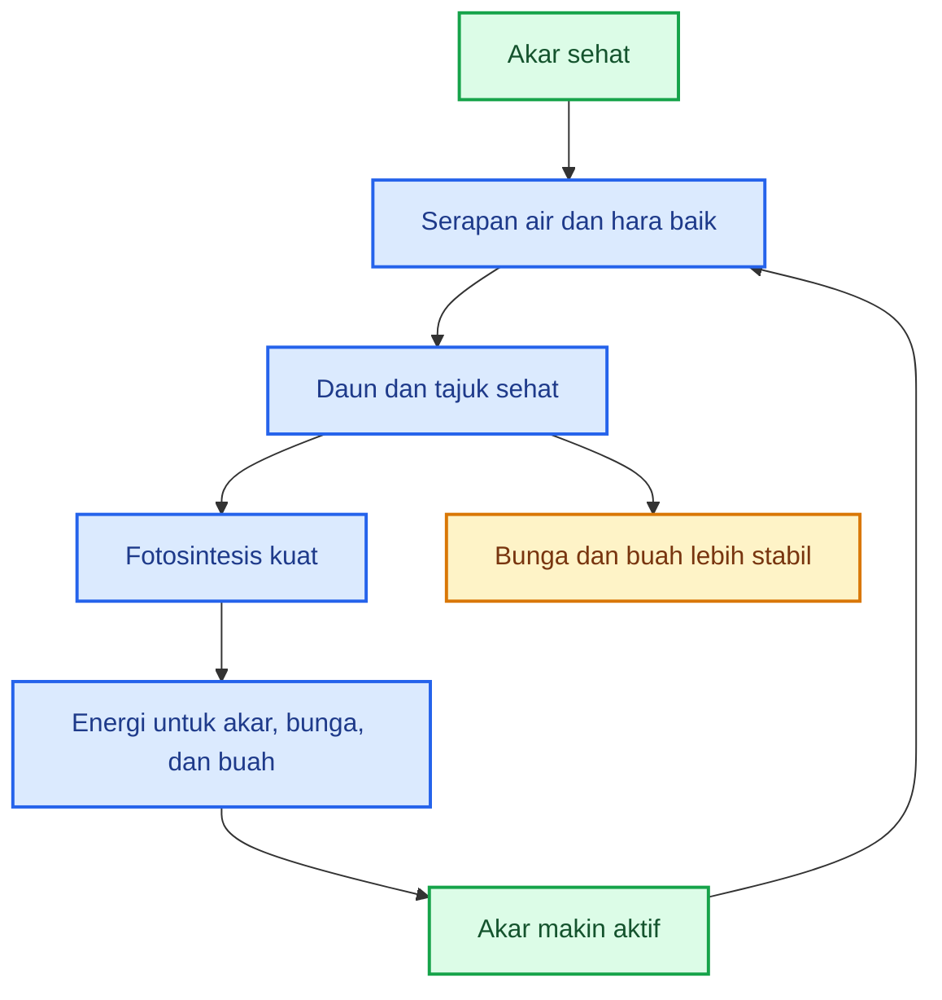
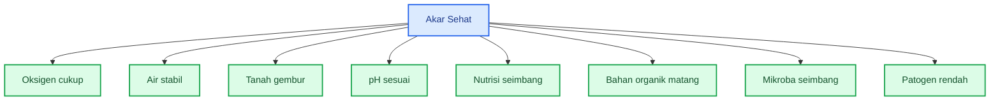
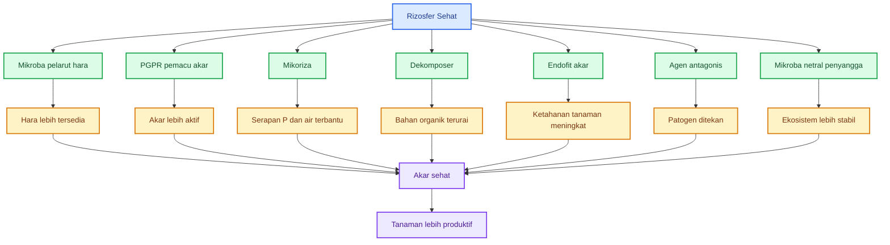
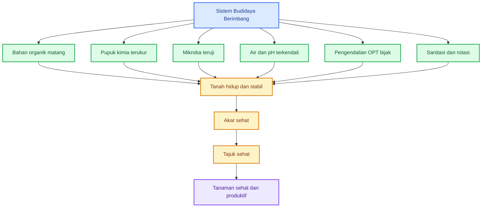
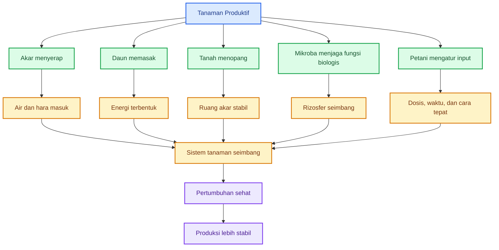
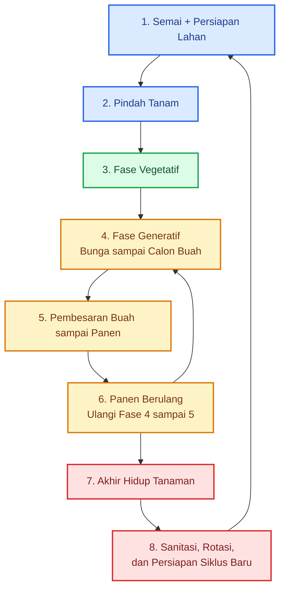
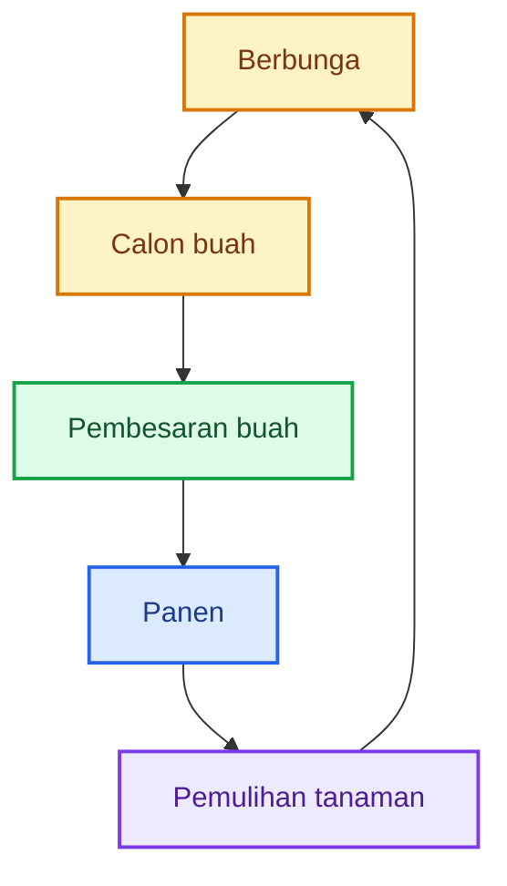
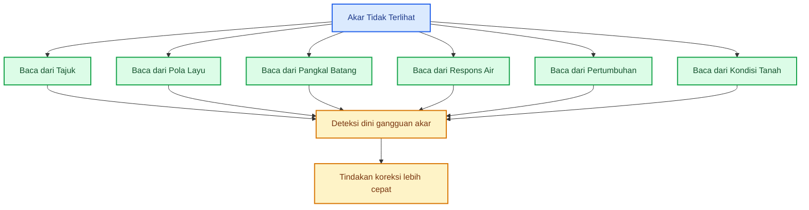
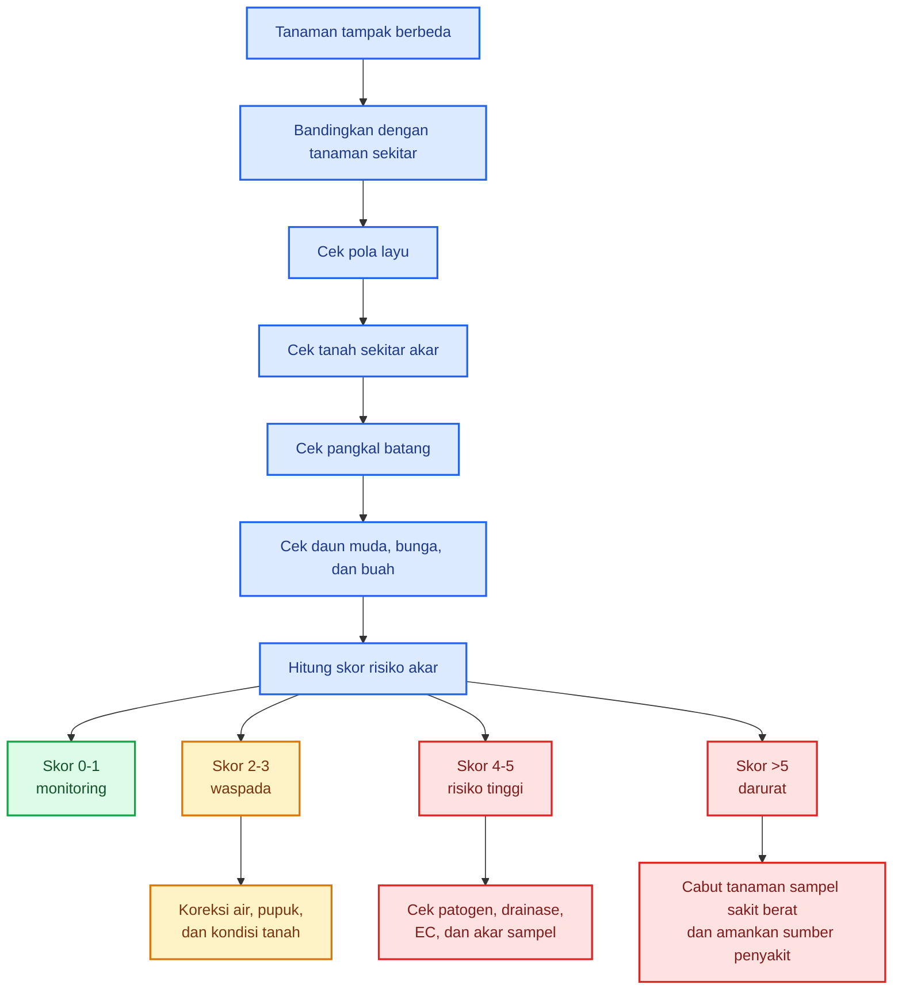

# **_Keseimbangan Akar dan Tajuk: Fondasi Tanaman Sehat, Produktif, dan Tidak Terjebak Tipuan Input_**

---

- [**_Keseimbangan Akar dan Tajuk: Fondasi Tanaman Sehat, Produktif, dan Tidak Terjebak Tipuan Input_**](#keseimbangan-akar-dan-tajuk-fondasi-tanaman-sehat-produktif-dan-tidak-terjebak-tipuan-input)
- [Keseimbangan Akar dan Tajuk: Fondasi Tanaman Sehat, Produktif, dan Tahan Gangguan](#keseimbangan-akar-dan-tajuk-fondasi-tanaman-sehat-produktif-dan-tahan-gangguan)
  - [1. Tanaman Produktif Dimulai dari Akar dan Didukung Tajuk](#1-tanaman-produktif-dimulai-dari-akar-dan-didukung-tajuk)
  - [2. Lingkungan Akar yang Harus Dijaga](#2-lingkungan-akar-yang-harus-dijaga)
    - [Oksigen akar](#oksigen-akar)
    - [Mulsa plastik dan oksigen akar](#mulsa-plastik-dan-oksigen-akar)
    - [Air stabil](#air-stabil)
  - [3. Nutrisi dan Bahan Organik sebagai Penyangga Akar](#3-nutrisi-dan-bahan-organik-sebagai-penyangga-akar)
    - [Nutrisi lengkap, bukan hanya NPK](#nutrisi-lengkap-bukan-hanya-npk)
    - [Bahan organik harus matang](#bahan-organik-harus-matang)
  - [4. Mikroba Menguntungkan Rizosfer, Trichoderma, dan Patogen Akar](#4-mikroba-menguntungkan-rizosfer-trichoderma-dan-patogen-akar)
    - [4.1. Mikroba Pelarut Hara](#41-mikroba-pelarut-hara)
    - [4.2. PGPR: Bakteri Pemacu Pertumbuhan Akar](#42-pgpr-bakteri-pemacu-pertumbuhan-akar)
    - [4.3. Mikoriza: Perpanjangan Serapan Akar](#43-mikoriza-perpanjangan-serapan-akar)
    - [4.4. Dekomposer dan Aktinomiset](#44-dekomposer-dan-aktinomiset)
    - [4.5. Endofit Akar](#45-endofit-akar)
    - [4.6. Agen Antagonis Selain Trichoderma](#46-agen-antagonis-selain-trichoderma)
    - [4.7. Posisi Trichoderma dalam Rizosfer](#47-posisi-trichoderma-dalam-rizosfer)
    - [4.8. Patogen Akar Harus Tetap Ditekan](#48-patogen-akar-harus-tetap-ditekan)
    - [4.9. Rumus Rizosfer Sehat](#49-rumus-rizosfer-sehat)
    - [4.10. Prinsip Praktis Mikroba Rizosfer](#410-prinsip-praktis-mikroba-rizosfer)
    - [4.11. Kesimpulan Bab 4](#411-kesimpulan-bab-4)
  - [5. Tajuk Sehat sebagai Pabrik Energi dan Indikator Masalah](#5-tajuk-sehat-sebagai-pabrik-energi-dan-indikator-masalah)
    - [Tajuk sebagai cermin masalah akar](#tajuk-sebagai-cermin-masalah-akar)
  - [6. Budidaya Berimbang: Tidak Harus 100% Organik](#6-budidaya-berimbang-tidak-harus-100-organik)
  - [7. Jangan Tertipu Input Ajaib](#7-jangan-tertipu-input-ajaib)
  - [8. Rumus, Checklist, dan Penutup Praktis](#8-rumus-checklist-dan-penutup-praktis)
    - [Checklist praktis](#checklist-praktis)
    - [Ringkasan akhir](#ringkasan-akhir)
- [Lampiran 1](#lampiran-1)
  - [Siklus Budidaya Tanaman: Dari Semai, Produksi, Panen Berulang, sampai Persiapan Musim Berikutnya](#siklus-budidaya-tanaman-dari-semai-produksi-panen-berulang-sampai-persiapan-musim-berikutnya)
  - [1. Alur Besar Siklus Tanaman](#1-alur-besar-siklus-tanaman)
  - [2. Saat Semai dan Menyiapkan Lahan](#2-saat-semai-dan-menyiapkan-lahan)
    - [Fokus utama](#fokus-utama)
    - [Perlakuan mikroba](#perlakuan-mikroba)
    - [Perlakuan pupuk](#perlakuan-pupuk)
    - [Perlakuan pestisida](#perlakuan-pestisida)
    - [Titik kritis OPT](#titik-kritis-opt)
  - [3. Saat Pindah Tanam](#3-saat-pindah-tanam)
    - [Fokus utama](#fokus-utama-1)
    - [Perlakuan mikroba](#perlakuan-mikroba-1)
    - [Perlakuan pupuk](#perlakuan-pupuk-1)
    - [Perlakuan pestisida](#perlakuan-pestisida-1)
    - [Titik kritis OPT](#titik-kritis-opt-1)
  - [4. Fase Vegetatif](#4-fase-vegetatif)
    - [Fokus utama](#fokus-utama-2)
    - [Perlakuan mikroba](#perlakuan-mikroba-2)
    - [Perlakuan pupuk](#perlakuan-pupuk-2)
    - [Perlakuan pestisida](#perlakuan-pestisida-2)
    - [Titik kritis OPT](#titik-kritis-opt-2)
  - [5. Fase Generatif: Berbunga sampai Menjadi Calon Buah](#5-fase-generatif-berbunga-sampai-menjadi-calon-buah)
    - [Fokus utama](#fokus-utama-3)
    - [Perlakuan mikroba](#perlakuan-mikroba-3)
    - [Perlakuan pupuk](#perlakuan-pupuk-3)
    - [Perlakuan pestisida](#perlakuan-pestisida-3)
    - [Titik kritis OPT](#titik-kritis-opt-3)
  - [6. Fase Pembesaran Buah sampai Panen](#6-fase-pembesaran-buah-sampai-panen)
    - [Fokus utama](#fokus-utama-4)
    - [Perlakuan mikroba](#perlakuan-mikroba-4)
    - [Perlakuan pupuk](#perlakuan-pupuk-4)
    - [Perlakuan pestisida](#perlakuan-pestisida-4)
    - [Titik kritis OPT](#titik-kritis-opt-4)
  - [7. Tanaman Panen Berulang: Mengulang Fase 4 sampai 6](#7-tanaman-panen-berulang-mengulang-fase-4-sampai-6)
    - [Perlakuan setelah panen](#perlakuan-setelah-panen)
    - [Perlakuan mikroba](#perlakuan-mikroba-5)
    - [Titik kritis OPT](#titik-kritis-opt-5)
  - [8. Akhir Hidup Tanaman dan Persiapan Siklus Baru](#8-akhir-hidup-tanaman-dan-persiapan-siklus-baru)
    - [Fokus utama](#fokus-utama-5)
    - [Perlakuan penting](#perlakuan-penting)
    - [Titik kritis](#titik-kritis)
  - [9. Peta Perlakuan Mikroba, Pupuk Kimia, Pestisida, dan Titik Kritis OPT](#9-peta-perlakuan-mikroba-pupuk-kimia-pestisida-dan-titik-kritis-opt)
  - [10. Rumus Keputusan Input Sepanjang Siklus Tanaman](#10-rumus-keputusan-input-sepanjang-siklus-tanaman)
  - [11. Penutup Lampiran 1](#11-penutup-lampiran-1)
- [Lampiran 2: Deteksi Dini Kesehatan Akar Tanpa Mencabut Tanaman](#lampiran-2-deteksi-dini-kesehatan-akar-tanpa-mencabut-tanaman)
  - [1. Mengapa Akar Sulit Dinilai Secara Langsung?](#1-mengapa-akar-sulit-dinilai-secara-langsung)
  - [2. Ciri Tanaman dengan Akar Sehat dari Tampilan Luar](#2-ciri-tanaman-dengan-akar-sehat-dari-tampilan-luar)
  - [3. Bandingkan dengan Tanaman Tetangga](#3-bandingkan-dengan-tanaman-tetangga)
  - [4. Tanda Awal Akar Mulai Bermasalah](#4-tanda-awal-akar-mulai-bermasalah)
  - [5. Pola Layu: Indikator Paling Cepat](#5-pola-layu-indikator-paling-cepat)
  - [6. Membaca Pangkal Batang Tanpa Mencabut](#6-membaca-pangkal-batang-tanpa-mencabut)
  - [7. Membaca Daun sebagai Cermin Akar](#7-membaca-daun-sebagai-cermin-akar)
  - [8. Membaca Bunga dan Buah](#8-membaca-bunga-dan-buah)
  - [9. Pemeriksaan Tanah di Sekitar Tanaman Tanpa Mencabut](#9-pemeriksaan-tanah-di-sekitar-tanaman-tanpa-mencabut)
  - [10. Skor Deteksi Dini Kesehatan Akar](#10-skor-deteksi-dini-kesehatan-akar)
  - [11. Alur Keputusan Lapang](#11-alur-keputusan-lapang)
  - [12. Tindakan Koreksi Awal Tanpa Mencabut Tanaman](#12-tindakan-koreksi-awal-tanpa-mencabut-tanaman)
    - [Jika tanah terlalu basah](#jika-tanah-terlalu-basah)
    - [Jika tanah terlalu kering](#jika-tanah-terlalu-kering)
    - [Jika diduga EC tinggi atau pupuk terlalu pekat](#jika-diduga-ec-tinggi-atau-pupuk-terlalu-pekat)
    - [Jika diduga patogen akar](#jika-diduga-patogen-akar)
    - [Jika tajuk terlalu rimbun](#jika-tajuk-terlalu-rimbun)
  - [13. Tanaman Sampel dan Tanaman Indikator](#13-tanaman-sampel-dan-tanaman-indikator)
    - [Cara praktis](#cara-praktis)
  - [14. Format Catatan Deteksi Dini](#14-format-catatan-deteksi-dini)
  - [15. Kesimpulan Lampiran 3](#15-kesimpulan-lampiran-3)
- [Lampiran 3: Sumber Mikroba Potensial untuk Pembuatan MOL](#lampiran-3-sumber-mikroba-potensial-untuk-pembuatan-mol)
  - [1. Sumber Mikroba dari Rizosfer Akar](#1-sumber-mikroba-dari-rizosfer-akar)
  - [2. Sumber Mikroba dari Serasah, Humus, Kompos, dan Kascing](#2-sumber-mikroba-dari-serasah-humus-kompos-dan-kascing)
  - [3. Sumber Mikroba dari Fermentasi Pangan](#3-sumber-mikroba-dari-fermentasi-pangan)
  - [4. Sumber Mikroba dari Nasi Basi](#4-sumber-mikroba-dari-nasi-basi)
  - [5. Sumber Mikroba dari Buah Matang dan Kulit Buah](#5-sumber-mikroba-dari-buah-matang-dan-kulit-buah)
  - [6. Sumber Mikroba dari Limbah Hewani Terkontrol](#6-sumber-mikroba-dari-limbah-hewani-terkontrol)
  - [7. Ringkasan Pilihan Sumber Mikroba Berdasarkan Tujuan MOL](#7-ringkasan-pilihan-sumber-mikroba-berdasarkan-tujuan-mol)
  - [8. Rekomendasi Kombinasi Sumber Mikroba MOL](#8-rekomendasi-kombinasi-sumber-mikroba-mol)
    - [MOL Aman dan Serbaguna](#mol-aman-dan-serbaguna)
    - [MOL Rizosfer](#mol-rizosfer)
    - [MOL Fermentasi Cepat](#mol-fermentasi-cepat)
    - [MOL Dekomposer](#mol-dekomposer)
    - [MOL Generatif/Buah](#mol-generatifbuah)
  - [9. Sumber Mikroba yang Sebaiknya Dihindari](#9-sumber-mikroba-yang-sebaiknya-dihindari)
  - [10. Kesimpulan Lampiran](#10-kesimpulan-lampiran)

---

# Keseimbangan Akar dan Tajuk: Fondasi Tanaman Sehat, Produktif, dan Tahan Gangguan

Dalam praktik budidaya, kesehatan tanaman sering dinilai dari bagian yang terlihat: daun hijau, batang kokoh, bunga banyak, atau buah lebat. Padahal, bagian yang paling menentukan justru berada di bawah tanah, yaitu **akar**.

Akar adalah pusat serapan air, hara, oksigen, dan titik temu utama antara tanaman dengan tanah, bahan organik, serta mikroba. Bila akar bekerja baik, tanaman mampu menyerap kebutuhan hidupnya secara stabil. Bila akar terganggu, bagian atas tanaman lambat laun ikut bermasalah, meskipun pupuk cukup atau daun tampak sempat hijau.

Namun tajuk juga tidak bisa diabaikan. Daun adalah pabrik energi melalui fotosintesis. Energi hasil fotosintesis sebagian dikirim kembali ke akar untuk mempertahankan pertumbuhan akar, pembentukan akar rambut, dan aktivitas fisiologis tanaman.

Prinsip besarnya:

> **Tanaman produktif dimulai dari akar sehat, lalu didukung tajuk sehat.**

Artinya, pada fase awal tanam, petani sebaiknya tidak buru-buru mengejar tanaman cepat rimbun. Yang lebih penting adalah memastikan akar aktif lebih dulu. Akar sehat membuat serapan air dan hara berjalan baik. Serapan yang baik mendukung daun sehat. Daun sehat memperkuat fotosintesis. Fotosintesis yang baik menopang bunga dan buah yang lebih stabil.

<ResourceBox
  title="Artikel Terkait:"
  items={[
    {
      name: 'README — Framework Praktis Memulai Bisnis Agribisnis Terpadu di Lahan Gumuk Berlereng',
      href: '/blog/agri/kebon/agribisnis-gumuk/README',
    },
    {
      name: 'Isolasi Mikroba Lokal untuk PGPM dan Agen Pengendali Hayati (APH)',
      href: '/blog/agri/agen-hayati/isolasi-mikroba-lokal',
    },
    {
      name: 'OPT Penggagal Panen pada Cabai Rawit dan Cabai Besar',
      href: '/blog/agri/kebon/pengendalian-opt-cabai',
    },
    {
      name: 'Tipuan Mikroba dalam Pertanian: Trichoderma, PGPR, PGPM, PGPF, MOL, dan JAKABA',
      href: '/blog/agri/agen-hayati/tipuan-mikroba-pertanian',
    },
    {
      name: 'Pedoman lengkap bergambar pengendalian OPT cabai - kutu kebul dan thrips',
      href: '/blog/agri/kebon/pengendalian-kutu-kebul-thrips',
    },
    {
      name: 'Panduan Praktis Pembiakan Trichoderma dari Starter Komersial',
      href: '/blog/agri/agen-hayati/trichoderma-pembiakan',
    },
    {
      name: 'Panduan Praktis Pengembangan Cabai di Desa Gambiran, Banyuwangi',
      href: '/blog/agri/kebon/panduan-pengembangan-cabai',
    },
    {
      name: 'Menanam Cabai dengan Prinsip Pohon Bambu: Akar Kuat, Tanah Hidup, Tanaman Tahan Stres',
      href: '/blog/agri/kebon/budidaya-cabai-prinsip-rumpun-bambu',
    },
    {
      name: 'Panduan Lengkap Pengendalian Lalat Buah di Kebun Campuran',
      href: '/blog/agri/kebon/lalat-buah',
    },
    {
      name: 'README - Pupuk Tepat, Panen Untung - Model Low-Lab untuk Petani Makmur di Gambiran',
      href: '/blog/agri/pupuk-terintegrasi/README',
    },
  ]}
/>

---

## 1. Tanaman Produktif Dimulai dari Akar dan Didukung Tajuk

Akar dan tajuk bukan dua bagian yang terpisah. Keduanya saling menguatkan.

Pada awal budidaya, akar lebih utama karena tanaman masih membangun fondasi. Akar harus mampu menembus media, membentuk akar rambut, pulih dari stres pindah tanam, dan mulai menyerap air serta hara.

Setelah tajuk berkembang, daun mulai berperan besar. Daun menghasilkan fotosintat atau energi, lalu sebagian energi itu dikirim kembali ke akar. Jadi hubungan lengkapnya adalah:




Pada fase awal tanam, jangan memaksa tanaman cepat rimbun sebelum akar siap menopang. Fokus awal sebaiknya diarahkan pada:

- media semai bersih;
- akar bibit putih, segar, dan aktif;
- lubang tanam siap;
- tanah gembur;
- air cukup tetapi tidak becek;
- pupuk tidak terlalu pekat;
- kompos matang;
- patogen akar ditekan sejak awal.

Jika akar lemah sejak awal, efeknya sering terbawa sampai fase produksi. Tanaman mungkin tetap hidup, tetapi pertumbuhannya tertahan. Ketika masuk fase bunga dan buah, masalah mulai terlihat: bunga mudah rontok, buah sedikit, tanaman mudah layu, dan respons pupuk tidak maksimal.

> **Jangan memaksa tajuk tumbuh cepat sebelum akar siap menopang.**

---

## 2. Lingkungan Akar yang Harus Dijaga

Akar sehat bukan hanya membutuhkan pupuk. Akar membutuhkan lingkungan tanah yang seimbang.

Syarat utama akar sehat:

1. oksigen cukup;
2. air stabil;
3. tanah gembur;
4. pH sesuai;
5. nutrisi seimbang;
6. EC atau kepekatan larutan tanah tidak berlebihan;
7. bahan organik matang;
8. mikroba tanah seimbang;
9. tekanan patogen rendah;
10. suhu tanah tidak ekstrem;
11. ruang tumbuh akar cukup.



### Oksigen akar

Akar juga bernapas. Tanah terlalu padat atau terlalu basah membuat pori udara tertutup air. Akibatnya, oksigen akar turun. Tanaman bisa layu walau tanah masih basah karena akar tidak mampu bekerja normal.

Tanda akar kekurangan oksigen:

- tanaman layu walau tanah basah;
- akar cokelat;
- akar rambut sedikit;
- daun menguning;
- pangkal batang mudah busuk;
- penyakit akar meningkat.

> **Tanah lembap itu baik, tetapi tanah becek terus-menerus merusak akar.**

### Mulsa plastik dan oksigen akar

Mulsa plastik tidak otomatis membuat akar kekurangan oksigen. Oksigen masih bisa masuk melalui lubang tanam, sisi bedengan, celah pinggir mulsa, pori tanah, dan retakan kecil tanah.

Masalah muncul bila mulsa dipasang pada tanah yang padat, becek, bedengan rendah, atau drainase buruk.

Syarat aman memakai mulsa:

- bedengan cukup tinggi;
- tanah gembur sebelum ditutup;
- parit antarbedeng lancar;
- lubang tanam tidak tertutup lumpur;
- bahan organik sudah matang;
- penyiraman tidak berlebihan.

> **Mulsa aman untuk akar jika tanah tetap berpori dan air tidak menggenang.**

### Air stabil

Akar membutuhkan air untuk menyerap hara. Tetapi air berlebihan mengusir oksigen dari pori tanah. Kekeringan ekstrem lalu disiram berlebihan juga membuat tanaman stres.

Dampak air tidak stabil:

- bunga rontok;
- buah pecah;
- kalsium sulit terserap;
- tanaman mudah layu;
- ukuran buah tidak seragam;
- penyakit akar meningkat.

Cara sederhana mengecek kelembapan:

| Kondisi tanah saat digenggam           | Makna praktis             |
| -------------------------------------- | ------------------------- |
| Hancur seperti debu                    | Terlalu kering            |
| Menggumpal ringan tetapi tidak menetes | Cukup lembap              |
| Lengket, berat, atau menetes           | Terlalu basah             |
| Bau busuk atau asam menyengat          | Risiko anaerob/pembusukan |

> **Akar sehat membutuhkan air yang cukup dan stabil, bukan genangan.**

---

## 3. Nutrisi dan Bahan Organik sebagai Penyangga Akar

Tanaman membutuhkan nutrisi, tetapi pupuk banyak belum tentu benar. Nutrisi yang baik adalah nutrisi yang tersedia, bisa diserap, sesuai fase tanaman, dan tidak merusak akar.

Sebelum menambah pupuk, tanyakan:

> **Apakah pupuknya kurang, atau akarnya tidak mampu menyerap?**


### Nutrisi lengkap, bukan hanya NPK

| Unsur              | Fungsi utama                                    |
| ------------------ | ----------------------------------------------- |
| **N / Nitrogen**   | pertumbuhan daun, tunas, dan vegetatif          |
| **P / Fosfor**     | akar, energi, pembungaan awal                   |
| **K / Kalium**     | kualitas buah, ketahanan stres, pengisian hasil |
| **Ca / Kalsium**   | dinding sel, akar muda, pucuk, kualitas buah    |
| **Mg / Magnesium** | klorofil dan fotosintesis                       |
| **S / Sulfur**     | pembentukan protein dan metabolisme             |
| **B / Boron**      | titik tumbuh, bunga, buah, pembelahan sel       |
| **Zn / Seng**      | hormon pertumbuhan dan enzim                    |
| **Fe / Besi**      | pembentukan klorofil                            |
| **Mn / Mangan**    | enzim dan fotosintesis                          |

Kebutuhan nutrisi berubah menurut fase tanaman:

| Fase tanaman        | Fokus nutrisi                             |
| ------------------- | ----------------------------------------- |
| **Bibit**           | akar sehat, fosfor cukup, EC tidak tinggi |
| **Vegetatif awal**  | nitrogen cukup, Ca-Mg seimbang            |
| **Menjelang bunga** | fosfor, kalium, kalsium, boron, seng      |
| **Pembesaran buah** | kalium, kalsium, magnesium, air stabil    |
| **Panen berulang**  | suplai hara bertahap dan konsisten        |

Contoh ketidakseimbangan:

| Ketidakseimbangan     | Dampak praktis                             |
| --------------------- | ------------------------------------------ |
| **N berlebihan**      | tanaman terlalu rimbun, bunga mudah rontok |
| **K berlebihan**      | serapan Mg dan Ca bisa terganggu           |
| **P berlebihan**      | Zn bisa terkunci                           |
| **Ca kurang**         | pucuk, akar muda, dan buah bermasalah      |
| **Mg kurang**         | daun tua menguning                         |
| **EC terlalu tinggi** | akar stres, tepi daun kering               |

```mdx
Nutrisi efektif = hara tersedia + akar aktif + pH sesuai + air stabil + dosis aman
```

> **Pupuk yang baik bukan yang paling banyak, tetapi yang paling tepat diserap tanaman.**

### Bahan organik harus matang

Bahan organik penting untuk struktur tanah dan kehidupan mikroba. Tetapi bahan organik harus matang.

Manfaat bahan organik matang:

- tanah lebih gembur;
- pori udara membaik;
- air lebih stabil;
- mikroba punya habitat;
- hara dilepas perlahan;
- akar lebih nyaman tumbuh.

Bahan organik mentah atau belum matang dapat menghasilkan panas, amonia, gas, dan patogen. Jika diletakkan dekat akar muda, bahan seperti ini bisa merusak akar.

| Kondisi bahan organik         | Status untuk akar |
| ----------------------------- | ----------------- |
| Tidak panas, remah, bau tanah | Lebih aman        |
| Masih panas                   | Jangan dekat akar |
| Bau amonia tajam              | Berisiko          |
| Bau busuk/got                 | Tolak             |
| Banyak belatung               | Sanitasi buruk    |
| Berlendir                     | Risiko pembusukan |
| Masih terlihat bahan segar    | Belum matang      |

> **Bahan organik matang membangun akar; bahan organik mentah bisa merusak akar.**

---

## 4. Mikroba Menguntungkan Rizosfer, Trichoderma, dan Patogen Akar

Rizosfer adalah zona tanah yang langsung dipengaruhi oleh akar. Di wilayah inilah akar melepaskan eksudat berupa gula, asam organik, asam amino, dan senyawa lain yang menjadi sumber makanan bagi mikroba. Karena itu, rizosfer bukan sekadar tempat akar menyerap hara, tetapi juga tempat terjadinya kerja sama dan persaingan mikroba.

Kesalahan umum dalam praktik pertanian adalah menyederhanakan mikroba akar hanya menjadi Trichoderma. Padahal, akar sehat didukung oleh banyak kelompok mikroba fungsional. Trichoderma memang penting, tetapi ia hanya salah satu bagian dari komunitas rizosfer.



### 4.1. Mikroba Pelarut Hara

Sebagian unsur hara di tanah tidak langsung tersedia bagi akar. Fosfor, kalium, besi, seng, dan beberapa unsur mikro bisa berada dalam bentuk yang sulit diserap. Di sinilah mikroba pelarut hara berperan.

Kelompok ini dapat membantu melalui produksi asam organik, enzim, atau senyawa lain yang membuat hara lebih mudah tersedia.

Contoh fungsi:

| Kelompok fungsi             | Peran untuk akar                           |
| --------------------------- | ------------------------------------------ |
| Mikroba pelarut fosfat      | membantu membuat P lebih tersedia          |
| Mikroba pelarut kalium      | membantu pelepasan K dari mineral tertentu |
| Mikroba penghasil siderofor | membantu kompetisi dan ketersediaan Fe     |
| Mikroba penghasil enzim     | membantu pelepasan hara dari bahan organik |

Catatan penting: mikroba pelarut hara bukan pengganti pupuk sepenuhnya. Ia membantu efisiensi serapan, tetapi tetap membutuhkan tanah, pH, air, bahan organik, dan nutrisi dasar yang mendukung.

### 4.2. PGPR: Bakteri Pemacu Pertumbuhan Akar

PGPR atau _Plant Growth Promoting Rhizobacteria_ adalah bakteri di sekitar akar yang dapat membantu pertumbuhan tanaman. Contohnya dapat berasal dari kelompok **Bacillus**, **Pseudomonas**, **Azospirillum**, **Azotobacter**, dan beberapa genus lain.

Fungsi PGPR dapat meliputi:

- membantu pertumbuhan akar;
- merangsang pembentukan akar rambut;
- menghasilkan senyawa mirip hormon tumbuh;
- membantu pelarutan hara;
- menghasilkan siderofor;
- berkompetisi dengan patogen;
- mendukung ketahanan tanaman terhadap stres.

Namun, PGPR juga harus diperlakukan hati-hati. Tidak semua bakteri dengan nama genus yang sama otomatis aman dan efektif. Yang menentukan adalah **spesies, strain, dosis, dan hasil uji**.

### 4.3. Mikoriza: Perpanjangan Serapan Akar

Mikoriza, terutama AMF atau _arbuscular mycorrhizal fungi_, adalah jamur simbion akar yang membantu memperluas wilayah serapan tanaman. Mikoriza sangat penting untuk membantu serapan fosfor, air, dan beberapa unsur mikro.

Peran mikoriza:

- memperluas jangkauan serapan akar;
- membantu serapan fosfor;
- membantu tanaman menghadapi kekeringan ringan;
- memperbaiki agregasi tanah;
- mendukung keseimbangan rizosfer.

Namun mikoriza juga sensitif. Aplikasi fosfor berlebihan, fungisida keras, tanah terlalu becek, atau dominasi mikroba antagonis tertentu bisa mengganggu kolonisasi mikoriza.

Karena itu, Trichoderma dan mikoriza sebaiknya tidak asal dicampur tanpa uji kompatibilitas.

### 4.4. Dekomposer dan Aktinomiset

Dekomposer berperan menguraikan bahan organik menjadi bentuk yang lebih stabil dan lebih bermanfaat bagi tanah. Kelompok ini meliputi bakteri pengurai, jamur saprofit, dan aktinomiset seperti beberapa **Streptomyces**.

Fungsi utama:

- menguraikan kompos dan sisa organik;
- membantu pembentukan humus;
- melepas hara perlahan;
- memperbaiki struktur tanah;
- mendukung kehidupan mikroba lain.

Namun bahan organik yang belum matang tetap berisiko. Mikroba dekomposer bekerja baik bila bahan organik sudah dikelola dengan benar, bukan dalam kondisi busuk, panas, atau anaerob.

### 4.5. Endofit Akar

Endofit adalah mikroba yang hidup di dalam jaringan tanaman tanpa langsung menimbulkan penyakit. Beberapa endofit dapat membantu tanaman dalam menghadapi stres, meningkatkan ketahanan, atau mendukung pertumbuhan.

Fungsi potensial endofit:

- membantu ketahanan tanaman;
- mendukung toleransi stres;
- berperan dalam keseimbangan internal tanaman;
- membantu kompetisi terhadap patogen tertentu.

Namun endofit adalah wilayah yang lebih kompleks. Untuk praktik lapang, jangan memperbanyak endofit liar tanpa identifikasi dan uji keamanan.

### 4.6. Agen Antagonis Selain Trichoderma

Trichoderma bukan satu-satunya agen antagonis. Beberapa mikroba lain juga dapat membantu menekan patogen akar.

Contoh:

| Kelompok                    | Fungsi potensial                                           |
| --------------------------- | ---------------------------------------------------------- |
| **Bacillus tertentu**       | antibiosis, kompetisi, pembentukan biofilm, ketahanan akar |
| **Pseudomonas fluorescens** | siderofor, kompetisi, penekanan patogen tertentu           |
| **Streptomyces tertentu**   | antibiosis dan dekomposisi                                 |
| **Mikoriza**                | membantu akar lebih kuat dan toleran                       |
| **Trichoderma**             | antagonis jamur patogen tanah tertentu                     |

Tetapi prinsipnya sama:

> **Mikroba berguna bila tepat fungsi, tepat strain, tepat dosis, dan tepat kondisi.**

### 4.7. Posisi Trichoderma dalam Rizosfer

Trichoderma tetap penting, tetapi posisinya harus proporsional. Ia berguna terutama sebagai penjaga zona akar dari beberapa penyakit tular tanah seperti:

- Fusarium;
- Phytophthora;
- Rhizoctonia;
- Pythium;
- beberapa penyebab busuk akar dan rebah semai.

Namun Trichoderma tidak boleh menjadi mikroba dominan yang dibanjiri terus-menerus tanpa alasan. Sifatnya yang kompetitif dapat membantu menekan patogen, tetapi bila berlebihan bisa berpotensi mengganggu jamur menguntungkan lain.

Dosis praktis tetap perlu dipertahankan:

| Kondisi     |                    Dosis |
| ----------- | -----------------------: |
| Rendah      |  5–10 g/tanaman/aplikasi |
| Normal      | 10–20 g/tanaman/aplikasi |
| Tinggi      | 20–30 g/tanaman/aplikasi |
| Total musim |    20–60 g/tanaman/musim |

```mdx
Kebutuhan Trichoderma (kg) = (Jumlah tanaman × dosis per tanaman dalam gram) / 1000
```

Contoh:

```mdx
Kebutuhan = (20.000 × 10) / 1000
Kebutuhan = 200 kg per aplikasi
```

Jika aplikasi dilakukan dua kali:

```mdx
Total kebutuhan musim = 200 kg × 2
Total kebutuhan musim = 400 kg
```

Pesan penting:

> **Trichoderma adalah alat bantu kesehatan akar, bukan pusat seluruh ekosistem rizosfer.**

### 4.8. Patogen Akar Harus Tetap Ditekan

Mikroba menguntungkan tidak akan bekerja maksimal bila tekanan patogen terlalu tinggi. Patogen akar berkembang lebih cepat pada tanah becek, padat, drainase buruk, banyak sisa tanaman sakit, dan bahan organik belum matang.

Patogen akar penting:

- Fusarium;
- Phytophthora;
- Rhizoctonia;
- Pythium;
- Sclerotium;
- nematoda;
- bakteri layu.

Tanaman sakit berat sebaiknya dicabut dan dibuang aman. Jangan dibuang ke parit, jangan dijadikan kompos mentah, dan jangan dibiarkan menjadi sumber penyakit.

### 4.9. Rumus Rizosfer Sehat

```mdx
Rizosfer sehat = akar aktif + bahan organik matang + air stabil + oksigen cukup + mikroba fungsional beragam + patogen terkendali
```

Atau lebih praktis:

```mdx
Kesehatan akar = lingkungan akar × mikroba fungsional × nutrisi tersedia × tekanan patogen rendah
```

Tanda kali `×` penting. Bila salah satu faktor sangat buruk, hasil akhirnya ikut turun.

### 4.10. Prinsip Praktis Mikroba Rizosfer

| Tujuan                   | Mikroba yang relevan                        | Catatan praktis                |
| ------------------------ | ------------------------------------------- | ------------------------------ |
| Meningkatkan serapan P   | mikoriza, bakteri pelarut fosfat            | jangan berlebihan pupuk P      |
| Mendukung akar muda      | PGPR teruji                                 | pilih strain/produk jelas      |
| Menekan patogen tanah    | Trichoderma, Bacillus, Pseudomonas tertentu | gunakan sesuai target penyakit |
| Mengurai bahan organik   | dekomposer, aktinomiset                     | bahan organik harus matang     |
| Menjaga stabilitas tanah | komunitas mikroba beragam                   | jangan dominasi satu mikroba   |
| Menekan stres akar       | mikoriza, PGPR, bahan organik matang        | tetap perlu air dan pH sesuai  |

### 4.11. Kesimpulan Bab 4

Rizosfer sehat bukan hanya soal Trichoderma. Akar sehat ditopang oleh banyak kelompok mikroba: pelarut hara, PGPR, mikoriza, dekomposer, endofit, aktinomiset, dan agen antagonis. Trichoderma tetap berguna, tetapi harus dipakai terukur agar tidak mendominasi dan merusak keseimbangan.

Pesan kunci:

> **Mikroba akar yang baik bukan satu jenis yang mendominasi, tetapi komunitas fungsional yang membantu serapan hara, pertumbuhan akar, perlindungan, dan stabilitas tanah.**

---

## 5. Tajuk Sehat sebagai Pabrik Energi dan Indikator Masalah

Akar adalah fondasi, tetapi daun adalah pabrik energi. Daun melakukan fotosintesis dan menghasilkan karbohidrat. Energi ini dikirim ke akar, batang, daun muda, bunga, buah, dan sebagian mendukung aktivitas rizosfer.

Bila daun rusak, akar juga melemah karena pasokan energi turun.

Penyebab tajuk melemah:

- hama;
- penyakit daun;
- defisiensi hara;
- pestisida berlebihan;
- pemangkasan berlebihan;
- kekeringan;
- stres panas;
- tajuk terlalu rimbun dan lembap.

Tajuk sehat bukan berarti terlalu rimbun. Tajuk sehat berarti daun cukup aktif, mendapat cahaya, tidak rusak berat, sirkulasi udara baik, dan fotosintesis berjalan.

> **Akar menopang daun, tetapi daun memberi energi kembali kepada akar.**

### Tajuk sebagai cermin masalah akar

Bagian atas tanaman sering menjadi indikator masalah bawah tanah.

| Gejala di Atas Tanah | Kemungkinan Masalah Akar/Tanah              |
| -------------------- | ------------------------------------------- |
| Layu siang hari      | akar rusak, tanah panas, air tidak terserap |
| Daun kuning          | akar lemah, hara kurang, pH tidak sesuai    |
| Bunga rontok         | stres air, nutrisi tidak seimbang           |
| Buah kecil           | serapan K, Ca, Mg kurang                    |
| Tanaman kerdil       | tanah padat, akar terbatas, patogen         |
| Tepi daun kering     | EC tinggi, stres garam                      |
| Pucuk lemah          | Ca/B terganggu, akar muda rusak             |

Jangan langsung mengobati gejala tanpa mencari sumber. Daun kuning tidak selalu berarti pupuk kurang. Tanaman layu tidak selalu berarti kurang air. Bunga rontok tidak selalu butuh hormon. Periksa akar, tanah, air, nutrisi, dan patogen.

> **Tajuk adalah layar monitor; akar adalah mesin di bawah tanah.**

---

## 6. Budidaya Berimbang: Tidak Harus 100% Organik

Tanaman produktif tidak harus 100% organik. Yang paling penting adalah sistem budidaya sehat, terukur, dan tidak merusak akar maupun tanah.

Pendekatan realistis adalah **semi-organik, organik-terpadu, atau pertanian berimbang**. Artinya:

- bahan organik dipakai untuk membangun tanah;
- mikroba teruji dipakai untuk menjaga fungsi biologis;
- pupuk kimia terukur dipakai untuk memberi presisi nutrisi;
- air, pH, sanitasi, dan pengendalian OPT dijaga agar sistem stabil.



Prinsipnya:

**Organik membangun tanah.**
**Kimia terukur memberi presisi nutrisi.**
**Mikroba menjaga fungsi biologis.**
**Air, pH, dan sanitasi menentukan kestabilan sistem.**

| Pendekatan ekstrem                      | Risiko                                      |
| --------------------------------------- | ------------------------------------------- |
| 100% organik tanpa hitungan hara        | defisiensi, produksi rendah, koreksi lambat |
| Kimia intensif tanpa bahan organik      | tanah keras, akar lemah, mikroba turun      |
| Mikroba berlebihan tanpa nutrisi        | tanaman tetap kekurangan hara               |
| Pupuk banyak tanpa akar sehat           | pupuk tidak terserap optimal                |
| Anti-pestisida total tanpa strategi OPT | hama/penyakit bisa meledak                  |
| Pestisida berlebihan                    | tajuk stres, musuh alami turun, biaya naik  |

> **Target terbaik bukan anti-kimia, tetapi mengurangi ketergantungan kimia dengan memperbaiki tanah.**

---

## 7. Jangan Tertipu Input Ajaib

Tanaman sehat bukan hasil dari satu input ajaib. Tidak ada satu pupuk, mikroba, hormon, fermentasi, pestisida nabati, atau produk organik yang bisa menyelesaikan semua masalah tanaman.

Klaim yang perlu dicurigai:

- “bisa untuk semua tanaman”;
- “mengatasi semua penyakit”;
- “semakin banyak semakin bagus”;
- “100% alami pasti aman”;
- “mikroba lokal pasti lebih unggul”;
- “cukup kocor, semua selesai”;
- “tidak perlu pupuk lain”;
- “tidak perlu pengendalian hama lagi”.

Input yang baik harus jelas:

| Syarat     | Pertanyaan praktis                                                  |
| ---------- | ------------------------------------------------------------------- |
| **Fungsi** | Input ini untuk apa? akar, daun, bunga, buah, tanah, atau penyakit? |
| **Dosis**  | Berapa gram/ml/liter per tanaman atau per hektare?                  |
| **Target** | Masalah apa yang ingin dikoreksi?                                   |
| **Hasil**  | Apa indikator keberhasilannya?                                      |

Contoh membaca klaim:

| Input       | Klaim kabur                 | Klaim lebih masuk akal                                          |
| ----------- | --------------------------- | --------------------------------------------------------------- |
| Mikroba     | menyuburkan semua tanaman   | membantu rizosfer dan menekan patogen tanah tertentu            |
| Pupuk       | membuat tanaman cepat besar | menambah N pada fase vegetatif dengan dosis tertentu            |
| Kalsium     | memperkuat semua tanaman    | membantu jaringan muda dan kualitas buah bila serapan mendukung |
| Trichoderma | mengobati semua penyakit    | membantu menekan penyakit tular tanah tertentu                  |
| MOL         | pupuk hayati lengkap        | kultur campuran yang perlu diuji kecil dulu                     |

> **Tanaman produktif bukan hasil mantra input, tetapi hasil sistem budidaya yang seimbang.**

---

## 8. Rumus, Checklist, dan Penutup Praktis

Gunakan rumus sederhana berikut:

```mdx
Tanaman sehat = akar aktif + daun produktif + hara seimbang + air stabil + mikroba seimbang + patogen terkendali
```

Rumus kedua:

```mdx
Produktivitas = kesehatan akar × kemampuan fotosintesis × ketersediaan nutrisi × stabilitas lingkungan
```

Tanda kali `×` penting. Jika salah satu faktor sangat rendah, produktivitas ikut jatuh.

Contoh:

- akar bagus tetapi daun rusak berat → hasil turun;
- daun sehat tetapi akar busuk → hasil turun;
- pupuk lengkap tetapi air tidak stabil → hasil turun;
- mikroba banyak tetapi patogen tinggi → hasil turun;
- nutrisi tersedia tetapi pH salah → hasil turun;
- varietas unggul tetapi tanah buruk → hasil turun.

### Checklist praktis

```mdx
[ ] Tanah tidak becek terlalu lama
[ ] Drainase baik
[ ] Bedengan cukup tinggi
[ ] Tanah gembur dan tidak padat
[ ] Bahan organik matang
[ ] pH tanah sesuai
[ ] Pupuk tidak terlalu pekat
[ ] Pupuk kimia tidak menempel langsung pada akar muda
[ ] Air tersedia stabil
[ ] Tidak ada genangan
[ ] Mikroba teruji digunakan secara terukur
[ ] Tidak ada fermentasi busuk
[ ] Tanaman sakit dicabut dan dibuang aman
[ ] Akar bibit putih, segar, dan aktif
[ ] Tajuk cukup sehat untuk fotosintesis
```

### Ringkasan akhir

| Komponen          | Fungsi utama                                      |
| ----------------- | ------------------------------------------------- |
| **Akar**          | menyerap air dan hara                             |
| **Daun**          | menghasilkan energi melalui fotosintesis          |
| **Tanah**         | menyediakan ruang, air, udara, dan penyangga hara |
| **Bahan organik** | memperbaiki struktur dan habitat mikroba          |
| **Mikroba**       | menjaga fungsi biologis dan membantu rizosfer     |
| **Nutrisi**       | menyediakan bahan baku pertumbuhan                |
| **Air**           | menggerakkan hara dan menjaga metabolisme         |
| **Petani**        | mengatur agar sistem tidak ekstrem                |



Tanaman sehat adalah hasil kerja sama akar dan tajuk. Akar menyerap air dan hara. Daun memasak energi melalui fotosintesis. Tanah menyediakan ruang hidup bagi akar dan mikroba. Mikroba menjaga fungsi biologis tanah. Petani mengatur agar semua faktor tidak ekstrem.

Kalimat penutup:

> **Tanaman produktif lahir dari keseimbangan bawah tanah dan atas tanah: akar mampu menyerap, daun mampu memasak, tanah mampu menopang, dan petani mampu mengelola input secara terukur.**

---

# Lampiran 1

## Siklus Budidaya Tanaman: Dari Semai, Produksi, Panen Berulang, sampai Persiapan Musim Berikutnya

Lampiran ini melengkapi pembahasan utama tentang **keseimbangan akar dan tajuk**. Jika artikel utama menjelaskan prinsip bahwa tanaman produktif lahir dari akar sehat, tajuk aktif, tanah stabil, mikroba seimbang, dan input terukur, maka lampiran ini menjabarkan **kapan perlakuan itu dilakukan dalam siklus hidup tanaman**.

Tujuannya adalah agar praktisi tidak hanya memahami konsep, tetapi juga bisa membaca fase tanaman: kapan akar dibangun, kapan tajuk dijaga, kapan bunga dilindungi, kapan buah diperbesar, kapan tanaman dipulihkan setelah panen, dan kapan lahan harus dibersihkan untuk memulai siklus baru.

Prinsip dasarnya:

```mdx
Siklus tanaman sehat = persiapan awal baik + akar aktif + tajuk produktif + hara seimbang + OPT terkendali + sanitasi berulang
```

---

## 1. Alur Besar Siklus Tanaman

Siklus budidaya tanaman dapat dibaca dalam beberapa fase utama:

1. saat semai dan menyiapkan lahan;
2. saat pindah tanam;
3. fase vegetatif;
4. fase generatif, dari berbunga sampai calon buah;
5. fase pembesaran buah sampai panen;
6. fase panen berulang, yaitu mengulang fase bunga sampai panen;
7. akhir hidup tanaman;
8. persiapan kembali ke siklus baru.



---

## 2. Saat Semai dan Menyiapkan Lahan

Fase ini menentukan fondasi akar. Kesalahan pada fase semai dan persiapan lahan sering terbawa sampai panen.

### Fokus utama

- media semai bersih;
- akar bibit putih, aktif, dan tidak busuk;
- tanah atau lahan gembur;
- bahan organik sudah matang;
- pH mulai dikoreksi;
- drainase disiapkan;
- sumber patogen tanah ditekan sejak awal.

### Perlakuan mikroba

Mikroba yang relevan:

- **PGPR teruji** untuk mendukung akar muda;
- **mikoriza** bila sistem dan komoditas cocok;
- **Trichoderma terukur** untuk pencegahan patogen tanah;
- dekomposer digunakan untuk proses kompos, bukan untuk bahan organik mentah langsung ke akar.

Catatan penting:

> **Mikroba sebaiknya diberikan pada media atau lahan yang sudah siap, bukan pada bahan organik busuk atau tanah becek.**

### Perlakuan pupuk

- Gunakan pupuk dasar secara terukur.
- Koreksi pH bila perlu dengan kapur atau dolomit.
- Gunakan kompos matang atau pupuk kandang matang.
- Hindari pupuk kimia pekat pada media semai.
- Fosfor cukup penting untuk akar awal, tetapi jangan berlebihan.

### Perlakuan pestisida

Gunakan prinsip pencegahan:

- sanitasi media;
- tray bersih;
- naungan dan sirkulasi baik;
- perangkap kuning atau biru bila perlu;
- pestisida kimia hanya jika ada risiko nyata atau serangan teridentifikasi.

### Titik kritis OPT

| OPT kritis                | Risiko                       |
| ------------------------- | ---------------------------- |
| Rebah semai / damping-off | bibit roboh dan mati cepat   |
| Pythium / Rhizoctonia     | akar dan pangkal bibit rusak |
| Thrips / kutu kebul       | membawa virus sejak bibit    |
| Nematoda di lahan         | akar rusak sejak awal        |
| Gulma awal                | pesaing hara dan tempat OPT  |

---

## 3. Saat Pindah Tanam

Pindah tanam adalah fase stres. Akar harus beradaptasi dari media semai ke tanah atau lahan produksi.

### Fokus utama

- akar tidak rusak;
- lubang tanam tidak becek;
- tanah cukup lembap;
- pupuk tidak menempel langsung pada akar muda;
- mikroba ditempatkan di zona akar;
- tanaman tidak langsung dipaksa tumbuh rimbun.

### Perlakuan mikroba

- Trichoderma dapat diberikan di sekitar lubang tanam, tetapi campur dengan tanah halus atau kompos matang.
- PGPR dapat diberikan sebagai kocor ringan bila produk atau isolat jelas.
- Mikoriza, bila digunakan, sebaiknya dekat akar muda.
- Jangan mencampur mikoriza atau Trichoderma dengan fungisida keras tanpa jeda dan tanpa uji kompatibilitas.

### Perlakuan pupuk

- Gunakan starter ringan.
- Hindari dosis tinggi N atau KCl langsung dekat akar.
- Bila perlu kocor, gunakan konsentrasi rendah.
- Prioritasnya adalah pemulihan akar, bukan mengejar tajuk rimbun.

### Perlakuan pestisida

- Lindungi tanaman muda dari vektor virus.
- Jangan menyemprot berlebihan sampai tanaman stres.
- Bila memakai agen hayati, beri jarak dengan fungisida kimia keras.

### Titik kritis OPT

| OPT kritis          | Risiko                        |
| ------------------- | ----------------------------- |
| Kutu kebul          | penular virus kuning/keriting |
| Thrips              | daun muda rusak, vektor virus |
| Rebah/pangkal busuk | tanaman gagal adaptasi        |
| Ulat tanah          | bibit putus                   |
| Nematoda            | akar muda rusak               |

---

## 4. Fase Vegetatif

Fase vegetatif adalah fase membangun akar, batang, cabang, dan daun produktif. Namun vegetatif tidak boleh berlebihan.

### Fokus utama

- akar memperluas jelajah;
- tajuk tumbuh seimbang;
- daun cukup aktif;
- tanaman tidak terlalu rimbun;
- nitrogen cukup tetapi tidak berlebihan;
- Ca dan Mg tetap dijaga.

### Perlakuan mikroba

- PGPR bisa membantu aktivitas akar.
- Trichoderma dapat diberikan susulan bila ada riwayat patogen tanah.
- Jangan membanjiri mikroba tanpa alasan.
- Jangan mencampur semua mikroba dalam satu aplikasi tanpa uji kompatibilitas.

### Perlakuan pupuk

- N dibutuhkan, tetapi jangan berlebihan.
- Seimbangkan dengan P, K, Ca, dan Mg.
- Mulai perhatikan unsur mikro seperti Zn dan B.
- Jaga EC agar tidak terlalu tinggi.

### Perlakuan pestisida

- Monitoring hama daun harus rutin.
- Gunakan pengendalian terpadu: sanitasi, perangkap, musuh alami, dan pestisida selektif bila perlu.
- Rotasi bahan aktif bila harus memakai pestisida kimia.

### Titik kritis OPT

| OPT kritis            | Risiko                               |
| --------------------- | ------------------------------------ |
| Thrips                | daun keriting, pertumbuhan terganggu |
| Kutu kebul            | virus, daun menguning/keriting       |
| Aphid/kutu daun       | vektor virus dan melemahkan pucuk    |
| Tungau                | daun rusak, fotosintesis turun       |
| Bercak daun           | tajuk melemah                        |
| Layu Fusarium/bakteri | tanaman mati sebelum produksi        |

---

## 5. Fase Generatif: Berbunga sampai Menjadi Calon Buah

Fase ini sangat sensitif. Tanaman mulai mengalihkan energi dari pertumbuhan vegetatif ke bunga dan calon buah.

### Fokus utama

- bunga tidak mudah rontok;
- air stabil;
- tajuk tidak terlalu rimbun;
- hara generatif cukup;
- akar tetap aktif;
- serangga pengganggu bunga ditekan.

### Perlakuan mikroba

- Mikroba akar tetap dijaga, tetapi jangan aplikasi berlebihan.
- Mikoriza dan PGPR yang sudah terbentuk dapat membantu serapan hara.
- Trichoderma hanya susulan bila ada risiko penyakit akar, bukan rutin tanpa alasan.

### Perlakuan pupuk

Fokus unsur:

- K untuk transisi generatif dan kualitas hasil;
- Ca untuk jaringan muda;
- B untuk bunga dan pembentukan calon buah;
- Zn untuk pertumbuhan dan hormon;
- Mg untuk fotosintesis;
- N tetap ada, tetapi jangan berlebihan.

Nitrogen berlebihan pada fase ini dapat menyebabkan tanaman terlalu rimbun dan bunga mudah rontok.

### Perlakuan pestisida

- Hati-hati pestisida yang keras pada fase bunga.
- Hindari aplikasi sembarangan yang bisa membuat bunga stres.
- Kendalikan thrips, tungau, kutu kebul, dan hama bunga sejak awal.
- Gunakan pestisida sesuai label dan target OPT.

### Titik kritis OPT

| OPT kritis       | Risiko                        |
| ---------------- | ----------------------------- |
| Thrips           | bunga rusak, calon buah gagal |
| Tungau           | pucuk dan bunga terganggu     |
| Kutu kebul       | virus dan stres tajuk         |
| Ulat bunga/pucuk | bunga dan calon buah rusak    |
| Penyakit daun    | fotosintesis turun            |
| Stres air        | bunga rontok                  |

---

## 6. Fase Pembesaran Buah sampai Panen

Pada fase ini, tanaman membutuhkan suplai hara dan air yang stabil. Akar harus mampu menyuplai kebutuhan buah yang sedang membesar.

### Fokus utama

- buah berkembang seragam;
- air stabil;
- K, Ca, dan Mg cukup;
- daun tetap sehat;
- penyakit buah ditekan;
- residu pestisida diperhatikan.

### Perlakuan mikroba

- Mikroba bukan fokus utama untuk memperbesar buah secara langsung.
- Mikroba tetap berperan menjaga akar dan rizosfer.
- Jangan aplikasi fermentasi busuk atau mikroba tidak jelas dekat masa panen.
- Hindari aplikasi mikroba liar ke buah atau tajuk menjelang panen.

### Perlakuan pupuk

Fokus unsur:

- K untuk pembesaran dan kualitas buah;
- Ca untuk kekuatan jaringan;
- Mg untuk menjaga fotosintesis;
- B dan unsur mikro bila dibutuhkan;
- N tetap rendah-sedang, jangan berlebihan.

Air yang tidak stabil dapat mengganggu serapan Ca dan kualitas buah.

### Perlakuan pestisida

- Perhatikan masa tunggu panen.
- Jangan asal semprot dekat panen.
- Pilih pestisida yang sesuai OPT, legal, dan ikuti label.
- Rotasi mode aksi untuk menghindari resistensi.

### Titik kritis OPT

| OPT kritis                   | Risiko                             |
| ---------------------------- | ---------------------------------- |
| Lalat buah                   | buah busuk/gugur                   |
| Antraknosa                   | buah busuk, rugi panen             |
| Ulat buah                    | buah berlubang                     |
| Tungau/thrips                | daun melemah, buah kurang maksimal |
| Penyakit daun                | fotosintesis turun                 |
| Busuk buah karena kelembapan | kualitas panen turun               |

---

## 7. Tanaman Panen Berulang: Mengulang Fase 4 sampai 6

Pada tanaman yang bisa dipanen berulang, setelah panen pertama tanaman tidak selesai. Tanaman harus dipulihkan agar mampu berbunga dan berbuah lagi.

Siklusnya:

```mdx
Berbunga → calon buah → pembesaran buah → panen → pemulihan tanaman → berbunga lagi
```



### Perlakuan setelah panen

Agar tanaman terus sehat dan berbuah:

- buang buah busuk dan sisa panen;
- pangkas bagian sakit atau terlalu rimbun;
- jaga daun produktif tetap cukup;
- berikan pupuk susulan bertahap;
- pulihkan K, Ca, Mg, dan unsur mikro;
- jaga air stabil;
- kendalikan hama bunga dan buah sejak awal;
- jangan memaksa tanaman berbuah terus tanpa pemulihan.

### Perlakuan mikroba

- Mikroba akar tetap bisa dipertahankan dengan bahan organik matang dan kelembapan stabil.
- Aplikasi Trichoderma atau PGPR susulan hanya bila ada alasan: riwayat penyakit, akar lemah, atau tekanan patogen.
- Jangan aplikasi terlalu sering tanpa evaluasi.

### Titik kritis OPT

Pada panen berulang, OPT biasanya makin kompleks karena tanaman sudah tua dan tajuk makin rimbun.

| OPT kritis    | Risiko                      |
| ------------- | --------------------------- |
| Lalat buah    | merusak panen berikutnya    |
| Antraknosa    | sumber inokulum meningkat   |
| Thrips/tungau | tajuk melemah terus-menerus |
| Kutu kebul    | virus makin berat           |
| Layu akar     | tanaman tua mendadak mati   |
| Busuk buah    | panen turun drastis         |

---

## 8. Akhir Hidup Tanaman dan Persiapan Siklus Baru

Setelah tanaman tidak produktif, jangan hanya meninggalkan sisa tanaman di lahan. Akhir hidup tanaman adalah awal dari siklus berikutnya.

### Fokus utama

- menghentikan sumber penyakit;
- membersihkan sisa tanaman;
- mengevaluasi hasil musim;
- memperbaiki tanah;
- menyiapkan siklus baru dari fase semai dan lahan.

### Perlakuan penting

- Cabut tanaman tua, terutama yang sakit.
- Jangan biarkan akar sakit membusuk di lahan.
- Pisahkan sisa tanaman sehat dan sakit.
- Sisa tanaman sakit jangan dijadikan kompos mentah.
- Lakukan rotasi tanaman bila memungkinkan.
- Perbaiki pH, bahan organik, dan drainase.
- Evaluasi riwayat OPT musim sebelumnya.
- Siapkan media semai baru yang bersih.

### Titik kritis

| Risiko akhir musim         | Dampak ke musim berikutnya   |
| -------------------------- | ---------------------------- |
| Sisa akar sakit tertinggal | patogen tanah meningkat      |
| Buah busuk tertinggal      | sumber lalat buah/antraknosa |
| Gulma dibiarkan            | inang hama dan virus         |
| Tanpa rotasi               | penyakit tanah menumpuk      |
| Kompos dari tanaman sakit  | patogen kembali ke lahan     |

---

## 9. Peta Perlakuan Mikroba, Pupuk Kimia, Pestisida, dan Titik Kritis OPT

Bagian ini menjadi ringkasan praktis dari seluruh siklus.

| Fase                | Mikroba                                             | Pupuk Kimia                         | Pestisida / Racun Kimia                          | OPT Paling Kritis                   |
| ------------------- | --------------------------------------------------- | ----------------------------------- | ------------------------------------------------ | ----------------------------------- |
| Semai + lahan       | PGPR, mikoriza, Trichoderma terukur, kompos matang  | pupuk dasar ringan, koreksi pH      | sanitasi, pestisida hanya bila perlu             | rebah semai, thrips, kutu kebul     |
| Pindah tanam        | mikroba di zona akar, jangan campur fungisida keras | starter ringan, hindari pupuk pekat | lindungi dari vektor virus                       | thrips, kutu kebul, ulat tanah      |
| Vegetatif           | PGPR/Trichoderma bila perlu                         | N cukup, Ca-Mg seimbang             | insektisida/akarisida selektif sesuai monitoring | thrips, kutu kebul, tungau, layu    |
| Berbunga-calon buah | mikroba tidak berlebihan                            | K, Ca, B, Zn, Mg; N jangan tinggi   | hati-hati pestisida keras saat bunga             | thrips, tungau, ulat bunga          |
| Buah-panen          | jaga rizosfer, hindari mikroba liar ke buah         | K, Ca, Mg stabil                    | perhatikan masa tunggu panen                     | lalat buah, antraknosa, ulat buah   |
| Panen berulang      | susulan mikroba hanya bila perlu                    | pupuk pemulihan bertahap            | rotasi bahan aktif, sanitasi buah sakit          | lalat buah, antraknosa, tungau      |
| Akhir tanaman       | dekomposer untuk kompos sehat, bukan bahan sakit    | perbaikan tanah, kapur bila perlu   | sanitasi, bukan sekadar semprot                  | patogen tanah, gulma, sisa penyakit |

Catatan untuk pestisida kimia:

> **Gunakan pestisida kimia hanya berdasarkan identifikasi OPT, tingkat serangan, fase tanaman, dan aturan label. Perhatikan dosis, alat pelindung diri, rotasi bahan aktif, kompatibilitas dengan mikroba, serta masa tunggu panen.**

Jangan mencampur pestisida kimia, pupuk, dan mikroba sembarangan dalam satu tangki. Mikroba hidup dapat mati oleh fungisida atau bahan kimia keras. Tanaman juga bisa stres bila campuran terlalu pekat.

---

## 10. Rumus Keputusan Input Sepanjang Siklus Tanaman

Rumus keputusan input:

```mdx
Keputusan aplikasi = identifikasi masalah + fase tanaman + kondisi akar + target OPT + dosis aman + evaluasi hasil
```

Rumus perlakuan pestisida:

```mdx
Pestisida tepat = OPT jelas + bahan sesuai + dosis label + waktu tepat + rotasi mode aksi + masa tunggu panen aman
```

Rumus perlakuan mikroba:

```mdx
Mikroba tepat = fungsi jelas + strain/produk jelas + dosis terukur + lingkungan akar mendukung + tidak dicampur bahan keras
```

Rumus perlakuan pupuk:

```mdx
Pupuk tepat = kebutuhan fase tanaman + akar aktif + air stabil + pH sesuai + dosis bertahap
```

---

## 11. Penutup Lampiran 1

Dengan memahami siklus tanaman, praktisi tidak lagi melihat budidaya sebagai rangkaian aplikasi input, tetapi sebagai pengelolaan fase hidup tanaman. Setiap fase memiliki titik kritis: akar harus dibangun sejak semai, tajuk dijaga saat vegetatif, bunga dilindungi saat generatif, buah diamankan sampai panen, dan tanaman dipulihkan bila panen berulang.

Kalimat penutup:

> **Budidaya yang berhasil bukan hanya memberi pupuk, mikroba, atau pestisida, tetapi membaca fase hidup tanaman: kapan akar dibangun, kapan tajuk dijaga, kapan bunga dilindungi, kapan buah diperbesar, kapan tanaman dipulihkan, dan kapan lahan dibersihkan untuk memulai siklus sehat berikutnya.**

---

# Lampiran 2: Deteksi Dini Kesehatan Akar Tanpa Mencabut Tanaman

Lampiran ini melengkapi pembahasan utama tentang keseimbangan akar dan tajuk. Dalam praktik lapang, petani tidak mungkin memeriksa akar setiap tanaman dengan cara mencabutnya, karena tindakan itu justru merusak tanaman. Karena itu, diperlukan cara membaca kesehatan akar secara **tidak langsung** melalui tajuk, daun, pangkal batang, respons tanaman terhadap cuaca, kondisi tanah, dan perbandingan antar tanaman yang tampak sehat.

Prinsip dasarnya:

> **Akar tidak terlihat, tetapi gejalanya sering muncul lebih dulu pada tajuk, pola layu, warna daun, pertumbuhan pucuk, bunga, dan respons tanaman terhadap air.**

Tujuan lampiran ini adalah membantu praktisi mengenali kelainan akar lebih dini, sebelum tanaman tampak sakit berat dan terlambat diselamatkan.

---

## 1. Mengapa Akar Sulit Dinilai Secara Langsung?

Akar berada di bawah tanah. Untuk melihatnya secara langsung, tanaman harus dicabut atau tanah sekitar akar harus dibongkar. Pada lahan produksi, ini tidak praktis karena:

- tanaman bisa rusak;
- akar muda putus;
- tanaman mengalami stres;
- produksi terganggu;
- tidak mungkin dilakukan pada banyak tanaman;
- hasil pengamatan satu tanaman belum tentu mewakili seluruh lahan.

Karena itu, kesehatan akar harus dibaca melalui **indikator tidak langsung**.



---

## 2. Ciri Tanaman dengan Akar Sehat dari Tampilan Luar

Tanaman dengan akar sehat umumnya menunjukkan pertumbuhan yang stabil, bukan hanya tampak hijau sesaat.

Ciri-cirinya:

| Bagian yang Diamati  | Ciri Akar Kemungkinan Sehat                      |
| -------------------- | ------------------------------------------------ |
| Tajuk                | segar, seimbang, tidak terlalu rimbun berlebihan |
| Daun muda            | tumbuh normal, tidak keriting abnormal           |
| Daun tua             | tidak cepat menguning sebelum waktunya           |
| Warna daun           | hijau normal, tidak kusam                        |
| Pucuk                | aktif, tidak lemah atau mengecil                 |
| Batang               | kokoh, tidak mudah layu                          |
| Pangkal batang       | bersih, tidak cokelat/busuk                      |
| Bunga                | tidak rontok berlebihan                          |
| Buah                 | berkembang relatif seragam                       |
| Respons siang hari   | tidak mudah layu dibanding tanaman sekitar       |
| Respons pagi hari    | cepat pulih dan tampak segar                     |
| Pertumbuhan mingguan | ada pertambahan daun, cabang, bunga, atau buah   |

Tanaman yang sehat bukan berarti selalu paling rimbun. Tanaman yang terlalu rimbun bisa saja kelebihan nitrogen, sementara akarnya belum tentu kuat. Yang dicari adalah **seimbang, stabil, dan responsif**.

---

## 3. Bandingkan dengan Tanaman Tetangga

Cara paling praktis adalah membandingkan satu tanaman dengan tanaman lain di sekitarnya. Jangan menilai satu tanaman sendirian.

Pilih minimal:

- 5 tanaman tampak sehat;
- 5 tanaman tampak agak berbeda;
- 5 tanaman di area rawan becek;
- 5 tanaman di area lebih kering;
- 5 tanaman dekat tepi bedengan.

Bandingkan:

- tinggi tanaman;
- warna daun;
- ukuran daun muda;
- jumlah bunga;
- jumlah buah;
- tingkat layu siang hari;
- kecepatan pulih pagi hari;
- kondisi pangkal batang;
- kelembapan tanah sekitar lubang tanam.

Prinsipnya:

> **Tanaman yang mulai berbeda dari kelompok sehat adalah kandidat awal untuk diperiksa lebih serius.**

---

## 4. Tanda Awal Akar Mulai Bermasalah

Gangguan akar sering muncul halus sebelum tanaman sakit berat.

Tanda awal yang perlu dicurigai:

| Tanda Awal                                    | Kemungkinan Masalah                           |
| --------------------------------------------- | --------------------------------------------- |
| Layu ringan saat siang, tanaman lain tidak    | akar mulai lemah, air tidak terserap          |
| Pulih lambat pada pagi hari                   | akar tidak aktif atau mulai rusak             |
| Daun muda mengecil                            | akar muda terganggu, hara tidak stabil        |
| Daun tampak kusam                             | serapan hara/air menurun                      |
| Daun bawah cepat kuning                       | akar lemah, hara tidak terserap               |
| Pertumbuhan lebih lambat dari tanaman sekitar | akar terbatas, tanah padat, patogen           |
| Bunga rontok lebih banyak                     | stres air, akar lemah, nutrisi tidak seimbang |
| Buah kecil tidak seragam                      | serapan K, Ca, Mg, dan air tidak stabil       |
| Pangkal batang mulai cokelat                  | risiko busuk pangkal                          |
| Tanah sekitar tanaman berbau asam/busuk       | kondisi anaerob atau pembusukan               |

Jika satu tanda muncul, belum tentu akar rusak. Tetapi jika beberapa tanda muncul bersamaan, akar harus dicurigai.

---

## 5. Pola Layu: Indikator Paling Cepat

Pola layu adalah salah satu indikator paling penting untuk membaca akar.

| Pola Layu                        | Interpretasi Praktis                                |
| -------------------------------- | --------------------------------------------------- |
| Layu siang, segar pagi           | stres ringan, akar mulai terbatas, cuaca panas      |
| Layu siang, pulih lambat pagi    | akar mulai bermasalah                               |
| Layu walau tanah basah           | akar kekurangan oksigen atau rusak                  |
| Layu hanya di titik tertentu     | masalah lokal: genangan, patogen, pupuk pekat       |
| Layu menyebar mengikuti alur air | kemungkinan patogen/kelebihan air terbawa aliran    |
| Layu setelah pemupukan           | kemungkinan stres garam atau pupuk terlalu pekat    |
| Layu setelah hujan panjang       | kemungkinan akar kekurangan oksigen atau busuk akar |

Pola paling berbahaya adalah:

> **Tanaman layu padahal tanah masih basah.**

Ini sering berarti akar tidak mampu menyerap air, bukan kekurangan air.

---

## 6. Membaca Pangkal Batang Tanpa Mencabut

Pangkal batang adalah area penting karena menjadi penghubung antara akar dan tajuk.

Periksa:

- warna pangkal batang;
- ada tidaknya luka;
- ada busuk cokelat atau hitam;
- ada lendir;
- ada retakan;
- ada jamur putih;
- ada semut atau serangga;
- tanah di sekitar pangkal terlalu lembap atau tidak.

| Kondisi Pangkal Batang              | Makna                               |
| ----------------------------------- | ----------------------------------- |
| hijau/cokelat normal, kering bersih | relatif aman                        |
| cokelat basah                       | curiga busuk pangkal                |
| hitam melingkar                     | risiko penyakit serius              |
| ada miselium putih                  | curiga Sclerotium/jamur tanah       |
| pangkal mengecil                    | stres, rebah, atau serangan pangkal |
| luka akibat alat                    | pintu masuk patogen                 |

Pangkal batang yang sehat biasanya tampak bersih, tidak berlendir, tidak busuk, dan tidak berbau.

---

## 7. Membaca Daun sebagai Cermin Akar

Daun adalah “layar monitor” akar. Gangguan akar sering muncul sebagai gangguan daun.

| Gejala Daun                  | Kemungkinan Masalah Akar/Tanah                    |
| ---------------------------- | ------------------------------------------------- |
| Daun bawah kuning            | akar lemah, N/Mg kurang terserap, pH tidak sesuai |
| Daun muda kecil              | akar muda tidak aktif, Ca/B/Zn terganggu          |
| Daun menggulung saat panas   | stres air, akar kurang kuat                       |
| Daun kusam                   | serapan air/hara turun                            |
| Tepi daun kering             | EC tinggi, stres garam, K terganggu               |
| Pucuk lemah                  | Ca/B terganggu, akar muda rusak                   |
| Daun layu tetapi tanah basah | akar rusak atau kekurangan oksigen                |

Jangan langsung menyimpulkan defisiensi hara. Daun kuning bukan selalu pupuk kurang. Bisa jadi pupuk ada, tetapi akar tidak mampu menyerap.

---

## 8. Membaca Bunga dan Buah

Akar yang lemah sering terlihat saat tanaman masuk fase generatif, karena kebutuhan air dan hara meningkat.

Tanda yang perlu diperhatikan:

| Gejala Bunga/Buah     | Kemungkinan Penyebab dari Akar                    |
| --------------------- | ------------------------------------------------- |
| bunga banyak rontok   | stres air, akar lemah, N berlebih, B/Ca terganggu |
| calon buah gugur      | serapan hara tidak stabil                         |
| buah kecil            | akar kurang kuat menyuplai K, Ca, Mg, air         |
| buah tidak seragam    | air dan hara tidak stabil                         |
| buah mudah bermasalah | Ca, air, dan akar muda terganggu                  |
| panen turun mendadak  | akar melemah, tajuk rusak, OPT meningkat          |

Pada fase buah, akar yang lemah lebih mudah terlihat karena tanaman membutuhkan suplai besar dan stabil.

---

## 9. Pemeriksaan Tanah di Sekitar Tanaman Tanpa Mencabut

Tanah di sekitar tanaman dapat memberi banyak informasi.

Periksa:

- terlalu kering atau terlalu basah;
- tanah padat atau gembur;
- bau tanah;
- ada genangan di lubang tanam;
- ada kerak pupuk;
- ada sisa bahan organik mentah;
- ada gulma atau lumut berlebihan;
- air sulit meresap atau terlalu cepat hilang.

Cara sederhana:

1. Ambil sedikit tanah 5–10 cm dari batang.
2. Genggam tanah.
3. Cium aromanya.
4. Lihat teksturnya.
5. Bandingkan dengan tanaman sehat lain.

| Kondisi Tanah              | Makna                     |
| -------------------------- | ------------------------- |
| remah, lembap, bau tanah   | baik                      |
| sangat kering dan pecah    | akar stres air            |
| lengket, berat, basah lama | risiko kekurangan oksigen |
| bau busuk/asam             | risiko anaerob/pembusukan |
| banyak kerak pupuk         | risiko EC tinggi          |
| keras/padat                | akar sulit berkembang     |

---

## 10. Skor Deteksi Dini Kesehatan Akar

Gunakan skor sederhana untuk memutuskan tindakan.

```mdx id="7vj64f"
Skor Risiko Akar = jumlah tanda mencurigakan yang muncul pada satu tanaman
```

Tanda mencurigakan yang dihitung:

```mdx id="mmnixw"
[ ] Layu siang lebih berat dari tanaman sekitar
[ ] Pulih lambat pada pagi hari
[ ] Tanah basah tetapi tanaman layu
[ ] Daun muda mengecil
[ ] Daun bawah menguning lebih cepat
[ ] Pertumbuhan lebih lambat dari tanaman sekitar
[ ] Bunga rontok berlebihan
[ ] Buah kecil/tidak seragam
[ ] Pangkal batang cokelat/basah
[ ] Tanah sekitar akar bau asam/busuk
[ ] Ada kerak pupuk atau tanda EC tinggi
[ ] Area tanaman sering becek
```

Interpretasi:

| Skor | Status         | Tindakan                                          |
| ---: | -------------- | ------------------------------------------------- |
|  0–1 | Aman sementara | lanjut monitoring                                 |
|  2–3 | Waspada        | cek tanah, air, pupuk, pangkal batang             |
|  4–5 | Risiko tinggi  | koreksi drainase/pupuk, isolasi titik masalah     |
|   >5 | Darurat        | curiga akar rusak/patogen, lakukan tindakan cepat |

---

## 11. Alur Keputusan Lapang



---

## 12. Tindakan Koreksi Awal Tanpa Mencabut Tanaman

Bila gejala masih ringan, tindakan koreksi bisa dimulai tanpa mencabut tanaman.

### Jika tanah terlalu basah

- hentikan penyiraman sementara;
- perbaiki parit;
- buka jalur air;
- kurangi genangan;
- jangan tambah pupuk pekat;
- jangan tambah bahan organik mentah.

### Jika tanah terlalu kering

- siram bertahap, jangan ekstrem;
- gunakan mulsa bila sesuai;
- tambah bahan organik matang untuk musim berikutnya;
- hindari pemupukan pekat saat tanaman stres kering.

### Jika diduga EC tinggi atau pupuk terlalu pekat

- hentikan pupuk sementara;
- siram ringan untuk menurunkan kepekatan bila drainase baik;
- jangan tambah pupuk daun atau kocor pekat;
- evaluasi dosis dan jarak aplikasi pupuk.

### Jika diduga patogen akar

- isolasi titik tanaman bermasalah;
- jangan alirkan air dari titik sakit ke tanaman sehat;
- cabut tanaman sakit berat;
- buang aman;
- gunakan agen hayati teruji pada area sekitar bila sesuai;
- perbaiki drainase.

### Jika tajuk terlalu rimbun

- kurangi N;
- perbaiki sirkulasi;
- pangkas seperlunya;
- jaga bunga dan calon buah;
- pantau hama dan penyakit daun.

---

## 13. Tanaman Sampel dan Tanaman Indikator

Karena tidak mungkin mencabut tanaman produksi secara rutin, gunakan strategi tanaman indikator.

### Cara praktis

- Pilih beberapa tanaman di tepi bedengan sebagai tanaman pengamatan intensif.
- Pilih beberapa tanaman di area rawan becek.
- Pilih beberapa tanaman di area yang sering layu.
- Tandai dengan ajir, pita, atau cat kecil.
- Foto tanaman yang sama setiap minggu.
- Catat perubahan daun, bunga, buah, dan tanah.

Jika perlu melihat akar secara langsung, gunakan:

- tanaman cadangan di polybag;
- tanaman pinggir yang tidak terlalu penting;
- tanaman sakit berat yang memang akan dibuang;
- tanaman dari area pembanding kecil.

Jangan mencabut tanaman sehat utama hanya untuk mengecek akar.

---

## 14. Format Catatan Deteksi Dini

```mdx id="7m8w3u"
Tanggal:
Blok/bedengan:
Nomor tanaman:
Fase tanaman:
Kondisi cuaca:
Kondisi tanah: kering / lembap / basah / becek
Pola layu: tidak ada / siang saja / pulih lambat / layu permanen
Warna daun:
Ukuran daun muda:
Kondisi bunga:
Kondisi buah:
Pangkal batang:
Riwayat pemupukan terakhir:
Riwayat penyiraman/hujan:
Skor risiko akar:
Tindakan koreksi:
Hasil pengamatan 3-7 hari berikutnya:
```

---

## 15. Kesimpulan Lampiran 3

Kesehatan akar tidak selalu harus diperiksa dengan mencabut tanaman. Dalam praktik lapang, akar dapat dibaca dari pola tajuk, pola layu, warna daun, pertumbuhan pucuk, bunga, buah, pangkal batang, dan kondisi tanah sekitar tanaman.

Kalimat praktisnya:

> **Akar memang tersembunyi, tetapi tanaman selalu memberi sinyal. Petani yang mampu membaca sinyal tajuk, air, tanah, dan pangkal batang akan mengetahui masalah akar lebih dini sebelum tanaman terlambat diselamatkan.**

---

# Lampiran 3: Sumber Mikroba Potensial untuk Pembuatan MOL

Lampiran ini menjelaskan berbagai bahan yang dapat digunakan sebagai **sumber mikroba** dalam pembuatan MOL atau Mikroorganisme Lokal. Daftar mikroba yang disebutkan bersifat **potensial**, bukan jaminan pasti, karena komposisi mikroba sangat dipengaruhi oleh lokasi bahan, kebersihan proses, kondisi fermentasi, suhu, bahan tambahan, dan lama penyimpanan.

Untuk memastikan jenis mikroba secara akurat, diperlukan uji laboratorium seperti isolasi kultur, pengamatan mikroskopis, uji biokimia, analisis 16S rRNA untuk bakteri, atau ITS untuk jamur.

---

## 1. Sumber Mikroba dari Rizosfer Akar

Rizosfer adalah zona tanah yang menempel di sekitar akar. Area ini kaya mikroba karena akar mengeluarkan eksudat berupa gula, asam amino, asam organik, dan senyawa lain yang menjadi makanan mikroba.

| Bahan Sumber Mikroba         | Jenis Mikroba Potensial                                                                                                                          | Fungsi Potensial                                                        |
| ---------------------------- | ------------------------------------------------------------------------------------------------------------------------------------------------ | ----------------------------------------------------------------------- |
| Akar bambu + tanah rizosfer  | _Bacillus_, _Pseudomonas_, _Burkholderia_, _Streptomyces_, Actinomycetes, _Trichoderma_, _Aspergillus_, _Penicillium_, mikoriza seperti _Glomus_ | Dekomposer, PGPR, pelarut fosfat, antagonis patogen, pendukung rizosfer |
| Akar putri malu              | _Rhizobium_, _Bradyrhizobium_, _Bacillus_, _Pseudomonas_, _Azotobacter_, _Azospirillum_, mikoriza                                                | Potensi penambat N pada legum, PGPR, pendukung akar                     |
| Akar alang-alang             | _Bacillus_, _Pseudomonas_, _Azospirillum_, _Azotobacter_, Actinomycetes, mikoriza                                                                | Mikroba adaptif tanah marginal, pendukung pemulihan tanah               |
| Akar rumput gajah            | _Azospirillum_, _Azotobacter_, _Bacillus_, _Pseudomonas_, _Enterobacter_, mikoriza                                                               | Pendukung akar rumput, fiksasi N bebas, PGPR                            |
| Akar jagung sehat            | _Azospirillum_, _Bacillus_, _Pseudomonas_, _Enterobacter_, _Klebsiella_, Actinomycetes                                                           | PGPR, fiksasi N bebas/asosiatif, pelarut fosfat                         |
| Akar padi sehat              | _Azospirillum_, _Azotobacter_, _Bacillus_, _Pseudomonas_, bakteri pelarut fosfat, bakteri endofit                                                | Cocok untuk MOL sawah, mendukung akar dan siklus hara                   |
| Akar kacang tanah/kedelai    | _Rhizobium_, _Bradyrhizobium_, _Mesorhizobium_, _Bacillus_, _Pseudomonas_, bakteri nodul non-rhizobia                                            | Sumber mikroba legum, potensi fiksasi N simbiotik pada tanaman inang    |
| Akar pisang sehat            | _Bacillus_, _Pseudomonas_, _Trichoderma_, _Streptomyces_, _Penicillium_                                                                          | Dekomposer, antagonis patogen akar, pendukung rizosfer                  |
| Akar gamal/kelor/legum pohon | _Rhizobium/Bradyrhizobium_ bila legum, _Bacillus_, _Pseudomonas_, _Azotobacter_, mikoriza                                                        | MOL vegetatif, pendukung akar dan tanah                                 |

**Catatan teknis:**
Bagian yang diambil sebaiknya bukan hanya akar besar, tetapi **akar halus beserta tanah yang menempel**. Mikroba terbanyak biasanya berada pada tanah rizosfer yang melekat di permukaan akar.

---

## 2. Sumber Mikroba dari Serasah, Humus, Kompos, dan Kascing

Kelompok ini sangat baik untuk MOL dekomposer karena mengandung mikroba pengurai bahan organik.

| Bahan Sumber Mikroba            | Jenis Mikroba Potensial                                                                                                | Fungsi Potensial                                                    |
| ------------------------------- | ---------------------------------------------------------------------------------------------------------------------- | ------------------------------------------------------------------- |
| Serasah daun bambu lapuk        | _Trichoderma_, _Aspergillus_, _Penicillium_, _Bacillus_, Actinomycetes, _Streptomyces_                                 | Pengurai selulosa/lignin, dekomposer, antagonis patogen             |
| Humus bawah pohon sehat         | _Bacillus_, _Pseudomonas_, Actinomycetes, _Trichoderma_, _Penicillium_, mikoriza                                       | Mikroba tanah stabil, pembenah tanah                                |
| Tanah hutan/lapisan humus tipis | Actinomycetes, _Streptomyces_, _Bacillus_, _Pseudomonas_, jamur saprofit, mikoriza                                     | Dekomposer kuat, biodiversitas tinggi                               |
| Kompos matang                   | _Bacillus_, _Paenibacillus_, _Pseudomonas_, Actinomycetes, _Streptomyces_, _Trichoderma_, _Aspergillus_, _Penicillium_ | Starter kompos, dekomposer, pembenah tanah                          |
| Kascing/vermicompost            | _Bacillus_, _Pseudomonas_, _Azotobacter_, Actinomycetes, jamur pengurai, bakteri pelarut fosfat                        | Mikroba tanah, PGPR, dekomposer, peningkat aktivitas biologis tanah |

**Catatan teknis:**
Untuk skala agribisnis, **kompos matang dan kascing** relatif lebih aman dibanding mengambil tanah hutan sembarangan. Keduanya lebih mudah dikontrol, lebih stabil, dan tidak merusak ekosistem alami.

---

## 3. Sumber Mikroba dari Fermentasi Pangan

Bahan fermentasi pangan kaya khamir/ragi, bakteri asam laktat, dan mikroba fermentatif. Kelompok ini cocok untuk mempercepat fermentasi MOL dan POC.

| Bahan Sumber Mikroba       | Jenis Mikroba Potensial                                                                                    | Fungsi Potensial                                        |
| -------------------------- | ---------------------------------------------------------------------------------------------------------- | ------------------------------------------------------- |
| Tapai singkong/tapai ketan | _Saccharomyces cerevisiae_, _Amylomyces rouxii_, _Rhizopus_, _Mucor_, _Lactobacillus_, bakteri asam laktat | Fermentasi cepat, pengurai pati, pembentuk asam organik |
| Ragi tape                  | _Saccharomyces_, _Amylomyces_, _Rhizopus_, _Mucor_, bakteri asam laktat                                    | Starter fermentasi karbohidrat                          |
| Tempe/sisa tempe           | _Rhizopus oligosporus/Rhizopus spp._, _Bacillus_, bakteri asam laktat, khamir tertentu                     | Pengurai protein, dekomposer bahan nabati               |
| Air rendaman tempe         | _Rhizopus_, _Bacillus_, bakteri asam laktat, khamir                                                        | Starter ringan untuk fermentasi bahan organik           |
| Yoghurt plain              | _Lactobacillus delbrueckii_, _Streptococcus thermophilus_, bakteri asam laktat lain                        | Fermentasi asam, penekan mikroba pembusuk               |
| Yakult/probiotik sejenis   | _Lacticaseibacillus paracasei_ dan bakteri asam laktat                                                     | Fermentasi asam cair                                    |
| Dadih/kefir non-perisa     | Bakteri asam laktat, khamir, kadang bakteri asam asetat                                                    | Fermentasi kompleks, pembentuk asam organik             |

**Catatan teknis:**
Bahan fermentasi pangan sebaiknya dipakai sebagai **penguat fermentasi**, bukan satu-satunya sumber mikroba tanah. Untuk MOL tanah, lebih baik dikombinasikan dengan kompos matang, kascing, atau tanah rizosfer.

---

## 4. Sumber Mikroba dari Nasi Basi

Nasi basi adalah sumber mikroba yang populer untuk MOL karena mudah diperoleh dan cepat aktif. Namun, kualitas nasi basi harus diperhatikan.

| Kondisi Nasi                        | Jenis Mikroba Potensial                                                              | Kelayakan        |
| ----------------------------------- | ------------------------------------------------------------------------------------ | ---------------- |
| Nasi berjamur putih                 | _Saccharomyces_, _Lactobacillus_, _Bacillus_, _Aspergillus_, _Rhizopus_, khamir liar | Layak            |
| Nasi berbau tape/asam ringan        | Khamir dan bakteri asam laktat                                                       | Layak            |
| Nasi berjamur hitam dominan         | Bisa mengandung _Aspergillus niger_ atau kapang kontaminan lain                      | Tidak disarankan |
| Nasi berjamur hijau dominan         | Bisa mengandung _Penicillium_ atau kapang kontaminan lain                            | Tidak disarankan |
| Nasi berbau bangkai/busuk menyengat | Bakteri pembusuk tidak diinginkan                                                    | Tidak layak      |

**Catatan teknis:**
Nasi basi yang ideal untuk MOL adalah nasi yang berjamur putih dan tidak berbau busuk. Jika jamur hitam atau hijau mendominasi, sebaiknya tidak digunakan.

---

## 5. Sumber Mikroba dari Buah Matang dan Kulit Buah

Permukaan buah matang banyak dihuni khamir dan bakteri fermentatif. Kelompok ini cocok untuk MOL buah atau starter POC generatif.

| Bahan Sumber Mikroba         | Jenis Mikroba Potensial                                                              | Fungsi Potensial                            |
| ---------------------------- | ------------------------------------------------------------------------------------ | ------------------------------------------- |
| Pisang matang/kulit pisang   | _Saccharomyces_, _Pichia_, _Candida_, bakteri asam laktat, bakteri asam asetat       | MOL buah, fermentasi gula                   |
| Pepaya matang                | Khamir liar, bakteri asam laktat, bakteri asam asetat                                | Fermentasi buah, sumber enzim/bahan organik |
| Nanas matang/kulit nanas     | Khamir, bakteri asam laktat, bakteri asam asetat                                     | MOL buah, fermentasi asam                   |
| Buah maja                    | Khamir liar, bakteri asam laktat, bakteri pengurai bahan organik                     | MOL tradisional/dekomposer                  |
| Buah lewat matang terkontrol | _Saccharomyces_, _Pichia_, _Hanseniaspora_, bakteri asam laktat, bakteri asam asetat | Starter POC buah/generatif                  |
| Buah busuk berlendir hitam   | Mikroba pembusuk, kapang kontaminan                                                  | Tidak disarankan                            |

**Catatan teknis:**
Gunakan buah **lewat matang**, bukan buah busuk. Buah yang sudah berlendir hitam atau berbau bangkai tidak layak dijadikan sumber mikroba MOL.

---

## 6. Sumber Mikroba dari Limbah Hewani Terkontrol

Kelompok ini bisa menjadi sumber mikroba, tetapi risikonya lebih tinggi. Bahan hewani lebih mudah menghasilkan bau, amonia, dan kontaminasi bila fermentasi tidak terkendali.

| Bahan Sumber Mikroba                 | Jenis Mikroba Potensial                                                                   | Fungsi Potensial                 | Risiko                              |
| ------------------------------------ | ----------------------------------------------------------------------------------------- | -------------------------------- | ----------------------------------- |
| Urin sapi/kambing/kelinci fermentasi | _Bacillus_, bakteri ureolitik, bakteri asam laktat, bakteri fermentatif                   | Sumber mikroba dan N organik     | Amonia/salinitas                    |
| Pupuk kandang matang                 | _Bacillus_, Actinomycetes, _Streptomyces_, jamur pengurai, bakteri selulolitik            | Dekomposer dan pembenah tanah    | Harus matang                        |
| Kotoran sapi/kambing matang          | _Bacillus_, _Clostridium_ non-patogen tertentu, Actinomycetes, jamur saprofit             | Dekomposer bahan organik         | Berisiko patogen bila mentah        |
| Keong mas cincang fermentasi         | Bakteri proteolitik, bakteri asam laktat, _Bacillus_, khamir                              | Pengurai protein, POC asam amino | Bau tinggi                          |
| Limbah ikan segar fermentasi         | Bakteri proteolitik, bakteri asam laktat, _Bacillus_, khamir                              | Asam amino, N organik, P organik | Bau busuk bila gagal                |
| Isi rumen sapi/kambing               | _Ruminococcus_, _Fibrobacter_, _Prevotella_, bakteri selulolitik, protozoa, fungi anaerob | Pengurai serat/selulosa          | Sanitasi tinggi, risiko kontaminasi |

**Catatan teknis:**
Untuk MOL yang akan diaplikasikan ke cabai atau durian, lebih aman menggunakan **pupuk kandang matang, kompos matang, atau kascing** dibanding kotoran segar, urin mentah, atau bahan hewani yang belum difermentasi.

---

## 7. Ringkasan Pilihan Sumber Mikroba Berdasarkan Tujuan MOL

| Tujuan MOL           | Sumber Mikroba yang Disarankan                    | Mikroba Potensial Dominan                                               |
| -------------------- | ------------------------------------------------- | ----------------------------------------------------------------------- |
| MOL tanah/rizosfer   | Akar bambu + kompos matang + kascing              | _Bacillus_, _Pseudomonas_, Actinomycetes, _Trichoderma_, mikoriza       |
| MOL dekomposer       | Kompos matang + serasah lapuk + kascing           | _Bacillus_, _Streptomyces_, Actinomycetes, _Trichoderma_, _Aspergillus_ |
| MOL fermentasi cepat | Nasi putih berjamur putih + tapai                 | _Saccharomyces_, _Lactobacillus_, _Amylomyces_, _Rhizopus_              |
| MOL vegetatif        | Akar rumput/gamal/kelor + bonggol pisang + kompos | _Azospirillum_, _Azotobacter_, _Bacillus_, _Pseudomonas_                |
| MOL generatif/buah   | Kulit pisang + pepaya/nanas matang + tapai        | Khamir, bakteri asam laktat, bakteri asam asetat                        |
| MOL protein          | Ikan/keong mas fermentasi + molase + tapai/BAL    | Bakteri proteolitik, _Bacillus_, bakteri asam laktat, khamir            |

---

## 8. Rekomendasi Kombinasi Sumber Mikroba MOL

### MOL Aman dan Serbaguna

```mdx id="mol-serbaguna"
Kompos matang

- Kascing
- Serasah daun lapuk
- Sedikit nasi basi berjamur putih
```

Kombinasi ini relatif aman, tidak terlalu bau, dan cocok sebagai starter POC, aktivator kompos, serta pendukung mikroba tanah.

### MOL Rizosfer

```mdx id="mol-rizosfer"
Tanah rizosfer akar bambu

- Kompos matang
- Kascing
```

Kombinasi ini cocok untuk memperkuat fungsi MOL sebagai pendukung tanah dan akar.

### MOL Fermentasi Cepat

```mdx id="mol-fermentasi-cepat"
Nasi basi berjamur putih

- Tapai singkong/tapai ketan
```

Kombinasi ini cocok untuk mempercepat fermentasi bahan organik, tetapi sebaiknya tetap dikombinasikan dengan sumber mikroba tanah bila targetnya adalah pembenahan rizosfer.

### MOL Dekomposer

```mdx id="mol-dekomposer"
Kompos matang

- Serasah lapuk
- Kascing
- Sedikit tempe
```

Kombinasi ini cocok untuk mempercepat penguraian bahan organik seperti jerami, daun kering, pupuk kandang, dan kompos setengah matang.

### MOL Generatif/Buah

```mdx id="mol-generatif-buah"
Kulit pisang matang

- Pepaya/nanas matang
- Tapai
```

Kombinasi ini cocok sebagai starter POC generatif, terutama untuk bahan fermentasi berbasis buah.

---

## 9. Sumber Mikroba yang Sebaiknya Dihindari

Hindari bahan berikut sebagai sumber mikroba MOL:

- akar dari lahan yang baru disemprot herbisida,
- tanah dekat selokan atau limbah,
- tanah dari area industri atau tercemar logam berat,
- bahan berbau bangkai,
- nasi berjamur hitam/hijau dominan,
- roti atau jagung berjamur hitam/hijau dominan,
- buah busuk berlendir hitam,
- kotoran hewan segar untuk aplikasi langsung,
- bangkai hewan,
- limbah ikan asin,
- urin mentah yang belum difermentasi,
- bahan dari kandang yang sangat kotor dan banyak lalat.

Dalam pembuatan MOL, targetnya bukan sekadar memperoleh “banyak mikroba”, tetapi memperoleh mikroba yang relatif **aman, stabil, dan berguna** untuk fermentasi, dekomposisi, serta dukungan terhadap tanah dan akar.

---

## 10. Kesimpulan Lampiran

Sumber mikroba MOL dapat berasal dari berbagai bahan, seperti rizosfer akar, kompos matang, kascing, serasah lapuk, nasi basi berjamur putih, tapai, tempe, buah matang, kulit buah, dan bahan hewani yang sudah difermentasi dengan baik.

Pilihan paling aman dan serbaguna untuk skala agribisnis adalah:

```mdx id="mol-paling-aman"
Kompos matang

- Kascing
- Serasah daun lapuk
- Sedikit nasi basi berjamur putih
```

Pilihan paling kuat untuk mendukung tanah dan akar adalah:

```mdx id="mol-paling-rizosfer"
Tanah rizosfer akar sehat

- Kompos matang
- Kascing
```

Pilihan paling cepat untuk aktivasi fermentasi adalah:

```mdx id="mol-paling-cepat"
Nasi basi berjamur putih

- Tapai
```

Dengan pemilihan sumber mikroba yang tepat, MOL dapat menjadi starter fermentasi yang lebih stabil, aman, dan fungsional untuk mendukung pembuatan POC, kompos, bokashi, serta sistem pemupukan terpadu.

---

<small>
  **_Catatan Penyusunan_** Artikel ini disusun sebagai materi edukasi dan
  referensi umum berdasarkan berbagai sumber pustaka, praktik lapangan, serta
  bantuan alat penulisan. Pembaca disarankan untuk melakukan verifikasi lanjutan
  dan penyesuaian sesuai dengan kondisi serta kebutuhan masing-masing sistem.
</small>
