# **_Kompos Hidup Berbasis Rizosfer Bambu: Cara Membuat Kompos untuk Membangun Tanah Sehat dan Produktif_**

---

- [**_Kompos Hidup Berbasis Rizosfer Bambu: Cara Membuat Kompos untuk Membangun Tanah Sehat dan Produktif_**](#kompos-hidup-berbasis-rizosfer-bambu-cara-membuat-kompos-untuk-membangun-tanah-sehat-dan-produktif)
- [1. Pengertian Kompos dalam Konteks Tanah Hidup](#1-pengertian-kompos-dalam-konteks-tanah-hidup)
  - [1.1 Apa itu kompos?](#11-apa-itu-kompos)
  - [1.2 Kompos sebagai jembatan bahan organik dan rizosfer](#12-kompos-sebagai-jembatan-bahan-organik-dan-rizosfer)
    - [1. Sumber bahan organik](#1-sumber-bahan-organik)
    - [2. Makanan mikroba](#2-makanan-mikroba)
    - [3. Pembenah struktur tanah](#3-pembenah-struktur-tanah)
    - [4. Penyangga air dan hara](#4-penyangga-air-dan-hara)
    - [5. Pembawa mikroba menguntungkan](#5-pembawa-mikroba-menguntungkan)
    - [6. Bahan pembentuk rizosfer sehat](#6-bahan-pembentuk-rizosfer-sehat)
  - [1.3 Kompos berbeda dengan bahan organik mentah](#13-kompos-berbeda-dengan-bahan-organik-mentah)
    - [Daun mentah](#daun-mentah)
    - [Jerami segar](#jerami-segar)
    - [Pupuk kandang mentah](#pupuk-kandang-mentah)
    - [Bokashi](#bokashi)
    - [Kompos setengah matang](#kompos-setengah-matang)
    - [Kompos matang](#kompos-matang)
- [2. Proses Pengomposan dan Peran Mikroba](#2-proses-pengomposan-dan-peran-mikroba)
  - [2.1 Apa yang terjadi dalam proses pengomposan?](#21-apa-yang-terjadi-dalam-proses-pengomposan)
    - [Tahap awal](#tahap-awal)
    - [Tahap lanjutan](#tahap-lanjutan)
    - [Tahap lebih lambat](#tahap-lebih-lambat)
  - [2.2 Mikroba utama dalam pengomposan](#22-mikroba-utama-dalam-pengomposan)
    - [1. Bakteri](#1-bakteri)
    - [2. Jamur](#2-jamur)
    - [3. Aktinomisetes](#3-aktinomisetes)
    - [4. Mikroba mesofilik](#4-mikroba-mesofilik)
    - [5. Mikroba termofilik](#5-mikroba-termofilik)
  - [2.3 Fase pengomposan](#23-fase-pengomposan)
    - [1. Fase awal](#1-fase-awal)
    - [2. Fase panas](#2-fase-panas)
    - [3. Fase pendinginan](#3-fase-pendinginan)
    - [4. Fase pematangan](#4-fase-pematangan)
  - [2.4 Faktor penentu keberhasilan kompos](#24-faktor-penentu-keberhasilan-kompos)
    - [1. Rasio karbon dan nitrogen](#1-rasio-karbon-dan-nitrogen)
    - [2. Kelembapan](#2-kelembapan)
    - [3. Oksigen](#3-oksigen)
    - [4. Ukuran bahan](#4-ukuran-bahan)
    - [5. Suhu](#5-suhu)
    - [6. Pembalikan](#6-pembalikan)
    - [7. Waktu pematangan](#7-waktu-pematangan)
  - [Ringkasan Bab 1–2](#ringkasan-bab-12)
- [3. Ciri Kompos Matang dan Kompos Gagal](#3-ciri-kompos-matang-dan-kompos-gagal)
  - [3.1 Ciri kompos matang](#31-ciri-kompos-matang)
  - [3.2 Ciri kompos belum matang atau gagal](#32-ciri-kompos-belum-matang-atau-gagal)
  - [3.3 Risiko kompos mentah pada cabai](#33-risiko-kompos-mentah-pada-cabai)
  - [3.4 Uji sederhana kematangan kompos](#34-uji-sederhana-kematangan-kompos)
    - [1. Uji bau](#1-uji-bau)
    - [2. Uji suhu tangan](#2-uji-suhu-tangan)
    - [3. Uji tekstur](#3-uji-tekstur)
    - [4. Uji kecambah](#4-uji-kecambah)
    - [5. Uji campur dengan media semai](#5-uji-campur-dengan-media-semai)
- [4. Meniru Rizosfer Rumpun Bambu dalam Pembuatan Kompos](#4-meniru-rizosfer-rumpun-bambu-dalam-pembuatan-kompos)
  - [4.1 Mengapa rumpun bambu menjadi model?](#41-mengapa-rumpun-bambu-menjadi-model)
  - [4.2 Prinsip yang ditiru](#42-prinsip-yang-ditiru)
    - [1. Bahan organik berlapis](#1-bahan-organik-berlapis)
    - [2. Dominan bahan karbon](#2-dominan-bahan-karbon)
    - [3. Lembap tetapi tidak becek](#3-lembap-tetapi-tidak-becek)
    - [4. Cukup oksigen](#4-cukup-oksigen)
    - [5. Minim gangguan](#5-minim-gangguan)
    - [6. Ada sumber mikroba lokal](#6-ada-sumber-mikroba-lokal)
    - [7. Ada waktu pematangan](#7-ada-waktu-pematangan)
  - [4.3 Rizosfer bambu sebagai inokulum mikroba](#43-rizosfer-bambu-sebagai-inokulum-mikroba)
  - [4.4 Kriteria sumber bambu yang aman](#44-kriteria-sumber-bambu-yang-aman)
  - [4.5 Batasan penting](#45-batasan-penting)
    - [1. Tidak semua mikroba dari bambu pasti menguntungkan](#1-tidak-semua-mikroba-dari-bambu-pasti-menguntungkan)
    - [2. Jangan mengambil dari lokasi tercemar](#2-jangan-mengambil-dari-lokasi-tercemar)
    - [3. Jangan mengambil tanah bambu berlebihan](#3-jangan-mengambil-tanah-bambu-berlebihan)
    - [4. Starter bambu tidak menggantikan proses kompos yang benar](#4-starter-bambu-tidak-menggantikan-proses-kompos-yang-benar)
    - [5. Kompos tetap harus matang sebelum digunakan](#5-kompos-tetap-harus-matang-sebelum-digunakan)
  - [Ringkasan Bab 3–4](#ringkasan-bab-34)
- [5. Metode Membuat Kompos Hidup Berbasis Rizosfer Bambu](#5-metode-membuat-kompos-hidup-berbasis-rizosfer-bambu)
  - [5.1 Prinsip dasar metode](#51-prinsip-dasar-metode)
  - [5.2 Bahan utama kompos](#52-bahan-utama-kompos)
    - [5.2.1 Bahan karbon atau bahan coklat](#521-bahan-karbon-atau-bahan-coklat)
    - [5.2.2 Bahan nitrogen atau bahan hijau](#522-bahan-nitrogen-atau-bahan-hijau)
    - [5.2.3 Pupuk kandang matang atau semi matang](#523-pupuk-kandang-matang-atau-semi-matang)
    - [5.2.4 Bahan habitat mikroba](#524-bahan-habitat-mikroba)
    - [5.2.5 Inokulum rizosfer bambu](#525-inokulum-rizosfer-bambu)
  - [5.3 Formula dasar bahan](#53-formula-dasar-bahan)
    - [Contoh formula untuk 50 kg bahan utama](#contoh-formula-untuk-50-kg-bahan-utama)
  - [5.4 Cara mengambil sampel rizosfer bambu](#54-cara-mengambil-sampel-rizosfer-bambu)
  - [5.5 SOP A — Jika material tersedia lengkap sejak awal](#55-sop-a--jika-material-tersedia-lengkap-sejak-awal)
    - [5.5.1 Ukuran tumpukan SOP A](#551-ukuran-tumpukan-sop-a)
    - [5.5.2 Susunan tumpukan SOP A](#552-susunan-tumpukan-sop-a)
      - [Lapisan dasar aerasi](#lapisan-dasar-aerasi)
      - [Ulangan lapisan utama](#ulangan-lapisan-utama)
      - [Penutup atas](#penutup-atas)
    - [5.5.3 Langkah kerja SOP A](#553-langkah-kerja-sop-a)
  - [5.6 SOP B — Jika material tersedia bertahap](#56-sop-b--jika-material-tersedia-bertahap)
    - [5.6.1 Prinsip SOP B](#561-prinsip-sop-b)
    - [5.6.2 Ukuran tumpukan SOP B](#562-ukuran-tumpukan-sop-b)
    - [5.6.3 Komposisi setiap batch](#563-komposisi-setiap-batch)
    - [5.6.4 Contoh komposisi satu batch 30 kg](#564-contoh-komposisi-satu-batch-30-kg)
    - [5.6.5 Langkah kerja SOP B](#565-langkah-kerja-sop-b)
      - [Saat bahan pertama tersedia](#saat-bahan-pertama-tersedia)
      - [Saat bahan berikutnya tersedia](#saat-bahan-berikutnya-tersedia)
      - [Setelah tinggi tumpukan tercapai](#setelah-tinggi-tumpukan-tercapai)
    - [5.6.6 Mengapa SOP B cocok untuk metode tanpa pembalikan?](#566-mengapa-sop-b-cocok-untuk-metode-tanpa-pembalikan)
  - [5.7 Dua strategi inokulasi rizosfer bambu](#57-dua-strategi-inokulasi-rizosfer-bambu)
    - [Strategi 1 — Inokulasi sejak awal](#strategi-1--inokulasi-sejak-awal)
    - [Strategi 2 — Inokulasi saat fase pendinginan atau pematangan](#strategi-2--inokulasi-saat-fase-pendinginan-atau-pematangan)
  - [5.8 Tanda proses berjalan baik dan koreksi masalah](#58-tanda-proses-berjalan-baik-dan-koreksi-masalah)
    - [5.8.1 Tanda proses berjalan baik](#581-tanda-proses-berjalan-baik)
    - [5.8.2 Tanda proses bermasalah](#582-tanda-proses-bermasalah)
    - [5.8.3 Koreksi masalah](#583-koreksi-masalah)
  - [5.9 Ringkasan pilihan SOP](#59-ringkasan-pilihan-sop)
  - [Ringkasan Bab 5](#ringkasan-bab-5)
- [6. Aplikasi Kompos Hidup pada Budidaya Cabai](#6-aplikasi-kompos-hidup-pada-budidaya-cabai)
  - [6.1 Kapan kompos digunakan?](#61-kapan-kompos-digunakan)
    - [4–6 minggu sebelum tanam](#46-minggu-sebelum-tanam)
    - [2–3 minggu sebelum tanam](#23-minggu-sebelum-tanam)
    - [Saat tanam](#saat-tanam)
    - [Setelah panen](#setelah-panen)
  - [6.2 Dosis aplikasi](#62-dosis-aplikasi)
  - [6.3 Rumus kebutuhan kompos](#63-rumus-kebutuhan-kompos)
  - [6.4 Cara aplikasi aman](#64-cara-aplikasi-aman)
  - [6.5 Indikator keberhasilan pada tanah](#65-indikator-keberhasilan-pada-tanah)
  - [6.6 Indikator keberhasilan pada cabai](#66-indikator-keberhasilan-pada-cabai)
  - [6.7 Kesalahan umum](#67-kesalahan-umum)
    - [1. Memakai kompos mentah](#1-memakai-kompos-mentah)
    - [2. Memakai tanah bambu dari lokasi tercemar](#2-memakai-tanah-bambu-dari-lokasi-tercemar)
    - [3. Membuat kompos terlalu basah](#3-membuat-kompos-terlalu-basah)
    - [4. Menganggap starter bambu sebagai solusi tunggal](#4-menganggap-starter-bambu-sebagai-solusi-tunggal)
    - [5. Tidak mematangkan kompos](#5-tidak-mematangkan-kompos)
    - [6. Memberi kompos terlalu dekat ke pangkal batang](#6-memberi-kompos-terlalu-dekat-ke-pangkal-batang)
    - [7. Mengabaikan drainase](#7-mengabaikan-drainase)
  - [Ringkasan Bab 5–6](#ringkasan-bab-56)

---

# 1. Pengertian Kompos dalam Konteks Tanah Hidup

Dalam praktik pertanian, kompos sering dipahami terlalu sempit hanya sebagai “pupuk organik”. Padahal, dalam konteks tanah hidup, kompos jauh lebih penting daripada itu. Kompos adalah bahan biologis aktif yang menjadi penghubung antara bahan organik mentah, kehidupan mikroba, perbaikan tanah, dan kesehatan rizosfer.

Karena itu, saat membahas kompos, yang perlu dipahami bukan hanya cara membuatnya, tetapi juga **apa sebenarnya kompos itu, apa bedanya dengan bahan organik mentah, dan mengapa kompos sangat penting untuk membangun tanah hidup**.

<ResourceBox
  title="Artikel Terkait:"
  items={[
    {
      name: 'README — Framework Praktis Memulai Bisnis Agribisnis Terpadu di Lahan Gumuk Berlereng',
      href: '/blog/agri/kebon/agribisnis-gumuk/README',
    },
    {
      name: 'Isolasi Mikroba Lokal untuk PGPM dan Agen Pengendali Hayati (APH)',
      href: '/blog/agri/agen-hayati/isolasi-mikroba-lokal',
    },
    {
      name: 'Bioaktivator Rizosfer Bambu Kaya Silikat',
      href: '/blog/agri/kebon/biaktivator-rizosfer-bambu',
    },
    {
      name: 'Tanah Hidup untuk Budidaya Cabai: Meniru Rizosfer Rumpun Bambu untuk Akar yang Sehat dan Produktif',
      href: '/blog/agri/kebon/tanah-hidup-menirukan-rumpun-bambu',
    },
    {
      name: 'Tipuan Mikroba dalam Pertanian: Trichoderma, PGPR, PGPM, PGPF, MOL, dan JAKABA',
      href: '/blog/agri/agen-hayati/tipuan-mikroba-pertanian',
    },
    {
      name: 'Menanam Cabai dengan Prinsip Pohon Bambu: Akar Kuat, Tanah Hidup, Tanaman Tahan Stres',
      href: '/blog/agri/kebon/budidaya-cabai-prinsip-rumpun-bambu',
    },
    {
      name: 'Panduan Praktis Pembiakan Trichoderma dari Starter Komersial',
      href: '/blog/agri/agen-hayati/trichoderma-pembiakan',
    },
    {
      name: 'Keseimbangan Akar dan Tajuk: Fondasi Tanaman Sehat, Produktif, dan Tidak Terjebak Tipuan Input',
      href: '/blog/agri/keseimbangan-akar-dan-tajuk',
    },
    {
      name: 'Menanam Cabai dengan Prinsip Pohon Bambu: Akar Kuat, Tanah Hidup, Tanaman Tahan Stres',
      href: '/blog/agri/kebon/budidaya-cabai-prinsip-rumpun-bambu',
    },
    {
      name: 'Panduan Lengkap Pengendalian Lalat Buah di Kebun Campuran',
      href: '/blog/agri/lalat-buah',
    },
    {
      name: 'README - Pupuk Tepat, Panen Untung - Model Low-Lab untuk Petani Makmur di Gambiran',
      href: '/blog/agri/pupuk-terintegrasi/README',
    },
  ]}
/>

---

## 1.1 Apa itu kompos?

**Kompos adalah hasil penguraian bahan organik oleh mikroba hingga menjadi bahan yang stabil, remah, tidak panas, tidak busuk, dan aman bagi akar tanaman.**

Kata kunci pada definisi tersebut adalah:

- **hasil penguraian**, artinya kompos bukan bahan mentah;
- **oleh mikroba**, artinya kompos adalah produk proses biologis;
- **stabil**, artinya bahan sudah tidak lagi “berebut” nitrogen dengan tanaman;
- **aman bagi akar**, artinya kompos tidak menyebabkan panas, bau amonia, atau pembusukan pada zona akar.


Dalam praktik lapangan, kompos sering berasal dari:

- daun kering,
- jerami,
- sisa sayuran,
- kotoran ternak,
- serasah kebun,
- limbah organik rumah tangga yang aman,
- limbah pertanian.

Namun, semua bahan tersebut **belum otomatis menjadi kompos**. Selama bahan itu masih mentah, masih panas, masih berbau busuk, atau masih tampak seperti bahan asalnya, maka ia belum layak disebut kompos matang.

Kompos bukan sekadar kumpulan bahan organik yang ditumpuk. Kompos adalah hasil dari **penguraian terkontrol**. Di dalam proses ini, mikroba mengubah bahan organik kompleks menjadi bahan yang lebih stabil, lebih aman, dan lebih bermanfaat bagi tanah.

Dalam konteks tanah hidup, kompos sangat penting karena ia bukan hanya menambah bahan organik, tetapi juga membantu membangun lingkungan yang mendukung kehidupan mikroba, struktur tanah yang baik, dan akar yang sehat.

Dengan kata lain:

> Kompos bukan hanya “makanan tanaman”, tetapi juga “makanan tanah”.

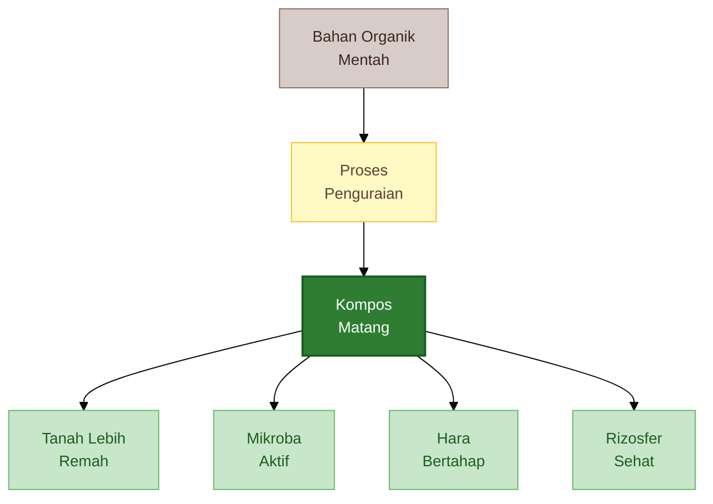

Diagram di atas menunjukkan bahwa kompos bukan titik awal, tetapi hasil dari proses. Setelah kompos matang terbentuk, manfaatnya baru terlihat pada tanah: struktur membaik, mikroba aktif, pelepasan hara lebih bertahap, dan rizosfer menjadi lebih sehat.

---

## 1.2 Kompos sebagai jembatan bahan organik dan rizosfer

Kompos berfungsi sebagai **jembatan** antara bahan organik mentah dan tanah hidup. Tanpa proses pengomposan, bahan organik mentah sering kali belum aman dan belum efektif untuk tanaman. Setelah menjadi kompos matang, bahan tersebut berubah fungsi: dari limbah menjadi pembangun ekosistem tanah.

Dalam konteks rizosfer, kompos memiliki beberapa peran penting.

### 1. Sumber bahan organik

Bahan organik adalah fondasi tanah hidup. Tanah yang miskin bahan organik biasanya lebih mudah padat, cepat kering, sulit menahan hara, dan miskin aktivitas biologis. Kompos menambah cadangan karbon organik yang diperlukan tanah untuk membangun struktur dan mendukung kehidupan mikroba.

### 2. Makanan mikroba

Mikroba tanah membutuhkan sumber energi. Kompos menyediakan bahan organik terurai sebagian yang lebih mudah dimanfaatkan oleh komunitas mikroba tanah dibanding bahan mentah yang terlalu kasar atau terlalu keras. Ini penting karena rizosfer sehat bergantung pada aktivitas mikroba yang aktif dan seimbang.

### 3. Pembenah struktur tanah

Kompos membantu pembentukan agregat tanah. Tanah yang memiliki agregat baik akan lebih remah, berpori, tidak mudah memadat, dan lebih mudah ditembus akar. Ini sangat penting untuk cabai, karena akar cabai sensitif terhadap tanah yang padat dan tergenang.

### 4. Penyangga air dan hara

Kompos meningkatkan kemampuan tanah menahan air dan unsur hara. Ini bukan berarti kompos menggantikan semua pupuk, tetapi kompos membantu tanah menjadi lebih efisien dalam menyimpan dan melepaskan hara secara bertahap.

### 5. Pembawa mikroba menguntungkan

Kompos matang, terutama yang dibuat dengan baik, dapat menjadi habitat dan pembawa mikroba yang bermanfaat. Jika dikombinasikan dengan agen hayati atau inokulum lokal seperti rizosfer bambu, kompos dapat berfungsi sebagai media pembawa mikroba ke zona akar.

### 6. Bahan pembentuk rizosfer sehat

Tujuan akhir penggunaan kompos bukan hanya membuat tanah tampak hitam atau gembur. Tujuan utamanya adalah membangun **rizosfer yang aktif**: zona akar yang kaya kehidupan, seimbang dalam air dan udara, dan mendukung serapan hara secara sehat.

Secara praktis, kompos menghubungkan tiga hal:

1. **bahan organik** sebagai bahan baku,
2. **mikroba** sebagai pengurai dan penggerak,
3. **rizosfer** sebagai tempat manfaatnya dirasakan tanaman.

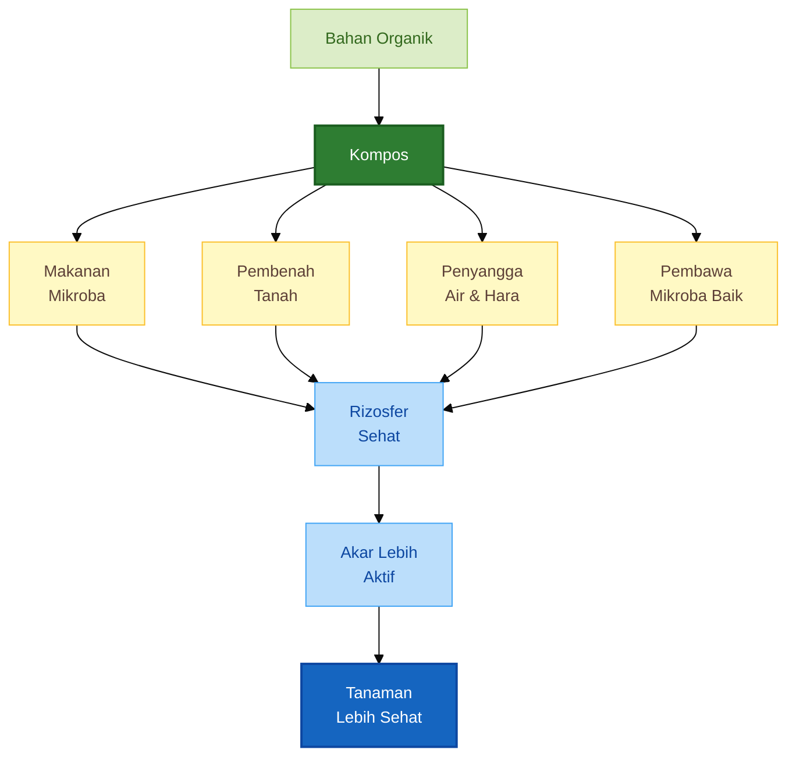

Dari diagram ini terlihat bahwa kompos bekerja di tengah sistem. Ia tidak berdiri sendiri, melainkan menghubungkan bahan organik dengan kehidupan tanah, lalu meneruskan manfaatnya ke akar dan tanaman.

---

## 1.3 Kompos berbeda dengan bahan organik mentah

Salah satu kesalahan paling umum di lapangan adalah menganggap semua bahan organik otomatis baik untuk tanaman. Padahal, bahan organik mentah dan kompos matang adalah dua hal yang sangat berbeda.

Tanaman, terutama cabai, sangat sensitif terhadap bahan organik yang belum matang. Jika bahan mentah langsung diberikan ke bedengan atau lubang tanam, beberapa masalah dapat muncul:

- akar stres,
- zona akar menjadi panas,
- muncul bau amonia,
- proses pembusukan menghabiskan oksigen,
- mikroba pembusuk mendominasi,
- nitrogen “dikunci” sementara oleh mikroba,
- penyakit akar lebih mudah berkembang.

Karena itu, penting membedakan beberapa bahan berikut.

### Daun mentah

Daun mentah masih merupakan bahan baku. Ia belum stabil, belum aman untuk akar jika diberikan dalam jumlah besar ke zona akar, dan masih memerlukan waktu penguraian.

### Jerami segar

Jerami segar kaya karbon, tetapi juga masih mentah. Jika langsung dicampur ke tanah tanpa proses yang baik, jerami dapat memicu kompetisi nitrogen antara mikroba dan tanaman. Jerami lebih baik dikomposkan dahulu atau digunakan sebagai mulsa permukaan, bukan langsung sebagai bahan utama di lubang tanam.

### Pupuk kandang mentah

Pupuk kandang mentah termasuk bahan yang berisiko tinggi jika langsung dipakai. Ia bisa mengandung patogen, biji gulma, amonia, dan dapat menghasilkan panas. Pada cabai, pupuk kandang mentah sangat berisiko merusak akar muda dan memicu masalah pangkal batang.

### Bokashi

Bokashi adalah bahan organik yang diproses melalui fermentasi, bukan pengomposan penuh. Bokashi bisa sangat berguna, tetapi perlu dipahami bahwa bokashi dan kompos matang tidak sama. Bokashi biasanya lebih cepat dibuat, tetapi tingkat kestabilannya berbeda. Dalam banyak kasus, bokashi lebih aman diberikan setelah ada waktu inkubasi di tanah, bukan menempel langsung ke akar muda.

### Kompos setengah matang

Kompos setengah matang adalah bahan yang sudah mulai terurai, tetapi belum stabil. Ciri umumnya masih hangat, bahan asal masih terlihat jelas, dan kadang masih berbau. Bahan ini belum aman untuk zona akar tanaman sensitif.

### Kompos matang

Kompos matang adalah bahan organik yang sudah melalui proses penguraian sampai stabil. Ciri utamanya:

- tidak panas,
- tidak berbau busuk,
- berbau seperti tanah segar,
- tekstur remah,
- bahan asal tidak dominan terlihat,
- aman bagi akar.

Tabel berikut membantu membedakan bahan-bahan tersebut.

| Bahan                  | Status            | Risiko jika langsung ke akar | Keterangan Praktis                                      |
| ---------------------- | ----------------- | ---------------------------- | ------------------------------------------------------- |
| Daun mentah            | Bahan baku        | Sedang                       | Lebih baik dikomposkan dulu atau dijadikan mulsa        |
| Jerami segar           | Bahan baku        | Sedang–tinggi                | Dapat mengikat N sementara bila langsung dicampur tanah |
| Pupuk kandang mentah   | Bahan baku mentah | Tinggi                       | Bisa panas, berbau amonia, membawa patogen              |
| Bokashi                | Fermentasi        | Sedang                       | Bermanfaat, tetapi bukan kompos matang penuh            |
| Kompos setengah matang | Hampir jadi       | Sedang                       | Masih perlu waktu pematangan                            |
| Kompos matang          | Stabil            | Rendah                       | Aman untuk pembenahan tanah dan lebih aman bagi akar    |

Poin yang paling penting adalah:

> Tidak semua bahan organik aman langsung diberikan ke tanaman. Cabai sangat sensitif terhadap bahan organik yang belum matang.

Karena itu, saat membangun tanah hidup, kita tidak boleh hanya fokus pada “menambah bahan organik”, tetapi harus fokus pada **kualitas kematangan bahan organik**.

---

# 2. Proses Pengomposan dan Peran Mikroba

Setelah memahami apa itu kompos dan mengapa kompos penting dalam tanah hidup, langkah berikutnya adalah memahami **bagaimana kompos terbentuk**.

Kompos tidak muncul dengan sendirinya. Ia terbentuk melalui proses biologis yang dijalankan oleh berbagai kelompok mikroba. Mikroba inilah yang memecah, mengubah, dan menstabilkan bahan organik.

Tanpa memahami proses ini, praktisi sering terjebak pada dua kesalahan:

1. menganggap semua tumpukan bahan organik akan otomatis menjadi kompos bagus,
2. mengira kompos hanya soal waktu, padahal kualitasnya sangat ditentukan oleh proses.

---

## 2.1 Apa yang terjadi dalam proses pengomposan?

Pengomposan adalah proses biologis ketika mikroba mengurai bahan organik kompleks menjadi bahan yang lebih stabil.

Bahan organik yang masuk ke tumpukan kompos sebenarnya tersusun dari berbagai senyawa, antara lain:

- gula sederhana,
- protein,
- selulosa,
- hemiselulosa,
- lignin,
- lemak,
- jaringan tanaman dan hewan.

Mikroba tidak memakan semua bahan ini sekaligus. Mereka bekerja bertahap.

### Tahap awal

Pada awal proses, mikroba akan lebih dulu memanfaatkan senyawa yang mudah diurai, seperti gula sederhana dan protein. Karena aktivitas mikroba meningkat cepat, suhu tumpukan biasanya naik.

### Tahap lanjutan

Setelah senyawa yang mudah habis, mikroba mulai bekerja pada bahan yang lebih sulit diurai, seperti selulosa dan hemiselulosa. Ini membuat struktur bahan mulai melunak dan bentuk asal bahan menjadi kurang jelas.

### Tahap lebih lambat

Lignin dan bahan keras lainnya diurai lebih lambat. Pada fase ini, warna tumpukan makin gelap, tekstur makin remah, dan kompos mulai mendekati kestabilan.

Pada akhirnya, proses pengomposan bukan hanya mengecilkan ukuran bahan, tetapi juga mengubah sifat bahan:

- dari mentah menjadi stabil,
- dari panas menjadi aman,
- dari berbau menjadi segar,
- dari limbah menjadi pembenah tanah.

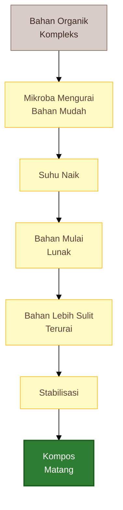

Diagram ini menunjukkan bahwa pengomposan adalah perjalanan bertahap, bukan satu kejadian tunggal.

---

## 2.2 Mikroba utama dalam pengomposan

Mikroba adalah inti dari proses kompos. Mereka bekerja seperti “pabrik biologis” yang memecah bahan organik. Kelompok mikroba utama dalam pengomposan meliputi:

### 1. Bakteri

Bakteri adalah pemain utama pada fase awal dan fase panas. Mereka bekerja cepat, terutama pada bahan yang mudah diurai, seperti gula dan protein. Bakteri berperan besar dalam kenaikan suhu tumpukan.

### 2. Jamur

Jamur lebih penting dalam penguraian bahan yang lebih kompleks, terutama serat, selulosa, dan sebagian lignin. Jamur juga berperan besar pada bahan kaya karbon seperti daun kering, jerami, dan serbuk gergaji lapuk.

### 3. Aktinomisetes

Aktinomisetes adalah kelompok mikroba yang sering muncul pada fase lanjut. Mereka berperan dalam penguraian bahan yang lebih keras dan menghasilkan aroma khas tanah segar pada kompos matang. Kehadiran aktinomisetes sering menjadi tanda bahwa proses mulai menuju kematangan.

### 4. Mikroba mesofilik

Mikroba mesofilik bekerja pada suhu sedang. Mereka dominan di awal proses dan kembali dominan saat fase pendinginan serta pematangan.

### 5. Mikroba termofilik

Mikroba termofilik bekerja pada suhu tinggi. Mereka penting pada fase panas, ketika suhu tumpukan meningkat. Fase ini membantu mempercepat penguraian dan menekan sebagian patogen serta biji gulma.

Dalam praktik lapangan, kita tidak perlu menghafal nama semua mikroba. Yang lebih penting adalah memahami bahwa:

> Kompos yang baik adalah hasil kerja komunitas mikroba yang bergantian dominan sesuai fase prosesnya.

Artinya, pengomposan yang baik harus memberi kondisi yang memungkinkan komunitas mikroba ini bekerja: ada bahan, ada air, ada udara, dan ada waktu.

---

## 2.3 Fase pengomposan

Secara praktis, pengomposan dapat dibagi menjadi empat fase utama.

### 1. Fase awal

Ini adalah fase ketika bahan baru disusun. Mikroba mesofilik mulai aktif, terutama pada bahan yang mudah diurai. Suhu mulai naik, tetapi biasanya belum terlalu tinggi.

Ciri fase awal:

- bahan masih tampak seperti asalnya,
- suhu mulai meningkat,
- aktivitas mikroba mulai aktif,
- bau belum tentu stabil.

### 2. Fase panas

Pada fase ini, suhu tumpukan naik karena aktivitas mikroba tinggi. Mikroba termofilik menjadi dominan. Ini adalah fase penting karena membantu mempercepat penguraian dan menekan sebagian patogen serta biji gulma.

Ciri fase panas:

- tumpukan terasa hangat atau panas,
- penguraian cepat,
- volume mulai menyusut,
- bahan mulai melunak.

### 3. Fase pendinginan

Setelah bahan mudah terurai mulai habis, suhu mulai turun. Mikroba mesofilik kembali aktif. Pada fase ini, bahan yang lebih sulit diurai mulai diproses lebih lanjut.

Ciri fase pendinginan:

- suhu mulai turun,
- bau lebih stabil,
- warna makin gelap,
- tekstur mulai remah.

### 4. Fase pematangan

Ini fase ketika kompos menjadi lebih stabil. Aktivitas mikroba masih ada, tetapi tidak seagresif fase panas. Pada fase ini, kompos menjadi lebih aman untuk tanaman.

Ciri fase pematangan:

- suhu mendekati suhu lingkungan,
- bau seperti tanah segar,
- bahan asal tidak dominan terlihat,
- tekstur remah,
- tidak panas saat digenggam.

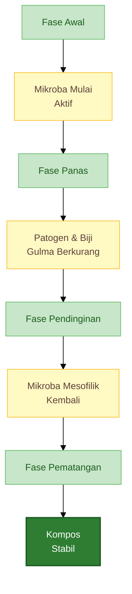

Diagram ini penting karena membantu praktisi memahami bahwa kompos tidak matang hanya karena “sudah ditumpuk lama”. Tumpukan harus melewati fase-fase biologis tertentu agar hasilnya stabil.

---

## 2.4 Faktor penentu keberhasilan kompos

Kompos yang baik tidak hanya bergantung pada bahan, tetapi juga pada kondisi proses. Faktor utama yang menentukan keberhasilan kompos adalah sebagai berikut.

### 1. Rasio karbon dan nitrogen

Bahan kompos harus seimbang antara sumber karbon dan sumber nitrogen.

- Bahan kaya karbon: daun kering, jerami, sekam, serbuk kayu lapuk, serasah.
- Bahan kaya nitrogen: rumput hijau, daun segar, sisa sayuran, pupuk kandang.

Jika karbon terlalu dominan, proses lambat. Jika nitrogen terlalu dominan, tumpukan mudah berbau dan terlalu basah.

Rasio praktis yang mudah dipakai di lapangan adalah:

$$
\text{Bahan kering} : \text{Bahan hijau} : \text{Pupuk kandang} = 3 : 1 : 1
$$

Rasio ini bukan angka mutlak ilmiah, tetapi formula praktis yang cukup aman untuk petani.

### 2. Kelembapan

Mikroba butuh air, tetapi tidak boleh kebanyakan. Tumpukan yang terlalu kering akan lambat terurai. Tumpukan yang terlalu basah akan kekurangan oksigen dan berubah menjadi pembusukan anaerob.

Kelembapan ideal:

$$
\text{Kelembapan ideal kompos} \approx 50\%-60\%
$$

Cara praktis mengukurnya adalah **uji genggam**. Jika bahan digenggam terasa lembap, menggumpal ringan, tetapi tidak mengeluarkan air menetes, biasanya kelembapannya mendekati ideal.

### 3. Oksigen

Sebagian besar proses pengomposan yang baik berlangsung secara aerob. Artinya, mikroba membutuhkan oksigen. Jika tumpukan terlalu padat atau terlalu basah, oksigen berkurang dan proses berubah menjadi pembusukan.

Tanda kekurangan oksigen:

- bau busuk,
- berlendir,
- warna terlalu gelap basah,
- panas tidak stabil,
- banyak lalat.

### 4. Ukuran bahan

Semakin kecil ukuran bahan, semakin cepat proses penguraian karena luas permukaan meningkat. Namun, jika semua bahan terlalu halus, tumpukan bisa terlalu padat. Karena itu, bahan sebaiknya dicacah secukupnya, tidak terlalu besar dan tidak terlalu halus.

### 5. Suhu

Suhu adalah indikator aktivitas mikroba. Jika suhu naik, berarti mikroba bekerja. Jika suhu terlalu lama sangat tinggi, proses perlu dipantau karena bisa menurunkan aerasi dan kualitas akhir bila tidak dikendalikan.

### 6. Pembalikan

Pembalikan membantu memasukkan oksigen, meratakan kelembapan, dan mencegah bagian tertentu terlalu basah atau terlalu padat. Namun, pembalikan tidak perlu berlebihan. Tujuannya adalah menjaga keseimbangan, bukan terus-menerus mengganggu tumpukan.

### 7. Waktu pematangan

Kompos butuh waktu. Semakin bahan kompleks dan semakin minim gangguan, biasanya proses makin lama. Praktisi perlu sabar hingga kompos benar-benar matang.

Berikut ringkasan faktor pentingnya.

| Faktor       | Jika Terlalu Rendah           | Jika Terlalu Tinggi         | Kondisi Ideal           |
| ------------ | ----------------------------- | --------------------------- | ----------------------- |
| Karbon       | Tumpukan terlalu basah/berbau | Proses lambat bila N kurang | Seimbang dengan N       |
| Nitrogen     | Proses lambat                 | Bau tajam/amonia            | Cukup, tidak berlebihan |
| Kelembapan   | Mikroba lambat                | Anaerob/busuk               | Lembap 50–60%           |
| Oksigen      | Pembusukan                    | -                           | Aerob, tidak padat      |
| Ukuran bahan | Lambat bila terlalu besar     | Padat bila terlalu halus    | Cacah sedang            |
| Suhu         | Proses lambat                 | Bisa terlalu ekstrem        | Naik lalu turun normal  |
| Waktu        | Belum matang                  | -                           | Cukup sampai stabil     |

---

## Ringkasan Bab 1–2

Kompos adalah hasil penguraian bahan organik oleh mikroba sampai menjadi bahan yang stabil, remah, tidak panas, tidak busuk, dan aman bagi akar. Dalam konteks tanah hidup, kompos bukan sekadar pupuk organik, tetapi bahan pembangun rizosfer sehat karena berfungsi sebagai sumber bahan organik, makanan mikroba, pembenah struktur tanah, penyangga air dan hara, serta pembawa mikroba menguntungkan.

Kompos harus dibedakan dari bahan organik mentah seperti daun segar, jerami segar, atau pupuk kandang mentah. Bahan-bahan tersebut belum tentu aman untuk tanaman, terutama cabai yang sangat sensitif terhadap bahan organik belum matang.

Proses pengomposan sendiri adalah proses biologis. Mikroba seperti bakteri, jamur, aktinomisetes, mikroba mesofilik, dan termofilik bekerja secara bergantian melalui fase awal, fase panas, fase pendinginan, dan fase pematangan. Keberhasilan proses ini sangat dipengaruhi oleh keseimbangan bahan karbon dan nitrogen, kelembapan, oksigen, ukuran bahan, suhu, pembalikan, dan waktu.

Dengan memahami dua bab ini, praktisi akan melihat kompos bukan sebagai “sampah yang dibusukkan”, tetapi sebagai proses biologis terarah untuk mengubah bahan organik menjadi fondasi tanah hidup.

---

# 3. Ciri Kompos Matang dan Kompos Gagal

Kompos yang baik tidak cukup dinilai dari warna hitam atau lamanya waktu pengomposan. Banyak bahan organik yang terlihat gelap, tetapi sebenarnya belum matang. Sebaliknya, ada kompos yang tidak terlalu hitam, tetapi sudah stabil, remah, tidak panas, tidak berbau busuk, dan aman untuk akar.

Dalam budidaya cabai, kemampuan membedakan kompos matang dan kompos gagal sangat penting. Cabai termasuk tanaman yang sensitif terhadap kondisi zona akar. Kompos yang belum matang dapat membuat akar stres, bibit lambat pulih, bahkan meningkatkan risiko busuk akar dan busuk pangkal batang.

Kompos matang adalah hasil penguraian biologis yang sudah stabil. Pengomposan sendiri merupakan proses dekomposisi bahan organik secara biologis oleh mikroorganisme dalam kondisi terkelola dan membutuhkan oksigen pada sistem aerob. ([US EPA][1])

---

## 3.1 Ciri kompos matang

Kompos matang adalah kompos yang sudah aman digunakan sebagai pembenah tanah dan lebih aman bagi akar tanaman. Ia tidak lagi aktif membusuk secara agresif, tidak menghasilkan panas berlebih, dan tidak mengeluarkan bau tajam.

Ciri utama kompos matang adalah sebagai berikut:

- tidak panas,
- tidak berbau busuk,
- berbau seperti tanah segar,
- warna cokelat gelap sampai hitam,
- tekstur remah,
- bahan asal tidak dominan terlihat,
- tidak menarik lalat berlebihan,
- aman bagi akar muda.

Secara praktis, kompos matang terasa “tenang”. Saat digenggam, teksturnya remah dan lembap, tetapi tidak berlendir. Baunya mirip tanah hutan atau tanah di bawah serasah yang sehat. Jika diletakkan dekat tanaman, kompos matang tidak menyebabkan akar terbakar, daun layu mendadak, atau pangkal batang membusuk.

Aroma tanah segar pada kompos matang sering berkaitan dengan aktivitas mikroba fase lanjut, termasuk aktinomisetes. Dalam proses pengomposan, komunitas mikroba berubah mengikuti fase suhu; setelah fase panas menurun, proses masuk ke fase pendinginan dan pematangan yang membuat bahan menjadi lebih stabil. ([Cornell Composting][2])

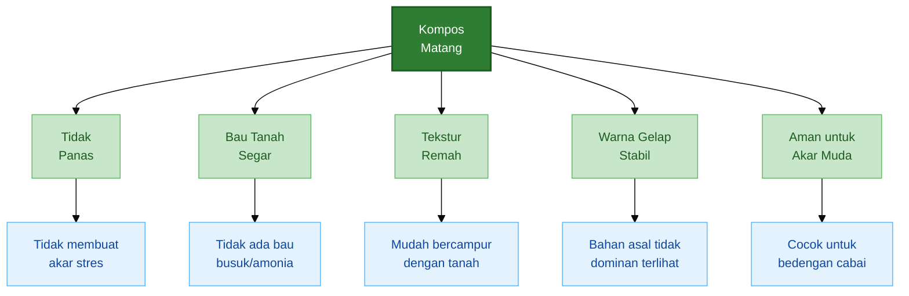

Pada budidaya cabai, kompos matang sebaiknya digunakan untuk:

- pembenahan bedengan,
- campuran media semai dalam dosis aman,
- campuran lubang tanam,
- bahan pembawa agen hayati,
- bahan aktivasi biochar,
- pemulihan tanah setelah panen.

Namun, walaupun sudah matang, kompos tetap perlu digunakan dengan bijak. Kompos bukan pengganti semua kebutuhan hara cabai. Ia lebih tepat dipahami sebagai bahan pembangun tanah hidup: memperbaiki struktur, memberi makanan mikroba, dan membantu tanah menyimpan air serta hara.

---

## 3.2 Ciri kompos belum matang atau gagal

Kompos belum matang adalah bahan organik yang proses penguraiannya belum selesai. Sementara itu, kompos gagal adalah tumpukan bahan organik yang prosesnya berjalan buruk, misalnya terlalu basah, kekurangan oksigen, berbau busuk, atau tidak mengalami penguraian yang sehat.

Ciri yang perlu diwaspadai:

- masih panas,
- bau amonia,
- bau busuk,
- berlendir,
- terlalu basah,
- bahan masih utuh,
- banyak lalat,
- membuat tanaman layu.

Kompos yang masih panas menandakan proses mikroba masih berlangsung agresif. Ini belum tentu buruk jika masih berada dalam tumpukan kompos. Tetapi jika bahan seperti ini langsung diberikan ke lubang tanam cabai, akar muda bisa stres.

Bau amonia biasanya muncul ketika bahan kaya nitrogen terlalu dominan, misalnya terlalu banyak pupuk kandang segar atau bahan hijau tanpa cukup bahan karbon. Bau busuk dan lendir biasanya menunjukkan kondisi anaerob, yaitu tumpukan kekurangan oksigen akibat terlalu basah atau terlalu padat.

Kompos yang gagal sering bukan karena kekurangan aktivator, tetapi karena kondisi dasarnya salah:

- terlalu banyak air,
- terlalu padat,
- terlalu banyak bahan hijau,
- bahan tidak dicacah,
- tidak ada aerasi,
- lokasi tergenang,
- bahan terlalu miskin variasi.

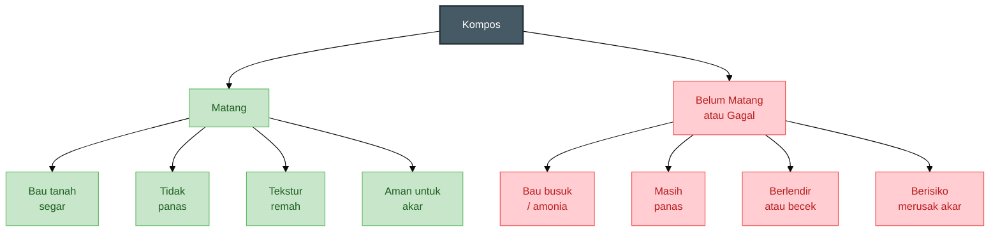

Kompos gagal perlu diperbaiki sebelum digunakan. Jangan memaksakan bahan yang masih busuk ke tanaman cabai. Jika tumpukan terlalu basah dan berbau, tambahkan bahan kering seperti daun kering, sekam, jerami cacah, atau serbuk gergaji lapuk. Setelah itu, buka tumpukan, beri aerasi, dan balik ringan.

Jika tumpukan terlalu kering dan tidak berubah, tambahkan air sedikit demi sedikit sampai lembap seperti spons diperas. Jika bahan terlalu kasar dan tidak melunak, cacah ulang atau campurkan dengan kompos matang sebagai starter biologis.

---

## 3.3 Risiko kompos mentah pada cabai

Cabai adalah tanaman yang sangat sensitif terhadap masalah zona akar. Karena itu, penggunaan kompos mentah atau kompos gagal bisa memberi dampak langsung pada pertumbuhan.

Dampak yang sering muncul pada cabai:

- akar stres,
- bibit lambat pulih,
- pangkal batang mudah busuk,
- akar cokelat,
- penyakit akar meningkat,
- pertumbuhan tidak seragam,
- bunga mudah rontok.

Pada fase awal setelah pindah tanam, akar cabai sedang beradaptasi. Jika kompos di lubang tanam masih panas atau mengeluarkan amonia, akar muda dapat rusak. Gejalanya sering terlihat sebagai bibit layu, daun menguning, atau tanaman stagnan beberapa minggu.

Masalah lain adalah kekurangan oksigen. Kompos yang terlalu basah dan berlendir dapat menciptakan kondisi anaerob di sekitar akar. Akar cabai membutuhkan oksigen. Jika zona akar kekurangan oksigen, akar melemah dan patogen tanah lebih mudah berkembang.

Kompos yang belum matang juga dapat menyebabkan fitotoksisitas, yaitu efek racun terhadap tanaman muda atau benih. Karena itu, uji perkecambahan sering digunakan sebagai salah satu cara sederhana menilai kematangan dan keamanan kompos bagi tanaman. ([UC Agriculture and Natural Resources][3])

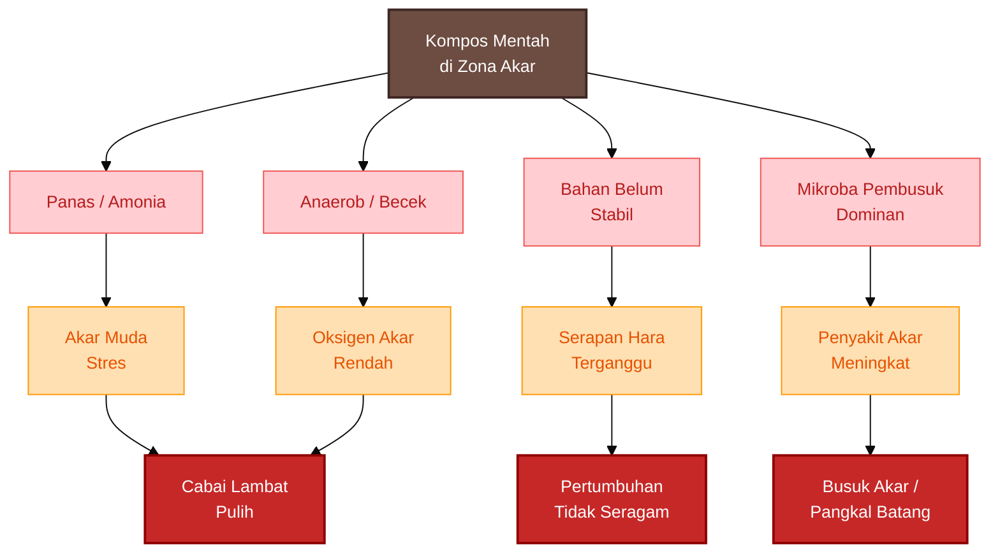

Risiko terbesar bukan hanya tanaman mati, tetapi pertumbuhan menjadi tidak seragam. Dalam budidaya cabai, keseragaman tanaman sangat penting. Tanaman yang tidak seragam akan menyulitkan pemupukan, pengendalian hama penyakit, dan panen.

Jika sejak awal akar terganggu oleh kompos mentah, tanaman bisa tetap hidup tetapi performanya turun. Saat masuk fase berbunga dan berbuah, tanaman seperti ini lebih mudah rontok bunga, buah kecil, dan cepat drop setelah panen awal.

---

## 3.4 Uji sederhana kematangan kompos

Praktisi tidak selalu memiliki akses ke laboratorium. Karena itu, uji sederhana di lapangan sangat penting. Tujuannya bukan menghasilkan angka sempurna, tetapi membantu memastikan kompos cukup aman sebelum digunakan pada cabai.

Ada lima uji praktis yang dapat dilakukan.

---

### 1. Uji bau

Ambil segenggam kompos, dekatkan ke hidung, lalu cium aromanya.

Interpretasi:

| Aroma              | Makna                                     |
| ------------------ | ----------------------------------------- |
| Bau tanah segar    | Baik, mendekati matang                    |
| Bau amonia         | Terlalu banyak nitrogen atau belum stabil |
| Bau busuk          | Anaerob, terlalu basah, atau gagal proses |
| Bau asam menyengat | Fermentasi belum stabil                   |

Kompos matang seharusnya tidak menyengat. Jika baunya membuat tidak nyaman, jangan gunakan langsung ke akar cabai.

---

### 2. Uji suhu tangan

Masukkan tangan ke bagian tengah tumpukan atau genggam kompos dari dalam tumpukan.

Interpretasi:

| Kondisi                        | Makna                                                      |
| ------------------------------ | ---------------------------------------------------------- |
| Suhu mendekati suhu lingkungan | Cenderung matang                                           |
| Masih hangat kuat              | Masih aktif, perlu waktu                                   |
| Panas                          | Belum aman untuk akar                                      |
| Dingin tetapi bahan masih utuh | Proses lambat, mungkin terlalu kering atau miskin nitrogen |

Kompos matang biasanya suhunya sudah turun mendekati suhu lingkungan. Pada proses pengomposan, suhu memang naik pada fase aktif, lalu turun saat masuk fase pendinginan dan pematangan. ([Cornell Composting][2])

---

### 3. Uji tekstur

Ambil kompos dan remas dengan tangan.

Kompos matang biasanya:

- remah,
- tidak berlendir,
- tidak terlalu menggumpal,
- bahan asal tidak dominan terlihat,
- mudah tercampur dengan tanah.

Jika masih banyak daun utuh, jerami utuh, atau kotoran ternak masih berbentuk jelas, berarti bahan belum sepenuhnya matang.

---

### 4. Uji kecambah

Uji kecambah berguna untuk melihat apakah kompos masih mengandung senyawa yang menghambat pertumbuhan tanaman muda. Uji ini banyak dipakai sebagai bioassay sederhana untuk melihat fitotoksisitas dan kesesuaian kompos bagi pertumbuhan tanaman. ([UC Agriculture and Natural Resources][3])

Cara sederhana:

1. Ambil kompos matang dugaan.
2. Campur kompos dengan air bersih, lalu ambil ekstraknya.
3. Basahi tisu atau kapas dengan ekstrak tersebut.
4. Letakkan benih cepat tumbuh, misalnya kacang hijau atau mentimun.
5. Bandingkan dengan benih yang diberi air bersih.
6. Amati perkecambahan dan panjang akar muda.

Rumus sederhana persentase kecambah:

$$
\begin{aligned}
\text{Persentase kecambah }(\%)
&= \frac{\text{Jumlah benih berkecambah}}{\text{Jumlah benih total}} \times 100
\end{aligned}
$$

Contoh:

$$
\begin{aligned}
\frac{18}{20} \times 100 &= 90\%
\end{aligned}
$$

Jika kecambah pada ekstrak kompos jauh lebih sedikit, akar kecambah pendek, menghitam, atau membusuk dibanding kontrol air bersih, kompos belum aman digunakan untuk akar muda.

---

### 5. Uji campur dengan media semai

Ini uji yang sangat praktis untuk petani cabai.

Cara:

1. Siapkan media semai standar.
2. Buat campuran kecil: 1 bagian kompos + 3 bagian media semai.
3. Tanam beberapa benih cepat tumbuh atau bibit kecil.
4. Amati 5–7 hari.
5. Bandingkan dengan media tanpa kompos.

Jika tanaman tumbuh normal, akar putih, dan tidak layu, kompos cenderung aman. Jika tanaman layu, akar cokelat, atau media berbau, kompos perlu dimatangkan lagi.

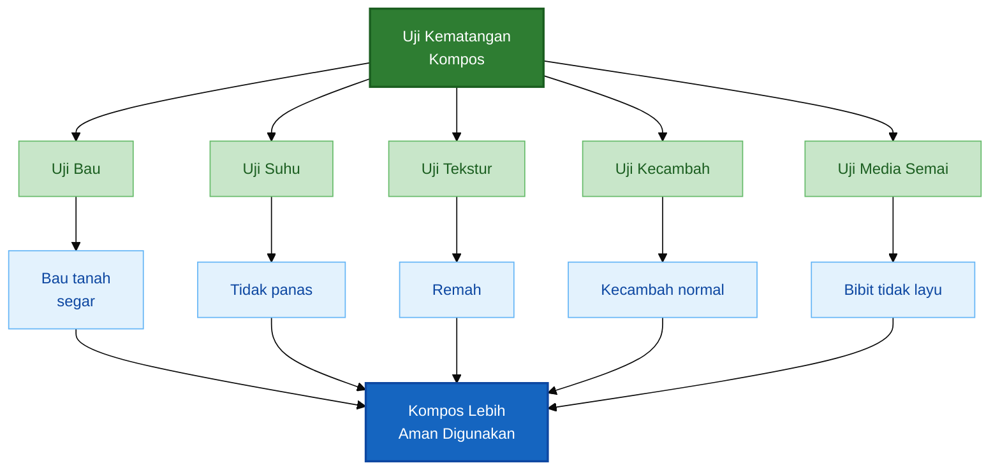

Praktisi tidak harus melakukan semua uji setiap kali. Namun, minimal lakukan uji bau, suhu, dan tekstur. Untuk kompos yang akan digunakan pada persemaian atau lubang tanam cabai, uji kecambah atau uji media semai sangat disarankan.

---

# 4. Meniru Rizosfer Rumpun Bambu dalam Pembuatan Kompos

Rumpun bambu adalah contoh alami tentang bagaimana tanah hidup terbentuk tanpa rekayasa rumit. Di bawah rumpun bambu, bahan organik masuk terus-menerus, tanah tertutup, akar hidup aktif, dan mikroba memiliki habitat yang stabil.

Namun, inti dari pendekatan ini bukan menganggap tanah bambu sebagai bahan ajaib. Yang ingin ditiru adalah **sistem ekologisnya**.

Rumpun bambu memberi pelajaran bahwa tanah hidup terbentuk ketika ada:

- makanan mikroba,
- akar hidup,
- kelembapan stabil,
- oksigen,
- perlindungan permukaan,
- waktu,
- gangguan rendah.

Dalam pembuatan kompos, prinsip ini dapat diterjemahkan menjadi metode kompos yang berlapis, lembap, cukup udara, kaya karbon, dan diberi inokulum mikroba dari rizosfer bambu sehat.

---

## 4.1 Mengapa rumpun bambu menjadi model?

Rumpun bambu menarik karena ia membangun tanah secara perlahan tetapi konsisten. Daun bambu gugur menjadi serasah. Akar dan rimpang bambu hidup bertahun-tahun. Permukaan tanah jarang terbuka. Tanah di bawahnya terlindung dari panas langsung dan pukulan air hujan.

Kondisi ini menciptakan lingkungan yang mendukung mikroba. Kajian tentang mikrobioma bambu menunjukkan bahwa lingkungan rizosfer bambu dapat dihuni berbagai mikroba yang terkait dengan siklus hara dan promosi pertumbuhan tanaman, termasuk kelompok bakteri seperti **Bacillus, Burkholderia, Streptomyces**, dan beberapa fungi bermanfaat. ([Cornell Composting][2])

Rumpun bambu memiliki sistem tanah yang stabil karena:

- serasah masuk terus-menerus,
- akar hidup sepanjang tahun,
- tanah tertutup,
- kelembapan stabil,
- tanah jarang terganggu,
- mikroba punya makanan dan habitat,
- penguraian berjalan alami.

Dalam konteks kompos, kondisi seperti ini sangat relevan. Kompos yang baik juga membutuhkan bahan organik, mikroba, kelembapan, oksigen, dan waktu. Perbedaannya, di alam proses ini berjalan lambat, sedangkan dalam pengomposan praktis kita mengaturnya agar lebih terarah.

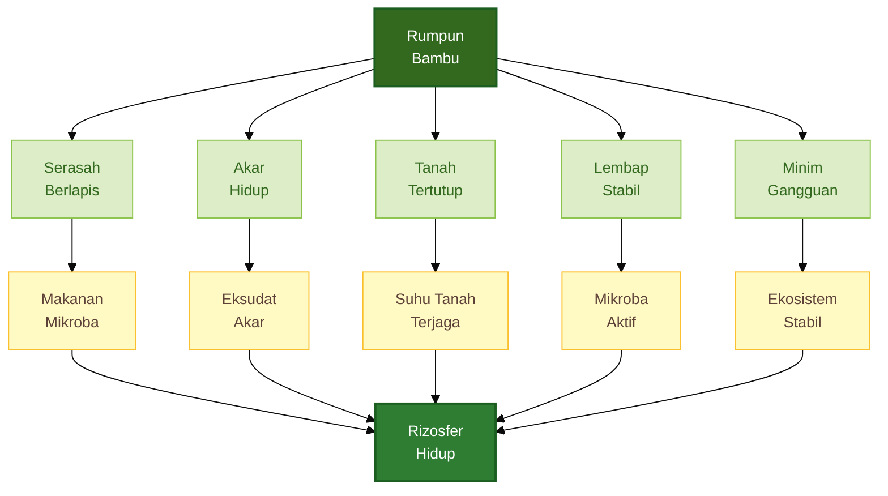

Bagi praktisi, rumpun bambu adalah model karena ia menunjukkan bahwa mikroba tidak cukup hanya “ditambahkan”. Mikroba harus diberi lingkungan yang cocok agar dapat bertahan dan bekerja.

---

## 4.2 Prinsip yang ditiru

Yang ditiru bukan hanya tanah bambunya, tetapi sistemnya. Ini penting agar praktik tidak berubah menjadi sekadar mengambil tanah bambu sebanyak-banyaknya lalu dicampur ke tumpukan kompos.

Prinsip yang perlu ditiru adalah sebagai berikut.

### 1. Bahan organik berlapis

Di bawah bambu, serasah tidak masuk sekaligus dalam bentuk satu adukan padat. Daun jatuh bertahap, membentuk lapisan. Lapisan ini memungkinkan udara tetap masuk dan penguraian berjalan perlahan.

Dalam kompos, prinsip ini diterapkan dengan menyusun bahan secara berlapis:

- bahan kasar di bawah,
- bahan kering,
- bahan hijau,
- pupuk kandang matang,
- tanah rizosfer bambu,
- biochar atau sekam bakar.

### 2. Dominan bahan karbon

Serasah bambu kaya bahan karbon. Bahan karbon penting sebagai sumber energi jangka panjang dan pembentuk struktur kompos. Jika kompos terlalu kaya nitrogen, tumpukan mudah berbau amonia dan terlalu panas.

Dalam praktik, bahan karbon dapat berupa:

- daun kering,
- serasah bambu,
- jerami,
- sekam,
- ranting kecil cacah,
- serbuk gergaji lapuk.

### 3. Lembap tetapi tidak becek

Tanah di bawah rumpun bambu sehat biasanya lembap, tetapi tidak tergenang. Ini prinsip penting. Mikroba membutuhkan air, tetapi proses pengomposan yang baik tetap membutuhkan oksigen. Bila terlalu becek, proses berubah menjadi busuk anaerob.

### 4. Cukup oksigen

Rumpun bambu memiliki banyak pori tanah dari akar, bahan organik, dan aktivitas biota tanah. Dalam kompos, pori ini ditiru dengan bahan kasar, sekam, biochar, dan penyusunan yang tidak dipadatkan.

### 5. Minim gangguan

Tanah di bawah bambu tidak dibalik terus-menerus. Ini memberi waktu bagi mikroba, fungi, dan struktur organik untuk terbentuk. Dalam kompos, pembalikan tetap boleh dilakukan, tetapi tidak perlu berlebihan. Balik tumpukan saat perlu: terlalu panas, terlalu basah, terlalu padat, atau berbau.

### 6. Ada sumber mikroba lokal

Rizosfer bambu dapat menjadi sumber mikroba lokal. Namun, perannya adalah sebagai inokulum, bukan bahan utama.

### 7. Ada waktu pematangan

Rumpun bambu tidak membangun tanah dalam semalam. Kompos juga demikian. Walaupun proses bisa dipercepat, kompos tetap harus diberi waktu sampai matang dan stabil sebelum digunakan pada cabai.

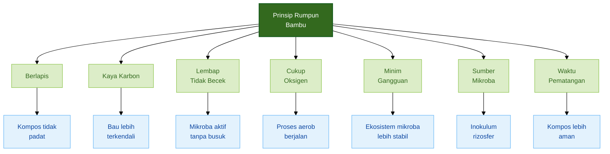

Dengan prinsip ini, kompos hidup berbasis rizosfer bambu tidak dibuat seperti tumpukan limbah yang dibiarkan membusuk, tetapi seperti “lantai hutan mini” yang dikendalikan.

---

## 4.3 Rizosfer bambu sebagai inokulum mikroba

Sampel rizosfer bambu dapat digunakan sebagai sumber mikroba lokal. Dalam artikel ini, istilah rizosfer bambu merujuk pada area tanah yang melekat atau berada dekat akar bambu, termasuk akar halus, serasah setengah lapuk, dan lapisan tanah atas di bawah serasah.

Bagian yang dapat digunakan:

- sedikit tanah dari zona akar bambu,
- akar halus sehat,
- serasah bambu setengah lapuk,
- lapisan tanah atas di bawah serasah.

Poin utama:

> Tanah rizosfer bambu bukan bahan utama kompos, tetapi inokulum mikroba dan benih ekosistem.

Mengapa bukan bahan utama? Karena kekuatan tanah bambu bukan pada volumenya, tetapi pada mikroba dan kondisi ekologis yang dibawanya. Mengambil terlalu banyak tanah bambu tidak efisien, merusak rumpun, dan tidak menjamin hasil kompos lebih baik.

Dalam praktik, cukup gunakan sedikit tanah rizosfer bambu sebagai starter. Untuk tumpukan kecil, 1–2 genggam sudah cukup. Untuk skala lebih besar, dapat digunakan sekitar 1–2 kg tanah rizosfer bambu per 100 kg bahan kompos.

Tanah rizosfer bambu sebaiknya tidak dipakai sendirian. Ia perlu ditempatkan dalam bahan kompos yang menyediakan makanan dan habitat:

- bahan karbon sebagai energi,
- bahan hijau sebagai nitrogen,
- biochar atau sekam bakar sebagai ruang pori,
- kelembapan sebagai pendukung aktivitas,
- oksigen agar proses tidak busuk.

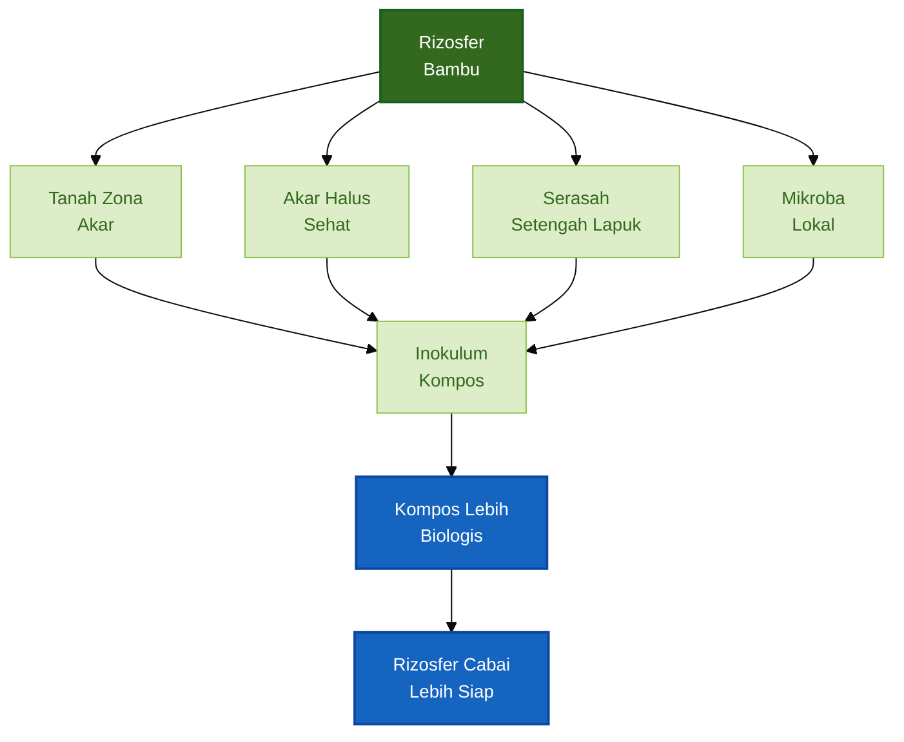

Ada dua waktu penggunaan inokulum bambu:

1. sejak awal penyusunan kompos,
2. saat fase pendinginan atau pematangan.

Untuk kompos cabai, strategi kedua sering lebih aman. Jika tanah bambu dimasukkan saat suhu tumpukan masih sangat panas, sebagian mikroba rizosfer yang tidak tahan panas bisa mati atau tidak dominan. Saat tumpukan sudah lebih stabil dan dingin, inokulum bambu lebih berpeluang bertahan dan mengisi kompos matang.

---

## 4.4 Kriteria sumber bambu yang aman

Tidak semua rumpun bambu layak dijadikan sumber inokulum. Rizosfer bambu harus diambil dari lokasi yang sehat dan aman. Ini penting karena tanah alami tidak hanya membawa mikroba menguntungkan, tetapi juga bisa membawa organisme atau cemaran yang tidak diinginkan.

Rumpun bambu yang dipilih harus:

- tumbuh subur,
- tidak tergenang,
- tanah berbau segar,
- tidak dekat limbah,
- tidak tercemar pestisida berat,
- memiliki serasah alami,
- tanahnya remah.

Hindari mengambil sampel dari rumpun bambu yang:

- tumbuh di dekat saluran limbah,
- tanahnya berbau busuk,
- sering tergenang,
- berada di tempat pembuangan sampah,
- dekat area buangan pestisida,
- tanahnya padat dan tidak sehat,
- banyak tanaman di sekitarnya sakit.

Cara memilih lokasi yang baik:

1. Cari rumpun bambu yang terlihat sehat.
2. Periksa bagian bawah rumpun.
3. Singkirkan sedikit serasah permukaan.
4. Cium aroma tanahnya.
5. Ambil hanya jika tanah berbau segar dan remah.
6. Jangan mengambil berlebihan.

Prinsipnya:

> Ambil mikroba, bukan mengambil tanah sebanyak-banyaknya.

Pengambilan yang berlebihan dapat merusak sistem akar bambu dan mengganggu ekosistem lokal. Untuk tujuan kompos, sedikit inokulum sudah cukup karena mikroba akan berkembang jika bahan dan kondisi kompos mendukung.

---

## 4.5 Batasan penting

Pendekatan rizosfer bambu perlu disampaikan secara seimbang. Jangan sampai artikel ini memberi kesan bahwa tanah bambu adalah solusi ajaib untuk semua masalah tanah dan penyakit cabai.

Ada beberapa batasan penting.

### 1. Tidak semua mikroba dari bambu pasti menguntungkan

Rizosfer adalah ekosistem. Di dalamnya ada banyak organisme. Sebagian bermanfaat, sebagian netral, dan sebagian bisa tidak diinginkan. Karena itu, pemilihan sumber bambu harus hati-hati.

### 2. Jangan mengambil dari lokasi tercemar

Jika rumpun bambu tumbuh di lokasi tercemar, inokulum yang diambil juga berisiko membawa cemaran. Ini bertentangan dengan tujuan membuat kompos sehat.

### 3. Jangan mengambil tanah bambu berlebihan

Tanah rizosfer bambu hanya dibutuhkan sebagai inokulum. Pengambilan banyak tidak otomatis meningkatkan kualitas kompos. Yang lebih penting adalah menciptakan kondisi agar mikroba berkembang.

### 4. Starter bambu tidak menggantikan proses kompos yang benar

Jika bahan kompos terlalu basah, terlalu padat, kekurangan karbon, atau tidak matang, starter bambu tidak akan menyelamatkan proses. Mikroba hanya bisa bekerja baik jika lingkungannya benar.

### 5. Kompos tetap harus matang sebelum digunakan

Ini batasan paling penting. Walaupun kompos diberi inokulum bambu, kompos tetap harus matang sebelum digunakan pada cabai. Cabai sangat sensitif terhadap bahan organik mentah. Inokulum bambu tidak menghilangkan risiko panas, amonia, anaerob, atau fitotoksisitas dari kompos yang belum matang.

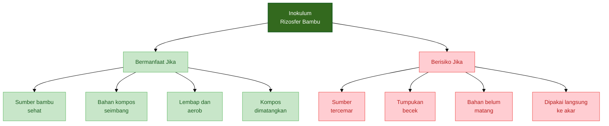

Dengan batasan ini, pendekatan rizosfer bambu tetap kuat secara praktis dan tidak berlebihan secara klaim.

---

## Ringkasan Bab 3–4

Kompos matang memiliki ciri tidak panas, tidak berbau busuk, berbau seperti tanah segar, bertekstur remah, dan aman bagi akar muda. Sebaliknya, kompos belum matang atau gagal biasanya masih panas, berbau amonia atau busuk, berlendir, terlalu basah, bahan asal masih utuh, dan dapat membuat tanaman layu.

Pada cabai, penggunaan kompos mentah sangat berisiko karena dapat menyebabkan akar stres, bibit lambat pulih, pangkal batang busuk, akar cokelat, pertumbuhan tidak seragam, dan bunga mudah rontok. Karena itu, uji sederhana seperti uji bau, suhu, tekstur, kecambah, dan media semai sangat penting sebelum kompos digunakan.

Rumpun bambu menjadi model karena memiliki sistem tanah yang stabil: serasah masuk terus-menerus, akar hidup sepanjang tahun, tanah tertutup, kelembapan stabil, minim gangguan, dan mikroba memiliki makanan serta habitat. Dalam pembuatan kompos, yang ditiru bukan hanya tanah bambunya, tetapi sistem ekologisnya.

Tanah rizosfer bambu dapat digunakan sebagai inokulum mikroba, tetapi bukan bahan utama kompos. Sampel yang digunakan cukup sedikit, berasal dari rumpun bambu sehat, tidak tercemar, tidak tergenang, dan tanahnya berbau segar. Inokulum bambu tetap harus dikombinasikan dengan proses kompos yang benar: bahan seimbang, cukup oksigen, kelembapan stabil, dan pematangan yang cukup sebelum digunakan pada cabai.

[1]: https://www.epa.gov/recycle/composting-home?utm_source=chatgpt.com 'Composting At Home | US EPA'
[2]: https://compost.css.cornell.edu/microorg.html?utm_source=chatgpt.com 'Compost Microorganisms - CORNELL Composting'
[3]: https://ucanr.edu/county/santa-clara-county-cooperative-extension/document/testing-compost-maturity-using-cucumber?utm_source=chatgpt.com 'Testing compost maturity using a cucumber germination ...'

---

# 5. Metode Membuat Kompos Hidup Berbasis Rizosfer Bambu

Bab ini menjadi inti teknis dari artikel. Setelah memahami pengertian kompos, proses penguraian, ciri kompos matang, serta logika ekologis rizosfer bambu, bagian ini membahas cara membuat kompos hidup secara praktis di lapangan.

Kompos hidup berbasis rizosfer bambu bukan sekadar tumpukan bahan organik yang dibiarkan membusuk. Kompos ini dibuat dengan meniru prinsip alami lantai rumpun bambu: bahan organik masuk terus-menerus, mikroba memiliki makanan dan habitat, kelembapan relatif stabil, oksigen tetap tersedia, dan proses berjalan tanpa gangguan berlebihan.

Namun, praktik lapangan tidak selalu ideal. Kadang semua bahan tersedia lengkap sejak awal. Tetapi lebih sering, bahan tersedia bertahap: hari ini ada daun kering, besok ada rumput hijau, minggu depan baru ada pupuk kandang, dan inokulum bambu tersedia setelah itu.

Karena itu, metode dalam bab ini dibagi menjadi dua SOP:

1. **SOP A — Jika material tersedia lengkap sejak awal**
2. **SOP B — Jika material tersedia bertahap**

Keduanya tetap mengikuti prinsip yang sama: karbon dominan, bahan hijau tidak berlebihan, ada bahan berpori, ada sedikit inokulum rizosfer bambu, kelembapan dijaga, tumpukan tidak terlalu tinggi, dan kompos harus matang sebelum digunakan pada tanaman cabai.

---

## 5.1 Prinsip dasar metode

Kompos hidup berbasis rizosfer bambu dibuat dengan meniru sistem alami di bawah rumpun bambu. Di bawah rumpun bambu, serasah tidak tersusun seperti lapisan kue yang sangat rapi. Yang terjadi adalah akumulasi bahan organik secara bertahap, heterogen, dan relatif acak, tetapi tetap mengikuti logika ekologis yang stabil.

Daun bambu gugur, bercampur dengan ranting kecil, akar halus, tanah remah, serasah setengah lapuk, mikroba, fungi, dan bahan organik lain. Campuran ini tidak selalu seragam, tetapi tetap bisa membentuk sistem tanah yang hidup karena memiliki beberapa syarat penting:

- ada sumber karbon,
- ada sedikit sumber nitrogen,
- ada mikroba,
- ada bahan berpori,
- ada kelembapan,
- ada oksigen,
- ada perlindungan permukaan,
- ada waktu pematangan,
- gangguan tanah rendah.

Prinsip inilah yang ditiru dalam pembuatan kompos hidup.

Tujuan metode ini adalah menghasilkan kompos yang berfungsi sebagai:

- makanan mikroba,
- habitat mikroba,
- pembenah struktur tanah,
- pembawa mikroba lokal,
- bahan pembentuk rizosfer sehat,
- bahan pendukung kesehatan akar cabai.

Hal penting yang perlu ditegaskan:

> Tanah rizosfer bambu bukan bahan utama kompos. Perannya adalah sebagai inokulum mikroba dan benih ekosistem.

Bahan utama kompos tetap berasal dari bahan organik seperti daun kering, serasah bambu, jerami, rumput hijau, pupuk kandang matang, sekam, biochar, dan bahan organik lain yang aman.

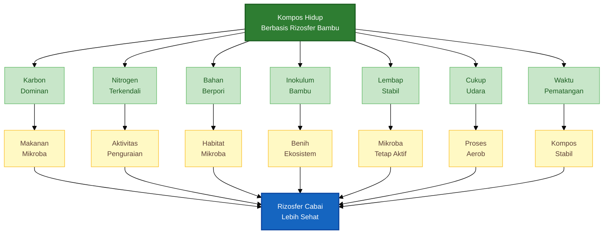

Dalam metode ini, ada dua pendekatan praktik.

Pertama, jika semua bahan tersedia lengkap, bahan dapat disusun sebagai lapisan terencana. Ini cocok untuk pelatihan, produksi kompos yang direncanakan, atau kebun yang memiliki stok bahan cukup.

Kedua, jika bahan tersedia bertahap, bahan dicampur per batch kecil lalu ditambahkan sebagai lapisan campuran. Ini lebih realistis untuk petani karena bahan organik biasanya muncul dari aktivitas harian kebun.

Kedua metode tetap boleh dilakukan tanpa pembalikan rutin, selama tumpukan tidak terlalu tinggi, tidak terlalu basah, tidak terlalu padat, dan memiliki bahan berpori yang cukup.

---

## 5.2 Bahan utama kompos

Bahan kompos dibagi menjadi lima kelompok utama:

1. bahan karbon atau bahan coklat,
2. bahan nitrogen atau bahan hijau,
3. pupuk kandang matang atau semi matang,
4. bahan habitat mikroba,
5. inokulum rizosfer bambu.

Setiap kelompok memiliki fungsi berbeda. Kompos yang baik tidak hanya membutuhkan bahan yang banyak, tetapi membutuhkan kombinasi yang seimbang.

---

### 5.2.1 Bahan karbon atau bahan coklat

Bahan karbon adalah sumber energi utama dan bahan pembentuk struktur kompos. Bahan ini biasanya kering, berserat, berwarna cokelat, dan lebih lambat terurai.

Contohnya:

- daun kering,
- serasah bambu,
- jerami,
- sekam,
- ranting kecil cacah,
- batang tanaman kering,
- serbuk gergaji lapuk,
- rumput kering.

Bahan karbon berfungsi untuk:

- menyerap kelembapan berlebih,
- menjaga tumpukan tidak terlalu basah,
- menyediakan makanan mikroba jangka panjang,
- menjaga struktur tetap berpori,
- mengurangi bau amonia,
- menyeimbangkan bahan hijau dan pupuk kandang.

Dalam metode berbasis rizosfer bambu, bahan karbon sebaiknya menjadi komponen dominan. Hal ini sesuai dengan kondisi alami di bawah rumpun bambu yang kaya serasah kering dan bahan organik berserat.

Jika bahan karbon terlalu sedikit, tumpukan mudah menjadi basah, berbau, dan anaerob. Sebaliknya, jika bahan karbon terlalu banyak tanpa bahan hijau atau pupuk kandang, proses penguraian menjadi lambat.

---

### 5.2.2 Bahan nitrogen atau bahan hijau

Bahan hijau adalah sumber nitrogen dan bahan yang lebih cepat diurai. Bahan ini membantu mengaktifkan mikroba agar proses dekomposisi berjalan.

Contohnya:

- rumput hijau,
- daun segar,
- sisa sayuran,
- limbah hijauan,
- daun legum,
- gulma muda sebelum berbunga,
- sisa tanaman segar yang sehat.

Bahan hijau berfungsi untuk:

- menyediakan nitrogen,
- mempercepat aktivitas mikroba,
- membantu kenaikan suhu awal,
- mempercepat pelunakan bahan karbon.

Namun, bahan hijau tidak boleh berlebihan. Jika terlalu dominan, tumpukan akan terlalu basah, mudah berbau, dan bisa menghasilkan panas berlebihan. Pada metode pasif tanpa pembalikan, bahan hijau harus lebih dikendalikan karena kesalahan kelembapan lebih sulit diperbaiki jika tumpukan sudah terlalu basah.

---

### 5.2.3 Pupuk kandang matang atau semi matang

Pupuk kandang berfungsi sebagai sumber nitrogen tambahan, mikroba pengurai, dan bahan organik yang memperkaya kompos.

Bahan yang bisa digunakan:

- pupuk kandang sapi,
- pupuk kandang kambing,
- pupuk kandang ayam,
- pupuk kandang kelinci,
- kotoran ternak lain yang aman dan tidak tercemar.

Pupuk kandang yang digunakan sebaiknya sudah matang atau minimal semi matang. Artinya:

- tidak terlalu panas,
- tidak berbau amonia tajam,
- tidak berlendir,
- tidak baru keluar dari kandang,
- sudah mengalami pelapukan awal.

Untuk cabai, hindari penggunaan pupuk kandang mentah di dekat zona akar. Pupuk kandang mentah dapat membawa patogen, biji gulma, amonia, dan panas yang berisiko merusak akar muda.

Dalam pembuatan kompos, pupuk kandang boleh digunakan sebagai bagian dari proses, tetapi kompos tetap harus dimatangkan sebelum diaplikasikan ke bedengan cabai.

---

### 5.2.4 Bahan habitat mikroba

Bahan habitat mikroba berfungsi menyediakan ruang hidup bagi mikroba, membantu aerasi, dan menahan air serta hara.

Contohnya:

- biochar,
- sekam bakar,
- kompos matang lama,
- tanah remah sehat,
- arang sekam,
- bahan berpori lain yang aman.

Biochar dan sekam bakar sangat berguna karena memiliki pori-pori yang dapat menjadi tempat melekat mikroba. Dalam konteks tanah hidup, bahan ini berperan seperti “rumah mikroba”.

Namun, biochar sebaiknya tidak digunakan dalam kondisi terlalu kering. Biochar yang sangat kering dapat menyerap kelembapan dari tumpukan dan memperlambat proses. Lebih baik biochar dilembapkan lebih dulu atau dicampur dengan bahan organik basah sebelum masuk ke tumpukan.

---

### 5.2.5 Inokulum rizosfer bambu

Inokulum rizosfer bambu adalah bahan kecil yang diambil dari sekitar akar bambu sehat untuk memperkaya mikroba lokal dalam kompos.

Bahan yang dapat digunakan:

- tanah zona akar bambu,
- akar halus bambu,
- serasah bambu setengah lapuk,
- tanah lapisan atas di bawah serasah bambu,
- PGPR bambu jika tersedia.

Fungsi inokulum rizosfer bambu:

- memperkenalkan mikroba lokal,
- membawa komunitas pengurai dari lingkungan serasah,
- memperkaya keragaman biologis tumpukan,
- membantu membangun karakter kompos yang lebih hidup,
- menjadi benih ekosistem bagi kompos.

Jumlahnya tidak perlu banyak. Untuk tumpukan kecil, cukup beberapa genggam. Untuk skala yang lebih besar, gunakan sekitar 1–2% dari total bahan.

Poin penting:

> Inokulum rizosfer bambu harus sedikit tetapi tersebar. Yang dicari adalah mikroba, bukan volume tanah.

---

## 5.3 Formula dasar bahan

Formula dasar berguna sebagai pedoman agar bahan tidak terlalu basah, tidak terlalu miskin nitrogen, dan tidak terlalu padat.

Formula praktis utama:

$$
\text{Karbon} : \text{Hijau} : \text{Pupuk Kandang}
=
3 : 1 : 1
$$

Artinya, untuk setiap 3 bagian bahan karbon, gunakan sekitar 1 bagian bahan hijau dan 1 bagian pupuk kandang matang atau semi matang.

Jika menggunakan satuan berat dan total bahan utama adalah 100 kg, maka pembagiannya adalah:

$$
\text{Bahan karbon} = 60 \ \text{kg}
$$

$$
\text{Bahan hijau} = 20 \ \text{kg}
$$

$$
\text{Pupuk kandang} = 20 \ \text{kg}
$$

Tambahkan biochar atau sekam bakar sebanyak:

$$
\text{Biochar atau sekam bakar}
=
5\%-10\%
\times
\text{total bahan utama}
$$

Untuk 100 kg bahan utama:

$$
5\%-10\%
\times
100
=
5-10 \ \text{kg}
$$

Tambahkan inokulum rizosfer bambu sebanyak:

$$
\text{Inokulum rizosfer bambu}
=
1\%-2\%
\times
\text{total bahan utama}
$$

Untuk 100 kg bahan utama:

$$
1\%-2\%
\times
100
=
1-2 \ \text{kg}
$$

Target kelembapan tumpukan:

$$
\text{Kelembapan ideal}
\approx
50\%-60\%
$$

Secara praktis, kelembapan 50–60% dapat diperkirakan dengan uji genggam:

- bahan terasa lembap,
- menggumpal ringan saat digenggam,
- tidak meneteskan air,
- tidak terasa kering berdebu,
- tidak berlendir.

---

### Contoh formula untuk 50 kg bahan utama

Jika membuat satu batch 50 kg bahan utama:

$$
\text{Karbon} = 60\% \times 50 = 30 \ \text{kg}
$$

$$
\text{Hijau} = 20\% \times 50 = 10 \ \text{kg}
$$

$$
\text{Pupuk kandang} = 20\% \times 50 = 10 \ \text{kg}
$$

Tambahan biochar:

$$
5\%-10\% \times 50
=
2{,}5-5 \ \text{kg}
$$

Tambahan inokulum rizosfer bambu:

$$
1\%-2\% \times 50
=
0{,}5-1 \ \text{kg}
$$

Jadi untuk satu batch 50 kg, komposisinya dapat dibuat sebagai berikut:

| Komponen                         |                          Jumlah |
| -------------------------------- | ------------------------------: |
| Bahan karbon/coklat              |                           30 kg |
| Bahan hijau/nitrogen             |                           10 kg |
| Pupuk kandang matang/semi matang |                           10 kg |
| Biochar/sekam bakar              |                        2,5–5 kg |
| Inokulum rizosfer bambu          |                        0,5–1 kg |
| Air                              | secukupnya sampai lembap 50–60% |

Formula ini tidak harus dipahami sebagai angka kaku. Dalam praktik, bahan organik sangat bervariasi. Daun kering, jerami, dan sekam berbeda kadar airnya. Rumput hijau dan sisa sayuran juga berbeda kandungan airnya. Karena itu, formula ini digunakan sebagai pedoman awal, lalu dikoreksi dengan uji genggam, bau, suhu, dan tekstur.

---

## 5.4 Cara mengambil sampel rizosfer bambu

Pengambilan sampel rizosfer bambu harus dilakukan dengan hati-hati. Tujuannya bukan mengambil tanah sebanyak-banyaknya, tetapi mengambil sedikit bahan yang membawa mikroba lokal dari zona akar bambu sehat.

Pilih rumpun bambu yang:

- tumbuh subur,
- tidak tergenang,
- tanah di bawahnya remah,
- berbau tanah segar,
- memiliki serasah alami,
- tidak dekat saluran limbah,
- tidak dekat tempat sampah,
- tidak tercemar pestisida berat.

Hindari rumpun bambu yang:

- tanahnya busuk,
- sering tergenang,
- berada di dekat limbah,
- tanahnya padat dan berbau,
- tumbuh di sekitar area tercemar,
- banyak tanaman di sekitarnya sakit.

Langkah mengambil sampel:

1. Pilih rumpun bambu sehat.
2. Singkirkan serasah permukaan secara ringan.
3. Ambil sedikit tanah pada zona akar aktif.
4. Ambil akar halus bambu yang sehat secukupnya.
5. Ambil sedikit serasah bambu setengah lapuk.
6. Masukkan ke wadah bersih.
7. Gunakan segera atau simpan sementara di tempat teduh.
8. Jangan menjemur sampel di bawah matahari langsung.
9. Jangan menutup rapat sampel yang masih basah.
10. Jangan mengambil berlebihan agar rumpun bambu tidak rusak.

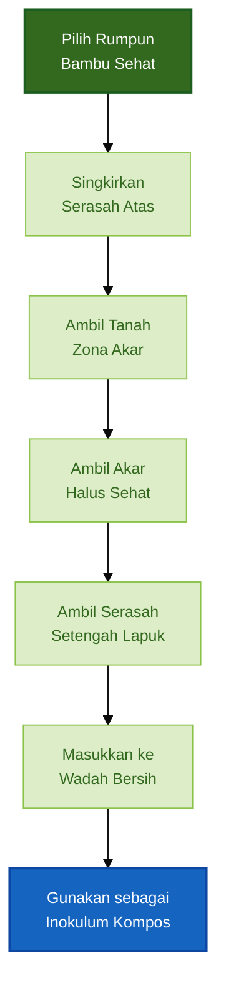

Catatan penting:

> Ambil mikroba, bukan mengambil tanah. Sedikit inokulum dari sumber yang sehat lebih baik daripada banyak tanah dari sumber yang tidak jelas.

Jika tersedia PGPR bambu yang sudah dibuat sebelumnya, PGPR dapat digunakan sebagai tambahan. Namun, PGPR tetap tidak menggantikan bahan organik, biochar, kelembapan, aerasi, dan proses pematangan.

---

## 5.5 SOP A — Jika material tersedia lengkap sejak awal

SOP A digunakan jika semua bahan utama tersedia sejak awal. Metode ini cocok untuk membuat kompos secara terencana, misalnya dalam pelatihan, kebun yang sudah memiliki stok bahan lengkap, atau produksi kompos dalam jumlah besar.

Metode ini menggunakan susunan lapisan yang lebih rapi agar setiap komponen dapat dikontrol dengan mudah.


---

### 5.5.1 Ukuran tumpukan SOP A

Untuk metode pasif tanpa pembalikan rutin, ukuran tumpukan harus dijaga agar tidak terlalu tinggi dan tidak terlalu padat.

Ukuran yang disarankan:

- tinggi total ideal: **100–120 cm**,
- tinggi paling praktis: **±110 cm**,
- lebar: **120–150 cm**,
- panjang: **150–300 cm**,
- lapisan dasar aerasi: **15–20 cm**,
- jumlah ulangan lapisan: **4–5 kali**,
- penutup atas: **5–8 cm**.

Batas penting:

> Untuk metode tanpa pembalikan rutin, tinggi tumpukan sebaiknya tidak lebih dari 120 cm.

Jika tumpukan terlalu tinggi, bagian bawah mudah tertekan, kekurangan oksigen, dan menjadi anaerob. Jika terlalu rendah, tumpukan mudah kering dan proses biologis berjalan lambat.

---

### 5.5.2 Susunan tumpukan SOP A

Susunan dari bawah ke atas:

1. lapisan dasar aerasi,
2. ulangan lapisan utama,
3. penutup atas.

#### Lapisan dasar aerasi

Tebal: **15–20 cm**

Bahan:

- ranting kecil,
- batang tanaman cacah kasar,
- bambu cacah kasar,
- bahan kasar berpori.

Fungsi lapisan dasar aerasi:

- menjaga udara masuk dari bawah,
- mencegah bagian bawah terlalu padat,
- mengurangi risiko busuk anaerob,
- membantu drainase jika ada air berlebih.

#### Ulangan lapisan utama

Setiap ulangan terdiri dari:

| Komponen                         |                Tebal |
| -------------------------------- | -------------------: |
| Bahan karbon/coklat              |             10–12 cm |
| Bahan hijau/nitrogen             |                ±5 cm |
| Pupuk kandang matang/semi matang |                ±3 cm |
| Inokulum rizosfer bambu          | tabur tipis 0,5–1 cm |
| Biochar/sekam bakar              |               1–2 cm |
| Penyiraman                       | sampai lembap 50–60% |

Jumlah ulangan: **4–5 kali**

Tebal satu ulangan biasanya sekitar **18–22 cm**. Dengan 5 ulangan, bagian utama tumpukan akan mencapai sekitar 90–110 cm, tergantung kepadatan bahan.

#### Penutup atas

Tebal: **5–8 cm**

Bahan:

- daun kering,
- jerami,
- serasah bambu,
- daun pisang,
- karung goni,
- penutup berpori.

Fungsi penutup:

- menjaga kelembapan,
- mengurangi lalat,
- mencegah kekeringan,
- melindungi dari hujan berlebihan,
- menjaga suhu tumpukan lebih stabil.

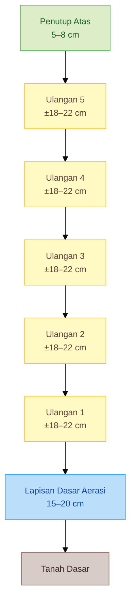

---

### 5.5.3 Langkah kerja SOP A

1. Pilih lokasi teduh, tidak tergenang, dan mudah diawasi.
2. Siapkan semua bahan: karbon, hijau, pupuk kandang, biochar, dan inokulum rizosfer bambu.
3. Buat lapisan dasar aerasi setebal 15–20 cm.
4. Tambahkan bahan karbon setebal 10–12 cm.
5. Tambahkan bahan hijau setebal ±5 cm.
6. Tambahkan pupuk kandang matang atau semi matang setebal ±3 cm.
7. Taburkan inokulum rizosfer bambu tipis merata.
8. Tambahkan biochar atau sekam bakar setebal 1–2 cm.
9. Siram sampai lembap seperti spons diperas.
10. Ulangi susunan tersebut 4–5 kali.
11. Tutup bagian atas dengan bahan kering atau penutup berpori.
12. Diamkan tanpa pembalikan rutin.
13. Koreksi hanya jika terlalu basah, bau busuk, terlalu kering, atau terlalu panas terlalu lama.
14. Matangkan sampai kompos remah, tidak panas, tidak busuk, dan berbau tanah segar.

---

## 5.6 SOP B — Jika material tersedia bertahap

SOP B digunakan jika bahan kompos tidak tersedia lengkap dalam satu waktu. Ini adalah kondisi yang sangat umum di lapangan.

Contohnya:

- hari ini tersedia daun kering,
- besok tersedia rumput hijau,
- lusa tersedia pupuk kandang,
- minggu depan tersedia serasah bambu,
- biochar hanya tersedia sedikit demi sedikit,
- inokulum bambu baru bisa diambil saat ada waktu.


Dalam kondisi seperti ini, tidak realistis memaksa petani menyusun lapisan elemen tunggal secara rapi seperti SOP A. Yang lebih tepat adalah membuat **batch campuran kecil** setiap kali bahan tersedia, lalu menambahkannya ke tempat kompos sebagai satu lapisan campuran.

Metode ini disebut:

> **Metode campur-batch lalu susun bertahap.**

Metode ini lebih mendekati pola alami lantai rumpun bambu, karena di alam bahan organik tidak datang sekaligus dan tidak tersusun seragam. Serasah, tanah, akar halus, mikroba, bahan hijau, bahan kering, dan bahan berpori terakumulasi bertahap secara heterogen.

---

### 5.6.1 Prinsip SOP B

Prinsip utama SOP B:

- bahan boleh datang bertahap,
- setiap batch dibuat seimbang,
- bahan dicampur ringan sebelum ditumpuk,
- setiap batch menjadi satu lapisan campuran,
- tumpukan tetap dijaga lembap,
- tumpukan tidak dipadatkan,
- tinggi tumpukan tetap dibatasi,
- tidak perlu pembalikan rutin,
- koreksi hanya dilakukan jika muncul tanda masalah.

Dalam SOP B, yang berlapis bukan lagi elemen tunggal seperti karbon, hijau, pupuk kandang, inokulum, dan biochar. Yang berlapis adalah **batch campuran**.

Satu batch idealnya sudah berisi:

- bahan karbon,
- bahan hijau,
- pupuk kandang matang/semi matang,
- biochar atau sekam bakar,
- sedikit inokulum rizosfer bambu,
- air secukupnya.

Dengan cara ini, mikroba, bahan organik, pori udara, dan kelembapan lebih tersebar sejak awal. Ini membuat metode tanpa pembalikan menjadi lebih aman.

---

### 5.6.2 Ukuran tumpukan SOP B

Ukuran yang disarankan:

- tinggi total: **100–120 cm**,
- tinggi ideal: **±110 cm**,
- lebar: **120–150 cm**,
- panjang: **150–300 cm**,
- lapisan dasar aerasi: **15–20 cm**,
- tebal tiap batch/lift campuran: **15–20 cm**,
- jumlah batch/lift: **4–5 batch**,
- penutup atas: **5–8 cm**.

Jika bahan datang sangat sedikit, tumpukan dapat dibangun secara bertahap. Namun, setiap batch sebaiknya tetap mencapai ketebalan minimal 10–15 cm agar tidak cepat kering.

Jika tumpukan sudah mencapai 100–120 cm, jangan terus ditambah tinggi. Lebih baik buat tumpukan baru di sebelahnya.

---

### 5.6.3 Komposisi setiap batch

Setiap batch sebaiknya mengikuti komposisi berikut:

| Komponen                         |     Proporsi Praktis |
| -------------------------------- | -------------------: |
| Bahan karbon/coklat              |               50–60% |
| Bahan hijau/nitrogen             |               20–25% |
| Pupuk kandang matang/semi matang |               10–20% |
| Biochar/sekam bakar              |                5–10% |
| Inokulum rizosfer bambu          |                 1–2% |
| Air                              | sampai lembap 50–60% |

Formula praktis:

$$
\text{Karbon} : \text{Hijau} : \text{Pupuk Kandang}
=
3 : 1 : 1
$$

Tambahan biochar:

$$
\text{Biochar}
=
5\%-10\%
\times
\text{total batch}
$$

Tambahan inokulum:

$$
\text{Inokulum rizosfer bambu}
=
1\%-2\%
\times
\text{total batch}
$$

Target kelembapan:

$$
\text{Kelembapan batch}
\approx
50\%-60\%
$$

Secara praktis: batch terasa lembap, menggumpal ringan saat digenggam, tetapi air tidak menetes.

---

### 5.6.4 Contoh komposisi satu batch 30 kg

Jika bahan yang tersedia hanya cukup untuk membuat batch 30 kg:

$$
\text{Karbon}
=
60\%
\times
30
=
18 \ \text{kg}
$$

$$
\text{Hijau}
=
20\%
\times
30
=
6 \ \text{kg}
$$

$$
\text{Pupuk kandang}
=
20\%
\times
30
=
6 \ \text{kg}
$$

Tambahan biochar:

$$
5\%-10\%
\times
30
=
1{,}5-3 \ \text{kg}
$$

Tambahan inokulum rizosfer bambu:

$$
1\%-2\%
\times
30
=
0{,}3-0{,}6 \ \text{kg}
$$

Maka komposisi batch 30 kg:

| Bahan                            |     Jumlah |
| -------------------------------- | ---------: |
| Bahan karbon/coklat              |      18 kg |
| Bahan hijau/nitrogen             |       6 kg |
| Pupuk kandang matang/semi matang |       6 kg |
| Biochar/sekam bakar              |   1,5–3 kg |
| Inokulum rizosfer bambu          | 0,3–0,6 kg |
| Air                              | secukupnya |

Jika tidak ada timbangan, gunakan pendekatan volume:

- 3 keranjang bahan karbon,
- 1 keranjang bahan hijau,
- 1 keranjang pupuk kandang,
- sedikit biochar,
- sedikit inokulum bambu,
- air secukupnya.

---

### 5.6.5 Langkah kerja SOP B

#### Saat bahan pertama tersedia

1. Pilih lokasi teduh dan tidak tergenang.
2. Buat lapisan dasar aerasi setebal 15–20 cm.
3. Kumpulkan bahan yang tersedia.
4. Pisahkan bahan menjadi kelompok karbon, hijau, pupuk kandang, biochar, dan inokulum.
5. Campur ringan bahan dengan rasio mendekati 3 : 1 : 1.
6. Tambahkan biochar atau sekam bakar.
7. Tambahkan sedikit inokulum rizosfer bambu.
8. Lembapkan sampai seperti spons diperas.
9. Hamparkan batch pertama setebal 15–20 cm di atas lapisan dasar.
10. Tutup sementara dengan daun kering, jerami, karung goni, atau penutup berpori.

#### Saat bahan berikutnya tersedia

1. Buka penutup sementara.
2. Buat batch baru dari bahan yang tersedia.
3. Pastikan karbon tetap dominan.
4. Jangan terlalu banyak bahan hijau.
5. Tambahkan pupuk kandang secukupnya.
6. Tambahkan biochar atau sekam bakar jika tersedia.
7. Tambahkan sedikit inokulum rizosfer bambu jika tersedia.
8. Lembapkan batch sampai 50–60%.
9. Hamparkan di atas tumpukan sebagai lapisan campuran setebal 15–20 cm.
10. Tutup kembali.
11. Ulangi sampai tinggi total mencapai 100–120 cm.

#### Setelah tinggi tumpukan tercapai

1. Tambahkan penutup atas setebal 5–8 cm.
2. Jaga tumpukan tetap lembap.
3. Hindari hujan masuk berlebihan.
4. Jangan dipadatkan.
5. Jangan dibalik rutin.
6. Koreksi hanya jika terlalu basah, bau busuk, terlalu kering, atau terlalu panas terlalu lama.
7. Matangkan sampai stabil.

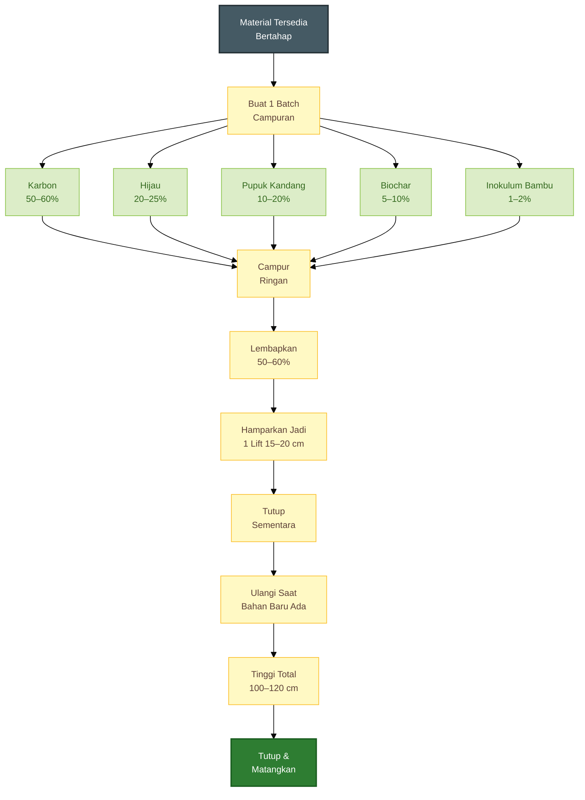

---

### 5.6.6 Mengapa SOP B cocok untuk metode tanpa pembalikan?

Pada metode tanpa pembalikan, isi tumpukan harus cukup seimbang sejak awal. Jika bahan disusun dalam lapisan elemen tunggal yang terlalu tebal, bisa muncul zona ekstrem:

- lapisan hijau terlalu basah,
- lapisan pupuk kandang terlalu pekat,
- lapisan karbon terlalu kering,
- lapisan inokulum terlalu lokal,
- lapisan bawah terlalu padat.

Dengan metode campur-batch, bahan lebih tersebar. Mikroba dari rizosfer bambu lebih mudah menjangkau bahan organik. Biochar dan sekam lebih merata sebagai habitat. Bahan hijau tidak terkumpul terlalu tebal di satu titik. Risiko busuk anaerob lebih rendah.

Jadi, untuk kondisi lapangan yang bahan-bahannya datang bertahap, SOP B bukan hanya lebih realistis, tetapi juga lebih cocok untuk metode kompos pasif.

---

## 5.7 Dua strategi inokulasi rizosfer bambu

Inokulum rizosfer bambu dapat dimasukkan dengan dua strategi.

---

### Strategi 1 — Inokulasi sejak awal

Pada strategi ini, tanah rizosfer bambu, akar halus, atau serasah bambu setengah lapuk dimasukkan sejak awal penyusunan tumpukan atau sejak pembuatan batch pertama.

Cocok untuk:

- kompos daun,
- kompos serasah,
- bahan yang relatif bersih,
- metode pasif dingin atau mesofilik,
- SOP B dengan batch kecil dan tidak terlalu panas.

Kelebihan:

- sederhana,
- meniru akumulasi alami lantai bambu,
- mikroba tersebar sejak awal,
- cocok untuk bahan dominan karbon.

Kekurangan:

- jika tumpukan menjadi terlalu panas, sebagian mikroba rizosfer bisa mati,
- jika bahan terlalu basah, mikroba baik bisa kalah oleh mikroba pembusuk,
- kurang cocok untuk bahan yang banyak pupuk kandang segar.

---

### Strategi 2 — Inokulasi saat fase pendinginan atau pematangan

Pada strategi ini, bahan dikomposkan terlebih dahulu sampai melewati fase aktif. Setelah suhu mulai turun dan bahan lebih stabil, inokulum rizosfer bambu baru ditambahkan.

Cocok untuk:

- kompos campuran,
- kompos yang banyak pupuk kandang,
- kompos yang sempat panas,
- kompos untuk cabai,
- kompos yang ingin diperkaya mikroba sebelum aplikasi.

Kelebihan:

- mikroba rizosfer lebih mungkin bertahan,
- lebih aman untuk kompos cabai,
- mengurangi risiko mikroba baik mati karena panas tinggi,
- cocok untuk kompos yang akan digunakan dekat zona akar.

Kekurangan:

- perlu memantau suhu,
- membutuhkan langkah tambahan,
- tidak sesederhana memasukkan semua bahan sejak awal.

Rekomendasi utama untuk cabai:

> Jika bahan kompos sempat mengalami fase panas, tambahkan inokulum rizosfer bambu saat fase pendinginan atau pematangan.

Namun, jika metode yang digunakan adalah SOP B dengan batch kecil, dominan bahan karbon, tidak terlalu panas, dan bahan relatif bersih, inokulum dapat dimasukkan sejak awal dalam jumlah kecil dan tersebar.

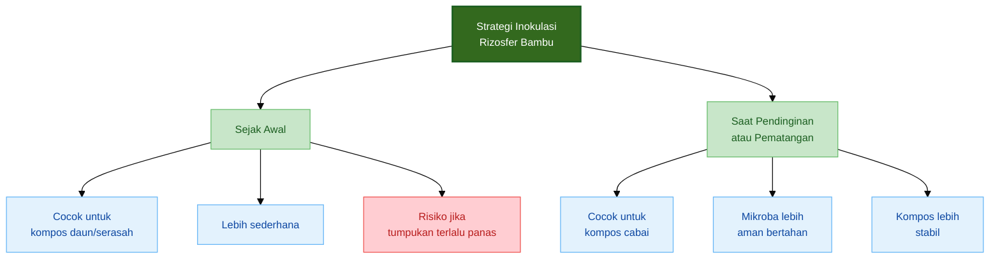

---

## 5.8 Tanda proses berjalan baik dan koreksi masalah

Kompos hidup tetap perlu dipantau. Metode pasif tanpa pembalikan bukan berarti dibiarkan tanpa pengamatan. Prinsipnya adalah **tidak dibalik rutin**, tetapi tetap dikoreksi jika muncul tanda masalah.

---

### 5.8.1 Tanda proses berjalan baik

Tanda positif:

- tumpukan hangat pada awal proses,
- tidak bau busuk,
- tidak berlendir,
- bahan mulai melunak,
- warna makin gelap,
- volume tumpukan sedikit menyusut,
- muncul bau tanah segar saat matang,
- suhu turun mendekati suhu lingkungan,
- tekstur menjadi remah,
- bahan asal tidak dominan terlihat.

Pada metode pasif, suhu tidak harus selalu sangat tinggi. Jika bahan dominan karbon dan tidak terlalu banyak pupuk kandang, proses bisa berjalan lebih lambat dan lebih stabil. Yang penting adalah tidak busuk, tidak terlalu kering, tidak terlalu basah, dan bahan terus mengalami perubahan.

---

### 5.8.2 Tanda proses bermasalah

Tanda yang perlu diwaspadai:

- bau busuk,
- bau amonia tajam,
- terlalu basah,
- berlendir,
- banyak lalat,
- bahan tidak berubah,
- terlalu kering,
- panas berlebihan terlalu lama,
- bagian bawah terlalu padat,
- air keluar dari tumpukan.

---

### 5.8.3 Koreksi masalah

| Masalah             | Kemungkinan Penyebab                      | Tindakan Koreksi                                 |
| ------------------- | ----------------------------------------- | ------------------------------------------------ |
| Bau busuk           | Terlalu basah, kurang oksigen             | Tambah bahan kering, buka penutup, beri aerasi   |
| Bau amonia          | Bahan hijau atau pupuk kandang berlebihan | Tambah daun kering, sekam, jerami, serasah       |
| Berlendir           | Anaerob, terlalu padat                    | Tambah bahan kasar, longgarkan bagian bermasalah |
| Banyak lalat        | Bahan basah terbuka                       | Tutup dengan bahan kering atau penutup berpori   |
| Terlalu kering      | Kurang air, terlalu terbuka               | Siram ringan, tutup kembali                      |
| Tidak ada perubahan | Terlalu kering atau miskin nitrogen       | Tambah sedikit bahan hijau dan lembapkan         |
| Terlalu panas lama  | Nitrogen berlebihan atau terlalu padat    | Tambah karbon, longgarkan bagian tertentu        |
| Bagian bawah becek  | Drainase buruk                            | Tinggikan alas, tambah bahan kasar di bawah      |

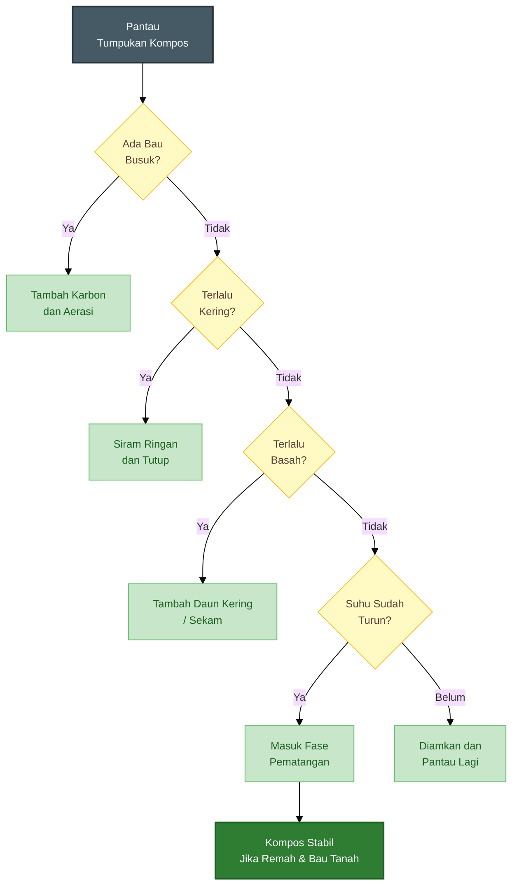

---

## 5.9 Ringkasan pilihan SOP

SOP A dan SOP B sama-sama dapat digunakan. Perbedaannya terletak pada kondisi bahan dan cara penyusunan.

| Aspek                           | SOP A: Material Lengkap                           | SOP B: Material Bertahap                    |
| ------------------------------- | ------------------------------------------------- | ------------------------------------------- |
| Kondisi bahan                   | Semua tersedia sejak awal                         | Tersedia sedikit demi sedikit               |
| Model susunan                   | Lapisan elemen lebih rapi                         | Batch campuran disusun bertahap             |
| Cocok untuk                     | Pelatihan, kebun terencana, produksi kompos besar | Praktik harian petani, kebun kecil-menengah |
| Struktur tumpukan               | Ulangan lapisan elemen                            | Ulangan lift/batch campuran                 |
| Jumlah ulangan                  | 4–5 ulangan                                       | 4–5 batch/lift                              |
| Tebal tiap ulangan              | ±18–22 cm                                         | 15–20 cm                                    |
| Fleksibilitas                   | Sedang                                            | Tinggi                                      |
| Risiko zona ekstrem             | Lebih tinggi jika lapisan terlalu tebal           | Lebih rendah karena bahan dicampur          |
| Kemiripan dengan rizosfer bambu | Baik sebagai model edukatif                       | Lebih mendekati akumulasi alami             |
| Rekomendasi praktik             | Baik jika bahan lengkap                           | Paling realistis untuk lapangan             |

Gunakan **SOP A** jika:

- bahan tersedia lengkap,
- ingin membuat tumpukan sekaligus,
- tenaga kerja tersedia pada hari yang sama,
- tujuan utama adalah produksi kompos terencana,
- susunan bahan ingin mudah diawasi.

Gunakan **SOP B** jika:

- bahan tersedia bertahap,
- bahan organik berasal dari aktivitas harian kebun,
- tempat kompos terbatas,
- tenaga kerja terbatas,
- ingin metode lebih fleksibel,
- ingin meniru akumulasi alami seperti lantai rumpun bambu.

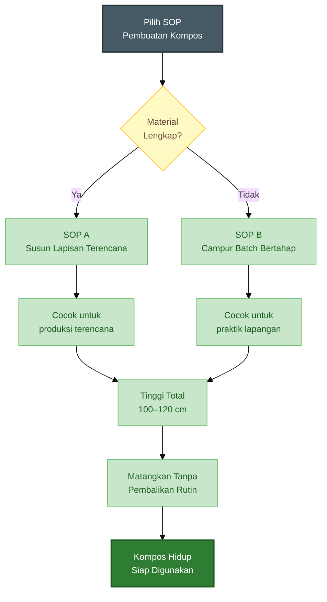

---

## Ringkasan Bab 5

Metode membuat kompos hidup berbasis rizosfer bambu harus meniru prinsip alami lantai rumpun bambu: bahan organik tersedia, mikroba memiliki makanan dan habitat, kelembapan stabil, oksigen cukup, gangguan rendah, dan proses diberi waktu sampai matang.

Bahan utama kompos terdiri dari bahan karbon, bahan hijau, pupuk kandang matang atau semi matang, biochar atau sekam bakar, serta sedikit inokulum rizosfer bambu. Formula praktis yang digunakan adalah:

$$
\text{Karbon} : \text{Hijau} : \text{Pupuk Kandang}
=
3 : 1 : 1
$$

Dengan tambahan:

$$
\text{Biochar} = 5\%-10\% \times \text{total bahan}
$$

$$
\text{Inokulum rizosfer bambu} = 1\%-2\% \times \text{total bahan}
$$

Ada dua SOP utama. **SOP A** digunakan jika semua bahan tersedia lengkap sejak awal, sehingga bahan dapat disusun sebagai lapisan terencana. **SOP B** digunakan jika bahan tersedia bertahap, sehingga setiap bahan dicampur menjadi batch kecil yang seimbang, lalu ditambahkan ke tumpukan sebagai lapisan campuran.

Untuk praktik lapangan, SOP B sering lebih realistis karena mengikuti pola alami kebun dan lebih mendekati akumulasi serasah di bawah rumpun bambu. Namun, SOP A tetap berguna jika bahan tersedia lengkap dan pembuatan kompos dilakukan secara terencana.

Dalam kedua SOP, tinggi tumpukan sebaiknya dijaga pada kisaran **100–120 cm**, lapisan dasar aerasi **15–20 cm**, dan penutup atas **5–8 cm**. Tumpukan tidak perlu dibalik rutin, tetapi tetap harus dipantau. Koreksi dilakukan jika terlalu basah, bau busuk, terlalu kering, berlendir, atau terlalu panas terlalu lama.

Inti dari metode ini adalah:

> Kompos hidup bukan hanya bahan organik yang membusuk, tetapi ekosistem mikroba yang dibangun secara terarah. Rizosfer bambu memberi inspirasi bahwa tanah sehat terbentuk dari bahan organik, mikroba, pori udara, kelembapan stabil, dan waktu. Dengan meniru prinsip tersebut, kompos dapat menjadi bahan pembentuk rizosfer sehat untuk budidaya cabai.

---

# 6. Aplikasi Kompos Hidup pada Budidaya Cabai

Kompos hidup berbasis rizosfer bambu tidak akan memberi hasil optimal jika aplikasinya salah. Kompos yang baik tetap harus digunakan pada waktu, dosis, dan cara yang tepat.

Dalam budidaya cabai, kompos terutama berfungsi untuk membangun zona akar yang sehat. Maka, aplikasinya harus diarahkan ke bedengan dan rizosfer, bukan sekadar ditebar sembarangan.

---

## 6.1 Kapan kompos digunakan?

Waktu aplikasi kompos pada cabai dapat dibagi menjadi empat tahap:

- 4–6 minggu sebelum tanam,
- 2–3 minggu sebelum tanam,
- saat tanam dalam dosis kecil,
- setelah panen untuk pemulihan tanah.

### 4–6 minggu sebelum tanam

Ini adalah waktu terbaik untuk aplikasi kompos sebagai pembenah tanah. Kompos dicampurkan ke bedengan agar tanah lebih remah, bahan organik meningkat, dan mikroba mulai aktif.

### 2–3 minggu sebelum tanam

Pada tahap ini, kompos dapat digunakan sebagai pembawa agen hayati atau inokulum rizosfer bambu. Jika menggunakan kompos hidup yang sudah matang, aplikasikan ke lapisan atas bedengan lalu tutup dengan mulsa.

### Saat tanam

Kompos dapat diberikan dalam dosis kecil di sekitar lubang tanam, tetapi harus benar-benar matang. Jangan meletakkan kompos panas atau kompos mentah langsung bersentuhan dengan akar muda.

### Setelah panen

Setelah tanaman cabai selesai, kompos digunakan untuk memulihkan tanah. Ini penting karena satu musim cabai dapat menguras banyak energi tanah, terutama jika produksi tinggi.

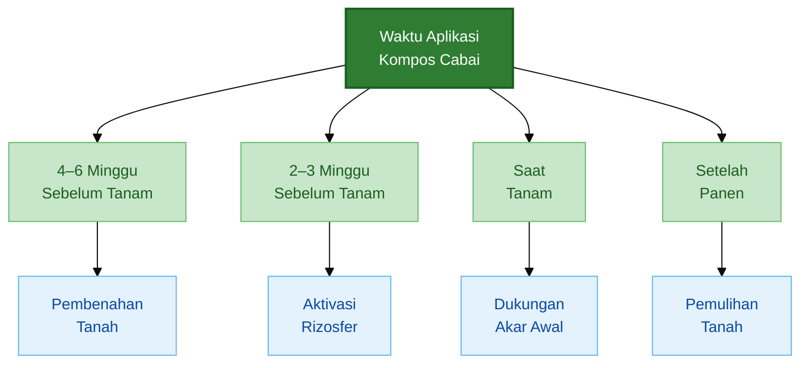

---

## 6.2 Dosis aplikasi

Dosis umum kompos untuk bedengan cabai adalah:

$$
\begin{aligned}
10\text{--}20 \ \text{ton/ha} &= 1\text{--}2 \ \text{kg/m}^2
\end{aligned}
$$

Untuk lubang tanam:

$$
200\text{--}300 \ \text{gram/lubang}
$$

Dosis tersebut dapat disesuaikan dengan kondisi tanah. Tanah yang miskin bahan organik, keras, atau lama ditanami cabai terus-menerus biasanya membutuhkan dosis lebih tinggi dan perbaikan bertahap.

Namun, dosis tinggi tidak berarti lebih baik jika kompos belum matang. Kompos matang dosis sedang lebih aman daripada kompos mentah dosis besar.

Pedoman praktis:

| Kondisi Tanah              |        Dosis Kompos |
| -------------------------- | ------------------: |
| Tanah cukup baik           |             1 kg/m² |
| Tanah sedang menurun       |           1,5 kg/m² |
| Tanah keras/miskin organik |             2 kg/m² |
| Lubang tanam               | 200–300 gram/lubang |

Untuk tanah rusak berat, perbaikan sebaiknya dilakukan bertahap beberapa musim, bukan memaksakan semua bahan organik sekaligus.

---

## 6.3 Rumus kebutuhan kompos

Untuk menghitung kebutuhan kompos berdasarkan luas bedengan, gunakan rumus:

$$
\begin{aligned}
\text{Kebutuhan kompos }(\text{kg})
&= \text{Dosis kompos }(\text{kg/m}^2) \times \text{Luas bedengan }(\text{m}^2)
\end{aligned}
$$

Contoh:

$$
\begin{aligned}
2 \ \text{kg/m}^2 \times 500 \ \text{m}^2 &= 1.000 \ \text{kg kompos}
\end{aligned}
$$

Jadi, untuk bedengan seluas **500 m²** dengan dosis **2 kg/m²**, kebutuhan kompos adalah **1.000 kg** atau **1 ton**.

Jika ingin menghitung kebutuhan kompos per lubang tanam:

$$
\begin{aligned}
\text{Kebutuhan kompos lubang }(\text{kg})
&= \frac{\text{Jumlah tanaman} \times \text{Dosis per lubang }(\text{gram})}{1000}
\end{aligned}
$$

Contoh:

Jumlah tanaman adalah **2.000 tanaman** dan dosis kompos per lubang adalah **250 gram**.

$$
\begin{aligned}
\frac{2.000 \times 250}{1000} &= 500 \ \text{kg}
\end{aligned}
$$

Jadi, kebutuhan kompos untuk lubang tanam adalah **500 kg**.

Jika jumlah tanaman belum diketahui, dapat dihitung dari jarak tanam:

$$
\begin{aligned}
\text{Jumlah tanaman}
&= \frac{\text{Luas tanam }(\text{m}^2)}{\text{Jarak antarbaris }(\text{m}) \times \text{Jarak dalam baris }(\text{m})}
\end{aligned}
$$

Contoh:

Luas tanam **1.000 m²**, jarak tanam **0,6 m × 0,6 m**.

$$
\begin{aligned}
\text{Jumlah tanaman}
&= \frac{1.000}{0{,}6 \times 0{,}6} \\
&= \frac{1.000}{0{,}36} \\
&= 2.777{,}8
\end{aligned}
$$

Dibulatkan menjadi sekitar **2.778 tanaman**.

---

## 6.4 Cara aplikasi aman

Kompos hidup harus diaplikasikan dengan cara yang aman agar manfaatnya maksimal dan tidak merusak akar cabai.

Prinsip aplikasi:

- jangan gunakan kompos panas,
- jangan gunakan kompos busuk,
- jangan menempelkan kompos pekat langsung ke akar muda,
- campur dengan tanah,
- jaga kelembapan,
- kombinasikan dengan mulsa,
- pastikan drainase baik.

Untuk aplikasi sebelum tanam, kompos dapat dicampur merata ke lapisan atas bedengan. Setelah itu, bedengan dilembapkan dan dibiarkan beberapa minggu sebelum tanam.

Untuk aplikasi lubang tanam, kompos harus dicampur dengan tanah terlebih dahulu. Jangan membuat akar bibit langsung menyentuh gumpalan kompos pekat, terutama jika kompos belum benar-benar stabil.

Untuk aplikasi setelah tanam, kompos dapat diberikan sebagai top dressing tipis di sekitar zona akar, tetapi jangan menumpuk terlalu dekat ke pangkal batang. Jarak aman dari pangkal batang penting untuk mengurangi risiko kelembapan berlebih dan busuk pangkal.

```mermaid
%%{init: {'theme': 'base', 'themeVariables': { 'fontSize': '14px', 'fontFamily': 'Arial' }}}%%
flowchart TD
    A["Kompos Hidup"] --> B{"Sudah<br/>Matang?"}
    B -->|"Tidak"| C["Matangkan<br/>Lagi"]
    B -->|"Ya"| D["Campur dengan<br/>Tanah"]
    D --> E["Aplikasi ke<br/>Bedengan"]
    D --> F["Dosis Kecil di<br/>Lubang Tanam"]
    E --> G["Tutup Mulsa &<br/>Jaga Lembap"]
    F --> H["Jangan Sentuh<br/>Akar Langsung"]
    G --> I["Rizosfer Cabai<br/>Lebih Sehat"]
    H --> I

    classDef awal fill:#6d4c41,color:#ffffff,stroke:#3e2723,stroke-width:2px;
    classDef tanya fill:#fff9c4,color:#5d4037,stroke:#fbc02d,stroke-width:1px;
    classDef bahaya fill:#ffcdd2,color:#b71c1c,stroke:#ef5350,stroke-width:1px;
    classDef aman fill:#c8e6c9,color:#1b5e20,stroke:#66bb6a,stroke-width:1px;
    classDef hasil fill:#2e7d32,color:#ffffff,stroke:#1b5e20,stroke-width:2px;

    class A awal;
    class B tanya;
    class C bahaya;
    class D,E,F,G,H aman;
    class I hasil;
```

Kompos tidak akan bekerja baik jika drainase buruk. Pada cabai, tanah yang terlalu basah dapat menyebabkan akar kekurangan oksigen. Karena itu, kompos harus selalu dikombinasikan dengan bedengan yang baik, saluran air lancar, dan mulsa yang sesuai.

---

## 6.5 Indikator keberhasilan pada tanah

Keberhasilan aplikasi kompos hidup dapat dilihat dari perubahan kondisi tanah. Indikator ini biasanya tidak muncul dalam satu malam, tetapi mulai terlihat setelah beberapa minggu sampai satu musim tanam.

Tanda pada tanah:

- tanah lebih remah,
- bau tanah segar,
- air meresap baik,
- akar halus meningkat,
- mulsa terurai normal,
- tanah tidak mudah keras.

Tanah yang membaik biasanya lebih mudah diolah, tidak terlalu lengket saat basah, dan tidak terlalu keras saat kering. Saat digenggam dalam kondisi lembap, tanah dapat membentuk gumpalan ringan tetapi mudah pecah kembali.

Air juga menjadi indikator penting. Tanah yang sehat mampu menerima air tanpa langsung menggenang, tetapi juga tidak langsung kering terlalu cepat. Ini menunjukkan pori air dan pori udara mulai membaik.

Bau tanah segar menandakan proses biologis berjalan lebih sehat. Sebaliknya, bau busuk menunjukkan tanah terlalu basah atau kekurangan oksigen.

---

## 6.6 Indikator keberhasilan pada cabai

Selain tanah, keberhasilan kompos hidup juga harus dilihat pada tanaman cabai.

Tanda pada tanaman:

- bibit cepat pulih,
- akar putih dan bercabang,
- tanaman tumbuh seragam,
- daun segar,
- bunga lebih stabil,
- buah lebih seragam,
- tanaman tidak cepat drop setelah panen awal.

Pada fase awal, indikator yang paling mudah dilihat adalah pemulihan bibit setelah pindah tanam. Bibit yang masuk ke tanah sehat biasanya lebih cepat membentuk tunas baru dan tidak terlalu lama stagnan.

Pada fase vegetatif, tanaman tumbuh lebih seragam. Keseragaman penting karena memudahkan pemupukan, pengairan, dan pengendalian hama penyakit.

Pada fase berbunga dan berbuah, manfaat kompos terlihat dari stabilitas tanaman. Tanaman dengan akar sehat lebih mampu mempertahankan bunga dan mengisi buah. Jika tanaman cepat drop setelah panen awal, salah satu hal yang perlu diperiksa adalah kondisi akar dan tanah, bukan hanya dosis pupuk.

```mermaid
%%{init: {'theme': 'base', 'themeVariables': { 'fontSize': '14px', 'fontFamily': 'Arial' }}}%%
flowchart TD
    A["Kompos Hidup"] --> B["Aplikasi ke<br/>Bedengan"]
    B --> C["Tanah Lebih<br/>Remah"]
    B --> D["Mikroba Lebih<br/>Aktif"]
    B --> E["Hara<br/>Bertahap"]

    C --> F["Akar Cabai<br/>Sehat"]
    D --> F
    E --> F

    F --> G["Tanaman Lebih<br/>Stabil"]
    G --> H["Panen Lebih<br/>Produktif"]

    classDef awal fill:#6d4c41,color:#ffffff,stroke:#3e2723,stroke-width:2px;
    classDef proses fill:#c8e6c9,color:#1b5e20,stroke:#66bb6a,stroke-width:1px;
    classDef akar fill:#e3f2fd,color:#0d47a1,stroke:#64b5f6,stroke-width:1px;
    classDef hasil fill:#2e7d32,color:#ffffff,stroke:#1b5e20,stroke-width:2px;

    class A awal;
    class B,C,D,E,G proses;
    class F akar;
    class H hasil;
```

Akar tetap menjadi indikator paling penting. Jika memungkinkan, cabut beberapa tanaman contoh dari titik yang tumbuh lemah dan periksa akarnya.

Akar sehat biasanya:

- putih atau krem muda,
- bercabang banyak,
- tidak berlendir,
- tidak berbau busuk,
- menyebar aktif di tanah.

---

## 6.7 Kesalahan umum

Beberapa kesalahan sering membuat penggunaan kompos tidak memberi hasil optimal, bahkan menimbulkan masalah baru.

### 1. Memakai kompos mentah

Ini kesalahan paling berbahaya untuk cabai. Kompos mentah dapat membuat akar stres, menyebabkan bau amonia, memicu pembusukan, dan mengganggu pertumbuhan awal.

### 2. Memakai tanah bambu dari lokasi tercemar

Rizosfer bambu hanya aman jika sumbernya sehat. Jangan mengambil dari dekat limbah, saluran pembuangan, tempat sampah, atau area yang sering terkena bahan kimia keras.

### 3. Membuat kompos terlalu basah

Tumpukan yang terlalu basah akan kekurangan oksigen dan berubah menjadi busuk. Tandanya bau menyengat, berlendir, dan banyak lalat.

### 4. Menganggap starter bambu sebagai solusi tunggal

Inokulum bambu membantu memperkaya mikroba, tetapi tidak menggantikan prinsip dasar kompos. Bahan tetap harus seimbang, cukup udara, lembap stabil, dan matang.

### 5. Tidak mematangkan kompos

Kompos harus stabil sebelum digunakan. Jangan hanya melihat warna gelap. Lakukan uji bau, suhu, tekstur, dan bila perlu uji kecambah.

### 6. Memberi kompos terlalu dekat ke pangkal batang

Kompos yang menumpuk di pangkal batang dapat mempertahankan kelembapan berlebih dan meningkatkan risiko busuk pangkal, terutama pada musim hujan.

### 7. Mengabaikan drainase

Kompos tidak akan memperbaiki cabai jika bedengan tetap tergenang. Tanah hidup membutuhkan air dan udara yang seimbang. Drainase tetap menjadi syarat utama.

```mermaid
%%{init: {'theme': 'base', 'themeVariables': { 'fontSize': '14px', 'fontFamily': 'Arial' }}}%%
flowchart TD
    A["Kesalahan Umum"] --> B["Kompos<br/>Mentah"]
    A --> C["Sumber Bambu<br/>Tercemar"]
    A --> D["Terlalu<br/>Basah"]
    A --> E["Starter Dianggap<br/>Solusi Tunggal"]
    A --> F["Drainase<br/>Diabaikan"]

    B --> G["Akar<br/>Stres"]
    C --> H["Risiko Cemaran<br/>dan Patogen"]
    D --> I["Anaerob<br/>dan Busuk"]
    E --> J["Proses Kompos<br/>Tetap Gagal"]
    F --> K["Akar Cabai<br/>Kekurangan Oksigen"]

    classDef pusat fill:#c62828,color:#ffffff,stroke:#8e0000,stroke-width:2px;
    classDef salah fill:#ffcdd2,color:#b71c1c,stroke:#ef5350,stroke-width:1px;
    classDef dampak fill:#ffe0b2,color:#e65100,stroke:#ff9800,stroke-width:1px;

    class A pusat;
    class B,C,D,E,F salah;
    class G,H,I,J,K dampak;
```

---

## Ringkasan Bab 5–6

Kompos hidup berbasis rizosfer bambu dibuat dengan meniru prinsip lantai rumpun bambu: bahan organik berlapis, tidak dipadatkan, lembap stabil, cukup udara, diberi sedikit inokulum rizosfer bambu, dan dimatangkan sampai stabil.

Bahan utama kompos terdiri dari bahan karbon, bahan nitrogen, bahan habitat mikroba, dan inokulum rizosfer bambu. Formula praktis yang dapat digunakan adalah:

$$
\text{Bahan Kering} : \text{Bahan Hijau} : \text{Pupuk Kandang} = 3 : 1 : 1
$$

Untuk setiap 100 kg bahan utama, dapat ditambahkan biochar sebanyak 5–10 kg dan tanah rizosfer bambu sekitar 1–2 kg.

Dalam pembuatan kompos, inokulum rizosfer bambu dapat diberikan sejak awal atau saat fase pendinginan. Untuk budidaya cabai, strategi yang lebih aman adalah menambahkan inokulum saat fase pendinginan atau pematangan, terutama jika kompos sempat mengalami fase panas.

Aplikasi kompos hidup pada cabai dapat dilakukan 4–6 minggu sebelum tanam, 2–3 minggu sebelum tanam, saat tanam dalam dosis kecil, dan setelah panen untuk pemulihan tanah. Dosis umum adalah:

$$
\begin{aligned}
10\text{--}20 \ \text{ton/ha} &= 1\text{--}2 \ \text{kg/m}^2
\end{aligned}
$$

Untuk lubang tanam:

$$
200\text{--}300 \ \text{gram/lubang}
$$

Keberhasilan aplikasi terlihat dari tanah yang lebih remah, bau tanah segar, air meresap baik, akar putih bercabang, tanaman tumbuh seragam, bunga lebih stabil, dan tanaman tidak cepat drop setelah panen awal.

Inti dari metode ini adalah:

> Kompos hidup bukan sekadar pupuk organik, tetapi bahan biologis untuk membangun rizosfer sehat. Rizosfer bambu berperan sebagai inokulum mikroba, sementara kualitas kompos tetap ditentukan oleh bahan yang seimbang, kelembapan tepat, oksigen cukup, dan pematangan yang benar.

---

<small>
  **_Catatan Penyusunan_** Artikel ini disusun sebagai materi edukasi dan
  referensi umum berdasarkan berbagai sumber pustaka, praktik lapangan, serta
  bantuan alat penulisan. Pembaca disarankan untuk melakukan verifikasi lanjutan
  dan penyesuaian sesuai dengan kondisi serta kebutuhan masing-masing sistem.
</small>
