# **_Pedoman Terpadu Menekan Serangan Lalat Buah di Kebun Campuran_**

---

- [**_Pedoman Terpadu Menekan Serangan Lalat Buah di Kebun Campuran_**](#pedoman-terpadu-menekan-serangan-lalat-buah-di-kebun-campuran)
- [Bab 1 — Masalah inti, konteks kebun campuran, dan prinsip IPM yang dipakai](#bab-1--masalah-inti-konteks-kebun-campuran-dan-prinsip-ipm-yang-dipakai)
  - [1.1 Lalat buah sebagai masalah produksi dan mutu buah](#11-lalat-buah-sebagai-masalah-produksi-dan-mutu-buah)
  - [1.2 Kenapa kebun campuran memperpanjang siklus serangan](#12-kenapa-kebun-campuran-memperpanjang-siklus-serangan)
  - [1.3 IPM/PHT: tujuan, prinsip, dan batasannya](#13-ipmpht-tujuan-prinsip-dan-batasannya)
  - [1.4 AWM sebagai penguatan IPM di tingkat hamparan](#14-awm-sebagai-penguatan-ipm-di-tingkat-hamparan)
  - [Penutup bab](#penutup-bab)
- [Bab 2 — Bioekologi lalat buah dan titik lemah yang bisa diputus](#bab-2--bioekologi-lalat-buah-dan-titik-lemah-yang-bisa-diputus)
  - [2.1 Siapa hama yang sedang kita hadapi](#21-siapa-hama-yang-sedang-kita-hadapi)
  - [2.2 Jantan, betina, dan implikasinya untuk trap](#22-jantan-betina-dan-implikasinya-untuk-trap)
  - [2.3 Siklus hidup dan lokasi fase kritis](#23-siklus-hidup-dan-lokasi-fase-kritis)
  - [2.4 Titik lemah siklus hidup yang bisa diputus](#24-titik-lemah-siklus-hidup-yang-bisa-diputus)
  - [2.5 Mengapa gumuk, dataran bawah, dan parit penting](#25-mengapa-gumuk-dataran-bawah-dan-parit-penting)
  - [2.6 Tabel fase hidup vs titik intervensi IPM](#26-tabel-fase-hidup-vs-titik-intervensi-ipm)
  - [Penutup bab](#penutup-bab-1)
- [Bab 3 — Diagnosis kebun dan sistem monitoring yang benar](#bab-3--diagnosis-kebun-dan-sistem-monitoring-yang-benar)
  - [3.1 Monitoring populasi dewasa](#31-monitoring-populasi-dewasa)
  - [3.2 Monitoring kerusakan buah](#32-monitoring-kerusakan-buah)
  - [3.3 Monitoring fase fenologi tanaman](#33-monitoring-fase-fenologi-tanaman)
  - [3.4 Rumus FTD dan cara membacanya](#34-rumus-ftd-dan-cara-membacanya)
  - [3.5 Kenapa FTD tidak boleh berdiri sendiri](#35-kenapa-ftd-tidak-boleh-berdiri-sendiri)
  - [3.6 Form catatan lapang minimum](#36-form-catatan-lapang-minimum)
  - [Penutup bab](#penutup-bab-2)
- [Bab 4 — Paket pencegahan budidaya: fondasi IPM](#bab-4--paket-pencegahan-budidaya-fondasi-ipm)
  - [4.1 Sanitasi sebagai pekerjaan inti](#41-sanitasi-sebagai-pekerjaan-inti)
  - [4.2 Panen, sortasi, dan pemusnahan sumber infestasi](#42-panen-sortasi-dan-pemusnahan-sumber-infestasi)
  - [4.3 Pengolahan tanah bawah tajuk dan pengelolaan pupa](#43-pengolahan-tanah-bawah-tajuk-dan-pengelolaan-pupa)
  - [4.4 Tajuk, gulma, drainase, dan kelembapan](#44-tajuk-gulma-drainase-dan-kelembapan)
  - [4.5 Pencegahan spesifik pada kebun campuran](#45-pencegahan-spesifik-pada-kebun-campuran)
  - [Ringkasan praktis bab ini](#ringkasan-praktis-bab-ini)
  - [Penutup bab](#penutup-bab-3)
- [Bab 5 — Paket intervensi bertingkat: fisik, perilaku, mikrobiologi, lalu kimia selektif](#bab-5--paket-intervensi-bertingkat-fisik-perilaku-mikrobiologi-lalu-kimia-selektif)
  - [5.1 Pembungkusan buah: kapan efektif dan untuk komoditas apa](#51-pembungkusan-buah-kapan-efektif-dan-untuk-komoditas-apa)
  - [5.2 Trap ME: fungsi, kelebihan, dan batasannya](#52-trap-me-fungsi-kelebihan-dan-batasannya)
  - [5.3 Protein bait: kapan dipakai dan apa tujuannya](#53-protein-bait-kapan-dipakai-dan-apa-tujuannya)
  - [5.4 Pengendalian mikrobiologi: _Metarrhizium_, _Beauveria_, dan posisi nyatanya](#54-pengendalian-mikrobiologi-metarrhizium-beauveria-dan-posisi-nyatanya)
  - [5.5 Kimia selektif: kapan layak dipakai, kapan tidak](#55-kimia-selektif-kapan-layak-dipakai-kapan-tidak)
  - [Ringkasan praktis bab ini](#ringkasan-praktis-bab-ini-1)
  - [Penutup bab](#penutup-bab-4)
- [Bab 6 — Prioritas tindakan per komoditas: cabai, jambu, jeruk, buah naga](#bab-6--prioritas-tindakan-per-komoditas-cabai-jambu-jeruk-buah-naga)
  - [6.1 IPM lalat buah pada cabai](#61-ipm-lalat-buah-pada-cabai)
  - [6.2 IPM lalat buah pada jambu](#62-ipm-lalat-buah-pada-jambu)
  - [6.3 IPM lalat buah pada jeruk](#63-ipm-lalat-buah-pada-jeruk)
  - [6.4 IPM lalat buah pada buah naga](#64-ipm-lalat-buah-pada-buah-naga)
  - [6.5 Ringkasan prioritas antar-komoditas](#65-ringkasan-prioritas-antar-komoditas)
  - [Penutup bab](#penutup-bab-5)
- [Bab 7 — Layout operasional lahan gumuk dan AWM di tingkat kawasan](#bab-7--layout-operasional-lahan-gumuk-dan-awm-di-tingkat-kawasan)
  - [7.1 Kenapa layout lahan penting dalam IPM](#71-kenapa-layout-lahan-penting-dalam-ipm)
  - [7.2 Zonasi operasional lahan gumuk](#72-zonasi-operasional-lahan-gumuk)
    - [Zona 0 — Parit keliling luar](#zona-0--parit-keliling-luar)
    - [Zona 1 — Perimeter/intersepsi](#zona-1--perimeterintersepsi)
    - [Zona 2 — Dataran bawah/kaki gumuk](#zona-2--dataran-bawahkaki-gumuk)
    - [Zona 3 — Cincin atas/lereng atas produktif](#zona-3--cincin-ataslereng-atas-produktif)
    - [Zona 4 — Puncak inti](#zona-4--puncak-inti)
    - [Zona 5 — Hotspot fleksibel](#zona-5--hotspot-fleksibel)
  - [7.3 Fungsi titik P1–P8 dan B1–B4](#73-fungsi-titik-p1p8-dan-b1b4)
    - [Titik trap P1–P8](#titik-trap-p1p8)
    - [Titik bait B1–B4](#titik-bait-b1b4)
    - [Zona prioritas per fungsi](#zona-prioritas-per-fungsi)
  - [7.4 Jalur inspeksi mingguan](#74-jalur-inspeksi-mingguan)
  - [7.5 AWM sederhana untuk satu blok petani](#75-awm-sederhana-untuk-satu-blok-petani)
    - [Siapa melakukan apa](#siapa-melakukan-apa)
    - [Kapan serempak](#kapan-serempak)
    - [Bagaimana data dicatat](#bagaimana-data-dicatat)
  - [Ringkasan praktis bab ini](#ringkasan-praktis-bab-ini-2)
  - [Penutup bab](#penutup-bab-6)
- [Bab 8 — Aturan keputusan, SOP satu musim, dan evaluasi hasil](#bab-8--aturan-keputusan-sop-satu-musim-dan-evaluasi-hasil)
  - [8.1 Matriks keputusan mingguan](#81-matriks-keputusan-mingguan)
    - [Matriks keputusan praktis](#matriks-keputusan-praktis)
  - [8.2 SOP 30 hari pertama](#82-sop-30-hari-pertama)
    - [Hari 1–7](#hari-17)
    - [Hari 8–14](#hari-814)
    - [Hari 15–21](#hari-1521)
    - [Hari 22–30](#hari-2230)
  - [8.3 SOP rutin mingguan dan bulanan](#83-sop-rutin-mingguan-dan-bulanan)
    - [SOP mingguan](#sop-mingguan)
    - [SOP bulanan](#sop-bulanan)
    - [SOP saat puncak buah](#sop-saat-puncak-buah)
    - [SOP saat tekanan tinggi](#sop-saat-tekanan-tinggi)
  - [8.4 Kriteria keberhasilan dan tanda kegagalan](#84-kriteria-keberhasilan-dan-tanda-kegagalan)
    - [Tanda keberhasilan](#tanda-keberhasilan)
    - [Tanda kegagalan](#tanda-kegagalan)
  - [8.5 Tindakan korektif bila program tidak jalan](#85-tindakan-korektif-bila-program-tidak-jalan)
    - [Koreksi tahap 1 — audit data](#koreksi-tahap-1--audit-data)
    - [Koreksi tahap 2 — audit sanitasi dan panen](#koreksi-tahap-2--audit-sanitasi-dan-panen)
    - [Koreksi tahap 3 — audit proteksi buah dan komponen betina](#koreksi-tahap-3--audit-proteksi-buah-dan-komponen-betina)
    - [Koreksi tahap 4 — audit kawasan/AWM](#koreksi-tahap-4--audit-kawasanawm)
    - [Kapan strategi dinaikkan, dipertahankan, atau dikoreksi](#kapan-strategi-dinaikkan-dipertahankan-atau-dikoreksi)
  - [Tiga alat bantu yang cukup](#tiga-alat-bantu-yang-cukup)
    - [1. Form monitoring mingguan](#1-form-monitoring-mingguan)
    - [2. Denah layout](#2-denah-layout)
    - [3. Checklist keputusan lapang 1 halaman](#3-checklist-keputusan-lapang-1-halaman)
  - [Penutup bab](#penutup-bab-7)
- [Lampiran A. Layout lahan Gambiran 3.150 m²](#lampiran-a-layout-lahan-gambiran-3150-m)
- [Lampiran B. Denah titik perangkap P1–P8](#lampiran-b-denah-titik-perangkap-p1p8)
- [Lampiran C. Skema zonasi kerja: parit, perimeter, dataran bawah, cincin atas, puncak, hotspot](#lampiran-c-skema-zonasi-kerja-parit-perimeter-dataran-bawah-cincin-atas-puncak-hotspot)
- [Lampiran D. SOP mingguan sanitasi, trap, bait, pembungkusan, dan pembalikan tanah](#lampiran-d-sop-mingguan-sanitasi-trap-bait-pembungkusan-dan-pembalikan-tanah)
- [Lampiran E. Cara hitung FTD + contoh lembar pencatatan](#lampiran-e-cara-hitung-ftd--contoh-lembar-pencatatan)
- [Contoh hitung](#contoh-hitung)
  - [Contoh lembar pencatatan lapang](#contoh-lembar-pencatatan-lapang)
  - [Format kosong yang bisa dipakai berulang](#format-kosong-yang-bisa-dipakai-berulang)
- [Lampiran F. Program kerja setahun Mei 2026–April 2027 untuk kebun contoh](#lampiran-f-program-kerja-setahun-mei-2026april-2027-untuk-kebun-contoh)

---

# Bab 1 — Masalah inti, konteks kebun campuran, dan prinsip IPM yang dipakai

Lalat buah bukan sekadar hama yang “mengotori” buah. Pada sistem hortikultura, ia menyerang langsung komponen yang bernilai jual paling tinggi, yaitu buah. Karena itu, dampaknya tidak berhenti pada penurunan hasil, tetapi juga menurunkan mutu, mempercepat busuk, meningkatkan buah gugur, dan memperbesar penolakan pasar. Buku teknis Direktorat Jenderal Hortikultura menegaskan bahwa lalat buah sudah berstatus merugikan secara ekonomi pada buah-buahan dan sayuran, dan pengetahuan taksonomi, bioekologi, serta teknologi pengendaliannya diperlukan agar pengendalian bisa dilakukan secara tepat dan efisien. ([Hortikultura][1])

Bab ini menempatkan masalah lalat buah di kebun campuran secara tepat sejak awal. Intinya sederhana: pada kebun campuran, tekanan serangan tidak berasal dari satu tanaman atau satu musim saja, tetapi dari jaringan inang yang saling menyambung. Karena itu, artikel ini tidak memakai logika “obat apa yang dipakai”, melainkan memakai **IPM/PHT**: mencegah lebih dulu, memantau secara disiplin, bertindak berdasarkan tingkat risiko, lalu mengevaluasi hasil dan menyesuaikan strategi. Dalam kerangka yang lebih luas, **AWM** dipakai sebagai bentuk penerapan IPM pada tingkat hamparan atau kawasan. ([US EPA][2])

<ResourceBox
  title="Artikel Terkait:"
  items={[
    {
      name: 'README — Framework Praktis Memulai Bisnis Agribisnis Terpadu di Lahan Gumuk Berlereng',
      href: '/blog/agri/kebon/agribisnis-gumuk/README',
    },
    {
      name: 'OPT Penggagal Panen pada Cabai Rawit dan Cabai Besar',
      href: '/blog/agri/kebon/pengendalian-opt-cabai',
    },
    {
      name: 'Pedoman Terpadu Mencegah Gagal Panen Cabai Akibat Kutu Kebul dan Thrips',
      href: '/blog/agri/kebon/pengendalian-kutu-kebul-thrips',
    },
    {
      name: 'Panduan Praktis Talas untuk Kebun Gumuk',
      href: '/blog/agri/kebon/budidaya-talas-gumuk',
    },
    {
      name: 'README - Pupuk Tepat, Panen Untung - Model Low-Lab untuk Petani Makmur di Gambiran',
      href: '/blog/agri/pupuk-terintegrasi/README',
    },
  ]}
/>

## 1.1 Lalat buah sebagai masalah produksi dan mutu buah

Lalat buah menjadi masalah serius karena merusak buah pada fase yang paling menentukan nilai ekonomi. Betina menusukkan ovipositor ke buah untuk meletakkan telur, larva berkembang di dalam daging buah, lalu buah melunak, membusuk, dan sering gugur sebelum layak panen. Itulah sebabnya kerusakan akibat lalat buah sering terlihat “terlambat”: dari luar buah tampak hanya ada titik kecil, tetapi dari dalam kerusakan sudah berkembang. Pada banyak komoditas hortikultura, lalat buah juga menjadi hambatan mutu dan pemasaran karena keberadaan larva di dalam buah langsung menurunkan nilai jual. ([Hortikultura][1])

Masalah ini menjadi lebih berat karena lalat buah bukan hama yang menyerang secara acak. Ia memilih buah yang sesuai, memanfaatkan fase buah rentan, dan berkembang biak cepat ketika buah terserang dibiarkan jatuh ke tanah. Buku teknis hortikultura menyebut bahwa monitoring lalat buah perlu dilakukan terus-menerus karena tujuan utamanya bukan hanya menghitung populasi, tetapi juga mengetahui distribusi, perkembangan populasi, deteksi dini, dan mengevaluasi efektivitas pengendalian. Artinya, sejak awal lalat buah harus diperlakukan sebagai **masalah sistem**, bukan gangguan insidental. ([Hortikultura][1])

## 1.2 Kenapa kebun campuran memperpanjang siklus serangan

Kebun campuran cabai, jambu, buah naga, dan jeruk sangat rawan karena menyediakan **rantai inang yang tidak putus**. Ketika satu komoditas selesai atau belum terlalu rentan, komoditas lain bisa sedang masuk fase buah yang disukai lalat buah. Dalam praktiknya, ini membuat populasi tidak pernah benar-benar kehabisan tempat bertelur dan tempat berkembang. Karena itu, pendekatan yang hanya berfokus pada satu tanaman sering gagal, walaupun pada tanaman itu sendiri tindakan pengendaliannya terlihat sudah dilakukan. ([Hortikultura][1])

Pada kebun campuran, masalah juga diperparah oleh struktur ruang kebun. Buah yang terserang tidak selalu jatuh tepat di bawah tajuk tanaman utama; sebagian bisa tertinggal di sudut kebun, di lereng, di dataran bawah, atau terbawa ke tepi parit. Larva yang keluar dari buah kemudian masuk ke tanah untuk berpupa. Akibatnya, kebun campuran menciptakan banyak mikrohabitat yang mendukung keberlangsungan populasi: pohon buah sebagai tempat oviposisi, tanah lembap sebagai tempat pupa, dan tanaman inang lain sebagai jembatan antar-generasi. Pada lahan bertopografi gumuk, dataran bawah dan tepi parit menjadi lebih penting lagi karena cenderung lebih lembap dan lebih sering menjadi tempat berkumpulnya buah gugur. ([Hortikultura][1])

Kondisi ini menjelaskan mengapa pendekatan tunggal sering tidak memadai. **Semprot rutin** dapat gagal karena tidak otomatis menyentuh telur dan larva di dalam buah, tidak menyelesaikan masalah buah gugur, dan sering tidak efisien bila dipakai tanpa monitoring. **Trap saja** juga tidak cukup karena trap berbasis methyl eugenol terutama bekerja pada lalat jantan, sementara kerusakan buah ditentukan oleh aktivitas betina yang bertelur. Bila buah terserang tetap berserakan dan blok tetangga tetap menjadi sumber infestasi, populasi akan pulih kembali. Prinsip IPM justru lahir dari kenyataan seperti ini: satu alat tidak cukup untuk sistem yang kompleks. ([US EPA][3])

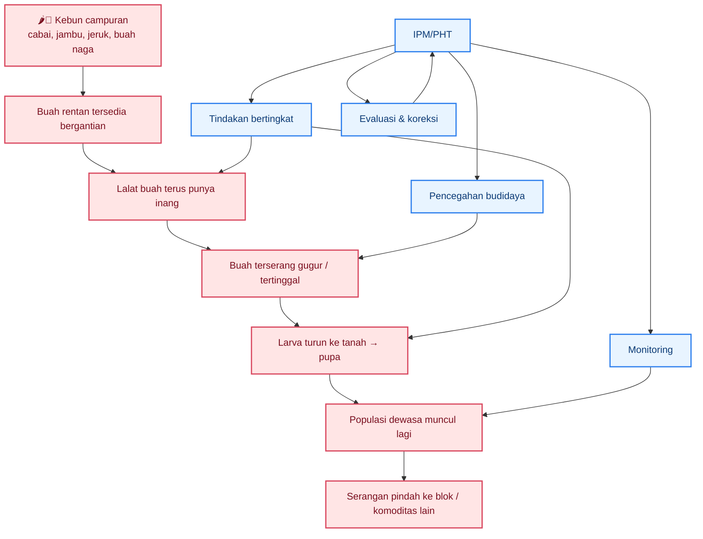

Diagram di atas menunjukkan pokok masalahnya: kebun campuran memperpanjang siklus serangan karena ada kesinambungan inang dan kesinambungan tempat berkembang. Maka fokus IPM bukan sekadar “membunuh lalat”, tetapi **memutus siklus** pada beberapa titik sekaligus. Pendekatan ini selaras dengan dokumen PHT hortikultura yang menekankan pengendalian preventif yang diintegrasikan dalam budidaya, lalu diikuti tindakan responsif sesuai hasil pengamatan lapang. ([Hortikultura][4])

## 1.3 IPM/PHT: tujuan, prinsip, dan batasannya

Dalam artikel ini, **IPM/PHT** dipakai sebagai kerangka utama. Secara praktis, IPM bukan satu metode tunggal, melainkan cara mengelola hama dengan menggabungkan identifikasi yang benar, monitoring, ambang tindakan, pencegahan, dan pengendalian bertahap yang memilih opsi efektif dengan risiko lebih rendah lebih dulu. EPA merangkum IPM ke dalam empat langkah inti: **identify and monitor**, **set action thresholds**, **prevent**, dan **control**. Sementara itu, petunjuk teknis hortikultura Indonesia menegaskan bahwa pengendalian OPT diarahkan agar populasi atau tingkat serangan tidak menurunkan produksi dan menimbulkan kerugian ekonomi nyata, dengan mendahulukan tindakan **pre-emptive** yang terintegrasi dalam sistem budidaya. ([US EPA][2])

Ada tiga konsekuensi penting dari definisi ini. Pertama, tujuan IPM bukan memburu “nol hama” secara absolut, tetapi menjaga populasi atau kerusakan tetap di bawah tingkat yang merugikan. Kedua, pestisida bukan titik awal, melainkan salah satu opsi dalam urutan tindakan. EPA secara eksplisit menyebut bahwa ketika monitoring dan action threshold menunjukkan pengendalian memang diperlukan, opsi yang lebih rendah risikonya dipilih lebih dulu; penyemprotan non-spesifik berskala luas adalah pilihan terakhir. Ketiga, IPM selalu membutuhkan data lapang, karena tanpa monitoring, petani tidak tahu apakah tindakan yang dilakukan cukup, kurang, atau justru berlebihan. ([US EPA][3])

Dalam konteks lalat buah, artinya sangat jelas. Trap dipakai untuk membaca populasi dan menekan jantan. Pengamatan buah dipakai untuk melihat kerusakan nyata. Sanitasi dipakai untuk memutus generasi baru. Pembungkusan buah dipakai untuk melindungi komoditas yang bernilai tinggi dan memungkinkan dibungkus. Umpan protein dipakai untuk menekan aktivitas makan yang terkait dengan betina. Bahan kimia selektif, bila memang diperlukan, harus masuk sebagai bagian dari sistem ini, bukan menggantikannya. Dengan kata lain, IPM menuntut **disiplin keputusan**, bukan sekadar intensitas intervensi. ([Hortikultura][1])

Batasan IPM juga perlu disebut sejak awal agar ekspektasi praktisi tetap realistis. IPM tidak menjanjikan hasil instan dalam satu kali tindakan. IPM membutuhkan rutinitas monitoring, pencatatan, dan konsistensi tindakan. Pada kebun campuran, hasil terbaik juga sulit dicapai bila hanya satu petani yang bergerak sementara kebun sekitar tetap menjadi sumber infestasi. Jadi, IPM kuat secara biologis dan ekonomis, tetapi menuntut disiplin kerja yang lebih tinggi dibanding pendekatan reaktif. ([US EPA][2])

## 1.4 AWM sebagai penguatan IPM di tingkat hamparan

Pada lalat buah, IPM di tingkat kebun hampir selalu perlu diperkuat oleh pendekatan kawasan. Di sinilah **AWM (Area-Wide Management)** menjadi penting. AWM bukan pendekatan yang berbeda dari IPM, tetapi cara menjalankan IPM secara serempak pada area yang lebih luas sehingga sumber infestasi dari luar tidak terus-menerus merusak hasil pengendalian di satu kebun. Laporan kinerja Direktorat Perlindungan Hortikultura tahun 2024 menjelaskan bahwa kegiatan AWM lalat buah mencakup penetapan lokasi, pemetaan wilayah, pelatihan petani dan petugas, pemasangan methyl eugenol wooden block, penyemprotan protein hidrolisat, pemasangan monitoring trap, sanitasi buah terserang, dan rearing sampel buah. ([Hortikultura][5])

Dari uraian itu, posisi AWM menjadi sangat jelas. Ia bukan “program tambahan” di luar IPM, melainkan **IPM skala hamparan**. Kalau IPM menjawab apa prinsip pengelolaannya, maka AWM menjawab bagaimana prinsip itu dijalankan ketika hama bergerak melintasi batas kebun. Ini sangat relevan untuk kebun campuran di desa-desa hortikultura, karena sumber serangan tidak mengenal batas sertifikat lahan. Bila satu blok kebun melakukan sanitasi dan pemasangan trap, tetapi blok lain tidak, maka tekanan dari luar tetap tinggi. Karena itu, AWM penting dikenalkan sejak Bab 1 agar pembaca memahami bahwa keberhasilan pengendalian lalat buah bukan hanya soal teknik, tetapi juga soal skala pelaksanaan. ([Hortikultura][5])

Kementan juga memakai **FTD** sebagai indikator operasional untuk melihat apakah AWM berjalan efektif, dan target **FTD < 1** dipakai sebagai tanda populasi lapang sudah sangat rendah pada lokasi kegiatan AWM. Detail teknis FTD akan dibahas pada bab monitoring, tetapi sejak sekarang pembaca perlu memahami satu hal: pada pengendalian lalat buah, **data populasi dan koordinasi kawasan** sama pentingnya dengan alat pengendalian itu sendiri. Tanpa keduanya, tindakan lapang cenderung kembali menjadi tambal sulam. ([Hortikultura][5])

## Penutup bab

Masalah inti lalat buah di kebun campuran bukan semata karena hamanya ganas, tetapi karena sistem kebunnya memberi hama banyak kesempatan: inang tersedia bergantian, buah rentan hadir terus, buah terserang mudah tertinggal, dan sumber infestasi sering tersebar lintas kebun. Karena itu, artikel ini memakai **IPM/PHT** sebagai kerangka utama: mencegah, memantau, bertindak berdasarkan risiko, lalu mengevaluasi. Dalam konteks lalat buah yang sangat mobile, pendekatan itu diperkuat dengan **AWM**, yaitu penerapan IPM pada skala hamparan. Dengan fondasi ini, bab-bab berikutnya tidak akan membahas teknik sebagai daftar terpisah, melainkan sebagai bagian dari satu sistem keputusan lapang yang utuh. ([US EPA][2])

[1]: https://hortikultura.pertanian.go.id/wp-content/uploads/2024/11/Pengendalian-Lalat-Buah-Full-Text_watermark.pdf?utm_source=chatgpt.com 'Teknologi Pengendalian Hama Lalat Buah'
[2]: https://www.epa.gov/ipm/introduction-integrated-pest-management?utm_source=chatgpt.com 'Introduction to Integrated Pest Management'
[3]: https://www.epa.gov/safepestcontrol/integrated-pest-management-ipm-principles?utm_source=chatgpt.com 'Integrated Pest Management (IPM) Principles'
[4]: https://hortikultura.pertanian.go.id/wp-content/uploads/2018/12/Juknis-Perlindungan-2019.pdf?utm_source=chatgpt.com 'Petunjuk Teknis Pengembangan Sistem Perlindungan ...'
[5]: https://hortikultura.pertanian.go.id/wp-content/uploads/2025/03/LAKIP-_-LAKIN-PERLINDUNGAN-HOLTIKULTURA-2024.pdf?utm_source=chatgpt.com 'Laporan Kinerja Direktorat Perlindungan Hortikultura Tahun ...'

[**Kembali ke Atas**](#pedoman-terpadu-menekan-serangan-lalat-buah-di-kebun-campuran)

---

# Bab 2 — Bioekologi lalat buah dan titik lemah yang bisa diputus

Bab ini penting karena semua keputusan lapang yang baik selalu berangkat dari bioekologi hama. Pada lalat buah, kesalahan paling umum adalah langsung memilih alat pengendalian tanpa memahami **siapa spesies dominan**, **fase hidup mana yang sedang aktif**, dan **di titik mana siklusnya bisa diputus**. Padahal, buku teknis hortikultura menegaskan bahwa teknologi pengendalian lalat buah harus bertumpu pada pengenalan bioekologi, teknik monitoring, dan strategi PHT yang sesuai dengan kondisi lapang. Pada jeruk, panduan teknis juga menunjukkan secara jelas bahwa larva berkembang di dalam buah, lalu memasuki tanah untuk berpupa; inilah alasan biologis mengapa sanitasi buah gugur dan pengolahan tanah di bawah tajuk menjadi masuk akal dalam IPM. ([Hortikultura][1])

## 2.1 Siapa hama yang sedang kita hadapi

Dalam praktik hortikultura di Indonesia, “lalat buah” pada kebun campuran umumnya merujuk pada kelompok **Bactrocera spp.** dan kerabat dekatnya dalam famili Tephritidae. Literatur Kementan tentang taksonomi dan bioekologi lalat buah penting di Indonesia mencatat sejumlah spesies penting seperti **Bactrocera dorsalis**, **Bactrocera carambolae**, **Bactrocera papayae** pada literatur lama, **Bactrocera albistrigata**, serta spesies kelompok **Zeugodacus** seperti **Z. cucurbitae**. Dokumen yang sama juga menunjukkan bahwa beberapa spesies sangat polifag, sedangkan yang lain lebih kuat terkait kelompok inang tertentu. ([Pertanian Repository][2])

Bagi praktisi, pelajaran utamanya bukan menghafal semua nama spesies, melainkan memahami bahwa **tidak semua lalat buah punya pola inang dan respons atraktan yang sama**. Kelompok yang menyerang buah-buahan umum seperti mangga, jeruk, belimbing, jambu, dan cabai sering berada pada kompleks **Bactrocera** yang luas, sedangkan beberapa lalat buah sayuran dan cucurbit lebih kuat terkait kelompok **Zeugodacus**. Buku Kementan juga menunjukkan bahwa spesies tertentu dapat dikaitkan dengan inang seperti jambu, nangka, mentimun, pare, gambas, cabai, tomat, dan jeruk. Ini berarti kebun campuran bukan sekadar “banyak tanaman”, tetapi **banyak sumber makanan untuk beberapa kelompok lalat buah sekaligus**. ([Pertanian Repository][2])

Untuk konteks kebun campuran seperti Gambiran, pendekatan identifikasi yang paling realistis adalah dua tingkat. Tingkat pertama: memastikan bahwa hama yang dihadapi memang **lalat buah Tephritidae**, bukan lalat pembusuk biasa. Tingkat kedua: mengenali **kelompok inang dominan** dan **respon terhadap atraktan**. Ini sudah cukup untuk mengambil banyak keputusan awal IPM, sambil tetap membuka ruang untuk identifikasi lebih rinci bila program monitoring sudah berjalan. Pendekatan ini sejalan dengan panduan koleksi lalat buah yang menekankan penggunaan jenis perangkap dan atraktan sesuai kelompok lalat buah yang ditargetkan.

## 2.2 Jantan, betina, dan implikasinya untuk trap

Perbedaan jantan dan betina bukan sekadar urusan morfologi, tetapi langsung menentukan strategi pengendalian. Pada panduan jeruk, gejala awal serangan disebut sebagai **titik tusukan ovipositor**, yaitu alat peletak telur milik betina. Panduan itu juga menjelaskan bahwa **ujung perut betina lebih runcing** dibanding jantan. Secara praktis, ini berarti **betinalah pelaku langsung kerusakan buah**, karena dialah yang meletakkan telur ke dalam buah.

Sebaliknya, sebagian besar trap atraktan yang populer di lapang, terutama berbasis **methyl eugenol**, terutama bekerja pada **lalat jantan**. Pedoman koleksi lalat buah menjelaskan bahwa perangkap Steiner dengan **methyl eugenol, cue-lure, atau trimedlure** digunakan khusus untuk menangkap lalat buah jantan. Literatur taksonomi Kementan juga menyebut beberapa spesies atau kelompok jantan tertarik pada **methyl eugenol**, sementara yang lain lebih responsif terhadap **cue-lure**. Implikasinya sangat besar: **trap jantan penting, tetapi tidak bisa dibaca sebagai cermin penuh risiko kerusakan buah**.

Inilah sebabnya mengapa pengendalian lalat buah tidak boleh berhenti pada “pasang trap lalu selesai”. Karena trap paraferomon terutama menurunkan dan memantau jantan, maka petani tetap harus memantau **buah tersengat**, **buah gugur**, dan **fase buah rentan** untuk membaca apa yang sedang dilakukan betina. Pedoman koleksi lalat buah juga menjelaskan bahwa perangkap tipe **McPhail** dapat digunakan untuk menangkap **jantan maupun betina**, dengan umpan berupa jus buah atau larutan protein di dalam perangkap. Jadi, dari sudut IPM, perbedaan jantan-betina melahirkan dua kesimpulan operasional: **male trap penting untuk monitoring dan penekanan reproduksi**, tetapi **indikator betina tetap harus dibaca dari buah dan/atau umpan protein**.

## 2.3 Siklus hidup dan lokasi fase kritis

Panduan jeruk dari Kementan menyebut bahwa lalat buah memiliki **empat stadium hidup**, yaitu **telur, larva, pupa, dan dewasa**. Betina memasukkan telur ke dalam kulit buah atau pada buah yang memiliki luka atau cacat. Telur diletakkan berkelompok, dengan jumlah sekitar **±15 butir** pada uraian teknis jeruk. Setelah menetas, larva hidup dan berkembang di dalam daging buah selama sekitar **6–9 hari**. Pada fase inilah buah mulai busuk dari dalam, tetapi kerusakannya sering terlambat disadari dari luar.

Setelah larva mencapai instar akhir, ia keluar dari buah dan masuk ke tanah untuk berpupa. Panduan jeruk menyebut pupa berwarna kecokelatan, berbentuk oval, dan siklus hidup dari telur menjadi dewasa berlangsung sekitar **16–24 hari**. Dokumen taksonomi Kementan juga menggambarkan pola serupa pada beberapa spesies: larva berkembang di dalam buah, lalu jatuh atau keluar dan masuk ke tanah sebagai lokasi stadium pupa. Dari sudut pandang lapang, ini berarti **buah dan tanah adalah dua pusat utama pengendalian**.

Fase kritis tanaman juga sudah dijelaskan dengan cukup jelas dalam panduan jeruk: serangan paling relevan terjadi ketika tanaman mulai berbuah, terutama saat **buah menjelang masak**. Gejala awal berupa noda atau titik bekas tusukan ovipositor, lalu larva memakan daging buah, buah membusuk, dan jika dibelah tampak belatung kecil. Artinya, pengendalian yang efektif harus dimulai **sebelum atau pada awal fase rentan**, bukan menunggu buah banyak gugur. Ini juga menjelaskan mengapa pembungkusan buah dini, trap aktif sebelum puncak serangan, dan sanitasi rutin jauh lebih efektif dibanding respons yang terlambat.

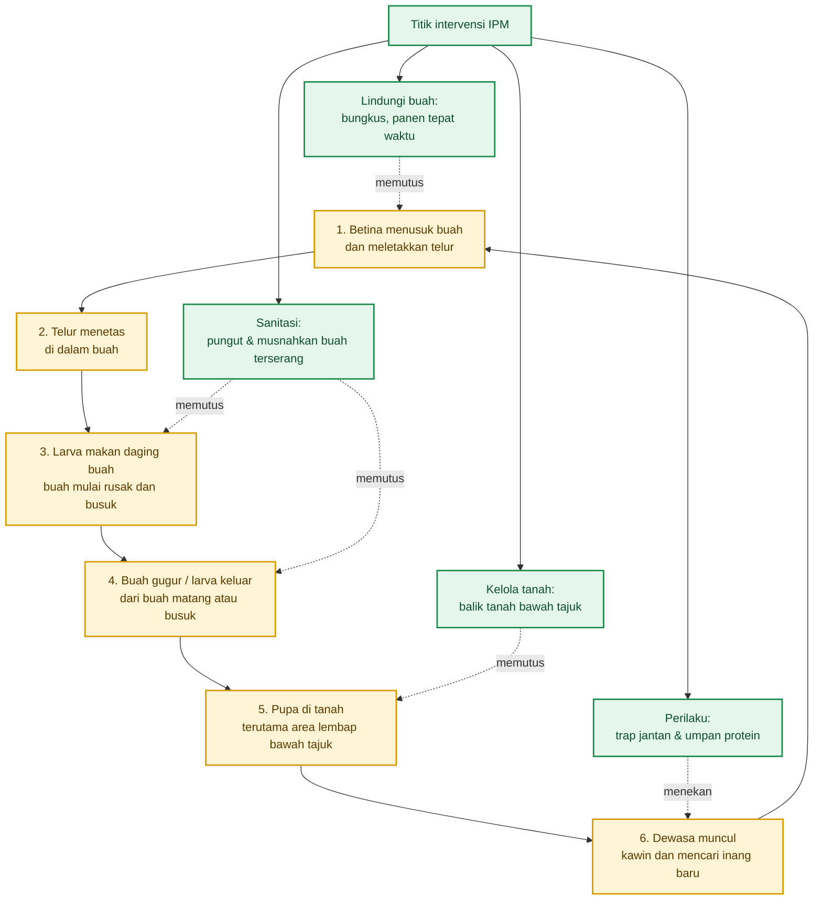

Diagram di atas memperlihatkan kenapa lalat buah sulit diberantas dengan satu cara. Jika hanya dewasa yang ditekan, larva di buah dan pupa di tanah masih melanjutkan siklus. Jika hanya buah dibersihkan tetapi trap tidak dipasang, dewasa dari kebun lain tetap masuk. Karena itu, keputusan IPM harus selalu membaca **siklus penuh**, bukan hanya satu fasenya.

## 2.4 Titik lemah siklus hidup yang bisa diputus

Titik lemah pertama adalah **fase telur dan larva awal di buah**. Pada tahap ini, buah masih terlihat relatif utuh dari luar, tetapi serangan sudah dimulai. Karena itu, pengendalian yang mencegah oviposisi—terutama **pembungkusan buah** dan menjaga buah tidak terlalu lama tergantung menjelang masak—menjadi sangat rasional. Panduan jeruk menyebut pembungkusan mulai umur sekitar **1,5 bulan** sebagai cara mekanis yang sangat baik untuk mencegah peletakan telur. Ini adalah intervensi paling langsung terhadap fase awal serangan.

Titik lemah kedua adalah **buah terserang yang gugur atau tertinggal**. Buah seperti ini bukan sekadar limbah panen, tetapi **inkubator generasi berikutnya**. Panduan jeruk menegaskan bahwa buah busuk, buah sotiran, dan buah terserang harus dikumpulkan lalu dibenamkan ke dalam tanah atau dibakar agar tidak menjadi sumber serangan berikutnya. Ini penting karena selama larva masih menyelesaikan pertumbuhannya di dalam buah, kebun tetap memproduksi gelombang dewasa baru walaupun trap sudah dipasang.

Titik lemah ketiga adalah **stadium pupa di tanah**. Pupa relatif diam dan posisinya terkonsentrasi di bawah tajuk atau area tempat larva jatuh. Itulah sebabnya pengolahan tanah di bawah pohon atau di bawah tajuk direkomendasikan: tujuannya agar pupa terangkat ke permukaan, terkena sinar matahari, lalu mati. Panduan jeruk bahkan secara eksplisit mengaitkan tindakan membalik tanah dengan pematian pupa. Secara biologis, ini salah satu titik intervensi yang paling penting, tetapi sering diabaikan.

Titik lemah keempat adalah **fase dewasa, terutama jantan**. Karena jantan dari beberapa spesies tertarik kuat pada **methyl eugenol** atau **cue-lure**, perangkap atraktan dapat dipakai untuk menurunkan peluang kawin dan sekaligus memantau populasi. Literatur Kementan menyebut methyl eugenol dapat menarik jantan dan, bila dipakai dalam perangkap, bisa memengaruhi reproduksi populasi. Namun titik ini harus dipahami dengan jujur: menekan jantan membantu, tetapi tidak otomatis menyelesaikan buah yang sudah terinfestasi atau pupa yang sudah ada di tanah. Maka, trap efektif bila dipasang sebagai bagian dari sistem, bukan sebagai alat tunggal.

## 2.5 Mengapa gumuk, dataran bawah, dan parit penting

Pada lahan gumuk, bioekologi lalat buah bertemu langsung dengan topografi. Panduan jeruk menjelaskan bahwa **kelembapan tanah sangat berpengaruh terhadap perkembangan pupa**, dan cahaya juga memengaruhi perkembangan; pupa tidak menetas bila terkena sinar, sedangkan betina cenderung lebih cepat meletakkan telur dalam kondisi terang. Ini berarti lokasi yang lembap, teduh, dan sering menahan buah gugur akan lebih berisiko menjadi pusat keberlangsungan populasi.

Karena itu, pada lahan bergumuk, **dataran bawah** dan **tepi parit** tidak boleh diperlakukan hanya sebagai bagian pasif dari kebun. Secara praktis, dua area ini sering menjadi tempat berkumpulnya buah gugur, aliran air, dan kelembapan lebih tinggi. Bila buah terserang terseret atau mengendap di sana, maka area itu berfungsi sebagai “ruang pembesaran” bagi larva dan pupa. Inilah alasan kenapa pada desain IPM untuk lahan gumuk, zona bawah dan parit selalu menjadi prioritas untuk sanitasi, inspeksi, dan intervensi tanah. Kesimpulan ini adalah inferensi biologis yang langsung ditopang oleh fakta bahwa pupa berada di tanah dan keberhasilannya dipengaruhi kelembapan tanah.

Faktor lain yang mempercepat ledakan populasi adalah **buah tersedia terus**, **tanah lembap**, dan **kebun tetangga** yang tetap menjadi sumber reinfestasi. Dokumen jeruk menyebut pengendalian serentak dengan pemilik kebun sekitar penting agar hasilnya efektif. Jadi, dari sudut bioekologi, kebun Anda tidak pernah benar-benar berdiri sendiri. Pada lalat buah, batas ekologi lebih penting daripada batas administrasi lahan. Itulah sebabnya AWM nanti menjadi konsekuensi logis dari bioekologi hama ini, bukan sekadar pilihan organisasi.

## 2.6 Tabel fase hidup vs titik intervensi IPM

Tabel berikut merangkum hubungan langsung antara fase hidup lalat buah dan titik intervensi yang paling relevan di lapang. Prinsip utamanya sederhana: **setiap fase punya titik lemah sendiri**, dan IPM bekerja baik bila beberapa titik lemah dipukul bersamaan.

| Fase hidup    | Lokasi utama                                        | Risiko terhadap kebun                       | Tanda lapang yang paling mudah dibaca        | Titik intervensi IPM yang paling logis                                                      |
| ------------- | --------------------------------------------------- | ------------------------------------------- | -------------------------------------------- | ------------------------------------------------------------------------------------------- |
| Telur         | Di bawah kulit buah / dalam buah                    | Awal infestasi, belum terlihat jelas        | Titik tusukan ovipositor pada buah           | Pembungkusan buah, proteksi fase buah rentan, panen tepat waktu                             |
| Larva         | Di dalam daging buah                                | Buah cepat busuk, mutu turun, buah gugur    | Buah lunak, busuk, bila dibelah ada belatung | Sanitasi ketat, pungut dan musnahkan buah terserang, sortasi cepat                          |
| Pupa          | Dalam tanah, terutama bawah tajuk / area buah gugur | Sumber generasi dewasa berikutnya           | Umumnya tidak terlihat langsung              | Balik tanah bawah tajuk, kurangi kelembapan berlebih, fokuskan sanitasi di titik jatuh buah |
| Dewasa jantan | Tajuk, area kebun, sekitar sumber atraktan          | Mendukung reproduksi populasi               | Tertangkap pada trap ME/cue-lure             | Trap jantan massal, monitoring populasi                                                     |
| Dewasa betina | Tajuk, blok buah rentan                             | Meletakkan telur, memicu kerusakan langsung | Aktivitas serangan tercermin pada buah       | Umpan protein, monitoring buah, pembungkusan, sanitasi dan panen rapat                      |

Tabel ini menunjukkan mengapa **satu intervensi tidak cukup**. Trap jantan bekerja pada fase dewasa jantan, tetapi tidak mengeluarkan larva dari buah. Sanitasi memutus larva dan mencegah transisi ke pupa, tetapi tidak menahan betina baru masuk dari kebun tetangga. Pengolahan tanah menekan pupa, tetapi tidak melindungi buah rentan yang masih tergantung. Maka, dari sudut bioekologi, IPM lalat buah memang harus bersifat **berlapis**.

## Penutup bab

Bioekologi lalat buah memberi tiga pelajaran utama untuk praktik lapang. Pertama, kebun campuran menghadapi bukan hanya satu hama, melainkan satu **siklus ekologis** yang bergerak antara buah, tanah, dan kebun sekitar. Kedua, perbedaan jantan dan betina menjelaskan mengapa trap atraktan penting tetapi tidak cukup. Ketiga, titik lemah lalat buah tersebar di beberapa fase: sebelum telur diletakkan, saat larva masih di buah, saat pupa berada di tanah, dan saat dewasa mencari pasangan atau inang baru. Dengan memahami ini, bab-bab berikutnya bisa masuk ke monitoring, pencegahan, dan intervensi dengan dasar yang lebih presisi—bukan sekadar kebiasaan lapang.

[1]: https://hortikultura.pertanian.go.id/wp-content/uploads/2024/11/Pengendalian-Lalat-Buah-Full-Text_watermark.pdf 'PENGENDALIAN LALAT BUAH'
[2]: https://repository.pertanian.go.id/bitstreams/68e10ad3-4ac8-4da0-b8e3-ecfa579e7297/download 'Microsoft Word - Cover Dalam.doc'

[**Kembali ke Atas**](#pedoman-terpadu-menekan-serangan-lalat-buah-di-kebun-campuran)

---

# Bab 3 — Diagnosis kebun dan sistem monitoring yang benar

Pada IPM, monitoring bukan pekerjaan administratif, melainkan inti pengambilan keputusan. Buku **Teknologi Pengendalian Hama Lalat Buah** menegaskan bahwa kegiatan monitoring bertujuan untuk **menginventarisasi jenis lalat buah, mengetahui distribusi dan perkembangan populasi, mengetahui sejak dini kehadiran lalat buah di lapangan, dan mengevaluasi keefektifan berbagai teknik pengendalian**. Dokumen AWM Direktorat Perlindungan Hortikultura juga menunjukkan bahwa pada pengendalian skala luas, **monitoring trap** dan pengolahan **FTD** dipakai untuk melihat apakah program berjalan efektif. Artinya, keputusan lapang tidak boleh lahir dari kebiasaan, tetapi dari pembacaan data yang sederhana namun konsisten. ([Hortikultura][1])

Kesalahan paling umum di lapang adalah menjadikan trap sebagai satu-satunya mata. Trap memang penting, tetapi ia hanya menangkap sebagian realitas. Pada lalat buah, terutama bila atraktan yang dipakai adalah **methyl eugenol**, trap lebih kuat membaca populasi jantan. Sementara itu, kerusakan ekonomi di kebun ditentukan oleh apa yang terjadi pada buah: ada tidaknya sengatan, seberapa banyak buah rusak, apakah buah sedang masuk fase rentan, dan apakah ada hotspot seperti parit, dataran bawah, atau blok buah lewat matang. Karena itu, bab ini menegaskan satu prinsip: **keputusan IPM harus dibangun dari FTD + gejala buah + fase tanaman + kondisi lokasi**.

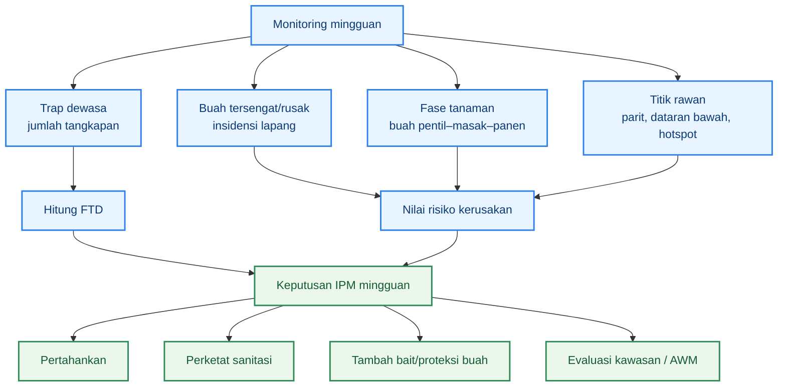

Diagram ini memperlihatkan logika diagnosis yang benar: trap hanyalah salah satu input. Begitu data trap, gejala buah, fenologi, dan titik rawan dibaca bersamaan, keputusan IPM menjadi jauh lebih presisi daripada sekadar “lalat banyak, maka semprot”. Pola ini sejalan dengan fungsi monitoring dalam PHT dan dengan praktik AWM yang membaca fluktuasi populasi untuk menentukan tindakan berikutnya. ([Hortikultura][1])

## 3.1 Monitoring populasi dewasa

Monitoring populasi dewasa bertujuan membaca **arah perubahan populasi**, bukan hanya jumlah sesaat. Panduan koleksi lalat buah menjelaskan bahwa hasil trapping harus diolah menjadi indeks populasi agar bisa dipakai membandingkan populasi **sebelum, selama, dan sesudah** aplikasi pengendalian. Dalam praktik AWM Indramayu, monitoring perangkap diamati **setiap pekan**, lalu hasilnya dimasukkan ke data lalat buah untuk diolah menjadi nilai FTD. Jadi, untuk praktisi, prinsipnya sederhana: trap harus dibaca secara rutin pada interval yang tetap, karena data yang tidak konsisten waktunya akan sulit dibandingkan.

Yang perlu dicatat dari monitoring dewasa bukan hanya jumlah total lalat yang tertangkap, tetapi juga **kode trap, lokasi trap, hari pemasangan, kondisi atraktan, dan tren dibanding minggu sebelumnya**. Bila data ini tidak dicatat, petani tidak bisa membedakan apakah populasi memang turun atau hanya karena atraktan melemah, trap rusak, atau trap dipasang di titik yang salah. AWM 2024 juga menunjukkan bahwa monitoring trap dipadukan dengan **pemetaan wilayah** dan **sanitasi buah terserang**, sehingga data populasi dewasa sejak awal ditempatkan dalam konteks lokasi, bukan angka tunggal.

Dalam kebun campuran, trap dewasa sebaiknya dibaca dengan tiga pertanyaan sederhana. Pertama, apakah populasi sedang naik atau turun dibanding minggu lalu. Kedua, apakah titik tepi, dataran bawah, dan hotspot menunjukkan pola yang berbeda. Ketiga, apakah kenaikan tangkapan bertepatan dengan adanya buah rentan pada salah satu komoditas. Tiga pertanyaan ini membuat monitoring dewasa menjadi alat keputusan, bukan sekadar rutinitas menghitung bangkai lalat dalam botol. Pendekatan ini konsisten dengan tujuan monitoring yang disebut Kementan: inventarisasi, distribusi, perkembangan populasi, dan evaluasi pengendalian. ([Hortikultura][1])

## 3.2 Monitoring kerusakan buah

Trap tidak boleh menggantikan pengamatan buah. Buku pengendalian lalat buah menegaskan bahwa **pengambilan contoh untuk mengestimasi tingkat kerusakan buah** harus dilakukan **secara periodik dan kontinu**, dengan **pengamatan langsung** melalui penghitungan dan persentase buah terserang terhadap seluruh buah yang diamati. Kementan juga menjelaskan bahwa teknik pengambilan contoh yang representatif penting agar hasil penilaian kerusakan tidak menyesatkan. Dengan kata lain, buah adalah indikator ekonomi yang sesungguhnya. ([Hortikultura][1])

Untuk praktik lapang, yang diamati bukan hanya buah yang sudah busuk berat. Catat minimal empat gejala: **bekas tusukan/bercak kecil**, **buah melunak atau berubah warna tidak normal**, **buah gugur sebelum waktunya**, dan **larva/belatung saat buah dibelah**. Pada kebun campuran, pengamatan harus lebih teliti pada komoditas yang sedang mendekati fase panen, karena buku Kementan menyebut bahwa saat paling tepat mengukur kerusakan buah ialah **fase menjelang masak**, ketika serangan umumnya paling tinggi. ([Hortikultura][1])

Panduan Kementan memberi contoh bahwa untuk kebun 1 hektare, contoh pengamatan kerusakan buah dapat diambil pada **lima titik** yang terletak pada perpotongan diagonal areal, dan buah contoh dipetik dari empat penjuru mata angin. Untuk kebun yang lebih kecil seperti 3.150 m², prinsipnya tetap sama: ambil titik contoh yang **mewakili tepi, tengah, dan zona rawan**, lalu jaga agar titik pengamatan itu konsisten dari minggu ke minggu. Ini adalah adaptasi praktis dari prinsip representatif yang dijelaskan dalam buku Kementan. ([Hortikultura][1])

## 3.3 Monitoring fase fenologi tanaman

Diagnosis yang baik selalu membaca **fase tanaman**, karena risiko serangan lalat buah tidak sama di semua fase. Buku Kementan menjelaskan bahwa pengukuran kerusakan buah paling relevan dilakukan pada **fase menjelang masak**, sebab serangan pada buah masak atau mendekati masak paling tinggi dibanding fase lain. Di AWM Indramayu, umpan protein juga diaplikasikan sejak buah mangga berukuran **sebesar kelereng hingga panen**, menunjukkan bahwa fase buah menjadi dasar ritme tindakan. ([Hortikultura][1])

Untuk keperluan praktis, fase fenologi minimum yang perlu dicatat tiap minggu pada kebun campuran adalah: **belum berbuah**, **buah baru jadi/pentil**, **pembesaran buah**, **menjelang masak**, dan **panen**. Ini bukan klasifikasi resmi nasional yang baku untuk semua komoditas, tetapi format kerja yang paling berguna untuk IPM karena langsung berkaitan dengan risiko oviposisi, keputusan pembungkusan, intensitas sanitasi, dan kebutuhan bait. Klasifikasi ini merupakan penyederhanaan lapang dari fakta bahwa risiko serangan meningkat ketika buah sudah tersedia dan makin tinggi saat buah mendekati masak. ([Hortikultura][1])

Pada kebun campuran, pencatatan fenologi juga mencegah salah fokus. Misalnya, trap mungkin menunjukkan populasi naik, tetapi jika blok jeruk belum memasuki fase rentan sementara jambu sudah mendekati masak, maka prioritas inspeksi dan proteksi ada pada jambu. Sebaliknya, bila cabai sedang padat buah merah dan banyak buah rontok, maka sanitasi cabai dan monitoring buah gugur harus ditingkatkan walaupun buah naga belum aktif. Di sinilah monitoring fenologi membuat IPM menjadi spesifik lokasi dan spesifik komoditas. ([Hortikultura][1])

## 3.4 Rumus FTD dan cara membacanya

**FTD** adalah singkatan dari **Fruit Flies per Trap per Day**, yaitu rata-rata jumlah lalat buah yang tertangkap per perangkap per hari. Pedoman koleksi lalat buah menjelaskan bahwa FTD adalah **indeks populasi** yang dipakai untuk mengestimasi rerata jumlah lalat buah dalam satu perangkap per hari, dan dipakai sebagai dasar informasi untuk membandingkan populasi pada tempat dan waktu tertentu. Dalam AWM 2024, FTD dipakai untuk menunjukkan **fluktuasi populasi lalat buah di suatu area**.

Rumus FTD ditulis sebagai berikut.

```mdx
$$
FTD = \frac{F}{T \times D}
$$
```

Keterangan:

```mdx
$$
F = \text{jumlah total lalat buah yang tertangkap}
$$

$$
T = \text{jumlah perangkap aktif}
$$

$$
D = \text{jumlah hari pemasangan perangkap}
$$
```

Rumus ini berasal langsung dari pedoman koleksi lalat buah Kementan. Karena itu, FTD bukan angka kira-kira, melainkan indeks yang punya definisi operasional jelas.

Contoh perhitungan lapang:

```mdx
$$
F = 84,\quad T = 8,\quad D = 7
$$

$$
FTD = \frac{84}{8 \times 7} = \frac{84}{56} = 1{,}5
$$
```

Artinya, rata-rata setiap perangkap menangkap **1,5 lalat per hari** selama periode pengamatan tersebut. Secara interpretatif, angka ini lebih berguna daripada total 84 ekor, karena sudah memperhitungkan jumlah trap dan lama pemasangan. Itulah sebabnya FTD dipakai untuk membandingkan antar-minggu dan antar-area.

Dalam AWM tahun 2024, Direktorat Perlindungan Hortikultura menyatakan bahwa **FTD < 1** dipakai sebagai indikator keberhasilan penekanan populasi di area pengelolaan, dan pada lokasi kegiatan AWM salak rata-rata FTD dilaporkan **< 1** dibanding transek kontrol. Ini penting sebagai referensi operasional, tetapi harus dibaca hati-hati: angka itu adalah **target kinerja pada konteks AWM**, bukan lisensi untuk mengabaikan buah yang sudah terserang di kebun Anda.

## 3.5 Kenapa FTD tidak boleh berdiri sendiri

FTD sangat berguna, tetapi ia punya batas. Pertama, FTD pada trap berbasis atraktan jantan lebih banyak menggambarkan **aktivitas populasi jantan** daripada risiko langsung kerusakan buah oleh betina. Kedua, FTD dapat dipengaruhi kondisi trap, umur atraktan, posisi trap, cuaca, dan konsistensi waktu pembacaan. Ketiga, FTD tidak otomatis menjelaskan **berapa banyak buah yang sudah terinfestasi**. Karena itu, menjadikan FTD sebagai satu-satunya dasar keputusan justru bertentangan dengan semangat PHT yang menuntut evaluasi lapang secara utuh. Kesimpulan ini sejalan dengan fungsi monitoring yang lebih luas dalam buku Kementan dan komponen AWM yang tidak hanya memakai monitoring trap, tetapi juga **sanitasi buah terserang** dan **rearing sampel buah**. ([Hortikultura][1])

Secara praktis, FTD harus dibaca bersama tiga kelompok data lain. Pertama, **gejala buah**: apakah buah tersengat naik, stabil, atau turun. Kedua, **fase tanaman**: apakah komoditas dominan sedang masuk fase rentan. Ketiga, **kondisi lokasi**: apakah parit, dataran bawah, hotspot, atau blok overripe sedang penuh buah gugur. Kombinasi ini jauh lebih kuat untuk IPM daripada trap count tunggal. Jika FTD turun tetapi buah rusak tetap tinggi, masalah bisa jadi ada pada sanitasi yang terlambat, proteksi buah yang kurang, atau adanya buah terinfestasi lama yang masih tersisa di kebun. ([Hortikultura][1])

Dengan demikian, cara baca yang benar bukan “FTD tinggi = semprot” atau “FTD rendah = aman”. Cara baca yang benar adalah:

- **FTD naik + buah rentan + ada sengatan** = risiko nyata meningkat.
- **FTD naik + buah belum rentan** = tingkatkan kewaspadaan, belum tentu perlu intervensi maksimum.
- **FTD turun + buah rusak tetap tinggi** = cari sumber residu serangan di buah dan tanah.
- **FTD rendah + hotspot tetap kotor** = kondisi tampak aman semu dan bisa memantul kembali.
  Ini adalah aturan keputusan praktis yang diturunkan dari fungsi FTD sebagai indikator tren, bukan indikator tunggal.

## 3.6 Form catatan lapang minimum

Catatan lapang yang baik harus cukup sederhana untuk diisi, tetapi cukup lengkap untuk dipakai memutuskan tindakan minggu berikutnya. Berdasarkan tujuan monitoring Kementan, elemen minimum yang perlu dicatat adalah: **lokasi dan kode trap, jumlah tangkapan, periode hari, kondisi buah, fase tanaman, dan titik rawan lokasi**. Tambahkan kolom tindakan minggu ini dan tindakan minggu depan agar monitoring langsung terhubung ke keputusan. ([Hortikultura][1])

Format minimum yang disarankan:

```text
MINGGU KE: _______      TANGGAL: _______ s.d. _______

A. DATA TRAP
Kode trap : _______
Lokasi/zona : perimeter / dataran bawah / puncak / hotspot / parit
Hari pemasangan (D) : _______ hari
Jumlah tangkapan (F) : _______ ekor
Jumlah trap aktif (T) : _______
FTD : _______

B. DATA BUAH
Komoditas : cabai / jambu / jeruk / buah naga / lainnya
Fase tanaman : belum berbuah / pentil / pembesaran / menjelang masak / panen
Gejala : tidak ada / sengatan ringan / buah gugur / buah busuk / larva ditemukan
Jumlah buah diamati : _______
Jumlah buah terserang : _______
Persentase serangan : _______ %

C. KONDISI LOKASI
Parit : bersih / ada buah gugur / lembap berat
Dataran bawah : aman / sedang / rawan
Hotspot : ada / tidak ada
Buah overripe tertinggal : ada / tidak ada

D. KEPUTUSAN MINGGU INI
[ ] Pertahankan
[ ] Perketat sanitasi
[ ] Tambah bait protein
[ ] Prioritaskan pembungkusan
[ ] Evaluasi trap / titik pemasangan
[ ] Koordinasi kawasan / tetangga
Catatan: ______________________
```

Bila ingin sedikit lebih maju, tambahkan satu kolom **tren minggu lalu** dan **tren minggu ini**. Dengan begitu, petani tidak hanya melihat angka sesaat, tetapi membaca arah perubahan. AWM Indramayu sendiri menekankan bahwa data monitoring trap yang dikumpulkan setiap pekan diolah untuk menentukan tindakan pada jangka waktu selanjutnya. Ini menunjukkan bahwa **nilai sesungguhnya dari monitoring adalah keputusan berikutnya**, bukan angka itu sendiri.

## Penutup bab

Diagnosis kebun yang benar tidak mungkin dibangun dari trap saja. Trap memberi data penting tentang populasi dewasa dan tren, tetapi buah memberi data tentang kerusakan ekonomi, fase tanaman memberi data tentang risiko biologis, dan lokasi rawan memberi data tentang sumber keberlanjutan populasi. Karena itu, inti monitoring dalam IPM lalat buah adalah **membaca empat hal sekaligus**: dewasa, buah, fenologi, dan ruang kebun. FTD tetap penting, bahkan sangat penting, karena ia memberi ukuran relatif populasi yang bisa dibandingkan antar-minggu dan antar-area. Namun FTD baru menjadi bernilai tinggi bila dibaca bersama gejala buah, fase tanaman, dan kondisi lokasi. Dengan fondasi ini, bab berikutnya bisa masuk ke pencegahan dan intervensi dengan keputusan yang lebih tajam dan lebih hemat salah langkah.

[1]: https://hortikultura.pertanian.go.id/wp-content/uploads/2024/11/Pengendalian-Lalat-Buah-Full-Text_watermark.pdf 'PENGENDALIAN LALAT BUAH'

[**Kembali ke Atas**](#pedoman-terpadu-menekan-serangan-lalat-buah-di-kebun-campuran)

---

# Bab 4 — Paket pencegahan budidaya: fondasi IPM

Pada lalat buah, pengendalian yang benar dimulai dari **cara kebun dikelola**, bukan dari pilihan insektisida. Dokumen perlindungan hortikultura Kementan menegaskan bahwa pengendalian OPT harus dilaksanakan dengan prinsip PHT, bisa bersifat **preventif maupun kuratif**, dan diarahkan agar serangan tidak menurunkan produksi serta tidak menimbulkan kerugian ekonomi nyata. Dokumen yang sama juga menekankan reduksi penggunaan pestisida melalui pengembangan bahan dan cara pengendalian yang lebih ramah lingkungan. Artinya, pada IPM, kebun harus lebih dulu dibuat **kurang nyaman bagi siklus hidup lalat buah** sebelum intervensi lain dijalankan. ([Hortikultura][1])

Untuk lalat buah, logika pencegahan budidaya sangat kuat secara biologis. Larva berkembang di dalam buah, buah yang terserang sering gugur, lalu larva keluar dan memasuki tanah untuk menjadi pupa. Pedoman jeruk juga secara jelas menganjurkan pemusnahan buah terserang serta pembalikan tanah di bawah tajuk. Karena itu, kebun yang disiplin dalam sanitasi, panen, kebersihan bawah tajuk, drainase, dan pengelolaan tajuk pada dasarnya sedang **memutus siklus hama** di beberapa titik sekaligus. ([Hortikultura][2])

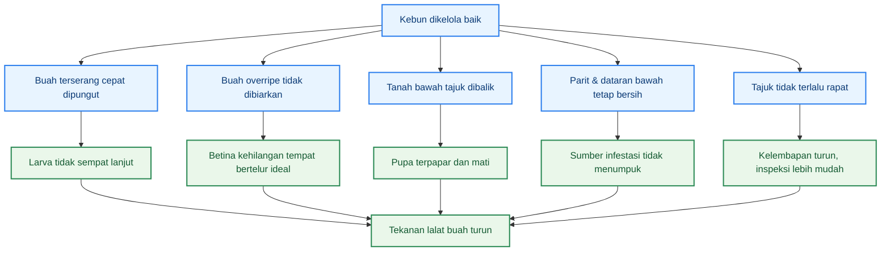

Diagram di atas merangkum inti bab ini: pencegahan budidaya bukan pekerjaan tambahan, tetapi fondasi IPM. Bila pekerjaan dasar kebun dijalankan konsisten, populasi lalat buah ditekan bahkan sebelum trap, bait, atau tindakan lain masuk. Ini sejalan dengan arah PHT hortikultura yang menempatkan tindakan preventif sebagai komponen utama pengelolaan OPT. ([Hortikultura][1])

## 4.1 Sanitasi sebagai pekerjaan inti

Sanitasi adalah pekerjaan paling penting dan paling tidak boleh ditunda. Buku pengendalian lalat buah menempatkan **sanitasi buah terserang** sebagai salah satu komponen utama pengendalian terpadu. Pedoman jeruk juga menyebut bahwa buah busuk, buah sotiran, buah pecah, dan buah terserang harus **dikumpulkan** lalu **dibenamkan dalam tanah atau dibakar** agar tidak menjadi sumber serangan berikutnya. Jadi, buah terserang tidak boleh dipandang sebagai limbah biasa; ia adalah **wadah perkembangan larva**. ([Hortikultura][3])

Dalam praktik, sanitasi yang efektif berarti memungut semua buah yang **gugur, busuk, pecah, tersengat, atau dicurigai terinfestasi**, termasuk buah yang tersangkut di semak, mengendap di tepi parit, atau tertinggal di sudut kebun. Bila buah seperti ini dibiarkan satu atau dua hari saja pada saat populasi tinggi, kebun tetap memproduksi generasi baru walaupun trap sudah dipasang. Karena itu, sanitasi pada kebun campuran sebaiknya dianggap sebagai pekerjaan rutin **setiap 2–3 hari**, bukan menunggu jadwal mingguan. Frekuensi ini adalah rekomendasi operasional agar siklus buah–larva–pupa tidak sempat berlanjut terlalu jauh. Dasar biologisnya tetap sama: larva berkembang di buah sebelum masuk ke tanah. ([Hortikultura][3])

Sanitasi juga harus diprioritaskan pada titik yang secara ekologis paling rawan, yaitu **bawah tajuk tanaman buah, dataran bawah, jalur aliran air, tepi parit, dan blok dengan buah overripe**. Ini bukan sekadar soal kerapian kebun. Pada lahan dengan topografi gumuk, area-area itu cenderung menjadi tempat akumulasi buah jatuh dan kelembapan lebih tinggi, yang mendukung kelangsungan stadium pupa. Maka, sanitasi yang efektif selalu bersifat **spasial**: petani harus tahu titik mana yang paling sering menjadi sumber infestasi berulang. ([Hortikultura][2])

## 4.2 Panen, sortasi, dan pemusnahan sumber infestasi

Panen yang terlalu jarang memberi keuntungan besar bagi lalat buah. Buah yang dibiarkan terlalu matang di pohon atau terlambat dipanen menjadi sasaran oviposisi yang lebih berisiko. Karena itu, pada IPM lalat buah, salah satu prinsip paling praktis adalah **panen rapat** dan **jangan membiarkan buah lewat matang**. Buku pengendalian lalat buah juga menekankan pentingnya penanganan pascapanen dan sortasi dalam keseluruhan strategi, karena buah yang dibiarkan rusak di kebun akan memperpanjang sumber infestasi. ([Hortikultura][3])

Pada komoditas seperti jambu, jeruk, dan buah naga, panen rapat berarti petani harus memperpendek interval antara buah layak panen dan buah benar-benar dipetik. Pada cabai, prinsip yang sama berarti buah matang tidak dibiarkan menumpuk terlalu lama di tanaman maupun di permukaan tanah. Di kebun campuran, logika ini lebih penting lagi karena satu blok yang penuh buah overripe bisa menjadi “mesin penarik” betina untuk seluruh areal. Ini adalah inferensi lapang yang konsisten dengan bioekologi lalat buah dan prinsip pencegahan PHT. ([Hortikultura][2])

Sortasi juga harus dibedakan dari sanitasi. **Sanitasi** memindahkan sumber infestasi keluar dari siklus kebun. **Sortasi** memilih buah yang layak, buah meragukan, dan buah jelas terserang. Pada pedoman jeruk, buah terserang tidak dianjurkan dibiarkan atau dicampurkan dengan buah sehat; buah itu harus dimusnahkan agar tidak menjadi sumber serangan berikutnya. Jadi, sortasi yang baik harus berujung pada keputusan jelas: **buah sehat dipasarkan, buah meragukan diperiksa, buah terserang dimusnahkan**. ([Hortikultura][2])

## 4.3 Pengolahan tanah bawah tajuk dan pengelolaan pupa

Salah satu intervensi budidaya yang paling kuat tetapi sering diabaikan adalah **pengolahan tanah di bawah tajuk**. Pedoman jeruk menyebut secara eksplisit bahwa tanah di bawah pohon atau tajuk tanaman perlu dibalik agar **pupa terangkat ke permukaan tanah dan terkena sinar matahari**, sehingga kemudian mati. Ini adalah tindakan yang sangat logis karena stadium pupa memang berada di tanah setelah larva keluar dari buah. ([Hortikultura][2])

Dari sisi praktik, pengolahan tanah tidak harus berarti olah tanah berat. Yang dibutuhkan adalah **penggemburan atau pembalikan ringan** pada area di mana buah jatuh paling sering, terutama di bawah tajuk jambu, jeruk, atau titik cabai yang banyak buah rontok. Pada lahan gumuk, tindakan ini paling penting di **dataran bawah**, tempat kelembapan tanah cenderung lebih tinggi dan buah gugur lebih mudah terkumpul. Pengelolaan seperti ini secara langsung menyerang fase pupa, yaitu fase yang tidak terlihat tetapi sangat menentukan munculnya generasi dewasa berikutnya. ([Hortikultura][2])

Pengolahan tanah juga perlu dipadukan dengan disiplin sanitasi. Bila buah terserang tetap dibiarkan, pembalikan tanah saja tidak akan cukup karena larva baru masih terus masuk ke tanah. Sebaliknya, sanitasi tanpa pengelolaan tanah juga dapat meninggalkan pupa yang sudah terbentuk pada periode sebelumnya. Karena itu, dalam IPM, keduanya harus dipandang sebagai **satu paket**: buah dibersihkan, lalu tanah pada titik jatuh buah dikelola. ([Hortikultura][2])

## 4.4 Tajuk, gulma, drainase, dan kelembapan

Kebun yang terlalu rimbun dan terlalu lembap cenderung lebih sulit dipantau dan lebih nyaman bagi keberlangsungan siklus lalat buah. Pedoman jeruk menjelaskan bahwa perkembangan pupa sangat dipengaruhi oleh **kelembapan tanah**, dan cahaya juga berperan dalam keberhasilan fase tertentu. Karena itu, pengaturan tajuk dan pengelolaan kelembapan bukan sekadar pekerjaan estetika, tetapi bagian dari pencegahan biologis. Tajuk yang tidak terlalu rapat membuat inspeksi buah lebih mudah, sirkulasi udara lebih baik, dan bagian bawah tanaman tidak terlalu lembap. ([Hortikultura][2])

Gulma harus dikelola dengan alasan yang sama. Gulma dan semak di bawah tajuk atau di tepi parit dapat menyembunyikan buah gugur, mempersulit sanitasi, dan mempertahankan kelembapan lokal. Dalam konteks PHT, ini penting karena tindakan preventif harus diintegrasikan ke budidaya dan diarahkan pada daerah sumber infeksi maupun daerah berisiko ledakan. Jadi, pengendalian gulma pada bab ini bukan dibahas sebagai agenda umum budidaya, tetapi sebagai alat untuk **mempercepat sanitasi, memperbaiki inspeksi, dan menurunkan kenyamanan habitat**. ([Hortikultura][1])

Drainase dan parit harus diperlakukan sebagai komponen pengendalian, bukan hanya infrastruktur air. Bila parit penuh buah hanyut, serasah, atau genangan berkepanjangan, area ini dapat menjadi titik akumulasi sumber infestasi. Pada lahan gumuk, dataran bawah dan tepi parit merupakan lokasi yang paling sering menjadi “kantong masalah”. Karena itu, pengelolaan drainase yang baik berarti memastikan air tidak menggenang lama, buah gugur tidak menumpuk, dan jalur inspeksi ke area tersebut selalu terbuka. Ini adalah konsekuensi praktis dari fakta bahwa stadium pupa berkembang lebih baik pada kondisi tanah yang mendukung. ([Hortikultura][2])

## 4.5 Pencegahan spesifik pada kebun campuran

Kebun campuran perlu pencegahan yang lebih disiplin daripada kebun monokultur karena **fase rentan antarkomoditas saling tumpang tindih**. Cabai bisa aktif hampir terus-menerus, jambu dan jeruk punya fase buah yang lebih jelas, sementara buah naga membuka jendela serangan tersendiri. Dalam situasi seperti ini, prinsip pencegahan tidak boleh dilakukan seragam sepanjang areal. Yang harus dilakukan adalah **sinkronisasi tindakan berdasarkan komoditas yang sedang paling rentan**, sambil menjaga agar blok lain tidak menjadi reservoir buah gugur atau buah overripe. Prinsip ini selaras dengan PHT yang spesifik lokasi dan diarahkan pada pengelolaan sumber infestasi secara nyata. ([Hortikultura][1])

Secara operasional, sinkronisasi di kebun campuran berarti minimal lima hal. Pertama, semua buah gugur lintas komoditas dipungut dengan ritme tetap. Kedua, komoditas yang sedang menjelang masak mendapat prioritas inspeksi lebih tinggi. Ketiga, blok yang sedang tidak rentan tidak boleh diabaikan kebersihannya. Keempat, titik dataran bawah dan parit dibersihkan lintas blok, bukan hanya di sekitar satu jenis tanaman. Kelima, bila kebun tetangga memiliki inang aktif, maka koordinasi sederhana untuk sanitasi dan trap menjadi sangat penting. Prinsip koordinasi ini konsisten dengan pendekatan AWM yang menekankan pengelolaan skala luas dengan trap, sanitasi, monitoring, dan pemetaan wilayah. ([Hortikultura][4])

Pada praktiknya, pencegahan spesifik kebun campuran paling berhasil bila petani membagi areal ke dalam **zona kerja**: perimeter, dataran bawah, puncak/cincin atas, blok inang dominan, dan parit. Dengan pembagian ini, pekerjaan budidaya menjadi lebih terarah. Sanitasi paling ketat ditempatkan di dataran bawah dan parit, inspeksi buah intensif pada blok yang mendekati panen, dan pengolahan tanah difokuskan pada titik jatuh buah. Ini bukan teori yang berdiri sendiri, melainkan turunan langsung dari bioekologi lalat buah dan prinsip PHT yang mengutamakan tindakan preventif. ([Hortikultura][2])

## Ringkasan praktis bab ini

Pencegahan budidaya pada lalat buah dapat diringkas menjadi tujuh aturan kerja. **Pungut buah terserang sesering mungkin. Panen rapat dan jangan biarkan buah lewat matang. Musnahkan buah busuk, pecah, dan sotiran yang berpotensi menjadi sumber larva. Balik tanah bawah tajuk pada titik jatuh buah. Jaga gulma dan tajuk agar inspeksi mudah dan kelembapan tidak berlebihan. Rawat parit dan dataran bawah sebagai zona prioritas. Sinkronkan pekerjaan lintas komoditas dan, bila mungkin, lintas kebun.** Seluruh aturan ini bertumpu pada prinsip yang sama: pengendalian dimulai dari kebun, bukan dari botol pestisida. ([Hortikultura][1])

## Penutup bab

Bab ini menegaskan bahwa fondasi IPM lalat buah adalah **budidaya yang memutus siklus**, bukan intervensi yang datang terlambat setelah kerusakan meluas. Sanitasi, panen rapat, pengelolaan buah terserang, pembalikan tanah bawah tajuk, pengaturan tajuk, pengelolaan gulma, dan drainase bukan pekerjaan sampingan. Semuanya adalah tindakan pencegahan yang secara langsung menurunkan peluang lalat buah untuk bertahan dan berkembang biak. Dengan fondasi ini, bab berikutnya dapat masuk ke paket intervensi bertingkat—fisik, perilaku, mikrobiologi, dan kimia selektif—tanpa kehilangan ruh utama IPM. ([Hortikultura][1])

[1]: https://hortikultura.pertanian.go.id/wp-content/uploads/2018/12/Juknis-Perlindungan-2019.pdf?utm_source=chatgpt.com 'Petunjuk Teknis Pengembangan Sistem Perlindungan ...'
[2]: https://hortikultura.pertanian.go.id/wp-content/uploads/2024/11/Pengenalan-dan-Pengendalian-Hama-Penyakit-Tanaman-Jeruk-_watermark_compressed.pdf?utm_source=chatgpt.com 'Pengenalan dan Pengendalian Hama Penyakit Tanaman Jeruk'
[3]: https://hortikultura.pertanian.go.id/wp-content/uploads/2024/11/Pengendalian-Lalat-Buah-Full-Text_watermark.pdf?utm_source=chatgpt.com 'Teknologi Pengendalian Hama Lalat Buah'
[4]: https://hortikultura.pertanian.go.id/wp-content/uploads/2015/06/LALATBUAH.pdf?utm_source=chatgpt.com 'AREA-WIDE MANAGEMENT (AWM) TERHADAP LALAT ...'

[**Kembali ke Atas**](#pedoman-terpadu-menekan-serangan-lalat-buah-di-kebun-campuran)

---

# Bab 5 — Paket intervensi bertingkat: fisik, perilaku, mikrobiologi, lalu kimia selektif

Bab ini adalah inti koreksi dari versi panduan sebelumnya. Dalam IPM, intervensi tidak disusun berdasarkan “mana yang paling cepat terlihat”, tetapi berdasarkan **hirarki taktik**: mulai dari langkah yang paling spesifik, paling aman, dan paling langsung memutus siklus, lalu naik ke lapis berikutnya bila risiko lapang memang menuntut. EPA menegaskan bahwa IPM menggunakan kombinasi metode yang paling efektif dengan risiko serendah mungkin, dan pestisida tidak ditempatkan sebagai satu-satunya alat, melainkan digunakan secara bijak setelah monitoring dan ambang tindakan menunjukkan intervensi memang diperlukan. Di sisi lain, buku **Teknologi Pengendalian Hama Lalat Buah** menempatkan komponen fisik, mekanik, hayati, dan kimia di dalam satu paket PHT, bukan sebagai tindakan yang berdiri sendiri. ([US EPA][1])

Untuk lalat buah, urutan intervensi yang paling masuk akal adalah: **lindungi buah yang rentan**, **tekan dan pantau populasi dewasa**, **ganggu aktivitas makan/reproduksi yang terkait betina**, **serang fase rentan dengan agen mikrobiologi**, lalu **gunakan kimia selektif bila data lapang memang mengharuskannya**. Urutan ini bukan aturan kaku untuk semua situasi, tetapi kerangka kerja yang membuat keputusan lapang tetap konsisten dengan IPM. Pada kebun campuran, pendekatan bertingkat seperti ini penting karena satu alat hampir tidak pernah cukup untuk memutus siklus yang bergerak antara buah, tanah, dan kebun sekitar. ([Hortikultura][2])

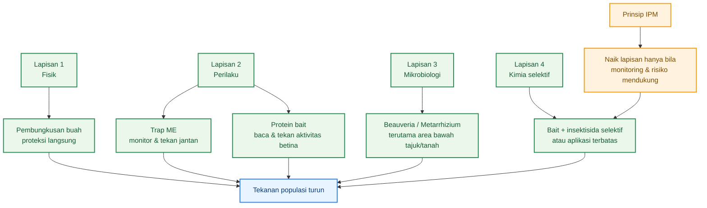

Diagram di atas menegaskan bahwa intervensi bertingkat bukan berarti semua alat dipakai bersamaan sepanjang waktu. Yang benar adalah **lapisan bawah selalu menjadi dasar**, lalu lapisan berikutnya diaktifkan sesuai hasil monitoring dan fase risiko. Pada lalat buah, ini penting karena keberhasilan pembungkusan, trap, bait, dan agen hayati masing-masing bergantung pada waktu, lokasi, dan fase hidup hama yang sedang dominan. ([US EPA][1])

## 5.1 Pembungkusan buah: kapan efektif dan untuk komoditas apa

Pembungkusan buah adalah intervensi fisik yang paling langsung mencegah betina meletakkan telur pada buah. Buku pengendalian lalat buah menyebut bahwa pembungkusan atau pemberongsongan buah telah lama diterapkan untuk mencegah lalat buah betina bertelur pada buah muda hingga menjelang tua/masak, dan dapat mengurangi kerusakan buah **hampir 100%** bila dilakukan tepat waktu. Buku itu juga mencatat bahwa bahan pembungkus dapat berupa kertas, koran bekas, kertas karbon, plastik hitam, daun, atau bahan lain yang tidak mudah rusak, cukup gelap, dan mampu menjaga kelembapan dalam bungkus. ([Hortikultura][2])

Pada jeruk, panduan teknis Kementan lebih spesifik lagi: pembungkusan mulai umur buah sekitar **1,5 bulan** disebut sebagai cara mekanis paling baik untuk mencegah oviposisi. Karena itu, pada kebun campuran, pembungkusan paling layak diprioritaskan pada komoditas yang **buahnya bernilai tinggi, ukurannya memungkinkan, dan jumlah buahnya masih realistis untuk dikelola tenaga kerja**, terutama **jambu, jeruk, dan sebagian buah naga**. Pada cabai, tindakan ini umumnya tidak praktis secara ekonomi maupun operasional, sehingga perannya digantikan oleh sanitasi, trap, ritme panen, dan bait. ([Hortikultura][2])

Waktu pembungkusan lebih penting daripada jenis bahan. Bila pembungkusan dilakukan terlambat, buah mungkin sudah lebih dulu menerima tusukan ovipositor. Karena itu, pembungkusan harus diposisikan sebagai **tindakan pencegahan awal**, bukan respons setelah gejala berat muncul. Dalam IPM, inilah keunggulan utama pembungkusan: ia melindungi buah secara langsung tanpa harus bergantung pada kematian lalat di lapang. Kelemahannya adalah kebutuhan tenaga kerja dan keterbatasan praktis pada kebun luas atau pohon tinggi berbuah sangat lebat. Maka, pembungkusan harus dilihat sebagai intervensi **presisi tinggi**, bukan solusi universal untuk semua komoditas. ([Hortikultura][2])

## 5.2 Trap ME: fungsi, kelebihan, dan batasannya

Trap berbasis **methyl eugenol (ME)** adalah alat perilaku yang paling penting dalam pengelolaan lalat buah di Asia, termasuk Indonesia. Pedoman koleksi lalat buah menjelaskan bahwa perangkap seperti **Steiner trap** dengan methyl eugenol atau cue-lure digunakan khusus untuk menangkap lalat buah **jantan**, dan hampir semua paraferomon hanya memikat lalat buah jantan, sedangkan betina tidak tertarik pada paraferomon tetapi tertarik pada protein. Ini menjadikan trap ME sangat berguna untuk **monitoring populasi jantan**, **menekan peluang kawin**, dan **membaca tren musiman populasi**. ([Pertanian Repository][3])

Panduan jeruk juga menyebut methyl eugenol sebagai senyawa yang umum digunakan dalam perangkap lalat buah dan dapat dipasang pada trap sederhana modifikasi Steiner dari botol bekas dengan kapas sebagai pembawa atraktan. Sementara itu, buku pengendalian lalat buah menunjukkan bahwa model trap berbeda dapat memberi hasil tangkapan berbeda, dan **McPhail** pada kondisi penelitian tertentu dapat menangkap lalat buah jantan paling banyak per trap per hari. Namun untuk praktik petani, trap botol/Steiner tetap paling implementatif karena murah, mudah dibuat, dan bisa dipasang massal.

Kelebihan trap ME adalah ia memberi dua fungsi sekaligus: **memonitor** dan **menekan**. Tetapi batasannya harus dibaca jujur. Karena trap ini terutama bekerja pada jantan, angka tangkapan tinggi atau rendah tidak selalu berbanding lurus dengan kerusakan buah saat itu. Trap juga tidak mengeluarkan larva dari buah yang sudah terinfestasi dan tidak menyentuh pupa yang sudah ada di tanah. Karena itu, trap ME adalah tulang punggung monitoring dan suppression, tetapi tidak pernah boleh diperlakukan sebagai solusi tunggal. Pada IPM, trap ME harus selalu dibaca bersama gejala buah, fase tanaman, dan kondisi hotspot. ([Pertanian Repository][3])

## 5.3 Protein bait: kapan dipakai dan apa tujuannya

Jika trap ME membaca dan menekan jantan, maka **protein bait** membantu membaca dan menekan aktivitas yang lebih terkait dengan **betina**. Pedoman koleksi lalat buah menjelaskan bahwa lalat buah dewasa betina **tertarik pada protein**, dan protein hidrolisat atau yeast extract dapat disemprotkan langsung pada daun sebagai **protein bait spray**. Koleksi dengan metode ini ditujukan terutama untuk mendapatkan betina yang belum bertelur atau belum kawin, walaupun beberapa jantan juga bisa tertarik. Ini memberi dasar biologis yang kuat bahwa protein bait memang relevan untuk membaca dan memengaruhi bagian populasi yang tidak terjangkau dengan baik oleh paraferomon jantan. ([Pertanian Repository][3])

Buku pengendalian lalat buah juga menyebut bahwa pada pengendalian kimia terpadu, **food attractant** yang biasa digunakan adalah **protein hidrolisa**, lalu diberi insektisida seperti **spinosad** dan disemprotkan pada tanaman sebagai umpan beracun; lalat buah yang memakan umpan akan mati. Secara operasional, ini berarti protein bait bukanlah “semprot penutup seluruh kebun”, melainkan umpan yang sengaja diposisikan untuk menarik lalat ke titik tertentu. Karena itu, penggunaannya lebih efisien bila diarahkan sebagai **spot spray** pada titik tetap atau hotspot, bukan sebagai penyemprotan merata seluruh areal. ([Hortikultura][2])

Dalam IPM, protein bait paling tepat dipakai ketika tiga kondisi bertemu: **buah mulai rentan**, **trap atau indikator lapang menunjukkan populasi aktif**, dan **betina perlu ditekan tanpa langsung naik ke semprot luas**. Ia juga berguna ketika data menunjukkan bahwa trap jantan menurun tetapi gejala pada buah masih ada, karena situasi seperti ini sering berarti aktivitas betina atau residu infestasi lama masih berjalan. Dengan demikian, fungsi utama protein bait adalah menjembatani celah antara monitoring jantan dan proteksi buah. ([Pertanian Repository][3])

## 5.4 Pengendalian mikrobiologi: _Metarrhizium_, _Beauveria_, dan posisi nyatanya

Komponen mikrobiologi harus diposisikan sebagai bagian nyata dari IPM, bukan catatan tambahan. Pada pedoman budidaya jeruk nipis Kementan, salah satu rekomendasi pengendalian adalah **penyemprotan jamur entomopatogen Beauveria bassiana atau Metarrhizium sp.** pada fase tertentu. Ini menunjukkan bahwa penggunaan cendawan entomopatogen bukan gagasan asing bagi rekomendasi hortikultura Indonesia, melainkan sudah masuk ke praktik teknis resmi.

Manual FAO/IAEA tahun 2019 juga menegaskan bahwa pengendalian lalat buah yang efektif memerlukan pendekatan terpadu dan dapat mencakup **biocontrol agents including entomopathogenic microorganisms**. Dokumen itu merangkum banyak studi yang menunjukkan bahwa **Beauveria bassiana** dan **Metarhizium anisopliae** dapat menyebabkan kematian pada **dewasa** maupun **puparia/pupa** lalat buah, dan bahkan ada bukti bahwa aplikasi pada tanah serta transmisi horizontal dapat menekan populasi. Dengan kata lain, secara ilmiah komponen mikrobiologi bukan pelengkap kosmetik; ia memang punya dasar bukti untuk masuk ke sistem suppression lalat buah.

Posisi realistis cendawan entomopatogen pada kebun rakyat adalah sebagai **pelengkap sanitasi, trap, dan bait**, dengan fokus utama pada **area bawah tajuk, tanah, titik jatuh buah, dan hotspot yang lembap**. Ini karena secara biologis stadium pupa berada di tanah, dan manual IAEA memuat studi yang menunjukkan pengaruh **suhu dan kelembapan tanah** terhadap daya infeksi _Metarhizium_ pada puparia lalat buah, termasuk studi tentang **soil application**. Jadi, dari sudut desain IPM, mikrobiologi paling logis diarahkan ke **fase tanah** dan area yang memang mendukung kontak antara cendawan dan stadia rentan.

Yang penting, mikrobiologi tidak boleh dijanjikan berlebihan. Cendawan entomopatogen bukan pengganti pembungkusan buah, bukan pengganti sanitasi, dan bukan pengganti trap. Efeknya juga tidak secepat insektisida kontak. Namun, justru karena sifatnya itu, ia sangat cocok ditempatkan sebagai **lapisan biologis** yang memperkuat penekanan populasi dari bawah, terutama ketika kebun ingin mengurangi ketergantungan pada semprot kimia berulang. Dalam kerangka IPM, ini adalah posisi yang paling jujur dan paling kuat secara teknis.

## 5.5 Kimia selektif: kapan layak dipakai, kapan tidak

Dalam IPM, bahan kimia selektif bukan tabu, tetapi juga bukan titik awal. EPA menegaskan bahwa ketika pengendalian memang dibutuhkan, IPM memilih opsi yang efektif dengan risiko serendah mungkin, dan tidak mendorong penggunaan pestisida rutin tanpa dasar monitoring. Untuk lalat buah, buku pengendalian Kementan juga menulis bahwa pengendalian kimia dilakukan dengan mencampur insektisida dengan atraktan atau **food attractant**, dan menegaskan bahwa praktik ini harus **dilaksanakan secara terpadu dengan teknik pengendalian lain**. Jadi, secara prinsip, kimia hanya layak dipakai ketika monitoring menunjukkan risiko nyata dan ketika ia masuk ke sistem, bukan menggantikannya. ([US EPA][1])

Kimia selektif paling layak dipakai pada dua bentuk. Pertama, sebagai **umpan beracun berbasis protein** yang diarahkan ke perilaku makan lalat, misalnya protein hidrolisa yang dipadukan dengan **spinosad** sebagaimana disebut dalam buku Kementan. Kedua, sebagai tambahan terbatas pada trap atau perangkat atraktan, sebagaimana juga muncul pada pedoman jeruk untuk methyl eugenol yang dikombinasikan dengan insektisida pada kapas perangkap. Dua bentuk ini lebih sesuai dengan prinsip IPM dibanding **cover spray** luas karena sasaran dan jalur paparannya lebih terarah. ([Hortikultura][2])

Kimia selektif **tidak layak** menjadi strategi utama bila kebun masih kotor, buah gugur belum dipungut, parit penuh buah busuk, atau fase buah belum benar-benar rentan. Dalam situasi seperti itu, semprot hanya akan menutupi masalah inti tanpa memutus siklus. Ia juga kurang tepat bila dipakai sebagai respons otomatis hanya karena trap tinggi, padahal kerusakan buah belum meningkat. Pada kondisi seperti ini, yang lebih dulu dibenahi adalah sanitasi, ritme panen, proteksi buah, dan pembacaan hotspot. Ini konsisten dengan prinsip IPM bahwa tindakan pengendalian harus mengikuti ambang tindakan dan hasil monitoring, bukan kebiasaan. ([US EPA][1])

Secara praktis, keputusan naik ke lapis kimia selektif baru kuat bila empat tanda muncul bersamaan: **FTD atau indikator dewasa menunjukkan tekanan meningkat, buah sedang memasuki fase rentan, gejala sengatan atau buah rusak mulai naik, dan tindakan non-kimia yang sudah berjalan belum cukup menahan tekanan**. Bila salah satu unsur ini belum ada, naik ke kimia biasanya terlalu dini. Maka, dalam artikel ini, kimia ditempatkan tegas sebagai **lapis akhir**, bukan karena tidak berguna, tetapi karena nilainya paling tinggi justru saat ia dipakai **tepat waktu, tepat sasaran, dan di atas fondasi budidaya yang sudah tertib**. ([US EPA][1])

## Ringkasan praktis bab ini

Urutan intervensi IPM lalat buah yang paling rasional adalah sebagai berikut. **Buah yang layak dibungkus harus dilindungi sejak awal fase rentan. Trap methyl eugenol dipasang untuk membaca dan menekan populasi jantan. Protein bait digunakan untuk menambah kendali pada bagian populasi yang terkait betina dan untuk memperjelas risiko biologis saat buah rentan. Cendawan entomopatogen seperti Beauveria dan Metarrhizium diposisikan sebagai lapisan biologis yang paling logis diterapkan pada area bawah tajuk, tanah, dan hotspot lembap. Kimia selektif hanya dinaikkan bila monitoring dan gejala lapang menunjukkan bahwa lapisan di bawahnya belum cukup.** Hirarki seperti ini paling sesuai dengan IPM dan paling realistis untuk kebun campuran. ([Hortikultura][2])

## Penutup bab

Bab ini menegaskan bahwa intervensi IPM harus bertingkat, bukan tumpang tindih tanpa logika. Pembungkusan bekerja langsung pada buah. Trap ME bekerja kuat pada jantan. Protein bait membantu membaca dan menekan aktivitas yang terkait betina. Mikroorganisme entomopatogen memperkuat tekanan pada stadia atau lokasi yang tidak dijangkau baik oleh trap dan pembungkusan. Kimia selektif tetap tersedia, tetapi nilainya paling tinggi ketika dipakai paling akhir dan paling terarah. Dengan hirarki ini, pengendalian lalat buah tetap tajam, tetapi tidak kehilangan prinsip utama IPM: **efektif, hemat salah langkah, dan serendah mungkin risikonya terhadap manusia maupun lingkungan**. ([US EPA][1])

[1]: https://www.epa.gov/safepestcontrol/integrated-pest-management-ipm-principles?utm_source=chatgpt.com 'Integrated Pest Management (IPM) Principles'
[2]: https://hortikultura.pertanian.go.id/wp-content/uploads/2024/11/Pengendalian-Lalat-Buah-Full-Text_watermark.pdf 'PENGENDALIAN LALAT BUAH'
[3]: https://repository.pertanian.go.id/bitstreams/0771cd10-6618-4ed0-b960-5aa9678e537c/download?utm_source=chatgpt.com 'Suputa et al . 2010. Pedoman Koleksi & Preservasi Lalat ...'

[**Kembali ke Atas**](#pedoman-terpadu-menekan-serangan-lalat-buah-di-kebun-campuran)

---

# Bab 6 — Prioritas tindakan per komoditas: cabai, jambu, jeruk, buah naga

Bab ini menerjemahkan IPM umum menjadi keputusan yang lebih tajam per tanaman. Prinsip dasarnya sama untuk semua komoditas—sanitasi, monitoring, proteksi buah rentan, penekanan populasi dewasa, dan evaluasi mingguan—tetapi **prioritas taktiknya tidak sama**. Perbedaan itu ditentukan oleh bentuk buah, jumlah buah per tanaman, nilai ekonomi per buah, kemudahan pembungkusan, pola panen, dan seberapa realistis suatu tindakan dilakukan oleh tenaga kerja kebun. Karena itu, yang efisien pada jeruk belum tentu efisien pada cabai, dan yang sangat layak pada jambu belum tentu layak diterapkan massal pada buah naga. ([hortikultura.pertanian.go.id](https://hortikultura.pertanian.go.id/wp-content/uploads/2024/11/Pengendalian-Lalat-Buah-Full-Text_watermark.pdf) ([Hortikultura][1]))

Tujuan bab ini bukan membuat empat paket terpisah yang saling lepas, melainkan menunjukkan **mana tindakan yang harus didahulukan** pada tiap komoditas. Dengan cara ini, praktisi bisa membagi tenaga, biaya, dan waktu secara lebih rasional. Pada cabai, misalnya, pembungkusan hampir selalu kalah efisien dibanding sanitasi, ritme panen, dan trap. Sebaliknya, pada jeruk dan jambu, pembungkusan justru masuk kelompok tindakan paling kuat bila dilakukan tepat waktu. ([hortikultura.pertanian.go.id](https://hortikultura.pertanian.go.id/wp-content/uploads/2024/11/Pengendalian-Lalat-Buah-Full-Text_watermark.pdf) )

## 6.1 IPM lalat buah pada cabai

Pada cabai, prioritas utama bukan pembungkusan, melainkan **sanitasi ketat, ritme panen, trap ME, dan kebersihan blok produksi**. Dokumen “Success Story” pengendalian OPT cabai dari Direktorat Perlindungan Hortikultura merekomendasikan pemasangan perangkap **metil eugenol 40 buah/ha** mulai saat tanaman berbunga, disertai sanitasi lingkungan dengan mengumpulkan buah cabai yang terserang lalat buah, buah busuk, buah rontok, sisa tanaman, dan gulma, lalu dimusnahkan. Dokumen itu juga menekankan perbaikan drainase agar lahan tidak terlalu basah. Untuk kebun campuran, logika ini sangat kuat karena buah cabai jumlahnya banyak, panen berlangsung berulang, dan buah rontok mudah luput sehingga cepat menjadi sumber larva baru.

Pada cabai, **panen rapat** adalah salah satu keputusan paling penting. Buah matang yang dibiarkan terlalu lama di tanaman atau jatuh ke tanah akan memperpanjang kesempatan oviposisi dan menjaga siklus larva–pupa tetap berjalan. Karena itu, cabai membutuhkan disiplin yang lebih tinggi pada **frekuensi petik** dan **pengumpulan buah rontok** dibanding komoditas buah meja. Dalam bahasa praktis, cabai kalah bila kebun hanya rajin semprot tetapi malas memungut buah rontok. Ini juga sejalan dengan buku pengendalian lalat buah yang menempatkan sanitasi dan penanganan buah terserang sebagai komponen pokok PHT. ([Hortikultura][1])

Untuk cabai, penggunaan **mulsa plastik hitam perak** layak dipertimbangkan sebagai pendukung IPM kebun, walaupun bukan alat pembunuh lalat buah secara langsung. Studi Jurnal Hortikultura yang diarsipkan di repository Kementan menunjukkan rakitan teknologi PHT cabai dengan mulsa plastik hitam perak, pemupukan, dan pestisida berbasis ambang kendali dapat menekan penggunaan pestisida sekaligus mempertahankan hasil tinggi. Studi itu juga melaporkan serangan lalat buah pada perlakuan PHT tertentu berada di kisaran sekitar **4,56–4,65%** pada perlakuan yang lebih baik dibanding perlakuan lain yang serangannya lebih tinggi. Jadi, pada cabai, pendekatan yang paling efisien adalah **sanitasi + panen rapat + trap + kebersihan lingkungan + manajemen budidaya**, bukan proteksi buah satu per satu.

Kesimpulan praktis untuk cabai: yang **sangat layak** adalah sanitasi, trap ME, panen rapat, drainase baik, dan pengelolaan gulma; yang **cukup layak** adalah protein bait saat tekanan naik; yang **kurang efisien** adalah pembungkusan buah satu per satu. Penilaian terakhir ini bukan berarti pembungkusan mustahil, tetapi secara tenaga kerja dan skala, hampir selalu kalah ekonomis pada cabai.

## 6.2 IPM lalat buah pada jambu

Pada jambu, prioritas tertinggi bergeser ke **proteksi buah secara langsung**, terutama **pembungkusan buah**, lalu disusul sanitasi dan trap pada perimeter atau hotspot. Buku pengendalian lalat buah menegaskan bahwa pembungkusan buah yang dilakukan sedini mungkin sangat membantu mengurangi serangan, dan pada banyak buah dapat menekan kerusakan hampir 100% bila waktu dan bahan pembungkusnya tepat. Buku yang sama juga menyebut hasil rearing bahwa buah **jambu** yang gugur sangat potensial menjadi sumber infeksi lalat buah. Dua fakta ini langsung menjelaskan prioritas IPM pada jambu: lindungi buah yang masih di pohon dan jangan biarkan buah gugur menjadi inkubator generasi berikutnya. ([Hortikultura][1])

Secara operasional, jambu termasuk komoditas yang paling logis untuk dibungkus karena buahnya relatif mudah diakses, bernilai per buah cukup tinggi, dan mutu luar buah sangat memengaruhi harga jual. Karena itu, pembungkusan pada jambu tidak boleh diposisikan sebagai tindakan tambahan, tetapi sebagai **tindakan utama** bila tenaga kerja memungkinkan. Sanitasi tetap harus berjalan ketat, karena begitu buah terserang jatuh dan dibiarkan, keuntungan dari pembungkusan pada buah lain akan cepat tergerus oleh ledakan populasi baru. Pernyataan ini adalah inferensi praktis yang langsung ditopang oleh dua rujukan tadi: jambu gugur adalah sumber infestasi, dan pembungkusan buah merupakan tindakan yang sangat efektif pada komoditas buah. ([Hortikultura][2])

Trap ME pada jambu tetap penting, tetapi fungsinya lebih sebagai **monitoring dan penekan populasi jantan**, bukan pengganti pembungkusan. Bila kebun jambu mengandalkan trap saja tanpa membungkus buah dan tanpa sanitasi buah gugur, hasilnya biasanya tidak stabil. Karena itu, pada jambu, urutan prioritas yang paling masuk akal adalah: **pembungkusan → sanitasi → trap → protein bait bila diperlukan**. Ini adalah contoh yang sangat jelas bahwa satu komoditas buah meja membutuhkan logika yang berbeda dari cabai. ([Hortikultura][1])

Kesimpulan praktis untuk jambu: yang **sangat layak** adalah pembungkusan buah, sanitasi buah gugur, dan trap perimeter; yang **cukup layak** adalah protein bait pada fase buah rentan; yang **kurang efisien** adalah mengandalkan semprot penutup tanpa proteksi buah. ([Hortikultura][1])

## 6.3 IPM lalat buah pada jeruk

Dibanding komoditas lain dalam bab ini, jeruk memiliki rujukan teknis paling jelas. Pedoman jeruk Kementan menyebut bahwa pengendalian mekanis dilakukan dengan mengumpulkan buah busuk atau buah yang sudah terserang lalu **dibenamkan ke dalam tanah atau dibakar**, dan **pembungkusan buah mulai umur 1,5 bulan** dianjurkan sebagai cara mekanis yang sangat baik. Pedoman yang sama juga menyebut bahwa pemasangan perangkap methyl eugenol dilakukan sejak buah pentil umur sekitar **±1,5 bulan** sampai panen, dengan pengulangan cairan atraktan setiap **2 minggu sampai 1 bulan**, dan kepadatan **15–25 perangkap per hektar**.

Karena itu, pada jeruk, paket prioritas IPM sangat jelas: **pembungkusan buah + sanitasi + trap ME + pengolahan tanah bawah tajuk**. Jeruk sangat cocok untuk pembungkusan karena buahnya relatif seragam, nilainya peka terhadap mutu, dan waktu fase rentannya cukup bisa diprediksi. Pedoman jeruk juga secara eksplisit menganjurkan pembalikan tanah di bawah pohon atau tajuk agar pupa terangkat ke permukaan tanah, terkena sinar matahari, lalu mati. Jadi, pada jeruk, IPM yang baik benar-benar harus bekerja dari buah sampai tanah.

Trap ME pada jeruk sangat penting, tetapi tetap tidak boleh menggantikan pembungkusan dan sanitasi. Justru keunggulan jeruk adalah semua komponen itu bisa dijalankan bersamaan dengan cukup realistis: buah dapat dibungkus, trap dapat dipasang dengan kepadatan jelas, dan titik jatuh buah di bawah tajuk lebih mudah diidentifikasi. Karena itu, dibanding komoditas lain, jeruk adalah contoh paling lengkap tentang bagaimana IPM lalat buah bisa dijalankan secara menyeluruh di tingkat kebun.

Kesimpulan praktis untuk jeruk: yang **sangat layak** adalah pembungkusan, trap ME, sanitasi, dan pembalikan tanah bawah tajuk; yang **cukup layak** adalah protein bait ketika indikator lapang naik; yang **kurang efisien** adalah mengandalkan semprot rutin tanpa disiplin pembungkusan dan sanitasi.

## 6.4 IPM lalat buah pada buah naga

Untuk buah naga, rujukan resmi teknisnya memang tidak sedetail jeruk, tetapi ada dasar yang cukup kuat bahwa lalat buah adalah masalah nyata dan pengelolaan skala kawasan sudah pernah diterapkan. Artikel resmi Direktorat Jenderal Hortikultura tahun 2021 menyebut bahwa pada konteks **buah naga**, Kementan telah menerapkan **AWM pada 2019 dan 2020** untuk mengendalikan lalat buah, kutu putih, dan kanker batang. Selain itu, ringkasan laporan kinerja 2025 Ditjen Hortikultura juga menyebut komoditas **buah naga** sebagai salah satu inang lalat buah yang dipantau dalam kegiatan perlindungan. Ini cukup untuk menyimpulkan bahwa buah naga memang perlu dimasukkan secara serius ke dalam sistem IPM lalat buah di kebun campuran. ([Hortikultura][3])

Karena panduan rinci spesifik buah naga belum sejelas jeruk, prioritas tindakan berikut adalah **inferensi praktis** dari bioekologi lalat buah, pengalaman AWM pada buah naga, dan karakter tanaman. Prioritas utamanya adalah **sanitasi buah pecah, overripe, atau terserang**, **monitoring hotspot secara ketat**, **trap pada perimeter dan titik rawan**, serta **proteksi buah secara selektif** bila tenaga kerja dan sistem tanam memungkinkan. Buah naga sering menghasilkan buah yang mencolok, mudah terlihat ketika rusak, dan pada blok tertentu buah overripe bisa menjadi sumber infestasi yang kuat. Karena itu, pada buah naga, kebersihan blok dan ketepatan panen biasanya lebih penting daripada intervensi yang terlalu menyebar. ([Hortikultura][3])

Pembungkusan pada buah naga **layak dipertimbangkan secara selektif**, bukan selalu sebagai tindakan massal. Pada kebun dengan jumlah buah masih terkendali dan orientasi pasar mutu tinggi, pembungkusan dapat menjadi proteksi tambahan yang masuk akal. Namun pada blok besar dengan tenaga kerja terbatas, hasil terbaik sering datang dari kombinasi **panen tepat waktu, sanitasi ketat, trap, dan pengelolaan hotspot**. Saya menandai ini sebagai inferensi praktis karena rujukan resmi yang tersedia saat ini lebih kuat pada fakta adanya AWM buah naga daripada SOP pembungkusan buah naganya secara rinci. ([Hortikultura][3])

Kesimpulan praktis untuk buah naga: yang **sangat layak** adalah sanitasi buah rusak/pecah, trap pada hotspot dan perimeter, serta panen tepat waktu; yang **cukup layak** adalah proteksi buah selektif dan protein bait bila tekanan naik; yang **kurang efisien** adalah pembungkusan massal tanpa melihat kapasitas tenaga kerja dan intensitas serangan. ([Hortikultura][3])

## 6.5 Ringkasan prioritas antar-komoditas

Perbedaan prioritas antar-komoditas dapat diringkas dalam tabel berikut. Tabel ini bukan daftar baku nasional, melainkan **matriks keputusan praktis** yang diturunkan dari rujukan resmi dan inferensi lapang yang masih setia pada prinsip IPM. Untuk jeruk, dasar teknisnya paling eksplisit. Untuk cabai, dasar utamanya adalah pengalaman pengendalian OPT cabai dan riset PHT. Untuk jambu dan buah naga, pembobotan prioritas disusun dari kombinasi rujukan resmi umum lalat buah, data sumber infestasi, dan karakter komoditas. ([Hortikultura][1])

| Komoditas | Sangat layak                                                                           | Cukup layak                                                                           | Kurang efisien                                                      |
| --------- | -------------------------------------------------------------------------------------- | ------------------------------------------------------------------------------------- | ------------------------------------------------------------------- |
| Cabai     | Sanitasi buah rontok/terserang, trap ME, panen rapat, drainase baik, kebersihan gulma  | Protein bait saat tekanan naik, mulsa plastik hitam perak sebagai pendukung IPM kebun | Pembungkusan buah satu per satu                                     |
| Jambu     | Pembungkusan buah, sanitasi buah gugur, trap perimeter/hotspot                         | Protein bait, pengolahan tanah pada titik jatuh buah                                  | Semprot penutup tanpa proteksi buah                                 |
| Jeruk     | Pembungkusan mulai fase dini, trap ME 15–25/ha, sanitasi, pembalikan tanah bawah tajuk | Protein bait saat risiko naik                                                         | Semprot rutin tanpa pembungkusan dan sanitasi                       |
| Buah naga | Sanitasi buah pecah/overripe/terserang, trap hotspot, panen tepat waktu                | Proteksi buah selektif, protein bait                                                  | Pembungkusan massal tanpa seleksi lokasi dan kapasitas tenaga kerja |

Tabel ini menunjukkan satu pesan utama: **IPM tidak sama dengan menyamaratakan perlakuan**. Justru IPM yang baik membedakan mana tindakan yang paling bernilai pada tiap komoditas, lalu menyatukannya dalam satu sistem kawasan. Di kebun campuran, keputusan paling cerdas bukan melakukan semua hal pada semua tanaman, tetapi menempatkan **tindakan yang paling efektif pada komoditas yang paling membutuhkan** pada saat yang tepat. ([Hortikultura][1])

## Penutup bab

Bab ini menegaskan bahwa satu kerangka IPM dapat menghasilkan prioritas yang berbeda pada tanaman yang berbeda. **Cabai** menuntut disiplin sanitasi, trap, dan panen rapat. **Jambu** menuntut proteksi buah yang lebih kuat melalui pembungkusan. **Jeruk** adalah komoditas dengan paket IPM paling lengkap dan paling jelas rujukannya: pembungkusan, trap, sanitasi, dan pengelolaan tanah bawah tajuk. **Buah naga** membutuhkan pendekatan yang lebih selektif berbasis hotspot, sanitasi, trap, dan proteksi buah yang disesuaikan dengan kapasitas kebun. Dengan memahami perbedaan ini, praktisi dapat mengalokasikan tenaga, biaya, dan perhatian secara jauh lebih efisien daripada memakai resep yang sama untuk seluruh kebun. ([Hortikultura][1])

[1]: https://hortikultura.pertanian.go.id/wp-content/uploads/2024/11/Pengendalian-Lalat-Buah-Full-Text_watermark.pdf 'PENGENDALIAN LALAT BUAH'
[2]: https://hortikultura.pertanian.go.id/wp-content/uploads/2024/11/Pengendalian-Lalat-Buah-Full-Text_watermark.pdf?utm_source=chatgpt.com 'Teknologi Pengendalian Hama Lalat Buah'
[3]: https://hortikultura.pertanian.go.id/kementan-perkenalkan-model-kampung-buah-naga-organik-ramah-lingkungan-2/?utm_source=chatgpt.com 'Kementan Perkenalkan Model Kampung Buah Naga Organik ...'

[**Kembali ke Atas**](#pedoman-terpadu-menekan-serangan-lalat-buah-di-kebun-campuran)

---

# Bab 7 — Layout operasional lahan gumuk dan AWM di tingkat kawasan

Bab ini mengubah seluruh konsep IPM yang sudah dibahas menjadi **tata letak kerja nyata** di lahan Gambiran. Fokusnya bukan membuat gambar yang rapi semata, tetapi menyusun **zona kerja**, **titik trap**, **titik bait**, **jalur inspeksi**, dan **mekanisme koordinasi kawasan** agar pengendalian bisa dijalankan disiplin dari minggu ke minggu. Dokumen AWM Direktorat Perlindungan Hortikultura tahun 2024 menunjukkan bahwa pengelolaan lalat buah skala luas memang mencakup **pemetaan wilayah, pelatihan petani dan petugas, pemasangan methyl eugenol wooden block, penyemprotan protein hidrolisat, monitoring trap, sanitasi buah terserang, dan rearing sampel buah**. Jadi, layout bukan ornamen teknis; layout adalah bentuk operasional dari AWM dan IPM di lapang. ([Hortikultura][1])

Lahan contoh pada artikel ini adalah **± 3.150 m²**, berbentuk hampir bujur sangkar **± 56,1 m × 56,1 m**, dengan topografi **gumuk**: ada puncak, cincin atas, dataran bawah, dan parit keliling luar. Dari sudut bioekologi lalat buah, struktur lahan seperti ini tidak netral. Pedoman jeruk menjelaskan bahwa **larva berkembang di dalam buah lalu masuk ke tanah untuk berpupa**, dan keberhasilan pupa sangat dipengaruhi oleh kondisi tanah serta kelembapan. Itu sebabnya area bawah tajuk, dataran rendah, dan titik akumulasi buah gugur harus diperlakukan sebagai zona risiko tinggi. ([Hortikultura][2])

## 7.1 Kenapa layout lahan penting dalam IPM

Layout penting karena lalat buah tidak tersebar merata. Pada kebun campuran, ada titik yang lebih berfungsi sebagai **jalur masuk**, ada yang menjadi **pusat oviposisi**, ada yang menjadi **lokasi akumulasi buah gugur**, dan ada yang menjadi **sumber pupa**. Bila semua area diperlakukan sama, tenaga kerja akan boros dan titik rawan justru bisa lolos. Buku pengendalian lalat buah menekankan bahwa monitoring harus mampu membaca **distribusi** dan **perkembangan populasi**, bukan sekadar jumlah total. Artinya, IPM yang baik harus punya pembagian ruang kerja yang membuat distribusi risiko terlihat. ([Hortikultura][3])

Pada lahan gumuk, layout menjadi lebih penting lagi karena bentuk lahan sendiri sudah menciptakan perbedaan fungsi ekologis. **Parit** dan **dataran bawah** cenderung menjadi tempat buah tersangkut, hanyut, atau membusuk. **Cincin atas** dan **puncak** lebih penting sebagai area produksi dan titik pembanding populasi. **Perimeter** menjadi jalur intersepsi lalat yang masuk dari kebun tetangga. Jadi, layout pada bab ini disusun bukan berdasarkan simetri semata, melainkan berdasarkan logika bioekologi dan alur kerja IPM. ([Hortikultura][2])

Secara praktis, layout yang baik harus menjawab lima pertanyaan. Di mana trap dipasang untuk membaca tekanan dari luar. Di mana trap dipasang untuk membaca sumber dari dalam. Di mana protein bait ditempatkan agar efektif. Di mana sanitasi harus paling ketat. Dan di mana data harus dicatat agar tindakan minggu berikutnya tidak didasarkan pada perkiraan. Lima pertanyaan itulah yang menjadi dasar pembagian zona dan titik kerja pada lahan Gambiran ini. ([Hortikultura][1])

## 7.2 Zonasi operasional lahan gumuk

Untuk kebutuhan kerja lapang, lahan dibagi menjadi **enam zona operasional**. Pembagian ini adalah **desain kerja IPM** untuk lahan contoh, bukan klasifikasi baku nasional. Namun desain ini ditopang oleh bioekologi lalat buah dan oleh cara kerja AWM yang memang memerlukan pemetaan area dan tindakan berbeda per titik. ([Hortikultura][1])

### Zona 0 — Parit keliling luar

Ini adalah ring terluar yang mengitari lahan. Fungsi utamanya bukan sebagai lokasi trap utama, tetapi sebagai **jalur inspeksi sanitasi**. Buah hanyut, buah busuk, serasah, dan titik lembap berkepanjangan harus dibersihkan di sini karena area ini mudah menjadi kantong sumber infestasi. Secara biologis, area ini penting karena buah terserang yang tertinggal dapat melanjutkan siklus larva ke pupa. ([Hortikultura][2])

### Zona 1 — Perimeter/intersepsi

Ini adalah sabuk sekitar **3–5 meter ke dalam dari batas lahan**. Fungsi utamanya untuk **mencegat lalat yang masuk dari luar** dan membaca tekanan dari kebun tetangga. Zona ini penting karena lalat buah bergerak lintas kebun, sehingga kebun yang bersih tetap dapat mendapat tekanan dari areal sekitar. Dalam logika AWM, inilah alasan tindakan kawasan diperlukan. ([Hortikultura][1])

### Zona 2 — Dataran bawah/kaki gumuk

Ini adalah area yang cenderung lebih lembap, lebih teduh, dan lebih sering menerima akumulasi buah gugur. Fungsi utamanya adalah **zona sanitasi berat**, **zona pengelolaan tanah**, dan **zona prioritas mikrobiologi**. Dari sudut bioekologi, inilah area yang paling logis untuk fokus pada pengurangan sumber pupa. ([Hortikultura][2])

### Zona 3 — Cincin atas/lereng atas produktif

Zona ini adalah area produksi yang paling aktif untuk inspeksi buah, pembungkusan, dan titik bait. Di sini buah umumnya lebih mudah dijangkau dan lebih layak dipantau secara intensif. Zona ini menjadi inti proteksi buah pada komoditas seperti jambu dan jeruk. ([Hortikultura][2])

### Zona 4 — Puncak inti

Ini adalah area pembanding. Fungsinya bukan hanya produksi, tetapi juga **pembacaan apakah tekanan berasal dari dalam kebun atau dari luar**. Bila trap perimeter turun tetapi trap puncak tetap tinggi, berarti sumber populasi masih aktif dari dalam areal. Logika ini selaras dengan fungsi monitoring untuk membaca distribusi populasi, bukan angka tunggal. ([Hortikultura][3])

### Zona 5 — Hotspot fleksibel

Ini adalah zona yang bisa berpindah sesuai musim dan komoditas. Bila suatu blok jambu sedang sangat rentan, hotspot ada di sana. Bila cabai pada dataran bawah banyak buah rontok, hotspot bergeser ke sana. Zona ini memastikan layout tetap **adaptif**, sesuai prinsip monitoring dalam IPM dan AWM. ([Hortikultura][1])

Berikut skema layout operasional yang disederhanakan untuk layar ponsel. Koordinat menggunakan titik acuan **sudut barat daya = (0,0)** dan **timur laut = (56,1;56,1)**. Titik pada dataran bawah dan hotspot harus disesuaikan dengan kondisi nyata lapang, terutama setelah hujan. Penyesuaian seperti ini adalah inferensi operasional yang justru sesuai dengan prinsip IPM: desain harus mengikuti kondisi kebun yang dibaca melalui monitoring. ([Hortikultura][3])

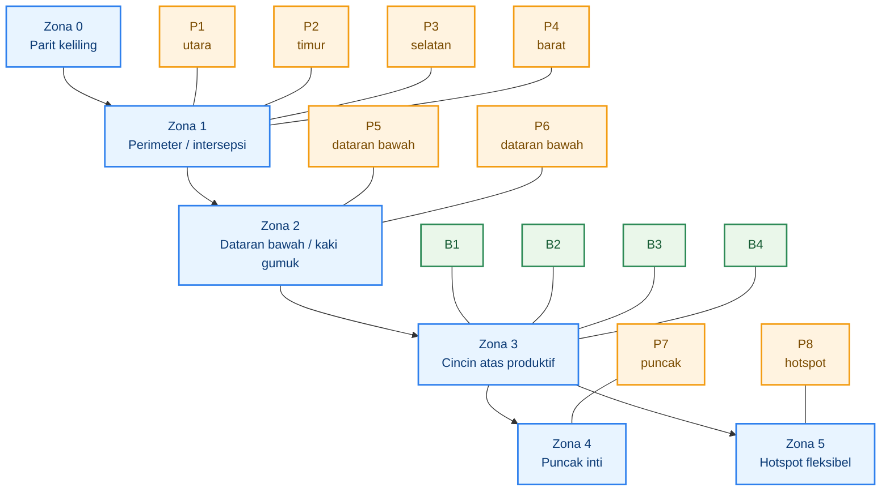

## 7.3 Fungsi titik P1–P8 dan B1–B4

Untuk luas **0,315 ha**, desain kerja ini menggunakan **8 titik trap** agar tekanan tinggi pada kebun campuran tetap bisa dibaca dan ditekan. Pedoman jeruk menyebut trap methyl eugenol dipasang sejak buah pentil sampai panen dengan kepadatan sekitar **15–25 perangkap per hektar** dan pengulangan atraktan tiap **2 minggu sampai 1 bulan**. Dengan luas 0,315 ha, kisaran praktisnya sekitar 5–8 trap; karena tekanan di Gambiran diasumsikan tinggi dan kebunnya campuran, maka 8 titik adalah pilihan operasional yang masih masuk akal. Trap dipasang sekitar **1,5–2 meter** dari permukaan tanah atau menyesuaikan tajuk efektif. ([Hortikultura][2])

### Titik trap P1–P8

**P1** diletakkan di tengah sisi utara, sekitar `(28,1 ; 52,1)`.
**P2** di tengah sisi timur, sekitar `(52,1 ; 28,1)`.
**P3** di tengah sisi selatan, sekitar `(28,1 ; 4,0)`.
**P4** di tengah sisi barat, sekitar `(4,0 ; 28,1)`.

Keempat titik ini membentuk **sabuk perimeter** untuk membaca tekanan dari luar. Fungsinya terutama sebagai titik intersepsi dan monitoring jalur masuk. Ini sesuai dengan fungsi trap dalam AWM, yaitu memonitor distribusi populasi dan membantu menentukan tindakan berikutnya. ([Hortikultura][1])

**P5** ditempatkan pada dataran bawah pertama, misalnya sekitar `(42 ; 14)`.
**P6** ditempatkan pada dataran bawah kedua, misalnya sekitar `(14 ; 42)`.

Dua titik ini bukan sekadar pelengkap, tetapi titik kunci untuk membaca dan menekan area yang secara ekologis paling rawan menjadi sumber pupa. Bila setelah hujan titik rendah nyata bergeser, maka P5 dan P6 juga harus digeser. Penyesuaian ini adalah keputusan lapang berbasis bioekologi, bukan penyimpangan dari desain. ([Hortikultura][2])

**P7** ditempatkan di puncak inti, sekitar `(28,1 ; 28,1)`.
Fungsinya sebagai **titik pembanding internal**. Bila perimeter rendah tetapi P7 tetap tinggi, berarti kebun masih menyimpan sumber masalah dari dalam. Fungsi pembanding seperti ini sangat penting karena monitoring ditujukan untuk membaca distribusi populasi, bukan sekadar total tangkapan. ([Hortikultura][3])

**P8** adalah titik **hotspot fleksibel**, misalnya posisi awal `(42 ; 42)` atau blok dengan inang paling padat.
Titik ini boleh dipindah mengikuti blok yang sedang paling aktif, misalnya jambu yang mulai banyak buah, cabai yang banyak rontok, atau buah naga yang mulai overripe. Dalam konteks AWM dan IPM, P8 adalah titik adaptif yang menjaga sistem tetap responsif terhadap dinamika lapang. ([Hortikultura][1])

### Titik bait B1–B4

B1–B4 adalah titik **umpan protein/spot spray tetap**, bukan trap jantan. Saya sarankan ditempatkan di zona cincin atas dan bagian dalam kebun yang paling mewakili blok produksi, misalnya:

- **B1** `(16 ; 16)`
- **B2** `(40 ; 16)`
- **B3** `(16 ; 40)`
- **B4** `(40 ; 40)`

Logikanya sederhana: bait harus cukup masuk ke area produksi agar bisa memengaruhi aktivitas yang terkait betina, tetapi tetap mudah dijangkau untuk aplikasi berulang dan tidak tersebar acak. Buku pengendalian lalat buah menempatkan **protein hidrolisat** sebagai komponen nyata dalam pengendalian terpadu, dan LAKIN 2024 juga menunjukkan protein hidrolisat menjadi bahan fasilitasi utama untuk pengendalian lalat buah ramah lingkungan pada kegiatan AWM. ([Hortikultura][1])

### Zona prioritas per fungsi

Dengan titik-titik itu, fungsi tiap zona menjadi jelas.
**Sanitasi paling ketat**: Zona 0, Zona 2, dan hotspot sekitar P5–P6–P8.
**Mikrobiologi paling logis**: area bawah tajuk dan tanah pada Zona 2, terutama sekitar titik jatuh buah.
**Pembungkusan paling prioritas**: Zona 3 dan blok produksi bernilai tinggi pada jambu, jeruk, dan buah naga terpilih.
**Inspeksi buah paling intensif**: Zona 3, Zona 4, dan hotspot aktif.
Pembagian ini merupakan turunan langsung dari fakta bahwa larva ada di buah, pupa ada di tanah, dan protein serta trap digunakan untuk menekan populasi dewasa secara terarah. ([Hortikultura][2])

## 7.4 Jalur inspeksi mingguan

Jalur inspeksi harus dibuat tetap agar data mingguan bisa dibandingkan. Tanpa rute tetap, petani cenderung hanya memeriksa titik yang mudah atau yang tampak bermasalah saat itu, dan banyak sumber infestasi luput dari perhatian. Karena monitoring dalam PHT bertujuan membaca perkembangan populasi dan mengevaluasi efektivitas teknik pengendalian, maka **konsistensi rute** sama pentingnya dengan konsistensi trap. ([Hortikultura][3])

Rute inspeksi yang disarankan untuk lahan ini adalah:

1. mulai dari **parit keliling** untuk mencari buah hanyut, genangan, dan serasah;
2. lanjut memeriksa **P1–P4** di perimeter;
3. masuk ke **dataran bawah** untuk P5 dan P6 sekaligus sanitasi berat;
4. naik ke **B1–B4** di zona produksi untuk pengecekan umpan dan gejala buah;
5. tutup di **P7** pada puncak inti;
6. akhiri di **P8** sebagai hotspot fleksibel.

Rute ini efektif karena menutup tiga sumber risiko utama sekaligus: **invasi dari luar**, **sumber generasi baru di bawah**, dan **kerusakan aktif pada blok produksi**. Susunan ini adalah rekomendasi operasional yang diturunkan dari fungsi tiap zona, bukan tata cara resmi nasional yang baku. Namun prinsipnya kuat dan tetap setia pada IPM. ([Hortikultura][3])

Pada setiap putaran mingguan, hal minimum yang diperiksa adalah:

- jumlah tangkapan tiap trap,
- kondisi atraktan/umpan,
- buah tersengat atau gugur,
- fase buah dominan per komoditas,
- kondisi parit dan dataran bawah,
- lokasi hotspot baru bila ada.

Data ini lalu masuk ke form catatan lapang minimum sebagaimana dijelaskan di Bab 3. Dengan begitu, layout dan monitoring tidak berdiri sendiri, tetapi saling mengunci menjadi satu sistem keputusan. ([Hortikultura][3])

## 7.5 AWM sederhana untuk satu blok petani

AWM pada tingkat petani tidak harus dimulai dari skala besar. Yang penting adalah ada **unit kerja kawasan kecil** yang bergerak serempak dengan ritme yang sama. Laporan Kinerja Direktorat Perlindungan Hortikultura 2024 menunjukkan bahwa AWM lalat buah dijalankan melalui pemetaan lokasi, pelatihan petani dan petugas, pemasangan sarana pengendalian, aplikasi protein hidrolisat, monitoring trap, sanitasi buah terserang, dan pengolahan data. Jadi, versi sederhana untuk satu blok petani seharusnya tetap memuat unsur yang sama, hanya skalanya lebih kecil. ([Hortikultura][1])

### Siapa melakukan apa

Untuk satu blok yang terdiri dari beberapa kebun bertetangga, pembagian minimum bisa seperti ini:

- **Koordinator blok**: menyimpan peta trap, mengompilasi FTD, dan memutuskan jadwal sanitasi serempak.
- **Petani pemilik kebun**: menjalankan sanitasi, panen rapat, pembungkusan, dan pengelolaan tanah di blok masing-masing.
- **Petugas monitoring bergilir**: membaca trap P1–P8 pada hari tetap setiap minggu.
- **Petugas umpan**: menyiapkan dan mengaplikasikan protein bait di titik B1–B4 atau titik lain yang disepakati.

Pembagian ini bukan aturan resmi dari Kementan, tetapi bentuk paling sederhana agar prinsip AWM—koordinasi, pemetaan, trap, sanitasi, protein hidrolisat, dan monitoring—benar-benar berjalan di skala blok. ([Hortikultura][1])

### Kapan serempak

Agar efek kawasan muncul, minimal ada tiga kegiatan yang dilakukan **pada minggu yang sama**:

1. **pembacaan trap dan pencatatan FTD**,
2. **sanitasi buah terserang dan kebersihan parit/dataran bawah**,
3. **aplikasi protein bait** pada blok yang sedang rentan.

Kalau ketiga kegiatan ini tidak sinkron, maka satu kebun yang bersih dapat terus ditekan oleh kebun tetangga yang terlambat bergerak. Inilah esensi AWM: menurunkan ketidaksinkronan pengendalian dalam satu hamparan. ([Hortikultura][1])

### Bagaimana data dicatat

Data kawasan minimum yang perlu dicatat adalah:

- kode trap dan lokasi,
- jumlah tangkapan mingguan,
- nilai FTD blok,
- komoditas yang sedang rentan,
- jumlah titik buah gugur/tersengat,
- hotspot aktif minggu itu,
- tindakan yang dilakukan minggu tersebut.

Bila data ini dikumpulkan mingguan, blok petani sudah memiliki dasar untuk membaca apakah tekanan sedang pindah dari perimeter ke dalam kebun, apakah dataran bawah terus menjadi sumber masalah, dan apakah bait atau sanitasi perlu diperkuat. Ini tepat sejalan dengan fungsi monitoring dan evaluasi dalam AWM. ([Hortikultura][1])

## Ringkasan praktis bab ini

Layout operasional lahan gumuk harus dibaca sebagai **alat keputusan IPM**, bukan sekadar gambar posisi trap. Untuk lahan **56,1 × 56,1 m** di Gambiran, pembagian zona yang paling berguna adalah: **parit**, **perimeter**, **dataran bawah**, **cincin atas**, **puncak**, dan **hotspot fleksibel**. Trap **P1–P4** dipakai sebagai sabuk intersepsi, **P5–P6** untuk dataran bawah, **P7** untuk pembanding internal, dan **P8** untuk hotspot. Titik **B1–B4** dipakai untuk protein bait pada zona produksi. Sanitasi terberat ditempatkan pada parit dan dataran bawah, mikrobiologi paling logis diterapkan pada area tanah bawah tajuk, dan pembungkusan diprioritaskan pada zona produksi komoditas yang memang cocok dibungkus. Ketika semua ini dijalankan serempak lintas kebun, maka AWM skala blok mulai terbentuk. ([Hortikultura][1])

## Penutup bab

Bab ini menutup seluruh bagian teknis artikel dengan satu pesan yang sangat praktis: **IPM lalat buah harus punya peta kerja**. Tanpa layout, trap hanya menjadi botol yang digantung. Tanpa zonasi, sanitasi hanya menjadi kerja bersih-bersih yang tidak fokus. Tanpa mekanisme AWM sederhana, setiap kebun akan bergerak sendiri-sendiri dan efek kawasan tidak pernah terbentuk. Dengan layout operasional seperti ini, semua komponen yang sudah dibahas—monitoring, sanitasi, pembungkusan, bait, mikrobiologi, dan koordinasi blok—akhirnya menyatu menjadi sistem kerja yang bisa dijalankan oleh praktisi dari minggu ke minggu. ([Hortikultura][1])

[1]: https://hortikultura.pertanian.go.id/wp-content/uploads/2025/03/LAKIP-_-LAKIN-PERLINDUNGAN-HOLTIKULTURA-2024.pdf?utm_source=chatgpt.com 'Laporan Kinerja Direktorat Perlindungan Hortikultura Tahun ...'
[2]: https://hortikultura.pertanian.go.id/wp-content/uploads/2024/11/Pengenalan-dan-Pengendalian-Hama-Penyakit-Tanaman-Jeruk-_watermark_compressed.pdf?utm_source=chatgpt.com 'Pengenalan dan Pengendalian Hama Penyakit Tanaman Jeruk'
[3]: https://hortikultura.pertanian.go.id/wp-content/uploads/2024/11/Pengendalian-Lalat-Buah-Full-Text_watermark.pdf?utm_source=chatgpt.com 'Teknologi Pengendalian Hama Lalat Buah'

[**Kembali ke Atas**](#pedoman-terpadu-menekan-serangan-lalat-buah-di-kebun-campuran)

---

# Bab 8 — Aturan keputusan, SOP satu musim, dan evaluasi hasil

Bab ini adalah penutup yang mengubah seluruh artikel menjadi **alat kerja lapang**. Inti IPM menurut EPA adalah: **identifikasi dan monitoring**, **menetapkan ambang tindakan**, **mencegah**, lalu **mengendalikan** dengan opsi yang efektif dan berisiko lebih rendah lebih dulu. EPA juga menegaskan bahwa satu hama yang terlihat tidak selalu berarti pengendalian harus langsung dilakukan; keputusan harus dipandu oleh **action threshold** atau tingkat risiko yang sudah ditetapkan. Di sisi lain, buku pengendalian lalat buah dari Kementan menjelaskan bahwa monitoring dipakai untuk membaca perkembangan populasi, distribusi, deteksi dini, dan evaluasi efektivitas pengendalian, sedangkan AWM 2024 memakai **FTD** untuk melihat apakah penekanan populasi berjalan efektif. ([epa.gov](https://www.epa.gov/ipm/introduction-integrated-pest-management) ([US EPA][1]); [hortikultura.pertanian.go.id](https://hortikultura.pertanian.go.id/wp-content/uploads/2024/11/Pengendalian-Lalat-Buah-Full-Text_watermark.pdf) ([Hortikultura][2]))

Karena itu, aturan keputusan pada artikel ini **tidak memakai trap saja**. Dasar keputusannya adalah gabungan **FTD + gejala buah + fase tanaman + kondisi lokasi**. FTD tetap penting karena AWM Kementan memakai FTD untuk menunjukkan fluktuasi populasi dan menargetkan **FTD < 1** sebagai indikator populasi sangat rendah pada area pengelolaan, tetapi angka itu harus dibaca bersama kondisi buah dan kebun. Jadi, bab ini tidak memberi “angka sakti”, melainkan **ambang operasional praktis** yang konsisten dengan prinsip IPM dan masih realistis untuk kebun campuran. ([hortikultura.pertanian.go.id](https://hortikultura.pertanian.go.id/wp-content/uploads/2025/03/LAKIP-_-LAKIN-PERLINDUNGAN-HOLTIKULTURA-2024.pdf) ([Hortikultura][3]); [repository.pertanian.go.id](https://repository.pertanian.go.id/bitstreams/0771cd10-6618-4ed0-b960-5aa9678e537c/download) ([Hortikultura][2]))

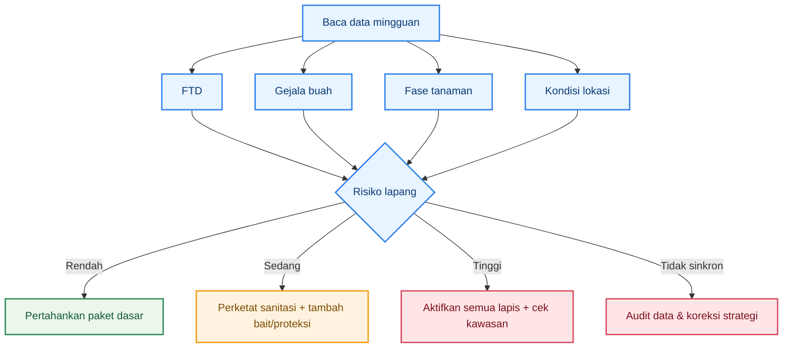

Diagram di atas merangkum logika keputusan: data mingguan harus berakhir pada keputusan yang jelas—**dipertahankan, dinaikkan, atau dikoreksi**—bukan berhenti pada angka trap. Pendekatan seperti ini paling sesuai dengan IPM karena menghubungkan monitoring ke tindakan, dan tindakan ke evaluasi hasil. ([epa.gov](https://www.epa.gov/safepestcontrol/integrated-pest-management-ipm-principles) ([US EPA][4]))

## 8.1 Matriks keputusan mingguan

Matriks ini adalah **ambang operasional lapang**, bukan ambang ekonomi resmi nasional untuk semua komoditas. Fungsinya agar petani dan pendamping bisa mengambil keputusan cepat dengan dasar yang konsisten. Landasannya tetap pada prinsip EPA tentang action threshold dan pada penggunaan FTD dalam AWM Kementan. ([epa.gov](https://www.epa.gov/ipm/introduction-integrated-pest-management) ([US EPA][1]); [hortikultura.pertanian.go.id](https://hortikultura.pertanian.go.id/wp-content/uploads/2025/03/LAKIP-_-LAKIN-PERLINDUNGAN-HOLTIKULTURA-2024.pdf) ([Hortikultura][3]))

### Matriks keputusan praktis

| Kondisi lapang                                                  | Cara baca                                                             | Keputusan minggu ini                                                                                                         |
| --------------------------------------------------------------- | --------------------------------------------------------------------- | ---------------------------------------------------------------------------------------------------------------------------- |
| **FTD rendah** + buah sehat + hotspot bersih                    | Populasi rendah dan belum ada tanda tekanan nyata                     | Pertahankan trap, sanitasi rutin, inspeksi buah, panen rapat                                                                 |
| **FTD sedang** + mulai ada sengatan ringan / buah gugur sedikit | Populasi aktif dan risiko mulai nyata                                 | Perketat sanitasi, aktifkan/ulang bait protein, cek atraktan, prioritas pembungkusan komoditas yang cocok                    |
| **FTD tinggi** + buah rusak naik + fase buah rentan             | Tekanan lapang nyata dan kerugian mulai terbentuk                     | Aktifkan semua lapis: sanitasi keras, trap optimal, bait protein, pembungkusan prioritas, kelola tanah/hotspot, cek AWM blok |
| **FTD turun** tetapi buah rusak tetap tinggi                    | Trap membaik, tetapi sumber infestasi atau aktivitas betina masih ada | Audit sanitasi, audit pembungkusan/proteksi buah, cek buah lama terserang, cek titik bawah tajuk dan parit                   |
| **FTD rendah** tetapi hotspot kotor / banyak buah overripe      | Risiko semu: populasi bisa memantul cepat                             | Jangan puas; fokus bersihkan hotspot dan pertahankan monitoring                                                              |
| **FTD tinggi** tetapi buah belum masuk fase rentan              | Tekanan populasi ada, tetapi risiko ekonomi belum puncak              | Jangan langsung naik ke semprot luas; siapkan proteksi, rapikan sanitasi, aktifkan bait seperlunya, perketat inspeksi        |

Matriks ini sengaja menggabungkan **angka populasi** dan **kondisi biologis**. Itu lebih sesuai dengan PHT daripada keputusan otomatis berbasis satu variabel. Buku pengendalian lalat buah Kementan juga menjelaskan bahwa monitoring kerusakan buah harus dilakukan periodik dan kontinu, sehingga pengamatan buah memang merupakan bagian sah dari keputusan lapang. ([hortikultura.pertanian.go.id](https://hortikultura.pertanian.go.id/wp-content/uploads/2024/11/Pengendalian-Lalat-Buah-Full-Text_watermark.pdf) ([Hortikultura][2]))

## 8.2 SOP 30 hari pertama

Tiga puluh hari pertama adalah fase pembentukan disiplin sistem. Tujuannya bukan langsung “menghabisi” lalat buah, tetapi **membuat kebun bisa dibaca dan dikendalikan secara teratur**. AWM Kementan menunjukkan bahwa langkah awal pengelolaan skala luas memang mencakup penetapan lokasi, pemetaan, pemasangan sarana, monitoring trap, sanitasi buah terserang, dan aplikasi protein hidrolisat. Jadi, SOP 30 hari pertama harus meniru logika itu dalam skala kebun/blok. ([hortikultura.pertanian.go.id](https://hortikultura.pertanian.go.id/wp-content/uploads/2025/03/LAKIP-_-LAKIN-PERLINDUNGAN-HOLTIKULTURA-2024.pdf) ([Hortikultura][3]))

### Hari 1–7

- Pasang dan kodekan **P1–P8**.
- Tetapkan **B1–B4** untuk protein bait.
- Bersihkan **parit, dataran bawah, bawah tajuk, dan hotspot**.
- Catat komoditas mana yang sedang **pentil, pembesaran buah, menjelang masak, atau panen**.
- Mulai form monitoring mingguan pertama.
  Tahap ini penting karena monitoring yang baik menurut Kementan harus dimulai dari penentuan lokasi, komoditas, luas areal, dan metode monitoring yang sesuai. ([Hortikultura][2])

### Hari 8–14

- Baca semua trap pertama kali.
- Hitung **FTD minggu pertama**.
- Lakukan sanitasi kedua secara menyeluruh.
- Mulai pembungkusan pada **jambu/jeruk** yang sudah masuk fase layak dibungkus.
- Bila buah rentan dan tanda serangan mulai muncul, aktifkan **protein bait** di B1–B4.
  Pada tahap ini, tujuan utama adalah mendapatkan **baseline** populasi dan baseline kerusakan buah. Itu sejalan dengan fungsi monitoring sebagai dasar evaluasi. ([Hortikultura][2])

### Hari 15–21

- Bandingkan FTD minggu kedua dengan minggu pertama.
- Audit titik yang paling sering ada buah gugur.
- Balik/gemburkan tanah pada titik jatuh buah dan area bawah tajuk yang rawan.
- Bila tersedia, tempatkan komponen mikrobiologi pada area tanah/hotspot yang lembap dan konsisten menjadi sumber masalah.
  Ini mengikuti bioekologi lalat buah: buah adalah sumber larva, tanah adalah lokasi pupa. ([Hortikultura][2])

### Hari 22–30

- Lakukan evaluasi mini:

  - trap mana paling tinggi,
  - komoditas mana paling rentan,
  - hotspot mana belum turun tekanannya,
  - apakah sanitasi berjalan sesuai jadwal.

- Putuskan: **pertahankan, tambah lapisan intervensi, atau koreksi layout**.
  EPA menekankan bahwa rencana IPM harus diperbarui berdasarkan hasil monitoring; jadi evaluasi bulan pertama adalah bagian inti sistem, bukan tambahan. ([US EPA][1])

## 8.3 SOP rutin mingguan dan bulanan

### SOP mingguan

SOP mingguan adalah tulang punggung sistem. Dalam AWM Kementan, monitoring trap dilakukan **setiap minggu**, lalu diolah menjadi FTD untuk menilai efektivitas pengendalian. Karena itu, ritme mingguan tidak boleh berubah-ubah. ([Hortikultura][3])

**Urutan kerja mingguan yang disarankan:**

1. **Baca trap P1–P8** pada hari tetap.
2. Hitung **FTD** dan bandingkan dengan minggu lalu.
3. Periksa gejala buah pada komoditas yang sedang rentan.
4. Lakukan sanitasi menyeluruh, terutama di parit, dataran bawah, bawah tajuk, dan hotspot.
5. Aplikasikan atau perbarui **protein bait** bila matriks keputusan mengharuskan.
6. Cek pembungkusan buah: tambah, ganti, atau buang buah yang sudah rusak.
7. Catat keputusan minggu ini dan target minggu depan.

### SOP bulanan

Evaluasi bulanan bertujuan melihat apakah arah program benar. Minimal empat hal harus dinilai:

- **populasi**: tren FTD naik, turun, atau stagnan;
- **kerusakan buah**: persentase buah tersengat/rusak naik atau turun;
- **hotspot**: titik masalah tetap atau bergeser;
- **disiplin pelaksanaan**: trap dibaca tepat waktu atau tidak, sanitasi jalan atau tidak, bait diaplikasikan sesuai keputusan atau tidak.
  Kementan menempatkan monitoring sebagai alat untuk mengevaluasi efektivitas teknik pengendalian; karena itu evaluasi bulanan wajib menilai **hasil** dan **kepatuhan pelaksanaan** sekaligus. ([Hortikultura][2])

### SOP saat puncak buah

Ketika jambu, jeruk, buah naga, atau cabai masuk puncak buah, frekuensi inspeksi buah harus dinaikkan. Buku Kementan menjelaskan bahwa pengukuran kerusakan buah paling relevan dilakukan saat **buah menjelang masak**, ketika serangan umumnya paling tinggi. Pada fase ini:

- panen dipercepat,
- sanitasi dipadatkan,
- pembungkusan diprioritaskan pada buah bernilai tinggi,
- bait protein diaktifkan bila ada tekanan,
- trap tetap dibaca mingguan tanpa putus. ([Hortikultura][2])

### SOP saat tekanan tinggi

Bila FTD tinggi, buah rusak naik, dan hotspot tetap aktif, aktifkan semua lapis:

- sanitasi keras,
- panen rapat,
- pembungkusan prioritas,
- bait protein aktif,
- trap dipastikan optimal,
- tanah/hotspot dikelola,
- koordinasi blok/AWM diperketat.
  Ini konsisten dengan prinsip EPA bahwa bila action threshold terlampaui, kontrol dilakukan dengan opsi efektif yang relevan dengan risiko, dan ukuran, cakupan, serta intensitas rencana difokuskan oleh threshold tersebut. ([US EPA][4])

## 8.4 Kriteria keberhasilan dan tanda kegagalan

Keberhasilan program tidak boleh dinilai dari satu hal saja. Dalam AWM Kementan, **FTD < 1** dipakai sebagai indikator bahwa populasi lapang sangat rendah. Namun untuk kebun praktisi, keberhasilan sebaiknya dibaca dari kombinasi berikut:

- FTD cenderung turun atau stabil rendah,
- gejala buah tersengat menurun,
- hotspot makin sedikit,
- buah gugur terinfestasi makin jarang,
- pekerjaan mingguan berjalan disiplin. ([Hortikultura][3])

### Tanda keberhasilan

- Trap perimeter tinggi di awal lalu turun bertahap.
- Trap internal tidak terus-menerus lebih tinggi dari perimeter.
- Buah sehat lebih dominan pada komoditas yang sedang rentan.
- Parit dan dataran bawah tidak lagi menjadi kantong buah busuk.
- Kebutuhan intervensi keras menurun dari bulan ke bulan.
  Ini adalah tanda bahwa sistem tidak hanya “membunuh lalat”, tetapi benar-benar memutus siklus. ([Hortikultura][2])

### Tanda kegagalan

- FTD stagnan tinggi selama beberapa minggu.
- Buah rusak tetap tinggi meski trap menurun.
- Hotspot selalu muncul di titik yang sama.
- Sanitasi tercatat dilakukan, tetapi buah gugur masih banyak ditemukan.
- Komoditas bernilai tinggi tetap banyak kehilangan buah meski trap aktif.
  Bila ini terjadi, masalahnya sering bukan kekurangan alat, melainkan **kegagalan sinkronisasi sistem**: sanitasi terlambat, bait tidak tepat waktu, buah rentan tidak dilindungi, atau kebun sekitar tidak ikut bergerak. AWM Kementan sendiri dibangun justru untuk mengatasi masalah lintas kebun seperti ini. ([Hortikultura][3])

## 8.5 Tindakan korektif bila program tidak jalan

Ketika program tidak jalan, jangan langsung menambah input. Koreksi harus dilakukan secara berurutan, dari yang paling mendasar. Ini sejalan dengan prinsip IPM EPA: rencana harus diperbarui berdasar hasil monitoring, dan pengendalian harus dipilih secara bertingkat. ([US EPA][1])

### Koreksi tahap 1 — audit data

Periksa:

- apakah trap dibaca pada hari yang tetap,
- apakah jumlah trap aktif benar,
- apakah atraktan masih layak,
- apakah pengamatan buah dilakukan pada blok yang representatif,
- apakah hotspot dicatat atau hanya diingat.
  Tanpa data yang benar, keputusan berikutnya hampir pasti salah. ([Hortikultura][2])

### Koreksi tahap 2 — audit sanitasi dan panen

Periksa:

- apakah buah gugur dipungut setiap 2–3 hari,
- apakah buah overripe masih dibiarkan,
- apakah parit dan dataran bawah dibersihkan,
- apakah sortasi buah terserang berujung pada pemusnahan.
  Pada lalat buah, ini sering menjadi titik kegagalan paling besar karena buah dan tanah adalah sumber generasi baru. ([Hortikultura][2])

### Koreksi tahap 3 — audit proteksi buah dan komponen betina

Periksa:

- apakah jambu/jeruk yang layak dibungkus benar-benar dibungkus,
- apakah bait protein aktif saat buah masuk fase rentan,
- apakah titik B1–B4 ditempatkan dan dirawat benar,
- apakah ada gejala bahwa betina tetap aktif meski trap jantan turun.
  Ini penting karena trap jantan tidak selalu mencerminkan penuh risiko kerusakan buah. ([Hortikultura][2])

### Koreksi tahap 4 — audit kawasan/AWM

Periksa:

- apakah kebun tetangga dengan inang aktif ikut bergerak,
- apakah sanitasi serempak dijalankan,
- apakah data blok dikompilasi bersama,
- apakah perimeter tinggi terus karena tekanan dari luar.
  Jika ya, masalahnya sudah melampaui skala satu kebun, sehingga strategi harus dinaikkan ke koordinasi blok/kawasan. Ini sepenuhnya sejalan dengan konsep AWM Kementan. ([Hortikultura][3])

### Kapan strategi dinaikkan, dipertahankan, atau dikoreksi

- **Dipertahankan** bila FTD rendah/stabil, buah sehat dominan, hotspot terkendali, dan disiplin kerja baik.
- **Dinaikkan** bila FTD naik, buah masuk fase rentan, gejala sengatan muncul, atau hotspot aktif kembali.
- **Dikoreksi** bila FTD dan gejala buah tidak sinkron, bila hasil tidak membaik setelah beberapa minggu, atau bila disiplin pelaksanaan rendah.
  Kerangka ini persis mengikuti prinsip **action threshold → prevention → control → review** pada IPM. ([US EPA][4])

## Tiga alat bantu yang cukup

Agar artikel tetap usable dan tidak over-kill, cukup tiga alat bantu praktis berikut.

### 1. Form monitoring mingguan

Isi minimum:

- kode trap,
- jumlah tangkapan,
- FTD,
- komoditas rentan,
- buah tersengat/rusak,
- hotspot aktif,
- keputusan minggu ini.
  Format seperti ini sejalan dengan prinsip EPA yang menganjurkan pencatatan hasil monitoring, lokasi, jadwal inspeksi, dan rekomendasi. ([US EPA][1])

### 2. Denah layout

Denah harus memuat:

- zona lahan,
- titik **P1–P8**,
- titik **B1–B4**,
- jalur inspeksi.
  Tanpa denah, data mingguan sulit dibaca sebagai pola ruang. Ini sangat penting pada lahan gumuk. ([Hortikultura][3])

### 3. Checklist keputusan lapang 1 halaman

Format paling ringkas:

- **rendah** → pertahankan,
- **sedang** → perketat sanitasi + tambah bait/proteksi,
- **tinggi** → aktifkan semua lapis + cek kawasan,
- **tidak sinkron** → audit sistem.
  Checklist ini adalah bentuk paling praktis dari action threshold lapang. ([US EPA][4])

## Penutup bab

Bab ini menutup artikel dengan satu prinsip sederhana: **monitoring harus berujung pada keputusan, dan keputusan harus berujung pada evaluasi**. FTD penting, tetapi tidak boleh berdiri sendiri. Gejala buah penting, tetapi tidak boleh dibaca tanpa fase tanaman. Hotspot penting, tetapi tidak cukup tanpa disiplin sanitasi dan koordinasi blok. Dengan memakai matriks keputusan mingguan, SOP 30 hari pertama, ritme mingguan dan bulanan, serta kriteria keberhasilan dan tindakan korektif, praktisi tidak lagi bekerja berdasarkan tebakan atau rutinitas semprot, melainkan berdasarkan sistem IPM yang utuh, terukur, dan bisa dikoreksi dari musim ke musim. ([US EPA][1])

[1]: https://www.epa.gov/ipm/introduction-integrated-pest-management?utm_source=chatgpt.com 'Introduction to Integrated Pest Management'
[2]: https://hortikultura.pertanian.go.id/wp-content/uploads/2024/11/Pengendalian-Lalat-Buah-Full-Text_watermark.pdf?utm_source=chatgpt.com 'Teknologi Pengendalian Hama Lalat Buah'
[3]: https://hortikultura.pertanian.go.id/wp-content/uploads/2025/03/LAKIP-_-LAKIN-PERLINDUNGAN-HOLTIKULTURA-2024.pdf?utm_source=chatgpt.com 'Laporan Kinerja Direktorat Perlindungan Hortikultura Tahun ...'
[4]: https://www.epa.gov/safepestcontrol/integrated-pest-management-ipm-principles?utm_source=chatgpt.com 'Integrated Pest Management (IPM) Principles'
[5]: https://hortikultura.pertanian.go.id/wp-content/uploads/2025/03/LAKIP-_-LAKIN-PERLINDUNGAN-HOLTIKULTURA-2024.pdf?utm_source=chatgpt.com 'Laporan Kinerja Direktorat Perlindungan Hortikultura Tahun ...'
[6]: https://hortikultura.pertanian.go.id/wp-content/uploads/2024/11/Pengendalian-Lalat-Buah-Full-Text_watermark.pdf?utm_source=chatgpt.com 'Teknologi Pengendalian Hama Lalat Buah'
[7]: https://hortikultura.pertanian.go.id/wp-content/uploads/2018/12/Juknis-Perlindungan-2019.pdf?utm_source=chatgpt.com 'Petunjuk Teknis Pengembangan Sistem Perlindungan ...'
[8]: https://hortikultura.pertanian.go.id/wp-content/uploads/2024/11/Budidaya-Jeruk-Nipis-Citrus-aurantifolia_watermark_compressed.pdf?utm_source=chatgpt.com 'Budidaya Jeruk Nipis (Citrus aurantifolia)'

[**Pergi ke Atas**](#pedoman-terpadu-menekan-serangan-lalat-buah-di-kebun-campuran)

---

Berikut **lampiran aplikasi lapang** yang dipisahkan dari tubuh utama agar artikel tetap ramping, tetapi tetap bisa langsung dipakai di kebun contoh. **Layout dan program kerja di bawah ini adalah skema operasional**, bukan hasil ukur GPS atau peta kadastral. Rumus **FTD** saya pertahankan mengikuti pedoman **IAEA**, dan target suppression praktis **di bawah 1 FTD** saya ambil dari manual **ACIAR** untuk program area-wide. Protein bait saya posisikan sebagai pekerjaan **mingguan** yang dimulai sebelum buah benar-benar rentan, dengan pengulangan lebih rapat bila hujan mencuci bait atau tekanan naik. ([International Atomic Energy Agency][1])

# Lampiran A. Layout lahan Gambiran 3.150 m²

**Asumsi kerja contoh:** lahan berbentuk mendekati persegi panjang **70 m × 45 m = 3.150 m²**.
Arah dibuat sederhana agar mudah dipakai tim lapang: **utara = akses utama**, **selatan = parit/outlet air**.

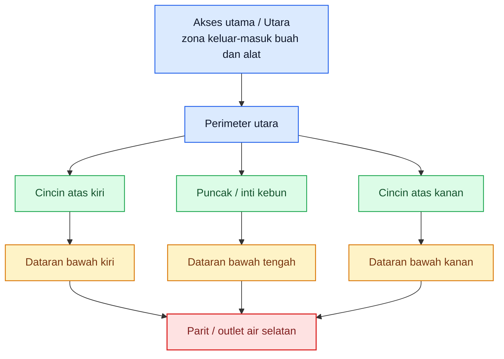

**Cara membaca layout ini:**

- **Perimeter** adalah zona alarm awal: trap, bait, dan host alternatif harus dibaca di sini lebih dulu.
- **Cincin atas** adalah zona produksi yang masih relatif aman bila perimeter tertahan.
- **Dataran bawah** adalah zona rawan buah gugur dan akumulasi tekanan.
- **Parit/outlet air** adalah zona yang tidak boleh kotor, karena mudah menjadi tempat tertahan buah sakit dan limbah.

# Lampiran B. Denah titik perangkap P1–P8

Trap harus dipakai bukan hanya untuk “menghitung lalat”, tetapi untuk membaca **tekanan per zona**. Dalam program area-wide, trap dibaca berkala dan FTD dipakai sebagai **population index**, dengan target suppression praktis **< 1 FTD**. ([International Atomic Energy Agency][1])

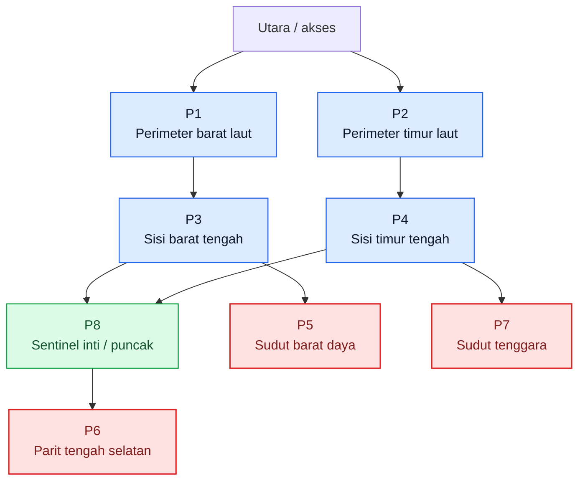

| Titik | Fungsi utama                                                        | Prioritas baca                                |
| ----- | ------------------------------------------------------------------- | --------------------------------------------- |
| P1    | alarm perimeter barat laut                                          | mingguan                                      |
| P2    | alarm perimeter timur laut                                          | mingguan                                      |
| P3    | pemantau masuknya tekanan dari sisi barat                           | mingguan, naik 2x/minggu bila FTD naik        |
| P4    | pemantau masuknya tekanan dari sisi timur                           | mingguan, naik 2x/minggu bila FTD naik        |
| P5    | sentinel titik rendah sisi barat                                    | mingguan                                      |
| P6    | sentinel parit tengah selatan                                       | mingguan, wajib cek bila buah gugur meningkat |
| P7    | sentinel titik rendah sisi timur                                    | mingguan                                      |
| P8    | trap inti untuk membaca apakah masalah sudah masuk ke jantung kebun | mingguan                                      |

**Aturan kerja cepat:**

- Bila **P1–P4** naik, baca itu sebagai **tekanan masuk/perimeter**.
- Bila **P5–P7** naik, baca itu sebagai **masalah buah gugur, titik rendah, atau sanitasi bawah tajuk**.
- Bila **P8** ikut naik, anggap masalah sudah **menembus inti kebun** dan ritme pengendalian harus dinaikkan.

# Lampiran C. Skema zonasi kerja: parit, perimeter, dataran bawah, cincin atas, puncak, hotspot

Zonasi ini dibuat supaya tim lapang tidak bekerja acak. Hotspot harus dibaca sebagai **zona dinamis**: ia bisa muncul di perimeter, dataran bawah, atau dekat parit, tergantung buah gugur, host alternatif, dan tangkapan trap.

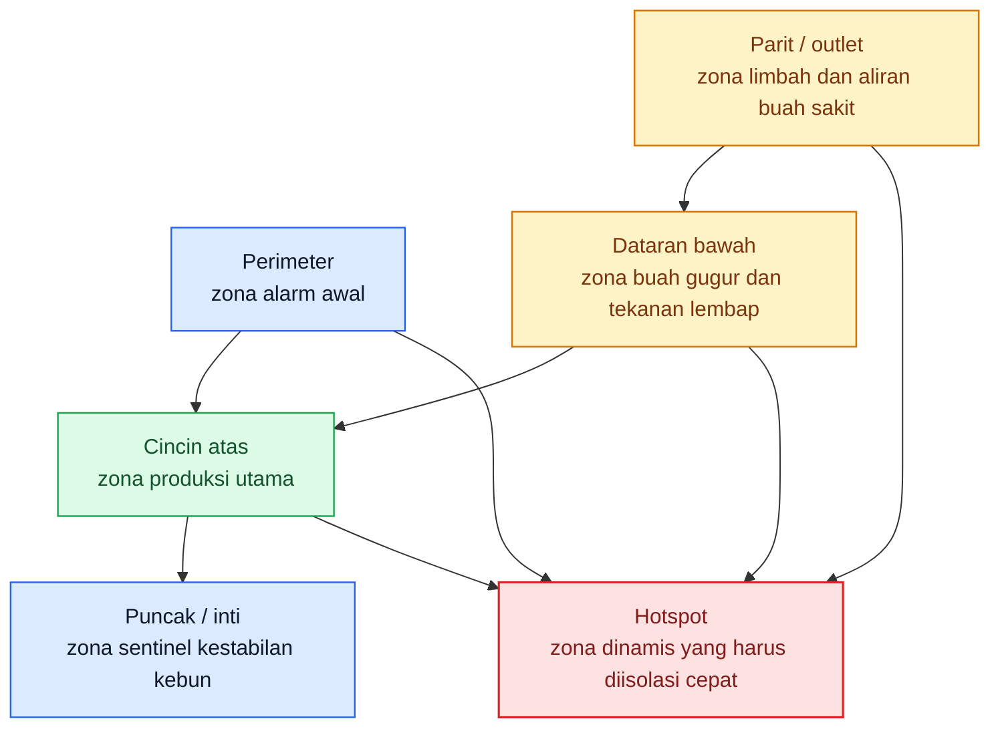

| Zona           | Fokus utama                                 | Frekuensi minimum              | Trigger eskalasi                  |
| -------------- | ------------------------------------------- | ------------------------------ | --------------------------------- |
| Perimeter      | trap, bait, host alternatif, buah pinggir   | mingguan                       | tangkapan naik pada P1–P4         |
| Dataran bawah  | buah gugur, sanitasi, pupa, titik lembap    | tiap 2–3 hari                  | buah gugur sakit meningkat        |
| Cincin atas    | pembungkusan, panen selektif, inspeksi buah | tiap 2–3 hari saat buah rentan | sengatan awal muncul              |
| Puncak / inti  | trap sentinel, cek kestabilan blok          | mingguan                       | P8 ikut naik                      |
| Parit / outlet | limbah, buah afkir, titik tertahan          | tiap 2–3 hari                  | buah sakit tertahan setelah hujan |
| Hotspot        | semua tindakan dipadatkan                   | 24–72 jam pertama              | gejala melebar ke blok sekitar    |

# Lampiran D. SOP mingguan sanitasi, trap, bait, pembungkusan, dan pembalikan tanah

Saya pakai tiga pegangan operasional di lampiran ini:
trap dibaca **mingguan**, protein bait dipakai **mingguan** saat lalat mulai muncul, dan bait perlu **diulang lebih cepat** bila hujan mencuci umpan atau tekanan naik. Pedoman NSW juga menyarankan bait dimulai **setidaknya satu bulan sebelum buah rentan** dan diteruskan sampai **dua minggu setelah panen**, sedangkan panduan grower menekankan pengulangan **mingguan** sejak lalat mulai muncul. ([NSW Department of Primary Industries][2])

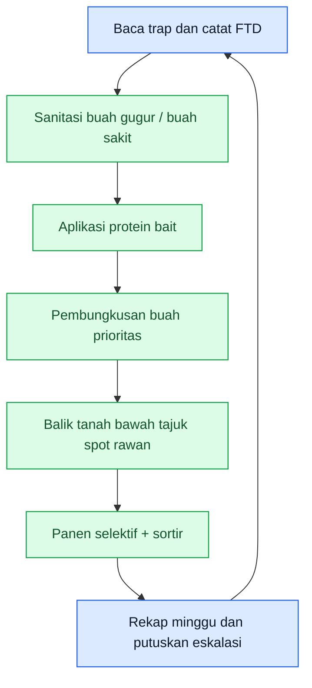

| Hari   | Pekerjaan utama                                         | Target area                             | Output yang harus jadi                     |
| ------ | ------------------------------------------------------- | --------------------------------------- | ------------------------------------------ |
| Senin  | Baca P1–P8, hitung tangkapan, tandai titik naik         | seluruh kebun                           | peta tekanan minggu berjalan               |
| Selasa | Aplikasi protein bait                                   | perimeter, hotspot, sisi host aktif     | betina muda ditekan sebelum bertelur       |
| Rabu   | Sanitasi besar 1                                        | bawah tajuk, parit, titik rendah        | buah sakit keluar dari kebun               |
| Kamis  | Pembungkusan buah prioritas + cek buah menjelang matang | jambu, jeruk, buah naga, blok prioritas | buah bernilai tinggi terlindungi           |
| Jumat  | Panen selektif + sortir + keluarkan reject fruit        | blok panen aktif                        | buah rentan tidak terlalu lama tergantung  |
| Sabtu  | Sanitasi besar 2 + pembalikan tanah spot rawan          | bawah tajuk, parit, hotspot             | larva–pupa diputus                         |
| Minggu | Rekap FTD, buah gugur, hotspot, keputusan pekan depan   | meja kerja / catatan kebun              | status: stabil, bocor, atau perlu eskalasi |

**Aturan koreksi cepat:**

- Bila hujan meluruhkan bait, **majukan aplikasi berikutnya**. ([Yarriambiack Shire Council][3])
- Bila P8 ikut naik, minggu berikutnya jangan dijalankan normal; masuk **mode penekanan cepat**.
- Bila buah gugur sakit meningkat, jangan tunggu jadwal Sabtu; lakukan sanitasi **hari itu juga**.

# Lampiran E. Cara hitung FTD + contoh lembar pencatatan

IAEA mendefinisikan **FTD** sebagai indeks populasi yang menunjukkan rata-rata jumlah lalat target yang tertangkap per trap per hari. Manual ACIAR untuk area-wide suppression memakai target praktis **kurang dari 1 lalat per trap per hari** sebagai level suppression. ([International Atomic Energy Agency][1])

```mdx id="gi0kr2"
$$
\mathrm{FTD}=\frac{F}{T \times D}
$$

dengan:

- $F$ = total lalat buah target yang tertangkap
- $T$ = jumlah trap yang diperiksa
- $D$ = rata-rata jumlah hari trap terpasang
```

# Contoh hitung

Misal:

- total lalat tertangkap = **24**
- jumlah trap diperiksa = **8**
- lama paparan = **7 hari**

```mdx id="txm3l9"
$$
\mathrm{FTD}=\frac{24}{8 \times 7}=\frac{24}{56}=0.43
$$
```

**Interpretasi kerja:**
FTD **0,43** berarti kebun masih di bawah target suppression **< 1 FTD**, tetapi angka itu tetap harus dibaca bersama **buah gugur sakit**, **sengatan awal**, dan **lokasi trap yang naik**. FTD adalah alat baca, bukan tujuan akhir. ([International Atomic Energy Agency][1])

## Contoh lembar pencatatan lapang

| Tanggal cek | Trap ID |            Zona | Hari terpasang | Tangkapan target | FTD blok | Buah gugur sakit sekitar | Gejala buah sekitar      | Keputusan 24 jam       |
| ----------- | ------- | --------------: | -------------: | ---------------: | -------: | -----------------------: | ------------------------ | ---------------------- |
| 10 Mei 2026 | P1      |       perimeter |              7 |                2 |     0,43 |                        1 | belum ada sengatan nyata | lanjut rutin           |
| 10 Mei 2026 | P3      | perimeter barat |              7 |                6 |     0,43 |                        4 | ada sengatan awal        | tambah bait + sanitasi |
| 10 Mei 2026 | P6      |           parit |              7 |                5 |     0,43 |                        9 | buah gugur busuk banyak  | hotspot                |
| 10 Mei 2026 | P8      |            inti |              7 |                1 |     0,43 |                        0 | belum ada gejala         | sentinel aman          |

## Format kosong yang bisa dipakai berulang

| Tanggal cek | Trap ID | Zona | Hari terpasang | Tangkapan target | FTD blok | Buah gugur sakit sekitar | Gejala buah sekitar | Keputusan 24 jam |
| ----------- | ------- | ---: | -------------: | ---------------: | -------: | -----------------------: | ------------------- | ---------------- |
|             |         |      |                |                  |          |                          |                     |                  |
|             |         |      |                |                  |          |                          |                     |                  |
|             |         |      |                |                  |          |                          |                     |                  |
|             |         |      |                |                  |          |                          |                     |                  |

# Lampiran F. Program kerja setahun Mei 2026–April 2027 untuk kebun contoh

**Catatan:** ini **program contoh**, jadi tanggalnya mengikuti kalender, tetapi pelaksanaannya tetap harus disesuaikan dengan **fenologi buah** di kebun nyata. Artinya, bila fase buah rentan maju atau mundur, program harus ikut digeser.

| Bulan              | Fokus utama                     | Target operasional                                                    | Hasil yang harus jadi                                     |
| ------------------ | ------------------------------- | --------------------------------------------------------------------- | --------------------------------------------------------- |
| **Mei 2026**       | audit kebun dan reset sanitasi  | bersihkan sumber lama, validasi zonasi, cek host alternatif           | kebun tidak masuk musim baru dengan populasi dasar tinggi |
| **Juni 2026**      | aktivasi trap tetap             | pasang P1–P8, mulai log trap, latih pembacaan hotspot                 | peta tekanan awal kebun                                   |
| **Juli 2026**      | persiapan bait dan pembungkusan | stok bait, bahan bungkus, jadwal tenaga kerja                         | semua sarana siap sebelum buah rentan                     |
| **Agustus 2026**   | awal pengamanan host pertama    | bait mulai aktif pada blok paling awal berbuah                        | betina ditekan sebelum oviposisi luas                     |
| **September 2026** | proteksi buah pentil            | pembungkusan komoditas prioritas, sanitasi 2–3 hari                   | buah awal tidak menjadi jembatan populasi                 |
| **Oktober 2026**   | monitoring intensif             | trap mingguan, FTD mulai dipakai sebagai alat keputusan               | blok rawan terbaca lebih dini                             |
| **November 2026**  | penekanan aktif                 | bait mingguan, sanitasi keras, panen lebih rapat                      | populasi ditekan sebelum puncak buah                      |
| **Desember 2026**  | bulan risiko tinggi             | percepat panen, sortir, tangani hotspot 24–72 jam                     | buah bernilai tinggi tetap selamat                        |
| **Januari 2027**   | jaga blok sehat                 | perimeter sehat diperkuat, host alternatif diculling                  | masalah tidak meloncat antarblok                          |
| **Februari 2027**  | evaluasi rescue dan blok lelah  | tentukan blok yang dipanen paksa atau dikosongkan                     | sumber generasi baru diputus                              |
| **Maret 2027**     | sanitasi penutup musim          | keluarkan seluruh buah sakit, bersihkan bawah tajuk dan parit         | kebun tidak membawa residu berat ke musim berikutnya      |
| **April 2027**     | evaluasi kawasan                | review FTD tahunan, hotspot berulang, koordinasi dengan kebun sekitar | rencana musim berikutnya lebih tajam                      |

[1]: https://www.iaea.org/sites/default/files/trapping-guideline.pdf?utm_source=chatgpt.com 'Trapping guidelines - for area-wide fruit fly programmes'
[2]: https://www.dpi.nsw.gov.au/__data/assets/pdf_file/0010/1482742/Queensland-fruit-fly-protein-bait-spraying.pdf?utm_source=chatgpt.com 'Queensland fruit fly protein bait spraying.pdf'
[3]: https://www.yarriambiack.vic.gov.au/files/sharedassets/public/v/1/documents/environment-and-waste/environment/qff-presentation-yarriambiack-shire.pdf?utm_source=chatgpt.com 'living with queensland fruit fly'

[**Pergi ke Atas**](#pedoman-terpadu-menekan-serangan-lalat-buah-di-kebun-campuran)

---

<small>
  **_Catatan Penyusunan_** Artikel ini disusun sebagai materi edukasi dan
  referensi umum berdasarkan berbagai sumber pustaka, praktik lapangan, serta
  bantuan alat penulisan. Pembaca disarankan untuk melakukan verifikasi lanjutan
  dan penyesuaian sesuai dengan kondisi serta kebutuhan masing-masing sistem.
</small>
