# **_Pedoman Terpadu Menekan Serangan Lalat Buah di Kebun Campuran_**

---

- [**_Pedoman Terpadu Menekan Serangan Lalat Buah di Kebun Campuran_**](#pedoman-terpadu-menekan-serangan-lalat-buah-di-kebun-campuran)
- [Bab 1. Pendahuluan: Mengapa Lalat Buah Menjadi Penggagal Hasil Kebun Campuran](#bab-1-pendahuluan-mengapa-lalat-buah-menjadi-penggagal-hasil-kebun-campuran)
- [Bab 2. Mengenal Musuh di Lapang: Identifikasi Lalat Buah dan Gejala Serangannya](#bab-2-mengenal-musuh-di-lapang-identifikasi-lalat-buah-dan-gejala-serangannya)
  - [Aset gambar aktual Bab 2](#aset-gambar-aktual-bab-2)
  - [Tabel 1. Pembeda cepat serangan lalat buah vs busuk buah lain](#tabel-1-pembeda-cepat-serangan-lalat-buah-vs-busuk-buah-lain)
  - [Rumusan praktis Bab 2](#rumusan-praktis-bab-2)
- [Bab 3. Siklus Risiko pada Kebun Campuran: Telur, Larva, Pupa, Dewasa, dan Mengapa Populasi Cepat Meledak](#bab-3-siklus-risiko-pada-kebun-campuran-telur-larva-pupa-dewasa-dan-mengapa-populasi-cepat-meledak)
  - [Rumusan praktis Bab 3](#rumusan-praktis-bab-3)
- [Bab 4. Fase Persiapan Sebelum Musim dan Sebelum Buah Rentan: Fondasi Pengendalian Harus Dibangun Lebih Dulu](#bab-4-fase-persiapan-sebelum-musim-dan-sebelum-buah-rentan-fondasi-pengendalian-harus-dibangun-lebih-dulu)
  - [4.1 Sanitasi awal kebun](#41-sanitasi-awal-kebun)
  - [4.2 Kebersihan bawah tajuk dan pengolahan tanah](#42-kebersihan-bawah-tajuk-dan-pengolahan-tanah)
  - [4.3 Pengaturan zonasi kerja](#43-pengaturan-zonasi-kerja)
  - [4.4 Persiapan perangkap](#44-persiapan-perangkap)
  - [4.5 Persiapan umpan protein](#45-persiapan-umpan-protein)
  - [4.6 Persiapan pembungkusan buah](#46-persiapan-pembungkusan-buah)
  - [4.7 Koordinasi kawasan / AWM dengan kebun sekitar](#47-koordinasi-kawasan--awm-dengan-kebun-sekitar)
  - [Rumusan praktis Bab 4](#rumusan-praktis-bab-4)
- [Bab 5. Fase Preventif Sejak Buah Pentil sampai Buah Menjelang Matang](#bab-5-fase-preventif-sejak-buah-pentil-sampai-buah-menjelang-matang)
  - [5.1 Kapan perangkap mulai aktif](#51-kapan-perangkap-mulai-aktif)
  - [5.2 Kapan protein bait mulai digunakan](#52-kapan-protein-bait-mulai-digunakan)
  - [5.3 Kapan pembungkusan dilakukan](#53-kapan-pembungkusan-dilakukan)
  - [5.4 Kapan panen harus mulai dipercepat](#54-kapan-panen-harus-mulai-dipercepat)
  - [5.5 Prioritas komoditas yang dibungkus](#55-prioritas-komoditas-yang-dibungkus)
  - [5.6 Pencegahan sebelum larva masuk ke buah](#56-pencegahan-sebelum-larva-masuk-ke-buah)
  - [Rumusan praktis Bab 5](#rumusan-praktis-bab-5)
- [Bab 6. Program Preventif yang Melekat Sepanjang Siklus: Sanitasi, Trap Jantan, Protein Bait, Pembungkusan, dan Tanah Bawah Tajuk](#bab-6-program-preventif-yang-melekat-sepanjang-siklus-sanitasi-trap-jantan-protein-bait-pembungkusan-dan-tanah-bawah-tajuk)
  - [6.1 Sanitasi buah gugur tiap 2–3 hari](#61-sanitasi-buah-gugur-tiap-23-hari)
  - [6.2 Perangkap methyl eugenol untuk jantan](#62-perangkap-methyl-eugenol-untuk-jantan)
  - [6.3 Protein hidrolisat untuk betina](#63-protein-hidrolisat-untuk-betina)
  - [6.4 Pembungkusan buah](#64-pembungkusan-buah)
  - [6.5 Pembalikan tanah bawah tajuk](#65-pembalikan-tanah-bawah-tajuk)
  - [6.6 Kebersihan parit, tepi kebun, dan titik rendah](#66-kebersihan-parit-tepi-kebun-dan-titik-rendah)
  - [6.7 Kapan preventif dianggap berhasil, dan kapan mulai bocor](#67-kapan-preventif-dianggap-berhasil-dan-kapan-mulai-bocor)
  - [Rumusan praktis Bab 6](#rumusan-praktis-bab-6)
- [Bab 7. Monitoring, Titik Kritis, dan Momen Penentu dalam Siklus Produksi Buah](#bab-7-monitoring-titik-kritis-dan-momen-penentu-dalam-siklus-produksi-buah)
  - [Aset gambar aktual Bab 7](#aset-gambar-aktual-bab-7)
  - [7.1 Cara monitoring lalat buah dewasa](#71-cara-monitoring-lalat-buah-dewasa)
  - [7.2 Cara membaca buah terserang](#72-cara-membaca-buah-terserang)
  - [7.3 Penggunaan FTD](#73-penggunaan-ftd)
  - [7.4 Intensitas monitoring mingguan](#74-intensitas-monitoring-mingguan)
  - [7.5 Titik kritis pada fase buah](#75-titik-kritis-pada-fase-buah)
  - [Tabel 2. Titik kritis lalat buah dalam siklus kebun campuran](#tabel-2-titik-kritis-lalat-buah-dalam-siklus-kebun-campuran)
  - [7.6 Indikator kebun masuk zona bahaya](#76-indikator-kebun-masuk-zona-bahaya)
  - [7.7 Apa yang harus dilakukan dalam 24–72 jam pertama saat populasi naik](#77-apa-yang-harus-dilakukan-dalam-2472-jam-pertama-saat-populasi-naik)
- [Bab 8. Program Tindakan per Fase: Apa yang Harus Dilakukan dari Sebelum Buah Rentan sampai Akhir Panen](#bab-8-program-tindakan-per-fase-apa-yang-harus-dilakukan-dari-sebelum-buah-rentan-sampai-akhir-panen)
  - [8.1 Sebelum buah terbentuk](#81-sebelum-buah-terbentuk)
  - [8.2 Buah pentil](#82-buah-pentil)
  - [8.3 Buah berkembang](#83-buah-berkembang)
  - [8.4 Buah menjelang matang](#84-buah-menjelang-matang)
  - [8.5 Panen bertahap](#85-panen-bertahap)
  - [8.6 Saat populasi rendah](#86-saat-populasi-rendah)
  - [8.7 Saat FTD mulai naik](#87-saat-ftd-mulai-naik)
  - [8.8 Saat buah gugur meningkat](#88-saat-buah-gugur-meningkat)
  - [Tabel 3. Program tindakan per fase](#tabel-3-program-tindakan-per-fase)
  - [Rumusan praktis Bab 8](#rumusan-praktis-bab-8)
- [Bab 9. Pengendalian Non-Kimia sebagai Tulang Punggung Stabilitas Kebun](#bab-9-pengendalian-non-kimia-sebagai-tulang-punggung-stabilitas-kebun)
  - [9.1 Sanitasi sebagai inti utama](#91-sanitasi-sebagai-inti-utama)
  - [9.2 Perangkap sebagai alat monitoring dan penekan jantan](#92-perangkap-sebagai-alat-monitoring-dan-penekan-jantan)
  - [9.3 Protein bait sebagai alat utama menekan betina](#93-protein-bait-sebagai-alat-utama-menekan-betina)
  - [9.4 Pembungkusan buah sebagai perlindungan fisik](#94-pembungkusan-buah-sebagai-perlindungan-fisik)
  - [9.5 Pengolahan tanah bawah tajuk](#95-pengolahan-tanah-bawah-tajuk)
  - [9.6 Kebersihan gulma dan parit](#96-kebersihan-gulma-dan-parit)
  - [9.7 Koordinasi kawasan / AWM](#97-koordinasi-kawasan--awm)
  - [9.8 Kapan pengendalian non-kimia cukup kuat, dan kapan perlu dukungan lain](#98-kapan-pengendalian-non-kimia-cukup-kuat-dan-kapan-perlu-dukungan-lain)
  - [9.9 Kesalahan umum yang membuat non-kimia terlihat gagal](#99-kesalahan-umum-yang-membuat-non-kimia-terlihat-gagal)
  - [Rumusan praktis Bab 9](#rumusan-praktis-bab-9)
- [Bab 10. Pengendalian Kuratif dan Eskalasi](#bab-10-pengendalian-kuratif-dan-eskalasi)
  - [10.1 Kapan kebun masuk fase kuratif](#101-kapan-kebun-masuk-fase-kuratif)
  - [10.2 Prinsip paling penting: tidak ada satu alat sakti](#102-prinsip-paling-penting-tidak-ada-satu-alat-sakti)
  - [10.3 Fungsi methyl eugenol vs protein bait](#103-fungsi-methyl-eugenol-vs-protein-bait)
  - [10.4 Posisi spinosad dalam bait](#104-posisi-spinosad-dalam-bait)
  - [10.5 Kapan perlu memperketat trap dan bait](#105-kapan-perlu-memperketat-trap-dan-bait)
  - [10.6 Kapan tindakan harus difokuskan pada hotspot](#106-kapan-tindakan-harus-difokuskan-pada-hotspot)
  - [10.7 Kesalahan umum penggunaan insektisida cover spray penuh](#107-kesalahan-umum-penggunaan-insektisida-cover-spray-penuh)
  - [10.8 Pengendalian kimia sebagai pendukung, bukan penguasa sistem](#108-pengendalian-kimia-sebagai-pendukung-bukan-penguasa-sistem)
  - [Rumusan praktis Bab 10](#rumusan-praktis-bab-10)
- [Bab 11. Protokol Darurat: Saat Kebun Masuk Risiko Tinggi Kehilangan Hasil](#bab-11-protokol-darurat-saat-kebun-masuk-risiko-tinggi-kehilangan-hasil)
  - [11.1 Indikator kebun masuk mode darurat](#111-indikator-kebun-masuk-mode-darurat)
  - [11.2 Protokol 72 jam pertama](#112-protokol-72-jam-pertama)
  - [11.3 Tindakan saat buah gugur meningkat](#113-tindakan-saat-buah-gugur-meningkat)
  - [11.4 Tindakan saat FTD melonjak](#114-tindakan-saat-ftd-melonjak)
  - [11.5 Tindakan saat banyak buah inang matang bersamaan](#115-tindakan-saat-banyak-buah-inang-matang-bersamaan)
  - [11.6 Perlindungan blok yang masih sehat](#116-perlindungan-blok-yang-masih-sehat)
  - [11.7 Percepatan panen dan sortir](#117-percepatan-panen-dan-sortir)
  - [11.8 Bagaimana menilai rescue berhasil](#118-bagaimana-menilai-rescue-berhasil)
  - [11.9 Kapan rescue gagal](#119-kapan-rescue-gagal)
  - [Rumusan praktis Bab 11](#rumusan-praktis-bab-11)
- [Bab 12. Tindakan Ekstrim dan Penutup Musim: Kapan Blok Inang Harus Dikorbankan, Dipanen Paksa, atau Dibersihkan Total](#bab-12-tindakan-ekstrim-dan-penutup-musim-kapan-blok-inang-harus-dikorbankan-dipanen-paksa-atau-dibersihkan-total)
  - [12.1 Kapan buah terserang harus dimusnahkan total](#121-kapan-buah-terserang-harus-dimusnahkan-total)
  - [12.2 Kapan panen paksa lebih murah daripada menunggu](#122-kapan-panen-paksa-lebih-murah-daripada-menunggu)
  - [12.3 Kapan satu blok inang harus diprioritaskan untuk dikosongkan](#123-kapan-satu-blok-inang-harus-diprioritaskan-untuk-dikosongkan)
  - [12.4 Cara memusnahkan buah gugur dan buah terserang](#124-cara-memusnahkan-buah-gugur-dan-buah-terserang)
  - [12.5 Sanitasi penutup musim](#125-sanitasi-penutup-musim)
  - [12.6 Evaluasi kawasan untuk musim berikutnya](#126-evaluasi-kawasan-untuk-musim-berikutnya)
  - [Tabel 4. Eskalasi dari preventif ke kuratif ke tindakan ekstrim](#tabel-4-eskalasi-dari-preventif-ke-kuratif-ke-tindakan-ekstrim)
  - [Rumusan praktis Bab 12](#rumusan-praktis-bab-12)
- [Lampiran A. Layout lahan Gambiran 3.150 m²](#lampiran-a-layout-lahan-gambiran-3150-m)
- [Lampiran B. Denah titik perangkap P1–P8](#lampiran-b-denah-titik-perangkap-p1p8)
- [Lampiran C. Skema zonasi kerja: parit, perimeter, dataran bawah, cincin atas, puncak, hotspot](#lampiran-c-skema-zonasi-kerja-parit-perimeter-dataran-bawah-cincin-atas-puncak-hotspot)
- [Lampiran D. SOP mingguan sanitasi, trap, bait, pembungkusan, dan pembalikan tanah](#lampiran-d-sop-mingguan-sanitasi-trap-bait-pembungkusan-dan-pembalikan-tanah)
- [Lampiran E. Cara hitung FTD + contoh lembar pencatatan](#lampiran-e-cara-hitung-ftd--contoh-lembar-pencatatan)
  - [Contoh hitung](#contoh-hitung)
  - [Contoh lembar pencatatan lapang](#contoh-lembar-pencatatan-lapang)
  - [Format kosong yang bisa dipakai berulang](#format-kosong-yang-bisa-dipakai-berulang)
- [Lampiran F. Program kerja setahun Mei 2026–April 2027 untuk kebun contoh](#lampiran-f-program-kerja-setahun-mei-2026april-2027-untuk-kebun-contoh)

---

# Bab 1. Pendahuluan: Mengapa Lalat Buah Menjadi Penggagal Hasil Kebun Campuran

Lalat buah harus diperlakukan sebagai **ancaman sistem kebun**, bukan sekadar hama buah biasa. Buku resmi Direktorat Hortikultura menegaskan bahwa beberapa spesies lalat buah merupakan hama penting pada berbagai buah dan sayuran tropika, dan serangannya dapat menimbulkan kerugian sekitar **20–60%** tergantung komoditas, intensitas serangan, dan musim. Pada cabai, serangan lalat buah dapat menurunkan produksi dan mutu buah, bahkan dapat berujung gagal panen karena buah menjadi busuk dan berjatuhan ke tanah. ([Hortikultura][1])

Masalah utamanya bukan lalat dewasa yang tampak beterbangan, tetapi **larva di dalam buah**. Direktorat Hortikultura menulis bahwa lalat buah betina meletakkan telur dengan menusukkan ovipositor ke dalam buah, lalu stadia yang merusak adalah larva. APHIS menjelaskan hal yang sama untuk **Bactrocera dorsalis**: telur diletakkan di bawah kulit buah, larva memakan daging buah, buah membusuk lebih cepat, lalu jatuh ke tanah saat larva berkembang. Karena itu, saat petani baru sadar ketika buah sudah lunak atau gugur, kerusakan sesungguhnya sebenarnya sudah berlangsung beberapa hari sebelumnya di dalam buah. ([Hortikultura][1])

Kebun campuran menjadi sangat rawan karena lalat buah bersifat sangat **polifag**. APHIS menyebut **oriental fruit fly** menyerang lebih dari **400 jenis** buah dan sayuran, sedangkan buku Direktorat Hortikultura menegaskan lalat buah menyerang banyak tanaman hortikultura dan sulit dikendalikan justru karena banyaknya tanaman inang. Dari dua fakta ini, bisa disimpulkan bahwa kebun campuran cenderung menyediakan **inang secara bergantian**, sehingga populasi jarang benar-benar putus. Itulah alasan pengendalian lalat buah seharusnya tidak dibaca sebagai urusan satu petak atau satu komoditas saja, melainkan sebagai **pengendalian skala hamparan/kawasan**. Program **Area-Wide Management (AWM)** untuk lalat buah juga masih dipakai dalam laporan kinerja Hortikultura 2024, dengan komponen seperti pemasangan metil eugenol, protein hidrolisat, monitoring trap, dan sanitasi buah terserang. ([APHIS][2])

Karena itu, tujuan pedoman ini bukan sekadar membantu petani “menangkap lalat”, tetapi **menekan populasi dan memutus siklus hidupnya**. Pada lalat buah, itu berarti membaca masalah dari tiga titik sekaligus: **buah sebagai tempat telur dan larva, tanah sebagai tempat pupa, dan kebun campuran sebagai sumber inang berkelanjutan**. Kalau tiga titik ini tidak dibaca bersama, pengendalian akan selalu terlambat dan hasilnya cenderung mengecewakan.

**Diagram Bab 1** di bawah ini merangkum kenapa lalat buah harus dilihat sebagai ancaman sistem kebun. Diagram dibuat vertikal agar tetap nyaman dibaca di layar HP. Ringkasan alurnya diturunkan dari Direktorat Hortikultura, APHIS, dan dokumen AWM. ([Hortikultura][1])

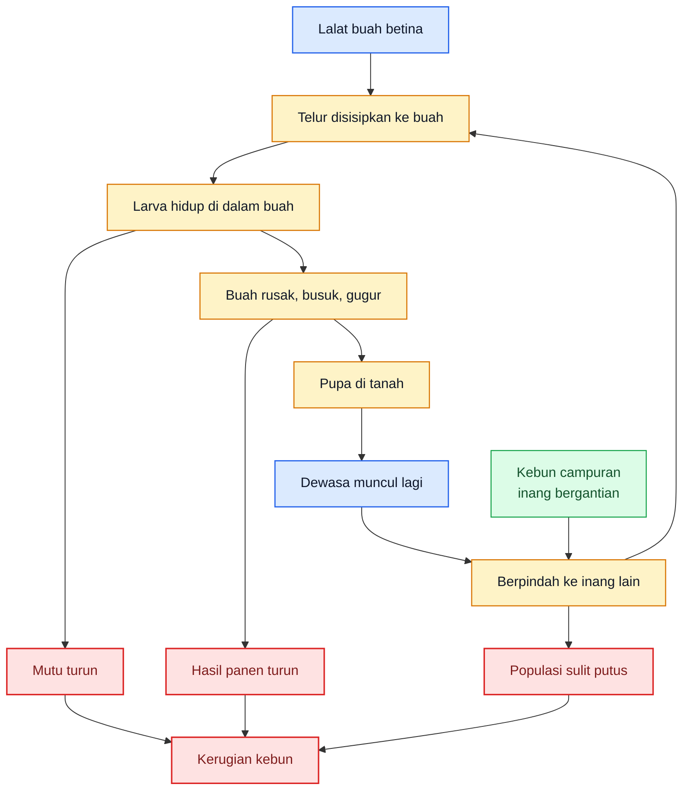

<ResourceBox
  title="Artikel Terkait:"
  items={[
    {
      name: 'README — Framework Praktis Memulai Bisnis Agribisnis Terpadu di Lahan Gumuk Berlereng',
      href: '/blog/agri/kebon/agribisnis-gumuk/README',
    },
    {
      name: 'OPT Penggagal Panen pada Cabai Rawit dan Cabai Besar',
      href: '/blog/agri/kebon/pengendalian-opt-cabai',
    },
    {
      name: 'Pedoman Terpadu Mencegah Gagal Panen Cabai Akibat Kutu Kebul dan Thrips',
      href: '/blog/agri/kebon/pengendalian-kutu-kebul-thrips',
    },
    {
      name: 'Panduan Praktis Talas untuk Kebun Gumuk',
      href: '/blog/agri/kebon/budidaya-talas-gumuk',
    },
    {
      name: 'README - Pupuk Tepat, Panen Untung - Model Low-Lab untuk Petani Makmur di Gambiran',
      href: '/blog/agri/pupuk-terintegrasi/README',
    },
  ]}
/>

[**Pergi ke Atas**](#pedoman-terpadu-menekan-serangan-lalat-buah-di-kebun-campuran)

---

# Bab 2. Mengenal Musuh di Lapang: Identifikasi Lalat Buah dan Gejala Serangannya

Di lapang, petani sering menyebut semua buah busuk sebagai “lalat buah”, padahal tidak semua busuk buah disebabkan lalat buah. Karena itu, identifikasi harus dimulai dari **dua hal sekaligus**: mengenali serangganya dan mengenali pola kerusakan buahnya. APHIS menjelaskan bahwa **adult oriental fruit fly** berukuran sedikit lebih besar dari lalat rumah, memiliki tanda kuning cerah, sayap bening, dan betina mempunyai ovipositor ramping untuk menyisipkan telur ke bawah kulit buah. SOP Cabai Rawit Hiyung juga menggambarkan lalat buah **Bactrocera sp.** sebagai serangga dewasa mirip lalat rumah, dengan dada jingga-merah kecoklatan dan dua garis membujur. ([APHIS][2])

Gejala serangan buah yang paling penting adalah **bekas tusukan oviposisi** dan **kerusakan dari dalam**. Pedoman jeruk Direktorat Hortikultura menjelaskan bahwa gejala awal ditandai **noda/titik bekas tusukan ovipositor**, lalu karena aktivitas larva di dalam buah, noda berkembang meluas, daging buah dimakan, buah menjadi busuk sebelum masak, dan bila dibelah terlihat belatung-belatung kecil. Pada cabai rawit, SOP Hiyung menyebut adanya **lubang titik hitam pada pangkal buah**, dan bila buah dibelah terdapat larva yang membuat saluran di dalam buah, memakan daging, lalu menyebabkan buah busuk dan gugur. Jadi tanda khas serangan lalat buah bukan hanya buah rusak, tetapi **buah rusak + ada jalur larva/larva di dalamnya + sering berawal dari titik tusukan**.

Pembeda dengan busuk non-lalat buah juga penting. Misalnya pada **blossom-end rot** pada pepper, NC State menjelaskan gejala awal berupa area sedikit kebasah-basahan di ujung bunga buah, lalu menjadi gelap, cekung, kering, dan **bertekstur leathery**, bukan busuk berulat. Dengan kata lain, pada lalat buah kita mencari **bekas tusukan, larva, dan busuk akibat makan dari dalam**, sedangkan pada gangguan fisiologis seperti blossom-end rot kita mencari **lesi ujung buah yang kering dan tidak berulat**. Perbedaan ini sangat menentukan tindakan lapang berikutnya. ([NC State Extension][3])

## Aset gambar aktual Bab 2

Bab 2 memang memerlukan gambar nyata. Saya siapkan **manifest PNG-ready** berikut dari sumber resmi **APHIS, Direktorat Hortikultura, dan NC State**. Simpan lokal sesuai nama file berikut agar bisa langsung dipakai di MDX.

<div className="grid grid-cols-1 gap-4">
  <figure>
    
    <figcaption>
      Lalat buah dewasa: fokus pada pola tubuh, sayap, dan posisi ovipositor
      betina.
    </figcaption>
  </figure>

{' '}

<figure>
  
  <figcaption>
    Gejala awal: titik atau noda bekas tusukan saat betina meletakkan telur.
  </figcaption>
</figure>

{' '}

<figure>
  
  <figcaption>
    Buah sakit yang dibiarkan di kebun menjadi sumber generasi berikutnya.
  </figcaption>
</figure>

  <figure>
    
    <figcaption>
      Pembeda penting: busuk non-lalat-buah seperti blossom-end rot tidak
      menunjukkan larva.
    </figcaption>
  </figure>
</div>

## Tabel 1. Pembeda cepat serangan lalat buah vs busuk buah lain

| Aspek pembeda           | Serangan lalat buah                                                       | Busuk buah lain yang umum membingungkan                                           |
| ----------------------- | ------------------------------------------------------------------------- | --------------------------------------------------------------------------------- |
| Gejala permukaan buah   | Ada titik tusukan/noda kecil, lalu area sekitar berubah warna dan melunak | Bisa berupa bercak kering, cekung, pecah, atau kebasah-basahan tanpa pola tusukan |
| Kondisi daging buah     | Ada saluran makan, jaringan lunak atau busuk dari dalam                   | Tidak selalu ada rongga makan; bisa kering atau rusak lokal                       |
| Ada larva?              | Sering ada, terutama bila buah dibelah                                    | Tidak ada larva                                                                   |
| Pola gugur buah         | Buah sering gugur sebelum matang                                          | Tidak selalu gugur, tergantung penyebab                                           |
| Indikasi penyebab utama | Telur–larva lalat buah di dalam buah                                      | Penyakit, gangguan fisiologis, sunscald, atau luka mekanis                        |
| Tindakan cepat pertama  | Keluarkan buah terserang, cek buah sekitar, baca populasi kebun           | Verifikasi penyebab; jangan langsung anggap lalat buah                            |

Tabel ini diringkas dari pedoman jeruk Direktorat Hortikultura, SOP Cabai Rawit Hiyung, dan deskripsi **blossom-end rot** pada pepper dari NC State.

## Rumusan praktis Bab 2

Kalau Bab 2 diperas menjadi satu keputusan lapang, maka keputusannya adalah ini: **anggap dulu buah terserang lalat buah bila ada titik tusukan, buah cepat melunak atau busuk, dan saat dibelah ada larva di dalamnya**. Sebaliknya, bila lesi cenderung kering, leathery, dan tidak ada larva, pertimbangkan dulu penyebab non-lalat-buah. Dengan cara baca ini, petani tidak akan gegabah menyamakan semua busuk buah sebagai satu masalah yang sama.

[**Pergi ke Atas**](#pedoman-terpadu-menekan-serangan-lalat-buah-di-kebun-campuran)

---

# Bab 3. Siklus Risiko pada Kebun Campuran: Telur, Larva, Pupa, Dewasa, dan Mengapa Populasi Cepat Meledak

Lalat buah menjadi sulit dikendalikan karena kerusakannya **tersembunyi di dalam buah**, sementara populasinya dibangun terus-menerus oleh siklus hidup yang relatif cepat. Pedoman jeruk Direktorat Hortikultura menulis bahwa lalat buah betina meletakkan telur di bawah kulit buah atau pada luka/cacat buah, telur berwarna putih transparan, lalu larva hidup dan berkembang di dalam daging buah selama sekitar **6–9 hari**. Setelah buah mulai membusuk dan jatuh, larva masuk ke tanah dan menjadi pupa, lalu siklus dari telur menjadi dewasa berlangsung sekitar **16–24 hari**. Jadi, ketika satu gelombang buah terserang dibiarkan, generasi berikutnya bisa muncul kembali dalam waktu yang singkat.

Yang membuat kebun campuran sangat rawan adalah **siklus ini tidak berhenti pada satu tanaman**. Buku resmi Direktorat Hortikultura menjelaskan bahwa lalat buah menyerang banyak buah dan sayuran, sedangkan APHIS menyebut oriental fruit fly menyerang lebih dari **400 jenis** buah dan sayuran. Dari dua fakta itu, dapat disimpulkan bahwa bila satu inang selesai atau menurun, dewasa dapat berpindah ke inang lain yang sedang tersedia. APHIS juga mencatat bahwa saat inang tersedia lalat cenderung bertahan di satu area, tetapi pergerakan dispersal akan meningkat saat inang berkurang atau kondisi mendorong perpindahan. Itulah sebabnya kebun campuran menyediakan “jembatan populasi” yang sangat nyaman bagi lalat buah. ([Hortikultura][1])

Buah gugur dan tanah bawah tajuk adalah inti dari masalah. Buku Direktorat Hortikultura menulis bahwa sanitasi kebun bertujuan memutus atau mengganggu daur hidup lalat buah, karena buah busuk atau buah gugur menjadi tempat larva meneruskan siklus hidupnya hingga pupa. Dokumen yang sama menegaskan bahwa buah gugur yang dibiarkan berserakan di bawah pohon berpeluang besar menjadi sumber infeksi, dan pupa di tanah dapat ditekan dengan membalik tanah agar terkena sinar matahari. Artinya, membaca lalat buah hanya pada fase dewasa yang tertangkap trap akan selalu terlalu sempit; masalah utamanya justru ada pada **buah yang jatuh dan tanah di bawah tajuk**. ([Hortikultura][1])

Jadi inti Bab 3 adalah ini: **lalat buah tidak datang merusak kebun secara acak; populasinya dibangun lewat buah yang diteluri, larva yang tumbuh di dalam buah, buah gugur yang dibiarkan, dan pupa yang aman di tanah**. Selama empat titik ini tidak dibaca sebagai satu siklus, petani akan selalu merasa “lalatnya datang lagi”, padahal sebenarnya kebunnya sendiri sedang memelihara generasi berikutnya.

**Diagram Bab 3** di bawah ini merangkum siklus risiko lalat buah pada kebun campuran. Diagram dibuat vertikal agar tetap nyaman dibaca di layar HP. Dasarnya berasal dari pedoman jeruk Direktorat Hortikultura, buku Teknologi Pengendalian Hama Lalat Buah, dan APHIS.

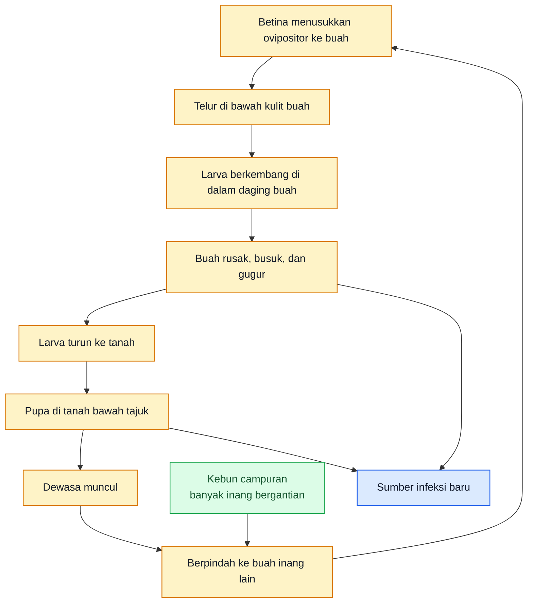

## Rumusan praktis Bab 3

Kalau Bab 3 diperas menjadi satu pegangan lapang, maka pegangannya adalah: **lalat buah tidak boleh dibaca hanya pada fase dewasa yang tertangkap; buah gugur dan tanah bawah tajuk adalah bagian inti siklus masalah**. Begitu cara pikir ini berubah, pengendalian juga akan berubah: dari sekadar memasang trap, menjadi benar-benar berusaha memutus generasi berikutnya. ([Hortikultura][1])

[1]: https://hortikultura.pertanian.go.id/wp-content/uploads/2024/11/Pengendalian-Lalat-Buah-Full-Text_watermark.pdf 'PENGENDALIAN LALAT BUAH'
[2]: https://www.aphis.usda.gov/plant-pests-diseases/oriental-fruit-fly 'Oriental Fruit Fly | Animal and Plant Health Inspection Service'
[3]: https://content.ces.ncsu.edu/blossom-end-rot-of-tomato-pepper-and-watermelon 'Blossom-End Rot of Tomato, Pepper, and Watermelon | NC State Extension Publications'

[**Pergi ke Atas**](#pedoman-terpadu-menekan-serangan-lalat-buah-di-kebun-campuran)

---

# Bab 4. Fase Persiapan Sebelum Musim dan Sebelum Buah Rentan: Fondasi Pengendalian Harus Dibangun Lebih Dulu

Pada lalat buah, musim yang gagal sangat sering dimulai dari **fase persiapan yang longgar**. Buku resmi Direktorat Hortikultura menegaskan bahwa lalat buah adalah hama dengan **mobilitas tinggi**, penularannya cepat antarkebun bahkan antarkawasan, sehingga pengendalian memerlukan pendekatan **holistik** dan paling efektif bila dilakukan **oleh seluruh petani pada hamparan yang cukup luas dan secara bersamaan**. Laporan kinerja Direktorat Perlindungan Hortikultura tahun 2024 juga menunjukkan bahwa **Area-Wide Management (AWM)** untuk lalat buah memang dibangun dari komponen pra-musim seperti **pemetaan wilayah, pelatihan petani, pemasangan metil eugenol, penyemprotan protein hidrolisat, monitoring trap, sanitasi buah terserang, dan rearing sampel buah**. Jadi, pengendalian lalat buah tidak dimulai saat buah rusak, tetapi saat kebun dan kawasan **disiapkan untuk tidak memberi lalat buah tempat yang nyaman**. ([Hortikultura][2])

## 4.1 Sanitasi awal kebun

Sanitasi awal kebun adalah fondasi pertama karena lalat buah membangun populasinya melalui **buah busuk, buah gugur, dan bahan inang yang tertinggal**. Pedoman jeruk Direktorat Hortikultura menegaskan bahwa buah terserang harus **dikumpulkan lalu dibenamkan atau dibakar** agar tidak menjadi sumber serangan berikutnya. Buku Teknologi Pengendalian Hama Lalat Buah juga menempatkan **sanitasi buah terserang** sebagai komponen tetap dalam AWM. Secara lapang, ini berarti sebelum musim buah rentan dimulai, kebun harus bersih dari buah afkir, buah pecah, buah busuk, buah gugur lama, dan sisa panen yang masih berpotensi menjadi tempat berkembang larva. ([Hortikultura][1])

Sanitasi awal yang benar bukan hanya membersihkan bagian tengah kebun. Area yang paling sering menjadi sumber masalah justru **bawah tajuk, tepi kebun, titik lembap, saluran, dan sudut yang luput dari panen**. Karena larva berkembang di dalam buah lalu turun untuk melanjutkan siklus, buah yang dibiarkan di tanah bukan sekadar limbah, tetapi **sumber generasi berikutnya**. Itu sebabnya sanitasi pra-musim harus dibaca sebagai langkah memotong populasi dasar, bukan pekerjaan kosmetik. ([APHIS][3])

## 4.2 Kebersihan bawah tajuk dan pengolahan tanah

Pada lalat buah, tanah bawah tajuk adalah bagian inti siklus masalah. Pedoman jeruk Direktorat Hortikultura menulis bahwa larva yang keluar dari buah akan masuk ke tanah menjadi pupa, dan pengendalian kultur teknis dapat dilakukan dengan **membalik tanah di bawah pohon atau tajuk** agar pupa terangkat ke permukaan, terkena sinar matahari, lalu mati. Buku Teknologi Pengendalian Hama Lalat Buah juga menegaskan bahwa lalat buah membentuk pupa dan keluar dalam bentuk dewasa dari dalam tanah, dan menyebut **mulsa plastik** dapat membantu menekan larva yang berubah menjadi pupa. Jadi, sebelum musim buah rentan dimulai, kebun harus tidak hanya bersih dari buah sakit, tetapi juga **tidak membiarkan tanah bawah tajuk menjadi tempat aman bagi pupa**. ([Hortikultura][1])

Secara praktis, kebersihan bawah tajuk berarti tiga hal: buah gugur tidak dibiarkan menumpuk, gulma dibersihkan, dan tanah tidak dibiarkan menjadi lapisan lembap penuh serasah yang menutup pupa dari panas. Buku resmi Hortikultura juga menyebut gulma dapat menjadi **tempat singgah** lalat buah dan bahkan menarik kedatangannya. Jadi, membersihkan bawah tajuk bukan hanya soal estetika, tetapi soal **menurunkan peluang lalat bertahan di kebun**. ([Hortikultura][2])

## 4.3 Pengaturan zonasi kerja

Lalat buah sulit dikendalikan bila kebun bekerja tanpa pembagian area. AWM yang dijalankan Direktorat Perlindungan Hortikultura menempatkan **pemetaan wilayah** sebagai salah satu komponen awal, karena pengendalian skala luas memerlukan titik kerja yang jelas untuk trap, sanitasi, bait, dan monitoring. Pada kebun campuran, prinsip ini paling masuk akal diterjemahkan menjadi **zonasi kerja kebun**: area perimeter, bawah tajuk, titik buah rentan, titik buah gugur, dan hotspot yang perlu diamati lebih rapat. Ini bukan formalitas administrasi, tetapi cara membuat tenaga lapang tidak bekerja acak. ([Hortikultura][4])

Bagi praktisi, zonasi kerja membuat keputusan lebih cepat. Kalau ada kenaikan tangkapan trap atau lonjakan buah gugur, kebun tahu persis area mana yang harus dibersihkan lebih dulu, di mana bait difokuskan, dan di mana buah perlu segera dibungkus. Tanpa zonasi, kebun cenderung bergerak terlalu umum dan terlambat membaca hotspot. Kalimat terakhir ini adalah **inferensi operasional** dari prinsip AWM dan monitoring mingguan berbasis area. ([Hortikultura][4])

## 4.4 Persiapan perangkap

Perangkap harus disiapkan **sebelum** fase buah rentan penuh, bukan setelah tangkapan mulai tinggi. Pedoman jeruk Direktorat Hortikultura menuliskan bahwa perangkap berbahan **methyl eugenol** dipasang sejak **buah pentil umur sekitar 1,5 bulan sampai panen**, dengan pengulangan atraktan setiap **2 minggu sampai 1 bulan**, dan kepadatan sekitar **15–25 perangkap per hektar**. Sementara SOP Cabai Rawit Hiyung untuk lalat buah menuliskan penggunaan **perangkap dengan atraktan**, dan pada bagian hama lain dalam dokumen yang sama dicantumkan kepadatan perangkap umum **40 buah per hektar atau 2 buah per 500 m²** sebagai standar operasional untuk perangkap visual di cabai. Ini menunjukkan bahwa pada komoditas berbeda, densitas dan tipe perangkap bisa bervariasi, tetapi prinsipnya sama: **trap harus aktif sebelum populasi meledak**. ([Hortikultura][1])

Yang sangat penting, perangkap metil eugenol terutama berfungsi untuk **jantan**, bukan semua lalat buah. Buku Teknologi Pengendalian Hama Lalat Buah menjelaskan bahwa jantan mengonsumsi metil eugenol dan setelah diproses dalam tubuhnya akan menghasilkan komponen yang membantu keberhasilan kawin, sehingga atraktan ini relevan untuk **monitoring, penangkapan massal, dan pengacauan perilaku jantan**. Karena itu, menyiapkan perangkap lebih dulu adalah langkah yang benar, tetapi kebun tidak boleh salah paham lalu mengira trap jantan saja cukup menyelesaikan masalah. ([Hortikultura][2])

## 4.5 Persiapan umpan protein

Kalau perangkap metil eugenol terutama menekan jantan, maka **umpan protein** disiapkan untuk menekan **betina** dan melengkapi sistem. Buku resmi Hortikultura menulis bahwa **food attractant** yang biasa digunakan adalah **protein hidrolisa/hidrolisat**, kemudian diberi insektisida seperti **spinosad** dan disemprotkan pada tanaman sebagai umpan beracun. Laporan AWM tahun 2024 juga menegaskan bahwa **penyemprotan protein hidrolisat** merupakan salah satu komponen inti pengelolaan skala luas lalat buah. Jadi, kebun yang serius menghadapi lalat buah harus menyiapkan protein bait dari awal, bukan baru mencarinya ketika buah sudah banyak berulat. ([Hortikultura][2])

Secara praktis, persiapan umpan protein berarti dua hal: bahan dan titik aplikasi harus sudah jelas, dan penggunaannya harus diposisikan sebagai **alat menekan betina sebelum lebih banyak telur diletakkan**. Ini selaras dengan logika biologis lalat buah: menangkap jantan membantu, tetapi telur dan larva baru akan tetap muncul bila betina dewasa tidak ikut ditekan. Pernyataan ini adalah **inferensi operasional** dari perbedaan fungsi metil eugenol dan protein hidrolisat yang dijelaskan dalam sumber resmi. ([Hortikultura][2])

## 4.6 Persiapan pembungkusan buah

Pembungkusan buah adalah salah satu perlindungan fisik paling kuat pada komoditas yang memungkinkan. Pedoman jeruk Direktorat Hortikultura menegaskan bahwa **pembungkusan buah mulai umur 1,5 bulan** untuk mencegah peletakan telur merupakan cara mekanis yang paling baik diterapkan sebagai antisipasi serangan lalat buah. Dalam kebun campuran, ini berarti pembungkusan tidak perlu dibayangkan untuk semua komoditas sekaligus, tetapi harus diprioritaskan pada komoditas yang **nilai buahnya tinggi** dan **secara teknis memang bisa dibungkus**, seperti jambu, jeruk, dan buah naga. ([Hortikultura][1])

Persiapan pembungkusan harus dilakukan sebelum buah masuk fase rentan penuh. Artinya, bahan pembungkus, jadwal tenaga kerja, dan daftar blok prioritas harus sudah siap. Menunggu sampai gejala serangan mulai tampak biasanya membuat pembungkusan berubah dari tindakan preventif menjadi tindakan yang terlambat. Kalimat ini adalah **inferensi praktis** dari fakta bahwa pembungkusan direkomendasikan untuk mencegah oviposisi, bukan untuk memperbaiki buah yang sudah terinfestasi. ([Hortikultura][1])

## 4.7 Koordinasi kawasan / AWM dengan kebun sekitar

Lalat buah paling sulit dikendalikan kalau hanya satu kebun yang bergerak. Buku Teknologi Pengendalian Hama Lalat Buah menegaskan bahwa lalat buah memiliki mobilitas sangat tinggi dan pengendaliannya memerlukan pendekatan **holistik**, sedangkan dokumen AWM menyebut penerapan skala luas dilakukan **kontinyu** dan bergantung pada sinergi antara berbagai pihak. Laporan kinerja 2024 juga menunjukkan bahwa AWM dilakukan pada kelompok tani dan gapoktan, bukan pada satu petak tunggal, karena targetnya adalah **menurunkan populasi pada suatu area**, yang kemudian dibaca lewat nilai **FTD**. ([Hortikultura][2])

Bagi praktisi, koordinasi kawasan tidak harus selalu rumit. Bentuk minimumnya adalah menyamakan waktu sanitasi, trap, dan bait dengan kebun sekitar yang punya inang aktif. Tanpa itu, satu kebun bisa rajin membersihkan buah gugur, tetapi tetap dibanjiri dewasa dari kebun tetangga yang pasif. Itulah sebabnya pada lalat buah, pengendalian kawasan bukan tambahan mewah, tetapi kebutuhan praktis. Pernyataan ini adalah **inferensi operasional** dari prinsip AWM yang dipakai resmi oleh Direktorat Perlindungan Hortikultura. ([Hortikultura][4])

## Rumusan praktis Bab 4

Kalau Bab 4 diperas menjadi satu aturan kerja, maka aturannya adalah: **sebelum buah rentan, kebun harus sudah bersih, bawah tajuk tidak menjadi tempat aman bagi pupa, trap dan protein bait siap, pembungkusan terencana, dan kebun sekitar diajak bergerak bersama**. Pada lalat buah, musim yang gagal sangat sering dimulai bukan karena kurang insektisida, tetapi karena kebun masuk fase buah dengan sanitasi yang longgar dan tanpa kesiapan kawasan. ([Hortikultura][2])

**Diagram Bab 4** merangkum urutan persiapan sebelum musim buah rentan.

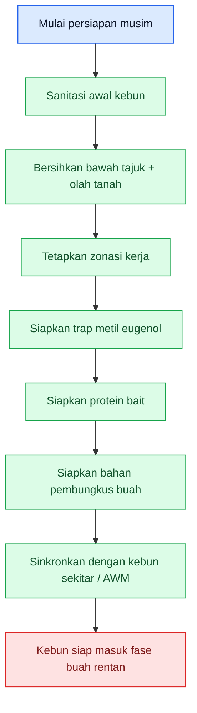

[**Pergi ke Atas**](#pedoman-terpadu-menekan-serangan-lalat-buah-di-kebun-campuran)

---

# Bab 5. Fase Preventif Sejak Buah Pentil sampai Buah Menjelang Matang

Setelah persiapan beres, fase paling menentukan berikutnya adalah **saat buah mulai rentan**. Pada lalat buah, kerusakan utama dimulai ketika betina meletakkan telur di buah dan larva berkembang di dalamnya. Itu sebabnya menunggu buah tampak rusak hampir selalu berarti petani terlambat. Pedoman jeruk Direktorat Hortikultura menegaskan bahwa pembungkusan dan pemasangan perangkap dilakukan mulai **buah pentil sekitar 1,5 bulan** sampai panen, sedangkan dalam AWM keberhasilan pengendalian sangat bergantung pada trap aktif, protein hidrolisat, dan sanitasi yang berjalan terus. Jadi, fase buah pentil sampai menjelang matang adalah **pintu masuk kerugian** sekaligus jendela terbaik untuk mencegah telur berubah menjadi larva di dalam buah. ([Hortikultura][1])

## 5.1 Kapan perangkap mulai aktif

Perangkap untuk lalat buah seharusnya aktif **sejak buah mulai memasuki fase rentan**, bukan baru dipasang saat banyak buah gugur. Pedoman jeruk mencatat pemasangan perangkap dilakukan sejak **buah pentil umur ±1,5 bulan** sampai panen, dengan atraktan diulang setiap **2 minggu sampai 1 bulan**. Pada kebun campuran, prinsip ini sangat penting karena fase buah rentan antar komoditas bisa bergantian; artinya trap tidak boleh dibaca sebagai alat musiman sekali pakai, tetapi sebagai alat pemantau dan penekan populasi yang harus mengikuti ketersediaan buah inang. ([Hortikultura][1])

Secara operasional, saat buah mulai pentil adalah momen yang tepat untuk memastikan trap sudah terpasang, berfungsi, dan dibaca rutin. Menunggu tangkapan tinggi baru bertindak sering membuat trap berubah dari alat pencegahan menjadi alat konfirmasi bahwa kebun sudah telat. Ini adalah **inferensi praktis** dari timing pemasangan perangkap dalam pedoman jeruk dan logika AWM yang menilai keberhasilan lewat FTD. ([Hortikultura][1])

## 5.2 Kapan protein bait mulai digunakan

Protein bait paling logis mulai digunakan saat kebun memasuki fase yang memungkinkan **betina aktif meletakkan telur**. Buku Teknologi Pengendalian Hama Lalat Buah menjelaskan bahwa protein hidrolisa/hidrolisat yang dicampur insektisida seperti **spinosad** dipakai sebagai umpan beracun yang dimakan lalat buah, dan AWM 2024 mencatat **penyemprotan protein hidrolisat** sebagai bagian inti pengelolaan skala luas. Dalam bahasa lapang, begitu buah mulai terbentuk dan menjadi sasaran, kebun seharusnya sudah menekan **betina**, bukan hanya mengandalkan jantan yang masuk trap. ([Hortikultura][2])

Pada kebun campuran, waktu mulai protein bait sebaiknya mengikuti **fase buah rentan paling awal** pada komoditas utama, bukan menunggu seluruh kebun penuh buah. Ini karena lalat buah bergerak mengikuti inang yang tersedia. Bila satu komoditas lebih dulu rentan, komoditas itu harus menjadi pemicu dimulainya bait. Kalimat ini adalah **inferensi operasional** dari sifat polifag dan mobilitas tinggi lalat buah yang dijelaskan oleh APHIS dan Direktorat Hortikultura. ([APHIS][5])

## 5.3 Kapan pembungkusan dilakukan

Pembungkusan harus dilakukan **sebelum buah mudah ditusuk**, bukan sesudah gejala muncul. Pedoman jeruk menyebut **umur sekitar 1,5 bulan** sebagai waktu pembungkusan untuk mencegah peletakan telur. Ini menjadikan pembungkusan sebagai salah satu tindakan preventif paling jelas: ia bekerja dengan **menghalangi kontak** antara betina dan permukaan buah. Dengan kata lain, pembungkusan adalah tindakan yang nilainya paling tinggi **sebelum** lalat buah sempat memulai kerusakan di dalam buah. ([Hortikultura][1])

Dalam kebun campuran, pembungkusan tidak harus diterapkan ke semua komoditas. Yang paling layak diprioritaskan adalah buah bernilai tinggi dan secara fisik memungkinkan dibungkus dengan efisien. Karena tenaga kerja selalu terbatas, fase buah rentan harus dibaca bersama prioritas komoditas. Ini adalah **inferensi praktis** dari fakta bahwa pembungkusan adalah proteksi individual buah yang kuat, tetapi memerlukan tenaga dan waktu. ([Hortikultura][1])

## 5.4 Kapan panen harus mulai dipercepat

Pada buah yang mendekati matang, keterlambatan panen memberi waktu lebih panjang bagi telur, larva, dan pembusukan untuk berkembang. Pedoman jeruk menjelaskan bahwa larva hidup di dalam daging buah, mempercepat pembusukan, dan buah akhirnya gugur sebelum larva menjadi pupa. Artinya, begitu buah mendekati matang dan tekanan lalat buah naik, kebun harus mulai berpikir **panen lebih rapat**, bukan hanya trap lebih banyak. Semakin lama buah rentan menggantung, semakin besar peluang oviposisi dan pembentukan larva di dalamnya. Ini adalah **inferensi operasional** dari siklus hidup dan gejala serangan yang dijelaskan pedoman resmi. ([Hortikultura][1])

## 5.5 Prioritas komoditas yang dibungkus

Tidak semua buah di kebun campuran harus ditangani dengan cara yang sama. Karena lalat buah menyerang banyak jenis buah dan sayuran, kebun harus membedakan mana komoditas yang paling rasional untuk dibungkus dan mana yang lebih efektif dilindungi lewat sanitasi, trap, bait, dan panen tepat waktu. Pedoman jeruk menunjukkan pembungkusan sangat cocok untuk buah seperti jeruk. Pada kebun campuran tropis, praktik yang sama paling masuk akal diterapkan pada komoditas seperti **jambu, jeruk, dan buah naga**, sedangkan pada komoditas seperti cabai, pembungkusan individual tidak praktis sehingga fokusnya bergeser ke sanitasi, bait, trap, dan jadwal panen. Bagian tentang pembagian prioritas ini adalah **inferensi budidaya** yang diturunkan dari fungsi pembungkusan dan jenis komoditas yang lazim dikelola dalam kebun campuran. ([Hortikultura][1])

## 5.6 Pencegahan sebelum larva masuk ke buah

Ini inti Bab 5: **semua tindakan preventif harus diarahkan sebelum larva masuk ke buah**. Begitu telur sudah diletakkan dan larva berkembang di dalam daging buah, kerusakan berjalan diam-diam dan sulit dibalik. Pedoman jeruk menjelaskan bahwa gejala awal sering hanya berupa noda kecil bekas tusukan, sementara larva terus makan di dalam buah. Karena itu, trap, bait, pembungkusan, sanitasi, dan panen rapat semuanya harus dibaca sebagai alat untuk **mengintervensi sebelum fase larva**, bukan setelah buah jelas busuk. ([Hortikultura][1])

Dalam praktik, inilah alasan mengapa petani sering merasa “sudah rajin, tetapi buah tetap berulat”: mereka baru bergerak setelah gejala tampak. Pada lalat buah, saat gejala tampak jelas, sebagian kerusakan inti sudah terjadi. Itu sebabnya fase buah rentan adalah fase yang paling mahal bila disikapi terlambat. Pernyataan ini adalah **inferensi praktis** dari siklus hidup dan gejala yang dijelaskan dalam sumber resmi. ([Hortikultura][1])

## Rumusan praktis Bab 5

Kalau Bab 5 diperas menjadi satu aturan kerja, maka aturannya adalah: **begitu buah mulai rentan, trap harus aktif, protein bait harus mulai menekan betina, komoditas prioritas harus dibungkus, dan panen pada komoditas yang mendekati matang harus dibuat lebih rapat**. Pada lalat buah, pencegahan yang benar selalu bernilai lebih tinggi daripada menyelamatkan buah yang sudah terisi larva. Menunggu buah terlihat rusak hampir selalu berarti terlalu lambat. ([Hortikultura][1])

**Diagram Bab 5** berikut merangkum alur preventif sejak buah pentil sampai menjelang matang.

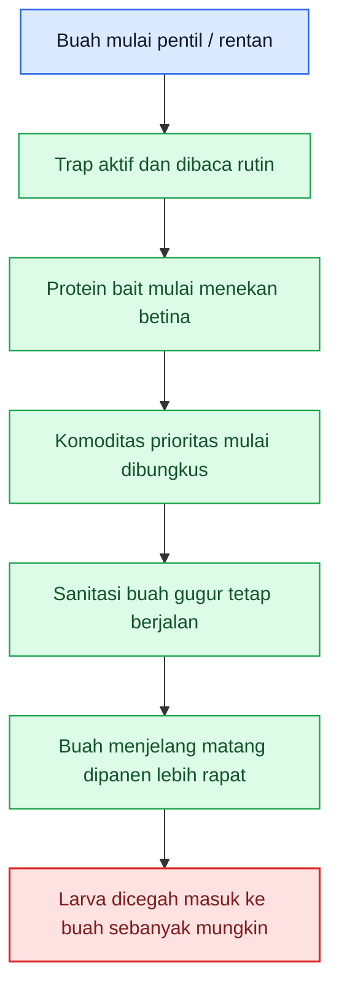

[1]: https://hortikultura.pertanian.go.id/wp-content/uploads/2024/11/Pengenalan-dan-Pengendalian-Hama-Penyakit-Tanaman-Jeruk-_watermark_compressed.pdf?utm_source=chatgpt.com 'Pengenalan dan Pengendalian Hama Penyakit Tanaman Jeruk'
[2]: https://hortikultura.pertanian.go.id/wp-content/uploads/2024/11/Pengendalian-Lalat-Buah-Full-Text_watermark.pdf?utm_source=chatgpt.com 'Teknologi Pengendalian Hama Lalat Buah'
[3]: https://www.aphis.usda.gov/sites/default/files/HP-PestCards-OFF.pdf?utm_source=chatgpt.com 'Oriental Fruit Fly'
[4]: https://hortikultura.pertanian.go.id/wp-content/uploads/2025/03/LAKIP-_-LAKIN-PERLINDUNGAN-HOLTIKULTURA-2024.pdf?utm_source=chatgpt.com 'Laporan Kinerja Direktorat Perlindungan Hortikultura Tahun ...'
[5]: https://www.aphis.usda.gov/plant-pests-diseases/oriental-fruit-fly?utm_source=chatgpt.com 'Oriental Fruit Fly - Plant Pests and Diseases - USDA-Aphis'

[**Pergi ke Atas**](#pedoman-terpadu-menekan-serangan-lalat-buah-di-kebun-campuran)

---

# Bab 6. Program Preventif yang Melekat Sepanjang Siklus: Sanitasi, Trap Jantan, Protein Bait, Pembungkusan, dan Tanah Bawah Tajuk

Pada lalat buah, pencegahan yang benar tidak pernah selesai hanya karena trap sudah dipasang atau satu kali sanitasi sudah dilakukan. Buku **Teknologi Pengendalian Hama Lalat Buah** menempatkan pengendalian terpadu pada kombinasi **sanitasi, perangkap atraktan, protein bait, pembungkusan, dan pengelolaan lapang**, sedangkan dokumen **Area-Wide Management (AWM)** menegaskan bahwa teknologi seperti **ME block** dan **umpan protein** harus diterapkan **kontinyu** dalam waktu cukup lama agar populasi benar-benar turun. Itu sebabnya backbone lalat buah bukan satu alat tunggal, melainkan sistem berulang yang menekan **betina, buah gugur, dan pupa di tanah** sekaligus. ([Hortikultura][1])

## 6.1 Sanitasi buah gugur tiap 2–3 hari

Sanitasi harus menjadi pekerjaan paling disiplin dalam seluruh kebun. Pedoman jeruk Direktorat Hortikultura menegaskan bahwa buah terserang perlu **dikumpulkan lalu dibenamkan atau dibakar** agar tidak menjadi sumber serangan berikutnya, dan buku pengendalian lalat buah menempatkan **sanitasi buah terserang** sebagai komponen tetap dalam AWM. Karena larva berkembang di dalam buah lalu turun ke tanah untuk melanjutkan siklus, buah sakit yang dibiarkan satu sampai beberapa hari saja tetap berfungsi sebagai **jembatan generasi berikutnya**. ([Hortikultura][1])

Dalam praktik kebun campuran, ritme **setiap 2–3 hari** adalah rekomendasi kerja yang paling aman, terutama saat ada buah rentan dan buah gugur mulai muncul. Angka ini saya pakai sebagai **inferensi operasional** dari dua fakta: larva berkembang cepat di dalam buah lalu turun ke tanah, dan pengendalian resmi selalu menekankan **immediate removal** atau sanitasi teratur. Artinya, sanitasi mingguan saja biasanya terlalu longgar untuk kebun yang sedang aktif berbuah. ([Hortikultura][1])

## 6.2 Perangkap methyl eugenol untuk jantan

Perangkap **methyl eugenol (ME)** tetap sangat penting, tetapi fungsinya harus dibaca dengan benar. Dokumen AWM dan buku pengendalian lalat buah menjelaskan bahwa **ME** dipakai untuk menarik **lalat buah jantan**, termasuk melalui teknik **male annihilation**, dan di Indonesia bahkan diterapkan dengan **wooden block** yang direndam campuran methyl eugenol dan insektisida. Jadi, trap ME paling tepat dipahami sebagai alat untuk **menekan jantan, membaca dinamika populasi, dan mengganggu peluang perkawinan**. ([Hortikultura][2])

Karena itu, trap jantan harus dipertahankan aktif sepanjang siklus buah rentan, bukan hanya dipasang saat serangan terasa berat. Tetapi petani juga harus jujur membaca batasannya: **trap jantan penting, tetapi tidak cukup bila dipakai sendirian**. Kalau sanitasi bocor dan betina tetap aktif meletakkan telur, tangkapan jantan yang tinggi atau rendah tidak otomatis berarti buah sudah aman. Kalimat terakhir ini adalah **inferensi praktis** dari fungsi khusus ME terhadap jantan dan dari struktur AWM yang selalu memasangkan trap dengan sanitasi dan protein bait. ([Hortikultura][2])

## 6.3 Protein hidrolisat untuk betina

Kalau ME terutama bekerja pada jantan, maka **protein bait** sangat penting untuk menekan **betina**. Dokumen **Pengendalian Lalat buah (Family Tephritidae) di Indonesia** menjelaskan secara tegas bahwa **protein bait** berisi campuran atraktan dan racun yang digunakan untuk **membunuh lalat buah betina**, dan berperan sebagai **food attractant** yang membantu pematangan telur. Buku **Teknologi Pengendalian Hama Lalat Buah** juga menyebut **protein hidrolisa** yang dicampur **spinosad** dan disemprotkan pada tanaman sebagai umpan beracun. Jadi, pada kebun campuran, protein bait bukan pelengkap kecil, tetapi komponen inti karena ia menyasar fase reproduktif populasi. ([Hortikultura][3])

Yang penting, protein bait harus diposisikan sebagai **program berulang**, bukan sekali pakai. Dokumen AWM menegaskan penyemprotan umpan protein dilakukan **spot-spot** dan keberhasilannya ditentukan oleh penerapan yang **kontinyu**. Maka secara lapang, protein bait harus menyatu dengan sanitasi dan trap: trap membaca tekanan jantan, protein bait menekan betina, dan sanitasi memutus larva yang sudah telanjur ada di buah. ([Hortikultura][2])

## 6.4 Pembungkusan buah

Pembungkusan buah adalah tindakan preventif yang paling jelas karena ia bekerja sebagai **barrier** antara buah dan betina yang hendak menusukkan ovipositor. Pedoman jeruk Direktorat Hortikultura menyebut pembungkusan buah mulai sekitar **umur 1,5 bulan** sebagai cara mekanis terbaik untuk mencegah peletakan telur, dan dokumen pengendalian lalat buah di Indonesia juga menegaskan bahwa pembungkusan bertujuan **mencegah betina meletakkan telur pada buah inang**. Artinya, pembungkusan harus dipahami sebagai tindakan yang nilainya paling tinggi **sebelum infestasi**, bukan sesudahnya. ([Hortikultura][4])

Dalam kebun campuran, pembungkusan tentu diprioritaskan pada komoditas yang memang rasional dibungkus, seperti **jambu, jeruk, dan buah naga**, bukan semua tanaman tanpa seleksi. Ini adalah **inferensi budidaya** dari fungsi pembungkusan sebagai proteksi fisik individual. Dengan begitu, pembungkusan menjadi bagian dari sistem preventif, bukan pekerjaan yang membebani tenaga kerja tanpa prioritas. ([Hortikultura][4])

## 6.5 Pembalikan tanah bawah tajuk

Tanah bawah tajuk harus dibaca sebagai bagian aktif dari siklus masalah, karena larva yang keluar dari buah akan **turun ke tanah dan berpupa**. Pedoman jeruk menulis bahwa pengendalian kultur teknis dapat dilakukan dengan **membalik tanah di bawah pohon atau tajuk** agar pupa terangkat ke permukaan dan mati terkena sinar matahari. APHIS juga menjelaskan bahwa larva fruit fly **drop to the ground and pupate** di bawah permukaan tanah. Jadi, pembalikan tanah bawah tajuk bukan pekerjaan tambahan, tetapi cara langsung mengganggu fase pupa. ([Hortikultura][4])

Dalam praktik, tindakan ini paling bernilai bila dikombinasikan dengan sanitasi buah gugur. Kalau buah sakit masih dibiarkan, pembalikan tanah sendirian tidak akan cukup. Tetapi bila buah gugur dipungut dan tanah bawah tajuk diolah, dua mata rantai sekaligus terganggu: **larva dalam buah** dan **pupa di tanah**. Ini adalah **inferensi operasional** dari siklus hidup lalat buah dan rekomendasi pengolahan tanah pada pedoman resmi. ([Hortikultura][4])

## 6.6 Kebersihan parit, tepi kebun, dan titik rendah

Parit, tepi kebun, dan titik rendah sering menjadi lokasi paling berbahaya karena di situlah buah gugur tertahan, kelembapan lebih tinggi, dan pembersihan paling sering terlewat. Buku pengendalian lalat buah menjelaskan bahwa sanitasi kebun bertujuan memutus daur hidup, dan juga menyinggung bahwa gulma dapat menjadi tempat singgah lalat buah. Karena itu, bagian pinggir kebun dan titik rendah tidak boleh diperlakukan sebagai area sisa; justru area itu harus masuk daftar prioritas rutin kebun. ([Hortikultura][1])

Secara praktis, kebersihan parit dan tepi kebun harus dibaca sebagai **barisan pertahanan luar**. Banyak kebun merasa sudah rajin membersihkan area tengah, tetapi populasi tetap tinggi karena buah gugur tersangkut di pinggir, semak terlalu rapat, atau titik lembap tidak disentuh. Kalimat ini adalah **inferensi lapang** yang langsung mengikuti mekanisme buah gugur–larva–pupa yang dijelaskan sumber resmi. ([Hortikultura][1])

## 6.7 Kapan preventif dianggap berhasil, dan kapan mulai bocor

Program preventif pada lalat buah bisa dianggap **berhasil** bila sanitasi berjalan disiplin, buah gugur tidak menumpuk, trap tetap aktif, protein bait terus menekan betina, dan tidak ada lonjakan tajam buah busuk atau gugur di titik-titik rawan. Dalam kerangka AWM, keberhasilan populasi juga dibaca lewat **FTD** yang makin rendah, bahkan target **FTD < 1** dipakai sebagai indikator populasi yang sudah sangat rendah. Jadi, preventif bukan dinilai dari “sudah pasang trap”, tetapi dari **arah populasi dan arah kerusakan buah**. ([Hortikultura][2])

Sebaliknya, preventif mulai **bocor** bila salah satu dari tiga tanda ini muncul: buah gugur sakit mulai sering terlihat, trap dibaca tetapi tindakan sanitasi tidak mengejar, atau protein bait dan pembungkusan tidak lagi selaras dengan fase buah rentan. Pada titik itu, kebun tidak boleh tetap merasa aman hanya karena alat-alat preventif “masih ada”. Ia harus dinaikkan ke mode korektif pada bab berikutnya. Ini adalah **inferensi keputusan lapang** dari cara AWM membaca populasi dan dari siklus hidup lalat buah yang cepat. ([Hortikultura][2])

## Rumusan praktis Bab 6

Kalau Bab 6 diperas menjadi satu aturan kerja, maka aturannya adalah: **jangan pernah membiarkan satu minggu berjalan tanpa ritme sanitasi, trap jantan, protein bait, perlindungan buah, dan pengelolaan tanah bawah tajuk**. Pada lalat buah, backbone pengendalian ada pada **sanitasi + betina + buah gugur + pupa**, sedangkan trap jantan adalah komponen penting tetapi bukan satu-satunya jawaban. Selama empat titik itu dijaga bersama, kebun punya peluang besar menahan populasi tetap rendah. ([Hortikultura][1])

**Diagram Bab 6** berikut merangkum ritme preventif yang harus berulang sepanjang siklus kebun.

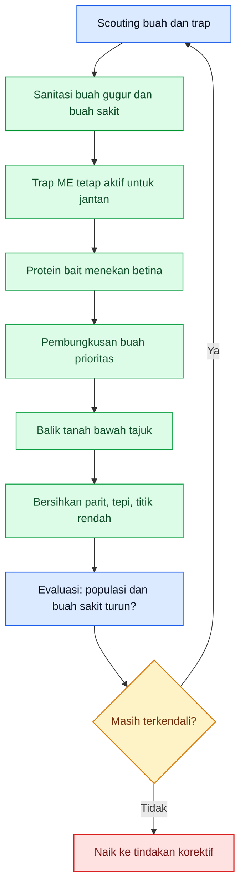

[1]: https://hortikultura.pertanian.go.id/wp-content/uploads/2024/11/Pengendalian-Lalat-Buah-Full-Text_watermark.pdf?utm_source=chatgpt.com 'Teknologi Pengendalian Hama Lalat Buah'
[2]: https://hortikultura.pertanian.go.id/wp-content/uploads/2015/06/LALATBUAH.pdf?utm_source=chatgpt.com 'AREA-WIDE MANAGEMENT (AWM) TERHADAP LALAT ...'
[3]: https://hortikultura.pertanian.go.id/wp-content/uploads/2016/10/Pengendalian-Lalat-buah.pdf?utm_source=chatgpt.com 'Pengendalian Lalat buah (Family Tephritidae) di Indonesia'
[4]: https://hortikultura.pertanian.go.id/wp-content/uploads/2024/11/Pengenalan-dan-Pengendalian-Hama-Penyakit-Tanaman-Jeruk-_watermark_compressed.pdf?utm_source=chatgpt.com 'Pengenalan dan Pengendalian Hama Penyakit Tanaman Jeruk'

[**Pergi ke Atas**](#pedoman-terpadu-menekan-serangan-lalat-buah-di-kebun-campuran)

---

# Bab 7. Monitoring, Titik Kritis, dan Momen Penentu dalam Siklus Produksi Buah

Pada lalat buah, monitoring bukan pekerjaan administrasi, tetapi **pusat keputusan lapang**. NSW DPI menulis bahwa kunci pengelolaan adalah **monitor and, if threshold levels are exceeded, immediately start control measures**, dan pada kebun citrus satu lalat jantan dalam trap bisa menjadi peringatan awal, sedangkan **lebih dari satu** dapat menandakan **masalah lokal** yang perlu ditelusuri sumbernya. IAEA juga menegaskan bahwa data trap harus dipakai untuk melihat **perubahan populasi dalam ruang dan waktu**, bukan sekadar menghitung lalat yang tertangkap. Artinya, monitoring pada lalat buah bukan sekadar “apakah ada lalat”, tetapi **di mana masalah mulai terkonsentrasi, kapan naik, dan apa yang harus dilakukan dalam hitungan hari**. ([NSW Department of Primary Industries][2])

## Aset gambar aktual Bab 7

Untuk Bab 7, gambar yang dipakai bukan lagi gambar identifikasi umum, tetapi gambar yang membantu pembaca membaca **fase awal, fase memburuk, titik sumber populasi, dan hotspot**. Simpan aset berikut sebagai **PNG lokal** di proyek MDX Anda. Sumbernya saya pilih dari **NSW DPI** dan **Direktorat Hortikultura** karena paling kuat untuk menunjukkan sting mark, larva, buah gugur, pupa, dan indikator hotspot lapang. ([NSW Department of Primary Industries][2])

<div className="grid grid-cols-1 gap-4">
  <figure>
    
    <figcaption>
      Sengatan awal: titik atau noda awal yang sering masih dianggap sepele.
    </figcaption>
  </figure>

{' '}

<figure>
  
  <figcaption>
    Gejala berat: larva sudah aktif di dalam buah dan kerusakan masuk fase
    mahal.
  </figcaption>
</figure>

{' '}

<figure>
  
  <figcaption>
    Buah gugur di bawah tajuk adalah jembatan langsung ke generasi berikutnya.
  </figcaption>
</figure>

{' '}

<figure>
  
  <figcaption>
    Pupa di tanah menjelaskan kenapa bawah tajuk tidak boleh dibiarkan pasif.
  </figcaption>
</figure>

  <figure>
    
    <figcaption>
      Hotspot lapang: tangkapan trap yang tinggi harus dibaca sebagai pusat
      tekanan lokal.
    </figcaption>
  </figure>
</div>

## 7.1 Cara monitoring lalat buah dewasa

Monitoring lalat buah dewasa paling praktis dilakukan dengan **trap atraktan jantan** yang dibaca teratur. NSW DPI merekomendasikan sekitar **satu trap per 10–20 hektar** sebagai titik awal, dengan jarak kira-kira **300–450 m**, dan menegaskan bahwa kepadatan trap yang lebih tinggi akan memperbaiki deteksi serta membantu menemukan problem area. Mereka juga menyebut bahwa bila ditemukan **satu** lalat jantan, itu bisa saja hanya pendatang terbawa angin, tetapi tetap harus dibaca sebagai sinyal kesiapsiagaan; bila ditemukan **lebih dari satu**, itu dapat mengindikasikan **masalah lokal**, sehingga perlu tambahan trap di empat sudut kebun atau blok untuk menelusuri sumbernya. Ini penting karena pada lalat buah, lokasi masalah jauh lebih berharga daripada sekadar angka total tangkapan. ([NSW Department of Primary Industries][2])

Trap jantan tetap harus dibaca dengan kesadaran bahwa ia **tidak memberi gambaran langsung tentang aktivitas betina**. Panduan IPM apples and pears dari NSW DPI menulis bahwa trap lure jantan **attract only the male fly** dan karena itu **tidak memberi indikasi akurat tentang aktivitas betina**, padahal betinalah yang bertanggung jawab atas peletakan telur dan kerusakan buah. Jadi, monitoring dewasa harus selalu dipadukan dengan pembacaan buah tersengat dan buah gugur, bukan dibiarkan berdiri sendiri. ([NSW Department of Primary Industries][3])

## 7.2 Cara membaca buah terserang

Buah terserang harus dibaca dari **permukaan** dan **isi buah**. NSW DPI menjelaskan bahwa sengatan adalah **egg-site puncture** yang sering tampak sebagai **brown depressed spot**, memar samar, atau perubahan warna lokal di sekitar titik tusukan. Pada tahap lanjut, buah bisa mengalami **rot**, lalu jatuh, dan bila dibelah dapat ditemukan **larva**. Panduan IPM apples and pears juga menegaskan bahwa **maggots are diagnostic** untuk membedakan kerusakan lalat buah dari kerusakan internal lain. Jadi, monitoring buah tidak boleh berhenti pada “buah busuk”, tetapi harus menjawab tiga pertanyaan cepat: **ada sengatan atau tidak, ada larva atau tidak, dan buah ini masih di pohon atau sudah gugur**. ([NSW Department of Primary Industries][2])

## 7.3 Penggunaan FTD

**Flies per Trap per Day (FTD)** adalah indeks populasi yang sangat berguna karena ia mengubah tangkapan trap menjadi angka yang bisa dibandingkan antar waktu atau antar area. IAEA menjelaskan bahwa FTD menunjukkan **rata-rata jumlah lalat target yang tertangkap per trap per hari** dalam periode tertentu, dan IPPC/FAO menulis bahwa FTD dipakai untuk memperkirakan **relative number of fruit fly adults in a given time and space**. Formula dasarnya adalah sebagai berikut.

```mdx
$$
\mathrm{FTD}=\frac{F}{T \times D}
$$

dengan:

- $F$ = total lalat buah yang tertangkap
- $T$ = jumlah trap yang diperiksa
- $D$ = rata-rata hari trap terpapar di lapang
```

IAEA menegaskan bahwa FTD dipakai sebagai **population index** untuk mendukung keputusan pengendalian, tetapi juga memberi peringatan penting: FTD yang dihitung sebagai rata-rata luas bisa menyesatkan bila area sangat beragam, sehingga hasil harus tetap dibaca menurut **blok, topografi, ketersediaan inang, dan kondisi lokal**. Jadi, FTD bukan tujuan akhir, tetapi **alat baca** untuk melihat apakah populasi sedang turun, stabil, atau naik pada lokasi tertentu.

## 7.4 Intensitas monitoring mingguan

Secara umum, IAEA menulis bahwa interval inspeksi trap yang paling umum adalah **7 hari** di area yang memiliki populasi lalat buah, sedangkan NSW DPI untuk citrus juga menyarankan trap yang dapat **monitored weekly**. Tetapi ketika buah mulai melunak dan tekanan naik, intensitas harus dinaikkan. Panduan IPM apples and pears dari NSW DPI menyebut bahwa di wilayah dengan tekanan tinggi, trap perlu dicek **setiap 3 atau 4 hari saat buah mulai melunak**, lalu tangkapan dihitung dan trap dikosongkan. Jadi, ritme yang paling aman untuk kebun campuran adalah: **mingguan sebagai dasar**, lalu naik menjadi **3–4 harian** ketika buah mulai rentan penuh, cuaca mendukung, atau tangkapan trap menunjukkan tekanan yang meningkat.

## 7.5 Titik kritis pada fase buah

Pada lalat buah, titik kritis dimulai ketika buah menjadi **layak ditusuk** dan makin mahal saat buah **melunak atau menjelang matang**. Pedoman jeruk menyebut fase kritis terjadi ketika tanaman mulai berbuah, terutama saat buah **menjelang masak fisiologis**, sementara NSW DPI menegaskan bahwa **as the fruit ripens it becomes more attractive to egg-laying females**. Ini berarti fase paling mahal bukan hanya saat banyak lalat tertangkap, tetapi saat **buah rentan hadir bersamaan dengan populasi dewasa yang aktif**. Di titik inilah keterlambatan beberapa hari bisa mengubah masalah lokal menjadi buah berulat, gugur, dan kehilangan panen yang sulit dikejar.

## Tabel 2. Titik kritis lalat buah dalam siklus kebun campuran

| Fase buah/tanaman               | Ancaman dominan                                   | Gejala awal yang harus dicari                               | Risiko bila terlambat                                    | Keputusan cepat yang harus diambil                              |
| ------------------------------- | ------------------------------------------------- | ----------------------------------------------------------- | -------------------------------------------------------- | --------------------------------------------------------------- |
| Sebelum buah rentan             | Populasi dasar dewasa dan sumber lama             | Trap mulai menangkap lalat, ada buah afkir tertinggal       | Kebun masuk fase buah dengan populasi dasar sudah tinggi | Bersihkan sumber lama, aktifkan trap, siapkan bait              |
| Buah pentil / awal rentan       | Betina mulai uji tusuk                            | Sengatan awal sangat sedikit, belum banyak buah gugur       | Telur mulai masuk tanpa gejala berat yang terlihat       | Mulai bait, mulai pembungkusan komoditas prioritas              |
| Buah berkembang                 | Larva mulai terbentuk di buah yang sudah diteluri | Titik tusuk, perubahan warna lokal, buah mulai abnormal     | Kerusakan internal berjalan diam-diam                    | Perketat inspeksi buah, sanitasi 2–3 hari, lindungi blok sehat  |
| Buah melunak / menjelang matang | Buah sangat menarik bagi betina                   | Trap naik, buah lebih sering tersengat, ada gugur awal      | Populasi menjadi mahal karena nilai buah sedang tinggi   | Naikkan monitoring, percepat panen, fokus hot spot              |
| Panen bertahap                  | Buah tertinggal dan buah gugur                    | Buah matang tertinggal di pohon/lorong, buah sakit menumpuk | Menjadi sumber telur–larva generasi berikutnya           | Sortir cepat, pungut buah sakit, jangan tinggalkan reject fruit |
| Pascahujan / musim lembap       | Aktivitas lapang dan busuk sekunder meningkat     | Sengatan lebih jelas, buah busuk lebih cepat                | Kerusakan tampak meledak setelah telat dibaca            | Evaluasi blok rawan, naikkan ritme sanitasi dan monitoring      |
| Hot spot pertama                | Populasi lokal terkonsentrasi                     | Tangkapan trap setempat tinggi, buah gugur lokal naik       | Penyebaran ke blok lain makin cepat                      | Tambah trap lokal, putus sumber, lindungi sekeliling hot spot   |

Tabel ini merupakan sintesis operasional dari pedoman jeruk Direktorat Hortikultura, NSW DPI, dan IAEA: mulai dari fase buah rentan, daya tarik buah matang bagi betina, pentingnya trap sebagai alarm, sampai perlunya membaca masalah secara lokal, bukan hanya rata-rata luas.

## 7.6 Indikator kebun masuk zona bahaya

Kebun mulai masuk **zona bahaya** ketika tiga hal muncul bersamaan: **trap menunjukkan kenaikan**, **buah gugur sakit mulai terlihat**, dan **buah yang mulai melunak masih banyak tergantung tanpa perlindungan cukup**. NSW DPI menulis bahwa jika lalat terus tertangkap di satu bagian kebun, sumber lokal harus dicari, misalnya pohon inang tetangga; mereka juga menegaskan bahwa buah jatuh dan reject fruit harus dikelola benar. Dengan kata lain, zona bahaya pada lalat buah bukan sekadar angka tangkapan, tetapi **angka tangkapan + bukti oviposisi/larva + buah rentan yang masih tersedia**. ([NSW Department of Primary Industries][2])

## 7.7 Apa yang harus dilakukan dalam 24–72 jam pertama saat populasi naik

Pada **0–24 jam pertama**, yang paling penting adalah **memastikan masalahnya lokal di mana**. Bila trap menangkap lebih dari satu lalat jantan atau ada kenaikan nyata, NSW DPI menyarankan penambahan trap di empat sudut atau titik sekitar untuk menemukan sumber lokalnya. Pada saat yang sama, kebun harus memeriksa buah gugur, buah tersengat, dan buah yang tertinggal pada area yang dicurigai. Jadi, 24 jam pertama bukan saat untuk menunggu rapat keputusan, tetapi saat untuk **memetakan pusat tekanan**. ([NSW Department of Primary Industries][2])

Pada **24–48 jam**, fokus berpindah ke **pemutusan siklus**. Buah gugur dan buah terserang harus segera dipungut dan dimusnahkan, bait pada area rawan harus dipastikan aktif, dan blok sehat di sekeliling sumber tekanan harus segera diperkuat perlindungannya. Pedoman resmi Hortikultura menekankan bahwa buah terserang yang dibiarkan di lapang akan meneruskan siklus sampai fase pupa, sehingga jeda waktu pada tahap ini sangat mahal. ([Hortikultura][1])

Pada **48–72 jam**, kebun harus sudah bisa menjawab: **apakah titik tekanan melambat atau justru melebar**. Kalau tangkapan trap lokal tetap naik, buah gugur sakit terus bertambah, atau blok sekitar mulai ikut menunjukkan gejala, maka preventif biasa sudah bocor dan kebun harus naik ke tindakan korektif yang lebih terukur. Ini adalah inferensi keputusan lapang yang langsung diturunkan dari penggunaan trap untuk deteksi lokal, konsep FTD sebagai indeks keputusan, dan peran buah gugur dalam membangun generasi berikutnya.

**Diagram Bab 7** berikut merangkum alur keputusan monitoring dan respons 24–72 jam pertama.

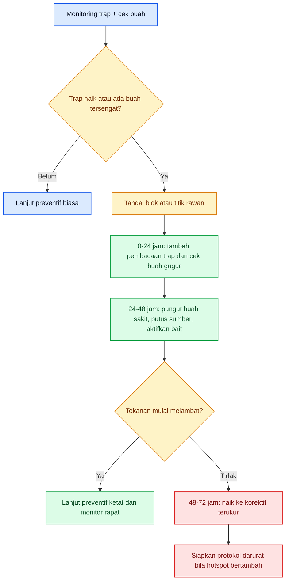

Diagram ini merangkum inti Bab 7: **populasi mulai mahal saat buah rentan bertemu kenaikan tekanan lokal**, dan keputusan harus diambil cepat sebelum telur berubah menjadi kerusakan tersembunyi di dalam buah. ([NSW Department of Primary Industries][2])

---

# Bab 8. Program Tindakan per Fase: Apa yang Harus Dilakukan dari Sebelum Buah Rentan sampai Akhir Panen

Bab ini menerjemahkan seluruh konsep sebelumnya menjadi **SOP kebun**. Prinsipnya sederhana: lalat buah harus dilawan dengan **urutan kerja**, bukan dengan kepanikan sesaat. Sumber resmi Direktorat Hortikultura berulang kali menekankan **sanitasi buah terserang, trap atraktan, pembungkusan, pengolahan tanah, dan AWM**, sementara NSW DPI menambahkan bahwa pengelolaan yang baik bertumpu pada **monitoring, early harvest, proper disposal of reject fruit, dan tindakan cepat bila trap menunjukkan masalah lokal**. Dengan dasar itu, SOP per fase bisa dibuat sangat operasional. ([Hortikultura][1])

## 8.1 Sebelum buah terbentuk

Sebelum buah terbentuk, target pengendalian adalah **menurunkan populasi dasar** dan memastikan kebun tidak memulai musim dengan sumber masalah aktif. Kegiatannya meliputi sanitasi awal, pembersihan bawah tajuk, pengolahan tanah bila perlu, penetapan zonasi kerja, dan koordinasi dengan kebun sekitar. Ini sejalan dengan konsep AWM yang menempatkan pemetaan wilayah, sanitasi, trap, dan protein hidrolisat sebagai satu paket sejak awal, bukan setelah kebun bergejala. ([Hortikultura][1])

## 8.2 Buah pentil

Pada fase buah pentil, targetnya adalah **mencegah betina mulai berhasil meletakkan telur**. Trap jantan harus sudah aktif, protein bait mulai diarahkan pada area rawan, dan komoditas bernilai tinggi yang memungkinkan harus mulai dibungkus. Pedoman jeruk menyebut pemasangan trap dan pembungkusan dimulai sejak buah pentil sekitar 1,5 bulan, karena titik inilah buah mulai masuk jendela risiko.

## 8.3 Buah berkembang

Saat buah berkembang, targetnya berubah menjadi **mencegah telur yang sudah diletakkan berubah menjadi gelombang larva yang tersembunyi**. Di fase ini, kebun harus disiplin membaca sting mark, buah abnormal, dan buah gugur awal. Trap tetap dibaca, tetapi inspeksi buah menjadi makin penting karena pada fase ini kerugian utama justru sedang dibangun dari dalam buah. NSW DPI menulis bahwa larva berkembang di dalam buah dan buah biasanya jatuh dari pohon ketika kerusakan berjalan. ([NSW Department of Primary Industries][2])

## 8.4 Buah menjelang matang

Buah menjelang matang adalah fase paling mahal karena nilai buah tinggi dan daya tariknya bagi betina juga naik. NSW DPI menegaskan bahwa **as the fruit ripens it becomes more attractive to the egg-laying females**, sehingga kebun yang tidak menaikkan ritme monitoring pada fase ini hampir selalu tertinggal. Pada fase ini, trap dan bait masih penting, tetapi panen rapat mulai menjadi bagian inti pengendalian. ([NSW Department of Primary Industries][2])

## 8.5 Panen bertahap

Panen bertahap bukan akhir pengendalian; justru pada lalat buah panen adalah bagian langsung dari pengendalian. Buah matang yang tertinggal, buah afkir, dan reject fruit yang tidak segera dikeluarkan dapat menjadi sumber larva dan pupa berikutnya. NSW DPI menulis bahwa damaged or fallen fruit should not go to the packing shed and reject fruit must be disposed of properly. Artinya, saat panen berjalan, kebun juga sedang memutus atau mempertahankan siklus lalat buah. ([NSW Department of Primary Industries][2])

## 8.6 Saat populasi rendah

Saat populasi masih rendah, fokus terbaik adalah **menjaga sistem tetap rapat**. Trap dibaca rutin, bait tetap bekerja, buah gugur tetap dipungut, dan komoditas prioritas tetap dilindungi. Pada fase ini, kesalahan umum adalah merasa aman lalu melonggarkan sanitasi. Padahal FTD sebagai population index justru paling berguna untuk memastikan populasi rendah **tetap rendah**, bukan sekadar untuk merespons ledakan. Ini adalah inferensi operasional dari fungsi FTD menurut IAEA dan dari prinsip AWM.

## 8.7 Saat FTD mulai naik

Saat FTD mulai naik, SOP kebun harus berubah dari “menjaga” menjadi **menahan kenaikan**. IAEA menjelaskan bahwa FTD dipakai sebagai indeks untuk mendukung keputusan suppresssion, sedangkan NSW DPI menulis bahwa lebih dari satu jantan dalam trap dapat menandakan masalah lokal yang perlu ditelusuri. Jadi, saat FTD naik, kebun harus: tambah pembacaan trap, cari sumber lokal, tingkatkan sanitasi, dan pastikan bait serta perlindungan buah berjalan tanpa jeda.

## 8.8 Saat buah gugur meningkat

Saat buah gugur meningkat, SOP harus memusat pada **putus siklus**, bukan hanya membaca trap. Buah gugur berarti larva berpotensi sudah menyelesaikan banyak bagian siklus di dalam buah dan siap berpindah ke tanah. Pedoman Hortikultura menegaskan bahwa buah gugur yang dibiarkan di bawah pohon sangat potensial menjadi sumber infeksi, dan pengolahan tanah di bawah tajuk membantu mematikan pupa. Karena itu, kenaikan buah gugur harus dibaca sebagai alarm yang sangat serius, bahkan bila trap tidak terlihat “terlalu tinggi”. ([Hortikultura][1])

## Tabel 3. Program tindakan per fase

| Fase kebun                | Target pengendalian                         | Tindakan preventif                                             | Tindakan monitoring                              | Tindakan korektif awal                            | Catatan khusus                                           |
| ------------------------- | ------------------------------------------- | -------------------------------------------------------------- | ------------------------------------------------ | ------------------------------------------------- | -------------------------------------------------------- |
| Sebelum buah terbentuk    | Menurunkan populasi dasar                   | Sanitasi awal, bersihkan bawah tajuk, siapkan trap dan bait    | Pemetaan blok rawan dan sumber inang sekitar     | Putus sumber lama sebelum buah muncul             | Fase ini menentukan seberapa “berat” musim dimulai       |
| Buah pentil               | Mencegah oviposisi awal                     | Trap aktif, bait mulai, pembungkusan komoditas prioritas       | Cek trap dan buah muda                           | Perkuat area dengan tangkapan awal                | Jangan menunggu gejala buah rusak                        |
| Buah berkembang           | Menahan pembentukan gelombang larva         | Sanitasi 2–3 hari, bait jalan, buah prioritas tetap dilindungi | Cek sting mark, buah abnormal, buah gugur        | Putus hot spot lokal                              | Kerusakan utama sedang dibangun dari dalam buah          |
| Buah menjelang matang     | Menjaga buah bernilai tinggi tetap selamat  | Lanjut trap, bait, sanitasi, percepat panen                    | Naikkan frekuensi monitoring                     | Fokus area dengan FTD naik dan buah rentan tinggi | Ini fase paling mahal secara ekonomi                     |
| Panen bertahap            | Mencegah siklus lanjut dari buah tertinggal | Sortasi ketat, reject fruit dikeluarkan                        | Cek buah tertinggal dan buah gugur               | Bersihkan sumber baru setiap selesai petik        | Panen adalah bagian dari pengendalian                    |
| Saat populasi rendah      | Menjaga sistem tetap rapat                  | Lanjut semua komponen preventif                                | Baca tren trap dan buah, bukan snapshot          | Koreksi ringan pada titik rawan                   | Populasi rendah bukan alasan melonggarkan sanitasi       |
| Saat FTD mulai naik       | Menahan kenaikan populasi                   | Perketat trap, bait, dan perlindungan buah                     | Tambah pembacaan trap dan pencarian sumber lokal | Tambah trap lokal, percepat sanitasi              | Kenaikan kecil yang dibaca dini jauh lebih murah ditahan |
| Saat buah gugur meningkat | Memutus larva–pupa secepat mungkin          | Sanitasi agresif dan olah tanah bawah tajuk                    | Cek buah gugur, buah sekitar, titik rendah       | Putus hot spot dan lindungi blok sehat            | Buah gugur adalah alarm siklus, bukan sekadar limbah     |

Tabel ini adalah SOP operasional hasil sintesis dari pedoman Hortikultura, NSW DPI, dan IAEA: mulai dari trap, bait, pembungkusan, ritme sanitasi, sampai pembacaan FTD dan buah gugur sebagai titik keputusan. ([Hortikultura][1])

## Rumusan praktis Bab 8

Kalau Bab 8 diperas menjadi satu aturan kerja, maka aturannya adalah: **setiap fase buah harus punya target pengendalian yang berbeda, tetapi semuanya diarahkan pada tujuan yang sama: mencegah betina berhasil, mencegah larva berkembang di buah, dan memutus pupa di tanah sebelum generasi berikutnya muncul**. Dengan cara itu, SOP kebun tidak terasa seperti daftar alat, tetapi seperti sistem kerja yang benar-benar menutup siklus lalat buah. ([Hortikultura][1])

**Diagram Bab 8** berikut merangkum alur SOP per fase dalam bentuk vertikal agar tetap enak dibaca di layar HP.

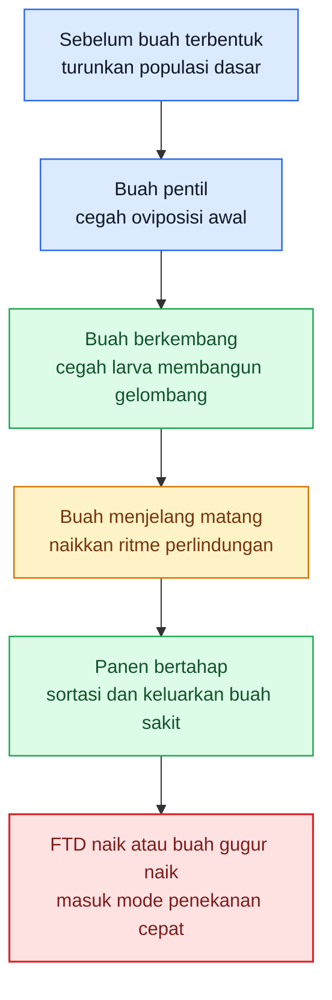

Diagram ini menutup Bab 8 dengan satu pesan yang sangat praktis: **SOP lalat buah harus bergerak mengikuti fase buah, bukan mengikuti kepanikan sesaat**. Pada titik ini, kebun seharusnya sudah punya ritme kerja yang jelas sebelum masuk ke pembahasan backbone non-kimia dan eskalasi berikutnya. ([Hortikultura][1])

[1]: https://hortikultura.pertanian.go.id/wp-content/uploads/2024/11/Pengendalian-Lalat-Buah-Full-Text_watermark.pdf 'PENGENDALIAN LALAT BUAH'
[2]: https://www.dpi.nsw.gov.au/__data/assets/pdf_file/0017/120608/Managing-Queensland-fruit-fly-in-citrus.pdf 'Managing Queensland fruit fly in citrus'
[3]: https://www.dpi.nsw.gov.au/__data/assets/pdf_file/0009/321201/ipm-for-australian-apples-and-pears-complete.pdf 'integrated pest management for Australian apples & pears'

[**Pergi ke Atas**](#pedoman-terpadu-menekan-serangan-lalat-buah-di-kebun-campuran)

---

# Bab 9. Pengendalian Non-Kimia sebagai Tulang Punggung Stabilitas Kebun

Pada lalat buah, backbone kebun yang stabil dibangun dari **sanitasi, trap jantan, penekanan betina, perlindungan fisik buah, pengelolaan tanah bawah tajuk, dan koordinasi kawasan**. Buku Direktorat Hortikultura menempatkan sanitasi, atraktan, protein hidrolisat, pembungkusan buah, pengolahan tanah, dan AWM sebagai satu rangkaian yang saling mengunci. Itu berarti pengendalian non-kimia bukan lapisan tambahan, tetapi struktur utama yang menahan populasi agar tidak mudah meledak. ([ACIAR][1])

## 9.1 Sanitasi sebagai inti utama

Sanitasi adalah titik paling keras dan paling tidak boleh dinegosiasikan. Dokumen Hortikultura Indonesia menegaskan bahwa buah terserang harus **dikumpulkan dan dimusnahkan** agar tidak menjadi sumber serangan berikutnya, sementara booklet manajemen lalat buah untuk grower menyebut **waste fruit needs to be removed** dan idealnya buah tak layak pasar dipetik ke wadah limbah lalu dibuang jauh dari crop. Ini penting karena buah gugur atau buah afkir adalah tempat larva menyelesaikan fase makannya sebelum turun ke tanah. Selama buah sakit tetap tinggal di kebun, kebun sedang memberi makan generasi berikutnya.

Secara lapang, inilah alasan mengapa sanitasi sering lebih menentukan daripada semprotan. Pada proyek AWM Indramayu, saat **protein baiting dihentikan** dan **end-of-season hygiene buruk**, populasi kembali naik; ketika baiting dilanjutkan dan sanitasi diperbaiki, level populasi bisa ditekan lagi. Ini menunjukkan bahwa sanitasi bukan pekerjaan tambahan, tetapi salah satu penentu apakah kebun tetap berada di level suppresssion atau kembali masuk fase infestasi. ([ACIAR][1])

## 9.2 Perangkap sebagai alat monitoring dan penekan jantan

Perangkap berbasis **methyl eugenol** atau parapheromone lain tetap sangat penting, tetapi fungsinya harus dibaca benar. Buku lalat buah Direktorat Hortikultura dan panduan trapping IAEA menjelaskan bahwa **methyl eugenol** merupakan atraktan jantan untuk kelompok **Bactrocera** tertentu dan menjadi dasar teknik **male annihilation**. Jadi, trap paling tepat dipahami sebagai alat untuk **membaca tekanan populasi jantan** dan sekaligus **mengganggu peluang kawin**. ([IAEA Publications][2])

Tetapi trap jantan tidak boleh disalahpahami sebagai penyelesai seluruh masalah. Panduan IPM buah dari NSW menulis bahwa lure jantan **hanya menarik jantan** dan karena itu **tidak memberi indikasi akurat tentang aktivitas betina**. Artinya, trap sangat berguna, tetapi tidak cukup bila dipakai sendirian. Kebun yang hanya bangga dengan trap aktif, tetapi membiarkan buah gugur, betina, dan host alternatif tetap lepas, biasanya tetap akan kalah.

## 9.3 Protein bait sebagai alat utama menekan betina

Untuk menekan **betina**, alat yang paling penting adalah **protein bait**. Buku panduan terbaru untuk grower menyebut bahwa protein bait adalah bagian penting dari **setiap** rencana manajemen lalat buah karena **primarily target immature female flies** dan sebaiknya diaplikasikan **mingguan saat lalat mulai emerge**. NSW DPI juga menulis **start baiting at least one month before fruit are susceptible to attack and continue for 2 weeks after harvest**, sementara pada tekanan tinggi dalam cuaca hangat-basah frekuensinya bisa naik menjadi **dua kali per minggu**. Ini sangat penting karena betinalah yang meletakkan telur dan memulai kerusakan di dalam buah.

Perlu jujur ditegaskan: secara teknis, banyak **protein bait komersial** bukan murni non-kimia karena umumnya mengandung atau ditambah insektisida terdaftar seperti **spinosad**. Namun dalam sistem lalat buah, protein bait tetap jauh lebih selektif dan lebih hemat volume daripada cover spray penuh, karena ia bekerja sebagai **umpan terarah** untuk lalat yang aktif makan. Jadi, dalam bab ini protein bait saya tempatkan sebagai **alat selektif pendamping backbone non-kimia**, bukan sebagai semprotan penutup kebun.

## 9.4 Pembungkusan buah sebagai perlindungan fisik

Pembungkusan buah adalah salah satu cara paling langsung untuk **mencegah oviposisi**. Pedoman Hortikultura menyebut pembungkusan sebagai cara mekanis yang sangat baik untuk mencegah peletakan telur pada buah, dan pada banyak kebun buah bernilai tinggi, barrier fisik seperti ini sering memberi hasil lebih konsisten daripada mengejar lalat yang sudah terbang aktif. Prinsip yang sama juga terlihat pada pendekatan **physical protection** dalam booklet manajemen lalat buah: bila lalat tidak bisa mencapai, melihat, atau mencium buah dengan mudah, tingkat infestasi dapat turun nyata. ([ACIAR][3])

Dalam kebun campuran, pembungkusan harus diprioritaskan pada komoditas yang nilainya tinggi dan teknisnya memungkinkan, bukan diterapkan membabi buta ke semua jenis tanaman. Jadi, pembungkusan bukan simbol rajin, melainkan alat proteksi fisik yang harus dipasang **tepat waktu** pada buah prioritas, sebelum betina sempat menusuknya. ([ACIAR][3])

## 9.5 Pengolahan tanah bawah tajuk

Tanah bawah tajuk adalah fase yang sering diabaikan, padahal lalat buah menyelesaikan satu bagian penting siklusnya di sana. Sumber resmi Hortikultura menjelaskan bahwa larva yang keluar dari buah akan masuk ke tanah menjadi pupa, dan karena itu pembalikan tanah di bawah tajuk dianjurkan agar pupa terangkat ke permukaan dan mati karena panas atau predator. APHIS juga menjelaskan pola yang sama: larva keluar dari buah lalu **drop to the ground and pupate**. Artinya, bila bawah tajuk dibiarkan pasif, kebun sedang melindungi fase pupa. ([Open Knowledge FAO][4])

Inilah sebabnya pengolahan tanah bawah tajuk tidak boleh dibaca sebagai tindakan tambahan. Ia bekerja paling baik bila dipasangkan dengan sanitasi buah gugur. Kalau buah sakit masih banyak tertinggal, pengolahan tanah saja tidak akan cukup. Tetapi bila buah gugur dipungut dan tanah bawah tajuk dikelola, dua titik kritis sekaligus terganggu: **larva dalam buah** dan **pupa di tanah**. ([ACIAR][1])

## 9.6 Kebersihan gulma dan parit

Gulma, parit, titik rendah, dan area pinggir kebun sering menjadi “ruang lupa” yang justru menyimpan masalah. Buku Direktorat Hortikultura menyinggung bahwa gulma dapat menjadi tempat singgah lalat buah, sedangkan panduan grower terbaru menekankan bahwa **physical barriers or bare zones** dapat membantu mencegah incursions dari area sekitar. Panduan yang sama juga menegaskan bahwa buah limbah dan buah afkir harus dibuang dari crop, bukan dibiarkan di area kerja. Ini membuat kebersihan parit, tepi kebun, dan titik rendah menjadi bagian nyata dari tulang punggung kebun.

Secara praktis, bagian pinggir dan titik rendah harus dibaca sebagai **zona penguat tekanan**. Di sanalah buah gugur lebih mudah tertahan, kelembapan lebih tinggi, dan pembersihan paling sering tertunda. Kebun yang kelihatannya rapi di tengah tetapi kotor di tepi sering tetap memberi ruang bagi populasi untuk bertahan. Ini adalah inferensi lapang yang sejalan dengan peran hygiene, bare zones, dan disposal buah limbah pada sumber-sumber utama.

## 9.7 Koordinasi kawasan / AWM

Lalat buah sangat sulit dikendalikan bila hanya satu kebun yang bergerak. Booklet manajemen lalat buah menulis bahwa salah satu alasan lalat buah sulit dikendalikan adalah **mobility** dan bahwa **AWM is the best strategy of all** untuk mengendalikan hama ini; AWM bergantung pada kerja sama semua pemangku kepentingan, bukan hanya satu petani. Proyek AWM di Indramayu juga memperlihatkan bahwa program yang terkoordinasi—male annihilation, protein bait mingguan, sanitasi buah gugur, dan culling host alternatif—mampu menekan populasi sampai mendekati level eradikasi.

Implikasinya sangat praktis: kebun yang rajin tetapi dikelilingi kebun terlantar atau host alternatif yang tidak dikelola akan jauh lebih cepat kehabisan opsi. Karena itu, koordinasi dengan kebun sekitar, pekarangan, blok inang tetangga, dan tanaman host alternatif bukan tambahan sosial, tetapi bagian dari teknik pengendalian.

## 9.8 Kapan pengendalian non-kimia cukup kuat, dan kapan perlu dukungan lain

Pengendalian non-kimia bisa dianggap **cukup kuat** bila sanitasi berjalan disiplin, buah gugur tidak menumpuk, trap jantan masih memberi gambaran tekanan yang terkendali, bait aktif menekan betina, dan gejala pada buah masih sporadis serta lokal. Pada situasi seperti itu, yang paling berharga justru mempertahankan disiplin sistem: jangan memberi celah pada telur, larva, atau pupa untuk menyelesaikan siklus. Proyek AWM di Indonesia memperlihatkan bahwa kombinasi metode ramah lingkungan yang dilakukan terkoordinasi bisa menekan populasi sampai sangat rendah. ([ACIAR][1])

**Dukungan lain mulai dibutuhkan** ketika tekanan lokal tetap naik walau sanitasi dan bait berjalan, buah gugur sakit terus bertambah, atau hotspot mulai melebar ke blok lain. Booklet grower menulis bahwa bila pest pressure terus meningkat, sistem akhirnya akan bergerak ke IPM yang lebih intensif, dan NSW DPI juga menegaskan bahwa jika threshold terlampaui, kontrol harus segera dimulai. Artinya, backbone non-kimia dipertahankan selama mungkin, tetapi tidak boleh dipertahankan secara buta ketika data lapang sudah menunjukkan kebun bergerak ke arah ledakan.

## 9.9 Kesalahan umum yang membuat non-kimia terlihat gagal

Kegagalan paling sering bukan karena metode non-kimia lemah, tetapi karena sistemnya salah. Kesalahan pertama adalah **mengandalkan trap jantan saja**. Kesalahan kedua adalah **tidak disiplin memungut buah gugur**. Kesalahan ketiga adalah **protein bait terlambat dimulai**, padahal NSW DPI menulis baiting sebaiknya dimulai setidaknya **satu bulan sebelum buah rentan**. Kesalahan keempat adalah **tidak mengurus host alternatif atau kebun sekitar**, padahal AWM justru dibangun untuk menjawab masalah itu. Kesalahan kelima adalah **baru bergerak setelah buah banyak berulat**, padahal pada fase itu kerusakan inti sudah berada di dalam buah dan tanah.

## Rumusan praktis Bab 9

Kalau Bab 9 diperas menjadi satu pegangan lapang, maka pegangannya adalah ini: **pada lalat buah, pengendalian paling kuat bukan pada semprotan, tetapi pada disiplin sanitasi, penekanan betina, pengurangan buah gugur, dan pemutusan pupa di tanah, lalu semuanya diperkuat oleh kerja kawasan**. Trap jantan penting, tetapi tidak cukup. Protein bait berguna, tetapi tidak bisa menggantikan sanitasi. Pembungkusan buah sangat kuat, tetapi harus tepat sasaran. Dan non-kimia yang konsisten hampir selalu lebih kuat daripada kimia yang dipakai panik setelah siklus lalat buah telanjur berjalan. ([ACIAR][1])

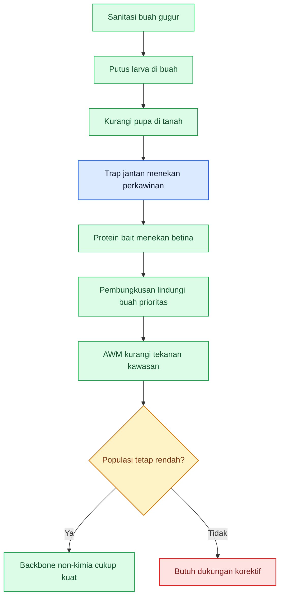

[1]: https://www.aciar.gov.au/sites/default/files/2023-12/hort-2008-041-final-report.pdf 'Area-wide management of pest fruit flies in an Indonesian mango production system - Final Report'
[2]: https://www-pub.iaea.org/MTCD/Publications/PDF/TG-FFP_web.pdf 'Fruit fly trapping guide'
[3]: https://www.aciar.gov.au/sites/default/files/2024-05/ACIAR_MN222_AWM-fruit-fly-manual_web.pdf?utm_source=chatgpt.com 'Area-wide management of methyl eugenol-attracted fruit ...'
[4]: https://openknowledge.fao.org/server/api/core/bitstreams/be552b9e-9ab8-4cec-ba0c-2fa4f77896c7/content?utm_source=chatgpt.com 'GUIDELINES ON PHYTOSANITARY PROCEDURES FOR ...'

[**Pergi ke Atas**](#pedoman-terpadu-menekan-serangan-lalat-buah-di-kebun-campuran)

---

# Bab 10. Pengendalian Kuratif dan Eskalasi

Pengendalian kuratif pada lalat buah harus diberi tempat yang tepat: **alat eskalasi saat backbone preventif mulai bocor**, bukan kebiasaan menutup kebun dengan semprotan penuh sejak awal. Panduan protein bait NSW DPI menulis bahwa bait spraying adalah pendekatan yang **lebih selektif** dibanding cover spraying dengan insektisida broad-spectrum, sedangkan booklet manajemen lalat buah untuk grower menegaskan bahwa pengendalian terbaik selalu memakai **kombinasi beberapa strategi** dan bukan satu alat tunggal. Jadi, logika bab ini bukan “obat apa yang paling keras”, tetapi **kapan kebun masuk fase kuratif dan bagaimana intervensi diperkeras tanpa merusak sistem**. ([NSW Department of Primary Industries][1])

## 10.1 Kapan kebun masuk fase kuratif

Kebun masuk fase kuratif ketika data lapang menunjukkan bahwa ritme preventif tidak lagi cukup menahan arah populasi. Sinyalnya biasanya muncul dalam bentuk **FTD yang naik**, **tangkapan trap lokal yang lebih dari satu jantan pada titik tertentu**, **buah gugur sakit yang bertambah**, atau **buah rentan yang mulai menunjukkan sengatan di beberapa lokasi sekaligus**. NSW DPI menulis bahwa bila ditemukan **lebih dari satu male fly**, itu dapat menandakan **masalah lokal** dan perlu respons, sedangkan IAEA menegaskan bahwa trap data dipakai untuk membaca perubahan populasi dalam ruang dan waktu. Jadi, fase kuratif dimulai bukan saat buah sudah banyak berulat, tetapi saat **arah masalah sudah bergerak naik**. ([NSW Department of Primary Industries][2])

## 10.2 Prinsip paling penting: tidak ada satu alat sakti

Pada lalat buah, **tidak ada satu alat sakti**. Trap jantan, bait, pembungkusan, sanitasi, pengolahan tanah, dan panen rapat masing-masing menyerang titik berbeda dalam siklus hidup. Laporan ACIAR untuk sistem mango Indonesia menunjukkan bahwa populasi bisa ditekan ke level sangat rendah justru karena metode-metode itu dipakai **bersama-sama** secara terkoordinasi: **male annihilation**, **protein bait mingguan**, **culling host alternatif**, dan **sanitasi buah gugur**. Artinya, kebun yang berharap satu alat saja menyelesaikan seluruh masalah hampir selalu akan kecewa. ([ACIAR][3])

## 10.3 Fungsi methyl eugenol vs protein bait

**Methyl eugenol** dan **protein bait** harus dibedakan menurut fungsi biologisnya. Panduan trapping IAEA menjelaskan bahwa **methyl eugenol** adalah **male-specific para-pheromone** untuk banyak spesies **Bactrocera**, sehingga posisinya ada pada **monitoring jantan** dan **male annihilation**. Sebaliknya, booklet grower menulis bahwa **protein bait** menarik **jantan dan betina**, tetapi **sangat menarik bagi betina yang baru muncul** karena mereka membutuhkan protein untuk mematangkan telur. Jadi, ME dibaca sebagai alat untuk **menekan jantan dan membaca tekanan**, sedangkan protein bait dibaca sebagai alat yang lebih langsung menekan **betina reproduktif**.

Kesalahan paling umum di lapang adalah menganggap trap ME cukup untuk seluruh kebun. Itu keliru. Karena betina tetap bisa bertelur walau jantan tertangkap cukup banyak, trap ME tanpa protein bait, tanpa sanitasi, dan tanpa pengurangan buah gugur hampir selalu terlalu lemah untuk kebun campuran dengan inang bergantian. Ini adalah **inferensi operasional** dari fungsi jantan-spesifik pada ME dan ketertarikan betina muda pada protein bait yang ditegaskan sumber-sumber resmi.

## 10.4 Posisi spinosad dalam bait

**Spinosad** dalam sistem lalat buah paling tepat dibaca sebagai **komponen insektisida pada bait**, bukan sebagai alasan untuk kembali ke pola cover spray tutup kebun. NSW DPI untuk wine grapes menjelaskan bahwa **Naturalure** mengandung **0.24 g/L spinosad** dalam **protein and sugar-based bait**, direkomendasikan untuk **spot or row spraying** dengan droplet besar, dan bahwa **main mode of action against fruit flies is through ingestion**. Booklet grower juga menyebut **pre-mixed, spinosad-based baits** sebagai **softer alternative** dibanding bait berbasis insektisida lain, terutama untuk area sensitif. Jadi, posisi spinosad pada lalat buah bukan terutama sebagai semprotan tutup kebun, tetapi sebagai **racun makan yang dibawa oleh umpan**. ([NSW Department of Primary Industries][4])

Ini penting untuk praktik. Karena spinosad pada bait terutama bekerja lewat **ingestion**, efektivitasnya sangat tergantung pada **timing**, **kesegaran bait**, dan apakah lalat—terutama betina muda—masih aktif mencari protein. Booklet grower menulis bahwa bila lalat hanya makan sedikit, dosis toksik bisa tidak tercapai, dan betina yang **sudah lebih dulu makan protein** bisa menjadi kurang responsif. Itu sebabnya bait harus mulai **sebelum** buah rentan penuh dan diulang saat populasi naik atau setelah hujan/irigasi mencuci bait.

## 10.5 Kapan perlu memperketat trap dan bait

Trap dan bait perlu diperketat ketika data lapang menunjukkan pergeseran dari populasi rendah menjadi populasi aktif. NSW DPI menulis bahwa bait spray paling efektif bila dimulai **at least one month before fruit are susceptible to attack** dan diteruskan **2 minggu setelah panen**, sedangkan dalam kondisi hangat-basah dan tekanan tinggi, re-aplikasi bisa perlu **lebih rapat**. Pada wine grapes, NSW DPI juga menulis re-aplikasi bait bisa perlu **setiap 5–7 hari**, dan aktivitas bait pendek terutama pada suhu tinggi atau saat hujan. Jadi, saat FTD naik, buah mulai melunak, atau setelah hujan yang signifikan, kebun harus otomatis berpikir **perketat trap reading dan perpendek interval bait**. ([NSW Department of Primary Industries][1])

## 10.6 Kapan tindakan harus difokuskan pada hotspot

Kuratif yang baik pada lalat buah hampir selalu dimulai dari **hotspot**, bukan dari seluruh kebun. NSW DPI menulis bahwa bila trap menunjukkan lebih dari satu jantan, petani perlu menambah trap di empat sudut atau sekitar area itu untuk mencari sumber lokal, dan pengelolaan harus diarahkan ke problem area. ACIAR juga menunjukkan bahwa koordinasi pengendalian pada area yang benar-benar menanggung tekanan tinggi memberi hasil yang jauh lebih baik daripada tindakan parsial yang tidak fokus. Jadi, saat tangkapan trap atau buah gugur sakit naik tajam di satu blok, area itu harus diperlakukan sebagai **pusat intervensi**, bukan sekadar satu titik observasi. ([NSW Department of Primary Industries][2])

## 10.7 Kesalahan umum penggunaan insektisida cover spray penuh

Di banyak kebun, begitu panik dimulai, respons refleksnya adalah **cover spray penuh**. Padahal panduan IPM apples and pears NSW jelas menulis: **where possible, avoid using cover sprays**, karena broad-spectrum insecticides untuk fruit fly sering menghancurkan populasi predator yang membantu menekan hama lain seperti two-spotted mite. Panduan grower modern juga menekankan bahwa bait spraying yang tepat sasaran mengurangi penggunaan insektisida dibanding perlakuan penuh. Jadi, cover spray penuh punya biaya ekologis dan manajerial yang tinggi. ([NSW Department of Primary Industries][5])

Namun penting juga jujur: sumber yang sama dari NSW menulis bahwa **bait spraying alone may not be enough to control high populations of fruit fly**, dan pada situasi tertentu **pre-harvest cover spraying** bisa dipakai untuk populasi tinggi. Tetapi itu adalah opsi saat tekanan sudah berat, harus mengutamakan **cakupan buah**, **kalibrasi alat**, dan **masa tunggu**. Artinya, cover spray bukan tabu mutlak, tetapi harus dibaca sebagai **opsi berat**, bukan rutinitas default. ([NSW Department of Primary Industries][5])

## 10.8 Pengendalian kimia sebagai pendukung, bukan penguasa sistem

Kalau bab ini harus dibuat sangat tajam, maka kalimat intinya adalah: **kimia membantu sistem, tetapi tidak boleh mengambil alih logika pengendalian**. Pada lalat buah, kimia yang paling masuk akal biasanya masuk lewat **bait**, **male annihilation stations**, atau intervensi lokal yang sangat terarah. Begitu kebun kembali membaik, prioritasnya harus kembali ke **sanitasi, trap, pengurangan buah gugur, panen tepat waktu, dan koordinasi kawasan**. Ini sejalan dengan seluruh kerangka AWM, yang berhasil justru karena pestisida dipakai sebagai bagian dari sistem, bukan sebagai pengganti sistem. ([ACIAR][3])

## Rumusan praktis Bab 10

Kalau Bab 10 diperas menjadi satu aturan kerja, maka aturannya adalah: **baca bahan aktif menurut fungsi biologisnya**. **ME** untuk jantan. **Protein bait** untuk betina. **Spinosad** paling masuk akal di bait, bukan sebagai alasan kembali ke cover spray membabi buta. Saat populasi naik, perketat trap dan bait lebih dulu, fokus pada hotspot, dan hanya dorong intervensi yang lebih keras bila data lapang memang menunjukkan kebun mulai kalah. Dengan begitu, pengendalian kuratif tetap tinggal sebagai alat bantu, bukan menjadi penguasa sistem. ([NSW Department of Primary Industries][4])

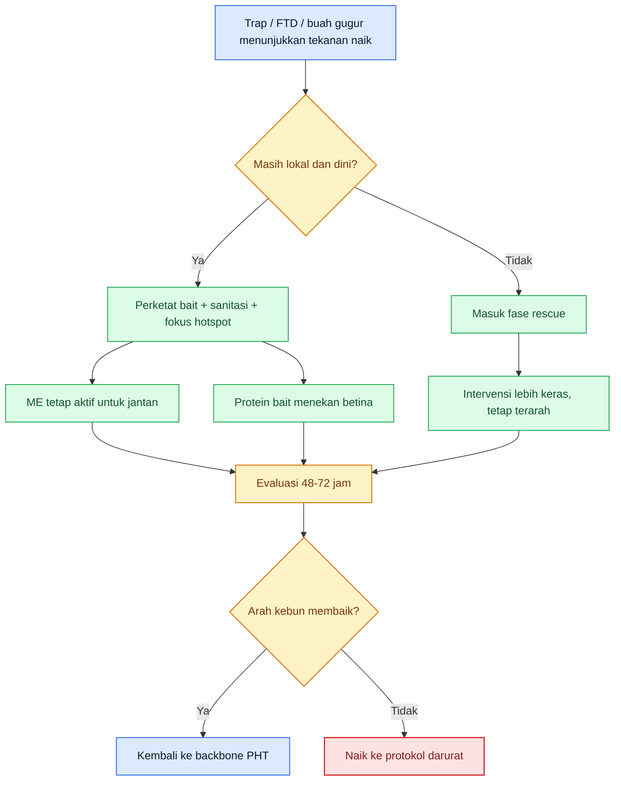

[**Pergi ke Atas**](#pedoman-terpadu-menekan-serangan-lalat-buah-di-kebun-campuran)

---

# Bab 11. Protokol Darurat: Saat Kebun Masuk Risiko Tinggi Kehilangan Hasil

Bab ini dipakai saat kebun **tidak lagi berada pada kondisi normal**. Mode darurat pada lalat buah dimulai ketika populasi dan kerusakan mulai bergerak lebih cepat daripada ritme pengendalian biasa. Booklet grower menekankan bahwa fruit fly management needs **year-round management** and **multi-layered approach**, sedangkan NSW DPI menunjukkan bahwa trap dan bait harus dinaikkan saat counts tinggi dan buah mulai rentan. Jadi, mode darurat bukan saat “sudah banyak lalat”, tetapi saat **trap naik, buah rentan banyak, dan buah gugur sakit mulai menambah sumber generasi baru**.

## 11.1 Indikator kebun masuk mode darurat

Kebun sebaiknya dianggap masuk mode darurat bila beberapa indikator ini muncul bersamaan: **FTD melonjak atau tangkapan trap lokal meningkat nyata**, **buah gugur sakit bertambah**, **banyak buah inang matang bersamaan**, dan **sanitasi 2–3 hari tidak lagi cukup mengejar sumber baru**. IAEA menegaskan FTD dipakai untuk membaca tekanan populasi dalam waktu dan ruang, sedangkan NSW DPI menegaskan bahwa lebih dari satu jantan dalam trap dapat menandakan masalah lokal dan perlu tindakan. Jadi, mode darurat lahir dari **populasi naik + buah rentan banyak + sumber siklus bertambah cepat**.

## 11.2 Protokol 72 jam pertama

Pada **0–24 jam pertama**, kebun harus **membekukan kebingungan**. Artinya: tandai hotspot, tambah pembacaan trap di sekitar titik yang paling tinggi, cek buah gugur dan buah yang tersisa di pohon, lalu pastikan semua buah sakit yang terlihat **dikeluarkan pada hari yang sama**. NSW DPI merekomendasikan penambahan trap untuk mencari sumber lokal, sementara panduan grower menekankan bahwa fruit waste must be removed from the crop. Jadi, 24 jam pertama bukan waktu untuk menambah teori, tetapi waktu untuk **mengurangi sumber generasi berikutnya**. ([NSW Department of Primary Industries][2])

Pada **24–48 jam**, fokus harus berpindah ke **penahanan sebaran**. Periksa area sekitar hotspot, kuatkan bait pada perimeter atau blok rawan, dan pastikan buah yang mendekati matang tidak dibiarkan menggantung terlalu lama. Jika buah gugur meningkat, maka kebun harus memperlakukan bawah tajuk sebagai area darurat: pungut buah, keluarkan, dan ganggu fase tanah/pupa bila memungkinkan. Ini adalah inferensi operasional yang langsung mengikuti siklus larva–buah gugur–pupa yang dijelaskan sumber resmi. ([ACIAR][3])

Pada **48–72 jam**, kebun harus sudah mendapat jawaban yang jujur: **apakah tekanan melambat atau justru melebar**. Jika trap lokal tetap tinggi, buah gugur sakit tetap banyak, atau blok sekitar mulai ikut terpengaruh, maka rescue terbatas belum cukup. Kebun harus naik ke langkah yang lebih tegas, baik dalam panen, pembersihan sumber, atau pengurangan blok inang. Ini adalah inferensi keputusan lapang dari penggunaan trap data sebagai alat keputusan dan dari fakta bahwa lalat buah cepat menyebar pada area dengan host yang terus tersedia.

## 11.3 Tindakan saat buah gugur meningkat

Buah gugur yang meningkat adalah alarm yang sangat serius karena ia menandakan **larva sedang berhasil menyelesaikan fase makannya**. Pada situasi ini, prioritasnya bukan sekadar membaca trap, tetapi **memutus jalur larva ke tanah**. Buah gugur harus segera dipungut, dipisahkan dari buah sehat, dan dimusnahkan dengan benar. Pada tahap ini, setiap keterlambatan hari tambahan memberi lebih banyak peluang larva menjadi pupa. Panduan grower dan sumber resmi Hortikultura sama-sama menegaskan bahwa buah limbah harus keluar dari crop dan tidak boleh dibiarkan di lapangan.

## 11.4 Tindakan saat FTD melonjak

Saat FTD melonjak, kebun harus menganggap bahwa ada **perubahan nyata pada tekanan populasi**, bukan sekadar variasi biasa. IAEA menjelaskan bahwa FTD adalah indeks operasional untuk suppression programmes, dan nilai ini berguna untuk melihat perubahan dari waktu ke waktu. Dalam praktik, lonjakan FTD harus diterjemahkan menjadi tiga hal: tambah titik pembacaan lokal, cari sumber masalah di blok atau perimeter tertentu, lalu pastikan bait dan sanitasi mengejar titik itu lebih dulu. Ini penting karena rata-rata luas bisa menutupi fakta bahwa masalah sesungguhnya sering sangat lokal.

## 11.5 Tindakan saat banyak buah inang matang bersamaan

Ini salah satu momen paling berbahaya di kebun campuran. Ketika banyak buah inang matang bersamaan, kebun memberi lalat buah **makanan, tempat bertelur, dan transisi antar-inang** sekaligus. Booklet grower menekankan bahwa fruit fly problems are amplified by **mobility** and **availability of host fruit**, dan AWM justru dibangun untuk mengatasi situasi seperti ini secara kawasan. Jadi, saat beberapa komoditas matang bersamaan, panen, sanitasi, bait, dan perlindungan pada komoditas prioritas harus bergerak lebih rapat daripada jadwal normal.

## 11.6 Perlindungan blok yang masih sehat

Dalam mode darurat, kebun tidak boleh hanya sibuk memadamkan titik yang sudah parah. Blok yang masih sehat harus diperlakukan sebagai **aset yang sedang dipertahankan**. Itu berarti perimeter sehat perlu segera diberi perlindungan bait dan sanitasi lebih rapat, buah matang diambil lebih cepat, dan semua host alternatif atau buah afkir di area sekitar dibersihkan. Ini sejalan dengan konsep AWM: masalah tidak diselesaikan dengan fokus sempit pada titik sakit saja, tetapi dengan melindungi area yang masih bisa diselamatkan. ([ACIAR][3])

## 11.7 Percepatan panen dan sortir

Pada lalat buah, panen adalah alat rescue yang sangat sering diremehkan. Buah yang makin matang semakin menarik bagi betina, sehingga membiarkannya terlalu lama menggantung akan menaikkan peluang oviposisi. Karena itu, ketika mode darurat dimulai, panen harus dipercepat pada buah yang sudah layak, dan sortasi harus diperketat agar buah yang berisiko tidak kembali menjadi sumber larva. Ini adalah inferensi operasional yang langsung mengikuti fakta bahwa buah matang lebih menarik bagi betina dan bahwa reject fruit harus dibuang benar. ([NSW Department of Primary Industries][1])

## 11.8 Bagaimana menilai rescue berhasil

Rescue dikatakan **berhasil** bila dalam 48–72 jam hotspot tidak bertambah cepat, FTD lokal mulai stabil atau menurun, buah gugur sakit menurun, dan blok sehat tetap relatif bersih. Keberhasilan rescue pada lalat buah tidak berarti semua lalat hilang, tetapi berarti **arah populasi mulai dipatahkan** dan generasi berikutnya mulai diputus. Ini konsisten dengan penggunaan trap data sebagai population index dalam suppression programmes.

## 11.9 Kapan rescue gagal

Rescue dikatakan **gagal** bila meskipun trap tambahan, sanitasi keras, bait lebih rapat, dan percepatan panen sudah dilakukan, hotspot tetap melebar, buah gugur terus bertambah, atau blok sekitar mulai ikut menjadi sumber baru. Dalam situasi itu, kebun tidak lagi cukup ditangani dengan rescue terbatas; ia harus naik ke **tindakan ekstrim** pada Bab 12. Ini adalah inferensi keputusan lapang dari prinsip bahwa area-wide, multi-method control harus mencegah masalah menjadi blok-luas; bila itu gagal, maka sebagian blok atau sebagian hasil harus dikorbankan untuk menyelamatkan sisanya. ([ACIAR][3])

## Rumusan praktis Bab 11

Kalau Bab 11 diperas menjadi satu aturan kerja, maka aturannya adalah: **saat populasi dan kerusakan naik cepat, hentikan pola pikir menunggu dan pindah ke protokol 72 jam**. Dalam 24 jam pertama kurangi sumber. Dalam 48 jam kuatkan perimeter sehat. Dalam 72 jam putuskan apakah arah populasi mulai patah atau justru melebar. Rescue yang baik bukan yang paling ramai semprotnya, tetapi yang paling cepat mengubah arah siklus lalat buah.

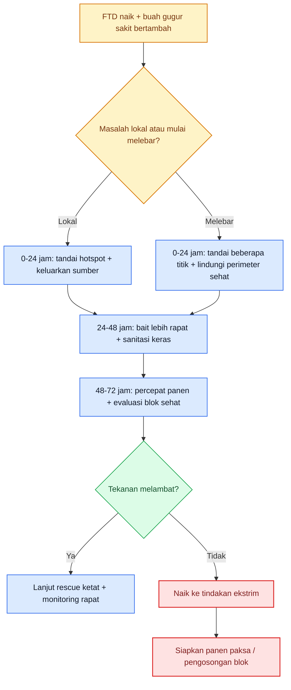

[**Pergi ke Atas**](#pedoman-terpadu-menekan-serangan-lalat-buah-di-kebun-campuran)

---

# Bab 12. Tindakan Ekstrim dan Penutup Musim: Kapan Blok Inang Harus Dikorbankan, Dipanen Paksa, atau Dibersihkan Total

Bab terakhir harus ditulis dengan tegas, karena pada lalat buah keputusan paling mahal sering bukan keputusan memasang lebih banyak trap, tetapi keputusan **mengorbankan sebagian hasil atau sebagian blok untuk memutus generasi berikutnya**. Sumber-sumber AWM menegaskan bahwa buah sakit, host alternatif, dan buah gugur harus dikeluarkan dari sistem, dan hasil terbaik justru dicapai ketika komunitas petani berani memutus sumber inang, bukan mempertahankannya terlalu lama. Jadi, tindakan ekstrim pada lalat buah bukan tanda menyerah, tetapi sering justru bentuk pengendalian yang paling rasional. ([ACIAR][3])

## 12.1 Kapan buah terserang harus dimusnahkan total

Buah terserang harus dimusnahkan total ketika buah itu jelas telah menjadi **mesin produksi generasi baru**, yaitu saat berisi larva, membusuk, atau sudah jatuh dan menjadi media aman menuju fase pupa. Booklet grower menulis bahwa waste fruit must be removed from the crop and disposed of properly, dan sumber resmi Hortikultura sudah lama menegaskan buah terserang harus dikumpulkan lalu dibenamkan atau dibakar. Artinya, buah seperti ini tidak lagi punya nilai panen yang layak, tetapi masih punya nilai bahaya yang tinggi.

## 12.2 Kapan panen paksa lebih murah daripada menunggu

Panen paksa menjadi lebih murah ketika buah sudah mendekati nilai pasar maksimum tetapi risiko oviposisi dan pembusukan meningkat lebih cepat daripada kemampuan kebun melindunginya. Ini paling sering terjadi saat beberapa inang matang bersamaan, trap lokal naik, dan buah gugur sakit mulai bertambah. Dalam situasi itu, mempertahankan buah lebih lama di pohon sering hanya memperbesar peluang telur baru dan menambah buah afkir. Ini adalah **inferensi ekonomi lapang** dari fakta bahwa buah matang lebih menarik bagi betina, dan bahwa fruit waste serta reject fruit harus segera keluar dari kebun. ([NSW Department of Primary Industries][1])

## 12.3 Kapan satu blok inang harus diprioritaskan untuk dikosongkan

Satu blok inang mulai layak diprioritaskan untuk dikosongkan ketika blok itu telah berubah dari aset menjadi **sumber tekanan bagi blok lain**. Tanda-tandanya antara lain: hotspot tetap bertahan walau bait dan sanitasi diperketat, buah gugur sakit terus muncul di blok itu, dan trap lokal tetap tinggi dari minggu ke minggu. AWM justru dibangun untuk mencegah satu area menjadi reservoir kawasan; bila pencegahan itu gagal, memutus blok lebih dini sering lebih murah daripada membiarkannya menjadi “pabrik lalat buah” bagi seluruh hamparan. Ini adalah inferensi keputusan lapang yang langsung mengikuti logika AWM dan hotspot management. ([ACIAR][3])

## 12.4 Cara memusnahkan buah gugur dan buah terserang

Prinsip minimumnya sangat tegas: **buah sakit harus keluar dari crop pada hari yang sama** dan tidak boleh dibiarkan di bedengan, bawah tajuk, parit, atau tepi kebun. Sumber resmi Indonesia menyebut buah terserang dikumpulkan lalu **dibenamkan atau dibakar**, sedangkan booklet grower menekankan buah limbah harus dibuang ke lokasi yang benar-benar tidak memungkinkan lalat menyelesaikan siklusnya kembali. Jadi, kebun harus punya prosedur tetap untuk pengumpulan, pemisahan dari buah sehat, pengeluaran, dan pemusnahan. Bagian terakhir ini adalah inferensi operasional dari kewajiban remove and destroy pada sumber-sumber utama.

## 12.5 Sanitasi penutup musim

Akhir musim adalah titik yang sangat menentukan untuk musim berikutnya. Bila buah sakit, host alternatif, dan bawah tajuk tidak dibersihkan, kebun akan memulai musim berikutnya dengan populasi dasar yang sudah terbentuk. ACIAR melaporkan bahwa dalam program Indramayu, hasil terbaik didapat ketika **culling and removal of alternate host plants** dan sanitasi buah gugur dijalankan sebagai bagian dari program berkepanjangan. Jadi, penutupan musim pada lalat buah bukan sekadar selesai panen, tetapi **menutup jembatan generasi berikutnya**. ([ACIAR][3])

## 12.6 Evaluasi kawasan untuk musim berikutnya

Evaluasi musim harus menjawab pertanyaan yang sangat praktis: di mana hotspot pertama muncul, apakah ada host alternatif yang luput, apakah bait terlambat, apakah sanitasi buah gugur cukup rapat, dan apakah koordinasi kawasan berjalan. Karena lalat buah adalah masalah **hamparan**, evaluasinya juga tidak boleh berhenti di satu petak. Ini adalah inferensi langsung dari prinsip AWM dan dari fakta bahwa mobility dan continuous host availability membuat satu kebun sulit aman sendirian.

## Tabel 4. Eskalasi dari preventif ke kuratif ke tindakan ekstrim

| Tingkat kondisi kebun  | Indikator lapang                                                             | Tindakan utama                                                                        | Tujuan tindakan                                   | Keputusan berikutnya bila gagal                       |
| ---------------------- | ---------------------------------------------------------------------------- | ------------------------------------------------------------------------------------- | ------------------------------------------------- | ----------------------------------------------------- |
| Preventif stabil       | Trap rendah/stabil, buah gugur sakit minim, hotspot belum terbentuk          | Lanjut sanitasi, trap, bait, pembungkusan, pengelolaan tanah                          | Menjaga populasi tetap rendah                     | Naik ke kuratif saat trap lokal/FTD mulai naik        |
| Kuratif awal           | Tangkapan lokal naik, ada sengatan awal, buah gugur sakit mulai terlihat     | Perketat bait, tambah trap lokal, sanitasi agresif pada area sumber                   | Memutus hotspot sebelum melebar                   | Naik ke rescue bila gejala tetap bertambah 48–72 jam  |
| Rescue terukur         | FTD melonjak, buah rentan banyak, hotspot bertambah                          | Fokus hotspot, percepat panen, lindungi perimeter sehat, keluarkan semua sumber sakit | Membalik arah populasi dari naik menjadi tertahan | Naik ke tindakan ekstrim bila blok lain ikut tertarik |
| Tindakan ekstrim       | Blok tertentu tetap menjadi sumber, buah gugur terus bertambah, rescue gagal | Panen paksa, kosongkan blok prioritas, musnahkan buah dan host alternatif lokal       | Menyelamatkan blok lain dan memutus generasi baru | Akhiri blok dan lakukan sanitasi total                |
| Penutupan blok / musim | Nilai panen sisa rendah, blok berubah jadi reservoir                         | Bersihkan total buah sakit, bawah tajuk, host alternatif, evaluasi kawasan            | Mencegah masalah dibawa ke musim berikutnya       | Rancang ulang strategi area-wide musim depan          |

Tabel ini adalah **sintesis operasional** dari prinsip AWM, penggunaan trap/FTD untuk suppression, kewajiban hygiene, dan tindakan bertahap dari hotspot response sampai area sanitation penuh. ([ACIAR][3])

## Rumusan praktis Bab 12

Kalau seluruh artikel ini harus ditutup dengan satu pegangan, maka pegangannya adalah: **pada lalat buah, keberanian memutus sumber generasi baru jauh lebih berharga daripada harapan palsu bahwa semua buah masih bisa diselamatkan**. Buah terserang harus dimusnahkan. Panen paksa kadang lebih murah daripada menunggu. Dan bila satu blok telah menjadi pusat tekanan, mengosongkan blok itu bisa menjadi keputusan paling sehat untuk menyelamatkan hamparan dan musim berikutnya.

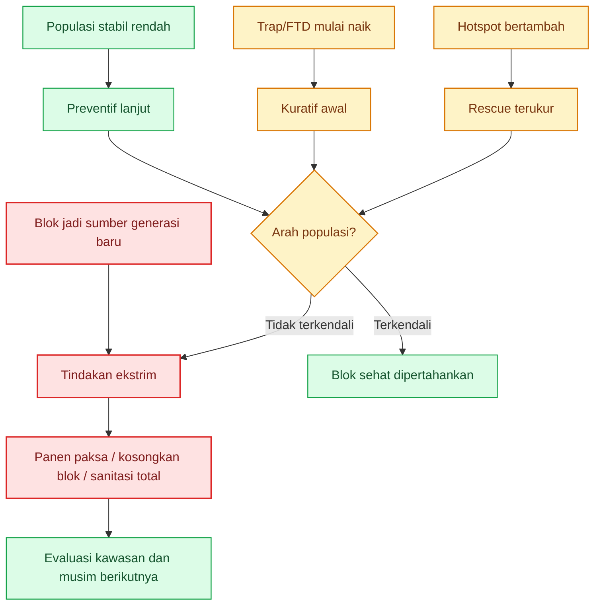

[1]: https://www.dpi.nsw.gov.au/__data/assets/pdf_file/0010/1482742/Queensland-fruit-fly-protein-bait-spraying.pdf 'Protein bait spraying'
[2]: https://www.dpi.nsw.gov.au/__data/assets/pdf_file/0017/120608/Managing-Queensland-fruit-fly-in-citrus.pdf?utm_source=chatgpt.com 'Managing Queensland fruit fly in citrus'
[3]: https://www.aciar.gov.au/sites/default/files/2023-12/hort-2008-041-final-report.pdf 'Area-wide management of pest fruit flies in an Indonesian mango production system - Final Report'
[4]: https://www.dpi.nsw.gov.au/__data/assets/pdf_file/0007/1158091/Queensland-fruit-fly-and-wine-grapes.pdf 'Grapevine management guide 2018 –19'
[5]: https://www.dpi.nsw.gov.au/__data/assets/pdf_file/0009/321201/ipm-for-australian-apples-and-pears-complete.pdf 'integrated pest management for Australian apples & pears'

[**Pergi ke Atas**](#pedoman-terpadu-menekan-serangan-lalat-buah-di-kebun-campuran)

---

Berikut **lampiran aplikasi lapang** yang dipisahkan dari tubuh utama agar artikel tetap ramping, tetapi tetap bisa langsung dipakai di kebun contoh. **Layout dan program kerja di bawah ini adalah skema operasional**, bukan hasil ukur GPS atau peta kadastral. Rumus **FTD** saya pertahankan mengikuti pedoman **IAEA**, dan target suppression praktis **di bawah 1 FTD** saya ambil dari manual **ACIAR** untuk program area-wide. Protein bait saya posisikan sebagai pekerjaan **mingguan** yang dimulai sebelum buah benar-benar rentan, dengan pengulangan lebih rapat bila hujan mencuci bait atau tekanan naik. ([International Atomic Energy Agency][1])

# Lampiran A. Layout lahan Gambiran 3.150 m²

**Asumsi kerja contoh:** lahan berbentuk mendekati persegi panjang **70 m × 45 m = 3.150 m²**.
Arah dibuat sederhana agar mudah dipakai tim lapang: **utara = akses utama**, **selatan = parit/outlet air**.

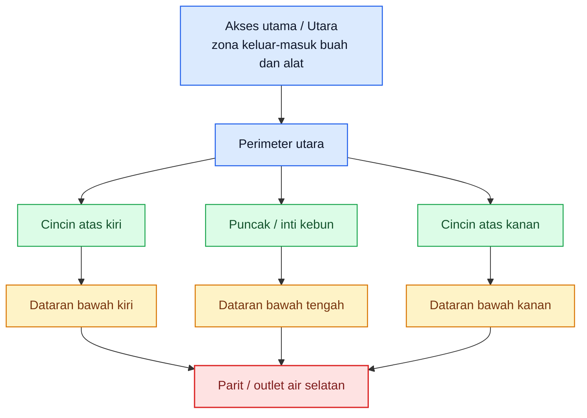

**Cara membaca layout ini:**

- **Perimeter** adalah zona alarm awal: trap, bait, dan host alternatif harus dibaca di sini lebih dulu.
- **Cincin atas** adalah zona produksi yang masih relatif aman bila perimeter tertahan.
- **Dataran bawah** adalah zona rawan buah gugur dan akumulasi tekanan.
- **Parit/outlet air** adalah zona yang tidak boleh kotor, karena mudah menjadi tempat tertahan buah sakit dan limbah.

# Lampiran B. Denah titik perangkap P1–P8

Trap harus dipakai bukan hanya untuk “menghitung lalat”, tetapi untuk membaca **tekanan per zona**. Dalam program area-wide, trap dibaca berkala dan FTD dipakai sebagai **population index**, dengan target suppression praktis **< 1 FTD**. ([International Atomic Energy Agency][1])

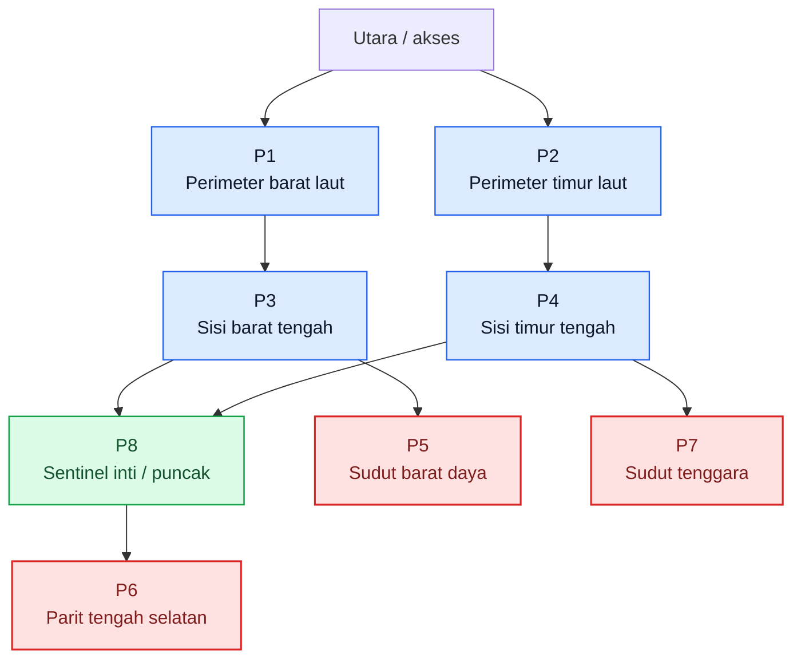

| Titik | Fungsi utama                                                        | Prioritas baca                                |
| ----- | ------------------------------------------------------------------- | --------------------------------------------- |
| P1    | alarm perimeter barat laut                                          | mingguan                                      |
| P2    | alarm perimeter timur laut                                          | mingguan                                      |
| P3    | pemantau masuknya tekanan dari sisi barat                           | mingguan, naik 2x/minggu bila FTD naik        |
| P4    | pemantau masuknya tekanan dari sisi timur                           | mingguan, naik 2x/minggu bila FTD naik        |
| P5    | sentinel titik rendah sisi barat                                    | mingguan                                      |
| P6    | sentinel parit tengah selatan                                       | mingguan, wajib cek bila buah gugur meningkat |
| P7    | sentinel titik rendah sisi timur                                    | mingguan                                      |
| P8    | trap inti untuk membaca apakah masalah sudah masuk ke jantung kebun | mingguan                                      |

**Aturan kerja cepat:**

- Bila **P1–P4** naik, baca itu sebagai **tekanan masuk/perimeter**.
- Bila **P5–P7** naik, baca itu sebagai **masalah buah gugur, titik rendah, atau sanitasi bawah tajuk**.
- Bila **P8** ikut naik, anggap masalah sudah **menembus inti kebun** dan ritme pengendalian harus dinaikkan.

# Lampiran C. Skema zonasi kerja: parit, perimeter, dataran bawah, cincin atas, puncak, hotspot

Zonasi ini dibuat supaya tim lapang tidak bekerja acak. Hotspot harus dibaca sebagai **zona dinamis**: ia bisa muncul di perimeter, dataran bawah, atau dekat parit, tergantung buah gugur, host alternatif, dan tangkapan trap.

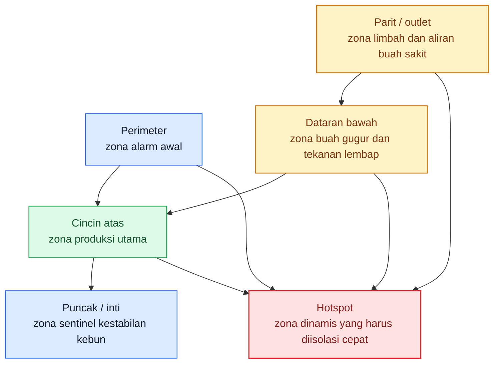

| Zona           | Fokus utama                                 | Frekuensi minimum              | Trigger eskalasi                  |
| -------------- | ------------------------------------------- | ------------------------------ | --------------------------------- |
| Perimeter      | trap, bait, host alternatif, buah pinggir   | mingguan                       | tangkapan naik pada P1–P4         |
| Dataran bawah  | buah gugur, sanitasi, pupa, titik lembap    | tiap 2–3 hari                  | buah gugur sakit meningkat        |
| Cincin atas    | pembungkusan, panen selektif, inspeksi buah | tiap 2–3 hari saat buah rentan | sengatan awal muncul              |
| Puncak / inti  | trap sentinel, cek kestabilan blok          | mingguan                       | P8 ikut naik                      |
| Parit / outlet | limbah, buah afkir, titik tertahan          | tiap 2–3 hari                  | buah sakit tertahan setelah hujan |
| Hotspot        | semua tindakan dipadatkan                   | 24–72 jam pertama              | gejala melebar ke blok sekitar    |

# Lampiran D. SOP mingguan sanitasi, trap, bait, pembungkusan, dan pembalikan tanah

Saya pakai tiga pegangan operasional di lampiran ini:
trap dibaca **mingguan**, protein bait dipakai **mingguan** saat lalat mulai muncul, dan bait perlu **diulang lebih cepat** bila hujan mencuci umpan atau tekanan naik. Pedoman NSW juga menyarankan bait dimulai **setidaknya satu bulan sebelum buah rentan** dan diteruskan sampai **dua minggu setelah panen**, sedangkan panduan grower menekankan pengulangan **mingguan** sejak lalat mulai muncul. ([NSW Department of Primary Industries][2])

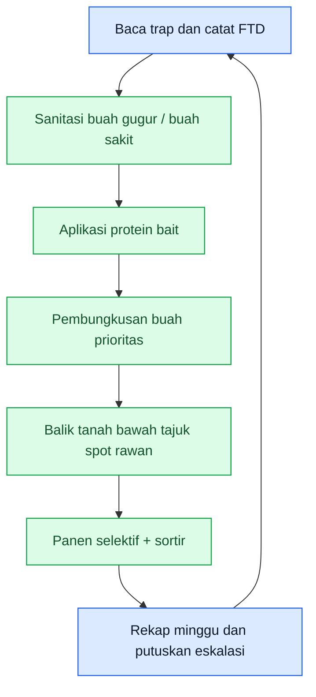

| Hari   | Pekerjaan utama                                         | Target area                             | Output yang harus jadi                     |
| ------ | ------------------------------------------------------- | --------------------------------------- | ------------------------------------------ |
| Senin  | Baca P1–P8, hitung tangkapan, tandai titik naik         | seluruh kebun                           | peta tekanan minggu berjalan               |
| Selasa | Aplikasi protein bait                                   | perimeter, hotspot, sisi host aktif     | betina muda ditekan sebelum bertelur       |
| Rabu   | Sanitasi besar 1                                        | bawah tajuk, parit, titik rendah        | buah sakit keluar dari kebun               |
| Kamis  | Pembungkusan buah prioritas + cek buah menjelang matang | jambu, jeruk, buah naga, blok prioritas | buah bernilai tinggi terlindungi           |
| Jumat  | Panen selektif + sortir + keluarkan reject fruit        | blok panen aktif                        | buah rentan tidak terlalu lama tergantung  |
| Sabtu  | Sanitasi besar 2 + pembalikan tanah spot rawan          | bawah tajuk, parit, hotspot             | larva–pupa diputus                         |
| Minggu | Rekap FTD, buah gugur, hotspot, keputusan pekan depan   | meja kerja / catatan kebun              | status: stabil, bocor, atau perlu eskalasi |

**Aturan koreksi cepat:**

- Bila hujan meluruhkan bait, **majukan aplikasi berikutnya**. ([Yarriambiack Shire Council][3])
- Bila P8 ikut naik, minggu berikutnya jangan dijalankan normal; masuk **mode penekanan cepat**.
- Bila buah gugur sakit meningkat, jangan tunggu jadwal Sabtu; lakukan sanitasi **hari itu juga**.

# Lampiran E. Cara hitung FTD + contoh lembar pencatatan

IAEA mendefinisikan **FTD** sebagai indeks populasi yang menunjukkan rata-rata jumlah lalat target yang tertangkap per trap per hari. Manual ACIAR untuk area-wide suppression memakai target praktis **kurang dari 1 lalat per trap per hari** sebagai level suppression. ([International Atomic Energy Agency][1])

```mdx id="gi0kr2"
$$
\mathrm{FTD}=\frac{F}{T \times D}
$$

dengan:

- $F$ = total lalat buah target yang tertangkap
- $T$ = jumlah trap yang diperiksa
- $D$ = rata-rata jumlah hari trap terpasang
```

### Contoh hitung

Misal:

- total lalat tertangkap = **24**
- jumlah trap diperiksa = **8**
- lama paparan = **7 hari**

```mdx id="txm3l9"
$$
\mathrm{FTD}=\frac{24}{8 \times 7}=\frac{24}{56}=0.43
$$
```

**Interpretasi kerja:**
FTD **0,43** berarti kebun masih di bawah target suppression **< 1 FTD**, tetapi angka itu tetap harus dibaca bersama **buah gugur sakit**, **sengatan awal**, dan **lokasi trap yang naik**. FTD adalah alat baca, bukan tujuan akhir. ([International Atomic Energy Agency][1])

## Contoh lembar pencatatan lapang

| Tanggal cek | Trap ID |            Zona | Hari terpasang | Tangkapan target | FTD blok | Buah gugur sakit sekitar | Gejala buah sekitar      | Keputusan 24 jam       |
| ----------- | ------- | --------------: | -------------: | ---------------: | -------: | -----------------------: | ------------------------ | ---------------------- |
| 10 Mei 2026 | P1      |       perimeter |              7 |                2 |     0,43 |                        1 | belum ada sengatan nyata | lanjut rutin           |
| 10 Mei 2026 | P3      | perimeter barat |              7 |                6 |     0,43 |                        4 | ada sengatan awal        | tambah bait + sanitasi |
| 10 Mei 2026 | P6      |           parit |              7 |                5 |     0,43 |                        9 | buah gugur busuk banyak  | hotspot                |
| 10 Mei 2026 | P8      |            inti |              7 |                1 |     0,43 |                        0 | belum ada gejala         | sentinel aman          |

## Format kosong yang bisa dipakai berulang

| Tanggal cek | Trap ID | Zona | Hari terpasang | Tangkapan target | FTD blok | Buah gugur sakit sekitar | Gejala buah sekitar | Keputusan 24 jam |
| ----------- | ------- | ---: | -------------: | ---------------: | -------: | -----------------------: | ------------------- | ---------------- |
|             |         |      |                |                  |          |                          |                     |                  |
|             |         |      |                |                  |          |                          |                     |                  |
|             |         |      |                |                  |          |                          |                     |                  |
|             |         |      |                |                  |          |                          |                     |                  |

# Lampiran F. Program kerja setahun Mei 2026–April 2027 untuk kebun contoh

**Catatan:** ini **program contoh**, jadi tanggalnya mengikuti kalender, tetapi pelaksanaannya tetap harus disesuaikan dengan **fenologi buah** di kebun nyata. Artinya, bila fase buah rentan maju atau mundur, program harus ikut digeser.

| Bulan              | Fokus utama                     | Target operasional                                                    | Hasil yang harus jadi                                     |
| ------------------ | ------------------------------- | --------------------------------------------------------------------- | --------------------------------------------------------- |
| **Mei 2026**       | audit kebun dan reset sanitasi  | bersihkan sumber lama, validasi zonasi, cek host alternatif           | kebun tidak masuk musim baru dengan populasi dasar tinggi |
| **Juni 2026**      | aktivasi trap tetap             | pasang P1–P8, mulai log trap, latih pembacaan hotspot                 | peta tekanan awal kebun                                   |
| **Juli 2026**      | persiapan bait dan pembungkusan | stok bait, bahan bungkus, jadwal tenaga kerja                         | semua sarana siap sebelum buah rentan                     |
| **Agustus 2026**   | awal pengamanan host pertama    | bait mulai aktif pada blok paling awal berbuah                        | betina ditekan sebelum oviposisi luas                     |
| **September 2026** | proteksi buah pentil            | pembungkusan komoditas prioritas, sanitasi 2–3 hari                   | buah awal tidak menjadi jembatan populasi                 |
| **Oktober 2026**   | monitoring intensif             | trap mingguan, FTD mulai dipakai sebagai alat keputusan               | blok rawan terbaca lebih dini                             |
| **November 2026**  | penekanan aktif                 | bait mingguan, sanitasi keras, panen lebih rapat                      | populasi ditekan sebelum puncak buah                      |
| **Desember 2026**  | bulan risiko tinggi             | percepat panen, sortir, tangani hotspot 24–72 jam                     | buah bernilai tinggi tetap selamat                        |
| **Januari 2027**   | jaga blok sehat                 | perimeter sehat diperkuat, host alternatif diculling                  | masalah tidak meloncat antarblok                          |
| **Februari 2027**  | evaluasi rescue dan blok lelah  | tentukan blok yang dipanen paksa atau dikosongkan                     | sumber generasi baru diputus                              |
| **Maret 2027**     | sanitasi penutup musim          | keluarkan seluruh buah sakit, bersihkan bawah tajuk dan parit         | kebun tidak membawa residu berat ke musim berikutnya      |
| **April 2027**     | evaluasi kawasan                | review FTD tahunan, hotspot berulang, koordinasi dengan kebun sekitar | rencana musim berikutnya lebih tajam                      |

[1]: https://www.iaea.org/sites/default/files/trapping-guideline.pdf?utm_source=chatgpt.com 'Trapping guidelines - for area-wide fruit fly programmes'
[2]: https://www.dpi.nsw.gov.au/__data/assets/pdf_file/0010/1482742/Queensland-fruit-fly-protein-bait-spraying.pdf?utm_source=chatgpt.com 'Queensland fruit fly protein bait spraying.pdf'
[3]: https://www.yarriambiack.vic.gov.au/files/sharedassets/public/v/1/documents/environment-and-waste/environment/qff-presentation-yarriambiack-shire.pdf?utm_source=chatgpt.com 'living with queensland fruit fly'

[**Pergi ke Atas**](#pedoman-terpadu-menekan-serangan-lalat-buah-di-kebun-campuran)

---

<small>
  **_Catatan Penyusunan_** Artikel ini disusun sebagai materi edukasi dan
  referensi umum berdasarkan berbagai sumber pustaka, praktik lapangan, serta
  bantuan alat penulisan. Pembaca disarankan untuk melakukan verifikasi lanjutan
  dan penyesuaian sesuai dengan kondisi serta kebutuhan masing-masing sistem.
</small>
