# **_Mekanisme Penguatan Jaringan Cabai dengan Ca–Si–K–Mg–N_**

_Menjaga Pucuk Kuat, Menghindari Tanaman Terlalu Lunak, dan Mencegah Stunting akibat Salah Diagnosis_

---

- [**_Mekanisme Penguatan Jaringan Cabai dengan Ca–Si–K–Mg–N_**](#mekanisme-penguatan-jaringan-cabai-dengan-casikmgn)
- [Tujuan Artikel](#tujuan-artikel)
- [1. Pendahuluan: Cabai Kuat Bukan Cabai yang Dikeraskan Berlebihan](#1-pendahuluan-cabai-kuat-bukan-cabai-yang-dikeraskan-berlebihan)
  - [1.1 Masalah umum di lapangan](#11-masalah-umum-di-lapangan)
  - [1.2 Kesalahan konsep](#12-kesalahan-konsep)
  - [1.3 Gagasan utama](#13-gagasan-utama)
  - [1.4 Batas validasi](#14-batas-validasi)
  - [Ilustrasi: tiga kondisi utama tanaman cabai](#ilustrasi-tiga-kondisi-utama-tanaman-cabai)
- [2. Struktur Jaringan Cabai: Tempat Unsur Bekerja](#2-struktur-jaringan-cabai-tempat-unsur-bekerja)
  - [2.1 Jaringan daun sebagai sistem hidup](#21-jaringan-daun-sebagai-sistem-hidup)
  - [2.2 Komponen penting di level sel](#22-komponen-penting-di-level-sel)
    - [Penjelasan praktis tiap komponen](#penjelasan-praktis-tiap-komponen)
      - [a. Kutikula](#a-kutikula)
      - [b. Epidermis](#b-epidermis)
      - [c. Dinding sel](#c-dinding-sel)
      - [d. Middle lamella](#d-middle-lamella)
      - [e. Membran plasma](#e-membran-plasma)
      - [f. Vakuola](#f-vakuola)
      - [g. Kloroplas](#g-kloroplas)
      - [h. Stomata](#h-stomata)
  - [2.3 Mengapa penguatan harus dimulai dari sel](#23-mengapa-penguatan-harus-dimulai-dari-sel)
  - [Ilustrasi: penampang sederhana jaringan dan posisi kerja unsur](#ilustrasi-penampang-sederhana-jaringan-dan-posisi-kerja-unsur)
  - [Jembatan ke bab berikutnya](#jembatan-ke-bab-berikutnya)
- [3. Peran $Ca$: Pengikat Dinding Sel dan Middle Lamella](#3-peran-ca-pengikat-dinding-sel-dan-middle-lamella)
  - [3.1 Posisi $Ca$ di tanaman](#31-posisi-ca-di-tanaman)
  - [3.2 Mekanisme kerja $Ca$](#32-mekanisme-kerja-ca)
  - [3.3 Dampak praktis pada cabai](#33-dampak-praktis-pada-cabai)
  - [3.4 Batasan $Ca$](#34-batasan-ca)
  - [3.5 Risiko aplikasi $Ca$ berlebihan](#35-risiko-aplikasi-ca-berlebihan)
  - [3.6 Catatan aplikasi](#36-catatan-aplikasi)
- [4. Peran $Si$: Penguat Epidermis, Kutikula, dan Permukaan Jaringan](#4-peran-si-penguat-epidermis-kutikula-dan-permukaan-jaringan)
  - [4.1 Posisi $Si$](#41-posisi-si)
  - [4.2 Mekanisme kerja $Si$](#42-mekanisme-kerja-si)
    - [a. Penguatan fisik permukaan](#a-penguatan-fisik-permukaan)
    - [b. Dukungan terhadap toleransi stres](#b-dukungan-terhadap-toleransi-stres)
    - [c. Dukungan terhadap respons pertahanan](#c-dukungan-terhadap-respons-pertahanan)
  - [4.3 Dampak praktis](#43-dampak-praktis)
  - [4.4 Batas klaim](#44-batas-klaim)
  - [4.5 Risiko aplikasi $Si$ salah](#45-risiko-aplikasi-si-salah)
  - [4.6 Posisi $Si$ dalam model hara](#46-posisi-si-dalam-model-hara)
- [5. Peran $K$: Pengatur Air, Turgor, Stomata, dan Pengisian Buah](#5-peran-k-pengatur-air-turgor-stomata-dan-pengisian-buah)
  - [5.1 Posisi $K$](#51-posisi-k)
  - [5.2 Mekanisme kerja $K$](#52-mekanisme-kerja-k)
    - [a. Mengatur tekanan osmotik](#a-mengatur-tekanan-osmotik)
    - [b. Menjaga turgor sel](#b-menjaga-turgor-sel)
    - [c. Mengatur stomata](#c-mengatur-stomata)
    - [d. Membantu transport fotosintat](#d-membantu-transport-fotosintat)
  - [5.3 Dampak pada cabai](#53-dampak-pada-cabai)
  - [5.4 Risiko $K$ kurang](#54-risiko-k-kurang)
  - [5.5 Risiko $K$ berlebihan](#55-risiko-k-berlebihan)
  - [5.6 Catatan aplikasi](#56-catatan-aplikasi)
  - [Diagram: Peran $Ca$, $Si$, dan $K$ pada jaringan cabai](#diagram-peran-ca-si-dan-k-pada-jaringan-cabai)
- [Ringkasan Bab 3–5](#ringkasan-bab-35)
- [6. Peran $Mg$: Inti Klorofil dan Mesin Fotosintesis](#6-peran-mg-inti-klorofil-dan-mesin-fotosintesis)
  - [6.1 Posisi $Mg$](#61-posisi-mg)
  - [6.2 Mekanisme kerja $Mg$](#62-mekanisme-kerja-mg)
    - [a. Inti klorofil](#a-inti-klorofil)
    - [b. Mendukung fotosintesis](#b-mendukung-fotosintesis)
    - [c. Menjaga pertumbuhan tetap berjalan](#c-menjaga-pertumbuhan-tetap-berjalan)
  - [6.3 Dampak praktis](#63-dampak-praktis)
  - [6.4 Gejala kekurangan $Mg$](#64-gejala-kekurangan-mg)
    - [Tabel pembeda gejala $Mg$](#tabel-pembeda-gejala-mg)
  - [6.5 Hubungan $Mg$ dengan $K$ dan $Ca$](#65-hubungan-mg-dengan-k-dan-ca)
    - [a. $K$ tinggi dapat menekan $Mg$](#a-k-tinggi-dapat-menekan-mg)
    - [b. $Ca$ dominan juga dapat mengganggu $Mg$](#b-ca-dominan-juga-dapat-mengganggu-mg)
    - [c. $Mg$ perlu dijaga dalam program \`$Ca$–$K$](#c-mg-perlu-dijaga-dalam-program-cak)
  - [6.6 Catatan diagnosis](#66-catatan-diagnosis)
    - [Pertanyaan 1: Daun mana yang menguning?](#pertanyaan-1-daun-mana-yang-menguning)
    - [Pertanyaan 2: Polanya bagaimana?](#pertanyaan-2-polanya-bagaimana)
    - [Pertanyaan 3: Pertumbuhan seperti apa?](#pertanyaan-3-pertumbuhan-seperti-apa)
- [7. Peran $N$: Kehijauan, Pertumbuhan Vegetatif, dan Risiko Pucuk Lunak](#7-peran-n-kehijauan-pertumbuhan-vegetatif-dan-risiko-pucuk-lunak)
  - [7.1 Posisi $N$](#71-posisi-n)
  - [7.2 Mekanisme kerja $N$](#72-mekanisme-kerja-n)
    - [a. Meningkatkan pembentukan klorofil](#a-meningkatkan-pembentukan-klorofil)
    - [b. Membentuk asam amino dan protein](#b-membentuk-asam-amino-dan-protein)
    - [c. Mendorong pertumbuhan vegetatif](#c-mendorong-pertumbuhan-vegetatif)
    - [d. Memengaruhi warna daun dan SPAD](#d-memengaruhi-warna-daun-dan-spad)
  - [7.3 Kekurangan $N$](#73-kekurangan-n)
  - [7.4 Kelebihan $N$](#74-kelebihan-n)
  - [7.5 Bias $N$ terhadap SPAD dan warna daun](#75-bias-n-terhadap-spad-dan-warna-daun)
    - [SPAD tinggi bisa berarti:](#spad-tinggi-bisa-berarti)
    - [SPAD rendah bisa berarti:](#spad-rendah-bisa-berarti)
    - [Matriks interpretasi warna daun](#matriks-interpretasi-warna-daun)
  - [7.6 Patokan jaringan daun](#76-patokan-jaringan-daun)
  - [Ilustrasi: skala kehijauan akibat $N$](#ilustrasi-skala-kehijauan-akibat-n)
  - [Diagram diagnosis bias $N$ dan $Mg$](#diagram-diagnosis-bias-n-dan-mg)
- [Ringkasan Bab 6–7](#ringkasan-bab-67)
- [8. Sinergi dan Antagonisme `$Ca$–`$K$–`$Mg$–`$N$ serta Peran Pendukung $Si$](#8-sinergi-dan-antagonisme-cakmgn-serta-peran-pendukung-si)
  - [8.1 Sinergi yang diinginkan](#81-sinergi-yang-diinginkan)
  - [8.2 Antagonisme kation](#82-antagonisme-kation)
  - [8.3 Antagonisme $K$ dan $Mg$](#83-antagonisme-k-dan-mg)
  - [8.4 Antagonisme $Ca$ dan $K$](#84-antagonisme-ca-dan-k)
  - [8.5 Dampak praktis antagonisme $Ca$–$K$](#85-dampak-praktis-antagonisme-cak)
  - [8.6 Antagonisme $Ca$ dan $Mg$](#86-antagonisme-ca-dan-mg)
  - [8.7 Hubungan $N$ dengan unsur penguat](#87-hubungan-n-dengan-unsur-penguat)
  - [8.8 Prinsip koreksi](#88-prinsip-koreksi)
  - [Diagram: segitiga antagonisme `$K$–`$Ca$–$Mg$ dengan peran $N$ dan $Si$](#diagram-segitiga-antagonisme-kcamg-dengan-peran-n-dan-si)
- [9. Rasio Hara: Patokan $K:N$, $Ca:N$, $Mg:N$, $K:Ca$, $K:Mg$, dan $Ca:Mg$](#9-rasio-hara-patokan-kn-can-mgn-kca-kmg-dan-camg)
  - [9.1 Mengapa perlu rasio](#91-mengapa-perlu-rasio)
    - [1. Nilai hara tunggal bisa menipu](#1-nilai-hara-tunggal-bisa-menipu)
    - [2. Daun hijau bisa karena $N$ tinggi](#2-daun-hijau-bisa-karena-n-tinggi)
    - [3. $K$ tinggi bisa menekan $Ca$ atau $Mg$](#3-k-tinggi-bisa-menekan-ca-atau-mg)
    - [4. Rasio membantu melihat arah koreksi](#4-rasio-membantu-melihat-arah-koreksi)
  - [9.2 Rumus rasio dasar](#92-rumus-rasio-dasar)
  - [9.3 Rasio terhadap nitrogen](#93-rasio-terhadap-nitrogen)
  - [9.4 Target vegetatif](#94-target-vegetatif)
  - [9.5 Target generatif](#95-target-generatif)
  - [9.6 Rasio $K:Ca$](#96-rasio-kca)
  - [9.7 Rasio $K:Mg$](#97-rasio-kmg)
  - [9.8 Rasio $Ca:Mg$](#98-rasio-camg)
  - [9.9 Catatan tentang $Si:N$](#99-catatan-tentang-sin)
  - [Diagram: alur penggunaan rasio hara](#diagram-alur-penggunaan-rasio-hara)
- [Ringkasan Bab 8–9](#ringkasan-bab-89)
- [10. Model Matematis Indeks Keseimbangan Jaringan](#10-model-matematis-indeks-keseimbangan-jaringan)
  - [10.1 Tujuan model](#101-tujuan-model)
  - [10.2 Indeks Keseimbangan Jaringan](#102-indeks-keseimbangan-jaringan)
  - [10.3 Indeks Risiko Pucuk Lunak](#103-indeks-risiko-pucuk-lunak)
  - [10.4 Indeks Risiko Stunting](#104-indeks-risiko-stunting)
  - [10.5 Skor ketidakseimbangan $K:Ca$](#105-skor-ketidakseimbangan-kca)
  - [10.6 Skor ketidakseimbangan kation total](#106-skor-ketidakseimbangan-kation-total)
  - [10.7 Interpretasi indeks](#107-interpretasi-indeks)
  - [10.8 Matriks keputusan praktis](#108-matriks-keputusan-praktis)
  - [10.9 Contoh kasus lengkap](#109-contoh-kasus-lengkap)
  - [Diagram: data jaringan → rasio → indeks → keputusan koreksi](#diagram-data-jaringan--rasio--indeks--keputusan-koreksi)
- [Ringkasan Bab 10](#ringkasan-bab-10)
- [11. Efek Stunting pada Cabai](#11-efek-stunting-pada-cabai)
  - [11.1 Definisi stunting praktis](#111-definisi-stunting-praktis)
    - [Ciri utama stunting](#ciri-utama-stunting)
  - [11.2 Penyebab stunting akibat salah program](#112-penyebab-stunting-akibat-salah-program)
    - [a. $N$ ditekan terlalu lama](#a-n-ditekan-terlalu-lama)
    - [b. $Si$ terlalu pekat](#b-si-terlalu-pekat)
    - [c. $Ca$ terlalu dominan](#c-ca-terlalu-dominan)
    - [d. $K$ terlalu tinggi hingga menekan $Mg$](#d-k-terlalu-tinggi-hingga-menekan-mg)
    - [e. $Mg$ kurang](#e-mg-kurang)
    - [f. Air tidak stabil](#f-air-tidak-stabil)
    - [g. Akar rusak](#g-akar-rusak)
    - [h. pH tidak sesuai](#h-ph-tidak-sesuai)
  - [11.3 Mekanisme stunting](#113-mekanisme-stunting)
    - [1. Fotosintesis turun](#1-fotosintesis-turun)
    - [2. Energi pertumbuhan kurang](#2-energi-pertumbuhan-kurang)
    - [3. Ekspansi sel terganggu](#3-ekspansi-sel-terganggu)
    - [4. Dinding sel terlalu cepat “dikunci”](#4-dinding-sel-terlalu-cepat-dikunci)
    - [5. Akar tidak mampu mendukung pucuk](#5-akar-tidak-mampu-mendukung-pucuk)
    - [Diagram: mekanisme stunting akibat salah penguatan](#diagram-mekanisme-stunting-akibat-salah-penguatan)
  - [11.4 Tanaman kompak vs stunting](#114-tanaman-kompak-vs-stunting)
    - [Tanaman kompak sehat](#tanaman-kompak-sehat)
    - [Tanaman stunting](#tanaman-stunting)
  - [11.5 Dampak ekonomi](#115-dampak-ekonomi)
- [12. Ukuran Lapangan: Hijau Gelap, Terlalu Subur, dan Stunting](#12-ukuran-lapangan-hijau-gelap-terlalu-subur-dan-stunting)
  - [12.1 Daun hijau gelap](#121-daun-hijau-gelap)
    - [Dengan SPAD](#dengan-spad)
    - [Tanpa SPAD](#tanpa-spad)
  - [12.2 Indeks lebar daun](#122-indeks-lebar-daun)
  - [12.3 Indeks ruas pucuk](#123-indeks-ruas-pucuk)
  - [12.4 Rasio tinggi tanaman](#124-rasio-tinggi-tanaman)
  - [12.5 Laju tumbuh 7 hari](#125-laju-tumbuh-7-hari)
  - [12.6 Skor terlalu subur](#126-skor-terlalu-subur)
  - [Diagram: ukuran lapangan untuk membaca kondisi tanaman](#diagram-ukuran-lapangan-untuk-membaca-kondisi-tanaman)
- [Ringkasan Bab 11–12](#ringkasan-bab-1112)
- [13. Diagnosis agar Tidak Salah: Bias $N$, $Mg$, $Ca$, dan $K$](#13-diagnosis-agar-tidak-salah-bias-n-mg-ca-dan-k)
  - [13.1 Mengapa diagnosis bisa bias](#131-mengapa-diagnosis-bisa-bias)
  - [13.2 Membedakan $N$ dan $Mg$](#132-membedakan-n-dan-mg)
    - [Cara membaca di lapangan](#cara-membaca-di-lapangan)
  - [13.3 Membedakan masalah $Ca$ dan $K$](#133-membedakan-masalah-ca-dan-k)
    - [Kesalahan umum membaca $Ca$](#kesalahan-umum-membaca-ca)
  - [13.4 Membedakan $K$ tinggi dan $Mg$ rendah](#134-membedakan-k-tinggi-dan-mg-rendah)
    - [Pola yang sering terjadi](#pola-yang-sering-terjadi)
  - [13.5 Protokol diagnosis lapangan](#135-protokol-diagnosis-lapangan)
    - [Langkah 1 — Pisahkan daun muda, daun tengah, dan daun tua](#langkah-1--pisahkan-daun-muda-daun-tengah-dan-daun-tua)
    - [Langkah 2 — Lihat pola warna](#langkah-2--lihat-pola-warna)
    - [Langkah 3 — Ukur ruas pucuk](#langkah-3--ukur-ruas-pucuk)
    - [Langkah 4 — Ukur lebar daun](#langkah-4--ukur-lebar-daun)
    - [Langkah 5 — Ukur laju tumbuh 7 hari](#langkah-5--ukur-laju-tumbuh-7-hari)
    - [Langkah 6 — Cek akar](#langkah-6--cek-akar)
    - [Langkah 7 — Cek air dan drainase](#langkah-7--cek-air-dan-drainase)
    - [Langkah 8 — Cek pH](#langkah-8--cek-ph)
    - [Langkah 9 — Analisis jaringan daun bila keputusan besar](#langkah-9--analisis-jaringan-daun-bila-keputusan-besar)
    - [Langkah 10 — Baca hasil analisis dengan rasio](#langkah-10--baca-hasil-analisis-dengan-rasio)
  - [13.6 Kesalahan diagnosis umum](#136-kesalahan-diagnosis-umum)
    - [Kesalahan 1 — Daun pucat langsung diberi $N$](#kesalahan-1--daun-pucat-langsung-diberi-n)
    - [Kesalahan 2 — Daun tua klorosis antar tulang dikira kurang $N$](#kesalahan-2--daun-tua-klorosis-antar-tulang-dikira-kurang-n)
    - [Kesalahan 3 — Daun hijau gelap dianggap pasti sehat](#kesalahan-3--daun-hijau-gelap-dianggap-pasti-sehat)
    - [Kesalahan 4 — $K$ dinaikkan terus saat generatif tanpa menjaga $Ca$ dan $Mg$](#kesalahan-4--k-dinaikkan-terus-saat-generatif-tanpa-menjaga-ca-dan-mg)
    - [Kesalahan 5 — $Ca$ dinaikkan terus tanpa membaca $K$, $Mg$, dan pH](#kesalahan-5--ca-dinaikkan-terus-tanpa-membaca-k-mg-dan-ph)
    - [Kesalahan 6 — SPAD dipakai tanpa melihat posisi daun](#kesalahan-6--spad-dipakai-tanpa-melihat-posisi-daun)
  - [Diagram: flowchart diagnosis warna daun dan gejala pertumbuhan](#diagram-flowchart-diagnosis-warna-daun-dan-gejala-pertumbuhan)
- [14. SOP Praktis Penguatan Jaringan Tanpa Membuat Cabai Stunting](#14-sop-praktis-penguatan-jaringan-tanpa-membuat-cabai-stunting)
  - [14.1 Prinsip dasar SOP](#141-prinsip-dasar-sop)
  - [14.2 Dosis foliar praktis](#142-dosis-foliar-praktis)
  - [14.3 Jadwal bergilir aman](#143-jadwal-bergilir-aman)
  - [14.4 Koreksi bila tanaman terlalu lunak](#144-koreksi-bila-tanaman-terlalu-lunak)
  - [14.5 Koreksi bila tanaman stunting](#145-koreksi-bila-tanaman-stunting)
  - [14.6 Koreksi bila $K:Ca$ terlalu tinggi](#146-koreksi-bila-kca-terlalu-tinggi)
  - [14.7 Koreksi bila $Ca$ terlalu dominan](#147-koreksi-bila-ca-terlalu-dominan)
  - [Diagram: SOP koreksi penguatan jaringan](#diagram-sop-koreksi-penguatan-jaringan)
- [Ringkasan Bab 13–14](#ringkasan-bab-1314)
- [15. Penutup: Cabai Kuat adalah Cabai yang Seimbang](#15-penutup-cabai-kuat-adalah-cabai-yang-seimbang)
  - [15.1 Ringkasan utama](#151-ringkasan-utama)
  - [15.2 Pesan praktis](#152-pesan-praktis)
  - [15.3 Kalimat penutup](#153-kalimat-penutup)
- [Ringkasan Praktisi](#ringkasan-praktisi)

---

# Tujuan Artikel

Artikel ini ditujukan untuk praktisi budidaya cabai agar mampu memahami:

1. bagaimana jaringan cabai diperkuat oleh $Ca$, $Si$, $K$, $Mg$, dan $N$;
2. mengapa tanaman bisa menjadi terlalu lunak bila $N$ dominan;
3. mengapa tanaman bisa stunting bila program penguatan terlalu menekan pertumbuhan;
4. bagaimana membaca antagonisme hara, terutama $Ca$–$K$, $K$–$Mg$, dan $Ca$–$Mg$;
5. bagaimana membuat diagnosis lapangan agar tidak salah membedakan kekurangan $N$, kekurangan $Mg$, kelebihan $N$, dan ketidakseimbangan kation;
6. bagaimana memakai rasio, indeks, dan ukuran lapangan untuk mengambil keputusan praktis.

<ResourceBox
  title="Artikel Terkait:"
  items={[
    {
      name: 'README — Framework Praktis Memulai Bisnis Agribisnis Terpadu di Lahan Gumuk Berlereng',
      href: '/blog/agri/kebon/agribisnis-gumuk/README',
    },
    {
      name: 'Isolasi Mikroba Lokal untuk PGPM dan Agen Pengendali Hayati (APH)',
      href: '/blog/agri/agen-hayati/isolasi-mikroba-lokal',
    },
    {
      name: 'OPT Penggagal Panen pada Cabai Rawit dan Cabai Besar',
      href: '/blog/agri/kebon/pengendalian-opt-cabai',
    },
    {
      name: 'Tipuan Mikroba dalam Pertanian: Trichoderma, PGPR, PGPM, PGPF, MOL, dan JAKABA',
      href: '/blog/agri/agen-hayati/tipuan-mikroba-pertanian',
    },
    {
      name: 'Bioaktivator Rizosfer Bambu Kaya Silikat',
      href: '/blog/agri/kebon/biaktivator-rizosfer-bambu',
    },
    {
      name: 'Panduan Praktis Pembiakan Trichoderma dari Starter Komersial',
      href: '/blog/agri/agen-hayati/trichoderma-pembiakan',
    },
    {
      name: 'Keseimbangan Akar dan Tajuk: Fondasi Tanaman Sehat, Produktif, dan Tidak Terjebak Tipuan Input',
      href: '/blog/agri/kebon/keseimbangan-akar-dan-tajuk',
    },
    {
      name: 'Menanam Cabai dengan Prinsip Pohon Bambu: Akar Kuat, Tanah Hidup, Tanaman Tahan Stres',
      href: '/blog/agri/kebon/budidaya-cabai-prinsip-rumpun-bambu',
    },
    {
      name: 'Panduan Lengkap Pengendalian Lalat Buah di Kebun Campuran',
      href: '/blog/agri/kebon/lalat-buah-ipm',
    },
    {
      name: 'README - Pupuk Tepat, Panen Untung - Model Low-Lab untuk Petani Makmur di Gambiran',
      href: '/blog/agri/pupuk-terintegrasi/README',
    },
  ]}
/>

---

# 1. Pendahuluan: Cabai Kuat Bukan Cabai yang Dikeraskan Berlebihan

Budidaya cabai sering terjebak pada dua kutub yang sama-sama bermasalah. Kutub pertama adalah **tanaman terlalu subur**, biasanya akibat dorongan nitrogen tinggi, sehingga tajuk cepat membesar tetapi pucuk menjadi lunak. Kutub kedua adalah **tanaman terlalu ditekan**, biasanya karena petani terlalu fokus “mengeraskan” tanaman, sehingga pertumbuhan vegetatif ikut tertahan dan tanaman menjadi pendek atau stunting.

Artikel ini mengambil posisi di tengah: **cabai harus kuat, tetapi tetap tumbuh aktif**.

## 1.1 Masalah umum di lapangan

Di banyak kebun cabai, strategi awal sering terlalu berorientasi pada percepatan pertumbuhan. Nitrogen dinaikkan agar tanaman cepat hijau, cepat besar, dan cepat menutup tajuk. Dalam jangka pendek tanaman memang tampak “bagus”, tetapi sering muncul gejala:

- daun hijau gelap,
- helaian daun melebar,
- pucuk lunak,
- ruas memanjang,
- tanaman terlalu vegetatif,
- pucuk lebih disukai hama pengisap seperti thrips, aphid, dan kutu kebul.

Sebaliknya, ada pula pendekatan yang terlalu keras dalam arti harfiah. Begitu petani melihat pucuk lunak, nitrogen langsung ditekan berlebihan, lalu tanaman dipaksa dengan program penguatan jaringan yang tidak seimbang. Hasilnya:

- tanaman pendek,
- ruas terlalu pendek,
- daun kecil,
- pucuk stagnan,
- pembentukan cabang lambat,
- produksi mundur.

Artinya, **masalah utama bukan sekadar kurang atau lebih pupuk**, tetapi **ketidakseimbangan antara pertumbuhan dan penguatan jaringan**.

## 1.2 Kesalahan konsep

Kesalahan paling umum adalah menyamakan **tanaman kuat** dengan **tanaman keras**.

Padahal, tanaman kuat bukan tanaman yang:

- kaku,
- lambat tumbuh,
- daunnya kecil,
- atau berhenti berkembang.

Tanaman kuat justru adalah tanaman yang:

- akar aktif,
- daun mampu berfotosintesis dengan baik,
- pucuk tidak terlalu lunak,
- batang cukup kokoh,
- bunga dan buah muda tidak mudah gugur,
- serta pertumbuhan tetap berjalan stabil.

Dengan kata lain:

> **penguatan jaringan harus berjalan bersama pertumbuhan, bukan menggantikannya.**

Jika pertumbuhan dimatikan demi kekuatan, hasilnya bukan tanaman kuat, tetapi tanaman yang tertahan.

## 1.3 Gagasan utama

Penguatan jaringan cabai dapat dipahami melalui peran beberapa unsur utama:

- $Ca$ memperkuat dinding sel dan **middle lamella**, sehingga jaringan muda lebih stabil.
- $Si$ membantu memperkuat epidermis dan permukaan jaringan, sehingga daun dan batang lebih kokoh.
- $K$ mengatur air, turgor, dan kerja stomata, sehingga sel tidak mudah lemas.
- $Mg$ mendukung klorofil dan fotosintesis, sehingga tanaman tetap punya energi untuk tumbuh.
- $N$ mendukung kehijauan dan pertumbuhan vegetatif, tetapi jika dominan berlebihan dapat membuat tanaman terlalu lunak.

Karena itu, pendekatan yang benar bukan mengejar satu unsur tertentu, melainkan menjaga **keseimbangan fungsional** antar unsur.

## 1.4 Batas validasi

Artikel ini menempatkan pembahasan pada level praktis, tetapi tetap dibangun di atas kerangka agronomi yang masuk akal.

Hal-hal yang relatif kuat sebagai rujukan praktis:

- $N$, $K$, $Ca$, dan $Mg$ dapat dikaitkan dengan analisis jaringan daun cabai/pepper.
- Gejala dominasi nitrogen dan kekurangan magnesium dapat dibaca dari pola visual tanaman bila dilakukan dengan hati-hati.
- Antagonisme kation seperti $Ca$–$K$, $K$–$Mg$, dan $Ca$–$Mg$ relevan untuk praktik lapangan.

Hal yang perlu dibatasi:

- $Si$ valid sebagai unsur pendukung penguatan jaringan dan toleransi cekaman, tetapi belum memiliki standar rasio jaringan sekuat $N$, $K$, $Ca$, dan $Mg$ pada cabai.
- Warna daun, SPAD meter, dan kehijauan tajuk **membantu**, tetapi tidak boleh dijadikan satu-satunya dasar keputusan.
- Diagnosis lapangan harus selalu dibaca bersama kondisi akar, air, drainase, pertumbuhan pucuk, dan riwayat pemupukan.

## Ilustrasi: tiga kondisi utama tanaman cabai

```mermaid
%%{init: {
  "theme": "base",
  "themeVariables": {
    "background": "#ffffff",
    "fontSize": "13px",
    "lineColor": "#64748b",
    "primaryTextColor": "#111827"
  }
}}%%
flowchart TB
    A["Kondisi Tanaman Cabai"]:::main

    A --> B["Terlalu Lunak"]:::soft
    A --> C["Seimbang / Ideal"]:::ideal
    A --> D["Stunting"]:::stunt

    B --> B1["N dominan"]:::soft
    B --> B2["Daun hijau gelap"]:::soft
    B --> B3["Pucuk lunak"]:::soft
    B --> B4["Ruas panjang"]:::soft
    B --> B5["Rentan hama pengisap"]:::soft

    C --> C1["Akar aktif"]:::ideal
    C --> C2["Daun hijau normal"]:::ideal
    C --> C3["Pucuk kokoh"]:::ideal
    C --> C4["Pertumbuhan stabil"]:::ideal
    C --> C5["Produktif"]:::ideal

    D --> D1["Pertumbuhan tertahan"]:::stunt
    D --> D2["Daun kecil"]:::stunt
    D --> D3["Pucuk stagnan"]:::stunt
    D --> D4["Ruas terlalu pendek"]:::stunt
    D --> D5["Produksi terlambat"]:::stunt

    classDef main fill:#dbeafe,stroke:#2563eb,color:#1e3a8a,stroke-width:2px;
    classDef soft fill:#fee2e2,stroke:#dc2626,color:#7f1d1d,stroke-width:2px;
    classDef ideal fill:#dcfce7,stroke:#16a34a,color:#14532d,stroke-width:2px;
    classDef stunt fill:#fef3c7,stroke:#d97706,color:#78350f,stroke-width:2px;
```

Diagram di atas menegaskan bahwa sasaran budidaya bukan tanaman yang sangat hijau dan lunak, juga bukan tanaman yang pendek dan keras, tetapi **tanaman yang seimbang**.

[**Kembali ke Atas**](#mekanisme-penguatan-jaringan-cabai-dengan-casikmgn)

---

# 2. Struktur Jaringan Cabai: Tempat Unsur Bekerja

Agar program penguatan jaringan tidak sekadar menjadi daftar pupuk, praktisi perlu memahami **di mana unsur bekerja**. Cabai tidak diperkuat dari luar secara kasar, melainkan dari **level jaringan dan sel**.

<figure>
  
  <figcaption>
    Ilustrasi sel daun dan peran unsur hara dalam mendukung fotosintesis,
    pembentukan jaringan, metabolisme, dan pertumbuhan tanaman.
  </figcaption>
</figure>

## 2.1 Jaringan daun sebagai sistem hidup

Daun cabai bukan sekadar lembaran hijau. Di dalam satu helaian daun terdapat sistem yang sangat aktif:

- **kutikula** sebagai pelindung permukaan,
- **epidermis** sebagai lapisan luar,
- **dinding sel** sebagai penopang struktur,
- **middle lamella** sebagai perekat antar sel,
- **membran plasma** sebagai pengatur lalu lintas zat,
- **vakuola** sebagai penjaga tekanan air dan turgor,
- **sitoplasma** sebagai media reaksi sel,
- **kloroplas** sebagai tempat fotosintesis,
- **stomata** sebagai pengatur pertukaran gas dan air.

Masing-masing bagian ini mempunyai hubungan dengan unsur hara tertentu. Karena itu, istilah seperti “memperkuat tanaman” harus dipahami sebagai proses memperbaiki **fungsi bagian-bagian ini secara terpadu**.

## 2.2 Komponen penting di level sel

| Komponen Sel/Jaringan | Fungsi Praktis                   |
| --------------------- | -------------------------------- |
| Kutikula              | pelindung permukaan daun         |
| Epidermis             | lapisan luar jaringan            |
| Dinding sel           | memberi bentuk dan kekuatan sel  |
| Middle lamella        | perekat antar sel                |
| Membran plasma        | mengatur keluar-masuk zat        |
| Vakuola               | menyimpan air dan menjaga turgor |
| Kloroplas             | tempat fotosintesis              |
| Stomata               | mengatur pertukaran gas dan air  |

### Penjelasan praktis tiap komponen

#### a. Kutikula

Kutikula adalah lapisan paling luar permukaan daun. Ia berfungsi sebagai pelindung terhadap kehilangan air berlebihan dan gangguan dari luar. Dalam konteks penguatan jaringan, permukaan yang baik membantu daun tidak terlalu mudah rusak dan tidak terlalu mudah kehilangan air.

#### b. Epidermis

Epidermis adalah lapisan sel paling luar. Di sinilah kekokohan permukaan daun mulai terlihat. Peran $Si$ sering dikaitkan dengan penguatan area ini.

#### c. Dinding sel

Dinding sel memberi bentuk dan kekuatan dasar pada setiap sel tanaman. Jika dinding sel lemah, jaringan menjadi lunak. Peran $Ca$ sangat penting di sini.

#### d. Middle lamella

Middle lamella adalah lapisan perekat di antara sel-sel tumbuhan. Jika perekat ini lemah, hubungan antar sel tidak kuat. Lagi-lagi $Ca$ sangat penting pada bagian ini.

#### e. Membran plasma

Membran plasma mengatur keluar-masuk air dan unsur hara. Bila keseimbangan fisiologi terganggu, fungsi membran juga ikut terganggu.

#### f. Vakuola

Vakuola menyimpan air dan membantu menjaga tekanan internal sel. Di sinilah peran $K$ sangat penting, karena turgor berkaitan langsung dengan status osmotik sel.

#### g. Kloroplas

Kloroplas adalah pusat fotosintesis. Pada bagian ini, $Mg$ sangat penting karena menjadi inti molekul klorofil, sementara $N$ berhubungan erat dengan pembentukan klorofil dan protein fotosintesis.

#### h. Stomata

Stomata mengatur pertukaran gas dan pengeluaran uap air. $K$ berperan penting dalam buka-tutup stomata dan pengaturan respons tanaman terhadap air.

## 2.3 Mengapa penguatan harus dimulai dari sel

Di lapangan, petani sering melihat gejala pada level tajuk: pucuk lunak, daun terlalu lebar, daun kecil, ruas panjang, atau pertumbuhan stagnan. Tetapi semua gejala ini sebenarnya berawal dari level sel.

- **Pucuk kuat** dimulai dari dinding sel dan perekat antar sel yang baik.
- **Daun tidak terlalu lunak** tercapai bila turgor, membran, dan permukaan jaringan seimbang.
- **Tanaman tidak stunting** tercapai bila kloroplas tetap aktif, turgor tetap baik, dan pertumbuhan sel tidak berhenti.

Jadi, strategi penguatan jaringan harus menjawab tiga kebutuhan sekaligus:

1. **struktur kuat**,
2. **air terkelola**,
3. **energi pertumbuhan tetap jalan**.

## Ilustrasi: penampang sederhana jaringan dan posisi kerja unsur

```mermaid
%%{init: {
  "theme": "base",
  "themeVariables": {
    "background": "#ffffff",
    "fontSize": "13px",
    "lineColor": "#64748b",
    "primaryTextColor": "#111827"
  }
}}%%
flowchart TB
    A["Sel/Jaringan Daun Cabai"]:::main

    A --> B["Kutikula + Epidermis"]:::si
    A --> C["Dinding Sel + Middle Lamella"]:::ca
    A --> D["Vakuola + Turgor"]:::k
    A --> E["Kloroplas"]:::mg
    A --> F["Pertumbuhan Vegetatif"]:::n
    A --> G["Stomata"]:::k

    B --> B1["Peran utama: Si"]:::si
    B --> B2["Permukaan lebih kokoh"]:::si

    C --> C1["Peran utama: Ca"]:::ca
    C --> C2["Perekat antar sel lebih kuat"]:::ca

    D --> D1["Peran utama: K"]:::k
    D --> D2["Tekanan sel tetap stabil"]:::k

    E --> E1["Peran utama: Mg"]:::mg
    E --> E2["Klorofil & fotosintesis"]:::mg

    F --> F1["Peran utama: N"]:::n
    F --> F2["Hijau daun & pertumbuhan pucuk"]:::n

    G --> G1["K dominan dalam regulasi"]:::k
    G --> G2["Buka-tutup stomata"]:::k

    classDef main fill:#dbeafe,stroke:#2563eb,color:#1e3a8a,stroke-width:2px;
    classDef ca fill:#fee2e2,stroke:#dc2626,color:#7f1d1d,stroke-width:2px;
    classDef si fill:#ede9fe,stroke:#7c3aed,color:#4c1d95,stroke-width:2px;
    classDef k fill:#ffedd5,stroke:#f97316,color:#7c2d12,stroke-width:2px;
    classDef mg fill:#dcfce7,stroke:#16a34a,color:#14532d,stroke-width:2px;
    classDef n fill:#fef3c7,stroke:#d97706,color:#78350f,stroke-width:2px;
```

Diagram ini menunjukkan bahwa:

- $Ca$ dominan pada penguatan dinding sel dan middle lamella,
- $Si$ dominan pada permukaan jaringan,
- $K$ dominan pada turgor dan stomata,
- $Mg$ dominan pada kloroplas,
- $N$ dominan pada kehijauan dan pertumbuhan vegetatif.

Tetapi dalam praktik, semuanya bekerja **bukan sendiri-sendiri**, melainkan sebagai satu sistem.

[**Kembali ke Atas**](#mekanisme-penguatan-jaringan-cabai-dengan-casikmgn)

---

## Jembatan ke bab berikutnya

Dari dua bab awal ini, fondasinya sudah jelas:

- cabai kuat bukan cabai yang dipaksa keras;
- kekuatan tanaman dibangun dari level sel;
- tiap unsur punya lokasi dan fungsi berbeda;
- keberhasilan budidaya sangat bergantung pada kemampuan membaca keseimbangan, bukan sekadar menambah pupuk.

Bab berikutnya akan masuk lebih rinci ke **peran $Ca$, $Si$, dan $K$**, lalu dilanjutkan dengan $Mg$, $N$, antagonisme hara, rasio, model matematis, dan diagnosis lapangan.

---

# 3. Peran $Ca$: Pengikat Dinding Sel dan Middle Lamella

Kalsium atau $Ca$ adalah unsur utama dalam pembahasan penguatan jaringan. Jika nitrogen mendorong tanaman tumbuh, maka $Ca$ membantu memastikan jaringan yang tumbuh itu tidak terlalu lunak. Pada cabai, peran $Ca$ sangat penting pada pucuk, daun muda, bunga, dan buah muda karena bagian-bagian ini aktif membelah dan membesar.

Secara praktis, $Ca$ dapat dianggap sebagai **penguat sambungan antar sel**. Ia bukan sekadar “pupuk kalsium”, tetapi unsur yang berhubungan langsung dengan integritas dinding sel dan kekompakan jaringan.

---

## 3.1 Posisi $Ca$ di tanaman

Dalam tanaman, $Ca$ banyak berperan pada:

- dinding sel,
- middle lamella,
- jaringan muda,
- pucuk,
- bunga,
- dan buah muda.

**Middle lamella** adalah lapisan perekat antar sel. Jika dinding sel adalah “tembok”, maka middle lamella dapat dibayangkan sebagai “semen perekat” di antara tembok-tembok sel. Pada bagian inilah $Ca$ sangat penting karena berhubungan dengan ikatan pektin.

Pektin merupakan komponen utama dinding sel tanaman, dan tingkat ikatan silang pektin menentukan sifat penting seperti kekuatan dinding sel, porositas, dan akses molekul biologis ke dinding sel. ([PMC][1])

---

## 3.2 Mekanisme kerja $Ca$

Mekanisme sederhana $Ca$ dapat dijelaskan sebagai berikut:

1. Tanaman membentuk jaringan baru.
2. Dinding sel dan middle lamella membutuhkan struktur yang stabil.
3. $Ca^{2+}$ membantu membentuk ikatan dengan pektin.
4. Ikatan tersebut membuat jaringan lebih kompak.
5. Sel lebih kuat menempel satu sama lain.
6. Jaringan muda tidak terlalu mudah lemah atau rusak.

Secara teknis, $Ca^{2+}$ berperan dalam membentuk jembatan kalsium pada gugus pektin tertentu. Efeknya adalah dinding sel menjadi lebih “rapat” dan jaringan menjadi lebih firm atau kuat. Penelitian tentang sifat mekanik dinding sel model menunjukkan bahwa pektin bermetoksil rendah dapat dihubungkan oleh jembatan kalsium, yang meningkatkan kekencangan dinding sel dan kekokohan jaringan. ([ScienceDirect][2])

Rumus konsepnya dapat ditulis sederhana:

$$
\text{Pektin} + Ca^{2+} + \text{Pektin}
\rightarrow
\text{Jembatan Ca-Pektin}
$$

Atau dalam bentuk naratif:

$$
Ca^{2+}
\Rightarrow
\text{ikatan pektin lebih kuat}
\Rightarrow
\text{dinding sel lebih stabil}
\Rightarrow
\text{jaringan muda lebih kokoh}
$$

---

## 3.3 Dampak praktis pada cabai

Pada cabai, efek $Ca$ yang benar bukan membuat tanaman kaku, tetapi membuat jaringan muda lebih stabil.

Dampak praktisnya:

- pucuk lebih kokoh,
- daun muda tidak terlalu lunak,
- bunga lebih stabil,
- buah muda lebih kuat,
- jaringan tidak mudah rusak oleh stres fisik,
- tanaman tidak mudah “lembek” ketika cuaca panas atau lembap.

Bagian tanaman yang paling membutuhkan $Ca$ adalah bagian yang sedang aktif tumbuh. Karena itu, pucuk, bunga, dan buah muda sering lebih sensitif terhadap gangguan distribusi $Ca$.

| Bagian Tanaman | Kebutuhan Praktis terhadap $Ca$      |
| -------------- | ------------------------------------ |
| Pucuk muda     | menjaga jaringan tidak terlalu lunak |
| Daun muda      | membantu struktur daun lebih kuat    |
| Bunga          | mendukung jaringan reproduktif       |
| Buah muda      | membantu kekuatan jaringan awal      |
| Batang muda    | mendukung kekokohan struktur         |

---

## 3.4 Batasan $Ca$

Walaupun penting, $Ca$ punya batasan besar: **mobilitasnya rendah** dalam tanaman. Artinya, $Ca$ yang sudah berada di daun tua tidak mudah dipindahkan ulang ke pucuk atau buah muda.

Karena itu, efektivitas $Ca$ sangat dipengaruhi oleh:

- akar aktif,
- air stabil,
- kelembapan tanah cukup,
- transpirasi seimbang,
- drainase baik,
- dan tidak ada stres akar.

Jika tanah terlalu kering, aliran air menuju pucuk dan buah terganggu. Jika tanah terlalu becek, akar rusak dan serapan juga terganggu. Jadi masalah $Ca$ tidak selalu karena pupuk $Ca$ kurang; sering kali masalahnya adalah **distribusi $Ca$ buruk**.

Kalimat penting untuk praktisi:

> **Kalsium tidak cukup hanya tersedia; kalsium harus bisa bergerak ke jaringan muda.**

---

## 3.5 Risiko aplikasi $Ca$ berlebihan

Karena $Ca$ dianggap penguat jaringan, ada kecenderungan memberi $Ca$ terlalu sering atau terlalu pekat. Ini tidak selalu baik.

Risiko aplikasi $Ca$ berlebihan:

- tanaman tampak kaku,
- pertumbuhan melambat,
- $Mg$ bisa terganggu,
- $K$ bisa terganggu,
- mikroelement seperti $Fe$, $Mn$, dan $Zn$ bisa sulit tersedia terutama pada pH tinggi,
- tanaman terlihat “keras” tetapi tidak produktif.

Antagonisme hara penting diperhatikan. Missouri Extension menjelaskan bahwa kelebihan satu unsur dapat mengganggu serapan unsur lain; misalnya kelebihan $K$ dapat menurunkan serapan $Mg$ dan $Ca$, sementara dominasi unsur tertentu juga dapat memicu defisiensi relatif meskipun unsur tersebut tersedia di tanah. ([MU Extension][3])

Pada konteks cabai, $Ca$ perlu dijaga, tetapi tidak boleh didorong sendirian tanpa membaca $K$, $Mg$, air, dan pH.

---

## 3.6 Catatan aplikasi

Prinsip aplikasi $Ca$ untuk cabai:

- lebih baik **ringan-rutin** daripada pekat-jarang,
- jangan dicampur dengan silika pekat dalam satu tangki,
- jangan dicampur dengan fosfat pekat dalam satu tangki,
- aplikasikan saat tanaman tidak stres,
- jaga air agar stabil,
- baca respons pucuk dan buah muda.

Patokan foliar praktis:

| Kondisi                |           Dosis Awal Praktis |
| ---------------------- | ---------------------------: |
| Bibit kuat             | $0{,}5\text{–}1\ \text{g/L}$ |
| Vegetatif awal         |              $1\ \text{g/L}$ |
| Vegetatif aktif        | $1\text{–}1{,}5\ \text{g/L}$ |
| Banyak bunga/buah muda | $1\text{–}1{,}5\ \text{g/L}$ |

Jarakkan $Ca$ dengan $Si$ minimal:

$$
3\text{–}4\ \text{hari}
$$

Tujuannya untuk mengurangi risiko reaksi, endapan, dan fitotoksik.

[**Kembali ke Atas**](#mekanisme-penguatan-jaringan-cabai-dengan-casikmgn)

---

# 4. Peran $Si$: Penguat Epidermis, Kutikula, dan Permukaan Jaringan

Silika atau $Si$ sering disebut sebagai unsur penguat jaringan. Pada cabai, $Si$ tidak boleh dipahami sebagai obat hama atau insektisida, tetapi sebagai **pendukung kekuatan permukaan jaringan dan toleransi stres**.

Jika $Ca$ lebih banyak dikaitkan dengan dinding sel dan middle lamella, maka $Si$ lebih banyak dikaitkan dengan **permukaan jaringan**, terutama epidermis, dinding sel luar, dan area dekat kutikula.

---

## 4.1 Posisi $Si$

Posisi kerja $Si$ terutama berada pada:

- epidermis,
- dinding sel luar,
- lapisan bawah kutikula,
- permukaan daun,
- jaringan batang muda,
- dan bagian tanaman yang banyak berinteraksi dengan lingkungan luar.

Pada berbagai tanaman, silikon dapat terdeposit sebagai silika biogenik dan berasosiasi dengan komponen dinding sel. Literatur tentang silika tanaman membahas deposisi silika dan peran struktur organik dalam membentuk mineralisasi silika pada jaringan tanaman. ([PMC][4])

---

## 4.2 Mekanisme kerja $Si$

Mekanisme kerja $Si$ dapat dipahami dalam tiga lapisan.

### a. Penguatan fisik permukaan

$Si$ dapat memperkuat jaringan permukaan. Efek ini membuat jaringan luar lebih kokoh dan tidak terlalu mudah terganggu secara mekanik.

### b. Dukungan terhadap toleransi stres

$Si$ banyak dikaitkan dengan toleransi terhadap stres abiotik seperti kekeringan, panas, salinitas, dan tekanan lingkungan lain. Review tentang silikon pada tanaman menyebut bahwa $Si$ dapat memengaruhi hubungan air tanaman, termasuk melalui pembentukan lapisan silika-kutikula di bawah epidermis yang berhubungan dengan pengurangan kehilangan air lewat transpirasi kutikular pada kondisi tertentu. ([Frontiers][5])

### c. Dukungan terhadap respons pertahanan

$Si$ juga sering dikaitkan dengan respons pertahanan terhadap tekanan biotik. Namun, efek ini bersifat pendukung dan tergantung tanaman, hama, penyakit, dosis, serta kondisi lingkungan.

Secara konsep:

$$
Si
\Rightarrow
\text{epidermis lebih kuat}
+
\text{permukaan lebih stabil}
+
\text{toleransi stres meningkat}
$$

---

## 4.3 Dampak praktis

Pada cabai, penggunaan $Si$ yang tepat dapat membantu:

- daun tidak terlalu mudah lemas,
- batang muda lebih kokoh,
- permukaan jaringan lebih kuat,
- tanaman lebih stabil saat cuaca panas,
- tanaman lebih stabil saat terjadi cekaman kering,
- jaringan tidak terlalu mudah “ambruk” ketika pertumbuhan cepat.

Tetapi hasil ini tidak muncul hanya dari satu kali semprot. $Si$ sebaiknya diposisikan sebagai program preventif ringan dan berkala, bukan tindakan darurat saat tanaman sudah rusak.

---

## 4.4 Batas klaim

Ini perlu ditegaskan.

$Si$ bukan insektisida.

Artinya:

- $Si$ tidak membunuh thrips,
- $Si$ tidak membunuh aphid,
- $Si$ tidak membunuh kutu kebul,
- $Si$ tidak menggantikan PHT,
- $Si$ tidak menggantikan monitoring,
- $Si$ tidak menggantikan pengendalian vektor.

Silika dapat membantu membuat jaringan lebih kuat, tetapi hama tetap harus dikelola dengan PHT/IPM.

Kalimat yang aman:

> **Silika membantu memperkuat jaringan, tetapi bukan alat utama pengendalian OPT.**

---

## 4.5 Risiko aplikasi $Si$ salah

Silika juga bisa bermasalah jika salah aplikasi.

Risiko utama:

- beberapa produk silika bersifat alkalis,
- dosis terlalu tinggi dapat memicu fitotoksik,
- campuran dengan $Ca$ atau fosfat pekat dapat menyebabkan endapan,
- pH larutan bisa terlalu tinggi,
- daun bisa tampak kusam atau terbakar halus,
- pucuk bisa kaku tetapi tidak produktif.

Patokan aplikasi praktis:

| Kondisi         |                  Dosis Awal Praktis |
| --------------- | ----------------------------------: |
| Bibit kuat      |  $0{,}25\text{–}0{,}5\ \text{ml/L}$ |
| Vegetatif awal  |                $0{,}5\ \text{ml/L}$ |
| Vegetatif aktif |       $0{,}5\text{–}1\ \text{ml/L}$ |
| Kondisi stres   | ikut label, mulai dari batas rendah |

Pisahkan $Si$ dan $Ca$:

$$
\text{Jeda } Si \text{ dan } Ca
=
3\text{–}4\ \text{hari}
$$

---

## 4.6 Posisi $Si$ dalam model hara

Berbeda dengan $N$, $K$, $Ca$, dan $Mg$, $Si$ belum umum digunakan dalam standar analisis jaringan cabai sebagai rasio baku.

Karena itu:

- $Si$ jangan dipaksa menjadi rasio $Si:N$ baku,
- gunakan berdasarkan label produk,
- mulai dari dosis rendah,
- lakukan uji kecil,
- baca respons tanaman,
- jangan gunakan sebagai pengganti $Ca$, $K$, atau $Mg$.

Dalam model artikel ini, $Si$ diposisikan sebagai **unsur pendukung struktural**, bukan unsur utama dalam rasio kecukupan jaringan.

[**Kembali ke Atas**](#mekanisme-penguatan-jaringan-cabai-dengan-casikmgn)

---

# 5. Peran $K$: Pengatur Air, Turgor, Stomata, dan Pengisian Buah

Kalium atau $K$ adalah unsur yang sangat penting dalam cabai karena berhubungan dengan air, tekanan sel, stomata, transport hasil fotosintesis, dan pengisian buah. Jika $Ca$ membangun kekuatan dinding sel, maka $K$ membantu menjaga sel tetap “bertekanan” dan berfungsi.

Namun, $K$ juga termasuk unsur yang sering disalahgunakan. Pada fase generatif, petani sering menaikkan $K$ untuk buah. Ini benar secara arah, tetapi berbahaya jika $K$ dinaikkan tanpa menjaga $Ca$ dan $Mg$.

---

## 5.1 Posisi $K$

$K$ banyak berperan di:

- vakuola,
- sitoplasma,
- sel penjaga stomata,
- jaringan aktif,
- daun yang berfotosintesis,
- dan buah yang sedang berkembang.

$K^+$ adalah ion yang sangat penting dalam osmoregulasi. Ia membantu mengatur tekanan air dalam sel, menjaga turgor, dan mengontrol gerak stomata.

---

## 5.2 Mekanisme kerja $K$

Mekanisme $K$ bisa dijelaskan melalui empat fungsi utama.

### a. Mengatur tekanan osmotik

$K^+$ membantu mengatur konsentrasi zat terlarut di dalam sel. Ini berpengaruh pada masuk-keluarnya air.

$$
K^+
\Rightarrow
\text{tekanan osmotik}
\Rightarrow
\text{air masuk/keluar sel}
\Rightarrow
\text{turgor stabil}
$$

### b. Menjaga turgor sel

Turgor adalah tekanan internal sel akibat air dalam vakuola. Sel dengan turgor baik terasa tegang dan tidak lemas. Dalam daun dan pucuk cabai, turgor yang stabil membantu tanaman tidak mudah layu.

### c. Mengatur stomata

Stomata membuka dan menutup melalui perubahan turgor pada sel penjaga. Pergerakan $K^+$ merupakan bagian penting dari proses tersebut. Review tentang transport kalium pada daun menjelaskan bahwa $K^+$ adalah osmolit anorganik utama yang penting untuk osmoregulasi, pemeliharaan turgor, ekspansi sel, fungsi stomata, dan respons daun. ([PMC][6])

### d. Membantu transport fotosintat

$K$ membantu transport hasil fotosintesis dari daun ke organ lain, termasuk buah. Karena itu, kebutuhan $K$ meningkat saat tanaman mulai berbuah.

---

## 5.3 Dampak pada cabai

Jika $K$ cukup dan seimbang, dampaknya pada cabai:

- tanaman tidak mudah layu,
- sel tetap tegang,
- daun tidak mudah lemas,
- stomata lebih responsif,
- tanaman lebih stabil terhadap panas,
- buah berkembang lebih baik,
- kualitas buah lebih terbantu bila unsur lain juga seimbang.

Tetapi $K$ tidak bekerja sendiri. Buah yang baik tidak hanya butuh $K$, tetapi juga $Ca$, $Mg$, air stabil, dan fotosintesis yang kuat.

---

## 5.4 Risiko $K$ kurang

Kekurangan $K$ dapat menyebabkan:

- tanaman mudah stres air,
- daun tampak lemah,
- pinggir daun tua bisa terganggu pada kondisi tertentu,
- buah kurang optimal,
- ketahanan terhadap kekeringan menurun,
- tanaman cepat lelah saat generatif.

Secara praktis, cabai dengan $K$ rendah sering terlihat kurang stabil saat panas dan beban buah meningkat.

---

## 5.5 Risiko $K$ berlebihan

Ini bagian yang sangat penting.

$K$ tinggi tidak selalu baik. Jika $K$ terlalu dominan, ia dapat mengganggu $Mg$ dan $Ca$. Missouri Extension menyebut bahwa aplikasi $K$ berlebihan dapat menurunkan serapan $Mg$ dan $Ca$, sehingga gejala defisiensi bisa muncul meskipun unsur tersebut tersedia di tanah. ([MU Extension][3])

Pada cabai, risiko $K$ berlebihan:

- $Mg$ tertekan,
- daun tua mengalami klorosis antar tulang,
- fotosintesis menurun,
- $Ca$ relatif terganggu,
- pucuk atau buah muda tetap lemah,
- tanaman tampak aktif berbuah tetapi jaringan tidak cukup kuat.

Ini sering terjadi saat fase generatif ketika petani terlalu agresif menaikkan pupuk tinggi $K$.

Kalimat praktis:

> **Kalium memang penting untuk buah, tetapi kalium yang terlalu dominan bisa membuat magnesium dan kalsium kalah.**

---

## 5.6 Catatan aplikasi

Prinsip aplikasi $K$ pada cabai:

- kebutuhan $K$ naik saat generatif,
- jangan menaikkan $K$ tanpa membaca $Ca$ dan $Mg$,
- cek daun tua untuk gejala $Mg$,
- cek pucuk dan buah muda untuk indikasi $Ca$,
- jangan hanya mengejar buah besar, tetapi jaga jaringan tetap kuat.

Patokan foliar praktis untuk $KNO_3$:

| Kondisi                          |                             Dosis Praktis |
| -------------------------------- | ----------------------------------------: |
| Vegetatif awal                   |                           $1\ \text{g/L}$ |
| Vegetatif aktif                  |                  $1\text{–}2\ \text{g/L}$ |
| Generatif                        |          sesuai label dan kondisi tanaman |
| Tanaman terlalu lunak akibat $N$ | hati-hati karena $KNO_3$ juga membawa $N$ |

Jika tanaman terlalu lunak karena $N$ dominan, penggunaan $KNO_3$ harus hati-hati karena tetap menambahkan nitrogen. Dalam kondisi seperti itu, sumber $K$ lain yang lebih rendah $N$ bisa dipertimbangkan sesuai ketersediaan produk dan label.

---

## Diagram: Peran $Ca$, $Si$, dan $K$ pada jaringan cabai

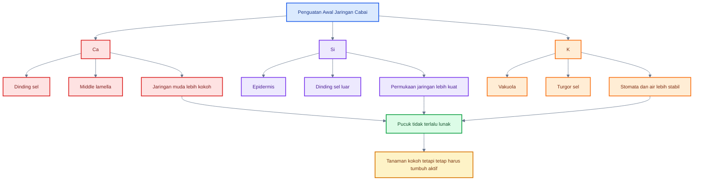

---

# Ringkasan Bab 3–5

$Ca$, $Si$, dan $K$ sama-sama membantu memperkuat tanaman, tetapi dengan mekanisme berbeda.

- $Ca$ memperkuat dinding sel dan middle lamella.
- $Si$ memperkuat permukaan jaringan, epidermis, dan area luar daun.
- $K$ mengatur air, turgor, stomata, dan pengisian buah.

Ketiganya harus digunakan dengan prinsip keseimbangan. $Ca$ berlebihan bisa membuat tanaman tidak seimbang, $Si$ terlalu pekat bisa berisiko fitotoksik, dan $K$ terlalu dominan dapat menekan $Mg$ serta mengganggu efektivitas $Ca$.

Kalimat kunci:

> **Cabai kuat membutuhkan dinding sel yang kokoh, permukaan jaringan yang kuat, dan turgor yang stabil. Tetapi semua itu harus tetap disertai fotosintesis dan pertumbuhan aktif agar tanaman tidak berubah menjadi kaku atau stunting.**

[1]: https://pmc.ncbi.nlm.nih.gov/articles/PMC11748717/?utm_source=chatgpt.com 'Understanding pectin cross-linking in plant cell walls - PMC'
[2]: https://www.sciencedirect.com/science/article/abs/pii/S026087741000419X?utm_source=chatgpt.com 'Calcium effect on mechanical properties of model cell walls ...'
[3]: https://extension.missouri.edu/publications/g9069?utm_source=chatgpt.com 'How Excess Nutrients Can Cause Deficiencies in Crops'
[4]: https://pmc.ncbi.nlm.nih.gov/articles/PMC10332400/?utm_source=chatgpt.com 'Silica deposition in plants: scaffolding the mineralization - PMC'
[5]: https://www.frontiersin.org/journals/plant-science/articles/10.3389/fpls.2017.00411/full?utm_source=chatgpt.com 'Silicon and Plants: Current Knowledge and Technological ...'
[6]: https://pmc.ncbi.nlm.nih.gov/articles/PMC4244855/?utm_source=chatgpt.com 'Regulation of Potassium Transport in Leaves - PMC - NIH'

[**Kembali ke Atas**](#mekanisme-penguatan-jaringan-cabai-dengan-casikmgn)

---

# 6. Peran $Mg$: Inti Klorofil dan Mesin Fotosintesis

Magnesium atau $Mg$ sering dianggap unsur sekunder, padahal dalam praktik budidaya cabai perannya sangat penting. Jika $Ca$ membangun kekuatan dinding sel, $Si$ memperkuat permukaan jaringan, dan $K$ mengatur turgor, maka $Mg$ menjaga agar tanaman tetap punya **energi**.

Tanaman yang hanya “diperkuat” tetapi kekurangan $Mg$ bisa terlihat kaku, lambat, dan tidak produktif. Itu sebabnya program penguatan jaringan tidak boleh melupakan $Mg$.

---

## 6.1 Posisi $Mg$

$Mg$ bekerja terutama pada:

- kloroplas,
- molekul klorofil,
- sistem fotosintesis,
- daun tua,
- daun aktif,
- dan jaringan yang menyuplai energi ke pucuk, akar, bunga, dan buah.

Poin terpenting:

> **$Mg$ adalah inti molekul klorofil.**

Klorofil adalah pigmen utama yang membuat daun tampak hijau dan menangkap energi cahaya untuk fotosintesis. Karena $Mg$ berada di pusat struktur klorofil, kekurangan $Mg$ langsung berpengaruh pada kehijauan daun dan kemampuan fotosintesis tanaman.

Review fisiologi magnesium menjelaskan bahwa $Mg$ merupakan unsur penting dalam molekul klorofil dan berperan dalam banyak proses fisiologis tanaman, termasuk fotosintesis dan metabolisme energi. ([Frontiers][1])

---

## 6.2 Mekanisme kerja $Mg$

Mekanisme kerja $Mg$ dapat dipahami melalui tiga fungsi utama.

### a. Inti klorofil

$Mg$ berada di pusat molekul klorofil. Tanpa $Mg$, pembentukan dan stabilitas klorofil terganggu.

Secara konsep:

$$
Mg
\Rightarrow
\text{klorofil aktif}
\Rightarrow
\text{fotosintesis berjalan}
\Rightarrow
\text{energi pertumbuhan tersedia}
$$

### b. Mendukung fotosintesis

Fotosintesis menghasilkan karbohidrat yang menjadi sumber energi dan bahan baku pertumbuhan. Bila $Mg$ kurang, daun tidak bekerja optimal sebagai “pabrik makanan”.

Dampaknya bukan hanya daun menguning, tetapi:

- pucuk kekurangan energi,
- akar lambat tumbuh,
- bunga kurang kuat,
- buah kurang terisi,
- pemulihan tanaman setelah stres lebih lambat.

### c. Menjaga pertumbuhan tetap berjalan

Dalam artikel ini, $Mg$ penting karena menjadi **penyeimbang program penguatan jaringan**. Ketika petani memperkuat tanaman dengan $Ca$, $Si$, dan $K$, tanaman tetap membutuhkan $Mg$ agar fotosintesis tidak turun.

Kalimat praktis:

> **Tanpa $Mg$, tanaman mungkin tampak “keras”, tetapi kehilangan tenaga untuk tumbuh.**

---

## 6.3 Dampak praktis

Jika $Mg$ cukup, dampak praktis pada cabai adalah:

- daun aktif menghasilkan energi,
- pertumbuhan tidak mudah stagnan,
- akar tetap mendapat suplai hasil fotosintesis,
- bunga dan buah lebih didukung energi,
- tanaman lebih cepat pulih setelah stres,
- program penguatan jaringan tidak berubah menjadi program “pengereman” pertumbuhan.

Dalam konteks penguatan jaringan, $Mg$ bukan unsur pengeras. Ia adalah unsur yang menjaga agar tanaman tetap **hidup aktif**.

| Fungsi $Mg$                      | Dampak Praktis                         |
| -------------------------------- | -------------------------------------- |
| Inti klorofil                    | daun mampu menangkap cahaya            |
| Mendukung fotosintesis           | energi pertumbuhan tersedia            |
| Menjaga daun tua tetap produktif | suplai energi ke pucuk dan buah stabil |
| Mendukung metabolisme            | tanaman tidak mudah stagnan            |

---

## 6.4 Gejala kekurangan $Mg$

Gejala khas kekurangan $Mg$ adalah **klorosis antar tulang daun**, terutama pada daun tua. Ini terjadi karena $Mg$ termasuk unsur yang relatif mobil dalam tanaman, sehingga saat kekurangan, tanaman dapat memindahkan $Mg$ dari daun tua ke bagian yang lebih muda. Akibatnya, daun tua sering menunjukkan gejala lebih dahulu.

Ciri umum kekurangan $Mg$:

- daun tua menguning lebih dulu,
- warna kuning muncul di antara tulang daun,
- tulang daun tetap relatif hijau,
- pola kuning tampak seperti belang atau jaring,
- fotosintesis menurun,
- pertumbuhan melambat.

Penelitian tentang defisiensi magnesium menunjukkan bahwa gejala awal sering berupa klorosis antar tulang daun pada daun bawah/tua, dan defisiensi $Mg$ juga berpengaruh pada pigmen serta parameter fotosintesis. ([PMC][2])

### Tabel pembeda gejala $Mg$

| Gejala                            | Arah Diagnosis                                       |
| --------------------------------- | ---------------------------------------------------- |
| Daun tua kuning antar tulang daun | curiga $Mg$ kurang                                   |
| Tulang daun tetap hijau           | khas klorosis antar tulang                           |
| Pucuk masih relatif hijau         | unsur mobil seperti $Mg$ bisa terlibat               |
| Daun muda kuning lebih dulu       | jangan langsung sebut $Mg$; cek $Fe$, $Mn$, pH, akar |
| Semua daun pucat merata           | bisa $N$ kurang atau akar bermasalah                 |

---

## 6.5 Hubungan $Mg$ dengan $K$ dan $Ca$

Kekurangan $Mg$ di lapangan tidak selalu terjadi karena tanah benar-benar miskin $Mg$. Sering kali masalah muncul karena $Mg$ **kalah bersaing** dengan kation lain, terutama $K$ dan $Ca$.

### a. $K$ tinggi dapat menekan $Mg$

Pada fase generatif, petani sering menaikkan $K$ untuk buah. Ini masuk akal, tetapi jika $K$ terlalu dominan, $Mg$ bisa tertekan. Akibatnya daun tua mulai menunjukkan klorosis antar tulang, fotosintesis turun, dan tanaman tampak kehilangan tenaga.

### b. $Ca$ dominan juga dapat mengganggu $Mg$

$Ca$ penting untuk dinding sel, tetapi jika terlalu dominan, terutama pada kondisi pH tinggi atau aplikasi berlebihan, keseimbangan $Mg$ dapat terganggu. Tanaman bisa tampak lebih kaku, tetapi pertumbuhan tidak sekuat yang diharapkan.

### c. $Mg$ perlu dijaga dalam program `$Ca$–$K$

Program penguatan jaringan yang hanya berfokus pada $Ca$ dan $K$ berisiko mengabaikan $Mg$. Padahal $Mg$ adalah unsur yang menjaga mesin fotosintesis tetap hidup.

Missouri Extension menjelaskan bahwa kelebihan satu unsur dapat mengganggu serapan unsur lain; misalnya kelebihan $K$ dapat menurunkan serapan $Mg$ dan $Ca$. Ini menjadi dasar penting mengapa rasio $K:Mg$ dan $Ca:Mg$ perlu dibaca, bukan hanya nilai pupuk yang diberikan. ([Soil and Plant Pest Center][3])

---

## 6.6 Catatan diagnosis

Saat daun cabai menguning, jangan langsung memberi $N$. Ini kesalahan umum. Daun menguning bisa karena:

- $N$ kurang,
- $Mg$ kurang,
- akar rusak,
- pH tidak sesuai,
- genangan,
- salinitas,
- penyakit akar,
- atau interaksi antagonisme hara.

Untuk membedakan, gunakan tiga pertanyaan:

### Pertanyaan 1: Daun mana yang menguning?

| Posisi Daun | Kemungkinan                     |
| ----------- | ------------------------------- |
| Daun tua    | $N$, $Mg$, atau $K$             |
| Daun muda   | $Fe$, $Mn$, $Ca$, $B$, pH, akar |
| Semua daun  | akar, air, $N$, atau stres umum |

### Pertanyaan 2: Polanya bagaimana?

| Pola Kuning                   | Kemungkinan                           |
| ----------------------------- | ------------------------------------- |
| Kuning merata                 | lebih mengarah ke $N$ atau stres umum |
| Kuning antar tulang daun      | lebih mengarah ke $Mg$ pada daun tua  |
| Daun muda kuning antar tulang | cek $Fe$, $Mn$, pH                    |
| Daun tua terbakar tepi        | bisa $K$, garam, atau stres lain      |

### Pertanyaan 3: Pertumbuhan seperti apa?

| Pertumbuhan                         | Kemungkinan                              |
| ----------------------------------- | ---------------------------------------- |
| Lambat + daun pucat merata          | $N$ kurang atau akar lemah               |
| Daun tua belang + pucuk masih hijau | $Mg$ kurang                              |
| Pucuk hijau gelap + ruas panjang    | $N$ dominan                              |
| Daun kecil + pucuk stagnan          | stunting, cek akar dan keseimbangan hara |

Kalimat praktis:

> **Daun kuning bukan selalu kurang nitrogen. Bila daun tua kuning antar tulang daun, pikirkan $Mg$ lebih dahulu sebelum menambah $N$.**

[**Kembali ke Atas**](#mekanisme-penguatan-jaringan-cabai-dengan-casikmgn)

---

# 7. Peran $N$: Kehijauan, Pertumbuhan Vegetatif, dan Risiko Pucuk Lunak

Nitrogen atau $N$ adalah unsur yang paling cepat terlihat efeknya pada tanaman. Ketika $N$ cukup, daun tampak hijau dan pertumbuhan aktif. Ketika $N$ kurang, tanaman pucat dan lambat. Tetapi ketika $N$ berlebihan, tanaman bisa terlalu lunak, terlalu vegetatif, dan lebih menarik bagi hama pengisap.

Karena itu, $N$ adalah unsur yang harus dikelola dengan sangat hati-hati. Ia bisa menjadi pendorong pertumbuhan, tetapi juga bisa menjadi penyebab pucuk terlalu lunak.

---

## 7.1 Posisi $N$

$N$ berada dalam banyak komponen penting tanaman, antara lain:

- klorofil,
- asam amino,
- protein,
- enzim,
- jaringan vegetatif,
- daun,
- pucuk,
- dan cabang muda.

Berbeda dengan $Ca$ yang sangat struktural, $N$ sangat berkaitan dengan **pertumbuhan aktif**. Tanaman cabai membutuhkan $N$, tetapi tidak boleh didorong terlalu jauh tanpa diimbangi $Ca$, $K$, $Mg$, dan $Si$.

---

## 7.2 Mekanisme kerja $N$

Mekanisme $N$ dapat dijelaskan dalam empat fungsi utama.

### a. Meningkatkan pembentukan klorofil

$N$ merupakan bagian penting dalam pembentukan klorofil. Karena itu, ketika $N$ cukup, daun lebih hijau.

### b. Membentuk asam amino dan protein

Pertumbuhan tanaman membutuhkan protein dan enzim. $N$ adalah unsur utama dalam pembentukan asam amino, protein, dan enzim.

### c. Mendorong pertumbuhan vegetatif

$N$ mendorong pembentukan daun, pucuk, cabang, dan tajuk. Ini berguna pada fase awal, tetapi harus dikendalikan agar tanaman tidak terlalu vegetatif.

### d. Memengaruhi warna daun dan SPAD

Karena terkait klorofil, $N$ sangat memengaruhi nilai SPAD dan warna daun. Namun, ini juga menjadi sumber bias karena $Mg$ juga memengaruhi klorofil.

Secara konsep:

$$
N
\Rightarrow
\text{klorofil}
+
\text{protein}
+
\text{pertumbuhan vegetatif}
\Rightarrow
\text{daun hijau dan pucuk aktif}
$$

Jika berlebihan:

$$
N_{\text{berlebih}}
\Rightarrow
\text{daun hijau gelap}
+
\text{pucuk lunak}
+
\text{ruas panjang}
+
\text{vegetatif berlebih}
$$

---

## 7.3 Kekurangan $N$

Kekurangan $N$ biasanya membuat tanaman terlihat lemah secara umum.

Gejala umum:

- daun pucat,
- warna hijau menurun,
- pertumbuhan lambat,
- tanaman kerdil,
- daun lebih kecil,
- cabang produktif lambat terbentuk,
- produksi terlambat.

Namun, kekurangan $N$ tidak boleh didiagnosis hanya dari warna pucat. Akar rusak, pH tidak sesuai, genangan, dan kekurangan $Mg$ juga bisa membuat daun tampak kurang hijau.

Patokan jaringan daun pepper dari NC State menunjukkan level defisiensi $N$ pada jaringan daun berada di bawah `$2{,}8\%`, dengan rentang kecukupan vegetatif $3{,}5\text{–}5{,}0\%$ dan fruit set $3{,}0\text{–}4{,}0\%$. ([NC State Extension][4])

---

## 7.4 Kelebihan $N$

Kelebihan $N$ adalah masalah besar dalam konteks penguatan jaringan cabai. Tanaman memang tampak hijau dan subur, tetapi jaringannya bisa terlalu lunak.

Gejala umum $N$ berlebih:

- daun hijau gelap,
- daun lebar,
- pucuk lunak,
- ruas panjang,
- tajuk terlalu rimbun,
- tanaman terlalu vegetatif,
- bunga bisa tertunda,
- hama pengisap lebih nyaman pada pucuk.

Pada cabai, daun hijau gelap tidak boleh otomatis dianggap sehat. Jika hijau gelap disertai pucuk lunak dan ruas memanjang, itu tanda $N$ terlalu dominan.

UF/IFAS merangkum penelitian $N$, $P$, dan $K$ pada pepper di Florida dan menyebutkan bahwa konsentrasi $N$ daun sekitar $4\%$ dikaitkan dengan hasil tertinggi dalam beberapa musim penelitian, sedangkan respons hasil terhadap $N$ dapat menurun pada dosis yang terlalu tinggi. Ini menunjukkan bahwa $N$ perlu optimal, bukan maksimal. ([Ask IFAS - Powered by EDIS][5])

---

## 7.5 Bias $N$ terhadap SPAD dan warna daun

SPAD meter membaca kehijauan daun, tetapi tidak memberi tahu penyebab kehijauan itu. Ini sangat penting.

### SPAD tinggi bisa berarti:

- $N$ cukup,
- $Mg$ cukup,
- daun aktif,
- atau $N$ berlebih.

### SPAD rendah bisa berarti:

- $N$ kurang,
- $Mg$ kurang,
- akar rusak,
- pH bermasalah,
- genangan,
- penyakit akar,
- daun tua,
- atau stres umum.

Jadi, SPAD dan warna daun harus dibaca bersama:

- panjang ruas,
- kekokohan pucuk,
- lebar daun,
- posisi daun yang berubah warna,
- pola klorosis,
- kondisi akar,
- dan riwayat pemupukan.

### Matriks interpretasi warna daun

| Kondisi Daun                 | Interpretasi Awal               | Tindakan                               |
| ---------------------------- | ------------------------------- | -------------------------------------- |
| Pucat merata                 | bisa $N$ kurang atau akar lemah | cek akar dan riwayat pupuk             |
| Daun tua kuning antar tulang | curiga $Mg$ kurang              | jangan langsung tambah $N$             |
| Hijau normal + ruas normal   | seimbang                        | lanjutkan pemantauan                   |
| Hijau gelap + pucuk kokoh    | belum tentu masalah             | cek rasio dan pertumbuhan              |
| Hijau gelap + pucuk lunak    | $N$ dominan                     | turunkan $N$, perkuat unsur pengimbang |
| Hijau gelap + ruas panjang   | terlalu vegetatif               | koreksi $N$, cahaya, dan jarak tanam   |

Kalimat penting:

> **SPAD mengukur kehijauan; SPAD tidak membedakan apakah kehijauan itu sehat atau akibat dominasi nitrogen.**

---

## 7.6 Patokan jaringan daun

Untuk keputusan yang lebih akurat, gunakan analisis jaringan daun. NC State memberikan rentang kecukupan jaringan daun bell pepper sebagai berikut: $N$ vegetatif $3{,}5\text{–}5{,}0\%$, fruit set $3{,}0\text{–}4{,}0\%$, dan excess $>5{,}5\%$; data yang sama juga memberi rentang $K$, $Ca$, dan $Mg$ yang akan digunakan dalam bab rasio hara. ([NC State Extension][4])

| Fase      |   Rentang $N$ Jaringan |
| --------- | ---------------------: |
| Vegetatif | $3{,}5\text{–}5{,}0\%$ |
| Fruit set | $3{,}0\text{–}4{,}0\%$ |
| Excess    |             $>5{,}5\%$ |

Interpretasi praktis:

| Nilai $N$ Jaringan        | Makna Praktis                      |
| ------------------------- | ---------------------------------- |
| `<2{,}8\%`                | defisiensi kuat                    |
| `3{,}5–5{,}0\%` vegetatif | cukup                              |
| `3{,}0–4{,}0\%` fruit set | cukup                              |
| `>5{,}5\%`                | excess / risiko vegetatif berlebih |

Jika nilai $N$ tinggi tetapi $K:N$, $Ca:N$, dan $Mg:N$ rendah, tanaman berisiko pucuk lunak. Karena itu, $N$ tidak boleh dibaca sendiri.

---

## Ilustrasi: skala kehijauan akibat $N$

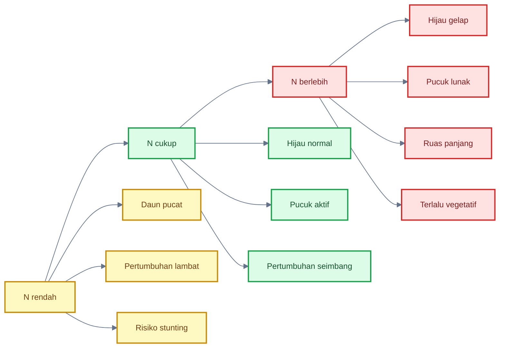

---

## Diagram diagnosis bias $N$ dan $Mg$

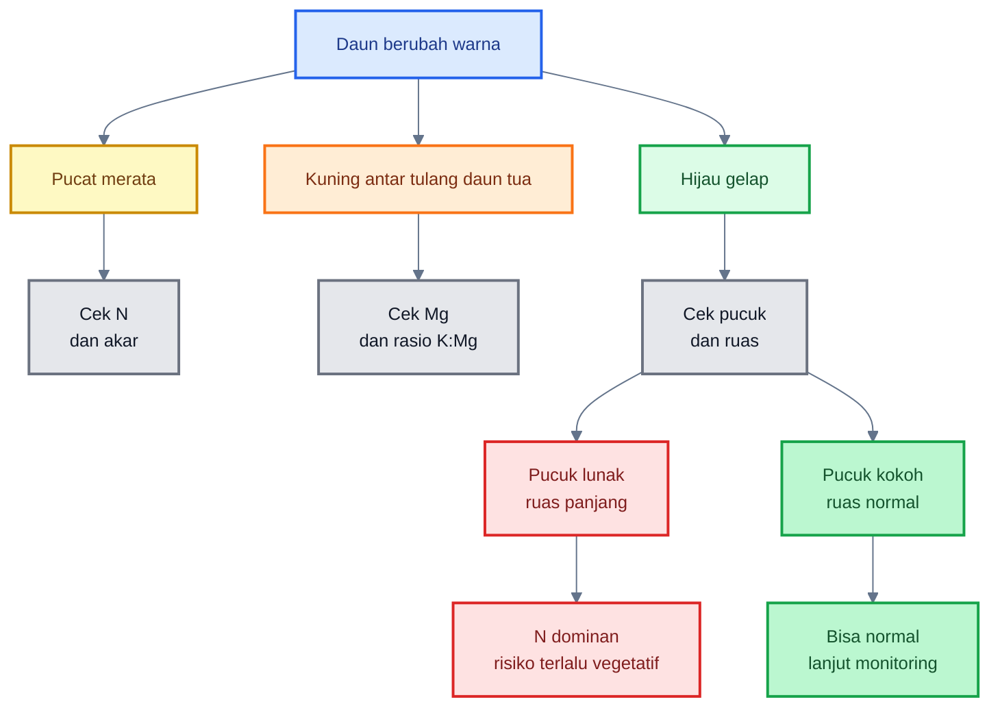

---

# Ringkasan Bab 6–7

$Mg$ dan $N$ sama-sama berpengaruh pada kehijauan daun, tetapi mekanismenya berbeda. $Mg$ adalah inti klorofil dan sangat penting untuk fotosintesis. Kekurangan $Mg$ sering muncul sebagai klorosis antar tulang daun pada daun tua. $N$ mendorong pembentukan klorofil, protein, dan pertumbuhan vegetatif. Kekurangan $N$ membuat tanaman pucat dan lambat, tetapi kelebihan $N$ membuat daun hijau gelap, pucuk lunak, dan tanaman terlalu vegetatif.

Kesalahan diagnosis paling berbahaya adalah melihat daun menguning lalu langsung menambah $N$. Bila gejalanya kuning antar tulang daun pada daun tua, masalah bisa lebih mengarah ke $Mg$, terutama bila sebelumnya $K$ dinaikkan tinggi.

Kalimat kunci:

> **$N$ membuat tanaman hijau dan tumbuh, sedangkan $Mg$ membuat daun mampu bekerja sebagai mesin fotosintesis. Karena keduanya sama-sama memengaruhi kehijauan, diagnosis harus membaca posisi daun, pola klorosis, panjang ruas, kondisi pucuk, akar, dan rasio hara.**

[1]: https://www.frontiersin.org/journals/plant-science/articles/10.3389/fpls.2022.802274/full?utm_source=chatgpt.com 'Physiological Essence of Magnesium in Plants and Its ...'
[2]: https://pmc.ncbi.nlm.nih.gov/articles/PMC6843125/?utm_source=chatgpt.com 'Magnesium-Deficiency Effects on Pigments, Photosynthesis ...'
[3]: https://soillab.tennessee.edu/wp-content/uploads/sites/129/2020/06/scsb394.pdf?utm_source=chatgpt.com 'reference sufficiency ranges for plant analysis in the ...'
[4]: https://content.ces.ncsu.edu/foliar-analysis-for-bell-pepper-production-in-north-carolina-a-guide-for-growers?utm_source=chatgpt.com 'Foliar Analysis for Bell Pepper Production in North Carolina'
[5]: https://ask.ifas.ufl.edu/publication/CV230?utm_source=chatgpt.com 'A Summary of N, P, and K Research with Pepper in Florida'

[**Kembali ke Atas**](#mekanisme-penguatan-jaringan-cabai-dengan-casikmgn)

---

# 8. Sinergi dan Antagonisme `$Ca$–`$K$–`$Mg$–`$N$ serta Peran Pendukung $Si$

Setelah memahami peran masing-masing unsur, bagian berikutnya adalah memahami **interaksi antar unsur**. Ini penting karena di lapangan tanaman tidak membaca pupuk satu per satu. Tanaman membaca **keseimbangan total**.

Satu unsur yang tinggi tidak selalu baik. Bahkan, unsur yang sangat penting sekalipun bisa menjadi masalah bila mendominasi terlalu kuat dan mengganggu unsur lain. Inilah yang disebut **antagonisme hara**.

Pada cabai, antagonisme yang paling penting dalam konteks penguatan jaringan adalah:

- $K$ dengan $Mg$,
- $K$ dengan $Ca$,
- $Ca$ dengan $Mg$,
- dan dominasi $N$ terhadap unsur penguat jaringan.

Materi Bab 8–9 ini mengikuti outline yang telah dikunci, termasuk pembahasan sinergi, antagonisme kation, rasio $K:Ca$, $K:Mg$, $Ca:Mg$, dan catatan bahwa $Si:N$ belum layak dijadikan rasio baku untuk cabai.

---

## 8.1 Sinergi yang diinginkan

Dalam kondisi ideal, $Ca$, $Si$, $K$, $Mg$, dan $N$ bekerja saling melengkapi.

| Unsur | Peran Utama                      | Dampak Praktis                     |
| ----- | -------------------------------- | ---------------------------------- |
| $Ca$  | dinding sel dan middle lamella   | jaringan muda kuat                 |
| $Si$  | epidermis dan permukaan jaringan | permukaan lebih kokoh              |
| $K$   | turgor, stomata, air, buah       | tanaman stabil dan buah berkembang |
| $Mg$  | klorofil dan fotosintesis        | energi pertumbuhan                 |
| $N$   | kehijauan dan vegetatif          | daun dan pucuk aktif               |

Sinergi yang diinginkan bukan berarti semua unsur dinaikkan setinggi mungkin. Sinergi berarti setiap unsur berada pada posisi yang cukup untuk menjalankan fungsinya tanpa menekan unsur lain.

Secara praktis:

- $N$ mendorong pertumbuhan.
- $Ca$ menjaga jaringan baru tidak terlalu lemah.
- $K$ menjaga air dan turgor.
- $Mg$ menjaga mesin fotosintesis.
- $Si$ membantu memperkuat permukaan jaringan.

Jika seimbang, tanaman cabai menjadi:

- hijau normal,
- pucuk aktif tetapi tidak lembek,
- daun cukup tebal tetapi tidak kaku,
- bunga dan buah muda lebih stabil,
- pertumbuhan tetap berjalan,
- dan risiko stunting lebih rendah.

---

## 8.2 Antagonisme kation

Tiga unsur yang perlu mendapat perhatian khusus adalah $K^+$, $Ca^{2+}$, dan $Mg^{2+}$.

Ketiganya adalah kation. Dalam tanah, larutan hara, dan permukaan akar, unsur-unsur ini dapat saling memengaruhi serapan. Jika salah satu terlalu dominan, unsur lain bisa tertekan.

Missouri Extension menjelaskan bahwa ketika satu kation hadir berlebihan, ia dapat mendominasi serapan di permukaan akar dan menggeser kation lain. Contohnya, konsentrasi $K^+$ tinggi dapat mendorong akar lebih memilih menyerap $K^+$ dengan mengorbankan $Mg^{2+}$ atau $Ca^{2+}$; sebaliknya, $Ca^{2+}$ berlebihan dapat mengurangi ketersediaan $K^+$ dan $Mg^{2+}$. ([MU Extension][1])

Jadi, nilai tinggi pada satu unsur tidak otomatis baik. Misalnya:

- $K$ tinggi bagus untuk buah, tetapi bisa menekan $Mg$ dan $Ca$.
- $Ca$ cukup bagus untuk jaringan, tetapi terlalu dominan bisa mengganggu $K$ dan $Mg$.
- $Mg$ cukup bagus untuk fotosintesis, tetapi tetap harus dibaca dalam keseimbangan dengan $K$ dan $Ca$.

Kalimat praktisnya:

> **Dalam penguatan jaringan cabai, keseimbangan kation lebih penting daripada menaikkan satu unsur secara agresif.**

---

## 8.3 Antagonisme $K$ dan $Mg$

Antagonisme $K$ dan $Mg$ sangat sering muncul pada fase generatif. Pada fase ini, petani menaikkan $K$ untuk mendukung buah. Arahnya benar, tetapi jika $K$ terlalu dominan, $Mg$ bisa tertekan.

Akibatnya, tanaman terlihat masih hijau di pucuk, tetapi daun tua mulai menunjukkan gejala:

- kuning antar tulang daun,
- tulang daun tetap relatif hijau,
- daun bawah kehilangan fungsi fotosintesis,
- tanaman lambat mengisi energi,
- produktivitas menurun bertahap.

Kondisi ini sering salah dibaca sebagai kurang nitrogen. Padahal, bila pola kuningnya adalah **antar tulang daun tua**, masalah lebih mengarah ke $Mg$.

Secara konsep:

$$
K_{\text{tinggi}}
\Rightarrow
Mg_{\text{tertekan}}
\Rightarrow
\text{klorofil turun}
\Rightarrow
\text{fotosintesis melemah}
$$

Rasio yang perlu diperhatikan:

$$
R_{K:Mg} =
\frac{C_K}{C_{Mg}}
$$

Jika rasio $K:Mg$ terlalu tinggi, risiko kekurangan $Mg$ meningkat. Inilah alasan $Mg$ harus tetap masuk program penguatan jaringan, bukan hanya $Ca$, $Si$, dan $K$.

---

## 8.4 Antagonisme $Ca$ dan $K$

Antagonisme $Ca$ dan $K$ adalah titik kritis pada cabai, terutama saat tanaman masuk fase generatif.

Mengapa kritis?

Karena $K$ dan $Ca$ sama-sama dibutuhkan, tetapi perannya berbeda:

- $K$ dibutuhkan untuk pengaturan air, stomata, transport fotosintat, dan pengisian buah.
- $Ca$ dibutuhkan untuk dinding sel, middle lamella, pucuk, bunga, dan buah muda.

Masalah muncul ketika $K$ dinaikkan tinggi untuk mengejar buah, tetapi $Ca$ tidak cukup efektif terserap atau terdistribusi. Tanaman bisa tampak subur dan aktif generatif, tetapi jaringan muda tetap lemah.

Situasi yang sering terjadi:

$$
K_{\text{tinggi}}
+
Ca_{\text{relatif rendah}}
+
\text{air tidak stabil}
\Rightarrow
\text{pucuk/buah muda lemah}
$$

Atau:

$$
Ca_{\text{tinggi}}
+
K_{\text{relatif rendah}}
\Rightarrow
\text{tanaman kaku tetapi kurang seimbang}
$$

Pada cabai, ini berbahaya karena petani sering hanya melihat buah dan tajuk, tetapi tidak membaca jaringan muda. Padahal pucuk, bunga, dan buah muda sangat membutuhkan $Ca$.

Kalimat praktis:

> **Kalium mendorong fungsi air dan buah, tetapi kalsium menjaga kekuatan jaringan. Jika $K$ mengejar buah tetapi $Ca$ tertinggal, tanaman bisa produktif secara tampilan namun rapuh pada pucuk dan buah muda.**

---

## 8.5 Dampak praktis antagonisme $Ca$–$K$

| Kondisi                             | Dampak Praktis                    | Risiko                               |
| ----------------------------------- | --------------------------------- | ------------------------------------ |
| $K$ terlalu rendah                  | buah kurang optimal               | produksi tidak maksimal              |
| $K$ terlalu tinggi                  | $Ca$ dan $Mg$ bisa tertekan       | pucuk/buah muda lemah                |
| $Ca$ terlalu rendah                 | dinding sel lemah                 | pucuk, bunga, buah rentan            |
| $Ca$ terlalu tinggi                 | $K$, $Mg$, mikroelement terganggu | tanaman kaku/tidak seimbang          |
| $K$ tinggi + air tidak stabil       | distribusi $Ca$ terganggu         | buah/pucuk rentan masalah fisiologis |
| $Ca$ cukup + $K$ cukup + air stabil | jaringan kuat dan buah berkembang | ideal                                |

Tabel ini penting untuk praktisi karena menjelaskan mengapa menaikkan $K$ saat generatif tidak boleh dilakukan sendirian. Kenaikan $K$ harus diikuti pembacaan:

- kondisi pucuk,
- kekuatan bunga,
- buah muda,
- daun tua,
- gejala $Mg$,
- dan stabilitas air.

---

## 8.6 Antagonisme $Ca$ dan $Mg$

$Ca$ dan $Mg$ sama-sama unsur penting. Tetapi bila $Ca$ terlalu dominan, $Mg$ bisa terganggu. Ini sering terjadi pada kondisi pH tinggi, aplikasi kapur berlebihan, atau penggunaan $Ca$ intensif tanpa memantau $Mg$.

Dampaknya:

- tanaman tampak kaku,
- daun tua bisa mulai menunjukkan gejala $Mg$,
- fotosintesis turun,
- pertumbuhan melambat,
- tanaman terlihat “keras” tetapi tidak bertenaga.

Secara praktis:

$$
Ca_{\text{dominan}}
\Rightarrow
Mg_{\text{tertekan}}
\Rightarrow
\text{fotosintesis turun}
\Rightarrow
\text{pertumbuhan melemah}
$$

Karena itu, program $Ca$ harus selalu dibaca bersama $Mg$. Jangan hanya mengejar kalsium tinggi, terutama bila tanaman mulai kaku, daun tua menguning antar tulang, atau pertumbuhan melambat.

---

## 8.7 Hubungan $N$ dengan unsur penguat

$N$ mendorong pertumbuhan. Itu baik jika seimbang. Masalah muncul jika $N$ tinggi tetapi unsur penguat tidak cukup mengimbanginya.

Jika $N$ tinggi sementara $Ca$, $K$, dan $Mg$ relatif rendah, maka tanaman cenderung:

- hijau gelap,
- pucuk lunak,
- ruas panjang,
- daun terlalu lebar,
- lebih disukai hama pengisap.

Secara konsep:

$$
N_{\text{tinggi}}
+
(Ca,K,Mg)_{\text{relatif rendah}}
\Rightarrow
\text{pucuk lunak}
$$

Sebaliknya, jika $N$ ditekan terlalu lama:

$$
N_{\text{terlalu rendah}}
\Rightarrow
\text{pertumbuhan lambat}
\Rightarrow
\text{stunting}
$$

Jadi $N$ tidak boleh dimusuhi. $N$ harus dikendalikan agar tidak dominan, tetapi tetap cukup untuk pertumbuhan.

---

## 8.8 Prinsip koreksi

Prinsip koreksi lapangan:

1. **Jangan menaikkan $K$ tanpa menjaga $Ca$ dan $Mg$.**
   Ini sangat penting saat generatif.

2. **Jangan menaikkan $Ca$ tanpa membaca $K$, $Mg$, dan pH.**
   Tanaman bisa menjadi kaku dan tidak seimbang.

3. **Jangan menekan $N$ terlalu lama.**
   Koreksi $N$ boleh dilakukan saat tanaman terlalu lunak, tetapi jangan sampai membuat tanaman stunting.

4. **Jangan menaikkan $Si$ pekat saat tanaman sudah stagnan.**
   Jika tanaman stunting, fokus pertama adalah akar, air, pH, $N$ cukup, dan $Mg$.

5. **Baca tanaman sebelum menambah pupuk.**
   Lihat pucuk, daun tua, ruas, akar, dan kondisi buah muda.

---

## Diagram: segitiga antagonisme `$K$–`$Ca$–$Mg$ dengan peran $N$ dan $Si$

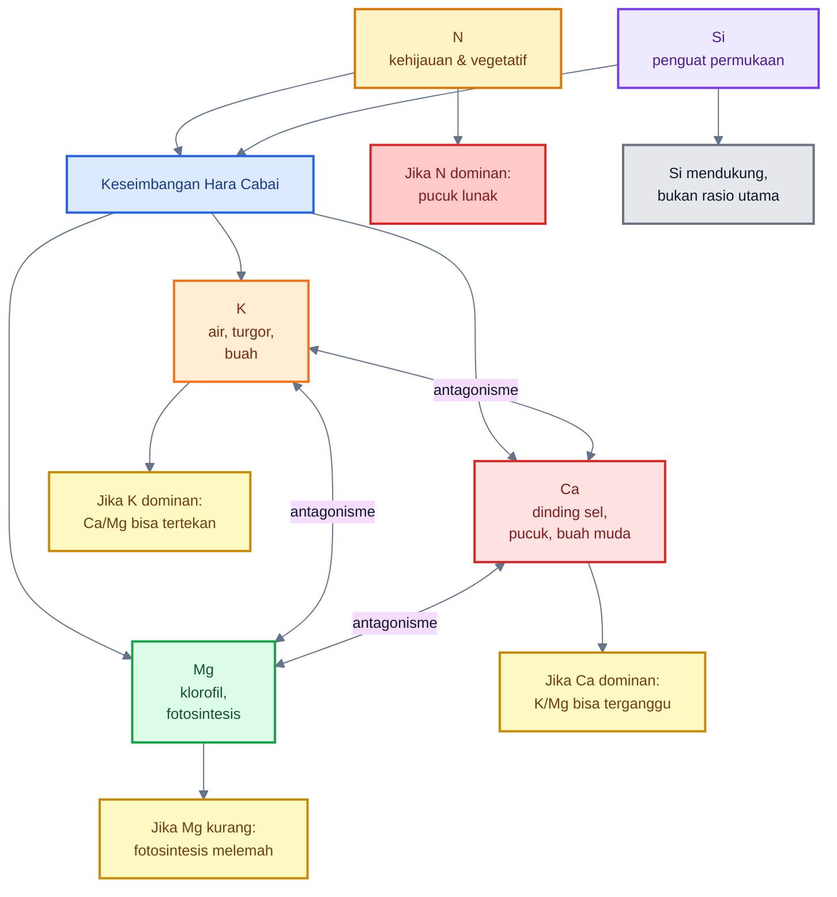

---

# 9. Rasio Hara: Patokan $K:N$, $Ca:N$, $Mg:N$, $K:Ca$, $K:Mg$, dan $Ca:Mg$

Rasio hara diperlukan karena nilai tunggal sering menipu. Daun hijau belum tentu seimbang. $K$ tinggi belum tentu baik. $Ca$ cukup belum tentu sampai ke pucuk. $Mg$ ada belum tentu tidak tertekan.

Rasio membantu praktisi membaca dominasi relatif.

NC State Extension memberikan rentang kecukupan jaringan daun bell pepper, antara lain: $N$ vegetatif $3{,}5\text{–}5{,}0\%$, fruit set $3{,}0\text{–}4{,}0\%$; $K$ early vegetative $3{,}0\text{–}5{,}0\%$, fruit set $3{,}5\text{–}4{,}5\%$; $Ca$ $1{,}5\text{–}2{,}5\%$; dan $Mg$ vegetatif $0{,}3\text{–}0{,}5\%$, fruit set $0{,}4\text{–}0{,}6\%$. Rentang inilah yang menjadi dasar turunan rasio praktis pada artikel ini. ([NC State Extension][2])

---

## 9.1 Mengapa perlu rasio

Rasio diperlukan karena empat alasan.

### 1. Nilai hara tunggal bisa menipu

Misalnya $N = 5{,}2\%$ tampak tinggi. Tetapi pertanyaannya: apakah $K$, $Ca$, dan $Mg$ cukup mengimbangi $N$?

### 2. Daun hijau bisa karena $N$ tinggi

Daun hijau gelap bisa tampak bagus, tetapi jika pucuk lunak dan ruas panjang, itu bisa berarti $N$ terlalu dominan.

### 3. $K$ tinggi bisa menekan $Ca$ atau $Mg$

Pada fase generatif, $K$ sering dinaikkan. Namun, jika terlalu dominan, $Ca$ dan $Mg$ bisa terganggu.

### 4. Rasio membantu melihat arah koreksi

Dengan rasio, koreksi bisa lebih tajam:

- jika $K:N$ rendah → $N$ dominan atau $K$ relatif kurang;
- jika $Ca:N$ rendah → jaringan muda rentan lunak;
- jika $Mg:N$ rendah → fotosintesis bisa tidak seimbang dengan pertumbuhan;
- jika $K:Ca$ tinggi → $K$ dominan terhadap $Ca$;
- jika $K:Mg$ tinggi → $Mg$ berisiko tertekan.

---

## 9.2 Rumus rasio dasar

Gunakan rumus umum:

$$
R_{X:Y} =
\frac{C_X}{C_Y}
$$

Keterangan:

- $R_{X:Y}$ = rasio unsur $X$ terhadap unsur $Y$
- $C_X$ = konsentrasi unsur $X$ pada jaringan daun
- $C_Y$ = konsentrasi unsur $Y$ pada jaringan daun

Contoh:

$$
R_{K:Ca} =
\frac{C_K}{C_{Ca}}
$$

Jika:

$$
C_K = 4{,}0\%
$$

$$
C_{Ca} = 2{,}0\%
$$

Maka:

$$
R_{K:Ca} =
\frac{4{,}0}{2{,}0}
= 2{,}0
$$

Artinya rasio $K:Ca = 2{,}0$, masih berada dalam area seimbang untuk banyak kondisi vegetatif.

---

## 9.3 Rasio terhadap nitrogen

Rasio terhadap $N$ dipakai untuk melihat apakah unsur pengimbang cukup mengikuti dorongan pertumbuhan vegetatif.

$$
R_{K:N} =
\frac{C_K}{C_N}
$$

$$
R_{Ca:N} =
\frac{C_{Ca}}{C_N}
$$

$$
R_{Mg:N} =
\frac{C_{Mg}}{C_N}
$$

Keterangan:

- $R_{K:N}$ = rasio $K$ terhadap $N$
- $R_{Ca:N}$ = rasio $Ca$ terhadap $N$
- $R_{Mg:N}$ = rasio $Mg$ terhadap $N$

Jika $N$ tinggi tetapi rasio ini rendah, tanaman berisiko menjadi terlalu lunak atau tidak seimbang.

---

## 9.4 Target vegetatif

Target praktis fase vegetatif:

$$
K:N \approx 0{,}8\text{–}1{,}2
$$

$$
Ca:N \approx 0{,}35\text{–}0{,}60
$$

$$
Mg:N \approx 0{,}08\text{–}0{,}13
$$

Interpretasi:

| Rasio                     | Makna Praktis                               |
| ------------------------- | ------------------------------------------- |
| $K:N$ rendah              | $N$ dominan atau $K$ kurang                 |
| $Ca:N$ rendah             | jaringan muda berisiko lunak                |
| $Mg:N$ rendah             | fotosintesis kurang mengimbangi pertumbuhan |
| Semua rasio dalam kisaran | pertumbuhan lebih seimbang                  |

Contoh vegetatif:

$$
C_N = 4{,}5\%
$$

$$
C_K = 4{,}0\%
$$

$$
C_{Ca} = 2{,}0\%
$$

$$
C_{Mg} = 0{,}45\%
$$

Maka:

$$
K:N =
\frac{4{,}0}{4{,}5}
= 0{,}89
$$

$$
Ca:N =
\frac{2{,}0}{4{,}5}
= 0{,}44
$$

$$
Mg:N =
\frac{0{,}45}{4{,}5}
= 0{,}10
$$

Interpretasi: masih cukup seimbang untuk vegetatif.

---

## 9.5 Target generatif

Pada fase generatif, $K$ relatif naik karena buah membutuhkan transport fotosintat, pengaturan air, dan pengisian. Namun $Ca$ dan $Mg$ tetap harus dijaga.

Target praktis:

$$
K:N \approx 1{,}0\text{–}1{,}4
$$

$$
Ca:N \approx 0{,}45\text{–}0{,}75
$$

$$
Mg:N \approx 0{,}10\text{–}0{,}18
$$

Interpretasi:

| Rasio                                        | Makna Praktis                         |
| -------------------------------------------- | ------------------------------------- |
| $K:N$ naik moderat                           | wajar saat buah aktif                 |
| $Ca:N$ tetap cukup                           | penting untuk buah muda dan jaringan  |
| $Mg:N$ tetap cukup                           | daun tetap produktif                  |
| $K:N$ tinggi tetapi $Ca:N$ dan $Mg:N$ rendah | risiko antagonisme dan jaringan lemah |

---

## 9.6 Rasio $K:Ca$

Rasio $K:Ca$ penting untuk membaca konflik antara buah dan jaringan muda.

Rumus:

$$
R_{K:Ca} =
\frac{C_K}{C_{Ca}}
$$

Target praktis:

$$
K:Ca \approx 1{,}5\text{–}2{,}5
\quad \text{vegetatif}
$$

$$
K:Ca \approx 1{,}5\text{–}3{,}0
\quad \text{generatif}
$$

Interpretasi:

| Rasio $K:Ca$  | Interpretasi                         |
| ------------- | ------------------------------------ |
| `<1{,}2`      | $K$ relatif rendah atau $Ca$ dominan |
| `1{,}5–2{,}5` | seimbang vegetatif                   |
| `1{,}5–3{,}0` | masih wajar generatif                |
| `>3{,}0`      | $K$ dominan, cek $Ca$                |
| `>3{,}5`      | waspada antagonisme kuat             |

Contoh risiko:

$$
C_K = 4{,}8\%
$$

$$
C_{Ca} = 1{,}3\%
$$

Maka:

$$
K:Ca =
\frac{4{,}8}{1{,}3}
= 3{,}69
$$

Interpretasi: $K$ dominan kuat terhadap $Ca$. Cek pucuk, buah muda, stabilitas air, dan program $Ca$.

---

## 9.7 Rasio $K:Mg$

Rasio $K:Mg$ penting untuk membaca risiko magnesium tertekan.

Rumus:

$$
R_{K:Mg} =
\frac{C_K}{C_{Mg}}
$$

Target praktis:

$$
K:Mg \approx 8\text{–}12
\quad \text{vegetatif}
$$

Jika terlalu tinggi, risiko $Mg$ tertekan meningkat.

Contoh:

$$
C_K = 4{,}5\%
$$

$$
C_{Mg} = 0{,}30\%
$$

Maka:

$$
K:Mg =
\frac{4{,}5}{0{,}30}
= 15
$$

Interpretasi: $K:Mg$ tinggi. Jika daun tua mulai klorosis antar tulang, curiga $Mg$ tertekan oleh dominasi $K$.

---

## 9.8 Rasio $Ca:Mg$

Rasio $Ca:Mg$ membantu membaca apakah $Ca$ terlalu dominan terhadap $Mg$.

Rumus:

$$
R_{Ca:Mg} =
\frac{C_{Ca}}{C_{Mg}}
$$

Target praktis:

$$
Ca:Mg \approx 4\text{–}6
\quad \text{vegetatif}
$$

Jika terlalu tinggi, $Mg$ bisa tertekan.

Contoh:

$$
C_{Ca} = 2{,}4\%
$$

$$
C_{Mg} = 0{,}30\%
$$

Maka:

$$
Ca:Mg =
\frac{2{,}4}{0{,}30}
= 8
$$

Interpretasi: $Ca$ dominan terhadap $Mg$. Jika tanaman tampak kaku dan daun tua mulai menguning antar tulang, evaluasi $Mg$, pH, dan aplikasi $Ca$.

---

## 9.9 Catatan tentang $Si:N$

Untuk $Si$, posisinya berbeda.

Belum ada standar kuat untuk rasio $Si:N$ pada cabai yang bisa dipakai sebagai SOP umum. Silicon bukan unsur esensial klasik seperti $N$, $K$, $Ca$, dan $Mg$, sehingga banyak pedoman analisis jaringan tanaman tidak memasukkan $Si$ dalam rentang kecukupan standar.

Karena itu:

- $Si$ dipakai berdasarkan label produk,
- dosis dimulai dari batas aman,
- respons tanaman diamati,
- jangan dipakai sebagai rasio wajib,
- jangan menggantikan analisis $N-K-Ca-Mg$.

Kalimat praktis:

> **$Si$ penting sebagai pendukung penguatan jaringan, tetapi rasio utama untuk keputusan hara cabai tetap berbasis $N$, $K$, $Ca$, dan $Mg$.**

---

## Diagram: alur penggunaan rasio hara

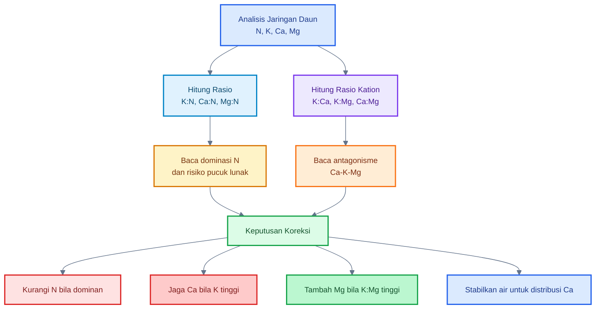

---

# Ringkasan Bab 8–9

Sinergi hara terjadi ketika $N$ mendorong pertumbuhan, $Ca$ memperkuat dinding sel, $Si$ mendukung permukaan jaringan, $K$ mengatur air dan buah, serta $Mg$ menjaga fotosintesis. Namun, keseimbangan ini mudah terganggu oleh antagonisme kation.

Antagonisme paling penting pada cabai adalah $K$ terhadap $Mg$, $K$ terhadap $Ca$, dan $Ca$ terhadap $Mg$. Pada fase generatif, $K$ memang perlu naik, tetapi tidak boleh menekan $Ca$ dan $Mg$. Rasio seperti $K:N$, $Ca:N$, $Mg:N$, $K:Ca$, $K:Mg$, dan $Ca:Mg$ membantu praktisi membaca dominasi relatif, bukan hanya melihat satu angka hara.

Kalimat kunci:

> **Cabai yang kuat bukan cabai dengan satu unsur tinggi, tetapi cabai dengan rasio hara yang seimbang: $N$ cukup untuk tumbuh, $Ca$ cukup untuk jaringan, $K$ cukup untuk air dan buah, $Mg$ cukup untuk fotosintesis, dan $Si$ mendukung permukaan tanpa dipaksakan menjadi rasio baku.**

[1]: https://extension.missouri.edu/publications/g9069?utm_source=chatgpt.com 'How Excess Nutrients Can Cause Deficiencies in Crops'
[2]: https://content.ces.ncsu.edu/foliar-analysis-for-bell-pepper-production-in-north-carolina-a-guide-for-growers?utm_source=chatgpt.com 'Foliar Analysis for Bell Pepper Production in North Carolina'

[**Kembali ke Atas**](#mekanisme-penguatan-jaringan-cabai-dengan-casikmgn)

---

# 10. Model Matematis Indeks Keseimbangan Jaringan

Model matematis dalam artikel ini bukan dibuat untuk menggantikan pengalaman lapangan. Model ini dibuat sebagai **alat bantu keputusan** agar praktisi tidak hanya mengandalkan warna daun, rasa “terlalu subur”, atau kesan visual yang mudah bias.

Dalam budidaya cabai, bias visual sering terjadi:

- daun hijau gelap dianggap sehat, padahal bisa karena $N$ dominan;
- daun pucat langsung dianggap kurang $N$, padahal bisa karena $Mg$, akar, pH, atau air;
- tanaman pendek dianggap kuat, padahal bisa stunting;
- $K$ dinaikkan untuk buah, tetapi $Ca$ dan $Mg$ justru tertekan.

Model ini membantu membaca tiga hal:

1. **keseimbangan jaringan**,
2. **risiko pucuk lunak**,
3. **risiko stunting**,
4. **ketidakseimbangan kation**, terutama $K:Ca$, $K:Mg$, dan $Ca:Mg$.

---

## 10.1 Tujuan model

Tujuan model ini adalah membuat keputusan lapangan lebih tajam.

Model digunakan untuk:

- membantu keputusan koreksi hara,
- mengurangi bias visual dari warna daun,
- membaca risiko pucuk lunak akibat $N$ dominan,
- membaca risiko stunting akibat hara terlalu ditekan,
- memasukkan antagonisme `$Ca$–$K$, `$K$–$Mg$, dan `$Ca$–$Mg$.

Model ini paling baik digunakan bila ada data analisis jaringan daun.

Data minimal yang dibutuhkan:

$$
C_N =
\text{konsentrasi nitrogen jaringan daun}
$$

$$
C_K =
\text{konsentrasi kalium jaringan daun}
$$

$$
C_{Ca} =
\text{konsentrasi kalsium jaringan daun}
$$

$$
C_{Mg} =
\text{konsentrasi magnesium jaringan daun}
$$

Semua nilai dinyatakan dalam persen berat kering jaringan daun.

Contoh:

$$
C_N = 4{,}5\%
$$

$$
C_K = 4{,}0\%
$$

$$
C_{Ca} = 2{,}0\%
$$

$$
C_{Mg} = 0{,}45\%
$$

Jika belum ada analisis jaringan, model ini tetap bisa dipakai sebagai **kerangka berpikir**, tetapi tidak boleh dihitung secara presisi.

---

## 10.2 Indeks Keseimbangan Jaringan

Indeks Keseimbangan Jaringan atau $IBJ$ digunakan untuk melihat seberapa dekat rasio hara tanaman dengan target rasio yang diinginkan.

Langkah pertama adalah menghitung rasio:

$$
R_{K:N} =
\frac{C_K}{C_N}
$$

$$
R_{Ca:N} =
\frac{C_{Ca}}{C_N}
$$

$$
R_{Mg:N} =
\frac{C_{Mg}}{C_N}
$$

Lalu bandingkan dengan target tengah.

Untuk fase vegetatif, target tengah praktis bisa digunakan:

$$
T_{K:N} = 1{,}0
$$

$$
T_{Ca:N} = 0{,}475
$$

$$
T_{Mg:N} = 0{,}105
$$

Nilai ini berasal dari titik tengah kisaran praktis:

$$
K:N \approx 0{,}8\text{–}1{,}2
$$

$$
Ca:N \approx 0{,}35\text{–}0{,}60
$$

$$
Mg:N \approx 0{,}08\text{–}0{,}13
$$

Kemudian hitung deviasi relatif:

$$
D_{K:N} =
\left|
\frac{R_{K:N} - T_{K:N}}{T_{K:N}}
\right|
$$

$$
D_{Ca:N} =
\left|
\frac{R_{Ca:N} - T_{Ca:N}}{T_{Ca:N}}
\right|
$$

$$
D_{Mg:N} =
\left|
\frac{R_{Mg:N} - T_{Mg:N}}{T_{Mg:N}}
\right|
$$

Setelah itu, hitung indeks:

$$
IBJ =
100 -
\left[
w_K D_{K:N}
+
w_{Ca} D_{Ca:N}
+
w_{Mg} D_{Mg:N}
\right]
\times 100
$$

Keterangan:

- $IBJ$ = Indeks Keseimbangan Jaringan
- $D_{K:N}$ = deviasi rasio $K:N$
- $D_{Ca:N}$ = deviasi rasio $Ca:N$
- $D_{Mg:N}$ = deviasi rasio $Mg:N$
- $w_K$ = bobot kalium
- $w_{Ca}$ = bobot kalsium
- $w_{Mg}$ = bobot magnesium

Bobot awal yang bisa digunakan:

$$
w_K = 0{,}35
$$

$$
w_{Ca} = 0{,}40
$$

$$
w_{Mg} = 0{,}25
$$

Bobot $Ca$ dibuat sedikit lebih tinggi karena artikel ini fokus pada penguatan jaringan muda dan pucuk.

### Interpretasi $IBJ$

| Nilai $IBJ$    | Status                         |
| -------------- | ------------------------------ |
| $>85$          | sangat seimbang                |
| $70\text{–}85$ | cukup seimbang                 |
| $55\text{–}70$ | perlu koreksi ringan           |
| $<55$          | tidak seimbang, perlu evaluasi |

Contoh:

$$
C_N = 4{,}5\%
$$

$$
C_K = 4{,}0\%
$$

$$
C_{Ca} = 2{,}0\%
$$

$$
C_{Mg} = 0{,}45\%
$$

Hitung rasio:

$$
R_{K:N} =
\frac{4{,}0}{4{,}5}
=
0{,}89
$$

$$
R_{Ca:N} =
\frac{2{,}0}{4{,}5}
=
0{,}44
$$

$$
R_{Mg:N} =
\frac{0{,}45}{4{,}5}
=
0{,}10
$$

Interpretasi cepat:

- $K:N = 0{,}89$ masih dalam kisaran vegetatif,
- $Ca:N = 0{,}44$ masih cukup,
- $Mg:N = 0{,}10$ masih baik.

Artinya, kondisi relatif seimbang.

---

## 10.3 Indeks Risiko Pucuk Lunak

Indeks Risiko Pucuk Lunak atau $IRPL$ digunakan untuk membaca risiko tanaman menjadi terlalu lunak akibat dominasi $N$ dan rendahnya unsur pengimbang.

Faktor risiko utama:

- $N$ tinggi,
- $K:N$ rendah,
- $Ca:N$ rendah,
- $Mg:N$ rendah,
- pucuk lunak,
- ruas panjang,
- daun terlalu hijau gelap.

Rumus umum:

$$
IRPL =
aN_s
+
bK_s
+
cCa_s
+
dMg_s
$$

Keterangan:

- $IRPL$ = Indeks Risiko Pucuk Lunak
- $N_s$ = skor kelebihan $N$
- $K_s$ = skor kekurangan relatif $K:N$
- $Ca_s$ = skor kekurangan relatif $Ca:N$
- $Mg_s$ = skor kekurangan relatif $Mg:N$
- $a$, $b$, $c$, $d$ = bobot faktor

Skor kelebihan $N$:

$$
N_s =
\max
\left(
0,
\frac{C_N - N_{\max}}{N_{\max}}
\right)
$$

Untuk fase vegetatif:

$$
N_{\max} = 5{,}0
$$

Skor kekurangan relatif rasio:

$$
K_s =
\max
\left(
0,
\frac{K_{\min} - R_{K:N}}{K_{\min}}
\right)
$$

$$
Ca_s =
\max
\left(
0,
\frac{Ca_{\min} - R_{Ca:N}}{Ca_{\min}}
\right)
$$

$$
Mg_s =
\max
\left(
0,
\frac{Mg_{\min} - R_{Mg:N}}{Mg_{\min}}
\right)
$$

Untuk fase vegetatif:

$$
K_{\min} = 0{,}8
$$

$$
Ca_{\min} = 0{,}35
$$

$$
Mg_{\min} = 0{,}08
$$

Bobot awal:

$$
a = 0{,}40
$$

$$
b = 0{,}25
$$

$$
c = 0{,}25
$$

$$
d = 0{,}10
$$

Bobot $N$ dibuat paling besar karena pucuk lunak umumnya sangat dipengaruhi dominasi nitrogen.

### Interpretasi $IRPL$

| Nilai $IRPL$           | Risiko Pucuk Lunak |
| ---------------------- | ------------------ |
| $0\text{–}0{,}10$      | rendah             |
| $0{,}10\text{–}0{,}25$ | sedang             |
| $>0{,}25$              | tinggi             |

Jika $IRPL$ tinggi, koreksi awal:

- turunkan $N$ sementara,
- hentikan pupuk daun tinggi $N$,
- perkuat $Ca$, $K$, dan $Mg$,
- gunakan $Si$ sesuai label sebagai pendukung,
- tingkatkan monitoring hama pengisap.

---

## 10.4 Indeks Risiko Stunting

Indeks Risiko Stunting atau $IRS$ digunakan untuk membaca risiko tanaman terlalu ditekan sehingga pertumbuhan berhenti atau sangat lambat.

Faktor risiko utama:

- $N$ terlalu rendah,
- $Mg$ rendah,
- $K$ rendah,
- ketidakseimbangan kation,
- akar lemah,
- air tidak stabil,
- pertumbuhan stagnan.

Rumus umum:

$$
IRS =
pN_d
+
qK_d
+
rMg_d
+
sB_c
$$

Keterangan:

- $IRS$ = Indeks Risiko Stunting
- $N_d$ = skor defisiensi nitrogen
- $K_d$ = skor defisiensi kalium
- $Mg_d$ = skor defisiensi magnesium
- $B_c$ = skor ketidakseimbangan kation
- $p$, $q$, $r$, $s$ = bobot faktor

Rumus defisiensi:

$$
N_d =
\max
\left(
0,
\frac{N_{\min} - C_N}{N_{\min}}
\right)
$$

$$
K_d =
\max
\left(
0,
\frac{K_{\min,j} - C_K}{K_{\min,j}}
\right)
$$

$$
Mg_d =
\max
\left(
0,
\frac{Mg_{\min,j} - C_{Mg}}{Mg_{\min,j}}
\right)
$$

Untuk fase vegetatif:

$$
N_{\min} = 3{,}5
$$

$$
K_{\min,j} = 3{,}0
$$

$$
Mg_{\min,j} = 0{,}3
$$

Bobot awal:

$$
p = 0{,}35
$$

$$
q = 0{,}20
$$

$$
r = 0{,}25
$$

$$
s = 0{,}20
$$

Interpretasi:

| Nilai $IRS$            | Risiko Stunting |
| ---------------------- | --------------- |
| $0\text{–}0{,}10$      | rendah          |
| $0{,}10\text{–}0{,}25$ | sedang          |
| $>0{,}25$              | tinggi          |

Jika $IRS$ tinggi, jangan lanjutkan program “pengerasan”. Fokus pada pemulihan:

- cek akar,
- cek air,
- cek pH,
- pulihkan $N$ bila terlalu rendah,
- berikan $Mg$ bila gejala mendukung,
- hentikan sementara silika pekat,
- hindari menaikkan $Ca$ tanpa diagnosis.

---

## 10.5 Skor ketidakseimbangan $K:Ca$

Rasio $K:Ca$ penting karena konflik $K$ dan $Ca$ sangat relevan pada cabai, terutama fase generatif.

Rumus:

$$
R_{K:Ca} =
\frac{C_K}{C_{Ca}}
$$

Dominasi $K$ terhadap $Ca$ dihitung dengan:

$$
B_{KCa} =
\max
\left(
0,
\frac{R_{K:Ca} - 3{,}0}{3{,}0}
\right)
$$

Artinya, bila $K:Ca$ masih di bawah atau sama dengan $3{,}0$, skor dominasi $K$ dianggap nol. Jika melewati $3{,}0$, risiko mulai dihitung.

Dominasi $Ca$ terhadap $K$ dihitung dengan:

$$
B_{CaK} =
\max
\left(
0,
\frac{1{,}2 - R_{K:Ca}}{1{,}2}
\right)
$$

Artinya, bila $K:Ca$ lebih rendah dari $1{,}2$, $Ca$ dianggap terlalu dominan atau $K$ terlalu rendah.

### Contoh 1: $K$ dominan terhadap $Ca$

$$
C_K = 4{,}8\%
$$

$$
C_{Ca} = 1{,}3\%
$$

$$
R_{K:Ca} =
\frac{4{,}8}{1{,}3}
=
3{,}69
$$

$$
B_{KCa} =
\max
\left(
0,
\frac{3{,}69 - 3{,}0}{3{,}0}
\right)
=
0{,}23
$$

Interpretasi: $K$ dominan terhadap $Ca$. Cek pucuk, bunga, buah muda, dan stabilitas air.

### Contoh 2: $Ca$ dominan terhadap $K$

$$
C_K = 2{,}2\%
$$

$$
C_{Ca} = 2{,}4\%
$$

$$
R_{K:Ca} =
\frac{2{,}2}{2{,}4}
=
0{,}92
$$

$$
B_{CaK} =
\max
\left(
0,
\frac{1{,}2 - 0{,}92}{1{,}2}
\right)
=
0{,}23
$$

Interpretasi: $K$ relatif rendah atau $Ca$ terlalu dominan. Cek buah, turgor, dan pertumbuhan.

---

## 10.6 Skor ketidakseimbangan kation total

Ketidakseimbangan kation tidak cukup hanya membaca $K:Ca$. Harus juga membaca $K:Mg$ dan $Ca:Mg$.

Rasio yang digunakan:

$$
R_{K:Mg} =
\frac{C_K}{C_{Mg}}
$$

$$
R_{Ca:Mg} =
\frac{C_{Ca}}{C_{Mg}}
$$

Skor ketidakseimbangan kation total:

$$
B_c =
B_{KCa}
+
B_{CaK}
+
\max
\left(
0,
\frac{R_{K:Mg} - 12}{12}
\right)
+
\max
\left(
0,
\frac{R_{Ca:Mg} - 6}{6}
\right)
$$

Keterangan:

- $B_c$ = skor ketidakseimbangan kation total
- $B_{KCa}$ = skor dominasi $K$ terhadap $Ca$
- $B_{CaK}$ = skor dominasi $Ca$ terhadap $K$
- $R_{K:Mg}$ = rasio $K$ terhadap $Mg$
- $R_{Ca:Mg}$ = rasio $Ca$ terhadap $Mg$

Interpretasi:

| Nilai $B_c$            | Status |
| ---------------------- | ------ |
| $0\text{–}0{,}10$      | rendah |
| $0{,}10\text{–}0{,}25$ | sedang |
| $>0{,}25$              | tinggi |

Jika $B_c$ tinggi, artinya masalah bukan sekadar satu unsur kurang. Masalahnya adalah **ketidakseimbangan kation**. Koreksi harus hati-hati.

---

## 10.7 Interpretasi indeks

Model ini menghasilkan beberapa angka:

| Indeks | Fungsi                              |
| ------ | ----------------------------------- |
| $IBJ$  | membaca keseimbangan rasio jaringan |
| $IRPL$ | membaca risiko pucuk lunak          |
| $IRS$  | membaca risiko stunting             |
| $B_c$  | membaca ketidakseimbangan kation    |

Interpretasi umum:

| Nilai                  | Status |
| ---------------------- | ------ |
| $0\text{–}0{,}10$      | rendah |
| $0{,}10\text{–}0{,}25$ | sedang |
| $>0{,}25$              | tinggi |

Untuk $IBJ$, interpretasinya berbeda karena berbentuk skor 0–100:

| Nilai $IBJ$    | Status               |
| -------------- | -------------------- |
| $>85$          | sangat seimbang      |
| $70\text{–}85$ | cukup seimbang       |
| $55\text{–}70$ | perlu koreksi ringan |
| $<55$          | tidak seimbang       |

---

## 10.8 Matriks keputusan praktis

| Kondisi Model                               | Makna                      | Keputusan                                                |
| ------------------------------------------- | -------------------------- | -------------------------------------------------------- |
| $IBJ > 85$, $IRPL < 0{,}10$, $IRS < 0{,}10$ | seimbang                   | lanjut program normal                                    |
| $IRPL > 0{,}25$                             | risiko pucuk lunak tinggi  | kurangi $N$, perkuat $Ca-K-Mg$, tambah $Si$ sesuai label |
| $IRS > 0{,}25$                              | risiko stunting tinggi     | hentikan pengerasan, pulihkan akar dan pertumbuhan       |
| $B_c > 0{,}25$                              | antagonisme kation tinggi  | cek $K:Ca$, $K:Mg$, $Ca:Mg$ sebelum koreksi              |
| $K:Ca > 3{,}0$                              | $K$ dominan                | jaga $Ca$, stabilkan air, cek buah muda                  |
| $K:Mg > 12$                                 | $Mg$ berisiko tertekan     | kurangi dominasi $K$, beri $Mg$                          |
| $Ca:Mg > 6$                                 | $Ca$ dominan terhadap $Mg$ | cek pH, beri $Mg$ bila gejala mendukung                  |

---

## 10.9 Contoh kasus lengkap

Misal hasil analisis jaringan fase vegetatif:

$$
C_N = 5{,}4\%
$$

$$
C_K = 3{,}4\%
$$

$$
C_{Ca} = 1{,}5\%
$$

$$
C_{Mg} = 0{,}32\%
$$

Hitung rasio terhadap $N$:

$$
R_{K:N} =
\frac{3{,}4}{5{,}4}
=
0{,}63
$$

$$
R_{Ca:N} =
\frac{1{,}5}{5{,}4}
=
0{,}28
$$

$$
R_{Mg:N} =
\frac{0{,}32}{5{,}4}
=
0{,}059
$$

Interpretasi awal:

- $N$ tinggi,
- $K:N$ rendah,
- $Ca:N$ rendah,
- $Mg:N$ rendah.

Tanaman berisiko tinggi pucuk lunak.

Hitung rasio kation:

$$
R_{K:Ca} =
\frac{3{,}4}{1{,}5}
=
2{,}27
$$

$$
R_{K:Mg} =
\frac{3{,}4}{0{,}32}
=
10{,}63
$$

$$
R_{Ca:Mg} =
\frac{1{,}5}{0{,}32}
=
4{,}69
$$

Interpretasi:

- $K:Ca$ masih tidak ekstrem,
- $K:Mg$ masih dalam batas praktis,
- $Ca:Mg$ masih wajar,
- masalah utama bukan antagonisme kation ekstrem, tetapi $N$ terlalu dominan terhadap unsur pengimbang.

Keputusan:

- turunkan $N$ sementara,
- hentikan pupuk daun tinggi $N$,
- perkuat $Ca$ ringan-rutin,
- berikan $MgSO_4$ bila gejala mendukung,
- jaga $K$ agar tidak terlalu rendah,
- gunakan $Si$ sesuai label,
- tingkatkan monitoring thrips, aphid, dan kutu kebul.

---

## Diagram: data jaringan → rasio → indeks → keputusan koreksi

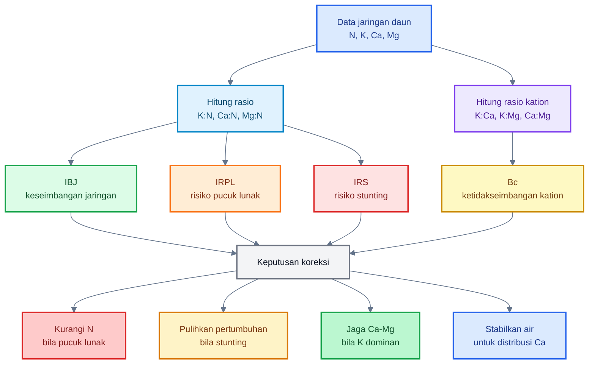

---

# Ringkasan Bab 10

Model matematis ini membantu praktisi membaca keseimbangan hara secara lebih objektif. $IBJ$ digunakan untuk menilai keseimbangan jaringan, $IRPL$ untuk membaca risiko pucuk lunak, $IRS$ untuk membaca risiko stunting, dan $B_c$ untuk membaca ketidakseimbangan kation.

Model ini tidak menggantikan observasi lapangan. Angka harus tetap dibaca bersama kondisi pucuk, warna daun, panjang ruas, akar, air, pH, dan tekanan OPT. Namun, model ini membantu mencegah dua kesalahan besar: tanaman terlalu lunak karena $N$ dominan, dan tanaman stunting karena program penguatan dilakukan berlebihan.

Kalimat kunci:

> **Model matematis bukan untuk membuat keputusan menjadi kaku, tetapi untuk membuat keputusan lapangan lebih jernih: kapan $N$ harus dikurangi, kapan pertumbuhan harus dipulihkan, dan kapan antagonisme $Ca-K-Mg$ harus dikoreksi sebelum tanaman kehilangan produktivitas.**

[**Kembali ke Atas**](#mekanisme-penguatan-jaringan-cabai-dengan-casikmgn)

---

# 11. Efek Stunting pada Cabai

Stunting pada cabai adalah kondisi ketika tanaman **tertahan pertumbuhannya secara tidak normal**. Tanaman pendek tidak otomatis stunting. Cabai yang pendek tetapi proporsional, akar putih banyak, daun hijau segar, dan pucuk tetap aktif masih bisa disebut **kompak sehat**. Yang menjadi masalah adalah ketika tanaman pendek disertai pucuk stagnan, daun muda mengecil, akar tidak aktif, dan laju tumbuh melambat.

Dalam konteks artikel ini, stunting dibahas sebagai risiko dari program penguatan jaringan yang salah arah: tanaman dibuat “keras”, tetapi pertumbuhan, fotosintesis, dan akar ikut tertekan. Materi Bab 11–12 mengikuti outline terkunci yang memuat definisi stunting, penyebab akibat salah program, mekanisme fisiologis, pembeda tanaman kompak vs stunting, serta ukuran lapangan seperti SPAD, indeks lebar daun, indeks ruas pucuk, rasio tinggi tanaman, dan laju tumbuh 7 hari.

---

## 11.1 Definisi stunting praktis

Secara praktis, stunting pada cabai dapat dikenali dari kombinasi beberapa gejala berikut:

- tanaman pendek tidak normal,
- pucuk stagnan,
- daun muda kecil,
- daun kaku atau pucat,
- akar sedikit atau coklat,
- pertumbuhan generatif terlambat.

Poin pentingnya: **jangan menilai stunting hanya dari tinggi tanaman**. Ada varietas cabai yang memang cenderung pendek-kompak. Ada juga tanaman yang pendek karena jarak tanam, intensitas cahaya, atau fase pertumbuhan. Stunting baru kuat dicurigai bila pendeknya tanaman disertai tanda pertumbuhan berhenti.

### Ciri utama stunting

| Parameter      | Gejala Stunting                               |
| -------------- | --------------------------------------------- |
| Tinggi tanaman | jauh tertinggal dari tanaman normal satu blok |
| Pucuk          | tidak aktif, daun baru lambat muncul          |
| Daun muda      | kecil, kaku, pucat, atau tidak membuka normal |
| Daun tua       | bisa menguning, tergantung penyebab           |
| Akar           | sedikit, coklat, tidak banyak akar putih      |
| Laju tumbuh    | sangat lambat atau hampir berhenti            |
| Fase generatif | bunga lambat, cabang produktif sedikit        |

Kalimat praktis:

> **Stunting bukan sekadar tanaman pendek. Stunting adalah tanaman yang kehilangan momentum pertumbuhan.**

---

## 11.2 Penyebab stunting akibat salah program

Stunting bisa disebabkan banyak faktor, seperti penyakit akar, genangan, pH tidak sesuai, salinitas, varietas, atau serangan virus. Namun dalam konteks artikel ini, fokusnya adalah stunting yang muncul karena **program penguatan jaringan yang salah**.

Penyebab yang sering terjadi:

- $N$ ditekan terlalu lama,
- $Si$ terlalu pekat,
- $Ca$ terlalu dominan,
- $K$ terlalu tinggi hingga menekan $Mg$,
- $Mg$ kurang,
- air tidak stabil,
- akar rusak,
- pH tidak sesuai.

### a. $N$ ditekan terlalu lama

Karena takut tanaman terlalu lunak, petani kadang menurunkan $N$ terlalu agresif. Pada awalnya pucuk memang tidak terlalu lunak, tetapi setelah beberapa waktu pertumbuhan melambat. Daun muda mengecil, cabang lambat terbentuk, dan tanaman kehilangan tenaga vegetatif.

Koreksi $N$ boleh dilakukan saat tanaman terlalu lunak, tetapi tidak boleh menjadi pemiskinan $N$ berkepanjangan.

Patokan aman:

$$
\text{Penurunan } N =
25\text{–}50\%
\quad \text{selama}
\quad 7\text{–}10\ \text{hari}
$$

Setelah tanaman lebih seimbang, nutrisi harus dikembalikan bertahap.

### b. $Si$ terlalu pekat

Silika mendukung penguatan jaringan, tetapi beberapa produk silika bersifat alkalis. Jika terlalu pekat atau terlalu sering, tanaman bisa mengalami stres permukaan, daun kusam, pucuk kaku, atau pertumbuhan tertahan.

Silika bukan alat untuk “mengeraskan” tanaman secara paksa. Gunakan sesuai label dan mulai dari dosis rendah.

### c. $Ca$ terlalu dominan

$Ca$ penting untuk dinding sel, tetapi dominasi $Ca$ berlebihan dapat mengganggu keseimbangan $K$, $Mg$, dan mikroelement. Tanaman bisa tampak kaku, tetapi laju pertumbuhan turun.

Ciri yang perlu dicurigai:

- daun kecil-kaku,
- pertumbuhan lambat,
- daun tua mulai menunjukkan gejala $Mg$,
- pH media/tanah tinggi,
- aplikasi $Ca$ terlalu sering tanpa evaluasi.

### d. $K$ terlalu tinggi hingga menekan $Mg$

Pada fase generatif, $K$ sering dinaikkan untuk buah. Namun $K$ yang terlalu dominan dapat menekan $Mg$. Bila $Mg$ turun, fotosintesis melemah. Akibatnya tanaman kehilangan energi untuk pucuk, akar, bunga, dan buah.

Gejala yang sering muncul:

- daun tua klorosis antar tulang daun,
- daun bawah cepat menurun,
- tanaman tampak lambat walau pupuk tinggi,
- buah tidak seimbang,
- pertumbuhan pucuk menurun.

### e. $Mg$ kurang

Kekurangan $Mg$ bukan hanya membuat daun tua belang. Dampak lebih besarnya adalah turunnya fotosintesis. Jika fotosintesis turun, tanaman tidak punya energi cukup untuk tumbuh. Ini bisa membuat program penguatan jaringan berubah menjadi program “pengereman” pertumbuhan.

### f. Air tidak stabil

Air sangat penting untuk distribusi hara, terutama $Ca$. Jika tanah terlalu kering lalu tiba-tiba basah, atau terlalu becek terlalu lama, akar terganggu. Tanaman bisa tampak kekurangan hara, padahal masalah utamanya adalah distribusi dan serapan.

### g. Akar rusak

Akar adalah fondasi. Jika akar coklat, sedikit, busuk, atau tidak aktif, maka pupuk daun hanya membantu sementara. Tanaman stunting akibat akar buruk tidak bisa diselesaikan hanya dengan menambah pupuk penguat.

### h. pH tidak sesuai

pH yang terlalu rendah atau terlalu tinggi dapat mengganggu ketersediaan hara. Pada pH tinggi, mikroelement dan keseimbangan kation bisa terganggu. Pada pH terlalu rendah, akar dan serapan juga bisa bermasalah.

---

## 11.3 Mekanisme stunting

Stunting terjadi karena beberapa jalur fisiologis saling terhubung. Bukan hanya satu penyebab.

### 1. Fotosintesis turun

Jika $Mg$ kurang atau daun tua kehilangan fungsi, fotosintesis turun. Tanaman tidak cukup menghasilkan energi untuk membentuk daun baru, akar baru, bunga, dan buah.

Secara konsep:

$$
Mg_{\text{rendah}}
\Rightarrow
\text{klorofil menurun}
\Rightarrow
\text{fotosintesis turun}
\Rightarrow
\text{energi pertumbuhan kurang}
$$

### 2. Energi pertumbuhan kurang

Tanaman membutuhkan energi untuk membentuk sel baru. Jika fotosintesis turun, pertumbuhan pucuk melambat. Daun muda menjadi kecil, cabang produktif terlambat, dan tanaman tertinggal.

### 3. Ekspansi sel terganggu

Pertumbuhan tanaman bukan hanya pembelahan sel, tetapi juga ekspansi sel. Ekspansi sel membutuhkan air, turgor, dan keseimbangan osmotik. Jika $K$ rendah, air tidak stabil, atau akar terganggu, ekspansi sel menurun.

$$
K_{\text{tidak seimbang}}
+
\text{air tidak stabil}
\Rightarrow
\text{turgor terganggu}
\Rightarrow
\text{ekspansi sel menurun}
$$

### 4. Dinding sel terlalu cepat “dikunci”

Jika tanaman diberi program penguatan terlalu agresif sementara $N$, $Mg$, air, dan akar tidak mendukung, jaringan bisa menjadi kaku sebelum pertumbuhan cukup berkembang. Ini bukan penguatan yang ideal, tetapi pengereman fisiologis.

### 5. Akar tidak mampu mendukung pucuk

Akar lemah membuat semua program foliar menjadi terbatas. Tanaman bisa diberi $Ca$, $Si$, $K$, dan $Mg$, tetapi bila akar tidak aktif, pertumbuhan tetap tertahan.

### Diagram: mekanisme stunting akibat salah penguatan

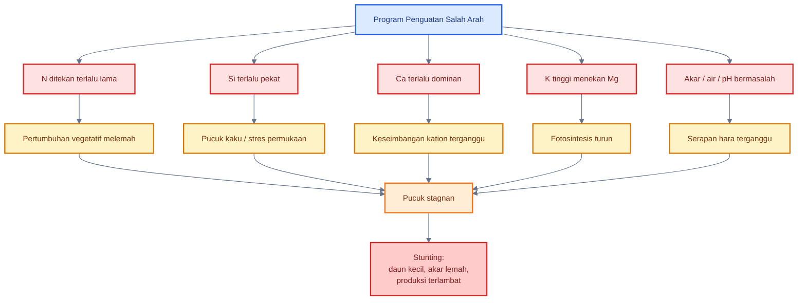

---

## 11.4 Tanaman kompak vs stunting

Tanaman kompak sehat sering disalahartikan sebagai stunting, dan tanaman stunting kadang dianggap “kuat”. Ini harus diluruskan.

| Parameter   | Kompak Sehat        | Stunting         |
| ----------- | ------------------- | ---------------- |
| Tinggi      | pendek proporsional | tertinggal jauh  |
| Daun        | hijau segar         | kecil/kaku/pucat |
| Pucuk       | aktif               | stagnan          |
| Akar        | putih banyak        | sedikit/coklat   |
| Laju tumbuh | tetap berjalan      | lambat/berhenti  |

### Tanaman kompak sehat

Ciri-cirinya:

- ruas tidak terlalu panjang,
- batang kokoh,
- daun hijau segar,
- pucuk tetap mengeluarkan daun baru,
- akar putih banyak,
- tanaman responsif setelah pemupukan ringan,
- bunga muncul sesuai fase.

Tanaman seperti ini tidak perlu dipaksa tumbuh terlalu cepat. Cukup dijaga keseimbangannya.

### Tanaman stunting

Ciri-cirinya:

- tinggi tertinggal jauh,
- daun muda kecil,
- pucuk lama tidak bergerak,
- daun kaku atau pucat,
- akar sedikit/coklat,
- respons terhadap pupuk lemah,
- bunga terlambat atau sedikit.

Tanaman seperti ini tidak perlu ditambah program pengerasan. Ia perlu **pemulihan pertumbuhan**.

---

## 11.5 Dampak ekonomi

Stunting bukan hanya masalah tampilan tanaman. Dalam bisnis cabai, stunting langsung memengaruhi pendapatan.

Dampak ekonomi:

- produksi terlambat,
- cabang produktif sedikit,
- bunga terlambat,
- buah sedikit,
- panen pertama mundur,
- umur panen tidak efisien,
- biaya per tanaman naik,
- hasil per satuan luas turun.

Jika stunting terjadi merata di satu blok, kerugiannya besar karena seluruh jadwal produksi mundur. Jika stunting hanya terjadi di spot tertentu, perlu dicari penyebab lokal: genangan, pH, akar, salinitas, penyakit tanah, atau kesalahan aplikasi.

Kalimat praktis:

> **Stunting adalah hilangnya waktu produktif tanaman. Pada cabai, waktu yang hilang sering berarti panen yang tertunda dan total produksi yang turun.**

---

# 12. Ukuran Lapangan: Hijau Gelap, Terlalu Subur, dan Stunting

Istilah seperti “hijau gelap”, “terlalu subur”, dan “stunting” harus dibuat terukur agar praktisi tidak menebak. Bab ini memberi alat ukur sederhana yang bisa dipakai di lapangan, baik dengan alat seperti SPAD meter maupun tanpa alat.

Prinsipnya:

> **Jangan menilai tanaman dari satu indikator. Gabungkan warna daun, panjang ruas, bentuk daun, pucuk, akar, dan laju tumbuh.**

---

## 12.1 Daun hijau gelap

Daun hijau gelap bisa berarti tanaman sehat, tetapi juga bisa berarti $N$ dominan. Karena itu, warna daun harus dibaca bersama pucuk dan ruas.

### Dengan SPAD

| Nilai SPAD | Interpretasi                  |
| ---------- | ----------------------------- |
| `<35`      | cenderung pucat               |
| `35–45`    | hijau normal                  |
| `45–55`    | hijau kuat                    |
| `>55`      | waspada hijau gelap           |
| `>60`      | sangat hijau, cek $N$ dominan |

Catatan:

- SPAD tinggi tidak otomatis buruk.
- SPAD rendah tidak otomatis kurang $N$.
- Ukur daun yang sama posisinya, misalnya daun paling baru yang sudah membuka sempurna.
- Jangan ukur daun rusak, daun sakit, daun terlalu tua, atau daun yang baru terkena semprot pekat.

### Tanpa SPAD

Gunakan pembanding internal lahan:

1. Pilih 20 tanaman normal.
2. Bandingkan warna daun tanaman yang dicurigai.
3. Cek pucuk: kokoh atau lunak?
4. Cek ruas: normal atau memanjang?
5. Cek hama: thrips/aphid/kutu kebul meningkat atau tidak?

Hijau gelap baru dianggap berisiko bila disertai:

- pucuk lunak,
- ruas panjang,
- daun muda terlalu lebar,
- tajuk terlalu rimbun,
- hama pengisap meningkat.

Kalimat praktis:

> **Hijau gelap tidak otomatis bagus. Hijau gelap + pucuk lunak + ruas panjang = sinyal $N$ dominan.**

---

## 12.2 Indeks lebar daun

Indeks lebar daun atau $ILD$ digunakan untuk membaca apakah daun cenderung normal, terlalu sempit, atau terlalu lebar/lunak.

Rumus:

$$
ILD =
\frac{L_d}{P_d}
$$

Keterangan:

- $ILD$ = indeks lebar daun
- $L_d$ = lebar daun
- $P_d$ = panjang daun

Gunakan daun muda yang sudah membuka sempurna, bukan daun yang masih menggulung.

Interpretasi:

| $ILD$           | Status                      |
| --------------- | --------------------------- |
| `<0{,}35`       | daun sempit                 |
| `0{,}35–0{,}45` | normal                      |
| `0{,}45–0{,}55` | daun lebar                  |
| `>0{,}55`       | waspada terlalu lebar/lunak |

Contoh:

$$
L_d = 4\ \text{cm}
$$

$$
P_d = 8\ \text{cm}
$$

Maka:

$$
ILD =
\frac{4}{8}
=
0{,}5
$$

Interpretasi: daun cukup lebar. Jika disertai hijau gelap dan pucuk lunak, tanaman cenderung terlalu vegetatif.

---

## 12.3 Indeks ruas pucuk

Indeks ruas pucuk atau $IRP$ membantu membaca apakah tanaman terlalu vegetatif, normal, atau terlalu tertahan.

Ukur tiga ruas pucuk teratas yang sudah jelas, lalu ambil rata-rata.

Rumus:

$$
IRP =
\frac{R_1 + R_2 + R_3}{3}
$$

Keterangan:

- $IRP$ = indeks ruas pucuk
- $R_1$ = panjang ruas pucuk pertama
- $R_2$ = panjang ruas pucuk kedua
- $R_3$ = panjang ruas pucuk ketiga

Interpretasi:

| $IRP$            | Status                                      |
| ---------------- | ------------------------------------------- |
| `<2\ \text{cm}`  | pendek; cek stunting atau varietas          |
| `2–4\ \text{cm}` | umum/ideal                                  |
| `4–6\ \text{cm}` | vegetatif kuat                              |
| `>6\ \text{cm}`  | terlalu vegetatif/kurang cahaya/$N$ dominan |

Contoh:

$$
R_1 = 5\ \text{cm}
$$

$$
R_2 = 6\ \text{cm}
$$

$$
R_3 = 7\ \text{cm}
$$

Maka:

$$
IRP =
\frac{5 + 6 + 7}{3}
=
6\ \text{cm}
$$

Interpretasi: vegetatif kuat. Jika daun hijau gelap dan pucuk lunak, koreksi $N$ perlu dipertimbangkan.

---

## 12.4 Rasio tinggi tanaman

Rasio tinggi tanaman atau $RTT$ digunakan untuk membandingkan tanaman yang dicurigai stunting dengan tanaman normal di blok yang sama.

Rumus:

$$
RTT =
\frac{T_s}{T_n}
$$

Keterangan:

- $RTT$ = rasio tinggi tanaman
- $T_s$ = tinggi tanaman sampel
- $T_n$ = tinggi tanaman normal pembanding

Gunakan median tanaman normal satu blok, bukan tanaman paling tinggi.

Interpretasi:

| $RTT$           | Status            |
| --------------- | ----------------- |
| `>0{,}85`       | normal            |
| `0{,}70–0{,}85` | tertinggal ringan |
| `0{,}50–0{,}70` | stunting sedang   |
| `<0{,}50`       | stunting berat    |

Contoh:

$$
T_s = 28\ \text{cm}
$$

$$
T_n = 40\ \text{cm}
$$

Maka:

$$
RTT =
\frac{28}{40}
=
0{,}70
$$

Interpretasi: tanaman tertinggal cukup serius. Jika pucuk stagnan dan daun kecil, masuk stunting sedang.

---

## 12.5 Laju tumbuh 7 hari

Laju tumbuh 7 hari atau $LT_7$ adalah salah satu indikator terbaik untuk membedakan tanaman kompak sehat dan stunting.

Rumus:

$$
LT_7 =
T_7 - T_0
$$

Keterangan:

- $LT_7$ = laju tumbuh 7 hari
- $T_7$ = tinggi tanaman setelah 7 hari
- $T_0$ = tinggi tanaman awal

Interpretasi:

| $LT_7$                  | Status           |
| ----------------------- | ---------------- |
| `>5\ \text{cm}/7 hari`  | aktif            |
| `3–5\ \text{cm}/7 hari` | cukup            |
| `1–3\ \text{cm}/7 hari` | lambat           |
| `<1\ \text{cm}/7 hari`  | stagnan/stunting |

Contoh:

$$
T_0 = 30\ \text{cm}
$$

$$
T_7 = 32\ \text{cm}
$$

Maka:

$$
LT_7 =
32 - 30
=
2\ \text{cm}/7\ \text{hari}
$$

Interpretasi: pertumbuhan lambat. Jika daun kecil dan pucuk tidak aktif, cek akar, $N$, $Mg$, air, dan pH.

---

## 12.6 Skor terlalu subur

Skor terlalu subur membantu praktisi membaca apakah tanaman mulai masuk kondisi vegetatif berlebih.

| Parameter  | Skor 0       | Skor 1     | Skor 2       |
| ---------- | ------------ | ---------- | ------------ |
| Warna daun | hijau normal | hijau kuat | hijau gelap  |
| Ruas pucuk | `2–4 cm`     | `4–6 cm`   | `>6 cm`      |
| Lebar daun | normal       | lebar      | sangat lebar |
| Pucuk      | kokoh        | agak lunak | sangat lunak |
| Hama pucuk | rendah       | mulai ada  | banyak       |

Interpretasi:

| Total Skor | Status                     |
| ---------- | -------------------------- |
| `0–3`      | normal                     |
| `4–6`      | mulai terlalu subur        |
| `7–10`     | terlalu subur dan berisiko |

### Contoh skor

Misal tanaman memiliki kondisi:

- warna daun hijau gelap = skor 2,
- ruas pucuk `5 cm` = skor 1,
- daun sangat lebar = skor 2,
- pucuk agak lunak = skor 1,
- hama pucuk mulai ada = skor 1.

Total:

$$
Skor =
2 + 1 + 2 + 1 + 1
=
7
$$

Interpretasi: tanaman terlalu subur dan berisiko.

Tindakan:

- kurangi dominasi $N$,
- hentikan pupuk daun tinggi $N$,
- perkuat $Ca$, $K$, $Mg$, dan $Si$ sesuai label,
- tingkatkan monitoring thrips, aphid, dan kutu kebul.

---

## Diagram: ukuran lapangan untuk membaca kondisi tanaman

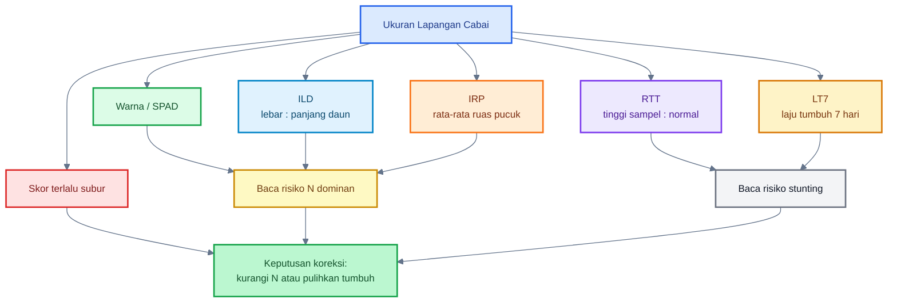

---

# Ringkasan Bab 11–12

Stunting pada cabai adalah kondisi ketika pertumbuhan tanaman tertahan secara tidak normal. Penyebabnya bisa berasal dari $N$ yang ditekan terlalu lama, $Si$ terlalu pekat, $Ca$ terlalu dominan, $K$ terlalu tinggi hingga menekan $Mg$, kekurangan $Mg$, air tidak stabil, akar rusak, atau pH tidak sesuai.

Untuk membedakan tanaman kompak sehat dan stunting, praktisi perlu memakai ukuran lapangan: warna daun/SPAD, indeks lebar daun, indeks ruas pucuk, rasio tinggi tanaman, laju tumbuh 7 hari, dan skor terlalu subur. Tanaman hijau gelap belum tentu sehat, dan tanaman pendek belum tentu stunting. Kuncinya adalah membaca kombinasi: pucuk, ruas, daun, akar, dan laju tumbuh.

Kalimat kunci:

> **Cabai yang kuat tetap harus tumbuh. Jika tanaman menjadi pendek, daun kecil, pucuk stagnan, akar coklat, dan laju tumbuh rendah, itu bukan penguatan jaringan; itu tanda tanaman kehilangan momentum pertumbuhan.**

[**Kembali ke Atas**](#mekanisme-penguatan-jaringan-cabai-dengan-casikmgn)

---

# 13. Diagnosis agar Tidak Salah: Bias $N$, $Mg$, $Ca$, dan $K$

Diagnosis hara pada cabai sering keliru karena gejala visual antar unsur bisa saling tumpang tindih. Warna daun, bentuk pucuk, panjang ruas, ukuran daun, dan pertumbuhan tanaman tidak boleh dibaca secara terpisah. Satu gejala bisa memiliki beberapa penyebab.

Bab ini membahas cara membaca gejala agar praktisi tidak salah mengambil tindakan. Materi ini mengikuti outline Bab 13–14 yang sudah dikunci: bias diagnosis $N$, $Mg$, $Ca$, dan $K$, protokol diagnosis lapangan, kesalahan diagnosis umum, serta SOP praktis agar penguatan jaringan tidak berubah menjadi stunting.

---

## 13.1 Mengapa diagnosis bisa bias

Diagnosis hara bisa bias karena empat alasan utama.

Pertama, $N$ dan $Mg$ sama-sama memengaruhi klorofil. Daun pucat bisa terjadi karena $N$ kurang, tetapi juga bisa karena $Mg$ kurang, akar rusak, pH bermasalah, genangan, atau stres umum.

Kedua, $K$ dan $Ca$ bisa saling mengganggu. Saat $K$ tinggi, $Ca$ bisa relatif tertekan. Saat $Ca$ terlalu dominan, keseimbangan $K$, $Mg$, dan mikroelement juga bisa terganggu.

Ketiga, $K$ tinggi bisa menekan $Mg$. Ini sering terjadi ketika tanaman masuk generatif dan petani menaikkan $K$ untuk mengejar buah. Akibatnya daun tua mulai klorosis antar tulang daun, tetapi sering salah dibaca sebagai kurang $N$.

Keempat, warna daun tidak cukup untuk menentukan unsur penyebab. Daun hijau gelap belum tentu sehat. Daun pucat belum tentu hanya kurang nitrogen. Tanaman pendek belum tentu kuat. Tanaman pendek juga bisa berarti stunting.

Kalimat praktis:

> **Diagnosis hara tidak boleh berbasis satu gejala. Harus membaca posisi daun, pola warna, pucuk, ruas, akar, air, pH, dan riwayat aplikasi.**

---

## 13.2 Membedakan $N$ dan $Mg$

$N$ dan $Mg$ sama-sama memengaruhi kehijauan daun, tetapi gejalanya tidak sama.

$N$ berhubungan dengan klorofil, protein, enzim, dan pertumbuhan vegetatif. Kekurangan $N$ biasanya membuat tanaman pucat secara lebih merata dan pertumbuhan melambat.

$Mg$ adalah inti molekul klorofil. Kekurangan $Mg$ sering muncul sebagai klorosis antar tulang daun, terutama pada daun tua.

| Gejala                       | Lebih Mengarah ke          |
| ---------------------------- | -------------------------- |
| daun tua kuning merata       | $N$ kurang                 |
| seluruh tanaman pucat        | $N$ kurang atau akar lemah |
| daun tua kuning antar tulang | $Mg$ kurang                |
| daun muda kuning             | $Fe/Mn$, pH, akar          |
| hijau gelap + pucuk lunak    | $N$ dominan                |

### Cara membaca di lapangan

Jika daun pucat merata dan seluruh tanaman lambat, jangan langsung menyimpulkan kurang $N$. Cek akar lebih dulu. Jika akar coklat, busuk, atau sedikit, masalahnya bisa pada akar, bukan pada pupuk.

Jika daun tua kuning antar tulang daun, jangan langsung memberi pupuk tinggi $N$. Pola ini lebih mengarah ke $Mg$, terutama jika sebelumnya $K$ dinaikkan tinggi.

Jika daun hijau gelap, pucuk lunak, dan ruas panjang, masalahnya bukan kekurangan hara. Itu lebih mengarah pada $N$ dominan atau tanaman terlalu vegetatif.

---

## 13.3 Membedakan masalah $Ca$ dan $K$

Masalah $Ca$ dan $K$ lebih sulit dibaca karena keduanya sering muncul pada fase generatif. $K$ dibutuhkan untuk pengisian buah, sedangkan $Ca$ dibutuhkan untuk jaringan muda, bunga, dan buah muda.

| Gejala                                                    | Kemungkinan                                                |
| --------------------------------------------------------- | ---------------------------------------------------------- |
| pucuk muda lemah, buah muda bermasalah, tetapi $K$ tinggi | $Ca$ relatif tertekan                                      |
| tanaman mudah layu, buah kurang padat                     | $K$ kurang atau air tidak stabil                           |
| tanaman kaku, pertumbuhan lambat                          | $Ca$ terlalu dominan atau pH tinggi                        |
| buah berkembang tetapi jaringan lemah                     | $K$ jalan, $Ca$ kurang efektif                             |
| jaringan tetap lemah meski $Ca$ diberikan                 | distribusi $Ca$ terganggu oleh air, akar, atau $K$ dominan |

### Kesalahan umum membaca $Ca$

Banyak praktisi mengira masalah $Ca$ selesai hanya dengan menambah pupuk kalsium. Padahal $Ca$ sangat dipengaruhi distribusi air dan transpirasi. Jika air tidak stabil, akar rusak, atau $K$ terlalu dominan, jaringan muda bisa tetap kekurangan $Ca$ secara fungsional.

Jadi, saat pucuk atau buah muda lemah, pertanyaannya bukan hanya:

> “Sudah diberi kalsium atau belum?”

Tetapi:

- apakah air stabil?
- apakah akar aktif?
- apakah $K:Ca$ terlalu tinggi?
- apakah pH terlalu tinggi?
- apakah aplikasi $Ca$ terlalu jarang tetapi terlalu pekat?
- apakah $Ca$ dicampur bahan yang tidak kompatibel?

---

## 13.4 Membedakan $K$ tinggi dan $Mg$ rendah

Masalah ini sering muncul saat fase generatif. Petani menaikkan $K$, tanaman terlihat berbuah, tetapi daun tua mulai rusak dan fotosintesis melemah.

| Gejala                                               | Kemungkinan                 |
| ---------------------------------------------------- | --------------------------- |
| daun tua klorosis antar tulang setelah $K$ dinaikkan | $Mg$ tertekan oleh $K$      |
| pucuk masih hijau tetapi daun tua melemah            | rasio $K:Mg$ terlalu tinggi |
| fotosintesis menurun, tanaman lambat                 | $Mg$ kurang                 |

### Pola yang sering terjadi

$$
K_{\text{tinggi}}
\Rightarrow
Mg_{\text{tertekan}}
\Rightarrow
\text{klorofil terganggu}
\Rightarrow
\text{fotosintesis turun}
\Rightarrow
\text{tanaman lambat}
$$

Jika pola ini muncul, menaikkan $N$ bukan solusi utama. Tindakan yang lebih masuk akal adalah:

- cek rasio $K:Mg$,
- kurangi dominasi $K$ sementara,
- berikan $MgSO_4$ secara ringan,
- cek pH dan akar,
- pastikan daun tua tidak kehilangan fungsi terlalu cepat.

---

## 13.5 Protokol diagnosis lapangan

Gunakan protokol berikut agar diagnosis tidak hanya berdasarkan “feeling”.

### Langkah 1 — Pisahkan daun muda, daun tengah, dan daun tua

Jangan mencampur semua gejala.

| Posisi Daun     | Makna Praktis                                             |
| --------------- | --------------------------------------------------------- |
| Daun muda/pucuk | membaca $N$ dominan, $Ca$, $B$, $Fe$, pucuk lunak, thrips |
| Daun tengah     | membaca status umum tanaman                               |
| Daun tua        | membaca $N$, $Mg$, $K$, dan mobilisasi hara               |

### Langkah 2 — Lihat pola warna

Bedakan warna merata dan warna antar tulang daun.

| Pola Warna                   | Kemungkinan                               |
| ---------------------------- | ----------------------------------------- |
| pucat merata                 | $N$ kurang, akar lemah, stres umum        |
| kuning antar tulang daun tua | $Mg$ kurang                               |
| hijau gelap pekat            | $N$ dominan                               |
| daun muda kuning             | $Fe/Mn$, pH, akar, atau unsur imobil lain |

### Langkah 3 — Ukur ruas pucuk

Gunakan rumus:

$$
IRP =
\frac{R_1 + R_2 + R_3}{3}
$$

Keterangan:

- $IRP$ = indeks ruas pucuk
- $R_1$, $R_2$, $R_3$ = tiga ruas pucuk teratas yang sudah jelas

Jika $IRP > 6\ \text{cm}$, tanaman berisiko terlalu vegetatif, terutama bila daun hijau gelap dan pucuk lunak.

### Langkah 4 — Ukur lebar daun

Gunakan rumus:

$$
ILD =
\frac{L_d}{P_d}
$$

Keterangan:

- $ILD$ = indeks lebar daun
- $L_d$ = lebar daun
- $P_d$ = panjang daun

Jika $ILD > 0{,}55$ dan daun hijau gelap, tanaman berisiko terlalu subur/lunak.

### Langkah 5 — Ukur laju tumbuh 7 hari

Gunakan rumus:

$$
LT_7 =
T_7 - T_0
$$

Keterangan:

- $LT_7$ = laju tumbuh 7 hari
- $T_7$ = tinggi tanaman setelah 7 hari
- $T_0$ = tinggi awal

Jika $LT_7 < 1\text{–}3\ \text{cm}/7\ \text{hari}$, tanaman mulai lambat. Jika disertai daun kecil dan pucuk stagnan, curiga stunting.

### Langkah 6 — Cek akar

Akar adalah pembeda besar.

| Kondisi Akar                          | Interpretasi          |
| ------------------------------------- | --------------------- |
| putih banyak                          | akar aktif            |
| coklat sedikit                        | akar lemah            |
| bau busuk                             | anaerob/busuk akar    |
| akar pendek dan sedikit               | serapan terbatas      |
| akar putih tetapi tanaman tetap lemah | cek rasio hara dan pH |

Jika akar buruk, jangan langsung menambah pupuk pekat.

### Langkah 7 — Cek air dan drainase

$Ca$, $K$, dan $Mg$ sangat dipengaruhi air. Air yang terlalu fluktuatif membuat diagnosis hara bias.

Cek:

- tanah terlalu kering?
- terlalu becek?
- parit tersumbat?
- mulsa membuat tanah terlalu lembap?
- penyiraman tidak merata?
- drip tersumbat?

### Langkah 8 — Cek pH

pH yang tidak sesuai membuat banyak unsur tampak kurang walaupun tersedia.

- pH terlalu rendah dapat mengganggu akar.
- pH terlalu tinggi dapat mengganggu mikroelement dan keseimbangan kation.
- Dominasi $Ca$ sering berkaitan dengan kondisi pH tinggi atau kapur berlebihan.

### Langkah 9 — Analisis jaringan daun bila keputusan besar

Jika keputusan menyangkut perubahan program pupuk besar, lakukan analisis jaringan daun. Jangan mengubah strategi satu hamparan hanya dari satu-dua tanaman.

### Langkah 10 — Baca hasil analisis dengan rasio

Jangan baca nilai tunggal. Gunakan rasio:

$$
R_{K:N} =
\frac{C_K}{C_N}
$$

$$
R_{Ca:N} =
\frac{C_{Ca}}{C_N}
$$

$$
R_{Mg:N} =
\frac{C_{Mg}}{C_N}
$$

$$
R_{K:Ca} =
\frac{C_K}{C_{Ca}}
$$

$$
R_{K:Mg} =
\frac{C_K}{C_{Mg}}
$$

$$
R_{Ca:Mg} =
\frac{C_{Ca}}{C_{Mg}}
$$

---

## 13.6 Kesalahan diagnosis umum

### Kesalahan 1 — Daun pucat langsung diberi $N$

Daun pucat bisa karena $N$, tetapi juga bisa karena $Mg$, akar lemah, pH salah, air buruk, atau stres. Jika semua daun pucat dan akar buruk, pupuk $N$ bukan jawaban utama.

### Kesalahan 2 — Daun tua klorosis antar tulang dikira kurang $N$

Ini kesalahan sangat umum. Bila pola kuning muncul di antara tulang daun tua, curiga $Mg$ terlebih dahulu, terutama jika $K$ baru dinaikkan.

### Kesalahan 3 — Daun hijau gelap dianggap pasti sehat

Hijau gelap bisa berarti tanaman subur, tetapi juga bisa berarti $N$ dominan. Jika disertai pucuk lunak dan ruas panjang, itu tanda risiko.

### Kesalahan 4 — $K$ dinaikkan terus saat generatif tanpa menjaga $Ca$ dan $Mg$

$K$ penting untuk buah, tetapi $K$ terlalu dominan dapat menekan $Ca$ dan $Mg$.

### Kesalahan 5 — $Ca$ dinaikkan terus tanpa membaca $K$, $Mg$, dan pH

$Ca$ penting untuk jaringan, tetapi dominasi $Ca$ bisa membuat tanaman kaku dan mengganggu $Mg$.

### Kesalahan 6 — SPAD dipakai tanpa melihat posisi daun

SPAD hanya membaca kehijauan relatif. Ia tidak memberi tahu apakah hijau itu karena $N$ cukup, $N$ berlebih, $Mg$ cukup, atau kondisi lain.

---

## Diagram: flowchart diagnosis warna daun dan gejala pertumbuhan

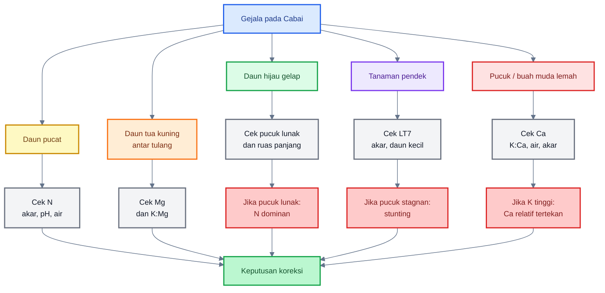

---

# 14. SOP Praktis Penguatan Jaringan Tanpa Membuat Cabai Stunting

SOP ini dibuat untuk menjaga cabai tetap kuat tanpa kehilangan momentum pertumbuhan. Tujuannya bukan membuat tanaman “keras”, tetapi membuat jaringan muda kokoh, daun tetap aktif, akar bekerja, dan generatif berjalan stabil.

---

## 14.1 Prinsip dasar SOP

Prinsip utama:

- jangan mengejar hijau gelap,
- jangan mengejar tanaman kaku,
- jangan menekan $N$ terlalu lama,
- jangan menaikkan $K$ tanpa $Ca$ dan $Mg$,
- jangan menaikkan $Ca$ tanpa membaca $K$, $Mg$, pH, dan air,
- gunakan $Si$ sebagai pendukung, bukan alat utama koreksi.

Kalimat praktis:

> **SOP penguatan jaringan harus menjaga tiga hal sekaligus: struktur kuat, fotosintesis aktif, dan pertumbuhan tetap berjalan.**

---

## 14.2 Dosis foliar praktis

Tabel berikut adalah angka awal untuk praktisi. Tetap ikuti label produk karena konsentrasi bahan aktif berbeda-beda.

| Input        |                    Dosis Praktis |              Interval |
| ------------ | -------------------------------: | --------------------: |
| $Ca$         |     $1\text{–}1{,}5\ \text{g/L}$ |  `$7\text{–}10$ hari` |
| $MgSO_4$     |     $0{,}5\text{–}1\ \text{g/L}$ | `$10\text{–}14$ hari` |
| $Si$ larut   |    $0{,}5\text{–}1\ \text{ml/L}$ |  `$7\text{–}10$ hari` |
| $KNO_3$      |         $1\text{–}2\ \text{g/L}$ | `$10\text{–}14$ hari` |
| Mikroelement | $0{,}3\text{–}0{,}5\ \text{g/L}$ |           `$14$ hari` |

Catatan penting:

- gunakan batas bawah untuk bibit, tanaman muda, atau tanaman stres;
- jangan mencampur $Ca$ pekat dengan $Si$ atau fosfat pekat;
- jangan memberi $KNO_3$ berlebihan jika tanaman sudah terlalu lunak karena $N$;
- semprot pagi atau sore;
- hindari semprot saat tanaman stres kering berat.

---

## 14.3 Jadwal bergilir aman

Jadwal berikut bukan kalender kaku. Ini contoh pola rotasi agar unsur tidak saling bertabrakan.

| Hari       | Aplikasi                               |
| ---------- | -------------------------------------- |
| Hari 1     | $Ca + Mg$                              |
| Hari 4/5   | $Si$                                   |
| Hari 8/10  | $K$ ringan                             |
| Hari 12/14 | evaluasi pucuk, warna daun, ruas, akar |

Prinsipnya:

- $Ca$ dan $Si$ dipisah minimal `$3\text{–}4$ hari`;
- $Mg$ dijaga agar fotosintesis tidak turun;
- $K$ diberikan sesuai fase dan kondisi tanaman;
- evaluasi dilakukan sebelum mengulang program.

Pola sederhana:

$$
Ca + Mg
\rightarrow
Si
\rightarrow
K
\rightarrow
Evaluasi
$$

---

## 14.4 Koreksi bila tanaman terlalu lunak

Gejala:

- daun hijau gelap,
- pucuk lunak,
- ruas panjang,
- daun lebar,
- hama pengisap meningkat.

Tindakan:

1. Turunkan $N$ sementara.

$$
\text{Penurunan } N =
25\text{–}50\%
\quad
\text{selama}
\quad
7\text{–}10\ \text{hari}
$$

2. Hentikan pupuk daun tinggi $N$.

3. Perkuat $Ca$, $Si$, $K$, dan $Mg$ secara bergilir, bukan sekaligus.

4. Tingkatkan monitoring OPT, terutama thrips, aphid, dan kutu kebul.

5. Cek panjang ruas dan kekokohan pucuk setelah 7 hari.

Jika kondisi membaik, jangan terus menekan $N$. Kembalikan nutrisi secara bertahap agar tanaman tidak stunting.

---

## 14.5 Koreksi bila tanaman stunting

Gejala:

- tinggi tertinggal,
- daun kecil,
- pucuk stagnan,
- akar buruk,
- laju tumbuh rendah.

Tindakan:

1. Hentikan program pengerasan sementara.
2. Cek akar, air, pH, dan drainase.
3. Pulihkan $N$ ringan bila kurang.
4. Berikan $Mg$ bila daun tua klorosis antar tulang.
5. Jangan tambah $Si$ pekat.
6. Jangan menaikkan $Ca$ terus-menerus tanpa diagnosis.
7. Evaluasi laju tumbuh 7 hari.

Gunakan rumus:

$$
LT_7 =
T_7 - T_0
$$

Jika:

$$
LT_7 < 1\text{–}3\ \text{cm}/7\ \text{hari}
$$

maka tanaman masih dalam status lambat atau stagnan. Fokus tetap pada pemulihan, bukan pengerasan.

---

## 14.6 Koreksi bila $K:Ca$ terlalu tinggi

Gejala:

- buah atau pucuk tetap lemah meski tanaman subur,
- $K$ tinggi,
- $Ca$ relatif rendah,
- air tidak stabil.

Tindakan:

- hentikan kenaikan $K$ sementara;
- berikan $Ca$ ringan-rutin;
- stabilkan air;
- cek $Mg$;
- jangan campur $Ca$ dengan silika/fosfat pekat;
- cek rasio $K:Ca$ jika ada data jaringan.

Rumus:

$$
R_{K:Ca} =
\frac{C_K}{C_{Ca}}
$$

Jika:

$$
K:Ca > 3{,}0
$$

maka $K$ mulai dominan terhadap $Ca$.

Jika:

$$
K:Ca > 3{,}5
$$

maka waspada antagonisme kuat.

---

## 14.7 Koreksi bila $Ca$ terlalu dominan

Gejala:

- tanaman kaku,
- pertumbuhan lambat,
- daun kecil,
- indikasi $Mg$ atau mikroelement terganggu.

Tindakan:

- kurangi aplikasi $Ca$ pekat;
- cek pH;
- beri $Mg$ bila perlu;
- cek $K$;
- pulihkan pertumbuhan;
- jangan lanjutkan program “pengerasan” sampai tanaman kembali aktif.

Cek rasio:

$$
R_{Ca:Mg} =
\frac{C_{Ca}}{C_{Mg}}
$$

Jika:

$$
Ca:Mg > 6
$$

maka $Ca$ mulai dominan terhadap $Mg$.

---

## Diagram: SOP koreksi penguatan jaringan

```mermaid id="fy2hlp"
%%{init: {
  "theme": "base",
  "themeVariables": {
    "background": "#ffffff",
    "fontSize": "13px",
    "lineColor": "#64748b",
    "primaryTextColor": "#111827"
  }
}}%%
flowchart TB
    A["Evaluasi Tanaman Cabai"]:::main

    A --> B["Terlalu lunak"]:::soft
    A --> C["Stunting"]:::stunt
    A --> D["K:Ca tinggi"]:::kca
    A --> E["Ca dominan"]:::ca

    B --> B1["Turunkan N<br/>25-50% selama 7-10 hari"]:::soft2
    B --> B2["Perkuat Ca-Si-K-Mg<br/>bergilir"]:::soft2
    B --> B3["Monitoring OPT"]:::soft2

    C --> C1["Hentikan pengerasan"]:::stunt2
    C --> C2["Cek akar, air, pH"]:::stunt2
    C --> C3["Pulihkan N/Mg bila perlu"]:::stunt2

    D --> D1["Tahan kenaikan K"]:::kca2
    D --> D2["Ca ringan-rutin"]:::kca2
    D --> D3["Stabilkan air"]:::kca2

    E --> E1["Kurangi Ca pekat"]:::ca2
    E --> E2["Cek Mg, K, pH"]:::ca2
    E --> E3["Pulihkan pertumbuhan"]:::ca2

    B1 --> F["Evaluasi ulang 7 hari"]:::final
    C1 --> F
    D1 --> F
    E1 --> F

    classDef main fill:#dbeafe,stroke:#2563eb,color:#1e3a8a,stroke-width:2px;
    classDef soft fill:#fee2e2,stroke:#dc2626,color:#7f1d1d,stroke-width:2px;
    classDef soft2 fill:#fecaca,stroke:#dc2626,color:#7f1d1d,stroke-width:2px;
    classDef stunt fill:#fef3c7,stroke:#d97706,color:#78350f,stroke-width:2px;
    classDef stunt2 fill:#fef9c3,stroke:#ca8a04,color:#713f12,stroke-width:2px;
    classDef kca fill:#ffedd5,stroke:#f97316,color:#7c2d12,stroke-width:2px;
    classDef kca2 fill:#fed7aa,stroke:#ea580c,color:#7c2d12,stroke-width:2px;
    classDef ca fill:#ede9fe,stroke:#7c3aed,color:#4c1d95,stroke-width:2px;
    classDef ca2 fill:#ddd6fe,stroke:#7c3aed,color:#4c1d95,stroke-width:2px;
    classDef final fill:#dcfce7,stroke:#16a34a,color:#14532d,stroke-width:2px;
```

---

# Ringkasan Bab 13–14

Diagnosis hara pada cabai tidak boleh hanya berdasarkan warna daun. $N$ dan $Mg$ sama-sama memengaruhi klorofil, sehingga daun pucat atau hijau gelap bisa menyesatkan. $K$, $Ca$, dan $Mg$ juga dapat saling menekan, sehingga nilai satu unsur yang tinggi belum tentu baik.

SOP penguatan jaringan harus menjaga keseimbangan: $N$ cukup tetapi tidak dominan, $Ca$ memperkuat jaringan, $K$ mengatur air dan buah, $Mg$ menjaga fotosintesis, dan $Si$ mendukung permukaan jaringan. Jika tanaman terlalu lunak, koreksi dominasi $N$. Jika tanaman stunting, hentikan pengerasan dan pulihkan akar, air, pH, serta energi pertumbuhan.

Kalimat kunci:

> **Diagnosis yang benar bukan mencari satu unsur untuk disalahkan, tetapi membaca hubungan antar unsur, posisi gejala, pola daun, pucuk, akar, air, pH, dan laju tumbuh. Cabai kuat dibangun dengan keseimbangan, bukan dominasi.**

[**Kembali ke Atas**](#mekanisme-penguatan-jaringan-cabai-dengan-casikmgn)

---

# 15. Penutup: Cabai Kuat adalah Cabai yang Seimbang

Pada akhirnya, penguatan jaringan cabai bukan soal membuat tanaman sekadar keras, hijau gelap, atau tampak subur. Tujuan sebenarnya adalah membangun tanaman yang **seimbang**: jaringan muda kokoh, daun tetap aktif berfotosintesis, akar sehat, air stabil, dan buah berkembang baik.

Cabai yang terlalu lunak mudah menjadi sasaran hama pengisap. Cabai yang terlalu ditekan bisa stunting. Cabai yang terlalu tinggi $N$ bisa hijau gelap tetapi rapuh. Cabai yang terlalu tinggi $K$ bisa mengganggu $Ca$ dan $Mg$. Cabai yang terlalu dominan $Ca$ bisa tampak kaku tetapi kehilangan laju tumbuh.

Jadi, kunci utamanya bukan dominasi satu unsur, melainkan **keseimbangan fungsi hara**.

---

## 15.1 Ringkasan utama

$Ca$ berperan memperkuat dinding sel dan middle lamella. Unsur ini penting untuk pucuk, bunga, dan buah muda karena bagian-bagian tersebut sedang aktif tumbuh dan membutuhkan jaringan yang stabil.

$Si$ membantu memperkuat epidermis, kutikula, dan permukaan jaringan. Silika bukan insektisida, tetapi dapat menjadi pendukung kekuatan jaringan dan toleransi cekaman.

$K$ mengatur air, tekanan osmotik, turgor, stomata, dan pengisian buah. Namun, $K$ tidak boleh terlalu dominan karena dapat mengganggu $Ca$ dan $Mg$.

$Mg$ adalah inti klorofil dan berperan penting dalam fotosintesis. Tanpa $Mg$ yang cukup, tanaman kehilangan energi untuk membentuk pucuk, akar, bunga, dan buah.

$N$ mendukung kehijauan, klorofil, protein, dan pertumbuhan vegetatif. Tetapi bila $N$ terlalu dominan, daun menjadi hijau gelap, pucuk lunak, ruas panjang, dan tanaman terlalu vegetatif.

Dengan demikian:

> **Keseimbangan lebih penting daripada dominasi satu unsur.**

Materi penutup dan ringkasan praktisi ini mengikuti struktur akhir artikel yang telah dikunci: cabai kuat adalah cabai yang seimbang, bukan cabai yang dipaksa keras atau dibiarkan terlalu lunak.

---

## 15.2 Pesan praktis

Ada beberapa pesan utama yang perlu dipegang praktisi.

Pertama, **daun hijau gelap belum tentu sehat**. Jika hijau gelap disertai pucuk lunak, ruas panjang, daun terlalu lebar, dan hama pengisap meningkat, itu lebih mengarah pada dominasi $N$.

Kedua, **daun pucat belum tentu hanya kurang $N$**. Bila daun tua menguning antar tulang daun, masalah bisa mengarah ke $Mg$, terutama jika sebelumnya $K$ dinaikkan tinggi.

Ketiga, **tanaman pendek belum tentu stunting**. Tanaman pendek tetapi akar putih banyak, pucuk aktif, daun hijau segar, dan laju tumbuh tetap berjalan masih bisa disebut kompak sehat. Stunting terjadi bila pendek disertai daun kecil, pucuk stagnan, akar buruk, dan laju tumbuh rendah.

Keempat, **tanaman kokoh belum tentu produktif**. Jika tanaman kaku tetapi pertumbuhannya tertahan, fotosintesis turun, dan cabang produktif sedikit, maka penguatan jaringan sudah salah arah.

Kelima, diagnosis harus membaca banyak indikator sekaligus:

- warna daun,
- pola klorosis,
- posisi daun yang bergejala,
- panjang ruas,
- lebar daun,
- kekokohan pucuk,
- kondisi akar,
- air dan drainase,
- pH,
- serta rasio hara.

Dalam praktik lapangan, keputusan terbaik bukan berasal dari satu gejala, tetapi dari kombinasi data dan pengamatan.

---

## 15.3 Kalimat penutup

> **Cabai kuat bukan cabai yang dikeraskan sampai berhenti tumbuh. Cabai kuat adalah cabai yang jaringan mudanya kokoh, daun tetap aktif fotosintesis, akar terus bekerja, buah berkembang baik, dan seluruh unsur hara berada dalam keseimbangan yang mendukung produktivitas.**

---

# Ringkasan Praktisi

| Masalah             | Indikator                               | Koreksi                                        |
| ------------------- | --------------------------------------- | ---------------------------------------------- |
| Terlalu lunak       | hijau gelap, ruas panjang, pucuk lembek | kurangi $N$, perkuat $Ca-Si-K-Mg$              |
| Stunting            | pendek, daun kecil, pucuk stagnan       | hentikan pengerasan, pulihkan akar dan nutrisi |
| $Mg$ kurang         | daun tua klorosis antar tulang          | beri $MgSO_4$, cek $K:Mg$                      |
| $Ca$ relatif kurang | pucuk/buah muda lemah                   | beri $Ca$, stabilkan air, cek $K:Ca$           |
| $K$ dominan         | $K:Ca > 3{,}0$ atau $K:Mg$ tinggi       | kurangi $K$, jaga $Ca$ dan $Mg$                |
| $N$ dominan         | hijau gelap + pucuk lunak               | turunkan $N$ sementara                         |
| $Ca$ dominan        | tanaman kaku/lambat                     | cek pH, $Mg$, $K$, mikroelement                |

[**Kembali ke Atas**](#mekanisme-penguatan-jaringan-cabai-dengan-casikmgn)

---

<small>
  **_Catatan Penyusunan_** Artikel ini disusun sebagai materi edukasi dan
  referensi umum berdasarkan berbagai sumber pustaka, praktik lapangan, serta
  bantuan alat penulisan. Pembaca disarankan untuk melakukan verifikasi lanjutan
  dan penyesuaian sesuai dengan kondisi serta kebutuhan masing-masing sistem.
</small>
