# **_Membangun Foliar Ecosystem Cabai dalam PHT/IPM_**

_Membuat Mikroba Baik Bertahan, Pucuk Lebih Kuat, dan OPT Tidak Nyaman_

---

- [**_Membangun Foliar Ecosystem Cabai dalam PHT/IPM_**](#membangun-foliar-ecosystem-cabai-dalam-phtipm)
- [1. Pendahuluan: Daun Cabai Bukan Permukaan Kosong](#1-pendahuluan-daun-cabai-bukan-permukaan-kosong)
  - [1.1 Masalah utama pada cabai](#11-masalah-utama-pada-cabai)
  - [1.2 Apa itu foliar ecosystem](#12-apa-itu-foliar-ecosystem)
  - [1.3 Gagasan utama](#13-gagasan-utama)
    - [Diagram: Daun sebagai ekosistem mikro](#diagram-daun-sebagai-ekosistem-mikro)
  - [1.4 Validasi praktis](#14-validasi-praktis)
    - [Yang valid untuk SOP utama](#yang-valid-untuk-sop-utama)
    - [Yang belum boleh jadi SOP utama](#yang-belum-boleh-jadi-sop-utama)
- [2. Perbedaan Rizosfer dan Phyllosphere](#2-perbedaan-rizosfer-dan-phyllosphere)
  - [2.1 Rizosfer sebagai habitat stabil](#21-rizosfer-sebagai-habitat-stabil)
    - [a. Ada tanah](#a-ada-tanah)
    - [b. Ada pori](#b-ada-pori)
    - [c. Ada bahan organik](#c-ada-bahan-organik)
    - [d. Ada kelembapan](#d-ada-kelembapan)
    - [e. Ada eksudat akar](#e-ada-eksudat-akar)
  - [2.2 Phyllosphere sebagai habitat ekstrem](#22-phyllosphere-sebagai-habitat-ekstrem)
    - [a. Terkena UV](#a-terkena-uv)
    - [b. Cepat kering](#b-cepat-kering)
    - [c. Miskin nutrisi](#c-miskin-nutrisi)
    - [d. Mudah tercuci hujan](#d-mudah-tercuci-hujan)
    - [e. Sering terkena pestisida atau fungisida](#e-sering-terkena-pestisida-atau-fungisida)
    - [f. Fluktuasi suhu dan kelembapan tinggi](#f-fluktuasi-suhu-dan-kelembapan-tinggi)
    - [Diagram: Rizosfer vs Phyllosphere](#diagram-rizosfer-vs-phyllosphere)
  - [2.3 Implikasi praktis](#23-implikasi-praktis)
    - [a. Mikroba tanah tidak otomatis cocok untuk daun](#a-mikroba-tanah-tidak-otomatis-cocok-untuk-daun)
    - [b. MOL rizosfer lebih cocok untuk tanah](#b-mol-rizosfer-lebih-cocok-untuk-tanah)
    - [c. Foliar butuh mikroba yang memang dirancang untuk daun](#c-foliar-butuh-mikroba-yang-memang-dirancang-untuk-daun)
    - [d. Aplikasi foliar perlu pengulangan dan waktu yang tepat](#d-aplikasi-foliar-perlu-pengulangan-dan-waktu-yang-tepat)
  - [2.4 Opini validasi](#24-opini-validasi)
    - [Valid](#valid)
    - [Risiko](#risiko)
    - [Rekomendasi bisnis](#rekomendasi-bisnis)
- [3. Posisi Mikroba Foliar dalam PHT/IPM Cabai](#3-posisi-mikroba-foliar-dalam-phtipm-cabai)
  - [3.1 Mikroba bukan pengganti PHT](#31-mikroba-bukan-pengganti-pht)
  - [3.2 Mikroba sebagai lapisan biologis](#32-mikroba-sebagai-lapisan-biologis)
    - [1. Kompetitor ruang pada permukaan daun](#1-kompetitor-ruang-pada-permukaan-daun)
    - [2. Antagonis patogen tertentu](#2-antagonis-patogen-tertentu)
    - [3. Pendukung ketahanan tanaman](#3-pendukung-ketahanan-tanaman)
    - [4. Agen hayati untuk hama tertentu](#4-agen-hayati-untuk-hama-tertentu)
    - [5. Alat rotasi untuk mengurangi ketergantungan penuh pada kimia](#5-alat-rotasi-untuk-mengurangi-ketergantungan-penuh-pada-kimia)
  - [3.3 Posisi dalam piramida PHT](#33-posisi-dalam-piramida-pht)
    - [Diagram: Posisi mikroba foliar dalam PHT/IPM cabai](#diagram-posisi-mikroba-foliar-dalam-phtipm-cabai)
  - [3.4 Opini validasi](#34-opini-validasi)
- [4. OPT Target: Kutu Kebul, Thrips, Aphid, Tungau, dan Patogen Daun](#4-opt-target-kutu-kebul-thrips-aphid-tungau-dan-patogen-daun)
  - [4.1 Kutu kebul](#41-kutu-kebul)
    - [Implikasi praktik](#implikasi-praktik)
  - [4.2 Thrips](#42-thrips)
    - [Implikasi praktik](#implikasi-praktik-1)
  - [4.3 Aphid dan tungau](#43-aphid-dan-tungau)
    - [Aphid](#aphid)
    - [Tungau](#tungau)
    - [Implikasi praktik](#implikasi-praktik-2)
  - [4.4 Penyakit daun](#44-penyakit-daun)
    - [Implikasi praktik](#implikasi-praktik-3)
  - [Diagram: OPT target dan alat PHT yang paling relevan](#diagram-opt-target-dan-alat-pht-yang-paling-relevan)
- [Ringkasan Bab 3–4](#ringkasan-bab-34)
- [5. Strategi Preventif yang Lebih Valid daripada “Semprot Setelah Parah”](#5-strategi-preventif-yang-lebih-valid-daripada-semprot-setelah-parah)
  - [5.1 Insect net pembibitan](#51-insect-net-pembibitan)
  - [5.2 Mulsa reflektif](#52-mulsa-reflektif)
    - [Patokan lapangan](#patokan-lapangan)
    - [Opini praktis](#opini-praktis)
  - [5.3 Sanitasi gulma inang](#53-sanitasi-gulma-inang)
    - [Patokan praktis](#patokan-praktis)
    - [Opini praktis](#opini-praktis-1)
  - [5.4 Cabut tanaman virus](#54-cabut-tanaman-virus)
    - [SOP singkat tanaman virus](#sop-singkat-tanaman-virus)
    - [Opini praktis](#opini-praktis-2)
  - [5.5 Opini validasi](#55-opini-validasi)
    - [Diagram: Strategi preventif sebelum OPT parah](#diagram-strategi-preventif-sebelum-opt-parah)
- [6. Nutrisi agar Pucuk Tidak Menjadi “Makanan Empuk”](#6-nutrisi-agar-pucuk-tidak-menjadi-makanan-empuk)
  - [6.1 Kendali nitrogen](#61-kendali-nitrogen)
    - [Tanda `$N$` cenderung berlebih](#tanda-n-cenderung-berlebih)
    - [Patokan koreksi](#patokan-koreksi)
  - [6.2 Kalsium](#62-kalsium)
    - [Dosis praktis foliar](#dosis-praktis-foliar)
  - [6.3 Silika](#63-silika)
    - [Dosis praktis foliar](#dosis-praktis-foliar-1)
  - [6.4 Kalium](#64-kalium)
    - [Dosis praktis foliar](#dosis-praktis-foliar-2)
  - [6.5 Magnesium](#65-magnesium)
    - [Dosis praktis foliar](#dosis-praktis-foliar-3)
  - [6.6 Angka praktis](#66-angka-praktis)
    - [Contoh rotasi sederhana](#contoh-rotasi-sederhana)
  - [6.7 Opini validasi](#67-opini-validasi)
    - [Diagram: Nutrisi penguat pucuk dalam PHT](#diagram-nutrisi-penguat-pucuk-dalam-pht)
- [Ringkasan Bab 5–6](#ringkasan-bab-56)
- [7. Mikroba Foliar yang Layak Masuk SOP](#7-mikroba-foliar-yang-layak-masuk-sop)
  - [7.1 Untuk hama: entomopatogen](#71-untuk-hama-entomopatogen)
    - [Posisi praktis entomopatogen](#posisi-praktis-entomopatogen)
    - [Catatan bisnis](#catatan-bisnis)
  - [7.2 Untuk penyakit daun: bakteri antagonis](#72-untuk-penyakit-daun-bakteri-antagonis)
    - [Posisi praktis bakteri antagonis](#posisi-praktis-bakteri-antagonis)
    - [Catatan penting](#catatan-penting)
  - [7.3 Tidak semua mikroba cocok foliar](#73-tidak-semua-mikroba-cocok-foliar)
    - [Batas aman bila tetap ingin demplot MOL lokal foliar](#batas-aman-bila-tetap-ingin-demplot-mol-lokal-foliar)
  - [7.4 Opini validasi](#74-opini-validasi)
    - [Diagram: Memilih mikroba foliar sesuai target](#diagram-memilih-mikroba-foliar-sesuai-target)
- [8. Membuat Mikroba Foliar Bertahan Tanpa Mengundang OPT](#8-membuat-mikroba-foliar-bertahan-tanpa-mengundang-opt)
  - [8.1 Prinsipnya bukan “daun basah terus”](#81-prinsipnya-bukan-daun-basah-terus)
    - [Parameter praktis](#parameter-praktis)
  - [8.2 Waktu aplikasi](#82-waktu-aplikasi)
    - [Keputusan praktis](#keputusan-praktis)
  - [8.3 Adjuvant](#83-adjuvant)
    - [Prinsip adjuvant untuk mikroba foliar](#prinsip-adjuvant-untuk-mikroba-foliar)
  - [8.4 Molase/gula di daun](#84-molasegula-di-daun)
    - [Opini praktis](#opini-praktis-3)
  - [8.5 Opini validasi](#85-opini-validasi)
    - [Diagram: Mikroba bertahan vs OPT ikut nyaman](#diagram-mikroba-bertahan-vs-opt-ikut-nyaman)
- [Ringkasan Bab 7–8](#ringkasan-bab-78)
- [9. Jadwal Aplikasi Berbasis Status OPT](#9-jadwal-aplikasi-berbasis-status-opt)
  - [9.1 Kondisi preventif: OPT belum terlihat](#91-kondisi-preventif-opt-belum-terlihat)
    - [Strategi preventif yang masuk akal](#strategi-preventif-yang-masuk-akal)
  - [9.2 OPT mulai terlihat sedikit](#92-opt-mulai-terlihat-sedikit)
    - [Tindakan praktis](#tindakan-praktis)
  - [9.3 Populasi naik cepat](#93-populasi-naik-cepat)
    - [Patokan keputusan bisnis](#patokan-keputusan-bisnis)
  - [9.4 Setelah pestisida kimia](#94-setelah-pestisida-kimia)
  - [9.5 Opini validasi](#95-opini-validasi)
    - [Diagram: Jadwal berbasis status OPT](#diagram-jadwal-berbasis-status-opt)
- [10. Monitoring: Titik yang Harus Dilihat Praktisi](#10-monitoring-titik-yang-harus-dilihat-praktisi)
  - [10.1 Pucuk](#101-pucuk)
    - [Patokan kerja](#patokan-kerja)
  - [10.2 Daun bawah](#102-daun-bawah)
    - [Cara cek praktis](#cara-cek-praktis)
  - [10.3 Bunga](#103-bunga)
    - [Patokan kerja](#patokan-kerja-1)
  - [10.4 Sticky trap](#104-sticky-trap)
    - [Cara memasang](#cara-memasang)
    - [Cara membaca trap](#cara-membaca-trap)
  - [10.5 Opini validasi](#105-opini-validasi)
    - [Diagram: Titik monitoring cabai](#diagram-titik-monitoring-cabai)
- [Ringkasan Bab 9–10](#ringkasan-bab-910)
- [11. Kesalahan Umum yang Harus Dihindari](#11-kesalahan-umum-yang-harus-dihindari)
  - [11.1 Menganggap mikroba sebagai obat tunggal](#111-menganggap-mikroba-sebagai-obat-tunggal)
  - [11.2 Menyemprot MOL tanah ke daun](#112-menyemprot-mol-tanah-ke-daun)
  - [11.3 Memberi molase tinggi ke daun](#113-memberi-molase-tinggi-ke-daun)
  - [11.4 Semprot terlalu malam](#114-semprot-terlalu-malam)
  - [11.5 Nitrogen berlebihan](#115-nitrogen-berlebihan)
  - [11.6 Mengabaikan virus](#116-mengabaikan-virus)
  - [11.7 Mencampur mikroba dengan fungisida/bakterisida keras](#117-mencampur-mikroba-dengan-fungisidabakterisida-keras)
  - [Diagram: Kesalahan umum dan koreksinya](#diagram-kesalahan-umum-dan-koreksinya)
- [12. SOP Praktis untuk Bisnis Lapangan](#12-sop-praktis-untuk-bisnis-lapangan)
  - [12.1 SOP pembibitan](#121-sop-pembibitan)
    - [Tujuan pembibitan](#tujuan-pembibitan)
    - [SOP pembibitan](#sop-pembibitan)
    - [Catatan penting](#catatan-penting-1)
  - [12.2 SOP pra-tanam](#122-sop-pra-tanam)
    - [SOP pra-tanam](#sop-pra-tanam)
    - [Keputusan praktis](#keputusan-praktis-1)
  - [12.3 SOP `$0\text{–}30$ HST`](#123-sop-0text30-hst)
    - [Rincian praktis](#rincian-praktis)
      - [`$0\text{–}7$ HST`](#0text7-hst)
      - [`$7\text{–}14$ HST`](#7text14-hst)
      - [`$14\text{–}30$ HST`](#14text30-hst)
    - [Contoh rotasi sederhana](#contoh-rotasi-sederhana-1)
  - [12.4 SOP saat OPT muncul](#124-sop-saat-opt-muncul)
    - [Hama sedikit](#hama-sedikit)
    - [Hama naik](#hama-naik)
    - [Virus muncul](#virus-muncul)
    - [Populasi tinggi](#populasi-tinggi)
  - [12.5 SOP aplikasi mikroba](#125-sop-aplikasi-mikroba)
    - [SOP aplikasi](#sop-aplikasi)
    - [Urutan kerja aplikasi mikroba](#urutan-kerja-aplikasi-mikroba)
    - [Catatan kompatibilitas](#catatan-kompatibilitas)
- [Diagram Besar Artikel](#diagram-besar-artikel)
- [Kesimpulan Tajam untuk Praktisi](#kesimpulan-tajam-untuk-praktisi)

---

# 1. Pendahuluan: Daun Cabai Bukan Permukaan Kosong

Budidaya cabai sering terlalu fokus pada pupuk, pestisida, dan respon cepat ketika hama sudah terlihat. Padahal, sebelum hama meledak, daun cabai sebenarnya sudah lebih dulu menjadi **ruang hidup** bagi banyak organisme. Permukaan daun, pucuk, batang, bunga, dan buah muda bukan bidang mati yang pasif. Di sana terjadi interaksi terus-menerus antara tanaman, mikroba, hama kecil, air, cahaya, debu, dan residu semprot.

Karena itu, jika petani ingin membangun sistem budidaya cabai yang lebih kuat, pendekatannya tidak cukup hanya “membunuh hama” setelah muncul. Yang lebih strategis adalah **membuat lingkungan permukaan tanaman lebih selektif**: cukup ramah bagi mikroba menguntungkan, tetapi tidak nyaman bagi OPT.

<ResourceBox
  title="Artikel Terkait:"
  items={[
    {
      name: 'README — Framework Praktis Memulai Bisnis Agribisnis Terpadu di Lahan Gumuk Berlereng',
      href: '/blog/agri/kebon/agribisnis-gumuk/README',
    },
    {
      name: 'Isolasi Mikroba Lokal untuk PGPM dan Agen Pengendali Hayati (APH)',
      href: '/blog/agri/agen-hayati/isolasi-mikroba-lokal',
    },
    {
      name: 'OPT Penggagal Panen pada Cabai Rawit dan Cabai Besar',
      href: '/blog/agri/kebon/pengendalian-opt-cabai',
    },
    {
      name: 'Tipuan Mikroba dalam Pertanian: Trichoderma, PGPR, PGPM, PGPF, MOL, dan JAKABA',
      href: '/blog/agri/agen-hayati/tipuan-mikroba-pertanian',
    },
    {
      name: 'Bioaktivator Rizosfer Bambu Kaya Silikat',
      href: '/blog/agri/kebon/biaktivator-rizosfer-bambu',
    },
    {
      name: 'Panduan Praktis Pembiakan Trichoderma dari Starter Komersial',
      href: '/blog/agri/agen-hayati/trichoderma-pembiakan',
    },
    {
      name: 'Keseimbangan Akar dan Tajuk: Fondasi Tanaman Sehat, Produktif, dan Tidak Terjebak Tipuan Input',
      href: '/blog/agri/kebon/keseimbangan-akar-dan-tajuk',
    },
    {
      name: 'Menanam Cabai dengan Prinsip Pohon Bambu: Akar Kuat, Tanah Hidup, Tanaman Tahan Stres',
      href: '/blog/agri/kebon/budidaya-cabai-prinsip-rumpun-bambu',
    },
    {
      name: 'Panduan Lengkap Pengendalian Lalat Buah di Kebun Campuran',
      href: '/blog/agri/kebon/lalat-buah',
    },
    {
      name: 'README - Pupuk Tepat, Panen Untung - Model Low-Lab untuk Petani Makmur di Gambiran',
      href: '/blog/agri/pupuk-terintegrasi/README',
    },
  ]}
/>

---

## 1.1 Masalah utama pada cabai

Pada praktik lapangan, bagian tanaman cabai yang paling sering menjadi titik lemah adalah **pucuk muda, daun muda, dan bunga**. Bagian ini aktif tumbuh, jaringan masih lunak, dan kandungan airnya relatif tinggi, sehingga lebih menarik bagi hama pengisap.

Masalah utamanya dapat diringkas sebagai berikut:

- **Thrips** sering menyerang pucuk dan daun muda, menyebabkan permukaan daun tampak kusam, keperakan, melintir, atau mengeriting.
- **Kutu kebul** menyerang bagian bawah daun, mengisap cairan tanaman, menghasilkan embun madu, dan dapat memicu tumbuhnya jamur jelaga.
- **Aphid** cenderung datang pada pucuk lunak, apalagi bila tanaman terlalu subur akibat nitrogen berlebih.
- **Tungau** sering meningkat saat tanaman stres, cuaca panas-kering, dan kelembapan tajuk tidak stabil.

Masalahnya bukan hanya kerusakan langsung. Pada cabai, keberadaan thrips dan kutu kebul jauh lebih serius karena berkaitan dengan **risiko penularan penyakit virus**. Artinya, ketika petani baru bertindak setelah populasi tinggi, kerugian bisnis sering sudah berjalan: pertumbuhan terhambat, daun deformasi, bunga gagal, buah terganggu, dan tanaman kehilangan umur produktif.

Di sinilah letak kesalahan umum di lapangan: banyak sistem budidaya terlalu reaktif. Padahal, bisnis cabai menuntut pendekatan **preventif**, bukan sekadar penyelamatan saat serangan sudah berat.

---

## 1.2 Apa itu foliar ecosystem

**Foliar ecosystem** adalah ekosistem mikro pada bagian atas tanaman, terutama:

- daun,
- pucuk,
- batang muda,
- bunga,
- dan buah muda.

Dalam istilah ilmiah, area ini termasuk **phyllosphere**, yaitu seluruh lingkungan permukaan organ aerial tanaman. Pada cabai, phyllosphere bukan sekadar “kulit daun”, tetapi ruang hidup yang selalu ditempati dan diperebutkan oleh banyak komponen biologis dan non-biologis.

Di sana dapat ditemukan:

- mikroba menguntungkan,
- mikroba netral,
- mikroba patogen,
- spora jamur,
- hama kecil,
- telur serangga,
- debu,
- sisa nutrisi semprot,
- residu pestisida,
- dan film tipis air dari embun, hujan, atau semprotan.

Karena itu, daun cabai tidak pernah benar-benar kosong. Jika permukaan tanaman tidak diisi oleh sistem yang sehat, maka ruang tersebut lebih mudah dikuasai oleh organisme yang merugikan. Dari sudut pandang budidaya, ini berarti pengelolaan daun bukan hanya soal “daun hijau” atau “daun tidak berlubang”, tetapi juga soal **siapa yang dominan hidup di permukaan tanaman**.

---

## 1.3 Gagasan utama

Gagasan utama artikel ini harus dipahami dengan benar agar tidak salah arah.

Tujuan kita **bukan**:

- membuat daun selalu basah,
- membuat daun penuh larutan fermentasi,
- atau menyemprot mikroba sebanyak-banyaknya ke pucuk.

Tujuan yang benar adalah:

- menciptakan permukaan tanaman yang **lebih kompetitif bagi mikroba baik**,
- menjaga jaringan pucuk tetap **kuat dan tidak terlalu lunak**,
- dan membuat lingkungan daun **tidak nyaman bagi OPT**.

Dengan kata lain, kita ingin membangun **ekosistem foliar yang selektif**.

Selektif berarti:

- mikroba menguntungkan punya peluang bertahan,
- patogen tidak mudah mendominasi,
- pucuk tidak terlalu lunak bagi thrips dan aphid,
- kutu kebul tidak mudah berkembang pada tajuk yang terlalu nyaman,
- dan tanaman tetap kuat secara fisiologis.

Namun, strategi ini tidak boleh berdiri sendiri. Foliar ecosystem harus ditempatkan di dalam **PHT/IPM**. Artinya, mikroba foliar, penguatan jaringan, atau aplikasi adjuvant bukan pengganti monitoring, sanitasi, insect net, mulsa reflektif, atau pestisida selektif bila memang diperlukan.

### Diagram: Daun sebagai ekosistem mikro

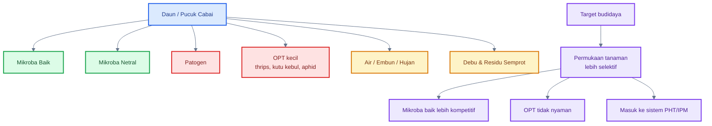

---

## 1.4 Validasi praktis

Bagian ini penting agar tulisan tidak jatuh menjadi sekadar konsep yang indah tetapi tidak operasional.

Konsep **foliar ecosystem** sebaiknya diposisikan sebagai **kerangka berpikir**, bukan sebagai klaim bahwa semua mikroba yang disemprot ke daun pasti akan bekerja. Dalam praktik bisnis, yang harus dipegang tetap **SOP berbasis PHT/IPM**, yaitu:

- bibit sehat,
- pembibitan dengan insect net,
- mulsa reflektif bila relevan,
- monitoring pucuk, bunga, dan daun bawah,
- sanitasi gulma dan tanaman sakit,
- penguatan jaringan tanaman,
- penggunaan mikroba **berlabel**,
- dan intervensi selektif bila tekanan OPT sudah tinggi.

Karena itu, ada garis tegas yang perlu diingat praktisi:

### Yang valid untuk SOP utama

- PHT/IPM sebagai kerangka utama.
- Monitoring rutin.
- Pengelolaan nutrisi agar pucuk tidak terlalu lunak.
- Penggunaan produk mikroba foliar yang memang berlabel untuk targetnya.
- Penggunaan entomopatogen berlabel bila diperlukan.
- Sanitasi dan pengendalian sumber inokulum atau vektor.

### Yang belum boleh jadi SOP utama

- Menyemprot **MOL lokal** ke daun sebagai program rutin.
- Menganggap semua mikroba lokal otomatis cocok untuk foliar.
- Membuat larutan “makanan mikroba” di daun tanpa uji kecil.
- Mengklaim bahwa mikroba foliar dapat menggantikan PHT.

Jadi, posisi yang aman secara bisnis adalah:

> **Foliar ecosystem adalah cara berpikir untuk menyusun strategi PHT yang lebih halus dan preventif, tetapi keputusan lapangan tetap harus bertumpu pada praktik yang sudah valid dan terukur.**

[**Kembali ke Atas**](#membangun-foliar-ecosystem-cabai-dalam-phtipm)

---

# 2. Perbedaan Rizosfer dan Phyllosphere

Agar tidak salah aplikasi, petani harus memahami bahwa dunia mikroba di sekitar akar dan dunia mikroba di permukaan daun adalah dua habitat yang sangat berbeda. Kesalahan paling umum di lapangan adalah menganggap bahwa mikroba yang baik untuk tanah otomatis baik untuk daun. Anggapan ini tidak tepat.

---

## 2.1 Rizosfer sebagai habitat stabil

**Rizosfer** adalah zona tanah yang sangat dipengaruhi oleh akar tanaman. Di sinilah akar, air, bahan organik, mikroba, dan mineral berinteraksi paling aktif. Untuk mikroba, rizosfer adalah habitat yang relatif stabil dan kaya sumber daya.

Mengapa stabil?

### a. Ada tanah

Tanah menyediakan ruang tiga dimensi untuk hidup. Mikroba dapat menempel pada partikel tanah, bahan organik, atau permukaan akar.

### b. Ada pori

Pori tanah menyediakan tempat berlindung, sirkulasi udara, dan retensi air. Mikroba tidak terus-menerus terkena sinar matahari langsung seperti di daun.

### c. Ada bahan organik

Kompos matang, humus, serasah halus, dan residu akar menjadi sumber energi dan habitat mikroba.

### d. Ada kelembapan

Selama tanah dijaga lembap dan tidak becek, mikroba memiliki akses air yang lebih stabil daripada mikroba di permukaan daun.

### e. Ada eksudat akar

Akar mengeluarkan senyawa organik yang menjadi sumber makanan dan sinyal biologis bagi mikroba rizosfer.

Karena kombinasi faktor-faktor ini, mikroba di rizosfer lebih mudah:

- bertahan hidup,
- membentuk komunitas,
- berkompetisi dengan patogen,
- dan berinteraksi secara berkelanjutan dengan akar.

Inilah sebabnya mengapa **MOL bambu**, bioaktivator lokal, atau agen hayati tanah lebih masuk akal diposisikan pertama-tama untuk **zona akar**, bukan langsung untuk daun.

---

## 2.2 Phyllosphere sebagai habitat ekstrem

Berbeda dengan rizosfer, **phyllosphere** adalah habitat yang keras. Mikroba di permukaan daun hidup pada kondisi yang jauh lebih tidak stabil.

<figure>
  
  <figcaption>
    Ekosistem foliar yang menggambarkan interaksi antara permukaan daun,
    mikroorganisme, lingkungan, dan kesehatan tanaman.
  </figcaption>
</figure>

Mengapa ekstrem?

### a. Terkena UV

Permukaan daun langsung terkena cahaya matahari. Sinar UV dapat merusak sel mikroba dan menurunkan daya hidupnya.

### b. Cepat kering

Daun tidak menyimpan kelembapan seperti tanah. Film air tipis setelah semprot atau embun bisa cepat hilang, terutama saat panas dan angin tinggi.

### c. Miskin nutrisi

Tidak ada bahan organik melimpah seperti di tanah. Nutrisi yang tersedia di permukaan daun sangat terbatas.

### d. Mudah tercuci hujan

Mikroba atau bahan yang baru disemprot ke daun bisa hilang karena hujan atau percikan air.

### e. Sering terkena pestisida atau fungisida

Permukaan daun adalah area yang paling sering mendapat semprotan. Ini berarti mikroba menguntungkan juga berada pada risiko tinggi untuk terganggu atau mati.

### f. Fluktuasi suhu dan kelembapan tinggi

Pagi, siang, sore, dan malam memberi kondisi yang sangat berbeda. Mikroba harus bertahan terhadap perubahan yang cepat.

Karena itu, mikroba di phyllosphere tidak bisa diperlakukan seperti mikroba tanah. Jika mikroba di rizosfer hidup pada sistem yang lebih “terlindungi”, maka mikroba foliar hidup pada sistem yang **terbuka dan penuh tekanan**.

### Diagram: Rizosfer vs Phyllosphere

```mermaid
%%{init: {
  "theme": "base",
  "themeVariables": {
    "background": "#ffffff",
    "fontSize": "13px",
    "lineColor": "#64748b",
    "primaryTextColor": "#111827"
  }
}}%%
flowchart TB
    A["Rizosfer"] --> A1["Ada tanah"]
    A --> A2["Ada pori"]
    A --> A3["Ada bahan organik"]
    A --> A4["Kelembapan lebih stabil"]
    A --> A5["Ada eksudat akar"]
    A --> A6["Mikroba lebih mudah bertahan"]

    B["Phyllosphere"] --> B1["Terkena UV"]
    B --> B2["Cepat kering"]
    B --> B3["Nutrisi minim"]
    B --> B4["Mudah tercuci hujan"]
    B --> B5["Sering kena semprotan"]
    B --> B6["Mikroba lebih sulit bertahan"]

    classDef riz fill:#dcfce7,stroke:#16a34a,color:#14532d,stroke-width:2px;
    classDef phy fill:#fee2e2,stroke:#dc2626,color:#7f1d1d,stroke-width:2px;

    class A,A1,A2,A3,A4,A5,A6 riz;
    class B,B1,B2,B3,B4,B5,B6 phy;
```

---

## 2.3 Implikasi praktis

Perbedaan habitat ini langsung berdampak pada keputusan budidaya.

### a. Mikroba tanah tidak otomatis cocok untuk daun

Mikroba lokal dari tanah atau serasah mungkin sangat baik untuk aktivasi kompos dan pengayaan rizosfer, tetapi belum tentu mampu hidup stabil di permukaan daun.

### b. MOL rizosfer lebih cocok untuk tanah

Dalam konteks bisnis budidaya, penggunaan MOL bambu atau bioaktivator lokal lebih logis untuk:

- aktivasi kompos,
- pengkayaan tanah,
- pengkocoran zona akar,
- dan pemulihan biologis lahan.

### c. Foliar butuh mikroba yang memang dirancang untuk daun

Untuk aplikasi foliar, praktisi sebaiknya memilih:

- produk mikroba **berlabel**,
- target aplikasinya jelas,
- ada petunjuk dosis,
- dan bila mungkin memang terdaftar untuk foliar atau penyakit/hama target.

### d. Aplikasi foliar perlu pengulangan dan waktu yang tepat

Karena habitatnya keras, mikroba foliar tidak cukup disemprot satu kali lalu dianggap menetap. Aplikasi perlu memperhatikan:

- waktu semprot,
- kondisi cuaca,
- jeda dengan bahan kimia keras,
- dan frekuensi ulang yang masuk akal.

Kesalahan memahami poin ini bisa membuat petani kecewa, karena mengira semua mikroba akan bekerja sama baiknya di tanah dan di daun.

---

## 2.4 Opini validasi

Bagian ini harus ditulis tegas agar tidak membingungkan praktisi.

### Valid

Membedakan strategi **tanah** dan **daun** adalah langkah yang benar. Secara biologis dan secara bisnis, ini masuk akal.

### Risiko

Menyemprot **MOL tanah pekat** ke daun sebagai program rutin adalah tindakan berisiko, karena:

- mikroba tanah belum tentu cocok untuk phyllosphere,
- larutan lokal yang tidak stabil bisa meninggalkan residu atau memicu masalah lain,
- dan efektivitasnya tidak sekuat produk foliar yang memang dirancang untuk target tertentu.

### Rekomendasi bisnis

Untuk usaha cabai yang berorientasi hasil dan stabilitas:

- gunakan **MOL bambu atau bioaktivator lokal untuk tanah/rizosfer**,
- gunakan **produk mikroba foliar berlabel untuk daun**,
- dan tempatkan semua itu dalam sistem **PHT/IPM**, bukan sebagai solusi tunggal.

Kalimat praktis yang harus diingat:

> **Rizosfer adalah rumah utama mikroba tanah. Phyllosphere adalah arena keras yang hanya cocok bagi mikroba tertentu. Karena itu, strategi tanah dan strategi daun tidak boleh dicampur secara serampangan.**

[**Kembali ke Atas**](#membangun-foliar-ecosystem-cabai-dalam-phtipm)

---

# 3. Posisi Mikroba Foliar dalam PHT/IPM Cabai

Mikroba foliar harus ditempatkan secara realistis. Dalam bisnis cabai, mikroba tidak boleh diposisikan sebagai “obat ajaib” yang menggantikan seluruh sistem pengendalian. Mikroba hanya satu komponen dalam **PHT/IPM**, yaitu pengendalian hama terpadu yang menggabungkan pencegahan, monitoring, kultur teknis, pengendalian hayati, sanitasi, perangkap, dan intervensi selektif bila diperlukan.

Kesalahan besar di lapangan adalah menganggap aplikasi mikroba cukup untuk menahan thrips, kutu kebul, aphid, tungau, dan penyakit daun. Padahal, mikroba bekerja baik jika lingkungan dan sistemnya mendukung. Tanpa monitoring, sanitasi, nutrisi seimbang, dan perlindungan awal, mikroba foliar mudah kalah oleh tekanan OPT.

---

## 3.1 Mikroba bukan pengganti PHT

Mikroba tidak menggantikan **monitoring**. Tanpa monitoring, petani tidak tahu kapan populasi OPT mulai naik, bagian tanaman mana yang diserang, dan apakah aplikasi perlu ditingkatkan atau tidak. Pada cabai, monitoring harus fokus pada pucuk muda, bunga, dan bawah daun. Thrips sering tersembunyi di pucuk dan bunga, sedangkan kutu kebul banyak ditemukan di bagian bawah daun.

Mikroba juga tidak menggantikan **sanitasi**. Gulma inang, tanaman cabai tua yang penuh hama, daun sakit, dan tanaman bergejala virus dapat menjadi sumber masalah. Jika sumber masalah dibiarkan, aplikasi mikroba hanya menjadi tindakan tambahan yang tidak cukup kuat.

Mikroba tidak menggantikan **pengendalian vektor virus**. Ini sangat penting. Pada pepper/cabai, Tomato spotted wilt virus ditularkan oleh beberapa spesies thrips, dan UC IPM menjelaskan bahwa virus ini tidak seedborne serta tidak menyebar lewat kontak, tetapi menyebar dari tanaman ke tanaman melalui thrips. Artinya, strategi terhadap thrips harus preventif dan terintegrasi, bukan sekadar menyemprot setelah serangan terlihat berat. ([UC IPM][1])

Mikroba juga tidak menggantikan **pestisida selektif** bila populasi sudah melewati batas bisnis. Dalam produksi cabai komersial, keputusan harus mempertimbangkan risiko kerugian. Jika populasi OPT naik cepat, banyak tanaman mulai menunjukkan gejala virus, atau serangan sudah mengancam produksi, maka PHT lengkap perlu dijalankan, termasuk pestisida selektif sesuai label dan rotasi bahan aktif.

Kalimat praktisnya:

> **Mikroba foliar adalah alat biologis dalam PHT, bukan pengganti PHT.**

---

## 3.2 Mikroba sebagai lapisan biologis

Walaupun bukan pengganti PHT, mikroba foliar tetap memiliki posisi penting. Ia berfungsi sebagai **lapisan biologis** pada permukaan tanaman.

### 1. Kompetitor ruang pada permukaan daun

Permukaan daun adalah ruang terbatas. Jika diisi mikroba menguntungkan yang mampu bertahan, maka patogen atau mikroba oportunis tidak selalu mudah mendominasi. Prinsipnya bukan membuat daun penuh larutan, tetapi menciptakan permukaan tanaman yang lebih kompetitif.

### 2. Antagonis patogen tertentu

Beberapa mikroba foliar seperti _Bacillus subtilis_ dan _Bacillus amyloliquefaciens_ digunakan dalam produk biopestisida untuk penyakit tanaman. Cornell mencantumkan produk berbasis _Bacillus subtilis_ strain QST 713 dan _Bacillus amyloliquefaciens_ yang berlabel untuk penyakit pepper seperti bacterial spot, gray mold, anthracnose, dan Botrytis gray mold. Ini memperkuat bahwa posisi _Bacillus_ lebih relevan untuk proteksi penyakit daun daripada sebagai pengendali utama thrips atau kutu kebul. ([Cornell Vegetables][2])

### 3. Pendukung ketahanan tanaman

Sebagian mikroba dapat mendukung respons tanaman melalui mekanisme seperti kompetisi, antibiosis, atau induksi ketahanan. Namun, klaim ini harus hati-hati. Untuk bisnis lapangan, gunakan produk yang memang memiliki label target, bukan sekadar klaim umum.

### 4. Agen hayati untuk hama tertentu

Untuk hama seperti thrips, kutu kebul, aphid, dan beberapa serangga lunak, mikroba yang lebih relevan adalah jamur entomopatogen seperti _Beauveria bassiana_ dan _Lecanicillium lecanii_, sesuai produk dan label. Cornell IPM menyebut _Beauveria bassiana_ sebagai insektisida berbasis jamur yang dapat digunakan pada berbagai serangga hama dan banyak tanaman pertanian maupun hortikultura, tetapi penggunaannya tetap harus mengikuti label produk. ([CALS][3])

### 5. Alat rotasi untuk mengurangi ketergantungan penuh pada kimia

Mikroba juga bisa menjadi bagian dari rotasi strategi. Dalam sistem yang hanya mengandalkan pestisida kimia, risiko resistensi dan gangguan musuh alami bisa meningkat. Mikroba membantu menambah variasi pendekatan, tetapi tetap harus dipakai dengan disiplin: dosis benar, waktu benar, dan tidak dicampur sembarangan dengan fungisida/bakterisida keras.

---

## 3.3 Posisi dalam piramida PHT

Mikroba foliar sebaiknya dibaca sebagai bagian dari piramida PHT, bukan sebagai bagian yang berdiri sendiri.

| Lapisan PHT         | Praktik                                    | Posisi Mikroba                         |
| ------------------- | ------------------------------------------ | -------------------------------------- |
| Pencegahan          | bibit sehat, insect net, mulsa reflektif   | mikroba preventif bisa membantu        |
| Monitoring          | sticky trap, cek pucuk, cek daun bawah     | mikroba dipakai berdasarkan risiko     |
| Kultur teknis       | jarak tanam, sanitasi, nitrogen terkendali | mikroba lebih mudah bertahan           |
| Pengendalian hayati | _Beauveria_, _Lecanicillium_, _Bacillus_   | mikroba jadi alat utama di lapisan ini |
| Fisik/mekanik       | cabut tanaman virus, perangkap             | mikroba mendampingi                    |
| Kimia selektif      | insektisida/fungisida sesuai kebutuhan     | beri jeda sebelum mikroba ulang        |

Dalam piramida ini, posisi mikroba paling kuat ada pada lapisan **pengendalian hayati** dan **pencegahan biologis**. Namun, mikroba tetap memerlukan lapisan lain agar hasilnya stabil.

### Diagram: Posisi mikroba foliar dalam PHT/IPM cabai

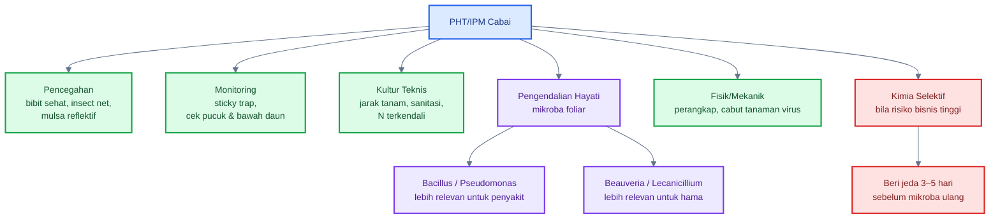

---

## 3.4 Opini validasi

Ini bagian yang paling penting untuk bisnis: mikroba harus ditempatkan sebagai **komponen PHT**, bukan sebagai produk ajaib.

Secara praktis, validasinya seperti ini:

| Klaim / Praktik                          | Status Validasi            | Catatan Praktis                          |
| ---------------------------------------- | -------------------------- | ---------------------------------------- |
| Mikroba sebagai bagian PHT               | Valid                      | Masuk sistem, bukan berdiri sendiri      |
| _Beauveria bassiana_ untuk beberapa hama | Valid bila produk berlabel | Ikuti label dan kondisi aplikasi         |
| _Bacillus_ untuk penyakit pepper         | Valid bila produk berlabel | Lebih relevan untuk patogen daun         |
| Mikroba menggantikan monitoring          | Tidak valid                | Monitoring tetap wajib                   |
| Mikroba menggantikan sanitasi            | Tidak valid                | Sumber OPT tetap harus dibersihkan       |
| Mikroba menyembuhkan virus               | Tidak valid                | Virus dikelola lewat vektor dan sanitasi |
| MOL tanah disemprot foliar rutin         | Eksperimental              | Jangan jadi SOP utama bisnis             |

Dengan posisi ini, praktisi tidak terjebak dalam dua ekstrem: terlalu fanatik kimia atau terlalu percaya pada mikroba tanpa data. Yang benar adalah **PHT berbasis keputusan lapangan**.

Kalimat kuncinya:

> **Mikroba foliar bernilai tinggi jika dipakai sebagai lapisan biologis dalam PHT. Tetapi bila dipakai tanpa monitoring, sanitasi, penguatan tanaman, dan keputusan selektif, mikroba mudah menjadi biaya tambahan tanpa hasil yang jelas.**

[**Kembali ke Atas**](#membangun-foliar-ecosystem-cabai-dalam-phtipm)

---

# 4. OPT Target: Kutu Kebul, Thrips, Aphid, Tungau, dan Patogen Daun

Strategi foliar ecosystem hanya berguna bila targetnya jelas. Tidak semua OPT dikendalikan dengan cara yang sama. Kutu kebul, thrips, aphid, tungau, dan penyakit daun memiliki perilaku berbeda. Karena itu, mikroba foliar, nutrisi, perangkap, dan pestisida selektif harus diposisikan sesuai target.

---

## 4.1 Kutu kebul

Kutu kebul adalah salah satu hama penting pada cabai karena merusak tanaman secara langsung dan tidak langsung. Kutu kebul mengisap cairan tanaman, terutama pada bagian bawah daun. Serangan berat dapat melemahkan tanaman, mengganggu pertumbuhan, dan menurunkan hasil.

Kerusakan penting dari kutu kebul meliputi:

- mengisap cairan daun,
- menghasilkan honeydew atau embun madu,
- memicu tumbuhnya sooty mold atau jamur jelaga,
- menurunkan kapasitas fotosintesis,
- membuat buah kurang menarik,
- menyebabkan pertumbuhan buruk,
- meningkatkan risiko kerugian jika ada virus yang ditularkan vektor.

UC IPM menjelaskan bahwa whiteflies merusak peppers dengan mengisap banyak sap, menutupi tanaman dengan honeydew, dan honeydew tersebut ditumbuhi black sooty mold yang menurunkan kapasitas fotosintesis tanaman serta dapat menyebabkan pertumbuhan buruk, defoliasi, dan penurunan hasil. ([UC IPM][4])

### Implikasi praktik

Untuk kutu kebul, strategi utama bukan hanya semprot hama dewasa. Yang harus dilakukan:

- cek bagian bawah daun,
- pasang yellow sticky trap,
- bersihkan gulma inang,
- hindari nitrogen berlebihan,
- gunakan mulsa reflektif pada fase awal jika memungkinkan,
- gunakan entomopatogen berlabel bila tekanan awal mulai terlihat,
- gunakan pestisida selektif bila populasi naik dan risiko bisnis tinggi.

Mikroba foliar dapat membantu, tetapi jangan mengandalkan _Bacillus_ untuk kutu kebul. Untuk kutu kebul, mikroba yang lebih relevan adalah entomopatogen seperti _Beauveria_ atau _Lecanicillium_, sesuai label.

---

## 4.2 Thrips

Thrips adalah hama kecil tetapi sangat berbahaya pada cabai karena menyerang bagian yang bernilai tinggi: pucuk muda, daun muda, dan bunga. Gejalanya sering terlihat sebagai daun keriting, bercak keperakan, pucuk rusak, bunga terganggu, dan buah tidak sempurna.

Kerusakan langsung thrips meliputi:

- menghisap dan mengikis jaringan muda,
- merusak pucuk,
- menyebabkan daun melintir,
- menyebabkan bercak perak,
- merusak bunga,
- menurunkan kualitas buah.

Namun, dalam banyak sistem pepper, thrips jauh lebih penting karena kaitannya dengan virus. UC IPM mencatat bahwa Tomato spotted wilt virus ditularkan oleh berbagai spesies thrips, termasuk western flower thrips, onion thrips, dan chili thrips. Virus ini hanya menyebar dari tanaman ke tanaman melalui thrips. ([UC IPM][1])

UF/IFAS juga menegaskan bahwa pengendalian thrips dewasa di bunga dengan insektisida tidak cukup untuk mencegah transmisi virus, sehingga taktik preventif seperti ultraviolet-reflective mulch harus digunakan untuk mencegah penyebaran awal Tomato spotted wilt virus oleh western flower thrips dewasa. ([Ask IFAS - Powered by EDIS][5])

### Implikasi praktik

Untuk thrips, strategi harus preventif:

- bibit harus bebas thrips,
- pembibitan memakai insect net,
- mulsa reflektif dipertimbangkan pada daerah rawan,
- monitoring pucuk dan bunga dilakukan rutin,
- blue/yellow sticky trap dipasang sejak awal,
- tanaman virus dicabut,
- entomopatogen bisa masuk saat populasi awal-sedang,
- pestisida selektif masuk bila populasi mengancam bisnis.

Kalimat praktisnya:

> **Thrips jangan ditunggu banyak. Pada cabai, thrips harus dicegah sejak awal karena risiko virus bisa lebih mahal daripada kerusakan makan langsung.**

---

## 4.3 Aphid dan tungau

Aphid dan tungau sering dianggap hama sekunder, tetapi pada kondisi tertentu keduanya bisa menjadi masalah serius.

### Aphid

Aphid sering menyerang pucuk muda dan daun yang masih lunak. Populasinya dapat meningkat ketika tanaman terlalu subur, tajuk terlalu rimbun, atau banyak gulma inang di sekitar lahan. Aphid juga dapat berkaitan dengan penularan beberapa virus pada tanaman sayuran.

Strategi terhadap aphid:

- hindari nitrogen berlebihan,
- cek pucuk muda,
- pasang yellow sticky trap,
- bersihkan gulma inang,
- jaga musuh alami,
- gunakan pengendalian selektif bila populasi naik.

### Tungau

Tungau sering meningkat saat kondisi panas-kering, tanaman stres, dan lingkungan berdebu. Tungau tidak selalu nyaman pada daun yang terlalu basah, tetapi sangat nyaman pada tanaman stres, kering, dan lemah.

Strategi terhadap tungau:

- kurangi debu,
- jaga irigasi stabil,
- hindari tanaman stres kering,
- cek bawah daun,
- jangan terlalu sering memakai bahan yang membunuh musuh alami,
- gunakan akarisida selektif bila diperlukan.

### Implikasi praktik

Untuk aphid dan tungau, mikroba foliar bukan alat utama tunggal. Yang lebih penting adalah **monitoring, sanitasi, pengelolaan nitrogen, pengelolaan stres air, dan perlindungan musuh alami**.

---

## 4.4 Penyakit daun

Penyakit daun pada cabai mencakup banyak masalah, seperti bercak bakteri, antraknosa, gray mold, embun, dan penyakit lain. Berbeda dari thrips dan kutu kebul, pada penyakit daun posisi mikroba foliar seperti _Bacillus_ lebih relevan.

Produk berbasis _Bacillus subtilis_ dan _Bacillus amyloliquefaciens_ banyak digunakan sebagai biopestisida untuk penyakit. Cornell mencantumkan beberapa produk berbasis _Bacillus subtilis_ strain QST 713 yang berlabel untuk bacterial spot, gray mold, anthracnose, serta _Bacillus amyloliquefaciens_ strain MBI 600 yang berlabel untuk anthracnose, bacterial leaf spot, dan Botrytis gray mold pada pepper. ([Cornell Vegetables][2])

### Implikasi praktik

Untuk penyakit daun, strategi utama adalah:

- gunakan bibit sehat,
- hindari daun basah terlalu lama,
- atur jarak tanam dan sirkulasi,
- sanitasi daun sakit,
- gunakan produk mikroba foliar berlabel sebagai preventif,
- gunakan fungisida/bakterisida selektif bila tekanan penyakit tinggi.

Namun, perlu ditekankan:

> **Mikroba foliar untuk penyakit bekerja lebih baik sebagai preventif atau tekanan awal, bukan penyelamatan saat penyakit sudah parah.**

---

## Diagram: OPT target dan alat PHT yang paling relevan

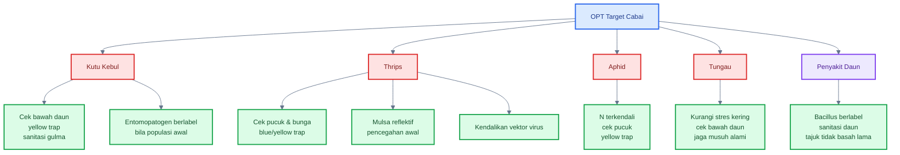

---

# Ringkasan Bab 3–4

Mikroba foliar harus ditempatkan sebagai **komponen PHT/IPM**, bukan pengganti seluruh sistem. Mikroba tidak menggantikan monitoring, sanitasi, pengendalian vektor virus, atau pestisida selektif bila populasi OPT sudah mengancam bisnis.

Untuk penyakit daun, mikroba seperti _Bacillus_ lebih relevan bila produk memang berlabel untuk target tersebut. Untuk hama seperti thrips, kutu kebul, dan aphid, mikroba yang lebih relevan adalah entomopatogen seperti _Beauveria_ atau _Lecanicillium_ sesuai label. Untuk thrips dan kutu kebul, strategi paling penting tetap preventif karena keduanya dapat berkaitan dengan risiko virus dan kerugian besar pada cabai.

Kalimat kunci:

> **Mikroba foliar bernilai dalam PHT jika targetnya jelas: Bacillus untuk proteksi penyakit, Beauveria/Lecanicillium untuk hama tertentu, dan semuanya harus didukung monitoring, sanitasi, penguatan tanaman, serta keputusan selektif berbasis risiko bisnis.**

[1]: https://ipm.ucanr.edu/agriculture/peppers/tomato-spotted-wilt/?utm_source=chatgpt.com 'Tomato Spotted Wilt / Peppers / Agriculture'
[2]: https://www.vegetables.cornell.edu/pest-management/disease-factsheets/biopesticides/biopesticides-for-managing-diseases-of-pepper-organically/?utm_source=chatgpt.com 'Biopesticides for Managing Diseases of Pepper Organically'
[3]: https://cals.cornell.edu/integrated-pest-management/outreach-education/fact-sheets/beauveria-bassiana?utm_source=chatgpt.com 'Beauveria bassiana | Cornell IPM Biocontrol Fact Sheet'
[4]: https://ipm.ucanr.edu/agriculture/peppers/whiteflies/?utm_source=chatgpt.com 'Whiteflies / Peppers / Agriculture: Pest Management ...'
[5]: https://ask.ifas.ufl.edu/publication/IN401?utm_source=chatgpt.com 'ENY-658/IN401: Managing Thrips in Pepper and Eggplant'

[**Kembali ke Atas**](#membangun-foliar-ecosystem-cabai-dalam-phtipm)

---

# 5. Strategi Preventif yang Lebih Valid daripada “Semprot Setelah Parah”

Dalam bisnis cabai, strategi paling mahal adalah menunggu OPT parah lalu baru menyemprot. Pada fase itu, tanaman sudah kehilangan energi, pucuk rusak, bunga terganggu, risiko virus meningkat, dan biaya pengendalian naik. Karena itu, strategi foliar ecosystem yang benar harus dimulai dari **pencegahan**, bukan dari “penyelamatan”.

Pencegahan bukan berarti lahan bebas 100% dari hama. Pencegahan berarti menekan peluang OPT masuk, berkembang, dan menetap sejak awal.

---

## 5.1 Insect net pembibitan

Pembibitan adalah titik awal yang sering diremehkan. Padahal, bibit cabai yang sudah membawa thrips, kutu kebul, aphid, atau gejala virus sejak awal sangat merugikan. Begitu bibit seperti ini masuk ke lahan, petani sebenarnya sedang menanam masalah.

Karena itu, pembibitan sebaiknya dilindungi dengan **insect net**. Tujuannya adalah mengurangi peluang hama vektor masuk ke area bibit. Ini terutama penting di daerah yang sering mengalami serangan thrips, kutu kebul, dan penyakit virus.

Patokan praktis:

| Komponen                  | Rekomendasi                                           |
| ------------------------- | ----------------------------------------------------- |
| Insect net pembibitan     | `$32\text{–}50\ \text{mesh}$`                         |
| Sticky trap di pembibitan | kuning dan biru                                       |
| Monitoring bibit          | `$2\text{–}3$ kali/minggu`                            |
| Bibit gejala virus        | jangan ditanam                                        |
| Bibit terlalu lunak       | kurangi dominasi `$N$`, perbaiki cahaya dan sirkulasi |

Catatan penting: semakin rapat mesh, ventilasi makin berkurang. Jadi, insect net harus dikombinasikan dengan sirkulasi udara yang baik. Pembibitan yang terlalu panas dan lembap juga bisa memicu penyakit.

**Opini praktis:** insect net pembibitan lebih layak dijadikan SOP utama daripada mencoba memperbaiki tanaman yang sudah membawa hama sejak awal.

---

## 5.2 Mulsa reflektif

Mulsa reflektif adalah salah satu strategi preventif yang lebih valid daripada sekadar semprot setelah hama datang. Fungsinya bukan membunuh hama, tetapi **mengganggu orientasi serangga tertentu** pada fase awal tanaman.

Mulsa reflektif paling berguna saat tanaman masih kecil, karena permukaan mulsa masih terbuka dan pantulan cahayanya masih efektif. Ketika tajuk cabai sudah menutup permukaan mulsa, efek pantulannya akan menurun.

UC IPM menyebut reflective mulch dapat mengurangi kolonisasi tanaman muda oleh serangga bersayap seperti aphid, leafhopper, thrips, dan whitefly karena pantulan ultraviolet mengganggu kemampuan serangga menemukan tanaman inang. UC IPM juga menyarankan pemilihan plastik mulsa sesuai tujuan, termasuk mulsa reflektif untuk menolak aphid dan whitefly pada pepper. ([UC IPM][1])

Pada thrips, UF/IFAS menyebut ultraviolet-reflective mulch dapat menolak migrasi western flower thrips dewasa dan mengurangi penyebaran Tomato spotted wilt virus. Ini memperkuat bahwa mulsa reflektif adalah strategi awal yang valid, terutama pada lokasi rawan thrips dan virus. ([Ask IFAS - Powered by EDIS][2])

### Patokan lapangan

| Kondisi                              | Keputusan                         |
| ------------------------------------ | --------------------------------- |
| Daerah rawan thrips/kutu kebul/aphid | mulsa reflektif sangat layak      |
| Tanaman masih kecil                  | efek reflektif paling kuat        |
| Tajuk sudah menutup mulsa            | efek reflektif menurun            |
| Musim sangat panas                   | perhatikan suhu tanah dan irigasi |
| Sistem drip tersedia                 | lebih cocok untuk plastik mulsa   |

### Opini praktis

Mulsa reflektif bukan pengganti pengendalian hama, tetapi **alat pencegah awal**. Dalam bisnis cabai, alat yang menunda masuknya vektor pada fase muda sangat bernilai, karena fase awal sering menentukan kesehatan tanaman sampai produksi.

---

## 5.3 Sanitasi gulma inang

Gulma bukan hanya pesaing hara. Pada sistem cabai, gulma bisa menjadi rumah awal bagi thrips, aphid, kutu kebul, tungau, dan patogen tertentu. Beberapa gulma juga dapat menjadi reservoir virus atau tempat singgah vektor.

Sanitasi gulma harus dilakukan, tetapi jangan dipahami sebagai “menghilangkan semua tanaman di sekitar lahan tanpa strategi”. Dalam PHT, area sekitar lahan perlu bersih dari gulma inang utama, tetapi tetap mempertimbangkan habitat musuh alami bila sistemnya memungkinkan.

Prioritas sanitasi:

- gulma di sekitar pembibitan,
- gulma di pinggir bedengan,
- gulma dekat tanaman muda,
- gulma yang terlihat banyak dihuni kutu kebul/aphid/thrips,
- sisa tanaman cabai tua yang masih hidup.

### Patokan praktis

| Area                             | Tindakan                                |
| -------------------------------- | --------------------------------------- |
| Dalam bedengan                   | bersih dari gulma                       |
| Parit                            | jangan jadi sarang gulma inang          |
| Pinggir lahan                    | dikendalikan rutin                      |
| Sekitar pembibitan               | harus paling bersih                     |
| Lahan cabai tua dekat lahan muda | risiko tinggi, perlu diputus sumber OPT |

### Opini praktis

Sanitasi gulma lebih murah daripada menyemprot berulang. Jika sumber OPT dibiarkan, mikroba foliar, perangkap, dan pestisida hanya bekerja di hilir.

---

## 5.4 Cabut tanaman virus

Tanaman cabai yang sudah menunjukkan gejala virus berat tidak boleh terlalu lama dipertahankan di lahan. Ia bisa menjadi sumber inokulum dan memperpanjang masalah, terutama bila vektor masih aktif.

Gejala yang perlu diwaspadai:

- pucuk mengerdil,
- daun mosaik,
- daun keriting berat,
- tanaman kerdil tidak normal,
- warna daun belang,
- pertumbuhan terhambat parah.

Tanaman seperti ini sebaiknya dicabut dan dimusnahkan secara aman. Jangan dibiarkan karena “sayang tanaman”. Dalam bisnis, satu tanaman sakit berat bisa menjadi sumber risiko bagi banyak tanaman sehat.

### SOP singkat tanaman virus

1. Tandai tanaman bergejala berat.
2. Cabut saat populasi vektor sedang rendah, misalnya pagi/sore.
3. Masukkan ke karung atau wadah.
4. Jangan ditinggalkan di pinggir lahan.
5. Musnahkan dengan aman.
6. Perkuat monitoring vektor setelah pencabutan.

### Opini praktis

Mikroba tidak menyembuhkan virus. Penguatan jaringan tidak menyembuhkan virus. Jika virus sudah muncul, tindakan bisnis yang tegas adalah **cabut sumber inokulum dan kendalikan vektornya**.

---

## 5.5 Opini validasi

Bagian ini adalah **SOP utama bisnis**, bukan hipotesis.

Urutan prioritas yang lebih valid:

1. bibit bersih,
2. insect net pembibitan,
3. mulsa reflektif bila sesuai risiko,
4. monitoring sejak awal,
5. sanitasi gulma dan tanaman sakit,
6. nutrisi seimbang,
7. mikroba foliar berlabel,
8. intervensi selektif bila populasi melewati batas bisnis.

Formula mikroba yang rumit tidak boleh mengalahkan SOP pencegahan dasar. Dalam cabai, pencegahan jauh lebih murah daripada memperbaiki tanaman yang sudah rusak pucuk dan terinfeksi virus.

### Diagram: Strategi preventif sebelum OPT parah

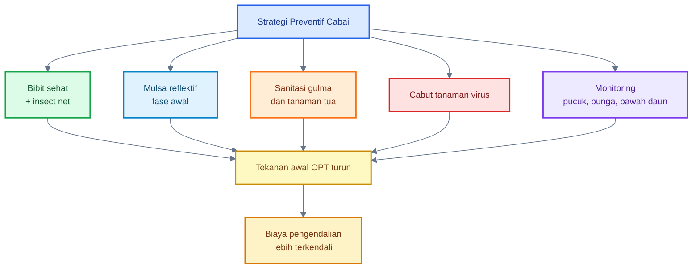

[**Kembali ke Atas**](#membangun-foliar-ecosystem-cabai-dalam-phtipm)

---

# 6. Nutrisi agar Pucuk Tidak Menjadi “Makanan Empuk”

Pucuk cabai yang terlalu lunak adalah target ideal bagi hama pengisap. Karena itu, strategi foliar ecosystem tidak hanya bicara mikroba. Ia juga harus bicara **nutrisi jaringan**.

Tujuan nutrisi pada konteks ini bukan membuat cabai sekadar hijau dan cepat besar. Tujuannya adalah membuat tanaman **kokoh, elastis, tidak terlalu berair, dan tidak terlalu lunak**.

---

## 6.1 Kendali nitrogen

Nitrogen atau `$N$` sangat penting untuk pertumbuhan. Tanpa `$N$`, tanaman lemah, daun pucat, dan pertumbuhan lambat. Namun, kelebihan `$N$` dapat membuat pucuk terlalu lunak, ruas panjang, daun terlalu hijau tua, dan jaringan lebih menarik bagi hama pengisap.

UC IPM menyarankan menjaga tanaman tetap vigor tetapi menghindari aplikasi nitrogen berlebihan karena dapat mendorong populasi thrips lebih tinggi. Rujukan SARE juga menyebut banyak studi menunjukkan tingkat nitrogen tinggi dalam jaringan tanaman dapat menurunkan resistensi dan meningkatkan kerentanan terhadap serangan hama. ([UC IPM][3])

### Tanda `$N$` cenderung berlebih

| Gejala                 | Makna Praktis                             | Tindakan                                       |
| ---------------------- | ----------------------------------------- | ---------------------------------------------- |
| Daun hijau tua pekat   | vegetatif terlalu kuat                    | turunkan dominasi `$N$`                        |
| Pucuk lembek           | jaringan terlalu lunak                    | naikkan dukungan `$Ca$`, `$Si$`, `$K$`, `$Mg$` |
| Ruas panjang           | tanaman terlalu vegetatif / kurang cahaya | koreksi nutrisi dan cahaya                     |
| Banyak thrips di pucuk | pucuk menarik atau tanaman stres          | cek `$N$`, air, dan monitoring                 |
| Aphid mudah masuk      | pucuk terlalu lunak                       | kendalikan `$N$` dan sanitasi                  |

### Patokan koreksi

Jika tanaman terlihat terlalu lunak:

- turunkan input `$N$` sekitar `$25\text{–}50\%$` selama `$7\text{–}10$ hari`,
- hentikan sementara pupuk daun tinggi `$N$`,
- perkuat `$Ca$`, `$Si$`, `$K$`, dan `$Mg$` secara bertahap,
- jangan membuat tanaman stres air.

---

## 6.2 Kalsium

Kalsium atau `$Ca$` penting untuk kekuatan dinding sel, stabilitas jaringan, dan kualitas pertumbuhan muda. Secara fisiologis, kalsium berhubungan dengan ikatan pada pektin dan kekuatan struktur dinding sel. Riset tentang pektin menyebut bahwa tingkat cross-linking pektin memengaruhi kekuatan dinding sel, porositas, dan akses molekul biologis ke dinding sel. ([Nature][4])

Pada cabai, `$Ca$` penting untuk:

- daun muda,
- pucuk,
- bunga,
- buah muda,
- dan jaringan yang sedang aktif tumbuh.

Namun, `$Ca$` tidak mudah bergerak ulang dalam tanaman. Distribusinya sangat dipengaruhi aliran air dan transpirasi. Karena itu, aplikasi `$Ca$` harus konsisten dan didukung air yang stabil.

### Dosis praktis foliar

| Fase                   |                   Dosis `$Ca$` |             Interval |
| ---------------------- | -----------------------------: | -------------------: |
| Bibit kuat             | `$0{,}5\text{–}1\ \text{g/L}$` | `$7\text{–}10$ hari` |
| Vegetatif awal         |              `$1\ \text{g/L}$` | `$7\text{–}10$ hari` |
| Vegetatif aktif        | `$1\text{–}1{,}5\ \text{g/L}$` | `$7\text{–}10$ hari` |
| Banyak bunga/buah muda | `$1\text{–}1{,}5\ \text{g/L}$` |       sesuai kondisi |

Catatan: jangan mencampur `$Ca$` pekat dengan silika pekat atau fosfat pekat dalam satu tangki.

---

## 6.3 Silika

Silika atau `$Si$` mendukung kekuatan jaringan dan toleransi stres. Dalam banyak tanaman, `$Si$` berhubungan dengan ketahanan terhadap cekaman biotik dan abiotik. Review tentang silikon dan resistensi tanaman terhadap serangga menjelaskan bahwa `$Si$` dapat berperan dalam mekanisme resistensi terhadap herbivora, baik melalui penguatan fisik maupun respons pertahanan, tetapi efeknya tergantung tanaman, hama, dan kondisi. ([PMC][5])

Namun, `$Si$` harus diposisikan dengan benar:

> **Silika bukan insektisida. Silika tidak boleh diklaim membunuh thrips atau kutu kebul.**

Pada cabai, `$Si$` lebih aman diposisikan sebagai:

- penguat jaringan,
- pendukung ketahanan stres,
- bagian dari program preventif,
- pendamping `$Ca$`, `$K$`, dan `$Mg$`.

### Dosis praktis foliar

| Fase                      |                   Dosis `$Si$` larut |              Interval |
| ------------------------- | -----------------------------------: | --------------------: |
| Bibit kuat                | `$0{,}25\text{–}0{,}5\ \text{ml/L}$` | `$10\text{–}14$ hari` |
| `$0\text{–}14$ HST        |               `$0{,}5\ \text{ml/L}$` |  `$7\text{–}10$ hari` |
| `$15\text{–}35$ HST       |      `$0{,}5\text{–}1\ \text{ml/L}$` |  `$7\text{–}10$ hari` |
| Tekanan cuaca/hama tinggi |      `$0{,}5\text{–}1\ \text{ml/L}$` |          sesuai label |

Pisahkan aplikasi silika dan kalsium minimal `$3\text{–}4$ hari` untuk mengurangi risiko reaksi atau endapan.

---

## 6.4 Kalium

Kalium atau `$K$` berperan dalam pengaturan air, tekanan osmotik, pembukaan stomata, transport hasil fotosintesis, dan ketahanan tanaman terhadap stres. Dalam konteks pucuk cabai, `$K$` membantu tanaman tidak terlalu berair dan tidak terlalu lunak.

Review nutrisi dan ketahanan hama menyebut manajemen nutrisi seimbang, terutama `$K$` dan `$P$`, dapat memperkuat ketahanan tanaman secara tidak langsung melalui mekanisme biokimia, fisik, dan mekanik. ([EnviroClimate Journal][6])

### Dosis praktis foliar

| Input `$K$`        |                      Dosis |              Interval |
| ------------------ | -------------------------: | --------------------: |
| `$KNO_3$`          | `$1\text{–}2\ \text{g/L}$` | `$10\text{–}14$ hari` |
| Kalium foliar lain |               sesuai label |          sesuai label |

Gunakan `$KNO_3$` dengan hati-hati jika tanaman sudah terlalu vegetatif. Walaupun mengandung `$K$`, ia juga membawa nitrogen. Jika tanaman sedang sangat lunak karena `$N$`, prioritaskan sumber `$K$` yang tidak menambah `$N$` tinggi, sesuai ketersediaan produk dan label.

---

## 6.5 Magnesium

Magnesium atau `$Mg$` adalah unsur penting dalam klorofil dan fotosintesis. Tanaman yang fotosintesisnya baik lebih stabil dalam menghadapi stres. Jika `$Mg$` kurang, daun tua sering menguning di antara tulang daun, fotosintesis turun, dan tanaman menjadi kurang efisien menyuplai energi ke pertumbuhan baru.

Dalam program penguatan pucuk, `$Mg$` tidak bekerja sendiri. Ia mendampingi `$Ca$`, `$K$`, dan `$Si$`.

### Dosis praktis foliar

Gunakan magnesium sulfat atau `$MgSO_4$`.

| Fase            |               Dosis `$MgSO_4$` |              Interval |
| --------------- | -----------------------------: | --------------------: |
| Bibit kuat      |          `$0{,}5\ \text{g/L}$` | `$10\text{–}14$ hari` |
| Vegetatif awal  | `$0{,}5\text{–}1\ \text{g/L}$` | `$10\text{–}14$ hari` |
| Vegetatif aktif |              `$1\ \text{g/L}$` | `$10\text{–}14$ hari` |

Jangan berlebihan. Magnesium yang terlalu tinggi juga bisa mengganggu keseimbangan dengan unsur lain.

---

## 6.6 Angka praktis

Tabel berikut adalah angka kerja awal untuk praktisi. Tetap ikuti label produk karena konsentrasi tiap produk berbeda.

| Input            |               Dosis Foliar Praktis |              Interval |
| ---------------- | ---------------------------------: | --------------------: |
| `$Ca$`           |     `$1\text{–}1{,}5\ \text{g/L}$` |  `$7\text{–}10$ hari` |
| `$MgSO_4$`       |     `$0{,}5\text{–}1\ \text{g/L}$` | `$10\text{–}14$ hari` |
| `$Si$` larut     |    `$0{,}5\text{–}1\ \text{ml/L}$` |  `$7\text{–}10$ hari` |
| `$KNO_3$`        |         `$1\text{–}2\ \text{g/L}$` | `$10\text{–}14$ hari` |
| Mikroelement mix | `$0{,}3\text{–}0{,}5\ \text{g/L}$` |           `$14$ hari` |

### Contoh rotasi sederhana

| Hari            | Aplikasi                                             |
| --------------- | ---------------------------------------------------- |
| Hari 1          | `$Ca + Mg + mikroelement$`                           |
| Hari 4 atau 5   | `$Si$` larut                                         |
| Hari 8 atau 10  | `$K$` ringan, misalnya `$KNO_3$` bila sesuai kondisi |
| Hari 12 atau 14 | evaluasi pucuk, ulang sesuai kebutuhan               |

Catatan penting:

- jangan campur `$Ca$` dan `$Si$` pekat dalam satu tangki,
- jangan campur terlalu banyak bahan,
- semprot pagi atau sore,
- daun cukup basah merata, tidak menetes berlebihan,
- jangan semprot saat tanaman stres kering berat.

---

## 6.7 Opini validasi

Nutrisi penguat jaringan valid sebagai **pendukung ketahanan tanaman**, bukan sebagai pengendalian OPT langsung.

Kalimat yang harus diingat:

> **`$Ca$`, `$Si$`, `$K$`, dan `$Mg$` membantu membuat cabai lebih kokoh, tetapi tidak menggantikan PHT.**

Jika thrips atau kutu kebul sudah tinggi, jangan berharap nutrisi menyelesaikan masalah. Nutrisi membuat tanaman lebih siap dan tidak terlalu menarik, tetapi tetap perlu:

- monitoring,
- perangkap,
- sanitasi,
- pengendalian vektor,
- mikroba berlabel,
- dan pestisida selektif bila risiko bisnis tinggi.

### Diagram: Nutrisi penguat pucuk dalam PHT

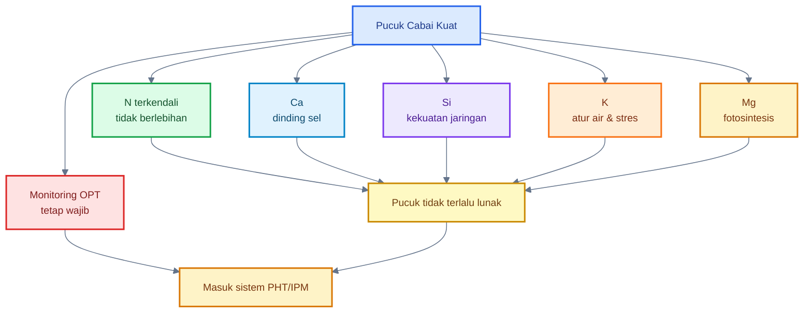

---

# Ringkasan Bab 5–6

Strategi preventif seperti insect net pembibitan, mulsa reflektif, sanitasi gulma, dan pencabutan tanaman virus adalah SOP utama bisnis cabai. Ini lebih valid dan lebih murah daripada menunggu OPT parah lalu mengandalkan semprotan.

Di sisi nutrisi, pucuk cabai tidak boleh dibuat terlalu lunak oleh dominasi nitrogen. `$N$` tetap penting, tetapi harus dikendalikan. `$Ca$`, `$Si$`, `$K$`, dan `$Mg$` membantu membangun jaringan yang lebih kokoh dan tanaman yang lebih stabil, tetapi tidak menggantikan PHT.

Kalimat kunci:

> **Pencegahan menurunkan tekanan OPT sejak awal, sedangkan nutrisi seimbang membuat pucuk tidak menjadi “makanan empuk”. Keduanya bukan pengganti PHT, tetapi pondasi agar PHT bekerja lebih murah dan lebih efektif.**

[1]: https://ipm.ucanr.edu/agriculture/floriculture-and-ornamental-nurseries/reflective-mulches/?utm_source=chatgpt.com 'Reflective Mulches / Floriculture and Ornamental Nurseries ...'
[2]: https://ask.ifas.ufl.edu/publication/IN401?utm_source=chatgpt.com 'ENY-658/IN401: Managing Thrips in Pepper and Eggplant'
[3]: https://ipm.ucanr.edu/home-and-landscape/thrips/?utm_source=chatgpt.com 'Thrips / Home and Landscape / UC Statewide ...'
[4]: https://www.nature.com/articles/s42003-025-07495-0?utm_source=chatgpt.com 'Understanding pectin cross-linking in plant cell walls'
[5]: https://pmc.ncbi.nlm.nih.gov/articles/PMC6027389/?utm_source=chatgpt.com 'Silicon and Mechanisms of Plant Resistance to Insect Pests'
[6]: https://journalijecc.com/index.php/IJECC/article/view/4188?utm_source=chatgpt.com 'Nutrient Strategies for Pest Resilience in Plants: A Review'

[**Kembali ke Atas**](#membangun-foliar-ecosystem-cabai-dalam-phtipm)

---

# 7. Mikroba Foliar yang Layak Masuk SOP

Mikroba foliar tidak boleh dipilih hanya karena “mikroba itu baik”. Dalam bisnis cabai, mikroba harus dipilih berdasarkan **target masalah**, **label produk**, **cara kerja**, dan **kecocokan aplikasi foliar**.

Prinsipnya sederhana:

> **Untuk hama, pilih mikroba entomopatogen berlabel. Untuk penyakit daun, pilih mikroba antagonis berlabel. Untuk MOL lokal, posisikan sebagai demplot, bukan SOP utama foliar.**

---

## 7.1 Untuk hama: entomopatogen

Untuk hama seperti thrips, kutu kebul, aphid, dan beberapa serangga lunak lain, kelompok mikroba yang paling relevan adalah **jamur entomopatogen**. Ini adalah mikroba yang dapat menginfeksi serangga, bukan sekadar memperkuat daun.

Mikroba yang lebih relevan:

- _Beauveria bassiana_
- _Lecanicillium lecanii_
- _Metarhizium anisopliae_ untuk beberapa sistem tertentu

Dari ketiganya, _Beauveria bassiana_ adalah yang paling umum ditemukan dalam produk komersial. Cornell IPM menyebut _Beauveria bassiana_ sebagai insektisida berbasis jamur yang terdaftar untuk berbagai hama serangga dan dapat digunakan pada banyak tanaman pertanian serta hortikultura; efektivitasnya dipengaruhi lingkungan dan kondisi aplikasi. ([CALS][1])

### Posisi praktis entomopatogen

| Target     | Mikroba yang Relevan                           | Catatan Praktis                                |
| ---------- | ---------------------------------------------- | ---------------------------------------------- |
| Thrips     | _Beauveria bassiana_, _Lecanicillium lecanii_  | lebih baik pada populasi awal–sedang           |
| Kutu kebul | _Beauveria bassiana_, _Lecanicillium lecanii_  | fokus bawah daun dan aplikasi berulang         |
| Aphid      | _Beauveria bassiana_, _Lecanicillium lecanii_  | kombinasikan dengan sanitasi dan monitoring    |
| Tungau     | beberapa produk _Beauveria_ / agen hayati lain | efektivitas tergantung produk dan target label |

Label salah satu produk _Beauveria bassiana_ pada EPA mencantumkan interval aplikasi `$5\text{–}10$ hari`; pada populasi tinggi, terutama whitefly dan aphid, interval bisa perlu dirapatkan menjadi `$2\text{–}5$ hari` sesuai label. Ini menegaskan bahwa aplikasi entomopatogen bukan “sekali semprot selesai”, tetapi perlu mengikuti tekanan populasi dan petunjuk produk. ([US EPA][2])

### Catatan bisnis

Entomopatogen sebaiknya digunakan saat:

- populasi hama masih awal–sedang,
- kelembapan cukup mendukung,
- aplikasi dilakukan sore/pagi,
- tidak dicampur fungisida keras,
- dan monitoring tetap berjalan.

Jika populasi thrips atau kutu kebul sudah tinggi dan risiko bisnis besar, entomopatogen saja tidak cukup. Masuk ke strategi PHT lengkap.

---

## 7.2 Untuk penyakit daun: bakteri antagonis

Untuk penyakit daun, mikroba yang lebih relevan adalah bakteri antagonis atau biopestisida mikroba yang memang berlabel untuk penyakit tanaman.

Mikroba yang sering digunakan:

- _Bacillus subtilis_
- _Bacillus amyloliquefaciens_
- _Bacillus pumilus_
- beberapa _Pseudomonas_ bila produk berlabel

Kelompok _Bacillus_ kuat secara praktik karena beberapa strain dapat membentuk spora, lebih tahan dalam formulasi, dan banyak digunakan sebagai biopestisida. Cornell mencantumkan produk berbasis _Bacillus subtilis_ strain QST 713 yang berlabel untuk penyakit pepper seperti bacterial spot, gray mold, dan anthracnose, serta produk berbasis _Bacillus amyloliquefaciens_ untuk penyakit seperti anthracnose, bacterial leaf spot, dan Botrytis gray mold. ([Cornell Vegetables][3])

### Posisi praktis bakteri antagonis

| Target               | Mikroba yang Relevan               | Posisi                      |
| -------------------- | ---------------------------------- | --------------------------- |
| Bercak bakteri       | _Bacillus_ berlabel                | preventif / tekanan awal    |
| Antraknosa           | _Bacillus_ berlabel                | preventif, bukan saat parah |
| Gray mold / Botrytis | _Bacillus_ tertentu sesuai label   | preventif                   |
| Patogen daun umum    | _Bacillus_, beberapa _Pseudomonas_ | tergantung label produk     |

### Catatan penting

_Bacillus_ foliar jangan diposisikan sebagai pengendali utama thrips atau kutu kebul. Perannya lebih kuat pada:

- kompetisi ruang dengan patogen,
- antagonisme penyakit tertentu,
- dukungan proteksi permukaan daun,
- dan pencegahan penyakit pada tekanan awal.

Untuk hama pengisap, gunakan entomopatogen atau strategi PHT lain.

---

## 7.3 Tidak semua mikroba cocok foliar

Ini bagian yang harus tegas. Tidak semua mikroba baik untuk tanah cocok untuk daun.

MOL tanah, termasuk MOL rizosfer bambu, lebih logis dipakai untuk:

- aktivasi kompos,
- kocor tanah,
- pengayaan rizosfer,
- pemulihan biologi tanah.

MOL tanah **tidak otomatis cocok untuk daun** karena phyllosphere jauh lebih keras: terkena UV, cepat kering, miskin nutrisi, dan sering terkena bahan semprot.

Karena itu:

- MOL tanah pekat tidak masuk SOP utama foliar.
- Fermentasi lokal yang tidak jelas tidak boleh langsung disemprot ke daun.
- Produk tanpa label target tidak layak menjadi SOP bisnis.
- Mikroba lokal foliar hanya boleh diuji pada skala kecil.

### Batas aman bila tetap ingin demplot MOL lokal foliar

| Parameter       |                               Batas Demplot |
| --------------- | ------------------------------------------: |
| Pengenceran     |                      `$1:100\text{–}1:200$` |
| Area uji        |                 `$5\text{–}10$ tanaman dulu |
| Waktu aplikasi  |                                   sore awal |
| Bagian tanaman  |               daun tua/pinggir, bukan bunga |
| Evaluasi        |                          `$2\text{–}3$ hari |
| Masuk SOP utama | hanya jika uji berulang aman dan bermanfaat |

Kalimat praktis:

> **MOL lokal untuk daun bukan dilarang sebagai eksperimen, tetapi tidak boleh menjadi SOP bisnis sebelum terbukti aman di lahan sendiri.**

---

## 7.4 Opini validasi

**Produk mikroba berlabel: valid untuk SOP.**
**MOL lokal foliar: hanya demplot.**

Status validasinya:

| Praktik                                  | Status           | Catatan                        |
| ---------------------------------------- | ---------------- | ------------------------------ |
| _Beauveria bassiana_ berlabel untuk hama | valid untuk SOP  | ikuti label                    |
| _Lecanicillium lecanii_ berlabel         | valid untuk SOP  | target dan kondisi harus cocok |
| _Bacillus_ berlabel untuk penyakit daun  | valid untuk SOP  | preventif/tekanan awal         |
| MOL tanah ke foliar                      | demplot          | jangan SOP utama               |
| Produk tanpa label target                | tidak disarankan | risiko bisnis tinggi           |
| Campur mikroba dengan fungisida keras    | tidak disarankan | mikroba bisa mati              |

Dalam bisnis cabai, yang dicari bukan ide paling menarik, tetapi strategi yang **bisa dipertanggungjawabkan**. Produk mikroba berlabel memberikan dasar aplikasi: target, dosis, interval, dan batas keselamatan. MOL lokal tidak punya itu, sehingga tempatnya adalah uji kecil.

### Diagram: Memilih mikroba foliar sesuai target

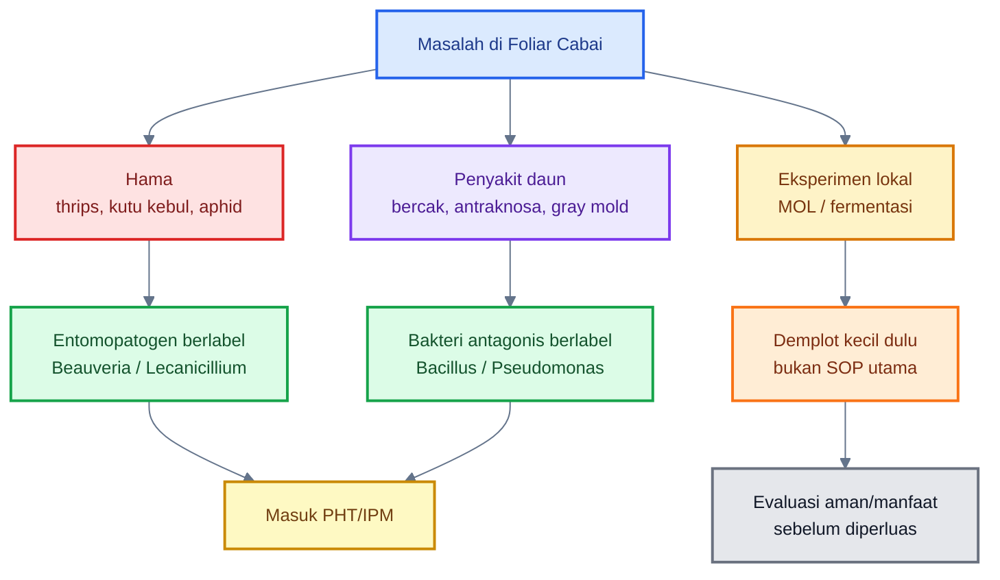

[**Kembali ke Atas**](#membangun-foliar-ecosystem-cabai-dalam-phtipm)

---

# 8. Membuat Mikroba Foliar Bertahan Tanpa Mengundang OPT

Mikroba foliar perlu dibantu agar bisa bertahan di permukaan daun. Tetapi bantuan itu tidak boleh berubah menjadi kondisi yang justru membuat OPT dan patogen ikut nyaman.

Kesalahan umum adalah berpikir bahwa mikroba perlu daun yang selalu basah dan banyak “makanan”. Dalam konteks cabai, ini berbahaya. Daun basah terlalu lama dapat meningkatkan risiko penyakit, sedangkan gula/molase tinggi di daun dapat membuat permukaan lengket, memicu jamur jelaga, dan menarik semut.

Jadi prinsipnya:

> **Buat mikroba cukup punya peluang menempel dan aktif, tetapi jangan membuat daun menjadi basah lama, lengket, atau terlalu kaya nutrisi.**

---

## 8.1 Prinsipnya bukan “daun basah terus”

Mikroba foliar memang membutuhkan kelembapan mikro. Namun patogen daun juga sering membutuhkan kelembapan untuk berkecambah dan menginfeksi. Mississippi State Extension menyarankan mengurangi durasi daun basah dan tidak memperpanjang leaf wetness ketika embun mulai mengering atau sebelum embun terbentuk, karena memperpanjang daun basah memberi peluang patogen berkecambah. ([MSU Extension][4])

Target aplikasi foliar yang benar:

- semprot halus,
- basah merata tipis,
- tidak menetes berlebihan,
- daun mengering dalam `$2\text{–}3$ jam`,
- tidak meninggalkan permukaan lengket.

### Parameter praktis

| Parameter                  |                                                  Target |
| -------------------------- | ------------------------------------------------------: |
| Daun basah setelah semprot |                              maksimal `$2\text{–}3$ jam |
| Volume semprot             |                       cukup basah merata, tidak menetes |
| Aplikasi malam             |                    hindari bila daun basah sampai malam |
| Setelah hujan              |                                      tunggu daun stabil |
| Sebelum hujan              | hindari jika hujan diperkirakan dalam `$4\text{–}6$ jam |

Aplikasi mikroba foliar harus mengejar **kolonisasi tipis**, bukan membuat tajuk seperti rumah lembap.

---

## 8.2 Waktu aplikasi

Waktu aplikasi sangat menentukan daya hidup mikroba foliar. Permukaan daun pada siang hari lebih panas, UV tinggi, dan cepat kering. Sebaliknya, terlalu malam membuat daun basah terlalu lama dan meningkatkan risiko penyakit.

| Parameter     |                                          Angka |
| ------------- | ---------------------------------------------: |
| Pagi          |                         `$06.00\text{–}08.00$` |
| Sore          |                         `$16.00\text{–}17.30$` |
| Hindari       | setelah `$18.00$` bila daun basah sampai malam |
| Daun basah    |                     maksimal `$2\text{–}3$ jam |
| Hindari hujan |     minimal `$4\text{–}6$ jam setelah aplikasi |

### Keputusan praktis

| Kondisi                         | Keputusan             |
| ------------------------------- | --------------------- |
| Terik dan angin kencang         | tunda mikroba         |
| Daun masih basah hujan          | tunda                 |
| Hujan diperkirakan segera       | tunda                 |
| Sore cerah dan kelembapan cukup | baik untuk aplikasi   |
| Malam lembap berat              | hindari semprot basah |

Untuk entomopatogen, aplikasi sore sering lebih cocok karena UV turun dan kelembapan relatif lebih baik. Namun daun tetap tidak boleh basah terlalu lama.

---

## 8.3 Adjuvant

Adjuvant adalah bahan pembantu aplikasi, misalnya perekat, perata, atau surfaktan. Dalam aplikasi mikroba foliar, adjuvant dapat membantu:

- meratakan droplet,
- meningkatkan kontak dengan permukaan daun,
- membantu mikroba menempel,
- mengurangi pencucian ringan.

Namun, adjuvant harus dipakai sesuai label. Adjuvant yang salah atau berlebihan dapat menyebabkan fitotoksik, merusak mikroba, atau membuat daun terlalu basah/lengket.

### Prinsip adjuvant untuk mikroba foliar

| Prinsip                     | Penjelasan                               |
| --------------------------- | ---------------------------------------- |
| Gunakan dosis label         | jangan menebak                           |
| Pilih yang kompatibel       | tidak semua adjuvant cocok untuk mikroba |
| Hindari campuran keras      | terutama bahan alkalis/asam ekstrem      |
| Uji kecil                   | terutama bila kombinasi baru             |
| Jangan terlalu banyak bahan | semakin banyak campuran, risiko naik     |

Untuk bisnis, gunakan adjuvant yang direkomendasikan oleh label produk mikroba. Jangan membuat racikan sendiri terlalu kompleks.

---

## 8.4 Molase/gula di daun

Molase atau gula sering dipakai dalam fermentasi mikroba. Tetapi di daun, logikanya berbeda. Gula tinggi pada daun dapat membuat permukaan lengket dan mendukung organisme yang tidak diinginkan.

Karena itu, molase/gula di daun harus sangat dibatasi.

| Dosis                          | Penilaian                               |
| ------------------------------ | --------------------------------------- |
| `$0\ \text{g/L}$`              | paling aman                             |
| `$0{,}5\text{–}1\ \text{g/L}$` | hanya bila produk/strategi memang perlu |
| `$>2\ \text{g/L}$`             | mulai berisiko lengket dan jamur jelaga |
| `$>5\ \text{g/L}$`             | tidak disarankan                        |

### Opini praktis

Untuk SOP bisnis, dosis terbaik adalah:

> **tidak memakai molase/gula di daun, kecuali label produk atau uji kecil menunjukkan aman dan perlu.**

Molase lebih cocok untuk:

- fermentasi,
- aktivasi kompos,
- media bioaktivator padat,
- dan aplikasi tanah.

Bukan untuk semprot daun rutin.

---

## 8.5 Opini validasi

Bagian ini sebagian valid sebagai prinsip aplikasi, tetapi tidak boleh dilebihkan.

Yang valid:

- mikroba foliar perlu waktu aplikasi yang tepat,
- daun tidak boleh basah terlalu lama,
- adjuvant bisa membantu bila sesuai label,
- gula/molase tinggi di daun berisiko,
- produk mikroba harus mengikuti label.

Yang masih harus hati-hati:

- formula “habitat mikroba daun” buatan sendiri,
- penggunaan MOL lokal foliar,
- penambahan makanan mikroba ke daun,
- campuran banyak bahan dalam satu tangki.

Untuk bisnis, gunakan prinsip berikut:

> **Mikroba foliar boleh dibuat lebih bertahan, tetapi jangan dengan cara yang membuat daun menjadi basah lama, lengket, atau kaya nutrisi bebas.**

### Diagram: Mikroba bertahan vs OPT ikut nyaman

```mermaid id="7aky4k"
%%{init: {
  "theme": "base",
  "themeVariables": {
    "background": "#ffffff",
    "fontSize": "13px",
    "lineColor": "#64748b",
    "primaryTextColor": "#111827"
  }
}}%%
flowchart TB
    A["Aplikasi Mikroba Foliar"]:::main
    A --> B["Cara Benar"]:::good
    A --> C["Cara Berisiko"]:::bad

    B --> B1["Pagi/sore"]
    B --> B2["Semprot halus"]
    B --> B3["Daun kering 2-3 jam"]
    B --> B4["Adjuvant sesuai label"]
    B --> B5["Tanpa molase/gula tinggi"]

    C --> C1["Daun basah semalaman"]
    C --> C2["Semprot terlalu pekat"]
    C --> C3["Gula tinggi di daun"]
    C --> C4["Campur bahan keras"]
    C --> C5["Tanpa uji kecil"]

    B --> D["Mikroba baik lebih berpeluang bertahan"]:::result
    C --> E["OPT / patogen ikut nyaman"]:::risk

    classDef main fill:#dbeafe,stroke:#2563eb,color:#1e3a8a,stroke-width:2px;
    classDef good fill:#dcfce7,stroke:#16a34a,color:#14532d,stroke-width:2px;
    classDef bad fill:#fee2e2,stroke:#dc2626,color:#7f1d1d,stroke-width:2px;
    classDef result fill:#fef9c3,stroke:#ca8a04,color:#713f12,stroke-width:2px;
    classDef risk fill:#ffedd5,stroke:#f97316,color:#7c2d12,stroke-width:2px;
```

---

# Ringkasan Bab 7–8

Mikroba foliar yang layak masuk SOP adalah mikroba yang **berlabel dan sesuai target**. Untuk hama seperti thrips, kutu kebul, dan aphid, mikroba yang lebih relevan adalah entomopatogen seperti _Beauveria bassiana_ atau _Lecanicillium lecanii_. Untuk penyakit daun, mikroba seperti _Bacillus subtilis_, _Bacillus amyloliquefaciens_, dan _Bacillus pumilus_ lebih relevan bila produk memang berlabel untuk penyakit target.

Mikroba foliar bisa dibuat lebih bertahan dengan waktu aplikasi tepat, semprotan halus, adjuvant sesuai label, dan menghindari daun basah terlalu lama. Namun, jangan membuat permukaan daun terlalu basah, lengket, atau kaya gula. MOL lokal foliar hanya layak sebagai demplot kecil, bukan SOP utama bisnis.

Kalimat kunci:

> **Mikroba foliar masuk SOP hanya jika targetnya jelas, produknya berlabel, aplikasinya tepat, dan tidak menciptakan kondisi yang justru membuat OPT serta patogen ikut nyaman.**

[1]: https://cals.cornell.edu/integrated-pest-management/outreach-education/fact-sheets/beauveria-bassiana?utm_source=chatgpt.com 'Beauveria bassiana | Cornell IPM Biocontrol Fact Sheet'
[2]: https://www3.epa.gov/pesticides/chem_search/ppls/082074-00017-20211228.pdf?utm_source=chatgpt.com 'US EPA, Pesticide Product Label, BEAUVERIA BASSIANA ...'
[3]: https://www.vegetables.cornell.edu/pest-management/disease-factsheets/biopesticides/biopesticides-for-managing-diseases-of-pepper-organically/?utm_source=chatgpt.com 'Biopesticides for Managing Diseases of Pepper Organically'
[4]: https://extension.msstate.edu/publications/the-plant-doctor-watering-and-plant-disease?utm_source=chatgpt.com 'The Plant Doctor: Watering and Plant Disease'

[**Kembali ke Atas**](#membangun-foliar-ecosystem-cabai-dalam-phtipm)

---

# 9. Jadwal Aplikasi Berbasis Status OPT

Jadwal aplikasi foliar pada cabai tidak boleh dibuat kaku seperti kalender tetap. Dalam PHT/IPM, jadwal terbaik adalah jadwal yang mengikuti **status OPT di lapangan**. Artinya, keputusan aplikasi ditentukan oleh hasil monitoring: apakah OPT belum terlihat, mulai terlihat sedikit, naik cepat, atau sudah melewati batas risiko bisnis.

Inilah yang membedakan PHT dari program semprot biasa. PHT tidak hanya bertanya “hari ini semprot apa?”, tetapi bertanya:

- OPT apa yang muncul?
- Di bagian tanaman mana?
- Populasinya naik atau turun?
- Apakah tanaman masih bisa ditahan dengan biologis dan preventif?
- Apakah risiko bisnis sudah membutuhkan intervensi selektif?

UC IPM pada peppers menyarankan pemeriksaan rutin area tepi lahan untuk whitefly karena area ini biasanya lebih dulu terinfestasi, dan pada periode kritis pepper field perlu dicek **dua kali per minggu**. Sticky trap juga dapat membantu mendeteksi migrasi awal whitefly, thrips, aphid, dan hama lain. ([ipm.ucanr.edu](https://ipm.ucanr.edu/agriculture/peppers/whiteflies/?utm_source=chatgpt.com))

---

## 9.1 Kondisi preventif: OPT belum terlihat

Pada kondisi preventif, OPT belum terlihat atau masih sangat rendah. Ini adalah fase terbaik untuk menjaga tanaman tetap bersih dan kuat. Jangan menunggu sampai pucuk rusak atau bunga penuh thrips.

Fokus program preventif:

- monitoring,
- penguatan jaringan,
- menjaga mikroba protektif,
- mencegah masuknya vektor,
- menjaga tanaman tidak terlalu lunak,
- dan menjaga sanitasi.

| Program                                   |                                Interval |
| ----------------------------------------- | --------------------------------------: |
| Monitoring pucuk                          |              `$2\text{–}3$ kali/minggu` |
| Sticky trap monitoring                    |                   aktif sepanjang musim |
| _Bacillus_ / _Pseudomonas_ untuk penyakit |      `$10\text{–}14$ hari sesuai label` |
| Penguatan `$Ca$`, `$Si$`, `$K$`, `$Mg$`   |         `$7\text{–}14$ hari bergiliran` |
| _Beauveria_                               | belum wajib kecuali daerah sangat rawan |

### Strategi preventif yang masuk akal

Jika OPT belum muncul, jangan langsung mengeluarkan biaya tinggi untuk semua input. Fokus pada hal yang memberi efek perlindungan awal:

1. cek pucuk dan bawah daun,
2. pasang sticky trap,
3. jaga bibit dan tanaman muda tetap bersih,
4. gunakan mulsa reflektif bila lahan rawan,
5. kendalikan nitrogen,
6. lakukan penguatan jaringan,
7. gunakan mikroba penyakit preventif bila riwayat penyakit daun tinggi.

Untuk entomopatogen seperti _Beauveria_, aplikasi preventif bisa dipertimbangkan hanya jika lahan memang rawan, misalnya dekat tanaman tua, dekat greenhouse, dekat sumber thrips/kutu kebul, atau pernah punya riwayat serangan berulang.

---

## 9.2 OPT mulai terlihat sedikit

Saat OPT mulai terlihat sedikit, ini adalah fase krusial. Pada fase ini, strategi biologis dan kultur teknis masih punya peluang besar. Jangan menunggu populasi naik tajam.

| Tindakan                      |                         Interval |
| ----------------------------- | -------------------------------: |
| Tingkatkan monitoring         |                `$3$ kali/minggu` |
| _Beauveria_ / _Lecanicillium_ | `$5\text{–}7$ hari sesuai label` |
| Sticky trap                   |                    tambah jumlah |
| Sanitasi gulma/tanaman sakit  |                           segera |
| Cek `$N$` berlebih            |                         langsung |

### Tindakan praktis

Jika thrips terlihat di pucuk atau bunga:

- cek bunga dengan metode ketuk di kertas putih,
- tambah monitoring,
- pasang trap lebih rapat di titik panas,
- gunakan entomopatogen berlabel bila populasi masih awal,
- cek apakah tanaman terlalu lunak akibat dominasi `$N$`,
- perkuat `$Ca$`, `$Si$`, `$K$`, dan `$Mg$`.

Jika kutu kebul mulai terlihat:

- cek bawah daun,
- amati telur dan nimfa, bukan hanya dewasa,
- tambah yellow sticky trap,
- bersihkan gulma inang,
- gunakan entomopatogen berlabel jika populasi awal,
- periksa tanaman bergejala virus dan cabut bila perlu.

UC IPM menyebut sticky trap kuning dapat dipasang untuk memantau pergerakan thrips, dan trap tersebut juga berguna untuk aphid, whitefly, dan tomato psyllid. UC IPM juga menyarankan reflective mulch di awal musim untuk menolak thrips. ([ipm.ucanr.edu](https://ipm.ucanr.edu/agriculture/peppers/thrips/?utm_source=chatgpt.com))

---

## 9.3 Populasi naik cepat

Jika populasi OPT naik cepat, jangan hanya mengandalkan mikroba. Ini penting untuk bisnis.

Mikroba bekerja paling baik pada tekanan awal sampai sedang. Ketika populasi sudah tinggi, banyak telur, banyak nimfa, banyak imago, atau tanaman sudah menunjukkan gejala virus, maka pendekatan harus naik menjadi **PHT lengkap**.

Pada fase ini:

- evaluasi ambang bisnis,
- cek sebaran serangan,
- identifikasi OPT utama,
- jangan hanya semprot mikroba,
- gunakan perangkap dan sanitasi,
- cabut tanaman virus,
- pertimbangkan pestisida selektif sesuai label,
- rotasi bahan aktif bila memakai kimia.

Label salah satu produk _Beauveria bassiana_ EPA mencantumkan aplikasi pada interval `$5\text{–}10$ hari`, dan pada populasi tinggi terutama whiteflies dan aphids bisa membutuhkan interval `$2\text{–}5$ hari`. Ini menunjukkan bahwa entomopatogen memerlukan pengulangan dan tidak boleh dianggap sebagai aplikasi tunggal, apalagi saat populasi tinggi. ([www3.epa.gov](https://www3.epa.gov/pesticides/chem_search/ppls/082074-00018-20220404.pdf?utm_source=chatgpt.com))

### Patokan keputusan bisnis

| Kondisi                               | Keputusan                               |
| ------------------------------------- | --------------------------------------- |
| OPT hanya terlihat sporadis           | biologis + monitoring intensif          |
| OPT muncul di beberapa titik          | biologis + tambah trap + sanitasi       |
| OPT menyebar cepat                    | PHT lengkap                             |
| Banyak pucuk rusak                    | pertimbangkan intervensi selektif       |
| Banyak tanaman virus                  | cabut tanaman sakit + kendalikan vektor |
| Populasi tinggi dan produksi terancam | pestisida selektif sesuai label         |

Kalimat praktis:

> **Mikroba bagus untuk menekan awal. Saat populasi sudah naik cepat, bisnis membutuhkan keputusan PHT lengkap, bukan fanatisme pada satu alat.**

---

## 9.4 Setelah pestisida kimia

Jika pestisida kimia digunakan, jangan langsung semprot mikroba setelahnya. Banyak bahan kimia, terutama fungisida dan bakterisida, dapat menekan atau membunuh mikroba foliar. Bahkan insektisida tertentu juga dapat mengganggu ekosistem mikroba atau musuh alami.

Prinsipnya:

- jangan campur mikroba dengan fungisida/bakterisida keras,
- beri jeda sebelum re-inokulasi mikroba,
- gunakan air bersih non-klorin,
- re-inokulasi hanya bila kondisi daun dan cuaca mendukung.

| Setelah aplikasi             | Rekomendasi                                             |
| ---------------------------- | ------------------------------------------------------- |
| Fungisida/bakterisida keras  | tunggu `$3\text{–}5$ hari`                              |
| Insektisida selektif         | ikuti label, lalu evaluasi                              |
| Hujan deras setelah aplikasi | ulang hanya jika label mengizinkan dan monitoring perlu |
| Tanaman stres                | pulihkan air/nutrisi dulu                               |
| Re-inokulasi mikroba         | lakukan pagi/sore saat aman                             |

Jeda `$3\text{–}5$ hari` adalah patokan praktis. Dalam sistem komersial, label produk tetap prioritas.

---

## 9.5 Opini validasi

Ini pendekatan yang paling sesuai bisnis: **jadwal tidak kaku, tetapi berbasis status OPT**.

| Status             | Strategi                              |
| ------------------ | ------------------------------------- |
| OPT belum terlihat | pencegahan + monitoring               |
| OPT mulai terlihat | biologis + monitoring intensif        |
| OPT naik cepat     | PHT lengkap                           |
| Setelah kimia      | jeda + re-inokulasi mikroba bila aman |

Jadwal berbasis status membuat biaya lebih efisien. Petani tidak semprot membabi buta, tetapi juga tidak terlambat. Inilah inti PHT.

### Diagram: Jadwal berbasis status OPT

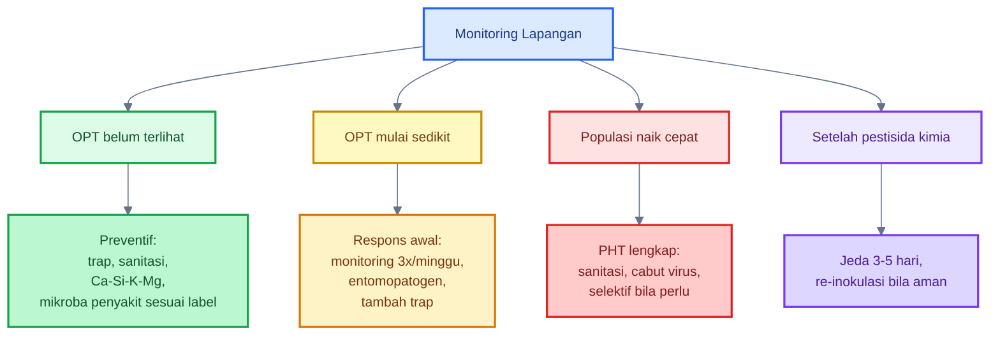

[**Kembali ke Atas**](#membangun-foliar-ecosystem-cabai-dalam-phtipm)

---

# 10. Monitoring: Titik yang Harus Dilihat Praktisi

Monitoring adalah jantung PHT. Tanpa monitoring, semua aplikasi menjadi tebak-tebakan: mikroba, pestisida, nutrisi, maupun perangkap. Banyak petani gagal bukan karena tidak punya produk, tetapi karena tidak tahu **kapan harus bertindak** dan **di mana OPT mulai muncul**.

Pada cabai, monitoring tidak boleh hanya melihat tanaman dari jauh. Banyak OPT penting bersembunyi di bagian tertentu.

---

## 10.1 Pucuk

Pucuk adalah titik pertama yang harus diperiksa karena banyak hama pengisap menyukai jaringan muda.

Thrips sering mulai dari pucuk muda. Gejala yang perlu dicari:

- daun muda menggulung,
- pucuk tampak mengilap,
- bercak keperakan,
- daun muda melintir,
- pucuk kerdil,
- bunga mudah rusak.

Cara cek praktis:

1. Pilih beberapa titik lahan: depan, tengah, belakang, dan tepi.
2. Ambil sampel tanaman secara acak.
3. Cek pucuk dan daun muda.
4. Gunakan kaca pembesar bila tersedia.
5. Catat jumlah tanaman yang menunjukkan gejala.

### Patokan kerja

| Luas kecil   |                           Sampel minimum |
| ------------ | ---------------------------------------: |
| Kebun kecil  |                 `$20\text{–}30$ tanaman` |
| Lahan sedang |                           `$50$ tanaman` |
| Lahan besar  | beberapa titik blok, minimal `$5$ titik` |

Jangan hanya memeriksa tanaman yang dekat jalan, karena hasilnya bisa bias.

---

## 10.2 Daun bawah

Daun bawah sangat penting untuk kutu kebul. Banyak petani hanya melihat daun bagian atas, padahal telur dan nimfa kutu kebul sering berada di bagian bawah daun.

Yang harus dicek:

- bawah daun tua,
- bawah daun tengah,
- telur kecil,
- nimfa menempel,
- serangga dewasa beterbangan saat daun digoyang,
- honeydew,
- gejala jamur jelaga.

UC IPM menyarankan pemeriksaan rutin field margins untuk whiteflies karena area tersebut biasanya terinfestasi lebih dulu, terutama ketika tanaman inang di sekitar lahan mulai menurun dan whitefly bermigrasi. ([ipm.ucanr.edu](https://ipm.ucanr.edu/agriculture/peppers/whiteflies/?utm_source=chatgpt.com))

### Cara cek praktis

1. Pilih daun bagian tengah-bawah.
2. Balik daun.
3. Lihat telur/nimfa/dewasa.
4. Catat titik yang paling banyak populasi.
5. Cocokkan dengan posisi sticky trap.

---

## 10.3 Bunga

Bunga adalah titik penting untuk thrips. Banyak thrips bersembunyi di dalam bunga sehingga tidak terlihat jika hanya melihat permukaan daun.

Cara sederhana:

1. Ambil bunga dari beberapa tanaman.
2. Ketuk bunga di atas kertas putih.
3. Amati serangga kecil yang bergerak.
4. Catat jumlah dan lokasi.

Jika menggunakan kaca pembesar, hasil monitoring akan lebih akurat.

Sebuah panduan pest management sweet pepper mencantumkan metode pemeriksaan bunga dan penggunaan yellow sticky traps untuk monitoring thrips dan whiteflies pada sweet pepper. ([hortifresh.org](https://www.hortifresh.org/wp-content/uploads/PestManagementGuide_SweetPepper_2022_online.pdf?utm_source=chatgpt.com))

### Patokan kerja

| Kondisi                         | Keputusan                                  |
| ------------------------------- | ------------------------------------------ |
| Thrips tidak terlihat           | lanjut monitoring                          |
| Thrips mulai terlihat di bunga  | naikkan intensitas monitoring              |
| Thrips terlihat di banyak bunga | masuk respons PHT                          |
| Bunga rusak dan pucuk melintir  | jangan hanya biologis, evaluasi intervensi |

---

## 10.4 Sticky trap

Sticky trap adalah alat monitoring, bukan satu-satunya alat pengendalian. Perangkap membantu mendeteksi pergerakan serangga dewasa, tetapi tidak menggantikan pemeriksaan langsung pada tanaman.

| Target     | Warna       |                         Monitoring |                      Tekanan Tinggi |
| ---------- | ----------- | ---------------------------------: | ----------------------------------: |
| Kutu kebul | kuning      | `$20\text{–}40\ \text{lembar/ha}$` | `$80\text{–}100\ \text{lembar/ha}$` |
| Thrips     | biru/kuning | `$20\text{–}40\ \text{lembar/ha}$` | `$80\text{–}100\ \text{lembar/ha}$` |

### Cara memasang

- Pasang sedikit di atas tajuk tanaman.
- Naikkan posisi trap mengikuti tinggi tanaman.
- Pasang lebih banyak di tepi lahan dan titik masuk angin.
- Ganti jika sudah penuh debu atau serangga.
- Catat jumlah tangkapan mingguan.

UC IPM menyebut sticky trap yang dipasang untuk aphid, thrips, atau tomato psyllid dapat membantu mendeteksi migrasi awal whitefly ke lahan pepper. ([ipm.ucanr.edu](https://ipm.ucanr.edu/agriculture/peppers/whiteflies/?utm_source=chatgpt.com))

### Cara membaca trap

| Hasil Trap                             | Arti Praktis               |
| -------------------------------------- | -------------------------- |
| Tidak ada / sedikit                    | lanjut monitoring          |
| Mulai meningkat                        | cek tanaman lebih intensif |
| Banyak di tepi lahan                   | ada migrasi masuk          |
| Banyak merata                          | populasi sudah menyebar    |
| Trap banyak tetapi tanaman belum rusak | kesempatan respons awal    |

Perangkap memberi sinyal awal. Keputusan tetap harus dikonfirmasi dengan pemeriksaan tanaman.

---

## 10.5 Opini validasi

Monitoring adalah **jantung PHT**. Tanpa monitoring, aplikasi mikroba, pestisida, atau nutrisi hanya tebak-tebakan.

Validasi praktisnya:

| Komponen Monitoring | Status                   | Catatan                          |
| ------------------- | ------------------------ | -------------------------------- |
| Cek pucuk           | wajib                    | untuk thrips, aphid, pucuk lunak |
| Cek bawah daun      | wajib                    | untuk kutu kebul                 |
| Cek bunga           | penting                  | untuk thrips                     |
| Sticky trap         | wajib sebagai alat bantu | bukan pengganti scouting         |
| Catatan mingguan    | sangat disarankan        | dasar keputusan bisnis           |

Kalimat praktis:

> **Produk bisa dibeli, tetapi keputusan hanya bisa dibuat dari monitoring. Dalam PHT, mata petani lebih penting daripada daftar produk.**

### Diagram: Titik monitoring cabai

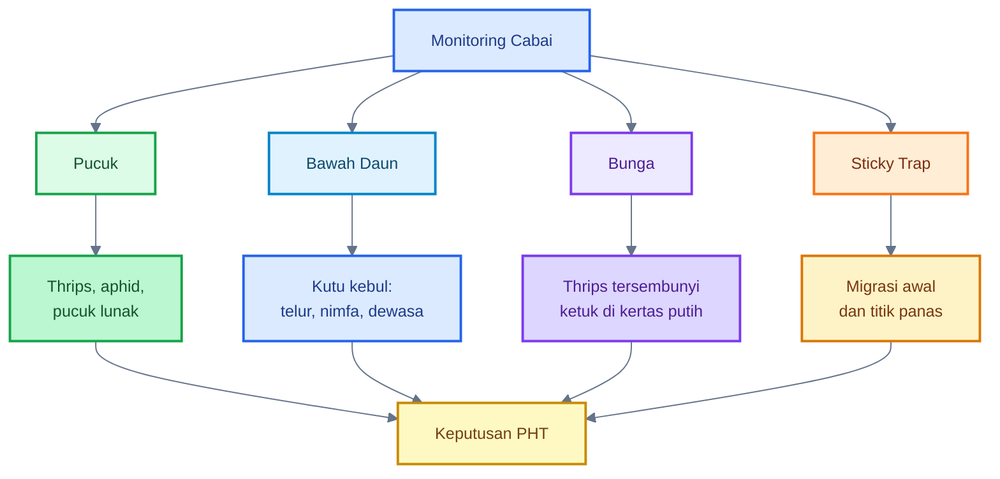

---

# Ringkasan Bab 9–10

Jadwal aplikasi foliar harus berbasis status OPT, bukan kalender kaku. Saat OPT belum terlihat, fokus pada pencegahan, monitoring, sticky trap, penguatan jaringan, dan mikroba preventif sesuai label. Saat OPT mulai terlihat sedikit, monitoring dinaikkan, entomopatogen bisa masuk, trap ditambah, sanitasi dilakukan segera, dan status nitrogen diperiksa. Saat populasi naik cepat, gunakan PHT lengkap dan jangan hanya mengandalkan mikroba.

Monitoring menjadi dasar keputusan. Titik utama yang harus dilihat adalah pucuk, bawah daun, bunga, dan sticky trap. Tanpa monitoring, aplikasi mikroba, pestisida, atau nutrisi hanya menjadi tebak-tebakan.

Kalimat kunci:

> **Dalam bisnis cabai, jadwal terbaik bukan jadwal tetap, tetapi jadwal yang bergerak mengikuti hasil monitoring. PHT dimulai dari mata petani, bukan dari tangki semprot.**

[**Kembali ke Atas**](#membangun-foliar-ecosystem-cabai-dalam-phtipm)

---

# 11. Kesalahan Umum yang Harus Dihindari

Pada praktik lapangan, kegagalan membangun **foliar ecosystem** cabai biasanya bukan karena konsepnya salah, tetapi karena penerapannya terlalu disederhanakan. Mikroba dianggap sebagai obat tunggal, MOL tanah disemprot ke daun, molase diberikan terlalu tinggi, aplikasi dilakukan terlalu malam, nitrogen berlebihan, tanaman virus dibiarkan, dan mikroba dicampur dengan bahan kimia keras. Poin-poin ini juga menjadi inti Bab 11 dalam outline yang Anda unggah.

Foliar ecosystem yang benar bukan berarti membuat permukaan daun selalu basah, manis, dan penuh mikroba. Tujuannya adalah membangun permukaan tanaman yang **selektif**: cukup ramah bagi mikroba baik, tetapi tidak nyaman bagi OPT, patogen, dan pembusukan.

---

## 11.1 Menganggap mikroba sebagai obat tunggal

Kesalahan pertama adalah menganggap mikroba sebagai solusi tunggal. Ini sering terjadi ketika petani mulai memakai produk hayati atau mikroba lokal, lalu berharap semua masalah hama dan penyakit bisa selesai hanya dengan aplikasi mikroba.

Ini keliru.

Mikroba adalah **komponen PHT**, bukan pengganti PHT. Mikroba dapat membantu pada beberapa fungsi, misalnya:

- menekan patogen tertentu,
- mengisi ruang kompetisi di permukaan daun,
- membantu pengendalian hayati hama tertentu,
- mendukung keseimbangan mikrobiologi permukaan tanaman,
- mengurangi ketergantungan penuh pada pestisida kimia.

Tetapi mikroba tidak menggantikan:

- monitoring,
- sanitasi,
- insect net,
- mulsa reflektif,
- sticky trap,
- pengelolaan nutrisi,
- pencabutan tanaman virus,
- dan pestisida selektif bila risiko bisnis sudah tinggi.

Kalimat praktisnya:

> **Mikroba membantu sistem bekerja lebih baik, tetapi tidak bisa menggantikan sistem itu sendiri.**

Jika petani hanya menyemprot mikroba tanpa cek pucuk, tanpa cek bawah daun, tanpa trap, tanpa sanitasi, dan tanpa mengelola tanaman virus, maka aplikasi mikroba hanya menjadi biaya tambahan.

---

## 11.2 Menyemprot MOL tanah ke daun

Kesalahan kedua adalah menyemprot MOL tanah ke daun sebagai SOP utama. Ini penting karena sebelumnya kita banyak membahas MOL rizosfer bambu. MOL bambu sangat menarik untuk tanah, kompos, dan rizosfer, tetapi tidak otomatis cocok untuk daun.

MOL tanah berasal dari habitat yang berbeda. Di tanah, mikroba hidup dalam lingkungan yang lebih lembap, terlindung, kaya bahan organik, dan tidak langsung terkena UV. Di daun, mikroba menghadapi kondisi ekstrem: panas, cahaya, kering, angin, hujan, dan residu semprot.

Karena itu, MOL tanah pekat tidak boleh masuk SOP utama foliar.

Posisi yang lebih aman:

| Penggunaan MOL tanah        | Status            |
| --------------------------- | ----------------- |
| Aktivasi kompos             | sangat layak      |
| Kocor tanah/rizosfer        | layak             |
| Pemulihan tanah             | layak             |
| Semprot daun rutin          | tidak disarankan  |
| Demplot foliar sangat encer | boleh diuji kecil |

Jika tetap ingin mengeksplorasi MOL lokal untuk foliar, gunakan pendekatan demplot:

| Parameter      |                        Batas Uji |
| -------------- | -------------------------------: |
| Pengenceran    |           `$1:100\text{–}1:200$` |
| Tanaman uji    |          `$5\text{–}10$ tanaman` |
| Waktu aplikasi |                        sore awal |
| Bagian tanaman |                 daun tua/pinggir |
| Hindari        | bunga, buah muda, pucuk sensitif |
| Evaluasi       |              `$2\text{–}3$ hari` |

Jika muncul bercak, daun kusam, lengket, bau tidak normal, atau tanaman stres, hentikan.

---

## 11.3 Memberi molase tinggi ke daun

Kesalahan ketiga adalah memberi molase atau gula tinggi ke daun. Di dalam fermentasi, molase berguna sebagai sumber karbon. Tetapi di permukaan daun, logikanya berbeda.

Molase tinggi di daun dapat menyebabkan:

- permukaan daun lengket,
- debu mudah menempel,
- semut tertarik,
- jamur jelaga lebih mudah muncul,
- mikroba liar ikut berkembang,
- permukaan daun menjadi tidak sehat.

Karena itu, molase tidak boleh dianggap sebagai “makanan mikroba foliar” yang aman diberikan bebas.

Patokan praktis:

| Dosis Molase/Gula di Daun      | Penilaian                                    |
| ------------------------------ | -------------------------------------------- |
| `$0\ \text{g/L}$`              | paling aman                                  |
| `$0{,}5\text{–}1\ \text{g/L}$` | hanya bila benar-benar perlu dan diuji kecil |
| `$>2\ \text{g/L}$`             | mulai berisiko lengket dan jamur jelaga      |
| `$>5\ \text{g/L}$`             | tidak disarankan                             |

Untuk bisnis cabai, posisi paling aman adalah:

> **Molase untuk fermentasi dan kompos; bukan untuk semprot daun rutin.**

---

## 11.4 Semprot terlalu malam

Kesalahan keempat adalah aplikasi foliar terlalu malam. Banyak petani memilih malam karena tidak panas, tetapi ada risiko: daun bisa basah terlalu lama. Daun yang basah sampai malam atau dini hari menciptakan kondisi nyaman bagi banyak patogen daun.

Target aplikasi mikroba foliar bukan membuat daun basah lama. Targetnya adalah membuat permukaan daun basah merata tipis, lalu mengering dalam waktu wajar.

Patokan praktis:

| Parameter          |                                     Batas Aman |
| ------------------ | ---------------------------------------------: |
| Aplikasi pagi      |                         `$06.00\text{–}08.00$` |
| Aplikasi sore      |                         `$16.00\text{–}17.30$` |
| Hindari            | setelah `$18.00$` jika daun basah sampai malam |
| Lama daun basah    |                    maksimal `$2\text{–}3$ jam` |
| Jeda sebelum hujan |                     minimal `$4\text{–}6$ jam` |

Jika daun masih basah menjelang malam, kurangi volume semprot, majukan waktu aplikasi, atau pilih hari dengan cuaca lebih mendukung.

---

## 11.5 Nitrogen berlebihan

Kesalahan kelima adalah nitrogen berlebihan. Nitrogen atau `$N$` memang dibutuhkan tanaman, tetapi kelebihan `$N$` membuat pucuk terlalu lunak, daun terlalu hijau tua, ruas memanjang, dan jaringan lebih menarik bagi hama pengisap.

Tanda `$N$` cenderung berlebihan:

| Gejala                      | Arti Praktis                 | Tindakan                              |
| --------------------------- | ---------------------------- | ------------------------------------- |
| Daun hijau tua pekat        | vegetatif terlalu kuat       | turunkan `$N$`                        |
| Ruas panjang                | pertumbuhan terlalu lunak    | cek cahaya dan nutrisi                |
| Pucuk lembek                | jaringan muda mudah diserang | perkuat `$Ca$`, `$Si$`, `$K$`, `$Mg$` |
| Thrips/aphid fokus di pucuk | pucuk terlalu menarik        | koreksi `$N$` dan monitoring          |

Patokan tindakan:

- kurangi input `$N$` sekitar `$25\text{–}50\%$` selama `$7\text{–}10$ hari`,
- hentikan sementara pupuk daun tinggi `$N$`,
- perkuat `$Ca$`, `$Si$`, `$K$`, dan `$Mg$`,
- tetap jaga air agar tanaman tidak stres.

Kalimat praktis:

> **Pucuk yang terlalu lunak adalah undangan bagi hama pengisap.**

---

## 11.6 Mengabaikan virus

Kesalahan keenam adalah mengabaikan tanaman virus. Ini sangat berbahaya dalam bisnis cabai. Tanaman yang sudah bergejala berat tidak boleh terus dirawat hanya karena “sayang tanaman”. Jika dibiarkan, tanaman tersebut bisa menjadi sumber masalah bagi tanaman sehat.

Mikroba tidak menyembuhkan virus. Nutrisi tidak menyembuhkan virus. Silika tidak menyembuhkan virus. Yang harus dilakukan adalah mengurangi sumber inokulum dan mengendalikan vektor.

Tindakan praktis:

1. Tandai tanaman bergejala berat.
2. Cabut tanaman sakit.
3. Masukkan ke karung.
4. Jangan dibiarkan di pinggir lahan.
5. Musnahkan secara aman.
6. Perkuat monitoring thrips/kutu kebul/aphid.
7. Cek tanaman sekitar.

Gejala yang perlu diwaspadai:

- daun mosaik,
- daun keriting berat,
- pucuk mengerdil,
- tanaman kerdil tidak normal,
- pertumbuhan berhenti,
- warna daun belang,
- bentuk daun tidak normal.

Kalimat praktis:

> **Tanaman virus bukan pasien yang harus dirawat lama; dalam PHT, ia adalah sumber risiko yang harus dikelola cepat.**

---

## 11.7 Mencampur mikroba dengan fungisida/bakterisida keras

Kesalahan ketujuh adalah mencampur mikroba dengan fungisida, bakterisida, klorin, atau larutan berpH ekstrem. Mikroba adalah organisme hidup. Jika dicampur dengan bahan yang membunuh mikroba, efektivitasnya turun.

Aturan praktis:

| Kondisi                     | Keputusan                             |
| --------------------------- | ------------------------------------- |
| Fungisida/bakterisida keras | jangan campur dengan mikroba          |
| Air berbau kaporit kuat     | endapkan atau ganti                   |
| Larutan sangat asam/basa    | hindari                               |
| Setelah kimia keras         | beri jeda `$3\text{–}5$ hari`         |
| Re-inokulasi mikroba        | lakukan saat cuaca dan tanaman stabil |

Untuk bisnis, jangan membuat tangki terlalu kompleks. Semakin banyak bahan dicampur, semakin besar risiko reaksi, endapan, fitotoksik, atau mikroba mati.

---

## Diagram: Kesalahan umum dan koreksinya

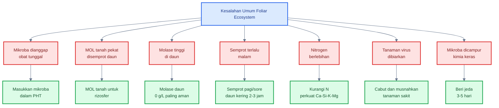

---

# 12. SOP Praktis untuk Bisnis Lapangan

SOP ini dibuat untuk praktisi yang membutuhkan keputusan cepat dan jelas. Tujuannya bukan membuat sistem terlalu rumit, tetapi menyusun urutan kerja agar foliar ecosystem masuk ke dalam PHT/IPM secara praktis.

SOP ini mencakup:

- pembibitan,
- pra-tanam,
- umur `$0\text{–}30$ HST`,
- tindakan saat OPT muncul,
- dan aplikasi mikroba foliar.

---

## 12.1 SOP pembibitan

Pembibitan adalah garis pertahanan pertama. Jika bibit sudah membawa hama, penyakit, atau virus, lahan produksi akan menanggung kerugian sejak awal.

### Tujuan pembibitan

- bibit bersih dari OPT,
- batang pendek-kokoh,
- akar sehat,
- pucuk tidak terlalu lunak,
- tidak ada gejala virus.

### SOP pembibitan

| Komponen             | SOP Praktis                                            |
| -------------------- | ------------------------------------------------------ |
| Insect net           | gunakan `$32\text{–}50\ \text{mesh}$` sesuai ventilasi |
| Sticky trap          | pasang kuning dan biru                                 |
| Monitoring pucuk     | `$2\text{–}3$ kali/minggu`                             |
| Nutrisi              | hindari `$N$` berlebihan                               |
| Bibit                | pendek-kokoh, bukan tinggi-lunak                       |
| Tanaman gejala virus | jangan ditanam                                         |
| Penyiraman           | cukup lembap, tidak becek                              |

### Catatan penting

Bibit tinggi, lunak, dan hijau tua bukan selalu bibit bagus. Untuk cabai, bibit yang baik adalah bibit yang seimbang: akar aktif, batang kokoh, pucuk sehat, dan bebas OPT.

---

## 12.2 SOP pra-tanam

Pra-tanam adalah tahap memutus sumber OPT sebelum tanaman masuk lahan. Jangan menanam cabai muda di lingkungan yang sudah penuh sumber hama.

### SOP pra-tanam

| Komponen        | SOP Praktis                                       |
| --------------- | ------------------------------------------------- |
| Mulsa reflektif | gunakan bila daerah rawan thrips, whitefly, aphid |
| Gulma inang     | bersihkan sebelum tanam                           |
| Drainase        | siapkan parit lancar                              |
| Lahan sekitar   | hindari dekat lahan tua penuh OPT                 |
| Tanaman sakit   | bersihkan sisa tanaman sebelumnya                 |
| Sticky trap     | pasang awal untuk deteksi migrasi                 |
| Bedengan        | siapkan agar tidak becek                          |

### Keputusan praktis

Jika di sekitar lahan ada tanaman cabai tua yang sudah penuh kutu kebul/thrips, risiko tanam meningkat. Dalam kondisi seperti itu, insect net pembibitan, mulsa reflektif, trap, dan monitoring awal menjadi lebih penting.

---

## 12.3 SOP `$0\text{–}30$ HST`

Fase `$0\text{–}30$ HST` adalah fase penting karena tanaman masih membentuk akar, pucuk, dan struktur awal. Pada fase ini, serangan vektor dapat memberi dampak besar terhadap produktivitas berikutnya.

| Umur                | Fokus          | Aksi                                                     |
| ------------------- | -------------- | -------------------------------------------------------- |
| `$0\text{–}7$ HST   | adaptasi       | air stabil, monitoring, jangan pupuk pekat               |
| `$7\text{–}14$ HST  | penguatan awal | `$Ca$` ringan, `$Si$` ringan, trap aktif                 |
| `$14\text{–}30$ HST | pucuk kuat     | `$Ca$`–`$Si$`–`$K$`–`$Mg$` bergilir, cek thrips/whitefly |

### Rincian praktis

#### `$0\text{–}7$ HST`

Target utama adalah adaptasi. Jangan memaksa tanaman tumbuh terlalu cepat. Pastikan air stabil, tanah tidak becek, dan monitoring dimulai.

#### `$7\text{–}14$ HST`

Mulai penguatan awal. Gunakan `$Ca$` dan `$Si$` ringan sesuai label. Sticky trap harus sudah aktif. Cek bawah daun dan pucuk.

#### `$14\text{–}30$ HST`

Tanaman mulai aktif vegetatif. Jaga agar pucuk tidak terlalu lunak. Gunakan rotasi penguatan jaringan dan tingkatkan monitoring bila OPT mulai terlihat.

### Contoh rotasi sederhana

| Hari            | Aplikasi                                   |
| --------------- | ------------------------------------------ |
| Hari 7          | `$Ca + Mg$` ringan                         |
| Hari 10 atau 11 | `$Si$` larut                               |
| Hari 14         | monitoring intensif                        |
| Hari 17 atau 18 | `$K$` ringan bila perlu                    |
| Hari 21         | evaluasi pucuk dan trap                    |
| Hari 24 atau 25 | mikroba foliar berlabel bila sesuai target |
| Hari 28 atau 30 | evaluasi ulang                             |

Catatan: jadwal ini bukan kalender kaku. Sesuaikan dengan kondisi OPT dan cuaca.

---

## 12.4 SOP saat OPT muncul

Saat OPT muncul, tindakan harus mengikuti status populasi. Jangan panik, tetapi juga jangan terlambat.

| Status          | Aksi                                                  |
| --------------- | ----------------------------------------------------- |
| Hama sedikit    | entomopatogen + monitoring                            |
| Hama naik       | tambah trap + ulang entomopatogen `$5\text{–}7$ hari` |
| Virus muncul    | cabut tanaman sakit                                   |
| Populasi tinggi | PHT lengkap + pestisida selektif bila perlu           |

### Hama sedikit

Jika thrips/kutu kebul hanya terlihat sedikit:

- tingkatkan monitoring,
- gunakan entomopatogen berlabel,
- tambah trap di titik panas,
- cek pucuk dan bawah daun,
- koreksi `$N$` bila tanaman terlalu lunak.

### Hama naik

Jika populasi meningkat:

- ulang entomopatogen sesuai label,
- tambah jumlah sticky trap,
- sanitasi gulma,
- cek tanaman virus,
- evaluasi apakah perlu intervensi selektif.

### Virus muncul

Jika ada tanaman virus:

- cabut segera,
- musnahkan aman,
- jangan dibiarkan,
- kendalikan vektor,
- perketat monitoring tanaman sekitar.

### Populasi tinggi

Jika populasi tinggi dan risiko bisnis besar:

- jangan hanya memakai mikroba,
- gunakan PHT lengkap,
- pertimbangkan pestisida selektif sesuai label,
- jaga rotasi bahan aktif,
- re-inokulasi mikroba setelah jeda bila kondisi aman.

---

## 12.5 SOP aplikasi mikroba

Aplikasi mikroba harus dilakukan dengan cara yang menjaga mikroba tetap hidup dan tidak membuat daun nyaman bagi OPT/patogen.

### SOP aplikasi

| Komponen          | Patokan                                          |
| ----------------- | ------------------------------------------------ |
| Produk            | gunakan produk berlabel                          |
| Air               | non-klorin                                       |
| `$\text{pH}$` air | sekitar `$5{,}5\text{–}7{,}0$` bila memungkinkan |
| Waktu             | pagi atau sore                                   |
| Lama daun basah   | maksimal `$2\text{–}3$ jam                       |
| Hujan             | hindari jika hujan dalam `$4\text{–}6$ jam       |
| Campuran          | jangan campur kimia keras                        |
| Catatan           | tulis tanggal, dosis, cuaca, hasil               |

### Urutan kerja aplikasi mikroba

1. Cek cuaca.
2. Cek kondisi daun.
3. Pastikan produk belum kedaluwarsa.
4. Gunakan air bersih non-klorin.
5. Campur sesuai label.
6. Tambahkan adjuvant hanya jika kompatibel.
7. Semprot halus dan merata.
8. Hindari larutan menetes berlebihan.
9. Catat aplikasi.
10. Evaluasi `$2\text{–}3$ hari` setelah aplikasi.

### Catatan kompatibilitas

Jangan mencampur mikroba dengan:

- fungisida keras,
- bakterisida,
- air berkaporit kuat,
- larutan sangat asam,
- larutan sangat basa,
- pupuk daun pekat,
- adjuvant yang tidak jelas kompatibilitasnya.

---

# Diagram Besar Artikel

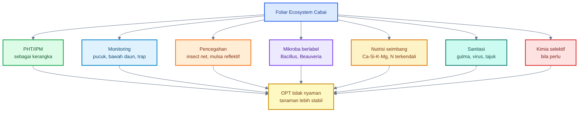

---

# Kesimpulan Tajam untuk Praktisi

Yang harus diingat:

1. **Foliar ecosystem bukan alasan untuk membuat daun basah dan manis.**
   Daun basah lama dan gula tinggi justru bisa membuat patogen atau OPT nyaman.

2. **Mikroba foliar harus masuk PHT, bukan menggantikan PHT.**
   Mikroba berlabel bisa membantu, tetapi monitoring, sanitasi, trap, mulsa, dan nutrisi tetap wajib.

3. **`Beauveria` / `Lecanicillium` relevan untuk hama; `Bacillus` lebih relevan untuk penyakit.**
   Jangan salah target.

4. **MOL bambu bagus untuk tanah, bukan otomatis bagus untuk daun.**
   Untuk foliar, gunakan hanya sebagai demplot kecil, bukan SOP bisnis.

5. **Pencegahan lebih murah daripada penyelamatan.**
   Insect net pembibitan, mulsa reflektif, dan monitoring awal lebih bernilai bisnis daripada menunggu hama meledak.

6. **Tanaman terlalu lunak adalah undangan bagi hama pengisap.**
   Kendalikan `$N$`, perkuat `$Ca$`–`$Si$`–`$K$`–`$Mg$`, dan jaga air stabil.

7. **Bila virus sudah muncul, cabut tanaman sakit.**
   Mikroba tidak menyembuhkan virus.

8. **Saat populasi OPT tinggi, jangan fanatik pada mikroba.**
   Gunakan PHT lengkap, termasuk pestisida selektif bila kerugian bisnis mengancam.

Kalimat kunci artikel:

> **Foliar ecosystem yang benar bukan menciptakan surga bagi semua organisme, tetapi menciptakan permukaan tanaman yang selektif: cukup ramah bagi mikroba baik, cukup kuat bagi tanaman, tetapi tidak nyaman bagi thrips, kutu kebul, patogen, dan pembusukan.**

[1]: https://ipm.ucanr.edu/legacy_assets/PDF/PMG/pmgpeppers.pdf?utm_source=chatgpt.com 'PEPPERS'
[2]: https://ask.ifas.ufl.edu/publication/IN401?utm_source=chatgpt.com 'ENY-658/IN401: Managing Thrips in Pepper and Eggplant'
[3]: https://cals.cornell.edu/integrated-pest-management/outreach-education/fact-sheets/beauveria-bassiana?utm_source=chatgpt.com 'Beauveria bassiana | Cornell IPM Biocontrol Fact Sheet'
[4]: https://www.vegetables.cornell.edu/pest-management/disease-factsheets/biopesticides/biopesticides-for-managing-diseases-of-pepper-organically/?utm_source=chatgpt.com 'Biopesticides for Managing Diseases of Pepper Organically'

[**Kembali ke Atas**](#membangun-foliar-ecosystem-cabai-dalam-phtipm)

---

<small>
  **_Catatan Penyusunan_** Artikel ini disusun sebagai materi edukasi dan
  referensi umum berdasarkan berbagai sumber pustaka, praktik lapangan, serta
  bantuan alat penulisan. Pembaca disarankan untuk melakukan verifikasi lanjutan
  dan penyesuaian sesuai dengan kondisi serta kebutuhan masing-masing sistem.
</small>
