# **_Membangun “Rumah” Mikroba Menguntungkan di Phyllosphere: Strategi Praktis Mengurangi Ketergantungan pada Racun Preventif_**

_Mengelola nutrisi, gutasi, embun, mikroklimat, mikroba, dan pestisida selektif agar pucuk tanaman tidak menjadi hotel OPT._

---

- [**_Membangun “Rumah” Mikroba Menguntungkan di Phyllosphere: Strategi Praktis Mengurangi Ketergantungan pada Racun Preventif_**](#membangun-rumah-mikroba-menguntungkan-di-phyllosphere-strategi-praktis-mengurangi-ketergantungan-pada-racun-preventif)
- [0. Premis Utama Artikel](#0-premis-utama-artikel)
  - [0.1 Pergeseran Cara Pikir: Dari Sterilisasi ke Pengelolaan Ekosistem](#01-pergeseran-cara-pikir-dari-sterilisasi-ke-pengelolaan-ekosistem)
  - [0.2 Phyllosphere Bukan Hanya Medan Keras](#02-phyllosphere-bukan-hanya-medan-keras)
  - [0.3 Masalah Besar di Lapang: Kenapa OPT Sering Unggul](#03-masalah-besar-di-lapang-kenapa-opt-sering-unggul)
  - [0.4 Racun Preventif Bukan Pencegahan Sejati](#04-racun-preventif-bukan-pencegahan-sejati)
  - [0.5 Formula Tujuan Artikel: Mengarahkan Ekosistem Daun](#05-formula-tujuan-artikel-mengarahkan-ekosistem-daun)
  - [0.6 Kenapa Phyllosphere Tidak Boleh Disebut Permukaan Steril](#06-kenapa-phyllosphere-tidak-boleh-disebut-permukaan-steril)
  - [0.7 Gutasi dan Hidatoda: Oase Mikroba Sekaligus Pintu Patogen](#07-gutasi-dan-hidatoda-oase-mikroba-sekaligus-pintu-patogen)
  - [0.8 Kesalahan Praktis yang Ingin Dikoreksi](#08-kesalahan-praktis-yang-ingin-dikoreksi)
  - [0.9 Prinsip Validitas yang Dipakai dalam Artikel Ini](#09-prinsip-validitas-yang-dipakai-dalam-artikel-ini)
  - [0.10 Rekomendasi Awal dari Bab Premis](#010-rekomendasi-awal-dari-bab-premis)
  - [0.11 Batasan Penting Artikel](#011-batasan-penting-artikel)
  - [0.12 Kesimpulan Bab 0](#012-kesimpulan-bab-0)
- [1. Pembuka: Kesalahan Berpikir yang Membuat Petani Tergantung Racun](#1-pembuka-kesalahan-berpikir-yang-membuat-petani-tergantung-racun)
  - [1.1 Pola Pikir Lama](#11-pola-pikir-lama)
  - [1.2 Kenapa Pola Lama Terlihat Berhasil, tetapi Menjebak](#12-kenapa-pola-lama-terlihat-berhasil-tetapi-menjebak)
  - [1.3 Pola Pikir Baru](#13-pola-pikir-baru)
  - [1.4 Perbedaan Pencegahan Sejati dan Racun Preventif](#14-perbedaan-pencegahan-sejati-dan-racun-preventif)
  - [1.5 Ambang Tindakan: Rem Praktis agar Petani Tidak Panik](#15-ambang-tindakan-rem-praktis-agar-petani-tidak-panik)
  - [1.6 Kesalahan Berpikir tentang “Bersih”](#16-kesalahan-berpikir-tentang-bersih)
  - [1.7 Membaca OPT sebagai Gejala Sistem, Bukan Sekadar Musuh](#17-membaca-opt-sebagai-gejala-sistem-bukan-sekadar-musuh)
  - [1.8 Tangga Keputusan Sebelum Racun](#18-tangga-keputusan-sebelum-racun)
  - [1.9 Status Validitas Rekomendasi Bab 1](#19-status-validitas-rekomendasi-bab-1)
  - [1.10 Batasan Penting Bab 1](#110-batasan-penting-bab-1)
  - [1.11 Kesimpulan Bab 1](#111-kesimpulan-bab-1)
- [2. Bab Dasar: Apa Itu Phyllosphere?](#2-bab-dasar-apa-itu-phyllosphere)
  - [2.1 Definisi Praktis Phyllosphere](#21-definisi-praktis-phyllosphere)
  - [2.2 Phyllosphere Bukan Bidang Rata](#22-phyllosphere-bukan-bidang-rata)
  - [2.3 Phyllosphere sebagai Medan Seleksi, Bukan Medan Steril](#23-phyllosphere-sebagai-medan-seleksi-bukan-medan-steril)
  - [2.4 Mikrohabitat dan Siapa yang Diuntungkan](#24-mikrohabitat-dan-siapa-yang-diuntungkan)
  - [2.5 Pucuk Muda: Rumah Nyaman bagi OPT, Bukan Otomatis Rumah Mikroba Baik](#25-pucuk-muda-rumah-nyaman-bagi-opt-bukan-otomatis-rumah-mikroba-baik)
  - [2.6 Bawah Daun: Area Terlindung yang Sering Terlewat](#26-bawah-daun-area-terlindung-yang-sering-terlewat)
  - [2.7 Hidatoda dan Gutasi: Titik Kecil dengan Dampak Besar](#27-hidatoda-dan-gutasi-titik-kecil-dengan-dampak-besar)
  - [2.8 Trikoma, Alur Tulang Daun, dan Retakan Kutikula](#28-trikoma-alur-tulang-daun-dan-retakan-kutikula)
  - [2.9 Biofilm: Bentuk “Rumah” Mikroba yang Sering Diabaikan](#29-biofilm-bentuk-rumah-mikroba-yang-sering-diabaikan)
  - [2.10 Kenapa Bab Ini Penting bagi Praktisi?](#210-kenapa-bab-ini-penting-bagi-praktisi)
  - [2.11 Rekomendasi Praktis dari Bab 2](#211-rekomendasi-praktis-dari-bab-2)
  - [2.12 Batasan Penting Bab 2](#212-batasan-penting-bab-2)
  - [2.13 Kesimpulan Bab 2](#213-kesimpulan-bab-2)
- [3. Bab Kunci: N Tinggi Bukan “Menarik” OPT, Tetapi Membuat OPT Mudah Berkembang](#3-bab-kunci-n-tinggi-bukan-menarik-opt-tetapi-membuat-opt-mudah-berkembang)
  - [3.1 Koreksi Istilah: “Mengundang” Itu Terlalu Kasar](#31-koreksi-istilah-mengundang-itu-terlalu-kasar)
  - [3.2 Bedakan Energi dan Faktor Pembatas Reproduksi](#32-bedakan-energi-dan-faktor-pembatas-reproduksi)
  - [3.3 Mekanisme Lapang: Dari N Berlebih ke Ledakan OPT](#33-mekanisme-lapang-dari-n-berlebih-ke-ledakan-opt)
  - [3.4 Empat Jalur Utama Kenapa N Tinggi Menguntungkan OPT](#34-empat-jalur-utama-kenapa-n-tinggi-menguntungkan-opt)
  - [3.5 N Tinggi Tidak Sama Dampaknya pada Semua OPT](#35-n-tinggi-tidak-sama-dampaknya-pada-semua-opt)
  - [3.6 Hubungan N, Air, dan Tekanan Floem](#36-hubungan-n-air-dan-tekanan-floem)
  - [3.7 Jangan Salah Membaca “Hijau Cepat” sebagai Tanaman Sehat](#37-jangan-salah-membaca-hijau-cepat-sebagai-tanaman-sehat)
  - [3.8 Seimbangkan N dengan K, Ca, Mg, dan Air](#38-seimbangkan-n-dengan-k-ca-mg-dan-air)
  - [3.9 Contoh Audit Praktis: Phonska pada Cabai](#39-contoh-audit-praktis-phonska-pada-cabai)
  - [3.10 Rekomendasi Praktis untuk Menghindari Ledakan OPT akibat N](#310-rekomendasi-praktis-untuk-menghindari-ledakan-opt-akibat-n)
  - [3.11 Protokol Lapang Sederhana: Membaca N Berlebih dari Tanaman](#311-protokol-lapang-sederhana-membaca-n-berlebih-dari-tanaman)
  - [3.12 Hubungan N Tinggi dengan Pestisida Preventif](#312-hubungan-n-tinggi-dengan-pestisida-preventif)
  - [3.13 Kesalahan Keputusan yang Harus Dihindari](#313-kesalahan-keputusan-yang-harus-dihindari)
  - [3.14 Ringkasan Validitas Bab 3](#314-ringkasan-validitas-bab-3)
  - [3.15 Kesimpulan Bab 3](#315-kesimpulan-bab-3)
- [4. Bab Penting: Gutasi sebagai “Oase” Mikroba — tetapi Bermata Dua](#4-bab-penting-gutasi-sebagai-oase-mikroba--tetapi-bermata-dua)
  - [4.1 Apa Itu Gutasi?](#41-apa-itu-gutasi)
  - [4.2 Hidatoda: Bukan Sekadar Lubang Air](#42-hidatoda-bukan-sekadar-lubang-air)
  - [4.3 Kenapa Gutasi Penting untuk Mikroba Menguntungkan?](#43-kenapa-gutasi-penting-untuk-mikroba-menguntungkan)
  - [4.4 Gutasi sebagai Jendela Waktu: Sore–Malam–Pagi](#44-gutasi-sebagai-jendela-waktu-soremalampagi)
  - [4.5 Gutasi sebagai Indikator Air, Akar, dan Mikroklimat](#45-gutasi-sebagai-indikator-air-akar-dan-mikroklimat)
  - [4.6 Kenapa Gutasi Berbahaya?](#46-kenapa-gutasi-berbahaya)
  - [4.7 Gutasi, Pesticide Residue, dan Risiko “Racun di Ekosistem Basah”](#47-gutasi-pesticide-residue-dan-risiko-racun-di-ekosistem-basah)
  - [4.8 Gutasi Tidak Boleh Dipaksa Berlebihan](#48-gutasi-tidak-boleh-dipaksa-berlebihan)
  - [4.9 Cara Memanfaatkan Gutasi untuk Mikroba Menguntungkan](#49-cara-memanfaatkan-gutasi-untuk-mikroba-menguntungkan)
  - [4.10 Kapan Gutasi Menjadi Sinyal Bahaya?](#410-kapan-gutasi-menjadi-sinyal-bahaya)
  - [4.11 Gutasi pada Cabai dan Hortikultura: Cara Membaca Praktis](#411-gutasi-pada-cabai-dan-hortikultura-cara-membaca-praktis)
  - [4.12 Kesalahan Praktis tentang Gutasi yang Harus Dihindari](#412-kesalahan-praktis-tentang-gutasi-yang-harus-dihindari)
  - [4.13 Rekomendasi Praktis Bab 4](#413-rekomendasi-praktis-bab-4)
  - [4.14 Batasan Penting Bab 4](#414-batasan-penting-bab-4)
  - [4.15 Kesimpulan Bab 4](#415-kesimpulan-bab-4)
- [5. Bab Phyllosphere: Medan Keras, tetapi Bukan Musuh Mikroba](#5-bab-phyllosphere-medan-keras-tetapi-bukan-musuh-mikroba)
  - [5.1 Faktor yang Menekan Mikroba Baik](#51-faktor-yang-menekan-mikroba-baik)
  - [5.2 UV: Musuh Cepat bagi Banyak Mikroba Foliar](#52-uv-musuh-cepat-bagi-banyak-mikroba-foliar)
  - [5.3 Kering: Mikroba Butuh Air, tetapi Daun Tidak Boleh Basah Terus](#53-kering-mikroba-butuh-air-tetapi-daun-tidak-boleh-basah-terus)
  - [5.4 Hujan dan Irigasi: Koloni Bisa Tercuci](#54-hujan-dan-irigasi-koloni-bisa-tercuci)
  - [5.5 Kutikula Berlilin: Daun Tidak Mudah Ditempeli](#55-kutikula-berlilin-daun-tidak-mudah-ditempeli)
  - [5.6 Nutrisi Permukaan Rendah: Daun Bukan Media Fermentasi](#56-nutrisi-permukaan-rendah-daun-bukan-media-fermentasi)
  - [5.7 Pestisida dan Fungisida: Penghuni Baik Bisa Ikut Mati](#57-pestisida-dan-fungisida-penghuni-baik-bisa-ikut-mati)
  - [5.8 Daun Tumbuh Cepat: Koloni Mikroba Bisa Terdilusi](#58-daun-tumbuh-cepat-koloni-mikroba-bisa-terdilusi)
  - [5.9 Sisi Positif Phyllosphere](#59-sisi-positif-phyllosphere)
  - [5.10 Biofilm: Pelindung Mikroba, tetapi Tidak Selalu Baik](#510-biofilm-pelindung-mikroba-tetapi-tidak-selalu-baik)
  - [5.11 “Medan Keras” Harus Dibaca sebagai Panduan Aplikasi](#511-medan-keras-harus-dibaca-sebagai-panduan-aplikasi)
  - [5.12 Rekomendasi Praktis Bab 5](#512-rekomendasi-praktis-bab-5)
  - [5.13 Protokol Lapang Sederhana untuk Aplikasi Mikroba Foliar](#513-protokol-lapang-sederhana-untuk-aplikasi-mikroba-foliar)
  - [5.14 Kesalahan Praktis yang Harus Dihindari](#514-kesalahan-praktis-yang-harus-dihindari)
  - [5.15 Ringkasan Validitas Bab 5](#515-ringkasan-validitas-bab-5)
  - [5.16 Batasan Penting Bab 5](#516-batasan-penting-bab-5)
  - [5.17 Kesimpulan Bab 5](#517-kesimpulan-bab-5)
- [6. Bab “Membangun Rumah”: Komponen Habitat Mikroba Menguntungkan](#6-bab-membangun-rumah-komponen-habitat-mikroba-menguntungkan)
  - [6.1 Komponen Pertama: Penghuni Harus Tepat](#61-komponen-pertama-penghuni-harus-tepat)
  - [6.2 Komponen Kedua: Lantai Lengket — Mikroba Harus Menempel](#62-komponen-kedua-lantai-lengket--mikroba-harus-menempel)
  - [6.3 Komponen Ketiga: Atap UV — Perlindungan dari Matahari](#63-komponen-ketiga-atap-uv--perlindungan-dari-matahari)
  - [6.4 Komponen Keempat: Kelembapan Terukur — Tidak Kering Ekstrem, Tidak Basah Lama](#64-komponen-keempat-kelembapan-terukur--tidak-kering-ekstrem-tidak-basah-lama)
  - [6.5 Komponen Kelima: Gutasi dan Embun Terkendali](#65-komponen-kelima-gutasi-dan-embun-terkendali)
  - [6.6 Komponen Keenam: Nutrisi Tanaman Tidak Memanjakan OPT](#66-komponen-keenam-nutrisi-tanaman-tidak-memanjakan-opt)
  - [6.7 Komponen Ketujuh: Bebas Racun Pembunuh Penghuni](#67-komponen-ketujuh-bebas-racun-pembunuh-penghuni)
  - [6.8 Komponen Kedelapan: Kolonisasi Berulang](#68-komponen-kedelapan-kolonisasi-berulang)
  - [6.9 Rumah Mikroba Bukan Fermentasi Terbuka](#69-rumah-mikroba-bukan-fermentasi-terbuka)
  - [6.10 Arsitektur Rumah Mikroba: Urutan Praktis di Lapang](#610-arsitektur-rumah-mikroba-urutan-praktis-di-lapang)
  - [6.11 Contoh Penerapan pada Cabai](#611-contoh-penerapan-pada-cabai)
  - [6.12 Kesalahan Praktis yang Harus Dihindari](#612-kesalahan-praktis-yang-harus-dihindari)
  - [6.13 Rekomendasi Praktis Bab 6](#613-rekomendasi-praktis-bab-6)
  - [6.14 Ringkasan Validitas Bab 6](#614-ringkasan-validitas-bab-6)
  - [6.15 Batasan Penting Bab 6](#615-batasan-penting-bab-6)
  - [6.16 Kesimpulan Bab 6](#616-kesimpulan-bab-6)
- [7. Bab Nutrisi: Jangan Membuat Pucuk Jadi Hotel OPT](#7-bab-nutrisi-jangan-membuat-pucuk-jadi-hotel-opt)
  - [7.1 Fokus: Bukan Anti-N, tetapi Anti-N Berlebih](#71-fokus-bukan-anti-n-tetapi-anti-n-berlebih)
  - [7.2 Mekanisme: Dari Nutrisi Tidak Proporsional ke Pucuk Nyaman bagi OPT](#72-mekanisme-dari-nutrisi-tidak-proporsional-ke-pucuk-nyaman-bagi-opt)
  - [7.3 Mengapa $K$, $Ca$, dan $Mg$ Harus Dibaca Bersama $N$](#73-mengapa-k-ca-dan-mg-harus-dibaca-bersama-n)
  - [7.4 Nutrisi Cabai Harus Berubah Antar Fase](#74-nutrisi-cabai-harus-berubah-antar-fase)
  - [7.5 Rekomendasi Praktis Per Fase Cabai](#75-rekomendasi-praktis-per-fase-cabai)
  - [7.6 Fase Bibit/Semai: Jangan Membuat Bibit Lunak Sejak Awal](#76-fase-bibitsemai-jangan-membuat-bibit-lunak-sejak-awal)
  - [7.7 Fase 0–14 HST: Akar Jalan Dulu, Pucuk Jangan Dipaksa](#77-fase-014-hst-akar-jalan-dulu-pucuk-jangan-dipaksa)
  - [7.8 Fase Vegetatif: $N$ Naik Bertahap, $K$ Mulai Mengimbangi](#78-fase-vegetatif-n-naik-bertahap-k-mulai-mengimbangi)
  - [7.9 Menjelang Bunga: Jangan Terjebak Flush Pucuk](#79-menjelang-bunga-jangan-terjebak-flush-pucuk)
  - [7.10 Buah dan Panen: $K$ Dominan, $Ca$-$Mg$ Dijaga, $N$ Dikontrol](#710-buah-dan-panen-k-dominan-ca-mg-dijaga-n-dikontrol)
  - [7.11 Saat OPT Pucuk Mulai Naik: Hentikan Dorongan $N$ Cepat](#711-saat-opt-pucuk-mulai-naik-hentikan-dorongan-n-cepat)
  - [7.12 Audit Label Pupuk: Pupuk Adalah Bahan Ramu, Bukan Jawaban Fase](#712-audit-label-pupuk-pupuk-adalah-bahan-ramu-bukan-jawaban-fase)
  - [7.13 Nutrisi dan Phyllosphere: Hubungan Langsung ke Mikroba Menguntungkan](#713-nutrisi-dan-phyllosphere-hubungan-langsung-ke-mikroba-menguntungkan)
  - [7.14 Protokol Lapang Tanpa Uji Lab Lengkap](#714-protokol-lapang-tanpa-uji-lab-lengkap)
  - [7.15 Kesalahan Nutrisi yang Membuat Pucuk Jadi Hotel OPT](#715-kesalahan-nutrisi-yang-membuat-pucuk-jadi-hotel-opt)
  - [7.16 Ringkasan Validitas Bab 7](#716-ringkasan-validitas-bab-7)
  - [7.17 Batasan Penting Bab 7](#717-batasan-penting-bab-7)
  - [7.18 Kesimpulan Bab 7](#718-kesimpulan-bab-7)
- [8. Bab Protokol Praktis: Membangun Phyllosphere Sehat pada Cabai](#8-bab-protokol-praktis-membangun-phyllosphere-sehat-pada-cabai)
  - [8.1 Fase Pembibitan: Mikroba Datang Sebelum OPT](#81-fase-pembibitan-mikroba-datang-sebelum-opt)
  - [8.2 Protokol Pembibitan 0–30 Hari](#82-protokol-pembibitan-030-hari)
  - [8.3 Fase Pindah Tanam: Akar Tidak Stres, Pucuk Tidak Terlalu Lunak](#83-fase-pindah-tanam-akar-tidak-stres-pucuk-tidak-terlalu-lunak)
  - [8.4 Protokol 0–14 HST: Stabilkan Tanaman, Jangan Kejar Hijau](#84-protokol-014-hst-stabilkan-tanaman-jangan-kejar-hijau)
  - [8.5 Fase Vegetatif: Pucuk Tumbuh, tetapi Tidak Menjadi Hotel OPT](#85-fase-vegetatif-pucuk-tumbuh-tetapi-tidak-menjadi-hotel-opt)
    - [Rekomendasi fase vegetatif](#rekomendasi-fase-vegetatif)
  - [8.6 Program Mikroba Foliar pada Vegetatif](#86-program-mikroba-foliar-pada-vegetatif)
  - [8.7 Fase Bunga dan Buah: Lindungi Bunga, Jangan Biarkan Pucuk Flush Berlebihan](#87-fase-bunga-dan-buah-lindungi-bunga-jangan-biarkan-pucuk-flush-berlebihan)
  - [8.8 Monitoring Bunga: Titik Kritis yang Sering Terlewat](#88-monitoring-bunga-titik-kritis-yang-sering-terlewat)
  - [8.9 Tangga Keputusan Praktis pada Cabai](#89-tangga-keputusan-praktis-pada-cabai)
  - [8.10 Jadwal Praktis Mingguan Tanpa Menjadi Kalender Racun](#810-jadwal-praktis-mingguan-tanpa-menjadi-kalender-racun)
  - [8.11 Contoh Protokol Lapang 30 Hari Pertama Cabai](#811-contoh-protokol-lapang-30-hari-pertama-cabai)
  - [8.12 Protokol Saat OPT Pucuk Mulai Terlihat](#812-protokol-saat-opt-pucuk-mulai-terlihat)
  - [8.13 Protokol Saat Penyakit Daun Mulai Terlihat](#813-protokol-saat-penyakit-daun-mulai-terlihat)
  - [8.14 Kesalahan Praktis yang Harus Dihindari](#814-kesalahan-praktis-yang-harus-dihindari)
  - [8.15 Ringkasan Validitas Bab 8](#815-ringkasan-validitas-bab-8)
  - [8.16 Batasan Penting Bab 8](#816-batasan-penting-bab-8)
  - [8.17 Kesimpulan Bab 8](#817-kesimpulan-bab-8)
- [9. Bab Monitoring: Praktisi Butuh Indikator, Bukan Laboratorium Lengkap](#9-bab-monitoring-praktisi-butuh-indikator-bukan-laboratorium-lengkap)
  - [9.1 Kenapa Praktisi Butuh Indikator, Bukan Syarat Laboratorium](#91-kenapa-praktisi-butuh-indikator-bukan-syarat-laboratorium)
  - [9.2 Indikator Visual Phyllosphere Sehat](#92-indikator-visual-phyllosphere-sehat)
  - [9.3 Indikator Bahaya: Sinyal Phyllosphere Mulai Menguntungkan OPT](#93-indikator-bahaya-sinyal-phyllosphere-mulai-menguntungkan-opt)
  - [9.4 Monitoring Pucuk: Titik Awal Membaca Hotel OPT](#94-monitoring-pucuk-titik-awal-membaca-hotel-opt)
  - [9.5 Monitoring Bawah Daun: Area yang Sering Menentukan Hasil](#95-monitoring-bawah-daun-area-yang-sering-menentukan-hasil)
  - [9.6 Monitoring Gutasi dan Embun: Membaca Air, Akar, dan Risiko Patogen](#96-monitoring-gutasi-dan-embun-membaca-air-akar-dan-risiko-patogen)
  - [9.7 Monitoring Musuh Alami: Jangan Bunuh Sekutu](#97-monitoring-musuh-alami-jangan-bunuh-sekutu)
  - [9.8 Monitoring Keberhasilan Mikroba: Jangan Salah Menyalahkan Produk](#98-monitoring-keberhasilan-mikroba-jangan-salah-menyalahkan-produk)
  - [9.9 Catatan Lapang: Alat Murah yang Sering Lebih Berguna daripada Ingatan](#99-catatan-lapang-alat-murah-yang-sering-lebih-berguna-daripada-ingatan)
  - [9.10 Petak Pembanding: Uji Kecil, Bukan Menjadikan Petani Eksperimen Besar](#910-petak-pembanding-uji-kecil-bukan-menjadikan-petani-eksperimen-besar)
  - [9.11 Rekomendasi Monitoring Bab 9](#911-rekomendasi-monitoring-bab-9)
  - [9.12 Format Catatan Harian Sederhana](#912-format-catatan-harian-sederhana)
  - [9.13 Kesalahan Monitoring yang Harus Dihindari](#913-kesalahan-monitoring-yang-harus-dihindari)
  - [9.14 Ringkasan Validitas Bab 9](#914-ringkasan-validitas-bab-9)
  - [9.15 Batasan Penting Bab 9](#915-batasan-penting-bab-9)
  - [9.16 Kesimpulan Bab 9](#916-kesimpulan-bab-9)
- [10. Bab Intervensi: Urutan Keputusan Sebelum Racun](#10-bab-intervensi-urutan-keputusan-sebelum-racun)
  - [10.1 Algoritma Praktis: Jangan Melompat dari Gejala ke Racun](#101-algoritma-praktis-jangan-melompat-dari-gejala-ke-racun)
  - [10.2 Identifikasi: Nama OPT Menentukan Strategi](#102-identifikasi-nama-opt-menentukan-strategi)
  - [10.3 Cek Populasi dan Sebaran: Lokal atau Sudah Menjadi Ancaman?](#103-cek-populasi-dan-sebaran-lokal-atau-sudah-menjadi-ancaman)
  - [10.4 Cek Musuh Alami Sebelum Racun](#104-cek-musuh-alami-sebelum-racun)
  - [10.5 Cek $N$, Pucuk, Gutasi, dan Cuaca Sebelum Memilih Intervensi](#105-cek-n-pucuk-gutasi-dan-cuaca-sebelum-memilih-intervensi)
  - [10.6 Tangga Intervensi: Dari Koreksi Ekologi ke Pestisida](#106-tangga-intervensi-dari-koreksi-ekologi-ke-pestisida)
  - [10.7 Level 1 — Koreksi $N$ dan Air](#107-level-1--koreksi-n-dan-air)
  - [10.8 Level 2 — Perbaiki Mikroklimat dan Kanopi](#108-level-2--perbaiki-mikroklimat-dan-kanopi)
  - [10.9 Level 3 — Mikroba atau Agen Hayati Kompatibel](#109-level-3--mikroba-atau-agen-hayati-kompatibel)
  - [10.10 Level 4 — Konservasi Musuh Alami dan Refugia](#1010-level-4--konservasi-musuh-alami-dan-refugia)
  - [10.11 Level 5 — Pestisida Selektif](#1011-level-5--pestisida-selektif)
  - [10.12 Level 6 — Broad-Spectrum sebagai Pilihan Terakhir](#1012-level-6--broad-spectrum-sebagai-pilihan-terakhir)
  - [10.13 Intervensi pada OPT Vektor Virus: Ambang Lebih Ketat](#1013-intervensi-pada-opt-vektor-virus-ambang-lebih-ketat)
  - [10.14 Intervensi pada Penyakit Daun: Jangan Buta Fungisida](#1014-intervensi-pada-penyakit-daun-jangan-buta-fungisida)
  - [10.15 Setelah Intervensi: Evaluasi, Jangan Otomatis Ulang Semprot](#1015-setelah-intervensi-evaluasi-jangan-otomatis-ulang-semprot)
  - [10.16 Contoh Kasus 1: Aphid Muncul di Pucuk Cabai](#1016-contoh-kasus-1-aphid-muncul-di-pucuk-cabai)
  - [10.17 Contoh Kasus 2: Trips pada Bunga Cabai](#1017-contoh-kasus-2-trips-pada-bunga-cabai)
  - [10.18 Contoh Kasus 3: Bercak Daun Setelah Gutasi Berat](#1018-contoh-kasus-3-bercak-daun-setelah-gutasi-berat)
  - [10.19 Kesalahan Intervensi yang Harus Dihindari](#1019-kesalahan-intervensi-yang-harus-dihindari)
  - [10.20 Ringkasan Validitas Bab 10](#1020-ringkasan-validitas-bab-10)
  - [10.21 Batasan Penting Bab 10](#1021-batasan-penting-bab-10)
  - [10.22 Kesimpulan Bab 10](#1022-kesimpulan-bab-10)
- [11. Bab Validitas: Mana yang Terbukti, Mana yang Masih Hipotesis?](#11-bab-validitas-mana-yang-terbukti-mana-yang-masih-hipotesis)
  - [11.1 Definisi Status Validitas](#111-definisi-status-validitas)
  - [11.2 Tabel Validitas Utama](#112-tabel-validitas-utama)
  - [11.3 Kategori Proven: Boleh Menjadi Fondasi Artikel](#113-kategori-proven-boleh-menjadi-fondasi-artikel)
  - [11.4 Kategori Supported: Layak Dipakai, tetapi Harus Diadaptasi](#114-kategori-supported-layak-dipakai-tetapi-harus-diadaptasi)
  - [11.5 Kategori Product-dependent: Jangan Generalisasi Produk Mikroba](#115-kategori-product-dependent-jangan-generalisasi-produk-mikroba)
  - [11.6 Kategori Contextual: Benar, tetapi Tidak Universal](#116-kategori-contextual-benar-tetapi-tidak-universal)
  - [11.7 Kategori Hypothesis / Experimental: Masuk Akal, tetapi Jangan Langsung Skala Luas](#117-kategori-hypothesis--experimental-masuk-akal-tetapi-jangan-langsung-skala-luas)
  - [11.8 Kategori Risk Warning: Jangan Dijadikan Rekomendasi Umum](#118-kategori-risk-warning-jangan-dijadikan-rekomendasi-umum)
  - [11.9 Validitas per Tema Besar Artikel](#119-validitas-per-tema-besar-artikel)
  - [11.10 Diagram Integrasi Validitas: Dari Bukti ke Tindakan](#1110-diagram-integrasi-validitas-dari-bukti-ke-tindakan)
  - [11.11 Rekomendasi yang Boleh Menjadi Prinsip Utama](#1111-rekomendasi-yang-boleh-menjadi-prinsip-utama)
  - [11.12 Rekomendasi yang Harus Diuji Kecil](#1112-rekomendasi-yang-harus-diuji-kecil)
  - [11.13 Klaim yang Harus Dihindari karena Terlalu Luas](#1113-klaim-yang-harus-dihindari-karena-terlalu-luas)
  - [11.14 Batasan Penting Bab 11](#1114-batasan-penting-bab-11)
  - [11.15 Kesimpulan Bab 11](#1115-kesimpulan-bab-11)
- [12. Bab Mitos yang Harus Dipatahkan](#12-bab-mitos-yang-harus-dipatahkan)
  - [12.1 Mitos 1 — Daun Harus Steril agar Sehat](#121-mitos-1--daun-harus-steril-agar-sehat)
  - [12.2 Mitos 2 — $N$ Tinggi Membuat Tanaman Kuat](#122-mitos-2--n-tinggi-membuat-tanaman-kuat)
  - [12.3 Mitos 3 — Semprot Mikroba Kapan Saja Hasilnya Sama](#123-mitos-3--semprot-mikroba-kapan-saja-hasilnya-sama)
  - [12.4 Mitos 4 — Kalau Sudah Pakai Mikroba, Tidak Perlu Monitoring](#124-mitos-4--kalau-sudah-pakai-mikroba-tidak-perlu-monitoring)
  - [12.5 Mitos 5 — Pencegahan Berarti Racun Sebelum Ada OPT](#125-mitos-5--pencegahan-berarti-racun-sebelum-ada-opt)
  - [12.6 Mitos 6 — Daun Basah Lebih Baik untuk Mikroba Baik](#126-mitos-6--daun-basah-lebih-baik-untuk-mikroba-baik)
  - [12.7 Mitos 7 — Gutasi Selalu Baik untuk Mikroba Menguntungkan](#127-mitos-7--gutasi-selalu-baik-untuk-mikroba-menguntungkan)
  - [12.8 Mitos 8 — Molase atau Gula di Daun Pasti Memberi Makan Mikroba Baik](#128-mitos-8--molase-atau-gula-di-daun-pasti-memberi-makan-mikroba-baik)
  - [12.9 Mitos 9 — Semua Mikroba Hayati Pasti Baik dan Aman](#129-mitos-9--semua-mikroba-hayati-pasti-baik-dan-aman)
  - [12.10 Mitos 10 — Kalau Mikroba Gagal, Berarti Mikrobanya Tidak Berguna](#1210-mitos-10--kalau-mikroba-gagal-berarti-mikrobanya-tidak-berguna)
  - [12.11 Mitos 11 — Pestisida Selalu Buruk](#1211-mitos-11--pestisida-selalu-buruk)
  - [12.12 Mitos 12 — Pestisida Broad-Spectrum Paling Aman karena Membunuh Banyak Target](#1212-mitos-12--pestisida-broad-spectrum-paling-aman-karena-membunuh-banyak-target)
  - [12.13 Mitos 13 — Satu Pupuk Majemuk Cocok untuk Semua Fase](#1213-mitos-13--satu-pupuk-majemuk-cocok-untuk-semua-fase)
  - [12.14 Mitos 14 — Kalau Tanaman Lambat, Solusinya Tambah $N$](#1214-mitos-14--kalau-tanaman-lambat-solusinya-tambah-n)
  - [12.15 Mitos 15 — Melihat Satu Hama Berarti Harus Semprot](#1215-mitos-15--melihat-satu-hama-berarti-harus-semprot)
  - [12.16 Tabel Ringkasan Mitos dan Koreksi](#1216-tabel-ringkasan-mitos-dan-koreksi)
  - [12.17 Diagram Peta Mitos: Dari Salah Pikir ke Koreksi](#1217-diagram-peta-mitos-dari-salah-pikir-ke-koreksi)
  - [12.18 Batasan Penting Bab 12](#1218-batasan-penting-bab-12)
  - [12.19 Kesimpulan Bab 12](#1219-kesimpulan-bab-12)
- [13. Bab Rencana Praktik 30 Hari untuk Petani Cabai](#13-bab-rencana-praktik-30-hari-untuk-petani-cabai)
  - [13.1 Prinsip Umum Sebelum Memulai](#131-prinsip-umum-sebelum-memulai)
  - [13.2 Minggu 1: Akar, Adaptasi, dan $N$ Rendah–Sedang](#132-minggu-1-akar-adaptasi-dan-n-rendahsedang)
  - [13.3 Checklist Harian Minggu 1](#133-checklist-harian-minggu-1)
  - [13.4 Minggu 2: Kolonisasi Awal dan Monitoring OPT](#134-minggu-2-kolonisasi-awal-dan-monitoring-opt)
  - [13.5 Protokol Aplikasi Mikroba Foliar Minggu 2](#135-protokol-aplikasi-mikroba-foliar-minggu-2)
  - [13.6 Minggu 3: Vegetatif Terkendali](#136-minggu-3-vegetatif-terkendali)
  - [13.7 Monitoring OPT Minggu 3](#137-monitoring-opt-minggu-3)
  - [13.8 Minggu 4: Transisi Bunga](#138-minggu-4-transisi-bunga)
  - [13.9 Protokol Keputusan Minggu 4: Jika Bunga Mulai Muncul](#139-protokol-keputusan-minggu-4-jika-bunga-mulai-muncul)
  - [13.10 Jadwal Ringkas 30 Hari](#1310-jadwal-ringkas-30-hari)
  - [13.11 Format Catatan 30 Hari](#1311-format-catatan-30-hari)
  - [13.12 Titik Keputusan: Kapan Berhenti, Kapan Koreksi, Kapan Intervensi](#1312-titik-keputusan-kapan-berhenti-kapan-koreksi-kapan-intervensi)
  - [13.13 Kesalahan yang Harus Dihindari dalam 30 Hari Pertama](#1313-kesalahan-yang-harus-dihindari-dalam-30-hari-pertama)
  - [13.14 Ringkasan Validitas Bab 13](#1314-ringkasan-validitas-bab-13)
  - [13.15 Batasan Penting Bab 13](#1315-batasan-penting-bab-13)
  - [13.16 Kesimpulan Bab 13](#1316-kesimpulan-bab-13)
- [14. Struktur Referensi Artikel](#14-struktur-referensi-artikel)
  - [14.1 Kelompok A — Dasar Phyllosphere](#141-kelompok-a--dasar-phyllosphere)
  - [14.2 Kelompok B — Gutasi dan Hidatoda](#142-kelompok-b--gutasi-dan-hidatoda)
  - [14.3 Kelompok C — $N$ Tinggi dan OPT](#143-kelompok-c--n-tinggi-dan-opt)
  - [14.4 Kelompok D — Biokontrol Foliar](#144-kelompok-d--biokontrol-foliar)
  - [14.5 Kelompok E — IPM dan Dampak Pestisida pada Phytobiota](#145-kelompok-e--ipm-dan-dampak-pestisida-pada-phytobiota)
  - [14.6 Peta Referensi per Bab](#146-peta-referensi-per-bab)
  - [14.7 Cara Menempatkan Referensi agar Artikel Tidak Berat Dibaca](#147-cara-menempatkan-referensi-agar-artikel-tidak-berat-dibaca)
  - [14.8 Daftar Rujukan Operasional](#148-daftar-rujukan-operasional)
  - [14.9 Kesalahan Referensi yang Harus Dihindari](#149-kesalahan-referensi-yang-harus-dihindari)
  - [14.10 Kesimpulan Bab 14](#1410-kesimpulan-bab-14)
- [15. Kesimpulan Artikel](#15-kesimpulan-artikel)
  - [15.1 Masalah Besar: Racun Preventif Menghancurkan Sekutu](#151-masalah-besar-racun-preventif-menghancurkan-sekutu)
  - [15.2 Strategi Baru: Bangun Kondisi agar OPT Sulit Dominan](#152-strategi-baru-bangun-kondisi-agar-opt-sulit-dominan)
  - [15.3 Nitrogen: Jangan Membuat Pucuk Menjadi Rumah OPT](#153-nitrogen-jangan-membuat-pucuk-menjadi-rumah-opt)
  - [15.4 Gutasi: Oase Mikroba dan Pintu Risiko](#154-gutasi-oase-mikroba-dan-pintu-risiko)
  - [15.5 Mikroba Menguntungkan Butuh Rumah](#155-mikroba-menguntungkan-butuh-rumah)
  - [15.6 Monitoring adalah Mata Petani](#156-monitoring-adalah-mata-petani)
  - [15.7 Pencegahan Sejati](#157-pencegahan-sejati)
  - [15.8 Ringkasan Akhir Artikel](#158-ringkasan-akhir-artikel)
  - [15.9 Kalimat Penutup Artikel](#159-kalimat-penutup-artikel)

---

# 0. Premis Utama Artikel

Phyllosphere bukan permukaan mati yang harus disterilkan. Phyllosphere adalah **ekosistem hidup** pada daun, pucuk, bunga, batang muda, buah muda, dan seluruh permukaan atas tanaman.

Dalam artikel ini, phyllosphere tidak diperlakukan sebagai “tempat menempelnya hama dan penyakit” saja, tetapi sebagai **habitat biologis** tempat mikroba netral, mikroba menguntungkan, mikroba oportunis, patogen, OPT, dan musuh alami saling berinteraksi. Literatur klasik phyllosphere menjelaskan bahwa habitat udara tanaman yang dikolonisasi mikroba disebut phyllosphere, dan penghuninya disebut epifit. Review modern juga menyebut phyllosphere sebagai salah satu habitat mikroba terbesar dan khas, dihuni komunitas bakteri, fungi, virus, sianobakteri, aktinobakteri, nematoda, dan protozoa yang dapat memengaruhi fisiologi tanaman serta fungsi ekosistem. ([ASM Journals][1])

Premis artikel ini sederhana tetapi penting:

$$
\text{daun bukan plastik hijau}
$$

Daun adalah ekosistem.

Karena itu, pendekatan yang hanya bertujuan “membersihkan” daun dengan racun preventif akan berbahaya bila dilakukan tanpa membaca ekologi phyllosphere. Racun memang dapat menekan OPT atau patogen tertentu, tetapi penggunaan pestisida yang terlalu rutin juga dapat mengubah komunitas mikroba tanaman dan menimbulkan risiko terhadap fungsi mikrobioma yang berhubungan dengan kesehatan tanaman. ([Frontiers][2])

<ResourceBox
  title="Artikel Terkait:"
  items={[
    {
      name: 'README — Framework Praktis Memulai Bisnis Agribisnis Terpadu di Lahan Gumuk Berlereng',
      href: '/blog/agri/kebon/agribisnis-gumuk/README',
    },
    {
      name: 'Isolasi Mikroba Lokal untuk PGPM dan Agen Pengendali Hayati (APH)',
      href: '/blog/agri/agen-hayati/isolasi-mikroba-lokal',
    },
    {
      name: 'OPT Penggagal Panen pada Cabai Rawit dan Cabai Besar',
      href: '/blog/agri/kebon/pengendalian-opt-cabai',
    },
    {
      name: 'Tipuan Mikroba dalam Pertanian: Trichoderma, PGPR, PGPM, PGPF, MOL, dan JAKABA',
      href: '/blog/agri/agen-hayati/tipuan-mikroba-pertanian',
    },
    {
      name: 'Bioaktivator Rizosfer Bambu Kaya Silikat',
      href: '/blog/agri/kebon/biaktivator-rizosfer-bambu',
    },
    {
      name: 'Panduan Praktis Pembiakan Trichoderma dari Starter Komersial',
      href: '/blog/agri/agen-hayati/trichoderma-pembiakan',
    },
    {
      name: 'Keseimbangan Akar dan Tajuk: Fondasi Tanaman Sehat, Produktif, dan Tidak Terjebak Tipuan Input',
      href: '/blog/agri/kebon/keseimbangan-akar-dan-tajuk',
    },
    {
      name: 'Menanam Cabai dengan Prinsip Pohon Bambu: Akar Kuat, Tanah Hidup, Tanaman Tahan Stres',
      href: '/blog/agri/kebon/budidaya-cabai-prinsip-rumpun-bambu',
    },
    {
      name: 'Panduan Lengkap Pengendalian Lalat Buah di Kebun Campuran',
      href: '/blog/agri/kebon/lalat-buah',
    },
    {
      name: 'README - Pupuk Tepat, Panen Untung - Model Low-Lab untuk Petani Makmur di Gambiran',
      href: '/blog/agri/pupuk-terintegrasi/README',
    },
  ]}
/>

## 0.1 Pergeseran Cara Pikir: Dari Sterilisasi ke Pengelolaan Ekosistem

Kesalahan paling mendasar di lapang adalah memperlakukan daun sebagai permukaan kotor yang harus disterilkan. Cara pikir ini mendorong petani masuk ke pola racun preventif. Dalam jangka pendek, beberapa OPT bisa turun. Dalam jangka panjang, mikroba protektif dan musuh alami ikut turun, lalu OPT/patogen lebih mudah rebound.

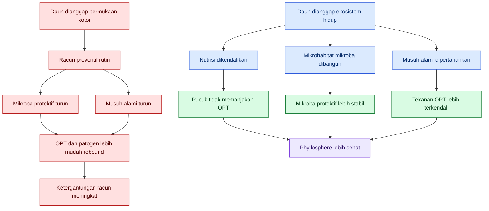

Tujuan artikel ini bukan mengajari petani membenci pestisida, dan bukan pula menjual ilusi bahwa mikroba hayati dapat menyelesaikan semua masalah. Tujuannya adalah mengubah cara membaca daun.

Bukan:

$$
\text{membunuh semua organisme di daun}
$$

Tetapi:

$$
\text{mengarahkan ekosistem daun agar mikroba protektif dan musuh alami lebih unggul}
$$

Prinsip IPM menekankan bahwa sebelum tindakan pengendalian dilakukan, perlu ada ambang tindakan. Melihat satu hama tidak otomatis berarti harus menyemprot; tindakan pengendalian dipilih setelah monitoring, identifikasi, dan ambang risiko menunjukkan bahwa intervensi memang diperlukan. ([US EPA][3])

**Status validitas:** **Proven / established IPM principle.**

## 0.2 Phyllosphere Bukan Hanya Medan Keras

Permukaan daun memang keras bagi mikroba. Mikroba harus menghadapi UV, kekeringan, fluktuasi suhu, nutrisi yang terbatas, permukaan berlilin, pencucian oleh hujan atau irigasi, serta residu pestisida. Namun, berhenti pada kesimpulan “phyllosphere itu keras” adalah analisis yang tidak lengkap.

Phyllosphere adalah **mosaik mikrohabitat**. Pada skala mikro, daun memiliki tulang daun, stomata, trikoma, hidatoda, permukaan bawah daun, alur daun, embun, dan gutasi. Review tentang kehidupan mikroba di phyllosphere menjelaskan bahwa pada skala mikro, keberadaan tulang daun, stomata, trikoma, dan hidatoda dapat mengubah ketersediaan nutrisi serta kondisi hidup mikroba; mikroba juga harus menghadapi keterbatasan nutrisi dan radiasi UV. ([Research Collection][4])

```mermaid
flowchart TD
    A["Phyllosphere"] --> B["Tekanan lingkungan"]
    A --> C["Mikrohabitat potensial"]
    A --> D["Komunitas biologis"]

    B --> B1["UV tinggi"]
    B --> B2["Cepat kering"]
    B --> B3["Nutrisi permukaan rendah"]
    B --> B4["Residu pestisida"]

    C --> C1["Gutasi"]
    C --> C2["Embun"]
    C --> C3["Hidatoda"]
    C --> C4["Stomata"]
    C --> C5["Trikoma"]
    C --> C6["Alur tulang daun"]
    C --> C7["Permukaan bawah daun"]

    D --> D1["Mikroba protektif"]
    D --> D2["Mikroba netral"]
    D --> D3["Patogen oportunis"]
    D --> D4["OPT"]
    D --> D5["Musuh alami"]

    classDef root fill:#e0f2fe,stroke:#0369a1,color:#082f49;
    classDef stress fill:#fee2e2,stroke:#b91c1c,color:#450a0a;
    classDef niche fill:#dcfce7,stroke:#15803d,color:#052e16;
    classDef bio fill:#fef9c3,stroke:#a16207,color:#422006;

    class A root;
    class B,B1,B2,B3,B4 stress;
    class C,C1,C2,C3,C4,C5,C6,C7 niche;
    class D,D1,D2,D3,D4,D5 bio;
```

Maka premis yang lebih adil adalah:

$$
\begin{aligned}
\text{phyllosphere}
&= \text{medan keras bagi OPT} \\
&+ \text{mosaik rumah bagi mikroba baik}
\end{aligned}
$$

Ini penting untuk praktisi. Bila daun hanya dianggap keras dan berbahaya, maka tindakan yang muncul adalah sterilisasi. Tetapi bila daun dibaca sebagai mosaik mikrohabitat, maka tindakan yang muncul adalah pengelolaan: kapan mikroba diaplikasikan, di mana diarahkan, bagaimana nutrisi diatur, bagaimana gutasi dibaca, dan kapan pestisida benar-benar diperlukan.

**Status validitas:** **Proven / ecological foundation.**

## 0.3 Masalah Besar di Lapang: Kenapa OPT Sering Unggul

Di banyak kebun, masalah OPT bukan hanya datang dari luar. Ledakan OPT sering terjadi karena sistem budidaya sendiri sedang menyediakan rumah yang sangat nyaman bagi OPT, tetapi tidak menyediakan kondisi yang sama baiknya bagi mikroba menguntungkan dan musuh alami.

Pola yang sering terjadi:

$$
pucuk\ lunak + N\ berlebih + mikroklimat\ nyaman + pestisida\ broad\text{-}spectrum
\rightarrow
OPT\ unggul,\ mikroba\ menguntungkan\ kalah
$$

N berlebih tidak boleh diterjemahkan secara dangkal sebagai “N menarik OPT”. Yang lebih tepat: N berlebih dapat membuat jaringan tanaman, terutama pucuk muda, menjadi lebih bernilai nutrisi bagi beberapa OPT. SARE merangkum bahwa banyak penelitian menunjukkan kerusakan tanaman atau jumlah serangga pengunyah daun dan tungau lebih tinggi pada tanaman yang dipupuk N; kadar N tinggi pada jaringan tanaman juga dapat menurunkan resistensi dan meningkatkan kerentanan terhadap serangan hama. ([SARE][5])

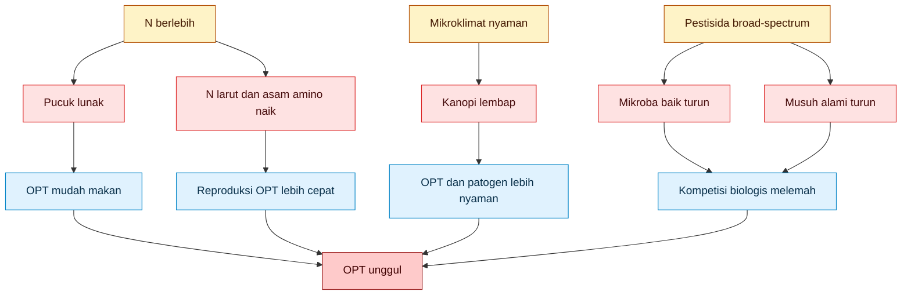

Masalahnya bukan sekadar:

$$
N\ tinggi \rightarrow hama\ datang
$$

Itu terlalu dangkal.

Yang lebih akurat:

$$
N\ berlebih
\rightarrow
pucuk\ lunak
+
N\ larut/asam\ amino\ meningkat
+
rasio\ C:N\ turun
+
pertahanan\ tanaman\ berubah
\rightarrow
OPT\ lebih\ mudah\ makan,\ menetap,\ dan\ berkembang
$$

Pada aphid, misalnya, gula floem menjadi sumber energi, sedangkan nitrogen dan asam amino sering berkaitan dengan pertumbuhan serta reproduksi. Studi tahun 2024 pada pea aphid menunjukkan pemupukan N meningkatkan total asam amino bebas tanaman, dan asam amino esensial dipandang sebagai faktor pembatas performa aphid dalam konteks nutrisi. ([MDPI][6])

**Status validitas:** **Proven untuk aphid dan beberapa kelompok OPT; contextual untuk semua OPT.**

## 0.4 Racun Preventif Bukan Pencegahan Sejati

Pada saat N dan mikroklimat membuat pucuk nyaman bagi OPT, penggunaan pestisida broad-spectrum yang rutin dapat memperburuk keadaan. Pestisida dapat menekan target, tetapi juga dapat mengganggu komunitas non-target, termasuk mikroba menguntungkan dan musuh alami. Review tentang dampak pestisida pada phytobiota menegaskan bahwa tindakan pengendalian dapat memengaruhi komunitas mikroba tanaman dan bahwa efek mikroba terhadap fitness tanaman perlu dipertimbangkan dalam pengendalian penyakit. ([Frontiers][2])

Lingkaran buruknya adalah:

$$
racun\ preventif
\rightarrow
mikroba\ protektif\ turun
+
musuh\ alami\ turun
\rightarrow
OPT/patogen\ rebound
\rightarrow
racun\ makin\ sering
$$

Ini bukan berarti pestisida selalu salah. Yang salah adalah ketika pestisida dijadikan **fondasi pencegahan**, bukan **alat koreksi selektif** saat monitoring menunjukkan risiko sudah melewati ambang tindakan.

IPM bukan satu metode tunggal, tetapi integrasi beberapa metode berdasarkan inspeksi, monitoring, dan informasi lokasi. EPA menyatakan bahwa program IPM yang berhasil menggunakan pendekatan identifikasi dan monitoring, penetapan ambang tindakan, pencegahan, dan pengendalian. ([US EPA][7])

**Status validitas:** **Proven / IPM principle.**

## 0.5 Formula Tujuan Artikel: Mengarahkan Ekosistem Daun

Artikel ini membahas **rekayasa habitat phyllosphere**.

<figure>
  
  <figcaption>
    Ilustrasi phyllosphere dan mikroklimat di sekitar permukaan daun yang
    memengaruhi kelembapan, suhu, mikroorganisme, dan kesehatan tanaman.
  </figcaption>
</figure>

Bukan sekadar:

$$
\text{semprot mikroba}
$$

Tetapi:

$$
\text{bangun rumah untuk mikroba menguntungkan}
$$

Rumah itu terdiri dari beberapa komponen:

$$
\text{rumah mikroba phyllosphere}
=

\text{mikrohabitat}
+
\text{air periodik}
+
\text{nutrisi mikro}
+
\text{perlindungan UV}
+
\text{adhesi}
+
\text{tanpa racun pembunuh}
+
\text{nutrisi tanaman tidak memanjakan OPT}
$$

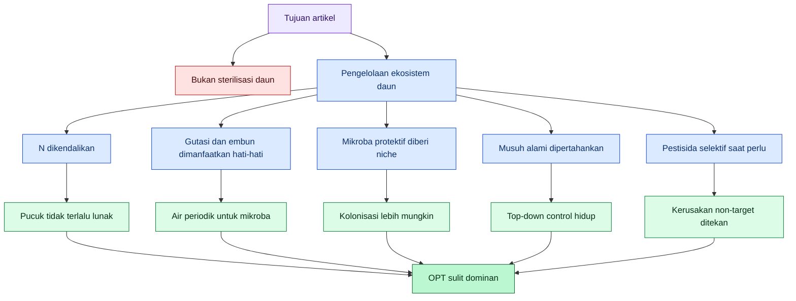

Prinsipnya:

$$
\text{OPT sulit dominan}
=

\text{pucuk tidak terlalu lunak}
+
\text{N tidak berlebih}
+
\text{mikroba protektif punya niche}
+
\text{musuh alami tidak dibunuh}
+
\text{pestisida selektif bila perlu}
$$

Dengan kerangka ini, pestisida tidak dihapus dari sistem. Pestisida diturunkan posisinya: dari fondasi pencegahan menjadi alat koreksi selektif.

**Status validitas:** **Proven sebagai prinsip IPM; supported sebagai strategi pengelolaan phyllosphere.**

## 0.6 Kenapa Phyllosphere Tidak Boleh Disebut Permukaan Steril

Ada tiga alasan utama.

Pertama, phyllosphere dihuni banyak mikroba. Komunitas ini dapat berisi bakteri, fungi, aktinomiset, sianobakteri, virus, dan mikroorganisme lain. Sebagian merugikan, sebagian netral, dan sebagian dapat membantu tanaman melalui kompetisi ruang, kompetisi nutrisi, induksi ketahanan, produksi metabolit, atau interaksi lain yang menekan patogen. Review phyllospheric microbiomes menyebut komunitas phyllosphere kaya dan beragam, serta memiliki signifikansi ekologis bagi tanaman. ([PMC][8])

Kedua, permukaan daun tidak seragam. Bagian atas daun berbeda dengan bawah daun. Pucuk muda berbeda dengan daun tua. Tepi daun yang memiliki hidatoda berbeda dengan tengah lamina. Pangkal trikoma berbeda dengan permukaan kutikula yang licin.

Ketiga, mikroba bukan sekadar objek pasif. Beberapa mikroba dapat membentuk biofilm, menempel di lokasi tertentu, memanfaatkan eksudat daun, bertahan pada periode kering, atau aktif kembali saat ada embun/gutasi. Pada genus _Bacillus_, misalnya, pembentukan biofilm dalam phyllosphere dibahas sebagai salah satu faktor yang dapat berhubungan dengan efektivitas biokontrol. ([EnviroMicro Journals][9])

Ini berarti daun harus dibaca sebagai ruang hidup:

$$
\text{daun}
=

\text{jaringan tanaman}
+
\text{mikroklimat}
+
\text{air permukaan}
+
\text{nutrisi mikro}
+
\text{komunitas mikroba}
+
\text{OPT}
+
\text{musuh alami}
$$

Bukan sebagai target semprot semata.

**Status validitas:** **Proven untuk konsep phyllosphere sebagai habitat; supported untuk strategi mengarahkan komunitas mikroba.**

## 0.7 Gutasi dan Hidatoda: Oase Mikroba Sekaligus Pintu Patogen

Gutasi harus masuk sejak awal karena ini sering diabaikan dalam diskusi phyllosphere. Gutasi adalah keluarnya cairan dari daun melalui hidatoda, biasanya terlihat sebagai tetesan air di tepi atau ujung daun pada pagi hari. Hidatoda adalah organ tanaman yang bertanggung jawab atas gutasi dan menghubungkan permukaan daun dengan jaringan internal. ([PMC][10])

Secara ekologis, gutasi dapat menjadi “oase” mikro bagi mikroba karena menyediakan air dan solut pada permukaan daun. Tetapi gutasi juga berbahaya bila dimanfaatkan patogen. Review terbaru tentang hidatoda menegaskan bahwa cairan gutasi dapat memfasilitasi masuknya patogen bakteri oportunis ke hidatoda; hidatoda sendiri menjadi antarmuka antara permukaan daun dan vaskular xilem. ([ScienceDirect][11])

Maka gutasi tidak boleh disederhanakan menjadi baik atau buruk.

$$
gutasi
=

\text{oase mikroba}
+
\text{potensi pintu patogen}
$$

Rekomendasi praktis yang benar bukan:

$$
\text{perbanyak gutasi}
$$

Tetapi:

$$
\text{manfaatkan jendela gutasi secara hati-hati}
$$

Misalnya, aplikasi mikroba foliar pada sore hari dapat memberi peluang mikroba menempel sebelum malam, lalu mendapat dukungan kelembapan malam, embun, atau gutasi pagi. Namun, membuat daun terlalu basah terus-menerus, over-irigasi, atau membentuk kanopi terlalu lembap dapat memperbesar risiko penyakit.

**Status validitas:** **Proven untuk keberadaan gutasi dan peran hidatoda; supported dengan risk warning untuk pemanfaatan gutasi sebagai jendela kolonisasi mikroba baik.**

## 0.8 Kesalahan Praktis yang Ingin Dikoreksi

### Kesalahan 1: Menganggap daun sehat adalah daun steril

Daun sehat bukan daun steril. Daun sehat adalah daun yang komunitas biologisnya tidak didominasi patogen dan OPT.

Koreksi:

$$
\text{sehat}
\neq
\text{steril}
$$

Yang lebih tepat:

$$
\text{sehat}
=

\text{komunitas terkendali}
+
\text{tanaman tidak rentan}
+
\text{musuh alami aktif}
$$

**Status validitas:** **Proven / ecological principle.**

### Kesalahan 2: Menganggap pencegahan berarti racun preventif

Pencegahan bukan berarti menyemprot racun sebelum masalah muncul. Pencegahan berarti membuat kondisi tanaman tidak mudah dimenangkan OPT dan patogen.

Koreksi:

$$
\text{pencegahan}
\neq
\text{racun rutin}
$$

Yang lebih tepat:

$$
\text{pencegahan}
=

\text{nutrisi tepat}
+
\text{mikroklimat terkendali}
+
\text{mikroba protektif}
+
\text{monitoring}
+
\text{ambang tindakan}
$$

**Status validitas:** **Proven / IPM principle.**

### Kesalahan 3: Menganggap N tinggi selalu berarti tanaman kuat

N diperlukan. Tanpa N, tanaman tidak tumbuh normal. Tetapi N berlebih, terutama pada pucuk muda, dapat membuat jaringan terlalu lunak dan bernutrisi tinggi bagi beberapa OPT.

Koreksi:

$$
N\ cukup = pertumbuhan
$$

Tetapi:

$$
N\ berlebih = risiko\ pucuk\ lunak + risiko\ OPT
$$

**Status validitas:** **Proven untuk banyak kasus hama tertentu; contextual untuk semua OPT.**

### Kesalahan 4: Menganggap mikroba hayati cukup disemprotkan

Mikroba hayati tidak bekerja hanya karena ada di tangki. Ia harus hidup, menempel, bertahan, dan mencapai target.

Koreksi:

$$
\text{mikroba di tangki}
\neq
\text{mikroba berkoloni di daun}
$$

Yang lebih tepat:

$$
\text{efektivitas mikroba}
=

\text{strain cocok}
+
\text{formulasi}
+
\text{waktu aplikasi}
+
\text{kelembapan}
+
\text{adhesi}
+
\text{kompatibilitas pestisida}
$$

**Status validitas:** **Supported / product-dependent.**

### Kesalahan 5: Mengabaikan gutasi, embun, dan mikrohabitat basah

Permukaan daun tidak selalu kering. Ada periode basah alami dari embun, kondensasi, hujan ringan, dan gutasi. Ini dapat menjadi peluang untuk mikroba menguntungkan, tetapi juga risiko bagi patogen.

Koreksi:

$$
gutasi
\neq
selalu\ baik
$$

Yang lebih tepat:

$$
gutasi
=

\text{oase mikroba}
+
\text{potensi pintu patogen}
$$

**Status validitas:** **Proven untuk gutasi dan hidatoda; supported dengan risk warning untuk pemanfaatan praktis.**

## 0.9 Prinsip Validitas yang Dipakai dalam Artikel Ini

Agar artikel ini tidak menjadi kumpulan slogan, setiap rekomendasi akan diberi status validitas.

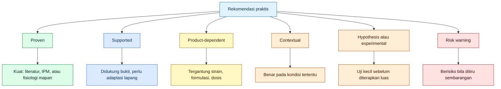

| Status                        | Arti praktis                                                                                                           |
| ----------------------------- | ---------------------------------------------------------------------------------------------------------------------- |
| **Proven**                    | Didukung kuat oleh literatur ilmiah, prinsip IPM, atau fisiologi tanaman yang mapan.                                   |
| **Supported**                 | Didukung literatur dan logika agronomi, tetapi hasilnya dipengaruhi lokasi, tanaman, cuaca, strain, dan cara aplikasi. |
| **Product-dependent**         | Validitas tergantung produk, strain, formulasi, dosis, viabilitas, dan label.                                          |
| **Contextual**                | Benar pada kondisi tertentu, tetapi tidak boleh digeneralisasi.                                                        |
| **Hypothesis / experimental** | Masuk akal secara teori, tetapi harus diuji kecil sebelum diterapkan luas.                                             |
| **Risk warning**              | Berpotensi merusak ekosistem daun, meningkatkan penyakit, atau membuat petani salah arah bila dilakukan sembarangan.   |

Ini penting karena praktisi lapangan bukan objek eksperimen. Petani membutuhkan arahan yang jelas:

$$
\text{apa yang sudah kuat buktinya}
$$

$$
\text{apa yang masuk akal tetapi perlu uji kecil}
$$

$$
\text{apa yang berisiko bila ditiru membabi buta}
$$

## 0.10 Rekomendasi Awal dari Bab Premis

| Rekomendasi                                                                                         | Status validitas                  | Penjelasan                                                                   |
| --------------------------------------------------------------------------------------------------- | --------------------------------- | ---------------------------------------------------------------------------- |
| Perlakukan daun sebagai ekosistem, bukan permukaan steril.                                          | **Proven**                        | Phyllosphere adalah habitat mikroba besar dan kompleks.                      |
| Hindari racun preventif broad-spectrum sebagai kebiasaan dasar.                                     | **Proven / IPM principle**        | Pengendalian seharusnya berdasarkan monitoring dan ambang tindakan.          |
| Jangan membaca pucuk hijau-lunak sebagai tanda sehat mutlak.                                        | **Supported / contextual**        | Pucuk lunak akibat N berlebih dapat mendukung performa beberapa OPT.         |
| Bangun niche mikroba sebelum OPT mapan.                                                             | **Supported**                     | Masuk akal secara ekologi; hasil bergantung produk, strain, dan kondisi.     |
| Manfaatkan embun/gutasi sebagai jendela mikroklimat, bukan sebagai alasan membuat daun basah terus. | **Supported dengan risk warning** | Air periodik membantu mikroba, tetapi basah berlebih dapat membantu patogen. |
| Gunakan pestisida sebagai koreksi selektif, bukan fondasi pencegahan.                               | **Proven / IPM principle**        | Sejalan dengan prinsip IPM dan pengurangan risiko ekologis.                  |

## 0.11 Batasan Penting Artikel

Artikel ini tidak menyatakan bahwa semua pestisida buruk. Dalam kondisi tertentu, pestisida tetap diperlukan untuk mencegah kerugian ekonomi, terutama ketika populasi OPT sudah melewati ambang tindakan atau ketika penyakit berisiko menyebar cepat.

Namun artikel ini menolak pola pikir:

$$
\text{takut OPT}
\rightarrow
\text{racun rutin sejak awal}
$$

Karena pola itu sering membuat tanaman hidup dalam lingkungan yang terus-menerus menekan mikroba protektif dan musuh alami.

Artikel ini juga tidak menyatakan bahwa semua mikroba hayati pasti aman dan efektif. Aplikasi biological control agent juga harus dikritisi berdasarkan strain, formulasi, dosis, viabilitas, target, cara aplikasi, dan kompatibilitasnya dengan pestisida maupun kondisi mikroklimat daun.

Posisi artikel ini bukan:

$$
\text{kimia buruk, hayati pasti baik}
$$

Posisi yang benar:

$$
\text{intervensi apa pun harus membaca ekologi phyllosphere}
$$

Baik kimia maupun hayati bisa salah bila diterapkan tanpa memahami habitat daun.

## 0.12 Kesimpulan Bab 0

Premis utama artikel ini adalah:

**Phyllosphere bukan permukaan mati. Phyllosphere adalah ekosistem hidup yang bisa diarahkan.**

Jika dikelola buruk, phyllosphere menjadi:

$$
\text{hotel OPT}
+
\text{pintu patogen}
+
\text{area residu racun}
$$

Jika dikelola baik, phyllosphere dapat menjadi:

$$
\text{rumah mikroba protektif}
+
\text{zona musuh alami}
+
\text{benteng awal kesehatan tanaman}
$$

Maka tujuan besar artikel ini adalah menggeser praktik lapang dari:

$$
\text{sterilisasi daun dengan racun}
$$

menuju:

$$
\text{pengelolaan ekosistem daun}
$$

Kalimat kuncinya:

> **Pencegahan bukan menyemprot racun sebelum hama datang. Pencegahan adalah membuat pucuk tidak layak menjadi rumah OPT, sambil membuat phyllosphere layak dihuni mikroba menguntungkan.**

[1]: https://journals.asm.org/doi/10.1128/AEM.69.4.1875-1883.2003?utm_source=chatgpt.com 'Microbiology of the Phyllosphere | Applied and Environmental ...'
[2]: https://www.frontiersin.org/journals/agronomy/articles/10.3389/fagro.2022.936032/full?utm_source=chatgpt.com 'The unseen effect of pesticides: The impact on phytobiota ...'
[3]: https://www.epa.gov/safepestcontrol/integrated-pest-management-ipm-principles?utm_source=chatgpt.com 'Integrated Pest Management (IPM) Principles'
[4]: https://www.research-collection.ethz.ch/bitstreams/463f76c4-8be3-4601-9034-d50758f78e99/download?utm_source=chatgpt.com 'Microbial life in the phyllosphere'
[5]: https://www.sare.org/publications/manage-insects-on-your-farm/managing-soils-to-minimize-crop-pests/impacts-of-fertilizers-on-insect-pests/?utm_source=chatgpt.com 'Impacts of Fertilizers on Insect Pests - SARE'
[6]: https://www.mdpi.com/2073-4395/14/11/2592?utm_source=chatgpt.com 'and Green-Morph Pea Aphids to Nitrogen Fertilization'
[7]: https://www.epa.gov/ipm/introduction-integrated-pest-management?utm_source=chatgpt.com 'Introduction to Integrated Pest Management'
[8]: https://pmc.ncbi.nlm.nih.gov/articles/PMC7123684/?utm_source=chatgpt.com 'Phyllospheric Microbiomes: Diversity, Ecological Significance ...'
[9]: https://enviromicro-journals.onlinelibrary.wiley.com/doi/full/10.1111/jam.15596?utm_source=chatgpt.com 'Could Bacillus biofilms enhance the effectivity of biocontrol ...'
[10]: https://pmc.ncbi.nlm.nih.gov/articles/PMC7498026/?utm_source=chatgpt.com 'Anatomy of leaf apical hydathodes in four monocotyledon ...'
[11]: https://www.sciencedirect.com/science/article/pii/S1369526625001360?utm_source=chatgpt.com 'Hydathodes at the forefront of plant immunity against ...'

[**Kembali ke Atas**](#membangun-rumah-mikroba-menguntungkan-di-phyllosphere-strategi-praktis-mengurangi-ketergantungan-pada-racun-preventif)

---

# 1. Pembuka: Kesalahan Berpikir yang Membuat Petani Tergantung Racun

Bab ini membuka persoalan utama: banyak petani tidak menjadi tergantung racun karena malas belajar, tetapi karena sistem berpikir budidayanya sejak awal diarahkan pada satu respons cepat:

$$
\text{OPT terlihat} \rightarrow \text{semprot}
$$

Respons ini tampak logis karena hasilnya sering terlihat cepat. Hama turun, daun tampak bersih, dan petani merasa masalah selesai. Namun di banyak kasus, yang sebenarnya terjadi hanyalah **penurunan populasi sesaat**, bukan perbaikan ekosistem tanaman.

Dalam budidaya lapang, terutama cabai, tomat, melon, timun, semangka, terung, dan tanaman hortikultura intensif lain, keputusan semprot preventif yang terlalu sering dapat menciptakan lingkaran ketergantungan. OPT memang ditekan, tetapi mikroba protektif, musuh alami, dan stabilitas phyllosphere juga ikut terganggu. Review tentang pestisida dan phytobiota menekankan bahwa pengendalian kimia maupun hayati dapat mengubah komunitas mikroba tanaman; karena itu dampaknya terhadap fungsi mikrobioma dan kesehatan tanaman tidak boleh diabaikan. ([PMC][1])

Bab ini tidak sedang mengatakan pestisida selalu salah. Pestisida tetap alat penting dalam kondisi tertentu. Yang dikritik adalah **pestisida sebagai kebiasaan preventif tanpa monitoring, tanpa ambang tindakan, dan tanpa membaca ekosistem daun**.

---

## 1.1 Pola Pikir Lama

Pola pikir lama melihat OPT sebagai musuh tunggal. Begitu OPT muncul, tindakan dianggap harus langsung membunuh OPT tersebut.

Rumus lapangnya:

$$
OPT\ muncul
\rightarrow
semprot\ racun
\rightarrow
OPT\ turun\ sementara
\rightarrow
mikroba\ baik\ dan\ musuh\ alami\ ikut\ turun
\rightarrow
OPT\ rebound
\rightarrow
racun\ makin\ rutin
$$

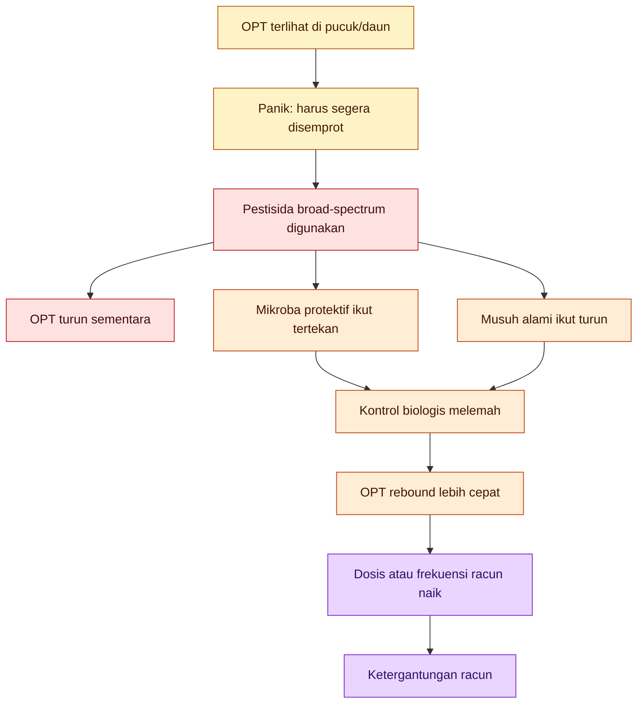

Pola lama ini punya satu kelemahan besar: ia hanya menghitung OPT yang terlihat, tetapi tidak menghitung organisme yang ikut hilang.

Yang sering tidak dihitung adalah:

| Komponen yang ikut terdampak   | Dampak lapang                                                    |
| ------------------------------ | ---------------------------------------------------------------- |
| Mikroba protektif phyllosphere | Kompetisi alami terhadap patogen melemah                         |
| Predator                       | Aphid, trips, tungau, dan kutu kebul lebih mudah rebound         |
| Parasitoid                     | Tekanan alami terhadap hama pengisap menurun                     |
| Mikroba netral                 | Ruang kosong bisa diisi mikroba oportunis                        |
| Keanekaragaman daun            | Phyllosphere menjadi lebih mudah didominasi organisme bermasalah |
| Seleksi resistensi             | OPT yang tahan lebih mungkin bertahan dan berkembang             |

Pola lama juga membuat petani kehilangan kemampuan membaca sinyal tanaman. Semua masalah dipersempit menjadi:

$$
\text{ada hama} \rightarrow \text{semprot}
$$

Padahal penyebab ledakan OPT bisa berasal dari:

$$
N\ berlebih
+
pucuk\ lunak
+
kanopi\ lembap
+
musuh\ alami\ turun
+
mikroba\ protektif\ rusak
+
aplikasi\ pestisida\ tidak\ selektif
$$

Jadi, OPT yang terlihat di pucuk sering bukan akar masalah. Ia adalah **gejala bahwa sistem tanaman sedang menguntungkan OPT**.

**Status validitas:** **Supported / ecological inference.**
Hubungan langsung antara satu aplikasi pestisida dan kerusakan seluruh phyllosphere sangat bergantung bahan aktif, dosis, frekuensi, cuaca, dan komoditas. Namun prinsip bahwa pestisida dapat berdampak pada organisme non-target dan bahwa IPM perlu meminimalkan risiko ekologis adalah prinsip yang kuat dalam pengelolaan hama modern. ([US EPA][2])

---

## 1.2 Kenapa Pola Lama Terlihat Berhasil, tetapi Menjebak

Pola lama tidak sepenuhnya salah dalam jangka pendek. Bila populasi OPT tinggi, pestisida yang tepat dapat menurunkan populasi dengan cepat. Masalahnya muncul ketika respons cepat ini dijadikan **fondasi pencegahan**.

Perbedaan keduanya:

| Situasi           | Pestisida sebagai koreksi      | Pestisida sebagai kebiasaan preventif |
| ----------------- | ------------------------------ | ------------------------------------- |
| Dasar keputusan   | Monitoring dan ambang tindakan | Jadwal atau rasa takut                |
| Target            | OPT spesifik                   | Semua organisme yang terkena          |
| Frekuensi         | Saat diperlukan                | Rutin                                 |
| Risiko non-target | Lebih terkendali               | Lebih tinggi                          |
| Dampak ekosistem  | Lebih selektif                 | Lebih mengganggu                      |
| Posisi dalam IPM  | Alat koreksi                   | Fondasi sistem                        |

Dalam prinsip IPM, pengendalian tidak dimulai dari bahan kimia. EPA menyatakan IPM menggunakan pendekatan bertingkat: identifikasi dan monitoring, menetapkan ambang tindakan, pencegahan, lalu pengendalian. Setelah monitoring, identifikasi, dan ambang tindakan menunjukkan bahwa pengendalian diperlukan, barulah metode pengendalian dipilih dengan mempertimbangkan efektivitas dan risiko; kontrol yang lebih rendah risiko dipilih lebih dulu. ([US EPA][2])

Dengan kata lain:

$$
\text{IPM}
\neq
\text{anti-pestisida}
$$

Tetapi:

$$
\text{IPM}
=

\text{pestisida digunakan hanya ketika perlu, tepat target, dan paling rendah risiko}
$$

Pola lama menjebak karena menciptakan rasa aman palsu. Petani melihat hama turun setelah semprot, tetapi tidak melihat:

$$
\text{mikroba protektif turun}
$$

$$
\text{predator dan parasitoid turun}
$$

$$
\text{resistensi OPT terseleksi}
$$

$$
\text{phyllosphere makin miskin kontrol alami}
$$

Akibatnya, ketika OPT muncul lagi, satu-satunya jalan yang terasa masuk akal adalah semprot lagi. Inilah awal ketergantungan.

**Status validitas:** **Proven sebagai prinsip IPM; contextual pada dampak spesifik pestisida.**
Prinsip ambang tindakan, monitoring, dan pemilihan kontrol rendah risiko adalah prinsip IPM yang mapan. Dampak spesifik pestisida terhadap mikroba dan musuh alami harus dilihat berdasarkan bahan aktif, dosis, dan sistem budidaya. ([US EPA][2])

---

## 1.3 Pola Pikir Baru

Pola pikir baru tidak bertanya pertama-tama:

> Racun apa yang bisa membunuh OPT ini?

Pola pikir baru bertanya:

> Kenapa OPT ini nyaman di tanaman saya, dan apa yang membuat musuh alaminya kalah?

Rumusnya:

$$
tanaman\ sehat
+
phyllosphere\ hidup
+
mikroba\ protektif
+
musuh\ alami
+
monitoring
+
intervensi\ selektif
\rightarrow
tekanan\ OPT\ lebih\ stabil
$$

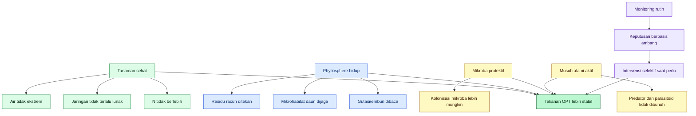

Pola baru ini tidak bergantung pada satu alat. Ia bekerja dengan banyak lapisan pengaman:

| Lapisan               | Fungsi                                                       |
| --------------------- | ------------------------------------------------------------ |
| Tanaman sehat         | Membuat jaringan tidak mudah dieksploitasi OPT               |
| Nutrisi terkendali    | Mencegah pucuk terlalu lunak dan kaya N larut                |
| Phyllosphere hidup    | Menjaga ruang hidup mikroba protektif                        |
| Mikroba menguntungkan | Membantu kompetisi, antagonisme, atau priming pertahanan     |
| Musuh alami           | Menekan OPT dari atas melalui predasi atau parasitisme       |
| Monitoring            | Membedakan OPT ringan, risiko meningkat, dan serangan serius |
| Intervensi selektif   | Menekan OPT tanpa merusak semua komponen sistem              |

Ini bukan pendekatan lambat. Justru ini pendekatan yang lebih presisi karena tidak membuang energi untuk semprotan yang belum tentu diperlukan.

FAO menjelaskan bahwa elemen dasar IPM mencakup natural control, sampling, economic levels, dan pemahaman biologi serta ekologi serangga. Artinya, petani tidak cukup hanya tahu nama racun; petani perlu tahu kapan organisme benar-benar menjadi ancaman dan kapan ekosistem masih mampu menahannya. ([Open Knowledge FAO][3])

**Status validitas:** **Proven sebagai kerangka IPM; supported untuk penerapan spesifik phyllosphere.**

---

## 1.4 Perbedaan Pencegahan Sejati dan Racun Preventif

Istilah “preventif” sering rancu. Banyak petani menyebut semprot pestisida rutin sebagai pencegahan. Padahal dalam IPM, pencegahan tidak identik dengan racun. Pencegahan berarti mengurangi peluang OPT menjadi masalah.

Pencegahan sejati bekerja sebelum OPT dominan, tetapi tidak selalu dengan membunuh.

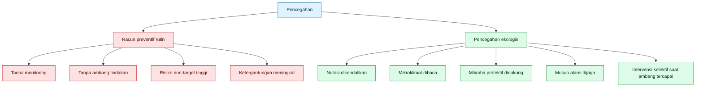

Pencegahan ekologis pada phyllosphere berarti:

$$
\text{pucuk tidak terlalu lunak}
+
\text{N tidak berlebih}
+
\text{gutasi/embun tidak menjadi ledakan patogen}
+
\text{mikroba protektif punya niche}
+
\text{musuh alami tidak dirusak}
$$

Sedangkan racun preventif rutin sering bekerja seperti ini:

$$
\text{belum ada ambang}
+
\text{belum ada diagnosis}
+
\text{belum ada target jelas}
\rightarrow
\text{semua permukaan disapu}
$$

Ini berbahaya karena daun bukan permukaan kosong. Daun adalah habitat.

**Status validitas:** **Proven sebagai prinsip IPM; supported sebagai strategi ekologi phyllosphere.**
EPA menyatakan pencegahan adalah salah satu tingkat dalam IPM, sementara kontrol dipilih ketika monitoring, identifikasi, dan ambang tindakan menunjukkan pengendalian diperlukan. ([US EPA][2])

---

## 1.5 Ambang Tindakan: Rem Praktis agar Petani Tidak Panik

Ambang tindakan adalah batas praktis: kapan OPT atau kondisi lingkungan sudah cukup berisiko sehingga tindakan pengendalian dibenarkan.

Tanpa ambang tindakan, petani mudah mengambil keputusan berdasarkan rasa takut.

Rumus tanpa ambang:

$$
\text{lihat OPT sedikit}
\rightarrow
\text{panik}
\rightarrow
\text{semprot}
$$

Rumus dengan ambang:

$$
\text{lihat OPT}
\rightarrow
\text{identifikasi}
\rightarrow
\text{hitung/populasi}
\rightarrow
\text{cek musuh alami}
\rightarrow
\text{cek fase tanaman}
\rightarrow
\text{putuskan tindakan}
$$

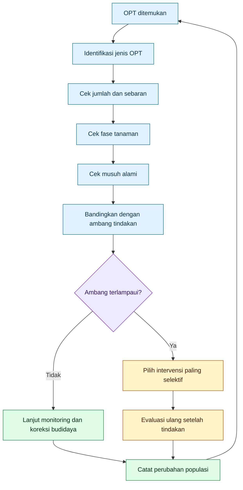

UC IPM menjelaskan bahwa bila monitoring menunjukkan kelimpahan hama atau kerusakan masih sangat rendah, tindakan pengendalian bisa saja tidak diperlukan, terutama bila peluang populasi berkembang menjadi masalah rendah. Ini memperkuat prinsip bahwa keberadaan OPT tidak otomatis sama dengan kebutuhan semprot. ([UC IPM][4])

Untuk praktisi, ambang tindakan tidak harus selalu dimulai dari angka laboratorium yang rumit. Petani bisa memulai dengan ambang kerja sederhana, misalnya:

| Parameter lapang                  | Cara baca awal                                   |
| --------------------------------- | ------------------------------------------------ |
| OPT hanya terlihat di 1–2 tanaman | Belum tentu perlu semprot; tandai dan pantau     |
| OPT mulai menyebar antarbedeng    | Risiko naik; cek musuh alami dan fase tanaman    |
| Pucuk muda mulai koloni aktif     | Perlu tindakan selektif atau koreksi nutrisi-air |
| Ada gejala virus dan vektor aktif | Ambang lebih rendah; perlu respons cepat         |
| Musuh alami banyak                | Tunda broad-spectrum, gunakan metode selektif    |
| Tanaman fase kritis               | Ambang lebih ketat                               |

**Status validitas:** **Proven sebagai prinsip IPM; angka ambang bersifat contextual.**
Konsep ambang tindakan kuat, tetapi angka ambang spesifik harus disesuaikan dengan komoditas, OPT, fase tanaman, nilai ekonomi, cuaca, dan toleransi risiko.

---

## 1.6 Kesalahan Berpikir tentang “Bersih”

Salah satu akar ketergantungan racun adalah obsesi pada daun yang “bersih total”. Dalam praktik, “bersih total” sering berarti tidak terlihat serangga, tidak ada bercak, tidak ada organisme lain. Padahal lahan yang terlalu steril secara biologis sering tidak stabil.

Yang dibutuhkan bukan steril, tetapi seimbang.

$$
\text{steril}
\neq
\text{stabil}
$$

$$
\text{stabil}
=

\text{OPT rendah}
+
\text{musuh alami ada}
+
\text{mikroba protektif berfungsi}
+
\text{tanaman tidak rentan}
$$

IPM sendiri tidak bertujuan memusnahkan semua hama. IPM bertujuan mencegah kerusakan yang tidak dapat diterima dengan risiko seminimal mungkin terhadap manusia, lingkungan, dan sistem budidaya. EPA menyebut IPM sebagai pendekatan efektif dan sensitif lingkungan yang mengandalkan kombinasi praktik berbasis informasi tentang siklus hidup OPT dan interaksinya dengan lingkungan. ([US EPA][2])

Untuk phyllosphere, ini berarti daun sehat bukan daun kosong. Daun sehat adalah daun yang komunitas biologisnya tidak memberi ruang dominan bagi OPT atau patogen.

**Status validitas:** **Proven sebagai prinsip IPM dan ekologi; supported untuk penerapan phyllosphere.**

---

## 1.7 Membaca OPT sebagai Gejala Sistem, Bukan Sekadar Musuh

OPT di pucuk tidak selalu berarti masalahnya hanya OPT. Pada banyak kasus, OPT adalah indikator bahwa sistem sedang menyediakan kondisi ideal bagi mereka.

Contoh pada cabai:

$$
N\ tinggi
+
pucuk\ lunak
+
kanopi\ lembap
+
semprotan\ broad\text{-}spectrum
\rightarrow
trips/aphid/kutu\ kebul\ lebih\ mudah\ menetap
$$

Ketika petani hanya menyemprot tanpa mengoreksi penyebabnya, maka yang terjadi:

$$
OPT\ turun\ sementara
\rightarrow
pucuk\ tetap\ lunak
\rightarrow
musuh\ alami\ tetap\ rendah
\rightarrow
OPT\ kembali
$$

Maka pertanyaan praktis sebelum semprot seharusnya:

| Pertanyaan                                    | Tujuan                                           |
| --------------------------------------------- | ------------------------------------------------ |
| Apakah N baru dinaikkan terlalu cepat?        | Membaca pucuk lunak dan flush baru               |
| Apakah kanopi terlalu lembap?                 | Membaca risiko patogen dan hama pucuk            |
| Apakah musuh alami masih ada?                 | Menentukan apakah broad-spectrum harus dihindari |
| Apakah OPT hanya lokal atau menyebar?         | Menentukan skala tindakan                        |
| Apakah tanaman berada di fase kritis?         | Menentukan ambang tindakan                       |
| Apakah gejala virus sudah muncul?             | Menentukan urgensi kontrol vektor                |
| Apakah pestisida sebelumnya menekan predator? | Membaca potensi rebound                          |

Dengan cara ini, OPT tidak hanya diperlakukan sebagai target bunuh, tetapi sebagai sinyal kondisi ekosistem.

**Status validitas:** **Supported / practical ecology.**
Membaca OPT sebagai indikator sistem didukung oleh prinsip IPM dan ekologi hama, tetapi diagnosis lapang harus tetap spesifik pada komoditas, OPT, cuaca, dan riwayat aplikasi.

---

## 1.8 Tangga Keputusan Sebelum Racun

Artikel ini mengusulkan tangga keputusan praktis. Bukan untuk menghapus pestisida, tetapi untuk memastikan pestisida tidak dipakai terlalu cepat dan terlalu kasar.

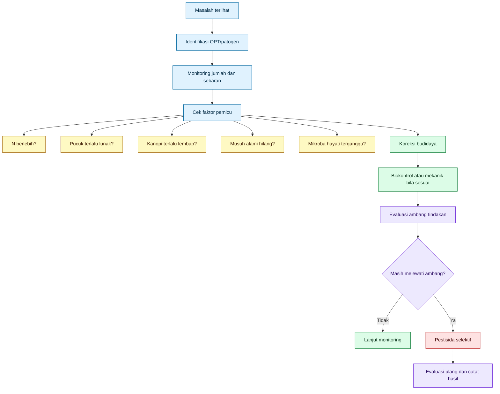

Tangga ini mencegah dua ekstrem:

1. **Semua masalah disemprot.**
2. **Semua pestisida ditolak meskipun ambang sudah berbahaya.**

Keduanya tidak tepat.

Posisi yang lebih matang:

$$
\text{pestisida}
=

\text{alat selektif setelah diagnosis dan ambang}
$$

bukan:

$$
\text{pestisida}
=

\text{refleks panik}
$$

**Status validitas:** **Proven sebagai prinsip IPM; supported untuk urutan praktis phyllosphere.**

---

## 1.9 Status Validitas Rekomendasi Bab 1

| Rekomendasi                                                            | Status validitas                      | Penjelasan                                                                                    |
| ---------------------------------------------------------------------- | ------------------------------------- | --------------------------------------------------------------------------------------------- |
| Jangan jadikan racun preventif broad-spectrum sebagai kebiasaan dasar. | **Proven / IPM principle**            | IPM menekankan monitoring, ambang tindakan, pencegahan, dan kontrol rendah risiko lebih dulu. |
| Gunakan pestisida sebagai alat koreksi selektif, bukan fondasi sistem. | **Proven / IPM principle**            | Kontrol dipilih setelah identifikasi, monitoring, dan ambang menunjukkan kebutuhan.           |
| Jangan menyemprot hanya karena melihat sedikit OPT.                    | **Proven / contextual**               | Keputusan harus mempertimbangkan jumlah, sebaran, fase tanaman, dan musuh alami.              |
| Baca OPT sebagai sinyal kondisi sistem.                                | **Supported**                         | OPT sering meningkat karena faktor nutrisi, mikroklimat, dan hilangnya kontrol alami.         |
| Pertahankan musuh alami dan mikroba protektif.                         | **Supported / proven in IPM context** | Natural control adalah bagian penting IPM; dampak spesifik bergantung sistem.                 |
| Terapkan monitoring rutin.                                             | **Proven**                            | Monitoring adalah fondasi IPM.                                                                |
| Gunakan ambang tindakan.                                               | **Proven**                            | Ambang tindakan mencegah semprotan yang tidak perlu.                                          |
| Koreksi N, air, dan kanopi sebelum menaikkan racun.                    | **Supported / practical agronomy**    | Banyak ledakan OPT dipengaruhi pucuk lunak, mikroklimat, dan nutrisi tidak seimbang.          |
| Anggap phyllosphere sebagai ekosistem hidup.                           | **Proven / ecological foundation**    | Phyllosphere dihuni komunitas mikroba dan organisme lain yang memengaruhi kesehatan tanaman.  |

---

## 1.10 Batasan Penting Bab 1

Bab ini tidak memberikan angka ambang spesifik untuk semua komoditas. Ambang tindakan harus disesuaikan dengan:

$$
komoditas
+
fase\ tanaman
+
jenis\ OPT
+
nilai\ ekonomi
+
cuaca
+
riwayat\ serangan
+
keberadaan\ musuh\ alami
$$

Pada cabai, misalnya, kehadiran kutu kebul atau trips sebagai vektor virus pada fase muda bisa membutuhkan respons lebih cepat dibanding hama pengunyah ringan pada fase tanaman sudah kuat. Artinya, “jangan semprot karena satu hama” bukan berarti “jangan bertindak saat risiko virus tinggi”.

Bab ini juga tidak mengatakan bahwa mikroba hayati selalu cukup. Bila populasi OPT sudah melewati ambang, kerusakan meningkat cepat, atau vektor virus aktif, tindakan selektif bisa diperlukan. Namun keputusan itu harus lahir dari diagnosis, bukan dari kebiasaan panik.

**Status validitas:** **Contextual / risk warning.**

---

## 1.11 Kesimpulan Bab 1

Kesalahan berpikir yang membuat petani tergantung racun adalah memperlakukan daun sebagai permukaan kotor dan OPT sebagai satu-satunya musuh. Padahal phyllosphere adalah ekosistem. Ketika ekosistem itu dirusak terus-menerus oleh racun preventif, yang hilang bukan hanya OPT, tetapi juga mikroba protektif, musuh alami, dan stabilitas biologis tanaman.

Pola lama:

$$
OPT\ muncul
\rightarrow
semprot
\rightarrow
turun\ sementara
\rightarrow
rebound
\rightarrow
semprot\ lagi
$$

Pola baru:

$$
monitoring
+
ambang\ tindakan
+
tanaman\ sehat
+
phyllosphere\ hidup
+
intervensi\ selektif
\rightarrow
tekanan\ OPT\ lebih\ stabil
$$

Kalimat pengunci Bab 1:

> **Racun preventif bukan pencegahan sejati. Pencegahan sejati adalah membuat tanaman dan phyllosphere tidak menjadi habitat ideal bagi OPT, sambil menjaga mikroba protektif dan musuh alami tetap hidup.**

[**Kembali ke Atas**](#membangun-rumah-mikroba-menguntungkan-di-phyllosphere-strategi-praktis-mengurangi-ketergantungan-pada-racun-preventif)

[1]: https://pmc.ncbi.nlm.nih.gov/articles/PMC11465254/?utm_source=chatgpt.com 'Integrated Pest Management: An Update on the Sustainability ...'
[2]: https://www.epa.gov/safepestcontrol/integrated-pest-management-ipm-principles?utm_source=chatgpt.com 'Integrated Pest Management (IPM) Principles'
[3]: https://openknowledge.fao.org/server/api/core/bitstreams/ca303ce1-a00a-4964-aad8-cf4f0c66583d/content/x5048E07.htm?utm_source=chatgpt.com 'Section 4-Principles and theory of integrated pest ...'
[4]: https://ipm.ucanr.edu/agriculture/floriculture-and-ornamental-nurseries/establishing-treatment-thresholds/?utm_source=chatgpt.com 'Establishing Action Thresholds'

[**Kembali ke Atas**](#membangun-rumah-mikroba-menguntungkan-di-phyllosphere-strategi-praktis-mengurangi-ketergantungan-pada-racun-preventif)

---

# 2. Bab Dasar: Apa Itu Phyllosphere?

Phyllosphere adalah **habitat hidup pada bagian atas tanaman**. Dalam konteks praktisi, phyllosphere tidak hanya berarti permukaan daun bagian atas, tetapi seluruh area tanaman di atas tanah yang dapat dihuni mikroba, OPT, patogen, dan musuh alami.

Phyllosphere mencakup:

- daun,
- pucuk,
- bunga,
- buah muda,
- batang muda,
- permukaan bawah daun,
- lipatan daun,
- area sekitar stomata,
- hidatoda,
- trikoma,
- alur tulang daun,
- retakan kutikula,
- embun,
- gutasi,
- dan biofilm mikroba yang terbentuk di permukaan tanaman.

Secara ilmiah, phyllosphere sering didefinisikan sebagai habitat mikroba pada bagian tanaman di atas tanah, terutama daun. Review modern menyebut phyllosphere sebagai salah satu habitat mikroba terbesar dan khas, dihuni komunitas bakteri, fungi, virus, sianobakteri, aktinobakteri, nematoda, dan protozoa yang berhubungan dengan fisiologi tanaman serta fungsi ekosistem. ([ScienceDirect][1])

Bagi praktisi, definisi ini penting karena cara membaca daun akan menentukan cara mengelola OPT. Bila daun dianggap permukaan mati, responsnya adalah sterilisasi. Bila daun dianggap ekosistem hidup, responsnya adalah pengelolaan habitat.

$$
\text{daun sebagai permukaan mati}
\rightarrow
\text{racun preventif}
$$

Sedangkan:

$$
\text{daun sebagai ekosistem hidup}
\rightarrow
\text{pengelolaan phyllosphere}
$$

**Status validitas bab:** **Proven / ecological foundation.**

---

## 2.1 Definisi Praktis Phyllosphere

Secara praktis, phyllosphere adalah seluruh ruang hidup mikroba dan organisme kecil pada bagian tanaman di atas tanah.

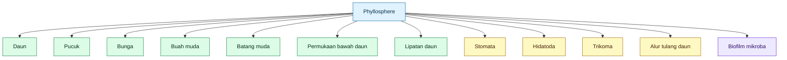

Definisi ini lebih luas daripada sekadar “permukaan daun”. Dalam literatur, istilah **phyllosphere** mengacu pada habitat bagian atas tanaman, sedangkan **phylloplane** lebih sempit, yaitu permukaan daun. Salah satu catatan penting dari Leveau adalah bahwa istilah phylloplane memiliki kesan dua dimensi dan kurang mewakili kompleksitas tiga dimensi habitat daun. ([Leveau][2])

Dengan kata lain:

$$
\text{phylloplane} \subset \text{phyllosphere}
$$

Atau secara praktis:

$$
\text{phylloplane} = \text{permukaan daun}
$$

Sedangkan:

$$
\text{phyllosphere} = \text{seluruh habitat atas tanaman}
$$

Perbedaan ini penting. Bila petani hanya berpikir “permukaan daun”, ia cenderung menyemprot dari atas. Padahal banyak OPT dan mikroba hidup di bawah daun, lipatan pucuk, bunga, alur tulang daun, atau titik basah seperti gutasi.

**Status validitas:** **Proven.**
Definisi phyllosphere sebagai habitat bagian atas tanaman dan phylloplane sebagai permukaan daun didukung literatur phyllosphere klasik dan modern. ([Plant Protection Research][3])

---

## 2.2 Phyllosphere Bukan Bidang Rata

Kesalahan besar dalam praktik semprot adalah menganggap daun seperti bidang rata. Pada kenyataannya, daun adalah permukaan tiga dimensi yang tidak seragam.

Daun punya:

- permukaan atas,
- permukaan bawah,
- tepi daun,
- cekungan kecil,
- retakan kutikula,
- alur tulang daun,
- pangkal trikoma,
- stomata,
- hidatoda,
- titik embun,
- titik gutasi,
- dan koloni mikroba lokal.

Maka phyllosphere harus dibaca sebagai **mosaik mikrohabitat**:

$$
\text{phyllosphere}
=

\text{area kering}
+
\text{area basah}
+
\text{gutasi}
+
\text{embun}
+
\text{stomata}
+
\text{hidatoda}
+
\text{trikoma}
+
\text{alur tulang daun}
+
\text{biofilm}
$$

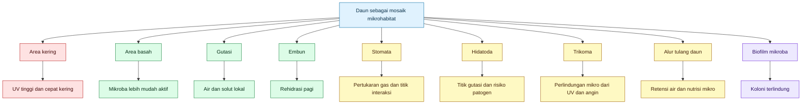

Mikroba tidak menyebar merata seperti cat di permukaan daun. Mereka sering membentuk kelompok kecil di titik yang lebih mendukung hidup. Studi mikroskopi phyllosphere menunjukkan bahwa struktur seperti retakan kutikula, stomata, hidatoda, vena atau tulang daun, trikoma, dan kelenjar dapat menjadi mikrohabitat penting bagi kolonisasi bakteri. ([Frontiers][4])

Artinya, pertanyaan praktisnya bukan hanya:

> Mikroba apa yang disemprot?

Tetapi juga:

> Mikroba itu akan hidup di titik mana pada daun?

Jika mikroba disemprot pada siang hari ke permukaan atas daun yang panas, kering, dan terkena UV, peluang hidupnya lebih rendah. Sebaliknya, mikroba lebih mungkin bertahan di bawah daun, alur tulang daun, pangkal trikoma, titik embun, atau area yang terlindung dari cahaya langsung.

**Status validitas:** **Proven untuk heterogenitas mikrohabitat; supported untuk implikasi aplikasi lapang.**

---

## 2.3 Phyllosphere sebagai Medan Seleksi, Bukan Medan Steril

Phyllosphere sering digambarkan sebagai medan keras. Ini benar, tetapi tidak lengkap. Permukaan daun memang menghadirkan tekanan berat bagi mikroba: UV, kekeringan, fluktuasi suhu, nutrisi terbatas, dan pencucian oleh hujan. Lindow dan Brandl menjelaskan bahwa permukaan daun telah lama dianggap lingkungan yang keras bagi kolonisasi bakteri karena fluktuasi suhu dan kelembapan, perubahan antara ada dan tidak adanya air bebas, serta keterbatasan nutrisi. ([ResearchGate][5])

Namun, phyllosphere juga memiliki titik hidup. Daun bukan permukaan kering seragam. Ada embun, gutasi, alur tulang daun, bawah daun, trikoma, dan biofilm. Maka istilah yang lebih tepat adalah **medan seleksi**.

$$
\text{phyllosphere}
\neq
\text{medan mati}
$$

Yang lebih tepat:

$$
\text{phyllosphere}
=

\text{medan seleksi bagi mikroba, OPT, patogen, dan musuh alami}
$$

```mermaid id="bab2-medan-seleksi"
flowchart TD
    A["Phyllosphere"] --> B["Tekanan keras"]
    A --> C["Peluang mikrohabitat"]
    A --> D["Hasil seleksi"]

    B --> B1["UV"]
    B --> B2["Kering"]
    B --> B3["Nutrisi rendah"]
    B --> B4["Suhu berubah cepat"]
    B --> B5["Tercuci hujan"]

    C --> C1["Embun"]
    C --> C2["Gutasi"]
    C --> C3["Bawah daun"]
    C --> C4["Alur tulang daun"]
    C --> C5["Pangkal trikoma"]
    C --> C6["Biofilm"]

    D --> D1["Mikroba protektif bertahan"]
    D --> D2["Patogen oportunis masuk"]
    D --> D3["OPT menetap"]
    D --> D4["Musuh alami berburu"]

    classDef root fill:#e0f2fe,stroke:#0369a1,color:#082f49;
    classDef stress fill:#fee2e2,stroke:#b91c1c,color:#450a0a;
    classDef chance fill:#dcfce7,stroke:#15803d,color:#052e16;
    classDef result fill:#fef9c3,stroke:#a16207,color:#422006;

    class A root;
    class B,B1,B2,B3,B4,B5 stress;
    class C,C1,C2,C3,C4,C5,C6 chance;
    class D,D1,D2,D3,D4 result;
```

Dari sudut pandang praktisi, ini mengubah cara berpikir. Tujuannya bukan membuat daun kosong, tetapi membuat kondisi daun lebih menguntungkan bagi mikroba protektif dan musuh alami dibanding bagi OPT dan patogen.

$$
\text{tujuan}
\neq
\text{sterilisasi daun}
$$

Tetapi:

$$
\text{tujuan}
=

\text{mengarahkan seleksi phyllosphere}
$$

**Status validitas:** **Proven sebagai konsep ekologi; supported sebagai strategi praktis.**

---

## 2.4 Mikrohabitat dan Siapa yang Diuntungkan

OPT, patogen, mikroba menguntungkan, dan musuh alami tidak memakai ruang yang sama dengan cara yang sama. Mereka memilih atau memanfaatkan titik-titik tertentu.

| Mikrohabitat         | Bisa menguntungkan siapa?                 | Catatan praktis                            |
| -------------------- | ----------------------------------------- | ------------------------------------------ |
| Pucuk muda           | aphid, trips, kutu kebul, tungau          | Pucuk lunak sering kaya air dan N larut    |
| Bawah daun           | kutu kebul, tungau, mikroba terlindung UV | Semprot dari atas sering tidak menjangkau  |
| Tepi daun / hidatoda | mikroba gutasi, tetapi juga patogen       | Gutasi adalah peluang dan risiko           |
| Pangkal trikoma      | mikroba protektif, patogen tertentu       | Lebih terlindung dari UV dan angin         |
| Alur tulang daun     | mikroba, patogen, telur/hama kecil        | Retensi air dan nutrisi mikro lebih tinggi |
| Bunga                | trips, mikroba, patogen                   | Area sensitif saat generatif               |
| Lipatan pucuk        | trips, aphid, patogen oportunis           | Lokasi terlindung dari semprotan kasar     |
| Retakan kutikula     | bakteri epifit atau patogen               | Titik kolonisasi mikro                     |
| Biofilm              | mikroba protektif atau oportunis          | Bisa menjadi benteng atau masalah          |

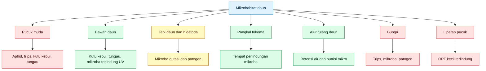

Sumber mikroskopi dan ekologi daun menunjukkan bahwa kolonisasi mikroba pada permukaan daun sangat dipengaruhi oleh mikrohabitat seperti stomata, hidatoda, vena, trikoma, dan struktur permukaan lain. ([Frontiers][4])

Di sinilah pentingnya strategi lapang. Bila targetnya kutu kebul atau tungau, semprotan dari atas yang hanya membasahi permukaan atas daun sering tidak cukup. Bila targetnya mikroba protektif, aplikasi juga harus mempertimbangkan tempat mikroba bisa bertahan, bukan hanya tempat larutan jatuh.

**Status validitas:** **Proven untuk mikrohabitat daun; supported untuk implikasi semprot praktis.**

---

## 2.5 Pucuk Muda: Rumah Nyaman bagi OPT, Bukan Otomatis Rumah Mikroba Baik

Pucuk muda sering menjadi lokasi favorit OPT. Alasannya bukan satu faktor saja. Pucuk muda biasanya lebih lunak, lebih aktif tumbuh, lebih kaya air, dan pada kondisi N tinggi dapat mengandung lebih banyak N larut dan asam amino.

Bagi aphid, trips, kutu kebul, dan tungau, pucuk muda menyediakan kombinasi:

$$
jaringan\ lunak
+
air
+
nutrisi
+
perlindungan\ fisik
$$

Namun, pucuk muda tidak otomatis menjadi rumah ideal bagi mikroba menguntungkan. Mikroba foliar yang disemprot ke pucuk tetap harus menghadapi UV, kekeringan, kompetisi lokal, residu pestisida, dan pencucian.

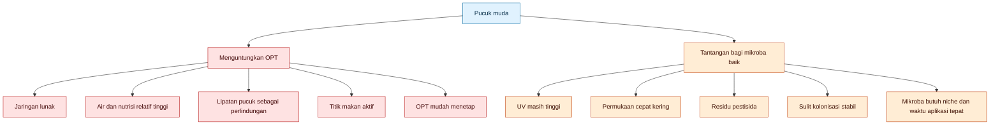

Ini sebabnya artikel ini menolak pendekatan sederhana:

$$
\text{OPT di pucuk}
\rightarrow
\text{semprot mikroba ke pucuk}
\rightarrow
\text{selesai}
$$

Yang lebih benar:

$$
\text{OPT di pucuk}
\rightarrow
\text{cek N, air, jaringan, mikroklimat, musuh alami}
\rightarrow
\text{bangun niche mikroba}
\rightarrow
\text{intervensi selektif bila perlu}
$$

**Status validitas:** **Supported.**
Kecenderungan OPT memilih jaringan muda banyak terlihat secara lapang dan didukung konsep nutrisi jaringan, tetapi detailnya berbeda menurut jenis OPT dan tanaman.

---

## 2.6 Bawah Daun: Area Terlindung yang Sering Terlewat

Bawah daun adalah salah satu area paling penting dalam phyllosphere. Banyak OPT bersembunyi atau makan di bawah daun. Di sisi lain, bawah daun juga bisa menjadi area yang lebih terlindung dari UV bagi mikroba.

Secara praktis:

$$
\text{semprot dari atas saja}
\rightarrow
\text{banyak target bawah daun tidak kena}
$$

Sedangkan:

$$
\text{semprot diarahkan ke bawah daun}
\rightarrow
\text{peluang kontak dengan OPT dan mikroba target meningkat}
$$

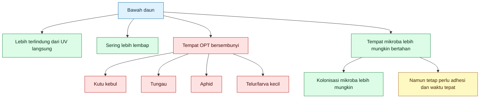

Karena itu, aplikasi agen hayati foliar, pestisida selektif, atau pencucian mekanis tidak boleh hanya membasahi permukaan atas daun. Arah nozzle, ukuran droplet, volume semprot, dan waktu aplikasi menentukan apakah area bawah daun benar-benar terjangkau.

**Status validitas:** **Supported-practical.**
Konsep perlindungan dari UV dan pentingnya mikrohabitat heterogen didukung literatur phyllosphere; efektivitas teknik semprot harus diuji sesuai tanaman, alat, dan target OPT.

---

## 2.7 Hidatoda dan Gutasi: Titik Kecil dengan Dampak Besar

Hidatoda adalah struktur daun yang berhubungan dengan keluarnya gutasi. Gutasi adalah tetesan cairan yang sering terlihat di tepi atau ujung daun pada pagi hari. Titik ini penting karena menghubungkan air, solut tanaman, permukaan daun, mikroba, dan patogen.

$$
\text{hidatoda}
\rightarrow
\text{gutasi}
\rightarrow
\text{air dan solut pada permukaan daun}
$$

Bagi mikroba menguntungkan, gutasi dapat menjadi sumber air sementara. Bagi patogen, hidatoda juga bisa menjadi pintu masuk. Struktur seperti stomata, hidatoda, dan lentisel dikenal sebagai bukaan alami yang dapat dipakai mikroorganisme untuk masuk ke jaringan internal tanaman. ([Frontiers][6])

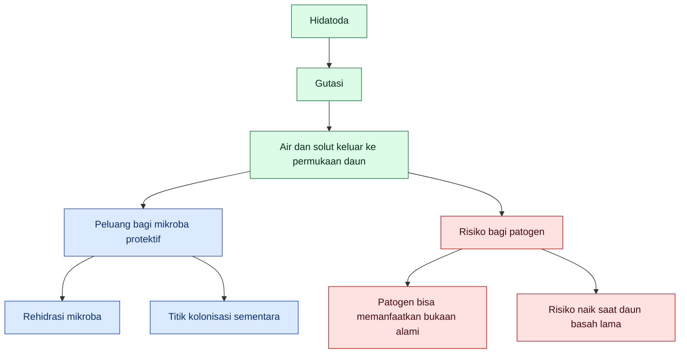

Jadi gutasi tidak boleh dipandang secara satu arah.

Bukan:

$$
\text{gutasi} = \text{selalu baik}
$$

Bukan juga:

$$
\text{gutasi} = \text{selalu buruk}
$$

Yang benar:

$$
\text{gutasi}
=

\text{oase mikroba}
+
\text{potensi pintu patogen}
$$

Implikasi praktisnya: aplikasi mikroba foliar sore hari dapat masuk akal karena mikroba punya waktu menempel sebelum malam dan dapat memanfaatkan kelembapan malam, embun, atau gutasi pagi. Namun over-irigasi, kanopi terlalu rapat, dan daun basah terlalu lama justru dapat meningkatkan risiko patogen.

**Status validitas:** **Proven untuk peran hidatoda/gutasi sebagai struktur dan proses tanaman; supported dengan risk warning untuk pemanfaatan mikroba praktis.**

---

## 2.8 Trikoma, Alur Tulang Daun, dan Retakan Kutikula

Trikoma, alur tulang daun, dan retakan kutikula adalah struktur kecil yang sering tidak diperhatikan praktisi, padahal penting bagi mikroba.

Pangkal trikoma dapat menjadi titik perlindungan karena sedikit mengubah lapisan batas udara di permukaan daun. Alur tulang daun dapat menahan air dan partikel lebih lama. Retakan kutikula dapat menjadi titik kolonisasi mikroba atau patogen.

Studi tentang trikom menunjukkan bahwa trikom dapat menjadi hotspot mikroba dan bahwa permukaan daun memiliki struktur yang memengaruhi kolonisasi mikroba. ([PMC][7])

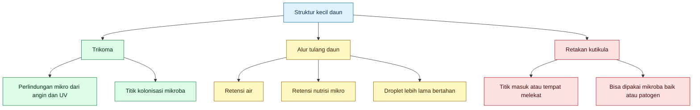

Bagi praktisi, ini berarti aplikasi mikroba dan pestisida selektif harus memperhatikan **kualitas coverage**, bukan sekadar volume. Droplet yang terlalu besar bisa jatuh. Droplet yang terlalu halus bisa melayang. Aplikasi yang baik harus menempel cukup merata, terutama pada lokasi mikrohabitat target.

**Status validitas:** **Proven untuk struktur daun sebagai mikrohabitat; supported untuk implikasi aplikasi.**

---

## 2.9 Biofilm: Bentuk “Rumah” Mikroba yang Sering Diabaikan

Biofilm adalah komunitas mikroba yang menempel pada permukaan dan dilindungi matriks ekstraseluler. Pada phyllosphere, biofilm dapat membantu mikroba bertahan dari kekeringan, UV, dan pencucian. Namun biofilm juga bisa dibentuk oleh mikroba oportunis atau patogen.

$$
\text{biofilm}
=

\text{komunitas mikroba melekat}
+
\text{matriks pelindung}
$$

Pada agen seperti _Bacillus_, pembentukan biofilm dalam phyllosphere dibahas sebagai salah satu faktor yang berhubungan dengan kemampuan bertahan dan efektivitas biokontrol. ([MDPI][8])

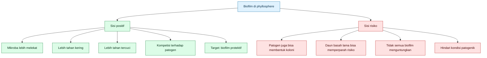

Maka tujuan praktis bukan sekadar “membuat mikroba banyak”, tetapi membantu mikroba protektif menempel dan membentuk koloni yang stabil tanpa menciptakan kondisi basah ekstrem yang menguntungkan patogen.

**Status validitas:** **Supported / product-dependent.**
Biofilm sebagai mekanisme bertahan mikroba didukung literatur, tetapi efektivitas produk mikroba tertentu bergantung pada strain, formulasi, dosis, dan kondisi lapang.

---

## 2.10 Kenapa Bab Ini Penting bagi Praktisi?

Karena OPT dan mikroba menguntungkan tidak hidup di “daun rata”. Mereka hidup pada titik-titik mikrohabitat.

Bila petani tidak memahami ini, maka keputusan lapangnya menjadi terlalu kasar:

$$
\text{semprot seluruh tanaman}
\rightarrow
\text{harap semua masalah selesai}
$$

Padahal yang terjadi bisa saja:

- OPT di bawah daun tidak terkena,
- mikroba hayati mati di permukaan atas karena UV,
- patogen masuk dari hidatoda saat daun basah lama,
- residu pestisida menekan mikroba protektif,
- musuh alami hilang,
- pucuk tetap lunak karena N berlebih,
- OPT kembali karena rumahnya belum diubah.

Pendekatan yang lebih presisi:

$$
\text{baca mikrohabitat}
\rightarrow
\text{baca organisme target}
\rightarrow
\text{baca waktu aplikasi}
\rightarrow
\text{baca nutrisi dan air}
\rightarrow
\text{pilih intervensi}
$$

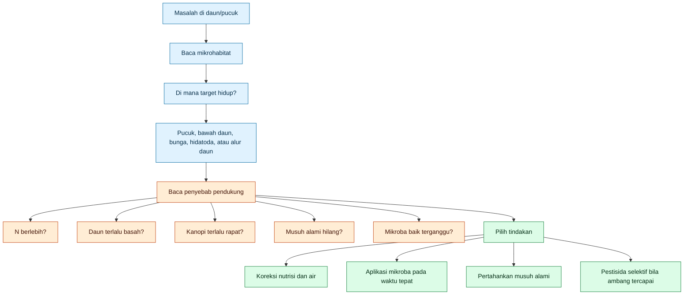

Praktisi yang memahami mikrohabitat tidak lagi bertanya:

> Obat apa untuk hama ini?

Tetapi bertanya:

> Hama ini hidup di titik mana, kenapa titik itu nyaman, dan bagaimana membuat mikroba protektif serta musuh alami lebih unggul di sana?

**Status validitas:** **Supported / practical ecology.**

---

## 2.11 Rekomendasi Praktis dari Bab 2

| Rekomendasi                                                                                 | Status validitas                  | Penjelasan                                                                                        |
| ------------------------------------------------------------------------------------------- | --------------------------------- | ------------------------------------------------------------------------------------------------- |
| Perlakukan phyllosphere sebagai habitat hidup, bukan permukaan steril.                      | **Proven**                        | Phyllosphere adalah habitat mikroba besar dan kompleks.                                           |
| Bedakan phyllosphere dan phylloplane.                                                       | **Proven**                        | Phyllosphere lebih luas; phylloplane lebih sempit pada permukaan daun.                            |
| Baca daun sebagai mosaik mikrohabitat.                                                      | **Proven**                        | Mikroba sering menempati struktur seperti stomata, hidatoda, vena, trikoma, dan retakan kutikula. |
| Jangan menyemprot hanya dari atas bila target berada di bawah daun.                         | **Supported-practical**           | Banyak OPT dan mikroba target berada di bawah daun atau lipatan.                                  |
| Manfaatkan embun/gutasi sebagai jendela mikroklimat, bukan alasan membuat daun basah terus. | **Supported dengan risk warning** | Air membantu mikroba, tetapi basah lama membantu patogen.                                         |
| Pilih waktu aplikasi mikroba saat tekanan UV lebih rendah.                                  | **Supported-practical**           | Mikroba lebih rentan di permukaan atas yang panas dan kering.                                     |
| Perhatikan coverage, bukan hanya dosis.                                                     | **Supported-practical**           | Target mikrohabitat harus benar-benar terkena.                                                    |
| Jangan menganggap semua biofilm baik.                                                       | **Risk warning**                  | Biofilm bisa protektif atau patogenik tergantung mikroba penyusunnya.                             |
| Gunakan mikroba foliar yang memang dirancang untuk aplikasi daun.                           | **Product-dependent**             | Efektivitas sangat bergantung strain, formulasi, dan label produk.                                |

---

## 2.12 Batasan Penting Bab 2

Bab ini tidak mengatakan bahwa semua mikroba di daun baik. Phyllosphere berisi mikroba protektif, mikroba netral, mikroba oportunis, dan patogen. Karena itu, tujuan pengelolaan bukan memperbanyak mikroba secara sembarangan, tetapi **mengarahkan komunitas**.

Bab ini juga tidak mengatakan bahwa daun harus dibuat lembap terus. Kelembapan periodik dari embun atau gutasi dapat membantu mikroba, tetapi daun basah terlalu lama dapat meningkatkan risiko penyakit.

Rumus yang harus dihindari:

$$
\text{lebih basah}
=

\text{lebih baik untuk mikroba baik}
$$

Itu salah.

Rumus yang lebih aman:

$$
\text{kelembapan periodik}
+
\text{sirkulasi baik}
+
\text{mikroba adaptif}
=

\text{peluang kolonisasi lebih baik}
$$

Bab ini juga tidak menyatakan bahwa semua struktur daun selalu menguntungkan mikroba baik. Stomata, hidatoda, dan retakan kutikula dapat menjadi titik interaksi, tetapi juga bisa menjadi pintu masuk patogen. Karena itu setiap rekomendasi praktis harus disertai status validitas dan peringatan risiko.

**Status validitas:** **Risk warning / contextual.**

---

## 2.13 Kesimpulan Bab 2

Phyllosphere adalah ekosistem hidup pada bagian atas tanaman. Ia bukan bidang rata, bukan permukaan mati, dan bukan target sterilisasi semata.

Phyllosphere harus dibaca sebagai:

$$
\text{phyllosphere}
=

\text{daun}
+
\text{pucuk}
+
\text{bunga}
+
\text{buah muda}
+
\text{batang muda}
+
\text{mikrohabitat}
+
\text{komunitas biologis}
$$

Dan:

$$
\text{phyllosphere}
=

\text{tekanan keras}
+
\text{peluang rumah mikroba}
$$

Bagi praktisi, inti bab ini adalah:

> **OPT dan mikroba menguntungkan tidak hidup di daun rata. Mereka hidup di titik-titik mikrohabitat. Karena itu, pengelolaan OPT dan mikroba harus dimulai dari membaca mikrohabitat daun.**

Kalimat pengunci Bab 2:

> **Daun bukan meja datar untuk disemprot. Daun adalah kota mikro: ada jalan, lorong, tempat basah, tempat kering, rumah OPT, pintu patogen, dan ruang yang bisa dibangun untuk mikroba menguntungkan.**

[**Kembali ke Atas**](#membangun-rumah-mikroba-menguntungkan-di-phyllosphere-strategi-praktis-mengurangi-ketergantungan-pada-racun-preventif)

[1]: https://www.sciencedirect.com/science/article/pii/S0944501321001944?utm_source=chatgpt.com 'Phyllosphere microbiome: Diversity and functions'
[2]: https://leveau.ucdavis.edu/wp-content/uploads/sites/220/2019/07/Leveau2006a.pdf?utm_source=chatgpt.com '11 Microbial communities in the phyllosphere'
[3]: https://www.plantprotection.pl/pdf-136522-69100?filename=Phylloplane+microbes.pdf&utm_source=chatgpt.com 'Phylloplane microbes impact host physiology: a review'
[4]: https://www.frontiersin.org/journals/microbiology/articles/10.3389/fmicb.2017.02669/full?utm_source=chatgpt.com 'Leaf-FISH: Microscale Imaging of Bacterial Taxa on ...'
[5]: https://www.researchgate.net/publication/376080042_Microbiology_of_the_Phyllosphere?utm_source=chatgpt.com '(PDF) Microbiology of the Phyllosphere'
[6]: https://www.frontiersin.org/journals/microbiology/articles/10.3389/fmicb.2011.00119/full?utm_source=chatgpt.com 'Surface Structures Involved in Plant Stomata and Leaf ...'
[7]: https://pmc.ncbi.nlm.nih.gov/articles/PMC8067393/?utm_source=chatgpt.com 'Trichomes form genotype-specific microbial hotspots in ... - PMC'
[8]: https://www.mdpi.com/2223-7747/12/16/2891?utm_source=chatgpt.com 'Affecting Factors of Plant Phyllosphere Microbial ...'

---

# 3. Bab Kunci: N Tinggi Bukan “Menarik” OPT, Tetapi Membuat OPT Mudah Berkembang

Bab ini penting karena salah satu kalimat yang paling sering beredar di lapang adalah:

> N tinggi mengundang OPT.

Kalimat itu berguna sebagai peringatan awal, tetapi **tidak cukup presisi**. Bila dipahami mentah-mentah, petani bisa salah arah: menganggap N seperti umpan manis yang membuat hama datang dari jauh. Padahal mekanismenya tidak sesederhana itu.

Versi yang lebih akurat:

> **N tinggi tidak selalu menarik OPT dari jauh, tetapi dapat membuat pucuk lebih bernilai nutrisi, lebih lunak, dan lebih cocok untuk kolonisasi serta pembiakan banyak OPT.**

Dengan kata lain, masalah utama bukan hanya pada “kedatangan” OPT, tetapi pada **keberhasilan OPT menetap dan berkembang biak** setelah mereka menemukan tanaman.

Rumus besarnya:

$$
N\ berlebih
\rightarrow
pucuk\ lunak
+
N_{\text{larut}}\ dan\ asam\ amino\ naik
+
rasio\ C:N\ turun
+
pertahanan\ tanaman\ berubah
\rightarrow
OPT\ lebih\ mudah\ makan,\ menetap,\ dan\ berkembang
$$

Hubungan antara pemupukan N dan OPT sudah dibahas luas dalam literatur. SARE merangkum bahwa pemupukan N dapat mengubah komposisi nutrisi tanaman dan memengaruhi pertahanan tanaman; dalam tinjauan 50 tahun penelitian, banyak studi menunjukkan lebih banyak kerusakan atau jumlah serangga pengunyah daun dan tungau pada tanaman yang dipupuk N, sementara sebagian besar studi aphid dan tungau mencatat peningkatan populasi ketika dosis N naik. ([SARE][1])

**Status validitas bab:** **Proven untuk aphid dan beberapa kelompok OPT; contextual untuk semua OPT.**

---

## 3.1 Koreksi Istilah: “Mengundang” Itu Terlalu Kasar

Kalimat populer:

> N tinggi mengundang OPT.

Kalimat ini perlu dikoreksi karena kata “mengundang” memberi kesan bahwa OPT datang karena mencium N seperti semut mencium gula. Pada beberapa kasus, perubahan volatil tanaman, warna pucuk, kelembutan jaringan, dan flush daun muda memang dapat memengaruhi preferensi serangga. Namun untuk banyak OPT pengisap, efek yang lebih kuat adalah **tanaman menjadi lebih baik sebagai tempat makan dan berkembang biak**.

Versi presisi:

> **N tinggi membuat pucuk lebih bernilai nutrisi dan lebih cocok untuk kolonisasi serta pembiakan banyak OPT.**

```mermaid
flowchart TD
    A["Kalimat populer"] --> B["N tinggi mengundang OPT"]
    B --> C["Masalah: terlalu menyederhanakan mekanisme"]

    D["Versi presisi"] --> E["N tinggi meningkatkan kualitas nutrisi pucuk"]
    E --> F["OPT lebih mudah makan"]
    E --> G["OPT lebih betah menetap"]
    E --> H["Reproduksi OPT lebih cepat"]

    F --> I["Populasi naik"]
    G --> I
    H --> I

    classDef popular fill:#fee2e2,stroke:#b91c1c,color:#450a0a;
    classDef correction fill:#dbeafe,stroke:#1d4ed8,color:#0b2f6b;
    classDef biology fill:#fef9c3,stroke:#a16207,color:#422006;
    classDef result fill:#dcfce7,stroke:#15803d,color:#052e16;

    class A,B,C popular;
    class D,E correction;
    class F,G,H biology;
    class I result;
```

Koreksi ini penting. Bila petani hanya memahami “N tinggi mengundang OPT”, solusi yang muncul bisa terlalu kasar:

$$
\text{OPT naik} \rightarrow \text{stop N total}
$$

Padahal tanaman tetap butuh N. Kekurangan N juga membuat pertumbuhan lemah, produksi turun, dan tanaman tidak mampu membentuk jaringan baru secara normal. Nitrogen adalah unsur penting untuk pertumbuhan tanaman; masalahnya bukan N itu buruk, melainkan **N berlebih, N terlalu cepat, atau N tidak proporsional terhadap fase tanaman dan unsur lain**. Review Frontiers menegaskan bahwa N cukup penting untuk pertumbuhan dan hasil, tetapi N berlebih dapat meningkatkan kualitas nutrisi tanaman bagi hama dan patogen serta mengubah sifat pertahanan tanaman. ([Frontiers][2])

Jadi prinsipnya:

$$
\text{bukan anti-N}
$$

tetapi:

$$
\text{anti-N berlebih dan tidak proporsional}
$$

**Status validitas:** **Proven / conceptual correction.**
N dibutuhkan tanaman, tetapi N berlebih dapat meningkatkan kesesuaian tanaman bagi beberapa OPT. Efeknya tidak boleh digeneralisasi sama untuk semua OPT, semua tanaman, dan semua fase.

---

## 3.2 Bedakan Energi dan Faktor Pembatas Reproduksi

Kesalahan umum berikutnya adalah mencampuradukkan fungsi gula dan asam amino.

Untuk banyak organisme:

$$
gula/sukrosa = energi
$$

Sedangkan:

$$
asam\ amino/N_{\text{larut}} = bahan\ pertumbuhan,\ telur,\ enzim,\ jaringan,\ dan\ reproduksi
$$

Pada aphid, cairan floem kaya gula, terutama sukrosa. Review tentang komposisi floem menjelaskan bahwa metabolit utama dalam floem adalah senyawa organik, terutama gula dan asam amino; dalam banyak spesies, sukrosa adalah gula utama yang ditranslokasikan, sedangkan bentuk utama nitrogen tereduksi dalam floem adalah asam amino. ([Archivo Digital UPM][3])

Maka pembacaan yang benar:

$$
\text{sukrosa} \rightarrow \text{energi}
$$

$$
\text{asam amino} \rightarrow \text{bahan bangunan tubuh dan reproduksi}
$$

```mermaid
flowchart TD
    A["Cairan floem"] --> B["Gula / sukrosa"]
    A --> C["Asam amino / N larut"]

    B --> D["Sumber energi"]
    B --> E["Tekanan osmotik tinggi"]

    C --> F["Bahan pembentukan jaringan tubuh"]
    C --> G["Bahan telur dan reproduksi"]
    C --> H["Faktor pembatas performa pada banyak aphid"]

    D --> I["Aphid bisa memperoleh energi"]
    F --> J["Aphid bisa tumbuh"]
    G --> K["Aphid bisa memperbanyak populasi"]
    H --> K

    classDef source fill:#e0f2fe,stroke:#0369a1,color:#082f49;
    classDef sugar fill:#fef3c7,stroke:#b45309,color:#451a03;
    classDef amino fill:#dcfce7,stroke:#15803d,color:#052e16;
    classDef function fill:#ede9fe,stroke:#6d28d9,color:#2e1065;
    classDef outcome fill:#bbf7d0,stroke:#166534,color:#052e16;

    class A source;
    class B,D,E,I sugar;
    class C,F,G,H,J,K amino;
```

Jadi, ketika tanaman diberi N berlebih, masalahnya bukan karena asam amino menjadi “manis”. Masalahnya adalah jaringan tanaman dapat menjadi lebih kaya **N terlarut dan asam amino**, yaitu bahan yang dibutuhkan OPT untuk membangun tubuh dan mempercepat reproduksi.

UC IPM memberi peringatan praktis yang sangat jelas untuk aphid: kadar pupuk N tinggi mendukung reproduksi aphid, sehingga N sebaiknya tidak diberikan lebih dari kebutuhan; N juga lebih baik diberikan dalam porsi kecil sepanjang musim, bukan sekaligus besar. ([UC IPM][4])

**Status validitas:** **Proven untuk aphid; supported untuk beberapa hama pengisap lain.**
Bukti paling kuat ada pada aphid karena mereka sangat bergantung pada cairan floem. Untuk trips, kutu kebul, tungau, wereng, dan hama pengunyah, mekanismenya bisa berbeda sehingga harus dibaca lebih hati-hati.

---

## 3.3 Mekanisme Lapang: Dari N Berlebih ke Ledakan OPT

Mekanisme lapang dapat dibaca sebagai rantai sebab-akibat. Tidak semua mata rantai selalu terjadi, tetapi pola ini sering menjelaskan mengapa kebun dengan N tinggi dan pucuk lunak lebih mudah mengalami ledakan OPT.

Rantai utama:

$$
N\ berlebih
\rightarrow
asam\ amino\ bebas/N_{\text{larut}}\ naik
\rightarrow
rasio\ C:N\ turun
\rightarrow
pucuk\ lunak
\rightarrow
feeding\ lebih\ mudah
\rightarrow
reproduksi\ lebih\ cepat
\rightarrow
populasi\ OPT\ naik
$$

```mermaid
flowchart TD
    A["N berlebih"] --> B["N larut dan asam amino bebas naik"]
    B --> C["Rasio C:N jaringan turun"]
    C --> D["Pucuk lebih lunak dan sukulen"]
    D --> E["Feeding lebih mudah"]
    B --> F["Kualitas nutrisi bagi OPT naik"]
    F --> G["Pertumbuhan dan reproduksi OPT lebih cepat"]
    E --> H["Kolonisasi lebih berhasil"]
    G --> I["Populasi OPT naik"]
    H --> I

    J["Jika pestisida broad-spectrum rutin"] --> K["Musuh alami turun"]
    J --> L["Mikroba protektif terganggu"]
    K --> M["Kontrol alami melemah"]
    L --> M
    M --> I

    classDef input fill:#fef3c7,stroke:#b45309,color:#451a03;
    classDef plant fill:#dbeafe,stroke:#1d4ed8,color:#0b2f6b;
    classDef pest fill:#fee2e2,stroke:#b91c1c,color:#450a0a;
    classDef ecology fill:#ede9fe,stroke:#6d28d9,color:#2e1065;
    classDef result fill:#fecaca,stroke:#991b1b,color:#3f0000;

    class A,J input;
    class B,C,D,F plant;
    class E,G,H pest;
    class K,L,M ecology;
    class I result;
```

Review Frontiers tentang hubungan N, pestisida, tanaman, hama, dan patogen menjelaskan bahwa pertumbuhan populasi hama dan patogen sangat bergantung pada akuisisi sumber daya N, seperti asam amino, dari jaringan tanaman. Review itu juga menyatakan bahwa pemupukan N dapat meningkatkan kualitas nutrisi tanaman bagi hama dan patogen, serta dapat mengubah ekspresi sifat pertahanan tanaman. ([Frontiers][2])

Namun, perlu ditegaskan: hubungan ini **tidak selalu linear**. Ada kondisi ketika tambahan N meningkatkan vigor tanaman sehingga tanaman lebih mampu menoleransi kerusakan ringan. Ada juga kondisi ketika N terlalu rendah membuat tanaman lemah. Karena itu, rekomendasi yang benar bukan “kurangi N serendah mungkin”, tetapi:

$$
N_{\text{cukup}}
\neq
N_{\text{berlebih}}
$$

Dan:

$$
\text{targetnya bukan tanaman lapar N}
$$

melainkan:

$$
\text{tanaman tumbuh tanpa membuat pucuk menjadi media pembiakan OPT}
$$

**Status validitas:** **Proven untuk prinsip umum N–nutrisi OPT; contextual untuk besaran efek lapang.**
Besarnya efek tergantung komoditas, varietas, jenis OPT, fase tanaman, bentuk pupuk N, pola irigasi, cuaca, dan keberadaan musuh alami.

---

## 3.4 Empat Jalur Utama Kenapa N Tinggi Menguntungkan OPT

Agar praktisi tidak hanya menghafal slogan, N tinggi perlu dibaca melalui empat jalur utama.

### Jalur 1 — Jalur Nutrisi

N berlebih dapat meningkatkan ketersediaan senyawa N terlarut dan asam amino dalam jaringan. Bagi OPT, terutama pengisap floem, ini dapat meningkatkan kualitas makanan.

$$
N\ berlebih
\rightarrow
asam\ amino\ bebas\ naik
\rightarrow
kualitas\ pakan\ OPT\ naik
$$

SARE mencatat bahwa pada gandum konvensional yang mendapat N top-dressing, daun mengandung lebih banyak asam amino protein bebas dan menarik populasi aphid lebih besar dibanding sistem organik; pada broccoli, infestasi flea beetle dan cabbage aphid yang lebih rendah pada sistem organik juga dikaitkan dengan lebih rendahnya N bebas pada daun. ([SARE][1])

**Status validitas:** **Proven untuk aphid dan beberapa sistem; contextual untuk semua OPT.**

### Jalur 2 — Jalur Struktur Jaringan

N tinggi sering mendorong pertumbuhan cepat, daun muda, dan jaringan sukulen. Jaringan seperti ini biasanya lebih mudah ditembus stylet hama pengisap dan lebih menarik bagi hama yang memilih jaringan muda.

$$
N\ tinggi
\rightarrow
flush\ pucuk
\rightarrow
jaringan\ muda\ lunak
\rightarrow
OPT\ pucuk\ lebih\ mudah\ menetap
$$

Clemson Extension menyebut kadar N tinggi mendorong pertumbuhan baru yang sukulen dan bernutrisi, yang disukai aphid dan dapat membantu meningkatkan reproduksinya; pemupukan berlebih dapat memperburuk populasi aphid. ([Home & Garden Information Center][5])

**Status validitas:** **Proven-practical untuk aphid; supported untuk OPT pucuk lain.**

### Jalur 3 — Jalur Pertahanan Tanaman

Tanaman punya keseimbangan antara pertumbuhan dan pertahanan. N cukup mendukung pertumbuhan normal. Tetapi N berlebih dapat mengubah ekspresi sifat pertahanan, baik kimia maupun morfologi, sehingga beberapa OPT mendapat keuntungan.

$$
N\ berlebih
\rightarrow
pertumbuhan\ cepat
+
perubahan\ metabolisme
\rightarrow
pertahanan\ tanaman\ dapat\ berubah
$$

Review Frontiers menjelaskan bahwa N memengaruhi kerentanan tanaman terhadap hama dan patogen melalui komponen nutrisi dan pertahanan; pemupukan N dapat meningkatkan kualitas nutrisi tanaman bagi herbivora sekaligus mengubah sifat pertahanan tanaman. ([Frontiers][2])

**Status validitas:** **Supported / mechanistic; tidak boleh digeneralisasi mutlak.**
Respons pertahanan tanaman terhadap N berbeda menurut spesies tanaman, jenis OPT, bentuk N, dosis, dan lingkungan.

### Jalur 4 — Jalur Mikroklimat dan Ekosistem

N tinggi mendorong kanopi lebih rimbun. Bila tidak diimbangi pemangkasan, jarak tanam, irigasi tepat, dan K-Ca-Mg yang memadai, kanopi bisa menjadi lembap dan rapat. Kondisi ini dapat mendukung beberapa OPT dan patogen, sekaligus menyulitkan semprotan hayati mencapai target.

$$
N\ tinggi
\rightarrow
kanopi\ rimbun
\rightarrow
sirkulasi\ udara\ turun
\rightarrow
mikroklimat\ nyaman\ bagi\ OPT/patogen
$$

Jika di saat yang sama pestisida broad-spectrum rutin dipakai, predator, parasitoid, dan mikroba protektif bisa ikut tertekan. Review Frontiers tentang N dan pestisida menjelaskan bahwa pestisida dapat memperkuat tekanan hama melalui penekanan musuh alami dan seleksi resistensi, selain kemungkinan perubahan biokimia tanaman yang membuat jaringan lebih bernilai nutrisi bagi hama dan patogen. ([Frontiers][2])

**Status validitas:** **Supported / ecological mechanism.**

---

## 3.5 N Tinggi Tidak Sama Dampaknya pada Semua OPT

Bab ini harus adil. Tidak semua OPT merespons N dengan cara yang sama.

Aphid sering sangat responsif terhadap N karena mereka mengambil cairan floem dan performanya sangat bergantung pada kualitas nutrisi cairan tersebut. Tungau dan beberapa hama pengunyah daun juga sering meningkat pada tanaman dengan N tinggi, tetapi mekanismenya tidak selalu identik. Trips, kutu kebul, wereng, ulat, dan patogen memiliki respons yang dipengaruhi banyak faktor lain, seperti umur daun, varietas tanaman, suhu, kelembapan, musuh alami, dan riwayat pestisida.

```mermaid
flowchart TD
    A["N tinggi"] --> B["Respons kuat dan sering terlihat"]
    A --> C["Respons sedang / tergantung kondisi"]
    A --> D["Respons tidak konsisten"]

    B --> B1["Aphid"]
    B --> B2["Beberapa tungau"]
    B --> B3["Beberapa wereng/pengisap"]

    C --> C1["Trips"]
    C --> C2["Kutu kebul"]
    C --> C3["Beberapa ulat daun"]

    D --> D1["Tergantung varietas"]
    D --> D2["Tergantung fase tanaman"]
    D --> D3["Tergantung mikroklimat"]
    D --> D4["Tergantung musuh alami"]

    classDef input fill:#fef3c7,stroke:#b45309,color:#451a03;
    classDef strong fill:#fee2e2,stroke:#b91c1c,color:#450a0a;
    classDef medium fill:#ffedd5,stroke:#c2410c,color:#431407;
    classDef contextual fill:#dbeafe,stroke:#1d4ed8,color:#0b2f6b;

    class A input;
    class B,B1,B2,B3 strong;
    class C,C1,C2,C3 medium;
    class D,D1,D2,D3,D4 contextual;
```

Arizona Cooperative Extension menulis bahwa kelebihan N sangat memengaruhi aphid pada beberapa tanaman inang seperti lettuce, wheat, dan sorghum; N yang optimal membantu menjaga populasi aphid di bawah tingkat merusak, sedangkan kelebihan N dapat mempercepat pertumbuhan, perkembangan, reproduksi, dan menurunkan waktu generasi aphid. ([ACIS][6])

Jadi, kalimat yang benar bukan:

$$
N\ tinggi\ selalu\ menaikkan\ semua\ OPT
$$

Tetapi:

$$
N\ tinggi\ sering\ meningkatkan\ performa\ OPT\ tertentu,\ terutama\ bila\ tanaman\ menghasilkan\ pucuk\ lunak\ dan\ N_{\text{larut}}\ tinggi
$$

**Status validitas:** **Proven untuk aphid; supported-contextual untuk OPT lain.**

---

## 3.6 Hubungan N, Air, dan Tekanan Floem

N tidak bekerja sendirian. Air sering menjadi faktor yang memperkuat efek N.

Ketika air cukup tinggi dan N tersedia besar, tanaman dapat menyerap N lebih cepat. Pada beberapa kondisi, tekanan floem dan kesegaran jaringan meningkat, sehingga hama pengisap lebih mudah memperoleh cairan makanan.

$$
air\ tinggi
+
N\ tinggi
\rightarrow
serapan\ N\ naik
+
jaringan\ lebih\ sukulen
+
pakan\ lebih\ mudah\ diakses
$$

Arizona Cooperative Extension menjelaskan bahwa ketersediaan air di sekitar akar meningkatkan absorpsi N, dan ketersediaan air tinggi dapat meningkatkan tekanan floem sehingga makanan lebih mudah diakses oleh hama pengisap getah. Karena itu, manajemen air dan N perlu dibaca bersama dalam pengendalian aphid. ([ACIS][6])

Dalam praktik cabai, ini penting. Banyak petani hanya menghitung pupuk, tetapi tidak menghitung air. Padahal kombinasi berikut sangat berisiko:

$$
N\ tinggi
+
air\ berlebih
+
kanopi\ rapat
+
cuaca\ lembap
\rightarrow
pucuk\ nyaman\ bagi\ OPT\ dan\ patogen
$$

Sebaliknya, kekurangan air ekstrem juga tidak baik karena menyebabkan stres tanaman, gangguan serapan Ca, gugur bunga, dan tanaman menjadi lemah. Jadi targetnya bukan kering atau basah, tetapi **stabil**.

**Status validitas:** **Supported / practical agronomy.**
Hubungan N-air-aphid kuat sebagai prinsip, tetapi respons lapang berbeda menurut tanah, drainase, sistem irigasi, varietas, dan cuaca.

---

## 3.7 Jangan Salah Membaca “Hijau Cepat” sebagai Tanaman Sehat

Daun hijau sering dianggap tanda tanaman sehat. Ini benar bila hijau muncul bersama akar kuat, ruas normal, daun tebal, pucuk tidak terlalu lunak, dan tanaman tahan cuaca.

Tetapi hijau cepat bisa berbahaya bila disertai:

- pucuk sangat lunak,
- daun terlalu lebar dan tipis,
- ruas memanjang,
- kanopi terlalu rimbun,
- bunga lambat,
- trips/aphid/kutu kebul mulai menetap di pucuk,
- penyakit daun mudah masuk,
- tanaman mudah rebah atau layu saat panas.

Rumusnya:

$$
hijau\ sehat
=

akar\ kuat
+
jaringan\ kokoh
+
pertumbuhan\ proporsional
$$

Sedangkan:

$$
hijau\ berlebih
=

N\ berlebih
+
jaringan\ lunak
+
risiko\ OPT
$$

```mermaid
flowchart TD
    A["Daun hijau"] --> B{"Hijau seperti apa?"}

    B --> C["Hijau sehat"]
    C --> C1["Akar kuat"]
    C --> C2["Daun tebal"]
    C --> C3["Ruas normal"]
    C --> C4["Pucuk tidak terlalu lunak"]

    B --> D["Hijau berlebih"]
    D --> D1["Pucuk lunak"]
    D --> D2["Kanopi terlalu rimbun"]
    D --> D3["Flush muda terus"]
    D --> D4["OPT pucuk meningkat"]

    C --> E["Pertumbuhan proporsional"]
    D --> F["Risiko OPT dan penyakit naik"]

    classDef question fill:#ede9fe,stroke:#6d28d9,color:#2e1065;
    classDef healthy fill:#dcfce7,stroke:#15803d,color:#052e16;
    classDef risk fill:#fee2e2,stroke:#b91c1c,color:#450a0a;
    classDef outcome fill:#dbeafe,stroke:#1d4ed8,color:#0b2f6b;

    class A,B question;
    class C,C1,C2,C3,C4,E healthy;
    class D,D1,D2,D3,D4,F risk;
```

UC IPM menyarankan agar N tidak diberikan lebih dari kebutuhan, dan bila perlu digunakan bentuk N yang kurang mudah larut serta diberikan dalam porsi kecil sepanjang musim, bukan sekaligus besar. Ini adalah koreksi langsung terhadap kebiasaan mengejar hijau cepat dengan dorongan N besar. ([UC IPM][4])

**Status validitas:** **Proven-practical.**

---

## 3.8 Seimbangkan N dengan K, Ca, Mg, dan Air

Dalam konteks praktis, masalah jarang berasal dari N sendirian. Masalah muncul ketika N terlalu dominan dibanding unsur dan faktor lain.

Untuk tanaman hortikultura, terutama cabai, tomat, melon, timun, dan terung, N perlu dibaca bersama:

$$
K,\ Ca,\ Mg,\ air,\ cahaya,\ akar,\ dan\ fase\ tanaman
$$

Logika praktisnya:

| Komponen | Peran praktis terhadap risiko OPT                             |
| -------- | ------------------------------------------------------------- |
| N        | Mendorong pertumbuhan, tetapi berlebih membuat pucuk lunak    |
| K        | Membantu regulasi air, kualitas jaringan, dan ketahanan stres |
| Ca       | Memperkuat dinding sel dan stabilitas jaringan muda           |
| Mg       | Mendukung klorofil dan metabolisme fotosintesis               |
| Air      | Mengatur serapan N, tekanan jaringan, dan mikroklimat         |
| Cahaya   | Menentukan kekokohan jaringan dan kanopi                      |
| Akar     | Menentukan serapan stabil, bukan lonjakan                     |

Diagram praktisnya:

```mermaid
flowchart TD
    A["Manajemen N"] --> B["Harus dibaca bersama"]

    B --> C["K"]
    B --> D["Ca"]
    B --> E["Mg"]
    B --> F["Air"]
    B --> G["Cahaya"]
    B --> H["Akar"]

    C --> I["Regulasi air dan kualitas jaringan"]
    D --> J["Dinding sel dan pucuk lebih kokoh"]
    E --> K["Fotosintesis dan metabolisme"]
    F --> L["Serapan N dan tekanan floem"]
    G --> M["Jaringan tidak etiolasi"]
    H --> N["Serapan stabil"]

    I --> O["Pucuk tidak terlalu lunak"]
    J --> O
    K --> O
    L --> O
    M --> O
    N --> O

    O --> P["OPT lebih sulit dominan"]

    classDef root fill:#e0f2fe,stroke:#0369a1,color:#082f49;
    classDef nutrient fill:#fef9c3,stroke:#a16207,color:#422006;
    classDef function fill:#dbeafe,stroke:#1d4ed8,color:#0b2f6b;
    classDef outcome fill:#dcfce7,stroke:#15803d,color:#052e16;

    class A,B root;
    class C,D,E,F,G,H nutrient;
    class I,J,K,L,M,N function;
    class O,P outcome;
```

Penting: “seimbang” di sini tidak berarti semua unsur diberikan sama banyak. Seimbang berarti **rasio dan waktu aplikasi mengikuti fase tanaman**. Pada fase vegetatif, N dibutuhkan lebih besar daripada fase generatif akhir. Pada fase bunga dan buah, dorongan N yang terlalu tinggi dapat menciptakan flush pucuk berlebihan dan mengganggu prioritas pembentukan hasil.

**Status validitas:** **Supported / agronomic consensus.**
Prinsip bahwa nutrisi harus mengikuti fase tanaman kuat secara agronomi, tetapi angka rasio spesifik harus mengikuti komoditas, varietas, media, iklim, dan target produksi.

---

## 3.9 Contoh Audit Praktis: Phonska pada Cabai

Contoh ini bukan untuk menyalahkan Phonska, tetapi untuk menunjukkan cara membaca label pupuk secara kritis.

Phonska memiliki formula label:

$$
N:P_2O_5:K_2O:S = 15:10:12:10
$$

Jika disederhanakan terhadap N:

$$
N:P_2O_5:K_2O = 1:0{,}67:0{,}8
$$

Artinya, bila Phonska dijadikan pupuk dominan, suplai N relatif lebih kuat daripada P dan K dalam basis label.

Masalahnya pada cabai: saat tanaman masuk fase bunga dan buah, kebutuhan manajemen biasanya bukan lagi mengejar N, tetapi menjaga K dan Ca cukup kuat terhadap N agar pucuk tidak terus terlalu lunak dan buah dapat berkembang baik. Maka Phonska bisa menjadi **bahan baku**, tetapi tidak layak dianggap jawaban tunggal untuk semua fase.

Rumus auditnya:

$$
\text{baca fase tanaman}
\rightarrow
\text{tentukan arah rasio hara}
\rightarrow
\text{baca label pupuk}
\rightarrow
\text{tambal unsur yang kurang}
$$

Bukan:

$$
\text{baca label pupuk}
\rightarrow
\text{tentukan fase tanaman}
$$

```mermaid
flowchart TD
    A["Label pupuk"] --> B["Phonska 15-10-12-10S"]
    B --> C["Rasio terhadap N"]
    C --> D["P2O5 = 0,67N"]
    C --> E["K2O = 0,8N"]

    F["Kebutuhan fase tanaman"] --> G["Fase awal: akar dan jaringan kokoh"]
    F --> H["Fase vegetatif: tumbuh terkendali"]
    F --> I["Fase generatif: K dan Ca lebih penting terhadap N"]

    D --> J["Tidak otomatis cocok sebagai pupuk tunggal"]
    E --> J
    G --> K["Perlu koreksi sesuai kondisi"]
    H --> K
    I --> K

    J --> L["Pupuk adalah bahan ramu"]
    K --> L

    classDef label fill:#fef3c7,stroke:#b45309,color:#451a03;
    classDef phase fill:#dbeafe,stroke:#1d4ed8,color:#0b2f6b;
    classDef warning fill:#fee2e2,stroke:#b91c1c,color:#450a0a;
    classDef result fill:#dcfce7,stroke:#15803d,color:#052e16;

    class A,B,C,D,E label;
    class F,G,H,I phase;
    class J,K warning;
    class L result;
```

**Status validitas:** **Supported / practical calculation.**
Perhitungan label pupuk adalah pasti, tetapi keputusan cocok atau tidak harus mengikuti fase tanaman, kondisi tanah/media, riwayat pemupukan, air, dan respons tanaman.

---

## 3.10 Rekomendasi Praktis untuk Menghindari Ledakan OPT akibat N

Berikut rekomendasi praktis yang dapat dipakai petani tanpa harus memulai dari uji laboratorium lengkap. Ini bukan pengganti uji tanah, tetapi protokol aman agar petani tidak salah arah.

| Rekomendasi                                                                   | Validitas                           | Catatan praktis                                                                                                       |
| ----------------------------------------------------------------------------- | ----------------------------------- | --------------------------------------------------------------------------------------------------------------------- |
| Hindari ledakan N pada fase awal dan saat flush pucuk.                        | **Proven-practical**                | Kuat untuk aphid, tungau, dan beberapa pengisap; tetap perlu lihat komoditas.                                         |
| Jangan membaca “daun hijau cepat” sebagai sehat mutlak.                       | **Proven-practical**                | Hijau berlebih bisa berarti jaringan lunak dan rentan.                                                                |
| Berikan N bertahap, bukan sekaligus besar.                                    | **Proven-practical**                | UC IPM menyarankan N diberikan dalam porsi kecil sepanjang musim untuk mengurangi dukungan terhadap reproduksi aphid. |
| Seimbangkan N dengan K, Ca, Mg, dan manajemen air.                            | **Supported / agronomic consensus** | Angka spesifik harus mengikuti tanaman, fase, dan media.                                                              |
| Jangan otomatis tambah urea/ZA ketika tanaman tampak lambat.                  | **Proven-practical**                | Evaluasi akar, air, pH, salinitas, penyakit akar, dan suhu dulu.                                                      |
| Saat aphid/trips/kutu kebul mulai muncul di pucuk, hentikan dorongan N cepat. | **Supported-practical**             | Fokus pada stabilisasi jaringan dan monitoring.                                                                       |
| Gunakan pupuk N mudah larut dengan lebih hati-hati.                           | **Supported-practical**             | Lonjakan N larut lebih mudah memicu pucuk lunak.                                                                      |
| Catat hubungan antara aplikasi N dan kenaikan OPT 3–7 hari berikutnya.        | **Supported-practical**             | Membantu petani menemukan pola spesifik kebunnya.                                                                     |
| Jangan menurunkan N ekstrem sampai tanaman lapar.                             | **Risk warning**                    | Tanaman lemah juga rentan; targetnya optimal, bukan defisiensi.                                                       |
| Gunakan pestisida selektif hanya jika populasi melewati ambang.               | **Proven / IPM principle**          | N dan pestisida rutin bisa sama-sama memperkuat masalah bila salah pakai.                                             |

**Status validitas umum:** **Proven untuk prinsip penghindaran N berlebih; supported-contextual untuk detail per komoditas.**

---

## 3.11 Protokol Lapang Sederhana: Membaca N Berlebih dari Tanaman

Tanpa uji jaringan, petani tetap bisa membaca sinyal kasar. Ini bukan diagnosis final, tetapi alat deteksi dini.

```mermaid
flowchart TD
    A["Cek pucuk 2-3 kali per minggu"] --> B{"Pucuk sangat lunak dan hijau gelap?"}
    B -->|Ya| C["Curiga N berlebih atau air berlebih"]
    B -->|Tidak| D["Lanjut monitoring normal"]

    C --> E{"Ada aphid/trips/kutu kebul/tungau?"}
    E -->|Ya| F["Hentikan dorongan N cepat"]
    F --> G["Cek air dan kanopi"]
    G --> H["Perkuat monitoring dan musuh alami"]
    H --> I["Intervensi selektif bila ambang tercapai"]

    E -->|Tidak| J["Turunkan risiko: N bertahap, cek air, jaga kanopi"]
    J --> D

    classDef observe fill:#e0f2fe,stroke:#0369a1,color:#082f49;
    classDef decision fill:#ede9fe,stroke:#6d28d9,color:#2e1065;
    classDef risk fill:#fee2e2,stroke:#b91c1c,color:#450a0a;
    classDef action fill:#dcfce7,stroke:#15803d,color:#052e16;
    classDef caution fill:#fef3c7,stroke:#b45309,color:#451a03;

    class A,D observe;
    class B,E decision;
    class C risk;
    class F,G,H,I,J action;
```

Gunakan indikator berikut:

| Indikator                              | Dugaan awal                    | Tindakan awal                                 |
| -------------------------------------- | ------------------------------ | --------------------------------------------- |
| Pucuk sangat lunak dan hijau gelap     | N/air terlalu kuat             | Tahan tambahan N cepat                        |
| Ruas memanjang, daun lebar tipis       | Vegetatif berlebih             | Evaluasi N, cahaya, dan jarak tanam           |
| Aphid berkumpul di pucuk               | Pucuk cocok untuk kolonisasi   | Monitoring intensif, cek N dan musuh alami    |
| Daun terlalu rimbun dan lembap         | Mikroklimat nyaman OPT/patogen | Atur kanopi dan irigasi                       |
| Tanaman lambat tetapi daun tidak pucat | Bukan otomatis kurang N        | Cek akar, pH, salinitas, penyakit, suhu       |
| Tanaman pucat merata dan tumbuh lambat | Mungkin N kurang               | Koreksi bertahap, jangan langsung dosis besar |

**Status validitas:** **Supported / practical diagnostic.**
Indikator visual membantu keputusan awal, tetapi tidak menggantikan uji tanah, uji jaringan, atau diagnosis penyakit bila masalah berat.

---

## 3.12 Hubungan N Tinggi dengan Pestisida Preventif

N tinggi dan pestisida preventif sering bekerja dalam arah yang sama buruknya bila tidak dikelola.

N berlebih dapat meningkatkan kualitas nutrisi jaringan bagi OPT. Pestisida broad-spectrum rutin dapat menurunkan musuh alami. Kombinasinya menciptakan situasi:

$$
\text{makanan OPT meningkat}
+
\text{musuh OPT menurun}
\rightarrow
OPT\ lebih\ mudah\ meledak
$$

```mermaid
flowchart TD
    A["N berlebih"] --> B["Pucuk bernutrisi tinggi bagi OPT"]
    C["Pestisida preventif broad-spectrum"] --> D["Predator dan parasitoid turun"]
    C --> E["Mikroba protektif terganggu"]

    B --> F["OPT berkembang lebih cepat"]
    D --> G["Kontrol alami melemah"]
    E --> G

    F --> H["Ledakan OPT"]
    G --> H

    H --> I["Petani merasa harus tambah racun"]
    I --> C

    classDef nitrogen fill:#fef3c7,stroke:#b45309,color:#451a03;
    classDef chemical fill:#fee2e2,stroke:#b91c1c,color:#450a0a;
    classDef ecology fill:#dbeafe,stroke:#1d4ed8,color:#0b2f6b;
    classDef outcome fill:#fecaca,stroke:#991b1b,color:#3f0000;
    classDef loop fill:#ede9fe,stroke:#6d28d9,color:#2e1065;

    class A,B nitrogen;
    class C,D,E chemical;
    class F,G ecology;
    class H outcome;
    class I loop;
```

Frontiers menyebut bahwa aplikasi rutin N dan pestisida dapat secara tidak sengaja memperkuat masalah hama dan patogen dengan meningkatkan kualitas nutrisi tanaman bagi organisme tersebut; pestisida juga dapat menekan musuh alami dan mendorong ketidakseimbangan ekologis. ([Frontiers][2])

Ini alasan mengapa artikel ini menolak pendekatan “racun preventif” sebagai fondasi. Jika tanaman sudah dibuat kaya nutrisi bagi OPT, lalu musuh alaminya dibunuh, maka sistem menjadi tidak stabil.

**Status validitas:** **Supported-proven.**
Dampak N terhadap kualitas nutrisi tanaman didukung kuat; dampak pestisida terhadap musuh alami juga prinsip IPM yang mapan. Efek biokimia pestisida yang meningkatkan nutrisi jaringan bagi OPT masih disebut hipotesis yang perlu diuji lebih luas oleh review tersebut.

---

## 3.13 Kesalahan Keputusan yang Harus Dihindari

### Kesalahan 1 — Menambah N saat tanaman lambat tanpa cek akar

Tanaman lambat tidak selalu lapar N. Bisa jadi akar rusak, media terlalu basah, pH tidak sesuai, salinitas tinggi, penyakit akar, atau suhu tidak cocok.

$$
tanaman\ lambat
\neq
otomatis\ kurang\ N
$$

**Status validitas:** **Proven-practical.**

### Kesalahan 2 — Mengejar hijau daun menjelang generatif

Pada fase bunga dan buah, dorongan N berlebih dapat membuat tanaman terus membentuk pucuk muda. Ini dapat memperpanjang fase vegetatif, meningkatkan kelembapan kanopi, dan menyediakan pucuk baru untuk OPT.

$$
N\ tinggi\ saat\ generatif
\rightarrow
flush\ pucuk
\rightarrow
OPT\ pucuk\ mendapat\ rumah\ baru
$$

**Status validitas:** **Supported / crop-stage dependent.**

### Kesalahan 3 — Menganggap semua pupuk majemuk aman untuk semua fase

Pupuk majemuk harus dibaca dari rasio dan kebutuhan fase. Pupuk dengan N relatif kuat terhadap P dan K tidak otomatis cocok untuk fase akar atau generatif.

$$
label\ pupuk
\neq
kebutuhan\ tanaman
$$

**Status validitas:** **Proven-practical.**

### Kesalahan 4 — Menurunkan N ekstrem sampai tanaman kelaparan

Ini kebalikan yang juga salah. Tanaman yang kekurangan N bisa tumbuh lambat, daun pucat, akar tidak aktif, dan produksi rendah.

$$
N\ rendah\ ekstrem
\rightarrow
tanaman\ lemah
\rightarrow
produksi\ turun
$$

**Status validitas:** **Risk warning.**

---

## 3.14 Ringkasan Validitas Bab 3

| Klaim atau rekomendasi                                                                                                     | Status validitas                     | Catatan                                                                     |
| -------------------------------------------------------------------------------------------------------------------------- | ------------------------------------ | --------------------------------------------------------------------------- |
| N tinggi tidak sekadar “menarik” OPT, tetapi meningkatkan kesesuaian nutrisi tanaman bagi OPT.                             | **Proven-supported**                 | Kuat untuk aphid dan beberapa OPT; tidak universal.                         |
| Gula/sukrosa adalah sumber energi utama pada floem, sedangkan asam amino/N larut penting untuk pertumbuhan dan reproduksi. | **Proven untuk aphid-floem biology** | Floem mengandung gula dan asam amino sebagai metabolit utama.               |
| N tinggi dapat meningkatkan reproduksi aphid.                                                                              | **Proven-practical**                 | Ditegaskan oleh UC IPM dan extension lain.                                  |
| N berlebih dapat meningkatkan populasi aphid, tungau, dan beberapa hama lain.                                              | **Proven-supported**                 | SARE merangkum banyak studi, tetapi respons berbeda antar OPT.              |
| Hindari aplikasi N besar sekaligus.                                                                                        | **Proven-practical**                 | UC IPM menyarankan porsi kecil dan tidak berlebihan untuk mengurangi aphid. |
| Seimbangkan N dengan K, Ca, Mg, air, dan fase tanaman.                                                                     | **Supported / agronomic consensus**  | Angka spesifik harus mengikuti komoditas dan kondisi lapang.                |
| Pucuk hijau cepat tidak selalu sehat.                                                                                      | **Supported-practical**              | Harus dibaca bersama tekstur jaringan, akar, OPT, dan fase tanaman.         |
| Stop N total untuk menghindari OPT.                                                                                        | **Risk warning**                     | Salah; tanaman tetap butuh N. Targetnya N optimal, bukan defisiensi.        |
| Kombinasi N berlebih dan pestisida broad-spectrum rutin dapat memperkuat masalah OPT.                                      | **Supported-proven**                 | Jalur ekologis kuat; jalur biokimia pestisida masih perlu uji lebih luas.   |

---

## 3.15 Kesimpulan Bab 3

Kalimat “N tinggi mengundang OPT” harus diganti dengan kalimat yang lebih tajam:

> **N berlebih membuat pucuk menjadi habitat dan sumber nutrisi yang lebih menguntungkan bagi banyak OPT, terutama hama pengisap seperti aphid. Gula memberi energi, sedangkan asam amino dan N larut sering menjadi faktor pembatas pertumbuhan dan reproduksi.**

Jadi masalahnya bukan N itu jahat. Masalahnya adalah **N yang berlebih, terlalu cepat, dan tidak proporsional**.

Pola yang harus dihindari:

$$
N\ tinggi
+
air\ berlebih
+
pucuk\ lunak
+
pestisida\ broad\text{-}spectrum
\rightarrow
OPT\ mudah\ berkembang
$$

Pola yang lebih aman:

$$
N\ bertahap
+
K/Ca/Mg\ proporsional
+
air\ stabil
+
phyllosphere\ hidup
+
monitoring
\rightarrow
OPT\ lebih\ sulit\ dominan
$$

Kalimat pengunci Bab 3:

> **Jangan membuat pucuk menjadi restoran dan ruang bersalin bagi OPT. Beri N sesuai kebutuhan tanaman, bukan sesuai keinginan mata melihat daun cepat hijau.**

[**Kembali ke Atas**](#membangun-rumah-mikroba-menguntungkan-di-phyllosphere-strategi-praktis-mengurangi-ketergantungan-pada-racun-preventif)

[1]: https://www.sare.org/publications/manage-insects-on-your-farm/managing-soils-to-minimize-crop-pests/impacts-of-fertilizers-on-insect-pests/ 'Impacts of Fertilizers on Insect Pests - SARE'
[2]: https://www.frontiersin.org/journals/sustainable-food-systems/articles/10.3389/fsufs.2021.701310/full 'Frontiers | When the Medicine Feeds the Problem; Do Nitrogen Fertilisers and Pesticides Enhance the Nutritional Quality of Crops for Their Pests and Pathogens?'
[3]: https://oa.upm.es/8809/2/INVE_MEM_2010_87183.pdf?utm_source=chatgpt.com 'Phloem sap intricacy and interplay with aphid feeding'
[4]: https://ipm.ucanr.edu/home-and-landscape/aphids/ 'Aphids / Home and Landscape / UC Statewide IPM Program (UC IPM)'
[5]: https://hgic.clemson.edu/factsheet/integrated-pest-management-i-p-m-for-aphids/ 'Integrated Pest Management (I.P.M.) for Aphids | Home & Garden Information Center'

[6]: https://acis.cals.arizona.edu/agricultural-ipm/vegetables/vipm-archive/vipm-specialty-crops-view/optimizing-water-and-nitrogen-for-aphids-control "
Optimizing Water and Nitrogen for Aphids Control
"

---

# 4. Bab Penting: Gutasi sebagai “Oase” Mikroba — tetapi Bermata Dua

Gutasi adalah salah satu bagian phyllosphere yang sering diremehkan. Padahal dalam praktik lapang, gutasi dapat menjadi **titik hidup** bagi mikroba menguntungkan, sekaligus **pintu risiko** bagi patogen.

Kesalahan pembacaan yang sering terjadi ada dua. Pertama, gutasi dianggap sekadar “air pagi” yang tidak penting. Kedua, gutasi dianggap selalu baik karena menyediakan kelembapan. Keduanya tidak lengkap.

Versi yang lebih akurat:

$$
\text{gutasi}
=

\text{oase air dan solut bagi mikroba}
+
\text{potensi pintu masuk patogen}
$$

Karena itu, gutasi tidak boleh dikelola dengan cara berpikir satu arah. Gutasi perlu **dimanfaatkan**, tetapi tidak boleh **dipaksa berlebihan**.

**Status validitas bab:** **Proven untuk fakta fisiologi gutasi dan peran hidatoda; supported dengan risk warning untuk pemanfaatan praktis sebagai jendela kolonisasi mikroba.**

---

## 4.1 Apa Itu Gutasi?

Gutasi adalah keluarnya cairan dari jaringan tanaman melalui struktur khusus bernama **hidatoda**, biasanya terlihat sebagai tetes cairan di tepi atau ujung daun pada pagi hari.

Secara sederhana:

$$
\text{tekanan akar tinggi}
+
\text{transpirasi rendah}
\rightarrow
\text{cairan keluar lewat hidatoda}
$$

Hidatoda adalah organ kecil pada bagian atas tanaman yang menjadi antarmuka antara permukaan daun dan vaskular xilem. Hidatoda memfasilitasi keluarnya cairan xilem ketika transpirasi daun rendah dan tekanan akar tinggi; proses inilah yang disebut gutasi. ([ScienceDirect][1])

```mermaid
flowchart TD
    A["Malam atau pagi dini hari"] --> B["Transpirasi rendah"]
    C["Akar tetap menyerap air"] --> D["Tekanan akar naik"]
    B --> E["Air terdorong ke jaringan atas"]
    D --> E
    E --> F["Cairan keluar lewat hidatoda"]
    F --> G["Tetes gutasi di tepi/ujung daun"]

    classDef time fill:#e0f2fe,stroke:#0369a1,color:#082f49;
    classDef process fill:#fef9c3,stroke:#a16207,color:#422006;
    classDef organ fill:#dbeafe,stroke:#1d4ed8,color:#0b2f6b;
    classDef output fill:#dcfce7,stroke:#15803d,color:#052e16;

    class A time;
    class B,C,D,E process;
    class F organ;
    class G output;
```

Gutasi berbeda dari embun. Embun berasal dari kondensasi uap air di permukaan daun. Gutasi berasal dari cairan internal tanaman yang keluar melalui hidatoda.

$$
\text{embun} = \text{kondensasi air dari udara}
$$

Sedangkan:

$$
\text{gutasi} = \text{cairan internal tanaman keluar lewat hidatoda}
$$

Perbedaan ini penting karena gutasi membawa solut dari tanaman, sedangkan embun terutama air hasil kondensasi atmosfer. Cambridge University Press menjelaskan gutasi sebagai fenomena keluarnya cairan melalui struktur khusus seperti hidatoda atau pori air yang berada di ujung, tepi, dan permukaan daun. ([Cambridge Assets][2])

**Status validitas:** **Proven physiological fact.**

---

## 4.2 Hidatoda: Bukan Sekadar Lubang Air

Hidatoda sering disebut pori air, tetapi secara praktis ia tidak boleh dianggap sebagai lubang pasif. Hidatoda adalah titik antarmuka antara permukaan daun dan jaringan dalam tanaman.

Artinya, hidatoda berada pada posisi yang sangat strategis:

$$
\text{permukaan daun}
\leftrightarrow
\text{hidatoda}
\leftrightarrow
\text{xilem}
\leftrightarrow
\text{sistem internal tanaman}
$$

```mermaid
flowchart TD
    A["Permukaan daun"] --> B["Hidatoda"]
    B --> C["Jaringan epithem / ruang hidatoda"]
    C --> D["Xilem"]
    D --> E["Sistem vaskular tanaman"]

    B --> F["Titik gutasi"]
    B --> G["Titik interaksi mikroba"]
    B --> H["Potensi pintu patogen"]
    B --> I["Bagian dari pertahanan tanaman"]

    classDef surface fill:#e0f2fe,stroke:#0369a1,color:#082f49;
    classDef organ fill:#fef9c3,stroke:#a16207,color:#422006;
    classDef vascular fill:#dbeafe,stroke:#1d4ed8,color:#0b2f6b;
    classDef risk fill:#fee2e2,stroke:#b91c1c,color:#450a0a;
    classDef defense fill:#dcfce7,stroke:#15803d,color:#052e16;

    class A surface;
    class B,C,F,G organ;
    class D,E vascular;
    class H risk;
    class I defense;
```

Literatur terbaru tentang hidatoda menekankan bahwa hidatoda menjadi antarmuka antara permukaan daun dan vaskular xilem. Cairan gutasi dapat memfasilitasi masuknya bakteri patogen oportunis ke dalam hidatoda, tetapi hidatoda juga kini dipahami sebagai bagian dari sistem imun tanaman, bukan sekadar titik lemah pasif. ([ScienceDirect][1])

Jadi, hidatoda harus dibaca sebagai:

$$
\text{hidatoda}
=

\text{pintu air}
+
\text{pintu interaksi mikroba}
+
\text{titik pertahanan tanaman}
$$

**Status validitas:** **Proven / current plant immunity concept.**

---

## 4.3 Kenapa Gutasi Penting untuk Mikroba Menguntungkan?

Permukaan daun sering keras bagi mikroba: panas, kering, miskin nutrisi, dan terkena UV. Gutasi mengubah kondisi itu secara lokal dan sementara.

Gutasi menyediakan:

$$
\text{air}
+
\text{mineral}
+
\text{senyawa organik}
+
\text{kelembapan lokal}
$$

Cambridge menjelaskan bahwa cairan gutasi dapat digunakan untuk pengukuran non-invasif senyawa organik dan anorganik, termasuk protein, enzim, nutrien, vitamin, dan hormon. Artinya, gutasi bukan sekadar air kosong; ia dapat membawa solut yang relevan secara fisiologis. ([Cambridge University Press & Assessment][3])

Bagi mikroba phyllosphere, gutasi dapat berperan sebagai **oase sementara**.

```mermaid
flowchart TD
    A["Permukaan daun kering"] --> B["Mikroba sulit aktif"]
    C["Gutasi muncul"] --> D["Air lokal tersedia"]
    C --> E["Solut tanaman tersedia"]
    C --> F["Kelembapan mikro naik"]

    D --> G["Mikroba dapat rehidrasi"]
    E --> H["Ada sumber nutrisi mikro"]
    F --> I["Aktivitas mikroba lebih mungkin"]

    G --> J["Peluang kolonisasi meningkat"]
    H --> J
    I --> J

    classDef dry fill:#fee2e2,stroke:#b91c1c,color:#450a0a;
    classDef gut fill:#dbeafe,stroke:#1d4ed8,color:#0b2f6b;
    classDef benefit fill:#dcfce7,stroke:#15803d,color:#052e16;
    classDef outcome fill:#ede9fe,stroke:#6d28d9,color:#2e1065;

    class A,B dry;
    class C,D,E,F gut;
    class G,H,I benefit;
    class J outcome;
```

Ini penting karena mikroba menguntungkan yang disemprot ke daun tidak otomatis bertahan. Ia perlu waktu untuk menempel, rehidrasi, aktif, dan berkoloni. Air di permukaan daun sangat menentukan pengalaman hidup mikroba di phyllosphere; bentuk, penyebaran, dan retensi air di permukaan daun memengaruhi dispersi serta aktivitas mikroba. ([APS Journals][4])

Namun, kata kuncinya adalah **sementara**. Gutasi bukan kolam permanen. Tetesan bisa menguap, jatuh, tercuci, atau berubah menjadi residu solut. Maka mikroba yang ingin memanfaatkan jendela gutasi tetap harus mampu menempel, membentuk mikrokoloni, atau bertahan saat kering kembali.

**Status validitas:** **Supported / practical inference.**
Fakta bahwa gutasi menyediakan air dan solut kuat. Pemanfaatannya untuk meningkatkan kolonisasi mikroba menguntungkan masuk akal secara ekologi, tetapi hasilnya tetap bergantung strain, formulasi, cuaca, tanaman, dan waktu aplikasi.

---

## 4.4 Gutasi sebagai Jendela Waktu: Sore–Malam–Pagi

Gutasi biasanya lebih relevan pada periode ketika transpirasi rendah dan tekanan akar aktif. Dalam praktik, jendela ini sering berkaitan dengan sore, malam, dan pagi.

Strategi praktisnya bukan menyemprot saat matahari terik, tetapi memanfaatkan urutan:

$$
\text{sore}
\rightarrow
\text{malam lembap}
\rightarrow
\text{embun/gutasi pagi}
$$

```mermaid
flowchart TD
    A["Sore"] --> B["Semprot mikroba saat UV rendah"]
    B --> C["Mikroba punya waktu menempel"]
    C --> D["Malam lebih lembap"]
    D --> E["Mikroba lebih sedikit stres kering"]
    E --> F["Pagi: embun atau gutasi muncul"]
    F --> G["Mikroba dapat rehidrasi dan aktif"]
    G --> H["Peluang kolonisasi meningkat"]

    classDef time fill:#e0f2fe,stroke:#0369a1,color:#082f49;
    classDef action fill:#fef9c3,stroke:#a16207,color:#422006;
    classDef benefit fill:#dcfce7,stroke:#15803d,color:#052e16;
    classDef result fill:#ede9fe,stroke:#6d28d9,color:#2e1065;

    class A,D,F time;
    class B,C action;
    class E,G benefit;
    class H result;
```

Aplikasi sore masuk akal karena dua alasan. Pertama, tekanan UV lebih rendah dibanding siang. Kedua, mikroba punya waktu beberapa jam sebelum menghadapi panas dan cahaya kuat keesokan harinya. Dalam konteks phyllosphere, strategi ini bukan sekadar “waktu semprot nyaman”, tetapi bagian dari rekayasa peluang hidup mikroba.

Namun ada batas penting: jangan menyemprot ketika daun sudah penuh tetesan besar hingga larutan lari. Bila permukaan daun terlalu basah dan larutan menetes, mikroba bisa terbawa run-off dan tidak menempel. Targetnya bukan membanjiri daun, tetapi memberi kontak yang cukup agar mikroba menempel pada mikrohabitat yang tepat.

$$
\text{daun lembap} \neq \text{daun basah kuyup}
$$

Yang dicari:

$$
\text{droplet merata}
+
\text{menempel}
+
\text{tidak run-off}
$$

**Status validitas:** **Supported / practical inference.**
Didukung logika UV rendah, kelembapan malam, dan potensi gutasi/embun pagi; tetap harus diuji sesuai produk dan cuaca.

---

## 4.5 Gutasi sebagai Indikator Air, Akar, dan Mikroklimat

Gutasi juga berguna sebagai indikator lapang. Tetesan gutasi memberi sinyal bahwa tanaman sedang mengalami kombinasi tekanan akar dan transpirasi rendah.

Rumus fisiologinya:

$$
\text{serapan air akar tetap berjalan}
+
\text{kehilangan air lewat transpirasi rendah}
\rightarrow
\text{tekanan akar naik}
\rightarrow
\text{gutasi}
$$

Tetapi gutasi tidak boleh dibaca secara tunggal. Gutasi ringan pada pagi hari bisa normal. Gutasi berat, berulang, dan disertai kanopi lembap terlalu lama bisa menjadi peringatan.

```mermaid
flowchart TD
    A["Gutasi terlihat pagi"] --> B{"Seberapa berat?"}

    B --> C["Ringan dan cepat hilang"]
    C --> C1["Bisa normal"]
    C --> C2["Amati ulang"]

    B --> D["Banyak dan berulang"]
    D --> D1["Cek irigasi"]
    D --> D2["Cek drainase"]
    D --> D3["Cek N tinggi"]
    D --> D4["Cek kanopi terlalu rapat"]

    D --> E["Risiko daun basah lama"]
    E --> F["Risiko patogen meningkat"]

    classDef observe fill:#e0f2fe,stroke:#0369a1,color:#082f49;
    classDef normal fill:#dcfce7,stroke:#15803d,color:#052e16;
    classDef caution fill:#fef9c3,stroke:#a16207,color:#422006;
    classDef risk fill:#fee2e2,stroke:#b91c1c,color:#450a0a;

    class A,B observe;
    class C,C1,C2 normal;
    class D,D1,D2,D3,D4 caution;
    class E,F risk;
```

Cambridge menyebut gutasi memiliki peran fisiologis dalam pelepasan tekanan, pembuangan solut, akuisisi nutrisi, dan keseimbangan air tanaman. Namun prinsip praktisnya tetap: gutasi harus dibaca bersama air, drainase, N, kelembapan, dan sirkulasi kanopi. ([Cambridge University Press & Assessment][3])

**Status validitas:** **Supported.**
Gutasi berguna sebagai indikator lapang, tetapi bukan diagnosis tunggal. Diagnosis tetap harus melihat akar, media/tanah, cuaca, fase tanaman, nutrisi, dan gejala penyakit.

---

## 4.6 Kenapa Gutasi Berbahaya?

Gutasi berbahaya karena hidatoda bukan hanya tempat keluarnya cairan. Hidatoda juga dapat menjadi jalur interaksi dengan mikroorganisme dari permukaan daun.

Literatur hidatoda terbaru menyebut cairan gutasi dapat memfasilitasi masuknya bakteri patogen oportunis ke dalam hidatoda. Beberapa patogen vaskular seperti _Xanthomonas_ dan _Clavibacter_ memiliki mekanisme untuk mengolonisasi hidatoda, mengakses xilem, lalu menyebar sistemik dalam tanaman. ([ScienceDirect][1])

Rantai risikonya:

$$
\text{gutasi}
+
\text{patogen di permukaan daun}
+
\text{daun basah lama}
\rightarrow
\text{kolonisasi hidatoda}
\rightarrow
\text{risiko infeksi jaringan dalam}
$$

```mermaid
flowchart TD
    A["Gutasi muncul"] --> B["Hidatoda basah dan aktif"]
    C["Patogen berada di permukaan daun"] --> D["Patogen terbawa/bergerak dalam cairan"]
    B --> E["Kontak dengan hidatoda"]
    D --> E
    E --> F["Kolonisasi hidatoda"]
    F --> G["Masuk ke jaringan dalam / xilem"]
    G --> H["Risiko penyakit sistemik"]

    I["Pertahanan hidatoda aktif"] --> J["Sebagian patogen dapat dibatasi"]
    J --> F

    classDef water fill:#dbeafe,stroke:#1d4ed8,color:#0b2f6b;
    classDef pathogen fill:#fee2e2,stroke:#b91c1c,color:#450a0a;
    classDef risk fill:#fecaca,stroke:#991b1b,color:#3f0000;
    classDef defense fill:#dcfce7,stroke:#15803d,color:#052e16;

    class A,B water;
    class C,D,E,F,G,H pathogen;
    class I,J defense;
```

Agar adil, hidatoda tidak boleh dipandang hanya sebagai titik lemah. University of Amsterdam melaporkan bahwa hidatoda memang menyediakan titik masuk bagi bakteri, tetapi juga merupakan bagian aktif dari pertahanan tanaman terhadap invasi patogen; studi pada _Arabidopsis_ menunjukkan respons imun di hidatoda membantu mencegah bakteri berkembang dan bergerak lebih jauh ke dalam tanaman. ([Universiteit van Amsterdam][5])

Jadi, gutasi adalah pedang bermata dua:

$$
\text{gutasi mendukung mikroba}
\quad \text{tetapi}
\quad
\text{juga dapat membantu patogen}
$$

**Status validitas:** **Proven.**
Peran hidatoda sebagai titik gutasi, antarmuka dengan xilem, dan potensi pintu patogen didukung literatur. Peran hidatoda sebagai bagian pertahanan tanaman juga didukung riset terbaru.

---

## 4.7 Gutasi, Pesticide Residue, dan Risiko “Racun di Ekosistem Basah”

Gutasi juga penting dalam diskusi pestisida. Saat daun basah aktif oleh gutasi atau embun, permukaan daun menjadi ruang cair tipis. Pada kondisi seperti itu, residu pestisida dapat berinteraksi dengan cairan permukaan daun dan organisme kecil di phyllosphere.

Cambridge membahas mikrobiologi dan fitopatologi gutasi, termasuk mode cedera tanaman yang berkaitan dengan gutasi dan residu pestisida pada cairan gutasi. ([Cambridge University Press & Assessment][6])

Bagi praktisi, risikonya sederhana:

$$
\text{daun basah aktif}
+
\text{racun keras}
\rightarrow
\text{mikroba baik tertekan}
+
\text{seleksi organisme tahan}
+
\text{ekosistem daun terganggu}
$$

```mermaid
flowchart TD
    A["Daun sedang basah aktif"] --> B["Embun / gutasi / kelembapan tinggi"]
    C["Pestisida keras diaplikasikan"] --> D["Residu masuk ke mikrohabitat basah"]
    B --> D
    D --> E["Mikroba protektif tertekan"]
    D --> F["Musuh alami kecil terdampak"]
    D --> G["Patogen/OPT tahan lebih terseleksi"]

    E --> H["Keseimbangan phyllosphere melemah"]
    F --> H
    G --> H

    classDef wet fill:#dbeafe,stroke:#1d4ed8,color:#0b2f6b;
    classDef chemical fill:#fee2e2,stroke:#b91c1c,color:#450a0a;
    classDef risk fill:#fef3c7,stroke:#b45309,color:#451a03;
    classDef outcome fill:#fecaca,stroke:#991b1b,color:#3f0000;

    class A,B wet;
    class C,D chemical;
    class E,F,G risk;
    class H outcome;
```

Ini bukan berarti pestisida tidak boleh dipakai saat pagi atau saat lembap dalam semua kondisi. Beberapa bahan aktif justru punya syarat aplikasi tertentu. Tetapi untuk artikel ini, prinsip umumnya adalah: **jangan sembarang menyapu daun basah aktif dengan racun keras tanpa target, tanpa diagnosis, dan tanpa ambang tindakan.**

**Status validitas:** **Supported dengan risk warning.**
Risiko tergantung bahan aktif, dosis, formulasi, cuaca, tanaman, dan organisme target. Tetapi prinsip menghindari pestisida keras tanpa target pada ekosistem daun aktif sejalan dengan pendekatan IPM dan perlindungan organisme non-target.

---

## 4.8 Gutasi Tidak Boleh Dipaksa Berlebihan

Karena gutasi bisa membantu mikroba, praktisi bisa tergoda membuat tanaman “lebih sering gutasi” dengan banyak air atau kelembapan tinggi. Ini salah arah.

Gutasi berlebih sering berkaitan dengan kondisi:

$$
\text{air tanah/media tinggi}
+
\text{transpirasi rendah}
+
\text{kanopi lembap}
+
\text{tekanan akar tinggi}
$$

Dalam kondisi tertentu, itu bisa berarti tanaman sedang hidup pada lingkungan yang juga nyaman bagi patogen.

```mermaid
flowchart TD
    A["Memaksa gutasi berlebih"] --> B["Over-irigasi"]
    A --> C["Kanopi terlalu rapat"]
    A --> D["Sirkulasi udara buruk"]
    A --> E["N terlalu tinggi"]

    B --> F["Daun basah lebih lama"]
    C --> F
    D --> F
    E --> G["Jaringan lebih lunak"]

    F --> H["Risiko patogen meningkat"]
    G --> I["OPT pucuk lebih nyaman"]
    H --> J["Kerugian tanaman"]
    I --> J

    classDef cause fill:#fef3c7,stroke:#b45309,color:#451a03;
    classDef risk fill:#fee2e2,stroke:#b91c1c,color:#450a0a;
    classDef outcome fill:#fecaca,stroke:#991b1b,color:#3f0000;

    class A,B,C,D,E cause;
    class F,G,H,I risk;
    class J outcome;
```

Cambridge menyebut wetting daun oleh cairan gutasi memiliki signifikansi fitopatologis; salah satu catatan historis yang dikutip adalah hubungan tekanan akar, gutasi, dan penyakit tanaman, karena daun yang basah lebih lama dapat mendukung infeksi patogen. ([Cambridge University Press & Assessment][7])

Maka prinsipnya:

$$
\text{gutasi ringan/normal} = \text{jendela observasi dan peluang}
$$

Tetapi:

$$
\text{gutasi berat berulang} = \text{sinyal risiko yang harus dibaca}
$$

**Status validitas:** **Proven-practical.**
Gutasi berlebihan dan daun basah lama dapat meningkatkan risiko fitopatologis; tetap perlu interpretasi berdasarkan tanaman dan cuaca.

---

## 4.9 Cara Memanfaatkan Gutasi untuk Mikroba Menguntungkan

Gutasi paling aman dimanfaatkan sebagai **jendela mikroklimat**, bukan sebagai target yang harus diperbanyak.

Prinsip praktisnya:

$$
\text{kolonisasi mikroba}
=

\text{aplikasi tepat waktu}
+
\text{adhesi}
+
\text{kelembapan periodik}
+
\text{tanpa racun pembunuh}
$$

Rekomendasi operasional:

| Langkah                                                    | Tujuan                                                   | Validitas                   |
| ---------------------------------------------------------- | -------------------------------------------------------- | --------------------------- |
| Aplikasi mikroba sore hari                                 | Mengurangi tekanan UV dan memberi waktu mikroba menempel | **Supported-practical**     |
| Arahkan ke bawah daun, pucuk dalam, tepi daun, dan lipatan | Mendekati mikrohabitat lembap dan target OPT             | **Supported-practical**     |
| Gunakan perekat/perata kompatibel                          | Membantu droplet menempel, tidak langsung run-off        | **Product-dependent**       |
| Hindari daun basah kuyup                                   | Mengurangi kehilangan mikroba karena larutan menetes     | **Supported-practical**     |
| Jangan campur dengan fungisida/bakterisida keras           | Menghindari pembunuhan mikroba aplikasi                  | **Proven-safety**           |
| Amati gutasi pagi setelah aplikasi                         | Membaca apakah jendela kelembapan tersedia               | **Supported-observational** |

```mermaid
flowchart TD
    A["Sebelum aplikasi mikroba"] --> B["Cek cuaca sore-malam"]
    B --> C{"Ada peluang lembap malam?"}
    C -->|Ya| D["Aplikasi sore"]
    C -->|Tidak| E["Tunda atau turunkan ekspektasi"]

    D --> F["Gunakan droplet merata"]
    F --> G["Target bawah daun, pucuk, tepi daun"]
    G --> H["Hindari run-off"]
    H --> I["Pagi: amati embun/gutasi"]
    I --> J["Catat respons tanaman dan OPT"]

    classDef observe fill:#e0f2fe,stroke:#0369a1,color:#082f49;
    classDef decision fill:#ede9fe,stroke:#6d28d9,color:#2e1065;
    classDef action fill:#dcfce7,stroke:#15803d,color:#052e16;
    classDef caution fill:#fef3c7,stroke:#b45309,color:#451a03;

    class A,B,I,J observe;
    class C decision;
    class D,F,G,H action;
    class E caution;
```

Catatan penting: jangan menyamakan “memberi makanan mikroba” dengan menambahkan gula/molase sembarangan ke daun. Gula pada permukaan daun tidak hanya bisa dimanfaatkan mikroba baik, tetapi juga mikroba oportunis. Pada phyllosphere, yang dibutuhkan bukan sekadar makanan, tetapi **seleksi habitat yang menguntungkan mikroba protektif**.

**Status validitas:** **Supported dengan risk warning.**
Aplikasi sore, kelembapan periodik, dan adhesi masuk akal secara ekologi. Penggunaan adjuvant, gula, atau bahan tambahan harus diuji kecil dan mengikuti label produk.

---

## 4.10 Kapan Gutasi Menjadi Sinyal Bahaya?

Gutasi perlu dibaca bersama gejala lain. Gutasi sendiri bukan penyakit. Tetapi gutasi bisa menjadi sinyal bahaya bila muncul bersamaan dengan kondisi tertentu.

| Kondisi lapang                     | Interpretasi awal                               | Tindakan awal                                  |
| ---------------------------------- | ----------------------------------------------- | ---------------------------------------------- |
| Gutasi ringan pagi, cepat hilang   | Normal atau masih aman                          | Catat, lanjut monitoring                       |
| Gutasi berat setiap pagi           | Air/media terlalu basah atau transpirasi rendah | Cek irigasi, drainase, kanopi                  |
| Gutasi + pucuk sangat lunak        | Risiko N/air berlebih                           | Tahan dorongan N cepat                         |
| Gutasi + bercak di tepi daun       | Waspada infeksi atau residu solut               | Cek pola penyakit dan riwayat semprot          |
| Gutasi + kanopi rapat lembap       | Risiko patogen naik                             | Perbaiki sirkulasi dan kurangi daun basah lama |
| Gutasi + serangan bakteri historis | Ambang kewaspadaan lebih rendah                 | Hindari memperpanjang basah daun               |

```mermaid
flowchart TD
    A["Gutasi terlihat"] --> B{"Ada gejala tambahan?"}

    B -->|Tidak| C["Catat sebagai kondisi normal/observasi"]
    B -->|Ya| D["Baca kombinasi risiko"]

    D --> D1["Pucuk lunak"]
    D --> D2["Bercak tepi daun"]
    D --> D3["Kanopi lembap lama"]
    D --> D4["Riwayat penyakit bakteri"]
    D --> D5["Over-irigasi"]

    D1 --> E["Cek N dan air"]
    D2 --> F["Cek penyakit atau residu"]
    D3 --> G["Perbaiki sirkulasi"]
    D4 --> H["Naikkan kewaspadaan patogen"]
    D5 --> I["Koreksi irigasi"]

    classDef observe fill:#e0f2fe,stroke:#0369a1,color:#082f49;
    classDef decision fill:#ede9fe,stroke:#6d28d9,color:#2e1065;
    classDef risk fill:#fee2e2,stroke:#b91c1c,color:#450a0a;
    classDef action fill:#dcfce7,stroke:#15803d,color:#052e16;

    class A,C observe;
    class B decision;
    class D,D1,D2,D3,D4,D5 risk;
    class E,F,G,H,I action;
```

Untuk tanaman yang rentan penyakit bakteri vaskular atau bercak bakteri, perhatian pada hidatoda dan daun basah menjadi lebih penting. Review hidatoda terbaru menyebut patogen vaskular tertentu dapat mengolonisasi hidatoda dan mendapatkan akses ke xilem. ([ScienceDirect][1])

**Status validitas:** **Supported-practical.**
Gutasi sebagai indikator harus dikombinasikan dengan gejala, cuaca, riwayat penyakit, dan fase tanaman.

---

## 4.11 Gutasi pada Cabai dan Hortikultura: Cara Membaca Praktis

Pada cabai dan tanaman hortikultura intensif, gutasi sering terlihat setelah malam lembap, tanah/media basah, atau tanaman sedang aktif menyerap air. Ini tidak otomatis buruk. Yang menjadi masalah adalah bila gutasi muncul bersama sistem yang memanjakan OPT dan patogen.

Kombinasi berisiko:

$$
\text{gutasi berat}
+
\text{N tinggi}
+
\text{pucuk lunak}
+
\text{kanopi rapat}
+
\text{pestisida broad-spectrum rutin}
\rightarrow
\text{phyllosphere tidak stabil}
$$

Kombinasi yang lebih aman:

$$
\text{gutasi ringan}
+
\text{N terkendali}
+
\text{sirkulasi baik}
+
\text{mikroba protektif}
+
\text{monitoring}
\rightarrow
\text{phyllosphere lebih terarah}
$$

```mermaid
flowchart TD
    A["Gutasi pada cabai/hortikultura"] --> B["Skenario aman"]
    A --> C["Skenario berisiko"]

    B --> B1["Ringan"]
    B --> B2["Cepat kering"]
    B --> B3["Pucuk tidak terlalu lunak"]
    B --> B4["Sirkulasi baik"]

    C --> C1["Berat dan berulang"]
    C --> C2["Daun basah lama"]
    C --> C3["N tinggi"]
    C --> C4["Kanopi rapat"]
    C --> C5["Riwayat patogen"]

    B --> D["Gunakan sebagai jendela observasi"]
    C --> E["Koreksi air, N, dan kanopi"]

    classDef root fill:#e0f2fe,stroke:#0369a1,color:#082f49;
    classDef safe fill:#dcfce7,stroke:#15803d,color:#052e16;
    classDef risk fill:#fee2e2,stroke:#b91c1c,color:#450a0a;
    classDef action fill:#fef9c3,stroke:#a16207,color:#422006;

    class A root;
    class B,B1,B2,B3,B4,D safe;
    class C,C1,C2,C3,C4,C5,E risk;
```

Rekomendasi praktis untuk cabai:

1. Amati gutasi pagi sebelum menyiram.
2. Catat apakah gutasi terjadi setelah pemupukan N tinggi.
3. Bila gutasi berat dan pucuk lunak, tahan tambahan N cepat.
4. Bila gutasi berat dan daun basah lama, perbaiki sirkulasi.
5. Bila ada riwayat penyakit bakteri, jangan memperpanjang kondisi basah daun.
6. Gunakan aplikasi mikroba foliar pada jendela sore, bukan saat siang panas atau saat daun basah kuyup.

**Status validitas:** **Supported-practical.**
Arah ini berbasis fisiologi gutasi, ekologi phyllosphere, dan prinsip IPM; angka operasional harus mengikuti cuaca, varietas, sistem irigasi, dan riwayat penyakit.

---

## 4.12 Kesalahan Praktis tentang Gutasi yang Harus Dihindari

### Kesalahan 1 — Menganggap gutasi sama dengan embun

Embun berasal dari udara. Gutasi berasal dari internal tanaman.

$$
\text{embun} \neq \text{gutasi}
$$

**Status validitas:** **Proven.**

### Kesalahan 2 — Menganggap gutasi selalu baik untuk mikroba baik

Gutasi membantu air dan solut, tetapi juga dapat membantu patogen.

$$
\text{gutasi}
\neq
\text{jaminan mikroba baik menang}
$$

**Status validitas:** **Proven dengan risk warning.**

### Kesalahan 3 — Memaksa gutasi dengan over-irigasi

Over-irigasi bisa memperpanjang basah daun, melemahkan akar, dan meningkatkan risiko penyakit.

$$
\text{over-irigasi}
\rightarrow
\text{basah lama}
\rightarrow
\text{risiko patogen}
$$

**Status validitas:** **Proven-practical.**

### Kesalahan 4 — Semprot mikroba saat daun basah kuyup

Daun basah kuyup dapat menyebabkan run-off. Mikroba tidak sempat menempel.

$$
\text{run-off}
\rightarrow
\text{mikroba hilang dari target}
$$

**Status validitas:** **Supported-practical.**

### Kesalahan 5 — Menyapu daun basah aktif dengan racun keras tanpa target

Ini dapat menekan mikroba protektif dan memperburuk ketergantungan pada pestisida.

**Status validitas:** **Supported dengan risk warning.**

---

## 4.13 Rekomendasi Praktis Bab 4

| Rekomendasi                                                                              | Status validitas                    | Catatan                                                                              |
| ---------------------------------------------------------------------------------------- | ----------------------------------- | ------------------------------------------------------------------------------------ |
| Manfaatkan jendela sore–malam–pagi untuk aplikasi mikroba.                               | **Supported / practical inference** | Didukung logika UV rendah, kelembapan malam, dan potensi gutasi/embun pagi.          |
| Jangan memaksa gutasi berlebihan dengan over-irigasi.                                    | **Proven-practical**                | Gutasi berlebih dan daun basah lama dapat membantu patogen.                          |
| Amati gutasi sebagai indikator air, akar, N, dan mikroklimat.                            | **Supported**                       | Berguna sebagai indikator lapang, bukan diagnosis tunggal.                           |
| Jangan menyemprot racun keras saat ekosistem daun sedang basah aktif tanpa target jelas. | **Supported dengan risk warning**   | Dapat menekan mikroba baik dan memperbesar gangguan ekosistem daun.                  |
| Bedakan gutasi dan embun.                                                                | **Proven**                          | Gutasi berasal dari cairan internal tanaman; embun berasal dari kondensasi atmosfer. |
| Gunakan gutasi sebagai jendela kolonisasi, bukan tujuan yang harus diperbanyak.          | **Supported**                       | Gutasi ringan bisa membantu, gutasi berlebih meningkatkan risiko.                    |
| Arahkan aplikasi mikroba ke tepi daun, bawah daun, pucuk dalam, dan lipatan.             | **Supported-practical**             | Area ini lebih relevan sebagai mikrohabitat dan target OPT.                          |
| Hindari daun basah kuyup saat aplikasi mikroba.                                          | **Supported-practical**             | Mengurangi run-off dan kehilangan mikroba.                                           |
| Jangan gunakan gula/molase sembarangan untuk “memberi makan” mikroba daun.               | **Risk warning**                    | Bisa juga memberi makan mikroba oportunis dan patogen.                               |
| Perhatikan riwayat penyakit bakteri saat gutasi berat muncul.                            | **Proven-practical**                | Hidatoda dapat menjadi jalur penting bagi patogen vaskular tertentu.                 |

---

## 4.14 Batasan Penting Bab 4

Bab ini tidak menyatakan bahwa gutasi harus selalu ditekan. Gutasi adalah proses fisiologis tanaman yang dapat normal dan bermanfaat. Cambridge menjelaskan gutasi sebagai proses yang dapat membantu pelepasan solut, keseimbangan air, dan fungsi fisiologis tanaman. ([Cambridge University Press & Assessment][3])

Bab ini juga tidak menyatakan bahwa gutasi otomatis menyebabkan penyakit. Penyakit membutuhkan kombinasi:

$$
\text{patogen virulen}
+
\text{inang rentan}
+
\text{lingkungan mendukung}
+
\text{waktu cukup}
$$

Gutasi hanya salah satu faktor lingkungan dan pintu interaksi. Tanpa patogen yang sesuai, gutasi tidak otomatis menimbulkan penyakit.

Sebaliknya, bab ini juga tidak menyatakan bahwa gutasi otomatis menguntungkan mikroba baik. Mikroba protektif tetap harus:

$$
\text{hidup}
+
\text{menempel}
+
\text{tahan lingkungan}
+
\text{kompatibel dengan tanaman}
+
\text{tidak dibunuh pestisida}
$$

Jadi, gutasi harus dibaca sebagai **jendela peluang sekaligus jendela risiko**.

**Status validitas:** **Contextual / risk warning.**

---

## 4.15 Kesimpulan Bab 4

Gutasi adalah bagian penting dari phyllosphere karena menyediakan air, solut, dan kelembapan lokal pada permukaan daun. Bagi mikroba menguntungkan, gutasi dapat menjadi **oase sementara**. Namun bagi patogen, terutama yang mampu memanfaatkan hidatoda, gutasi juga dapat menjadi **pintu masuk**.

Rumus paling penting:

$$
\text{gutasi}
=

\text{oase mikroba}
+
\text{potensi pintu patogen}
$$

Maka strategi praktisnya bukan memperbanyak gutasi, tetapi memanfaatkannya dengan hati-hati:

$$
\text{aplikasi mikroba sore}
+
\text{kelembapan malam}
+
\text{gutasi/embun pagi}
+
\text{tanpa over-irigasi}
+
\text{tanpa racun keras sembarangan}
\rightarrow
\text{peluang mikroba protektif meningkat}
$$

Dan hindari pola berbahaya:

$$
\text{N tinggi}
+
\text{air berlebih}
+
\text{gutasi berat}
+
\text{kanopi rapat}
+
\text{racun preventif}
\rightarrow
\text{phyllosphere makin tidak stabil}
$$

Kalimat pengunci Bab 4:

> **Gutasi adalah oase, bukan kolam yang harus dipaksa. Ia bisa membantu mikroba menguntungkan, tetapi juga bisa membuka pintu bagi patogen. Praktisi harus membaca gutasi sebagai jendela ekologi, bukan sekadar tetes air pagi.**

[**Kembali ke Atas**](#membangun-rumah-mikroba-menguntungkan-di-phyllosphere-strategi-praktis-mengurangi-ketergantungan-pada-racun-preventif)

[1]: https://www.sciencedirect.com/science/article/pii/S1369526625001360 'Hydathodes at the forefront of plant immunity against vascular pathogens - ScienceDirect'
[2]: https://assets.cambridge.org/97811084/87023/frontmatter/9781108487023_frontmatter.pdf?utm_source=chatgpt.com 'Guttation'
[3]: https://resolve.cambridge.org/core/services/aop-cambridge-core/content/view/CE7413260AF44CD77F989CB2C2AF2B1D/9781108487023c7_p106-124_CBO.pdf/significance_of_guttation_in_soilplantanimalenvironment_systems.pdf 'Significance of Guttation in Soil–Plant–Animal–Environment Systems (Chapter 7) - Guttation'
[4]: https://apsjournals.apsnet.org/doi/10.1094/PBIOMES-01-20-0006-R?utm_source=chatgpt.com 'Topography-Driven Shape, Spread, and Retention of Leaf ...'
[5]: https://www.uva.nl/en/shared-content/faculteiten/en/faculteit-der-natuurwetenschappen-wiskunde-en-informatica/news/2023/02/water-pores-in-leaves-proven-to-be-part-of-plants-defence-system-against-pathogens.html "Water pores in leaves proven to be part of plant's defence system against pathogens - University of Amsterdam"
[6]: https://resolve.cambridge.org/core/services/aop-cambridge-core/content/view/CF20270754E0AB0C0AB094FC81C1DAB8/9781108487023c6_p93-105_CBO.pdf/plant-microbiology-and-phytopathology-of-guttation.pdf?utm_source=chatgpt.com 'Plant Microbiology and Phytopathology of Guttation'
[7]: https://www.cambridge.org/core/books/guttation/plant-microbiology-and-phytopathology-of-guttation/CF20270754E0AB0C0AB094FC81C1DAB8?utm_source=chatgpt.com '6 - Plant Microbiology and Phytopathology of Guttation'

---

# 5. Bab Phyllosphere: Medan Keras, tetapi Bukan Musuh Mikroba

Phyllosphere memang medan keras bagi mikroba. Tetapi kesimpulan itu tidak boleh berhenti pada kalimat:

> Permukaan daun keras, jadi mikroba sulit hidup.

Kalimat itu benar, tetapi tidak lengkap. Phyllosphere adalah medan keras **sekaligus** mosaik mikrohabitat. Ada area yang kering, panas, miskin nutrisi, dan terkena UV; tetapi ada juga area yang lebih lembap, terlindung, memiliki retensi air, memiliki gutasi, embun, alur tulang daun, trikoma, hidatoda, stomata, serta biofilm.

Jadi, cara membaca yang tepat bukan:

$$
\text{phyllosphere} = \text{musuh mikroba}
$$

Tetapi:

$$
\text{phyllosphere}
=

\text{medan seleksi}
$$

Mikroba yang tidak cocok akan cepat hilang. Mikroba yang cocok, punya formulasi baik, diaplikasikan pada waktu tepat, menempel pada mikrohabitat tepat, dan tidak dibunuh pestisida keras punya peluang bertahan.

Literatur phyllosphere menegaskan bahwa permukaan daun adalah ekosistem mikroba besar dengan biodiversitas tinggi, tetapi juga lingkungan yang menantang karena paparan atmosfer, keterbatasan nutrisi, perubahan air, dan tekanan lingkungan. Review modern menyebut phyllosphere memiliki potensi besar untuk pertanian berkelanjutan, tetapi keberhasilan aplikasinya membutuhkan pemahaman kondisi habitat daun, bukan sekadar memasukkan mikroba ke tangki semprot. ([PMC][1])

**Status validitas bab:** **Proven untuk faktor lingkungan utama; supported dan product-dependent untuk strategi pemanfaatan mikroba foliar.**

---

## 5.1 Faktor yang Menekan Mikroba Baik

Mikroba menguntungkan yang disemprot ke daun tidak otomatis menjadi penghuni phyllosphere. Ia harus melewati banyak tekanan.

| Faktor                   | Dampak                                      |
| ------------------------ | ------------------------------------------- |
| UV                       | Merusak sel/spora dan menurunkan viabilitas |
| Kering                   | Menyebabkan dehidrasi                       |
| Panas siang              | Menurunkan viabilitas dan aktivitas         |
| Hujan/irigasi            | Mencuci koloni dari permukaan daun          |
| Kutikula berlilin        | Membuat droplet sulit menempel              |
| Nutrisi permukaan rendah | Koloni sulit berkembang                     |
| Pestisida/fungisida      | Mikroba baik ikut tertekan                  |
| Daun tumbuh cepat        | Koloni terdilusi oleh jaringan baru         |

```mermaid
flowchart TD
    A["Mikroba menguntungkan di daun"] --> B["Tekanan fisik"]
    A --> C["Tekanan kimia"]
    A --> D["Tekanan biologis"]
    A --> E["Tekanan pertumbuhan daun"]

    B --> B1["UV"]
    B --> B2["Kering"]
    B --> B3["Panas siang"]
    B --> B4["Hujan / irigasi"]

    C --> C1["Residu pestisida"]
    C --> C2["Fungisida broad-spectrum"]
    C --> C3["Air semprot tidak kompatibel"]

    D --> D1["Kompetisi mikroba lokal"]
    D --> D2["Patogen oportunis"]
    D --> D3["Nutrisi terbatas"]

    E --> E1["Daun baru muncul"]
    E --> E2["Koloni terdilusi"]
    E --> E3["Perlu kolonisasi ulang"]

    classDef root fill:#e0f2fe,stroke:#0369a1,color:#082f49;
    classDef physical fill:#fee2e2,stroke:#b91c1c,color:#450a0a;
    classDef chemical fill:#ffedd5,stroke:#c2410c,color:#431407;
    classDef bio fill:#fef9c3,stroke:#a16207,color:#422006;
    classDef growth fill:#ede9fe,stroke:#6d28d9,color:#2e1065;

    class A root;
    class B,B1,B2,B3,B4 physical;
    class C,C1,C2,C3 chemical;
    class D,D1,D2,D3 bio;
    class E,E1,E2,E3 growth;
```

Cornell IPM mencatat bahwa efektivitas produk berbasis _Beauveria bassiana_ dipengaruhi banyak faktor, termasuk intensitas UV, kelembapan, suhu, fase hidup serangga, dan kualitas aplikasi. Ini penting karena _Beauveria_ bukan racun kontak biasa; ia adalah jamur entomopatogen yang harus tetap hidup, berkecambah, menempel, dan menginfeksi target. ([CALS][2])

Artinya, kegagalan aplikasi mikroba tidak boleh langsung disimpulkan:

$$
\text{mikroba tidak berguna}
$$

Yang lebih adil:

$$
\text{mikroba gagal}
=

\text{strain tidak cocok}
+
\text{formulasi lemah}
+
\text{waktu salah}
+
\text{UV tinggi}
+
\text{kelembapan tidak mendukung}
+
\text{residu pestisida}
+
\text{target tidak terkena}
$$

**Status validitas:** **Proven untuk faktor lingkungan utama; product-dependent untuk kinerja tiap mikroba.**

---

## 5.2 UV: Musuh Cepat bagi Banyak Mikroba Foliar

UV adalah salah satu tekanan paling keras pada permukaan daun. Permukaan atas daun menerima paparan cahaya langsung, panas, dan radiasi. Banyak mikroba foliar, terutama spora fungi entomopatogen seperti _Beauveria_ dan _Metarhizium_, dapat mengalami penurunan viabilitas ketika terpapar UV tinggi.

Maka aplikasi mikroba pada siang hari sering tidak efisien.

$$
\text{semprot siang}
\rightarrow
\text{UV tinggi}
+
\text{panas}
+
\text{kering}
\rightarrow
\text{viabilitas mikroba turun}
$$

Sebaliknya:

$$
\text{semprot sore}
\rightarrow
\text{UV rendah}
+
\text{malam lebih lembap}
\rightarrow
\text{peluang mikroba bertahan naik}
$$

```mermaid
flowchart TD
    A["Aplikasi mikroba foliar"] --> B{"Waktu aplikasi"}

    B --> C["Siang"]
    C --> C1["UV tinggi"]
    C --> C2["Daun panas"]
    C --> C3["Cepat kering"]
    C --> C4["Viabilitas turun"]

    B --> D["Sore"]
    D --> D1["UV rendah"]
    D --> D2["Daun mulai dingin"]
    D --> D3["Malam lebih lembap"]
    D --> D4["Peluang bertahan naik"]

    classDef root fill:#e0f2fe,stroke:#0369a1,color:#082f49;
    classDef bad fill:#fee2e2,stroke:#b91c1c,color:#450a0a;
    classDef good fill:#dcfce7,stroke:#15803d,color:#052e16;
    classDef decision fill:#ede9fe,stroke:#6d28d9,color:#2e1065;

    class A root;
    class B decision;
    class C,C1,C2,C3,C4 bad;
    class D,D1,D2,D3,D4 good;
```

Cornell IPM secara praktis menyarankan agar _Beauveria bassiana_ diaplikasikan ketika kondisi mendukung dan menghindari kondisi yang menurunkan efektivitas, termasuk tekanan UV dan kelembapan yang tidak sesuai. ([CALS][2])

Rekomendasi praktis:

| Tindakan                                                                             | Status validitas        | Catatan                                               |
| ------------------------------------------------------------------------------------ | ----------------------- | ----------------------------------------------------- |
| Semprot mikroba sore, bukan siang.                                                   | **Proven-practical**    | Terutama untuk mikroba sensitif UV.                   |
| Utamakan bawah daun dan bagian dalam kanopi.                                         | **Supported-practical** | Lebih terlindung dari UV langsung.                    |
| Hindari aplikasi saat daun sangat panas.                                             | **Proven-practical**    | Panas mempercepat pengeringan dan menekan viabilitas. |
| Jangan mengandalkan mikroba pada cuaca ekstrem panas-kering tanpa strategi tambahan. | **Risk warning**        | Efektivitas bisa rendah.                              |

**Status validitas:** **Proven-practical untuk prinsip UV; product-dependent untuk toleransi tiap strain/formulasi.**

---

## 5.3 Kering: Mikroba Butuh Air, tetapi Daun Tidak Boleh Basah Terus

Permukaan daun sering cepat kering. Ini menjadi masalah karena banyak mikroba membutuhkan air atau kelembapan tertentu untuk aktif, tumbuh, berkecambah, atau membentuk koloni.

Namun, solusi bukan membuat daun basah terus.

$$
\text{terlalu kering}
\rightarrow
\text{mikroba baik sulit aktif}
$$

Tetapi:

$$
\text{terlalu basah}
\rightarrow
\text{patogen juga diuntungkan}
$$

Target praktisnya adalah **kelembapan periodik**, bukan basah permanen.

```mermaid
flowchart TD
    A["Kondisi air di phyllosphere"] --> B["Terlalu kering"]
    A --> C["Kelembapan periodik"]
    A --> D["Terlalu basah lama"]

    B --> B1["Mikroba baik dehidrasi"]
    B --> B2["Kolonisasi lemah"]

    C --> C1["Embun / gutasi ringan"]
    C --> C2["Mikroba dapat rehidrasi"]
    C --> C3["Peluang kolonisasi meningkat"]

    D --> D1["Patogen lebih mudah aktif"]
    D --> D2["Daun basah lama"]
    D --> D3["Risiko penyakit naik"]

    classDef root fill:#e0f2fe,stroke:#0369a1,color:#082f49;
    classDef dry fill:#fee2e2,stroke:#b91c1c,color:#450a0a;
    classDef balanced fill:#dcfce7,stroke:#15803d,color:#052e16;
    classDef wet fill:#ffedd5,stroke:#c2410c,color:#431407;

    class A root;
    class B,B1,B2 dry;
    class C,C1,C2,C3 balanced;
    class D,D1,D2,D3 wet;
```

Review tentang phyllosphere menegaskan bahwa ketersediaan air adalah faktor penting bagi aktivitas mikroba daun. Air permukaan daun dapat berasal dari hujan, embun, irigasi, gutasi, atau kondensasi, tetapi ukuran dan konektivitas air tersebut berubah cepat, sehingga pengalaman mikroba di daun sangat dinamis. ([PMC][1])

Rekomendasi praktis:

| Tindakan                                                   | Status validitas        | Catatan                                                 |
| ---------------------------------------------------------- | ----------------------- | ------------------------------------------------------- |
| Gunakan jendela sore–malam–pagi untuk aplikasi mikroba.    | **Supported-practical** | Memanfaatkan kelembapan malam dan potensi embun/gutasi. |
| Jangan membasahi daun terus-menerus.                       | **Proven-practical**    | Daun basah lama meningkatkan risiko patogen.            |
| Jangan menyemprot mikroba saat permukaan daun basah kuyup. | **Supported-practical** | Risiko run-off tinggi.                                  |
| Jaga sirkulasi kanopi.                                     | **Supported-practical** | Menghindari basah terlalu lama.                         |

**Status validitas:** **Proven untuk pentingnya air; supported-contextual untuk strategi jendela aplikasi.**

---

## 5.4 Hujan dan Irigasi: Koloni Bisa Tercuci

Mikroba foliar tidak hanya harus hidup; ia juga harus **tetap berada di tempat target**. Hujan deras, overhead irrigation, atau semprotan volume tinggi dapat mencuci mikroba dari permukaan daun sebelum sempat melekat atau membentuk koloni.

$$
\text{hujan deras setelah aplikasi}
\rightarrow
\text{mikroba tercuci}
\rightarrow
\text{efektivitas turun}
$$

```mermaid
flowchart TD
    A["Aplikasi mikroba foliar"] --> B["Mikroba menempel di daun"]
    B --> C{"Apa yang terjadi setelah aplikasi?"}

    C --> D["Tidak hujan, malam lembap"]
    D --> D1["Mikroba punya waktu melekat"]
    D1 --> D2["Peluang kolonisasi naik"]

    C --> E["Hujan deras / irigasi atas"]
    E --> E1["Koloni tercuci"]
    E1 --> E2["Aplikasi perlu dievaluasi ulang"]

    classDef root fill:#e0f2fe,stroke:#0369a1,color:#082f49;
    classDef good fill:#dcfce7,stroke:#15803d,color:#052e16;
    classDef bad fill:#fee2e2,stroke:#b91c1c,color:#450a0a;
    classDef decision fill:#ede9fe,stroke:#6d28d9,color:#2e1065;

    class A,B root;
    class C decision;
    class D,D1,D2 good;
    class E,E1,E2 bad;
```

Di sinilah fungsi perekat/perata menjadi penting. Namun perekat bukan pelindung ajaib. Perekat dapat membantu droplet menempel dan mengurangi pencucian, tetapi harus kompatibel dengan mikroba. Adjuvant yang terlalu keras justru bisa menurunkan viabilitas mikroba.

Rekomendasi praktis:

| Tindakan                                             | Status validitas        | Catatan                                                    |
| ---------------------------------------------------- | ----------------------- | ---------------------------------------------------------- |
| Cek prakiraan hujan sebelum aplikasi mikroba.        | **Proven-practical**    | Aplikasi sebelum hujan deras sering tidak efisien.         |
| Hindari overhead irrigation segera setelah aplikasi. | **Supported-practical** | Koloni bisa tercuci.                                       |
| Gunakan perekat/perata kompatibel sesuai label.      | **Product-dependent**   | Tidak semua adjuvant aman untuk mikroba.                   |
| Ulang evaluasi setelah hujan deras.                  | **Supported-practical** | Tidak selalu harus ulang semprot, tetapi perlu cek target. |

**Status validitas:** **Supported-practical; product-dependent untuk adjuvant.**

---

## 5.5 Kutikula Berlilin: Daun Tidak Mudah Ditempeli

Permukaan daun memiliki kutikula yang sering bersifat hidrofobik. Akibatnya, air semprot bisa membentuk butiran dan mudah jatuh. Bila droplet tidak menyebar dan tidak menempel, mikroba tidak punya cukup waktu untuk beradaptasi.

$$
\text{kutikula berlilin}
\rightarrow
\text{droplet menggumpal}
\rightarrow
\text{run-off}
\rightarrow
\text{mikroba tidak menetap}
$$

```mermaid
flowchart TD
    A["Permukaan daun berlilin"] --> B["Droplet sulit menyebar"]
    B --> C["Butiran air mudah jatuh"]
    C --> D["Mikroba tidak cukup menempel"]

    E["Perekat/perata kompatibel"] --> F["Droplet lebih merata"]
    F --> G["Kontak lebih baik"]
    G --> H["Peluang kolonisasi meningkat"]

    classDef challenge fill:#fee2e2,stroke:#b91c1c,color:#450a0a;
    classDef solution fill:#dcfce7,stroke:#15803d,color:#052e16;
    classDef outcome fill:#ede9fe,stroke:#6d28d9,color:#2e1065;

    class A,B,C,D challenge;
    class E,F,G solution;
    class H outcome;
```

Namun, jangan salah paham: penggunaan perekat/perata bukan berarti semakin banyak semakin baik. Dosis tinggi, surfaktan terlalu agresif, atau campuran sembarangan dapat merusak daun, mikroba, atau bahkan meningkatkan fitotoksisitas.

Target aplikasi yang benar:

$$
\text{droplet halus-merata}
+
\text{menempel}
+
\text{tidak menetes}
$$

Bukan:

$$
\text{daun basah kuyup}
$$

**Status validitas:** **Supported-practical.**
Prinsip adhesi dan coverage kuat secara aplikasi pestisida/hayati, tetapi kompatibilitas dengan mikroba harus diverifikasi pada label atau uji kecil.

---

## 5.6 Nutrisi Permukaan Rendah: Daun Bukan Media Fermentasi

Permukaan daun sering miskin nutrisi. Inilah salah satu alasan mikroba sulit berkembang. Tetapi bukan berarti solusinya menambahkan gula, molase, atau sumber karbon sembarangan ke daun.

Kesalahan berbahaya:

$$
\text{mikroba butuh makanan}
\rightarrow
\text{tambahkan gula ke daun}
\rightarrow
\text{mikroba baik pasti naik}
$$

Ini terlalu sederhana. Gula di permukaan daun dapat dimanfaatkan mikroba baik, tetapi juga mikroba oportunis, ragi liar, jamur jelaga, atau patogen tertentu.

```mermaid
flowchart TD
    A["Nutrisi permukaan daun rendah"] --> B["Mikroba baik sulit berkembang"]
    B --> C{"Solusi?"}

    C --> D["Tambahkan gula/molase sembarangan"]
    D --> D1["Mikroba oportunis ikut makan"]
    D --> D2["Risiko jamur jelaga / patogen naik"]
    D --> D3["Seleksi tidak terarah"]

    C --> E["Gunakan formulasi mikroba yang tepat"]
    E --> E1["Carrier sesuai"]
    E --> E2["Adhesi baik"]
    E --> E3["Waktu aplikasi tepat"]
    E --> E4["Niche lebih terarah"]

    classDef root fill:#e0f2fe,stroke:#0369a1,color:#082f49;
    classDef risk fill:#fee2e2,stroke:#b91c1c,color:#450a0a;
    classDef good fill:#dcfce7,stroke:#15803d,color:#052e16;
    classDef decision fill:#ede9fe,stroke:#6d28d9,color:#2e1065;

    class A,B root;
    class C decision;
    class D,D1,D2,D3 risk;
    class E,E1,E2,E3,E4 good;
```

Review phyllosphere menjelaskan bahwa komunitas mikroba daun dipengaruhi ketersediaan nutrisi, kondisi fisik daun, dan kemampuan mikroba beradaptasi pada habitat yang terbatas. Dengan kata lain, yang dibutuhkan bukan hanya “makanan”, tetapi seleksi habitat dan mikroba yang tepat. ([PMC][3])

Rekomendasi praktis:

| Tindakan                                                         | Status validitas             | Catatan                                             |
| ---------------------------------------------------------------- | ---------------------------- | --------------------------------------------------- |
| Jangan menambahkan molase/gula sembarangan pada aplikasi foliar. | **Risk warning**             | Bisa memberi makan mikroba oportunis.               |
| Utamakan produk mikroba dengan formulasi jelas.                  | **Product-dependent**        | Lihat label, viabilitas, target, dan cara aplikasi. |
| Gunakan bahan tambahan hanya bila kompatibel.                    | **Product-dependent**        | Uji kecil sebelum skala luas.                       |
| Jangan mengubah daun menjadi media fermentasi terbuka.           | **Proven-practical caution** | Phyllosphere bukan tangki fermentasi.               |

**Status validitas:** **Risk warning / product-dependent.**

---

## 5.7 Pestisida dan Fungisida: Penghuni Baik Bisa Ikut Mati

Salah satu penyebab utama gagalnya program mikroba foliar adalah penggunaan pestisida atau fungisida yang tidak kompatibel. Petani sering menyemprot mikroba, lalu beberapa hari kemudian menggunakan fungisida broad-spectrum, bakterisida, copper, sulfur keras, oksidator, atau campuran pestisida yang merusak mikroba.

Rumus kegagalannya:

$$
\text{semprot mikroba}
+
\text{fungisida/bakterisida keras}
\rightarrow
\text{mikroba aplikasi turun}
$$

```mermaid
flowchart TD
    A["Aplikasi mikroba foliar"] --> B["Mikroba mulai menempel"]
    C["Fungisida/bakterisida broad-spectrum"] --> D["Mikroba ikut tertekan"]
    B --> E["Butuh waktu kolonisasi"]
    D --> F["Kolonisasi gagal"]

    E --> G["Jika bebas racun keras"]
    G --> H["Peluang mikroba bertahan naik"]

    classDef micro fill:#dcfce7,stroke:#15803d,color:#052e16;
    classDef chemical fill:#fee2e2,stroke:#b91c1c,color:#450a0a;
    classDef resultBad fill:#fecaca,stroke:#991b1b,color:#3f0000;
    classDef resultGood fill:#dbeafe,stroke:#1d4ed8,color:#0b2f6b;

    class A,B,E micro;
    class C,D chemical;
    class F resultBad;
    class G,H resultGood;
```

Review tentang dampak pestisida terhadap phytobiota menyatakan bahwa tindakan pengendalian, termasuk pestisida dan agen biokontrol, dapat mengubah komunitas mikroba tanaman; karena itu dampaknya terhadap fungsi mikrobioma dan kesehatan tanaman perlu dipertimbangkan. ([PMC][1])

Rekomendasi praktis:

| Tindakan                                                                         | Status validitas        | Catatan                                                 |
| -------------------------------------------------------------------------------- | ----------------------- | ------------------------------------------------------- |
| Jangan mencampur mikroba dengan fungisida/bakterisida tanpa data kompatibilitas. | **Proven-safety**       | Banyak agen hayati sensitif terhadap bahan antimikroba. |
| Beri jarak aplikasi antara mikroba dan bahan keras.                              | **Supported-practical** | Jarak ideal tergantung label dan bahan aktif.           |
| Cek kompatibilitas produk sebelum membuat tank mix.                              | **Product-dependent**   | Jangan mengandalkan asumsi.                             |
| Pilih pestisida selektif bila ambang tindakan tercapai.                          | **Proven-IPM**          | Mengurangi kerusakan non-target.                        |

**Status validitas:** **Proven-safety untuk prinsip kompatibilitas; product-dependent untuk bahan aktif tertentu.**

---

## 5.8 Daun Tumbuh Cepat: Koloni Mikroba Bisa Terdilusi

Phyllosphere bukan permukaan statis. Daun baru muncul, pucuk memanjang, bunga terbentuk, buah muda berkembang, dan jaringan lama menua. Ini membuat mikroba yang sudah menempel pada daun lama tidak otomatis melindungi daun baru.

$$
\text{daun baru}
\rightarrow
\text{permukaan baru}
\rightarrow
\text{belum terkolonisasi}
$$

```mermaid
flowchart TD
    A["Tanaman tumbuh"] --> B["Daun baru muncul"]
    A --> C["Pucuk memanjang"]
    A --> D["Bunga terbentuk"]

    B --> E["Permukaan baru belum terkolonisasi"]
    C --> E
    D --> E

    E --> F["Mikroba lama tidak otomatis pindah"]
    F --> G["Perlu kolonisasi ulang terencana"]

    classDef growth fill:#e0f2fe,stroke:#0369a1,color:#082f49;
    classDef gap fill:#fef9c3,stroke:#a16207,color:#422006;
    classDef action fill:#dcfce7,stroke:#15803d,color:#052e16;

    class A,B,C,D growth;
    class E,F gap;
    class G action;
```

Ini alasan program mikroba foliar biasanya tidak cukup satu kali aplikasi. Aplikasi perlu dibaca sebagai **kolonisasi ulang**, bukan satu kali “obat”.

Rumus praktis:

$$
\text{daun tumbuh}
+
\text{UV}
+
\text{hujan}
+
\text{residu pestisida}
\rightarrow
\text{koloni berubah}
$$

Maka:

$$
\text{mikroba foliar}
=

\text{program}
\neq
\text{sekali semprot}
$$

**Status validitas:** **Supported-practical.**
Pertumbuhan jaringan baru sebagai permukaan belum terkolonisasi adalah logika biologis kuat; interval aplikasi harus mengikuti produk, cuaca, dan target.

---

## 5.9 Sisi Positif Phyllosphere

Setelah memahami tekanan, kita harus adil: phyllosphere juga menyediakan peluang.

| Titik positif    | Fungsi                                         |
| ---------------- | ---------------------------------------------- |
| Gutasi           | Air dan solut                                  |
| Embun            | Rehidrasi mikroba                              |
| Bawah daun       | Perlindungan dari UV langsung                  |
| Alur tulang daun | Retensi air dan nutrisi mikro                  |
| Trikoma          | Tempat berlindung mikro                        |
| Biofilm          | Perlindungan koloni                            |
| Stomata/hidatoda | Titik interaksi kuat, tetapi berisiko patogen  |
| Lipatan pucuk    | Terlindung, tetapi juga bisa menjadi rumah OPT |
| Bunga            | Target penting, tetapi sensitif                |

```mermaid
flowchart TD
    A["Sisi positif phyllosphere"] --> B["Air periodik"]
    A --> C["Struktur perlindungan"]
    A --> D["Titik interaksi"]
    A --> E["Komunitas mikroba"]

    B --> B1["Gutasi"]
    B --> B2["Embun"]

    C --> C1["Bawah daun"]
    C --> C2["Trikoma"]
    C --> C3["Alur tulang daun"]
    C --> C4["Lipatan pucuk"]

    D --> D1["Stomata"]
    D --> D2["Hidatoda"]
    D --> D3["Bunga"]

    E --> E1["Biofilm"]
    E --> E2["Mikroba protektif"]
    E --> E3["Mikroba netral"]

    classDef root fill:#e0f2fe,stroke:#0369a1,color:#082f49;
    classDef water fill:#dbeafe,stroke:#1d4ed8,color:#0b2f6b;
    classDef structure fill:#dcfce7,stroke:#15803d,color:#052e16;
    classDef interaction fill:#fef9c3,stroke:#a16207,color:#422006;
    classDef community fill:#ede9fe,stroke:#6d28d9,color:#2e1065;

    class A root;
    class B,B1,B2 water;
    class C,C1,C2,C3,C4 structure;
    class D,D1,D2,D3 interaction;
    class E,E1,E2,E3 community;
```

Review phyllosphere microbiome menyebut komunitas mikroba pada permukaan daun sangat beragam dan dapat berhubungan dengan fisiologi tanaman, pertumbuhan, adaptasi stres, dan kesehatan tanaman. Ini menunjukkan bahwa phyllosphere tidak boleh dipahami hanya sebagai tempat patogen, tetapi juga sebagai ruang potensial untuk mikroba protektif. ([PMC][3])

**Status validitas:** **Proven untuk keberadaan komunitas mikroba; supported untuk pemanfaatan praktis.**

---

## 5.10 Biofilm: Pelindung Mikroba, tetapi Tidak Selalu Baik

Biofilm adalah salah satu mekanisme mikroba untuk bertahan di lingkungan daun. Dalam biofilm, mikroba menempel pada permukaan dan berada dalam matriks pelindung. Ini dapat membantu mikroba menghadapi kekeringan, pencucian, dan tekanan lingkungan.

$$
\text{biofilm}
=

\text{mikroba melekat}
+
\text{matriks pelindung}
+
\text{komunitas lokal}
$$

Namun biofilm tidak selalu baik. Patogen juga bisa membentuk koloni terlindung. Karena itu, target praktis bukan “buat biofilm apa pun”, tetapi **dukung biofilm protektif**.

```mermaid
flowchart TD
    A["Biofilm di daun"] --> B["Potensi baik"]
    A --> C["Potensi risiko"]

    B --> B1["Mikroba lebih tahan kering"]
    B --> B2["Lebih tahan tercuci"]
    B --> B3["Kompetisi terhadap patogen"]
    B --> B4["Kolonisasi lebih stabil"]

    C --> C1["Patogen juga bisa terlindung"]
    C --> C2["Daun basah lama memperbesar risiko"]
    C --> C3["Biofilm tidak selalu protektif"]

    B --> D["Target: biofilm mikroba protektif"]
    C --> E["Hindari kondisi patogenik"]

    classDef root fill:#e0f2fe,stroke:#0369a1,color:#082f49;
    classDef good fill:#dcfce7,stroke:#15803d,color:#052e16;
    classDef risk fill:#fee2e2,stroke:#b91c1c,color:#450a0a;
    classDef outcome fill:#ede9fe,stroke:#6d28d9,color:#2e1065;

    class A root;
    class B,B1,B2,B3,B4,D good;
    class C,C1,C2,C3,E risk;
```

Penelitian dan review terbaru menyebut mikroba phyllosphere dapat membentuk biofilm sebagai salah satu cara bertahan di lingkungan daun yang keras, termasuk terhadap desikasi. Namun karena biofilm adalah mekanisme umum mikroba, keberhasilannya harus diarahkan melalui strain, kondisi, dan kompatibilitas aplikasi. ([Frontiers][4])

**Status validitas:** **Supported / product-dependent.**

---

## 5.11 “Medan Keras” Harus Dibaca sebagai Panduan Aplikasi

Faktor keras di phyllosphere bukan alasan menyerah. Faktor keras justru menjadi panduan teknis.

| Tekanan phyllosphere | Terjemahan praktis                                    |
| -------------------- | ----------------------------------------------------- |
| UV tinggi            | Semprot sore, target bawah daun                       |
| Kering               | Manfaatkan malam lembap, embun, dan gutasi ringan     |
| Hujan mencuci        | Cek prakiraan hujan dan gunakan adjuvant kompatibel   |
| Kutikula berlilin    | Gunakan droplet merata dan perekat/perata kompatibel  |
| Nutrisi rendah       | Pilih formulasi mikroba baik, jangan gula sembarangan |
| Pestisida keras      | Cek kompatibilitas dan beri jarak aplikasi            |
| Daun tumbuh cepat    | Program kolonisasi ulang                              |
| OPT di lipatan pucuk | Arah semprot harus mencapai mikrohabitat target       |

```mermaid
flowchart TD
    A["Tekanan phyllosphere"] --> B["Bukan alasan menyerah"]
    B --> C["Menjadi panduan aplikasi"]

    C --> D["UV tinggi"]
    D --> D1["Semprot sore"]

    C --> E["Kering"]
    E --> E1["Manfaatkan malam lembap"]

    C --> F["Sulit menempel"]
    F --> F1["Droplet merata + adjuvant kompatibel"]

    C --> G["Residu pestisida"]
    G --> G1["Cek kompatibilitas"]

    C --> H["Daun baru tumbuh"]
    H --> H1["Kolonisasi ulang"]

    classDef root fill:#e0f2fe,stroke:#0369a1,color:#082f49;
    classDef guide fill:#dbeafe,stroke:#1d4ed8,color:#0b2f6b;
    classDef action fill:#dcfce7,stroke:#15803d,color:#052e16;

    class A,B,C guide;
    class D,E,F,G,H root;
    class D1,E1,F1,G1,H1 action;
```

Dengan cara ini, praktisi tidak terjebak dalam dua ekstrem:

$$
\text{phyllosphere keras}
\rightarrow
\text{mikroba pasti gagal}
$$

atau:

$$
\text{semprot mikroba}
\rightarrow
\text{mikroba pasti berhasil}
$$

Yang benar:

$$
\text{mikroba bisa berhasil bila habitat, waktu, formulasi, dan kompatibilitas dibaca}
$$

**Status validitas:** **Supported-practical.**

---

## 5.12 Rekomendasi Praktis Bab 5

| Rekomendasi                                                                          | Status validitas                         | Catatan                                                         |
| ------------------------------------------------------------------------------------ | ---------------------------------------- | --------------------------------------------------------------- |
| Semprot mikroba sore, bukan siang.                                                   | **Proven-practical**                     | Terutama untuk mikroba sensitif UV seperti fungi entomopatogen. |
| Arahkan semprotan ke bawah daun, pucuk dalam, lipatan, dan bunga.                    | **Supported-practical**                  | Lebih sesuai lokasi OPT dan lebih terlindung UV.                |
| Gunakan droplet halus-merata, bukan membanjiri daun.                                 | **Proven-practical**                     | Mengurangi run-off dan meningkatkan coverage.                   |
| Pilih formulasi mikroba yang memang untuk foliar.                                    | **Proven-practical / product-dependent** | Mikroba tanah tidak otomatis cocok di daun.                     |
| Jangan campur mikroba dengan fungisida/bakterisida keras tanpa bukti kompatibilitas. | **Proven-safety**                        | Agen hayati bisa mati sebelum bekerja.                          |
| Gunakan perekat/perata hanya yang kompatibel.                                        | **Product-dependent**                    | Adjuvant salah bisa merusak mikroba atau daun.                  |
| Jangan pakai molase/gula sembarangan untuk aplikasi daun.                            | **Risk warning**                         | Dapat memberi makan mikroba oportunis atau patogen.             |
| Cek hujan dan irigasi setelah aplikasi.                                              | **Supported-practical**                  | Koloni bisa tercuci.                                            |
| Anggap aplikasi mikroba sebagai program kolonisasi ulang.                            | **Supported-practical**                  | Daun baru, UV, hujan, dan pestisida mengubah koloni.            |
| Gunakan mikroba foliar sebelum OPT/patogen mapan, bukan saat ledakan parah.          | **Supported-practical**                  | Mikroba bekerja lebih baik sebagai bagian pencegahan ekologis.  |

---

## 5.13 Protokol Lapang Sederhana untuk Aplikasi Mikroba Foliar

Protokol ini bukan resep baku semua produk. Ini kerangka aman agar petani tidak memperlakukan mikroba seperti pestisida kimia biasa.

```mermaid
flowchart TD
    A["Rencana aplikasi mikroba foliar"] --> B["Cek target"]
    B --> B1["OPT atau patogen apa?"]
    B --> B2["Lokasi target: pucuk, bawah daun, bunga?"]

    A --> C["Cek cuaca"]
    C --> C1["Hindari siang panas"]
    C --> C2["Hindari hujan deras setelah aplikasi"]
    C --> C3["Pilih sore / menjelang lembap malam"]

    A --> D["Cek kompatibilitas"]
    D --> D1["Air semprot"]
    D --> D2["Adjuvant"]
    D --> D3["Pestisida/fungisida sebelumnya"]

    A --> E["Aplikasi"]
    E --> E1["Droplet halus-merata"]
    E --> E2["Target bawah daun dan pucuk dalam"]
    E --> E3["Jangan sampai run-off"]

    A --> F["Evaluasi"]
    F --> F1["Cek 2-3 hari"]
    F --> F2["Catat OPT, cuaca, dan respons tanaman"]
    F --> F3["Ulang sesuai kondisi dan label"]

    classDef root fill:#e0f2fe,stroke:#0369a1,color:#082f49;
    classDef check fill:#fef9c3,stroke:#a16207,color:#422006;
    classDef action fill:#dcfce7,stroke:#15803d,color:#052e16;
    classDef eval fill:#ede9fe,stroke:#6d28d9,color:#2e1065;

    class A root;
    class B,B1,B2,C,C1,C2,C3,D,D1,D2,D3 check;
    class E,E1,E2,E3 action;
    class F,F1,F2,F3 eval;
```

Langkah praktis:

| Tahap            | Tindakan                                            | Status validitas        |
| ---------------- | --------------------------------------------------- | ----------------------- |
| Sebelum aplikasi | Identifikasi target dan lokasi hidupnya             | **Proven-IPM**          |
| Sebelum aplikasi | Cek cuaca, terutama UV, hujan, dan kelembapan malam | **Proven-practical**    |
| Sebelum aplikasi | Cek kompatibilitas air, adjuvant, dan pestisida     | **Product-dependent**   |
| Saat aplikasi    | Semprot sore dengan droplet merata                  | **Supported-practical** |
| Saat aplikasi    | Targetkan bawah daun, pucuk dalam, lipatan, bunga   | **Supported-practical** |
| Setelah aplikasi | Hindari fungisida/bakterisida keras terlalu dekat   | **Proven-safety**       |
| Evaluasi         | Catat respons OPT dan tanaman                       | **Proven-practical**    |

**Status validitas:** **Supported-practical; product-dependent pada mikroba dan formulasi.**

---

## 5.14 Kesalahan Praktis yang Harus Dihindari

### Kesalahan 1 — Menganggap mikroba foliar sama seperti pestisida kontak

Mikroba harus hidup. Pestisida kimia kontak tidak selalu perlu hidup. Maka cara aplikasinya tidak bisa disamakan.

$$
\text{mikroba}
\neq
\text{racun kontak}
$$

**Status validitas:** **Proven-practical.**

### Kesalahan 2 — Semprot mikroba saat siang panas

Ini menurunkan peluang hidup banyak mikroba foliar, terutama yang sensitif UV.

**Status validitas:** **Proven-practical.**

### Kesalahan 3 — Menggunakan adjuvant sembarangan

Tidak semua perekat/perata kompatibel dengan mikroba. Sebagian dapat merusak sel atau spora.

**Status validitas:** **Product-dependent / risk warning.**

### Kesalahan 4 — Mencampur mikroba dengan fungisida keras

Ini dapat membunuh agen hayati sebelum bekerja.

**Status validitas:** **Proven-safety.**

### Kesalahan 5 — Menganggap satu kali semprot cukup

Daun tumbuh, hujan mencuci, UV menekan, dan OPT bergerak. Aplikasi mikroba lebih tepat dipandang sebagai program kolonisasi.

**Status validitas:** **Supported-practical.**

### Kesalahan 6 — Membuat daun basah terus agar mikroba “senang”

Daun basah lama juga menyenangkan banyak patogen.

**Status validitas:** **Risk warning.**

---

## 5.15 Ringkasan Validitas Bab 5

| Klaim atau rekomendasi                                                                       | Status validitas        | Catatan                                                         |
| -------------------------------------------------------------------------------------------- | ----------------------- | --------------------------------------------------------------- |
| Phyllosphere adalah habitat mikroba besar dan kompleks.                                      | **Proven**              | Didukung review phyllosphere modern.                            |
| Permukaan daun keras karena UV, kering, fluktuasi suhu, nutrisi rendah, dan pencucian.       | **Proven**              | Faktor utama dalam ekologi phyllosphere.                        |
| _Beauveria bassiana_ dipengaruhi UV, kelembapan, suhu, fase serangga, dan kualitas aplikasi. | **Proven-practical**    | Ditegaskan Cornell IPM.                                         |
| Semprot mikroba sore lebih aman daripada siang.                                              | **Proven-practical**    | Mengurangi tekanan UV dan panas.                                |
| Bawah daun dan lipatan pucuk penting sebagai target aplikasi.                                | **Supported-practical** | Banyak OPT dan mikrohabitat mikroba berada di sana.             |
| Gutasi dan embun dapat membantu rehidrasi mikroba.                                           | **Supported**           | Air permukaan daun penting, tetapi juga dapat membantu patogen. |
| Biofilm dapat membantu mikroba bertahan.                                                     | **Supported**           | Tidak semua biofilm baik; tergantung mikroba.                   |
| Perekat/perata membantu aplikasi.                                                            | **Product-dependent**   | Harus kompatibel dengan mikroba.                                |
| Gula/molase foliar sembarangan membantu mikroba baik.                                        | **Risk warning**        | Bisa memberi makan mikroba oportunis.                           |
| Aplikasi mikroba foliar adalah program kolonisasi ulang.                                     | **Supported-practical** | Daun tumbuh dan kondisi berubah.                                |

---

## 5.16 Batasan Penting Bab 5

Bab ini tidak menyatakan bahwa mikroba foliar selalu berhasil bila disemprot sore. Waktu sore hanya memperbaiki peluang, bukan menjamin keberhasilan.

Keberhasilan mikroba foliar tetap bergantung pada:

$$
\text{strain}
+
\text{formulasi}
+
\text{viabilitas}
+
\text{dosis}
+
\text{target}
+
\text{cuaca}
+
\text{coverage}
+
\text{kompatibilitas pestisida}
$$

Bab ini juga tidak menyatakan bahwa phyllosphere harus dibuat lembap terus. Kelembapan periodik dapat membantu mikroba, tetapi daun basah lama dapat membantu patogen.

Rumus yang harus dihindari:

$$
\text{lebih lembap}
=

\text{lebih baik}
$$

Yang lebih benar:

$$
\text{lembap cukup}
+
\text{sirkulasi baik}
+
\text{mikroba adaptif}
+
\text{tanpa racun keras}
\rightarrow
\text{peluang kolonisasi lebih baik}
$$

Bab ini juga tidak menyatakan bahwa semua produk mikroba foliar sama. Produk berbasis spora, sel vegetatif, metabolit, atau carrier tertentu akan berbeda daya tahannya terhadap UV, panas, kering, dan pestisida.

**Status validitas:** **Contextual / product-dependent.**

---

## 5.17 Kesimpulan Bab 5

Phyllosphere memang medan keras. UV, kering, panas, hujan, kutikula berlilin, nutrisi rendah, pestisida, dan pertumbuhan daun baru semuanya menekan mikroba menguntungkan.

Tetapi phyllosphere bukan musuh mikroba.

Phyllosphere juga punya:

$$
\text{gutasi}
+
\text{embun}
+
\text{bawah daun}
+
\text{alur tulang daun}
+
\text{trikoma}
+
\text{biofilm}
+
\text{stomata}
+
\text{hidatoda}
$$

Maka strategi praktisnya bukan menyerah, dan bukan pula menyemprot mikroba sembarangan. Strategi yang benar adalah membaca medan:

$$
\text{tekanan phyllosphere}
\rightarrow
\text{atur waktu}
+
\text{atur lokasi semprot}
+
\text{pilih formulasi}
+
\text{hindari racun keras}
+
\text{ulang kolonisasi}
$$

Kalimat pengunci Bab 5:

> **Phyllosphere keras bukan berarti mikroba menguntungkan tidak bisa hidup. Artinya, mikroba harus diberi peluang: waktu yang tepat, tempat yang tepat, formulasi yang tepat, dan lingkungan yang tidak langsung membunuhnya.**

[**Kembali ke Atas**](#membangun-rumah-mikroba-menguntungkan-di-phyllosphere-strategi-praktis-mengurangi-ketergantungan-pada-racun-preventif)

[1]: https://pmc.ncbi.nlm.nih.gov/articles/PMC10869387/?utm_source=chatgpt.com 'Applied microbiology of the phyllosphere - PMC - NIH'
[2]: https://cals.cornell.edu/integrated-pest-management/outreach-education/fact-sheets/beauveria-bassiana?utm_source=chatgpt.com 'Beauveria bassiana | Cornell IPM Biocontrol Fact Sheet'
[3]: https://pmc.ncbi.nlm.nih.gov/articles/PMC7123684/?utm_source=chatgpt.com 'Phyllospheric Microbiomes: Diversity, Ecological Significance ...'
[4]: https://www.frontiersin.org/journals/plant-physiology/articles/10.3389/fphgy.2024.1457037/full?utm_source=chatgpt.com 'Foliar water uptake and phyllosphere microbe colonization ...'

---

# 6. Bab “Membangun Rumah”: Komponen Habitat Mikroba Menguntungkan

Bab sebelumnya menjelaskan bahwa phyllosphere adalah medan keras, tetapi bukan musuh mikroba. Bab ini masuk ke inti praktis: **bagaimana membangun “rumah” bagi mikroba menguntungkan di phyllosphere**.

Istilah “rumah” di sini bukan berarti membuat daun basah terus, memberi gula sembarangan, atau menutup daun dengan bahan apa pun. “Rumah” berarti membuat kondisi minimum agar mikroba menguntungkan:

1. tetap hidup,
2. bisa menempel,
3. tidak cepat mati oleh UV/kering,
4. tidak tercuci,
5. tidak dibunuh pestisida,
6. punya peluang berinteraksi dengan tanaman atau target OPT/patogen.

Review tentang biokontrol mikroba di phyllosphere menekankan bahwa mikroba foliar harus punya dua kelompok kemampuan: **adaptasi terhadap phyllosphere** dan **mekanisme biokontrol**, seperti kompetisi, antibiosis, hiperparasitisme, predasi mikroba, atau induksi ketahanan tanaman. Artinya, mikroba tidak cukup hanya “punya efek antagonis” di laboratorium; ia juga harus mampu bertahan di habitat daun. ([PMC][1])

Rumus utama bab ini:

$$
\text{rumah mikroba phyllosphere}
=

\text{strain adaptif}
+
\text{adhesi}
+
\text{perlindungan UV}
+
\text{kelembapan terukur}
+
\text{gutasi/embun terkendali}
+
\text{nutrisi tanaman tidak memanjakan OPT}
+
\text{pestisida kompatibel}
+
\text{kolonisasi berulang}
$$

```mermaid
flowchart TD
    A["Rumah mikroba phyllosphere"] --> B["Penghuni tepat"]
    A --> C["Lantai lengket"]
    A --> D["Atap UV"]
    A --> E["Kelembapan terukur"]
    A --> F["Gutasi dan embun terkendali"]
    A --> G["Nutrisi tanaman tidak memanjakan OPT"]
    A --> H["Bebas racun pembunuh penghuni"]
    A --> I["Kolonisasi berulang"]

    B --> B1["Strain adaptif"]
    C --> C1["Adhesi dan coverage"]
    D --> D1["UV lebih rendah / proteksi formulasi"]
    E --> E1["Tidak kering ekstrem, tidak basah lama"]
    F --> F1["Jendela sore-malam-pagi"]
    G --> G1["N tidak berlebih"]
    H --> H1["Kompatibilitas pestisida"]
    I --> I1["Daun baru perlu dihuni ulang"]

    classDef root fill:#e0f2fe,stroke:#0369a1,color:#082f49;
    classDef component fill:#dcfce7,stroke:#15803d,color:#052e16;
    classDef detail fill:#fef9c3,stroke:#a16207,color:#422006;
    classDef risk fill:#fee2e2,stroke:#b91c1c,color:#450a0a;

    class A root;
    class B,C,D,E,F,G,H,I component;
    class B1,C1,D1,E1,F1,G1,H1,I1 detail;
```

**Status validitas bab:** **Supported-proven sebagai kerangka ekologi; product-dependent pada tingkat produk, strain, formulasi, dan kondisi lapang.**
Rumus ini bukan hukum tunggal, melainkan sintesis praktis dari ekologi phyllosphere, biokontrol foliar, IPM, dan pengalaman aplikasi lapang.

---

## 6.1 Komponen Pertama: Penghuni Harus Tepat

Rumah yang baik tidak berguna bila penghuninya salah. Dalam konteks phyllosphere, “penghuni” berarti mikroba yang memang punya peluang hidup di daun, pucuk, bunga, atau permukaan atas tanaman.

Kesalahan umum di lapang adalah menganggap semua mikroba hayati sama. Produk mikroba akar dipakai untuk daun, _Trichoderma_ tanah dipaksa menjadi foliar, atau isolat cair tanpa label jelas disemprot ke pucuk lalu diharapkan menekan trips, kutu kebul, aphid, atau penyakit daun.

Prinsipnya:

$$
\text{mikroba tanah}
\neq
\text{otomatis mikroba daun}
$$

Dan:

$$
\text{efek laboratorium}
\neq
\text{pasti efektif di phyllosphere}
$$

```mermaid
flowchart TD
    A["Pilih mikroba"] --> B{"Cocok untuk phyllosphere?"}

    B -->|Ya| C["Peluang kolonisasi lebih baik"]
    C --> C1["Tahan UV/kering lebih baik"]
    C --> C2["Mampu menempel"]
    C --> C3["Punya mekanisme biokontrol"]

    B -->|Tidak| D["Risiko gagal tinggi"]
    D --> D1["Mati cepat"]
    D --> D2["Tidak mencapai target"]
    D --> D3["Tidak stabil di daun"]

    classDef root fill:#e0f2fe,stroke:#0369a1,color:#082f49;
    classDef good fill:#dcfce7,stroke:#15803d,color:#052e16;
    classDef bad fill:#fee2e2,stroke:#b91c1c,color:#450a0a;
    classDef detail fill:#fef9c3,stroke:#a16207,color:#422006;

    class A,B root;
    class C,C1,C2,C3 good;
    class D,D1,D2,D3 bad;
```

Review _Modes of Action of Microbial Biocontrol in the Phyllosphere_ menjelaskan bahwa mikroba phyllosphere perlu memiliki faktor adaptasi terhadap lingkungan daun sekaligus faktor biokontrol. Mekanisme biokontrol dapat berupa interaksi langsung mikroba–mikroba maupun interaksi tidak langsung melalui tanaman, misalnya induksi ketahanan. ([PMC][1])

| Kelompok mikroba        | Potensi fungsi                                                    | Catatan validitas                                                           |
| ----------------------- | ----------------------------------------------------------------- | --------------------------------------------------------------------------- |
| _Bacillus_ sp.          | Foliar preventif penyakit, antibiosis, biofilm, induksi ketahanan | **Supported-proven tergantung strain**                                      |
| _Pseudomonas_ sp.       | Kompetisi, siderofor, induksi ketahanan                           | **Supported; sensitif terhadap kondisi lingkungan dan formulasi**           |
| _Beauveria bassiana_    | Entomopatogen untuk hama tertentu                                 | **Proven untuk banyak hama; sangat dipengaruhi UV, kelembapan, dan target** |
| _Metarhizium_ sp.       | Entomopatogen untuk hama tertentu                                 | **Proven untuk banyak hama; product-dependent**                             |
| _Lecanicillium_ sp.     | Entomopatogen, terutama beberapa hama pengisap                    | **Supported-proven tergantung target dan kelembapan**                       |
| _Trichoderma_ sp.       | Lebih umum kuat di rizosfer/media; beberapa strain dapat foliar   | **Contextual; jangan anggap semua strain cocok untuk daun**                 |
| Ragi antagonis tertentu | Kompetisi ruang/nutrisi pada permukaan tanaman                    | **Supported; strain-specific**                                              |

**Rekomendasi praktis:**

| Tindakan                                                                                                          | Status validitas                                | Catatan                                                             |
| ----------------------------------------------------------------------------------------------------------------- | ----------------------------------------------- | ------------------------------------------------------------------- |
| Pilih produk mikroba yang labelnya jelas untuk aplikasi foliar bila targetnya daun/pucuk.                         | **Proven-safety / product-dependent**           | Jangan asal memakai mikroba tanah untuk daun.                       |
| Pilih _Bacillus_ sp. untuk foliar preventif penyakit bila produk jelas terdaftar, berlabel, dan targetnya sesuai. | **Supported-proven tergantung strain**          | Tidak semua _Bacillus_ sama.                                        |
| Pilih _Beauveria_, _Metarhizium_, atau _Lecanicillium_ untuk target hama tertentu.                                | **Proven untuk banyak hama; product-dependent** | Hasil lapang sangat dipengaruhi mikroklimat dan coverage.           |
| Jangan menganggap semua _Trichoderma_ cocok untuk daun.                                                           | **Proven-practical**                            | Banyak produk _Trichoderma_ lebih ditujukan untuk tanah/media/akar. |
| Jangan memakai mikroba tanpa label, dosis, viabilitas, tanggal produksi, dan target jelas.                        | **Proven-safety**                               | Praktisi bukan objek eksperimen.                                    |

**Status validitas:** **Supported-proven tergantung strain dan produk.**

---

## 6.2 Komponen Kedua: Lantai Lengket — Mikroba Harus Menempel

Mikroba yang tidak menempel tidak bisa bekerja. Pada daun, masalahnya adalah permukaan sering berlilin, hidrofobik, miring, dan mudah menyebabkan larutan semprot mengalir turun.

Rumus kegagalan sederhana:

$$
\text{droplet besar}
+
\text{permukaan berlilin}
\rightarrow
\text{run-off}
\rightarrow
\text{mikroba hilang dari target}
$$

Rumus yang lebih baik:

$$
\text{droplet halus-merata}
+
\text{perekat/perata kompatibel}
+
\text{target mikrohabitat tepat}
\rightarrow
\text{peluang adhesi naik}
$$

```mermaid
flowchart TD
    A["Aplikasi mikroba foliar"] --> B{"Coverage seperti apa?"}

    B --> C["Droplet besar dan menetes"]
    C --> C1["Run-off tinggi"]
    C --> C2["Mikroba hilang dari target"]
    C --> C3["Kolonisasi rendah"]

    B --> D["Droplet halus-merata"]
    D --> D1["Kontak lebih luas"]
    D --> D2["Mikroba lebih mungkin menempel"]
    D --> D3["Kolonisasi lebih mungkin"]

    D --> E["Adjuvant kompatibel"]
    E --> E1["Membantu adhesi"]
    E --> E2["Mengurangi pencucian"]
    E --> E3["Tidak merusak mikroba"]

    classDef root fill:#e0f2fe,stroke:#0369a1,color:#082f49;
    classDef bad fill:#fee2e2,stroke:#b91c1c,color:#450a0a;
    classDef good fill:#dcfce7,stroke:#15803d,color:#052e16;
    classDef support fill:#fef9c3,stroke:#a16207,color:#422006;

    class A,B root;
    class C,C1,C2,C3 bad;
    class D,D1,D2,D3 good;
    class E,E1,E2,E3 support;
```

Namun, perekat/perata bukan “atap UV”. Ia lebih tepat disebut **lantai lengket** karena membantu mikroba menempel dan tidak cepat hanyut. Bila disebut pelindung UV utama, itu menyesatkan.

Yang harus dihindari:

$$
\text{perekat}
=

\text{pelindung UV}
$$

Yang benar:

$$
\text{perekat}
=

\text{alat bantu adhesi dan coverage}
$$

| Tindakan                                                  | Status validitas        | Catatan                                 |
| --------------------------------------------------------- | ----------------------- | --------------------------------------- |
| Gunakan perekat/perata kompatibel sesuai label.           | **Supported-practical** | Tujuannya membantu coverage dan adhesi. |
| Hindari deterjen keras atau surfaktan sembarang.          | **Proven-safety**       | Dapat merusak daun atau mikroba.        |
| Jangan menyebut perekat sebagai pelindung UV utama.       | **Proven-conceptual**   | Fungsi utamanya bukan menyaring UV.     |
| Uji kecil campuran mikroba + adjuvant sebelum skala luas. | **Product-dependent**   | Kompatibilitas berbeda antar produk.    |
| Jangan membanjiri daun hingga larutan menetes.            | **Proven-practical**    | Run-off mengurangi mikroba di target.   |

**Status validitas:** **Supported-practical; product-dependent untuk adjuvant tertentu.**

---

## 6.3 Komponen Ketiga: Atap UV — Perlindungan dari Matahari

“Atap UV” bukan berarti selalu membuat atap fisik. Dalam artikel ini, **atap UV** berarti semua strategi yang mengurangi paparan radiasi UV pada mikroba setelah aplikasi.

Ada tiga bentuk utama:

1. **Atap waktu**: aplikasi sore, bukan siang.
2. **Atap lokasi**: arahkan ke bawah daun, pucuk dalam, lipatan, bunga terlindung.
3. **Atap formulasi**: gunakan formulasi atau bahan pembawa yang memang membantu proteksi UV bila tersedia dan terbukti kompatibel.

```mermaid
flowchart TD
    A["Atap UV"] --> B["Atap waktu"]
    A --> C["Atap lokasi"]
    A --> D["Atap formulasi"]

    B --> B1["Semprot sore"]
    B --> B2["Hindari siang panas"]

    C --> C1["Bawah daun"]
    C --> C2["Pucuk dalam"]
    C --> C3["Lipatan daun"]
    C --> C4["Bunga terlindung"]

    D --> D1["Formulasi pelindung UV"]
    D --> D2["Carrier sesuai"]
    D --> D3["Uji kompatibilitas"]

    classDef root fill:#e0f2fe,stroke:#0369a1,color:#082f49;
    classDef time fill:#dbeafe,stroke:#1d4ed8,color:#0b2f6b;
    classDef location fill:#dcfce7,stroke:#15803d,color:#052e16;
    classDef formula fill:#fef9c3,stroke:#a16207,color:#422006;

    class A root;
    class B,B1,B2 time;
    class C,C1,C2,C3,C4 location;
    class D,D1,D2,D3 formula;
```

Cornell IPM mencatat bahwa efektivitas _Beauveria bassiana_ dipengaruhi oleh kelembapan, suhu, intensitas UV, fase hidup serangga, dan kualitas aplikasi; aplikasi lebih efektif ketika kelembapan tinggi, UV rendah, dan populasi hama masih pada fase awal. ([Cornell University CALS][2])

Studi formulasi _Beauveria bassiana_ menunjukkan bahwa persistensi spora di bawah paparan UV dapat ditingkatkan dengan formulasi bahan pelindung UV alami. Namun hasil studi seperti ini tidak otomatis berarti semua produk komersial, semua bahan tambahan, atau semua kondisi lapang akan memberi hasil yang sama. ([PMC][3])

| Tindakan                                                                     | Status validitas                                  | Catatan                                                                                    |
| ---------------------------------------------------------------------------- | ------------------------------------------------- | ------------------------------------------------------------------------------------------ |
| Semprot mikroba sore, bukan siang.                                           | **Proven-practical**                              | Mengurangi tekanan UV dan panas.                                                           |
| Targetkan bawah daun dan pucuk dalam.                                        | **Supported-practical**                           | Lokasi lebih terlindung dari UV langsung.                                                  |
| Gunakan formulasi yang memberi proteksi UV bila tersedia dan jelas labelnya. | **Proven pada studi tertentu; product-dependent** | Jangan membuat klaim umum tanpa data produk.                                               |
| Uji kecil bila memakai kaolin atau particle film bersama mikroba.            | **Hypothesis-practical / experimental**           | Masuk akal sebagai perlindungan fisik, tetapi perlu uji kompatibilitas dan fitotoksisitas. |
| Jangan mencampur bahan pelindung UV rumahan tanpa uji kecil.                 | **Risk warning**                                  | Bisa merusak mikroba, daun, atau nozzle.                                                   |

**Status validitas:** **Proven-practical untuk waktu aplikasi; product-dependent untuk formulasi proteksi UV; experimental untuk kaolin/particle film bersama mikroba.**

---

## 6.4 Komponen Keempat: Kelembapan Terukur — Tidak Kering Ekstrem, Tidak Basah Lama

Mikroba membutuhkan air atau kelembapan untuk aktif. Namun daun basah terlalu lama juga meningkatkan risiko patogen. Karena itu, rumah mikroba tidak boleh diterjemahkan sebagai “basahkan daun terus”.

Rumus yang salah:

$$
\text{daun makin basah}
=

\text{mikroba baik makin kuat}
$$

Rumus yang lebih benar:

$$
\text{kelembapan periodik}
+
\text{sirkulasi baik}
+
\text{mikroba adaptif}
=

\text{peluang kolonisasi lebih baik}
$$

```mermaid
flowchart TD
    A["Kelembapan phyllosphere"] --> B["Terlalu kering"]
    A --> C["Terukur / periodik"]
    A --> D["Terlalu basah lama"]

    B --> B1["Mikroba dehidrasi"]
    B --> B2["Aktivitas rendah"]

    C --> C1["Malam lembap"]
    C --> C2["Embun ringan"]
    C --> C3["Gutasi terkendali"]
    C --> C4["Kolonisasi lebih mungkin"]

    D --> D1["Patogen diuntungkan"]
    D --> D2["Bercak/busuk lebih berisiko"]
    D --> D3["Kanopi tidak sehat"]

    classDef root fill:#e0f2fe,stroke:#0369a1,color:#082f49;
    classDef dry fill:#fee2e2,stroke:#b91c1c,color:#450a0a;
    classDef good fill:#dcfce7,stroke:#15803d,color:#052e16;
    classDef wet fill:#ffedd5,stroke:#c2410c,color:#431407;

    class A root;
    class B,B1,B2 dry;
    class C,C1,C2,C3,C4 good;
    class D,D1,D2,D3 wet;
```

Untuk fungi entomopatogen seperti _Beauveria_, kelembapan adalah faktor penting karena spora perlu bertahan, berkecambah, dan menginfeksi serangga. Cornell IPM menekankan bahwa efektivitas _Beauveria bassiana_ dipengaruhi kelembapan dan kondisi aplikasi, sehingga kondisi lingkungan harus diperhatikan, bukan hanya dosis produk. ([Cornell University CALS][2])

| Tindakan                                                                                  | Status validitas        | Catatan                                                         |
| ----------------------------------------------------------------------------------------- | ----------------------- | --------------------------------------------------------------- |
| Aplikasi fungi entomopatogen saat malam lembap atau menjelang kondisi lembap.             | **Proven-practical**    | Terutama untuk _Beauveria_, _Metarhizium_, dan _Lecanicillium_. |
| Hindari aplikasi saat kemarau panas-kering ekstrem bila tanpa strategi perlindungan.      | **Proven-practical**    | Mikroba bisa mati atau tidak aktif.                             |
| Jangan membuat kanopi terlalu rapat dan basah terus.                                      | **Proven-practical**    | Patogen juga memanfaatkan basah lama.                           |
| Gunakan mulsa/irigasi untuk stabilitas air tanah/media, bukan untuk membasahi daun terus. | **Supported**           | Stabilitas tanaman penting, tetapi daun basah lama berisiko.    |
| Jaga sirkulasi udara.                                                                     | **Supported-practical** | Membantu menurunkan risiko patogen.                             |

**Status validitas:** **Proven-practical untuk pentingnya kelembapan; risk warning untuk daun basah lama.**

---

## 6.5 Komponen Kelima: Gutasi dan Embun Terkendali

Gutasi dan embun adalah bagian dari “rumah” mikroba, tetapi bukan fondasi yang boleh dipaksa. Gutasi menyediakan air dan solut dari tanaman, sedangkan embun menyediakan air kondensasi dari udara. Keduanya dapat membantu mikroba rehidrasi, tetapi keduanya juga dapat membantu patogen bila daun basah terlalu lama.

Strategi yang aman:

$$
\text{manfaatkan jendela sore-malam-pagi}
$$

Bukan:

$$
\text{memaksa daun basah sepanjang waktu}
$$

```mermaid
flowchart TD
    A["Gutasi dan embun"] --> B["Peluang"]
    A --> C["Risiko"]

    B --> B1["Rehidrasi mikroba"]
    B --> B2["Solut lokal dari gutasi"]
    B --> B3["Jendela pagi untuk aktivitas mikroba"]

    C --> C1["Patogen bisa memanfaatkan air bebas"]
    C --> C2["Hidatoda bisa menjadi titik masuk"]
    C --> C3["Daun basah lama meningkatkan risiko"]

    B --> D["Manfaatkan secara hati-hati"]
    C --> D
    D --> E["Aplikasi sore + sirkulasi baik + monitoring"]

    classDef root fill:#e0f2fe,stroke:#0369a1,color:#082f49;
    classDef chance fill:#dcfce7,stroke:#15803d,color:#052e16;
    classDef risk fill:#fee2e2,stroke:#b91c1c,color:#450a0a;
    classDef action fill:#fef9c3,stroke:#a16207,color:#422006;

    class A root;
    class B,B1,B2,B3 chance;
    class C,C1,C2,C3 risk;
    class D,E action;
```

Dalam konteks bab ini, gutasi dan embun berfungsi sebagai **jendela mikroklimat**, bukan “target produksi”. Praktisi boleh memanfaatkannya untuk meningkatkan peluang mikroba, tetapi tidak boleh sengaja membuat kebun terlalu lembap sehingga patogen ikut menang.

| Tindakan                                                                                | Status validitas        | Catatan                                                     |
| --------------------------------------------------------------------------------------- | ----------------------- | ----------------------------------------------------------- |
| Semprot mikroba sore agar mendapat dukungan malam lembap dan potensi embun/gutasi pagi. | **Supported-practical** | Didukung logika ekologi phyllosphere.                       |
| Jangan over-irigasi untuk memaksa gutasi.                                               | **Proven-practical**    | Gutasi berlebih dan daun basah lama dapat membantu patogen. |
| Amati gutasi sebagai indikator air, N, dan mikroklimat.                                 | **Supported**           | Bukan diagnosis tunggal.                                    |
| Jangan menyamakan gutasi ringan dengan kondisi penyakit.                                | **Contextual**          | Perlu lihat gejala dan riwayat patogen.                     |
| Jangan menyamakan gutasi berat berulang dengan kondisi ideal.                           | **Risk warning**        | Bisa menandakan air/N/mikroklimat berlebihan.               |

**Status validitas:** **Supported dengan risk warning.**

---

## 6.6 Komponen Keenam: Nutrisi Tanaman Tidak Memanjakan OPT

Rumah mikroba akan kalah bila pucuk tanaman terus dibuat menjadi rumah ideal bagi OPT. Inilah mengapa pengelolaan phyllosphere tidak bisa dipisahkan dari pengelolaan nutrisi, terutama N.

Pola yang berbahaya:

$$
N\ berlebih
+
air\ berlebih
+
pucuk\ lunak
\rightarrow
OPT\ mudah\ makan,\ menetap,\ dan\ berkembang
$$

Rumah mikroba yang baik harus dibangun bersama tanaman yang tidak memanjakan OPT.

```mermaid
flowchart TD
    A["Nutrisi tanaman"] --> B["N berlebih"]
    A --> C["N terkendali"]

    B --> B1["Pucuk lunak"]
    B --> B2["N larut/asam amino tinggi"]
    B --> B3["OPT lebih mudah berkembang"]

    C --> C1["Pertumbuhan proporsional"]
    C --> C2["K, Ca, Mg dijaga"]
    C --> C3["Pucuk tidak terlalu lunak"]
    C --> C4["Mikroba dan musuh alami lebih terbantu"]

    classDef root fill:#e0f2fe,stroke:#0369a1,color:#082f49;
    classDef bad fill:#fee2e2,stroke:#b91c1c,color:#450a0a;
    classDef good fill:#dcfce7,stroke:#15803d,color:#052e16;

    class A root;
    class B,B1,B2,B3 bad;
    class C,C1,C2,C3,C4 good;
```

Pada bab sebelumnya sudah dibahas bahwa N tinggi tidak “menarik” OPT seperti gula menarik semut, tetapi dapat membuat jaringan tanaman lebih bernilai nutrisi dan lebih cocok bagi pertumbuhan serta reproduksi beberapa OPT. Maka strategi rumah mikroba harus disertai pembatasan N berlebih, terutama saat flush pucuk. SARE merangkum bahwa banyak studi menemukan populasi atau kerusakan beberapa hama meningkat pada tanaman dengan pemupukan N tinggi, terutama aphid dan tungau pada banyak sistem. ([Frontiers][4])

| Tindakan                                                              | Status validitas                                                              | Catatan                                              |
| --------------------------------------------------------------------- | ----------------------------------------------------------------------------- | ---------------------------------------------------- |
| Hindari ledakan N saat pucuk muda sedang flush.                       | **Proven-practical untuk aphid dan beberapa OPT; contextual untuk semua OPT** | Jangan membuat pucuk menjadi tempat pembiakan OPT.   |
| Jangan mengandalkan warna hijau cepat sebagai indikator sehat mutlak. | **Supported-practical**                                                       | Pucuk hijau-lunak bisa menandakan N/air berlebih.    |
| Jaga K, Ca, Mg, dan air agar jaringan tidak terlalu lunak.            | **Supported / agronomic consensus**                                           | Angka spesifik mengikuti komoditas dan fase.         |
| Saat OPT pucuk naik, evaluasi riwayat N 3–7 hari terakhir.            | **Supported-practical**                                                       | Membantu membaca hubungan pemupukan dan ledakan OPT. |
| Jangan menurunkan N ekstrem sampai tanaman lapar.                     | **Risk warning**                                                              | Targetnya N optimal, bukan defisiensi.               |

**Status validitas:** **Supported-proven untuk prinsip N berlebih; contextual untuk angka dan respons spesifik.**

---

## 6.7 Komponen Ketujuh: Bebas Racun Pembunuh Penghuni

Ini komponen yang sering menentukan gagal atau berhasil. Banyak petani ingin mikroba bekerja, tetapi jadwal semprotnya masih membunuh mikroba itu sendiri.

Pola gagal:

$$
\text{semprot mikroba}
\rightarrow
\text{besok/segera semprot fungisida keras}
\rightarrow
\text{mikroba mati atau tertekan}
$$

Atau:

$$
\text{mikroba dicampur dalam tangki}
+
\text{bakterisida/fungisida broad-spectrum}
\rightarrow
\text{viabilitas turun}
$$

```mermaid
flowchart TD
    A["Mikroba diaplikasikan"] --> B["Butuh waktu menempel dan aktif"]
    C["Pestisida/fungisida keras"] --> D["Mikroba ikut tertekan"]

    B --> E{"Lingkungan kompatibel?"}
    D --> E

    E -->|Ya| F["Kolonisasi lebih mungkin"]
    E -->|Tidak| G["Kolonisasi gagal"]

    F --> H["Mikroba protektif punya peluang"]
    G --> I["Petani mengira mikroba tidak berguna"]

    classDef micro fill:#dcfce7,stroke:#15803d,color:#052e16;
    classDef chemical fill:#fee2e2,stroke:#b91c1c,color:#450a0a;
    classDef decision fill:#ede9fe,stroke:#6d28d9,color:#2e1065;
    classDef resultGood fill:#dbeafe,stroke:#1d4ed8,color:#0b2f6b;
    classDef resultBad fill:#fecaca,stroke:#991b1b,color:#3f0000;

    class A,B micro;
    class C,D chemical;
    class E decision;
    class F,H resultGood;
    class G,I resultBad;
```

Review tentang dampak pestisida pada phytobiota menyatakan bahwa aplikasi pestisida maupun agen biokontrol dapat mengubah biodiversitas mikrobiota tanaman dan berpotensi menekan fungsi menguntungkan. Ini berarti intervensi apa pun, baik kimia maupun hayati, harus dibaca dari dampaknya pada ekosistem tanaman, bukan hanya efek langsung terhadap target. ([Frontiers][4])

| Tindakan                                                                                                                | Status validitas                      | Catatan                                                              |
| ----------------------------------------------------------------------------------------------------------------------- | ------------------------------------- | -------------------------------------------------------------------- |
| Jangan campur mikroba dengan fungisida/bakterisida broad-spectrum tanpa bukti kompatibilitas.                           | **Proven-safety**                     | Risiko membunuh agen hayati.                                         |
| Beri jarak aplikasi mikroba dengan copper, mancozeb, klorotalonil, sulfur keras, oksidator, dan bahan antimikroba kuat. | **Supported-practical**               | Jarak spesifik mengikuti label dan bahan aktif.                      |
| Pilih pestisida selektif bila ambang tindakan tercapai.                                                                 | **Proven-IPM**                        | Pestisida tetap alat, tetapi harus selektif dan berbasis monitoring. |
| Jangan jadikan pestisida preventif sebagai fondasi budidaya.                                                            | **Proven-IPM / ecological principle** | Dapat mengganggu musuh alami dan mikrobiota.                         |
| Catat semua aplikasi kimia sebelum dan sesudah aplikasi mikroba.                                                        | **Proven-practical**                  | Membantu evaluasi kegagalan/keberhasilan.                            |

**Status validitas:** **Proven-safety dan Proven-IPM untuk prinsip; product-dependent untuk kompatibilitas spesifik.**

---

## 6.8 Komponen Kedelapan: Kolonisasi Berulang

Daun bukan permukaan statis. Tanaman terus membuat daun baru, pucuk baru, bunga baru, dan buah muda. Mikroba yang menempel pada daun lama tidak otomatis melindungi permukaan baru.

Rumusnya:

$$
\text{daun baru}
\rightarrow
\text{permukaan baru}
\rightarrow
\text{belum dihuni mikroba protektif}
$$

Maka aplikasi mikroba foliar harus dibaca sebagai **program kolonisasi**, bukan satu kali “obat”.

```mermaid
flowchart TD
    A["Tanaman tumbuh"] --> B["Daun baru"]
    A --> C["Pucuk baru"]
    A --> D["Bunga baru"]
    A --> E["Buah muda"]

    B --> F["Permukaan belum terkolonisasi"]
    C --> F
    D --> F
    E --> F

    F --> G["Butuh kolonisasi ulang"]
    G --> H["Program aplikasi terencana"]
    H --> I["Monitoring respons"]

    classDef growth fill:#e0f2fe,stroke:#0369a1,color:#082f49;
    classDef gap fill:#fef9c3,stroke:#a16207,color:#422006;
    classDef action fill:#dcfce7,stroke:#15803d,color:#052e16;
    classDef eval fill:#ede9fe,stroke:#6d28d9,color:#2e1065;

    class A,B,C,D,E growth;
    class F gap;
    class G,H action;
    class I eval;
```

Kolonisasi berulang bukan berarti semprot tanpa henti. Artinya aplikasi disusun berdasarkan fase tanaman, cuaca, tekanan OPT/patogen, dan pertumbuhan jaringan baru.

| Kondisi                   | Pendekatan                                                | Status validitas        |
| ------------------------- | --------------------------------------------------------- | ----------------------- |
| Preventif ekologis normal | Aplikasi berkala sesuai label dan kondisi                 | **Supported-practical** |
| Setelah hujan deras       | Evaluasi apakah perlu aplikasi ulang                      | **Supported-practical** |
| Pucuk baru muncul cepat   | Pertimbangkan perlindungan mikroba ulang                  | **Supported-practical** |
| Tekanan OPT awal          | Interval bisa diperketat sesuai label                     | **Product-dependent**   |
| Tekanan OPT sudah berat   | Mikroba saja sering terlambat; perlu strategi IPM lengkap | **Risk warning**        |

**Status validitas:** **Supported-practical; product-dependent untuk interval.**

---

## 6.9 Rumah Mikroba Bukan Fermentasi Terbuka

Karena mikroba butuh nutrisi, muncul godaan memberi molase, gula merah, susu, tepung, atau bahan organik lain ke daun. Ini berisiko.

Phyllosphere bukan tangki fermentasi. Di daun, bahan organik tambahan bisa dimanfaatkan oleh mikroba protektif, tetapi juga bisa dimanfaatkan mikroba oportunis, patogen, ragi liar, jamur jelaga, atau organisme lain yang tidak diinginkan.

Rumus berbahaya:

$$
\text{gula di daun}
\rightarrow
\text{semua mikroba mendapat makanan}
$$

Bukan hanya:

$$
\text{mikroba baik mendapat makanan}
$$

```mermaid
flowchart TD
    A["Tambahan gula/molase sembarangan"] --> B["Sumber karbon tersedia"]
    B --> C["Mikroba protektif mungkin memanfaatkan"]
    B --> D["Mikroba oportunis juga memanfaatkan"]
    B --> E["Patogen tertentu bisa diuntungkan"]
    B --> F["Jamur jelaga/ragi liar berisiko naik"]

    C --> G["Manfaat tidak terarah"]
    D --> H["Risiko ekosistem tidak terkendali"]
    E --> H
    F --> H

    classDef input fill:#fef3c7,stroke:#b45309,color:#451a03;
    classDef possible fill:#dcfce7,stroke:#15803d,color:#052e16;
    classDef risk fill:#fee2e2,stroke:#b91c1c,color:#450a0a;
    classDef caution fill:#ffedd5,stroke:#c2410c,color:#431407;

    class A,B input;
    class C,G possible;
    class D,E,F,H risk;
```

Rekomendasi yang lebih aman:

| Tindakan                                               | Status validitas                      | Catatan                                                      |
| ------------------------------------------------------ | ------------------------------------- | ------------------------------------------------------------ |
| Jangan memakai gula/molase sembarangan pada daun.      | **Risk warning**                      | Seleksi mikroba tidak terarah.                               |
| Gunakan formulasi produk sesuai label.                 | **Proven-safety / product-dependent** | Carrier produk biasanya dirancang untuk stabilitas tertentu. |
| Bila ingin menguji bahan tambahan, lakukan uji kecil.  | **Experimental**                      | Jangan langsung satu hamparan.                               |
| Jangan mengubah daun menjadi media fermentasi terbuka. | **Proven-practical caution**          | Risiko mikroba oportunis meningkat.                          |

**Status validitas:** **Risk warning.**

---

## 6.10 Arsitektur Rumah Mikroba: Urutan Praktis di Lapang

Bila semua komponen disatukan, urutan praktisnya bukan dimulai dari “produk apa”, tetapi dari “niche seperti apa yang ingin dibangun”.

```mermaid
flowchart TD
    A["Bangun rumah mikroba"] --> B["1. Tentukan target"]
    B --> B1["Patogen daun?"]
    B --> B2["Hama pengisap?"]
    B --> B3["Pucuk/bawah daun/bunga?"]

    A --> C["2. Pilih penghuni"]
    C --> C1["Strain dan produk sesuai target"]

    A --> D["3. Siapkan rumah"]
    D --> D1["Sore / UV rendah"]
    D --> D2["Coverage merata"]
    D --> D3["Adjuvant kompatibel"]
    D --> D4["Kelembapan terukur"]

    A --> E["4. Jaga rumah"]
    E --> E1["Hindari fungisida keras dekat aplikasi"]
    E --> E2["N tidak berlebih"]
    E --> E3["Daun tidak basah lama"]

    A --> F["5. Evaluasi"]
    F --> F1["Cek OPT/patogen"]
    F --> F2["Cek fitotoksisitas"]
    F --> F3["Catat cuaca dan aplikasi"]

    classDef root fill:#e0f2fe,stroke:#0369a1,color:#082f49;
    classDef target fill:#dbeafe,stroke:#1d4ed8,color:#0b2f6b;
    classDef inhabit fill:#dcfce7,stroke:#15803d,color:#052e16;
    classDef house fill:#fef9c3,stroke:#a16207,color:#422006;
    classDef protect fill:#ffedd5,stroke:#c2410c,color:#431407;
    classDef eval fill:#ede9fe,stroke:#6d28d9,color:#2e1065;

    class A root;
    class B,B1,B2,B3 target;
    class C,C1 inhabit;
    class D,D1,D2,D3,D4 house;
    class E,E1,E2,E3 protect;
    class F,F1,F2,F3 eval;
```

Checklist lapang:

| Tahap          | Pertanyaan kunci                                          | Status validitas        |
| -------------- | --------------------------------------------------------- | ----------------------- |
| Target         | Organisme apa yang ingin ditekan?                         | **Proven-IPM**          |
| Lokasi         | Target hidup di pucuk, bawah daun, bunga, atau tepi daun? | **Supported-practical** |
| Penghuni       | Mikroba apa yang sesuai target dan label?                 | **Product-dependent**   |
| Waktu          | Apakah UV rendah dan malam cukup lembap?                  | **Proven-practical**    |
| Coverage       | Apakah droplet menjangkau mikrohabitat target?            | **Supported-practical** |
| Kompatibilitas | Apakah ada residu atau jadwal fungisida keras?            | **Proven-safety**       |
| Nutrisi        | Apakah N sedang membuat pucuk terlalu lunak?              | **Supported-proven**    |
| Evaluasi       | Apakah populasi OPT/patogen turun atau stabil?            | **Proven-practical**    |

**Status validitas:** **Supported-practical.**

---

## 6.11 Contoh Penerapan pada Cabai

Pada cabai, target phyllosphere sering berada di pucuk, bawah daun, bunga, dan lipatan daun. OPT penting dapat berupa trips, aphid, kutu kebul, tungau, serta patogen daun. Maka rumah mikroba pada cabai harus fokus pada mikrohabitat tersebut.

Rumus praktis cabai:

$$
\text{pucuk tidak terlalu lunak}
+
\text{bawah daun terjangkau}
+
\text{bunga terlindungi}
+
\text{mikroba tidak dibunuh fungisida}
+
\text{musuh alami tidak disapu}
$$

```mermaid
flowchart TD
    A["Cabai"] --> B["Mikrohabitat target"]
    B --> B1["Pucuk muda"]
    B --> B2["Bawah daun"]
    B --> B3["Bunga"]
    B --> B4["Lipatan daun"]

    A --> C["Risiko utama"]
    C --> C1["Trips"]
    C --> C2["Aphid"]
    C --> C3["Kutu kebul"]
    C --> C4["Tungau"]
    C --> C5["Patogen daun"]

    A --> D["Bangun rumah mikroba"]
    D --> D1["N tidak berlebih"]
    D --> D2["Semprot sore"]
    D --> D3["Coverage ke bawah daun dan bunga"]
    D --> D4["Adjuvant kompatibel"]
    D --> D5["Hindari fungisida keras dekat aplikasi"]

    classDef crop fill:#e0f2fe,stroke:#0369a1,color:#082f49;
    classDef niche fill:#dcfce7,stroke:#15803d,color:#052e16;
    classDef pest fill:#fee2e2,stroke:#b91c1c,color:#450a0a;
    classDef action fill:#fef9c3,stroke:#a16207,color:#422006;

    class A crop;
    class B,B1,B2,B3,B4 niche;
    class C,C1,C2,C3,C4,C5 pest;
    class D,D1,D2,D3,D4,D5 action;
```

Contoh protokol aman:

| Fase cabai | Fokus rumah mikroba                                | Tindakan                                                                   |
| ---------- | -------------------------------------------------- | -------------------------------------------------------------------------- |
| Bibit      | Kolonisasi awal dan akar sehat                     | Mikroba akar sesuai label; hindari N berlebih                              |
| 0–14 HST   | Tanaman tidak stres dan pucuk tidak lunak berlebih | N bertahap; foliar ringan sore bila produk sesuai                          |
| Vegetatif  | Pucuk tumbuh terkendali                            | Semprot mikroba foliar sore; arahkan ke bawah daun/pucuk                   |
| Pra-bunga  | Bunga mulai dilindungi                             | Coverage ke pucuk dan bunga; hindari pestisida broad-spectrum              |
| Bunga-buah | Keseimbangan K-Ca-Mg dan mikrohabitat bunga        | Mikroba/agen hayati sesuai target; pestisida selektif bila ambang tercapai |

**Status validitas:** **Supported-practical; angka dan interval harus disesuaikan produk, cuaca, varietas, dan tekanan OPT.**

---

## 6.12 Kesalahan Praktis yang Harus Dihindari

### Kesalahan 1 — Memilih mikroba tanpa target

Mikroba harus dipilih berdasarkan target. Mikroba untuk penyakit daun belum tentu efektif untuk trips. Mikroba untuk tanah belum tentu cocok untuk phyllosphere.

$$
\text{mikroba apa saja}
\neq
\text{solusi semua masalah}
$$

**Status validitas:** **Proven-practical.**

### Kesalahan 2 — Semprot mikroba siang hari

UV dan panas dapat menurunkan viabilitas banyak mikroba foliar, terutama fungi entomopatogen.

**Status validitas:** **Proven-practical.**

### Kesalahan 3 — Mencampur mikroba dengan fungisida/bakterisida keras

Ini dapat membunuh agen hayati sebelum bekerja.

**Status validitas:** **Proven-safety.**

### Kesalahan 4 — Memberi gula/molase sembarangan ke daun

Bisa menyeleksi mikroba oportunis, bukan hanya mikroba baik.

**Status validitas:** **Risk warning.**

### Kesalahan 5 — Menganggap rumah mikroba berarti daun harus basah terus

Daun basah lama juga rumah bagi patogen.

**Status validitas:** **Risk warning.**

### Kesalahan 6 — Tidak mengulang kolonisasi pada jaringan baru

Daun dan pucuk baru belum tentu dihuni mikroba protektif.

**Status validitas:** **Supported-practical.**

### Kesalahan 7 — Menyalahkan produk mikroba tanpa mengecek cara aplikasi

Banyak kegagalan berasal dari UV, cuaca, coverage, pestisida tidak kompatibel, atau target yang sudah terlalu berat.

**Status validitas:** **Supported-practical.**

---

## 6.13 Rekomendasi Praktis Bab 6

| Rekomendasi                                                                         | Status validitas                                  | Catatan                                              |
| ----------------------------------------------------------------------------------- | ------------------------------------------------- | ---------------------------------------------------- |
| Pilih mikroba berdasarkan target dan label foliar.                                  | **Proven-practical / product-dependent**          | Jangan asal memakai mikroba tanah untuk daun.        |
| Utamakan strain yang punya adaptasi phyllosphere dan mekanisme biokontrol.          | **Supported-proven**                              | Didukung review biokontrol phyllosphere.             |
| Semprot sore untuk mengurangi tekanan UV.                                           | **Proven-practical**                              | Terutama untuk mikroba sensitif UV.                  |
| Arahkan aplikasi ke bawah daun, pucuk dalam, lipatan, dan bunga.                    | **Supported-practical**                           | Mikrohabitat target sering ada di sana.              |
| Gunakan droplet halus-merata, bukan membanjiri daun.                                | **Proven-practical**                              | Mengurangi run-off.                                  |
| Gunakan perekat/perata hanya bila kompatibel.                                       | **Product-dependent**                             | Uji kecil bila ragu.                                 |
| Jangan menganggap perekat sebagai pelindung UV utama.                               | **Proven-conceptual**                             | Perekat membantu adhesi, bukan menyaring UV.         |
| Gunakan formulasi UV-protective bila tersedia dan terbukti.                         | **Product-dependent; proven pada studi tertentu** | Tidak otomatis berlaku untuk semua produk.           |
| Jangan memaksa gutasi atau daun basah lama.                                         | **Proven-practical / risk warning**               | Patogen juga diuntungkan oleh basah lama.            |
| Hindari N berlebih agar pucuk tidak menjadi rumah OPT.                              | **Supported-proven**                              | Kuat untuk aphid dan beberapa OPT.                   |
| Jangan campur mikroba dengan fungisida/bakterisida keras tanpa data kompatibilitas. | **Proven-safety**                                 | Agen hayati bisa mati.                               |
| Jadikan aplikasi mikroba sebagai program kolonisasi, bukan sekali semprot.          | **Supported-practical**                           | Daun baru, UV, hujan, dan pestisida mengubah koloni. |
| Jangan memakai gula/molase sembarangan pada daun.                                   | **Risk warning**                                  | Seleksi mikroba tidak terarah.                       |

---

## 6.14 Ringkasan Validitas Bab 6

| Klaim atau tindakan                                                                          | Status validitas                        | Penjelasan                                                                |
| -------------------------------------------------------------------------------------------- | --------------------------------------- | ------------------------------------------------------------------------- |
| Agen biokontrol foliar perlu adaptasi phyllosphere dan mekanisme biokontrol.                 | **Proven-supported**                    | Didukung review biokontrol phyllosphere.                                  |
| _Beauveria bassiana_ dipengaruhi UV, kelembapan, suhu, fase serangga, dan kualitas aplikasi. | **Proven-practical**                    | Ditegaskan Cornell IPM.                                                   |
| Formulasi pelindung UV dapat meningkatkan persistensi _Beauveria_ pada studi tertentu.       | **Proven pada studi tertentu**          | Tidak otomatis berlaku untuk semua produk.                                |
| Perekat/perata membantu adhesi dan coverage.                                                 | **Supported-practical**                 | Harus kompatibel dengan mikroba.                                          |
| Perekat bukan pelindung UV utama.                                                            | **Proven-conceptual**                   | Fungsi utamanya membantu droplet menempel.                                |
| Kelembapan membantu mikroba, tetapi daun basah lama berisiko patogen.                        | **Proven-practical**                    | Harus dikelola sebagai kelembapan periodik.                               |
| Pestisida dan agen hayati dapat mengubah phytobiota.                                         | **Supported-proven**                    | Perlu mempertimbangkan dampak pada fungsi mikrobioma.                     |
| Mikroba foliar perlu kolonisasi ulang.                                                       | **Supported-practical**                 | Daun baru, hujan, UV, dan aplikasi kimia mengubah populasi.               |
| Molase/gula foliar sembarangan adalah strategi aman.                                         | **Risk warning**                        | Tidak selektif; bisa memberi makan mikroba oportunis.                     |
| Kaolin/particle film sebagai “atap UV” bersama mikroba.                                      | **Hypothesis-practical / experimental** | Perlu uji kecil untuk kompatibilitas, residu, nozzle, dan fitotoksisitas. |

---

## 6.15 Batasan Penting Bab 6

Bab ini tidak menyatakan bahwa semua mikroba foliar pasti berhasil bila rumahnya dibangun. Keberhasilan tetap bergantung pada:

$$
\text{strain}
+
\text{formulasi}
+
\text{viabilitas}
+
\text{target}
+
\text{cuaca}
+
\text{coverage}
+
\text{kompatibilitas pestisida}
+
\text{fase tanaman}
$$

Bab ini juga tidak menyatakan bahwa produk mikroba selalu lebih aman daripada pestisida. Aplikasi agen hayati juga dapat mengubah komunitas mikroba tanaman. Karena itu, agen hayati tetap harus dipilih dengan target jelas, label jelas, dosis tepat, dan evaluasi lapang. Review phytobiota menekankan bahwa baik pestisida maupun agen biokontrol dapat mengubah biodiversitas tanaman dan fungsi mikrobiota, sehingga dampaknya perlu dipertimbangkan dalam strategi pengendalian. ([Frontiers][4])

Bab ini juga tidak menyatakan bahwa “rumah mikroba” berarti daun harus lembap terus, diberi gula, atau disemprot bahan tambahan sembarangan. Itu justru dapat membuka ruang bagi patogen dan mikroba oportunis.

Posisi bab ini:

$$
\text{rumah mikroba}
=

\text{niche yang diarahkan}
$$

Bukan:

$$
\text{daun dibuat basah dan kaya makanan sembarangan}
$$

**Status validitas:** **Contextual / product-dependent / risk warning.**

---

## 6.16 Kesimpulan Bab 6

Membangun rumah mikroba menguntungkan di phyllosphere berarti mengelola **penghuni, tempat menempel, perlindungan UV, kelembapan, gutasi, nutrisi tanaman, kompatibilitas pestisida, dan kolonisasi berulang**.

Rumus kuncinya:

$$
\text{rumah mikroba phyllosphere}
=

\text{strain adaptif}
+
\text{adhesi}
+
\text{perlindungan UV}
+
\text{kelembapan terukur}
+
\text{gutasi/embun terkendali}
+
\text{nutrisi tanaman tidak memanjakan OPT}
+
\text{pestisida kompatibel}
+
\text{kolonisasi berulang}
$$

Yang harus dihindari:

$$
\text{semprot mikroba}
\rightarrow
\text{anggap selesai}
$$

Yang benar:

$$
\text{pilih mikroba tepat}
+
\text{bangun niche}
+
\text{lindungi dari UV dan racun}
+
\text{atur N dan air}
+
\text{ulang kolonisasi}
+
\text{monitoring}
$$

Kalimat pengunci Bab 6:

> **Mikroba menguntungkan bukan pasukan yang cukup dikirim ke medan perang. Mereka perlu rumah: tempat menempel, perlindungan, kelembapan yang tepat, tanaman yang tidak memanjakan OPT, dan lingkungan yang tidak langsung membunuh mereka.**

[**Kembali ke Atas**](#membangun-rumah-mikroba-menguntungkan-di-phyllosphere-strategi-praktis-mengurangi-ketergantungan-pada-racun-preventif)

[1]: https://pmc.ncbi.nlm.nih.gov/articles/PMC7372246/?utm_source=chatgpt.com 'Modes of Action of Microbial Biocontrol in the Phyllosphere'
[2]: https://cals.cornell.edu/integrated-pest-management/outreach-education/fact-sheets/beauveria-bassiana?utm_source=chatgpt.com 'Beauveria bassiana | Cornell IPM Biocontrol Fact Sheet'
[3]: https://pmc.ncbi.nlm.nih.gov/articles/PMC6587961/?utm_source=chatgpt.com 'Efficiency of natural substances to protect Beauveria bassiana ...'
[4]: https://www.frontiersin.org/journals/agronomy/articles/10.3389/fagro.2022.936032/full?utm_source=chatgpt.com 'The unseen effect of pesticides: The impact on phytobiota ...'

---

# 7. Bab Nutrisi: Jangan Membuat Pucuk Jadi Hotel OPT

Bab ini membahas nutrisi sebagai fondasi phyllosphere sehat. Fokusnya bukan membuat tanaman kekurangan pupuk, dan bukan pula menuduh nitrogen sebagai unsur buruk. Fokusnya adalah mencegah pucuk menjadi **hotel OPT**: terlalu lunak, terlalu bernutrisi bagi hama pengisap, terlalu rimbun, dan terlalu nyaman untuk kolonisasi.

Struktur Bab 7 mengikuti outline yang sudah dikunci: nutrisi tidak dibahas sebagai “resep pupuk”, tetapi sebagai cara mengatur agar phyllosphere tidak memanjakan OPT sekaligus tetap mendukung mikroba menguntungkan.

Prinsip utama:

$$
\text{bukan anti-N}
$$

Tetapi:

$$
\text{anti-N berlebih dan tidak proporsional}
$$

Masalah lapang yang ingin dicegah:

$$
N\ berlebih
+
K/Ca/Mg\ relatif\ lemah
+
air\ berlebih
\rightarrow
pucuk\ lunak
+
asam\ amino\ larut
+
kanopi\ rimbun
\rightarrow
OPT\ mudah\ berkembang
$$

Hubungan antara pemupukan nitrogen dan peningkatan performa beberapa OPT sudah banyak dilaporkan. SARE merangkum bahwa kadar nitrogen tinggi pada jaringan tanaman dapat menurunkan resistensi dan meningkatkan kerentanan terhadap serangan hama; banyak studi juga menunjukkan kerusakan atau jumlah serangga pengunyah daun dan tungau lebih tinggi pada tanaman yang diberi nitrogen. Namun, efek ini tidak boleh digeneralisasi mutlak untuk semua hama dan semua tanaman. ([SARE][1])

**Status validitas bab:** **Proven untuk beberapa kelompok OPT, terutama aphid dan beberapa tungau; supported untuk manajemen lapang lintas tanaman; contextual untuk angka rasio spesifik tiap komoditas.**

---

## 7.1 Fokus: Bukan Anti-N, tetapi Anti-N Berlebih

Nitrogen adalah unsur penting. Tanpa $N$, tanaman tidak mampu membentuk klorofil, protein, enzim, asam nukleat, dan pertumbuhan vegetatif normal. Jadi, mengurangi $N$ secara ekstrem bukan strategi sehat.

Yang salah adalah:

$$
N\ tinggi\ terus
=

tanaman\ pasti\ kuat
$$

Yang lebih benar:

$$
N\ cukup
=

pertumbuhan\ normal
$$

Tetapi:

$$
N\ berlebih
=

risiko\ pucuk\ lunak
+
risiko\ OPT
+
risiko\ kanopi\ rimbun
$$

```mermaid id="bab7-fokus-n"
flowchart TD
    A["Nitrogen / N"] --> B["Dibutuhkan tanaman"]
    A --> C["Berisiko bila berlebih"]

    B --> B1["Klorofil"]
    B --> B2["Protein"]
    B --> B3["Pertumbuhan vegetatif"]
    B --> B4["Pemulihan jaringan"]

    C --> C1["Pucuk lunak"]
    C --> C2["N larut dan asam amino naik"]
    C --> C3["Kanopi terlalu rimbun"]
    C --> C4["OPT lebih mudah berkembang"]

    classDef root fill:#e0f2fe,stroke:#0369a1,color:#082f49;
    classDef need fill:#dcfce7,stroke:#15803d,color:#052e16;
    classDef risk fill:#fee2e2,stroke:#b91c1c,color:#450a0a;

    class A root;
    class B,B1,B2,B3,B4 need;
    class C,C1,C2,C3,C4 risk;
```

UC IPM memberi peringatan praktis pada aphid: hindari kelebihan pupuk nitrogen karena dapat meningkatkan kelimpahan aphid. Ini bukan berarti tanaman harus dibuat kelaparan $N$, tetapi $N$ harus diberikan sesuai kebutuhan dan tidak dalam lonjakan besar yang mendorong pucuk lunak. ([UC IPM][2])

**Status validitas:** **Proven-practical untuk aphid; supported-contextual untuk OPT lain.**

---

## 7.2 Mekanisme: Dari Nutrisi Tidak Proporsional ke Pucuk Nyaman bagi OPT

Pucuk menjadi nyaman bagi OPT bukan hanya karena $N$ tinggi. Biasanya masalah muncul saat $N$ tinggi bersamaan dengan $K$, $Ca$, $Mg$, air, cahaya, dan sirkulasi yang tidak proporsional.

Rumus mekanismenya:

$$
N\ berlebih
+
K/Ca/Mg\ relatif\ lemah
+
air\ berlebih
\rightarrow
pucuk\ lunak
+
asam\ amino\ larut
+
kanopi\ rimbun
\rightarrow
OPT\ mudah\ berkembang
$$

```mermaid id="bab7-mekanisme-pucuk-hotel-opt"
flowchart TD
    A["N berlebih"] --> D["Pucuk lunak"]
    B["K/Ca/Mg relatif lemah"] --> D
    C["Air berlebih"] --> E["Jaringan sukulen"]
    C --> F["Kanopi lembap"]

    A --> G["N larut dan asam amino naik"]
    D --> H["Feeding lebih mudah"]
    E --> H
    G --> I["Reproduksi OPT lebih cepat"]
    F --> J["Mikroklimat nyaman"]

    H --> K["OPT mudah menetap"]
    I --> K
    J --> K

    K --> L["Pucuk menjadi hotel OPT"]

    classDef input fill:#fef3c7,stroke:#b45309,color:#451a03;
    classDef plant fill:#dbeafe,stroke:#1d4ed8,color:#0b2f6b;
    classDef pest fill:#fee2e2,stroke:#b91c1c,color:#450a0a;
    classDef result fill:#fecaca,stroke:#991b1b,color:#3f0000;

    class A,B,C input;
    class D,E,F,G plant;
    class H,I,J,K pest;
    class L result;
```

Pada aphid, masalahnya bukan gula sebagai energi saja. Floem memang kaya gula, tetapi nitrogen dan asam amino sering menjadi pembatas pertumbuhan dan reproduksi. Ketika kualitas nutrisi jaringan naik karena $N$ berlebih, hama pengisap dapat berkembang lebih cepat setelah berhasil menetap. Arizona Cooperative Extension bahkan menyebut kelebihan nitrogen dapat mempercepat pertumbuhan, perkembangan, dan reproduksi aphid serta memperpendek waktu generasi. ([ACIS][3])

**Status validitas:** **Proven untuk aphid; supported untuk beberapa hama pengisap; contextual untuk semua OPT.**

---

## 7.3 Mengapa $K$, $Ca$, dan $Mg$ Harus Dibaca Bersama $N$

Kesalahan nutrisi yang sering terjadi adalah hanya melihat $N$. Padahal pucuk yang kuat tidak dibentuk oleh $N$ saja.

| Unsur | Fungsi praktis dalam konteks OPT                                 |
| ----- | ---------------------------------------------------------------- |
| $N$   | Mendorong pertumbuhan, tetapi berlebih membuat jaringan lunak    |
| $K$   | Mengatur air, stomata, tekanan osmotik, dan ketahanan stres      |
| $Ca$  | Menjaga dinding sel, membran, dan integritas jaringan muda       |
| $Mg$  | Pusat klorofil dan metabolisme fotosintesis                      |
| Air   | Mengatur serapan hara, tekanan jaringan, gutasi, dan mikroklimat |

Kalium sering dikaitkan dengan ketahanan tanaman terhadap stres, termasuk beberapa penyakit dan serangan hama. Review tentang peran $K$ dalam respons stres tanaman melaporkan bahwa pemupukan $K$ banyak dilaporkan menurunkan insidensi penyakit dan infestasi serangga pada berbagai tanaman, meski respons spesifik tetap bergantung spesies tanaman, OPT, dan kondisi lingkungan. ([PMC][4])

Kalsium juga tidak boleh diabaikan karena berperan pada dinding sel dan membran. Review Frontiers tentang kalsium menyebut $Ca$ sebagai unsur esensial yang menjadi komponen dinding sel dan membran, berkontribusi pada struktur sel dan penghalang fisik terhadap patogen. ([Frontiers][5])

```mermaid id="bab7-nutrisi-bersama"
flowchart TD
    A["Pucuk kuat dan tidak memanjakan OPT"] --> B["N cukup, tidak berlebih"]
    A --> C["K memadai"]
    A --> D["Ca memadai"]
    A --> E["Mg memadai"]
    A --> F["Air stabil"]

    B --> B1["Pertumbuhan normal"]
    C --> C1["Regulasi air dan stres"]
    D --> D1["Dinding sel dan membran"]
    E --> E1["Fotosintesis stabil"]
    F --> F1["Serapan hara tidak ekstrem"]

    B1 --> G["Jaringan proporsional"]
    C1 --> G
    D1 --> G
    E1 --> G
    F1 --> G

    G --> H["OPT lebih sulit dominan"]

    classDef root fill:#e0f2fe,stroke:#0369a1,color:#082f49;
    classDef nutrient fill:#fef9c3,stroke:#a16207,color:#422006;
    classDef function fill:#dbeafe,stroke:#1d4ed8,color:#0b2f6b;
    classDef result fill:#dcfce7,stroke:#15803d,color:#052e16;

    class A root;
    class B,C,D,E,F nutrient;
    class B1,C1,D1,E1,F1 function;
    class G,H result;
```

Prinsip penting:

$$
\text{seimbang}
\neq
\text{semua unsur diberikan sama banyak}
$$

Yang benar:

$$
\text{seimbang}
=

\text{rasio, waktu, dan bentuk hara sesuai fase tanaman}
$$

**Status validitas:** **Supported / agronomic consensus.**
Peran $K$, $Ca$, dan $Mg$ kuat secara fisiologi tanaman, tetapi angka aplikasi harus disesuaikan komoditas, media, tanah, cuaca, dan fase.

---

## 7.4 Nutrisi Cabai Harus Berubah Antar Fase

Cabai tidak meminta rasio hara yang sama sepanjang hidupnya. Fase bibit, vegetatif, pra-bunga, bunga, buah, dan panen berulang memiliki prioritas berbeda.

Rujukan teknis fertigasi cabai/paprika menunjukkan bahwa kebutuhan larutan hara berubah antara fase transplanting sampai bunga pertama dan setelah bunga pertama. Dalam salah satu panduan, fase transplanting sampai bunga pertama menggunakan sekitar $N = 100\ \text{ppm}$, $P = 50\ \text{ppm}$, $K = 120\ \text{ppm}$, $Ca = 100\ \text{ppm}$, dan $Mg = 40\ \text{ppm}$; setelah bunga pertama, $K$ dan $Ca$ naik menjadi sekitar $K = 200\ \text{ppm}$ dan $Ca = 150\ \text{ppm}$, sementara $P$ tetap sekitar $50\ \text{ppm}$. Ini menunjukkan bahwa generatif bukan sekadar “kurangi semua”, tetapi menggeser rasio agar $K$ dan $Ca$ lebih kuat terhadap $N$. ([Haifa Group][6])

```mermaid id="bab7-fase-cabai"
flowchart TD
    A["Cabai"] --> B["Bibit / semai"]
    A --> C["0-14 HST"]
    A --> D["Vegetatif"]
    A --> E["Menjelang bunga"]
    A --> F["Buah / panen"]
    A --> G["Saat OPT pucuk naik"]

    B --> B1["N jangan diledakkan"]
    B --> B2["Akar, Ca, Mg, mikroba awal"]

    C --> C1["N rendah-sedang"]
    C --> C2["P tersedia"]
    C --> C3["Air tidak becek"]

    D --> D1["N naik bertahap"]
    D --> D2["K mulai mengimbangi"]

    E --> E1["K dan Ca naik relatif terhadap N"]
    E --> E2["Pucuk jangan flush berlebih"]

    F --> F1["K dominan"]
    F --> F2["Ca-Mg dijaga"]
    F --> F3["N dikontrol"]

    G --> G1["Hentikan dorongan N cepat"]
    G --> G2["Cek pucuk dan musuh alami"]

    classDef root fill:#e0f2fe,stroke:#0369a1,color:#082f49;
    classDef early fill:#dcfce7,stroke:#15803d,color:#052e16;
    classDef veg fill:#dbeafe,stroke:#1d4ed8,color:#0b2f6b;
    classDef gen fill:#fef9c3,stroke:#a16207,color:#422006;
    classDef risk fill:#fee2e2,stroke:#b91c1c,color:#450a0a;

    class A root;
    class B,B1,B2,C,C1,C2,C3 early;
    class D,D1,D2 veg;
    class E,E1,E2,F,F1,F2,F3 gen;
    class G,G1,G2 risk;
```

**Status validitas:** **Supported-practical.**
Angka rujukan fertigasi membantu sebagai arah rasio, tetapi lahan tanah terbuka, pupuk tabur, pupuk kocor, pupuk organik, dan varietas lokal tetap memerlukan adaptasi.

---

## 7.5 Rekomendasi Praktis Per Fase Cabai

Tabel berikut bukan resep mutlak. Ini adalah kompas nutrisi agar pucuk tidak menjadi hotel OPT.

| Fase                      | Arah nutrisi                                                  | Validitas                                                             |
| ------------------------- | ------------------------------------------------------------- | --------------------------------------------------------------------- |
| Bibit/semai               | Jangan ledakkan $N$; fokus akar, $Ca$, $Mg$, dan mikroba awal | **Supported-practical**                                               |
| 0–14 HST                  | $N$ rendah–sedang; $P$ tersedia; air tidak becek              | **Supported-practical**                                               |
| Vegetatif                 | $N$ naik bertahap; $K$ mulai mengimbangi                      | **Supported-practical**                                               |
| Menjelang bunga           | $K$ dan $Ca$ dinaikkan relatif terhadap $N$                   | **Supported-practical**                                               |
| Buah/panen                | $K$ dominan; $Ca$-$Mg$ dijaga; $N$ dikontrol                  | **Supported-practical**                                               |
| Saat OPT pucuk mulai naik | Hentikan dorongan $N$ cepat                                   | **Proven-practical untuk aphid-like pests; contextual untuk lainnya** |

```mermaid id="bab7-nutrisi-fase-ringkas"
flowchart TD
    A["Fase tanaman"] --> B["Bibit"]
    A --> C["Awal tanam"]
    A --> D["Vegetatif"]
    A --> E["Pra-bunga"]
    A --> F["Buah/panen"]
    A --> G["OPT pucuk naik"]

    B --> H["Akar + Ca/Mg + N rendah"]
    C --> I["P tersedia + air stabil"]
    D --> J["N bertahap + K mulai kuat"]
    E --> K["K/Ca naik terhadap N"]
    F --> L["K dominan + N terkendali"]
    G --> M["Stop dorongan N cepat"]

    H --> N["Pucuk tidak terlalu lunak"]
    I --> N
    J --> N
    K --> N
    L --> N
    M --> N

    N --> O["OPT lebih sulit dominan"]

    classDef phase fill:#e0f2fe,stroke:#0369a1,color:#082f49;
    classDef action fill:#fef9c3,stroke:#a16207,color:#422006;
    classDef outcome fill:#dcfce7,stroke:#15803d,color:#052e16;
    classDef risk fill:#fee2e2,stroke:#b91c1c,color:#450a0a;

    class A,B,C,D,E,F phase;
    class G,M risk;
    class H,I,J,K,L action;
    class N,O outcome;
```

**Status validitas:** **Supported-practical.**
Arah ini kuat sebagai prinsip budidaya, tetapi dosis pupuk tetap harus disesuaikan dengan tanah, media, pupuk yang tersedia, curah hujan, irigasi, dan target produksi.

---

## 7.6 Fase Bibit/Semai: Jangan Membuat Bibit Lunak Sejak Awal

Bibit yang terlalu hijau, terlalu cepat tinggi, dan terlalu lunak sering tampak “subur” di mata awam. Namun bibit seperti ini rentan stres pindah tanam, rentan rebah, dan pucuknya mudah menjadi target OPT.

Fokus bibit bukan mengejar daun besar, tetapi:

$$
\text{akar aktif}
+
\text{batang kokoh}
+
\text{daun proporsional}
+
\text{mikroba awal}
$$

```mermaid id="bab7-bibit"
flowchart TD
    A["Fase bibit/semai"] --> B["Target benar"]
    A --> C["Kesalahan umum"]

    B --> B1["Akar aktif"]
    B --> B2["Batang kokoh"]
    B --> B3["Daun proporsional"]
    B --> B4["N tidak berlebih"]

    C --> C1["Kejar hijau cepat"]
    C --> C2["N tinggi"]
    C --> C3["Media terlalu basah"]
    C --> C4["Bibit lunak"]

    B --> D["Bibit siap pindah tanam"]
    C --> E["Bibit rentan OPT dan stres"]

    classDef root fill:#e0f2fe,stroke:#0369a1,color:#082f49;
    classDef good fill:#dcfce7,stroke:#15803d,color:#052e16;
    classDef bad fill:#fee2e2,stroke:#b91c1c,color:#450a0a;
    classDef result fill:#ede9fe,stroke:#6d28d9,color:#2e1065;

    class A root;
    class B,B1,B2,B3,B4,D good;
    class C,C1,C2,C3,C4,E bad;
```

Rekomendasi:

| Tindakan                                                             | Status validitas        | Catatan                                              |
| -------------------------------------------------------------------- | ----------------------- | ---------------------------------------------------- |
| Jangan memberi $N$ tinggi pada bibit hanya untuk mengejar hijau.     | **Supported-practical** | Bibit lunak lebih rentan stres dan OPT.              |
| Jaga media tidak becek.                                              | **Proven-practical**    | Akar muda butuh oksigen.                             |
| Gunakan mikroba awal yang jelas label dan targetnya.                 | **Product-dependent**   | Jangan pakai isolat tidak jelas.                     |
| Perhatikan $Ca$ dan $Mg$ cukup, bukan hanya $N$.                     | **Supported-practical** | Penting untuk jaringan muda dan fotosintesis.        |
| Jangan menyemprot pestisida broad-spectrum preventif tanpa indikasi. | **Proven-IPM**          | Dapat mengganggu mikroba dan musuh alami sejak awal. |

**Status validitas:** **Supported-practical.**

---

## 7.7 Fase 0–14 HST: Akar Jalan Dulu, Pucuk Jangan Dipaksa

Setelah pindah tanam, tanaman perlu adaptasi akar. Pada fase ini, kesalahan besar adalah langsung mendorong $N$ tinggi untuk mengejar hijau cepat.

Fokus 0–14 HST:

$$
\text{akar aktif}
+
\text{air stabil}
+
\text{P tersedia}
+
\text{N rendah-sedang}
$$

Bukan:

$$
\text{N tinggi}
\rightarrow
\text{pucuk cepat hijau}
$$

```mermaid id="bab7-awal-tanam"
flowchart TD
    A["0-14 HST"] --> B["Tanaman adaptasi"]
    B --> C["Akar harus aktif"]
    B --> D["Air harus stabil"]
    B --> E["P tersedia"]
    B --> F["N rendah-sedang"]

    G["Kesalahan"] --> H["N tinggi terlalu awal"]
    H --> I["Pucuk hijau cepat"]
    I --> J["Akar belum proporsional"]
    J --> K["Stres dan OPT lebih mudah"]

    C --> L["Pertumbuhan lebih stabil"]
    D --> L
    E --> L
    F --> L

    classDef phase fill:#e0f2fe,stroke:#0369a1,color:#082f49;
    classDef good fill:#dcfce7,stroke:#15803d,color:#052e16;
    classDef bad fill:#fee2e2,stroke:#b91c1c,color:#450a0a;
    classDef result fill:#ede9fe,stroke:#6d28d9,color:#2e1065;

    class A,B phase;
    class C,D,E,F,L good;
    class G,H,I,J,K bad;
```

Pada fase awal, $P$ penting karena berkaitan dengan energi dan pertumbuhan akar, tetapi bukan berarti $P$ harus diberikan membabi buta. Bila tanah sudah tinggi $P$, tambahan besar bisa tidak efisien. Namun tanpa uji tanah, strategi praktis yang lebih aman adalah memastikan $P$ tersedia dekat zona akar, bukan mengejar $N$ tinggi.

**Status validitas:** **Supported-practical.**
Kebutuhan akar awal kuat secara fisiologi, tetapi dosis $P$ dan $N$ tetap tergantung tanah/media, pH, dan pupuk dasar.

---

## 7.8 Fase Vegetatif: $N$ Naik Bertahap, $K$ Mulai Mengimbangi

Pada fase vegetatif, tanaman memang butuh $N$ lebih besar. Tetapi kenaikan $N$ harus bertahap. Bila $N$ dinaikkan terlalu cepat, terutama bersamaan dengan air berlebih, pucuk dapat menjadi sangat lunak.

Rumus aman vegetatif:

$$
N\ bertahap
+
K\ mulai\ mengimbangi
+
Ca/Mg\ dijaga
+
air\ stabil
\rightarrow
vegetatif\ kuat
$$

Rumus berbahaya:

$$
N\ tinggi
+
air\ tinggi
+
K/Ca/Mg\ lemah
\rightarrow
pucuk\ lunak
+
OPT
$$

```mermaid id="bab7-vegetatif"
flowchart TD
    A["Fase vegetatif"] --> B["Jalur aman"]
    A --> C["Jalur berbahaya"]

    B --> B1["N naik bertahap"]
    B --> B2["K mulai mengimbangi"]
    B --> B3["Ca/Mg dijaga"]
    B --> B4["Air stabil"]
    B --> D["Tajuk tumbuh proporsional"]

    C --> C1["N tinggi cepat"]
    C --> C2["Air berlebih"]
    C --> C3["K/Ca/Mg lemah"]
    C --> C4["Pucuk lunak"]
    C --> E["OPT pucuk meningkat"]

    classDef root fill:#e0f2fe,stroke:#0369a1,color:#082f49;
    classDef good fill:#dcfce7,stroke:#15803d,color:#052e16;
    classDef bad fill:#fee2e2,stroke:#b91c1c,color:#450a0a;
    classDef result fill:#ede9fe,stroke:#6d28d9,color:#2e1065;

    class A root;
    class B,B1,B2,B3,B4,D good;
    class C,C1,C2,C3,C4,E bad;
```

UC IPM menyarankan agar $N$ tidak diberikan berlebihan dan, untuk mengurangi dukungan terhadap aphid, pemupukan nitrogen sebaiknya dibagi dalam porsi kecil sepanjang musim daripada diberikan sekaligus besar. ([UC IPM][2])

**Status validitas:** **Proven-practical untuk aphid management; supported untuk vegetatif sehat lintas hortikultura.**

---

## 7.9 Menjelang Bunga: Jangan Terjebak Flush Pucuk

Menjelang bunga, prioritas tanaman mulai bergeser. Jika $N$ tetap terlalu dominan, tanaman bisa terus membuat pucuk baru, tetapi bunga lemah, rontok, atau kalah prioritas.

Fokus pra-bunga:

$$
K\ dan\ Ca\ naik\ relatif\ terhadap\ N
$$

Bukan:

$$
N\ terus\ dikejar
$$

Pada rujukan fertigasi cabai/paprika, setelah bunga pertama $K$ dan $Ca$ meningkat jelas dibanding fase sebelum bunga, sementara $P$ tidak otomatis terus dinaikkan. Ini memperkuat bahwa transisi generatif membutuhkan perubahan rasio, bukan sekadar menambah semua pupuk. ([Haifa Group][6])

```mermaid id="bab7-pra-bunga"
flowchart TD
    A["Menjelang bunga"] --> B["Prioritas berubah"]
    B --> C["K naik relatif terhadap N"]
    B --> D["Ca dijaga/naik"]
    B --> E["N dikontrol"]

    C --> F["Bunga lebih kuat"]
    D --> G["Jaringan muda lebih stabil"]
    E --> H["Flush pucuk tidak berlebihan"]

    I["Jika N tetap dominan"] --> J["Pucuk baru terus"]
    J --> K["Bunga kalah prioritas"]
    J --> L["OPT pucuk punya rumah baru"]

    classDef phase fill:#e0f2fe,stroke:#0369a1,color:#082f49;
    classDef good fill:#dcfce7,stroke:#15803d,color:#052e16;
    classDef bad fill:#fee2e2,stroke:#b91c1c,color:#450a0a;

    class A,B phase;
    class C,D,E,F,G,H good;
    class I,J,K,L bad;
```

**Status validitas:** **Supported-practical.**
Arah $K$ dan $Ca$ meningkat relatif terhadap $N$ kuat untuk sistem cabai intensif, tetapi angka harus mengikuti sistem tanam, varietas, hasil target, dan status tanah/media.

---

## 7.10 Buah dan Panen: $K$ Dominan, $Ca$-$Mg$ Dijaga, $N$ Dikontrol

Pada fase buah dan panen berulang, tanaman masih membutuhkan $N$, tetapi $N$ tidak boleh menjadi pendorong utama pucuk. Bila $N$ terlalu kuat pada fase ini, tanaman cenderung menghasilkan vegetatif berlebih, kanopi terlalu rimbun, kelembapan meningkat, dan OPT pucuk tetap mendapat rumah baru.

Arah praktis:

$$
K > N
$$

$$
Ca\ dan\ Mg\ dijaga
$$

$$
N\ dikontrol
$$

```mermaid id="bab7-buah-panen"
flowchart TD
    A["Fase buah dan panen"] --> B["K dominan"]
    A --> C["Ca-Mg dijaga"]
    A --> D["N dikontrol"]

    B --> E["Pengisian dan kualitas buah"]
    C --> F["Jaringan dan metabolisme stabil"]
    D --> G["Flush pucuk tidak berlebihan"]

    E --> H["Produksi lebih terarah"]
    F --> H
    G --> H

    I["N terlalu tinggi"] --> J["Kanopi rimbun"]
    J --> K["Mikroklimat lembap"]
    K --> L["OPT/patogen lebih nyaman"]

    classDef phase fill:#e0f2fe,stroke:#0369a1,color:#082f49;
    classDef good fill:#dcfce7,stroke:#15803d,color:#052e16;
    classDef bad fill:#fee2e2,stroke:#b91c1c,color:#450a0a;
    classDef result fill:#ede9fe,stroke:#6d28d9,color:#2e1065;

    class A phase;
    class B,C,D,E,F,G,H good;
    class I,J,K,L bad;
```

Data uptake cabai dari Haifa menunjukkan kebutuhan $K_2O$ pada cabai dapat jauh lebih tinggi daripada $N$ pada banyak sistem produksi, terutama pada hasil tinggi. Ini tidak berarti petani harus menyalin angka tersebut mentah-mentah, tetapi arah fisiologisnya jelas: fase hasil membutuhkan perhatian besar pada $K$ selain $N$. ([Haifa Group][7])

**Status validitas:** **Supported-practical.**

---

## 7.11 Saat OPT Pucuk Mulai Naik: Hentikan Dorongan $N$ Cepat

Ketika aphid, trips, kutu kebul, atau tungau mulai terlihat aktif di pucuk, jangan langsung hanya bertanya:

> Racun apa?

Pertanyaan pertama seharusnya:

> Apakah 3–7 hari terakhir tanaman mendapat dorongan $N$ atau air terlalu kuat?

Karena pada banyak kasus, ledakan OPT pucuk terjadi setelah flush pucuk baru yang lunak.

```mermaid id="bab7-opt-naik"
flowchart TD
    A["OPT pucuk mulai naik"] --> B["Cek 3-7 hari terakhir"]
    B --> C{"Ada dorongan N cepat?"}
    B --> D{"Air berlebih atau gutasi berat?"}
    B --> E{"Pucuk sangat lunak?"}

    C -->|Ya| F["Tahan tambahan N cepat"]
    D -->|Ya| G["Koreksi irigasi dan drainase"]
    E -->|Ya| H["Perkuat K/Ca/Mg sesuai fase"]

    F --> I["Monitoring intensif"]
    G --> I
    H --> I

    I --> J{"Ambang tindakan terlampaui?"}
    J -->|Tidak| K["Jaga musuh alami dan mikroba"]
    J -->|Ya| L["Intervensi selektif"]

    classDef observe fill:#e0f2fe,stroke:#0369a1,color:#082f49;
    classDef decision fill:#ede9fe,stroke:#6d28d9,color:#2e1065;
    classDef action fill:#dcfce7,stroke:#15803d,color:#052e16;
    classDef risk fill:#fee2e2,stroke:#b91c1c,color:#450a0a;

    class A,B observe;
    class C,D,E,J decision;
    class F,G,H,I,K action;
    class L risk;
```

Arizona Cooperative Extension menjelaskan bahwa kelebihan $N$ dapat membuat tanaman menjadi “superfood” bagi aphid, mempercepat pertumbuhan, perkembangan, reproduksi, memperpendek generasi, dan meningkatkan kepadatan populasi sepanjang musim. ([ACIS][3])

**Status validitas:** **Proven-practical untuk aphid-like pests; contextual untuk trips, kutu kebul, dan tungau karena mekanisme serta responsnya tidak identik.**

---

## 7.12 Audit Label Pupuk: Pupuk Adalah Bahan Ramu, Bukan Jawaban Fase

Petani sering bertanya: pupuk ini untuk fase apa? Pertanyaan yang lebih tepat:

$$
\text{fase tanaman meminta rasio apa?}
$$

Lalu:

$$
\text{label pupuk ini menyumbang rasio apa?}
$$

Contoh Phonska:

$$
N:P_2O_5:K_2O:S = 15:10:12:10
$$

Terhadap $N$:

$$
N:P_2O_5:K_2O = 1:0{,}67:0{,}8
$$

Artinya, bila Phonska digunakan dominan, suplai $N$ relatif lebih kuat dibanding $P_2O_5$ dan $K_2O$ dalam basis label. Ini tidak membuat Phonska buruk. Ia hanya perlu dibaca sebagai **bahan ramu**, bukan jawaban semua fase.

```mermaid id="bab7-audit-label"
flowchart TD
    A["Baca kebutuhan fase"] --> B["Tentukan arah rasio hara"]
    B --> C["Baca label pupuk"]
    C --> D["Hitung kontribusi N-P-K-S"]
    D --> E{"Sesuai kebutuhan fase?"}

    E -->|Ya| F["Gunakan sebagai basis"]
    E -->|Tidak| G["Tambal unsur yang kurang"]
    G --> G1["Tambah K bila generatif"]
    G --> G2["Tambah Ca/Mg bila jaringan lemah"]
    G --> G3["Kurangi dorongan N bila pucuk lunak"]

    classDef step fill:#e0f2fe,stroke:#0369a1,color:#082f49;
    classDef decision fill:#ede9fe,stroke:#6d28d9,color:#2e1065;
    classDef good fill:#dcfce7,stroke:#15803d,color:#052e16;
    classDef action fill:#fef9c3,stroke:#a16207,color:#422006;

    class A,B,C,D step;
    class E decision;
    class F good;
    class G,G1,G2,G3 action;
```

Prinsipnya:

$$
\text{label pupuk}
\neq
\text{kebutuhan tanaman}
$$

Yang benar:

$$
\text{kebutuhan fase}
\rightarrow
\text{baca label}
\rightarrow
\text{ramu}
$$

**Status validitas:** **Proven-practical.**

---

## 7.13 Nutrisi dan Phyllosphere: Hubungan Langsung ke Mikroba Menguntungkan

Nutrisi bukan hanya memengaruhi tanaman dan OPT. Nutrisi juga memengaruhi phyllosphere.

Ketika pucuk terlalu lunak dan kaya $N$, OPT lebih mudah berkembang. Ketika kanopi terlalu rimbun dan basah, patogen lebih mudah aktif. Ketika pestisida broad-spectrum dipakai karena OPT meningkat, mikroba menguntungkan ikut tertekan.

Rantai masalahnya:

$$
N\ berlebih
\rightarrow
OPT\ naik
\rightarrow
racun\ preventif/kuratif\ makin\ sering
\rightarrow
mikroba\ phyllosphere\ terganggu
$$

```mermaid id="bab7-nutrisi-phyllosphere"
flowchart TD
    A["Nutrisi tidak proporsional"] --> B["Pucuk lunak"]
    B --> C["OPT pucuk naik"]
    C --> D["Tekanan semprot meningkat"]
    D --> E["Pestisida broad-spectrum lebih sering"]
    E --> F["Mikroba protektif terganggu"]
    F --> G["Phyllosphere tidak stabil"]

    H["Nutrisi terkendali"] --> I["Pucuk lebih proporsional"]
    I --> J["OPT lebih sulit dominan"]
    J --> K["Intervensi lebih selektif"]
    K --> L["Mikroba protektif lebih mungkin bertahan"]
    L --> M["Phyllosphere lebih stabil"]

    classDef bad fill:#fee2e2,stroke:#b91c1c,color:#450a0a;
    classDef good fill:#dcfce7,stroke:#15803d,color:#052e16;
    classDef root fill:#e0f2fe,stroke:#0369a1,color:#082f49;

    class A,B,C,D,E,F,G bad;
    class H,I,J,K,L,M good;
```

Review tentang pestisida dan phytobiota menekankan bahwa pengendalian kimia dan hayati dapat mengubah komunitas mikroba tanaman. Ini memperkuat bahwa nutrisi dan pestisida harus dibaca sebagai bagian dari ekosistem yang sama, bukan keputusan terpisah. ([SARE][1])

**Status validitas:** **Supported / ecological linkage.**

---

## 7.14 Protokol Lapang Tanpa Uji Lab Lengkap

Uji tanah, uji air, dan uji jaringan ideal. Tetapi banyak petani tidak punya akses rutin. Maka perlu protokol lapang yang tidak berpura-pura presisi, tetapi cukup aman untuk menghindari kesalahan besar.

Protokol observasi:

```mermaid id="bab7-protokol-lapang"
flowchart TD
    A["Cek tanaman 2-3 kali/minggu"] --> B["Amati pucuk"]
    B --> C{"Pucuk lunak dan hijau gelap?"}

    C -->|Ya| D["Curiga N/air berlebih"]
    C -->|Tidak| E["Lanjut cek normal"]

    D --> F["Cek OPT pucuk"]
    F --> G{"Ada aphid/trips/kutu kebul/tungau?"}

    G -->|Ya| H["Tahan dorongan N cepat"]
    H --> I["Cek irigasi dan kanopi"]
    I --> J["Jaga musuh alami dan mikroba"]
    J --> K["Intervensi selektif bila ambang tercapai"]

    G -->|Tidak| L["Koreksi N-air secara preventif ekologis"]
    L --> E

    classDef observe fill:#e0f2fe,stroke:#0369a1,color:#082f49;
    classDef decision fill:#ede9fe,stroke:#6d28d9,color:#2e1065;
    classDef action fill:#dcfce7,stroke:#15803d,color:#052e16;
    classDef risk fill:#fee2e2,stroke:#b91c1c,color:#450a0a;

    class A,B,E observe;
    class C,G decision;
    class D risk;
    class F,H,I,J,K,L action;
```

Indikator lapang:

| Indikator                              | Dugaan awal                                     | Tindakan awal                            |
| -------------------------------------- | ----------------------------------------------- | ---------------------------------------- |
| Pucuk sangat lunak dan hijau gelap     | $N$/air berlebih                                | Tahan tambahan $N$ cepat                 |
| Ruas memanjang dan daun tipis          | Vegetatif berlebih atau cahaya kurang           | Cek $N$, cahaya, jarak tanam             |
| Gutasi berat berulang                  | Air/media terlalu basah atau transpirasi rendah | Cek irigasi, drainase, kanopi            |
| Aphid berkumpul di pucuk               | Pucuk cocok untuk kolonisasi                    | Cek $N$ dan musuh alami                  |
| Kutu kebul banyak di bawah daun        | Area bawah daun tidak termonitor                | Perbaiki scouting dan coverage           |
| Bunga rontok dan pucuk tetap flush     | $N$ terlalu dominan terhadap generatif          | Geser fokus ke $K$-$Ca$-$Mg$ sesuai fase |
| Tanaman lambat tetapi daun tidak pucat | Belum tentu kurang $N$                          | Cek akar, pH, salinitas, penyakit akar   |

**Status validitas:** **Supported-practical.**
Indikator visual membantu keputusan awal, tetapi tidak menggantikan diagnosis laboratorium saat masalah berat.

---

## 7.15 Kesalahan Nutrisi yang Membuat Pucuk Jadi Hotel OPT

### Kesalahan 1 — Mengejar hijau cepat

Daun hijau cepat bukan selalu sehat. Bila hijau disertai pucuk lunak, ruas memanjang, dan OPT mulai menetap, itu tanda bahaya.

$$
\text{hijau cepat}
\neq
\text{sehat}
$$

**Status validitas:** **Supported-practical.**

### Kesalahan 2 — Menambah urea/ZA saat tanaman lambat tanpa cek akar

Tanaman lambat belum tentu lapar $N$. Bisa jadi akar stres, tanah becek, pH tidak sesuai, salinitas tinggi, atau penyakit akar.

$$
\text{tanaman lambat}
\neq
\text{otomatis kurang }N
$$

**Status validitas:** **Proven-practical.**

### Kesalahan 3 — Memakai satu pupuk majemuk untuk semua fase

Pupuk majemuk adalah bahan ramu. Fase tanaman menentukan rasio, bukan label pupuk menentukan fase.

**Status validitas:** **Proven-practical.**

### Kesalahan 4 — Mengabaikan air

$N$ dan air bekerja bersama. Air berlebih dapat mempercepat serapan $N$, membuat jaringan lebih sukulen, meningkatkan gutasi, dan memperpanjang kelembapan kanopi. Arizona Cooperative Extension menekankan bahwa ketersediaan air meningkatkan absorpsi $N$ dan dapat meningkatkan tekanan floem sehingga makanan lebih mudah diakses hama pengisap. ([ACIS][3])

**Status validitas:** **Supported-practical.**

### Kesalahan 5 — Mengurangi $N$ ekstrem

Mengurangi $N$ ekstrem sampai tanaman lapar juga salah. Tanaman lemah tidak otomatis lebih tahan OPT.

$$
N\ terlalu\ rendah
\rightarrow
pertumbuhan\ lemah
+
produksi\ turun
$$

**Status validitas:** **Risk warning.**

---

## 7.16 Ringkasan Validitas Bab 7

| Klaim atau rekomendasi                                                              | Status validitas                                                      | Penjelasan                                                             |
| ----------------------------------------------------------------------------------- | --------------------------------------------------------------------- | ---------------------------------------------------------------------- |
| $N$ berlebih dapat meningkatkan performa aphid.                                     | **Proven-practical**                                                  | Didukung UC IPM dan Arizona IPM.                                       |
| $N$ tinggi dapat meningkatkan kerusakan/populasi beberapa hama.                     | **Proven-supported**                                                  | SARE merangkum banyak studi, tetapi tidak universal.                   |
| $N$ bukan unsur buruk; yang bermasalah adalah berlebih dan tidak proporsional.      | **Proven-conceptual**                                                 | Tanaman tetap membutuhkan $N$.                                         |
| $K$ berperan dalam ketahanan stres dan sering terkait penurunan penyakit/infestasi. | **Supported-proven**                                                  | Didukung review fisiologi $K$.                                         |
| $Ca$ penting untuk dinding sel, membran, dan penghalang fisik.                      | **Proven**                                                            | Didukung review fisiologi kalsium tanaman.                             |
| Cabai membutuhkan arah nutrisi berbeda antar fase.                                  | **Supported-practical**                                               | Didukung panduan fertigasi cabai/paprika, tetapi angka perlu adaptasi. |
| Saat OPT pucuk naik, hentikan dorongan $N$ cepat.                                   | **Proven-practical untuk aphid-like pests; contextual untuk lainnya** | Lihat riwayat $N$, air, dan pucuk.                                     |
| Jangan menurunkan $N$ ekstrem.                                                      | **Risk warning**                                                      | Defisiensi $N$ melemahkan pertumbuhan dan produksi.                    |
| Gunakan label pupuk sebagai bahan ramu, bukan jawaban fase.                         | **Proven-practical**                                                  | Rasio fase harus ditentukan dari kebutuhan tanaman.                    |
| Tanpa uji lab, indikator visual bisa membantu keputusan awal.                       | **Supported-practical**                                               | Tidak menggantikan uji tanah/jaringan saat perlu.                      |

---

## 7.17 Batasan Penting Bab 7

Bab ini tidak memberikan resep dosis pupuk universal. Dosis selalu bergantung pada:

$$
\text{komoditas}
+
\text{varietas}
+
\text{fase tanaman}
+
\text{tanah/media}
+
\text{pH}
+
\text{EC/salinitas}
+
\text{air}
+
\text{cuaca}
+
\text{target produksi}
$$

Bab ini juga tidak menyatakan bahwa semua OPT selalu naik ketika $N$ naik. Hubungan $N$ dengan OPT paling kuat dan sering terlihat pada aphid dan beberapa hama tertentu. Untuk trips, kutu kebul, tungau, ulat, dan patogen, hubungan tetap ada dalam banyak kondisi, tetapi mekanismenya bisa berbeda dan lebih dipengaruhi oleh mikroklimat, musuh alami, varietas, serta riwayat pestisida.

Bab ini juga tidak menyarankan tanaman dibuat kekurangan $N$. Kekurangan $N$ dapat menurunkan fotosintesis, pertumbuhan, dan produksi. Targetnya adalah:

$$
N\ optimal
\neq
N\ rendah\ ekstrem
$$

Dan:

$$
\text{pucuk proporsional}
\neq
\text{pucuk lapar}
$$

**Status validitas:** **Contextual / risk warning.**

---

## 7.18 Kesimpulan Bab 7

Nutrisi menentukan apakah pucuk menjadi benteng tanaman atau hotel OPT. $N$ diperlukan, tetapi $N$ berlebih dan tidak proporsional dapat membuat pucuk lunak, kaya $N$ larut, dan lebih cocok untuk kolonisasi serta pembiakan beberapa OPT.

Rumus yang harus dihindari:

$$
N\ berlebih
+
air\ berlebih
+
K/Ca/Mg\ lemah
\rightarrow
pucuk\ lunak
+
OPT\ mudah\ berkembang
$$

Rumus yang lebih aman:

$$
N\ bertahap
+
K/Ca/Mg\ proporsional
+
air\ stabil
+
kanopi\ terkendali
+
monitoring
\rightarrow
pucuk\ tidak\ memanjakan\ OPT
$$

Kalimat pengunci Bab 7:

> **Jangan membuat pucuk menjadi hotel OPT. Beri nitrogen sesuai kebutuhan tanaman, bukan sesuai keinginan mata melihat daun cepat hijau. Pucuk yang sehat bukan yang paling lunak dan paling hijau, tetapi yang tumbuh proporsional, kuat, dan tidak memanjakan hama.**

[**Kembali ke Atas**](#membangun-rumah-mikroba-menguntungkan-di-phyllosphere-strategi-praktis-mengurangi-ketergantungan-pada-racun-preventif)

[1]: https://www.sare.org/publications/manage-insects-on-your-farm/managing-soils-to-minimize-crop-pests/impacts-of-fertilizers-on-insect-pests/?utm_source=chatgpt.com 'Impacts of Fertilizers on Insect Pests - SARE'
[2]: https://ipm.ucanr.edu/agriculture/floriculture-and-ornamental-nurseries/aphids/?utm_source=chatgpt.com 'Aphids / Floriculture and Ornamental Nurseries / Agriculture'
[3]: https://acis.cals.arizona.edu/agricultural-ipm/vegetables/vipm-archive/vipm-specialty-crops-view/optimizing-water-and-nitrogen-for-aphids-control?utm_source=chatgpt.com 'Optimizing Water and Nitrogen for Aphids Control'
[4]: https://pmc.ncbi.nlm.nih.gov/articles/PMC3645691/?utm_source=chatgpt.com 'The Critical Role of Potassium in Plant Stress Response - PMC'
[5]: https://www.frontiersin.org/journals/plant-science/articles/10.3389/fpls.2019.00440/full?utm_source=chatgpt.com 'Calcium—Nutrient and Messenger'
[6]: https://www.haifa-group.com/sites/default/files/guide/Pepper_0.pdf?utm_source=chatgpt.com 'pepper'
[7]: https://www.haifa-group.com/articles/crop-guide-nutrients-pepper?utm_source=chatgpt.com 'Crop Guide: Nutrients for Pepper'

---

# 8. Bab Protokol Praktis: Membangun Phyllosphere Sehat pada Cabai

Bab ini menerjemahkan konsep phyllosphere menjadi protokol lapang untuk cabai. Fokusnya bukan membuat tanaman “steril”, tetapi membangun kondisi agar pucuk, bawah daun, bunga, dan kanopi tidak menjadi rumah ideal bagi OPT, sambil memberi peluang mikroba protektif dan musuh alami bekerja. Outline bab ini dikunci pada empat fase utama: pembibitan, pindah tanam, vegetatif, serta bunga dan buah.

Prinsip umumnya:

$$
\text{phyllosphere sehat pada cabai}
=

\text{pucuk tidak terlalu lunak}
+
\text{N terkendali}
+
\text{mikroba datang lebih awal}
+
\text{bawah daun terpantau}
+
\text{bunga terlindungi}
+
\text{pestisida selektif hanya saat perlu}
$$

IPM modern menekankan bahwa pengendalian dilakukan setelah identifikasi, monitoring, dan ambang tindakan menunjukkan perlunya intervensi; metode yang lebih rendah risiko dipilih lebih dulu sebelum tindakan yang lebih keras. Ini menjadi dasar seluruh protokol pada bab ini. ([US EPA][1])

```mermaid id="bab8-kerangka-umum"
flowchart TD
    A["Protokol phyllosphere cabai"] --> B["Pembibitan"]
    A --> C["Pindah tanam"]
    A --> D["Vegetatif"]
    A --> E["Bunga dan buah"]

    B --> B1["Mikroba datang sebelum OPT"]
    C --> C1["Akar tidak stres"]
    C --> C2["Pucuk tidak terlalu lunak"]
    D --> D1["Pucuk tumbuh terkendali"]
    D --> D2["Bawah daun dipantau"]
    E --> E1["K/Ca kuat"]
    E --> E2["Bunga terlindungi"]
    E --> E3["N dikontrol"]

    B1 --> F["Tekanan OPT lebih stabil"]
    C1 --> F
    C2 --> F
    D1 --> F
    D2 --> F
    E1 --> F
    E2 --> F
    E3 --> F

    classDef root fill:#e0f2fe,stroke:#0369a1,color:#082f49;
    classDef phase fill:#dbeafe,stroke:#1d4ed8,color:#0b2f6b;
    classDef action fill:#dcfce7,stroke:#15803d,color:#052e16;
    classDef outcome fill:#ede9fe,stroke:#6d28d9,color:#2e1065;

    class A root;
    class B,C,D,E phase;
    class B1,C1,C2,D1,D2,E1,E2,E3 action;
    class F outcome;
```

**Status validitas bab:** **Supported-practical.**
Kerangka ini berasal dari prinsip IPM, ekologi phyllosphere, nutrisi tanaman, dan biokontrol. Detail produk, dosis, interval, dan ambang harus disesuaikan dengan varietas, musim, lokasi, tekanan OPT, serta label produk.

---

## 8.1 Fase Pembibitan: Mikroba Datang Sebelum OPT

Tujuan fase pembibitan:

$$
\text{mikroba datang sebelum OPT}
$$

Fase pembibitan sering diremehkan. Padahal bibit adalah titik awal pembentukan ekosistem tanaman. Jika sejak semai bibit sudah terlalu lunak karena $N$ tinggi, media terlalu basah, akar lemah, dan pestisida broad-spectrum sudah rutin dipakai, maka tanaman masuk ke lahan dengan kondisi biologis yang rapuh.

Target pembibitan bukan bibit paling hijau dan paling cepat tinggi. Targetnya adalah:

$$
\text{akar aktif}
+
\text{batang kokoh}
+
\text{daun proporsional}
+
\text{mikroba awal}
+
\text{tanpa racun preventif kasar}
$$

```mermaid id="bab8-pembibitan"
flowchart TD
    A["Fase pembibitan"] --> B["Target benar"]
    A --> C["Kesalahan umum"]

    B --> B1["Akar aktif"]
    B --> B2["Batang kokoh"]
    B --> B3["Daun proporsional"]
    B --> B4["Mikroba awal"]
    B --> B5["N tidak berlebih"]

    C --> C1["Kejar hijau cepat"]
    C --> C2["Media terlalu basah"]
    C --> C3["Pestisida preventif kasar"]
    C --> C4["Bibit lunak"]

    B --> D["Bibit siap pindah tanam"]
    C --> E["Bibit rentan stres dan OPT"]

    classDef root fill:#e0f2fe,stroke:#0369a1,color:#082f49;
    classDef good fill:#dcfce7,stroke:#15803d,color:#052e16;
    classDef bad fill:#fee2e2,stroke:#b91c1c,color:#450a0a;
    classDef result fill:#ede9fe,stroke:#6d28d9,color:#2e1065;

    class A root;
    class B,B1,B2,B3,B4,B5,D good;
    class C,C1,C2,C3,C4,E bad;
```

PGPR atau mikroba akar tertentu dapat membantu pertumbuhan dan memicu induced systemic resistance, tetapi efeknya sangat bergantung strain dan kondisi. Review tentang PGPR menjelaskan bahwa PGPR dapat mendukung pertumbuhan tanaman, biokontrol, dan induksi resistensi sistemik, tetapi efektivitasnya spesifik pada strain dan interaksi tanaman–lingkungan. ([ScienceDirect][2])

### Rekomendasi fase pembibitan

| Tindakan                                                           | Status validitas                | Catatan                                                                                                            |
| ------------------------------------------------------------------ | ------------------------------- | ------------------------------------------------------------------------------------------------------------------ |
| Gunakan media semai bersih tetapi tidak steril berlebihan.         | **Supported**                   | Media harus bebas sumber penyakit berat, tetapi pembibitan tidak perlu diperlakukan sebagai ruang steril biologis. |
| Aplikasi PGPR atau mikroba akar yang jelas labelnya.               | **Supported; strain-dependent** | Gunakan produk dengan target, dosis, dan cara aplikasi jelas.                                                      |
| Hindari $N$ tinggi di pembibitan.                                  | **Supported-practical**         | Bibit terlalu lunak lebih mudah stres dan lebih nyaman bagi OPT.                                                   |
| Jangan semprot pestisida broad-spectrum preventif tanpa indikasi.  | **Proven-IPM**                  | IPM menuntut monitoring dan ambang, bukan semprot karena takut.                                                    |
| Jaga media lembap, bukan becek.                                    | **Proven-practical**            | Akar muda membutuhkan oksigen; media becek memicu stres akar.                                                      |
| Catat asal benih, media, perlakuan mikroba, dan kejadian penyakit. | **Proven-practical**            | Catatan memudahkan evaluasi musim berikutnya.                                                                      |

**Status validitas:** **Supported-practical.**

---

## 8.2 Protokol Pembibitan 0–30 Hari

Protokol ini bukan dosis baku. Ini kerangka pengelolaan agar bibit tidak menjadi awal masalah phyllosphere.

```mermaid id="bab8-protokol-bibit"
flowchart TD
    A["Mulai semai"] --> B["Media bersih dan aerasi baik"]
    B --> C["Benih sehat"]
    C --> D["Kelembapan stabil"]
    D --> E["N tidak berlebih"]
    E --> F["Mikroba akar bila produk valid"]
    F --> G["Monitoring harian"]
    G --> H{"Bibit terlalu lunak?"}

    H -->|Ya| I["Kurangi dorongan N dan cek air"]
    H -->|Tidak| J["Lanjut pemeliharaan normal"]

    I --> K["Siapkan pindah tanam"]
    J --> K

    classDef start fill:#e0f2fe,stroke:#0369a1,color:#082f49;
    classDef process fill:#dcfce7,stroke:#15803d,color:#052e16;
    classDef decision fill:#ede9fe,stroke:#6d28d9,color:#2e1065;
    classDef caution fill:#fee2e2,stroke:#b91c1c,color:#450a0a;

    class A start;
    class B,C,D,E,F,G,J,K process;
    class H decision;
    class I caution;
```

Indikator bibit siap pindah tanam:

| Indikator                               | Makna                       |
| --------------------------------------- | --------------------------- |
| Akar putih aktif, tidak busuk           | Sistem akar siap adaptasi   |
| Batang kokoh, tidak terlalu tinggi      | Bibit tidak etiolasi        |
| Daun hijau normal, tidak terlalu lunak  | $N$ tidak berlebih          |
| Media tidak bau anaerob                 | Aerasi masih baik           |
| Tidak ada koloni aphid/trips/kutu kebul | Tekanan OPT awal rendah     |
| Tidak ada bercak menyebar               | Risiko patogen lebih rendah |

**Status validitas:** **Supported-practical.**
Indikator visual tidak menggantikan diagnosis laboratorium, tetapi cukup berguna sebagai alat keputusan lapang.

---

## 8.3 Fase Pindah Tanam: Akar Tidak Stres, Pucuk Tidak Terlalu Lunak

Tujuan fase pindah tanam:

$$
\text{akar tidak stres}
+
\text{pucuk tidak terlalu lunak}
$$

Pindah tanam adalah fase transisi. Tanaman mengalami gangguan akar, perubahan kelembapan, perubahan cahaya, perubahan suhu, dan perubahan mikrobioma. Pada fase ini, kesalahan terbesar adalah langsung mendorong $N$ tinggi agar tanaman cepat hijau.

Rumus yang lebih aman:

$$
\text{adaptasi akar}
+
\text{air stabil}
+
\text{N rendah-sedang}
+
\text{P tersedia}
+
\text{mikroba awal}
\rightarrow
\text{tanaman pulih stabil}
$$

```mermaid id="bab8-pindah-tanam"
flowchart TD
    A["Pindah tanam"] --> B["Risiko stres"]
    B --> B1["Akar terganggu"]
    B --> B2["Cahaya berubah"]
    B --> B3["Air berubah"]
    B --> B4["Mikrobioma berubah"]

    A --> C["Strategi aman"]
    C --> C1["Air stabil"]
    C --> C2["N rendah-sedang"]
    C --> C3["P tersedia"]
    C --> C4["Mikroba akar bila valid"]
    C --> C5["Foliar ringan sore bila cocok"]

    C --> D["Pemulihan lebih stabil"]

    classDef root fill:#e0f2fe,stroke:#0369a1,color:#082f49;
    classDef risk fill:#fee2e2,stroke:#b91c1c,color:#450a0a;
    classDef action fill:#dcfce7,stroke:#15803d,color:#052e16;
    classDef outcome fill:#ede9fe,stroke:#6d28d9,color:#2e1065;

    class A root;
    class B,B1,B2,B3,B4 risk;
    class C,C1,C2,C3,C4,C5 action;
    class D outcome;
```

Aplikasi mikroba akar pada fase ini masuk akal bila produk valid, karena akar adalah pintu awal hubungan tanaman dengan mikrobioma. Namun klaim harus hati-hati: PGPR atau mikroba akar tidak otomatis berhasil di semua tanah, semua cuaca, dan semua produk. Literatur menegaskan ISR oleh PGPR bersifat strain-specific dan dipengaruhi interaksi tanaman–mikroba–lingkungan. ([Frontiers][3])

### Rekomendasi fase pindah tanam

| Tindakan                                                      | Status validitas                            | Catatan                                                               |
| ------------------------------------------------------------- | ------------------------------------------- | --------------------------------------------------------------------- |
| Kocor mikroba akar bila produk valid.                         | **Supported; product-dependent**            | Pastikan label, dosis, target, dan kompatibilitas.                    |
| Semprot mikroba foliar ringan sore hari.                      | **Hypothesis-supported; product-dependent** | Masuk akal untuk kolonisasi awal, tetapi bergantung produk dan cuaca. |
| Jangan langsung dorong $N$ tinggi.                            | **Supported-practical**                     | Akar belum pulih; pucuk lunak dapat menarik OPT pucuk.                |
| Observasi gutasi pagi sebagai indikator air dan tekanan akar. | **Supported-observational**                 | Gutasi bukan diagnosis tunggal.                                       |
| Hindari media/tanah becek setelah pindah tanam.               | **Proven-practical**                        | Akar butuh oksigen untuk pulih.                                       |
| Jangan mencampur mikroba dengan fungisida/bakterisida keras.  | **Proven-safety**                           | Dapat menurunkan viabilitas mikroba.                                  |

**Status validitas:** **Supported-practical; product-dependent untuk mikroba.**

---

## 8.4 Protokol 0–14 HST: Stabilkan Tanaman, Jangan Kejar Hijau

Pada umur $0$–$14$ HST, indikator keberhasilan bukan daun paling hijau, tetapi tanaman tidak layu berlebihan, akar mulai aktif, dan pucuk tidak terlalu lunak.

```mermaid id="bab8-protokol-0-14"
flowchart TD
    A["0-14 HST"] --> B["Cek adaptasi"]
    B --> C{"Tanaman layu berat?"}
    C -->|Ya| D["Cek akar, air, naungan, dan media"]
    C -->|Tidak| E["Lanjut pemulihan"]

    E --> F["N rendah-sedang"]
    E --> G["P tersedia"]
    E --> H["Air tidak becek"]
    E --> I["Mikroba akar bila produk valid"]

    F --> J["Pucuk tidak dipaksa lunak"]
    G --> J
    H --> J
    I --> J

    J --> K["Monitoring pucuk dan bawah daun"]

    classDef phase fill:#e0f2fe,stroke:#0369a1,color:#082f49;
    classDef decision fill:#ede9fe,stroke:#6d28d9,color:#2e1065;
    classDef action fill:#dcfce7,stroke:#15803d,color:#052e16;
    classDef caution fill:#fee2e2,stroke:#b91c1c,color:#450a0a;

    class A,B phase;
    class C decision;
    class D caution;
    class E,F,G,H,I,J,K action;
```

Catatan penting:

$$
\text{tanaman lambat setelah pindah tanam}
\neq
\text{otomatis kurang }N
$$

Bisa jadi akar belum pulih, media terlalu basah, pH tidak sesuai, salinitas tinggi, atau suhu tidak mendukung. Menambah $N$ cepat pada kondisi akar belum pulih dapat membuat tanaman makin tidak seimbang.

**Status validitas:** **Supported-practical.**

---

## 8.5 Fase Vegetatif: Pucuk Tumbuh, tetapi Tidak Menjadi Hotel OPT

Tujuan fase vegetatif:

$$
\text{pucuk tumbuh}
\quad \text{tetapi}
\quad
\text{tidak menjadi hotel OPT}
$$

Fase vegetatif memang membutuhkan $N$. Tetapi $N$ harus dinaikkan bertahap dan dibaca bersama $K$, $Ca$, $Mg$, air, cahaya, dan kerapatan kanopi. UC IPM mencatat bahwa kadar pupuk nitrogen tinggi mendukung reproduksi aphid, sehingga $N$ sebaiknya tidak diberikan melebihi kebutuhan dan lebih baik dibagi dalam porsi kecil sepanjang musim. ([UC IPM][4])

Rumus vegetatif aman:

$$
N\ bertahap
+
K\ mulai\ mengimbangi
+
Ca/Mg\ dijaga
+
air\ stabil
+
monitoring\ pucuk
\rightarrow
vegetatif\ proporsional
$$

```mermaid id="bab8-vegetatif"
flowchart TD
    A["Fase vegetatif"] --> B["N naik bertahap"]
    A --> C["K mulai mengimbangi"]
    A --> D["Ca/Mg dijaga"]
    A --> E["Air stabil"]
    A --> F["Monitoring pucuk dan bawah daun"]

    B --> G["Pucuk tumbuh"]
    C --> H["Jaringan lebih proporsional"]
    D --> H
    E --> I["Tidak terlalu sukulen"]
    F --> J["OPT terdeteksi awal"]

    G --> K["Vegetatif sehat"]
    H --> K
    I --> K
    J --> K

    classDef phase fill:#e0f2fe,stroke:#0369a1,color:#082f49;
    classDef nutrient fill:#fef9c3,stroke:#a16207,color:#422006;
    classDef monitoring fill:#dbeafe,stroke:#1d4ed8,color:#0b2f6b;
    classDef outcome fill:#dcfce7,stroke:#15803d,color:#052e16;

    class A phase;
    class B,C,D,E nutrient;
    class F,J monitoring;
    class G,H,I,K outcome;
```

### Rekomendasi fase vegetatif

| Tindakan                                                                                 | Status validitas                 | Catatan                                                                 |
| ---------------------------------------------------------------------------------------- | -------------------------------- | ----------------------------------------------------------------------- |
| Nutrisi $N$ bertahap, tidak sekaligus besar.                                             | **Supported-proven**             | Kuat untuk mengurangi risiko aphid; tetap sesuaikan kebutuhan tanaman.  |
| Mulai program mikroba foliar preventif 7–10 hari sekali.                                 | **Supported; product-dependent** | Ikuti label produk; interval bisa berubah karena hujan dan tekanan OPT. |
| Semprot ke bawah daun dan pucuk dalam.                                                   | **Supported-practical**          | Banyak OPT dan mikrohabitat mikroba berada di sana.                     |
| Cek aphid, trips, kutu kebul, dan tungau di pucuk minimal 2–3 kali/minggu.               | **Proven-IPM**                   | Monitoring adalah dasar keputusan IPM.                                  |
| Hindari pestisida broad-spectrum bila musuh alami masih aktif dan ambang belum tercapai. | **Proven-IPM**                   | Pilih intervensi rendah risiko lebih dulu.                              |
| Catat hubungan aplikasi $N$ dengan kenaikan OPT 3–7 hari berikutnya.                     | **Supported-practical**          | Membantu membaca pola kebun sendiri.                                    |

**Status validitas:** **Supported-proven.**

---

## 8.6 Program Mikroba Foliar pada Vegetatif

Aplikasi mikroba foliar pada fase vegetatif harus dipandang sebagai **kolonisasi**, bukan “obat sekali jadi”. Daun baru terus muncul, pucuk baru tumbuh, UV menekan mikroba, hujan mencuci koloni, dan pestisida bisa mengganggu.

Rumusnya:

$$
\text{daun baru}
+
\text{UV}
+
\text{hujan}
+
\text{residu pestisida}
\rightarrow
\text{koloni berubah}
$$

Maka:

$$
\text{mikroba foliar}
=

\text{program kolonisasi ulang}
$$

```mermaid id="bab8-program-mikroba-vegetatif"
flowchart TD
    A["Program mikroba foliar"] --> B["Sebelum aplikasi"]
    B --> B1["Cek cuaca"]
    B --> B2["Cek residu pestisida"]
    B --> B3["Cek target OPT/patogen"]

    A --> C["Saat aplikasi"]
    C --> C1["Sore hari"]
    C --> C2["Droplet halus-merata"]
    C --> C3["Bawah daun dan pucuk dalam"]

    A --> D["Setelah aplikasi"]
    D --> D1["Hindari fungisida keras terlalu dekat"]
    D --> D2["Cek hujan/run-off"]
    D --> D3["Monitoring ulang"]

    classDef root fill:#e0f2fe,stroke:#0369a1,color:#082f49;
    classDef before fill:#fef9c3,stroke:#a16207,color:#422006;
    classDef action fill:#dcfce7,stroke:#15803d,color:#052e16;
    classDef after fill:#ede9fe,stroke:#6d28d9,color:#2e1065;

    class A root;
    class B,B1,B2,B3 before;
    class C,C1,C2,C3 action;
    class D,D1,D2,D3 after;
```

Review biokontrol phyllosphere menekankan bahwa efektivitas agen biokontrol foliar tidak hanya bergantung pada mekanisme antagonisme, tetapi juga kemampuan adaptasi mikroba pada kondisi phyllosphere. Ini mendukung keharusan memilih strain dan formulasi yang benar-benar cocok untuk foliar. ([PMC][5])

**Status validitas:** **Supported; product-dependent.**

---

## 8.7 Fase Bunga dan Buah: Lindungi Bunga, Jangan Biarkan Pucuk Flush Berlebihan

Tujuan fase bunga dan buah:

$$
K/Ca\ kuat
+
pucuk\ tidak\ flush\ berlebihan
+
bunga\ terlindungi
$$

Pada fase ini, tanaman cabai masih membutuhkan $N$, tetapi $N$ tidak boleh menjadi dorongan utama. Bila $N$ terlalu tinggi, tanaman terus membuat pucuk muda, kanopi terlalu rimbun, dan OPT pucuk mendapat rumah baru.

Arah nutrisi lebih aman:

$$
K\ dan\ Ca\ naik\ relatif\ terhadap\ N
$$

$$
N\ dikontrol
$$

$$
Mg\ dijaga
$$

```mermaid id="bab8-bunga-buah"
flowchart TD
    A["Fase bunga dan buah"] --> B["K/Ca kuat"]
    A --> C["N dikontrol"]
    A --> D["Mg dijaga"]
    A --> E["Bunga dipantau"]
    A --> F["Pucuk tidak flush berlebihan"]

    B --> G["Bunga dan buah lebih stabil"]
    C --> H["Pucuk tidak terlalu lunak"]
    D --> I["Fotosintesis tetap jalan"]
    E --> J["Trips/patogen terdeteksi awal"]
    F --> K["Hotel OPT berkurang"]

    G --> L["Produksi lebih terarah"]
    H --> L
    I --> L
    J --> L
    K --> L

    classDef phase fill:#e0f2fe,stroke:#0369a1,color:#082f49;
    classDef nutrient fill:#fef9c3,stroke:#a16207,color:#422006;
    classDef monitoring fill:#dbeafe,stroke:#1d4ed8,color:#0b2f6b;
    classDef outcome fill:#dcfce7,stroke:#15803d,color:#052e16;

    class A phase;
    class B,C,D,F nutrient;
    class E,J monitoring;
    class G,H,I,K,L outcome;
```

### Rekomendasi fase bunga dan buah

| Tindakan                                                                          | Status validitas        | Catatan                                                   |
| --------------------------------------------------------------------------------- | ----------------------- | --------------------------------------------------------- |
| Jangan pertahankan $N$ tinggi terus-menerus.                                      | **Supported-practical** | Terutama bila pucuk terus flush dan OPT meningkat.        |
| Targetkan mikroba atau agen hayati ke bunga dan pucuk dalam bila targetnya trips. | **Supported-practical** | Trips sering berada pada bunga dan lipatan pucuk.         |
| Hindari pestisida broad-spectrum saat musuh alami aktif.                          | **Proven-IPM**          | Hindari merusak kontrol alami bila ambang belum tercapai. |
| Gunakan pestisida selektif hanya saat ambang tercapai.                            | **Proven-IPM**          | Sesuai prinsip monitoring dan action threshold.           |
| Jaga $K$, $Ca$, dan $Mg$ relatif kuat terhadap $N$.                               | **Supported-practical** | Angka spesifik bergantung sistem dan fase.                |
| Hindari kanopi terlalu rapat dan lembap.                                          | **Supported-practical** | Menekan risiko patogen dan OPT.                           |

**Status validitas:** **Supported-practical; Proven-IPM untuk keputusan pestisida.**

---

## 8.8 Monitoring Bunga: Titik Kritis yang Sering Terlewat

Pada cabai, bunga bukan hanya organ generatif. Bunga juga mikrohabitat penting. Trips, beberapa patogen, dan mikroba dapat berada di sana. Jika monitoring hanya melihat daun dari atas, masalah pada bunga sering terlambat diketahui.

```mermaid id="bab8-monitoring-bunga"
flowchart TD
    A["Fase bunga"] --> B["Cek bunga"]
    B --> C["Trips"]
    B --> D["Bercak/patogen"]
    B --> E["Kerontokan"]
    B --> F["Kelembapan bunga"]

    C --> G["Cek populasi dan sebaran"]
    D --> H["Cek cuaca dan riwayat semprot"]
    E --> I["Cek nutrisi, air, dan suhu"]
    F --> J["Cek kanopi dan sirkulasi"]

    G --> K["Keputusan berbasis ambang"]
    H --> K
    I --> K
    J --> K

    classDef phase fill:#e0f2fe,stroke:#0369a1,color:#082f49;
    classDef observe fill:#fef9c3,stroke:#a16207,color:#422006;
    classDef action fill:#dcfce7,stroke:#15803d,color:#052e16;
    classDef decision fill:#ede9fe,stroke:#6d28d9,color:#2e1065;

    class A phase;
    class B,C,D,E,F observe;
    class G,H,I,J action;
    class K decision;
```

EPA menekankan bahwa IPM bukan satu metode tunggal, tetapi integrasi beberapa metode berdasarkan inspeksi, monitoring, dan informasi lokasi. Pada fase bunga, prinsip ini berarti petani harus mengecek lokasi yang benar, bukan hanya melihat tanaman dari jauh. ([US EPA][6])

**Status validitas:** **Proven-IPM; supported-practical untuk bunga sebagai mikrohabitat kritis.**

---

## 8.9 Tangga Keputusan Praktis pada Cabai

Tangga keputusan ini mencegah dua ekstrem:

$$
\text{semua masalah langsung diracun}
$$

dan:

$$
\text{semua pestisida ditolak meski ambang sudah berbahaya}
$$

Keduanya tidak tepat. Pestisida tetap boleh digunakan, tetapi sebagai alat selektif setelah diagnosis.

```mermaid id="bab8-tangga-keputusan"
flowchart TD
    A["Masalah terlihat"] --> B["Identifikasi OPT/patogen"]
    B --> C["Cek lokasi: pucuk, bawah daun, bunga"]
    C --> D["Cek jumlah dan sebaran"]
    D --> E["Cek fase tanaman"]
    E --> F["Cek faktor pemicu"]

    F --> F1["N berlebih?"]
    F --> F2["Air/gutasi berlebih?"]
    F --> F3["Kanopi lembap?"]
    F --> F4["Musuh alami ada?"]
    F --> F5["Mikroba baru diaplikasikan?"]

    F --> G["Bandingkan dengan ambang tindakan"]
    G --> H{"Ambang terlampaui?"}

    H -->|Tidak| I["Koreksi budidaya + monitoring"]
    H -->|Ya| J["Intervensi selektif"]
    J --> K["Evaluasi ulang"]

    classDef observe fill:#e0f2fe,stroke:#0369a1,color:#082f49;
    classDef factor fill:#fef9c3,stroke:#a16207,color:#422006;
    classDef decision fill:#ede9fe,stroke:#6d28d9,color:#2e1065;
    classDef action fill:#dcfce7,stroke:#15803d,color:#052e16;
    classDef control fill:#fee2e2,stroke:#b91c1c,color:#450a0a;

    class A,B,C,D,E observe;
    class F,F1,F2,F3,F4,F5 factor;
    class G,H decision;
    class I,K action;
    class J control;
```

NSW EPA menjelaskan prinsip IPM dengan urutan: menetapkan ambang tindakan, memonitor dan mengidentifikasi hama, mencegah hama menjadi ancaman, lalu mengendalikan. Prinsip yang sama diterapkan di sini untuk cabai. ([epa.nsw.gov.au][7])

**Status validitas:** **Proven-IPM.**

---

## 8.10 Jadwal Praktis Mingguan Tanpa Menjadi Kalender Racun

Petani sering membutuhkan jadwal. Tetapi jadwal yang benar bukan kalender racun. Jadwal yang benar adalah kalender **monitoring, nutrisi, mikroba, dan evaluasi**.

| Hari / interval     | Fokus             | Tindakan                                           |
| ------------------- | ----------------- | -------------------------------------------------- |
| 2–3 kali/minggu     | Monitoring pucuk  | Cek aphid, trips, kutu kebul, tungau               |
| 2–3 kali/minggu     | Bawah daun        | Cek telur, nimfa, tungau, kutu kebul               |
| 1–2 kali/minggu     | Gutasi dan embun  | Amati pagi, catat bila berat berulang              |
| Mingguan            | Nutrisi           | Evaluasi $N$, $K$, $Ca$, $Mg$, air                 |
| Sesuai label        | Mikroba foliar    | Aplikasi sore bila cuaca dan kompatibilitas sesuai |
| Setelah hujan deras | Evaluasi aplikasi | Cek kemungkinan mikroba tercuci                    |
| Saat OPT naik       | Ambang tindakan   | Tentukan koreksi budidaya atau intervensi selektif |

```mermaid id="bab8-kalender-bukan-racun"
flowchart TD
    A["Jadwal mingguan cabai"] --> B["Monitoring"]
    A --> C["Nutrisi"]
    A --> D["Mikroba"]
    A --> E["Evaluasi cuaca"]
    A --> F["Intervensi selektif"]

    B --> B1["Pucuk"]
    B --> B2["Bawah daun"]
    B --> B3["Bunga"]

    C --> C1["N tidak berlebih"]
    C --> C2["K/Ca/Mg dijaga"]
    C --> C3["Air stabil"]

    D --> D1["Aplikasi sore"]
    D --> D2["Cek kompatibilitas"]
    D --> D3["Kolonisasi ulang"]

    E --> E1["Hujan"]
    E --> E2["Gutasi/embun"]
    E --> E3["Panas-kering"]

    F --> F1["Hanya saat ambang tercapai"]
    F --> F2["Pilih paling selektif"]

    classDef root fill:#e0f2fe,stroke:#0369a1,color:#082f49;
    classDef monitor fill:#dbeafe,stroke:#1d4ed8,color:#0b2f6b;
    classDef nutrient fill:#fef9c3,stroke:#a16207,color:#422006;
    classDef microbe fill:#dcfce7,stroke:#15803d,color:#052e16;
    classDef control fill:#fee2e2,stroke:#b91c1c,color:#450a0a;

    class A root;
    class B,B1,B2,B3,E,E1,E2,E3 monitor;
    class C,C1,C2,C3 nutrient;
    class D,D1,D2,D3 microbe;
    class F,F1,F2 control;
```

**Status validitas:** **Supported-practical.**
Jadwal membantu disiplin, tetapi keputusan pestisida tetap harus berbasis monitoring dan ambang.

---

## 8.11 Contoh Protokol Lapang 30 Hari Pertama Cabai

Protokol ini untuk membantu praktisi memulai tanpa harus menunggu uji laboratorium lengkap. Ini bukan resep mutlak.

### Minggu 1 setelah tanam

Fokus:

$$
\text{akar pulih}
+
\text{air stabil}
+
\text{N tidak berlebih}
$$

Tindakan:

- cek layu harian,
- cek akar bila tanaman lambat,
- hindari dorongan $N$ cepat,
- kocor mikroba akar bila produk valid,
- jangan semprot broad-spectrum preventif tanpa indikasi.

### Minggu 2

Fokus:

$$
\text{pucuk mulai aktif}
+
\text{monitoring OPT awal}
$$

Tindakan:

- cek pucuk dan bawah daun 2–3 kali/minggu,
- amati gutasi pagi,
- aplikasi mikroba foliar sore bila produk sesuai,
- jangan campur mikroba dengan fungisida/bakterisida keras.

### Minggu 3

Fokus:

$$
\text{vegetatif terkendali}
$$

Tindakan:

- $N$ naik bertahap,
- $K$ mulai mengimbangi,
- cek trips, aphid, kutu kebul, tungau,
- pertahankan musuh alami.

### Minggu 4

Fokus:

$$
\text{transisi ke pra-bunga}
$$

Tindakan:

- jangan dorong flush pucuk berlebihan,
- geser perhatian ke $K$ dan $Ca$,
- cek bunga awal bila muncul,
- pestisida hanya bila ambang tercapai.

```mermaid id="bab8-30-hari"
flowchart TD
    A["30 hari pertama cabai"] --> B["Minggu 1"]
    A --> C["Minggu 2"]
    A --> D["Minggu 3"]
    A --> E["Minggu 4"]

    B --> B1["Akar pulih"]
    B --> B2["N tidak berlebih"]
    B --> B3["Air stabil"]

    C --> C1["Monitoring pucuk"]
    C --> C2["Gutasi diamati"]
    C --> C3["Mikroba foliar sore bila sesuai"]

    D --> D1["N bertahap"]
    D --> D2["K mulai mengimbangi"]
    D --> D3["Musuh alami dijaga"]

    E --> E1["Pra-bunga"]
    E --> E2["K/Ca mulai kuat"]
    E --> E3["Pestisida selektif bila ambang"]

    classDef root fill:#e0f2fe,stroke:#0369a1,color:#082f49;
    classDef w1 fill:#dcfce7,stroke:#15803d,color:#052e16;
    classDef w2 fill:#dbeafe,stroke:#1d4ed8,color:#0b2f6b;
    classDef w3 fill:#fef9c3,stroke:#a16207,color:#422006;
    classDef w4 fill:#ede9fe,stroke:#6d28d9,color:#2e1065;

    class A root;
    class B,B1,B2,B3 w1;
    class C,C1,C2,C3 w2;
    class D,D1,D2,D3 w3;
    class E,E1,E2,E3 w4;
```

**Status validitas:** **Supported-practical.**

---

## 8.12 Protokol Saat OPT Pucuk Mulai Terlihat

Ketika aphid, trips, kutu kebul, atau tungau mulai terlihat, jangan langsung masuk ke racun keras. Mulai dari diagnosis.

```mermaid id="bab8-opt-terlihat"
flowchart TD
    A["OPT pucuk terlihat"] --> B["Identifikasi jenis OPT"]
    B --> C["Cek populasi dan sebaran"]
    C --> D["Cek pucuk: lunak atau tidak"]
    D --> E["Cek riwayat N dan air"]
    E --> F["Cek musuh alami"]

    F --> G{"Ambang terlampaui?"}
    G -->|Tidak| H["Koreksi N-air + monitoring + mikroba bila sesuai"]
    G -->|Ya| I["Intervensi selektif"]
    I --> J["Evaluasi 2-3 hari"]

    classDef observe fill:#e0f2fe,stroke:#0369a1,color:#082f49;
    classDef decision fill:#ede9fe,stroke:#6d28d9,color:#2e1065;
    classDef safe fill:#dcfce7,stroke:#15803d,color:#052e16;
    classDef control fill:#fee2e2,stroke:#b91c1c,color:#450a0a;

    class A,B,C,D,E,F observe;
    class G decision;
    class H safe;
    class I,J control;
```

Untuk aphid, nitrogen tinggi adalah faktor penting. UC IPM menyatakan tingkat pupuk nitrogen yang tinggi mendukung reproduksi aphid dan menyarankan agar nitrogen tidak diberikan melebihi kebutuhan, serta diberikan dalam porsi kecil sepanjang musim daripada sekaligus besar. ([UC IPM][4])

**Status validitas:** **Proven-practical untuk aphid; contextual untuk trips, kutu kebul, dan tungau.**

---

## 8.13 Protokol Saat Penyakit Daun Mulai Terlihat

Bercak daun, embun tepung, antraknosa, dan penyakit lain harus dibaca bersama cuaca, kanopi, gutasi, embun, dan riwayat pestisida.

Rumus diagnosis awal:

$$
\text{penyakit daun}
\neq
\text{langsung fungisida keras}
$$

Tetapi:

$$
\text{identifikasi}
+
\text{cek kelembapan}
+
\text{cek kanopi}
+
\text{cek riwayat mikroba/pestisida}
+
\text{tentukan tindakan}
$$

```mermaid id="bab8-penyakit-daun"
flowchart TD
    A["Gejala penyakit daun"] --> B["Identifikasi pola"]
    B --> C["Bercak? embun? busuk? tepi daun?"]
    C --> D["Cek kelembapan daun"]
    D --> E["Cek gutasi/embun"]
    E --> F["Cek kanopi dan sirkulasi"]
    F --> G["Cek aplikasi mikroba/pestisida sebelumnya"]
    G --> H{"Risiko menyebar cepat?"}

    H -->|Rendah| I["Koreksi mikroklimat + monitoring"]
    H -->|Tinggi| J["Intervensi selektif sesuai target"]
    J --> K["Jaga kompatibilitas dengan mikroba"]

    classDef observe fill:#e0f2fe,stroke:#0369a1,color:#082f49;
    classDef decision fill:#ede9fe,stroke:#6d28d9,color:#2e1065;
    classDef action fill:#dcfce7,stroke:#15803d,color:#052e16;
    classDef control fill:#fee2e2,stroke:#b91c1c,color:#450a0a;

    class A,B,C,D,E,F,G observe;
    class H decision;
    class I action;
    class J,K control;
```

Biokontrol foliar dapat bekerja melalui kompetisi, antibiosis, hiperparasitisme, atau induksi ketahanan, tetapi keberhasilannya memerlukan adaptasi mikroba terhadap kondisi phyllosphere. Karena itu, saat penyakit sudah berkembang berat, mikroba saja sering terlambat; strategi harus mengikuti IPM lengkap. ([PMC][5])

**Status validitas:** **Supported-practical; product-dependent untuk agen hayati.**

---

## 8.14 Kesalahan Praktis yang Harus Dihindari

### Kesalahan 1 — Menjadikan pembibitan sebagai awal racun preventif

Bibit yang sejak awal rutin disapu pestisida broad-spectrum dapat kehilangan peluang membangun ekosistem mikroba yang sehat.

**Status validitas:** **Proven-IPM / supported ecological principle.**

### Kesalahan 2 — Mengejar hijau cepat setelah pindah tanam

Tanaman yang baru pindah tanam perlu akar pulih. Dorongan $N$ tinggi terlalu cepat dapat membuat pucuk lunak sebelum akar kuat.

**Status validitas:** **Supported-practical.**

### Kesalahan 3 — Semprot mikroba seperti menyemprot pestisida kontak

Mikroba harus hidup dan menempel. Waktu, UV, kelembapan, adjuvant, dan kompatibilitas sangat menentukan. Cornell IPM menekankan bahwa efektivitas _Beauveria bassiana_ dipengaruhi UV, kelembapan, suhu, fase hidup serangga, dan kualitas aplikasi. ([Cornell University][8])

**Status validitas:** **Proven-practical.**

### Kesalahan 4 — Tidak mengecek bawah daun

Banyak hama pengisap dan tungau berada di bawah daun. Monitoring dari atas saja membuat petani terlambat.

**Status validitas:** **Supported-practical.**

### Kesalahan 5 — Tetap memberi $N$ tinggi saat OPT pucuk naik

Untuk aphid dan beberapa hama pengisap, ini dapat memperburuk masalah.

**Status validitas:** **Proven-practical untuk aphid-like pests; contextual untuk lainnya.**

### Kesalahan 6 — Menolak semua pestisida meski ambang sudah tercapai

Ini juga salah. Pestisida selektif tetap alat penting saat risiko ekonomi sudah nyata.

**Status validitas:** **Proven-IPM.**

---

## 8.15 Ringkasan Validitas Bab 8

| Rekomendasi                                                       | Status validitas                            | Penjelasan                                                |
| ----------------------------------------------------------------- | ------------------------------------------- | --------------------------------------------------------- |
| Gunakan media semai bersih tetapi tidak steril berlebihan.        | **Supported**                               | Media harus sehat, tetapi tanaman bukan sistem steril.    |
| Aplikasi PGPR/mikroba akar yang jelas labelnya.                   | **Supported; strain-dependent**             | PGPR dapat memicu ISR, tetapi hasil tergantung strain.    |
| Hindari $N$ tinggi di pembibitan.                                 | **Supported-practical**                     | Bibit lunak lebih rentan stres dan OPT.                   |
| Jangan semprot pestisida broad-spectrum preventif tanpa indikasi. | **Proven-IPM**                              | IPM berbasis monitoring dan ambang tindakan.              |
| Kocor mikroba akar saat pindah tanam bila produk valid.           | **Supported; product-dependent**            | Cek label, dosis, dan kompatibilitas.                     |
| Semprot mikroba foliar ringan sore hari.                          | **Hypothesis-supported; product-dependent** | Masuk akal sebagai kolonisasi awal, tetapi bukan jaminan. |
| Jangan langsung dorong $N$ tinggi setelah tanam.                  | **Supported-practical**                     | Akar belum pulih; pucuk lunak berisiko.                   |
| Observasi gutasi pagi sebagai indikator air/tekanan akar.         | **Supported-observational**                 | Bukan diagnosis tunggal.                                  |
| Nutrisi $N$ bertahap saat vegetatif.                              | **Supported-proven**                        | Kuat untuk aphid management.                              |
| Program mikroba foliar preventif sesuai label.                    | **Supported; product-dependent**            | Keberhasilan tergantung strain, cuaca, coverage.          |
| Semprot ke bawah daun dan pucuk dalam.                            | **Supported-practical**                     | Banyak target hidup di sana.                              |
| Cek OPT pucuk 2–3 kali/minggu.                                    | **Proven-IPM**                              | Monitoring adalah dasar keputusan.                        |
| Jangan pertahankan $N$ tinggi terus saat bunga/buah.              | **Supported-practical**                     | Mengurangi flush pucuk berlebih.                          |
| Targetkan agen hayati ke bunga/pucuk dalam bila target trips.     | **Supported-practical**                     | Trips sering berada pada bunga dan lipatan.               |
| Hindari broad-spectrum saat musuh alami aktif.                    | **Proven-IPM**                              | Mengurangi kerusakan non-target.                          |
| Gunakan pestisida selektif hanya saat ambang tercapai.            | **Proven-IPM**                              | Sesuai prinsip action threshold.                          |

---

## 8.16 Batasan Penting Bab 8

Bab ini tidak memberikan kalender semprot tetap. Kalender tetap berbahaya bila berubah menjadi jadwal racun atau jadwal mikroba tanpa membaca kondisi.

Keputusan lapang harus mempertimbangkan:

$$
\text{fase tanaman}
+
\text{cuaca}
+
\text{tekanan OPT}
+
\text{musuh alami}
+
\text{riwayat pupuk}
+
\text{riwayat pestisida}
+
\text{kondisi mikroba}
+
\text{ambang tindakan}
$$

Bab ini juga tidak menyatakan mikroba hayati selalu cukup. Bila OPT vektor virus sudah aktif dan menyebar, atau penyakit berisiko meledak, intervensi selektif bisa diperlukan. Prinsipnya bukan anti-pestisida, tetapi anti-refleks racun tanpa diagnosis.

Bab ini juga tidak menyatakan bahwa semua PGPR, _Bacillus_, _Beauveria_, _Metarhizium_, _Lecanicillium_, atau _Trichoderma_ akan bekerja sama. Produk mikroba harus dipilih berdasarkan target, strain, label, viabilitas, dosis, cara aplikasi, dan kompatibilitas.

**Status validitas:** **Contextual / product-dependent / risk warning.**

---

## 8.17 Kesimpulan Bab 8

Membangun phyllosphere sehat pada cabai harus dimulai sejak pembibitan, bukan saat OPT sudah meledak. Mikroba protektif harus datang lebih awal, akar harus pulih, $N$ tidak boleh diledakkan, pucuk harus tumbuh proporsional, bawah daun harus dipantau, bunga harus dilindungi, dan pestisida harus tetap menjadi alat selektif berbasis ambang.

Pola yang harus dihindari:

$$
\text{bibit lunak}
+
N\ tinggi
+
pucuk\ flush
+
bawah\ daun\ tidak\ dipantau
+
racun\ preventif
\rightarrow
\text{OPT mudah dominan}
$$

Pola yang lebih aman:

$$
\text{bibit kokoh}
+
\text{akar sehat}
+
N\ bertahap
+
\text{mikroba awal}
+
\text{monitoring}
+
\text{musuh alami}
+
\text{intervensi selektif}
\rightarrow
\text{phyllosphere lebih stabil}
$$

Kalimat pengunci Bab 8:

> **Phyllosphere sehat pada cabai tidak dibangun saat hama sudah meledak. Ia dibangun sejak semai: akar sehat, pucuk tidak dimanjakan $N$, mikroba datang lebih awal, bawah daun dipantau, bunga dilindungi, dan racun hanya dipakai ketika diagnosis serta ambang benar-benar menuntutnya.**

[**Kembali ke Atas**](#membangun-rumah-mikroba-menguntungkan-di-phyllosphere-strategi-praktis-mengurangi-ketergantungan-pada-racun-preventif)

[1]: https://www.epa.gov/safepestcontrol/integrated-pest-management-ipm-principles?utm_source=chatgpt.com 'Integrated Pest Management (IPM) Principles'
[2]: https://www.sciencedirect.com/science/article/abs/pii/S0261219400000569?utm_source=chatgpt.com 'Induction of systemic resistance by plant growth promoting ...'
[3]: https://www.frontiersin.org/journals/plant-science/articles/10.3389/fpls.2022.952397/full?utm_source=chatgpt.com 'Development of plant systemic resistance by beneficial ...'
[4]: https://ipm.ucanr.edu/home-and-landscape/aphids/?utm_source=chatgpt.com 'Aphids / Home and Landscape / UC Statewide ...'
[5]: https://pmc.ncbi.nlm.nih.gov/articles/PMC7372246/?utm_source=chatgpt.com 'Modes of Action of Microbial Biocontrol in the Phyllosphere'
[6]: https://www.epa.gov/ipm/introduction-integrated-pest-management?utm_source=chatgpt.com 'Introduction to Integrated Pest Management'
[7]: https://www.epa.nsw.gov.au/Your-environment/Pesticides/integrated-pest-management?utm_source=chatgpt.com 'Integrated pest management - NSW EPA'
[8]: https://www.cornell.edu/?utm_source=chatgpt.com 'Cornell University'

---

# 9. Bab Monitoring: Praktisi Butuh Indikator, Bukan Laboratorium Lengkap

Bab ini penting karena petani adalah praktisi lapangan, bukan peneliti laboratorium. Uji tanah, uji air, uji jaringan, dan analisis mikrobioma memang ideal, tetapi tidak realistis bila dijadikan syarat utama agar petani bisa mengambil keputusan harian.

Maka yang dibutuhkan praktisi adalah **indikator lapang yang bisa diamati, dicatat, dan ditindaklanjuti**.

Tujuan monitoring bukan mencari kepastian mutlak, tetapi mencegah keputusan buta seperti:

$$
\text{lihat OPT sedikit}
\rightarrow
\text{langsung racun}
$$

Atau sebaliknya:

$$
\text{OPT naik}
\rightarrow
\text{diam terlalu lama}
\rightarrow
\text{serangan meledak}
$$

Monitoring yang baik berada di tengah:

$$
\text{amati}
+
\text{catat}
+
\text{bandingkan}
+
\text{putuskan tindakan}
$$

IPM menempatkan monitoring sebagai fondasi keputusan. EPA menjelaskan bahwa program IPM menggunakan identifikasi hama, monitoring, ambang tindakan, pencegahan, dan pengendalian sebagai rangkaian keputusan, bukan semprot otomatis. ([epa.gov](https://www.epa.gov/safepestcontrol/integrated-pest-management-ipm-principles?utm_source=chatgpt.com))

Bab berikutnya setelah monitoring adalah intervensi bertahap: identifikasi, cek populasi, cek musuh alami, cek $N$/pucuk/gutasi, cek cuaca, lalu pilih tindakan paling selektif. Struktur itu sudah menjadi jembatan ke Bab 10.

**Status validitas bab:** **Proven sebagai prinsip IPM; supported-practical untuk indikator visual phyllosphere.**

---

## 9.1 Kenapa Praktisi Butuh Indikator, Bukan Syarat Laboratorium

Kalau setiap keputusan budidaya harus menunggu hasil laboratorium, maka petani akan terlambat. OPT tidak menunggu hasil uji. Patogen tidak menunggu laporan. Pucuk lunak akibat $N$ tinggi bisa berubah menjadi koloni aphid atau trips dalam hitungan hari.

Namun tanpa indikator, petani juga mudah terjebak pada keputusan emosional.

Rumus masalah tanpa monitoring:

$$
\text{takut rugi}
\rightarrow
\text{semprot preventif}
\rightarrow
\text{ekosistem phyllosphere terganggu}
$$

Rumus masalah bila terlalu pasif:

$$
\text{menunggu terlalu lama}
\rightarrow
\text{OPT melewati ambang}
\rightarrow
\text{intervensi makin keras}
$$

Yang dibutuhkan:

$$
\text{indikator lapang}
\rightarrow
\text{keputusan lebih cepat tetapi tidak panik}
$$

```mermaid id="bab9-indikator-bukan-lab"
flowchart TD
    A["Keputusan lapang"] --> B["Tanpa monitoring"]
    A --> C["Menunggu lab lengkap"]
    A --> D["Monitoring indikator lapang"]

    B --> B1["Keputusan berbasis takut"]
    B --> B2["Racun preventif mudah terjadi"]

    C --> C1["Keputusan bisa terlambat"]
    C --> C2["OPT/patogen sudah berkembang"]

    D --> D1["Amati pucuk"]
    D --> D2["Cek bawah daun"]
    D --> D3["Catat gutasi/embun"]
    D --> D4["Cek musuh alami"]
    D --> D5["Putuskan berbasis ambang"]

    D5 --> E["Intervensi lebih tepat"]

    classDef root fill:#e0f2fe,stroke:#0369a1,color:#082f49;
    classDef risk fill:#fee2e2,stroke:#b91c1c,color:#450a0a;
    classDef delay fill:#ffedd5,stroke:#c2410c,color:#431407;
    classDef good fill:#dcfce7,stroke:#15803d,color:#052e16;
    classDef result fill:#ede9fe,stroke:#6d28d9,color:#2e1065;

    class A root;
    class B,B1,B2 risk;
    class C,C1,C2 delay;
    class D,D1,D2,D3,D4,D5 good;
    class E result;
```

Indikator lapang bukan pengganti laboratorium. Ia adalah **alat keputusan awal**. Bila gejala berat, aneh, atau berulang, uji tanah, uji jaringan, uji air, atau diagnosis penyakit tetap diperlukan.

**Status validitas:** **Proven-IPM untuk monitoring; supported-practical untuk indikator visual.**

---

## 9.2 Indikator Visual Phyllosphere Sehat

Phyllosphere sehat bukan berarti daun steril. Phyllosphere sehat berarti daun, pucuk, bunga, dan bawah daun tidak sedang didominasi OPT, patogen, atau residu racun yang menekan mikroba menguntungkan.

Indikator visual yang dapat digunakan:

| Indikator                                   | Makna                                      |
| ------------------------------------------- | ------------------------------------------ |
| Pucuk tidak terlalu lunak                   | $N$ tidak berlebih atau masih proporsional |
| Gutasi ringan, tidak ekstrem                | Air relatif aktif tetapi tidak berlebihan  |
| Bawah daun tidak penuh koloni OPT           | Tekanan hama terkendali                    |
| Ada laba-laba, kumbang predator, parasitoid | Rantai musuh alami hidup                   |
| Daun tidak basah terus                      | Risiko patogen lebih terkendali            |
| Tidak ada residu pestisida berlebihan       | Mikroba baik lebih mungkin bertahan        |
| Bunga tidak dipenuhi trips                  | Mikrohabitat generatif masih terkendali    |
| Kanopi tidak terlalu rapat                  | Sirkulasi udara lebih baik                 |

```mermaid id="bab9-indikator-sehat"
flowchart TD
    A["Phyllosphere sehat"] --> B["Pucuk proporsional"]
    A --> C["Gutasi ringan"]
    A --> D["Bawah daun bersih dari koloni berat"]
    A --> E["Musuh alami terlihat"]
    A --> F["Daun tidak basah lama"]
    A --> G["Residu pestisida rendah"]
    A --> H["Kanopi bersirkulasi"]

    B --> B1["N tidak berlebih"]
    C --> C1["Air aktif tetapi tidak ekstrem"]
    D --> D1["OPT belum dominan"]
    E --> E1["Kontrol alami hidup"]
    F --> F1["Risiko patogen turun"]
    G --> G1["Mikroba protektif lebih mungkin bertahan"]
    H --> H1["Mikroklimat tidak terlalu nyaman bagi patogen"]

    classDef root fill:#e0f2fe,stroke:#0369a1,color:#082f49;
    classDef indicator fill:#dcfce7,stroke:#15803d,color:#052e16;
    classDef meaning fill:#fef9c3,stroke:#a16207,color:#422006;

    class A root;
    class B,C,D,E,F,G,H indicator;
    class B1,C1,D1,E1,F1,G1,H1 meaning;
```

Keberadaan musuh alami penting dalam IPM. FAO menekankan bahwa sampling dalam IPM perlu memperhatikan hama dan serangga menguntungkan, karena keputusan pengendalian tidak boleh hanya berdasarkan keberadaan hama, tetapi juga keseimbangan organisme di lapang. ([openknowledge.fao.org](https://openknowledge.fao.org/server/api/core/bitstreams/ca303ce1-a00a-4964-aad8-cf4f0c66583d/content/x5048E07.htm?utm_source=chatgpt.com))

**Status validitas:** **Supported-practical; Proven-IPM untuk monitoring OPT dan musuh alami.**

---

## 9.3 Indikator Bahaya: Sinyal Phyllosphere Mulai Menguntungkan OPT

Indikator bahaya tidak selalu berarti harus langsung semprot. Indikator bahaya berarti sistem harus dibaca lebih serius.

| Gejala                                  | Dugaan risiko                                                |
| --------------------------------------- | ------------------------------------------------------------ |
| Pucuk sangat hijau-lunak                | $N$ berlebih atau air berlebih                               |
| Aphid/trips berkumpul di pucuk          | Niche OPT mulai terbentuk                                    |
| Gutasi berat setiap pagi                | Air/$N$/mikroklimat perlu dicek                              |
| Embun bertahan lama + kanopi rapat      | Risiko patogen meningkat                                     |
| Musuh alami tidak terlihat              | Ekosistem terlalu keras atau teracuni                        |
| Semprotan mikroba tidak pernah berhasil | Cek UV, pestisida, adjuvant, kelembapan, dan kualitas produk |
| Bunga rontok disertai trips             | Fase generatif sedang tertekan                               |
| Bawah daun dipenuhi telur/nimfa         | Monitoring terlambat atau coverage lemah                     |
| Pucuk flush terus saat generatif        | $N$ terlalu dominan terhadap $K/Ca$                          |
| Daun berbau atau basah lama             | Risiko mikroba oportunis/patogen meningkat                   |

```mermaid id="bab9-indikator-bahaya"
flowchart TD
    A["Indikator bahaya"] --> B["Pucuk hijau-lunak"]
    A --> C["OPT berkumpul di pucuk"]
    A --> D["Gutasi berat"]
    A --> E["Embun lama + kanopi rapat"]
    A --> F["Musuh alami hilang"]
    A --> G["Mikroba aplikasi gagal terus"]

    B --> B1["Cek N dan air"]
    C --> C1["Cek populasi dan ambang"]
    D --> D1["Cek irigasi, drainase, N"]
    E --> E1["Cek sirkulasi dan penyakit"]
    F --> F1["Cek riwayat pestisida"]
    G --> G1["Cek UV, adjuvant, pestisida, produk"]

    B1 --> H["Keputusan lebih tepat"]
    C1 --> H
    D1 --> H
    E1 --> H
    F1 --> H
    G1 --> H

    classDef root fill:#e0f2fe,stroke:#0369a1,color:#082f49;
    classDef danger fill:#fee2e2,stroke:#b91c1c,color:#450a0a;
    classDef check fill:#fef9c3,stroke:#a16207,color:#422006;
    classDef result fill:#dcfce7,stroke:#15803d,color:#052e16;

    class A root;
    class B,C,D,E,F,G danger;
    class B1,C1,D1,E1,F1,G1 check;
    class H result;
```

Untuk aphid, UC IPM secara praktis menyarankan agar tanaman dimonitor dan $N$ tidak diberikan berlebihan karena kadar $N$ tinggi mendukung reproduksi aphid. ([ipm.ucanr.edu](https://ipm.ucanr.edu/home-and-landscape/aphids/?utm_source=chatgpt.com))

**Status validitas:** **Supported-practical; Proven-practical untuk hubungan $N$ tinggi dan aphid.**

---

## 9.4 Monitoring Pucuk: Titik Awal Membaca Hotel OPT

Pucuk adalah lokasi kunci. Banyak masalah cabai dimulai dari pucuk: aphid, trips, kutu kebul, tungau, virus yang dibawa vektor, dan flush vegetatif berlebihan.

Yang harus diamati pada pucuk:

| Aspek         | Cara baca                              |
| ------------- | -------------------------------------- |
| Tekstur pucuk | Lunak ekstrem atau proporsional        |
| Warna         | Hijau normal atau hijau gelap berlebih |
| Koloni OPT    | Ada aphid, trips, kutu kebul, tungau   |
| Daun muda     | Keriting, perak, bercak, rusak hisap   |
| Musuh alami   | Ada predator atau parasitoid           |
| Riwayat pupuk | Apakah $N$ baru dinaikkan?             |
| Riwayat air   | Apakah irigasi berlebih?               |

```mermaid id="bab9-monitoring-pucuk"
flowchart TD
    A["Monitoring pucuk"] --> B["Tekstur"]
    A --> C["Warna"]
    A --> D["Koloni OPT"]
    A --> E["Gejala daun muda"]
    A --> F["Musuh alami"]
    A --> G["Riwayat N dan air"]

    B --> B1["Lunak ekstrem?"]
    C --> C1["Hijau gelap berlebih?"]
    D --> D1["Aphid/trips/kutu kebul/tungau?"]
    E --> E1["Keriting/perak/bercak?"]
    F --> F1["Predator/parasitoid ada?"]
    G --> G1["N atau air baru dinaikkan?"]

    B1 --> H["Baca risiko hotel OPT"]
    C1 --> H
    D1 --> H
    E1 --> H
    F1 --> H
    G1 --> H

    classDef root fill:#e0f2fe,stroke:#0369a1,color:#082f49;
    classDef observe fill:#dbeafe,stroke:#1d4ed8,color:#0b2f6b;
    classDef signal fill:#fef9c3,stroke:#a16207,color:#422006;
    classDef result fill:#dcfce7,stroke:#15803d,color:#052e16;

    class A root;
    class B,C,D,E,F,G observe;
    class B1,C1,D1,E1,F1,G1 signal;
    class H result;
```

Jika pucuk lunak dan OPT mulai berkumpul, jangan hanya menyemprot. Cek dulu apakah 3–7 hari terakhir terjadi dorongan $N$, air berlebih, atau kanopi terlalu lembap.

**Status validitas:** **Supported-practical; Proven-IPM untuk monitoring rutin.**

---

## 9.5 Monitoring Bawah Daun: Area yang Sering Menentukan Hasil

Bawah daun sering menjadi tempat kutu kebul, tungau, aphid, telur, nimfa, dan beberapa koloni kecil yang luput dari pengamatan. Jika petani hanya melihat permukaan atas daun, keputusan sering terlambat.

Rumus masalah:

$$
\text{lihat daun dari atas}
\rightarrow
\text{terlihat aman}
\rightarrow
\text{bawah daun sudah penuh}
$$

Yang benar:

$$
\text{monitoring}
=

\text{atas daun}
+
\text{bawah daun}
+
\text{pucuk}
+
\text{bunga}
$$

```mermaid id="bab9-bawah-daun"
flowchart TD
    A["Monitoring bawah daun"] --> B["Kutu kebul"]
    A --> C["Tungau"]
    A --> D["Aphid"]
    A --> E["Telur/nimfa"]
    A --> F["Jamur/bercak awal"]
    A --> G["Musuh alami kecil"]

    B --> H["Deteksi dini"]
    C --> H
    D --> H
    E --> H
    F --> H
    G --> H

    H --> I["Intervensi lebih selektif"]

    classDef root fill:#e0f2fe,stroke:#0369a1,color:#082f49;
    classDef target fill:#fef9c3,stroke:#a16207,color:#422006;
    classDef result fill:#dcfce7,stroke:#15803d,color:#052e16;

    class A root;
    class B,C,D,E,F,G target;
    class H,I result;
```

UC IPM menekankan monitoring hama sebagai dasar keputusan. Pada banyak sistem, sampling harus diarahkan ke lokasi hama berada, bukan hanya bagian tanaman yang paling mudah dilihat. ([ipm.ucanr.edu](https://ipm.ucanr.edu/agriculture/floriculture-and-ornamental-nurseries/establishing-treatment-thresholds/?utm_source=chatgpt.com))

**Status validitas:** **Proven-IPM; supported-practical untuk bawah daun sebagai titik penting.**

---

## 9.6 Monitoring Gutasi dan Embun: Membaca Air, Akar, dan Risiko Patogen

Gutasi dan embun bukan sekadar “air pagi”. Keduanya memberi informasi tentang air, mikroklimat, dan peluang aktivitas mikroba atau patogen.

Indikator praktis:

| Kondisi                     | Makna awal                                      | Tindakan                            |
| --------------------------- | ----------------------------------------------- | ----------------------------------- |
| Gutasi ringan, cepat hilang | Normal atau masih aman                          | Catat, lanjut monitoring            |
| Gutasi berat setiap pagi    | Air/media terlalu basah atau transpirasi rendah | Cek irigasi, drainase, kanopi       |
| Embun bertahan lama         | Kelembapan tinggi                               | Cek risiko penyakit                 |
| Gutasi + pucuk lunak        | $N$/air berlebih                                | Tahan dorongan $N$ cepat            |
| Gutasi + bercak tepi daun   | Waspada patogen/residu                          | Cek pola gejala dan riwayat semprot |
| Daun basah sampai siang     | Risiko patogen meningkat                        | Perbaiki sirkulasi dan irigasi      |

```mermaid id="bab9-gutasi-embun"
flowchart TD
    A["Gutasi / embun pagi"] --> B{"Ringan atau berat?"}

    B --> C["Ringan dan cepat hilang"]
    C --> C1["Catat sebagai indikator normal"]

    B --> D["Berat atau bertahan lama"]
    D --> D1["Cek irigasi"]
    D --> D2["Cek drainase"]
    D --> D3["Cek N"]
    D --> D4["Cek kanopi"]

    D --> E["Risiko daun basah lama"]
    E --> F["Risiko patogen meningkat"]

    classDef root fill:#e0f2fe,stroke:#0369a1,color:#082f49;
    classDef normal fill:#dcfce7,stroke:#15803d,color:#052e16;
    classDef caution fill:#fef9c3,stroke:#a16207,color:#422006;
    classDef risk fill:#fee2e2,stroke:#b91c1c,color:#450a0a;

    class A,B root;
    class C,C1 normal;
    class D,D1,D2,D3,D4,E caution;
    class F risk;
```

Gutasi terjadi melalui hidatoda, dan hidatoda adalah antarmuka antara permukaan daun dan sistem vaskular tanaman. Literatur terbaru tentang hidatoda menyebut cairan gutasi dapat memfasilitasi masuknya bakteri patogen oportunis ke hidatoda, meskipun hidatoda juga merupakan bagian aktif dari pertahanan tanaman. ([sciencedirect.com](https://www.sciencedirect.com/science/article/pii/S1369526625001360?utm_source=chatgpt.com))

**Status validitas:** **Supported-observational; Proven untuk fakta fisiologi gutasi dan hidatoda.**

---

## 9.7 Monitoring Musuh Alami: Jangan Bunuh Sekutu

Musuh alami adalah indikator penting. Bila petani tidak pernah melihat laba-laba kecil, kumbang predator, larva predator, kepik predator, parasitoid, atau mumi aphid, kemungkinan ekosistem terlalu keras, terlalu sering disapu broad-spectrum, atau tidak punya habitat pendukung.

Musuh alami tidak selalu cukup menahan OPT, tetapi keberadaannya memberi sinyal bahwa kontrol biologis masih hidup.

```mermaid id="bab9-musuh-alami"
flowchart TD
    A["Monitoring musuh alami"] --> B["Predator"]
    A --> C["Parasitoid"]
    A --> D["Mumi aphid"]
    A --> E["Laba-laba"]
    A --> F["Kumbang predator"]

    B --> G["Kontrol alami hidup"]
    C --> G
    D --> G
    E --> G
    F --> G

    G --> H["Hindari broad-spectrum bila ambang belum tercapai"]

    I["Musuh alami tidak terlihat"] --> J["Cek riwayat pestisida"]
    I --> K["Cek habitat/refugia"]
    I --> L["Cek tekanan OPT"]

    classDef root fill:#e0f2fe,stroke:#0369a1,color:#082f49;
    classDef ally fill:#dcfce7,stroke:#15803d,color:#052e16;
    classDef action fill:#fef9c3,stroke:#a16207,color:#422006;
    classDef caution fill:#fee2e2,stroke:#b91c1c,color:#450a0a;

    class A root;
    class B,C,D,E,F,G ally;
    class H action;
    class I,J,K,L caution;
```

IPM mengandalkan natural control sebagai salah satu elemen penting. FAO menjelaskan bahwa natural enemies dapat berperan besar dalam menahan populasi hama, dan keputusan pengendalian perlu mempertimbangkan keberadaan organisme menguntungkan. ([openknowledge.fao.org](https://openknowledge.fao.org/server/api/core/bitstreams/ca303ce1-a00a-4964-aad8-cf4f0c66583d/content/x5048E07.htm?utm_source=chatgpt.com))

**Status validitas:** **Proven-IPM.**

---

## 9.8 Monitoring Keberhasilan Mikroba: Jangan Salah Menyalahkan Produk

Jika semprotan mikroba tidak pernah berhasil, jangan langsung menyimpulkan mikroba tidak berguna. Periksa dulu faktor yang sering membuat mikroba gagal.

Checklist kegagalan mikroba:

| Faktor     | Pertanyaan                                                 |
| ---------- | ---------------------------------------------------------- |
| UV         | Apakah disemprot siang?                                    |
| Kelembapan | Apakah terlalu kering setelah aplikasi?                    |
| Run-off    | Apakah daun dibasahi sampai menetes?                       |
| Adjuvant   | Apakah adjuvant kompatibel?                                |
| Pestisida  | Apakah ada fungisida/bakterisida keras sebelum/sesudahnya? |
| Produk     | Apakah label, tanggal, viabilitas, dan penyimpanan benar?  |
| Target     | Apakah mikroba sesuai OPT/patogen?                         |
| Timing     | Apakah aplikasi terlambat saat ledakan sudah berat?        |

```mermaid id="bab9-kegagalan-mikroba"
flowchart TD
    A["Mikroba tidak berhasil"] --> B["Cek UV"]
    A --> C["Cek kelembapan"]
    A --> D["Cek run-off"]
    A --> E["Cek adjuvant"]
    A --> F["Cek pestisida kompatibel"]
    A --> G["Cek kualitas produk"]
    A --> H["Cek target dan timing"]

    B --> I["Perbaiki waktu aplikasi"]
    C --> J["Gunakan jendela sore-malam-pagi"]
    D --> K["Perbaiki droplet dan coverage"]
    E --> L["Uji kompatibilitas"]
    F --> M["Beri jarak bahan keras"]
    G --> N["Gunakan produk valid"]
    H --> O["Gunakan sebelum ledakan berat"]

    classDef root fill:#e0f2fe,stroke:#0369a1,color:#082f49;
    classDef check fill:#fef9c3,stroke:#a16207,color:#422006;
    classDef action fill:#dcfce7,stroke:#15803d,color:#052e16;

    class A root;
    class B,C,D,E,F,G,H check;
    class I,J,K,L,M,N,O action;
```

Cornell IPM menjelaskan bahwa efektivitas _Beauveria bassiana_ dipengaruhi intensitas UV, kelembapan, suhu, fase hidup serangga, dan kualitas aplikasi. Ini menunjukkan bahwa kegagalan agen hayati sering bersifat teknis-ekologis, bukan semata-mata karena mikroba “lemah”. ([cals.cornell.edu](https://cals.cornell.edu/integrated-pest-management/outreach-education/fact-sheets/beauveria-bassiana?utm_source=chatgpt.com))

**Status validitas:** **Proven-practical untuk faktor lingkungan; product-dependent untuk tiap mikroba.**

---

## 9.9 Catatan Lapang: Alat Murah yang Sering Lebih Berguna daripada Ingatan

Monitoring tanpa catatan sering hilang nilainya. Petani mudah lupa kapan $N$ dinaikkan, kapan hujan deras, kapan gutasi berat, kapan mikroba disemprot, dan kapan OPT mulai naik.

Catatan minimal:

| Data yang dicatat                | Kenapa penting                          |
| -------------------------------- | --------------------------------------- |
| Tanggal pupuk $N$                | Membaca hubungan dengan pucuk lunak/OPT |
| Jenis dan dosis pupuk            | Menilai pola nutrisi                    |
| Waktu irigasi/hujan              | Membaca gutasi, embun, dan patogen      |
| Waktu aplikasi mikroba           | Menilai keberhasilan kolonisasi         |
| Pestisida/fungisida yang dipakai | Menilai kompatibilitas                  |
| Populasi OPT kasar               | Membaca tren                            |
| Musuh alami                      | Membaca kontrol biologis                |
| Gejala daun/bunga                | Membaca penyakit dan stres              |

```mermaid id="bab9-catatan-lapang"
flowchart TD
    A["Catatan lapang"] --> B["Pupuk N"]
    A --> C["Air / hujan"]
    A --> D["Mikroba"]
    A --> E["Pestisida"]
    A --> F["OPT"]
    A --> G["Musuh alami"]
    A --> H["Gejala tanaman"]

    B --> I["Baca pola pucuk lunak"]
    C --> J["Baca gutasi dan patogen"]
    D --> K["Evaluasi kolonisasi"]
    E --> L["Cek kompatibilitas"]
    F --> M["Baca tren populasi"]
    G --> N["Baca kontrol alami"]
    H --> O["Baca stres/penyakit"]

    I --> P["Keputusan lebih akurat"]
    J --> P
    K --> P
    L --> P
    M --> P
    N --> P
    O --> P

    classDef root fill:#e0f2fe,stroke:#0369a1,color:#082f49;
    classDef data fill:#fef9c3,stroke:#a16207,color:#422006;
    classDef use fill:#dbeafe,stroke:#1d4ed8,color:#0b2f6b;
    classDef result fill:#dcfce7,stroke:#15803d,color:#052e16;

    class A root;
    class B,C,D,E,F,G,H data;
    class I,J,K,L,M,N,O use;
    class P result;
```

Catatan tidak perlu rumit. Buku kecil, foto ponsel, atau spreadsheet sederhana sudah cukup. Yang penting konsisten.

**Status validitas:** **Proven-practical.**

---

## 9.10 Petak Pembanding: Uji Kecil, Bukan Menjadikan Petani Eksperimen Besar

Petak pembanding berguna untuk mengevaluasi apakah pengurangan racun preventif, penggunaan mikroba, atau koreksi nutrisi benar-benar memberi hasil. Tetapi harus dilakukan hati-hati.

Prinsipnya:

$$
\text{uji kecil}
\neq
\text{mengorbankan satu hamparan}
$$

Petak pembanding harus kecil, aman, dan tetap dimonitor.

```mermaid id="bab9-petak-pembanding"
flowchart TD
    A["Petak pembanding kecil"] --> B["Tujuan jelas"]
    B --> B1["Bandingkan racun preventif vs monitoring"]
    B --> B2["Bandingkan mikroba + kompatibilitas"]
    B --> B3["Bandingkan koreksi N-air"]

    A --> C["Syarat aman"]
    C --> C1["Ukuran kecil"]
    C --> C2["Tidak pada area risiko tinggi"]
    C --> C3["Monitoring ketat"]
    C --> C4["Ada batas penghentian"]

    A --> D["Hasil"]
    D --> D1["Data lokal kebun"]
    D --> D2["Keputusan musim berikutnya lebih baik"]

    classDef root fill:#e0f2fe,stroke:#0369a1,color:#082f49;
    classDef goal fill:#dbeafe,stroke:#1d4ed8,color:#0b2f6b;
    classDef safety fill:#fef9c3,stroke:#a16207,color:#422006;
    classDef result fill:#dcfce7,stroke:#15803d,color:#052e16;

    class A root;
    class B,B1,B2,B3 goal;
    class C,C1,C2,C3,C4 safety;
    class D,D1,D2 result;
```

Rekomendasi:

| Tindakan                                                    | Status validitas                            | Catatan                                               |
| ----------------------------------------------------------- | ------------------------------------------- | ----------------------------------------------------- |
| Gunakan petak kecil pembanding tanpa racun preventif.       | **Experimental-practical, harus hati-hati** | Jangan pada area dengan risiko virus/serangan tinggi. |
| Tetapkan batas penghentian.                                 | **Proven-safety**                           | Bila OPT melewati ambang, intervensi dilakukan.       |
| Catat hasil kuantitatif sederhana.                          | **Supported-practical**                     | Misalnya jumlah pucuk terserang per 20 tanaman.       |
| Jangan menerapkan hasil satu petak langsung ke semua musim. | **Risk warning**                            | Cuaca dan tekanan OPT berubah.                        |

**Status validitas:** **Experimental-practical.**

---

## 9.11 Rekomendasi Monitoring Bab 9

| Tindakan                                                                                  | Status validitas                            | Catatan                                                 |
| ----------------------------------------------------------------------------------------- | ------------------------------------------- | ------------------------------------------------------- |
| Monitoring pucuk dan bawah daun rutin.                                                    | **Proven-IPM**                              | Dasar keputusan OPT pada cabai.                         |
| Cek bunga saat masuk fase generatif.                                                      | **Supported-practical**                     | Trips dan patogen sering berada di bunga.               |
| Catat aplikasi pupuk $N$ dan respons OPT.                                                 | **Proven-practical**                        | Membaca hubungan nutrisi dan ledakan OPT.               |
| Catat gutasi, embun, hujan, dan waktu aplikasi mikroba.                                   | **Supported-practical**                     | Membaca jendela kelembapan dan risiko patogen.          |
| Amati musuh alami sebelum memutuskan broad-spectrum.                                      | **Proven-IPM**                              | Jangan bunuh sekutu bila ambang belum tercapai.         |
| Evaluasi kegagalan mikroba dari UV, kelembapan, adjuvant, pestisida, dan kualitas produk. | **Proven-practical / product-dependent**    | Jangan langsung menyalahkan mikroba.                    |
| Gunakan petak kecil pembanding tanpa racun preventif.                                     | **Experimental-practical, harus hati-hati** | Harus ada batas penghentian bila risiko naik.           |
| Foto gejala dan perkembangan populasi OPT.                                                | **Supported-practical**                     | Membantu evaluasi dan konsultasi.                       |
| Jangan hanya melihat daun dari atas.                                                      | **Supported-practical**                     | Bawah daun dan pucuk dalam sering menjadi lokasi utama. |
| Gunakan ambang tindakan, bukan rasa takut.                                                | **Proven-IPM**                              | Dasar intervensi selektif.                              |

---

## 9.12 Format Catatan Harian Sederhana

Format ini bisa dipakai praktisi tanpa alat mahal.

| Tanggal | Fase tanaman                     | Pupuk/air       | Gutasi/embun               | OPT             | Musuh alami | Mikroba/pestisida | Catatan             |
| ------- | -------------------------------- | --------------- | -------------------------- | --------------- | ----------- | ----------------- | ------------------- |
|         | Bibit / vegetatif / bunga / buah | Jenis dan waktu | Ringan / berat / tidak ada | Jenis + sebaran | Ada / tidak | Produk + waktu    | Tindakan berikutnya |

Contoh cara membaca:

| Temuan                                                    | Interpretasi awal                             |
| --------------------------------------------------------- | --------------------------------------------- |
| $N$ dinaikkan, 4 hari kemudian pucuk lunak dan aphid naik | Dorongan $N$ mungkin memanjakan aphid         |
| Mikroba disemprot siang, besok panas, hasil rendah        | UV/panas mungkin menurunkan viabilitas        |
| Gutasi berat + bercak tepi daun                           | Perlu cek patogen, air, dan riwayat semprot   |
| Musuh alami banyak, OPT masih rendah                      | Hindari broad-spectrum, lanjut monitoring     |
| Bawah daun penuh nimfa kutu kebul                         | Monitoring terlambat, perlu tindakan selektif |

```mermaid id="bab9-catatan-keputusan"
flowchart TD
    A["Catatan harian"] --> B["Data masuk"]
    B --> B1["Pupuk N"]
    B --> B2["Air/gutasi"]
    B --> B3["OPT"]
    B --> B4["Musuh alami"]
    B --> B5["Mikroba/pestisida"]

    B1 --> C["Baca pola"]
    B2 --> C
    B3 --> C
    B4 --> C
    B5 --> C

    C --> D["Keputusan"]
    D --> D1["Lanjut monitoring"]
    D --> D2["Koreksi N-air"]
    D --> D3["Aplikasi mikroba"]
    D --> D4["Intervensi selektif"]

    classDef root fill:#e0f2fe,stroke:#0369a1,color:#082f49;
    classDef data fill:#fef9c3,stroke:#a16207,color:#422006;
    classDef analysis fill:#dbeafe,stroke:#1d4ed8,color:#0b2f6b;
    classDef decision fill:#dcfce7,stroke:#15803d,color:#052e16;

    class A root;
    class B,B1,B2,B3,B4,B5 data;
    class C analysis;
    class D,D1,D2,D3,D4 decision;
```

**Status validitas:** **Proven-practical.**

---

## 9.13 Kesalahan Monitoring yang Harus Dihindari

### Kesalahan 1 — Hanya melihat tanaman dari jauh

Tanaman bisa tampak hijau dari jauh, tetapi bawah daun penuh kutu kebul atau tungau.

**Status validitas:** **Supported-practical.**

### Kesalahan 2 — Hanya melihat daun atas

Bawah daun, pucuk dalam, dan bunga sering menjadi lokasi utama OPT.

**Status validitas:** **Supported-practical.**

### Kesalahan 3 — Tidak mencatat aplikasi $N$

Tanpa catatan $N$, petani sulit membaca hubungan antara pemupukan dan ledakan OPT.

**Status validitas:** **Proven-practical.**

### Kesalahan 4 — Menganggap gutasi selalu baik

Gutasi adalah peluang dan risiko. Gutasi berat berulang perlu dibaca sebagai sinyal air/mikroklimat.

**Status validitas:** **Supported dengan risk warning.**

### Kesalahan 5 — Mengabaikan musuh alami

Jika musuh alami masih aktif, broad-spectrum bisa lebih merugikan daripada membantu.

**Status validitas:** **Proven-IPM.**

### Kesalahan 6 — Menganggap mikroba gagal tanpa audit aplikasi

Cek dulu UV, waktu aplikasi, kelembapan, adjuvant, kompatibilitas pestisida, dan kualitas produk.

**Status validitas:** **Proven-practical / product-dependent.**

---

## 9.14 Ringkasan Validitas Bab 9

| Klaim atau rekomendasi                                        | Status validitas                         | Penjelasan                                                         |
| ------------------------------------------------------------- | ---------------------------------------- | ------------------------------------------------------------------ |
| Monitoring adalah dasar IPM.                                  | **Proven-IPM**                           | Didukung prinsip IPM EPA dan lembaga extension.                    |
| Praktisi butuh indikator lapang, bukan menunggu lab lengkap.  | **Supported-practical**                  | Laboratorium ideal, tetapi keputusan harian butuh observasi cepat. |
| Pucuk lunak dapat menjadi sinyal $N$/air berlebih.            | **Supported-practical**                  | Harus dibaca bersama gejala lain.                                  |
| Gutasi ringan bisa normal, gutasi berat berulang perlu dicek. | **Supported-observational**              | Gutasi adalah indikator, bukan diagnosis tunggal.                  |
| Bawah daun wajib dimonitor.                                   | **Supported-practical**                  | Banyak OPT berada di bawah daun.                                   |
| Musuh alami harus dihitung dalam keputusan.                   | **Proven-IPM**                           | Natural control adalah bagian IPM.                                 |
| Kegagalan mikroba perlu diaudit dari faktor aplikasi.         | **Proven-practical / product-dependent** | UV, kelembapan, pestisida, dan formulasi sangat menentukan.        |
| Catatan lapang meningkatkan kualitas keputusan.               | **Proven-practical**                     | Tanpa catatan, pola sulit dibaca.                                  |
| Petak pembanding kecil dapat membantu evaluasi lokal.         | **Experimental-practical**               | Harus aman, kecil, dan ada batas penghentian.                      |
| Melihat satu hama berarti harus semprot.                      | **Myth / false**                         | Keputusan harus berbasis monitoring dan ambang.                    |

---

## 9.15 Batasan Penting Bab 9

Bab ini tidak mengatakan bahwa indikator visual selalu cukup. Bila penyakit berat, gejala tidak jelas, tanaman mati cepat, atau hasil turun drastis, diagnosis laboratorium tetap penting.

Bab ini juga tidak memberi angka ambang universal untuk semua OPT cabai. Ambang tindakan dipengaruhi oleh:

$$
\text{fase tanaman}
+
\text{jenis OPT}
+
\text{varietas}
+
\text{cuaca}
+
\text{nilai ekonomi}
+
\text{riwayat virus}
+
\text{musuh alami}
$$

Pada OPT vektor virus seperti kutu kebul atau trips tertentu, ambang kewaspadaan bisa lebih rendah karena kerusakan bukan hanya hisapan langsung, tetapi juga penularan penyakit. Jadi, prinsip “jangan panik karena satu hama” tidak boleh diterjemahkan sebagai “abaikan vektor virus”.

Bab ini juga tidak menyatakan bahwa petak pembanding tanpa racun preventif selalu aman. Pada lahan dengan tekanan vektor virus tinggi, uji seperti itu harus sangat kecil, diawasi ketat, dan punya batas penghentian.

**Status validitas:** **Contextual / risk warning.**

---

## 9.16 Kesimpulan Bab 9

Praktisi lapangan membutuhkan indikator yang bisa dipakai setiap hari. Monitoring phyllosphere bukan sekadar menghitung hama, tetapi membaca ekosistem daun: pucuk, bawah daun, bunga, gutasi, embun, musuh alami, riwayat $N$, air, mikroba, dan pestisida.

Pola yang harus dihindari:

$$
\text{lihat OPT sedikit}
\rightarrow
\text{panik}
\rightarrow
\text{racun}
$$

Pola yang lebih matang:

$$
\text{lihat OPT}
\rightarrow
\text{identifikasi}
\rightarrow
\text{cek populasi}
\rightarrow
\text{cek musuh alami}
\rightarrow
\text{cek }N\text{/air/gutasi}
\rightarrow
\text{putuskan tindakan}
$$

Kalimat pengunci Bab 9:

> **Monitoring adalah mata petani. Tanpa monitoring, racun menjadi refleks. Dengan monitoring, petani bisa membedakan mana sinyal kecil, mana risiko nyata, dan kapan intervensi selektif benar-benar diperlukan.**

[**Kembali ke Atas**](#membangun-rumah-mikroba-menguntungkan-di-phyllosphere-strategi-praktis-mengurangi-ketergantungan-pada-racun-preventif)

---

# 10. Bab Intervensi: Urutan Keputusan Sebelum Racun

Bab ini adalah jembatan antara monitoring dan tindakan. Setelah petani membaca pucuk, bawah daun, bunga, gutasi, embun, musuh alami, riwayat $N$, air, mikroba, dan pestisida, pertanyaan berikutnya adalah:

> Sekarang harus bertindak bagaimana?

Jawaban bab ini tegas: **jangan menjadikan racun sebagai langkah pertama**.

Pestisida tetap punya tempat, tetapi posisinya harus turun kelas. Pestisida bukan fondasi pencegahan, melainkan alat koreksi ketika diagnosis, populasi, fase tanaman, dan ambang tindakan menunjukkan bahwa intervensi memang diperlukan.

Outline bab ini dikunci pada tiga komponen: algoritma praktis, tangga intervensi, dan pesan kunci bahwa pestisida adalah alat koreksi terakhir, bukan fondasi pencegahan.

Rumus besar bab ini:

$$
OPT\ terlihat
\rightarrow
identifikasi
\rightarrow
cek\ populasi
\rightarrow
cek\ musuh\ alami
\rightarrow
cek\ N/pucuk/gutasi
\rightarrow
cek\ cuaca
\rightarrow
pilih\ tindakan\ paling\ selektif
$$

EPA menjelaskan bahwa dalam IPM, setelah monitoring, identifikasi, dan ambang tindakan menunjukkan perlunya pengendalian, metode yang dipilih harus dievaluasi dari sisi efektivitas dan risiko; metode yang efektif dan lebih rendah risiko dipilih terlebih dahulu. ([US EPA][1])

```mermaid id="bab10-gambaran-umum"
flowchart TD
    A["OPT atau gejala terlihat"] --> B["Identifikasi"]
    B --> C["Cek populasi dan sebaran"]
    C --> D["Cek musuh alami"]
    D --> E["Cek N, pucuk, gutasi, air"]
    E --> F["Cek cuaca dan fase tanaman"]
    F --> G["Bandingkan dengan ambang tindakan"]
    G --> H{"Ambang terlampaui?"}

    H -->|Tidak| I["Koreksi budidaya + monitoring"]
    H -->|Ya| J["Pilih intervensi paling selektif"]
    J --> K["Evaluasi ulang"]

    classDef observe fill:#e0f2fe,stroke:#0369a1,color:#082f49;
    classDef check fill:#fef9c3,stroke:#a16207,color:#422006;
    classDef decision fill:#ede9fe,stroke:#6d28d9,color:#2e1065;
    classDef safe fill:#dcfce7,stroke:#15803d,color:#052e16;
    classDef control fill:#fee2e2,stroke:#b91c1c,color:#450a0a;

    class A,B,C,D,E,F observe;
    class G,H decision;
    class I,K safe;
    class J control;
```

**Status validitas bab:** **Proven sebagai prinsip IPM; supported-practical untuk urutan intervensi phyllosphere pada cabai.**

---

## 10.1 Algoritma Praktis: Jangan Melompat dari Gejala ke Racun

Algoritma intervensi dimulai dari identifikasi, bukan dari produk.

Rumusnya:

$$
OPT\ terlihat
\rightarrow
identifikasi
\rightarrow
cek\ populasi
\rightarrow
cek\ musuh\ alami
\rightarrow
cek\ N/pucuk/gutasi
\rightarrow
cek\ cuaca
\rightarrow
pilih\ tindakan\ paling\ selektif
$$

Kesalahan lama:

$$
OPT\ terlihat
\rightarrow
racun
$$

Kesalahan ini berbahaya karena melewati semua pertanyaan penting:

- OPT apa?
- Populasinya berapa?
- Menyebar atau lokal?
- Ada musuh alami atau tidak?
- Tanaman fase apa?
- Pucuk sedang terlalu lunak atau tidak?
- Baru diberi $N$ tinggi atau tidak?
- Gutasi berat atau tidak?
- Cuaca mendukung ledakan patogen atau tidak?
- Mikroba hayati baru diaplikasikan atau tidak?
- Ambang tindakan sudah terlampaui atau belum?

```mermaid id="bab10-algoritma-praktis"
flowchart TD
    A["Gejala / OPT terlihat"] --> B["1. Identifikasi"]
    B --> C["2. Hitung kasar populasi"]
    C --> D["3. Cek sebaran"]
    D --> E["4. Cek musuh alami"]
    E --> F["5. Cek faktor pemicu"]
    F --> F1["N berlebih?"]
    F --> F2["Pucuk lunak?"]
    F --> F3["Gutasi berat?"]
    F --> F4["Kanopi lembap?"]
    F --> F5["Cuaca mendukung?"]

    F --> G["6. Bandingkan ambang"]
    G --> H{"Perlu intervensi?"}

    H -->|Belum| I["Monitoring + koreksi ringan"]
    H -->|Ya| J["Intervensi paling selektif"]
    J --> K["Evaluasi 2-3 hari"]

    classDef root fill:#e0f2fe,stroke:#0369a1,color:#082f49;
    classDef step fill:#dbeafe,stroke:#1d4ed8,color:#0b2f6b;
    classDef factor fill:#fef9c3,stroke:#a16207,color:#422006;
    classDef decision fill:#ede9fe,stroke:#6d28d9,color:#2e1065;
    classDef action fill:#dcfce7,stroke:#15803d,color:#052e16;
    classDef control fill:#fee2e2,stroke:#b91c1c,color:#450a0a;

    class A root;
    class B,C,D,E,F,G step;
    class F1,F2,F3,F4,F5 factor;
    class H decision;
    class I,K action;
    class J control;
```

FAO menjelaskan bahwa penggunaan ambang ekonomi membutuhkan sampling yang memadai terhadap serangga merugikan dan serangga menguntungkan dalam agroekosistem. Artinya, keputusan pengendalian tidak cukup hanya melihat ada hama; harus ada penilaian populasi, sebaran, dan musuh alami. ([Open Knowledge FAO][2])

**Status validitas:** **Proven-IPM.**

---

## 10.2 Identifikasi: Nama OPT Menentukan Strategi

Intervensi tidak bisa dipilih hanya dari gejala umum seperti “daun keriting”, “pucuk rusak”, atau “daun berbintik”. Gejala yang sama bisa berasal dari penyebab berbeda.

Contoh:

| Gejala           | Kemungkinan penyebab                                                 |
| ---------------- | -------------------------------------------------------------------- |
| Pucuk keriting   | aphid, trips, tungau, virus, herbisida drift, defisiensi, stres akar |
| Daun perak       | trips, tungau, kerusakan fisik                                       |
| Bawah daun kotor | kutu kebul, aphid, embun jelaga                                      |
| Bercak tepi daun | patogen, residu garam, fitotoksisitas, hidatoda/gutasi               |
| Bunga rontok     | trips, suhu, nutrisi, air, penyakit, stres                           |
| Daun layu        | akar, air, patogen vaskular, salinitas                               |

Rumusnya:

$$
\text{gejala}
\neq
\text{diagnosis}
$$

Diagnosis minimal:

$$
\text{gejala}
+
\text{lokasi}
+
\text{organisme terlihat}
+
\text{fase tanaman}
+
\text{riwayat perlakuan}
=

\text{dugaan lebih kuat}
$$

```mermaid id="bab10-identifikasi"
flowchart TD
    A["Gejala terlihat"] --> B["Jangan langsung pilih racun"]
    B --> C["Identifikasi penyebab"]

    C --> C1["Jenis OPT"]
    C --> C2["Patogen?"]
    C --> C3["Stres nutrisi?"]
    C --> C4["Fitotoksisitas?"]
    C --> C5["Masalah air/akar?"]

    C1 --> D["Strategi berbeda"]
    C2 --> D
    C3 --> D
    C4 --> D
    C5 --> D

    D --> E["Intervensi lebih tepat"]

    classDef root fill:#e0f2fe,stroke:#0369a1,color:#082f49;
    classDef warning fill:#fee2e2,stroke:#b91c1c,color:#450a0a;
    classDef check fill:#fef9c3,stroke:#a16207,color:#422006;
    classDef result fill:#dcfce7,stroke:#15803d,color:#052e16;

    class A root;
    class B warning;
    class C,C1,C2,C3,C4,C5 check;
    class D,E result;
```

EPA menempatkan identifikasi hama sebagai bagian awal IPM karena keputusan pengendalian yang benar bergantung pada organisme target dan tingkat risikonya. ([US EPA][1])

**Status validitas:** **Proven-IPM.**

---

## 10.3 Cek Populasi dan Sebaran: Lokal atau Sudah Menjadi Ancaman?

Setelah identifikasi, pertanyaan berikutnya:

> Populasinya masih lokal atau sudah menyebar?

Melihat satu atau beberapa OPT belum tentu berarti harus disemprot. NSW EPA menjelaskan bahwa action threshold adalah titik ketika populasi hama atau kondisi lingkungan menunjukkan tindakan harus dilakukan untuk mencegah hama menjadi ancaman ekonomi atau lingkungan; melihat satu hama tidak selalu berarti kontrol diperlukan. ([EPA][3])

Rumusnya:

$$
\text{satu OPT}
\neq
\text{ambang tindakan}
$$

Yang perlu dicek:

| Parameter      | Cara baca                              |
| -------------- | -------------------------------------- |
| Jumlah         | Sedikit, sedang, atau tinggi           |
| Sebaran        | Lokal, antarbedeng, atau seluruh lahan |
| Fase tanaman   | Bibit, vegetatif, bunga, buah          |
| Jenis OPT      | Vektor virus atau bukan                |
| Kecepatan naik | Stabil atau bertambah cepat            |
| Musuh alami    | Ada atau hilang                        |
| Cuaca          | Mendukung ledakan atau tidak           |

```mermaid id="bab10-populasi-sebaran"
flowchart TD
    A["OPT teridentifikasi"] --> B["Cek jumlah"]
    B --> C["Cek sebaran"]
    C --> D["Cek fase tanaman"]
    D --> E["Cek jenis OPT"]
    E --> F["Cek tren naik/turun"]
    F --> G["Cek musuh alami"]

    G --> H{"Risiko tinggi?"}
    H -->|Tidak| I["Monitoring + koreksi budidaya"]
    H -->|Ya| J["Intervensi selektif"]

    classDef observe fill:#e0f2fe,stroke:#0369a1,color:#082f49;
    classDef decision fill:#ede9fe,stroke:#6d28d9,color:#2e1065;
    classDef safe fill:#dcfce7,stroke:#15803d,color:#052e16;
    classDef action fill:#fee2e2,stroke:#b91c1c,color:#450a0a;

    class A,B,C,D,E,F,G observe;
    class H decision;
    class I safe;
    class J action;
```

**Status validitas:** **Proven-IPM; angka ambang bersifat contextual.**

---

## 10.4 Cek Musuh Alami Sebelum Racun

Sebelum memakai pestisida, cek apakah musuh alami masih aktif.

Musuh alami yang perlu diperhatikan:

- laba-laba kecil,
- kumbang predator,
- larva predator,
- kepik predator,
- parasitoid,
- mumi aphid,
- predator tungau,
- telur atau larva serangga menguntungkan.

Jika musuh alami masih ada dan populasi OPT belum melewati ambang, pestisida broad-spectrum bisa merugikan karena membunuh sekutu yang sedang bekerja.

```mermaid id="bab10-musuh-alami"
flowchart TD
    A["Sebelum racun"] --> B["Cek musuh alami"]
    B --> C{"Musuh alami aktif?"}

    C -->|Ya| D["Hindari broad-spectrum"]
    D --> E["Monitoring lanjut"]
    D --> F["Gunakan koreksi budidaya / agen selektif"]

    C -->|Tidak| G["Cek penyebab hilang"]
    G --> G1["Riwayat pestisida"]
    G --> G2["Tidak ada habitat"]
    G --> G3["Tekanan OPT terlalu tinggi"]

    G --> H["Pertimbangkan intervensi selektif"]

    classDef root fill:#e0f2fe,stroke:#0369a1,color:#082f49;
    classDef decision fill:#ede9fe,stroke:#6d28d9,color:#2e1065;
    classDef ally fill:#dcfce7,stroke:#15803d,color:#052e16;
    classDef caution fill:#fef3c7,stroke:#b45309,color:#451a03;
    classDef risk fill:#fee2e2,stroke:#b91c1c,color:#450a0a;

    class A,B root;
    class C decision;
    class D,E,F ally;
    class G,G1,G2,G3,H caution;
```

NMSU Extension menjelaskan bahwa aplikasi pestisida dapat merugikan hama dan serangga menguntungkan, dan hal itu dapat menyebabkan secondary pest outbreak akibat hilangnya populasi musuh alami. Sumber yang sama membedakan pestisida broad-spectrum yang membunuh banyak organisme dari pestisida selektif yang dampaknya lebih sempit. ([Publications][4])

**Status validitas:** **Proven-IPM.**

---

## 10.5 Cek $N$, Pucuk, Gutasi, dan Cuaca Sebelum Memilih Intervensi

OPT tidak muncul dalam ruang kosong. Sering kali OPT menjadi masalah karena tanaman dan mikroklimat sedang mendukung.

Sebelum racun, cek empat pemicu utama:

$$
N
+
pucuk
+
gutasi
+
cuaca
$$

| Faktor            | Pertanyaan praktis                                     |
| ----------------- | ------------------------------------------------------ |
| $N$               | Apakah $N$ baru dinaikkan?                             |
| Pucuk             | Apakah pucuk sangat lunak dan hijau gelap?             |
| Gutasi            | Apakah gutasi berat berulang?                          |
| Cuaca             | Apakah malam lembap, hujan, atau panas-kering ekstrem? |
| Kanopi            | Apakah terlalu rapat dan basah lama?                   |
| Riwayat pestisida | Apakah musuh alami baru disapu broad-spectrum?         |

```mermaid id="bab10-cek-pemicu"
flowchart TD
    A["OPT mulai naik"] --> B["Cek pemicu sistem"]
    B --> C["N baru dinaikkan?"]
    B --> D["Pucuk sangat lunak?"]
    B --> E["Gutasi berat?"]
    B --> F["Cuaca mendukung?"]
    B --> G["Kanopi terlalu rapat?"]
    B --> H["Pestisida broad-spectrum sebelumnya?"]

    C --> I["Koreksi nutrisi"]
    D --> I
    E --> J["Koreksi air dan drainase"]
    F --> K["Sesuaikan waktu aplikasi"]
    G --> L["Perbaiki mikroklimat"]
    H --> M["Pulihkan kontrol alami"]

    I --> N["Intervensi lebih tepat"]
    J --> N
    K --> N
    L --> N
    M --> N

    classDef root fill:#e0f2fe,stroke:#0369a1,color:#082f49;
    classDef check fill:#fef9c3,stroke:#a16207,color:#422006;
    classDef action fill:#dcfce7,stroke:#15803d,color:#052e16;
    classDef result fill:#ede9fe,stroke:#6d28d9,color:#2e1065;

    class A,B root;
    class C,D,E,F,G,H check;
    class I,J,K,L,M action;
    class N result;
```

Untuk aphid, hubungan $N$ dan reproduksi sangat penting. UC IPM menyatakan bahwa kadar pupuk nitrogen tinggi mendukung reproduksi aphid, sehingga nitrogen sebaiknya tidak diberikan lebih dari kebutuhan dan lebih baik diberikan dalam porsi kecil sepanjang musim. ([UC Agriculture and Natural Resources][5])

**Status validitas:** **Supported-proven.**
Kuat untuk aphid dan beberapa hama pengisap; contextual untuk trips, kutu kebul, tungau, ulat, dan patogen.

---

## 10.6 Tangga Intervensi: Dari Koreksi Ekologi ke Pestisida

Tangga intervensi adalah urutan tindakan dari risiko ekologis paling rendah menuju risiko paling tinggi.

| Level | Tindakan                                | Validitas                              |
| ----: | --------------------------------------- | -------------------------------------- |
|     1 | Koreksi $N$ dan air                     | **Supported-proven**                   |
|     2 | Perbaiki mikroklimat/kanopi             | **Supported**                          |
|     3 | Aplikasi mikroba/agen hayati kompatibel | **Supported; product-dependent**       |
|     4 | Konservasi musuh alami/refugia          | **Supported-proven**                   |
|     5 | Pestisida selektif                      | **Proven-IPM**                         |
|     6 | Pestisida broad-spectrum                | **Last resort / high ecological cost** |

```mermaid id="bab10-tangga-intervensi"
flowchart TD
    A["Tangga intervensi sebelum racun keras"] --> B["Level 1: Koreksi N dan air"]
    B --> C["Level 2: Perbaiki mikroklimat/kanopi"]
    C --> D["Level 3: Mikroba/agen hayati kompatibel"]
    D --> E["Level 4: Konservasi musuh alami/refugia"]
    E --> F["Level 5: Pestisida selektif"]
    F --> G["Level 6: Broad-spectrum sebagai pilihan terakhir"]

    classDef root fill:#e0f2fe,stroke:#0369a1,color:#082f49;
    classDef low fill:#dcfce7,stroke:#15803d,color:#052e16;
    classDef medium fill:#fef9c3,stroke:#a16207,color:#422006;
    classDef high fill:#ffedd5,stroke:#c2410c,color:#431407;
    classDef last fill:#fee2e2,stroke:#b91c1c,color:#450a0a;

    class A root;
    class B,C low;
    class D,E medium;
    class F high;
    class G last;
```

Tangga ini tidak harus selalu berjalan satu per satu secara kaku. Jika OPT vektor virus sudah aktif dan menyebar cepat, petani mungkin harus langsung memakai intervensi selektif. Tetapi prinsipnya tetap: **pilih tindakan paling sempit yang cukup efektif**, bukan tindakan paling keras sejak awal.

**Status validitas:** **Proven-IPM untuk prinsip; supported-practical untuk urutan level.**

---

## 10.7 Level 1 — Koreksi $N$ dan Air

Level pertama adalah membaca apakah sistem budidaya sedang memanjakan OPT.

Pertanyaan kunci:

$$
\text{apakah pucuk terlalu lunak karena }N\text{ dan air?}
$$

Jika jawabannya ya, maka menyemprot tanpa koreksi nutrisi hanya menurunkan OPT sementara. Pucuk tetap menjadi hotel OPT.

```mermaid id="bab10-level1-n-air"
flowchart TD
    A["Level 1: Koreksi N dan air"] --> B["Cek pucuk"]
    B --> C{"Pucuk lunak/hijau gelap?"}

    C -->|Ya| D["Tahan dorongan N cepat"]
    D --> E["Cek irigasi dan drainase"]
    E --> F["Jaga K/Ca/Mg sesuai fase"]
    F --> G["Monitoring ulang OPT"]

    C -->|Tidak| H["Cek faktor lain"]
    H --> I["Musuh alami, cuaca, patogen, residu pestisida"]

    classDef root fill:#e0f2fe,stroke:#0369a1,color:#082f49;
    classDef decision fill:#ede9fe,stroke:#6d28d9,color:#2e1065;
    classDef action fill:#dcfce7,stroke:#15803d,color:#052e16;
    classDef check fill:#fef9c3,stroke:#a16207,color:#422006;

    class A,B root;
    class C decision;
    class D,E,F,G action;
    class H,I check;
```

Rekomendasi Level 1:

| Tindakan                                                      | Status validitas                                            | Catatan                                                |
| ------------------------------------------------------------- | ----------------------------------------------------------- | ------------------------------------------------------ |
| Tahan dorongan $N$ cepat saat pucuk lunak dan OPT pucuk naik. | **Proven-practical untuk aphid; contextual untuk OPT lain** | Jangan membuat makanan dan ruang hidup OPT makin baik. |
| Cek irigasi dan drainase saat gutasi berat berulang.          | **Supported-practical**                                     | Air berlebih memperkuat efek $N$ dan kelembapan.       |
| Jaga $K$, $Ca$, $Mg$ sesuai fase.                             | **Supported / agronomic consensus**                         | Tujuannya jaringan lebih proporsional.                 |
| Jangan mengurangi $N$ ekstrem sampai tanaman lapar.           | **Risk warning**                                            | Targetnya optimal, bukan defisiensi.                   |
| Catat respons OPT 3–7 hari setelah koreksi.                   | **Supported-practical**                                     | Membaca pola kebun sendiri.                            |

**Status validitas:** **Supported-proven.**

---

## 10.8 Level 2 — Perbaiki Mikroklimat dan Kanopi

Level kedua adalah memperbaiki mikroklimat. Banyak OPT dan patogen meningkat bukan hanya karena nutrisi, tetapi karena kanopi terlalu rapat, kelembapan tinggi, daun basah lama, dan semprotan tidak menjangkau bawah daun.

Rumus risiko:

$$
kanopi\ rapat
+
daun\ basah\ lama
+
sirkulasi\ buruk
\rightarrow
patogen/OPT\ lebih\ nyaman
$$

```mermaid id="bab10-level2-mikroklimat"
flowchart TD
    A["Level 2: Mikroklimat/kanopi"] --> B["Cek kerapatan kanopi"]
    A --> C["Cek daun basah lama"]
    A --> D["Cek sirkulasi udara"]
    A --> E["Cek bawah daun sulit dijangkau"]

    B --> F["Pangkas selektif bila perlu"]
    C --> G["Atur irigasi"]
    D --> H["Perbaiki jarak/sirkulasi"]
    E --> I["Perbaiki arah semprot"]

    F --> J["Mikroklimat lebih seimbang"]
    G --> J
    H --> J
    I --> J

    classDef root fill:#e0f2fe,stroke:#0369a1,color:#082f49;
    classDef check fill:#fef9c3,stroke:#a16207,color:#422006;
    classDef action fill:#dcfce7,stroke:#15803d,color:#052e16;
    classDef result fill:#ede9fe,stroke:#6d28d9,color:#2e1065;

    class A root;
    class B,C,D,E check;
    class F,G,H,I action;
    class J result;
```

Rekomendasi Level 2:

| Tindakan                                                                   | Status validitas        | Catatan                                    |
| -------------------------------------------------------------------------- | ----------------------- | ------------------------------------------ |
| Kurangi kanopi terlalu rapat dengan pemangkasan selektif.                  | **Supported-practical** | Jangan ekstrem sampai tanaman stres panas. |
| Hindari daun basah terlalu lama.                                           | **Proven-practical**    | Basah lama mendukung banyak patogen.       |
| Perbaiki sirkulasi udara.                                                  | **Supported-practical** | Menekan kelembapan berlebih.               |
| Perbaiki arah semprot ke bawah daun dan pucuk dalam.                       | **Supported-practical** | Target sering berada di sana.              |
| Jangan membuat kebun terlalu terbuka sampai mikroba foliar stres panas/UV. | **Risk warning**        | Tujuannya seimbang, bukan ekstrem.         |

**Status validitas:** **Supported.**

---

## 10.9 Level 3 — Mikroba atau Agen Hayati Kompatibel

Agen hayati masuk akal ketika target jelas, produk valid, kondisi mendukung, dan tidak dibunuh oleh pestisida tidak kompatibel.

Agen hayati bukan pengganti monitoring. Agen hayati juga bukan obat ajaib saat populasi OPT sudah meledak berat. Ia lebih kuat sebagai bagian dari pencegahan ekologis dan tekanan awal.

Rumus yang benar:

$$
\text{agen hayati}
=

\text{alat ekologi}
$$

Bukan:

$$
\text{agen hayati}
=

\text{pengganti semua intervensi}
$$

```mermaid id="bab10-level3-mikroba"
flowchart TD
    A["Level 3: Mikroba/agen hayati"] --> B["Target jelas?"]
    B --> C{"Produk sesuai target?"}

    C -->|Ya| D["Cek cuaca dan waktu aplikasi"]
    D --> E["Cek kompatibilitas pestisida"]
    E --> F["Aplikasi sore / target mikrohabitat"]
    F --> G["Monitoring ulang"]

    C -->|Tidak| H["Jangan dipaksakan"]
    H --> I["Cari strategi lain"]

    classDef root fill:#e0f2fe,stroke:#0369a1,color:#082f49;
    classDef decision fill:#ede9fe,stroke:#6d28d9,color:#2e1065;
    classDef action fill:#dcfce7,stroke:#15803d,color:#052e16;
    classDef caution fill:#fee2e2,stroke:#b91c1c,color:#450a0a;

    class A,B root;
    class C decision;
    class D,E,F,G action;
    class H,I caution;
```

Review tentang biokontrol phyllosphere menekankan bahwa agen biokontrol foliar harus memiliki kemampuan adaptasi terhadap phyllosphere dan mekanisme biokontrol; keberhasilan tidak cukup hanya berdasarkan efek antagonis di laboratorium. ([Frontiers][6])

Rekomendasi Level 3:

| Tindakan                                                                 | Status validitas        | Catatan                                        |
| ------------------------------------------------------------------------ | ----------------------- | ---------------------------------------------- |
| Gunakan mikroba sesuai target dan label.                                 | **Product-dependent**   | Jangan asal semua mikroba untuk semua masalah. |
| Aplikasi sore untuk mikroba sensitif UV.                                 | **Proven-practical**    | Terutama fungi entomopatogen.                  |
| Cek kompatibilitas dengan fungisida/bakterisida.                         | **Proven-safety**       | Agen hayati bisa mati sebelum bekerja.         |
| Gunakan droplet merata dan target bawah daun/pucuk/bunga.                | **Supported-practical** | Coverage menentukan kontak.                    |
| Jangan memakai mikroba sebagai satu-satunya tindakan saat ledakan berat. | **Risk warning**        | Perlu strategi IPM lengkap.                    |

**Status validitas:** **Supported; product-dependent.**

---

## 10.10 Level 4 — Konservasi Musuh Alami dan Refugia

Musuh alami adalah bagian penting dari kontrol biologis. Mereka bergerak, mencari mangsa, dan dapat menekan OPT di titik yang sulit dijangkau semprotan. Karena itu, intervensi harus mempertahankan musuh alami bila memungkinkan.

Refugia bukan hiasan. Refugia adalah habitat pendukung untuk musuh alami, terutama parasitoid dan predator yang membutuhkan nektar, serbuk sari, atau tempat berlindung.

```mermaid id="bab10-level4-musuh-alami"
flowchart TD
    A["Level 4: Konservasi musuh alami"] --> B["Pertahankan predator"]
    A --> C["Pertahankan parasitoid"]
    A --> D["Refugia/pematang berbunga"]
    A --> E["Hindari broad-spectrum saat belum perlu"]

    B --> F["Tekanan OPT turun"]
    C --> F
    D --> F
    E --> F

    F --> G["Kontrol biologis lebih stabil"]

    classDef root fill:#e0f2fe,stroke:#0369a1,color:#082f49;
    classDef ally fill:#dcfce7,stroke:#15803d,color:#052e16;
    classDef habitat fill:#fef9c3,stroke:#a16207,color:#422006;
    classDef result fill:#ede9fe,stroke:#6d28d9,color:#2e1065;

    class A root;
    class B,C,E ally;
    class D habitat;
    class F,G result;
```

FAO menekankan pentingnya natural enemies dalam IPM dan perlunya sampling hama serta serangga menguntungkan. Jika petani memahami peran musuh alami, kecenderungan menggunakan insektisida secara tidak perlu dapat turun. ([FAOHome][7])

Rekomendasi Level 4:

| Tindakan                                                                               | Status validitas     | Catatan                                                         |
| -------------------------------------------------------------------------------------- | -------------------- | --------------------------------------------------------------- |
| Amati musuh alami sebelum memutuskan pestisida.                                        | **Proven-IPM**       | Jangan bunuh sekutu saat ambang belum terlampaui.               |
| Gunakan refugia atau tanaman berbunga pendukung.                                       | **Supported-proven** | Efek bergantung desain, tanaman, dan lanskap.                   |
| Hindari pestisida broad-spectrum saat musuh alami aktif dan OPT masih di bawah ambang. | **Proven-IPM**       | Mengurangi risiko rebound.                                      |
| Pilih pestisida yang lebih selektif bila harus intervensi.                             | **Proven-IPM**       | Menekan dampak non-target.                                      |
| Jangan menganggap musuh alami selalu cukup.                                            | **Risk warning**     | Saat vektor virus tinggi, tindakan lebih cepat bisa diperlukan. |

**Status validitas:** **Supported-proven.**

---

## 10.11 Level 5 — Pestisida Selektif

Pestisida selektif adalah pilihan ketika ambang tindakan tercapai, koreksi budidaya tidak cukup cepat, atau risiko ekonomi sudah nyata. Dalam IPM, pestisida tidak dilarang. Yang dikritik adalah penggunaan rutin, broad-spectrum, tanpa diagnosis.

Pestisida selektif berarti:

$$
\text{target lebih sempit}
+
\text{risiko non-target lebih rendah}
+
\text{dipakai saat perlu}
$$

Bukan:

$$
\text{semua organisme disapu}
$$

```mermaid id="bab10-level5-selektif"
flowchart TD
    A["Level 5: Pestisida selektif"] --> B["Ambang tercapai"]
    B --> C["Target jelas"]
    C --> D["Pilih bahan paling selektif"]
    D --> E["Perhatikan musuh alami"]
    E --> F["Perhatikan kompatibilitas mikroba"]
    F --> G["Aplikasi tepat waktu dan tepat sasaran"]
    G --> H["Evaluasi ulang"]

    classDef root fill:#e0f2fe,stroke:#0369a1,color:#082f49;
    classDef decision fill:#ede9fe,stroke:#6d28d9,color:#2e1065;
    classDef action fill:#fef9c3,stroke:#a16207,color:#422006;
    classDef safe fill:#dcfce7,stroke:#15803d,color:#052e16;

    class A root;
    class B,C decision;
    class D,E,F,G action;
    class H safe;
```

EPA menjelaskan bahwa ketika pengendalian diperlukan, IPM mengevaluasi metode berdasarkan efektivitas dan risiko, dan kontrol yang lebih rendah risiko dipilih lebih dulu. ([US EPA][1])

Rekomendasi Level 5:

| Tindakan                                                 | Status validitas                 | Catatan                                                 |
| -------------------------------------------------------- | -------------------------------- | ------------------------------------------------------- |
| Gunakan pestisida hanya setelah identifikasi dan ambang. | **Proven-IPM**                   | Jangan berdasarkan rasa takut.                          |
| Pilih bahan paling selektif yang efektif.                | **Proven-IPM**                   | Kurangi kerusakan mikroba dan musuh alami.              |
| Hindari tank mix berlebihan.                             | **Supported-practical**          | Risiko fitotoksisitas dan gangguan mikroba naik.        |
| Perhatikan kompatibilitas dengan mikroba hayati.         | **Product-dependent**            | Ikuti label dan data kompatibilitas.                    |
| Rotasi mode aksi untuk mengurangi resistensi.            | **Proven-resistance management** | Jangan mengulang bahan aktif/mode aksi yang sama terus. |
| Evaluasi hasil setelah aplikasi.                         | **Proven-practical**             | Hindari semprot ulang tanpa data.                       |

**Status validitas:** **Proven-IPM.**

---

## 10.12 Level 6 — Broad-Spectrum sebagai Pilihan Terakhir

Pestisida broad-spectrum memiliki tempat, tetapi harus diperlakukan sebagai pilihan terakhir karena biaya ekologisnya tinggi. Broad-spectrum dapat menekan OPT cepat, tetapi juga dapat menekan musuh alami, mikroba protektif, dan organisme non-target.

Rumus bahayanya:

$$
broad\text{-}spectrum
\rightarrow
OPT\ turun\ sementara
+
musuh\ alami\ turun
+
mikroba\ terganggu
\rightarrow
risiko\ rebound
$$

```mermaid id="bab10-level6-broad-spectrum"
flowchart TD
    A["Level 6: Broad-spectrum"] --> B["Efek cepat pada OPT"]
    A --> C["Biaya ekologis tinggi"]

    C --> C1["Musuh alami turun"]
    C --> C2["Mikroba protektif terganggu"]
    C --> C3["Organisme non-target terdampak"]
    C --> C4["Risiko secondary outbreak"]
    C --> C5["Risiko resistensi"]

    B --> D["OPT turun sementara"]
    C1 --> E["Kontrol alami melemah"]
    C2 --> E
    C3 --> E
    C4 --> F["OPT bisa rebound"]
    C5 --> F

    D --> G["Gunakan hanya saat benar-benar perlu"]
    E --> G
    F --> G

    classDef root fill:#e0f2fe,stroke:#0369a1,color:#082f49;
    classDef benefit fill:#dcfce7,stroke:#15803d,color:#052e16;
    classDef risk fill:#fee2e2,stroke:#b91c1c,color:#450a0a;
    classDef caution fill:#ffedd5,stroke:#c2410c,color:#431407;

    class A root;
    class B,D benefit;
    class C,C1,C2,C3,C4,C5,E,F risk;
    class G caution;
```

NMSU Extension menjelaskan bahwa pestisida broad-spectrum dapat membunuh hama dan organisme non-target, sedangkan pestisida selektif dapat mengurangi dampak terhadap serangga menguntungkan. ([Publications][4])

Rekomendasi Level 6:

| Tindakan                                                                                   | Status validitas                       | Catatan                                            |
| ------------------------------------------------------------------------------------------ | -------------------------------------- | -------------------------------------------------- |
| Gunakan broad-spectrum hanya saat risiko kerusakan sudah tinggi dan opsi lain tidak cukup. | **Last resort / high ecological cost** | Jangan untuk preventif rutin.                      |
| Hindari broad-spectrum saat musuh alami aktif dan OPT belum melewati ambang.               | **Proven-IPM**                         | Risiko rebound dan secondary outbreak.             |
| Jangan memakai broad-spectrum dekat aplikasi mikroba hayati.                               | **Supported-practical**                | Dapat mengganggu penghuni phyllosphere.            |
| Setelah broad-spectrum, lakukan pemulihan ekosistem.                                       | **Supported-practical**                | Monitoring musuh alami, mikroba, dan OPT sekunder. |
| Catat alasan pemakaian.                                                                    | **Proven-practical**                   | Agar tidak berubah menjadi kebiasaan.              |

**Status validitas:** **Last resort / high ecological cost.**

---

## 10.13 Intervensi pada OPT Vektor Virus: Ambang Lebih Ketat

Ada pengecualian penting: OPT vektor virus.

Pada cabai, trips dan kutu kebul dapat menjadi sangat berbahaya bukan hanya karena merusak langsung, tetapi karena menularkan virus. Dalam kasus vektor virus, ambang kewaspadaan lebih rendah. Artinya, prinsip “jangan panik karena satu hama” tetap berlaku, tetapi tidak boleh berubah menjadi “abaikan vektor”.

Rumusnya:

$$
OPT\ biasa
\rightarrow
ambang\ berdasarkan\ kerusakan\ langsung
$$

Sedangkan:

$$
OPT\ vektor
\rightarrow
ambang\ lebih\ ketat\ karena\ risiko\ virus
$$

```mermaid id="bab10-vektor-virus"
flowchart TD
    A["OPT ditemukan"] --> B{"Vektor virus?"}

    B -->|Tidak| C["Gunakan ambang normal"]
    C --> D["Monitoring + koreksi + intervensi selektif bila perlu"]

    B -->|Ya| E["Ambang kewaspadaan lebih rendah"]
    E --> F["Cek gejala virus"]
    E --> G["Cek sebaran vektor"]
    E --> H["Cek fase tanaman muda"]
    F --> I["Respons lebih cepat dan selektif"]
    G --> I
    H --> I

    classDef root fill:#e0f2fe,stroke:#0369a1,color:#082f49;
    classDef decision fill:#ede9fe,stroke:#6d28d9,color:#2e1065;
    classDef normal fill:#dcfce7,stroke:#15803d,color:#052e16;
    classDef vector fill:#fee2e2,stroke:#b91c1c,color:#450a0a;
    classDef action fill:#fef3c7,stroke:#b45309,color:#451a03;

    class A root;
    class B decision;
    class C,D normal;
    class E,F,G,H,I vector;
```

UC IPM menekankan bahwa ambang perlakuan harus mempertimbangkan jenis hama, komoditas, tingkat kerusakan, dan kondisi spesifik; pada organisme yang membawa penyakit, toleransi risiko sering lebih rendah dibanding hama dengan kerusakan langsung biasa. ([UC Agriculture and Natural Resources][5])

**Status validitas:** **Proven-IPM; contextual untuk angka ambang spesifik.**

---

## 10.14 Intervensi pada Penyakit Daun: Jangan Buta Fungisida

Penyakit daun harus dibaca dari tiga sisi:

$$
\text{patogen}
+
\text{inang rentan}
+
\text{lingkungan mendukung}
$$

Jika hanya memakai fungisida tetapi kanopi tetap lembap, daun basah lama, $N$ tetap tinggi, dan mikroba protektif terus ditekan, penyakit dapat kembali.

Rumus salah:

$$
bercak\ daun
\rightarrow
fungisida\ keras
\rightarrow
selesai
$$

Rumus lebih tepat:

$$
bercak\ daun
\rightarrow
identifikasi
+
cek\ kelembapan
+
cek\ kanopi
+
cek\ nutrisi
+
pilih\ intervensi
$$

```mermaid id="bab10-penyakit-daun"
flowchart TD
    A["Gejala penyakit daun"] --> B["Identifikasi gejala"]
    B --> C["Cek lingkungan"]
    C --> C1["Daun basah lama?"]
    C --> C2["Kanopi rapat?"]
    C --> C3["Gutasi berat?"]
    C --> C4["N berlebih?"]

    C --> D["Cek mikroba/pestisida"]
    D --> D1["Mikroba baru diaplikasikan?"]
    D --> D2["Fungisida kompatibel?"]

    D --> E{"Risiko menyebar cepat?"}
    E -->|Tidak| F["Koreksi mikroklimat + monitoring"]
    E -->|Ya| G["Intervensi selektif sesuai target"]

    classDef observe fill:#e0f2fe,stroke:#0369a1,color:#082f49;
    classDef check fill:#fef9c3,stroke:#a16207,color:#422006;
    classDef decision fill:#ede9fe,stroke:#6d28d9,color:#2e1065;
    classDef safe fill:#dcfce7,stroke:#15803d,color:#052e16;
    classDef control fill:#fee2e2,stroke:#b91c1c,color:#450a0a;

    class A,B,C,D observe;
    class C1,C2,C3,C4,D1,D2 check;
    class E decision;
    class F safe;
    class G control;
```

Review tentang dampak pestisida pada phytobiota menyatakan bahwa pestisida dan agen biokontrol dapat mengubah komunitas mikroba tanaman, dan efek mikroba terhadap fitness tanaman perlu dipertimbangkan dalam pengendalian penyakit. ([Frontiers][6])

**Status validitas:** **Supported-practical; product-dependent untuk pilihan fungisida/biokontrol.**

---

## 10.15 Setelah Intervensi: Evaluasi, Jangan Otomatis Ulang Semprot

Intervensi tidak selesai saat semprotan selesai. Harus ada evaluasi.

Pertanyaan setelah tindakan:

| Pertanyaan                          | Tujuan                                    |
| ----------------------------------- | ----------------------------------------- |
| OPT turun atau hanya pindah lokasi? | Membaca efektivitas                       |
| Musuh alami masih terlihat?         | Membaca dampak non-target                 |
| Ada fitotoksisitas?                 | Membaca keamanan aplikasi                 |
| Mikroba hayati terganggu?           | Membaca kompatibilitas                    |
| Pucuk tetap lunak?                  | Membaca apakah akar masalah belum selesai |
| Populasi naik lagi 3–7 hari?        | Membaca rebound                           |
| Perlu ulang atau cukup monitoring?  | Mencegah aplikasi tidak perlu             |

```mermaid id="bab10-evaluasi"
flowchart TD
    A["Setelah intervensi"] --> B["Cek OPT"]
    A --> C["Cek musuh alami"]
    A --> D["Cek fitotoksisitas"]
    A --> E["Cek pucuk dan N"]
    A --> F["Cek mikroba/kompatibilitas"]

    B --> G["Efektif?"]
    C --> H["Non-target aman?"]
    D --> I["Tanaman aman?"]
    E --> J["Akar masalah selesai?"]
    F --> K["Ekosistem phyllosphere stabil?"]

    G --> L{"Perlu tindakan ulang?"}
    H --> L
    I --> L
    J --> L
    K --> L

    L -->|Tidak| M["Lanjut monitoring"]
    L -->|Ya| N["Pilih tindakan lebih tepat"]

    classDef root fill:#e0f2fe,stroke:#0369a1,color:#082f49;
    classDef check fill:#fef9c3,stroke:#a16207,color:#422006;
    classDef decision fill:#ede9fe,stroke:#6d28d9,color:#2e1065;
    classDef safe fill:#dcfce7,stroke:#15803d,color:#052e16;
    classDef action fill:#fee2e2,stroke:#b91c1c,color:#450a0a;

    class A root;
    class B,C,D,E,F,G,H,I,J,K check;
    class L decision;
    class M safe;
    class N action;
```

EPA menekankan bahwa dokumentasi tindakan pengendalian penting untuk mengevaluasi keberhasilan IPM, termasuk apa yang dilakukan, kapan, di mana, dan hasilnya. ([US EPA][8])

**Status validitas:** **Proven-practical.**

---

## 10.16 Contoh Kasus 1: Aphid Muncul di Pucuk Cabai

Situasi:

- pucuk muda mulai dipenuhi aphid,
- 4 hari sebelumnya $N$ dinaikkan,
- pucuk sangat lunak,
- ada beberapa predator kecil,
- belum menyebar seluruh lahan.

Urutan keputusan:

$$
aphid
\rightarrow
cek\ populasi
\rightarrow
cek\ N
\rightarrow
cek\ musuh\ alami
\rightarrow
koreksi\ N/air
\rightarrow
monitoring
\rightarrow
intervensi\ selektif\ bila\ ambang\ naik
$$

```mermaid id="bab10-kasus-aphid"
flowchart TD
    A["Aphid di pucuk"] --> B["Cek populasi"]
    B --> C["Cek riwayat N"]
    C --> D["Pucuk lunak"]
    D --> E["Tahan dorongan N cepat"]
    E --> F["Cek musuh alami"]
    F --> G{"Populasi melewati ambang?"}

    G -->|Tidak| H["Monitoring + konservasi musuh alami"]
    G -->|Ya| I["Intervensi selektif aphid"]
    I --> J["Evaluasi ulang"]

    classDef pest fill:#fee2e2,stroke:#b91c1c,color:#450a0a;
    classDef check fill:#fef9c3,stroke:#a16207,color:#422006;
    classDef action fill:#dcfce7,stroke:#15803d,color:#052e16;
    classDef decision fill:#ede9fe,stroke:#6d28d9,color:#2e1065;

    class A pest;
    class B,C,D,F check;
    class E,H,J action;
    class G decision;
    class I pest;
```

UC IPM menyatakan bahwa pupuk nitrogen tinggi mendukung reproduksi aphid, sehingga nitrogen harus diberikan sesuai kebutuhan dan tidak berlebihan. ([UC Agriculture and Natural Resources][5])

**Status validitas:** **Proven-practical untuk aphid.**

---

## 10.17 Contoh Kasus 2: Trips pada Bunga Cabai

Situasi:

- bunga mulai rontok,
- trips ditemukan di bunga,
- tanaman sedang fase awal generatif,
- pucuk masih flush karena $N$ tinggi,
- pestisida broad-spectrum terakhir membuat musuh alami jarang terlihat.

Urutan keputusan:

$$
trips\ di\ bunga
\rightarrow
cek\ bunga
+
cek\ pucuk
+
cek\ fase
+
cek\ musuh\ alami
\rightarrow
kurangi\ dorongan\ N
+
targetkan\ intervensi\ ke\ bunga/pucuk
$$

```mermaid id="bab10-kasus-trips"
flowchart TD
    A["Trips di bunga"] --> B["Cek populasi dan sebaran"]
    B --> C["Cek fase tanaman"]
    C --> D["Cek N dan flush pucuk"]
    D --> E["Cek musuh alami"]

    E --> F{"Risiko tinggi?"}
    F -->|Tidak| G["Monitoring + koreksi N + mikroklimat"]
    F -->|Ya| H["Intervensi selektif target bunga/pucuk"]
    H --> I["Evaluasi bunga 2-3 hari"]

    classDef pest fill:#fee2e2,stroke:#b91c1c,color:#450a0a;
    classDef check fill:#fef9c3,stroke:#a16207,color:#422006;
    classDef decision fill:#ede9fe,stroke:#6d28d9,color:#2e1065;
    classDef safe fill:#dcfce7,stroke:#15803d,color:#052e16;

    class A pest;
    class B,C,D,E check;
    class F decision;
    class G,I safe;
    class H pest;
```

**Status validitas:** **Supported-practical.**
Trips dipengaruhi banyak faktor: bunga, mikroklimat, varietas, musuh alami, dan riwayat pestisida. Hubungan $N$ tidak sesederhana aphid, tetapi flush pucuk dan bunga sebagai mikrohabitat tetap penting dibaca.

---

## 10.18 Contoh Kasus 3: Bercak Daun Setelah Gutasi Berat

Situasi:

- gutasi berat terjadi beberapa pagi berturut-turut,
- kanopi rapat,
- bercak muncul di tepi daun,
- sebelumnya ada aplikasi campuran pestisida,
- mikroba foliar pernah diaplikasikan tetapi tidak konsisten.

Urutan keputusan:

$$
bercak\ tepi
+
gutasi\ berat
\rightarrow
cek\ air
+
cek\ kanopi
+
cek\ patogen
+
cek\ residu
\rightarrow
intervensi\ selektif
$$

```mermaid id="bab10-kasus-bercak"
flowchart TD
    A["Bercak daun + gutasi berat"] --> B["Cek irigasi dan drainase"]
    A --> C["Cek kanopi"]
    A --> D["Cek pola bercak"]
    A --> E["Cek riwayat pestisida"]

    B --> F["Kurangi basah lama"]
    C --> G["Perbaiki sirkulasi"]
    D --> H["Duga patogen atau fitotoksisitas"]
    E --> H

    H --> I{"Risiko menyebar cepat?"}
    I -->|Tidak| J["Monitoring + koreksi mikroklimat"]
    I -->|Ya| K["Intervensi selektif sesuai diagnosis"]

    classDef symptom fill:#fee2e2,stroke:#b91c1c,color:#450a0a;
    classDef check fill:#fef9c3,stroke:#a16207,color:#422006;
    classDef action fill:#dcfce7,stroke:#15803d,color:#052e16;
    classDef decision fill:#ede9fe,stroke:#6d28d9,color:#2e1065;

    class A symptom;
    class B,C,D,E,H check;
    class F,G,J action;
    class I decision;
    class K symptom;
```

**Status validitas:** **Supported-practical.**
Gutasi dan hidatoda dapat menjadi titik interaksi mikroba–tanaman, tetapi bercak tepi daun perlu diagnosis; tidak semua bercak berasal dari patogen.

---

## 10.19 Kesalahan Intervensi yang Harus Dihindari

### Kesalahan 1 — Melihat OPT langsung racun

Ini melewati identifikasi, populasi, musuh alami, ambang, dan penyebab sistem.

**Status validitas:** **Proven-IPM.**

### Kesalahan 2 — Menganggap pestisida paling keras adalah yang paling benar

Pestisida keras bisa memberi efek cepat, tetapi juga dapat merusak kontrol alami dan memicu rebound.

**Status validitas:** **Supported-proven.**

### Kesalahan 3 — Memakai mikroba tanpa memperbaiki habitat

Mikroba tidak bekerja hanya karena disemprot. Ia perlu waktu, adhesi, kelembapan, dan kompatibilitas.

**Status validitas:** **Supported; product-dependent.**

### Kesalahan 4 — Mengabaikan $N$ saat OPT pucuk naik

Untuk aphid dan beberapa hama pengisap, ini bisa mempercepat ledakan populasi.

**Status validitas:** **Proven-practical untuk aphid; contextual untuk OPT lain.**

### Kesalahan 5 — Menunggu terlalu lama pada OPT vektor virus

Vektor virus harus diperlakukan dengan ambang kewaspadaan lebih rendah.

**Status validitas:** **Proven-IPM / contextual.**

### Kesalahan 6 — Tidak mengevaluasi setelah intervensi

Tanpa evaluasi, petani hanya mengulang kebiasaan, bukan memperbaiki sistem.

**Status validitas:** **Proven-practical.**

---

## 10.20 Ringkasan Validitas Bab 10

| Klaim atau rekomendasi                                               | Status validitas                                            | Penjelasan                                               |
| -------------------------------------------------------------------- | ----------------------------------------------------------- | -------------------------------------------------------- |
| Intervensi harus dimulai dari identifikasi, bukan racun.             | **Proven-IPM**                                              | Identifikasi dan monitoring adalah dasar IPM.            |
| Melihat satu hama tidak otomatis berarti perlu kontrol.              | **Proven-IPM**                                              | Action threshold menentukan kapan intervensi diperlukan. |
| Sampling perlu memperhatikan hama dan organisme menguntungkan.       | **Proven-IPM**                                              | Didukung FAO dan prinsip IPM.                            |
| Koreksi $N$ dan air perlu dilakukan saat pucuk lunak dan aphid naik. | **Proven-practical untuk aphid; contextual untuk OPT lain** | $N$ tinggi mendukung reproduksi aphid.                   |
| Perbaikan mikroklimat/kanopi dapat menurunkan risiko OPT/patogen.    | **Supported-practical**                                     | Efek bergantung cuaca dan sistem tanam.                  |
| Agen hayati harus sesuai target dan kompatibel.                      | **Supported; product-dependent**                            | Efektivitas bergantung strain, formulasi, dan kondisi.   |
| Konservasi musuh alami penting sebelum pestisida.                    | **Proven-IPM**                                              | Broad-spectrum dapat menekan organisme menguntungkan.    |
| Pestisida selektif dipilih setelah ambang tercapai.                  | **Proven-IPM**                                              | Efektif dan rendah risiko dipilih lebih dulu.            |
| Broad-spectrum adalah pilihan terakhir.                              | **Last resort / high ecological cost**                      | Berisiko pada musuh alami, mikroba, dan rebound.         |
| OPT vektor virus memerlukan ambang kewaspadaan lebih rendah.         | **Proven-IPM / contextual**                                 | Risiko virus membuat toleransi lebih ketat.              |
| Evaluasi setelah intervensi wajib.                                   | **Proven-practical**                                        | Mencegah semprot ulang tanpa data.                       |

---

## 10.21 Batasan Penting Bab 10

Bab ini tidak menyatakan bahwa pestisida harus selalu dihindari. Dalam kondisi tertentu, pestisida diperlukan untuk mencegah kerugian ekonomi, terutama bila:

$$
populasi\ OPT\ tinggi
+
fase\ tanaman\ kritis
+
vektor\ virus\ aktif
+
musuh\ alami\ tidak\ cukup
+
kerusakan\ menyebar
$$

Bab ini juga tidak menyatakan bahwa koreksi nutrisi, mikroba, dan musuh alami selalu cukup. Jika ambang sudah terlampaui, tindakan selektif harus dilakukan. IPM bukan anti-pestisida; IPM adalah penggunaan pestisida secara tepat, selektif, dan berbasis keputusan.

Bab ini juga tidak memberi angka ambang universal untuk semua OPT cabai. Angka ambang harus disesuaikan dengan:

$$
jenis\ OPT
+
fase\ tanaman
+
varietas
+
cuaca
+
nilai\ ekonomi
+
riwayat\ virus
+
musuh\ alami
+
target\ pasar
$$

**Status validitas:** **Contextual / risk warning.**

---

## 10.22 Kesimpulan Bab 10

Intervensi yang baik tidak dimulai dari racun. Intervensi yang baik dimulai dari membaca sistem.

Urutan yang benar:

$$
OPT\ terlihat
\rightarrow
identifikasi
\rightarrow
cek\ populasi
\rightarrow
cek\ musuh\ alami
\rightarrow
cek\ N/pucuk/gutasi
\rightarrow
cek\ cuaca
\rightarrow
pilih\ tindakan\ paling\ selektif
$$

Tangga intervensi:

$$
\text{koreksi }N\text{ dan air}
\rightarrow
\text{perbaiki mikroklimat}
\rightarrow
\text{agen hayati kompatibel}
\rightarrow
\text{konservasi musuh alami}
\rightarrow
\text{pestisida selektif}
\rightarrow
\text{broad-spectrum sebagai pilihan terakhir}
$$

Pestisida bukan dilarang total. Tetapi pestisida harus turun kelas menjadi:

$$
alat\ koreksi\ terakhir
$$

Bukan:

$$
fondasi\ pencegahan
$$

Kalimat pengunci Bab 10:

> **Racun bukan langkah pertama. Racun adalah alat koreksi ketika diagnosis, populasi, fase tanaman, cuaca, dan ambang tindakan memang menuntutnya. Petani yang kuat bukan petani yang paling cepat menyemprot, tetapi petani yang paling tepat membaca kapan harus bertindak dan seberapa keras tindakannya.**

[**Kembali ke Atas**](#membangun-rumah-mikroba-menguntungkan-di-phyllosphere-strategi-praktis-mengurangi-ketergantungan-pada-racun-preventif)

[1]: https://www.epa.gov/safepestcontrol/integrated-pest-management-ipm-principles?utm_source=chatgpt.com 'Integrated Pest Management (IPM) Principles'
[2]: https://openknowledge.fao.org/server/api/core/bitstreams/ca303ce1-a00a-4964-aad8-cf4f0c66583d/content/x5048E07.htm?utm_source=chatgpt.com 'Section 4-Principles and theory of integrated pest ...'
[3]: https://www.epa.nsw.gov.au/Your-environment/Pesticides/integrated-pest-management?utm_source=chatgpt.com 'Integrated pest management - NSW EPA'
[4]: https://pubs.nmsu.edu/_h/H176/index.html?utm_source=chatgpt.com 'Integrated Pest Management (IPM) Strategies for Common ...'
[5]: https://ucanr.edu/?legacy-file=282507.pdf&legacy-file-path=sites%2Fglennmg%2Ffiles%2F&utm_source=chatgpt.com 'Integrated Pest Management & Understanding Pesticides'
[6]: https://www.frontiersin.org/journals/agronomy/articles/10.3389/fagro.2022.936032/full?utm_source=chatgpt.com 'The unseen effect of pesticides: The impact on phytobiota ...'
[7]: https://www.fao.org/4/y6159t/y6159t02.htm?utm_source=chatgpt.com 'Integrated pest management in rice'
[8]: https://www.epa.gov/ipm/introduction-integrated-pest-management?utm_source=chatgpt.com 'Introduction to Integrated Pest Management'

---

# 11. Bab Validitas: Mana yang Terbukti, Mana yang Masih Hipotesis?

Bab ini adalah pagar pengaman artikel. Tanpa bab validitas, pembahasan phyllosphere mudah berubah menjadi slogan baru. Padahal tujuan artikel ini bukan mengganti slogan lama:

$$
\text{OPT muncul} \rightarrow \text{racun}
$$

dengan slogan baru:

$$
\text{semprot mikroba} \rightarrow \text{selesai}
$$

Keduanya sama-sama berbahaya bila tidak diuji validitasnya.

Bab ini membedakan mana yang **sudah kuat secara ilmiah**, mana yang **didukung tetapi masih tergantung konteks**, mana yang **bergantung produk/strain**, mana yang **masih hipotesis lapang**, dan mana yang **berisiko bila diterapkan sembarangan**. Outline bab ini dikunci untuk menjawab satu pertanyaan utama: dari seluruh strategi membangun phyllosphere sehat, mana yang benar-benar sudah terbukti dan mana yang harus diperlakukan sebagai uji terbatas.

```mermaid id="bab11-peta-validitas"
flowchart TD
    A["Rekomendasi artikel"] --> B["Proven"]
    A --> C["Supported"]
    A --> D["Product-dependent"]
    A --> E["Contextual"]
    A --> F["Hypothesis / experimental"]
    A --> G["Risk warning"]

    B --> B1["Boleh menjadi prinsip utama"]
    C --> C1["Boleh dipakai dengan adaptasi lapang"]
    D --> D1["Harus cek strain, label, formulasi"]
    E --> E1["Benar pada kondisi tertentu"]
    F --> F1["Uji kecil dulu"]
    G --> G1["Jangan diterapkan luas sembarangan"]

    classDef root fill:#e0f2fe,stroke:#0369a1,color:#082f49;
    classDef proven fill:#dcfce7,stroke:#15803d,color:#052e16;
    classDef supported fill:#dbeafe,stroke:#1d4ed8,color:#0b2f6b;
    classDef dependent fill:#fef9c3,stroke:#a16207,color:#422006;
    classDef caution fill:#ffedd5,stroke:#c2410c,color:#431407;
    classDef risk fill:#fee2e2,stroke:#b91c1c,color:#450a0a;

    class A root;
    class B,B1 proven;
    class C,C1 supported;
    class D,D1 dependent;
    class E,E1 caution;
    class F,F1 caution;
    class G,G1 risk;
```

**Status validitas bab:** **Proven sebagai kebutuhan metodologis.**
Rekomendasi praktis harus dibedakan berdasarkan tingkat bukti agar praktisi tidak dijadikan objek eksperimen tanpa sadar.

---

## 11.1 Definisi Status Validitas

Sebelum masuk ke tabel utama, istilah validitas harus didefinisikan dengan jelas.

| Status                        | Arti praktis                                                                    | Cara pakai di lapang                    |
| ----------------------------- | ------------------------------------------------------------------------------- | --------------------------------------- |
| **Proven**                    | Didukung kuat oleh literatur ilmiah, fisiologi tanaman, atau prinsip IPM mapan  | Bisa dijadikan prinsip dasar            |
| **Proven-practical**          | Terbukti kuat sebagai praktik umum, meskipun detail angka bisa berbeda          | Bisa diterapkan dengan penyesuaian      |
| **Supported**                 | Didukung literatur dan logika agronomi, tetapi hasil dipengaruhi kondisi lapang | Layak dipakai, tetap perlu observasi    |
| **Product-dependent**         | Efek sangat tergantung strain, formulasi, viabilitas, dosis, dan label produk   | Jangan generalisasi antarproduk         |
| **Contextual**                | Benar pada kondisi tertentu, tidak universal                                    | Harus lihat komoditas, fase, OPT, cuaca |
| **Hypothesis / experimental** | Masuk akal secara teori, tetapi belum cukup kuat sebagai rekomendasi umum       | Uji kecil sebelum diterapkan luas       |
| **Risk warning**              | Berpotensi salah arah atau merugikan bila diterapkan sembarangan                | Hindari sebagai praktik umum            |

Prinsip ini penting karena banyak istilah agronomi seperti “cukup”, “seimbang”, “lebih”, “kurang”, “dominan”, dan “tersedia” bisa menyesatkan bila tidak diberi konteks angka, fase, dan status validitas.

$$
\text{kata bagus tanpa ukuran}
\rightarrow
\text{potensi penyesatan}
$$

Maka artikel ini memakai pendekatan:

$$
\text{klaim}
+
\text{mekanisme}
+
\text{bukti}
+
\text{batasan}
=

\text{rekomendasi bertanggung jawab}
$$

```mermaid id="bab11-rantai-klaim"
flowchart TD
    A["Klaim praktis"] --> B["Mekanisme biologis"]
    B --> C["Rujukan / bukti"]
    C --> D["Batasan konteks"]
    D --> E["Status validitas"]
    E --> F["Rekomendasi lapang"]

    classDef root fill:#e0f2fe,stroke:#0369a1,color:#082f49;
    classDef process fill:#fef9c3,stroke:#a16207,color:#422006;
    classDef evidence fill:#dcfce7,stroke:#15803d,color:#052e16;
    classDef caution fill:#ffedd5,stroke:#c2410c,color:#431407;
    classDef result fill:#ede9fe,stroke:#6d28d9,color:#2e1065;

    class A root;
    class B,C process;
    class D caution;
    class E evidence;
    class F result;
```

**Status validitas:** **Proven-practical.**

---

## 11.2 Tabel Validitas Utama

| Klaim/Rekomendasi                                                                          | Status                                            | Penjelasan                                                                    |
| ------------------------------------------------------------------------------------------ | ------------------------------------------------- | ----------------------------------------------------------------------------- |
| Phyllosphere adalah habitat mikroba aktif                                                  | **Proven**                                        | Didukung review klasik dan modern                                             |
| Permukaan daun keras bagi mikroba                                                          | **Proven**                                        | UV, kering, nutrisi terbatas, fluktuasi suhu                                  |
| Daun punya mikrohabitat positif seperti gutasi, embun, hidatoda, trikoma, alur tulang daun | **Proven**                                        | Struktur dan proses tersebut terdokumentasi                                   |
| Gutasi dapat membantu mikroba baik                                                         | **Supported / theory-based**                      | Air dan solut membantu secara ekologi, tetapi perlu bukti strain-spesifik     |
| Gutasi dapat membantu patogen                                                              | **Proven**                                        | Hidatoda dapat menjadi titik masuk beberapa patogen vaskular                  |
| $N$ tinggi meningkatkan performa aphid                                                     | **Proven untuk aphid; contextual untuk OPT lain** | Tidak universal untuk semua OPT                                               |
| Asam amino / $N_{\text{larut}}$ penting bagi reproduksi aphid                              | **Proven-supported**                              | Didukung literatur nutrisi floem dan respons aphid terhadap $N$               |
| Semprot mikroba sore lebih baik daripada siang                                             | **Proven-practical**                              | UV dan panas menurunkan viabilitas banyak mikroba                             |
| Perekat/perata membantu kolonisasi                                                         | **Supported-practical**                           | Efek tergantung kompatibilitas produk                                         |
| Kaolin sebagai “atap UV” mikroba                                                           | **Hypothesis / experimental-practical**           | Bisa melindungi permukaan, tetapi perlu uji kompatibilitas                    |
| Molase/gula sebagai makanan mikroba daun                                                   | **Risk warning / not recommended broadly**        | Tidak selektif; bisa memberi makan mikroba oportunis/patogen                  |
| Racun preventif merusak ekologi phyllosphere                                               | **Supported-proven**                              | Pestisida dapat mengubah phytobiota dan menekan fungsi menguntungkan          |
| IPM berbasis ambang lebih baik dari semprot rutin                                          | **Proven-principle**                              | Didukung prinsip IPM: monitoring, identifikasi, ambang, kontrol rendah risiko |

Phyllosphere sebagai habitat mikroba aktif dan keras bagi mikroba didukung oleh literatur klasik Lindow & Brandl, yang menggambarkan permukaan daun sebagai habitat bagi mikroorganisme sekaligus lingkungan yang menantang karena kondisi fisik-kimia yang berubah cepat. Review modern juga menempatkan applied phyllosphere microbiology sebagai bidang penting untuk inovasi pertanian berkelanjutan. ([ASM Journals][1])

Gutasi dan hidatoda memiliki bukti kuat sebagai fenomena fisiologi dan struktur tanaman. Hidatoda bertanggung jawab atas gutasi dan juga relevan bagi kesehatan tanaman karena dapat menjadi titik masuk beberapa patogen vaskular; karena itu gutasi harus dibaca sebagai peluang sekaligus risiko. ([PMC][2])

Hubungan $N$ tinggi dengan performa aphid memiliki dukungan kuat, tetapi tidak boleh dipukul rata ke semua OPT. UC IPM mencatat bahwa pupuk nitrogen tinggi mendukung reproduksi aphid, sedangkan studi 2024 menunjukkan fertilisasi nitrogen dapat meningkatkan pertumbuhan dan fekunditas salah satu morf aphid serta mengubah komposisi asam amino tanaman. ([MDPI][3])

Aplikasi mikroba sore, perlunya kelembapan, dan risiko UV juga kuat untuk mikroba tertentu seperti _Beauveria bassiana_. Cornell IPM mencatat efektivitas _Beauveria_ dipengaruhi UV, kelembapan, suhu, fase hidup serangga, dan kualitas aplikasi. ([Cornell University CALS][4])

Dampak pestisida pada phytobiota tidak boleh diabaikan. Review Frontiers 2022 menyatakan bahwa aplikasi pestisida maupun agen biokontrol dapat mengubah biodiversitas phytobiota dan menekan fungsi menguntungkan. ([Frontiers][5])

**Status validitas:** **Campuran; lihat tiap baris.**

---

## 11.3 Kategori Proven: Boleh Menjadi Fondasi Artikel

Kategori **Proven** adalah klaim yang cukup kuat untuk menjadi dasar berpikir praktisi.

Yang termasuk fondasi:

1. Phyllosphere adalah habitat mikroba aktif.
2. Permukaan daun adalah lingkungan keras.
3. Daun memiliki mikrohabitat fisik dan fisiologis.
4. IPM membutuhkan monitoring, identifikasi, dan ambang tindakan.
5. Pestisida broad-spectrum bukan langkah pertama dalam IPM.
6. Hidatoda dan gutasi adalah struktur/proses nyata, bukan spekulasi.

```mermaid id="bab11-proven"
flowchart TD
    A["Proven"] --> B["Phyllosphere habitat mikroba"]
    A --> C["Permukaan daun keras"]
    A --> D["Daun punya mikrohabitat"]
    A --> E["Gutasi dan hidatoda nyata"]
    A --> F["IPM berbasis monitoring dan ambang"]
    A --> G["Broad-spectrum pilihan terakhir"]

    B --> H["Fondasi artikel"]
    C --> H
    D --> H
    E --> H
    F --> H
    G --> H

    classDef root fill:#dcfce7,stroke:#15803d,color:#052e16;
    classDef item fill:#e0f2fe,stroke:#0369a1,color:#082f49;
    classDef result fill:#ede9fe,stroke:#6d28d9,color:#2e1065;

    class A root;
    class B,C,D,E,F,G item;
    class H result;
```

EPA menyatakan bahwa IPM menggunakan monitoring, identifikasi, ambang tindakan, pencegahan, dan kontrol; jika kontrol rendah risiko tidak cukup, barulah metode tambahan seperti penyemprotan target dipakai, sedangkan broadcast spraying non-spesifik adalah pilihan terakhir. ([US EPA][6])

**Implikasi praktis:** petani boleh menjadikan konsep berikut sebagai prinsip dasar:

$$
\text{daun adalah ekosistem}
$$

$$
\text{monitoring mendahului racun}
$$

$$
\text{pestisida keras bukan pencegahan utama}
$$

**Status validitas:** **Proven.**

---

## 11.4 Kategori Supported: Layak Dipakai, tetapi Harus Diadaptasi

Kategori **Supported** berarti rekomendasi didukung bukti dan logika agronomi, tetapi hasil lapang sangat dipengaruhi konteks.

Contoh:

| Rekomendasi                                            | Kenapa supported, bukan proven mutlak                                                 |
| ------------------------------------------------------ | ------------------------------------------------------------------------------------- |
| Memanfaatkan gutasi sebagai jendela kolonisasi mikroba | Air dan solut memang ada, tetapi efek pada mikroba baik tergantung strain dan kondisi |
| Aplikasi mikroba foliar berkala                        | Masuk akal karena daun baru terus tumbuh, tetapi interval tergantung produk           |
| Menargetkan bawah daun dan pucuk dalam                 | Sesuai lokasi mikrohabitat/OPT, tetapi efektivitas tergantung coverage                |
| Menjaga $K$, $Ca$, $Mg$ relatif terhadap $N$           | Kuat secara fisiologi, tetapi angka rasio tergantung tanaman dan fase                 |
| Refugia untuk musuh alami                              | Didukung IPM, tetapi desain dan lanskap menentukan hasil                              |

```mermaid id="bab11-supported"
flowchart TD
    A["Supported"] --> B["Bukti ada"]
    A --> C["Logika agronomi kuat"]
    A --> D["Tetap perlu adaptasi lapang"]

    D --> D1["Komoditas"]
    D --> D2["Fase tanaman"]
    D --> D3["Cuaca"]
    D --> D4["Varietas"]
    D --> D5["Tekanan OPT"]
    D --> D6["Produk"]

    B --> E["Layak diterapkan hati-hati"]
    C --> E
    D --> E

    classDef root fill:#dbeafe,stroke:#1d4ed8,color:#0b2f6b;
    classDef factor fill:#fef9c3,stroke:#a16207,color:#422006;
    classDef result fill:#dcfce7,stroke:#15803d,color:#052e16;

    class A root;
    class B,C,D factor;
    class D1,D2,D3,D4,D5,D6 factor;
    class E result;
```

Review biokontrol di phyllosphere menjelaskan bahwa agen biokontrol foliar harus memiliki kemampuan adaptasi di phyllosphere sekaligus mekanisme biokontrol; ini mendukung strategi membangun niche mikroba, tetapi hasilnya tetap bergantung pada strain dan kondisi daun. ([PMC][7])

**Implikasi praktis:** rekomendasi supported boleh diterapkan, tetapi harus disertai monitoring dan pencatatan.

$$
\text{supported}
\rightarrow
\text{pakai dengan observasi}
$$

**Status validitas:** **Supported.**

---

## 11.5 Kategori Product-dependent: Jangan Generalisasi Produk Mikroba

Kategori **Product-dependent** sangat penting untuk agen hayati. Nama genus tidak cukup.

Kesalahan lapang yang sering terjadi:

$$
\text{ada tulisan } Bacillus
\rightarrow
\text{pasti bagus untuk daun}
$$

Atau:

$$
\text{ada } Beauveria
\rightarrow
\text{pasti efektif untuk semua hama}
$$

Itu salah.

Yang benar:

$$
\text{efektivitas produk}
=

\text{strain}
+
\text{formulasi}
+
\text{viabilitas}
+
\text{dosis}
+
\text{target}
+
\text{cara aplikasi}
+
\text{lingkungan}
$$

```mermaid id="bab11-product-dependent"
flowchart TD
    A["Produk mikroba"] --> B["Nama genus tidak cukup"]
    B --> C["Harus cek strain"]
    B --> D["Harus cek formulasi"]
    B --> E["Harus cek viabilitas"]
    B --> F["Harus cek target"]
    B --> G["Harus cek label"]
    B --> H["Harus cek kompatibilitas"]

    C --> I["Keputusan lebih aman"]
    D --> I
    E --> I
    F --> I
    G --> I
    H --> I

    classDef root fill:#e0f2fe,stroke:#0369a1,color:#082f49;
    classDef warn fill:#fee2e2,stroke:#b91c1c,color:#450a0a;
    classDef check fill:#fef9c3,stroke:#a16207,color:#422006;
    classDef result fill:#dcfce7,stroke:#15803d,color:#052e16;

    class A root;
    class B warn;
    class C,D,E,F,G,H check;
    class I result;
```

Cornell IPM memberi contoh jelas pada _Beauveria bassiana_: efektivitasnya tidak hanya bergantung pada keberadaan jamur, tetapi juga UV, kelembapan, suhu, fase hidup serangga, dan kualitas aplikasi. ([Cornell University CALS][4])

**Implikasi praktis:** jangan menulis rekomendasi seperti:

$$
\text{pakai } Bacillus
$$

Lebih benar:

$$
\text{pakai produk } Bacillus\text{ foliar yang strain, target, dosis, label, dan kompatibilitasnya jelas}
$$

**Status validitas:** **Product-dependent.**

---

## 11.6 Kategori Contextual: Benar, tetapi Tidak Universal

Kategori **Contextual** mencegah generalisasi yang berbahaya.

Contoh paling penting:

> $N$ tinggi meningkatkan OPT.

Kalimat ini terlalu luas. Versi validnya:

> $N$ tinggi sering meningkatkan performa aphid dan beberapa OPT, terutama ketika menghasilkan pucuk lunak dan jaringan kaya $N_{\text{larut}}$, tetapi efeknya tidak universal untuk semua OPT, semua tanaman, dan semua kondisi.

```mermaid id="bab11-contextual"
flowchart TD
    A["Klaim contextual"] --> B["Benar pada kondisi tertentu"]
    A --> C["Tidak boleh digeneralisasi"]

    B --> B1["Aphid responsif terhadap N"]
    B --> B2["Pucuk lunak mendukung hama pengisap"]
    B --> B3["Daun basah lama mendukung patogen tertentu"]

    C --> C1["Tidak semua OPT sama"]
    C --> C2["Tidak semua varietas sama"]
    C --> C3["Tidak semua musim sama"]
    C --> C4["Tidak semua fase sama"]

    B --> D["Perlu diagnosis konteks"]
    C --> D

    classDef root fill:#ffedd5,stroke:#c2410c,color:#431407;
    classDef true fill:#dcfce7,stroke:#15803d,color:#052e16;
    classDef caution fill:#fee2e2,stroke:#b91c1c,color:#450a0a;
    classDef result fill:#ede9fe,stroke:#6d28d9,color:#2e1065;

    class A root;
    class B,B1,B2,B3 true;
    class C,C1,C2,C3,C4 caution;
    class D result;
```

SARE merangkum banyak penelitian tentang pengaruh pupuk $N$ pada serangga, tetapi respons hama berbeda menurut jenis hama, tanaman, dan sistem. Karena itu, rekomendasi praktisnya bukan “kurangi $N$ sampai tanaman lapar”, melainkan “hindari $N$ berlebih yang menghasilkan pucuk lunak dan kaya $N_{\text{larut}}$”. ([ASM Journals][1])

**Status validitas:** **Contextual.**

---

## 11.7 Kategori Hypothesis / Experimental: Masuk Akal, tetapi Jangan Langsung Skala Luas

Kategori ini mencakup praktik yang logis secara teori tetapi belum cukup aman sebagai rekomendasi umum.

Contoh utama:

| Praktik                                                     | Status                                  | Catatan                                                           |
| ----------------------------------------------------------- | --------------------------------------- | ----------------------------------------------------------------- |
| Kaolin / particle film sebagai “atap UV” untuk mikroba      | **Hypothesis / experimental-practical** | Perlu uji kompatibilitas dengan mikroba, nozzle, daun, dan target |
| Mengatur mikrohabitat daun dengan bahan tambahan non-label  | **Experimental**                        | Harus uji kecil                                                   |
| Membuat petak tanpa racun preventif di lahan tekanan tinggi | **Experimental dengan risk warning**    | Harus kecil dan ada batas penghentian                             |
| Menggunakan bahan organik foliar sebagai carrier mikroba    | **Experimental / risk warning**         | Bisa menyeleksi mikroba oportunis                                 |

```mermaid id="bab11-hypothesis"
flowchart TD
    A["Hypothesis / experimental"] --> B["Masuk akal secara teori"]
    A --> C["Belum cukup untuk rekomendasi luas"]

    B --> D["Uji kecil"]
    D --> E["Catat hasil"]
    E --> F["Bandingkan dengan kontrol"]
    F --> G{"Aman dan efektif?"}

    G -->|Ya| H["Bisa diperluas bertahap"]
    G -->|Tidak| I["Hentikan / revisi"]

    classDef root fill:#ffedd5,stroke:#c2410c,color:#431407;
    classDef step fill:#fef9c3,stroke:#a16207,color:#422006;
    classDef good fill:#dcfce7,stroke:#15803d,color:#052e16;
    classDef bad fill:#fee2e2,stroke:#b91c1c,color:#450a0a;
    classDef decision fill:#ede9fe,stroke:#6d28d9,color:#2e1065;

    class A,B,C step;
    class D,E,F step;
    class G decision;
    class H good;
    class I bad;
```

Studi formulasi _Beauveria bassiana_ menunjukkan bahwa persistensi spora di bawah UV dapat ditingkatkan dengan bahan pelindung UV tertentu, tetapi ini tidak otomatis berarti semua bahan penutup, kaolin, atau particle film aman dan efektif untuk semua produk mikroba. ([PMC][8])

**Implikasi praktis:**

$$
\text{hipotesis}
\rightarrow
\text{uji kecil}
\rightarrow
\text{catat}
\rightarrow
\text{baru perluas}
$$

Bukan:

$$
\text{masuk akal}
\rightarrow
\text{langsung satu hamparan}
$$

**Status validitas:** **Hypothesis / experimental-practical.**

---

## 11.8 Kategori Risk Warning: Jangan Dijadikan Rekomendasi Umum

Kategori **Risk warning** adalah praktik yang sering terdengar masuk akal, tetapi berbahaya bila diterapkan sembarangan.

Contoh utama:

1. Menambahkan molase/gula ke daun untuk “memberi makan mikroba”.
2. Memaksa gutasi dengan over-irigasi.
3. Mengurangi $N$ ekstrem sampai tanaman lapar.
4. Menggunakan pestisida broad-spectrum preventif.
5. Mencampur mikroba dengan fungisida/bakterisida keras tanpa kompatibilitas.
6. Menganggap semua mikroba pasti baik.
7. Menganggap daun basah lama baik untuk mikroba.

```mermaid id="bab11-risk-warning"
flowchart TD
    A["Risk warning"] --> B["Terlihat masuk akal"]
    B --> C["Tetapi seleksi tidak terarah"]
    C --> D["Mikroba oportunis / patogen bisa ikut diuntungkan"]
    C --> E["Mikroba baik bisa mati oleh bahan keras"]
    C --> F["Tanaman bisa stres"]
    C --> G["OPT bisa rebound"]

    D --> H["Jangan rekomendasi luas"]
    E --> H
    F --> H
    G --> H

    classDef root fill:#fee2e2,stroke:#b91c1c,color:#450a0a;
    classDef warning fill:#ffedd5,stroke:#c2410c,color:#431407;
    classDef bad fill:#fecaca,stroke:#991b1b,color:#3f0000;

    class A root;
    class B,C warning;
    class D,E,F,G,H bad;
```

Molase/gula foliar adalah contoh penting. Secara teori, karbon tambahan bisa dimanfaatkan mikroba. Tetapi di phyllosphere, karbon tambahan tidak memilih mikroba baik saja. Ia juga bisa memberi peluang mikroba oportunis, ragi liar, jamur jelaga, atau patogen tertentu. Maka statusnya bukan rekomendasi umum, melainkan **risk warning**.

Pestisida broad-spectrum preventif juga masuk risk warning karena IPM menempatkan kontrol non-spesifik sebagai pilihan terakhir, bukan fondasi pencegahan. ([US EPA][6])

**Status validitas:** **Risk warning.**

---

## 11.9 Validitas per Tema Besar Artikel

### Tema 1 — Phyllosphere sebagai ekosistem hidup

| Klaim                                     | Status           | Catatan                                     |
| ----------------------------------------- | ---------------- | ------------------------------------------- |
| Phyllosphere adalah habitat mikroba aktif | **Proven**       | Fondasi artikel                             |
| Phyllosphere keras bagi mikroba           | **Proven**       | UV, kering, nutrisi terbatas                |
| Phyllosphere punya mikrohabitat positif   | **Proven**       | Gutasi, embun, alur daun, trikoma, hidatoda |
| Phyllosphere harus disterilkan agar sehat | **False / myth** | Daun sehat bukan daun steril                |

```mermaid id="bab11-tema-phyllosphere"
flowchart TD
    A["Phyllosphere"] --> B["Habitat mikroba aktif"]
    A --> C["Medan keras"]
    A --> D["Mosaik mikrohabitat"]
    A --> E["Bukan permukaan steril"]

    B --> F["Proven"]
    C --> F
    D --> F
    E --> G["Mitos steril harus dipatahkan"]

    classDef root fill:#e0f2fe,stroke:#0369a1,color:#082f49;
    classDef proven fill:#dcfce7,stroke:#15803d,color:#052e16;
    classDef myth fill:#fee2e2,stroke:#b91c1c,color:#450a0a;

    class A root;
    class B,C,D,F proven;
    class E,G myth;
```

**Status validitas tema:** **Proven.**

---

### Tema 2 — Gutasi sebagai peluang dan risiko

| Klaim                              | Status                       | Catatan                                   |
| ---------------------------------- | ---------------------------- | ----------------------------------------- |
| Gutasi keluar melalui hidatoda     | **Proven**                   | Fakta fisiologi                           |
| Gutasi menyediakan air dan solut   | **Proven**                   | Relevan bagi mikroba                      |
| Gutasi dapat membantu mikroba baik | **Supported / theory-based** | Perlu bukti strain dan praktik            |
| Gutasi dapat membantu patogen      | **Proven**                   | Hidatoda dapat menjadi pintu masuk        |
| Memaksa gutasi berlebih            | **Risk warning**             | Over-irigasi dan daun basah lama berisiko |

Hidatoda bertanggung jawab atas gutasi dan dapat menjadi titik masuk patogen vaskular; sekaligus, riset terbaru menunjukkan hidatoda juga bagian dari pertahanan tanaman. Karena itu validitas gutasi harus selalu dua sisi: peluang dan risiko. ([PMC][2])

**Status validitas tema:** **Proven untuk fakta fisiologi; supported-risk untuk pemanfaatan praktis.**

---

### Tema 3 — $N$ tinggi dan OPT

| Klaim                                                        | Status                      | Catatan                             |
| ------------------------------------------------------------ | --------------------------- | ----------------------------------- |
| $N$ diperlukan tanaman                                       | **Proven**                  | Unsur esensial                      |
| $N$ berlebih dapat meningkatkan performa aphid               | **Proven**                  | Didukung IPM dan studi aphid        |
| $N$ tinggi selalu menaikkan semua OPT                        | **False / overgeneralized** | Tidak universal                     |
| Asam amino / $N_{\text{larut}}$ penting untuk performa aphid | **Proven-supported**        | Relevan bagi pertumbuhan/reproduksi |
| Solusi adalah mengurangi $N$ ekstrem                         | **Risk warning**            | Tanaman tetap butuh $N$             |

```mermaid id="bab11-tema-n-opt"
flowchart TD
    A["Nitrogen / N"] --> B["Dibutuhkan tanaman"]
    A --> C["Berlebih bisa membuat pucuk lunak"]
    C --> D["Aphid dan beberapa OPT lebih mudah berkembang"]
    A --> E["Tidak universal untuk semua OPT"]
    A --> F["Jangan kurangi N ekstrem"]

    B --> G["Proven"]
    C --> H["Supported-proven"]
    D --> H
    E --> I["Contextual"]
    F --> J["Risk warning"]

    classDef root fill:#e0f2fe,stroke:#0369a1,color:#082f49;
    classDef proven fill:#dcfce7,stroke:#15803d,color:#052e16;
    classDef supported fill:#dbeafe,stroke:#1d4ed8,color:#0b2f6b;
    classDef caution fill:#ffedd5,stroke:#c2410c,color:#431407;
    classDef risk fill:#fee2e2,stroke:#b91c1c,color:#450a0a;

    class A root;
    class B,G proven;
    class C,D,H supported;
    class E,I caution;
    class F,J risk;
```

**Status validitas tema:** **Proven untuk aphid; contextual untuk OPT lain.**

---

### Tema 4 — Mikroba foliar

| Klaim                                              | Status                | Catatan                                           |
| -------------------------------------------------- | --------------------- | ------------------------------------------------- |
| Mikroba foliar perlu hidup, menempel, dan bertahan | **Proven-practical**  | Bukan racun kontak                                |
| Semprot sore mengurangi tekanan UV                 | **Proven-practical**  | Kuat untuk mikroba sensitif UV                    |
| Mikroba harus sesuai strain dan target             | **Product-dependent** | Nama genus tidak cukup                            |
| Aplikasi mikroba sekali pasti cukup                | **False / myth**      | Daun tumbuh, UV, hujan, pestisida mengubah koloni |
| Campur mikroba dengan fungisida keras tanpa data   | **Risk warning**      | Bisa membunuh agen hayati                         |

Review biokontrol phyllosphere menekankan bahwa mikroba harus memiliki mekanisme adaptasi phyllosphere sekaligus mekanisme biokontrol; ini mendukung pemilihan strain dan formulasi yang spesifik, bukan asal nama genus. ([PMC][7])

**Status validitas tema:** **Supported-proven; product-dependent.**

---

### Tema 5 — Pestisida, IPM, dan racun preventif

| Klaim                                         | Status                     | Catatan                              |
| --------------------------------------------- | -------------------------- | ------------------------------------ |
| IPM berbasis monitoring dan ambang            | **Proven**                 | Prinsip mapan                        |
| Pestisida selektif boleh digunakan saat perlu | **Proven-IPM**             | Bukan anti-pestisida                 |
| Broad-spectrum adalah pilihan terakhir        | **Proven-IPM**             | Risiko non-target tinggi             |
| Racun preventif rutin sebagai fondasi         | **Risk warning**           | Menekan kontrol alami dan phytobiota |
| Semua pestisida harus ditolak                 | **False / overcorrection** | Pestisida tetap alat koreksi         |

EPA menyebut kontrol non-spesifik sebagai pilihan terakhir dalam IPM, sedangkan review phytobiota menunjukkan bahwa pestisida maupun agen biokontrol dapat mengubah biodiversitas komunitas tanaman. ([US EPA][6])

**Status validitas tema:** **Proven-IPM.**

---

## 11.10 Diagram Integrasi Validitas: Dari Bukti ke Tindakan

```mermaid id="bab11-integrasi-validitas"
flowchart TD
    A["Temuan / ide lapang"] --> B{"Status validitas?"}

    B --> C["Proven"]
    B --> D["Supported"]
    B --> E["Product-dependent"]
    B --> F["Contextual"]
    B --> G["Hypothesis"]
    B --> H["Risk warning"]

    C --> C1["Jadikan prinsip utama"]
    D --> D1["Terapkan dengan monitoring"]
    E --> E1["Cek label, strain, formulasi"]
    F --> F1["Sesuaikan komoditas, fase, cuaca"]
    G --> G1["Uji kecil dulu"]
    H --> H1["Jangan diterapkan luas"]

    C1 --> I["Rekomendasi bertanggung jawab"]
    D1 --> I
    E1 --> I
    F1 --> I
    G1 --> I
    H1 --> I

    classDef root fill:#e0f2fe,stroke:#0369a1,color:#082f49;
    classDef proven fill:#dcfce7,stroke:#15803d,color:#052e16;
    classDef supported fill:#dbeafe,stroke:#1d4ed8,color:#0b2f6b;
    classDef dependent fill:#fef9c3,stroke:#a16207,color:#422006;
    classDef caution fill:#ffedd5,stroke:#c2410c,color:#431407;
    classDef risk fill:#fee2e2,stroke:#b91c1c,color:#450a0a;
    classDef result fill:#ede9fe,stroke:#6d28d9,color:#2e1065;

    class A,B root;
    class C,C1 proven;
    class D,D1 supported;
    class E,E1 dependent;
    class F,F1,G,G1 caution;
    class H,H1 risk;
    class I result;
```

Praktisi tidak boleh dipaksa memilih antara “semua harus dibuktikan laboratorium dulu” dan “semua dicoba saja di lahan”. Jalan tengahnya adalah validitas bertingkat.

$$
\text{validitas bertingkat}
=

\text{aman bagi praktisi}
+
\text{adil bagi ilmu}
+
\text{berguna di lapang}
$$

**Status validitas:** **Proven-practical.**

---

## 11.11 Rekomendasi yang Boleh Menjadi Prinsip Utama

Berikut rekomendasi yang cukup kuat untuk dijadikan prinsip utama artikel:

| Rekomendasi                                                            | Status                                                     |
| ---------------------------------------------------------------------- | ---------------------------------------------------------- |
| Perlakukan phyllosphere sebagai ekosistem hidup                        | **Proven**                                                 |
| Jangan jadikan racun preventif broad-spectrum sebagai fondasi budidaya | **Proven-IPM / risk warning**                              |
| Gunakan monitoring dan ambang tindakan sebelum pestisida               | **Proven-IPM**                                             |
| Hindari $N$ berlebih yang membuat pucuk lunak                          | **Proven-practical untuk aphid; supported untuk OPT lain** |
| Semprot mikroba sensitif UV pada sore hari                             | **Proven-practical**                                       |
| Cek kompatibilitas mikroba dengan pestisida/fungisida                  | **Proven-safety**                                          |
| Jangan memperlakukan mikroba seperti racun kontak                      | **Proven-practical**                                       |
| Jangan memaksa daun basah terus                                        | **Proven-practical / risk warning**                        |

**Status validitas:** **Proven sampai supported-proven.**

---

## 11.12 Rekomendasi yang Harus Diuji Kecil

Berikut rekomendasi yang tidak boleh langsung diterapkan luas:

| Praktik                                                       | Status                               | Cara aman                                          |
| ------------------------------------------------------------- | ------------------------------------ | -------------------------------------------------- |
| Kaolin / particle film sebagai atap UV mikroba                | **Hypothesis / experimental**        | Uji kecil pada beberapa tanaman                    |
| Molase/gula dosis rendah sebagai pendukung mikroba            | **Risk warning / experimental**      | Sebaiknya tidak direkomendasikan umum              |
| Kombinasi adjuvant baru dengan mikroba                        | **Product-dependent / experimental** | Uji kompatibilitas dan fitotoksisitas              |
| Mengurangi pestisida preventif total pada lahan vektor tinggi | **Experimental dengan risk warning** | Petak kecil dan ambang penghentian                 |
| Mengatur gutasi dengan irigasi untuk mendukung mikroba        | **Risk warning**                     | Jangan memaksa gutasi; cukup manfaatkan yang alami |

```mermaid id="bab11-uji-kecil"
flowchart TD
    A["Praktik belum mapan"] --> B["Jangan langsung skala luas"]
    B --> C["Petak kecil"]
    C --> D["Ada kontrol pembanding"]
    D --> E["Catat hasil"]
    E --> F["Ada batas penghentian"]
    F --> G{"Aman dan bermanfaat?"}

    G -->|Ya| H["Perluas bertahap"]
    G -->|Tidak| I["Hentikan"]

    classDef root fill:#ffedd5,stroke:#c2410c,color:#431407;
    classDef step fill:#fef9c3,stroke:#a16207,color:#422006;
    classDef good fill:#dcfce7,stroke:#15803d,color:#052e16;
    classDef bad fill:#fee2e2,stroke:#b91c1c,color:#450a0a;
    classDef decision fill:#ede9fe,stroke:#6d28d9,color:#2e1065;

    class A,B,C,D,E,F step;
    class G decision;
    class H good;
    class I bad;
```

**Status validitas:** **Experimental / risk warning.**

---

## 11.13 Klaim yang Harus Dihindari karena Terlalu Luas

Beberapa kalimat terdengar meyakinkan, tetapi harus dihindari karena terlalu luas.

| Kalimat bermasalah                  | Koreksi valid                                                                                           |
| ----------------------------------- | ------------------------------------------------------------------------------------------------------- |
| $N$ tinggi mengundang semua OPT     | $N$ berlebih dapat meningkatkan kesesuaian jaringan bagi aphid dan beberapa OPT, tetapi tidak universal |
| Gutasi baik untuk mikroba           | Gutasi adalah peluang mikroba sekaligus risiko patogen                                                  |
| Mikroba hayati aman dan pasti baik  | Efek tergantung strain, produk, target, dan ekosistem                                                   |
| Semprot mikroba sore pasti berhasil | Sore meningkatkan peluang, bukan jaminan                                                                |
| Daun harus steril                   | Daun sehat adalah ekosistem terkendali, bukan steril                                                    |
| Molase memberi makan mikroba baik   | Molase tidak selektif; bisa memberi makan mikroba oportunis                                             |
| Pestisida selalu buruk              | Pestisida selektif tetap alat IPM saat ambang tercapai                                                  |
| Pestisida preventif selalu perlu    | Pencegahan sejati adalah menurunkan peluang OPT dominan                                                 |

**Status validitas:** **Koreksi konseptual / risk warning.**

---

## 11.14 Batasan Penting Bab 11

Bab ini tidak menyatakan bahwa status validitas bersifat permanen. Ilmu berkembang. Praktik yang hari ini masih **hypothesis** bisa menjadi **supported** atau **proven** bila ada bukti lapang yang kuat. Sebaliknya, praktik yang populer bisa turun menjadi **risk warning** bila ternyata merusak ekosistem daun.

Bab ini juga tidak menggantikan uji lokal. Validitas ilmiah memberi arah, tetapi lahan tetap memiliki konteks:

$$
\text{komoditas}
+
\text{varietas}
+
\text{tanah/media}
+
\text{air}
+
\text{cuaca}
+
\text{OPT}
+
\text{riwayat pestisida}
+
\text{produk}
$$

Maka rekomendasi paling aman adalah:

$$
\text{pakai prinsip proven}
+
\text{adaptasi supported}
+
\text{cek product-dependent}
+
\text{uji kecil hypothesis}
+
\text{hindari risk warning}
$$

```mermaid id="bab11-batasan"
flowchart TD
    A["Keputusan lapang"] --> B["Prinsip proven"]
    A --> C["Adaptasi supported"]
    A --> D["Cek product-dependent"]
    A --> E["Uji kecil hypothesis"]
    A --> F["Hindari risk warning"]

    B --> G["Keputusan aman"]
    C --> G
    D --> G
    E --> G
    F --> G

    classDef root fill:#e0f2fe,stroke:#0369a1,color:#082f49;
    classDef proven fill:#dcfce7,stroke:#15803d,color:#052e16;
    classDef supported fill:#dbeafe,stroke:#1d4ed8,color:#0b2f6b;
    classDef dependent fill:#fef9c3,stroke:#a16207,color:#422006;
    classDef caution fill:#ffedd5,stroke:#c2410c,color:#431407;
    classDef risk fill:#fee2e2,stroke:#b91c1c,color:#450a0a;
    classDef result fill:#ede9fe,stroke:#6d28d9,color:#2e1065;

    class A root;
    class B proven;
    class C supported;
    class D dependent;
    class E caution;
    class F risk;
    class G result;
```

**Status validitas:** **Contextual.**

---

## 11.15 Kesimpulan Bab 11

Bab validitas menjaga artikel ini tetap tajam dan tidak berubah menjadi dogma baru. Tidak semua rekomendasi memiliki bobot bukti yang sama.

Yang sudah kuat:

$$
\text{phyllosphere adalah ekosistem}
+
\text{monitoring mendahului racun}
+
\text{broad-spectrum bukan fondasi pencegahan}
+
N\text{ berlebih berisiko bagi aphid}
+
\text{mikroba foliar butuh kondisi hidup}
$$

Yang harus hati-hati:

$$
\text{gutasi untuk mikroba baik}
+
\text{kaolin sebagai atap UV}
+
\text{molase/gula foliar}
+
\text{produk mikroba generik}
+
\text{pengurangan racun tanpa ambang}
$$

Kalimat pengunci Bab 11:

> **Rekomendasi yang baik bukan yang terdengar paling meyakinkan, tetapi yang jelas status validitasnya. Praktisi tidak boleh dijadikan eksperimen besar oleh kata-kata indah seperti seimbang, cukup, dominan, alami, hayati, atau ramah lingkungan tanpa bukti dan batasan.**

[**Kembali ke Atas**](#membangun-rumah-mikroba-menguntungkan-di-phyllosphere-strategi-praktis-mengurangi-ketergantungan-pada-racun-preventif)

[1]: https://journals.asm.org/doi/10.1128/AEM.69.4.1875-1883.2003?utm_source=chatgpt.com 'Microbiology of the Phyllosphere | Applied and Environmental ...'
[2]: https://pmc.ncbi.nlm.nih.gov/articles/PMC7498026/?utm_source=chatgpt.com 'Anatomy of leaf apical hydathodes in four monocotyledon ...'
[3]: https://www.mdpi.com/2073-4395/14/11/2592?utm_source=chatgpt.com 'and Green-Morph Pea Aphids to Nitrogen Fertilization'
[4]: https://cals.cornell.edu/integrated-pest-management/outreach-education/fact-sheets/beauveria-bassiana?utm_source=chatgpt.com 'Beauveria bassiana | Cornell IPM Biocontrol Fact Sheet'
[5]: https://www.frontiersin.org/journals/agronomy/articles/10.3389/fagro.2022.936032/full?utm_source=chatgpt.com 'The unseen effect of pesticides: The impact on phytobiota ...'
[6]: https://www.epa.gov/safepestcontrol/integrated-pest-management-ipm-principles?utm_source=chatgpt.com 'Integrated Pest Management (IPM) Principles'
[7]: https://pmc.ncbi.nlm.nih.gov/articles/PMC7372246/?utm_source=chatgpt.com 'Modes of Action of Microbial Biocontrol in the Phyllosphere'
[8]: https://pmc.ncbi.nlm.nih.gov/articles/PMC6587961/?utm_source=chatgpt.com 'Efficiency of natural substances to protect Beauveria bassiana ...'

---

# 12. Bab Mitos yang Harus Dipatahkan

Bab ini bertugas membersihkan cara pikir. Dalam budidaya, banyak keputusan buruk lahir bukan karena petani tidak bekerja keras, tetapi karena petani membawa **mitos teknis** yang terdengar benar, mudah diingat, tetapi salah arah.

Mitos berbahaya biasanya punya ciri:

$$
\text{sederhana}
+
\text{terdengar logis}
+
\text{mudah dipraktikkan}
+
\text{mengabaikan konteks}
$$

Dalam pengelolaan phyllosphere, mitos seperti “daun harus steril”, “N tinggi pasti membuat tanaman kuat”, atau “pencegahan berarti racun sebelum hama datang” dapat membuat petani masuk ke lingkaran ketergantungan racun.

```mermaid
flowchart TD
    A["Mitos lapang"] --> B["Keputusan cepat tetapi sempit"]
    B --> C["Racun preventif / N berlebih / mikroba asal semprot"]
    C --> D["Phyllosphere terganggu"]
    D --> E["OPT dan patogen lebih mudah rebound"]
    E --> F["Petani makin tergantung intervensi keras"]

    G["Koreksi berbasis ekologi"] --> H["Monitoring"]
    H --> I["Nutrisi proporsional"]
    H --> J["Mikroba diberi rumah"]
    H --> K["Musuh alami dijaga"]
    H --> L["Pestisida selektif saat perlu"]
    I --> M["Phyllosphere lebih stabil"]
    J --> M
    K --> M
    L --> M

    classDef myth fill:#fee2e2,stroke:#b91c1c,color:#450a0a;
    classDef bad fill:#fecaca,stroke:#991b1b,color:#3f0000;
    classDef good fill:#dcfce7,stroke:#15803d,color:#052e16;
    classDef process fill:#dbeafe,stroke:#1d4ed8,color:#0b2f6b;
    classDef result fill:#ede9fe,stroke:#6d28d9,color:#2e1065;

    class A,B,C,D,E,F myth;
    class G,H,I,J,K,L process;
    class M result;
```

Bab ini bukan sekadar daftar salah-benar. Setiap mitos akan dikoreksi dengan mekanisme, implikasi lapang, dan status validitas.

**Status validitas bab:** **Proven-practical.**
Mitos harus dipatahkan karena IPM menuntut identifikasi, monitoring, ambang tindakan, dan pemilihan metode pengendalian berdasarkan risiko serta efektivitas, bukan refleks semprot atau asumsi umum. ([US EPA][1])

---

## 12.1 Mitos 1 — Daun Harus Steril agar Sehat

> Daun harus steril agar sehat.

Koreksi:

> Daun sehat adalah daun dengan komunitas mikroba yang terkendali dan protektif, bukan daun steril.

Phyllosphere adalah habitat mikroba aktif. Literatur klasik Lindow dan Brandl menjelaskan permukaan daun sebagai habitat mikroorganisme, meskipun habitat ini keras karena fluktuasi suhu, air, UV, dan keterbatasan nutrisi. Artinya, keberadaan mikroba di daun adalah kondisi normal, bukan otomatis tanda penyakit. ([ASM Journals][2])

Rumus yang salah:

$$
\text{daun sehat}
=

\text{daun steril}
$$

Rumus yang benar:

$$
\text{daun sehat}
=

\text{komunitas terkendali}
+
\text{mikroba protektif}
+
\text{OPT rendah}
+
\text{patogen tidak dominan}
$$

```mermaid
flowchart TD
    A["Mitos: daun harus steril"] --> B["Racun preventif rutin"]
    B --> C["Mikroba protektif ikut turun"]
    B --> D["Musuh alami ikut turun"]
    C --> E["Ruang kosong untuk oportunis"]
    D --> F["Kontrol alami melemah"]
    E --> G["Phyllosphere tidak stabil"]
    F --> G

    H["Koreksi: daun adalah ekosistem"] --> I["Jaga mikroba protektif"]
    H --> J["Gunakan monitoring"]
    H --> K["Pestisida selektif saat perlu"]
    I --> L["Phyllosphere lebih stabil"]
    J --> L
    K --> L

    classDef myth fill:#fee2e2,stroke:#b91c1c,color:#450a0a;
    classDef risk fill:#fecaca,stroke:#991b1b,color:#3f0000;
    classDef correct fill:#dcfce7,stroke:#15803d,color:#052e16;
    classDef action fill:#dbeafe,stroke:#1d4ed8,color:#0b2f6b;

    class A,B,C,D,E,F,G myth;
    class H,I,J,K,L correct;
```

Implikasi praktis:

| Cara pikir                             | Dampak lapang                                    |
| -------------------------------------- | ------------------------------------------------ |
| Daun harus steril                      | Petani cenderung memakai racun preventif         |
| Daun adalah ekosistem                  | Petani menjaga mikroba protektif dan musuh alami |
| Semua organisme di daun dianggap musuh | Kontrol alami ikut hilang                        |
| Komunitas daun dibaca sebagai sistem   | Intervensi menjadi lebih selektif                |

**Validitas:** **Proven.**
Phyllosphere sebagai habitat mikroba aktif adalah dasar ekologi yang kuat. ([ASM Journals][2])

---

## 12.2 Mitos 2 — $N$ Tinggi Membuat Tanaman Kuat

> $N$ tinggi membuat tanaman kuat.

Koreksi:

> $N$ cukup membuat tanaman tumbuh; $N$ berlebih bisa membuat pucuk lunak dan OPT lebih mudah berkembang.

Nitrogen memang unsur esensial. Masalahnya bukan $N$, tetapi $N$ berlebih, terlalu cepat, dan tidak proporsional terhadap $K$, $Ca$, $Mg$, air, cahaya, akar, dan fase tanaman.

Rumus yang salah:

$$
N\ tinggi
=

tanaman\ kuat
$$

Rumus yang benar:

$$
N\ cukup
=

pertumbuhan\ normal
$$

Tetapi:

$$
N\ berlebih
\rightarrow
pucuk\ lunak
+
N_{\text{larut}}\ naik
+
OPT\ lebih\ mudah\ berkembang
$$

UC IPM menyatakan kadar pupuk nitrogen tinggi mendukung reproduksi aphid, sehingga nitrogen tidak boleh diberikan melebihi kebutuhan dan lebih baik diberikan dalam porsi kecil sepanjang musim daripada sekaligus besar. ([UC IPM][3])

```mermaid
flowchart TD
    A["Mitos: N tinggi = tanaman kuat"] --> B["Dorongan N besar"]
    B --> C["Pucuk cepat hijau"]
    C --> D["Pucuk lunak"]
    D --> E["Aphid/OPT pengisap lebih mudah berkembang"]

    F["Koreksi"] --> G["N cukup dan bertahap"]
    F --> H["K/Ca/Mg proporsional"]
    F --> I["Air stabil"]
    G --> J["Pertumbuhan proporsional"]
    H --> J
    I --> J
    J --> K["Pucuk tidak menjadi hotel OPT"]

    classDef myth fill:#fee2e2,stroke:#b91c1c,color:#450a0a;
    classDef risk fill:#fecaca,stroke:#991b1b,color:#3f0000;
    classDef correct fill:#dcfce7,stroke:#15803d,color:#052e16;
    classDef nutrient fill:#fef9c3,stroke:#a16207,color:#422006;

    class A,B,C,D,E myth;
    class F,G,H,I,J,K correct;
```

Koreksi ini penting karena solusi salah dari mitos ini biasanya adalah menambah urea, ZA, atau sumber $N$ cepat setiap kali tanaman tampak lambat. Padahal tanaman lambat belum tentu kekurangan $N$. Bisa jadi akar stres, tanah becek, pH tidak sesuai, salinitas tinggi, penyakit akar, atau suhu tidak mendukung.

**Validitas:** **Proven-supported.**
Kuat untuk aphid; contextual untuk OPT lain karena respons hama berbeda menurut spesies, tanaman, cuaca, dan fase. ([UC IPM][3])

---

## 12.3 Mitos 3 — Semprot Mikroba Kapan Saja Hasilnya Sama

> Semprot mikroba kapan saja hasilnya sama.

Koreksi:

> Waktu, UV, kelembapan, formulasi, coverage, dan kompatibilitas pestisida menentukan keberhasilan.

Mikroba bukan racun kontak biasa. Mikroba harus tetap hidup, menempel, bertahan, lalu bekerja. Cornell IPM mencatat efektivitas _Beauveria bassiana_ dipengaruhi intensitas UV, kelembapan, suhu, fase hidup serangga, dan kualitas aplikasi. ([Cornell University CALS][4])

Rumus yang salah:

$$
\text{mikroba masuk tangki}
\rightarrow
\text{pasti bekerja}
$$

Rumus yang benar:

$$
\text{efektivitas mikroba}
=

\text{strain}
+
\text{formulasi}
+
\text{waktu}
+
\text{kelembapan}
+
\text{coverage}
+
\text{kompatibilitas}
$$

```mermaid
flowchart TD
    A["Mitos: semprot mikroba kapan saja"] --> B["Semprot siang panas"]
    B --> C["UV tinggi"]
    B --> D["Daun cepat kering"]
    C --> E["Viabilitas turun"]
    D --> E
    E --> F["Mikroba gagal bekerja"]

    G["Koreksi"] --> H["Semprot sore"]
    G --> I["Target bawah daun/pucuk dalam"]
    G --> J["Droplet merata"]
    G --> K["Cek kompatibilitas pestisida"]
    H --> L["Peluang bertahan naik"]
    I --> L
    J --> L
    K --> L

    classDef myth fill:#fee2e2,stroke:#b91c1c,color:#450a0a;
    classDef risk fill:#fecaca,stroke:#991b1b,color:#3f0000;
    classDef correct fill:#dcfce7,stroke:#15803d,color:#052e16;
    classDef process fill:#dbeafe,stroke:#1d4ed8,color:#0b2f6b;

    class A,B,C,D,E,F myth;
    class G,H,I,J,K,L correct;
```

Implikasi praktis:

| Faktor         | Pertanyaan sebelum aplikasi                            |
| -------------- | ------------------------------------------------------ |
| Waktu          | Apakah aplikasi dilakukan saat UV rendah?              |
| Kelembapan     | Apakah ada peluang malam lembap atau embun ringan?     |
| Coverage       | Apakah bawah daun dan pucuk dalam terkena?             |
| Kompatibilitas | Apakah ada fungisida/bakterisida keras dekat aplikasi? |
| Produk         | Apakah label, target, dosis, dan viabilitas jelas?     |

**Validitas:** **Proven-practical.**
Terutama kuat untuk fungi entomopatogen dan mikroba sensitif UV. ([Cornell University CALS][4])

---

## 12.4 Mitos 4 — Kalau Sudah Pakai Mikroba, Tidak Perlu Monitoring

> Kalau sudah pakai mikroba, tidak perlu monitoring.

Koreksi:

> Mikroba adalah alat ekologi, bukan pengganti pengamatan.

Mikroba dapat membantu menekan patogen atau OPT tertentu, tetapi tidak menggantikan scouting. Petani tetap harus memantau pucuk, bawah daun, bunga, gutasi, embun, musuh alami, dan tren populasi OPT. Dalam IPM, monitoring dan identifikasi menjadi dasar untuk mengetahui apakah ambang tindakan sudah tercapai. ([US EPA][1])

Rumus yang salah:

$$
\text{pakai mikroba}
\rightarrow
\text{tidak perlu cek lahan}
$$

Rumus yang benar:

$$
\text{mikroba}
+
\text{monitoring}
+
\text{ambang tindakan}
=

\text{keputusan lebih tepat}
$$

```mermaid
flowchart TD
    A["Mitos: mikroba menggantikan monitoring"] --> B["Lahan jarang dicek"]
    B --> C["OPT naik tidak terdeteksi"]
    C --> D["Mikroba terlambat"]
    D --> E["Serangan melewati ambang"]

    F["Koreksi"] --> G["Mikroba sebagai alat ekologi"]
    F --> H["Monitoring pucuk"]
    F --> I["Monitoring bawah daun"]
    F --> J["Monitoring bunga"]
    F --> K["Cek musuh alami"]
    G --> L["Keputusan berbasis data"]
    H --> L
    I --> L
    J --> L
    K --> L

    classDef myth fill:#fee2e2,stroke:#b91c1c,color:#450a0a;
    classDef correct fill:#dcfce7,stroke:#15803d,color:#052e16;
    classDef monitor fill:#dbeafe,stroke:#1d4ed8,color:#0b2f6b;

    class A,B,C,D,E myth;
    class F,G,H,I,J,K,L correct;
```

**Validitas:** **Proven-IPM.**

---

## 12.5 Mitos 5 — Pencegahan Berarti Racun Sebelum Ada OPT

> Pencegahan berarti racun sebelum ada OPT.

Koreksi:

> Pencegahan berarti membangun kondisi agar OPT sulit dominan.

Ini salah satu mitos paling mahal di lapang. Racun preventif terlihat seperti pencegahan karena dilakukan sebelum ledakan OPT. Tetapi bila dilakukan rutin, broad-spectrum, dan tanpa monitoring, ia dapat menekan musuh alami, mengganggu mikroba protektif, dan menciptakan rebound.

Pencegahan sejati adalah:

$$
\text{pucuk tidak terlalu lunak}
+
\text{N tidak berlebih}
+
\text{phyllosphere hidup}
+
\text{musuh alami ada}
+
\text{monitoring}
+
\text{intervensi selektif}
$$

```mermaid
flowchart TD
    A["Mitos: preventif = racun duluan"] --> B["Broad-spectrum rutin"]
    B --> C["Musuh alami turun"]
    B --> D["Mikroba protektif terganggu"]
    C --> E["Kontrol alami melemah"]
    D --> E
    E --> F["OPT mudah rebound"]

    G["Pencegahan sejati"] --> H["Nutrisi proporsional"]
    G --> I["Mikroklimat terkendali"]
    G --> J["Mikroba diberi niche"]
    G --> K["Musuh alami dijaga"]
    G --> L["Monitoring dan ambang"]
    H --> M["OPT sulit dominan"]
    I --> M
    J --> M
    K --> M
    L --> M

    classDef myth fill:#fee2e2,stroke:#b91c1c,color:#450a0a;
    classDef correct fill:#dcfce7,stroke:#15803d,color:#052e16;
    classDef process fill:#dbeafe,stroke:#1d4ed8,color:#0b2f6b;
    classDef result fill:#ede9fe,stroke:#6d28d9,color:#2e1065;

    class A,B,C,D,E,F myth;
    class G,H,I,J,K,L,M correct;
```

EPA menjelaskan bahwa setelah monitoring, identifikasi, dan ambang tindakan menunjukkan pengendalian diperlukan, IPM memilih metode yang efektif dengan risiko lebih rendah terlebih dahulu; penyemprotan non-spesifik bukan langkah awal. ([US EPA][1])

**Validitas:** **Proven-IPM / ecological principle.**

---

## 12.6 Mitos 6 — Daun Basah Lebih Baik untuk Mikroba Baik

> Daun basah lebih baik untuk mikroba baik.

Koreksi:

> Kelembapan periodik dapat membantu mikroba; daun basah terlalu lama juga membantu banyak patogen.

Mikroba memang membutuhkan air atau kelembapan untuk aktif. Tetapi air bebas pada daun tidak memilih mikroba baik saja. Patogen juga dapat memanfaatkan kelembapan, terutama bila kanopi rapat, sirkulasi buruk, dan daun basah bertahan lama.

Rumus yang salah:

$$
\text{lebih basah}
=

\text{lebih baik}
$$

Rumus yang benar:

$$
\text{kelembapan periodik}
+
\text{sirkulasi baik}
+
\text{daun tidak basah lama}
=

\text{peluang mikroba tanpa memanjakan patogen}
$$

```mermaid
flowchart TD
    A["Mitos: daun makin basah makin baik"] --> B["Over-irigasi / kanopi lembap"]
    B --> C["Daun basah lama"]
    C --> D["Patogen lebih mudah aktif"]
    D --> E["Risiko penyakit naik"]

    F["Koreksi"] --> G["Kelembapan periodik"]
    F --> H["Embun/gutasi ringan dimanfaatkan"]
    F --> I["Sirkulasi kanopi baik"]
    F --> J["Tidak basah sampai siang"]
    G --> K["Mikroba punya peluang"]
    H --> K
    I --> K
    J --> K

    classDef myth fill:#fee2e2,stroke:#b91c1c,color:#450a0a;
    classDef correct fill:#dcfce7,stroke:#15803d,color:#052e16;
    classDef risk fill:#fecaca,stroke:#991b1b,color:#3f0000;

    class A,B,C,D,E myth;
    class F,G,H,I,J,K correct;
```

**Validitas:** **Supported dengan risk warning.**
Air permukaan daun penting bagi aktivitas mikroba, tetapi daun basah lama meningkatkan risiko penyakit pada banyak sistem.

---

## 12.7 Mitos 7 — Gutasi Selalu Baik untuk Mikroba Menguntungkan

> Gutasi selalu baik untuk mikroba menguntungkan.

Koreksi:

> Gutasi adalah oase mikroba sekaligus potensi pintu patogen.

Gutasi menyediakan air dan solut di permukaan daun. Ini dapat membantu mikroba menguntungkan secara ekologis. Tetapi gutasi keluar melalui hidatoda, dan hidatoda juga relevan dalam interaksi tanaman–patogen. Literatur hidatoda menjelaskan hidatoda sebagai struktur yang bertanggung jawab atas gutasi dan terhubung dengan sistem vaskular tanaman; struktur ini dapat menjadi titik penting dalam interaksi mikroba dan patogen. ([ASM Journals][2])

Rumus yang benar:

$$
\text{gutasi}
=

\text{oase mikroba}
+
\text{potensi pintu patogen}
$$

```mermaid
flowchart TD
    A["Gutasi"] --> B["Sisi peluang"]
    A --> C["Sisi risiko"]

    B --> B1["Air lokal"]
    B --> B2["Solut tanaman"]
    B --> B3["Rehidrasi mikroba"]

    C --> C1["Hidatoda aktif"]
    C --> C2["Patogen dapat memanfaatkan kelembapan"]
    C --> C3["Daun basah lama berisiko"]

    B --> D["Manfaatkan hati-hati"]
    C --> D
    D --> E["Aplikasi mikroba sore + sirkulasi baik + monitoring"]

    classDef root fill:#e0f2fe,stroke:#0369a1,color:#082f49;
    classDef benefit fill:#dcfce7,stroke:#15803d,color:#052e16;
    classDef risk fill:#fee2e2,stroke:#b91c1c,color:#450a0a;
    classDef action fill:#fef9c3,stroke:#a16207,color:#422006;

    class A root;
    class B,B1,B2,B3 benefit;
    class C,C1,C2,C3 risk;
    class D,E action;
```

**Validitas:** **Proven untuk gutasi/hidatoda; supported-risk untuk pemanfaatan gutasi sebagai jendela mikroba.**

---

## 12.8 Mitos 8 — Molase atau Gula di Daun Pasti Memberi Makan Mikroba Baik

> Molase atau gula di daun pasti memberi makan mikroba baik.

Koreksi:

> Gula di permukaan daun tidak selektif; mikroba oportunis, ragi liar, jamur jelaga, atau patogen juga bisa memanfaatkannya.

Ini mitos yang tampak logis karena mikroba membutuhkan karbon. Tetapi phyllosphere bukan tangki fermentasi tertutup. Saat gula diberikan ke daun, petani tidak bisa memastikan hanya mikroba protektif yang memanfaatkannya.

Rumus yang salah:

$$
\text{gula}
\rightarrow
\text{mikroba baik naik}
$$

Rumus yang lebih jujur:

$$
\text{gula di daun}
\rightarrow
\text{semua mikroba yang mampu memanfaatkan mendapat peluang}
$$

```mermaid
flowchart TD
    A["Mitos: gula memberi makan mikroba baik"] --> B["Gula/molase disemprot ke daun"]
    B --> C["Mikroba protektif mungkin memanfaatkan"]
    B --> D["Mikroba oportunis juga memanfaatkan"]
    B --> E["Patogen/ragi/jamur jelaga bisa ikut naik"]

    C --> F["Manfaat tidak terarah"]
    D --> G["Risiko seleksi salah"]
    E --> G

    H["Koreksi"] --> I["Gunakan formulasi mikroba sesuai label"]
    H --> J["Uji kecil bahan tambahan"]
    H --> K["Hindari praktik luas tanpa data"]

    classDef myth fill:#fee2e2,stroke:#b91c1c,color:#450a0a;
    classDef possible fill:#fef9c3,stroke:#a16207,color:#422006;
    classDef risk fill:#fecaca,stroke:#991b1b,color:#3f0000;
    classDef correct fill:#dcfce7,stroke:#15803d,color:#052e16;

    class A,B myth;
    class C,F possible;
    class D,E,G risk;
    class H,I,J,K correct;
```

**Validitas:** **Risk warning / not recommended broadly.**
Masuk akal secara teori sebagai sumber karbon, tetapi terlalu tidak selektif untuk direkomendasikan luas pada phyllosphere.

---

## 12.9 Mitos 9 — Semua Mikroba Hayati Pasti Baik dan Aman

> Semua mikroba hayati pasti baik dan aman.

Koreksi:

> Mikroba hayati harus dinilai berdasarkan strain, formulasi, target, viabilitas, label, cara aplikasi, dan kompatibilitas.

Nama genus tidak cukup. _Bacillus_, _Pseudomonas_, _Beauveria_, _Metarhizium_, _Lecanicillium_, atau _Trichoderma_ bukan jaminan otomatis. Produk mikroba harus sesuai target dan habitat. Mikroba tanah tidak otomatis cocok untuk daun.

Rumus yang salah:

$$
\text{hayati}
=

\text{pasti aman dan efektif}
$$

Rumus yang benar:

$$
\text{efektivitas mikroba}
=

\text{strain}
+
\text{formulasi}
+
\text{viabilitas}
+
\text{target}
+
\text{habitat}
+
\text{cara aplikasi}
$$

```mermaid
flowchart TD
    A["Mitos: semua mikroba hayati pasti baik"] --> B["Pilih produk hanya dari nama genus"]
    B --> C["Target tidak sesuai"]
    B --> D["Habitat tidak sesuai"]
    B --> E["Formulasi tidak cocok"]
    C --> F["Hasil rendah"]
    D --> F
    E --> F

    G["Koreksi"] --> H["Cek strain/label"]
    G --> I["Cek target OPT/patogen"]
    G --> J["Cek aplikasi foliar atau akar"]
    G --> K["Cek kompatibilitas pestisida"]
    H --> L["Keputusan lebih aman"]
    I --> L
    J --> L
    K --> L

    classDef myth fill:#fee2e2,stroke:#b91c1c,color:#450a0a;
    classDef correct fill:#dcfce7,stroke:#15803d,color:#052e16;
    classDef check fill:#fef9c3,stroke:#a16207,color:#422006;

    class A,B,C,D,E,F myth;
    class G,H,I,J,K,L correct;
```

Review biokontrol phyllosphere menekankan bahwa mikroba foliar perlu memiliki kemampuan adaptasi pada lingkungan daun sekaligus mekanisme biokontrol. Jadi, efek antagonis di laboratorium tidak otomatis sama dengan keberhasilan di phyllosphere. ([PMC][5])

**Validitas:** **Product-dependent / supported.**

---

## 12.10 Mitos 10 — Kalau Mikroba Gagal, Berarti Mikrobanya Tidak Berguna

> Kalau mikroba gagal, berarti mikrobanya tidak berguna.

Koreksi:

> Kegagalan mikroba bisa berasal dari waktu aplikasi, UV, kering, hujan, adjuvant, pestisida tidak kompatibel, produk rusak, target salah, atau aplikasi terlambat.

Mikroba adalah organisme hidup. Pada phyllosphere, ia menghadapi UV, suhu ekstrem, kekeringan, nutrisi rendah, pencucian hujan, serta residu pestisida. Cornell IPM menekankan bahwa efektivitas _Beauveria bassiana_ dipengaruhi UV, kelembapan, suhu, fase serangga, dan kualitas aplikasi. ([Cornell University CALS][4])

```mermaid
flowchart TD
    A["Mikroba gagal"] --> B["Jangan langsung salahkan produk"]
    B --> C["Audit aplikasi"]

    C --> C1["Semprot siang?"]
    C --> C2["Daun terlalu kering?"]
    C --> C3["Hujan setelah aplikasi?"]
    C --> C4["Adjuvant kompatibel?"]
    C --> C5["Fungisida/bakterisida dekat aplikasi?"]
    C --> C6["Produk sesuai target?"]
    C --> C7["Serangan sudah terlalu berat?"]

    C1 --> D["Perbaiki protokol"]
    C2 --> D
    C3 --> D
    C4 --> D
    C5 --> D
    C6 --> D
    C7 --> D

    classDef root fill:#e0f2fe,stroke:#0369a1,color:#082f49;
    classDef check fill:#fef9c3,stroke:#a16207,color:#422006;
    classDef action fill:#dcfce7,stroke:#15803d,color:#052e16;

    class A,B,C root;
    class C1,C2,C3,C4,C5,C6,C7 check;
    class D action;
```

**Validitas:** **Proven-practical / product-dependent.**

---

## 12.11 Mitos 11 — Pestisida Selalu Buruk

> Pestisida selalu buruk.

Koreksi:

> Pestisida adalah alat koreksi. Yang buruk adalah penggunaan tanpa diagnosis, tanpa ambang, terlalu rutin, broad-spectrum, dan tidak selektif.

Artikel ini tidak anti-pestisida. Dalam kondisi tertentu, pestisida diperlukan untuk mencegah kerugian ekonomi, terutama bila OPT melewati ambang tindakan, vektor virus aktif, atau penyakit menyebar cepat. Namun IPM menempatkan pengendalian kimia sebagai bagian dari keputusan berbasis monitoring dan risiko, bukan refleks awal. ([US EPA][1])

Rumus yang salah:

$$
\text{pestisida}
=

\text{selalu buruk}
$$

Rumus yang benar:

$$
\text{pestisida tepat}
=

\text{target jelas}
+
\text{ambang tercapai}
+
\text{selektif}
+
\text{risiko non-target ditekan}
$$

```mermaid
flowchart TD
    A["Mitos: pestisida selalu buruk"] --> B["Petani takut bertindak"]
    B --> C["OPT melewati ambang"]
    C --> D["Kerugian makin besar"]

    E["Koreksi"] --> F["Pestisida sebagai alat koreksi"]
    F --> G["Identifikasi target"]
    F --> H["Ambang tindakan"]
    F --> I["Pilih bahan selektif"]
    F --> J["Evaluasi hasil"]
    G --> K["Intervensi bertanggung jawab"]
    H --> K
    I --> K
    J --> K

    classDef myth fill:#fee2e2,stroke:#b91c1c,color:#450a0a;
    classDef correct fill:#dcfce7,stroke:#15803d,color:#052e16;
    classDef process fill:#dbeafe,stroke:#1d4ed8,color:#0b2f6b;

    class A,B,C,D myth;
    class E,F,G,H,I,J,K correct;
```

**Validitas:** **Proven-IPM.**

---

## 12.12 Mitos 12 — Pestisida Broad-Spectrum Paling Aman karena Membunuh Banyak Target

> Pestisida broad-spectrum paling aman karena membunuh banyak target.

Koreksi:

> Broad-spectrum bisa menekan banyak organisme, tetapi biaya ekologisnya tinggi karena dapat membunuh musuh alami, mikroba protektif, dan organisme non-target.

Dalam IPM, kontrol yang lebih rendah risiko dipilih terlebih dahulu bila efektif. Broad-spectrum bukan fondasi pencegahan, melainkan pilihan terakhir saat risiko kerusakan sudah tinggi dan opsi selektif tidak cukup. ([US EPA][1])

Rumus risiko:

$$
broad\text{-}spectrum
\rightarrow
OPT\ turun\ sementara
+
musuh\ alami\ turun
+
mikroba\ terganggu
\rightarrow
risiko\ rebound
$$

```mermaid
flowchart TD
    A["Mitos: broad-spectrum paling aman"] --> B["Semua target disapu"]
    B --> C["OPT turun sementara"]
    B --> D["Musuh alami turun"]
    B --> E["Mikroba protektif terganggu"]
    D --> F["Kontrol alami melemah"]
    E --> F
    F --> G["Risiko rebound / outbreak sekunder"]

    H["Koreksi"] --> I["Gunakan selektif saat ambang"]
    H --> J["Pertahankan musuh alami"]
    H --> K["Evaluasi setelah aplikasi"]
    I --> L["Tekanan OPT lebih terkendali"]
    J --> L
    K --> L

    classDef myth fill:#fee2e2,stroke:#b91c1c,color:#450a0a;
    classDef correct fill:#dcfce7,stroke:#15803d,color:#052e16;
    classDef risk fill:#fecaca,stroke:#991b1b,color:#3f0000;

    class A,B,C,D,E,F,G myth;
    class H,I,J,K,L correct;
```

**Validitas:** **Proven-IPM / high ecological cost.**

---

## 12.13 Mitos 13 — Satu Pupuk Majemuk Cocok untuk Semua Fase

> Satu pupuk majemuk cocok untuk semua fase.

Koreksi:

> Pupuk adalah bahan ramu. Fase tanaman menentukan rasio hara, bukan label pupuk menentukan kebutuhan tanaman.

Cabai fase bibit, vegetatif, pra-bunga, bunga, buah, dan panen tidak meminta rasio hara yang sama. Pada fase awal, akar, air stabil, dan $P$ tersedia penting. Pada vegetatif, $N$ naik bertahap. Pada generatif, $K$ dan $Ca$ perlu lebih diperhatikan relatif terhadap $N$.

Rumus yang salah:

$$
\text{satu pupuk}
=

\text{semua fase}
$$

Rumus yang benar:

$$
\text{kebutuhan fase}
\rightarrow
\text{baca label}
\rightarrow
\text{hitung kontribusi}
\rightarrow
\text{ramu}
$$

```mermaid
flowchart TD
    A["Mitos: satu pupuk untuk semua fase"] --> B["Label dibaca tanpa fase"]
    B --> C["N bisa dominan saat tidak dibutuhkan"]
    C --> D["Pucuk flush / generatif terganggu"]

    E["Koreksi"] --> F["Baca fase tanaman"]
    F --> G["Baca kebutuhan rasio"]
    G --> H["Baca label pupuk"]
    H --> I["Tambal unsur yang kurang"]
    I --> J["Nutrisi lebih proporsional"]

    classDef myth fill:#fee2e2,stroke:#b91c1c,color:#450a0a;
    classDef correct fill:#dcfce7,stroke:#15803d,color:#052e16;
    classDef process fill:#fef9c3,stroke:#a16207,color:#422006;

    class A,B,C,D myth;
    class E,F,G,H,I,J correct;
```

**Validitas:** **Proven-practical.**

---

## 12.14 Mitos 14 — Kalau Tanaman Lambat, Solusinya Tambah $N$

> Kalau tanaman lambat, solusinya tambah $N$.

Koreksi:

> Tanaman lambat belum tentu kekurangan $N$; cek akar, air, pH, salinitas, penyakit akar, suhu, dan kondisi media.

Ini mitos yang sering membuat petani memperparah masalah. Tanaman yang lambat karena akar rusak atau media becek tidak akan membaik hanya dengan tambahan $N$ cepat. Bahkan tambahan $N$ dapat membuat tanaman makin tidak seimbang.

Rumus yang salah:

$$
\text{tanaman lambat}
\rightarrow
\text{tambah }N
$$

Rumus yang benar:

$$
\text{tanaman lambat}
\rightarrow
\text{cek akar}
+
\text{cek air}
+
\text{cek pH/EC}
+
\text{cek penyakit}
+
\text{baru koreksi hara}
$$

```mermaid
flowchart TD
    A["Tanaman lambat"] --> B["Mitos: tambah N"]
    B --> C["Pucuk dipaksa"]
    C --> D["Akar belum pulih"]
    D --> E["Tanaman makin tidak seimbang"]

    A --> F["Koreksi"]
    F --> F1["Cek akar"]
    F --> F2["Cek air/drainase"]
    F --> F3["Cek pH/EC"]
    F --> F4["Cek penyakit akar"]
    F --> F5["Cek suhu/cuaca"]
    F1 --> G["Diagnosis lebih benar"]
    F2 --> G
    F3 --> G
    F4 --> G
    F5 --> G

    classDef myth fill:#fee2e2,stroke:#b91c1c,color:#450a0a;
    classDef correct fill:#dcfce7,stroke:#15803d,color:#052e16;
    classDef check fill:#fef9c3,stroke:#a16207,color:#422006;

    class B,C,D,E myth;
    class A,F,F1,F2,F3,F4,F5,G correct;
```

**Validitas:** **Proven-practical.**

---

## 12.15 Mitos 15 — Melihat Satu Hama Berarti Harus Semprot

> Melihat satu hama berarti harus semprot.

Koreksi:

> Keputusan pengendalian harus berdasarkan identifikasi, jumlah, sebaran, fase tanaman, musuh alami, dan ambang tindakan.

IPM menekankan action threshold. Melihat satu hama tidak otomatis berarti kontrol diperlukan. Keputusan harus mempertimbangkan apakah populasi atau kondisi lingkungan sudah mencapai tingkat yang membenarkan tindakan. ([EPA][6])

Rumus yang salah:

$$
\text{satu hama}
\rightarrow
\text{semprot}
$$

Rumus yang benar:

$$
\text{hama terlihat}
\rightarrow
\text{identifikasi}
\rightarrow
\text{hitung/sebaran}
\rightarrow
\text{cek musuh alami}
\rightarrow
\text{bandingkan ambang}
\rightarrow
\text{putuskan}
$$

```mermaid
flowchart TD
    A["Hama terlihat"] --> B["Identifikasi"]
    B --> C["Cek jumlah"]
    C --> D["Cek sebaran"]
    D --> E["Cek fase tanaman"]
    E --> F["Cek musuh alami"]
    F --> G["Bandingkan ambang tindakan"]
    G --> H{"Ambang terlampaui?"}

    H -->|Tidak| I["Monitoring + koreksi budidaya"]
    H -->|Ya| J["Intervensi selektif"]

    classDef observe fill:#e0f2fe,stroke:#0369a1,color:#082f49;
    classDef decision fill:#ede9fe,stroke:#6d28d9,color:#2e1065;
    classDef safe fill:#dcfce7,stroke:#15803d,color:#052e16;
    classDef action fill:#fee2e2,stroke:#b91c1c,color:#450a0a;

    class A,B,C,D,E,F,G observe;
    class H decision;
    class I safe;
    class J action;
```

**Validitas:** **Proven-IPM.**

---

## 12.16 Tabel Ringkasan Mitos dan Koreksi

| Mitos                                        | Koreksi                                                                  | Validitas                             |
| -------------------------------------------- | ------------------------------------------------------------------------ | ------------------------------------- |
| Daun harus steril agar sehat                 | Daun sehat adalah ekosistem terkendali, bukan steril                     | **Proven**                            |
| $N$ tinggi membuat tanaman kuat              | $N$ cukup menumbuhkan; $N$ berlebih membuat pucuk lunak dan berisiko OPT | **Proven-supported**                  |
| Semprot mikroba kapan saja hasilnya sama     | Waktu, UV, kelembapan, formulasi, dan kompatibilitas menentukan hasil    | **Proven-practical**                  |
| Pakai mikroba berarti tidak perlu monitoring | Mikroba adalah alat ekologi, bukan pengganti pengamatan                  | **Proven-IPM**                        |
| Pencegahan berarti racun sebelum OPT         | Pencegahan berarti membuat OPT sulit dominan                             | **Proven-IPM / ecological principle** |
| Daun basah lama baik untuk mikroba           | Kelembapan periodik membantu; basah lama membantu patogen                | **Supported dengan risk warning**     |
| Gutasi selalu baik                           | Gutasi adalah peluang mikroba sekaligus risiko patogen                   | **Proven-supported**                  |
| Molase/gula pasti memberi makan mikroba baik | Gula tidak selektif dan bisa mendukung oportunis                         | **Risk warning**                      |
| Semua mikroba hayati pasti baik              | Harus cek strain, formulasi, target, label, dan kompatibilitas           | **Product-dependent**                 |
| Mikroba gagal berarti tidak berguna          | Audit UV, kelembapan, pestisida, adjuvant, timing, dan produk            | **Proven-practical**                  |
| Pestisida selalu buruk                       | Pestisida selektif tetap alat koreksi saat ambang tercapai               | **Proven-IPM**                        |
| Broad-spectrum paling aman                   | Broad-spectrum berbiaya ekologis tinggi dan pilihan terakhir             | **Proven-IPM / high ecological cost** |
| Satu pupuk majemuk cocok semua fase          | Pupuk adalah bahan ramu; fase menentukan rasio                           | **Proven-practical**                  |
| Tanaman lambat berarti kurang $N$            | Cek akar, air, pH, salinitas, penyakit, suhu                             | **Proven-practical**                  |
| Melihat satu hama berarti harus semprot      | Keputusan berdasarkan identifikasi, sebaran, musuh alami, ambang         | **Proven-IPM**                        |

---

## 12.17 Diagram Peta Mitos: Dari Salah Pikir ke Koreksi

```mermaid
flowchart TD
    A["Mitos budidaya"] --> B["Sterilisasi daun"]
    A --> C["N berlebih"]
    A --> D["Mikroba asal semprot"]
    A --> E["Racun preventif"]
    A --> F["Tanpa monitoring"]

    B --> G["Mikroba protektif turun"]
    C --> H["Pucuk hotel OPT"]
    D --> I["Mikroba gagal kolonisasi"]
    E --> J["Musuh alami turun"]
    F --> K["Keputusan buta"]

    G --> L["Phyllosphere tidak stabil"]
    H --> L
    I --> L
    J --> L
    K --> L

    M["Koreksi"] --> N["Daun sebagai ekosistem"]
    M --> O["N proporsional"]
    M --> P["Mikroba diberi rumah"]
    M --> Q["IPM dan ambang"]
    M --> R["Monitoring rutin"]

    N --> S["Phyllosphere lebih stabil"]
    O --> S
    P --> S
    Q --> S
    R --> S

    classDef myth fill:#fee2e2,stroke:#b91c1c,color:#450a0a;
    classDef risk fill:#fecaca,stroke:#991b1b,color:#3f0000;
    classDef correct fill:#dcfce7,stroke:#15803d,color:#052e16;
    classDef result fill:#ede9fe,stroke:#6d28d9,color:#2e1065;

    class A,B,C,D,E,F,G,H,I,J,K,L myth;
    class M,N,O,P,Q,R,S correct;
```

Diagram ini menunjukkan bahwa masalah terbesar bukan hanya OPT. Masalah terbesar adalah **cara pikir** yang menciptakan kondisi agar OPT lebih mudah menang.

---

## 12.18 Batasan Penting Bab 12

Bab ini tidak menyatakan bahwa semua kebiasaan lama pasti salah. Beberapa kebiasaan lama mungkin lahir dari pengalaman lapang yang valid, tetapi perlu diperiksa mekanismenya.

Bab ini juga tidak menyatakan bahwa semua pendekatan baru otomatis benar. Mikroba hayati, biostimulan, adjuvant, refugia, particle film, atau pengurangan pestisida tetap harus diuji dengan status validitas yang jelas.

Rumus sikap yang benar:

$$
\text{jangan percaya mitos lama}
$$

Tetapi juga:

$$
\text{jangan telan mentah tren baru}
$$

Yang dibutuhkan:

$$
\text{mekanisme}
+
\text{bukti}
+
\text{batasan}
+
\text{monitoring}
=

\text{keputusan praktis yang aman}
$$

**Status validitas:** **Proven-practical.**

---

## 12.19 Kesimpulan Bab 12

Mitos budidaya paling berbahaya adalah mitos yang terdengar sederhana dan memberi rasa aman cepat. “Daun harus steril”, “N tinggi membuat tanaman kuat”, “semprot mikroba kapan saja sama”, “pakai mikroba tidak perlu monitoring”, dan “pencegahan berarti racun duluan” adalah contoh cara pikir yang membuat petani kehilangan kendali atas ekosistem phyllosphere.

Pola yang harus ditinggalkan:

$$
\text{takut OPT}
\rightarrow
\text{racun preventif}
\rightarrow
\text{ekosistem daun rusak}
\rightarrow
\text{OPT rebound}
$$

Pola yang harus dibangun:

$$
\text{monitoring}
+
\text{nutrisi proporsional}
+
\text{phyllosphere hidup}
+
\text{mikroba protektif}
+
\text{musuh alami}
+
\text{intervensi selektif}
\rightarrow
\text{tekanan OPT lebih stabil}
$$

Kalimat pengunci Bab 12:

> **Mitos membuat petani bergerak cepat tetapi buta. Ilmu lapang yang benar membuat petani bergerak tepat: membaca pucuk, membaca daun, membaca mikroba, membaca musuh alami, lalu bertindak hanya sekeras yang diperlukan.**

[**Kembali ke Atas**](#membangun-rumah-mikroba-menguntungkan-di-phyllosphere-strategi-praktis-mengurangi-ketergantungan-pada-racun-preventif)

[1]: https://www.epa.gov/safepestcontrol/integrated-pest-management-ipm-principles?utm_source=chatgpt.com 'Integrated Pest Management (IPM) Principles'
[2]: https://journals.asm.org/doi/10.1128/AEM.69.4.1875-1883.2003?utm_source=chatgpt.com 'Microbiology of the Phyllosphere | Applied and Environmental ...'
[3]: https://ipm.ucanr.edu/home-and-landscape/aphids/?utm_source=chatgpt.com 'Aphids / Home and Landscape / UC Statewide ...'
[4]: https://cals.cornell.edu/integrated-pest-management/outreach-education/fact-sheets/beauveria-bassiana?utm_source=chatgpt.com 'Beauveria bassiana | Cornell IPM Biocontrol Fact Sheet'
[5]: https://pmc.ncbi.nlm.nih.gov/articles/PMC10869387/?utm_source=chatgpt.com 'Applied microbiology of the phyllosphere - PMC - NIH'
[6]: https://www.epa.nsw.gov.au/Your-environment/Pesticides/integrated-pest-management?utm_source=chatgpt.com 'Integrated pest management - NSW EPA'

---

# 13. Bab Rencana Praktik 30 Hari untuk Petani Cabai

Bab ini adalah rencana operasional $30$ hari pertama **setelah pindah tanam cabai**. Fokusnya bukan membuat kalender semprot, tetapi membuat kalender **adaptasi akar, pengaturan nutrisi, kolonisasi mikroba, monitoring OPT, dan intervensi selektif**.

Asumsi bab ini:

$$
\text{hari ke-1}
=

\text{hari pindah tanam}
$$

Target $30$ hari pertama:

$$
akar\ pulih
+
pucuk\ tidak\ terlalu\ lunak
+
N\ terkendali
+
mikroba\ datang\ awal
+
OPT\ terdeteksi\ dini
+
racun\ tidak\ menjadi\ refleks
$$

IPM menempatkan identifikasi, monitoring, ambang tindakan, pencegahan, dan kontrol sebagai urutan keputusan; kontrol yang lebih rendah risiko dipilih lebih dahulu ketika tindakan memang diperlukan. Rencana $30$ hari ini mengikuti prinsip tersebut, bukan kalender racun rutin. ([US EPA][1])

```mermaid
flowchart TD
    A["Rencana 30 hari cabai"] --> B["Minggu 1"]
    A --> C["Minggu 2"]
    A --> D["Minggu 3"]
    A --> E["Minggu 4"]

    B --> B1["Akar + adaptasi"]
    B --> B2["N rendah-sedang"]
    B --> B3["Mikroba akar bila valid"]

    C --> C1["Kolonisasi awal"]
    C --> C2["Monitoring OPT"]
    C --> C3["Gutasi diamati"]

    D --> D1["Vegetatif terkendali"]
    D --> D2["N naik bertahap"]
    D --> D3["K mulai mengimbangi"]

    E --> E1["Transisi bunga"]
    E --> E2["K-Ca-Mg dijaga"]
    E --> E3["Pestisida hanya bila ambang"]

    B1 --> F["Phyllosphere lebih stabil"]
    C1 --> F
    D1 --> F
    E1 --> F

    classDef root fill:#e0f2fe,stroke:#0369a1,color:#082f49;
    classDef week1 fill:#dcfce7,stroke:#15803d,color:#052e16;
    classDef week2 fill:#dbeafe,stroke:#1d4ed8,color:#0b2f6b;
    classDef week3 fill:#fef9c3,stroke:#a16207,color:#422006;
    classDef week4 fill:#ede9fe,stroke:#6d28d9,color:#2e1065;
    classDef result fill:#bbf7d0,stroke:#166534,color:#052e16;

    class A root;
    class B,B1,B2,B3 week1;
    class C,C1,C2,C3 week2;
    class D,D1,D2,D3 week3;
    class E,E1,E2,E3 week4;
    class F result;
```

**Status validitas bab:** **Supported-practical.**
Rencana ini berbasis prinsip IPM, ekologi phyllosphere, manajemen $N$, aplikasi mikroba yang memperhatikan UV/kelembapan, dan monitoring lapang. Detail dosis, interval, dan produk harus mengikuti label, varietas, tanah/media, cuaca, serta tekanan OPT.

---

## 13.1 Prinsip Umum Sebelum Memulai

Sebelum menjalankan rencana $30$ hari, petani perlu memahami bahwa program ini bukan resep kaku. Program ini adalah kerangka keputusan.

Rumusnya:

$$
\text{rencana}
\neq
\text{kalender semprot tetap}
$$

Yang benar:

$$
\text{rencana}
=

\text{monitoring}
+
\text{koreksi}
+
\text{kolonisasi}
+
\text{ambang tindakan}
$$

```mermaid
flowchart TD
    A["Rencana 30 hari"] --> B["Bukan kalender racun"]
    A --> C["Kalender monitoring dan koreksi"]

    C --> C1["Cek akar"]
    C --> C2["Cek pucuk"]
    C --> C3["Cek bawah daun"]
    C --> C4["Cek gutasi"]
    C --> C5["Cek musuh alami"]
    C --> C6["Cek riwayat N"]

    C1 --> D["Keputusan lebih tepat"]
    C2 --> D
    C3 --> D
    C4 --> D
    C5 --> D
    C6 --> D

    classDef root fill:#e0f2fe,stroke:#0369a1,color:#082f49;
    classDef avoid fill:#fee2e2,stroke:#b91c1c,color:#450a0a;
    classDef good fill:#dcfce7,stroke:#15803d,color:#052e16;
    classDef detail fill:#fef9c3,stroke:#a16207,color:#422006;

    class A root;
    class B avoid;
    class C,C1,C2,C3,C4,C5,C6 good;
    class D detail;
```

Prinsip dasar:

| Prinsip                                                                      | Status validitas            | Catatan                                                                                                                                                           |
| ---------------------------------------------------------------------------- | --------------------------- | ----------------------------------------------------------------------------------------------------------------------------------------------------------------- |
| Jangan kejar hijau cepat dengan $N$ tinggi.                                  | **Proven-supported**        | $N$ tinggi mendukung reproduksi aphid dan dapat memperlunak pucuk.                                                                                                |
| Mikroba diaplikasikan sebagai program kolonisasi, bukan obat sekali semprot. | **Supported-practical**     | Daun baru, UV, hujan, dan pestisida mengubah koloni.                                                                                                              |
| Aplikasi mikroba foliar lebih aman pada sore hari.                           | **Proven-practical**        | Untuk mikroba sensitif UV seperti _Beauveria_, efektivitas dipengaruhi UV, kelembapan, suhu, fase serangga, dan kualitas aplikasi. ([Cornell University CALS][2]) |
| Monitoring pucuk, bawah daun, dan bunga wajib.                               | **Proven-IPM**              | Monitoring dan identifikasi adalah fondasi IPM. ([US EPA][1])                                                                                                     |
| Pestisida hanya bila ambang tercapai atau risiko vektor tinggi.              | **Proven-IPM / contextual** | IPM memilih kontrol setelah monitoring dan ambang menunjukkan kebutuhan. ([US EPA][1])                                                                            |

**Status validitas:** **Proven-practical.**

---

## 13.2 Minggu 1: Akar, Adaptasi, dan $N$ Rendah–Sedang

Fokus Minggu 1:

$$
akar
+
adaptasi
+
N\ rendah\text{-}sedang
$$

Pada minggu pertama, tanaman cabai sedang pulih dari pindah tanam. Akar menyesuaikan diri dengan tanah/media baru, kelembapan baru, cahaya baru, dan mikrobioma baru. Kesalahan terbesar pada fase ini adalah memaksa pucuk cepat hijau dengan dorongan $N$ tinggi.

Target Minggu 1:

$$
akar\ aktif
+
tanaman\ tidak\ stres
+
pucuk\ tidak\ terlalu\ lunak
+
mikroba\ awal\ mulai\ masuk
$$

```mermaid
flowchart TD
    A["Minggu 1"] --> B["Fokus akar"]
    A --> C["Adaptasi pindah tanam"]
    A --> D["N rendah-sedang"]
    A --> E["Mikroba akar bila valid"]
    A --> F["Foliar sore bila kondisi mendukung"]

    B --> G["Akar pulih"]
    C --> G
    D --> H["Pucuk tidak dipaksa lunak"]
    E --> I["Kolonisasi awal rizosfer"]
    F --> J["Kolonisasi awal phyllosphere"]

    G --> K["Tanaman masuk minggu 2 lebih stabil"]
    H --> K
    I --> K
    J --> K

    classDef root fill:#e0f2fe,stroke:#0369a1,color:#082f49;
    classDef action fill:#dcfce7,stroke:#15803d,color:#052e16;
    classDef benefit fill:#fef9c3,stroke:#a16207,color:#422006;
    classDef result fill:#ede9fe,stroke:#6d28d9,color:#2e1065;

    class A root;
    class B,C,D,E,F action;
    class G,H,I,J benefit;
    class K result;
```

### Tindakan Minggu 1

| Tindakan                                                         | Tujuan                                          | Validitas                                  |
| ---------------------------------------------------------------- | ----------------------------------------------- | ------------------------------------------ |
| Cek pucuk dan akar.                                              | Memastikan tanaman pulih, bukan dipaksa tumbuh. | **Supported-practical**                    |
| Hindari $N$ tinggi.                                              | Mencegah pucuk lunak sejak awal.                | **Supported-practical**                    |
| Gunakan $N$ rendah–sedang dan bertahap.                          | Menjaga pertumbuhan tanpa ledakan vegetatif.    | **Supported-practical**                    |
| Kocor mikroba akar bila produk valid.                            | Membantu kolonisasi awal zona akar.             | **Supported; product-dependent**           |
| Semprot mikroba foliar sore bila cuaca mendukung.                | Memberi peluang kolonisasi awal daun/pucuk.     | **Supported-practical; product-dependent** |
| Jangan campur mikroba dengan fungisida/bakterisida keras.        | Menghindari kematian mikroba aplikasi.          | **Proven-safety**                          |
| Jangan jadikan pestisida broad-spectrum sebagai preventif rutin. | Menjaga mikroba dan musuh alami awal.           | **Proven-IPM**                             |

PGPR atau mikroba akar dapat membantu pertumbuhan dan induksi ketahanan sistemik, tetapi hasilnya bergantung strain, tanaman, dan kondisi lingkungan; jadi produk harus jelas label, target, dosis, dan cara aplikasinya. ([Frontiers][3])

**Status validitas Minggu 1:** **Supported-practical.**

---

## 13.3 Checklist Harian Minggu 1

Pada Minggu 1, monitoring dilakukan untuk membaca adaptasi tanaman, bukan untuk memaksa tindakan.

| Hari     | Yang dicek        | Indikator aman                    | Indikator bahaya                       |
| -------- | ----------------- | --------------------------------- | -------------------------------------- |
| Hari 1–2 | Layu pindah tanam | Layu ringan lalu pulih sore/pagi  | Layu berat terus-menerus               |
| Hari 2–4 | Media/tanah       | Lembap, tidak becek               | Becek, bau anaerob, akar cokelat       |
| Hari 3–5 | Pucuk             | Hijau normal, tidak terlalu lunak | Hijau gelap, lunak, ruas memanjang     |
| Hari 4–7 | Bawah daun        | Tidak ada koloni OPT              | Kutu kebul, aphid, tungau mulai muncul |
| Hari 5–7 | Gutasi pagi       | Ringan dan cepat hilang           | Berat berulang, daun basah lama        |

```mermaid
flowchart TD
    A["Checklist Minggu 1"] --> B["Akar"]
    A --> C["Pucuk"]
    A --> D["Air/media"]
    A --> E["Bawah daun"]
    A --> F["Gutasi"]

    B --> B1["Putih aktif atau cokelat?"]
    C --> C1["Proporsional atau lunak?"]
    D --> D1["Lembap atau becek?"]
    E --> E1["Ada OPT awal?"]
    F --> F1["Ringan atau berat?"]

    B1 --> G["Keputusan Minggu 1"]
    C1 --> G
    D1 --> G
    E1 --> G
    F1 --> G

    classDef root fill:#e0f2fe,stroke:#0369a1,color:#082f49;
    classDef check fill:#fef9c3,stroke:#a16207,color:#422006;
    classDef result fill:#dcfce7,stroke:#15803d,color:#052e16;

    class A root;
    class B,C,D,E,F,B1,C1,D1,E1,F1 check;
    class G result;
```

Keputusan penting Minggu 1:

$$
\text{tanaman lambat}
\neq
\text{otomatis kurang }N
$$

Jika tanaman lambat, cek akar, air, drainase, pH, salinitas, suhu, dan penyakit akar sebelum menaikkan $N$.

**Status validitas:** **Supported-practical.**

---

## 13.4 Minggu 2: Kolonisasi Awal dan Monitoring OPT

Fokus Minggu 2:

$$
kolonisasi\ awal
+
monitoring\ OPT
$$

Pada Minggu 2, tanaman mulai menunjukkan pertumbuhan baru. Inilah fase penting karena pucuk muda mulai menjadi tempat yang menarik bagi aphid, trips, kutu kebul, dan tungau. Bila $N$ dinaikkan terlalu cepat, pucuk dapat menjadi lunak dan bernutrisi tinggi bagi beberapa OPT.

UC IPM menyatakan kadar pupuk nitrogen tinggi mendukung reproduksi aphid; $N$ sebaiknya tidak diberikan lebih dari kebutuhan dan lebih baik diberikan dalam porsi kecil sepanjang musim daripada sekaligus besar. ([UC IPM][4])

```mermaid
flowchart TD
    A["Minggu 2"] --> B["Pucuk mulai aktif"]
    A --> C["Kolonisasi mikroba foliar"]
    A --> D["Monitoring OPT"]
    A --> E["Gutasi pagi diamati"]

    B --> F["Risiko OPT pucuk naik"]
    C --> G["Mikroba diberi peluang"]
    D --> H["Deteksi dini"]
    E --> I["Baca air dan mikroklimat"]

    F --> J["Keputusan berbasis data"]
    G --> J
    H --> J
    I --> J

    classDef root fill:#e0f2fe,stroke:#0369a1,color:#082f49;
    classDef risk fill:#fee2e2,stroke:#b91c1c,color:#450a0a;
    classDef good fill:#dcfce7,stroke:#15803d,color:#052e16;
    classDef observe fill:#dbeafe,stroke:#1d4ed8,color:#0b2f6b;
    classDef result fill:#ede9fe,stroke:#6d28d9,color:#2e1065;

    class A root;
    class B,F risk;
    class C,G good;
    class D,E,H,I observe;
    class J result;
```

### Tindakan Minggu 2

| Tindakan                                                    | Tujuan                                               | Validitas                                      |
| ----------------------------------------------------------- | ---------------------------------------------------- | ---------------------------------------------- |
| Cek pucuk $2$–$3$ kali per minggu.                          | Deteksi aphid, trips, kutu kebul, tungau sejak awal. | **Proven-IPM**                                 |
| Cek bawah daun.                                             | Mendeteksi telur, nimfa, dan koloni tersembunyi.     | **Supported-practical**                        |
| Amati gutasi pagi.                                          | Membaca air, tekanan akar, dan mikroklimat.          | **Supported-observational**                    |
| Semprot mikroba foliar sore.                                | Mengurangi tekanan UV dan memberi waktu menempel.    | **Proven-practical untuk mikroba sensitif UV** |
| Hindari fungisida/bakterisida keras dekat aplikasi mikroba. | Menjaga viabilitas mikroba.                          | **Proven-safety**                              |
| Catat hubungan pupuk $N$ dengan respons pucuk dan OPT.      | Membaca pola kebun sendiri.                          | **Supported-practical**                        |

Untuk mikroba foliar seperti _Beauveria bassiana_, aplikasi lebih efektif ketika kelembapan tinggi dan UV rendah; efektivitas juga dipengaruhi suhu, fase hidup serangga, dan kualitas aplikasi. ([Cornell University CALS][2])

**Status validitas Minggu 2:** **Supported-practical.**

---

## 13.5 Protokol Aplikasi Mikroba Foliar Minggu 2

Aplikasi mikroba Minggu 2 harus dilakukan sebagai kolonisasi awal, bukan sebagai “obat ledakan”.

Rumus aplikasi:

$$
sore
+
droplet\ merata
+
bawah\ daun
+
pucuk\ dalam
+
tanpa\ fungisida\ keras
\rightarrow
peluang\ kolonisasi\ naik
$$

```mermaid
flowchart TD
    A["Aplikasi mikroba Minggu 2"] --> B["Cek cuaca"]
    B --> C{"Hujan deras akan datang?"}

    C -->|Ya| D["Tunda atau evaluasi ulang"]
    C -->|Tidak| E["Aplikasi sore"]

    E --> F["Droplet halus-merata"]
    F --> G["Target bawah daun dan pucuk dalam"]
    G --> H["Jangan sampai run-off"]
    H --> I["Hindari fungisida/bakterisida keras dekat aplikasi"]
    I --> J["Monitoring 2-3 hari berikutnya"]

    classDef root fill:#e0f2fe,stroke:#0369a1,color:#082f49;
    classDef decision fill:#ede9fe,stroke:#6d28d9,color:#2e1065;
    classDef action fill:#dcfce7,stroke:#15803d,color:#052e16;
    classDef caution fill:#fee2e2,stroke:#b91c1c,color:#450a0a;

    class A,B root;
    class C decision;
    class D caution;
    class E,F,G,H,I,J action;
```

Checklist sebelum aplikasi mikroba foliar:

| Pertanyaan                                         | Jawaban aman                       |
| -------------------------------------------------- | ---------------------------------- |
| Apakah produk memang untuk foliar?                 | Ya, label jelas                    |
| Apakah target sesuai?                              | Ya, OPT/patogen sesuai klaim label |
| Apakah akan hujan deras?                           | Tidak dalam waktu dekat            |
| Apakah penyemprotan dilakukan sore?                | Ya                                 |
| Apakah ada fungisida/bakterisida keras sebelumnya? | Tidak dekat aplikasi               |
| Apakah adjuvant kompatibel?                        | Ya atau sudah uji kecil            |
| Apakah daun akan dibanjiri?                        | Tidak, cukup merata                |

**Status validitas:** **Supported-practical; product-dependent.**

---

## 13.6 Minggu 3: Vegetatif Terkendali

Fokus Minggu 3:

$$
vegetatif\ terkendali
$$

Pada Minggu 3, cabai mulai aktif tumbuh. Di sinilah petani sering tergoda menaikkan $N$ agar tanaman cepat besar. Dorongan $N$ memang dapat mempercepat pertumbuhan vegetatif, tetapi jika berlebihan dapat membuat pucuk lunak dan meningkatkan risiko aphid serta beberapa OPT pucuk.

Arah nutrisi Minggu 3:

$$
N\ naik\ bertahap
+
K\ mulai\ mengimbangi
+
Ca/Mg\ dijaga
+
air\ stabil
$$

```mermaid
flowchart TD
    A["Minggu 3"] --> B["Vegetatif aktif"]
    B --> C["N naik bertahap"]
    B --> D["K mulai mengimbangi"]
    B --> E["Ca/Mg dijaga"]
    B --> F["Air stabil"]

    C --> G["Pertumbuhan tidak meledak"]
    D --> H["Jaringan lebih proporsional"]
    E --> H
    F --> I["Pucuk tidak terlalu sukulen"]

    G --> J["Vegetatif terkendali"]
    H --> J
    I --> J

    J --> K["OPT lebih sulit dominan"]

    classDef root fill:#e0f2fe,stroke:#0369a1,color:#082f49;
    classDef nutrient fill:#fef9c3,stroke:#a16207,color:#422006;
    classDef outcome fill:#dcfce7,stroke:#15803d,color:#052e16;
    classDef result fill:#ede9fe,stroke:#6d28d9,color:#2e1065;

    class A,B root;
    class C,D,E,F nutrient;
    class G,H,I,J outcome;
    class K result;
```

### Tindakan Minggu 3

| Tindakan                                           | Tujuan                                       | Validitas               |
| -------------------------------------------------- | -------------------------------------------- | ----------------------- |
| $N$ naik bertahap, bukan sekaligus besar.          | Mencegah pucuk terlalu lunak.                | **Supported-proven**    |
| $K$ mulai mengimbangi.                             | Membantu kualitas jaringan dan regulasi air. | **Supported-practical** |
| $Ca$ dan $Mg$ dijaga.                              | Mendukung jaringan muda dan metabolisme.     | **Supported-practical** |
| Cek trips, aphid, kutu kebul, dan tungau.          | Deteksi dini OPT pucuk dan bawah daun.       | **Proven-IPM**          |
| Pertahankan musuh alami.                           | Menjaga kontrol biologis.                    | **Proven-IPM**          |
| Hindari broad-spectrum bila ambang belum tercapai. | Mencegah hilangnya musuh alami dan rebound.  | **Proven-IPM**          |

EPA dan NSW EPA sama-sama menempatkan monitoring serta action threshold sebagai dasar keputusan sebelum kontrol; banyak organisme yang terlihat di lapang tidak selalu perlu dikendalikan bila belum menjadi ancaman. ([US EPA][1])

**Status validitas Minggu 3:** **Supported-proven.**

---

## 13.7 Monitoring OPT Minggu 3

Monitoring Minggu 3 harus lebih disiplin karena pucuk dan bawah daun mulai menjadi area penting.

| Lokasi             | OPT utama                     | Cara cek                                            |
| ------------------ | ----------------------------- | --------------------------------------------------- |
| Pucuk muda         | aphid, trips, tungau          | Buka pucuk, lihat lipatan daun muda                 |
| Bawah daun         | kutu kebul, tungau, aphid     | Balik daun bagian tengah dan bawah                  |
| Daun muda          | gejala hisap, perak, keriting | Amati pola kerusakan                                |
| Pangkal bunga awal | trips                         | Ketuk bunga ke kertas putih bila sudah mulai muncul |
| Kanopi dalam       | kelembapan dan sirkulasi      | Cek daun basah lama atau tidak                      |

```mermaid
flowchart TD
    A["Monitoring Minggu 3"] --> B["Pucuk muda"]
    A --> C["Bawah daun"]
    A --> D["Daun muda"]
    A --> E["Kanopi dalam"]
    A --> F["Musuh alami"]

    B --> B1["Aphid / trips / tungau"]
    C --> C1["Kutu kebul / tungau / aphid"]
    D --> D1["Keriting / perak / bercak"]
    E --> E1["Lembap terlalu lama?"]
    F --> F1["Predator / parasitoid / laba-laba"]

    B1 --> G["Keputusan IPM"]
    C1 --> G
    D1 --> G
    E1 --> G
    F1 --> G

    classDef root fill:#e0f2fe,stroke:#0369a1,color:#082f49;
    classDef observe fill:#dbeafe,stroke:#1d4ed8,color:#0b2f6b;
    classDef target fill:#fef9c3,stroke:#a16207,color:#422006;
    classDef decision fill:#dcfce7,stroke:#15803d,color:#052e16;

    class A root;
    class B,C,D,E,F observe;
    class B1,C1,D1,E1,F1 target;
    class G decision;
```

Jika OPT mulai naik tetapi musuh alami masih aktif dan sebaran masih lokal, jangan langsung menggunakan broad-spectrum. Lakukan koreksi $N$, air, mikroklimat, dan gunakan intervensi paling selektif bila diperlukan.

**Status validitas:** **Proven-IPM / supported-practical.**

---

## 13.8 Minggu 4: Transisi Bunga

Fokus Minggu 4:

$$
transisi\ bunga
$$

Pada Minggu 4, banyak tanaman cabai mulai memasuki fase pra-bunga atau awal generatif, tergantung varietas, kondisi bibit, dan lingkungan. Kesalahan besar pada fase ini adalah terus mendorong vegetatif dengan $N$ tinggi sehingga pucuk terus flush, bunga kalah prioritas, dan OPT mendapat rumah baru.

Arah Minggu 4:

$$
jangan\ dorong\ flush\ pucuk\ berlebihan
+
jaga\ K\text{-}Ca\text{-}Mg
+
monitoring\ bunga
+
pestisida\ hanya\ bila\ ambang
$$

```mermaid
flowchart TD
    A["Minggu 4"] --> B["Transisi bunga"]
    B --> C["N dikontrol"]
    B --> D["K-Ca-Mg dijaga"]
    B --> E["Bunga mulai dimonitor"]
    B --> F["Mikroba foliar ke target mikrohabitat"]

    C --> G["Flush pucuk tidak berlebihan"]
    D --> H["Jaringan dan bunga lebih stabil"]
    E --> I["Trips/patogen terdeteksi awal"]
    F --> J["Bawah daun, pucuk, bunga lebih terjangkau"]

    G --> K["Transisi generatif lebih aman"]
    H --> K
    I --> K
    J --> K

    classDef root fill:#e0f2fe,stroke:#0369a1,color:#082f49;
    classDef nutrient fill:#fef9c3,stroke:#a16207,color:#422006;
    classDef monitor fill:#dbeafe,stroke:#1d4ed8,color:#0b2f6b;
    classDef result fill:#dcfce7,stroke:#15803d,color:#052e16;

    class A,B root;
    class C,D nutrient;
    class E,F,I,J monitor;
    class G,H,K result;
```

### Tindakan Minggu 4

| Tindakan                                                  | Tujuan                                      | Validitas                                  |
| --------------------------------------------------------- | ------------------------------------------- | ------------------------------------------ |
| Jangan dorong flush pucuk berlebihan.                     | Mengurangi rumah baru bagi OPT pucuk.       | **Supported-practical**                    |
| Jaga $K$-$Ca$-$Mg$.                                       | Mendukung jaringan, bunga, dan metabolisme. | **Supported-practical**                    |
| Mikroba foliar diarahkan ke bawah daun, pucuk, dan bunga. | Mendekati mikrohabitat target.              | **Supported-practical; product-dependent** |
| Cek bunga untuk trips.                                    | Deteksi dini pada mikrohabitat generatif.   | **Supported-practical**                    |
| Pertahankan musuh alami.                                  | Menjaga kontrol biologis.                   | **Proven-IPM**                             |
| Pestisida hanya jika ambang tercapai.                     | Mencegah racun menjadi kebiasaan.           | **Proven-IPM**                             |

**Status validitas Minggu 4:** **Supported-proven.**

---

## 13.9 Protokol Keputusan Minggu 4: Jika Bunga Mulai Muncul

Bunga adalah mikrohabitat penting. Trips sering memanfaatkan bunga dan lipatan pucuk. Jika monitoring hanya melihat permukaan daun, masalah generatif sering terlambat.

```mermaid
flowchart TD
    A["Bunga mulai muncul"] --> B["Cek bunga"]
    B --> C{"Ada trips?"}

    C -->|Tidak| D["Lanjut monitoring"]
    D --> E["Jaga K-Ca-Mg"]
    D --> F["Mikroba foliar sore bila sesuai"]

    C -->|Ya| G["Cek jumlah dan sebaran"]
    G --> H["Cek pucuk dan bawah daun"]
    H --> I["Cek musuh alami"]
    I --> J{"Ambang/risko tinggi?"}

    J -->|Tidak| K["Koreksi N-air + monitoring"]
    J -->|Ya| L["Intervensi selektif target bunga/pucuk"]

    classDef root fill:#e0f2fe,stroke:#0369a1,color:#082f49;
    classDef decision fill:#ede9fe,stroke:#6d28d9,color:#2e1065;
    classDef safe fill:#dcfce7,stroke:#15803d,color:#052e16;
    classDef check fill:#fef9c3,stroke:#a16207,color:#422006;
    classDef control fill:#fee2e2,stroke:#b91c1c,color:#450a0a;

    class A,B root;
    class C,J decision;
    class D,E,F,K safe;
    class G,H,I check;
    class L control;
```

Catatan penting: untuk OPT vektor virus, ambang kewaspadaan lebih rendah. Jangan menunggu populasi sangat tinggi bila vektor sudah aktif, menyebar, dan tanaman masih muda. Namun intervensi tetap harus selektif dan berbasis diagnosis.

**Status validitas:** **Proven-IPM / contextual untuk vektor virus.**

---

## 13.10 Jadwal Ringkas 30 Hari

| Minggu   | Fokus                                       | Tindakan utama                                                                                                         | Validitas               |
| -------- | ------------------------------------------- | ---------------------------------------------------------------------------------------------------------------------- | ----------------------- |
| Minggu 1 | $akar + adaptasi + N\ rendah\text{-}sedang$ | Cek pucuk dan akar; hindari $N$ tinggi; kocor mikroba akar bila valid; foliar sore bila mendukung                      | **Supported-practical** |
| Minggu 2 | $kolonisasi\ awal + monitoring\ OPT$        | Cek pucuk $2$–$3$ kali/minggu; amati gutasi; foliar mikroba sore; hindari fungisida keras dekat mikroba                | **Supported-practical** |
| Minggu 3 | $vegetatif\ terkendali$                     | $N$ naik bertahap; $K$ mulai mengimbangi; cek trips/aphid/kutu kebul; pertahankan musuh alami                          | **Supported-proven**    |
| Minggu 4 | $transisi\ bunga$                           | Jangan dorong flush pucuk; jaga $K$-$Ca$-$Mg$; mikroba foliar ke bawah daun, pucuk, bunga; pestisida hanya jika ambang | **Supported-proven**    |

```mermaid
flowchart TD
    A["30 hari pertama"] --> B["Minggu 1: akar"]
    B --> C["Minggu 2: kolonisasi"]
    C --> D["Minggu 3: vegetatif terkendali"]
    D --> E["Minggu 4: transisi bunga"]

    B --> B1["N rendah-sedang"]
    C --> C1["Monitoring OPT"]
    D --> D1["N bertahap + K mengimbangi"]
    E --> E1["K-Ca-Mg + bunga dipantau"]

    B1 --> F["Pucuk tidak terlalu lunak"]
    C1 --> F
    D1 --> F
    E1 --> F

    F --> G["Cabai masuk fase generatif lebih stabil"]

    classDef root fill:#e0f2fe,stroke:#0369a1,color:#082f49;
    classDef w1 fill:#dcfce7,stroke:#15803d,color:#052e16;
    classDef w2 fill:#dbeafe,stroke:#1d4ed8,color:#0b2f6b;
    classDef w3 fill:#fef9c3,stroke:#a16207,color:#422006;
    classDef w4 fill:#ede9fe,stroke:#6d28d9,color:#2e1065;
    classDef result fill:#bbf7d0,stroke:#166534,color:#052e16;

    class A root;
    class B,B1 w1;
    class C,C1 w2;
    class D,D1 w3;
    class E,E1 w4;
    class F,G result;
```

---

## 13.11 Format Catatan 30 Hari

Catatan lapang adalah bagian dari protokol. Tanpa catatan, petani hanya mengandalkan ingatan, padahal hubungan antara pupuk $N$, gutasi, cuaca, aplikasi mikroba, dan kenaikan OPT sering baru terlihat setelah beberapa hari.

| Tanggal | Hari ke- | Fase                             | Pupuk/air     | Gutasi/embun               | OPT             | Musuh alami | Mikroba/pestisida | Keputusan                     |
| ------- | -------: | -------------------------------- | ------------- | -------------------------- | --------------- | ----------- | ----------------- | ----------------------------- |
|         |          | Adaptasi / vegetatif / pra-bunga | Jenis + waktu | Tidak ada / ringan / berat | Jenis + sebaran | Ada / tidak | Produk + waktu    | Lanjut / koreksi / intervensi |

```mermaid
flowchart TD
    A["Catatan 30 hari"] --> B["Pupuk N dan air"]
    A --> C["Gutasi/embun"]
    A --> D["OPT"]
    A --> E["Musuh alami"]
    A --> F["Mikroba/pestisida"]
    A --> G["Cuaca"]

    B --> H["Baca pola pucuk lunak"]
    C --> I["Baca risiko basah daun"]
    D --> J["Baca tren OPT"]
    E --> K["Baca kontrol alami"]
    F --> L["Baca kompatibilitas"]
    G --> M["Baca peluang aplikasi"]

    H --> N["Keputusan minggu berikutnya"]
    I --> N
    J --> N
    K --> N
    L --> N
    M --> N

    classDef root fill:#e0f2fe,stroke:#0369a1,color:#082f49;
    classDef data fill:#fef9c3,stroke:#a16207,color:#422006;
    classDef use fill:#dbeafe,stroke:#1d4ed8,color:#0b2f6b;
    classDef result fill:#dcfce7,stroke:#15803d,color:#052e16;

    class A root;
    class B,C,D,E,F,G data;
    class H,I,J,K,L,M use;
    class N result;
```

Contoh pembacaan catatan:

| Pola yang terlihat                                          | Interpretasi awal                      | Tindakan                                   |
| ----------------------------------------------------------- | -------------------------------------- | ------------------------------------------ |
| $N$ dinaikkan, $4$ hari kemudian pucuk lunak dan aphid naik | Dorongan $N$ mungkin memanjakan aphid  | Tahan $N$ cepat, cek air, monitoring aphid |
| Mikroba disemprot siang, hasil rendah                       | UV/panas mungkin menurunkan viabilitas | Ubah ke sore, cek kompatibilitas           |
| Gutasi berat berulang + bercak tepi daun                    | Risiko air/mikroklimat/patogen         | Cek irigasi, kanopi, diagnosis bercak      |
| Musuh alami banyak, OPT rendah                              | Kontrol alami masih bekerja            | Hindari broad-spectrum                     |
| Bawah daun mulai banyak nimfa kutu kebul                    | Monitoring harus diperketat            | Intervensi selektif bila risiko naik       |

**Status validitas:** **Proven-practical.**

---

## 13.12 Titik Keputusan: Kapan Berhenti, Kapan Koreksi, Kapan Intervensi

Rencana $30$ hari harus punya titik keputusan. Tanpa titik keputusan, rencana berubah menjadi ritual.

```mermaid
flowchart TD
    A["Hasil monitoring"] --> B{"Tanaman stabil dan OPT rendah?"}

    B -->|Ya| C["Lanjut protokol"]
    B -->|Tidak| D["Cari penyebab"]

    D --> D1["N terlalu cepat?"]
    D --> D2["Air berlebih?"]
    D --> D3["Gutasi berat?"]
    D --> D4["Mikroba gagal karena UV/pestisida?"]
    D --> D5["Musuh alami hilang?"]

    D --> E{"Ambang tindakan terlampaui?"}
    E -->|Tidak| F["Koreksi budidaya + monitoring"]
    E -->|Ya| G["Intervensi selektif"]

    G --> H["Evaluasi ulang 2-3 hari"]
    F --> H
    H --> A

    classDef observe fill:#e0f2fe,stroke:#0369a1,color:#082f49;
    classDef decision fill:#ede9fe,stroke:#6d28d9,color:#2e1065;
    classDef check fill:#fef9c3,stroke:#a16207,color:#422006;
    classDef safe fill:#dcfce7,stroke:#15803d,color:#052e16;
    classDef control fill:#fee2e2,stroke:#b91c1c,color:#450a0a;

    class A observe;
    class B,E decision;
    class D,D1,D2,D3,D4,D5 check;
    class C,F,H safe;
    class G control;
```

Titik keputusan praktis:

| Kondisi                                          | Keputusan                                       |
| ------------------------------------------------ | ----------------------------------------------- |
| Pucuk normal, OPT rendah, musuh alami ada        | Lanjut monitoring                               |
| Pucuk lunak, OPT mulai naik                      | Tahan dorongan $N$, cek air, monitoring ketat   |
| Gutasi berat berulang                            | Cek irigasi, drainase, kanopi, dan $N$          |
| Mikroba baru disemprot lalu akan fungisida keras | Tunda salah satu atau cek kompatibilitas        |
| OPT lokal dan musuh alami aktif                  | Hindari broad-spectrum, lanjut monitoring       |
| OPT menyebar cepat atau vektor virus aktif       | Intervensi selektif lebih cepat                 |
| Penyakit daun menyebar cepat                     | Diagnosis dan intervensi selektif sesuai target |

**Status validitas:** **Proven-IPM / supported-practical.**

---

## 13.13 Kesalahan yang Harus Dihindari dalam 30 Hari Pertama

### Kesalahan 1 — Mengejar hijau cepat

Daun hijau cepat sering memuaskan mata, tetapi belum tentu sehat. Bila hijau disertai pucuk lunak, ruas memanjang, dan OPT pucuk, itu sinyal bahaya.

$$
hijau\ cepat
\neq
sehat
$$

**Status validitas:** **Supported-practical.**

### Kesalahan 2 — Menganggap mikroba cukup satu kali

Daun baru terus muncul. Mikroba foliar harus dipandang sebagai program kolonisasi, bukan satu kali obat.

$$
mikroba\ foliar
=

program
\neq
sekali\ semprot
$$

**Status validitas:** **Supported-practical.**

### Kesalahan 3 — Semprot mikroba saat siang panas

UV dan panas menurunkan peluang hidup banyak mikroba foliar. Untuk _Beauveria_, Cornell IPM menekankan pentingnya kelembapan tinggi dan UV rendah saat aplikasi. ([Cornell University CALS][2])

**Status validitas:** **Proven-practical.**

### Kesalahan 4 — Tetap memberi $N$ cepat saat aphid naik

Untuk aphid, ini berisiko memperkuat masalah karena kadar $N$ tinggi mendukung reproduksi aphid. ([UC IPM][4])

**Status validitas:** **Proven-practical untuk aphid; contextual untuk OPT lain.**

### Kesalahan 5 — Mencampur mikroba dengan fungisida/bakterisida keras

Agen hayati dapat mati atau tertekan sebelum bekerja.

**Status validitas:** **Proven-safety.**

### Kesalahan 6 — Menjadikan pestisida preventif sebagai jadwal

Pencegahan dalam IPM bukan berarti menyemprot racun tanpa diagnosis. Pencegahan berarti menurunkan peluang hama menjadi ancaman. ([EPA][5])

**Status validitas:** **Proven-IPM.**

---

## 13.14 Ringkasan Validitas Bab 13

| Rekomendasi                                                         | Status validitas                         | Catatan                                                             |
| ------------------------------------------------------------------- | ---------------------------------------- | ------------------------------------------------------------------- |
| Minggu 1 fokus akar, adaptasi, dan $N$ rendah–sedang.               | **Supported-practical**                  | Mencegah pucuk dipaksa sebelum akar pulih.                          |
| Kocor mikroba akar bila produk valid.                               | **Supported; product-dependent**         | PGPR dapat mendukung pertumbuhan/ISR, tetapi strain-specific.       |
| Semprot mikroba foliar sore bila kondisi mendukung.                 | **Proven-practical / product-dependent** | Mengurangi tekanan UV; keberhasilan tergantung produk dan coverage. |
| Minggu 2 fokus kolonisasi awal dan monitoring OPT.                  | **Supported-practical**                  | Pucuk mulai aktif dan OPT perlu dideteksi dini.                     |
| Cek pucuk $2$–$3$ kali per minggu.                                  | **Proven-IPM**                           | Monitoring adalah dasar keputusan.                                  |
| Amati gutasi pagi.                                                  | **Supported-observational**              | Berguna sebagai indikator air/mikroklimat, bukan diagnosis tunggal. |
| Hindari fungisida keras dekat aplikasi mikroba.                     | **Proven-safety**                        | Menjaga viabilitas agen hayati.                                     |
| Minggu 3 $N$ naik bertahap dan $K$ mulai mengimbangi.               | **Supported-proven**                     | Mencegah vegetatif berlebih dan pucuk lunak.                        |
| Pertahankan musuh alami.                                            | **Proven-IPM**                           | Bagian dari kontrol biologis.                                       |
| Minggu 4 jangan dorong flush pucuk berlebihan.                      | **Supported-practical**                  | Mengurangi rumah baru bagi OPT.                                     |
| Pestisida hanya bila ambang tercapai.                               | **Proven-IPM**                           | Pestisida adalah alat koreksi, bukan fondasi pencegahan.            |
| Catat pupuk, air, gutasi, mikroba, pestisida, OPT, dan musuh alami. | **Proven-practical**                     | Tanpa catatan, pola sulit dibaca.                                   |

---

## 13.15 Batasan Penting Bab 13

Rencana ini bukan dosis pupuk dan bukan jadwal semprot universal. Rencana ini harus disesuaikan dengan:

$$
varietas
+
umur\ bibit
+
musim
+
tanah/media
+
pH
+
EC
+
air
+
tekanan\ OPT
+
riwayat\ penyakit
+
produk\ mikroba
+
target\ pasar
$$

Rencana ini juga tidak boleh diterapkan buta pada lahan dengan tekanan vektor virus tinggi. Bila trips atau kutu kebul sebagai vektor virus sudah aktif dan menyebar sejak awal, ambang kewaspadaan harus lebih rendah dan intervensi selektif bisa diperlukan lebih cepat.

Rencana ini juga tidak menyatakan mikroba hayati selalu cukup. Mikroba adalah alat ekologi, bukan pengganti monitoring dan bukan pengganti tindakan selektif saat ambang sudah terlampaui.

**Status validitas:** **Contextual / risk warning.**

---

## 13.16 Kesimpulan Bab 13

Rencana praktik $30$ hari untuk cabai harus dimulai dari akar dan adaptasi, bukan dari racun. Minggu pertama menjaga akar dan menahan $N$ agar pucuk tidak terlalu lunak. Minggu kedua membangun kolonisasi awal dan monitoring OPT. Minggu ketiga menjaga vegetatif tetap terkendali. Minggu keempat mengawal transisi bunga dengan $K$-$Ca$-$Mg$, monitoring bunga, dan intervensi selektif bila ambang tercapai.

Pola yang harus dihindari:

$$
pindah\ tanam
\rightarrow
N\ tinggi
\rightarrow
pucuk\ lunak
\rightarrow
OPT\ naik
\rightarrow
racun\ preventif
$$

Pola yang dibangun:

$$
akar\ pulih
+
N\ bertahap
+
mikroba\ awal
+
monitoring
+
musuh\ alami
+
intervensi\ selektif
\rightarrow
phyllosphere\ lebih\ stabil
$$

Kalimat pengunci Bab 13:

> **Tiga puluh hari pertama bukan waktu untuk membuat tanaman tampak paling hijau. Itu waktu untuk membuat akar pulih, pucuk tidak memanjakan OPT, mikroba mulai mendapat rumah, dan petani punya data sebelum menyentuh racun.**

[**Kembali ke Atas**](#membangun-rumah-mikroba-menguntungkan-di-phyllosphere-strategi-praktis-mengurangi-ketergantungan-pada-racun-preventif)

[1]: https://www.epa.gov/safepestcontrol/integrated-pest-management-ipm-principles?utm_source=chatgpt.com 'Integrated Pest Management (IPM) Principles'
[2]: https://cals.cornell.edu/integrated-pest-management/outreach-education/fact-sheets/beauveria-bassiana?utm_source=chatgpt.com 'Beauveria bassiana | Cornell IPM Biocontrol Fact Sheet'
[3]: https://www.frontiersin.org/journals/plant-science/articles/10.3389/fpls.2022.952397/full?utm_source=chatgpt.com 'Development of plant systemic resistance by beneficial ...'
[4]: https://ipm.ucanr.edu/home-and-landscape/aphids/?utm_source=chatgpt.com 'Aphids / Home and Landscape / UC Statewide ...'
[5]: https://www.epa.nsw.gov.au/Your-environment/Pesticides/integrated-pest-management?utm_source=chatgpt.com 'Integrated pest management - NSW EPA'

---

# 14. Struktur Referensi Artikel

Bab ini bukan sekadar daftar pustaka. Bab ini adalah **peta bukti** agar artikel tidak menjadi opini panjang tanpa jangkar ilmiah.

Artikel ini sebaiknya memakai 5 kelompok referensi:

$$
A\ \text{phyllosphere}
+
B\ \text{gutasi/hidatoda}
+
C\ N\text{-OPT}
+
D\ \text{biokontrol foliar}
+
E\ \text{IPM/pestisida/phytobiota}
$$

```mermaid
flowchart TD
    A["Struktur referensi artikel"] --> B["A. Dasar phyllosphere"]
    A --> C["B. Gutasi dan hidatoda"]
    A --> D["C. N tinggi dan OPT"]
    A --> E["D. Biokontrol foliar"]
    A --> F["E. IPM dan phytobiota"]

    B --> B1["Daun sebagai habitat mikroba"]
    C --> C1["Gutasi sebagai peluang dan risiko"]
    D --> D1["N larut, floem, aphid, pucuk lunak"]
    E --> E1["Mikroba harus hidup dan adaptif"]
    F --> F1["Monitoring, ambang, pestisida selektif"]

    B1 --> G["Artikel tajam dan tidak spekulatif"]
    C1 --> G
    D1 --> G
    E1 --> G
    F1 --> G

    classDef root fill:#e0f2fe,stroke:#0369a1,color:#082f49;
    classDef group fill:#dcfce7,stroke:#15803d,color:#052e16;
    classDef detail fill:#fef9c3,stroke:#a16207,color:#422006;
    classDef result fill:#ede9fe,stroke:#6d28d9,color:#2e1065;

    class A root;
    class B,C,D,E,F group;
    class B1,C1,D1,E1,F1 detail;
    class G result;
```

**Status validitas bab:** **Proven-practical.**
Artikel teknis untuk praktisi harus membedakan rujukan dasar, rujukan mekanisme, rujukan praktik, dan rujukan batasan agar rekomendasi tidak berubah menjadi dogma.

---

## 14.1 Kelompok A — Dasar Phyllosphere

Kelompok ini menjawab pertanyaan:

> Apakah benar daun adalah habitat mikroba aktif, bukan permukaan mati?

Rujukan utama:

| Rujukan                                                    | Fungsi dalam artikel                                                                        | Bab yang diperkuat  |
| ---------------------------------------------------------- | ------------------------------------------------------------------------------------------- | ------------------- |
| Lindow & Brandl, **Microbiology of the Phyllosphere**      | Fondasi bahwa permukaan daun adalah habitat mikroba sekaligus lingkungan keras              | Bab 0, 2, 5, 11, 12 |
| Review modern **Applied Microbiology of the Phyllosphere** | Menguatkan relevansi phyllosphere untuk pertanian modern dan biokontrol                     | Bab 2, 5, 6, 11     |
| Leveau / komunitas mikroba phyllosphere                    | Membantu menjelaskan perbedaan phyllosphere dan phylloplane serta kompleksitas mikrohabitat | Bab 2               |

Lindow & Brandl menempatkan permukaan daun sebagai habitat mikroba penting, tetapi juga keras bagi kolonisasi karena fluktuasi air, suhu, radiasi, dan keterbatasan nutrisi. Review modern juga menegaskan bahwa permukaan daun adalah lingkungan keras bagi mikroorganisme, tetapi tetap menjadi target penting untuk aplikasi mikrobiologi pertanian. ([ASM Journals][1])

Rumus pemakaian dalam artikel:

$$
\text{phyllosphere}
=

\text{habitat mikroba}
+
\text{tekanan lingkungan}
+
\text{mikrohabitat}
$$

Jangan menggunakan kelompok referensi ini untuk mengklaim bahwa semua mikroba daun menguntungkan. Klaim yang benar adalah:

$$
\text{daun dihuni mikroba}
\neq
\text{semua mikroba baik}
$$

**Status validitas:** **Proven.**

---

## 14.2 Kelompok B — Gutasi dan Hidatoda

Kelompok ini menjawab pertanyaan:

> Apakah gutasi hanya air pagi, atau bagian penting dari ekologi daun?

Rujukan utama:

| Rujukan                                                           | Fungsi dalam artikel                                                              | Bab yang diperkuat |
| ----------------------------------------------------------------- | --------------------------------------------------------------------------------- | ------------------ |
| Cambridge, **Plant Microbiology and Phytopathology of Guttation** | Menjelaskan gutasi sebagai faktor mikrobiologi dan fitopatologi                   | Bab 4, 9, 11, 12   |
| Literatur anatomi hidatoda                                        | Menjelaskan hidatoda sebagai organ gutasi dan titik interaksi tanaman–mikroba     | Bab 2, 4           |
| Review hidatoda dan patogen vaskular                              | Menguatkan bahwa hidatoda dapat menjadi antarmuka antara permukaan daun dan xilem | Bab 4, 11          |

Cambridge menjelaskan bahwa cairan gutasi dapat mengandung senyawa organik dan anorganik serta dapat berperan dalam proses fitopatologi; sumber yang sama menekankan bahwa gutasi berbeda dari embun dan relevan dalam epidemiologi penyakit tanaman. ([Cambridge University Press & Assessment][2]) Hidatoda juga dideskripsikan sebagai organ yang bertanggung jawab atas gutasi dan terhubung dengan sistem vaskular tanaman, sehingga menjadi titik penting dalam interaksi mikroba–tanaman. ([PMC][3])

Rumus pemakaian dalam artikel:

$$
\text{gutasi}
=

\text{air dan solut}
+
\text{oase mikroba}
+
\text{risiko patogen}
$$

Klaim yang boleh dibuat:

$$
\text{gutasi dapat membantu mikroba}
$$

Tetapi harus diberi batasan:

$$
\text{gutasi juga dapat membantu patogen}
$$

Maka rekomendasi yang aman:

$$
\text{manfaatkan gutasi sebagai jendela mikroklimat}
\neq
\text{memaksa gutasi berlebihan}
$$

**Status validitas:** **Proven untuk fakta gutasi/hidatoda; supported-risk untuk pemanfaatan praktis mikroba.**

---

## 14.3 Kelompok C — $N$ Tinggi dan OPT

Kelompok ini menjawab pertanyaan:

> Kenapa $N$ berlebih dapat membuat OPT lebih mudah berkembang?

Rujukan utama:

| Rujukan                               | Fungsi dalam artikel                                                    | Bab yang diperkuat |
| ------------------------------------- | ----------------------------------------------------------------------- | ------------------ |
| Literatur aphid–floem                 | Menjelaskan gula, asam amino, dan nutrisi floem                         | Bab 3, 7           |
| UC IPM aphid dan nitrogen             | Rujukan praktis bahwa $N$ tinggi mendukung reproduksi aphid             | Bab 3, 7, 10, 13   |
| Studi respons aphid terhadap nitrogen | Menguatkan bahwa hubungan $N$–aphid kuat, tetapi tetap spesifik konteks | Bab 11             |

Literatur floem menjelaskan bahwa cairan floem membawa gula dan asam amino, dan keseimbangan nutrisi ini berpengaruh pada feeding serta performa aphid. ([Archivo Digital UPM][4]) UC IPM menyatakan secara praktis bahwa kadar pupuk nitrogen tinggi mendukung reproduksi aphid, sehingga $N$ tidak boleh diberikan lebih dari kebutuhan dan sebaiknya diberikan bertahap. ([UC IPM][5])

Rumus pemakaian dalam artikel:

$$
N\ berlebih
\rightarrow
N_{\text{larut}}
+
asam\ amino
+
pucuk\ lunak
\rightarrow
aphid\ dan\ beberapa\ OPT\ lebih\ mudah\ berkembang
$$

Klaim yang boleh dibuat:

$$
N\ tinggi\ dapat\ meningkatkan\ performa\ aphid
$$

Klaim yang harus dihindari:

$$
N\ tinggi\ selalu\ menaikkan\ semua\ OPT
$$

Koreksi yang akurat:

$$
N\ berlebih
\text{ sering menguntungkan aphid dan beberapa OPT, tetapi efeknya contextual}
$$

**Status validitas:** **Proven untuk aphid; supported-contextual untuk OPT lain.**

---

## 14.4 Kelompok D — Biokontrol Foliar

Kelompok ini menjawab pertanyaan:

> Mengapa mikroba foliar tidak bisa diperlakukan seperti racun kontak?

Rujukan utama:

| Rujukan                                                                    | Fungsi dalam artikel                                                                                     | Bab yang diperkuat  |
| -------------------------------------------------------------------------- | -------------------------------------------------------------------------------------------------------- | ------------------- |
| Frontiers, **Modes of Action of Microbial Biocontrol in the Phyllosphere** | Menjelaskan bahwa biokontrol foliar butuh adaptasi phyllosphere dan mekanisme biokontrol                 | Bab 5, 6, 8, 10, 11 |
| Cornell IPM, **Beauveria bassiana**                                        | Rujukan praktis bahwa UV, kelembapan, suhu, fase serangga, dan kualitas aplikasi memengaruhi efektivitas | Bab 5, 6, 8, 9, 13  |
| Studi proteksi UV _Beauveria_                                              | Mendukung pembahasan “atap UV” sebagai konsep product-dependent atau experimental                        | Bab 6, 11           |

Review biokontrol phyllosphere menekankan bahwa agen biokontrol foliar memerlukan kemampuan adaptasi pada permukaan daun sekaligus mekanisme biokontrol, sehingga keberhasilan tidak cukup hanya dari uji antagonisme di laboratorium. ([Frontiers][6]) Cornell IPM mencatat bahwa efektivitas _Beauveria bassiana_ dipengaruhi kelembapan tinggi, UV rendah, suhu, fase hidup serangga, dan kualitas aplikasi. ([Cornell University CALS][7])

Rumus pemakaian dalam artikel:

$$
\text{efektivitas mikroba foliar}
=

\text{strain}
+
\text{formulasi}
+
\text{waktu}
+
\text{kelembapan}
+
\text{coverage}
+
\text{kompatibilitas}
$$

Klaim yang boleh dibuat:

$$
\text{semprot sore meningkatkan peluang hidup mikroba sensitif UV}
$$

Klaim yang harus dihindari:

$$
\text{semprot mikroba kapan saja hasilnya sama}
$$

Untuk “atap UV” seperti formulasi pelindung atau particle film, statusnya harus dipisahkan. Ada studi yang menunjukkan persistensi spora _Beauveria_ di bawah UV dapat ditingkatkan dengan bahan pelindung tertentu, tetapi ini tidak otomatis berlaku untuk semua produk atau semua bahan lapang. ([PMC][8])

**Status validitas:** **Supported-proven untuk prinsip; product-dependent untuk produk; experimental untuk kaolin/particle film.**

---

## 14.5 Kelompok E — IPM dan Dampak Pestisida pada Phytobiota

Kelompok ini menjawab pertanyaan:

> Mengapa racun preventif bukan pencegahan sejati?

Rujukan utama:

| Rujukan                                              | Fungsi dalam artikel                                                                     | Bab yang diperkuat      |
| ---------------------------------------------------- | ---------------------------------------------------------------------------------------- | ----------------------- |
| US EPA, **Integrated Pest Management Principles**    | Fondasi monitoring, identifikasi, ambang tindakan, pencegahan, kontrol selektif          | Bab 1, 8, 9, 10, 12, 13 |
| Review dampak pestisida pada phytobiota              | Menjelaskan bahwa pestisida dapat mengubah komunitas mikroba tanaman dan fungsi ekologis | Bab 5, 6, 10, 11        |
| Extension IPM tentang broad-spectrum dan musuh alami | Menguatkan risiko rebound, secondary pest, dan kehilangan musuh alami                    | Bab 10, 12              |

EPA menyatakan bahwa IPM bukan satu metode tunggal, melainkan rangkaian evaluasi, keputusan, dan kontrol; IPM dimulai dari ambang tindakan, monitoring, identifikasi, pencegahan, lalu kontrol dengan metode efektif dan lebih rendah risiko terlebih dahulu. EPA juga menyebut penyemprotan non-spesifik sebagai pilihan terakhir. ([US EPA][9]) Review Frontiers tentang phytobiota menegaskan bahwa pestisida maupun agen biokontrol dapat mengubah struktur dan fungsi komunitas mikroba tanaman. ([Frontiers][10])

Rumus pemakaian dalam artikel:

$$
\text{pencegahan sejati}
=

\text{mencegah OPT dominan}
$$

Bukan:

$$
\text{pencegahan}
=

\text{racun sebelum OPT terlihat}
$$

Klaim yang boleh dibuat:

$$
\text{IPM berbasis monitoring dan ambang lebih kuat daripada semprot rutin}
$$

Klaim yang harus dihindari:

$$
\text{pestisida selalu buruk}
$$

Koreksi yang akurat:

$$
\text{pestisida selektif adalah alat koreksi saat ambang tercapai}
$$

**Status validitas:** **Proven-IPM; supported-proven untuk dampak pestisida pada phytobiota.**

---

## 14.6 Peta Referensi per Bab

| Bab                              | Rujukan utama | Fungsi bukti                                    |
| -------------------------------- | ------------- | ----------------------------------------------- |
| Bab 0 — Premis utama             | A, E          | Daun sebagai ekosistem dan IPM sebagai kerangka |
| Bab 1 — Kesalahan berpikir racun | E             | Racun preventif dikoreksi dengan IPM            |
| Bab 2 — Apa itu phyllosphere     | A             | Definisi, mikrohabitat, phylloplane             |
| Bab 3 — $N$ tinggi dan OPT       | C             | Mekanisme $N_{\text{larut}}$, aphid, pucuk      |
| Bab 4 — Gutasi                   | B             | Gutasi sebagai oase dan risiko patogen          |
| Bab 5 — Phyllosphere keras       | A, D          | UV, kering, mikroba foliar                      |
| Bab 6 — Rumah mikroba            | A, B, D, E    | Niche, adhesi, UV, kompatibilitas               |
| Bab 7 — Nutrisi                  | C             | $N$, $K$, $Ca$, $Mg$, fase cabai                |
| Bab 8 — Protokol cabai           | C, D, E       | Praktik IPM dan mikroba foliar                  |
| Bab 9 — Monitoring               | E             | Indikator lapang dan ambang tindakan            |
| Bab 10 — Intervensi              | E, D          | Tangga tindakan dan pestisida selektif          |
| Bab 11 — Validitas               | A–E           | Klasifikasi bukti                               |
| Bab 12 — Mitos                   | A–E           | Koreksi klaim populer                           |
| Bab 13 — Rencana 30 hari         | C, D, E       | Operasionalisasi lapang                         |
| Bab 14 — Struktur referensi      | A–E           | Peta bukti artikel                              |
| Bab 15 — Kesimpulan              | A–E           | Sintesis akhir                                  |

```mermaid
flowchart TD
    A["Bab artikel"] --> B["Bab 0-2"]
    A --> C["Bab 3 dan 7"]
    A --> D["Bab 4"]
    A --> E["Bab 5-6 dan 8"]
    A --> F["Bab 9-13"]
    A --> G["Bab 14-15"]

    B --> B1["A: Phyllosphere"]
    C --> C1["C: N tinggi dan OPT"]
    D --> D1["B: Gutasi/hidatoda"]
    E --> E1["D: Biokontrol foliar"]
    F --> F1["E: IPM dan phytobiota"]
    G --> G1["A-E: Sintesis"]

    classDef root fill:#e0f2fe,stroke:#0369a1,color:#082f49;
    classDef chapter fill:#dbeafe,stroke:#1d4ed8,color:#0b2f6b;
    classDef ref fill:#dcfce7,stroke:#15803d,color:#052e16;

    class A root;
    class B,C,D,E,F,G chapter;
    class B1,C1,D1,E1,F1,G1 ref;
```

**Status validitas:** **Proven-practical.**

---

## 14.7 Cara Menempatkan Referensi agar Artikel Tidak Berat Dibaca

Untuk artikel praktisi, referensi jangan membuat teks seperti jurnal akademik. Rujukan ditempatkan pada titik paling penting:

1. Saat mendefinisikan konsep dasar.
2. Saat menjelaskan mekanisme biologis.
3. Saat membuat rekomendasi yang bisa mengubah praktik lapang.
4. Saat membedakan proven, supported, hypothesis, dan risk warning.
5. Saat membantah mitos populer.

Rumus penulisan:

$$
\text{klaim penting}
\rightarrow
\text{mekanisme}
\rightarrow
\text{rujukan}
\rightarrow
\text{validitas}
\rightarrow
\text{batasan}
$$

```mermaid
flowchart TD
    A["Penempatan referensi"] --> B["Definisi konsep"]
    A --> C["Mekanisme biologis"]
    A --> D["Rekomendasi lapang"]
    A --> E["Koreksi mitos"]
    A --> F["Status validitas"]

    B --> G["Artikel kredibel"]
    C --> G
    D --> G
    E --> G
    F --> G

    classDef root fill:#e0f2fe,stroke:#0369a1,color:#082f49;
    classDef use fill:#fef9c3,stroke:#a16207,color:#422006;
    classDef result fill:#dcfce7,stroke:#15803d,color:#052e16;

    class A root;
    class B,C,D,E,F use;
    class G result;
```

**Status validitas:** **Proven-practical.**

---

## 14.8 Daftar Rujukan Operasional

| Kode | Rujukan                                                           | Dipakai untuk                                                                                      |
| ---- | ----------------------------------------------------------------- | -------------------------------------------------------------------------------------------------- |
| A1   | Lindow & Brandl, **Microbiology of the Phyllosphere**             | Fondasi phyllosphere sebagai habitat mikroba aktif dan keras ([ASM Journals][1])                   |
| A2   | **Applied Microbiology of the Phyllosphere**                      | Relevansi modern phyllosphere untuk pertanian dan biokontrol ([PMC][11])                           |
| B1   | Cambridge, **Plant Microbiology and Phytopathology of Guttation** | Gutasi sebagai faktor mikrobiologi dan fitopatologi ([Cambridge University Press & Assessment][2]) |
| B2   | Anatomi hidatoda                                                  | Hidatoda sebagai organ gutasi dan penghubung ke vaskular tanaman ([PMC][3])                        |
| C1   | **Phloem Sap Intricacy and Interplay with Aphid Feeding**         | Gula, asam amino, dan feeding aphid ([Archivo Digital UPM][4])                                     |
| C2   | UC IPM Aphids                                                     | $N$ tinggi mendukung reproduksi aphid ([UC IPM][5])                                                |
| D1   | **Modes of Action of Microbial Biocontrol in the Phyllosphere**   | Adaptasi mikroba foliar dan mekanisme biokontrol ([Frontiers][6])                                  |
| D2   | Cornell IPM _Beauveria bassiana_                                  | UV, kelembapan, suhu, dan kualitas aplikasi ([Cornell University CALS][7])                         |
| D3   | Proteksi UV _Beauveria_                                           | Formulasi pelindung UV sebagai product-dependent/experimental ([PMC][8])                           |
| E1   | US EPA IPM Principles                                             | Monitoring, identifikasi, ambang tindakan, kontrol selektif ([US EPA][9])                          |
| E2   | Frontiers, **The Unseen Effect of Pesticides**                    | Dampak pestisida pada phytobiota dan fungsi mikroba tanaman ([Frontiers][10])                      |

**Status validitas:** **Proven-practical sebagai struktur rujukan artikel.**

---

## 14.9 Kesalahan Referensi yang Harus Dihindari

### Kesalahan 1 — Menggunakan satu sumber untuk semua klaim

Satu sumber phyllosphere tidak cukup untuk menjelaskan $N$, aphid, gutasi, biokontrol, dan IPM. Artikel perlu 5 kelompok referensi agar tidak pincang.

**Status validitas:** **Proven-practical.**

### Kesalahan 2 — Menggunakan bukti laboratorium sebagai jaminan lapang

Efek antagonis mikroba di laboratorium tidak otomatis berarti efektif di daun. Phyllosphere punya UV, kering, hujan, kutikula, dan residu pestisida.

**Status validitas:** **Supported-proven.**

### Kesalahan 3 — Mengutip “alami” tanpa validitas

Kata “alami” tidak sama dengan aman, selektif, atau efektif.

$$
alami
\neq
valid
$$

**Status validitas:** **Proven-conceptual.**

### Kesalahan 4 — Mengutip IPM tetapi tetap membuat kalender racun

IPM bukan jadwal semprot. IPM adalah sistem keputusan berbasis monitoring dan ambang tindakan. ([US EPA][9])

**Status validitas:** **Proven-IPM.**

### Kesalahan 5 — Mengutip gutasi hanya sebagai manfaat

Gutasi harus dikutip dua sisi: peluang mikroba dan risiko patogen.

**Status validitas:** **Proven-supported.**

---

## 14.10 Kesimpulan Bab 14

Struktur referensi artikel harus mengikuti struktur masalah:

$$
\text{daun sebagai ekosistem}
+
\text{gutasi sebagai oase dan risiko}
+
N\text{ sebagai pemicu pucuk rentan}
+
\text{mikroba sebagai penghuni yang butuh rumah}
+
\text{IPM sebagai sistem keputusan}
$$

Dengan struktur ini, artikel tidak jatuh menjadi:

$$
\text{anti-racun buta}
$$

atau:

$$
\text{pro-mikroba tanpa bukti}
$$

Tetapi menjadi:

$$
\text{panduan praktis berbasis ekologi, fisiologi, mikrobiologi, dan IPM}
$$

Kalimat pengunci Bab 14:

> **Referensi bukan hiasan akademik. Referensi adalah rem agar rekomendasi tidak liar, dan kompas agar praktisi tidak dijadikan eksperimen oleh klaim yang terdengar indah tetapi belum jelas validitasnya.**

[**Kembali ke Atas**](#membangun-rumah-mikroba-menguntungkan-di-phyllosphere-strategi-praktis-mengurangi-ketergantungan-pada-racun-preventif)

---

# 15. Kesimpulan Artikel

Tanaman tidak hidup sendirian. Daun bukan plastik hijau yang harus disterilkan. Daun adalah **ekosistem hidup**.

Phyllosphere adalah ruang tempat mikroba protektif, mikroba netral, patogen, OPT kecil, telur, spora, biofilm, gutasi, embun, stomata, hidatoda, trikoma, alur tulang daun, dan musuh alami saling berinteraksi. Literatur phyllosphere menegaskan bahwa permukaan daun adalah habitat mikroba besar, tetapi keras; justru karena keras, praktisi harus membangun kondisi agar mikroba menguntungkan punya peluang, bukan sekadar menyemprot dan berharap. ([ASM Journals][1])

Kesimpulan utama artikel:

$$
\text{daun sehat}
\neq
\text{daun steril}
$$

Yang lebih benar:

$$
\text{daun sehat}
=

\text{phyllosphere terkendali}
+
\text{mikroba protektif}
+
\text{musuh alami}
+
\text{OPT tidak dominan}
$$

```mermaid
flowchart TD
    A["Daun bukan plastik hijau"] --> B["Daun adalah ekosistem"]
    B --> C["Mikroba protektif"]
    B --> D["Mikroba netral"]
    B --> E["Patogen"]
    B --> F["OPT"]
    B --> G["Musuh alami"]
    B --> H["Gutasi dan embun"]

    C --> I["Phyllosphere stabil"]
    G --> I
    H --> I

    E --> J["Risiko penyakit"]
    F --> K["Risiko ledakan OPT"]

    I --> L["Tanaman lebih tahan tekanan"]
    J --> M["Perlu monitoring"]
    K --> M
    M --> N["Intervensi selektif"]

    classDef root fill:#e0f2fe,stroke:#0369a1,color:#082f49;
    classDef good fill:#dcfce7,stroke:#15803d,color:#052e16;
    classDef neutral fill:#fef9c3,stroke:#a16207,color:#422006;
    classDef risk fill:#fee2e2,stroke:#b91c1c,color:#450a0a;
    classDef action fill:#ede9fe,stroke:#6d28d9,color:#2e1065;

    class A,B root;
    class C,G,H,I,L good;
    class D neutral;
    class E,F,J,K risk;
    class M,N action;
```

---

## 15.1 Masalah Besar: Racun Preventif Menghancurkan Sekutu

Jika petani hanya melihat OPT lalu menyemprot racun preventif, maka yang dihancurkan bukan hanya hama, tetapi juga:

$$
mikroba\ protektif
+
musuh\ alami
+
keseimbangan\ phyllosphere
$$

Pola lama:

$$
OPT\ muncul
\rightarrow
racun
\rightarrow
OPT\ turun\ sementara
\rightarrow
musuh\ alami\ dan\ mikroba\ ikut\ turun
\rightarrow
OPT\ rebound
\rightarrow
racun\ makin\ rutin
$$

EPA menegaskan bahwa IPM bukan satu metode tunggal, tetapi rangkaian keputusan: ambang tindakan, monitoring, identifikasi, pencegahan, dan kontrol; kontrol yang lebih rendah risiko dipilih terlebih dahulu, sementara penyemprotan non-spesifik menjadi pilihan terakhir. ([US EPA][9])

```mermaid
flowchart TD
    A["Pola lama"] --> B["OPT terlihat"]
    B --> C["Racun preventif / broad-spectrum"]
    C --> D["OPT turun sementara"]
    C --> E["Musuh alami turun"]
    C --> F["Mikroba protektif terganggu"]
    E --> G["Kontrol alami melemah"]
    F --> G
    G --> H["OPT rebound"]
    H --> I["Racun makin rutin"]

    classDef bad fill:#fee2e2,stroke:#b91c1c,color:#450a0a;
    classDef worse fill:#fecaca,stroke:#991b1b,color:#3f0000;
    classDef loop fill:#ffedd5,stroke:#c2410c,color:#431407;

    class A,B,C,D,E,F bad;
    class G,H worse;
    class I loop;
```

Kalimat tajamnya:

> Racun preventif sering terlihat seperti pencegahan, padahal bisa menjadi awal ketergantungan.

**Status validitas:** **Proven-IPM / supported-proven untuk gangguan phytobiota.**

---

## 15.2 Strategi Baru: Bangun Kondisi agar OPT Sulit Dominan

Strategi yang lebih maju bukan menolak semua pestisida, tetapi mengubah urutan keputusan.

Strategi utama artikel:

$$
atur\ N
+
kelola\ gutasi/embun
+
pilih\ mikroba\ adaptif
+
semprot\ pada\ jendela\ mikroklimat
+
hindari\ racun\ broad\text{-}spectrum
+
monitoring
+
intervensi\ selektif
$$

Atau secara praktis:

$$
\text{buat pucuk tidak nyaman bagi OPT}
+
\text{buat phyllosphere layak bagi mikroba protektif}
+
\text{jaga musuh alami}
+
\text{gunakan racun hanya saat perlu}
$$

```mermaid
flowchart TD
    A["Strategi baru"] --> B["Atur N"]
    A --> C["Kelola gutasi/embun"]
    A --> D["Pilih mikroba adaptif"]
    A --> E["Semprot pada jendela mikroklimat"]
    A --> F["Jaga musuh alami"]
    A --> G["Monitoring"]
    A --> H["Intervensi selektif"]

    B --> B1["Pucuk tidak terlalu lunak"]
    C --> C1["Kelembapan periodik, bukan basah lama"]
    D --> D1["Strain dan formulasi sesuai"]
    E --> E1["UV rendah, coverage tepat"]
    F --> F1["Kontrol alami hidup"]
    G --> G1["Keputusan tidak panik"]
    H --> H1["Pestisida saat ambang tercapai"]

    B1 --> I["OPT sulit dominan"]
    C1 --> I
    D1 --> I
    E1 --> I
    F1 --> I
    G1 --> I
    H1 --> I

    classDef root fill:#e0f2fe,stroke:#0369a1,color:#082f49;
    classDef strategy fill:#dcfce7,stroke:#15803d,color:#052e16;
    classDef detail fill:#fef9c3,stroke:#a16207,color:#422006;
    classDef result fill:#ede9fe,stroke:#6d28d9,color:#2e1065;

    class A root;
    class B,C,D,E,F,G,H strategy;
    class B1,C1,D1,E1,F1,G1,H1 detail;
    class I result;
```

**Status validitas:** **Supported-proven sebagai sintesis IPM, fisiologi tanaman, dan ekologi phyllosphere.**

---

## 15.3 Nitrogen: Jangan Membuat Pucuk Menjadi Rumah OPT

Artikel ini tidak anti-$N$. Tanaman tetap membutuhkan $N$. Yang ditolak adalah $N$ berlebih, terlalu cepat, dan tidak proporsional.

Rumus inti:

$$
N\ cukup
\rightarrow
pertumbuhan\ normal
$$

Tetapi:

$$
N\ berlebih
+
air\ berlebih
+
K/Ca/Mg\ lemah
\rightarrow
pucuk\ lunak
+
N_{\text{larut}}\ naik
+
OPT\ lebih\ mudah\ berkembang
$$

Untuk aphid, bukti praktisnya kuat: kadar pupuk nitrogen tinggi mendukung reproduksi aphid. Karena itu, $N$ tidak boleh diberikan lebih dari kebutuhan dan sebaiknya diberikan bertahap. ([UC IPM][5])

```mermaid
flowchart TD
    A["Manajemen N"] --> B["N cukup"]
    A --> C["N berlebih"]

    B --> B1["Pertumbuhan normal"]
    B --> B2["Pucuk proporsional"]

    C --> C1["Pucuk lunak"]
    C --> C2["N larut/asam amino naik"]
    C --> C3["Kanopi rimbun"]
    C1 --> D["OPT lebih mudah menetap"]
    C2 --> D
    C3 --> D

    B1 --> E["Tanaman lebih stabil"]
    B2 --> E

    classDef root fill:#e0f2fe,stroke:#0369a1,color:#082f49;
    classDef good fill:#dcfce7,stroke:#15803d,color:#052e16;
    classDef risk fill:#fee2e2,stroke:#b91c1c,color:#450a0a;
    classDef result fill:#ede9fe,stroke:#6d28d9,color:#2e1065;

    class A root;
    class B,B1,B2,E good;
    class C,C1,C2,C3,D risk;
```

Kalimat praktisnya:

> Jangan membuat pucuk menjadi restoran dan ruang bersalin bagi OPT.

**Status validitas:** **Proven untuk aphid; supported-contextual untuk OPT lain.**

---

## 15.4 Gutasi: Oase Mikroba dan Pintu Risiko

Gutasi tidak boleh dipuji satu arah. Gutasi menyediakan air dan solut, sehingga dapat menjadi oase sementara bagi mikroba. Tetapi gutasi juga terkait hidatoda, dan hidatoda dapat menjadi titik masuk beberapa patogen.

Rumus paling adil:

$$
\text{gutasi}
=

\text{oase mikroba}
+
\text{potensi pintu patogen}
$$

Maka strategi yang benar bukan memaksa gutasi, tetapi memanfaatkannya secara hati-hati:

$$
\text{aplikasi mikroba sore}
+
\text{malam lembap}
+
\text{embun/gutasi ringan}
+
\text{sirkulasi baik}
\rightarrow
\text{peluang kolonisasi meningkat}
$$

Tetapi:

$$
\text{over-irigasi}
+
\text{daun basah lama}
+
\text{kanopi rapat}
\rightarrow
\text{risiko patogen meningkat}
$$

Cambridge menjelaskan bahwa gutasi dapat berperan dalam mikrobiologi dan fitopatologi tanaman; cairan gutasi dapat membawa berbagai senyawa dan meningkatkan kelembapan lokal yang relevan bagi proses penyakit. ([Cambridge University Press & Assessment][2])

```mermaid
flowchart TD
    A["Gutasi"] --> B["Peluang"]
    A --> C["Risiko"]

    B --> B1["Air dan solut"]
    B --> B2["Rehidrasi mikroba"]
    B --> B3["Jendela mikroklimat"]

    C --> C1["Hidatoda aktif"]
    C --> C2["Patogen dapat memanfaatkan"]
    C --> C3["Daun basah lama"]

    B --> D["Manfaatkan hati-hati"]
    C --> D
    D --> E["Sore + sirkulasi baik + monitoring"]

    classDef root fill:#e0f2fe,stroke:#0369a1,color:#082f49;
    classDef benefit fill:#dcfce7,stroke:#15803d,color:#052e16;
    classDef risk fill:#fee2e2,stroke:#b91c1c,color:#450a0a;
    classDef action fill:#fef9c3,stroke:#a16207,color:#422006;

    class A root;
    class B,B1,B2,B3 benefit;
    class C,C1,C2,C3 risk;
    class D,E action;
```

**Status validitas:** **Proven untuk gutasi/hidatoda; supported-risk untuk pemanfaatan praktis.**

---

## 15.5 Mikroba Menguntungkan Butuh Rumah

Mikroba menguntungkan bukan pasukan yang cukup “dikirim” ke daun. Mereka harus hidup, menempel, bertahan dari UV, tidak tercuci, tidak dibunuh pestisida, dan mencapai mikrohabitat target.

Rumus rumah mikroba:

$$
\text{rumah mikroba}
=

\text{strain adaptif}
+
\text{adhesi}
+
\text{UV rendah}
+
\text{kelembapan periodik}
+
\text{kompatibilitas pestisida}
+
\text{kolonisasi ulang}
$$

Review biokontrol phyllosphere menekankan bahwa agen biokontrol foliar harus memiliki adaptasi terhadap lingkungan daun sekaligus mekanisme biokontrol; Cornell IPM juga menegaskan bahwa _Beauveria bassiana_ dipengaruhi UV, kelembapan, suhu, fase hidup serangga, dan kualitas aplikasi. ([Frontiers][6])

```mermaid
flowchart TD
    A["Mikroba menguntungkan"] --> B["Butuh penghuni tepat"]
    A --> C["Butuh tempat menempel"]
    A --> D["Butuh perlindungan UV"]
    A --> E["Butuh kelembapan periodik"]
    A --> F["Butuh bebas racun keras"]
    A --> G["Butuh kolonisasi ulang"]

    B --> H["Strain/formulasi sesuai"]
    C --> H
    D --> H
    E --> H
    F --> H
    G --> H

    H --> I["Peluang biokontrol meningkat"]

    classDef root fill:#e0f2fe,stroke:#0369a1,color:#082f49;
    classDef need fill:#fef9c3,stroke:#a16207,color:#422006;
    classDef result fill:#dcfce7,stroke:#15803d,color:#052e16;

    class A root;
    class B,C,D,E,F,G need;
    class H,I result;
```

Kalimat praktisnya:

> Mikroba tidak cukup disemprot. Mikroba harus diberi peluang hidup.

**Status validitas:** **Supported-proven; product-dependent untuk produk.**

---

## 15.6 Monitoring adalah Mata Petani

Tanpa monitoring, racun menjadi refleks. Dengan monitoring, petani bisa membedakan sinyal kecil, ancaman nyata, dan kapan intervensi selektif diperlukan.

Rumus keputusan:

$$
OPT\ terlihat
\rightarrow
identifikasi
\rightarrow
cek\ populasi
\rightarrow
cek\ musuh\ alami
\rightarrow
cek\ N/pucuk/gutasi
\rightarrow
cek\ cuaca
\rightarrow
pilih\ tindakan
$$

Bukan:

$$
OPT\ terlihat
\rightarrow
racun
$$

EPA menekankan bahwa IPM memakai ambang tindakan dan monitoring sebelum kontrol, dan tidak semua organisme memerlukan pengendalian. ([US EPA][9])

```mermaid
flowchart TD
    A["OPT terlihat"] --> B["Identifikasi"]
    B --> C["Cek populasi"]
    C --> D["Cek sebaran"]
    D --> E["Cek musuh alami"]
    E --> F["Cek N/pucuk/gutasi"]
    F --> G["Bandingkan ambang tindakan"]
    G --> H{"Ambang tercapai?"}

    H -->|Tidak| I["Monitoring + koreksi budidaya"]
    H -->|Ya| J["Intervensi selektif"]
    J --> K["Evaluasi ulang"]

    classDef observe fill:#e0f2fe,stroke:#0369a1,color:#082f49;
    classDef decision fill:#ede9fe,stroke:#6d28d9,color:#2e1065;
    classDef safe fill:#dcfce7,stroke:#15803d,color:#052e16;
    classDef action fill:#fee2e2,stroke:#b91c1c,color:#450a0a;

    class A,B,C,D,E,F,G observe;
    class H decision;
    class I,K safe;
    class J action;
```

**Status validitas:** **Proven-IPM.**

---

## 15.7 Pencegahan Sejati

Pencegahan bukan menyemprot racun sebelum hama datang. Pencegahan adalah membuat sistem tanaman dan phyllosphere tidak mudah dimenangkan OPT.

Pencegahan sejati:

$$
\text{akar sehat}
+
\text{N proporsional}
+
\text{pucuk tidak terlalu lunak}
+
\text{gutasi/embun dikelola}
+
\text{mikroba protektif diberi rumah}
+
\text{musuh alami dijaga}
+
\text{monitoring}
$$

Jika harus memakai pestisida, maka pestisida harus dipakai sebagai:

$$
\text{alat koreksi}
$$

Bukan:

$$
\text{fondasi pencegahan}
$$

```mermaid
flowchart TD
    A["Pencegahan sejati"] --> B["Akar sehat"]
    A --> C["N proporsional"]
    A --> D["Pucuk tidak lunak berlebih"]
    A --> E["Gutasi/embun dikelola"]
    A --> F["Mikroba protektif"]
    A --> G["Musuh alami"]
    A --> H["Monitoring"]

    B --> I["OPT sulit dominan"]
    C --> I
    D --> I
    E --> I
    F --> I
    G --> I
    H --> I

    I --> J["Pestisida hanya bila ambang tercapai"]

    classDef root fill:#e0f2fe,stroke:#0369a1,color:#082f49;
    classDef good fill:#dcfce7,stroke:#15803d,color:#052e16;
    classDef result fill:#ede9fe,stroke:#6d28d9,color:#2e1065;
    classDef control fill:#fef9c3,stroke:#a16207,color:#422006;

    class A root;
    class B,C,D,E,F,G,H good;
    class I result;
    class J control;
```

**Status validitas:** **Proven-IPM / supported ecological principle.**

---

## 15.8 Ringkasan Akhir Artikel

| Pilar          | Pesan utama                                                                 | Validitas                                |
| -------------- | --------------------------------------------------------------------------- | ---------------------------------------- |
| Phyllosphere   | Daun adalah ekosistem hidup, bukan permukaan steril                         | **Proven**                               |
| Nutrisi        | $N$ cukup penting; $N$ berlebih membuat pucuk berisiko                      | **Proven-supported**                     |
| Gutasi         | Oase mikroba sekaligus pintu risiko patogen                                 | **Proven-supported**                     |
| Mikroba foliar | Butuh strain, formulasi, waktu, kelembapan, dan kompatibilitas              | **Supported-proven / product-dependent** |
| Monitoring     | Keputusan harus berbasis identifikasi dan ambang                            | **Proven-IPM**                           |
| Pestisida      | Alat koreksi selektif, bukan fondasi pencegahan                             | **Proven-IPM**                           |
| Praktik cabai  | $30$ hari awal harus fokus akar, $N$ bertahap, mikroba awal, dan monitoring | **Supported-practical**                  |

---

## 15.9 Kalimat Penutup Artikel

Tanaman tidak hidup sendirian. Daun bukan plastik hijau yang harus disterilkan. Daun adalah ekosistem.

Jika petani hanya melihat OPT lalu menyemprot racun preventif, maka yang dihancurkan bukan hanya hama, tetapi juga:

$$
mikroba\ protektif
+
musuh\ alami
+
keseimbangan\ phyllosphere
$$

Strategi yang lebih maju adalah:

$$
atur\ N
+
kelola\ gutasi/embun
+
pilih\ mikroba\ adaptif
+
semprot\ pada\ jendela\ mikroklimat
+
hindari\ racun\ broad\text{-}spectrum
+
monitoring
+
intervensi\ selektif
$$

Kalimat penutup yang kuat:

> **Pencegahan bukan menyemprot racun sebelum hama datang. Pencegahan adalah membuat pucuk tidak layak menjadi rumah OPT, sambil membuat phyllosphere layak dihuni mikroba menguntungkan.**

[**Kembali ke Atas**](#membangun-rumah-mikroba-menguntungkan-di-phyllosphere-strategi-praktis-mengurangi-ketergantungan-pada-racun-preventif)

[1]: https://journals.asm.org/doi/10.1128/AEM.69.4.1875-1883.2003?utm_source=chatgpt.com 'Microbiology of the Phyllosphere | Applied and Environmental ...'
[2]: https://resolve.cambridge.org/core/services/aop-cambridge-core/content/view/CF20270754E0AB0C0AB094FC81C1DAB8/9781108487023c6_p93-105_CBO.pdf/plant-microbiology-and-phytopathology-of-guttation.pdf?utm_source=chatgpt.com 'Plant Microbiology and Phytopathology of Guttation'
[3]: https://pmc.ncbi.nlm.nih.gov/articles/PMC7498026/?utm_source=chatgpt.com 'Anatomy of leaf apical hydathodes in four monocotyledon ...'
[4]: https://oa.upm.es/8809/2/INVE_MEM_2010_87183.pdf 'doi:10.1016/j.crvi.2010.03.008'
[5]: https://ipm.ucanr.edu/home-and-landscape/aphids/?utm_source=chatgpt.com 'Aphids / Home and Landscape / UC Statewide ...'
[6]: https://www.frontiersin.org/journals/microbiology/articles/10.3389/fmicb.2020.01619/full 'Frontiers | Modes of Action of Microbial Biocontrol in the Phyllosphere'
[7]: https://cals.cornell.edu/integrated-pest-management/outreach-education/fact-sheets/beauveria-bassiana?utm_source=chatgpt.com 'Beauveria bassiana | Cornell IPM Biocontrol Fact Sheet'
[8]: https://pmc.ncbi.nlm.nih.gov/articles/PMC6587961/?utm_source=chatgpt.com 'Efficiency of natural substances to protect Beauveria bassiana ...'
[9]: https://www.epa.gov/safepestcontrol/integrated-pest-management-ipm-principles 'Integrated Pest Management (IPM) Principles | US EPA'
[10]: https://www.frontiersin.org/journals/agronomy/articles/10.3389/fagro.2022.936032/full 'Frontiers | The unseen effect of pesticides: The impact on phytobiota structure and functions'
[11]: https://pmc.ncbi.nlm.nih.gov/articles/PMC10869387/?utm_source=chatgpt.com 'Applied microbiology of the phyllosphere - PMC - NIH'

---

<small>
  **_Catatan Penyusunan_** Artikel ini disusun sebagai materi edukasi dan
  referensi umum berdasarkan berbagai sumber pustaka, praktik lapangan, serta
  bantuan alat penulisan. Pembaca disarankan untuk melakukan verifikasi lanjutan
  dan penyesuaian sesuai dengan kondisi serta kebutuhan masing-masing sistem.
</small>
