# **_Model Berat Kering Tanaman ke Rasio N:P:K:Ca:Mg per Fase Pertumbuhan_**

_Pendekatan berbasis biomassa untuk membaca kebutuhan relatif hara tanaman cabai pada fase vegetatif, generatif, pembesaran buah, dan panen._

---

- [**_Model Berat Kering Tanaman ke Rasio N:P:K:Ca:Mg per Fase Pertumbuhan_**](#model-berat-kering-tanaman-ke-rasio-npkcamg-per-fase-pertumbuhan)
- [1. Pendahuluan](#1-pendahuluan)
  - [1.1 Latar Belakang](#11-latar-belakang)
  - [1.2 Masalah Utama](#12-masalah-utama)
  - [1.3 Tujuan Artikel](#13-tujuan-artikel)
  - [1.4 Batasan Artikel](#14-batasan-artikel)
- [2. Konsep Dasar: Berat Kering sebagai Dasar Membaca Pertumbuhan Tanaman](#2-konsep-dasar-berat-kering-sebagai-dasar-membaca-pertumbuhan-tanaman)
  - [2.1 Mengapa Berat Kering Penting?](#21-mengapa-berat-kering-penting)
  - [2.2 Pembagian Organ Tanaman](#22-pembagian-organ-tanaman)
  - [2.3 Berat Kering Total Tanaman](#23-berat-kering-total-tanaman)
- [3. Model Berat Kering Organ Tanaman](#3-model-berat-kering-organ-tanaman)
  - [3.1 Bentuk Umum Model](#31-bentuk-umum-model)
  - [3.2 Berat Kering per Organ](#32-berat-kering-per-organ)
  - [3.3 Makna Perubahan Proporsi Organ](#33-makna-perubahan-proporsi-organ)
- [4. Model Akumulasi Hara Tanaman](#4-model-akumulasi-hara-tanaman)
  - [4.1 Persamaan Dasar Akumulasi Hara](#41-persamaan-dasar-akumulasi-hara)
  - [4.2 Bentuk Lengkap per Unsur](#42-bentuk-lengkap-per-unsur)
    - [Nitrogen](#nitrogen)
    - [Fosfor](#fosfor)
    - [Kalium](#kalium)
    - [Kalsium](#kalsium)
    - [Magnesium](#magnesium)
  - [4.3 Prinsip Penting](#43-prinsip-penting)
- [5. Persamaan Spesifik Tiap Unsur Hara](#5-persamaan-spesifik-tiap-unsur-hara)
  - [5.1 Bentuk Umum Persamaan](#51-bentuk-umum-persamaan)
  - [5.2 Persamaan per Unsur](#52-persamaan-per-unsur)
  - [5.3 Makna Koefisien](#53-makna-koefisien)
- [6. Laju Akumulasi Hara Harian](#6-laju-akumulasi-hara-harian)
  - [6.1 Turunan Akumulasi Hara](#61-turunan-akumulasi-hara)
  - [6.2 Laju Akumulasi per Interval Fase](#62-laju-akumulasi-per-interval-fase)
- [7. Pembagian Fase Pertumbuhan Tanaman](#7-pembagian-fase-pertumbuhan-tanaman)
  - [7.1 Fase Berbasis Fisiologi, Bukan Hanya Umur](#71-fase-berbasis-fisiologi-bukan-hanya-umur)
  - [7.2 Indikator Lapangan Tiap Fase](#72-indikator-lapangan-tiap-fase)
  - [7.3 Catatan Penting](#73-catatan-penting)
- [8. Menurunkan Rasio N:P:K:Ca:Mg per Fase](#8-menurunkan-rasio-npkcamg-per-fase)
  - [8.1 Prinsip Utama](#81-prinsip-utama)
  - [8.2 Persamaan Referensi yang Digunakan](#82-persamaan-referensi-yang-digunakan)
  - [8.3 Pembagian Fase yang Dipakai dalam Perhitungan Rasio](#83-pembagian-fase-yang-dipakai-dalam-perhitungan-rasio)
  - [8.4 Rasio Fase Vegetatif Akhir / Transisi](#84-rasio-fase-vegetatif-akhir--transisi)
  - [8.5 Rasio Fase Generatif Awal](#85-rasio-fase-generatif-awal)
  - [8.6 Rasio Fase Pembesaran Buah](#86-rasio-fase-pembesaran-buah)
  - [8.7 Rasio Fase Panen Intensif](#87-rasio-fase-panen-intensif)
  - [8.8 Tabel Utama Rasio N:P:K:Ca:Mg per Fase](#88-tabel-utama-rasio-npkcamg-per-fase)
  - [8.9 Membaca Arah Perubahan Rasio](#89-membaca-arah-perubahan-rasio)
    - [8.9.1 Perubahan Rasio K terhadap N](#891-perubahan-rasio-k-terhadap-n)
    - [8.9.2 Perubahan Rasio P terhadap N](#892-perubahan-rasio-p-terhadap-n)
    - [8.9.3 Perubahan Rasio Ca terhadap N](#893-perubahan-rasio-ca-terhadap-n)
    - [8.9.4 Perubahan Rasio Mg terhadap N](#894-perubahan-rasio-mg-terhadap-n)
  - [8.10 Visualisasi Perubahan Rasio Hara](#810-visualisasi-perubahan-rasio-hara)
  - [8.11 Implikasi Fisiologis dari Tabel Rasio](#811-implikasi-fisiologis-dari-tabel-rasio)
  - [8.12 Batas Validitas Rasio](#812-batas-validitas-rasio)
- [9. Interpretasi Fisiologis Rasio Hara](#9-interpretasi-fisiologis-rasio-hara)
  - [9.1 Nitrogen](#91-nitrogen)
  - [9.2 Fosfor](#92-fosfor)
  - [9.3 Kalium](#93-kalium)
  - [9.4 Kalsium](#94-kalsium)
  - [9.5 Magnesium](#95-magnesium)
- [10. Validasi Persamaan](#10-validasi-persamaan)
  - [10.1 Mengapa Model Harus Divalidasi?](#101-mengapa-model-harus-divalidasi)
  - [10.2 Data Validasi yang Dibutuhkan](#102-data-validasi-yang-dibutuhkan)
  - [10.3 Ukuran Validasi](#103-ukuran-validasi)
    - [RMSE](#rmse)
    - [MAPE](#mape)
    - [Bias](#bias)
  - [10.4 Interpretasi Praktis](#104-interpretasi-praktis)
- [11. Keterbatasan Model](#11-keterbatasan-model)
  - [11.1 Bukan Model Universal](#111-bukan-model-universal)
  - [11.2 Fase Awal Sering Kurang Data](#112-fase-awal-sering-kurang-data)
  - [11.3 Rasio Hara Bukan Dosis Pupuk](#113-rasio-hara-bukan-dosis-pupuk)
  - [11.4 Rasio Harus Dipahami sebagai Kebutuhan Relatif Biologis](#114-rasio-harus-dipahami-sebagai-kebutuhan-relatif-biologis)
- [12. Protokol Data untuk Praktisi](#12-protokol-data-untuk-praktisi)
  - [12.1 Minimal Pengambilan Sampel](#121-minimal-pengambilan-sampel)
  - [12.2 Jumlah Tanaman per Titik](#122-jumlah-tanaman-per-titik)
  - [12.3 Data yang Dicatat](#123-data-yang-dicatat)
  - [12.4 Analisis Jaringan](#124-analisis-jaringan)
- [13. Alur Kerja Model](#13-alur-kerja-model)
  - [Langkah 1 — Ukur Berat Kering Organ](#langkah-1--ukur-berat-kering-organ)
  - [Langkah 2 — Analisis Kadar Hara Tiap Organ](#langkah-2--analisis-kadar-hara-tiap-organ)
  - [Langkah 3 — Hitung Akumulasi Hara](#langkah-3--hitung-akumulasi-hara)
  - [Langkah 4 — Bentuk Persamaan Tiap Unsur](#langkah-4--bentuk-persamaan-tiap-unsur)
  - [Langkah 5 — Hitung Laju Akumulasi](#langkah-5--hitung-laju-akumulasi)
  - [Langkah 6 — Hitung Kenaikan Akumulasi per Fase](#langkah-6--hitung-kenaikan-akumulasi-per-fase)
  - [Langkah 7 — Susun Rasio N:P:K:Ca:Mg per Fase](#langkah-7--susun-rasio-npkcamg-per-fase)
  - [Ringkasan Alur Kerja](#ringkasan-alur-kerja)
- [14. Kesimpulan](#14-kesimpulan)
  - [Ringkasan Hasil Rasio dari Model Referensi](#ringkasan-hasil-rasio-dari-model-referensi)
  - [Makna Fisiologis per Fase](#makna-fisiologis-per-fase)
  - [Batas Penting dari Kesimpulan](#batas-penting-dari-kesimpulan)
  - [Alur Akhir Model](#alur-akhir-model)

---

# 1. Pendahuluan

## 1.1 Latar Belakang

Dalam budidaya cabai, kebutuhan hara sering dibahas dalam bentuk dosis pupuk, EC, ppm, atau resep nutrisi. Pendekatan tersebut berguna secara praktis, tetapi belum menjawab pertanyaan yang lebih mendasar: **berapa besar unsur hara yang benar-benar dibangun ke dalam tubuh tanaman pada setiap fase pertumbuhan?**

<figure>
  
  <figcaption>
    Model berat kering sebagai ilustrasi hubungan pertumbuhan tanaman dan
    akumulasi biomassa.
  </figcaption>
</figure>

Tanaman tidak menyerap dan mengakumulasi N, P, K, Ca, dan Mg dalam pola yang sama. Setiap unsur memiliki fungsi fisiologis, distribusi organ, mobilitas, dan laju akumulasi yang berbeda. Nitrogen banyak terkait dengan pertumbuhan tajuk dan pembentukan protein, fosfor berperan dalam energi dan pembelahan sel, kalium kuat terkait pengaturan air dan transport asimilat, kalsium banyak tertahan pada jaringan transpiratif, sedangkan magnesium berhubungan erat dengan klorofil dan fotosintesis.

<ResourceBox
  title="Artikel Terkait:"
  items={[
    {
      name: 'README — Framework Praktis Memulai Bisnis Agribisnis Terpadu di Lahan Gumuk Berlereng',
      href: '/blog/agri/kebon/agribisnis-gumuk/README',
    },
    {
      name: 'Keseimbangan Akar dan Tajuk: Fondasi Tanaman Sehat, Produktif, dan Tidak Terjebak Tipuan Input',
      href: '/blog/agri/kebon/keseimbangan-akar-dan-tajuk',
    },
    {
      name: 'Menanam Cabai dengan Prinsip Pohon Bambu: Akar Kuat, Tanah Hidup, Tanaman Tahan Stres',
      href: '/blog/agri/kebon/budidaya-cabai-prinsip-rumpun-bambu',
    },
    {
      name: 'Model Formula Hara Cabai Berbasis Laju Serapan dan Batas Jenuh Respons per Fase Organ',
      href: '/blog/agri/kebon/model-formula-hara',
    },
    {
      name: 'README - Pupuk Tepat, Panen Untung - Model Low-Lab untuk Petani Makmur di Gambiran',
      href: '/blog/agri/pupuk-terintegrasi/README',
    },
  ]}
/>

Karena itu, pendekatan rasio hara yang tetap sepanjang siklus tanaman sering kali terlalu sederhana. Rasio hara seharusnya berubah mengikuti perubahan prioritas pertumbuhan tanaman: dari akar, menuju tajuk, lalu bunga, buah muda, pembesaran buah, dan panen berulang.

Model yang lebih mendasar adalah membaca tanaman dari sisi **berat kering organ**:

$$
\boxed{
W_{akar},\ W_{batang},\ W_{daun},\ W_{bunga},\ W_{buah}
}
$$

kemudian menghubungkannya dengan akumulasi hara:

$$
\boxed{
A_N,\ A_P,\ A_K,\ A_{Ca},\ A_{Mg}
}
$$

Pendekatan ini sejalan dengan prinsip analisis serapan hara tanaman, yaitu serapan atau akumulasi hara dihitung dari **berat kering tanaman dikalikan konsentrasi hara jaringan**. University of Minnesota Extension menjelaskan bahwa nutrient uptake dihitung dengan mengalikan berat kering tanaman dengan konsentrasi hara, sedangkan FAO juga menekankan bahwa interpretasi analisis hara tanaman umumnya berbasis konsentrasi unsur dalam bahan kering tanaman. ([University of Minnesota Extension][1])

Dengan demikian, rasio hara per fase tidak lagi dimulai dari “resep”, melainkan dari pertanyaan biologis:

> Unsur hara apa yang benar-benar sedang dibangun tanaman pada fase tersebut?

Alur berpikir artikel ini dapat diringkas sebagai berikut:

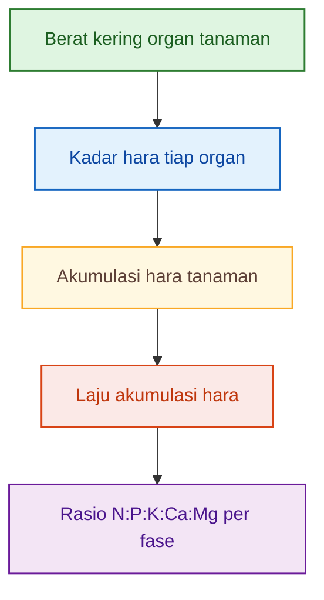

Intinya, artikel ini tidak memulai pembahasan dari larutan, pupuk, atau EC. Artikel ini memulai pembahasan dari **tanaman sebagai objek biologis**.

---

## 1.2 Masalah Utama

Pertanyaan utama artikel ini adalah:

> **Bagaimana mengubah data berat kering tanaman menjadi rasio N:P:K:Ca:Mg yang spesifik untuk tiap fase pertumbuhan?**

Pertanyaan tersebut penting karena kebutuhan hara tanaman tidak hanya ditentukan oleh umur, tetapi juga oleh organ mana yang sedang aktif dibangun. Pada fase awal, tanaman lebih banyak membangun akar dan daun muda. Pada fase vegetatif, daun dan batang menjadi komponen utama. Pada fase generatif, bunga dan buah mulai menjadi pusat pertumbuhan. Pada fase pembesaran buah, sebagian besar aliran biomassa berpindah ke buah sebagai **sink utama**.

Dengan kerangka tersebut, masalah praktis yang ingin dijawab artikel ini adalah:

1. Kapan tanaman lebih dominan membangun akar dan tajuk?
2. Kapan akumulasi K mulai meningkat karena buah menjadi sink utama?
3. Apakah Ca mengikuti pola K?
4. Apakah N harus selalu dominan pada fase vegetatif?
5. Bagaimana rasio N:P:K:Ca:Mg berubah dari fase vegetatif ke generatif dan pembesaran buah?

Pertanyaan-pertanyaan ini tidak cukup dijawab dengan melihat EC atau ppm. EC hanya menunjukkan total kemampuan larutan menghantarkan listrik, bukan unsur mana yang benar-benar masuk dan dibangun ke dalam organ tanaman. Demikian pula ppm larutan hanya menunjukkan konsentrasi unsur di larutan, bukan akumulasi unsur tersebut di akar, batang, daun, bunga, atau buah.

Karena itu, artikel ini menempatkan **berat kering dan akumulasi hara** sebagai dasar analisis.

---

## 1.3 Tujuan Artikel

Artikel ini bertujuan menyusun kerangka model untuk menghitung akumulasi hara tanaman dari berat kering organ.

Secara matematis, arah dasarnya adalah:

$$
\boxed{
A_j(t)=\sum_o W_o(t)C_{j,o}(t)
}
$$

Keterangan:

| Simbol       | Arti                                      |
| ------------ | ----------------------------------------- |
| $A_j(t)$     | akumulasi unsur hara ke-$j$ pada umur $t$ |
| $W_o(t)$     | berat kering organ $o$ pada umur $t$      |
| $C_{j,o}(t)$ | kadar unsur hara $j$ pada organ $o$       |
| $o$          | akar, batang, daun, bunga, buah           |
| $j$          | N, P, K, Ca, Mg                           |

Setelah akumulasi hara dihitung, langkah berikutnya adalah menurunkan rasio hara per fase:

$$
\boxed{
\text{Rasio fase} =
\Delta A_N:\Delta A_P:\Delta A_K:\Delta A_{Ca}:\Delta A_{Mg}
}
$$

dengan:

$$
\boxed{
\Delta A_j=A_j(t_2)-A_j(t_1)
}
$$

Artinya, rasio hara fase tidak dihitung dari total hara pada satu umur saja, tetapi dari **kenaikan akumulasi hara selama fase tersebut**.

Sebagai contoh, rasio fase pembesaran buah tidak ditentukan oleh total N, P, K, Ca, dan Mg yang sudah ada di tanaman sejak awal, tetapi oleh tambahan hara yang diakumulasi selama interval pembesaran buah.

Dengan demikian, tujuan akhir artikel ini adalah menghasilkan kerangka berpikir berikut:

$$
\boxed{
Berat\ kering\ organ
\rightarrow
Akumulasi\ hara
\rightarrow
Laju\ akumulasi
\rightarrow
Rasio\ N:P:K:Ca:Mg\ per\ fase
}
$$

---

## 1.4 Batasan Artikel

Artikel ini **tidak membahas formulasi akhir larutan hidroponik, dosis pupuk, atau resep nutrisi siap pakai**.

Fokus artikel ini hanya sampai pada:

$$
\boxed{
rasio\ kebutuhan\ relatif\ hara\ berdasarkan\ akumulasi\ tanaman
}
$$

Dengan kata lain, artikel ini tidak menjawab:

> Berapa ppm N, P, K, Ca, dan Mg yang harus diberikan?

Tetapi artikel ini menjawab:

> Berdasarkan akumulasi tanaman, bagaimana rasio relatif N:P:K:Ca:Mg berubah pada setiap fase pertumbuhan?

Batasan ini penting agar model tidak disalahgunakan. Rasio akumulasi tanaman adalah rasio biologis, bukan langsung rasio pupuk. Untuk menjadi rekomendasi pupuk atau larutan nutrisi, rasio tersebut masih harus melewati tahap lain, seperti koreksi efisiensi serapan, kualitas air, sistem budidaya, kondisi akar, dan interaksi antar-ion.

Artikel ini berhenti pada model biologis:

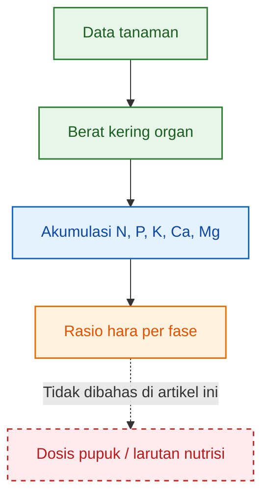

[**Kembali ke atas**](#model-berat-kering-tanaman-ke-rasio-npkcamg-per-fase-pertumbuhan)

---

# 2. Konsep Dasar: Berat Kering sebagai Dasar Membaca Pertumbuhan Tanaman

## 2.1 Mengapa Berat Kering Penting?

Berat segar tanaman sangat dipengaruhi oleh kadar air. Dua tanaman dapat memiliki berat segar yang berbeda, tetapi belum tentu memiliki massa struktural yang berbeda. Tanaman yang lebih banyak menyimpan air bisa tampak lebih berat, padahal bahan kering yang benar-benar dibangun melalui fotosintesis dan penyerapan hara belum tentu lebih tinggi.

Karena itu, untuk membaca pertumbuhan tanaman secara lebih stabil, parameter yang lebih tepat adalah:

$$
\boxed{
berat\ kering
}
$$

Berat kering menunjukkan massa nyata yang tersisa setelah air dihilangkan. Massa ini mencerminkan hasil akumulasi karbon dari fotosintesis serta unsur hara yang dibangun ke dalam jaringan tanaman. Dalam analisis hara tanaman, data berat kering menjadi penting karena akumulasi hara dihitung dari kombinasi antara **massa kering jaringan** dan **konsentrasi unsur hara dalam jaringan tersebut**. ([University of Minnesota Extension][1])

Secara sederhana:

$$
\boxed{
\text{Akumulasi hara}
=
\text{Berat kering}
\times
\text{Kadar hara}
}
$$

Jika hanya menggunakan berat segar, hasil analisis dapat bias karena kadar air tanaman berubah-ubah akibat cuaca, umur jaringan, transpirasi, kondisi akar, dan waktu pengambilan sampel. Berat kering mengurangi bias tersebut.

Dalam konteks cabai, berat kering juga membantu membaca perubahan prioritas pertumbuhan. Pada awal pertumbuhan, berat kering banyak bergerak ke akar dan daun muda. Pada fase vegetatif, berat kering meningkat pada daun dan batang. Setelah generatif, buah mulai mengambil porsi besar dari total bahan kering.

---

## 2.2 Pembagian Organ Tanaman

Untuk membangun model akumulasi hara, tanaman tidak cukup dilihat sebagai satu massa total. Tanaman perlu dibagi menjadi organ-organ utama karena setiap organ memiliki fungsi dan komposisi hara yang berbeda.

Organ tanaman dinyatakan sebagai:

$$
\boxed{
o = akar,\ batang,\ daun,\ bunga,\ buah
}
$$

Masing-masing organ memiliki makna fisiologis yang berbeda.

| Organ  | Makna fisiologis                    | Implikasi terhadap akumulasi hara                                          |
| ------ | ----------------------------------- | -------------------------------------------------------------------------- |
| Akar   | Kapasitas eksplorasi dan penyerapan | Menentukan kemampuan awal tanaman mengambil air dan hara                   |
| Batang | Struktur, transport, percabangan    | Menopang tajuk dan jalur distribusi asimilat                               |
| Daun   | Fotosintesis dan transpirasi        | Pusat produksi karbohidrat dan tempat akumulasi N, Mg, serta Ca yang besar |
| Bunga  | Transisi generatif                  | Menandai pergeseran dari pertumbuhan vegetatif ke reproduktif              |
| Buah   | Sink utama pada fase produksi       | Menarik banyak asimilat dan unsur seperti K, N, dan P                      |

Pembagian organ ini penting karena pola akumulasi hara tidak seragam. Kalsium, misalnya, banyak bergerak mengikuti aliran transpirasi sehingga sering lebih tinggi pada daun dibanding buah. Kalium lebih kuat terkait osmoregulasi dan pengisian buah sehingga cenderung meningkat ketika buah menjadi sink utama. Nitrogen kuat terkait daun, tajuk, dan protein, tetapi tetap dibutuhkan saat fase berbuah untuk mempertahankan aktivitas fotosintesis.

Dengan memisahkan organ, model menjadi lebih tajam karena dapat menangkap pertanyaan seperti:

> Apakah peningkatan akumulasi K berasal dari daun, batang, atau buah?

> Apakah Ca benar-benar masuk ke buah, atau hanya meningkat pada daun?

> Apakah penurunan rasio N terhadap K terjadi karena N turun, atau karena K naik lebih cepat?

Ilustrasi pembagian organ tanaman dalam model:

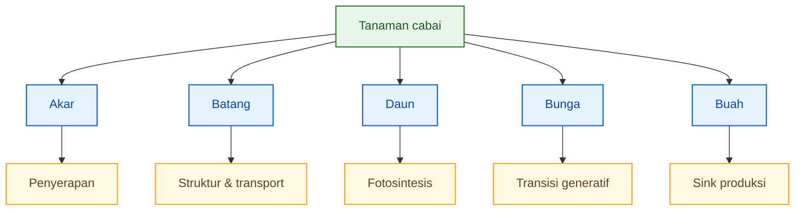

Agar nyaman dibaca dan tidak terlalu lebar, diagram dibuat vertikal-bercabang. Dalam artikel final, diagram ini dapat dijadikan gambar konseptual pertama untuk menjelaskan mengapa tanaman harus dipecah menjadi organ.

---

## 2.3 Berat Kering Total Tanaman

Berat kering total tanaman adalah jumlah berat kering seluruh organ.

$$
\boxed{
\begin{aligned}
W_T(t)
&=
W_{akar}(t)
+
W_{batang}(t)
+
W_{daun}(t) \\
&\quad+
W_{bunga}(t)
+
W_{buah}(t)
\end{aligned}
}
$$

Keterangan:

| Simbol          | Arti                                     |
| --------------- | ---------------------------------------- |
| $W_T(t)$        | berat kering total tanaman pada umur $t$ |
| $W_{akar}(t)$   | berat kering akar pada umur $t$          |
| $W_{batang}(t)$ | berat kering batang pada umur $t$        |
| $W_{daun}(t)$   | berat kering daun pada umur $t$          |
| $W_{bunga}(t)$  | berat kering bunga pada umur $t$         |
| $W_{buah}(t)$   | berat kering buah pada umur $t$          |

Satuan yang digunakan:

$$
\boxed{
W_o(t)=g\ BK/tanaman
}
$$

dengan:

$$
BK = berat\ kering
$$

Secara praktis, persamaan ini berarti bahwa setiap kenaikan berat kering total harus dapat dijelaskan oleh kenaikan berat kering organ. Jika berat kering total naik, kita harus mengetahui organ mana yang bertambah: akar, batang, daun, bunga, atau buah.

Hal ini penting karena fase pertumbuhan tidak hanya dibaca dari umur tanaman, tetapi juga dari distribusi berat kering. Dua tanaman dengan umur sama bisa berada pada fase fisiologis berbeda bila distribusi biomassanya berbeda. Misalnya, tanaman A pada 70 HST mungkin sudah memiliki banyak buah, sedangkan tanaman B pada umur sama masih dominan daun dan batang karena pertumbuhan generatif terlambat.

Dengan demikian, berat kering total memberi gambaran “berapa besar tanaman”, sedangkan berat kering organ memberi gambaran “ke mana pertumbuhan diarahkan”.

[**Kembali ke atas**](#model-berat-kering-tanaman-ke-rasio-npkcamg-per-fase-pertumbuhan)

---

# 3. Model Berat Kering Organ Tanaman

## 3.1 Bentuk Umum Model

Berat kering total tanaman dapat dimodelkan sebagai fungsi umur:

$$
\boxed{
W_T(t)=f(t)
}
$$

Untuk tanaman hortikultura berbuah seperti cabai, pola pertumbuhan total umumnya tidak linear. Pada awal pertumbuhan, kenaikan berat kering masih lambat karena ukuran tanaman kecil. Setelah tajuk berkembang, pertumbuhan meningkat cepat. Mendekati fase akhir, laju pertumbuhan menurun karena tanaman mulai mendekati kapasitas produksi dan sebagian energi diarahkan ke pemeliharaan serta panen.

Pola seperti ini sering digambarkan dengan model sigmoid atau logistik:

$$
\boxed{
W_T(t)=
\frac{W_{max}}
{1+e^{-k(t-t_m)}}
}
$$

Keterangan:

| Simbol    | Arti                                     |
| --------- | ---------------------------------------- |
| $W_T(t)$  | berat kering total tanaman pada umur $t$ |
| $W_{max}$ | berat kering maksimum potensial          |
| $k$       | laju pertumbuhan biomassa                |
| $t_m$     | titik infleksi pertumbuhan               |
| $t$       | umur tanaman                             |
| $e$       | bilangan eksponensial                    |

Titik infleksi $t_m$ adalah umur ketika laju pertumbuhan biomassa mencapai titik paling cepat. Sebelum titik ini, pertumbuhan masih dalam fase percepatan. Setelah titik ini, pertumbuhan masih berlanjut, tetapi lajunya mulai melambat.

Pada studi sweet pepper atau **Capsicum annuum** di greenhouse dengan media coconut fiber dan fertigasi, kurva pertumbuhan berat kering total mengikuti model pertumbuhan terhadap waktu, dan berat kering daun, batang, akar, serta buah meningkat sampai akhir pengamatan. Studi tersebut melaporkan berat kering maksimum pada 189 hari setelah transplanting sebesar 451,5 g/tanaman, terdiri atas daun 68,7 g/tanaman, batang 65,8 g/tanaman, akar 11,5 g/tanaman, dan buah 302,9 g/tanaman. ([SciELO Brazil][2])

Data tersebut tidak boleh langsung dianggap sebagai angka universal untuk semua cabai, tetapi berguna untuk menunjukkan satu prinsip penting: **buah dapat menjadi komponen terbesar dari berat kering tanaman pada fase produksi**.

Secara visual, model berat kering total dapat dibaca seperti berikut:

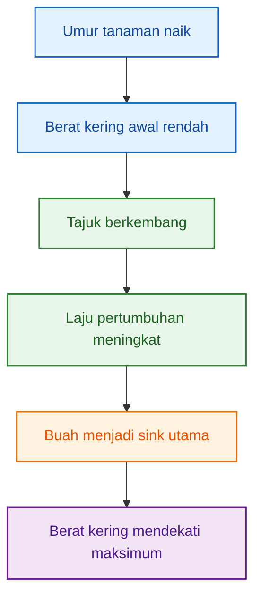

---

## 3.2 Berat Kering per Organ

Setelah berat kering total diketahui, langkah berikutnya adalah membagi berat kering tersebut ke masing-masing organ.

Model per organ dapat ditulis:

$$
\boxed{
W_o(t)=p_o(t)W_T(t)
}
$$

Keterangan:

| Simbol   | Arti                                                   |
| -------- | ------------------------------------------------------ |
| $W_o(t)$ | berat kering organ $o$ pada umur $t$                   |
| $p_o(t)$ | proporsi berat kering organ $o$ terhadap total tanaman |
| $W_T(t)$ | berat kering total tanaman pada umur $t$               |

Maka untuk setiap organ:

$$
\boxed{
W_{akar}(t)=p_{akar}(t)W_T(t)
}
$$

$$
\boxed{
W_{batang}(t)=p_{batang}(t)W_T(t)
}
$$

$$
\boxed{
W_{daun}(t)=p_{daun}(t)W_T(t)
}
$$

$$
\boxed{
W_{bunga}(t)=p_{bunga}(t)W_T(t)
}
$$

$$
\boxed{
W_{buah}(t)=p_{buah}(t)W_T(t)
}
$$

Proporsi organ harus memenuhi prinsip:

$$
\boxed{
\begin{aligned}
p_{akar}(t)
+
p_{batang}(t)
+
p_{daun}(t)
+
p_{bunga}(t)
+
p_{buah}(t)
&= 1
\end{aligned}
}
$$

Jika bunga tidak dihitung terpisah atau massanya sangat kecil, maka model dapat disederhanakan menjadi:

$$
\boxed{
p_{akar}(t)
+
p_{batang}(t)
+
p_{daun}(t)
+
p_{buah}(t)
\approx
1
}
$$

Model proporsi ini penting karena berat kering total saja belum cukup. Berat kering total 100 g/tanaman dapat berarti dua kondisi berbeda:

1. tanaman masih dominan daun dan batang;
2. tanaman sudah dominan buah.

Kedua kondisi ini memiliki implikasi rasio hara yang berbeda. Tanaman yang dominan daun akan memiliki pola akumulasi berbeda dari tanaman yang dominan buah.

Secara ringkas:

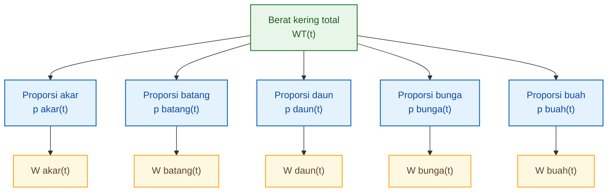

Diagram ini menunjukkan bahwa model organ bukan model terpisah dari berat kering total, melainkan turunan dari berat kering total dan proporsi organ.

---

## 3.3 Makna Perubahan Proporsi Organ

Perubahan proporsi organ menunjukkan perpindahan prioritas pertumbuhan tanaman. Ini adalah bagian penting karena rasio N:P:K:Ca:Mg per fase tidak dapat dipahami tanpa mengetahui organ mana yang sedang dominan dibangun.

| Fase            | Organ dominan            | Makna fisiologis       |
| --------------- | ------------------------ | ---------------------- |
| Awal            | Akar dan daun muda       | Establishment          |
| Vegetatif       | Daun dan batang          | Pembentukan tajuk      |
| Generatif awal  | Bunga dan buah muda      | Transisi sink          |
| Pembesaran buah | Buah                     | Sink utama             |
| Panen intensif  | Buah + pemeliharaan daun | Produksi berkelanjutan |

Pada fase awal, tanaman membutuhkan akar yang cukup aktif agar mampu mendukung pertumbuhan berikutnya. Pada fase vegetatif, daun dan batang menjadi pusat pertumbuhan karena tanaman perlu membangun kapasitas fotosintesis dan struktur tajuk. Ketika masuk generatif, bunga dan buah muda mulai muncul sebagai sink baru. Pada fase pembesaran buah, sebagian besar biomassa baru akan diarahkan ke buah. Pada fase panen intensif, tanaman harus menyeimbangkan dua hal sekaligus: mempertahankan daun sebagai sumber fotosintat dan mengisi buah sebagai sink produksi.

Pergeseran ini dapat diringkas sebagai berikut:

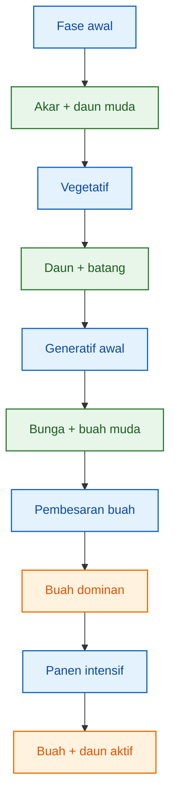

Perubahan proporsi organ inilah yang nantinya menjadi dasar untuk membaca perubahan akumulasi hara. Jika proporsi buah meningkat, maka unsur yang kuat terkait pembesaran buah dan transport asimilat, terutama K, cenderung meningkat perannya. Jika proporsi daun masih besar dan aktif, maka N, Mg, dan Ca tetap penting karena berkaitan dengan fotosintesis, klorofil, dan jaringan transpiratif.

Dengan demikian, model berat kering organ bukan sekadar data pertumbuhan. Model ini adalah jembatan menuju model akumulasi hara:

$$
\boxed{
W_o(t)
\rightarrow
A_N(t),\ A_P(t),\ A_K(t),\ A_{Ca}(t),\ A_{Mg}(t)
}
$$

Dan dari akumulasi hara tersebut, artikel ini akan menurunkan rasio:

$$
\boxed{
N:P:K:Ca:Mg
}
$$

per fase pertumbuhan.

[1]: https://extension.umn.edu/testing-and-analysis/understanding-plant-analysis-crops?utm_source=chatgpt.com 'Understanding plant analysis for crops'
[2]: https://www.scielo.br/j/hb/a/5nhJ7Z6Lbrzxrvq8pNxmrPN/?lang=en&utm_source=chatgpt.com 'Growth analysis of sweet pepper cultivated in coconut fiber ...'

[**Kembali ke atas**](#model-berat-kering-tanaman-ke-rasio-npkcamg-per-fase-pertumbuhan)

---

# 4. Model Akumulasi Hara Tanaman

## 4.1 Persamaan Dasar Akumulasi Hara

Setelah berat kering organ tanaman diketahui, langkah berikutnya adalah menghitung **berapa banyak unsur hara yang benar-benar tersimpan di dalam tanaman**. Inilah yang disebut sebagai **akumulasi hara tanaman**.

Untuk setiap unsur hara:

$$
\boxed{
j=N,\ P,\ K,\ Ca,\ Mg
}
$$

akumulasi hara dihitung dari berat kering organ dikalikan kadar hara pada organ tersebut.

Persamaan dasarnya adalah:

$$
\boxed{
A_j(t)=\sum_o W_o(t)C_{j,o}(t)
}
$$

Keterangan:

| Simbol       | Arti                                        |
| ------------ | ------------------------------------------- |
| $A_j(t)$     | akumulasi hara $j$ pada umur $t$            |
| $W_o(t)$     | berat kering organ $o$ pada umur $t$        |
| $C_{j,o}(t)$ | kadar hara $j$ pada organ $o$ pada umur $t$ |
| $o$          | akar, batang, daun, bunga, buah             |
| $j$          | N, P, K, Ca, Mg                             |

Secara praktis, persamaan ini berarti bahwa akumulasi hara tidak dihitung dari tanaman secara umum, tetapi dari kontribusi setiap organ.

Jika organ tanaman terdiri atas akar, batang, daun, bunga, dan buah, maka bentuk lengkapnya adalah:

$$
\boxed{
A_j(t)=
W_{akar}(t)C_{j,akar}(t)
+
W_{batang}(t)C_{j,batang}(t)
+
W_{daun}(t)C_{j,daun}(t)
+
W_{bunga}(t)C_{j,bunga}(t)
+
W_{buah}(t)C_{j,buah}(t)
}
$$

Persamaan ini adalah inti artikel. Semua rasio hara per fase nantinya diturunkan dari persamaan ini.

Alurnya dapat digambarkan sebagai berikut:

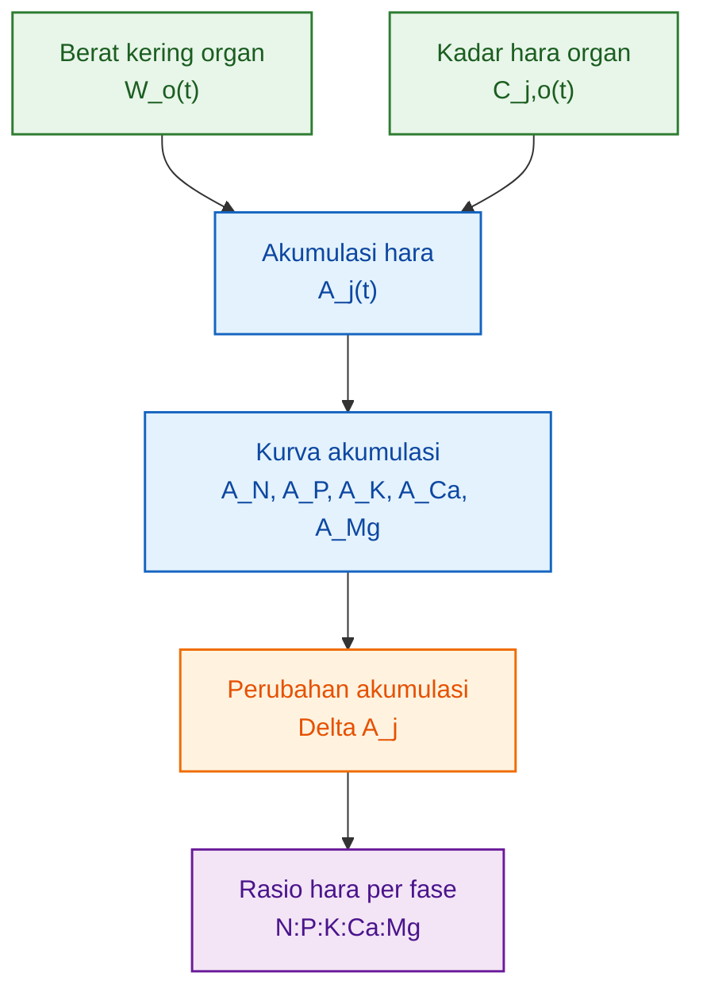

Agar persamaan ini dapat digunakan dengan benar, satuan harus konsisten.

Jika:

$$
W_o(t)=g\ BK/tanaman
$$

dan:

$$
C_{j,o}(t)=mg/g\ BK
$$

maka:

$$
A_j(t)=mg/tanaman
$$

Namun jika kadar hara dinyatakan dalam persen, misalnya:

$$
C_{j,o}(t)=\%
$$

maka konversinya adalah:

$$
\boxed{
A_j(t)=W_o(t)\times C_{j,o}(\%)\times 10
}
$$

Karena:

$$
1\ g\ BK \times 1\% = 10\ mg
$$

Contoh sederhana:

Jika berat kering daun adalah:

$$
W_{daun}=20\ g/tanaman
$$

dan kadar N daun adalah:

$$
C_{N,daun}=4\%
$$

maka akumulasi N pada daun adalah:

$$
A_{N,daun}=20\times4\times10
$$

$$
\boxed{
A_{N,daun}=800\ mg\ N/tanaman
}
$$

Artinya, daun tersebut menyimpan sekitar 800 mg nitrogen per tanaman.

---

## 4.2 Bentuk Lengkap per Unsur

Setiap unsur hara harus dihitung secara terpisah. Tidak boleh diasumsikan bahwa N, P, K, Ca, dan Mg mengikuti pola yang sama hanya karena berada dalam tanaman yang sama.

Berikut bentuk lengkap persamaan untuk masing-masing unsur.

---

### Nitrogen

Nitrogen banyak berhubungan dengan pembentukan protein, klorofil, enzim, dan pertumbuhan tajuk. Namun dalam model ini, N tetap dihitung dari distribusinya pada seluruh organ.

$$
\boxed{
A_N(t)=
W_{akar}(t)C_{N,akar}(t)
+
W_{batang}(t)C_{N,batang}(t)
+
W_{daun}(t)C_{N,daun}(t)
+
W_{bunga}(t)C_{N,bunga}(t)
+
W_{buah}(t)C_{N,buah}(t)
}
$$

Keterangan:

| Komponen                 | Makna                      |
| ------------------------ | -------------------------- |
| $W_{akar}C_{N,akar}$     | N yang tersimpan di akar   |
| $W_{batang}C_{N,batang}$ | N yang tersimpan di batang |
| $W_{daun}C_{N,daun}$     | N yang tersimpan di daun   |
| $W_{bunga}C_{N,bunga}$   | N yang tersimpan di bunga  |
| $W_{buah}C_{N,buah}$     | N yang tersimpan di buah   |

Pada fase vegetatif, kontribusi daun dan batang terhadap akumulasi N biasanya besar. Namun pada fase berbuah, sebagian N juga masuk ke buah. Karena itu, N tidak boleh hanya dianggap sebagai unsur vegetatif.

---

### Fosfor

Fosfor berperan dalam energi, pembelahan sel, pembentukan akar, dan proses generatif awal. Jumlah akumulasi P biasanya lebih kecil dibanding N dan K, tetapi perannya tetap penting.

$$
\boxed{
A_P(t)=
W_{akar}(t)C_{P,akar}(t)
+
W_{batang}(t)C_{P,batang}(t)
+
W_{daun}(t)C_{P,daun}(t)
+
W_{bunga}(t)C_{P,bunga}(t)
+
W_{buah}(t)C_{P,buah}(t)
}
$$

Dalam praktik analisis, P sering terlihat kecil secara jumlah total. Namun kecil secara jumlah tidak berarti tidak penting. Fosfor harus tetap dimodelkan sendiri karena pola akumulasinya tidak identik dengan N atau K.

---

### Kalium

Kalium berperan besar dalam regulasi stomata, tekanan osmotik, transport gula, dan pengisian buah. Karena itu, K sering meningkat kuat ketika buah mulai menjadi sink utama.

$$
\boxed{
A_K(t)=
W_{akar}(t)C_{K,akar}(t)
+
W_{batang}(t)C_{K,batang}(t)
+
W_{daun}(t)C_{K,daun}(t)
+
W_{bunga}(t)C_{K,bunga}(t)
+
W_{buah}(t)C_{K,buah}(t)
}
$$

Kalium tidak hanya penting saat buah membesar. Pada fase vegetatif pun K diperlukan untuk aktivitas stomata, turgor sel, dan transport hasil fotosintesis. Namun pada fase pembesaran buah, kontribusi buah terhadap akumulasi K biasanya menjadi semakin penting.

---

### Kalsium

Kalsium memiliki pola yang sangat khas. Ca relatif kurang mobile di dalam tanaman dan banyak mengikuti aliran transpirasi. Karena itu, Ca sering lebih banyak terakumulasi pada daun dibanding buah.

$$
\boxed{
A_{Ca}(t)=
W_{akar}(t)C_{Ca,akar}(t)
+
W_{batang}(t)C_{Ca,batang}(t)
+
W_{daun}(t)C_{Ca,daun}(t)
+
W_{bunga}(t)C_{Ca,bunga}(t)
+
W_{buah}(t)C_{Ca,buah}(t)
}
$$

Persamaan Ca penting karena Ca tidak boleh dipaksa mengikuti pola K. K dapat meningkat kuat pada buah, sedangkan Ca bisa tetap dominan pada daun atau jaringan dengan transpirasi tinggi. Inilah salah satu alasan mengapa model N:P:K saja belum cukup untuk membaca kebutuhan hara tanaman berbuah.

---

### Magnesium

Magnesium berperan dalam klorofil, fotosintesis, dan aktivasi enzim. Mg biasanya kuat hubungannya dengan daun, tetapi tetap perlu dihitung pada seluruh organ.

$$
\boxed{
A_{Mg}(t)=
W_{akar}(t)C_{Mg,akar}(t)
+
W_{batang}(t)C_{Mg,batang}(t)
+
W_{daun}(t)C_{Mg,daun}(t)
+
W_{bunga}(t)C_{Mg,bunga}(t)
+
W_{buah}(t)C_{Mg,buah}(t)
}
$$

Dalam model rasio hara, Mg penting karena posisinya sering dipengaruhi oleh keseimbangan dengan K dan Ca. Namun artikel ini tetap membahas Mg dari sisi akumulasi tanaman, bukan dari sisi formulasi pupuk.

---

## 4.3 Prinsip Penting

Prinsip utama dalam model ini adalah:

$$
\boxed{
A_N(t)\neq A_P(t)\neq A_K(t)\neq A_{Ca}(t)\neq A_{Mg}(t)
}
$$

Artinya, setiap unsur harus memiliki:

1. data akumulasi sendiri,
2. kurva akumulasi sendiri,
3. laju akumulasi sendiri,
4. rasio fase sendiri.

Kesalahan yang sering terjadi adalah menganggap semua unsur mengikuti pola pertumbuhan total tanaman. Padahal, berat kering total hanya menunjukkan peningkatan biomassa, bukan komposisi hara di dalam biomassa tersebut.

Dua tanaman dengan berat kering total yang sama dapat memiliki akumulasi hara yang berbeda bila kadar hara jaringannya berbeda.

Misalnya:

$$
W_T = 100\ g/tanaman
$$

Tanaman pertama memiliki kadar K tinggi pada buah, sedangkan tanaman kedua memiliki kadar K lebih rendah. Keduanya memiliki berat kering sama, tetapi:

$$
A_K(t)
$$

tidak sama.

Karena itu, model harus membaca dua hal sekaligus:

$$
\boxed{
berat\ kering\ organ
}
$$

dan:

$$
\boxed{
kadar\ hara\ organ
}
$$

Perbedaan pola tiap unsur dapat diringkas sebagai berikut:

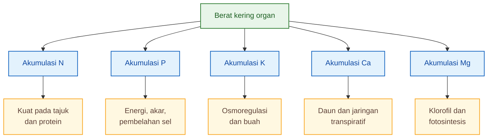

Dengan prinsip ini, artikel tidak lagi mencari satu persamaan umum untuk semua unsur. Artikel membangun lima persamaan akumulasi berbeda:

$$
\boxed{
A_N(t),\ A_P(t),\ A_K(t),\ A_{Ca}(t),\ A_{Mg}(t)
}
$$

Kelima persamaan inilah yang menjadi dasar untuk menurunkan rasio N:P:K:Ca:Mg per fase pertumbuhan.

[**Kembali ke atas**](#model-berat-kering-tanaman-ke-rasio-npkcamg-per-fase-pertumbuhan)

---

# 5. Persamaan Spesifik Tiap Unsur Hara

## 5.1 Bentuk Umum Persamaan

Setelah data akumulasi hara tersedia pada beberapa umur tanaman, langkah berikutnya adalah membuat persamaan untuk menggambarkan perubahan akumulasi hara terhadap waktu.

Secara umum, setiap unsur dapat dimodelkan sebagai fungsi umur:

$$
\boxed{
A_j(t)=f_j(t)
}
$$

Subskrip $j$ menunjukkan bahwa fungsi untuk setiap unsur berbeda. Dengan kata lain:

$$
f_N(t)\neq f_P(t)\neq f_K(t)\neq f_{Ca}(t)\neq f_{Mg}(t)
$$

Salah satu bentuk persamaan yang sederhana dan mudah digunakan adalah model power:

$$
\boxed{
A_j(t)=a_jt^{b_j}
}
$$

Keterangan:

| Simbol   | Arti                                          |
| -------- | --------------------------------------------- |
| $A_j(t)$ | akumulasi hara $j$ pada umur $t$              |
| $a_j$    | koefisien skala akumulasi unsur $j$           |
| $b_j$    | koefisien pola percepatan akumulasi unsur $j$ |
| $t$      | umur tanaman                                  |

Model power berguna ketika akumulasi hara meningkat secara progresif seiring pertumbuhan tanaman.

Bentuk lain yang juga dapat digunakan adalah persamaan polinomial:

$$
\boxed{
A_j(t)=a_j+b_jt+c_jt^2+d_jt^3
}
$$

Model polinomial berguna bila data menunjukkan pola yang tidak cukup dijelaskan oleh satu bentuk power. Misalnya, akumulasi meningkat cepat pada fase tertentu, kemudian melambat pada fase berikutnya.

Pemilihan bentuk persamaan harus mengikuti data, bukan dipilih karena terlihat lebih sederhana.

Secara praktis:

| Kondisi data                           | Bentuk model yang mungkin dipakai         |
| -------------------------------------- | ----------------------------------------- |
| Akumulasi naik progresif dan halus     | $A_j(t)=a_jt^{b_j}$                       |
| Ada perubahan laju yang lebih kompleks | $A_j(t)=a_j+b_jt+c_jt^2+d_jt^3$           |
| Ada fase lambat, cepat, lalu mendatar  | sigmoid/logistik atau model tersegmentasi |
| Data sedikit                           | model sederhana lebih aman                |
| Data banyak dan rapat                  | model lebih kompleks dapat diuji          |

Alur pemilihan model dapat digambarkan seperti berikut:

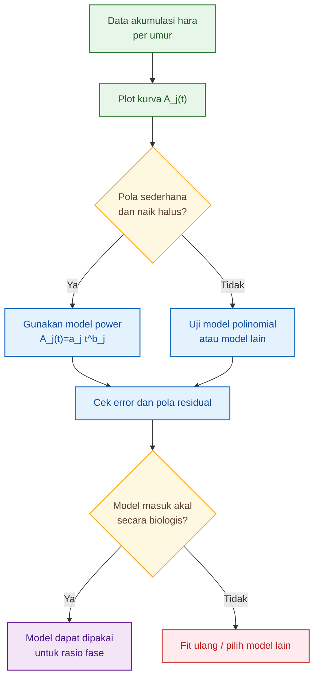

Dalam artikel ini, bentuk power dipakai sebagai bentuk dasar karena mudah dibaca oleh praktisi dan mudah diturunkan menjadi laju akumulasi harian.

---

## 5.2 Persamaan per Unsur

Setiap unsur memiliki persamaan sendiri. Bentuk umumnya adalah:

$$
\boxed{
A_N(t)=a_Nt^{b_N}
}
$$

$$
\boxed{
A_P(t)=a_Pt^{b_P}
}
$$

$$
\boxed{
A_K(t)=a_Kt^{b_K}
}
$$

$$
\boxed{
A_{Ca}(t)=a_{Ca}t^{b_{Ca}}
}
$$

$$
\boxed{
A_{Mg}(t)=a_{Mg}t^{b_{Mg}}
}
$$

Perhatikan bahwa koefisien setiap unsur berbeda.

$$
\boxed{
a_N,\ b_N
\neq
a_P,\ b_P
\neq
a_K,\ b_K
\neq
a_{Ca},\ b_{Ca}
\neq
a_{Mg},\ b_{Mg}
}
$$

Artinya, N, P, K, Ca, dan Mg tidak hanya berbeda dalam jumlah, tetapi juga berbeda dalam pola peningkatan terhadap umur tanaman.

Untuk memperjelas, struktur persamaan dapat dilihat sebagai berikut:

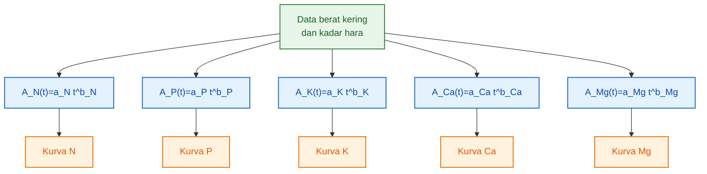

Dari lima persamaan tersebut, kita dapat menghitung:

1. akumulasi total setiap unsur pada umur tertentu;
2. laju akumulasi harian setiap unsur;
3. kenaikan akumulasi setiap unsur per fase;
4. rasio N:P:K:Ca:Mg per fase.

---

## 5.3 Makna Koefisien

Dalam model:

$$
\boxed{
A_j(t)=a_jt^{b_j}
}
$$

terdapat dua koefisien utama:

| Koefisien | Makna                               |
| --------- | ----------------------------------- |
| $a_j$     | skala akumulasi unsur $j$           |
| $b_j$     | pola percepatan akumulasi unsur $j$ |

Koefisien $a_j$ menunjukkan besar kecilnya skala akumulasi awal dalam model. Unsur dengan nilai $a_j$ lebih besar tidak otomatis selalu lebih dominan, karena akumulasi akhirnya juga ditentukan oleh nilai $b_j$.

Koefisien $b_j$ menunjukkan bagaimana akumulasi unsur berubah terhadap umur. Semakin besar nilai $b_j$, semakin cepat akumulasi unsur tersebut meningkat seiring waktu.

Jika:

$$
\boxed{
b_K>b_N
}
$$

maka akumulasi K meningkat lebih cepat terhadap umur dibanding N.

Jika:

$$
\boxed{
b_P<b_K
}
$$

maka P terakumulasi lebih lambat dibanding K.

Namun interpretasi koefisien tidak boleh dilepaskan dari fase pertumbuhan. Nilai $b_K$ yang tinggi dapat berarti bahwa K meningkat kuat saat tanaman masuk fase generatif dan pembesaran buah. Nilai $b_{Ca}$ yang berbeda dari $b_K$ dapat menunjukkan bahwa Ca tidak mengikuti pola akumulasi buah seperti K.

Secara praktis:

| Kondisi koefisien           | Interpretasi biologis                                        |
| --------------------------- | ------------------------------------------------------------ |
| $b_N$ tinggi                | N meningkat cepat seiring pertumbuhan tajuk dan organ aktif  |
| $b_K$ tinggi                | K meningkat kuat, sering terkait buah dan transport asimilat |
| $b_{Ca}$ berbeda dari $b_K$ | Ca memiliki pola organ berbeda, sering kuat pada daun        |
| $b_P$ rendah                | total P relatif kecil atau meningkat lebih lambat            |
| $b_{Mg}$ mengikuti daun     | Mg berkaitan dengan klorofil dan aktivitas fotosintesis      |

Koefisien ini bukan sekadar angka statistik. Koefisien adalah cara untuk membaca karakter akumulasi tiap unsur.

Meski demikian, ada batas penting:

$$
\boxed{
koefisien\ hanya\ sah\ untuk\ rentang\ data\ yang\ digunakan
}
$$

Jika data hanya tersedia pada 40–140 HST, maka persamaan tidak boleh dipakai sembarangan untuk 0–20 HST tanpa validasi tambahan. Begitu juga, jika data berasal dari varietas atau sistem budidaya tertentu, koefisiennya tidak boleh dianggap universal.

Jadi, fungsi koefisien dalam artikel ini adalah sebagai alat untuk membangun **model rasio hara**, bukan sebagai klaim bahwa semua cabai memiliki pola yang sama.

---

# 6. Laju Akumulasi Hara Harian

## 6.1 Turunan Akumulasi Hara

Akumulasi total menjawab pertanyaan:

> Berapa banyak hara yang sudah tersimpan dalam tanaman sampai umur tertentu?

Namun untuk membaca kebutuhan fase, yang lebih penting adalah laju perubahan akumulasi. Dengan kata lain, kita perlu mengetahui:

> Seberapa cepat tanaman menambah N, P, K, Ca, dan Mg pada umur atau fase tertentu?

Inilah yang disebut sebagai **laju akumulasi hara**.

Secara matematis:

$$
\boxed{
U_j(t)=\frac{dA_j(t)}{dt}
}
$$

Keterangan:

| Simbol   | Arti                                  |
| -------- | ------------------------------------- |
| $U_j(t)$ | laju akumulasi hara $j$ pada umur $t$ |
| $A_j(t)$ | akumulasi hara $j$ pada umur $t$      |
| $t$      | umur tanaman                          |

Jika model akumulasi hara berbentuk:

$$
\boxed{
A_j(t)=a_jt^{b_j}
}
$$

maka laju akumulasi hariannya adalah turunan pertama dari persamaan tersebut:

$$
\boxed{
U_j(t)=a_jb_jt^{b_j-1}
}
$$

Satuan yang digunakan:

$$
\boxed{
U_j(t)=mg/tanaman/hari
}
$$

Dengan demikian, setiap unsur memiliki laju akumulasi masing-masing:

$$
\boxed{
U_N(t)=a_Nb_Nt^{b_N-1}
}
$$

$$
\boxed{
U_P(t)=a_Pb_Pt^{b_P-1}
}
$$

$$
\boxed{
U_K(t)=a_Kb_Kt^{b_K-1}
}
$$

$$
\boxed{
U_{Ca}(t)=a_{Ca}b_{Ca}t^{b_{Ca}-1}
}
$$

$$
\boxed{
U_{Mg}(t)=a_{Mg}b_{Mg}t^{b_{Mg}-1}
}
$$

Perbedaan antara akumulasi dan laju akumulasi dapat diringkas sebagai berikut:

| Parameter | Pertanyaan yang dijawab           | Satuan          |
| --------- | --------------------------------- | --------------- |
| $A_j(t)$  | Berapa hara yang sudah tersimpan? | mg/tanaman      |
| $U_j(t)$  | Berapa cepat hara bertambah?      | mg/tanaman/hari |

Ilustrasi alurnya:

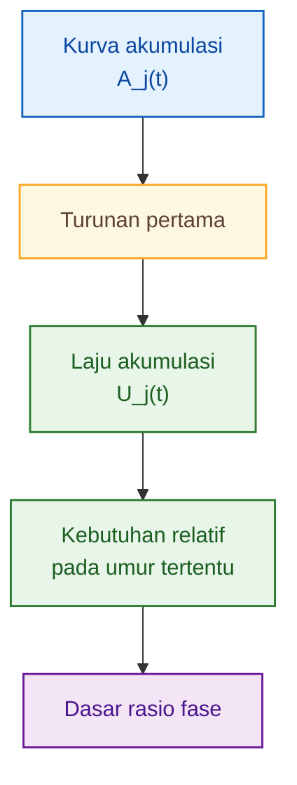

Dalam konteks praktis, $A_j(t)$ membantu membaca total hara yang telah dibangun tanaman, sedangkan $U_j(t)$ membantu membaca fase ketika tanaman sedang sangat aktif mengambil unsur tertentu.

Sebagai contoh, jika $U_K(t)$ meningkat tajam pada fase pembesaran buah, maka hal itu menunjukkan bahwa K menjadi unsur yang sangat aktif diakumulasi pada fase tersebut. Jika $U_{Ca}(t)$ tidak meningkat sejalan dengan $U_K(t)$, maka dapat disimpulkan bahwa pola Ca tidak sama dengan pola K.

---

## 6.2 Laju Akumulasi per Interval Fase

Dalam praktik budidaya, fase tanaman biasanya tidak dibaca per satu hari, tetapi per interval. Misalnya:

| Fase            |   Interval umur |
| --------------- | --------------: |
| Vegetatif       |       20–60 HST |
| Generatif awal  |       60–80 HST |
| Pembesaran buah |      80–120 HST |
| Panen intensif  | 120 HST ke atas |

Karena itu, selain laju sesaat $U_j(t)$, kita juga perlu menghitung kenaikan akumulasi hara selama satu fase.

Untuk fase dari umur $t_1$ sampai $t_2$:

$$
\boxed{
\Delta A_j=A_j(t_2)-A_j(t_1)
}
$$

Keterangan:

| Simbol       | Arti                                    |
| ------------ | --------------------------------------- |
| $\Delta A_j$ | kenaikan akumulasi hara $j$ selama fase |
| $A_j(t_2)$   | akumulasi hara pada akhir fase          |
| $A_j(t_1)$   | akumulasi hara pada awal fase           |
| $t_1$        | awal fase                               |
| $t_2$        | akhir fase                              |

Rata-rata laju akumulasi hara selama fase tersebut adalah:

$$
\boxed{
\bar{U}_j=
\frac{A_j(t_2)-A_j(t_1)}
{t_2-t_1}
}
$$

atau:

$$
\boxed{
\bar{U}_j=
\frac{\Delta A_j}
{\Delta t}
}
$$

dengan:

$$
\boxed{
\Delta t=t_2-t_1
}
$$

Satuan:

$$
\boxed{
\bar{U}_j=mg/tanaman/hari
}
$$

Perbedaan antara laju sesaat dan laju rata-rata fase dapat dilihat sebagai berikut:

| Jenis laju  | Rumus                                         | Makna                           |
| ----------- | --------------------------------------------- | ------------------------------- |
| Laju sesaat | $U_j(t)=\frac{dA_j(t)}{dt}$                   | laju pada umur tertentu         |
| Laju fase   | $\bar{U}_j=\frac{A_j(t_2)-A_j(t_1)}{t_2-t_1}$ | rata-rata laju selama satu fase |

Untuk tujuan artikel ini, nilai yang paling penting adalah:

$$
\boxed{
\Delta A_j
}
$$

karena rasio hara per fase dihitung dari kenaikan akumulasi setiap unsur selama fase tersebut.

Maka:

$$
\boxed{
\text{Rasio fase}
=
\Delta A_N:
\Delta A_P:
\Delta A_K:
\Delta A_{Ca}:
\Delta A_{Mg}
}
$$

Alur perhitungannya:

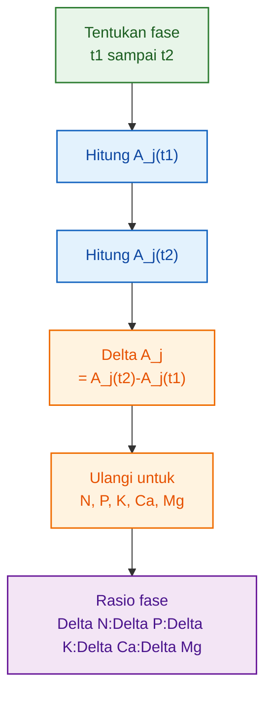

Contoh bentuk perhitungan untuk fase pembesaran buah dari $t_1=80$ HST sampai $t_2=120$ HST:

$$
\Delta A_N=
A_N(120)-A_N(80)
$$

$$
\Delta A_P=
A_P(120)-A_P(80)
$$

$$
\Delta A_K=
A_K(120)-A_K(80)
$$

$$
\Delta A_{Ca}=
A_{Ca}(120)-A_{Ca}(80)
$$

$$
\Delta A_{Mg}=
A_{Mg}(120)-A_{Mg}(80)
$$

Maka rasio fase pembesaran buah adalah:

$$
\boxed{
Rasio_{80-120}
=
\Delta A_N:
\Delta A_P:
\Delta A_K:
\Delta A_{Ca}:
\Delta A_{Mg}
}
$$

Jika ingin dinormalisasi terhadap N, maka:

$$
\boxed{
Rasio_{80-120}
=
1:
\frac{\Delta A_P}{\Delta A_N}:
\frac{\Delta A_K}{\Delta A_N}:
\frac{\Delta A_{Ca}}{\Delta A_N}:
\frac{\Delta A_{Mg}}{\Delta A_N}
}
$$

Normalisasi terhadap N berguna agar rasio lebih mudah dibaca. Namun, untuk analisis biologis, nilai asli $\Delta A_j$ tetap penting karena menunjukkan jumlah hara yang benar-benar bertambah selama fase tersebut.

Dengan demikian, Bab 4–6 membangun rantai logika inti artikel:

$$
\boxed{
W_o(t)
\rightarrow
A_j(t)
\rightarrow
U_j(t)
\rightarrow
\Delta A_j
\rightarrow
Rasio\ N:P:K:Ca:Mg
}
$$

Rantai ini menjadi dasar untuk Bab berikutnya, yaitu pembagian fase pertumbuhan tanaman dan penurunan rasio N:P:K:Ca:Mg pada setiap fase.

[**Kembali ke atas**](#model-berat-kering-tanaman-ke-rasio-npkcamg-per-fase-pertumbuhan)

---

# 7. Pembagian Fase Pertumbuhan Tanaman

## 7.1 Fase Berbasis Fisiologi, Bukan Hanya Umur

Dalam model berat kering tanaman, fase pertumbuhan sebaiknya tidak hanya ditentukan dari umur tanaman atau HST. Umur memang berguna sebagai acuan, tetapi tanaman dengan umur yang sama belum tentu berada pada fase fisiologis yang sama.

Cabai umur 60 HST, misalnya, dapat berada pada kondisi yang berbeda tergantung varietas, iklim, pemangkasan, sistem budidaya, dan kesehatan akar. Ada tanaman yang pada umur tersebut sudah memasuki fase bunga dan fruit set, tetapi ada juga yang masih dominan vegetatif.

Karena itu, fase pertumbuhan dalam model ini harus dipahami sebagai gabungan antara:

$$
\boxed{
umur\ tanaman
+
kondisi\ organ
+
arah\ akumulasi\ biomassa
}
$$

Untuk keperluan model, pembagian awal dapat dibuat sebagai berikut:

| Fase                              |      Umur acuan | Dominasi pertumbuhan      |
| --------------------------------- | --------------: | ------------------------- |
| F1. Establishment / adaptasi akar |        0–20 HST | akar dan daun muda        |
| F2. Vegetatif                     |       20–60 HST | daun, batang, percabangan |
| F3. Generatif awal                |       60–80 HST | bunga, fruit set          |
| F4. Pembesaran buah               |      80–120 HST | buah sebagai sink utama   |
| F5. Panen intensif                | 120 HST ke atas | buah + pemeliharaan tajuk |

Pembagian ini bukan batas mutlak. Fungsinya adalah sebagai kerangka awal agar data berat kering dan akumulasi hara dapat dikelompokkan ke dalam fase yang logis.

Secara fisiologis, perpindahan fase dapat dibaca dari perubahan arah alokasi biomassa:

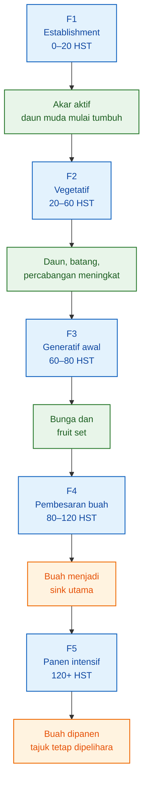

Diagram tersebut menunjukkan bahwa fase tanaman tidak hanya berubah karena bertambahnya umur, tetapi karena berubahnya organ yang dominan dibangun. Pada fase awal, akar dan daun muda menentukan keberhasilan establishment. Pada fase vegetatif, batang dan daun menjadi pusat pertumbuhan. Pada fase generatif awal, bunga dan buah muda mulai muncul. Pada fase pembesaran buah, buah menjadi pusat penarikan asimilat. Pada fase panen intensif, tanaman harus mempertahankan produksi buah sambil menjaga tajuk tetap aktif.

Dalam konteks model hara, pembagian fase ini penting karena rasio N:P:K:Ca:Mg dihitung dari kenaikan akumulasi hara pada setiap fase.

---

## 7.2 Indikator Lapangan Tiap Fase

Agar model tidak terlalu teoritis, fase pertumbuhan perlu dikaitkan dengan indikator lapangan. Praktisi tidak selalu memiliki data laboratorium setiap minggu, tetapi dapat membaca kondisi tanaman dari akar, tajuk, bunga, dan buah.

| Fase            | Indikator visual                        | Makna model                                      |
| --------------- | --------------------------------------- | ------------------------------------------------ |
| Establishment   | akar baru aktif, daun muda mulai tumbuh | tanaman membangun kapasitas serapan awal         |
| Vegetatif       | pertambahan ruas, daun, dan percabangan | biomassa dominan masuk ke tajuk                  |
| Generatif awal  | bunga pertama dan bakal buah            | sink generatif mulai terbentuk                   |
| Pembesaran buah | buah membesar cepat                     | buah menjadi tujuan utama aliran biomassa        |
| Panen intensif  | panen berulang, tajuk tetap aktif       | tanaman harus menyeimbangkan buah dan daun aktif |

Pada fase establishment, indikator yang paling penting adalah akar baru. Jika akar belum aktif, peningkatan berat kering tajuk biasanya berjalan lambat. Pada fase ini, model berat kering akan menunjukkan kontribusi akar dan daun muda yang masih kecil tetapi penting.

Pada fase vegetatif, indikator utamanya adalah pertambahan ruas, daun, dan percabangan. Secara model, fase ini ditandai oleh peningkatan:

$$
W_{daun}(t)
$$

dan:

$$
W_{batang}(t)
$$

Pada fase generatif awal, bunga pertama dan bakal buah mulai muncul. Fase ini penting karena tanaman mulai mengalihkan sebagian aliran biomassa dari tajuk ke organ reproduktif.

Pada fase pembesaran buah, peningkatan berat kering buah menjadi indikator utama. Secara model, fase ini ditandai oleh kenaikan:

$$
W_{buah}(t)
$$

yang semakin besar terhadap berat kering total tanaman.

Pada fase panen intensif, buah tetap menjadi sink utama, tetapi daun tidak boleh kehilangan peran. Tajuk yang sehat tetap diperlukan untuk mempertahankan fotosintesis dan mendukung panen berulang.

Dengan demikian, indikator lapangan membantu memastikan bahwa fase model tidak hanya mengikuti kalender, tetapi mengikuti kondisi nyata tanaman.

---

## 7.3 Catatan Penting

Batas fase dapat bergeser. Karena itu, angka 0–20, 20–60, 60–80, 80–120, dan 120+ HST harus dipahami sebagai **umur acuan**, bukan hukum tetap.

Pergeseran fase dapat dipengaruhi oleh:

| Faktor          | Dampak terhadap fase                                       |
| --------------- | ---------------------------------------------------------- |
| Varietas        | varietas genjah lebih cepat masuk generatif                |
| Suhu            | suhu tinggi dapat mempercepat atau menekan fase tertentu   |
| Cahaya          | cahaya rendah dapat memperlambat akumulasi biomassa        |
| Kepadatan tanam | memengaruhi kompetisi cahaya dan bentuk tajuk              |
| Pemangkasan     | mengubah distribusi biomassa ke batang, daun, dan buah     |
| Sistem budidaya | memengaruhi perkembangan akar dan tajuk                    |
| Beban buah      | buah banyak memperkuat aliran biomassa ke sink reproduktif |
| Kesehatan akar  | akar lemah menurunkan kemampuan akumulasi hara             |

Dalam model, fase idealnya ditentukan dari data:

$$
\boxed{
W_{akar}(t),\ W_{batang}(t),\ W_{daun}(t),\ W_{bunga}(t),\ W_{buah}(t)
}
$$

Bukan hanya dari HST.

Contohnya, jika pada 70 HST berat kering buah masih sangat rendah, maka tanaman tersebut belum sepenuhnya berada pada fase pembesaran buah, walaupun secara umur sudah mendekati fase tersebut. Sebaliknya, jika pada 60 HST buah sudah banyak terbentuk, maka fase generatifnya terjadi lebih awal.

Prinsipnya:

$$
\boxed{
\text{fase tanaman}
=
\text{umur}
+
\text{struktur biomassa}
+
\text{indikator fisiologis}
}
$$

[**Kembali ke atas**](#model-berat-kering-tanaman-ke-rasio-npkcamg-per-fase-pertumbuhan)

---

# 8. Menurunkan Rasio N:P:K:Ca:Mg per Fase

## 8.1 Prinsip Utama

Rasio hara per fase tidak dihitung dari total akumulasi pada satu titik umur. Rasio fase harus dihitung dari **kenaikan akumulasi hara sepanjang fase tersebut**.

Dengan kata lain, yang dihitung bukan hanya:

$$
A_N(t),\ A_P(t),\ A_K(t),\ A_{Ca}(t),\ A_{Mg}(t)
$$

pada satu umur tertentu, tetapi perubahan akumulasi dari awal fase ke akhir fase.

Untuk setiap unsur hara:

$$
j=N,\ P,\ K,\ Ca,\ Mg
$$

kenaikan akumulasi selama fase dihitung sebagai:

$$
\boxed{
\Delta A_j=A_j(t_2)-A_j(t_1)
}
$$

Keterangan:

| Simbol       | Arti                                          |
| ------------ | --------------------------------------------- |
| $\Delta A_j$ | kenaikan akumulasi unsur $j$ selama satu fase |
| $A_j(t_1)$   | akumulasi unsur $j$ pada awal fase            |
| $A_j(t_2)$   | akumulasi unsur $j$ pada akhir fase           |
| $t_1$        | umur awal fase                                |
| $t_2$        | umur akhir fase                               |

Maka rasio hara fase adalah:

$$
\boxed{
\text{Rasio fase} =
\Delta A_N:
\Delta A_P:
\Delta A_K:
\Delta A_{Ca}:
\Delta A_{Mg}
}
$$

Rasio ini menunjukkan unsur mana yang lebih banyak diakumulasi tanaman pada fase tersebut.

Poin pentingnya:

$$
\boxed{
\begin{aligned}
&\text{Rasio fase berasal dari perubahan akumulasi,} \\
&\text{bukan dari total stok hara}
\end{aligned}
}
$$

Total akumulasi pada umur tertentu mencerminkan seluruh sejarah tanaman sejak awal. Sementara rasio fase harus menggambarkan **apa yang terjadi pada fase itu saja**.

Alur logikanya:

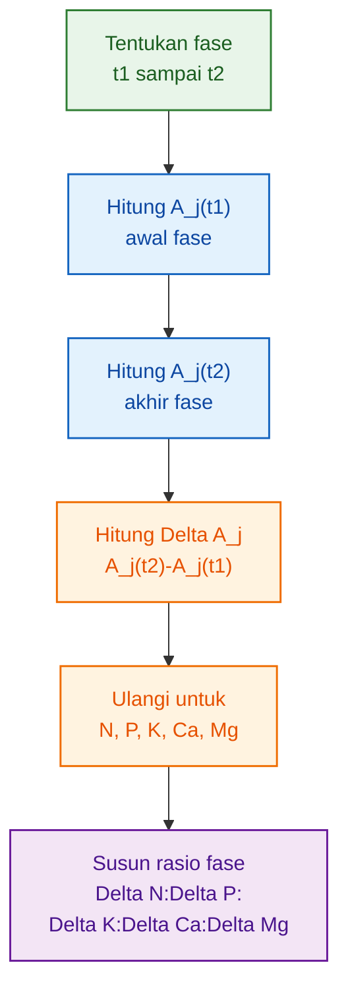

---

## 8.2 Persamaan Referensi yang Digunakan

Agar Bab 8 tidak berhenti sebagai konsep, rasio per fase harus dihitung dari persamaan akumulasi hara yang sudah dibangun pada bab sebelumnya.

Dalam contoh model referensi ini, digunakan persamaan:

$$
\boxed{
A_N(t)=0.0038t^{2.8734}
}
$$

$$
\boxed{
A_P(t)=0.0001t^{3.1377}
}
$$

$$
\boxed{
A_K(t)=0.0108t^{2.6842}
}
$$

$$
\boxed{
A_{Ca}(t)=0.0015t^{2.8776}
}
$$

$$
\boxed{
A_{Mg}(t)=0.0006t^{2.9091}
}
$$

Satuan:

$$
\boxed{
A_j(t)=\text{mg/tanaman}
}
$$

dengan:

$$
\boxed{
t=\text{HST}
}
$$

Persamaan ini digunakan untuk menghitung kenaikan akumulasi hara pada fase yang berada dalam rentang data referensi, yaitu terutama:

$$
\boxed{
40-140\ \text{HST}
}
$$

Karena itu, fase 0–40 HST tidak dipaksakan dihitung dari persamaan ini. Fase tersebut tetap penting, tetapi memerlukan data tambahan agar tidak menjadi ekstrapolasi yang lemah.

---

## 8.3 Pembagian Fase yang Dipakai dalam Perhitungan Rasio

Berdasarkan pembagian fase pada Bab 7, secara fisiologis fase tanaman adalah:

| Fase                       |  Umur acuan | Status perhitungan pada model referensi |
| -------------------------- | ----------: | --------------------------------------- |
| Establishment              |    0–20 HST | belum dihitung, perlu data awal         |
| Vegetatif awal             |   20–40 HST | belum dihitung, perlu data awal         |
| Vegetatif akhir / transisi |   40–60 HST | dihitung                                |
| Generatif awal             |   60–80 HST | dihitung                                |
| Pembesaran buah            |  80–120 HST | dihitung                                |
| Panen intensif             | 120–140 HST | dihitung                                |

Pembagian ini menjaga konsistensi model.

Fase vegetatif pada Bab 7 adalah:

$$
20-60\ \text{HST}
$$

Namun karena persamaan referensi yang digunakan lebih kuat mulai 40 HST, maka fase vegetatif dalam perhitungan rasio dibagi menjadi dua bagian:

$$
\boxed{
\text{20--40 HST = vegetatif awal, belum dihitung}
}
$$

$$
\boxed{
\text{40--60 HST = vegetatif akhir/transisi, dihitung}
}
$$

Dengan cara ini, artikel tidak memalsukan angka untuk fase awal yang belum kuat datanya, tetapi tetap menghasilkan rasio nyata untuk fase yang dapat dihitung.

---

## 8.4 Rasio Fase Vegetatif Akhir / Transisi

Untuk fase vegetatif akhir atau transisi:

$$
\boxed{
t_1=40,\quad t_2=60
}
$$

Kenaikan akumulasi tiap unsur dihitung sebagai:

$$
\Delta A_N =
A_N(60)-A_N(40)
$$

$$
\Delta A_P =
A_P(60)-A_P(40)
$$

$$
\Delta A_K =
A_K(60)-A_K(40)
$$

$$
\Delta A_{Ca} =
A_{Ca}(60)-A_{Ca}(40)
$$

$$
\Delta A_{Mg} =
A_{Mg}(60)-A_{Mg}(40)
$$

Hasil perhitungan:

| Unsur       | Kenaikan akumulasi, mg/tanaman/fase |
| ----------- | ----------------------------------: |
| $\Delta N$  |                               336.3 |
| $\Delta P$  |                                27.3 |
| $\Delta K$  |                               424.6 |
| $\Delta Ca$ |                               135.2 |
| $\Delta Mg$ |                                61.9 |

Maka rasio asli fase ini adalah:

$$
\boxed{
336.3:27.3:424.6:135.2:61.9
}
$$

Jika dinormalisasi terhadap N:

$$
\boxed{
\text{Rasio}_{40-60} = 1:0.081:1.262:0.402:0.184
}
$$

Interpretasinya: pada fase 40–60 HST, K sudah lebih tinggi daripada N dalam akumulasi fase. Namun fase ini tidak boleh disebut fase awal bibit. Ini adalah fase vegetatif akhir atau transisi menuju generatif, sehingga K yang tinggi masih masuk akal karena tanaman mulai bersiap menuju pembungaan dan pembentukan buah.

---

## 8.5 Rasio Fase Generatif Awal

Untuk fase generatif awal:

$$
\boxed{
t_1=60,\quad t_2=80
}
$$

Kenaikan akumulasi tiap unsur:

$$
\Delta A_N =
A_N(80)-A_N(60)
$$

$$
\Delta A_P =
A_P(80)-A_P(60)
$$

$$
\Delta A_K =
A_K(80)-A_K(60)
$$

$$
\Delta A_{Ca} =
A_{Ca}(80)-A_{Ca}(60)
$$

$$
\Delta A_{Mg} =
A_{Mg}(80)-A_{Mg}(60)
$$

Hasil perhitungan:

| Unsur       | Kenaikan akumulasi, mg/tanaman/fase |
| ----------- | ----------------------------------: |
| $\Delta N$  |                               628.4 |
| $\Delta P$  |                                55.7 |
| $\Delta K$  |                               745.6 |
| $\Delta Ca$ |                               252.9 |
| $\Delta Mg$ |                               116.9 |

Maka rasio asli fase ini adalah:

$$
\boxed{
628.4:55.7:745.6:252.9:116.9
}
$$

Jika dinormalisasi terhadap N:

$$
\boxed{
\text{Rasio}_{60-80} = 1:0.089:1.186:0.402:0.186
}
$$

Interpretasinya: K masih lebih tinggi daripada N, tetapi rasio K terhadap N mulai turun dibanding fase 40–60 HST. Ini menunjukkan bahwa meskipun K tetap dominan, peningkatan N juga kuat karena tajuk masih perlu aktif menopang bunga dan fruit set.

Pada fase ini, tanaman tidak murni vegetatif dan belum sepenuhnya fase buah. Inilah fase transisi sink, ketika bunga dan bakal buah mulai menarik asimilat, tetapi daun dan batang masih tetap berkembang.

---

## 8.6 Rasio Fase Pembesaran Buah

Untuk fase pembesaran buah:

$$
\boxed{
t_1=80,\quad t_2=120
}
$$

Kenaikan akumulasi tiap unsur:

$$
\Delta A_N =
A_N(120)-A_N(80)
$$

$$
\Delta A_P =
A_P(120)-A_P(80)
$$

$$
\Delta A_K =
A_K(120)-A_K(80)
$$

$$
\Delta A_{Ca} =
A_{Ca}(120)-A_{Ca}(80)
$$

$$
\Delta A_{Mg} =
A_{Mg}(120)-A_{Mg}(80)
$$

Hasil perhitungan:

| Unsur       | Kenaikan akumulasi, mg/tanaman/fase |
| ----------- | ----------------------------------: |
| $\Delta N$  |                             2,464.6 |
| $\Delta P$  |                               240.5 |
| $\Delta K$  |                             2,729.1 |
| $\Delta Ca$ |                               993.4 |
| $\Delta Mg$ |                               464.7 |

Maka rasio asli fase ini adalah:

$$
\boxed{
2464.6:240.5:2729.1:993.4:464.7
}
$$

Jika dinormalisasi terhadap N:

$$
\boxed{
\text{Rasio}_{80-120} = 1:0.098:1.107:0.403:0.189
}
$$

Interpretasinya: fase pembesaran buah menunjukkan kenaikan akumulasi total yang jauh lebih besar dibanding fase sebelumnya. K tetap lebih tinggi daripada N, tetapi selisihnya semakin kecil.

Ini penting karena sering ada anggapan bahwa saat buah membesar, K harus terus makin dominan tanpa batas. Dari model ini, K memang dominan, tetapi rasio K:N justru bergerak mendekati seimbang.

Pada fase ini, buah menjadi sink utama, tetapi daun tetap menjadi source utama. Karena itu, N dan Mg tetap penting untuk mempertahankan fotosintesis, sedangkan Ca tetap harus dibaca sebagai unsur dengan pola berbeda dari K.

---

## 8.7 Rasio Fase Panen Intensif

Untuk fase panen intensif:

$$
\boxed{
t_1=120,\quad t_2=140
}
$$

Kenaikan akumulasi tiap unsur:

$$
\Delta A_N =
A_N(140)-A_N(120)
$$

$$
\Delta A_P =
A_P(140)-A_P(120)
$$

$$
\Delta A_K =
A_K(140)-A_K(120)
$$

$$
\Delta A_{Ca} =
A_{Ca}(140)-A_{Ca}(120)
$$

$$
\Delta A_{Mg} =
A_{Mg}(140)-A_{Mg}(120)
$$

Hasil perhitungan:

| Unsur       | Kenaikan akumulasi, mg/tanaman/fase |
| ----------- | ----------------------------------: |
| $\Delta N$  |                             1,996.0 |
| $\Delta P$  |                               207.8 |
| $\Delta K$  |                             2,108.9 |
| $\Delta Ca$ |                               805.4 |
| $\Delta Mg$ |                               379.7 |

Maka rasio asli fase ini adalah:

$$
\boxed{
1996.0:207.8:2108.9:805.4:379.7
}
$$

Jika dinormalisasi terhadap N:

$$
\boxed{
\text{Rasio}_{120-140} = 1:0.104:1.057:0.403:0.190
}
$$

Interpretasinya: pada fase panen intensif, K masih menjadi unsur terbesar relatif terhadap N, tetapi rasio K:N semakin mendekati 1:1. P dan Mg sedikit meningkat relatif terhadap N, sedangkan Ca relatif stabil pada sekitar 0.40 terhadap N.

Fase ini tidak boleh dibaca sebagai fase “K setinggi-tingginya”. Fase panen intensif adalah fase keseimbangan antara:

$$
\boxed{
\text{buah sebagai sink}
}
$$

dan:

$$
\boxed{
\text{tajuk sebagai source}
}
$$

Karena itu, N, Ca, dan Mg tetap memiliki peran besar dalam mempertahankan daun aktif, struktur jaringan, dan fotosintesis.

---

## 8.8 Tabel Utama Rasio N:P:K:Ca:Mg per Fase

Tabel berikut adalah keluaran utama model pada rentang fase yang dapat dihitung dari persamaan referensi.

**Tabel 8.1. Kenaikan Akumulasi Hara per Fase**

| Fase                       | Interval HST | $\Delta N$ | $\Delta P$ | $\Delta K$ | $\Delta Ca$ | $\Delta Mg$ |
| -------------------------- | -----------: | ---------: | ---------: | ---------: | ----------: | ----------: |
| Establishment              |         0–20 | perlu data | perlu data | perlu data |  perlu data |  perlu data |
| Vegetatif awal             |        20–40 | perlu data | perlu data | perlu data |  perlu data |  perlu data |
| Vegetatif akhir / transisi |        40–60 |      336.3 |       27.3 |      424.6 |       135.2 |        61.9 |
| Generatif awal             |        60–80 |      628.4 |       55.7 |      745.6 |       252.9 |       116.9 |
| Pembesaran buah            |       80–120 |    2,464.6 |      240.5 |    2,729.1 |       993.4 |       464.7 |
| Panen intensif             |      120–140 |    1,996.0 |      207.8 |    2,108.9 |       805.4 |       379.7 |

Satuan:

$$
\boxed{
\text{mg/tanaman/fase}
}
$$

**Tabel 8.2. Rasio N:P:K:Ca:Mg per Fase, Dinormalisasi terhadap N**

| Fase                       | Interval HST | Rasio N:P:K:Ca:Mg                 |
| -------------------------- | -----------: | --------------------------------- |
| Establishment              |         0–20 | perlu data fase awal              |
| Vegetatif awal             |        20–40 | perlu data fase awal              |
| Vegetatif akhir / transisi |        40–60 | 1 : 0.081 : 1.262 : 0.402 : 0.184 |
| Generatif awal             |        60–80 | 1 : 0.089 : 1.186 : 0.402 : 0.186 |
| Pembesaran buah            |       80–120 | 1 : 0.098 : 1.107 : 0.403 : 0.189 |
| Panen intensif             |      120–140 | 1 : 0.104 : 1.057 : 0.403 : 0.190 |

Tabel ini adalah hasil utama Bab 8. Dari tabel tersebut, dapat dilihat bahwa rasio hara tidak tetap sepanjang siklus tanaman. Rasio berubah mengikuti fase pertumbuhan dan perubahan organ dominan.

Secara umum, pada fase 40–140 HST:

$$
\boxed{
K>N>Ca>Mg>P
}
$$

Namun urutan ini tidak boleh dibaca secara kaku tanpa melihat perubahan rasionya.

---

## 8.9 Membaca Arah Perubahan Rasio

Agar hasil tabel tidak berhenti sebagai angka, rasio perlu dibaca sebagai arah perubahan fisiologis.

### 8.9.1 Perubahan Rasio K terhadap N

Rasio K terhadap N berubah sebagai berikut:

| Fase        | $K/N$ |
| ----------- | ----: |
| 40–60 HST   | 1.262 |
| 60–80 HST   | 1.186 |
| 80–120 HST  | 1.107 |
| 120–140 HST | 1.057 |

Artinya, K memang lebih tinggi daripada N pada semua fase yang dihitung, tetapi dominasinya menurun dari fase 40–60 menuju 120–140 HST.

Secara fisiologis, ini menunjukkan bahwa K penting sejak transisi menuju generatif, tetapi fase buah bukan berarti K harus makin tidak terkendali relatif terhadap N.

### 8.9.2 Perubahan Rasio P terhadap N

Rasio P terhadap N berubah sebagai berikut:

| Fase        | $P/N$ |
| ----------- | ----: |
| 40–60 HST   | 0.081 |
| 60–80 HST   | 0.089 |
| 80–120 HST  | 0.098 |
| 120–140 HST | 0.104 |

P relatif kecil dibanding N dan K, tetapi rasionya naik perlahan. Ini menunjukkan bahwa walaupun P bukan unsur dominan secara massa, kontribusinya tetap meningkat seiring perkembangan tanaman.

### 8.9.3 Perubahan Rasio Ca terhadap N

Rasio Ca terhadap N relatif stabil:

| Fase        | $Ca/N$ |
| ----------- | -----: |
| 40–60 HST   |  0.402 |
| 60–80 HST   |  0.402 |
| 80–120 HST  |  0.403 |
| 120–140 HST |  0.403 |

Stabilitas ini menunjukkan bahwa Ca tidak mengikuti pola K secara ekstrem. Ca memiliki pola akumulasi sendiri dan tidak boleh disamakan dengan K.

### 8.9.4 Perubahan Rasio Mg terhadap N

Rasio Mg terhadap N berubah perlahan:

| Fase        | $Mg/N$ |
| ----------- | -----: |
| 40–60 HST   |  0.184 |
| 60–80 HST   |  0.186 |
| 80–120 HST  |  0.189 |
| 120–140 HST |  0.190 |

Mg sedikit meningkat relatif terhadap N. Ini dapat dibaca sebagai indikasi bahwa dukungan terhadap daun dan fotosintesis tetap penting bahkan saat tanaman memasuki fase buah dan panen.

---

## 8.10 Visualisasi Perubahan Rasio Hara

Arah perubahan rasio dapat diringkas sebagai berikut:

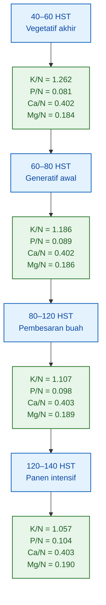

Diagram tersebut menunjukkan bahwa perubahan rasio tidak bersifat acak. Ada pola yang dapat dibaca:

- K tetap lebih tinggi daripada N, tetapi cenderung menurun relatif terhadap N.
- P meningkat perlahan relatif terhadap N.
- Ca relatif stabil terhadap N.
- Mg meningkat sedikit relatif terhadap N.

Dengan demikian, rasio hara per fase harus dipahami sebagai **dinamika akumulasi**, bukan sebagai angka tetap sepanjang siklus.

---

## 8.11 Implikasi Fisiologis dari Tabel Rasio

Tabel rasio menghasilkan beberapa pembacaan penting.

Pertama, fase 40–60 HST sudah menunjukkan K tinggi. Namun ini bukan bukti bahwa K tinggi sejak fase bibit. Fase 40–60 HST adalah fase vegetatif akhir atau transisi, bukan fase establishment.

Kedua, fase pembesaran buah menunjukkan akumulasi total paling besar. Pada fase 80–120 HST, kenaikan akumulasi N, K, Ca, dan Mg jauh lebih besar dibanding fase 40–60 dan 60–80 HST. Ini menunjukkan bahwa pembesaran buah adalah fase dengan beban akumulasi hara tinggi.

Ketiga, Ca relatif stabil terhadap N. Artinya, Ca memiliki pola akumulasi yang berbeda dari K. Oleh sebab itu, model N:P:K saja tidak cukup untuk membaca fisiologi tanaman berbuah. Ca harus dimasukkan dalam model rasio.

Keempat, Mg tetap meningkat mengikuti fase produksi. Ini menunjukkan bahwa daun sebagai source masih penting walaupun buah menjadi sink utama.

Secara ringkas:

$$
\boxed{
\text{buah meningkat} \neq \text{tajuk menjadi tidak penting}
}
$$

Pada fase buah, tanaman tetap membutuhkan daun aktif untuk mendukung pengisian buah.

---

## 8.12 Batas Validitas Rasio

Rasio pada Bab 8 harus dibaca sebagai:

$$
\boxed{
\text{contoh hasil hitung berdasarkan persamaan referensi}
}
$$

bukan sebagai rasio universal untuk semua cabai.

Batas validitasnya:

| Komponen                | Status                                  |
| ----------------------- | --------------------------------------- |
| Fase 40–140 HST         | dapat dihitung dari persamaan referensi |
| Fase 0–40 HST           | belum dihitung, perlu data tambahan     |
| Cabai rawit             | perlu kalibrasi                         |
| Cabai keriting          | perlu kalibrasi                         |
| Cabai besar             | perlu kalibrasi                         |
| Paprika                 | paling dekat dengan data referensi      |
| Sistem budidaya berbeda | perlu validasi                          |
| Varietas berbeda        | perlu validasi                          |

Dengan demikian, Bab 8 tidak hanya memberi rumus, tetapi juga memberi hasil rasio, interpretasi, dan batas penggunaannya.

Kesimpulan Bab 8:

$$
\boxed{
\begin{aligned}
&\text{Rasio N:P:K:Ca:Mg per fase} \\
&\text{harus dihitung dari } \Delta A_j, \\
&\text{bukan dari total hara atau resep pupuk}
\end{aligned}
}
$$

dan pada contoh model referensi 40–140 HST, rasio bergerak dari:

$$
\boxed{
1:0.081:1.262:0.402:0.184
}
$$

pada fase 40–60 HST menjadi:

$$
\boxed{
1:0.104:1.057:0.403:0.190
}
$$

pada fase 120–140 HST.

[**Kembali ke atas**](#model-berat-kering-tanaman-ke-rasio-npkcamg-per-fase-pertumbuhan)

---

# 9. Interpretasi Fisiologis Rasio Hara

## 9.1 Nitrogen

Nitrogen biasanya kuat terkait dengan:

- pertumbuhan daun,
- pembentukan tajuk,
- sintesis protein,
- pembentukan klorofil,
- aktivitas fotosintesis.

Dalam model, akumulasi nitrogen dinyatakan sebagai:

$$
\boxed{
A_N(t)
}
$$

Interpretasi utamanya adalah:

$$
\boxed{
A_N(t)\ meningkat\ kuat\ saat\ daun\ dan\ batang\ aktif\ bertambah
}
$$

Pada fase vegetatif, peningkatan $A_N(t)$ umumnya berkaitan dengan pembentukan tajuk. Namun N tidak boleh dipahami hanya sebagai unsur vegetatif. Saat tanaman berbuah, N tetap diperlukan untuk menjaga daun tetap aktif sebagai sumber fotosintat.

Jika rasio N turun pada fase buah, hal itu tidak selalu berarti kebutuhan N menjadi tidak penting. Bisa jadi K naik lebih cepat karena buah menjadi sink utama, sementara N tetap dibutuhkan untuk mempertahankan mesin fotosintesis.

Dengan kata lain:

$$
\boxed{
N\ mendukung\ source
}
$$

yaitu daun dan tajuk yang menghasilkan asimilat.

---

## 9.2 Fosfor

Fosfor biasanya lebih kecil secara jumlah total dibanding N dan K, tetapi perannya tetap penting.

P berhubungan dengan:

- perkembangan akar,
- energi,
- ATP,
- pembelahan sel,
- metabolisme,
- pembungaan awal.

Dalam model, akumulasi fosfor dinyatakan sebagai:

$$
\boxed{
A_P(t)
}
$$

Interpretasi modelnya adalah:

$$
\boxed{
A_P(t)\ biasanya\ tidak\ sebesar\ A_N(t)\ atau\ A_K(t),
tetapi\ perubahan\ kecilnya\ tetap\ penting\ secara\ fisiologis
}
$$

Kesalahan umum dalam membaca P adalah menganggap unsur ini tidak penting karena jumlah akumulasinya kecil. Dalam model berat kering, P memang sering terlihat kecil secara massa, tetapi perannya lebih terkait fungsi metabolik dibanding volume akumulasi.

Karena itu, rasio P dalam N:P:K:Ca:Mg sebaiknya dibaca sebagai unsur dengan **jumlah relatif kecil tetapi fungsi strategis**.

---

## 9.3 Kalium

Kalium sangat terkait dengan:

- regulasi stomata,
- tekanan osmotik,
- transport gula,
- aktivasi enzim,
- pengisian buah,
- keseimbangan air sel.

Dalam model, akumulasi kalium dinyatakan sebagai:

$$
\boxed{
A_K(t)
}
$$

Interpretasi utamanya:

$$
\boxed{
A_K(t)\ cenderung\ meningkat\ kuat\ saat\ buah\ mulai\ menjadi\ sink\ utama
}
$$

Namun K tidak hanya penting saat buah membesar. Pada fase vegetatif, K juga dibutuhkan untuk turgor sel, fungsi stomata, dan transport hasil fotosintesis. Bedanya, saat buah mulai dominan, laju akumulasi K sering menjadi lebih menonjol karena buah membutuhkan aliran gula dan pengaturan osmotik yang kuat.

Dalam model rasio fase, peningkatan:

$$
\frac{\Delta K}{\Delta N}
$$

dapat dibaca sebagai tanda bahwa arah pertumbuhan mulai bergeser dari tajuk menuju buah.

Namun interpretasi ini harus selalu dikaitkan dengan data berat kering buah. Jika $\Delta K$ tinggi tetapi $W_{buah}$ tidak meningkat, maka perlu ditelusuri apakah K banyak tertahan di organ vegetatif atau terjadi akumulasi yang tidak langsung terkait pembesaran buah.

---

## 9.4 Kalsium

Kalsium memiliki karakter yang berbeda dari N dan K. Ca banyak terkunci di jaringan dengan transpirasi tinggi, terutama daun. Mobilitas Ca di dalam tanaman relatif rendah, sehingga Ca tidak mudah dipindahkan kembali dari daun tua ke organ muda atau buah.

Dalam model, akumulasi kalsium dinyatakan sebagai:

$$
\boxed{
A_{Ca}(t)
}
$$

Interpretasi pentingnya adalah:

$$
\boxed{
A_{Ca}(t)\ tidak\ selalu\ mengikuti\ pola\ buah
}
$$

Artinya, ketika $A_K(t)$ meningkat kuat karena buah menjadi sink utama, $A_{Ca}(t)$ belum tentu meningkat dengan pola yang sama. Ca dapat tetap banyak terakumulasi pada daun karena mengikuti aliran transpirasi.

Inilah alasan mengapa Ca perlu dimasukkan dalam rasio:

$$
\boxed{
N:P:K:Ca:Mg
}
$$

bukan berhenti pada:

$$
\boxed{
N:P:K
}
$$

Jika hanya membaca N:P:K, model bisa kehilangan informasi penting tentang keseimbangan jaringan, kekuatan dinding sel, dan distribusi hara pada organ transpiratif.

Secara fisiologis:

$$
\boxed{
K\ sering\ kuat\ pada\ fungsi\ buah,
sedangkan\ Ca\ sering\ kuat\ pada\ jaringan\ transpiratif
}
$$

Karena itu, hubungan K dan Ca harus dibaca sebagai dua kurva yang berbeda, bukan satu pola yang sama.

---

## 9.5 Magnesium

Magnesium berhubungan erat dengan:

- klorofil,
- fotosintesis,
- aktivasi enzim,
- metabolisme energi,
- keseimbangan dengan K dan Ca.

Dalam model, akumulasi magnesium dinyatakan sebagai:

$$
\boxed{
A_{Mg}(t)
}
$$

Interpretasi utamanya:

$$
\boxed{
A_{Mg}(t)\ umumnya\ mengikuti\ aktivitas\ daun,
tetapi\ tetap\ harus\ dibaca\ sebagai\ kurva\ sendiri
}
$$

Mg penting karena daun aktif membutuhkan klorofil dan sistem fotosintesis yang stabil. Saat fase buah, tanaman tetap memerlukan daun sebagai sumber asimilat. Jika aktivitas daun menurun, kemampuan tanaman mengisi buah juga menurun.

Karena itu, Mg dalam rasio N:P:K:Ca:Mg memberi informasi tentang dukungan terhadap fotosintesis dan keseimbangan tajuk.

Secara ringkas:

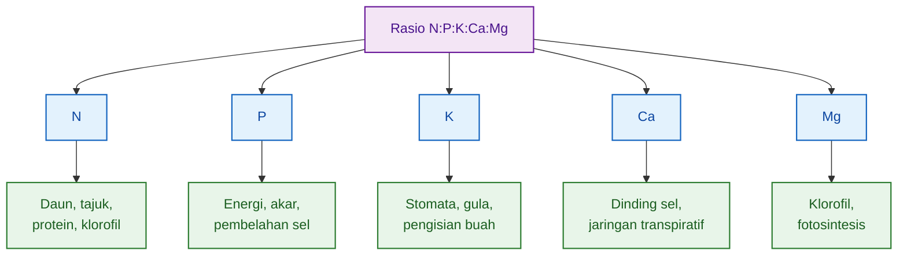

Dengan membaca rasio N:P:K:Ca:Mg secara fisiologis, praktisi tidak hanya mengetahui unsur mana yang besar secara angka, tetapi juga memahami **organ dan fungsi tanaman apa yang sedang dominan pada fase tersebut**.

[**Kembali ke atas**](#model-berat-kering-tanaman-ke-rasio-npkcamg-per-fase-pertumbuhan)

---

# 10. Validasi Persamaan

## 10.1 Mengapa Model Harus Divalidasi?

Model dari literatur atau data percobaan tertentu belum tentu langsung cocok untuk semua kondisi. Persamaan akumulasi hara yang cocok pada satu varietas, satu lokasi, atau satu sistem budidaya tidak otomatis berlaku untuk semua tipe cabai.

Perbedaan dapat terjadi karena:

- varietas,
- tipe cabai,
- iklim,
- sistem budidaya,
- kepadatan tanam,
- umur panen,
- pemangkasan,
- beban buah,
- kesehatan akar.

Karena itu, model harus dibedakan menjadi dua tingkat:

$$
\boxed{
model\ referensi
}
$$

dan:

$$
\boxed{
model\ tervalidasi
}
$$

Model referensi adalah model yang dibangun dari literatur atau data percobaan awal. Model tervalidasi adalah model yang sudah diuji terhadap data tanaman pada kondisi target.

Dalam konteks artikel ini, persamaan:

$$
A_N(t),\ A_P(t),\ A_K(t),\ A_{Ca}(t),\ A_{Mg}(t)
$$

baru layak digunakan sebagai dasar rasio presisi jika hasil prediksinya mendekati data observasi.

Alur validasi model:

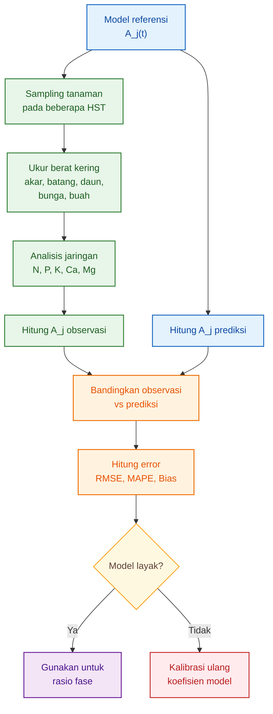

Validasi penting agar model tidak hanya rapi secara matematis, tetapi juga benar secara biologis dan praktis.

---

## 10.2 Data Validasi yang Dibutuhkan

Validasi membutuhkan data observasi dari tanaman nyata. Cara paling kuat adalah melakukan sampling destruktif pada beberapa umur tanaman.

Umur sampling yang disarankan:

$$
\boxed{
0,\ 7,\ 14,\ 21,\ 28,\ 35,\ 42,\ 56,\ 70,\ 84,\ 98,\ 112,\ 126\ HST
}
$$

Interval rapat pada fase awal diperlukan karena fase 0–40 HST sering menjadi titik lemah dalam banyak model. Pada fase ini, akar, daun muda, dan tajuk awal berkembang cepat, tetapi data akumulasi hara sering belum tersedia dengan baik.

Organ yang perlu dipisahkan:

$$
\boxed{
akar,\ batang,\ daun,\ bunga,\ buah
}
$$

Unsur yang dianalisis minimal:

$$
\boxed{
N,\ P,\ K,\ Ca,\ Mg
}
$$

Data yang diperoleh dari setiap titik sampling harus mencakup:

| Data                |         Satuan | Fungsi                           |
| ------------------- | -------------: | -------------------------------- |
| Berat kering akar   |      g/tanaman | menghitung akumulasi hara akar   |
| Berat kering batang |      g/tanaman | menghitung akumulasi hara batang |
| Berat kering daun   |      g/tanaman | menghitung akumulasi hara daun   |
| Berat kering bunga  |      g/tanaman | menghitung akumulasi hara bunga  |
| Berat kering buah   |      g/tanaman | menghitung akumulasi hara buah   |
| Kadar N             | % atau mg/g BK | menghitung $A_N(t)$              |
| Kadar P             | % atau mg/g BK | menghitung $A_P(t)$              |
| Kadar K             | % atau mg/g BK | menghitung $A_K(t)$              |
| Kadar Ca            | % atau mg/g BK | menghitung $A_{Ca}(t)$           |
| Kadar Mg            | % atau mg/g BK | menghitung $A_{Mg}(t)$           |

Dari data tersebut, akumulasi observasi dihitung sebagai:

$$
\boxed{
A_{j,obs}(t)=
\sum_o W_{o,obs}(t)C_{j,o,obs}(t)
}
$$

Nilai inilah yang dibandingkan dengan prediksi model:

$$
\boxed{
A_{j,pred}(t)
}
$$

---

## 10.3 Ukuran Validasi

Validasi dilakukan dengan membandingkan nilai observasi dan nilai prediksi.

Untuk setiap unsur:

$$
j=N,\ P,\ K,\ Ca,\ Mg
$$

error pada umur tertentu dihitung sebagai:

$$
\boxed{
e_j(t)=A_{j,observasi}(t)-A_{j,prediksi}(t)
}
$$

Jika nilai error mendekati nol, model semakin baik. Namun karena error bisa positif dan negatif, diperlukan ukuran tambahan seperti RMSE, MAPE, dan Bias.

---

### RMSE

RMSE atau **Root Mean Square Error** mengukur besar kesalahan rata-rata model dalam satuan asli data.

$$
\boxed{
RMSE_j=
\sqrt{
\frac{1}{n}
\sum
(A_{obs}-A_{pred})^2
}
}
$$

Keterangan:

| Simbol     | Arti                                         |
| ---------- | -------------------------------------------- |
| $RMSE_j$   | error akar kuadrat rata-rata untuk unsur $j$ |
| $A_{obs}$  | akumulasi hara hasil observasi               |
| $A_{pred}$ | akumulasi hara hasil prediksi model          |
| $n$        | jumlah titik data                            |

RMSE berguna karena menunjukkan besarnya error dalam satuan mg/tanaman. Jika RMSE N adalah 200 mg/tanaman, maka rata-rata kesalahan model N berada pada skala tersebut.

---

### MAPE

MAPE atau **Mean Absolute Percentage Error** menunjukkan error dalam persen terhadap data observasi.

$$
\boxed{
MAPE_j=
\frac{100}{n}
\sum
\left|
\frac{A_{obs}-A_{pred}}
{A_{obs}}
\right|
}
$$

MAPE berguna karena mudah ditafsirkan. Misalnya:

$$
MAPE=12\%
$$

berarti rata-rata kesalahan model sekitar 12% dari nilai observasi.

Namun MAPE harus hati-hati digunakan pada nilai observasi yang sangat kecil, terutama pada fase awal, karena pembagi $A_{obs}$ yang kecil dapat membuat persentase error terlihat sangat besar.

---

### Bias

Bias menunjukkan apakah model cenderung terlalu tinggi atau terlalu rendah.

$$
\boxed{
Bias_j=
\frac{1}{n}
\sum
(A_{pred}-A_{obs})
}
$$

Interpretasi:

| Nilai Bias | Makna                                                   |
| ---------: | ------------------------------------------------------- |
|   Bias > 0 | model cenderung overestimate                            |
|   Bias < 0 | model cenderung underestimate                           |
|   Bias ≈ 0 | model tidak memiliki kecenderungan arah error yang kuat |

Bias penting karena model dengan RMSE kecil belum tentu bebas dari kecenderungan. Jika model selalu memprediksi K lebih tinggi dari observasi, maka model akan menghasilkan rasio K yang terlalu besar.

---

## 10.4 Interpretasi Praktis

Untuk praktisi, hasil validasi perlu diterjemahkan menjadi keputusan sederhana: model layak dipakai, perlu koreksi, atau tidak layak.

Kriteria praktis MAPE:

|   MAPE | Kelayakan model                         |
| -----: | --------------------------------------- |
|  < 10% | sangat baik                             |
| 10–20% | layak operasional                       |
| 20–30% | perlu koreksi                           |
|   >30% | tidak layak sebagai dasar rasio presisi |

Namun MAPE tidak boleh menjadi satu-satunya ukuran. Model juga harus lolos uji biologis.

Syarat biologis minimal:

| Syarat                                              | Penjelasan                                                  |
| --------------------------------------------------- | ----------------------------------------------------------- |
| Akumulasi tidak negatif                             | $A_j(t)\geq0$                                               |
| Laju akumulasi tidak negatif pada fase tumbuh aktif | $U_j(t)\geq0$                                               |
| Pola sesuai organ dominan                           | K naik saat buah dominan, Ca tidak dipaksa mengikuti K      |
| Rasio masuk akal                                    | N, P, K, Ca, Mg tidak berubah ekstrem tanpa alasan biologis |
| Berlaku dalam rentang data                          | model tidak diekstrapolasi terlalu jauh                     |

Model yang baik bukan hanya model dengan angka statistik bagus, tetapi model yang juga masuk akal secara fisiologi tanaman.

Contoh keputusan validasi:

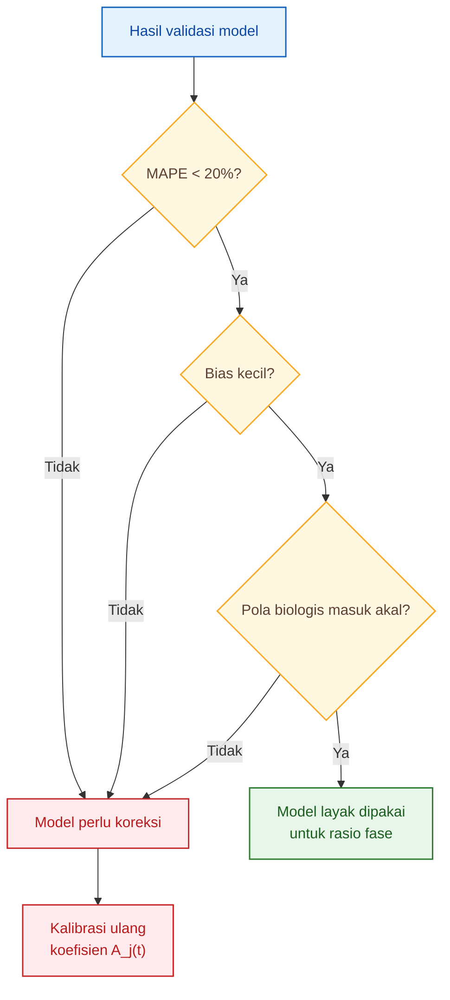

Dengan pendekatan ini, validasi tidak berhenti pada angka. Validasi menjadi proses untuk memastikan bahwa persamaan akumulasi hara benar-benar mencerminkan pertumbuhan tanaman.

Kesimpulan Bab 10 adalah:

$$
\boxed{
model\ hanya\ layak\ digunakan\ jika\ cocok\ secara\ statistik
\ dan\ masuk\ akal\ secara\ fisiologis
}
$$

Jika model belum memenuhi dua syarat tersebut, maka koefisien harus dikalibrasi ulang menggunakan data lokal dari varietas, sistem budidaya, dan kondisi lingkungan yang ditargetkan.

[**Kembali ke atas**](#model-berat-kering-tanaman-ke-rasio-npkcamg-per-fase-pertumbuhan)

---

# 11. Keterbatasan Model

## 11.1 Bukan Model Universal

Model berat kering tanaman ke rasio N:P:K:Ca:Mg tidak boleh dianggap sebagai model universal untuk semua jenis cabai. Model ini adalah **kerangka analisis**, bukan formula tunggal yang otomatis berlaku pada semua varietas, semua lokasi, dan semua sistem budidaya.

Koefisien model dapat berbeda pada:

- cabai rawit,
- cabai keriting,
- cabai besar,
- paprika,
- varietas lokal,
- varietas hibrida.

Perbedaan tersebut terjadi karena tiap tipe cabai memiliki arsitektur tanaman, umur panen, ukuran buah, beban buah, dan pola distribusi biomassa yang berbeda. Cabai rawit, misalnya, memiliki ukuran buah kecil tetapi jumlah buah banyak. Paprika memiliki buah besar dengan bobot per buah tinggi. Cabai keriting memiliki pola percabangan dan beban buah yang berbeda lagi.

Karena itu, model seperti:

$$
\boxed{
A_j(t)=a_jt^{b_j}
}
$$

tidak boleh langsung dipindahkan dari satu tipe cabai ke tipe cabai lain tanpa validasi.

Yang boleh dipindahkan adalah **kerangka berpikirnya**:

$$
\boxed{
berat\ kering\ organ
\rightarrow
akumulasi\ hara
\rightarrow
rasio\ fase
}
$$

Namun nilai koefisien:

$$
\boxed{
a_N,\ b_N,\ a_P,\ b_P,\ a_K,\ b_K,\ a_{Ca},\ b_{Ca},\ a_{Mg},\ b_{Mg}
}
$$

harus dikalibrasi sesuai data tanaman yang diamati.

Secara praktis, keterbatasan ini dapat digambarkan sebagai berikut:

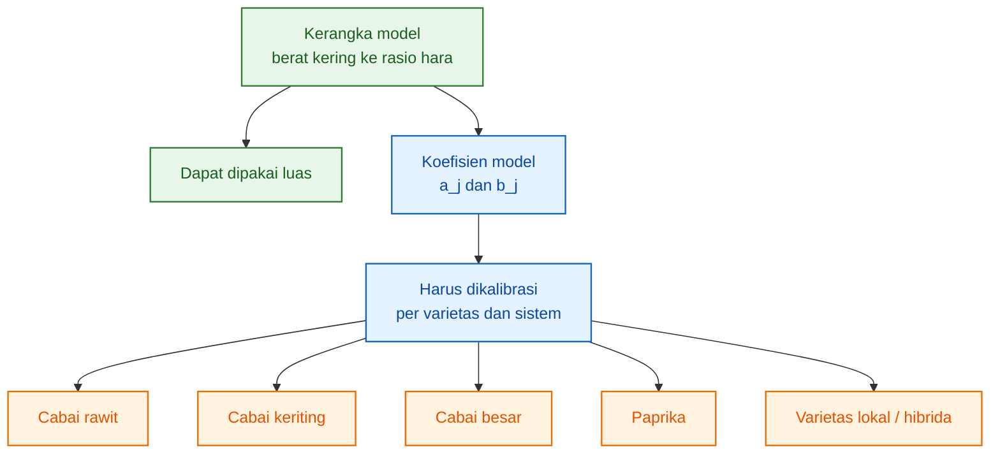

Dengan kata lain, model ini kuat sebagai **metode**, tetapi belum otomatis kuat sebagai **angka final**.

---

## 11.2 Fase Awal Sering Kurang Data

Salah satu kelemahan terbesar dalam membangun model akumulasi hara adalah kurangnya data pada fase awal pertumbuhan.

Fase:

$$
\boxed{
0-40\ HST
}
$$

sering menjadi titik lemah karena banyak studi lebih fokus pada fase tanaman mapan sampai panen. Padahal, fase awal sangat penting karena pada periode ini tanaman sedang membangun dasar pertumbuhan.

Fase awal penting untuk membaca:

- pertumbuhan akar,
- pembentukan daun awal,
- establishment,
- awal akumulasi N, P, K, Ca, dan Mg.

Jika data fase awal lemah, maka model akan kurang akurat untuk menjawab pertanyaan seperti:

> Berapa rasio N:P:K:Ca:Mg saat tanaman baru membangun akar dan daun muda?

> Apakah P relatif lebih penting pada fase awal dibanding fase berikutnya?

> Seberapa cepat N mulai masuk ke daun muda?

> Kapan K mulai meningkat secara nyata?

Tanpa data awal, model dapat tampak kuat pada fase 60–140 HST, tetapi lemah pada fase 0–40 HST. Ini berbahaya jika model digunakan untuk membaca fase establishment dan vegetatif awal.

Secara model, fase awal memerlukan pengamatan lebih rapat karena perubahan kecil pada akar dan daun muda dapat berdampak besar pada arah pertumbuhan berikutnya.

Sampling fase awal idealnya dilakukan pada:

$$
\boxed{
0,\ 7,\ 14,\ 21,\ 28,\ 35,\ 42\ HST
}
$$

Bukan langsung melompat dari 0 ke 40 HST.

Alasan utamanya adalah karena kurva awal sering belum stabil. Jika hanya tersedia titik 0 dan 40 HST, maka bentuk pertumbuhan di antara keduanya hanya ditebak oleh model, bukan dibuktikan oleh data.

---

## 11.3 Rasio Hara Bukan Dosis Pupuk

Rasio:

$$
\boxed{
N:P:K:Ca:Mg
}
$$

yang dihasilkan dari artikel ini adalah **rasio akumulasi tanaman**, bukan otomatis dosis pupuk, bukan konsentrasi larutan, dan bukan resep nutrisi siap pakai.

Ini perlu ditegaskan karena rasio akumulasi tanaman dan dosis pupuk berada pada tingkat analisis yang berbeda.

Rasio akumulasi tanaman menjelaskan:

$$
\boxed{
berapa\ banyak\ unsur\ yang\ benar-benar\ masuk\ dan\ tersimpan\ di\ tanaman
}
$$

Sedangkan dosis pupuk menjelaskan:

$$
\boxed{
berapa\ banyak\ unsur\ yang\ diberikan\ ke\ sistem
}
$$

Keduanya tidak selalu sama karena antara pemberian dan akumulasi terdapat banyak faktor, seperti efisiensi serapan, kehilangan, imobilisasi, antagonisme ion, kondisi akar, dan lingkungan.

Artikel ini berhenti pada tahap biologis:

$$
\boxed{
rasio\ akumulasi\ tanaman
}
$$

bukan tahap teknis pemupukan:

$$
\boxed{
dosis\ pupuk\ atau\ formulasi\ nutrisi
}
$$

Dengan demikian, hasil artikel ini tidak boleh dibaca sebagai:

> Berikan pupuk dengan rasio N:P:K:Ca:Mg tertentu.

Tetapi harus dibaca sebagai:

> Pada fase tersebut, tanaman mengakumulasi N, P, K, Ca, dan Mg dengan rasio tertentu.

Perbedaannya penting.

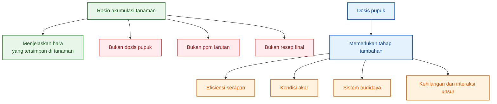

---

## 11.4 Rasio Harus Dipahami sebagai Kebutuhan Relatif Biologis

Rasio yang dihasilkan model ini menjelaskan:

$$
\boxed{
unsur\ mana\ yang\ lebih\ banyak\ diakumulasi\ tanaman\ pada\ fase\ tertentu
}
$$

bukan langsung menjelaskan:

$$
\boxed{
berapa\ gram\ pupuk\ harus\ diberikan
}
$$

Misalnya, jika pada fase pembesaran buah rasio menunjukkan bahwa:

$$
\Delta K
$$

lebih tinggi dibanding:

$$
\Delta P
$$

maka interpretasi yang tepat adalah:

> Pada fase pembesaran buah, tanaman mengakumulasi K lebih besar dibanding P.

Bukan:

> Pupuk K harus dinaikkan sekian gram tanpa memperhatikan kondisi lain.

Rasio ini harus dibaca sebagai **kebutuhan relatif biologis**, yaitu hubungan antarunsur berdasarkan akumulasi tanaman.

Kata kuncinya adalah:

$$
\boxed{
relatif
}
$$

Artinya, model menjelaskan proporsi antarunsur, bukan langsung jumlah aplikasi.

Secara praktis:

| Hasil model                          | Makna yang benar                        | Makna yang salah                          |
| ------------------------------------ | --------------------------------------- | ----------------------------------------- |
| $\Delta K$ tinggi                    | K banyak diakumulasi pada fase tersebut | langsung menaikkan pupuk K tanpa validasi |
| $\Delta Ca$ tidak mengikuti K        | Ca punya pola distribusi berbeda        | Ca tidak penting                          |
| $\Delta P$ kecil                     | P dibutuhkan dalam jumlah relatif kecil | P boleh diabaikan                         |
| $\Delta N$ tetap tinggi saat berbuah | tajuk masih perlu dipertahankan         | tanaman masih vegetatif penuh             |

Dengan demikian, keterbatasan model bukan kelemahan yang membuat model tidak berguna. Justru batasan ini membuat model lebih aman digunakan, karena pembaca memahami ruang lingkupnya.

Kesimpulan Bab 11:

$$
\boxed{
model\ ini\ adalah\ alat\ membaca\ akumulasi\ biologis,
bukan\ resep\ pemupukan\ final
}
$$

[**Kembali ke atas**](#model-berat-kering-tanaman-ke-rasio-npkcamg-per-fase-pertumbuhan)

---

# 12. Protokol Data untuk Praktisi

## 12.1 Minimal Pengambilan Sampel

Agar praktisi dapat membangun model sendiri, data harus dikumpulkan dari tanaman nyata. Data terbaik diperoleh melalui sampling destruktif, yaitu tanaman dicabut atau dipanen pada umur tertentu, lalu dipisahkan per organ, dikeringkan, ditimbang, dan dianalisis kandungan haranya.

Untuk praktisi yang ingin membangun model awal, sampling minimal dapat dilakukan pada:

$$
\boxed{
7,\ 21,\ 35,\ 56,\ 80,\ 100,\ 120\ HST
}
$$

Titik tersebut mewakili fase awal, vegetatif, transisi generatif, pembesaran buah, dan panen.

Namun, untuk model yang lebih baik, terutama agar fase awal tidak lemah, sampling sebaiknya dilakukan pada:

$$
\boxed{
0,\ 7,\ 14,\ 21,\ 28,\ 35,\ 42,\ 56,\ 70,\ 84,\ 98,\ 112,\ 126\ HST
}
$$

Sampling yang lebih rapat membantu menangkap perubahan yang tidak terlihat jika interval terlalu jauh.

Perbandingan minimal dan ideal:

| Tingkat sampling | Umur pengamatan                                        | Kegunaan                                |
| ---------------- | ------------------------------------------------------ | --------------------------------------- |
| Minimal          | 7, 21, 35, 56, 80, 100, 120 HST                        | cukup untuk model awal                  |
| Ideal            | 0, 7, 14, 21, 28, 35, 42, 56, 70, 84, 98, 112, 126 HST | lebih kuat untuk validasi dan fase awal |

Alur sampling:

```mermaid id="protokol12a"
flowchart TD
    A["Pilih umur sampling"] --> B["Ambil tanaman contoh"]
    B --> C["Pisahkan organ"]
    C --> D["Timbang berat segar"]
    D --> E["Oven sampai berat konstan"]
    E --> F["Timbang berat kering"]
    F --> G["Analisis jaringan"]
    G --> H["Hitung akumulasi hara"]

    classDef awal fill:#E3F2FD,stroke:#1565C0,stroke-width:1.5px,color:#0D47A1;
    classDef sampel fill:#E8F5E9,stroke:#2E7D32,stroke-width:1.5px,color:#1B5E20;
    classDef lab fill:#FFF3E0,stroke:#EF6C00,stroke-width:1.5px,color:#E65100;
    classDef hasil fill:#F3E5F5,stroke:#6A1B9A,stroke-width:1.5px,color:#4A148C;

    class A awal;
    class B,C,D sampel;
    class E,F,G lab;
    class H hasil;
```

Diagram ini dapat digunakan sebagai panduan kerja lapangan yang sederhana.

---

## 12.2 Jumlah Tanaman per Titik

Pada setiap waktu pengamatan, jumlah tanaman yang diambil sebaiknya tidak hanya satu. Tanaman individual dapat berbeda karena variasi bibit, posisi di greenhouse, intensitas cahaya, kondisi akar, atau beban buah.

Minimal:

$$
\boxed{
4-5\ tanaman
}
$$

per waktu pengamatan.

Jika sumber daya memungkinkan, jumlah sampel dapat ditingkatkan agar variasi data lebih terbaca. Namun untuk praktisi, 4–5 tanaman per titik waktu sudah menjadi awal yang cukup baik untuk membangun model.

Contoh:

Jika sampling dilakukan pada 7 umur:

$$
7,\ 21,\ 35,\ 56,\ 80,\ 100,\ 120\ HST
$$

dan setiap umur menggunakan 5 tanaman, maka total tanaman destruktif yang dibutuhkan adalah:

$$
\boxed{
7\times5=35\ tanaman
}
$$

Jika sampling ideal dilakukan pada 13 umur:

$$
0,\ 7,\ 14,\ 21,\ 28,\ 35,\ 42,\ 56,\ 70,\ 84,\ 98,\ 112,\ 126\ HST
$$

dan setiap umur menggunakan 5 tanaman, maka total tanaman yang dibutuhkan adalah:

$$
\boxed{
13\times5=65\ tanaman
}
$$

Jumlah ini perlu direncanakan sejak awal agar tanaman sampel tersedia dan tidak mengganggu populasi produksi utama.

---

## 12.3 Data yang Dicatat

Setiap tanaman sampel harus dicatat secara rapi. Data tidak boleh hanya berupa berat total tanaman, karena model ini membutuhkan pemisahan organ.

Data minimal yang perlu dicatat:

| Data               | Keterangan                        |
| ------------------ | --------------------------------- |
| Berat segar organ  | akar, batang, daun, bunga, buah   |
| Berat kering organ | setelah oven sampai berat konstan |
| Jumlah daun        | indikator vegetatif               |
| Jumlah bunga       | indikator generatif awal          |
| Jumlah buah        | indikator sink buah               |
| Bobot buah         | indikator pembesaran buah         |
| Umur tanaman       | HST                               |
| Kondisi akar       | sehat/tidak                       |
| Kondisi tajuk      | vigor, klorosis, nekrosis         |

Struktur data yang disarankan:

| HST | Ulangan | Organ  | Berat segar | Berat kering | Catatan visual |
| --: | ------: | ------ | ----------: | -----------: | -------------- |
|   7 |       1 | akar   |             |              |                |
|   7 |       1 | batang |             |              |                |
|   7 |       1 | daun   |             |              |                |
|   7 |       2 | akar   |             |              |                |
|   7 |       2 | batang |             |              |                |
|   7 |       2 | daun   |             |              |                |

Setelah data berat kering terkumpul, data tersebut akan menjadi dasar untuk menghitung:

$$
W_{akar}(t),\ W_{batang}(t),\ W_{daun}(t),\ W_{bunga}(t),\ W_{buah}(t)
$$

Kemudian setelah analisis jaringan dilakukan, data tersebut dikombinasikan dengan kadar hara:

$$
C_{j,akar}(t),\ C_{j,batang}(t),\ C_{j,daun}(t),\ C_{j,bunga}(t),\ C_{j,buah}(t)
$$

untuk menghitung akumulasi hara:

$$
\boxed{
A_j(t)=\sum_o W_o(t)C_{j,o}(t)
}
$$

Catatan visual juga penting. Jika model menunjukkan anomali, misalnya akumulasi rendah pada satu umur tertentu, catatan visual dapat membantu menjelaskan penyebabnya. Bisa jadi tanaman sedang stres akar, terkena penyakit, mengalami defisiensi, atau memiliki beban buah tidak seragam.

---

## 12.4 Analisis Jaringan

Analisis jaringan adalah tahap yang menghubungkan data berat kering dengan akumulasi hara. Tanpa analisis jaringan, kita hanya tahu distribusi biomassa, tetapi belum tahu berapa N, P, K, Ca, dan Mg yang tersimpan di setiap organ.

Analisis minimal:

$$
\boxed{
N,\ P,\ K,\ Ca,\ Mg
}
$$

Analisis ideal:

$$
\boxed{
N,\ P,\ K,\ Ca,\ Mg,\ S,\ Fe,\ Mn,\ Zn,\ B,\ Cu,\ Mo
}
$$

Untuk tujuan artikel ini, fokus utama adalah:

$$
\boxed{
N:P:K:Ca:Mg
}
$$

Namun jika data mikro tersedia, model dapat dikembangkan lebih lanjut untuk membaca pola akumulasi unsur mikro seperti Fe, Mn, Zn, B, Cu, dan Mo.

Format data analisis jaringan yang disarankan:

| HST | Ulangan | Organ  |   N |   P |   K |  Ca |  Mg |
| --: | ------: | ------ | --: | --: | --: | --: | --: |
|  21 |       1 | akar   |     |     |     |     |     |
|  21 |       1 | batang |     |     |     |     |     |
|  21 |       1 | daun   |     |     |     |     |     |
|  21 |       2 | akar   |     |     |     |     |     |

Jika kadar hara dinyatakan dalam persen, akumulasi per organ dihitung dengan:

$$
\boxed{
A_{j,o}(t)=W_o(t)\times C_{j,o}(\%)\times 10
}
$$

Jika kadar hara dinyatakan dalam mg/g BK, akumulasi per organ dihitung dengan:

$$
\boxed{
A_{j,o}(t)=W_o(t)\times C_{j,o}(mg/g)
}
$$

Lalu akumulasi total unsur dalam satu tanaman:

$$
\boxed{
A_j(t)=
A_{j,akar}(t)
+
A_{j,batang}(t)
+
A_{j,daun}(t)
+
A_{j,bunga}(t)
+
A_{j,buah}(t)
}
$$

Dengan protokol ini, praktisi dapat membangun model berbasis tanaman sendiri, bukan hanya mengandalkan angka umum dari luar.

[**Kembali ke atas**](#model-berat-kering-tanaman-ke-rasio-npkcamg-per-fase-pertumbuhan)

---

# 13. Alur Kerja Model

Bagian ini adalah ringkasan operasional dari seluruh artikel. Alur kerja model dimulai dari data berat kering organ dan berakhir pada rasio N:P:K:Ca:Mg per fase pertumbuhan.

Alur utama:

$$
\boxed{
Data\ berat\ kering\ organ
}
$$

$$
\downarrow
$$

$$
\boxed{
Kadar\ hara\ tiap\ organ
}
$$

$$
\downarrow
$$

$$
\boxed{
Akumulasi\ hara:
A_j(t)=\sum W_oC_{j,o}
}
$$

$$
\downarrow
$$

$$
\boxed{
Persamaan\ tiap\ unsur:
A_N(t),A_P(t),A_K(t),A_{Ca}(t),A_{Mg}(t)
}
$$

$$
\downarrow
$$

$$
\boxed{
Laju\ akumulasi:
U_j(t)=\frac{dA_j}{dt}
}
$$

$$
\downarrow
$$

$$
\boxed{
Rasio\ fase:
\Delta N:\Delta P:\Delta K:\Delta Ca:\Delta Mg
}
$$

Diagram utama artikel:

```mermaid id="alur13a"
flowchart TD
    A["1. Data berat kering organ<br/>akar, batang, daun,<br/>bunga, buah"] --> B["2. Kadar hara tiap organ<br/>N, P, K, Ca, Mg"]
    B --> C["3. Hitung akumulasi hara<br/>A_j(t)=sum W_o C_j,o"]
    C --> D["4. Bentuk persamaan unsur<br/>A_N, A_P, A_K,<br/>A_Ca, A_Mg"]
    D --> E["5. Turunkan laju akumulasi<br/>U_j(t)=dA_j/dt"]
    E --> F["6. Hitung Delta fase<br/>Delta A_j=A_j(t2)-A_j(t1)"]
    F --> G["7. Susun rasio fase<br/>Delta N:Delta P:<br/>Delta K:Delta Ca:Delta Mg"]

    classDef data fill:#E8F5E9,stroke:#2E7D32,stroke-width:1.5px,color:#1B5E20;
    classDef analisis fill:#E3F2FD,stroke:#1565C0,stroke-width:1.5px,color:#0D47A1;
    classDef model fill:#FFF3E0,stroke:#EF6C00,stroke-width:1.5px,color:#E65100;
    classDef rasio fill:#F3E5F5,stroke:#6A1B9A,stroke-width:1.5px,color:#4A148C;

    class A,B data;
    class C,D analisis;
    class E,F model;
    class G rasio;
```

Agar model mudah diterapkan, alur tersebut dapat dipecah menjadi tujuh langkah kerja.

---

## Langkah 1 — Ukur Berat Kering Organ

Pisahkan tanaman menjadi:

$$
\boxed{
akar,\ batang,\ daun,\ bunga,\ buah
}
$$

Lalu hitung:

$$
W_{akar}(t),\ W_{batang}(t),\ W_{daun}(t),\ W_{bunga}(t),\ W_{buah}(t)
$$

Data ini menjawab pertanyaan:

> Organ mana yang sedang dominan dibangun tanaman?

---

## Langkah 2 — Analisis Kadar Hara Tiap Organ

Untuk setiap organ, ukur kadar:

$$
\boxed{
N,\ P,\ K,\ Ca,\ Mg
}
$$

Data ini menjawab pertanyaan:

> Unsur apa yang terkandung dalam tiap organ, dan dalam jumlah berapa?

---

## Langkah 3 — Hitung Akumulasi Hara

Gunakan persamaan:

$$
\boxed{
A_j(t)=\sum_o W_o(t)C_{j,o}(t)
}
$$

Untuk masing-masing unsur:

$$
A_N(t),\ A_P(t),\ A_K(t),\ A_{Ca}(t),\ A_{Mg}(t)
$$

Data ini menjawab pertanyaan:

> Berapa banyak N, P, K, Ca, dan Mg yang sudah tersimpan di tanaman pada umur tertentu?

---

## Langkah 4 — Bentuk Persamaan Tiap Unsur

Setelah data akumulasi tersedia pada beberapa umur, bentuk persamaan:

$$
\boxed{
A_j(t)=a_jt^{b_j}
}
$$

atau bentuk lain yang lebih cocok dengan data.

Persamaan tiap unsur:

$$
A_N(t)=a_Nt^{b_N}
$$

$$
A_P(t)=a_Pt^{b_P}
$$

$$
A_K(t)=a_Kt^{b_K}
$$

$$
A_{Ca}(t)=a_{Ca}t^{b_{Ca}}
$$

$$
A_{Mg}(t)=a_{Mg}t^{b_{Mg}}
$$

Langkah ini menjawab:

> Bagaimana pola akumulasi setiap unsur berubah terhadap umur tanaman?

---

## Langkah 5 — Hitung Laju Akumulasi

Turunkan persamaan akumulasi:

$$
\boxed{
U_j(t)=\frac{dA_j(t)}{dt}
}
$$

Jika:

$$
A_j(t)=a_jt^{b_j}
$$

maka:

$$
\boxed{
U_j(t)=a_jb_jt^{b_j-1}
}
$$

Langkah ini menjawab:

> Pada umur tertentu, seberapa cepat tanaman menambah unsur hara tertentu?

---

## Langkah 6 — Hitung Kenaikan Akumulasi per Fase

Untuk fase dari $t_1$ sampai $t_2$:

$$
\boxed{
\Delta A_j=A_j(t_2)-A_j(t_1)
}
$$

Hitung untuk semua unsur:

$$
\Delta A_N,\ \Delta A_P,\ \Delta A_K,\ \Delta A_{Ca},\ \Delta A_{Mg}
$$

Langkah ini menjawab:

> Selama fase tertentu, unsur mana yang paling banyak bertambah di tanaman?

---

## Langkah 7 — Susun Rasio N:P:K:Ca:Mg per Fase

Rasio fase dihitung sebagai:

$$
\boxed{
Rasio\ fase=
\Delta A_N:
\Delta A_P:
\Delta A_K:
\Delta A_{Ca}:
\Delta A_{Mg}
}
$$

Jika ingin dinormalisasi terhadap N:

$$
\boxed{
1:
\frac{\Delta A_P}{\Delta A_N}:
\frac{\Delta A_K}{\Delta A_N}:
\frac{\Delta A_{Ca}}{\Delta A_N}:
\frac{\Delta A_{Mg}}{\Delta A_N}
}
$$

Langkah ini menjawab:

> Bagaimana perbandingan kebutuhan relatif N, P, K, Ca, dan Mg pada fase tersebut?

---

## Ringkasan Alur Kerja

| Langkah | Input                          | Output                |
| ------: | ------------------------------ | --------------------- |
|       1 | tanaman sampel                 | berat kering organ    |
|       2 | jaringan organ                 | kadar N, P, K, Ca, Mg |
|       3 | berat kering × kadar hara      | akumulasi hara        |
|       4 | data akumulasi per umur        | persamaan tiap unsur  |
|       5 | persamaan akumulasi            | laju akumulasi        |
|       6 | awal dan akhir fase            | kenaikan akumulasi    |
|       7 | kenaikan akumulasi semua unsur | rasio N:P:K:Ca:Mg     |

Dengan alur ini, praktisi dapat membangun model secara bertahap. Model tidak harus langsung sempurna. Yang penting, data dikumpulkan dengan benar dan setiap tahap dihitung secara konsisten.

[**Kembali ke atas**](#model-berat-kering-tanaman-ke-rasio-npkcamg-per-fase-pertumbuhan)

---

# 14. Kesimpulan

Model berat kering tanaman memungkinkan praktisi membaca kebutuhan relatif hara secara lebih tajam. Pendekatan ini dimulai dari tanaman, bukan dari asumsi dosis pupuk, konsentrasi larutan, atau rasio tetap yang digunakan sepanjang siklus pertumbuhan.

Inti dari model ini adalah membaca tanaman sebagai kumpulan organ yang berubah dari waktu ke waktu. Akar, batang, daun, bunga, dan buah tidak tumbuh dengan laju yang sama, dan masing-masing organ juga tidak mengakumulasi N, P, K, Ca, dan Mg dengan pola yang sama.

Dengan memisahkan berat kering akar, batang, daun, bunga, dan buah, lalu mengalikan setiap organ dengan kadar N, P, K, Ca, dan Mg, akumulasi hara tanaman dapat dihitung secara bertahap.

Persamaan dasarnya adalah:

$$
\boxed{
A_j(t)=\sum_o W_o(t)C_{j,o}(t)
}
$$

Keterangan:

| Simbol         | Arti                                       |
| -------------- | ------------------------------------------ |
| $$A_j(t)$$     | akumulasi unsur hara $$j$$ pada umur $$t$$ |
| $$W_o(t)$$     | berat kering organ $$o$$ pada umur $$t$$   |
| $$C_{j,o}(t)$$ | kadar unsur hara $$j$$ pada organ $$o$$    |
| $$j$$          | N, P, K, Ca, Mg                            |
| $$o$$          | akar, batang, daun, bunga, buah            |

Dari akumulasi tersebut, setiap unsur dapat dimodelkan sebagai kurva sendiri:

$$
\boxed{
A_N(t),\ A_P(t),\ A_K(t),\ A_{Ca}(t),\ A_{Mg}(t)
}
$$

Karena setiap unsur memiliki fungsi, distribusi organ, mobilitas, dan laju akumulasi yang berbeda, maka:

$$
\boxed{
A_N(t)\neq A_P(t)\neq A_K(t)\neq A_{Ca}(t)\neq A_{Mg}(t)
}
$$

Nitrogen tidak boleh dipaksa mengikuti pola kalium. Kalium tidak boleh dianggap mengikuti pola kalsium. Magnesium tidak boleh hanya dianggap pelengkap. Fosfor tidak boleh diabaikan hanya karena jumlah akumulasinya relatif kecil. Setiap unsur harus dibaca sebagai kurva biologis yang berbeda.

Dari kurva akumulasi tersebut, laju akumulasi dapat dihitung dengan:

$$
\boxed{
U_j(t)=\frac{dA_j(t)}{dt}
}
$$

Sedangkan perubahan akumulasi per fase dihitung dengan:

$$
\boxed{
\Delta A_j=A_j(t_2)-A_j(t_1)
}
$$

Akhirnya, rasio hara per fase dapat disusun sebagai:

$$
\boxed{
N:P:K:Ca:Mg
===========

\Delta A_N:
\Delta A_P:
\Delta A_K:
\Delta A_{Ca}:
\Delta A_{Mg}
}
$$

Dengan pendekatan ini, rasio hara tidak lagi dianggap sebagai angka tetap. Rasio berubah mengikuti fase pertumbuhan dan arah pembentukan biomassa tanaman.

---

## Ringkasan Hasil Rasio dari Model Referensi

Berdasarkan contoh persamaan referensi yang digunakan dalam artikel, rasio N:P:K:Ca:Mg per fase pada rentang 40–140 HST adalah sebagai berikut:

| Fase                       | Interval HST | Rasio N:P:K:Ca:Mg                 |
| -------------------------- | -----------: | --------------------------------- |
| Establishment              |         0–20 | perlu data fase awal              |
| Vegetatif awal             |        20–40 | perlu data fase awal              |
| Vegetatif akhir / transisi |        40–60 | 1 : 0.081 : 1.262 : 0.402 : 0.184 |
| Generatif awal             |        60–80 | 1 : 0.089 : 1.186 : 0.402 : 0.186 |
| Pembesaran buah            |       80–120 | 1 : 0.098 : 1.107 : 0.403 : 0.189 |
| Panen intensif             |      120–140 | 1 : 0.104 : 1.057 : 0.403 : 0.190 |

Tabel tersebut menunjukkan bahwa rasio hara tanaman bersifat dinamis.

Pada fase 40–60 HST, rasio model adalah:

$$
\boxed{
1:0.081:1.262:0.402:0.184
}
$$

Pada fase 120–140 HST, rasio berubah menjadi:

$$
\boxed{
1:0.104:1.057:0.403:0.190
}
$$

Perubahan ini menunjukkan beberapa hal penting.

Pertama, K lebih tinggi daripada N pada seluruh fase yang dihitung, tetapi rasio K terhadap N tidak terus meningkat. Sebaliknya, rasio K:N bergerak dari:

$$
\boxed{
1.262
}
$$

pada 40–60 HST menjadi:

$$
\boxed{
1.057
}
$$

pada 120–140 HST.

Artinya, fase buah tidak boleh dibaca secara sederhana sebagai “semakin tua tanaman, K harus semakin dominan tanpa batas”. K tetap dominan, tetapi dominasinya terhadap N justru semakin mendekati seimbang pada fase panen intensif.

Kedua, rasio P terhadap N meningkat perlahan dari:

$$
\boxed{
0.081
}
$$

menjadi:

$$
\boxed{
0.104
}
$$

Ini menunjukkan bahwa P memang kecil secara jumlah relatif, tetapi tetap ikut meningkat seiring perkembangan tanaman.

Ketiga, rasio Ca terhadap N relatif stabil di sekitar:

$$
\boxed{
0.402-0.403
}
$$

Ini penting karena menunjukkan bahwa Ca memiliki pola yang berbeda dari K. Ca tidak boleh dipaksa mengikuti pola buah seperti K, karena akumulasi Ca banyak terkait dengan jaringan transpiratif dan struktur jaringan.

Keempat, Mg meningkat perlahan relatif terhadap N, dari:

$$
\boxed{
0.184
}
$$

menjadi:

$$
\boxed{
0.190
}
$$

Ini menunjukkan bahwa dukungan terhadap daun dan fotosintesis tetap penting sampai fase panen intensif.

---

## Makna Fisiologis per Fase

Pada fase establishment, model membantu membaca pembangunan akar dan daun muda. Namun, fase 0–20 HST belum diisi rasio numerik dalam model referensi ini karena data fase awal masih perlu diperkuat.

Pada fase vegetatif awal, yaitu 20–40 HST, model juga belum memaksakan rasio numerik. Ini penting agar artikel tidak menghasilkan angka yang tampak presisi tetapi sebenarnya lemah secara data.

Pada fase vegetatif akhir atau transisi, yaitu 40–60 HST, model mulai menunjukkan bahwa K sudah tinggi relatif terhadap N. Namun fase ini bukan fase bibit, melainkan fase tanaman yang mulai menuju generatif.

Pada fase generatif awal, yaitu 60–80 HST, rasio K terhadap N mulai menurun, sementara P, Mg, dan Ca tetap terbaca dalam proporsi masing-masing. Ini menunjukkan bahwa tanaman mulai masuk fase transisi sink, tetapi tajuk masih aktif mendukung pembentukan bunga dan buah muda.

Pada fase pembesaran buah, yaitu 80–120 HST, akumulasi hara total meningkat besar. Buah menjadi sink utama, tetapi N, Ca, dan Mg tetap penting karena daun masih menjadi source atau sumber fotosintat.

Pada fase panen intensif, yaitu 120–140 HST, model membaca keseimbangan antara produksi buah dan pemeliharaan tajuk. K tetap tinggi, tetapi N tetap besar, Ca stabil, dan Mg tetap diperlukan untuk mempertahankan fungsi fotosintesis.

Dengan demikian, hasil model dapat diringkas sebagai berikut:

```mermaid id="kesimpulan14-rasio"
flowchart TD
    A["40–60 HST<br/>Vegetatif akhir"] --> B["N:P:K:Ca:Mg<br/>1:0.081:1.262:0.402:0.184"]
    B --> C["60–80 HST<br/>Generatif awal"]
    C --> D["N:P:K:Ca:Mg<br/>1:0.089:1.186:0.402:0.186"]
    D --> E["80–120 HST<br/>Pembesaran buah"]
    E --> F["N:P:K:Ca:Mg<br/>1:0.098:1.107:0.403:0.189"]
    F --> G["120–140 HST<br/>Panen intensif"]
    G --> H["N:P:K:Ca:Mg<br/>1:0.104:1.057:0.403:0.190"]

    classDef fase fill:#E3F2FD,stroke:#1565C0,stroke-width:1.5px,color:#0D47A1;
    classDef rasio fill:#E8F5E9,stroke:#2E7D32,stroke-width:1.5px,color:#1B5E20;

    class A,C,E,G fase;
    class B,D,F,H rasio;
```

---

## Batas Penting dari Kesimpulan

Rasio yang dihasilkan adalah:

$$
\boxed{
rasio\ akumulasi\ biologis
}
$$

bukan:

$$
\boxed{
resep\ pupuk\ final
}
$$

Artinya, tabel rasio tersebut menjelaskan unsur mana yang lebih banyak diakumulasi tanaman pada fase tertentu, bukan langsung menjelaskan berapa gram pupuk yang harus diberikan.

Rasio ini tidak boleh dipahami sebagai dosis pupuk karena antara akumulasi tanaman dan pemberian pupuk masih ada banyak faktor lain, seperti efisiensi serapan, sistem budidaya, kondisi akar, lingkungan, kehilangan unsur, dan interaksi antarhara.

Selain itu, rasio fase 0–40 HST belum diisi karena data awal masih perlu diperkuat. Artikel ini sengaja tidak memaksakan angka pada fase yang belum kuat datanya.

Dengan demikian, model ini kuat sebagai:

$$
\boxed{
alat\ membaca\ kebutuhan\ relatif\ hara\ berdasarkan\ akumulasi\ tanaman
}
$$

tetapi belum boleh diperlakukan sebagai:

$$
\boxed{
formula\ universal\ untuk\ semua\ cabai
}
$$

Untuk menjadi dasar rekomendasi teknis, model perlu divalidasi pada:

- varietas yang digunakan,
- tipe cabai,
- sistem budidaya,
- iklim,
- pola pemangkasan,
- kepadatan tanam,
- beban buah,
- kondisi akar,
- dan lingkungan produksi spesifik.

---

## Alur Akhir Model

Dengan batasan tersebut, artikel ini menawarkan cara berpikir yang lebih presisi:

```mermaid id="kesimpulan14a"
flowchart TD
    A["Tanaman diamati"] --> B["Berat kering organ dihitung"]
    B --> C["Kadar hara organ dianalisis"]
    C --> D["Akumulasi hara dihitung"]
    D --> E["Kurva tiap unsur dibuat"]
    E --> F["Delta akumulasi per fase dihitung"]
    F --> G["Rasio N:P:K:Ca:Mg disusun"]
    G --> H["Model divalidasi<br/>sebelum dipakai lebih lanjut"]

    classDef data fill:#E8F5E9,stroke:#2E7D32,stroke-width:1.5px,color:#1B5E20;
    classDef analisis fill:#E3F2FD,stroke:#1565C0,stroke-width:1.5px,color:#0D47A1;
    classDef model fill:#FFF3E0,stroke:#EF6C00,stroke-width:1.5px,color:#E65100;
    classDef hasil fill:#F3E5F5,stroke:#6A1B9A,stroke-width:1.5px,color:#4A148C;
    classDef validasi fill:#FFEBEE,stroke:#C62828,stroke-width:1.5px,color:#B71C1C;

    class A,B data;
    class C,D analisis;
    class E,F model;
    class G hasil;
    class H validasi;
```

Kesimpulan praktisnya:

> Rasio hara yang baik tidak dimulai dari angka tetap, tetapi dari pemahaman tentang bagaimana tanaman membangun akar, tajuk, bunga, dan buah sepanjang waktu.

Dengan pendekatan ini, praktisi tidak hanya mengetahui **berapa besar tanaman tumbuh**, tetapi juga memahami **unsur apa yang paling banyak dibangun tanaman pada setiap fase pertumbuhan**.

Lebih jauh, praktisi juga dapat melihat bahwa rasio hara bukan hanya berubah karena umur tanaman, tetapi karena perubahan arah akumulasi biomassa. Saat daun dan batang dominan, pola akumulasi berbeda dengan saat buah menjadi sink utama. Saat panen intensif, tanaman tidak hanya membutuhkan dukungan untuk buah, tetapi juga untuk mempertahankan tajuk sebagai sumber fotosintat.

Maka, nilai utama model ini bukan hanya pada tabel rasio, tetapi pada cara berpikirnya:

$$
\boxed{
tanaman
\rightarrow
berat\ kering
\rightarrow
akumulasi\ hara
\rightarrow
rasio\ fase
\rightarrow
validasi
}
$$

Itulah fondasi untuk membangun pembacaan kebutuhan hara yang lebih presisi, terukur, dan bertanggung jawab secara fisiologis.

[**Kembali ke atas**](#model-berat-kering-tanaman-ke-rasio-npkcamg-per-fase-pertumbuhan)

---

<small>
  **_Catatan Penyusunan_** Artikel ini disusun sebagai materi edukasi dan
  referensi umum berdasarkan berbagai sumber pustaka, praktik lapangan, serta
  bantuan alat penulisan. Pembaca disarankan untuk melakukan verifikasi lanjutan
  dan penyesuaian sesuai dengan kondisi serta kebutuhan masing-masing sistem.
</small>
