# **_Model Formula Hara Cabai Berbasis Laju Serapan dan Batas Jenuh Respons per Fase Organ_**

_Pendekatan utama untuk hidroponik dan fertigasi substrat, dengan catatan adaptasi untuk lahan tanah berbasis kesuburan tanah_

---

- [**_Model Formula Hara Cabai Berbasis Laju Serapan dan Batas Jenuh Respons per Fase Organ_**](#model-formula-hara-cabai-berbasis-laju-serapan-dan-batas-jenuh-respons-per-fase-organ)
- [1. Pendahuluan: Dari Rasio Akumulasi ke Formula Hara](#1-pendahuluan-dari-rasio-akumulasi-ke-formula-hara)
- [2. Asumsi Sistem Budidaya dan Batas Model](#2-asumsi-sistem-budidaya-dan-batas-model)
  - [2.1 Fokus Utama Artikel](#21-fokus-utama-artikel)
  - [2.2 Hidroponik dan Fertigasi Substrat](#22-hidroponik-dan-fertigasi-substrat)
  - [2.3 Posisi Lahan Tanah](#23-posisi-lahan-tanah)
  - [2.4 Batas Model](#24-batas-model)
- [3. Dasar Biologis dari Artikel Sebelumnya](#3-dasar-biologis-dari-artikel-sebelumnya)
  - [3.1 Hara yang Tersimpan di Tanaman](#31-hara-yang-tersimpan-di-tanaman)
  - [3.2 Kebutuhan Harian Tanaman](#32-kebutuhan-harian-tanaman)
  - [3.3 Tambahan Hara per Fase](#33-tambahan-hara-per-fase)
  - [3.4 Rasio Hara per Fase](#34-rasio-hara-per-fase)
- [4. Laju Serapan dan Kebutuhan Konsentrasi Hara](#4-laju-serapan-dan-kebutuhan-konsentrasi-hara)
  - [4.1 Kebutuhan Harian Tanaman](#41-kebutuhan-harian-tanaman)
  - [4.2 Air sebagai Kendaraan Hara](#42-air-sebagai-kendaraan-hara)
  - [4.3 Efisiensi Serapan Akar](#43-efisiensi-serapan-akar)
  - [4.4 Mengubah Kebutuhan Harian Menjadi Konsentrasi Larutan](#44-mengubah-kebutuhan-harian-menjadi-konsentrasi-larutan)
  - [4.5 Contoh Lapangan](#45-contoh-lapangan)
  - [4.6 Alur Praktis Bab 4](#46-alur-praktis-bab-4)
- [5. Respons Akar dan Batas Jenuh Hara](#5-respons-akar-dan-batas-jenuh-hara)
  - [5.1 Lebih Pekat Tidak Selalu Lebih Baik](#51-lebih-pekat-tidak-selalu-lebih-baik)
  - [5.2 Cara Membaca Respons Akar](#52-cara-membaca-respons-akar)
  - [5.3 Respons Relatif: Membaca Titik Efektif](#53-respons-relatif-membaca-titik-efektif)
  - [5.4 Titik Jenuh Praktis](#54-titik-jenuh-praktis)
  - [5.5 Batas Jenuh Bukan Keracunan](#55-batas-jenuh-bukan-keracunan)
  - [5.6 Visualisasi Zona Respons Hara](#56-visualisasi-zona-respons-hara)
- [6. Batas Jenuh per Unsur dan Fase Organ](#6-batas-jenuh-per-unsur-dan-fase-organ)
  - [6.1 Tidak Semua Unsur Punya Respons yang Sama](#61-tidak-semua-unsur-punya-respons-yang-sama)
  - [6.2 Nitrogen: Penting, tetapi Jangan Berlebihan](#62-nitrogen-penting-tetapi-jangan-berlebihan)
  - [6.3 Fosfor: Sedikit, tetapi Tetap Penting](#63-fosfor-sedikit-tetapi-tetap-penting)
  - [6.4 Kalium: Penting untuk Buah, tetapi Harus Seimbang](#64-kalium-penting-untuk-buah-tetapi-harus-seimbang)
  - [6.5 Kalsium: Bukan Hanya Soal Ada di Larutan](#65-kalsium-bukan-hanya-soal-ada-di-larutan)
  - [6.6 Magnesium: Menjaga Daun Tetap Menjadi Mesin Fotosintesis](#66-magnesium-menjaga-daun-tetap-menjadi-mesin-fotosintesis)
  - [6.7 Titik Jenuh Juga Dipengaruhi Organ yang Sedang Dominan](#67-titik-jenuh-juga-dipengaruhi-organ-yang-sedang-dominan)
  - [6.8 Respons Fase-Organ](#68-respons-fase-organ)
  - [6.9 Visualisasi Hubungan Unsur, Organ, dan Batas Jenuh](#69-visualisasi-hubungan-unsur-organ-dan-batas-jenuh)
  - [6.10 Kesimpulan Bab 6](#610-kesimpulan-bab-6)
- [7. Formula Target Konsentrasi N, P, K, Ca, Mg](#7-formula-target-konsentrasi-n-p-k-ca-mg)
  - [7.1 Inti Formula Target](#71-inti-formula-target)
  - [7.2 Cara Membaca `min` dan `max`](#72-cara-membaca-min-dan-max)
  - [7.3 Tiga Zona Keputusan](#73-tiga-zona-keputusan)
    - [Zona 1 — Terlalu Rendah](#zona-1--terlalu-rendah)
    - [Zona 2 — Zona Efektif](#zona-2--zona-efektif)
    - [Zona 3 — Melewati Batas Jenuh](#zona-3--melewati-batas-jenuh)
  - [7.4 Target Konsentrasi per Fase](#74-target-konsentrasi-per-fase)
  - [7.5 Formula Target Nitrogen](#75-formula-target-nitrogen)
  - [7.6 Formula Target Fosfor](#76-formula-target-fosfor)
  - [7.7 Formula Target Kalium](#77-formula-target-kalium)
  - [7.8 Formula Target Kalsium](#78-formula-target-kalsium)
  - [7.9 Formula Target Magnesium](#79-formula-target-magnesium)
  - [7.10 Ringkasan Formula per Unsur](#710-ringkasan-formula-per-unsur)
  - [7.11 Contoh Perhitungan Satu Unsur](#711-contoh-perhitungan-satu-unsur)
  - [7.12 Jika Kebutuhan Melebihi Batas Jenuh](#712-jika-kebutuhan-melebihi-batas-jenuh)
  - [7.13 Status Formula Target](#713-status-formula-target)
  - [7.14 Diagram Keputusan Formula Target](#714-diagram-keputusan-formula-target)
  - [7.15 Kesimpulan Bab 7](#715-kesimpulan-bab-7)
- [8. Koreksi Antagonisme dan Unsur Pembatas](#8-koreksi-antagonisme-dan-unsur-pembatas)
  - [8.1 Mengapa Target Konsentrasi Perlu Dikoreksi?](#81-mengapa-target-konsentrasi-perlu-dikoreksi)
  - [8.2 K Tinggi Bisa Menekan Ca](#82-k-tinggi-bisa-menekan-ca)
  - [8.3 K dan Ca Bisa Menekan Mg](#83-k-dan-ca-bisa-menekan-mg)
  - [8.4 Konsentrasi Efektif, Bukan Sekadar Konsentrasi di Tandon](#84-konsentrasi-efektif-bukan-sekadar-konsentrasi-di-tandon)
  - [8.5 Koreksi Tidak Selalu Berarti Menambah Unsur](#85-koreksi-tidak-selalu-berarti-menambah-unsur)
  - [8.6 Unsur Pembatas: Bottleneck Pertumbuhan](#86-unsur-pembatas-bottleneck-pertumbuhan)
  - [8.7 Ilustrasi Unsur Pembatas](#87-ilustrasi-unsur-pembatas)
  - [8.8 Alur Koreksi Setelah Target Konsentrasi](#88-alur-koreksi-setelah-target-konsentrasi)
  - [8.9 Kesimpulan Bab 8](#89-kesimpulan-bab-8)
- [9. Adaptasi untuk Lahan Tanah dan Strategi Pemupukan](#9-adaptasi-untuk-lahan-tanah-dan-strategi-pemupukan)
  - [9.1 Hidroponik dan Lahan Tanah Berbeda Cara Kerjanya](#91-hidroponik-dan-lahan-tanah-berbeda-cara-kerjanya)
  - [9.2 Kebutuhan Tanaman Tetap Sama](#92-kebutuhan-tanaman-tetap-sama)
  - [9.3 Formula Adaptasi untuk Lahan Tanah](#93-formula-adaptasi-untuk-lahan-tanah)
  - [9.4 Cara Membaca Komponen Formula Lahan](#94-cara-membaca-komponen-formula-lahan)
    - [Kebutuhan tanaman](#kebutuhan-tanaman-1)
    - [Suplai tanah](#suplai-tanah-1)
    - [Mineralisasi bahan organik](#mineralisasi-bahan-organik)
    - [Kontribusi pupuk organik](#kontribusi-pupuk-organik)
    - [Kehilangan hara](#kehilangan-hara)
    - [Fiksasi dan imobilisasi](#fiksasi-dan-imobilisasi)
    - [Efisiensi pupuk](#efisiensi-pupuk)
  - [9.5 Data Tanah yang Wajib Masuk](#95-data-tanah-yang-wajib-masuk)
  - [9.6 Strategi Pemupukan Lahan Berdasarkan Fase](#96-strategi-pemupukan-lahan-berdasarkan-fase)
  - [9.7 Ilustrasi Adaptasi Hidroponik dan Lahan](#97-ilustrasi-adaptasi-hidroponik-dan-lahan)
  - [9.8 Batas Bab Ini](#98-batas-bab-ini)
  - [9.9 Kesimpulan Bab 9](#99-kesimpulan-bab-9)
- [10. Validasi Formula dan Protokol Data Praktisi](#10-validasi-formula-dan-protokol-data-praktisi)
  - [10.1 EC Penting, tetapi Tidak Cukup](#101-ec-penting-tetapi-tidak-cukup)
  - [10.2 Apa yang Harus Divalidasi?](#102-apa-yang-harus-divalidasi)
    - [10.2.1 Validasi Larutan](#1021-validasi-larutan)
    - [10.2.2 Validasi Akar](#1022-validasi-akar)
    - [10.2.3 Validasi Organ Tanaman](#1023-validasi-organ-tanaman)
  - [10.3 Data Minimal untuk Praktisi Hidroponik/Fertigasi](#103-data-minimal-untuk-praktisi-hidroponikfertigasi)
  - [10.4 Cara Menghitung Serapan Air](#104-cara-menghitung-serapan-air)
  - [10.5 Validasi Akumulasi Hara](#105-validasi-akumulasi-hara)
  - [10.6 Metrik Validasi](#106-metrik-validasi)
    - [RMSE](#rmse)
    - [MAPE](#mape)
    - [Bias](#bias)
  - [10.7 Validasi Organ secara Praktis](#107-validasi-organ-secara-praktis)
    - [Akar](#akar)
    - [Daun](#daun)
    - [Batang](#batang)
    - [Bunga](#bunga)
    - [Buah](#buah)
  - [10.8 Keputusan Validasi Formula](#108-keputusan-validasi-formula)
  - [10.9 Jika Formula Tidak Sesuai, Apa yang Dicek?](#109-jika-formula-tidak-sesuai-apa-yang-dicek)
  - [10.10 Kesimpulan Bab 10](#1010-kesimpulan-bab-10)
- [11. Kesimpulan](#11-kesimpulan)
  - [11.1 Rumus Utama Artikel](#111-rumus-utama-artikel)
  - [11.2 Fokus Utama: Hidroponik dan Fertigasi Substrat](#112-fokus-utama-hidroponik-dan-fertigasi-substrat)
  - [11.3 Batas Jenuh Mencegah Overfeeding](#113-batas-jenuh-mencegah-overfeeding)
  - [11.4 Formula Harus Seimbang, Bukan Sekadar Cukup](#114-formula-harus-seimbang-bukan-sekadar-cukup)
  - [11.5 Cari Unsur Pembatas](#115-cari-unsur-pembatas)
  - [11.6 Validasi Wajib](#116-validasi-wajib)
  - [11.7 Alur Akhir Model](#117-alur-akhir-model)
  - [11.8 Kesimpulan Tajam](#118-kesimpulan-tajam)

---

# 1. Pendahuluan: Dari Rasio Akumulasi ke Formula Hara

Artikel sebelumnya telah membahas cara membaca kebutuhan hara cabai dari sisi tanaman. Caranya bukan dimulai dari dosis pupuk atau angka ppm, tetapi dari apa yang benar-benar dibangun tanaman: akar, batang, daun, bunga, dan buah.

<ResourceBox
  title="Artikel Terkait:"
  items={[
    {
      name: 'README — Framework Praktis Memulai Bisnis Agribisnis Terpadu di Lahan Gumuk Berlereng',
      href: '/blog/agri/kebon/agribisnis-gumuk/README',
    },
    {
      name: 'Keseimbangan Akar dan Tajuk: Fondasi Tanaman Sehat, Produktif, dan Tidak Terjebak Tipuan Input',
      href: '/blog/agri/kebon/keseimbangan-akar-dan-tajuk',
    },
    {
      name: 'Menanam Cabai dengan Prinsip Pohon Bambu: Akar Kuat, Tanah Hidup, Tanaman Tahan Stres',
      href: '/blog/agri/kebon/budidaya-cabai-prinsip-rumpun-bambu',
    },
    {
      name: 'Model Berat Kering Tanaman ke Rasio N:P:K:Ca:Mg per Fase Pertumbuhan',
      href: '/blog/agri/kebon/model-berat-kering-hara',
    },
    {
      name: 'README - Pupuk Tepat, Panen Untung - Model Low-Lab untuk Petani Makmur di Gambiran',
      href: '/blog/agri/pupuk-terintegrasi/README',
    },
  ]}
/>

Artikel pertama menghasilkan rasio akumulasi hara:

$$
\boxed{
N:P:K:Ca:Mg
}
$$

Rasio itu menjawab pertanyaan:

> Pada fase tertentu, unsur apa yang paling banyak dibangun tanaman?

Namun, rasio akumulasi belum otomatis menjadi formula nutrisi. Rasio akumulasi hanya menunjukkan **perbandingan hara yang masuk ke tubuh tanaman**, bukan langsung menunjukkan **berapa ppm atau mg/L yang harus diberikan di larutan**.

Contoh:

$$
\boxed{
N:P:K:Ca:Mg = 1:0.10:1.10:0.40:0.19
}
$$

Artinya, pada fase tersebut tanaman mengakumulasi K sekitar 1,10 kali terhadap N, Ca sekitar 0,40 kali terhadap N, dan Mg sekitar 0,19 kali terhadap N.

Tetapi angka itu **bukan berarti larutan nutrisi harus dibuat persis dengan rasio yang sama**.

Agar menjadi formula hara, rasio tersebut harus diterjemahkan lagi menjadi:

$$
\boxed{
tambahan\ hara\ per\ fase
\rightarrow
kebutuhan\ hara\ per\ hari
\rightarrow
target\ konsentrasi\ larutan
}
$$

Dalam istilah teknis, alurnya adalah:

$$
\boxed{
\Delta A_j
\rightarrow
\bar{U}_{j,\phi}
\rightarrow
C_{target,j,\phi}
}
$$

Agar lebih mudah dibaca, gunakan arti lapangannya seperti ini:

| Istilah teknis      | Bahasa lapangan                                 |
| ------------------- | ----------------------------------------------- |
| $\Delta A_j$        | tambahan hara selama satu fase                  |
| $\bar{U}_{j,\phi}$  | kebutuhan hara rata-rata per hari pada fase itu |
| $C_{target,j,\phi}$ | target konsentrasi unsur dalam larutan          |

Dengan demikian, artikel ini tidak berhenti pada pertanyaan:

> Berapa rasio N:P:K:Ca:Mg yang diakumulasi tanaman?

Tetapi melangkah ke pertanyaan yang lebih praktis:

> Berapa konsentrasi hara yang layak diberikan agar kebutuhan tanaman terpenuhi, tanpa melewati batas jenuh respons?

Fokus artikel ini adalah **hidroponik dan fertigasi substrat**, karena pada dua sistem ini hara bisa dikendalikan lewat larutan.

Alurnya:

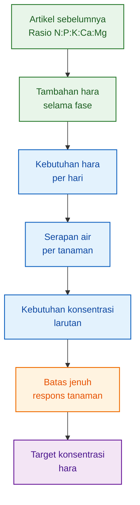

Pesan utamanya sederhana:

> Formula nutrisi yang baik bukan yang paling pekat, tetapi yang cukup untuk kebutuhan tanaman dan masih berada di zona respons efektif.

[**Kembali ke Atas**](#model-formula-hara-cabai-berbasis-laju-serapan-dan-batas-jenuh-respons-per-fase-organ)

---

# 2. Asumsi Sistem Budidaya dan Batas Model

## 2.1 Fokus Utama Artikel

Artikel ini difokuskan pada sistem budidaya yang haranya diberikan lewat larutan, yaitu:

$$
\boxed{
hidroponik\ dan\ fertigasi\ substrat
}
$$

Contohnya:

- NFT,
- DFT,
- drip hydroponic,
- fertigasi cocopeat,
- fertigasi rockwool,
- fertigasi perlite,
- greenhouse dengan media substrat.

<figure>
  
  <figcaption>
    Penyerapan hara dari akar menuju organ tanaman seperti batang, daun, bunga,
    dan buah.
  </figcaption>
</figure>

Pada sistem seperti ini, hara dapat dikontrol lewat:

- konsentrasi larutan,
- EC,
- pH,
- volume siraman,
- frekuensi fertigasi,
- drainase,
- kualitas air baku,
- dan kondisi akar.

<figure>
  
  <figcaption>
    Penyerapan hara dari akar menuju organ tanaman seperti batang, daun, bunga,
    dan buah.
  </figcaption>
</figure>

Secara biologis, prosesnya tetap sama pada semua sistem budidaya:

1. akar menyerap air dan unsur hara,
2. air dan hara dibawa ke tajuk,
3. daun menangkap cahaya dan CO₂,
4. fotosintesis menghasilkan energi dan asimilat,
5. asimilat digunakan untuk membentuk akar, batang, daun, bunga, dan buah.

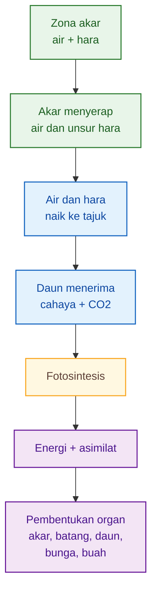

Jadi, dari sisi tanaman, kebutuhan haranya tetap sama: tanaman butuh N, P, K, Ca, dan Mg untuk membangun jaringan.

Yang berbeda adalah **cara menyediakan hara**.

---

## 2.2 Hidroponik dan Fertigasi Substrat

Pada hidroponik dan fertigasi substrat, hara tersedia dalam larutan. Karena itu, keluaran model ini adalah:

$$
\boxed{
target\ konsentrasi\ hara
}
$$

atau secara teknis:

$$
\boxed{
C_{target,j,\phi}
}
$$

Agar tidak membingungkan, baca simbol tersebut sebagai:

> target konsentrasi unsur hara tertentu pada fase tertentu.

Contoh makna lapangan:

| Unsur | Pertanyaan praktis                          |
| ----- | ------------------------------------------- |
| N     | berapa target N pada fase ini?              |
| P     | berapa target P yang cukup, tidak berlebih? |
| K     | berapa target K tanpa menekan Ca dan Mg?    |
| Ca    | berapa target Ca yang masih efektif?        |
| Mg    | berapa target Mg agar daun tetap aktif?     |

Pada hidroponik, pertanyaannya bukan hanya:

> Berapa gram pupuk dimasukkan?

Tetapi lebih tepat:

> Berapa konsentrasi unsur yang perlu tersedia dalam larutan agar tanaman bisa menyerap sesuai kebutuhannya?

Prinsip sederhananya:

$$
\boxed{
hara\ yang\ masuk
\approx
konsentrasi\ larutan
\times
air\ yang\ diserap
\times
efisiensi\ akar
}
$$

Dengan bahasa lapangan:

> Kalau tanaman minum banyak, konsentrasi bisa lebih rendah. Kalau tanaman minum sedikit, konsentrasi yang sama belum tentu cukup.

---

## 2.3 Posisi Lahan Tanah

Lahan tanah **bukan fokus utama artikel ini**. Lahan hanya dibahas sebagai pembanding dan adaptasi.

Alasannya sederhana: tanah bukan larutan hidroponik.

Di tanah, hara bisa:

- tersedia di larutan tanah,
- menempel di koloid tanah,
- terikat bahan organik,
- terfiksasi mineral,
- dilepas oleh mikroba,
- tercuci air,
- atau tertahan karena pH tidak sesuai.

Karena itu, model konsentrasi larutan tidak bisa langsung diterapkan ke lahan tanah.

Untuk hidroponik, keluaran model adalah:

$$
\boxed{
C_{target}
}
$$

yaitu target konsentrasi larutan.

Untuk lahan tanah, keluaran model lebih cocok berupa:

$$
\boxed{
F_{pupuk}
}
$$

yaitu kebutuhan pupuk yang sudah dikoreksi oleh kondisi tanah.

Ringkasnya:

| Sistem                          | Output utama                     | Bahasa praktis                     |
| ------------------------------- | -------------------------------- | ---------------------------------- |
| Hidroponik / fertigasi substrat | target konsentrasi larutan       | berapa mg/L atau ppm unsur         |
| Lahan tanah                     | kebutuhan pupuk terkoreksi tanah | berapa pupuk setelah melihat tanah |

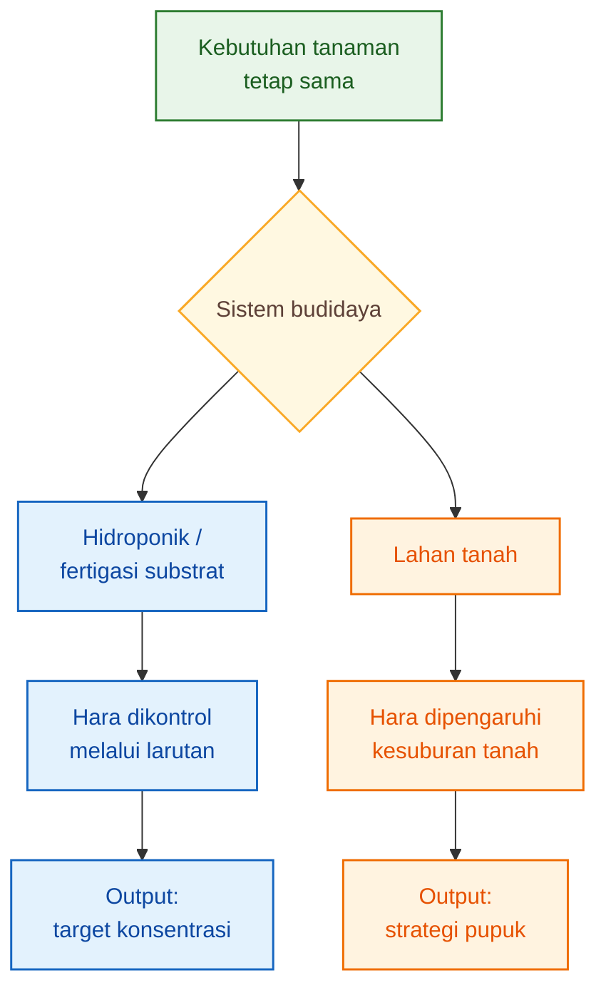

Poin penting:

$$
\boxed{
kebutuhan\ tanaman\ sama,
cara\ menyediakan\ hara\ berbeda
}
$$

---

## 2.4 Batas Model

Agar artikel ini tidak melebar, batasnya harus jelas.

| Komponen           | Posisi dalam artikel            |
| ------------------ | ------------------------------- |
| Hidroponik         | fokus utama                     |
| Fertigasi substrat | fokus utama                     |
| Lahan tanah        | adaptasi, bukan fokus utama     |
| Berat kering organ | dirujuk dari artikel sebelumnya |
| Rasio akumulasi    | titik awal                      |
| Kebutuhan harian   | dasar formula                   |
| Target konsentrasi | output utama                    |
| Dosis pupuk lahan  | dibahas terbatas                |
| Kesuburan tanah    | syarat adaptasi lahan           |

Batas paling penting:

> Artikel ini bukan artikel rekomendasi pupuk lahan. Artikel ini adalah model konsentrasi hara untuk sistem yang dikontrol melalui larutan.

Dengan batas ini, artikel tetap tajam dan tidak mencampur dua dunia yang berbeda: **formula larutan** dan **rekomendasi pupuk tanah**.

[**Kembali ke Atas**](#model-formula-hara-cabai-berbasis-laju-serapan-dan-batas-jenuh-respons-per-fase-organ)

---

# 3. Dasar Biologis dari Artikel Sebelumnya

Artikel ini tidak mengulang seluruh model berat kering. Yang dibawa hanya intinya: tanaman membangun organ, organ menyimpan hara, lalu dari situ kita membaca kebutuhan harian.

## 3.1 Hara yang Tersimpan di Tanaman

Pada artikel sebelumnya, akumulasi hara dihitung dari:

$$
\boxed{
A_j(t)=\sum_o W_o(t)C_{j,o}(t)
}
$$

Untuk pembaca lapangan, rumus itu cukup dibaca seperti ini:

$$
\boxed{
\text{hara tersimpan} = \text{berat kering organ} \times \text{kadar hara organ}
}
$$

Artinya:

- hara di daun dihitung dari berat kering daun dan kadar hara daun,
- hara di batang dihitung dari berat kering batang dan kadar hara batang,
- hara di buah dihitung dari berat kering buah dan kadar hara buah,
- begitu juga akar dan bunga.

Jadi kebutuhan hara tidak ditebak dari pupuk yang diberikan, tetapi dibaca dari hara yang benar-benar masuk ke tubuh tanaman.

---

## 3.2 Kebutuhan Harian Tanaman

Total hara tersimpan belum cukup untuk membuat formula nutrisi.

Yang lebih penting adalah:

> Berapa hara yang sedang dibutuhkan tanaman per hari?

Secara teknis, ini disebut laju akumulasi:

$$
\boxed{
U_j(t)=\frac{dA_j(t)}{dt}
}
$$

Namun untuk praktisi, cukup pahami begini:

$$
\boxed{
\text{kebutuhan harian} = \text{pertambahan hara tanaman per hari}
}
$$

Contoh sederhana:

Jika dalam 20 hari tanaman menambah K sebesar 1.000 mg per tanaman, maka kebutuhan rata-rata K adalah:

$$
\boxed{
1000/20=50\ mg/tanaman/hari
}
$$

Angka seperti inilah yang akan diterjemahkan menjadi target konsentrasi larutan.

---

## 3.3 Tambahan Hara per Fase

Untuk menghitung kebutuhan per fase, kita cukup membandingkan hara di awal dan akhir fase.

Secara teknis:

$$
\boxed{
\Delta A_j=A_j(t_2)-A_j(t_1)
}
$$

Dalam bahasa lapangan:

$$
\boxed{
\text{Tambahan hara}
=
\text{hara akhir fase}
-
\text{hara awal fase}
}
$$

Misalnya:

- awal fase pembesaran buah: tanaman menyimpan 3.000 mg K,
- akhir fase pembesaran buah: tanaman menyimpan 5.000 mg K.

Maka tambahan K selama fase itu:

$$
\boxed{
5000-3000=2000\ mg/tanaman
}
$$

Jika fase berlangsung 40 hari, maka kebutuhan rata-rata:

$$
\boxed{
2000/40=50\ mg/tanaman/hari
}
$$

Inilah titik awal formula hara.

---

## 3.4 Rasio Hara per Fase

Artikel sebelumnya menghasilkan rasio:

$$
\boxed{
Rasio\ fase=
\Delta N:\Delta P:\Delta K:\Delta Ca:\Delta Mg
}
$$

Dalam bahasa sederhana:

> Rasio fase menunjukkan unsur mana yang paling banyak ditambahkan tanaman selama fase tersebut.

Namun artikel ini tidak berhenti pada rasio. Rasio tersebut akan diterjemahkan menjadi target konsentrasi larutan.

Alurnya:

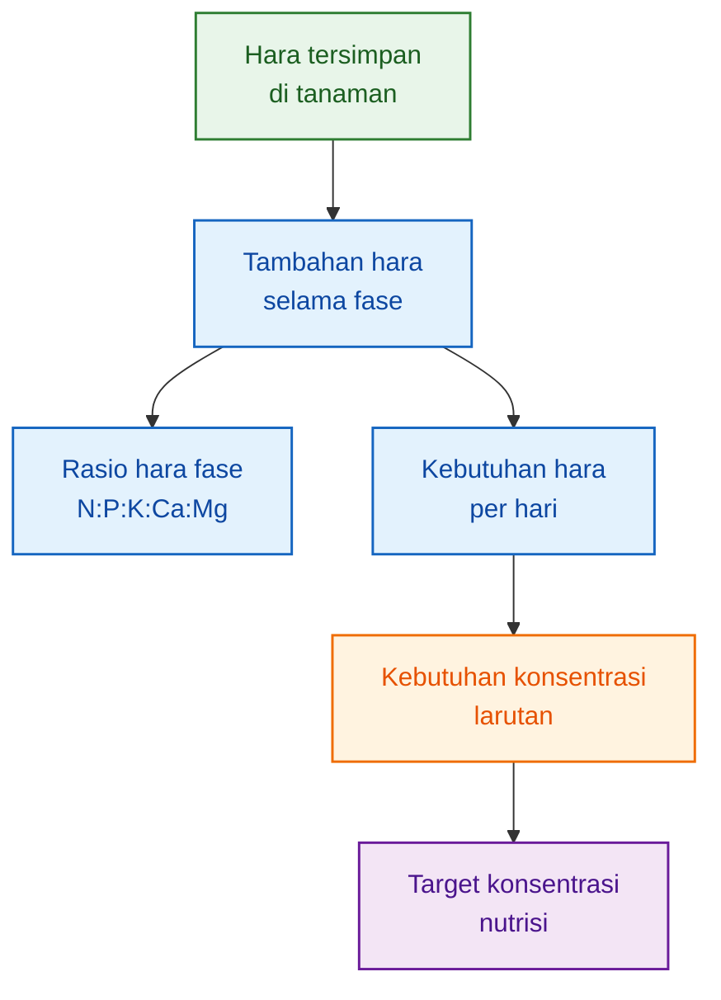

Hubungan dua artikel menjadi seperti ini:

| Artikel         | Fokus                            | Output                           |
| --------------- | -------------------------------- | -------------------------------- |
| Artikel pertama | berat kering dan akumulasi hara  | rasio N:P:K:Ca:Mg per fase       |
| Artikel kedua   | kebutuhan harian dan batas jenuh | target konsentrasi hara per fase |

Kesimpulan Bab 3:

$$
\boxed{
artikel\ kedua\ tidak\ dimulai\ dari\ ppm,
tetapi\ dari\ kebutuhan\ harian\ tanaman
}
$$

Itulah pembeda utama dari pendekatan formula nutrisi yang hanya mengandalkan resep tetap.

[**Kembali ke Atas**](#model-formula-hara-cabai-berbasis-laju-serapan-dan-batas-jenuh-respons-per-fase-organ)

---

# 4. Laju Serapan dan Kebutuhan Konsentrasi Hara

Bab sebelumnya menegaskan bahwa artikel ini tidak dimulai dari angka ppm, tetapi dari kebutuhan tanaman. Sekarang kita masuk ke pertanyaan praktis:

> Kalau tanaman butuh hara sekian mg per hari, berapa konsentrasi yang harus tersedia di larutan?

Untuk menjawabnya, ada tiga hal yang harus dibaca bersama:

1. berapa hara yang sedang dibutuhkan tanaman per hari;
2. berapa air yang diserap tanaman per hari;
3. seberapa efisien akar menyerap hara dari larutan.

---

## 4.1 Kebutuhan Harian Tanaman

Tanaman tidak membutuhkan hara dalam jumlah yang sama setiap hari. Saat tanaman masih kecil, kebutuhannya rendah. Saat tajuk membesar, bunga muncul, dan buah mengisi, kebutuhannya naik.

Karena itu, kita perlu menghitung **kebutuhan hara rata-rata per hari pada setiap fase**.

Secara teknis:

$$
\boxed{
\bar{U}_{j,\phi} =
\frac{A_j(t_2)-A_j(t_1)}
{t_2-t_1}
}
$$

Agar mudah dibaca, artinya seperti ini:

$$
\boxed{
kebutuhan\ hara\ per\ hari =
\frac{
hara\ akhir\ fase -
hara\ awal\ fase
}
{jumlah\ hari\ fase}
}
$$

Keterangan praktis:

| Simbol teknis      | Bahasa lapangan                         |
| ------------------ | --------------------------------------- |
| $A_j(t_1)$         | hara yang sudah tersimpan di awal fase  |
| $A_j(t_2)$         | hara yang sudah tersimpan di akhir fase |
| $t_2-t_1$          | lama fase, dalam hari                   |
| $\bar{U}_{j,\phi}$ | kebutuhan hara rata-rata per hari       |
| $j$                | unsur hara: N, P, K, Ca, atau Mg        |
| $\phi$             | fase tanaman                            |

Contoh sederhana:

Jika selama fase pembesaran buah tanaman menambah K sebesar:

$$
2000\ mg/tanaman
$$

dan fase itu berlangsung:

$$
40\ hari
$$

maka kebutuhan K rata-rata:

$$
\boxed{
2000/40=50\ mg/tanaman/hari
}
$$

Artinya, pada fase itu tanaman rata-rata perlu membangun sekitar **50 mg K per tanaman per hari**.

Angka ini belum menjadi ppm larutan. Ini baru kebutuhan biologis tanaman.

---

## 4.2 Air sebagai Kendaraan Hara

Dalam hidroponik dan fertigasi substrat, hara masuk bersama air. Jadi, tanaman tidak hanya “makan hara”, tetapi juga harus “minum air” agar hara bisa masuk.

Prinsipnya sederhana:

$$
\boxed{
\text{hara masuk} = \text{konsentrasi larutan} \times \text{air yang diserap}
}
$$

Artinya, dua tanaman dengan kebutuhan hara yang sama bisa membutuhkan konsentrasi larutan yang berbeda.

Misalnya:

- tanaman A butuh 50 mg K per hari dan menyerap 1 liter air;
- tanaman B butuh 50 mg K per hari tetapi hanya menyerap 0,5 liter air.

Tanaman B membutuhkan larutan lebih pekat, karena air yang masuk lebih sedikit.

Secara teknis, serapan air rata-rata ditulis:

$$
\boxed{
\bar{Q}_{w,\phi}
}
$$

Namun untuk praktisi, cukup dibaca sebagai:

$$
\boxed{
air\ yang\ diserap\ tanaman\ per\ hari
}
$$

Satuannya:

$$
\boxed{
L/tanaman/hari
}
$$

Jika akar sehat dan air terserap baik, konsentrasi bisa lebih efisien. Jika tanaman sulit menyerap air, menaikkan ppm belum tentu menyelesaikan masalah.

---

## 4.3 Efisiensi Serapan Akar

Tidak semua hara yang ada di larutan langsung masuk ke tanaman. Ada hara yang tertinggal di drainase, ada yang tidak terserap karena pH kurang tepat, ada yang terganggu oleh antagonisme ion, dan ada juga yang tidak masuk karena akar lemah.

Karena itu, kita perlu faktor **efisiensi serapan**.

Secara teknis:

$$
\boxed{
\eta_{j,\phi}
}
$$

Secara praktis, ini berarti:

$$
\boxed{
bagian\ hara\ yang\ benar-benar\ efektif\ diserap\ tanaman
}
$$

Nilainya berada antara 0 dan 1.

Jika:

$$
\eta=1
$$

berarti penyerapan sangat ideal.

Jika:

$$
\eta=0.8
$$

berarti sekitar 80% hara efektif mendukung akumulasi tanaman.

Jika:

$$
\eta=0.5
$$

berarti hanya sekitar 50% yang efektif. Dalam kondisi seperti ini, masalahnya sering bukan kurang pupuk, tetapi akar atau sistem serapan yang tidak optimal.

Efisiensi serapan bisa turun karena:

- akar kurang sehat,
- oksigen rendah,
- suhu larutan terlalu tinggi atau terlalu rendah,
- pH keluar dari zona ideal,
- EC terlalu tinggi,
- drainase terlalu besar,
- antagonisme antarhara,
- distribusi fertigasi tidak merata.

---

## 4.4 Mengubah Kebutuhan Harian Menjadi Konsentrasi Larutan

Sekarang kebutuhan harian, serapan air, dan efisiensi serapan digabung.

Secara teknis:

$$
\boxed{
C_{req,j,\phi} =
\frac{\bar{U}_{j,\phi}}
{\bar{Q}_{w,\phi}\eta_{j,\phi}}
}
$$

Dalam bahasa lapangan:

$$
\boxed{
konsentrasi\ kebutuhan =
\frac{
kebutuhan\ hara\ per\ hari
}
{
air\ yang\ diserap\ per\ hari
\times
efisiensi\ serapan
}
}
$$

Keterangan praktis:

| Simbol teknis      | Bahasa lapangan                        |
| ------------------ | -------------------------------------- |
| $C_{req,j,\phi}$   | konsentrasi yang dibutuhkan di larutan |
| $\bar{U}_{j,\phi}$ | kebutuhan hara per hari                |
| $\bar{Q}_{w,\phi}$ | air yang diserap per tanaman per hari  |
| $\eta_{j,\phi}$    | efisiensi serapan akar/sistem          |

Satuan konsentrasi:

$$
\boxed{
mg/L
}
$$

atau dalam praktik sering dibaca sebagai ppm unsur.

---

## 4.5 Contoh Lapangan

Misalnya pada fase pembesaran buah:

- tanaman perlu K sebanyak 50 mg/tanaman/hari;
- air yang diserap 0,5 L/tanaman/hari;
- efisiensi serapan K diperkirakan 80%.

Maka:

$$
C_{req,K} = \frac{50}{0.5\times0.8}
$$

$$
C_{req,K} = \frac{50}{0.4}
$$

$$
\boxed{
C_{req,K}=125\ mg/L
}
$$

Artinya, agar kebutuhan K 50 mg/tanaman/hari terpenuhi, larutan perlu menyediakan sekitar **125 mg K/L**, dengan asumsi air terserap 0,5 L/hari dan efisiensi 80%.

Sekarang bayangkan kebutuhan K tetap sama, tetapi tanaman menyerap air 1 L/hari.

$$
C_{req,K} = \frac{50}{1.0\times0.8}
$$

$$
\boxed{
C_{req,K}=62.5\ mg/L
}
$$

Kesimpulannya jelas:

> Kebutuhan hara sama, tetapi konsentrasi larutan bisa berbeda karena serapan air berbeda.

Ini penting untuk praktisi. Saat cuaca mendung, suhu rendah, atau akar lemah, tanaman bisa menyerap air lebih sedikit. Dalam kondisi seperti itu, respons tanaman terhadap larutan tidak bisa disamakan dengan hari panas dan terang.

---

## 4.6 Alur Praktis Bab 4

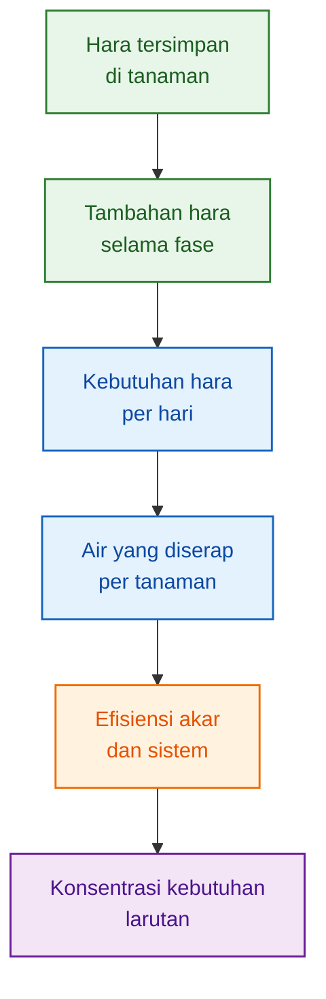

Kesimpulan Bab 4:

$$
\boxed{
konsentrasi\ larutan
tidak\ hanya\ ditentukan\ oleh\ kebutuhan\ hara,
tetapi\ juga\ oleh\ air\ yang\ diserap\ dan\ efisiensi\ akar
}
$$

Namun konsentrasi kebutuhan belum tentu menjadi konsentrasi final. Sebab akar punya batas respons. Setelah titik tertentu, menambah konsentrasi tidak lagi memberi tambahan hasil yang berarti.

[**Kembali ke Atas**](#model-formula-hara-cabai-berbasis-laju-serapan-dan-batas-jenuh-respons-per-fase-organ)

---

# 5. Respons Akar dan Batas Jenuh Hara

## 5.1 Lebih Pekat Tidak Selalu Lebih Baik

Dalam hidroponik dan fertigasi, kesalahan umum adalah menganggap bahwa kalau tanaman kurang respons, larutan harus dibuat lebih pekat.

Kadang benar, tetapi sering juga salah.

Akar tidak menyerap hara secara tak terbatas. Pada konsentrasi rendah, penambahan hara bisa meningkatkan serapan. Tetapi setelah titik tertentu, akar mulai mendekati kapasitasnya. Saat itu, larutan yang lebih pekat hanya memberi tambahan respons kecil, bahkan bisa memicu stres atau ketidakseimbangan hara.

Pola responsnya dapat dibagi menjadi tiga zona:

| Zona    | Kondisi                                           | Makna lapangan                       |
| ------- | ------------------------------------------------- | ------------------------------------ |
| Kurang  | konsentrasi terlalu rendah                        | tanaman bisa defisiensi              |
| Efektif | konsentrasi cukup                                 | respons tanaman masih baik           |
| Jenuh   | konsentrasi terlalu tinggi untuk respons tambahan | tambah hara, hasil hampir tidak naik |

Pesan utamanya:

> Target nutrisi sebaiknya berada di zona efektif, bukan mengejar zona paling pekat.

---

## 5.2 Cara Membaca Respons Akar

Secara teknis, respons serapan akar dapat ditulis:

$$
\boxed{
S_j(C_j,t) =
S_{max,j}(t)
\frac{C_j}
{K_{m,j}(t)+C_j}
}
$$

Untuk pembaca lapangan, tidak perlu terpaku pada nama variabelnya. Baca maknanya saja:

$$
\boxed{
serapan\ hara
naik\ saat\ konsentrasi\ naik,
tetapi\ kenaikannya\ makin\ lama\ makin\ melambat
}
$$

Artinya, respons akar seperti kurva yang awalnya naik cepat, lalu mulai mendatar.

Jika konsentrasi masih rendah, penambahan hara terasa besar efeknya. Tetapi jika konsentrasi sudah tinggi, penambahan hara tidak lagi memberi hasil sebanding.

Secara sederhana:

$$
\boxed{
ppm\ naik
\neq
serapan\ naik\ terus
}
$$

---

## 5.3 Respons Relatif: Membaca Titik Efektif

Agar mudah memahami titik jenuh, kita gunakan konsep respons relatif.

Secara teknis:

$$
\boxed{
R_j(C_j) =
\frac{C_j}
{K_{m,j}+C_j}
}
$$

Secara praktis, rumus ini membaca:

$$
\boxed{
berapa\ persen\ respons\ serapan\ dibanding\ kemampuan\ maksimum\ akar
}
$$

Contohnya:

| Respons relatif | Makna praktis                                |
| --------------: | -------------------------------------------- |
|             50% | akar baru mencapai setengah respons maksimum |
|             90% | respons sudah sangat tinggi                  |
|             95% | respons hampir maksimum                      |
|            >95% | tambahan konsentrasi biasanya kurang efisien |

Jadi, jika suatu unsur sudah berada di respons 90–95%, menambah konsentrasi lagi biasanya tidak banyak membantu.

---

## 5.4 Titik Jenuh Praktis

Dalam model ini, titik jenuh praktis dibaca pada respons 90–95%.

Untuk respons 90%:

$$
\boxed{
C_{90,j}=9K_{m,j}
}
$$

Untuk respons 95%:

$$
\boxed{
C_{95,j}=19K_{m,j}
}
$$

Agar tidak terlalu akademis, cukup pahami begini:

| Titik       | Arti lapangan                                  |
| ----------- | ---------------------------------------------- |
| 50% respons | tanaman masih sangat merespons penambahan hara |
| 90% respons | tanaman sudah mendekati respons maksimum       |
| 95% respons | tambahan hara mulai sangat tidak efisien       |

Maka batas jenuh praktis berada di sekitar:

$$
\boxed{
90\%-95\%\ respons
}
$$

Di atas itu, menaikkan konsentrasi lebih sering memperbesar risiko dibanding memperbesar hasil.

---

## 5.5 Batas Jenuh Bukan Keracunan

Ini perlu ditegaskan.

$$
\boxed{
jenuh\ bukan\ toksik
}
$$

Batas jenuh adalah titik ketika tanaman **hampir tidak memberi respons tambahan** walaupun konsentrasi dinaikkan.

Batas toksik adalah titik ketika konsentrasi mulai merusak tanaman.

Urutannya:

$$
\boxed{
minimum
<
optimal
<
jenuh
<
toksik
}
$$

Atau secara teknis:

$$
\boxed{
C_{min}<C_{opt}<C_{sat}<C_{tox}
}
$$

Bahasa lapangannya:

| Zona    | Makna                              |
| ------- | ---------------------------------- |
| Minimum | cukup untuk mencegah defisiensi    |
| Optimal | tanaman merespons baik             |
| Jenuh   | tambahan hara hampir tidak berguna |
| Toksik  | tanaman mulai terganggu            |

Kesalahan yang harus dihindari:

> Mengira bahwa selama belum toksik, konsentrasi masih layak dinaikkan.

Padahal sebelum toksik, tanaman bisa sudah melewati titik jenuh. Di fase ini, tambahan hara tidak efisien dan bisa memicu antagonisme.

---

## 5.6 Visualisasi Zona Respons Hara

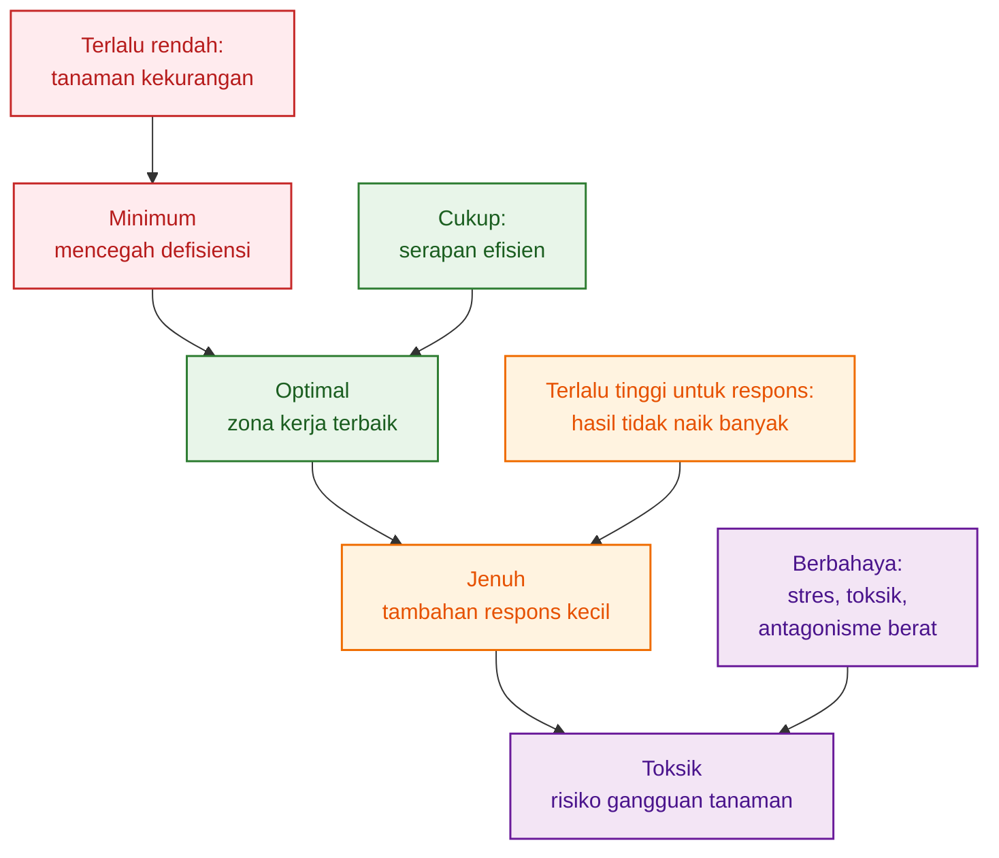

Kesimpulan Bab 5:

$$
\boxed{
batas\ jenuh\ adalah\ batas\ efisiensi,
bukan\ batas\ keracunan
}
$$

Jika larutan sudah mendekati zona jenuh, perbaikan sebaiknya tidak langsung menaikkan ppm. Cek dulu:

- akar,
- air,
- pH,
- EC,
- suhu larutan,
- oksigen,
- drainase,
- dan keseimbangan antarhara.

[**Kembali ke Atas**](#model-formula-hara-cabai-berbasis-laju-serapan-dan-batas-jenuh-respons-per-fase-organ)

---

# 6. Batas Jenuh per Unsur dan Fase Organ

## 6.1 Tidak Semua Unsur Punya Respons yang Sama

N, P, K, Ca, dan Mg tidak bisa diperlakukan sama. Masing-masing punya fungsi berbeda, masuk ke organ berbeda, dan bisa mencapai titik jenuh pada kondisi yang berbeda.

Karena itu, formula yang hanya menaikkan semua unsur secara bersamaan tidak tajam.

Prinsipnya:

$$
\boxed{
setiap\ unsur\ punya\ batas\ efektifnya\ sendiri
}
$$

Secara teknis:

$$
\boxed{
C_{sat,N}\neq C_{sat,P}\neq C_{sat,K}\neq C_{sat,Ca}\neq C_{sat,Mg}
}
$$

Namun untuk praktisi, cukup pahami:

> N, P, K, Ca, dan Mg tidak selalu perlu dinaikkan bersama-sama. Lihat unsur mana yang benar-benar dibutuhkan, dan unsur mana yang sudah mendekati jenuh.

---

## 6.2 Nitrogen: Penting, tetapi Jangan Berlebihan

Nitrogen penting untuk:

- daun,
- tajuk,
- klorofil,
- protein,
- pertumbuhan vegetatif.

Pada fase vegetatif, N sangat penting karena tanaman sedang membangun daun dan batang.

Tetapi saat tanaman sudah masuk pembesaran buah, N tetap perlu dikendalikan. Jika terlalu tinggi, tanaman bisa terlalu rimbun, tajuk terlalu kuat, dan alokasi ke buah terganggu.

Bahasa lapangannya:

> N harus cukup untuk menjaga daun tetap aktif, tetapi jangan sampai tanaman sibuk membuat daun saat seharusnya mengisi buah.

Prinsipnya:

$$
\boxed{
N\ cukup\ untuk\ source,
tetapi\ tidak\ mendorong\ vegetatif\ berlebihan
}
$$

---

## 6.3 Fosfor: Sedikit, tetapi Tetap Penting

Fosfor biasanya dibutuhkan dalam jumlah lebih kecil dibanding N dan K. Namun P tetap penting untuk:

- akar,
- energi,
- pembelahan sel,
- pembungaan awal,
- metabolisme.

Kesalahan umum adalah dua ekstrem:

1. mengabaikan P karena jumlahnya kecil;
2. menaikkan P terlalu tinggi karena dianggap penting untuk akar dan bunga.

Keduanya kurang tepat.

Bahasa lapangannya:

> P memang kecil secara jumlah, tetapi tidak boleh diabaikan. Namun P juga tidak perlu tinggi tanpa alasan.

Prinsipnya:

$$
\boxed{
P\ penting
\neq
P\ harus\ tinggi
}
$$

---

## 6.4 Kalium: Penting untuk Buah, tetapi Harus Seimbang

Kalium sangat penting untuk:

- pengaturan air,
- stomata,
- transport gula,
- pengisian buah,
- kualitas buah.

Saat buah mulai menjadi organ utama, K biasanya naik perannya. Tetapi K juga harus dikendalikan karena bisa menekan Ca dan Mg.

Jika K terlalu dominan, risiko yang muncul:

- Ca menjadi kurang efektif,
- Mg tertekan,
- daun bisa menunjukkan gejala kekurangan Mg,
- jaringan buah bisa bermasalah karena Ca tidak terdistribusi baik,
- keseimbangan K:Ca:Mg terganggu.

Bahasa lapangannya:

> K penting untuk buah, tetapi K yang terlalu dominan bisa membuat Ca dan Mg kalah.

Prinsipnya:

$$
\boxed{
K\ tinggi\ harus\ tetap\ seimbang\ dengan\ Ca\ dan\ Mg
}
$$

---

## 6.5 Kalsium: Bukan Hanya Soal Ada di Larutan

Kalsium penting untuk:

- dinding sel,
- kekuatan jaringan,
- pucuk muda,
- kualitas buah,
- stabilitas jaringan.

Namun Ca berbeda dari K. Kalsium tidak mudah dipindahkan ulang di dalam tanaman. Ca banyak bergerak mengikuti aliran air dan transpirasi.

Karena itu, menaikkan Ca di larutan belum tentu otomatis membuat Ca sampai ke buah.

Distribusi Ca dipengaruhi oleh:

- akar sehat atau tidak,
- air terserap cukup atau tidak,
- kelembapan udara,
- VPD,
- transpirasi,
- suhu akar,
- K terlalu tinggi atau tidak,
- NH₄ terlalu tinggi atau tidak.

Bahasa lapangannya:

> Masalah Ca sering bukan hanya “Ca kurang”, tetapi “Ca tidak sampai ke organ yang membutuhkan”.

Prinsipnya:

$$
\boxed{
Ca\ adalah\ masalah\ konsentrasi\ dan\ distribusi
}
$$

---

## 6.6 Magnesium: Menjaga Daun Tetap Menjadi Mesin Fotosintesis

Magnesium penting untuk:

- klorofil,
- fotosintesis,
- enzim,
- daun aktif.

Saat fase buah, perhatian sering tertuju ke K. Itu wajar, karena buah memang membutuhkan K. Tetapi buah tidak mengisi dirinya sendiri. Buah membutuhkan hasil fotosintesis dari daun.

Jika Mg kurang, daun melemah. Jika daun melemah, buah juga terganggu.

Bahasa lapangannya:

> Buah adalah tujuan, tetapi daun adalah pabriknya. Mg menjaga pabrik itu tetap bekerja.

Prinsipnya:

$$
\boxed{
buah\ sebagai\ sink
tetap\ bergantung\ pada\ daun\ sebagai\ source
}
$$

Karena itu, saat K naik, Mg harus tetap dijaga.

---

## 6.7 Titik Jenuh Juga Dipengaruhi Organ yang Sedang Dominan

Batas jenuh tidak hanya berbeda antarunsur. Batas itu juga dipengaruhi fase tanaman.

Fase berbeda berarti organ dominan juga berbeda.

| Fase            | Organ dominan       | Implikasi nutrisi                         |
| --------------- | ------------------- | ----------------------------------------- |
| Establishment   | akar dan daun muda  | jangan terlalu pekat, akar masih sensitif |
| Vegetatif       | daun dan batang     | N, Ca, Mg penting                         |
| Generatif awal  | bunga dan buah muda | transisi, K dan Ca mulai kritis           |
| Pembesaran buah | buah                | K penting, tetapi Ca dan Mg tetap dijaga  |
| Panen intensif  | buah + daun aktif   | keseimbangan buah dan tajuk               |

Secara teknis, dominansi organ dapat dihitung:

$$
\boxed{
\omega_{o,\phi} =
\frac{\Delta W_o}
{\sum_o \Delta W_o}
}
$$

Untuk praktisi, artinya sederhana:

$$
\boxed{
\text{organ dominan} = \text{organ yang paling banyak bertambah pada fase itu}
}
$$

Jika buah paling banyak bertambah, maka fase itu didominasi buah. Jika daun dan batang paling banyak bertambah, fase itu didominasi tajuk.

---

## 6.8 Respons Fase-Organ

Secara teknis, respons hara per fase dapat ditulis:

$$
\boxed{
R_{j,\phi}(C_j) =
\sum_o
\omega_{o,\phi}
\frac{C_j}
{K_{m,j,o}+C_j}
}
$$

Namun untuk artikel praktisi, makna utamanya adalah:

$$
\boxed{
respons\ hara\ harus\ dibaca\ sesuai\ organ\ yang\ sedang\ tumbuh
}
$$

Contoh:

- kalau fase didominasi daun, maka respons N, Ca, dan Mg pada daun penting;
- kalau fase didominasi buah, maka K penting, tetapi Ca dan Mg tetap tidak boleh jatuh;
- kalau fase establishment, akar masih sensitif, sehingga larutan terlalu pekat bisa merugikan.

Jadi, titik jenuh tidak boleh dibaca sebagai angka tunggal untuk semua fase.

---

## 6.9 Visualisasi Hubungan Unsur, Organ, dan Batas Jenuh

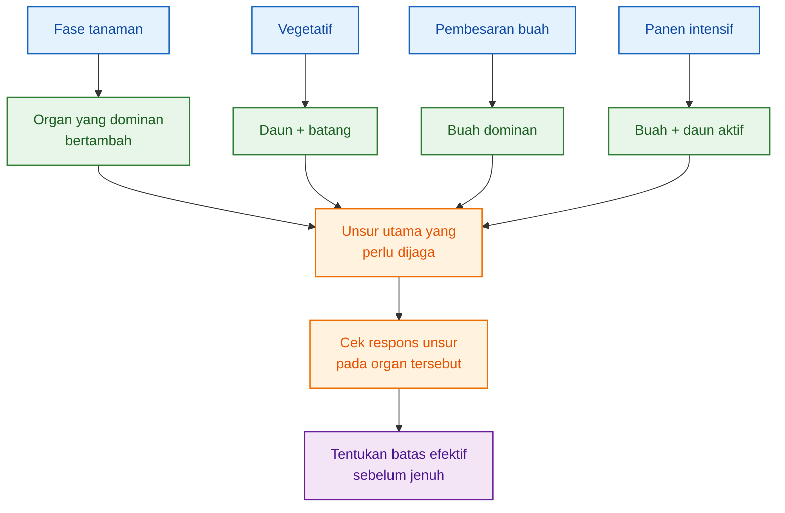

Diagram ini menegaskan bahwa batas jenuh harus dibaca dari kombinasi:

$$
\boxed{
fase +
organ\ dominan +
unsur\ hara
}
$$

Bukan dari ppm umum yang dipakai sama sepanjang musim.

---

## 6.10 Kesimpulan Bab 6

Setiap unsur punya peran dan batas efektif yang berbeda.

- N menjaga tajuk, tetapi bisa berlebihan saat buah dominan.
- P kecil secara jumlah, tetapi penting untuk akar, energi, dan fase generatif.
- K penting untuk buah, tetapi bisa menekan Ca dan Mg.
- Ca penting untuk jaringan, tetapi distribusinya sangat dipengaruhi air dan transpirasi.
- Mg menjaga daun tetap aktif sebagai mesin fotosintesis.

Karena itu, formula nutrisi tidak cukup hanya bertanya:

> Berapa konsentrasi yang dibutuhkan?

Tetapi juga harus bertanya:

> Apakah konsentrasi itu masih berada di zona respons efektif, atau sudah melewati batas jenuh?

Kesimpulan tajamnya:

$$
\boxed{
konsentrasi\ yang\ cukup
belum\ tentu\ tepat
jika\ sudah\ melewati\ titik\ jenuh
}
$$

Bab berikutnya menyusun semua prinsip ini menjadi formula utama:

$$
\boxed{
target\ konsentrasi\ hara
}
$$

atau secara teknis:

$$
\boxed{
C_{target,j,\phi}
}
$$

[**Kembali ke Atas**](#model-formula-hara-cabai-berbasis-laju-serapan-dan-batas-jenuh-respons-per-fase-organ)

---

# 7. Formula Target Konsentrasi N, P, K, Ca, Mg

Bab ini adalah inti artikel.

Sampai titik ini, kita sudah punya tiga informasi penting:

1. **berapa hara yang dibutuhkan tanaman per hari**;
2. **berapa air yang diserap tanaman per hari**;
3. **batas kapan tambahan hara tidak lagi memberi respons berarti**.

Sekarang ketiganya digabung menjadi satu pertanyaan praktis:

> Berapa konsentrasi N, P, K, Ca, dan Mg yang sebaiknya tersedia di larutan pada fase tertentu?

Jawaban artikel ini bukan:

> Buat larutan setinggi mungkin.

Tetapi:

> Buat larutan yang cukup, efektif, dan tidak melewati batas jenuh respons tanaman.

---

## 7.1 Inti Formula Target

Pada Bab 4, kita sudah menghitung **konsentrasi kebutuhan**:

$$
\boxed{
C_{req,j,\phi} =
\frac{\bar{U}_{j,\phi}}
{\bar{Q}_{w,\phi}\eta_{j,\phi}}
}
$$

Agar mudah dibaca, artinya:

$$
\boxed{
konsentrasi\ kebutuhan =
\frac{
kebutuhan\ hara\ per\ hari
}
{
air\ yang\ diserap
\times
efisiensi\ serapan
}
}
$$

Tetapi angka ini belum boleh langsung menjadi target akhir.

Mengapa?

Karena konsentrasi harus tetap dibatasi oleh tiga pagar:

1. **jangan terlalu rendah**, agar tidak defisiensi;
2. **jangan melewati batas jenuh**, karena tambahan hara sudah tidak efisien;
3. **jangan mendekati toksik**, agar tanaman tidak stres.

Maka formula targetnya adalah:

$$
\boxed{
C_{target,j,\phi} =
\min
\left[
C_{sat,j,\phi},
C_{tox,j}-m_j,
\max(C_{min,j},C_{req,j,\phi})
\right]
}
$$

Agar lebih mudah, baca seperti ini:

$$
\boxed{
\text{target konsentrasi} = \text{angka kebutuhan yang cukup, aman, dan tidak melewati batas jenuh}
}
$$

Keterangan praktis:

| Simbol teknis       | Bahasa lapangan                                            |
| ------------------- | ---------------------------------------------------------- |
| $C_{target,j,\phi}$ | target konsentrasi unsur pada fase tertentu                |
| $C_{req,j,\phi}$    | konsentrasi yang dibutuhkan dari hitungan kebutuhan harian |
| $C_{min,j}$         | batas bawah agar tidak defisiensi                          |
| $C_{sat,j,\phi}$    | batas jenuh; di atas ini tambahan hara kurang respons      |
| $C_{tox,j}$         | batas risiko toksik                                        |
| $m_j$               | jarak aman dari batas toksik                               |
| $j$                 | unsur: N, P, K, Ca, Mg                                     |
| $\phi$              | fase tanaman                                               |

Alurnya:

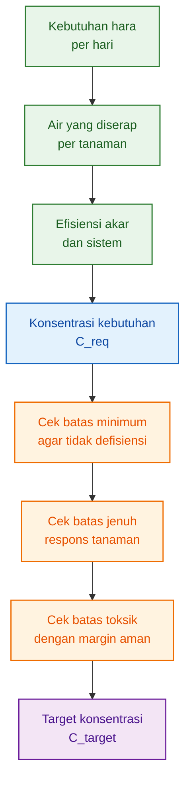

Pesan praktisnya:

> Konsentrasi target bukan sekadar hasil hitung kebutuhan, tetapi hasil keputusan antara kebutuhan, batas minimum, batas jenuh, dan batas aman.

---

## 7.2 Cara Membaca `min` dan `max`

Rumus di atas tampak akademis karena ada `min` dan `max`. Padahal logikanya sederhana.

Bagian ini:

$$
\boxed{
\max(C_{min,j},C_{req,j,\phi})
}
$$

artinya:

> Ambil angka yang lebih besar antara batas minimum dan kebutuhan hitung.

Tujuannya agar konsentrasi tidak terlalu rendah.

Jika hasil hitung kebutuhan lebih rendah dari batas minimum, tetap gunakan batas minimum.

Contoh:

$$
C_{req}=40\ mg/L
$$

$$
C_{min}=60\ mg/L
$$

maka:

$$
\boxed{
target\ awal=60\ mg/L
}
$$

Karena kalau pakai 40 mg/L, tanaman berisiko kekurangan.

Bagian berikutnya:

$$
\boxed{
\min
\left[
C_{sat,j,\phi},
C_{tox,j}-m_j,
...
\right]
}
$$

artinya:

> Ambil angka yang paling aman dari batas jenuh dan batas toksik.

Tujuannya agar konsentrasi tidak terlalu tinggi.

Jadi, cara kerja rumus ini adalah:

$$
\boxed{
jaga\ dari\ bawah,
batasi\ dari\ atas
}
$$

Ringkasnya:

| Kondisi                                | Keputusan                |
| -------------------------------------- | ------------------------ |
| kebutuhan hitung terlalu rendah        | naikkan ke batas minimum |
| kebutuhan hitung masih di zona efektif | pakai angka kebutuhan    |
| kebutuhan hitung melewati batas jenuh  | batasi di batas jenuh    |
| kebutuhan hitung mendekati toksik      | batasi di zona aman      |

---

## 7.3 Tiga Zona Keputusan

Formula ini bisa dibaca melalui tiga zona.

### Zona 1 — Terlalu Rendah

Jika:

$$
\boxed{
C_{req,j,\phi}<C_{min,j}
}
$$

maka konsentrasi hasil hitung terlalu rendah.

Keputusan:

$$
\boxed{
C_{target,j,\phi}=C_{min,j}
}
$$

Makna lapangan:

> Walaupun kebutuhan fase tampak rendah, unsur tetap harus tersedia minimal agar tanaman tidak defisiensi.

Contoh: P atau Mg bisa tampak kecil secara jumlah, tetapi tetap tidak boleh kosong atau terlalu rendah.

---

### Zona 2 — Zona Efektif

Jika:

$$
\boxed{
C_{min,j}\leq C_{req,j,\phi}\leq C_{sat,j,\phi}
}
$$

maka kebutuhan masih berada di zona efektif.

Keputusan:

$$
\boxed{
C_{target,j,\phi}=C_{req,j,\phi}
}
$$

Makna lapangan:

> Angka hasil hitung boleh dipakai karena masih berada dalam rentang yang tanaman respons dengan baik.

Ini zona terbaik.

---

### Zona 3 — Melewati Batas Jenuh

Jika:

$$
\boxed{
C_{req,j,\phi}>C_{sat,j,\phi}
}
$$

maka kebutuhan hitung sudah melewati batas efektif.

Keputusan:

$$
\boxed{
C_{target,j,\phi}=C_{sat,j,\phi}
}
$$

atau jika batas toksik aman lebih rendah:

$$
\boxed{
C_{target,j,\phi}=C_{tox,j}-m_j
}
$$

Makna lapangan:

> Jangan langsung menaikkan ppm. Tanaman mungkin sudah tidak mampu merespons tambahan konsentrasi.

Pada kondisi ini, yang harus diperiksa adalah:

- akar,
- serapan air,
- pH,
- EC,
- suhu larutan,
- oksigen,
- antagonisme hara,
- drainase,
- dan kondisi lingkungan.

---

## 7.4 Target Konsentrasi per Fase

Dalam satu fase, kita tidak hanya menghitung satu unsur. Kita menghitung lima unsur utama:

$$
\boxed{
N,\ P,\ K,\ Ca,\ Mg
}
$$

Maka formula fase ditulis sebagai:

$$
\boxed{
\mathbf{C}_{target,\phi} =
[
C_{N,\phi},
C_{P,\phi},
C_{K,\phi},
C_{Ca,\phi},
C_{Mg,\phi}
]
}
$$

Baca sederhananya:

$$
\boxed{
formula\ fase =
[
target\ N,
target\ P,
target\ K,
target\ Ca,
target\ Mg
]
}
$$

Contoh bahasa lapangan:

| Unsur | Pertanyaan yang dijawab                                         |
| ----- | --------------------------------------------------------------- |
| N     | berapa N agar daun tetap aktif, tetapi tidak terlalu vegetatif? |
| P     | berapa P yang cukup untuk akar, energi, dan bunga?              |
| K     | berapa K untuk buah tanpa menekan Ca dan Mg?                    |
| Ca    | berapa Ca yang cukup dan masih bisa terdistribusi?              |
| Mg    | berapa Mg agar daun tetap kuat berfotosintesis?                 |

Jadi keluaran Bab 7 bukan resep pupuk A-B, tetapi **target unsur**.

Resep pupuk teknis masih membutuhkan tahap lain: memilih garam pupuk, menghitung kandungan unsur, memisahkan larutan A dan B, serta menyesuaikan air baku.

---

## 7.5 Formula Target Nitrogen

Untuk nitrogen:

$$
\boxed{
C_{target,N,\phi} =
\min
\left[
C_{sat,N,\phi},
C_{tox,N}-m_N,
\max(C_{min,N},C_{req,N,\phi})
\right]
}
$$

Dengan:

$$
\boxed{
C_{req,N,\phi} =
\frac{\bar{U}_{N,\phi}}
{\bar{Q}_{w,\phi}\eta_{N,\phi}}
}
$$

Makna praktisnya:

- N diperlukan untuk daun, klorofil, protein, dan tajuk.
- Pada fase vegetatif, N sangat penting.
- Pada fase buah, N tetap perlu, tetapi tidak boleh mendorong tanaman terlalu vegetatif.

Prinsip lapangan:

$$
\boxed{
N\ harus\ cukup\ untuk\ menjaga\ daun,
tetapi\ jangan\ berlebih\ sampai\ tanaman\ sibuk\ membuat\ tajuk
}
$$

Jika tanaman terlalu rimbun, ruas panjang, bunga mudah rontok, atau buah lambat mengisi, target N perlu dievaluasi.

---

## 7.6 Formula Target Fosfor

Untuk fosfor:

$$
\boxed{
C_{target,P,\phi} =
\min
\left[
C_{sat,P,\phi},
C_{tox,P}-m_P,
\max(C_{min,P},C_{req,P,\phi})
\right]
}
$$

Dengan:

$$
\boxed{
C_{req,P,\phi} =
\frac{\bar{U}_{P,\phi}}
{\bar{Q}_{w,\phi}\eta_{P,\phi}}
}
$$

Makna praktisnya:

- P penting untuk akar, energi, pembelahan sel, dan pembungaan awal.
- Kebutuhan P secara jumlah biasanya lebih kecil dari N dan K.
- P tidak perlu dinaikkan tinggi tanpa alasan.

Prinsip lapangan:

$$
\boxed{
P\ kecil\ bukan\ berarti\ tidak\ penting,
tetapi\ P\ penting\ bukan\ berarti\ harus\ tinggi
}
$$

Jika P sudah cukup, menaikkannya lagi belum tentu membuat akar atau bunga bertambah lebih baik.

---

## 7.7 Formula Target Kalium

Untuk kalium:

$$
\boxed{
C_{target,K,\phi} =
\min
\left[
C_{sat,K,\phi},
C_{tox,K}-m_K,
\max(C_{min,K},C_{req,K,\phi})
\right]
}
$$

Dengan:

$$
\boxed{
C_{req,K,\phi} =
\frac{\bar{U}_{K,\phi}}
{\bar{Q}_{w,\phi}\eta_{K,\phi}}
}
$$

Makna praktisnya:

- K penting untuk stomata, keseimbangan air, transport gula, dan pengisian buah.
- Saat buah mulai dominan, kebutuhan K biasanya meningkat.
- Tetapi K tidak boleh dinaikkan tanpa melihat Ca dan Mg.

Prinsip lapangan:

$$
\boxed{
K\ penting\ untuk\ buah,
tetapi\ K\ terlalu\ dominan\ bisa\ membuat\ Ca\ dan\ Mg\ kalah
}
$$

Jika K terlalu tinggi, tanaman bisa terlihat “cukup pupuk”, tetapi Ca dan Mg menjadi tidak efektif. Akibatnya, kualitas jaringan dan daun bisa terganggu.

---

## 7.8 Formula Target Kalsium

Untuk kalsium:

$$
\boxed{
C_{target,Ca,\phi} =
\min
\left[
C_{sat,Ca,\phi},
C_{tox,Ca}-m_{Ca},
\max(C_{min,Ca},C_{req,Ca,\phi})
\right]
}
$$

Dengan:

$$
\boxed{
C_{req,Ca,\phi} =
\frac{\bar{U}_{Ca,\phi}}
{\bar{Q}_{w,\phi}\eta_{Ca,\phi}}
}
$$

Makna praktisnya:

- Ca penting untuk dinding sel, jaringan muda, pucuk, dan kualitas buah.
- Ca tidak mudah dipindahkan ulang di dalam tanaman.
- Ca sangat bergantung pada aliran air dan transpirasi.

Jadi, jika Ca bermasalah, penyebabnya belum tentu Ca di larutan kurang.

Bisa jadi:

- akar tidak sehat,
- air tidak cukup masuk,
- VPD tidak sesuai,
- kelembapan terlalu tinggi,
- K terlalu dominan,
- NH₄ terlalu tinggi,
- atau distribusi Ca ke buah lemah.

Prinsip lapangan:

$$
\boxed{
Ca\ bukan\ hanya\ soal\ konsentrasi,
tetapi\ juga\ soal\ distribusi
}
$$

Menaikkan Ca di larutan belum tentu efektif jika aliran air dan akar tidak mendukung.

---

## 7.9 Formula Target Magnesium

Untuk magnesium:

$$
\boxed{
C_{target,Mg,\phi} =
\min
\left[
C_{sat,Mg,\phi},
C_{tox,Mg}-m_{Mg},
\max(C_{min,Mg},C_{req,Mg,\phi})
\right]
}
$$

Dengan:

$$
\boxed{
C_{req,Mg,\phi} =
\frac{\bar{U}_{Mg,\phi}}
{\bar{Q}_{w,\phi}\eta_{Mg,\phi}}
}
$$

Makna praktisnya:

- Mg penting untuk klorofil.
- Mg menjaga daun tetap aktif berfotosintesis.
- Mg dapat terganggu jika K terlalu tinggi.

Saat tanaman berbuah, Mg tetap penting. Buah membutuhkan hasil fotosintesis, dan fotosintesis berlangsung di daun.

Prinsip lapangan:

$$
\boxed{
buah\ adalah\ tujuan,
tetapi\ daun\ adalah\ pabriknya
}
$$

Mg menjaga pabrik itu tetap bekerja.

---

## 7.10 Ringkasan Formula per Unsur

| Unsur | Fungsi utama                                     | Catatan praktis                                            |
| ----- | ------------------------------------------------ | ---------------------------------------------------------- |
| N     | daun, tajuk, klorofil, protein                   | cukup, tetapi jangan berlebih saat buah dominan            |
| P     | akar, energi, pembelahan sel, bunga awal         | kecil secara jumlah, tetapi tetap penting                  |
| K     | air, stomata, transport gula, buah               | penting untuk buah, tetapi harus seimbang dengan Ca dan Mg |
| Ca    | dinding sel, pucuk, jaringan muda, kualitas buah | masalah Ca sering soal distribusi, bukan hanya konsentrasi |
| Mg    | klorofil, fotosintesis, daun aktif               | penting agar daun tetap menjadi source                     |

Tabel ini membantu pembaca lapangan memahami bahwa formula target tidak boleh dibaca sebagai “semua unsur dinaikkan bersama”.

Setiap unsur harus punya alasan.

---

## 7.11 Contoh Perhitungan Satu Unsur

Misalnya pada fase pembesaran buah, kebutuhan K adalah:

$$
50\ mg/tanaman/hari
$$

Serapan air:

$$
0.5\ L/tanaman/hari
$$

Efisiensi serapan K:

$$
80\%
$$

Maka konsentrasi kebutuhan K:

$$
C_{req,K} =
\frac{50}{0.5\times0.8}
$$

$$
C_{req,K} = 125\ \text{mg/L}
$$

Misalnya batas minimum K:

$$
C_{min,K}=80\ mg/L
$$

batas jenuh K:

$$
C_{sat,K}=160\ mg/L
$$

batas toksik aman:

$$
C_{tox,K}-m_K=220\ mg/L
$$

Maka:

$$
C_{target,K} =
\min
[
160,\ 220,\ \max(80,\ 125)
]
$$

Langkahnya:

$$
\max(80,\ 125)=125
$$

lalu:

$$
\min(160,\ 220,\ 125)=125
$$

Jadi:

$$
\boxed{
C_{target,K}=125\ mg/L
}
$$

Artinya, target K 125 mg/L masih berada dalam zona efektif.

---

## 7.12 Jika Kebutuhan Melebihi Batas Jenuh

Sekarang gunakan contoh lain.

Misalnya hasil hitung kebutuhan K:

$$
C_{req,K}=190\ mg/L
$$

Tetapi batas jenuh K:

$$
C_{sat,K}=160\ mg/L
$$

dan batas toksik aman:

$$
C_{tox,K}-m_K=220\ mg/L
$$

Maka:

$$
C_{target,K} =
\min
[
160,\ 220,\ \max(80,\ 190)
]
$$

Langkahnya:

$$
\max(80,\ 190)=190
$$

lalu:

$$
\min(160,\ 220,\ 190)=160
$$

Jadi:

$$
\boxed{
C_{target,K}=160\ mg/L
}
$$

Artinya, target K dibatasi di 160 mg/L karena sudah mencapai batas jenuh.

Pesan penting:

> Kalau kebutuhan hitung lebih tinggi dari batas jenuh, jangan langsung menaikkan ppm. Cari pembatasnya.

Yang perlu dicek:

| Kemungkinan pembatas | Pertanyaan lapangan                        |
| -------------------- | ------------------------------------------ |
| Serapan air rendah   | apakah tanaman cukup minum?                |
| Akar lemah           | apakah akar putih aktif dan sehat?         |
| Oksigen rendah       | apakah larutan kurang aerasi?              |
| Suhu larutan tinggi  | apakah akar stres?                         |
| pH tidak sesuai      | apakah hara tersedia?                      |
| Antagonisme          | apakah K menekan Ca/Mg?                    |
| Beban buah tinggi    | apakah akar mampu mengejar kebutuhan buah? |
| Cahaya kurang        | apakah daun cukup menghasilkan asimilat?   |

Kondisi ini penting karena sering kali masalahnya bukan “pupuk kurang”, tetapi “tanaman tidak mampu menyerap lebih banyak”.

---

## 7.13 Status Formula Target

Formula Bab 7 menghasilkan:

$$
\boxed{
target\ konsentrasi\ unsur
}
$$

Bukan langsung:

$$
\boxed{
resep\ pupuk\ final
}
$$

Artinya, setelah target N, P, K, Ca, dan Mg diperoleh, masih ada tahap teknis berikutnya:

- memilih sumber pupuk,
- menghitung kandungan unsur,
- menyesuaikan kualitas air baku,
- memisahkan larutan A dan B,
- menghindari endapan Ca dengan fosfat/sulfat,
- menghitung EC total,
- menyesuaikan pH,
- mengecek drainase,
- dan mengoreksi antagonisme antarhara.

Jadi keluaran Bab 7 adalah **target unsur**, bukan langsung “sekian gram pupuk A dan B”.

---

## 7.14 Diagram Keputusan Formula Target

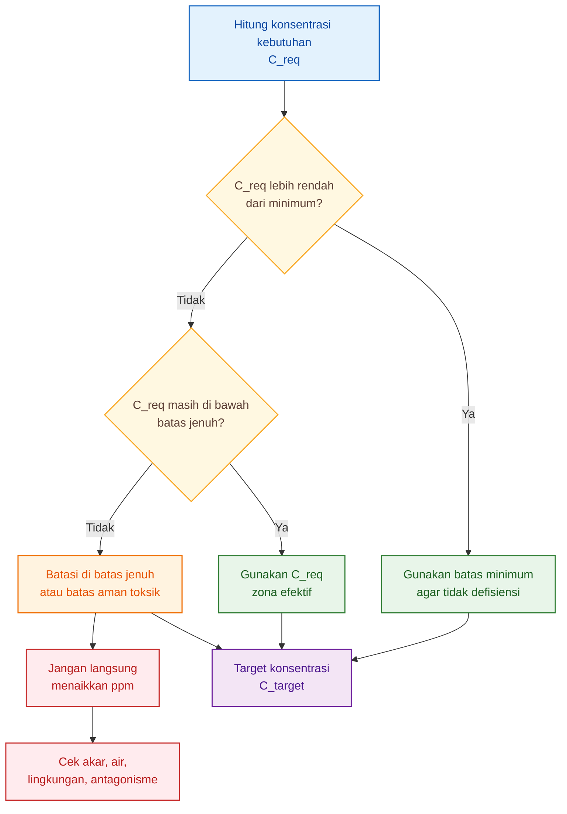

Diagram ini adalah cara praktis membaca Bab 7:

1. hitung kebutuhan;
2. pastikan tidak di bawah minimum;
3. pastikan tidak melewati jenuh;
4. jika melewati jenuh, cari penyebabnya;
5. baru tetapkan target.

---

## 7.15 Kesimpulan Bab 7

Rumus utama Bab 7 adalah:

$$
\boxed{
C_{target,j,\phi} =
\min
\left[
C_{sat,j,\phi},
C_{tox,j}-m_j,
\max(C_{min,j},C_{req,j,\phi})
\right]
}
$$

Dalam bahasa praktis:

$$
\boxed{
\text{target konsentrasi} = \text{cukup, tidak terlalu rendah, tidak melewati jenuh, dan tetap aman}
}
$$

Vektor formula fase:

$$
\boxed{
\mathbf{C}_{target,\phi} =
[
C_{N,\phi},
C_{P,\phi},
C_{K,\phi},
C_{Ca,\phi},
C_{Mg,\phi}
]
}
$$

Maknanya:

$$
\boxed{
\text{formula fase} = \text{target N, P, K, Ca, dan Mg}
}
$$

Kesimpulan tajam:

> Formula nutrisi yang presisi bukan yang paling pekat, tetapi yang paling sesuai dengan kebutuhan tanaman dan masih berada dalam zona respons efektif.

Bab berikutnya akan membahas mengapa target ini masih harus dikoreksi oleh keseimbangan antarhara, terutama:

$$
\boxed{
K:Ca:Mg
}
$$

dan:

$$
\boxed{
NH_4:NO_3
}
$$

[**Kembali ke Atas**](#model-formula-hara-cabai-berbasis-laju-serapan-dan-batas-jenuh-respons-per-fase-organ)

---

Berikut **Tahap 4 — Re-writing Bab 8–9** dengan gaya lebih praktis, tetap mempertahankan rumus inti, diagram, dan tautan internal.

---

# 8. Koreksi Antagonisme dan Unsur Pembatas

Bab 7 menghasilkan target konsentrasi awal untuk N, P, K, Ca, dan Mg.

Namun target itu belum final.

Mengapa?

Karena unsur hara tidak bekerja sendiri. Di larutan nutrisi, satu unsur bisa memengaruhi serapan unsur lain. Unsur yang terlalu dominan bisa membuat unsur lain menjadi kurang efektif, walaupun unsur tersebut sebenarnya tersedia di larutan.

Contoh paling penting pada cabai:

$$
\boxed{
K:Ca:Mg
}
$$

dan:

$$
\boxed{
NH_4:NO_3
}
$$

Bahasa lapangannya:

> Hara tidak hanya soal cukup atau kurang. Hara juga soal seimbang atau tidak.

Poin tajam Bab 8:

> Jika Ca menjadi pembatas, menaikkan K tidak menyelesaikan masalah.

---

## 8.1 Mengapa Target Konsentrasi Perlu Dikoreksi?

Pada Bab 7, kita menghitung:

$$
\boxed{
C_{target,N},\ C_{target,P},\ C_{target,K},\ C_{target,Ca},\ C_{target,Mg}
}
$$

Namun akar tidak menyerap N, P, K, Ca, dan Mg dalam ruang yang terpisah. Semua unsur berada dalam larutan yang sama, melewati zona akar yang sama, dan dapat saling memengaruhi.

Masalah lapangan yang sering terjadi:

| Kondisi larutan    | Risiko                               |
| ------------------ | ------------------------------------ |
| K terlalu tinggi   | Ca dan Mg bisa kalah                 |
| NH₄ terlalu tinggi | Ca, Mg, dan K bisa terganggu         |
| Ca terlalu tinggi  | Mg bisa tertekan                     |
| EC terlalu tinggi  | akar stres, serapan turun            |
| pH tidak tepat     | unsur tersedia, tetapi sulit diserap |

Jadi formula hara tidak cukup hanya bertanya:

> Berapa target tiap unsur?

Tetapi juga harus bertanya:

> Apakah unsur itu masih efektif diserap setelah bercampur dengan unsur lain?

---

## 8.2 K Tinggi Bisa Menekan Ca

Kalsium penting untuk jaringan muda, pucuk, dinding sel, dan kualitas buah. Tetapi Ca mudah kalah jika K terlalu dominan.

Secara teknis, efektivitas Ca dapat dikoreksi dengan faktor antagonisme:

$$
\boxed{
f_{ant,Ca} =
\frac{1}
{1+\alpha_K C_K+\alpha_{NH4}C_{NH4}}
}
$$

Untuk praktisi, maknanya seperti ini:

$$
\boxed{
semakin\ tinggi\ K\ atau\ NH_4,
semakin\ besar\ risiko\ Ca\ menjadi\ kurang\ efektif
}
$$

Keterangan praktis:

| Simbol teknis  | Bahasa lapangan                                   |
| -------------- | ------------------------------------------------- |
| $f_{ant,Ca}$   | tingkat efektivitas Ca setelah ditekan unsur lain |
| $C_K$          | konsentrasi K                                     |
| $C_{NH4}$      | konsentrasi amonium                               |
| $\alpha_K$     | kuatnya pengaruh K terhadap Ca                    |
| $\alpha_{NH4}$ | kuatnya pengaruh NH₄ terhadap Ca                  |

Nilai:

$$
\boxed{
0<f_{ant,Ca}\leq1
}
$$

Jika nilainya mendekati 1, Ca masih efektif.

Jika nilainya turun, Ca mulai terganggu.

Konsentrasi Ca efektif dapat dibaca sebagai:

$$
\boxed{
C'_{Ca,\phi} =
C_{target,Ca,\phi}
\times
f_{ant,Ca}
}
$$

Bahasa lapangannya:

> Ca di larutan belum tentu sama dengan Ca yang efektif dipakai tanaman.

Jika K terlalu dominan, tanaman bisa menunjukkan masalah Ca walaupun larutan mengandung Ca cukup.

---

## 8.3 K dan Ca Bisa Menekan Mg

Magnesium penting untuk klorofil dan fotosintesis. Namun Mg juga bisa kalah oleh K dan Ca jika keseimbangan kation tidak dijaga.

Secara teknis:

$$
\boxed{
f_{ant,Mg} =
\frac{1}
{1+\beta_K C_K+\beta_{Ca}C_{Ca}}
}
$$

Makna praktisnya:

$$
\boxed{
semakin\ dominan\ K\ atau\ Ca,
semakin\ besar\ risiko\ Mg\ menjadi\ kurang\ efektif
}
$$

Keterangan praktis:

| Simbol teknis | Bahasa lapangan                                   |
| ------------- | ------------------------------------------------- |
| $f_{ant,Mg}$  | tingkat efektivitas Mg setelah ditekan unsur lain |
| $C_K$         | konsentrasi K                                     |
| $C_{Ca}$      | konsentrasi Ca                                    |
| $\beta_K$     | kuatnya pengaruh K terhadap Mg                    |
| $\beta_{Ca}$  | kuatnya pengaruh Ca terhadap Mg                   |

Konsentrasi Mg efektif:

$$
\boxed{
C'_{Mg,\phi} =
C_{target,Mg,\phi}
\times
f_{ant,Mg}
}
$$

Bahasa lapangannya:

> Kalau daun menunjukkan gejala Mg rendah, penyebabnya belum tentu Mg kurang di larutan. Bisa jadi Mg kalah bersaing dengan K atau Ca.

Ini penting pada fase buah, karena petani sering menaikkan K untuk buah, tetapi lupa menjaga Mg agar daun tetap menjadi “pabrik fotosintesis”.

---

## 8.4 Konsentrasi Efektif, Bukan Sekadar Konsentrasi di Tandon

Secara umum, konsentrasi setelah koreksi antagonisme dapat ditulis:

$$
\boxed{
C'_{j,\phi} =
C_{target,j,\phi}
\times
f_{ant,j,\phi}
}
$$

Untuk praktisi, baca seperti ini:

$$
\boxed{
\text{konsentrasi efektif} = \text{target konsentrasi} \times \text{faktor keseimbangan}
}
$$

Jika:

$$
f_{ant}=1
$$

berarti unsur tersebut masih efektif.

Jika:

$$
f_{ant}=0.7
$$

berarti efektivitasnya turun. Walaupun angka di larutan tampak cukup, tanaman mungkin hanya “merasakan” sebagian.

Inilah alasan kenapa membaca nutrisi tidak cukup dari tandon saja. Perlu dilihat juga:

- gejala tanaman,
- daun,
- buah,
- akar,
- pH,
- EC,
- dan keseimbangan antarion.

---

## 8.5 Koreksi Tidak Selalu Berarti Menambah Unsur

Ini bagian penting.

Jika Ca kurang efektif, solusinya tidak selalu menambah Ca.

Jika Mg kurang efektif, solusinya tidak selalu menambah Mg.

Kadang yang perlu dilakukan adalah menurunkan unsur yang menekan.

Contoh:

| Gejala                            | Kemungkinan penyebab        | Koreksi yang lebih masuk akal       |
| --------------------------------- | --------------------------- | ----------------------------------- |
| Ca rendah di jaringan muda        | K terlalu tinggi            | turunkan dominasi K, seimbangkan Ca |
| Ca sulit masuk buah               | transpirasi atau akar lemah | cek akar, air, VPD, kelembapan      |
| Mg rendah di daun                 | K terlalu tinggi            | koreksi rasio K:Mg                  |
| Daun tetap lemah meski Mg cukup   | akar atau pH bermasalah     | cek pH, EC, akar, suhu larutan      |
| Buah tidak respons meski K tinggi | bukan K pembatas            | cek N, Mg, Ca, cahaya, akar         |

Prinsipnya:

$$
\boxed{
gejala\ kekurangan\ jaringan
\neq
selalu\ kekurangan\ konsentrasi\ larutan
}
$$

Kadang masalahnya adalah unsur tersebut kalah bersaing, tidak terdistribusi, atau akar tidak mampu menyerap.

---

## 8.6 Unsur Pembatas: Bottleneck Pertumbuhan

Tanaman tumbuh mengikuti unsur atau proses yang paling membatasi.

Jika N, P, K, dan Mg cukup, tetapi Ca bermasalah, maka pertumbuhan tetap bisa tertahan. Jika K tinggi tetapi Mg kurang, daun tidak optimal. Jika semua unsur cukup tetapi akar rusak, tanaman tetap tidak respons.

Secara teknis, respons fase dapat dibaca sebagai unsur dengan respons terendah:

$$
\boxed{
R_{\phi} =
\min
(
R_N,\ R_P,\ R_K,\ R_{Ca},\ R_{Mg}
)
}
$$

Bahasa praktisnya:

$$
\boxed{
respons\ tanaman
ditentukan\ oleh\ faktor\ yang\ paling\ membatasi
}
$$

Contoh:

| Unsur | Respons |
| ----- | ------: |
| N     |     90% |
| P     |     85% |
| K     |     92% |
| Ca    |     55% |
| Mg    |     80% |

Maka respons fase bukan 90%, tetapi:

$$
\boxed{
55\%
}
$$

Karena Ca menjadi pembatas.

Maka:

> Jika Ca menjadi pembatas, menaikkan K tidak menyelesaikan masalah.

Bahkan bisa memperburuk masalah jika K makin menekan Ca.

---

## 8.7 Ilustrasi Unsur Pembatas

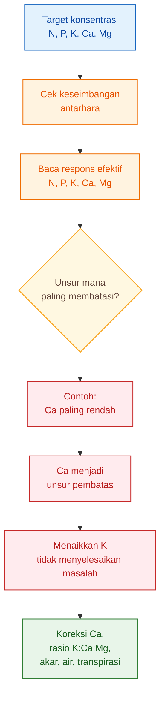

Diagram ini menunjukkan bahwa formula nutrisi harus mencari bottleneck, bukan hanya menaikkan unsur yang populer.

---

## 8.8 Alur Koreksi Setelah Target Konsentrasi

Setelah Bab 7 dan Bab 8 digabung, alur kerjanya menjadi:

$$
\boxed{
kebutuhan
\rightarrow
target
\rightarrow
koreksi\ keseimbangan
\rightarrow
cek\ unsur\ pembatas
}
$$

Secara teknis:

$$
\boxed{
C_{req}
\rightarrow
C_{target}
\rightarrow
C'
\rightarrow
R_{\phi}
}
$$

Artinya:

1. hitung kebutuhan konsentrasi dari kebutuhan harian tanaman;
2. batasi dengan minimum, jenuh, dan toksik;
3. koreksi oleh antagonisme hara;
4. cari unsur atau proses yang paling membatasi.

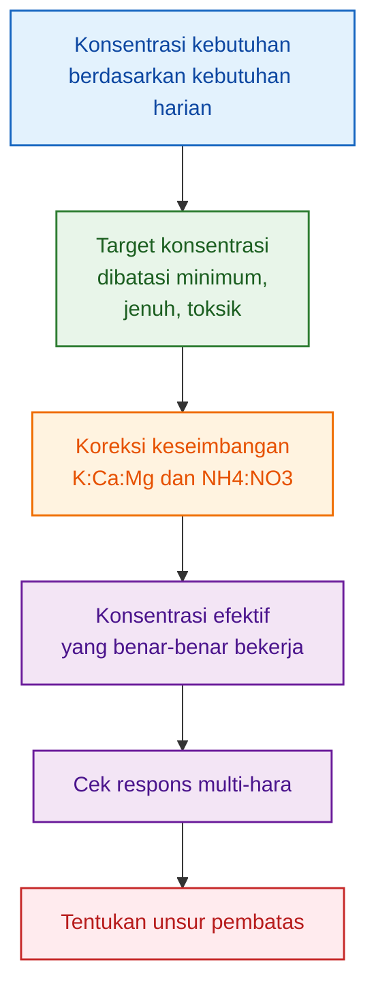

---

## 8.9 Kesimpulan Bab 8

Bab ini menegaskan bahwa target konsentrasi belum cukup jika dibaca per unsur secara terpisah.

Formula nutrisi harus mempertimbangkan keseimbangan:

$$
\boxed{
K:Ca:Mg
}
$$

dan:

$$
\boxed{
NH_4:NO_3
}
$$

Koreksi umumnya:

$$
\boxed{
C'_{j,\phi} =
C_{target,j,\phi}
\times
f_{ant,j,\phi}
}
$$

Makna praktisnya:

$$
\boxed{
yang\ penting\ bukan\ hanya\ hara\ tersedia,
tetapi\ hara\ itu\ efektif\ diserap
}
$$

Kesimpulan tajam:

> Menaikkan unsur yang bukan pembatas tidak memperbaiki respons tanaman.

Jika Ca menjadi pembatas, menaikkan K tidak menyelesaikan masalah. Jika Mg menjadi pembatas, menaikkan N tidak otomatis meningkatkan fotosintesis. Jika akar menjadi pembatas, menaikkan semua konsentrasi bisa membuat tanaman makin stres.

[**Kembali ke Atas**](#model-formula-hara-cabai-berbasis-laju-serapan-dan-batas-jenuh-respons-per-fase-organ)

---

# 9. Adaptasi untuk Lahan Tanah dan Strategi Pemupukan

Bab ini sengaja dibuat singkat dan terkendali.

Fokus utama artikel tetap **hidroponik dan fertigasi substrat**. Namun, karena cabai juga banyak ditanam di lahan tanah, perlu dijelaskan bagaimana model ini dibaca jika sistemnya bukan larutan hidroponik.

Poin utamanya:

> Lahan tanah bukan sistem larutan langsung. Tanah menyimpan, melepas, mengikat, dan kehilangan hara.

Karena itu, pada lahan tanah, output model bukan:

$$
\boxed{
C_{target}
}
$$

melainkan:

$$
\boxed{
F_{pupuk}
}
$$

atau secara teknis:

$$
\boxed{
F_{j,\phi}
}
$$

Artinya:

> Yang dicari bukan target konsentrasi larutan, tetapi kebutuhan pupuk per fase setelah dikoreksi oleh kondisi tanah.

---

## 9.1 Hidroponik dan Lahan Tanah Berbeda Cara Kerjanya

Pada hidroponik atau fertigasi substrat, hara bisa dikontrol langsung melalui larutan.

Maka pertanyaan utamanya:

> Berapa mg/L unsur yang perlu tersedia?

Pada lahan tanah, hara tidak bekerja sesederhana itu. Tanah punya daya simpan, daya lepas, dan daya ikat.

Maka pertanyaannya menjadi:

> Berapa pupuk yang perlu diberikan setelah memperhitungkan hara yang sudah ada di tanah?

Perbandingannya:

| Aspek            | Hidroponik / fertigasi         | Lahan tanah                            |
| ---------------- | ------------------------------ | -------------------------------------- |
| Output utama     | target konsentrasi larutan     | kebutuhan pupuk terkoreksi tanah       |
| Satuan umum      | mg/L, mmol/L, ppm              | kg/ha, g/tanaman                       |
| Pengendali utama | larutan nutrisi                | tanah + pupuk + air                    |
| Buffer hara      | rendah–sedang                  | sedang–tinggi                          |
| Risiko utama     | EC tinggi, jenuh, antagonisme  | pH, fiksasi, pencucian, CEC            |
| Data penting     | pH, EC, drainase, air terserap | pH tanah, C-organik, NPK tersedia, KTK |

---

## 9.2 Kebutuhan Tanaman Tetap Sama

Walaupun sistemnya berbeda, kebutuhan biologis tanaman tetap sama.

Tanaman tetap membangun:

- akar,
- batang,
- daun,
- bunga,
- buah.

Tanaman tetap membutuhkan:

$$
\boxed{
N,\ P,\ K,\ Ca,\ Mg
}
$$

Dan kebutuhan itu tetap bisa dibaca dari tambahan akumulasi hara per fase:

$$
\boxed{
\Delta A_{j,\phi}
}
$$

Dalam bahasa praktis:

$$
\boxed{
berapa\ hara\ tambahan\ yang\ dibangun\ tanaman\ pada\ fase\ itu
}
$$

Yang berbeda adalah cara menyediakannya.

$$
\boxed{
kebutuhan\ tanaman = berbasis\ akumulasi
}
$$

$$
\boxed{
strategi\ suplai = bergantung\ pada\ sistem\ budidaya
}
$$

---

## 9.3 Formula Adaptasi untuk Lahan Tanah

Pada lahan tanah, kebutuhan pupuk fase dapat ditulis:

$$
{
F_{j,\phi} =

rac{
\Delta A_{j,\phi}
- S_{j,\phi}
- M_{j,\phi}
- O_{j,\phi}
+ L_{j,\phi}
+ I_{j,\phi}
}
{RE_{j,\phi}}
}
$$

Agar tidak terasa terlalu akademis, baca seperti ini:

$$
{
	ext{pupuk yang perlu diberikan} =

rac{
	ext{kebutuhan tanaman}
- 	ext{suplai tanah}
- 	ext{mineralisasi}
- 	ext{kontribusi organik}
+ 	ext{kehilangan}
+ 	ext{fiksasi}
}
{	ext{efisiensi pupuk}}
}
$$

Keterangan praktis:

| Simbol teknis       | Bahasa lapangan                                       |
| ------------------- | ----------------------------------------------------- |
| $F_{j,\phi}$        | pupuk unsur yang perlu diberikan pada fase itu        |
| $\Delta A_{j,\phi}$ | tambahan hara yang dibutuhkan tanaman                 |
| $S_{j,\phi}$        | hara tersedia dari tanah                              |
| $M_{j,\phi}$        | hara yang dilepas dari bahan organik tanah            |
| $O_{j,\phi}$        | kontribusi pupuk organik/kompos                       |
| $L_{j,\phi}$        | hara yang hilang karena tercuci/limpasan              |
| $I_{j,\phi}$        | hara yang terikat atau tidak tersedia                 |
| $RE_{j,\phi}$       | efisiensi pupuk yang benar-benar dimanfaatkan tanaman |

Maknanya:

- jika tanah sudah kaya K, pupuk K tidak perlu disamakan dengan tanah miskin K;
- jika P banyak terfiksasi, pupuk P perlu strategi khusus;
- jika N mudah tercuci, waktu aplikasi harus dipecah;
- jika C-organik baik, sebagian suplai bisa berasal dari mineralisasi.

---

## 9.4 Cara Membaca Komponen Formula Lahan

### Kebutuhan tanaman

$$
\Delta A_{j,\phi}
$$

Ini adalah kebutuhan biologis tanaman. Angka ini berasal dari pertambahan hara yang dibangun tanaman selama fase tertentu.

Bahasa lapangannya:

> Berapa tambahan N, P, K, Ca, atau Mg yang benar-benar masuk ke tubuh tanaman?

---

### Suplai tanah

$$
S_{j,\phi}
$$

Ini adalah hara yang sudah tersedia di tanah.

Contoh:

- N tersedia,
- P tersedia,
- K-dd,
- Ca-dd,
- Mg-dd.

Jika suplai tanah tinggi, dosis pupuk bisa dikurangi. Jika suplai rendah, pupuk perlu ditambah.

---

### Mineralisasi bahan organik

$$
M_{j,\phi}
$$

Ini adalah hara yang dilepas dari bahan organik tanah.

Tanah dengan C-organik baik biasanya punya kontribusi lebih besar. Tetapi mineralisasi tidak terjadi sekaligus. Ia dipengaruhi suhu, kelembapan, aerasi, tekstur, dan aktivitas mikroba.

---

### Kontribusi pupuk organik

$$
O_{j,\phi}
$$

Kompos atau pupuk kandang juga menyumbang hara. Namun tidak semua langsung tersedia.

Karena itu, pupuk organik sebaiknya dihitung sebagai kontribusi bertahap, bukan dianggap langsung 100% tersedia.

---

### Kehilangan hara

$$
L_{j,\phi}
$$

Hara bisa hilang karena:

- pencucian,
- limpasan,
- erosi,
- volatilization,
- drainase berlebih.

N, terutama dalam bentuk nitrat, sangat rentan tercuci. Karena itu, di lahan tanah, aplikasi N sering lebih aman jika dibagi beberapa kali.

---

### Fiksasi dan imobilisasi

$$
I_{j,\phi}
$$

Ini adalah hara yang menjadi tidak tersedia.

Contoh:

- P terfiksasi pada tanah masam,
- P terikat Ca pada tanah alkalis,
- N diikat mikroba sementara,
- K terjerap mineral liat tertentu.

Artinya, hara ada di tanah, tetapi tidak semuanya bisa langsung digunakan tanaman.

---

### Efisiensi pupuk

$$
RE_{j,\phi}
$$

Ini menunjukkan bagian pupuk yang benar-benar dimanfaatkan tanaman.

Jika efisiensi pupuk rendah, dosis yang diberikan harus lebih besar untuk menghasilkan serapan yang sama. Namun menaikkan dosis tanpa memperbaiki efisiensi bisa boros dan merusak lingkungan.

Bahasa lapangannya:

> Pupuk yang ditebar tidak semuanya masuk tanaman.

---

## 9.5 Data Tanah yang Wajib Masuk

Jika model ini mau diadaptasi ke lahan tanah, data tanah wajib masuk.

Minimal:

| Parameter tanah | Fungsi                              |
| --------------- | ----------------------------------- |
| pH tanah        | menentukan ketersediaan hara        |
| C-organik       | sumber mineralisasi dan daya buffer |
| N tersedia      | koreksi kebutuhan N                 |
| P tersedia      | koreksi kebutuhan P                 |
| K-dd            | koreksi kebutuhan K                 |
| Ca-dd           | status Ca tanah                     |
| Mg-dd           | status Mg tanah                     |
| KTK / CEC       | kemampuan tanah menahan kation      |
| Tekstur         | memengaruhi air dan retensi hara    |
| EC tanah        | membaca risiko salinitas            |

Tanpa data tanah, rekomendasi pupuk lahan akan mudah meleset.

---

## 9.6 Strategi Pemupukan Lahan Berdasarkan Fase

Di lahan, pupuk tidak dikontrol secepat hidroponik. Karena itu, strategi waktunya penting.

| Fase            | Strategi umum di lahan                                    |
| --------------- | --------------------------------------------------------- |
| Pra-tanam       | koreksi pH, bahan organik, pupuk dasar                    |
| Establishment   | pupuk ringan, dukung akar                                 |
| Vegetatif       | susulan N, K, Ca, Mg sesuai kondisi tanah                 |
| Generatif awal  | dukung bunga, fruit set, K dan Ca mulai dijaga            |
| Pembesaran buah | K, Ca, Mg dikontrol sesuai beban buah                     |
| Panen intensif  | pupuk susulan dipecah mengikuti panen dan kondisi tanaman |

Namun tabel ini tetap harus dikoreksi dengan hasil uji tanah.

Tanah dengan K tinggi tidak perlu diperlakukan sama dengan tanah K rendah. Tanah masam dengan P terfiksasi tidak bisa diperlakukan sama dengan tanah netral. Tanah berpasir tidak sama dengan tanah liat.

---

## 9.7 Ilustrasi Adaptasi Hidroponik dan Lahan

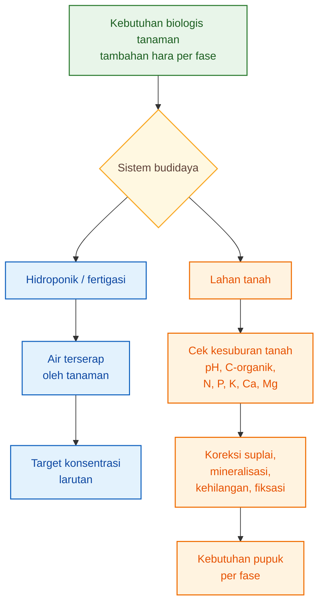

Diagram ini menegaskan bahwa titik awalnya sama, yaitu kebutuhan tanaman. Tetapi jalur penyediaan haranya berbeda.

---

## 9.8 Batas Bab Ini

Bab ini tidak bertujuan membuat rekomendasi pupuk lahan secara lengkap.

Bab ini hanya menjelaskan bahwa model hidroponik tidak boleh langsung dipindahkan ke tanah tanpa koreksi.

Untuk membuat rekomendasi pupuk lahan yang benar-benar operasional, masih diperlukan:

- hasil analisis tanah,
- target hasil,
- riwayat pemupukan,
- jenis pupuk,
- curah hujan atau irigasi,
- tekstur tanah,
- drainase,
- dan efisiensi pupuk.

Tanpa data tersebut, angka pupuk lahan akan terlalu spekulatif.

---

## 9.9 Kesimpulan Bab 9

Untuk hidroponik dan fertigasi substrat, output model adalah:

$$
\boxed{
target\ konsentrasi\ larutan
}
$$

atau:

$$
\boxed{
C_{target,j,\phi}
}
$$

Untuk lahan tanah, outputnya adalah:

$$
\boxed{
kebutuhan\ pupuk\ terkoreksi\ tanah
}
$$

atau:

$$
\boxed{
F_{j,\phi}
}
$$

Formula adaptasi lahan:

$$
{
F_{j,\phi} =

rac{
\Delta A_{j,\phi}
- S_{j,\phi}
- M_{j,\phi}
- O_{j,\phi}
+ L_{j,\phi}
+ I_{j,\phi}
}
{RE_{j,\phi}}
}
$$

Makna praktisnya:

$$
{
	ext{pupuk lahan} =
	ext{kebutuhan tanaman}
- 	ext{kontribusi tanah}
+ 	ext{koreksi kehilangan}
}
$$

Kesimpulan tajam:

> Tanah bukan tandon nutrisi. Tanah adalah sistem hidup yang bisa menyimpan, melepas, mengikat, dan kehilangan hara.

Karena itu, artikel ini tetap berfokus pada formula konsentrasi untuk hidroponik dan fertigasi substrat. Lahan tanah dibahas sebagai adaptasi yang membutuhkan submodel kesuburan tanah.

[**Kembali ke Atas**](#model-formula-hara-cabai-berbasis-laju-serapan-dan-batas-jenuh-respons-per-fase-organ)

---

# 10. Validasi Formula dan Protokol Data Praktisi

Formula hara tidak cukup hanya terlihat rapi di atas kertas. Formula harus diuji pada tanaman nyata.

Target konsentrasi seperti:

$$
\boxed{
C_{target,N},\ C_{target,P},\ C_{target,K},\ C_{target,Ca},\ C_{target,Mg}
}
$$

baru layak dipakai jika tanaman memberi respons yang benar.

Respons yang benar bukan hanya EC stabil, daun hijau, atau tanaman terlihat segar. Respons yang benar harus terlihat pada:

- akar,
- batang,
- daun,
- bunga,
- buah,
- dan akumulasi hara di jaringan tanaman.

Poin tajam Bab 10:

> Formula tidak divalidasi dari EC saja, tetapi dari respons organ dan akumulasi hara.

---

## 10.1 EC Penting, tetapi Tidak Cukup

EC hanya menunjukkan kekuatan total larutan. EC tidak menjelaskan unsur mana yang dominan, unsur mana yang kurang, atau unsur mana yang saling menekan.

Dua larutan bisa memiliki EC sama, tetapi komposisinya berbeda.

Contoh:

| Larutan   |   EC | Masalah yang mungkin terjadi                |
| --------- | ---: | ------------------------------------------- |
| Larutan A | sama | K terlalu tinggi, Ca tertekan               |
| Larutan B | sama | N terlalu tinggi, tanaman terlalu vegetatif |
| Larutan C | sama | Mg terlalu rendah, daun melemah             |
| Larutan D | sama | komposisi lebih seimbang                    |

Jadi, EC adalah indikator penting, tetapi bukan bukti bahwa formula sudah benar.

Bahasa lapangannya:

> EC memberi tahu “berapa kuat larutan”, tetapi tidak memberi tahu “apakah komposisinya tepat untuk fase tanaman”.

Karena itu, validasi formula harus melihat tiga lapis:

$$
\boxed{
larutan
\rightarrow
akar
\rightarrow
organ\ tanaman
}
$$

---

## 10.2 Apa yang Harus Divalidasi?

### 10.2.1 Validasi Larutan

Validasi pertama dilakukan pada larutan.

Data yang diamati:

- pH input,
- EC input,
- konsentrasi N, P, K, Ca, Mg di larutan,
- volume larutan masuk,
- volume drainase atau sisa,
- pH drainase,
- EC drainase,
- suhu larutan.

Tujuannya sederhana:

> Apakah larutan yang diberikan benar-benar sesuai target, dan apakah larutan berubah ekstrem setelah melewati zona akar?

Jika EC drainase jauh lebih tinggi dari input, bisa berarti tanaman tidak menyerap sebanding dengan larutan yang diberikan. Jika pH drift terlalu tajam, komposisi ion atau aktivitas akar perlu dicek.

---

### 10.2.2 Validasi Akar

Akar adalah pintu masuk air dan hara. Formula yang baik tetap gagal jika akar lemah.

Data yang diamati:

- warna akar,
- jumlah akar putih aktif,
- percabangan akar,
- bau akar,
- lendir atau biofilm berlebih,
- tanda busuk akar,
- suhu zona akar,
- oksigen terlarut jika tersedia.

Jika akar sehat, efisiensi serapan cenderung lebih baik.

Secara teknis, efisiensi serapan ditulis:

$$
\boxed{
\eta_{j,\phi}
}
$$

Namun untuk praktisi, cukup baca sebagai:

$$
\boxed{
seberapa\ efektif\ akar\ menyerap\ hara
}
$$

Jika akar lemah, menaikkan ppm sering tidak menyelesaikan masalah. Justru bisa menambah stres.

---

### 10.2.3 Validasi Organ Tanaman

Validasi utama ada pada organ tanaman.

Organ yang diamati:

- akar,
- batang,
- daun,
- bunga,
- buah.

Setiap fase punya organ kunci.

| Fase            | Organ yang perlu dibaca | Indikator praktis                        |
| --------------- | ----------------------- | ---------------------------------------- |
| Establishment   | akar, daun muda         | akar aktif, daun baru tumbuh             |
| Vegetatif       | daun, batang            | tajuk sehat, percabangan baik            |
| Generatif awal  | bunga, buah muda        | bunga jadi buah, tidak mudah rontok      |
| Pembesaran buah | buah, daun aktif        | buah membesar, daun tetap kuat           |
| Panen intensif  | buah, daun, akar        | panen berlanjut, tajuk tidak cepat turun |

Formula yang tepat harus membuat organ yang benar tumbuh pada fase yang benar.

Misalnya, pada fase pembesaran buah, tanaman seharusnya tidak hanya makin rimbun, tetapi buah juga harus mengisi. Jika tajuk kuat tetapi buah lambat, formula masih perlu dikoreksi.

---

## 10.3 Data Minimal untuk Praktisi Hidroponik/Fertigasi

Data minimal yang perlu dikumpulkan:

| Data                      | Fungsi                                                  |
| ------------------------- | ------------------------------------------------------- |
| Berat kering organ        | membaca pertumbuhan akar, batang, daun, bunga, buah     |
| Kadar N, P, K, Ca, Mg     | menghitung hara yang benar-benar masuk tanaman          |
| Serapan air harian        | menghubungkan kebutuhan hara dengan konsentrasi larutan |
| Konsentrasi input         | memastikan larutan sesuai target                        |
| Konsentrasi drainase/sisa | membaca hara yang tidak terserap                        |
| pH                        | membaca kondisi ketersediaan hara                       |
| EC                        | membaca kekuatan total larutan                          |
| Suhu larutan              | membaca risiko stres akar                               |
| Kondisi akar              | membaca kapasitas serapan                               |

Data ini tidak harus semuanya langsung sempurna. Namun tanpa data tersebut, koreksi formula akan banyak menebak.

Alur validasi:

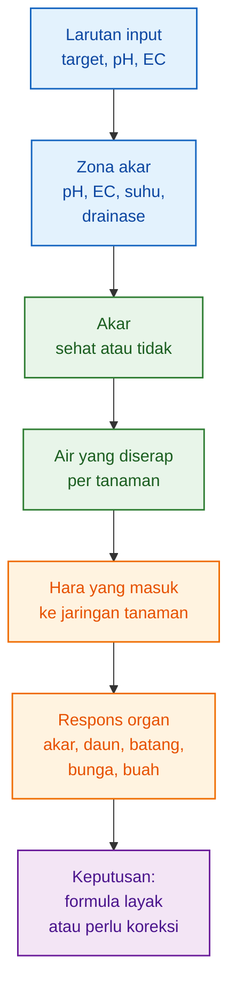

---

## 10.4 Cara Menghitung Serapan Air

Untuk sistem fertigasi dengan drainase, serapan air bisa dihitung sederhana:

$$
\boxed{
Q_w=
\frac{V_{input}-V_{drainase}}
{jumlah\ tanaman}
}
$$

Dalam bahasa lapangan:

$$
{
	ext{air terserap} =

rac{
	ext{air masuk} - 	ext{air keluar}
}
{	ext{jumlah tanaman}}
}
$$

Keterangan:

| Simbol         | Bahasa praktis                       |
| -------------- | ------------------------------------ |
| $Q_w$          | air terserap per tanaman             |
| $V_{input}$    | volume larutan masuk                 |
| $V_{drainase}$ | volume larutan keluar                |
| jumlah tanaman | jumlah tanaman dalam unit pengamatan |

Contoh:

Jika larutan masuk 100 liter, drainase keluar 30 liter, dan jumlah tanaman 100 tanaman:

$$
Q_w=
\frac{100-30}{100}
$$

$$
\boxed{
Q_w=0.7\ L/tanaman
}
$$

Artinya, rata-rata tanaman menyerap sekitar 0,7 liter air pada periode pengamatan tersebut.

Untuk sistem recirculating, perhitungannya harus menyesuaikan perubahan volume tandon dan perubahan konsentrasi larutan.

---

## 10.5 Validasi Akumulasi Hara

Agar formula benar-benar terbukti, hara yang masuk ke tanaman harus dihitung dari jaringan tanaman.

Secara teknis:

$$
\boxed{
A_{j,obs}(t)=
\sum_o W_{o,obs}(t)C_{j,o,obs}(t)
}
$$

Bahasa lapangannya:

$$
\boxed{
\text{hara yang ditemukan di tanaman} = \text{berat kering organ} \times \text{kadar hara organ}
}
$$

Lalu hasil observasi dibandingkan dengan prediksi model:

$$
\boxed{
A_{j,pred}(t)
}
$$

Selisihnya disebut error:

$$
\boxed{
e_j(t)=A_{j,obs}(t)-A_{j,pred}(t)
}
$$

Makna praktisnya:

| Kondisi                             | Arti                                               |
| ----------------------------------- | -------------------------------------------------- |
| observasi mendekati prediksi        | model cukup sesuai                                 |
| observasi jauh lebih rendah         | tanaman tidak menyerap sesuai target               |
| observasi jauh lebih tinggi         | model mungkin terlalu rendah atau sampling berbeda |
| error konsisten pada unsur tertentu | parameter unsur itu perlu dikoreksi                |

---

## 10.6 Metrik Validasi

Metrik statistik tetap berguna, tetapi harus dijelaskan sederhana.

### RMSE

RMSE menunjukkan rata-rata besar kesalahan dalam satuan asli data.

$$
\boxed{
RMSE_j=
\sqrt{
\frac{1}{n}
\sum_{i=1}^{n}
(A_{j,obs,i}-A_{j,pred,i})^2
}
}
$$

Bahasa praktis:

> RMSE menunjukkan seberapa jauh prediksi model dari data nyata, dalam satuan mg/tanaman.

Jika RMSE besar, prediksi model masih kasar.

---

### MAPE

MAPE menunjukkan kesalahan dalam persen.

$$
\boxed{
MAPE_j=
\frac{100}{n}
\sum_{i=1}^{n}
\left|
\frac{
A_{j,obs,i}-A_{j,pred,i}
}
{A_{j,obs,i}}
\right|
}
$$

Interpretasi praktis:

|   MAPE | Makna                             |
| -----: | --------------------------------- |
|  < 10% | sangat baik                       |
| 10–20% | masih layak operasional           |
| 20–30% | perlu koreksi                     |
|   >30% | belum layak untuk formula presisi |

Catatan penting:

> Pada fase awal, MAPE bisa terlihat besar karena nilai tanaman masih kecil.

---

### Bias

Bias menunjukkan arah kesalahan.

$$
\boxed{
Bias_j=
\frac{1}{n}
\sum_{i=1}^{n}
(A_{j,pred,i}-A_{j,obs,i})
}
$$

Makna praktis:

|          Bias | Arti                           |
| ------------: | ------------------------------ |
|       positif | model cenderung terlalu tinggi |
|       negatif | model cenderung terlalu rendah |
| mendekati nol | tidak ada kecenderungan kuat   |

Contoh:

Jika model selalu memprediksi K terlalu tinggi, formula bisa terlalu mendorong K. Jika model selalu memprediksi Ca terlalu rendah, risiko Ca menjadi pembatas bisa tidak terbaca.

---

## 10.7 Validasi Organ secara Praktis

### Akar

Akar harus sehat karena semua formula bergantung pada kemampuan akar menyerap.

Yang dicek:

- akar putih aktif,
- tidak busuk,
- tidak bau,
- percabangan baik,
- tidak berlendir berlebihan,
- volume akar cukup.

Jika akar bermasalah, koreksi pertama bukan menaikkan ppm, tetapi memperbaiki akar.

---

### Daun

Daun adalah pabrik fotosintesis.

Yang dicek:

- warna daun,
- luas daun,
- daun muda,
- klorosis,
- nekrosis,
- ketebalan daun,
- kadar N dan Mg bila ada analisis.

Jika daun melemah saat buah banyak, pengisian buah juga akan turun.

---

### Batang

Batang menunjukkan keseimbangan struktur tanaman.

Yang dicek:

- kekuatan batang,
- panjang ruas,
- percabangan,
- kecenderungan terlalu vegetatif,
- kemampuan menopang buah.

Jika batang dan tajuk terlalu dominan saat fase buah, N atau keseimbangan vegetatif-generatif perlu ditinjau.

---

### Bunga

Bunga penting pada fase generatif awal.

Yang dicek:

- jumlah bunga,
- bunga rontok,
- fruit set,
- bunga abnormal,
- stres panas atau kelembapan.

Jika bunga banyak tetapi fruit set rendah, masalahnya bisa nutrisi, air, suhu, atau keseimbangan tanaman.

---

### Buah

Buah menjadi indikator utama pada fase pembesaran dan panen.

Yang dicek:

- jumlah buah,
- bobot buah,
- ukuran buah,
- bentuk buah,
- berat kering buah,
- kualitas buah,
- gejala fisiologis,
- kadar K, Ca, Mg bila dianalisis.

Jika K tinggi tetapi buah tidak mengisi, pembatasnya mungkin bukan K. Bisa jadi daun lemah, Mg kurang efektif, Ca bermasalah, cahaya rendah, atau akar tidak mampu mengejar beban buah.

---

## 10.8 Keputusan Validasi Formula

Setelah data dikumpulkan, formula bisa masuk tiga status.

| Status        | Kondisi                                                           | Tindakan                        |
| ------------- | ----------------------------------------------------------------- | ------------------------------- |
| Layak         | organ tumbuh sesuai fase, error rendah, tidak ada gejala serius   | formula bisa digunakan terbatas |
| Perlu koreksi | ada error sedang atau organ tertentu tidak sesuai                 | koreksi parameter               |
| Tidak layak   | error tinggi, defisiensi/kelebihan jelas, organ tidak sesuai fase | bangun ulang model              |

Diagram keputusan:

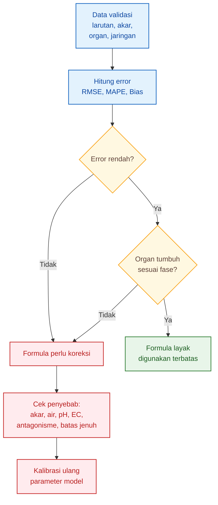

---

## 10.9 Jika Formula Tidak Sesuai, Apa yang Dicek?

Jangan langsung menaikkan semua unsur.

Gunakan gejala untuk mencari pembatas.

| Gejala                              | Yang perlu dicek                            |
| ----------------------------------- | ------------------------------------------- |
| Akumulasi semua unsur rendah        | akar, serapan air, suhu larutan, oksigen    |
| K tinggi tetapi buah tidak membesar | daun sebagai source, Mg, cahaya, beban buah |
| Ca rendah di jaringan               | K:Ca, NH₄, transpirasi, akar                |
| Mg rendah di daun                   | K terlalu dominan, Ca tinggi, pH, akar      |
| Tanaman terlalu vegetatif           | N, rasio N:K, beban buah                    |
| EC tinggi tetapi pertumbuhan lambat | overfeeding, akar stres, batas jenuh        |
| pH cepat berubah                    | komposisi ion atau akar tidak seimbang      |

Pesan praktis:

> Koreksi formula harus berdasarkan penyebab, bukan berdasarkan kebiasaan menaikkan ppm.

---

## 10.10 Kesimpulan Bab 10

Validasi formula harus membaca tiga hal:

$$
\boxed{
larutan
\rightarrow
akar
\rightarrow
organ
}
$$

EC dan pH penting, tetapi tidak cukup. Formula harus dibuktikan dengan respons organ dan akumulasi hara.

Data minimal yang perlu dikumpulkan:

- berat kering organ,
- kadar N, P, K, Ca, Mg,
- serapan air harian,
- konsentrasi input,
- konsentrasi drainase/sisa,
- pH,
- EC,
- suhu larutan,
- kondisi akar.

Metrik seperti:

$$
\boxed{
RMSE,\ MAPE,\ Bias
}
$$

membantu membaca akurasi, tetapi keputusan akhir tetap harus melihat tanaman.

Kesimpulan tajam:

$$
\boxed{
formula\ tidak\ divalidasi\ dari\ EC\ saja,
tetapi\ dari\ akumulasi\ hara\ dan\ respons\ organ
}
$$

[**Kembali ke Atas**](#model-formula-hara-cabai-berbasis-laju-serapan-dan-batas-jenuh-respons-per-fase-organ)

---

# 11. Kesimpulan

Artikel pertama telah menghasilkan rasio akumulasi N:P:K:Ca:Mg per fase pertumbuhan. Rasio itu dibangun dari berat kering organ dan kadar hara jaringan.

Alurnya:

$$
\boxed{
berat\ kering\ organ
\rightarrow
akumulasi\ hara
\rightarrow
rasio\ N:P:K:Ca:Mg
}
$$

Artikel kedua melanjutkan langkah tersebut menjadi formula hara. Fokusnya bukan lagi hanya membaca unsur mana yang banyak diakumulasi, tetapi mengubah kebutuhan harian tanaman menjadi target konsentrasi larutan.

Alurnya:

$$
\boxed{
kebutuhan\ harian
\rightarrow
serapan\ air
\rightarrow
konsentrasi\ kebutuhan
\rightarrow
batas\ jenuh
\rightarrow
target\ konsentrasi
}
$$

---

## 11.1 Rumus Utama Artikel

Rumus utama artikel ini adalah:

$$
\boxed{
C_{target,j,\phi} =
\min
\left[
C_{sat,j,\phi},
C_{tox,j}-m_j,
\max(C_{min,j},C_{req,j,\phi})
\right]
}
$$

Dengan:

$$
\boxed{
C_{req,j,\phi} =
\frac{\bar{U}_{j,\phi}}
{\bar{Q}_{w,\phi}\eta_{j,\phi}}
}
$$

Dalam bahasa praktis:

$$
\boxed{
\text{target konsentrasi} = \text{cukup, tidak terlalu rendah, tidak melewati jenuh, dan tetap aman}
}
$$

Keterangan ringkas:

| Simbol teknis | Bahasa lapangan                   |
| ------------- | --------------------------------- |
| $C_{target}$  | target konsentrasi larutan        |
| $C_{req}$     | konsentrasi dari kebutuhan harian |
| $C_{min}$     | batas agar tidak defisiensi       |
| $C_{sat}$     | batas jenuh respons               |
| $C_{tox}$     | batas risiko toksik               |
| $m$           | margin aman                       |
| $\bar{U}$     | kebutuhan hara per hari           |
| $\bar{Q}_w$   | air yang diserap per hari         |
| $\eta$        | efisiensi serapan                 |

---

## 11.2 Fokus Utama: Hidroponik dan Fertigasi Substrat

Model utama artikel ini untuk sistem yang dikontrol lewat larutan, yaitu:

- hidroponik,
- fertigasi substrat,
- cocopeat,
- rockwool,
- perlite,
- drip hydroponic,
- NFT,
- DFT.

Pada sistem ini, output model adalah:

$$
\boxed{
target\ konsentrasi\ unsur\ per\ fase
}
$$

atau secara teknis:

$$
\boxed{
C_{target,j,\phi}
}
$$

Lahan tanah tetap dibahas, tetapi hanya sebagai adaptasi. Pada lahan, outputnya bukan konsentrasi larutan, melainkan kebutuhan pupuk yang dikoreksi oleh kondisi tanah:

$$
\boxed{
F_{j,\phi}
}
$$

Karena tanah bisa menyimpan, melepas, mengikat, dan kehilangan hara, maka rekomendasi pupuk lahan wajib memasukkan:

- pH tanah,
- C-organik,
- hara tersedia,
- KTK/CEC,
- tekstur,
- kelembapan,
- kehilangan,
- fiksasi,
- dan efisiensi pupuk.

---

## 11.3 Batas Jenuh Mencegah Overfeeding

Kontribusi penting artikel ini adalah memasukkan konsep batas jenuh.

Formula tidak hanya bertanya:

> Berapa hara yang dibutuhkan?

Tetapi juga:

> Sampai titik mana tanaman masih merespons tambahan hara?

Jika:

$$
\boxed{
C_{req,j,\phi}>C_{sat,j,\phi}
}
$$

maka jawabannya bukan otomatis menaikkan konsentrasi.

Yang perlu dicek:

- akar,
- serapan air,
- pH,
- EC,
- oksigen,
- suhu larutan,
- antagonisme hara,
- drainase,
- cahaya,
- dan beban buah.

Pesan praktisnya:

$$
\boxed{
lebih\ pekat
\neq
lebih\ efektif
}
$$

Larutan yang terlalu pekat bisa boros, menekan akar, memicu antagonisme, dan tidak menambah hasil.

---

## 11.4 Formula Harus Seimbang, Bukan Sekadar Cukup

Target konsentrasi awal masih perlu dikoreksi oleh keseimbangan antarhara.

Yang paling penting:

$$
\boxed{
K:Ca:Mg
}
$$

dan:

$$
\boxed{
NH_4:NO_3
}
$$

Koreksi umumnya:

$$
\boxed{
C'_{j,\phi} =
C_{target,j,\phi}
\times
f_{ant,j,\phi}
}
$$

Makna praktisnya:

> Unsur yang tersedia di larutan belum tentu efektif jika kalah oleh unsur lain.

Contoh:

- K terlalu tinggi bisa menekan Ca dan Mg.
- NH₄ terlalu tinggi bisa mengganggu kation lain.
- Ca tinggi berlebihan bisa menekan Mg.
- EC tinggi bisa membuat akar sulit bekerja.

Jadi, formula hara harus dibaca sebagai sistem keseimbangan, bukan daftar angka berdiri sendiri.

---

## 11.5 Cari Unsur Pembatas

Pertumbuhan tanaman ditentukan oleh unsur atau proses yang paling membatasi.

Secara teknis:

$$
\boxed{
R_{\phi} =
\min
(
R_N,\ R_P,\ R_K,\ R_{Ca},\ R_{Mg}
)
}
$$

Bahasa lapangan:

$$
\boxed{
tanaman\ tertahan\ oleh\ faktor\ yang\ paling\ lemah
}
$$

Jika Ca menjadi pembatas, menaikkan K tidak menyelesaikan masalah. Jika Mg menjadi pembatas, menaikkan N tidak otomatis memperbaiki fotosintesis. Jika akar menjadi pembatas, menaikkan semua ppm justru bisa membuat tanaman stres.

Maka pertanyaan penting bukan hanya:

> Unsur mana yang perlu dinaikkan?

Tetapi:

> Apa yang sedang membatasi respons tanaman?

---

## 11.6 Validasi Wajib

Formula hara harus divalidasi. Tidak cukup hanya melihat EC atau ppm.

Validasi perlu melihat:

- larutan,
- akar,
- serapan air,
- jaringan tanaman,
- dan pertumbuhan organ.

Formula layak jika:

1. akumulasi hara mendekati target;
2. organ tumbuh sesuai fase;
3. tidak ada defisiensi jelas;
4. tidak ada gejala kelebihan;
5. tidak ada tanda antagonisme berat;
6. akar tetap sehat;
7. hasil dan kualitas buah sesuai arah model.

Metrik seperti:

$$
\boxed{
RMSE,\ MAPE,\ Bias
}
$$

membantu membaca akurasi, tetapi keputusan akhir tetap ada pada respons tanaman.

---

## 11.7 Alur Akhir Model

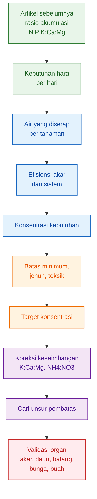

---

## 11.8 Kesimpulan Tajam

Formula hara yang presisi tidak hanya bertanya:

> Berapa konsentrasi yang diberikan?

Tetapi juga bertanya:

> Apakah tanaman masih memberi respons terhadap tambahan konsentrasi itu?

Dengan pendekatan ini, formula nutrisi tidak lagi sekadar mengejar ppm atau EC. Formula dibangun dari kebutuhan harian tanaman, dikoreksi oleh serapan air, dibatasi oleh titik jenuh, disesuaikan dengan keseimbangan antarhara, lalu divalidasi melalui organ tanaman.

Kesimpulan akhir:

$$
\boxed{
\begin{aligned}
\text{Formula hara yang baik}
&= \text{cukup untuk kebutuhan tanaman} \\
&+ \text{tidak melewati batas jenuh} \\
&+ \text{tidak menciptakan unsur pembatas} \\
&+ \text{tervalidasi pada organ}
\end{aligned}
}
$$

Atau dalam bahasa paling praktis:

> Nutrisi yang presisi bukan nutrisi yang paling pekat, tetapi nutrisi yang paling sesuai dengan fase tanaman, kemampuan akar, dan respons organ.

---

<small>
  **_Catatan Penyusunan_** Artikel ini disusun sebagai materi edukasi dan
  referensi umum berdasarkan berbagai sumber pustaka, praktik lapangan, serta
  bantuan alat penulisan. Pembaca disarankan untuk melakukan verifikasi lanjutan
  dan penyesuaian sesuai dengan kondisi serta kebutuhan masing-masing sistem.
</small>
