# **_Model Formula Hara Cabai Berbasis Laju Serapan dan Batas Jenuh Respons per Fase Organ_**

_Pendekatan utama untuk hidroponik dan fertigasi substrat, dengan catatan adaptasi untuk lahan tanah berbasis kesuburan tanah_

---

- [**_Model Formula Hara Cabai Berbasis Laju Serapan dan Batas Jenuh Respons per Fase Organ_**](#model-formula-hara-cabai-berbasis-laju-serapan-dan-batas-jenuh-respons-per-fase-organ)
- [1. Pendahuluan: Dari Rasio Akumulasi ke Formula Hara](#1-pendahuluan-dari-rasio-akumulasi-ke-formula-hara)
- [N:P:K:Ca:Mg](#npkcamg)
- [2. Asumsi Sistem Budidaya dan Batas Model](#2-asumsi-sistem-budidaya-dan-batas-model)
  - [2.1 Asumsi Utama Artikel](#21-asumsi-utama-artikel)
  - [2.2 Hidroponik dan Fertigasi Substrat sebagai Fokus Utama](#22-hidroponik-dan-fertigasi-substrat-sebagai-fokus-utama)
  - [2.3 Posisi Lahan Tanah dalam Artikel Ini](#23-posisi-lahan-tanah-dalam-artikel-ini)
  - [2.4 Rumus Pembeda Hidroponik dan Lahan](#24-rumus-pembeda-hidroponik-dan-lahan)
  - [2.5 Batas Model](#25-batas-model)
- [3. Dasar Biologis dari Artikel Sebelumnya](#3-dasar-biologis-dari-artikel-sebelumnya)
  - [3.1 Akumulasi Hara Tanaman](#31-akumulasi-hara-tanaman)
  - [3.2 Laju Akumulasi Hara](#32-laju-akumulasi-hara)
  - [3.3 Perubahan Akumulasi per Fase](#33-perubahan-akumulasi-per-fase)
  - [3.4 Rasio Hara per Fase](#34-rasio-hara-per-fase)
  - [3.5 Fungsi Bab Ini dalam Artikel Kedua](#35-fungsi-bab-ini-dalam-artikel-kedua)
- [4. Laju Serapan dan Kebutuhan Konsentrasi Hara](#4-laju-serapan-dan-kebutuhan-konsentrasi-hara)
  - [4.1 Laju Akumulasi sebagai Kebutuhan Biologis](#41-laju-akumulasi-sebagai-kebutuhan-biologis)
  - [4.2 Serapan Air sebagai Pembawa Hara](#42-serapan-air-sebagai-pembawa-hara)
  - [4.3 Efisiensi Serapan sebagai Koreksi Akar dan Sistem](#43-efisiensi-serapan-sebagai-koreksi-akar-dan-sistem)
  - [4.4 Contoh Makna Perhitungan](#44-contoh-makna-perhitungan)
  - [4.5 Alur Konversi dari Laju Akumulasi ke Konsentrasi](#45-alur-konversi-dari-laju-akumulasi-ke-konsentrasi)
- [5. Respons Akar dan Batas Jenuh Hara](#5-respons-akar-dan-batas-jenuh-hara)
  - [5.1 Serapan Hara Tidak Linear](#51-serapan-hara-tidak-linear)
  - [5.2 Model Serapan Akar](#52-model-serapan-akar)
  - [5.3 Respons Relatif terhadap Konsentrasi](#53-respons-relatif-terhadap-konsentrasi)
  - [5.4 Titik Jenuh 90% dan 95%](#54-titik-jenuh-90-dan-95)
  - [5.5 Batas Jenuh Bukan Titik Toksik](#55-batas-jenuh-bukan-titik-toksik)
  - [5.6 Visualisasi Zona Respons Hara](#56-visualisasi-zona-respons-hara)
- [6. Batas Jenuh per Unsur dan Fase Organ](#6-batas-jenuh-per-unsur-dan-fase-organ)
  - [6.1 Mengapa Batas Jenuh Harus Dibaca per Unsur?](#61-mengapa-batas-jenuh-harus-dibaca-per-unsur)
  - [6.2 Nitrogen: Cukup untuk Tajuk, Tidak Berlebih pada Fase Buah](#62-nitrogen-cukup-untuk-tajuk-tidak-berlebih-pada-fase-buah)
  - [6.3 Fosfor: Kecil secara Massa, Cepat Mencapai Zona Tidak Responsif](#63-fosfor-kecil-secara-massa-cepat-mencapai-zona-tidak-responsif)
  - [6.4 Kalium: Penting untuk Buah, tetapi Bisa Menekan Ca dan Mg](#64-kalium-penting-untuk-buah-tetapi-bisa-menekan-ca-dan-mg)
  - [6.5 Kalsium: Respons Dipengaruhi Transpirasi dan Distribusi Organ](#65-kalsium-respons-dipengaruhi-transpirasi-dan-distribusi-organ)
  - [6.6 Magnesium: Penopang Fotosintesis saat Fase Buah](#66-magnesium-penopang-fotosintesis-saat-fase-buah)
  - [6.7 Dominansi Organ pada Setiap Fase](#67-dominansi-organ-pada-setiap-fase)
  - [6.8 Respons Fase-Organ terhadap Konsentrasi Hara](#68-respons-fase-organ-terhadap-konsentrasi-hara)
  - [6.9 Visualisasi Hubungan Unsur, Organ, dan Batas Jenuh](#69-visualisasi-hubungan-unsur-organ-dan-batas-jenuh)
  - [6.10 Kesimpulan Bab 6](#610-kesimpulan-bab-6)
- [7. Formula Target Konsentrasi N, P, K, Ca, Mg](#7-formula-target-konsentrasi-n-p-k-ca-mg)
  - [7.1 Posisi Formula Target dalam Model](#71-posisi-formula-target-dalam-model)
  - [7.2 Makna Struktur `min` dan `max`](#72-makna-struktur-min-dan-max)
  - [7.3 Tiga Zona Keputusan Formula](#73-tiga-zona-keputusan-formula)
    - [Zona 1 — Defisiensi Potensial](#zona-1--defisiensi-potensial)
    - [Zona 2 — Zona Respons Efektif](#zona-2--zona-respons-efektif)
    - [Zona 3 — Zona Jenuh](#zona-3--zona-jenuh)
  - [7.4 Formula Vektor per Fase](#74-formula-vektor-per-fase)
  - [7.5 Formula Target Nitrogen](#75-formula-target-nitrogen)
  - [7.6 Formula Target Fosfor](#76-formula-target-fosfor)
  - [7.7 Formula Target Kalium](#77-formula-target-kalium)
  - [7.8 Formula Target Kalsium](#78-formula-target-kalsium)
  - [7.9 Formula Target Magnesium](#79-formula-target-magnesium)
  - [7.10 Tabel Ringkas Formula per Unsur](#710-tabel-ringkas-formula-per-unsur)
  - [7.11 Contoh Kerangka Perhitungan Satu Fase](#711-contoh-kerangka-perhitungan-satu-fase)
  - [7.12 Apa yang Dilakukan Jika `C_req` Melebihi `C_sat`?](#712-apa-yang-dilakukan-jika-c_req-melebihi-c_sat)
  - [7.13 Status Formula Target: Biologis, Bukan Resep Pupuk Final](#713-status-formula-target-biologis-bukan-resep-pupuk-final)
  - [7.14 Diagram Keputusan Formula Target](#714-diagram-keputusan-formula-target)
  - [7.15 Kesimpulan Bab 7](#715-kesimpulan-bab-7)
- [8. Koreksi Antagonisme dan Unsur Pembatas](#8-koreksi-antagonisme-dan-unsur-pembatas)
  - [8.1 Mengapa Antagonisme Harus Masuk Model?](#81-mengapa-antagonisme-harus-masuk-model)
  - [8.2 Antagonisme K terhadap Ca](#82-antagonisme-k-terhadap-ca)
  - [8.3 Antagonisme K dan Ca terhadap Mg](#83-antagonisme-k-dan-ca-terhadap-mg)
  - [8.4 Konsentrasi Terkoreksi Antagonisme](#84-konsentrasi-terkoreksi-antagonisme)
  - [8.5 Koreksi Tidak Selalu Berarti Menambah Unsur](#85-koreksi-tidak-selalu-berarti-menambah-unsur)
  - [8.6 Respons Multi-Hara](#86-respons-multi-hara)
- [8.7 Ilustrasi Unsur Pembatas](#87-ilustrasi-unsur-pembatas)
- [8.8 Implikasi Praktis untuk Formula Hidroponik/Fertigasi](#88-implikasi-praktis-untuk-formula-hidroponikfertigasi)
- [8.9 Kesimpulan Bab 8](#89-kesimpulan-bab-8)
- [9. Adaptasi untuk Lahan Tanah dan Strategi Pemupukan](#9-adaptasi-untuk-lahan-tanah-dan-strategi-pemupukan)
  - [9.1 Perbedaan Kunci: Hidroponik vs Lahan Tanah](#91-perbedaan-kunci-hidroponik-vs-lahan-tanah)
  - [9.2 Kebutuhan Tanaman Tetap Sama](#92-kebutuhan-tanaman-tetap-sama)
  - [9.3 Formula Adaptasi untuk Lahan Tanah](#93-formula-adaptasi-untuk-lahan-tanah)
  - [9.4 Makna Setiap Komponen Formula Lahan](#94-makna-setiap-komponen-formula-lahan)
    - [9.4.1 Kenaikan Akumulasi Tanaman](#941-kenaikan-akumulasi-tanaman)
    - [9.4.2 Suplai Hara Tersedia dari Tanah](#942-suplai-hara-tersedia-dari-tanah)
    - [9.4.3 Mineralisasi Bahan Organik](#943-mineralisasi-bahan-organik)
    - [9.4.4 Kontribusi Pupuk Organik](#944-kontribusi-pupuk-organik)
    - [9.4.5 Kehilangan Hara](#945-kehilangan-hara)
    - [9.4.6 Imobilisasi dan Fiksasi](#946-imobilisasi-dan-fiksasi)
    - [9.4.7 Recovery Efficiency](#947-recovery-efficiency)
  - [9.5 Parameter Tanah yang Wajib Masuk](#95-parameter-tanah-yang-wajib-masuk)
  - [9.6 Strategi Pemupukan Lahan Berdasarkan Fase](#96-strategi-pemupukan-lahan-berdasarkan-fase)
  - [9.7 Ilustrasi Adaptasi Hidroponik dan Lahan](#97-ilustrasi-adaptasi-hidroponik-dan-lahan)
  - [9.8 Batas Bab Ini](#98-batas-bab-ini)
  - [9.9 Kesimpulan Bab 9](#99-kesimpulan-bab-9)
- [10. Validasi Formula dan Protokol Data Praktisi](#10-validasi-formula-dan-protokol-data-praktisi)
  - [10.1 Mengapa Formula Harus Divalidasi?](#101-mengapa-formula-harus-divalidasi)
  - [10.2 Apa yang Harus Divalidasi?](#102-apa-yang-harus-divalidasi)
    - [10.2.1 Validasi Larutan](#1021-validasi-larutan)
    - [10.2.2 Validasi Akar](#1022-validasi-akar)
    - [10.2.3 Validasi Organ Tanaman](#1023-validasi-organ-tanaman)
  - [10.3 Data Minimal untuk Hidroponik dan Fertigasi Substrat](#103-data-minimal-untuk-hidroponik-dan-fertigasi-substrat)
  - [10.4 Protokol Pengamatan Praktis](#104-protokol-pengamatan-praktis)
  - [10.5 Validasi Akumulasi Hara](#105-validasi-akumulasi-hara)
  - [10.6 Metrik Validasi](#106-metrik-validasi)
    - [10.6.1 RMSE](#1061-rmse)
    - [10.6.2 MAPE](#1062-mape)
    - [10.6.3 Bias](#1063-bias)
  - [10.7 Validasi Organ](#107-validasi-organ)
    - [Akar](#akar)
    - [Daun](#daun)
    - [Batang](#batang)
    - [Bunga](#bunga)
    - [Buah](#buah)
  - [10.8 Keputusan Validasi Formula](#108-keputusan-validasi-formula)
  - [10.9 Parameter yang Paling Sering Perlu Dikoreksi](#109-parameter-yang-paling-sering-perlu-dikoreksi)
  - [10.10 Kesimpulan Bab 10](#1010-kesimpulan-bab-10)
- [11. Kesimpulan](#11-kesimpulan)
  - [11.1 Formula Utama Artikel](#111-formula-utama-artikel)
  - [11.2 Fokus Utama: Hidroponik dan Fertigasi Substrat](#112-fokus-utama-hidroponik-dan-fertigasi-substrat)
  - [11.3 Batas Jenuh Mencegah Overfeeding](#113-batas-jenuh-mencegah-overfeeding)
  - [11.4 Formula Harus Dikoreksi oleh Antagonisme](#114-formula-harus-dikoreksi-oleh-antagonisme)
  - [11.5 Unsur Pembatas Menentukan Respons Fase](#115-unsur-pembatas-menentukan-respons-fase)
  - [11.6 Validasi Wajib](#116-validasi-wajib)
  - [11.7 Alur Akhir Model](#117-alur-akhir-model)
  - [11.8 Kesimpulan Tajam](#118-kesimpulan-tajam)

---

# 1. Pendahuluan: Dari Rasio Akumulasi ke Formula Hara

Artikel sebelumnya telah membangun model untuk membaca kebutuhan relatif hara cabai dari sisi tanaman. Model tersebut dimulai dari berat kering organ, kemudian menghitung akumulasi hara, lalu menurunkannya menjadi rasio N:P:K:Ca:Mg per fase pertumbuhan.

<ResourceBox
  title="Artikel Terkait:"
  items={[
    {
      name: 'README — Framework Praktis Memulai Bisnis Agribisnis Terpadu di Lahan Gumuk Berlereng',
      href: '/blog/agri/kebon/agribisnis-gumuk/README',
    },
    {
      name: 'Keseimbangan Akar dan Tajuk: Fondasi Tanaman Sehat, Produktif, dan Tidak Terjebak Tipuan Input',
      href: '/blog/agri/kebon/keseimbangan-akar-dan-tajuk',
    },
    {
      name: 'Menanam Cabai dengan Prinsip Pohon Bambu: Akar Kuat, Tanah Hidup, Tanaman Tahan Stres',
      href: '/blog/agri/kebon/budidaya-cabai-prinsip-rumpun-bambu',
    },
    {
      name: 'Model Berat Kering Tanaman ke Rasio N:P:K:Ca:Mg per Fase Pertumbuhan',
      href: '/blog/agri/kebon/model-berat-kering-hara',
    },
    {
      name: 'README - Pupuk Tepat, Panen Untung - Model Low-Lab untuk Petani Makmur di Gambiran',
      href: '/blog/agri/pupuk-terintegrasi/README',
    },
  ]}
/>

Alur artikel pertama dapat diringkas sebagai berikut:

$$
\boxed{
Berat\ kering\ organ
\rightarrow
Akumulasi\ hara
\rightarrow
Rasio\ N:P:K:Ca:Mg\ per\ fase
}
$$

Rasio tersebut menjawab pertanyaan penting:

> Pada fase tertentu, unsur mana yang lebih banyak diakumulasi tanaman?

Namun rasio akumulasi belum sama dengan formula nutrisi. Rasio akumulasi hanya menjelaskan **perbandingan hara yang dibangun ke dalam tubuh tanaman**, bukan langsung menjelaskan **berapa konsentrasi hara yang harus disediakan dalam larutan**.

Sebagai contoh, jika model menunjukkan rasio:

$$
\begin{aligned}
N:P:K:Ca:Mg &= 1:0.10:1.10:0.40:0.19
\end{aligned}
$$

maka maknanya adalah:

> Pada fase tersebut, tanaman mengakumulasi K sekitar 1.10 kali terhadap N, Ca sekitar 0.40 kali terhadap N, dan seterusnya.

Tetapi rasio itu belum otomatis berarti larutan harus dibuat dengan rasio yang sama. Untuk menjadi formula hara, rasio akumulasi harus diterjemahkan lebih lanjut melalui laju serapan, volume air yang diserap, efisiensi serapan, dan batas respons tanaman terhadap konsentrasi hara.

Artikel kedua ini masuk ke tahap tersebut.

Fokusnya adalah mengubah:

$$
\boxed{
rasio\ akumulasi
}
$$

menjadi:

$$
\boxed{
target\ konsentrasi\ hara
}
$$

khususnya untuk sistem yang hara utamanya dikendalikan melalui larutan, yaitu **hidroponik dan fertigasi substrat**.

Secara ringkas, transisi model artikel kedua adalah:

$$
\boxed{
\Delta A_j
\rightarrow
\bar{U}_{j,\phi}
\rightarrow
C_{target,j,\phi}
}
$$

Keterangan:

| Simbol              | Arti                                                |
| ------------------- | --------------------------------------------------- |
| $\Delta A_j$        | kenaikan akumulasi unsur $j$ selama fase            |
| $\bar{U}_{j,\phi}$  | rata-rata laju akumulasi unsur $j$ pada fase $\phi$ |
| $C_{target,j,\phi}$ | target konsentrasi unsur $j$ pada fase $\phi$       |

Dengan:

$$
j=N,\ P,\ K,\ Ca,\ Mg
$$

dan:

$$
\phi=vegetatif,\ generatif,\ pembesaran\ buah,\ panen
$$

Artikel ini tidak lagi berhenti pada pertanyaan:

> Berapa rasio N:P:K:Ca:Mg yang diakumulasi tanaman?

Tetapi bergerak ke pertanyaan berikutnya:

> Berapa konsentrasi hara yang layak disediakan agar laju akumulasi tersebut tercapai, tanpa melewati batas jenuh respons tanaman?

Alur artikel kedua dapat digambarkan sebagai berikut:

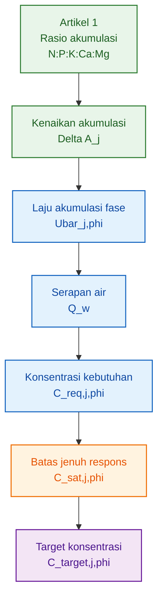

Tujuan akhirnya bukan mencari konsentrasi setinggi mungkin. Formula hara yang baik bukan formula yang paling pekat, tetapi formula yang:

1. memenuhi laju akumulasi tanaman,
2. tetap berada di zona respons efektif,
3. tidak melewati titik jenuh,
4. tidak mendorong antagonisme antarhara,
5. dan dapat divalidasi dari pertumbuhan organ tanaman.

Dengan demikian, artikel ini membangun jembatan dari fisiologi tanaman menuju formula hara yang lebih terukur.

[**Kembali ke Atas**](#model-formula-hara-cabai-berbasis-laju-serapan-dan-batas-jenuh-respons-per-fase-organ)

---

# 2. Asumsi Sistem Budidaya dan Batas Model

## 2.1 Asumsi Utama Artikel

Asumsi utama artikel ini adalah:

$$
\boxed{
model\ utama = hidroponik\ dan\ fertigasi\ substrat
}
$$

Yang termasuk dalam ruang lingkup utama artikel ini adalah sistem budidaya di mana hara diberikan terutama dalam bentuk larutan, misalnya:

- NFT,
- DFT,
- drip hydroponic,
- fertigasi cocopeat,
- fertigasi rockwool,
- fertigasi perlite,
- greenhouse substrat semi-inert.

<figure>
  
  <figcaption>
    Penyerapan hara dari akar menuju organ tanaman seperti batang, daun, bunga,
    dan buah.
  </figcaption>
</figure>

Pada sistem seperti ini, unsur hara dapat dikontrol melalui konsentrasi larutan. Karena itu, variabel seperti:

$$
C_{req,j,\phi}
$$

dan:

$$
C_{target,j,\phi}
$$

menjadi relevan.

Dalam hidroponik dan fertigasi substrat, akar menyerap air dan hara dari larutan atau zona substrat yang dialiri larutan. Hara kemudian dibawa ke tajuk, daun melakukan fotosintesis, dan hasil fotosintesis digunakan untuk membentuk jaringan akar, batang, daun, bunga, dan buah.

Secara biologis, proses dasarnya tetap sama:

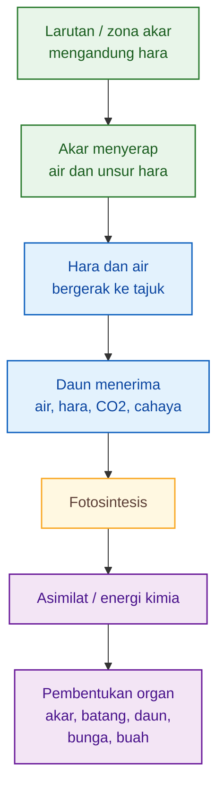

Dari sisi tanaman, kebutuhan biologis tetap dibaca dari akumulasi hara. Namun dari sisi sistem budidaya, cara menyediakan hara berbeda.

Karena artikel ini membahas formula konsentrasi, maka fokus utamanya adalah sistem yang memang dapat dikendalikan dengan konsentrasi larutan.

---

## 2.2 Hidroponik dan Fertigasi Substrat sebagai Fokus Utama

Pada hidroponik dan fertigasi substrat, hara disediakan dalam larutan. Karena itu, model formula hara dapat dinyatakan sebagai target konsentrasi:

$$
\boxed{
C_{target,j,\phi}
}
$$

Keterangan:

| Simbol              | Arti                                          |
| ------------------- | --------------------------------------------- |
| $C_{target,j,\phi}$ | target konsentrasi unsur $j$ pada fase $\phi$ |
| $j$                 | N, P, K, Ca, Mg                               |
| $\phi$              | fase pertumbuhan                              |

Dalam sistem ini, strategi suplai hara dikendalikan melalui:

- konsentrasi unsur,
- EC,
- pH,
- volume larutan yang diberikan,
- frekuensi fertigasi,
- drainase,
- kualitas air baku,
- dan kondisi akar.

Model hidroponik/fertigasi berangkat dari prinsip:

$$
\boxed{
hara\ yang\ masuk\ ke\ tanaman
\approx
konsentrasi\ hara
\times
volume\ air\ yang\ diserap
\times
efisiensi\ serapan
}
$$

Maka, jika tanaman memerlukan laju akumulasi unsur tertentu sebesar:

$$
\bar{U}_{j,\phi}
$$

target konsentrasi harus mempertimbangkan serapan air:

$$
\bar{Q}_{w,\phi}
$$

dan efisiensi serapan:

$$
\eta_{j,\phi}
$$

Ini berbeda dari pendekatan dosis pupuk konvensional. Pada hidroponik, pertanyaannya bukan hanya:

> Berapa gram pupuk diberikan?

Tetapi:

> Berapa konsentrasi unsur yang perlu tersedia dalam larutan agar tanaman dapat mencapai laju akumulasi hara tertentu?

Itulah alasan artikel ini menggunakan satuan seperti:

$$
mg/L
$$

atau:

$$
mmol/L
$$

untuk model konsentrasi.

---

## 2.3 Posisi Lahan Tanah dalam Artikel Ini

Lahan tanah tidak menjadi fokus utama artikel ini. Lahan tanah hanya dibahas sebagai **adaptasi**, karena tanah bukan media inert dan tidak dapat diperlakukan seperti larutan hidroponik.

Pada lahan tanah, hara tidak hanya berada di larutan tanah. Hara juga berada dalam:

- koloid tanah,
- bahan organik,
- mineral tanah,
- kompleks jerapan,
- biomassa mikroba,
- dan bentuk yang dapat terfiksasi atau tercuci.

Karena itu, model hidroponik:

$$
\boxed{
C_{target,j,\phi}
}
$$

tidak bisa langsung diterapkan pada lahan tanah.

Untuk lahan tanah, output model lebih tepat berupa:

$$
\boxed{
F_{j,\phi}
}
$$

Keterangan:

| Simbol       | Arti                                       |
| ------------ | ------------------------------------------ |
| $F_{j,\phi}$ | kebutuhan pupuk unsur $j$ pada fase $\phi$ |

Dalam konteks lahan, strategi suplai hara harus mempertimbangkan kesuburan tanah, antara lain:

- pH tanah,
- C-organik,
- N tersedia,
- P tersedia,
- K-dd,
- Ca-dd,
- Mg-dd,
- KTK/CEC,
- tekstur,
- kelembapan,
- dan salinitas tanah.

Dengan demikian, hubungan hidroponik dan lahan dapat diringkas sebagai berikut:

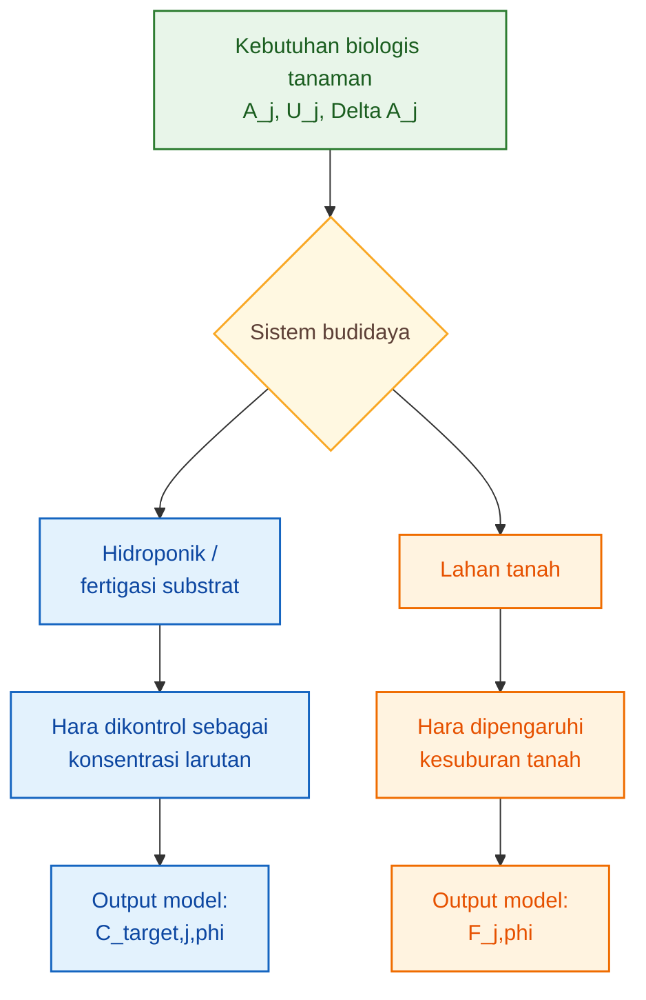

Poin pentingnya:

$$
\boxed{
kebutuhan\ tanaman\ sama,
strategi\ suplai\ hara\ berbeda
}
$$

Tanaman tetap menyerap N, P, K, Ca, dan Mg untuk membentuk jaringan. Tetapi cara menyediakan hara pada hidroponik berbeda dari lahan tanah.

---

## 2.4 Rumus Pembeda Hidroponik dan Lahan

Untuk hidroponik dan fertigasi substrat, output utama artikel ini adalah:

$$
\boxed{
C_{target,j,\phi}
}
$$

Artinya, model berusaha menentukan target konsentrasi unsur hara dalam larutan pada fase tertentu.

Sedangkan untuk lahan tanah, outputnya bukan konsentrasi larutan, tetapi kebutuhan pupuk fase:

$$
\boxed{
F_{j,\phi}
}
$$

Secara konseptual:

| Sistem                          | Output model        | Makna                               |
| ------------------------------- | ------------------- | ----------------------------------- |
| Hidroponik / fertigasi substrat | $C_{target,j,\phi}$ | target konsentrasi unsur di larutan |
| Lahan tanah                     | $F_{j,\phi}$        | kebutuhan pupuk terkoreksi tanah    |

Karena itu, artikel ini harus dibaca dengan batas berikut:

> Artikel ini bukan artikel rekomendasi pupuk lahan. Artikel ini adalah model konsentrasi hara untuk sistem yang dikontrol melalui larutan.

Lahan tanah tetap penting, tetapi membutuhkan submodel tersendiri yang memperhitungkan kesuburan tanah dan efisiensi pemupukan.

---

## 2.5 Batas Model

Batas model artikel ini adalah sebagai berikut:

| Komponen           | Status dalam artikel                  |
| ------------------ | ------------------------------------- |
| Hidroponik         | fokus utama                           |
| Fertigasi substrat | fokus utama                           |
| Lahan tanah        | adaptasi, bukan fokus utama           |
| Berat kering organ | dirujuk dari artikel pertama          |
| Rasio akumulasi    | titik awal                            |
| Laju akumulasi     | dasar formula                         |
| Konsentrasi target | output utama                          |
| Dosis pupuk lahan  | hanya dibahas sebagai adaptasi        |
| Kesuburan tanah    | dibahas sebagai syarat adaptasi lahan |

Dengan batas ini, artikel menjadi lebih tajam. Pembaca tidak dibawa ke dua model yang berbeda secara bersamaan. Model utama tetap konsentrasi hara untuk hidroponik/fertigasi, sedangkan lahan tanah ditempatkan sebagai konteks pembanding dan adaptasi.

[**Kembali ke Atas**](#model-formula-hara-cabai-berbasis-laju-serapan-dan-batas-jenuh-respons-per-fase-organ)

---

# 3. Dasar Biologis dari Artikel Sebelumnya

Artikel kedua ini tidak mengulang seluruh pembahasan model berat kering. Artikel pertama sudah membangun dasar bahwa kebutuhan relatif hara tanaman dapat dihitung dari berat kering organ dan kadar hara jaringan.

Yang perlu dibawa ke artikel kedua hanya empat persamaan inti.

---

## 3.1 Akumulasi Hara Tanaman

Persamaan dasar akumulasi hara adalah:

$$
\boxed{
A_j(t)=\sum_o W_o(t)C_{j,o}(t)
}
$$

Keterangan:

| Simbol       | Arti                                   |
| ------------ | -------------------------------------- |
| $A_j(t)$     | akumulasi unsur hara $j$ pada umur $t$ |
| $W_o(t)$     | berat kering organ $o$ pada umur $t$   |
| $C_{j,o}(t)$ | kadar unsur hara $j$ pada organ $o$    |
| $o$          | akar, batang, daun, bunga, buah        |
| $j$          | N, P, K, Ca, Mg                        |

Persamaan ini menunjukkan bahwa kebutuhan hara tanaman tidak dimulai dari larutan, tetapi dari jaringan tanaman yang sedang dibangun.

Jika tanaman membangun daun, maka hara yang masuk ke daun harus dihitung. Jika tanaman membangun buah, maka hara yang masuk ke buah juga harus dihitung. Dengan demikian, akumulasi hara adalah pembacaan biologis atas proses pembentukan organ.

---

## 3.2 Laju Akumulasi Hara

Akumulasi total hanya menunjukkan berapa hara yang sudah tersimpan sampai umur tertentu. Untuk menyusun formula hara, yang lebih penting adalah laju akumulasi:

$$
\boxed{
U_j(t)=\frac{dA_j(t)}{dt}
}
$$

Keterangan:

| Simbol   | Arti                                   |
| -------- | -------------------------------------- |
| $U_j(t)$ | laju akumulasi unsur $j$ pada umur $t$ |
| $A_j(t)$ | akumulasi unsur $j$ pada umur $t$      |

Satuan umum:

$$
\boxed{
mg/tanaman/hari
}
$$

Laju akumulasi menjawab pertanyaan:

> Berapa banyak unsur hara yang sedang ditambahkan ke dalam tanaman per hari?

Inilah titik awal artikel kedua. Formula nutrisi tidak disusun dari total akumulasi, tetapi dari laju akumulasi.

---

## 3.3 Perubahan Akumulasi per Fase

Untuk membaca kebutuhan hara per fase, digunakan perubahan akumulasi antara awal dan akhir fase:

$$
\boxed{
\Delta A_j=A_j(t_2)-A_j(t_1)
}
$$

Keterangan:

| Simbol       | Arti                                     |
| ------------ | ---------------------------------------- |
| $\Delta A_j$ | kenaikan akumulasi unsur $j$ selama fase |
| $A_j(t_1)$   | akumulasi unsur $j$ pada awal fase       |
| $A_j(t_2)$   | akumulasi unsur $j$ pada akhir fase      |

Dari sini dapat dihitung rata-rata laju akumulasi fase:

$$
\boxed{
\begin{aligned}
\bar{U}_{j,\phi} &= \frac{\Delta A_j}{t_2-t_1}
\end{aligned}
}
$$

atau:

$$
\boxed{
\begin{aligned}
\bar{U}_{j,\phi} &= \frac{A_j(t_2)-A_j(t_1)}
{t_2-t_1}
\end{aligned}
}
$$

Persamaan ini penting karena formula hara per fase harus mengikuti kebutuhan fase, bukan kebutuhan rata-rata seluruh umur tanaman.

---

## 3.4 Rasio Hara per Fase

Artikel sebelumnya menghasilkan rasio hara per fase sebagai:

$$
\boxed{
Rasio\ fase=
\Delta N:\Delta P:\Delta K:\Delta Ca:\Delta Mg
}
$$

atau dalam bentuk lengkap:

$$
\boxed{
Rasio\ fase=
\Delta A_N:
\Delta A_P:
\Delta A_K:
\Delta A_{Ca}:
\Delta A_{Mg}
}
$$

Rasio ini menunjukkan struktur kebutuhan relatif tanaman pada fase tersebut.

Namun artikel kedua tidak berhenti pada rasio. Artikel kedua menggunakan rasio dan laju akumulasi sebagai dasar untuk membangun formula konsentrasi.

Alurnya:

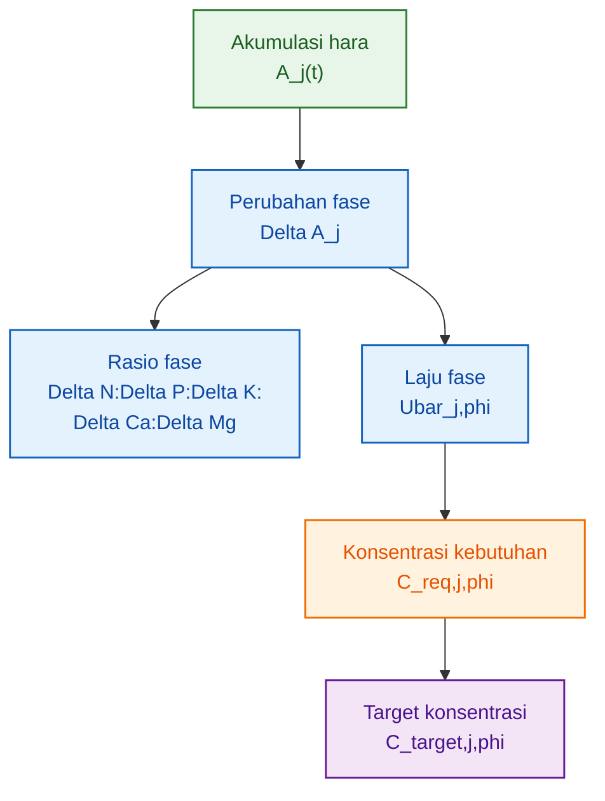

---

## 3.5 Fungsi Bab Ini dalam Artikel Kedua

Bab ini berfungsi sebagai jembatan. Tujuannya bukan mengulang artikel pertama, tetapi menegaskan titik awal artikel kedua.

Artikel pertama berhenti pada:

$$
\boxed{
\Delta A_N:\Delta A_P:\Delta A_K:\Delta A_{Ca}:\Delta A_{Mg}
}
$$

Artikel kedua mulai dari:

$$
\boxed{
\bar{U}_{j,\phi}
}
$$

lalu mengubahnya menjadi:

$$
\boxed{
C_{target,j,\phi}
}
$$

Dengan demikian, hubungan dua artikel menjadi jelas:

| Artikel         | Fokus                           | Output                           |
| --------------- | ------------------------------- | -------------------------------- |
| Artikel pertama | berat kering dan akumulasi hara | rasio N:P:K:Ca:Mg per fase       |
| Artikel kedua   | laju serapan dan batas jenuh    | target konsentrasi hara per fase |

Kesimpulan Bab 3:

$$
\boxed{
artikel\ kedua\ tidak\ dimulai\ dari\ ppm,
tetapi\ dari\ laju\ akumulasi\ hara\ tanaman
}
$$

Inilah pembeda utama model ini dari pendekatan formula nutrisi yang hanya berbasis angka umum atau resep tetap.

[**Kembali ke Atas**](#model-formula-hara-cabai-berbasis-laju-serapan-dan-batas-jenuh-respons-per-fase-organ)

---

# 4. Laju Serapan dan Kebutuhan Konsentrasi Hara

## 4.1 Laju Akumulasi sebagai Kebutuhan Biologis

Artikel sebelumnya telah menghasilkan akumulasi hara tanaman:

$$
A_j(t)
$$

dengan:

$$
j=N,\ P,\ K,\ Ca,\ Mg
$$

Namun untuk menyusun formula hara, yang lebih penting bukan hanya total akumulasi, melainkan **laju akumulasi**. Total akumulasi menjawab:

> Berapa hara yang sudah tersimpan di tanaman?

Sedangkan laju akumulasi menjawab:

> Berapa hara yang sedang ditambahkan tanaman per hari pada fase tertentu?

Untuk fase pertumbuhan $\phi$, dari umur $t_1$ sampai $t_2$, rata-rata laju akumulasi unsur $j$ dihitung sebagai:

$$
\boxed{
\begin{aligned}
\bar{U}_{j,\phi} &= \frac{A_j(t_2)-A_j(t_1)}
{t_2-t_1}
\end{aligned}
}
$$

Keterangan:

| Simbol             | Arti                                                |
| ------------------ | --------------------------------------------------- |
| $\bar{U}_{j,\phi}$ | rata-rata laju akumulasi unsur $j$ pada fase $\phi$ |
| $A_j(t_1)$         | akumulasi unsur $j$ pada awal fase                  |
| $A_j(t_2)$         | akumulasi unsur $j$ pada akhir fase                 |
| $t_1$              | umur awal fase                                      |
| $t_2$              | umur akhir fase                                     |
| $\phi$             | fase pertumbuhan                                    |

Satuan:

$$
\boxed{
\bar{U}_{j,\phi}=mg/tanaman/hari
}
$$

Jika pada fase pembesaran buah tanaman menambah akumulasi K sebesar 2.000 mg/tanaman selama 40 hari, maka:

$$
\begin{aligned}
\bar{U}_{K,\phi} &= \frac{2000}{40}
\end{aligned}
$$

$$
\boxed{
\bar{U}_{K,\phi}=50\ mg/tanaman/hari
}
$$

Angka ini adalah kebutuhan biologis tanaman terhadap K pada fase tersebut. Namun angka ini belum menjadi konsentrasi larutan. Untuk menjadi konsentrasi, kita harus mengetahui berapa banyak air yang diserap tanaman.

---

## 4.2 Serapan Air sebagai Pembawa Hara

Dalam hidroponik dan fertigasi substrat, hara masuk ke tanaman bersama air. Maka hubungan dasarnya adalah:

$$
\boxed{
\begin{aligned}
hara\ terserap &= konsentrasi\ hara
\times
volume\ air\ terserap
\end{aligned}
}
$$

Jika tanaman menyerap air lebih banyak, konsentrasi hara yang dibutuhkan untuk memenuhi laju akumulasi tertentu bisa lebih rendah. Sebaliknya, jika tanaman menyerap air sedikit, konsentrasi larutan harus lebih tinggi untuk menyediakan jumlah hara yang sama.

Serapan air rata-rata pada fase $\phi$ dinyatakan sebagai:

$$
\boxed{
\bar{Q}_{w,\phi}
}
$$

dengan satuan:

$$
\boxed{
L/tanaman/hari
}
$$

Hubungan sederhana antara laju akumulasi dan konsentrasi adalah:

$$
\boxed{
\begin{aligned}
C_{req,j,\phi} &= \frac{\bar{U}_{j,\phi}}
{\bar{Q}_{w,\phi}}
\end{aligned}
}
$$

Namun dalam praktik, tidak semua hara yang tersedia dalam larutan langsung masuk dan menjadi akumulasi tanaman. Karena itu diperlukan faktor efisiensi serapan.

---

## 4.3 Efisiensi Serapan sebagai Koreksi Akar dan Sistem

Efisiensi serapan unsur $j$ pada fase $\phi$ dinyatakan sebagai:

$$
\boxed{
\eta_{j,\phi}
}
$$

Nilainya berada pada rentang:

$$
\boxed{
0<\eta_{j,\phi}\leq1
}
$$

Jika:

$$
\eta_{j,\phi}=1
$$

maka seluruh hara yang tersedia secara efektif dapat digunakan untuk mendukung akumulasi tanaman.

Jika:

$$
\eta_{j,\phi}<1
$$

maka sebagian hara tidak masuk ke tanaman atau tidak berkontribusi langsung terhadap akumulasi, misalnya karena:

- akar belum optimal,
- suhu larutan tidak ideal,
- oksigen terlarut rendah,
- pH tidak sesuai,
- antagonisme antar-ion,
- drainase tinggi,
- atau sistem fertigasi tidak merata.

Maka konsentrasi kebutuhan unsur $j$ pada fase $\phi$ ditulis sebagai:

$$
\boxed{
\begin{aligned}
C_{req,j,\phi} &= \frac{\bar{U}_{j,\phi}}
{\bar{Q}_{w,\phi}\eta_{j,\phi}}
\end{aligned}
}
$$

Keterangan:

| Simbol             | Arti                                             |
| ------------------ | ------------------------------------------------ |
| $C_{req,j,\phi}$   | konsentrasi kebutuhan unsur $j$ pada fase $\phi$ |
| $\bar{U}_{j,\phi}$ | rata-rata laju akumulasi unsur $j$               |
| $\bar{Q}_{w,\phi}$ | rata-rata serapan air per tanaman                |
| $\eta_{j,\phi}$    | efisiensi serapan unsur $j$                      |

Satuan:

$$
\boxed{
C_{req,j,\phi}=mg/L
}
$$

---

## 4.4 Contoh Makna Perhitungan

Misal pada fase tertentu:

$$
\bar{U}_{K,\phi}=50\ mg/tanaman/hari
$$

Serapan air:

$$
\bar{Q}_{w,\phi}=0.5\ L/tanaman/hari
$$

Efisiensi serapan:

$$
\eta_{K,\phi}=0.8
$$

Maka:

$$
\begin{aligned}
C_{req,K,\phi} &= \frac{50}
{0.5\times0.8}
\end{aligned}
$$

$$
\begin{aligned}
C_{req,K,\phi} &= \frac{50}{0.4}
\end{aligned}
$$

$$
\boxed{
C_{req,K,\phi}=125\ mg/L
}
$$

Artinya, untuk memenuhi laju akumulasi K sebesar 50 mg/tanaman/hari, dengan serapan air 0.5 L/tanaman/hari dan efisiensi 80%, sistem membutuhkan sekitar 125 mg K/L.

Jika serapan air naik menjadi:

$$
\bar{Q}_{w,\phi}=1.0\ L/tanaman/hari
$$

dengan laju akumulasi dan efisiensi sama, maka:

$$
\begin{aligned}
C_{req,K,\phi} &= \frac{50}
{1.0\times0.8}
\end{aligned}
$$

$$
\boxed{
C_{req,K,\phi}=62.5\ mg/L
}
$$

Kesimpulannya:

> Dua tanaman dengan kebutuhan hara sama bisa membutuhkan konsentrasi larutan berbeda bila serapan airnya berbeda.

---

## 4.5 Alur Konversi dari Laju Akumulasi ke Konsentrasi

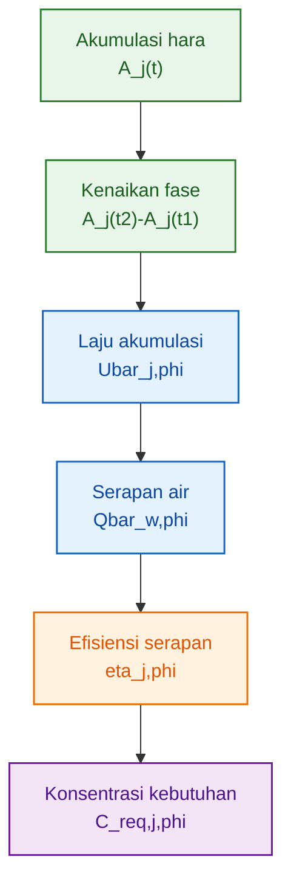

Diagram ini menunjukkan bahwa konsentrasi hara tidak muncul langsung dari rasio. Konsentrasi hara muncul setelah laju akumulasi dikoreksi oleh serapan air dan efisiensi serapan.

Maka hubungan inti Bab 4 adalah:

$$
\boxed{
akumulasi\ hara
\rightarrow
laju\ akumulasi
\rightarrow
serapan\ air
\rightarrow
konsentrasi\ kebutuhan
}
$$

Namun, konsentrasi kebutuhan belum tentu menjadi konsentrasi target akhir. Mengapa? Karena akar memiliki batas respons. Setelah konsentrasi tertentu, penambahan hara tidak lagi meningkatkan serapan secara berarti. Di sinilah konsep batas jenuh diperlukan.

[**Kembali ke Atas**](#model-formula-hara-cabai-berbasis-laju-serapan-dan-batas-jenuh-respons-per-fase-organ)

---

# 5. Respons Akar dan Batas Jenuh Hara

## 5.1 Serapan Hara Tidak Linear

Dalam sistem hidroponik dan fertigasi substrat, mudah sekali menganggap bahwa semakin tinggi konsentrasi larutan, semakin tinggi pula serapan hara. Anggapan ini tidak tepat.

Serapan hara oleh akar tidak naik terus secara linear. Pada konsentrasi rendah, penambahan hara dapat meningkatkan serapan secara nyata. Namun ketika konsentrasi meningkat, respons akar mulai melambat. Pada titik tertentu, akar mendekati kapasitas maksimum. Setelah itu, penambahan konsentrasi hanya memberi tambahan respons kecil.

Pola ini dapat diringkas menjadi tiga zona:

| Zona    | Kondisi                                  | Respons tanaman                            |
| ------- | ---------------------------------------- | ------------------------------------------ |
| Rendah  | konsentrasi belum cukup                  | serapan meningkat tajam jika hara ditambah |
| Efektif | konsentrasi cukup dan respons masih baik | zona kerja ideal                           |
| Jenuh   | konsentrasi tinggi                       | tambahan hara memberi respons kecil        |

Karena itu, formula hara tidak boleh hanya mengejar:

$$
C_{req,j,\phi}
$$

tetapi harus membandingkannya dengan batas respons tanaman.

---

## 5.2 Model Serapan Akar

Serapan unsur $j$ pada konsentrasi $C_j$ dapat ditulis sebagai fungsi jenuh:

$$
\boxed{
\begin{aligned}
S_j(C_j,t) &= S_{max,j}(t)
\frac{C_j}
{K_{m,j}(t)+C_j}
\end{aligned}
}
$$

Keterangan:

| Simbol         | Arti                                                       |
| -------------- | ---------------------------------------------------------- |
| $S_j(C_j,t)$   | laju serapan unsur $j$ pada konsentrasi $C_j$ dan umur $t$ |
| $S_{max,j}(t)$ | kapasitas maksimum serapan unsur $j$                       |
| $C_j$          | konsentrasi unsur $j$ di larutan                           |
| $K_{m,j}(t)$   | konsentrasi saat respons mencapai 50% maksimum             |
| $t$            | umur tanaman                                               |

Fungsi ini menunjukkan bahwa saat $C_j$ rendah, peningkatan konsentrasi akan meningkatkan serapan secara nyata. Namun saat $C_j$ sudah jauh lebih besar daripada $K_{m,j}$, serapan mendekati $S_{max,j}$.

Dengan kata lain:

$$
\boxed{
C_j\ naik
\not\Rightarrow
S_j\ naik\ tanpa\ batas
}
$$

---

## 5.3 Respons Relatif terhadap Konsentrasi

Agar lebih mudah dibaca, respons serapan dapat dinyatakan sebagai respons relatif:

$$
\boxed{
\begin{aligned}
R_j(C_j) &= \frac{C_j}
{K_{m,j}+C_j}
\end{aligned}
}
$$

Nilai respons relatif berada antara 0 dan 1:

$$
\boxed{
0<R_j(C_j)<1
}
$$

Jika:

$$
R_j(C_j)=0.5
$$

maka respons serapan berada pada 50% dari maksimum.

Jika:

$$
R_j(C_j)=0.9
$$

maka respons serapan berada pada 90% dari maksimum.

Jika:

$$
R_j(C_j)=0.95
$$

maka respons serapan berada pada 95% dari maksimum.

Ini penting karena formula hara sebaiknya tidak memaksa konsentrasi naik jauh melewati zona 90–95% respons. Di atas zona itu, tambahan konsentrasi umumnya semakin tidak efisien.

---

## 5.4 Titik Jenuh 90% dan 95%

Dari persamaan respons relatif:

$$
\begin{aligned}
R_j(C_j) &= \frac{C_j}
{K_{m,j}+C_j}
\end{aligned}
$$

kita dapat menghitung titik ketika respons mencapai 90%.

Jika:

$$
R_j(C_j)=0.90
$$

maka:

$$
0.90=
\frac{C_{90,j}}
{K_{m,j}+C_{90,j}}
$$

Sehingga:

$$
\boxed{
C_{90,j}=9K_{m,j}
}
$$

Untuk respons 95%:

$$
0.95=
\frac{C_{95,j}}
{K_{m,j}+C_{95,j}}
$$

Sehingga:

$$
\boxed{
C_{95,j}=19K_{m,j}
}
$$

Maknanya:

| Konsentrasi | Respons relatif |
| ----------- | --------------: |
| $K_{m,j}$   |             50% |
| $9K_{m,j}$  |             90% |
| $19K_{m,j}$ |             95% |

Zona antara 90% dan 95% dapat dipahami sebagai zona jenuh praktis. Tanaman masih merespons, tetapi tambahan respons sudah semakin kecil.

---

## 5.5 Batas Jenuh Bukan Titik Toksik

Hal penting yang harus dibedakan:

$$
\boxed{
batas\ jenuh\neq batas\ toksik
}
$$

Batas jenuh adalah titik ketika penambahan konsentrasi tidak lagi memberi respons berarti.

Batas toksik adalah titik ketika konsentrasi mulai merusak tanaman, menekan pertumbuhan, atau menyebabkan ketidakseimbangan ion.

Urutannya adalah:

$$
\boxed{
C_{min}<C_{opt}<C_{sat}<C_{tox}
}
$$

Keterangan:

| Simbol    | Arti                                             |
| --------- | ------------------------------------------------ |
| $C_{min}$ | konsentrasi minimum untuk menghindari defisiensi |
| $C_{opt}$ | zona konsentrasi optimal                         |
| $C_{sat}$ | batas jenuh respons                              |
| $C_{tox}$ | batas risiko toksik atau gangguan serius         |

Dengan demikian, target formula hara tidak seharusnya mendekati $C_{tox}$. Target yang baik berada di zona cukup sampai efektif, dan tidak perlu melewati $C_{sat}$.

---

## 5.6 Visualisasi Zona Respons Hara

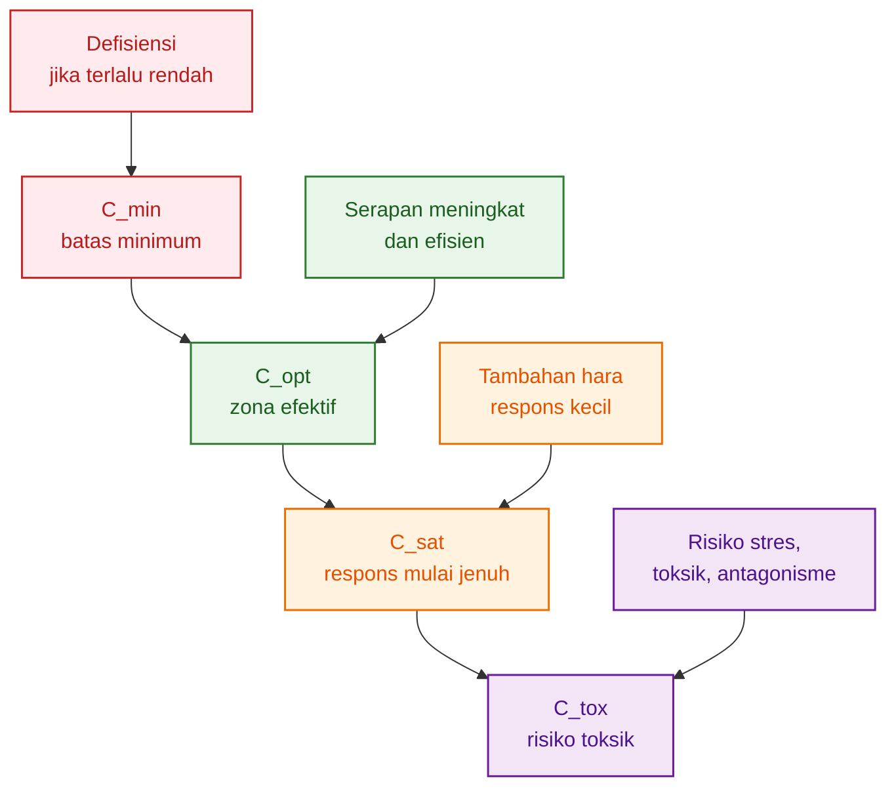

Poin tajam Bab 5:

> Batas jenuh bukan toksik. Batas jenuh adalah titik ketika tambahan konsentrasi tidak lagi memberi respons berarti.

Karena itu, jika konsentrasi sudah mendekati jenuh, menaikkan hara bukan lagi strategi yang efisien. Pada kondisi tersebut, perbaikan sebaiknya diarahkan pada faktor lain, seperti kesehatan akar, oksigen terlarut, suhu larutan, keseimbangan ion, dan distribusi air.

[**Kembali ke Atas**](#model-formula-hara-cabai-berbasis-laju-serapan-dan-batas-jenuh-respons-per-fase-organ)

---

# 6. Batas Jenuh per Unsur dan Fase Organ

## 6.1 Mengapa Batas Jenuh Harus Dibaca per Unsur?

Setiap unsur hara memiliki fungsi fisiologis dan pola akumulasi yang berbeda. Karena itu, batas jenuh tidak boleh dianggap sama untuk semua unsur.

Formula hara yang hanya menaikkan seluruh unsur secara bersamaan berisiko tidak efisien. Bisa saja satu unsur masih dibutuhkan, tetapi unsur lain sudah mendekati jenuh. Bisa juga satu unsur menjadi pembatas, sedangkan unsur lain ditambahkan berlebih tanpa memberi respons.

Dalam model ini, setiap unsur harus dibaca secara terpisah:

$$
\boxed{
C_{sat,N}\neq C_{sat,P}\neq C_{sat,K}\neq C_{sat,Ca}\neq C_{sat,Mg}
}
$$

Begitu juga responsnya:

$$
\boxed{
R_N(C_N)\neq R_P(C_P)\neq R_K(C_K)\neq R_{Ca}(C_{Ca})\neq R_{Mg}(C_{Mg})
}
$$

---

## 6.2 Nitrogen: Cukup untuk Tajuk, Tidak Berlebih pada Fase Buah

Nitrogen berhubungan kuat dengan:

- pertumbuhan daun,
- sintesis protein,
- pembentukan klorofil,
- aktivitas fotosintesis,
- pemeliharaan tajuk.

Pada fase vegetatif, respons terhadap N biasanya penting karena tanaman sedang membangun daun dan batang. Namun pada fase pembesaran buah dan panen intensif, N tetap dibutuhkan tetapi tidak boleh berlebihan.

Jika N terlalu tinggi saat tanaman berbuah, risiko yang mungkin muncul adalah:

- vegetatif berlebih,
- tajuk terlalu rimbun,
- alokasi ke buah terganggu,
- jaringan lebih lunak,
- keseimbangan dengan K, Ca, dan Mg terganggu.

Jadi untuk N, batas jenuh harus dibaca terhadap fase. Target N pada fase vegetatif tidak harus sama dengan target N pada fase pembesaran buah.

Secara model:

$$
\boxed{
C_{sat,N,vegetatif}
\neq
C_{sat,N,buah}
}
$$

---

## 6.3 Fosfor: Kecil secara Massa, Cepat Mencapai Zona Tidak Responsif

Fosfor sering memiliki akumulasi total lebih kecil dibanding N dan K. Namun P tetap penting untuk:

- energi,
- ATP,
- pembelahan sel,
- pertumbuhan akar,
- pembungaan awal,
- metabolisme.

Karena jumlah kebutuhannya relatif kecil, P perlu dikelola hati-hati. Penambahan P berlebih tidak selalu memberi respons pertumbuhan yang setara.

Dalam model formula hara, P tidak boleh diabaikan, tetapi juga tidak perlu dinaikkan tanpa dasar respons. Jika kebutuhan akumulasi P rendah dan respons sudah mendekati jenuh, tambahan P tidak akan efisien.

Secara praktis:

$$
\boxed{
P\ kecil\ secara\ jumlah
\neq
P\ tidak\ penting
}
$$

Namun:

$$
\boxed{
P\ penting
\neq
P\ harus\ tinggi
}
$$

---

## 6.4 Kalium: Penting untuk Buah, tetapi Bisa Menekan Ca dan Mg

Kalium berperan besar dalam:

- regulasi stomata,
- tekanan osmotik,
- transport gula,
- pengisian buah,
- kualitas buah,
- keseimbangan air sel.

Pada fase buah, K sering menjadi unsur dominan secara akumulasi. Namun K juga merupakan kation yang dapat berkompetisi dengan Ca dan Mg.

Jika K dinaikkan terlalu tinggi, potensi gangguan yang perlu diperhatikan adalah:

- serapan Ca menurun,
- serapan Mg menurun,
- risiko ketidakseimbangan K:Ca:Mg,
- gangguan kualitas jaringan,
- daun menunjukkan gejala defisiensi Mg,
- buah rentan masalah yang terkait distribusi Ca.

Maka batas jenuh K tidak hanya dibaca dari respons K terhadap buah, tetapi juga dari dampaknya terhadap Ca dan Mg.

Secara model:

$$
\boxed{
C_{sat,K}
}
$$

harus dikoreksi oleh:

$$
\boxed{
K:Ca:Mg
}
$$

Artinya, K tinggi bukan masalah jika masih berada pada zona respons efektif dan tidak menekan unsur lain. Namun K tinggi menjadi masalah jika sudah melewati batas respons atau menurunkan efektivitas Ca dan Mg.

---

## 6.5 Kalsium: Respons Dipengaruhi Transpirasi dan Distribusi Organ

Kalsium memiliki karakter berbeda dari N dan K. Ca relatif kurang mobile di dalam tanaman dan banyak bergerak mengikuti aliran transpirasi.

Karena itu, respons Ca tidak selalu meningkat hanya karena konsentrasi Ca dalam larutan dinaikkan. Serapan dan distribusi Ca juga dipengaruhi oleh:

- transpirasi,
- kelembapan udara,
- VPD,
- aliran air,
- kesehatan akar,
- suhu akar,
- pertumbuhan daun,
- pertumbuhan buah,
- kompetisi dengan K dan NH₄.

Pada fase buah, masalah Ca sering bukan hanya ketersediaan di larutan, tetapi distribusi ke organ target. Jika buah memiliki transpirasi rendah, Ca bisa lebih banyak bergerak ke daun dibanding ke buah.

Karena itu, untuk Ca:

$$
\boxed{
C_{req,Ca}
}
$$

tidak otomatis sama dengan:

$$
\boxed{
Ca\ yang\ efektif\ sampai\ ke\ buah
}
$$

Maka batas jenuh Ca perlu dibaca bersama faktor transpirasi dan organ dominan.

---

## 6.6 Magnesium: Penopang Fotosintesis saat Fase Buah

Magnesium penting untuk:

- klorofil,
- fotosintesis,
- aktivasi enzim,
- metabolisme energi,
- fungsi daun aktif.

Saat tanaman masuk fase buah, perhatian sering terlalu besar pada K. Padahal buah membutuhkan asimilat dari daun. Jika Mg tidak cukup, daun dapat kehilangan kapasitas fotosintesis, sehingga pengisian buah juga terganggu.

Mg juga dapat tertekan jika K terlalu tinggi. Karena itu, batas Mg tidak boleh dibaca sendiri, tetapi harus dilihat dalam konteks:

$$
\boxed{
K:Ca:Mg
}
$$

Pada fase panen intensif, Mg tetap penting karena tanaman harus mempertahankan daun sebagai source.

Secara praktis:

$$
\boxed{
buah\ sebagai\ sink
membutuhkan\ daun\ sebagai\ source
}
$$

dan daun sebagai source membutuhkan Mg.

---

## 6.7 Dominansi Organ pada Setiap Fase

Batas jenuh tidak hanya berbeda antarunsur, tetapi juga berbeda antar fase karena organ yang dominan tumbuh berubah.

Untuk membaca dominansi organ, digunakan bobot:

$$
\boxed{
\begin{aligned}
\omega_{o,\phi} &= \frac{\Delta W_o}
{\sum_o \Delta W_o}
\end{aligned}
}
$$

Keterangan:

| Simbol              | Arti                                        |
| ------------------- | ------------------------------------------- |
| $\omega_{o,\phi}$   | dominansi organ $o$ pada fase $\phi$        |
| $\Delta W_o$        | kenaikan berat kering organ $o$ selama fase |
| $\sum_o \Delta W_o$ | total kenaikan berat kering seluruh organ   |
| $o$                 | akar, batang, daun, bunga, buah             |

Jika:

$$
\omega_{buah,\phi}
$$

besar, maka fase tersebut didominasi pembentukan buah.

Jika:

$$
\omega_{daun,\phi}+\omega_{batang,\phi}
$$

besar, maka fase tersebut didominasi pembentukan tajuk.

Contoh interpretasi:

| Fase            | Organ dominan       | Makna                                              |
| --------------- | ------------------- | -------------------------------------------------- |
| Establishment   | akar dan daun muda  | akar sensitif, kebutuhan hara rendah tetapi kritis |
| Vegetatif       | daun dan batang     | N, Ca, Mg penting untuk tajuk                      |
| Generatif awal  | bunga dan buah muda | transisi sink                                      |
| Pembesaran buah | buah                | K penting, tetapi Ca dan Mg tetap harus dijaga     |
| Panen intensif  | buah + daun aktif   | keseimbangan source-sink                           |

---

## 6.8 Respons Fase-Organ terhadap Konsentrasi Hara

Untuk menggabungkan unsur dan fase organ, respons unsur $j$ pada fase $\phi$ dapat ditulis sebagai:

$$
\boxed{
\begin{aligned}
R_{j,\phi}(C_j) &= \sum_o
\omega_{o,\phi}
\frac{C_j}
{K_{m,j,o}+C_j}
\end{aligned}
}
$$

Keterangan:

| Simbol            | Arti                                       |
| ----------------- | ------------------------------------------ |
| $R_{j,\phi}(C_j)$ | respons fase $\phi$ terhadap unsur $j$     |
| $\omega_{o,\phi}$ | bobot dominansi organ $o$ pada fase $\phi$ |
| $K_{m,j,o}$       | parameter respons unsur $j$ pada organ $o$ |
| $C_j$             | konsentrasi unsur $j$                      |

Persamaan ini menunjukkan bahwa respons hara pada fase tertentu merupakan gabungan dari organ-organ yang sedang tumbuh. Jika fase didominasi buah, maka respons buah memiliki bobot besar. Jika fase didominasi daun, maka respons daun memiliki bobot besar.

Dengan demikian:

$$
\boxed{
titik\ jenuh\ harus\ dibaca\ terhadap\ organ\ yang\ sedang\ dominan\ tumbuh
}
$$

---

## 6.9 Visualisasi Hubungan Unsur, Organ, dan Batas Jenuh

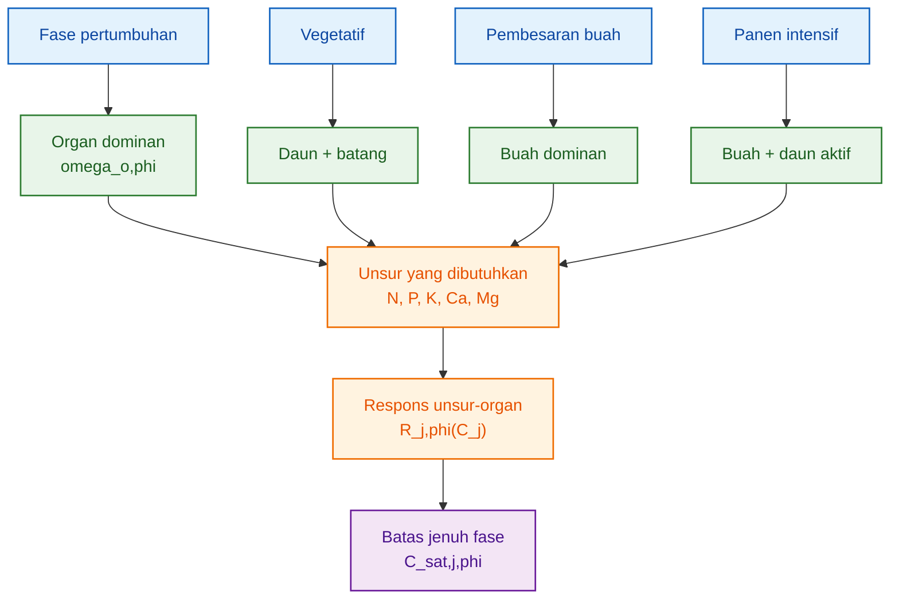

Diagram ini menegaskan bahwa batas jenuh bukan angka tunggal yang berdiri sendiri. Batas jenuh harus dibaca dari kombinasi:

$$
\boxed{
unsur
+
fase
+
organ\ dominan
}
$$

---

## 6.10 Kesimpulan Bab 6

Bab ini menegaskan bahwa setiap unsur memiliki karakter respons yang berbeda.

Nitrogen penting untuk tajuk, tetapi tidak boleh berlebihan saat buah dominan. Fosfor kecil secara jumlah, tetapi penting secara fungsi. Kalium kuat pada fase buah, tetapi bisa menekan Ca dan Mg. Kalsium sangat dipengaruhi transpirasi dan distribusi organ. Magnesium menjaga fotosintesis, terutama ketika tanaman harus mempertahankan daun aktif selama fase produksi.

Maka formula hara tidak cukup hanya menghitung:

$$
C_{req,j,\phi}
$$

Formula hara harus juga mempertimbangkan:

$$
C_{sat,j,\phi}
$$

yang dibaca dari respons unsur terhadap organ dominan pada fase tersebut.

Prinsip tajamnya:

$$
\boxed{
konsentrasi\ yang\ cukup
belum\ tentu\ konsentrasi\ yang\ tepat,
jika\ sudah\ melewati\ titik\ jenuh\ respons
}
$$

Bab berikutnya akan menyusun semua komponen ini ke dalam formula utama artikel:

$$
\boxed{
C_{target,j,\phi}
}
$$

[**Kembali ke Atas**](#model-formula-hara-cabai-berbasis-laju-serapan-dan-batas-jenuh-respons-per-fase-organ)

---

# 7. Formula Target Konsentrasi N, P, K, Ca, Mg

Bab ini adalah inti artikel. Sampai Bab 6, kita sudah membangun tiga komponen utama:

1. laju akumulasi hara tanaman;
2. kebutuhan konsentrasi berdasarkan serapan air;
3. batas jenuh respons akar dan organ dominan.

Sekarang ketiganya disatukan menjadi formula target konsentrasi hara.

Tujuan formula ini bukan mencari konsentrasi larutan setinggi mungkin, tetapi mencari konsentrasi yang:

- cukup untuk memenuhi laju akumulasi tanaman;
- tidak lebih rendah dari batas minimum;
- tidak melewati batas jenuh respons;
- tetap aman dari risiko toksik;
- dapat dibaca per unsur dan per fase.

Prinsip tajamnya:

> Formula yang baik bukan konsentrasi tertinggi, tetapi konsentrasi yang memenuhi kebutuhan tanpa melewati zona respons efektif.

---

## 7.1 Posisi Formula Target dalam Model

Formula target berada setelah kita menghitung:

$$
\bar{U}_{j,\phi}
$$

dan:

$$
C_{req,j,\phi}
$$

Dari Bab 4:

$$
\boxed{
\begin{aligned}
C_{req,j,\phi} &= \frac{\bar{U}_{j,\phi}}
{\bar{Q}_{w,\phi}\eta_{j,\phi}}
\end{aligned}
}
$$

Konsentrasi tersebut adalah **konsentrasi kebutuhan teoritis** berdasarkan laju akumulasi, serapan air, dan efisiensi serapan.

Namun:

$$
C_{req,j,\phi}
$$

belum otomatis menjadi target akhir. Nilai tersebut harus dibatasi oleh:

$$
C_{min,j}
$$

$$
C_{sat,j,\phi}
$$

$$
C_{tox,j}-m_j
$$

Maka formula target konsentrasi disusun sebagai:

$$
\boxed{
\begin{aligned}
C_{target,j,\phi} &= \min
\left[
C_{sat,j,\phi},
C_{tox,j}-m_j,
\max(C_{min,j},C_{req,j,\phi})
\right]
\end{aligned}
}
$$

Keterangan:

| Simbol              | Arti                                             |
| ------------------- | ------------------------------------------------ |
| $C_{target,j,\phi}$ | target konsentrasi unsur $j$ pada fase $\phi$    |
| $C_{req,j,\phi}$    | konsentrasi kebutuhan berdasarkan laju akumulasi |
| $C_{min,j}$         | batas minimum agar tidak defisiensi              |
| $C_{sat,j,\phi}$    | batas jenuh respons unsur $j$ pada fase $\phi$   |
| $C_{tox,j}$         | batas risiko toksik unsur $j$                    |
| $m_j$               | margin keamanan dari batas toksik                |
| $j$                 | N, P, K, Ca, Mg                                  |
| $\phi$              | fase pertumbuhan                                 |

Secara alur:

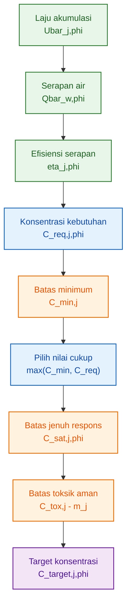

---

## 7.2 Makna Struktur `min` dan `max`

Formula ini memiliki dua lapisan penting.

Pertama, bagian:

$$
\boxed{
\max(C_{min,j},C_{req,j,\phi})
}
$$

berfungsi sebagai **lantai kecukupan**.

Artinya, target tidak boleh lebih rendah dari batas minimum. Jika kebutuhan hasil hitung terlalu rendah, konsentrasi tetap dijaga minimal agar tidak terjadi defisiensi.

Contoh:

Jika:

$$
C_{req,j,\phi}<C_{min,j}
$$

maka:

$$
\boxed{
\max(C_{min,j},C_{req,j,\phi})=C_{min,j}
}
$$

Kedua, bagian:

$$
\boxed{
\min
\left[
C_{sat,j,\phi},
C_{tox,j}-m_j,
...
\right]
}
$$

berfungsi sebagai **atap keamanan dan efisiensi**.

Artinya, target tidak boleh melewati batas jenuh respons dan tidak boleh mendekati batas toksik.

Jadi formula ini bekerja dengan prinsip:

$$
\boxed{
cukup\ dari\ bawah,
dibatasi\ dari\ atas
}
$$

Secara sederhana:

| Kondisi                           | Keputusan formula                  |
| --------------------------------- | ---------------------------------- |
| $C_{req}<C_{min}$                 | pakai $C_{min}$                    |
| $C_{min}\leq C_{req}\leq C_{sat}$ | pakai $C_{req}$                    |
| $C_{req}>C_{sat}$                 | batasi di $C_{sat}$                |
| $C_{req}>C_{tox}-m$               | batasi di zona aman                |
| $C_{sat}>C_{tox}-m$               | batas toksik aman lebih menentukan |

---

## 7.3 Tiga Zona Keputusan Formula

Formula target harus dibaca melalui tiga zona keputusan.

### Zona 1 — Defisiensi Potensial

Jika:

$$
\boxed{
C_{req,j,\phi}<C_{min,j}
}
$$

maka tanaman mungkin masih membutuhkan konsentrasi minimum untuk menjaga fungsi dasar unsur tersebut.

Keputusan:

$$
\boxed{
C_{target,j,\phi}=C_{min,j}
}
$$

Maknanya:

> Walaupun laju akumulasi fase terlihat rendah, unsur tersebut tetap harus tersedia pada batas minimum agar fungsi fisiologis tidak terganggu.

---

### Zona 2 — Zona Respons Efektif

Jika:

$$
\boxed{
C_{min,j}\leq C_{req,j,\phi}\leq C_{sat,j,\phi}
}
$$

maka kebutuhan tanaman masih berada dalam zona respons efektif.

Keputusan:

$$
\boxed{
C_{target,j,\phi}=C_{req,j,\phi}
}
$$

Maknanya:

> Konsentrasi dihitung langsung dari laju akumulasi, serapan air, dan efisiensi serapan.

Ini adalah zona kerja terbaik.

---

### Zona 3 — Zona Jenuh

Jika:

$$
\boxed{
C_{req,j,\phi}>C_{sat,j,\phi}
}
$$

maka kebutuhan hitung sudah melebihi batas respons efektif.

Keputusan:

$$
\boxed{
C_{target,j,\phi}=C_{sat,j,\phi}
}
$$

atau, jika batas toksik aman lebih rendah:

$$
\boxed{
C_{target,j,\phi}=C_{tox,j}-m_j
}
$$

Maknanya:

> Masalahnya tidak lagi diselesaikan dengan menaikkan konsentrasi. Yang perlu diperiksa adalah akar, air, lingkungan, antagonisme, atau parameter model.

Ini adalah bagian penting. Jika kebutuhan hitung melebihi titik jenuh, menaikkan konsentrasi bukan solusi utama.

---

## 7.4 Formula Vektor per Fase

Pada satu fase pertumbuhan, formula target tidak hanya dihitung untuk satu unsur. Formula harus dihitung untuk seluruh unsur utama:

$$
j=N,\ P,\ K,\ Ca,\ Mg
$$

Maka target konsentrasi fase ditulis sebagai vektor:

$$
\boxed{
\begin{aligned}
\mathbf{C}_{target,\phi} &= [
C_{N,\phi},
C_{P,\phi},
C_{K,\phi},
C_{Ca,\phi},
C_{Mg,\phi}
]
\end{aligned}
}
$$

Keterangan:

| Komponen      | Arti                                   |
| ------------- | -------------------------------------- |
| $C_{N,\phi}$  | target konsentrasi N pada fase $\phi$  |
| $C_{P,\phi}$  | target konsentrasi P pada fase $\phi$  |
| $C_{K,\phi}$  | target konsentrasi K pada fase $\phi$  |
| $C_{Ca,\phi}$ | target konsentrasi Ca pada fase $\phi$ |
| $C_{Mg,\phi}$ | target konsentrasi Mg pada fase $\phi$ |

Vektor ini adalah bentuk awal formula nutrisi fase.

Namun vektor ini masih merupakan **target biologis-konsentrasi**, belum formula pupuk teknis. Artinya, ini belum menghitung jenis garam pupuk, kompatibilitas larutan A-B, kelarutan, atau komposisi air baku.

---

## 7.5 Formula Target Nitrogen

Untuk nitrogen:

$$
\boxed{
\begin{aligned}
C_{target,N,\phi} &= \min
\left[
C_{sat,N,\phi},
C_{tox,N}-m_N,
\max(C_{min,N},C_{req,N,\phi})
\right]
\end{aligned}
}
$$

Dengan:

$$
\boxed{
\begin{aligned}
C_{req,N,\phi} &= \frac{\bar{U}_{N,\phi}}
{\bar{Q}_{w,\phi}\eta_{N,\phi}}
\end{aligned}
}
$$

Interpretasi:

- Jika N terlalu rendah, daun dan tajuk dapat melemah.
- Jika N cukup, tanaman mampu mempertahankan klorofil, protein, dan pertumbuhan.
- Jika N terlalu tinggi, terutama saat buah dominan, tanaman dapat terdorong terlalu vegetatif.

Pada fase vegetatif, nilai:

$$
C_{target,N,\phi}
$$

dapat lebih tinggi karena daun dan batang sedang aktif dibangun. Pada fase pembesaran buah, N tetap diperlukan, tetapi targetnya harus dikendalikan agar tidak mengganggu alokasi ke buah.

Prinsip untuk N:

$$
\boxed{
N\ harus\ cukup\ untuk\ mempertahankan\ source,
tetapi\ tidak\ berlebih\ sampai\ menekan\ sink\ buah
}
$$

---

## 7.6 Formula Target Fosfor

Untuk fosfor:

$$
\boxed{
\begin{aligned}
C_{target,P,\phi} &= \min
\left[
C_{sat,P,\phi},
C_{tox,P}-m_P,
\max(C_{min,P},C_{req,P,\phi})
\right]
\end{aligned}
}
$$

Dengan:

$$
\boxed{
\begin{aligned}
C_{req,P,\phi} &= \frac{\bar{U}_{P,\phi}}
{\bar{Q}_{w,\phi}\eta_{P,\phi}}
\end{aligned}
}
$$

Interpretasi:

- P penting untuk akar, energi, pembelahan sel, dan fase generatif awal.
- Akumulasi P biasanya lebih kecil dibanding N dan K.
- P berlebih tidak selalu menghasilkan respons pertumbuhan yang sebanding.

Karena itu, P harus cukup, tetapi tidak perlu dipaksa tinggi tanpa dasar laju akumulasi.

Prinsip untuk P:

$$
\boxed{
P\ kecil\ secara\ massa,
tetapi\ penting\ secara\ fungsi
}
$$

dan:

$$
\boxed{
P\ penting
\neq
P\ harus\ tinggi
}
$$

---

## 7.7 Formula Target Kalium

Untuk kalium:

$$
\boxed{
\begin{aligned}
C_{target,K,\phi} &= \min
\left[
C_{sat,K,\phi},
C_{tox,K}-m_K,
\max(C_{min,K},C_{req,K,\phi})
\right]
\end{aligned}
}
$$

Dengan:

$$
\boxed{
\begin{aligned}
C_{req,K,\phi} &= \frac{\bar{U}_{K,\phi}}
{\bar{Q}_{w,\phi}\eta_{K,\phi}}
\end{aligned}
}
$$

Interpretasi:

- K penting untuk stomata, tekanan osmotik, transport gula, dan pembesaran buah.
- K sering tinggi pada fase generatif dan buah.
- Namun K berlebih dapat menekan Ca dan Mg.

Karena itu, target K tidak cukup hanya mengikuti:

$$
C_{req,K,\phi}
$$

Target K juga harus memperhatikan:

$$
C_{sat,K,\phi}
$$

dan pada Bab 8 akan dikoreksi oleh hubungan:

$$
K:Ca:Mg
$$

Prinsip untuk K:

$$
\boxed{
K\ penting\ untuk\ buah,
tetapi\ K\ tinggi\ tidak\ boleh\ mengorbankan\ Ca\ dan\ Mg
}
$$

---

## 7.8 Formula Target Kalsium

Untuk kalsium:

$$
\boxed{
\begin{aligned}
C_{target,Ca,\phi} &= \min
\left[
C_{sat,Ca,\phi},
C_{tox,Ca}-m_{Ca},
\max(C_{min,Ca},C_{req,Ca,\phi})
\right]
\end{aligned}
}
$$

Dengan:

$$
\boxed{
\begin{aligned}
C_{req,Ca,\phi} &= \frac{\bar{U}_{Ca,\phi}}
{\bar{Q}_{w,\phi}\eta_{Ca,\phi}}
\end{aligned}
}
$$

Interpretasi:

- Ca penting untuk dinding sel, kekuatan jaringan, dan integritas organ muda.
- Ca tidak selalu mudah dialirkan ke buah karena mobilitasnya rendah.
- Distribusi Ca sangat dipengaruhi aliran air dan transpirasi.

Maka formula Ca harus dibaca lebih hati-hati daripada sekadar menaikkan konsentrasi Ca.

Jika:

$$
C_{req,Ca,\phi}>C_{sat,Ca,\phi}
$$

maka menaikkan Ca di larutan belum tentu menyelesaikan masalah. Bisa jadi faktor pembatasnya adalah:

- aliran transpirasi,
- VPD,
- kelembapan,
- kesehatan akar,
- suhu larutan,
- atau kompetisi dengan K dan NH₄.

Prinsip untuk Ca:

$$
\boxed{
Ca\ bukan\ hanya\ masalah\ konsentrasi,
tetapi\ juga\ masalah\ distribusi
}
$$

---

## 7.9 Formula Target Magnesium

Untuk magnesium:

$$
\boxed{
\begin{aligned}
C_{target,Mg,\phi} &= \min
\left[
C_{sat,Mg,\phi},
C_{tox,Mg}-m_{Mg},
\max(C_{min,Mg},C_{req,Mg,\phi})
\right]
\end{aligned}
}
$$

Dengan:

$$
\boxed{
\begin{aligned}
C_{req,Mg,\phi} &= \frac{\bar{U}_{Mg,\phi}}
{\bar{Q}_{w,\phi}\eta_{Mg,\phi}}
\end{aligned}
}
$$

Interpretasi:

- Mg penting untuk klorofil dan fotosintesis.
- Mg mendukung daun sebagai source.
- Mg dapat tertekan jika K terlalu tinggi.

Pada fase buah, Mg tidak boleh diabaikan. Buah membutuhkan asimilat, dan asimilat berasal dari daun. Daun membutuhkan Mg untuk menjaga fotosintesis.

Prinsip untuk Mg:

$$
\boxed{
buah\ sebagai\ sink
tetap\ bergantung\ pada\ daun\ sebagai\ source
}
$$

dan daun sebagai source membutuhkan Mg.

---

## 7.10 Tabel Ringkas Formula per Unsur

| Unsur | Formula target       | Fokus fisiologis             | Risiko jika berlebih                       |
| ----- | -------------------- | ---------------------------- | ------------------------------------------ |
| N     | $C_{target,N,\phi}$  | tajuk, klorofil, protein     | vegetatif berlebih                         |
| P     | $C_{target,P,\phi}$  | energi, akar, pembelahan sel | respons tambahan kecil                     |
| K     | $C_{target,K,\phi}$  | stomata, gula, buah          | menekan Ca dan Mg                          |
| Ca    | $C_{target,Ca,\phi}$ | dinding sel, jaringan muda   | tidak selalu efektif jika distribusi buruk |
| Mg    | $C_{target,Mg,\phi}$ | klorofil, fotosintesis       | terganggu oleh K tinggi                    |

Tabel ini menegaskan bahwa formula target harus dibaca per unsur. Tidak ada satu unsur yang bisa dinaikkan tanpa mempertimbangkan unsur lain dan fase pertumbuhan.

---

## 7.11 Contoh Kerangka Perhitungan Satu Fase

Misal fase pembesaran buah memiliki data berikut untuk unsur K:

$$
\bar{U}_{K,\phi}=50\ mg/tanaman/hari
$$

$$
\bar{Q}_{w,\phi}=0.5\ L/tanaman/hari
$$

$$
\eta_{K,\phi}=0.8
$$

Maka:

$$
\begin{aligned}
C_{req,K,\phi} &= \frac{50}{0.5\times0.8}
\end{aligned}
$$

$$
\boxed{
C_{req,K,\phi}=125\ mg/L
}
$$

Misal batas minimum K:

$$
C_{min,K}=80\ mg/L
$$

batas jenuh fase:

$$
C_{sat,K,\phi}=160\ mg/L
$$

batas toksik aman:

$$
C_{tox,K}-m_K=220\ mg/L
$$

Maka:

$$
\begin{aligned}
C_{target,K,\phi} &= \min
[
160,\ 220,\ \max(80,\ 125)
]
\end{aligned}
$$

$$
\begin{aligned}
C_{target,K,\phi} &= \min
[
160,\ 220,\ 125
]
\end{aligned}
$$

$$
\boxed{
C_{target,K,\phi}=125\ mg/L
}
$$

Artinya, kebutuhan K berada dalam zona efektif.

Namun jika hasil hitung:

$$
C_{req,K,\phi}=190\ mg/L
$$

maka:

$$
\begin{aligned}
C_{target,K,\phi} &= \min
[
160,\ 220,\ \max(80,\ 190)
]
\end{aligned}
$$

$$
\begin{aligned}
C_{target,K,\phi} &= \min
[
160,\ 220,\ 190
]
\end{aligned}
$$

$$
\boxed{
C_{target,K,\phi}=160\ mg/L
}
$$

Artinya, target dibatasi pada batas jenuh. Menaikkan K di atas 160 mg/L tidak dianggap strategi utama karena respons sudah mendekati jenuh.

---

## 7.12 Apa yang Dilakukan Jika `C_req` Melebihi `C_sat`?

Kondisi penting:

$$
\boxed{
C_{req,j,\phi}>C_{sat,j,\phi}
}
$$

Ini tidak boleh langsung diterjemahkan menjadi:

> Naikkan konsentrasi hara sampai kebutuhan terpenuhi.

Justru kondisi ini memberi sinyal bahwa sistem memiliki pembatas lain.

Kemungkinan penyebab:

| Penyebab                    | Penjelasan                              |
| --------------------------- | --------------------------------------- |
| Serapan air rendah          | tanaman tidak membawa cukup hara masuk  |
| Akar kurang aktif           | luas akar atau kesehatan akar membatasi |
| Oksigen rendah              | akar tidak mampu menyerap optimal       |
| Suhu larutan tidak ideal    | metabolisme akar terganggu              |
| pH tidak sesuai             | ketersediaan unsur terganggu            |
| Antagonisme ion             | unsur lain menekan serapan              |
| Beban buah tinggi           | kebutuhan melebihi kapasitas akar       |
| VPD/transpirasi tidak tepat | terutama memengaruhi Ca                 |

Jika:

$$
C_{req,j,\phi}>C_{sat,j,\phi}
$$

maka strategi yang lebih tepat adalah memeriksa:

$$
\boxed{
akar,\ air,\ lingkungan,\ dan\ keseimbangan\ ion
}
$$

bukan sekadar menaikkan konsentrasi.

---

## 7.13 Status Formula Target: Biologis, Bukan Resep Pupuk Final

Formula:

$$
\boxed{
C_{target,j,\phi}
}
$$

adalah target konsentrasi unsur hara. Ini belum sama dengan komposisi pupuk teknis.

Untuk menjadi resep pupuk, masih diperlukan tahap lain:

- konversi unsur ke garam pupuk,
- koreksi kualitas air baku,
- pemisahan larutan A dan B,
- kompatibilitas Ca dengan fosfat dan sulfat,
- kelarutan pupuk,
- EC total,
- pH target,
- drainase,
- dan koreksi antagonisme.

Jadi Bab 7 menghasilkan:

$$
\boxed{
target\ konsentrasi\ unsur
}
$$

bukan:

$$
\boxed{
resep\ stok\ pupuk\ final
}
$$

Tahap koreksi antarunsur akan dibahas pada Bab 8.

---

## 7.14 Diagram Keputusan Formula Target

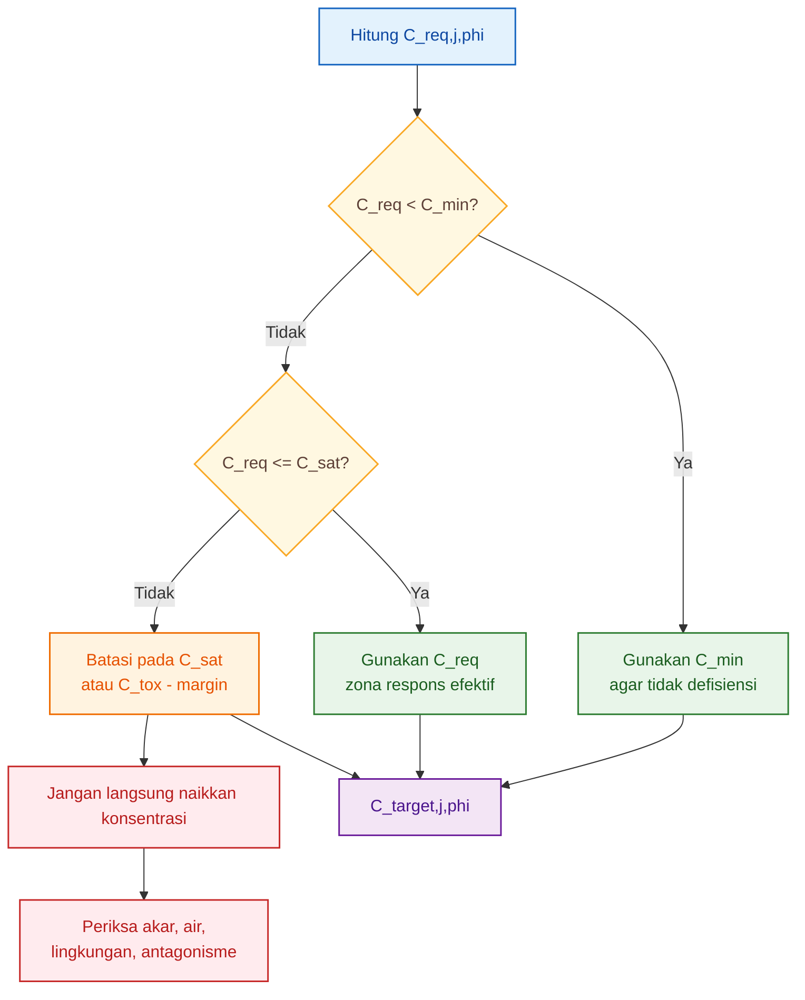

Diagram ini menunjukkan logika utama Bab 7: formula target bukan sekadar hasil pembagian kebutuhan hara dengan air terserap. Formula target adalah hasil keputusan antara kebutuhan, minimum, jenuh, dan batas aman.

---

## 7.15 Kesimpulan Bab 7

Formula target konsentrasi hara adalah pusat artikel ini.

Rumus utamanya:

$$
\boxed{
\begin{aligned}
C_{target,j,\phi} &= \min
\left[
C_{sat,j,\phi},
C_{tox,j}-m_j,
\max(C_{min,j},C_{req,j,\phi})
\right]
\end{aligned}
}
$$

dan vektor fase:

$$
\boxed{
\begin{aligned}
\mathbf{C}_{target,\phi} &= [
C_{N,\phi},
C_{P,\phi},
C_{K,\phi},
C_{Ca,\phi},
C_{Mg,\phi}
]
\end{aligned}
}
$$

Makna praktisnya:

1. $C_{req}$ memenuhi laju akumulasi tanaman.
2. $C_{min}$ mencegah defisiensi.
3. $C_{sat}$ mencegah pemberian melewati zona respons efektif.
4. $C_{tox}-m$ menjaga keamanan dari risiko toksik.
5. Formula dihitung per unsur dan per fase.

Kesimpulan tajamnya:

$$
\boxed{
formula\ nutrisi\ yang\ presisi
bukan\ yang\ paling\ pekat,
tetapi\ yang\ cukup,\ efektif,\ dan\ tidak\ melewati\ batas\ respons
}
$$

Bab berikutnya akan membahas mengapa target konsentrasi ini masih perlu dikoreksi oleh interaksi antarhara, terutama:

$$
\boxed{
K:Ca:Mg
}
$$

dan:

$$
\boxed{
NH_4:NO_3
}
$$

[**Kembali ke Atas**](#model-formula-hara-cabai-berbasis-laju-serapan-dan-batas-jenuh-respons-per-fase-organ)

---

# 8. Koreksi Antagonisme dan Unsur Pembatas

Bab 7 menghasilkan target konsentrasi awal:

$$
\boxed{
C_{target,j,\phi}
}
$$

Namun target tersebut belum boleh dianggap final. Alasannya, unsur hara tidak bekerja sendiri. Di dalam larutan dan zona akar, unsur hara saling memengaruhi. Satu unsur yang terlalu tinggi dapat menekan serapan unsur lain, walaupun unsur yang ditekan sebenarnya tersedia dalam larutan.

Karena itu, setelah target konsentrasi dihitung, perlu dilakukan koreksi terhadap:

$$
\boxed{
antagonisme\ hara
}
$$

dan:

$$
\boxed{
unsur\ pembatas
}
$$

Dua kelompok antagonisme yang paling penting dalam formula cabai hidroponik/fertigasi adalah:

$$
\boxed{
K:Ca:Mg
}
$$

dan:

$$
\boxed{
NH_4:NO_3
}
$$

Poin tajam bab ini:

> Jika Ca menjadi pembatas, menaikkan K tidak menyelesaikan masalah.

---

## 8.1 Mengapa Antagonisme Harus Masuk Model?

Pada Bab 7, target konsentrasi dihitung per unsur. Misalnya:

$$
C_{target,K,\phi}
$$

$$
C_{target,Ca,\phi}
$$

$$
C_{target,Mg,\phi}
$$

Namun akar tidak menyerap unsur dalam ruang yang terpisah. K, Ca, Mg, dan NH₄ berada dalam larutan yang sama dan masuk melalui sistem serapan yang saling berinteraksi.

Jika K terlalu tinggi, serapan Ca dan Mg dapat terganggu. Jika NH₄ terlalu tinggi, serapan kation lain juga dapat tertekan. Maka, formula yang hanya menghitung kebutuhan setiap unsur secara terpisah masih belum cukup.

Model perlu membaca dua hal:

1. **berapa target konsentrasi setiap unsur**, dan
2. **apakah unsur tersebut masih efektif diserap dalam kehadiran unsur lain**.

Dengan demikian, target konsentrasi awal:

$$
C_{target,j,\phi}
$$

perlu dikoreksi menjadi:

$$
C'_{j,\phi}
$$

yaitu konsentrasi target setelah memperhitungkan antagonisme.

---

## 8.2 Antagonisme K terhadap Ca

Kalsium memiliki karakter khusus. Ca penting untuk dinding sel, kekuatan jaringan, dan organ muda. Namun serapan dan distribusi Ca mudah terganggu oleh kondisi akar, transpirasi, dan persaingan dengan ion lain.

Salah satu antagonisme penting adalah pengaruh K dan NH₄ terhadap efektivitas Ca.

Faktor koreksi antagonisme Ca dapat ditulis:

$$
\boxed{
\begin{aligned}
f_{ant,Ca} &= \frac{1}
{1+\alpha_K C_K+\alpha_{NH4}C_{NH4}}
\end{aligned}
}
$$

Keterangan:

| Simbol         | Arti                                      |
| -------------- | ----------------------------------------- |
| $f_{ant,Ca}$   | faktor efektivitas Ca setelah antagonisme |
| $C_K$          | konsentrasi K dalam larutan               |
| $C_{NH4}$      | konsentrasi amonium dalam larutan         |
| $\alpha_K$     | koefisien pengaruh K terhadap Ca          |
| $\alpha_{NH4}$ | koefisien pengaruh NH₄ terhadap Ca        |

Nilai:

$$
\boxed{
0<f_{ant,Ca}\leq1
}
$$

Jika K dan NH₄ rendah atau masih seimbang, maka:

$$
f_{ant,Ca}\approx1
$$

Artinya, efektivitas Ca tidak banyak terganggu.

Namun jika K atau NH₄ tinggi, maka penyebut membesar, sehingga:

$$
f_{ant,Ca}<1
$$

Artinya, efektivitas Ca menurun.

Konsentrasi Ca terkoreksi dapat ditulis:

$$
\boxed{
\begin{aligned}
C'_{Ca,\phi} &= C_{target,Ca,\phi}
\times
f_{ant,Ca}
\end{aligned}
}
$$

Makna praktisnya:

> Walaupun Ca tersedia dalam larutan, efektivitasnya dapat turun jika K atau NH₄ terlalu tinggi.

Karena itu, masalah Ca tidak selalu diselesaikan dengan menaikkan Ca. Kadang masalahnya adalah K atau NH₄ yang terlalu dominan.

---

## 8.3 Antagonisme K dan Ca terhadap Mg

Magnesium juga perlu dikoreksi karena Mg dapat ditekan oleh keseimbangan kation lain, terutama K dan Ca.

Faktor koreksi antagonisme Mg dapat ditulis:

$$
\boxed{
\begin{aligned}
f_{ant,Mg} &= \frac{1}
{1+\beta_K C_K+\beta_{Ca}C_{Ca}}
\end{aligned}
}
$$

Keterangan:

| Simbol       | Arti                                      |
| ------------ | ----------------------------------------- |
| $f_{ant,Mg}$ | faktor efektivitas Mg setelah antagonisme |
| $C_K$        | konsentrasi K dalam larutan               |
| $C_{Ca}$     | konsentrasi Ca dalam larutan              |
| $\beta_K$    | koefisien pengaruh K terhadap Mg          |
| $\beta_{Ca}$ | koefisien pengaruh Ca terhadap Mg         |

Nilai:

$$
\boxed{
0<f_{ant,Mg}\leq1
}
$$

Jika K terlalu tinggi, Mg dapat menjadi kurang efektif. Jika Ca sangat tinggi, Mg juga bisa tertekan. Karena itu, Mg harus dibaca dalam konteks rasio kation, bukan sebagai unsur tunggal.

Konsentrasi Mg terkoreksi:

$$
\boxed{
\begin{aligned}
C'_{Mg,\phi} &= C_{target,Mg,\phi}
\times
f_{ant,Mg}
\end{aligned}
}
$$

Makna praktisnya:

> Jika tanaman menunjukkan gejala Mg rendah, masalahnya belum tentu Mg di larutan kurang. Bisa jadi Mg kalah bersaing oleh K atau Ca.

---

## 8.4 Konsentrasi Terkoreksi Antagonisme

Secara umum, konsentrasi terkoreksi untuk unsur $j$ pada fase $\phi$ dapat ditulis sebagai:

$$
\boxed{
\begin{aligned}
C'_{j,\phi} &= C_{target,j,\phi}
\times
f_{ant,j,\phi}
\end{aligned}
}
$$

Keterangan:

| Simbol              | Arti                                            |
| ------------------- | ----------------------------------------------- |
| $C'_{j,\phi}$       | konsentrasi efektif setelah koreksi antagonisme |
| $C_{target,j,\phi}$ | target konsentrasi awal dari Bab 7              |
| $f_{ant,j,\phi}$    | faktor koreksi antagonisme unsur $j$            |

Jika:

$$
f_{ant,j,\phi}=1
$$

maka unsur tersebut tidak banyak terganggu.

Jika:

$$
f_{ant,j,\phi}=0.7
$$

maka efektivitas unsur turun sekitar 30%.

Dalam praktik, ini berarti konsentrasi unsur tidak boleh dibaca hanya dari angka larutan. Yang lebih penting adalah:

$$
\boxed{
konsentrasi\ efektif
}
$$

yaitu konsentrasi yang masih dapat diserap dan digunakan tanaman.

---

## 8.5 Koreksi Tidak Selalu Berarti Menambah Unsur

Poin penting: jika efektivitas Ca atau Mg turun akibat antagonisme, solusinya tidak selalu menaikkan Ca atau Mg.

Misalnya, jika:

$$
f_{ant,Ca}
$$

rendah karena K terlalu tinggi, menaikkan Ca bisa saja kurang efektif. Strategi yang lebih tepat mungkin:

- menurunkan K,
- menurunkan NH₄,
- memperbaiki rasio K:Ca:Mg,
- memperbaiki transpirasi,
- memperbaiki kondisi akar,
- atau menstabilkan pH dan EC.

Contoh logika:

| Masalah                       | Penyebab mungkin        | Koreksi yang lebih tepat       |
| ----------------------------- | ----------------------- | ------------------------------ |
| Ca rendah di jaringan muda    | K terlalu tinggi        | turunkan K relatif terhadap Ca |
| Mg rendah di daun             | K tinggi                | koreksi rasio K:Mg             |
| Ca tidak masuk buah           | transpirasi buah rendah | koreksi VPD, air, akar         |
| Mg rendah meski larutan cukup | antagonisme K/Ca        | koreksi keseimbangan kation    |

Maka prinsipnya:

$$
\boxed{
defisiensi\ jaringan
\neq
selalu\ kekurangan\ konsentrasi\ larutan
}
$$

---

## 8.6 Respons Multi-Hara

Pertumbuhan tanaman tidak dikendalikan oleh satu unsur saja. Walaupun satu unsur berada pada zona optimal, pertumbuhan tetap bisa tertahan jika unsur lain menjadi pembatas.

Respons total fase dapat ditulis sebagai gabungan respons setiap unsur:

$$
\boxed{
\begin{aligned}
R_{\phi} &= R_{N,\phi}
\times
R_{P,\phi}
\times
R_{K,\phi}
\times
R_{Ca,\phi}
\times
R_{Mg,\phi}
\end{aligned}
}
$$

Namun untuk keperluan praktis, pendekatan unsur pembatas sering lebih tajam. Respons fase dapat dibaca sebagai unsur dengan nilai respons terendah:

$$
\boxed{
\begin{aligned}
R_{\phi} &= \min
(
R_N,\ R_P,\ R_K,\ R_{Ca},\ R_{Mg}
)
\end{aligned}
}
$$

Keterangan:

| Simbol     | Arti                |
| ---------- | ------------------- |
| $R_{\phi}$ | respons total fase  |
| $R_N$      | respons terhadap N  |
| $R_P$      | respons terhadap P  |
| $R_K$      | respons terhadap K  |
| $R_{Ca}$   | respons terhadap Ca |
| $R_{Mg}$   | respons terhadap Mg |

Jika:

$$
R_N=0.90
$$

$$
R_P=0.85
$$

$$
R_K=0.92
$$

$$
R_{Ca}=0.55
$$

$$
R_{Mg}=0.80
$$

maka:

$$
\boxed{
R_{\phi}=0.55
}
$$

Artinya, fase tersebut dibatasi oleh Ca.

Jika Ca menjadi pembatas, menaikkan K tidak menyelesaikan masalah. Bahkan, menaikkan K bisa memperburuk kondisi jika K menekan Ca lebih lanjut.

---

## 8.7 Ilustrasi Unsur Pembatas

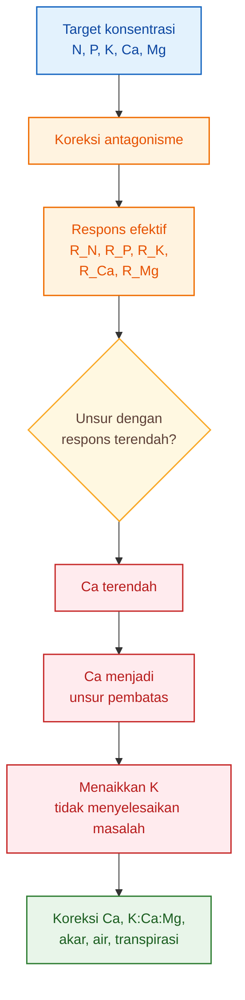

Diagram ini menegaskan bahwa formula hara harus melihat unsur yang paling membatasi respons. Jika satu unsur menjadi bottleneck, unsur lain yang dinaikkan tidak akan memberi hasil optimal.

---

## 8.8 Implikasi Praktis untuk Formula Hidroponik/Fertigasi

Setelah Bab 7 dan Bab 8 digabung, alur formula menjadi:

$$
\boxed{
C_{req}
\rightarrow
C_{target}
\rightarrow
C'
\rightarrow
R_{\phi}
}
$$

Artinya:

1. hitung konsentrasi kebutuhan dari laju akumulasi;
2. batasi dengan minimum, jenuh, dan toksik;
3. koreksi dengan antagonisme;
4. cek unsur pembatas.

Alur lengkap:

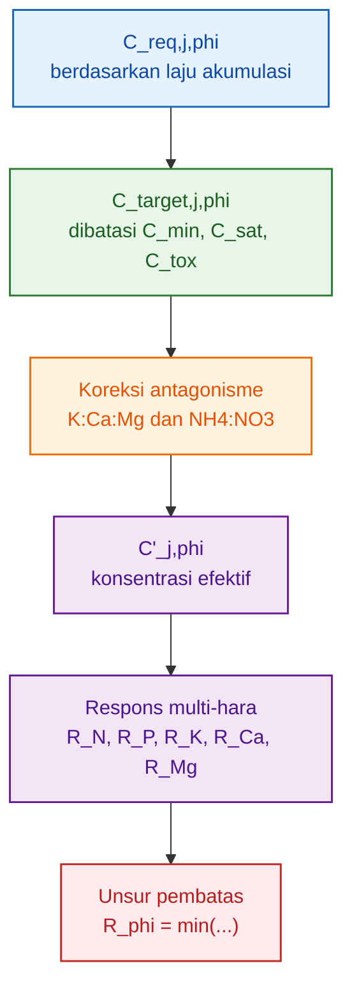

Formula yang tajam tidak berhenti pada:

$$
C_{target,j,\phi}
$$

tetapi membaca apakah target tersebut tetap efektif setelah masuk ke sistem ion yang nyata.

---

## 8.9 Kesimpulan Bab 8

Bab 8 menegaskan bahwa formula hara tidak boleh dibaca sebagai daftar konsentrasi unsur yang berdiri sendiri.

Target konsentrasi:

$$
C_{target,N},\ C_{target,P},\ C_{target,K},\ C_{target,Ca},\ C_{target,Mg}
$$

harus dikoreksi oleh interaksi antarhara, terutama:

$$
\boxed{
K:Ca:Mg
}
$$

dan:

$$
\boxed{
NH_4:NO_3
}
$$

Koreksi umum:

$$
\boxed{
\begin{aligned}
C'_{j,\phi} &= C_{target,j,\phi}
\times
f_{ant,j,\phi}
\end{aligned}
}
$$

Respons fase dibatasi oleh unsur dengan respons terendah:

$$
\boxed{
\begin{aligned}
R_{\phi} &= \min
(
R_N,\ R_P,\ R_K,\ R_{Ca},\ R_{Mg}
)
\end{aligned}
}
$$

Kesimpulan tajamnya:

$$
\boxed{
menaikkan\ unsur\ yang\ bukan\ pembatas
tidak\ memperbaiki\ respons\ tanaman
}
$$

Jika Ca menjadi pembatas, menaikkan K tidak menyelesaikan masalah. Jika Mg menjadi pembatas, menaikkan N tidak otomatis meningkatkan fotosintesis. Jika akar menjadi pembatas, menaikkan semua konsentrasi justru bisa meningkatkan stres.

[**Kembali ke Atas**](#model-formula-hara-cabai-berbasis-laju-serapan-dan-batas-jenuh-respons-per-fase-organ)

---

# 9. Adaptasi untuk Lahan Tanah dan Strategi Pemupukan

Bab ini harus dibaca sebagai batas dan jembatan, bukan sebagai pengalihan fokus artikel. Model utama artikel ini tetap untuk hidroponik dan fertigasi substrat. Namun karena cabai juga banyak dibudidayakan di lahan tanah, perlu dijelaskan bagaimana model ini diadaptasi.

Poin utamanya:

> Lahan tanah bukan sistem larutan langsung. Tanah menyimpan, melepas, mengikat, dan kehilangan hara.

Karena itu, output model pada lahan tanah bukan:

$$
\boxed{
C_{target}
}
$$

melainkan:

$$
\boxed{
F_{j,\phi}
}
$$

yaitu kebutuhan pupuk unsur $j$ pada fase $\phi$.

---

## 9.1 Perbedaan Kunci: Hidroponik vs Lahan Tanah

Pada hidroponik/fertigasi substrat, hara terutama dikendalikan melalui konsentrasi larutan. Maka output model adalah:

$$
\boxed{
C_{target,j,\phi}
}
$$

Pada lahan tanah, hara tidak langsung tersedia sebagai larutan yang dapat dikontrol penuh. Hara berada dalam berbagai bentuk:

- larutan tanah,
- koloid tanah,
- bahan organik,
- mineral tanah,
- kompleks jerapan,
- biomassa mikroba,
- bentuk terfiksasi,
- dan bentuk yang dapat tercuci.

Maka output model lahan adalah:

$$
\boxed{
F_{j,\phi}
}
$$

yaitu dosis pupuk fase yang sudah dikoreksi oleh suplai tanah, kehilangan, dan efisiensi pemupukan.

Perbedaannya:

| Aspek         | Hidroponik / fertigasi         | Lahan tanah                        |
| ------------- | ------------------------------ | ---------------------------------- |
| Output utama  | $C_{target,j,\phi}$            | $F_{j,\phi}$                       |
| Basis kontrol | konsentrasi larutan            | dosis pupuk dan kesuburan tanah    |
| Satuan umum   | mg/L, mmol/L, ppm              | kg/ha, g/tanaman                   |
| Buffer hara   | rendah–sedang                  | sedang–tinggi                      |
| Risiko utama  | jenuh larutan, antagonisme ion | fiksasi, pencucian, pH, CEC        |
| Koreksi utama | pH, EC, drainase, rasio ion    | analisis tanah dan efisiensi pupuk |

---

## 9.2 Kebutuhan Tanaman Tetap Sama

Walaupun sistem budidaya berbeda, kebutuhan biologis tanaman tetap dibaca dari model yang sama:

$$
\boxed{
\Delta A_{j,\phi}
}
$$

yaitu kenaikan akumulasi unsur $j$ pada fase $\phi$.

Artinya, cabai tetap membutuhkan N, P, K, Ca, dan Mg untuk membangun akar, batang, daun, bunga, dan buah. Perbedaannya bukan pada kebutuhan biologisnya, tetapi pada cara hara disediakan.

Dengan kata lain:

$$
\boxed{
kebutuhan\ tanaman = berbasis\ akumulasi
}
$$

sedangkan:

$$
\boxed{
strategi\ suplai = bergantung\ sistem\ budidaya
}
$$

---

## 9.3 Formula Adaptasi untuk Lahan Tanah

Pada lahan tanah, kebutuhan pupuk fase dapat ditulis sebagai:

$$
\boxed{
F_{j,\phi} =
\frac{
\Delta A_{j,\phi}
- S_{j,\phi}
- M_{j,\phi}
- O_{j,\phi}
+ L_{j,\phi}
+ I_{j,\phi}
}
{RE_{j,\phi}}
}
$$

Keterangan:

| Simbol              | Arti                                              |
| ------------------- | ------------------------------------------------- |
| $F_{j,\phi}$        | kebutuhan pupuk unsur $j$ pada fase $\phi$        |
| $\Delta A_{j,\phi}$ | kenaikan akumulasi hara tanaman pada fase $\phi$  |
| $S_{j,\phi}$        | suplai hara tersedia dari tanah                   |
| $M_{j,\phi}$        | mineralisasi hara dari bahan organik tanah        |
| $O_{j,\phi}$        | kontribusi pupuk organik atau kompos              |
| $L_{j,\phi}$        | kehilangan hara, misalnya pencucian atau limpasan |
| $I_{j,\phi}$        | imobilisasi, fiksasi, atau pengikatan hara        |
| $RE_{j,\phi}$       | recovery efficiency pupuk                         |

Makna formula:

- kebutuhan tanaman ditunjukkan oleh $\Delta A_{j,\phi}$;
- suplai alami tanah dikurangkan;
- mineralisasi dan pupuk organik dikurangkan;
- kehilangan dan fiksasi ditambahkan;
- hasil akhirnya dibagi efisiensi pemulihan pupuk.

Jadi pada lahan tanah, dosis pupuk bukan sama dengan akumulasi tanaman. Dosis pupuk adalah akumulasi yang dibutuhkan setelah dikoreksi oleh tanah dan efisiensi pupuk.

---

## 9.4 Makna Setiap Komponen Formula Lahan

### 9.4.1 Kenaikan Akumulasi Tanaman

$$
\Delta A_{j,\phi}
$$

adalah kebutuhan biologis fase. Ini berasal dari model artikel pertama.

Jika fase pembesaran buah membutuhkan tambahan K besar, maka:

$$
\Delta A_{K,\phi}
$$

akan besar.

Namun di lahan, kebutuhan tersebut belum tentu seluruhnya harus berasal dari pupuk. Sebagian bisa berasal dari tanah.

---

### 9.4.2 Suplai Hara Tersedia dari Tanah

$$
S_{j,\phi}
$$

adalah hara yang sudah tersedia di tanah dan dapat diserap tanaman.

Contoh:

- N mineral tanah,
- P tersedia,
- K-dd,
- Ca-dd,
- Mg-dd.

Semakin tinggi suplai tanah, semakin kecil kebutuhan pupuk tambahan.

---

### 9.4.3 Mineralisasi Bahan Organik

$$
M_{j,\phi}
$$

adalah hara yang dilepas dari bahan organik tanah selama fase tersebut.

Tanah dengan C-organik baik dapat menyediakan sebagian N, S, dan unsur lain melalui mineralisasi. Namun laju mineralisasi dipengaruhi oleh suhu, kelembapan, aerasi, tekstur, dan aktivitas mikroba.

---

### 9.4.4 Kontribusi Pupuk Organik

$$
O_{j,\phi}
$$

adalah kontribusi dari kompos, pupuk kandang, atau bahan organik tambahan.

Kontribusi ini tidak boleh diasumsikan 100% tersedia langsung. Sebagian hara pupuk organik tersedia lambat, terutama N dan P.

---

### 9.4.5 Kehilangan Hara

$$
L_{j,\phi}
$$

adalah hara yang hilang dari sistem.

Contoh kehilangan:

- pencucian nitrat,
- limpasan permukaan,
- erosi,
- volatilization untuk N tertentu,
- drainase berlebih.

Jika risiko kehilangan tinggi, kebutuhan pupuk efektif dapat meningkat.

---

### 9.4.6 Imobilisasi dan Fiksasi

$$
I_{j,\phi}
$$

adalah hara yang menjadi tidak tersedia karena diikat atau diimobilisasi.

Contoh:

- P terfiksasi oleh Fe/Al pada tanah masam,
- P terikat Ca pada tanah alkalis,
- N diimobilisasi mikroba,
- K terjerap pada mineral liat tertentu.

Semakin tinggi imobilisasi atau fiksasi, semakin besar pupuk yang dibutuhkan untuk mencapai suplai efektif.

---

### 9.4.7 Recovery Efficiency

$$
RE_{j,\phi}
$$

adalah fraksi pupuk yang benar-benar dapat dimanfaatkan tanaman.

Nilainya:

$$
\boxed{
0<RE_{j,\phi}\leq1
}
$$

Jika:

$$
RE=0.5
$$

artinya hanya 50% pupuk yang efektif dipulihkan oleh tanaman pada fase tersebut.

Maka, semakin rendah:

$$
RE_{j,\phi}
$$

semakin besar dosis pupuk yang dibutuhkan untuk mencapai akumulasi tanaman yang sama.

---

## 9.5 Parameter Tanah yang Wajib Masuk

Untuk mengadaptasi model ke lahan tanah, data kesuburan tanah wajib masuk.

Parameter minimal:

| Parameter tanah | Fungsi dalam model                   |
| --------------- | ------------------------------------ |
| pH              | menentukan ketersediaan hara         |
| C-organik       | sumber mineralisasi dan buffer tanah |
| N tersedia      | koreksi kebutuhan N                  |
| P tersedia      | koreksi kebutuhan P                  |
| K-dd            | koreksi kebutuhan K                  |
| Ca-dd           | status Ca tanah                      |
| Mg-dd           | status Mg tanah                      |
| KTK / CEC       | kapasitas tanah menahan kation       |
| Tekstur         | retensi air dan hara                 |
| EC tanah        | risiko salinitas                     |

Jika data ini tidak tersedia, rekomendasi pupuk lahan akan lemah karena model tidak mengetahui berapa hara yang sudah disediakan tanah.

---

## 9.6 Strategi Pemupukan Lahan Berdasarkan Fase

Pada lahan tanah, strategi pemupukan tidak sefleksibel hidroponik. Rezim pemupukan biasanya dibagi menjadi:

- pupuk dasar,
- pupuk susulan,
- pembenahan tanah,
- dan koreksi fase produksi.

Contoh kerangka strategi:

| Fase            | Strategi pemupukan lahan                              |
| --------------- | ----------------------------------------------------- |
| Pra-tanam       | koreksi pH, bahan organik, pupuk dasar                |
| Establishment   | pupuk ringan, dukung akar                             |
| Vegetatif       | susulan N, K, Ca, Mg sesuai status tanah              |
| Generatif awal  | koreksi K, Ca, dan unsur pendukung bunga              |
| Pembesaran buah | susulan K, Ca, Mg terkontrol                          |
| Panen intensif  | split application mengikuti panen dan kondisi tanaman |

Namun strategi ini harus selalu dikoreksi oleh data tanah. Tanah dengan K-dd tinggi tidak memerlukan perlakuan sama dengan tanah K-dd rendah. Tanah dengan pH masam dan P terfiksasi tidak bisa diperlakukan sama dengan tanah pH netral.

---

## 9.7 Ilustrasi Adaptasi Hidroponik dan Lahan

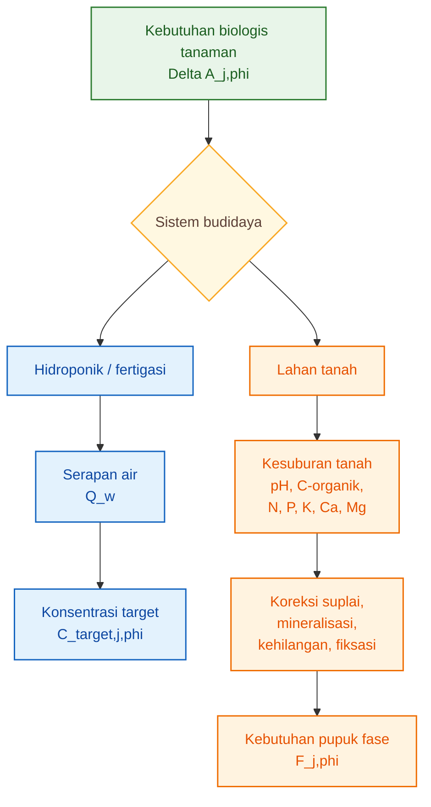

Diagram ini menunjukkan bahwa titik awalnya sama, yaitu kebutuhan biologis tanaman. Tetapi setelah itu, jalurnya bercabang sesuai sistem budidaya.

---

## 9.8 Batas Bab Ini

Bab 9 tidak bertujuan membuat rekomendasi pupuk lahan secara lengkap. Bab ini hanya menjelaskan bagaimana model hidroponik/fertigasi dapat diadaptasi secara konseptual untuk lahan tanah.

Untuk membuat rekomendasi pupuk lahan yang benar-benar operasional, diperlukan data tambahan:

- hasil analisis tanah,
- target hasil,
- riwayat pemupukan,
- jenis pupuk,
- efisiensi pupuk,
- curah hujan atau irigasi,
- tekstur tanah,
- dan kondisi drainase.

Tanpa data tersebut, formula pupuk lahan akan terlalu spekulatif.

---

## 9.9 Kesimpulan Bab 9

Model artikel ini memiliki dua keluaran berbeda tergantung sistem budidaya.

Untuk hidroponik dan fertigasi substrat:

$$
\boxed{
output = C_{target,j,\phi}
}
$$

Untuk lahan tanah:

$$
\boxed{
output = F_{j,\phi}
}
$$

Dengan formula adaptasi:

$$
\boxed{
F_{j,\phi} =
\frac{
\Delta A_{j,\phi}
- S_{j,\phi}
- M_{j,\phi}
- O_{j,\phi}
+ L_{j,\phi}
+ I_{j,\phi}
}
{RE_{j,\phi}}
}
$$

Kesimpulan tajamnya:

$$
\boxed{
lahan\ tanah\ bukan\ sistem\ larutan\ langsung
}
$$

Tanah menyimpan, melepas, mengikat, dan kehilangan hara. Karena itu, strategi pemupukan lahan harus selalu memasukkan kesuburan tanah dan efisiensi pupuk.

Artikel ini tetap berfokus pada model konsentrasi hara untuk hidroponik/fertigasi, sedangkan lahan tanah ditempatkan sebagai adaptasi dengan submodel tersendiri.

[**Kembali ke Atas**](#model-formula-hara-cabai-berbasis-laju-serapan-dan-batas-jenuh-respons-per-fase-organ)

---

# 10. Validasi Formula dan Protokol Data Praktisi

## 10.1 Mengapa Formula Harus Divalidasi?

Formula target konsentrasi yang dibangun pada artikel ini tidak boleh langsung dianggap benar hanya karena rumusnya rapi. Formula harus diuji terhadap tanaman nyata.

Target konsentrasi seperti:

$$
C_{target,N,\phi},\ C_{target,P,\phi},\ C_{target,K,\phi},\ C_{target,Ca,\phi},\ C_{target,Mg,\phi}
$$

baru layak digunakan jika mampu menghasilkan respons tanaman yang sesuai dengan fase pertumbuhannya.

Validasi tidak cukup hanya melihat:

$$
EC
$$

atau:

$$
ppm
$$

Sebab EC hanya menunjukkan total konsentrasi ion dalam larutan. EC tidak menjelaskan apakah N, P, K, Ca, dan Mg benar-benar masuk ke tanaman, apakah tersimpan di organ yang tepat, atau apakah unsur tertentu menjadi pembatas.

Poin tajamnya:

> Formula tidak divalidasi dari EC saja, tetapi dari respons organ dan akumulasi hara.

Dengan demikian, validasi formula harus melihat tiga lapis:

$$
\boxed{
larutan
\rightarrow
akar
\rightarrow
organ\ tanaman
}
$$

---

## 10.2 Apa yang Harus Divalidasi?

Formula hara perlu divalidasi pada beberapa tingkat.

### 10.2.1 Validasi Larutan

Validasi larutan memastikan bahwa konsentrasi yang diberikan benar-benar sesuai dengan target.

Data yang diamati:

- konsentrasi input,
- konsentrasi drainase atau larutan sisa,
- pH,
- EC,
- suhu larutan,
- volume input,
- volume drainase.

Tujuannya adalah mengetahui apakah larutan yang diberikan stabil dan tidak berubah ekstrem di zona akar.

---

### 10.2.2 Validasi Akar

Akar adalah pintu masuk air dan hara. Formula yang baik tetap gagal jika akar tidak sehat.

Data yang diamati:

- warna akar,
- jumlah akar aktif,
- panjang dan percabangan akar,
- gejala busuk akar,
- lendir atau biofilm berlebih,
- suhu zona akar,
- oksigen terlarut bila tersedia.

Dalam model ini, akar sehat berarti efisiensi serapan:

$$
\eta_{j,\phi}
$$

lebih mendekati kondisi optimal.

Jika akar tidak sehat, nilai:

$$
C_{target,j,\phi}
$$

tidak otomatis meningkatkan akumulasi hara. Masalahnya bukan lagi konsentrasi, tetapi kapasitas serapan.

---

### 10.2.3 Validasi Organ Tanaman

Validasi utama harus dilakukan pada organ tanaman:

- akar,
- batang,
- daun,
- bunga,
- buah.

Yang diamati adalah apakah formula menghasilkan pertumbuhan organ sesuai fase.

| Fase            | Organ yang harus divalidasi | Indikator utama                          |
| --------------- | --------------------------- | ---------------------------------------- |
| Establishment   | akar, daun muda             | akar aktif, daun muda tumbuh             |
| Vegetatif       | daun, batang                | tajuk dan percabangan meningkat          |
| Generatif awal  | bunga, buah muda            | bunga dan fruit set terbentuk            |
| Pembesaran buah | buah, daun aktif            | buah membesar, daun tetap sehat          |
| Panen intensif  | buah, daun, akar            | panen berlanjut, tajuk tidak cepat turun |

Formula yang benar tidak hanya membuat tanaman hijau. Formula yang benar harus membuat organ yang tepat tumbuh pada fase yang tepat.

---

## 10.3 Data Minimal untuk Hidroponik dan Fertigasi Substrat

Untuk praktisi, data minimal yang perlu dikumpulkan adalah:

| Data                      | Fungsi                                              |
| ------------------------- | --------------------------------------------------- |
| Berat kering organ        | membaca pertumbuhan akar, batang, daun, bunga, buah |
| Kadar N, P, K, Ca, Mg     | menghitung akumulasi hara                           |
| Serapan air harian        | mengubah laju akumulasi menjadi konsentrasi         |
| Konsentrasi input         | memastikan formula yang diberikan                   |
| Konsentrasi drainase/sisa | membaca serapan dan sisa hara                       |
| pH                        | membaca kondisi ketersediaan hara                   |
| EC                        | membaca total kekuatan larutan                      |
| Suhu larutan              | membaca risiko stres akar                           |
| Kondisi akar              | membaca kapasitas serapan                           |

Data tersebut membentuk rantai validasi:

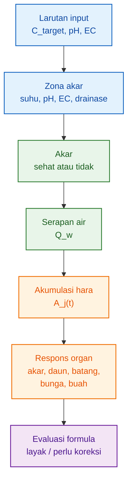

---

## 10.4 Protokol Pengamatan Praktis

Agar model bisa diuji, pengamatan sebaiknya dilakukan per fase.

Minimal fase pengamatan:

$$
\boxed{
vegetatif,\ generatif\ awal,\ pembesaran\ buah,\ panen\ intensif
}
$$

Lebih baik jika data dikumpulkan secara mingguan.

Untuk setiap waktu pengamatan, ambil data berikut:

| Kelompok data | Parameter                                                    |
| ------------- | ------------------------------------------------------------ |
| Larutan       | pH input, EC input, konsentrasi N, P, K, Ca, Mg              |
| Drainase/sisa | pH drainase, EC drainase, konsentrasi sisa hara              |
| Air           | volume input, volume drainase, estimasi serapan air          |
| Tanaman       | jumlah daun, jumlah bunga, jumlah buah, bobot buah           |
| Organ         | berat segar dan berat kering akar, batang, daun, bunga, buah |
| Jaringan      | kadar N, P, K, Ca, Mg                                        |
| Akar          | warna, percabangan, gejala busuk, vigor                      |
| Lingkungan    | suhu larutan, suhu udara, kelembapan, cahaya bila tersedia   |

Serapan air per tanaman dapat dihitung sederhana:

$$
\boxed{
Q_w=
\frac{V_{input}-V_{drainase}}
{jumlah\ tanaman}
}
$$

Keterangan:

| Simbol         | Arti                       |
| -------------- | -------------------------- |
| $Q_w$          | serapan air per tanaman    |
| $V_{input}$    | volume larutan masuk       |
| $V_{drainase}$ | volume larutan keluar/sisa |

Jika sistem recirculating, pendekatannya perlu disesuaikan dengan perubahan volume dan konsentrasi larutan di tandon.

---

## 10.5 Validasi Akumulasi Hara

Akumulasi hara observasi dihitung dengan persamaan:

$$
\boxed{
A_{j,obs}(t)=
\sum_o W_{o,obs}(t)C_{j,o,obs}(t)
}
$$

Keterangan:

| Simbol           | Arti                                      |
| ---------------- | ----------------------------------------- |
| $A_{j,obs}(t)$   | akumulasi unsur $j$ hasil observasi       |
| $W_{o,obs}(t)$   | berat kering organ hasil pengamatan       |
| $C_{j,o,obs}(t)$ | kadar unsur $j$ pada organ hasil analisis |

Lalu dibandingkan dengan prediksi model:

$$
\boxed{
A_{j,pred}(t)
}
$$

Error tiap unsur:

$$
\boxed{
e_j(t)=A_{j,obs}(t)-A_{j,pred}(t)
}
$$

Jika error besar, maka formula atau parameternya perlu dikoreksi.

---

## 10.6 Metrik Validasi

### 10.6.1 RMSE

RMSE menunjukkan besar kesalahan model dalam satuan asli data.

$$
\boxed{
RMSE_j=
\sqrt{
\frac{1}{n}
\sum_{i=1}^{n}
(A_{j,obs,i}-A_{j,pred,i})^2
}
}
$$

Keterangan:

| Simbol         | Arti                                           |
| -------------- | ---------------------------------------------- |
| $RMSE_j$       | root mean square error unsur $j$               |
| $A_{j,obs,i}$  | akumulasi observasi unsur $j$ pada data ke-$i$ |
| $A_{j,pred,i}$ | akumulasi prediksi unsur $j$ pada data ke-$i$  |
| $n$            | jumlah data                                    |

RMSE berguna untuk mengetahui besar error dalam satuan:

$$
mg/tanaman
$$

---

### 10.6.2 MAPE

MAPE menunjukkan error dalam persen.

$$
\boxed{
MAPE_j=
\frac{100}{n}
\sum_{i=1}^{n}
\left|
\frac{
A_{j,obs,i}-A_{j,pred,i}
}
{A_{j,obs,i}}
\right|
}
$$

Interpretasi praktis:

|   MAPE | Kualitas model                    |
| -----: | --------------------------------- |
|  < 10% | sangat baik                       |
| 10–20% | layak operasional                 |
| 20–30% | perlu koreksi                     |
|   >30% | belum layak untuk formula presisi |

MAPE perlu hati-hati pada fase awal karena nilai akumulasi kecil dapat membuat error persentase tampak besar.

---

### 10.6.3 Bias

Bias menunjukkan apakah model cenderung terlalu tinggi atau terlalu rendah.

$$
\boxed{
Bias_j=
\frac{1}{n}
\sum_{i=1}^{n}
(A_{j,pred,i}-A_{j,obs,i})
}
$$

Interpretasi:

| Bias | Makna                                   |
| ---: | --------------------------------------- |
|   >0 | model cenderung overestimate            |
|  < 0 | model cenderung underestimate           |
|   ≈0 | tidak ada kecenderungan arah error kuat |

Jika model selalu overestimate K, formula bisa terlalu mendorong K. Jika model underestimate Ca, tanaman dapat masuk risiko Ca menjadi pembatas.

---

## 10.7 Validasi Organ

Validasi tidak cukup hanya pada total tanaman. Formula harus dilihat terhadap organ yang sedang dominan tumbuh.

### Akar

Validasi akar penting pada fase establishment dan seluruh sistem hidroponik.

Parameter:

- berat kering akar,
- warna akar,
- percabangan,
- akar putih aktif,
- tidak ada busuk.

Jika akar buruk, nilai:

$$
\eta_{j,\phi}
$$

harus diturunkan.

---

### Daun

Daun adalah source fotosintesis.

Parameter:

- berat kering daun,
- warna daun,
- luas daun,
- klorosis,
- nekrosis,
- kadar N dan Mg,
- akumulasi Ca pada daun.

Jika daun melemah saat fase buah, pengisian buah juga akan terganggu.

---

### Batang

Batang menunjukkan struktur dan transport.

Parameter:

- berat kering batang,
- kekuatan batang,
- percabangan,
- keseimbangan vegetatif-generatif.

Batang terlalu dominan saat fase buah dapat menunjukkan formula masih terlalu mendorong vegetatif.

---

### Bunga

Bunga penting pada fase generatif awal.

Parameter:

- jumlah bunga,
- bunga gugur,
- keberhasilan fruit set,
- kondisi bunga abnormal.

Jika bunga banyak gugur, formula tidak bisa hanya dilihat dari NPK. Ca, B, keseimbangan air, suhu, dan stres akar perlu diperiksa.

---

### Buah

Buah adalah organ utama pada fase pembesaran dan panen.

Parameter:

- jumlah buah,
- bobot buah,
- berat kering buah,
- ukuran buah,
- kualitas buah,
- gejala fisiologis,
- kadar K, Ca, dan Mg pada buah.

Jika buah tidak berkembang meski K tinggi, kemungkinan pembatasnya bukan K.

---

## 10.8 Keputusan Validasi Formula

Setelah data terkumpul, formula dapat diklasifikasikan menjadi tiga status.

| Status        | Kriteria                                                           | Tindakan              |
| ------------- | ------------------------------------------------------------------ | --------------------- |
| Layak         | akumulasi sesuai, organ tumbuh sesuai fase, error rendah           | formula dapat dipakai |
| Perlu koreksi | ada error sedang atau organ tertentu tidak sesuai                  | koreksi parameter     |
| Tidak layak   | error tinggi, gejala defisiensi/kelebihan, organ tidak sesuai fase | bangun ulang model    |

Diagram keputusan:

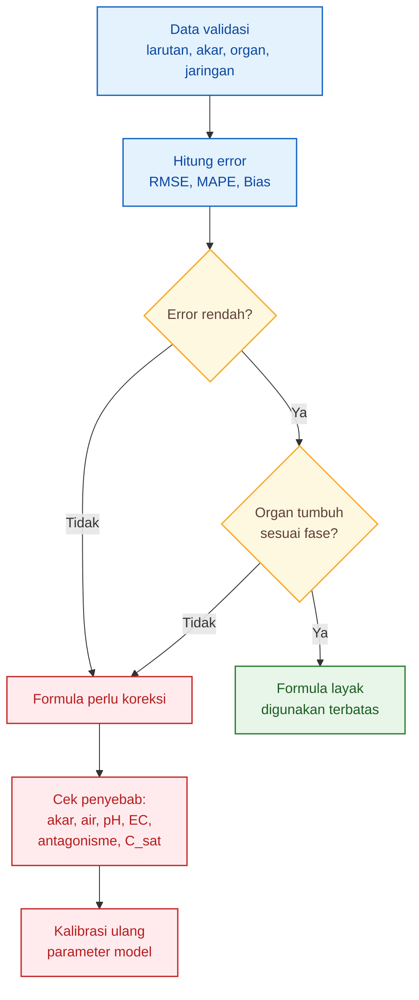

---

## 10.9 Parameter yang Paling Sering Perlu Dikoreksi

Jika formula tidak sesuai, jangan langsung mengubah semua unsur. Koreksi harus dimulai dari parameter yang paling mungkin menyebabkan error.

| Gejala                              | Parameter yang perlu dicek               |
| ----------------------------------- | ---------------------------------------- |
| Akumulasi rendah semua unsur        | akar, serapan air, suhu larutan, oksigen |
| K tinggi tetapi buah tidak membesar | source daun, beban buah, cahaya, Mg      |
| Ca jaringan rendah                  | K:Ca, NH₄, VPD, transpirasi, akar        |
| Mg rendah                           | K terlalu tinggi, Ca tinggi, pH, akar    |
| N berlebih                          | vegetatif terlalu kuat, buah lambat      |
| EC tinggi tetapi pertumbuhan rendah | overfeeding, stres akar, jenuh respons   |
| pH drift tajam                      | komposisi ion tidak seimbang             |

Validasi yang baik tidak hanya bertanya:

> Apakah konsentrasi sudah sesuai?

Tetapi juga:

> Apakah tanaman merespons sesuai fase?

---

## 10.10 Kesimpulan Bab 10

Validasi formula hara harus dilakukan pada tiga tingkat:

$$
\boxed{
larutan
\rightarrow
akar
\rightarrow
organ
}
$$

Data minimal yang wajib dikumpulkan meliputi berat kering organ, kadar N, P, K, Ca, Mg, serapan air harian, konsentrasi input, konsentrasi drainase atau sisa, pH, EC, suhu larutan, dan kondisi akar.

Metrik seperti:

$$
RMSE,\ MAPE,\ Bias
$$

berguna untuk mengukur akurasi model, tetapi tidak cukup jika berdiri sendiri. Formula juga harus divalidasi terhadap respons organ:

$$
akar,\ daun,\ batang,\ bunga,\ buah
$$

Kesimpulan tajamnya:

$$
\boxed{
formula\ tidak\ divalidasi\ dari\ EC\ saja,
tetapi\ dari\ akumulasi\ hara\ dan\ respons\ organ
}
$$

---

# 11. Kesimpulan

Artikel pertama menghasilkan dasar biologis berupa rasio akumulasi N:P:K:Ca:Mg per fase pertumbuhan. Rasio tersebut dibangun dari berat kering organ dan kadar hara jaringan.

Alur artikel pertama adalah:

$$
\boxed{
berat\ kering\ organ
\rightarrow
akumulasi\ hara
\rightarrow
rasio\ N:P:K:Ca:Mg
}
$$

Artikel kedua melanjutkan model tersebut ke tahap formula hara. Fokusnya bukan lagi hanya membaca unsur mana yang lebih banyak diakumulasi, tetapi mengubah laju akumulasi menjadi target konsentrasi hara untuk hidroponik dan fertigasi substrat.

Alur artikel kedua adalah:

$$
\boxed{
laju\ akumulasi
\rightarrow
kebutuhan\ konsentrasi
\rightarrow
batas\ jenuh
\rightarrow
formula\ target
\rightarrow
validasi
}
$$

---

## 11.1 Formula Utama Artikel

Rumus utama artikel ini adalah:

$$
\boxed{
\begin{aligned}
C_{target,j,\phi} &= \min
\left[
C_{sat,j,\phi},
C_{tox,j}-m_j,
\max(C_{min,j},C_{req,j,\phi})
\right]
\end{aligned}
}
$$

dengan:

$$
\boxed{
\begin{aligned}
C_{req,j,\phi} &= \frac{\bar{U}_{j,\phi}}
{\bar{Q}_{w,\phi}\eta_{j,\phi}}
\end{aligned}
}
$$

Keterangan:

| Simbol              | Arti                                             |
| ------------------- | ------------------------------------------------ |
| $C_{target,j,\phi}$ | target konsentrasi unsur $j$ pada fase $\phi$    |
| $C_{req,j,\phi}$    | konsentrasi kebutuhan berdasarkan laju akumulasi |
| $C_{sat,j,\phi}$    | batas jenuh respons                              |
| $C_{tox,j}$         | batas risiko toksik                              |
| $m_j$               | margin keamanan                                  |
| $C_{min,j}$         | batas minimum unsur                              |
| $\bar{U}_{j,\phi}$  | laju akumulasi unsur $j$ pada fase $\phi$        |
| $\bar{Q}_{w,\phi}$  | serapan air rata-rata                            |
| $\eta_{j,\phi}$     | efisiensi serapan                                |

Formula ini menyatukan kebutuhan biologis tanaman dengan batas fisiologis respons akar.

---

## 11.2 Fokus Utama: Hidroponik dan Fertigasi Substrat

Model utama artikel ini ditujukan untuk sistem yang dikontrol melalui larutan, yaitu:

- hidroponik,
- fertigasi substrat,
- cocopeat,
- rockwool,
- perlite,
- drip hydroponic,
- NFT,
- DFT.

Pada sistem tersebut, hara dikendalikan melalui:

$$
\boxed{
C_{target,j,\phi}
}
$$

Artinya, keluaran model adalah target konsentrasi unsur per fase.

Namun untuk lahan tanah, model harus diadaptasi. Outputnya bukan konsentrasi larutan, tetapi kebutuhan pupuk fase:

$$
\boxed{
F_{j,\phi}
}
$$

dengan koreksi terhadap:

- suplai tanah,
- mineralisasi bahan organik,
- pupuk organik,
- kehilangan hara,
- fiksasi,
- dan recovery efficiency.

Maka artikel ini menegaskan:

$$
\boxed{
kebutuhan\ tanaman\ dibaca\ dari\ akumulasi,
tetapi\ strategi\ suplai\ ditentukan\ oleh\ sistem\ budidaya
}
$$

---

## 11.3 Batas Jenuh Mencegah Overfeeding

Salah satu kontribusi utama artikel ini adalah memasukkan batas jenuh respons.

Target konsentrasi tidak boleh hanya ditentukan oleh:

$$
C_{req}
$$

tetapi harus dibatasi oleh:

$$
C_{sat}
$$

karena serapan akar tidak naik tanpa batas.

Jika:

$$
C_{req,j,\phi}>C_{sat,j,\phi}
$$

maka menaikkan konsentrasi bukan solusi utama. Kondisi tersebut menunjukkan bahwa pembatas mungkin berada pada:

- akar,
- serapan air,
- oksigen,
- suhu larutan,
- pH,
- antagonisme,
- atau lingkungan.

Dengan demikian, batas jenuh mencegah praktik overfeeding.

$$
\boxed{
lebih\ pekat
\neq
lebih\ efektif
}
$$

---

## 11.4 Formula Harus Dikoreksi oleh Antagonisme

Target konsentrasi awal belum cukup. Formula perlu dikoreksi oleh interaksi antarhara, terutama:

$$
\boxed{
K:Ca:Mg
}
$$

dan:

$$
\boxed{
NH_4:NO_3
}
$$

Koreksi umum:

$$
\boxed{
\begin{aligned}
C'_{j,\phi} &= C_{target,j,\phi}
\times
f_{ant,j,\phi}
\end{aligned}
}
$$

Jika K terlalu tinggi, Ca dan Mg bisa menjadi kurang efektif. Jika NH₄ terlalu tinggi, serapan kation lain dapat terganggu.

Maka formula hara tidak boleh dibaca sebagai daftar angka terpisah. Formula harus dibaca sebagai sistem keseimbangan ion.

---

## 11.5 Unsur Pembatas Menentukan Respons Fase

Pertumbuhan organ pada fase tertentu dapat dibatasi oleh unsur yang paling rendah responsnya.

Respons fase dapat dibaca sebagai:

$$
\boxed{
\begin{aligned}
R_{\phi} &= \min
(
R_N,\ R_P,\ R_K,\ R_{Ca},\ R_{Mg}
)
\end{aligned}
}
$$

Jika Ca menjadi pembatas, menaikkan K tidak menyelesaikan masalah. Jika Mg menjadi pembatas, menaikkan N tidak otomatis meningkatkan fotosintesis. Jika akar menjadi pembatas, menaikkan semua konsentrasi justru dapat memperburuk stres.

Ini mengubah cara membaca formula hara.

Bukan hanya:

> Unsur mana yang harus dinaikkan?

Tetapi:

> Unsur atau proses apa yang paling membatasi respons tanaman?

---

## 11.6 Validasi Wajib

Formula hara harus divalidasi. Validasi tidak cukup dari EC atau ppm larutan.

Validasi harus mencakup:

- larutan,
- akar,
- akumulasi hara,
- dan pertumbuhan organ.

Data yang digunakan:

$$
W_o(t),\ A_j(t),\ U_j(t),\ C_j(t),\ R_{j,\phi}
$$

Metrik statistik seperti:

$$
RMSE,\ MAPE,\ Bias
$$

perlu dipakai, tetapi harus dibaca bersama respons organ.

Formula layak jika:

1. akumulasi hara mendekati target,
2. organ dominan tumbuh sesuai fase,
3. tidak ada gejala defisiensi,
4. tidak ada gejala kelebihan,
5. tidak ada tanda jenuh atau antagonisme serius.

---

## 11.7 Alur Akhir Model

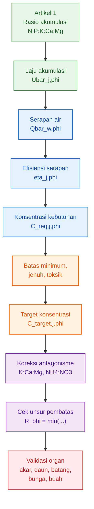

---

## 11.8 Kesimpulan Tajam

Formula hara yang presisi tidak hanya bertanya:

> Berapa konsentrasi yang diberikan?

Tetapi juga bertanya:

> Apakah tanaman masih memberi respons terhadap tambahan konsentrasi itu?

Dengan pendekatan ini, formula nutrisi tidak lagi sekadar mengejar angka ppm atau EC. Formula dibangun dari laju akumulasi tanaman, dikoreksi oleh serapan air, dibatasi oleh titik jenuh, disesuaikan dengan antagonisme, lalu divalidasi melalui respons organ.

Kesimpulan akhir artikel:

$$
\boxed{
\begin{aligned}
formula\ hara\ yang\ baik &= cukup\ untuk\ kebutuhan\ tanaman
+
tidak\ melewati\ batas\ jenuh
+
tidak\ menciptakan\ unsur\ pembatas
+
tervalidasi\ pada\ organ
\end{aligned}
}
$$

Atau secara praktis:

> Nutrisi yang presisi bukan nutrisi yang paling pekat, tetapi nutrisi yang paling sesuai dengan laju serapan, fase organ, dan batas respons tanaman.

[**Kembali ke Atas**](#model-formula-hara-cabai-berbasis-laju-serapan-dan-batas-jenuh-respons-per-fase-organ)

---

<small>
  **_Catatan Penyusunan_** Artikel ini disusun sebagai materi edukasi dan
  referensi umum berdasarkan berbagai sumber pustaka, praktik lapangan, serta
  bantuan alat penulisan. Pembaca disarankan untuk melakukan verifikasi lanjutan
  dan penyesuaian sesuai dengan kondisi serta kebutuhan masing-masing sistem.
</small>
