- [1. Pendahuluan: Dari Budidaya Cabai Biasa ke Sistem Cabai Terpadu](#1-pendahuluan-dari-budidaya-cabai-biasa-ke-sistem-cabai-terpadu)
  - [1.1 Kerangka Sistem Cabai Terpadu](#11-kerangka-sistem-cabai-terpadu)
    - [Diagram 1.1. Kerangka Sistem Cabai Terpadu](#diagram-11-kerangka-sistem-cabai-terpadu)
    - [Diagram 1.2. Hubungan Pupuk Kimia, Mikroba, dan Pestisida](#diagram-12-hubungan-pupuk-kimia-mikroba-dan-pestisida)
    - [Diagram 1.3. Siklus Aplikasi Kimia dan Re-Induksi Mikroba](#diagram-13-siklus-aplikasi-kimia-dan-re-induksi-mikroba)
  - [1.2 Prinsip Utama Sistem Cabai Terpadu](#12-prinsip-utama-sistem-cabai-terpadu)
    - [1. Cabai Tetap Butuh Pupuk Utama](#1-cabai-tetap-butuh-pupuk-utama)
    - [2. Mikroba Bukan Pengganti Total Pupuk Kimia](#2-mikroba-bukan-pengganti-total-pupuk-kimia)
    - [3. Pestisida Kimia Tetap Bisa Digunakan](#3-pestisida-kimia-tetap-bisa-digunakan)
    - [4. Agen Hayati Harus Diperlakukan sebagai Organisme Hidup](#4-agen-hayati-harus-diperlakukan-sebagai-organisme-hidup)
    - [5. Companion Planting adalah Alat Stabilisasi Ekologi](#5-companion-planting-adalah-alat-stabilisasi-ekologi)
    - [6. Re-Induksi Mikroba Diperlukan Setelah Aplikasi Kimia Tertentu](#6-re-induksi-mikroba-diperlukan-setelah-aplikasi-kimia-tertentu)
  - [1.3 Filosofi Sistem](#13-filosofi-sistem)
    - [Diagram 1.4. Filosofi Produktivitas dalam Sistem Cabai Terpadu](#diagram-14-filosofi-produktivitas-dalam-sistem-cabai-terpadu)
  - [1.4 Diagram Sistem Cabai Terpadu](#14-diagram-sistem-cabai-terpadu)
    - [Diagram 1.5. Sistem Cabai Terpadu](#diagram-15-sistem-cabai-terpadu)
- [2. Konteks Lokal Gambiran dan Pilihan Komoditas Cabai](#2-konteks-lokal-gambiran-dan-pilihan-komoditas-cabai)
  - [2.1 Gambiran sebagai Wilayah Cabai](#21-gambiran-sebagai-wilayah-cabai)
    - [Diagram 2.1. Posisi Komoditas Hortikultura di Gambiran](#diagram-21-posisi-komoditas-hortikultura-di-gambiran)
  - [2.2 Cabai Besar vs Cabai Rawit](#22-cabai-besar-vs-cabai-rawit)
    - [Cabai Besar sebagai Basis Usaha](#cabai-besar-sebagai-basis-usaha)
    - [Cabai Rawit sebagai Komoditas Margin Tinggi](#cabai-rawit-sebagai-komoditas-margin-tinggi)
    - [Tomat sebagai Rotasi atau Pelengkap](#tomat-sebagai-rotasi-atau-pelengkap)
    - [Diagram 2.2. Perbandingan Strategi Cabai Besar dan Cabai Rawit](#diagram-22-perbandingan-strategi-cabai-besar-dan-cabai-rawit)
  - [2.3 Rekomendasi Komoditas](#23-rekomendasi-komoditas)
    - [1. Cabai Besar sebagai Tulang Punggung](#1-cabai-besar-sebagai-tulang-punggung)
    - [Rekomendasi Portofolio Komoditas](#rekomendasi-portofolio-komoditas)
    - [Diagram 2.3. Rekomendasi Portofolio Komoditas](#diagram-23-rekomendasi-portofolio-komoditas)
  - [Ringkasan Bab 2](#ringkasan-bab-2)
- [3. Desain Lahan: Lahan Kering, Sawah, Drainase, Mulsa, dan Drip Irrigation](#3-desain-lahan-lahan-kering-sawah-drainase-mulsa-dan-drip-irrigation)
  - [3.1 Lahan Kering vs Sawah](#31-lahan-kering-vs-sawah)
    - [Risiko Utama Sawah untuk Cabai](#risiko-utama-sawah-untuk-cabai)
    - [Kapan Lahan Sawah Layak untuk Cabai?](#kapan-lahan-sawah-layak-untuk-cabai)
    - [Rekomendasi Praktis Pemilihan Lahan](#rekomendasi-praktis-pemilihan-lahan)
    - [Diagram 3.1. Keputusan Pemilihan Lahan Cabai](#diagram-31-keputusan-pemilihan-lahan-cabai)
  - [3.2 Bedengan, Drainase, dan Mulsa](#32-bedengan-drainase-dan-mulsa)
    - [Rekomendasi Ukuran Bedengan](#rekomendasi-ukuran-bedengan)
    - [Arah Bedengan dan Aliran Air](#arah-bedengan-dan-aliran-air)
    - [Struktur Drainase yang Disarankan](#struktur-drainase-yang-disarankan)
    - [Diagram 3.2. Struktur Bedengan dan Drainase Cabai](#diagram-32-struktur-bedengan-dan-drainase-cabai)
    - [Mulsa Plastik Hitam Perak](#mulsa-plastik-hitam-perak)
    - [Rekomendasi Lubang Tanam](#rekomendasi-lubang-tanam)
    - [Rumus Perkiraan Populasi Tanaman](#rumus-perkiraan-populasi-tanaman)
  - [3.3 Drip Irrigation sebagai Fondasi](#33-drip-irrigation-sebagai-fondasi)
    - [Komponen Sistem Drip Sederhana](#komponen-sistem-drip-sederhana)
    - [Hubungan Drip dengan Pupuk dan Mikroba](#hubungan-drip-dengan-pupuk-dan-mikroba)
    - [Aturan Praktis Aplikasi Mikroba lewat Drip](#aturan-praktis-aplikasi-mikroba-lewat-drip)
    - [Rumus Kebutuhan Air Sederhana](#rumus-kebutuhan-air-sederhana)
    - [Estimasi Volume Air per Fase](#estimasi-volume-air-per-fase)
    - [Rumus Lama Penyiraman Drip](#rumus-lama-penyiraman-drip)
    - [Diagram 3.3. Drip sebagai Fondasi Air, Pupuk, dan Mikroba](#diagram-33-drip-sebagai-fondasi-air-pupuk-dan-mikroba)
  - [3.4 IoT untuk Cabai Intensif](#34-iot-untuk-cabai-intensif)
    - [Manual vs IoT](#manual-vs-iot)
    - [Komponen IoT yang Paling Berguna](#komponen-iot-yang-paling-berguna)
    - [Fungsi Sensor Kelembapan Tanah](#fungsi-sensor-kelembapan-tanah)
    - [Fungsi Flow Meter](#fungsi-flow-meter)
    - [Fungsi Controller](#fungsi-controller)
    - [Titik Balik Modal IoT](#titik-balik-modal-iot)
    - [Komponen Manfaat IoT](#komponen-manfaat-iot)
    - [Diagram 3.4. Tingkatan Adopsi IoT pada Cabai](#diagram-34-tingkatan-adopsi-iot-pada-cabai)
  - [3.5 Diagram Alur Irigasi dan Fertigasi](#35-diagram-alur-irigasi-dan-fertigasi)
    - [Diagram 3.5. Alur Irigasi dan Fertigasi Cabai](#diagram-35-alur-irigasi-dan-fertigasi-cabai)
    - [Urutan Fertigasi yang Disarankan](#urutan-fertigasi-yang-disarankan)
    - [Titik Kontrol Sistem Irigasi](#titik-kontrol-sistem-irigasi)
    - [Diagram 3.6. Titik Kendali Risiko Irigasi Cabai](#diagram-36-titik-kendali-risiko-irigasi-cabai)
  - [Ringkasan Bab 3](#ringkasan-bab-3)
- [4. Sistem Mikroba dalam Budidaya Cabai](#4-sistem-mikroba-dalam-budidaya-cabai)
  - [4.1 Mengapa Cabai Membutuhkan Manajemen Mikroba](#41-mengapa-cabai-membutuhkan-manajemen-mikroba)
    - [Diagram 4.1. Peran Mikroba dalam Rizosfer Cabai](#diagram-41-peran-mikroba-dalam-rizosfer-cabai)
  - [4.2 Kelompok Input Mikroba](#42-kelompok-input-mikroba)
    - [Posisi Praktis Masing-Masing Input](#posisi-praktis-masing-masing-input)
    - [Diagram 4.2. Klasifikasi Input Mikroba dalam Cabai](#diagram-42-klasifikasi-input-mikroba-dalam-cabai)
  - [4.3 PGPM dan PGPR pada Cabai](#43-pgpm-dan-pgpr-pada-cabai)
    - [Fungsi PGPM/PGPR pada Cabai](#fungsi-pgpmpgpr-pada-cabai)
    - [Aplikasi PGPM/PGPR](#aplikasi-pgpmpgpr)
    - [Contoh Pola Aplikasi PGPM/PGPR](#contoh-pola-aplikasi-pgpmpgpr)
    - [Catatan Teknis](#catatan-teknis)
  - [4.4 Agen Hayati Utama](#44-agen-hayati-utama)
    - [4.4.1 _Trichoderma_](#441-trichoderma)
      - [Fungsi _Trichoderma_](#fungsi-trichoderma)
      - [Cocok Digunakan untuk](#cocok-digunakan-untuk)
      - [Cara Aplikasi Praktis](#cara-aplikasi-praktis)
      - [Catatan Penting](#catatan-penting)
    - [4.4.2 _Bacillus_](#442-bacillus)
      - [Fungsi _Bacillus_](#fungsi-bacillus)
      - [Cocok Digunakan untuk](#cocok-digunakan-untuk-1)
      - [Catatan Praktis](#catatan-praktis)
    - [4.4.3 _Pseudomonas fluorescens_](#443-pseudomonas-fluorescens)
      - [Fungsi _Pseudomonas fluorescens_](#fungsi-pseudomonas-fluorescens)
      - [Cocok Digunakan untuk](#cocok-digunakan-untuk-2)
      - [Catatan Penting](#catatan-penting-1)
    - [Tabel Perbandingan Agen Hayati Utama](#tabel-perbandingan-agen-hayati-utama)
    - [Diagram 4.3. Posisi Agen Hayati Utama](#diagram-43-posisi-agen-hayati-utama)
  - [4.5 MOL sebagai Starter, Bukan Pupuk Utama](#45-mol-sebagai-starter-bukan-pupuk-utama)
    - [Fungsi MOL dalam Sistem Cabai](#fungsi-mol-dalam-sistem-cabai)
    - [MOL dalam Cabai: Kapan Digunakan?](#mol-dalam-cabai-kapan-digunakan)
    - [Batasan MOL](#batasan-mol)
    - [Diagram 4.4. MOL sebagai Starter Mikroba](#diagram-44-mol-sebagai-starter-mikroba)
  - [4.6 POC sebagai Pupuk Cair Tambahan](#46-poc-sebagai-pupuk-cair-tambahan)
    - [POC Vegetatif](#poc-vegetatif)
    - [POC Generatif](#poc-generatif)
    - [POC Bukan Pengganti Pupuk Kimia Utama](#poc-bukan-pengganti-pupuk-kimia-utama)
    - [Posisi POC Berdasarkan Fase Cabai](#posisi-poc-berdasarkan-fase-cabai)
    - [Catatan Aplikasi POC](#catatan-aplikasi-poc)
  - [4.7 Diagram Hubungan PGPM, Agen Hayati, MOL, dan POC](#47-diagram-hubungan-pgpm-agen-hayati-mol-dan-poc)
    - [Diagram 4.5. Hubungan PGPM, Agen Hayati, MOL, dan POC](#diagram-45-hubungan-pgpm-agen-hayati-mol-dan-poc)
    - [Diagram 4.6. Siklus Mikroba dalam Sistem Cabai](#diagram-46-siklus-mikroba-dalam-sistem-cabai)
  - [4.8 Prinsip Integrasi Mikroba dengan Pupuk dan Pestisida](#48-prinsip-integrasi-mikroba-dengan-pupuk-dan-pestisida)
    - [Aturan Dasar Integrasi](#aturan-dasar-integrasi)
    - [Jeda Praktis Awal](#jeda-praktis-awal)
  - [Ringkasan Bab 4](#ringkasan-bab-4)
- [5. Persemaian Cabai Terpadu](#5-persemaian-cabai-terpadu)
  - [5.1 Tujuan Fase Semai](#51-tujuan-fase-semai)
    - [Target Bibit Siap Tanam](#target-bibit-siap-tanam)
    - [Diagram 5.1. Target Fase Semai Cabai](#diagram-51-target-fase-semai-cabai)
  - [5.2 Media Semai](#52-media-semai)
    - [Formula Media Semai Praktis](#formula-media-semai-praktis)
    - [Uji Kelembapan Media](#uji-kelembapan-media)
    - [Sterilisasi atau Pasteurisasi Ringan](#sterilisasi-atau-pasteurisasi-ringan)
    - [Penambahan Agen Hayati pada Media](#penambahan-agen-hayati-pada-media)
    - [Diagram 5.2. Alur Persiapan Media Semai](#diagram-52-alur-persiapan-media-semai)
  - [5.3 Perlakuan Benih](#53-perlakuan-benih)
    - [Air Hangat Terkontrol](#air-hangat-terkontrol)
    - [Perlakuan PGPM atau _Bacillus_](#perlakuan-pgpm-atau-bacillus)
    - [Fungisida Benih Kimia](#fungisida-benih-kimia)
    - [Re-Induksi PGPM Setelah Fungisida](#re-induksi-pgpm-setelah-fungisida)
    - [Diagram 5.3. Pilihan Perlakuan Benih Cabai](#diagram-53-pilihan-perlakuan-benih-cabai)
  - [5.4 Aplikasi Agen Hayati di Persemaian](#54-aplikasi-agen-hayati-di-persemaian)
    - [_Trichoderma_ pada Media](#trichoderma-pada-media)
    - [_Bacillus_ atau PGPR pada Benih/Bibit](#bacillus-atau-pgpr-pada-benihbibit)
    - [POC Dosis Sangat Rendah](#poc-dosis-sangat-rendah)
    - [MOL Dosis Rendah](#mol-dosis-rendah)
    - [Tabel Aplikasi Agen Hayati dan Input Biologis di Persemaian](#tabel-aplikasi-agen-hayati-dan-input-biologis-di-persemaian)
    - [Diagram 5.4. Integrasi Agen Hayati di Persemaian](#diagram-54-integrasi-agen-hayati-di-persemaian)
  - [5.5 Batasan Kimia di Persemaian](#55-batasan-kimia-di-persemaian)
    - [Tabel Kompatibilitas Praktis di Persemaian](#tabel-kompatibilitas-praktis-di-persemaian)
    - [Fungisida di Persemaian](#fungisida-di-persemaian)
    - [Pupuk Pekat di Persemaian](#pupuk-pekat-di-persemaian)
    - [Re-Induksi Mikroba Setelah Perlakuan Kimia](#re-induksi-mikroba-setelah-perlakuan-kimia)
    - [Diagram 5.5. Keputusan Kimia dan Re-Induksi di Persemaian](#diagram-55-keputusan-kimia-dan-re-induksi-di-persemaian)
  - [5.6 Jadwal Persemaian 0–25 Hari](#56-jadwal-persemaian-025-hari)
    - [H0: Semai Benih](#h0-semai-benih)
    - [H5–7: Kocor Ringan PGPM/_Bacillus_](#h57-kocor-ringan-pgpmbacillus)
    - [H10–14: Cek Rebah Semai dan Agen Hayati](#h1014-cek-rebah-semai-dan-agen-hayati)
    - [H15–20: POC Sangat Rendah Bila Bibit Pucat](#h1520-poc-sangat-rendah-bila-bibit-pucat)
    - [H20–25: Bibit Siap Pindah Tanam](#h2025-bibit-siap-pindah-tanam)
    - [Diagram 5.6. Kalender Persemaian Cabai 0–25 Hari](#diagram-56-kalender-persemaian-cabai-025-hari)
  - [5.7 Standar Seleksi Bibit Sebelum Pindah Tanam](#57-standar-seleksi-bibit-sebelum-pindah-tanam)
    - [Bibit Layak Tanam](#bibit-layak-tanam)
    - [Bibit Tidak Layak Tanam](#bibit-tidak-layak-tanam)
  - [5.8 Ringkasan SOP Persemaian Terpadu](#58-ringkasan-sop-persemaian-terpadu)
  - [Ringkasan Bab 5](#ringkasan-bab-5)
- [6. Persiapan Lahan, Pupuk Dasar, dan Aktivasi Mikroba Awal](#6-persiapan-lahan-pupuk-dasar-dan-aktivasi-mikroba-awal)
  - [6.1 Olah Tanah dan Bedengan](#61-olah-tanah-dan-bedengan)
    - [Rekomendasi Ukuran Bedengan](#rekomendasi-ukuran-bedengan-1)
    - [Prinsip Drainase](#prinsip-drainase)
    - [Mulsa dan Drip](#mulsa-dan-drip)
    - [Diagram 6.1. Alur Persiapan Lahan Cabai](#diagram-61-alur-persiapan-lahan-cabai)
  - [6.2 Pupuk Dasar](#62-pupuk-dasar)
    - [Komponen Pupuk Dasar](#komponen-pupuk-dasar)
    - [Kompos atau Pupuk Kandang Matang](#kompos-atau-pupuk-kandang-matang)
    - [Dosis Bahan Organik](#dosis-bahan-organik)
    - [Dolomit Bila pH Rendah](#dolomit-bila-ph-rendah)
    - [Pupuk Kimia Dasar](#pupuk-kimia-dasar)
    - [Contoh Format Pupuk Dasar per 1.000 m²](#contoh-format-pupuk-dasar-per-1000-m)
    - [Diagram 6.2. Komponen Pupuk Dasar Cabai](#diagram-62-komponen-pupuk-dasar-cabai)
  - [6.3 Aktivasi Pupuk Organik Sebelum Masuk Lahan](#63-aktivasi-pupuk-organik-sebelum-masuk-lahan)
    - [Formula Aktivasi Kompos 100 kg](#formula-aktivasi-kompos-100-kg)
    - [Kadar Lembap Aktivasi](#kadar-lembap-aktivasi)
    - [Aktivasi dengan MOL](#aktivasi-dengan-mol)
    - [Aktivasi dengan _Trichoderma_](#aktivasi-dengan-trichoderma)
    - [Aktivasi dengan PGPM](#aktivasi-dengan-pgpm)
    - [Diagram 6.3. Aktivasi Pupuk Organik](#diagram-63-aktivasi-pupuk-organik)
  - [6.4 Risiko Mencampur Mikroba dengan Pupuk Kimia Pekat](#64-risiko-mencampur-mikroba-dengan-pupuk-kimia-pekat)
    - [Risiko Pupuk Kimia Pekat](#risiko-pupuk-kimia-pekat)
    - [Risiko Fungisida dan Bakterisida](#risiko-fungisida-dan-bakterisida)
    - [Prinsip Pemisahan Waktu](#prinsip-pemisahan-waktu)
    - [Aturan Aman Pencampuran](#aturan-aman-pencampuran)
    - [Diagram 6.4. Risiko Campuran Kimia dan Mikroba](#diagram-64-risiko-campuran-kimia-dan-mikroba)
  - [6.5 Strategi Aktivasi Awal Mikroba](#65-strategi-aktivasi-awal-mikroba)
    - [Kalender Aktivasi Awal](#kalender-aktivasi-awal)
    - [H-14 sampai H-7: Aktivasi Kompos dan Bedengan](#h-14-sampai-h-7-aktivasi-kompos-dan-bedengan)
    - [H-7 sampai H-3: Stabilkan Bedengan](#h-7-sampai-h-3-stabilkan-bedengan)
    - [H0: Pindah Tanam](#h0-pindah-tanam)
    - [H+3 Setelah Tanam: Re-Induksi Akar](#h3-setelah-tanam-re-induksi-akar)
    - [Tabel Strategi Aktivasi Awal](#tabel-strategi-aktivasi-awal)
    - [Diagram 6.5. Kalender Aktivasi Mikroba Awal](#diagram-65-kalender-aktivasi-mikroba-awal)
  - [6.6 Diagram Persiapan Lahan Terpadu](#66-diagram-persiapan-lahan-terpadu)
    - [Diagram 6.6. Persiapan Lahan Terpadu](#diagram-66-persiapan-lahan-terpadu)
    - [Diagram 6.7. Integrasi Pupuk Dasar, Mikroba, dan Drip](#diagram-67-integrasi-pupuk-dasar-mikroba-dan-drip)
  - [Ringkasan Bab 6](#ringkasan-bab-6)
- [7. Program Nutrisi Cabai: Pupuk Kimia, POC, dan Biostimulan](#7-program-nutrisi-cabai-pupuk-kimia-poc-dan-biostimulan)
  - [7.1 Prinsip Nutrisi Cabai](#71-prinsip-nutrisi-cabai)
    - [Posisi Input Nutrisi dalam Sistem Cabai](#posisi-input-nutrisi-dalam-sistem-cabai)
    - [Rumusan Prinsip Nutrisi Cabai](#rumusan-prinsip-nutrisi-cabai)
    - [Diagram 7.1. Kerangka Nutrisi Cabai Terpadu](#diagram-71-kerangka-nutrisi-cabai-terpadu)
  - [7.2 Fase Vegetatif](#72-fase-vegetatif)
    - [Input Utama Fase Vegetatif](#input-utama-fase-vegetatif)
    - [Pola Nutrisi Vegetatif](#pola-nutrisi-vegetatif)
    - [Contoh Dosis Input Organik/Mikroba Fase Vegetatif](#contoh-dosis-input-organikmikroba-fase-vegetatif)
    - [Contoh Perhitungan POC Vegetatif](#contoh-perhitungan-poc-vegetatif)
    - [Tanda Vegetatif Seimbang](#tanda-vegetatif-seimbang)
    - [Diagram 7.2. Alur Nutrisi Fase Vegetatif](#diagram-72-alur-nutrisi-fase-vegetatif)
  - [7.3 Fase Generatif](#73-fase-generatif)
    - [Input Utama Fase Generatif](#input-utama-fase-generatif)
    - [Pola Nutrisi Generatif](#pola-nutrisi-generatif)
    - [Perubahan Fokus dari Vegetatif ke Generatif](#perubahan-fokus-dari-vegetatif-ke-generatif)
    - [Contoh Perhitungan POC Generatif](#contoh-perhitungan-poc-generatif)
    - [Contoh Perhitungan Kebutuhan Kocor](#contoh-perhitungan-kebutuhan-kocor)
    - [Catatan Khusus Boron](#catatan-khusus-boron)
    - [Diagram 7.3. Pergeseran Nutrisi dari Vegetatif ke Generatif](#diagram-73-pergeseran-nutrisi-dari-vegetatif-ke-generatif)
  - [7.4 Panen Berulang](#74-panen-berulang)
    - [Kombinasi Input Fase Panen Berulang](#kombinasi-input-fase-panen-berulang)
    - [Pola Pemulihan Setelah Petik](#pola-pemulihan-setelah-petik)
    - [Cabai Rawit: Perhatian Lebih Tinggi](#cabai-rawit-perhatian-lebih-tinggi)
    - [Cabai Besar: Kualitas Buah Lebih Sensitif](#cabai-besar-kualitas-buah-lebih-sensitif)
    - [Diagram 7.4. Siklus Panen Berulang Cabai](#diagram-74-siklus-panen-berulang-cabai)
  - [7.5 Tabel Program Nutrisi Umum](#75-tabel-program-nutrisi-umum)
    - [Penjelasan Tiap Fase](#penjelasan-tiap-fase)
      - [Semai](#semai)
      - [Pindah Tanam](#pindah-tanam)
      - [Vegetatif](#vegetatif)
      - [Bunga](#bunga)
      - [Buah](#buah)
      - [Panen Berulang](#panen-berulang)
    - [Diagram 7.5. Program Nutrisi Umum Cabai](#diagram-75-program-nutrisi-umum-cabai)
  - [7.6 Contoh Program Nutrisi Mingguan](#76-contoh-program-nutrisi-mingguan)
    - [Minggu 0–1: Adaptasi Pindah Tanam](#minggu-01-adaptasi-pindah-tanam)
    - [Minggu 2–4: Vegetatif Awal](#minggu-24-vegetatif-awal)
    - [Minggu 5–7: Transisi Pra-Bunga](#minggu-57-transisi-pra-bunga)
    - [Minggu 8 ke Atas: Buah dan Panen](#minggu-8-ke-atas-buah-dan-panen)
  - [7.7 Monitoring Respons Nutrisi](#77-monitoring-respons-nutrisi)
    - [Format Catatan Nutrisi](#format-catatan-nutrisi)
    - [Diagram 7.6. Evaluasi Nutrisi Berdasarkan Respons Tanaman](#diagram-76-evaluasi-nutrisi-berdasarkan-respons-tanaman)
  - [Ringkasan Bab 7](#ringkasan-bab-7)
- [8. Pengendalian OPT Terpadu: Companion, Agen Hayati, dan Pestisida Kimia](#8-pengendalian-opt-terpadu-companion-agen-hayati-dan-pestisida-kimia)
  - [8.1 OPT Utama Cabai](#81-opt-utama-cabai)
    - [8.1.1 Kutu Kebul](#811-kutu-kebul)
    - [8.1.2 Trips](#812-trips)
    - [8.1.3 Aphid](#813-aphid)
    - [8.1.4 Tungau](#814-tungau)
    - [8.1.5 Lalat Buah](#815-lalat-buah)
    - [8.1.6 Ulat](#816-ulat)
    - [8.1.7 Antraknosa](#817-antraknosa)
    - [8.1.8 Layu Bakteri](#818-layu-bakteri)
    - [8.1.9 Layu Fusarium](#819-layu-fusarium)
    - [8.1.10 _Phytophthora_](#8110-phytophthora)
    - [8.1.11 Virus Kuning/Keriting](#8111-virus-kuningkeriting)
    - [Diagram 8.1. Peta OPT Utama Cabai](#diagram-81-peta-opt-utama-cabai)
  - [8.2 Companion Planting sebagai Proteksi Ekologi](#82-companion-planting-sebagai-proteksi-ekologi)
    - [Tanaman Pendamping dan Fungsinya](#tanaman-pendamping-dan-fungsinya)
    - [Jagung sebagai Barrier](#jagung-sebagai-barrier)
    - [Caisin sebagai Trap Crop](#caisin-sebagai-trap-crop)
    - [Bawang Daun sebagai Repelan Ringan](#bawang-daun-sebagai-repelan-ringan)
    - [Tagetes untuk Diversitas dan Nematoda](#tagetes-untuk-diversitas-dan-nematoda)
    - [Bunga Matahari dan Refugia](#bunga-matahari-dan-refugia)
    - [Diagram 8.2. Fungsi Companion Planting pada Cabai](#diagram-82-fungsi-companion-planting-pada-cabai)
  - [8.3 Agen Hayati untuk Patogen Tanah](#83-agen-hayati-untuk-patogen-tanah)
    - [8.3.1 _Trichoderma_](#831-trichoderma)
    - [8.3.2 _Bacillus subtilis_](#832-bacillus-subtilis)
    - [8.3.3 _Pseudomonas fluorescens_](#833-pseudomonas-fluorescens)
    - [8.3.4 _Beauveria_ dan _Metarhizium_](#834-beauveria-dan-metarhizium)
    - [8.3.5 NPV dan Bt](#835-npv-dan-bt)
    - [Diagram 8.3. Posisi Agen Hayati dalam PHT Cabai](#diagram-83-posisi-agen-hayati-dalam-pht-cabai)
  - [8.4 Pestisida Kimia Tetap Diperlukan pada Ambang Tertentu](#84-pestisida-kimia-tetap-diperlukan-pada-ambang-tertentu)
    - [Prinsip Pestisida Kimia dalam Sistem Terpadu](#prinsip-pestisida-kimia-dalam-sistem-terpadu)
    - [Rumus Keputusan Aplikasi Kimia](#rumus-keputusan-aplikasi-kimia)
    - [Skor Praktis Keputusan Pengendalian](#skor-praktis-keputusan-pengendalian)
    - [Diagram 8.4. Keputusan Menggunakan Pestisida Kimia](#diagram-84-keputusan-menggunakan-pestisida-kimia)
  - [8.5 Pengelompokan Pestisida dari Sisi Risiko Mikroba](#85-pengelompokan-pestisida-dari-sisi-risiko-mikroba)
    - [8.5.1 Insektisida Selektif](#851-insektisida-selektif)
    - [8.5.2 Fungisida Kontak Luas](#852-fungisida-kontak-luas)
    - [8.5.3 Fungisida Sistemik](#853-fungisida-sistemik)
    - [8.5.4 Bakterisida](#854-bakterisida)
    - [8.5.5 Herbisida](#855-herbisida)
    - [8.5.6 Nematisida dan Fumigan](#856-nematisida-dan-fumigan)
    - [Diagram 8.5. Risiko Pestisida terhadap Mikroba](#diagram-85-risiko-pestisida-terhadap-mikroba)
  - [8.6 Prinsip Kompatibilitas Mikroba dan Pestisida](#86-prinsip-kompatibilitas-mikroba-dan-pestisida)
    - [Aturan Dasar Kompatibilitas](#aturan-dasar-kompatibilitas)
    - [Jeda Praktis Aplikasi](#jeda-praktis-aplikasi)
    - [Diagram 8.6. Kompatibilitas Mikroba dan Pestisida](#diagram-86-kompatibilitas-mikroba-dan-pestisida)
  - [8.7 SOP Pengendalian OPT Terpadu Cabai](#87-sop-pengendalian-opt-terpadu-cabai)
    - [SOP Harian](#sop-harian)
    - [SOP Mingguan](#sop-mingguan)
    - [Format Log OPT](#format-log-opt)
  - [8.8 Strategi PHT Berdasarkan Fase Tanaman](#88-strategi-pht-berdasarkan-fase-tanaman)
    - [Diagram 8.7. Strategi PHT Berdasarkan Fase Cabai](#diagram-87-strategi-pht-berdasarkan-fase-cabai)
  - [Ringkasan Bab 8](#ringkasan-bab-8)
- [9. Strategi Re-Induksi Mikroba Setelah Aplikasi Kimia](#9-strategi-re-induksi-mikroba-setelah-aplikasi-kimia)
  - [9.1 Mengapa Re-Induksi Diperlukan](#91-mengapa-re-induksi-diperlukan)
    - [Peran Re-Induksi dalam Cabai](#peran-re-induksi-dalam-cabai)
    - [Diagram 9.1. Mengapa Re-Induksi Diperlukan](#diagram-91-mengapa-re-induksi-diperlukan)
  - [9.2 Kapan Re-Induksi Dilakukan](#92-kapan-re-induksi-dilakukan)
    - [Prinsip Keputusan Waktu Re-Induksi](#prinsip-keputusan-waktu-re-induksi)
    - [Rumus Keputusan Praktis](#rumus-keputusan-praktis)
    - [Diagram 9.2. Keputusan Waktu Re-Induksi](#diagram-92-keputusan-waktu-re-induksi)
  - [9.3 Bahan Re-Induksi](#93-bahan-re-induksi)
    - [9.3.1 PGPM/PGPR](#931-pgpmpgpr)
    - [9.3.2 _Bacillus_](#932-bacillus)
    - [9.3.3 _Trichoderma_](#933-trichoderma)
    - [9.3.4 JAKABA](#934-jakaba)
    - [9.3.5 MOL Matang](#935-mol-matang)
    - [9.3.6 POC Dosis Rendah](#936-poc-dosis-rendah)
    - [9.3.7 Kompos Tea Tersaring](#937-kompos-tea-tersaring)
    - [9.3.8 Asam Humat/Fulvat](#938-asam-humatfulvat)
    - [Tabel Pemilihan Bahan Re-Induksi](#tabel-pemilihan-bahan-re-induksi)
  - [9.4 Dosis Umum Re-Induksi](#94-dosis-umum-re-induksi)
    - [Catatan Dosis](#catatan-dosis)
    - [Rumus Perhitungan Larutan Re-Induksi](#rumus-perhitungan-larutan-re-induksi)
    - [Rumus Kebutuhan Larutan Kocor](#rumus-kebutuhan-larutan-kocor)
    - [Contoh Perhitungan Re-Induksi PGPM](#contoh-perhitungan-re-induksi-pgpm)
    - [Contoh Perhitungan Re-Induksi MOL](#contoh-perhitungan-re-induksi-mol)
    - [Contoh Perhitungan Re-Induksi POC Rendah](#contoh-perhitungan-re-induksi-poc-rendah)
  - [9.5 Diagram Siklus Kimia dan Re-Induksi Mikroba](#95-diagram-siklus-kimia-dan-re-induksi-mikroba)
    - [Diagram 9.3. Siklus Kimia dan Re-Induksi Mikroba](#diagram-93-siklus-kimia-dan-re-induksi-mikroba)
  - [9.6 SOP Re-Induksi Mikroba di Lapangan](#96-sop-re-induksi-mikroba-di-lapangan)
    - [SOP Umum Re-Induksi](#sop-umum-re-induksi)
    - [SOP Re-Induksi Setelah Fungisida](#sop-re-induksi-setelah-fungisida)
    - [SOP Re-Induksi Setelah Bakterisida](#sop-re-induksi-setelah-bakterisida)
    - [SOP Re-Induksi Setelah Pupuk Kimia Pekat](#sop-re-induksi-setelah-pupuk-kimia-pekat)
    - [SOP Re-Induksi Setelah Nematisida/Fumigan](#sop-re-induksi-setelah-nematisidafumigan)
  - [9.7 Cara Aplikasi Re-Induksi](#97-cara-aplikasi-re-induksi)
    - [Cara Aplikasi yang Disarankan](#cara-aplikasi-yang-disarankan)
    - [Aplikasi Kocor](#aplikasi-kocor)
    - [Aplikasi lewat Drip](#aplikasi-lewat-drip)
    - [Diagram 9.4. Jalur Aplikasi Re-Induksi](#diagram-94-jalur-aplikasi-re-induksi)
  - [9.8 Tanda Re-Induksi Berhasil dan Gagal](#98-tanda-re-induksi-berhasil-dan-gagal)
    - [Tanda Re-Induksi Berhasil](#tanda-re-induksi-berhasil)
    - [Tanda Re-Induksi Gagal](#tanda-re-induksi-gagal)
    - [Tindakan Koreksi](#tindakan-koreksi)
  - [9.9 Pola Re-Induksi Berdasarkan Fase Tanaman](#99-pola-re-induksi-berdasarkan-fase-tanaman)
    - [Diagram 9.5. Re-Induksi Berdasarkan Fase Cabai](#diagram-95-re-induksi-berdasarkan-fase-cabai)
  - [9.10 Format Catatan Re-Induksi](#910-format-catatan-re-induksi)
    - [Skor Evaluasi Re-Induksi](#skor-evaluasi-re-induksi)
  - [Ringkasan Bab 9](#ringkasan-bab-9)
- [10. Kalender Aplikasi Terpadu Cabai dari Semai sampai Panen](#10-kalender-aplikasi-terpadu-cabai-dari-semai-sampai-panen)
  - [10.1 Kalender Besar Fase Cabai](#101-kalender-besar-fase-cabai)
    - [Penjelasan Tiap Fase](#penjelasan-tiap-fase-1)
      - [1. Semai (0–25 hari)](#1-semai-025-hari)
      - [2. Pindah Tanam (0–7 HST)](#2-pindah-tanam-07-hst)
      - [3. Vegetatif (7–35 HST)](#3-vegetatif-735-hst)
      - [4. Pra-Bunga (30–45 HST)](#4-pra-bunga-3045-hst)
      - [5. Bunga dan Buah Awal (45–70 HST)](#5-bunga-dan-buah-awal-4570-hst)
      - [6. Panen Awal (70–100 HST)](#6-panen-awal-70100-hst)
      - [7. Panen Berulang (100 HST+)](#7-panen-berulang-100-hst)
    - [Diagram 10.1. Kalender Besar Fase Cabai](#diagram-101-kalender-besar-fase-cabai)
  - [10.2 Kalender Aplikasi Mikroba](#102-kalender-aplikasi-mikroba)
    - [Penjelasan Per Fase](#penjelasan-per-fase)
      - [Media Semai](#media-semai)
      - [Bibit 7–14 Hari](#bibit-714-hari)
      - [3–5 HST](#35-hst)
      - [14 HST](#14-hst)
      - [21–35 HST](#2135-hst)
      - [Pra-Bunga](#pra-bunga)
      - [Buah](#buah-1)
      - [Setelah Kimia](#setelah-kimia)
    - [Diagram 10.2. Kalender Aplikasi Mikroba](#diagram-102-kalender-aplikasi-mikroba)
  - [10.3 Kalender Kimia-Hayati Aman](#103-kalender-kimia-hayati-aman)
    - [Penjelasan Pola](#penjelasan-pola)
      - [Hari 1: Pupuk Kimia/Fertigasi](#hari-1-pupuk-kimiafertigasi)
      - [Hari 3: Monitoring OPT](#hari-3-monitoring-opt)
      - [Hari 4: Pestisida Kimia Bila Perlu](#hari-4-pestisida-kimia-bila-perlu)
      - [Hari 7: Re-Induksi PGPM/JAKABA/MOL](#hari-7-re-induksi-pgpmjakabamol)
      - [Hari 10: POC Sesuai Fase](#hari-10-poc-sesuai-fase)
      - [Hari 14: Evaluasi dan Ulangi](#hari-14-evaluasi-dan-ulangi)
    - [Diagram 10.3. Pola Mingguan Kimia-Hayati Aman](#diagram-103-pola-mingguan-kimia-hayati-aman)
  - [10.4 Kalender Terpadu dari Semai sampai Panen](#104-kalender-terpadu-dari-semai-sampai-panen)
    - [Diagram 10.4. Kalender Terpadu Cabai](#diagram-104-kalender-terpadu-cabai)
  - [10.5 Kalender Ringkas per 2 Minggu](#105-kalender-ringkas-per-2-minggu)
    - [Diagram 10.5. Kalender Ringkas per 2 Minggu](#diagram-105-kalender-ringkas-per-2-minggu)
  - [10.6 Aturan Sinkronisasi Kalender](#106-aturan-sinkronisasi-kalender)
    - [Aturan Dasar](#aturan-dasar)
    - [Rumus Sederhana Sinkronisasi](#rumus-sederhana-sinkronisasi)
    - [Diagram 10.6. Logika Sinkronisasi Kalender](#diagram-106-logika-sinkronisasi-kalender)
  - [10.7 Format Catatan Kalender Aplikasi](#107-format-catatan-kalender-aplikasi)
    - [Skor Evaluasi Mingguan](#skor-evaluasi-mingguan)
  - [Ringkasan Bab 10](#ringkasan-bab-10)
- [11. Companion Planting dalam Sistem Cabai Terpadu](#11-companion-planting-dalam-sistem-cabai-terpadu)
  - [11.1 Fungsi Companion Planting](#111-fungsi-companion-planting)
    - [Fungsi Companion Planting dalam Cabai](#fungsi-companion-planting-dalam-cabai)
    - [Diagram 11.1. Fungsi Companion Planting dalam Cabai](#diagram-111-fungsi-companion-planting-dalam-cabai)
  - [11.2 Tanaman Pendamping](#112-tanaman-pendamping)
    - [11.2.1 Jagung sebagai Barrier](#1121-jagung-sebagai-barrier)
    - [11.2.2 Caisin sebagai Trap Crop](#1122-caisin-sebagai-trap-crop)
    - [11.2.3 Bawang Daun sebagai Repelan Ringan](#1123-bawang-daun-sebagai-repelan-ringan)
    - [11.2.4 Tagetes sebagai Penekan Nematoda dan Pendukung Diversitas](#1124-tagetes-sebagai-penekan-nematoda-dan-pendukung-diversitas)
    - [11.2.5 Bunga Matahari dan Refugia](#1125-bunga-matahari-dan-refugia)
    - [Diagram 11.2. Tanaman Pendamping dan Perannya](#diagram-112-tanaman-pendamping-dan-perannya)
  - [11.3 Integrasi Companion dengan Agen Hayati](#113-integrasi-companion-dengan-agen-hayati)
    - [Integrasi Praktis](#integrasi-praktis)
    - [Pestisida Kimia dalam Sistem Companion](#pestisida-kimia-dalam-sistem-companion)
    - [Diagram 11.3. Integrasi Companion, Agen Hayati, dan Pestisida](#diagram-113-integrasi-companion-agen-hayati-dan-pestisida)
  - [11.4 Layout 1.000 m²](#114-layout-1000-m)
    - [Asumsi Ukuran Lahan](#asumsi-ukuran-lahan)
    - [Desain Bedengan Cabai](#desain-bedengan-cabai)
    - [Estimasi Populasi Cabai](#estimasi-populasi-cabai)
    - [Drip 5 Zona](#drip-5-zona)
    - [Penempatan Tanaman Pendamping](#penempatan-tanaman-pendamping)
    - [Diagram 11.4. Layout Konseptual 1.000 m²](#diagram-114-layout-konseptual-1000-m)
    - [Diagram 11.5. Skema Sederhana Blok 10 Bedengan dan 5 Zona Drip](#diagram-115-skema-sederhana-blok-10-bedengan-dan-5-zona-drip)
    - [Urutan Tanam Companion](#urutan-tanam-companion)
  - [11.5 Konsekuensi Ekonomi](#115-konsekuensi-ekonomi)
    - [Penurunan Populasi Cabai](#penurunan-populasi-cabai)
    - [Menilai Apakah Companion Layak](#menilai-apakah-companion-layak)
    - [Pendapatan Pendamping sebagai Bonus](#pendapatan-pendamping-sebagai-bonus)
    - [Diagram 11.6. Trade-Off Ekonomi Companion Planting](#diagram-116-trade-off-ekonomi-companion-planting)
  - [11.6 SOP Monitoring Companion Planting](#116-sop-monitoring-companion-planting)
    - [Format Catatan Companion](#format-catatan-companion)
  - [Ringkasan Bab 11](#ringkasan-bab-11)
- [12. Integrasi Pestisida Kimia dengan Agen Hayati dan Mikroba](#12-integrasi-pestisida-kimia-dengan-agen-hayati-dan-mikroba)
  - [12.1 Prinsip Umum](#121-prinsip-umum)
    - [Rumusan Prinsip Integrasi](#rumusan-prinsip-integrasi)
    - [Diagram 12.1. Prinsip Integrasi Kimia, Hayati, dan Mikroba](#diagram-121-prinsip-integrasi-kimia-hayati-dan-mikroba)
  - [12.2 Bahan Kimia yang Relatif Lebih Aman untuk Mikroba](#122-bahan-kimia-yang-relatif-lebih-aman-untuk-mikroba)
    - [Kelompok yang Biasanya Lebih Aman](#kelompok-yang-biasanya-lebih-aman)
    - [Contoh Prinsip Pemilihan](#contoh-prinsip-pemilihan)
    - [Catatan Penting](#catatan-penting-2)
  - [12.3 Bahan Kimia yang Perlu Hati-Hati](#123-bahan-kimia-yang-perlu-hati-hati)
    - [Fungisida Spektrum Luas](#fungisida-spektrum-luas)
    - [Bakterisida](#bakterisida)
    - [Herbisida Dekat Area Akar](#herbisida-dekat-area-akar)
    - [Nematisida dan Fumigan](#nematisida-dan-fumigan)
    - [Insektisida Tanah](#insektisida-tanah)
    - [Tabel Risiko Kelompok Kimia](#tabel-risiko-kelompok-kimia)
    - [Diagram 12.2. Tingkat Risiko Bahan Kimia terhadap Mikroba](#diagram-122-tingkat-risiko-bahan-kimia-terhadap-mikroba)
  - [12.4 Aturan Jeda Aplikasi](#124-aturan-jeda-aplikasi)
    - [Penjelasan Jeda](#penjelasan-jeda)
      - [_Trichoderma_ dan Fungisida](#trichoderma-dan-fungisida)
      - [_Bacillus_/PGPR dan Bakterisida](#bacilluspgpr-dan-bakterisida)
      - [MOL dan Kimia Tanah Dosis Tinggi](#mol-dan-kimia-tanah-dosis-tinggi)
      - [POC dan Pestisida Daun Pekat](#poc-dan-pestisida-daun-pekat)
      - [_Beauveria_/_Metarhizium_ dan Insektisida Kontak](#beauveriametarhizium-dan-insektisida-kontak)
    - [Kalender Jeda Praktis](#kalender-jeda-praktis)
    - [Diagram 12.3. Alur Jeda Aplikasi Kimia dan Hayati](#diagram-123-alur-jeda-aplikasi-kimia-dan-hayati)
  - [12.5 Diagram Keputusan Aplikasi Kimia vs Hayati](#125-diagram-keputusan-aplikasi-kimia-vs-hayati)
    - [Diagram 12.4. Keputusan Aplikasi Kimia vs Hayati](#diagram-124-keputusan-aplikasi-kimia-vs-hayati)
  - [12.6 Larangan Praktis dalam Tank Mix](#126-larangan-praktis-dalam-tank-mix)
    - [Jangan Dicampur Langsung](#jangan-dicampur-langsung)
    - [Uji Campur Sederhana](#uji-campur-sederhana)
  - [12.7 Rotasi Bahan Aktif dan Mode of Action](#127-rotasi-bahan-aktif-dan-mode-of-action)
    - [Prinsip Rotasi](#prinsip-rotasi)
    - [Format Catatan Rotasi](#format-catatan-rotasi)
  - [12.8 SOP Integrasi Pestisida Kimia dengan Mikroba](#128-sop-integrasi-pestisida-kimia-dengan-mikroba)
    - [Diagram 12.5. SOP Integrasi Pestisida dan Mikroba](#diagram-125-sop-integrasi-pestisida-dan-mikroba)
  - [12.9 Kesalahan Umum yang Harus Dihindari](#129-kesalahan-umum-yang-harus-dihindari)
    - [Checklist Sebelum Aplikasi](#checklist-sebelum-aplikasi)
  - [Ringkasan Bab 12](#ringkasan-bab-12)
- [13. Rancangan Usaha Cabai Besar 1.000 m² Versi Terpadu](#13-rancangan-usaha-cabai-besar-1000-m-versi-terpadu)
  - [13.1 Paket Usaha](#131-paket-usaha)
    - [Tujuan Paket Usaha](#tujuan-paket-usaha)
    - [Struktur Paket Usaha](#struktur-paket-usaha)
    - [Diagram 13.1. Paket Usaha Cabai Besar 1.000 m²](#diagram-131-paket-usaha-cabai-besar-1000-m)
  - [13.2 CAPEX](#132-capex)
    - [Tabel CAPEX Dasar dan Tambahan Opsional](#tabel-capex-dasar-dan-tambahan-opsional)
    - [Contoh Simulasi CAPEX 1.000 m²](#contoh-simulasi-capex-1000-m)
    - [Penyusutan CAPEX](#penyusutan-capex)
    - [Catatan CAPEX](#catatan-capex)
  - [13.3 OPEX](#133-opex)
    - [Komponen OPEX Utama](#komponen-opex-utama)
    - [Komponen OPEX Tambahan Versi Terpadu](#komponen-opex-tambahan-versi-terpadu)
    - [Contoh Simulasi OPEX Cabai Besar 1.000 m²](#contoh-simulasi-opex-cabai-besar-1000-m)
    - [OPEX Plus Penyusutan CAPEX](#opex-plus-penyusutan-capex)
    - [Diagram 13.2. Struktur Biaya Usaha Cabai Besar 1.000 m²](#diagram-132-struktur-biaya-usaha-cabai-besar-1000-m)
  - [13.4 Perhitungan Ekonomi](#134-perhitungan-ekonomi)
    - [Rumus Dasar Ekonomi](#rumus-dasar-ekonomi)
    - [Asumsi Produksi Cabai Besar 1.000 m²](#asumsi-produksi-cabai-besar-1000-m)
    - [Asumsi Harga Jual](#asumsi-harga-jual)
    - [Skenario 1: Tanpa Program Mikroba](#skenario-1-tanpa-program-mikroba)
    - [Skenario 2: Program Mikroba Minimal](#skenario-2-program-mikroba-minimal)
    - [Skenario 3: Program Mikroba Intensif](#skenario-3-program-mikroba-intensif)
    - [Tabel Perbandingan Skenario](#tabel-perbandingan-skenario)
    - [Analisis Sensitivitas Harga](#analisis-sensitivitas-harga)
    - [BEP Harga](#bep-harga)
    - [BEP Produksi](#bep-produksi)
    - [Diagram 13.3. Perbandingan Skenario Usaha](#diagram-133-perbandingan-skenario-usaha)
    - [Diagram 13.4. Alur Perhitungan Ekonomi](#diagram-134-alur-perhitungan-ekonomi)
  - [13.5 Strategi Menekan Risiko Usaha](#135-strategi-menekan-risiko-usaha)
    - [Risiko Utama](#risiko-utama)
    - [Strategi Praktis](#strategi-praktis)
  - [Ringkasan Bab 13](#ringkasan-bab-13)
- [14. Rancangan Usaha Cabai Rawit 1.000 m² Versi Terpadu](#14-rancangan-usaha-cabai-rawit-1000-m-versi-terpadu)
  - [14.1 Mengapa Rawit Lebih Membutuhkan Sistem Terpadu](#141-mengapa-rawit-lebih-membutuhkan-sistem-terpadu)
    - [Alasan Rawit Perlu Sistem Terpadu](#alasan-rawit-perlu-sistem-terpadu)
    - [Dampak Jika Rawit Tidak Dikelola Terpadu](#dampak-jika-rawit-tidak-dikelola-terpadu)
    - [Rumusan Sistem Rawit Terpadu](#rumusan-sistem-rawit-terpadu)
    - [Diagram 14.1. Mengapa Rawit Membutuhkan Sistem Terpadu](#diagram-141-mengapa-rawit-membutuhkan-sistem-terpadu)
  - [14.2 Paket Usaha](#142-paket-usaha)
    - [Struktur Paket Usaha Rawit](#struktur-paket-usaha-rawit)
    - [Paket Teknis Minimum](#paket-teknis-minimum)
    - [Paket Intensif](#paket-intensif)
    - [Diagram 14.2. Paket Usaha Cabai Rawit Terpadu](#diagram-142-paket-usaha-cabai-rawit-terpadu)
  - [14.3 Model Ekonomi](#143-model-ekonomi)
    - [14.3.1 Asumsi Dasar Model Ekonomi 1.000 m²](#1431-asumsi-dasar-model-ekonomi-1000-m)
    - [Skenario Produksi](#skenario-produksi)
    - [Skenario Harga Jual](#skenario-harga-jual)
  - [14.3.2 CAPEX Cabai Rawit 1.000 m²](#1432-capex-cabai-rawit-1000-m)
    - [Simulasi CAPEX](#simulasi-capex)
  - [14.3.3 OPEX Cabai Rawit 1.000 m²](#1433-opex-cabai-rawit-1000-m)
    - [Komponen OPEX Rawit](#komponen-opex-rawit)
    - [Simulasi OPEX Rawit](#simulasi-opex-rawit)
    - [OPEX Plus Penyusutan CAPEX](#opex-plus-penyusutan-capex-1)
  - [14.3.4 Skenario Ekonomi: Tanpa Mikroba, Mikroba Minimal, Mikroba Intensif](#1434-skenario-ekonomi-tanpa-mikroba-mikroba-minimal-mikroba-intensif)
    - [Skenario 1: Tanpa Program Mikroba](#skenario-1-tanpa-program-mikroba-1)
    - [Skenario 2: Program Mikroba Minimal](#skenario-2-program-mikroba-minimal-1)
    - [Skenario 3: Program Mikroba Intensif](#skenario-3-program-mikroba-intensif-1)
    - [Tabel Perbandingan Skenario](#tabel-perbandingan-skenario-1)
  - [14.3.5 Analisis Sensitivitas Harga](#1435-analisis-sensitivitas-harga)
    - [BEP Harga](#bep-harga-1)
    - [BEP Produksi](#bep-produksi-1)
  - [14.3.6 Manfaat Ekonomi Program Mikroba pada Rawit](#1436-manfaat-ekonomi-program-mikroba-pada-rawit)
    - [Diagram 14.3. Manfaat Ekonomi Mikroba pada Rawit](#diagram-143-manfaat-ekonomi-mikroba-pada-rawit)
  - [14.3.7 Diagram Model Ekonomi Cabai Rawit](#1437-diagram-model-ekonomi-cabai-rawit)
  - [14.4 Strategi Menekan Risiko Usaha Rawit](#144-strategi-menekan-risiko-usaha-rawit)
    - [Risiko Utama Rawit](#risiko-utama-rawit)
    - [SOP Risiko Rawit](#sop-risiko-rawit)
    - [Diagram 14.4. Strategi Risiko Cabai Rawit](#diagram-144-strategi-risiko-cabai-rawit)
  - [Ringkasan Bab 14](#ringkasan-bab-14)
- [15. SOP Lapangan Terpadu Cabai](#15-sop-lapangan-terpadu-cabai)
  - [15.1 SOP Semai](#151-sop-semai)
    - [Tujuan SOP Semai](#tujuan-sop-semai)
    - [Komponen SOP Semai](#komponen-sop-semai)
    - [SOP Teknis Semai](#sop-teknis-semai)
    - [Larangan pada Fase Semai](#larangan-pada-fase-semai)
    - [Diagram 15.1. SOP Semai Cabai Terpadu](#diagram-151-sop-semai-cabai-terpadu)
  - [15.2 SOP Pindah Tanam](#152-sop-pindah-tanam)
    - [Tujuan SOP Pindah Tanam](#tujuan-sop-pindah-tanam)
    - [Komponen SOP Pindah Tanam](#komponen-sop-pindah-tanam)
    - [SOP Teknis Pindah Tanam](#sop-teknis-pindah-tanam)
    - [Dosis Awal Pindah Tanam](#dosis-awal-pindah-tanam)
    - [Diagram 15.2. SOP Pindah Tanam Cabai](#diagram-152-sop-pindah-tanam-cabai)
  - [15.3 SOP Vegetatif](#153-sop-vegetatif)
    - [Tujuan SOP Vegetatif](#tujuan-sop-vegetatif)
    - [Komponen SOP Vegetatif](#komponen-sop-vegetatif)
    - [SOP Teknis Vegetatif](#sop-teknis-vegetatif)
    - [Indikator Vegetatif Sehat](#indikator-vegetatif-sehat)
    - [Diagram 15.3. SOP Vegetatif Cabai](#diagram-153-sop-vegetatif-cabai)
  - [15.4 SOP Pra-Bunga](#154-sop-pra-bunga)
    - [Tujuan SOP Pra-Bunga](#tujuan-sop-pra-bunga)
    - [Komponen SOP Pra-Bunga](#komponen-sop-pra-bunga)
    - [SOP Teknis Pra-Bunga](#sop-teknis-pra-bunga)
    - [Diagram 15.4. SOP Pra-Bunga Cabai](#diagram-154-sop-pra-bunga-cabai)
  - [15.5 SOP Bunga dan Buah](#155-sop-bunga-dan-buah)
    - [Tujuan SOP Bunga dan Buah](#tujuan-sop-bunga-dan-buah)
    - [Komponen SOP Bunga dan Buah](#komponen-sop-bunga-dan-buah)
    - [SOP Teknis Bunga dan Buah](#sop-teknis-bunga-dan-buah)
    - [Rotasi Bahan Aktif](#rotasi-bahan-aktif)
    - [Diagram 15.5. SOP Bunga dan Buah Cabai](#diagram-155-sop-bunga-dan-buah-cabai)
  - [15.6 SOP Panen Berulang](#156-sop-panen-berulang)
    - [Tujuan SOP Panen Berulang](#tujuan-sop-panen-berulang)
    - [Komponen SOP Panen Berulang](#komponen-sop-panen-berulang)
    - [SOP Teknis Panen Berulang](#sop-teknis-panen-berulang)
    - [Pola Pemulihan Setelah Panen](#pola-pemulihan-setelah-panen)
    - [Evaluasi Tanaman Tidak Produktif](#evaluasi-tanaman-tidak-produktif)
    - [Diagram 15.6. SOP Panen Berulang Cabai](#diagram-156-sop-panen-berulang-cabai)
  - [15.7 SOP Umum Re-Induksi dalam Setiap Fase](#157-sop-umum-re-induksi-dalam-setiap-fase)
    - [Diagram 15.7. SOP Re-Induksi Lintas Fase](#diagram-157-sop-re-induksi-lintas-fase)
  - [15.8 Format Catatan SOP Lapangan](#158-format-catatan-sop-lapangan)
  - [15.9 Ringkasan SOP per Fase](#159-ringkasan-sop-per-fase)
    - [Diagram 15.8. Ringkasan SOP Lapangan Terpadu Cabai](#diagram-158-ringkasan-sop-lapangan-terpadu-cabai)
  - [Ringkasan Bab 15](#ringkasan-bab-15)
- [16. Kesalahan Umum dalam Sistem Cabai Terpadu](#16-kesalahan-umum-dalam-sistem-cabai-terpadu)
  - [16.1 Kesalahan Terkait Mikroba](#161-kesalahan-terkait-mikroba)
    - [Kesalahan yang Sering Terjadi](#kesalahan-yang-sering-terjadi)
    - [Ciri MOL/POC yang Tidak Layak](#ciri-molpoc-yang-tidak-layak)
    - [Diagram 16.1. Kesalahan Mikroba dan Koreksinya](#diagram-161-kesalahan-mikroba-dan-koreksinya)
  - [16.2 Kesalahan Terkait Pupuk](#162-kesalahan-terkait-pupuk)
    - [Kesalahan yang Sering Terjadi](#kesalahan-yang-sering-terjadi-1)
    - [Prinsip Koreksi Nutrisi](#prinsip-koreksi-nutrisi)
    - [Kesalahan Nitrogen Berlebih](#kesalahan-nitrogen-berlebih)
    - [Diagram 16.2. Kesalahan Pupuk dalam Cabai Terpadu](#diagram-162-kesalahan-pupuk-dalam-cabai-terpadu)
  - [16.3 Kesalahan Terkait Pestisida](#163-kesalahan-terkait-pestisida)
    - [Kesalahan yang Sering Terjadi](#kesalahan-yang-sering-terjadi-2)
    - [Aturan Koreksi Pestisida](#aturan-koreksi-pestisida)
    - [Kesalahan Tank Mix](#kesalahan-tank-mix)
    - [Diagram 16.3. Kesalahan Pestisida dalam Sistem Terpadu](#diagram-163-kesalahan-pestisida-dalam-sistem-terpadu)
  - [16.4 Kesalahan Companion Planting](#164-kesalahan-companion-planting)
    - [Kesalahan yang Sering Terjadi](#kesalahan-yang-sering-terjadi-3)
    - [Prinsip Koreksi Companion Planting](#prinsip-koreksi-companion-planting)
    - [Kesalahan Caisin sebagai Trap Crop](#kesalahan-caisin-sebagai-trap-crop)
    - [Kesalahan Jagung sebagai Barrier](#kesalahan-jagung-sebagai-barrier)
    - [Diagram 16.4. Kesalahan Companion Planting](#diagram-164-kesalahan-companion-planting)
  - [16.5 Kesalahan Terkait Air dan Drainase](#165-kesalahan-terkait-air-dan-drainase)
    - [Kesalahan yang Sering Terjadi](#kesalahan-yang-sering-terjadi-4)
  - [16.6 Kesalahan Terkait Pencatatan](#166-kesalahan-terkait-pencatatan)
    - [Kesalahan Pencatatan](#kesalahan-pencatatan)
    - [Format Minimal Catatan](#format-minimal-catatan)
  - [16.7 Checklist Pencegahan Kesalahan](#167-checklist-pencegahan-kesalahan)
    - [Diagram 16.5. Alur Pencegahan Kesalahan Aplikasi](#diagram-165-alur-pencegahan-kesalahan-aplikasi)
  - [Ringkasan Bab 16](#ringkasan-bab-16)
- [17. Kalender Terpadu 1 Siklus Cabai](#17-kalender-terpadu-1-siklus-cabai)
  - [17.1 Kalender Cabai Besar](#171-kalender-cabai-besar)
    - [Kalender Utama Cabai Besar](#kalender-utama-cabai-besar)
    - [Penjelasan Kalender Cabai Besar](#penjelasan-kalender-cabai-besar)
      - [H-21: Aktivasi Kompos](#h-21-aktivasi-kompos)
      - [H-14: Persiapan Bedengan](#h-14-persiapan-bedengan)
      - [H-7: Pasang Drip dan Mulsa](#h-7-pasang-drip-dan-mulsa)
      - [H0: Pindah Tanam](#h0-pindah-tanam-1)
      - [H+3: PGPM/JAKABA](#h3-pgpmjakaba)
      - [H+14: POC Vegetatif](#h14-poc-vegetatif)
      - [H+30: Transisi Generatif](#h30-transisi-generatif)
      - [H+45: POC Generatif](#h45-poc-generatif)
      - [H+60 ke Atas: Monitoring Panen dan Re-Induksi](#h60-ke-atas-monitoring-panen-dan-re-induksi)
    - [Diagram 17.1. Kalender Cabai Besar](#diagram-171-kalender-cabai-besar)
  - [17.2 Kalender Cabai Rawit](#172-kalender-cabai-rawit)
    - [Kalender Utama Cabai Rawit](#kalender-utama-cabai-rawit)
    - [Penjelasan Kalender Cabai Rawit](#penjelasan-kalender-cabai-rawit)
      - [H-21: Companion Planting Jagung](#h-21-companion-planting-jagung)
      - [H-14: Media Semai dan Aktivasi Kompos](#h-14-media-semai-dan-aktivasi-kompos)
      - [H-7: Bedengan, Drip, dan Mulsa](#h-7-bedengan-drip-dan-mulsa)
      - [H0: Pindah Tanam](#h0-pindah-tanam-2)
      - [H+3: PGPM](#h3-pgpm)
      - [H+14: POC Vegetatif](#h14-poc-vegetatif-1)
      - [H+30: Agen Hayati Ulang](#h30-agen-hayati-ulang)
      - [H+45: POC Generatif](#h45-poc-generatif-1)
      - [H+70 ke Atas: Panen dan Pemulihan](#h70-ke-atas-panen-dan-pemulihan)
    - [Diagram 17.2. Kalender Cabai Rawit](#diagram-172-kalender-cabai-rawit)
  - [17.3 Kalender Re-Induksi Setelah Kimia](#173-kalender-re-induksi-setelah-kimia)
    - [Kalender Re-Induksi Umum](#kalender-re-induksi-umum)
    - [Penjelasan Kalender Re-Induksi](#penjelasan-kalender-re-induksi)
      - [H0: Aplikasi Pestisida/Pupuk Kimia](#h0-aplikasi-pestisidapupuk-kimia)
      - [H+1–2: Stabilkan Air](#h12-stabilkan-air)
      - [H+3–5: Evaluasi Fitotoksik](#h35-evaluasi-fitotoksik)
      - [H+5–7: Re-Induksi PGPM/JAKABA/MOL](#h57-re-induksi-pgpmjakabamol)
      - [H+10: Evaluasi Akar dan Daun](#h10-evaluasi-akar-dan-daun)
      - [H+14: Ulangi Program Sesuai Kondisi](#h14-ulangi-program-sesuai-kondisi)
    - [Diagram 17.3. Kalender Re-Induksi Setelah Kimia](#diagram-173-kalender-re-induksi-setelah-kimia)
  - [17.4 Kalender Gabungan Cabai Besar dan Rawit](#174-kalender-gabungan-cabai-besar-dan-rawit)
    - [Diagram 17.4. Kalender Gabungan Cabai Besar dan Rawit](#diagram-174-kalender-gabungan-cabai-besar-dan-rawit)
  - [17.5 Kalender Mingguan Praktis 1 Siklus](#175-kalender-mingguan-praktis-1-siklus)
    - [Diagram 17.5. Kalender Mingguan Praktis](#diagram-175-kalender-mingguan-praktis)
  - [17.6 Checklist Kalender Terpadu](#176-checklist-kalender-terpadu)
  - [Ringkasan Bab 17](#ringkasan-bab-17)
- [18. Sistem Monitoring dan Pencatatan](#18-sistem-monitoring-dan-pencatatan)
  - [18.1 Catatan Wajib](#181-catatan-wajib)
    - [Tabel Catatan Wajib](#tabel-catatan-wajib)
    - [Catatan Identitas Lahan](#catatan-identitas-lahan)
    - [Diagram 18.1. Alur Data Monitoring Cabai](#diagram-181-alur-data-monitoring-cabai)
  - [18.2 Format Log Aplikasi](#182-format-log-aplikasi)
    - [Contoh Pengisian Log Aplikasi](#contoh-pengisian-log-aplikasi)
    - [Format Log Aplikasi Mikroba](#format-log-aplikasi-mikroba)
    - [Format Log Pestisida](#format-log-pestisida)
    - [Format Log Re-Induksi Mikroba](#format-log-re-induksi-mikroba)
    - [Diagram 18.2. Alur Log Aplikasi](#diagram-182-alur-log-aplikasi)
  - [18.3 Skor Kondisi Tanaman](#183-skor-kondisi-tanaman)
    - [Penjelasan Skor](#penjelasan-skor)
    - [Format Penilaian Skor Tanaman](#format-penilaian-skor-tanaman)
    - [Contoh Penilaian Skor](#contoh-penilaian-skor)
    - [Diagram 18.3. Skor Kondisi Tanaman](#diagram-183-skor-kondisi-tanaman)
  - [18.4 Monitoring OPT](#184-monitoring-opt)
    - [Frekuensi Monitoring](#frekuensi-monitoring)
    - [Titik Pemeriksaan](#titik-pemeriksaan)
    - [Format Log OPT](#format-log-opt-1)
    - [Skor Serangan OPT](#skor-serangan-opt)
    - [Diagram 18.4. Alur Monitoring OPT](#diagram-184-alur-monitoring-opt)
  - [18.5 Monitoring Air dan Drip](#185-monitoring-air-dan-drip)
    - [Catatan Monitoring Air](#catatan-monitoring-air)
    - [Format Log Irigasi](#format-log-irigasi)
    - [Diagram 18.5. Monitoring Drip Irrigation](#diagram-185-monitoring-drip-irrigation)
  - [18.6 Monitoring Panen dan Ekonomi](#186-monitoring-panen-dan-ekonomi)
    - [Format Log Panen](#format-log-panen)
    - [Rumus Produktivitas](#rumus-produktivitas)
    - [Rumus Penerimaan](#rumus-penerimaan)
    - [Rumus Akumulasi Panen](#rumus-akumulasi-panen)
    - [Diagram 18.6. Monitoring Panen dan Ekonomi](#diagram-186-monitoring-panen-dan-ekonomi)
  - [18.7 Dashboard Sederhana Mingguan](#187-dashboard-sederhana-mingguan)
    - [Format Dashboard Mingguan](#format-dashboard-mingguan)
    - [Skor Mingguan Terpadu](#skor-mingguan-terpadu)
  - [Ringkasan Bab 18](#ringkasan-bab-18)
- [19. Kesimpulan Akhir](#19-kesimpulan-akhir)
  - [19.1 Kesimpulan Utama](#191-kesimpulan-utama)
    - [Ringkasan Kesimpulan Utama](#ringkasan-kesimpulan-utama)
  - [19.2 Rekomendasi Kerja](#192-rekomendasi-kerja)
    - [Rekomendasi Praktis](#rekomendasi-praktis)
  - [19.3 Diagram Konsep Akhir Sistem Cabai Terpadu](#193-diagram-konsep-akhir-sistem-cabai-terpadu)
  - [19.4 Penutup](#194-penutup)
- [Lampiran yang Perlu Ditambahkan](#lampiran-yang-perlu-ditambahkan)
- [Lampiran A. Dosis Umum PGPM, JAKABA, MOL, dan POC pada Cabai](#lampiran-a-dosis-umum-pgpm-jakaba-mol-dan-poc-pada-cabai)
  - [A.1 Prinsip Umum Dosis](#a1-prinsip-umum-dosis)
  - [A.2 Dosis Semai](#a2-dosis-semai)
  - [A.3 Dosis Pindah Tanam](#a3-dosis-pindah-tanam)
  - [A.4 Dosis Vegetatif](#a4-dosis-vegetatif)
  - [A.5 Dosis Generatif](#a5-dosis-generatif)
  - [A.6 Dosis Re-Induksi](#a6-dosis-re-induksi)
  - [A.7 Ringkasan Dosis per Fase](#a7-ringkasan-dosis-per-fase)
- [Lampiran B. Kompatibilitas Umum Mikroba dan Pestisida](#lampiran-b-kompatibilitas-umum-mikroba-dan-pestisida)
  - [B.1 Prinsip Umum Kompatibilitas](#b1-prinsip-umum-kompatibilitas)
  - [B.2 Tabel Kompatibilitas Umum](#b2-tabel-kompatibilitas-umum)
  - [B.3 _Trichoderma_ vs Fungisida](#b3-trichoderma-vs-fungisida)
  - [B.4 PGPR/_Bacillus_ vs Bakterisida](#b4-pgprbacillus-vs-bakterisida)
  - [B.5 _Beauveria_/_Metarhizium_ vs Insektisida](#b5-beauveriametarhizium-vs-insektisida)
  - [B.6 MOL/POC vs Pestisida](#b6-molpoc-vs-pestisida)
  - [B.7 Diagram Kompatibilitas Umum](#b7-diagram-kompatibilitas-umum)
- [Lampiran C. Checklist Re-Induksi Mikroba](#lampiran-c-checklist-re-induksi-mikroba)
  - [C.1 Checklist Umum Re-Induksi](#c1-checklist-umum-re-induksi)
  - [C.2 Setelah Fungisida](#c2-setelah-fungisida)
  - [C.3 Setelah Bakterisida](#c3-setelah-bakterisida)
  - [C.4 Setelah Pupuk Kimia Pekat](#c4-setelah-pupuk-kimia-pekat)
  - [C.5 Setelah Herbisida Sekitar Lahan](#c5-setelah-herbisida-sekitar-lahan)
  - [C.6 Setelah Nematisida/Fumigan](#c6-setelah-nematisidafumigan)
  - [C.7 Diagram Checklist Re-Induksi](#c7-diagram-checklist-re-induksi)
- [Lampiran D. Template Log Kebun Cabai Terpadu](#lampiran-d-template-log-kebun-cabai-terpadu)
  - [D.1 Template Log Harian](#d1-template-log-harian)
  - [D.2 Template Log Aplikasi](#d2-template-log-aplikasi)
  - [D.3 Template Log Pestisida](#d3-template-log-pestisida)
  - [D.4 Template Log Re-Induksi](#d4-template-log-re-induksi)
  - [D.5 Template Log OPT](#d5-template-log-opt)
  - [D.6 Template Log Panen](#d6-template-log-panen)
  - [D.7 Template Rekap Mingguan](#d7-template-rekap-mingguan)
  - [D.8 Diagram Alur Pencatatan](#d8-diagram-alur-pencatatan)
- [Lampiran E. Layout 1.000 m² Cabai Rawit Terpadu](#lampiran-e-layout-1000-m-cabai-rawit-terpadu)
  - [E.1 Asumsi Dasar Lahan](#e1-asumsi-dasar-lahan)
  - [E.2 Layout Monokultur](#e2-layout-monokultur)
    - [Struktur Layout Monokultur](#struktur-layout-monokultur)
  - [E.3 Layout Companion Planting](#e3-layout-companion-planting)
    - [Struktur Layout Companion](#struktur-layout-companion)
  - [E.4 Perbandingan Monokultur vs Companion](#e4-perbandingan-monokultur-vs-companion)
  - [E.5 Drip dan Zona Aplikasi Mikroba](#e5-drip-dan-zona-aplikasi-mikroba)
  - [E.6 Zona Pestisida](#e6-zona-pestisida)
  - [E.7 Area Refugia](#e7-area-refugia)
  - [E.8 Diagram Layout 1.000 m² Cabai Rawit Terpadu](#e8-diagram-layout-1000-m-cabai-rawit-terpadu)
  - [E.9 Diagram Blok Praktis 10 Bedengan dan 5 Zona](#e9-diagram-blok-praktis-10-bedengan-dan-5-zona)
  - [E.10 Rekomendasi Pemilihan Layout](#e10-rekomendasi-pemilihan-layout)
- [Lampiran F. Contoh Produk dan Bahan Berbasis Mikroba, PGPM, Agens Hayati, dan Biostimulan yang Beredar di Lapangan](#lampiran-f-contoh-produk-dan-bahan-berbasis-mikroba-pgpm-agens-hayati-dan-biostimulan-yang-beredar-di-lapangan)
  - [F.1 Koreksi Penting: Tidak Semua Produk Mikroba adalah PGPM](#f1-koreksi-penting-tidak-semua-produk-mikroba-adalah-pgpm)
  - [F.2 Kelompok Produk Mikroba untuk Tanah, Akar, dan Kompos](#f2-kelompok-produk-mikroba-untuk-tanah-akar-dan-kompos)
  - [F.3 Mikroba untuk Nematoda dan Penyakit Tanah Khusus](#f3-mikroba-untuk-nematoda-dan-penyakit-tanah-khusus)
  - [F.4 Produk/Bahan Dekomposer dan Pupuk Hayati Cair yang Sering Dijumpai](#f4-produkbahan-dekomposer-dan-pupuk-hayati-cair-yang-sering-dijumpai)
  - [F.5 Produk Agen Hayati untuk Hama Serangga](#f5-produk-agen-hayati-untuk-hama-serangga)
  - [F.6 Predator, Parasitoid, dan Musuh Alami](#f6-predator-parasitoid-dan-musuh-alami)
  - [F.7 Cara Membaca Produk agar Tidak Salah Pakai](#f7-cara-membaca-produk-agar-tidak-salah-pakai)
  - [F.8 Rekomendasi Praktis Berdasarkan Masalah di Kebun Cabai](#f8-rekomendasi-praktis-berdasarkan-masalah-di-kebun-cabai)
  - [F.9 Checklist Sebelum Membeli Produk Mikroba atau Agen Hayati](#f9-checklist-sebelum-membeli-produk-mikroba-atau-agen-hayati)
  - [F.10 Koreksi Narasi Produk Lapangan](#f10-koreksi-narasi-produk-lapangan)
    - [1. EM-4](#1-em-4)
    - [2. JAKABA, MOL, POC, dan PGPR Lokal](#2-jakaba-mol-poc-dan-pgpr-lokal)
    - [3. _Trichoderma_](#3-trichoderma)
    - [4. _Bacillus_ dan _Pseudomonas_](#4-bacillus-dan-pseudomonas)
    - [5. Mikoriza](#5-mikoriza)
    - [6. Bt dan NPV](#6-bt-dan-npv)
    - [7. _Beauveria_ dan _Metarhizium_](#7-beauveria-dan-metarhizium)
  - [F.11 Diagram Peta Baca Produk Mikroba Lapangan](#f11-diagram-peta-baca-produk-mikroba-lapangan)
  - [F.12 Kalimat Kunci Lampiran](#f12-kalimat-kunci-lampiran)
  - [Ringkasan Lampiran](#ringkasan-lampiran)

---

# 1. Pendahuluan: Dari Budidaya Cabai Biasa ke Sistem Cabai Terpadu

## 1.1 Kerangka Sistem Cabai Terpadu

Budidaya cabai yang berhasil tidak cukup dibangun hanya dari satu sisi, misalnya pemupukan saja, pengendalian OPT saja, atau companion planting saja. Cabai adalah komoditas bernilai ekonomi tinggi, tetapi sekaligus termasuk tanaman yang sensitif terhadap perubahan lingkungan budidaya. Sedikit kesalahan dalam pengelolaan air, nutrisi, atau kesehatan rizosfer dapat segera terlihat dalam bentuk pertumbuhan terhambat, bunga rontok, buah kecil, serangan OPT meningkat, hingga penurunan hasil panen.

Karena itu, budidaya cabai perlu dipahami sebagai **sistem terpadu**. Dalam sistem ini, setiap komponen saling berkaitan dan tidak boleh dipisahkan secara kaku. Kekuatan sistem bukan hanya terletak pada kualitas benih atau mahalnya input, tetapi pada kemampuan petani menyusun hubungan yang rapi antara agronomi dasar, air, nutrisi, mikroba, proteksi tanaman, dan evaluasi ekonomi.

Cabai memerlukan pendekatan menyeluruh karena tanaman ini sensitif terhadap berbagai tekanan, antara lain:

- ketidakseimbangan air,
- ketidakseimbangan hara,
- tekanan hama,
- penyakit tanah,
- vektor virus,
- stres cuaca,
- serta penurunan aktivitas mikroba tanah.

Jika salah satu faktor tersebut terganggu, maka faktor lain biasanya ikut terdampak. Misalnya, air yang tidak stabil akan melemahkan akar. Akar yang lemah menyebabkan serapan hara terganggu. Serapan hara yang terganggu membuat tanaman rentan. Tanaman yang rentan menjadi lebih mudah diserang hama, penyakit, atau mengalami kegagalan pembungaan dan pembuahan. Itulah sebabnya budidaya cabai yang baik tidak bisa dijalankan dengan pola parsial.

Dalam artikel ini, sistem cabai terpadu dibangun dari beberapa komponen utama, yaitu:

- **agronomi dasar**, meliputi benih, persemaian, jarak tanam, bedengan, mulsa, ajir, sanitasi, dan pembentukan tajuk;
- **manajemen air dan irigasi**, meliputi drainase, penyiraman, drip irrigation, dan bila memungkinkan integrasi dengan IoT;
- **pupuk dasar dan pupuk kimia terukur**, sebagai sumber utama hara makro dan mikro;
- **POC vegetatif dan generatif**, sebagai input organik cair tambahan sesuai fase pertumbuhan;
- **MOL sebagai starter mikroba atau bioaktivator**, untuk aktivasi bahan organik dan pendukung sistem biologis;
- **PGPM/PGPR sebagai pendukung rizosfer**, untuk membantu pertumbuhan akar dan efisiensi penyerapan hara;
- **agen hayati sebagai proteksi biologis**, terutama terhadap patogen tanah atau kelompok OPT tertentu;
- **pestisida kimia selektif**, bila tekanan OPT menuntut tindakan cepat dan terukur;
- **re-induksi mikroba setelah aplikasi kimia**, agar aktivitas biologis di sekitar akar dapat dipulihkan;
- **companion planting fungsional**, sebagai alat stabilisasi ekologi kebun;
- serta **monitoring dan evaluasi ekonomi**, agar seluruh sistem tetap rasional secara usaha.

Dari daftar tersebut, terlihat bahwa budidaya cabai terpadu bukan sistem yang anti-kimia, tetapi juga bukan sistem yang sepenuhnya bergantung pada bahan kimia. Pendekatan yang dibangun adalah **integrasi**. Artinya, pupuk kimia tetap digunakan karena cabai membutuhkan hara utama dalam jumlah cukup dan terukur. Namun, sistem juga diperkuat dengan input biologis agar akar lebih sehat, tanah lebih aktif, serta ketergantungan pada intervensi keras bisa ditekan.

Prinsip dasar integrasi dalam sistem ini dapat diringkas sebagai berikut:

- **pupuk kimia tetap diperlukan** sebagai sumber hara utama;
- **POC digunakan sebagai input tambahan**, bukan pengganti total pupuk utama;
- **MOL bukan pupuk utama**, melainkan starter mikroba atau bioaktivator;
- **PGPM/PGPR** mendukung akar dan efisiensi serapan hara;
- **agen hayati** membantu menekan patogen atau hama tertentu secara biologis;
- **pestisida kimia** tetap dapat digunakan bila diperlukan;
- **aplikasi kimia harus memperhatikan keamanan mikroba**;
- dan **re-induksi mikroba** dilakukan setelah aplikasi kimia yang berisiko menekan mikroba tanah.

Dengan susunan seperti itu, tujuan akhir sistem cabai terpadu bukan sekadar membuat tanaman tampak hijau sesaat, tetapi membangun kebun cabai yang:

- berakar lebih sehat,
- pertumbuhannya lebih stabil,
- efisiensi pupuk meningkat,
- tekanan OPT lebih terkendali,
- umur ekonomis tanaman lebih panjang,
- penggunaan bahan kimia lebih rasional,
- biaya produksi lebih terkontrol,
- dan hasil panen lebih stabil.

Secara praktis, kerangka ini dapat dirumuskan sebagai berikut:

```mdx id="sistem-cabai-terpadu-rumus"
Sistem Cabai Terpadu =
Agronomi dasar

- Air stabil
- Pupuk kimia terukur
- POC sesuai fase
- MOL sebagai bioaktivator
- PGPM/PGPR untuk rizosfer
- Agen hayati untuk proteksi biologis
- Pestisida kimia selektif
- Re-induksi mikroba
- Companion planting fungsional
- Evaluasi ekonomi
```

Rumus tersebut menunjukkan bahwa budidaya cabai tidak boleh dijalankan dengan pola tunggal. Bila hanya mengandalkan pupuk kimia tanpa menjaga akar dan mikroba, tanaman menjadi cepat responsif tetapi mudah stres. Bila hanya mengandalkan mikroba tanpa kecukupan hara, tanaman akan kekurangan nutrisi. Bila hanya mengandalkan companion planting tanpa pengendalian OPT yang disiplin, populasi hama tetap bisa meledak. Karena itu, setiap elemen harus ditempatkan sesuai fungsinya.

### Diagram 1.1. Kerangka Sistem Cabai Terpadu

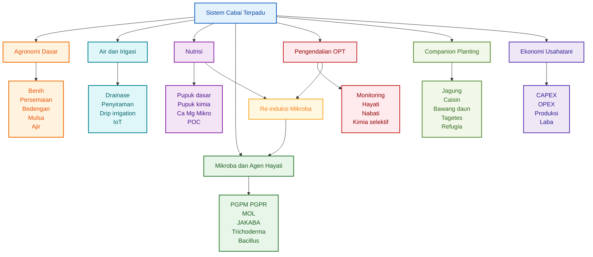

### Diagram 1.2. Hubungan Pupuk Kimia, Mikroba, dan Pestisida

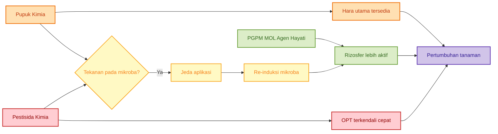

### Diagram 1.3. Siklus Aplikasi Kimia dan Re-Induksi Mikroba

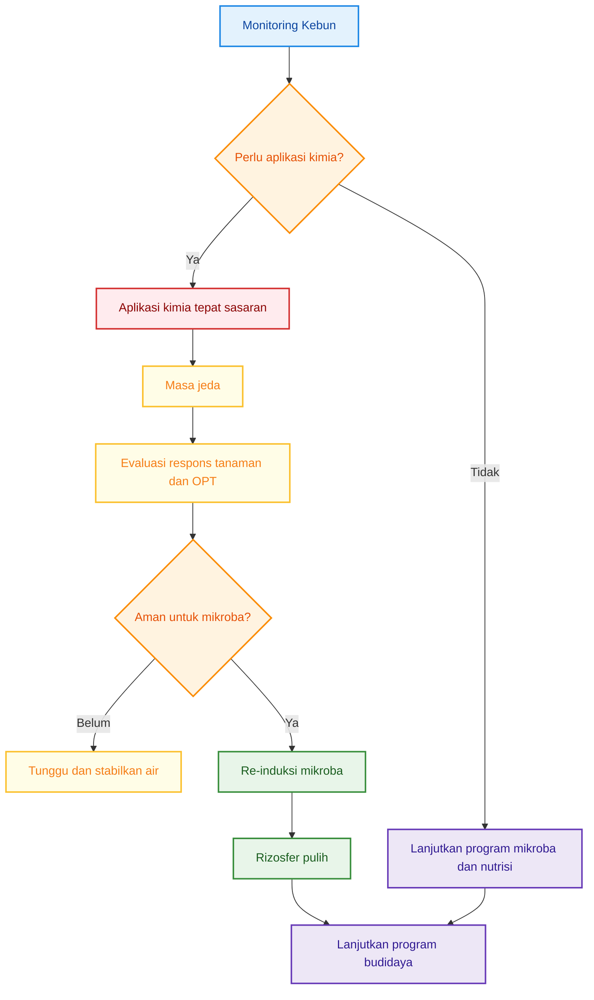


<ResourceBox
  title="Artikel Terkait:"
  items={[
    {
      name: 'README — Framework Praktis Memulai Bisnis Agribisnis Terpadu di Lahan Gumuk Berlereng',
      href: '/blog/agri/kebon/agribisnis-gumuk/README',
    },
    {
      name: 'Proposal Pembangunan Sistem Drip Irrigation',
      href: '/blog/agri/kebon/proposal-pembangunan-drip-irigation',
    },
    {
      name: 'OPT Penggagal Panen pada Cabai Rawit dan Cabai Besar',
      href: '/blog/agri/pengendalian-opt-cabai',
    },
    {
      name: 'Pedoman lengkap bergambar pengendalian OPT cabai - kutu kebul dan thrips',
      href: '/blog/agri/pengendalian-kutu-kebul-thrips',
    },
    {
      name: 'Panduan Praktis Pembiakan Trichoderma dari Starter Komersial',
      href: '/blog/agri/agen-hayati/trichoderma-pembiakan',
    },
    {
      name: 'Panduan Praktis Integrasi PGPM, Pupuk Kimia, dan Pestisida Kimia pada Budidaya Cabai Rawit dan Cabai Besar',
      href: '/blog/agri/agen-hayati/panduan-praktis-integrasi-pgpm-cabai',
    },
    {
      name: 'Agen Hayati untuk Pengendalian OPT Cabai: Panduan Praktis dari Persemaian sampai Panen',
      href: '/blog/agri/agen-hayati/agen-hayati-cabai',
    },
    {
      name: 'Rancangan Bioreactor Sederhana untuk Pembiakan PGPM Cair dan Padat Skala Petani',
      href: '/blog/agri/agen-hayati/bioreactor-design',
    },
    {
      name: 'JAKABA, MOL, POC, dan PGPM: Formulasi, Fermentasi, Standar Mutu, serta Aplikasi pada Cabai dan Durian',
      href: '/blog/agri/agen-hayati/jakaba-poc-cabai-durian',
    },
    {
      name: 'Panduan Lengkap Pengendalian Lalat Buah di Kebun Campuran',
      href: '/blog/agri/lalat-buah',
    },
    {
      name: 'README - Pupuk Tepat, Panen Untung - Model Low-Lab untuk Petani Makmur di Gambiran',
      href: '/blog/agri/pupuk-terintegrasi/README',
    },
  ]}
/>

---

## 1.2 Prinsip Utama Sistem Cabai Terpadu

Agar sistem cabai terpadu dapat diterapkan dengan benar, beberapa prinsip dasar perlu dipahami sejak awal. Prinsip-prinsip ini akan menjadi landasan bagi seluruh keputusan teknis pada bab-bab berikutnya.

### 1. Cabai Tetap Butuh Pupuk Utama

Cabai adalah tanaman produksi tinggi yang membutuhkan pasokan hara yang cukup. Unsur seperti nitrogen, fosfor, kalium, kalsium, magnesium, sulfur, dan unsur mikro tidak dapat diandalkan sepenuhnya dari input biologis atau fermentasi rumahan. Karena itu, pupuk utama tetap menjadi fondasi nutrisi.

Artinya, sistem biologis tidak dibangun untuk menggantikan sepenuhnya pupuk utama, tetapi untuk **mendukung efisiensi dan kestabilan serapan hara**.

### 2. Mikroba Bukan Pengganti Total Pupuk Kimia

Mikroba seperti PGPM, PGPR, _Trichoderma_, _Bacillus_, MOL, atau JAKABA memiliki fungsi yang berbeda dari pupuk kimia. Mikroba dapat membantu akar, memperbaiki rizosfer, memobilisasi hara, menekan sebagian patogen, atau mempercepat penguraian bahan organik. Namun, mikroba tidak otomatis menyediakan semua unsur hara dalam jumlah cukup untuk produksi tinggi.

Karena itu, mikroba harus ditempatkan sebagai **komponen pendukung sistem**, bukan sebagai alasan untuk menghapus total pemupukan utama.

### 3. Pestisida Kimia Tetap Bisa Digunakan

Dalam budidaya cabai, kondisi lapangan tidak selalu ideal. Ketika tekanan OPT sudah tinggi, tindakan cepat sering diperlukan. Dalam situasi seperti itu, pestisida kimia tetap sah digunakan. Yang penting adalah:

- tepat waktu,
- tepat sasaran,
- tepat bahan aktif,
- tepat dosis,
- dan tidak digunakan secara serampangan.

Pestisida kimia tidak harus diposisikan sebagai musuh sistem biologis, tetapi harus diatur agar **tidak merusak program mikroba lebih dari yang diperlukan**.

### 4. Agen Hayati Harus Diperlakukan sebagai Organisme Hidup

Berbeda dengan pupuk kimia, agen hayati bukan bahan mati. Mereka adalah organisme hidup yang memiliki toleransi terbatas terhadap panas, sinar matahari, kekeringan, residu bahan kimia, atau campuran tangki yang tidak sesuai. Karena itu:

- penyimpanan harus benar,
- waktu aplikasi harus tepat,
- media aplikasi harus mendukung,
- dan tidak boleh dicampur sembarangan dengan pestisida atau bahan kimia keras.

Bila agen hayati diperlakukan seperti input biasa tanpa memperhatikan viabilitasnya, maka manfaatnya sering tidak muncul.

### 5. Companion Planting adalah Alat Stabilisasi Ekologi

Companion planting adalah bagian penting dalam kebun cabai, tetapi bukan satu-satunya alat pengendalian. Tanaman pendamping dapat berfungsi sebagai barrier, trap crop, repelan, penarik musuh alami, atau pembentuk keragaman ekologi. Namun, companion planting tidak dapat menggantikan kebutuhan akan sanitasi, monitoring, nutrisi seimbang, dan pengendalian OPT yang disiplin.

Karena itu, companion planting harus dipahami sebagai **alat stabilisasi**, bukan solusi tunggal.

### 6. Re-Induksi Mikroba Diperlukan Setelah Aplikasi Kimia Tertentu

Aplikasi fungisida, bakterisida, nematisida, herbisida tertentu, atau pupuk kimia pekat dapat menekan aktivitas mikroba di sekitar akar. Bila hal ini terjadi, maka sistem biologis kebun perlu dipulihkan. Di sinilah peran **re-induksi mikroba** menjadi penting.

Re-induksi bukan berarti mengulangi semua dari awal, tetapi memasukkan kembali mikroba yang dibutuhkan—misalnya PGPM, _Bacillus_, _Trichoderma_, JAKABA, atau MOL—setelah jeda aman dari aplikasi kimia.

Dengan demikian, sistem cabai terpadu dibangun bukan hanya untuk menghasilkan panen, tetapi untuk menjaga agar setiap komponen budidaya saling mendukung dan tidak saling merusak.

---

## 1.3 Filosofi Sistem

Pada dasarnya, sistem cabai terpadu dibangun di atas gagasan sederhana bahwa **produktivitas bukan hasil dari satu input tunggal**, melainkan hasil dari keteraturan seluruh sistem. Tanaman yang sehat tidak lahir hanya karena pupuknya banyak, tetapi karena akar aktif, air stabil, nutrisi cukup, serangan OPT terkendali, dan biaya tetap masuk akal.

Filosofi ini dapat dirumuskan secara ringkas sebagai berikut:

```mdx id="filosofi-sistem-cabai"
Produktivitas =
Agronomi rapi

- Air stabil
- Nutrisi cukup
- Mikroba aktif
- OPT terkendali
- Evaluasi ekonomi
```

Makna dari rumus ini adalah:

- **Agronomi rapi** berarti pondasi teknis kebun benar sejak awal;
- **Air stabil** berarti akar tidak mengalami stres berulang;
- **Nutrisi cukup** berarti tanaman memperoleh hara sesuai fase;
- **Mikroba aktif** berarti rizosfer tetap hidup dan mendukung tanaman;
- **OPT terkendali** berarti kerusakan tidak dibiarkan melewati ambang ekonomi;
- **Evaluasi ekonomi** berarti keputusan lapangan tetap dihitung dari sisi usaha.

Jika salah satu komponen hilang, maka produktivitas akan turun. Misalnya, nutrisi cukup tetapi air tidak stabil, maka hasil tetap tidak optimal. Air stabil tetapi OPT tidak terkendali, panen tetap hilang. Mikrobanya aktif tetapi nutrisi kurang, pertumbuhan tetap tertahan. Dengan kata lain, sistem cabai terpadu adalah pendekatan **keseimbangan**.

### Diagram 1.4. Filosofi Produktivitas dalam Sistem Cabai Terpadu

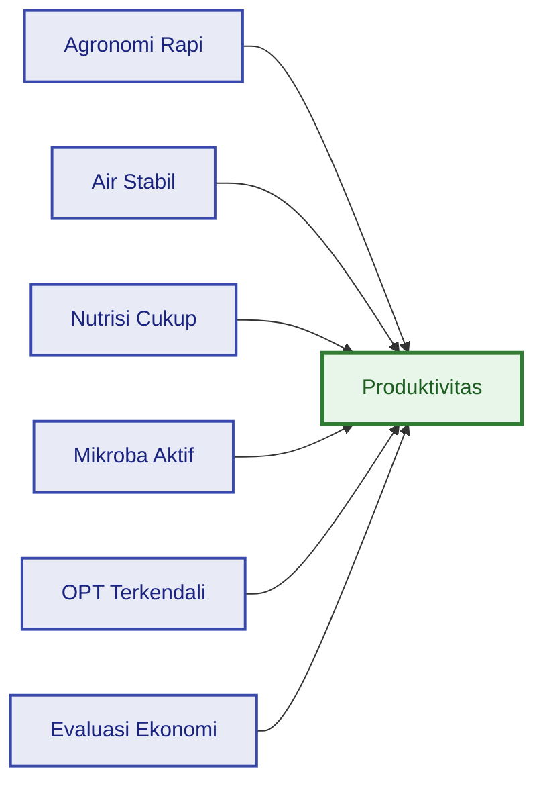

---

## 1.4 Diagram Sistem Cabai Terpadu

Bagian ini menjadi penutup bab pendahuluan sekaligus jembatan menuju bab-bab teknis berikutnya. Diagram berikut memperlihatkan bagaimana berbagai komponen saling terhubung dalam sistem cabai terpadu.

### Diagram 1.5. Sistem Cabai Terpadu

```mermaid id="diagram-sistem-cabai-terpadu-final"
flowchart TD
    A[Sistem Cabai Terpadu] --> B[Agronomi Dasar]
    A --> C[Air dan Irigasi]
    A --> D[Nutrisi]
    A --> E[Mikroba dan Agen Hayati]
    A --> F[Pengendalian OPT]
    A --> G[Companion Planting]
    A --> H[Ekonomi Usahatani]

    B --> B1[Benih, semai, bedengan, mulsa, ajir]
    C --> C1[Drip irrigation, IoT, drainase]
    D --> D1[Pupuk dasar, pupuk kimia, Ca, Mg, mikro]
    E --> E1[PGPM, PGPR, Trichoderma, Bacillus, MOL, POC]
    F --> F1[Nabati, hayati, pestisida kimia selektif]
    G --> G1[Jagung, caisin, bawang daun, tagetes, bunga matahari]
    H --> H1[CAPEX, OPEX, produksi, laba]

    E --> I[Re-induksi mikroba]
    F --> I
    I --> E

    classDef pusat fill:#bbdefb,stroke:#1565c0,stroke-width:3px,color:#0d47a1;
    classDef kelompok1 fill:#ffe0b2,stroke:#ef6c00,stroke-width:2px,color:#bf360c;
    classDef kelompok2 fill:#b2ebf2,stroke:#00838f,stroke-width:2px,color:#006064;
    classDef kelompok3 fill:#e1bee7,stroke:#8e24aa,stroke-width:2px,color:#4a148c;
    classDef kelompok4 fill:#c8e6c9,stroke:#2e7d32,stroke-width:2px,color:#1b5e20;
    classDef kelompok5 fill:#ffcdd2,stroke:#c62828,stroke-width:2px,color:#8e0000;
    classDef kelompok6 fill:#dcedc8,stroke:#689f38,stroke-width:2px,color:#33691e;
    classDef kelompok7 fill:#d1c4e9,stroke:#5e35b1,stroke-width:2px,color:#311b92;
    classDef reinduksi fill:#fff9c4,stroke:#f9a825,stroke-width:3px,color:#f57f17;

    class A pusat;
    class B,B1 kelompok1;
    class C,C1 kelompok2;
    class D,D1 kelompok3;
    class E,E1 kelompok4;
    class F,F1 kelompok5;
    class G,G1 kelompok6;
    class H,H1 kelompok7;
    class I reinduksi;
```

Diagram tersebut menunjukkan bahwa pusat sistem bukan hanya tanaman cabainya, tetapi **keseluruhan manajemen kebun**. Agronomi dasar, air, nutrisi, mikroba, pengendalian OPT, companion planting, dan ekonomi usaha semuanya harus bergerak bersama. Di dalam sistem ini, re-induksi mikroba menjadi titik penting karena ia menghubungkan kembali komponen proteksi kimia dengan komponen biologis.

Dengan demikian, Bab 1 ini menegaskan bahwa budidaya cabai terpadu bukan sekadar kombinasi banyak istilah, tetapi sebuah kerangka kerja. Bab-bab berikutnya akan menguraikan masing-masing komponen secara lebih rinci, mulai dari konteks lokal, desain lahan, sistem mikroba, program nutrisi, pengendalian OPT, hingga strategi re-induksi mikroba dan evaluasi ekonomi.

Catatan:
Untuk memahami perbedaan produk PGPM, agens hayati, dekomposer, biopestisida, biostimulan lokal, dan musuh alami yang beredar di lapangan, lihat Lampiran F.

---

# 2. Konteks Lokal Gambiran dan Pilihan Komoditas Cabai

## 2.1 Gambiran sebagai Wilayah Cabai

Kecamatan Gambiran memiliki basis data hortikultura yang cukup jelas untuk membaca arah pengembangan cabai. Dalam publikasi **Kecamatan Gambiran Dalam Angka 2024**, BPS menyajikan data luas panen dan produksi tanaman sayuran serta buah-buahan semusim tahun 2020–2023. Data yang tersedia adalah **luas panen**, bukan luas tanam. Dalam analisis agribisnis, luas panen tetap dapat dipakai sebagai indikator kuat untuk membaca keberadaan komoditas, skala budidaya, dan kecenderungan pilihan petani di wilayah tersebut. ([BPS Banyuwangi][1])

Berdasarkan data tersebut, **cabai besar** dan **cabai rawit** sama-sama menunjukkan posisi penting di Gambiran. Pada 2023, luas panen cabai besar mencapai **79 ha**, sedangkan cabai rawit mencapai **60 ha**. Jika dibandingkan dengan 2020, cabai besar meningkat dari **31 ha** menjadi **79 ha**, sementara cabai rawit meningkat dari **7 ha** menjadi **60 ha**. Di sisi lain, tomat yang sempat memiliki luas panen 4 ha pada 2020, 10 ha pada 2021, dan 6 ha pada 2022, tercatat **0 ha pada 2023**.

| Komoditas   |  2020 |  2021 |  2022 |  2023 | Arah Umum                     |
| ----------- | ----: | ----: | ----: | ----: | ----------------------------- |
| Cabai besar | 31 ha | 74 ha | 76 ha | 79 ha | Stabil naik                   |
| Cabai rawit |  7 ha | 27 ha | 45 ha | 60 ha | Naik kuat                     |
| Tomat       |  4 ha | 10 ha |  6 ha |  0 ha | Melemah/hilang dari data 2023 |

Dari sisi produksi, cabai besar juga menunjukkan posisi dominan. Produksi cabai besar di Gambiran meningkat dari **2.504 kuintal pada 2020** menjadi **11.217 kuintal pada 2023**. Cabai rawit meningkat dari **138 kuintal pada 2020** menjadi **3.314 kuintal pada 2023**. Tomat tercatat 372 kuintal pada 2020, 780 kuintal pada 2021, 2.348 kuintal pada 2022, lalu 0 kuintal pada 2023.

| Komoditas   |          2020 |          2021 |          2022 |           2023 | Arah Umum              |
| ----------- | ------------: | ------------: | ------------: | -------------: | ---------------------- |
| Cabai besar | 2.504 kuintal | 7.086 kuintal | 8.681 kuintal | 11.217 kuintal | Produksi naik kuat     |
| Cabai rawit |   138 kuintal |   779 kuintal | 1.581 kuintal |  3.314 kuintal | Produksi naik kuat     |
| Tomat       |   372 kuintal |   780 kuintal | 2.348 kuintal |      0 kuintal | Tidak muncul pada 2023 |

Jika data luas panen dan produksi dihitung menjadi produktivitas kasar, maka pada 2023 cabai besar mencapai sekitar **141,99 kuintal/ha** atau **14,20 ton/ha**, sedangkan cabai rawit sekitar **55,23 kuintal/ha** atau **5,52 ton/ha**. Perhitungan ini bersifat indikatif karena menggunakan data agregat kecamatan, bukan data petak budidaya individual.

```mdx id="produktivitas-cabai-gambiran-2023"
Rumus produktivitas:

Produktivitas (kuintal/ha) = Produksi (kuintal) / Luas panen (ha)

Cabai besar 2023:
Produktivitas = 11.217 / 79
Produktivitas = 141,99 kuintal/ha
Produktivitas = 14,20 ton/ha

Cabai rawit 2023:
Produktivitas = 3.314 / 60
Produktivitas = 55,23 kuintal/ha
Produktivitas = 5,52 ton/ha
```

Dari pembacaan data tersebut, Gambiran dapat dipahami sebagai wilayah yang sudah memiliki basis cabai, bukan wilayah yang memulai dari nol. **Cabai besar** layak diposisikan sebagai basis usaha karena luas panen dan produksinya lebih besar serta cenderung stabil meningkat. **Cabai rawit** layak diposisikan sebagai komoditas margin tinggi karena pertumbuhan luas panennya sangat kuat, meskipun secara teknis biasanya membutuhkan disiplin budidaya yang lebih tinggi. **Tomat** lebih tepat ditempatkan sebagai komoditas rotasi atau pelengkap, bukan motor utama usaha cabai terpadu.

### Diagram 2.1. Posisi Komoditas Hortikultura di Gambiran

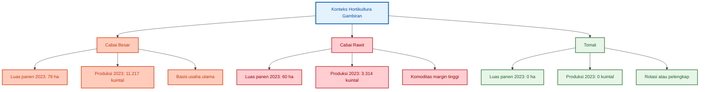

---

## 2.2 Cabai Besar vs Cabai Rawit

Cabai besar dan cabai rawit sama-sama layak dikembangkan di Gambiran, tetapi karakter usahanya berbeda. Cabai besar lebih cocok dijadikan **tulang punggung usaha** karena data luas panen dan produksinya lebih besar. Cabai rawit lebih cocok dijadikan **komoditas margin tinggi** karena potensi harga dan umur panennya menarik, tetapi risiko fluktuasi harga, intensitas panen, dan kebutuhan pengelolaan juga lebih tinggi.

| Aspek             | Cabai Besar  | Cabai Rawit           |
| ----------------- | ------------ | --------------------- |
| Risiko harga      | Sedang       | Tinggi/fluktuatif     |
| Umur panen        | Lebih pendek | Lebih panjang         |
| Intensitas kerja  | Sedang       | Tinggi                |
| Potensi margin    | Baik         | Sangat baik           |
| Kesesuaian pemula | Lebih aman   | Butuh disiplin tinggi |

### Cabai Besar sebagai Basis Usaha

Cabai besar cocok dijadikan basis usaha karena beberapa alasan. Pertama, skala budidayanya di Gambiran sudah lebih besar. Kedua, produksinya relatif tinggi. Ketiga, umur produksi biasanya lebih mudah direncanakan dibanding rawit yang panennya lebih panjang. Keempat, untuk petani yang sedang membangun sistem cabai terpadu, cabai besar lebih mudah dijadikan komoditas pembelajaran karena ritme budidayanya relatif lebih terukur.

Dalam sistem terpadu, cabai besar cocok untuk penerapan:

- pupuk dasar dan pupuk kimia terukur,
- drip irrigation,
- PGPM/PGPR sejak semai,
- agen hayati untuk tanah,
- POC vegetatif dan generatif,
- pestisida selektif berbasis monitoring,
- re-induksi mikroba setelah aplikasi kimia,
- companion planting sebagai pengurang tekanan OPT.

Kelemahan cabai besar adalah kualitas buah sangat menentukan harga. Buah harus seragam, mulus, tidak banyak cacat, tidak busuk, dan tidak terlalu banyak residu visual akibat semprotan. Karena itu, cabai besar membutuhkan disiplin pada fase bunga dan buah, terutama pengelolaan trips, antraknosa, busuk buah, kalsium, kalium, dan air.

### Cabai Rawit sebagai Komoditas Margin Tinggi

Cabai rawit memiliki karakter yang lebih agresif dari sisi potensi usaha. Luas panen cabai rawit di Gambiran meningkat dari 7 ha pada 2020 menjadi 60 ha pada 2023, menunjukkan bahwa komoditas ini makin menarik secara lokal. Namun, cabai rawit juga menuntut disiplin tinggi karena umur panennya lebih panjang, panen bisa berulang, dan tanaman harus dijaga tetap sehat dalam durasi yang lebih lama.

Cabai rawit cocok untuk petani yang siap dengan:

- monitoring OPT lebih sering,
- panen berulang,
- pemupukan susulan lebih disiplin,
- pengelolaan air lebih stabil,
- program mikroba berulang,
- re-induksi mikroba setelah aplikasi pestisida,
- sanitasi buah, daun, dan tanaman sakit secara konsisten.

Kelebihan cabai rawit adalah potensi margin yang sangat baik ketika harga sedang tinggi. Kekurangannya adalah risiko harga lebih fluktuatif dan tekanan OPT bisa lebih panjang karena tanaman berada di lahan lebih lama.

### Tomat sebagai Rotasi atau Pelengkap

Tomat tidak menjadi motor utama dalam rancangan ini karena data 2023 menunjukkan tidak ada luas panen dan produksi tomat yang tercatat di Gambiran. Namun, tomat tetap bisa dipertimbangkan sebagai tanaman rotasi terbatas atau komoditas pelengkap, bukan sebagai komoditas utama.

Tomat masih dapat berguna untuk:

- diversifikasi usaha,
- rotasi pasar,
- uji lahan pada musim tertentu,
- pemanfaatan sebagian area,
- pembelajaran sistem irigasi dan nutrisi.

Namun, tomat tidak disarankan menjadi pusat strategi karena masih satu keluarga Solanaceae dengan cabai. Artinya, tomat dan cabai dapat berbagi beberapa risiko penyakit dan hama. Jika tomat digunakan sebagai rotasi, pengaturan jeda tanam, sanitasi, dan pemutusan siklus penyakit harus dilakukan dengan hati-hati.

### Diagram 2.2. Perbandingan Strategi Cabai Besar dan Cabai Rawit

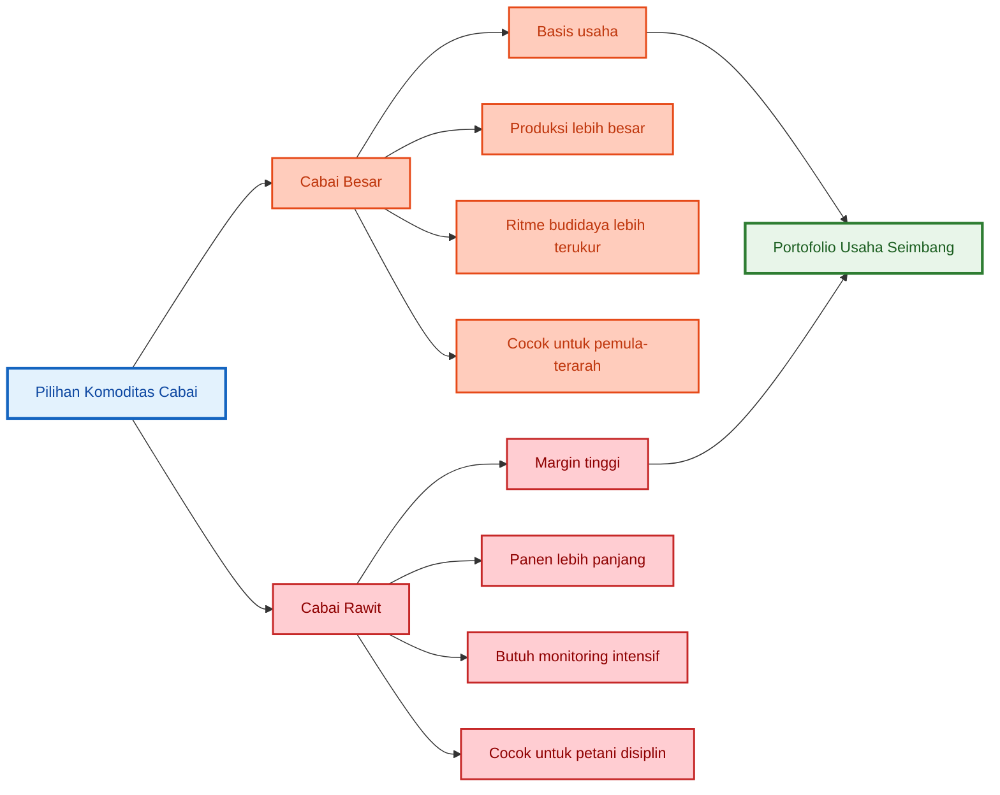

---

## 2.3 Rekomendasi Komoditas

Berdasarkan data lokal dan pertimbangan teknis budidaya, rekomendasi komoditas untuk sistem cabai terpadu di Gambiran adalah sebagai berikut.

### 1. Cabai Besar sebagai Tulang Punggung

Cabai besar sebaiknya dijadikan **komoditas utama**. Alasannya, luas panen dan produksinya paling kuat dibanding cabai rawit dan tomat. Pada 2023, cabai besar memiliki luas panen 79 ha dan produksi 11.217 kuintal, tertinggi di antara tiga komoditas yang dibahas. si tomat yang tercatat. Namun, tomat masih dapat digunakan secara terbatas sebagai rotasi, uji pasar, atau pelengkap sistem usaha. citeturn709688view0turn709688view1

Rekomendasi praktis:

```mdx id="rekomendasi-tomat"
Tomat = rotasi atau pelengkap

Fungsi:

- Diversifikasi terbatas
- Uji pasar
- Pemanfaatan sebagian area

Catatan:

- Jangan menjadi komoditas utama
- Perhatikan risiko penyakit keluarga Solanaceae
- Perlu jeda dan sanitasi bila rotasi dengan cabai
```

### Rekomendasi Portofolio Komoditas

Untuk skala awal, terutama pada kebun yang sedang membangun sistem terpadu, komposisi komoditas sebaiknya tidak terlalu rumit. Fokus utama tetap cabai besar, lalu cabai rawit dimasukkan secara bertahap bila sistem air, nutrisi, tenaga kerja, dan proteksi tanaman sudah stabil.

```mdx id="portofolio-komoditas-cabai-gambiran"
Rekomendasi portofolio awal:

70% cabai besar
20% cabai rawit
10% tanaman pendamping/rotasi/pelengkap

Setelah sistem stabil:

50–60% cabai besar
30–40% cabai rawit
10% tanaman pendamping/rotasi/pelengkap
```

### Diagram 2.3. Rekomendasi Portofolio Komoditas

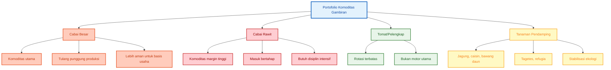

## Ringkasan Bab 2

Data Gambiran menunjukkan bahwa cabai besar dan cabai rawit sama-sama memiliki dasar pengembangan yang kuat. Cabai besar lebih layak dijadikan **tulang punggung usaha** karena luas panen dan produksinya paling besar. Cabai rawit lebih tepat dijadikan **komoditas margin tinggi** yang dikembangkan oleh petani yang siap menjalankan sistem intensif. Tomat tidak menjadi motor utama, tetapi masih dapat digunakan sebagai rotasi atau pelengkap terbatas.

Dengan demikian, strategi terbaik untuk sistem cabai terpadu di Gambiran adalah memulai dari cabai besar sebagai

asis, memasukkan cabai rawit secara bertahap, dan menggunakan tanaman lain sebagai pendamping, rotasi, atau diversifikasi terbatas.

[1]: https://banyuwangikab.bps.go.id/id/publication/2024/09/26/da045bec4c206aa9242a35f2/kecamatan-gambiran-dalam-angka-2024.html 'Kecamatan Gambiran Dalam Angka 2024 - Badan Pusat Statistik Kabupaten Banyuwangi'

---

# 3. Desain Lahan: Lahan Kering, Sawah, Drainase, Mulsa, dan Drip Irrigation

Desain lahan adalah fondasi budidaya cabai terpadu. Sebelum membahas pupuk, PGPM, MOL, POC, agen hayati, atau pestisida, lahan harus lebih dulu dibuat aman untuk akar. Pada cabai, banyak masalah besar bermula dari desain lahan yang kurang tepat: air menggenang, drainase buruk, akar kekurangan oksigen, kelembapan terlalu tinggi, pupuk tercuci, dan penyakit tanah lebih mudah berkembang.

Cabai membutuhkan media yang lembap tetapi tidak jenuh air. Akar harus mendapat air cukup, tetapi juga tetap memperoleh oksigen. Karena itu, desain lahan cabai terpadu harus memadukan **bedengan tinggi**, **drainase lancar**, **mulsa**, **irigasi presisi**, dan bila memungkinkan **drip irrigation** yang bisa dikembangkan ke sistem fertigasi serta IoT.

---

## 3.1 Lahan Kering vs Sawah

Secara umum, **lahan kering lebih aman untuk cabai** dibanding sawah, terutama bila lahan kering tersebut memiliki struktur tanah baik, drainase cukup, dan akses air tersedia. Lahan kering biasanya lebih mudah dikendalikan dari sisi kelembapan akar. Risiko akar jenuh air lebih rendah, sehingga tanaman lebih stabil terhadap gangguan busuk akar dan layu akibat kondisi terlalu basah.

Namun, bukan berarti sawah tidak bisa digunakan. Sawah tetap bisa dipakai untuk cabai, terutama setelah musim padi, asalkan desain drainasenya benar. Masalah utama pada sawah bukan status lahannya sebagai sawah, tetapi **kecenderungan tanah menahan air terlalu lama**. Bila bedengan rendah, parit dangkal, atau saluran pembuangan buruk, akar cabai mudah berada dalam kondisi jenuh air.

Kondisi tanah yang terlalu basah atau tergenang dapat meningkatkan risiko penyakit akar dan pangkal batang. Pada cabai, salah satu patogen penting yang berkaitan erat dengan kondisi basah adalah _Phytophthora capsici_. Beberapa panduan penyakit tanaman menyebut bahwa _Phytophthora_ berkembang lebih berat pada kondisi tanah basah, drainase buruk, atau area rendah yang menahan air. Pengelolaan air, bedengan, dan drainase menjadi langkah penting untuk mengurangi risiko penyakit ini. ([PNW Pest Management Handbooks][1])

### Risiko Utama Sawah untuk Cabai

Risiko sawah untuk cabai meliputi:

- akar jenuh air,
- kekurangan oksigen di zona akar,
- peningkatan risiko _Phytophthora_,
- peningkatan risiko layu,
- kelembapan mikroklimat terlalu tinggi,
- pembusukan akar,
- pupuk lebih mudah tercuci bila drainase tidak terkendali,
- aktivitas mikroba menguntungkan bisa terganggu bila tanah terlalu anaerob.

Sawah bekas padi biasanya memiliki lapisan tanah yang lebih padat dan sering menahan air. Jika cabai ditanam langsung tanpa bedengan tinggi dan parit pembuangan, akar akan cepat stres. Akar yang stres menjadi pintu masuk berbagai masalah, mulai dari pertumbuhan lambat, daun menguning, tanaman mudah layu, hingga produktivitas rendah.

### Kapan Lahan Sawah Layak untuk Cabai?

Sawah layak digunakan untuk cabai bila memenuhi syarat berikut:

| Syarat                        | Keterangan                                                                  |
| ----------------------------- | --------------------------------------------------------------------------- |
| Drainase utama tersedia       | Air bisa keluar dari lahan, bukan hanya pindah ke parit kecil               |
| Bedengan cukup tinggi         | Akar berada di atas zona jenuh air                                          |
| Parit antarbedengan jelas     | Air hujan cepat turun ke parit                                              |
| Tidak ada genangan lama       | Setelah hujan, air tidak bertahan lebih dari 6–12 jam di permukaan bedengan |
| Tanah tidak terlalu padat     | Bila padat, perlu pembenah seperti kompos matang, sekam, atau biochar       |
| Sistem irigasi bisa dikontrol | Jangan mengandalkan banjir/leb saja                                         |
| Riwayat penyakit tanah rendah | Bila sering layu/busuk akar, perlu perlakuan lebih ketat                    |

### Rekomendasi Praktis Pemilihan Lahan

| Kondisi Lahan                             | Kelayakan untuk Cabai | Catatan                          |
| ----------------------------------------- | --------------------- | -------------------------------- |
| Lahan kering dengan air tersedia          | Sangat baik           | Cocok untuk cabai intensif       |
| Lahan kering terlalu kering tanpa irigasi | Sedang                | Perlu drip/tandon                |
| Sawah dengan drainase baik                | Bisa digunakan        | Wajib bedengan tinggi            |
| Sawah mudah tergenang                     | Berisiko tinggi       | Tidak disarankan tanpa perbaikan |
| Lahan rendah dekat aliran air             | Berisiko              | Perlu saluran pembuangan kuat    |
| Lahan bekas Solanaceae sakit              | Berisiko              | Perlu rotasi dan sanitasi        |

### Diagram 3.1. Keputusan Pemilihan Lahan Cabai

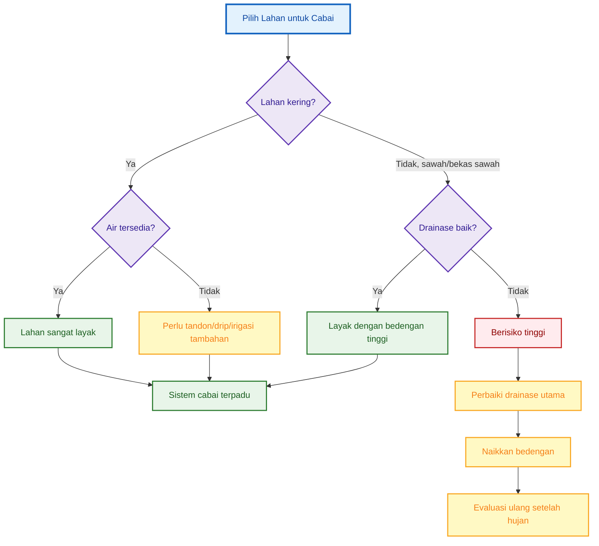

---

## 3.2 Bedengan, Drainase, dan Mulsa

Bedengan adalah “rumah akar” cabai. Bila bedengan baik, akar lebih aman dari genangan, pupuk lebih mudah dikelola, dan aplikasi mikroba seperti PGPM, MOL, JAKABA, atau agen hayati lebih efektif. Sebaliknya, bedengan yang terlalu rendah atau parit yang buruk akan membuat seluruh program pemupukan dan mikroba menjadi kurang maksimal.

Pada lahan cabai terpadu, bedengan harus dirancang untuk tiga tujuan utama:

1. mengangkat zona akar dari genangan,
2. memudahkan irigasi dan fertigasi,
3. menjaga kelembapan tanah tetap stabil.

### Rekomendasi Ukuran Bedengan

Ukuran bedengan perlu menyesuaikan jenis tanah, musim, dan sistem tanam. Namun, untuk desain praktis, acuan berikut dapat digunakan.

| Komponen                           |   Lahan Kering | Sawah/Bekas Sawah |
| ---------------------------------- | -------------: | ----------------: |
| Tinggi bedengan                    |       30–40 cm |          40–60 cm |
| Lebar atas bedengan                |      90–110 cm |         90–110 cm |
| Lebar parit                        |       40–60 cm |          50–70 cm |
| Kedalaman parit                    |       30–40 cm |          40–60 cm |
| Jarak antarbedengan pusat ke pusat |     130–170 cm |        150–180 cm |
| Jumlah baris cabai                 | 2 baris/bedeng |    2 baris/bedeng |

Pada sawah atau lahan yang mudah tergenang, tinggi bedengan harus lebih serius. Bedengan 20–25 cm sering belum cukup bila hujan tinggi dan saluran pembuangan tidak lancar. Untuk cabai, lebih aman membuat bedengan lebih tinggi daripada terlalu rendah. Panduan pengelolaan _Phytophthora_ juga menekankan pentingnya menghindari kejenuhan air berkepanjangan, memperbaiki drainase, dan menggunakan bedengan tinggi pada sayuran bila drainase menjadi masalah. ([UC IPM][2])

### Arah Bedengan dan Aliran Air

Arah bedengan harus mengikuti logika aliran air. Tujuannya bukan sekadar rapi, tetapi agar air hujan cepat masuk ke parit dan keluar dari lahan.

Prinsipnya:

- pada lahan miring, bedengan sebaiknya mengikuti kontur ringan atau dibuat agar air tidak menggerus bedengan;
- pada lahan datar, buat kemiringan saluran kecil menuju saluran pembuangan utama;
- jangan membuat parit buntu;
- air dari parit kecil harus masuk ke saluran kolektor;
- saluran kolektor harus mengarah ke pembuangan akhir.

### Struktur Drainase yang Disarankan

| Jenis Saluran       | Fungsi                                     |
| ------------------- | ------------------------------------------ |
| Parit antarbedengan | Menampung air dari mulsa dan sela bedengan |
| Saluran kolektor    | Mengumpulkan air dari beberapa parit       |
| Saluran utama       | Membuang air keluar lahan                  |
| Titik kontrol       | Mengecek apakah air benar-benar mengalir   |
| Outlet/pembuangan   | Titik akhir keluarnya air dari kebun       |

### Diagram 3.2. Struktur Bedengan dan Drainase Cabai

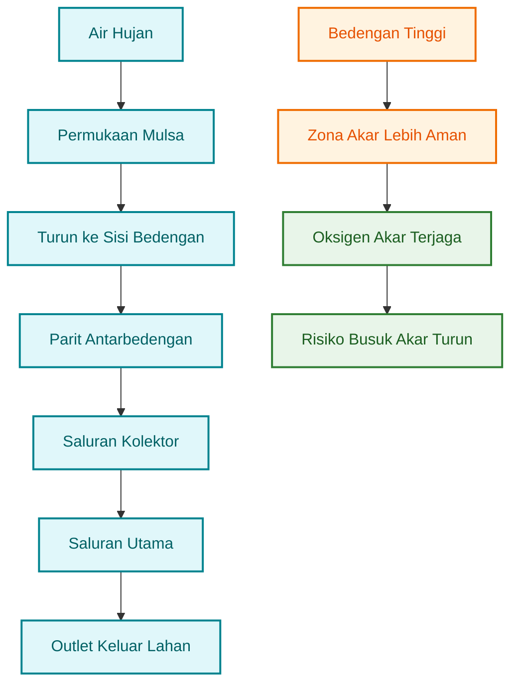

### Mulsa Plastik Hitam Perak

Mulsa plastik hitam perak sangat berguna dalam budidaya cabai intensif. Sisi perak menghadap ke atas untuk memantulkan cahaya dan membantu mengganggu sebagian serangga kecil, sedangkan sisi hitam menghadap tanah untuk menekan pertumbuhan gulma.

Manfaat mulsa meliputi:

- menekan gulma,
- menjaga kelembapan tanah,
- mengurangi percikan tanah ke daun dan buah,
- mengurangi penguapan,
- membantu stabilitas suhu tanah,
- memudahkan manajemen fertigasi,
- membuat kebun lebih bersih.

Namun, mulsa bukan solusi jika drainase buruk. Jika air terjebak di bawah mulsa dan bedengan terlalu rendah, akar tetap bisa jenuh air. Karena itu, mulsa harus dipasang setelah bedengan dan drainase benar.

### Rekomendasi Lubang Tanam

| Jenis Cabai                | Pola Tanam      | Jarak Tanam Praktis |
| -------------------------- | --------------- | ------------------- |
| Cabai besar                | 2 baris zig-zag | 50–60 cm × 60–70 cm |
| Cabai rawit                | 2 baris zig-zag | 50–60 cm × 60–70 cm |
| Cabai intensif tajuk besar | 2 baris         | 60–70 cm × 70 cm    |

Jarak tanam jangan terlalu rapat karena kelembapan tajuk akan meningkat. Tajuk yang terlalu rapat membuat sirkulasi udara buruk, daun lebih lama basah, dan penyakit daun/buah lebih mudah berkembang.

### Rumus Perkiraan Populasi Tanaman

```mdx id="rumus-populasi-cabai"
Rumus perkiraan populasi:

Populasi = Luas efektif tanam / Luas per tanaman

Contoh:
Luas lahan = 1.000 m²
Luas efektif untuk bedengan cabai = 70% × 1.000 m²
Luas efektif = 700 m²

Jarak tanam = 60 cm × 60 cm
Luas per tanaman = 0,6 m × 0,6 m
Luas per tanaman = 0,36 m²

Populasi teoritis = 700 / 0,36
Populasi teoritis = 1.944 tanaman

Catatan:
Populasi aktual biasanya lebih rendah karena ada jalan, parit, tandon, area kerja, dan tanaman pendamping.
```

---

## 3.3 Drip Irrigation sebagai Fondasi

Dalam sistem cabai terpadu, **drip irrigation** atau irigasi tetes sebaiknya diposisikan sebagai fondasi. Alasannya sederhana: cabai sangat sensitif terhadap ketidakseimbangan air. Siram berlebihan membuat akar jenuh, sedangkan kekurangan air menyebabkan bunga rontok, buah kecil, dan tanaman stres. Drip irrigation membantu menjaga zona akar tetap lembap secara lebih stabil.

Dibanding penyiraman manual atau penggenangan parit, drip irrigation memiliki beberapa kelebihan:

- air lebih presisi,
- pupuk lebih efisien,
- daun tidak sering basah,
- kelembapan lebih terkendali,
- area akar menjadi target utama,
- fertigasi lebih mudah,
- aplikasi mikroba cair lebih terarah bila disaring baik.

Pada konteks penyakit akar, pengelolaan air sangat penting. Panduan penyakit cabai menyebut bahwa irigasi ringan dan penggunaan drip dapat membantu mencegah tanah terlalu basah, menjaga permukaan tanah lebih kering, dan menekan perkembangan penyakit tertentu yang dipicu kelembapan tinggi. ([PNW Pest Management Handbooks][1])

### Komponen Sistem Drip Sederhana

| Komponen               | Fungsi                                      |
| ---------------------- | ------------------------------------------- |
| Sumber air             | Sumur, tandon, atau kolam                   |
| Pompa                  | Mendorong air ke sistem                     |
| Filter                 | Menahan pasir, lumut, endapan, dan partikel |
| Tandon                 | Menstabilkan suplai air                     |
| Venturi/fertigasi      | Memasukkan pupuk larut air atau input cair  |
| Manifold               | Membagi air ke zona bedengan                |
| Pipa utama             | Saluran utama air                           |
| Pipa lateral/drip tape | Menyalurkan air ke tanaman                  |
| Valve/zona             | Mengatur blok penyiraman                    |
| Flush end              | Membuang endapan di ujung pipa              |

### Hubungan Drip dengan Pupuk dan Mikroba

Drip irrigation bukan hanya alat penyiraman. Dalam sistem cabai terpadu, drip juga menjadi jalur penting untuk fertigasi dan aplikasi cair tertentu.

Namun, ada perbedaan penting:

- **pupuk kimia larut air** relatif mudah masuk sistem drip jika benar-benar larut;
- **POC, MOL, PGPM, JAKABA, dan agen hayati cair** harus disaring sangat baik;
- bahan organik yang tidak tersaring dapat menyumbat nozzle, emitter, atau filter;
- setelah aplikasi POC/MOL/PGPM, sistem perlu dibilas dengan air bersih.

### Aturan Praktis Aplikasi Mikroba lewat Drip

| Input            | Bisa Lewat Drip?        | Syarat                                                        |
| ---------------- | ----------------------- | ------------------------------------------------------------- |
| Pupuk larut air  | Bisa                    | Larut sempurna dan tidak mengendap                            |
| PGPM cair        | Bisa                    | Tersaring halus, tanpa ampas                                  |
| MOL              | Bisa terbatas           | Harus matang, encer, dan tersaring                            |
| POC              | Bisa terbatas           | Harus sangat tersaring, risiko sumbat                         |
| JAKABA           | Lebih aman kocor manual | Jika lewat drip, harus filtrasi ketat                         |
| Trichoderma cair | Bisa terbatas           | Ikuti label, hindari filter terlalu halus bila spora tertahan |
| Bahan berampas   | Tidak disarankan        | Risiko sumbatan tinggi                                        |

Untuk sistem skala petani, aplikasi mikroba sering lebih aman dilakukan dengan **kocor manual di area akar** dibanding lewat drip, terutama jika filtrasi belum bagus. Drip tetap menjadi fondasi air dan pupuk larut, sedangkan mikroba bisa masuk lewat sistem terpisah jika kualitas filtrasi sudah memadai.

### Rumus Kebutuhan Air Sederhana

Kebutuhan air cabai sangat dipengaruhi umur tanaman, cuaca, jenis tanah, mulsa, dan fase pertumbuhan. Rumus berikut bukan pengganti perhitungan evapotranspirasi, tetapi cukup membantu untuk estimasi lapangan.

```mdx id="rumus-kebutuhan-air-cabai"
Rumus sederhana kebutuhan air harian:

Total air harian = Jumlah tanaman × Volume air per tanaman per hari

Contoh:
Jumlah tanaman = 2.000 tanaman
Kebutuhan air = 0,5 liter/tanaman/hari

Total air harian = 2.000 × 0,5
Total air harian = 1.000 liter/hari
Total air harian = 1 m³/hari
```

### Estimasi Volume Air per Fase

| Fase Tanaman         | Estimasi Air per Tanaman per Hari | Catatan                 |
| -------------------- | --------------------------------: | ----------------------- |
| Awal pindah tanam    |                        100–250 ml | Jangan becek            |
| Vegetatif awal       |                        250–500 ml | Sesuaikan cuaca         |
| Vegetatif aktif      |                        500–800 ml | Tajuk mulai besar       |
| Bunga dan buah       |                      700–1.200 ml | Kebutuhan meningkat     |
| Cuaca panas/berangin |                         Bisa naik | Pantau kelembapan tanah |
| Musim hujan          |                         Dikurangi | Drainase lebih penting  |

### Rumus Lama Penyiraman Drip

```mdx id="rumus-lama-penyiraman-drip"
Rumus lama penyiraman:

Lama penyiraman = Kebutuhan air per tanaman / Debit emitter per tanaman

Contoh:
Kebutuhan air = 0,6 liter/tanaman/hari
Debit emitter = 1 liter/jam/tanaman

Lama penyiraman = 0,6 / 1
Lama penyiraman = 0,6 jam
Lama penyiraman = 36 menit/hari

Jika dibagi 2 sesi:
36 menit / 2 = 18 menit per sesi
```

### Diagram 3.3. Drip sebagai Fondasi Air, Pupuk, dan Mikroba

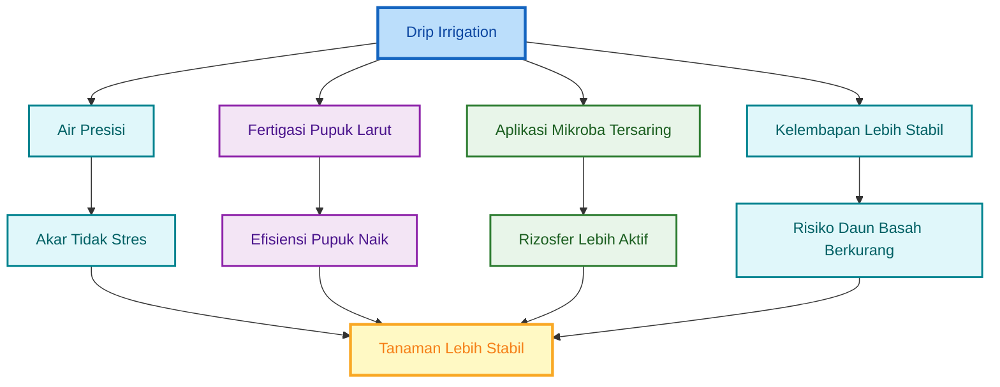

---

## 3.4 IoT untuk Cabai Intensif

IoT tidak wajib untuk semua petani, tetapi sangat berguna pada budidaya cabai intensif, terutama jika lahan sudah memakai drip irrigation. Fungsi utama IoT bukan membuat kebun terlihat modern, melainkan membantu pengambilan keputusan berbasis data: kapan menyiram, berapa lama menyiram, apakah air benar-benar mengalir, dan apakah kelembapan tanah sudah sesuai.

Dalam budidaya manual, keputusan penyiraman sering berdasarkan perkiraan. Petani melihat permukaan tanah, cuaca, atau kebiasaan harian. Cara ini masih bisa digunakan, tetapi memiliki kelemahan: kondisi permukaan tanah tidak selalu sama dengan kondisi zona akar. Dengan mulsa, permukaan tanah juga tidak mudah diamati. Di sinilah sensor kelembapan tanah menjadi berguna.

### Manual vs IoT

| Aspek                  | Manual                 | IoT                                |
| ---------------------- | ---------------------- | ---------------------------------- |
| Keputusan penyiraman   | Berdasarkan pengalaman | Berdasarkan data sensor            |
| Konsistensi            | Tergantung operator    | Lebih stabil                       |
| Risiko lupa            | Ada                    | Bisa dikurangi                     |
| Deteksi masalah aliran | Lambat                 | Bisa lebih cepat dengan flow meter |
| Biaya awal             | Rendah                 | Lebih tinggi                       |
| Cocok untuk            | Skala kecil/pemula     | Cabai intensif/drip/fertigasi      |

### Komponen IoT yang Paling Berguna

| Komponen                | Fungsi                                   |
| ----------------------- | ---------------------------------------- |
| Sensor kelembapan tanah | Membaca kondisi air di zona akar         |
| Flow meter              | Mengecek apakah air benar-benar mengalir |
| Controller              | Mengatur pompa/valve otomatis            |
| Solenoid valve          | Membuka dan menutup zona irigasi         |
| Timer digital           | Alternatif sederhana sebelum full IoT    |
| Sensor tekanan          | Mendeteksi tekanan tidak normal          |
| Dashboard/log data      | Mencatat histori penyiraman              |

### Fungsi Sensor Kelembapan Tanah

Sensor kelembapan tanah membantu menentukan kapan tanaman perlu disiram. Pada cabai, targetnya bukan membuat tanah selalu basah, tetapi menjaga kelembapan berada di zona aman. Tanah terlalu kering membuat tanaman stres. Tanah terlalu basah membuat akar kekurangan oksigen.

Dalam sistem mikroba, kelembapan juga penting. Mikroba menguntungkan membutuhkan kondisi lembap, tetapi tidak jenuh air. Jika tanah terlalu kering, aktivitas mikroba turun. Jika terlalu basah dan anaerob, mikroba yang tidak diinginkan bisa meningkat.

### Fungsi Flow Meter

Flow meter berguna untuk memastikan air benar-benar mengalir sesuai rencana. Dalam sistem drip, masalah sering tidak terlihat dari permukaan. Pompa bisa menyala, tetapi filter tersumbat. Valve bisa terbuka, tetapi tekanan kurang. Drip tape bisa bocor, atau sebagian emitter tidak mengalir.

Flow meter membantu mendeteksi:

- filter tersumbat,
- pipa bocor,
- emitter tersumbat,
- pompa melemah,
- valve gagal membuka,
- volume air tidak sesuai target.

### Fungsi Controller

Controller menjadi pusat kendali. Ia dapat mengatur kapan pompa menyala, berapa lama valve terbuka, zona mana yang disiram, dan kapan fertigasi dilakukan. Pada sistem sederhana, controller bisa diganti timer digital. Pada sistem lebih maju, controller dapat terhubung dengan sensor kelembapan, flow meter, dan aplikasi monitoring.

### Titik Balik Modal IoT

IoT layak dipasang jika manfaatnya lebih besar daripada biaya awal. Manfaat IoT biasanya berasal dari penghematan air, penghematan tenaga kerja, efisiensi pupuk, pengurangan risiko gagal akibat salah siram, serta peningkatan hasil karena tanaman lebih stabil.

```mdx id="rumus-payback-iot"
Rumus titik balik modal IoT:

Payback period = Biaya investasi IoT / Manfaat bersih per bulan

Contoh:
Biaya IoT = Rp 6.000.000
Manfaat bersih per bulan = Rp 750.000

Payback period = 6.000.000 / 750.000
Payback period = 8 bulan

Artinya:
Investasi IoT kembali dalam sekitar 8 bulan jika manfaat bersih benar-benar tercapai.
```

### Komponen Manfaat IoT

```mdx id="rumus-manfaat-iot"
Manfaat bersih IoT per bulan dapat dihitung dari:

Manfaat bersih =
Penghematan tenaga kerja

- Penghematan air
- Penghematan pupuk
- Pengurangan kerugian akibat stres air
- Tambahan hasil panen

* Biaya listrik dan perawatan
```

Untuk petani kecil, IoT tidak harus langsung lengkap. Tahap awal bisa dimulai dari timer digital dan filter yang baik. Setelah sistem drip stabil, baru ditambah sensor kelembapan dan flow meter. Pendekatan bertahap lebih realistis dan mengurangi risiko investasi berlebihan.

### Diagram 3.4. Tingkatan Adopsi IoT pada Cabai

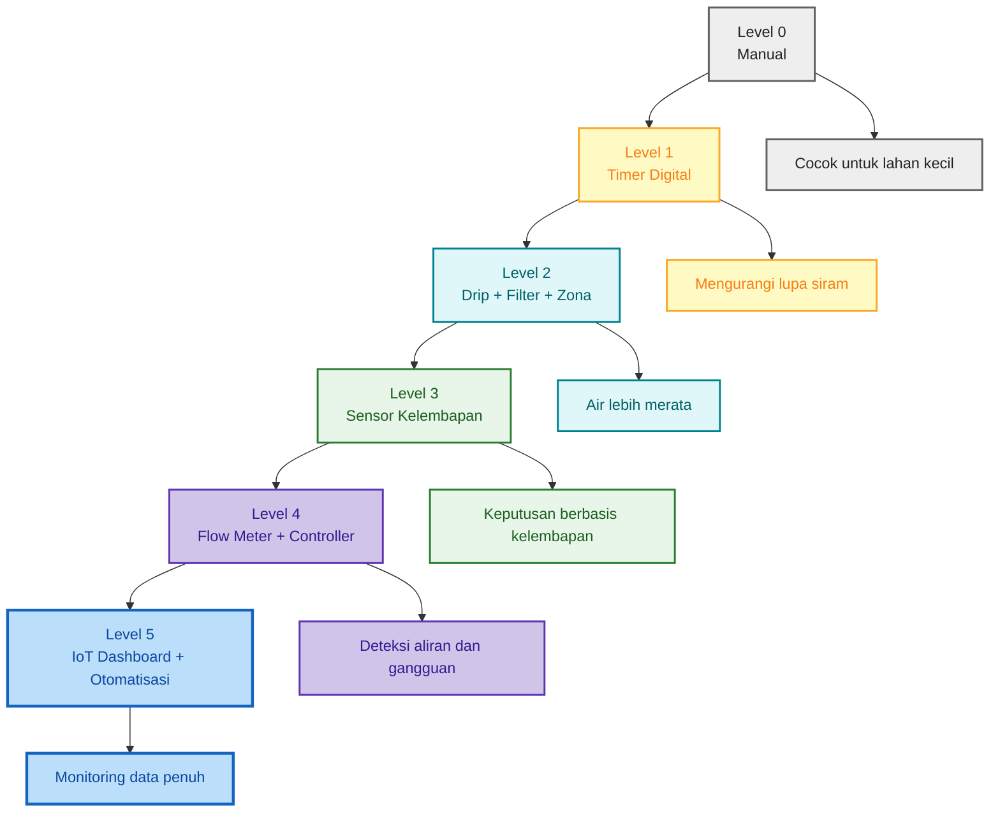

---

## 3.5 Diagram Alur Irigasi dan Fertigasi

Alur irigasi dan fertigasi harus dirancang agar air, pupuk, dan input cair masuk ke zona akar secara terkendali. Dalam sistem cabai terpadu, air bersih dan pupuk larut air menjadi jalur utama, sedangkan POC, MOL, PGPM, atau agen hayati cair hanya dimasukkan bila kualitas filtrasi baik.

### Diagram 3.5. Alur Irigasi dan Fertigasi Cabai

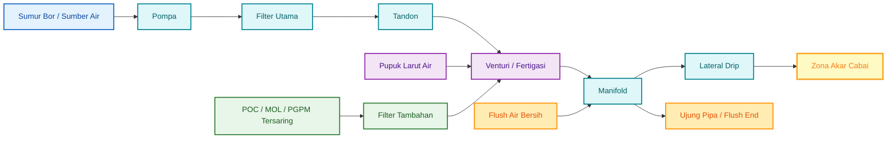

### Urutan Fertigasi yang Disarankan

Agar sistem drip tidak mudah tersumbat dan input tersalurkan merata, urutan fertigasi perlu diperhatikan.

```mdx id="urutan-fertigasi-cabai"
Urutan fertigasi praktis:

1. Jalankan air bersih 5–10 menit
2. Masukkan pupuk larut air atau input cair
3. Jalankan sesuai durasi kebutuhan
4. Bilas dengan air bersih 5–10 menit
5. Buka flush end secara berkala untuk membuang endapan
```

Untuk POC, MOL, PGPM, atau JAKABA, gunakan aturan lebih ketat:

```mdx id="aturan-input-mikroba-drip"
Aturan input mikroba/organik lewat drip:

1. Produk harus matang dan tidak berbau busuk
2. Saring minimal 2 kali
3. Hindari bahan berampas
4. Gunakan dosis rendah terlebih dahulu
5. Bilas sistem dengan air bersih setelah aplikasi
6. Cek filter dan ujung pipa setelah aplikasi
7. Jika emitter mulai tersumbat, hentikan aplikasi organik lewat drip
```

### Titik Kontrol Sistem Irigasi

| Titik Kontrol | Yang Dicek             | Risiko Bila Diabaikan     |
| ------------- | ---------------------- | ------------------------- |
| Sumber air    | Lumpur, pasir, pH, bau | Filter cepat kotor        |
| Pompa         | Tekanan dan debit      | Air tidak merata          |
| Filter        | Endapan dan sumbatan   | Emitter tersumbat         |
| Tandon        | Lumut dan sedimen      | Kontaminasi sistem        |
| Venturi       | Sedotan pupuk          | Dosis tidak masuk         |
| Manifold      | Pembagian zona         | Zona tidak merata         |
| Drip tape     | Tetesan seragam        | Tanaman tumbuh tidak rata |
| Flush end     | Endapan ujung pipa     | Sumbatan meningkat        |

### Diagram 3.6. Titik Kendali Risiko Irigasi Cabai

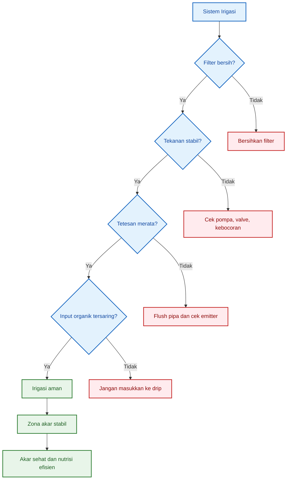

---

## Ringkasan Bab 3

Desain lahan menentukan keberhasilan budidaya cabai terpadu. Lahan kering umumnya lebih aman untuk cabai karena risiko genangan lebih rendah, tetapi sawah tetap bisa digunakan bila drainase dibuat baik dan bedengan cukup tinggi. Pada sawah atau lahan yang mudah basah, risiko utama adalah akar jenuh air, _Phytophthora_, layu, kelembapan tinggi, dan pembusukan akar.

Bedengan harus dirancang sebagai zona akar yang aman. Untuk lahan kering, tinggi bedengan 30–40 cm umumnya cukup, sedangkan sawah atau lahan rawan genangan lebih aman menggunakan bedengan 40–60 cm. Parit antarbedengan, saluran kolektor, dan saluran utama harus tersambung sampai outlet pembuangan.

Mulsa plastik hitam perak membantu menjaga kelembapan, menekan gulma, dan membuat kebun lebih bersih, tetapi tidak bisa menggantikan drainase. Jika air terjebak di bawah mulsa, akar tetap berisiko rusak.

Drip irrigation menjadi fondasi penting dalam cabai intensif karena membantu menjaga air lebih presisi, pupuk lebih efisien, daun tidak sering basah, dan kelembapan lebih terkendali. Input seperti PGPM, MOL, POC, atau JAKABA dapat diaplikasikan lewat kocor atau fertigasi, tetapi harus disaring sangat baik agar tidak menyumbat emitter.

IoT bukan kewajiban, tetapi berguna untuk cabai intensif. Sensor kelembapan tanah, flow meter, controller, dan timer membantu membuat penyiraman lebih konsisten dan berbasis data. Investasi IoT sebaiknya dilakukan bertahap, dimulai dari drip yang stabil, filter yang baik, dan timer sederhana sebelum masuk ke sensor dan otomasi penuh.

[1]: https://pnwhandbooks.org/plantdisease/host-disease/pepper-capsicum-spp-phytophthora-blight-root-crown-rot?utm_source=chatgpt.com 'Pepper (Capsicum spp.)-Phytophthora Blight (Root and ...'
[2]: https://ipm.ucanr.edu/legacy_assets/pdf/qt/qtphytophthora.pdf?utm_source=chatgpt.com 'Quick Tips: Phytophthora Crown and Root Rot'

---

# 4. Sistem Mikroba dalam Budidaya Cabai

Sistem mikroba adalah salah satu fondasi penting dalam budidaya cabai terpadu. Pada cabai, akar bukan hanya organ penyerap air dan hara, tetapi juga pusat interaksi antara tanaman, tanah, mikroba, bahan organik, pupuk, dan patogen. Area di sekitar akar ini disebut **rizosfer**. Jika rizosfer aktif dan sehat, tanaman biasanya lebih mampu menyerap hara, pulih dari stres, dan bertahan terhadap tekanan lingkungan.

Namun, sistem mikroba tidak boleh dipahami secara berlebihan. Mikroba bukan pengganti total pupuk, bukan obat semua penyakit, dan bukan alasan untuk mengabaikan drainase, sanitasi, atau pengendalian OPT. Mikroba harus ditempatkan sebagai **komponen pendukung sistem**, bukan solusi tunggal.

Dalam budidaya cabai, input mikroba yang umum digunakan meliputi **PGPM/PGPR**, **agen hayati antagonis**, **MOL**, **POC**, dan **JAKABA**. Masing-masing memiliki fungsi berbeda dan harus digunakan pada posisi yang tepat.

---

## 4.1 Mengapa Cabai Membutuhkan Manajemen Mikroba

Cabai membutuhkan manajemen mikroba karena sistem perakarannya sangat menentukan stabilitas pertumbuhan. Akar cabai sensitif terhadap kondisi tanah yang terlalu basah, terlalu padat, kekurangan oksigen, terlalu asam, terlalu asin, atau kaya patogen. Bila akar terganggu, tanaman akan cepat menunjukkan gejala seperti layu, daun menguning, pertumbuhan lambat, bunga rontok, buah kecil, dan panen tidak stabil.

Masalah akar pada cabai sering muncul pada kondisi berikut:

- media semai terlalu basah,
- bedengan terlalu rendah,
- drainase buruk,
- pupuk terlalu pekat,
- tanah miskin bahan organik,
- akar stres setelah pindah tanam,
- patogen tanah meningkat,
- aplikasi kimia terlalu keras tanpa pemulihan mikroba.

Cabai juga rentan terhadap gangguan seperti **rebah semai**, **busuk akar**, **layu**, dan **stres transplanting**. Kondisi ini sering berhubungan dengan kualitas media, kelembapan, sanitasi, serta keseimbangan mikroba di sekitar akar. Mikroba menguntungkan dapat membantu menekan sebagian risiko tersebut melalui kompetisi ruang dan nutrisi, produksi metabolit tertentu, dukungan terhadap perakaran, dan perbaikan aktivitas rizosfer.

Secara umum, mikroba bermanfaat dapat membantu cabai melalui beberapa fungsi berikut:

| Fungsi Mikroba                      | Dampak pada Cabai                                                         |
| ----------------------------------- | ------------------------------------------------------------------------- |
| Menjaga kesehatan rizosfer          | Akar berada pada lingkungan biologis yang lebih aktif                     |
| Meningkatkan efisiensi serapan hara | Hara lebih mudah dimobilisasi dan diserap                                 |
| Mengurai bahan organik              | Kompos, pupuk kandang, dan residu organik lebih aktif terdekomposisi      |
| Membantu pemulihan stres            | Tanaman lebih cepat pulih setelah pindah tanam, panas, atau gangguan akar |
| Berkompetisi dengan patogen         | Patogen tanah lebih sulit mendominasi                                     |
| Mendukung pertumbuhan akar          | Akar serabut lebih aktif dan sebaran akar lebih baik                      |

PGPR diketahui dapat mendukung pertumbuhan tanaman melalui mekanisme seperti fiksasi nitrogen, pelarutan fosfat, produksi siderofor, asam organik, fitohormon, dan enzim tertentu. Mekanisme ini menjelaskan mengapa pengelolaan mikroba rizosfer menjadi penting dalam sistem budidaya intensif, termasuk cabai. ([Journal of Pure and Applied Microbiology][1])

### Diagram 4.1. Peran Mikroba dalam Rizosfer Cabai

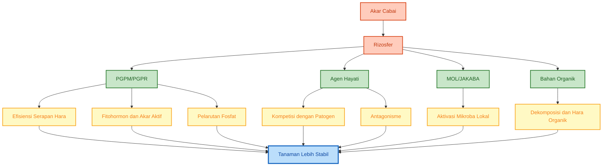

---

## 4.2 Kelompok Input Mikroba

Input mikroba dalam budidaya cabai perlu dibedakan berdasarkan fungsi. Kesalahan umum di lapangan adalah menganggap semua input biologis sebagai “pupuk”. Padahal, PGPM, agen hayati, MOL, POC, dan JAKABA memiliki tujuan berbeda.

| Input                 | Fungsi Utama                               | Contoh                                                        |
| --------------------- | ------------------------------------------ | ------------------------------------------------------------- |
| PGPM/PGPR             | Pemacu pertumbuhan akar dan efisiensi hara | _Bacillus_, _Pseudomonas_, _Azospirillum_                     |
| Agen hayati antagonis | Menekan patogen                            | _Trichoderma_, _Bacillus subtilis_, _Pseudomonas fluorescens_ |
| MOL                   | Starter mikroba lokal/bioaktivator         | MOL bonggol pisang, MOL rizosfer, MOL nasi                    |
| POC                   | Pupuk organik cair tambahan                | POC vegetatif/generatif                                       |
| JAKABA                | Biostimulan rizosfer                       | JAKABA air cucian beras                                       |

### Posisi Praktis Masing-Masing Input

| Input       | Posisi dalam Sistem Cabai         | Cara Memahami                                       |
| ----------- | --------------------------------- | --------------------------------------------------- |
| PGPM/PGPR   | Pendukung akar dan efisiensi hara | Mikroba fungsional untuk rizosfer                   |
| Agen hayati | Proteksi biologis                 | Organisme hidup untuk menekan patogen/hama tertentu |
| MOL         | Starter/bioaktivator              | Pembiakan mikroba lokal, bukan pupuk utama          |
| POC         | Input hara organik cair tambahan  | Produk hasil penguraian bahan organik               |
| JAKABA      | Biostimulan lokal                 | Pendukung aktivitas mikroba tanah dan akar          |

Dalam sistem terpadu, kelima input ini tidak harus selalu digunakan bersamaan. Pemilihannya harus berdasarkan kebutuhan lahan, fase tanaman, risiko penyakit, ketersediaan bahan, dan kemampuan petani menjaga kualitas aplikasi.

### Diagram 4.2. Klasifikasi Input Mikroba dalam Cabai

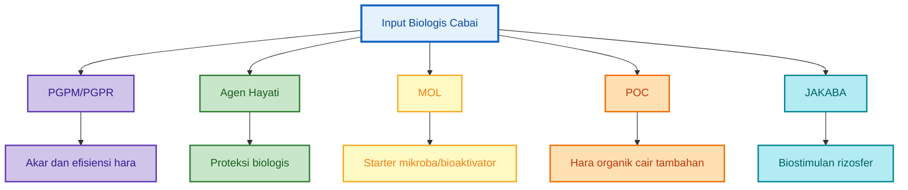

Catatan:
Contoh produk dan kelompok mikroba yang beredar di lapangan dijelaskan lebih rinci pada Lampiran F, terutama untuk membedakan PGPM, pupuk hayati, agens hayati tanah, biopestisida, dekomposer, dan biostimulan lokal.

---

## 4.3 PGPM dan PGPR pada Cabai

**PGPM** adalah singkatan dari _Plant Growth Promoting Microorganisms_, yaitu mikroorganisme yang membantu pertumbuhan tanaman. **PGPR** adalah _Plant Growth Promoting Rhizobacteria_, yaitu kelompok bakteri pemacu pertumbuhan yang hidup di sekitar akar. PGPR merupakan bagian dari PGPM.

Pada cabai, PGPM/PGPR paling relevan digunakan untuk mendukung akar sejak awal, terutama pada fase semai, pindah tanam, vegetatif awal, dan pemulihan setelah stres. Kelompok mikroba seperti _Bacillus_, _Pseudomonas_, dan _Azospirillum_ sering dibahas sebagai PGPR karena dapat berperan dalam mobilisasi hara, produksi senyawa pemacu tumbuh, kolonisasi akar, serta interaksi positif di rizosfer. ([Journal of Pure and Applied Microbiology][1])

### Fungsi PGPM/PGPR pada Cabai

Fungsi utama PGPM/PGPR meliputi:

- membantu pertumbuhan akar,
- melarutkan fosfat,
- membantu fiksasi nitrogen bebas atau asosiatif,
- menghasilkan fitohormon,
- membantu ketersediaan unsur tertentu melalui siderofor,
- memperbaiki kondisi biologis rizosfer,
- membantu tanaman pulih setelah stres akar.

### Aplikasi PGPM/PGPR

PGPM/PGPR dapat diaplikasikan pada beberapa titik penting.

| Titik Aplikasi                         | Tujuan                                   | Catatan                         |
| -------------------------------------- | ---------------------------------------- | ------------------------------- |
| Seed treatment                         | Membantu kolonisasi awal akar            | Gunakan produk aman untuk benih |
| Perendaman akar bibit                  | Mengurangi stres pindah tanam            | Jangan terlalu pekat            |
| Kocor setelah pindah tanam             | Aktivasi rizosfer awal                   | Umumnya 3–7 HST                 |
| Kocor fase vegetatif                   | Mendukung akar dan serapan hara          | Ulang sesuai kondisi            |
| Re-induksi setelah pestisida/fungisida | Memulihkan mikroba setelah tekanan kimia | Beri jeda aman                  |

### Contoh Pola Aplikasi PGPM/PGPR

```mdx id="pola-aplikasi-pgpm-cabai"
Contoh pola aplikasi PGPM/PGPR cabai:

1. Sebelum semai:

   - Seed treatment atau rendam benih sesuai petunjuk produk.

2. Umur bibit 7–14 hari:

   - Kocor ringan media semai dengan dosis rendah.

3. Saat pindah tanam:

   - Rendam akar bibit atau kocor lubang tanam.

4. 3–7 HST:

   - Kocor PGPM/PGPR di area akar.

5. Setelah aplikasi kimia tertentu:
   - Re-induksi PGPM/PGPR setelah masa jeda aman.
```

### Catatan Teknis

PGPM/PGPR adalah mikroba hidup. Karena itu, hindari mencampurnya langsung dengan fungisida, bakterisida, pestisida kimia keras, air berkaporit tinggi, atau pupuk kimia yang terlalu pekat. Bila kebun baru saja menerima aplikasi kimia, berikan jeda sebelum PGPM/PGPR dikocorkan kembali.

Rujukan lapangan:
Contoh kelompok produk PGPM/PGPR, pupuk hayati, PSB, KSB, dan mikoriza dapat dilihat pada Lampiran F.2.

---

## 4.4 Agen Hayati Utama

Agen hayati adalah organisme hidup yang digunakan untuk membantu mengendalikan patogen atau hama tertentu. Dalam cabai, agen hayati yang banyak dibahas adalah _Trichoderma_, _Bacillus_, dan _Pseudomonas fluorescens_. Ketiganya memiliki karakter berbeda dan tidak boleh dipakai dengan cara yang sama.

Agen hayati harus diperlakukan sebagai makhluk hidup. Kinerjanya dipengaruhi oleh suhu, kelembapan, pH, bahan organik, residu kimia, cara penyimpanan, dan waktu aplikasi.

---

### 4.4.1 _Trichoderma_

_Trichoderma_ adalah jamur menguntungkan yang banyak digunakan sebagai agen hayati tanah. Perannya terutama berkaitan dengan antagonisme terhadap patogen tanah, dekomposisi bahan organik, kolonisasi area akar, dan induksi ketahanan tanaman. Kajian tentang _Trichoderma_ menyebut beberapa mekanisme biokontrolnya meliputi kompetisi, antibiosis, antagonisme, mikoparasitisme, promosi pertumbuhan tanaman, dan induksi ketahanan sistemik tanaman. ([Frontiers][2])

#### Fungsi _Trichoderma_

Fungsi utama _Trichoderma_ dalam cabai:

- antagonis patogen tanah,
- membantu menekan sebagian jamur patogen,
- dekomposer bahan organik,
- mendukung kesehatan akar,
- membantu aktivasi kompos atau pupuk kandang matang,
- mendukung rizosfer lebih aktif.

#### Cocok Digunakan untuk

_Trichoderma_ cocok digunakan pada:

- media semai,
- pupuk kandang atau kompos matang,
- lubang tanam,
- bedengan sebelum tanam,
- kocor area akar,
- re-induksi biologis setelah jeda dari fungisida.

#### Cara Aplikasi Praktis

| Titik Aplikasi       | Cara                      | Catatan                                              |
| -------------------- | ------------------------- | ---------------------------------------------------- |
| Media semai          | Campur pada media matang  | Jangan campur saat media masih panas                 |
| Kompos/pupuk kandang | Aktivasi sebelum aplikasi | Kompos harus matang                                  |
| Lubang tanam         | Tabur/kocor ringan        | Jangan dekat fungisida kuat                          |
| Area akar            | Kocor                     | Aplikasi sore lebih aman                             |
| Setelah fungisida    | Re-induksi setelah jeda   | Umumnya perlu 5–7 hari atau mengikuti kondisi produk |

#### Catatan Penting

_Trichoderma_ tidak cocok dicampur langsung dengan fungisida dalam satu tangki. Fungisida yang berspektrum luas berpotensi menekan jamur hayati ini. Jika kebun membutuhkan fungisida, jadwalkan aplikasi secara terpisah dan lakukan re-induksi setelah masa jeda.

---

### 4.4.2 _Bacillus_

_Bacillus_ adalah kelompok bakteri yang banyak digunakan sebagai PGPR dan agen hayati. Salah satu keunggulannya adalah banyak spesies _Bacillus_ mampu membentuk spora, sehingga relatif lebih tahan terhadap kondisi lingkungan yang kurang ideal dibanding beberapa bakteri non-spora. _Bacillus subtilis_ banyak dibahas sebagai bakteri menguntungkan karena dapat mendukung pertumbuhan tanaman, kolonisasi akar, pembentukan biofilm, produksi senyawa antimikroba, dan membantu tanaman menghadapi stres. ([PMC][3])

#### Fungsi _Bacillus_

Fungsi utama _Bacillus_ dalam cabai:

- PGPR,
- mendukung pertumbuhan akar,
- membantu kompetisi dengan patogen,
- menghasilkan metabolit antagonis tertentu,
- membantu pemulihan rizosfer,
- lebih tahan kondisi lingkungan karena membentuk spora.

#### Cocok Digunakan untuk

_Bacillus_ cocok digunakan pada:

- seed treatment,
- perendaman akar bibit,
- kocor setelah pindah tanam,
- aplikasi vegetatif awal,
- re-induksi setelah aplikasi kimia,
- kombinasi dengan program nutrisi akar.

#### Catatan Praktis

Dibanding _Trichoderma_, _Bacillus_ biasanya lebih fleksibel karena spora bakteri lebih tahan. Namun, tetap tidak boleh dicampur sembarangan dengan bakterisida, desinfektan, air berkaporit tinggi, atau larutan kimia pekat.

---

### 4.4.3 _Pseudomonas fluorescens_

_Pseudomonas fluorescens_ adalah bakteri rizosfer yang sering dibahas sebagai PGPR dan agen antagonis patogen tertentu. Kelompok _Pseudomonas_ dikenal mampu hidup di tanah, air, dan lingkungan tanaman. Namun, perlu dibedakan antara spesies yang digunakan sebagai agen hayati tanaman dengan spesies lain seperti _Pseudomonas aeruginosa_ yang dapat menjadi patogen oportunistik pada manusia. CDC mencatat bahwa _Pseudomonas_ umum ditemukan di tanah dan air, sementara _P. aeruginosa_ adalah jenis yang paling sering menyebabkan infeksi pada manusia. Karena itu, untuk penggunaan pertanian, lebih aman menggunakan formulasi resmi/terverifikasi, bukan memperbanyak isolat liar tanpa identifikasi. ([CDC][4])

#### Fungsi _Pseudomonas fluorescens_

Fungsi utama _Pseudomonas fluorescens_ dalam cabai:

- PGPR,
- membantu ketersediaan hara,
- menghasilkan siderofor pada kondisi tertentu,
- mendukung kompetisi mikroba di rizosfer,
- antagonis terhadap patogen tertentu,
- membantu kesehatan akar.

#### Cocok Digunakan untuk

_Pseudomonas fluorescens_ cocok digunakan pada:

- kocor area akar,
- perlakuan bibit,
- kombinasi program PGPR,
- re-induksi setelah pestisida/fungisida dengan jeda aman.

#### Catatan Penting

_Pseudomonas fluorescens_ umumnya lebih sensitif dibanding _Bacillus_ karena tidak membentuk spora seperti _Bacillus_. Karena itu, aplikasinya perlu lebih hati-hati terhadap:

- air berkaporit,
- bakterisida,
- fungisida kuat,
- suhu tinggi,
- sinar matahari langsung,
- campuran tangki yang tidak kompatibel.

Untuk skala lapangan, gunakan produk komersial atau kultur yang jelas identitas dan petunjuk pakainya. Hindari memperbanyak bakteri liar dari air atau tanah tanpa seleksi dan identifikasi, terutama jika akan digunakan luas.

---

### Tabel Perbandingan Agen Hayati Utama

| Agen Hayati               | Kelompok         | Fungsi Dominan                         | Kelebihan                             | Perlu Diwaspadai                     |
| ------------------------- | ---------------- | -------------------------------------- | ------------------------------------- | ------------------------------------ |
| _Trichoderma_             | Jamur            | Antagonis patogen tanah dan dekomposer | Baik untuk kompos, media, dan akar    | Sensitif terhadap fungisida          |
| _Bacillus_                | Bakteri spora    | PGPR dan antagonis                     | Lebih tahan lingkungan                | Hindari bakterisida/desinfektan      |
| _Pseudomonas fluorescens_ | Bakteri rizosfer | PGPR dan kompetitor rizosfer           | Baik untuk akar dan ketersediaan hara | Lebih sensitif, gunakan produk jelas |

### Diagram 4.3. Posisi Agen Hayati Utama

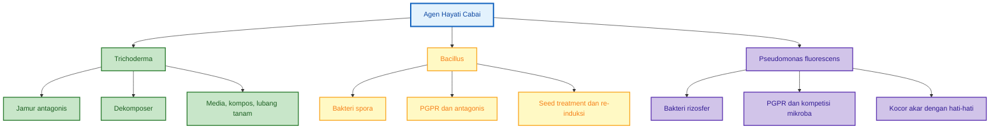

Catatan:
Contoh agens hayati tanah dan mikroba untuk penyakit akar, rebah semai, layu, dan nematoda dijelaskan lebih rinci pada Lampiran F.2 dan Lampiran F.3.

---

## 4.5 MOL sebagai Starter, Bukan Pupuk Utama

**MOL** atau Mikroorganisme Lokal harus dipahami dengan benar. MOL bukan pupuk utama. MOL adalah hasil proses pembiakan mikroba lokal dari sumber mikroba tertentu, misalnya rizosfer akar, kompos matang, kascing, serasah lapuk, bonggol pisang, nasi basi berjamur putih, atau tapai.

Prinsip dasarnya:

```mdx id="konsep-mol-poc-cabai"
MOL = pembiakan mikroba
POC = penguraian bahan organik menjadi pupuk cair
```

MOL digunakan untuk memperbanyak mikroba dan menghasilkan starter yang dapat dipakai dalam proses berikutnya. Jika MOL digunakan untuk membuat POC, maka mikroba dari MOL bekerja menguraikan bahan organik seperti daun hijau, kulit pisang, limbah ikan, bonggol pisang, atau bahan lain menjadi larutan pupuk organik cair.

### Fungsi MOL dalam Sistem Cabai

MOL digunakan untuk:

- membuat POC,
- aktivasi kompos,
- aktivasi bahan organik,
- membantu fermentasi pupuk kandang matang,
- re-induksi mikroba tanah,
- mendukung aktivitas biologis rizosfer.

### MOL dalam Cabai: Kapan Digunakan?

| Waktu Penggunaan        | Tujuan                               | Catatan                                  |
| ----------------------- | ------------------------------------ | ---------------------------------------- |
| Sebelum tanam           | Aktivasi kompos/pupuk kandang matang | Jangan gunakan bahan busuk               |
| Saat pembuatan POC      | Starter fermentasi                   | MOL harus aktif dan tidak bau busuk      |
| Setelah pindah tanam    | Kocor dosis rendah                   | Jangan terlalu pekat                     |
| Setelah aplikasi kimia  | Re-induksi mikroba                   | Beri jeda aman                           |
| Setelah panen/pemulihan | Aktivasi tanah                       | Kombinasikan dengan bahan organik matang |

### Batasan MOL

MOL memiliki variasi tinggi karena dibuat dari bahan lokal. Dua MOL dengan bahan sama belum tentu memiliki komposisi mikroba yang sama. Karena itu, MOL harus diuji kecil sebelum digunakan luas.

MOL yang tidak layak digunakan memiliki ciri:

- bau bangkai,
- bau amonia tajam,
- berlendir hitam berlebihan,
- ada belatung,
- botol menggembung ekstrem,
- menyebabkan tanaman uji layu.

### Diagram 4.4. MOL sebagai Starter Mikroba

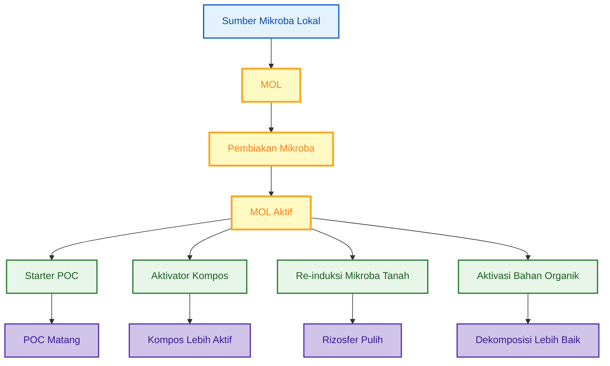

---

## 4.6 POC sebagai Pupuk Cair Tambahan

**POC** atau pupuk organik cair adalah hasil penguraian bahan organik oleh mikroba. Dalam sistem cabai, POC digunakan sebagai **pupuk cair tambahan**, bukan pengganti pupuk kimia utama. POC dapat membantu menyediakan bahan organik terlarut, asam amino, asam organik, metabolit fermentasi, dan sebagian hara tambahan. Namun, kandungan hara POC sangat bergantung pada bahan baku dan proses fermentasi.

POC dibagi menjadi dua kelompok praktis, yaitu **POC vegetatif** dan **POC generatif**.

### POC Vegetatif

POC vegetatif diarahkan untuk fase pertumbuhan awal, pemulihan, dan pembentukan daun serta akar.

Cocok digunakan pada:

- fase awal setelah pindah tanam,
- pemulihan tanaman stres,
- fase vegetatif,
- setelah pemangkasan ringan,
- saat tanaman perlu dorongan pertumbuhan daun dan akar.

Bahan umum POC vegetatif:

- daun hijau,
- daun legum,
- bonggol pisang,
- air cucian beras,
- air kelapa,
- molase,
- MOL/EM4 sebagai starter.

### POC Generatif

POC generatif diarahkan untuk fase bunga, buah, dan panen berulang.

Cocok digunakan pada:

- pra-bunga,
- awal pembungaan,
- pembentukan buah,
- pembesaran buah,
- pemulihan setelah panen berulang.

Bahan umum POC generatif:

- kulit pisang,
- sabut kelapa,
- air kelapa,
- limbah ikan terbatas,
- molase,
- MOL/EM4 sebagai starter.

### POC Bukan Pengganti Pupuk Kimia Utama

POC tidak boleh dianggap sebagai pengganti total pupuk kimia. Cabai tetap membutuhkan hara utama seperti N, P, K, Ca, Mg, S, dan unsur mikro secara terukur. POC berperan membantu sistem, bukan mengambil alih seluruh kebutuhan nutrisi.

### Posisi POC Berdasarkan Fase Cabai

| Fase Cabai     | Jenis POC                    | Tujuan                                |
| -------------- | ---------------------------- | ------------------------------------- |
| Semai          | POC sangat rendah bila perlu | Hindari bibit terlalu lunak           |
| Pindah tanam   | POC vegetatif rendah         | Pemulihan awal                        |
| Vegetatif      | POC vegetatif                | Dukung daun, akar, dan cabang         |
| Pra-bunga      | Transisi                     | Kurangi dorongan vegetatif berlebihan |
| Bunga dan buah | POC generatif                | Dukung bunga dan buah                 |
| Panen berulang | POC generatif/pemulihan      | Menjaga kontinuitas produksi          |

### Catatan Aplikasi POC

POC harus matang, tidak busuk, dan disaring bila digunakan lewat sprayer atau drip. POC yang belum matang dapat menyebabkan fitotoksik, bau media, akar rusak, atau tanaman layu.

```mdx id="uji-sederhana-poc-cabai"
Uji sederhana POC sebelum aplikasi luas:

1. Encerkan POC pada dosis rendah, misalnya 5–10 ml/L.
2. Aplikasikan pada 5–10 tanaman uji.
3. Amati selama 3–5 hari.
4. Jika tanaman aman, dosis dapat dinaikkan bertahap.
5. Jika tanaman layu, daun terbakar, atau media berbau busuk, hentikan penggunaan.
```

---

## 4.7 Diagram Hubungan PGPM, Agen Hayati, MOL, dan POC

Dalam sistem cabai terpadu, PGPM, agen hayati, MOL, POC, dan JAKABA tidak berdiri sendiri. Masing-masing bekerja pada titik berbeda. MOL menjadi starter dan bioaktivator. POC menjadi produk hasil penguraian bahan organik. PGPM/PGPR bekerja langsung mendukung akar dan efisiensi hara. Agen hayati membantu menekan patogen atau OPT tertentu. JAKABA berperan sebagai biostimulan lokal untuk rizosfer.

### Diagram 4.5. Hubungan PGPM, Agen Hayati, MOL, dan POC

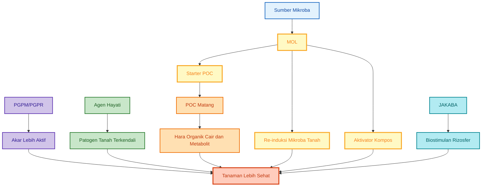

### Diagram 4.6. Siklus Mikroba dalam Sistem Cabai

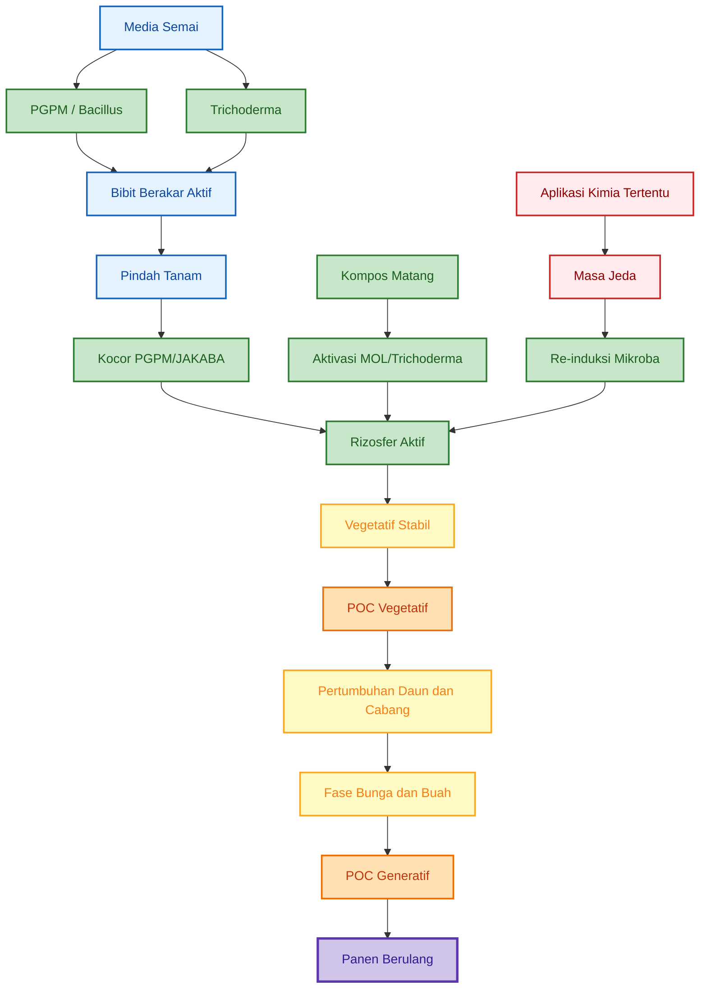

---

## 4.8 Prinsip Integrasi Mikroba dengan Pupuk dan Pestisida

Walaupun pembahasan rinci tentang pupuk dan pestisida akan masuk pada bab berikutnya, prinsip dasarnya perlu diperkenalkan sejak bab mikroba. Input biologis tidak boleh diperlakukan sama seperti pupuk kimia. Mikroba hidup dapat rusak oleh bahan kimia tertentu, salinitas tinggi, suhu panas, atau campuran yang tidak kompatibel.

### Aturan Dasar Integrasi

| Situasi                     | Rekomendasi                               |
| --------------------------- | ----------------------------------------- |
| Aplikasi PGPM/PGPR          | Pisahkan dari bakterisida dan pupuk pekat |
| Aplikasi _Trichoderma_      | Pisahkan dari fungisida                   |
| Aplikasi _Bacillus_         | Hindari bakterisida/desinfektan           |
| Aplikasi POC/MOL            | Pastikan matang dan tidak busuk           |
| Aplikasi lewat drip         | Wajib filtrasi dan flushing               |
| Setelah pestisida/fungisida | Lakukan re-induksi setelah jeda aman      |

### Jeda Praktis Awal

```mdx id="jeda-praktis-mikroba-kimia"
Jeda praktis awal:

- Setelah insektisida semprot daun: 3–5 hari sebelum re-induksi mikroba
- Setelah fungisida: 5–7 hari sebelum Trichoderma/PGPM
- Setelah bakterisida: 7–10 hari sebelum Bacillus/PGPR
- Setelah pupuk kimia pekat: 2–4 hari, pastikan tanah cukup lembap
- Setelah herbisida dekat kebun: 7–14 hari, hindari area akar aktif
```

Angka tersebut adalah panduan praktis awal. Keputusan lapangan tetap perlu mempertimbangkan bahan aktif, dosis, cuaca, kondisi tanaman, dan petunjuk label produk.

---

## Ringkasan Bab 4

Cabai membutuhkan manajemen mikroba karena akarnya sensitif terhadap tanah jenuh air, stres pindah tanam, busuk akar, rebah semai, dan tekanan patogen tanah. Mikroba bermanfaat dapat membantu menjaga kesehatan rizosfer, meningkatkan efisiensi serapan hara, mendukung dekomposisi bahan organik, membantu pemulihan stres, dan berkompetisi dengan patogen.

Kelompok input mikroba yang penting dalam budidaya cabai meliputi **PGPM/PGPR**, **agen hayati antagonis**, **MOL**, **POC**, dan **JAKABA**. PGPM/PGPR berperan sebagai pendukung akar dan efisiensi hara. Agen hayati seperti _Trichoderma_, _Bacillus_, dan _Pseudomonas fluorescens_ membantu proteksi biologis. MOL berfungsi sebagai starter mikroba dan bioaktivator, bukan pupuk utama. POC berfungsi sebagai pupuk organik cair tambahan, bukan pengganti pupuk kimia utama. JAKABA berperan sebagai biostimulan lokal untuk mendukung rizosfer.

Dalam sistem cabai terpadu, mikroba harus dipadukan dengan pupuk kimia, POC, MOL, agen hayati, pestisida selektif, dan re-induksi mikroba. Mikroba hidup tidak boleh dicampur sembarangan dengan pestisida, fungisida, bakterisida, atau pupuk pekat. Setelah aplikasi kimia tertentu, re-induksi mikroba diperlukan untuk membantu memulihkan aktivitas biologis di sekitar akar.

[1]: https://microbiologyjournal.org/plant-growth-promoting-rhizobacteria-pgpr-prospective-and-mechanisms-a-review/?utm_source=chatgpt.com 'Plant Growth Promoting Rhizobacteria (PGPR)'
[2]: https://www.frontiersin.org/journals/microbiology/articles/10.3389/fmicb.2023.1160551/full?utm_source=chatgpt.com 'Trichoderma and its role in biological control of plant fungal ...'
[3]: https://pmc.ncbi.nlm.nih.gov/articles/PMC6734152/?utm_source=chatgpt.com 'Bacillus subtilis: A plant-growth promoting rhizobacterium that ...'
[4]: https://www.cdc.gov/pseudomonas-aeruginosa/about/index.html?utm_source=chatgpt.com 'About Pseudomonas aeruginosa'

---

# 5. Persemaian Cabai Terpadu

Persemaian adalah fase kecil tetapi sangat menentukan. Banyak kegagalan cabai di lahan sebenarnya sudah dimulai sejak bibit: akar lemah, batang terlalu lunak, media terlalu basah, bibit tidak seragam, atau sejak awal sudah membawa patogen. Dalam sistem cabai terpadu, persemaian tidak hanya bertujuan menghasilkan bibit hidup, tetapi menghasilkan bibit yang **seragam, kuat, berakar sehat, dan siap masuk ke sistem budidaya intensif**.

Persemaian juga menjadi titik awal integrasi antara **PGPM/PGPR**, **agen hayati**, **POC dosis rendah**, **MOL matang**, serta perlakuan kimia bila memang diperlukan. Prinsipnya, bibit harus dibangun dengan akar aktif dan media sehat, tetapi tidak boleh dipaksa terlalu subur sampai batangnya lunak.

---

## 5.1 Tujuan Fase Semai

Tujuan utama fase semai adalah menghasilkan bibit cabai yang seragam dan kuat. Bibit yang baik akan lebih cepat beradaptasi setelah pindah tanam, lebih tahan terhadap stres lapangan, dan lebih responsif terhadap pemupukan awal.

Bibit cabai yang ideal memiliki ciri:

- pertumbuhan seragam,
- akar putih dan aktif,
- batang kokoh,
- daun hijau sehat,
- tidak etiolasi atau terlalu tinggi kurus,
- tidak rebah semai,
- tidak terlalu lunak akibat kelebihan nitrogen,
- tidak menunjukkan bercak, busuk pangkal, atau gejala virus.

Fase semai bukan fase untuk mengejar pertumbuhan secepat mungkin. Kesalahan umum di persemaian adalah memberi pupuk atau POC terlalu kuat sehingga bibit tampak cepat besar, tetapi batang menjadi lunak dan akar tidak seimbang. Bibit seperti ini sering stres saat pindah tanam dan mudah rebah setelah masuk lahan.

Damping-off atau rebah semai dipengaruhi oleh banyak faktor, termasuk patogen, kelembapan, suhu tanah, pH, serta kondisi media. Karena itu, pengelolaan air dan media semai sama pentingnya dengan perlakuan mikroba atau fungisida. ([PNW Pest Management Handbooks][1])

### Target Bibit Siap Tanam

| Parameter  | Target Praktis                               |
| ---------- | -------------------------------------------- |
| Umur bibit | ±20–25 hari, dapat diperpanjang sesuai vigor |
| Daun       | 4–6 daun sejati                              |
| Batang     | Kokoh, tidak terlalu tinggi kurus            |
| Akar       | Putih, menyebar, tidak cokelat busuk         |
| Warna daun | Hijau sehat, tidak pucat ekstrem             |
| Media      | Tidak bau busuk, tidak terlalu basah         |
| Penyakit   | Tidak rebah semai, tidak busuk pangkal       |
| Seragam    | Ukuran relatif merata                        |

Untuk beberapa varietas atau kondisi cuaca tertentu, bibit mungkin lebih aman dipindah pada umur 25–30 hari. Yang lebih penting bukan angka umur semata, tetapi kesiapan fisiologis: akar aktif, batang kokoh, dan tanaman tidak stres.

### Diagram 5.1. Target Fase Semai Cabai

```mermaid id="diagram-target-fase-semai-cabai"
flowchart TD
    A[Fase Semai Cabai] --> B[Bibit Seragam]
    A --> C[Akar Putih]
    A --> D[Batang Kokoh]
    A --> E[Tidak Rebah Semai]
    A --> F[Tidak Terlalu Lunak]
    A --> G[Siap Pindah Tanam]

    B --> H[Bibit Lebih Mudah Dikelola]
    C --> I[Adaptasi Akar Lebih Cepat]
    D --> J[Tahan Stres Lapangan]
    E --> K[Kehilangan Bibit Berkurang]
    F --> L[Vegetatif Lebih Seimbang]
    G --> M[Awal Tanam Lebih Stabil]

    H --> N[Performa Lahan Lebih Seragam]
    I --> N
    J --> N
    K --> N
    L --> N
    M --> N

    classDef pusat fill:#e3f2fd,stroke:#1565c0,stroke-width:3px,color:#0d47a1;
    classDef target fill:#e8f5e9,stroke:#2e7d32,stroke-width:2px,color:#1b5e20;
    classDef manfaat fill:#fff9c4,stroke:#f9a825,stroke-width:2px,color:#f57f17;
    classDef hasil fill:#ffccbc,stroke:#d84315,stroke-width:3px,color:#bf360c;

    class A pusat;
    class B,C,D,E,F,G target;
    class H,I,J,K,L,M manfaat;
    class N hasil;
```

---

## 5.2 Media Semai

Media semai harus ringan, porous, bersih, mampu menahan kelembapan, tetapi tidak becek. Cabai tidak menyukai media semai yang padat dan terus-menerus basah. Media yang buruk akan membuat akar kekurangan oksigen dan meningkatkan risiko rebah semai.

Bahan media yang umum digunakan:

- cocopeat,
- sekam bakar,
- kompos matang,
- tanah halus sehat,
- kascing matang,
- sedikit dolomit bila pH media terlalu asam,
- agen hayati atau PGPM setelah media siap.

### Formula Media Semai Praktis

Formula berikut dapat digunakan sebagai acuan awal.

```mdx id="formula-media-semai-cabai"
Formula media semai cabai:

Opsi 1: Media ringan

- Cocopeat = 40%
- Sekam bakar = 40%
- Kompos matang/kascing = 20%

Opsi 2: Media lebih bernutrisi

- Cocopeat = 30%
- Sekam bakar = 40%
- Kompos matang = 20%
- Tanah halus sehat = 10%

Opsi 3: Media sederhana petani

- Tanah halus sehat = 40%
- Sekam bakar = 40%
- Kompos matang = 20%
```

Media harus dicampur merata, tidak menggumpal, dan tidak berbau busuk. Kompos atau pupuk kandang yang belum matang tidak boleh digunakan untuk persemaian karena dapat menghasilkan panas, amonia, atau senyawa fitotoksik yang merusak akar muda.

### Uji Kelembapan Media

Uji sederhana dapat dilakukan dengan tangan.

```mdx id="uji-kelembapan-media-semai"
Uji genggam media:

1. Ambil segenggam media.
2. Remas dengan tangan.
3. Jika media pecah ringan dan terasa lembap, kondisi baik.
4. Jika air menetes, media terlalu basah.
5. Jika media tidak menyatu sama sekali dan berdebu, media terlalu kering.

Target:
Lembap, remah, tidak becek.
```

### Sterilisasi atau Pasteurisasi Ringan

Jika media berasal dari tanah kebun, kompos yang kurang jelas, atau lahan dengan riwayat penyakit, perlu dilakukan sterilisasi atau pasteurisasi ringan. Tujuannya bukan membunuh semua kehidupan, tetapi menekan patogen, telur serangga, dan kontaminan awal.

Pilihan perlakuan media:

| Perlakuan              | Cara                                    | Catatan                                  |
| ---------------------- | --------------------------------------- | ---------------------------------------- |
| Jemur matahari         | Media dijemur 1–2 hari                  | Murah, tetapi tidak selalu merata        |
| Solarization           | Media ditutup plastik bening saat panas | Lebih efektif bila sinar kuat            |
| Kukus/pasteurisasi     | Media dipanaskan, lalu didinginkan      | Jangan aplikasi mikroba saat media panas |
| Media komersial steril | Langsung pakai                          | Tetap cek kelembapan dan bau             |

Setelah media dipanaskan atau dijemur kuat, jangan langsung menambahkan _Trichoderma_, PGPM, atau MOL. Tunggu sampai media dingin dan stabil. Agen hayati adalah organisme hidup, sehingga dapat rusak bila dicampurkan ke media yang masih panas.

### Penambahan Agen Hayati pada Media

Setelah media siap dan dingin, dapat ditambahkan:

- _Trichoderma_ untuk membantu proteksi media dan akar,
- PGPM/PGPR untuk mendukung akar awal,
- _Bacillus_ untuk aktivasi rizosfer awal,
- MOL matang dosis rendah bila benar-benar aman.

Agen hayati sebaiknya dicampur setelah media berada pada kelembapan cukup. Media yang terlalu kering membuat mikroba sulit aktif, sedangkan media terlalu basah meningkatkan risiko mikroba pembusuk.

### Diagram 5.2. Alur Persiapan Media Semai

```mermaid id="diagram-persiapan-media-semai-cabai"
flowchart TD
    A[Siapkan Bahan Media] --> B[Cocopeat / Sekam Bakar / Kompos Matang]
    B --> C[Campur Merata]
    C --> D{Riwayat Media Aman?}

    D -->|Ya| E[Atur Kelembapan]
    D -->|Tidak| F[Pasteurisasi / Jemur / Solarization]
    F --> G[Dinginkan Media]
    G --> E

    E --> H[Tambahkan Trichoderma / PGPM]
    H --> I[Isi Tray Semai]
    I --> J[Semai Benih]
    J --> K[Rawat Kelembapan]

    classDef bahan fill:#e3f2fd,stroke:#1565c0,stroke-width:2px,color:#0d47a1;
    classDef proses fill:#fff9c4,stroke:#f9a825,stroke-width:2px,color:#f57f17;
    classDef mikroba fill:#e8f5e9,stroke:#2e7d32,stroke-width:2px,color:#1b5e20;
    classDef akhir fill:#ffccbc,stroke:#d84315,stroke-width:3px,color:#bf360c;

    class A,B,C bahan;
    class D,F,G,E proses;
    class H mikroba;
    class I,J,K akhir;
```

---

## 5.3 Perlakuan Benih

Perlakuan benih bertujuan menurunkan risiko kontaminan awal, mempercepat perkecambahan yang seragam, dan memulai kolonisasi mikroba menguntungkan. Namun, perlakuan benih harus dilakukan hati-hati karena benih cabai sensitif terhadap suhu, larutan terlalu pekat, dan perlakuan berlebihan.

| Perlakuan             | Tujuan                            |
| --------------------- | --------------------------------- |
| Air hangat terkontrol | Menurunkan kontaminan permukaan   |
| PGPM/_Bacillus_       | Aktivasi rizosfer awal            |
| Fungisida benih kimia | Bila risiko penyakit tinggi       |
| Re-induksi PGPM       | Setelah fungisida kontak/sistemik |

### Air Hangat Terkontrol

Perlakuan air hangat dapat membantu menurunkan sebagian kontaminan permukaan benih. Namun, suhu harus dikontrol dengan termometer. Jangan menggunakan air panas kira-kira. Perlakuan air hangat yang terlalu panas atau terlalu lama dapat menurunkan daya kecambah.

Cornell Vegetable Program mencantumkan perlakuan air panas untuk benih pepper pada **50°C selama 25 menit** sebagai salah satu perlakuan untuk mengelola patogen bakteri pada benih sayuran. Perlakuan seperti ini perlu dilakukan hati-hati dan tidak diterapkan pada benih yang sudah diberi coating atau perlakuan pabrik. ([Cornell Vegetables][2])

```mdx id="perlakuan-air-hangat-benih-cabai"
Perlakuan air hangat terkontrol:

Suhu air = 50°C
Durasi = 20–25 menit
Alat wajib = termometer

Langkah:

1. Siapkan air pada suhu stabil 50°C.
2. Masukkan benih dalam kain kasa/kantong kecil.
3. Rendam 20–25 menit.
4. Angkat dan tiriskan.
5. Bilas dengan air bersih suhu ruang bila diperlukan.
6. Angin-anginkan sampai tidak terlalu basah.
7. Segera semai atau lanjutkan perlakuan biologis ringan.

Catatan:

- Jangan gunakan pada benih yang sudah diberi coating/perlakuan pabrik.
- Uji pada sedikit benih terlebih dahulu.
- Suhu terlalu tinggi dapat merusak viabilitas benih.
```

### Perlakuan PGPM atau _Bacillus_

PGPM atau _Bacillus_ dapat digunakan untuk membantu kolonisasi awal pada benih dan akar muda. Perlakuan ini lebih cocok untuk sistem biologis karena bertujuan membangun rizosfer sejak awal.

```mdx id="perlakuan-pgpm-benih-cabai"
Contoh perlakuan PGPM/Bacillus:

1. Siapkan larutan PGPM/Bacillus sesuai dosis label.
2. Bila produk tidak memiliki label, gunakan dosis sangat rendah untuk uji awal.
3. Rendam benih 15–30 menit.
4. Tiriskan.
5. Semai pada media lembap.
6. Hindari mencampur dengan fungisida/bakterisida dalam larutan yang sama.
```

Untuk produk komersial, ikuti petunjuk label. Untuk produk buatan sendiri, seperti MOL atau PGPM lokal, lakukan uji kecil terlebih dahulu karena kualitas dan komposisi mikroba tidak selalu stabil.

### Fungisida Benih Kimia

Fungisida benih dapat digunakan bila risiko penyakit tinggi, misalnya benih berasal dari sumber kurang jelas, media sering bermasalah, musim sangat lembap, atau sebelumnya sering terjadi rebah semai. Namun, fungisida harus digunakan sesuai label dan tidak dicampur langsung dengan agen hayati hidup.

Prinsipnya:

- gunakan hanya bila diperlukan,
- ikuti dosis label,
- jangan campur langsung dengan PGPM, _Bacillus_, atau _Trichoderma_,
- beri jeda sebelum re-induksi mikroba,
- gunakan re-induksi PGPM setelah tekanan kimia menurun.

### Re-Induksi PGPM Setelah Fungisida

Jika benih diberi fungisida atau media mendapat perlakuan kimia, re-induksi mikroba perlu dilakukan setelah jeda aman. Tujuannya agar mikroba menguntungkan dapat masuk kembali ke media saat residu kimia mulai menurun.

```mdx id="reinduksi-pgpm-setelah-fungisida-benih"
Pola aman perlakuan benih dan re-induksi:

Hari 0:

- Perlakuan benih dengan fungisida sesuai label bila diperlukan
- Semai pada media siap

Hari 5–7:

- Kocor ringan PGPM/Bacillus dosis rendah
- Jangan terlalu basah

Hari 10–14:

- Evaluasi akar, pangkal batang, dan keseragaman bibit
```

### Diagram 5.3. Pilihan Perlakuan Benih Cabai

```mermaid id="diagram-perlakuan-benih-cabai"
flowchart TD
    A[Benih Cabai] --> B{Benih sudah diberi coating pabrik?}
    B -->|Ya| C[Ikuti petunjuk produsen]
    B -->|Tidak| D{Risiko penyakit tinggi?}

    D -->|Rendah| E[PGPM/Bacillus ringan]
    D -->|Sedang| F[Air hangat terkontrol atau PGPM]
    D -->|Tinggi| G[Fungisida benih sesuai label]

    G --> H[Jeda aman]
    H --> I[Re-induksi PGPM/Bacillus]
    E --> J[Semai]
    F --> J
    I --> J
    C --> J

    J --> K[Media Lembap Tidak Becek]
    K --> L[Bibit Sehat]

    classDef awal fill:#e3f2fd,stroke:#1565c0,stroke-width:2px,color:#0d47a1;
    classDef keputusan fill:#fff9c4,stroke:#f9a825,stroke-width:2px,color:#f57f17;
    classDef bio fill:#e8f5e9,stroke:#2e7d32,stroke-width:2px,color:#1b5e20;
    classDef kimia fill:#ffebee,stroke:#c62828,stroke-width:2px,color:#8e0000;
    classDef hasil fill:#ffccbc,stroke:#d84315,stroke-width:3px,color:#bf360c;

    class A,C awal;
    class B,D keputusan;
    class E,F,I bio;
    class G,H kimia;
    class J,K,L hasil;
```

---

## 5.4 Aplikasi Agen Hayati di Persemaian

Agen hayati di persemaian digunakan untuk mendukung media dan akar sejak awal. Fokusnya bukan membuat bibit terlalu subur, tetapi membangun media yang lebih seimbang secara biologis.

Agen hayati yang dapat digunakan:

- _Trichoderma_ pada media,
- _Bacillus_ atau PGPR pada benih atau kocor bibit,
- POC dosis sangat rendah bila bibit pucat,
- MOL dosis rendah bila matang dan aman.

### _Trichoderma_ pada Media

_Trichoderma_ paling tepat digunakan pada media semai atau kompos matang sebelum semai. Tujuannya membantu menekan patogen tanah dan mendukung proses biologis media. Berbagai studi dan panduan biokontrol menunjukkan bahwa agen hayati seperti _Trichoderma_ dan _Pseudomonas_ dapat digunakan dalam pengelolaan damping-off, tetapi efektivitasnya tetap dipengaruhi kondisi media, kelembapan, dosis, dan kualitas agen hayati. ([plantwiseplusknowledgebank.org][3])

Aplikasi praktis:

```mdx id="aplikasi-trichoderma-media-semai"
Aplikasi Trichoderma pada media semai:

1. Siapkan media semai yang sudah dingin dan lembap.
2. Tambahkan Trichoderma sesuai dosis label.
3. Campur merata.
4. Diamkan 1–3 hari dalam kondisi lembap, tidak becek.
5. Masukkan ke tray semai.
6. Semai benih.
```

### _Bacillus_ atau PGPR pada Benih/Bibit

_Bacillus_ atau PGPR dapat diaplikasikan melalui perendaman benih, kocor ringan setelah bibit muncul, atau kocor media pada umur 5–7 hari setelah semai. Aplikasi harus ringan karena akar bibit masih sensitif.

```mdx id="aplikasi-pgpr-bibit-cabai"
Aplikasi PGPR/Bacillus pada bibit:

Dosis awal:

- Ikuti label produk.
- Jika belum ada acuan, uji rendah terlebih dahulu pada 5–10 tray/pot kecil.

Cara:

1. Larutkan PGPR/Bacillus dalam air non-kaporit.
2. Kocor ringan ke media, bukan membanjiri tray.
3. Aplikasi pagi atau sore.
4. Hindari media terlalu basah setelah aplikasi.
```

### POC Dosis Sangat Rendah

POC pada persemaian hanya digunakan bila benar-benar diperlukan, misalnya bibit tampak pucat tetapi akar masih sehat. Dosis harus sangat rendah.

```mdx id="poc-rendah-persemaian-cabai"
Dosis awal POC persemaian:

POC matang = 2–5 ml/L air

Catatan:

- Gunakan hanya jika POC benar-benar matang.
- Jangan gunakan POC berbau busuk.
- Jangan aplikasi terlalu sering.
- Hentikan bila bibit menjadi terlalu lunak atau media berbau.
```

### MOL Dosis Rendah

MOL dapat digunakan di persemaian bila matang, tidak berbau busuk, dan sudah diuji aman. Karena MOL adalah starter mikroba, bukan pupuk utama, dosisnya harus rendah.

```mdx id="mol-rendah-persemaian-cabai"
Dosis awal MOL persemaian:

MOL matang = 2–5 ml/L air

Syarat:

- Aroma fermentasi segar.
- Tidak ada belatung.
- Tidak berlendir hitam.
- Sudah diuji pada sedikit bibit.
```

### Tabel Aplikasi Agen Hayati dan Input Biologis di Persemaian

| Input           | Fase Aplikasi            |          Dosis Awal | Catatan                            |
| --------------- | ------------------------ | ------------------: | ---------------------------------- |
| _Trichoderma_   | Media sebelum semai      |        Sesuai label | Campur saat media dingin           |
| PGPR/_Bacillus_ | Benih atau H5–7          | Sesuai label/rendah | Jangan campur fungisida            |
| POC matang      | H15–20 bila perlu        |            2–5 ml/L | Hanya jika bibit pucat             |
| MOL matang      | H7–14 bila aman          |            2–5 ml/L | Uji kecil dahulu                   |
| JAKABA          | Tidak prioritas di semai | 2–5 ml/L bila diuji | Lebih aman untuk fase pindah tanam |

### Diagram 5.4. Integrasi Agen Hayati di Persemaian

```mermaid id="diagram-agen-hayati-persemaian-cabai"
flowchart TD
    A[Media Semai] --> B[Trichoderma]
    C[Benih Cabai] --> D[PGPR/Bacillus]
    B --> E[Media Lebih Aktif]
    D --> F[Akar Awal Lebih Siap]

    E --> G[Bibit Tumbuh]
    F --> G

    G --> H{Bibit pucat?}
    H -->|Tidak| I[Lanjut rawat normal]
    H -->|Ya| J[POC sangat rendah]

    G --> K{Perlu aktivasi mikroba?}
    K -->|Ya| L[MOL matang dosis rendah]
    K -->|Tidak| I

    J --> M[Evaluasi 3-5 hari]
    L --> M
    I --> N[Bibit Siap Pindah Tanam]
    M --> N

    classDef media fill:#e3f2fd,stroke:#1565c0,stroke-width:2px,color:#0d47a1;
    classDef bio fill:#e8f5e9,stroke:#2e7d32,stroke-width:2px,color:#1b5e20;
    classDef keputusan fill:#fff9c4,stroke:#f9a825,stroke-width:2px,color:#f57f17;
    classDef tindakan fill:#ffe0b2,stroke:#ef6c00,stroke-width:2px,color:#bf360c;
    classDef hasil fill:#ffccbc,stroke:#d84315,stroke-width:3px,color:#bf360c;

    class A,C media;
    class B,D,E,F bio;
    class H,K keputusan;
    class J,L,M tindakan;
    class G,I,N hasil;
```

---

## 5.5 Batasan Kimia di Persemaian

Persemaian adalah fase yang sangat sensitif terhadap bahan kimia. Fungisida, bakterisida, insektisida, pupuk pekat, atau desinfektan dapat membantu pada kondisi tertentu, tetapi juga dapat menekan mikroba menguntungkan bila digunakan tidak tepat.

Prinsip utama:

- fungisida kuat dapat menekan mikroba,
- jangan mencampur agen hayati hidup dengan fungisida dalam satu larutan,
- jangan mencampur PGPR/_Bacillus_ dengan bakterisida,
- beri jeda aplikasi,
- lakukan re-induksi mikroba setelah perlakuan kimia,
- gunakan bahan kimia hanya bila ada alasan teknis.

### Tabel Kompatibilitas Praktis di Persemaian

| Input Mikroba   | Hindari Dicampur Langsung dengan  |      Jeda Praktis |
| --------------- | --------------------------------- | ----------------: |
| _Trichoderma_   | Fungisida kuat                    |          5–7 hari |
| PGPR/_Bacillus_ | Bakterisida/desinfektan           |         5–10 hari |
| MOL             | Fungisida/bakterisida/pupuk pekat |          3–7 hari |
| POC             | Pestisida pekat/pupuk pekat       | Pisahkan aplikasi |
| JAKABA          | Pestisida/fungisida               | Pisahkan aplikasi |

### Fungisida di Persemaian

Fungisida dapat digunakan bila risiko rebah semai tinggi. Namun, jika fungisida digunakan, jangan langsung memasukkan _Trichoderma_ pada saat yang sama. Re-induksi mikroba dilakukan setelah jeda dan setelah media tidak menunjukkan efek kimia yang terlalu kuat.

### Pupuk Pekat di Persemaian

Bibit cabai tidak membutuhkan pupuk pekat. Kelebihan nitrogen atau pupuk larut dapat membuat bibit terlalu lunak dan meningkatkan risiko rebah. Bila perlu pemupukan, gunakan dosis sangat rendah dan lihat respons tanaman.

```mdx id="aturan-pupuk-persemaian-cabai"
Aturan pupuk di persemaian:

1. Jangan gunakan pupuk pekat.
2. Jangan mengejar bibit terlalu cepat besar.
3. Gunakan dosis rendah bila bibit pucat.
4. Prioritaskan akar dan batang kokoh.
5. Hentikan pupuk bila bibit terlalu lunak.
```

### Re-Induksi Mikroba Setelah Perlakuan Kimia

Re-induksi mikroba dilakukan untuk mengembalikan program biologis setelah perlakuan kimia.

```mdx id="reinduksi-mikroba-persemaian"
Pola re-induksi mikroba di persemaian:

Jika fungisida/bakterisida digunakan:

1. Tunggu 5–7 hari atau sesuai karakter produk.
2. Pastikan bibit tidak stres.
3. Kocor ringan PGPR/Bacillus atau agen hayati sesuai kebutuhan.
4. Jangan membuat media terlalu basah.
5. Evaluasi 3–5 hari.
```

### Diagram 5.5. Keputusan Kimia dan Re-Induksi di Persemaian

```mermaid id="diagram-kimia-reinduksi-persemaian"
flowchart TD
    A[Masalah Persemaian] --> B{Serangan ringan?}
    B -->|Ya| C[Perbaiki air, sanitasi, agen hayati]
    B -->|Tidak| D{Risiko penyakit tinggi?}

    D -->|Ya| E[Perlakuan kimia sesuai label]
    D -->|Tidak| C

    E --> F[Masa jeda]
    F --> G{Bibit aman?}
    G -->|Belum| H[Stabilkan media dan air]
    G -->|Ya| I[Re-induksi PGPR/Bacillus/Trichoderma]

    C --> J[Monitoring 3-5 hari]
    H --> J
    I --> J
    J --> K[Bibit siap lanjut]

    classDef masalah fill:#ffebee,stroke:#c62828,stroke-width:2px,color:#8e0000;
    classDef keputusan fill:#fff9c4,stroke:#f9a825,stroke-width:2px,color:#f57f17;
    classDef kimia fill:#ffcdd2,stroke:#d32f2f,stroke-width:2px,color:#8e0000;
    classDef bio fill:#e8f5e9,stroke:#2e7d32,stroke-width:2px,color:#1b5e20;
    classDef hasil fill:#e3f2fd,stroke:#1565c0,stroke-width:3px,color:#0d47a1;

    class A masalah;
    class B,D,G keputusan;
    class E,F kimia;
    class C,H,I,J bio;
    class K hasil;
```

---

## 5.6 Jadwal Persemaian 0–25 Hari

Jadwal berikut adalah acuan praktis untuk persemaian cabai terpadu. Penyesuaian tetap diperlukan berdasarkan varietas, suhu, media, kelembapan, dan kondisi bibit.

| Umur Bibit | Kegiatan                                           |
| ---------: | -------------------------------------------------- |
|         H0 | Semai benih                                        |
|       H5–7 | Kocor ringan PGPM/_Bacillus_                       |
|     H10–14 | Cek rebah semai, aplikasikan agen hayati bila aman |
|     H15–20 | POC sangat rendah bila bibit pucat                 |
|     H20–25 | Bibit siap pindah tanam                            |

### H0: Semai Benih

Pada hari semai, media harus sudah siap, lembap, dan tidak becek. Benih diletakkan pada kedalaman dangkal, lalu ditutup tipis. Jangan menanam terlalu dalam karena dapat memperlambat munculnya kecambah dan meningkatkan risiko busuk.

```mdx id="sop-h0-semai-cabai"
SOP H0:

1. Isi tray dengan media lembap.
2. Buat lubang semai dangkal.
3. Masukkan 1 benih per lubang.
4. Tutup tipis dengan media halus.
5. Siram halus menggunakan sprayer.
6. Simpan di tempat teduh terang.
7. Jaga media lembap, bukan becek.
```

### H5–7: Kocor Ringan PGPM/_Bacillus_

Pada umur 5–7 hari, bibit mulai masuk fase awal pembentukan akar. Kocor ringan PGPM atau _Bacillus_ dapat membantu aktivasi rizosfer awal. Jangan membanjiri tray karena akar masih kecil.

```mdx id="sop-h5-h7-pgpm-cabai"
SOP H5–7:

1. Gunakan PGPM/Bacillus sesuai dosis label.
2. Bila belum ada acuan, gunakan dosis rendah.
3. Kocor tipis di media.
4. Hindari daun terlalu basah.
5. Amati respons 2–3 hari.
```

### H10–14: Cek Rebah Semai dan Agen Hayati

Pada umur 10–14 hari, lakukan seleksi bibit dan cek gejala penyakit. Perhatikan pangkal batang. Bila ada bibit rebah, media terlalu basah, atau muncul busuk pangkal, segera lakukan sanitasi.

Tindakan:

- buang bibit sakit,
- kurangi kelembapan berlebih,
- tingkatkan sirkulasi udara,
- aplikasikan agen hayati bila kondisi masih aman,
- gunakan kimia hanya bila serangan berkembang dan sesuai kebutuhan.

### H15–20: POC Sangat Rendah Bila Bibit Pucat

POC tidak wajib pada fase ini. Gunakan hanya bila bibit pucat, pertumbuhan lambat, dan akar masih sehat. Dosis harus sangat rendah.

```mdx id="sop-h15-h20-poc-cabai"
SOP H15–20:

Jika bibit pucat:

- Gunakan POC matang 2–5 ml/L.
- Semprot/kocor sangat ringan.
- Jangan ulang terlalu cepat.
- Evaluasi 3–5 hari.

Jika bibit hijau sehat:

- Tidak perlu POC.
- Fokus pada air, cahaya, dan sirkulasi.
```

### H20–25: Bibit Siap Pindah Tanam

Bibit siap pindah tanam jika akar sudah cukup aktif, batang kokoh, dan daun sejati terbentuk baik. Jangan hanya melihat umur. Bibit yang belum siap sebaiknya ditahan beberapa hari daripada dipaksa masuk lahan.

Kriteria siap pindah tanam:

- 4–6 daun sejati,
- batang kokoh,
- akar putih dan tidak busuk,
- bibit tidak terlalu tinggi kurus,
- tidak ada gejala rebah semai,
- media tidak berbau,
- bibit seragam.

### Diagram 5.6. Kalender Persemaian Cabai 0–25 Hari

```mermaid id="diagram-kalender-persemaian-cabai"
flowchart LR
    A[H0<br/>Semai Benih] --> B[H5-7<br/>PGPM/Bacillus Ringan]
    B --> C[H10-14<br/>Cek Rebah Semai]
    C --> D[H15-20<br/>POC Rendah Bila Perlu]
    D --> E[H20-25<br/>Seleksi Bibit Siap Tanam]

    A --> A1[Media lembap tidak becek]
    B --> B1[Aktivasi rizosfer awal]
    C --> C1[Sanitasi dan agen hayati]
    D --> D1[Hanya jika bibit pucat]
    E --> E1[Akar putih dan batang kokoh]

    classDef h0 fill:#e3f2fd,stroke:#1565c0,stroke-width:2px,color:#0d47a1;
    classDef bio fill:#e8f5e9,stroke:#2e7d32,stroke-width:2px,color:#1b5e20;
    classDef cek fill:#fff9c4,stroke:#f9a825,stroke-width:2px,color:#f57f17;
    classDef poc fill:#ffe0b2,stroke:#ef6c00,stroke-width:2px,color:#bf360c;
    classDef siap fill:#ffccbc,stroke:#d84315,stroke-width:3px,color:#bf360c;

    class A,A1 h0;
    class B,B1 bio;
    class C,C1 cek;
    class D,D1 poc;
    class E,E1 siap;
```

---

## 5.7 Standar Seleksi Bibit Sebelum Pindah Tanam

Sebelum bibit masuk lahan, lakukan seleksi. Jangan memindahkan semua bibit hanya karena sudah berumur 20–25 hari. Bibit yang lemah akan menjadi titik risiko di lahan.

### Bibit Layak Tanam

| Kriteria       | Ciri                                 |
| -------------- | ------------------------------------ |
| Akar           | Putih, aktif, tidak busuk            |
| Batang         | Kokoh, tidak terlalu kurus           |
| Daun           | Hijau sehat, tidak keriting abnormal |
| Tinggi         | Proporsional dengan batang           |
| Pangkal batang | Tidak mengecil/busuk                 |
| Media          | Tidak bau busuk                      |
| Seragam        | Ukuran relatif sama                  |

### Bibit Tidak Layak Tanam

Bibit sebaiknya tidak dipindah jika:

- pangkal batang menghitam,
- akar cokelat dan busuk,
- daun keriting parah,
- bibit terlalu tinggi kurus,
- batang lunak,
- media berbau busuk,
- bibit jauh tertinggal dari kelompok lain,
- ada gejala virus atau penyakit sistemik.

```mdx id="seleksi-bibit-cabai"
Aturan seleksi bibit:

Bibit kuat = masuk lahan utama
Bibit sedang = rawat tambahan 3–5 hari
Bibit lemah/sakit = buang, jangan dipaksa tanam
```

---

## 5.8 Ringkasan SOP Persemaian Terpadu

```mdx id="sop-ringkas-persemaian-cabai"
SOP ringkas persemaian cabai terpadu:

1. Siapkan media ringan, porous, dan matang.
2. Pasteurisasi media bila riwayat penyakit tinggi.
3. Tambahkan Trichoderma/PGPM setelah media dingin.
4. Perlakukan benih sesuai risiko penyakit.
5. Jangan mencampur mikroba hidup dengan fungisida/bakterisida.
6. Jaga media lembap, bukan becek.
7. Kocor PGPM/Bacillus ringan pada H5–7.
8. Cek rebah semai pada H10–14.
9. Gunakan POC/MOL dosis sangat rendah hanya bila perlu.
10. Seleksi bibit sebelum pindah tanam.
```

---

## Ringkasan Bab 5

Persemaian cabai terpadu bertujuan menghasilkan bibit yang seragam, berakar putih, batang kokoh, tidak rebah semai, dan tidak terlalu lunak akibat kelebihan nitrogen. Fase ini bukan fase untuk mengejar pertumbuhan cepat, tetapi fase membangun fondasi akar dan kesehatan awal tanaman.

Media semai harus ringan, porous, lembap, dan tidak becek. Bahan seperti cocopeat, sekam bakar, kompos matang, tanah sehat, dan kascing dapat digunakan sesuai kondisi. Jika media berisiko membawa patogen, lakukan pasteurisasi atau penjemuran terlebih dahulu, lalu tambahkan _Trichoderma_ atau PGPM setelah media dingin.

Perlakuan benih dapat berupa air hangat terkontrol, PGPM/_Bacillus_, atau fungisida benih kimia bila risiko penyakit tinggi. Namun, agen hayati hidup tidak boleh dicampur langsung dengan fungisida atau bakterisida. Jika perlakuan kimia digunakan, lakukan re-induksi mikroba setelah jeda aman.

Dalam persemaian, POC dan MOL hanya digunakan pada dosis sangat rendah dan hanya bila benar-benar matang serta aman. Bibit yang siap pindah tanam bukan hanya bibit yang sudah cukup umur, tetapi bibit yang memiliki akar sehat, batang kokoh, daun normal, dan tidak menunjukkan gejala penyakit.

[1]: https://pnwhandbooks.org/plantdisease/pathogen-articles/common/fungi/damping-tree-nurseries?utm_source=chatgpt.com 'Damping-off in Tree Nurseries'
[2]: https://www.vegetables.cornell.edu/pest-management/disease-factsheets/treatments-for-managing-bacterial-pathogens-in-vegetable-seed/?utm_source=chatgpt.com 'Treatments for Managing Bacterial Pathogens in Vegetable ...'
[3]: https://plantwiseplusknowledgebank.org/doi/full/10.1079/pwkb.20207800197?utm_source=chatgpt.com 'Damping-off in chillies-Pakistan.: Phytophthora spp., ...'

---

# 6. Persiapan Lahan, Pupuk Dasar, dan Aktivasi Mikroba Awal

Persiapan lahan adalah fase yang menentukan apakah sistem cabai terpadu bisa berjalan stabil atau tidak. Pada tahap ini, petani tidak hanya menyiapkan tanah untuk ditanami, tetapi juga membangun fondasi untuk air, pupuk, mikroba, mulsa, drip irrigation, dan kesehatan akar.

Cabai membutuhkan tanah yang gembur, drainase baik, dan pH relatif sesuai. Beberapa panduan budidaya menyebut cabai tumbuh baik pada tanah berdrainase baik dengan pH sekitar 5,8–6,6 atau 6,0–7,0, tergantung kondisi wilayah dan jenis tanah. Karena itu, pengolahan tanah, bedengan, pupuk dasar, dolomit, bahan organik, dan sistem irigasi perlu disusun sebagai satu paket, bukan dikerjakan terpisah. ([Penn State Extension][1])

---

## 6.1 Olah Tanah dan Bedengan

Olah tanah bertujuan memperbaiki struktur tanah, mengurangi pemadatan, membantu aerasi, memudahkan perkembangan akar, dan menyiapkan zona tanam yang aman dari genangan. Pada sistem cabai terpadu, olah tanah harus langsung diikuti dengan pembentukan bedengan, perbaikan drainase, pemasangan mulsa, dan pemasangan drip irrigation.

Urutan kerja yang disarankan adalah:

1. bersihkan gulma dan sisa tanaman sakit,
2. olah tanah,
3. tambahkan bahan organik matang,
4. buat bedengan,
5. perbaiki parit antarbedengan,
6. buat saluran kolektor dan saluran utama,
7. aplikasikan pupuk dasar sesuai kebutuhan,
8. aktivasi mikroba awal,
9. pasang drip,
10. pasang mulsa,
11. buat lubang tanam,
12. lakukan pindah tanam setelah kondisi lahan stabil.

Pada cabai, bedengan bukan hanya tempat menanam, tetapi zona perlindungan akar. Bedengan yang baik menjaga akar berada di atas area jenuh air, memudahkan akar memperoleh oksigen, dan membuat pupuk lebih efisien. Sistem cabai modern sering menggunakan bedengan, mulsa plastik, dan drip irrigation karena kombinasi ini membantu pengaturan air dan pupuk secara lebih presisi. ([OpenScholar][2])

### Rekomendasi Ukuran Bedengan

| Komponen            |    Lahan Kering | Sawah/Bekas Sawah |
| ------------------- | --------------: | ----------------: |
| Tinggi bedengan     |        30–40 cm |          40–60 cm |
| Lebar atas bedengan |       90–110 cm |         90–110 cm |
| Lebar parit         |        40–60 cm |          50–70 cm |
| Kedalaman parit     |        30–40 cm |          40–60 cm |
| Baris tanam         |         2 baris |           2 baris |
| Sistem tanam        | Zig-zag/sejajar |   Zig-zag/sejajar |

Untuk lahan sawah atau lahan yang mudah basah, bedengan perlu dibuat lebih tinggi. Tujuannya agar akar cabai tidak berada pada zona jenuh air. Tanah yang terlalu basah dapat mengganggu oksigen akar dan meningkatkan risiko penyakit akar.

### Prinsip Drainase

Drainase harus dibuat dari kecil ke besar. Air dari permukaan mulsa turun ke sisi bedengan, masuk ke parit antarbedengan, lalu mengalir ke saluran kolektor, kemudian keluar melalui saluran utama.

| Bagian Drainase     | Fungsi                               |
| ------------------- | ------------------------------------ |
| Parit antarbedengan | Menampung air dari sisi bedengan     |
| Saluran kolektor    | Mengumpulkan air dari beberapa parit |
| Saluran utama       | Mengalirkan air keluar lahan         |
| Outlet              | Titik akhir pembuangan air           |
| Titik kontrol       | Lokasi pengecekan setelah hujan      |

### Mulsa dan Drip

Mulsa plastik hitam perak sebaiknya dipasang setelah bedengan siap dan pupuk dasar sudah masuk. Mulsa membantu menekan gulma, menjaga kelembapan, mengurangi percikan tanah ke daun, dan membuat area tanam lebih bersih. Drip irrigation dipasang sebelum atau bersamaan dengan mulsa agar jalur air langsung berada di dekat zona akar.

Menghindari pembasahan daun penting karena daun yang terlalu sering basah dapat meningkatkan risiko penyakit. Panduan budidaya cabai dari Oregon State University menyarankan penggunaan drip, micro emitter, atau soaker hose dibanding penyiraman dari atas untuk menghindari daun terlalu basah. ([OSU Extension Service][3])

### Diagram 6.1. Alur Persiapan Lahan Cabai

```mermaid id="diagram-alur-persiapan-lahan-cabai"
flowchart TD
    A[Bersihkan Lahan] --> B[Olah Tanah]
    B --> C[Tambahkan Bahan Organik Matang]
    C --> D[Buat Bedengan]
    D --> E[Perbaiki Parit dan Drainase]
    E --> F[Aplikasi Pupuk Dasar]
    F --> G[Aktivasi Mikroba Awal]
    G --> H[Pasang Drip]
    H --> I[Pasang Mulsa]
    I --> J[Buat Lubang Tanam]
    J --> K[Pindah Tanam]

    classDef awal fill:#e3f2fd,stroke:#1565c0,stroke-width:2px,color:#0d47a1;
    classDef tanah fill:#fff3e0,stroke:#ef6c00,stroke-width:2px,color:#e65100;
    classDef mikroba fill:#e8f5e9,stroke:#2e7d32,stroke-width:2px,color:#1b5e20;
    classDef irigasi fill:#e0f7fa,stroke:#00838f,stroke-width:2px,color:#006064;
    classDef akhir fill:#ffccbc,stroke:#d84315,stroke-width:3px,color:#bf360c;

    class A,B,C,D,E,F tanah;
    class G mikroba;
    class H,I irigasi;
    class J,K akhir;
```

---

## 6.2 Pupuk Dasar

Pupuk dasar berfungsi menyediakan cadangan hara awal dan memperbaiki kondisi tanah sebelum tanaman masuk. Pada cabai, pupuk dasar harus terdiri dari dua kelompok besar: **bahan organik matang** dan **pupuk mineral/kimia terukur**.

Bahan organik matang berperan memperbaiki struktur tanah, meningkatkan kapasitas simpan air, mendukung mikroba, dan menyediakan hara lambat tersedia. Pupuk kimia dasar berperan menyediakan hara utama yang lebih terukur, terutama P, K, sebagian N, Ca, Mg, dan unsur mikro sesuai kebutuhan.

Penggunaan pupuk dasar paling baik didasarkan pada hasil analisis tanah. Jika analisis tanah belum tersedia, gunakan pendekatan konservatif, uji bertahap, dan catat respons tanaman. Untuk pH, cabai umumnya lebih aman pada kisaran mendekati netral ringan. Sumber ekstensi pertanian menyebut pH ideal sayuran umumnya sekitar 6,2–6,8, dan analisis tanah sebaiknya digunakan untuk menentukan rekomendasi pupuk serta pembenah tanah. ([University of Maryland Extension][4])

### Komponen Pupuk Dasar

| Komponen                           | Fungsi                                           |
| ---------------------------------- | ------------------------------------------------ |
| Kompos matang/pupuk kandang matang | Bahan organik, mikroba, perbaikan struktur tanah |
| Dolomit                            | Menaikkan pH tanah masam, menambah Ca dan Mg     |
| NPK dasar                          | Menyediakan hara makro awal                      |
| SP-36/TSP                          | Sumber fosfor untuk akar dan awal pertumbuhan    |
| KCl/K₂SO₄                          | Sumber kalium                                    |
| Kieserite                          | Sumber Mg dan S                                  |
| Boron/mikro                        | Mendukung fase bunga dan buah, dosis hati-hati   |
| Agen hayati                        | Aktivasi biologis tanah dan kompos               |

### Kompos atau Pupuk Kandang Matang

Kompos atau pupuk kandang harus benar-benar matang. Pupuk kandang mentah dapat menghasilkan panas, amonia, bau, dan membawa patogen atau biji gulma. Ciri bahan organik matang:

- tidak panas,
- tidak berbau menyengat,
- remah,
- warna cokelat tua/kehitaman,
- tidak terlihat bentuk bahan asal secara dominan,
- tidak banyak lalat,
- tidak menyebabkan tanaman uji layu.

### Dosis Bahan Organik

Dosis bahan organik tergantung kondisi tanah. Pada tanah miskin bahan organik, dosis lebih tinggi diperlukan. Pada tanah yang sudah subur dan gembur, dosis dapat dikurangi.

| Skala                | Dosis Kompos/Pupuk Kandang Matang |
| -------------------- | --------------------------------: |
| Per lubang tanam     |                      100–300 gram |
| Per tanaman intensif |                      300–500 gram |
| Per 1.000 m²         |                      500 kg–2 ton |
| Per hektar           |                          5–20 ton |

```mdx id="perhitungan-kompos-cabai"
Contoh perhitungan kompos:

Jumlah tanaman = 2.000 tanaman
Dosis kompos = 300 gram/tanaman

Total kompos = 2.000 × 300 gram
Total kompos = 600.000 gram
Total kompos = 600 kg

Jadi, untuk 2.000 tanaman diperlukan ±600 kg kompos matang.
```

### Dolomit Bila pH Rendah

Dolomit diberikan jika pH tanah rendah atau tanah masam. Fungsi dolomit adalah menaikkan pH dan menambah Ca serta Mg. Namun, dolomit tidak boleh diberikan asal banyak. Dosis terbaik harus mengikuti hasil uji pH dan rekomendasi analisis tanah.

```mdx id="aturan-dolomit-cabai"
Prinsip penggunaan dolomit:

Jika pH tanah < 5,5:

- Dolomit dapat dipertimbangkan.
- Aplikasi sebaiknya 2–4 minggu sebelum tanam.
- Campurkan merata dengan tanah.
- Jangan diberikan terlalu dekat dengan pupuk mikro tertentu.

Jika pH tanah 6,0–6,8:

- Dolomit tidak selalu diperlukan.
- Gunakan hanya bila ada indikasi kebutuhan Ca/Mg.

Jika pH tanah > 7:

- Hindari dolomit berlebihan.
```

### Pupuk Kimia Dasar

Pupuk kimia dasar harus disesuaikan dengan kondisi tanah, target produksi, jenis cabai, dan sistem pemupukan lanjutan. Pada sistem drip/fertigasi, pupuk dasar tidak perlu terlalu berat karena sebagian nutrisi dapat diberikan bertahap melalui fertigasi.

| Kondisi Sistem     | Strategi Pupuk Dasar                            |
| ------------------ | ----------------------------------------------- |
| Tanpa drip         | Pupuk dasar lebih penting karena susulan manual |
| Dengan drip        | Pupuk dasar moderat, pupuk susulan bertahap     |
| Tanah miskin P     | Fosfor dasar perlu diperhatikan                 |
| Tanah miskin K     | Kalium dasar dan susulan perlu kuat             |
| Tanah masam        | pH dan Ca/Mg perlu dikoreksi                    |
| Tanah tinggi garam | Hindari pupuk dasar terlalu pekat               |

### Contoh Format Pupuk Dasar per 1.000 m²

Formulasi berikut adalah contoh awal, bukan angka mutlak. Sesuaikan dengan hasil analisis tanah, riwayat lahan, varietas, musim, dan target produksi.

| Bahan                       | Dosis Awal per 1.000 m² | Catatan                 |
| --------------------------- | ----------------------: | ----------------------- |
| Kompos/pupuk kandang matang |            500 kg–2 ton | Sesuaikan kondisi tanah |
| Dolomit                     |               50–200 kg | Hanya bila pH rendah    |
| NPK dasar                   |                25–75 kg | Jangan terlalu pekat    |
| SP-36/TSP                   |                10–50 kg | Bila P tanah rendah     |
| KCl/K₂SO₄                   |                10–40 kg | Sesuaikan kebutuhan K   |
| Kieserite                   |                 5–20 kg | Bila Mg/S kurang        |
| Mikro/Boron                 |            sesuai label | Dosis sangat hati-hati  |

```mdx id="konversi-pupuk-dasar-per-tanaman"
Rumus konversi pupuk dasar per tanaman:

Dosis per tanaman = Total pupuk / Jumlah tanaman

Contoh:
NPK dasar = 50 kg
Jumlah tanaman = 2.000 tanaman

Dosis per tanaman = 50 kg / 2.000
Dosis per tanaman = 0,025 kg
Dosis per tanaman = 25 gram/tanaman

Catatan:
Dosis ini tidak harus dimasukkan semua ke lubang tanam.
Lebih aman dicampur merata pada bedengan agar tidak terlalu pekat di akar.
```

### Diagram 6.2. Komponen Pupuk Dasar Cabai

```mermaid id="diagram-komponen-pupuk-dasar-cabai"
flowchart TD
    A[Pupuk Dasar Cabai] --> B[Bahan Organik Matang]
    A --> C[Pembenah pH]
    A --> D[Pupuk Makro]
    A --> E[Ca Mg S]
    A --> F[Unsur Mikro]
    A --> G[Aktivasi Mikroba]

    B --> B1[Kompos / Pupuk Kandang Matang]
    C --> C1[Dolomit bila pH rendah]
    D --> D1[NPK / SP-36 / KCl]
    E --> E1[Dolomit / Kieserite / Ca]
    F --> F1[Boron Zn Fe Mn sesuai kebutuhan]
    G --> G1[MOL / Trichoderma / PGPM]

    classDef pusat fill:#e3f2fd,stroke:#1565c0,stroke-width:3px,color:#0d47a1;
    classDef organik fill:#e8f5e9,stroke:#2e7d32,stroke-width:2px,color:#1b5e20;
    classDef ph fill:#fff9c4,stroke:#f9a825,stroke-width:2px,color:#f57f17;
    classDef kimia fill:#f3e5f5,stroke:#8e24aa,stroke-width:2px,color:#4a148c;
    classDef mikro fill:#b2ebf2,stroke:#00838f,stroke-width:2px,color:#006064;

    class A pusat;
    class B,B1 organik;
    class C,C1 ph;
    class D,D1,E,E1,F,F1 kimia;
    class G,G1 mikro;
```

---

## 6.3 Aktivasi Pupuk Organik Sebelum Masuk Lahan

Bahan organik sebaiknya diaktivasi sebelum masuk lahan, terutama jika digunakan dalam jumlah besar. Aktivasi bukan berarti “mematangkan bahan mentah secara instan”. Aktivasi hanya aman dilakukan pada bahan yang sudah matang atau hampir matang. Jika pupuk kandang masih mentah, proses pengomposan harus diselesaikan dulu sebelum digunakan untuk cabai.

Aktivasi bahan organik bertujuan:

- meningkatkan aktivitas mikroba menguntungkan,
- membantu dekomposisi lanjutan,
- menurunkan risiko bahan terlalu “panas”,
- memperbaiki kesiapan kompos sebelum masuk bedengan,
- menyediakan lingkungan awal yang lebih baik untuk akar.

Bahan aktivator yang dapat digunakan:

- MOL matang,
- _Trichoderma_,
- PGPM,
- dekomposer,
- sedikit molase/gula sebagai energi mikroba,
- air non-kaporit untuk menjaga kelembapan.

Aplikasi _Trichoderma_ pada bahan organik dan tanah banyak digunakan karena jamur ini berperan sebagai dekomposer serta agen hayati. Studi tentang komunitas jamur pada cabai juga menunjukkan bahwa perlakuan organik dan _Trichoderma harzianum_ berkaitan dengan perubahan komunitas jamur tanah dan pengurangan beberapa masalah terkait penyakit akar pada kondisi tertentu, walaupun hasil lapangan tetap dipengaruhi lingkungan dan manajemen budidaya. ([ScienceDirect][5])

### Formula Aktivasi Kompos 100 kg

```mdx id="formula-aktivasi-kompos-100kg"
Formula aktivasi kompos matang 100 kg:

Bahan:

- Kompos/pupuk kandang matang = 100 kg
- MOL matang = 500 ml - 1 liter
- Air non-kaporit = 10 - 20 liter
- Molase/gula merah = 100 - 200 gram
- Trichoderma/PGPM/dekomposer = sesuai label

Cara:

1. Larutkan molase/gula merah ke dalam air.
2. Tambahkan MOL atau starter mikroba.
3. Semprotkan larutan ke kompos matang.
4. Aduk sampai kelembapan merata.
5. Tutup dengan karung/terpal berpori.
6. Simpan teduh 3-7 hari.
7. Aduk bila terlalu panas atau terlalu basah.
8. Gunakan bila aroma tetap normal dan tidak busuk.
```

### Kadar Lembap Aktivasi

Kompos yang diaktivasi tidak boleh terlalu basah. Targetnya lembap seperti spons diperas.

```mdx id="uji-lembap-kompos-aktivasi"
Uji kelembapan kompos aktivasi:

1. Ambil segenggam kompos.
2. Remas kuat.
3. Jika air menetes, terlalu basah.
4. Jika menggumpal ringan tetapi tidak menetes, ideal.
5. Jika berdebu dan tidak menggumpal, terlalu kering.

Target:
Lembap, tidak menetes, tidak panas, tidak bau busuk.
```

### Aktivasi dengan MOL

MOL digunakan sebagai starter mikroba lokal. MOL cocok untuk aktivasi kompos matang, pembuatan POC, atau re-induksi mikroba tanah. MOL yang digunakan harus matang dan tidak busuk.

| Parameter MOL | Syarat                                   |
| ------------- | ---------------------------------------- |
| Aroma         | Asam-manis/tape, bukan bangkai           |
| Warna         | Cokelat stabil                           |
| Gas           | Tidak berlebihan                         |
| Belatung      | Tidak ada                                |
| Lendir        | Tidak berlebihan                         |
| Uji tanaman   | Tidak menyebabkan layu pada dosis rendah |

### Aktivasi dengan _Trichoderma_

_Trichoderma_ cocok untuk kompos, pupuk kandang matang, dan media tanam. Jangan mencampur _Trichoderma_ dengan fungisida. Bila lahan baru diberi fungisida tanah, beri jeda sebelum _Trichoderma_ diaplikasikan.

### Aktivasi dengan PGPM

PGPM lebih diarahkan untuk membantu rizosfer. PGPM dapat diaplikasikan pada kompos matang, lubang tanam, atau kocor awal setelah tanam. Hindari pupuk kimia pekat atau bahan desinfektan saat aplikasi PGPM.

### Diagram 6.3. Aktivasi Pupuk Organik

```mermaid id="diagram-aktivasi-pupuk-organik-cabai"
flowchart TD
    A[Kompos / Pupuk Kandang Matang] --> B{Sudah Matang?}
    B -->|Tidak| C[Lanjutkan Pengomposan]
    B -->|Ya| D[Aktivasi]

    D --> E[MOL Matang]
    D --> F[Trichoderma]
    D --> G[PGPM / Dekomposer]
    D --> H[Air Non-Kaporit + Molase]

    E --> I[Aduk dan Lembapkan]
    F --> I
    G --> I
    H --> I

    I --> J[Tutup Teduh 3-7 Hari]
    J --> K{Aroma Normal?}
    K -->|Ya| L[Siap Masuk Bedengan]
    K -->|Tidak| M[Jangan Pakai Tanaman Utama]

    classDef organik fill:#e8f5e9,stroke:#2e7d32,stroke-width:2px,color:#1b5e20;
    classDef keputusan fill:#fff9c4,stroke:#f9a825,stroke-width:2px,color:#f57f17;
    classDef proses fill:#e3f2fd,stroke:#1565c0,stroke-width:2px,color:#0d47a1;
    classDef risiko fill:#ffebee,stroke:#c62828,stroke-width:2px,color:#8e0000;
    classDef siap fill:#ffccbc,stroke:#d84315,stroke-width:3px,color:#bf360c;

    class A,E,F,G,H,I,J organik;
    class B,K keputusan;
    class C,D proses;
    class M risiko;
    class L siap;
```

Rujukan produk:
Contoh dekomposer, pupuk hayati, dan agens hayati yang biasa digunakan untuk kompos, media, dan tanah dapat dilihat pada Lampiran F.2 dan Lampiran F.4.

---

## 6.4 Risiko Mencampur Mikroba dengan Pupuk Kimia Pekat

Mikroba hidup tidak boleh diperlakukan seperti bahan kimia biasa. MOL, PGPM, _Trichoderma_, _Bacillus_, dan _Pseudomonas_ membutuhkan kondisi yang sesuai agar tetap hidup dan aktif. Pupuk kimia yang terlalu pekat dapat memberikan tekanan osmotik, sedangkan fungisida dan bakterisida dapat menekan organisme target maupun non-target.

### Risiko Pupuk Kimia Pekat

Pupuk seperti urea, KCl, ZA, atau NPK pekat dapat meningkatkan konsentrasi garam di sekitar mikroba dan akar. Jika mikroba diaplikasikan bersamaan dengan larutan pupuk terlalu pekat, sebagian mikroba dapat tertekan atau mati, dan akar muda juga bisa mengalami stres.

Risiko utama:

- tekanan osmotik tinggi,
- akar muda terbakar,
- mikroba tidak aktif,
- EC media naik,
- bibit atau tanaman muda layu,
- efektivitas PGPM/agen hayati turun.

### Risiko Fungisida dan Bakterisida

Fungisida dapat menekan jamur hayati seperti _Trichoderma_. Bakterisida dapat menekan bakteri hayati seperti _Bacillus_, _Pseudomonas_, dan beberapa PGPR. Karena itu, bahan kimia proteksi tanaman harus dipisahkan waktunya dari aplikasi mikroba hidup.

### Prinsip Pemisahan Waktu

| Input Mikroba | Hindari Dicampur dengan                 |      Jeda Praktis |
| ------------- | --------------------------------------- | ----------------: |
| _Trichoderma_ | Fungisida kuat                          |          5–7 hari |
| _Bacillus_    | Bakterisida/desinfektan                 |         5–10 hari |
| PGPM/PGPR     | Bakterisida/fungisida kuat              |         5–10 hari |
| MOL           | Pupuk kimia pekat/fungisida/bakterisida |          3–7 hari |
| POC           | Pupuk pekat/pestisida pekat             | Pisahkan aplikasi |
| JAKABA        | Pestisida/fungisida                     | Pisahkan aplikasi |

### Aturan Aman Pencampuran

```mdx id="aturan-aman-mikroba-pupuk-kimia"
Aturan aman:

1. Jangan mencampur mikroba hidup dengan fungisida atau bakterisida.
2. Jangan mencampur mikroba dengan pupuk kimia pekat.
3. Gunakan air non-kaporit untuk aplikasi mikroba.
4. Aplikasi mikroba sebaiknya dilakukan pagi atau sore.
5. Tanah/media harus lembap, bukan kering ekstrem.
6. Setelah aplikasi kimia, beri jeda sebelum re-induksi mikroba.
7. Setelah aplikasi mikroba, hindari kimia keras dalam waktu terlalu dekat.
```

### Diagram 6.4. Risiko Campuran Kimia dan Mikroba

```mermaid id="diagram-risiko-campuran-kimia-mikroba"
flowchart TD
    A[Mikroba Hidup] --> B{Dicampur dengan bahan apa?}
    B -->|Air non-kaporit| C[Aman]
    B -->|Molase encer / media organik matang| D[Mendukung]
    B -->|Pupuk kimia pekat| E[Tekanan osmotik]
    B -->|Fungisida| F[Jamur hayati tertekan]
    B -->|Bakterisida| G[Bakteri hayati tertekan]

    E --> H[Efektivitas mikroba turun]
    F --> H
    G --> H

    C --> I[Aplikasi mikroba efektif]
    D --> I
    H --> J[Perlu pemisahan waktu dan re-induksi]

    classDef mikro fill:#e8f5e9,stroke:#2e7d32,stroke-width:3px,color:#1b5e20;
    classDef aman fill:#e3f2fd,stroke:#1565c0,stroke-width:2px,color:#0d47a1;
    classDef risiko fill:#ffebee,stroke:#c62828,stroke-width:2px,color:#8e0000;
    classDef tindakan fill:#fff9c4,stroke:#f9a825,stroke-width:2px,color:#f57f17;

    class A mikro;
    class B tindakan;
    class C,D,I aman;
    class E,F,G,H risiko;
    class J tindakan;
```

---

## 6.5 Strategi Aktivasi Awal Mikroba

Aktivasi mikroba awal dilakukan untuk menyiapkan lingkungan biologis sebelum bibit cabai masuk lahan. Strategi ini harus disusun berdasarkan waktu. Jangan menumpuk semua input pada hari yang sama, terutama jika ada pupuk kimia dan mikroba hidup.

### Kalender Aktivasi Awal

```mdx id="kalender-aktivasi-awal-mikroba-cabai"
H-14 sampai H-7:
Kompos matang + MOL/Trichoderma/PGPM

H-7 sampai H-3:
Bedengan ditutup mulsa, tanah dijaga lembap

H+3 setelah tanam:
Re-induksi PGPM/JAKABA/MOL encer di area akar
```

### H-14 sampai H-7: Aktivasi Kompos dan Bedengan

Pada periode ini, bahan organik matang dicampur ke bedengan atau disiapkan lebih dulu. Aktivasi dilakukan dengan MOL, _Trichoderma_, PGPM, atau dekomposer. Tujuannya memberi waktu bagi mikroba untuk beradaptasi sebelum bibit masuk.

Kegiatan:

- masukkan kompos/pupuk kandang matang,
- aplikasikan dolomit bila diperlukan,
- berikan pupuk dasar kimia secara terpisah dan merata,
- aktivasi bahan organik dengan mikroba,
- jaga kelembapan tanah,
- hindari kondisi becek.

### H-7 sampai H-3: Stabilkan Bedengan

Pada periode ini, bedengan sebaiknya sudah selesai dibentuk dan mulai ditutup mulsa. Tanah dijaga lembap agar mikroba tetap aktif, tetapi tidak jenuh air.

Kegiatan:

- pasang drip,
- pasang mulsa,
- cek saluran drainase,
- uji aliran air,
- cek kelembapan bedengan,
- biarkan bedengan stabil sebelum pindah tanam.

### H0: Pindah Tanam

Saat pindah tanam, jangan memberi larutan terlalu pekat pada lubang tanam. Bibit baru pindah sangat sensitif. Aplikasi awal harus fokus pada kelembapan, adaptasi akar, dan pengurangan stres.

Kegiatan:

- pindah tanam pagi/sore,
- siram/kocor ringan,
- hindari pupuk pekat,
- jangan menimbun pangkal batang terlalu dalam,
- pastikan drip bekerja.

### H+3 Setelah Tanam: Re-Induksi Akar

Pada H+3 atau setelah bibit mulai tegak dan tidak stres berat, lakukan re-induksi ringan dengan PGPM, JAKABA, atau MOL encer. Tujuannya mendukung kolonisasi rizosfer awal.

```mdx id="reinduksi-h3-cabai"
Contoh re-induksi H+3:

Pilihan input:

- PGPM/Bacillus sesuai label
- JAKABA 10-20 ml/L
- MOL matang 5-10 ml/L

Cara:

1. Pastikan tanaman tidak layu berat.
2. Aplikasi pagi atau sore.
3. Kocor di sekitar akar, bukan tepat di pangkal batang.
4. Gunakan volume rendah-sedang.
5. Evaluasi 3-5 hari.
```

### Tabel Strategi Aktivasi Awal

| Waktu         | Fokus                  | Input Utama                             | Catatan                   |
| ------------- | ---------------------- | --------------------------------------- | ------------------------- |
| H-14 s.d. H-7 | Aktivasi bahan organik | Kompos matang, MOL, _Trichoderma_, PGPM | Jangan pakai bahan mentah |
| H-7 s.d. H-3  | Stabilisasi bedengan   | Mulsa, drip, kelembapan                 | Cek drainase              |
| H0            | Pindah tanam           | Air cukup, tanpa larutan pekat          | Hindari stres akar        |
| H+3           | Re-induksi awal        | PGPM/JAKABA/MOL encer                   | Kocor ringan area akar    |
| H+7           | Evaluasi               | Cek akar, daun, layu                    | Koreksi bila ada stres    |

### Diagram 6.5. Kalender Aktivasi Mikroba Awal

```mermaid id="diagram-kalender-aktivasi-mikroba-awal"
flowchart LR
    A[H-14 s.d. H-7<br/>Aktivasi Kompos] --> B[H-7 s.d. H-3<br/>Stabilisasi Bedengan]
    B --> C[H0<br/>Pindah Tanam]
    C --> D[H+3<br/>Re-induksi Mikroba]
    D --> E[H+7<br/>Evaluasi Awal]

    A --> A1[MOL / Trichoderma / PGPM]
    B --> B1[Mulsa + Drip + Lembap]
    C --> C1[Air cukup tanpa pupuk pekat]
    D --> D1[PGPM / JAKABA / MOL encer]
    E --> E1[Cek akar, daun, layu]

    classDef aktivasi fill:#e8f5e9,stroke:#2e7d32,stroke-width:2px,color:#1b5e20;
    classDef stabil fill:#e0f7fa,stroke:#00838f,stroke-width:2px,color:#006064;
    classDef tanam fill:#ffccbc,stroke:#d84315,stroke-width:2px,color:#bf360c;
    classDef reinduksi fill:#fff9c4,stroke:#f9a825,stroke-width:3px,color:#f57f17;
    classDef evaluasi fill:#d1c4e9,stroke:#5e35b1,stroke-width:2px,color:#311b92;

    class A,A1 aktivasi;
    class B,B1 stabil;
    class C,C1 tanam;
    class D,D1 reinduksi;
    class E,E1 evaluasi;
```

---

## 6.6 Diagram Persiapan Lahan Terpadu

Persiapan lahan terpadu harus menghubungkan kerja fisik, pupuk dasar, aktivasi bahan organik, sistem irigasi, dan re-induksi mikroba. Diagram berikut merangkum alur utamanya.

### Diagram 6.6. Persiapan Lahan Terpadu

```mermaid id="diagram-persiapan-lahan-terpadu-cabai"
flowchart TD
    A[Olah Tanah] --> B[Pupuk Kandang / Kompos Matang]
    B --> C[Aktivasi dengan MOL / Trichoderma]
    C --> D[Pupuk Dasar Kimia Terukur]
    D --> E[Bedengan dan Mulsa]
    E --> F[Drip Irrigation]
    F --> G[Pindah Tanam]
    G --> H[Re-induksi PGPM / JAKABA]

    H --> I[Rizosfer Aktif]
    I --> J[Akar Lebih Sehat]
    J --> K[Tanaman Lebih Stabil]

    classDef tanah fill:#fff3e0,stroke:#ef6c00,stroke-width:2px,color:#e65100;
    classDef organik fill:#e8f5e9,stroke:#2e7d32,stroke-width:2px,color:#1b5e20;
    classDef kimia fill:#f3e5f5,stroke:#8e24aa,stroke-width:2px,color:#4a148c;
    classDef irigasi fill:#e0f7fa,stroke:#00838f,stroke-width:2px,color:#006064;
    classDef reinduksi fill:#fff9c4,stroke:#f9a825,stroke-width:3px,color:#f57f17;
    classDef hasil fill:#ffccbc,stroke:#d84315,stroke-width:3px,color:#bf360c;

    class A,E tanah;
    class B,C,I organik;
    class D kimia;
    class F irigasi;
    class G,H reinduksi;
    class J,K hasil;
```

### Diagram 6.7. Integrasi Pupuk Dasar, Mikroba, dan Drip

```mermaid id="diagram-integrasi-pupuk-mikroba-drip"
flowchart TD
    A[Kompos Matang] --> B[Aktivasi Mikroba]
    B --> C[Bedengan Biologis Aktif]

    D[Pupuk Dasar Kimia Terukur] --> E[Cadangan Hara Awal]
    E --> C

    F[Drip Irrigation] --> G[Kelembapan Stabil]
    G --> C

    C --> H[Pindah Tanam Aman]
    H --> I[Re-induksi PGPM/JAKABA/MOL]
    I --> J[Rizosfer Aktif]
    J --> K[Efisiensi Hara dan Akar Sehat]

    classDef organik fill:#e8f5e9,stroke:#2e7d32,stroke-width:2px,color:#1b5e20;
    classDef kimia fill:#f3e5f5,stroke:#8e24aa,stroke-width:2px,color:#4a148c;
    classDef air fill:#e0f7fa,stroke:#00838f,stroke-width:2px,color:#006064;
    classDef hasil fill:#fff9c4,stroke:#f9a825,stroke-width:3px,color:#f57f17;

    class A,B,C,J organik;
    class D,E kimia;
    class F,G air;
    class H,I,K hasil;
```

---

## Ringkasan Bab 6

Persiapan lahan cabai terpadu dimulai dari pengolahan tanah, pembentukan bedengan, perbaikan drainase, pemasangan mulsa, dan pemasangan drip irrigation. Lahan harus dibuat aman untuk akar terlebih dahulu sebelum berbicara tentang pupuk, mikroba, atau pestisida. Bedengan yang baik menjaga akar dari genangan, sedangkan drainase memastikan air hujan dapat keluar dari lahan.

Pupuk dasar terdiri dari bahan organik matang dan pupuk kimia terukur. Kompos atau pupuk kandang harus matang, tidak panas, tidak berbau busuk, dan tidak menyebabkan tanaman uji layu. Dolomit digunakan bila pH rendah, sedangkan NPK, SP-36, KCl, Ca, Mg, dan unsur mikro diberikan sesuai kebutuhan tanah dan target produksi.

Bahan organik sebaiknya diaktivasi sebelum masuk lahan menggunakan MOL, _Trichoderma_, PGPM, atau dekomposer. Namun, aktivasi hanya aman dilakukan pada kompos atau pupuk kandang yang sudah matang. Bahan mentah harus dikomposkan dulu, bukan langsung diaplikasikan ke cabai.

Mikroba hidup tidak boleh dicampur sembarangan dengan pupuk kimia pekat, fungisida, atau bakterisida. Urea, KCl, dan pupuk pekat dapat memberi tekanan osmotik, sedangkan fungisida dan bakterisida dapat menekan agen hayati. Karena itu, aplikasi mikroba dan kimia perlu dipisahkan waktunya.

Strategi awal yang disarankan adalah aktivasi kompos pada H-14 sampai H-7, stabilisasi bedengan pada H-7 sampai H-3, pindah tanam pada H0, lalu re-induksi ringan PGPM, JAKABA, atau MOL encer sekitar H+3 setelah tanaman mulai pulih. Dengan alur ini, lahan tidak hanya siap secara fisik, tetapi juga mulai aktif secara biologis.

[1]: https://extension.psu.edu/pepper-production/?utm_source=chatgpt.com 'Pepper Production'
[2]: https://openscholar.uga.edu/record/23868/files/B1309.pdf?utm_source=chatgpt.com 'Commercial Pepper Production Handbook'
[3]: https://extension.oregonstate.edu/catalog/ec-1227-grow-your-own-peppers?utm_source=chatgpt.com 'Grow your own peppers | OSU Extension Service'
[4]: https://extension.umd.edu/resource/growing-vegetables-raised-beds?utm_source=chatgpt.com 'Growing Vegetables in Raised Beds'
[5]: https://www.sciencedirect.com/science/article/pii/S0929139324002543?utm_source=chatgpt.com 'Soil fungal communities associated with chili pepper ...'

---

# 7. Program Nutrisi Cabai: Pupuk Kimia, POC, dan Biostimulan

Program nutrisi cabai harus dibangun berdasarkan fase pertumbuhan tanaman. Cabai tidak membutuhkan komposisi hara yang sama dari awal sampai panen. Pada fase awal, fokus utama adalah pembentukan akar, daun, cabang, dan tajuk sehat. Saat masuk fase bunga dan buah, fokus bergeser ke pembungaan, pembentukan buah, pembesaran buah, kualitas buah, serta pemulihan tanaman setelah panen berulang.

Dalam sistem cabai terpadu, nutrisi tidak hanya berasal dari satu sumber. **Pupuk kimia** digunakan sebagai sumber hara utama yang lebih terukur. **POC** digunakan sebagai hara organik cair tambahan. **JAKABA, MOL, dan PGPM/PGPR** digunakan untuk mendukung rizosfer, akar, dan efisiensi serapan hara. Unsur seperti **K, Ca, Mg, dan B** perlu diperhatikan serius pada fase bunga dan buah karena berhubungan dengan pembentukan buah, kualitas jaringan, dan stabilitas produksi.

---

## 7.1 Prinsip Nutrisi Cabai

Prinsip pertama yang harus dipegang adalah: **pupuk kimia tetap menjadi sumber hara utama yang terukur**. Cabai adalah tanaman produksi tinggi, sehingga kebutuhan N, P, K, Ca, Mg, S, dan unsur mikro tidak boleh hanya mengandalkan fermentasi organik. Panduan fertigasi sayuran untuk bell pepper dari University of Georgia, misalnya, menunjukkan bahwa program produksi intensif tetap menggunakan rekomendasi N, P, dan K dalam jumlah terukur, dengan sebagian diberikan di awal dan sebagian melalui drip/fertigasi. ([CAES Field Report][1])

Prinsip kedua, **POC adalah input tambahan**, bukan pengganti total pupuk utama. POC dapat membantu menyediakan bahan organik terlarut, asam amino, asam organik, metabolit fermentasi, dan sebagian hara tambahan. Namun, kandungan hara POC sangat bergantung pada bahan baku, proses fermentasi, dan kematangan produk.

Prinsip ketiga, **JAKABA, MOL, dan PGPM/PGPR adalah pendukung rizosfer**. JAKABA berfungsi sebagai biostimulan lokal, MOL sebagai starter mikroba atau bioaktivator, sedangkan PGPM/PGPR membantu aktivitas akar dan efisiensi serapan hara. PGPR dikenal dapat membantu pertumbuhan tanaman melalui mekanisme seperti pelarutan fosfat, fiksasi nitrogen bebas/asosiatif, produksi fitohormon, siderofor, dan perbaikan interaksi mikroba di rizosfer. ([Extension Resource Catalog][2])

Prinsip keempat, **Ca, Mg, dan unsur mikro tidak boleh diabaikan**. Pada cabai, kalium penting untuk pembesaran buah dan kualitas panen; kalsium mendukung kekuatan jaringan buah dan pucuk; magnesium berperan dalam klorofil; sedangkan boron penting pada fase pembungaan dan pembentukan buah. Literatur nutrisi hortikultura juga menekankan bahwa unsur mikro memengaruhi pertumbuhan, perkembangan, dan kualitas tanaman hortikultura. ([ScienceDirect][3])

### Posisi Input Nutrisi dalam Sistem Cabai

| Input                       | Fungsi Utama                               | Posisi dalam Sistem             |
| --------------------------- | ------------------------------------------ | ------------------------------- |
| Pupuk kimia                 | Sumber hara utama terukur                  | Fondasi nutrisi                 |
| Kompos/pupuk kandang matang | Bahan organik dan perbaikan tanah          | Pupuk dasar/pembenah            |
| POC vegetatif               | Hara organik cair tambahan fase tumbuh     | Pendukung vegetatif             |
| POC generatif               | Hara organik cair tambahan fase bunga/buah | Pendukung generatif             |
| PGPM/PGPR                   | Pendukung akar dan efisiensi hara          | Aktivator rizosfer              |
| MOL                         | Starter mikroba/bioaktivator               | Aktivasi organik dan re-induksi |
| JAKABA                      | Biostimulan rizosfer                       | Pendukung akar/tanah            |
| Ca, Mg, B, mikro            | Kualitas jaringan, bunga, buah             | Penguat fase generatif          |

### Rumusan Prinsip Nutrisi Cabai

```mdx id="prinsip-nutrisi-cabai"
Program Nutrisi Cabai =
Pupuk dasar matang

- Pupuk kimia terukur
- POC sesuai fase
- PGPM/JAKABA/MOL untuk rizosfer
- Ca, Mg, B, dan unsur mikro sesuai kebutuhan
- Air stabil
- Evaluasi respons tanaman
```

### Diagram 7.1. Kerangka Nutrisi Cabai Terpadu

```mermaid id="diagram-kerangka-nutrisi-cabai"
flowchart TD
    A[Program Nutrisi Cabai] --> B[Pupuk Kimia Terukur]
    A --> C[Bahan Organik Matang]
    A --> D[POC Sesuai Fase]
    A --> E[PGPM / MOL / JAKABA]
    A --> F[Ca Mg B Mikro]
    A --> G[Air Stabil]

    B --> B1[N P K Utama]
    C --> C1[Struktur Tanah dan C-Organik]
    D --> D1[Asam Organik, Asam Amino, Metabolit]
    E --> E1[Rizosfer Aktif]
    F --> F1[Bunga, Buah, Kualitas Jaringan]
    G --> G1[Serapan Hara Stabil]

    B1 --> H[Pertumbuhan dan Produksi]
    C1 --> H
    D1 --> H
    E1 --> H
    F1 --> H
    G1 --> H

    classDef pusat fill:#e3f2fd,stroke:#1565c0,stroke-width:3px,color:#0d47a1;
    classDef kimia fill:#f3e5f5,stroke:#8e24aa,stroke-width:2px,color:#4a148c;
    classDef organik fill:#e8f5e9,stroke:#2e7d32,stroke-width:2px,color:#1b5e20;
    classDef poc fill:#ffe0b2,stroke:#ef6c00,stroke-width:2px,color:#bf360c;
    classDef mikroba fill:#b2ebf2,stroke:#00838f,stroke-width:2px,color:#006064;
    classDef mikro fill:#fff9c4,stroke:#f9a825,stroke-width:2px,color:#f57f17;
    classDef hasil fill:#ffccbc,stroke:#d84315,stroke-width:3px,color:#bf360c;

    class A pusat;
    class B,B1 kimia;
    class C,C1 organik;
    class D,D1 poc;
    class E,E1 mikroba;
    class F,F1,G,G1 mikro;
    class H hasil;
```

---

## 7.2 Fase Vegetatif

Fase vegetatif adalah fase pembentukan fondasi tanaman. Pada fase ini, cabai membentuk akar, daun, cabang, dan tajuk yang akan menentukan kapasitas produksi berikutnya. Tanaman yang terlalu lemah pada fase vegetatif biasanya sulit menopang bunga dan buah. Sebaliknya, tanaman yang terlalu subur vegetatif juga berisiko lambat masuk generatif, batang terlalu lunak, dan tajuk terlalu rimbun.

Fokus utama fase vegetatif adalah:

- akar aktif,
- daun sehat,
- cabang produktif,
- tajuk seimbang,
- batang kokoh,
- tanaman tidak terlalu lunak.

### Input Utama Fase Vegetatif

| Input            | Fungsi                                  |
| ---------------- | --------------------------------------- |
| NPK seimbang     | Mendukung akar, daun, cabang, dan tajuk |
| Fosfor cukup     | Mendukung awal perakaran                |
| PGPM/PGPR        | Mendukung rizosfer dan serapan hara     |
| POC vegetatif    | Tambahan organik cair dan metabolit     |
| JAKABA/MOL encer | Aktivasi mikroba tanah dan akar         |
| Ca/Mg ringan     | Menjaga jaringan dan klorofil           |
| Air stabil       | Mencegah stres akar                     |

Pada fase vegetatif, nitrogen tetap dibutuhkan, tetapi tidak boleh berlebihan. Nitrogen berlebih dapat membuat tanaman terlalu lunak dan tajuk terlalu rimbun. Kondisi ini dapat meningkatkan kelembapan tajuk dan membuat tanaman lebih rentan terhadap gangguan OPT. Program nutrisi cabai perlu menjaga keseimbangan antara N, P, K, Ca, dan Mg sejak awal.

### Pola Nutrisi Vegetatif

```mdx id="pola-nutrisi-vegetatif-cabai"
Fase vegetatif cabai:

Fokus:

- Akar
- Daun
- Cabang
- Tajuk sehat

Input:

- NPK seimbang
- PGPM/PGPR
- POC vegetatif
- JAKABA/MOL encer
- Air stabil

Catatan:
Jangan mengejar tanaman terlalu hijau dan lunak.
Targetnya adalah tajuk sehat, batang kuat, dan akar aktif.
```

### Contoh Dosis Input Organik/Mikroba Fase Vegetatif

| Input                |                  Dosis Awal | Cara                    |
| -------------------- | --------------------------: | ----------------------- |
| PGPM/PGPR            | sesuai label atau 5–10 ml/L | Kocor area akar         |
| POC vegetatif        |                  10–20 ml/L | Kocor/semprot rendah    |
| MOL matang           |                   5–10 ml/L | Kocor tanah             |
| JAKABA               |                  10–30 ml/L | Kocor area akar         |
| Kompos tea tersaring |                  20–50 ml/L | Kocor, uji kecil dahulu |

Dosis di atas bersifat awal dan perlu disesuaikan dengan produk, kualitas fermentasi, umur tanaman, cuaca, dan respons tanaman. Untuk input buatan sendiri, mulai dari dosis rendah dan uji pada sebagian tanaman.

### Contoh Perhitungan POC Vegetatif

```mdx id="perhitungan-poc-vegetatif-cabai"
Contoh:
Volume tangki = 16 L
Dosis POC vegetatif = 15 ml/L

Kebutuhan POC = 16 × 15
Kebutuhan POC = 240 ml

Jadi:
Campurkan 240 ml POC vegetatif ke dalam 16 L air.
```

### Tanda Vegetatif Seimbang

| Parameter   | Kondisi Ideal                          |
| ----------- | -------------------------------------- |
| Daun        | Hijau sehat, tidak terlalu gelap/lunak |
| Batang      | Kokoh, tidak mudah rebah               |
| Cabang      | Mulai terbentuk merata                 |
| Akar        | Putih dan aktif                        |
| Ruas        | Tidak terlalu panjang                  |
| Tajuk       | Terbuka cukup, tidak terlalu rimbun    |
| Respons air | Tidak mudah layu saat siang            |

Catatan:
Untuk membedakan POC, MOL, JAKABA, PGPM, pupuk hayati, dan dekomposer dalam konteks produk lapangan, lihat Lampiran F.4 dan Lampiran F.10.

### Diagram 7.2. Alur Nutrisi Fase Vegetatif

```mermaid id="diagram-nutrisi-vegetatif-cabai"
flowchart TD
    A[Fase Vegetatif] --> B[Akar Aktif]
    A --> C[Daun Sehat]
    A --> D[Cabang Produktif]
    A --> E[Tajuk Seimbang]

    F[NPK Seimbang] --> B
    F --> C
    G[PGPM / PGPR] --> B
    H[POC Vegetatif] --> C
    H --> D
    I[JAKABA / MOL Encer] --> B
    J[Air Stabil] --> B
    J --> E

    B --> K[Tanaman Siap Masuk Generatif]
    C --> K
    D --> K
    E --> K

    classDef fase fill:#e3f2fd,stroke:#1565c0,stroke-width:3px,color:#0d47a1;
    classDef target fill:#e8f5e9,stroke:#2e7d32,stroke-width:2px,color:#1b5e20;
    classDef input fill:#fff9c4,stroke:#f9a825,stroke-width:2px,color:#f57f17;
    classDef hasil fill:#ffccbc,stroke:#d84315,stroke-width:3px,color:#bf360c;

    class A fase;
    class B,C,D,E target;
    class F,G,H,I,J input;
    class K hasil;
```

---

## 7.3 Fase Generatif

Fase generatif dimulai saat tanaman memasuki transisi pembungaan, pembentukan buah, dan pembesaran buah. Pada fase ini, program nutrisi harus berubah. Jika fase vegetatif terlalu menekankan pertumbuhan daun dan cabang, maka fase generatif harus menekankan pembentukan bunga, fruit set, pembesaran buah, kualitas buah, dan kontinuitas panen.

Fokus utama fase generatif adalah:

- bunga,
- buah,
- pembesaran,
- kualitas panen,
- pengurangan rontok bunga/buah,
- menjaga tanaman tetap produktif.

Pada fase ini, **kalium perlu lebih dominan**, sementara nitrogen berlebihan harus dikurangi. Kalium berperan penting dalam transportasi hasil fotosintesis, pengaturan air, ukuran buah, dan kualitas hasil. Panduan nutrisi cabai juga menekankan bahwa keseimbangan kalium penting untuk perkembangan buah, ukuran, dan kualitas cabai. ([ICL][4])

Selain K, **Ca, Mg, dan B** perlu diperhatikan. Kalsium membantu kekuatan jaringan tanaman dan kualitas buah, magnesium berperan dalam pembentukan klorofil dan fotosintesis, sedangkan boron berperan dalam pembungaan dan perkembangan jaringan generatif. Namun, boron harus digunakan hati-hati karena rentang antara cukup dan berlebihan relatif sempit.

### Input Utama Fase Generatif

| Input               | Fungsi                                             |
| ------------------- | -------------------------------------------------- |
| K lebih dominan     | Pembesaran buah, kualitas, transportasi fotosintat |
| Ca                  | Kekuatan jaringan dan kualitas buah                |
| Mg                  | Klorofil dan fotosintesis                          |
| B                   | Pembungaan dan pembentukan buah                    |
| POC generatif       | Tambahan organik cair dan metabolit                |
| PGPM/JAKABA berkala | Menjaga rizosfer tetap aktif                       |
| Air stabil          | Mengurangi rontok bunga/buah dan stres buah        |

### Pola Nutrisi Generatif

```mdx id="pola-nutrisi-generatif-cabai"
Fase generatif cabai:

Fokus:

- Bunga
- Fruit set
- Pembesaran buah
- Kualitas panen

Input:

- K lebih dominan
- Ca
- Mg
- B
- POC generatif
- PGPM/JAKABA interval tertentu
- Air stabil

Catatan:
Kurangi dorongan N berlebihan.
Jangan membuat tanaman terlalu vegetatif saat bunga dan buah.
```

### Perubahan Fokus dari Vegetatif ke Generatif

| Aspek         | Vegetatif          | Generatif                     |
| ------------- | ------------------ | ----------------------------- |
| Fokus tanaman | Daun, cabang, akar | Bunga, buah, kualitas         |
| Nitrogen      | Cukup dan seimbang | Dikurangi bila terlalu rimbun |
| Kalium        | Seimbang           | Lebih ditekankan              |
| Kalsium       | Mulai diperhatikan | Sangat penting                |
| Magnesium     | Menjaga daun sehat | Menjaga fotosintesis          |
| Boron         | Dosis hati-hati    | Penting untuk bunga/buah      |
| POC           | Vegetatif          | Generatif                     |
| Mikroba       | Aktivasi akar      | Menjaga serapan tetap stabil  |

### Contoh Perhitungan POC Generatif

```mdx id="perhitungan-poc-generatif-cabai"
Contoh:
Volume air = 20 L
Dosis POC generatif = 20 ml/L

Kebutuhan POC = 20 × 20
Kebutuhan POC = 400 ml

Jadi:
Campurkan 400 ml POC generatif ke dalam 20 L air.
```

### Contoh Perhitungan Kebutuhan Kocor

```mdx id="perhitungan-kocor-generatif-cabai"
Contoh:
Jumlah tanaman = 1.000 tanaman
Volume kocor per tanaman = 150 ml

Total larutan = 1.000 × 150 ml
Total larutan = 150.000 ml
Total larutan = 150 L

Jika dosis POC generatif = 15 ml/L:
Kebutuhan POC = 150 × 15
Kebutuhan POC = 2.250 ml
Kebutuhan POC = 2,25 L
```

### Catatan Khusus Boron

Boron bermanfaat pada fase generatif, tetapi harus digunakan sangat hati-hati. Jangan menaikkan dosis boron tanpa acuan label atau analisis. Kelebihan boron dapat merusak tanaman.

```mdx id="catatan-boron-cabai"
Aturan aman boron:

1. Gunakan sesuai label produk.
2. Jangan mencampur banyak produk yang sama-sama mengandung boron.
3. Jangan aplikasi saat tanaman stres panas atau kekeringan.
4. Gunakan dosis rendah dan evaluasi.
5. Hindari aplikasi berulang terlalu rapat.
```

### Diagram 7.3. Pergeseran Nutrisi dari Vegetatif ke Generatif

```mermaid id="diagram-transisi-vegetatif-generatif"
flowchart LR
    A[Vegetatif] --> B[Transisi Pra-Bunga]
    B --> C[Generatif]
    C --> D[Buah dan Panen]

    A --> A1[NPK Seimbang<br/>Akar dan Tajuk]
    B --> B1[Kurangi N Berlebih<br/>Mulai K Ca Mg B]
    C --> C1[K Dominan<br/>Ca Mg B<br/>POC Generatif]
    D --> D1[Kualitas Buah<br/>Air Stabil<br/>Pemulihan Tanaman]

    classDef vegetatif fill:#e8f5e9,stroke:#2e7d32,stroke-width:2px,color:#1b5e20;
    classDef transisi fill:#fff9c4,stroke:#f9a825,stroke-width:2px,color:#f57f17;
    classDef generatif fill:#ffccbc,stroke:#d84315,stroke-width:2px,color:#bf360c;
    classDef panen fill:#d1c4e9,stroke:#5e35b1,stroke-width:3px,color:#311b92;

    class A,A1 vegetatif;
    class B,B1 transisi;
    class C,C1 generatif;
    class D,D1 panen;
```

---

## 7.4 Panen Berulang

Cabai besar dan cabai rawit sama-sama dapat mengalami panen berulang, tetapi cabai rawit biasanya memiliki durasi panen yang lebih panjang. Pada fase panen berulang, tanaman berada dalam kondisi “bekerja terus”: membentuk bunga baru, membesarkan buah, mempertahankan daun, sekaligus pulih setelah buah dipetik.

Kesalahan umum pada fase ini adalah hanya fokus pada buah, tetapi mengabaikan pemulihan tanaman. Akibatnya, setelah beberapa kali panen, tanaman cepat lemah, daun menguning, bunga menurun, buah mengecil, dan serangan OPT meningkat.

Fokus fase panen berulang adalah:

- pemulihan setelah petik,
- menjaga daun tetap aktif berfotosintesis,
- mempertahankan bunga baru,
- mendukung pembesaran buah berikutnya,
- menjaga akar tetap sehat,
- mencegah tanaman cepat tua.

### Kombinasi Input Fase Panen Berulang

| Input                         | Fungsi                                |
| ----------------------------- | ------------------------------------- |
| K seimbang/dominan            | Pembesaran buah dan kontinuitas panen |
| Ca                            | Kualitas jaringan dan buah            |
| Mg                            | Menjaga klorofil dan fotosintesis     |
| POC generatif                 | Dukungan organik cair dan metabolit   |
| PGPM/JAKABA interval tertentu | Menjaga rizosfer dan akar             |
| Air stabil                    | Mengurangi stres dan rontok           |
| Sanitasi tanaman              | Mengurangi sumber penyakit            |
| Pestisida selektif bila perlu | Menekan OPT sesuai ambang             |

### Pola Pemulihan Setelah Petik

```mdx id="pola-pemulihan-setelah-petik-cabai"
Pola pemulihan setelah petik:

Hari 0:

- Panen/petik buah
- Sanitasi buah rusak dan daun sakit

Hari 1-2:

- Air stabil
- Fertigasi ringan sesuai program

Hari 3-5:

- POC generatif atau pemulihan dosis rendah-sedang
- Evaluasi daun dan bunga baru

Hari 5-7:

- PGPM/JAKABA bila akar terlihat lemah atau setelah aplikasi kimia
```

### Cabai Rawit: Perhatian Lebih Tinggi

Cabai rawit lebih menuntut karena durasi produksi panjang. Jika program nutrisi tidak konsisten, tanaman cepat lelah. Pada rawit, keseimbangan K, Ca, Mg, dan air sangat penting untuk menjaga ukuran buah, warna buah, dan kontinuitas panen.

### Cabai Besar: Kualitas Buah Lebih Sensitif

Cabai besar membutuhkan kualitas visual yang baik. Buah cacat, busuk ujung, belang, atau ukuran tidak seragam akan menurunkan nilai jual. Karena itu, pengelolaan Ca, K, air, dan penyakit buah harus disiplin.

### Diagram 7.4. Siklus Panen Berulang Cabai

```mermaid id="diagram-siklus-panen-berulang-cabai"
flowchart TD
    A[Panen / Petik] --> B[Sanitasi Buah dan Daun Sakit]
    B --> C[Stabilkan Air]
    C --> D[Nutrisi K Ca Mg]
    D --> E[POC Generatif]
    E --> F[PGPM / JAKABA Interval]
    F --> G[Akar dan Tajuk Pulih]
    G --> H[Bunga Baru]
    H --> I[Buah Baru]
    I --> A

    classDef panen fill:#ffccbc,stroke:#d84315,stroke-width:3px,color:#bf360c;
    classDef sanitasi fill:#fff9c4,stroke:#f9a825,stroke-width:2px,color:#f57f17;
    classDef air fill:#e0f7fa,stroke:#00838f,stroke-width:2px,color:#006064;
    classDef nutrisi fill:#f3e5f5,stroke:#8e24aa,stroke-width:2px,color:#4a148c;
    classDef mikroba fill:#e8f5e9,stroke:#2e7d32,stroke-width:2px,color:#1b5e20;
    classDef hasil fill:#d1c4e9,stroke:#5e35b1,stroke-width:2px,color:#311b92;

    class A panen;
    class B sanitasi;
    class C air;
    class D,E nutrisi;
    class F,G mikroba;
    class H,I hasil;
```

---

## 7.5 Tabel Program Nutrisi Umum

Program nutrisi harus mengikuti fase tanaman. Tabel berikut adalah kerangka umum, bukan resep mutlak. Dosis final harus menyesuaikan hasil analisis tanah, varietas, musim, sistem irigasi, target produksi, dan respons tanaman.

| Fase           | Pupuk Kimia      | Input Organik/Mikroba       | Catatan              |
| -------------- | ---------------- | --------------------------- | -------------------- |
| Semai          | Sangat rendah    | PGPM/_Bacillus_, POC rendah | Hindari pekat        |
| Pindah tanam   | Starter P rendah | PGPM/JAKABA                 | Fokus akar           |
| Vegetatif      | NPK seimbang     | POC vegetatif, MOL encer    | Jangan terlalu lunak |
| Bunga          | N dikurangi      | POC generatif               | Tambah Ca, B         |
| Buah           | K, Ca, Mg        | POC generatif               | Stabilkan air        |
| Panen berulang | K seimbang       | PGPM/JAKABA ulang           | Pemulihan tanaman    |

### Penjelasan Tiap Fase

#### Semai

Pada fase semai, pupuk kimia harus sangat rendah. Bibit muda lebih membutuhkan media sehat, kelembapan stabil, dan akar kuat. PGPM atau _Bacillus_ dapat digunakan ringan, sedangkan POC hanya diberikan bila bibit pucat dan harus pada dosis sangat rendah.

#### Pindah Tanam

Fase pindah tanam adalah fase adaptasi akar. Input yang terlalu pekat dapat merusak akar muda. Fokus utamanya adalah menjaga kelembapan, mengurangi stres, dan mendukung kolonisasi rizosfer dengan PGPM atau JAKABA.

#### Vegetatif

Pada fase vegetatif, NPK seimbang diperlukan untuk membentuk daun, cabang, dan tajuk. POC vegetatif dapat digunakan sebagai pendamping. MOL atau JAKABA encer dapat digunakan untuk menjaga aktivitas mikroba tanah.

#### Bunga

Saat tanaman mulai berbunga, nitrogen berlebih perlu dikurangi. Fokus mulai bergeser ke K, Ca, Mg, dan B. POC generatif dapat digunakan sebagai pendamping, tetapi tidak menggantikan kebutuhan K dan Ca yang terukur.

#### Buah

Pada fase buah, air harus stabil. Ketidakseimbangan air dapat mengganggu serapan Ca dan K. Pupuk K, Ca, dan Mg perlu diperhatikan bersama POC generatif.

#### Panen Berulang

Pada fase panen berulang, tanaman perlu dipulihkan setelah petik. PGPM atau JAKABA dapat digunakan ulang pada interval tertentu untuk menjaga akar tetap aktif, terutama setelah aplikasi pestisida atau fase stres.

### Diagram 7.5. Program Nutrisi Umum Cabai

```mermaid id="diagram-program-nutrisi-umum-cabai"
flowchart LR
    A[Semai] --> B[Pindah Tanam]
    B --> C[Vegetatif]
    C --> D[Bunga]
    D --> E[Buah]
    E --> F[Panen Berulang]

    A --> A1[PGPM/Bacillus<br/>POC sangat rendah]
    B --> B1[Starter akar<br/>PGPM/JAKABA]
    C --> C1[NPK seimbang<br/>POC vegetatif<br/>MOL encer]
    D --> D1[Kurangi N<br/>Ca B<br/>POC generatif]
    E --> E1[K Ca Mg<br/>Air stabil<br/>POC generatif]
    F --> F1[K seimbang<br/>PGPM/JAKABA ulang<br/>Pemulihan]

    classDef semai fill:#e3f2fd,stroke:#1565c0,stroke-width:2px,color:#0d47a1;
    classDef pindah fill:#e0f7fa,stroke:#00838f,stroke-width:2px,color:#006064;
    classDef vegetatif fill:#e8f5e9,stroke:#2e7d32,stroke-width:2px,color:#1b5e20;
    classDef bunga fill:#fff9c4,stroke:#f9a825,stroke-width:2px,color:#f57f17;
    classDef buah fill:#ffccbc,stroke:#d84315,stroke-width:2px,color:#bf360c;
    classDef panen fill:#d1c4e9,stroke:#5e35b1,stroke-width:3px,color:#311b92;

    class A,A1 semai;
    class B,B1 pindah;
    class C,C1 vegetatif;
    class D,D1 bunga;
    class E,E1 buah;
    class F,F1 panen;
```

---

## 7.6 Contoh Program Nutrisi Mingguan

Program berikut adalah contoh kerangka, bukan resep tetap. Angka harus disesuaikan dengan jenis tanah, sistem drip, varietas, musim, dan hasil pengamatan tanaman.

### Minggu 0–1: Adaptasi Pindah Tanam

```mdx id="nutrisi-minggu-0-1-cabai"
Fokus:

- Adaptasi akar
- Mengurangi stres pindah tanam

Program:

- Air stabil, tidak becek
- PGPM/JAKABA kocor ringan pada H+3 sampai H+7
- Hindari pupuk kimia pekat
- POC belum wajib, kecuali tanaman tampak pucat dan akar sehat
```

### Minggu 2–4: Vegetatif Awal

```mdx id="nutrisi-minggu-2-4-cabai"
Fokus:

- Akar
- Daun
- Cabang awal

Program:

- NPK seimbang dosis bertahap
- POC vegetatif 10-20 ml/L, 7-10 hari sekali bila aman
- MOL/JAKABA encer bergantian dengan POC
- PGPM ulang bila tanaman stres atau setelah aplikasi kimia
```

### Minggu 5–7: Transisi Pra-Bunga

```mdx id="nutrisi-minggu-5-7-cabai"
Fokus:

- Transisi dari vegetatif ke generatif
- Pembentukan bunga awal

Program:

- Kurangi dorongan N berlebih
- Mulai perkuat K, Ca, Mg
- POC generatif dosis rendah-sedang
- Evaluasi bunga rontok, daun terlalu rimbun, dan kelembapan tajuk
```

### Minggu 8 ke Atas: Buah dan Panen

```mdx id="nutrisi-minggu-8-panen-cabai"
Fokus:

- Pembesaran buah
- Kualitas panen
- Pemulihan tanaman

Program:

- K, Ca, Mg menjadi perhatian utama
- POC generatif 10-20 ml/L sesuai respons
- PGPM/JAKABA interval 2-3 minggu atau setelah aplikasi kimia
- Air stabil
- Sanitasi buah dan daun sakit
```

---

## 7.7 Monitoring Respons Nutrisi

Program nutrisi harus dievaluasi dari respons tanaman. Jangan hanya melihat tanaman hijau. Tanaman yang terlalu hijau dan lunak belum tentu sehat. Evaluasi harus mencakup akar, daun, cabang, bunga, buah, dan daya pulih setelah panen.

| Gejala                            | Kemungkinan Penyebab                           | Tindakan Awal                        |
| --------------------------------- | ---------------------------------------------- | ------------------------------------ |
| Daun pucat merata                 | N kurang, akar lemah, media terlalu basah      | Cek akar dan air, koreksi N bertahap |
| Daun tua menguning antar tulang   | Kemungkinan Mg kurang                          | Evaluasi Mg dan pH                   |
| Tanaman terlalu hijau lunak       | N berlebih                                     | Kurangi N, perkuat K/Ca              |
| Bunga rontok                      | Stres air, panas, N berlebih, kurang B/Ca, OPT | Cek air, OPT, dan keseimbangan hara  |
| Buah kecil                        | K kurang, air tidak stabil, daun kurang aktif  | Perkuat K dan air stabil             |
| Ujung buah bermasalah             | Serapan Ca terganggu, air tidak stabil         | Stabilkan air, evaluasi Ca           |
| Tanaman cepat lelah setelah petik | Pemulihan kurang, akar lemah                   | POC generatif, K, Mg, PGPM/JAKABA    |

### Format Catatan Nutrisi

```mdx id="format-catatan-nutrisi-cabai"
Catatan nutrisi mingguan:

Tanggal:
Umur tanaman:
Fase:
Pupuk kimia:
Dosis:
POC:
Dosis:
Mikroba/biostimulan:
Cara aplikasi:
Kondisi air:
Warna daun:
Jumlah bunga:
Jumlah buah:
Gejala stres:
Tindakan koreksi:
Hasil pengamatan 3-5 hari:
```

### Diagram 7.6. Evaluasi Nutrisi Berdasarkan Respons Tanaman

```mermaid id="diagram-evaluasi-nutrisi-cabai"
flowchart TD
    A[Program Nutrisi] --> B[Amati Tanaman]
    B --> C{Respons Baik?}

    C -->|Ya| D[Lanjutkan Program]
    C -->|Tidak| E[Identifikasi Gejala]

    E --> F[Daun]
    E --> G[Akar]
    E --> H[Bunga]
    E --> I[Buah]
    E --> J[Air dan Media]

    F --> K[Koreksi Hara]
    G --> L[Perbaiki Rizosfer]
    H --> M[Evaluasi K Ca B dan OPT]
    I --> N[Evaluasi K Ca Mg dan Air]
    J --> O[Stabilkan Irigasi]

    K --> P[Uji Ulang 3-5 Hari]
    L --> P
    M --> P
    N --> P
    O --> P
    P --> B

    classDef program fill:#e3f2fd,stroke:#1565c0,stroke-width:3px,color:#0d47a1;
    classDef cek fill:#fff9c4,stroke:#f9a825,stroke-width:2px,color:#f57f17;
    classDef gejala fill:#ffccbc,stroke:#d84315,stroke-width:2px,color:#bf360c;
    classDef tindakan fill:#e8f5e9,stroke:#2e7d32,stroke-width:2px,color:#1b5e20;
    classDef ulang fill:#d1c4e9,stroke:#5e35b1,stroke-width:2px,color:#311b92;

    class A program;
    class B,C,E cek;
    class F,G,H,I,J gejala;
    class K,L,M,N,O tindakan;
    class P ulang;
```

---

## Ringkasan Bab 7

Program nutrisi cabai harus disusun berdasarkan fase tanaman. Pupuk kimia tetap menjadi sumber hara utama yang terukur, sedangkan POC digunakan sebagai hara organik cair tambahan. JAKABA, MOL, dan PGPM/PGPR berperan mendukung rizosfer, akar, dan efisiensi serapan hara.

Pada fase vegetatif, fokus utama adalah akar, daun, cabang, dan tajuk sehat. Input yang digunakan meliputi NPK seimbang, PGPM/PGPR, POC vegetatif, serta JAKABA atau MOL encer. Tanaman tidak boleh dibuat terlalu lunak akibat nitrogen berlebihan.

Pada fase generatif, fokus bergeser ke bunga, buah, pembesaran, dan kualitas panen. Kalium perlu lebih dominan, nitrogen berlebih dikurangi, dan unsur Ca, Mg, serta B harus diperhatikan. POC generatif dapat digunakan sebagai pendamping, tetapi tidak menggantikan kebutuhan pupuk utama.

Pada fase panen berulang, cabai membutuhkan pemulihan setelah petik. Kombinasi K, Ca, Mg, POC generatif, air stabil, serta PGPM/JAKABA interval tertentu membantu menjaga tanaman tetap produktif. Program nutrisi terbaik bukan yang paling banyak input, tetapi yang paling sesuai fase, aman untuk akar, selaras dengan mikroba, dan terus dievaluasi berdasarkan respons tanaman.

[1]: https://fieldreport.caes.uga.edu/publications/C1325/drip-fertilizer-schedule-recommendations-for-vegetable-crops-in-georgia-coastal-plain-soils/?utm_source=chatgpt.com 'Drip Fertilizer Schedule Recommendations for Vegetable ...'
[2]: https://content.ces.ncsu.edu/foliar-analysis-for-bell-pepper-production-in-north-carolina-a-guide-for-growers?utm_source=chatgpt.com 'Foliar Analysis for Bell Pepper Production in North Carolina'
[3]: https://www.sciencedirect.com/science/article/pii/S0304423823006805?utm_source=chatgpt.com 'Micronutrients and their effects on Horticultural crop quality, ...'
[4]: https://icl-growingsolutions.com/en-in/agriculture/crops/growing-chilli-crop-nutrition-advice/?utm_source=chatgpt.com 'Chilli Cultivation - Fertilizers and Crop Nutrition Guide'

---

# 8. Pengendalian OPT Terpadu: Companion, Agen Hayati, dan Pestisida Kimia

Pengendalian OPT pada cabai tidak boleh hanya bertumpu pada satu cara. Companion planting dapat membantu menstabilkan ekologi kebun, agen hayati dapat menekan patogen atau hama tertentu, sedangkan pestisida kimia tetap diperlukan ketika serangan sudah melewati ambang kendali. Sistem terbaik adalah **Pengendalian Hama Terpadu/PHT**, yaitu menggabungkan pencegahan, monitoring, sanitasi, hayati, nabati, kimia selektif, dan re-induksi mikroba setelah aplikasi kimia tertentu.

Pada cabai, tekanan OPT tidak hanya berasal dari serangga pemakan daun atau buah, tetapi juga dari vektor virus, patogen tanah, patogen daun/buah, serta kondisi lingkungan yang mendukung ledakan penyakit. Kajian tentang budidaya cabai mencatat OPT penting seperti kutu kebul, trips, tungau, aphid, dan lalat buah, serta penyakit penting seperti antraknosa, _Fusarium_, _Phytophthora_, dan virus. Sumber ekstensi lain pada pepper juga menyebut penyakit utama seperti damping-off, bacterial spot, _Phytophthora blight_, antraknosa, dan virus. ([ScienceDirect][1])

---

## 8.1 OPT Utama Cabai

OPT utama cabai dapat dikelompokkan menjadi **hama pengisap**, **hama pemakan/penggerek**, **hama buah**, **patogen tanah**, **patogen daun/buah**, dan **penyakit virus**. Pengelompokan ini penting karena setiap kelompok membutuhkan strategi berbeda.

| Kelompok OPT           | Contoh                                      | Risiko Utama                                                 |
| ---------------------- | ------------------------------------------- | ------------------------------------------------------------ |
| Hama pengisap          | Kutu kebul, trips, aphid, tungau            | Mengisap cairan tanaman, merusak pucuk, menjadi vektor virus |
| Hama pemakan/penggerek | Ulat daun, ulat buah                        | Merusak daun, bunga, dan buah                                |
| Hama buah              | Lalat buah                                  | Buah busuk, rontok, tidak layak jual                         |
| Patogen tanah          | Layu bakteri, layu fusarium, _Phytophthora_ | Tanaman layu, akar/pangkal busuk, kematian tanaman           |
| Patogen daun/buah      | Antraknosa, bercak daun, busuk buah         | Buah rusak, kualitas panen turun                             |
| Virus                  | Virus kuning/keriting                       | Tanaman kerdil, daun keriting, produksi rendah               |

### 8.1.1 Kutu Kebul

Kutu kebul penting karena berperan sebagai vektor virus, terutama kelompok geminivirus/virus kuning. Serangan langsungnya dapat melemahkan tanaman, tetapi kerugian terbesar sering berasal dari penularan virus. Kutu kebul harus dikendalikan sejak awal, bukan menunggu populasi sangat tinggi.

Tindakan penting:

- monitoring bawah daun,
- sanitasi gulma inang,
- penggunaan barrier seperti jagung,
- perangkap kuning,
- rotasi insektisida bila diperlukan,
- hindari penggunaan insektisida berlebihan yang membunuh musuh alami.

### 8.1.2 Trips

Trips menyerang pucuk, bunga, dan daun muda. Gejalanya dapat berupa daun mengeriting, permukaan daun keperakan, bunga rusak, dan buah cacat. Trips juga dapat berperan sebagai vektor virus tertentu. Serangan berat pada fase muda dapat membuat tanaman tidak berkembang normal.

Tindakan penting:

- cek pucuk dan bunga,
- gunakan perangkap biru/kuning,
- kurangi gulma inang,
- jaga tanaman tidak terlalu lunak akibat N berlebih,
- rotasi bahan aktif bila perlu.

### 8.1.3 Aphid

Aphid atau kutu daun mengisap cairan tanaman dan dapat menularkan virus. Populasinya sering meningkat pada tanaman yang terlalu lunak, terlalu rimbun, atau lingkungan yang mendukung pertumbuhan pucuk muda berlebihan.

Tindakan penting:

- monitoring pucuk muda,
- sanitasi gulma,
- jaga keseimbangan nitrogen,
- manfaatkan musuh alami,
- gunakan insektisida selektif bila populasi tinggi.

### 8.1.4 Tungau

Tungau sering meningkat pada kondisi panas dan kering. Gejala dapat berupa daun menguning, menggulung, pertumbuhan pucuk terganggu, dan tanaman tampak kusam. Tungau harus dibedakan dari trips karena strategi pengendaliannya berbeda.

Tindakan penting:

- cek daun muda dan bawah daun,
- hindari tanaman stres kekeringan,
- gunakan akarisida bila populasi tinggi,
- rotasi mode of action,
- jangan berlebihan memakai insektisida yang mematikan predator tungau.

### 8.1.5 Lalat Buah

Lalat buah menyerang buah cabai dan menyebabkan buah busuk atau rontok. Kerugian paling terasa pada fase panen. Buah terserang harus segera dibuang dari kebun agar tidak menjadi sumber populasi berikutnya.

Tindakan penting:

- sanitasi buah busuk,
- perangkap atraktan,
- pembungkusan atau proteksi bila skala memungkinkan,
- panen rutin,
- pengendalian kimia sesuai ambang dan target.

### 8.1.6 Ulat

Ulat dapat menyerang daun, bunga, dan buah. Untuk ulat, pengendalian paling efektif dilakukan saat larva masih kecil. Jika ulat sudah masuk buah, efektivitas semprot menurun.

Tindakan penting:

- monitoring telur dan larva muda,
- gunakan Bt/NPV sesuai target,
- semprot saat larva aktif,
- rotasi insektisida bila perlu,
- sanitasi buah terserang.

### 8.1.7 Antraknosa

Antraknosa adalah penyakit buah penting pada cabai. Gejalanya berupa bercak cekung pada buah, sering berkembang saat kelembapan tinggi, hujan, tajuk terlalu rapat, atau sanitasi buruk. Penyakit ini perlu dicegah sejak awal karena buah yang sudah terserang sulit dipulihkan.

Tindakan penting:

- gunakan benih sehat,
- kurangi kelembapan tajuk,
- sanitasi buah sakit,
- hindari percikan tanah,
- rotasi fungisida bila tekanan tinggi,
- gunakan agen hayati sebagai pendukung, bukan satu-satunya pengendalian.

### 8.1.8 Layu Bakteri

Layu bakteri menyebabkan tanaman tiba-tiba layu, sering tanpa gejala menguning yang jelas pada awalnya. Patogen dapat bertahan di tanah dan menyebar melalui air, alat, dan bahan tanaman sakit.

Tindakan penting:

- hindari lahan dengan riwayat layu berat,
- perbaiki drainase,
- cabut tanaman sakit dan buang dari kebun,
- hindari aliran air dari tanaman sakit ke tanaman sehat,
- gunakan rotasi tanaman non-inang,
- gunakan agen hayati dan bahan organik matang sebagai pendukung.

### 8.1.9 Layu Fusarium

Layu fusarium adalah penyakit tanah yang dapat menyebabkan tanaman layu bertahap, jaringan pembuluh kecokelatan, dan pertumbuhan terhambat. Risiko meningkat pada tanah bermasalah, sanitasi buruk, dan rotasi tanaman yang tidak tepat.

Tindakan penting:

- gunakan kompos matang,
- aktivasi tanah dengan _Trichoderma_,
- hindari tanah terlalu basah,
- lakukan rotasi tanaman,
- cabut tanaman parah,
- jangan menyebar tanah dari area sakit.

### 8.1.10 _Phytophthora_

_Phytophthora_ sangat berkaitan dengan air dan drainase. Tanah yang basah, parit buruk, dan bedengan rendah dapat meningkatkan risiko busuk akar, busuk pangkal, dan layu. Pada pepper, _Phytophthora blight_ termasuk penyakit penting yang perlu dikelola melalui drainase, penghindaran genangan, dan sistem budidaya yang mengurangi kelembapan berlebihan. ([Ask IFAS - Powered by EDIS][2])

Tindakan penting:

- bedengan tinggi,
- drainase lancar,
- drip irrigation,
- hindari genangan,
- sanitasi tanaman sakit,
- hindari penyiraman berlebihan,
- aplikasikan agen hayati tanah sebagai pendukung.

### 8.1.11 Virus Kuning/Keriting

Virus kuning dan keriting sangat merugikan karena tanaman yang sudah terinfeksi berat sulit dipulihkan. Fokus pengendalian adalah mencegah vektor dan mengurangi sumber inokulum.

Tindakan penting:

- benih dan bibit sehat,
- pengendalian kutu kebul, trips, dan aphid,
- cabut tanaman terserang berat,
- sanitasi gulma inang,
- barrier tanaman,
- perangkap kuning/biru,
- pengendalian vektor sejak awal.

### Diagram 8.1. Peta OPT Utama Cabai

```mermaid id="diagram-peta-opt-utama-cabai"
flowchart TD
    A[OPT Utama Cabai] --> B[Hama Pengisap]
    A --> C[Hama Buah dan Ulat]
    A --> D[Patogen Tanah]
    A --> E[Patogen Daun/Buah]
    A --> F[Virus]

    B --> B1[Kutu Kebul]
    B --> B2[Trips]
    B --> B3[Aphid]
    B --> B4[Tungau]

    C --> C1[Lalat Buah]
    C --> C2[Ulat]

    D --> D1[Layu Bakteri]
    D --> D2[Layu Fusarium]
    D --> D3[Phytophthora]

    E --> E1[Antraknosa]
    E --> E2[Bercak Daun]
    E --> E3[Busuk Buah]

    F --> F1[Virus Kuning]
    F --> F2[Virus Keriting]

    classDef pusat fill:#e3f2fd,stroke:#1565c0,stroke-width:3px,color:#0d47a1;
    classDef hama fill:#fff3e0,stroke:#ef6c00,stroke-width:2px,color:#e65100;
    classDef buah fill:#ffecb3,stroke:#ff8f00,stroke-width:2px,color:#e65100;
    classDef tanah fill:#e8f5e9,stroke:#2e7d32,stroke-width:2px,color:#1b5e20;
    classDef penyakit fill:#ffebee,stroke:#c62828,stroke-width:2px,color:#8e0000;
    classDef virus fill:#ede7f6,stroke:#5e35b1,stroke-width:2px,color:#311b92;

    class A pusat;
    class B,B1,B2,B3,B4 hama;
    class C,C1,C2 buah;
    class D,D1,D2,D3 tanah;
    class E,E1,E2,E3 penyakit;
    class F,F1,F2 virus;
```

---

## 8.2 Companion Planting sebagai Proteksi Ekologi

Companion planting adalah penanaman tanaman pendamping yang memiliki fungsi tertentu di sekitar atau di antara tanaman utama. Dalam cabai, companion planting tidak boleh dipahami sebagai hiasan kebun. Setiap tanaman pendamping harus memiliki fungsi agronomis atau ekologis yang jelas.

Fungsi companion planting pada cabai antara lain:

- menghambat pergerakan hama tertentu,
- menjadi tanaman perangkap,
- mengalihkan serangan,
- mendukung musuh alami,
- meningkatkan keragaman ekologi,
- membantu menekan sebagian nematoda,
- mengurangi paparan langsung angin dan vektor.

Namun, companion planting bukan pengganti pestisida, agen hayati, sanitasi, atau monitoring. Companion planting hanya memperkuat sistem.

### Tanaman Pendamping dan Fungsinya

| Tanaman Pendamping     | Fungsi Utama                                   | Catatan                                              |
| ---------------------- | ---------------------------------------------- | ---------------------------------------------------- |
| Jagung                 | Barrier fisik dan pengganggu pergerakan vektor | Jangan terlalu meneduhi cabai                        |
| Caisin                 | Trap crop                                      | Harus dimonitor dan diganti bila menjadi sarang hama |
| Bawang daun            | Repelan ringan dan diversifikasi aroma         | Tidak cukup sebagai pengendalian tunggal             |
| Tagetes                | Pendukung penekanan nematoda dan diversitas    | Efek tergantung jenis, kepadatan, dan pengelolaan    |
| Bunga matahari/refugia | Menarik musuh alami dan penyerbuk              | Hindari menjadi tempat hama bila tidak dimonitor     |

### Jagung sebagai Barrier

Jagung dapat ditanam sebagai pagar atau barier di sekeliling kebun cabai. Fungsinya adalah mengurangi paparan langsung angin dan membantu mengganggu pergerakan sebagian vektor. Namun, jagung tidak boleh ditanam terlalu rapat hingga meneduhi cabai secara berlebihan.

Rekomendasi praktis:

- tanam di tepi kebun,
- gunakan 2–3 baris sesuai kondisi,
- tanam lebih awal daripada cabai,
- jaga agar tidak menjadi kompetitor air dan hara,
- jangan sampai menutup sirkulasi udara total.

### Caisin sebagai Trap Crop

Caisin dapat berfungsi sebagai tanaman perangkap untuk sebagian hama daun. Tetapi tanaman perangkap harus dikelola aktif. Jika dibiarkan, caisin justru dapat menjadi sumber hama.

Prinsip trap crop:

```mdx id="prinsip-trap-crop-caisin"
Trap crop bukan tanaman pajangan.

Aturan:

1. Tanam caisin di titik strategis.
2. Monitor lebih sering daripada cabai.
3. Jika penuh hama, lakukan tindakan cepat.
4. Cabut dan musnahkan bila menjadi sumber hama.
5. Tanam ulang secara berkala jika diperlukan.
```

### Bawang Daun sebagai Repelan Ringan

Bawang daun dapat membantu meningkatkan keragaman aroma di kebun dan berpotensi mengganggu orientasi sebagian hama. Namun, efeknya ringan dan tidak bisa menggantikan pengendalian utama.

### Tagetes untuk Diversitas dan Nematoda

Tagetes sering digunakan dalam sistem companion planting karena beberapa jenisnya diketahui mendukung pengelolaan nematoda tertentu dan meningkatkan diversitas kebun. Namun, efektivitasnya tergantung spesies tagetes, cara tanam, kepadatan, durasi, dan jenis nematoda.

### Bunga Matahari dan Refugia

Bunga matahari atau tanaman refugia lain dapat mendukung keberadaan musuh alami seperti parasitoid, predator, dan serangga menguntungkan. Namun, refugia harus dikelola agar tidak menjadi sarang hama.

### Diagram 8.2. Fungsi Companion Planting pada Cabai

```mermaid id="diagram-companion-planting-cabai"
flowchart TD
    A[Companion Planting Cabai] --> B[Jagung]
    A --> C[Caisin]
    A --> D[Bawang Daun]
    A --> E[Tagetes]
    A --> F[Bunga Matahari / Refugia]

    B --> B1[Barrier]
    C --> C1[Trap Crop]
    D --> D1[Repelan Ringan]
    E --> E1[Diversitas / Nematoda]
    F --> F1[Musuh Alami]

    B1 --> G[Proteksi Ekologi]
    C1 --> G
    D1 --> G
    E1 --> G
    F1 --> G

    G --> H[OPT Lebih Terkelola]
    H --> I[Tetap Butuh Monitoring]

    classDef pusat fill:#e3f2fd,stroke:#1565c0,stroke-width:3px,color:#0d47a1;
    classDef tanaman fill:#e8f5e9,stroke:#2e7d32,stroke-width:2px,color:#1b5e20;
    classDef fungsi fill:#fff9c4,stroke:#f9a825,stroke-width:2px,color:#f57f17;
    classDef hasil fill:#ffccbc,stroke:#d84315,stroke-width:3px,color:#bf360c;

    class A pusat;
    class B,C,D,E,F tanaman;
    class B1,C1,D1,E1,F1,G fungsi;
    class H,I hasil;
```

---

## 8.3 Agen Hayati untuk Patogen Tanah

Agen hayati digunakan untuk membantu menekan patogen atau hama tertentu melalui mekanisme biologis. Agen hayati tidak bekerja seperti pestisida kimia yang efeknya cepat terlihat. Mereka membutuhkan kondisi lingkungan yang mendukung, populasi yang cukup, waktu aplikasi yang tepat, dan perlakuan yang tidak merusak viabilitasnya.

| Agen Hayati               | Target/Fungsi                         | Aplikasi                  |
| ------------------------- | ------------------------------------- | ------------------------- |
| _Trichoderma_             | _Fusarium_, patogen tanah, dekomposer | Media, kompos, kocor      |
| _Bacillus subtilis_       | PGPR, patogen tanah/daun tertentu     | Kocor/semprot             |
| _Pseudomonas fluorescens_ | PGPR, antagonis                       | Kocor akar                |
| _Beauveria_/_Metarhizium_ | Serangga tertentu                     | Semprot, kelembapan cukup |
| NPV/Bt                    | Ulat                                  | Semprot sesuai target     |

### 8.3.1 _Trichoderma_

_Trichoderma_ adalah jamur hayati yang banyak digunakan untuk patogen tanah dan aktivasi bahan organik. Mekanismenya dapat meliputi kompetisi ruang/nutrisi, antibiosis, mikoparasitisme, produksi enzim, promosi pertumbuhan tanaman, dan induksi ketahanan tanaman. Karena _Trichoderma_ adalah jamur hidup, aplikasinya perlu dipisah dari fungisida yang berpotensi menekan pertumbuhannya. ([Frontiers][3])

Cocok untuk:

- media semai,
- kompos/pupuk kandang matang,
- lubang tanam,
- kocor area akar,
- re-induksi setelah jeda dari fungisida.

### 8.3.2 _Bacillus subtilis_

_Bacillus subtilis_ dapat berperan sebagai PGPR dan agen antagonis. Kelebihan _Bacillus_ adalah kemampuannya membentuk spora sehingga relatif lebih tahan terhadap kondisi lingkungan tertentu dibanding bakteri non-spora. Namun, _Bacillus_ tetap perlu dijauhkan dari bakterisida, desinfektan, dan larutan kimia pekat.

Cocok untuk:

- seed treatment,
- kocor akar,
- semprot daun sesuai produk,
- re-induksi setelah aplikasi kimia tertentu.

### 8.3.3 _Pseudomonas fluorescens_

_Pseudomonas fluorescens_ digunakan sebagai PGPR dan antagonis pada rizosfer. Dibanding _Bacillus_, kelompok ini umumnya lebih sensitif karena tidak membentuk spora. Gunakan produk yang jelas identitas dan petunjuknya, bukan kultur liar tanpa identifikasi.

Cocok untuk:

- kocor akar,
- perlakuan bibit,
- re-induksi mikroba setelah masa jeda.

### 8.3.4 _Beauveria_ dan _Metarhizium_

_Beauveria_ dan _Metarhizium_ adalah jamur entomopatogen yang digunakan untuk membantu mengendalikan serangga tertentu. Efektivitasnya sangat dipengaruhi kelembapan, sinar matahari, umur spora, kualitas produk, dan kontak dengan target.

Cocok untuk:

- hama tertentu sesuai label,
- aplikasi sore hari,
- kebun dengan kelembapan cukup,
- integrasi dengan monitoring hama.

Hindari mencampur _Beauveria_ atau _Metarhizium_ dengan fungisida dalam satu tangki.

### 8.3.5 NPV dan Bt

NPV dan Bt lebih spesifik untuk ulat. Aplikasinya paling efektif saat ulat masih kecil dan aktif makan. Jika ulat sudah besar atau masuk buah, efektivitas menurun.

Cocok untuk:

- ulat daun,
- ulat buah pada fase awal,
- aplikasi sesuai target,
- rotasi dengan insektisida lain bila perlu.

### Diagram 8.3. Posisi Agen Hayati dalam PHT Cabai

```mermaid id="diagram-agen-hayati-pht-cabai"
flowchart TD
    A[Agen Hayati Cabai] --> B[Patogen Tanah]
    A --> C[Rizosfer dan Akar]
    A --> D[Serangga]
    A --> E[Ulat]

    B --> B1[Trichoderma]
    C --> C1[Bacillus]
    C --> C2[Pseudomonas fluorescens]
    D --> D1[Beauveria / Metarhizium]
    E --> E1[NPV / Bt]

    B1 --> F[Media, Kompos, Kocor]
    C1 --> G[Seed treatment, Kocor, Re-induksi]
    C2 --> H[Kocor Akar]
    D1 --> I[Semprot Target]
    E1 --> J[Semprot Larva Muda]

    classDef pusat fill:#e3f2fd,stroke:#1565c0,stroke-width:3px,color:#0d47a1;
    classDef target fill:#fff9c4,stroke:#f9a825,stroke-width:2px,color:#f57f17;
    classDef hayati fill:#e8f5e9,stroke:#2e7d32,stroke-width:2px,color:#1b5e20;
    classDef aplikasi fill:#ffccbc,stroke:#d84315,stroke-width:2px,color:#bf360c;

    class A pusat;
    class B,C,D,E target;
    class B1,C1,C2,D1,E1 hayati;
    class F,G,H,I,J aplikasi;
```

---

## 8.4 Pestisida Kimia Tetap Diperlukan pada Ambang Tertentu

Sistem cabai terpadu bukan sistem anti-kimia. Pada kondisi tertentu, pestisida kimia tetap diperlukan untuk mencegah kerugian ekonomi yang lebih besar. Yang harus dihindari bukan pestisidanya, tetapi **penggunaan yang serampangan**: tanpa monitoring, tanpa rotasi bahan aktif, dosis asal-asalan, campur banyak produk sekaligus, dan tidak memperhatikan dampaknya terhadap mikroba serta musuh alami.

Pestisida kimia digunakan saat:

- terjadi ledakan OPT,
- serangan vektor virus tinggi,
- penyakit menyebar cepat,
- kerugian ekonomi lebih besar dari risiko aplikasi,
- tindakan hayati/nabati tidak cukup cepat,
- tanaman berada pada fase kritis seperti pembungaan dan panen.

### Prinsip Pestisida Kimia dalam Sistem Terpadu

| Prinsip                  | Penjelasan                                                  |
| ------------------------ | ----------------------------------------------------------- |
| Tepat sasaran            | Pilih bahan sesuai OPT target                               |
| Tepat waktu              | Aplikasi saat populasi rentan atau sebelum penyakit meledak |
| Tepat dosis              | Ikuti label, jangan mengurangi/menambah sembarangan         |
| Tepat cara               | Semprot/kocor sesuai target dan keamanan                    |
| Rotasi bahan aktif       | Jangan gunakan mode of action yang sama terus-menerus       |
| Tidak campur sembarangan | Hindari tank mix tanpa uji kompatibilitas                   |
| Perhatikan PHI/REI       | Ikuti interval panen dan keamanan pekerja                   |
| Re-induksi mikroba       | Pulihkan rizosfer setelah bahan kimia tertentu              |

Rotasi bahan aktif penting untuk mencegah resistensi. IRAC menekankan bahwa rotasi atau pergiliran insektisida berdasarkan kelompok **mode of action** digunakan dalam strategi manajemen resistensi, dan generasi hama berturut-turut sebaiknya tidak ditekan dengan senyawa dari kelompok mode of action yang sama. ([Insecticide Resistance Action Committee][4])

### Rumus Keputusan Aplikasi Kimia

```mdx id="rumus-keputusan-aplikasi-kimia"
Keputusan aplikasi kimia:

Aplikasi kimia layak dilakukan jika:

Risiko kerugian OPT > Risiko aplikasi kimia

Risiko kerugian OPT dipengaruhi oleh:

- Populasi OPT
- Kecepatan penyebaran
- Fase tanaman
- Nilai ekonomi panen
- Kemampuan pengendalian non-kimia

Risiko aplikasi kimia dipengaruhi oleh:

- Dampak pada mikroba
- Dampak pada musuh alami
- Residu
- Biaya
- Risiko resistensi
- Risiko fitotoksik
```

### Skor Praktis Keputusan Pengendalian

```mdx id="skor-keputusan-pht-cabai"
Skor risiko OPT:

Skor total = Populasi OPT + Kerusakan tanaman + Kecepatan penyebaran + Fase kritis tanaman

Nilai:
1 = rendah
2 = sedang
3 = tinggi

Interpretasi:
4–5 = monitoring + sanitasi + hayati/nabati
6–8 = hayati/nabati + kimia selektif bila tren naik
9–12 = kimia tepat sasaran + re-induksi mikroba setelah jeda
```

### Diagram 8.4. Keputusan Menggunakan Pestisida Kimia

```mermaid id="diagram-keputusan-pestisida-kimia-cabai"
flowchart TD
    A[Monitoring OPT] --> B{Populasi rendah?}
    B -->|Ya| C[Sanitasi + Hayati + Monitoring]
    B -->|Tidak| D{Populasi sedang?}

    D -->|Ya| E[Hayati/Nabati + Evaluasi 2-3 Hari]
    D -->|Tidak| F{Populasi tinggi / menyebar cepat?}

    F -->|Ya| G[Pestisida Kimia Tepat Sasaran]
    F -->|Tidak| E

    G --> H[Rotasi Mode of Action]
    H --> I[Masa Jeda]
    I --> J[Re-induksi Mikroba]
    J --> K[Monitoring Ulang]

    C --> K
    E --> K

    classDef monitoring fill:#e3f2fd,stroke:#1565c0,stroke-width:3px,color:#0d47a1;
    classDef keputusan fill:#fff9c4,stroke:#f9a825,stroke-width:2px,color:#f57f17;
    classDef hayati fill:#e8f5e9,stroke:#2e7d32,stroke-width:2px,color:#1b5e20;
    classDef kimia fill:#ffebee,stroke:#c62828,stroke-width:2px,color:#8e0000;
    classDef reinduksi fill:#d1c4e9,stroke:#5e35b1,stroke-width:2px,color:#311b92;

    class A,K monitoring;
    class B,D,F keputusan;
    class C,E hayati;
    class G,H,I kimia;
    class J reinduksi;
```

Catatan:
Untuk hama seperti trips, kutu kebul, aphid, ulat, dan lalat buah, pilihan biopestisida dan musuh alami dijelaskan pada Lampiran F.5, F.6, dan F.8.

---

## 8.5 Pengelompokan Pestisida dari Sisi Risiko Mikroba

Dalam sistem cabai terpadu, pestisida perlu dilihat bukan hanya dari efektivitasnya terhadap OPT, tetapi juga dari dampaknya terhadap mikroba dan agen hayati. Risiko terhadap mikroba tergantung bahan aktif, dosis, frekuensi aplikasi, cara aplikasi, lokasi aplikasi, dan kondisi tanah.

| Kelompok              | Risiko terhadap Mikroba               | Catatan                                           |
| --------------------- | ------------------------------------- | ------------------------------------------------- |
| Insektisida selektif  | Rendah–sedang                         | Lebih aman untuk mikroba tanah bila tidak dikocor |
| Fungisida kontak luas | Sedang–tinggi                         | Bisa menekan jamur hayati                         |
| Fungisida sistemik    | Sedang–tinggi                         | Perlu jeda dengan _Trichoderma_                   |
| Bakterisida           | Tinggi untuk bakteri hayati           | Hindari dekat aplikasi PGPR/_Bacillus_            |
| Herbisida             | Tinggi pada rizosfer bila salah pakai | Jangan dekat area akar aktif                      |
| Nematisida/fumigan    | Sangat tinggi                         | Perlu re-induksi mikroba serius                   |

### 8.5.1 Insektisida Selektif

Insektisida selektif yang diaplikasikan ke daun biasanya lebih rendah risikonya terhadap mikroba tanah dibanding bahan yang dikocor ke tanah. Namun, risikonya terhadap musuh alami tetap perlu diperhatikan. Pilih bahan sesuai target, jangan semua hama disemprot dengan bahan yang sama.

### 8.5.2 Fungisida Kontak Luas

Fungisida kontak luas dapat menekan jamur patogen, tetapi juga berpotensi menekan jamur hayati seperti _Trichoderma_, terutama bila diaplikasikan dekat area aplikasi agen hayati atau masuk ke tanah dalam jumlah besar.

### 8.5.3 Fungisida Sistemik

Fungisida sistemik dapat diperlukan untuk penyakit tertentu, tetapi perlu dijadwalkan agar tidak berdekatan dengan _Trichoderma_ atau jamur hayati lain. Setelah fungisida, lakukan re-induksi mikroba setelah masa jeda.

### 8.5.4 Bakterisida

Bakterisida memiliki risiko tinggi terhadap bakteri hayati seperti _Bacillus_, PGPR, dan _Pseudomonas_. Jangan aplikasikan PGPR dekat dengan aplikasi bakterisida.

### 8.5.5 Herbisida

Herbisida harus sangat hati-hati di kebun cabai. Aplikasi dekat area akar aktif dapat mengganggu tanaman, rizosfer, dan mikroba tanah. Pengendalian gulma di sekitar cabai lebih aman menggunakan mulsa, sanitasi manual, atau aplikasi sangat terarah jauh dari tanaman utama.

### 8.5.6 Nematisida dan Fumigan

Nematisida dan fumigan termasuk kelompok yang sangat berisiko terhadap kehidupan mikroba tanah karena targetnya memang organisme tanah. Jika digunakan, re-induksi mikroba harus direncanakan serius setelah masa aman.

### Diagram 8.5. Risiko Pestisida terhadap Mikroba

```mermaid id="diagram-risiko-pestisida-terhadap-mikroba"
flowchart TD
    A[Pestisida dalam Sistem Cabai] --> B[Risiko Rendah-Sedang]
    A --> C[Risiko Sedang-Tinggi]
    A --> D[Risiko Tinggi]
    A --> E[Risiko Sangat Tinggi]

    B --> B1[Insektisida Selektif<br/>Semprot Daun]
    C --> C1[Fungisida Kontak Luas]
    C --> C2[Fungisida Sistemik]
    D --> D1[Bakterisida]
    D --> D2[Herbisida Dekat Akar]
    E --> E1[Nematisida / Fumigan]

    B1 --> F[Jeda Pendek + Monitoring]
    C1 --> G[Jeda + Re-induksi Trichoderma]
    C2 --> G
    D1 --> H[Jeda Lebih Panjang + PGPR/Bacillus Ulang]
    D2 --> H
    E1 --> I[Re-induksi Mikroba Serius]

    classDef pusat fill:#e3f2fd,stroke:#1565c0,stroke-width:3px,color:#0d47a1;
    classDef rendah fill:#e8f5e9,stroke:#2e7d32,stroke-width:2px,color:#1b5e20;
    classDef sedang fill:#fff9c4,stroke:#f9a825,stroke-width:2px,color:#f57f17;
    classDef tinggi fill:#ffccbc,stroke:#d84315,stroke-width:2px,color:#bf360c;
    classDef sangat fill:#ffebee,stroke:#c62828,stroke-width:3px,color:#8e0000;

    class A pusat;
    class B,B1,F rendah;
    class C,C1,C2,G sedang;
    class D,D1,D2,H tinggi;
    class E,E1,I sangat;
```

---

## 8.6 Prinsip Kompatibilitas Mikroba dan Pestisida

Kompatibilitas berarti apakah dua input dapat digunakan bersama tanpa saling merusak. Dalam sistem cabai terpadu, prinsip utama adalah **jangan mencampur agen hayati hidup dengan pestisida kimia dalam satu tangki**, kecuali ada data kompatibilitas spesifik dari produsen atau uji yang valid.

Agen hayati hidup berbeda dengan pupuk. _Trichoderma_, _Bacillus_, _Pseudomonas_, _Beauveria_, _Metarhizium_, PGPM, MOL, dan JAKABA memerlukan kondisi hidup. Pestisida tertentu dapat menurunkan viabilitasnya. Studi kompatibilitas _Trichoderma_ dengan fungisida menunjukkan hasil yang bervariasi: sebagian fungisida mungkin kompatibel pada konsentrasi tertentu, tetapi bahan lain dapat menghambat pertumbuhan _Trichoderma_. Karena itu, prinsip paling aman di lapangan adalah memisahkan waktu aplikasi. ([Unhas Journals][5])

### Aturan Dasar Kompatibilitas

- Jangan campur agen hayati hidup dengan pestisida kimia dalam satu tangki.
- Jangan aplikasikan _Trichoderma_ dekat fungisida kuat.
- Jangan aplikasikan PGPR dekat bakterisida.
- Jangan campur MOL/POC/JAKABA dengan pestisida pekat.
- Beri jeda aman.
- Lakukan re-induksi mikroba setelah aplikasi kimia.
- Selalu ikuti label produk.
- Gunakan air non-kaporit untuk aplikasi mikroba.
- Aplikasi mikroba lebih aman pagi atau sore.

### Jeda Praktis Aplikasi

| Setelah Aplikasi           |         Jeda sebelum Mikroba | Mikroba yang Bisa Direinduksi    |
| -------------------------- | ---------------------------: | -------------------------------- |
| Insektisida semprot daun   |                     3–5 hari | PGPM, JAKABA, MOL encer          |
| Fungisida kontak/sistemik  |                     5–7 hari | PGPM, _Trichoderma_, JAKABA      |
| Bakterisida                |                    7–10 hari | PGPM, _Bacillus_, MOL matang     |
| Herbisida dekat area kebun |                    7–14 hari | MOL/PGPM setelah tanaman aman    |
| Nematisida/fumigan         | 14–21 hari atau sesuai label | Re-induksi mikroba bertahap      |
| Pupuk kimia pekat          |                     2–4 hari | PGPM/JAKABA setelah tanah lembap |

### Diagram 8.6. Kompatibilitas Mikroba dan Pestisida

```mermaid id="diagram-kompatibilitas-mikroba-pestisida"
flowchart TD
    A[Input yang Akan Dicampur] --> B{Ada mikroba hidup?}
    B -->|Tidak| C[Ikuti label dan uji campur sederhana]
    B -->|Ya| D{Dicampur dengan pestisida kimia?}

    D -->|Tidak| E[Aplikasi mikroba dengan air non-kaporit]
    D -->|Ya| F[Jangan campur satu tangki]

    F --> G[Pisahkan waktu aplikasi]
    G --> H[Masa jeda sesuai kelompok kimia]
    H --> I[Re-induksi mikroba]
    I --> J[Rizosfer pulih]

    E --> J
    C --> K[Monitoring respons tanaman]
    J --> K

    classDef awal fill:#e3f2fd,stroke:#1565c0,stroke-width:3px,color:#0d47a1;
    classDef keputusan fill:#fff9c4,stroke:#f9a825,stroke-width:2px,color:#f57f17;
    classDef aman fill:#e8f5e9,stroke:#2e7d32,stroke-width:2px,color:#1b5e20;
    classDef larangan fill:#ffebee,stroke:#c62828,stroke-width:3px,color:#8e0000;
    classDef tindak fill:#d1c4e9,stroke:#5e35b1,stroke-width:2px,color:#311b92;

    class A awal;
    class B,D keputusan;
    class C,E,J,K aman;
    class F larangan;
    class G,H,I tindak;
```

---

## 8.7 SOP Pengendalian OPT Terpadu Cabai

Agar PHT berjalan konsisten, petani perlu SOP sederhana. SOP ini menggabungkan monitoring, sanitasi, companion planting, agen hayati, pestisida kimia, dan re-induksi mikroba.

### SOP Harian

```mdx id="sop-harian-pht-cabai"
SOP harian PHT cabai:

1. Cek tanaman contoh di beberapa titik kebun.
2. Amati bawah daun, pucuk, bunga, dan buah.
3. Catat OPT yang ditemukan.
4. Buang buah busuk dan daun sakit parah.
5. Cek perangkap kuning/biru.
6. Cek kelembapan bedengan dan kondisi drainase.
7. Catat gejala layu atau virus.
```

### SOP Mingguan

```mdx id="sop-mingguan-pht-cabai"
SOP mingguan PHT cabai:

1. Hitung tren populasi OPT.
2. Evaluasi efektivitas companion planting.
3. Aplikasikan agen hayati bila kondisi mendukung.
4. Tentukan apakah perlu pestisida kimia.
5. Jika memakai pestisida kimia, catat bahan aktif dan mode of action.
6. Rencanakan re-induksi mikroba setelah jeda.
7. Evaluasi 3-5 hari setelah tindakan.
```

### Format Log OPT

```mdx id="format-log-opt-cabai"
Log OPT cabai:

Tanggal:
Umur tanaman:
Fase tanaman:
OPT ditemukan:
Tingkat serangan:
Bagian tanaman terserang:
Cuaca:
Tindakan:
Produk/bahan aktif:
Mode of action:
Dosis:
Jeda re-induksi:
Rencana aplikasi mikroba:
Hasil evaluasi 3-5 hari:
```

---

## 8.8 Strategi PHT Berdasarkan Fase Tanaman

| Fase           | Risiko OPT Dominan                            | Strategi Utama                                        |
| -------------- | --------------------------------------------- | ----------------------------------------------------- |
| Semai          | Rebah semai, kutu kecil, media busuk          | Media sehat, _Trichoderma_, PGPM, air stabil          |
| Pindah tanam   | Stres akar, layu, kutu kebul                  | PGPM/JAKABA, monitoring vektor, drainase              |
| Vegetatif      | Trips, aphid, kutu kebul, tungau              | Companion, perangkap, insektisida selektif bila perlu |
| Pra-bunga      | Trips, vektor virus, penyakit daun            | Monitoring ketat, rotasi bahan aktif                  |
| Bunga-buah     | Antraknosa, lalat buah, ulat, trips           | Sanitasi buah, fungisida selektif, Bt/NPV, perangkap  |
| Panen berulang | Lalat buah, antraknosa, tungau, tanaman lelah | Sanitasi, pemulihan nutrisi, re-induksi mikroba       |

### Diagram 8.7. Strategi PHT Berdasarkan Fase Cabai

```mermaid id="diagram-pht-berdasarkan-fase-cabai"
flowchart LR
    A[Semai] --> B[Pindah Tanam]
    B --> C[Vegetatif]
    C --> D[Pra-Bunga]
    D --> E[Bunga dan Buah]
    E --> F[Panen Berulang]

    A --> A1[Media sehat<br/>Trichoderma<br/>PGPM]
    B --> B1[Stres akar<br/>PGPM/JAKABA<br/>Vektor awal]
    C --> C1[Trips Aphid Kutu Kebul<br/>Companion<br/>Monitoring]
    D --> D1[Trips dan Virus<br/>Rotasi MoA]
    E --> E1[Antraknosa<br/>Lalat Buah<br/>Ulat]
    F --> F1[Sanitasi<br/>Pemulihan<br/>Re-induksi Mikroba]

    classDef semai fill:#e3f2fd,stroke:#1565c0,stroke-width:2px,color:#0d47a1;
    classDef pindah fill:#e0f7fa,stroke:#00838f,stroke-width:2px,color:#006064;
    classDef vegetatif fill:#e8f5e9,stroke:#2e7d32,stroke-width:2px,color:#1b5e20;
    classDef bunga fill:#fff9c4,stroke:#f9a825,stroke-width:2px,color:#f57f17;
    classDef buah fill:#ffccbc,stroke:#d84315,stroke-width:2px,color:#bf360c;
    classDef panen fill:#d1c4e9,stroke:#5e35b1,stroke-width:3px,color:#311b92;

    class A,A1 semai;
    class B,B1 pindah;
    class C,C1 vegetatif;
    class D,D1 bunga;
    class E,E1 buah;
    class F,F1 panen;
```

---

## Ringkasan Bab 8

Pengendalian OPT cabai harus dilakukan secara terpadu. OPT utama cabai meliputi kutu kebul, trips, aphid, tungau, lalat buah, ulat, antraknosa, layu bakteri, layu fusarium, _Phytophthora_, dan virus kuning/keriting. Setiap OPT memiliki strategi pengendalian berbeda, sehingga monitoring menjadi dasar keputusan.

Companion planting dapat membantu proteksi ekologi. Jagung berfungsi sebagai barrier, caisin sebagai trap crop, bawang daun sebagai repelan ringan, tagetes sebagai pendukung diversitas dan penekanan nematoda tertentu, sedangkan bunga matahari atau refugia mendukung musuh alami. Namun, companion planting bukan pengganti monitoring, sanitasi, agen hayati, atau pestisida.

Agen hayati seperti _Trichoderma_, _Bacillus subtilis_, _Pseudomonas fluorescens_, _Beauveria_, _Metarhizium_, NPV, dan Bt dapat digunakan sebagai bagian dari sistem PHT. Agen hayati harus diperlakukan sebagai organisme hidup, sehingga tidak boleh dicampur sembarangan dengan pestisida kimia.

Pestisida kimia tetap diperlukan ketika serangan melewati ambang kendali, terutama saat terjadi ledakan OPT, vektor virus tinggi, penyakit menyebar cepat, atau potensi kerugian ekonomi besar. Penggunaan kimia harus tepat sasaran, tepat waktu, mengikuti label, menggunakan rotasi mode of action, dan tidak dicampur sembarangan.

Dari sisi keamanan mikroba, insektisida selektif umumnya lebih rendah risikonya terhadap mikroba tanah bila tidak dikocor. Fungisida dapat menekan jamur hayati seperti _Trichoderma_, bakterisida dapat menekan PGPR/_Bacillus_, herbisida harus dijauhkan dari area akar aktif, sedangkan nematisida/fumigan memerlukan re-induksi mikroba serius. Prinsip akhirnya adalah: **kendalikan OPT, tetapi pulihkan kembali kehidupan mikroba setelah aplikasi kimia yang berisiko**.

[1]: https://www.sciencedirect.com/science/article/pii/S1319562X24001244?utm_source=chatgpt.com 'Exploring the Global Trends of Bacillus, Trichoderma and ...'
[2]: https://ask.ifas.ufl.edu/publication/PP316?utm_source=chatgpt.com 'Pest Management of Peppers in Miami-Dade County, Florida'
[3]: https://www.frontiersin.org/journals/microbiology/articles/10.3389/fmicb.2023.1160551/pdf?utm_source=chatgpt.com ' Trichoderma  and its role in biological control of plant fungal ...'
[4]: https://irac-online.org/mode-of-action/classification-online/?utm_source=chatgpt.com 'Mode of Action Classification | Insecticide Resistance ...'
[5]: https://journal.unhas.ac.id/index.php/ijoab/article/view/34792/11712?utm_source=chatgpt.com 'Compatibility study of Trichoderma sp. with Chemical ...'

---

# 9. Strategi Re-Induksi Mikroba Setelah Aplikasi Kimia

Re-induksi mikroba adalah proses memasukkan kembali mikroba menguntungkan ke area akar atau rizosfer setelah tanaman menerima tekanan dari aplikasi kimia tertentu. Dalam sistem cabai terpadu, re-induksi menjadi penghubung antara **pengendalian kimia** dan **pemulihan biologis tanah**.

Prinsipnya sederhana: pestisida, fungisida, bakterisida, herbisida, nematisida, atau pupuk kimia pekat dapat menekan sebagian kehidupan mikroba. Setelah tindakan kimia selesai dan tanaman dinyatakan aman, sistem mikroba perlu dipulihkan kembali agar rizosfer tetap aktif.

Re-induksi tidak berarti semua bahan biologis harus selalu diberikan setelah setiap aplikasi kimia. Re-induksi dilakukan terutama setelah aplikasi yang berisiko menekan mikroba tanah, mikroba akar, atau agen hayati yang sebelumnya sudah dibangun.

---

## 9.1 Mengapa Re-Induksi Diperlukan

Dalam sistem cabai terpadu, mikroba bermanfaat seperti PGPM/PGPR, _Bacillus_, _Trichoderma_, MOL, JAKABA, dan mikroba dari bahan organik bekerja di sekitar akar. Mereka membantu menjaga aktivitas rizosfer, mendukung efisiensi serapan hara, mempercepat dekomposisi bahan organik, dan membantu tanaman pulih dari stres.

Namun, aplikasi kimia tertentu dapat mengganggu sistem ini. Kajian tentang dampak pestisida terhadap tanah menunjukkan bahwa pestisida dapat mengubah komposisi komunitas mikroba tanah, memengaruhi keragaman mikroba, dan berdampak pada fungsi tanah seperti siklus hara, meskipun efeknya sangat bergantung pada jenis bahan aktif, dosis, frekuensi, dan kondisi lingkungan. ([PMC][1])

Re-induksi diperlukan karena beberapa alasan utama:

- pestisida atau fungisida dapat menekan sebagian populasi mikroba;
- bakterisida dapat mengganggu mikroba bakteri menguntungkan seperti PGPR atau _Bacillus_;
- fungisida dapat mengganggu jamur hayati seperti _Trichoderma_;
- pupuk kimia pekat dapat meningkatkan tekanan salinitas di sekitar akar;
- herbisida yang salah aplikasi dapat mengganggu area rizosfer;
- nematisida atau fumigan dapat menekan organisme tanah secara luas;
- tanah perlu “diisi ulang” dengan mikroba setelah tekanan kimia keras;
- re-induksi membantu memulihkan kembali aktivitas biologis rizosfer.

### Peran Re-Induksi dalam Cabai

| Masalah Setelah Aplikasi Kimia | Dampak Potensial                  | Peran Re-Induksi                            |
| ------------------------------ | --------------------------------- | ------------------------------------------- |
| Fungisida kuat                 | Jamur hayati berkurang            | Mengembalikan _Trichoderma_ setelah jeda    |
| Bakterisida                    | PGPR/_Bacillus_ tertekan          | Mengisi ulang bakteri menguntungkan         |
| Pupuk pekat                    | Akar stres, EC naik               | Pemulihan rizosfer setelah pengairan stabil |
| Herbisida dekat area akar      | Mikroba rizosfer terganggu        | Aktivasi ulang tanah setelah aman           |
| Nematisida/fumigan             | Biologi tanah turun               | Rehabilitasi mikroba bertahap               |
| Pestisida berulang             | Musuh alami dan mikroba terganggu | Menjaga keseimbangan sistem                 |

Re-induksi harus dipahami sebagai bagian dari **manajemen pemulihan**, bukan sebagai tindakan darurat yang dilakukan sembarangan. Bila dilakukan terlalu cepat setelah kimia, mikroba yang dimasukkan bisa mati atau tidak aktif. Bila dilakukan terlalu lambat, rizosfer bisa kehilangan momentum pemulihan.

### Diagram 9.1. Mengapa Re-Induksi Diperlukan

```mermaid id="diagram-mengapa-reinduksi-diperlukan"
flowchart TD
    A[Aplikasi Kimia] --> B[Fungisida]
    A --> C[Bakterisida]
    A --> D[Pupuk Pekat]
    A --> E[Herbisida / Nematisida]

    B --> B1[Jamur Hayati Tertekan]
    C --> C1[Bakteri Hayati Tertekan]
    D --> D1[Tekanan Salinitas / Osmotik]
    E --> E1[Rizosfer Terganggu]

    B1 --> F[Rizosfer Melemah]
    C1 --> F
    D1 --> F
    E1 --> F

    F --> G[Masa Jeda]
    G --> H[Re-Induksi Mikroba]
    H --> I[PGPM / Bacillus / Trichoderma / JAKABA / MOL]
    I --> J[Rizosfer Pulih]
    J --> K[Akar Lebih Aktif]
    K --> L[Tanaman Lebih Stabil]

    classDef kimia fill:#ffebee,stroke:#c62828,stroke-width:3px,color:#8e0000;
    classDef dampak fill:#fff3e0,stroke:#ef6c00,stroke-width:2px,color:#e65100;
    classDef jeda fill:#fff9c4,stroke:#f9a825,stroke-width:2px,color:#f57f17;
    classDef mikroba fill:#e8f5e9,stroke:#2e7d32,stroke-width:3px,color:#1b5e20;
    classDef hasil fill:#e3f2fd,stroke:#1565c0,stroke-width:3px,color:#0d47a1;

    class A,B,C,D,E kimia;
    class B1,C1,D1,E1,F dampak;
    class G jeda;
    class H,I,J mikroba;
    class K,L hasil;
```

---

## 9.2 Kapan Re-Induksi Dilakukan

Re-induksi tidak dilakukan langsung setelah aplikasi kimia. Harus ada **masa jeda** agar bahan kimia tidak langsung menekan mikroba yang baru dimasukkan. Jeda ini bersifat praktis dan perlu disesuaikan dengan bahan aktif, dosis, cuaca, cara aplikasi, kondisi tanah, serta petunjuk label produk.

| Setelah Aplikasi          | Re-Induksi Mikroba                        |
| ------------------------- | ----------------------------------------- |
| Insektisida semprot daun  | 3–5 hari kemudian bila tanaman aman       |
| Fungisida kontak/sistemik | 5–7 hari kemudian                         |
| Bakterisida               | 7–10 hari kemudian                        |
| Pupuk kimia dosis tinggi  | 2–4 hari kemudian dengan pengairan stabil |
| Herbisida dekat kebun     | 7–14 hari, hindari area akar              |
| Nematisida/fumigan        | 14–21 hari atau setelah aman              |

Tabel tersebut adalah panduan awal. Pada praktik lapangan, keputusan re-induksi harus melihat kondisi tanaman. Bila tanaman masih layu, daun terbakar, akar stres, atau media terlalu basah, re-induksi ditunda. Mikroba tidak akan bekerja optimal pada tanaman dan tanah yang masih dalam kondisi stres berat.

### Prinsip Keputusan Waktu Re-Induksi

Re-induksi dilakukan bila:

- tanaman sudah tidak menunjukkan gejala fitotoksik berat;
- media atau tanah tidak terlalu kering;
- tanah tidak tergenang;
- tidak ada bau kimia tajam yang masih kuat di area akar;
- tidak sedang terjadi hujan deras;
- suhu tidak terlalu panas;
- bahan mikroba yang digunakan masih aktif dan layak.

Re-induksi ditunda bila:

- tanaman masih layu berat;
- akar tampak busuk;
- tanah masih sangat basah;
- aplikasi kimia baru dilakukan kurang dari 24 jam;
- tanaman mengalami daun terbakar;
- cuaca sangat panas;
- produk mikroba berbau busuk atau tidak layak.

### Rumus Keputusan Praktis

```mdx id="rumus-keputusan-reinduksi"
Re-induksi mikroba dilakukan jika:

Tanaman aman

- Masa jeda cukup
- Tanah lembap stabil
- Tidak ada genangan
- Produk mikroba layak
  = Re-induksi dapat dilakukan
```

### Diagram 9.2. Keputusan Waktu Re-Induksi

```mermaid id="diagram-keputusan-waktu-reinduksi"
flowchart TD
    A[Setelah Aplikasi Kimia] --> B[Masa Jeda]
    B --> C{Tanaman Aman?}

    C -->|Tidak| D[Stabilkan Air dan Nutrisi]
    D --> E[Evaluasi 1-3 Hari]
    E --> C

    C -->|Ya| F{Tanah Lembap Stabil?}
    F -->|Tidak| G[Atur Irigasi]
    G --> F

    F -->|Ya| H{Produk Mikroba Layak?}
    H -->|Tidak| I[Jangan Gunakan / Ganti Produk]
    H -->|Ya| J[Re-Induksi Mikroba]

    J --> K[Evaluasi 3-5 Hari]
    K --> L[Rizosfer Pulih Bertahap]

    classDef awal fill:#ffebee,stroke:#c62828,stroke-width:2px,color:#8e0000;
    classDef jeda fill:#fff9c4,stroke:#f9a825,stroke-width:2px,color:#f57f17;
    classDef keputusan fill:#e3f2fd,stroke:#1565c0,stroke-width:2px,color:#0d47a1;
    classDef tindakan fill:#e8f5e9,stroke:#2e7d32,stroke-width:2px,color:#1b5e20;
    classDef hasil fill:#d1c4e9,stroke:#5e35b1,stroke-width:3px,color:#311b92;

    class A awal;
    class B jeda;
    class C,F,H keputusan;
    class D,E,G,I,J,K tindakan;
    class L hasil;
```

---

## 9.3 Bahan Re-Induksi

Bahan re-induksi dipilih berdasarkan tujuan pemulihan. Tidak semua bahan harus digunakan bersama. Pilih bahan yang paling sesuai dengan kondisi kebun.

Bahan yang dapat digunakan untuk re-induksi:

- PGPM/PGPR,
- _Bacillus_,
- _Trichoderma_,
- JAKABA,
- MOL matang dan aman,
- POC dosis rendah,
- kompos tea tersaring,
- asam humat/fulvat bila tersedia.

### 9.3.1 PGPM/PGPR

PGPM/PGPR digunakan untuk memulihkan aktivitas rizosfer dan mendukung akar. Input ini cocok setelah aplikasi insektisida daun, pupuk pekat, atau setelah tanaman mengalami stres akar ringan.

Cocok untuk:

- pemulihan setelah pindah tanam,
- setelah insektisida semprot daun,
- setelah pupuk kimia dosis tinggi,
- setelah tanaman stres,
- fase vegetatif dan panen berulang.

### 9.3.2 _Bacillus_

_Bacillus_ cocok untuk re-induksi karena banyak spesiesnya mampu membentuk spora sehingga relatif lebih tahan terhadap kondisi lingkungan dibanding bakteri non-spora. Dalam sistem cabai, _Bacillus_ dapat digunakan sebagai PGPR, pendukung akar, dan agen antagonis tertentu.

Cocok untuk:

- re-induksi setelah insektisida,
- re-induksi setelah pupuk pekat,
- pemulihan akar,
- aplikasi kocor,
- aplikasi semprot bila produk memang dirancang untuk daun.

Hindari aplikasi _Bacillus_ terlalu dekat dengan bakterisida.

### 9.3.3 _Trichoderma_

_Trichoderma_ digunakan untuk memulihkan jamur hayati tanah, terutama setelah fungisida atau pada lahan dengan risiko patogen tanah. _Trichoderma_ berperan sebagai agen hayati, dekomposer, dan pendukung kesehatan akar. Literatur tentang _Trichoderma_ menyebut jamur ini dapat membantu pengendalian penyakit tular tanah, meningkatkan efisiensi pemanfaatan hara, dan mendukung pertumbuhan tanaman, tetapi keberhasilannya tetap bergantung pada kondisi lingkungan dan kompatibilitas dengan bahan kimia. ([Frontiers][2])

Cocok untuk:

- aktivasi kompos,
- kocor area akar,
- lubang tanam,
- re-induksi setelah jeda fungisida,
- lahan dengan riwayat busuk akar atau layu jamur.

Hindari mencampur _Trichoderma_ dengan fungisida dalam satu tangki. Studi kompatibilitas menunjukkan bahwa beberapa fungisida dapat menghambat pertumbuhan _Trichoderma_, sehingga pemisahan waktu aplikasi menjadi pilihan lapangan yang lebih aman. ([Unhas Journals][3])

### 9.3.4 JAKABA

JAKABA digunakan sebagai biostimulan rizosfer. Dalam re-induksi, JAKABA dapat membantu mengaktifkan kembali area akar, terutama bila produk yang digunakan matang, tidak busuk, dan sudah diuji aman.

Cocok untuk:

- kocor setelah aplikasi insektisida daun,
- pemulihan tanaman stres,
- fase vegetatif,
- fase panen berulang,
- kombinasi dengan PGPM pada interval berbeda.

### 9.3.5 MOL Matang

MOL digunakan sebagai starter mikroba lokal atau bioaktivator. MOL untuk re-induksi harus matang, tidak berbau busuk, tidak mengandung belatung, dan tidak berlendir hitam berlebihan.

Cocok untuk:

- aktivasi tanah,
- pemulihan setelah pupuk kimia pekat,
- re-induksi setelah jeda kimia,
- aktivasi kompos di sekitar tanaman,
- pemulihan fase panen berulang.

### 9.3.6 POC Dosis Rendah

POC tidak terutama digunakan sebagai mikroba, tetapi sebagai pupuk organik cair tambahan. Dalam re-induksi, POC dosis rendah dapat membantu memberi senyawa organik ringan, asam amino, asam organik, dan metabolit fermentasi yang mendukung pemulihan tanaman.

Cocok untuk:

- tanaman lemah setelah panen,
- fase vegetatif setelah stres,
- fase generatif dengan dosis hati-hati,
- pemulihan daun dan akar.

POC yang digunakan harus matang dan tidak busuk.

### 9.3.7 Kompos Tea Tersaring

Kompos tea dapat digunakan bila dibuat dari kompos matang yang sehat dan disaring baik. Untuk aplikasi lewat drip, filtrasi harus sangat ketat agar tidak menyumbat emitter.

Cocok untuk:

- kocor tanah,
- aktivasi mikroba ringan,
- pemulihan tanah setelah tekanan kimia.

### 9.3.8 Asam Humat/Fulvat

Asam humat dan fulvat bukan mikroba, tetapi dapat mendukung lingkungan akar, membantu kompleksasi hara, dan memperbaiki kondisi rizosfer. Dalam re-induksi, bahan ini dapat menjadi pendamping, bukan pengganti mikroba.

Cocok untuk:

- pemulihan tanah,
- pendamping PGPM,
- tanah berpasir,
- tanah dengan bahan organik rendah,
- fertigasi ringan sesuai produk.

### Tabel Pemilihan Bahan Re-Induksi

| Kondisi Kebun                 | Bahan Re-Induksi Utama                      | Pendamping              |
| ----------------------------- | ------------------------------------------- | ----------------------- |
| Setelah insektisida daun      | PGPM, JAKABA, _Bacillus_                    | POC rendah              |
| Setelah fungisida             | _Trichoderma_, PGPM                         | JAKABA/MOL setelah jeda |
| Setelah bakterisida           | PGPM, _Bacillus_ setelah jeda lebih panjang | MOL matang              |
| Setelah pupuk pekat           | PGPM, JAKABA, MOL encer                     | Humat/fulvat            |
| Setelah herbisida dekat kebun | MOL/PGPM setelah tanaman aman               | Kompos matang           |
| Setelah nematisida/fumigan    | _Trichoderma_, PGPM, MOL bertahap           | Kompos matang, humat    |
| Tanaman lelah setelah panen   | PGPM/JAKABA, POC generatif rendah           | Mg/K/Ca sesuai fase     |

Rujukan:
Jenis produk mikroba, pupuk hayati, dekomposer, dan biostimulan lokal yang dapat dipertimbangkan untuk re-induksi dijelaskan pada Lampiran F.2, F.4, dan F.10.

---

## 9.4 Dosis Umum Re-Induksi

Dosis re-induksi harus dimulai dari rendah sampai sedang. Tujuan re-induksi bukan membanjiri tanaman dengan mikroba, tetapi mengembalikan aktivitas biologis secara bertahap. Dosis terlalu pekat dapat menimbulkan stres baru, terutama pada tanaman muda, tanah kering, atau media dengan salinitas tinggi.

| Input                    |               Dosis Awal | Cara               |
| ------------------------ | -----------------------: | ------------------ |
| PGPM cair                | Sesuai label / 5–10 ml/L | Kocor              |
| JAKABA                   |               20–30 ml/L | Kocor              |
| MOL matang               |               10–20 ml/L | Kocor              |
| POC vegetatif            |               10–20 ml/L | Kocor              |
| _Trichoderma_ cair/padat |             Sesuai label | Kocor/tabur kompos |
| _Bacillus_               |             Sesuai label | Kocor/semprot      |

### Catatan Dosis

- Untuk tanaman muda, gunakan dosis bawah.
- Untuk tanaman stres, jangan langsung dosis tinggi.
- Untuk tanah kering, siram air dulu sebelum re-induksi.
- Untuk tanah terlalu basah, tunda re-induksi.
- Untuk produk komersial, ikuti label.
- Untuk produk buatan sendiri, uji kecil lebih dulu.
- Jangan mencampur terlalu banyak produk mikroba sekaligus.

### Rumus Perhitungan Larutan Re-Induksi

```mdx id="rumus-larutan-reinduksi"
Rumus kebutuhan bahan re-induksi:

Kebutuhan bahan = Dosis × Volume air

Contoh:
Volume air = 100 L
Dosis JAKABA = 20 ml/L

Kebutuhan JAKABA = 100 × 20
Kebutuhan JAKABA = 2.000 ml
Kebutuhan JAKABA = 2 L

Jadi:
Untuk 100 L air diperlukan 2 L JAKABA.
```

### Rumus Kebutuhan Larutan Kocor

```mdx id="rumus-kebutuhan-kocor-reinduksi"
Rumus kebutuhan larutan kocor:

Total larutan = Jumlah tanaman × Volume kocor per tanaman

Contoh:
Jumlah tanaman = 2.000 tanaman
Volume kocor = 100 ml/tanaman

Total larutan = 2.000 × 100 ml
Total larutan = 200.000 ml
Total larutan = 200 L
```

### Contoh Perhitungan Re-Induksi PGPM

```mdx id="contoh-reinduksi-pgpm"
Contoh:
Jumlah tanaman = 2.000 tanaman
Volume kocor = 100 ml/tanaman
Total larutan = 200 L

Dosis PGPM = 5 ml/L

Kebutuhan PGPM = 200 × 5
Kebutuhan PGPM = 1.000 ml
Kebutuhan PGPM = 1 L

Jadi:
Siapkan 200 L larutan kocor dengan 1 L PGPM.
```

### Contoh Perhitungan Re-Induksi MOL

```mdx id="contoh-reinduksi-mol"
Contoh:
Volume air = 150 L
Dosis MOL matang = 10 ml/L

Kebutuhan MOL = 150 × 10
Kebutuhan MOL = 1.500 ml
Kebutuhan MOL = 1,5 L

Catatan:
Gunakan MOL matang, tidak busuk, dan sudah diuji pada sedikit tanaman.
```

### Contoh Perhitungan Re-Induksi POC Rendah

```mdx id="contoh-reinduksi-poc"
Contoh:
Volume air = 200 L
Dosis POC rendah = 10 ml/L

Kebutuhan POC = 200 × 10
Kebutuhan POC = 2.000 ml
Kebutuhan POC = 2 L

Catatan:
POC dalam re-induksi bukan sebagai pupuk utama, tetapi pendukung pemulihan.
```

---

## 9.5 Diagram Siklus Kimia dan Re-Induksi Mikroba

Siklus re-induksi harus dimulai dari monitoring. Tidak semua masalah harus langsung diselesaikan dengan kimia. Bila kimia diperlukan, aplikasikan secara tepat sasaran, beri masa jeda, evaluasi tanaman, lalu lakukan re-induksi bila kondisi sudah aman.

### Diagram 9.3. Siklus Kimia dan Re-Induksi Mikroba

```mermaid id="diagram-siklus-kimia-reinduksi-mikroba"
flowchart TD
    A[Serangan OPT atau Kebutuhan Pupuk] --> B{Perlu Aplikasi Kimia?}
    B -->|Tidak| C[Lanjutkan Hayati / Monitoring]
    B -->|Ya| D[Aplikasi Kimia Tepat Sasaran]

    D --> E[Masa Jeda]
    E --> F[Evaluasi Tanaman dan OPT]
    F --> G{Tanaman Aman?}
    G -->|Tidak| H[Stabilisasi Air dan Nutrisi]
    G -->|Ya| I[Re-Induksi Mikroba]

    I --> J[PGPM / Bacillus / Trichoderma / JAKABA / MOL]
    J --> K[Rizosfer Pulih]
    K --> L[Tanaman Lebih Stabil]
    L --> C

    classDef awal fill:#e3f2fd,stroke:#1565c0,stroke-width:3px,color:#0d47a1;
    classDef keputusan fill:#fff9c4,stroke:#f9a825,stroke-width:2px,color:#f57f17;
    classDef kimia fill:#ffebee,stroke:#c62828,stroke-width:3px,color:#8e0000;
    classDef jeda fill:#fff3e0,stroke:#ef6c00,stroke-width:2px,color:#e65100;
    classDef mikroba fill:#e8f5e9,stroke:#2e7d32,stroke-width:3px,color:#1b5e20;
    classDef hasil fill:#d1c4e9,stroke:#5e35b1,stroke-width:3px,color:#311b92;

    class A,C awal;
    class B,G keputusan;
    class D kimia;
    class E,F,H jeda;
    class I,J,K mikroba;
    class L hasil;
```

---

## 9.6 SOP Re-Induksi Mikroba di Lapangan

Agar re-induksi berjalan konsisten, lakukan dengan SOP sederhana. Jangan langsung mencampur semua input biologis. Pilih satu atau dua input utama sesuai kebutuhan.

### SOP Umum Re-Induksi

```mdx id="sop-umum-reinduksi-mikroba"
SOP re-induksi mikroba:

1. Catat aplikasi kimia terakhir:

   - tanggal,
   - bahan aktif,
   - dosis,
   - cara aplikasi.

2. Tentukan masa jeda:

   - insektisida: 3-5 hari,
   - fungisida: 5-7 hari,
   - bakterisida: 7-10 hari,
   - pupuk pekat: 2-4 hari,
   - herbisida: 7-14 hari,
   - nematisida/fumigan: 14-21 hari atau sesuai label.

3. Evaluasi tanaman:

   - daun tidak terbakar parah,
   - tanaman tidak layu berat,
   - akar tidak busuk,
   - tanah tidak tergenang.

4. Pilih bahan re-induksi:

   - PGPM/Bacillus untuk akar,
   - Trichoderma untuk jamur hayati tanah,
   - JAKABA/MOL untuk aktivasi rizosfer,
   - POC rendah untuk pemulihan nutrisi organik.

5. Gunakan dosis rendah-sedang.

6. Aplikasi pagi atau sore.

7. Kocor di area akar, bukan membanjiri pangkal.

8. Evaluasi 3-5 hari setelah aplikasi.
```

### SOP Re-Induksi Setelah Fungisida

```mdx id="sop-reinduksi-setelah-fungisida"
Re-induksi setelah fungisida:

1. Tunggu 5-7 hari.
2. Pastikan tanaman tidak stres berat.
3. Gunakan Trichoderma sesuai label untuk area akar/kompos.
4. Bisa dikombinasikan dengan PGPM pada aplikasi terpisah.
5. Hindari fungisida ulang terlalu dekat setelah Trichoderma.
6. Evaluasi kondisi akar dan tanaman 3-5 hari.
```

### SOP Re-Induksi Setelah Bakterisida

```mdx id="sop-reinduksi-setelah-bakterisida"
Re-induksi setelah bakterisida:

1. Tunggu 7-10 hari.
2. Pastikan gejala penyakit tidak berkembang cepat.
3. Gunakan Bacillus/PGPM sesuai label.
4. Jangan gunakan dosis tinggi pada tanaman stres.
5. Kocor area akar dengan tanah lembap.
6. Evaluasi 3-5 hari.
```

### SOP Re-Induksi Setelah Pupuk Kimia Pekat

```mdx id="sop-reinduksi-setelah-pupuk-pekat"
Re-induksi setelah pupuk kimia pekat:

1. Tunggu 2-4 hari.
2. Lakukan pengairan stabil untuk menurunkan tekanan garam.
3. Pastikan tanaman tidak layu akibat salinitas.
4. Gunakan PGPM/JAKABA/MOL encer.
5. Tambahkan humat/fulvat bila tersedia dan sesuai produk.
6. Evaluasi warna daun, vigor, dan kelembapan tanah.
```

### SOP Re-Induksi Setelah Nematisida/Fumigan

```mdx id="sop-reinduksi-setelah-nematisida"
Re-induksi setelah nematisida/fumigan:

1. Ikuti masa aman pada label produk.
2. Jangan terburu-buru memasukkan mikroba.
3. Tambahkan kompos matang bila memungkinkan.
4. Re-induksi bertahap:
   - tahap 1: kompos matang + humat/fulvat,
   - tahap 2: Trichoderma,
   - tahap 3: PGPM/Bacillus,
   - tahap 4: MOL/JAKABA dosis rendah.
5. Evaluasi respons tanaman dan aroma tanah.
```

---

## 9.7 Cara Aplikasi Re-Induksi

Cara aplikasi menentukan keberhasilan re-induksi. Mikroba harus diarahkan ke area akar, bukan hanya mengenai permukaan daun atau permukaan mulsa.

### Cara Aplikasi yang Disarankan

| Cara               | Cocok untuk                     | Catatan                         |
| ------------------ | ------------------------------- | ------------------------------- |
| Kocor area akar    | PGPM, MOL, JAKABA, POC rendah   | Paling praktis                  |
| Fertigasi drip     | PGPM/POC/MOL tersaring          | Wajib filtrasi ketat            |
| Tabur kompos aktif | _Trichoderma_, MOL-kompos       | Cocok untuk area perakaran      |
| Semprot daun       | _Bacillus_ tertentu, POC rendah | Ikuti label produk              |
| Siram kompos tea   | Pemulihan tanah                 | Harus tersaring dan tidak busuk |

### Aplikasi Kocor

Aplikasi kocor adalah cara paling aman dan mudah. Larutan diberikan di sekitar zona akar, bukan langsung membanjiri pangkal batang. Pada tanaman muda, volume kocor harus lebih rendah.

```mdx id="volume-kocor-reinduksi"
Volume kocor praktis:

Tanaman muda:
50-100 ml/tanaman

Vegetatif aktif:
100-200 ml/tanaman

Bunga dan buah:
150-300 ml/tanaman

Panen berulang:
200-300 ml/tanaman

Catatan:
Sesuaikan dengan kelembapan tanah.
Jangan kocor banyak saat tanah sudah basah.
```

### Aplikasi lewat Drip

Aplikasi lewat drip hanya dilakukan bila larutan benar-benar tersaring. POC, MOL, dan JAKABA berisiko menyumbat emitter jika mengandung ampas. Setelah aplikasi organik/mikroba lewat drip, sistem harus dibilas dengan air bersih.

```mdx id="aturan-reinduksi-lewat-drip"
Aturan re-induksi lewat drip:

1. Saring bahan minimal 2 kali.
2. Gunakan filter tambahan.
3. Jalankan air bersih 5-10 menit.
4. Masukkan larutan mikroba/POC.
5. Jalankan sesuai kebutuhan.
6. Bilas air bersih 5-10 menit.
7. Buka flush end bila ada endapan.
```

### Diagram 9.4. Jalur Aplikasi Re-Induksi

```mermaid id="diagram-jalur-aplikasi-reinduksi"
flowchart TD
    A[Bahan Re-Induksi] --> B{Jenis Aplikasi?}

    B --> C[Kocor Area Akar]
    B --> D[Fertigasi Drip]
    B --> E[Tabur Kompos Aktif]
    B --> F[Semprot Daun]

    C --> C1[PGPM / MOL / JAKABA / POC Rendah]
    D --> D1[Hanya Bahan Tersaring]
    E --> E1[Trichoderma + Kompos Matang]
    F --> F1[Bacillus / POC Rendah Sesuai Label]

    C1 --> G[Rizosfer Aktif]
    D1 --> G
    E1 --> G
    F1 --> H[Tajuk Pulih]

    G --> I[Tanaman Lebih Stabil]
    H --> I

    classDef bahan fill:#e3f2fd,stroke:#1565c0,stroke-width:3px,color:#0d47a1;
    classDef aplikasi fill:#fff9c4,stroke:#f9a825,stroke-width:2px,color:#f57f17;
    classDef mikroba fill:#e8f5e9,stroke:#2e7d32,stroke-width:2px,color:#1b5e20;
    classDef hasil fill:#ffccbc,stroke:#d84315,stroke-width:3px,color:#bf360c;

    class A bahan;
    class B,C,D,E,F aplikasi;
    class C1,D1,E1,F1,G,H mikroba;
    class I hasil;
```

---

## 9.8 Tanda Re-Induksi Berhasil dan Gagal

Re-induksi tidak selalu langsung terlihat dalam 1–2 hari. Efeknya biasanya bertahap, terutama pada akar dan pertumbuhan baru. Evaluasi dilakukan 3–5 hari setelah aplikasi, lalu dilanjutkan 7–14 hari untuk melihat respons lebih stabil.

### Tanda Re-Induksi Berhasil

| Parameter             | Tanda Positif                                   |
| --------------------- | ----------------------------------------------- |
| Daun muda             | Lebih segar, tidak mengeriting berat            |
| Tunas                 | Muncul pertumbuhan baru                         |
| Akar                  | Lebih putih dan aktif bila dicek                |
| Tanaman               | Tidak mudah layu siang hari                     |
| Media/tanah           | Tidak berbau busuk                              |
| Bunga                 | Rontok berkurang bila penyebab stres terkendali |
| Buah                  | Pembesaran lebih stabil                         |
| Respons setelah panen | Tanaman lebih cepat pulih                       |

### Tanda Re-Induksi Gagal

| Tanda Gagal             | Kemungkinan Penyebab                                      |
| ----------------------- | --------------------------------------------------------- |
| Tanaman makin layu      | Re-induksi terlalu cepat, akar rusak, tanah terlalu basah |
| Media berbau busuk      | MOL/POC tidak matang atau tanah anaerob                   |
| Daun terbakar           | Dosis terlalu tinggi atau larutan terlalu pekat           |
| Tidak ada respons       | Produk mikroba lemah/mati                                 |
| Akar cokelat            | Masalah drainase, patogen, salinitas                      |
| Emitter tersumbat       | POC/MOL kurang tersaring                                  |
| Penyakit makin menyebar | Kimia tidak efektif atau re-induksi terlambat             |

### Tindakan Koreksi

```mdx id="tindakan-koreksi-reinduksi"
Jika re-induksi gagal:

1. Hentikan aplikasi mikroba/POC sementara.
2. Cek kelembapan tanah.
3. Cek akar tanaman contoh.
4. Cek aroma media/tanah.
5. Cek salinitas/EC bila alat tersedia.
6. Stabilkan air.
7. Gunakan dosis lebih rendah pada aplikasi berikutnya.
8. Buang tanaman yang menjadi sumber penyakit berat.
```

---

## 9.9 Pola Re-Induksi Berdasarkan Fase Tanaman

Re-induksi juga harus disesuaikan dengan fase cabai. Tanaman muda, tanaman berbunga, dan tanaman panen berulang memiliki sensitivitas berbeda.

| Fase                | Tujuan Re-Induksi       | Bahan Utama                                      |
| ------------------- | ----------------------- | ------------------------------------------------ |
| Semai               | Aktivasi akar awal      | PGPM/_Bacillus_ rendah                           |
| Pindah tanam        | Mengurangi stres akar   | PGPM, JAKABA rendah                              |
| Vegetatif           | Memperkuat rizosfer     | PGPM, MOL, JAKABA                                |
| Pra-bunga           | Menjaga serapan hara    | PGPM, JAKABA, humat                              |
| Bunga-buah          | Pemulihan setelah kimia | PGPM, JAKABA, POC rendah                         |
| Panen berulang      | Pemulihan tanaman       | PGPM, JAKABA, POC generatif rendah               |
| Setelah kimia keras | Rehabilitasi biologis   | Kompos matang, _Trichoderma_, PGPM, MOL bertahap |

### Diagram 9.5. Re-Induksi Berdasarkan Fase Cabai

```mermaid id="diagram-reinduksi-berdasarkan-fase"
flowchart LR
    A[Semai] --> B[Pindah Tanam]
    B --> C[Vegetatif]
    C --> D[Pra-Bunga]
    D --> E[Bunga dan Buah]
    E --> F[Panen Berulang]

    A --> A1[PGPM/Bacillus Rendah]
    B --> B1[PGPM/JAKABA Ringan]
    C --> C1[PGPM/MOL/JAKABA]
    D --> D1[PGPM/JAKABA/Humat]
    E --> E1[PGPM/JAKABA/POC Rendah]
    F --> F1[PGPM/JAKABA/POC Generatif]

    classDef semai fill:#e3f2fd,stroke:#1565c0,stroke-width:2px,color:#0d47a1;
    classDef pindah fill:#e0f7fa,stroke:#00838f,stroke-width:2px,color:#006064;
    classDef vegetatif fill:#e8f5e9,stroke:#2e7d32,stroke-width:2px,color:#1b5e20;
    classDef bunga fill:#fff9c4,stroke:#f9a825,stroke-width:2px,color:#f57f17;
    classDef buah fill:#ffccbc,stroke:#d84315,stroke-width:2px,color:#bf360c;
    classDef panen fill:#d1c4e9,stroke:#5e35b1,stroke-width:3px,color:#311b92;

    class A,A1 semai;
    class B,B1 pindah;
    class C,C1 vegetatif;
    class D,D1 bunga;
    class E,E1 buah;
    class F,F1 panen;
```

---

## 9.10 Format Catatan Re-Induksi

Re-induksi harus dicatat. Tanpa catatan, petani sulit tahu apakah aplikasi berhasil, terlalu cepat, terlalu pekat, atau tidak memberi dampak.

```mdx id="format-catatan-reinduksi"
Format catatan re-induksi:

Tanggal aplikasi kimia:
Jenis kimia:
Bahan aktif:
Dosis:
Cara aplikasi:
Fase tanaman:
Cuaca saat aplikasi:
Tanggal re-induksi:
Jeda hari:
Bahan re-induksi:
Dosis:
Cara aplikasi:
Volume per tanaman:
Kondisi tanah:
Kondisi tanaman sebelum re-induksi:
Kondisi tanaman 3 hari setelah re-induksi:
Kondisi tanaman 7 hari setelah re-induksi:
Catatan perbaikan:
```

### Skor Evaluasi Re-Induksi

```mdx id="skor-evaluasi-reinduksi"
Skor respons tanaman 3-7 hari setelah re-induksi:

1 = memburuk
2 = belum ada perubahan
3 = stabil
4 = membaik
5 = sangat membaik

Interpretasi:
1-2 = evaluasi dosis, waktu, kualitas produk, dan kondisi tanah
3 = lanjutkan monitoring
4-5 = program dapat dipertahankan dengan interval sesuai kebutuhan
```

---

## Ringkasan Bab 9

Re-induksi mikroba adalah strategi pemulihan rizosfer setelah aplikasi kimia tertentu. Pestisida, fungisida, bakterisida, herbisida, nematisida, fumigan, dan pupuk kimia pekat dapat menekan sebagian mikroba menguntungkan atau memberi tekanan pada area akar. Karena itu, setelah masa jeda dan setelah tanaman aman, mikroba perlu dimasukkan kembali secara terarah.

Waktu re-induksi tergantung jenis aplikasi sebelumnya. Setelah insektisida semprot daun, re-induksi dapat dilakukan sekitar 3–5 hari kemudian bila tanaman aman. Setelah fungisida, umumnya 5–7 hari. Setelah bakterisida, 7–10 hari. Setelah pupuk kimia dosis tinggi, 2–4 hari dengan pengairan stabil. Setelah herbisida dekat kebun, 7–14 hari. Setelah nematisida atau fumigan, re-induksi dilakukan lebih hati-hati, sekitar 14–21 hari atau setelah kondisi benar-benar aman.

Bahan re-induksi dapat berupa PGPM/PGPR, _Bacillus_, _Trichoderma_, JAKABA, MOL matang, POC dosis rendah, kompos tea tersaring, dan asam humat/fulvat. Pemilihan bahan harus disesuaikan dengan tujuan: PGPM dan _Bacillus_ untuk akar, _Trichoderma_ untuk jamur hayati tanah, JAKABA dan MOL untuk aktivasi rizosfer, POC rendah untuk pemulihan organik, serta humat/fulvat sebagai pendukung kondisi akar.

Kunci re-induksi adalah **tidak terburu-buru, tidak terlalu pekat, dan tidak mencampur sembarangan**. Re-induksi dilakukan setelah masa jeda, saat tanaman aman, tanah lembap stabil, dan produk mikroba layak. Evaluasi dilakukan 3–5 hari setelah aplikasi, lalu dicatat agar program berikutnya bisa diperbaiki.

[1]: https://pmc.ncbi.nlm.nih.gov/articles/PMC12105574/?utm_source=chatgpt.com 'Impact of pesticides on soil health: identification of key ... - PMC'
[2]: https://www.frontiersin.org/journals/microbiology/articles/10.3389/fmicb.2023.1160551/full?utm_source=chatgpt.com 'Trichoderma and its role in biological control of plant fungal ...'
[3]: https://journal.unhas.ac.id/index.php/ijoab/article/view/34792/11712?utm_source=chatgpt.com 'Compatibility study of Trichoderma sp. with Chemical ...'

---

# 10. Kalender Aplikasi Terpadu Cabai dari Semai sampai Panen

Kalender aplikasi terpadu diperlukan agar budidaya cabai tidak berjalan berdasarkan feeling semata. Dalam praktik lapangan, banyak kegagalan bukan karena satu input buruk, tetapi karena **waktu aplikasi tidak sinkron**: mikroba diberikan terlalu dekat dengan fungisida, POC diberikan saat tanaman masih stres, pupuk terlalu berat pada fase yang salah, atau pengendalian OPT dilakukan terlambat.

Kalender terpadu membantu menyatukan:

- fase pertumbuhan tanaman,
- kebutuhan nutrisi,
- aplikasi mikroba,
- penggunaan agen hayati,
- tindakan kimia bila perlu,
- re-induksi mikroba,
- evaluasi lapangan.

Kalender ini bukan resep kaku. Umur tanaman dapat sedikit bergeser tergantung varietas, suhu, intensitas cahaya, kesuburan tanah, dan sistem budidaya. Namun, kerangka waktunya sangat berguna sebagai panduan kerja.

---

## 10.1 Kalender Besar Fase Cabai

Fase tanaman menjadi dasar semua keputusan aplikasi. Jangan menyamakan perlakuan cabai umur 10 hari dengan cabai umur 70 hari. Fokus utama tiap fase berbeda.

| Fase                |       Umur | Fokus                     |
| ------------------- | ---------: | ------------------------- |
| Semai               |  0–25 hari | Bibit sehat               |
| Pindah tanam        |    0–7 HST | Adaptasi akar             |
| Vegetatif           |   7–35 HST | Tajuk dan cabang          |
| Pra-bunga           |  30–45 HST | Transisi nutrisi          |
| Bunga dan buah awal |  45–70 HST | Fruit set                 |
| Panen awal          | 70–100 HST | Kualitas buah             |
| Panen berulang      |   100 HST+ | Pemulihan dan kontinuitas |

### Penjelasan Tiap Fase

#### 1. Semai (0–25 hari)

Fokus utama fase semai adalah menghasilkan bibit sehat, seragam, berakar putih, dan tidak rebah semai. Pada fase ini, pengelolaan air, media, _Trichoderma_, PGPM, dan sanitasi lebih penting daripada pupuk berat.

#### 2. Pindah Tanam (0–7 HST)

Pada fase ini tanaman sedang beradaptasi. Akar masih rentan, sehingga fokusnya adalah:

- menurunkan stres,
- menjaga kelembapan stabil,
- menghindari pupuk terlalu pekat,
- melakukan aktivasi awal rizosfer.

#### 3. Vegetatif (7–35 HST)

Tanaman mulai membentuk tajuk, cabang, dan sistem akar yang lebih kuat. Ini fase untuk membangun “mesin produksi” tanaman. Program nutrisi harus seimbang dan jangan membuat tanaman terlalu lunak.

#### 4. Pra-Bunga (30–45 HST)

Ini fase transisi. Jika sebelumnya program terlalu mendorong vegetatif, saat ini harus mulai dikendalikan. Nitrogen berlebih perlu dikurangi bertahap, sedangkan K, Ca, Mg, dan unsur pendukung generatif mulai diperkuat.

#### 5. Bunga dan Buah Awal (45–70 HST)

Fokus utama adalah fruit set, mempertahankan bunga, dan mengurangi kerontokan. Stres air, serangan trips/kutu kebul, dan ketidakseimbangan hara pada fase ini sangat merugikan.

#### 6. Panen Awal (70–100 HST)

Pada fase ini fokus bergeser ke kualitas buah: ukuran, bentuk, warna, kekokohan kulit, dan kesehatan buah. Lalat buah, antraknosa, serta ketidakstabilan air menjadi perhatian besar.

#### 7. Panen Berulang (100 HST+)

Pada fase ini tanaman harus dijaga agar tidak cepat lelah. Program harus menekankan pemulihan setelah petik, menjaga akar aktif, mempertahankan bunga baru, dan menahan tekanan OPT.

### Diagram 10.1. Kalender Besar Fase Cabai

```mermaid id="diagram-kalender-besar-fase-cabai"
flowchart LR
    A[Semai<br/>0-25 hari] --> B[Pindah Tanam<br/>0-7 HST]
    B --> C[Vegetatif<br/>7-35 HST]
    C --> D[Pra-Bunga<br/>30-45 HST]
    D --> E[Bunga & Buah Awal<br/>45-70 HST]
    E --> F[Panen Awal<br/>70-100 HST]
    F --> G[Panen Berulang<br/>100 HST+]

    A --> A1[Bibit Sehat]
    B --> B1[Adaptasi Akar]
    C --> C1[Tajuk dan Cabang]
    D --> D1[Transisi Nutrisi]
    E --> E1[Fruit Set]
    F --> F1[Kualitas Buah]
    G --> G1[Pemulihan & Kontinuitas]

    classDef semai fill:#e3f2fd,stroke:#1565c0,stroke-width:2px,color:#0d47a1;
    classDef pindah fill:#e0f7fa,stroke:#00838f,stroke-width:2px,color:#006064;
    classDef vegetatif fill:#e8f5e9,stroke:#2e7d32,stroke-width:2px,color:#1b5e20;
    classDef prabunga fill:#fff9c4,stroke:#f9a825,stroke-width:2px,color:#f57f17;
    classDef bunga fill:#ffe0b2,stroke:#ef6c00,stroke-width:2px,color:#bf360c;
    classDef panen fill:#ffccbc,stroke:#d84315,stroke-width:2px,color:#bf360c;
    classDef ulang fill:#d1c4e9,stroke:#5e35b1,stroke-width:3px,color:#311b92;

    class A,A1 semai;
    class B,B1 pindah;
    class C,C1 vegetatif;
    class D,D1 prabunga;
    class E,E1 bunga;
    class F,F1 panen;
    class G,G1 ulang;
```

---

## 10.2 Kalender Aplikasi Mikroba

Kalender mikroba disusun agar input biologis masuk pada waktu yang paling rasional. Mikroba tidak boleh diberikan secara acak. Prinsip umumnya:

- fase awal fokus pada media dan akar,
- vegetatif fokus pada stabilisasi rizosfer,
- fase generatif fokus menjaga serapan dan pemulihan,
- setelah aplikasi kimia dilakukan re-induksi.

| Fase            | Aplikasi Mikroba                 |
| --------------- | -------------------------------- |
| Media semai     | _Trichoderma_ + PGPM             |
| Bibit 7–14 hari | PGPM/_Bacillus_ dosis rendah     |
| 3–5 HST         | PGPM/JAKABA kocor                |
| 14 HST          | POC vegetatif rendah             |
| 21–35 HST       | PGPM/MOL/JAKABA bergantian       |
| Pra-bunga       | Kurangi vegetatif, jaga rizosfer |
| Buah            | POC generatif + PGPM interval    |
| Setelah kimia   | Re-induksi mikroba               |

### Penjelasan Per Fase

#### Media Semai

Media semai sebaiknya diberi _Trichoderma_ dan/atau PGPM setelah media dingin dan siap. Tujuannya:

- menyiapkan media sehat,
- menekan risiko rebah semai,
- memulai kolonisasi akar.

#### Bibit 7–14 Hari

Bibit sudah mulai memiliki sistem akar yang lebih aktif. Pada fase ini PGPM atau _Bacillus_ dosis rendah bisa diberikan untuk mendukung rizosfer awal.

#### 3–5 HST

Setelah pindah tanam, saat bibit mulai menegakkan diri dan stres awal menurun, lakukan kocor ringan dengan PGPM atau JAKABA untuk membantu pemulihan akar.

#### 14 HST

Pada fase ini tanaman mulai masuk vegetatif awal. Bila akar sehat dan tanaman tidak stres, POC vegetatif dosis rendah dapat diberikan sebagai pendukung.

#### 21–35 HST

Ini fase pertumbuhan aktif. PGPM, MOL, atau JAKABA dapat diberikan secara bergantian, tidak harus bersamaan. Tujuannya menjaga aktivitas biologis tanah dan akar.

#### Pra-Bunga

Pada fase ini bukan waktu mengejar daun berlebihan. Aplikasi mikroba tetap dilakukan, tetapi fokusnya adalah menjaga rizosfer dan stabilitas tanaman, bukan mendorong vegetatif berlebihan.

#### Buah

Pada fase buah, POC generatif dapat digunakan bersama PGPM pada interval tertentu. Tujuannya:

- mendukung akar,
- menjaga serapan hara,
- membantu pemulihan setelah tekanan lingkungan atau kimia.

#### Setelah Kimia

Setelah aplikasi kimia tertentu, mikroba direinduksi sesuai masa jeda. Ini bagian penting dari kalender terpadu.

### Diagram 10.2. Kalender Aplikasi Mikroba

```mermaid id="diagram-kalender-aplikasi-mikroba-cabai"
flowchart LR
    A[Media Semai] --> B[Bibit 7-14 Hari]
    B --> C[3-5 HST]
    C --> D[14 HST]
    D --> E[21-35 HST]
    E --> F[Pra-Bunga]
    F --> G[Buah]
    G --> H[Setelah Kimia]

    A --> A1[Trichoderma + PGPM]
    B --> B1[PGPM/Bacillus Rendah]
    C --> C1[PGPM/JAKABA Kocor]
    D --> D1[POC Vegetatif Rendah]
    E --> E1[PGPM/MOL/JAKABA Bergantian]
    F --> F1[Jaga Rizosfer]
    G --> G1[POC Generatif + PGPM Interval]
    H --> H1[Re-Induksi Mikroba]

    classDef awal fill:#e3f2fd,stroke:#1565c0,stroke-width:2px,color:#0d47a1;
    classDef akar fill:#e8f5e9,stroke:#2e7d32,stroke-width:2px,color:#1b5e20;
    classDef vegetatif fill:#fff9c4,stroke:#f9a825,stroke-width:2px,color:#f57f17;
    classDef generatif fill:#ffe0b2,stroke:#ef6c00,stroke-width:2px,color:#bf360c;
    classDef reinduksi fill:#d1c4e9,stroke:#5e35b1,stroke-width:3px,color:#311b92;

    class A,A1,B,B1,C,C1 awal;
    class D,D1,E,E1 akar;
    class F,F1 vegetatif;
    class G,G1 generatif;
    class H,H1 reinduksi;
```

---

## 10.3 Kalender Kimia-Hayati Aman

Dalam praktik lapangan, yang paling sulit bukan memberi input, tetapi menyusun **jarak aman antar-input**. Kalender kimia-hayati aman membantu menghindari kesalahan umum seperti:

- mikroba diberikan terlalu dekat dengan fungisida,
- POC dicampur dengan pestisida,
- pupuk kimia pekat diberikan bersamaan dengan mikroba,
- tidak ada re-induksi setelah aplikasi kimia.

Berikut contoh pola mingguan:

```mdx id="kalender-kimia-hayati-aman"
Contoh pola mingguan:

Hari 1:
Pupuk kimia/fertigasi

Hari 3:
Monitoring OPT

Hari 4:
Pestisida kimia bila perlu

Hari 7:
Re-induksi PGPM/JAKABA/MOL

Hari 10:
POC sesuai fase

Hari 14:
Evaluasi dan ulangi berdasarkan kondisi kebun
```

### Penjelasan Pola

#### Hari 1: Pupuk Kimia/Fertigasi

Pupuk utama diberikan lebih dahulu karena tanaman memang membutuhkan hara utama terukur. Pada hari ini jangan langsung memasukkan mikroba hidup jika larutan pupuk cukup pekat.

#### Hari 3: Monitoring OPT

Jangan menyemprot hanya berdasarkan jadwal. Hari monitoring dipakai untuk melihat:

- populasi OPT,
- tren kerusakan,
- apakah perlu tindakan kimia,
- apakah cukup dengan sanitasi/hayati.

#### Hari 4: Pestisida Kimia Bila Perlu

Kimia hanya diberikan bila memang ada alasan teknis. Bila tidak perlu, tahap ini dilewati dan program hayati bisa diteruskan.

#### Hari 7: Re-Induksi PGPM/JAKABA/MOL

Jika hari 4 dilakukan aplikasi kimia, maka sekitar hari 7 bisa dilakukan re-induksi ringan, tergantung jenis bahan aktif dan kondisi tanaman.

#### Hari 10: POC Sesuai Fase

POC diberikan setelah tanaman dinilai stabil. POC yang digunakan harus mengikuti fase tanaman:

- vegetatif = POC vegetatif,
- generatif = POC generatif.

#### Hari 14: Evaluasi dan Ulangi

Evaluasi dilakukan untuk melihat:

- apakah tanaman membaik,
- apakah ada fitotoksik,
- apakah OPT turun,
- apakah perlu penyesuaian jadwal.

### Diagram 10.3. Pola Mingguan Kimia-Hayati Aman

```mermaid id="diagram-pola-mingguan-kimia-hayati-aman"
flowchart LR
    A[Hari 1<br/>Pupuk Kimia / Fertigasi] --> B[Hari 3<br/>Monitoring OPT]
    B --> C[Hari 4<br/>Pestisida Kimia Bila Perlu]
    C --> D[Hari 7<br/>Re-Induksi PGPM/JAKABA/MOL]
    D --> E[Hari 10<br/>POC Sesuai Fase]
    E --> F[Hari 14<br/>Evaluasi]
    F --> A

    classDef pupuk fill:#f3e5f5,stroke:#8e24aa,stroke-width:2px,color:#4a148c;
    classDef monitor fill:#e3f2fd,stroke:#1565c0,stroke-width:2px,color:#0d47a1;
    classDef kimia fill:#ffebee,stroke:#c62828,stroke-width:2px,color:#8e0000;
    classDef mikroba fill:#e8f5e9,stroke:#2e7d32,stroke-width:2px,color:#1b5e20;
    classDef poc fill:#ffe0b2,stroke:#ef6c00,stroke-width:2px,color:#bf360c;
    classDef evaluasi fill:#d1c4e9,stroke:#5e35b1,stroke-width:3px,color:#311b92;

    class A pupuk;
    class B monitor;
    class C kimia;
    class D mikroba;
    class E poc;
    class F evaluasi;
```

---

## 10.4 Kalender Terpadu dari Semai sampai Panen

Agar lebih operasional, kalender berikut menyatukan fase, fokus, dan kelompok aplikasi utama.

| Fase            | Fokus             | Nutrisi                            | Mikroba/Biostimulan             | OPT/Kimia                                | Catatan                 |
| --------------- | ----------------- | ---------------------------------- | ------------------------------- | ---------------------------------------- | ----------------------- |
| Semai 0–25 hari | Bibit sehat       | Sangat rendah                      | _Trichoderma_, PGPM, _Bacillus_ | Sanitasi, fungisida bila perlu           | Hindari media becek     |
| 0–7 HST         | Adaptasi akar     | Starter ringan                     | PGPM/JAKABA                     | Monitoring vektor                        | Hindari pupuk pekat     |
| 7–21 HST        | Vegetatif awal    | NPK seimbang                       | PGPM, MOL, POC vegetatif rendah | Monitoring trips/kutu kebul              | Fokus akar dan cabang   |
| 21–35 HST       | Vegetatif aktif   | NPK seimbang                       | PGPM/MOL/JAKABA                 | Monitoring OPT                           | Jangan terlalu lunak    |
| 30–45 HST       | Pra-bunga         | Kurangi N berlebih, tambah K/Ca/Mg | Jaga rizosfer                   | Monitoring ketat vektor                  | Transisi nutrisi        |
| 45–70 HST       | Bunga & buah awal | K, Ca, Mg, B                       | POC generatif, PGPM interval    | Trips, lalat buah, antraknosa            | Air harus stabil        |
| 70–100 HST      | Panen awal        | K, Ca, Mg                          | POC generatif                   | Sanitasi buah, kimia selektif bila perlu | Jaga kualitas buah      |
| 100 HST+        | Panen berulang    | Pemulihan bertahap                 | PGPM/JAKABA, POC generatif      | OPT buah dan tanaman lelah               | Fokus kontinuitas panen |

### Diagram 10.4. Kalender Terpadu Cabai

```mermaid id="diagram-kalender-terpadu-cabai-lengkap"
flowchart TD
    A[Semai<br/>0-25 hari] --> B[Pindah Tanam<br/>0-7 HST]
    B --> C[Vegetatif Awal<br/>7-21 HST]
    C --> D[Vegetatif Aktif<br/>21-35 HST]
    D --> E[Pra-Bunga<br/>30-45 HST]
    E --> F[Bunga & Buah Awal<br/>45-70 HST]
    F --> G[Panen Awal<br/>70-100 HST]
    G --> H[Panen Berulang<br/>100 HST+]

    A --> A1[Trichoderma + PGPM<br/>Sanitasi]
    B --> B1[PGPM/JAKABA<br/>Akar Adaptif]
    C --> C1[NPK Seimbang<br/>POC Vegetatif Rendah]
    D --> D1[PGPM/MOL/JAKABA<br/>Monitoring OPT]
    E --> E1[Kurangi N Berlebih<br/>Tambah K/Ca/Mg]
    F --> F1[POC Generatif<br/>Air Stabil]
    G --> G1[Kualitas Buah<br/>Sanitasi]
    H --> H1[Pemulihan + PGPM/JAKABA<br/>Kontinuitas Panen]

    classDef semai fill:#e3f2fd,stroke:#1565c0,stroke-width:2px,color:#0d47a1;
    classDef pindah fill:#e0f7fa,stroke:#00838f,stroke-width:2px,color:#006064;
    classDef vegetatif fill:#e8f5e9,stroke:#2e7d32,stroke-width:2px,color:#1b5e20;
    classDef prabunga fill:#fff9c4,stroke:#f9a825,stroke-width:2px,color:#f57f17;
    classDef generatif fill:#ffe0b2,stroke:#ef6c00,stroke-width:2px,color:#bf360c;
    classDef panen fill:#ffccbc,stroke:#d84315,stroke-width:2px,color:#bf360c;
    classDef ulang fill:#d1c4e9,stroke:#5e35b1,stroke-width:3px,color:#311b92;

    class A,A1 semai;
    class B,B1 pindah;
    class C,C1,D,D1 vegetatif;
    class E,E1 prabunga;
    class F,F1 generatif;
    class G,G1 panen;
    class H,H1 ulang;
```

---

## 10.5 Kalender Ringkas per 2 Minggu

Kalender per 2 minggu lebih mudah dipakai oleh petani lapangan karena langsung terkait ritme kerja kebun.

| Periode      | Fokus                       | Aplikasi Utama                                                  |
| ------------ | --------------------------- | --------------------------------------------------------------- |
| Minggu 1–2   | Semai dan awal bibit        | Media sehat, _Trichoderma_, PGPM ringan                         |
| Minggu 3–4   | Bibit siap dan pindah tanam | PGPM/JAKABA, adaptasi akar                                      |
| Minggu 5–6   | Vegetatif awal              | NPK seimbang, POC vegetatif rendah, monitoring OPT              |
| Minggu 7–8   | Vegetatif aktif             | PGPM/MOL/JAKABA bergantian                                      |
| Minggu 9–10  | Pra-bunga                   | Kurangi N berlebih, tambah K/Ca/Mg                              |
| Minggu 11–12 | Bunga awal                  | POC generatif, monitoring trips dan fruit set                   |
| Minggu 13–14 | Buah awal                   | K, Ca, Mg, sanitasi buah                                        |
| Minggu 15+   | Panen berulang              | Pemulihan, PGPM/JAKABA, POC generatif, re-induksi setelah kimia |

### Diagram 10.5. Kalender Ringkas per 2 Minggu

```mermaid id="diagram-kalender-ringkas-dua-minggu"
flowchart LR
    A[Minggu 1-2] --> B[Minggu 3-4]
    B --> C[Minggu 5-6]
    C --> D[Minggu 7-8]
    D --> E[Minggu 9-10]
    E --> F[Minggu 11-12]
    F --> G[Minggu 13-14]
    G --> H[Minggu 15+]

    A --> A1[Semai<br/>Trichoderma + PGPM]
    B --> B1[Pindah Tanam<br/>PGPM/JAKABA]
    C --> C1[Vegetatif Awal<br/>NPK + POC Vegetatif]
    D --> D1[Vegetatif Aktif<br/>PGPM/MOL/JAKABA]
    E --> E1[Pra-Bunga<br/>K/Ca/Mg]
    F --> F1[Bunga Awal<br/>POC Generatif]
    G --> G1[Buah Awal<br/>Sanitasi]
    H --> H1[Panen Berulang<br/>Pemulihan]

    classDef m1 fill:#e3f2fd,stroke:#1565c0,stroke-width:2px,color:#0d47a1;
    classDef m2 fill:#e0f7fa,stroke:#00838f,stroke-width:2px,color:#006064;
    classDef m3 fill:#e8f5e9,stroke:#2e7d32,stroke-width:2px,color:#1b5e20;
    classDef m4 fill:#fff9c4,stroke:#f9a825,stroke-width:2px,color:#f57f17;
    classDef m5 fill:#ffe0b2,stroke:#ef6c00,stroke-width:2px,color:#bf360c;
    classDef m6 fill:#ffccbc,stroke:#d84315,stroke-width:2px,color:#bf360c;
    classDef m7 fill:#d1c4e9,stroke:#5e35b1,stroke-width:3px,color:#311b92;

    class A,A1 m1;
    class B,B1 m2;
    class C,C1,D,D1 m3;
    class E,E1 m4;
    class F,F1,G,G1 m5;
    class H,H1 m7;
```

---

## 10.6 Aturan Sinkronisasi Kalender

Kalender aplikasi hanya akan bekerja baik jika ada aturan sinkronisasi. Tanpa aturan ini, petani cenderung menumpuk aplikasi.

### Aturan Dasar

1. **Jangan campur mikroba hidup dengan pestisida kimia dalam satu tangki.**
2. **Jangan berikan pupuk kimia pekat bersamaan dengan PGPM/MOL/JAKABA.**
3. **POC diberikan saat tanaman relatif stabil, bukan saat stres berat.**
4. **Setelah kimia, lakukan re-induksi sesuai masa jeda.**
5. **Setelah hujan lebat, evaluasi ulang jadwal karena banyak aplikasi bisa ter-reset.**
6. **Jika tanaman stres, fokus pemulihan dulu sebelum menambah input lain.**
7. **Kalender adalah panduan, tetapi kondisi kebun tetap lebih menentukan.**

### Rumus Sederhana Sinkronisasi

```mdx id="rumus-sinkronisasi-kalender"
Kalender aplikasi yang baik =

Fase tanaman

- Kondisi tanaman
- Kondisi cuaca
- Status OPT
- Status tanah dan air
- Jarak aman antar-input
```

### Diagram 10.6. Logika Sinkronisasi Kalender

```mermaid id="diagram-logika-sinkronisasi-kalender"
flowchart TD
    A[Fase Tanaman] --> F[Keputusan Aplikasi]
    B[Kondisi Tanaman] --> F
    C[Cuaca] --> F
    D[Status OPT] --> F
    E[Kondisi Tanah & Air] --> F

    F --> G{Tanaman Aman?}
    G -->|Tidak| H[Fokus Pemulihan]
    G -->|Ya| I{Perlu Nutrisi?}
    I -->|Ya| J[Pupuk / POC Sesuai Fase]
    I -->|Tidak| K{Perlu Hayati / Mikroba?}

    K -->|Ya| L[PGPM / JAKABA / MOL / Agen Hayati]
    K -->|Tidak| M{Perlu Kimia?}
    M -->|Ya| N[Kimia Tepat Sasaran]
    M -->|Tidak| O[Monitoring]

    N --> P[Masa Jeda]
    P --> Q[Re-Induksi Mikroba]
    Q --> O
    H --> O
    J --> O
    L --> O

    classDef faktor fill:#e3f2fd,stroke:#1565c0,stroke-width:2px,color:#0d47a1;
    classDef keputusan fill:#fff9c4,stroke:#f9a825,stroke-width:2px,color:#f57f17;
    classDef tindakan fill:#e8f5e9,stroke:#2e7d32,stroke-width:2px,color:#1b5e20;
    classDef kimia fill:#ffebee,stroke:#c62828,stroke-width:2px,color:#8e0000;
    classDef hasil fill:#d1c4e9,stroke:#5e35b1,stroke-width:3px,color:#311b92;

    class A,B,C,D,E faktor;
    class F,G,I,K,M keputusan;
    class H,J,L,O,Q tindakan;
    class N,P kimia;
    class Q hasil;
```

---

## 10.7 Format Catatan Kalender Aplikasi

Kalender terpadu harus disertai pencatatan. Tanpa catatan, petani akan sulit tahu aplikasi mana yang efektif, mana yang terlalu rapat, dan mana yang tidak memberi hasil.

```mdx id="format-catatan-kalender-aplikasi"
Format catatan kalender aplikasi cabai:

Tanggal:
Umur tanaman:
Fase tanaman:
Cuaca:
Kondisi tanah:
Kondisi tanaman:
Aplikasi nutrisi:

- jenis
- dosis
- cara

Aplikasi mikroba/hayati:

- jenis
- dosis
- cara

Aplikasi kimia:

- produk/bahan aktif
- target OPT
- dosis
- alasan aplikasi

Rencana re-induksi:
Tanggal evaluasi:
Hasil evaluasi 3-5 hari:
Catatan perbaikan:
```

### Skor Evaluasi Mingguan

```mdx id="skor-evaluasi-mingguan-kalender"
Skor evaluasi mingguan kebun:

1 = buruk
2 = kurang
3 = cukup
4 = baik
5 = sangat baik

Parameter:

- Vigor tanaman
- Warna daun
- Akar
- Bunga/buah
- Tekanan OPT
- Respons setelah aplikasi

Interpretasi:

< 15  = program perlu koreksi serius
15-20 = program cukup, perbaiki titik lemah
> 20  = program relatif baik, lanjutkan dengan monitoring
```

---

## Ringkasan Bab 10

Kalender aplikasi terpadu cabai berfungsi menyatukan fase tanaman, nutrisi, mikroba, agen hayati, pestisida kimia, dan evaluasi lapangan. Fase besar cabai dimulai dari semai, pindah tanam, vegetatif, pra-bunga, bunga dan buah awal, panen awal, hingga panen berulang. Setiap fase memiliki fokus yang berbeda, sehingga aplikasi tidak boleh disamaratakan.

Kalender mikroba menempatkan _Trichoderma_ dan PGPM pada fase awal, PGPM/JAKABA setelah pindah tanam, POC vegetatif pada fase pertumbuhan, PGPM/MOL/JAKABA bergantian pada vegetatif aktif, serta POC generatif dan PGPM interval pada fase buah. Setelah aplikasi kimia, re-induksi mikroba harus dilakukan sesuai masa jeda.

Kalender kimia-hayati aman menekankan jarak aplikasi: pupuk kimia lebih dulu, monitoring OPT, pestisida kimia bila perlu, re-induksi mikroba, lalu POC sesuai fase. Kalender terpadu bukan resep kaku, tetapi alat manajemen agar kebun berjalan disiplin, sinkron, dan mudah dievaluasi.

---

# 11. Companion Planting dalam Sistem Cabai Terpadu

Companion planting adalah strategi menanam tanaman pendamping di sekitar atau di antara tanaman utama untuk membantu stabilitas ekologi kebun. Dalam sistem cabai terpadu, companion planting tidak berdiri sendiri. Ia harus terhubung dengan manajemen air, nutrisi, agen hayati, monitoring OPT, pestisida selektif, dan re-induksi mikroba.

Companion planting bukan berarti menanam banyak jenis tanaman secara acak. Setiap tanaman pendamping harus memiliki fungsi yang jelas: sebagai barrier, trap crop, repelan ringan, refugia, penekan nematoda, atau sumber diversitas ekologi. Prinsip ini sejalan dengan pendekatan companion planting yang menempatkan tanaman berbeda dalam hubungan saling menguntungkan, termasuk untuk efisiensi ruang dan perlindungan tanaman dari sebagian serangga. ([University of Minnesota Extension][1])

---

## 11.1 Fungsi Companion Planting

Companion planting dalam cabai harus berbasis fungsi. Tanaman pendamping yang tidak jelas fungsinya justru dapat menjadi pesaing air, pupuk, cahaya, atau bahkan menjadi tempat berkembangnya hama.

Fungsi utama companion planting dalam sistem cabai terpadu adalah:

- **barrier**, yaitu penghalang fisik terhadap angin dan sebagian vektor;
- **trap crop**, yaitu tanaman perangkap yang lebih disukai hama tertentu;
- **repelan**, yaitu tanaman dengan aroma atau karakter yang dapat mengganggu orientasi sebagian hama;
- **refugia**, yaitu tanaman yang menyediakan tempat hidup, nektar, polen, atau perlindungan bagi musuh alami;
- **penekan nematoda**, terutama bila menggunakan tanaman tertentu seperti beberapa jenis _Tagetes_;
- **sumber diversitas ekologi**, agar kebun tidak terlalu monokultur.

Trap crop harus dikelola aktif. Tanaman perangkap bukan tanaman yang dibiarkan begitu saja. Prinsipnya adalah menarik hama ke tanaman tertentu, lalu hama tersebut dikendalikan sebelum berpindah ke tanaman utama. Konsep trap cropping memang digunakan untuk menarik hama menjauh dari tanaman utama, tetapi tetap membutuhkan monitoring dan tindakan pengendalian pada tanaman perangkap. ([gardening][2])

### Fungsi Companion Planting dalam Cabai

| Fungsi             | Tujuan                                         | Contoh Tanaman                |
| ------------------ | ---------------------------------------------- | ----------------------------- |
| Barrier            | Mengurangi paparan vektor dan angin langsung   | Jagung                        |
| Trap crop          | Mengalihkan sebagian hama ke tanaman perangkap | Caisin                        |
| Repelan ringan     | Mengganggu orientasi sebagian hama             | Bawang daun                   |
| Refugia            | Mendukung musuh alami                          | Bunga matahari, bunga refugia |
| Penekan nematoda   | Menekan nematoda tertentu                      | Tagetes                       |
| Diversitas ekologi | Mengurangi dominasi monokultur                 | Kombinasi tanaman pendamping  |

### Diagram 11.1. Fungsi Companion Planting dalam Cabai

```mermaid id="diagram-fungsi-companion-cabai"
flowchart TD
    A[Companion Planting Cabai] --> B[Barrier]
    A --> C[Trap Crop]
    A --> D[Repelan Ringan]
    A --> E[Refugia]
    A --> F[Penekan Nematoda]
    A --> G[Diversitas Ekologi]

    B --> B1[Jagung]
    C --> C1[Caisin]
    D --> D1[Bawang Daun]
    E --> E1[Bunga Matahari / Refugia]
    F --> F1[Tagetes]
    G --> G1[Kebun Tidak Monokultur]

    B1 --> H[Proteksi Ekologi]
    C1 --> H
    D1 --> H
    E1 --> H
    F1 --> H
    G1 --> H

    H --> I[OPT Lebih Terkelola]
    I --> J[Tetap Perlu Monitoring dan PHT]

    classDef pusat fill:#e3f2fd,stroke:#1565c0,stroke-width:3px,color:#0d47a1;
    classDef fungsi fill:#fff9c4,stroke:#f9a825,stroke-width:2px,color:#f57f17;
    classDef tanaman fill:#e8f5e9,stroke:#2e7d32,stroke-width:2px,color:#1b5e20;
    classDef hasil fill:#ffccbc,stroke:#d84315,stroke-width:3px,color:#bf360c;

    class A pusat;
    class B,C,D,E,F,G fungsi;
    class B1,C1,D1,E1,F1,G1 tanaman;
    class H,I,J hasil;
```

---

## 11.2 Tanaman Pendamping

Tanaman pendamping yang digunakan dalam sistem cabai terpadu harus dipilih berdasarkan fungsi lapangan, bukan sekadar kebiasaan. Untuk rancangan ini, tanaman pendamping utama adalah jagung, caisin, bawang daun, tagetes, dan bunga matahari/refugia.

| Tanaman        | Fungsi                                |
| -------------- | ------------------------------------- |
| Jagung         | Barrier kutu kebul/vektor             |
| Caisin         | Trap crop                             |
| Bawang daun    | Repelan                               |
| Tagetes        | Penekan nematoda/pendukung diversitas |
| Bunga matahari | Refugia musuh alami                   |

### 11.2.1 Jagung sebagai Barrier

Jagung digunakan sebagai barrier di sekeliling kebun cabai. Fungsinya adalah membentuk penghalang fisik, mengurangi paparan angin langsung, dan membantu mengganggu pergerakan sebagian vektor seperti kutu kebul atau serangga kecil lain yang terbawa angin.

Namun, jagung harus diatur agar tidak menjadi masalah baru. Jika terlalu rapat atau terlalu dekat dengan cabai, jagung dapat meneduhi tanaman, bersaing air dan hara, serta mengurangi sirkulasi udara.

Rekomendasi praktis:

```mdx id="aturan-jagung-barrier-cabai"
Jagung sebagai barrier:

- Tanam 2-3 baris keliling kebun.
- Tanam lebih awal 2-3 minggu sebelum cabai.
- Jaga jarak dari bedengan cabai agar tidak terlalu meneduhi.
- Jangan biarkan jagung menjadi sarang hama.
- Pangkas atau buang jika terlalu mengganggu cahaya dan sirkulasi.
```

### 11.2.2 Caisin sebagai Trap Crop

Caisin digunakan sebagai trap crop atau tanaman perangkap. Tujuannya adalah menarik sebagian hama daun agar terkonsentrasi di area tertentu. Namun, trap crop hanya efektif jika dimonitor. Jika caisin dibiarkan penuh hama, ia bisa berubah menjadi sumber serangan.

Rekomendasi praktis:

```mdx id="aturan-caisin-trap-crop-cabai"
Caisin sebagai trap crop:

- Tanam 1 baris keliling atau di titik strategis.
- Monitor lebih sering daripada cabai.
- Jika hama terkonsentrasi, lakukan tindakan cepat.
- Cabut dan musnahkan tanaman yang terlalu penuh hama.
- Tanam ulang berkala bila masih dibutuhkan.
```

### 11.2.3 Bawang Daun sebagai Repelan Ringan

Bawang daun digunakan sebagai tanaman pendamping beraroma. Fungsinya sebagai repelan ringan, bukan pengendali utama. Bawang daun dapat membantu menambah keragaman aroma di kebun, tetapi tidak boleh dianggap mampu menolak semua hama.

Rekomendasi praktis:

```mdx id="aturan-bawang-daun-cabai"
Bawang daun sebagai repelan ringan:

- Tanam dalam strip, bukan memenuhi seluruh sela cabai.
- Hindari kompetisi air dan pupuk dengan cabai.
- Cocok ditempatkan pada strip tepi atau antarblok.
- Bisa menjadi hasil tambahan jika dikelola baik.
```

### 11.2.4 Tagetes sebagai Penekan Nematoda dan Pendukung Diversitas

Tagetes atau marigold sering digunakan dalam sistem sayuran karena beberapa jenisnya dapat menekan nematoda tertentu. University of Florida IFAS menjelaskan bahwa _Tagetes_ dapat digunakan sebagai cover crop untuk membantu menekan nematoda sebelum tanaman rentan ditanam, tetapi efektivitasnya membutuhkan waktu tanam yang cukup dan pemilihan jenis yang tepat. UC IPM juga mencatat bahwa beberapa _Tagetes_ tertentu dapat menekan root-knot dan lesion nematodes, sedangkan tidak semua jenis marigold efektif. ([Ask IFAS - Powered by EDIS][3])

Dalam sistem cabai, tagetes lebih realistis diposisikan sebagai:

- pendukung diversitas,
- tanaman tepi,
- penekan nematoda tertentu secara terbatas,
- tanaman refugia tambahan.

Rekomendasi praktis:

```mdx id="aturan-tagetes-cabai"
Tagetes dalam kebun cabai:

- Tanam di titik tepi, ujung bedengan, atau sela tertentu.
- Jangan mengganggu akses panen dan penyemprotan.
- Pilih jenis Tagetes yang sesuai bila targetnya nematoda.
- Efek penekanan nematoda tidak instan.
- Tetap lakukan rotasi dan sanitasi tanah.
```

### 11.2.5 Bunga Matahari dan Refugia

Bunga matahari dan tanaman refugia digunakan untuk mendukung musuh alami. Refugia menyediakan nektar, polen, tempat berlindung, dan mikrohabitat bagi serangga menguntungkan. Refugia ditempatkan di tepi kebun atau titik strategis agar tidak mengganggu populasi cabai.

Rekomendasi praktis:

```mdx id="aturan-refugia-cabai"
Bunga matahari/refugia:

- Tanam di tepi kebun atau titik luar bedengan.
- Pilih tanaman berbunga bertahap agar sumber nektar lebih lama.
- Jangan terlalu rapat hingga mengganggu cahaya cabai.
- Tetap monitor agar tidak menjadi tempat hama.
- Hindari penyemprotan insektisida spektrum luas langsung ke refugia.
```

### Diagram 11.2. Tanaman Pendamping dan Perannya

```mermaid id="diagram-tanaman-pendamping-cabai"
flowchart TD
    A[Tanaman Pendamping Cabai] --> B[Jagung]
    A --> C[Caisin]
    A --> D[Bawang Daun]
    A --> E[Tagetes]
    A --> F[Bunga Matahari]

    B --> B1[Barrier Vektor]
    C --> C1[Trap Crop]
    D --> D1[Repelan Ringan]
    E --> E1[Nematoda / Diversitas]
    F --> F1[Refugia Musuh Alami]

    B1 --> G[PHT Cabai Terpadu]
    C1 --> G
    D1 --> G
    E1 --> G
    F1 --> G

    classDef pusat fill:#e3f2fd,stroke:#1565c0,stroke-width:3px,color:#0d47a1;
    classDef jagung fill:#fff9c4,stroke:#f9a825,stroke-width:2px,color:#f57f17;
    classDef caisin fill:#c8e6c9,stroke:#2e7d32,stroke-width:2px,color:#1b5e20;
    classDef bawang fill:#e0f7fa,stroke:#00838f,stroke-width:2px,color:#006064;
    classDef tagetes fill:#ffe0b2,stroke:#ef6c00,stroke-width:2px,color:#bf360c;
    classDef bunga fill:#f3e5f5,stroke:#8e24aa,stroke-width:2px,color:#4a148c;
    classDef hasil fill:#ffccbc,stroke:#d84315,stroke-width:3px,color:#bf360c;

    class A pusat;
    class B,B1 jagung;
    class C,C1 caisin;
    class D,D1 bawang;
    class E,E1 tagetes;
    class F,F1 bunga;
    class G hasil;
```

---

## 11.3 Integrasi Companion dengan Agen Hayati

Companion planting harus diintegrasikan dengan agen hayati. Refugia membantu musuh alami, tetapi agen hayati tetap perlu diaplikasikan untuk target tertentu. Companion tidak menggantikan _Trichoderma_, PGPM, _Bacillus_, _Beauveria_, _Metarhizium_, Bt, atau NPV.

Dalam sistem cabai terpadu, hubungan companion dan agen hayati adalah sebagai berikut:

- refugia mendukung musuh alami;
- tagetes membantu diversitas dan dapat mendukung manajemen nematoda tertentu;
- jagung membantu barrier fisik;
- caisin membantu memusatkan sebagian hama;
- agen hayati tetap diaplikasikan untuk patogen tanah atau hama target;
- pestisida kimia dipilih agar tidak menghancurkan musuh alami secara total.

### Integrasi Praktis

| Komponen                | Fungsi              | Integrasi dengan Agen Hayati                 |
| ----------------------- | ------------------- | -------------------------------------------- |
| Jagung                  | Barrier             | Tetap perlu monitoring kutu kebul/trips      |
| Caisin                  | Trap crop           | Jika hama terkumpul, kendalikan di caisin    |
| Bawang daun             | Repelan ringan      | Tidak menggantikan insektisida selektif      |
| Tagetes                 | Diversitas/nematoda | Kombinasikan dengan rotasi dan _Trichoderma_ |
| Refugia                 | Musuh alami         | Hindari insektisida spektrum luas berlebihan |
| _Trichoderma_           | Patogen tanah       | Aplikasi di kompos/media/akar                |
| _Beauveria/Metarhizium_ | Serangga tertentu   | Aplikasi saat kelembapan mendukung           |
| Bt/NPV                  | Ulat                | Aplikasi saat larva muda                     |

### Pestisida Kimia dalam Sistem Companion

Pestisida kimia tetap bisa digunakan, tetapi harus dipilih hati-hati. Jika kebun sudah membangun refugia dan musuh alami, penggunaan insektisida spektrum luas secara berlebihan dapat merusak keseimbangan tersebut. Maka prinsipnya:

```mdx id="aturan-pestisida-dalam-companion"
Pestisida dalam sistem companion:

1. Gunakan hanya bila monitoring menunjukkan perlu.
2. Pilih bahan lebih selektif jika tersedia.
3. Hindari menyemprot refugia secara langsung bila tidak perlu.
4. Semprot target utama, bukan seluruh area secara membabi buta.
5. Rotasi bahan aktif.
6. Setelah aplikasi kimia yang berisiko, lakukan re-induksi mikroba.
```

### Diagram 11.3. Integrasi Companion, Agen Hayati, dan Pestisida

```mermaid id="diagram-integrasi-companion-hayati-kimia"
flowchart TD
    A[Sistem Cabai Terpadu] --> B[Companion Planting]
    A --> C[Agen Hayati]
    A --> D[Pestisida Kimia Selektif]
    A --> E[Monitoring OPT]

    B --> B1[Barrier / Trap Crop / Refugia]
    C --> C1[Trichoderma / Bacillus / Beauveria / Bt]
    D --> D1[Tepat Sasaran dan Rotasi]
    E --> E1[Keputusan Berdasarkan Data]

    B1 --> F[Stabilitas Ekologi]
    C1 --> G[Proteksi Biologis]
    D1 --> H[Kendali Cepat Saat Perlu]
    E1 --> I[Penggunaan Input Lebih Rasional]

    F --> J[OPT Lebih Terkendali]
    G --> J
    H --> J
    I --> J

    D --> K[Masa Jeda]
    K --> L[Re-Induksi Mikroba]
    L --> C

    classDef pusat fill:#e3f2fd,stroke:#1565c0,stroke-width:3px,color:#0d47a1;
    classDef companion fill:#e8f5e9,stroke:#2e7d32,stroke-width:2px,color:#1b5e20;
    classDef hayati fill:#c8e6c9,stroke:#388e3c,stroke-width:2px,color:#1b5e20;
    classDef kimia fill:#ffebee,stroke:#c62828,stroke-width:2px,color:#8e0000;
    classDef monitor fill:#fff9c4,stroke:#f9a825,stroke-width:2px,color:#f57f17;
    classDef hasil fill:#ffccbc,stroke:#d84315,stroke-width:3px,color:#bf360c;
    classDef reinduksi fill:#d1c4e9,stroke:#5e35b1,stroke-width:3px,color:#311b92;

    class A pusat;
    class B,B1,F companion;
    class C,C1,G hayati;
    class D,D1,H,K kimia;
    class E,E1,I monitor;
    class J hasil;
    class L reinduksi;
```

Catatan:
Refugia dan companion planting akan lebih kuat bila dikaitkan dengan konservasi musuh alami. Contoh musuh alami dan fungsinya dijelaskan pada Lampiran F.6.

---

## 11.4 Layout 1.000 m²

Untuk skala 1.000 m², layout companion planting harus tetap menjaga cabai sebagai tanaman utama. Tanaman pendamping tidak boleh mengambil ruang terlalu besar hingga populasi cabai turun drastis tanpa kompensasi manfaat.

Layout yang direkomendasikan:

- jagung 3 baris keliling,
- caisin 1 baris keliling,
- 10 bedengan cabai,
- 2 strip bawang daun,
- tagetes titik tepi,
- drip 5 zona.

### Asumsi Ukuran Lahan

Agar mudah dihitung, gunakan contoh lahan:

```mdx id="asumsi-layout-1000m2-cabai"
Luas lahan = 1.000 m²
Contoh ukuran = 20 m × 50 m

Komponen:

- Area cabai utama
- Jagung 3 baris keliling
- Caisin 1 baris keliling
- 10 bedengan cabai
- 2 strip bawang daun
- Tagetes di titik tepi
- Bunga matahari/refugia di titik tertentu
- Drip 5 zona
```

### Desain Bedengan Cabai

Contoh desain 10 bedengan:

```mdx id="desain-bedengan-1000m2-cabai"
Jumlah bedengan cabai = 10 bedengan
Panjang bedengan efektif = ±40 m
Lebar atas bedengan = 1 m
Parit antarbedengan = 0,5 m
Pola tanam = 2 baris per bedengan
Jarak dalam baris = 60 cm
Jarak antarbaris di bedengan = 50-60 cm
```

### Estimasi Populasi Cabai

```mdx id="estimasi-populasi-cabai-layout-companion"
Estimasi populasi cabai:

Jumlah bedengan = 10
Panjang bedengan = 40 m
Jarak tanam dalam baris = 0,6 m
Jumlah baris per bedengan = 2

Tanaman per baris = 40 / 0,6
Tanaman per baris = ±66 tanaman

Tanaman per bedengan = 66 × 2
Tanaman per bedengan = ±132 tanaman

Total tanaman cabai = 132 × 10
Total tanaman cabai = ±1.320 tanaman

Catatan:
Angka aktual bisa berubah tergantung lebar parit, jalan kerja, jarak tepi, dan ruang tanaman pendamping.
```

### Drip 5 Zona

Drip 5 zona berarti setiap zona mengairi 2 bedengan cabai. Sistem ini memudahkan pengaturan air, fertigasi, dan evaluasi jika ada masalah tekanan atau sumbatan.

| Zona Drip | Bedengan    | Catatan                      |
| --------- | ----------- | ---------------------------- |
| Zona 1    | Bedeng 1–2  | Uji tekanan awal             |
| Zona 2    | Bedeng 3–4  | Bisa dekat strip bawang daun |
| Zona 3    | Bedeng 5–6  | Zona tengah                  |
| Zona 4    | Bedeng 7–8  | Bisa dekat strip bawang daun |
| Zona 5    | Bedeng 9–10 | Uji tekanan ujung            |

### Penempatan Tanaman Pendamping

| Tanaman                | Posisi                                     |
| ---------------------- | ------------------------------------------ |
| Jagung                 | 3 baris keliling luar                      |
| Caisin                 | 1 baris keliling setelah/di dalam jagung   |
| Bawang daun            | 2 strip di antara blok bedengan            |
| Tagetes                | Titik tepi, ujung bedengan, sudut kebun    |
| Bunga matahari/refugia | Titik luar, sudut, atau sisi panjang kebun |
| Cabai                  | 10 bedengan utama                          |
| Drip                   | 5 zona, 2 bedengan per zona                |

### Diagram 11.4. Layout Konseptual 1.000 m²

```mermaid id="diagram-layout-1000m2-companion-cabai"
flowchart TD
    A[Lahan 1.000 m²<br/>20 m × 50 m] --> B[Perimeter Luar]
    A --> C[Blok Cabai Utama]
    A --> D[Sistem Drip 5 Zona]

    B --> B1[Jagung 3 Baris Keliling]
    B --> B2[Caisin 1 Baris Keliling]
    B --> B3[Tagetes + Refugia di Titik Tepi]

    C --> C1[10 Bedengan Cabai]
    C1 --> C2[Bedeng 1-2]
    C1 --> C3[Bedeng 3-4]
    C1 --> C4[Bedeng 5-6]
    C1 --> C5[Bedeng 7-8]
    C1 --> C6[Bedeng 9-10]

    C --> E[2 Strip Bawang Daun]
    E --> E1[Strip 1 antara blok awal]
    E --> E2[Strip 2 antara blok akhir]

    D --> D1[Zona 1: Bedeng 1-2]
    D --> D2[Zona 2: Bedeng 3-4]
    D --> D3[Zona 3: Bedeng 5-6]
    D --> D4[Zona 4: Bedeng 7-8]
    D --> D5[Zona 5: Bedeng 9-10]

    classDef lahan fill:#e3f2fd,stroke:#1565c0,stroke-width:3px,color:#0d47a1;
    classDef perimeter fill:#fff9c4,stroke:#f9a825,stroke-width:2px,color:#f57f17;
    classDef cabai fill:#ffccbc,stroke:#d84315,stroke-width:2px,color:#bf360c;
    classDef bawang fill:#e8f5e9,stroke:#2e7d32,stroke-width:2px,color:#1b5e20;
    classDef drip fill:#e0f7fa,stroke:#00838f,stroke-width:2px,color:#006064;

    class A lahan;
    class B,B1,B2,B3 perimeter;
    class C,C1,C2,C3,C4,C5,C6 cabai;
    class E,E1,E2 bawang;
    class D,D1,D2,D3,D4,D5 drip;
```

### Diagram 11.5. Skema Sederhana Blok 10 Bedengan dan 5 Zona Drip

```mermaid id="diagram-blok-bedengan-drip-companion"
flowchart LR
    subgraph Z1[Zona Drip 1]
        B1[Bedeng 1]
        B2[Bedeng 2]
    end

    S1[Strip Bawang Daun 1]

    subgraph Z2[Zona Drip 2]
        B3[Bedeng 3]
        B4[Bedeng 4]
    end

    subgraph Z3[Zona Drip 3]
        B5[Bedeng 5]
        B6[Bedeng 6]
    end

    S2[Strip Bawang Daun 2]

    subgraph Z4[Zona Drip 4]
        B7[Bedeng 7]
        B8[Bedeng 8]
    end

    subgraph Z5[Zona Drip 5]
        B9[Bedeng 9]
        B10[Bedeng 10]
    end

    P[Perimeter: Jagung 3 baris + Caisin 1 baris + Tagetes/Refugia] --> Z1
    P --> Z2
    P --> Z3
    P --> Z4
    P --> Z5

    classDef perimeter fill:#fff9c4,stroke:#f9a825,stroke-width:3px,color:#f57f17;
    classDef bedeng fill:#ffccbc,stroke:#d84315,stroke-width:2px,color:#bf360c;
    classDef strip fill:#e8f5e9,stroke:#2e7d32,stroke-width:2px,color:#1b5e20;
    classDef zona fill:#e0f7fa,stroke:#00838f,stroke-width:2px,color:#006064;

    class P perimeter;
    class B1,B2,B3,B4,B5,B6,B7,B8,B9,B10 bedeng;
    class S1,S2 strip;
    class Z1,Z2,Z3,Z4,Z5 zona;
```

### Urutan Tanam Companion

Urutan tanam penting agar tanaman pendamping sudah berfungsi saat cabai mulai rentan.

```mdx id="urutan-tanam-companion-cabai"
Urutan tanam companion:

H-21 sampai H-14:

- Tanam jagung perimeter.
- Tanam bunga matahari/refugia tertentu.

H-14 sampai H-7:

- Siapkan bedengan cabai.
- Tanam tagetes di titik tepi.
- Tanam caisin sebagai trap crop.

H0:

- Pindah tanam cabai.

H+7 sampai H+14:

- Tanam/rapikan strip bawang daun bila belum ditanam.
- Evaluasi apakah companion mengganggu cahaya, air, atau akses kerja.
```

---

## 11.5 Konsekuensi Ekonomi

Companion planting memiliki konsekuensi ekonomi. Tanaman pendamping membutuhkan ruang, air, tenaga, dan pengelolaan. Karena itu, companion planting harus dihitung sebagai bagian dari sistem usaha, bukan hanya bagian estetika kebun.

Konsekuensi utamanya:

- populasi cabai turun,
- stabilitas ekologi naik,
- risiko vektor dapat berkurang,
- monitoring lebih kompleks,
- biaya tenaga kerja sedikit naik,
- pendapatan tanaman pendamping bisa menjadi bonus,
- hasil utama tetap dihitung dari cabai.

### Penurunan Populasi Cabai

Jika sebagian lahan digunakan untuk jagung, caisin, bawang daun, tagetes, dan refugia, populasi cabai akan lebih rendah dibanding monokultur penuh. Namun, penurunan populasi ini bisa diterima jika manfaatnya berupa penurunan tekanan OPT, tanaman lebih stabil, dan umur panen lebih panjang.

```mdx id="rumus-penurunan-populasi-companion"
Rumus penurunan populasi:

Penurunan populasi (%) =
(Populasi monokultur - Populasi companion) / Populasi monokultur × 100

Contoh:
Populasi monokultur = 1.600 tanaman
Populasi companion = 1.320 tanaman

Penurunan populasi =
(1.600 - 1.320) / 1.600 × 100
Penurunan populasi =
280 / 1.600 × 100
Penurunan populasi = 17,5%

Artinya:
Layout companion menurunkan populasi cabai sekitar 17,5%.
```

### Menilai Apakah Companion Layak

Companion planting layak jika penurunan populasi cabai mampu dikompensasi oleh:

- tanaman lebih sehat,
- kerugian akibat virus lebih rendah,
- panen lebih panjang,
- biaya pestisida lebih terkendali,
- kualitas buah lebih baik,
- pendapatan tambahan dari tanaman pendamping.

```mdx id="rumus-kelayakan-companion"
Companion planting layak jika:

Manfaat stabilitas + penurunan kerugian OPT + pendapatan pendamping

> Nilai kehilangan populasi cabai + biaya tambahan companion
```

### Pendapatan Pendamping sebagai Bonus

Tanaman pendamping tidak boleh dijadikan sumber pendapatan utama. Fokus utama tetap cabai. Jagung, caisin, bawang daun, atau bunga dapat memberi nilai tambahan, tetapi fungsi pertamanya adalah mendukung sistem cabai.

| Tanaman Pendamping     | Potensi Ekonomi   | Catatan                            |
| ---------------------- | ----------------- | ---------------------------------- |
| Jagung                 | Rendah-sedang     | Utama sebagai barrier              |
| Caisin                 | Bisa dijual cepat | Jangan biarkan jadi sumber hama    |
| Bawang daun            | Potensi tambahan  | Jangan bersaing berat dengan cabai |
| Tagetes                | Rendah            | Utama sebagai fungsi ekologi       |
| Bunga matahari/refugia | Rendah-sedang     | Utama untuk musuh alami            |

### Diagram 11.6. Trade-Off Ekonomi Companion Planting

```mermaid id="diagram-tradeoff-ekonomi-companion"
flowchart TD
    A[Companion Planting] --> B[Populasi Cabai Turun]
    A --> C[Stabilitas Ekologi Naik]
    A --> D[Risiko Vektor Berkurang]
    A --> E[Biaya dan Tenaga Tambahan]
    A --> F[Pendapatan Pendamping]

    B --> G[Potensi Produksi Cabai Turun]
    C --> H[Tanaman Lebih Stabil]
    D --> I[Kerugian OPT Bisa Turun]
    E --> J[Perlu Perhitungan Biaya]
    F --> K[Bonus Pendapatan]

    G --> L{Layak?}
    H --> L
    I --> L
    J --> L
    K --> L

    L -->|Ya| M[Companion Dipertahankan]
    L -->|Tidak| N[Kurangi / Ubah Layout]

    classDef pusat fill:#e3f2fd,stroke:#1565c0,stroke-width:3px,color:#0d47a1;
    classDef biaya fill:#ffebee,stroke:#c62828,stroke-width:2px,color:#8e0000;
    classDef manfaat fill:#e8f5e9,stroke:#2e7d32,stroke-width:2px,color:#1b5e20;
    classDef ekonomi fill:#fff9c4,stroke:#f9a825,stroke-width:2px,color:#f57f17;
    classDef keputusan fill:#d1c4e9,stroke:#5e35b1,stroke-width:3px,color:#311b92;

    class A pusat;
    class B,E,G,J biaya;
    class C,D,F,H,I,K manfaat;
    class L ekonomi;
    class M,N keputusan;
```

---

## 11.6 SOP Monitoring Companion Planting

Companion planting membutuhkan monitoring. Tanpa monitoring, tanaman pendamping bisa berubah menjadi sumber masalah.

```mdx id="sop-monitoring-companion"
SOP monitoring companion planting:

1. Cek jagung perimeter:

   - apakah terlalu meneduhi cabai,
   - apakah menjadi sarang hama,
   - apakah mengganggu akses kerja.

2. Cek caisin trap crop:

   - hitung populasi hama,
   - cabut jika terlalu penuh hama,
   - tanam ulang bila perlu.

3. Cek bawang daun:

   - pastikan tidak bersaing berat dengan cabai,
   - panen bila sudah layak.

4. Cek tagetes:

   - pastikan tidak mengganggu jalur kerja,
   - pertahankan di titik strategis.

5. Cek refugia:

   - amati musuh alami,
   - hindari semprot insektisida keras langsung ke refugia.

6. Catat:
   - OPT yang muncul,
   - tanaman pendamping yang efektif,
   - tanaman pendamping yang menjadi masalah.
```

### Format Catatan Companion

```mdx id="format-catatan-companion-cabai"
Tanggal:
Umur cabai:
Tanaman pendamping:
Lokasi:
OPT ditemukan:
Musuh alami ditemukan:
Kondisi tanaman pendamping:
Tindakan:
Dampak pada cabai:
Catatan perbaikan layout:
```

---

## Ringkasan Bab 11

Companion planting dalam sistem cabai terpadu harus berbasis fungsi. Tanaman pendamping bukan sekadar memperbanyak jenis tanaman, tetapi harus berperan sebagai barrier, trap crop, repelan ringan, refugia, penekan nematoda, atau sumber diversitas ekologi.

Tanaman pendamping yang direkomendasikan adalah jagung, caisin, bawang daun, tagetes, dan bunga matahari/refugia. Jagung digunakan sebagai barrier, caisin sebagai trap crop, bawang daun sebagai repelan ringan, tagetes sebagai pendukung diversitas dan penekan nematoda tertentu, sedangkan bunga matahari atau refugia mendukung musuh alami.

Companion planting harus diintegrasikan dengan agen hayati dan PHT. Refugia membantu musuh alami, tetapi agen hayati tetap perlu diaplikasikan. Companion tidak menggantikan pengendalian OPT. Pestisida kimia tetap dapat digunakan bila perlu, tetapi harus dipilih agar tidak menghancurkan musuh alami dan tidak merusak program mikroba secara berlebihan.

Untuk layout 1.000 m², rancangan yang direkomendasikan adalah jagung 3 baris keliling, caisin 1 baris keliling, 10 bedengan cabai, 2 strip bawang daun, tagetes di titik tepi, refugia di titik strategis, dan drip 5 zona. Konsekuensinya, populasi cabai turun, tetapi stabilitas ekologi meningkat. Pendapatan dari tanaman pendamping dihitung sebagai bonus, bukan sumber utama.

[1]: https://extension.umn.edu/planting-and-growing-guides/companion-planting-home-gardens?utm_source=chatgpt.com 'Companion planting in home gardens'
[2]: https://gardening.usask.ca/articles-and-lists/articles-how-to/trap-crops.php?utm_source=chatgpt.com 'Trap crops: pesticide-free ways to keep pests away from your ...'
[3]: https://ask.ifas.ufl.edu/publication/NG045?utm_source=chatgpt.com 'ENY-056/NG045: Marigolds (Tagetes spp.) for Nematode ...'

---

# 12. Integrasi Pestisida Kimia dengan Agen Hayati dan Mikroba

Integrasi pestisida kimia dengan agen hayati dan mikroba adalah salah satu bagian paling penting dalam sistem cabai terpadu. Tujuannya bukan menghapus pestisida kimia, tetapi membuat penggunaannya lebih **tepat sasaran, tidak berlebihan, dan tidak merusak program biologis** yang sudah dibangun.

Dalam sistem cabai terpadu, pestisida kimia tetap dapat digunakan ketika tekanan OPT tinggi. Namun, aplikasi kimia harus memperhatikan kehidupan mikroba seperti _Trichoderma_, _Bacillus_, PGPR, MOL, JAKABA, _Beauveria_, dan _Metarhizium_. Mikroba adalah organisme hidup, sehingga bisa terganggu oleh fungisida, bakterisida, insektisida kontak kuat, herbisida, nematisida, fumigan, atau larutan kimia yang terlalu pekat.

Prinsip besarnya adalah:

```mdx id="prinsip-integrasi-kimia-hayati"
Kimia digunakan untuk kendali cepat saat diperlukan.
Hayati digunakan untuk menjaga sistem tetap hidup.
Re-induksi digunakan untuk memulihkan mikroba setelah tekanan kimia.
```

---

## 12.1 Prinsip Umum

Pestisida kimia tidak dilarang dalam sistem cabai terpadu. Yang dilarang adalah penggunaan serampangan: menyemprot tanpa monitoring, mencampur terlalu banyak bahan dalam satu tangki, tidak memperhatikan bahan aktif, tidak melakukan rotasi mode of action, dan tidak memulihkan mikroba setelah aplikasi kimia yang berisiko.

PHT atau Integrated Pest Management pada dasarnya menggabungkan beberapa metode pengendalian secara rasional, dimulai dari identifikasi OPT yang benar, monitoring, pencegahan, konservasi musuh alami, dan penggunaan pestisida secara selektif bila diperlukan. Pendekatan ini lebih aman dibanding hanya mengandalkan penyemprotan rutin tanpa dasar pengamatan. ([UC IPM][1])

Dalam sistem mikroba, prinsip integrasi pestisida kimia adalah:

- pilih bahan yang lebih selektif bila tersedia,
- gunakan pestisida hanya saat diperlukan,
- pisahkan waktu aplikasi kimia dan mikroba hidup,
- hindari tank mix antara pestisida dan mikroba hidup,
- rotasi bahan aktif berdasarkan mode of action,
- ikuti label produk,
- lakukan re-induksi mikroba setelah aplikasi kimia yang berisiko.

Label pestisida harus menjadi acuan utama karena label memuat instruksi penggunaan, batasan, tindakan pencegahan, dan informasi keselamatan. EPA menegaskan bahwa label pestisida memberikan informasi penting tentang cara menangani dan menggunakan produk secara aman agar tidak membahayakan manusia dan lingkungan. ([US EPA][2])

### Rumusan Prinsip Integrasi

```mdx id="rumusan-integrasi-pestisida-mikroba"
Integrasi kimia-hayati yang aman =

Monitoring OPT

- Pemilihan pestisida tepat sasaran
- Rotasi bahan aktif
- Pemisahan waktu dengan mikroba hidup
- Re-induksi mikroba setelah masa jeda
- Evaluasi respons tanaman
```

### Diagram 12.1. Prinsip Integrasi Kimia, Hayati, dan Mikroba

```mermaid id="diagram-prinsip-integrasi-kimia-hayati"
flowchart TD
    A[Sistem Cabai Terpadu] --> B[Monitoring OPT]
    A --> C[Pestisida Kimia Selektif]
    A --> D[Agen Hayati dan Mikroba]
    A --> E[Re-Induksi Mikroba]

    B --> B1[Keputusan Berdasarkan Kondisi Kebun]
    C --> C1[Kendali Cepat Saat Perlu]
    D --> D1[Rizosfer dan Proteksi Biologis]
    E --> E1[Pemulihan Setelah Kimia]

    C1 --> F[Masa Jeda]
    F --> E
    E1 --> D1

    B1 --> G[Penggunaan Input Lebih Rasional]
    C1 --> G
    D1 --> G
    E1 --> G

    classDef pusat fill:#e3f2fd,stroke:#1565c0,stroke-width:3px,color:#0d47a1;
    classDef monitor fill:#fff9c4,stroke:#f9a825,stroke-width:2px,color:#f57f17;
    classDef kimia fill:#ffebee,stroke:#c62828,stroke-width:2px,color:#8e0000;
    classDef hayati fill:#e8f5e9,stroke:#2e7d32,stroke-width:2px,color:#1b5e20;
    classDef reinduksi fill:#d1c4e9,stroke:#5e35b1,stroke-width:3px,color:#311b92;
    classDef hasil fill:#ffccbc,stroke:#d84315,stroke-width:3px,color:#bf360c;

    class A pusat;
    class B,B1 monitor;
    class C,C1,F kimia;
    class D,D1 hayati;
    class E,E1 reinduksi;
    class G hasil;
```

Rujukan:
Sebelum menggunakan produk mikroba atau agens hayati bersama program pestisida, gunakan panduan membaca produk pada Lampiran F.7 dan checklist pembelian pada Lampiran F.9.

---

## 12.2 Bahan Kimia yang Relatif Lebih Aman untuk Mikroba

Pembahasan ini harus dilakukan hati-hati. Tidak ada kelompok pestisida yang bisa disebut “selalu aman” untuk mikroba dalam semua kondisi. Risiko pestisida terhadap mikroba bergantung pada bahan aktif, dosis, cara aplikasi, frekuensi, lokasi aplikasi, cuaca, jenis tanah, dan organisme yang ingin dilindungi.

Namun, secara prinsip, kelompok yang biasanya **relatif lebih aman** untuk program mikroba adalah pestisida yang:

- targetnya spesifik,
- diaplikasikan ke daun, bukan dikocor ke tanah,
- tidak bersifat fumigan,
- tidak memiliki residu tanah kuat,
- tidak berspektrum sangat luas,
- tidak diaplikasikan terlalu sering,
- tidak disemprot langsung ke area agen hayati,
- tidak dicampur langsung dengan mikroba hidup.

Dalam konteks konservasi musuh alami, UC IPM menjelaskan bahwa penggunaan insektisida dan mitisida selektif dapat membantu membunuh hama target tanpa membunuh musuh alami, sehingga lebih mudah diintegrasikan dengan pengendalian hayati. Prinsip ini juga relevan untuk sistem cabai yang memadukan pestisida dengan agen hayati dan refugia. ([UC IPM][3])

### Kelompok yang Biasanya Lebih Aman

| Kelompok                              | Alasan Relatif Lebih Aman                                   | Catatan                                  |
| ------------------------------------- | ----------------------------------------------------------- | ---------------------------------------- |
| Insektisida selektif semprot daun     | Target lebih spesifik dan tidak langsung masuk tanah        | Tetap perhatikan musuh alami             |
| Pestisida yang tidak dikocor ke tanah | Risiko kontak langsung dengan mikroba rizosfer lebih rendah | Hindari limpasan ke bedengan             |
| Bahan dengan residu tanah rendah      | Tekanan terhadap mikroba tanah lebih singkat                | Tetap perlu jeda                         |
| Bahan dengan target spesifik          | Dampak non-target relatif lebih kecil                       | Pilih sesuai OPT                         |
| Biopestisida tertentu                 | Dapat lebih kompatibel dengan PHT                           | Tetap ikuti label dan uji kompatibilitas |

### Contoh Prinsip Pemilihan

```mdx id="prinsip-pemilihan-kimia-lebih-aman"
Pilih pestisida yang:

1. Sesuai OPT target.
2. Tidak perlu dikocor ke tanah bila targetnya hama daun.
3. Lebih selektif terhadap hama sasaran.
4. Tidak merusak musuh alami secara ekstrem.
5. Memiliki masa residu yang tidak terlalu panjang.
6. Bisa dipisahkan waktunya dari aplikasi mikroba.
7. Diikuti re-induksi mikroba bila diperlukan.
```

### Catatan Penting

Lebih aman bukan berarti bebas risiko. Insektisida selektif tetap dapat mengganggu musuh alami bila digunakan terlalu sering. Pestisida daun tetap bisa masuk tanah melalui limpasan air hujan atau semprotan berlebih. Karena itu, aplikasi harus tetap hemat, tepat sasaran, dan berbasis monitoring.

---

## 12.3 Bahan Kimia yang Perlu Hati-Hati

Beberapa kelompok bahan kimia perlu lebih hati-hati karena berpotensi lebih kuat menekan mikroba atau mengganggu sistem biologis kebun.

Kelompok yang perlu hati-hati meliputi:

- fungisida spektrum luas,
- bakterisida,
- herbisida dekat area akar,
- nematisida,
- fumigan,
- insektisida tanah.

### Fungisida Spektrum Luas

Fungisida spektrum luas dapat menekan jamur patogen, tetapi juga berpotensi menekan jamur hayati seperti _Trichoderma_. _Trichoderma_ sendiri dikenal sebagai agen hayati yang digunakan untuk membantu mengendalikan penyakit tular tanah dan mendukung pertumbuhan tanaman, tetapi keberhasilannya dipengaruhi oleh kondisi lingkungan dan kompatibilitas dengan bahan kimia. ([PMC][4])

Karena itu, jangan aplikasikan _Trichoderma_ terlalu dekat dengan fungisida kuat. Jika fungisida diperlukan, berikan jeda sebelum re-induksi _Trichoderma_.

### Bakterisida

Bakterisida perlu hati-hati karena dapat menekan bakteri menguntungkan seperti _Bacillus_, _Pseudomonas_, dan PGPR. Jika bakterisida digunakan untuk mengendalikan penyakit bakteri, jangan segera mengaplikasikan PGPR atau _Bacillus_ pada hari yang sama.

### Herbisida Dekat Area Akar

Herbisida harus dijauhkan dari area akar aktif cabai. Selain risiko fitotoksik pada tanaman, aplikasi dekat bedengan dapat mengganggu rizosfer. Pada kebun cabai yang menggunakan mulsa dan drip, pengendalian gulma manual, mulsa, dan aplikasi sangat terarah lebih aman dibanding penyemprotan sembarangan di dekat pangkal tanaman.

### Nematisida dan Fumigan

Nematisida dan fumigan termasuk kelompok yang sangat perlu hati-hati karena targetnya adalah organisme tanah. Jika digunakan, biologi tanah dapat ikut terganggu. Setelah masa aman, perlu re-induksi bertahap dengan kompos matang, _Trichoderma_, PGPM, MOL, atau bahan pendukung rizosfer lainnya.

### Insektisida Tanah

Insektisida tanah lebih berisiko terhadap mikroba rizosfer dibanding insektisida daun karena kontaknya langsung dengan zona akar. Gunakan hanya bila benar-benar diperlukan dan sesuai label.

### Tabel Risiko Kelompok Kimia

| Kelompok Kimia            | Risiko terhadap Mikroba     | Tindakan Aman                                |
| ------------------------- | --------------------------- | -------------------------------------------- |
| Insektisida selektif daun | Rendah–sedang               | Gunakan sesuai target, jangan berlebihan     |
| Fungisida kontak luas     | Sedang–tinggi               | Pisahkan dari _Trichoderma_                  |
| Fungisida sistemik        | Sedang–tinggi               | Beri jeda sebelum agen hayati jamur          |
| Bakterisida               | Tinggi untuk bakteri hayati | Jeda lebih panjang sebelum PGPR/_Bacillus_   |
| Herbisida dekat akar      | Tinggi bila salah aplikasi  | Hindari area bedengan dan akar aktif         |
| Nematisida                | Sangat tinggi               | Re-induksi biologis bertahap                 |
| Fumigan                   | Sangat tinggi               | Ikuti label dan lakukan rehabilitasi mikroba |
| Insektisida tanah         | Sedang–tinggi               | Gunakan hanya bila perlu                     |

### Diagram 12.2. Tingkat Risiko Bahan Kimia terhadap Mikroba

```mermaid id="diagram-risiko-bahan-kimia-mikroba"
flowchart TD
    A[Bahan Kimia di Kebun Cabai] --> B[Risiko Rendah-Sedang]
    A --> C[Risiko Sedang-Tinggi]
    A --> D[Risiko Tinggi]
    A --> E[Risiko Sangat Tinggi]

    B --> B1[Insektisida Selektif Semprot Daun]
    C --> C1[Fungisida Kontak Luas]
    C --> C2[Fungisida Sistemik]
    C --> C3[Insektisida Tanah]
    D --> D1[Bakterisida]
    D --> D2[Herbisida Dekat Akar]
    E --> E1[Nematisida]
    E --> E2[Fumigan]

    B1 --> F[Monitoring + Jeda Pendek]
    C1 --> G[Jeda + Re-Induksi Jamur/Bakteri]
    C2 --> G
    C3 --> G
    D1 --> H[Jeda Lebih Panjang + PGPR/Bacillus]
    D2 --> H
    E1 --> I[Rehabilitasi Mikroba Bertahap]
    E2 --> I

    classDef pusat fill:#e3f2fd,stroke:#1565c0,stroke-width:3px,color:#0d47a1;
    classDef rendah fill:#e8f5e9,stroke:#2e7d32,stroke-width:2px,color:#1b5e20;
    classDef sedang fill:#fff9c4,stroke:#f9a825,stroke-width:2px,color:#f57f17;
    classDef tinggi fill:#ffccbc,stroke:#d84315,stroke-width:2px,color:#bf360c;
    classDef sangat fill:#ffebee,stroke:#c62828,stroke-width:3px,color:#8e0000;

    class A pusat;
    class B,B1,F rendah;
    class C,C1,C2,C3,G sedang;
    class D,D1,D2,H tinggi;
    class E,E1,E2,I sangat;
```

---

## 12.4 Aturan Jeda Aplikasi

Aturan jeda aplikasi diperlukan agar pestisida kimia dan mikroba tidak saling merusak. Jeda ini adalah panduan praktis lapangan, bukan pengganti label. Jika label produk menyebut masa tunggu, larangan campur, atau batasan tertentu, label harus diutamakan.

| Input Mikroba             | Hindari Dekat Dengan       |      Jeda Praktis |
| ------------------------- | -------------------------- | ----------------: |
| _Trichoderma_             | Fungisida kuat             |          5–7 hari |
| _Bacillus_                | Bakterisida                |         5–10 hari |
| PGPR                      | Bakterisida/fungisida kuat |         5–10 hari |
| MOL                       | Kimia tanah dosis tinggi   |          3–7 hari |
| POC                       | Pestisida daun pekat       | Pisahkan aplikasi |
| _Beauveria_/_Metarhizium_ | Insektisida kontak kuat    |          5–7 hari |

### Penjelasan Jeda

#### _Trichoderma_ dan Fungisida

_Trichoderma_ adalah jamur. Karena itu, fungisida berpotensi menekan pertumbuhannya. Studi kompatibilitas _Trichoderma_ dengan fungisida menunjukkan hasil yang tidak selalu sama antar bahan aktif dan konsentrasi, sehingga strategi paling aman di lapangan adalah memisahkan waktu aplikasi. ([Unhas Journals][5])

#### _Bacillus_/PGPR dan Bakterisida

_Bacillus_ dan PGPR adalah bakteri menguntungkan. Bakterisida dapat menekan bakteri target maupun bakteri non-target. Karena itu, aplikasi _Bacillus_ atau PGPR sebaiknya tidak terlalu dekat dengan bakterisida.

#### MOL dan Kimia Tanah Dosis Tinggi

MOL berisi mikroba lokal dan metabolit fermentasi. Kimia tanah dosis tinggi, pupuk pekat, nematisida, atau herbisida dekat akar dapat mengganggu aktivitasnya. MOL lebih aman diberikan setelah kondisi tanah kembali stabil.

#### POC dan Pestisida Daun Pekat

POC bukan mikroba murni, tetapi produk fermentasi yang dapat mengandung senyawa organik dan mikroba. Jangan mencampur POC dengan pestisida pekat karena risiko reaksi campuran, fitotoksik, endapan, atau penurunan efektivitas.

#### _Beauveria_/_Metarhizium_ dan Insektisida Kontak

_Beauveria_ dan _Metarhizium_ adalah jamur entomopatogen. Insektisida kontak kuat dapat mengganggu keberhasilan aplikasi jamur tersebut, terutama bila dicampur atau disemprot terlalu dekat.

### Kalender Jeda Praktis

```mdx id="kalender-jeda-kimia-hayati"
Contoh kalender jeda:

Hari 0:
Aplikasi pestisida/fungisida/bakterisida

Hari 1-2:
Stabilisasi air dan monitoring tanaman

Hari 3-5:
Re-induksi ringan untuk kasus insektisida daun bila tanaman aman

Hari 5-7:
Re-induksi Trichoderma/PGPM setelah fungisida bila tanaman aman

Hari 7-10:
Re-induksi Bacillus/PGPR setelah bakterisida

Hari 14-21:
Rehabilitasi mikroba bertahap setelah kimia tanah berat
```

### Diagram 12.3. Alur Jeda Aplikasi Kimia dan Hayati

```mermaid id="diagram-jeda-aplikasi-kimia-hayati"
flowchart LR
    A[Hari 0<br/>Aplikasi Kimia] --> B[Hari 1-2<br/>Stabilisasi Air]
    B --> C[Hari 3-5<br/>Re-Induksi Ringan<br/>Jika Insektisida Daun]
    C --> D[Hari 5-7<br/>PGPM / Trichoderma<br/>Jika Setelah Fungisida]
    D --> E[Hari 7-10<br/>Bacillus / PGPR<br/>Jika Setelah Bakterisida]
    E --> F[Hari 14-21<br/>Rehabilitasi Bertahap<br/>Jika Kimia Tanah Berat]

    classDef kimia fill:#ffebee,stroke:#c62828,stroke-width:3px,color:#8e0000;
    classDef stabil fill:#fff9c4,stroke:#f9a825,stroke-width:2px,color:#f57f17;
    classDef ringan fill:#e8f5e9,stroke:#2e7d32,stroke-width:2px,color:#1b5e20;
    classDef sedang fill:#e0f7fa,stroke:#00838f,stroke-width:2px,color:#006064;
    classDef berat fill:#d1c4e9,stroke:#5e35b1,stroke-width:3px,color:#311b92;

    class A kimia;
    class B stabil;
    class C ringan;
    class D sedang;
    class E sedang;
    class F berat;
```

Catatan:
Koreksi narasi dan kompatibilitas produk mikroba lapangan dijelaskan pada Lampiran F.10, sedangkan klasifikasi produk dapat dilihat pada Lampiran F.11.

---

## 12.5 Diagram Keputusan Aplikasi Kimia vs Hayati

Keputusan menggunakan kimia atau hayati harus dimulai dari kondisi kebun. Jika OPT ringan, tidak perlu langsung kimia. Jika sedang, kombinasikan hayati, sanitasi, monitoring, dan pestisida selektif bila tren naik. Jika berat, kimia tepat sasaran bisa digunakan, lalu setelah masa jeda dilakukan re-induksi mikroba.

### Diagram 12.4. Keputusan Aplikasi Kimia vs Hayati

```mermaid id="diagram-keputusan-kimia-vs-hayati"
flowchart TD
    A[Masalah Kebun] --> B{OPT Ringan?}
    B -->|Ya| C[Hayati + Monitoring + Sanitasi]
    B -->|Tidak| D{OPT Sedang / Berat?}

    D -->|Sedang| E[Hayati + Pestisida Selektif Bila Perlu]
    D -->|Berat| F[Pestisida Kimia Tepat Sasaran]

    F --> G[Jeda Aplikasi]
    G --> H[Re-Induksi Mikroba]
    H --> I[Monitoring Ulang]
    C --> I
    E --> I

    I --> J{Masalah Terkendali?}
    J -->|Ya| K[Lanjutkan Program Terpadu]
    J -->|Tidak| L[Evaluasi Ulang OPT, Bahan Aktif, Dosis, dan Lingkungan]
    L --> A

    classDef awal fill:#e3f2fd,stroke:#1565c0,stroke-width:3px,color:#0d47a1;
    classDef keputusan fill:#fff9c4,stroke:#f9a825,stroke-width:2px,color:#f57f17;
    classDef hayati fill:#e8f5e9,stroke:#2e7d32,stroke-width:2px,color:#1b5e20;
    classDef kimia fill:#ffebee,stroke:#c62828,stroke-width:3px,color:#8e0000;
    classDef reinduksi fill:#d1c4e9,stroke:#5e35b1,stroke-width:3px,color:#311b92;
    classDef hasil fill:#ffccbc,stroke:#d84315,stroke-width:2px,color:#bf360c;

    class A awal;
    class B,D,J keputusan;
    class C,E hayati;
    class F,G kimia;
    class H reinduksi;
    class I,K,L hasil;
```

---

## 12.6 Larangan Praktis dalam Tank Mix

Tank mix atau pencampuran dalam satu tangki sering menjadi sumber masalah. Campuran yang tidak kompatibel dapat menurunkan efektivitas bahan, merusak mikroba, menyebabkan endapan, menyumbat nozzle, meningkatkan fitotoksik, atau membuat aplikasi tidak stabil.

### Jangan Dicampur Langsung

| Jangan Dicampur                     | Risiko                                  |
| ----------------------------------- | --------------------------------------- |
| _Trichoderma_ + fungisida           | Jamur hayati tertekan                   |
| _Bacillus_/PGPR + bakterisida       | Bakteri hayati tertekan                 |
| _Beauveria/Metarhizium_ + fungisida | Jamur entomopatogen rusak               |
| MOL/POC + pestisida pekat           | Risiko reaksi, bau, endapan, fitotoksik |
| JAKABA + fungisida/bakterisida      | Mikroba lokal bisa tertekan             |
| Pupuk kimia pekat + mikroba hidup   | Tekanan osmotik pada mikroba            |
| Herbisida + input hayati            | Risiko sangat tinggi dan tidak relevan  |

### Uji Campur Sederhana

Untuk bahan non-mikroba yang memang akan dicampur, lakukan uji kecil terlebih dahulu. Namun, untuk mikroba hidup, prinsip paling aman tetap **pisahkan aplikasi**.

```mdx id="uji-campur-sederhana"
Uji campur sederhana:

1. Siapkan gelas bening.
2. Campurkan bahan sesuai urutan dan konsentrasi kecil.
3. Aduk perlahan.
4. Diamkan 15-30 menit.
5. Amati:
   - endapan,
   - panas,
   - gas,
   - perubahan warna ekstrem,
   - penggumpalan,
   - bau menyengat.

Jika muncul tanda tidak normal:
Jangan gunakan campuran tersebut.
```

---

## 12.7 Rotasi Bahan Aktif dan Mode of Action

Selain memperhatikan mikroba, pestisida kimia juga harus dikelola agar tidak memicu resistensi. Penggunaan bahan aktif dengan mode of action yang sama secara berulang dapat mempercepat seleksi hama yang tahan. IRAC menekankan bahwa rotasi atau pergiliran bahan berdasarkan mode of action adalah bagian penting dari manajemen resistensi insektisida. ([Insecticide Resistance Action Committee][6])

### Prinsip Rotasi

```mdx id="prinsip-rotasi-mode-of-action"
Prinsip rotasi pestisida:

1. Jangan memakai mode of action yang sama terus-menerus.
2. Rotasi berdasarkan kelompok bahan aktif, bukan hanya merek dagang.
3. Hindari aplikasi berulang tanpa monitoring.
4. Gunakan pestisida hanya saat ambang kendali tercapai.
5. Kombinasikan dengan sanitasi, companion, dan agen hayati.
6. Catat bahan aktif dan mode of action setiap aplikasi.
```

### Format Catatan Rotasi

```mdx id="format-catatan-rotasi-pestisida"
Tanggal:
OPT target:
Produk:
Bahan aktif:
Kelompok mode of action:
Dosis:
Cara aplikasi:
Fase tanaman:
Hasil 3 hari:
Hasil 7 hari:
Rencana rotasi berikutnya:
Rencana re-induksi mikroba:
```

---

## 12.8 SOP Integrasi Pestisida Kimia dengan Mikroba

SOP berikut dapat dipakai sebagai panduan lapangan agar aplikasi kimia dan mikroba tidak saling merusak.

```mdx id="sop-integrasi-pestisida-mikroba"
SOP integrasi pestisida kimia dan mikroba:

1. Monitoring OPT terlebih dahulu.
2. Identifikasi OPT:

   - hama pengisap,
   - ulat,
   - lalat buah,
   - penyakit jamur,
   - penyakit bakteri,
   - virus/vektor.

3. Tentukan tindakan:

   - ringan = sanitasi + hayati + monitoring,
   - sedang = hayati + kimia selektif bila tren naik,
   - berat = kimia tepat sasaran.

4. Pilih bahan kimia:

   - sesuai OPT target,
   - sesuai label,
   - lebih selektif bila tersedia,
   - perhatikan mode of action.

5. Jangan campur dengan mikroba hidup.

6. Setelah aplikasi kimia:

   - catat tanggal,
   - catat bahan aktif,
   - catat dosis,
   - catat target OPT.

7. Beri masa jeda:

   - 3-5 hari untuk insektisida daun,
   - 5-7 hari untuk fungisida,
   - 7-10 hari untuk bakterisida,
   - 14-21 hari untuk kimia tanah berat.

8. Evaluasi tanaman:

   - daun,
   - akar,
   - tanah,
   - OPT.

9. Lakukan re-induksi mikroba:

   - PGPM/Bacillus,
   - Trichoderma,
   - JAKABA,
   - MOL matang,
   - POC rendah bila perlu.

10. Monitoring ulang 3-5 hari setelah re-induksi.
```

### Diagram 12.5. SOP Integrasi Pestisida dan Mikroba

```mermaid id="diagram-sop-integrasi-pestisida-mikroba"
flowchart TD
    A[Monitoring OPT] --> B[Identifikasi OPT]
    B --> C{Tingkat Serangan?}

    C -->|Ringan| D[Sanitasi + Hayati]
    C -->|Sedang| E[Hayati + Kimia Selektif Bila Perlu]
    C -->|Berat| F[Kimia Tepat Sasaran]

    F --> G[Catat Bahan Aktif dan Mode of Action]
    E --> G
    D --> H[Monitoring Ulang]

    G --> I[Masa Jeda]
    I --> J[Evaluasi Tanaman]
    J --> K{Tanaman Aman?}
    K -->|Tidak| L[Stabilkan Air dan Nutrisi]
    K -->|Ya| M[Re-Induksi Mikroba]

    L --> J
    M --> N[PGPM / Bacillus / Trichoderma / JAKABA / MOL]
    N --> H
    H --> O[Perbaiki Program Berikutnya]

    classDef monitor fill:#e3f2fd,stroke:#1565c0,stroke-width:3px,color:#0d47a1;
    classDef keputusan fill:#fff9c4,stroke:#f9a825,stroke-width:2px,color:#f57f17;
    classDef hayati fill:#e8f5e9,stroke:#2e7d32,stroke-width:2px,color:#1b5e20;
    classDef kimia fill:#ffebee,stroke:#c62828,stroke-width:3px,color:#8e0000;
    classDef jeda fill:#ffe0b2,stroke:#ef6c00,stroke-width:2px,color:#bf360c;
    classDef reinduksi fill:#d1c4e9,stroke:#5e35b1,stroke-width:3px,color:#311b92;
    classDef hasil fill:#ffccbc,stroke:#d84315,stroke-width:2px,color:#bf360c;

    class A,B,H,O monitor;
    class C,K keputusan;
    class D,E hayati;
    class F,G kimia;
    class I,J,L jeda;
    class M,N reinduksi;
```

---

## 12.9 Kesalahan Umum yang Harus Dihindari

Kesalahan integrasi sering terjadi karena petani ingin semua input bekerja sekaligus. Padahal, dalam sistem biologis, waktu aplikasi sangat penting.

Kesalahan umum:

- mencampur _Trichoderma_ dengan fungisida,
- mencampur PGPR/_Bacillus_ dengan bakterisida,
- mencampur MOL/POC/JAKABA dengan pestisida pekat,
- menyemprot kimia rutin tanpa monitoring,
- tidak mencatat bahan aktif,
- tidak melakukan rotasi mode of action,
- memakai kimia tanah berat tanpa re-induksi,
- menganggap semua insektisida aman untuk musuh alami,
- melakukan re-induksi terlalu cepat setelah kimia,
- menggunakan mikroba saat tanaman masih fitotoksik berat.

### Checklist Sebelum Aplikasi

```mdx id="checklist-sebelum-aplikasi-kimia-hayati"
Checklist sebelum aplikasi:

1. OPT sudah diidentifikasi?
2. Tingkat serangan sudah dinilai?
3. Aplikasi kimia benar-benar perlu?
4. Bahan aktif sesuai target?
5. Mode of action sudah dicatat?
6. Ada mikroba hidup dalam tangki?
7. Ada risiko terhadap Trichoderma/PGPR/Bacillus?
8. Jadwal re-induksi sudah dibuat?
9. Cuaca mendukung?
10. Label produk sudah dibaca?
```

---

## Ringkasan Bab 12

Pestisida kimia tidak dilarang dalam sistem cabai terpadu. Yang perlu dihindari adalah penggunaan serampangan. Pestisida harus digunakan berdasarkan monitoring, tepat sasaran, sesuai label, tidak dicampur sembarangan, dan dirotasi berdasarkan mode of action.

Kelompok bahan yang relatif lebih aman untuk mikroba biasanya adalah insektisida selektif semprot daun, bahan yang tidak dikocor ke tanah, bahan dengan residu tanah rendah, dan pestisida dengan target spesifik. Namun, lebih aman bukan berarti bebas risiko. Aplikasi tetap harus hati-hati dan berbasis kondisi kebun.

Kelompok yang perlu lebih hati-hati adalah fungisida spektrum luas, bakterisida, herbisida dekat area akar, nematisida, fumigan, dan insektisida tanah. Fungisida dapat menekan jamur hayati seperti _Trichoderma_, bakterisida dapat menekan PGPR dan _Bacillus_, sedangkan kimia tanah berat dapat mengganggu rizosfer lebih luas.

Aturan jeda menjadi kunci integrasi. _Trichoderma_ sebaiknya dijauhkan dari fungisida kuat sekitar 5–7 hari. _Bacillus_ dan PGPR dijauhkan dari bakterisida sekitar 5–10 hari. MOL dijauhkan dari kimia tanah dosis tinggi sekitar 3–7 hari. POC sebaiknya dipisahkan dari pestisida daun pekat. _Beauveria_ dan _Metarhizium_ dijauhkan dari insektisida kontak kuat sekitar 5–7 hari.

Prinsip akhirnya adalah: **gunakan kimia saat diperlukan, lindungi mikroba saat memungkinkan, dan lakukan re-induksi setelah aplikasi kimia yang berisiko**.

[1]: https://ipm.ucanr.edu/qt/beneficialinsectscard.html?utm_source=chatgpt.com 'IPM & Beneficial Insects'
[2]: https://www.epa.gov/pesticide-registration/labeling-requirements?utm_source=chatgpt.com 'Labeling Requirements | US EPA'
[3]: https://ipm.ucanr.edu/agriculture/cotton/selectivity-of-insecticides-and-miticides/?utm_source=chatgpt.com 'Selectivity of Insecticides and Miticides / Cotton / Agriculture'
[4]: https://pmc.ncbi.nlm.nih.gov/articles/PMC10189891/?utm_source=chatgpt.com 'Trichoderma and its role in biological control of plant fungal ...'
[5]: https://journal.unhas.ac.id/index.php/ijoab/article/view/34792/11712?utm_source=chatgpt.com 'Compatibility study of Trichoderma sp. with Chemical ...'
[6]: https://irac-online.org/mode-of-action/classification-online/?utm_source=chatgpt.com 'Mode of Action Classification | Insecticide Resistance ...'

---

# 13. Rancangan Usaha Cabai Besar 1.000 m² Versi Terpadu

Rancangan usaha cabai besar 1.000 m² perlu dibangun dengan pendekatan realistis. Cabai besar memiliki potensi keuntungan yang baik, tetapi juga memiliki risiko tinggi dari sisi harga, OPT, cuaca, tenaga kerja, dan ketepatan teknis budidaya.

Dalam sistem terpadu, biaya tidak hanya dihitung dari benih, pupuk, pestisida, dan tenaga kerja. Ada tambahan komponen seperti **drip irrigation**, **mulsa**, **PGPM**, **agen hayati**, **MOL/POC**, **re-induksi mikroba**, serta perlengkapan pemisahan aplikasi kimia dan hayati. Tambahan biaya ini bukan sekadar pengeluaran ekstra, tetapi bagian dari strategi menurunkan risiko gagal, memperpanjang umur produktif tanaman, dan meningkatkan stabilitas panen.

Harga jual cabai sangat fluktuatif, sehingga perhitungan usaha harus menggunakan beberapa skenario harga. PIHPS Nasional menyediakan pembaruan harga pangan harian dan memasukkan komoditas seperti cabai merah besar, cabai merah keriting, cabai rawit hijau, dan cabai rawit merah dalam sistem pemantauan harga. Karena itu, harga jual dalam simulasi ini harus dianggap sebagai variabel yang wajib diperbarui sesuai pasar lokal saat tanam dan saat panen. ([Bank Indonesia][1])

---

## 13.1 Paket Usaha

Paket usaha cabai besar 1.000 m² versi terpadu menggunakan sistem **open field intensif** dengan kombinasi input fisik, kimia, organik, mikroba, dan proteksi tanaman.

Komponen utama paket usaha:

- open field,
- mulsa plastik hitam perak,
- drip irrigation,
- pupuk dasar,
- pupuk kimia susulan,
- PGPM/PGPR,
- agen hayati,
- POC/MOL,
- pestisida kimia selektif,
- re-induksi mikroba,
- monitoring dan pencatatan.

### Tujuan Paket Usaha

Paket ini dirancang untuk:

- meningkatkan keseragaman tanaman,
- menjaga kelembapan akar lebih stabil,
- mengurangi risiko genangan,
- meningkatkan efisiensi pupuk,
- menjaga aktivitas mikroba tanah,
- menekan risiko patogen tanah,
- mengendalikan OPT secara lebih rasional,
- mengurangi aplikasi kimia yang tidak perlu,
- menjaga tanaman tetap produktif lebih lama.

### Struktur Paket Usaha

| Komponen               | Fungsi                               | Status            |
| ---------------------- | ------------------------------------ | ----------------- |
| Open field             | Sistem budidaya utama                | Wajib             |
| Bedengan dan drainase  | Menjaga akar dari genangan           | Wajib             |
| Mulsa                  | Menekan gulma dan menjaga kelembapan | Wajib             |
| Drip irrigation        | Air dan fertigasi lebih presisi      | Sangat disarankan |
| Pupuk dasar            | Cadangan hara awal                   | Wajib             |
| Pupuk kimia susulan    | Hara utama terukur                   | Wajib             |
| PGPM/PGPR              | Aktivasi akar dan rizosfer           | Disarankan        |
| _Trichoderma_          | Proteksi tanah dan kompos            | Disarankan        |
| _Bacillus/Pseudomonas_ | PGPR dan pendukung akar              | Disarankan        |
| MOL/POC                | Bioaktivator dan input organik cair  | Disarankan        |
| Pestisida selektif     | Kendali OPT saat ambang tercapai     | Bersyarat         |
| Re-induksi mikroba     | Pemulihan setelah kimia              | Disarankan        |
| Catatan kebun          | Evaluasi teknis dan ekonomi          | Wajib             |

### Diagram 13.1. Paket Usaha Cabai Besar 1.000 m²

```mermaid id="diagram-paket-usaha-cabai-besar-1000m2"
flowchart TD
    A[Usaha Cabai Besar 1.000 m²] --> B[Open Field]
    A --> C[Bedengan + Mulsa]
    A --> D[Drip Irrigation]
    A --> E[Pupuk Dasar dan Susulan]
    A --> F[PGPM / Agen Hayati]
    A --> G[POC / MOL]
    A --> H[Pestisida Selektif]
    A --> I[Re-Induksi Mikroba]
    A --> J[Monitoring Ekonomi]

    B --> K[Produksi Utama]
    C --> K
    D --> K
    E --> K
    F --> L[Rizosfer Lebih Stabil]
    G --> L
    H --> M[OPT Terkendali]
    I --> L
    J --> N[Keputusan Usaha Lebih Rasional]

    K --> O[Panen Cabai Besar]
    L --> O
    M --> O
    N --> O

    classDef pusat fill:#e3f2fd,stroke:#1565c0,stroke-width:3px,color:#0d47a1;
    classDef fisik fill:#fff3e0,stroke:#ef6c00,stroke-width:2px,color:#e65100;
    classDef nutrisi fill:#f3e5f5,stroke:#8e24aa,stroke-width:2px,color:#4a148c;
    classDef mikroba fill:#e8f5e9,stroke:#2e7d32,stroke-width:2px,color:#1b5e20;
    classDef opt fill:#ffebee,stroke:#c62828,stroke-width:2px,color:#8e0000;
    classDef ekonomi fill:#fff9c4,stroke:#f9a825,stroke-width:2px,color:#f57f17;
    classDef hasil fill:#ffccbc,stroke:#d84315,stroke-width:3px,color:#bf360c;

    class A pusat;
    class B,C,D,K fisik;
    class E nutrisi;
    class F,G,I,L mikroba;
    class H,M opt;
    class J,N ekonomi;
    class O hasil;
```

---

## 13.2 CAPEX

**CAPEX** adalah biaya investasi awal untuk alat atau infrastruktur yang masa pakainya lebih dari satu musim tanam. Dalam usaha cabai 1.000 m², CAPEX tidak boleh seluruhnya dibebankan pada satu siklus jika alat masih bisa digunakan pada musim berikutnya. Yang dihitung ke biaya per musim adalah **penyusutan** atau alokasi pemakaian per musim.

Komponen CAPEX utama:

- instalasi drip irrigation,
- tandon air,
- pompa,
- filter,
- pipa utama dan manifold,
- sprayer,
- tangki pencampur,
- ember/tong fermentasi MOL/POC,
- alat ukur sederhana,
- sprayer khusus kimia,
- tangki khusus hayati.

### Tabel CAPEX Dasar dan Tambahan Opsional

| Komponen CAPEX                | Fungsi                                | Status                     | Estimasi Umur Pakai |
| ----------------------------- | ------------------------------------- | -------------------------- | ------------------: |
| Pompa air                     | Menyalurkan air ke sistem             | Wajib bila tanpa gravitasi |           3–5 musim |
| Tandon air                    | Menyimpan dan menstabilkan suplai air | Disarankan                 |          5–10 musim |
| Filter utama                  | Menyaring pasir/lumpur                | Wajib pada drip            |           3–5 musim |
| Pipa utama                    | Jalur distribusi utama                | Wajib                      |           3–5 musim |
| Manifold/valve zona           | Membagi air per zona                  | Disarankan                 |           3–5 musim |
| Drip tape/lateral             | Meneteskan air ke tanaman             | Wajib pada sistem drip     |           1–3 musim |
| Venturi/fertigasi             | Memasukkan pupuk larut air            | Disarankan                 |           3–5 musim |
| Sprayer khusus kimia          | Aplikasi pestisida                    | Wajib                      |           2–4 musim |
| Sprayer/tangki hayati         | Aplikasi mikroba/agen hayati          | Disarankan                 |           2–4 musim |
| Ember/tong fermentasi MOL/POC | Produksi input organik cair           | Opsional                   |           2–5 musim |
| Filter tambahan organik       | Menyaring POC/MOL/PGPM                | Disarankan                 |           2–4 musim |
| EC/pH meter sederhana         | Kontrol air dan larutan               | Opsional                   |           2–4 musim |
| Timbangan digital             | Menakar pupuk/input                   | Disarankan                 |           3–5 musim |

### Contoh Simulasi CAPEX 1.000 m²

Angka berikut adalah **contoh simulasi**, bukan harga baku. Harga aktual harus mengikuti harga toko lokal, kualitas alat, dan spesifikasi sistem.

| Komponen                      |    Estimasi Biaya |
| ----------------------------- | ----------------: |
| Pompa air                     |      Rp 1.500.000 |
| Tandon air                    |      Rp 1.500.000 |
| Filter utama                  |        Rp 500.000 |
| Pipa utama, manifold, valve   |      Rp 2.000.000 |
| Drip tape/lateral             |      Rp 2.000.000 |
| Venturi/fertigasi             |        Rp 400.000 |
| Sprayer khusus kimia          |        Rp 600.000 |
| Sprayer/tangki hayati         |        Rp 500.000 |
| Ember/tong fermentasi MOL/POC |        Rp 300.000 |
| Filter tambahan organik       |        Rp 300.000 |
| pH/EC meter sederhana         |        Rp 500.000 |
| Timbangan dan alat kecil      |        Rp 300.000 |
| **Total CAPEX Awal**          | **Rp 10.400.000** |

### Penyusutan CAPEX

Karena sebagian alat dapat dipakai lebih dari satu musim, maka biaya CAPEX perlu dialokasikan sebagai penyusutan.

```mdx id="rumus-penyusutan-capex-cabai"
Rumus penyusutan per musim:

Penyusutan per musim = Nilai alat / Umur pakai musim

Contoh:
Total CAPEX = Rp 10.400.000
Rata-rata umur pakai = 4 musim

Penyusutan per musim = 10.400.000 / 4
Penyusutan per musim = Rp 2.600.000

Artinya:
Dalam analisis laba rugi per musim, CAPEX bisa dibebankan sebagai penyusutan Rp 2.600.000/musim.
```

### Catatan CAPEX

Jika petani baru memulai, CAPEX terasa besar pada musim pertama. Namun, jika alat dipakai untuk beberapa musim dan beberapa komoditas, biaya per musim menjadi lebih ringan. Drip, tandon, pompa, dan filter adalah investasi yang mendukung efisiensi air, pupuk, dan aplikasi mikroba. Dalam sistem terpadu, sprayer kimia dan sprayer hayati sebaiknya dipisahkan agar residu pestisida tidak merusak mikroba hidup.

---

## 13.3 OPEX

**OPEX** adalah biaya operasional per musim tanam. Biaya ini habis dalam satu siklus produksi. Pada cabai besar 1.000 m², OPEX mencakup benih, media semai, pupuk dasar, pupuk susulan, tenaga kerja, pestisida, agen hayati, mikroba, POC/MOL, re-induksi, panen, sortasi, dan transportasi.

Kajian usahatani cabai merah di Konawe mencatat bahwa biaya produksi mencakup kegiatan dari persiapan lahan sampai panen, dan pada kasus tersebut komponen persiapan lahan menjadi biaya terbesar. Kajian itu juga menunjukkan pentingnya menghitung biaya, produksi, penerimaan, BEP, dan R/C ratio sebelum mengambil keputusan usaha.

### Komponen OPEX Utama

| Komponen OPEX                 | Keterangan                                 |
| ----------------------------- | ------------------------------------------ |
| Benih cabai besar             | Benih varietas/hibrida sesuai target pasar |
| Media semai                   | Cocopeat, sekam bakar, kompos matang       |
| Tray/polybag semai            | Bisa dipakai ulang jika awet               |
| Olah tanah                    | Traktor/cangkul/tenaga kerja               |
| Kompos/pupuk kandang matang   | Pupuk dasar dan pembenah tanah             |
| Dolomit                       | Bila pH rendah                             |
| Pupuk dasar kimia             | NPK/SP-36/KCl sesuai kebutuhan             |
| Pupuk susulan                 | NPK, K, Ca, Mg, mikro                      |
| Mulsa                         | Plastik hitam perak                        |
| Ajir dan tali                 | Penyangga tanaman                          |
| Tenaga tanam dan pemeliharaan | Tanam, ikat, wiwil, sanitasi               |
| Pengairan                     | Listrik/BBM/pompa                          |
| Pestisida selektif            | Sesuai ambang serangan                     |
| Panen dan sortasi             | Petik, sortir, kemas                       |
| Transportasi                  | Pengangkutan hasil                         |

### Komponen OPEX Tambahan Versi Terpadu

| Komponen Baru              | Keterangan                      |
| -------------------------- | ------------------------------- |
| PGPM/PGPR                  | Seed treatment dan kocor        |
| _Trichoderma_              | Media, kompos, tanah            |
| _Bacillus/Pseudomonas_     | Kocor/semprot                   |
| MOL/POC                    | Produksi sendiri atau beli      |
| Re-induksi mikroba         | Setelah aplikasi kimia          |
| Pestisida selektif         | Sesuai ambang serangan          |
| Filter/penyaringan organik | Jika POC/MOL lewat drip         |
| Catatan dan monitoring     | Buku log, perangkap, alat kecil |

### Contoh Simulasi OPEX Cabai Besar 1.000 m²

Angka berikut adalah simulasi kerja untuk memudahkan penyusunan RAB. Nilai aktual harus diperbarui sesuai harga lokal.

| Komponen                            |    Estimasi Biaya |
| ----------------------------------- | ----------------: |
| Benih cabai besar                   |        Rp 700.000 |
| Media semai, tray, perlakuan benih  |        Rp 500.000 |
| Olah tanah dan bedengan             |      Rp 2.000.000 |
| Kompos/pupuk kandang matang         |      Rp 1.500.000 |
| Dolomit/pembenah tanah              |        Rp 500.000 |
| Pupuk dasar kimia                   |      Rp 1.500.000 |
| Pupuk susulan NPK/K/Ca/Mg/mikro     |      Rp 3.500.000 |
| Mulsa plastik                       |      Rp 2.000.000 |
| Ajir dan tali                       |      Rp 1.500.000 |
| Tenaga tanam, ikat, wiwil, sanitasi |      Rp 4.000.000 |
| Pestisida selektif                  |      Rp 2.500.000 |
| PGPM/PGPR                           |        Rp 500.000 |
| _Trichoderma_                       |        Rp 400.000 |
| _Bacillus/Pseudomonas_              |        Rp 500.000 |
| MOL/POC produksi/beli               |        Rp 700.000 |
| Re-induksi mikroba                  |        Rp 500.000 |
| Air, listrik/BBM, perawatan drip    |        Rp 800.000 |
| Perangkap/monitoring OPT            |        Rp 300.000 |
| Panen, sortasi, transport           |      Rp 2.500.000 |
| Cadangan risiko 10%                 |      Rp 2.390.000 |
| **Total OPEX Simulasi**             | **Rp 26.790.000** |

### OPEX Plus Penyusutan CAPEX

```mdx id="opex-plus-penyusutan-cabai"
Contoh:
OPEX simulasi = Rp 26.790.000
Penyusutan CAPEX per musim = Rp 2.600.000

Total biaya ekonomi per musim =
OPEX + Penyusutan CAPEX

Total biaya ekonomi =
26.790.000 + 2.600.000
Total biaya ekonomi =
Rp 29.390.000
```

### Diagram 13.2. Struktur Biaya Usaha Cabai Besar 1.000 m²

```mermaid id="diagram-struktur-biaya-cabai-besar"
flowchart TD
    A[Biaya Usaha Cabai Besar 1.000 m²] --> B[CAPEX]
    A --> C[OPEX]

    B --> B1[Drip, Pompa, Tandon, Filter]
    B --> B2[Sprayer Kimia dan Hayati]
    B --> B3[Ember Fermentasi, Alat Ukur]

    C --> C1[Benih dan Semai]
    C --> C2[Olah Lahan dan Mulsa]
    C --> C3[Pupuk Dasar dan Susulan]
    C --> C4[PGPM, Agen Hayati, MOL/POC]
    C --> C5[Pestisida Selektif]
    C --> C6[Tenaga Kerja, Panen, Transport]

    B1 --> D[Penyusutan per Musim]
    B2 --> D
    B3 --> D

    C1 --> E[Biaya Operasional]
    C2 --> E
    C3 --> E
    C4 --> E
    C5 --> E
    C6 --> E

    D --> F[Total Biaya Ekonomi]
    E --> F

    classDef pusat fill:#e3f2fd,stroke:#1565c0,stroke-width:3px,color:#0d47a1;
    classDef capex fill:#e0f7fa,stroke:#00838f,stroke-width:2px,color:#006064;
    classDef opex fill:#fff3e0,stroke:#ef6c00,stroke-width:2px,color:#e65100;
    classDef hasil fill:#ffccbc,stroke:#d84315,stroke-width:3px,color:#bf360c;

    class A pusat;
    class B,B1,B2,B3,D capex;
    class C,C1,C2,C3,C4,C5,C6,E opex;
    class F hasil;
```

Catatan pembelian input:
Sebelum memasukkan biaya PGPM, agens hayati, dekomposer, biopestisida, atau MOL/POC komersial ke dalam OPEX, gunakan checklist produk pada Lampiran F.9.

---

## 13.4 Perhitungan Ekonomi

Perhitungan ekonomi harus dibuat dalam beberapa skenario. Cabai adalah komoditas dengan harga sangat fluktuatif. Satu skenario harga saja tidak cukup. Minimal gunakan tiga skenario:

- harga rendah,
- harga sedang,
- harga tinggi.

Selain harga, produktivitas juga perlu dibuat dalam beberapa skenario:

- produktivitas rendah,
- produktivitas sedang,
- produktivitas tinggi.

Kajian historis usahatani cabai merah di Konawe mencatat contoh produksi 9.400 kg/ha dengan harga Rp15.000/kg, penerimaan Rp141.000.000/ha, biaya produksi sekitar Rp53.315.000/ha, dan R/C ratio 2,64. Data tersebut bukan angka yang langsung disalin untuk kondisi saat ini, tetapi berguna sebagai contoh struktur analisis bahwa kelayakan cabai sangat ditentukan oleh biaya, produksi, dan harga jual.

### Rumus Dasar Ekonomi

```mdx id="rumus-dasar-ekonomi-cabai"
Rumus penerimaan:

Penerimaan = Produksi × Harga jual

Rumus laba operasional:

Laba operasional = Penerimaan - OPEX

Rumus laba ekonomi:

Laba ekonomi = Penerimaan - Total biaya ekonomi

Total biaya ekonomi = OPEX + Penyusutan CAPEX

R/C ratio:

R/C ratio = Penerimaan / Total biaya

BEP harga:

BEP harga = Total biaya / Produksi

BEP produksi:

BEP produksi = Total biaya / Harga jual
```

### Asumsi Produksi Cabai Besar 1.000 m²

Untuk simulasi 1.000 m², gunakan asumsi populasi sekitar 1.300–1.600 tanaman, tergantung layout companion planting dan jarak tanam. Produksi per tanaman sangat bervariasi tergantung varietas, teknis budidaya, musim, OPT, dan harga panen.

| Skenario Produksi | Produksi per 1.000 m² | Keterangan                                   |
| ----------------- | --------------------: | -------------------------------------------- |
| Rendah            |                800 kg | Banyak tekanan OPT/cuaca                     |
| Sedang            |              1.200 kg | Sistem berjalan cukup baik                   |
| Tinggi            |              1.600 kg | Sistem baik dan tanaman produktif            |
| Sangat tinggi     |              2.000 kg | Perlu teknis sangat rapi dan pasar mendukung |

### Asumsi Harga Jual

Harga jual harus disesuaikan dengan harga lokal saat panen. Untuk simulasi, gunakan tiga skenario:

| Skenario Harga |   Harga Jual |
| -------------- | -----------: |
| Rendah         | Rp 15.000/kg |
| Sedang         | Rp 25.000/kg |
| Tinggi         | Rp 40.000/kg |

### Skenario 1: Tanpa Program Mikroba

Skenario ini menggunakan pupuk kimia dan pestisida, tetapi tidak menjalankan PGPM, _Trichoderma_, MOL/POC, dan re-induksi mikroba secara disiplin.

Asumsi:

- OPEX lebih rendah,
- risiko akar dan tanah lebih tinggi,
- produktivitas lebih mudah turun saat stres,
- ketergantungan pada pestisida lebih tinggi,
- tidak ada biaya re-induksi.

```mdx id="skenario-tanpa-mikroba"
Asumsi:
Produksi = 1.000 kg
Harga jual = Rp 25.000/kg
OPEX = Rp 24.000.000
Penyusutan CAPEX = Rp 2.300.000

Penerimaan = 1.000 × 25.000
Penerimaan = Rp 25.000.000

Total biaya ekonomi = 24.000.000 + 2.300.000
Total biaya ekonomi = Rp 26.300.000

Laba ekonomi = 25.000.000 - 26.300.000
Laba ekonomi = -Rp 1.300.000

R/C ratio = 25.000.000 / 26.300.000
R/C ratio = 0,95
```

### Skenario 2: Program Mikroba Minimal

Skenario ini menggunakan PGPM/PGPR, _Trichoderma_, dan re-induksi ringan setelah aplikasi kimia tertentu, tetapi POC/MOL belum intensif.

Asumsi:

- OPEX sedikit naik,
- akar dan rizosfer lebih stabil,
- risiko tanaman stres berkurang,
- produksi lebih baik.

```mdx id="skenario-mikroba-minimal"
Asumsi:
Produksi = 1.300 kg
Harga jual = Rp 25.000/kg
OPEX = Rp 26.000.000
Penyusutan CAPEX = Rp 2.500.000

Penerimaan = 1.300 × 25.000
Penerimaan = Rp 32.500.000

Total biaya ekonomi = 26.000.000 + 2.500.000
Total biaya ekonomi = Rp 28.500.000

Laba ekonomi = 32.500.000 - 28.500.000
Laba ekonomi = Rp 4.000.000

R/C ratio = 32.500.000 / 28.500.000
R/C ratio = 1,14
```

### Skenario 3: Program Mikroba Intensif

Skenario ini menggunakan sistem lebih lengkap: PGPM, _Trichoderma_, _Bacillus/Pseudomonas_, MOL/POC, re-induksi, drip, monitoring OPT, pestisida selektif, dan pencatatan.

Asumsi:

- OPEX lebih tinggi,
- produktivitas lebih stabil,
- umur panen lebih baik,
- risiko gagal akibat akar dan OPT lebih terkendali,
- butuh disiplin teknis lebih tinggi.

```mdx id="skenario-mikroba-intensif"
Asumsi:
Produksi = 1.600 kg
Harga jual = Rp 25.000/kg
OPEX = Rp 26.790.000
Penyusutan CAPEX = Rp 2.600.000

Penerimaan = 1.600 × 25.000
Penerimaan = Rp 40.000.000

Total biaya ekonomi = 26.790.000 + 2.600.000
Total biaya ekonomi = Rp 29.390.000

Laba ekonomi = 40.000.000 - 29.390.000
Laba ekonomi = Rp 10.610.000

R/C ratio = 40.000.000 / 29.390.000
R/C ratio = 1,36
```

### Tabel Perbandingan Skenario

| Skenario         | Produksi |     Harga |    Penerimaan | Total Biaya Ekonomi |  Laba Ekonomi |  R/C |
| ---------------- | -------: | --------: | ------------: | ------------------: | ------------: | ---: |
| Tanpa mikroba    | 1.000 kg | Rp 25.000 | Rp 25.000.000 |       Rp 26.300.000 | -Rp 1.300.000 | 0,95 |
| Mikroba minimal  | 1.300 kg | Rp 25.000 | Rp 32.500.000 |       Rp 28.500.000 |  Rp 4.000.000 | 1,14 |
| Mikroba intensif | 1.600 kg | Rp 25.000 | Rp 40.000.000 |       Rp 29.390.000 | Rp 10.610.000 | 1,36 |

### Analisis Sensitivitas Harga

Karena harga cabai sangat fluktuatif, skenario harga lebih penting daripada satu angka laba. Berikut contoh sensitivitas untuk sistem mikroba intensif dengan produksi 1.600 kg dan total biaya ekonomi Rp29.390.000.

|   Harga Jual |    Penerimaan |     Laba/Rugi |
| -----------: | ------------: | ------------: |
| Rp 15.000/kg | Rp 24.000.000 | -Rp 5.390.000 |
| Rp 20.000/kg | Rp 32.000.000 |  Rp 2.610.000 |
| Rp 25.000/kg | Rp 40.000.000 | Rp 10.610.000 |
| Rp 30.000/kg | Rp 48.000.000 | Rp 18.610.000 |
| Rp 40.000/kg | Rp 64.000.000 | Rp 34.610.000 |

### BEP Harga

```mdx id="bep-harga-cabai-besar-1000m2"
Contoh BEP harga:

Total biaya ekonomi = Rp 29.390.000
Produksi = 1.600 kg

BEP harga = Total biaya / Produksi
BEP harga = 29.390.000 / 1.600
BEP harga = Rp 18.368,75/kg

Artinya:
Dengan produksi 1.600 kg, harga jual minimal agar tidak rugi adalah sekitar Rp 18.400/kg.
```

### BEP Produksi

```mdx id="bep-produksi-cabai-besar-1000m2"
Contoh BEP produksi:

Total biaya ekonomi = Rp 29.390.000
Harga jual = Rp 25.000/kg

BEP produksi = Total biaya / Harga jual
BEP produksi = 29.390.000 / 25.000
BEP produksi = 1.175,6 kg

Artinya:
Pada harga Rp 25.000/kg, produksi minimal agar tidak rugi adalah sekitar 1.176 kg per 1.000 m².
```

### Diagram 13.3. Perbandingan Skenario Usaha

```mermaid id="diagram-skenario-usaha-cabai-besar"
flowchart TD
    A[Rancangan Usaha Cabai Besar 1.000 m²] --> B[Tanpa Program Mikroba]
    A --> C[Mikroba Minimal]
    A --> D[Mikroba Intensif]

    B --> B1[OPEX Lebih Rendah]
    B --> B2[Risiko Akar Lebih Tinggi]
    B --> B3[Produksi Simulasi 1.000 kg]

    C --> C1[Biaya Sedang]
    C --> C2[Rizosfer Mulai Dikelola]
    C --> C3[Produksi Simulasi 1.300 kg]

    D --> D1[Biaya Lebih Tinggi]
    D --> D2[Sistem Lebih Stabil]
    D --> D3[Produksi Simulasi 1.600 kg]

    B3 --> E[Evaluasi Laba dan R/C]
    C3 --> E
    D3 --> E

    classDef pusat fill:#e3f2fd,stroke:#1565c0,stroke-width:3px,color:#0d47a1;
    classDef rendah fill:#ffebee,stroke:#c62828,stroke-width:2px,color:#8e0000;
    classDef sedang fill:#fff9c4,stroke:#f9a825,stroke-width:2px,color:#f57f17;
    classDef intensif fill:#e8f5e9,stroke:#2e7d32,stroke-width:2px,color:#1b5e20;
    classDef hasil fill:#ffccbc,stroke:#d84315,stroke-width:3px,color:#bf360c;

    class A pusat;
    class B,B1,B2,B3 rendah;
    class C,C1,C2,C3 sedang;
    class D,D1,D2,D3 intensif;
    class E hasil;
```

### Diagram 13.4. Alur Perhitungan Ekonomi

```mermaid id="diagram-alur-perhitungan-ekonomi-cabai"
flowchart TD
    A[Input Usaha] --> B[CAPEX]
    A --> C[OPEX]
    A --> D[Produksi]
    A --> E[Harga Jual]

    B --> B1[Penyusutan]
    C --> F[Total Biaya Ekonomi]
    B1 --> F

    D --> G[Penerimaan]
    E --> G

    G --> H[Laba/Rugi]
    F --> H

    F --> I[BEP Harga]
    F --> J[BEP Produksi]
    G --> K[R/C Ratio]
    F --> K

    H --> L[Keputusan Usaha]
    I --> L
    J --> L
    K --> L

    classDef input fill:#e3f2fd,stroke:#1565c0,stroke-width:3px,color:#0d47a1;
    classDef biaya fill:#fff3e0,stroke:#ef6c00,stroke-width:2px,color:#e65100;
    classDef produksi fill:#e8f5e9,stroke:#2e7d32,stroke-width:2px,color:#1b5e20;
    classDef hitung fill:#fff9c4,stroke:#f9a825,stroke-width:2px,color:#f57f17;
    classDef hasil fill:#ffccbc,stroke:#d84315,stroke-width:3px,color:#bf360c;

    class A input;
    class B,C,B1,F biaya;
    class D,E,G produksi;
    class I,J,K hitung;
    class H,L hasil;
```

---

## 13.5 Strategi Menekan Risiko Usaha

Usaha cabai besar bukan hanya soal memperbesar potensi laba, tetapi juga menekan risiko. Pada skala 1.000 m², risiko yang paling sering muncul adalah harga jatuh, serangan virus, antraknosa, layu, biaya pestisida membengkak, dan produksi tidak seragam.

### Risiko Utama

| Risiko                     | Dampak                | Strategi Mitigasi                           |
| -------------------------- | --------------------- | ------------------------------------------- |
| Harga jatuh                | Laba turun/rugi       | Gunakan skenario harga rendah sebelum tanam |
| Virus kuning/keriting      | Produksi turun berat  | Kendalikan vektor sejak awal                |
| Antraknosa                 | Buah tidak layak jual | Sanitasi, tajuk terbuka, fungisida selektif |
| Layu/fusarium/phytophthora | Tanaman mati          | Bedengan tinggi, drainase, _Trichoderma_    |
| Biaya pestisida tinggi     | OPEX naik             | Monitoring, rotasi, pestisida selektif      |
| Akar lemah                 | Serapan hara buruk    | PGPM, air stabil, re-induksi                |
| Drip tersumbat             | Air tidak merata      | Filter dan flushing                         |
| Tenaga panen kurang        | Buah lewat matang     | Jadwal panen dan tenaga cadangan            |

### Strategi Praktis

```mdx id="strategi-risiko-usaha-cabai"
Strategi menekan risiko:

1. Hitung usaha dengan harga jual rendah.
2. Jangan memakai satu skenario optimistis.
3. Gunakan drip untuk menstabilkan air.
4. Gunakan PGPM dan agen hayati sejak awal.
5. Jangan menunda pengendalian vektor virus.
6. Pisahkan sprayer kimia dan hayati.
7. Catat semua aplikasi.
8. Lakukan re-induksi mikroba setelah kimia.
9. Panen dan sanitasi secara disiplin.
10. Evaluasi R/C dan BEP setiap musim.
```

---

## Ringkasan Bab 13

Rancangan usaha cabai besar 1.000 m² versi terpadu menggunakan sistem open field dengan bedengan, mulsa, drip irrigation, pupuk dasar, pupuk kimia terukur, PGPM, agen hayati, MOL/POC, pestisida selektif, dan re-induksi mikroba. Sistem ini membutuhkan biaya lebih tinggi dibanding budidaya sederhana, tetapi bertujuan meningkatkan stabilitas akar, efisiensi input, pengendalian OPT, dan kontinuitas produksi.

CAPEX mencakup pompa, tandon, filter, pipa, drip tape, venturi, sprayer kimia, sprayer hayati, ember fermentasi, filter tambahan organik, dan alat ukur sederhana. CAPEX sebaiknya tidak langsung dibebankan penuh pada satu musim, tetapi dihitung sebagai penyusutan per musim.

OPEX mencakup benih, media semai, olah tanah, kompos, dolomit, pupuk dasar, pupuk susulan, mulsa, ajir, tenaga kerja, pestisida selektif, PGPM, _Trichoderma_, _Bacillus/Pseudomonas_, MOL/POC, re-induksi mikroba, pengairan, panen, sortasi, dan transportasi.

Perhitungan ekonomi harus menggunakan skenario. Dalam simulasi, sistem tanpa mikroba dapat rugi bila produksi rendah, program mikroba minimal mulai memberi hasil positif, dan program mikroba intensif memberikan laba lebih baik jika produksi meningkat. Namun, hasil akhir sangat bergantung pada harga jual dan produktivitas. Karena itu, BEP harga, BEP produksi, dan R/C ratio wajib dihitung sebelum tanam dan dievaluasi setelah panen.

[1]: https://www.bi.go.id/hargapangan ' - PIHPS'

---

# 14. Rancangan Usaha Cabai Rawit 1.000 m² Versi Terpadu

Cabai rawit memiliki karakter usaha yang berbeda dari cabai besar. Jika cabai besar lebih cocok dijadikan basis usaha yang ritmenya relatif lebih terukur, maka cabai rawit lebih cocok diposisikan sebagai **komoditas margin tinggi** dengan konsekuensi teknis yang lebih berat.

Rawit memiliki peluang keuntungan menarik karena harga jualnya sering tinggi dan permintaan pasar relatif kuat. Namun, harga cabai rawit juga sangat fluktuatif. PIHPS Nasional Bank Indonesia memantau komoditas cabai rawit merah dan cabai rawit hijau dalam sistem harga pangan harian, sehingga harga dalam perhitungan usaha sebaiknya selalu diperbarui sesuai kondisi pasar saat tanam dan saat panen. ([Bank Indonesia][1])

---

## 14.1 Mengapa Rawit Lebih Membutuhkan Sistem Terpadu

Cabai rawit lebih membutuhkan sistem terpadu karena umur ekonomisnya umumnya lebih panjang, panennya berulang, dan tekanan OPT berlangsung lebih lama. Jika cabai besar sering dikelola dengan target panen yang lebih pendek, cabai rawit harus dipertahankan agar tetap produktif dalam periode lebih panjang.

Beberapa panduan panen cabai menyebut panen pertama cabai dapat dimulai sekitar 70–75 HST di dataran rendah, lalu panen dilakukan berulang dengan interval tertentu tergantung kondisi tanaman, pasar, dan varietas. Pada rawit, prinsip ini menjadi lebih penting karena nilai usaha justru banyak ditentukan oleh kemampuan mempertahankan tanaman tetap sehat setelah panen pertama. ([Din Pertan Pangan Demak][2])

### Alasan Rawit Perlu Sistem Terpadu

Cabai rawit membutuhkan sistem terpadu karena:

- umur tanaman lebih panjang,
- panen dilakukan berulang,
- risiko vektor virus berlangsung lebih lama,
- serangan trips, kutu kebul, aphid, dan tungau perlu dimonitor lebih lama,
- kesalahan air lebih cepat menurunkan bunga dan buah,
- kesalahan nutrisi membuat tanaman cepat lelah,
- kesalahan pestisida dapat merusak mikroba dan musuh alami,
- program re-induksi mikroba perlu lebih rutin,
- tenaga panen harus tersedia lebih lama.

### Dampak Jika Rawit Tidak Dikelola Terpadu

| Masalah                   | Dampak pada Rawit                              |
| ------------------------- | ---------------------------------------------- |
| Air tidak stabil          | Bunga rontok, buah kecil, tanaman cepat stres  |
| Nutrisi tidak sesuai fase | Tanaman terlalu vegetatif atau cepat lelah     |
| Tanpa PGPM/agen hayati    | Akar lebih rentan dan pemulihan lambat         |
| Pestisida tanpa rotasi    | Risiko resistensi OPT meningkat                |
| Tanpa re-induksi mikroba  | Rizosfer melemah setelah aplikasi kimia        |
| Sanitasi buruk            | Lalat buah, antraknosa, dan penyakit meningkat |
| Panen tidak rutin         | Buah lewat matang dan mutu turun               |

### Rumusan Sistem Rawit Terpadu

```mdx id="rumusan-sistem-rawit-terpadu"
Cabai Rawit Terpadu =
Drip irrigation

- Mulsa
- Pupuk kimia terukur
- PGPM sejak semai
- Agen hayati tanah
- POC generatif
- Companion planting bila risiko vektor tinggi
- Pestisida selektif
- Re-induksi mikroba rutin
- Panen dan sanitasi disiplin
```

### Diagram 14.1. Mengapa Rawit Membutuhkan Sistem Terpadu

```mermaid id="diagram-rawit-butuh-sistem-terpadu"
flowchart TD
    A[Cabai Rawit] --> B[Umur Lebih Panjang]
    A --> C[Panen Berulang]
    A --> D[Risiko Vektor Lebih Lama]
    A --> E[Sensitif Air dan Nutrisi]
    A --> F[Butuh Pemulihan Setelah Petik]

    B --> G[Sistem Harus Stabil]
    C --> G
    D --> H[Monitoring OPT Rutin]
    E --> I[Drip + Nutrisi Terukur]
    F --> J[POC Generatif + Re-Induksi Mikroba]

    G --> K[Umur Ekonomis Lebih Panjang]
    H --> K
    I --> K
    J --> K

    classDef pusat fill:#ffccbc,stroke:#d84315,stroke-width:3px,color:#bf360c;
    classDef risiko fill:#ffebee,stroke:#c62828,stroke-width:2px,color:#8e0000;
    classDef sistem fill:#e3f2fd,stroke:#1565c0,stroke-width:2px,color:#0d47a1;
    classDef mikroba fill:#e8f5e9,stroke:#2e7d32,stroke-width:2px,color:#1b5e20;
    classDef hasil fill:#fff9c4,stroke:#f9a825,stroke-width:3px,color:#f57f17;

    class A pusat;
    class B,C,D,E,F risiko;
    class G,H,I sistem;
    class J mikroba;
    class K hasil;
```

---

## 14.2 Paket Usaha

Paket usaha cabai rawit 1.000 m² versi terpadu perlu lebih disiplin dibanding cabai besar. Fokusnya bukan hanya membuat tanaman tumbuh baik di awal, tetapi menjaga tanaman tetap produktif setelah panen berulang.

Komponen paket usaha:

- drip irrigation,
- mulsa plastik hitam perak,
- PGPM sejak semai,
- agen hayati tanah,
- pupuk dasar matang,
- pupuk kimia terukur,
- POC generatif,
- MOL/JAKABA untuk dukungan rizosfer,
- companion planting bila risiko vektor tinggi,
- pestisida kimia selektif,
- re-induksi mikroba rutin,
- monitoring OPT dan sanitasi buah.

### Struktur Paket Usaha Rawit

| Komponen               | Fungsi                               | Status                    |
| ---------------------- | ------------------------------------ | ------------------------- |
| Drip irrigation        | Menjaga air stabil dan fertigasi     | Sangat disarankan         |
| Mulsa                  | Menekan gulma dan menjaga kelembapan | Wajib                     |
| PGPM sejak semai       | Aktivasi akar awal                   | Disarankan                |
| _Trichoderma_          | Proteksi tanah dan dekomposer        | Disarankan                |
| _Bacillus/Pseudomonas_ | PGPR dan pendukung akar              | Disarankan                |
| POC vegetatif          | Awal pertumbuhan                     | Terbatas                  |
| POC generatif          | Bunga, buah, panen berulang          | Sangat disarankan         |
| MOL/JAKABA             | Bioaktivator dan pendukung rizosfer  | Disarankan                |
| Companion planting     | Barrier/refugia/trap crop            | Bila risiko vektor tinggi |
| Pestisida selektif     | Kendali OPT sesuai ambang            | Bersyarat                 |
| Re-induksi mikroba     | Pemulihan setelah kimia              | Sangat disarankan         |
| Sanitasi rutin         | Buang buah/daun/tanaman sakit        | Wajib                     |

### Paket Teknis Minimum

Paket minimum cocok untuk petani yang baru masuk sistem terpadu tetapi belum ingin biaya terlalu tinggi.

```mdx id="paket-minimum-rawit-1000m2"
Paket minimum cabai rawit 1.000 m²:

- Mulsa
- Drip sederhana/timer manual
- Pupuk dasar matang
- Pupuk kimia susulan terukur
- PGPM sejak semai
- Trichoderma pada media/kompos
- POC generatif dosis rendah
- Pestisida selektif sesuai ambang
- Re-induksi mikroba setelah fungisida/bakterisida
```

### Paket Intensif

Paket intensif cocok untuk petani yang mengejar umur ekonomis lebih panjang dan panen berulang lebih stabil.

```mdx id="paket-intensif-rawit-1000m2"
Paket intensif cabai rawit 1.000 m²:

- Mulsa
- Drip irrigation 5 zona
- Fertigasi terjadwal
- PGPM sejak semai
- Trichoderma pada media, kompos, dan tanah
- Bacillus/Pseudomonas sebagai PGPR ulang
- POC generatif rutin
- MOL/JAKABA bergantian
- Companion planting jika vektor tinggi
- Pestisida selektif berbasis monitoring
- Re-induksi mikroba rutin setelah aplikasi kimia
- Catatan aplikasi dan panen
```

### Diagram 14.2. Paket Usaha Cabai Rawit Terpadu

```mermaid id="diagram-paket-usaha-rawit-terpadu"
flowchart TD
    A[Usaha Cabai Rawit 1.000 m²] --> B[Drip + Mulsa]
    A --> C[Pupuk Dasar dan Kimia Terukur]
    A --> D[PGPM Sejak Semai]
    A --> E[Agen Hayati Tanah]
    A --> F[POC Generatif]
    A --> G[MOL / JAKABA]
    A --> H[Companion Planting]
    A --> I[Pestisida Selektif]
    A --> J[Re-Induksi Mikroba]
    A --> K[Panen dan Sanitasi Rutin]

    B --> L[Air Stabil]
    C --> M[Nutrisi Cukup]
    D --> N[Akar Aktif]
    E --> O[Patogen Tanah Ditekan]
    F --> P[Pemulihan Panen]
    G --> N
    H --> Q[Proteksi Ekologi]
    I --> R[OPT Terkendali]
    J --> N
    K --> S[Mutu Panen Terjaga]

    L --> T[Umur Ekonomis Lebih Stabil]
    M --> T
    N --> T
    O --> T
    P --> T
    Q --> T
    R --> T
    S --> T

    classDef pusat fill:#ffccbc,stroke:#d84315,stroke-width:3px,color:#bf360c;
    classDef fisik fill:#e0f7fa,stroke:#00838f,stroke-width:2px,color:#006064;
    classDef nutrisi fill:#f3e5f5,stroke:#8e24aa,stroke-width:2px,color:#4a148c;
    classDef mikroba fill:#e8f5e9,stroke:#2e7d32,stroke-width:2px,color:#1b5e20;
    classDef opt fill:#ffebee,stroke:#c62828,stroke-width:2px,color:#8e0000;
    classDef hasil fill:#fff9c4,stroke:#f9a825,stroke-width:3px,color:#f57f17;

    class A pusat;
    class B,L fisik;
    class C,F,M,P nutrisi;
    class D,E,G,J,N,O mikroba;
    class H,I,Q,R opt;
    class K,S,T hasil;
```

Rujukan:
Karena cabai rawit memiliki risiko vektor dan panen berulang lebih panjang, pemilihan produk PGPM, agens hayati, biopestisida, dan musuh alami dapat merujuk pada Lampiran F.5, F.6, dan F.8.

---

## 14.3 Model Ekonomi

Model ekonomi cabai rawit harus dibuat berbeda dari cabai besar karena rawit memiliki panen lebih panjang dan biaya pemeliharaan lebih lama. Pada rawit, keuntungan bukan hanya ditentukan oleh panen awal, tetapi oleh kemampuan tanaman bertahan produktif selama panen berulang.

Dalam model ekonomi rawit, biaya tambahan yang perlu dimasukkan meliputi:

- agen hayati,
- PGPM,
- MOL/POC,
- re-induksi mikroba,
- tenaga panen lebih panjang,
- monitoring OPT lebih lama,
- pestisida selektif,
- sanitasi buah dan tanaman sakit.

Manfaat yang diharapkan dari sistem terpadu:

- umur ekonomis lebih stabil,
- tanaman produktif lebih lama,
- penurunan risiko gagal karena layu,
- penurunan risiko gagal karena vektor virus,
- pemulihan lebih baik setelah petik,
- produktivitas lebih stabil pada panen berulang.

---

### 14.3.1 Asumsi Dasar Model Ekonomi 1.000 m²

Asumsi berikut digunakan sebagai simulasi awal. Angka harus diperbarui sesuai harga lokal, varietas, musim, biaya tenaga kerja, dan target pasar.

```mdx id="asumsi-model-ekonomi-rawit-1000m2"
Asumsi dasar:

Luas lahan = 1.000 m²
Populasi rawit = 1.300-1.600 tanaman
Sistem = open field + mulsa + drip
Panen = berulang
Harga jual = variabel pasar
Biaya = OPEX + penyusutan CAPEX
```

### Skenario Produksi

| Skenario Produksi | Produksi per 1.000 m² | Keterangan                                   |
| ----------------- | --------------------: | -------------------------------------------- |
| Rendah            |                900 kg | Banyak tekanan OPT/cuaca                     |
| Sedang            |              1.500 kg | Sistem cukup stabil                          |
| Tinggi            |              2.200 kg | Sistem baik dan panen berulang terjaga       |
| Sangat tinggi     |              3.000 kg | Perlu teknis sangat rapi dan pasar mendukung |

### Skenario Harga Jual

Harga jual rawit sangat fluktuatif. Gunakan minimal tiga skenario.

| Skenario Harga |   Harga Jual |
| -------------- | -----------: |
| Rendah         | Rp 20.000/kg |
| Sedang         | Rp 35.000/kg |
| Tinggi         | Rp 60.000/kg |

Harga di atas hanya contoh simulasi. Harga aktual harus mengikuti pasar lokal atau rujukan harga harian seperti PIHPS. ([Bank Indonesia][1])

---

## 14.3.2 CAPEX Cabai Rawit 1.000 m²

CAPEX cabai rawit mirip dengan cabai besar, tetapi pada rawit peran drip dan perlengkapan hayati lebih penting karena durasi pemeliharaan lebih panjang.

| Komponen CAPEX           | Fungsi                       | Status                     |
| ------------------------ | ---------------------------- | -------------------------- |
| Pompa                    | Menyalurkan air              | Wajib bila tanpa gravitasi |
| Tandon                   | Cadangan air dan pencampuran | Disarankan                 |
| Filter utama             | Menjaga drip tidak tersumbat | Wajib                      |
| Pipa utama/manifold      | Distribusi air               | Wajib                      |
| Drip tape/lateral        | Irigasi zona akar            | Sangat disarankan          |
| Venturi/fertigasi        | Pupuk larut air              | Disarankan                 |
| Sprayer kimia            | Aplikasi pestisida           | Wajib                      |
| Sprayer hayati           | Aplikasi mikroba/agen hayati | Disarankan                 |
| Ember fermentasi MOL/POC | Produksi input organik cair  | Opsional                   |
| Filter tambahan organik  | Penyaringan POC/MOL          | Disarankan                 |
| pH/EC meter              | Kontrol larutan              | Opsional                   |
| Timbangan                | Akurasi dosis                | Disarankan                 |

### Simulasi CAPEX

```mdx id="simulasi-capex-rawit-1000m2"
Contoh simulasi CAPEX:

Pompa + tandon + filter + pipa + drip + venturi = Rp 8.000.000
Sprayer kimia + sprayer hayati = Rp 1.200.000
Ember fermentasi + filter organik = Rp 600.000
Alat ukur sederhana = Rp 700.000

Total CAPEX = Rp 10.500.000

Jika umur pakai rata-rata = 4 musim:

Penyusutan per musim = 10.500.000 / 4
Penyusutan per musim = Rp 2.625.000
```

---

## 14.3.3 OPEX Cabai Rawit 1.000 m²

OPEX rawit biasanya lebih tinggi pada komponen pemeliharaan dan panen karena tanaman lebih lama berada di lahan. Biaya monitoring, pestisida selektif, nutrisi generatif, dan tenaga panen perlu dihitung lebih realistis.

### Komponen OPEX Rawit

| Komponen                    | Keterangan                           |
| --------------------------- | ------------------------------------ |
| Benih rawit                 | Varietas sesuai pasar                |
| Media semai                 | Cocopeat, sekam bakar, kompos matang |
| Olah tanah dan bedengan     | Persiapan lahan                      |
| Kompos/pupuk kandang matang | Pupuk dasar                          |
| Dolomit/pembenah            | Bila pH rendah                       |
| Pupuk kimia dasar           | NPK/SP-36/KCl sesuai kebutuhan       |
| Pupuk susulan               | NPK, K, Ca, Mg, mikro                |
| Mulsa                       | Menekan gulma dan menjaga kelembapan |
| Drip maintenance            | Perawatan sistem irigasi             |
| PGPM/PGPR                   | Seed treatment dan kocor             |
| _Trichoderma_               | Media, kompos, tanah                 |
| _Bacillus/Pseudomonas_      | Kocor/semprot                        |
| MOL/POC                     | Produksi sendiri atau beli           |
| Re-induksi mikroba          | Setelah aplikasi kimia               |
| Pestisida selektif          | Sesuai ambang serangan               |
| Companion planting          | Bila risiko vektor tinggi            |
| Tenaga kerja                | Tanam, pemeliharaan, panen           |
| Panen dan sortasi           | Lebih panjang dibanding cabai besar  |
| Transportasi                | Pengangkutan hasil                   |

### Simulasi OPEX Rawit

| Komponen                         |    Estimasi Biaya |
| -------------------------------- | ----------------: |
| Benih rawit                      |        Rp 800.000 |
| Media semai dan perlakuan benih  |        Rp 600.000 |
| Olah tanah dan bedengan          |      Rp 2.000.000 |
| Kompos/pupuk kandang matang      |      Rp 1.700.000 |
| Dolomit/pembenah tanah           |        Rp 500.000 |
| Pupuk dasar kimia                |      Rp 1.500.000 |
| Pupuk susulan NPK/K/Ca/Mg/mikro  |      Rp 4.500.000 |
| Mulsa plastik                    |      Rp 2.000.000 |
| Ajir dan tali                    |      Rp 1.500.000 |
| PGPM/PGPR                        |        Rp 600.000 |
| _Trichoderma_                    |        Rp 500.000 |
| _Bacillus/Pseudomonas_           |        Rp 600.000 |
| MOL/POC produksi/beli            |        Rp 900.000 |
| Re-induksi mikroba               |        Rp 700.000 |
| Pestisida selektif               |      Rp 3.500.000 |
| Companion planting               |        Rp 700.000 |
| Air, listrik/BBM, perawatan drip |      Rp 1.000.000 |
| Perangkap/monitoring OPT         |        Rp 400.000 |
| Tenaga pemeliharaan              |      Rp 5.000.000 |
| Panen, sortasi, transport        |      Rp 4.500.000 |
| Cadangan risiko 10%              |      Rp 3.100.000 |
| **Total OPEX Simulasi**          | **Rp 34.100.000** |

### OPEX Plus Penyusutan CAPEX

```mdx id="opex-plus-penyusutan-rawit"
OPEX simulasi = Rp 34.100.000
Penyusutan CAPEX = Rp 2.625.000

Total biaya ekonomi =
OPEX + Penyusutan CAPEX

Total biaya ekonomi =
34.100.000 + 2.625.000

Total biaya ekonomi =
Rp 36.725.000
```

---

## 14.3.4 Skenario Ekonomi: Tanpa Mikroba, Mikroba Minimal, Mikroba Intensif

Model rawit sebaiknya tetap menggunakan tiga skenario seperti cabai besar, tetapi dengan penekanan bahwa sistem mikroba dapat berpengaruh pada umur produktif dan stabilitas panen.

---

### Skenario 1: Tanpa Program Mikroba

Skenario ini memakai pupuk kimia, mulsa, pestisida, dan pemeliharaan umum, tetapi tidak menjalankan PGPM, agen hayati, MOL/POC, dan re-induksi secara disiplin.

```mdx id="skenario-rawit-tanpa-mikroba"
Asumsi:
Produksi = 1.100 kg
Harga jual = Rp 35.000/kg
OPEX = Rp 30.000.000
Penyusutan CAPEX = Rp 2.300.000

Penerimaan = Produksi × Harga jual
Penerimaan = 1.100 × 35.000
Penerimaan = Rp 38.500.000

Total biaya ekonomi = OPEX + Penyusutan CAPEX
Total biaya ekonomi = 30.000.000 + 2.300.000
Total biaya ekonomi = Rp 32.300.000

Laba ekonomi = Penerimaan - Total biaya ekonomi
Laba ekonomi = 38.500.000 - 32.300.000
Laba ekonomi = Rp 6.200.000

R/C ratio = Penerimaan / Total biaya ekonomi
R/C ratio = 38.500.000 / 32.300.000
R/C ratio = 1,19
```

---

### Skenario 2: Program Mikroba Minimal

Skenario ini memakai PGPM sejak semai, _Trichoderma_ pada media/kompos, dan re-induksi mikroba setelah aplikasi kimia tertentu. POC/MOL digunakan terbatas.

```mdx id="skenario-rawit-mikroba-minimal"
Asumsi:
Produksi = 1.600 kg
Harga jual = Rp 35.000/kg
OPEX = Rp 32.500.000
Penyusutan CAPEX = Rp 2.500.000

Penerimaan = Produksi × Harga jual
Penerimaan = 1.600 × 35.000
Penerimaan = Rp 56.000.000

Total biaya ekonomi = OPEX + Penyusutan CAPEX
Total biaya ekonomi = 32.500.000 + 2.500.000
Total biaya ekonomi = Rp 35.000.000

Laba ekonomi = Penerimaan - Total biaya ekonomi
Laba ekonomi = 56.000.000 - 35.000.000
Laba ekonomi = Rp 21.000.000

R/C ratio = Penerimaan / Total biaya ekonomi
R/C ratio = 56.000.000 / 35.000.000
R/C ratio = 1,60
```

---

### Skenario 3: Program Mikroba Intensif

Skenario ini menggunakan sistem lebih lengkap: drip, mulsa, PGPM sejak semai, _Trichoderma_, _Bacillus/Pseudomonas_, POC generatif, MOL/JAKABA, companion planting bila risiko vektor tinggi, pestisida selektif, dan re-induksi mikroba rutin.

```mdx id="skenario-rawit-mikroba-intensif"
Asumsi:
Produksi = 2.200 kg
Harga jual = Rp 35.000/kg
OPEX = Rp 34.100.000
Penyusutan CAPEX = Rp 2.625.000

Penerimaan = Produksi × Harga jual
Penerimaan = 2.200 × 35.000
Penerimaan = Rp 77.000.000

Total biaya ekonomi = OPEX + Penyusutan CAPEX
Total biaya ekonomi = 34.100.000 + 2.625.000
Total biaya ekonomi = Rp 36.725.000

Laba ekonomi = Penerimaan - Total biaya ekonomi
Laba ekonomi = 77.000.000 - 36.725.000
Laba ekonomi = Rp 40.275.000

R/C ratio = Penerimaan / Total biaya ekonomi
R/C ratio = 77.000.000 / 36.725.000
R/C ratio = 2,10
```

---

### Tabel Perbandingan Skenario

| Skenario         | Produksi |     Harga |    Penerimaan | Total Biaya Ekonomi |  Laba Ekonomi |  R/C |
| ---------------- | -------: | --------: | ------------: | ------------------: | ------------: | ---: |
| Tanpa mikroba    | 1.100 kg | Rp 35.000 | Rp 38.500.000 |       Rp 32.300.000 |  Rp 6.200.000 | 1,19 |
| Mikroba minimal  | 1.600 kg | Rp 35.000 | Rp 56.000.000 |       Rp 35.000.000 | Rp 21.000.000 | 1,60 |
| Mikroba intensif | 2.200 kg | Rp 35.000 | Rp 77.000.000 |       Rp 36.725.000 | Rp 40.275.000 | 2,10 |

---

## 14.3.5 Analisis Sensitivitas Harga

Karena rawit sangat fluktuatif, analisis sensitivitas harga wajib dibuat. Berikut contoh sensitivitas untuk sistem mikroba intensif dengan produksi 2.200 kg dan total biaya ekonomi Rp36.725.000.

|   Harga Jual |     Penerimaan |     Laba/Rugi |
| -----------: | -------------: | ------------: |
| Rp 20.000/kg |  Rp 44.000.000 |  Rp 7.275.000 |
| Rp 25.000/kg |  Rp 55.000.000 | Rp 18.275.000 |
| Rp 35.000/kg |  Rp 77.000.000 | Rp 40.275.000 |
| Rp 45.000/kg |  Rp 99.000.000 | Rp 62.275.000 |
| Rp 60.000/kg | Rp 132.000.000 | Rp 95.275.000 |

### BEP Harga

```mdx id="bep-harga-rawit-1000m2"
Contoh BEP harga:

Total biaya ekonomi = Rp 36.725.000
Produksi = 2.200 kg

BEP harga = Total biaya / Produksi
BEP harga = 36.725.000 / 2.200
BEP harga = Rp 16.693/kg

Artinya:
Dengan produksi 2.200 kg, harga jual minimal agar tidak rugi adalah sekitar Rp 16.700/kg.
```

### BEP Produksi

```mdx id="bep-produksi-rawit-1000m2"
Contoh BEP produksi:

Total biaya ekonomi = Rp 36.725.000
Harga jual = Rp 35.000/kg

BEP produksi = Total biaya / Harga jual
BEP produksi = 36.725.000 / 35.000
BEP produksi = 1.049 kg

Artinya:
Pada harga Rp 35.000/kg, produksi minimal agar tidak rugi adalah sekitar 1.049 kg per 1.000 m².
```

---

## 14.3.6 Manfaat Ekonomi Program Mikroba pada Rawit

Pada cabai rawit, manfaat program mikroba tidak hanya dihitung dari tambahan produksi langsung. Manfaat terbesar sering muncul dari stabilitas tanaman dalam jangka panjang.

Manfaat yang diharapkan:

| Manfaat                     | Dampak Ekonomi                         |
| --------------------------- | -------------------------------------- |
| Akar lebih sehat            | Serapan hara lebih stabil              |
| Tanaman lebih tahan stres   | Produksi tidak cepat turun             |
| Umur ekonomis lebih panjang | Panen berulang lebih banyak            |
| Risiko layu berkurang       | Populasi produktif lebih terjaga       |
| Re-induksi setelah kimia    | Mikroba tidak hilang setelah pestisida |
| POC generatif               | Pemulihan setelah petik lebih baik     |
| Companion planting          | Risiko vektor dapat berkurang          |
| Sanitasi rutin              | Kualitas panen lebih terjaga           |

### Diagram 14.3. Manfaat Ekonomi Mikroba pada Rawit

```mermaid id="diagram-manfaat-ekonomi-mikroba-rawit"
flowchart TD
    A[Program Mikroba Rawit] --> B[PGPM Sejak Semai]
    A --> C[Trichoderma dan Agen Hayati]
    A --> D[POC Generatif]
    A --> E[MOL / JAKABA]
    A --> F[Re-Induksi Setelah Kimia]

    B --> G[Akar Lebih Aktif]
    C --> H[Patogen Tanah Lebih Terkendali]
    D --> I[Pemulihan Setelah Petik]
    E --> J[Rizosfer Lebih Hidup]
    F --> K[Mikroba Pulih Setelah Tekanan Kimia]

    G --> L[Tanaman Produktif Lebih Lama]
    H --> L
    I --> L
    J --> L
    K --> L

    L --> M[Panen Berulang Lebih Stabil]
    M --> N[Pendapatan Lebih Berpeluang Naik]

    classDef pusat fill:#e3f2fd,stroke:#1565c0,stroke-width:3px,color:#0d47a1;
    classDef input fill:#e8f5e9,stroke:#2e7d32,stroke-width:2px,color:#1b5e20;
    classDef manfaat fill:#fff9c4,stroke:#f9a825,stroke-width:2px,color:#f57f17;
    classDef hasil fill:#ffccbc,stroke:#d84315,stroke-width:3px,color:#bf360c;

    class A pusat;
    class B,C,D,E,F input;
    class G,H,I,J,K,L,M manfaat;
    class N hasil;
```

---

## 14.3.7 Diagram Model Ekonomi Cabai Rawit

```mermaid id="diagram-model-ekonomi-rawit-1000m2"
flowchart TD
    A[Usaha Cabai Rawit 1.000 m²] --> B[CAPEX]
    A --> C[OPEX]
    A --> D[Produksi]
    A --> E[Harga Jual]

    B --> B1[Penyusutan]
    C --> C1[Biaya Operasional]
    D --> D1[Total Kg Panen]
    E --> E1[Harga Pasar]

    B1 --> F[Total Biaya Ekonomi]
    C1 --> F

    D1 --> G[Penerimaan]
    E1 --> G

    G --> H[Laba / Rugi]
    F --> H

    F --> I[BEP Harga]
    F --> J[BEP Produksi]
    G --> K[R/C Ratio]
    F --> K

    H --> L[Keputusan Lanjut / Koreksi Sistem]
    I --> L
    J --> L
    K --> L

    classDef pusat fill:#ffccbc,stroke:#d84315,stroke-width:3px,color:#bf360c;
    classDef biaya fill:#fff3e0,stroke:#ef6c00,stroke-width:2px,color:#e65100;
    classDef produksi fill:#e8f5e9,stroke:#2e7d32,stroke-width:2px,color:#1b5e20;
    classDef hitung fill:#fff9c4,stroke:#f9a825,stroke-width:2px,color:#f57f17;
    classDef hasil fill:#d1c4e9,stroke:#5e35b1,stroke-width:3px,color:#311b92;

    class A pusat;
    class B,C,B1,C1,F biaya;
    class D,E,D1,E1,G produksi;
    class I,J,K hitung;
    class H,L hasil;
```

---

## 14.4 Strategi Menekan Risiko Usaha Rawit

Cabai rawit dapat memberi laba tinggi, tetapi juga mudah merugikan jika salah fase, salah air, atau terlambat mengendalikan vektor virus. Risiko rawit biasanya muncul bukan hanya di awal, tetapi menumpuk sepanjang masa panen.

### Risiko Utama Rawit

| Risiko                  | Dampak                            | Strategi Mitigasi                         |
| ----------------------- | --------------------------------- | ----------------------------------------- |
| Harga jatuh             | Laba turun                        | Gunakan skenario harga rendah             |
| Virus kuning/keriting   | Tanaman kerdil dan produksi turun | Kendalikan vektor sejak awal              |
| Trips/kutu kebul tinggi | Bunga rusak dan virus menyebar    | Monitoring, perangkap, pestisida selektif |
| Lalat buah              | Buah rusak dan busuk              | Sanitasi buah dan perangkap               |
| Antraknosa              | Buah tidak layak jual             | Tajuk sehat, sanitasi, fungisida selektif |
| Layu tanah              | Populasi produktif turun          | Drainase, _Trichoderma_, re-induksi       |
| Tanaman cepat lelah     | Panen pendek                      | POC generatif, K/Ca/Mg, PGPM              |
| Biaya panen tinggi      | Margin turun                      | Jadwal panen dan tenaga efisien           |
| Drip tersumbat          | Air tidak merata                  | Filter, flushing, saring POC/MOL          |

### SOP Risiko Rawit

```mdx id="sop-risiko-usaha-rawit"
SOP menekan risiko usaha rawit:

1. Hitung usaha dengan skenario harga rendah.
2. Gunakan drip agar air stabil.
3. Gunakan PGPM sejak semai.
4. Aplikasikan Trichoderma pada media, kompos, dan tanah.
5. Gunakan POC generatif untuk pemulihan panen.
6. Kendalikan vektor sejak awal.
7. Jangan campur mikroba dengan pestisida kimia.
8. Lakukan re-induksi mikroba setelah aplikasi kimia.
9. Panen rutin dan buang buah sakit.
10. Catat biaya, hasil panen, dan harga jual setiap petik.
```

### Diagram 14.4. Strategi Risiko Cabai Rawit

```mermaid id="diagram-strategi-risiko-rawit"
flowchart TD
    A[Risiko Usaha Rawit] --> B[Harga Fluktuatif]
    A --> C[Vektor Virus]
    A --> D[Layu dan Patogen Tanah]
    A --> E[Tanaman Cepat Lelah]
    A --> F[Biaya Panen Panjang]

    B --> B1[Skenario Harga Rendah]
    C --> C1[Monitoring + Companion + Pestisida Selektif]
    D --> D1[Drainase + Trichoderma + PGPM]
    E --> E1[POC Generatif + K Ca Mg + Re-Induksi]
    F --> F1[Jadwal Panen dan Catatan Biaya]

    B1 --> G[Usaha Lebih Terkontrol]
    C1 --> G
    D1 --> G
    E1 --> G
    F1 --> G

    classDef pusat fill:#ffebee,stroke:#c62828,stroke-width:3px,color:#8e0000;
    classDef risiko fill:#fff3e0,stroke:#ef6c00,stroke-width:2px,color:#e65100;
    classDef strategi fill:#e8f5e9,stroke:#2e7d32,stroke-width:2px,color:#1b5e20;
    classDef hasil fill:#e3f2fd,stroke:#1565c0,stroke-width:3px,color:#0d47a1;

    class A pusat;
    class B,C,D,E,F risiko;
    class B1,C1,D1,E1,F1 strategi;
    class G hasil;
```

---

## Ringkasan Bab 14

Cabai rawit lebih membutuhkan sistem terpadu dibanding cabai besar karena umur tanaman lebih panjang, panen berulang, risiko vektor lebih lama, dan kesalahan air atau mikroba lebih terasa. Rawit tidak cukup hanya diberi pupuk dan pestisida; sistem akar, air, mikroba, nutrisi generatif, sanitasi, dan re-induksi harus dijaga sepanjang masa produksi.

Paket usaha rawit 1.000 m² versi terpadu meliputi drip irrigation, mulsa, PGPM sejak semai, agen hayati tanah, POC generatif, MOL/JAKABA, companion planting bila risiko vektor tinggi, pestisida selektif, dan re-induksi mikroba rutin. Fokus utamanya adalah menjaga tanaman tetap produktif setelah panen pertama.

Model ekonomi rawit harus menghitung biaya tambahan seperti agen hayati, PGPM, MOL/POC, re-induksi mikroba, monitoring OPT, pestisida selektif, dan tenaga panen lebih panjang. Namun, biaya tambahan ini dapat memberi manfaat berupa umur ekonomis lebih stabil, tanaman produktif lebih lama, serta penurunan risiko gagal karena layu dan vektor.

Dalam simulasi 1.000 m², sistem mikroba intensif membutuhkan biaya lebih tinggi, tetapi berpotensi memberi laba lebih besar jika produksi dan harga mendukung. Karena harga rawit sangat fluktuatif, keputusan tanam harus selalu diuji dengan BEP harga, BEP produksi, dan skenario harga rendah, sedang, serta tinggi.

[1]: https://www.bi.go.id/hargapangan?utm_source=chatgpt.com '- PIHPS'
[2]: https://dinpertanpangan.demakkab.go.id/?p=3360&utm_source=chatgpt.com 'PENANGANAN PANEN PADA TANAMAN CABAI'

---

# 15. SOP Lapangan Terpadu Cabai

SOP lapangan diperlukan agar budidaya cabai tidak berjalan berdasarkan kebiasaan semata. Dalam sistem cabai terpadu, setiap fase memiliki tindakan utama, batasan aplikasi, dan titik evaluasi. SOP ini menyatukan aspek **media, pupuk kimia, PGPM, agen hayati, POC, MOL/JAKABA, pestisida kimia, re-induksi mikroba, sanitasi, dan monitoring OPT**.

SOP ini tidak dimaksudkan sebagai aturan kaku. Kondisi lapangan tetap menjadi dasar keputusan. Namun, dengan SOP, petani memiliki acuan kerja yang lebih rapi, mudah dievaluasi, dan bisa diperbaiki dari musim ke musim.

---

## 15.1 SOP Semai

Fase semai adalah fase membangun bibit. Target utama bukan bibit yang cepat besar, tetapi bibit yang **seragam, akar putih, batang kokoh, tidak rebah semai, dan tidak terlalu lunak**. Pada fase ini, kesalahan air, media, dan pupuk pekat lebih berbahaya dibanding kekurangan input.

### Tujuan SOP Semai

- Menyiapkan media semai yang sehat.
- Mengurangi risiko rebah semai.
- Memulai kolonisasi mikroba baik sejak awal.
- Menghasilkan bibit seragam.
- Menghindari bibit terlalu lunak akibat kelebihan nitrogen.
- Menyiapkan bibit agar tidak stres saat pindah tanam.

### Komponen SOP Semai

| Komponen      | Tindakan                             | Catatan                            |
| ------------- | ------------------------------------ | ---------------------------------- |
| Media         | Cocopeat, sekam bakar, kompos matang | Media harus porous dan tidak becek |
| PGPM          | Seed treatment/kocor ringan          | Dosis rendah                       |
| _Trichoderma_ | Campur media atau kompos matang      | Media harus dingin dan siap        |
| Fungisida     | Bila risiko penyakit tinggi          | Jangan dicampur mikroba hidup      |
| Re-induksi    | Setelah fungisida bila perlu         | Gunakan PGPM/_Bacillus_ ringan     |

### SOP Teknis Semai

```mdx id="sop-teknis-semai-cabai"
SOP semai cabai:

1. Siapkan media:

   - cocopeat,
   - sekam bakar,
   - kompos matang/kascing,
   - tanah sehat bila diperlukan.

2. Pastikan media:

   - tidak panas,
   - tidak berbau busuk,
   - tidak terlalu basah,
   - remah dan porous.

3. Bila media berisiko:

   - lakukan penjemuran,
   - solarisasi,
   - atau pasteurisasi ringan.

4. Setelah media dingin:

   - tambahkan Trichoderma sesuai label,
   - atau PGPM sesuai kebutuhan.

5. Perlakuan benih:

   - PGPM/Bacillus untuk aktivasi awal,
   - fungisida benih bila risiko penyakit tinggi,
   - jangan campur fungisida dan mikroba hidup.

6. Semai benih:

   - 1 benih per lubang,
   - tutup tipis,
   - siram halus.

7. Rawat bibit:

   - media lembap,
   - tidak becek,
   - cukup cahaya,
   - sirkulasi baik.

8. Umur 5–7 hari:

   - kocor ringan PGPM/Bacillus bila bibit aman.

9. Umur 10–14 hari:

   - cek rebah semai,
   - buang bibit sakit,
   - koreksi kelembapan.

10. Umur 20–25 hari:
    - seleksi bibit siap tanam.
```

### Larangan pada Fase Semai

- Jangan memakai kompos atau pupuk kandang mentah.
- Jangan membuat media terlalu basah.
- Jangan memberi POC pekat.
- Jangan memberi pupuk kimia pekat.
- Jangan mencampur _Trichoderma_ dengan fungisida.
- Jangan mencampur PGPM/_Bacillus_ dengan bakterisida.
- Jangan memindahkan bibit yang sakit ke lahan utama.

### Diagram 15.1. SOP Semai Cabai Terpadu

```mermaid id="diagram-sop-semai-cabai-terpadu"
flowchart TD
    A[Siapkan Media Semai] --> B{Media Aman?}
    B -->|Tidak| C[Pasteurisasi / Jemur / Solarization]
    B -->|Ya| D[Tambahkan Trichoderma / PGPM]
    C --> E[Dinginkan Media]
    E --> D

    D --> F[Perlakuan Benih]
    F --> G{Risiko Penyakit Tinggi?}
    G -->|Ya| H[Fungisida Benih Sesuai Label]
    G -->|Tidak| I[PGPM / Bacillus Ringan]

    H --> J[Jeda dan Re-Induksi PGPM]
    I --> K[Semai Benih]
    J --> K

    K --> L[Rawat Kelembapan]
    L --> M[Cek Rebah Semai]
    M --> N[Seleksi Bibit]
    N --> O[Bibit Siap Pindah Tanam]

    classDef media fill:#e3f2fd,stroke:#1565c0,stroke-width:2px,color:#0d47a1;
    classDef bio fill:#e8f5e9,stroke:#2e7d32,stroke-width:2px,color:#1b5e20;
    classDef kimia fill:#ffebee,stroke:#c62828,stroke-width:2px,color:#8e0000;
    classDef kontrol fill:#fff9c4,stroke:#f9a825,stroke-width:2px,color:#f57f17;
    classDef hasil fill:#ffccbc,stroke:#d84315,stroke-width:3px,color:#bf360c;

    class A,B,C,E media;
    class D,I,J bio;
    class H kimia;
    class F,G,K,L,M,N kontrol;
    class O hasil;
```

Catatan:
Untuk memilih produk mikroba, agens hayati, biopestisida, dekomposer, dan biostimulan yang sesuai dengan fase SOP, gunakan Lampiran F sebagai panduan baca produk lapangan.

---

## 15.2 SOP Pindah Tanam

Pindah tanam adalah fase adaptasi. Bibit yang baru dipindah belum siap menerima tekanan berat. Karena itu, fokus utama fase ini adalah **mengurangi stres akar, menjaga air stabil, dan memulai reaktivasi rizosfer**.

### Tujuan SOP Pindah Tanam

- Mengurangi stres transplanting.
- Menjaga kelembapan zona akar.
- Menghindari pupuk pekat pada akar muda.
- Memulai kolonisasi PGPM/JAKABA.
- Menjaga bibit tetap tegak dan tidak layu berat.

### Komponen SOP Pindah Tanam

| Komponen     | Tindakan                   | Catatan                         |
| ------------ | -------------------------- | ------------------------------- |
| Lubang tanam | Dibuat sesuai posisi mulsa | Jangan terlalu dalam            |
| PGPM/JAKABA  | Kocor ringan area akar     | Setelah tanaman mulai stabil    |
| POC rendah   | Bila diperlukan            | Jangan saat tanaman stres berat |
| Irigasi      | Stabil dan ringan          | Hindari becek                   |
| Pestisida    | Hanya bila ada tekanan OPT | Jangan aplikasi serampangan     |

### SOP Teknis Pindah Tanam

```mdx id="sop-pindah-tanam-cabai"
SOP pindah tanam cabai:

1. Pilih bibit:

   - akar putih,
   - batang kokoh,
   - 4–6 daun sejati,
   - tidak sakit,
   - tidak terlalu tinggi kurus.

2. Siapkan lubang tanam:

   - sesuai jarak tanam,
   - tidak terlalu dalam,
   - tanah cukup lembap.

3. Pindah tanam pagi atau sore.

4. Tanam bibit:

   - jangan merusak akar,
   - jangan menimbun pangkal terlalu dalam,
   - padatkan ringan media sekitar akar.

5. Siram/kocor ringan:

   - cukup untuk menempelkan tanah ke akar,
   - tidak membuat genangan.

6. Hari 1–3:

   - fokus pada air stabil,
   - hindari pupuk pekat,
   - cek tanaman layu.

7. Hari 3–5:

   - kocor PGPM/JAKABA ringan bila tanaman aman.

8. Hari 5–7:
   - evaluasi tanaman mati, layu, atau tidak tumbuh.
```

### Dosis Awal Pindah Tanam

| Input      |            Dosis Awal | Cara                    |
| ---------- | --------------------: | ----------------------- |
| PGPM cair  | sesuai label / 5 ml/L | Kocor area akar         |
| JAKABA     |            10–20 ml/L | Kocor ringan            |
| MOL matang |             5–10 ml/L | Kocor bila sudah diuji  |
| POC rendah |             5–10 ml/L | Hanya bila tanaman aman |
| Air        |            secukupnya | Stabil, tidak becek     |

### Diagram 15.2. SOP Pindah Tanam Cabai

```mermaid id="diagram-sop-pindah-tanam-cabai"
flowchart TD
    A[Seleksi Bibit] --> B{Bibit Sehat?}
    B -->|Tidak| C[Jangan Tanam / Rawat Ulang]
    B -->|Ya| D[Siapkan Lubang Tanam]

    D --> E[Pindah Tanam Pagi/Sore]
    E --> F[Irigasi Ringan]
    F --> G[Adaptasi 1-3 Hari]

    G --> H{Tanaman Aman?}
    H -->|Tidak| I[Stabilkan Air dan Naungan Sementara]
    H -->|Ya| J[Kocor PGPM / JAKABA]

    J --> K[Evaluasi 5-7 HST]
    I --> K
    K --> L[Masuk Fase Vegetatif Awal]

    classDef bibit fill:#e3f2fd,stroke:#1565c0,stroke-width:2px,color:#0d47a1;
    classDef proses fill:#fff9c4,stroke:#f9a825,stroke-width:2px,color:#f57f17;
    classDef bio fill:#e8f5e9,stroke:#2e7d32,stroke-width:2px,color:#1b5e20;
    classDef risiko fill:#ffebee,stroke:#c62828,stroke-width:2px,color:#8e0000;
    classDef hasil fill:#ffccbc,stroke:#d84315,stroke-width:3px,color:#bf360c;

    class A,B,D,E,F,G,H proses;
    class C,I risiko;
    class J bio;
    class K,L hasil;
```

Catatan:
Untuk memilih produk mikroba, agens hayati, biopestisida, dekomposer, dan biostimulan yang sesuai dengan fase SOP, gunakan Lampiran F sebagai panduan baca produk lapangan.

---

## 15.3 SOP Vegetatif

Fase vegetatif adalah fase pembentukan tajuk, cabang, daun, dan akar. Pada fase ini, tanaman membutuhkan nutrisi seimbang, air stabil, dan monitoring OPT sejak awal. Tujuannya bukan membuat tanaman terlalu hijau dan lunak, tetapi membentuk tanaman yang **kokoh, sehat, dan siap masuk generatif**.

### Tujuan SOP Vegetatif

- Membentuk akar aktif.
- Membentuk cabang produktif.
- Menjaga daun sehat.
- Menghindari kelebihan nitrogen.
- Menjaga rizosfer tetap aktif.
- Mengendalikan OPT sejak awal.

### Komponen SOP Vegetatif

| Komponen       | Tindakan                         | Catatan                   |
| -------------- | -------------------------------- | ------------------------- |
| Pupuk kimia    | NPK seimbang                     | Jangan terlalu tinggi N   |
| POC vegetatif  | Dosis rendah-sedang              | Hanya produk matang       |
| Agen hayati    | PGPM, _Bacillus_, _Trichoderma_  | Sesuai target             |
| MOL/JAKABA     | Kocor berkala                    | Jangan terlalu pekat      |
| Monitoring OPT | Trips, kutu kebul, aphid, tungau | Minimal 2–3 kali/minggu   |
| Sanitasi       | Buang daun/tanaman sakit         | Jangan dibiarkan menyebar |

### SOP Teknis Vegetatif

```mdx id="sop-vegetatif-cabai"
SOP vegetatif cabai:

1. Cek tanaman 2–3 kali per minggu:

   - pucuk,
   - bawah daun,
   - warna daun,
   - pertumbuhan cabang,
   - gejala layu.

2. Berikan pupuk kimia seimbang:

   - N cukup,
   - P cukup,
   - K seimbang,
   - Ca/Mg mulai diperhatikan.

3. Gunakan POC vegetatif:

   - dosis rendah-sedang,
   - interval 7–10 hari bila tanaman aman,
   - jangan gunakan POC busuk.

4. Kocor PGPM/JAKABA/MOL:

   - bergantian,
   - tidak dicampur pestisida,
   - gunakan saat tanah lembap.

5. Aplikasi agen hayati:

   - Trichoderma untuk tanah/kompos,
   - Bacillus/PGPR untuk akar,
   - sesuai kondisi tanaman.

6. Monitoring OPT:

   - trips,
   - kutu kebul,
   - aphid,
   - tungau,
   - ulat awal.

7. Bila pestisida kimia digunakan:
   - pilih selektif,
   - catat bahan aktif,
   - beri jeda,
   - lakukan re-induksi mikroba.
```

### Indikator Vegetatif Sehat

| Parameter | Kondisi Ideal                          |
| --------- | -------------------------------------- |
| Daun      | Hijau sehat, tidak terlalu gelap/lunak |
| Batang    | Kokoh                                  |
| Cabang    | Tumbuh merata                          |
| Akar      | Putih dan aktif                        |
| Tajuk     | Tidak terlalu rimbun                   |
| OPT       | Populasi terkendali                    |
| Air       | Lembap stabil, tidak becek             |

### Diagram 15.3. SOP Vegetatif Cabai

```mermaid id="diagram-sop-vegetatif-cabai"
flowchart TD
    A[Fase Vegetatif] --> B[Pupuk Kimia Seimbang]
    A --> C[POC Vegetatif]
    A --> D[PGPM / MOL / JAKABA]
    A --> E[Agen Hayati]
    A --> F[Monitoring OPT]

    B --> G[Tajuk dan Cabang Sehat]
    C --> G
    D --> H[Rizosfer Aktif]
    E --> H
    F --> I[OPT Terdeteksi Dini]

    G --> J[Tanaman Siap Pra-Bunga]
    H --> J
    I --> J

    F --> K{Perlu Pestisida?}
    K -->|Tidak| L[Lanjut Monitoring]
    K -->|Ya| M[Pestisida Selektif]
    M --> N[Jeda]
    N --> O[Re-Induksi Mikroba]
    O --> H

    classDef fase fill:#e3f2fd,stroke:#1565c0,stroke-width:3px,color:#0d47a1;
    classDef nutrisi fill:#f3e5f5,stroke:#8e24aa,stroke-width:2px,color:#4a148c;
    classDef bio fill:#e8f5e9,stroke:#2e7d32,stroke-width:2px,color:#1b5e20;
    classDef opt fill:#fff9c4,stroke:#f9a825,stroke-width:2px,color:#f57f17;
    classDef kimia fill:#ffebee,stroke:#c62828,stroke-width:2px,color:#8e0000;
    classDef hasil fill:#ffccbc,stroke:#d84315,stroke-width:3px,color:#bf360c;

    class A fase;
    class B,C,G nutrisi;
    class D,E,H,O bio;
    class F,I,K,L opt;
    class M,N kimia;
    class J hasil;
```

Catatan:
Untuk memilih produk mikroba, agens hayati, biopestisida, dekomposer, dan biostimulan yang sesuai dengan fase SOP, gunakan Lampiran F sebagai panduan baca produk lapangan.

---

## 15.4 SOP Pra-Bunga

Pra-bunga adalah fase transisi dari vegetatif ke generatif. Pada fase ini, kesalahan paling umum adalah tanaman masih terus didorong dengan nitrogen tinggi sehingga terlalu rimbun, lunak, dan lambat produktif. Fokus fase ini adalah mengalihkan tanaman dari pembentukan daun berlebihan menuju pembentukan bunga dan buah.

### Tujuan SOP Pra-Bunga

- Mengurangi dorongan nitrogen berlebih.
- Memperkuat K, Ca, Mg, dan B.
- Menjaga air stabil.
- Menjaga rizosfer tetap aktif.
- Mencegah serangan vektor virus.
- Menyiapkan tanaman untuk fruit set.

### Komponen SOP Pra-Bunga

| Komponen | Tindakan                              | Catatan                      |
| -------- | ------------------------------------- | ---------------------------- |
| Nitrogen | Dikurangi bila tanaman terlalu rimbun | Jangan hentikan total        |
| K        | Mulai diperkuat                       | Untuk transisi generatif     |
| Ca       | Diperhatikan                          | Untuk jaringan dan bunga     |
| Mg       | Diperhatikan                          | Untuk daun dan fotosintesis  |
| B        | Dosis hati-hati                       | Jangan berlebihan            |
| Air      | Stabil                                | Hindari kering-basah ekstrem |
| Mikroba  | PGPM/JAKABA ringan                    | Menjaga rizosfer             |
| Kimia    | Bila OPT tinggi                       | Re-induksi setelahnya        |

### SOP Teknis Pra-Bunga

```mdx id="sop-pra-bunga-cabai"
SOP pra-bunga cabai:

1. Evaluasi tajuk:

   - terlalu rimbun,
   - terlalu lunak,
   - terlalu gelap,
   - atau seimbang.

2. Jika tanaman terlalu vegetatif:

   - kurangi N berlebih,
   - perkuat K,
   - jaga air stabil.

3. Tambahkan Ca, Mg, dan B sesuai kebutuhan:

   - gunakan dosis aman,
   - ikuti label,
   - jangan berlebihan terutama pada B.

4. Gunakan POC generatif awal:

   - dosis rendah-sedang,
   - hanya bila tanaman stabil.

5. Jaga mikroba:

   - PGPM/JAKABA interval ringan,
   - jangan dekat bakterisida/fungisida.

6. Monitoring OPT:

   - trips,
   - kutu kebul,
   - aphid,
   - gejala virus.

7. Bila pestisida kimia digunakan:
   - pilih selektif,
   - catat bahan aktif,
   - lakukan re-induksi setelah jeda.
```

### Diagram 15.4. SOP Pra-Bunga Cabai

```mermaid id="diagram-sop-pra-bunga-cabai"
flowchart TD
    A[Fase Pra-Bunga] --> B[Evaluasi Tajuk]
    B --> C{Terlalu Vegetatif?}

    C -->|Ya| D[Kurangi N Berlebih]
    C -->|Tidak| E[Pertahankan Keseimbangan]

    D --> F[Perkuat K Ca Mg B]
    E --> F

    F --> G[Jaga Air Stabil]
    G --> H[POC Generatif Awal]
    H --> I[PGPM / JAKABA Ringan]

    I --> J[Monitoring Trips, Kutu Kebul, Aphid]
    J --> K{OPT Tinggi?}
    K -->|Tidak| L[Lanjut ke Fase Bunga]
    K -->|Ya| M[Pestisida Selektif]

    M --> N[Jeda]
    N --> O[Re-Induksi Mikroba]
    O --> L

    classDef fase fill:#fff9c4,stroke:#f9a825,stroke-width:3px,color:#f57f17;
    classDef nutrisi fill:#f3e5f5,stroke:#8e24aa,stroke-width:2px,color:#4a148c;
    classDef air fill:#e0f7fa,stroke:#00838f,stroke-width:2px,color:#006064;
    classDef bio fill:#e8f5e9,stroke:#2e7d32,stroke-width:2px,color:#1b5e20;
    classDef opt fill:#ffccbc,stroke:#d84315,stroke-width:2px,color:#bf360c;
    classDef kimia fill:#ffebee,stroke:#c62828,stroke-width:2px,color:#8e0000;
    classDef hasil fill:#d1c4e9,stroke:#5e35b1,stroke-width:3px,color:#311b92;

    class A,B,C fase;
    class D,E,F,H nutrisi;
    class G air;
    class I,O bio;
    class J,K opt;
    class M,N kimia;
    class L hasil;
```

Catatan:
Untuk memilih produk mikroba, agens hayati, biopestisida, dekomposer, dan biostimulan yang sesuai dengan fase SOP, gunakan Lampiran F sebagai panduan baca produk lapangan.

---

## 15.5 SOP Bunga dan Buah

Fase bunga dan buah adalah fase penentu produksi. Pada fase ini, tanaman membutuhkan air stabil, K, Ca, Mg, B, POC generatif, serta pengendalian OPT yang lebih disiplin. Kesalahan kecil pada fase ini dapat langsung berdampak pada bunga rontok, fruit set rendah, buah cacat, buah kecil, atau buah busuk.

### Tujuan SOP Bunga dan Buah

- Mempertahankan bunga.
- Meningkatkan fruit set.
- Mendukung pembesaran buah.
- Menjaga kualitas panen.
- Menekan lalat buah, trips, antraknosa, dan ulat.
- Menjaga mikroba tetap aktif setelah aplikasi kimia.

### Komponen SOP Bunga dan Buah

| Komponen      | Tindakan                | Catatan                    |
| ------------- | ----------------------- | -------------------------- |
| POC generatif | Dosis rendah-sedang     | Sesuai fase                |
| K             | Diperkuat               | Untuk buah dan kualitas    |
| Ca            | Diperhatikan            | Untuk jaringan buah        |
| Mg            | Diperhatikan            | Untuk fotosintesis         |
| B             | Dosis hati-hati         | Untuk bunga/fruit set      |
| Lalat buah    | Monitoring dan sanitasi | Buah sakit dibuang         |
| Trips         | Monitoring bunga/pucuk  | Kendali sejak awal         |
| Pestisida     | Rotasi bahan aktif      | Jangan satu mode terus     |
| Re-induksi    | Setelah kimia           | PGPM/JAKABA/MOL/_Bacillus_ |

### SOP Teknis Bunga dan Buah

```mdx id="sop-bunga-buah-cabai"
SOP bunga dan buah cabai:

1. Jaga air stabil:

   - jangan terlalu kering,
   - jangan becek,
   - hindari fluktuasi ekstrem.

2. Atur nutrisi:

   - K lebih dominan,
   - Ca cukup,
   - Mg cukup,
   - B sesuai label,
   - N tidak berlebihan.

3. Gunakan POC generatif:

   - 10–20 ml/L sebagai acuan awal,
   - sesuaikan respons tanaman,
   - jangan gunakan POC busuk.

4. Monitoring OPT:

   - trips pada bunga/pucuk,
   - kutu kebul/aphid sebagai vektor,
   - lalat buah,
   - ulat,
   - antraknosa.

5. Sanitasi:

   - buang buah busuk,
   - buang daun sakit parah,
   - jangan biarkan buah terserang jatuh di lahan.

6. Pestisida kimia:

   - gunakan bila perlu,
   - pilih tepat sasaran,
   - rotasi bahan aktif,
   - hindari campuran sembarangan.

7. Setelah kimia:
   - beri jeda,
   - re-induksi mikroba,
   - evaluasi tanaman 3–5 hari.
```

### Rotasi Bahan Aktif

```mdx id="sop-rotasi-bahan-aktif-bunga-buah"
Aturan rotasi bahan aktif:

1. Catat bahan aktif setiap aplikasi.
2. Catat target OPT.
3. Jangan menggunakan mode of action yang sama berulang.
4. Rotasi berdasarkan bahan aktif, bukan merek.
5. Jangan menyemprot tanpa monitoring.
6. Setelah aplikasi kimia, rencanakan re-induksi mikroba.
```

### Diagram 15.5. SOP Bunga dan Buah Cabai

```mermaid id="diagram-sop-bunga-buah-cabai"
flowchart TD
    A[Fase Bunga dan Buah] --> B[Air Stabil]
    A --> C[K Ca Mg B]
    A --> D[POC Generatif]
    A --> E[Monitoring OPT]
    A --> F[Sanitasi Buah dan Daun]

    B --> G[Fruit Set Lebih Stabil]
    C --> H[Pembesaran dan Kualitas Buah]
    D --> I[Pemulihan Tanaman]
    E --> J{OPT Melewati Ambang?}
    F --> K[Sumber Penyakit Berkurang]

    J -->|Tidak| L[Lanjut Monitoring]
    J -->|Ya| M[Pestisida Tepat Sasaran + Rotasi]

    M --> N[Jeda Aplikasi]
    N --> O[Re-Induksi Mikroba]
    O --> P[Rizosfer Pulih]

    G --> Q[Panen Lebih Stabil]
    H --> Q
    I --> Q
    K --> Q
    L --> Q
    P --> Q

    classDef fase fill:#ffe0b2,stroke:#ef6c00,stroke-width:3px,color:#bf360c;
    classDef nutrisi fill:#f3e5f5,stroke:#8e24aa,stroke-width:2px,color:#4a148c;
    classDef air fill:#e0f7fa,stroke:#00838f,stroke-width:2px,color:#006064;
    classDef opt fill:#fff9c4,stroke:#f9a825,stroke-width:2px,color:#f57f17;
    classDef kimia fill:#ffebee,stroke:#c62828,stroke-width:2px,color:#8e0000;
    classDef bio fill:#e8f5e9,stroke:#2e7d32,stroke-width:2px,color:#1b5e20;
    classDef hasil fill:#ffccbc,stroke:#d84315,stroke-width:3px,color:#bf360c;

    class A fase;
    class C,D,H,I nutrisi;
    class B,G air;
    class E,F,J,K,L opt;
    class M,N kimia;
    class O,P bio;
    class Q hasil;
```

Catatan:
Untuk memilih produk mikroba, agens hayati, biopestisida, dekomposer, dan biostimulan yang sesuai dengan fase SOP, gunakan Lampiran F sebagai panduan baca produk lapangan.

---

## 15.6 SOP Panen Berulang

Panen berulang adalah fase menjaga tanaman tetap produktif. Pada cabai rawit, fase ini sangat penting karena laba sering ditentukan oleh panjangnya umur panen. Pada cabai besar, panen berulang juga tetap perlu pemulihan agar ukuran dan kualitas buah tidak cepat turun.

### Tujuan SOP Panen Berulang

- Memulihkan tanaman setelah petik.
- Menjaga bunga dan buah berikutnya.
- Menjaga akar tetap aktif.
- Menekan penyakit buah.
- Mengurangi sumber OPT.
- Mengevaluasi tanaman tidak produktif.

### Komponen SOP Panen Berulang

| Komponen          | Tindakan                            | Catatan                             |
| ----------------- | ----------------------------------- | ----------------------------------- |
| Pemulihan tanaman | Air stabil, nutrisi ringan          | Jangan langsung berat setelah panen |
| POC generatif     | Dosis rendah-sedang                 | Untuk dukungan pemulihan            |
| PGPM/JAKABA       | Berkala                             | Menjaga rizosfer                    |
| K, Ca, Mg         | Disesuaikan                         | Untuk buah lanjutan                 |
| Sanitasi          | Buang buah/daun sakit               | Wajib                               |
| Evaluasi tanaman  | Cabut tanaman tidak produktif/sakit | Hindari sumber penyakit             |
| Pestisida         | Bila perlu                          | Rotasi dan re-induksi               |

### SOP Teknis Panen Berulang

```mdx id="sop-panen-berulang-cabai"
SOP panen berulang cabai:

1. Panen rutin:

   - jangan biarkan buah terlalu tua,
   - pisahkan buah sehat dan rusak.

2. Setelah panen:

   - buang buah busuk,
   - buang buah terserang lalat buah,
   - buang daun sakit parah.

3. Stabilkan air:

   - jangan kering ekstrem setelah panen,
   - jangan becek.

4. Berikan nutrisi pemulihan:

   - K,
   - Ca,
   - Mg,
   - POC generatif dosis rendah-sedang.

5. Kocor PGPM/JAKABA berkala:

   - setiap 2–3 minggu,
   - atau setelah aplikasi kimia.

6. Monitoring OPT:

   - lalat buah,
   - antraknosa,
   - trips,
   - tungau,
   - kutu kebul,
   - ulat.

7. Evaluasi tanaman:

   - tanaman sangat sakit dicabut,
   - tanaman tidak produktif dipertimbangkan dibuang,
   - jangan menjadi sumber penyakit.

8. Catat hasil panen:
   - tanggal,
   - berat panen,
   - harga,
   - kualitas,
   - biaya panen.
```

### Pola Pemulihan Setelah Panen

```mdx id="pola-pemulihan-panen-berulang"
Pola pemulihan setelah petik:

Hari 0:
Panen + sanitasi buah/daun sakit

Hari 1–2:
Air stabil + evaluasi tanaman

Hari 3–5:
POC generatif rendah-sedang + K/Ca/Mg sesuai kebutuhan

Hari 5–7:
PGPM/JAKABA bila tanaman lelah atau setelah aplikasi kimia

Hari 7–10:
Monitoring bunga baru, buah baru, dan OPT
```

### Evaluasi Tanaman Tidak Produktif

Tanaman yang sudah tidak produktif atau menjadi sumber penyakit harus dievaluasi. Mempertahankan tanaman sakit parah dapat merugikan seluruh kebun.

| Kondisi Tanaman                   | Tindakan                               |
| --------------------------------- | -------------------------------------- |
| Masih produktif dan sehat         | Dipertahankan                          |
| Produktif tetapi terserang ringan | Sanitasi dan perlakuan                 |
| Tidak produktif tetapi sehat      | Evaluasi biaya pemeliharaan            |
| Layu berat                        | Cabut dan musnahkan                    |
| Virus berat                       | Cabut agar tidak menjadi sumber vektor |
| Busuk akar parah                  | Cabut, perlakukan area sekitar         |
| Buah sering busuk                 | Evaluasi tajuk, air, dan sanitasi      |

### Diagram 15.6. SOP Panen Berulang Cabai

```mermaid id="diagram-sop-panen-berulang-cabai"
flowchart TD
    A[Panen Rutin] --> B[Sortasi Buah]
    B --> C[Sanitasi Buah dan Daun Sakit]
    C --> D[Stabilkan Air]
    D --> E[Nutrisi Pemulihan]
    E --> F[POC Generatif]
    E --> G[K Ca Mg]

    F --> H[PGPM / JAKABA Berkala]
    G --> H
    H --> I[Rizosfer Tetap Aktif]

    I --> J[Monitoring OPT]
    J --> K{Tanaman Produktif?}
    K -->|Ya| L[Lanjut Panen Berikutnya]
    K -->|Tidak / Sakit Berat| M[Cabut atau Koreksi]

    L --> A
    M --> N[Kurangi Sumber Penyakit]

    classDef panen fill:#ffccbc,stroke:#d84315,stroke-width:3px,color:#bf360c;
    classDef sanitasi fill:#fff9c4,stroke:#f9a825,stroke-width:2px,color:#f57f17;
    classDef nutrisi fill:#f3e5f5,stroke:#8e24aa,stroke-width:2px,color:#4a148c;
    classDef bio fill:#e8f5e9,stroke:#2e7d32,stroke-width:2px,color:#1b5e20;
    classDef opt fill:#e3f2fd,stroke:#1565c0,stroke-width:2px,color:#0d47a1;
    classDef risiko fill:#ffebee,stroke:#c62828,stroke-width:2px,color:#8e0000;

    class A,B,L panen;
    class C,D sanitasi;
    class E,F,G nutrisi;
    class H,I bio;
    class J,K opt;
    class M,N risiko;
```

Catatan:
Untuk memilih produk mikroba, agens hayati, biopestisida, dekomposer, dan biostimulan yang sesuai dengan fase SOP, gunakan Lampiran F sebagai panduan baca produk lapangan.

---

## 15.7 SOP Umum Re-Induksi dalam Setiap Fase

Re-induksi mikroba dapat masuk pada berbagai fase, terutama setelah aplikasi kimia. SOP ini berlaku dari semai sampai panen berulang.

```mdx id="sop-reinduksi-semua-fase"
SOP umum re-induksi mikroba:

1. Catat aplikasi kimia terakhir:

   - jenis bahan,
   - bahan aktif,
   - dosis,
   - target OPT,
   - tanggal aplikasi.

2. Tentukan jeda:

   - insektisida daun: 3–5 hari,
   - fungisida: 5–7 hari,
   - bakterisida: 7–10 hari,
   - pupuk kimia pekat: 2–4 hari,
   - herbisida dekat kebun: 7–14 hari,
   - nematisida/fumigan: 14–21 hari atau sesuai label.

3. Pastikan tanaman aman:

   - tidak layu berat,
   - tidak terbakar,
   - tanah tidak becek,
   - akar tidak rusak berat.

4. Pilih bahan re-induksi:

   - PGPM/Bacillus untuk akar,
   - Trichoderma untuk tanah/kompos,
   - JAKABA/MOL untuk aktivasi rizosfer,
   - POC rendah untuk pemulihan.

5. Aplikasi pagi atau sore.

6. Evaluasi 3–5 hari setelah aplikasi.
```

### Diagram 15.7. SOP Re-Induksi Lintas Fase

```mermaid id="diagram-sop-reinduksi-lintas-fase"
flowchart TD
    A[Aplikasi Kimia] --> B[Catat Bahan Aktif dan Tanggal]
    B --> C[Tentukan Masa Jeda]
    C --> D{Tanaman Aman?}

    D -->|Tidak| E[Stabilkan Air dan Nutrisi]
    E --> D

    D -->|Ya| F[Pilih Bahan Re-Induksi]
    F --> G[PGPM / Bacillus]
    F --> H[Trichoderma]
    F --> I[JAKABA / MOL]
    F --> J[POC Rendah]

    G --> K[Aplikasi Area Akar]
    H --> K
    I --> K
    J --> K

    K --> L[Evaluasi 3-5 Hari]
    L --> M[Perbaiki Program Berikutnya]

    classDef kimia fill:#ffebee,stroke:#c62828,stroke-width:3px,color:#8e0000;
    classDef jeda fill:#fff9c4,stroke:#f9a825,stroke-width:2px,color:#f57f17;
    classDef bio fill:#e8f5e9,stroke:#2e7d32,stroke-width:2px,color:#1b5e20;
    classDef hasil fill:#e3f2fd,stroke:#1565c0,stroke-width:3px,color:#0d47a1;

    class A,B kimia;
    class C,D,E jeda;
    class F,G,H,I,J,K bio;
    class L,M hasil;
```

---

## 15.8 Format Catatan SOP Lapangan

SOP hanya berguna jika dicatat. Catatan lapangan membantu melihat hubungan antara aplikasi, respons tanaman, serangan OPT, dan hasil panen.

```mdx id="format-catatan-sop-lapangan-cabai"
Format catatan SOP lapangan cabai:

Tanggal:
Umur tanaman:
Fase:
Cuaca:
Kondisi tanah:
Kondisi air:
Kondisi tanaman:
Aplikasi pupuk kimia:
Dosis:
Aplikasi POC/MOL/JAKABA:
Dosis:
Aplikasi PGPM/agen hayati:
Dosis:
Aplikasi pestisida:
Bahan aktif:
Target OPT:
Alasan aplikasi:
Rencana re-induksi:
Hasil pengamatan 3 hari:
Hasil pengamatan 7 hari:
Catatan panen:
Catatan perbaikan:
```

---

## 15.9 Ringkasan SOP per Fase

| Fase           | Fokus Utama            | Input Kunci                              | Larangan Utama                     |
| -------------- | ---------------------- | ---------------------------------------- | ---------------------------------- |
| Semai          | Bibit sehat            | Media sehat, PGPM, _Trichoderma_         | Media becek, pupuk pekat           |
| Pindah tanam   | Adaptasi akar          | PGPM/JAKABA, air stabil                  | Pupuk pekat                        |
| Vegetatif      | Tajuk dan akar         | NPK seimbang, POC vegetatif, agen hayati | N berlebih                         |
| Pra-bunga      | Transisi               | K, Ca, Mg, B, air stabil                 | Terlalu vegetatif                  |
| Bunga-buah     | Fruit set dan kualitas | POC generatif, K, Ca, Mg                 | Air tidak stabil                   |
| Panen berulang | Pemulihan              | POC generatif, PGPM/JAKABA               | Buah sakit dibiarkan               |
| Setelah kimia  | Pemulihan mikroba      | Re-induksi                               | Mikroba terlalu dekat dengan kimia |

### Diagram 15.8. Ringkasan SOP Lapangan Terpadu Cabai

```mermaid id="diagram-ringkasan-sop-lapangan-cabai"
flowchart LR
    A[Semai] --> B[Pindah Tanam]
    B --> C[Vegetatif]
    C --> D[Pra-Bunga]
    D --> E[Bunga dan Buah]
    E --> F[Panen Berulang]

    A --> A1[Media + PGPM + Trichoderma]
    B --> B1[PGPM/JAKABA + Air Stabil]
    C --> C1[NPK Seimbang + POC Vegetatif]
    D --> D1[K Ca Mg B + Rizosfer]
    E --> E1[POC Generatif + OPT Terkendali]
    F --> F1[Pemulihan + Sanitasi + Re-Induksi]

    E --> G{Aplikasi Kimia?}
    C --> G
    D --> G
    F --> G

    G -->|Ya| H[Jeda]
    H --> I[Re-Induksi Mikroba]
    I --> F
    G -->|Tidak| F

    classDef semai fill:#e3f2fd,stroke:#1565c0,stroke-width:2px,color:#0d47a1;
    classDef pindah fill:#e0f7fa,stroke:#00838f,stroke-width:2px,color:#006064;
    classDef vegetatif fill:#e8f5e9,stroke:#2e7d32,stroke-width:2px,color:#1b5e20;
    classDef prabunga fill:#fff9c4,stroke:#f9a825,stroke-width:2px,color:#f57f17;
    classDef buah fill:#ffe0b2,stroke:#ef6c00,stroke-width:2px,color:#bf360c;
    classDef panen fill:#ffccbc,stroke:#d84315,stroke-width:2px,color:#bf360c;
    classDef reinduksi fill:#d1c4e9,stroke:#5e35b1,stroke-width:3px,color:#311b92;

    class A,A1 semai;
    class B,B1 pindah;
    class C,C1 vegetatif;
    class D,D1 prabunga;
    class E,E1 buah;
    class F,F1 panen;
    class G,H,I reinduksi;
```

---

## Ringkasan Bab 15

SOP lapangan terpadu cabai menyatukan seluruh tindakan teknis dari semai sampai panen berulang. Pada fase semai, fokus utama adalah media sehat, PGPM, _Trichoderma_, perlakuan benih, dan pencegahan rebah semai. Pada fase pindah tanam, fokusnya adalah adaptasi akar, PGPM/JAKABA, POC dosis rendah bila perlu, dan irigasi stabil.

Pada fase vegetatif, tanaman membutuhkan pupuk kimia seimbang, POC vegetatif, agen hayati, dan monitoring OPT. Pada fase pra-bunga, nitrogen berlebih mulai dikurangi, sedangkan K, Ca, Mg, dan B diperkuat. Pada fase bunga dan buah, fokus utama adalah POC generatif, K, Ca, Mg, pengendalian lalat buah/trips, rotasi bahan aktif pestisida, dan re-induksi setelah kimia.

Pada fase panen berulang, tanaman membutuhkan pemulihan melalui POC generatif, PGPM/JAKABA berkala, sanitasi buah dan daun sakit, serta evaluasi tanaman yang tidak produktif. Kunci SOP ini adalah **tidak menumpuk aplikasi, tidak mencampur mikroba hidup dengan kimia keras, selalu memberi jeda, dan melakukan re-induksi mikroba setelah aplikasi kimia yang berisiko**.

---

# 16. Kesalahan Umum dalam Sistem Cabai Terpadu

Sistem cabai terpadu hanya efektif jika setiap komponen ditempatkan sesuai fungsi. Kesalahan paling sering terjadi bukan karena petani tidak memakai input, tetapi karena **input digunakan pada waktu yang salah, dicampur dengan bahan yang tidak kompatibel, atau diaplikasikan tanpa evaluasi kondisi tanaman**.

Dalam sistem terpadu, mikroba, pupuk, pestisida, companion planting, dan irigasi harus saling mendukung. Jika salah satu komponen dijalankan secara berlebihan atau tidak tepat, manfaat sistem bisa turun bahkan berubah menjadi sumber masalah.

---

## 16.1 Kesalahan Terkait Mikroba

Input mikroba seperti PGPM, PGPR, _Trichoderma_, _Bacillus_, MOL, JAKABA, dan agen hayati harus diperlakukan sebagai organisme hidup. Kesalahan umum adalah memperlakukan mikroba seperti pupuk biasa atau pestisida biasa, padahal mikroba memiliki batas toleransi terhadap panas, bahan kimia, pH ekstrem, salinitas, dan campuran tangki.

### Kesalahan yang Sering Terjadi

| Kesalahan                                          | Risiko                            | Koreksi                                   |
| -------------------------------------------------- | --------------------------------- | ----------------------------------------- |
| Mencampur mikroba hidup dengan pestisida           | Mikroba mati atau tidak aktif     | Pisahkan waktu aplikasi                   |
| Memberi _Trichoderma_ setelah fungisida tanpa jeda | Jamur hayati tertekan             | Beri jeda 5–7 hari                        |
| Memberi PGPR setelah bakterisida tanpa jeda        | Bakteri hayati tertekan           | Beri jeda 7–10 hari                       |
| Menggunakan MOL/POC busuk                          | Fitotoksik, akar rusak, media bau | Gunakan hanya fermentasi matang           |
| Tidak menyaring POC/MOL untuk drip                 | Nozzle/emitter tersumbat          | Saring minimal 2 kali                     |
| Menggunakan air berkaporit tinggi                  | Mikroba terganggu                 | Endapkan air atau gunakan air non-kaporit |
| Aplikasi mikroba saat tanah kering ekstrem         | Mikroba sulit aktif               | Siram ringan dulu                         |
| Aplikasi mikroba saat tanah becek                  | Risiko anaerob dan busuk akar     | Tunggu tanah stabil                       |

### Ciri MOL/POC yang Tidak Layak

MOL atau POC yang gagal fermentasi sebaiknya tidak digunakan pada tanaman utama.

Ciri yang perlu diwaspadai:

- bau bangkai,
- bau amonia tajam,
- berlendir hitam berlebihan,
- terdapat belatung,
- gas sangat berlebihan,
- warna terlalu busuk dan tidak stabil,
- menyebabkan tanaman uji layu atau daun terbakar.

```mdx id="uji-kelayakan-mol-poc"
Uji sederhana kelayakan MOL/POC:

1. Encerkan MOL/POC pada dosis rendah:

   - MOL = 5 ml/L
   - POC = 5 ml/L

2. Aplikasikan pada 5–10 tanaman uji.

3. Amati selama 3–5 hari.

4. Jika tanaman aman:

   - dosis dapat dinaikkan bertahap.

5. Jika tanaman layu, daun terbakar, atau media berbau:
   - hentikan penggunaan.
```

### Diagram 16.1. Kesalahan Mikroba dan Koreksinya

```mermaid id="diagram-kesalahan-mikroba-cabai"
flowchart TD
    A[Kesalahan Mikroba] --> B[Campur dengan Pestisida]
    A --> C[Trichoderma dekat Fungisida]
    A --> D[PGPR dekat Bakterisida]
    A --> E[MOL/POC Busuk]
    A --> F[POC Tidak Disaring untuk Drip]

    B --> B1[Mikroba Mati / Tidak Aktif]
    C --> C1[Jamur Hayati Tertekan]
    D --> D1[Bakteri Hayati Tertekan]
    E --> E1[Akar Rusak / Fitotoksik]
    F --> F1[Emitter Tersumbat]

    B1 --> G[Pisahkan Aplikasi]
    C1 --> H[Jeda 5-7 Hari]
    D1 --> I[Jeda 7-10 Hari]
    E1 --> J[Gunakan Fermentasi Matang]
    F1 --> K[Saring dan Flush Drip]

    classDef pusat fill:#ffebee,stroke:#c62828,stroke-width:3px,color:#8e0000;
    classDef risiko fill:#fff3e0,stroke:#ef6c00,stroke-width:2px,color:#e65100;
    classDef koreksi fill:#e8f5e9,stroke:#2e7d32,stroke-width:2px,color:#1b5e20;

    class A,B,C,D,E,F pusat;
    class B1,C1,D1,E1,F1 risiko;
    class G,H,I,J,K koreksi;
```

Catatan koreksi:
Sebagian besar kesalahan mikroba terjadi karena salah membaca fungsi produk. Panduan koreksi produk lapangan dapat dilihat pada Lampiran F.1, F.7, F.9, dan F.10.

---

## 16.2 Kesalahan Terkait Pupuk

Kesalahan pupuk dalam cabai terpadu umumnya terjadi karena dua ekstrem. Ekstrem pertama adalah terlalu mengandalkan POC dan mengabaikan pupuk utama. Ekstrem kedua adalah terlalu berat pada pupuk kimia tanpa memperhatikan akar, mikroba, air, dan salinitas.

Cabai adalah tanaman produksi tinggi. POC, MOL, JAKABA, dan PGPM tidak boleh dianggap sebagai pengganti total pupuk utama. Sebaliknya, pupuk kimia juga tidak boleh diberikan terlalu pekat sampai merusak akar dan menekan mikroba.

### Kesalahan yang Sering Terjadi

| Kesalahan                                        | Dampak                                           | Koreksi                                   |
| ------------------------------------------------ | ------------------------------------------------ | ----------------------------------------- |
| Menganggap POC menggantikan semua pupuk kimia    | Tanaman kekurangan hara utama                    | Tetap gunakan pupuk utama terukur         |
| N berlebihan saat generatif                      | Tanaman terlalu rimbun, bunga/buah terganggu     | Kurangi N, perkuat K, Ca, Mg              |
| Kurang Ca/Mg/B                                   | Bunga lemah, buah kurang baik, daun tidak stabil | Tambahkan sesuai kebutuhan dan dosis aman |
| Pupuk kimia terlalu pekat dekat aplikasi mikroba | Mikroba tertekan, akar stres                     | Pisahkan aplikasi 2–4 hari                |
| Pupuk diberikan saat tanah kering                | Akar terbakar atau stres                         | Pastikan tanah lembap                     |
| Terlalu banyak produk dicampur                   | Risiko endapan, fitotoksik, antagonisme          | Sederhanakan aplikasi                     |
| Tidak mencatat dosis                             | Sulit evaluasi                                   | Gunakan log aplikasi                      |

### Prinsip Koreksi Nutrisi

```mdx id="koreksi-kesalahan-pupuk-cabai"
Prinsip koreksi kesalahan pupuk:

1. Pupuk kimia = sumber hara utama terukur.
2. POC = hara organik cair tambahan.
3. MOL/JAKABA/PGPM = pendukung rizosfer, bukan pengganti penuh pupuk.
4. N tinggi cocok untuk vegetatif, tetapi harus dikendalikan saat generatif.
5. K, Ca, Mg, dan B penting pada bunga dan buah.
6. Pupuk pekat harus dipisahkan dari aplikasi mikroba hidup.
7. Evaluasi tanaman sebelum menambah dosis.
```

### Kesalahan Nitrogen Berlebih

Nitrogen berlebih sering membuat tanaman tampak bagus pada awalnya: daun hijau gelap, tajuk cepat besar, dan pertumbuhan vegetatif kuat. Namun, pada fase generatif, kondisi ini bisa merugikan.

Dampak N berlebih:

- tanaman terlalu rimbun,
- batang dan jaringan lebih lunak,
- kelembapan tajuk meningkat,
- bunga lebih mudah rontok,
- buah terlambat terbentuk,
- serangan trips, aphid, dan penyakit bisa meningkat,
- biaya pupuk naik tanpa hasil seimbang.

### Diagram 16.2. Kesalahan Pupuk dalam Cabai Terpadu

```mermaid id="diagram-kesalahan-pupuk-cabai"
flowchart TD
    A[Kesalahan Pupuk] --> B[POC Dianggap Pengganti Total]
    A --> C[N Berlebihan]
    A --> D[Kurang Ca Mg B]
    A --> E[Pupuk Pekat Dekat Mikroba]

    B --> B1[Hara Utama Kurang]
    C --> C1[Tajuk Terlalu Rimbun]
    C --> C2[Bunga dan Buah Terganggu]
    D --> D1[Kualitas Bunga/Buah Turun]
    E --> E1[Akar dan Mikroba Tertekan]

    B1 --> F[Pupuk Kimia Terukur Tetap Dipakai]
    C1 --> G[Kurangi N]
    C2 --> H[Perkuat K]
    D1 --> I[Tambahkan Ca Mg B Sesuai Kebutuhan]
    E1 --> J[Pisahkan Aplikasi 2-4 Hari]

    classDef pusat fill:#fff3e0,stroke:#ef6c00,stroke-width:3px,color:#e65100;
    classDef dampak fill:#ffebee,stroke:#c62828,stroke-width:2px,color:#8e0000;
    classDef koreksi fill:#e8f5e9,stroke:#2e7d32,stroke-width:2px,color:#1b5e20;

    class A,B,C,D,E pusat;
    class B1,C1,C2,D1,E1 dampak;
    class F,G,H,I,J koreksi;
```

---

## 16.3 Kesalahan Terkait Pestisida

Pestisida kimia tetap dapat digunakan dalam sistem cabai terpadu. Kesalahan terjadi ketika pestisida dipakai sebagai rutinitas tanpa monitoring, tidak dirotasi, dicampur sembarangan, atau tidak diikuti re-induksi mikroba.

Dalam sistem terpadu, pestisida harus digunakan berdasarkan **identifikasi OPT, tingkat serangan, fase tanaman, dan risiko ekonomi**. Bukan karena “sudah waktunya semprot”.

### Kesalahan yang Sering Terjadi

| Kesalahan                                      | Risiko                                   | Koreksi                              |
| ---------------------------------------------- | ---------------------------------------- | ------------------------------------ |
| Tidak rotasi bahan aktif                       | Resistensi OPT meningkat                 | Rotasi berdasarkan mode of action    |
| Pestisida dijadikan rutinitas tanpa monitoring | Biaya naik, musuh alami turun            | Semprot berdasarkan hasil pengamatan |
| Semua bahan dicampur satu tangki               | Fitotoksik, endapan, bahan tidak efektif | Hindari tank mix sembarangan         |
| Tidak ada re-induksi mikroba                   | Rizosfer melemah setelah kimia           | Lakukan re-induksi sesuai jeda       |
| Fungisida dicampur agen hayati                 | Agen hayati rusak                        | Pisahkan aplikasi                    |
| Bakterisida dekat PGPR/Bacillus                | Bakteri baik tertekan                    | Beri jeda                            |
| Pestisida spektrum luas berlebihan             | Musuh alami turun                        | Pilih selektif bila memungkinkan     |

### Aturan Koreksi Pestisida

```mdx id="aturan-koreksi-pestisida-cabai"
Aturan koreksi penggunaan pestisida:

1. Identifikasi OPT sebelum aplikasi.
2. Tentukan tingkat serangan.
3. Gunakan pestisida hanya bila perlu.
4. Pilih bahan sesuai target.
5. Rotasi bahan aktif berdasarkan mode of action.
6. Jangan mencampur semua bahan dalam satu tangki.
7. Pisahkan pestisida dari mikroba hidup.
8. Catat tanggal, bahan aktif, dosis, dan target OPT.
9. Lakukan re-induksi mikroba setelah masa jeda.
```

### Kesalahan Tank Mix

Tank mix sering dianggap praktis karena menghemat waktu. Namun, dalam sistem cabai terpadu, tank mix yang salah dapat merusak banyak hal sekaligus.

Campuran yang perlu dihindari:

| Campuran                       | Risiko                            |
| ------------------------------ | --------------------------------- |
| _Trichoderma_ + fungisida      | Jamur hayati tertekan             |
| PGPR/_Bacillus_ + bakterisida  | Bakteri hayati tertekan           |
| MOL/POC + pestisida pekat      | Fitotoksik/endapan                |
| JAKABA + fungisida/bakterisida | Mikroba lokal tertekan            |
| Pupuk pekat + mikroba          | Tekanan osmotik                   |
| Herbisida + input hayati       | Tidak relevan dan berisiko tinggi |

### Diagram 16.3. Kesalahan Pestisida dalam Sistem Terpadu

```mermaid id="diagram-kesalahan-pestisida-cabai"
flowchart TD
    A[Kesalahan Pestisida] --> B[Tidak Rotasi Bahan Aktif]
    A --> C[Semprot Rutin Tanpa Monitoring]
    A --> D[Semua Dicampur Satu Tangki]
    A --> E[Tidak Ada Re-Induksi]

    B --> B1[Resistensi OPT]
    C --> C1[Biaya Naik dan Musuh Alami Turun]
    D --> D1[Fitotoksik / Mikroba Rusak]
    E --> E1[Rizosfer Melemah]

    B1 --> F[Rotasi Mode of Action]
    C1 --> G[Monitoring Sebelum Semprot]
    D1 --> H[Pisahkan Aplikasi]
    E1 --> I[Re-Induksi Setelah Jeda]

    classDef pusat fill:#ffebee,stroke:#c62828,stroke-width:3px,color:#8e0000;
    classDef risiko fill:#fff3e0,stroke:#ef6c00,stroke-width:2px,color:#e65100;
    classDef koreksi fill:#e8f5e9,stroke:#2e7d32,stroke-width:2px,color:#1b5e20;

    class A,B,C,D,E pusat;
    class B1,C1,D1,E1 risiko;
    class F,G,H,I koreksi;
```

---

## 16.4 Kesalahan Companion Planting

Companion planting sering dipahami secara berlebihan. Banyak tanaman pendamping tidak otomatis membuat kebun sehat. Jika tidak dirancang, companion planting justru dapat menurunkan populasi cabai, mengganggu cahaya, meningkatkan kelembapan, menjadi sarang hama, atau menyulitkan perawatan.

Companion planting harus berbasis fungsi, bukan sekadar menanam banyak tanaman.

### Kesalahan yang Sering Terjadi

| Kesalahan                           | Dampak                                | Koreksi                           |
| ----------------------------------- | ------------------------------------- | --------------------------------- |
| Terlalu banyak tanaman pendamping   | Cabai kalah ruang, air, dan cahaya    | Pilih tanaman berbasis fungsi     |
| Populasi cabai turun tanpa dihitung | Produksi utama turun                  | Hitung populasi dan trade-off     |
| Caisin tidak dirolling              | Trap crop jadi sumber hama            | Cabut/ganti berkala               |
| Jagung terlalu meneduhi cabai       | Cabai etiolasi, lembap, penyakit naik | Atur jarak dan pangkas bila perlu |
| Refugia tidak dimonitor             | Bisa jadi tempat hama                 | Monitoring tetap dilakukan        |
| Bawang daun terlalu rapat           | Kompetisi air dan hara                | Buat strip terbatas               |
| Tagetes ditanam tanpa tujuan        | Mengganggu akses kerja                | Tempatkan di titik strategis      |

### Prinsip Koreksi Companion Planting

```mdx id="prinsip-koreksi-companion-cabai"
Prinsip companion planting yang benar:

1. Setiap tanaman pendamping harus punya fungsi.
2. Cabai tetap tanaman utama.
3. Populasi cabai harus dihitung.
4. Trap crop harus dimonitor dan dirolling.
5. Barrier tidak boleh meneduhi cabai berlebihan.
6. Refugia tidak boleh disemprot insektisida keras tanpa alasan.
7. Tanaman pendamping dihitung sebagai pendukung sistem, bukan pengganti PHT.
```

### Kesalahan Caisin sebagai Trap Crop

Caisin yang dipakai sebagai trap crop harus dikelola aktif. Jika dibiarkan, caisin justru menjadi tempat hama berkembang lalu pindah ke cabai.

SOP koreksi:

```mdx id="sop-koreksi-caisin-trap-crop"
SOP caisin sebagai trap crop:

1. Monitor caisin lebih sering daripada cabai.
2. Jika populasi hama mulai tinggi:
   - semprot target pada caisin,
   - atau cabut tanaman terserang berat.
3. Jangan biarkan caisin tua dan penuh hama.
4. Rolling/tanam ulang bila masih diperlukan.
5. Catat apakah caisin efektif menarik hama.
```

### Kesalahan Jagung sebagai Barrier

Jagung efektif sebagai barrier hanya jika tidak mengganggu cabai. Jika terlalu rapat, terlalu dekat, atau terlalu tinggi tanpa pengaturan, jagung dapat menurunkan intensitas cahaya dan sirkulasi udara.

SOP koreksi:

```mdx id="sop-koreksi-jagung-barrier"
SOP jagung sebagai barrier:

1. Tanam di perimeter, bukan menutup cabai terlalu dekat.
2. Gunakan 2–3 baris sesuai kebutuhan.
3. Pantau bayangan pada pagi dan sore.
4. Jika cabai terlalu teduh:
   - pangkas daun jagung,
   - kurangi baris,
   - atau buka sisi tertentu.
5. Pastikan sirkulasi udara tetap baik.
```

### Diagram 16.4. Kesalahan Companion Planting

```mermaid id="diagram-kesalahan-companion-cabai"
flowchart TD
    A[Kesalahan Companion Planting] --> B[Terlalu Banyak Tanaman Pendamping]
    A --> C[Populasi Cabai Tidak Dihitung]
    A --> D[Caisin Tidak Dirolling]
    A --> E[Jagung Terlalu Meneduhi]

    B --> B1[Kompetisi Air, Hara, Cahaya]
    C --> C1[Produksi Cabai Turun]
    D --> D1[Trap Crop Jadi Sumber Hama]
    E --> E1[Kelembapan Naik dan Cabai Lemah]

    B1 --> F[Pilih Berdasarkan Fungsi]
    C1 --> G[Hitung Populasi dan Trade-Off]
    D1 --> H[Cabut / Rolling Caisin]
    E1 --> I[Atur Jarak dan Pangkas Jagung]

    classDef pusat fill:#fff3e0,stroke:#ef6c00,stroke-width:3px,color:#e65100;
    classDef risiko fill:#ffebee,stroke:#c62828,stroke-width:2px,color:#8e0000;
    classDef koreksi fill:#e8f5e9,stroke:#2e7d32,stroke-width:2px,color:#1b5e20;

    class A,B,C,D,E pusat;
    class B1,C1,D1,E1 risiko;
    class F,G,H,I koreksi;
```

---

## 16.5 Kesalahan Terkait Air dan Drainase

Walaupun tidak tercantum pada outline awal subbab, kesalahan air sangat penting dalam sistem cabai terpadu. Banyak program mikroba, pupuk, dan pestisida menjadi tidak efektif bila air tidak stabil.

Cabai tidak menyukai tanah yang terlalu kering maupun terlalu basah. Tanah terlalu kering membuat akar stres dan mikroba tidak aktif. Tanah terlalu basah membuat akar kekurangan oksigen dan meningkatkan risiko busuk akar.

### Kesalahan yang Sering Terjadi

| Kesalahan                         | Dampak                   | Koreksi                     |
| --------------------------------- | ------------------------ | --------------------------- |
| Bedengan terlalu rendah           | Akar jenuh air           | Tinggikan bedengan          |
| Parit buntu                       | Genangan setelah hujan   | Sambungkan ke saluran utama |
| Drip tidak dicek                  | Air tidak merata         | Cek tekanan dan emitter     |
| POC/MOL masuk drip tanpa saring   | Sumbatan                 | Saring dan flush            |
| Siram berlebihan setelah pupuk    | Hara tercuci, akar stres | Atur volume air             |
| Tanah terlalu kering saat mikroba | Mikroba tidak aktif      | Lembapkan dulu              |

```mdx id="checklist-air-drainase-cabai"
Checklist air dan drainase:

1. Setelah hujan, cek apakah air keluar dari lahan.
2. Pastikan parit tidak buntu.
3. Cek apakah bedengan tetap aman dari genangan.
4. Cek tetesan drip di setiap zona.
5. Flush pipa secara berkala.
6. Jangan aplikasi mikroba saat tanah kering ekstrem.
7. Jangan aplikasi POC/MOL saat tanah becek.
```

---

## 16.6 Kesalahan Terkait Pencatatan

Sistem cabai terpadu membutuhkan pencatatan. Tanpa catatan, petani sulit mengetahui apakah masalah berasal dari pupuk, pestisida, air, mikroba, cuaca, atau kesalahan dosis.

### Kesalahan Pencatatan

| Kesalahan                     | Dampak                    |
| ----------------------------- | ------------------------- |
| Tidak mencatat aplikasi       | Sulit evaluasi            |
| Tidak mencatat bahan aktif    | Rotasi pestisida gagal    |
| Tidak mencatat dosis          | Risiko overdosis berulang |
| Tidak mencatat re-induksi     | Mikroba tidak sinkron     |
| Tidak mencatat panen          | Analisis ekonomi lemah    |
| Tidak mencatat gejala tanaman | Koreksi terlambat         |

### Format Minimal Catatan

```mdx id="format-minimal-catatan-cabai"
Format minimal catatan kebun:

Tanggal:
Umur tanaman:
Fase:
Aplikasi pupuk:
Aplikasi mikroba/POC/MOL:
Aplikasi pestisida:
Bahan aktif:
Target OPT:
Dosis:
Cuaca:
Kondisi tanaman:
Rencana re-induksi:
Hasil panen:
Catatan masalah:
```

---

## 16.7 Checklist Pencegahan Kesalahan

Checklist ini dapat digunakan sebelum aplikasi input apa pun.

```mdx id="checklist-pencegahan-kesalahan-cabai"
Checklist sebelum aplikasi:

1. Tanaman sedang fase apa?
2. Apa tujuan aplikasi?
3. Apakah tanaman sedang stres?
4. Apakah tanah terlalu kering atau terlalu basah?
5. Apakah bahan ini mikroba hidup?
6. Apakah sebelumnya ada aplikasi pestisida?
7. Apakah perlu jeda?
8. Apakah dosis sudah benar?
9. Apakah bahan perlu disaring?
10. Apakah aplikasi perlu dicatat?
```

### Diagram 16.5. Alur Pencegahan Kesalahan Aplikasi

```mermaid id="diagram-pencegahan-kesalahan-aplikasi-cabai"
flowchart TD
    A[Rencana Aplikasi Input] --> B{Tujuan Jelas?}
    B -->|Tidak| C[Jangan Aplikasi]
    B -->|Ya| D{Tanaman Aman?}

    D -->|Tidak| E[Stabilkan Tanaman Dulu]
    D -->|Ya| F{Input Mikroba Hidup?}

    F -->|Ya| G{Ada Kimia Terbaru?}
    G -->|Ya| H[Cek Masa Jeda]
    G -->|Tidak| I[Aplikasi Mikroba Aman]

    F -->|Tidak| J{Pestisida / Pupuk Pekat?}
    J -->|Ya| K[Pisahkan dari Mikroba]
    J -->|Tidak| L[Aplikasi Sesuai Dosis]

    H --> M{Jeda Cukup?}
    M -->|Tidak| N[Tunda Aplikasi]
    M -->|Ya| I

    I --> O[Catat Aplikasi]
    K --> O
    L --> O
    E --> O

    classDef awal fill:#e3f2fd,stroke:#1565c0,stroke-width:3px,color:#0d47a1;
    classDef keputusan fill:#fff9c4,stroke:#f9a825,stroke-width:2px,color:#f57f17;
    classDef larangan fill:#ffebee,stroke:#c62828,stroke-width:2px,color:#8e0000;
    classDef aman fill:#e8f5e9,stroke:#2e7d32,stroke-width:2px,color:#1b5e20;
    classDef catat fill:#d1c4e9,stroke:#5e35b1,stroke-width:3px,color:#311b92;

    class A awal;
    class B,D,F,G,J,M keputusan;
    class C,E,N larangan;
    class H,I,K,L aman;
    class O catat;
```

---

## Ringkasan Bab 16

Kesalahan dalam sistem cabai terpadu umumnya terjadi karena input tidak ditempatkan sesuai fungsi. Pada aspek mikroba, kesalahan utama adalah mencampur mikroba hidup dengan pestisida, memberi _Trichoderma_ terlalu dekat dengan fungisida, memberi PGPR terlalu dekat dengan bakterisida, menggunakan MOL/POC busuk, dan tidak menyaring POC sebelum masuk drip.

Pada aspek pupuk, kesalahan umum adalah menganggap POC dapat menggantikan semua pupuk kimia, memberi nitrogen berlebihan saat generatif, mengabaikan Ca/Mg/B, serta memberi pupuk kimia terlalu pekat dekat aplikasi mikroba. Pada aspek pestisida, kesalahan umum meliputi tidak rotasi bahan aktif, menyemprot rutin tanpa monitoring, mencampur semua bahan dalam satu tangki, dan tidak melakukan re-induksi mikroba setelah kimia.

Pada companion planting, kesalahan sering terjadi karena tanaman pendamping ditanam terlalu banyak, populasi cabai turun tanpa dihitung, caisin tidak dirolling, dan jagung terlalu meneduhi cabai. Selain itu, kesalahan air, drainase, dan pencatatan juga dapat merusak sistem. Kunci pencegahan adalah **tujuan aplikasi harus jelas, dosis harus tepat, waktu aplikasi harus dipisahkan, mikroba harus dilindungi, dan semua tindakan harus dicatat**.

---

# 17. Kalender Terpadu 1 Siklus Cabai

Kalender terpadu 1 siklus cabai berfungsi sebagai panduan waktu agar aplikasi pupuk, mikroba, agen hayati, POC, pestisida, re-induksi, dan panen tidak saling bertabrakan. Kalender ini membantu petani melihat **urutan kerja dari sebelum tanam sampai panen**, sehingga setiap input diberikan pada fase yang tepat.

Dalam kalender ini, tanda **H** berarti hari acuan. Untuk persiapan sebelum tanam digunakan tanda **H-**, sedangkan setelah pindah tanam digunakan tanda **H+** atau **HST**.

```mdx id="keterangan-h-kalender-cabai"
Keterangan:

H-21 = 21 hari sebelum pindah tanam
H-14 = 14 hari sebelum pindah tanam
H0 = hari pindah tanam
H+3 = 3 hari setelah pindah tanam
HST = hari setelah tanam
```

Kalender ini bukan jadwal kaku. Jika cuaca ekstrem, tanaman stres, atau terjadi serangan OPT berat, jadwal dapat disesuaikan. Prinsipnya: **fase tanaman dan kondisi lapangan lebih penting daripada tanggal kalender**.

---

## 17.1 Kalender Cabai Besar

Cabai besar memiliki siklus budidaya yang relatif lebih pendek dibanding cabai rawit. Fokus utamanya adalah membangun tanaman yang sehat sejak awal, masuk generatif tepat waktu, menghasilkan buah berkualitas, dan menjaga panen tetap stabil.

### Kalender Utama Cabai Besar

|        Waktu | Kegiatan Utama                  | Tujuan                              |
| -----------: | ------------------------------- | ----------------------------------- |
|         H-21 | Aktivasi kompos                 | Menyiapkan bahan organik aktif      |
|         H-14 | Persiapan bedengan              | Membentuk zona akar aman            |
|          H-7 | Pasang drip dan mulsa           | Menstabilkan air dan area tanam     |
|           H0 | Pindah tanam                    | Memulai fase adaptasi akar          |
|          H+3 | PGPM/JAKABA                     | Re-induksi awal rizosfer            |
|         H+14 | POC vegetatif                   | Mendukung pertumbuhan awal          |
|         H+21 | Monitoring OPT dan nutrisi      | Koreksi awal vegetatif              |
|         H+30 | Transisi generatif              | Kurangi N berlebih, perkuat K/Ca/Mg |
|         H+45 | POC generatif                   | Mendukung bunga dan buah awal       |
| H+60 ke atas | Monitoring panen dan re-induksi | Menjaga kualitas buah dan pemulihan |

### Penjelasan Kalender Cabai Besar

#### H-21: Aktivasi Kompos

Pada H-21, kompos atau pupuk kandang matang mulai diaktivasi. Aktivasi dapat menggunakan MOL matang, _Trichoderma_, PGPM, atau dekomposer. Tujuannya bukan mematangkan bahan mentah secara instan, tetapi mengaktifkan bahan organik yang sudah matang agar lebih siap masuk ke bedengan.

```mdx id="h-21-aktivasi-kompos-cabai-besar"
H-21 aktivasi kompos:

Bahan:

- Kompos/pupuk kandang matang
- MOL matang atau Trichoderma
- Air non-kaporit
- Molase/gula merah sedikit

Tujuan:

- Mengaktifkan mikroba bahan organik
- Menekan risiko bahan panas
- Menyiapkan lingkungan awal untuk akar
```

#### H-14: Persiapan Bedengan

Pada H-14, bedengan dibuat, drainase diperbaiki, dan pupuk dasar mulai dimasukkan. Jika pH tanah rendah, dolomit dapat diberikan sesuai kebutuhan. Pupuk dasar kimia diberikan secara terukur dan tidak terlalu pekat di titik akar.

#### H-7: Pasang Drip dan Mulsa

Pada H-7, sistem drip diuji. Pastikan air keluar merata, filter bersih, dan tidak ada kebocoran. Setelah itu mulsa dipasang. Bedengan dijaga lembap, bukan becek.

#### H0: Pindah Tanam

Pindah tanam dilakukan pagi atau sore. Bibit yang digunakan harus sehat, akar putih, batang kokoh, dan tidak menunjukkan gejala virus atau rebah semai. Pada hari tanam, hindari pupuk pekat.

#### H+3: PGPM/JAKABA

Pada H+3, jika tanaman sudah mulai pulih, lakukan kocor PGPM atau JAKABA dosis ringan. Tujuannya membantu aktivasi rizosfer setelah akar mulai beradaptasi.

#### H+14: POC Vegetatif

Pada H+14, tanaman mulai masuk vegetatif awal. POC vegetatif dapat diberikan dosis rendah-sedang jika tanaman sehat. Jika tanaman masih stres, aplikasi POC ditunda.

#### H+30: Transisi Generatif

Pada H+30, mulai evaluasi tajuk. Jika tanaman terlalu rimbun, kurangi nitrogen berlebih. Perkuat K, Ca, Mg, dan B secara hati-hati. Ini fase penting agar cabai besar tidak terlalu vegetatif.

#### H+45: POC Generatif

Pada H+45, tanaman mulai membutuhkan dukungan generatif. POC generatif dapat diberikan untuk mendukung bunga dan buah awal. Air harus stabil agar bunga tidak mudah rontok.

#### H+60 ke Atas: Monitoring Panen dan Re-Induksi

Mulai H+60, monitoring buah, antraknosa, lalat buah, trips, dan kualitas panen harus lebih ketat. Jika ada aplikasi kimia, lakukan re-induksi mikroba setelah masa jeda.

### Diagram 17.1. Kalender Cabai Besar

```mermaid id="diagram-kalender-cabai-besar"
flowchart LR
    A[H-21<br/>Aktivasi Kompos] --> B[H-14<br/>Bedengan & Pupuk Dasar]
    B --> C[H-7<br/>Drip + Mulsa]
    C --> D[H0<br/>Pindah Tanam]
    D --> E[H+3<br/>PGPM / JAKABA]
    E --> F[H+14<br/>POC Vegetatif]
    F --> G[H+30<br/>Transisi Generatif]
    G --> H[H+45<br/>POC Generatif]
    H --> I[H+60+<br/>Panen, Monitoring, Re-Induksi]

    classDef organik fill:#e8f5e9,stroke:#2e7d32,stroke-width:2px,color:#1b5e20;
    classDef lahan fill:#fff3e0,stroke:#ef6c00,stroke-width:2px,color:#e65100;
    classDef irigasi fill:#e0f7fa,stroke:#00838f,stroke-width:2px,color:#006064;
    classDef tanam fill:#ffccbc,stroke:#d84315,stroke-width:2px,color:#bf360c;
    classDef mikroba fill:#d1c4e9,stroke:#5e35b1,stroke-width:3px,color:#311b92;
    classDef nutrisi fill:#fff9c4,stroke:#f9a825,stroke-width:2px,color:#f57f17;
    classDef panen fill:#f3e5f5,stroke:#8e24aa,stroke-width:3px,color:#4a148c;

    class A organik;
    class B lahan;
    class C irigasi;
    class D tanam;
    class E mikroba;
    class F,G,H nutrisi;
    class I panen;
```

---

## 17.2 Kalender Cabai Rawit

Cabai rawit membutuhkan kalender yang lebih panjang dan disiplin karena umur ekonomisnya lebih lama. Panen berulang menjadi sumber utama pendapatan, sehingga program pemulihan setelah petik, re-induksi mikroba, dan monitoring vektor harus berjalan konsisten.

### Kalender Utama Cabai Rawit

|         Waktu | Kegiatan Utama                  | Tujuan                             |
| ------------: | ------------------------------- | ---------------------------------- |
|          H-21 | Companion planting jagung       | Menyiapkan barrier awal            |
|          H-14 | Media semai dan aktivasi kompos | Menyiapkan bibit dan bahan organik |
|           H-7 | Bedengan, drip, mulsa           | Menyiapkan lahan stabil            |
|            H0 | Pindah tanam                    | Memulai adaptasi akar              |
|           H+3 | PGPM                            | Aktivasi rizosfer awal             |
|          H+14 | POC vegetatif                   | Mendukung vegetatif awal           |
|          H+30 | Agen hayati ulang               | Menjaga tanah dan akar             |
|          H+45 | POC generatif                   | Mendukung bunga dan buah awal      |
|  H+70 ke atas | Panen dan pemulihan tanaman     | Menjaga kontinuitas panen          |
| Setelah kimia | Re-induksi mikroba              | Memulihkan rizosfer                |

### Penjelasan Kalender Cabai Rawit

#### H-21: Companion Planting Jagung

Pada cabai rawit, risiko vektor virus berlangsung lebih lama. Karena itu, jagung sebagai barrier dapat ditanam lebih awal di sekeliling kebun. Tujuannya agar saat cabai pindah tanam, barrier sudah mulai berfungsi.

```mdx id="h-21-companion-rawit"
H-21 companion planting rawit:

- Tanam jagung 2–3 baris keliling.
- Siapkan titik refugia bila digunakan.
- Pastikan tidak terlalu dekat dengan bedengan cabai.
- Jangan sampai jagung meneduhi cabai secara berlebihan.
```

#### H-14: Media Semai dan Aktivasi Kompos

Pada H-14, media semai harus sudah siap dan kompos matang mulai diaktivasi. Jika bibit sudah disemai lebih awal, pada fase ini bibit dipantau kesehatannya: akar, batang, warna daun, dan gejala rebah semai.

#### H-7: Bedengan, Drip, dan Mulsa

Bedengan rawit harus benar-benar aman dari genangan karena tanaman akan berada lebih lama di lahan. Drip diuji, mulsa dipasang, dan drainase dicek.

#### H0: Pindah Tanam

Pindah tanam dilakukan hanya dengan bibit sehat. Karena rawit akan dipelihara lebih lama, bibit yang lemah sebaiknya tidak dipaksakan masuk lahan.

#### H+3: PGPM

PGPM diberikan ringan setelah tanaman mulai pulih dari pindah tanam. Tujuannya mempercepat aktivasi akar dan rizosfer.

#### H+14: POC Vegetatif

POC vegetatif diberikan rendah-sedang untuk mendukung pertumbuhan awal. Jangan membuat tanaman terlalu lunak.

#### H+30: Agen Hayati Ulang

Pada H+30, agen hayati seperti _Trichoderma_, _Bacillus_, atau PGPM dapat diulang sesuai kebutuhan. Ini penting untuk menjaga kesehatan tanah sebelum tanaman masuk fase generatif.

#### H+45: POC Generatif

Pada H+45, tanaman mulai diarahkan ke fase bunga dan buah. POC generatif mulai digunakan, nitrogen berlebih dikurangi, dan K/Ca/Mg diperkuat.

#### H+70 ke Atas: Panen dan Pemulihan

Mulai H+70 ke atas, panen rawit dilakukan berulang. Setelah panen, tanaman perlu dipulihkan dengan air stabil, K/Ca/Mg, POC generatif, dan PGPM/JAKABA berkala.

### Diagram 17.2. Kalender Cabai Rawit

```mermaid id="diagram-kalender-cabai-rawit"
flowchart LR
    A[H-21<br/>Jagung Barrier] --> B[H-14<br/>Media Semai & Aktivasi Kompos]
    B --> C[H-7<br/>Bedengan + Drip + Mulsa]
    C --> D[H0<br/>Pindah Tanam]
    D --> E[H+3<br/>PGPM]
    E --> F[H+14<br/>POC Vegetatif]
    F --> G[H+30<br/>Agen Hayati Ulang]
    G --> H[H+45<br/>POC Generatif]
    H --> I[H+70+<br/>Panen & Pemulihan]
    I --> J[Re-Induksi Setelah Kimia]
    J --> I

    classDef companion fill:#fff9c4,stroke:#f9a825,stroke-width:2px,color:#f57f17;
    classDef organik fill:#e8f5e9,stroke:#2e7d32,stroke-width:2px,color:#1b5e20;
    classDef lahan fill:#fff3e0,stroke:#ef6c00,stroke-width:2px,color:#e65100;
    classDef tanam fill:#ffccbc,stroke:#d84315,stroke-width:2px,color:#bf360c;
    classDef mikroba fill:#d1c4e9,stroke:#5e35b1,stroke-width:3px,color:#311b92;
    classDef nutrisi fill:#f3e5f5,stroke:#8e24aa,stroke-width:2px,color:#4a148c;
    classDef panen fill:#e0f7fa,stroke:#00838f,stroke-width:3px,color:#006064;

    class A companion;
    class B organik;
    class C lahan;
    class D tanam;
    class E,G,J mikroba;
    class F,H nutrisi;
    class I panen;
```

---

## 17.3 Kalender Re-Induksi Setelah Kimia

Kalender re-induksi setelah kimia berlaku untuk cabai besar maupun cabai rawit. Tujuannya adalah mengembalikan aktivitas mikroba setelah aplikasi pestisida, fungisida, bakterisida, pupuk kimia pekat, atau bahan kimia lain yang berisiko menekan rizosfer.

### Kalender Re-Induksi Umum

|  Hari | Kegiatan                       |
| ----: | ------------------------------ |
|    H0 | Aplikasi pestisida/pupuk kimia |
| H+1–2 | Stabilkan air                  |
| H+3–5 | Evaluasi gejala fitotoksik     |
| H+5–7 | Re-induksi PGPM/JAKABA/MOL     |
|  H+10 | Evaluasi akar dan daun         |
|  H+14 | Ulangi program sesuai kondisi  |

### Penjelasan Kalender Re-Induksi

#### H0: Aplikasi Pestisida/Pupuk Kimia

Pada H0, aplikasi kimia dilakukan jika memang diperlukan. Aplikasi harus tepat sasaran, sesuai dosis, dan dicatat.

Catatan yang harus ditulis:

```mdx id="catatan-h0-aplikasi-kimia"
Catatan H0 aplikasi kimia:

Tanggal:
Fase tanaman:
Target OPT:
Produk/bahan aktif:
Dosis:
Cara aplikasi:
Cuaca:
Rencana re-induksi:
```

#### H+1–2: Stabilkan Air

Setelah aplikasi kimia, jangan langsung memasukkan mikroba. Fokus dulu pada stabilisasi air. Tanaman tidak boleh kekeringan atau terlalu basah.

#### H+3–5: Evaluasi Fitotoksik

Amati apakah muncul daun terbakar, tanaman layu, pertumbuhan berhenti, atau media berbau. Jika tanaman belum aman, re-induksi ditunda.

#### H+5–7: Re-Induksi PGPM/JAKABA/MOL

Jika tanaman aman dan tanah stabil, lakukan re-induksi dengan PGPM, JAKABA, MOL matang, atau _Bacillus_ sesuai kebutuhan. Untuk _Trichoderma_ setelah fungisida, gunakan jeda yang cukup.

#### H+10: Evaluasi Akar dan Daun

Evaluasi respons tanaman. Lihat daun muda, akar, bunga, dan vigor tanaman. Jika respons baik, program bisa dilanjutkan.

#### H+14: Ulangi Program Sesuai Kondisi

Pada H+14, putuskan apakah program perlu diulang, dikurangi, atau diganti. Jangan mengulang aplikasi hanya karena jadwal.

### Diagram 17.3. Kalender Re-Induksi Setelah Kimia

```mermaid id="diagram-kalender-reinduksi-setelah-kimia"
flowchart LR
    A[H0<br/>Aplikasi Pestisida / Pupuk Kimia] --> B[H+1-2<br/>Stabilkan Air]
    B --> C[H+3-5<br/>Evaluasi Fitotoksik]
    C --> D{Tanaman Aman?}
    D -->|Tidak| E[Tunda Re-Induksi<br/>Stabilkan Tanaman]
    D -->|Ya| F[H+5-7<br/>Re-Induksi PGPM / JAKABA / MOL]
    F --> G[H+10<br/>Evaluasi Akar & Daun]
    G --> H[H+14<br/>Ulangi / Koreksi Program]
    E --> G

    classDef kimia fill:#ffebee,stroke:#c62828,stroke-width:3px,color:#8e0000;
    classDef air fill:#e0f7fa,stroke:#00838f,stroke-width:2px,color:#006064;
    classDef evaluasi fill:#fff9c4,stroke:#f9a825,stroke-width:2px,color:#f57f17;
    classDef keputusan fill:#ffe0b2,stroke:#ef6c00,stroke-width:2px,color:#bf360c;
    classDef reinduksi fill:#e8f5e9,stroke:#2e7d32,stroke-width:3px,color:#1b5e20;
    classDef koreksi fill:#d1c4e9,stroke:#5e35b1,stroke-width:2px,color:#311b92;

    class A kimia;
    class B air;
    class C,G evaluasi;
    class D keputusan;
    class F reinduksi;
    class E,H koreksi;
```

---

## 17.4 Kalender Gabungan Cabai Besar dan Rawit

Kalender gabungan ini memudahkan perbandingan antara cabai besar dan cabai rawit. Cabai besar lebih fokus pada kualitas buah dan panen lebih cepat, sedangkan cabai rawit lebih fokus pada panen panjang dan pemulihan berulang.

|         Waktu | Cabai Besar              | Cabai Rawit                      |
| ------------: | ------------------------ | -------------------------------- |
|          H-21 | Aktivasi kompos          | Companion jagung + aktivasi awal |
|          H-14 | Bedengan dan pupuk dasar | Media semai + aktivasi kompos    |
|           H-7 | Drip dan mulsa           | Bedengan, drip, mulsa            |
|            H0 | Pindah tanam             | Pindah tanam                     |
|           H+3 | PGPM/JAKABA              | PGPM                             |
|          H+14 | POC vegetatif            | POC vegetatif                    |
|          H+30 | Transisi generatif       | Agen hayati ulang                |
|          H+45 | POC generatif            | POC generatif                    |
|          H+60 | Monitoring panen awal    | Persiapan panen                  |
|  H+70 ke atas | Panen dan re-induksi     | Panen dan pemulihan berulang     |
| Setelah kimia | Re-induksi mikroba       | Re-induksi mikroba lebih rutin   |

### Diagram 17.4. Kalender Gabungan Cabai Besar dan Rawit

```mermaid id="diagram-kalender-gabungan-besar-rawit"
flowchart TD
    A[Kalender Terpadu Cabai] --> B[Cabai Besar]
    A --> C[Cabai Rawit]

    B --> B1[H-21 Aktivasi Kompos]
    B1 --> B2[H-14 Bedengan]
    B2 --> B3[H0 Pindah Tanam]
    B3 --> B4[H+3 PGPM/JAKABA]
    B4 --> B5[H+14 POC Vegetatif]
    B5 --> B6[H+30 Transisi Generatif]
    B6 --> B7[H+45 POC Generatif]
    B7 --> B8[H+60+ Panen & Re-Induksi]

    C --> C1[H-21 Jagung Barrier]
    C1 --> C2[H-14 Media Semai & Kompos]
    C2 --> C3[H0 Pindah Tanam]
    C3 --> C4[H+3 PGPM]
    C4 --> C5[H+14 POC Vegetatif]
    C5 --> C6[H+30 Agen Hayati Ulang]
    C6 --> C7[H+45 POC Generatif]
    C7 --> C8[H+70+ Panen & Pemulihan]

    classDef pusat fill:#e3f2fd,stroke:#1565c0,stroke-width:3px,color:#0d47a1;
    classDef besar fill:#ffccbc,stroke:#d84315,stroke-width:2px,color:#bf360c;
    classDef rawit fill:#fff9c4,stroke:#f9a825,stroke-width:2px,color:#f57f17;
    classDef mikroba fill:#e8f5e9,stroke:#2e7d32,stroke-width:2px,color:#1b5e20;
    classDef panen fill:#d1c4e9,stroke:#5e35b1,stroke-width:3px,color:#311b92;

    class A pusat;
    class B,B1,B2,B3,B5,B6,B7 besar;
    class C,C1,C2,C3,C5,C6,C7 rawit;
    class B4,C4 mikroba;
    class B8,C8 panen;
```

---

## 17.5 Kalender Mingguan Praktis 1 Siklus

Kalender mingguan lebih mudah digunakan untuk operasional harian di kebun. Kalender ini dapat dicetak dan ditempel di gudang input atau rumah pompa.

|        Minggu | Fase            | Fokus Kerja               | Input Utama                        |
| ------------: | --------------- | ------------------------- | ---------------------------------- |
|            -3 | Pra-tanam       | Aktivasi kompos/companion | MOL, _Trichoderma_, jagung barrier |
|            -2 | Pra-tanam       | Bedengan dan pupuk dasar  | Kompos, dolomit, pupuk dasar       |
|            -1 | Pra-tanam       | Drip, mulsa, stabilisasi  | Air, filter, mulsa                 |
|             0 | Pindah tanam    | Adaptasi akar             | Air stabil, tanpa pupuk pekat      |
|             1 | Awal tanam      | Re-induksi awal           | PGPM/JAKABA                        |
|             2 | Vegetatif awal  | Pertumbuhan awal          | POC vegetatif rendah               |
|           3–4 | Vegetatif       | Tajuk dan cabang          | NPK seimbang, PGPM/MOL             |
|           5–6 | Pra-bunga       | Transisi nutrisi          | K, Ca, Mg, B                       |
|           7–8 | Bunga/buah awal | Fruit set                 | POC generatif, monitoring OPT      |
|          9–10 | Buah            | Kualitas buah             | K, Ca, Mg, sanitasi                |
|           10+ | Panen           | Panen dan pemulihan       | POC generatif, re-induksi          |
| Setelah kimia | Semua fase      | Pemulihan rizosfer        | PGPM/JAKABA/MOL setelah jeda       |

### Diagram 17.5. Kalender Mingguan Praktis

```mermaid id="diagram-kalender-mingguan-praktis-cabai"
flowchart LR
    A[M-3<br/>Aktivasi Kompos] --> B[M-2<br/>Bedengan & Pupuk Dasar]
    B --> C[M-1<br/>Drip + Mulsa]
    C --> D[M0<br/>Pindah Tanam]
    D --> E[M1<br/>PGPM/JAKABA]
    E --> F[M2<br/>POC Vegetatif]
    F --> G[M3-4<br/>Vegetatif]
    G --> H[M5-6<br/>Pra-Bunga]
    H --> I[M7-8<br/>Bunga & Buah Awal]
    I --> J[M9-10<br/>Buah]
    J --> K[M10+<br/>Panen & Pemulihan]

    K --> L[Setelah Kimia<br/>Re-Induksi]
    L --> K

    classDef pra fill:#e8f5e9,stroke:#2e7d32,stroke-width:2px,color:#1b5e20;
    classDef lahan fill:#fff3e0,stroke:#ef6c00,stroke-width:2px,color:#e65100;
    classDef tanam fill:#ffccbc,stroke:#d84315,stroke-width:2px,color:#bf360c;
    classDef mikroba fill:#d1c4e9,stroke:#5e35b1,stroke-width:3px,color:#311b92;
    classDef nutrisi fill:#fff9c4,stroke:#f9a825,stroke-width:2px,color:#f57f17;
    classDef panen fill:#e0f7fa,stroke:#00838f,stroke-width:3px,color:#006064;

    class A pra;
    class B,C lahan;
    class D tanam;
    class E,L mikroba;
    class F,G,H,I,J nutrisi;
    class K panen;
```

---

## 17.6 Checklist Kalender Terpadu

Checklist ini digunakan untuk memastikan jadwal aplikasi tidak saling bertabrakan.

```mdx id="checklist-kalender-terpadu-cabai"
Checklist kalender terpadu:

1. Apakah kompos sudah matang sebelum aktivasi?
2. Apakah bedengan dan drainase sudah siap sebelum tanam?
3. Apakah drip sudah diuji sebelum mulsa ditutup?
4. Apakah bibit sehat sebelum pindah tanam?
5. Apakah PGPM/JAKABA diberikan saat tanaman sudah aman?
6. Apakah POC vegetatif diberikan saat tanaman tidak stres?
7. Apakah transisi generatif dilakukan dengan mengurangi N berlebih?
8. Apakah POC generatif diberikan sesuai fase?
9. Apakah pestisida digunakan berdasarkan monitoring?
10. Apakah re-induksi dilakukan setelah masa jeda kimia?
11. Apakah semua aplikasi dicatat?
12. Apakah program diperbaiki berdasarkan respons tanaman?
```

---

## Ringkasan Bab 17

Kalender terpadu 1 siklus cabai membantu menyusun urutan kerja dari sebelum tanam sampai panen. Pada cabai besar, kalender dimulai dari aktivasi kompos H-21, persiapan bedengan H-14, pindah tanam H0, PGPM/JAKABA H+3, POC vegetatif H+14, transisi generatif H+30, POC generatif H+45, lalu monitoring panen dan re-induksi mulai H+60 ke atas.

Pada cabai rawit, kalender lebih menekankan umur panjang dan panen berulang. Companion planting jagung dimulai H-21, media semai dan aktivasi kompos H-14, pindah tanam H0, PGPM H+3, POC vegetatif H+14, agen hayati ulang H+30, POC generatif H+45, lalu panen dan pemulihan tanaman mulai H+70 ke atas.

Kalender re-induksi setelah kimia berlaku untuk cabai besar maupun rawit. Setelah aplikasi pestisida atau pupuk kimia pada H0, air distabilkan pada H+1–2, fitotoksik dievaluasi pada H+3–5, re-induksi PGPM/JAKABA/MOL dilakukan pada H+5–7 bila tanaman aman, lalu akar dan daun dievaluasi pada H+10. Pada H+14, program diulang atau dikoreksi sesuai kondisi lapangan.

---

# 18. Sistem Monitoring dan Pencatatan

Sistem monitoring dan pencatatan adalah alat kendali dalam budidaya cabai terpadu. Tanpa catatan, petani sulit mengetahui apakah keberhasilan atau kegagalan tanaman disebabkan oleh pupuk, air, mikroba, pestisida, cuaca, OPT, atau kesalahan waktu aplikasi.

Pada sistem cabai terpadu, pencatatan menjadi lebih penting karena input yang digunakan cukup banyak: pupuk kimia, POC, MOL, PGPM, agen hayati, pestisida kimia, re-induksi mikroba, companion planting, dan panen. Semua input tersebut harus dipantau agar tidak saling bertabrakan.

Prinsip utamanya:

```mdx id="prinsip-monitoring-cabai-terpadu"
Budidaya cabai terpadu tanpa pencatatan = sulit dievaluasi.

Budidaya cabai terpadu dengan pencatatan =
lebih mudah dikoreksi,
lebih mudah dihitung,
lebih mudah diperbaiki pada musim berikutnya.
```

---

## 18.1 Catatan Wajib

Catatan wajib adalah data minimum yang harus tersedia dalam satu siklus budidaya. Catatan ini tidak perlu rumit, tetapi harus konsisten. Lebih baik catatan sederhana tetapi rutin daripada format rumit yang akhirnya tidak diisi.

Catatan wajib meliputi:

- tanggal tanam,
- varietas,
- pupuk kimia,
- POC,
- MOL,
- PGPM/agen hayati,
- pestisida kimia,
- re-induksi,
- serangan OPT,
- panen.

### Tabel Catatan Wajib

| Data             | Fungsi                                           |
| ---------------- | ------------------------------------------------ |
| Tanggal tanam    | Menentukan umur tanaman dan fase aplikasi        |
| Varietas         | Membandingkan performa antarvarietas             |
| Pupuk kimia      | Mengontrol dosis dan jadwal nutrisi utama        |
| POC              | Mengevaluasi respons terhadap input organik cair |
| MOL              | Melacak penggunaan bioaktivator                  |
| PGPM/agen hayati | Mengetahui jadwal mikroba hidup                  |
| Pestisida kimia  | Mengontrol rotasi bahan aktif                    |
| Re-induksi       | Memastikan mikroba dipulihkan setelah kimia      |
| Serangan OPT     | Melihat tren hama/penyakit                       |
| Panen            | Menghitung produktivitas dan pendapatan          |

### Catatan Identitas Lahan

Sebelum mencatat aplikasi harian, buat identitas lahan terlebih dahulu.

```mdx id="format-identitas-lahan-cabai"
Identitas lahan:

Nama petani:
Lokasi:
Luas lahan:
Jenis cabai:
Varietas:
Tanggal semai:
Tanggal pindah tanam:
Jumlah tanaman:
Sistem tanam:
Sistem irigasi:
Jenis mulsa:
Sumber air:
Riwayat lahan sebelumnya:
Catatan masalah musim sebelumnya:
```

### Diagram 18.1. Alur Data Monitoring Cabai

```mermaid id="diagram-alur-data-monitoring-cabai"
flowchart TD
    A[Data Kebun] --> B[Tanggal Tanam dan Varietas]
    A --> C[Input Nutrisi]
    A --> D[Input Mikroba]
    A --> E[Pestisida Kimia]
    A --> F[Serangan OPT]
    A --> G[Panen]

    C --> C1[Pupuk Kimia / POC / MOL]
    D --> D1[PGPM / Agen Hayati / Re-Induksi]
    E --> E1[Bahan Aktif / Dosis / Target OPT]
    F --> F1[Jenis OPT / Tingkat Serangan]
    G --> G1[Berat / Harga / Mutu]

    B --> H[Evaluasi Siklus]
    C1 --> H
    D1 --> H
    E1 --> H
    F1 --> H
    G1 --> H

    H --> I[Perbaikan Program Musim Berikutnya]

    classDef data fill:#e3f2fd,stroke:#1565c0,stroke-width:3px,color:#0d47a1;
    classDef input fill:#e8f5e9,stroke:#2e7d32,stroke-width:2px,color:#1b5e20;
    classDef kimia fill:#ffebee,stroke:#c62828,stroke-width:2px,color:#8e0000;
    classDef opt fill:#fff9c4,stroke:#f9a825,stroke-width:2px,color:#f57f17;
    classDef hasil fill:#ffccbc,stroke:#d84315,stroke-width:3px,color:#bf360c;

    class A,B data;
    class C,D,C1,D1 input;
    class E,E1 kimia;
    class F,F1 opt;
    class G,G1,H,I hasil;
```

Catatan:
Untuk pencatatan produk mikroba dan agens hayati, gunakan checklist Lampiran F.9 agar setiap produk yang masuk kebun memiliki identitas, fungsi, dosis, dan masa simpan yang jelas.

---

## 18.2 Format Log Aplikasi

Log aplikasi digunakan setiap kali ada tindakan di kebun. Tindakan yang perlu dicatat meliputi pemupukan, penyemprotan, kocor mikroba, aplikasi POC, aplikasi MOL, pestisida, re-induksi, dan tindakan koreksi.

Format log aplikasi:

```mdx id="format-log-aplikasi-cabai"
Tanggal:
Umur tanaman:
Fase:
Produk kimia:
Produk hayati:
Dosis:
Cara aplikasi:
Cuaca:
Jeda dengan aplikasi sebelumnya:
Reaksi tanaman:
Rencana re-induksi:
```

### Contoh Pengisian Log Aplikasi

```mdx id="contoh-log-aplikasi-cabai"
Tanggal: 12 Juni 2026
Umur tanaman: 28 HST
Fase: Vegetatif aktif
Produk kimia: NPK larut air
Produk hayati: -
Dosis: 2 gram/L
Cara aplikasi: Fertigasi
Cuaca: Cerah berawan
Jeda dengan aplikasi sebelumnya: 4 hari setelah PGPM
Reaksi tanaman: Daun hijau normal, tidak layu
Rencana re-induksi: PGPM/JAKABA 5 hari kemudian bila tanaman aman
```

### Format Log Aplikasi Mikroba

```mdx id="format-log-aplikasi-mikroba-cabai"
Tanggal:
Umur tanaman:
Fase:
Jenis mikroba:
Sumber/produk:
Dosis:
Volume larutan:
Cara aplikasi:
Kondisi tanah:
Aplikasi kimia terakhir:
Jeda dari aplikasi kimia:
Reaksi tanaman 3 hari:
Reaksi tanaman 7 hari:
Catatan:
```

### Format Log Pestisida

```mdx id="format-log-pestisida-cabai"
Tanggal:
Umur tanaman:
Fase:
OPT target:
Tingkat serangan:
Produk:
Bahan aktif:
Mode of action:
Dosis:
Cara aplikasi:
Cuaca:
Alasan aplikasi:
Rencana rotasi:
Rencana re-induksi:
Hasil evaluasi 3 hari:
Hasil evaluasi 7 hari:
```

### Format Log Re-Induksi Mikroba

```mdx id="format-log-reinduksi-cabai"
Tanggal aplikasi kimia:
Jenis kimia:
Bahan aktif:
Target:
Tanggal re-induksi:
Jeda hari:
Bahan re-induksi:
Dosis:
Cara aplikasi:
Kondisi tanaman sebelum re-induksi:
Kondisi tanah:
Reaksi 3 hari:
Reaksi 7 hari:
Catatan koreksi:
```

### Diagram 18.2. Alur Log Aplikasi

```mermaid id="diagram-alur-log-aplikasi-cabai"
flowchart TD
    A[Aplikasi di Kebun] --> B{Jenis Aplikasi?}

    B --> C[Pupuk Kimia]
    B --> D[POC / MOL / JAKABA]
    B --> E[PGPM / Agen Hayati]
    B --> F[Pestisida Kimia]
    B --> G[Re-Induksi Mikroba]

    C --> H[Catat Dosis dan Cara]
    D --> H
    E --> H
    F --> I[Catat Bahan Aktif dan Target OPT]
    G --> J[Catat Jeda dari Kimia]

    H --> K[Evaluasi Reaksi Tanaman]
    I --> K
    J --> K

    K --> L{Ada Masalah?}
    L -->|Ya| M[Koreksi Program]
    L -->|Tidak| N[Lanjut Monitoring]

    classDef awal fill:#e3f2fd,stroke:#1565c0,stroke-width:3px,color:#0d47a1;
    classDef input fill:#e8f5e9,stroke:#2e7d32,stroke-width:2px,color:#1b5e20;
    classDef kimia fill:#ffebee,stroke:#c62828,stroke-width:2px,color:#8e0000;
    classDef catat fill:#fff9c4,stroke:#f9a825,stroke-width:2px,color:#f57f17;
    classDef hasil fill:#ffccbc,stroke:#d84315,stroke-width:3px,color:#bf360c;

    class A,B awal;
    class C,D,E,G input;
    class F,I kimia;
    class H,J,K,L catat;
    class M,N hasil;
```

---

## 18.3 Skor Kondisi Tanaman

Skor kondisi tanaman membantu petani menilai kebun secara konsisten. Tanpa skor, penilaian sering terlalu subjektif. Dengan skor, kondisi tanaman dapat dibandingkan dari minggu ke minggu.

| Skor | Kondisi     |
| ---: | ----------- |
|    1 | Stres berat |
|    2 | Lemah       |
|    3 | Normal      |
|    4 | Baik        |
|    5 | Sangat baik |

### Penjelasan Skor

| Skor | Ciri Lapangan                                               | Tindakan                                      |
| ---: | ----------------------------------------------------------- | --------------------------------------------- |
|    1 | Layu berat, daun terbakar, akar rusak, banyak tanaman sakit | Hentikan input berat, stabilkan air, cek akar |
|    2 | Pertumbuhan lambat, daun pucat, tanaman mudah layu          | Koreksi air, nutrisi, dan rizosfer            |
|    3 | Tanaman normal tetapi belum optimal                         | Lanjutkan program dengan monitoring           |
|    4 | Daun sehat, cabang baik, bunga/buah stabil                  | Pertahankan program                           |
|    5 | Sangat vigor, akar aktif, bunga/buah bagus, OPT rendah      | Program baik, tetap waspada N berlebih        |

### Format Penilaian Skor Tanaman

```mdx id="format-skor-kondisi-tanaman-cabai"
Tanggal:
Umur tanaman:
Fase:
Skor kondisi tanaman:
Alasan skor:
Kondisi daun:
Kondisi akar:
Kondisi bunga/buah:
Tekanan OPT:
Kondisi air:
Tindakan koreksi:
Evaluasi ulang:
```

### Contoh Penilaian Skor

```mdx id="contoh-skor-kondisi-tanaman-cabai"
Tanggal: 20 Juni 2026
Umur tanaman: 36 HST
Fase: Pra-bunga
Skor kondisi tanaman: 4
Alasan skor:

- Daun hijau sehat
- Cabang mulai produktif
- Tidak ada layu
- OPT rendah
- Bunga awal mulai muncul

Tindakan:

- Kurangi N berlebih
- Mulai perkuat K, Ca, Mg
- Lanjut monitoring trips dan kutu kebul
```

### Diagram 18.3. Skor Kondisi Tanaman

```mermaid id="diagram-skor-kondisi-tanaman-cabai"
flowchart LR
    A[Skor 1<br/>Stres Berat] --> B[Skor 2<br/>Lemah]
    B --> C[Skor 3<br/>Normal]
    C --> D[Skor 4<br/>Baik]
    D --> E[Skor 5<br/>Sangat Baik]

    A --> A1[Stabilkan Air<br/>Cek Akar]
    B --> B1[Koreksi Nutrisi<br/>Rizosfer]
    C --> C1[Lanjut Monitoring]
    D --> D1[Pertahankan Program]
    E --> E1[Jaga Stabilitas<br/>Waspada Berlebih]

    classDef buruk fill:#ffebee,stroke:#c62828,stroke-width:3px,color:#8e0000;
    classDef lemah fill:#fff3e0,stroke:#ef6c00,stroke-width:2px,color:#e65100;
    classDef normal fill:#fff9c4,stroke:#f9a825,stroke-width:2px,color:#f57f17;
    classDef baik fill:#e8f5e9,stroke:#2e7d32,stroke-width:2px,color:#1b5e20;
    classDef sangat fill:#e3f2fd,stroke:#1565c0,stroke-width:3px,color:#0d47a1;

    class A,A1 buruk;
    class B,B1 lemah;
    class C,C1 normal;
    class D,D1 baik;
    class E,E1 sangat;
```

---

## 18.4 Monitoring OPT

Monitoring OPT harus dilakukan rutin, bukan hanya ketika tanaman sudah rusak. Pada cabai, banyak OPT berkembang cepat, terutama trips, kutu kebul, aphid, tungau, lalat buah, ulat, antraknosa, dan gejala virus.

### Frekuensi Monitoring

| Fase           | Frekuensi Monitoring |
| -------------- | -------------------- |
| Semai          | 2–3 kali/minggu      |
| Pindah tanam   | 2–3 kali/minggu      |
| Vegetatif      | 2–3 kali/minggu      |
| Pra-bunga      | 3 kali/minggu        |
| Bunga dan buah | 3–4 kali/minggu      |
| Panen berulang | 3–4 kali/minggu      |

### Titik Pemeriksaan

| Bagian Tanaman | Yang Diamati                         |
| -------------- | ------------------------------------ |
| Pucuk          | Trips, aphid, keriting, gejala virus |
| Bawah daun     | Kutu kebul, telur, tungau            |
| Bunga          | Trips, kerusakan bunga               |
| Buah           | Lalat buah, antraknosa, ulat         |
| Pangkal batang | Busuk, layu, jamur                   |
| Akar contoh    | Warna akar, busuk, bau               |
| Tanah/media    | Terlalu basah, terlalu kering, bau   |

### Format Log OPT

```mdx id="format-log-opt-cabai"
Tanggal:
Umur tanaman:
Fase:
Blok/zona:
OPT ditemukan:
Bagian tanaman:
Tingkat serangan:
Jumlah tanaman terserang:
Cuaca:
Tindakan:
Produk/bahan aktif bila ada:
Rencana evaluasi:
Rencana re-induksi:
```

### Skor Serangan OPT

```mdx id="skor-serangan-opt-cabai"
Skor serangan OPT:

0 = tidak ditemukan
1 = ringan, hanya beberapa tanaman
2 = sedang, mulai menyebar
3 = berat, banyak tanaman terserang
4 = sangat berat, berpotensi menyebabkan kerugian besar

Keputusan:
0-1 = monitoring + sanitasi
2 = hayati/nabati + evaluasi cepat
3-4 = pestisida tepat sasaran + re-induksi setelah jeda
```

### Diagram 18.4. Alur Monitoring OPT

```mermaid id="diagram-monitoring-opt-cabai"
flowchart TD
    A[Monitoring OPT] --> B[Pucuk]
    A --> C[Bawah Daun]
    A --> D[Bunga]
    A --> E[Buah]
    A --> F[Pangkal Batang]
    A --> G[Tanah / Akar]

    B --> H[Trips / Aphid / Virus]
    C --> I[Kutu Kebul / Tungau]
    D --> J[Trips Bunga]
    E --> K[Lalat Buah / Antraknosa / Ulat]
    F --> L[Busuk Pangkal / Layu]
    G --> M[Akar Busuk / Tanah Becek]

    H --> N[Skor Serangan]
    I --> N
    J --> N
    K --> N
    L --> N
    M --> N

    N --> O{Serangan Berat?}
    O -->|Tidak| P[Sanitasi + Monitoring]
    O -->|Ya| Q[Tindakan Tepat Sasaran]
    Q --> R[Catat + Rencana Re-Induksi]

    classDef awal fill:#e3f2fd,stroke:#1565c0,stroke-width:3px,color:#0d47a1;
    classDef titik fill:#fff9c4,stroke:#f9a825,stroke-width:2px,color:#f57f17;
    classDef opt fill:#ffccbc,stroke:#d84315,stroke-width:2px,color:#bf360c;
    classDef tindakan fill:#e8f5e9,stroke:#2e7d32,stroke-width:2px,color:#1b5e20;
    classDef kimia fill:#ffebee,stroke:#c62828,stroke-width:2px,color:#8e0000;

    class A awal;
    class B,C,D,E,F,G,N,O titik;
    class H,I,J,K,L,M opt;
    class P,R tindakan;
    class Q kimia;
```

---

## 18.5 Monitoring Air dan Drip

Air adalah faktor yang sering menentukan keberhasilan cabai. Sistem drip membantu stabilitas air, tetapi hanya efektif jika dipantau. Drip yang tersumbat, tekanan tidak merata, atau filter kotor dapat membuat tanaman dalam satu blok tumbuh tidak seragam.

### Catatan Monitoring Air

| Parameter        | Yang Dicatat            |
| ---------------- | ----------------------- |
| Jadwal irigasi   | Jam dan durasi          |
| Volume air       | Per zona atau per sesi  |
| Kondisi filter   | Bersih/kotor            |
| Tekanan air      | Normal/turun            |
| Emitter          | Tersumbat/tidak         |
| Kelembapan tanah | Kering, lembap, basah   |
| Hujan            | Ada/tidak, ringan/deras |
| Genangan         | Ada/tidak               |

### Format Log Irigasi

```mdx id="format-log-irigasi-cabai"
Tanggal:
Zona:
Jam irigasi:
Durasi:
Cuaca:
Kondisi tanah sebelum irigasi:
Kondisi tanah setelah irigasi:
Filter:
Tekanan:
Emitter tersumbat:
Tindakan perbaikan:
```

### Diagram 18.5. Monitoring Drip Irrigation

```mermaid id="diagram-monitoring-drip-cabai"
flowchart TD
    A[Sistem Drip] --> B[Cek Filter]
    A --> C[Cek Tekanan]
    A --> D[Cek Emitter]
    A --> E[Cek Kelembapan Tanah]
    A --> F[Cek Zona Tidak Seragam]

    B --> G{Filter Kotor?}
    C --> H{Tekanan Turun?}
    D --> I{Emitter Tersumbat?}
    E --> J{Tanah Terlalu Kering/Basah?}
    F --> K{Pertumbuhan Tidak Seragam?}

    G -->|Ya| L[Bersihkan Filter]
    H -->|Ya| M[Cek Pompa / Bocor / Valve]
    I -->|Ya| N[Flush Pipa]
    J -->|Ya| O[Atur Durasi Irigasi]
    K -->|Ya| P[Cek Distribusi Air]

    G -->|Tidak| Q[Catat Normal]
    H -->|Tidak| Q
    I -->|Tidak| Q
    J -->|Tidak| Q
    K -->|Tidak| Q

    classDef sistem fill:#e0f7fa,stroke:#00838f,stroke-width:3px,color:#006064;
    classDef cek fill:#fff9c4,stroke:#f9a825,stroke-width:2px,color:#f57f17;
    classDef koreksi fill:#e8f5e9,stroke:#2e7d32,stroke-width:2px,color:#1b5e20;
    classDef normal fill:#e3f2fd,stroke:#1565c0,stroke-width:2px,color:#0d47a1;

    class A sistem;
    class B,C,D,E,F,G,H,I,J,K cek;
    class L,M,N,O,P koreksi;
    class Q normal;
```

---

## 18.6 Monitoring Panen dan Ekonomi

Monitoring panen diperlukan untuk menghitung produktivitas, kualitas, harga jual, dan keuntungan. Tanpa catatan panen, petani sulit menghitung apakah sistem terpadu benar-benar meningkatkan hasil atau hanya menambah biaya.

### Format Log Panen

```mdx id="format-log-panen-cabai"
Tanggal panen:
Umur tanaman:
Jenis cabai:
Berat panen total:
Berat grade A:
Berat grade B:
Berat rusak:
Harga jual:
Pembeli:
Biaya panen:
Biaya transport:
Catatan kualitas:
Catatan OPT pada buah:
```

### Rumus Produktivitas

```mdx id="rumus-produktivitas-cabai"
Produktivitas per tanaman:

Produktivitas/tanaman = Total panen / Jumlah tanaman produktif

Contoh:
Total panen = 1.600 kg
Jumlah tanaman produktif = 1.300 tanaman

Produktivitas/tanaman = 1.600 / 1.300
Produktivitas/tanaman = 1,23 kg/tanaman
```

### Rumus Penerimaan

```mdx id="rumus-penerimaan-panen-cabai"
Penerimaan panen:

Penerimaan = Berat panen × Harga jual

Contoh:
Berat panen = 120 kg
Harga jual = Rp 30.000/kg

Penerimaan = 120 × 30.000
Penerimaan = Rp 3.600.000
```

### Rumus Akumulasi Panen

```mdx id="rumus-akumulasi-panen-cabai"
Akumulasi panen:

Total panen siklus =
Panen ke-1 + Panen ke-2 + Panen ke-3 + ... + Panen ke-n

Contoh:
Panen 1 = 80 kg
Panen 2 = 120 kg
Panen 3 = 150 kg
Panen 4 = 130 kg

Total panen = 80 + 120 + 150 + 130
Total panen = 480 kg
```

### Diagram 18.6. Monitoring Panen dan Ekonomi

```mermaid id="diagram-monitoring-panen-ekonomi-cabai"
flowchart TD
    A[Panen] --> B[Catat Berat]
    A --> C[Catat Grade]
    A --> D[Catat Harga]
    A --> E[Catat Biaya Panen]
    A --> F[Catat Kerusakan Buah]

    B --> G[Total Produksi]
    C --> H[Kualitas Panen]
    D --> I[Penerimaan]
    E --> J[Biaya Operasional]
    F --> K[Evaluasi OPT dan Sanitasi]

    G --> L[Produktivitas]
    I --> M[Laba/Rugi]
    J --> M
    H --> N[Evaluasi Mutu]
    K --> N

    M --> O[Keputusan Usaha]
    N --> O

    classDef panen fill:#ffccbc,stroke:#d84315,stroke-width:3px,color:#bf360c;
    classDef catat fill:#fff9c4,stroke:#f9a825,stroke-width:2px,color:#f57f17;
    classDef hitung fill:#e8f5e9,stroke:#2e7d32,stroke-width:2px,color:#1b5e20;
    classDef ekonomi fill:#e3f2fd,stroke:#1565c0,stroke-width:3px,color:#0d47a1;

    class A panen;
    class B,C,D,E,F catat;
    class G,H,I,J,K,L,M,N hitung;
    class O ekonomi;
```

---

## 18.7 Dashboard Sederhana Mingguan

Dashboard mingguan membantu melihat kondisi kebun secara cepat. Dashboard tidak harus digital. Bisa menggunakan buku, papan tulis, atau spreadsheet sederhana.

### Format Dashboard Mingguan

| Parameter                     | Skor/Catatan        |
| ----------------------------- | ------------------- |
| Skor kondisi tanaman          | 1–5                 |
| Skor OPT                      | 0–4                 |
| Kondisi air                   | Kering/lembap/basah |
| Aplikasi pupuk minggu ini     | Ada/tidak           |
| Aplikasi mikroba minggu ini   | Ada/tidak           |
| Aplikasi pestisida minggu ini | Ada/tidak           |
| Re-induksi minggu ini         | Ada/tidak           |
| Total panen minggu ini        | kg                  |
| Harga rata-rata               | Rp/kg               |
| Masalah utama                 | Catatan             |
| Tindakan minggu depan         | Catatan             |

### Skor Mingguan Terpadu

```mdx id="skor-mingguan-terpadu-cabai"
Skor mingguan terpadu:

Skor total =
Skor kondisi tanaman

- Skor air
- Skor OPT terbalik
- Skor panen
- Skor kedisiplinan aplikasi

Keterangan:
Skor kondisi tanaman = 1-5
Skor air = 1-5
Skor OPT terbalik = 5 jika OPT rendah, 1 jika OPT berat
Skor panen = 1-5
Skor kedisiplinan aplikasi = 1-5

Interpretasi:
5-12 = perlu koreksi serius
13-18 = cukup, tetapi banyak titik lemah
19-25 = sistem berjalan baik
```

---

## Ringkasan Bab 18

Sistem monitoring dan pencatatan adalah bagian penting dalam budidaya cabai terpadu. Catatan wajib meliputi tanggal tanam, varietas, pupuk kimia, POC, MOL, PGPM/agen hayati, pestisida kimia, re-induksi, serangan OPT, dan panen. Tanpa catatan, petani sulit mengetahui penyebab keberhasilan atau kegagalan tanaman.

Format log aplikasi harus mencatat tanggal, umur tanaman, fase, produk kimia, produk hayati, dosis, cara aplikasi, cuaca, jeda dengan aplikasi sebelumnya, reaksi tanaman, dan rencana re-induksi. Log khusus juga diperlukan untuk mikroba, pestisida, re-induksi, OPT, irigasi, dan panen.

Skor kondisi tanaman 1–5 membantu menilai kebun secara konsisten. Skor 1 berarti stres berat, skor 2 lemah, skor 3 normal, skor 4 baik, dan skor 5 sangat baik. Dengan skor ini, kondisi tanaman dapat dibandingkan dari minggu ke minggu.

Monitoring OPT, air, drip, panen, dan ekonomi harus dilakukan rutin. Data tersebut kemudian dirangkum dalam dashboard mingguan agar petani dapat mengambil keputusan cepat. Kunci sistem ini adalah **catat, evaluasi, koreksi, lalu perbaiki program pada aplikasi berikutnya**.

---

# 19. Kesimpulan Akhir

Sistem budidaya cabai yang kuat tidak cukup hanya mengandalkan satu pendekatan. Cabai bukan hanya soal pupuk, pestisida, companion planting, atau mikroba secara terpisah. Cabai harus dipahami sebagai **sistem agribisnis terpadu** yang menggabungkan lahan, air, nutrisi, mikroba, agen hayati, pestisida selektif, companion planting, re-induksi mikroba, monitoring, dan pencatatan ekonomi.

Pendekatan terpadu menjadi penting karena cabai sangat sensitif terhadap gangguan akar, ketidakseimbangan air, ketidaktepatan pupuk, tekanan OPT, vektor virus, penyakit tanah, dan fluktuasi harga. Karena itu, keberhasilan budidaya cabai tidak hanya ditentukan oleh banyaknya input, tetapi oleh **ketepatan fungsi, waktu aplikasi, dosis, dan evaluasi lapangan**.

---

## 19.1 Kesimpulan Utama

Cabai di Gambiran layak dikembangkan dengan pendekatan terpadu. Potensi cabai tetap menarik, tetapi pengelolaannya harus lebih disiplin karena risiko teknis dan ekonomi cukup tinggi. Sistem terpadu memberi peluang untuk membuat tanaman lebih stabil, akar lebih sehat, penggunaan input lebih rasional, dan umur produktif lebih terjaga.

Cabai besar lebih aman dijadikan basis usaha karena ritme produksinya relatif lebih mudah dikendalikan. Risiko harga tetap ada, tetapi secara teknis cabai besar lebih cocok untuk petani yang ingin membangun sistem produksi stabil. Cabai besar dapat menjadi tulang punggung usaha, terutama jika dipadukan dengan mulsa, drip irrigation, pupuk dasar matang, pupuk kimia terukur, PGPM, agen hayati, dan pengendalian OPT yang disiplin.

Cabai rawit memiliki potensi margin lebih tinggi, tetapi membutuhkan disiplin lebih kuat. Umur tanaman lebih panjang, panen berulang lebih lama, risiko vektor virus berlangsung lebih panjang, dan kebutuhan pemulihan tanaman lebih besar. Rawit cocok untuk petani yang siap menjalankan monitoring, panen, nutrisi generatif, sanitasi, dan re-induksi mikroba secara konsisten.

Companion planting penting, tetapi bukan satu-satunya solusi. Jagung, caisin, bawang daun, tagetes, dan refugia dapat membantu memperkuat stabilitas ekologi kebun. Namun, companion planting tidak menggantikan pupuk, agen hayati, monitoring OPT, pestisida selektif, atau sanitasi. Tanaman pendamping harus berbasis fungsi, bukan sekadar memperbanyak jenis tanaman di lahan.

PGPM, agen hayati, MOL, dan POC harus masuk ke dalam sistem. PGPM/PGPR mendukung rizosfer dan efisiensi serapan hara. Agen hayati seperti _Trichoderma_, _Bacillus_, _Pseudomonas_, _Beauveria_, _Metarhizium_, Bt, dan NPV membantu proteksi biologis sesuai target. MOL berperan sebagai starter mikroba atau bioaktivator, sedangkan POC berperan sebagai pupuk organik cair tambahan sesuai fase tanaman.

Pupuk kimia tetap diperlukan. POC, MOL, JAKABA, PGPM, dan agen hayati bukan pengganti total pupuk utama. Cabai tetap membutuhkan N, P, K, Ca, Mg, S, dan unsur mikro secara terukur. Pupuk kimia harus dipakai dengan rasional, tidak terlalu pekat, tidak berlebihan nitrogen, dan disesuaikan dengan fase vegetatif, generatif, serta panen berulang.

Pestisida kimia tetap bisa digunakan bila tepat sasaran. Sistem terpadu bukan sistem anti-kimia. Pestisida kimia diperlukan ketika serangan OPT melewati ambang kendali, vektor virus tinggi, penyakit menyebar cepat, atau kerugian ekonomi lebih besar daripada risiko aplikasi. Namun, pestisida harus digunakan berdasarkan monitoring, rotasi bahan aktif, label, dan tidak dicampur sembarangan dengan mikroba hidup.

Re-induksi mikroba adalah kunci agar sistem mikroba tidak mati setelah aplikasi kimia. Setelah fungisida, bakterisida, insektisida tertentu, pupuk kimia pekat, herbisida dekat akar, atau kimia tanah berat, mikroba perlu dipulihkan kembali setelah masa jeda. Re-induksi dengan PGPM, _Bacillus_, _Trichoderma_, JAKABA, MOL matang, POC rendah, atau kompos aktif membantu menjaga rizosfer tetap hidup.

### Ringkasan Kesimpulan Utama

| Aspek              | Kesimpulan                                                                                  |
| ------------------ | ------------------------------------------------------------------------------------------- |
| Komoditas          | Cabai besar lebih aman sebagai basis, cabai rawit lebih tinggi margin tetapi lebih menuntut |
| Sistem budidaya    | Harus terpadu, bukan hanya pupuk atau pestisida                                             |
| Companion planting | Penting sebagai proteksi ekologi, tetapi bukan solusi tunggal                               |
| Mikroba            | PGPM, agen hayati, MOL, POC, dan JAKABA harus ditempatkan sesuai fungsi                     |
| Pupuk kimia        | Tetap diperlukan sebagai sumber hara utama terukur                                          |
| Pestisida kimia    | Tetap bisa digunakan bila tepat sasaran                                                     |
| Re-induksi         | Wajib setelah aplikasi kimia yang berisiko menekan mikroba                                  |
| Monitoring         | Menentukan ketepatan tindakan                                                               |
| Pencatatan         | Menentukan evaluasi teknis dan ekonomi                                                      |

Penegasan:
Keseluruhan sistem cabai terpadu hanya akan berjalan baik jika setiap input dibaca sesuai fungsi. Panduan klasifikasi produk lapangan dapat dilihat pada Lampiran F.

---

## 19.2 Rekomendasi Kerja

Rekomendasi utama dari sistem cabai terpadu adalah menjalankan budidaya secara bertahap, terukur, dan tercatat. Petani tidak harus langsung menggunakan semua input secara intensif. Yang lebih penting adalah membangun sistem yang bisa dijalankan konsisten.

Rumus kerja utama:

```mdx id="rumusan-cabai-sukses"
Cabai sukses =
Lahan tepat

- Air stabil
- Pupuk utama cukup
- Mikroba aktif
- Agen hayati terjadwal
- Pestisida kimia selektif
- Re-induksi mikroba
- Companion planting fungsional
- Pencatatan disiplin
```

### Rekomendasi Praktis

1. **Mulai dari lahan dan air.**
   Bedengan, drainase, mulsa, dan drip irrigation harus menjadi fondasi. Tanpa air stabil dan drainase baik, pupuk, mikroba, dan pestisida tidak akan bekerja optimal.

2. **Gunakan pupuk kimia secara terukur.**
   Pupuk kimia tetap menjadi sumber hara utama. POC, MOL, JAKABA, dan PGPM berfungsi sebagai pendukung, bukan pengganti total.

3. **Bangun sistem mikroba sejak awal.**
   Gunakan PGPM sejak semai, _Trichoderma_ pada media/kompos/tanah, dan agen hayati sesuai kebutuhan. Jangan menunggu tanaman sakit baru membangun mikroba.

4. **Gunakan POC sesuai fase.**
   POC vegetatif digunakan untuk fase pertumbuhan awal, sedangkan POC generatif digunakan pada fase bunga, buah, dan panen berulang.

5. **Jangan mencampur mikroba hidup dengan kimia keras.**
   Pisahkan aplikasi _Trichoderma_ dari fungisida, PGPR/_Bacillus_ dari bakterisida, dan MOL/POC/JAKABA dari pestisida pekat.

6. **Gunakan pestisida kimia berdasarkan monitoring.**
   Pestisida bukan rutinitas buta. Pestisida digunakan jika OPT memang membutuhkan tindakan kimia.

7. **Lakukan re-induksi mikroba setelah kimia.**
   Setelah aplikasi kimia yang berisiko, berikan masa jeda, evaluasi tanaman, lalu re-induksi mikroba di area akar.

8. **Gunakan companion planting secara fungsional.**
   Jagung sebagai barrier, caisin sebagai trap crop, bawang daun sebagai repelan ringan, tagetes sebagai pendukung diversitas/nematoda, dan refugia untuk musuh alami.

9. **Catat semua aplikasi dan panen.**
   Catatan aplikasi, OPT, re-induksi, dan panen menjadi dasar perbaikan sistem pada musim berikutnya.

10. **Evaluasi ekonomi dengan skenario.**
    Hitung BEP harga, BEP produksi, R/C ratio, dan skenario harga rendah, sedang, tinggi sebelum memutuskan skala usaha.

---

## 19.3 Diagram Konsep Akhir Sistem Cabai Terpadu

```mermaid id="diagram-konsep-akhir-sistem-cabai-terpadu"
flowchart TD
    A[Sistem Cabai Terpadu] --> B[Lahan dan Air]
    A --> C[Nutrisi Terukur]
    A --> D[Mikroba dan Agen Hayati]
    A --> E[Pengendalian OPT]
    A --> F[Companion Planting]
    A --> G[Re-Induksi Mikroba]
    A --> H[Monitoring dan Pencatatan]
    A --> I[Evaluasi Ekonomi]

    B --> B1[Bedengan, Drainase, Mulsa, Drip]
    C --> C1[Pupuk Kimia + POC Sesuai Fase]
    D --> D1[PGPM, Trichoderma, Bacillus, MOL, JAKABA]
    E --> E1[Sanitasi, Hayati, Pestisida Selektif]
    F --> F1[Barrier, Trap Crop, Repelan, Refugia]
    G --> G1[Pemulihan Setelah Kimia]
    H --> H1[Log Aplikasi, OPT, Air, Panen]
    I --> I1[BEP, R/C, Laba/Rugi]

    B1 --> J[Tanaman Lebih Stabil]
    C1 --> J
    D1 --> J
    E1 --> J
    F1 --> J
    G1 --> J
    H1 --> J
    I1 --> J

    J --> K[Akar Lebih Sehat]
    J --> L[OPT Lebih Terkendali]
    J --> M[Panen Lebih Stabil]
    J --> N[Usaha Lebih Terukur]

    classDef pusat fill:#e3f2fd,stroke:#1565c0,stroke-width:3px,color:#0d47a1;
    classDef air fill:#e0f7fa,stroke:#00838f,stroke-width:2px,color:#006064;
    classDef nutrisi fill:#f3e5f5,stroke:#8e24aa,stroke-width:2px,color:#4a148c;
    classDef mikroba fill:#e8f5e9,stroke:#2e7d32,stroke-width:2px,color:#1b5e20;
    classDef opt fill:#ffebee,stroke:#c62828,stroke-width:2px,color:#8e0000;
    classDef companion fill:#fff9c4,stroke:#f9a825,stroke-width:2px,color:#f57f17;
    classDef hasil fill:#ffccbc,stroke:#d84315,stroke-width:3px,color:#bf360c;

    class A pusat;
    class B,B1 air;
    class C,C1 nutrisi;
    class D,D1,G,G1 mikroba;
    class E,E1 opt;
    class F,F1,H,H1,I,I1 companion;
    class J,K,L,M,N hasil;
```

---

## 19.4 Penutup

Sistem cabai terpadu adalah pendekatan yang menempatkan cabai sebagai sistem hidup, bukan sekadar tanaman yang diberi pupuk dan pestisida. Akar, tanah, air, mikroba, hara, OPT, cuaca, tenaga kerja, dan pasar saling berhubungan. Karena itu, setiap keputusan budidaya harus mempertimbangkan dampaknya terhadap sistem secara keseluruhan.

Cabai besar dapat dijadikan basis usaha yang lebih aman. Cabai rawit dapat menjadi komoditas margin tinggi, tetapi membutuhkan kedisiplinan lebih kuat. Companion planting dapat membantu proteksi ekologi, tetapi harus tetap didukung oleh agen hayati, PGPM, MOL, POC, pupuk utama, pestisida selektif, dan re-induksi mikroba.

Kunci akhirnya adalah **keseimbangan**.
Tidak anti pupuk kimia, tetapi tidak boros pupuk.
Tidak anti pestisida, tetapi tidak semprot sembarangan.
Tidak memuja mikroba secara berlebihan, tetapi menjaga mikroba tetap hidup.
Tidak menanam companion secara acak, tetapi berbasis fungsi.
Tidak hanya mengejar panen, tetapi menghitung usaha secara rasional.

Dengan sistem seperti ini, budidaya cabai di Gambiran dapat diarahkan menjadi usaha yang lebih produktif, lebih tahan risiko, lebih ramah lingkungan, dan lebih layak secara ekonomi.

---

# Lampiran yang Perlu Ditambahkan

Lampiran ini berfungsi sebagai bagian praktis yang dapat langsung digunakan di lapangan. Isi lampiran berupa dosis acuan, aturan kompatibilitas, checklist re-induksi, template pencatatan, dan layout 1.000 m² untuk cabai rawit terpadu.

Semua dosis dalam lampiran ini adalah **dosis awal praktis**, bukan angka mutlak. Untuk produk komersial, petunjuk label tetap menjadi acuan utama. Untuk input buatan sendiri seperti JAKABA, MOL, dan POC, wajib dilakukan uji kecil sebelum aplikasi luas.

---

# Lampiran A. Dosis Umum PGPM, JAKABA, MOL, dan POC pada Cabai

Dosis input mikroba dan organik cair harus mengikuti fase tanaman. Bibit muda membutuhkan dosis lebih rendah, sedangkan tanaman dewasa dapat menerima dosis lebih tinggi selama akar sehat, tanah tidak becek, dan produk fermentasi matang.

## A.1 Prinsip Umum Dosis

```mdx id="prinsip-dosis-mikroba-poc-cabai"
Prinsip dosis PGPM, JAKABA, MOL, dan POC:

1. Mulai dari dosis rendah.
2. Uji pada sebagian tanaman terlebih dahulu.
3. Jangan aplikasi saat tanaman stres berat.
4. Jangan aplikasi saat tanah terlalu kering atau becek.
5. Jangan mencampur mikroba hidup dengan pestisida kimia.
6. Gunakan air non-kaporit.
7. Produk fermentasi harus matang dan tidak busuk.
8. Evaluasi respons tanaman 3–5 hari setelah aplikasi.
```

---

## A.2 Dosis Semai

Pada fase semai, dosis harus sangat rendah. Tujuannya bukan memacu pertumbuhan berlebihan, tetapi membantu akar dan media tetap sehat.

| Input         |              Dosis Awal | Cara Aplikasi               | Catatan                       |
| ------------- | ----------------------: | --------------------------- | ----------------------------- |
| PGPM/PGPR     | sesuai label / 2–5 ml/L | Kocor ringan media          | Umur 5–7 hari setelah semai   |
| _Bacillus_    |            sesuai label | Rendam benih/kocor ringan   | Jangan campur fungisida       |
| _Trichoderma_ |            sesuai label | Campur media                | Media harus dingin dan matang |
| JAKABA        |                2–5 ml/L | Kocor uji kecil             | Tidak wajib di fase semai     |
| MOL matang    |                2–5 ml/L | Kocor uji kecil             | Hanya jika benar-benar matang |
| POC matang    |                2–5 ml/L | Kocor/semprot sangat ringan | Hanya bila bibit pucat        |

```mdx id="contoh-dosis-semai-cabai"
Contoh aplikasi semai:

Volume air = 10 L
Dosis PGPM = 5 ml/L

Kebutuhan PGPM = 10 × 5
Kebutuhan PGPM = 50 ml

Jadi:
Campurkan 50 ml PGPM ke dalam 10 L air.
Gunakan untuk kocor ringan media semai.
```

---

## A.3 Dosis Pindah Tanam

Pada fase pindah tanam, akar masih sensitif. Hindari pupuk pekat dan POC dosis tinggi.

| Input         |               Dosis Awal | Cara Aplikasi      | Catatan                   |
| ------------- | -----------------------: | ------------------ | ------------------------- |
| PGPM/PGPR     | sesuai label / 5–10 ml/L | Kocor area akar    | H+3 sampai H+7            |
| JAKABA        |               10–20 ml/L | Kocor area akar    | Saat tanaman mulai pulih  |
| MOL matang    |                5–10 ml/L | Kocor ringan       | Uji kecil terlebih dahulu |
| POC vegetatif |                5–10 ml/L | Kocor rendah       | Jika tanaman tidak stres  |
| _Trichoderma_ |             sesuai label | Kocor/tabur kompos | Baik untuk area tanah     |

```mdx id="contoh-dosis-pindah-tanam"
Contoh kocor pindah tanam:

Jumlah tanaman = 1.000 tanaman
Volume kocor = 100 ml/tanaman

Total larutan = 1.000 × 100 ml
Total larutan = 100.000 ml
Total larutan = 100 L

Dosis JAKABA = 10 ml/L

Kebutuhan JAKABA = 100 × 10
Kebutuhan JAKABA = 1.000 ml
Kebutuhan JAKABA = 1 L
```

---

## A.4 Dosis Vegetatif

Pada fase vegetatif, tanaman mulai membutuhkan dukungan akar, cabang, daun, dan tajuk. PGPM, JAKABA, MOL, dan POC vegetatif dapat digunakan bergantian.

| Input         |               Dosis Awal | Cara Aplikasi      | Interval Praktis  |
| ------------- | -----------------------: | ------------------ | ----------------- |
| PGPM/PGPR     | 5–10 ml/L / sesuai label | Kocor              | 10–14 hari sekali |
| JAKABA        |               20–30 ml/L | Kocor              | 10–14 hari sekali |
| MOL matang    |               10–20 ml/L | Kocor              | 10–14 hari sekali |
| POC vegetatif |               10–20 ml/L | Kocor/semprot      | 7–10 hari sekali  |
| _Bacillus_    |             sesuai label | Kocor/semprot      | Sesuai kebutuhan  |
| _Trichoderma_ |             sesuai label | Kocor/tabur kompos | 2–4 minggu sekali |

```mdx id="contoh-dosis-vegetatif-cabai"
Contoh POC vegetatif:

Volume tangki = 16 L
Dosis POC vegetatif = 15 ml/L

Kebutuhan POC = 16 × 15
Kebutuhan POC = 240 ml

Jadi:
Campurkan 240 ml POC vegetatif ke dalam 16 L air.
```

---

## A.5 Dosis Generatif

Pada fase generatif, fokus bergeser ke bunga, fruit set, pembesaran buah, dan kualitas panen. POC generatif lebih relevan dibanding POC vegetatif.

| Input                |   Dosis Awal | Cara Aplikasi | Catatan               |
| -------------------- | -----------: | ------------- | --------------------- |
| POC generatif        |   10–20 ml/L | Kocor/semprot | Gunakan produk matang |
| PGPM/PGPR            |    5–10 ml/L | Kocor         | Menjaga serapan hara  |
| JAKABA               |   20–30 ml/L | Kocor         | Pendukung rizosfer    |
| MOL matang           |   10–20 ml/L | Kocor         | Jangan terlalu sering |
| _Bacillus_           | sesuai label | Kocor/semprot | Bisa untuk re-induksi |
| Kompos tea tersaring |   20–50 ml/L | Kocor         | Wajib disaring        |

```mdx id="contoh-dosis-generatif-cabai"
Contoh POC generatif:

Volume air = 100 L
Dosis POC generatif = 20 ml/L

Kebutuhan POC = 100 × 20
Kebutuhan POC = 2.000 ml
Kebutuhan POC = 2 L
```

---

## A.6 Dosis Re-Induksi

Re-induksi dilakukan setelah aplikasi kimia yang berisiko menekan mikroba. Dosis re-induksi sebaiknya rendah sampai sedang.

| Input         |               Dosis Awal | Cara Aplikasi      | Catatan                  |
| ------------- | -----------------------: | ------------------ | ------------------------ |
| PGPM cair     | sesuai label / 5–10 ml/L | Kocor              | Setelah jeda kimia       |
| JAKABA        |               20–30 ml/L | Kocor              | Area akar                |
| MOL matang    |               10–20 ml/L | Kocor              | Harus matang             |
| POC rendah    |               10–20 ml/L | Kocor              | Untuk pemulihan          |
| _Trichoderma_ |             sesuai label | Kocor/tabur kompos | Setelah jeda fungisida   |
| _Bacillus_    |             sesuai label | Kocor/semprot      | Setelah jeda bakterisida |

```mdx id="contoh-dosis-reinduksi-cabai"
Contoh re-induksi PGPM:

Jumlah tanaman = 2.000 tanaman
Volume kocor = 100 ml/tanaman

Total larutan = 2.000 × 100 ml
Total larutan = 200 L

Dosis PGPM = 5 ml/L

Kebutuhan PGPM = 200 × 5
Kebutuhan PGPM = 1.000 ml
Kebutuhan PGPM = 1 L
```

---

## A.7 Ringkasan Dosis per Fase

| Fase         | PGPM/PGPR |             JAKABA |        MOL |        POC |
| ------------ | --------: | -----------------: | ---------: | ---------: |
| Semai        |  2–5 ml/L | 2–5 ml/L uji kecil |   2–5 ml/L |   2–5 ml/L |
| Pindah tanam | 5–10 ml/L |         10–20 ml/L |  5–10 ml/L |  5–10 ml/L |
| Vegetatif    | 5–10 ml/L |         20–30 ml/L | 10–20 ml/L | 10–20 ml/L |
| Generatif    | 5–10 ml/L |         20–30 ml/L | 10–20 ml/L | 10–20 ml/L |
| Re-induksi   | 5–10 ml/L |         20–30 ml/L | 10–20 ml/L | 10–20 ml/L |

---

# Lampiran B. Kompatibilitas Umum Mikroba dan Pestisida

Kompatibilitas mikroba dan pestisida harus dipahami dengan hati-hati. Prinsip utama: **jangan mencampur mikroba hidup dengan pestisida kimia dalam satu tangki**, kecuali ada data kompatibilitas resmi dari produsen.

## B.1 Prinsip Umum Kompatibilitas

```mdx id="prinsip-kompatibilitas-mikroba-pestisida"
Prinsip kompatibilitas:

1. Mikroba hidup dipisahkan dari pestisida kimia.
2. Trichoderma dipisahkan dari fungisida.
3. PGPR/Bacillus dipisahkan dari bakterisida.
4. Beauveria/Metarhizium dipisahkan dari insektisida kontak kuat dan fungisida.
5. MOL/POC/JAKABA dipisahkan dari pestisida pekat.
6. Setelah aplikasi kimia, beri jeda sebelum re-induksi.
7. Setelah aplikasi mikroba, hindari kimia keras terlalu dekat.
```

---

## B.2 Tabel Kompatibilitas Umum

| Mikroba/Input Hayati | Risiko jika Dekat dengan Kimia | Bahan yang Perlu Dihindari        | Jeda Praktis |
| -------------------- | ------------------------------ | --------------------------------- | -----------: |
| _Trichoderma_        | Jamur hayati tertekan          | Fungisida kontak/sistemik kuat    |     5–7 hari |
| PGPR                 | Bakteri hayati tertekan        | Bakterisida/fungisida kuat        |    5–10 hari |
| _Bacillus_           | Populasi bakteri turun         | Bakterisida/desinfektan           |    5–10 hari |
| _Pseudomonas_        | Lebih sensitif                 | Bakterisida/fungisida kuat        |    7–10 hari |
| _Beauveria_          | Spora jamur rusak              | Fungisida/insektisida kontak kuat |     5–7 hari |
| _Metarhizium_        | Spora jamur rusak              | Fungisida/insektisida kontak kuat |     5–7 hari |
| MOL                  | Mikroba lokal tertekan         | Kimia tanah dosis tinggi          |     3–7 hari |
| POC                  | Risiko fitotoksik/endapan      | Pestisida pekat/pupuk pekat       |     Pisahkan |
| JAKABA               | Mikroba lokal tertekan         | Fungisida/bakterisida             |     3–7 hari |

---

## B.3 _Trichoderma_ vs Fungisida

_Trichoderma_ adalah jamur hayati. Karena itu, fungisida dapat menekan aktivitasnya.

```mdx id="aturan-trichoderma-fungisida"
Aturan Trichoderma dan fungisida:

1. Jangan campur Trichoderma dengan fungisida.
2. Jika fungisida diaplikasikan lebih dulu, tunggu 5–7 hari.
3. Setelah tanaman aman, re-induksi Trichoderma di area akar/kompos.
4. Jika Trichoderma sudah diaplikasikan, hindari fungisida kuat terlalu dekat.
```

---

## B.4 PGPR/_Bacillus_ vs Bakterisida

PGPR dan _Bacillus_ adalah bakteri menguntungkan. Bakterisida dapat menekan bakteri target maupun bakteri baik.

```mdx id="aturan-pgpr-bacillus-bakterisida"
Aturan PGPR/Bacillus dan bakterisida:

1. Jangan campur PGPR/Bacillus dengan bakterisida.
2. Setelah bakterisida, tunggu 7–10 hari.
3. Re-induksi PGPR/Bacillus dilakukan saat tanaman aman.
4. Gunakan dosis rendah-sedang pada tanaman yang baru pulih.
```

---

## B.5 _Beauveria_/_Metarhizium_ vs Insektisida

_Beauveria_ dan _Metarhizium_ adalah jamur entomopatogen. Aplikasi insektisida kontak kuat atau fungisida terlalu dekat dapat mengurangi efektivitasnya.

```mdx id="aturan-beauveria-metarhizium-insektisida"
Aturan Beauveria/Metarhizium:

1. Jangan campur dengan fungisida.
2. Jangan campur dengan insektisida kontak kuat.
3. Aplikasi lebih baik sore hari.
4. Kelembapan cukup membantu keberhasilan.
5. Beri jeda 5–7 hari dari insektisida kontak kuat.
```

---

## B.6 MOL/POC vs Pestisida

MOL dan POC bukan bahan kimia standar. Keduanya mengandung senyawa hasil fermentasi dan kemungkinan mikroba. Karena itu, hindari pencampuran dengan pestisida.

```mdx id="aturan-mol-poc-pestisida"
Aturan MOL/POC dan pestisida:

1. Jangan campur MOL/POC dengan pestisida pekat.
2. Jangan campur MOL/POC dengan fungisida atau bakterisida.
3. Jangan campur POC dengan pupuk pekat tanpa uji kecil.
4. Gunakan MOL/POC pada hari terpisah.
5. Jika lewat drip, wajib disaring dan sistem dibilas.
```

---

## B.7 Diagram Kompatibilitas Umum

```mermaid id="diagram-kompatibilitas-mikroba-pestisida"
flowchart TD
    A[Mikroba / Input Hayati] --> B[Trichoderma]
    A --> C[PGPR / Bacillus]
    A --> D[Beauveria / Metarhizium]
    A --> E[MOL / POC / JAKABA]

    B --> B1[Hindari Fungisida]
    C --> C1[Hindari Bakterisida]
    D --> D1[Hindari Fungisida & Insektisida Kontak Kuat]
    E --> E1[Hindari Pestisida Pekat]

    B1 --> F[Jeda 5-7 Hari]
    C1 --> G[Jeda 5-10 Hari]
    D1 --> H[Jeda 5-7 Hari]
    E1 --> I[Pisahkan Aplikasi]

    F --> J[Re-Induksi Setelah Tanaman Aman]
    G --> J
    H --> J
    I --> J

    classDef pusat fill:#e3f2fd,stroke:#1565c0,stroke-width:3px,color:#0d47a1;
    classDef mikroba fill:#e8f5e9,stroke:#2e7d32,stroke-width:2px,color:#1b5e20;
    classDef risiko fill:#ffebee,stroke:#c62828,stroke-width:2px,color:#8e0000;
    classDef jeda fill:#fff9c4,stroke:#f9a825,stroke-width:2px,color:#f57f17;
    classDef hasil fill:#ffccbc,stroke:#d84315,stroke-width:3px,color:#bf360c;

    class A pusat;
    class B,C,D,E mikroba;
    class B1,C1,D1,E1 risiko;
    class F,G,H,I jeda;
    class J hasil;
```

---

# Lampiran C. Checklist Re-Induksi Mikroba

Re-induksi mikroba dilakukan setelah aplikasi kimia yang berisiko menekan mikroba atau membuat akar stres. Checklist ini membantu memastikan re-induksi dilakukan pada waktu yang aman.

---

## C.1 Checklist Umum Re-Induksi

```mdx id="checklist-umum-reinduksi-mikroba"
Checklist umum re-induksi:

1. Aplikasi kimia terakhir sudah dicatat?
2. Bahan aktif sudah diketahui?
3. Jenis kimia sudah dikategorikan?
4. Masa jeda sudah cukup?
5. Tanaman tidak sedang layu berat?
6. Daun tidak terbakar parah?
7. Tanah tidak becek?
8. Tanah tidak terlalu kering?
9. Produk mikroba masih layak?
10. Dosis re-induksi dimulai dari rendah?
11. Aplikasi dilakukan pagi/sore?
12. Evaluasi 3–5 hari sudah dijadwalkan?
```

---

## C.2 Setelah Fungisida

| Checklist                                       | Ya/Tidak |
| ----------------------------------------------- | -------- |
| Fungisida terakhir sudah dicatat                |          |
| Jeda 5–7 hari sudah terpenuhi                   |          |
| Tanaman tidak fitotoksik berat                  |          |
| Tanah lembap stabil                             |          |
| _Trichoderma_/PGPM siap digunakan               |          |
| Tidak ada rencana fungisida ulang terlalu dekat |          |

```mdx id="reinduksi-setelah-fungisida"
Re-induksi setelah fungisida:

Bahan utama:

- Trichoderma
- PGPM
- JAKABA
- MOL matang dosis rendah

Catatan:
Jangan masukkan Trichoderma jika fungisida baru diaplikasikan terlalu dekat.
```

---

## C.3 Setelah Bakterisida

| Checklist                            | Ya/Tidak |
| ------------------------------------ | -------- |
| Bakterisida terakhir sudah dicatat   |          |
| Jeda 7–10 hari sudah terpenuhi       |          |
| Gejala penyakit tidak menyebar cepat |          |
| Tanaman aman                         |          |
| PGPR/_Bacillus_ siap digunakan       |          |
| Dosis rendah-sedang                  |          |

```mdx id="reinduksi-setelah-bakterisida"
Re-induksi setelah bakterisida:

Bahan utama:

- PGPR
- Bacillus
- JAKABA
- MOL matang

Catatan:
Jangan aplikasikan PGPR/Bacillus terlalu cepat setelah bakterisida.
```

---

## C.4 Setelah Pupuk Kimia Pekat

| Checklist                           | Ya/Tidak |
| ----------------------------------- | -------- |
| Pupuk pekat terakhir sudah dicatat  |          |
| Jeda 2–4 hari sudah terpenuhi       |          |
| Tanah sudah diairi stabil           |          |
| Tanaman tidak layu karena salinitas |          |
| PGPM/JAKABA/MOL siap digunakan      |          |
| Dosis rendah-sedang                 |          |

```mdx id="reinduksi-setelah-pupuk-pekat"
Re-induksi setelah pupuk kimia pekat:

Bahan utama:

- PGPM
- JAKABA
- MOL matang
- Humat/fulvat bila tersedia

Catatan:
Pastikan tanah tidak terlalu asin/pekat sebelum mikroba masuk.
```

---

## C.5 Setelah Herbisida Sekitar Lahan

| Checklist                                       | Ya/Tidak |
| ----------------------------------------------- | -------- |
| Herbisida tidak mengenai tanaman cabai          |          |
| Area akar aktif aman                            |          |
| Jeda 7–14 hari sudah terpenuhi                  |          |
| Tidak ada gejala fitotoksik                     |          |
| Re-induksi dilakukan jauh dari area residu kuat |          |

```mdx id="reinduksi-setelah-herbisida"
Re-induksi setelah herbisida:

Bahan utama:

- PGPM
- MOL matang
- JAKABA
- Kompos matang

Catatan:
Herbisida jangan diaplikasikan dekat pangkal dan area akar aktif cabai.
```

---

## C.6 Setelah Nematisida/Fumigan

| Checklist                                 | Ya/Tidak |
| ----------------------------------------- | -------- |
| Label produk sudah dibaca                 |          |
| Masa aman label sudah terpenuhi           |          |
| Jeda 14–21 hari atau lebih sudah dipenuhi |          |
| Tanah tidak berbau bahan kimia tajam      |          |
| Kompos matang tersedia                    |          |
| Re-induksi dilakukan bertahap             |          |

```mdx id="reinduksi-setelah-nematisida-fumigan"
Re-induksi setelah nematisida/fumigan:

Tahap 1:
Kompos matang + humat/fulvat

Tahap 2:
Trichoderma

Tahap 3:
PGPM/Bacillus

Tahap 4:
MOL/JAKABA dosis rendah

Catatan:
Jangan terburu-buru memasukkan mikroba setelah kimia tanah berat.
```

---

## C.7 Diagram Checklist Re-Induksi

```mermaid id="diagram-checklist-reinduksi-mikroba"
flowchart TD
    A[Setelah Aplikasi Kimia] --> B[Catat Bahan Aktif]
    B --> C[Tentukan Jenis Kimia]
    C --> D{Masa Jeda Cukup?}

    D -->|Tidak| E[Tunda Re-Induksi]
    D -->|Ya| F{Tanaman Aman?}

    F -->|Tidak| G[Stabilkan Air dan Nutrisi]
    F -->|Ya| H[Pilih Bahan Re-Induksi]

    H --> I[PGPM / Bacillus]
    H --> J[Trichoderma]
    H --> K[JAKABA / MOL]
    H --> L[POC Rendah]

    I --> M[Aplikasi Area Akar]
    J --> M
    K --> M
    L --> M

    M --> N[Evaluasi 3-5 Hari]

    classDef kimia fill:#ffebee,stroke:#c62828,stroke-width:3px,color:#8e0000;
    classDef cek fill:#fff9c4,stroke:#f9a825,stroke-width:2px,color:#f57f17;
    classDef tunda fill:#fff3e0,stroke:#ef6c00,stroke-width:2px,color:#e65100;
    classDef bio fill:#e8f5e9,stroke:#2e7d32,stroke-width:2px,color:#1b5e20;
    classDef hasil fill:#e3f2fd,stroke:#1565c0,stroke-width:3px,color:#0d47a1;

    class A,B,C kimia;
    class D,F cek;
    class E,G tunda;
    class H,I,J,K,L,M bio;
    class N hasil;
```

---

# Lampiran D. Template Log Kebun Cabai Terpadu

Template ini dapat digunakan dalam buku catatan, spreadsheet, atau aplikasi pencatatan sederhana. Tujuannya agar setiap aplikasi dan respons tanaman terdokumentasi.

---

## D.1 Template Log Harian

```mdx id="template-log-harian-cabai"
Tanggal:
Umur tanaman:
Fase tanaman:
Cuaca:
Kondisi tanah:
Kondisi air:
Skor tanaman 1–5:
OPT ditemukan:
Tingkat serangan OPT:
Tindakan hari ini:
Catatan khusus:
```

---

## D.2 Template Log Aplikasi

```mdx id="template-log-aplikasi-cabai-terpadu"
Tanggal:
Umur tanaman:
Fase:
Produk:
Kategori:

- Pupuk kimia
- POC
- MOL
- JAKABA
- PGPM/agen hayati
- Pestisida kimia
- Re-induksi

Dosis:
Volume larutan:
Cara aplikasi:

- Kocor
- Semprot
- Fertigasi
- Tabur
- Campur media

Cuaca:
Kondisi tanah:
Jeda dengan aplikasi sebelumnya:
Reaksi tanaman:
Rencana evaluasi:
```

---

## D.3 Template Log Pestisida

```mdx id="template-log-pestisida-cabai"
Tanggal:
Umur tanaman:
Fase:
OPT target:
Tingkat serangan:
Produk:
Bahan aktif:
Mode of action:
Dosis:
Cara aplikasi:
Cuaca:
Alasan aplikasi:
Aplikasi mikroba terakhir:
Jeda dari mikroba:
Rencana re-induksi:
Evaluasi 3 hari:
Evaluasi 7 hari:
```

---

## D.4 Template Log Re-Induksi

```mdx id="template-log-reinduksi-mikroba-cabai"
Tanggal aplikasi kimia:
Jenis kimia:
Bahan aktif:
Target aplikasi:
Tanggal re-induksi:
Jeda hari:
Bahan re-induksi:
Dosis:
Volume larutan:
Cara aplikasi:
Kondisi tanaman sebelum re-induksi:
Kondisi tanah:
Reaksi tanaman 3 hari:
Reaksi tanaman 7 hari:
Catatan perbaikan:
```

---

## D.5 Template Log OPT

```mdx id="template-log-opt-cabai"
Tanggal:
Umur tanaman:
Fase:
Zona/blok:
OPT ditemukan:
Bagian tanaman terserang:
Jumlah tanaman terserang:
Skor serangan 0–4:
Cuaca:
Tindakan:
Produk/bahan aktif jika ada:
Rencana evaluasi:
Rencana re-induksi:
```

---

## D.6 Template Log Panen

```mdx id="template-log-panen-cabai"
Tanggal panen:
Umur tanaman:
Jenis cabai:
Zona/blok:
Berat panen total:
Berat grade A:
Berat grade B:
Berat rusak:
Harga jual:
Pembeli:
Biaya panen:
Biaya transport:
Catatan kualitas:
Catatan OPT pada buah:
```

---

## D.7 Template Rekap Mingguan

```mdx id="template-rekap-mingguan-cabai"
Minggu ke:
Umur tanaman:
Fase:
Skor tanaman rata-rata:
Skor OPT:
Kondisi air:
Aplikasi pupuk minggu ini:
Aplikasi mikroba minggu ini:
Aplikasi pestisida minggu ini:
Re-induksi minggu ini:
Total panen minggu ini:
Harga rata-rata:
Masalah utama:
Tindakan koreksi:
Rencana minggu depan:
```

---

## D.8 Diagram Alur Pencatatan

```mermaid id="diagram-alur-pencatatan-kebun-cabai"
flowchart TD
    A[Kegiatan Kebun] --> B[Log Harian]
    A --> C[Log Aplikasi]
    A --> D[Log OPT]
    A --> E[Log Re-Induksi]
    A --> F[Log Panen]

    B --> G[Rekap Mingguan]
    C --> G
    D --> G
    E --> G
    F --> G

    G --> H[Evaluasi Teknis]
    G --> I[Evaluasi Ekonomi]

    H --> J[Perbaikan Program Budidaya]
    I --> J

    classDef awal fill:#e3f2fd,stroke:#1565c0,stroke-width:3px,color:#0d47a1;
    classDef log fill:#fff9c4,stroke:#f9a825,stroke-width:2px,color:#f57f17;
    classDef evaluasi fill:#e8f5e9,stroke:#2e7d32,stroke-width:2px,color:#1b5e20;
    classDef hasil fill:#ffccbc,stroke:#d84315,stroke-width:3px,color:#bf360c;

    class A awal;
    class B,C,D,E,F,G log;
    class H,I evaluasi;
    class J hasil;
```

---

# Lampiran E. Layout 1.000 m² Cabai Rawit Terpadu

Layout 1.000 m² perlu disesuaikan dengan tujuan usaha. Ada dua model utama: **monokultur intensif** dan **companion planting terpadu**. Monokultur memaksimalkan populasi cabai, sedangkan companion planting mengorbankan sebagian populasi untuk meningkatkan stabilitas ekologi.

---

## E.1 Asumsi Dasar Lahan

```mdx id="asumsi-layout-rawit-1000m2"
Asumsi layout:

Luas lahan = 1.000 m²
Contoh ukuran = 20 m × 50 m
Sistem = open field
Mulsa = plastik hitam perak
Irigasi = drip
Zona drip = 5 zona
Tanaman utama = cabai rawit
```

---

## E.2 Layout Monokultur

Layout monokultur memaksimalkan populasi cabai. Cocok untuk lahan dengan tekanan vektor rendah, petani disiplin monitoring, dan sistem pestisida/hayati berjalan baik.

### Struktur Layout Monokultur

| Komponen           | Rancangan                      |
| ------------------ | ------------------------------ |
| Bedengan cabai     | 10–12 bedengan                 |
| Baris per bedengan | 2 baris                        |
| Drip               | 5–6 zona                       |
| Refugia            | Minimal di pinggir             |
| Area kerja         | Jalan tengah/samping           |
| Pestisida          | Seluruh blok sesuai monitoring |
| Mikroba            | Kocor/fertigasi per zona       |

```mdx id="estimasi-populasi-rawit-monokultur"
Contoh estimasi populasi monokultur:

Jumlah bedengan = 12
Panjang bedengan = 40 m
Baris per bedengan = 2
Jarak dalam baris = 60 cm

Tanaman per baris = 40 / 0,6
Tanaman per baris = ±66 tanaman

Tanaman per bedengan = 66 × 2
Tanaman per bedengan = ±132 tanaman

Total tanaman = 132 × 12
Total tanaman = ±1.584 tanaman
```

---

## E.3 Layout Companion Planting

Layout companion planting mengurangi populasi cabai, tetapi menambah fungsi ekologi seperti barrier, trap crop, refugia, dan diversitas.

### Struktur Layout Companion

| Komponen       | Rancangan                          |
| -------------- | ---------------------------------- |
| Jagung         | 2–3 baris keliling                 |
| Caisin         | 1 baris keliling sebagai trap crop |
| Cabai rawit    | 10 bedengan utama                  |
| Bawang daun    | 2 strip                            |
| Tagetes        | Titik tepi dan ujung bedengan      |
| Bunga/refugia  | Sudut dan sisi panjang kebun       |
| Drip           | 5 zona                             |
| Zona mikroba   | Per zona drip                      |
| Zona pestisida | Berdasarkan blok serangan          |

```mdx id="estimasi-populasi-rawit-companion"
Contoh estimasi populasi companion:

Jumlah bedengan cabai = 10
Panjang bedengan = 40 m
Baris per bedengan = 2
Jarak dalam baris = 60 cm

Tanaman per baris = 40 / 0,6
Tanaman per baris = ±66 tanaman

Tanaman per bedengan = 66 × 2
Tanaman per bedengan = ±132 tanaman

Total tanaman cabai = 132 × 10
Total tanaman cabai = ±1.320 tanaman
```

---

## E.4 Perbandingan Monokultur vs Companion

| Aspek                     | Monokultur                       | Companion Planting         |
| ------------------------- | -------------------------------- | -------------------------- |
| Populasi cabai            | Lebih tinggi                     | Lebih rendah               |
| Potensi produksi maksimum | Lebih tinggi                     | Sedikit turun              |
| Stabilitas ekologi        | Lebih rendah                     | Lebih baik                 |
| Risiko vektor             | Lebih tinggi bila tanpa proteksi | Dapat ditekan              |
| Monitoring                | Tetap wajib                      | Lebih kompleks             |
| Biaya tanaman pendamping  | Tidak ada/rendah                 | Ada tambahan               |
| Pendapatan pendamping     | Tidak ada                        | Bonus                      |
| Cocok untuk               | Petani disiplin proteksi         | Lahan risiko vektor tinggi |

```mdx id="rumus-penurunan-populasi-layout"
Rumus penurunan populasi:

Penurunan populasi (%) =
(Populasi monokultur - Populasi companion) / Populasi monokultur × 100

Contoh:
Populasi monokultur = 1.584 tanaman
Populasi companion = 1.320 tanaman

Penurunan populasi =
(1.584 - 1.320) / 1.584 × 100

Penurunan populasi =
264 / 1.584 × 100

Penurunan populasi = 16,7%

Artinya:
Layout companion menurunkan populasi cabai sekitar 16,7%.
```

---

## E.5 Drip dan Zona Aplikasi Mikroba

Untuk 1.000 m², sistem drip 5 zona cukup praktis. Setiap zona dapat mengairi 2 bedengan utama.

| Zona   | Bedengan    | Fungsi                  |
| ------ | ----------- | ----------------------- |
| Zona 1 | Bedeng 1–2  | Irigasi, pupuk, mikroba |
| Zona 2 | Bedeng 3–4  | Irigasi, pupuk, mikroba |
| Zona 3 | Bedeng 5–6  | Irigasi, pupuk, mikroba |
| Zona 4 | Bedeng 7–8  | Irigasi, pupuk, mikroba |
| Zona 5 | Bedeng 9–10 | Irigasi, pupuk, mikroba |

```mdx id="aturan-aplikasi-mikroba-lewat-drip"
Aturan aplikasi mikroba lewat drip:

1. Gunakan bahan yang benar-benar larut/tersaring.
2. Saring POC/MOL/JAKABA minimal 2 kali.
3. Gunakan filter tambahan.
4. Jalankan air bersih sebelum aplikasi.
5. Masukkan larutan mikroba/POC.
6. Bilas sistem dengan air bersih.
7. Flush ujung pipa bila ada endapan.
```

---

## E.6 Zona Pestisida

Zona pestisida tidak harus selalu seluruh lahan. Bila serangan masih lokal, aplikasi dapat diarahkan pada zona terdampak. Ini membantu mengurangi biaya, menjaga musuh alami, dan menurunkan tekanan terhadap mikroba.

| Tingkat Serangan | Strategi Zona Pestisida             |
| ---------------- | ----------------------------------- |
| Ringan           | Sanitasi dan monitoring             |
| Lokal            | Semprot zona terserang              |
| Menyebar         | Semprot blok terdampak              |
| Berat            | Semprot seluruh lahan sesuai target |
| Setelah kimia    | Re-induksi zona terdampak           |

---

## E.7 Area Refugia

Refugia sebaiknya tidak mengganggu cabai. Tempatkan di tepi, sudut, atau sisi panjang kebun.

| Area                       | Fungsi                 |
| -------------------------- | ---------------------- |
| Sudut kebun                | Titik refugia utama    |
| Sisi panjang               | Jalur musuh alami      |
| Dekat jagung barrier       | Pendukung diversitas   |
| Ujung bedengan             | Tagetes/refugia kecil  |
| Jauh dari semprot intensif | Melindungi musuh alami |

---

## E.8 Diagram Layout 1.000 m² Cabai Rawit Terpadu

```mermaid id="diagram-layout-rawit-terpadu-1000m2"
flowchart TD
    A[Lahan 1.000 m²<br/>20 m × 50 m] --> B[Perimeter]
    A --> C[Blok Cabai Rawit]
    A --> D[Drip 5 Zona]
    A --> E[Area Refugia]
    A --> F[Zona Pestisida Berdasarkan Serangan]

    B --> B1[Jagung 2-3 Baris]
    B --> B2[Caisin 1 Baris]
    B --> B3[Tagetes Titik Tepi]

    C --> C1[10 Bedengan Cabai Rawit]
    C1 --> C2[Bedeng 1-2]
    C1 --> C3[Bedeng 3-4]
    C1 --> C4[Bedeng 5-6]
    C1 --> C5[Bedeng 7-8]
    C1 --> C6[Bedeng 9-10]

    D --> D1[Zona 1]
    D --> D2[Zona 2]
    D --> D3[Zona 3]
    D --> D4[Zona 4]
    D --> D5[Zona 5]

    D1 --> G[Zona Aplikasi Mikroba]
    D2 --> G
    D3 --> G
    D4 --> G
    D5 --> G

    E --> E1[Bunga Matahari / Refugia]
    F --> F1[Semprot Lokal / Blok / Total Sesuai Monitoring]

    classDef lahan fill:#e3f2fd,stroke:#1565c0,stroke-width:3px,color:#0d47a1;
    classDef perimeter fill:#fff9c4,stroke:#f9a825,stroke-width:2px,color:#f57f17;
    classDef cabai fill:#ffccbc,stroke:#d84315,stroke-width:2px,color:#bf360c;
    classDef drip fill:#e0f7fa,stroke:#00838f,stroke-width:2px,color:#006064;
    classDef mikroba fill:#e8f5e9,stroke:#2e7d32,stroke-width:3px,color:#1b5e20;
    classDef pestisida fill:#ffebee,stroke:#c62828,stroke-width:2px,color:#8e0000;
    classDef refugia fill:#f3e5f5,stroke:#8e24aa,stroke-width:2px,color:#4a148c;

    class A lahan;
    class B,B1,B2,B3 perimeter;
    class C,C1,C2,C3,C4,C5,C6 cabai;
    class D,D1,D2,D3,D4,D5 drip;
    class G mikroba;
    class F,F1 pestisida;
    class E,E1 refugia;
```

---

## E.9 Diagram Blok Praktis 10 Bedengan dan 5 Zona

```mermaid id="diagram-blok-praktis-rawit-10-bedengan"
flowchart LR
    subgraph P[Perimeter Companion]
        J[Jagung]
        C[Caisin]
        T[Tagetes/Refugia]
    end

    subgraph Z1[Zona Drip 1]
        B1[Bedeng 1]
        B2[Bedeng 2]
    end

    S1[Strip Bawang Daun 1]

    subgraph Z2[Zona Drip 2]
        B3[Bedeng 3]
        B4[Bedeng 4]
    end

    subgraph Z3[Zona Drip 3]
        B5[Bedeng 5]
        B6[Bedeng 6]
    end

    S2[Strip Bawang Daun 2]

    subgraph Z4[Zona Drip 4]
        B7[Bedeng 7]
        B8[Bedeng 8]
    end

    subgraph Z5[Zona Drip 5]
        B9[Bedeng 9]
        B10[Bedeng 10]
    end

    P --> Z1
    P --> Z2
    P --> Z3
    P --> Z4
    P --> Z5

    classDef perimeter fill:#fff9c4,stroke:#f9a825,stroke-width:3px,color:#f57f17;
    classDef bedeng fill:#ffccbc,stroke:#d84315,stroke-width:2px,color:#bf360c;
    classDef strip fill:#e8f5e9,stroke:#2e7d32,stroke-width:2px,color:#1b5e20;
    classDef zona fill:#e0f7fa,stroke:#00838f,stroke-width:2px,color:#006064;

    class P,J,C,T perimeter;
    class B1,B2,B3,B4,B5,B6,B7,B8,B9,B10 bedeng;
    class S1,S2 strip;
    class Z1,Z2,Z3,Z4,Z5 zona;
```

---

## E.10 Rekomendasi Pemilihan Layout

| Kondisi Lahan                   | Rekomendasi Layout                |
| ------------------------------- | --------------------------------- |
| Risiko vektor rendah            | Monokultur intensif               |
| Risiko vektor tinggi            | Companion planting                |
| Tenaga monitoring terbatas      | Monokultur lebih sederhana        |
| Petani siap monitoring intensif | Companion lebih layak             |
| Target produksi maksimum        | Monokultur                        |
| Target stabilitas ekologi       | Companion                         |
| Lahan sering kena virus         | Companion + barrier + refugia     |
| Lahan sempit dan modal terbatas | Monokultur dengan refugia minimal |

---

Berikut versi **lampiran tambahan** yang sudah disesuaikan agar masuk setelah **Lampiran E** pada artikel utama. Materi ini dirapikan dari lampiran produk mikroba yang Anda unggah, lalu diselaraskan dengan istilah artikel: PGPM, agens hayati, MOL, POC, JAKABA, pestisida selektif, dan re-induksi mikroba.

---

# Lampiran F. Contoh Produk dan Bahan Berbasis Mikroba, PGPM, Agens Hayati, dan Biostimulan yang Beredar di Lapangan

Lampiran ini berfungsi sebagai **peta baca produk lapangan**, bukan daftar belanja wajib. Tujuannya adalah membantu petani, praktisi, dan pelaku agribisnis membedakan produk yang termasuk **PGPM/PGPR**, **pupuk hayati**, **agens hayati tanah**, **biopestisida**, **dekomposer**, **biostimulan lokal**, dan **musuh alami**.

Lampiran ini **bukan endorsement**, bukan rekomendasi merek tertentu, dan bukan pengganti label resmi produk.

Produk mikroba dapat berubah dari sisi:

- komposisi mikroba,
- strain,
- konsentrasi CFU/spora,
- carrier,
- masa simpan,
- nomor pendaftaran,
- dosis,
- sasaran OPT,
- klaim kegunaan,
- produsen atau distributor.

Sebelum membeli atau menggunakan produk, petani wajib memeriksa:

1. nama mikroba atau bahan aktif,
2. nomor pendaftaran bila produk komersial,
3. produsen atau pemegang izin,
4. tanggal produksi dan kedaluwarsa,
5. dosis aplikasi,
6. cara aplikasi,
7. sasaran tanaman atau OPT,
8. cara penyimpanan,
9. larangan pencampuran,
10. kondisi fisik produk.

Untuk produk pupuk dan pestisida resmi, verifikasi dapat dilakukan melalui basis data pupuk dan pestisida terdaftar Kementerian Pertanian/AP-SIMPEL.

---

## F.1 Koreksi Penting: Tidak Semua Produk Mikroba adalah PGPM

Dalam praktik lapangan, istilah PGPM, pupuk hayati, agens hayati, dekomposer, biostimulan, MOL, POC, dan biopestisida sering tercampur. Ini perlu diluruskan agar aplikasi di lapangan tidak keliru.

| Kelompok              | Fungsi Utama                                              | Contoh                                                   | Catatan                                  |
| --------------------- | --------------------------------------------------------- | -------------------------------------------------------- | ---------------------------------------- |
| PGPM/PGPR             | Mendukung pertumbuhan akar, efisiensi hara, vigor tanaman | _Bacillus_, _Pseudomonas_, _Azotobacter_, _Azospirillum_ | Fokus utama pada akar/rizosfer           |
| Pupuk hayati          | Penambat N, pelarut P/K, dukungan hara                    | PSB, KSB, mikoriza, _Azotobacter_                        | Bukan pengendali OPT utama               |
| Agens hayati tanah    | Menekan patogen tanah                                     | _Trichoderma_, _Bacillus_, _Pseudomonas_, _Streptomyces_ | Umumnya preventif, bukan obat instan     |
| Biopestisida serangga | Menekan hama serangga                                     | _Beauveria_, _Metarhizium_, Bt, NPV                      | Bukan PGPM akar                          |
| Dekomposer            | Mempercepat penguraian bahan organik                      | EM-4, Biotara, Bio-TRIBA, MOL tertentu                   | Bukan otomatis pengendali penyakit/hama  |
| Biostimulan lokal     | Mendukung pertumbuhan, tergantung bahan/proses            | JAKABA, POC, PGPR lokal                                  | Tidak terstandar, mutu sangat bervariasi |
| Musuh alami           | Predator/parasitoid hidup                                 | _Trichogramma_, _Orius_, lacewing                        | Bukan mikroba PGPM                       |

**Kalimat kunci:**
Produk mikroba harus dibaca berdasarkan fungsi. Ada yang berperan sebagai PGPM, ada yang pupuk hayati, ada yang agens hayati, ada yang biopestisida, ada yang dekomposer, dan ada yang hanya biostimulan lokal. Semuanya bisa bermanfaat, tetapi tidak boleh disamakan.

---

## F.2 Kelompok Produk Mikroba untuk Tanah, Akar, dan Kompos

Kelompok ini paling dekat dengan sistem cabai terpadu karena berhubungan langsung dengan akar, tanah, media semai, kompos matang, dan rizosfer.

| Produk/Bahan yang Umum Dijumpai       | Mikroba/Kandungan Utama                                                                         | Fungsi Utama                                               | Kegunaan pada Cabai                                                | Catatan Penting                                                                                                                   |
| ------------------------------------- | ----------------------------------------------------------------------------------------------- | ---------------------------------------------------------- | ------------------------------------------------------------------ | --------------------------------------------------------------------------------------------------------------------------------- |
| _Trichoderma_ komersial               | _Trichoderma harzianum_, _T. asperellum_, _T. viride_, atau _Trichoderma_ spp.                  | Agens antagonis patogen tanah, pendukung rizosfer          | Rebah semai, layu fusarium, busuk akar, busuk pangkal              | Lebih cocok preventif. Gunakan pada media semai, kompos matang, bedengan, lubang tanam, atau kocor akar. Jangan campur fungisida. |
| Tricho-kompos                         | Kompos matang diperkaya _Trichoderma_                                                           | Pembenah tanah + agens hayati                              | Persiapan lahan, lubang tanam, pemulihan tanah                     | Kompos harus matang, tidak panas, tidak busuk, dan tidak berbau amonia.                                                           |
| _Gliocladium_ / _Clonostachys_        | _Gliocladium_ spp. atau _Clonostachys_ spp.                                                     | Jamur antagonis                                            | Rebah semai, busuk akar, penyakit tular tanah                      | Lebih tepat untuk pencegahan pada media dan tanah.                                                                                |
| _Bacillus_ komersial                  | _Bacillus subtilis_, _B. velezensis_, _B. amyloliquefaciens_, _B. firmus_, atau _Bacillus_ spp. | PGPR, antagonis patogen, sebagian bionematisida            | Kesehatan akar, rizosfer, layu bakteri tertentu, nematoda tertentu | Gunakan sesuai label. Jangan campur bakterisida, tembaga, atau pupuk pekat.                                                       |
| _Pseudomonas_ komersial/lokal APH     | Umumnya _Pseudomonas fluorescens_ atau _Pseudomonas_ spp.                                       | PGPR dan antagonis patogen                                 | Dukungan akar, layu bakteri, layu fusarium, kesehatan rizosfer     | Lebih sensitif terhadap kualitas air, suhu, dan penyimpanan.                                                                      |
| _Azotobacter_                         | _Azotobacter_ spp.                                                                              | Penambat N bebas, PGPR                                     | Dukungan vegetatif dan akar                                        | Butuh oksigen baik. Lebih cocok pada sistem cair beraerasi.                                                                       |
| _Azospirillum_                        | _Azospirillum_ spp.                                                                             | Penambat N asosiatif, PGPR                                 | Dukungan pertumbuhan akar dan vigor                                | Lebih sensitif. Untuk petani, lebih aman memakai produk siap pakai teruji.                                                        |
| PSB                                   | Mikroba pelarut fosfat, misalnya _Bacillus_, _Pseudomonas_, _Aspergillus_, _Penicillium_        | Meningkatkan ketersediaan P                                | Dukungan akar, pembungaan, pembentukan buah                        | Fungsi pelarut fosfat harus jelas. Tidak semua fermentasi bisa disebut PSB.                                                       |
| KSB                                   | Mikroba pelarut kalium, misalnya _Bacillus_, _Paenibacillus_, _Frateuria_                       | Membantu pelepasan K                                       | Pengisian buah dan ketahanan tanaman                               | Bukan pengganti penuh pupuk K.                                                                                                    |
| _Streptomyces_                        | _Streptomyces_ spp.                                                                             | Antagonis patogen tanah, dekomposer, penghasil metabolit   | Kesehatan tanah, busuk akar                                        | Sebaiknya digunakan sebagai produk teruji atau dari APH terpercaya.                                                               |
| Mikoriza komersial                    | Fungi mikoriza arbuskula, misalnya _Glomus/Rhizophagus_, _Acaulospora_, _Gigaspora_             | Serapan P, air, toleransi stres                            | Dukungan akar, lahan marginal, efisiensi hara                      | Bukan pengendali OPT langsung. Tidak diperbanyak dengan fermentasi cair biasa.                                                    |
| Biotara                               | Konsorsium _Trichoderma_ sp., _Bacillus_ sp., dan _Azospirillum_ sp.                            | Pupuk hayati/dekomposer, pelarut P, penambat N             | Pembenah tanah dan dukungan hara                                   | Lebih tepat sebagai pupuk hayati/pembenah tanah, bukan biopestisida utama.                                                        |
| Bio-TRIBA/Organo-TRIBA/varian terkait | Literatur menyebut kombinasi _Bacillus_ dan _Trichoderma_ pada formula tertentu                 | Dekomposer, agens hayati tanah, dukungan kesehatan tanaman | Pengomposan, kesehatan tanah, dukungan akar                        | Komposisi dapat berbeda antar varian. Verifikasi label produk.                                                                    |

---

## F.3 Mikroba untuk Nematoda dan Penyakit Tanah Khusus

Kelompok ini penting untuk cabai karena nematoda puru akar, busuk akar, rebah semai, dan layu sering menjadi masalah berat. Produk kelompok ini harus digunakan berdasarkan diagnosis masalah, bukan sekadar ikut-ikutan.

| Agen Hayati                 | Target Umum                                        | Kegunaan pada Cabai                        | Catatan                                                           |
| --------------------------- | -------------------------------------------------- | ------------------------------------------ | ----------------------------------------------------------------- |
| _Purpureocillium lilacinum_ | Nematoda, terutama telur/juvenil beberapa nematoda | Nematoda puru akar                         | Perlu kelembapan dan aplikasi preventif. Jangan campur fungisida. |
| _Pochonia chlamydosporia_   | Telur nematoda                                     | Nematoda puru akar                         | Lebih cocok untuk program jangka panjang kesehatan tanah.         |
| _Bacillus firmus_           | Nematoda tertentu                                  | Dukungan pengendalian nematoda             | Tidak semua _Bacillus_ adalah bionematisida.                      |
| _Trichoderma_ spp.          | Patogen tanah dan kompleks penyakit akar           | Busuk akar, rebah semai, layu fusarium     | Lebih efektif preventif dan sebagai bagian sistem tanah sehat.    |
| _Pseudomonas fluorescens_   | Patogen tanah/rizosfer tertentu                    | Layu bakteri, layu fusarium, dukungan akar | Perlu kondisi bersih dan penyimpanan baik.                        |
| _Streptomyces_ spp.         | Patogen tanah tertentu                             | Busuk akar, kesehatan tanah                | Perlu produk/isolat teruji.                                       |

**Catatan praktis:**
Untuk nematoda, jangan hanya mengandalkan satu produk. Perlu integrasi dengan rotasi tanaman, bahan organik matang, solarisasi bila memungkinkan, sanitasi akar tanaman sakit, varietas toleran bila tersedia, dan monitoring puru akar.

---

## F.4 Produk/Bahan Dekomposer dan Pupuk Hayati Cair yang Sering Dijumpai

Kelompok ini sering digunakan petani, tetapi harus dibaca dengan benar. Banyak produk dekomposer dan biostimulan **bukan agens hayati spesifik** untuk penyakit atau hama.

| Produk/Bahan                      | Mikroba/Kandungan Umum                                                                                                                    | Fungsi Utama                                                           | Kegunaan pada Cabai                                    | Catatan Penting                                                                                                                 |
| --------------------------------- | ----------------------------------------------------------------------------------------------------------------------------------------- | ---------------------------------------------------------------------- | ------------------------------------------------------ | ------------------------------------------------------------------------------------------------------------------------------- |
| EM-4 Pertanian                    | Mikroorganisme fermentasi seperti _Lactobacillus_, bakteri fotosintetik, Actinomycetes, _Streptomyces_, ragi, dan jamur pengurai selulosa | Bioaktivator fermentasi bahan organik, dekomposer, pendukung kesuburan | Pembuatan kompos, bokashi, POC, dukungan bahan organik | Bukan pengendali OPT spesifik. Jangan diposisikan sebagai pengganti _Trichoderma_, Bt, _Beauveria_, atau agens hayati spesifik. |
| JAKABA                            | Tidak terstandar; umumnya dari air cucian beras/air leri dan bahan organik lokal                                                          | Biostimulan lokal/rizosfer                                             | Dukungan pertumbuhan vegetatif dan akar                | Bukan APH terstandar. Mikroba dan mutu sangat bergantung bahan, sanitasi, dan proses.                                           |
| PGPR akar bambu/akar rumput lokal | Tidak seragam; dapat mengandung mikroba rizosfer lokal                                                                                    | PGPR/biostimulan lokal                                                 | Kocor akar, dukungan pertumbuhan awal                  | Kualitas tidak standar. Risiko kontaminasi tinggi bila dibuat tanpa sanitasi.                                                   |
| MOL/POC lokal                     | Mikroba fermentasi campuran tergantung bahan                                                                                              | Dekomposer, biostimulan, tambahan organik                              | Kompos, dukungan tanah, tambahan hara organik cair     | Bukan agens hayati spesifik. Jangan dicampur sembarangan dengan produk mikroba komersial.                                       |
| Asam humat/fulvat                 | Bukan mikroba; senyawa organik humat                                                                                                      | Pembenah tanah, dukungan akar dan hara                                 | Pendukung aplikasi PGPM                                | Bukan agens hayati. Gunakan sesuai label.                                                                                       |
| Kompos matang                     | Bahan organik stabil, dapat diinokulasi mikroba                                                                                           | Pembenah tanah                                                         | Persiapan lahan dan lubang tanam                       | Kompos harus matang, tidak panas, tidak busuk, dan tidak berbau amonia.                                                         |

**Koreksi penting:**
EM-4, JAKABA, MOL, dan POC lokal dapat berguna sebagai pendukung bahan organik atau biostimulan, tetapi tidak boleh diklaim sebagai pengendali spesifik fusarium, trips, kutu kebul, ulat, atau nematoda tanpa data uji.

---

## F.5 Produk Agen Hayati untuk Hama Serangga

Kelompok ini **bukan PGPM utama**, tetapi penting dalam sistem budidaya cabai terpadu. Produk ini bekerja pada hama serangga, bukan pada akar sebagai PGPM.

| Produk/Agen                                  | Mikroba/Agen                                      | Sasaran Umum                                                                         | Kegunaan pada Cabai                               | Catatan Penting                                                           |
| -------------------------------------------- | ------------------------------------------------- | ------------------------------------------------------------------------------------ | ------------------------------------------------- | ------------------------------------------------------------------------- |
| _Beauveria bassiana_                         | Cendawan entomopatogen                            | Trips, kutu kebul, kutu daun, wereng, beberapa ulat muda tergantung strain/formulasi | Semprot tajuk untuk hama pengisap                 | Semprot sore hari, fokus bawah daun/pucuk/bunga. Jangan campur fungisida. |
| _Metarhizium anisopliae_                     | Cendawan entomopatogen                            | Hama tanah, wereng, kumbang, beberapa serangga lain tergantung strain                | Hama tanah/serangga tertentu, rotasi biologis     | Perlu kelembapan. Jangan campur fungisida atau insektisida keras.         |
| Produk kombinasi _Metarhizium_ + _Beauveria_ | _Metarhizium anisopliae_ dan _Beauveria bassiana_ | Wereng, kutu, kutu daun, trips sesuai klaim produk                                   | Bisa dipertimbangkan bila label sesuai            | Cek izin, label, dosis, sasaran tanaman, dan masa simpan.                 |
| _Lecanicillium lecanii_                      | Cendawan entomopatogen                            | Kutu kebul, aphid, trips, hama bertubuh lunak                                        | Semprot tajuk, bawah daun, pucuk                  | Lebih sensitif terhadap kondisi lingkungan; butuh kelembapan cukup.       |
| _Isaria/Cordyceps fumosorosea_               | Cendawan entomopatogen                            | Kutu kebul, trips, hama pengisap                                                     | Rotasi biologis hama pengisap                     | Ketersediaan produk bervariasi. Cek label.                                |
| Bt                                           | _Bacillus thuringiensis_                          | Larva Lepidoptera/ulat                                                               | Ulat grayak, ulat daun, ulat buah saat larva muda | Bt harus termakan larva. Efektif pada larva muda, bukan telur/pupa.       |
| NPV/SlNPV/HaNPV                              | Nucleopolyhedrovirus spesifik                     | SlNPV untuk _Spodoptera_, HaNPV untuk _Helicoverpa_                                  | Ulat grayak dan ulat buah sesuai jenis NPV        | Sangat spesifik. Aplikasi saat larva muda. Gunakan produk/APH terpercaya. |

**Catatan aplikasi biopestisida serangga:**

- Aplikasi umumnya lebih efektif sore hari.
- Hindari sinar matahari terik.
- Jangan campur dengan fungisida.
- Gunakan air bersih.
- Semprot sasaran langsung: bawah daun, pucuk, bunga, atau tempat hama berada.
- Jangan berharap efek secepat insektisida kimia kontak.
- Masukkan dalam rotasi PHT, bukan sebagai satu-satunya tindakan.

---

## F.6 Predator, Parasitoid, dan Musuh Alami

Kelompok ini bukan PGPM dan bukan produk mikroba. Namun, sangat relevan dalam sistem Pengendalian Hama Terpadu cabai, terutama pada greenhouse, screenhouse, dan kebun yang mengurangi insektisida spektrum luas.

| Agen                       | Organisme             | Sasaran                                                | Kegunaan pada Cabai                                 | Catatan Penting                                                                     |
| -------------------------- | --------------------- | ------------------------------------------------------ | --------------------------------------------------- | ----------------------------------------------------------------------------------- |
| _Trichogramma_             | Parasitoid telur ulat | Telur ulat                                             | Pencegahan ulat sebelum larva merusak daun/buah     | Efektif bila dilepas saat ada telur atau risiko tinggi. Sensitif insektisida keras. |
| _Encarsia_ / _Eretmocerus_ | Parasitoid kutu kebul | Nimfa kutu kebul                                       | Menekan kutu kebul, terutama greenhouse/screenhouse | Hindari insektisida spektrum luas.                                                  |
| _Aphidius_ / _Aphelinus_   | Parasitoid kutu daun  | Aphid/kutu daun                                        | Menekan koloni aphid                                | Butuh konservasi musuh alami.                                                       |
| _Orius_                    | Predator trips        | Trips                                                  | Relevan pada fase berbunga                          | Sensitif terhadap insektisida keras.                                                |
| Kumbang koksi/ladybird     | Predator              | Kutu daun, kutu kebul muda                             | Konservasi alami di kebun                           | Jangan langsung dimatikan dengan insektisida spektrum luas.                         |
| Lacewing/_Chrysoperla_     | Predator              | Aphid, trips muda, telur serangga                      | Pendukung biologis                                  | Dukung dengan refugia.                                                              |
| Tungau predator            | Predator              | Trips muda, tungau, kutu kebul muda tergantung spesies | Lebih umum pada greenhouse/screenhouse              | Membutuhkan penyedia khusus dan lingkungan sesuai.                                  |
| Parasitoid lalat buah      | Parasitoid            | Lalat buah                                             | Dukungan pengendalian lalat buah                    | Tidak menggantikan sanitasi buah dan perangkap.                                     |

---

## F.7 Cara Membaca Produk agar Tidak Salah Pakai

| Jenis Produk di Pasaran    | Cara Membaca                                                  | Risiko Salah Tafsir                                               |
| -------------------------- | ------------------------------------------------------------- | ----------------------------------------------------------------- |
| PGPM/PGPR                  | Lihat mikroba, fungsi akar/rizosfer, dosis kocor, masa simpan | Disangka bisa membunuh semua patogen                              |
| Pupuk hayati/biofertilizer | Lihat fungsi: penambat N, pelarut P/K, mikoriza, dekomposer   | Disangka pestisida hayati                                         |
| Agens hayati tanah         | Lihat sasaran patogen tanah, cara aplikasi tanah/media        | Dipakai terlambat setelah tanaman mati                            |
| Biopestisida mikroba       | Lihat bahan aktif, strain, CFU/spora, sasaran OPT, dosis      | Mengira semua mikroba bisa untuk semua hama                       |
| Dekomposer                 | Lihat klaim pengomposan/fermentasi bahan organik              | Disangka bisa mengendalikan trips, kutu kebul, ulat               |
| POC/MOL/JAKABA             | Lihat sebagai biostimulan/pupuk organik lokal                 | Disangka APH spesifik padahal tidak terstandar                    |
| Musuh alami hidup          | Lihat organisme, sasaran, cara pelepasan, umur simpan         | Mati sebelum dilepas karena salah simpan atau terkena insektisida |

---

## F.8 Rekomendasi Praktis Berdasarkan Masalah di Kebun Cabai

Petani sebaiknya tidak membeli produk berdasarkan nama dagang saja. Pilih berdasarkan **masalah utama di kebun**.

| Masalah Utama                 | Kelompok Produk yang Relevan                                         | Catatan                                                                            |
| ----------------------------- | -------------------------------------------------------------------- | ---------------------------------------------------------------------------------- |
| Rebah semai                   | _Trichoderma_, _Bacillus_, _Pseudomonas_, _Gliocladium/Clonostachys_ | Aplikasi preventif pada media semai.                                               |
| Layu fusarium                 | _Trichoderma_, _Bacillus_, _Pseudomonas_, _Streptomyces_             | Tidak menyembuhkan tanaman yang sudah parah. Fokus pencegahan dan kesehatan tanah. |
| Layu bakteri                  | _Bacillus_, _Pseudomonas_, sanitasi lahan                            | PGPM membantu, tetapi sanitasi dan drainase sangat penting.                        |
| Busuk akar                    | _Trichoderma_, _Bacillus_, _Streptomyces_, kompos matang             | Perbaiki drainase dan hindari media becek.                                         |
| Nematoda puru akar            | _Purpureocillium_, _Pochonia_, _Bacillus firmus_                     | Integrasikan dengan rotasi, bahan organik matang, dan sanitasi akar sakit.         |
| Akar lemah/stres pindah tanam | PGPR, _Bacillus_, _Azotobacter_, mikoriza                            | Aplikasi awal lebih efektif.                                                       |
| Efisiensi P                   | PSB, mikoriza                                                        | Jangan menaruh fosfat dosis tinggi langsung pada titik mikoriza.                   |
| Efisiensi K/pengisian buah    | KSB, PGPR, manajemen pupuk K-Ca-Mg                                   | Bukan pengganti total pupuk K.                                                     |
| Trips                         | _Beauveria_, _Lecanicillium_, _Isaria/Cordyceps_, _Orius_            | Semprot tajuk; PGPM akar tidak membunuh trips.                                     |
| Kutu kebul                    | _Beauveria_, _Lecanicillium_, _Isaria/Cordyceps_, parasitoid         | Fokus bawah daun dan pengendalian vektor virus.                                    |
| Ulat grayak/ulat buah         | Bt, NPV, _Trichogramma_                                              | Bt/NPV efektif pada larva muda.                                                    |
| Lalat buah                    | Sanitasi buah, perangkap, atraktan, parasitoid                       | Produk mikroba bukan solusi utama tunggal.                                         |

---

## F.9 Checklist Sebelum Membeli Produk Mikroba atau Agen Hayati

| Pertanyaan                                                              | Ya/Tidak |
| ----------------------------------------------------------------------- | -------- |
| Ada nama mikroba/bahan aktif yang jelas?                                |          |
| Ada nomor pendaftaran bila produk komersial?                            |          |
| Ada nama produsen/pemegang izin?                                        |          |
| Ada tanggal produksi dan kedaluwarsa?                                   |          |
| Ada dosis aplikasi?                                                     |          |
| Ada sasaran tanaman/OPT?                                                |          |
| Ada cara penyimpanan?                                                   |          |
| Ada larangan pencampuran?                                               |          |
| Produk tidak bocor?                                                     |          |
| Produk tidak berbau busuk?                                              |          |
| Produk tidak menggumpal rusak?                                          |          |
| Produk sesuai masalah kebun?                                            |          |
| Produk tidak diklaim “bisa untuk semua penyakit”?                       |          |
| Bisa diverifikasi di AP-SIMPEL bila termasuk pupuk/pestisida komersial? |          |

---

## F.10 Koreksi Narasi Produk Lapangan

### 1. EM-4

EM-4 lebih tepat diposisikan sebagai **bioaktivator/dekomposer bahan organik dan pendukung kesuburan**, bukan agens hayati spesifik untuk mengendalikan fusarium, trips, kutu kebul, ulat, atau nematoda.

### 2. JAKABA, MOL, POC, dan PGPR Lokal

Produk lokal seperti JAKABA, MOL, POC, dan PGPR akar bambu dapat digunakan sebagai pendukung budidaya bila dibuat dengan bersih. Namun, produk ini **tidak terstandar**, sehingga tidak boleh diklaim sebagai pengganti agens hayati spesifik. Mutunya sangat bergantung pada bahan, sanitasi, proses, dan penyimpanan.

### 3. _Trichoderma_

_Trichoderma_ lebih tepat untuk pencegahan penyakit tanah dan perbaikan kesehatan media/tanah. Jangan menggunakannya seperti fungisida kimia kuratif pada tanaman yang sudah mati atau layu berat.

### 4. _Bacillus_ dan _Pseudomonas_

_Bacillus_ dan _Pseudomonas_ dapat berperan sebagai PGPR dan agens antagonis, tetapi efektivitasnya tergantung strain, populasi, carrier, kondisi tanah, dan cara aplikasi. Tidak semua produk _Bacillus_ atau _Pseudomonas_ otomatis bekerja untuk semua penyakit.

### 5. Mikoriza

Mikoriza adalah PGPM/biofertilizer penting untuk serapan P dan air. Namun, mikoriza bukan pengendali OPT langsung dan tidak dapat diperbanyak dengan fermentasi cair biasa.

### 6. Bt dan NPV

Bt dan NPV adalah biopestisida untuk ulat, bukan PGPM akar. Bt harus termakan larva dan paling efektif pada larva muda.

### 7. _Beauveria_ dan _Metarhizium_

_Beauveria_ dan _Metarhizium_ adalah cendawan entomopatogen untuk hama serangga, bukan PGPM akar. Keduanya tidak boleh dicampur fungisida dan umumnya lebih baik diaplikasikan sore hari dengan kelembapan cukup.

---

## F.11 Diagram Peta Baca Produk Mikroba Lapangan

```mermaid id="diagram-peta-baca-produk-mikroba-lapangan"
flowchart TD
    A[Produk Mikroba / Hayati di Lapangan] --> B[PGPM / PGPR]
    A --> C[Pupuk Hayati]
    A --> D[Agens Hayati Tanah]
    A --> E[Biopestisida Serangga]
    A --> F[Dekomposer]
    A --> G[Biostimulan Lokal]
    A --> H[Musuh Alami]

    B --> B1[Akar, Rizosfer, Efisiensi Hara]
    C --> C1[Penambat N, Pelarut P/K, Mikoriza]
    D --> D1[Patogen Tanah, Rebah Semai, Layu]
    E --> E1[Trips, Kutu Kebul, Aphid, Ulat]
    F --> F1[Kompos, Bokashi, Fermentasi Organik]
    G --> G1[JAKABA, MOL, POC, PGPR Lokal]
    H --> H1[Predator dan Parasitoid]

    B1 --> I[Gunakan Sesuai Fungsi]
    C1 --> I
    D1 --> I
    E1 --> I
    F1 --> I
    G1 --> I
    H1 --> I

    classDef pusat fill:#e3f2fd,stroke:#1565c0,stroke-width:3px,color:#0d47a1;
    classDef pgpm fill:#e8f5e9,stroke:#2e7d32,stroke-width:2px,color:#1b5e20;
    classDef pupuk fill:#fff9c4,stroke:#f9a825,stroke-width:2px,color:#f57f17;
    classDef hayati fill:#e0f7fa,stroke:#00838f,stroke-width:2px,color:#006064;
    classDef pestisida fill:#ffebee,stroke:#c62828,stroke-width:2px,color:#8e0000;
    classDef lokal fill:#f3e5f5,stroke:#8e24aa,stroke-width:2px,color:#4a148c;
    classDef hasil fill:#ffccbc,stroke:#d84315,stroke-width:3px,color:#bf360c;

    class A pusat;
    class B,B1 pgpm;
    class C,C1 pupuk;
    class D,D1 hayati;
    class E,E1 pestisida;
    class F,F1,G,G1 lokal;
    class H,H1 hayati;
    class I hasil;
```

---

## F.12 Kalimat Kunci Lampiran

> Produk mikroba di pasaran harus dibaca berdasarkan fungsi. Ada yang benar-benar PGPM, ada yang pupuk hayati, ada yang agens hayati tanah, ada yang biopestisida serangga, ada yang dekomposer, ada yang biostimulan lokal, dan ada yang musuh alami. Semuanya bisa berguna, tetapi tidak boleh disamakan.

> Untuk cabai, PGPM difokuskan pada akar, rizosfer, efisiensi hara, kesehatan tanah, dan ketahanan tanaman. Untuk hama tajuk seperti trips, kutu kebul, kutu daun, dan ulat, gunakan agens hayati atau biopestisida yang memang ditujukan untuk hama tersebut.

> Jangan membeli produk hanya karena nama dagang. Beli berdasarkan mikroba, fungsi, sasaran, label, masa simpan, nomor pendaftaran, dan kecocokan dengan masalah kebun.

---

## Ringkasan Lampiran

Lampiran ini melengkapi artikel utama dengan panduan praktis lapangan untuk mendukung sistem cabai terpadu. Lampiran A memberikan dosis umum PGPM, JAKABA, MOL, dan POC pada fase semai, pindah tanam, vegetatif, generatif, dan re-induksi. Lampiran B menjelaskan kompatibilitas umum mikroba dan pestisida, terutama hubungan _Trichoderma_ dengan fungisida, PGPR dengan bakterisida, _Beauveria/Metarhizium_ dengan insektisida, serta MOL/POC dengan pestisida. Lampiran C menyediakan checklist re-induksi mikroba setelah fungisida, bakterisida, pupuk kimia pekat, herbisida sekitar lahan, dan nematisida/fumigan.

Lampiran D memberikan template log kebun cabai terpadu untuk mencatat tanggal, produk, dosis, cuaca, gejala tanaman, OPT, re-induksi, dan panen. Lampiran E memberikan layout 1.000 m² cabai rawit terpadu, baik monokultur maupun companion planting, lengkap dengan drip, zona aplikasi mikroba, zona pestisida, dan area refugia. Lampiran F menambahkan panduan membaca produk mikroba, PGPM, agens hayati, biopestisida, dekomposer, biostimulan lokal, dan musuh alami yang beredar di lapangan agar petani tidak menyamakan semua produk mikroba sebagai PGPM atau pengendali OPT.

Produk PGPM/PGPR difokuskan pada akar dan rizosfer. Agens hayati tanah seperti _Trichoderma_, _Bacillus_, _Pseudomonas_, dan _Streptomyces_ digunakan untuk mendukung kesehatan tanah dan menekan patogen tertentu. Biopestisida seperti _Beauveria_, _Metarhizium_, Bt, dan NPV digunakan untuk target hama serangga. Sementara itu, EM-4, MOL, POC, dan JAKABA lebih tepat diposisikan sebagai dekomposer, bioaktivator, atau biostimulan lokal, bukan pengendali OPT spesifik.

Dengan seluruh lampiran ini, artikel menjadi lebih lengkap karena pembaca tidak hanya memahami konsep sistem cabai terpadu, tetapi juga memiliki panduan dosis, kompatibilitas, re-induksi, pencatatan, layout lahan, serta cara membaca produk lapangan secara lebih kritis, aman, dan sesuai fungsi.

---

<small>
  **_Catatan Penyusunan_** Artikel ini disusun sebagai materi edukasi dan
  referensi umum berdasarkan berbagai sumber pustaka, praktik lapangan, serta
  bantuan alat penulisan. Pembaca disarankan untuk melakukan verifikasi lanjutan
  dan penyesuaian sesuai dengan kondisi serta kebutuhan masing-masing sistem.
</small>
