# **_Pedoman Terpadu Mencegah Kehilangan Hasil Cabai Rawit dan Cabai Besar Akibat Antraknose_**

---

- [**_Pedoman Terpadu Mencegah Kehilangan Hasil Cabai Rawit dan Cabai Besar Akibat Antraknose_**](#pedoman-terpadu-mencegah-kehilangan-hasil-cabai-rawit-dan-cabai-besar-akibat-antraknose)
- [Bab 1. Pendahuluan: Mengapa Antraknose Menjadi Penyakit Penggagal Panen Cabai](#bab-1-pendahuluan-mengapa-antraknose-menjadi-penyakit-penggagal-panen-cabai)
- [Bab 2. Mengenal Musuh di Lapang: Identifikasi Antraknose dan Pembeda dengan Busuk Buah Lain](#bab-2-mengenal-musuh-di-lapang-identifikasi-antraknose-dan-pembeda-dengan-busuk-buah-lain)
  - [Aset gambar aktual Bab 2](#aset-gambar-aktual-bab-2)
  - [Tabel 1. Pembeda cepat antraknose vs busuk buah lain](#tabel-1-pembeda-cepat-antraknose-vs-busuk-buah-lain)
  - [Rumusan praktis Bab 2](#rumusan-praktis-bab-2)
- [Bab 3. Siklus Risiko pada Tanaman Cabai: Dari Benih, Tajuk, Bunga, hingga Buah](#bab-3-siklus-risiko-pada-tanaman-cabai-dari-benih-tajuk-bunga-hingga-buah)
  - [3.1 Benih: titik awal yang sering diremehkan](#31-benih-titik-awal-yang-sering-diremehkan)
  - [3.2 Tajuk dan residu tanaman: tempat penyakit menunggu](#32-tajuk-dan-residu-tanaman-tempat-penyakit-menunggu)
  - [3.3 Percikan air: jalur penyebaran yang paling praktis di lapang](#33-percikan-air-jalur-penyebaran-yang-paling-praktis-di-lapang)
  - [3.4 Fase vegetatif: masa pembentukan infeksi tersembunyi](#34-fase-vegetatif-masa-pembentukan-infeksi-tersembunyi)
  - [3.5 Fase berbunga–berbuah: titik ledakan ekonomi](#35-fase-berbungaberbuah-titik-ledakan-ekonomi)
  - [3.6 Musim kering vs musim basah: beda ritme, beda risiko](#36-musim-kering-vs-musim-basah-beda-ritme-beda-risiko)
  - [Rumusan praktis Bab 3](#rumusan-praktis-bab-3)
- [Bab 4. Fase Persiapan Sebelum Tanam: Fondasi Pengendalian Dimulai Sebelum Bibit Masuk](#bab-4-fase-persiapan-sebelum-tanam-fondasi-pengendalian-dimulai-sebelum-bibit-masuk)
  - [4.1 Sanitasi lahan dan sisa tanaman lama](#41-sanitasi-lahan-dan-sisa-tanaman-lama)
  - [4.2 Benih sehat dan perlakuan benih](#42-benih-sehat-dan-perlakuan-benih)
  - [4.3 Drainase, bedengan, dan tata air](#43-drainase-bedengan-dan-tata-air)
  - [4.4 Pemilihan lahan dan musim tanam](#44-pemilihan-lahan-dan-musim-tanam)
  - [4.5 Rotasi tanaman bukan inang](#45-rotasi-tanaman-bukan-inang)
  - [4.6 Pengaturan jarak tanam untuk sirkulasi udara](#46-pengaturan-jarak-tanam-untuk-sirkulasi-udara)
  - [4.7 Persiapan mulsa dan sistem monitoring](#47-persiapan-mulsa-dan-sistem-monitoring)
  - [4.8 Persiapan agen hayati dan biofungisida](#48-persiapan-agen-hayati-dan-biofungisida)
  - [Rumusan praktis Bab 4](#rumusan-praktis-bab-4)
- [Bab 5. Fase Preventif Sejak Persemaian sampai Awal Tanam](#bab-5-fase-preventif-sejak-persemaian-sampai-awal-tanam)
  - [5.1 Seleksi benih dan bibit sehat](#51-seleksi-benih-dan-bibit-sehat)
  - [5.2 Sanitasi persemaian](#52-sanitasi-persemaian)
  - [5.3 Perlindungan dari percikan air dan kelembapan berlebih](#53-perlindungan-dari-percikan-air-dan-kelembapan-berlebih)
  - [5.4 Inspeksi awal gejala pada daun dan batang muda](#54-inspeksi-awal-gejala-pada-daun-dan-batang-muda)
  - [5.5 Tindakan bila ada bibit mencurigakan](#55-tindakan-bila-ada-bibit-mencurigakan)
  - [5.6 Peran agen hayati dan biofungisida sejak dini](#56-peran-agen-hayati-dan-biofungisida-sejak-dini)
  - [5.7 Penguatan tanaman awal setelah pindah tanam](#57-penguatan-tanaman-awal-setelah-pindah-tanam)
  - [Rumusan praktis Bab 5](#rumusan-praktis-bab-5)
- [Bab 6. Program Preventif yang Melekat Sepanjang Siklus: Sanitasi, Tajuk, Air, Agen Hayati, dan Biofungisida](#bab-6-program-preventif-yang-melekat-sepanjang-siklus-sanitasi-tajuk-air-agen-hayati-dan-biofungisida)
  - [6.1 Sanitasi buah sakit yang gugur: pekerjaan kecil dengan efek besar](#61-sanitasi-buah-sakit-yang-gugur-pekerjaan-kecil-dengan-efek-besar)
  - [6.2 Pengelolaan kelembapan dan aerasi tajuk](#62-pengelolaan-kelembapan-dan-aerasi-tajuk)
  - [6.3 Cara penyiraman agar tidak memperparah splash](#63-cara-penyiraman-agar-tidak-memperparah-splash)
  - [6.4 Aplikasi berulang biofungisida dan agen hayati](#64-aplikasi-berulang-biofungisida-dan-agen-hayati)
  - [6.5 Mulsa dan kebersihan permukaan tanah](#65-mulsa-dan-kebersihan-permukaan-tanah)
  - [6.6 Pruning selektif untuk menurunkan kelembapan](#66-pruning-selektif-untuk-menurunkan-kelembapan)
  - [6.7 Kapan program preventif dianggap berhasil, dan kapan mulai gagal](#67-kapan-program-preventif-dianggap-berhasil-dan-kapan-mulai-gagal)
  - [Rumusan praktis Bab 6](#rumusan-praktis-bab-6)
- [Bab 7. Monitoring, Titik Kritis, dan Momen Penentu dalam Siklus Cabai](#bab-7-monitoring-titik-kritis-dan-momen-penentu-dalam-siklus-cabai)
  - [Aset gambar aktual Bab 7](#aset-gambar-aktual-bab-7)
  - [7.1 Cara monitoring gejala awal antraknose](#71-cara-monitoring-gejala-awal-antraknose)
  - [7.2 Organ tanaman yang harus diperiksa](#72-organ-tanaman-yang-harus-diperiksa)
  - [7.3 Intensitas monitoring pada musim kering vs musim hujan](#73-intensitas-monitoring-pada-musim-kering-vs-musim-hujan)
  - [7.4 Titik kritis per fase tanaman](#74-titik-kritis-per-fase-tanaman)
  - [Tabel 2. Titik kritis antraknose dalam siklus cabai](#tabel-2-titik-kritis-antraknose-dalam-siklus-cabai)
  - [7.5 Indikator kebun masuk zona bahaya](#75-indikator-kebun-masuk-zona-bahaya)
  - [7.6 Apa yang harus dilakukan dalam 24–72 jam pertama saat gejala awal muncul](#76-apa-yang-harus-dilakukan-dalam-2472-jam-pertama-saat-gejala-awal-muncul)
- [Bab 8. Program Tindakan per Fase: Apa yang Harus Dilakukan dari Sebelum Tanam sampai Akhir Produksi](#bab-8-program-tindakan-per-fase-apa-yang-harus-dilakukan-dari-sebelum-tanam-sampai-akhir-produksi)
  - [8.1 Sebelum tanam](#81-sebelum-tanam)
  - [8.2 Persemaian](#82-persemaian)
  - [8.3 Pindah tanam–vegetatif awal](#83-pindah-tanamvegetatif-awal)
  - [8.4 Vegetatif lanjut](#84-vegetatif-lanjut)
  - [8.5 Awal berbunga](#85-awal-berbunga)
  - [8.6 Pembentukan buah](#86-pembentukan-buah)
  - [8.7 Panen bertahap](#87-panen-bertahap)
  - [8.8 Saat musim hujan atau kelembapan ekstrem](#88-saat-musim-hujan-atau-kelembapan-ekstrem)
  - [8.9 Saat gejala masih rendah](#89-saat-gejala-masih-rendah)
  - [8.10 Saat gejala mulai naik](#810-saat-gejala-mulai-naik)
  - [Tabel 3. Program tindakan per fase](#tabel-3-program-tindakan-per-fase)
  - [Rumusan praktis Bab 8](#rumusan-praktis-bab-8)
- [Bab 9. Pengendalian Biologis dan Non-Kimia sebagai Tulang Punggung Stabilitas Kebun](#bab-9-pengendalian-biologis-dan-non-kimia-sebagai-tulang-punggung-stabilitas-kebun)
  - [9.1 Arsitektur pengendalian hayati dan non-kimia](#91-arsitektur-pengendalian-hayati-dan-non-kimia)
  - [9.2 Agen hayati utama untuk antraknose cabai](#92-agen-hayati-utama-untuk-antraknose-cabai)
  - [9.3 Fungsi tiap agen hayati atau biofungisida](#93-fungsi-tiap-agen-hayati-atau-biofungisida)
  - [9.4 Waktu aplikasi ideal: di sini biasanya menang atau kalah](#94-waktu-aplikasi-ideal-di-sini-biasanya-menang-atau-kalah)
  - [9.5 Syarat keberhasilan program hayati](#95-syarat-keberhasilan-program-hayati)
  - [9.6 Sanitasi buah sakit sebagai inti non-kimia](#96-sanitasi-buah-sakit-sebagai-inti-non-kimia)
  - [9.7 Manajemen tajuk, drainase, dan percikan air](#97-manajemen-tajuk-drainase-dan-percikan-air)
  - [9.8 Rotasi tanaman dan kebersihan lahan](#98-rotasi-tanaman-dan-kebersihan-lahan)
  - [9.9 Kesalahan umum yang membuat pengendalian hayati terlihat gagal](#99-kesalahan-umum-yang-membuat-pengendalian-hayati-terlihat-gagal)
  - [9.10 Kapan pengendalian biologis cukup kuat, dan kapan perlu dukungan lain](#910-kapan-pengendalian-biologis-cukup-kuat-dan-kapan-perlu-dukungan-lain)
  - [Rumusan praktis Bab 9](#rumusan-praktis-bab-9)
- [Bab 10. Pengendalian Kuratif dan Kimia Berbasis Eskalasi](#bab-10-pengendalian-kuratif-dan-kimia-berbasis-eskalasi)
  - [10.1 Kapan kebun masuk fase kuratif](#101-kapan-kebun-masuk-fase-kuratif)
  - [10.2 Prinsip paling penting: tidak ada fungisida sakti](#102-prinsip-paling-penting-tidak-ada-fungisida-sakti)
  - [10.3 Beda fungisida protektif vs kuratif](#103-beda-fungisida-protektif-vs-kuratif)
  - [10.4 Rotasi FRAC / mode of action](#104-rotasi-frac--mode-of-action)
  - [10.5 Timing aplikasi terhadap fase penyakit dan cuaca](#105-timing-aplikasi-terhadap-fase-penyakit-dan-cuaca)
  - [10.6 Teknik aplikasi dan coverage buah/tajuk](#106-teknik-aplikasi-dan-coverage-buahtajuk)
  - [10.7 Kompatibilitas dan jeda dengan agen hayati](#107-kompatibilitas-dan-jeda-dengan-agen-hayati)
  - [10.8 Kesalahan kimia yang paling merugikan](#108-kesalahan-kimia-yang-paling-merugikan)
  - [Rumusan praktis Bab 10](#rumusan-praktis-bab-10)
- [Bab 11. Protokol Darurat: Saat Kebun Masuk Risiko Tinggi Kehilangan Hasil](#bab-11-protokol-darurat-saat-kebun-masuk-risiko-tinggi-kehilangan-hasil)
  - [11.1 Indikator kebun masuk mode darurat](#111-indikator-kebun-masuk-mode-darurat)
  - [11.2 Protokol 72 jam pertama](#112-protokol-72-jam-pertama)
  - [11.3 Tindakan saat gejala dominan di buah hijau](#113-tindakan-saat-gejala-dominan-di-buah-hijau)
  - [11.4 Tindakan saat gejala dominan di buah matang](#114-tindakan-saat-gejala-dominan-di-buah-matang)
  - [11.5 Perlindungan blok sehat](#115-perlindungan-blok-sehat)
  - [11.6 Pengumpulan dan pemusnahan buah sakit](#116-pengumpulan-dan-pemusnahan-buah-sakit)
  - [11.7 Pengetatan jadwal panen](#117-pengetatan-jadwal-panen)
  - [11.8 Bagaimana menilai keberhasilan rescue](#118-bagaimana-menilai-keberhasilan-rescue)
  - [Rumusan praktis Bab 11](#rumusan-praktis-bab-11)
- [Bab 12. Tindakan Ekstrim dan Penutup Musim: Kapan Blok Harus Dikurangi, Dipanen Paksa, atau Dimusnahkan](#bab-12-tindakan-ekstrim-dan-penutup-musim-kapan-blok-harus-dikurangi-dipanen-paksa-atau-dimusnahkan)
  - [12.1 Kapan buah sakit harus disortir dan dimusnahkan](#121-kapan-buah-sakit-harus-disortir-dan-dimusnahkan)
  - [12.2 Kapan tanaman atau blok harus dipangkas atau dikorbankan](#122-kapan-tanaman-atau-blok-harus-dipangkas-atau-dikorbankan)
  - [12.3 Logika ekonomi: cabut atau akhiri blok lebih dini vs membiarkan sumber spora bertahan](#123-logika-ekonomi-cabut-atau-akhiri-blok-lebih-dini-vs-membiarkan-sumber-spora-bertahan)
  - [12.4 Cara memusnahkan buah dan residu tanaman](#124-cara-memusnahkan-buah-dan-residu-tanaman)
  - [12.5 Sanitasi akhir musim](#125-sanitasi-akhir-musim)
  - [12.6 Evaluasi musim untuk tanam berikutnya](#126-evaluasi-musim-untuk-tanam-berikutnya)
  - [12.7 Perubahan strategi bila masuk musim hujan berikutnya](#127-perubahan-strategi-bila-masuk-musim-hujan-berikutnya)
  - [Tabel 4. Eskalasi dari preventif ke kuratif ke cabut/pemusnahan blok](#tabel-4-eskalasi-dari-preventif-ke-kuratif-ke-cabutpemusnahan-blok)
  - [Rumusan praktis Bab 12](#rumusan-praktis-bab-12)
  - [Lampiran A. Agen hayati yang relevan untuk antraknose cabai](#lampiran-a-agen-hayati-yang-relevan-untuk-antraknose-cabai)
    - [Cara membaca Lampiran A](#cara-membaca-lampiran-a)
  - [Lampiran B. Fungisida / bahan aktif untuk antraknose cabai, dibaca menurut fungsi](#lampiran-b-fungisida--bahan-aktif-untuk-antraknose-cabai-dibaca-menurut-fungsi)
    - [Cara membaca Lampiran B](#cara-membaca-lampiran-b)

---

# Bab 1. Pendahuluan: Mengapa Antraknose Menjadi Penyakit Penggagal Panen Cabai

Antraknose, yang di lapang sering disebut **patek** atau **busuk buah cabai**, harus diperlakukan sebagai ancaman utama karena kerugiannya tidak berhenti pada “buah busuk”, tetapi menyentuh **hasil panen, mutu jual, kesinambungan panen, dan kehilangan pascapanen**. NC State Extension menegaskan bahwa pada pepper/cabai, **semua bagian tanaman di atas tanah bisa terinfeksi**, tetapi **buah adalah organ yang paling terdampak**, dan tanaman dapat terinfeksi pada berbagai fase pertumbuhan **termasuk pascapanen**. Sumber Hortikultura Indonesia juga menempatkan **antraknosa** sebagai salah satu **OPT utama cabai**, dan mencatat bahwa curah hujan tinggi dapat meningkatkan serangan penyakit ini di lapang. ([content.ces.ncsu.edu][1])

Secara etiologi, antraknose pada cabai disebabkan oleh kompleks **Colletotrichum spp.**. NC State mencatat bahwa penyakit ini pada pepper dapat melibatkan antara lain **C. truncatum, C. acutatum, C. gloeosporioides,** dan **C. scovillei**, dengan kecenderungan bahwa **C. gloeosporioides** lebih sering menginfeksi buah matang, sedangkan **C. acutatum** lebih sering menyerang buah muda. Ini penting bagi praktisi, karena menjelaskan mengapa antraknose tidak selalu menunggu buah memerah total untuk muncul. ([content.ces.ncsu.edu][1])

Yang membuat penyakit ini sangat berbahaya adalah sifatnya yang **diam-diam tetapi progresif**. NC State menjelaskan bahwa lesi awal biasanya **kecil, cekung, dan melingkar**, lalu berkembang menjadi lesi lebih besar dengan **massa spora berwarna salmon hingga merah muda** dan sering dikelilingi **lingkaran konsentris**. Mereka juga menegaskan bahwa antraknose dapat menimbulkan **infeksi laten**, yakni buah muda yang sudah terkontaminasi bisa tampak normal lebih dulu, lalu baru menunjukkan gejala saat buah membesar atau matang. Inilah alasan mengapa banyak petani merasa “buah tadi pagi masih bagus, sore sudah ada bercak”. ([content.ces.ncsu.edu][1])

Dalam sistem kebun cabai, masalah utamanya bukan sekadar adanya buah busuk, melainkan adanya **sumber inokulum yang terus menyebar**. NC State menulis bahwa patogen dapat **bertahan di dalam atau pada permukaan benih**, dapat bertahan pada **tanah dan sisa tanaman**, dan spora dapat berpindah melalui **percikan air hujan atau air siram** dari tanah, debris, dan buah terinfeksi ke tanaman di sekitarnya. Dokumen Hortikultura Indonesia juga menekankan bahwa pada kondisi curah hujan tinggi, antraknose meningkat dan harus dipandang sebagai penyakit utama yang memerlukan strategi pengendalian komprehensif. Jadi, ketika petani hanya melihat “satu dua buah busuk”, sering kali kebun sebenarnya sudah memiliki **jaringan sumber infeksi** yang lebih luas dari yang terlihat. ([content.ces.ncsu.edu][1])

Karena itu, antraknose harus dibaca sebagai **penyakit hasil panen dan pascapanen sekaligus**. NC State menyebut buah matang dan terlalu matang cenderung lebih rentan, tetapi infeksi bisa dimulai lebih awal dan baru tampak kemudian; bahkan infeksi dapat terus menjadi masalah **setelah panen**. Literatur pepper anthracnose juga menegaskan bahwa penyakit ini merupakan salah satu penyebab utama kehilangan hasil **pra-panen dan pascapanen** pada Capsicum. Bagi kebun cabai rawit maupun cabai besar, implikasinya sangat praktis: pengendalian antraknose tidak cukup hanya saat buah mulai banyak, tetapi harus dimulai lebih awal dan diteruskan sampai fase panen serta sortasi. ([content.ces.ncsu.edu][1])

Di titik inilah banyak kebun gagal. Masalah yang terlihat di buah sebenarnya adalah **ujung dari proses yang sudah dibangun sejak awal musim**: benih yang tidak sehat, sisa tanaman sakit yang tidak dimusnahkan, tajuk yang terlalu lembap, air yang memercik ke buah, buah sakit yang tidak segera disingkirkan, dan keterlambatan monitoring saat musim basah. Itulah sebabnya pedoman ini tidak ditulis untuk menjawab pertanyaan “fungisida apa yang paling manjur”, tetapi untuk menjawab pertanyaan yang lebih penting: **bagaimana mencegah satu musim panen cabai rawit atau cabai besar runtuh karena antraknose**. ([content.ces.ncsu.edu][1])

**Diagram Bab 1** di bawah ini merangkum kenapa antraknose harus diperlakukan sebagai penyakit penggagal panen, bukan penyakit sampingan. Diagram disusun vertikal agar tetap enak dibaca di layar HP. Ringkasan alurnya diturunkan dari NC State Extension dan data Hortikultura Indonesia. ([content.ces.ncsu.edu][1])

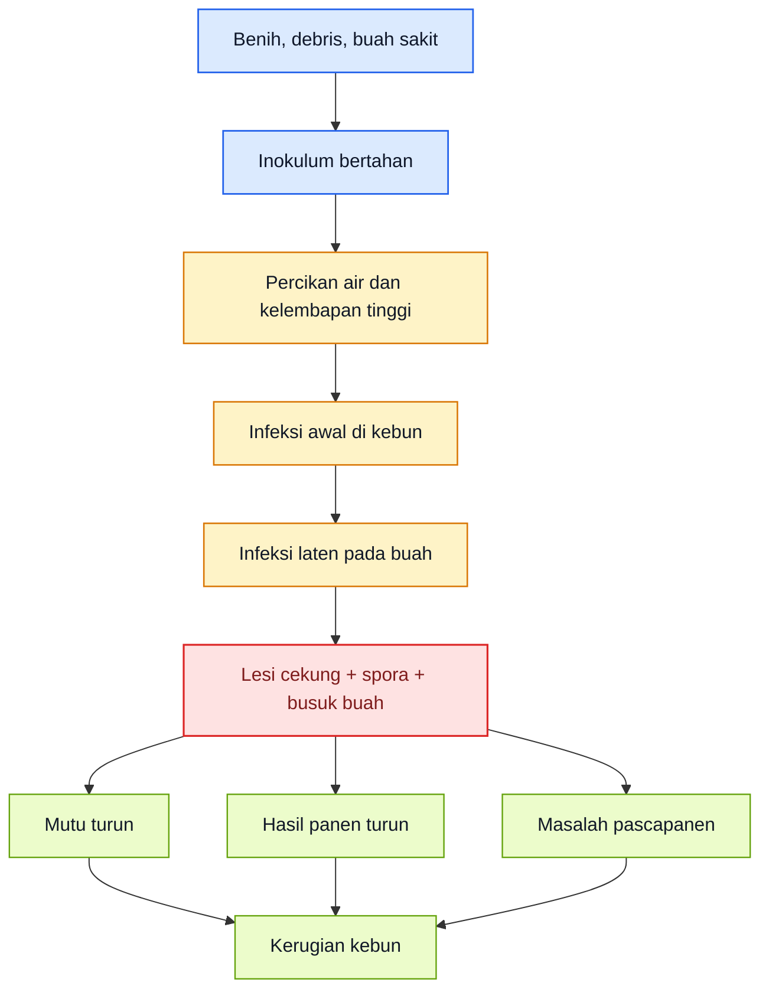

<ResourceBox
  title="Artikel Terkait:"
  items={[
    {
      name: 'README — Framework Praktis Memulai Bisnis Agribisnis Terpadu di Lahan Gumuk Berlereng',
      href: '/blog/agri/kebon/agribisnis-gumuk/README',
    },
    {
      name: 'Proposal Pembangunan Sistem Drip Irrigation',
      href: '/blog/agri/kebon/proposal-pembangunan-drip-irigation',
    },
    {
      name: 'PROPOSAL RENCANA KERJA PENGEMBANGAN KEBUN GUMUK 1 TAHUN',
      href: '/blog/agri/kebon/agribisnis-gumuk/proposal-pengembangan-gumuk',
    },
    {
      name: 'OPT Penggagal Panen pada Cabai Rawit dan Cabai Besar',
      href: '/blog/agri/kebon/pengendalian-opt-cabai',
    },
    {
      name: 'Panduan Lengkap Pengendalian Lalat Buah di Kebun Campuran',
      href: '/blog/agri/kebon/lalat-buah-ipm',
    },
    {
      name: 'Pedoman Terpadu Mencegah Gagal Panen Cabai Akibat Kutu Kebul dan Thrips',
      href: '/blog/agri/kebon/pengendalian-kutu-kebul-thrips',
    },
    {
      name: 'Panduan Praktis Talas untuk Kebun Gumuk',
      href: '/blog/agri/kebon/budidaya-talas-gumuk',
    },
    {
      name: 'README - Pupuk Tepat, Panen Untung - Model Low-Lab untuk Petani Makmur di Gambiran',
      href: '/blog/agri/pupuk-terintegrasi/README',
    },
  ]}
/>

[**Kembali ke Atas**](#pedoman-terpadu-mencegah-kehilangan-hasil-cabai-rawit-dan-cabai-besar-akibat-antraknose)

---

# Bab 2. Mengenal Musuh di Lapang: Identifikasi Antraknose dan Pembeda dengan Busuk Buah Lain

Pada cabai, kesalahan awal yang paling mahal adalah **salah mengenali bercak buah**. Antraknose memang paling sering tampak pada buah, tetapi tidak semua buah busuk adalah antraknose. NC State menjelaskan bahwa anthracnose of pepper disebabkan oleh kompleks **Colletotrichum spp.** dan gejala buahnya sangat khas: lesi awal **kecil, cekung, melingkar**, lalu membesar menjadi lesi dengan **massa spora berwarna salmon atau merah muda**, tampak **basah atau berlendir**, dan sering memiliki **lingkaran konsentris**. Buah akhirnya dapat membusuk seluruhnya. Mereka juga menegaskan bahwa buah muda yang terinfeksi bisa tetap tampak normal lebih dulu karena adanya **infeksi laten**. ([content.ces.ncsu.edu][1])

Pada cabai rawit dan cabai besar, bentuk gejalanya mengikuti anatomi buah, tetapi pola dasarnya sama. Pada buah memanjang seperti cabai rawit atau cabai besar tipe keriting, bercak sering tampak sebagai **lesi memanjang atau elips** yang berkembang menjadi busuk gelap. Pada buah yang lebih gemuk seperti bell pepper atau paprika, lesi cenderung lebih mudah terlihat sebagai **bercak cekung melingkar** dengan pusat berwarna lebih terang atau oranye kecokelatan. NC State juga mencatat bahwa semua bagian tanaman di atas permukaan tanah dapat terinfeksi, tetapi **buah adalah bagian yang paling terdampak**, sehingga pemeriksaan lapang harus tetap dimulai dari buah, lalu diperluas ke tangkai buah, bunga sisa, dan tajuk lembap di sekitarnya. ([content.ces.ncsu.edu][1])

Hal yang membedakan antraknose dari banyak busuk buah lain adalah kombinasi tiga tanda: **lesi cekung**, **lingkaran konsentris**, dan **massa spora berwarna salmon–merah muda** pada kondisi lembap. Ini berbeda dengan **blossom-end rot**, yang menurut NC State merupakan gangguan abiotik, hanya muncul pada buah, sering berada di **ujung bunga**, dan memberi jaringan **gelap, kering, dan seperti kulit**, bukan lesi jamur yang basah dengan spora. Jadi, antraknose adalah penyakit infeksius dengan sumber inokulum aktif, sedangkan blossom-end rot adalah gangguan fisiologis yang terkait kalsium dan air. Perbedaan ini sangat penting, karena tindakan lapangnya sama sekali tidak bisa disamakan. ([content.ces.ncsu.edu][1])

Pada kebun cabai, pembeda lain yang perlu diingat adalah bahwa antraknose juga bisa tampak pada **tangkai atau organ lain di atas tanah**, walau buah tetap yang paling dominan. Dokumen diagnosis antraknosa cabai dari materi teknis hortikultura Indonesia memperlihatkan spektrum dari infeksi ringan sampai parah, dan menunjukkan bahwa pada kondisi lebih berat, serangan tidak lagi lokal pada satu buah, tetapi sudah menjadi tanda bahwa kebun memasuki fase penyebaran yang lebih luas. Bagi praktisi, ini berarti satu buah sakit tidak boleh dipandang sendiri; ia harus dibaca sebagai **indikator keadaan kebun**.

## Aset gambar aktual Bab 2

Bab 2 memang memerlukan gambar nyata. Saya siapkan **manifest PNG lokal** berikut agar bisa langsung dipakai di MDX. Saya tidak bisa menulis file biner PNG eksternal langsung dari web ke sandbox dalam chat ini, jadi format paling aman adalah **nama file lokal + sumber resmi** yang siap Anda simpan sebagai PNG. Semua sumber di bawah berasal dari **NC State Extension** atau **dokumen resmi Hortikultura Indonesia**.

  <figure>
    
    <figcaption>
      Gejala awal–menengah antraknose pada cabai besar: lesi cekung dengan pola
      konsentris.
    </figcaption>
  </figure>

{' '}

<figure>
  
  <figcaption>
    Gejala lanjut antraknose pada cabai tipe panjang: jaringan buah telah
    membusuk dan rusak berat.
  </figcaption>
</figure>

{' '}

<figure>
  
  <figcaption>
    Contoh lapang pada cabai rawit dari materi teknis hortikultura Indonesia.
  </figcaption>
</figure>

{' '}

<figure>
  
  <figcaption>
    Infeksi berat: buah menjadi sumber sporulasi dan penyebaran lebih lanjut.
  </figcaption>
</figure>

  <figure>
    
    <figcaption>
      Pembeda non-antraknose: blossom-end rot cenderung kering, leathery, dan
      berada di ujung bunga buah.
    </figcaption>
  </figure>

Manifest ini disusun dari gambar resmi NC State Extension dan materi teknis Hortikultura Indonesia, karena dua sumber itu paling representatif untuk keperluan identifikasi lapang pada cabai.

## Tabel 1. Pembeda cepat antraknose vs busuk buah lain

| Aspek pembeda                      | Antraknose                                                                | Busuk buah lain yang umum membingungkan                       |
| ---------------------------------- | ------------------------------------------------------------------------- | ------------------------------------------------------------- |
| Bentuk bercak                      | Cekung, melingkar atau memanjang, berkembang membesar                     | Bisa datar, kering, pecah, atau luka tusuk                    |
| Posisi gejala                      | Sering pada permukaan buah, dapat muncul di berbagai titik                | Sering spesifik, misalnya di ujung bunga pada blossom-end rot |
| Tekstur busuk                      | Cenderung basah atau berlendir saat aktif, lalu membusuk                  | Pada gangguan fisiologis sering kering, leathery              |
| Lingkaran konsentris / massa spora | Sangat khas; sering ada massa spora salmon–merah muda                     | Umumnya tidak ada massa spora khas Colletotrichum             |
| Fase buah paling rentan            | Buah berkembang, matang, sampai pascapanen; infeksi bisa laten sejak muda | Tergantung penyebab; tidak selalu laten                       |
| Indikasi penyebab utama            | Penyakit jamur infeksius, sumber inokulum aktif                           | Bisa fisiologis, bakteri, luka serangga, atau sebab lain      |

Tabel ini diringkas dari deskripsi resmi NC State tentang gejala khas anthracnose of pepper dan blossom-end rot of pepper, ditambah penekanan praktis untuk membedakan penyebab infeksius dan non-infeksius di lapang. ([content.ces.ncsu.edu][1])

## Rumusan praktis Bab 2

Kalau Bab 2 harus diperas menjadi satu keputusan lapang, maka keputusannya adalah ini: **bila bercak buah cekung, berkembang membesar, punya pola konsentris, dan pada kondisi lembap tampak spora berwarna salmon–merah muda, anggap dulu itu antraknose sampai terbukti sebaliknya**. Sebaliknya, bila busuk cenderung kering, leathery, dan sangat terkait ujung bunga buah, pertimbangkan dulu gangguan fisiologis seperti blossom-end rot. Dengan cara baca seperti ini, petani tidak akan gegabah menyamakan semua busuk buah sebagai satu masalah yang sama. ([content.ces.ncsu.edu][1])

[**Kembali ke Atas**](#pedoman-terpadu-mencegah-kehilangan-hasil-cabai-rawit-dan-cabai-besar-akibat-antraknose)

---

# Bab 3. Siklus Risiko pada Tanaman Cabai: Dari Benih, Tajuk, Bunga, hingga Buah

Kesalahan paling umum dalam menghadapi antraknose adalah membaca penyakit ini hanya saat **buah mulai busuk**. Padahal, sumber teknis yang kuat menunjukkan bahwa antraknose dibangun jauh lebih awal. NC State menulis bahwa patogen dapat **bertahan di dalam atau pada permukaan benih**, dapat bertahan di tanah sebagai struktur tahan, dan sumber inokulum primer juga datang dari **transplant terinfeksi, debris tanaman, serta percikan air**. Literatur pepper anthracnose dari WorldVeg juga menyebut bahwa **benih dan sisa tanaman terinfeksi** dianggap sebagai sumber inokulum yang memicu perkembangan antraknose pada buah cabai. Jadi, buah busuk hanyalah fase yang tampak; proses penyakitnya sudah berjalan sebelumnya. ([content.ces.ncsu.edu][1])

## 3.1 Benih: titik awal yang sering diremehkan

Potensi **seed-borne** membuat benih bukan sekadar bahan tanam, tetapi juga titik awal risiko penyakit. NC State menyatakan bahwa patogen dapat bertahan **inside or on the surface of seeds**, sementara WorldVeg menegaskan bahwa sumber inokulum penting termasuk benih dan debris tanaman terinfeksi. Bagi praktisi, maknanya sangat jelas: kebun bisa memulai musim dengan penyakit yang “sudah ikut masuk” bahkan sebelum gejala terlihat. Itulah sebabnya pemilihan benih sehat dan perlakuan benih nanti harus ditempatkan sebagai langkah inti, bukan pelengkap. ([content.ces.ncsu.edu][1])

## 3.2 Tajuk dan residu tanaman: tempat penyakit menunggu

Setelah musim berjalan, antraknose tidak hanya bertahan di buah sakit yang tampak, tetapi juga pada **sisa tanaman**, jaringan terinfeksi, dan lingkungan kebun yang lembap. NC State menulis bahwa patogen dapat bertahan di **soil** dan **crop debris**, dan karena itu menganjurkan **destruction of crop residue** segera setelah panen. Dokumen Hortikultura Indonesia juga menekankan bahwa antraknose meningkat pada kondisi hujan tinggi dan perlu dipandang sebagai bagian dari pengelolaan kebun secara komprehensif, bukan hanya sebagai kasus buah sakit individual. Ini berarti tajuk, permukaan tanah, buah gugur, dan sisa tanaman adalah komponen epidemi yang harus dibaca sebagai satu sistem. ([content.ces.ncsu.edu][1])

## 3.3 Percikan air: jalur penyebaran yang paling praktis di lapang

Pada antraknose cabai, **air adalah kendaraan penyakit**. NC State menulis bahwa **rain splash carries fungal spores** dari tanah, debris, dan buah terinfeksi ke tanaman di sekitarnya, dan bahwa kelebihan hujan dapat meningkatkan infeksi serta kehilangan hasil. Mereka juga menganjurkan untuk **tidak memakai overhead irrigation** dan membatasi aktivitas lapang saat tanaman basah agar penyebaran berkurang. Ini menjelaskan kenapa kebun yang sama dapat terlihat aman pada satu minggu, lalu tiba-tiba memburuk sangat cepat setelah beberapa hari hujan atau penyiraman yang salah. ([content.ces.ncsu.edu][1])

## 3.4 Fase vegetatif: masa pembentukan infeksi tersembunyi

Fase vegetatif sering dianggap “belum relevan” untuk antraknose karena buah belum banyak. Itu keliru. NC State menegaskan bahwa pepper dapat terinfeksi pada **any growth stage**, dan gejala buah bisa muncul kemudian karena adanya **latent infection**. Dengan kata lain, fase vegetatif adalah masa ketika sumber penyakit dapat mulai terbentuk tanpa terlihat jelas di buah. Bagi praktisi, ini sangat penting: bila kebun hanya mulai serius memikirkan antraknose saat buah pertama memerah, maka biasanya ia sudah terlambat beberapa langkah. ([content.ces.ncsu.edu][1])

## 3.5 Fase berbunga–berbuah: titik ledakan ekonomi

Begitu tanaman masuk fase berbunga dan buah mulai terbentuk, risiko antraknose berubah dari **laten** menjadi **ekonomi**. NC State menyebut bahwa buah matang dan terlalu matang cenderung lebih rentan, tetapi buah muda pun dapat terinfeksi lebih dulu lalu baru menunjukkan gejala saat matang. Pada pepper, fungisida preventif bahkan direkomendasikan mulai **first fruit set** dan diteruskan selama buah berkembang. Ini menunjukkan bahwa fase berbunga–berbuah adalah titik ketika penyakit bukan lagi isu “potensial”, melainkan mulai menentukan hasil panen, mutu pasar, dan kontinuitas petik. ([content.ces.ncsu.edu][1])

## 3.6 Musim kering vs musim basah: beda ritme, beda risiko

Perbedaan musim sangat menentukan ritme antraknose. NC State menyebut kondisi paling menguntungkan bagi patogen adalah suhu sekitar **27°C** dengan **precipitation tinggi**, sementara dokumen Hortikultura Indonesia secara eksplisit menulis bahwa **curah hujan tinggi pada musim kemarau** pun dapat meningkatkan serangan antraknose/patek/busuk buah. Ini berarti musim basah atau periode lembap harus dibaca sebagai fase percepatan, bukan fase normal. Pada saat seperti itu, jeda beberapa hari dalam sanitasi, panen, atau perlindungan dapat mengubah serangan titik menjadi masalah hamparan. ([content.ces.ncsu.edu][1])

Jadi, inti Bab 3 adalah ini: **antraknose tidak muncul tiba-tiba di buah; ia dibangun dari benih, diperkuat oleh residu dan kelembapan, disebarkan oleh air, lalu meledak saat buah menjadi rentan**. Cara pikir inilah yang akan menentukan apakah kebun bekerja preventif atau baru bereaksi setelah kerusakan tampak jelas. ([content.ces.ncsu.edu][1])

**Diagram Bab 3** di bawah ini merangkum siklus risiko antraknose dari awal musim sampai fase buah. Diagram dibuat vertikal agar tetap nyaman dibaca di layar HP. Alurnya diringkas dari NC State Extension dan literatur pepper anthracnose yang menekankan peran seed-borne inoculum, debris, water splash, infeksi laten, dan ledakan gejala pada fase buah. ([content.ces.ncsu.edu][1])

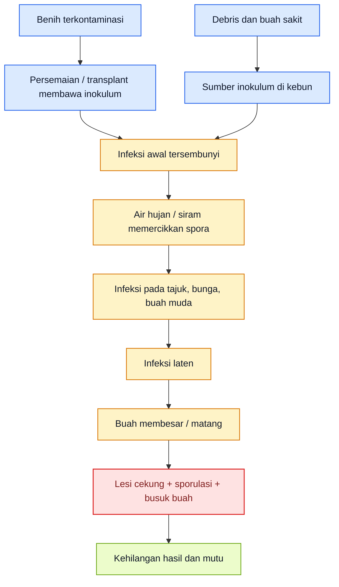

## Rumusan praktis Bab 3

Kalau Bab 3 diperas menjadi satu pegangan lapang, maka pegangannya adalah: **jangan tunggu buah busuk untuk mulai memikirkan antraknose**. Bacalah benih, transplant, debris, percikan air, dan kelembapan tajuk sebagai bagian dari satu siklus penyakit. Begitu cara pikir ini berubah, pengendalian antraknose juga akan berubah: dari sekadar merespons buah sakit, menjadi usaha memutus siklus penyakit sejak awal musim. ([content.ces.ncsu.edu][1])

[1]: https://content.ces.ncsu.edu/anthracnose-of-pepper 'Anthracnose of Pepper | NC State Extension Publications'

[**Kembali ke Atas**](#pedoman-terpadu-mencegah-kehilangan-hasil-cabai-rawit-dan-cabai-besar-akibat-antraknose)

---

# Bab 4. Fase Persiapan Sebelum Tanam: Fondasi Pengendalian Dimulai Sebelum Bibit Masuk

Pada antraknose cabai, banyak kebun kalah bukan karena salah memilih fungisida, tetapi karena **musim sudah dimulai dengan kondisi yang terlalu ramah bagi penyakit**. NC State menegaskan bahwa pengelolaan antraknose pepper harus dimulai dengan **benih bebas patogen**, **rotasi ke tanaman non-solanaceae selama 2–3 tahun**, **menghindari overhead irrigation**, penggunaan **mulsa sebagai penghalang** antara tanah dan tanaman, serta **drainase lapang yang baik**. Dokumen teknis Hortikultura Indonesia juga menekankan bahwa antraknose meningkat pada kondisi lembap dan bahwa pengendalian harus mengurangi peluang cendawan bertahan di residu tanaman, tanah, dan sumber infeksi di lapang. Jadi, fase sebelum tanam bukan tahap pendahuluan biasa, tetapi fase ketika peluang spora untuk **bertahan dan menyebar** mulai diputus. ([content.ces.ncsu.edu](https://content.ces.ncsu.edu/anthracnose-of-pepper) ([Hortikultura Data][1]))

## 4.1 Sanitasi lahan dan sisa tanaman lama

Sanitasi lahan adalah fondasi pertama. NC State menulis bahwa patogen antraknose dapat bertahan pada **tanah** dan **sisa tanaman**, dan karena itu residu tanaman harus segera dihancurkan setelah panen. Pada materi teknis JICA–Hortikultura untuk antraknose cabai, disebutkan bahwa cendawan **bertahan hidup dalam residu tanaman dan tanah** serta menyebar oleh **air hujan**, sehingga sanitasi lahan harus dibaca sebagai upaya memotong sumber inokulum primer, bukan sekadar membersihkan kebun dari kotoran. Secara praktis, ini berarti buah sakit yang tertinggal, ranting, batang, gulma inang, dan tumpukan residu setelah musim lalu tidak boleh dibiarkan menjadi “bank spora” untuk musim baru. ([NC State Extension][2])

Karena itu, menjelang tanam, lahan seharusnya sudah bebas dari buah terinfeksi, sisa tanaman sakit, dan gulma yang menutupi sirkulasi udara atau menyimpan kelembapan. Bayer juga menegaskan bahwa **host weed species** dan **solanaceous volunteer plants** harus disingkirkan untuk menekan tekanan inokulum. Bagi praktisi, maknanya sederhana: kebun yang tampak bersih dari jauh belum tentu aman; sanitasi harus menyentuh **permukaan tanah, tepi lahan, saluran, buah gugur, dan volunteer plants** yang berpotensi menjadi jembatan penyakit. ([Bayer Vegetables][3])

## 4.2 Benih sehat dan perlakuan benih

Benih adalah pintu masuk yang paling sering diremehkan. NC State menyebut patogen dapat bertahan **di dalam atau pada permukaan benih**, dan secara eksplisit merekomendasikan penggunaan **pathogen-free seeds** untuk mencegah introduksi penyakit ke lapang. WorldVeg bahkan memberi rekomendasi teknis yang sangat spesifik: **hot water treatment 52°C selama 30 menit** untuk membantu menghancurkan cendawan yang terbawa benih. Sementara itu, SOP Cabai Rawit Hiyung dari Direktorat Hortikultura menyebut untuk busuk buah antraknosa penggunaan **benih sehat**, perendaman benih **selama 6 jam** dalam larutan mikroba antagonis **Pseudomonas fluorescens**, serta pemanfaatan **Trichoderma spp.** dan **Gliocladium spp.** pada kantong persemaian. Jadi, untuk antraknose, benih tidak boleh hanya dipilih berdasarkan daya tumbuh; ia juga harus dibaca sebagai **potensi pembawa inokulum**. ([NC State Extension][2])

Dalam praktik, pilihan perlakuan benih harus mengikuti sistem budidaya dan kesiapan teknis petani. **Hot water treatment** memberi logika sanitasi langsung pada benih, tetapi membutuhkan disiplin suhu dan waktu. Sementara pendekatan dengan **mikroba antagonis** seperti yang dicontohkan dalam SOP nasional lebih cocok untuk sistem budidaya yang memang sudah membangun program biologis sejak awal. Keduanya punya tujuan sama: **jangan biarkan penyakit masuk dari titik paling awal**. Kalimat terakhir adalah inferensi praktis yang diturunkan dari fakta bahwa sumber resmi sama-sama menekankan benih sehat sebagai titik awal pengendalian. ([WorldVeg][4])

## 4.3 Drainase, bedengan, dan tata air

Pada antraknose, air bukan hanya kebutuhan tanaman, tetapi juga **kendaraan penyebaran penyakit**. NC State menegaskan bahwa percikan air hujan membawa spora dari tanah, debris, dan buah terinfeksi ke tanaman lain, dan karena itu **overhead irrigation tidak dianjurkan**. Mereka juga menyatakan bahwa **good drainage** dibutuhkan untuk menurunkan kelembapan berlebih dan waterlogging. Bayer menguatkan hal yang sama: pepper sebaiknya ditanam di lahan dengan **drainase baik**, dan bila memungkinkan harus menghindari pengairan dari atas karena splash water menyebarkan spora dan menyediakan kelembapan bebas pada permukaan tanaman yang dibutuhkan untuk infeksi. ([NC State Extension][2])

Implikasi lapangnya jelas. Sebelum tanam, kebun harus sudah mempunyai **bedengan/guludan yang memadai**, saluran pembuangan air yang lancar, serta tata irigasi yang tidak membuat buah dan tajuk basah berulang. SOP Hortikultura untuk cabai rawit juga memasukkan **perbaikan drainase tanah** dalam pengendalian antraknose. Jadi, bila petani masuk musim hujan dengan guludan rendah, drainase macet, dan pola siram yang memercik ke tajuk, maka sebenarnya kebun sedang membuka pintu lebar-lebar bagi antraknose.

## 4.4 Pemilihan lahan dan musim tanam

Pemilihan lahan dan waktu tanam sangat menentukan, terutama di daerah yang sering mendapat hujan tak menentu. NC State menjelaskan bahwa antraknose cenderung berkembang pada suhu hangat sekitar **27°C** dan **curah hujan tinggi**, sedangkan SOP Cabai Rawit Hiyung menyebut untuk penyakit daun tertentu, musim kemarau dengan irigasi baik lebih menekan perkembangan penyakit dibanding lahan lembap. Walau pernyataan terakhir tidak khusus untuk antraknose, arah praktisnya sejalan: **kelembapan tinggi dan tajuk yang lama basah selalu menguntungkan penyakit**. Karena itu, untuk antraknose, lahan yang rawan genangan, terlalu teduh, atau sulit mengering setelah hujan harus dipandang sebagai lahan berisiko tinggi. ([NC State Extension][2])

Memilih musim tanam yang lebih aman bukan berarti selalu harus menghindari hujan, tetapi berarti memahami bahwa **musim basah menuntut disiplin jauh lebih tinggi**. Banyak kebun kalah dari antraknose bukan karena penyakit itu mustahil dikendalikan, melainkan karena kebun masuk musim lembap tanpa penyesuaian pada drainase, jarak tanam, sanitasi, dan intensitas monitoring. Ini adalah inferensi operasional dari fakta bahwa curah hujan tinggi, splash water, dan kelembapan permukaan tanaman merupakan komponen utama epidemi antraknose. ([NC State Extension][2])

## 4.5 Rotasi tanaman bukan inang

Rotasi adalah salah satu alat paling sederhana tetapi paling sering diabaikan. NC State merekomendasikan rotasi ke **tanaman non-solanaceae selama 2–3 tahun** dan menambahkan bahwa **stroberi** juga sebaiknya dihindari karena dapat menjadi inang alternatif. Bayer menyampaikan pesan serupa: rotasi ke non-host crops selama **setidaknya dua sampai tiga tahun** akan membantu menjaga populasi patogen antraknose tetap rendah. Dalam SOP cabai rawit Hiyung, pengendalian antraknose juga mencantumkan **pergiliran tanaman dengan tanaman yang bukan Solanaceae**. Jadi, ada konsensus yang jelas: pada antraknose, rotasi bukan tambahan, tetapi salah satu cara paling masuk akal untuk **menurunkan tekanan inokulum dari tanah dan residu**. ([NC State Extension][2])

Rotasi harus dipahami secara tegas. Bukan sekadar berganti varietas cabai, bukan sekadar mengganti rawit menjadi cabai besar, tetapi benar-benar **keluar dari kelompok inang utama**. Dalam konteks praktis, rotasi gagal bila lahan masih diisi tanaman solanaceae lain atau volunteer plants dibiarkan tumbuh. Itu sebabnya rotasi harus selalu berjalan bersama sanitasi, bukan berdiri sendiri. Kalimat terakhir merupakan inferensi praktis dari rekomendasi rotasi dan penghilangan volunteer plants dari sumber resmi. ([NC State Extension][2])

## 4.6 Pengaturan jarak tanam untuk sirkulasi udara

Antraknose sangat diuntungkan oleh **tajuk yang lambat kering**. Walau sumber yang saya pakai tidak memberikan satu angka jarak tanam universal untuk semua sistem, beberapa rujukan teknis menegaskan bahwa pengaturan tanaman harus mendukung **air flow**, coverage, dan penurunan kelembapan. Rutgers menulis bahwa penanaman pepper dalam **single atau double row fashion** dapat sangat memengaruhi kemampuan pengendalian anthracnose karena berkaitan dengan keberhasilan coverage pada buah yang berkembang. Ini memberi pesan lapang yang penting: jarak tanam dan arsitektur kanopi bukan hanya soal hasil, tetapi juga soal **berapa cepat tajuk kering** dan **seberapa mudah fungisida atau biofungisida mencapai buah**. ([Plant & Pest Advisory][5])

Karena itu, pada fase persiapan, keputusan tentang jarak tanam harus mempertimbangkan musim, vigor varietas, dan tujuan menjaga sirkulasi udara. Kebun yang terlalu rapat cenderung lebih lambat kering setelah hujan atau embun, sehingga memberi jendela infeksi yang lebih panjang bagi Colletotrichum. Ini adalah inferensi budidaya yang langsung diturunkan dari hubungan antara kelembapan tajuk, kebutuhan free moisture untuk infeksi, dan pentingnya coverage buah/tajuk yang ditekankan pada sumber teknis. ([Bayer Vegetables][6])

## 4.7 Persiapan mulsa dan sistem monitoring

Mulsa pada antraknose tidak boleh dipahami hanya sebagai pengendali gulma. NC State secara spesifik menyarankan penggunaan **black plastic atau material lain** untuk menciptakan **barrier** antara patogen di tanah dan tanaman. Bayer menambahkan bahwa **mulsa organik dan plastik** dapat berfungsi sebagai penghalang fisik yang mengurangi percikan spora dari tanah dan debris ke tanaman pepper. WorldVeg juga menulis bahwa mulsa berguna untuk **mengurangi soil splash onto fruit and lower leaves**. Artinya, keputusan memakai mulsa di kebun cabai rawit atau besar harus dibaca langsung sebagai **alat epidemiologis**, bukan hanya alat budidaya umum. ([NC State Extension][7])

Selain mulsa, sistem monitoring juga harus disiapkan sebelum tanam. Pada antraknose, monitoring bukan trap seperti pada kutu kebul atau thrips, tetapi **rute inspeksi kebun, titik pemeriksaan buah, jadwal cek tajuk setelah hujan, dan prosedur pemungutan buah sakit**. Materi teknis JICA–Hortikultura untuk antraknose membedakan kondisi **tidak ada infeksi, infeksi ringan, infeksi serius, dan infeksi parah**, lalu mengaitkannya dengan kebutuhan tindakan preventif atau kuratif. Jadi, monitoring harus sudah dipikirkan sebelum tanaman masuk, agar kebun tidak baru belajar membaca penyakit ketika buah pertama mulai rusak. ([Hortikultura Data][1])

## 4.8 Persiapan agen hayati dan biofungisida

Persiapan sebelum tanam juga harus mencakup keputusan tentang **agen hayati dan biofungisida**. SOP Cabai Rawit Hiyung secara eksplisit menyebut **Pseudomonas fluorescens** untuk perendaman benih, lalu **Trichoderma spp.** dan **Gliocladium spp.** yang diaplikasikan pada kantong persemaian **3 hari sebelum tanam atau bersamaan dengan tanam**. Ini penting karena menunjukkan bahwa pendekatan biologis untuk antraknose tidak dimulai saat buah sudah busuk, tetapi sejak benih dan persemaian. Dengan kata lain, pada antraknose, biofungisida paling masuk akal bila diposisikan sebagai **fondasi preventif**, bukan alat penyelamat terakhir.

Kebun yang masuk musim tanpa keputusan jelas soal biofungisida, sanitasi, dan pola aplikasi preventif biasanya akan lebih cepat tergelincir ke rutinitas fungisida penuh ketika musim menjadi lembap. Karena itu, persiapan agen hayati di fase ini adalah soal **membangun opsi**: bila backbone biologis sudah dipasang sejak awal, kebutuhan eskalasi kimia di tengah musim bisa lebih rendah dan lebih terarah. Kalimat terakhir merupakan inferensi operasional dari struktur pengendalian preventif yang ditunjukkan SOP dan fakta bahwa penyakit harus dicegah sebelum gejala buah meledak.

## Rumusan praktis Bab 4

Bila Bab 4 diperas menjadi satu aturan kerja, maka aturannya adalah: **masuklah ke musim tanam dengan lahan yang bersih, benih sehat, drainase siap, mulsa terpasang, rotasi jelas, dan program biologis sudah direncanakan**. Pada antraknose, kebun yang salah persiapan musim basah hampir selalu membayar mahal di fase buah. Karena itu, fondasi pengendalian harus dibangun sebelum bibit masuk, bukan setelah buah pertama mulai menunjukkan bercak. ([NC State Extension][2])

**Diagram Bab 4** merangkum urutan persiapan kebun sebelum tanam.

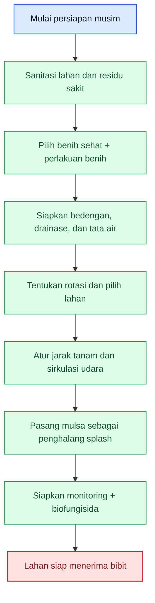

[**Kembali ke Atas**](#pedoman-terpadu-mencegah-kehilangan-hasil-cabai-rawit-dan-cabai-besar-akibat-antraknose)

---

# Bab 5. Fase Preventif Sejak Persemaian sampai Awal Tanam

Kalau Bab 4 berbicara tentang menyiapkan medan, maka Bab 5 berbicara tentang **mencegah penyakit ikut masuk bersama tanaman**. Pada antraknose, pencegahan dini sangat penting karena penyakit ini bisa berjalan sebagai **infeksi tersembunyi** sebelum akhirnya terlihat pada buah. NC State menegaskan bahwa infeksi dapat terjadi pada berbagai fase pertumbuhan pepper, dan bahwa gejala pada buah kadang baru tampak kemudian. Itulah sebabnya fase persemaian sampai awal tanam harus diperlakukan sebagai **zona steril epidemiologis** sejauh mungkin: benih sehat, bibit sehat, media bersih, kelembapan terkendali, dan tidak ada ruang bagi inokulum untuk menumpang. ([content.ces.ncsu.edu](https://content.ces.ncsu.edu/anthracnose-of-pepper))

## 5.1 Seleksi benih dan bibit sehat

Seleksi benih dan bibit sehat adalah pintu masuk utama keberhasilan musim. NC State merekomendasikan **pathogen-free seeds** untuk mencegah masuknya penyakit ke kebun, sementara WorldVeg dalam panduan budidaya cabai menekankan penggunaan **high quality, pathogen-free seeds and/or seedlings** serta pembuangan bibit sakit dengan cepat. SOP Cabai Rawit Hiyung untuk antraknose juga menempatkan **penggunaan benih sehat** sebagai langkah pertama sebelum menyebut perendaman benih dalam larutan mikroba antagonis. Jadi, sebelum berbicara tentang fungisida atau biofungisida, musim yang aman selalu dimulai dari keputusan sederhana tetapi paling mendasar: **jangan masukkan bahan tanam yang meragukan**. ([NC State Extension][2])

Pada tahap bibit, prinsip seleksinya harus ketat. Bibit yang lemah, tumbuh tidak seragam, menunjukkan bercak atau nekrosis yang mencurigakan, atau berasal dari persemaian yang terlalu lembap harus dipandang sebagai risiko, bukan “masih bisa dicoba”. Ini merupakan inferensi praktis dari prinsip pathogen-free seedlings dan dari fakta bahwa infeksi awal dapat tetap laten sebelum gejala buah muncul kemudian. ([NC State Extension][2])

## 5.2 Sanitasi persemaian

Persemaian harus dibaca sebagai tempat yang sangat menentukan. WorldVeg menegaskan pentingnya **menghilangkan daun dan bibit sakit dengan segera** serta menjaga kebersihan area tanam. Pada SOP cabai rawit, bioagens seperti **Trichoderma spp.** dan **Gliocladium spp.** justru diarahkan ke **kantong persemaian**, yang menunjukkan bahwa persemaian memang dipandang sebagai titik awal intervensi biologis. Dalam konteks antraknose, sanitasi persemaian berarti media tanam tidak tercemar, air siram tidak memercik liar, sirkulasi udara cukup, dan sisa bibit atau daun yang membusuk tidak dibiarkan menjadi pusat inokulum. ([WorldVeg][8])

Sanitasi persemaian juga berarti disiplin tenaga kerja. NC State menyarankan membatasi **field operations when plants are wet** untuk menurunkan penyebaran. Walau konteksnya lapang, prinsip itu relevan juga di persemaian: jangan terlalu banyak menangani tanaman saat media dan tajuk basah, karena percikan air dan kontak mekanis dapat membantu perpindahan inokulum. Kalimat terakhir adalah inferensi operasional dari mekanisme penyebaran splash-borne yang dijelaskan untuk antraknose pepper. ([NC State Extension][2])

## 5.3 Perlindungan dari percikan air dan kelembapan berlebih

Karena air adalah jalur utama penyebaran, maka persemaian dan awal tanam harus dilindungi dari **percikan** dan **kelembapan berlebih**. NC State menulis bahwa overhead irrigation sebaiknya dihindari karena percikan air menyebarkan spora, dan WorldVeg juga menyarankan meminimalkan atau menghindari **overhead irrigation** untuk mengurangi lamanya basah pada buah serta splash ke bagian bawah tanaman. Walaupun pada persemaian belum ada buah, prinsip epidemiologinya tetap sama: **semakin sering tajuk muda basah dan terciprat, semakin besar peluang inokulum bergerak**. ([NC State Extension][2])

Dalam praktik, itu berarti sistem siram harus lembut, lebih baik diarahkan ke media daripada menghantam tajuk, dan tata letak persemaian harus memungkinkan cepat mengering setelah penyiraman. Persemaian yang lembap terus-menerus, terlalu rapat, dan minim sirkulasi hampir selalu menjadi tempat yang lebih nyaman bagi penyakit. Pernyataan ini adalah inferensi langsung dari kebutuhan free moisture dan splash untuk penyebaran Colletotrichum yang dijelaskan sumber resmi. ([NC State Extension][2])

## 5.4 Inspeksi awal gejala pada daun dan batang muda

Walaupun antraknose paling terkenal pada buah, inspeksi awal di fase persemaian dan awal tanam tetap penting. NC State menyebut bahwa **all above-ground parts** of pepper dapat terinfeksi, bukan hanya buah. Artinya, pemeriksaan bibit tidak boleh hanya melihat “hidup atau mati”, tetapi juga mencari bercak mencurigakan, nekrosis lokal, atau tanda bahwa persemaian tidak sehat secara umum. Materi teknis JICA–Hortikultura untuk antraknose juga membedakan **infeksi ringan, serius, dan parah**, yang secara praktis mengingatkan bahwa gejala awal harus dibaca sebelum penyakit berkembang menjadi serangan besar di buah. ([NC State Extension][2])

Pemeriksaan awal ini tidak harus rumit. Cukup disiplin: cek bibit yang tampak berbeda, perhatikan daun dan batang muda setelah hujan atau penyiraman berat, dan jangan menunggu semua bibit menunjukkan gejala yang sama. Pada antraknose, yang penting bukan hanya melihat gejala, tetapi **mencegah bahan tanam bermasalah masuk ke lapang**. Ini adalah inferensi praktis dari sifat seed-borne dan latent infection yang telah dijelaskan pada bab sebelumnya. ([NC State Extension][2])

## 5.5 Tindakan bila ada bibit mencurigakan

Pada fase ini, kompromi adalah kesalahan mahal. Bila ada bibit yang mencurigakan, prinsip yang paling aman adalah **pisahkan, buang, atau musnahkan**. WorldVeg menulis untuk segera membuang daun dan bibit yang sakit. Prinsip ini sangat masuk akal untuk antraknose, karena tujuan utama fase persemaian adalah **tidak membawa inokulum ke blok produksi**. Menyelamatkan satu bibit meragukan hampir tidak pernah lebih berharga daripada risiko memasukkan sumber penyakit ke satu hamparan penuh. ([WorldVeg][8])

Bagi praktisi, ini harus menjadi disiplin kerja: bibit sakit tidak disatukan dengan bibit sehat, tidak dipindah “siapa tahu sembuh”, dan tidak dibiarkan sebagai sumber percikan saat penyiraman. Semakin dini keputusan ini diambil, semakin murah biaya pengendalian musim itu. Pernyataan terakhir adalah inferensi ekonomi lapang dari fakta bahwa seedling phase adalah titik leverage tertinggi untuk mencegah introduksi penyakit. ([NC State Extension][2])

## 5.6 Peran agen hayati dan biofungisida sejak dini

SOP Cabai Rawit Hiyung memberi contoh yang sangat berguna: untuk antraknose, benih direndam **6 jam** dalam larutan **Pseudomonas fluorescens**, lalu **Trichoderma spp.** dan **Gliocladium spp.** diaplikasikan pada kantong persemaian **3 hari sebelum benih ditanam atau bersamaan dengan penanaman benih**. Ini menunjukkan bahwa pengendalian biologis antraknose di Indonesia memang dirancang mulai dari fase sangat awal. Pada artikel ini, fungsi biologisnya harus dibaca sebagai **pelindung awal**, bukan sebagai “obat buah busuk”.

Peran agen hayati sejak dini ada dua. Pertama, menekan peluang inokulum berkembang di sekitar benih, akar, dan media. Kedua, membangun kebun yang sejak awal sudah punya **backbone biologis**, sehingga tidak langsung bergantung pada fungisida penuh ketika kelembapan naik. Efek ini tidak selalu terlihat dramatis pada hari pertama, tetapi justru itulah sifat preventif yang benar. Pernyataan tentang backbone biologis merupakan inferensi operasional dari penempatan Trichoderma, Gliocladium, dan Pf di fase benih/persemaian dalam SOP nasional.

## 5.7 Penguatan tanaman awal setelah pindah tanam

Setelah pindah tanam, tanaman muda harus diperlakukan sebagai fase yang sangat rentan terhadap introduksi penyakit dari tanah dan percikan air. NC State merekomendasikan penggunaan **mulsa sebagai barrier**, menghindari **overhead irrigation**, menjaga **drainage**, dan membatasi aktivitas saat tanaman basah. WorldVeg juga menekankan bahwa mulsa membantu mengurangi soil splash ke bagian bawah tanaman. Maka setelah pindah tanam, fokus praktisnya adalah menjaga tanaman cepat pulih, media tidak tergenang, tajuk tidak terus basah, dan permukaan tanah tidak menjadi sumber percikan langsung ke batang serta daun bawah. ([NC State Extension][7])

Pada fase awal ini, kebun juga harus mulai membangun ritme monitoring: cek setelah hujan, cek tanaman yang tumbuh lebih lemah, dan cek area dengan drainase buruk lebih dulu. Bila fase ini dilalui dengan bibit sehat, media bersih, dan minim splash, maka kebun masuk fase vegetatif dengan modal epidemiologis yang jauh lebih kuat. Ini adalah inferensi praktis dari hubungan kuat antara splash, free moisture, dan pembentukan infeksi awal pada antraknose pepper. ([NC State Extension][2])

## Rumusan praktis Bab 5

Kalau Bab 5 diperas menjadi satu aturan kerja, maka aturannya adalah: **perlakukan persemaian dan awal tanam sebagai pintu karantina kebun**. Gunakan benih sehat, jaga persemaian tetap bersih dan cepat kering, hindari percikan air, buang bibit meragukan, mulai agen hayati sejak dini, dan masuk ke lapang hanya dengan tanaman yang benar-benar layak. Pada antraknose, buah memang yang paling menderita, tetapi kemenangan atau kekalahan musim sering sudah ditentukan jauh sebelum buah pertama terbentuk. ([NC State Extension][2])

**Diagram Bab 5** berikut merangkum alur preventif dari persemaian sampai awal tanam.

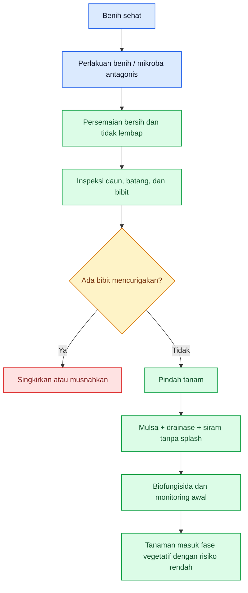

[1]: https://data.hortikultura.pertanian.go.id/jica/Materials/Chapter%205/5-20.pdf 'Microsoft PowerPoint - 20240228_Chili _Anthracnose Control_ID.pptx'
[2]: https://content.ces.ncsu.edu/anthracnose-of-pepper 'Anthracnose of Pepper | NC State Extension Publications'
[3]: https://www.vegetables.bayer.com/us/en-us/resources/growing-tips-and-innovation-articles/agronomic-spotlights/pepper-anthracnose.html?utm_source=chatgpt.com 'Pepper Anthracnose'
[4]: https://worldveg.tind.io/record/39499/files/f0094.pdf?utm_source=chatgpt.com 'Anthracnose on Pepper'
[5]: https://plant-pest-advisory.rutgers.edu/controlling-pepper-anthracnose-2-2-2-2-2-2-2-2/?utm_source=chatgpt.com 'Preparing for Pepper Anthracnose in 2025'
[6]: https://www.vegetables.bayer.com/content/dam/bayer-vegetables/english/united-states-canada/product-sheets-and-pdfs/agronomic-spotlights/Pepper%20Anthracnose.pdf?utm_source=chatgpt.com 'Pepper Anthracnose'
[7]: https://content.ces.ncsu.edu/anthracnose-of-pepper?utm_source=chatgpt.com 'Anthracnose of Pepper - NC State Extension Publications'
[8]: https://worldveg.tind.io/record/39488/files/05-620%20Intl%20Cooperators%20Guide_cultural%20practices%20for%20chili%20pepper%20%28rev%20Apr2021%29.pdf?utm_source=chatgpt.com 'Suggested Cultural Practices for Chili Pepper'

[**Kembali ke Atas**](#pedoman-terpadu-mencegah-kehilangan-hasil-cabai-rawit-dan-cabai-besar-akibat-antraknose)

---

# Bab 6. Program Preventif yang Melekat Sepanjang Siklus: Sanitasi, Tajuk, Air, Agen Hayati, dan Biofungisida

Pada antraknose cabai, pencegahan tidak pernah selesai hanya karena lahan sudah bersih atau benih sudah sehat. NC State menegaskan bahwa patogen menyebar lewat **percikan air**, bertahan pada **residu tanaman**, dan buah terinfeksi harus **segera dibuang** saat scouting. Rutgers juga menegaskan bahwa **prevention is key** untuk mengendalikan anthracnose fruit rot, dan bahwa buah sakit yang dibiarkan di lapang memperbesar masalah. Karena itu, backbone pengendalian antraknose memang bertumpu pada tiga kata: **sanitasi, kelembapan, dan inokulum**. Biofungisida hanya akan bernilai bila menyatu dengan tiga hal itu. ([NC State Extension][1])

## 6.1 Sanitasi buah sakit yang gugur: pekerjaan kecil dengan efek besar

Pada antraknose, buah sakit yang gugur bukan sekadar limbah panen, tetapi **sumber sporulasi aktif**. NC State menyarankan agar lapang **sering dimonitor** dan **buah terinfeksi segera dibuang**, sementara Rutgers menekankan bahwa patogen bertahan pada **plant debris** dan bahwa pencegahan menjadi sulit begitu area lapang telanjur terinfestasi. Artinya, setiap buah sakit yang dibiarkan di bedengan atau lorong tanam adalah alat bantu alami bagi penyakit untuk tetap hidup dan menyebar lagi saat hujan atau penyiraman berikutnya. ([NC State Extension][1])

Secara operasional, sanitasi pada antraknose harus dibaca sebagai **rutinitas**, bukan aksi sesekali. Buah yang menunjukkan gejala awal, buah yang gugur, dan sisa buah busuk setelah panen harus dipungut dan dimusnahkan secara teratur. Logika ini selaras dengan anjuran NC State untuk menghancurkan residu tanaman setelah panen dan dengan materi teknis Hortikultura Indonesia yang menempatkan pengelolaan kebun, panen, dan penanganan pascapanen sebagai bagian langsung dari mutu hasil cabai. ([NC State Extension][1])

## 6.2 Pengelolaan kelembapan dan aerasi tajuk

Antraknose dipercepat oleh **permukaan tanaman yang lama basah** dan tajuk yang lambat kering. NC State menulis bahwa spora tersebar melalui **rainfall or overhead irrigation**, dan bahwa aktivitas lapang saat tanaman basah sebaiknya dibatasi agar penyebaran berkurang. Pada SOP Cabai Rawit Hiyung, **pewiwilan/perempelan** ditujukan untuk membentuk tajuk ideal, memperbaiki partisi sinar matahari, dan mempermudah pemeliharaan. Bila dua sumber ini dibaca bersama, pesan praktisnya sangat kuat: tajuk cabai tidak boleh dibiarkan terlalu rapat dan lembap bila kebun ingin stabil dari antraknose. ([NC State Extension][1])

Di lapang, pengelolaan kelembapan tajuk berarti lebih dari sekadar “biar kena angin”. Ia mencakup pengaturan populasi, kerapian tajuk, kebersihan bawah kanopi, dan respons cepat setelah hujan panjang. Pada musim basah, tajuk yang terlalu rimbun akan memperpanjang periode basah daun dan buah, sehingga memperpanjang jendela infeksi. Ini adalah **inferensi budidaya langsung** dari mekanisme splash-borne disease pada antraknose dan dari tujuan perempelan untuk membentuk tajuk yang ideal. ([NC State Extension][1])

## 6.3 Cara penyiraman agar tidak memperparah splash

Pada antraknose, cara menyiram sama pentingnya dengan berapa banyak air yang diberikan. NC State secara eksplisit menulis **do not use overhead irrigation** dan menyarankan sistem irigasi yang **membatasi water splash**. WorldVeg juga merekomendasikan untuk **meminimalkan atau menghindari overhead irrigation** agar percikan tanah ke buah dan daun bawah berkurang. Ini berarti penyiraman dari atas tajuk pada kebun cabai yang rawan antraknose pada dasarnya sama dengan membantu spora pindah dari satu tempat ke tempat lain. ([NC State Extension][1])

Cara siram yang lebih aman adalah yang menyalurkan air ke **media atau zona akar**, bukan ke buah dan tajuk. Pada fase preventif sepanjang siklus, disiplin ini harus terus dijaga bahkan ketika tanaman sudah besar dan kebutuhan air meningkat. Banyak kebun merasa sudah “rajin merawat”, padahal pola siramnya justru memperbesar splash. Pada antraknose, kesalahan seperti itu tidak netral; ia aktif mempercepat epidemi. ([NC State Extension][1])

## 6.4 Aplikasi berulang biofungisida dan agen hayati

Biofungisida tidak bekerja seperti fungisida kontak cepat; nilainya ada pada **penekanan risiko sejak dini dan berulang**. SOP Cabai Rawit Hiyung mencontohkan **Pseudomonas fluorescens** untuk perendaman benih, serta **Trichoderma spp.** dan **Gliocladium spp.** pada media/kantong persemaian sebelum atau saat tanam. Artinya, pendekatan biologis untuk antraknose memang dirancang mulai sejak awal musim. Karena antraknose sendiri dibangun dari inokulum yang bertahan, splash, dan kelembapan, maka aplikasi biologis tidak logis jika dilakukan satu kali lalu dianggap selesai.

Secara praktis, program biofungisida lebih masuk akal diposisikan sebagai **lapisan yang diulang mengikuti fase rawan**, terutama menjelang dan selama periode kelembapan tinggi, setelah hujan beruntun, atau saat kebun masuk fase berbunga–berbuah. Ini adalah **inferensi operasional** dari dua hal: pertama, Rutgers menegaskan pencegahan menjadi kunci dan program perlindungan dimulai **sejak flowering** pada kebun yang punya riwayat antraknose; kedua, NC State menegaskan bahwa penyakit dipicu oleh splash dan buah terinfeksi harus cepat disingkirkan. Jadi, biofungisida hanya efektif bila menjadi bagian dari ritme kebun, bukan “sekali semprot untuk berjaga-jaga”.

## 6.5 Mulsa dan kebersihan permukaan tanah

Mulsa berfungsi sebagai **penghalang fisik** antara tanah dan tanaman. NC State menyebut penggunaan **black plastic or other mulches as a barrier between soil and plants**, sedangkan WorldVeg menekankan bahwa mulsa membantu **mengurangi soil splash onto fruit and lower leaves**. Dalam kebun antraknose, ini sangat penting karena splash dari tanah dan debris adalah salah satu jalur penyebaran utama. Jadi, mulsa bukan sekadar alat hemat gulma atau kelembapan tanah, tetapi juga alat epidemiologis yang aktif menurunkan risiko infeksi. ([NC State Extension][1])

Tetapi mulsa tidak akan banyak membantu bila permukaan kebun tetap kotor oleh buah sakit, sisa bunga terinfeksi, dan residu busuk. Karena itu, kebersihan permukaan tanah harus dijaga terus: lorong tanam tidak boleh berubah menjadi tempat akumulasi buah sakit, dan bagian bawah tajuk harus tetap mudah diperiksa. Ini konsisten dengan anjuran NC State untuk menghancurkan residu tanaman serta sering melakukan scouting dan pembuangan buah sakit. ([NC State Extension][1])

## 6.6 Pruning selektif untuk menurunkan kelembapan

Pada cabai, pruning selektif atau **pewiwilan/perempelan** bukan hanya untuk membentuk tanaman rapi, tetapi juga untuk menciptakan tajuk yang lebih cepat kering. SOP Cabai Rawit Hiyung menjelaskan bahwa pewiwilan bertujuan membentuk **tajuk tanaman yang ideal** sehingga distribusi sinar dan pemeliharaan lebih baik. Dalam prinsip umum pengelolaan penyakit, NC State juga menyebut bahwa mengurangi **prolonged leaf wetness** dengan memperbaiki aliran udara membantu menekan penyakit. Maka pada kebun rawan antraknose, pruning selektif paling logis dibaca sebagai alat untuk **mengurangi kelembapan mikro** di sekitar bunga dan buah.

Namun pruning harus tetap selektif dan disiplin. Tujuannya bukan merompes tanaman berlebihan, tetapi membuka tajuk secukupnya agar sirkulasi udara membaik, buah tidak terlalu tersembunyi dalam zona lembap, dan inspeksi menjadi lebih mudah. Ini adalah **inferensi budidaya** dari tujuan pewiwilan dalam SOP dan prinsip umum pengurangan leaf wetness pada manajemen penyakit.

## 6.7 Kapan program preventif dianggap berhasil, dan kapan mulai gagal

Secara operasional, program preventif pada antraknose bisa dianggap **berhasil** bila buah sakit baru jarang muncul, buah gugur sakit tidak menumpuk, tajuk cepat kering setelah hujan atau siram, dan tidak ada percepatan gejala dari minggu ke minggu. Penilaian ini merupakan **inferensi lapang** dari faktor-faktor kunci penyakit: buah terinfeksi harus segera dibuang, splash harus dibatasi, dan residu tidak boleh dibiarkan menjadi sumber inokulum. Bila tiga komponen itu terjaga, maka kebun sedang bergerak pada arah yang benar. ([NC State Extension][1])

Sebaliknya, program preventif mulai **gagal** bila gejala baru muncul makin sering, buah sakit gugur makin banyak, permukaan kebun makin kotor oleh residu busuk, tajuk tetap lembap lama setelah hujan, atau kebun baru bergerak setelah penyakit terlihat jelas di banyak buah. Pada kondisi itu, kebun tidak boleh terus bertahan hanya dengan mode preventif biasa; ia harus mulai dinaikkan ke korektif. Pesan ini sejalan dengan Rutgers yang menegaskan bahwa **prevention is critical**, dan bahwa setelah area lapang terinfestasi, pengelolaan menjadi lebih sulit.

## Rumusan praktis Bab 6

Kalau Bab 6 diperas menjadi satu aturan kerja, maka aturannya adalah: **jangan biarkan satu hari pun kebun berjalan tanpa disiplin sanitasi, pengelolaan tajuk, dan pengendalian splash air**. Biofungisida dan agen hayati tidak akan tampak bekerja bila buah sakit dibiarkan, tajuk terlalu lembap, dan air terus memercik ke buah. Pada antraknose, pencegahan yang benar bukan aksi tunggal, tetapi ritme kerja yang diulang terus sampai akhir musim. ([NC State Extension][1])

**Diagram Bab 6** berikut merangkum ritme preventif yang harus berulang sepanjang siklus cabai.

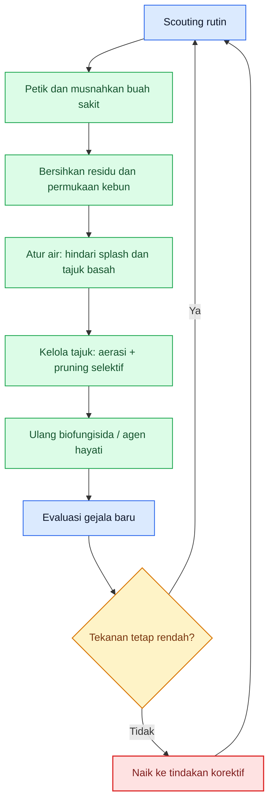

[1]: https://content.ces.ncsu.edu/anthracnose-of-pepper 'Anthracnose of Pepper | NC State Extension Publications'

[**Kembali ke Atas**](#pedoman-terpadu-mencegah-kehilangan-hasil-cabai-rawit-dan-cabai-besar-akibat-antraknose)

---

# Bab 7. Monitoring, Titik Kritis, dan Momen Penentu dalam Siklus Cabai

Pada antraknose, monitoring bukan sekadar mencari buah busuk, tetapi membaca **arah epidemi**. NC State menulis bahwa kebun pepper harus **sering dimonitor** dan buah terinfeksi harus **segera dibuang**, terutama ketika buah mulai berkembang. Rutgers bahkan menulis bahwa pada lahan dengan riwayat pepper anthracnose, petani harus **scout on a daily basis** ketika buah kecil mulai berkembang, karena penyakit ini bisa sangat sulit dikendalikan setelah mapan. Bayer juga menegaskan bahwa kebun harus **dipantau secara teratur**, khususnya sejak buah mulai terbentuk, dan bila gejala muncul pada beberapa tanaman, semua buah dari tanaman sakit dan tanaman terdekat sebaiknya segera **strip-picked and removed** untuk membatasi penyebaran. Ini berarti pada antraknose, monitoring bukan alat dokumentasi, tetapi **alat penyelamat hasil**. ([NC State Extension][1])

## Aset gambar aktual Bab 7

Untuk Bab 7, gambar yang dibutuhkan bukan lagi gambar identifikasi umum, tetapi gambar yang membantu pembaca membedakan **fase awal**, **fase memburuk**, dan **fase yang sudah terlambat**. Simpan aset berikut sebagai **PNG lokal** di proyek MDX Anda. Saya pilih sumber yang paling relevan dari **NC State**, **Rutgers**, **Dinas Pertanian**, dan **UPN Veteran Yogyakarta**. ([NC State Extension][1])

  <figure>
    
    <figcaption>
      Gejala awal: lesi masih kecil dan mudah lolos dari monitoring yang jarang.
    </figcaption>
  </figure>

{' '}

<figure>
  
  <figcaption>
    Gejala berat: buah telah rusak luas dan menjadi pusat sporulasi aktif.
  </figcaption>
</figure>

{' '}

<figure>
  
  <figcaption>
    Tajuk lembap dan sirkulasi udara buruk memperpanjang periode basah yang
    dibutuhkan penyakit.
  </figcaption>
</figure>

  <figure>
    
    <figcaption>
      Serangan yang terlambat ditangani: satu buah dapat membawa banyak titik
      infeksi baru.
    </figcaption>
  </figure>

Manifest ini disusun dari sumber resmi/otoritatif yang memang menggambarkan gejala awal, gejala berat, sumber inokulum di lapang, dan pentingnya membaca kondisi tajuk serta keterlambatan panen. ([NC State Extension][1])

## 7.1 Cara monitoring gejala awal antraknose

Gejala awal antraknose pada buah pepper menurut NC State berupa lesi **kecil, cekung, dan melingkar**, yang kemudian membesar dan membentuk massa spora salmon–merah muda. Karena itu, monitoring tidak boleh menunggu buah tampak “busuk total”; justru pemeriksaan harus fokus pada **bercak kecil yang mulai cekung**, terutama pada buah yang mulai membesar dan buah yang baru berubah warna. Bayer juga menegaskan bahwa buah dapat menunjukkan gejala pada fase matang maupun belum matang, dan bahwa penyakit ini dapat memiliki **periode laten panjang**, sehingga buah yang terlihat sehat kemarin belum tentu bebas masalah. ([NC State Extension][1])

Secara lapang, monitoring awal harus dimulai dengan dua kebiasaan. Pertama, **periksa buah secara dekat**, bukan hanya melihat hamparan dari jauh. Kedua, **bandingkan buah sehat dengan buah yang paling mencurigakan di titik lembap kebun**. Pada antraknose, perbedaan kecil pada tahap awal sangat menentukan, karena satu lesi yang lolos hari ini dapat menjadi pusat sporulasi pada hari-hari berikutnya, terutama setelah hujan. Ini adalah inferensi operasional yang langsung mengikuti deskripsi NC State tentang lesi awal, massa spora, dan peran rain splash dalam penyebaran. ([NC State Extension][1])

## 7.2 Organ tanaman yang harus diperiksa

Walau buah adalah organ yang paling merugikan secara ekonomi, NC State menulis bahwa **semua bagian tanaman di atas tanah** dapat terinfeksi, dengan buah sebagai bagian yang paling terdampak. Karena itu, monitoring harus dimulai dari **buah**, lalu diperluas ke **tangkai buah, cabang, bagian tajuk yang rapat, dan permukaan bawah tajuk** yang paling lama basah. Pada musim dengan penyakit lebih tinggi, buah di bagian bawah dan buah yang lebih dekat ke sumber splash dari tanah/debris harus diperiksa lebih dulu. Ini konsisten dengan fakta bahwa percikan air dari tanah, residu, dan buah sakit adalah salah satu jalur penyebaran utama. ([NC State Extension][1])

Bagi praktisi, urutan organ yang paling efisien adalah: **buah berkembang → buah hampir matang → buah paling bawah/terlindung tajuk → tangkai/cabang sekitar → permukaan tanah dan buah gugur di bawahnya**. Dengan urutan ini, monitoring tidak berhenti pada gejala yang tampak, tetapi langsung membaca juga **sumber inokulum** di bawah kanopi. Urutan ini adalah sintesis operasional dari mekanisme penyakit yang dijelaskan NC State dan dari penekanan sanitasi di Rutgers. ([NC State Extension][1])

## 7.3 Intensitas monitoring pada musim kering vs musim hujan

Musim memengaruhi ritme monitoring. NC State menjelaskan bahwa penyakit berkembang optimal pada suhu sekitar **27°C** dengan **precipitation tinggi**, dan bahwa **excess rain** dapat meningkatkan infeksi dan kehilangan hasil. Rutgers menulis bahwa **heavy rain and wind can cause pepper anthracnose to flare up quickly**, dan pada lahan dengan riwayat penyakit petani harus **scout on a daily basis** ketika buah mulai berkembang. Dari dua sumber ini, aturan praktisnya jelas: pada **musim hujan, periode lembap, atau setelah hujan beruntun**, monitoring harus dinaikkan menjadi **harian** atau setidaknya sangat rapat; sedangkan pada **musim lebih kering**, monitoring tetap rutin tetapi bisa lebih longgar selama gejala belum muncul dan kebun tidak punya riwayat berat. Kalimat tentang perbedaan musim ini adalah **sintesis operasional**, bukan kutipan angka universal untuk semua kebun. ([NC State Extension][1])

Dengan bahasa lapang: saat cuaca kering dan tajuk cepat kering, kebun masih punya ruang waktu. Tetapi saat hujan tidak menentu, embun panjang, dan tajuk lambat kering, selisih **2–3 hari** bisa membuat gejala lokal berubah menjadi masalah blok. Inilah alasan monitoring antraknose pada musim basah tidak boleh dibaca seperti monitoring penyakit biasa. ([UPN VETERAN Yogyakarta][2])

## 7.4 Titik kritis per fase tanaman

Antraknose memang paling tampak di buah, tetapi titik kritisnya tersebar sepanjang siklus tanaman. Pada fase **persemaian dan awal tanam**, ancaman utamanya adalah introduksi inokulum melalui benih, bibit, dan lingkungan lembap. Saat masuk **vegetatif lanjut**, kebun mulai membangun risiko melalui tajuk yang rapat, drainase yang buruk, dan sumber inokulum di bawah kanopi. Saat tanaman mulai **berbunga dan berbuah**, Rutgers menegaskan bahwa perlindungan harus sudah aktif karena fungisida preventif dan scouting harus dimulai sejak **flowering atau small fruit begin to develop**. Titik paling mahal kemudian datang pada fase **buah berkembang hingga panen**, karena satu keterlambatan kecil dapat langsung diterjemahkan menjadi kehilangan hasil dan mutu. ([Plant & Pest Advisory][3])

Jadi, kapan kehilangan hasil besar mulai sulit dicegah? Jawabannya: ketika kebun memasuki fase **buah berkembang** dalam kondisi **tajuk lembap, ada buah sakit tertinggal, dan monitoring masih ritmenya seperti fase vegetatif**. Pada titik itu, penyakit tidak lagi bergerak pelan. Ini adalah inferensi praktis dari syarat epidemi yang dijelaskan NC State dan dari penekanan Rutgers bahwa setelah anthracnose mapan, pengelolaannya menjadi jauh lebih sulit. ([NC State Extension][1])

## Tabel 2. Titik kritis antraknose dalam siklus cabai

| Fase tanaman                     | Ancaman dominan                                             | Gejala awal yang harus dicari                                             | Risiko bila terlambat                                         | Keputusan cepat yang harus diambil                                            |
| -------------------------------- | ----------------------------------------------------------- | ------------------------------------------------------------------------- | ------------------------------------------------------------- | ----------------------------------------------------------------------------- |
| Persemaian                       | Inokulum terbawa benih/bibit, kelembapan persemaian         | Bibit lemah, nekrosis/busuk mencurigakan, persemaian terlalu lembap       | Inokulum ikut masuk ke seluruh blok produksi                  | Sortir bibit, buang yang meragukan, jaga persemaian cepat kering              |
| Pindah tanam–vegetatif awal      | Introduksi penyakit dari tanah, splash awal, drainase buruk | Tanaman muda tumbuh tidak seragam, area rendah terlalu basah              | Kebun memulai musim dengan tekanan inokulum tersembunyi       | Benahi drainase, kendalikan splash, perkuat sanitasi dan biofungisida awal    |
| Vegetatif lanjut                 | Tajuk makin rapat, kelembapan mikro naik                    | Kanopi lambat kering, banyak buah/gulma/sisa organ di bawah tajuk         | Kondisi kebun siap mempercepat epidemi begitu buah berkembang | Rapikan tajuk, sanitasi permukaan kebun, cek area lembap lebih dulu           |
| Awal berbunga                    | Pintu masuk ke fase ekonomi penyakit                        | Buah pertama mulai terbentuk, kebun punya riwayat penyakit                | Terlambat mulai proteksi saat buah mulai rentan               | Tingkatkan scouting, aktifkan perlindungan preventif sejak berbunga/fruit set |
| Pembentukan buah                 | Ledakan gejala laten menjadi tampak                         | Lesi kecil cekung pada buah muda/berkembang                               | Satu fokus lokal cepat menjadi sumber sporulasi blok          | Petik dan musnahkan buah sakit, lindungi buah berkembang                      |
| Panen bertahap                   | Penyebaran dari buah sakit yang tidak segera dipungut       | Buah hampir matang mulai bercak, ada buah tinggal di tanaman/lantai kebun | Mutu panen turun dan inoculum menumpuk                        | Percepat panen, sortir ketat, jangan biarkan buah sakit tertinggal            |
| Musim hujan / kelembapan ekstrem | Splash dan wetness period panjang                           | Gejala baru muncul cepat setelah hujan, tajuk tetap basah lama            | Kehilangan hasil besar bisa terjadi dalam hitungan hari       | Naikkan monitoring jadi harian pada blok rawan, evaluasi pascahujan           |
| Hot spot pertama muncul          | Pusat inokulum aktif                                        | Satu–beberapa tanaman/area dengan buah bergejala banyak                   | Penyakit “fan out” ke arah lain kebun                         | Strip-pick area panas, keluarkan buah sakit dan lindungi blok sehat           |

Tabel ini merupakan **sintesis operasional** dari NC State, Rutgers, Bayer, dan materi teknis Hortikultura: mulai dari seed/transplant risk, peran splash dan wetness, kewajiban scouting saat buah berkembang, hingga pentingnya strip-picking atau pembuangan buah sakit saat hot spot pertama muncul. ([NC State Extension][1])

## 7.5 Indikator kebun masuk zona bahaya

Kebun mulai masuk **zona bahaya** ketika beberapa sinyal muncul bersamaan: **buah pertama berkembang**, **tajuk basah atau terlalu rapat**, **buah sakit mulai muncul di satu titik**, dan **buah sakit tidak langsung dikeluarkan**. Rutgers menulis bahwa pepper anthracnose sering dimulai sebagai **hot spot** lalu menyebar mengikuti arah angin dan hujan penggerak. Mereka juga menekankan bahwa bila hot spot ditemukan, seluruh buah dari area itu dan area sekitarnya perlu segera diambil. Artinya, zona bahaya pada antraknose bukan baru dimulai saat banyak buah busuk, tetapi sejak **hot spot pertama tidak diputus cepat**. ([Plant & Pest Advisory][4])

Indikator lainnya adalah kondisi kebun yang secara epidemi “mendukung”: **drainase buruk, overhead irrigation, buah sakit di permukaan tanah, dan canopy terlalu padat**. NC State dan Bayer sama-sama menegaskan bahwa kondisi-kondisi ini memperbesar penyebaran. Jadi, kebun masuk zona bahaya bukan hanya karena ada penyakit, tetapi karena ada **penyakit + lingkungan yang mendukung + keputusan yang lambat**. ([NC State Extension][1])

## 7.6 Apa yang harus dilakukan dalam 24–72 jam pertama saat gejala awal muncul

Pada **0–24 jam pertama**, yang paling penting adalah **mengunci lokasi masalah**. Tandai hot spot, cek buah di tanaman sekitar, periksa buah gugur di bawah kanopi, dan jangan biarkan pekerja memindahkan buah sakit ke area lain sembarangan. NC State menyarankan frequent scouting dan immediate removal of infected fruit, sedangkan Rutgers menekankan strip-picking pada hot spot. Jadi, respons pertama bukan menunggu rapat keputusan, tetapi **mengurangi sumber sporulasi secepat mungkin**. ([NC State Extension][1])

Pada **24–48 jam berikutnya**, fokus pindah ke **penahanan penyebaran**. Bersihkan buah sakit dari area terinfeksi dan area sekitarnya, cek drainase atau titik basah yang mempercepat splash, dan naikkan perlindungan pada blok sehat. Bila kebun punya riwayat penyakit dan sedang pada fase buah berkembang, Rutgers menekankan bahwa program perlindungan harus sudah berjalan sejak bunga atau fruit set, dan Bayer menyebut aplikasi harus diarahkan ke **buah yang sedang berkembang** dengan coverage yang baik. Ini berarti selama 48 jam pertama, petani harus tahu apakah masalah masih lokal atau sudah bergerak ke beberapa titik. ([Plant & Pest Advisory][3])

Pada **48–72 jam**, keberhasilan keputusan awal mulai bisa dibaca. Bila gejala baru tetap muncul cepat, hot spot bertambah, dan buah sakit masih tertinggal setelah sanitasi awal, maka kebun tidak lagi cukup dipertahankan dengan rutinitas preventif biasa. Di titik itu kebun harus naik ke **mode korektif** pada Bab 10 dan, bila perlu, ke protokol darurat yang lebih tegas. Sebaliknya, bila fokus penyakit berhasil dilokalisasi dan gejala baru melambat, maka kebun masih bisa diselamatkan dengan penguatan sanitasi, coverage, dan disiplin panen. Ini adalah inferensi keputusan lapang dari prinsip “early detection and mitigation” yang ditekankan Rutgers dan NC State. ([Plant & Pest Advisory][3])

**Diagram Bab 7** berikut merangkum alur keputusan monitoring dan respons 24–72 jam pertama.

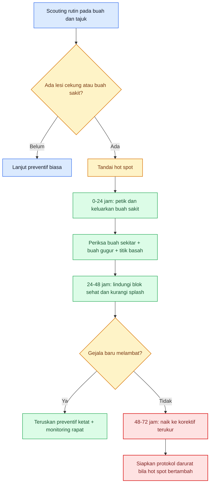

Diagram ini merangkum inti Bab 7: **gejala awal harus diperlakukan sebagai sinyal keputusan**, bukan ditunggu menjadi bukti kerusakan besar. Dasarnya berasal dari kewajiban frequent scouting, hot-spot removal, dan perlindungan buah berkembang yang ditegaskan sumber utama. ([NC State Extension][1])

[**Kembali ke Atas**](#pedoman-terpadu-mencegah-kehilangan-hasil-cabai-rawit-dan-cabai-besar-akibat-antraknose)

---

# Bab 8. Program Tindakan per Fase: Apa yang Harus Dilakukan dari Sebelum Tanam sampai Akhir Produksi

Bab ini menerjemahkan seluruh konsep sebelumnya menjadi **SOP kebun**. Prinsipnya sederhana: tiap fase tanaman punya **tujuan pengendalian** yang berbeda. NC State memberi kerangka yang jelas: gunakan **benih bebas patogen**, rotasi, hindari overhead irrigation, pakai mulsa sebagai barrier, jaga drainase, lakukan scouting sering, dan buang buah terinfeksi segera. Rutgers menambahkan bahwa pada kebun dengan riwayat penyakit, pengamatan harus diperketat sejak buah kecil mulai berkembang, dan pada hot spot semua buah di area itu harus diambil. Dengan dua fondasi ini, program tindakan per fase bisa dibuat sangat praktis. ([NC State Extension][1])

## 8.1 Sebelum tanam

Pada fase ini, target pengendalian adalah **memotong peluang penyakit masuk dan bertahan**. Kegiatannya mencakup sanitasi residu tanaman, pemilihan benih sehat, rotasi ke non-inang, pembenahan drainase, dan pemasangan mulsa sebagai barrier splash. NC State dan Bayer sama-sama menempatkan langkah-langkah ini sebagai fondasi utama sebelum bicara fungisida. Jadi sebelum tanam, pertanyaan utamanya bukan “apa yang akan disemprot”, tetapi “apakah kebun sudah dipersulit bagi spora untuk bertahan dan berpindah”. ([NC State Extension][1])

## 8.2 Persemaian

Pada persemaian, targetnya adalah **mencegah inokulum ikut pindah ke blok produksi**. Gunakan benih sehat, media bersih, sanitasi persemaian, dan singkirkan bibit yang meragukan. Materi WorldVeg menekankan penggunaan pathogen-free seeds/seedlings dan pembuangan bibit sakit, sementara SOP nasional cabai rawit menunjukkan bahwa program biologis seperti **Pseudomonas fluorescens**, **Trichoderma spp.**, dan **Gliocladium spp.** memang paling logis dimulai dari sini. Secara praktis, persemaian harus diperlakukan sebagai gerbang karantina. ([WorldVeg][5])

## 8.3 Pindah tanam–vegetatif awal

Setelah pindah tanam, targetnya adalah **mencegah introduksi inokulum dari tanah dan percikan air**. Pada fase ini, mulsa harus berfungsi, drainase harus lancar, penyiraman harus meminimalkan splash, dan tanaman muda harus cepat pulih. NC State menegaskan pentingnya barrier antara tanah dan tanaman, serta penghindaran overhead irrigation. Bila fase ini dilalui dengan baik, kebun masuk vegetatif dengan tekanan inokulum yang lebih rendah. ([NC State Extension][1])

## 8.4 Vegetatif lanjut

Pada vegetatif lanjut, targetnya berubah menjadi **menahan pembentukan kondisi kebun yang menguntungkan penyakit**. Fokusnya ada pada aerasi tajuk, kebersihan bawah kanopi, dan disiplin sanitasi. Pada fase ini banyak kebun mulai salah arah karena tajuk dibiarkan terlalu rapat dan permukaan kebun mulai kotor. Padahal, ketika buah pertama muncul nanti, kondisi-kondisi ini akan menjadi bahan bakar epidemi. Ini adalah inferensi operasional dari pentingnya prolonged wetness, drainase, dan canopy management yang ditekankan sumber utama. ([NC State Extension][1])

## 8.5 Awal berbunga

Awal berbunga adalah fase ketika kebun harus berubah dari “sekadar rapi” menjadi **siap melindungi buah yang akan terbentuk**. Rutgers menulis bahwa program perlindungan anthracnose harus dimulai **as soon as plants start to flower** atau **as soon as small fruit begin to develop**, dan NC State menyebut aplikasi preventif paling logis sejak **first fruit set**. Jadi, titik ini adalah gerbang fase ekonomi antraknose. Siapa yang terlambat memulai di sini, biasanya akan mengejar penyakit saat penyakit sudah lebih cepat darinya. ([Plant & Pest Advisory][3])

## 8.6 Pembentukan buah

Pada pembentukan buah, target pengendalian adalah **menjaga buah berkembang tetap bersih dari lesi awal dan memotong hot spot secepat mungkin**. NC State menyebut buah dapat terinfeksi pada berbagai tahap dan lesi sering baru tampak kemudian, sedangkan Rutgers menekankan strip-picking pada area yang mulai menunjukkan hot spot. Karena itu, fase buah berkembang menuntut monitoring paling disiplin: buah bagian bawah, buah yang mulai berubah warna, dan buah di area dengan kelembapan lebih tinggi harus diperiksa lebih dulu. ([NC State Extension][1])

## 8.7 Panen bertahap

Panen bukan akhir pengendalian; justru pada antraknose panen adalah bagian langsung dari pengendalian. Buah yang sakit atau terlambat dipanen dapat menjadi sumber sporulasi aktif, sementara infeksi laten dapat baru tampak saat buah mendekati matang. Karena itu, pada panen bertahap kebun harus menerapkan **sortasi ketat, pemungutan buah sakit, dan jangan meninggalkan buah busuk di tanaman maupun di lorong**. Ini selaras dengan NC State yang menekankan immediate removal of infected fruit dan dengan Rutgers yang menekankan strip-picking hot spot. ([NC State Extension][1])

## 8.8 Saat musim hujan atau kelembapan ekstrem

Pada musim hujan atau kelembapan ekstrem, SOP kebun tidak boleh sama dengan SOP musim normal. Rutgers menulis bahwa **heavy rain and wind can cause pepper anthracnose to flare up quickly**, dan NC State menyebut excess rain meningkatkan infeksi dan kehilangan hasil. Dalam fase ini, monitoring harus dinaikkan, sanitasi dipercepat, dan evaluasi pascahujan menjadi rutinitas. Ini adalah titik ketika antraknose bisa berubah dari masalah kebun menjadi masalah panen hanya dalam hitungan hari. ([NC State Extension][1])

## 8.9 Saat gejala masih rendah

Saat gejala masih rendah, tujuan utamanya adalah **menjaga agar penyakit tetap lokal**. Artinya, kebun harus tetap pada ritme preventif yang kuat: sanitasi, pemungutan buah sakit, pengelolaan air, dan perlindungan preventif yang terarah ke buah berkembang. Banyak petani salah di fase ini karena merasa gejalanya “baru sedikit”. Padahal, untuk antraknose, fase gejala rendah adalah saat terbaik untuk memotong sumber inokulum. Ini langsung mengikuti prinsip Rutgers bahwa hot spot yang baru muncul harus segera di-strip-pick. ([Plant & Pest Advisory][4])

## 8.10 Saat gejala mulai naik

Begitu gejala mulai naik, SOP kebun harus bergerak dari “pemeliharaan” menjadi **penekanan cepat**. Fokusnya adalah melokalisasi hot spot, mengeluarkan buah sakit, mempercepat panen yang layak, dan menilai apakah gejala masih dapat ditahan dengan langkah korektif awal atau sudah perlu eskalasi lebih jauh. Pada fase ini, keterlambatan keputusan beberapa hari sangat mahal, terutama pada musim basah. Kalimat ini adalah sintesis operasional dari seluruh sumber utama yang menekankan scouting, hot spot management, dan cepatnya penyakit flare up dalam kondisi lembap. ([Plant & Pest Advisory][3])

## Tabel 3. Program tindakan per fase

| Fase tanaman                 | Target pengendalian                        | Tindakan preventif                                               | Tindakan monitoring                                  | Tindakan korektif awal                           | Catatan khusus musim hujan/musim lembap                    |
| ---------------------------- | ------------------------------------------ | ---------------------------------------------------------------- | ---------------------------------------------------- | ------------------------------------------------ | ---------------------------------------------------------- |
| Sebelum tanam                | Memotong sumber inokulum                   | Sanitasi residu, rotasi, benih sehat, mulsa, drainase            | Pemetaan lahan rawan dan riwayat penyakit            | Bersihkan total sumber sakit sebelum bibit masuk | Jangan masuk musim hujan dengan residu dan drainase buruk  |
| Persemaian                   | Mencegah inokulum terbawa bibit            | Media bersih, benih sehat, biofungisida awal, siram tanpa splash | Cek bibit tidak seragam dan kelembapan persemaian    | Buang bibit mencurigakan                         | Persemaian lembap adalah pintu masuk masalah besar         |
| Pindah tanam–vegetatif awal  | Menahan introduksi dari tanah/splash       | Mulsa aktif, drainase baik, air diarahkan ke akar                | Cek area rendah dan tajuk bawah setelah hujan        | Benahi titik basah dan tanaman lemah             | Splash pada fase awal membangun masalah tersembunyi        |
| Vegetatif lanjut             | Menjaga kebun tidak menjadi terlalu lembap | Sanitasi bawah kanopi, kebersihan lorong, tata tajuk             | Cek canopy lambat kering dan buah/bunga sisa sakit   | Rapikan tajuk, bersihkan sumber inokulum         | Kanopi rapat memperpanjang wetness period                  |
| Awal berbunga                | Memulai perlindungan fase ekonomi          | Proteksi preventif sejak bunga/fruit set                         | Intensifkan cek area rawan sebelum buah banyak       | Koreksi cepat bila ada hot spot pertama          | Titik mulai proteksi tidak boleh terlambat                 |
| Pembentukan buah             | Menjaga buah berkembang tetap sehat        | Lanjut proteksi terarah ke buah, sanitasi ketat                  | Periksa lesi awal pada buah muda dan hampir matang   | Strip-pick area panas dan keluarkan buah sakit   | Ini fase paling mahal bila salah timing                    |
| Panen bertahap               | Menjaga mutu dan memotong sporulasi        | Sortasi ketat, jangan tinggalkan buah sakit                      | Cek buah matang, buah gugur, dan area panen terakhir | Singkirkan sumber baru setiap selesai petik      | Panen adalah bagian dari pengendalian                      |
| Musim hujan / lembap ekstrem | Menahan flare-up cepat                     | Semua lapisan preventif diperketat                               | Monitoring harian pada blok rawan dan pascahujan     | Respons 24–72 jam tanpa menunda                  | Dalam cuaca seperti ini penyakit bergerak jauh lebih cepat |
| Saat gejala masih rendah     | Menjaga penyakit tetap lokal               | Pertahankan ritme preventif penuh                                | Fokus hot spot pertama dan buah sekitar              | Strip-pick lokal dan sanitasi agresif            | Ini fase terbaik memotong epidemi                          |
| Saat gejala mulai naik       | Menekan sebelum menjadi blok-wide          | Perkuat seluruh lapis preventif                                  | Cek perluasan titik sakit dari hari ke hari          | Naik ke korektif terukur dan proteksi blok sehat | Jangan tunggu semua buah menunjukkan gejala                |

Tabel ini adalah **SOP operasional hasil sintesis** dari NC State, Rutgers, Bayer, WorldVeg, dan materi Hortikultura Indonesia: mulai dari seed/transplant hygiene, management of splash, perlindungan sejak flowering/fruit set, hot-spot removal, hingga peningkatan intensitas saat musim hujan. ([NC State Extension][1])

## Rumusan praktis Bab 8

Kalau Bab 8 diperas menjadi satu aturan kerja, maka aturannya adalah: **setiap fase tanam harus punya target pengendalian yang berbeda, tetapi semuanya diarahkan pada tujuan yang sama: menekan inokulum, membatasi splash, menjaga buah berkembang tetap terlindungi, dan memutus hot spot sebelum penyakit menjadi masalah hamparan**. Inilah yang membuat SOP antraknose terasa seperti sistem kerja kebun, bukan reaksi panik saat buah mulai busuk. ([NC State Extension][1])

**Diagram Bab 8** berikut merangkum alur SOP per fase dalam bentuk vertikal agar tetap enak dibaca di layar HP.

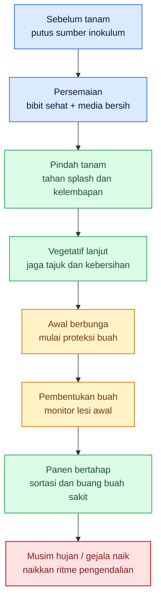

Diagram ini menutup Bab 8 dengan satu pesan: **SOP antraknose harus bergerak mengikuti fase tanaman**, bukan mengikuti kepanikan sesaat. Dasarnya berasal dari penekanan sumber-sumber utama bahwa perlindungan paling efektif dimulai sebelum penyakit mapan dan harus diarahkan ke buah yang sedang berkembang. ([NC State Extension][1])

[1]: https://content.ces.ncsu.edu/anthracnose-of-pepper 'Anthracnose of Pepper | NC State Extension Publications'
[2]: https://www.upnyk.ac.id/berita/cuaca-ekstrem-picu-lonjakan-penyakit-cabai-antraknosa-jadi-ancaman-serius-di-2026 'Cuaca Ekstrem Picu Lonjakan Penyakit Cabai, Antraknosa Jadi Ancaman Serius di 2026 | UPN VETERAN Yogyakarta'
[3]: https://plant-pest-advisory.rutgers.edu/preparing-for-pepper-anthracnose/ 'Preparing for Pepper Anthracnose — Plant & Pest Advisory'
[4]: https://plant-pest-advisory.rutgers.edu/controlling-pepper-anthracnose/ 'Controlling Pepper Anthracnose — Plant & Pest Advisory'
[5]: https://worldveg.tind.io/record/39488/files/05-620%20Intl%20Cooperators%20Guide_cultural%20practices%20for%20chili%20pepper%20%28rev%20Apr2021%29.pdf?utm_source=chatgpt.com 'Suggested Cultural Practices for Chili Pepper'

[**Kembali ke Atas**](#pedoman-terpadu-mencegah-kehilangan-hasil-cabai-rawit-dan-cabai-besar-akibat-antraknose)

---

# Bab 9. Pengendalian Biologis dan Non-Kimia sebagai Tulang Punggung Stabilitas Kebun

Kesalahan paling umum di lapang adalah menganggap pengendalian hayati untuk antraknose sebagai “versi lemah” dari fungisida kimia. Cara pikir itu salah. Pada antraknose cabai, backbone pengendalian justru ada pada **sanitasi buah sakit, tajuk yang cepat kering, air yang tidak memercikkan spora, rotasi yang benar, dan biofungisida yang masuk sejak dini**. NC State menulis bahwa penyakit menyebar melalui **rain splash** dan **overhead irrigation**, patogen dapat bertahan pada **benih, tanah, dan residu tanaman**, serta buah terinfeksi harus **segera dibuang**. Rutgers menegaskan lagi bahwa begitu anthracnose mapan di lapang, penyakit menjadi sangat sulit dikendalikan. Jadi, pengendalian hayati untuk antraknose harus dibaca sebagai alat untuk **menahan epidemi tetap rendah**, bukan alat yang dipanggil terakhir saat buah sudah banyak busuk. ([content.ces.ncsu.edu][1])

## 9.1 Arsitektur pengendalian hayati dan non-kimia

Pada antraknose, pengendalian hayati dan non-kimia bekerja sebagai satu sistem. **Sanitasi** menurunkan sumber inokulum, **mulsa** mengurangi percikan tanah ke buah, **drainase dan tata air** menurunkan periode basah, **pengelolaan tajuk** mempercepat pengeringan, dan **biofungisida/agen hayati** menekan patogen atau memperkuat ketahanan tanaman. NC State secara eksplisit merekomendasikan **mulch as a barrier between soil and plants**, **no overhead irrigation**, **crop rotation**, **weed and volunteer control**, dan **immediate removal of infected fruit**. SOP Cabai Rawit Hiyung menambahkan penggunaan **Pseudomonas fluorescens**, **Trichoderma spp.**, dan **Gliocladium spp.** sejak fase benih dan persemaian. Artinya, agen hayati tidak berdiri sendiri; ia harus bekerja di dalam kebun yang memang didesain untuk memperlambat pergerakan Colletotrichum. ([content.ces.ncsu.edu][1])

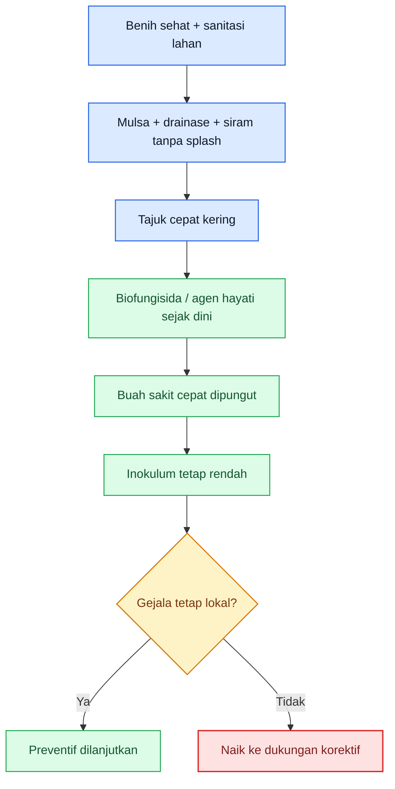

Diagram ini merangkum inti Bab 9: **biofungisida hanya efektif bila kebun lebih dulu menekan sumber inokulum, splash, dan kelembapan**. Dasarnya berasal dari NC State, Rutgers, dan SOP resmi budidaya cabai rawit. ([content.ces.ncsu.edu][1])

## 9.2 Agen hayati utama untuk antraknose cabai

Untuk konteks cabai di Indonesia, agen hayati yang paling jelas disebut dalam SOP resmi adalah **Pseudomonas fluorescens**, **Trichoderma spp.**, dan **Gliocladium spp.**. SOP Cabai Rawit Hiyung menuliskan bahwa benih untuk pengendalian busuk buah antraknosa direndam selama **6 jam** dalam larutan **Pf (Pseudomonas fluorescens)**, lalu **Trichoderma spp.** dan **Gliocladium spp.** diaplikasikan pada kantong persemaian **3 hari sebelum benih ditanam atau bersamaan dengan penanaman benih**. Dokumen yang sama menjelaskan bahwa Trichoderma dan Gliocladium bekerja melalui **hiperparasit**, **antibiosis**, **lisis**, dan **persaingan**. Ini penting, karena memberi kita fondasi yang jelas: pada antraknose cabai, backbone hayati resmi memang dimulai dari mikroba antagonis di fase awal musim.

Di luar SOP nasional, hasil penelitian juga menunjukkan bahwa kelompok mikroba lain dapat relevan. Studi dari Bali yang dipublikasikan di Frontiers menunjukkan bahwa formulasi **Paenibacillus polymyxa C1** mampu menurunkan **disease incidence** dan **disease intensity** antraknose pada cabai besar di kondisi greenhouse, sekaligus meningkatkan bobot buah sehat per tanaman; studi itu juga menemukan hubungan kuat bahwa makin sering aplikasi dilakukan, makin rendah intensitas penyakit. Pada bagian pembahasannya, studi yang sama menyebut bahwa bioagen seperti **Trichoderma asperellum**, **Pseudomonas fluorescens Pf-1**, dan **Bacillus subtilis B298** juga telah dilaporkan menurunkan intensitas antraknose atau menginduksi ketahanan pada cabai. Jadi, secara biologis, kelompok yang paling layak dipahami petani adalah: **Pseudomonas**, **Trichoderma/Gliocladium**, dan kelompok bakteri antagonis seperti **Paenibacillus/Bacillus**. ([Frontiers][2])

## 9.3 Fungsi tiap agen hayati atau biofungisida

**Pseudomonas fluorescens** paling masuk akal dipahami sebagai agen yang bekerja dekat fase benih, akar, dan permukaan tanaman melalui kompetisi, produksi senyawa antagonistik, dan penguatan respons tanaman. Studi Frontiers menyebut bahwa Pseudomonas fluorescens dapat menghasilkan **2,4-diacetylphloroglucinol** yang efektif menekan patogen jamur, sementara SOP nasional menempatkannya pada tahap **perendaman benih** untuk memulai perlindungan sejak awal. Dalam konteks kebun cabai, fungsi praktisnya adalah **menurunkan peluang inokulum bertahan pada fase awal** dan membantu tanaman masuk musim dalam kondisi lebih siap. ([Frontiers][2])

**Trichoderma spp.** dan **Gliocladium spp.** lebih mudah dipahami sebagai agen antagonis jamur di lingkungan rizosfer dan media persemaian. SOP nasional secara eksplisit menyebut mekanismenya: **hiperparasitisme, antibiosis, lisis, dan persaingan**. Sementara hasil penelitian yang muncul dalam temuan pencarian menunjukkan bahwa **Trichoderma sp.** dapat menurunkan keparahan penyakit pada buah cabai yang diinokulasi buatan, dan studi lain melaporkan bahwa kombinasi **T. asperellum** dan **T. harzianum** dapat menurunkan perkembangan antraknose pada buah cabai. Secara praktis, fungsi Trichoderma/Gliocladium pada artikel ini adalah **menekan patogen di lingkungan awal tanaman dan memperkuat lapisan biologis kebun**, bukan menjadi “obat” untuk buah yang sudah penuh lesi.

**Paenibacillus polymyxa** dan **Bacillus spp.** lebih relevan dipahami sebagai bakteri antagonis yang dapat menekan patogen sekaligus berpotensi menginduksi ketahanan. Studi Frontiers pada **P. polymyxa C1** menunjukkan penurunan insidensi dan intensitas antraknose serta peningkatan buah sehat, dan pembahasannya menyebut adanya senyawa volatil dan kerusakan hifa patogen pada uji sebelumnya. Sumber lain pada hasil pencarian juga menunjukkan bahwa **Bacillus spp.** dapat menginduksi ketahanan terhadap antraknose cabai. Jadi secara praktis, kelompok Bacillus/Paenibacillus paling logis diposisikan sebagai **penguat sistem biologis** yang membantu menjaga penyakit tetap di level rendah, terutama bila diaplikasikan berulang dan dini. ([Frontiers][2])

## 9.4 Waktu aplikasi ideal: di sini biasanya menang atau kalah

Untuk antraknose, waktu aplikasi ideal selalu **lebih awal daripada yang terasa perlu**. SOP Cabai Rawit Hiyung sangat jelas menempatkan Pseudomonas, Trichoderma, dan Gliocladium pada fase **benih dan persemaian**, bukan pada saat buah sudah busuk. Rutgers menegaskan bahwa pada kebun dengan riwayat pepper anthracnose, perlindungan harus dimulai **as soon as plants start to flower** atau **as soon as small fruit begin to develop**, sementara NC State menulis bahwa buah terinfeksi harus segera dibuang dan kebun harus sering dimonitor. Dari tiga sumber ini, aturan lapangnya tegas: **agen hayati dimulai sejak benih/persemaian, dipertahankan saat vegetatif, lalu diperkuat menjelang berbunga dan fruit set**. Ini adalah titik ketika pengendalian hayati masih punya ruang untuk bekerja sebelum penyakit menjadi epidemi buah.

Secara praktis, petani sebaiknya membayangkan tiga jendela waktu. Jendela pertama adalah **benih–persemaian**, saat pondasi biologis dipasang. Jendela kedua adalah **setelah pindah tanam sampai vegetatif lanjut**, saat tajuk, mulsa, drainase, dan kebersihan permukaan tanah dijaga agar agen hayati tidak bekerja sendirian. Jendela ketiga adalah **awal berbunga sampai buah mulai berkembang**, saat tekanan penyakit mulai masuk fase ekonomi dan kebun harus menjaga buah berkembang tetap bersih. Pembagian tiga jendela ini adalah **inferensi operasional** yang diturunkan dari SOP nasional serta waktu kritis yang ditekankan Rutgers dan NC State.

## 9.5 Syarat keberhasilan program hayati

Program hayati pada antraknose hanya akan tampak berhasil bila empat syarat utama terpenuhi. Pertama, **inokulum awal tidak dibiarkan tinggi**; ini berarti buah sakit, residu, dan sumber penyakit lain benar-benar dibersihkan. Kedua, **tajuk dan permukaan kebun tidak terlalu lembap**, karena splash dan wetness period panjang akan terus memberi keuntungan ke patogen. Ketiga, **program dimulai dini dan diulang**, bukan baru dijalankan setelah hot spot besar terbentuk. Keempat, **program tidak dipaksa bekerja sendirian** di kebun yang airnya salah, canopy-nya rapat, dan sanitasinya buruk. Keempat syarat ini merupakan sintesis langsung dari NC State, Rutgers, SOP nasional, dan studi Frontiers tentang frekuensi aplikasi P. polymyxa yang berkorelasi dengan penurunan intensitas penyakit. ([content.ces.ncsu.edu][1])

Dengan kata lain, biofungisida hanya efektif bila kebun memang memberi mereka kesempatan. Bila air terus memercik ke buah, buah sakit dibiarkan di bawah tajuk, dan hot spot tidak diputus, maka biofungisida akan terlihat “tidak manjur” padahal yang gagal adalah sistem kebunnya. Ini bukan teori abstrak; ini konsekuensi langsung dari sifat antraknose yang bertumpu pada **inokulum aktif + percikan air + buah rentan**. ([content.ces.ncsu.edu][1])

## 9.6 Sanitasi buah sakit sebagai inti non-kimia

Ini bagian yang harus ditulis paling tegas: **pengendalian hayati untuk antraknose tidak pernah bisa menggantikan sanitasi**. NC State menulis bahwa kebun harus sering dipantau dan buah terinfeksi **removed immediately**. Rutgers menulis bahwa bila hot spot ditemukan, semua buah dari area itu dan area sekitarnya perlu **strip-picked**, bahkan tanaman di hot spot bisa juga dibuang. Mereka juga menekankan bahwa buah terinfeksi yang dibiarkan di tanaman atau di lapang akan terus menjadi sumber inokulum. Jadi, dalam kebun cabai, sanitasi buah sakit adalah inti non-kimia yang tidak boleh dinegosiasikan. ([content.ces.ncsu.edu][1])

Secara lapang, maknanya sederhana: biofungisida tidak akan menyelamatkan kebun bila pekerja masih meninggalkan buah sakit di bawah kanopi, membiarkan buah busuk menempel di tanaman sampai panen berikutnya, atau memindahkan buah sakit tanpa prosedur pembuangan yang benar. Pada antraknose, satu buah sakit yang dibiarkan hari ini sering lebih merusak daripada satu aplikasi biofungisida yang dilewatkan. Kalimat terakhir adalah **inferensi praktis** dari kuatnya peran buah terinfeksi sebagai sumber inokulum dalam sumber-sumber utama. ([Plant & Pest Advisory][3])

## 9.7 Manajemen tajuk, drainase, dan percikan air

NC State menegaskan **do not use overhead irrigation** dan menyarankan sistem yang membatasi water splash. Bayer juga menulis bahwa **mulch and furrow or drip irrigate** membantu mengurangi penyebaran patogen dari splashing water, dan Rutgers memperingatkan bahwa hujan lebat dan angin dapat membuat antraknose flare up dengan cepat. Artinya, tulang punggung non-kimia tidak berhenti pada sanitasi; ia juga mencakup **cara air bergerak di kebun**. Dalam praktik, ini berarti drainase harus lancar, air diarahkan ke zona akar, tajuk tidak dibiarkan terlalu rapat, dan area yang paling lama basah harus menjadi prioritas perbaikan. ([content.ces.ncsu.edu][1])

Pengelolaan tajuk juga harus dibaca sebagai bagian dari strategi penyakit. Rutgers menyebut canopy yang tebal dan padat membuat pengendalian lebih sulit dan menciptakan **microclimates conducive for fruit infection**, terutama pada sistem fertilitas tinggi dan tanam rapat. Jadi, pada antraknose, tajuk bukan hanya urusan bentuk tanaman, tetapi urusan **berapa lama buah tetap basah** dan seberapa cepat spora dapat berpindah. Ini sebabnya pruning selektif dan pengaturan kerapatan tanaman harus tetap dianggap bagian dari backbone non-kimia. ([Plant & Pest Advisory][4])

## 9.8 Rotasi tanaman dan kebersihan lahan

Rotasi untuk antraknose bukan formalitas. NC State merekomendasikan rotasi ke **non-solanaceous crops selama 2–3 tahun** dan menghindari **strawberry** sebagai alternatif host. Rutgers juga menegaskan agar pepper tidak ditanam setelah atau dekat lahan yang berat dengan **pepper, tomato,** atau **strawberry**, karena sumber inokulum dapat bertahan dan memicu hot spot di musim berikutnya. Kebersihan lahan juga harus mencakup **weed control** dan pembuangan **solanaceous volunteers**, sebagaimana disebut NC State. Artinya, kebersihan lahan untuk antraknose bukan hanya membuang buah sakit, tetapi juga **memutus jembatan antar musim**. ([content.ces.ncsu.edu][1])

Bagi praktisi, ini berarti kebun yang baru selesai panen tidak boleh dibiarkan membawa penyakit ke musim berikutnya lewat debris, volunteer plants, atau rotasi semu di lahan yang sama. Backbone hayati akan selalu lebih kuat bila tekanan awal inokulum sudah ditekan dulu lewat rotasi dan sanitasi lahan. Ini adalah **inferensi operasional** dari rekomendasi rotasi dan penghancuran residu pada sumber utama. ([content.ces.ncsu.edu][1])

## 9.9 Kesalahan umum yang membuat pengendalian hayati terlihat gagal

Kesalahan pertama adalah **menganggap biofungisida sebagai pengganti sanitasi**. Kesalahan kedua adalah **baru memulai program saat hot spot sudah besar**. Kesalahan ketiga adalah **membiarkan air tetap memercik ke buah** dan tajuk tetap lembap, lalu menyalahkan produk hayati ketika gejala naik. Kesalahan keempat adalah **mengabaikan buah gugur dan residu busuk**. Kesalahan kelima adalah **menganggap satu kali aplikasi cukup untuk satu musim**. Semua kesalahan ini sebenarnya sudah terbaca dari sumber-sumber utama: NC State menekankan immediate removal of infected fruit, Rutgers menekankan early hot-spot stripping dan prevention is key, dan SOP nasional menempatkan agen hayati sejak benih/persemaian. Jadi ketika program hayati terlihat gagal, sering kali yang gagal bukan mikroba antagonisnya, tetapi **waktu, kelembapan, dan disiplin kebunnya**. ([content.ces.ncsu.edu][1])

## 9.10 Kapan pengendalian biologis cukup kuat, dan kapan perlu dukungan lain

Ini pertanyaan paling penting bagi praktisi. **Pengendalian biologis dan non-kimia cukup kuat** bila gejala masih **rendah dan lokal**, buah sakit bisa langsung dipungut, kebun cepat kering setelah hujan, hot spot belum melebar, dan sumber inokulum masih bisa diputus dengan sanitasi serta perlindungan preventif. Dasar logikanya datang dari NC State dan Rutgers: keduanya menekankan frequent scouting, immediate removal, dan hot-spot management untuk menahan epidemi tetap kecil. Jadi selama penyakit masih bisa dipertahankan pada level lokal, backbone hayati dan non-kimia masih layak menjadi alat utama. ([content.ces.ncsu.edu][1])

**Dukungan lain mulai dibutuhkan** bila hot spot bertambah cepat, buah sakit terus muncul setelah hujan, kebun punya riwayat berat, canopy terlalu padat, atau buah berkembang sudah memasuki fase ekonomi sementara penyakit belum tertahan. Dalam kondisi itu, backbone hayati tetap dipertahankan, tetapi kebun tidak boleh dipaksa bertahan hanya dengan mode preventif-biologis. Ia perlu **dukungan korektif** yang akan dibahas pada bab berikutnya. Ini adalah **inferensi operasional** dari sumber yang sama: begitu anthracnose mapan, pengelolaannya menjadi jauh lebih sulit, sehingga preventif saja tidak lagi cukup. ([Plant & Pest Advisory][3])

## Rumusan praktis Bab 9

Kalau Bab 9 diperas menjadi satu pegangan lapang, maka pegangannya adalah ini: **pada antraknose, pengendalian hayati yang benar dimulai sejak benih, hidup lewat sanitasi yang disiplin, diperkuat oleh tajuk yang cepat kering dan air yang tidak memercik, lalu dijaga terus sampai buah berkembang**. Pseudomonas, Trichoderma, Gliocladium, dan kelompok Bacillus/Paenibacillus bisa sangat berguna, tetapi mereka tidak akan menyelamatkan kebun yang membiarkan buah sakit tetap menjadi sumber spora. Jadi, pengendalian hayati untuk antraknose harus dipahami sebagai **mesin stabilitas kebun**, bukan pengganti sanitasi dan bukan alat yang selalu dipanggil paling akhir.

[1]: https://content.ces.ncsu.edu/anthracnose-of-pepper?utm_source=chatgpt.com 'Anthracnose of Pepper - NC State Extension Publications'
[2]: https://www.frontiersin.org/journals/sustainable-food-systems/articles/10.3389/fsufs.2021.782425/full 'Frontiers | Biocontrol of Anthracnose Disease on Chili Pepper Using a Formulation Containing Paenibacillus polymyxa C1'
[3]: https://plant-pest-advisory.rutgers.edu/controlling-pepper-anthracnose/?utm_source=chatgpt.com 'Controlling Pepper Anthracnose - Plant & Pest Advisory'
[4]: https://plant-pest-advisory.rutgers.edu/wp-content/uploads/2014/05/NJ-Ag-Convention-and-Trade-Show-Proceedings-2014.pdf?utm_source=chatgpt.com 'New Jersey Agricultural Convention and Trade Show'

[**Kembali ke Atas**](#pedoman-terpadu-mencegah-kehilangan-hasil-cabai-rawit-dan-cabai-besar-akibat-antraknose)

---

# Bab 10. Pengendalian Kuratif dan Kimia Berbasis Eskalasi

Pengendalian kimia pada antraknose harus diberi tempat yang tepat: **alat korektif dan eskalasi**, bukan kebiasaan yang dijalankan buta dari awal sampai akhir musim. NC State menulis bahwa fungisida untuk antraknose pepper **paling efektif bila diaplikasikan secara preventif sebelum penyakit terjadi**, dan aplikasi dianjurkan mulai **first fruit set** lalu diteruskan saat buah matang. Rutgers menegaskan hal yang sama dari sisi praktik lapang: program fungisida harus dimulai **saat berbunga atau fruit set**, scouting harus ditingkatkan, dan anthracnose pepper bisa **sangat sulit dikendalikan setelah mapan**. Jadi, logika Bab 10 bukan “obat apa yang paling keras”, tetapi **kapan kimia dibutuhkan dan bagaimana memakainya tanpa menghancurkan PHT**. ([content.ces.ncsu.edu][1])

## 10.1 Kapan kebun masuk fase kuratif

Kebun masuk fase kuratif ketika gejala tidak lagi bersifat insidental, melainkan mulai menunjukkan bahwa **backbone preventif tidak cukup menahan perkembangan penyakit**. Pada antraknose, tanda-tandanya antara lain: lesi cekung mulai muncul pada lebih dari satu titik, buah sakit baru muncul cepat setelah hujan, hot spot pertama mulai bertambah luas, atau kebun memasuki fase buah berkembang dalam kondisi lembap dengan riwayat penyakit yang jelas. Rutgers menulis bahwa pada lahan dengan riwayat pepper anthracnose, petani harus **scout on a daily basis** saat buah kecil mulai berkembang, dan hot spot harus dipotong sedini mungkin karena penyakit ini bisa cepat flare up pada hujan dan angin. Jadi fase kuratif dimulai bukan saat seluruh kebun rusak, tetapi saat **arah epidemi sudah mulai naik**. ([Plant & Pest Advisory][2])

## 10.2 Prinsip paling penting: tidak ada fungisida sakti

Pada antraknose cabai, **tidak ada fungisida sakti** yang bisa memperbaiki semua kesalahan sanitasi, air, tajuk, dan keterlambatan monitoring. NC State menegaskan bahwa fungisida paling efektif bila dipakai **preventif**, sedangkan Rutgers menulis bahwa anthracnose pepper **very difficult to control once established**. Ini artinya, pada fase penyakit yang sudah mapan, fungisida tidak bekerja sebagai “penghapus masalah”, tetapi sebagai alat untuk **menahan perluasan** sambil sanitasi dan pengurangan sumber inokulum tetap berjalan. Semakin lama petani menunggu, semakin kecil ruang gerak fungisida. ([content.ces.ncsu.edu][1])

## 10.3 Beda fungisida protektif vs kuratif

Untuk membaca fungisida dengan benar, petani harus membedakan **fungsi**, bukan sekadar nama dagang. NC State menulis bahwa fungisida paling efektif saat dipakai **before disease occurs**, dan pada daftar anthracnose pepper mereka menampilkan kombinasi kelompok **multisite/protectant** seperti **M1, M3, M5** dan kelompok **single-site atau campuran single-site** seperti **3, 7, 11, 11+3, 7+3, 7+11** dengan tingkat efektivitas yang berbeda. Dokumen Hortikultura Indonesia untuk **busuk buah antraknos cabai** juga menunjukkan spektrum FRAC yang sama, dari **tembaga (M1), mankozeb/propineb/ziram/klorotalonil (M1/M3/M5)** sampai **azoksistrobin (11), azoksistrobin+difenokonazol (11+3), tebuconazole/difenoconazole/hexaconazole (3)** dan campuran lain. Ini membuat pemisahan fungsi menjadi sangat praktis di lapang. ([content.ces.ncsu.edu][1])

Secara operasional, **fungisida protektif** adalah bahan yang paling masuk akal dibaca sebagai **pelindung permukaan** dan dasar program, terutama multisite seperti **M1/M3/M5**, yang pada panduan Rutgers juga ditempatkan sebagai **low-risk multi-site MOA** dan sering dipakai sebagai partner tank-mix atau rotasi untuk menekan resistensi. **Kuratif awal** adalah istilah kerja lapang untuk bahan single-site atau campuran yang dipakai **sangat dini ketika gejala pertama baru muncul atau saat hot spot kecil mulai terlihat**, bukan saat kebun sudah penuh buah sakit. Ini adalah **inferensi operasional** dari dua fakta resmi: fungisida paling efektif bila preventif, dan penyakit menjadi sangat sulit dikendalikan setelah mapan. ([Plant & Pest Advisory][3])

## 10.4 Rotasi FRAC / mode of action

Rotasi FRAC adalah aturan yang tidak boleh dilanggar. FRAC menegaskan bahwa fungisida dalam **FRAC MoA Group yang sama** diharapkan menunjukkan **cross resistance** bila resistensi lapang muncul, sehingga **tidak dianggap pasangan rotasi atau campuran yang layak** untuk manajemen resistensi. NC State juga menulis langsung pada tabel anthracnose pepper bahwa produk dengan **FRAC code yang sama harus dihindari pada aplikasi berturut-turut atau campuran** untuk meminimalkan perkembangan populasi resisten. Jadi, mengganti merek tanpa mengganti FRAC bukanlah rotasi. ([Frac][4])

Dalam praktik cabai, ini berarti bahan **M1/M3/M5** layak dibaca sebagai **partner protektif multisite berisiko lebih rendah**, sedangkan grup seperti **11**, **3**, **7**, atau campurannya harus dipakai dengan disiplin rotasi. Panduan Rutgers untuk manajemen resistensi juga menuliskan bahwa **chlorothalonil (M5), mancozeb (M3), dan fixed copper (M1)** adalah **low-risk multi-site**, sementara banyak grup bernomor membawa risiko resistensi sedang hingga tinggi dan harus dirotasi. Untuk cabai di Indonesia, daftar resmi Hortikultura menunjukkan pilihan FRAC yang cukup beragam untuk antraknose, sehingga rotasi berbasis kode FRAC memang praktis dilakukan bila petani disiplin membaca bahan aktifnya. ([Plant & Pest Advisory][3])

## 10.5 Timing aplikasi terhadap fase penyakit dan cuaca

Timing lebih menentukan daripada jumlah semprotan. Rutgers menulis bahwa pada kebun dengan riwayat anthracnose, fungisida preventif harus dimulai **saat flowering atau fruit set**, dan scouting harian diperlukan saat buah kecil mulai berkembang. NC State juga menegaskan bahwa aplikasi direkomendasikan mulai **first fruit set** dan dilanjutkan saat buah matang, sementara hujan berlebih dapat meningkatkan infeksi dan kehilangan hasil. Jadi, pada antraknose, fungisida paling masuk akal dijalankan **mendahului cuaca berisiko dan mendahului gejala berat**, bukan mengejar kebun yang sudah penuh lesi. ([content.ces.ncsu.edu][1])

Secara operasional, timing yang benar dapat dibagi menjadi tiga. Pertama, **protektif dasar** mulai saat **berbunga/fruit set** pada kebun rawan. Kedua, **kuratif awal** masuk ketika hot spot pertama muncul, tetapi masih kecil dan buah sakit masih bisa diputus cepat. Ketiga, **rescue** baru masuk ketika arah penyakit sudah naik cepat karena hujan, tetapi kebun masih punya cukup buah sehat untuk diselamatkan. Pembagian tiga timing ini adalah **inferensi kerja lapang** yang langsung mengikuti sumber-sumber utama. ([Plant & Pest Advisory][2])

## 10.6 Teknik aplikasi dan coverage buah/tajuk

Pada anthracnose, coverage bukan detail kecil. Rutgers menulis bahwa aplikasi harus memakai **heavy volume of water** dan **coverage is extremely good**, sementara MSU Extension menegaskan bahwa membuka kanopi dengan pruning/training membantu pengendalian dengan **mengurangi moisture/humidity** dan **improving spray penetration**. Karena target utama antraknose adalah **buah berkembang dan permukaan buah yang rentan**, semprotan yang hanya membasahi tajuk atas tetapi tidak menembus ke buah, bagian bawah kanopi, dan titik hot spot akan selalu kurang efektif. ([Plant & Pest Advisory][2])

MSU juga mengingatkan bahwa fungisida sistemik **tidak akan terdistribusi baik pada jaringan yang sudah mati atau sebagian mati**, sehingga buah yang sudah kolaps berat bukan target yang realistis untuk “diselamatkan” oleh fungisida. Buah seperti itu harus dikeluarkan, bukan dijadikan alasan menambah dosis. Ini sangat penting pada antraknose: coverage harus diarahkan untuk **melindungi buah sehat dan menahan lesi dini**, bukan untuk mencoba menghidupkan buah yang sudah rusak total. ([AgriCollege][5])

## 10.7 Kompatibilitas dan jeda dengan agen hayati

Setelah backbone hayati dibangun pada bab sebelumnya, fungisida tidak boleh masuk secara sembrono. UConn Extension menjelaskan bahwa **biofungisida adalah organisme hidup** yang **paling baik dipakai preventif** dan **harus selalu dipadukan dengan sanitasi serta cultural control**. Mereka juga menjelaskan bahwa pada penyakit foliar, biofungisida harus mencapai **leaf or flower zone** untuk membentuk penghalang defensif. Sementara itu, MSU menunjukkan bahwa beberapa kombinasi **tidak kompatibel**, misalnya **copper** dapat menginaktivasi biofungisida berbasis **Bacillus**, dan beberapa fungisida seperti **propiconazole, tebuconazole, dan triflumizole** dapat tidak kompatibel dengan **Trichoderma** tertentu. Jadi, urusan campur-tangki dan jeda bukan hal sepele.

Karena kompatibilitas tidak universal, aturan amannya adalah: **jangan tank-mix fungisida dengan agen hayati tanpa data kompatibilitas dari label atau produsen**, dan setelah fase korektif dilewati, kebun harus **segera dikembalikan ke ritme preventif-biologis**. Untuk Indonesia, pengecekan registrasi dan label resmi tetap penting melalui **SIPERINTIS/Kementan** dan dokumen daftar pestisida cabai dari Hortikultura. Ini bukan sekadar legalitas, tetapi juga cara paling aman membaca apakah satu produk memang layak dipakai untuk cabai dan penyakit sasarannya. ([@ppvtpp][6])

## 10.8 Kesalahan kimia yang paling merugikan

Kesalahan pertama adalah **mengulang FRAC yang sama** karena merasa sudah “ganti merek”. Kesalahan kedua adalah **memulai fungisida setelah penyakit mapan**, padahal sumber resmi berulang kali menegaskan fungisida paling efektif secara preventif. Kesalahan ketiga adalah **coverage buruk**: air terlalu sedikit, semprotan hanya mengenai daun atas, atau tajuk terlalu rapat sehingga buah tidak tercapai. Kesalahan keempat adalah **tidak memotong hot spot**, sehingga fungisida dipaksa mengejar jutaan spora yang terus diproduksi buah sakit. Kesalahan kelima adalah **menganggap semua kombinasi aman untuk agen hayati**, padahal beberapa campuran justru dapat menonaktifkan biofungisida. ([content.ces.ncsu.edu][1])

## Rumusan praktis Bab 10

Kalau Bab 10 diperas menjadi satu aturan kerja, maka aturannya adalah: **fungisida dibaca menurut fungsi, bukan merek**. Protektif dipakai untuk menjaga buah yang belum sakit; kuratif awal dipakai sangat cepat saat hot spot pertama muncul; rescue dipakai ketika penyakit sedang naik cepat, tetapi masih ada blok sehat yang layak dilindungi. Rotasi FRAC wajib, coverage ke buah dan tajuk wajib, dan sesudah tekanan turun kebun harus kembali ke backbone PHT, bukan terus hidup dari semprotan buta. ([content.ces.ncsu.edu][1])

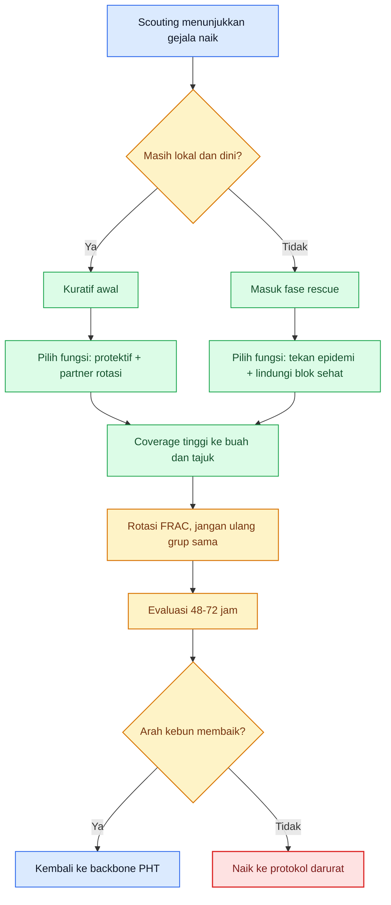

Diagram ini merangkum inti Bab 10: fungisida masuk sebagai **eskalasi berbasis fungsi**, lalu harus mengembalikan kebun ke PHT setelah tekanan turun. Dasarnya berasal dari NC State, Rutgers, dan FRAC. ([content.ces.ncsu.edu][1])

[**Kembali ke Atas**](#pedoman-terpadu-mencegah-kehilangan-hasil-cabai-rawit-dan-cabai-besar-akibat-antraknose)

---

# Bab 11. Protokol Darurat: Saat Kebun Masuk Risiko Tinggi Kehilangan Hasil

Bab ini dipakai ketika kebun **tidak lagi dalam kondisi normal**. Yang disebut mode darurat pada antraknose bukan sekadar ada buah busuk, tetapi saat gejala, cuaca, dan sumber inokulum bergerak lebih cepat daripada ritme pengendalian biasa. Rutgers menulis bahwa **heavy rain and wind can cause pepper anthracnose to flare up quickly**, hot spot harus diputus saat pertama muncul, dan pada lahan berisiko tinggi petani harus **scout daily**. NC State menambahkan bahwa hujan berlebih dapat menaikkan infeksi dan crop loss, dan buah terinfeksi harus segera dibuang. Jadi, mode darurat dimulai ketika kebun membutuhkan **protokol tegas**, bukan lagi respons setengah-setengah. ([Plant & Pest Advisory][2])

## 11.1 Indikator kebun masuk mode darurat

Kebun masuk mode darurat bila beberapa sinyal muncul bersamaan: **buah berkembang banyak**, **hot spot pertama tidak lagi tunggal**, **buah sakit muncul cepat sesudah hujan**, **tajuk tetap lembap lama**, dan **buah sakit mulai tertinggal di tanaman atau di lorong**. Gejala dominan pada beberapa titik sekaligus menunjukkan bahwa penyakit tidak lagi lokal. Rutgers menulis bahwa hot spot harus segera di-strip-pick saat pertama terlihat; implikasinya, bila hot spot sudah bertambah atau bergabung, kebun telah melewati tahap nyaman dan masuk zona berisiko tinggi. ([Plant & Pest Advisory][2])

## 11.2 Protokol 72 jam pertama

Pada **0–24 jam pertama**, tujuan utamanya adalah **membekukan penyebaran**. Tandai hot spot, petik semua buah bergejala dari titik itu, ambil juga buah sakit yang gugur, dan hentikan kebiasaan membiarkan buah busuk menempel di tanaman. Rutgers menulis bahwa **strip picking and removing all fruit from hot spots when they first appear** dapat membantu menekan penyebaran, sedangkan NC State menegaskan **infected fruits should be removed immediately**. Jadi, 24 jam pertama bukan saat untuk menunggu, tetapi saat untuk **mengurangi sumber sporulasi** secepat mungkin. ([Plant & Pest Advisory][2])

Pada **24–48 jam**, fokus pindah ke **perlindungan blok sehat**. Periksa area sekitar hot spot, evaluasi titik basah, perbaiki drainase bila ada genangan lokal, dan pastikan perlindungan ke buah berkembang di blok sehat tidak terlambat. Pada fase ini kebun juga harus menentukan apakah gejala dominan berada di **buah hijau/berkembang** atau di **buah matang**, karena keputusan panen dan perlindungan berikutnya akan berbeda. Ini adalah **inferensi operasional** dari sumber resmi yang menekankan bahwa infeksi pada buah bisa laten lalu tampak saat matang, dan bahwa hot spot harus diputus sejak awal. ([content.ces.ncsu.edu][1])

Pada **48–72 jam**, kebun harus bisa menjawab satu pertanyaan: **arah penyakit sudah ditahan atau belum**. Bila hot spot baru tetap muncul, buah sakit terus bertambah, atau blok sehat mulai tertular meski sanitasi awal sudah dilakukan, maka rescue belum berhasil dan kebun harus naik ke tindakan yang lebih tegas. Sebaliknya, bila gejala baru melambat dan fokus sakit mulai terlokalisasi, kebun masih bisa diselamatkan tanpa masuk ke keputusan paling ekstrem. Ini adalah **inferensi keputusan lapang** dari prinsip bahwa anthracnose sangat sulit dikendalikan setelah mapan, sehingga arah penyakit harus dibaca sangat cepat. ([Plant & Pest Advisory][2])

## 11.3 Tindakan saat gejala dominan di buah hijau

Bila gejala dominan terlihat pada **buah hijau atau buah yang masih berkembang**, situasinya lebih serius dari yang tampak. NC State menjelaskan bahwa **immature fruits may not show symptoms until fully mature**, yang berarti gejala pada buah hijau menandakan bahwa inokulum sudah aktif cukup awal dalam siklus buah. Pada kondisi ini, prioritasnya adalah **memutus hot spot**, melindungi buah berkembang di sekitarnya, dan menaikkan ketelitian monitoring pada buah yang secara visual masih tampak sehat. Secara praktis, ini berarti kebun tidak boleh menunggu sampai buah berubah warna untuk bertindak. ([content.ces.ncsu.edu][1])

## 11.4 Tindakan saat gejala dominan di buah matang

Bila gejala dominan berada pada **buah matang atau hampir matang**, situasinya sedikit berbeda. NC State menulis bahwa **ripe and over-ripe fruit tend to be more susceptible**, dan infeksi laten bisa baru tampak saat buah mendekati matang. Pada kondisi ini, selain memotong hot spot, kebun harus **mengetatkan jadwal panen dan sortasi**, karena buah yang dibiarkan terlalu lama di tanaman memberi lebih banyak waktu untuk sporulasi dan kehilangan mutu. Secara praktis, ketika gejala dominan pada buah matang, kebun perlu berpikir **panen cepat + sortasi ketat + sanitasi** sebagai satu paket, bukan sekadar menambah semprotan. ([content.ces.ncsu.edu][1])

## 11.5 Perlindungan blok sehat

Dalam mode darurat, fokus kebun tidak boleh tersedot hanya ke area yang sudah sakit. Blok sehat justru harus diperlakukan sebagai **aset yang sedang dipertahankan**. Rutgers menulis bahwa strip-picking hot spot dilakukan untuk **help suppress spread of the pathogen**, yang secara praktis berarti area sehat harus segera dibentengi agar tidak menjadi hot spot berikutnya. Perlindungan blok sehat mencakup: memastikan tidak ada buah sakit yang tertinggal di tepi hot spot, menjaga buah berkembang tetap terlindungi, dan menghindari aktivitas yang memperbesar splash dari area sakit ke area bersih. Ini adalah **inferensi operasional** dari mekanisme penyebaran rain splash yang ditekankan NC State dan konsep hot-spot suppression dari Rutgers. ([Plant & Pest Advisory][2])

## 11.6 Pengumpulan dan pemusnahan buah sakit

Pada antraknose, buah sakit harus diperlakukan sebagai **bahan infeksi**, bukan sekadar hasil afkir. NC State menulis bahwa buah terinfeksi harus **removed immediately**, dan residu tanaman harus dihancurkan segera setelah panen. Rutgers menegaskan bahwa buah dari hot spot perlu **diambil dan dikeluarkan**. Secara praktis, prosedur paling aman adalah: petik semua buah sakit, kumpulkan terpisah dari buah sehat, keluarkan dari area produksi pada hari yang sama, lalu musnahkan sesuai prosedur kebun atau aturan lokal sehingga buah itu **tidak lagi bisa menjadi sumber percikan balik**. Bagian akhir ini adalah **inferensi praktis** yang langsung diturunkan dari kewajiban remove/destroy pada sumber resmi. ([content.ces.ncsu.edu][1])

## 11.7 Pengetatan jadwal panen

Panen adalah alat rescue yang sering diremehkan. Pada buah matang, penundaan panen memberi lebih banyak waktu bagi infeksi laten untuk tampil dan bagi lesi aktif untuk bersporulasi. Karena NC State menyebut buah matang/terlalu matang lebih rentan, maka saat mode darurat panen harus dipercepat untuk **mengurangi waktu buah rentan berada di kebun**. Secara praktis, pengetatan jadwal panen paling masuk akal ketika kebun sedang lembap, gejala mulai terlihat di buah matang, dan hot spot masih bisa dibatasi. Ini adalah **inferensi operasional** dari sifat kerentanan buah matang dan peran sortasi-sanitasi dalam pengendalian. ([content.ces.ncsu.edu][1])

## 11.8 Bagaimana menilai keberhasilan rescue

Rescue dikatakan **berhasil** bila dalam 48–72 jam hot spot tidak bertambah cepat, gejala baru melambat, buah sakit bisa dikeluarkan lebih cepat daripada kemunculan buah sakit baru, dan blok sehat masih tetap relatif bersih. Keberhasilan rescue pada antraknose **bukan berarti penyakit hilang total**, tetapi arah kebun sudah berbalik dari memburuk menjadi lebih terkendali. Ini konsisten dengan sumber resmi yang menekankan **suppression of spread**, bukan ilusi penyembuhan instan. ([Plant & Pest Advisory][2])

Rescue dikatakan **gagal** bila setelah sanitasi awal dan tindakan korektif, hot spot baru masih terus muncul, gejala setelah hujan berikutnya melonjak lagi, atau blok sehat mulai menunjukkan gejala di banyak titik. Pada kondisi itu, kebun tidak lagi cukup ditangani dengan rescue terbatas; ia harus naik ke **tindakan ekstrim** pada Bab 12. Ini adalah **inferensi keputusan lapang** dari fakta resmi bahwa anthracnose very difficult to control once established. ([Plant & Pest Advisory][2])

## Rumusan praktis Bab 11

Kalau Bab 11 diperas menjadi satu aturan kerja, maka aturannya adalah: **saat kebun masuk risiko tinggi, hentikan pola pikir menunggu dan pindah ke protokol**. Dalam 24 jam pertama kurangi sumber sporulasi. Dalam 48 jam lindungi blok sehat. Dalam 72 jam putuskan apakah arah penyakit sudah tertahan. Rescue yang baik bukan yang paling heboh, tetapi yang paling cepat mengembalikan penyakit dari mode flare-up menjadi masalah yang masih bisa dikendalikan. ([Plant & Pest Advisory][2])

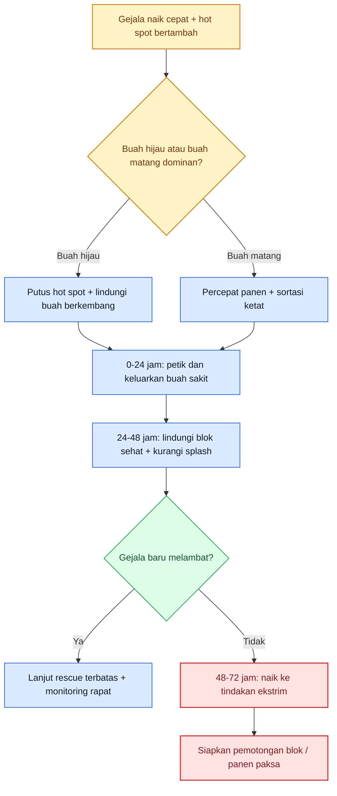

Diagram ini merangkum Bab 11: mode darurat harus mengubah kebun dari ritme biasa menjadi ritme keputusan cepat. Dasarnya berasal dari Rutgers dan NC State. ([Plant & Pest Advisory][2])

[**Kembali ke Atas**](#pedoman-terpadu-mencegah-kehilangan-hasil-cabai-rawit-dan-cabai-besar-akibat-antraknose)

---

# Bab 12. Tindakan Ekstrim dan Penutup Musim: Kapan Blok Harus Dikurangi, Dipanen Paksa, atau Dimusnahkan

Bab terakhir harus ditulis dengan tegas, karena pada antraknose keputusan paling mahal sering bukan keputusan menyemprot, tetapi keputusan **mengorbankan sebagian hasil untuk menyelamatkan sisanya**. NC State meminta buah terinfeksi **removed immediately** dan residu tanaman **destroyed immediately after harvest**, sedangkan Rutgers menulis bahwa di hot spot pertama semua buah di area itu bisa perlu **strip-picked** dan diambil keluar. Ini menunjukkan bahwa pada antraknose, tindakan ekstrim bukan tanda menyerah, tetapi salah satu bentuk pengendalian yang justru paling rasional. ([content.ces.ncsu.edu][1])

## 12.1 Kapan buah sakit harus disortir dan dimusnahkan

Buah sakit harus disortir dan dikeluarkan **sejak gejala pertama terlihat**, bukan menunggu jumlahnya banyak. Lesi antraknose aktif menghasilkan massa spora yang oleh Rutgers digambarkan dapat berjumlah sangat besar dan akan tersebar lagi oleh hujan serta angin. Karena itu, setiap buah yang sudah berlesi cekung dan aktif bersporulasi adalah **mesin penyebaran**. Secara praktis, buah seperti ini harus dipisahkan dari jalur panen normal dan dikeluarkan dari area produksi sesegera mungkin. ([Plant & Pest Advisory][2])

## 12.2 Kapan tanaman atau blok harus dipangkas atau dikorbankan

Tidak ada angka universal yang berlaku untuk semua kebun, tetapi secara lapang blok mulai layak dipikirkan untuk **dikurangi, dipanen paksa, atau dikorbankan** ketika beberapa hal terjadi bersamaan: hot spot bertambah dan saling mendekat, rescue tidak lagi melambatkan gejala baru, buah sakit terus tertinggal walau panen dipercepat, dan cuaca tetap sangat mendukung penyakit. Ini adalah **inferensi operasional** dari dua fakta resmi: anthracnose sangat sulit dikendalikan setelah mapan, dan hot spot harus diputus sejak pertama muncul. Bila kebun sudah melewati tahap itu, mengorbankan sebagian area sering lebih murah daripada membiarkan satu blok menjadi pusat sporulasi untuk seluruh hamparan. ([Plant & Pest Advisory][2])

## 12.3 Logika ekonomi: cabut atau akhiri blok lebih dini vs membiarkan sumber spora bertahan

Pada antraknose, keputusan ekstrem harus dilihat dengan logika ekonomi, bukan emosi. Buah yang sudah rusak berat hampir tidak punya nilai pasar, tetapi tetap punya **nilai bahaya** karena terus memproduksi spora. NC State menegaskan bahwa buah matang dan terlalu matang lebih rentan, dan bahwa excess rain dapat meningkatkan crop loss. Rutgers menegaskan bahwa hot spot harus dipotong sejak awal. Maka secara ekonomi, sering lebih murah **menghentikan blok lebih dini** atau **melakukan panen paksa yang disortir ketat** daripada mempertahankan blok yang sudah berubah menjadi pusat penyebaran. Ini adalah **inferensi ekonomi praktis** dari hubungan antara sporulasi, cuaca, dan flare-up. ([content.ces.ncsu.edu][1])

## 12.4 Cara memusnahkan buah dan residu tanaman

Sumber resmi memberi arah yang tegas: buah sakit harus **dikeluarkan segera**, dan residu tanaman harus **dihancurkan segera setelah panen**. Secara praktis, prosedur minimumnya adalah: petik dan pungut semua buah sakit termasuk yang gugur, kumpulkan terpisah, keluarkan dari area budidaya pada hari yang sama, lalu musnahkan menurut prosedur kebun atau aturan lokal sehingga buah dan residu itu **tidak kembali menjadi sumber splash atau inokulum**. Yang tidak boleh dilakukan adalah membiarkan buah sakit di bedengan, lorong, pematang, atau tumpukan residu terbuka di tepi kebun. Langkah operasional di akhir kalimat adalah **inferensi praktis** dari kewajiban remove/destroy pada sumber resmi. ([content.ces.ncsu.edu][1])

## 12.5 Sanitasi akhir musim

Akhir musim adalah saat penting untuk memutus jembatan penyakit ke musim berikutnya. NC State secara eksplisit meminta **destroy crop residue immediately after harvest**, dan juga merekomendasikan rotasi ke **non-solanaceous crops selama 2–3 tahun** serta menghindari **strawberry** sebagai alternative host. Jadi, penutup musim yang benar untuk antraknose bukan sekadar selesai panen, tetapi **membersihkan sumber inokulum, menutup lubang epidemi, dan menyiapkan lahan agar tidak memulai musim berikutnya dalam keadaan kotor penyakit**. ([content.ces.ncsu.edu][1])

## 12.6 Evaluasi musim untuk tanam berikutnya

Evaluasi musim antraknose sebaiknya menjawab pertanyaan-pertanyaan ini: di mana hot spot pertama muncul, apakah muncul setelah hujan atau di titik drainase buruk, kapan panen mulai terlambat, apakah tajuk terlalu rapat, dan apakah sanitasi buah sakit cukup disiplin. Pertanyaan-pertanyaan ini adalah **inferensi evaluatif** yang langsung diturunkan dari sumber resmi tentang peran rain splash, hot spots, dan canopy/wetness. Evaluasi seperti ini jauh lebih berguna daripada hanya mencatat “penyakit tahun ini parah”, karena ia langsung menghasilkan keputusan teknis untuk musim berikutnya. ([content.ces.ncsu.edu][1])

## 12.7 Perubahan strategi bila masuk musim hujan berikutnya

Bila kebun akan kembali masuk musim hujan atau periode kelembapan tinggi, strategi harus dibuat **lebih dini dan lebih ketat**. Scouting harus dimulai lebih cepat, sanitasi harus lebih disiplin, perlindungan buah harus aktif lebih awal, dan tajuk harus dijaga lebih terbuka. Rutgers menulis bahwa hujan lebat dan angin dapat membuat pepper anthracnose flare up dengan cepat, dan NC State menegaskan hujan berlebih meningkatkan infeksi serta crop loss. Jadi, musim hujan berikutnya tidak boleh diperlakukan seperti musim normal yang hanya “ditambah semprot”; ia harus diperlakukan sebagai **skenario risiko tinggi sejak awal**. ([Plant & Pest Advisory][2])

## Tabel 4. Eskalasi dari preventif ke kuratif ke cabut/pemusnahan blok

| Tingkat kondisi kebun  | Indikator lapang                                                                             | Tindakan utama                                                                               | Tujuan tindakan                                         | Keputusan berikutnya bila gagal                                                     |
| ---------------------- | -------------------------------------------------------------------------------------------- | -------------------------------------------------------------------------------------------- | ------------------------------------------------------- | ----------------------------------------------------------------------------------- |
| Preventif stabil       | Gejala sangat rendah atau belum ada, buah sakit tidak menumpuk, tajuk cepat kering           | Lanjut sanitasi, mulsa, tata air, tajuk, biofungisida                                        | Menjaga inokulum tetap rendah                           | Naik ke kuratif awal bila hot spot pertama muncul                                   |
| Kuratif awal           | Hot spot pertama kecil, buah sakit masih lokal, cuaca mulai mendukung penyakit               | Petik dan keluarkan buah sakit, lindungi buah berkembang, perkuat proteksi fungsi yang tepat | Memutus pusat sporulasi sebelum melebar                 | Naik ke rescue bila gejala baru tetap muncul cepat                                  |
| Rescue terukur         | Hot spot bertambah, gejala naik setelah hujan, buah berkembang mulai terancam                | Strip-pick area panas, percepat panen selektif, proteksi blok sehat, evaluasi 48–72 jam      | Membalik arah penyakit dari flare-up menjadi terkendali | Naik ke tindakan ekstrim bila hot spot menyatu atau rescue tidak melambatkan gejala |
| Tindakan ekstrim       | Buah sakit terus bertambah, blok sehat mulai tertular, cuaca tetap sangat mendukung penyakit | Panen paksa area yang masih layak, kurangi/pisahkan blok, keluarkan buah dan residu sakit    | Menyelamatkan sisa hasil dan memutus sumber spora       | Akhiri blok dan lakukan sanitasi akhir musim                                        |
| Penutupan blok / musim | Blok telah menjadi pusat infeksi, nilai panen tersisa kecil                                  | Musnahkan residu, putus jembatan inokulum, siapkan rotasi                                    | Mencegah masalah dibawa ke musim berikutnya             | Evaluasi ulang strategi musim selanjutnya                                           |

Tabel ini adalah **sintesis operasional** dari NC State dan Rutgers: preventif kuat selama penyakit lokal, kuratif awal saat hot spot pertama muncul, rescue bila flare-up terjadi, lalu tindakan ekstrim bila blok berubah menjadi pusat inokulum yang tidak lagi ekonomis dipertahankan. ([content.ces.ncsu.edu][1])

## Rumusan praktis Bab 12

Kalau seluruh artikel ini harus ditutup dengan satu pegangan, maka pegangannya adalah: **pada antraknose, keberanian mengambil keputusan lebih berharga daripada harapan palsu bahwa semua buah bisa diselamatkan**. Sortir dan keluarkan buah sakit sejak dini. Potong hot spot saat masih kecil. Panen paksa bila itu lebih murah daripada membiarkan sporulasi terus berjalan. Dan bila satu blok telah menjadi pusat infeksi, akhiri blok itu dengan bersih agar musim berikutnya tidak dimulai dari kekalahan yang sama. ([content.ces.ncsu.edu][1])

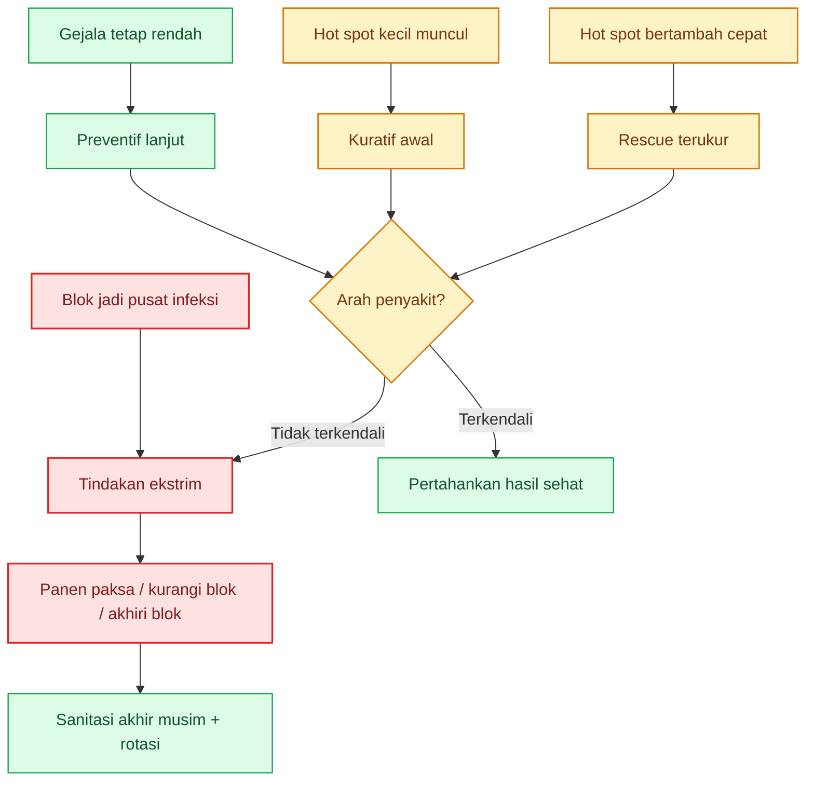

Diagram ini menutup artikel dengan logika yang sangat praktis: selama penyakit masih lokal, pertahankan preventif dan kuratif awal; bila sudah menjadi pusat infeksi, jangan ragu beralih ke tindakan ekstrim untuk menyelamatkan sisa hasil dan musim berikutnya. Dasarnya berasal dari NC State dan Rutgers. ([content.ces.ncsu.edu][1])

[1]: https://content.ces.ncsu.edu/anthracnose-of-pepper 'Anthracnose of Pepper | NC State Extension Publications'
[2]: https://plant-pest-advisory.rutgers.edu/preparing-for-pepper-anthracnose/ 'Preparing for Pepper Anthracnose — Plant & Pest Advisory'
[3]: https://plant-pest-advisory.rutgers.edu/wp-content/uploads/2015/01/2015-FRAC-Guide.pdf 'Slide 1'
[4]: https://www.frac.info/fungicide-resistance-management/by-frac-mode-of-action-group/ 'By FRAC Mode of Action Group | FRAC'
[5]: https://www.canr.msu.edu/news/how_to_get_the_most_out_of_your_fungicide_sprays 'How to get the most out of your fungicide sprays - MSU Extension'
[6]: https://perizinan.pertanian.go.id/app/?utm_source=chatgpt.com 'Beranda - SIPERINTIS - Kementerian Pertanian'
[1]: https://hortikultura.pertanian.go.id/wp-content/uploads/2016/12/UTA-Cabai-dan-BM-RL.pdf?utm_source=chatgpt.com 'Usaha Tani Cabai dan Bawang Merah Ramah Lingkungan'

[**Kembali ke Atas**](#pedoman-terpadu-mencegah-kehilangan-hasil-cabai-rawit-dan-cabai-besar-akibat-antraknose)

---

## Lampiran A. Agen hayati yang relevan untuk antraknose cabai

| Agen / contoh produk                                                                | Kandungan mikroba                                                             | Fungsi dalam konteks antraknose                                                                                                                                                        | Posisi paling logis dalam siklus                                        | Sumber                                                                                                                                                                                                                         |
| ----------------------------------------------------------------------------------- | ----------------------------------------------------------------------------- | -------------------------------------------------------------------------------------------------------------------------------------------------------------------------------------- | ----------------------------------------------------------------------- | ------------------------------------------------------------------------------------------------------------------------------------------------------------------------------------------------------------------------------ |
| **Pseudomonas fluorescens**                                                         | Mikroba antagonis Pf                                                          | Dipakai untuk **perendaman benih** agar fase awal musim tidak dimulai dengan inokulum tinggi; juga mendukung ketahanan awal tanaman                                                    | **Benih–persemaian**                                                    | SOP Cabai Rawit Hiyung menyebut perendaman benih 6 jam dalam larutan **Pf** untuk antraknosa.                                                                                                                                  |
| **Trichoderma spp.**                                                                | Jamur antagonis                                                               | Menekan patogen melalui **hiperparasitisme, antibiosis, lisis, dan persaingan**; cocok sebagai fondasi biologis di media/perakaran                                                     | **Persemaian–awal tanam**, lalu dipertahankan sebagai backbone biologis | SOP Cabai Rawit Hiyung menempatkan **Trichoderma spp.** pada kantong persemaian dan menjelaskan mekanisme kerjanya.                                                                                                            |
| **Gliocladium spp.**                                                                | Jamur antagonis                                                               | Perannya mirip Trichoderma: menekan jamur patogen di fase awal dan memperkuat sanitasi biologis kebun                                                                                  | **Persemaian–awal tanam**                                               | SOP Cabai Rawit Hiyung menyebut **Gliocladium spp.** bersama Trichoderma untuk pengendalian antraknosa.                                                                                                                        |
| **Paenibacillus polymyxa** / contoh komersial: **PAENAMAXI**                        | _Paenibacillus polymyxa_ + _Bacillus amyloliquefaciens_ pada produk komersial | Studi greenhouse pada cabai besar menunjukkan **P. polymyxa C1** mampu menurunkan insidensi, intensitas penyakit, dan kehilangan hasil; cocok sebagai penguat backbone biologis        | **Vegetatif lanjut–awal berbunga–buah awal**, dengan aplikasi berulang  | Studi Frontiers pada **P. polymyxa C1** menunjukkan efektivitas pada antraknose cabai; halaman produk **PAENAMAXI** memuat _P. polymyxa_ + _B. amyloliquefaciens_. ([Frontiers][2])                                            |
| **Bacillus spp.** / contoh komersial: **IMUNOSEED**                                 | _Bacillus tequilensis_ + _Bacillus aryabhattai_                               | Paling masuk akal untuk **fondasi benih dan vigor bibit**, bukan sebagai “obat buah busuk”; berguna memperkuat fase awal dan menurunkan risiko kebun memulai musim dalam kondisi lemah | **Benih–persemaian**                                                    | Produk **IMUNOSEED** memposisikan diri sebagai microbial seed treatment; studi-studi yang dirangkum pada penelitian P. polymyxa juga menyebut kelompok **Bacillus** relevan untuk penekanan antraknose. ([Prima Agro Tech][3]) |
| **Streptomyces + Trichoderma** / contoh komersial: **BIOTRACOL**                    | _Streptomyces thermovulgaris_ + _Trichoderma harzianum_                       | Bukan rekomendasi spesifik SOP untuk antraknose, tetapi logis sebagai **pendukung sanitasi biologis kebun** pada penyakit busuk buah/jamur secara umum                                 | **Pendukung vegetatif–generatif awal**                                  | Produk **BIOTRACOL** diposisikan untuk berbagai penyakit termasuk busuk buah; tetap harus dibaca sebagai **produk pendukung**, bukan pengganti sanitasi. ([Prima Agro Tech][4])                                                |
| **Pseudomonas fluorescens + Bacillus velezensis** / contoh komersial: **SEUDOFLOR** | _Pseudomonas fluorescens_ + _Bacillus velezensis_                             | Lebih tepat sebagai **penguat kesehatan akar/tanaman** dan stabilitas kebun, bukan agen spesifik utama untuk buah bergejala                                                            | **Pendukung awal–menengah musim**                                       | Halaman produk **SEUDOFLOR** menyebut dua mikroba itu untuk perlindungan akar; dalam artikel ini posisinya sebagai pendukung, bukan backbone spesifik buah. ([Prima Agro Tech][5])                                             |

### Cara membaca Lampiran A

Untuk antraknose, urutan berpikir yang paling aman adalah ini: **Pf/Trichoderma/Gliocladium** adalah fondasi yang memang **langsung didukung SOP resmi cabai rawit**, sedangkan **Paenibacillus/Bacillus/Streptomyces** dapat dibaca sebagai penguat backbone biologis berdasarkan penelitian atau produk komersial yang sejalan secara biologis. Tetapi semuanya hanya akan tampak bekerja bila kebun tetap disiplin terhadap **sanitasi buah sakit, drainase, mulsa, tajuk, dan splash air**. Agen hayati bukan pengganti sanitasi; ia bekerja paling baik ketika inokulum belum telanjur tinggi.

[**Kembali ke Atas**](#pedoman-terpadu-mencegah-kehilangan-hasil-cabai-rawit-dan-cabai-besar-akibat-antraknose)

---

## Lampiran B. Fungisida / bahan aktif untuk antraknose cabai, dibaca menurut fungsi

Lampiran ini saya susun menurut **fungsi lapang**. Untuk antraknose cabai, cara baca yang paling aman adalah: **protektif dasar** untuk membangun pelindung saat buah mulai terbentuk, **kuratif awal** saat hot spot baru mulai muncul, dan **rescue** saat penyakit naik cepat tetapi masih ada blok sehat yang layak diselamatkan. Rutgers menekankan bahwa fungisida kelompok **FRAC M** adalah **low-risk protectant fungicides**, sedangkan FRAC menegaskan bahwa bahan dengan **FRAC group yang sama** tidak boleh dianggap rotasi sejati karena berisiko **cross-resistance**. NC State juga menekankan fungisida paling efektif bila dipakai **preventif** sebelum penyakit mapan. ([University of Maryland Extension][6])

| Bahan aktif / contoh produk                                                                  | FRAC       | Fungsi lapang                          | Tipe umum                    | Cara membaca untuk antraknose cabai                                                                                                                                        | Sumber                                                                                                                                                                                                              |
| -------------------------------------------------------------------------------------------- | ---------- | -------------------------------------- | ---------------------------- | -------------------------------------------------------------------------------------------------------------------------------------------------------------------------- | ------------------------------------------------------------------------------------------------------------------------------------------------------------------------------------------------------------------- |
| **Mankozeb** / contoh: Cozeb, Festans, Mancothane, Vondozeb                                  | **M3**     | **Protektif dasar**                    | Multisite, kontak/protectant | Sangat logis untuk **program dasar sejak berbunga/fruit set**, terutama sebagai partner rotasi untuk menekan resistensi dan menjaga permukaan buah/tajuk tetap terlindungi | Muncul luas di daftar resmi cabai antraknos; FRAC M adalah multi-site, low-risk protectant. ([Hortikultura Direktoral][7])                                                                                          |
| **Propineb** / contoh: **Antracol 70 WP**, BM Proneb, Foyer, Haticol                         | **M3**     | **Protektif dasar**                    | Kontak/protektif             | Cocok untuk **mencegah** infeksi baru dan sangat logis diposisikan sebelum penyakit mapan; jangan dibaca sebagai penyelamat buah yang sudah rusak berat                    | Bayer Indonesia menyebut **Antracol** sebagai fungisida **kontak** yang **protektif**; juga tercantum resmi untuk antraknos cabai. ([Bayer][8])                                                                     |
| **Tembaga** (hidroksida/oksisulfat/oksiklorida) / contoh: Kocide, Champion, Sultricob, Kibox | **M1**     | **Protektif dasar**                    | Multisite protectant         | Paling masuk akal sebagai **pelindung permukaan** dan partner rotasi risiko rendah, terutama ketika cuaca lembap mulai datang                                              | Daftar resmi cabai antraknos memuat berbagai garam tembaga; FRAC mengelompokkan **M1** sebagai chemical multi-site inhibitors. ([Hortikultura Direktoral][7])                                                       |
| **Klorotalonil** / contoh: Daconil, Broconil, Fitonil                                        | **M5**     | **Protektif dasar / partner rotasi**   | Multisite protectant         | Sangat cocok sebagai **backbone protektif** atau partner tank-mix/rotasi untuk mengurangi tekanan resistensi dari single-site fungicides                                   | Daftar resmi cabai antraknos memuat chlorothalonil; Rutgers menyebut **FRAC M** sebagai low-risk protectant fungicides. ([Hortikultura Direktoral][7])                                                              |
| **Kaptan** / contoh: Ingrofol                                                                | **M4**     | **Protektif dasar**                    | Kontak/protectant            | Logis untuk menjaga permukaan buah/tajuk saat cuaca mulai mendukung penyakit                                                                                               | Muncul di daftar resmi cabai antraknos dan termasuk chemical multi-site inhibitors dalam klasifikasi FRAC. ([Hortikultura Direktoral][7])                                                                           |
| **Azoksistrobin** / contoh: **Amistar 250 SC**                                               | **11**     | **Kuratif awal / at-risk single-site** | Single-site                  | Paling masuk akal dipakai **sangat dini** saat gejala baru mulai muncul atau dalam program preventif yang disiplin; jangan dipakai berulang tanpa partner rotasi           | Tercantum resmi untuk antraknos cabai; FRAC 11 termasuk kelompok at-risk untuk resistensi. ([Hortikultura Direktoral][7])                                                                                           |
| **Difenokonazol** / contoh: **Score 250 EC**                                                 | **3**      | **Kuratif awal**                       | Sistemik                     | Cocok dibaca sebagai **kuratif awal** atau bagian dari program preventif ketat; tetap harus dirotasi karena FRAC 3 adalah single-site berisiko                             | Score 250 EC di halaman Syngenta adalah fungisida **sistemik** untuk cabai; difenokonazol juga tercantum di daftar resmi antraknos cabai. ([Syngenta][9])                                                           |
| **Heksakonazol** / contoh: **Anvil 50 SC**                                                   | **3**      | **Kuratif awal**                       | Sistemik                     | Posisinya mirip difenokonazol: berguna saat gejala masih dini, bukan saat buah sudah rusak luas                                                                            | **Anvil 50 SC** di Syngenta adalah fungisida **sistemik** untuk cabai; heksakonazol tercantum resmi untuk antraknos cabai. ([Syngenta][10])                                                                         |
| **Tebukonazol** / contoh: **Folicur 430 SC**                                                 | **3**      | **Kuratif awal–menengah**              | Sistemik                     | Bisa dipakai pada kebun yang mulai bergerak ke kuratif, tetapi tetap harus dibaca sebagai bagian rotasi, bukan rutinitas tunggal                                           | Bayer Indonesia menyebut **Folicur 430 SC** sebagai fungisida **sistemik** dengan sifat protektif, kuratif, dan eradicative; tebuconazole tercantum resmi pada daftar antraknos cabai. ([Bayer][11])                |
| **Azoksistrobin + difenokonazol** / contoh: **Amistar Top 325 SC**                           | **11 + 3** | **Kuratif awal / bridge ke rescue**    | Sistemik                     | Sangat berguna saat kebun sudah mulai bergerak ke **kuratif**, tetapi gejala masih bisa dipotong cepat; tetap jangan diulang terus-menerus tanpa pergiliran FRAC lain      | Syngenta menyebut **Amistar Top** sebagai fungisida **sistemik** yang **protektif, kuratif, dan preventif**; kombinasi 11+3 juga tercantum resmi untuk antraknos cabai. ([Syngenta][12])                            |
| **Asibenzolar-S-metil + mankozeb** / contoh: **Bion M 1/48 WP**                              | **P + M3** | **Protektif diperkuat**                | Sistemik + kontak            | Paling logis dibaca sebagai **protektif kuat** sejak keluar putik/fruit set, bukan rescue untuk kebun yang sudah penuh lesi                                                | SOP Cabai Rawit Hiyung malah menyebut **Bion M 1/48 WP** diaplikasikan **seminggu sekali mulai saat keluar putik buah**; halaman Syngenta menyebutnya fungisida **protektif** dengan sifat **sistemik dan kontak**. |
| **Benomil / karbendazim / metil tiofanat**                                                   | **1**      | **Kuratif lama / at-risk tinggi**      | Single-site                  | Masih muncul di daftar resmi, tetapi harus dibaca hati-hati karena FRAC 1 termasuk kelompok yang **mudah kehilangan efektivitas** bila dipakai berulang                    | Daftar resmi memuat benomil, karbendazim, dan metil tiofanat untuk antraknos cabai; Rutgers menulis FRAC 1 termasuk kelompok dengan risiko resistensi yang perlu manajemen ketat. ([Hortikultura Direktoral][7])    |
| **Iprodion** / contoh: **Rovral 50 WP**                                                      | **2**      | **Kuratif awal–menengah**              | Kontak/protectant            | Bisa berguna pada program kuratif awal, tetapi tetap harus dirotasi dan tidak dipakai sebagai tulang punggung tunggal                                                      | Iprodion tercantum di daftar resmi cabai antraknos; deskripsi produk profesional menyebutnya kontak/protectant dengan posisi pencegahan sampai kuratif dini. ([Hortikultura Direktoral][7])                         |

### Cara membaca Lampiran B

Kalau harus disederhanakan, maka urutannya begini:
**M1/M3/M4/M5** = **fondasi protektif rendah risiko**;
**3, 11, 2** = **kuratif awal / at-risk**;
**11+3** atau **P+M3** = **jembatan kuat** saat kebun mulai bergerak ke fase kuratif, tetapi tetap harus dirotasi.
Yang paling penting, fungisida untuk antraknose **tidak boleh dibaca hanya berdasarkan merek**, tetapi harus dibaca berdasarkan **fungsi**, **FRAC**, **timing**, dan **coverage ke buah serta tajuk**. Setelah tekanan turun, kebun harus kembali ke backbone PHT: sanitasi, panen tepat waktu, pengelolaan splash, dan disiplin tajuk. ([University of Maryland Extension][6])

[1]: https://perizinan.pertanian.go.id/app/?utm_source=chatgpt.com 'Beranda - SIPERINTIS - Kementerian Pertanian'
[2]: https://www.frontiersin.org/journals/sustainable-food-systems/articles/10.3389/fsufs.2021.782425/full?utm_source=chatgpt.com 'Biocontrol of Anthracnose Disease on Chili Pepper Using a ...'
[3]: https://primaagrotech.com/solution/imunoseed/?utm_source=chatgpt.com 'IMUNOSEED Microbial Seed Treatment'
[4]: https://primaagrotech.com/id/solusi/biotracol/?utm_source=chatgpt.com 'BIOTRACOL Fungisida Mikroba'
[5]: https://primaagrotech.com/id/solusi/seudoflor/?utm_source=chatgpt.com 'SEUDOFLOR Mikroba Pelindung Akar Tanaman'
[6]: https://extension.umd.edu/sites/extension.umd.edu/files/2021-03/2017_FRAC_Tables_ApplePeach.pdf?utm_source=chatgpt.com 'Fungicide Active Ingredient(s) FR AC Code⁴ Risk R ...'
[7]: https://hortikultura.pertanian.go.id/wp-content/uploads/2024/11/M-61-Daftar-Pestisida-yang-Terdaftar-dan-Diijinkan-pada-Tanaman-Bawa_watermark.pdf 'Slide 1'
[8]: https://www.bayer.com/en/id/antracol?utm_source=chatgpt.com 'Antracol | Bayer Indonesia'
[9]: https://www.syngenta.co.id/product/crop-protection/fungisida/score-250-ec?utm_source=chatgpt.com 'Score 250 EC - Fungisida - Syngenta'
[10]: https://www.syngenta.co.id/product/crop-protection/fungisida/anvil-50-sc?utm_source=chatgpt.com 'Anvil 50 SC - Fungisida - Syngenta'
[11]: https://www.bayer.com/en/id/folicur-gold?utm_source=chatgpt.com 'Folicur Gold'
[12]: https://www.syngenta.co.id/product/crop-protection/fungisida/amistar-top?utm_source=chatgpt.com 'Amistar Top 325 SC - Fungisida - Syngenta'

[**Kembali ke Atas**](#pedoman-terpadu-mencegah-kehilangan-hasil-cabai-rawit-dan-cabai-besar-akibat-antraknose)

---

<small>
  **_Catatan Penyusunan_** Artikel ini disusun sebagai materi edukasi dan
  referensi umum berdasarkan berbagai sumber pustaka, praktik lapangan, serta
  bantuan alat penulisan. Pembaca disarankan untuk melakukan verifikasi lanjutan
  dan penyesuaian sesuai dengan kondisi serta kebutuhan masing-masing sistem.
</small>
