# **_Pedoman Terpadu Mencegah Gagal Panen Cabai Akibat Kutu Kebul dan Thrips_**

---

- [**_Pedoman Terpadu Mencegah Gagal Panen Cabai Akibat Kutu Kebul dan Thrips_**](#pedoman-terpadu-mencegah-gagal-panen-cabai-akibat-kutu-kebul-dan-thrips)
- [Bab 1. Pendahuluan: Mengapa Kutu Kebul dan Thrips Menjadi Penyebab Gagal Panen Cabai](#bab-1-pendahuluan-mengapa-kutu-kebul-dan-thrips-menjadi-penyebab-gagal-panen-cabai)
- [Bab 2. Mengenal Musuh di Lapang: Identifikasi Kutu Kebul, Thrips, dan Gejala Khasnya](#bab-2-mengenal-musuh-di-lapang-identifikasi-kutu-kebul-thrips-dan-gejala-khasnya)
  - [Aset gambar aktual Bab 2](#aset-gambar-aktual-bab-2)
  - [2.1 Kutu kebul: ciri yang harus dikenali](#21-kutu-kebul-ciri-yang-harus-dikenali)
  - [2.2 Thrips: kecil, ramping, dan sering luput](#22-thrips-kecil-ramping-dan-sering-luput)
  - [2.3 Gejala khas yang paling cepat dibedakan](#23-gejala-khas-yang-paling-cepat-dibedakan)
  - [Tabel 1. Pembeda cepat kutu kebul vs thrips](#tabel-1-pembeda-cepat-kutu-kebul-vs-thrips)
- [Bab 3. Siklus Risiko pada Tanaman Cabai: Fase Tanam dan Perubahan Tingkat Ancaman](#bab-3-siklus-risiko-pada-tanaman-cabai-fase-tanam-dan-perubahan-tingkat-ancaman)
  - [3.1 Persemaian: fase dengan leverage tertinggi](#31-persemaian-fase-dengan-leverage-tertinggi)
  - [3.2 Pindah tanam–14 HST: fase penentu arah musim](#32-pindah-tanam14-hst-fase-penentu-arah-musim)
  - [3.3 Vegetatif aktif: fase saat pengamatan harus disiplin](#33-vegetatif-aktif-fase-saat-pengamatan-harus-disiplin)
  - [3.4 Awal pembentukan tajuk: fase kritis kutu kebul](#34-awal-pembentukan-tajuk-fase-kritis-kutu-kebul)
  - [3.5 Awal berbunga: fase kritis thrips](#35-awal-berbunga-fase-kritis-thrips)
  - [3.6 Pembentukan buah: risiko mutu dan hasil berjalan bersamaan](#36-pembentukan-buah-risiko-mutu-dan-hasil-berjalan-bersamaan)
  - [3.7 Akhir produksi: fase serangan pinggir yang sering diremehkan](#37-akhir-produksi-fase-serangan-pinggir-yang-sering-diremehkan)
  - [Rumusan praktis Bab 3](#rumusan-praktis-bab-3)
- [Bab 4. Fase Persiapan Sebelum Tanam: Fondasi Pengendalian Harus Dibangun Sebelum Bibit Masuk](#bab-4-fase-persiapan-sebelum-tanam-fondasi-pengendalian-harus-dibangun-sebelum-bibit-masuk)
  - [4.1 Sanitasi lahan dan pembersihan gulma inang](#41-sanitasi-lahan-dan-pembersihan-gulma-inang)
  - [4.2 Pengelolaan sisa tanaman dan host-free period](#42-pengelolaan-sisa-tanaman-dan-host-free-period)
  - [4.3 Mulsa reflektif: alat pencegah kolonisasi awal](#43-mulsa-reflektif-alat-pencegah-kolonisasi-awal)
  - [4.4 Barrier crop dan trap crop](#44-barrier-crop-dan-trap-crop)
  - [4.5 Persiapan monitoring dan perlindungan fisik](#45-persiapan-monitoring-dan-perlindungan-fisik)
  - [4.6 Persiapan agen hayati dan musuh alami](#46-persiapan-agen-hayati-dan-musuh-alami)
  - [4.7 Skenario eskalasi harus disiapkan sebelum serangan terjadi](#47-skenario-eskalasi-harus-disiapkan-sebelum-serangan-terjadi)
  - [Daftar persiapan wajib sebelum tanam](#daftar-persiapan-wajib-sebelum-tanam)
- [Bab 5. Fase Preventif Sejak Persemaian sampai Awal Tanam](#bab-5-fase-preventif-sejak-persemaian-sampai-awal-tanam)
  - [5.1 Seleksi bibit sehat dan disiplin persemaian](#51-seleksi-bibit-sehat-dan-disiplin-persemaian)
  - [5.2 Trap sejak awal dan inspeksi rutin](#52-trap-sejak-awal-dan-inspeksi-rutin)
  - [5.3 Tindakan saat ada bibit atau tanaman muda yang mencurigakan](#53-tindakan-saat-ada-bibit-atau-tanaman-muda-yang-mencurigakan)
  - [5.4 Peran agen hayati sejak dini](#54-peran-agen-hayati-sejak-dini)
  - [5.5 Penguatan tanaman muda setelah pindah tanam](#55-penguatan-tanaman-muda-setelah-pindah-tanam)
  - [Rumusan praktis Bab 5](#rumusan-praktis-bab-5)
- [Bab 6. Program Preventif yang Melekat Sepanjang Siklus: Agen Hayati, Trap, Sanitasi, dan Musuh Alami](#bab-6-program-preventif-yang-melekat-sepanjang-siklus-agen-hayati-trap-sanitasi-dan-musuh-alami)
  - [6.1 Preventif adalah sistem yang berulang](#61-preventif-adalah-sistem-yang-berulang)
  - [6.2 Agen hayati yang dipakai sejak awal dan dipertahankan](#62-agen-hayati-yang-dipakai-sejak-awal-dan-dipertahankan)
  - [6.3 Keterkaitan agen hayati, trap, dan sanitasi](#63-keterkaitan-agen-hayati-trap-dan-sanitasi)
  - [6.4 Peran refugia dan tanaman berbunga bagi musuh alami](#64-peran-refugia-dan-tanaman-berbunga-bagi-musuh-alami)
  - [6.5 Kapan aplikasi atau intervensi preventif diulang](#65-kapan-aplikasi-atau-intervensi-preventif-diulang)
  - [6.6 Kapan preventif harus dinaikkan menjadi korektif](#66-kapan-preventif-harus-dinaikkan-menjadi-korektif)
  - [Rumusan praktis Bab 6](#rumusan-praktis-bab-6)
- [Bab 7. Monitoring, Titik Kritis, dan Momen Penentu dalam Siklus Cabai](#bab-7-monitoring-titik-kritis-dan-momen-penentu-dalam-siklus-cabai)
  - [Aset gambar aktual Bab 7](#aset-gambar-aktual-bab-7)
  - [7.1 Cara monitoring kutu kebul](#71-cara-monitoring-kutu-kebul)
  - [7.2 Cara monitoring thrips](#72-cara-monitoring-thrips)
  - [7.3 Intensitas monitoring: kapan harus lebih rapat](#73-intensitas-monitoring-kapan-harus-lebih-rapat)
  - [7.4 Titik kritis: kapan risiko gagal panen mulai besar](#74-titik-kritis-kapan-risiko-gagal-panen-mulai-besar)
  - [Tabel 2. Titik kritis dalam siklus cabai](#tabel-2-titik-kritis-dalam-siklus-cabai)
  - [7.5 Indikator kebun masuk zona bahaya](#75-indikator-kebun-masuk-zona-bahaya)
  - [7.6 Apa yang harus dilakukan dalam 24–72 jam pertama](#76-apa-yang-harus-dilakukan-dalam-2472-jam-pertama)
- [Bab 8. Program Tindakan per Fase: Apa yang Harus Dilakukan dari Sebelum Tanam sampai Akhir Produksi](#bab-8-program-tindakan-per-fase-apa-yang-harus-dilakukan-dari-sebelum-tanam-sampai-akhir-produksi)
  - [8.1 Sebelum tanam](#81-sebelum-tanam)
  - [8.2 Persemaian](#82-persemaian)
  - [8.3 Pindah tanam–14 HST](#83-pindah-tanam14-hst)
  - [8.4 Fase 15–35 HST](#84-fase-1535-hst)
  - [8.5 Awal berbunga](#85-awal-berbunga)
  - [8.6 Pembentukan buah](#86-pembentukan-buah)
  - [8.7 Saat serangan masih rendah](#87-saat-serangan-masih-rendah)
  - [8.8 Saat serangan mulai naik](#88-saat-serangan-mulai-naik)
  - [Tabel 3. Program tindakan per fase](#tabel-3-program-tindakan-per-fase)
  - [Rumusan praktis Bab 8](#rumusan-praktis-bab-8)
- [Bab 9. Pengendalian Biologis dan Non-Kimia sebagai Tulang Punggung Stabilitas Kebun](#bab-9-pengendalian-biologis-dan-non-kimia-sebagai-tulang-punggung-stabilitas-kebun)
  - [9.1 Arsitektur pengendalian hayati dan non-kimia](#91-arsitektur-pengendalian-hayati-dan-non-kimia)
  - [9.2 Agen hayati utama untuk kutu kebul](#92-agen-hayati-utama-untuk-kutu-kebul)
  - [9.3 Agen hayati utama untuk thrips](#93-agen-hayati-utama-untuk-thrips)
  - [9.4 Waktu aplikasi ideal: di sinilah biasanya menang atau kalah](#94-waktu-aplikasi-ideal-di-sinilah-biasanya-menang-atau-kalah)
  - [9.5 Syarat keberhasilan program hayati](#95-syarat-keberhasilan-program-hayati)
  - [9.6 Trap sebagai penguat monitoring dan penekan awal](#96-trap-sebagai-penguat-monitoring-dan-penekan-awal)
  - [9.7 Barrier crop, trap crop, dan tanaman penguat musuh alami](#97-barrier-crop-trap-crop-dan-tanaman-penguat-musuh-alami)
  - [9.8 Konservasi musuh alami: bagian yang sering dirusak sendiri](#98-konservasi-musuh-alami-bagian-yang-sering-dirusak-sendiri)
  - [9.9 Kesalahan umum yang membuat pengendalian hayati terlihat gagal](#99-kesalahan-umum-yang-membuat-pengendalian-hayati-terlihat-gagal)
  - [9.10 Kapan pengendalian biologis cukup kuat, dan kapan perlu dukungan lain](#910-kapan-pengendalian-biologis-cukup-kuat-dan-kapan-perlu-dukungan-lain)
  - [Rumusan praktis Bab 9](#rumusan-praktis-bab-9)
- [Bab 10. Pengendalian Kuratif dan Kimia Berbasis Eskalasi](#bab-10-pengendalian-kuratif-dan-kimia-berbasis-eskalasi)
  - [10.1 Kapan kebun masuk fase kuratif](#101-kapan-kebun-masuk-fase-kuratif)
  - [10.2 Prinsip paling penting: tidak ada “racun sakti”](#102-prinsip-paling-penting-tidak-ada-racun-sakti)
  - [10.3 Beda sasaran whitefly dewasa dan nimfa](#103-beda-sasaran-whitefly-dewasa-dan-nimfa)
  - [10.4 Beda sasaran thrips di bunga dan pucuk](#104-beda-sasaran-thrips-di-bunga-dan-pucuk)
  - [10.5 Rotasi mode aksi: aturan yang tidak boleh dilanggar](#105-rotasi-mode-aksi-aturan-yang-tidak-boleh-dilanggar)
  - [10.6 Teknik aplikasi: coverage sering lebih menentukan daripada pilihan merek](#106-teknik-aplikasi-coverage-sering-lebih-menentukan-daripada-pilihan-merek)
  - [10.7 Kompatibilitas dan jeda dengan agen hayati](#107-kompatibilitas-dan-jeda-dengan-agen-hayati)
  - [10.8 Kesalahan kimia yang paling merugikan](#108-kesalahan-kimia-yang-paling-merugikan)
  - [Rumusan praktis Bab 10](#rumusan-praktis-bab-10)
- [Bab 11. Protokol Darurat: Saat Kebun Masuk Risiko Tinggi Gagal Panen](#bab-11-protokol-darurat-saat-kebun-masuk-risiko-tinggi-gagal-panen)
  - [11.1 Indikator kebun masuk mode darurat](#111-indikator-kebun-masuk-mode-darurat)
  - [11.2 Protokol 72 jam pertama](#112-protokol-72-jam-pertama)
  - [11.3 Paket darurat bila dominan kutu kebul](#113-paket-darurat-bila-dominan-kutu-kebul)
  - [11.4 Paket darurat bila dominan thrips](#114-paket-darurat-bila-dominan-thrips)
  - [11.5 Bagaimana menilai keberhasilan rescue](#115-bagaimana-menilai-keberhasilan-rescue)
  - [Rumusan praktis Bab 11](#rumusan-praktis-bab-11)
- [Bab 12. Tindakan Ekstrim dan Penutup Musim: Kapan Harus Cabut Tanaman untuk Menyelamatkan Kebun](#bab-12-tindakan-ekstrim-dan-penutup-musim-kapan-harus-cabut-tanaman-untuk-menyelamatkan-kebun)
  - [12.1 Kapan tanaman harus dicabut](#121-kapan-tanaman-harus-dicabut)
  - [12.2 Kapan blok harus dikorbankan](#122-kapan-blok-harus-dikorbankan)
  - [12.3 Logika ekonomi: cabut dini sering lebih murah daripada mempertahankan sumber masalah](#123-logika-ekonomi-cabut-dini-sering-lebih-murah-daripada-mempertahankan-sumber-masalah)
- [Lampiran A: Daftar agen hayati yang beredar di marketplace dan relevan untuk kebun cabai](#lampiran-a-daftar-agen-hayati-yang-beredar-di-marketplace-dan-relevan-untuk-kebun-cabai)
  - [Cara membaca lampiran ini](#cara-membaca-lampiran-ini)
  - [A.1. Produk yang paling relevan untuk kutu kebul dan thrips](#a1-produk-yang-paling-relevan-untuk-kutu-kebul-dan-thrips)
  - [A.2 Produk pendukung backbone kebun yang sangat berguna, meski bukan penekan utama whitefly/thrips](#a2-produk-pendukung-backbone-kebun-yang-sangat-berguna-meski-bukan-penekan-utama-whiteflythrips)
  - [Cara pakai lampiran ini dalam keputusan lapang](#cara-pakai-lampiran-ini-dalam-keputusan-lapang)
  - [Batas yang harus dipahami praktisi](#batas-yang-harus-dipahami-praktisi)
  - [Rumusan paling praktis](#rumusan-paling-praktis)
- [Lampiran B. Racun kimia untuk tindakan kuratif pada kutu kebul dan thrips cabai](#lampiran-b-racun-kimia-untuk-tindakan-kuratif-pada-kutu-kebul-dan-thrips-cabai)
  - [Cara membaca lampiran ini](#cara-membaca-lampiran-ini-1)
  - [B1. Produk inti untuk tindakan kuratif pada kutu kebul](#b1-produk-inti-untuk-tindakan-kuratif-pada-kutu-kebul)
    - [Catatan praktis untuk whitefly](#catatan-praktis-untuk-whitefly)
  - [B2. Produk inti untuk tindakan kuratif pada thrips](#b2-produk-inti-untuk-tindakan-kuratif-pada-thrips)
    - [Catatan praktis untuk thrips](#catatan-praktis-untuk-thrips)
  - [B3. Produk yang ada di daftar teknis, tetapi jangan dijadikan tulang punggung](#b3-produk-yang-ada-di-daftar-teknis-tetapi-jangan-dijadikan-tulang-punggung)
  - [B4. Aturan keras memakai Lampiran B](#b4-aturan-keras-memakai-lampiran-b)
  - [Rumusan paling praktis](#rumusan-paling-praktis-1)

---

# Bab 1. Pendahuluan: Mengapa Kutu Kebul dan Thrips Menjadi Penyebab Gagal Panen Cabai

Cabai termasuk komoditas yang sangat sensitif terhadap gangguan OPT pengisap, terutama **kutu kebul** dan **thrips**, karena kerusakan yang ditimbulkan bukan hanya berupa kehilangan vigor tanaman, tetapi juga gangguan mutu, kehilangan bunga dan buah, serta penyebaran virus yang dapat memukul hasil secara tajam. Pada kutu kebul, masalah utamanya bukan sekadar hisapan cairan tanaman, melainkan juga produksi **embun madu** yang memicu **embun jelaga** dan perannya sebagai vektor berbagai virus tanaman. Pada thrips, kerusakan lapang yang paling khas adalah **distorsi pertumbuhan**, **deformasi bunga**, dan **bercak putih-keperakan** pada daun muda yang sering disertai **fekal spot** hitam; pada pepper/cabai, thrips juga sangat penting karena berhubungan dengan siklus **Tomato spotted wilt virus**. ([UC IPM][2])

Pada cabai, dua OPT ini layak disebut sebagai **penyebab gagal panen**, bukan sekadar hama biasa. Data lapang di Indonesia menunjukkan bahwa setiap kenaikan **1 individu kutu kebul per daun** berkaitan dengan kenaikan kejadian penyakit kuning keriting sekitar **25,981%**, kenaikan keparahan penyakit sekitar **15,269%**, dan penurunan hasil sekitar **40,044 kg/ha**. Studi yang sama juga menunjukkan bahwa kenaikan **1% keparahan penyakit kuning keriting** berkaitan dengan penurunan hasil sekitar **2,867 kg/ha**. Artinya, pada kutu kebul, kerugian ekonomi bergerak sangat cepat karena yang bekerja bukan hanya hama, tetapi **hama + virus + percepatan penyebaran di lapang**.

Kutu kebul sendiri dikenal sebagai OPT yang sangat sulit diremehkan. UF/IFAS menyebut **Bemisia tabaci** sebagai hama polifag invasif yang dapat makan pada lebih dari **1000 spesies tanaman** dan menularkan lebih dari **120 virus tanaman**. UC IPM menegaskan bahwa whitefly pada pepper merusak tanaman dengan mengisap sap dalam jumlah besar, menghasilkan honeydew yang menumbuhkan sooty mold, serta menyebabkan pertumbuhan terhambat, defoliasi, dan hasil menurun bila populasinya tinggi. Jadi, ketika kebun cabai mulai dipenuhi kutu kebul, petani sebenarnya sedang berhadapan dengan **vektor penyakit** yang juga merusak tanaman secara langsung. ([Ask IFAS - Powered by EDIS][1])

Thrips mempunyai logika ancaman yang sedikit berbeda, tetapi sama berbahayanya. UC IPM menjelaskan bahwa pada pepper, kerusakan primer thrips justru sering muncul melalui **vektoring Tomato spotted wilt virus**, sementara populasi tinggi thrips sendiri dapat menyebabkan **pertumbuhan tanaman terdistorsi, bunga berubah bentuk, dan daun muda menunjukkan bercak putih hingga keperakan dengan titik fekal hitam**. UF/IFAS juga mencatat bahwa infestasi berat chilli thrips dapat membuat **daun dan pucuk muda menjadi rapuh**, menimbulkan **jaringan buah yang berkork/scarring**, bahkan berujung pada **defoliasi total dan kehilangan panen total**. Ini yang membuat thrips sangat berbahaya pada fase berbunga dan pembentukan buah. ([UC IPM][3])

Karena itu, logika pengendalian pada dua OPT ini **berbeda dari hama makan daun biasa**. Pada ulat, petani masih bisa berpikir “bunuh hama, tanaman lanjut”. Pada kutu kebul dan thrips, logikanya berubah menjadi **putuskan vektor, kurangi sumber inokulum, lindungi fase tanaman yang rentan, lalu cegah ledakan populasi berikutnya**. Di titik inilah banyak kebun gagal: petani melihat masalah sebagai soal “semprot apa”, padahal masalah sesungguhnya adalah **sistem kebun**, **ketepatan waktu**, dan **disiplin monitoring**. UC IPM, UF/IFAS, dan Direktorat Hortikultura sama-sama menempatkan scouting, sanitasi, pengendalian dini, dan pengurangan tekanan resistensi sebagai bagian inti, bukan pelengkap. ([UC IPM][2])

Keterlambatan respons beberapa hari saja bisa sangat mahal. Pada whitefly, UC IPM menyarankan pemeriksaan **dua kali seminggu** pada periode kritis, terutama di **tepi kebun** dan saat tanaman inang sekitar sedang menua atau menurun, karena ledakan populasi sering dimulai dari sana. Pada penyakit kuning keriting cabai, penelitian Indonesia menunjukkan bahwa **bahkan satu individu kutu kebul** sudah dapat menularkan begomovirus, sehingga keberadaan vektor sejak awal musim menjadi faktor yang sangat menentukan arah hasil panen. Dengan kata lain, menunggu gejala “jelas sekali” sebelum bertindak adalah salah satu jalur tercepat menuju kehilangan hasil. ([UC IPM][2])

Pedoman ini karena itu tidak ditulis untuk menjawab pertanyaan “racun apa yang paling keras”, melainkan untuk menjawab pertanyaan yang jauh lebih penting: **bagaimana mencegah satu musim cabai runtuh akibat dua OPT yang bekerja sebagai perusak sekaligus pembawa masalah sekunder**. Fokusnya adalah **menyelamatkan musim tanam**, menurunkan peluang gagal panen, dan mengubah respons petani dari pola reaktif menjadi pola **preventif, terukur, dan berbasis fase tanaman**. ([Ask IFAS - Powered by EDIS][1])

**Diagram inti Bab 1** merangkum kenapa kutu kebul dan thrips harus dipandang sebagai ancaman sistemik, bukan sekadar serangga pengisap. Diagram ini disusun agar nyaman dibaca di layar HP. Penjelasan alurnya diturunkan dari UC IPM, UF/IFAS, dan Direktorat Hortikultura. ([UC IPM][2])

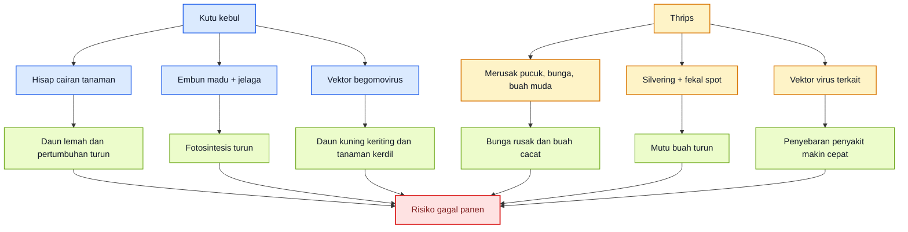

<ResourceBox
  title="Artikel Terkait:"
  items={[
    {
      name: 'README — Framework Praktis Memulai Bisnis Agribisnis Terpadu di Lahan Gumuk Berlereng',
      href: '/blog/agri/kebon/agribisnis-gumuk/README',
    },
    {
      name: 'Proposal Pembangunan Sistem Drip Irrigation',
      href: '/blog/agri/kebon/proposal-pembangunan-drip-irigation',
    },
    {
      name: 'PROPOSAL RENCANA KERJA PENGEMBANGAN KEBUN GUMUK 1 TAHUN',
      href: '/blog/agri/kebon/agribisnis-gumuk/proposal-pengembangan-gumuk',
    },
    {
      name: 'OPT Penggagal Panen pada Cabai Rawit dan Cabai Besar',
      href: '/blog/agri/kebon/pengendalian-opt-cabai',
    },
    {
      name: 'Panduan Lengkap Pengendalian Lalat Buah di Kebun Campuran',
      href: '/blog/agri/kebon/lalat-buah',
    },
    {
      name: 'Panduan Praktis Talas untuk Kebun Gumuk',
      href: '/blog/agri/kebon/budidaya-talas-gumuk',
    },
    {
      name: 'README - Pupuk Tepat, Panen Untung - Model Low-Lab untuk Petani Makmur di Gambiran',
      href: '/blog/agri/pupuk-terintegrasi/README',
    },
  ]}
/>

[**Kembali ke Atas**](#pedoman-terpadu-mencegah-gagal-panen-cabai-akibat-kutu-kebul-dan-thrips)

---

# Bab 2. Mengenal Musuh di Lapang: Identifikasi Kutu Kebul, Thrips, dan Gejala Khasnya

Salah identifikasi adalah pangkal salah keputusan. Pada cabai, petani sering menyebut semua serangga kecil sebagai “kutu”, padahal **kutu kebul** dan **thrips** berbeda bentuk, berbeda lokasi dominan pada tanaman, berbeda gejala, dan berbeda fokus pengendaliannya. UC IPM menggambarkan whitefly dewasa sebagai serangga sangat kecil, kekuningan, dengan sayap putih, banyak berada di **bawah daun** dan mudah beterbangan saat tanaman diganggu. Thrips, sebaliknya, adalah serangga **sangat kecil dan ramping**, paling mudah dilihat dengan kaca pembesar, dengan dua pasang sayap berjumbai dan warna dewasa pucat sampai cokelat muda. ([UC IPM][2])

## Aset gambar aktual Bab 2

Empat aset aktual yang paling representatif untuk Bab 2 adalah: **(1)** kutu kebul dewasa dan stadia lain di bawah daun, **(2)** serangan kutu kebul pada daun, **(3)** chilli thrips dewasa, dan **(4)** gejala kerusakan thrips pada tanaman pepper/cabai. Sumbernya dipilih dari UF/IFAS dan NC State agar pembaca lapang mendapat visual yang dekat dengan deskripsi teknis resmi. ([Ask IFAS - Powered by EDIS][1])

  <figure>
    
    <figcaption>
      Kutu kebul di bawah daun: lihat imago putih dan stadia menetap.
    </figcaption>
  </figure>

{' '}

<figure>
  
  <figcaption>
    Serangan kutu kebul: populasi terlihat jelas pada permukaan daun.
  </figcaption>
</figure>

{' '}

<figure>
  
  <figcaption>
    Thrips dewasa: tubuh ramping, kecil, dan sulit dilihat tanpa fokus.
  </figcaption>
</figure>

  <figure>
    
    <figcaption>
      Gejala thrips: distorsi daun dan bercak luka makan pada jaringan muda.
    </figcaption>
  </figure>

## 2.1 Kutu kebul: ciri yang harus dikenali

Kutu kebul pada cabai paling sering dicari di **permukaan bawah daun**. Whitefly dewasa berukuran sekitar **1,5 mm**, tubuh kekuningan dengan sayap putih, dan akan beterbangan cepat ketika daun disentuh atau tajuk digoyang. Stadia muda berada menetap di daun; telur biasanya terkonsentrasi pada daun muda, sedangkan nimfa banyak ditemukan pada daun yang lebih tua. Inilah sebabnya pemeriksaan dari atas daun saja hampir selalu menipu. ([UC IPM][2])

Gejala lapang yang paling khas dari kutu kebul adalah kombinasi **lengket karena embun madu**, **jelaga hitam**, **daun menguning**, dan bila situasi memburuk, **daun mengecil, menebal, melengkung, dan tanaman menjadi kerdil** akibat infeksi virus kuning keriting. Direktorat Hortikultura menekankan bahwa pada cabai, B. tabaci lazim ditemukan di bawah daun dan pengendalian penyakit kuning sangat bergantung pada pengendalian vektornya. UC IPM menambahkan bahwa whitefly pada pepper dapat menyebabkan pertumbuhan terhambat, pertumbuhan buruk, defoliasi, dan hasil menurun. ([Direktorat Jenderal Hortikultura][4])

Secara praktis, bila petani menggoyang tanaman lalu muncul “debu putih hidup” dari bawah daun, itu adalah alarm kuat untuk memeriksa kutu kebul lebih lanjut. Bila alarm itu muncul bersamaan dengan daun yang mulai lengket atau muncul jelaga hitam, asumsi kerja di lapang sebaiknya langsung mengarah ke **whitefly pressure yang sudah bermakna**. ([UC IPM][2])

## 2.2 Thrips: kecil, ramping, dan sering luput

Thrips jauh lebih sulit dilihat cepat dibanding kutu kebul. Pada pepper, UC IPM menyebut thrips sebagai serangga **sangat kecil dan ramping**, sedangkan NCSU dan UF/IFAS menjelaskan chilli thrips berwarna pucat-krem hingga kekuningan, dengan sayap berjumbai halus dan ukuran hanya sekitar **1/16 inci**. Karena sangat kecil, thrips sering tidak dikenali dari bentuk serangganya, tetapi justru dari **jejak kerusakannya** pada pucuk, bunga, dan daun muda. ([UC IPM][3])

Thrips pada cabai lebih logis dicari pada **pucuk muda, bunga, dan jaringan yang sedang aktif tumbuh**. UC IPM menekankan bahwa kerusakan makan thrips pada pepper menyebabkan **distorsi pertumbuhan**, **deformasi bunga**, serta **bercak putih sampai keperakan** pada daun muda yang sering disertai **titik hitam kecil** berupa fekal specks. UF/IFAS menambahkan bahwa infestasi berat chilli thrips dapat membuat daun dan tunas menjadi rapuh, menimbulkan jaringan buah berkork, dan menurunkan nilai ekonomi buah. ([UC IPM][3])

Di lapang, satu trik identifikasi yang sangat membantu adalah menggoyang pucuk atau bunga di atas **kertas putih**. Kalau titik-titik kecil bergerak jatuh dari bunga atau pucuk, kemungkinan besar itu thrips. Cara ini sering lebih efektif daripada hanya menatap daun dari kejauhan. NCSU juga menunjukkan bahwa bunga dapat memperlihatkan gejala thrips yang khas, dan UC IPM menempatkan bunga sebagai organ yang penting karena thrips dapat merusak serta berperan dalam siklus virus. ([NC State Extension][5])

## 2.3 Gejala khas yang paling cepat dibedakan

Secara lapang, **kutu kebul** lebih identik dengan **bawah daun**, **imago putih beterbangan**, **embun madu**, **jelaga hitam**, dan **arah kerusakan ke virus kuning**. **Thrips** lebih identik dengan **pucuk dan bunga**, **silvering/keperakan**, **daun muda keriting**, **titik fekal hitam**, **bunga rusak**, dan **buah lecet atau scarring**. Bila petani membedakan dua pola ini sejak awal, peluang salah sasaran semprot turun sangat jauh. ([UC IPM][2])

Perlu diingat bahwa pada kebun nyata, keduanya bisa hadir bersamaan. Karena itu, tujuan Bab 2 bukan membuat petani mencari kepastian absolut, tetapi memastikan ia bisa menjawab tiga pertanyaan praktis: **yang dominan apa, gejalanya muncul di bagian tanaman mana, dan apa risiko sekundernya—virus atau kerusakan bunga/buah**. Bila tiga pertanyaan ini terjawab, keputusan di bab-bab berikutnya akan jauh lebih presisi. ([UC IPM][2])

## Tabel 1. Pembeda cepat kutu kebul vs thrips

| Aspek pembeda                 | Kutu kebul                                                  | Thrips                                                        |
| ----------------------------- | ----------------------------------------------------------- | ------------------------------------------------------------- |
| Lokasi utama pada tanaman     | Bawah daun                                                  | Pucuk, daun muda, bunga                                       |
| Bentuk serangga               | Kecil, putih, tampak seperti ngengat mini                   | Sangat kecil, ramping, memanjang                              |
| Respons saat tanaman diganggu | Mudah beterbangan                                           | Sering tetap tersembunyi, perlu pengamatan dekat              |
| Gejala khas                   | Lengket, jelaga hitam, daun menguning, arah ke virus kuning | Silvering, fekal spot hitam, bunga rusak, buah lecet/scarring |
| Risiko utama                  | Vektor begomovirus, penurunan fotosintesis, stunting        | Kerusakan bunga/buah, distorsi pucuk, vektor virus terkait    |
| Posisi trap yang umum dipakai | Kuning untuk monitoring migrasi                             | Kuning untuk monitoring; verifikasi tetap di bunga/pucuk      |
| Titik pemeriksaan tercepat    | Balik daun, terutama tepi kebun                             | Goyang pucuk/bunga di atas kertas putih                       |

Tabel ini diringkas dari deskripsi dan gejala yang dijelaskan oleh UC IPM, UF/IFAS, dan NCSU, dengan penekanan pada pembeda yang paling berguna untuk keputusan lapang cepat. ([UC IPM][2])

[**Kembali ke Atas**](#pedoman-terpadu-mencegah-gagal-panen-cabai-akibat-kutu-kebul-dan-thrips)

---

# Bab 3. Siklus Risiko pada Tanaman Cabai: Fase Tanam dan Perubahan Tingkat Ancaman

Kegagalan pengendalian pada cabai sering bermula dari cara pikir yang keliru: hama dianggap datang “kapan saja” dengan ancaman yang sama. Padahal, pada kutu kebul dan thrips, **tingkat ancaman berubah mengikuti fase tanaman**. Ada fase ketika serangan awal masih murah dikoreksi, ada fase ketika kehilangan bunga mulai mahal, dan ada fase ketika keterlambatan beberapa hari membuka jalan ke ledakan virus atau cacat buah yang sulit ditebus. UC IPM dan berbagai sumber teknis lapang sama-sama menunjukkan bahwa momen pengamatan, perlindungan fase awal, dan keputusan cepat pada titik kritis jauh lebih menentukan daripada sekadar jenis produk yang dipakai. ([UC IPM][2])

## 3.1 Persemaian: fase dengan leverage tertinggi

Persemaian adalah fase paling rentan karena jumlah tanaman masih padat, jaringan tanaman masih lunak, dan satu sumber infestasi dapat menyebar ke banyak bibit dalam waktu cepat. Untuk whitefly, Direktorat Hortikultura menekankan pentingnya monitoring vektor sejak awal; untuk thrips, UC IPM dan NCSU sama-sama menunjukkan bahwa tanaman muda sangat rentan karena serangga ini menyerang jaringan muda, daun baru, dan pucuk aktif. Secara praktis, ini berarti persemaian adalah **fase leverage tertinggi**: keberhasilan proteksi di sini memberi efek perlindungan sampai fase lapang awal. ([Direktorat Jenderal Hortikultura][4])

## 3.2 Pindah tanam–14 HST: fase penentu arah musim

Setelah pindah tanam sampai sekitar dua minggu pertama, risiko masih sangat tinggi karena tanaman belum kuat, tajuk belum terbentuk, dan satu infeksi virus dini dapat mengubah arsitektur tanaman permanen. Pada whitefly, UC IPM menunjukkan bahwa **mulsa reflektif** efektif menekan kolonisasi awal dan menunda buildup whitefly sekitar **4–6 minggu**, yang secara tidak langsung menegaskan bahwa fase awal setelah tanam adalah saat paling penting untuk menahan masuknya vektor. Pada thrips, UC IPM bahkan merekomendasikan perlakuan pada bibit atau transplant sebelum penempatan di lapang pada sistem yang membutuhkannya, menandakan bahwa fase transisi ini adalah fase intervensi strategis. ([UC IPM][2])

## 3.3 Vegetatif aktif: fase saat pengamatan harus disiplin

Masuk fase vegetatif aktif, kesalahan umum petani adalah merasa kebun “aman” karena tanaman terlihat mulai besar. Justru di sinilah monitoring harus menjadi disiplin. UC IPM menyarankan pemeriksaan whitefly pada **tepi kebun** karena area itu biasanya terinfestasi lebih dulu, dan pada periode kritis pemeriksaan dilakukan **dua kali seminggu**. Pada tahap ini, hama yang lolos dari fase awal mulai menetap, dan keputusan yang terlambat membuat pekerjaan pengendalian jadi jauh lebih berat di fase pembungaan. ([UC IPM][2])

## 3.4 Awal pembentukan tajuk: fase kritis kutu kebul

Ketika tajuk mulai membesar dan kanopi menutup, whitefly mendapatkan habitat yang lebih nyaman di bawah daun. UC IPM juga menjelaskan bahwa efektivitas mulsa reflektif turun ketika lebih dari **60% permukaan** sudah tertutup tajuk. Secara praktis, ini berarti awal pembentukan tajuk adalah momen ketika perlindungan pasif mulai melemah dan monitoring langsung di bawah daun harus diperketat. Pada fase ini, whitefly yang semula hanya “terlihat sedikit” dapat berubah menjadi populasi menetap yang menjadi sumber penularan virus ke seluruh blok. Ini adalah salah satu **titik kritis terbesar** pada musim cabai. ([UC IPM][2])

## 3.5 Awal berbunga: fase kritis thrips

Awal berbunga adalah fase paling kritis untuk thrips. UC IPM menegaskan bahwa populasi tinggi thrips dapat **mendeformasi bunga** dan merusak pertumbuhan muda, sementara NCSU menunjukkan bahwa bunga memperlihatkan gejala thrips yang sangat khas. Bila petani lengah pada tahap ini, kerusakan tidak lagi hanya pada daun, tetapi masuk ke **kehilangan bunga, set buah terganggu, dan mutu buah awal menurun**. Pada chilli thrips, UF/IFAS juga mencatat bahwa infestasi berat dapat membuat pucuk dan kuncup rapuh sampai berujung kehilangan tajuk produktif. ([UC IPM][3])

## 3.6 Pembentukan buah: risiko mutu dan hasil berjalan bersamaan

Pada fase pembentukan buah, whitefly dan thrips sama-sama berbahaya tetapi dengan cara berbeda. Whitefly tetap berbahaya karena penularan virus dan pelemahan tanaman terus berlangsung, sedangkan thrips mulai “menagih” kerusakan ekonominya lewat **scarring**, deformasi, dan penurunan mutu buah. UF/IFAS menyebut buah pepper yang terserang chilli thrips dapat mengalami deformasi dan kehilangan nilai ekonomi; UC IPM menyebut kerusakan feeding thrips pada pepper juga menyasar bunga dan daun muda. Jadi, pada fase ini petani harus berpikir ganda: **melindungi hasil yang sedang dibentuk** dan **mencegah serangan baru merusak gelombang panen berikutnya**. ([Ask IFAS - Powered by EDIS][6])

## 3.7 Akhir produksi: fase serangan pinggir yang sering diremehkan

Menjelang akhir produksi, ancaman tidak otomatis turun. UC IPM mengingatkan bahwa rapid population buildup whitefly sering terjadi ketika **tanaman inang di sekitar kebun sedang menurun** atau area sekitar menjadi sumber migrasi. Karena itu, tepi kebun dan tanaman sekitar tetap harus dibaca sampai akhir musim. Pada fase ini, serangan yang datang dari pinggir sering dianggap tidak terlalu penting karena kebun “sudah mau selesai”, padahal justru bisa memukul panen terakhir dan menjadi sumber carry-over ke musim berikutnya. ([UC IPM][2])

Secara ekonomi, cara membaca fase-fase ini sederhana: **semakin dini serangan terjadi, semakin besar pengaruhnya terhadap bentuk tanaman dan total hasil**; **semakin dekat ke fase bunga dan buah, semakin besar pengaruhnya terhadap mutu dan jumlah panen yang sedang dibentuk**. Itulah sebabnya persemaian, 0–14 HST, awal kanopi rapat, dan awal berbunga harus diperlakukan sebagai **empat titik mahal** dalam satu musim cabai. Penelitian lapang Indonesia tentang kutu kebul dan penyakit kuning keriting memperkuat logika ini karena menunjukkan hubungan kuat antara kenaikan populasi whitefly, keparahan penyakit, dan penurunan hasil.

**Diagram Bab 3** di bawah ini merangkum perubahan tingkat ancaman sepanjang siklus tanaman. Diagram dibuat vertikal agar tetap nyaman di layar HP. Intensitas warna menunjukkan kecenderungan risiko: hijau lebih rendah, kuning waspada, oranye tinggi, merah sangat kritis. Level risiko ini merupakan sintesis praktis dari sumber resmi dan inferensi budidaya lapang berdasarkan fase ketika vektor, bunga, dan tajuk menjadi paling menentukan. ([UC IPM][2])

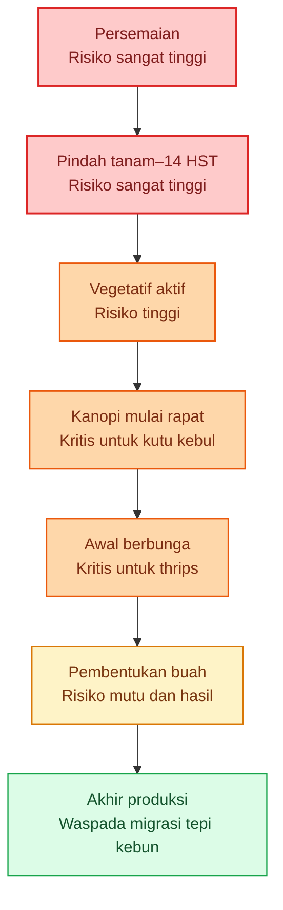

## Rumusan praktis Bab 3

Bila Bab 3 harus diperas menjadi satu keputusan lapang, maka rumusnya begini: **lindungi persemaian dan awal tanam seolah itu fase penentu satu musim, awasi whitefly saat kanopi mulai rapat, dan tingkatkan kewaspadaan thrips saat tanaman mulai berbunga**. Dengan pola pikir ini, petani tidak lagi berjalan buta, tetapi membaca musim cabai sebagai rangkaian fase dengan prioritas pengendalian yang berubah. ([UC IPM][2])

Kalau Anda setuju, saya lanjut ke **Response 2: Bab 5 dan 6** dengan nada dan format yang sama.

[1]: https://ask.ifas.ufl.edu/publication/IN1171 'ENY989/IN1171: Whitefly (Bemisia tabaci) Management Program for Ornamental Plants'
[2]: https://ipm.ucanr.edu/agriculture/peppers/whiteflies/ 'Whiteflies / Peppers / Agriculture: Pest Management Guidelines / UC Statewide IPM Program (UC IPM)'
[3]: https://ipm.ucanr.edu/agriculture/peppers/thrips/ 'Thrips / Peppers / Agriculture: Pest Management Guidelines / UC Statewide IPM Program (UC IPM)'
[4]: https://hortikultura.pertanian.go.id/wp-content/uploads/2024/11/Teknik-Pengendalian-Penyakit-Kuning-Pada-Tanaman-Cabai_watermark.pdf?utm_source=chatgpt.com 'teknik pengendalian penyakit kuning pada tanaman cabai'
[5]: https://content.ces.ncsu.edu/chilli-thrips 'Chilli Thrips | NC State Extension Publications'
[6]: https://ask.ifas.ufl.edu/publication/IN833 'EENY463/IN833: Chilli thrips Scirtothrips dorsalis Hood (Insecta: Thysanoptera: Thripidae)'

[**Kembali ke Atas**](#pedoman-terpadu-mencegah-gagal-panen-cabai-akibat-kutu-kebul-dan-thrips)

---

# Bab 4. Fase Persiapan Sebelum Tanam: Fondasi Pengendalian Harus Dibangun Sebelum Bibit Masuk

Musim cabai yang gagal sangat sering dimulai dari fase yang dianggap sepele, yaitu **sebelum tanam**. Pada kutu kebul dan thrips, persoalannya bukan hanya “apa yang dilakukan setelah hama muncul”, tetapi **berapa besar peluang hama dan vektor masuk, menetap, lalu berkembang** sejak lahan masih kosong. UC IPM memasukkan **pengendalian gulma di sekitar lahan**, **host-free period**, dan **mulsa reflektif** sebagai bagian kegiatan pra-tanam, sementara Direktorat Hortikultura menekankan sanitasi gulma, penggunaan border seperti **jagung**, tumpangsari dengan **tagetes**, perangkap kuning, dan tindakan perlindungan fisik sebagai paket dasar pencegahan. ([UC IPM][1])

Inti logikanya sederhana: pada fase pra-tanam, petani belum sedang “mengobati masalah”, tetapi sedang **menurunkan peluang masalah masuk**. Untuk kutu kebul, artinya mengurangi sumber inang, memutus lintasan masuk vektor, dan menyiapkan sistem yang bisa membaca migrasi awal. Untuk thrips, artinya menyiapkan lahan yang tidak langsung ramah bagi kolonisasi awal di pucuk dan bunga, serta menyiapkan ekosistem yang lebih bersahabat bagi musuh alami sejak awal musim. Semakin baik fase ini dikerjakan, semakin rendah kebutuhan tindakan keras di tengah musim.

## 4.1 Sanitasi lahan dan pembersihan gulma inang

Sanitasi lahan bukan pekerjaan kosmetik. UC IPM secara eksplisit memasukkan **control weeds in surrounding crop fields, head rows, fallow fields, and noncrop areas throughout the season** sebagai langkah pra-tanam pada pepper. Untuk kasus cabai di Indonesia, Direktorat Hortikultura juga menempatkan **sanitasi lingkungan/gulma** sebagai tindakan penting dalam pengendalian kutu kebul dan penyakit kuning. Secara lapang, ini berarti lahan tidak cukup dibersihkan hanya di bedengan tanam, tetapi juga pada tepi kebun, saluran, pematang, sudut-sudut lahan, dan petak bekas yang menjadi tempat bertahannya inang alternatif. ([UC IPM][1])

Gulma inang perlu dipandang sebagai **jembatan epidemi**, bukan sekadar tanaman liar. Pada whitefly, banyak inang liar dan budidaya dapat menjadi tempat bertahan populasi sekaligus reservoir virus. Pada thrips, vegetasi sekitar juga dapat menjadi sumber migrasi awal, terutama bila ada tanaman berbunga atau gulma yang menopang populasi. Karena itu, sanitasi pra-tanam yang baik harus dilakukan **serentak dalam hamparan**, bukan hanya satu petak, agar petani tidak sekadar memindahkan masalah dari satu sisi ke sisi lain.

## 4.2 Pengelolaan sisa tanaman dan host-free period

Sisa tanaman musim sebelumnya harus diperlakukan sebagai bahan infeksi dan sumber hama potensial. UC IPM memasukkan **host-free periods** sebagai bagian dari program IPM whitefly di pepper, yang artinya harus ada jeda atau pemutusan keberadaan inang agar populasi tidak terus berputar tanpa hambatan. Dalam praktik cabai, sisa tanaman sakit, tanaman volunteer, dan tanaman liar dari famili yang disukai hama tidak boleh dibiarkan bertahan di sekitar kebun menjelang musim baru.

Pada kutu kebul, kelonggaran di tahap ini sering berakhir pada masuknya vektor dari tanaman tua atau kebun tetangga ke tanaman muda yang jauh lebih rentan. Pada thrips, sisa tanaman dan vegetasi pembawa bunga bisa menjadi titik awal ledakan populasi berikutnya. Karena itu, pemusnahan sisa tanaman bukan pekerjaan penutup musim, tetapi bagian dari **persiapan musim baru**. ([Ask IFAS - Powered by EDIS][2])

## 4.3 Mulsa reflektif: alat pencegah kolonisasi awal

Mulsa reflektif bukan sekadar alat pengendali gulma. Pada pepper, UC IPM menyebut **reflective mulch** untuk menolak aphid dan whitefly, dan pada thrips UC/IFAS menekankan **ultraviolet-reflective mulch** sebagai komponen efektif dalam IPM karena dapat menolak thrips dewasa yang bermigrasi dan membantu menekan penyebaran virus. Nilai terbesar mulsa reflektif ada pada **awal musim**, ketika tanaman masih kecil dan vektor belum sempat menetap. ([UC IPM][1])

Secara praktis, mulsa reflektif bekerja paling baik bila diposisikan sebagai **alat buy-time**. Ia tidak menggantikan scouting atau pengendalian lain, tetapi memberi jeda yang sangat berharga pada 4–6 minggu awal, terutama terhadap vektor yang masuk dari luar. Karena itu, keputusan memakai atau tidak memakai mulsa reflektif seharusnya dibuat pada fase pra-tanam, bukan setelah tanaman sudah masuk lahan. ([UC IPM][1])

## 4.4 Barrier crop dan trap crop

Direktorat Hortikultura menuliskan **tanaman border: jagung, orok-orok** dan **tumpangsari dengan tagetes** untuk kutu kebul, sementara dokumen perlindungan hortikultura juga mencantumkan **tanaman perangkap caisin** untuk trips cabai. Dalam buku teknik pengendalian penyakit kuning, jagung atau gandum di sekitar cabai dijelaskan sebagai border atau trap crop, dan tanaman tinggi berwarna kuning seperti jagung atau bunga matahari disebut bisa dipakai sebagai border yang membantu menghambat masuknya vektor.

Secara lapang, barrier crop dan trap crop punya fungsi berbeda. **Barrier crop** bertugas memperlambat dan mengacaukan lintasan masuk OPT dari luar kebun, sedangkan **trap crop** bertugas menarik OPT ke tanaman non-utama agar tekanan pada cabai turun. Pada kebun yang rawan kutu kebul, jagung border yang ditanam lebih dulu sering jauh lebih bernilai daripada menunggu cabai masuk lalu baru panik. Pada kebun yang rawan thrips, trap crop tidak boleh dibiarkan tumbuh liar tanpa pengelolaan, karena ia harus siap menjadi titik fokus monitoring dan, bila perlu, titik tindakan selektif. ([hortikultura.pertanian.go.id][3])

## 4.5 Persiapan monitoring dan perlindungan fisik

Kebun cabai yang baik harus masuk musim dengan **alat baca**, bukan hanya alat semprot. Direktorat Hortikultura mencantumkan **perangkap kuning** untuk memantau sekaligus mengendalikan kutu kebul, dan buku yang sama menyebut kebutuhan **40 lembar per hektar** sebagai salah satu acuan operasional. Untuk thrips, dokumen perlindungan hortikultura menyebut **perangkap likat biru, putih, atau kuning**, sedangkan SOP cabai rawit Hiyung mencantumkan **kain kasa pada bedengan persemaian** dan **perangkap air berwarna kuning** sebagai komponen proteksi awal. ([hortikultura.pertanian.go.id][3])

Ini berarti fase pra-tanam harus sudah menyiapkan: lokasi trap, jumlah minimal trap, rencana pembacaan trap, serta perlindungan fisik di persemaian. Monitoring yang baru dimulai setelah gejala berat muncul bukan monitoring, melainkan konfirmasi kerusakan. Karena itu, jebakan paling sering pada petani adalah menyiapkan lahan dan pupuk dengan rinci, tetapi tidak menyiapkan sistem peringatan dini untuk dua OPT paling strategis. ([hortikultura.pertanian.go.id][3])

## 4.6 Persiapan agen hayati dan musuh alami

Program preventif tidak bisa dimulai dari nol saat hama sudah terlihat ramai. UC IPM menyebut bahwa IPM whitefly di pepper mencakup **conserving natural enemies** dan penggunaan pestisida hanya bila perlu. Untuk whitefly, beberapa parasitoid dalam genus **Encarsia** dan **Eretmocerus** serta predator seperti **lacewing larvae** dan **lady beetle larvae** tercatat sebagai musuh alami penting. Untuk thrips, UF/IFAS menegaskan bahwa **minute pirate bugs (Orius spp.)** adalah predator terpenting di pepper dan eggplant, sementara predator lain seperti big-eyed bugs, lacewings, predatory mites, dan predatory thrips juga membantu menekan populasi.

Karena itu, persiapan pra-tanam harus sudah memasukkan keputusan tentang **agens hayati apa yang akan dipakai**, **kapan mulai diaplikasikan**, **bagaimana kompatibilitasnya dengan pestisida**, dan **bagaimana kebun tidak langsung dirusak oleh insektisida broad-spectrum pada awal musim**. Di titik ini, agen hayati bukan sisipan ramah lingkungan, tetapi bagian dari arsitektur musim tanam.

## 4.7 Skenario eskalasi harus disiapkan sebelum serangan terjadi

Kesalahan umum lain adalah membicarakan skenario darurat hanya saat kebun sudah memerah. Padahal, pada dua OPT ini, skenario eskalasi harus sudah dipikirkan sejak pra-tanam: apa indikator serangan awal, kapan monitoring dinaikkan, kapan intervensi korektif masuk, dan kapan tanaman sakit harus dicabut. Kerangka ini sejalan dengan prinsip UC IPM bahwa monitoring diperlukan untuk mendeteksi dan mencegah perkembangan populasi whitefly, serta dengan prinsip pengendalian thrips berbasis program biologis dan reduced-risk insecticides yang dipakai hanya ketika memang dibenarkan.

Dengan kata lain, fase pra-tanam yang baik bukan hanya menyiapkan lahan, tetapi menyiapkan **protokol keputusan**. Inilah pembeda antara kebun yang disiplin dan kebun yang hanya reaktif.

## Daftar persiapan wajib sebelum tanam

Sebelum bibit cabai masuk, minimal harus sudah beres: sanitasi lahan dan gulma inang, pemusnahan sisa tanaman dan volunteer plants, keputusan penggunaan mulsa reflektif, penanaman barrier atau trap crop yang diperlukan, pemasangan atau titik rencana trap, perlindungan fisik persemaian, rencana agen hayati awal, dan skenario eskalasi bila serangan mulai muncul. Daftar ini disusun langsung dari praktik pra-tanam yang ditekankan dalam dokumen UC IPM dan Direktorat Hortikultura. ([UC IPM][1])

**Diagram Bab 4** merangkum urutan logis persiapan pra-tanam. Diagram dibuat ringkas dan vertikal agar nyaman di layar HP.

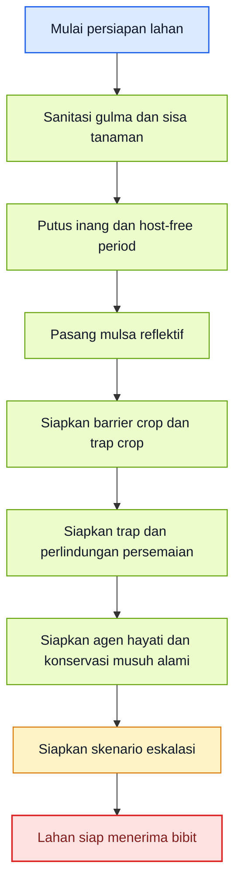

[**Kembali ke Atas**](#pedoman-terpadu-mencegah-gagal-panen-cabai-akibat-kutu-kebul-dan-thrips)

---

# Bab 5. Fase Preventif Sejak Persemaian sampai Awal Tanam

Setelah persiapan beres, fase paling menentukan berikutnya adalah **persemaian sampai 0–14 HST**. Pada fase ini, tujuan utama bukan membunuh hama sebanyak mungkin, tetapi **memastikan tanaman muda tidak langsung menjadi titik masuk vektor dan tidak kehilangan bentuk tumbuh normalnya sejak dini**. Untuk whitefly dan thrips, kerusakan awal jauh lebih mahal daripada kerusakan yang datang terlambat, karena fase ini membentuk arsitektur tanaman, jumlah cabang produktif, dan risiko infeksi virus permanen.

## 5.1 Seleksi bibit sehat dan disiplin persemaian

Bibit sehat harus diperlakukan sebagai syarat masuk, bukan sebagai bonus. SOP budidaya cabai dan pedoman perlindungan hortikultura sama-sama menempatkan **kasa/kelambu pada persemaian**, sanitasi, dan inspeksi awal sebagai elemen penting pencegahan. Pada whitefly, keberadaan vektor sejak bibit sangat berbahaya karena satu infeksi dini bisa mengubah pertumbuhan tanaman permanen. Pada thrips, bibit dan pucuk muda sangat rentan karena jaringan muda adalah target utama makan.

Karena itu, bibit yang masuk ke lahan seharusnya sudah lolos dari tiga hal: tidak ada gejala distorsi mencurigakan, tidak ada populasi serangga menetap di bawah daun atau pucuk, dan tidak ada tanda persemaian menjadi sumber infestasi. Begitu fase ini longgar, kebun memulai musim dengan kelemahan bawaan. ([hortikultura.pertanian.go.id][3])

## 5.2 Trap sejak awal dan inspeksi rutin

Direktorat Hortikultura menyarankan **perangkap kuning** untuk memantau dan membantu mengendalikan kutu kebul, sementara dokumen perlindungan cabai menyebut **perangkap biru, putih, atau kuning** untuk trips. SOP cabai rawit Hiyung juga mencantumkan pemasangan perangkap kuning sekitar umur dua minggu sebagai bagian perlindungan awal. Artinya, trap bukan alat tambahan setelah ada serangan, tetapi bagian dari **starter pack** musim tanam. ([hortikultura.pertanian.go.id][3])

Trap tetap harus dibaca bersama inspeksi langsung. Pada whitefly, titik pemeriksaan tercepat tetap **bagian bawah daun**. Pada thrips, titik pemeriksaan tercepat adalah **pucuk, daun muda, dan bunga**, termasuk dengan cara menggoyang bunga atau pucuk di atas kertas putih. Trap memberi sinyal migrasi; tanaman memberi bukti kolonisasi. Dua-duanya harus berjalan bersama sejak fase awal.

## 5.3 Tindakan saat ada bibit atau tanaman muda yang mencurigakan

Pada fase awal, kompromi adalah musuh utama. Bila ada bibit atau tanaman muda yang memperlihatkan gejala sangat mencurigakan ke arah virus atau populasi vektor yang nyata, tindakan harus cepat: **pisahkan, keluarkan, atau musnahkan** sebelum menjadi sumber sekunder. Prinsip ini sejalan dengan pedoman Direktorat Hortikultura yang menempatkan **eradikasi tanaman sakit** sebagai bagian pengendalian kutu kebul dan penyakit kuning, serta dengan logika thrips-borne virus bahwa pengendalian paling berharga ada pada pencegahan penyebaran awal.

Petani sering ragu mencabut tanaman muda karena merasa sayang, padahal pada fase ini kerugian terbesar justru datang dari membiarkan sumber masalah tetap berdiri. Pada tanaman cabai, satu tanaman sakit di awal musim sering lebih mahal daripada kehilangan satu lubang tanam. ([hortikultura.pertanian.go.id][3])

## 5.4 Peran agen hayati sejak dini

Fase 0–14 HST adalah tempat paling logis untuk memulai program biologis, bukan untuk menunggu ledakan. UC IPM menekankan konservasi musuh alami pada whitefly dan biologically based IPM pada thrips. Pada whitefly, parasitoid **Encarsia** dan **Eretmocerus** serta predator seperti lacewings dan lady beetles menjadi komponen penting. Pada thrips, **minute pirate bugs** adalah predator kunci, dan pada sumber lain chilli thrips juga dapat ditekan oleh **Amblyseius swirskii** dan musuh alami lain dalam kondisi yang sesuai. Produk berbasis **Beauveria bassiana** juga relevan untuk hama bertubuh lunak seperti thrips dan whiteflies, meski bekerja lebih bertahap dan membutuhkan kondisi aplikasi yang tepat.

Karena itu, program preventif awal seharusnya tidak dimulai dengan “semprot keras untuk berjaga-jaga”, tetapi dengan **menjaga agar program hayati punya peluang hidup**. Inilah alasan mengapa semprotan broad-spectrum pada awal musim sering justru merusak dasar pengendalian untuk minggu-minggu berikutnya.

## 5.5 Penguatan tanaman muda setelah pindah tanam

Setelah pindah tanam, fokusnya adalah menjaga tanaman muda tetap cepat pulih, cepat membentuk tajuk sehat, dan tidak terpapar tekanan vektor terlalu tinggi. Mulsa reflektif, trap aktif, sanitasi sekitar bedengan, pengamatan tepi petakan, dan penghindaran pemupukan nitrogen berlebihan menjadi bagian penting. Pada thrips, UF/IFAS menunjukkan bahwa **kelebihan nitrogen** dapat meningkatkan jumlah thrips dan insiden TSWV; ini mengingatkan bahwa penguatan tanaman awal harus dibedakan dari “memanjakan” tanaman dengan nutrisi yang justru menarik hama lebih banyak. ([UC IPM][1])

Fase 0–14 HST seharusnya diperlakukan sebagai fase “steril secara epidemi”, sejauh mungkin. Semakin bersih fase ini dari tekanan vektor dan serangan awal, semakin besar peluang kebun memasuki fase vegetatif dengan modal kuat. ([hortikultura.pertanian.go.id][3])

## Rumusan praktis Bab 5

Bila Bab 5 diperas menjadi satu aturan kerja, maka aturannya adalah: **jangan biarkan bibit dan tanaman muda memulai musim tanpa proteksi fisik, trap, inspeksi langsung, dan fondasi agen hayati**. Yang wajib dilakukan pada 0–14 HST adalah memeriksa daun dan pucuk secara rutin, membaca trap, menyingkirkan tanaman mencurigakan, menjaga kebun tetap bersih, dan menahan diri dari penggunaan insektisida keras yang merusak fondasi program biologis.

**Diagram Bab 5** berikut merangkum alur preventif sejak persemaian sampai 14 HST.

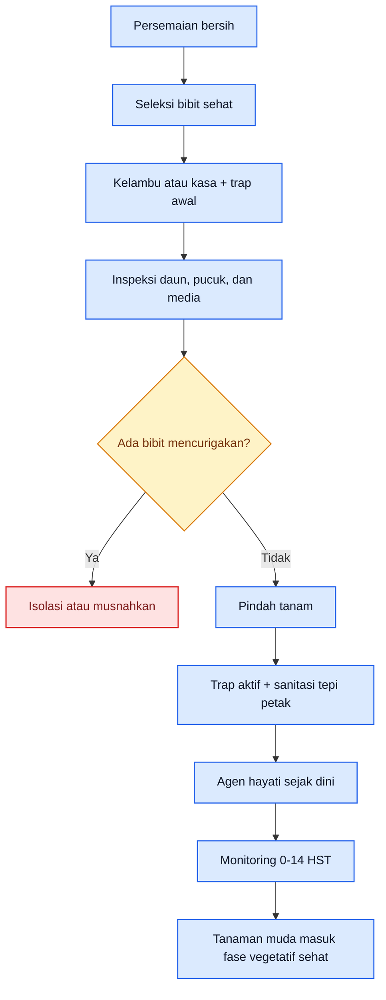

[**Kembali ke Atas**](#pedoman-terpadu-mencegah-gagal-panen-cabai-akibat-kutu-kebul-dan-thrips)

---

# Bab 6. Program Preventif yang Melekat Sepanjang Siklus: Agen Hayati, Trap, Sanitasi, dan Musuh Alami

Pada banyak kebun, pencegahan dipahami sebagai satu-dua tindakan di awal musim, lalu selesai. Itu keliru. Pada kutu kebul dan thrips, preventif yang benar harus **melekat sepanjang siklus**, karena migrasi OPT, perkembangan tajuk, pembungaan, keberadaan gulma, dan dinamika musuh alami semuanya berubah dari minggu ke minggu. UC IPM menyebut program untuk whitefly sebagai bagian dari **integrated pest management**, yang mencakup monitoring, cultural practices, konservasi musuh alami, dan penggunaan pestisida hanya saat perlu. Untuk thrips, UF/IFAS bahkan menegaskan bahwa **biologically based IPM program is the most effective way** untuk pepper dan eggplant.

## 6.1 Preventif adalah sistem yang berulang

Program preventif yang baik selalu berputar dalam siklus yang sama: **monitoring → sanitasi → pembacaan tekanan hama → penguatan agen hayati dan musuh alami → evaluasi → koreksi ringan bila perlu**. Siklus ini harus diulang, bukan dilakukan sekali. Pada whitefly, monitoring diperlukan untuk mendeteksi dan mencegah perkembangan populasi tahunan. Pada thrips, populasi dan tekanan kerusakan berubah bersama fase berbunga dan keberadaan predator. Jadi preventif yang efektif selalu bersifat **berulang dan adaptif**.

Inilah sebabnya agen hayati tidak boleh ditempatkan sebagai langkah “tambahan kalau sempat”. Ia harus menjadi bagian dari ritme kebun. Ketika petani hanya mengingat agen hayati setelah populasi meledak, sebenarnya ia sudah kehilangan momentum terbaiknya.

## 6.2 Agen hayati yang dipakai sejak awal dan dipertahankan

Untuk whitefly, musuh alami yang relevan meliputi parasitoid **Encarsia** dan **Eretmocerus**, serta predator seperti **lacewing larvae**, **lady beetle larvae**, dan bigeyed bugs. Untuk thrips, **Orius/minute pirate bugs** adalah predator paling penting pada pepper, dan sumber UF/IFAS juga menyebut predatory mites seperti **Amblyseius swirskii** dan **Neoseiulus cucumeris** sebagai opsi yang relevan, terutama untuk chilli thrips. Pada level mikroba, produk berbasis **Beauveria bassiana** dikenal relevan untuk whiteflies dan thrips, bekerja melalui infeksi kutikula dan lebih cocok diposisikan sebagai bagian dari program berulang daripada senjata darurat sekali tembak.

Kunci pentingnya adalah kesinambungan. Agen hayati harus mulai dikenalkan atau dikonservasi saat populasi OPT masih rendah sampai sedang, lalu dipertahankan lewat pilihan insektisida yang tidak merusak total, sanitasi yang rapi, dan habitat kebun yang tidak terlalu “steril secara biologis”. Bila seluruh fondasi ini dihancurkan oleh semprotan agresif di awal, maka program hayati tidak pernah sempat bekerja. ([Ask IFAS - Powered by EDIS][2])

## 6.3 Keterkaitan agen hayati, trap, dan sanitasi

Trap tidak berdiri sendiri, sanitasi juga tidak. Trap memberi sinyal pergerakan dan kenaikan tekanan, sanitasi menurunkan tempat bertahan dan sumber inang, sementara agen hayati dan musuh alami menekan populasi yang lolos. Ketiganya harus dibaca sebagai satu paket. Direktorat Hortikultura menuliskan kombinasi **perangkap likat**, **sanitasi**, **kelambu**, **border**, dan **musuh alami** untuk kutu kebul dan trips, yang menunjukkan bahwa pengendalian preventif memang sejak awal dirancang sebagai sistem berlapis.

Bila salah satu unsur putus, sistem menjadi timpang. Trap tanpa sanitasi hanya memberi kabar buruk lebih cepat. Sanitasi tanpa monitoring membuat kebun buta. Agen hayati tanpa konservasi hanya menjadi aplikasi yang mahal tetapi tidak berumur panjang. Justru karena itu, preventif harus dipahami sebagai **arsitektur kebun**, bukan daftar alat.

## 6.4 Peran refugia dan tanaman berbunga bagi musuh alami

Selain menekan hama secara langsung, kebun yang baik juga mendukung keberadaan musuh alami. UF/IFAS menjelaskan bahwa **sunflower di perimeter pepper field** dapat meningkatkan kepadatan **minute pirate bugs** di pertanaman pepper dan membantu menekan western flower thrips. Sumber yang sama juga menyinggung pentingnya flora penunjang atau refugia bagi musuh alami. Ini penting karena pada pepper/cabai, predator thrips sering bekerja lebih stabil bila ada sumber pakan dan habitat pendukung di sekitar kebun.

Namun refugia harus dipahami dengan disiplin. Tanaman pendukung musuh alami tidak boleh berubah menjadi reservoir hama yang tidak terpantau. Karena itu, prinsipnya bukan “semakin banyak tanaman liar semakin baik”, melainkan **tanaman pendukung yang sengaja dipilih, ditempatkan, dan dipantau**.

## 6.5 Kapan aplikasi atau intervensi preventif diulang

Tidak ada interval tunggal yang cocok untuk semua kebun, karena frekuensi pengulangan sangat dipengaruhi oleh tekanan OPT, cuaca, intensitas sanitasi, dan fase tanaman. Tetapi prinsip umumnya jelas: selama fase rawan, monitoring harus tetap rutin; trap harus tetap aktif dan dibaca; gulma dan sumber inang harus terus ditekan; agen hayati atau produk biologis yang digunakan preventif harus diulang sesuai kebutuhan dan kompatibilitas lapang, bukan menunggu populasi melonjak. Pada whitefly, UC IPM menekankan monitoring sebagai alat pencegah perkembangan populasi. Pada thrips, delay buildup oleh mulch, peran predator, dan perubahan rasio predator-mangsa menunjukkan bahwa keputusan pengulangan harus berbasis pembacaan lapang, bukan kalender buta.

Program preventif dinilai **berhasil** bila populasi OPT tetap rendah, gejala baru jarang muncul, dan kebutuhan intervensi kuratif tetap minimal. Program dinilai **mulai gagal** bila trap dan scouting menunjukkan tekanan naik terus, gejala awal makin banyak, atau musuh alami tak lagi cukup menahan laju populasi. Pada titik itu, kebun tidak boleh tetap bertahan dalam mode preventif pasif; ia harus naik ke korektif secara terukur.

## 6.6 Kapan preventif harus dinaikkan menjadi korektif

Preventif harus dinaikkan menjadi korektif ketika ada tanda bahwa sistem berlapis tadi tidak lagi cukup membendung tekanan. Tanda itu bisa berupa kenaikan cepat tangkapan trap, koloni whitefly mulai menetap di bawah daun, gejala silvering thrips makin sering muncul di pucuk atau bunga, atau tanaman sakit baru mulai bertambah. Pada thrips yang terkait virus, UF/IFAS menekankan bahwa pengendalian larva penting untuk menekan secondary spread, sedangkan primary spread dari viruliferous adults tidak bisa dicegah hanya dengan membunuh setelah mereka makan. Ini berarti respons korektif harus **lebih cepat daripada kebiasaan petani menunggu gejala berat**. ([Ask IFAS - Powered by EDIS][2])

Jadi, program preventif tidak bertujuan menghindari semua penggunaan intervensi korektif, tetapi bertujuan agar ketika korektif diperlukan, kebun masih berada dalam kondisi yang **bisa diselamatkan**. Itulah ukuran preventif yang baik.

## Rumusan praktis Bab 6

Bila harus dipadatkan menjadi satu pegangan, maka pegangan Bab 6 adalah: **preventif harus berulang, terhubung, dan terus dibaca hasilnya**. Agen hayati harus melekat sejak awal, trap dan sanitasi tidak boleh putus, musuh alami harus dikonservasi, dan setiap sinyal kenaikan tekanan harus diterjemahkan menjadi koreksi cepat sebelum kebun masuk mode darurat.

**Diagram Bab 6** berikut menunjukkan ritme preventif satu musim dalam bentuk siklus, agar pembaca mudah melihat bahwa pencegahan bukan aksi tunggal.

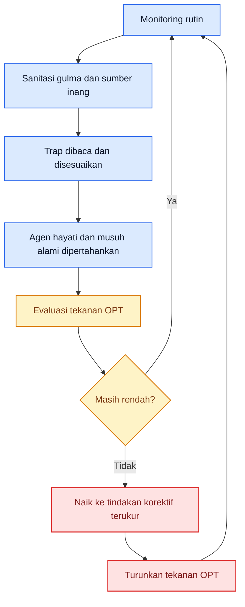

Kalau Anda setuju, saya lanjut ke **Response 3: Bab 7 dan Bab 8**, termasuk **Tabel “Titik kritis dalam siklus cabai”** dan **Tabel “Program tindakan per fase”** sesuai outline yang sudah dikunci.

[1]: https://ipm.ucanr.edu/pmg/c604/pepper-checklist.pdf 'Pepper YRP 9_30_11'
[2]: https://ask.ifas.ufl.edu/publication/IN401 'ENY-658/IN401: Managing Thrips in Pepper and Eggplant'
[3]: https://hortikultura.pertanian.go.id/wp-content/uploads/2024/11/Teknik-Pengendalian-Penyakit-Kuning-Pada-Tanaman-Cabai_watermark.pdf 'BROSUR'

[**Kembali ke Atas**](#pedoman-terpadu-mencegah-gagal-panen-cabai-akibat-kutu-kebul-dan-thrips)

---

# Bab 7. Monitoring, Titik Kritis, dan Momen Penentu dalam Siklus Cabai

Pada cabai, monitoring bukan pekerjaan administratif, melainkan **pusat keputusan lapang**. Kutu kebul dan thrips menjadi sangat berbahaya bukan hanya karena merusak tanaman secara langsung, tetapi karena keduanya dapat mengubah arah satu musim tanam ketika lolos terdeteksi pada fase kritis. UC IPM menegaskan bahwa monitoring whitefly penting untuk **mendeteksi dan mencegah perkembangan populasi**, sedangkan pada thrips, risiko utamanya pada pepper justru terkait **vektoring virus** dan kerusakan bunga serta pucuk muda. Direktorat Hortikultura juga menekankan bahwa pemantauan kutu kebul harus dilakukan aktif mulai dari pembibitan sampai pertanaman agar gejala penyakit terdeteksi dini dan penyebarannya dapat dicegah. ([UC IPM][1])

## Aset gambar aktual Bab 7

Untuk Bab 7, gambar yang dipakai bukan lagi gambar identifikasi umum, tetapi gambar yang membantu pembaca membedakan **fase awal**, **fase memburuk**, dan **fase yang sudah terlambat**. Gunakan nama file lokal berikut di proyek MDX Anda. Dua aset pertama berbasis gambar aktual dari NC State, UC IPM, dan UF/IFAS; dua aset virus saya tetapkan dari dokumen resmi Hortikultura agar konsisten dengan konteks cabai di Indonesia.

  <figure>
    
    <figcaption>
      Whitefly: fase awal di bawah daun versus fase yang sudah padat dan
      meninggalkan jejak kerusakan.
    </figcaption>
  </figure>

{' '}

<figure>
  
  <figcaption>
    Thrips: kerusakan awal pada bunga versus fase merusak pada pucuk dan tajuk
    cabai.
  </figcaption>
</figure>

{' '}

<figure>
  
  <figcaption>
    Gejala awal virus: perubahan warna, vein clearing, dan keriting awal yang
    sering masih diremehkan.
  </figcaption>
</figure>

  <figure>
    
    <figcaption>
      Gejala terlambat: tanaman kerdil, daun mengecil, kuning kuat, dan
      kehilangan potensi berbuah.
    </figcaption>
  </figure>

## 7.1 Cara monitoring kutu kebul

Pada whitefly, titik pemeriksaan utama adalah **tepi kebun** dan **permukaan bawah daun**. UC IPM menulis bahwa area tepi biasanya terinfestasi lebih dulu, dan pada periode kritis kebun pepper perlu dicek **dua kali seminggu**. Whitefly dewasa akan mudah beterbangan saat tanaman diganggu, tetapi keputusan lapang tidak cukup hanya melihat imago beterbangan; petani juga harus melihat ada tidaknya stadia menetap pada bawah daun dan ada tidaknya jejak **honeydew**, **frost**, atau **jelaga** pada permukaan daun. Untuk silverleaf whitefly, UC IPM memberi patokan tindakan sekitar **4 dewasa per daun** pada sampel acak **30 daun sehat**, sementara perawatan semprotan harus benar-benar mengenai **bagian bawah daun**. ([UC IPM][1])

Dalam konteks kebun cabai di Indonesia, monitoring whitefly juga harus digabung dengan pembacaan gejala virus. Dokumen Teknik Pengendalian Penyakit Kuning pada Tanaman Cabai menegaskan bahwa virus kuning **tidak ditujukan untuk “disembuhkan”**, melainkan dicegah penyebarannya melalui pengendalian vektor dan sumber penyakit. Dokumen itu juga menyebut bahwa petani perlu aktif memantau kutu kebul mulai dari pembibitan sampai pertanaman agar gejala penyakit terdeteksi lebih dini. Ini berarti monitoring whitefly harus selalu menjawab dua pertanyaan sekaligus: **berapa tekanan vektornya sekarang** dan **apakah sudah ada gejala virus yang menandakan penyebaran telah dimulai**. ([hortikultura.pertanian.go.id][2])

## 7.2 Cara monitoring thrips

Pada thrips, titik pemeriksaan utama bukan bawah daun tua, melainkan **pucuk, daun muda, dan bunga**. UC IPM menjelaskan bahwa thrips pada pepper paling merusak lewat **vektoring Tomato spotted wilt virus**, dan pada populasi tinggi dapat menyebabkan **distorsi pertumbuhan**, **deformasi bunga**, serta **bercak putih-keperakan** pada daun muda yang sering disertai **fekal spot** hitam. Karena itu, monitoring thrips harus mengutamakan bagian tanaman yang sedang aktif tumbuh. Cara lapang yang paling praktis adalah menggoyang pucuk atau bunga di atas kertas putih, lalu memastikan apakah ada titik-titik kecil bergerak. ([UC IPM][3])

Untuk alat bantu, UC IPM menyebut **yellow sticky traps** berguna untuk memonitor pergerakan thrips, sedangkan dokumen SOP cabai rawit Hiyung menyebut **perangkap likat biru atau putih** sebanyak **40 buah per hektar** atau **2 buah per 500 m²**, dipasang sejak tanaman berumur **2 minggu**. Ini memberi dua pelajaran praktis: trap berfungsi sebagai **alarm migrasi**, tetapi keputusan tetap harus divalidasi pada pucuk dan bunga; dan kedua, monitoring thrips tidak boleh baru dimulai saat bunga sudah rontok. Pada cabai, begitu gejala bunga rusak dan pucuk mulai kusut terlihat jelas, kerugian ekonomi sering sudah berjalan. ([UC IPM][3])

## 7.3 Intensitas monitoring: kapan harus lebih rapat

Untuk whitefly, intensitas monitoring yang paling tegas datang dari UC IPM: pada periode kritis, terutama ketika tanaman inang di sekitar kebun sedang menurun atau ketika migrasi diperkirakan sedang aktif, kebun pepper harus dicek **dua kali per minggu**. Untuk thrips, sumber resmi tidak selalu memberi satu angka universal yang kaku, tetapi seluruh pedoman yang ada mengarah ke kesimpulan operasional yang sama: frekuensi monitoring harus **ditingkatkan pada fase berbunga**, karena di fase inilah thrips paling mudah menggeser kerusakan dari daun ke bunga dan buah muda. Jadi secara praktis, ritme **minimal dua kali seminggu** pada fase rawan adalah pilihan paling rasional untuk dua OPT ini. Kalimat terakhir ini adalah **sintesis operasional** dari rekomendasi monitoring kritis whitefly, monitoring thrips pada bunga, dan daftar fase pemeriksaan dalam Pepper Year-Round IPM Program. ([UC IPM][1])

## 7.4 Titik kritis: kapan risiko gagal panen mulai besar

Pada cabai, titik kritis bukan hanya soal umur tanaman, tetapi soal **apa yang sedang dibentuk tanaman saat serangan terjadi**. Persemaian dan 0–14 HST adalah titik kritis tertinggi untuk vektor dan pembentukan arsitektur tanaman. Fase 15–35 HST menjadi mahal bila whitefly mulai menetap di bawah daun karena saat itulah vektor berpeluang mengamplifikasi penularan virus. Awal berbunga adalah titik kritis thrips, karena kerusakan tidak lagi berhenti pada pucuk tetapi mulai memukul bunga dan set buah. Begitu gejala virus pertama muncul, kebun masuk fase yang jauh lebih sensitif karena penundaan keputusan dapat mengubah satu petak menjadi sumber inokulum aktif. Penetapan titik-titik ini merupakan sintesis langsung dari checklist fase tanaman UC IPM, pedoman penyakit kuning cabai Direktorat Hortikultura, dan SOP budidaya cabai rawit Hiyung. ([UC IPM][4])

## Tabel 2. Titik kritis dalam siklus cabai

| Fase tanaman                     | Ancaman dominan                                    | Gejala awal yang harus dicari                                                            | Risiko bila terlambat                                       | Keputusan cepat yang harus diambil                                                |
| -------------------------------- | -------------------------------------------------- | ---------------------------------------------------------------------------------------- | ----------------------------------------------------------- | --------------------------------------------------------------------------------- |
| Persemaian                       | Whitefly, thrips, sumber virus terbawa             | Bibit tidak seragam, daun muda berubah warna, serangga kecil pada pucuk atau bawah daun  | Satu batch bibit menjadi sumber sebaran ke seluruh blok     | Sortir ketat, isolasi/musnahkan bibit mencurigakan, perketat kasa dan trap        |
| Pindah tanam–14 HST              | Kolonisasi awal vektor                             | Whitefly di tepi petak, thrips pada pucuk muda, trap mulai naik                          | Infeksi dini mengubah bentuk tumbuh dan vigor tanaman       | Fokus tepi kebun, cabut tanaman mencurigakan, jaga sanitasi dan perlindungan awal |
| 15–35 HST                        | Whitefly mulai menetap, virus mulai muncul         | Imago beterbangan saat tajuk digoyang, bawah daun mulai penuh, vein clearing/kuning awal | Penyebaran virus melonjak dan koreksi makin mahal           | Tingkatkan monitoring, rogueing dini, tahan migrasi dari tepi kebun               |
| Kanopi mulai rapat               | Whitefly                                           | Koloni bawah daun, honeydew, frost, jelaga awal                                          | Populasi cepat tersembunyi dan melejit                      | Fokus sampling bawah daun dan tepi blok, evaluasi kebutuhan tindakan korektif     |
| Awal berbunga                    | Thrips                                             | Silvering, keriting pucuk, bunga rusak, fekal spot hitam                                 | Kehilangan bunga dan mutu buah awal                         | Cek bunga lebih rapat, perkuat kontrol di pucuk-bunga                             |
| Pembentukan buah                 | Thrips + virus + mutu                              | Scarring buah, bunga gugur, tanaman kerdil, daun makin sempit/kuning                     | Kerusakan mutu dan hasil berjalan bersamaan                 | Lindungi gelombang buah yang sedang dibentuk, singkirkan sumber infeksi           |
| Saat gejala virus pertama muncul | Vektor + penyakit                                  | Vein clearing, daun menggulung ke atas, pucuk menguning                                  | Kebun masuk fase ledakan sumber inokulum                    | Eradikasi selektif, sanitasi agresif, intensifkan scouting 24–72 jam              |
| Menjelang akhir produksi         | Migrasi tepi kebun, carry-over ke musim berikutnya | Serangan lokal di pinggir, tanaman sekitar menjadi sumber                                | Menekan panen akhir dan membawa masalah ke musim berikutnya | Sanitasi cepat, potong sumber, cegah jembatan antar musim                         |

Tabel ini adalah **sintesis operasional** dari fase pemeriksaan pada Pepper Year-Round IPM Program, rekomendasi monitoring whitefly di tepi kebun dari UC IPM, risiko thrips pada fase berbunga, serta pedoman eradikasi dan pengendalian vektor pada dokumen Hortikultura Indonesia. ([UC IPM][4])

## 7.5 Indikator kebun masuk zona bahaya

Kebun dapat dianggap mulai masuk **zona bahaya** ketika salah satu dari empat pola ini muncul. Pertama, **trap naik dan tepi kebun aktif**, terutama bila whitefly mulai terlihat lebih dulu di margin seperti yang dijelaskan UC IPM. Kedua, **koloni menetap mulai terbentuk**: whitefly sudah tidak lagi hanya lewat, tetapi hadir pada bawah daun; thrips tidak lagi hanya sesekali ditemukan, tetapi mulai konsisten pada pucuk dan bunga. Ketiga, **gejala virus pertama muncul**, seperti vein clearing, daun menggulung ke atas, pucuk menguning, atau pertumbuhan mulai kerdil. Keempat, **kerusakan organ produktif dimulai**, misalnya bunga mulai rusak atau buah muda mulai scarring. Secara praktis, satu indikator saja belum tentu berarti darurat, tetapi kombinasi dua atau lebih berarti kebun tidak boleh tetap diperlakukan sebagai kebun “normal”. ([UC IPM][1])

## 7.6 Apa yang harus dilakukan dalam 24–72 jam pertama

Pada **0–24 jam pertama**, tindakan terpenting adalah **menaikkan resolusi pengamatan**. Artinya, blok yang dicurigai harus ditandai, tepi kebun diperiksa lebih rapat, trap dibaca ulang, dan tanaman bergejala awal dipisahkan dari tanaman sehat dalam pengambilan keputusan. Bila ada tanaman dengan gejala virus yang kuat, dokumen Hortikultura menegaskan bahwa tanaman tersebut harus segera **dicabut dan dimusnahkan** agar tidak menjadi sumber penularan. Pada whitefly, margin field perlu menjadi prioritas bila tekanan di tepi lebih tinggi daripada di tengah. ([UC IPM][1])

Pada **24–48 jam berikutnya**, fokus berpindah ke **pemutusan sumber masalah**. Gulma inang dan sisa tanaman terserang harus dibersihkan, bibit atau tanaman muda yang sangat mencurigakan harus dikeluarkan, dan perlindungan pada bagian kebun yang belum terkena harus diperketat. Untuk thrips, fase ini berarti menaikkan perhatian ke bunga dan pucuk. Untuk whitefly, fase ini berarti memastikan bawah daun benar-benar diperiksa dan kebun tidak hanya “disemprot dari atas”. Tahap ini juga merupakan saat yang tepat untuk memutuskan apakah kebun masih bisa ditahan dengan penguatan preventif atau harus mulai naik ke tindakan korektif. Kalimat terakhir ini merupakan **inferensi operasional** yang langsung diturunkan dari prinsip monitoring kritis, eradikasi sumber penyakit, dan perlunya membatasi penyebaran vektor secepat mungkin. ([UC IPM][1])

Pada **48–72 jam**, petani harus sudah mendapatkan jawaban atas pertanyaan inti: **tekanan OPT menurun, tetap, atau naik**. Kalau gejala baru tetap muncul, trap terus naik, atau tanaman sakit bertambah, maka kebun tidak lagi cukup dipertahankan hanya dengan mode preventif biasa. Di titik itulah kebun harus naik ke **korektif terukur** dan, bila perlu, menuju protokol darurat pada bab-bab berikutnya. Di sisi lain, bila tekanan mulai tertahan, maka program preventif masih relevan tetapi monitoring rapat tidak boleh langsung dilonggarkan. Ini penting karena pada dua OPT ini, “terlihat membaik” selama dua hari belum sama dengan “sudah aman”. ([UC IPM][1])

**Diagram Bab 7** berikut merangkum alur keputusan monitoring dan respons 24–72 jam pertama.

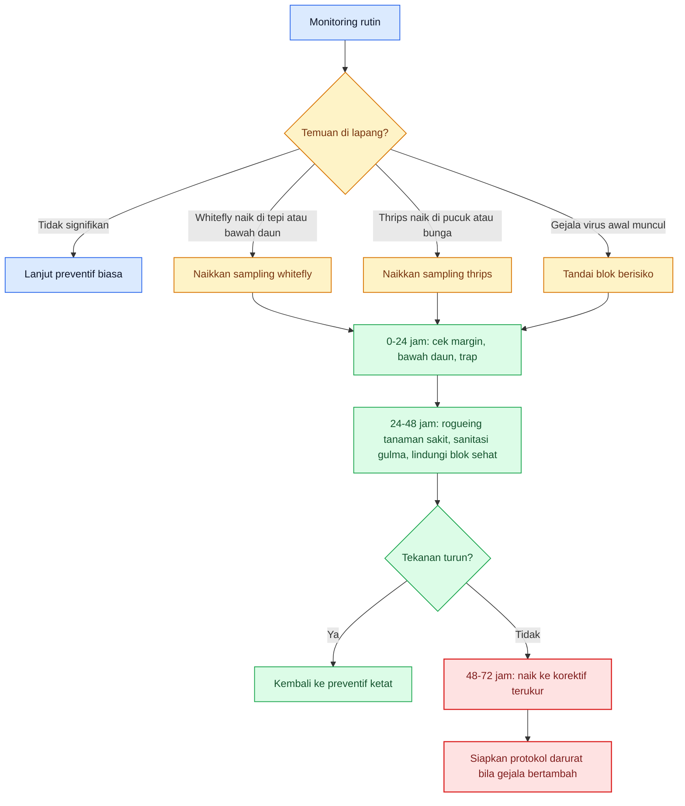

[**Kembali ke Atas**](#pedoman-terpadu-mencegah-gagal-panen-cabai-akibat-kutu-kebul-dan-thrips)

---

# Bab 8. Program Tindakan per Fase: Apa yang Harus Dilakukan dari Sebelum Tanam sampai Akhir Produksi

Setelah titik kritis dikenali, langkah berikutnya adalah menerjemahkannya menjadi **urutan kerja lapang** yang bisa dipakai sebagai SOP kebun. Bab ini tidak menambah teori baru; fungsinya adalah menyusun tindakan menjadi program yang bisa diulang tiap musim. Dasarnya diambil dari Pepper Year-Round IPM Program UC IPM, panduan whitefly dan thrips pada pepper, serta pedoman Hortikultura Indonesia tentang virus kuning, perangkap, border, sanitasi, dan eradikasi. Jadi fokus Bab 8 adalah pertanyaan praktis: **pada fase ini, apa yang harus dilakukan sekarang**. ([UC IPM][4])

## 8.1 Sebelum tanam

Sebelum tanam, targetnya adalah **menurunkan peluang OPT masuk** dan **menyiapkan sistem baca**. UC checklist pra-tanam menekankan pengendalian gulma di sekitar lahan, penggunaan transplan sehat, reflective mulch, serta pemeriksaan bibit sebelum tanam. Dokumen Hortikultura Indonesia menambahkan border crop seperti jagung, perangkap kuning, dan sanitasi inang virus. Pada fase ini, petani belum sedang menyelamatkan kebun; ia sedang **mencegah musim berjalan buruk sejak start**. ([UC IPM][4])

## 8.2 Persemaian

Pada persemaian, targetnya adalah **mencegah sumber infestasi ikut pindah ke lahan utama**. SOP cabai rawit Hiyung menekankan benih sehat, media dan persemaian yang terjaga, serta penggunaan kasa atau kelambu halus sebagai perlindungan awal. Dalam praktik dua OPT ini, persemaian harus dianggap sebagai zona dengan leverage tertinggi: kegagalan di sini akan dibawa ke seluruh blok. Karena itu, trap, inspeksi pucuk dan bawah daun, serta eliminasi bibit mencurigakan harus dilakukan tanpa kompromi.

## 8.3 Pindah tanam–14 HST

Pada 0–14 HST, target utamanya adalah **mencegah kolonisasi awal vektor** dan menjaga tanaman muda membentuk tajuk sehat. UC IPM menyebut reflective mulch dapat menunda buildup whitefly sekitar **4–6 minggu**, dan pada thrips reflective mulch dipakai untuk menolak migrasi awal. Di fase ini, trap harus aktif, tepi petakan dibaca, tanaman mencurigakan harus segera dikeluarkan, dan program preventif biologis mulai berjalan. Ini adalah fase ketika biaya pencegahan jauh lebih murah daripada biaya rescue. ([UC IPM][1])

## 8.4 Fase 15–35 HST

Masuk fase 15–35 HST, target berubah dari “mencegah masuk” menjadi **mencegah menetap dan berkembang**. Whitefly harus dicek pada bawah daun dan margin field. Thrips harus tetap dipantau di pucuk. Pada fase ini, pengendalian gulma, kebersihan tepi lahan, pembacaan trap, dan perlindungan musuh alami menjadi paket yang tidak boleh putus. Bila gejala virus mulai muncul, maka program fase ini harus langsung bergeser dari preventif biasa ke keputusan korektif awal. ([UC IPM][1])

## 8.5 Awal berbunga

Awal berbunga adalah fase di mana program harus **memusatkan perhatian pada thrips**, tanpa melepaskan whitefly. UC IPM menjelaskan bahwa thrips berbahaya karena merusak bunga dan menularkan Tomato spotted wilt virus, sementara pada populasi tinggi menyebabkan deformasi bunga dan silvering pada daun muda. Karena itu, bunga bukan lagi sekadar organ produksi, tetapi juga **lokasi monitoring utama**. Pada fase ini, kebun yang tidak rutin memeriksa bunga sangat mudah terlambat membaca kerusakan. ([UC IPM][3])

## 8.6 Pembentukan buah

Pada pembentukan buah, targetnya menjadi ganda: **menjaga hasil yang sedang dibentuk** dan **mencegah gelombang kerusakan berikutnya**. Thrips menjadi ancaman mutu melalui scarring dan deformasi, sedangkan whitefly tetap berbahaya lewat tekanan vektor dan penurunan vigor tanaman. Pepper checklist UC juga menunjukkan bahwa pada fruit development, perhatian terhadap thrips, aphids, tomato fruitworm, dan penyakit virus tetap harus berjalan. Di fase ini, keterlambatan pengendalian sering tidak lagi hanya menurunkan jumlah panen, tetapi juga kualitas panen yang sudah di depan mata. ([UC IPM][4])

## 8.7 Saat serangan masih rendah

Bila serangan masih rendah, tindakan terbaik adalah **menjaga ritme preventif tetap hidup**. Whitefly ringan masih memberi ruang bagi musuh alami, sebagaimana dinyatakan UC IPM untuk light infestations. Thrips ringan belum boleh membuat kebun lengah, terutama dekat fase berbunga. Dalam kondisi ini, strategi yang paling masuk akal adalah mempertahankan sanitasi, trap, monitoring, dan program biologis, lalu menghindari semprotan broad-spectrum yang justru menghancurkan fondasi pengendalian. ([UC IPM][1])

## 8.8 Saat serangan mulai naik

Bila serangan mulai naik, SOP kebun harus berubah dari “pemeliharaan” menjadi **penekanan dini**. Whitefly di tepi kebun yang lebih tinggi daripada di tengah lapang memberi sinyal bahwa tindakan dapat difokuskan dulu pada margin, sebagaimana disarankan UC IPM. Pada thrips, bila gejala mulai konsisten di bunga dan pucuk, tindakan korektif tidak boleh ditunda menunggu kerusakan menjadi berat. Pada fase ini, petani harus kembali pada kerangka 24–72 jam dari Bab 7: intensifkan pembacaan, putus sumber sakit, lalu tentukan apakah korektif awal sudah cukup atau perlu eskalasi lebih lanjut. ([UC IPM][1])

## Tabel 3. Program tindakan per fase

| Fase tanaman         | Target pengendalian                           | Tindakan preventif                                                                | Tindakan monitoring                                   | Tindakan korektif awal                                          | Catatan khusus                                                   |
| -------------------- | --------------------------------------------- | --------------------------------------------------------------------------------- | ----------------------------------------------------- | --------------------------------------------------------------- | ---------------------------------------------------------------- |
| Sebelum tanam        | Menurunkan peluang OPT masuk                  | Sanitasi gulma, musnahkan sisa tanaman, siapkan mulsa reflektif, border/trap crop | Pemetaan sumber inang sekitar lahan                   | Bersihkan sumber inang aktif sebelum bibit masuk                | Keputusan salah di fase ini sering dibayar mahal di tengah musim |
| Persemaian           | Mencegah bibit menjadi sumber masalah         | Kasa/kelambu, bibit sehat, trap awal, area bersih                                 | Cek pucuk, bawah daun, trap                           | Isolasi/musnahkan bibit mencurigakan                            | Persemaian adalah titik leverage tertinggi                       |
| Pindah tanam–14 HST  | Menahan kolonisasi awal vektor                | Mulsa reflektif, trap aktif, sanitasi tepi petak, agen hayati awal                | Cek margin, pucuk, bawah daun, trap minimal 2x/minggu | Rogueing dini, penguatan blok sehat                             | Fase paling menentukan untuk bentuk tumbuh tanaman               |
| 15–35 HST            | Mencegah whitefly menetap dan thrips menyebar | Sanitasi berulang, konservasi musuh alami, trap tetap aktif                       | Sampling bawah daun dan pucuk                         | Tindakan korektif lokal bila tekanan naik                       | Jangan tunggu gejala virus meluas                                |
| Awal berbunga        | Melindungi bunga dan set buah                 | Pertahankan trap, sanitasi, penguatan biologis                                    | Fokus bunga, pucuk, silvering, fekal spot             | Tindakan korektif lebih cepat pada thrips                       | Ini fase kritis thrips                                           |
| Pembentukan buah     | Menjaga mutu dan hasil                        | Jaga blok tetap bersih, lindungi gelombang buah                                   | Cek scarring, bunga gugur, gejala virus lanjut        | Tekan sumber kerusakan baru, singkirkan tanaman berat           | Risiko mutu dan hasil berjalan bersamaan                         |
| Saat serangan rendah | Menjaga kebun tetap stabil                    | Lanjut ritme preventif                                                            | Baca tren, bukan hanya snapshot                       | Belum perlu keras, cukup koreksi ringan bila ada fokus serangan | Musuh alami masih bisa bekerja                                   |
| Saat serangan naik   | Menekan ledakan sebelum darurat               | Perketat semua lapis preventif                                                    | Monitoring harian pada blok rawan                     | Fokus tepi kebun, rogueing, mulai korektif terukur              | Jangan biarkan mode “tunggu dulu”                                |

Tabel ini adalah **SOP operasional hasil sintesis** dari UC Pepper Year-Round Checklist, panduan whitefly dan thrips pada pepper, serta pedoman Hortikultura Indonesia untuk virus kuning, trap, sanitasi, barrier crop, dan eradikasi. ([UC IPM][4])

## Rumusan praktis Bab 8

Kalau Bab 8 harus diperas menjadi satu aturan kerja, maka aturannya adalah: **setiap fase tanam punya target pengendalian yang berbeda, dan SOP kebun harus bergerak mengikuti fase itu**. Sebelum tanam fokusnya memotong peluang masuk; pada persemaian dan 0–14 HST fokusnya menahan kolonisasi awal; pada 15–35 HST fokusnya mencegah menetap dan menyebar; pada awal berbunga fokusnya bergeser tajam ke thrips; pada pembentukan buah fokusnya menjaga mutu dan hasil; dan saat serangan naik, kebun harus segera pindah dari ritme pemeliharaan ke ritme penekanan. Itulah cara agar pengendalian terasa sebagai sistem kerja, bukan reaksi putus asa. ([UC IPM][4])

**Diagram Bab 8** berikut merangkum alur SOP per fase dalam bentuk vertikal agar tetap enak dibaca di layar HP.

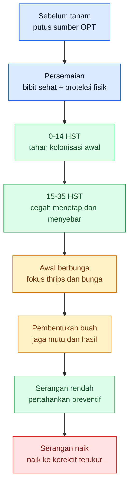

Kalau Anda setuju, saya lanjut ke **Response 4: Bab 9**.

[1]: https://ipm.ucanr.edu/agriculture/peppers/whiteflies/ 'Whiteflies / Peppers / Agriculture: Pest Management Guidelines / UC Statewide IPM Program (UC IPM)'
[2]: https://hortikultura.pertanian.go.id/wp-content/uploads/2024/11/Teknik-Pengendalian-Penyakit-Kuning-Pada-Tanaman-Cabai_watermark.pdf 'BROSUR'
[3]: https://ipm.ucanr.edu/agriculture/peppers/thrips/ 'Thrips / Peppers / Agriculture: Pest Management Guidelines / UC Statewide IPM Program (UC IPM)'
[4]: https://ipm.ucanr.edu/pmg/c604/pepper-checklist.pdf 'Pepper YRP 9_30_11'

[**Kembali ke Atas**](#pedoman-terpadu-mencegah-gagal-panen-cabai-akibat-kutu-kebul-dan-thrips)

---

# Bab 9. Pengendalian Biologis dan Non-Kimia sebagai Tulang Punggung Stabilitas Kebun

Kesalahan paling umum di lapang adalah menganggap pengendalian hayati sebagai “versi lunak” dari insektisida kimia. Cara pikir itu salah. Pengendalian hayati bekerja dengan logika yang berbeda: bukan mengejar efek knockdown sesaat, tetapi **menahan kolonisasi awal, menekan laju pertumbuhan populasi, menjaga rasio musuh alami terhadap hama, dan memperpanjang periode aman tanaman**. Pada whitefly, UC IPM secara eksplisit menyatakan bahwa infestasi ringan sebaiknya diberi kesempatan dikendalikan oleh musuh alami, dan bahwa aplikasi broad-spectrum di awal musim justru dapat menginduksi masalah whitefly, terutama greenhouse whitefly. Pada thrips, UF/IFAS menulis bahwa kunci keberhasilan BCA adalah **dilepas atau dibangun lebih awal**, sebelum thrips masuk ke pucuk terminal atau kuncup/bunga, karena setelah itu mereka jauh lebih sulit dijangkau. ([UC IPM][1])

Dengan kata lain, pengendalian hayati bukan lemah. Yang salah biasanya adalah **waktu memakainya**. Bila dipakai pada fase tepat, dalam lingkungan yang mendukung, dan tidak dirusak oleh semprotan yang tidak kompatibel, program hayati justru menjadi tulang punggung yang membuat kebun tidak mudah meledak. Sebaliknya, bila baru dimulai saat whitefly sudah membentuk koloni padat atau thrips sudah merusak pucuk dan bunga, maka petani hampir pasti kecewa. Itulah sebabnya keberhasilan pengendalian hayati lebih ditentukan oleh **disiplin program** daripada sekadar nama produknya. ([Ask IFAS - Powered by EDIS][2])

## 9.1 Arsitektur pengendalian hayati dan non-kimia

Bab ini perlu dibaca sebagai satu sistem. Trap, mulsa reflektif, barrier crop, agen hayati, sanitasi, dan konservasi musuh alami tidak bekerja sendiri-sendiri. Masing-masing punya tugas berbeda: **trap membaca migrasi**, **mulsa dan barrier menurunkan pendaratan awal**, **agen hayati menekan populasi yang lolos**, **sanitasi memutus sumber hama dan virus**, dan **konservasi musuh alami menjaga tekanan hama tetap rendah dari minggu ke minggu**. Struktur inilah yang dimaksud Direktorat Hortikultura ketika menekankan pengendalian preventif dan kuratif berbasis PHT dengan mendahulukan cara ramah lingkungan dan responsif berdasarkan hasil pengamatan lapang.

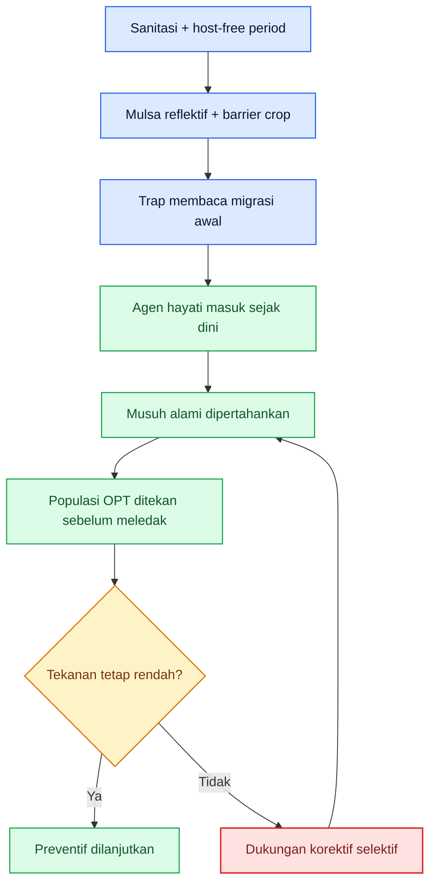

Diagram di atas merangkum logika sistemik pengendalian hayati dan non-kimia. Ia disusun dari prinsip UC IPM untuk whitefly, prinsip biologically based IPM pada thrips dari UF/IFAS, serta prinsip preventif–responsif dalam juknis perlindungan hortikultura Indonesia. ([UC IPM][1])

## 9.2 Agen hayati utama untuk kutu kebul

Untuk **kutu kebul**, agen hayati yang paling penting dibagi menjadi tiga kelompok. Pertama adalah **parasitoid**, terutama dari genus **Encarsia** dan **Eretmocerus**. UC IPM menyebut beberapa spesies dari dua genus ini sebagai parasitoid whitefly pada pepper, dan menambahkan bahwa **Encarsia formosa** telah digunakan dengan sukses untuk greenhouse whitefly pada greenhouse atau protected crop situations. Ini berarti parasitoid adalah senjata yang sangat relevan, tetapi paling mapan pada sistem yang relatif terlindung. Pada open field, parasitoid tetap bernilai sebagai bagian konservasi musuh alami, tetapi hasilnya lebih dipengaruhi oleh cuaca, migrasi hama, dan kontinuitas habitat. Kalimat terakhir ini adalah **inferensi budidaya** dari fakta bahwa keberhasilan Encarsia formosa yang paling konsisten dilaporkan pada sistem terlindung, sementara UC IPM juga menegaskan bahwa pada silverleaf whitefly, musuh alami asli sering ada tetapi tidak selalu mampu menekan populasi di bawah level merusak. ([UC IPM][1])

Kelompok kedua adalah **predator**. UC IPM mencatat bahwa nimfa whitefly dimangsa oleh **bigeyed bugs, lacewing larvae, dan lady beetle larvae**. UConn Extension menambahkan bahwa **Amblyseius swirskii** dapat memakan telur dan nimfa whitefly, dan bahkan lebih kuat bila dipadukan dengan **Eretmocerus**, karena keduanya menyerang fase yang berbeda: Eretmocerus lebih suka nimfa instar lanjut, sedangkan A. swirskii lebih menyukai telur dan nimfa instar awal. Di lapang, ini berarti predator seperti A. swirskii paling cocok diposisikan untuk **menahan terbentuknya koloni**, bukan menyapu bersih whitefly dewasa yang sudah beterbangan banyak. ([UC IPM][1])

Kelompok ketiga adalah **cendawan entomopatogen**, terutama **Beauveria bassiana** dan **Isaria fumosorosea**. UConn menjelaskan bahwa Beauveria bekerja ketika spora menempel pada kutikula serangga, berkecambah, lalu menembus tubuh serangga; mereka juga menegaskan bahwa aplikasi Beauveria untuk whitefly sebaiknya **dimulai saat populasi masih rendah**. Untuk **Isaria fumosorosea**, sumber yang sama menyebut jamur ini dapat menyerang telur, nimfa, pupa, dan dewasa whitefly, tetapi membutuhkan **kelembapan relatif tinggi** dan suhu yang sesuai. Implikasi praktisnya jelas: jamur entomopatogen bukan obat darurat cepat, melainkan alat untuk **memotong pembangunan populasi** ketika kondisi lingkungan mendukung dan aplikasi dilakukan sejak dini.

Secara praktis, fungsi tiap agen hayati pada whitefly bisa diringkas seperti ini: **parasitoid** menekan stadia menetap, **predator** menekan telur dan nimfa serta membantu mematahkan ledakan awal, dan **jamur entomopatogen** menginfeksi whitefly ketika kelembapan dan cakupan aplikasi mendukung. Ketiganya bukan saling menggantikan, tetapi saling melengkapi. Kebun yang stabil biasanya bukan kebun yang mengandalkan satu agen, melainkan kebun yang membiarkan beberapa mekanisme bekerja bersamaan. ([UC IPM][1])

## 9.3 Agen hayati utama untuk thrips

Untuk **thrips**, predator paling penting adalah **Orius spp.**, terutama **Orius insidiosus** pada sistem pepper yang dibahas UF/IFAS. UF/IFAS menyebut O. insidiosus sebagai **key predator** dari western flower thrips di Florida, dan publikasi crop-diversity mereka menunjukkan bahwa penanaman **sunflower di perimeter pepper fields** dapat meningkatkan kepadatan minute pirate bugs di pertanaman pepper, yang kemudian membantu menekan western flower thrips. Ini penting karena memberi pesan yang sangat praktis: pada thrips, pengendalian hayati yang baik bukan hanya soal membeli agen, tetapi juga soal **membangun kebun yang memberi makan dan menahan predator tetap tinggal**. ([Ask IFAS - Powered by EDIS][3])

Kelompok berikutnya adalah **predatory mites**, terutama **Amblyseius swirskii** dan **Neoseiulus cucumeris**. UF/IFAS dalam program manajemen thrips pada hortikultura menulis bahwa BCA untuk thrips mencakup **Neoseiulus/Amblyseius spp.**, dan bahwa kunci keberhasilannya adalah pelepasan **sebelum thrips masuk ke pucuk terminal atau kuncup bunga**. Mereka juga menambahkan bahwa A. swirskii dapat bertahan dan bereproduksi dengan baik hanya dari **pollen**, sehingga pelepasan preventif masuk akal bahkan sebelum populasi thrips terlihat nyata. Di sisi lain, publikasi UF/IFAS tentang chilli thrips menjelaskan bahwa **Amblyseius swirskii** tampak menjanjikan pada pepper untuk mengelola chilli thrips. Ini menempatkan predatory mites sebagai alat paling kuat untuk **fase awal infestasi**, terutama pada larva instar pertama dan populasi yang belum “masuk ke dalam bunga”. ([Ask IFAS - Powered by EDIS][2])

Untuk **cendawan entomopatogen**, UF/IFAS menyebut **Beauveria bassiana** dan **Isaria fumosorosea** sebagai bagian dari BCA yang tersedia bagi thrips. Tetapi mereka juga memberi peringatan penting: pada **chilli thrips**, **Beauveria bassiana bila dipakai sendiri tidak efektif** terhadap dewasa maupun larva. Peringatan ini sangat penting bagi petani cabai, karena banyak orang berharap Beauveria bekerja seperti insektisida kontak cepat. Pada thrips, terutama chilli thrips, Beauveria lebih tepat dipahami sebagai **pendukung program**, bukan fondasi tunggal pada situasi serangan sedang–berat. Untuk pepper lapang, posisi yang lebih aman adalah: **Orius dan predatory mites sebagai tulang punggung biologis**, jamur entomopatogen sebagai penguat dalam sistem yang dimulai dini dan tidak sedang terbakar. ([Ask IFAS - Powered by EDIS][2])

Sumber Indonesia juga memberi dukungan praktis yang relevan. SOP cabai rawit Hiyung menyebut musuh alami potensial untuk trips antara lain **predator kumbang Coccinellidae, tungau predator, larva Chrysopidae, kepik Anthocoridae, dan patogen Entomophthora sp.**. Artinya, meski nama dagang produk komersial di lapang bisa berbeda-beda, prinsip biologinya tetap sama: thrips lebih aman ditekan oleh kombinasi **predator pucuk-bunga** dan **lingkungan kebun yang mendukung**, daripada semata-mata disemprot berulang.

## 9.4 Waktu aplikasi ideal: di sinilah biasanya menang atau kalah

Waktu terbaik memulai pengendalian hayati adalah **sebelum populasi OPT menumpuk di lokasi yang sulit dijangkau**. Untuk thrips, UF/IFAS menulis sangat jelas bahwa BCA harus dilepas **lebih awal**, sebelum thrips memasuki pucuk terminal atau kuncup bunga. Untuk whitefly, UC IPM menyarankan memberi kesempatan pada musuh alami untuk mengendalikan infestasi ringan, dan UConn menyarankan aplikasi Beauveria dimulai saat populasi whitefly masih rendah. Dari dua prinsip ini, aturan lapangnya sangat tegas: **agen hayati paling cocok dipasang pada fase low-to-early pressure, bukan late-to-heavy pressure**. ([Ask IFAS - Powered by EDIS][2])

Pada cabai, terjemahan fase tanamnya kira-kira begini. Untuk whitefly, jendela terbaik ada sejak **persemaian, pindah tanam, sampai kanopi belum terlalu rapat**, karena saat itulah kolonisasi awal masih bisa diganggu oleh mulsa reflektif, sanitasi, trap, dan musuh alami. Untuk thrips, jendela terbaik adalah **sebelum dan menjelang awal berbunga**, karena setelah thrips masuk ke pucuk terminal dan bunga, pekerjaan menjadi jauh lebih berat. Penempatan fase ini adalah **inferensi operasional** dari petunjuk UF/IFAS tentang terminal and flower buds, dari UC IPM tentang reflective mulch yang menunda buildup whitefly pada minggu-minggu awal, dan dari struktur fase kritis yang sudah dibangun di bab sebelumnya. ([Ask IFAS - Powered by EDIS][2])

## 9.5 Syarat keberhasilan program hayati

Program hayati hanya akan tampak “manjur” bila empat syarat dasarnya terpenuhi. Syarat pertama adalah **tekanan hama belum terlalu tinggi**. UC IPM menyebut natural enemies layak dibiarkan bekerja pada infestasi whitefly yang ringan, sedangkan UF/IFAS menyatakan BCA tidak akan mampu menekan populasi thrips yang sudah tinggi sebelum kerusakan besar terjadi. Syarat kedua adalah **lingkungan aplikasi mendukung**: cendawan seperti Beauveria dan Isaria butuh kontak yang baik dengan target, dan Isaria secara khusus dilaporkan membutuhkan kelembapan tinggi. Syarat ketiga adalah **program tidak dirusak oleh broad-spectrum pesticides**, karena UC IPM memperingatkan broad-spectrum dapat menginduksi greenhouse whitefly, dan UF/IFAS menulis bahwa insektisida broad-spectrum dapat mengganggu pengendalian oleh musuh alami. Syarat keempat adalah **ulang dan disiplin**, karena pengendalian hayati bukan aksi satu kali. ([UC IPM][1])

Karena itu, agen hayati harus selalu dikaitkan dengan **cara aplikasi**. Pada whitefly, target utama ada di **bawah daun**. Pada thrips, target utamanya ada di **pucuk, daun muda, dan bunga**. Jamur entomopatogen yang tidak mencapai lokasi sasaran akan gagal walaupun produknya bagus. Predatory mites yang dilepas terlambat saat bunga sudah rusak berat juga sering dinilai “tidak mempan”, padahal masalahnya adalah timing, bukan sekadar kualitas agennya. Ini bukan teori; ini konsekuensi langsung dari ekologi hama dan lokasi hidupnya pada tanaman. ([UC IPM][1])

Satu hal lagi yang perlu jujur dikatakan: sebagian agen augmentatif seperti **kartu parasitoid** atau **predatory mites dalam sachet** paling matang penggunaannya pada **screen house, greenhouse, atau sistem intensif**. Itu terlihat dari banyaknya data resmi yang datang dari protected crops. Pada open field cabai, agen-agen itu tetap relevan, tetapi hasilnya jauh lebih bergantung pada kontinuitas pelepasan, cuaca, migrasi hama dari luar kebun, dan disiplin sanitasi. Ini adalah **inferensi praktis** dari fakta bahwa Encarsia formosa disebut berhasil pada protected crop situations, sedangkan sumber-sumber whitefly dan thrips lapang terus menekankan pentingnya host-free period, tepi kebun, dan migrasi dari luar. ([UC IPM][1])

## 9.6 Trap sebagai penguat monitoring dan penekan awal

Trap bukan alat yang menyelesaikan masalah sendirian, tetapi sangat penting sebagai **penguat pengendalian hayati**. Pada whitefly, UC IPM menyebut sticky traps dapat membantu mendeteksi migrasi awal whitefly ke lapang. Pada trips, SOP cabai rawit Hiyung menyebut perangkap likat **biru atau putih** dipasang **40 buah/ha atau 2 buah/500 m²** sejak tanaman berumur **2 minggu**. Secara praktis, trap membuat petani tidak buta: saat trap mulai naik, program hayati dan sanitasi harus dikencangkan sebelum koloni terbentuk. Trap memberi waktu, dan dalam pengendalian biologis waktu itu sangat berharga. ([UC IPM][1])

Whitefly umumnya dipantau dengan trap kuning untuk migrasi awal, sementara pada thrips lapang di Indonesia warna **biru atau putih** juga disebut dalam SOP. Tetapi apa pun warnanya, trap tidak boleh dibaca sebagai “alat utama pembunuh hama”. Fungsi terbaiknya adalah **mendeteksi pergerakan**, membantu menentukan blok rawan, dan menilai apakah tekanan naik atau turun dari minggu ke minggu. Pada kebun yang memakai agen hayati, trap menjadi semacam panel instrumen: bukan yang mengemudikan, tetapi yang memberi sinyal kapan harus mengoreksi arah. ([UC IPM][1])

## 9.7 Barrier crop, trap crop, dan tanaman penguat musuh alami

Untuk whitefly, pendekatan non-kimia yang paling kuat adalah **mulsa reflektif**, **sanitasi inang**, dan **border/barrier crop**. UC IPM menyebut silver- atau aluminum-colored mulch dapat menurunkan kolonisasi whitefly dan menunda buildup selama **4–6 minggu**. Direktorat Hortikultura juga menyebut **tagetes**, **jagung**, **gandum**, dan bahkan tanaman tinggi kuning seperti **bunga matahari** sebagai border atau trap crop untuk menurunkan serangan kutu kebul dan mendukung pengendalian penyakit kuning pada cabai. Artinya, untuk whitefly, strategi non-kimia yang paling rasional adalah **mengganggu proses mendarat dan menetap**, bukan menunggu koloni penuh lalu berharap program hayati mengejar semuanya. ([UC IPM][1])

Untuk thrips, pola yang paling kuat justru bukan trap crop spesifik, melainkan **tanaman pendukung predator**. UF/IFAS menunjukkan bahwa **sunflower di perimeter pepper field** dapat meningkatkan populasi **Orius** di pertanaman pepper dan membantu menekan western flower thrips. Pada saat yang sama, publikasi tentang crop diversity menekankan bahwa pollen dan nectar penting sebagai sumber nutrisi bagi beneficial arthropods. Jadi, pada kebun cabai, perimeter tanaman berbunga yang dipilih dengan sadar bisa diposisikan sebagai **refugia fungsional**, bukan sekadar pagar hijau. Namun ini harus disiplin: tanaman pendukung tidak boleh berubah menjadi reservoir OPT yang tidak dipantau.

SOP cabai rawit Hiyung juga menyebut **tumpang sari dengan kubis atau tomat menekan trips** dan penggunaan perangkap biru/putih sejak umur dua minggu. Bagi praktisi, makna utamanya adalah bahwa pada thrips, pendekatan non-kimia harus dilihat sebagai **kombinasi tata letak kebun, trap, habitat predator, dan pengamatan bunga**, bukan hanya satu alat tunggal.

## 9.8 Konservasi musuh alami: bagian yang sering dirusak sendiri

Musuh alami bisa ada, tetapi mudah dihancurkan oleh program yang salah. UC IPM memperingatkan bahwa greenhouse whiteflies sering justru “terinduksi” oleh aplikasi broad-spectrum pesticides di awal musim. Pada whitefly, mereka juga menyarankan bahwa bila populasi lebih tinggi di margin daripada di tengah, perlakuan cukup difokuskan pada **field margins** agar biaya turun dan natural enemies di bagian dalam kebun tetap terjaga. Untuk thrips, sumber UF/IFAS menulis bahwa broad-spectrum insecticides dapat mengganggu kontrol oleh musuh alami. Ini pelajaran yang sangat penting: **jangan rusak seluruh kebun hanya untuk mengejar satu fokus serangan**. ([UC IPM][1])

Konservasi musuh alami juga berarti menjaga **sumber pakan pendukung**. UF/IFAS menjelaskan bahwa Orius tertarik pada bunga dan bahwa pollen serta plant juices meningkatkan survival. Publikasi yang sama juga menyebut bahwa tanaman seperti **Bidens alba** dan **coreopsis** dapat meningkatkan kepadatan Orius di lapang. Pada kebun cabai, pendekatan ini harus diterjemahkan hati-hati: cukup sediakan habitat pendukung secara sengaja di perimeter atau titik tertentu, tetapi jangan membiarkan gulma berbunga liar menjadi hutan reservoir OPT. Di sini disiplin lapang lebih penting daripada romantisme “kebun hijau alami”. ([Ask IFAS - Powered by EDIS][3])

## 9.9 Kesalahan umum yang membuat pengendalian hayati terlihat gagal

Kegagalan paling sering bukan karena agennya buruk, tetapi karena programnya salah. Kesalahan pertama adalah **memulai terlambat**. UF/IFAS sudah menulis sangat jelas bahwa BCA thrips harus masuk sebelum thrips masuk ke terminal atau flower buds, dan bahwa BCA tidak akan mengejar populasi yang sudah tinggi. Kesalahan kedua adalah **mengharapkan Beauveria atau agen hayati lain memberi efek seperti racun kontak**. Untuk whitefly saja, UConn menegaskan Beauveria sebaiknya dimulai saat populasi rendah; untuk chilli thrips, UF/IFAS bahkan menyatakan Beauveria sendiri tidak efektif bila berdiri sendiri. Kesalahan ketiga adalah **merusak program dengan broad-spectrum** terlalu dini. Kesalahan keempat adalah **salah sasaran aplikasi**: whitefly tidak kena bawah daun, thrips tidak kena pucuk-bunga. Kesalahan kelima adalah **trap dipasang, tetapi tidak dibaca sebagai sinyal keputusan**. ([Ask IFAS - Powered by EDIS][2])

## 9.10 Kapan pengendalian biologis cukup kuat, dan kapan perlu dukungan lain

Ini pertanyaan paling penting bagi praktisi. **Pengendalian biologis dan non-kimia cukup kuat** bila tekanan hama masih **rendah sampai ringan**, trap relatif stabil, whitefly belum membentuk koloni padat, thrips belum konsisten merusak bunga dan pucuk, gejala virus belum muncul, dan musuh alami masih terlihat bekerja. Dasar logikanya datang langsung dari UC IPM yang menyarankan memberi kesempatan pada natural enemies untuk mengendalikan light silverleaf whitefly infestations, dan dari UF/IFAS yang menekankan pelepasan BCA sebelum thrips masuk ke struktur terlindung tanaman. Secara praktis, ini berarti fase terbaik program hayati adalah **sebelum kebun masuk zona bahaya**, bukan setelahnya. ([UC IPM][1])

**Dukungan lain mulai dibutuhkan** bila tanda-tanda berikut muncul bersamaan: trap naik terus dari minggu ke minggu, tepi kebun aktif, whitefly mulai menetap di bawah daun, thrips mulai konsisten di bunga dan pucuk, atau gejala virus pertama muncul. Pada kondisi itu, fondasi biologis tetap dipertahankan, tetapi kebun tidak boleh dipaksa bertahan hanya dengan mode preventif. Ia perlu **dukungan korektif yang kompatibel sebisa mungkin**, sambil tetap menjaga sanitasi, rogueing tanaman sakit, dan perlindungan blok sehat. Ini adalah **inferensi operasional** dari prinsip whitefly threshold, monitoring kritis, dan peringatan UF/IFAS bahwa BCA tidak akan mengejar populasi tinggi sebelum kerusakan terjadi. ([UC IPM][1])

Dengan kata lain, ukuran keberhasilan Bab 9 bukan “apakah kebun 100% tanpa kimia”, melainkan **apakah kebun cukup stabil sehingga intervensi korektif, bila diperlukan, datang lebih sedikit, lebih dini, dan lebih terarah**. Itulah tanda bahwa backbone biologis dan non-kimia bekerja.

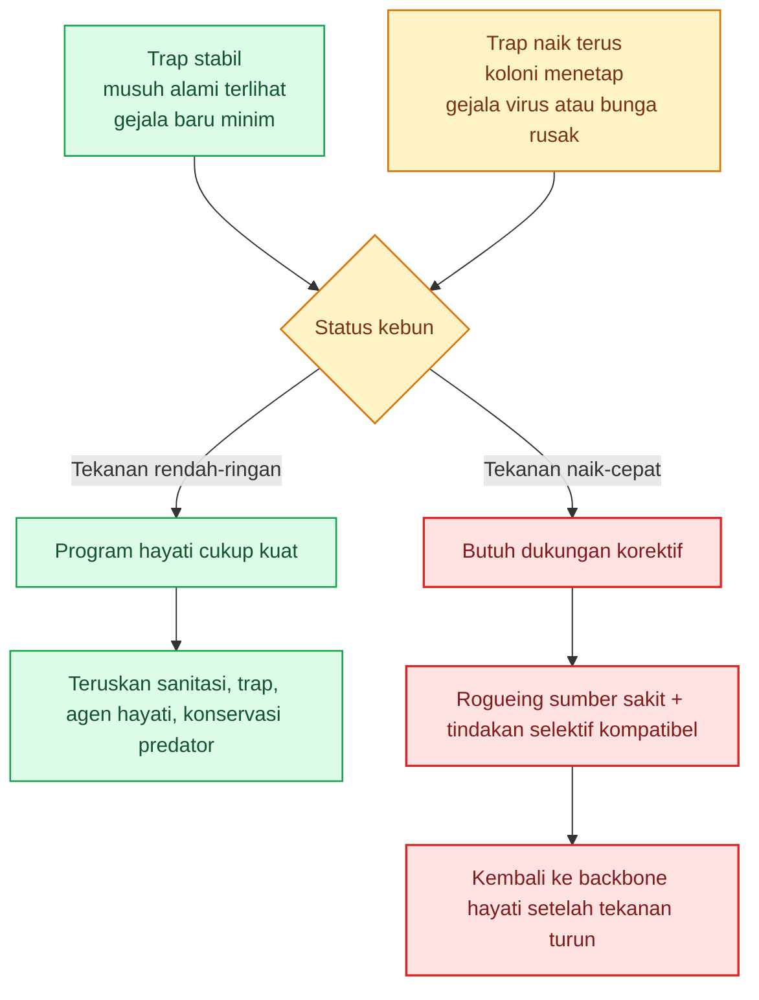

Diagram keputusan ini merangkum inti Bab 9: backbone hayati dan non-kimia harus dipertahankan selama mungkin, tetapi tidak boleh dipertahankan secara buta ketika sinyal lapang sudah menunjukkan kebun bergerak ke arah ledakan. Dasarnya berasal dari prinsip ambang, monitoring kritis, early release BCA, dan kebutuhan menjaga natural enemies. ([UC IPM][1])

## Rumusan praktis Bab 9

Kalau Bab 9 harus diperas menjadi satu pegangan lapang, maka pegangannya adalah ini: **mulailah hayati lebih awal dari yang terasa perlu, jaga kebun agar musuh alami bisa hidup, pakai trap dan sanitasi untuk membeli waktu, dan jangan tunggu koloni atau gejala virus membesar baru bertindak**. Untuk whitefly, fokuskan backbone pada **sanitasi, reflective mulch, parasitoid/predator, dan cakupan bawah daun**. Untuk thrips, fokuskan backbone pada **Orius, predatory mites, pengamatan pucuk-bunga, dan perimeter/refugia yang mendukung predator**. Begitu tekanan naik cepat, jangan meninggalkan fondasi hayati, tetapi tambahkan dukungan lain secara terukur. Itulah cara membaca pengendalian biologis sebagai **mesin stabilitas kebun**, bukan obat yang selalu terlambat dipanggil. ([UC IPM][1])

Kalau Anda setuju, saya lanjut ke **Response 5: Bab 10–12**.

[1]: https://ipm.ucanr.edu/agriculture/peppers/whiteflies/ 'Whiteflies / Peppers / Agriculture: Pest Management Guidelines / UC Statewide IPM Program (UC IPM)'
[2]: https://ask.ifas.ufl.edu/publication/IN1145 'ENY-987/IN1145: Thrips Management Program for Horticultural Crops'
[3]: https://ask.ifas.ufl.edu/publication/IN1148 'EENY-665/IN1148: Insidious Flower Bug, Minute Pirate Bug Orius insidiosus Say (Insecta: Hemiptera: Anthocoridae)'

[**Kembali ke Atas**](#pedoman-terpadu-mencegah-gagal-panen-cabai-akibat-kutu-kebul-dan-thrips)

---

# Bab 10. Pengendalian Kuratif dan Kimia Berbasis Eskalasi

Pengendalian kimia harus diberi tempat yang tepat: **bukan fondasi musim tanam, tetapi alat korektif dan eskalasi** ketika program preventif, biologis, dan non-kimia tidak lagi cukup menahan tekanan OPT. UC IPM untuk pepper menempatkan pestisida sebagai bagian dari program IPM yang harus dipilih dengan mempertimbangkan **efektivitas, dampak pada musuh alami, lebah, lingkungan, dan manajemen resistensi**, sementara Direktorat Hortikultura menegaskan bahwa pada penyakit virus kuning cabai, pengendalian **bukan ditujukan untuk menyembuhkan tanaman terinfeksi**, tetapi untuk **mengelola ekosistem** agar infeksi baru berkurang. Dengan kata lain, kimia bukan alat untuk “menghidupkan kembali” tanaman yang sudah rusak berat oleh virus, melainkan alat untuk **menekan vektor dan menahan perluasan kerusakan**. ([UC IPM][1])

## 10.1 Kapan kebun masuk fase kuratif

Kebun masuk fase kuratif ketika tanda-tanda lapang menunjukkan bahwa backbone preventif tidak lagi cukup. Pada whitefly, UC IPM menyebut area tepi biasanya terserang lebih dulu, dan untuk silverleaf whitefly pada pepper ada pedoman tindakan sekitar **4 dewasa per daun** pada sampel acak **30 daun sehat**. Pada cabai dengan risiko virus, fase kuratif juga masuk ketika **gejala virus awal mulai muncul**, karena sejak titik itu kebun tidak lagi hanya menghadapi serangga, tetapi juga **sumber inokulum yang aktif**. Pada thrips, fase kuratif masuk ketika gejala tidak lagi sporadis di pucuk, tetapi mulai konsisten pada **bunga, pucuk, dan daun muda**, atau ketika kerusakan awal sudah mulai menyentuh set buah. Ini adalah pembacaan operasional dari ambang dan gejala yang ditekankan UC IPM dan Direktorat Hortikultura. ([UC IPM][2])

## 10.2 Prinsip paling penting: tidak ada “racun sakti”

Pada whitefly dan thrips, **tidak ada satu bahan aktif yang otomatis menyelesaikan masalah**. IRAC menekankan bahwa **Bemisia tabaci** adalah salah satu hama invasif paling kritis di dunia dengan potensi resistensi yang sangat tinggi, dan resistensi terhadap beberapa kelompok insektisida sudah luas atau telah didokumentasikan pada banyak populasi. Untuk thrips, UC Pest Notes menjelaskan bahwa ketika virus menjadi masalah, insektisida biasanya **tidak membunuh thrips cukup cepat** untuk mencegah transfer virus ke tanaman. Direktorat Hortikultura juga menegaskan bahwa pengendalian virus kuning cabai **bukan untuk menyembuhkan tanaman terinfeksi**, melainkan mencegah dan mengurangi infeksi pada tanaman lainnya. Jadi, yang disebut “obat manjur” di lapang sebenarnya selalu terbatas oleh **resistensi, timing, coverage, dan fakta bahwa virus tidak sembuh karena semprotan**. ([Insecticide Resistance Action Committee][3])

## 10.3 Beda sasaran whitefly dewasa dan nimfa

Pada whitefly, membaca bahan aktif harus dimulai dari **fase hama yang dominan**. UC IPM menulis sangat jelas bahwa **pyriproxyfen (IRAC 7C)** adalah insect growth regulator yang **tidak membunuh dewasa**, sehingga bila dewasa masih banyak, bahan itu tidak cocok berdiri sendiri sebagai pembuka. Sebaliknya, bahan seperti **dinotefuran (4A)**, serta sejumlah adulticide lain dalam daftar whitefly dan IRAC whitefly management, lebih relevan saat tekanan imago sedang tinggi. Untuk koloni yang sudah menetap di bawah daun, kelompok seperti **buprofezin (16)**, **pyriproxyfen (7C)**, **spirotetramat (23)**, dan **spiromesifen (23)** menjadi lebih logis karena bekerja kuat pada fase telur/nimfa atau mengganggu perkembangan populasi berikutnya. Jadi logikanya sederhana: **adult pressure diturunkan dulu bila imago dominan, lalu generasi berikutnya diputus di telur-nimfa**.

Poin ini sangat penting bagi praktisi. Banyak kebun gagal bukan karena bahan aktif “jelek”, tetapi karena bahan dipakai pada target fase yang salah. Bila whitefly dewasa beterbangan banyak, membuka program dengan regulator nimfa semata akan terasa lambat. Sebaliknya, bila koloni nimfa sudah padat di bawah daun tetapi program hanya mengejar dewasa, maka ledakan akan berulang. Maka bahan aktif harus selalu dibaca berdasarkan **fungsi fase sasaran**, bukan sekadar berdasarkan merek dagang yang tersedia di kios.

## 10.4 Beda sasaran thrips di bunga dan pucuk

Pada thrips, titik sasaran utamanya adalah **pucuk, daun muda, dan bunga**. UC IPM untuk pepper menempatkan thrips sebagai masalah besar karena kerusakan pada pertumbuhan muda dan peran vektornya terhadap Tomato spotted wilt virus. Pada daftar pestisida pepper UC, **spinetoram (IRAC 5)** berada di posisi atas tabel thrips dan tabel tersebut dijelaskan sebagai daftar yang diurutkan dari **IPM value tertinggi**, yakni yang paling efektif dan paling sedikit merugikan musuh alami, lebah, dan lingkungan. Daftar yang sama juga memuat **spinosad (5)**, **abamectin (6)**, **spirotetramat (23)**, dan **flonicamid (9C)** sebagai opsi yang relevan. Dalam konteks Indonesia, buku Direktorat Hortikultura tentang strategi pergiliran juga menunjukkan bahwa untuk trips pada cabai dan inang terkait, bahan aktif yang lazim muncul antara lain **imidacloprid (4A), thiamethoxam (4A), abamectin (6), dimethoate (1B), spinosad (5)**, dan kelompok lain yang lebih lama.

Namun penting ditegaskan: **spinetoram dan spinosad bukan rotasi sejati**, karena keduanya sama-sama **IRAC 5**. Begitu pula berpindah dari satu piretroid ke piretroid lain bukan rotasi yang bermakna. UF/IFAS dan UC sama-sama memperingatkan bahwa pada thrips, terutama chilli thrips, **pyrethroids tidak direkomendasikan** atau tidak efektif, dan broad-spectrum insecticides dapat justru membunuh predator seperti **Orius** dan menguntungkan thrips tertentu. Jadi, pada thrips, membaca bahan aktif harus berbasis **lokasi sasaran di tanaman** dan **mode aksi**, bukan sekadar “ganti merek”. ([UC IPM][4])

## 10.5 Rotasi mode aksi: aturan yang tidak boleh dilanggar

UC IPM menuliskan secara eksplisit bahwa bahan aktif harus **dirotasi berdasarkan nomor mode of action**, dan **kelompok yang sama tidak digunakan lebih dari dua kali per musim** untuk membantu mencegah resistensi. IRAC juga menunjukkan bahwa pada whitefly, resistensi telah meluas pada grup **1** dan **3A**, terdokumentasi secara luas pada **4A**, dan kasus resistensi juga telah muncul pada **23** serta beberapa grup lain. Artinya, kegagalan terbesar pada lapang cabai sering bukan karena tidak punya pilihan, tetapi karena **pilihan yang sama dipakai berulang**. Dalam konteks cabai, aturan rotasi seharusnya dibaca sebagai: **jangan mengulang grup yang sama berturut-turut**, dan jangan menyamakan pergantian merek dengan pergantian MoA.

Untuk whitefly, contoh kerangka rotasi yang lebih sehat adalah bergerak antara **adult pressure groups** seperti 4A atau 12A/9B ke **nymph pressure groups** seperti 7C, 16, atau 23, lalu berpindah lagi ke grup lain bila tekanan masih berlanjut. Untuk thrips, kerangka yang lebih sehat adalah bergerak antara **5**, **6**, **9C**, atau **23**, dengan disiplin bahwa grup yang sama tidak diulang terus-menerus. Kalimat ini adalah **inferensi operasional** dari daftar UC IPM, klasifikasi IRAC, dan daftar strategi pergiliran Direktorat Hortikultura. Ia bukan resep tetap, tetapi kerangka berpikir yang benar.

## 10.6 Teknik aplikasi: coverage sering lebih menentukan daripada pilihan merek

Pada whitefly, **bagian bawah daun** adalah medan tempur utama. UC IPM berkali-kali menekankan pentingnya coverage menyeluruh, dan daftar whitefly secara praktis hanya akan bekerja bila larutan benar-benar mengenai underside of leaves tempat telur, nimfa, dan dewasa berkumpul. Pada thrips, sasaran utamanya adalah **pucuk, daun muda, dan bunga**, sehingga pola semprot dari atas tajuk saja sering tidak cukup. Pada banyak kasus, bahan aktif yang sama memberi hasil sangat berbeda hanya karena perbedaan nozzle, arah semprot, volume air, dan disiplin coverage. ([UC IPM][2])

Poin kedua adalah **waktu aplikasi**. Banyak bahan aktif yang dipakai untuk thrips dan whitefly diberi catatan **toxic to bees** dalam tabel UC IPM, termasuk spinetoram, spinosad, abamectin, dan beberapa neonikotinoid. Karena itu, aplikasi harus menghindari saat lebah aktif dan harus mengikuti **REI, PHI, serta label**. UC IPM juga mengingatkan bahwa tidak semua formulasi dan pestisida terdaftar dicantumkan, sehingga label produk dan otoritas lokal tetap harus menjadi rujukan terakhir. Dalam konteks Indonesia, database AP-Simpel sendiri menulis bahwa data pestisida terdaftar disediakan untuk informasi umum dan perlu **verifikasi lebih lanjut**.

## 10.7 Kompatibilitas dan jeda dengan agen hayati

Kimia yang baik harus selalu dibaca dalam konteks **apa yang sedang dijaga**. UC IPM memperingatkan bahwa broad-spectrum insecticides di awal musim dapat menginduksi masalah whitefly, dan UF/IFAS menulis bahwa broad-spectrum insecticides, termasuk pyrethroids, organophosphates, dan lainnya, dapat membunuh **minute pirate bugs** dan musuh alami lain sehingga justru memperburuk manajemen thrips. Artinya, bila korektif kimia memang harus masuk, maka yang dicari adalah bahan dan pola aplikasi yang **sebisa mungkin tidak meruntuhkan seluruh fondasi hayati**.

Untuk agen hayati berbasis jamur seperti **Beauveria** atau **Isaria**, prinsip kehati-hatiannya lebih tinggi lagi. Karena mereka sendiri adalah cendawan entomopatogen, maka pencampuran atau penjadwalan yang terlalu berdekatan dengan fungisida dan insektisida yang tidak kompatibel berisiko menurunkan manfaatnya. **Jeda pastinya harus mengikuti label produk dan data kompatibilitas produsen**, bukan diasumsikan seragam, sementara basis data resmi pestisida Indonesia sendiri mewajibkan verifikasi lebih lanjut sebelum penggunaan. Jadi, aturan amannya adalah: **hindari tank-mix tanpa data kompatibilitas, baca label, dan setelah tekanan turun kembalikan kebun secepat mungkin ke ritme preventif-biologis**. Kalimat tentang kehati-hatian pada jamur merupakan **inferensi biologis** dari sifat Beauveria/Isaria sebagai fungi dan dari kewajiban verifikasi label resmi. ([ap-simpel.pertanian.go.id][5])

## 10.8 Kesalahan kimia yang paling merugikan

Kesalahan pertama adalah **mengulang grup yang sama** karena nama merek berbeda. Kesalahan kedua adalah **menembak fase yang salah**, misalnya hanya mengejar dewasa saat whitefly nimfa sudah padat, atau hanya membasahi daun tua saat thrips sebenarnya terkonsentrasi di bunga. Kesalahan ketiga adalah **mengandalkan pyrethroid** untuk thrips, padahal sumber resmi menyebutnya tidak direkomendasikan atau bahkan dapat memperparah masalah. Kesalahan keempat adalah **membiarkan kimia mendominasi terlalu lama**, sehingga kebun kehilangan musuh alami dan kembali masuk lingkaran semprot tanpa akhir. Kesalahan kelima adalah **mengabaikan status registrasi**, padahal UC IPM dan AP-Simpel sama-sama mengingatkan bahwa label dan registrasi terbaru harus selalu dicek.

## Rumusan praktis Bab 10

Kalau Bab 10 diperas menjadi satu aturan kerja, maka aturannya adalah: **kimia masuk ketika kebun perlu ditolong, tetapi kimia tidak boleh mengambil alih seluruh logika pengendalian**. Bahan aktif harus dibaca berdasarkan **fungsi fase sasaran** dan **mode aksi**, bukan hanya merek. Whitefly harus dibedakan antara tekanan dewasa dan tekanan nimfa. Thrips harus diburu di pucuk dan bunga, bukan dibaca seperti hama daun biasa. Setelah tekanan turun, kebun harus segera dikembalikan ke program PHT dan backbone biologis. Itulah cara memakai kimia sebagai alat, bukan sebagai kebiasaan.

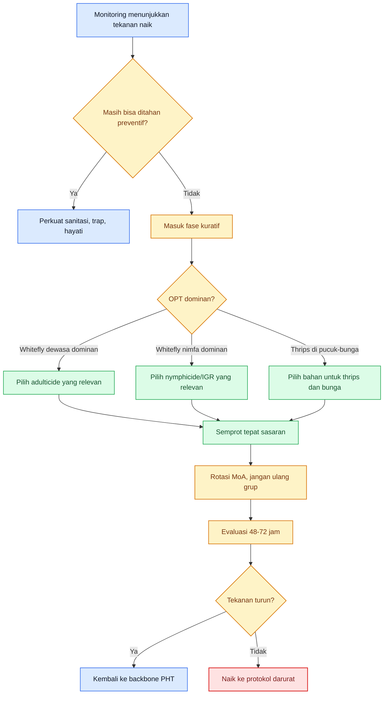

Diagram ini merangkum Bab 10: kimia masuk sebagai eskalasi, dipilih menurut sasaran biologis, lalu harus dikembalikan lagi ke PHT setelah tekanan turun. Dasarnya berasal dari UC IPM, IRAC, dan pedoman Hortikultura Indonesia. ([UC IPM][1])

[**Kembali ke Atas**](#pedoman-terpadu-mencegah-gagal-panen-cabai-akibat-kutu-kebul-dan-thrips)

---

# Bab 11. Protokol Darurat: Saat Kebun Masuk Risiko Tinggi Gagal Panen

Bab ini dipakai ketika kebun **tidak lagi berada pada kondisi normal**. Yang disebut “mode darurat” bukan sekadar ada hama, melainkan saat sinyal lapang menunjukkan bahwa kerusakan bisa bereskalasi lebih cepat daripada ritme pengendalian biasa. Pada whitefly, kondisi ini biasanya terlihat ketika tekanan tinggi di tepi kebun bergeser menjadi kolonisasi nyata di bawah daun dan gejala virus awal mulai muncul. Pada thrips, kondisi ini terlihat ketika pucuk dan bunga bukan lagi hanya menunjukkan gejala sporadis, tetapi kerusakan mulai konsisten dan berpotensi mengganggu set buah. Pada fase ini, kebun perlu **protokol**, bukan lagi sekadar respons spontan. ([UC IPM][2])

## 11.1 Indikator kebun masuk mode darurat

Kebun sebaiknya dianggap masuk mode darurat bila beberapa indikator berikut muncul bersama. Pertama, **trap naik terus** dan migrasi dari tepi kebun jelas aktif. Kedua, **koloni menetap mulai kuat**, terutama whitefly di bawah daun atau thrips yang konsisten di bunga dan pucuk. Ketiga, **gejala virus pertama muncul** dan mulai bertambah, karena pada titik ini satu petak sehat sudah berdekatan dengan sumber inokulum aktif. Keempat, **organ produktif mulai terancam**, misalnya bunga rusak, gugur, atau buah muda mulai menunjukkan scarring. Penetapan indikator ini adalah sintesis langsung dari pedoman monitoring kritis UC IPM, gejala kerusakan thrips pada pepper, dan pedoman eradikasi serta monitoring hingga 35–40 hari pada dokumen Hortikultura. ([UC IPM][2])

## 11.2 Protokol 72 jam pertama

Pada **0–24 jam pertama**, fokus utama adalah **membekukan kebingungan**. Blok rawan harus ditandai, tepi kebun dipetakan, trap dibaca ulang, dan sampling harus dinaikkan dari rutinitas biasa menjadi pengamatan intensif. Pada whitefly, UC IPM menyebut bahwa area margin sering terserang lebih dulu; karena itu, inspeksi harus dimulai dari perimeter dan underside of leaves. Pada tanaman dengan gejala virus yang kuat, Direktorat Hortikultura menegaskan bahwa tanaman bergejala harus segera **dicabut dan dimusnahkan** agar tidak menjadi sumber penularan. Jadi pada 24 jam pertama, prioritas bukan langsung “menembak semua”, melainkan **memastikan titik api sebenarnya ada di mana**. ([UC IPM][2])

Pada **24–48 jam**, fokus bergeser ke **pemutusan sumber dan penahanan perluasan**. Sumber infeksi dan gulma inang dibersihkan, tanaman sakit dikeluarkan, dan blok yang masih sehat diprioritaskan untuk perlindungan. Bila whitefly dominan di tepi, pendekatan fokus-margin sebagaimana disinggung UC IPM menjadi logis agar kerusakan tidak langsung masuk ke seluruh blok. Bila thrips dominan, maka perhatian utama bergerak ke **bunga dan pucuk**, bukan lagi hanya trap. Pada fase ini, keputusan korektif awal harus sudah diambil; menunggu sampai hari ketiga tanpa tindakan nyata biasanya terlalu lambat. Kalimat terakhir ini adalah **inferensi operasional** dari pentingnya rapid monitoring dan eradikasi sumber penyakit. ([UC IPM][2])

Pada **48–72 jam**, keberhasilan rescue mulai bisa dibaca. Bila trap masih naik, tanaman sakit baru terus muncul, koloni whitefly masih bertambah, atau thrips masih kuat di bunga dan pucuk, maka kebun tidak bisa lagi dianggap hanya butuh koreksi ringan. Ia harus naik ke **rescue terukur penuh**, dan bila blok sakit terlalu dominan, harus mulai dipikirkan tindakan ekstrim pada Bab 12. Sebaliknya, bila gejala baru menurun dan fokus serangan mulai tertahan, kebun masih bisa diselamatkan tanpa eskalasi lebih jauh, tetapi monitoring rapat harus tetap dipertahankan. Ini adalah **inferensi keputusan** yang diturunkan dari prinsip monitoring kritis dan fakta bahwa whitefly/thrips dapat terus memicu penyebaran sekunder bila sumbernya tidak diputus. ([UC IPM][2])

## 11.3 Paket darurat bila dominan kutu kebul

Pada kebun yang dominan **kutu kebul**, paket darurat harus dimulai dengan membedakan apakah tekanan utamanya datang dari **dewasa** atau **koloni nimfa yang sudah menetap**. Bila kebun “berasap putih” saat tajuk digoyang, tekanan dewasa harus lebih dulu diturunkan dengan grup yang memang relevan terhadap adult pressure, baru kemudian dilanjutkan dengan grup yang menekan nimfa atau pertumbuhan generasi berikutnya. UC IPM menjelaskan bahwa **pyriproxyfen tidak membunuh dewasa**, sementara daftar mereka untuk pepper memasukkan grup dan bahan seperti **dinotefuran, pyriproxyfen, spirotetramat, spiromesifen**, serta IRAC dan buku Direktorat Hortikultura juga menunjukkan pentingnya membaca **kode cara kerja**. Maka paket darurat whitefly bukan “semprot apa yang keras”, tetapi **adult pressure → nymph pressure → evaluasi → rotasi**.

Yang harus diperketat pada paket darurat whitefly adalah **sampling bawah daun**, **margin field**, **rogueing tanaman sakit**, dan **sanitasi gulma inang**. Yang harus dihentikan adalah kebiasaan menyemprot dari atas tajuk tanpa coverage, mengulang grup yang sama, atau menunda pencabutan tanaman bergejala virus karena rasa sayang. Rescue whitefly yang tidak dibarengi eradikasi sumber penyakit hampir selalu berakhir setengah berhasil. ([Hortikultura Pertanian][6])

## 11.4 Paket darurat bila dominan thrips

Pada kebun yang dominan **thrips**, paket darurat harus mengunci fokus pada **pucuk, bunga, dan buah muda**. Tabel thrips pada UC IPM menempatkan **spinetoram** dan **spinosad** di posisi atas dari sisi IPM value, dan juga memuat **abamectin** serta **flonicamid** sebagai opsi. Namun, UF/IFAS mengingatkan bahwa broad-spectrum insecticides, terutama pyrethroids, dapat memperparah persoalan thrips karena membunuh predator seperti **Orius**. Jadi paket darurat thrips harus bergerak dalam pola **bahan yang relevan terhadap thrips + coverage pucuk/bunga + rotasi MoA + perlindungan predator sebisa mungkin**, bukan sekadar “semprot keras”.

Yang harus diperketat pada paket darurat thrips adalah **pengamatan bunga**, **sampling pucuk**, dan **pemetaan blok yang mulai kehilangan bunga atau menunjukkan scarring buah**. Yang harus dihentikan adalah penggunaan pyrethroid sebagai senjata utama dan asumsi bahwa bunga aman hanya karena daun terlihat bersih. Pada thrips, kebun sering kelihatan “lumayan” dari kejauhan padahal bunga sedang rusak diam-diam. ([UC IPM][4])

## 11.5 Bagaimana menilai keberhasilan rescue

Rescue dikatakan **berhasil** bila dalam 48–72 jam awal laju kemunculan gejala baru turun, trap tidak lagi menunjukkan kenaikan tajam, titik serangan mulai terlokalisasi, dan blok sehat tidak lagi cepat tertular. Rescue tidak harus membuat kebun “bersih total” dalam dua hari; yang terpenting adalah **arahnya berbalik** dari memburuk menjadi terkendali. Ini konsisten dengan logika monitoring kritis UC IPM dan dengan tujuan pengendalian virus kuning cabai yang ditekankan Direktorat Hortikultura, yaitu mencegah dan mengurangi infeksi pada tanaman lain, bukan menyembuhkan tanaman yang sudah sakit. ([UC IPM][2])

Rescue dikatakan **gagal** bila setelah protokol awal, tanaman sakit terus bertambah, gejala virus makin banyak, whitefly/thrips tetap aktif kuat di lokasi utama, dan blok sehat mulai ikut rusak walaupun tindakan sudah dinaikkan. Pada kondisi itu, kebun bukan lagi membutuhkan “semprotan yang lebih keras”, tetapi **keputusan yang lebih keras**, yaitu pemisahan blok, pengorbanan area, atau cabut tanaman pada skala yang lebih tegas. Pernyataan ini adalah **inferensi keputusan lapang** dari prinsip bahwa sumber inokulum dan vektor harus diputus; bila tidak bisa diputus sambil mempertahankan semua tanaman, maka sebagian tanaman harus dikorbankan untuk menyelamatkan yang lain. ([Hortikultura Pertanian][6])

## Rumusan praktis Bab 11

Kalau Bab 11 diperas menjadi satu aturan kerja, maka aturannya adalah: **saat kebun masuk risiko tinggi, hentikan pola pikir menunggu dan pindah ke protokol**. Dalam 24 jam pertama, pastikan lokasi tekanan dan sumber penyakit. Dalam 48 jam, putus sumber dan lindungi blok sehat. Dalam 72 jam, putuskan apakah rescue bekerja atau harus dinaikkan. Rescue yang baik bukan yang paling dramatis, tetapi yang paling cepat membalikkan arah kebun dari memburuk menjadi terkendali. ([UC IPM][2])

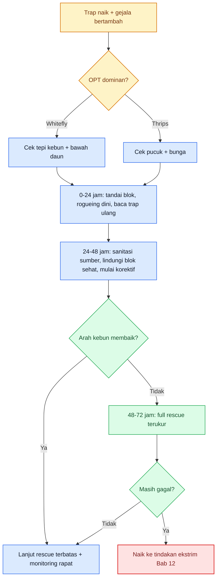

Diagram ini merangkum protokol darurat 72 jam pertama: identifikasi dominan, putus sumber, lindungi blok sehat, lalu putuskan rescue berhasil atau harus naik ke tindakan ekstrim. ([UC IPM][2])

[**Kembali ke Atas**](#pedoman-terpadu-mencegah-gagal-panen-cabai-akibat-kutu-kebul-dan-thrips)

---

# Bab 12. Tindakan Ekstrim dan Penutup Musim: Kapan Harus Cabut Tanaman untuk Menyelamatkan Kebun

Bab terakhir harus ditulis dengan tegas, karena di lapang keputusan paling mahal sering bukan keputusan menyemprot, melainkan keputusan **mencabut tanaman**. Direktorat Hortikultura menuliskan dengan sangat jelas bahwa pada pengendalian virus kuning cabai, **tanaman yang menunjukkan gejala segera dicabut dan dimusnahkan supaya tidak menjadi sumber penularan** ke tanaman sehat. Dokumen yang sama juga menyebut bahwa monitoring dan eradikasi dilakukan sampai umur **35–40 hari**, tanaman bergejala dimusnahkan dan diganti, dan gulma inang virus dibersihkan. Artinya, dalam cabai yang berhadapan dengan whitefly-vektored virus, cabut tanaman bukan tindakan emosional; itu adalah bagian resmi dari strategi pengendalian. ([Hortikultura Pertanian][6])

## 12.1 Kapan tanaman harus dicabut

Tanaman harus dicabut ketika ia telah berubah dari aset menjadi **sumber penularan**. Pada cabai, tanda-tanda itu terutama muncul ketika gejala virus sudah cukup jelas: daun menggulung atau mengeriting ke atas, mengecil, menebal atau kaku, warna kuning meluas, tanaman mulai kerdil, dan pada serangan dini produksi buah menurun tajam atau tidak terbentuk. Direktorat Hortikultura menggambarkan dengan jelas bahwa serangan sejak sebelum berbunga dapat menurunkan produksi bahkan menyebabkan tanaman tidak berbuah. Dalam situasi seperti itu, mempertahankan tanaman sakit sering tidak lagi rasional, karena nilai ekonominya kecil sementara nilai bahayanya besar. ([Hortikultura Pertanian][6])

Pada thrips, keputusan cabut lebih jarang karena kerusakan utamanya sering pada pucuk, bunga, dan buah, bukan selalu pada sistemik virus seperti whitefly-begomovirus. Tetapi bila satu blok sudah menunjukkan kerusakan tajuk berat, bunga rusak luas, buah cacat berulang, dan thrips tetap aktif walau rescue dijalankan, maka pencabutan selektif atau pemutusan blok tetap bisa menjadi keputusan rasional untuk mencegah sumber tekanan terus menekan bagian kebun lain. Kalimat ini adalah **inferensi ekonomi-budidaya** dari fakta bahwa thrips dapat menyebabkan kehilangan bunga, defoliasi, dan bahkan total crop loss pada infestasi berat, sementara no insecticide gives complete control untuk chilli thrips. ([UC IPM][4])

## 12.2 Kapan blok harus dikorbankan

Blok atau petak harus mulai dipikirkan untuk dikorbankan ketika **skala masalah sudah melebihi kemampuan rescue mempertahankan tanaman sehat di sekitarnya**. Tanda-tandanya antara lain: gejala virus terus bertambah walaupun rogueing dilakukan, tepi blok sakit bergerak masuk ke tengah, whitefly/thrips tetap tinggi setelah rescue, dan blok tersebut menjadi sumber migrasi ke area lain. Dalam logika PHT, terutama pada penyakit yang dibawa vektor, lebih murah mengorbankan satu petak lebih awal daripada membiarkan satu hamparan utuh ikut tertular. Prinsip ini sejalan dengan penekanan Hortikultura bahwa pengendalian virus kuning adalah soal mengurangi infeksi pada tanaman lain dan menghilangkan sumber infeksi. ([Hortikultura Pertanian][6])

Keputusan mengorbankan blok bukan berarti gagal total; justru sering itu tanda bahwa manajer kebun **masih berpikir menyelamatkan kebun, bukan menyelamatkan ego**. Di lapang, keberanian mengisolasi blok sakit sering menjadi pembeda antara kehilangan 10% dan kehilangan 70%. Kalimat terakhir adalah **inferensi ekonomi praktis** dari prinsip eradikasi dan pembatasan sumber inokulum; angka persentasenya saya tidak klaim sebagai data universal, tetapi sebagai gambaran logika kerugian yang umum. ([Hortikultura Pertanian][6])

## 12.3 Logika ekonomi: cabut dini sering lebih murah daripada mempertahankan sumber masalah

Petani sering berat mencabut tanaman karena merasa sudah mengeluarkan biaya benih, pupuk, dan tenaga. Namun pada cabai dengan risiko whitefly-vektored virus, kerugian ekonomi utama sering bukan biaya tanaman sakit itu sendiri, melainkan **kerugian pada tanaman sehat yang tertular sesudahnya**. Penelitian lapang di Indonesia menunjukkan bahwa kenaikan populasi whitefly dan kenaikan keparahan penyakit kuning keriting berkaitan erat dengan penurunan hasil, sehingga pembiaran sumber infeksi mempercepat kehilangan hasil hamparan. Karena itu, dari sisi ekonomi, rogueing dini hampir selalu lebih rasional daripada mempertahankan tanaman yang nilai produksi masa depannya kecil tetapi nilai bahayanya tinggi. ([Hortikultura Pertanian][6])

[1]: https://ipm.ucanr.edu/pdf/pmg/pmgpeppers.pdf?utm_source=chatgpt.com 'PEPPERS'
[2]: https://ipm.ucanr.edu/agriculture/peppers/whiteflies/?utm_source=chatgpt.com 'Whiteflies / Peppers / Agriculture: Pest Management ...'
[3]: https://irac-online.org/documents/bemisia-tabaci-resistance-overview/?utm_source=chatgpt.com 'Insecticide resistance overview of the tobacco whitefly ( ...'
[4]: https://ipm.ucanr.edu/PMG/GARDEN/PLANTS/INVERT/chillithrips.html?utm_source=chatgpt.com 'Chilli Thrips'
[5]: https://ap-simpel.pertanian.go.id/?utm_source=chatgpt.com 'DATABASE PUPUK PESTISIDA - KEMENTERIAN ...'
[6]: https://hortikultura.pertanian.go.id/wp-content/uploads/2024/11/Teknik-Pengendalian-Penyakit-Kuning-Pada-Tanaman-Cabai_watermark.pdf 'BROSUR'

[**Kembali ke Atas**](#pedoman-terpadu-mencegah-gagal-panen-cabai-akibat-kutu-kebul-dan-thrips)

---

# Lampiran A: Daftar agen hayati yang beredar di marketplace dan relevan untuk kebun cabai

Lampiran ini saya susun sebagai **daftar kerja**, bukan daftar promosi. Saya hanya memasukkan produk yang kandungan mikrobanya bisa saya verifikasi dari **halaman produsen**, **official store/listing marketplace yang jelas**, atau keduanya. Jejak ketersediaan yang bisa saya verifikasi saat ini terutama ada di **Shopee** dan marketplace serupa; untuk **TikTok Shop** saya tidak bisa memverifikasi langsung dari lingkungan ini, jadi tidak saya pakai sebagai sumber verifikasi. Untuk legalitas, tetap cek **database pestisida/pupuk terdaftar Kementan** karena AP-Simpel/SIPERINTIS sendiri menegaskan data itu untuk informasi umum dan perlu verifikasi lanjut sebelum dipakai sebagai dasar keputusan. ([ap-simpel.pertanian.go.id][1])

## Cara membaca lampiran ini

Produk saya bagi dua kelompok. Kelompok pertama adalah **penekan langsung** yang paling dekat relevansinya dengan **kutu kebul** dan **thrips**. Kelompok kedua adalah **produk pendukung backbone kebun**: bukan pembunuh utama whitefly/thrips, tetapi sangat berguna untuk menjaga bibit, akar, tajuk, dan ketahanan tanaman sehingga program PHT lebih stabil dan ketergantungan pada kimia tidak cepat membesar. Untuk whitefly dan thrips, program biologis paling logis dipakai **saat tekanan masih rendah sampai sedang**; kalau populasi sudah telanjur berat, produk hayati tetap berguna tetapi biasanya perlu dukungan tindakan lain.

## A.1. Produk yang paling relevan untuk kutu kebul dan thrips

| Produk                                                                                                                                                  | Kandungan mikroba                                                                  | Fungsi dalam konteks OPT cabai                                                                                                                                                                                                                                                                                                           |
| ------------------------------------------------------------------------------------------------------------------------------------------------------- | ---------------------------------------------------------------------------------- | ---------------------------------------------------------------------------------------------------------------------------------------------------------------------------------------------------------------------------------------------------------------------------------------------------------------------------------------- |
| **VERTIPLUS** — jejak di Shopee Official Store/reseller dan halaman produsen. ([Shopee Indonesia][2])                                                   | **Verticillium lecanii** + **Beauveria bassiana**                                  | Ini salah satu produk yang paling dekat relevansinya dengan **kutu kebul** karena produsen memang menempatkannya untuk **kutu putih, kutu kebul, wereng, dan psyllidae**. Dalam kebun cabai, ini paling masuk akal diposisikan sebagai **penahan kolonisasi awal** dan penguat program hayati saat tekanan whitefly masih rendah–sedang. |
| **METARIZEP** — jejak di Shopee Official Store/reseller dan halaman produsen. ([Shopee Indonesia][3])                                                   | **Metarhizium anisopliae** + **Beauveria bassiana**                                | Ini paling relevan untuk **thrips** karena produsen memang menuliskannya untuk **thrips, kutu daun, wereng coklat, dan kutu beras**. Dalam konteks cabai, produk ini paling logis dipakai saat **thrips mulai terdeteksi dini di pucuk/bunga**, bukan saat bunga sudah rusak berat.                                                      |
| **BEVTEK / Beauveria Bassiana WP** — contoh jejak marketplace ada di Shopee, dan spesifikasi produk juga muncul di Indotrading. ([Shopee Indonesia][4]) | **Beauveria bassiana**                                                             | Ini contoh produk **single microbe** yang paling mudah ditemukan di marketplace. Dalam kebun cabai, Beauveria paling relevan sebagai **bagian backbone whitefly** dan kompleks hama bertubuh lunak, dengan catatan paling masuk akal dipakai **saat populasi masih rendah**.                                                             |
| **BIOKILLIA** — jejak di Shopee Official Store/reseller dan halaman produsen. ([Shopee Indonesia][5])                                                   | **Verticillium lecanii** + **Isaria fumosorosea**                                  | Secara resmi produk ini lebih diarahkan ke **kutu daun, kutu putih, dan tungau**. Dalam kebun cabai, saya tempatkan sebagai **produk pendamping** bila kebun bukan hanya menghadapi thrips/whitefly, tetapi juga kompleks hama pengisap lain yang ikut mengganggu stabilitas blok.                                                       |
| **BT-PLUS** — jejak di Shopee Official Store/reseller dan halaman produsen. ([Shopee Indonesia][6])                                                     | **Bacillus thuringiensis** strain 4042 + **Serratia marcescens** strain NPKC3_2_21 | Produsen menempatkannya untuk beberapa hama termasuk **thrips**. Dalam konteks cabai, saya melihatnya lebih sebagai **pelengkap** bila kebun menghadapi kompleks hama campuran, bukan sebagai backbone utama untuk whitefly dan juga bukan pilihan pertama bila thrips sudah dominan berat di bunga.                                     |
| **BT-MAX** — jejak di Shopee Official Store/reseller dan halaman produsen. ([Shopee Indonesia][7])                                                      | **Bacillus thuringiensis** strain 4042 + **Serratia marcescens** strain NPKC3_2_21 | Produsen menempatkannya terutama untuk ulat dan nematoda, bukan khusus whitefly. Dalam artikel cabai ini, saya masukkan sebagai **referensi pembanding**, tetapi **bukan prioritas** untuk masalah utama kutu kebul–thrips.                                                                                                              |

**Catatan praktis untuk kelompok A:**
Bila tujuan utama Anda adalah **kutu kebul**, produk yang paling langsung nyambung ke konteks artikel ini adalah **Vertiplus** dan produk berbasis **Beauveria bassiana**. Bila tujuan utama Anda adalah **thrips**, yang paling nyambung adalah **Metarizep**; sementara **BT-Plus** saya posisikan sebagai opsi pelengkap, bukan tulang punggung. Untuk **chilli thrips**, sumber UF/IFAS bahkan mengingatkan bahwa **Beauveria bassiana bila dipakai sendiri tidak efektif** untuk dewasa maupun larva, sehingga jangan berharap produk Beauveria tunggal menjadi “penyelamat” jika thrips sudah berat. ([Prima Agro Tech][8])

## A.2 Produk pendukung backbone kebun yang sangat berguna, meski bukan penekan utama whitefly/thrips

| Produk                                                                                                  | Kandungan mikroba                                                                                                 | Fungsi dalam konteks OPT cabai                                                                                                                                                                                                                                                         |
| ------------------------------------------------------------------------------------------------------- | ----------------------------------------------------------------------------------------------------------------- | -------------------------------------------------------------------------------------------------------------------------------------------------------------------------------------------------------------------------------------------------------------------------------------- |
| **IMUNOSEED** — jejak di Shopee Official Store/reseller dan halaman produsen. ([Shopee Indonesia][9])   | **Bacillus tequilensis** + **Bacillus aryabhattai**                                                               | Ini paling tepat dipakai pada **fase benih/persemaian** untuk memperkuat bibit dan menekan masalah awal seperti **rebah semai, pythium, layu fusarium, dan layu bakteri**. Dalam konteks whitefly/thrips, nilainya ada pada **membuat bibit tidak memulai musim dalam kondisi lemah**. |
| **BACTOHORTI** — jejak di Shopee Official Store/reseller dan halaman produsen. ([Shopee Indonesia][10]) | **Azospirillum brasilense** + **Bacillus aryabhattai** + **Trichoderma virens** + **Pseudomonas fluorescens**     | Ini bukan penekan langsung kutu kebul/thrips, tetapi sangat berguna untuk **pertumbuhan vegetatif, keseimbangan mikroba, dan kekebalan tanaman**. Dalam kebun cabai, fungsinya adalah **menguatkan tanaman** agar tidak cepat kolaps saat tekanan OPT mulai naik.                      |
| **TERRABIO** — jejak di Shopee Official Store/reseller dan halaman produsen. ([Shopee Indonesia][11])   | **Bacillus aryabhattai** + **Rhizobium leguminosarum** + **Trichoderma asperellum** + **Pseudomonas fluorescens** | Nilai utamanya ada pada **perakaran, efisiensi serapan pupuk, dan pencegahan penyakit akar**. Dalam konteks OPT cabai, produk seperti ini berguna untuk **pasca-rescue** atau untuk menjaga tanaman tetap produktif saat tekanan whitefly/thrips belum sampai berat.                   |
| **SEUDOFLOR** — jejak di Shopee Official Store dan halaman produsen. ([Shopee Indonesia][12])           | **Pseudomonas fluorescens** strain YL-SS3 + **Bacillus velezensis** strain NRRL B-41580                           | Ini adalah **pelindung akar** untuk layu bakteri, busuk basah, busuk lunak, dan penyakit busuk daun. Dalam kebun cabai yang sedang berhadapan dengan kutu kebul/thrips, produk seperti ini berguna untuk **menjaga akar tetap sehat** agar tanaman tidak ambruk oleh stres ganda.      |
| **PAENAMAXI** — jejak di Shopee Official Store/reseller dan halaman produsen. ([Shopee Indonesia][13])  | **Paenibacillus polymyxa** strain H-5 + **Bacillus amyloliquefaciens** strain 50                                  | Ini biofungisida untuk berbagai penyakit daun dan tajuk. Dalam konteks OPT cabai, fungsinya bukan menekan kutu kebul/thrips secara langsung, tetapi **menurunkan beban penyakit sekunder** pada kebun yang sedang tertekan OPT.                                                        |
| **BIOTRACOL** — jejak di Shopee Official Store dan halaman produsen. ([Shopee Indonesia][14])           | **Streptomyces thermovulgaris** + **Trichoderma harzianum**                                                       | Ini biofungisida untuk busuk buah, layu bakteri, layu fusarium, akar gada, hawar daun bakteri, dan blas. Dalam konteks cabai, nilainya ada pada **stabilitas akar dan tajuk** sehingga setelah tekanan whitefly/thrips diturunkan, tanaman masih punya peluang produksi yang layak.    |

## Cara pakai lampiran ini dalam keputusan lapang

Untuk artikel ini, cara membaca lampiran harus tegas. Bila masalah utama Anda adalah **kutu kebul**, maka daftar prioritasnya adalah:

1. **Vertiplus**
2. **produk Beauveria bassiana tunggal** seperti Bevtek
3. lalu produk pendukung seperti **Imunoseed, Bactohorti, Terrabio, Seudoflor** untuk memperkuat bibit, akar, dan pemulihan kebun. ([Prima Agro Tech][15])

Bila masalah utama Anda adalah **thrips**, maka daftar prioritasnya bergeser menjadi:

1. **Metarizep**
2. **program biologis lapang yang dimulai dini**
3. produk pendukung kebun seperti **Imunoseed, Bactohorti, Terrabio, Seudoflor**, lalu **Paenamaxi/Biotracol** untuk menjaga penyakit sekunder tidak ikut memperparah kebun. Untuk thrips berat, jangan menggantungkan harapan pada **Beauveria tunggal**. ([Prima Agro Tech][8])

## Batas yang harus dipahami praktisi

Ada tiga batas yang harus dipahami. Pertama, **produk marketplace bukan otomatis berarti cocok untuk fase masalah Anda**; bahan aktif tetap harus dibaca berdasarkan fungsi dan timing. Kedua, **produk hayati paling kuat saat dipakai dini**, bukan setelah populasi meledak. Ketiga, **registrasi dan label tetap nomor satu**; listing marketplace hanya membantu menemukan produk, bukan menggantikan verifikasi izin dan label kemasan. AP-Simpel/SIPERINTIS secara resmi meminta pengguna memverifikasi lebih lanjut sebelum menggunakan data tersebut sebagai dasar keputusan.

## Rumusan paling praktis

Kalau lampiran ini harus diperas menjadi satu kalimat kerja:
**untuk kutu kebul, cari backbone berbasis Beauveria/Verticillium yang masuk sejak dini; untuk thrips, prioritaskan Metarizep dan jangan terlambat; untuk menjaga kebun tetap hidup setelah ditekan OPT, gunakan produk pendukung bibit, akar, dan penyakit seperti Imunoseed, Bactohorti, Terrabio, Seudoflor, Paenamaxi, dan Biotracol.** ([Prima Agro Tech][15])

Kalau Anda lanjut, berikutnya saya buat **Response 7: summary 100 kata + tag** sesuai format yang sudah Anda kunci.

[1]: https://ap-simpel.pertanian.go.id/?utm_source=chatgpt.com 'DATABASE PUPUK PESTISIDA - Kementerian Pertanian'
[2]: https://shopee.co.id/Vertiplus-50gr-Bio-Insecticide-By-Prima-Agro-Tech-i.85949222.9407866681?utm_source=chatgpt.com 'Jual Vertiplus 50gr - Bio Insecticide By Prima Agro Tech'
[3]: https://shopee.co.id/METARIZEP-WP-50-Gr-Obat-Hama-Padi-Wereng-Obat-Wereng-i.1666435337.55000689564?utm_source=chatgpt.com 'Jual METARIZEP WP 50 Gr - Obat Hama Padi Wereng / ...'
[4]: https://shopee.co.id/Beauveria-Bassiana-Bevtek-WP-100-gr-Pestisida-Organik-Jamur-Beuvaria-Cendawan-Beuveria-BVR-Insektisida-Pembasmi-Hama-Serangga-Obat-Tanaman-Hias-Bunga-Buah-Sayuran-i.135032082.11591992643?utm_source=chatgpt.com 'Beauveria Bassiana Bevtek WP 100 gr Pestisida Organik ...'
[5]: https://shopee.co.id/Biokillia-50gr-Bio-Insecticide-By-Prima-Agro-Tech-i.85949222.3668330430?utm_source=chatgpt.com 'Jual Biokillia 50gr - Bio Insecticide By Prima Agro Tech'
[6]: https://shopee.co.id/BT-Plus-50gr-Bio-Insecticide-By-Prima-Agro-Tech-i.85949222.1444147805?utm_source=chatgpt.com 'Jual BT Plus 50gr - Bio Insecticide By Prima Agro Tech'
[7]: https://shopee.co.id/BT-Max-50gr-Bio-Insecticide-By-Prima-Agro-Tech-i.85949222.9308073760?utm_source=chatgpt.com 'Jual BT Max 50gr - Bio Insecticide By Prima Agro Tech'
[8]: https://primaagrotech.com/id/solusi/metarizep/?utm_source=chatgpt.com 'METARIZEP Insektisida Mikroba'
[9]: https://shopee.co.id/Imunoseed-100gr-Bio-Fungicide-By-Prima-Agro-Tech-i.85949222.3001847909?utm_source=chatgpt.com 'Jual Imunoseed 100gr - Bio Fungicide By Prima Agro Tech'
[10]: https://shopee.co.id/Bactohorti-100gr-Microbial-Fertilizer-By-Prima-Agro-Tech-i.85949222.6453724917?utm_source=chatgpt.com 'Bactohorti 100gr - Microbial Fertilizer By Prima Agro Tech'
[11]: https://shopee.co.id/Terrabio-100gr-Microbial-Fertilizer-By-Prima-Agro-Tech-i.85949222.1454425704?utm_source=chatgpt.com 'Jual Terrabio 100gr - Microbial Fertilizer By Prima Agro Tech'
[12]: https://shopee.co.id/Seudoflor-100gr-Bio-Fungicide-By-Prima-Agro-Tech-i.85949222.6778998431?utm_source=chatgpt.com 'Jual Seudoflor 100gr - Bio Fungicide By Prima Agro Tech'
[13]: https://shopee.co.id/Paenamaxi-100gr-Bio-Fungicide-By-Prima-Agro-Tech-i.85949222.4473973216?utm_source=chatgpt.com 'Jual Paenamaxi 100gr - Bio Fungicide By Prima Agro Tech'
[14]: https://shopee.co.id/primaagrotechofficial?utm_source=chatgpt.com 'Toko Online Prima Agro Tech Official Store'
[15]: https://primaagrotech.com/id/solusi/vertiplus/?utm_source=chatgpt.com 'VERTIPLUS'

[**Kembali ke Atas**](#pedoman-terpadu-mencegah-gagal-panen-cabai-akibat-kutu-kebul-dan-thrips)

---

# Lampiran B. Racun kimia untuk tindakan kuratif pada kutu kebul dan thrips cabai

## Cara membaca lampiran ini

Lampiran ini **bukan daftar “yang paling keras”**, tetapi daftar **yang paling masuk akal dibaca menurut fungsi**. Pada whitefly, yang paling penting adalah membedakan **tekanan dewasa** versus **koloni nimfa/telur**. Pada thrips, yang paling penting adalah membedakan **fase aktif di pucuk-bunga** versus kondisi ketika kebun sudah terlambat dan bunga/buah mulai rusak. Jadi, produk dibaca berdasarkan **sasaran fase OPT**, bukan hanya berdasarkan merek dagang. ([UC IPM][2])

---

## B1. Produk inti untuk tindakan kuratif pada kutu kebul

| Nama produk contoh                                                         | Zat aktif                    | Kontak / sistemik                             | Fungsi kuratif                                                                                                                                                      | Posisi pada siklus OPT                                                                                                                                                                                           |
| -------------------------------------------------------------------------- | ---------------------------- | --------------------------------------------- | ------------------------------------------------------------------------------------------------------------------------------------------------------------------- | ---------------------------------------------------------------------------------------------------------------------------------------------------------------------------------------------------------------- |
| **Actara 25 WG**                                                           | **Tiametoksam** (IRAC 4A)    | **Sistemik**; cepat menembus permukaan daun   | Dipakai saat **whitefly dewasa/migrasi awal** mulai aktif dan kebun butuh tekanan cepat pada serangga pengisap sebelum koloni membesar                              | Paling logis pada **fase adult pressure awal–sedang**, terutama saat trap dan tepi kebun mulai naik; **bukan** alat utama untuk membereskan nimfa yang sudah menetap padat. ([Hortikultura Pertanian][1])        |
| **Confidor 200 SL / 70 WG**                                                | **Imidakloprid** (IRAC 4A)   | **Sistemik foliar**                           | Opsi untuk **hama pengisap** termasuk whitefly; berguna pada tekanan dewasa ringan–sedang dan untuk menahan kolonisasi awal                                         | Paling cocok pada **fase migrasi awal atau kolonisasi awal**; jangan dibaca sebagai “pembersih nimfa” bila bawah daun sudah penuh. ([Hortikultura Pertanian][3])                                                 |
| **Pegasus 500 SC**                                                         | **Diafenthiuron** (IRAC 12A) | **Kontak + lambung**                          | Dipakai saat whitefly sudah **jelas terlihat aktif di daun** dan butuh tekanan foliar kuratif; juga tercantum untuk cabai terhadap **kutu kebul** dan **thrips**    | Cocok pada **fase serangga aktif di permukaan tanaman**, terutama bila populasi sudah melewati ambang dan coverage semprot bisa bagus; kinerjanya sangat bergantung pada **pengenaan langsung**. ([Syngenta][4]) |
| **Applaud 10 WP / 440 SC**                                                 | **Buprofezin** (IRAC 16)     | **Kontak / residual IGR**, **bukan sistemik** | Sangat berguna untuk **nimfa/larva skala whitefly**; menghambat biosintesis kitin, menekan peneluran, dan menurunkan viabilitas telur                               | Ini adalah alat untuk **memutus generasi berikutnya**, bukan untuk knockdown whitefly dewasa. Paling tepat dipakai **setelah adult pressure diturunkan**. ([Hortikultura Pertanian][3])                          |
| **Movento 240 SC** _(atau produk berbasis spirotetramat; cek label aktif)_ | **Spirotetramat** (IRAC 23)  | **Sistemik penuh dua arah** (xilem + floem)   | Aktif terutama lewat **ingestion** dan paling kuat pada **stadia muda/immature** hama pengisap; baik untuk whitefly yang bersembunyi dan pertumbuhan baru tanaman   | Cocok sebagai **clean-up kuratif** setelah adult pressure ditahan; sangat bernilai saat ada **nimfa tersembunyi di bawah daun** dan saat kebun perlu perlindungan **flush baru**. ([cs-contentapi.bayer.com][5]) |
| **Oberon 240 SC**                                                          | **Spiromesifen** (IRAC 23)   | **Translaminar**                              | Memberi **residual control** terhadap whitefly pada sayuran seperti pepper; lebih relevan untuk **telur/nimfa/immature pressure** daripada untuk dewasa beterbangan | Dipakai saat masalah utamanya bukan lagi migrasi dewasa, tetapi **koloni bawah daun** yang perlu dibersihkan bertahap. ([cmgp-cas.com][6])                                                                       |

### Catatan praktis untuk whitefly

Pegangan terpenting untuk whitefly adalah ini: **adult pressure** dan **nymph pressure** harus dibaca berbeda. **Actara, Confidor, Pegasus** lebih masuk akal saat yang dominan adalah **dewasa aktif/migrasi awal**, sedangkan **Applaud, Movento, Oberon** lebih masuk akal saat yang dominan adalah **nimfa/telur/koloni menetap**. Karena itu, program kuratif whitefly yang sehat biasanya berbentuk **adult pressure → nymph pressure → evaluasi**, bukan mengulang satu bahan aktif terus-menerus. ([US EPA][7])

---

## B2. Produk inti untuk tindakan kuratif pada thrips

| Nama produk contoh                                                          | Zat aktif                    | Kontak / sistemik                                                            | Fungsi kuratif                                                                                                                                                                                               | Posisi pada siklus OPT                                                                                                                                                                                                         |
| --------------------------------------------------------------------------- | ---------------------------- | ---------------------------------------------------------------------------- | ------------------------------------------------------------------------------------------------------------------------------------------------------------------------------------------------------------ | ------------------------------------------------------------------------------------------------------------------------------------------------------------------------------------------------------------------------------ |
| **Agrimec 18 EC**                                                           | **Abamektin** (IRAC 6)       | **Kontak**                                                                   | Produk resmi Indonesia untuk cabai dengan target **Thrips parvispinus**; dipakai saat thrips sudah aktif pada pucuk dan bunga dan butuh tekanan kuratif                                                      | Cocok pada **larva dan stadia aktif makan** di pucuk/bunga; karena bersifat kontak, keberhasilannya sangat ditentukan oleh **coverage** ke pucuk, bunga, dan daun muda. ([Hortikultura Pertanian][1])                          |
| **Endure 120 SC**                                                           | **Spinetoram** (IRAC 5)      | **Translaminar**                                                             | Secara resmi di Indonesia diposisikan untuk **thrips pada cabai**, bekerja cepat dan menjangkau hama yang bersembunyi di jaringan daun                                                                       | Sangat kuat untuk **thrips aktif pada pucuk-bunga** sejak fase vegetatif akhir sampai pembungaan; sangat relevan untuk **kuratif dini–menengah**, sebelum bunga rusak berat. ([corteva.com][8])                                |
| **Tracer 120 SC**                                                           | **Spinosad** (IRAC 5)        | **Kontak + ingestion**, **bukan sistemik**, dengan **translaminar movement** | Insektisida selektif yang memberi kontrol berguna terhadap **thrips**; bekerja terutama saat hama makan pada jaringan yang terkena                                                                           | Cocok pada **thrips aktif** di pucuk/bunga/daun muda, terutama ketika kebun perlu kuratif yang masih relatif selaras dengan IPM. **Bukan rotasi** bila diganti dengan spinetoram, karena sama-sama Group 5. ([corteva.com][9]) |
| **Pegasus 500 SC**                                                          | **Diafenthiuron** (IRAC 12A) | **Kontak + lambung**                                                         | Pada label Indonesia, Pegasus juga tercantum untuk **thrips pada cabai**; berguna saat serangan sudah jelas di pucuk dan tajuk                                                                               | Cocok sebagai kuratif pada **thrips aktif di permukaan tanaman**, terutama bila perlu menekan populasi yang sudah lewat ambang, tetapi masih bergantung kuat pada coverage. ([Syngenta][4])                                    |
| **Actara 25 WG**                                                            | **Tiametoksam** (IRAC 4A)    | **Sistemik**                                                                 | Dalam daftar teknis Hortikultura, actives berbasis thiamethoxam juga muncul pada **trips**, tetapi secara praktis lebih cocok dibaca sebagai penekan hama pengisap pada fase awal atau tekanan ringan–sedang | Lebih tepat sebagai **penahan awal** atau bagian program rotasi, **bukan tulang punggung utama** untuk thrips berat di bunga. ([Hortikultura Pertanian][3])                                                                    |
| **Confidor 200 SL / 70 WG**                                                 | **Imidakloprid** (IRAC 4A)   | **Sistemik foliar**                                                          | Dalam daftar teknis lama, imidakloprid juga muncul untuk **trips**, tetapi di kebun cabai modern lebih aman dibaca sebagai bagian rotasi atau untuk tekanan ringan–sedang pada hama pengisap                 | Bukan pilihan utama untuk **thrips berat di bunga**, tetapi masih relevan sebagai **komponen rotasi** pada situasi tertentu. ([Hortikultura Pertanian][3])                                                                     |
| **Dimetoat 400 EC / 400 SC** _(contoh: Danadim, Dimacide, Decafen, Destan)_ | **Dimetoat** (IRAC 1B)       | **Kuratif lama / broad-spectrum**                                            | Masih tercantum pada daftar teknis cabai/trips dan juga ada di tabel thrips UC IPM, tetapi termasuk opsi yang lebih keras terhadap musuh alami dan lebah                                                     | Saya posisikan sebagai **opsi cadangan**, bukan tulang punggung, karena biaya ekologinya tinggi dan lebih mudah mengganggu program hayati. ([Hortikultura Pertanian][3])                                                       |

### Catatan praktis untuk thrips

Untuk thrips, tulang punggung kuratif yang paling masuk akal biasanya bergerak di sekitar **abamektin (6)** dan **spinosyns** seperti **spinetoram/spinosad (5)**, dengan pengenaan yang sangat fokus ke **pucuk, bunga, dan daun muda**. Yang sangat penting diingat: **spinetoram dan spinosad bukan rotasi sejati**, karena keduanya sama-sama **IRAC Group 5**. Jadi mengganti **Endure** ke **Tracer** tidak menyelesaikan isu resistensi. ([corteva.com][8])

---

## B3. Produk yang ada di daftar teknis, tetapi jangan dijadikan tulang punggung

Daftar resmi/teknis untuk cabai dan trips/whitefly juga memuat banyak produk berbasis **pyrethroid** dan **organofosfat** seperti **sipermetrin, deltametrin, lambda-sihalotrin, profenofos, klorpirifos, asefat, dimetoat, metomil, karbosulfan**, dan lain-lain. Namun untuk whitefly, IRAC menunjukkan resistensi terhadap **Group 1** dan **3A** sudah **globally widespread**, sedangkan untuk thrips/chilli thrips, sumber UC menyebut **pyrethroids generally are not recommended** dan broad-spectrum insecticides dapat membunuh predator penting seperti **Orius**. Jadi, meskipun nama-nama itu masih bisa muncul di daftar atau kios, **mereka tidak layak dijadikan backbone utama** untuk dua OPT ini. ([Hortikultura Pertanian][3])

---

## B4. Aturan keras memakai Lampiran B

Bahan aktif di atas harus dibaca dengan tiga aturan tetap.

Pertama, **pilih berdasarkan fungsi biologis**, bukan sekadar nama produk. Whitefly dewasa berbeda dengan nimfa. Thrips di bunga berbeda dengan whitefly di bawah daun. Kedua, **rotasi MoA adalah wajib**; UC IPM menekankan agar grup yang sama tidak dipakai terus-menerus, dan IRAC menunjukkan whitefly sangat cepat membentuk resistensi. Ketiga, setelah tekanan turun, kebun harus **dikembalikan ke backbone PHT**: sanitasi, trap, rogueing tanaman sakit, dan penguatan biologis. Kalau kimia dibiarkan terus mendominasi, kebun akan masuk lingkaran resistensi dan resurjensi. ([resources.bayer.com.au][10])

Banyak bahan di atas juga **berisiko terhadap lebah dan musuh alami**, terutama spinetoram, spinosad, thiamethoxam, dan beberapa broad-spectrum lain. Karena itu, semprot jangan dilakukan saat penyerbuk aktif, dan semua keputusan tetap harus tunduk pada **label produk, PHI, REI, serta registrasi terbaru**. ([UC IPM][2])

## Rumusan paling praktis

Kalau lampiran ini harus diperas menjadi satu pegangan lapang:

- **whitefly**: pakai logika **adult pressure lalu nymph pressure**, jadi bahan untuk dewasa jangan disamakan dengan bahan untuk nimfa;
- **thrips**: fokuskan kuratif ke **pucuk dan bunga**, dan jangan menganggap pergantian **spinetoram ↔ spinosad** sebagai rotasi;
- **semua kimia**: setelah tekanan turun, **wajib kembali ke PHT**, bukan diteruskan menjadi kebiasaan. ([US EPA][7])

Kalau Anda mau, berikutnya saya rapikan **Bab 12 penutup** yang tadi terpotong, lalu setelah itu saya buat **summary 100 kata + tags** sesuai format final yang sudah Anda tetapkan.

[1]: https://hortikultura.pertanian.go.id/wp-content/uploads/2024/11/M-61-Daftar-Pestisida-yang-Terdaftar-dan-Diijinkan-pada-Tanaman-Bawa_watermark.pdf 'Slide 1'
[2]: https://ipm.ucanr.edu/agriculture/peppers/thrips/ 'Thrips / Peppers / Agriculture: Pest Management Guidelines / UC Statewide IPM Program (UC IPM)'
[3]: https://hortikultura.pertanian.go.id/wp-content/uploads/2024/11/M-71-Cara-kerja-dan-daftar-pestisida_watermark.pdf 'Kutu anjing'
[4]: https://www.syngenta.co.id/product/crop-protection/insektisida/pegasus-500-sc 'Pegasus 500 SC - Insektisida | Syngenta'
[5]: https://www.cs-contentapi.bayer.com/content/dam/regional-folders/na/canada/english/site-library/ca-website/cp-pdps/labels/insecticide/insecticide-bcs-movento-en-ca/movento_label_english.pdf?utm_source=chatgpt.com 'MOVENTO® 240 SC Insecticide'
[6]: https://cmgp-cas.com/en/agricultural-inputs/phytosanitary-products/insecticides/oberon-240-sc-en/ 'OBERON 240 SC - CMGP-CAS'
[7]: https://www3.epa.gov/pesticides/chem_search/ppls/071711-00015-20201108.pdf 'US EPA, Pesticide Product Label, APPLAUD 70WP INSECT GROWTH REGULATOR,11/08/2020'
[8]: https://www.corteva.com/id/solusi-benih-hibrida-dan-pengendalian-hama-gulma-penyakit/zorvec_encantia_330_SE.html 'Endure™ 120 SC (Cabai)'
[9]: https://www.corteva.com/content/dam/dpagco/corteva/eu/gb/en/files/labels/Tracer-label.pdf 'Tracer label'
[10]: https://resources.bayer.com.au/resources/uploads/label/file9802.pdf 'POISON'

[**Kembali ke Atas**](#pedoman-terpadu-mencegah-gagal-panen-cabai-akibat-kutu-kebul-dan-thrips)

---

<small>
  **_Catatan Penyusunan_** Artikel ini disusun sebagai materi edukasi dan
  referensi umum berdasarkan berbagai sumber pustaka, praktik lapangan, serta
  bantuan alat penulisan. Pembaca disarankan untuk melakukan verifikasi lanjutan
  dan penyesuaian sesuai dengan kondisi serta kebutuhan masing-masing sistem.
</small>
