# **_PHT-Pengendalian Hama Terpadu: Cabai Rawit dan Cabai Besar_**

_Framework Terpadu Pencegahan dan Penanganan OPT dari Pra-Tanam sampai Panen_

---

- [**_PHT-Pengendalian Hama Terpadu: Cabai Rawit dan Cabai Besar_**](#pht-pengendalian-hama-terpadu-cabai-rawit-dan-cabai-besar)
- [BAGIAN I — MEMAHAMI PHT CABAI SEBAGAI SISTEM](#bagian-i--memahami-pht-cabai-sebagai-sistem)
  - [1. Mengapa artikel OPT cabai harus dibangun sebagai PHT, bukan daftar hama](#1-mengapa-artikel-opt-cabai-harus-dibangun-sebagai-pht-bukan-daftar-hama)
    - [Tabel perbedaan pendekatan](#tabel-perbedaan-pendekatan)
    - [Penegasan praktis Bab 1](#penegasan-praktis-bab-1)
  - [2. Prinsip dasar PHT cabai rawit dan cabai besar](#2-prinsip-dasar-pht-cabai-rawit-dan-cabai-besar)
    - [Diagram pilar PHT cabai](#diagram-pilar-pht-cabai)
    - [Makna diagram](#makna-diagram)
    - [Penegasan praktis Bab 2](#penegasan-praktis-bab-2)
- [BAGIAN II — FONDASI PENCEGAHAN SEBELUM TANAM](#bagian-ii--fondasi-pencegahan-sebelum-tanam)
  - [3. Pencegahan dimulai sebelum benih disemai](#3-pencegahan-dimulai-sebelum-benih-disemai)
    - [Diagram audit pra-tanam cabai](#diagram-audit-pra-tanam-cabai)
    - [Checklist pra-tanam](#checklist-pra-tanam)
    - [Simpulan Bab 3](#simpulan-bab-3)
  - [4. Persemaian sebagai titik kritis PHT](#4-persemaian-sebagai-titik-kritis-pht)
    - [Gambar aktual 4.1 — Persemaian cabai dalam screen house / nursery terlindung](#gambar-aktual-41--persemaian-cabai-dalam-screen-house--nursery-terlindung)
    - [Gambar aktual 4.2 — Pembanding bibit/tanaman sehat vs tanaman terinfeksi virus kuning](#gambar-aktual-42--pembanding-bibittanaman-sehat-vs-tanaman-terinfeksi-virus-kuning)
    - [Diagram pembeda kelambu/kasa vs paranet](#diagram-pembeda-kelambukasa-vs-paranet)
    - [Kesalahan umum di persemaian](#kesalahan-umum-di-persemaian)
    - [Simpulan Bab 4](#simpulan-bab-4)
  - [5. Agen hayati dan pengelolaan biologis sejak fase awal](#5-agen-hayati-dan-pengelolaan-biologis-sejak-fase-awal)
    - [Gambar aktual 5.1 — Rekomendasi resmi aplikasi agen hayati sejak awal](#gambar-aktual-51--rekomendasi-resmi-aplikasi-agen-hayati-sejak-awal)
    - [Gambar aktual 5.2 — Refugia sebagai habitat musuh alami](#gambar-aktual-52--refugia-sebagai-habitat-musuh-alami)
    - [Diagram integrasi pengelolaan biologis sejak awal](#diagram-integrasi-pengelolaan-biologis-sejak-awal)
    - [Akar sehat vs akar sakit: pembanding yang harus dibaca jujur](#akar-sehat-vs-akar-sakit-pembanding-yang-harus-dibaca-jujur)
    - [Gambar aktual 5.3 — Akar/batang sakit pada penyakit tular tanah](#gambar-aktual-53--akarbatang-sakit-pada-penyakit-tular-tanah)
    - [Agen hayati dan targetnya](#agen-hayati-dan-targetnya)
    - [Simpulan Bab 5](#simpulan-bab-5)
- [BAGIAN III — PHT BERBASIS MUSIM, WAKTU TANAM, DAN FASE TANAMAN](#bagian-iii--pht-berbasis-musim-waktu-tanam-dan-fase-tanaman)
  - [6. Musim sebagai penentu tekanan OPT](#6-musim-sebagai-penentu-tekanan-opt)
    - [Diagram musim vs tekanan OPT](#diagram-musim-vs-tekanan-opt)
    - [Diagram hubungan kelembapan dan jenis ancaman](#diagram-hubungan-kelembapan-dan-jenis-ancaman)
    - [Musim vs ancaman OPT](#musim-vs-ancaman-opt)
    - [Simpulan Bab 6](#simpulan-bab-6)
  - [7. Pengaturan waktu tanam sebagai alat pengendalian](#7-pengaturan-waktu-tanam-sebagai-alat-pengendalian)
    - [Diagram keputusan waktu tanam cabai](#diagram-keputusan-waktu-tanam-cabai)
    - [Keputusan waktu tanam](#keputusan-waktu-tanam)
    - [Simpulan Bab 7](#simpulan-bab-7)
  - [8. PHT berdasarkan fase tanaman](#8-pht-berdasarkan-fase-tanaman)
    - [8.1 Fase persemaian](#81-fase-persemaian)
    - [8.2 Fase vegetatif](#82-fase-vegetatif)
    - [8.3 Fase pembungaan](#83-fase-pembungaan)
    - [8.4 Fase buah muda](#84-fase-buah-muda)
    - [8.5 Fase panen](#85-fase-panen)
    - [Diagram PHT berbasis fase tanaman](#diagram-pht-berbasis-fase-tanaman)
    - [Fase tanaman vs prioritas PHT](#fase-tanaman-vs-prioritas-pht)
    - [Simpulan Bab 8](#simpulan-bab-8)
- [BAGIAN IV — MODUL OPT UTAMA DALAM KERANGKA PHT](#bagian-iv--modul-opt-utama-dalam-kerangka-pht)
- [Bab 9 — Grading dan Modul OPT Utama dalam Kerangka PHT Cabai](#bab-9--grading-dan-modul-opt-utama-dalam-kerangka-pht-cabai)
  - [9.1 Mengapa grading OPT diperlukan](#91-mengapa-grading-opt-diperlukan)
  - [9.2 Dasar grading OPT cabai](#92-dasar-grading-opt-cabai)
    - [Diagram dasar grading OPT cabai](#diagram-dasar-grading-opt-cabai)
  - [9.3 Grading utama OPT penggagal panen](#93-grading-utama-opt-penggagal-panen)
    - [9.3.1 Grade A — OPT penggagal panen utama](#931-grade-a--opt-penggagal-panen-utama)
    - [9.3.2 Grade B — OPT perusak kuat tetapi lebih situasional](#932-grade-b--opt-perusak-kuat-tetapi-lebih-situasional)
    - [9.3.3 Grade C — OPT penting tetapi umumnya sekunder](#933-grade-c--opt-penting-tetapi-umumnya-sekunder)
  - [9.4 Tabel grading utama OPT cabai](#94-tabel-grading-utama-opt-cabai)
  - [9.5 Grading berbasis musim](#95-grading-berbasis-musim)
    - [Diagram grading berbasis musim](#diagram-grading-berbasis-musim)
  - [9.6 Grading berbasis fase tanaman](#96-grading-berbasis-fase-tanaman)
    - [Diagram grading berbasis fase tanaman](#diagram-grading-berbasis-fase-tanaman)
  - [9.7 Modul OPT Grade A](#97-modul-opt-grade-a)
  - [9.7.1 Kutu kebul + virus kuning/keriting](#971-kutu-kebul--virus-kuningkeriting)
  - [9.7.2 Thrips](#972-thrips)
  - [9.7.3 Antraknosa](#973-antraknosa)
  - [9.7.4 Lalat buah](#974-lalat-buah)
  - [9.8 Modul OPT Grade B](#98-modul-opt-grade-b)
  - [9.8.1 Tungau](#981-tungau)
  - [9.8.2 Layu bakteri](#982-layu-bakteri)
  - [9.8.3 Layu fusarium](#983-layu-fusarium)
  - [9.8.4 Ulat grayak / ulat buah](#984-ulat-grayak--ulat-buah)
  - [9.9 Modul OPT Grade C](#99-modul-opt-grade-c)
  - [9.9.1 Kutu daun](#991-kutu-daun)
  - [9.9.2 OPT sekunder lain](#992-opt-sekunder-lain)
  - [9.10 Matriks prioritas tindakan PHT per grade](#910-matriks-prioritas-tindakan-pht-per-grade)
  - [9.11 Kesimpulan Bab 9](#911-kesimpulan-bab-9)
    - [Penegasan akhir Bab 9](#penegasan-akhir-bab-9)
  - [10. Pengendalian fisik, mekanis, biologis, kultur teknis, dan kimia: bagaimana mengintegrasikannya](#10-pengendalian-fisik-mekanis-biologis-kultur-teknis-dan-kimia-bagaimana-mengintegrasikannya)
    - [Diagram integrasi alat PHT cabai](#diagram-integrasi-alat-pht-cabai)
    - [Gambar aktual yang relevan untuk bagian ini](#gambar-aktual-yang-relevan-untuk-bagian-ini)
    - [Matriks integrasi tindakan](#matriks-integrasi-tindakan)
    - [Penegasan praktis Bab 10](#penegasan-praktis-bab-10)
  - [11. Monitoring, ambang kendali, dan keputusan tindakan](#11-monitoring-ambang-kendali-dan-keputusan-tindakan)
    - [Diagram alur monitoring ke keputusan tindakan](#diagram-alur-monitoring-ke-keputusan-tindakan)
    - [Monitoring harian-mingguan](#monitoring-harian-mingguan)
    - [Penegasan praktis Bab 11](#penegasan-praktis-bab-11)
  - [12. Paket corrective berbasis skenario lapang](#12-paket-corrective-berbasis-skenario-lapang)
    - [12.1 Bila thrips meledak](#121-bila-thrips-meledak)
    - [12.2 Bila kutu kebul + virus mulai muncul](#122-bila-kutu-kebul--virus-mulai-muncul)
    - [12.3 Bila antraknosa mulai menyerang buah](#123-bila-antraknosa-mulai-menyerang-buah)
    - [12.4 Bila lalat buah naik saat buah muda](#124-bila-lalat-buah-naik-saat-buah-muda)
    - [12.5 Bila petak mulai layu](#125-bila-petak-mulai-layu)
    - [12.6 Bila kebun underperform tetapi gejalanya campuran](#126-bila-kebun-underperform-tetapi-gejalanya-campuran)
    - [Diagram corrective berbasis skenario](#diagram-corrective-berbasis-skenario)
    - [Penegasan praktis Bab 12](#penegasan-praktis-bab-12)
  - [13. Kalender PHT cabai 1 musim](#13-kalender-pht-cabai-1-musim)
    - [Diagram kalender PHT satu musim](#diagram-kalender-pht-satu-musim)
    - [Kalender kerja PHT](#kalender-kerja-pht)
    - [Penegasan praktis Bab 13](#penegasan-praktis-bab-13)
  - [14. Ringkasan praktis satu halaman](#14-ringkasan-praktis-satu-halaman)
    - [5 OPT kelas merah](#5-opt-kelas-merah)
    - [5 tindakan preventif wajib](#5-tindakan-preventif-wajib)
    - [5 tindakan corrective tercepat](#5-tindakan-corrective-tercepat)
    - [Kapan pakai kelambu, paranet, screen house](#kapan-pakai-kelambu-paranet-screen-house)
    - [Kapan agen hayati harus masuk](#kapan-agen-hayati-harus-masuk)
    - [Kapan tanam paling aman menurut kondisi kebun](#kapan-tanam-paling-aman-menurut-kondisi-kebun)
    - [Ringkasan tempel untuk kebun](#ringkasan-tempel-untuk-kebun)
    - [Penegasan akhir Bagian V](#penegasan-akhir-bagian-v)
- [Lampiran A — Contoh Agen Hayati yang Ditemukan di Marketplace](#lampiran-a--contoh-agen-hayati-yang-ditemukan-di-marketplace)
  - [Nama produk, kandungan mikroba, dan fungsi dalam konteks OPT cabai](#nama-produk-kandungan-mikroba-dan-fungsi-dalam-konteks-opt-cabai)
    - [Natural GLIO Nasa 100 Gram](#natural-glio-nasa-100-gram)
      - [Gliocladium + Trichoderma](#gliocladium--trichoderma)
    - [Agens Hayati Trichor TM / Trichoderma 100gr](#agens-hayati-trichor-tm--trichoderma-100gr)
      - [Trichoderma murni](#trichoderma-murni)
    - [BIO-P60 Pseudomonas P60](#bio-p60-pseudomonas-p60)
      - [Pseudomonas P60](#pseudomonas-p60)
    - [Seudoflor 100gr](#seudoflor-100gr)
      - [Pseudomonas + Bacillus](#pseudomonas--bacillus)
    - [Agen Hayati Beauveria Bassiana](#agen-hayati-beauveria-bassiana)
      - [Entomopatogen](#entomopatogen)
    - [Metarizep WP 50 gr](#metarizep-wp-50-gr)
      - [Metarhizium + Beauveria](#metarhizium--beauveria)
  - [A.1 Tabel daftar produk](#a1-tabel-daftar-produk)
  - [A.2 Cara membaca lampiran ini dengan benar](#a2-cara-membaca-lampiran-ini-dengan-benar)
  - [A.3 Rekomendasi praktis memilih produk di marketplace](#a3-rekomendasi-praktis-memilih-produk-di-marketplace)
  - [A.4 Simpulan Lampiran A](#a4-simpulan-lampiran-a)
- [Lampiran B — Contoh Pestisida Kimia yang Ditemukan di Marketplace](#lampiran-b--contoh-pestisida-kimia-yang-ditemukan-di-marketplace)
  - [Nama produk, zat aktif, kontak/sistemik, dan fungsi dalam konteks OPT cabai](#nama-produk-zat-aktif-kontaksistemik-dan-fungsi-dalam-konteks-opt-cabai)
  - [B.1 Tabel daftar produk](#b1-tabel-daftar-produk)
  - [B.2 Cara membaca lampiran ini dengan benar](#b2-cara-membaca-lampiran-ini-dengan-benar)
  - [B.3 Catatan penting tentang “kontak” dan “sistemik”](#b3-catatan-penting-tentang-kontak-dan-sistemik)
  - [B.4 Rotasi bahan aktif: jangan hanya ganti merek](#b4-rotasi-bahan-aktif-jangan-hanya-ganti-merek)
  - [B.5 Simpulan Lampiran B](#b5-simpulan-lampiran-b)

---

# BAGIAN I — MEMAHAMI PHT CABAI SEBAGAI SISTEM

## 1. Mengapa artikel OPT cabai harus dibangun sebagai PHT, bukan daftar hama

Pada praktik budidaya cabai, artikel yang hanya berisi daftar hama dan penyakit biasanya gagal membantu keputusan lapang. Pembaca mungkin mengenali nama-nama seperti thrips, kutu kebul, virus kuning, antraknosa, atau lalat buah, tetapi tetap tidak tahu mengapa serangan muncul, kapan ancaman naik, dan mengapa kebun yang terlihat hijau tetap menghasilkan panen rendah. Masalah utamanya adalah karena cabai tidak pernah gagal hanya oleh satu organisme semata. Kegagalan hampir selalu merupakan hasil dari hubungan antara **fase tanaman, musim, air, drainase, cahaya, nitrogen, sanitasi, dan tekanan OPT** yang saling memperkuat.

Itulah sebabnya artikel OPT cabai yang baik harus dibangun sebagai artikel **PHT**, bukan sekadar katalog organisme pengganggu. Dalam pendekatan daftar hama biasa, perhatian pembaca langsung diarahkan pada “siapa musuhnya” dan “obat apa yang dipakai.” Dalam pendekatan PHT, perhatian pembaca dipindahkan ke pertanyaan yang lebih penting: **mengapa kebun menjadi rentan, apa yang membuat OPT mudah meledak, dan tindakan apa yang harus dilakukan sebelum serangan berubah menjadi kerugian ekonomi**. Perubahan sudut pandang ini sangat penting, karena pada cabai, banyak kerusakan besar justru bermula dari hal-hal yang tampak kecil, seperti persemaian terbuka, kelembapan yang tidak terkendali, gulma inang yang dibiarkan, drainase buruk, atau nitrogen yang terlalu mendorong pucuk menjadi lunak.

Pada cabai rawit dan cabai besar, kerugian ekonomi biasanya bukan hasil dari satu kejadian tunggal, melainkan **akumulasi**. Misalnya, vektor seperti kutu kebul masuk sejak fase persemaian, lalu tanaman membawa virus ke fase vegetatif. Di saat yang sama, drainase kurang baik, tajuk terlalu lembap, dan pengamatan lapang terlambat. Ketika tanaman masuk fase berbunga, thrips mulai menekan pucuk dan bunga. Setelah itu, saat buah mulai banyak, lalat buah dan antraknosa mengambil alih. Dari luar, petani merasa menghadapi banyak masalah yang berdiri sendiri. Padahal sesungguhnya yang sedang terjadi adalah **satu sistem kebun yang tidak terlindungi dengan baik**.

Karena itu, PHT cabai tidak boleh dipahami sebagai sekadar upaya mengurangi pestisida. Pengurangan pestisida hanya salah satu efek samping dari sistem yang lebih baik. PHT yang benar berarti mengelola kebun sehingga:

- bibit masuk ke lapangan dalam kondisi sehat,
- mikroklimat tidak terlalu menguntungkan OPT,
- musuh alami dan agen hayati punya ruang bekerja,
- serangan dikenali sebelum menjadi wabah,
- dan tindakan korektif dilakukan tepat waktu serta tepat sasaran.

<ResourceBox
  title="Artikel Terkait:"
  items={[
    {
      name: 'README — Framework Praktis Memulai Bisnis Agribisnis Terpadu di Lahan Gumuk Berlereng',
      href: '/blog/agri/kebon/agribisnis-gumuk/README',
    },
    {
      name: 'Proposal Pembangunan Sistem Drip Irrigation',
      href: '/blog/agri/kebon/proposal-pembangunan-drip-irigation',
    },
    {
      name: 'PROPOSAL RENCANA KERJA PENGEMBANGAN KEBUN GUMUK 1 TAHUN',
      href: '/blog/agri/kebon/agribisnis-gumuk/proposal-pengembangan-gumuk',
    },
    {
      name: 'Pedoman Terpadu Mencegah Gagal Panen Cabai Akibat Kutu Kebul dan Thrips',
      href: '/blog/agri/kebon/pengendalian-kutu-kebul-thrips',
    },
    {
      name: 'Pedoman Terpadu Mencegah Kehilangan Hasil Cabai Rawit dan Cabai Besar Akibat Antraknose',
      href: '/blog/agri/kebon/pengendalian-Antraknose',
    },
    {
      name: 'Panduan Lengkap Pengendalian Lalat Buah di Kebun Campuran',
      href: '/blog/agri/kebon/lalat-buah-ipm',
    },
    {
      name: 'Panduan Praktis Talas untuk Kebun Gumuk',
      href: '/blog/agri/kebon/budidaya-talas-gumuk',
    },
    {
      name: 'README - Pupuk Tepat, Panen Untung - Model Low-Lab untuk Petani Makmur di Gambiran',
      href: '/blog/agri/pupuk-terintegrasi/README',
    },
  ]}
/>

Dengan kata lain, **PHT adalah cara membaca kebun cabai sebagai ekosistem produksi**, bukan medan perang yang baru direspons setelah gejala berat muncul. Pada cabai, semprot memang bisa tetap diperlukan, tetapi semprot bukan fondasi. Fondasinya adalah **sistem kebun yang dirancang agar ledakan OPT menjadi lebih sulit terjadi, lebih mudah dideteksi, dan lebih murah dikendalikan**.

### Tabel perbedaan pendekatan

| Pendekatan lama            | Pendekatan PHT                               |
| -------------------------- | -------------------------------------------- |
| Menunggu serangan          | Mencegah sejak awal                          |
| Fokus pada semprot         | Fokus pada sistem kebun                      |
| Hama diperlakukan terpisah | Hama dibaca bersama musim, fase, mikroklimat |
| Koreksi setelah rusak      | Monitoring dan intervensi dini               |

### Penegasan praktis Bab 1

Bila artikel cabai dibangun hanya sebagai daftar hama, pembaca mungkin akan mengenali nama OPT, tetapi belum tentu mampu mengelola kebun. Bila artikel dibangun sebagai PHT, pembaca dipaksa melihat hubungan antara **organisme pengganggu, kondisi kebun, fase tanaman, dan keputusan budidaya**. Di situlah artikel berubah dari bahan baca menjadi **manual pengelolaan kebun cabai**.

[**Kembali ke Atas**](#pht-pengendalian-hama-terpadu-cabai-rawit-dan-cabai-besar)

---

## 2. Prinsip dasar PHT cabai rawit dan cabai besar

PHT cabai harus didefinisikan dengan tegas sebagai **sistem bertingkat** yang menyatukan budidaya sehat, sanitasi, rekayasa lingkungan, agen hayati dan musuh alami, monitoring rutin, ambang kendali, tindakan korektif, dan pestisida sebagai alat terakhir atau alat penekan yang terarah. Delapan unsur ini tidak berdiri sendiri. Masing-masing saling menopang, dan kegagalan pada satu unsur biasanya akan memperberat beban unsur lain.

Prinsip pertama adalah **budidaya sehat**. Tanaman cabai yang masuk ke lahan dengan bibit sehat, akar baik, media bersih, dan adaptasi awal yang mulus akan jauh lebih tahan dibanding tanaman yang sejak persemaian sudah stres atau membawa infeksi laten. Budidaya sehat juga berarti menghindari pertumbuhan yang terlalu lunak akibat nitrogen berlebihan, menjaga keseimbangan vegetatif-generatif, dan menempatkan air sebagai faktor pengatur stabilitas tanaman, bukan sekadar pemenuh kebutuhan minimum.

Prinsip kedua adalah **sanitasi**. Banyak petani menganggap sanitasi sebagai pekerjaan tambahan, padahal dalam PHT sanitasi adalah komponen inti. Gulma inang, sisa tanaman sakit, buah busuk, area becek, dan sarana kerja yang kotor adalah jembatan antar-generasi OPT. Pada cabai, sanitasi yang buruk membuat thrips, kutu kebul, lalat buah, antraknosa, dan penyakit tular tanah lebih mudah bertahan dan menyebar. Artinya, sanitasi bukan kerja estetika, tetapi tindakan ekonomi.

Prinsip ketiga adalah **rekayasa lingkungan**. Kebun cabai yang baik tidak dibiarkan berkembang apa adanya. Ia direkayasa agar tidak terlalu ramah bagi OPT. Bentuk rekayasa lingkungan pada cabai mencakup persemaian berkelambu, mulsa plastik hitam perak, barrier tanaman seperti jagung, pengaturan jarak tanam, pengelolaan drainase, pengurangan percikan air ke tajuk, dan pengaturan cahaya. Semua itu bukan detail teknis kecil, melainkan alat untuk menurunkan kemungkinan ledakan OPT.

Prinsip keempat adalah **agen hayati dan musuh alami**. Pada banyak kebun, bagian ini justru hilang, padahal ia harus masuk sejak awal. Agen hayati seperti _Trichoderma_, _Gliocladium_, atau mikroba protektif lain bekerja paling baik ketika digunakan **sebelum** penyakit tanah berat muncul. Demikian juga musuh alami serangga, mereka tidak bisa diharapkan bekerja bila sejak awal kebun disapu pestisida nonselektif. Karena itu, dalam PHT, agen hayati bukan pelengkap, tetapi **lapisan pertahanan dini**.

Prinsip kelima adalah **monitoring rutin**. Tanpa monitoring, PHT hanya menjadi konsep yang indah. Monitoring pada cabai harus dilakukan terarah: pucuk muda, bawah daun, bunga, buah muda, buah panen, area lembap, dan titik dekat barrier atau tepi kebun. Monitoring bukan hanya mencari ada atau tidak ada hama, tetapi membaca apakah populasi naik, apakah gejala baru muncul, apakah kerusakan melewati titik aman, dan apakah tindakan yang sudah dilakukan bekerja.

Prinsip keenam adalah **ambang kendali**. PHT tidak berarti semua OPT harus dibiarkan sampai tinggi. Sebaliknya, PHT justru menuntut keputusan tepat tentang **kapan harus bertindak**. Ambang kendali membantu pengelola membedakan antara kondisi yang masih bisa ditahan oleh kebun dan kondisi yang sudah membutuhkan intervensi lebih serius. Tanpa ambang kendali, petani cenderung jatuh ke dua ekstrem: terlalu cepat semprot semua hal, atau terlalu lambat bertindak sampai kerusakan terlanjur berat.

Prinsip ketujuh adalah **tindakan korektif**. Corrective dalam PHT bukan sekadar reaksi, tetapi koreksi terarah yang berbasis diagnosis. Jika masalahnya vektor, maka sumber vektor dan tanaman sakit harus ditangani. Jika masalahnya penyakit tanah, maka drainase dan sanitasi akar harus diperbaiki. Jika masalahnya mikroklimat, maka tajuk, air, dan kepadatan tanaman harus dikoreksi. Corrective yang hanya berbentuk aplikasi bahan tanpa perbaikan sistem biasanya gagal bertahan.

Prinsip kedelapan adalah **pestisida sebagai alat terakhir atau alat penekan terarah**. Dalam PHT cabai, pestisida tidak dihapuskan secara dogmatis, tetapi diposisikan secara disiplin. Ia dipakai ketika benar-benar diperlukan, diarahkan ke sasaran yang tepat, dipilih sesuai kelompok organisme, dan dirotasi agar tidak menimbulkan resistensi. Dengan begitu, pestisida tidak menjadi fondasi tunggal, melainkan bagian dari sistem tindakan yang lebih besar.

### Diagram pilar PHT cabai

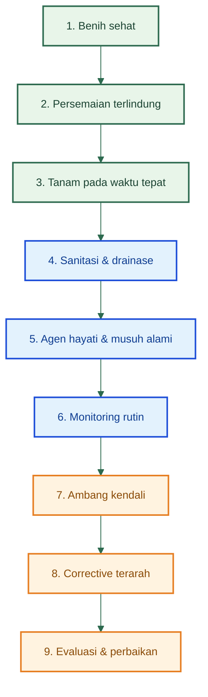

### Makna diagram

Diagram di atas menunjukkan bahwa PHT cabai bukan kumpulan tindakan yang berdiri sendiri. Ia bekerja seperti tangga bertingkat. **Benih sehat** tanpa **persemaian terlindung** tetap rapuh. **Persemaian terlindung** tanpa **waktu tanam yang tepat** tetap bisa kalah oleh tekanan musim. **Sanitasi dan drainase** yang buruk akan melemahkan kerja agen hayati. **Monitoring** tanpa ambang kendali akan membingungkan keputusan. **Corrective** tanpa evaluasi akan mengulang kesalahan yang sama pada siklus berikutnya. Karena itu, yang harus dibangun bukan hanya teknik, tetapi **urutan berpikir dan urutan kerja**.

### Penegasan praktis Bab 2

PHT cabai adalah **sistem bertingkat**. Ia dimulai jauh sebelum gejala berat muncul, dan bekerja paling baik ketika setiap lapisnya terhubung: bibit sehat, persemaian terlindung, waktu tanam tepat, sanitasi baik, rekayasa lingkungan jalan, agen hayati hidup, monitoring disiplin, ambang kendali jelas, corrective tepat, lalu evaluasi dilakukan jujur. Di titik inilah pembaca seharusnya mulai memahami bahwa keberhasilan PHT bukan terletak pada satu alat, tetapi pada **keterpaduan seluruh sistem kebun cabai**.

[**Kembali ke Atas**](#pht-pengendalian-hama-terpadu-cabai-rawit-dan-cabai-besar)

---

# BAGIAN II — FONDASI PENCEGAHAN SEBELUM TANAM

## 3. Pencegahan dimulai sebelum benih disemai

Pada cabai, PHT tidak dimulai saat hama terlihat atau saat gejala penyakit muncul, tetapi **sebelum benih disemai**. Keputusan pra-tanam menentukan apakah kebun akan menjadi lingkungan yang relatif stabil atau justru menjadi tempat yang sangat ramah bagi OPT. Karena itu, tahap ini harus dibaca sebagai **audit risiko kebun**: lokasi, riwayat lahan, riwayat OPT, sumber air, drainase, sanitasi awal, varietas, dan pola rotasi sebelumnya. Literatur budidaya cabai dari Balitsa dan SOP cabai Kementan sama-sama menekankan bahwa keberhasilan cabai sangat dipengaruhi oleh syarat tumbuh, kesehatan bibit, pengolahan lahan, drainase, dan penerapan budidaya sehat sejak awal. ([Pertanian Repository][1])

Kesalahan paling umum pada tahap ini adalah memperlakukan semua lahan seolah-olah sama. **Lahan bekas cabai, tomat, terung, atau kentang tidak boleh dibaca sama dengan lahan bekas jagung, padi, atau tebu.** Sumber teknis Hortikultura menegaskan bahwa pada pertanaman baru, lokasi yang dipilih sebaiknya **bukan bekas tanaman solanaceae**, bukan daerah endemik layu bakteri dan layu fusarium, dan lebih disarankan bekas ditanami padi, jagung, atau tebu. Alasan agronomisnya jelas: lahan yang berulang kali ditanami tanaman satu famili cenderung menyimpan patogen tular tanah, inang alternatif, dan tekanan OPT yang lebih berat.

Riwayat OPT sebelumnya harus dibaca sebagai data keputusan, bukan catatan tambahan. Bila musim sebelumnya kebun mengalami virus kuning, kutu kebul, atau antraknosa yang berat, maka keputusan tanam berikutnya tidak boleh sekadar “ulang seperti biasa.” Pada lahan dengan riwayat virus, tindakan seperti **sanitasi gulma inang, rotasi tanaman, barrier jagung/tagetes, penggerondongan persemaian, dan eradikasi dini tanaman sakit** harus dinaikkan sejak awal. Dokumen pengendalian penyakit kuning pada cabai secara eksplisit menempatkan pengendalian vektor, rotasi, sanitasi gulma inang, dan penggunaan bibit sehat sebagai fondasi pencegahan. ([Hortikultura][2])

Sumber air juga harus dievaluasi sebelum tanam. Pada cabai, air yang tidak stabil bukan hanya menurunkan vigor tanaman, tetapi memperbesar risiko **stres air, bunga rontok, pertumbuhan pucuk tidak stabil, dan memperberat serangan thrips/tungau** pada kondisi kering. Sebaliknya, lahan yang terlalu basah atau drainasenya buruk akan menaikkan risiko **layu bakteri, fusarium, Phytophthora, dan penyakit berbasis kelembapan**. Dokumen budidaya cabai merah Balitsa dan SOP Hortikultura sama-sama menegaskan bahwa cabai memerlukan pengairan yang cukup, tetapi genangan dan kelembapan tanah tinggi justru memperberat penyakit akar dan pembuluh. ([Pertanian Repository][1])

Drainase adalah salah satu komponen pra-tanam yang paling sering diremehkan, padahal ia menentukan apakah corrective nanti akan mudah atau selalu terlambat. Pada dokumen success story pengendalian OPT cabai, perbaikan drainase disebut sebagai bagian dari upaya antisipatif budidaya cabai. Pada SOP Cabai Rawit Hiyung, perbaikan pengairan untuk mencegah genangan dan membuat guludan setinggi 40–50 cm secara jelas disebut untuk menekan layu bakteri dan fusarium. Ini berarti lahan dengan drainase buruk harus dinilai sejak awal sebagai **lahan berisiko tinggi**, bukan baru dikoreksi setelah banyak tanaman layu.

Sanitasi awal juga termasuk bagian audit pra-tanam. Sanitasi di sini tidak hanya berarti membersihkan lahan dari sampah, tetapi juga:

- membuang sisa tanaman sakit,
- menekan gulma berdaun lebar yang menjadi inang vektor dan virus,
- membersihkan buah busuk yang tersisa,
- serta mengurangi sumber inokulum yang bertahan dari musim sebelumnya.
  Dokumen success story cabai menegaskan bahwa buah busuk, buah rontok, sisa tanaman, dan gulma dapat menjadi sumber infeksi atau serangan lanjutan, sedangkan dokumen penyakit kuning cabai menekankan pentingnya membersihkan inang seperti babadotan, bunga kancing, dan gulma lain yang mendukung vektor dan virus.

Pemilihan varietas juga harus dibawa masuk ke tahap pra-tanam. Walaupun tidak semua OPT memiliki varietas tahan yang benar-benar kuat, penggunaan benih sehat, varietas yang dikenal lebih adaptif, dan bahan tanam yang tidak berasal dari sumber terserang tetap sangat menentukan. Pada dokumen pengendalian penyakit kuning, penggunaan bibit sehat dan varietas yang relatif lebih tahan disebut secara spesifik sebagai bagian pengendalian. Pada SOP cabai Hiyung, benih harus bermutu tinggi, berdaya kecambah baik, murni, bersih, dan sehat. Artinya, varietas dan mutu benih bukan isu perbenihan semata, tetapi bagian inti PHT. ([Hortikultura][2])

### Diagram audit pra-tanam cabai

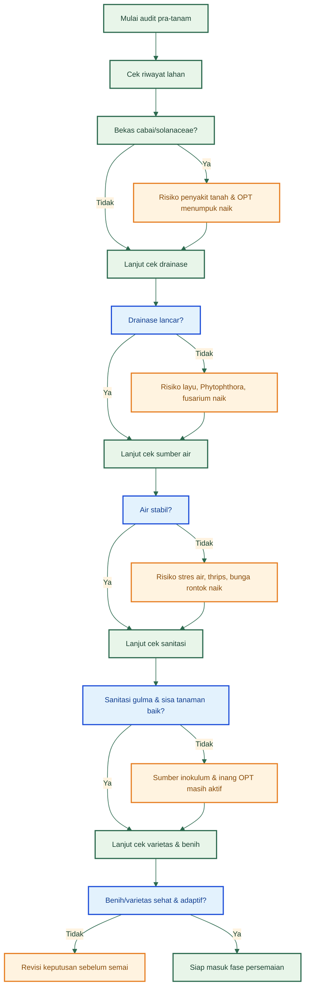

### Checklist pra-tanam

| Komponen        | Kondisi baik | Risiko bila buruk               |
| --------------- | ------------ | ------------------------------- |
| Drainase        | Lancar       | Layu, _Phytophthora_, fusarium  |
| Sanitasi lahan  | Bersih       | Sumber inokulum                 |
| Riwayat tanaman | Rotasi sehat | OPT menumpuk                    |
| Sumber air      | Stabil       | Stres air, thrips, bunga rontok |

### Simpulan Bab 3

Sebelum benih disemai, kebun cabai sebenarnya sudah bisa “dibaca.” Dari riwayat lahan, drainase, air, sanitasi, dan varietas, pengelola sudah dapat memperkirakan ancaman mana yang akan dominan. Artinya, pada cabai, **OPT bukan kejutan murni**. Banyak ancaman sebenarnya sudah bisa diprediksi bahkan sebelum musim tanam dimulai.

[**Kembali ke Atas**](#pht-pengendalian-hama-terpadu-cabai-rawit-dan-cabai-besar)

---

## 4. Persemaian sebagai titik kritis PHT

Persemaian harus diperlakukan sebagai **bab besar dalam PHT**, bukan sebagai catatan kecil sebelum tanam. Alasannya sederhana: banyak masalah berat di pertanaman cabai sebenarnya dimulai dari fase ini. Dokumen pengendalian penyakit kuning pada cabai menegaskan bahwa pemantauan kutu kebul dan pencegahan gejala penyakit harus dilakukan **mulai dari pembibitan sampai di pertanaman**, sedangkan success story pengendalian OPT cabai menempatkan **penggerondongan persemaian dengan kain kasa/kelambu 50 mesh** sebagai rekomendasi teknis utama untuk menekan vektor. Ini berarti persemaian adalah benteng pertama, bukan ruang netral. ([Hortikultura][2])

Persemaian menjadi titik kritis karena pada fase ini bibit masih lemah, jaringan tanaman masih lunak, dan infeksi atau serangan awal akan membawa efek panjang ke lapangan. Bibit yang sejak awal terpapar vektor seperti kutu kebul atau thrips dapat masuk ke pertanaman sebagai bibit yang tampak hidup, tetapi sudah membawa kerusakan fisiologis atau infeksi. Itulah sebabnya SOP Kementan dan Balitsa sama-sama menekankan **benih sehat, media semai steril, perlindungan fisik persemaian, dan eradikasi selektif bibit sakit** sebagai fondasi bibit bermutu.

Media semai harus diperlakukan sebagai komponen biologis, bukan sekadar tempat tumbuh. Pada SOP Cabai Rawit Hiyung, media persemaian direkomendasikan berasal dari campuran pupuk organik, tanah, dan abu atau tray dengan campuran tanah, arang sekam, dan pupuk kandang/kompos. Pada panduan Balitsa, media semai harus steril, penyiraman dilakukan secukupnya, dan kondisi terlalu lembap harus dihindari karena memicu bibit lemah dan penyakit awal seperti _damping-off_. Ini menunjukkan bahwa kualitas media dan kadar air bukan isu teknis kecil, tetapi bagian dari perlindungan bibit.

Perlindungan fisik persemaian harus dibedakan tegas antara **kelambu/kasa** dan **paranet**. Kelambu atau kasa halus digunakan untuk **menghalangi masuknya vektor**, terutama kutu kebul dan serangga kecil lain. Paranet hanya berfungsi sebagai **naungan** untuk mengurangi cekaman cahaya atau panas, bukan sebagai barrier utama serangga. Dokumen success story dan teknik pengendalian penyakit kuning sama-sama merekomendasikan penggerondongan persemaian dengan **kain kasa, kelambu, nylon, atau material sejenis dengan kerapatan sekitar 50 mesh**. Jadi, bila tujuan utamanya adalah menekan vektor, yang dipilih harus kelambu/kasa, bukan sekadar paranet.

### Gambar aktual 4.1 — Persemaian cabai dalam screen house / nursery terlindung

**PNG sumber resmi:** dokumentasi BSIP Kepulauan Riau tentang persemaian cabai dan bawang merah dengan skema **screen-house nursery**. Gambar ini sebaiknya ditempatkan tepat setelah paragraf yang menjelaskan persemaian sebagai benteng pertama PHT. Gambar ini menunjukkan bahwa persemaian terlindung bukan konsep abstrak, tetapi benar-benar diterapkan dalam praktik budidaya terstandar.

Bibit sehat harus diseleksi sebelum pindah tanam. SOP Cabai Rawit Hiyung menyebut batang harus tumbuh lurus, perakaran banyak, dan pertumbuhan normal. Panduan Balitsa menambahkan bahwa bibit sehat dan siap dipindahkan umumnya telah berumur sekitar 3–4 minggu, membentuk 4–5 helai daun, dan tinggi bibit berada pada kisaran aman. Ini penting karena dalam banyak kebun, kegagalan di lapangan bukan semata-mata karena kondisi lahan, tetapi karena bibit yang dipindahkan terlalu tua, terlalu muda, lemah, atau membawa gejala awal gangguan.

Bibit bergejala keriting, kuning, tumbuh kerdil, atau jelas tidak normal **tidak boleh dikompromikan**. Di sinilah banyak petani justru kalah sejak awal: bibit yang gejalanya “sedikit saja” tetap dipindahkan ke lapang karena sayang dibuang. Dalam PHT, keputusan ini salah. Dokumen penyakit kuning pada cabai menegaskan penggunaan bibit sehat dan eradikasi tanaman sakit sebagai fondasi. Artinya, bibit sakit bukan aset yang harus diselamatkan, tetapi sumber risiko yang harus dihentikan. ([Hortikultura][2])

### Gambar aktual 4.2 — Pembanding bibit/tanaman sehat vs tanaman terinfeksi virus kuning

**PNG sumber resmi yang dipasang di subbab ini:**

- **sisi sehat:** gambar persemaian atau bibit sehat dari rangkaian penyediaan benih cabai pada SOP dan panduan budidaya cabai, dipakai sebagai rujukan visual bibit normal dan siap tanam;
- **sisi sakit:** foto resmi **tanaman cabai terserang virus kuning** dari buku _Teknik Pengendalian Penyakit Kuning pada Tanaman Cabai_.
  Pasangan visual ini penting agar pembaca tidak hanya membaca kriteria sehat secara teks, tetapi juga mampu membedakan bibit/tanaman normal dengan tanaman yang sudah menunjukkan keriting-kuning.

### Diagram pembeda kelambu/kasa vs paranet

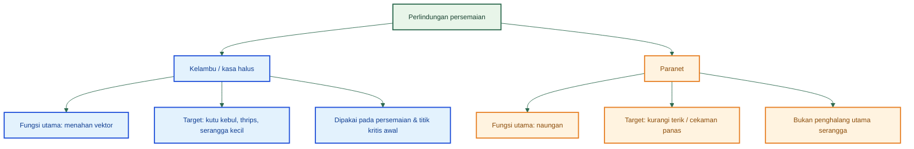

### Kesalahan umum di persemaian

| Kesalahan                        | Dampak                    |
| -------------------------------- | ------------------------- |
| Persemaian terbuka               | Kutu kebul/thrips masuk   |
| Media terlalu lembap             | Rebah semai/penyakit awal |
| Bibit disimpan terlalu tua       | Tumbuh tertahan           |
| Bibit gejala virus tetap ditanam | Sumber infeksi di kebun   |

### Simpulan Bab 4

Persemaian adalah **benteng pertama PHT**. Bila benteng ini bocor, masalah di lapangan akan jauh lebih mahal ditangani. Karena itu, kelambu/kasa, media sehat, seleksi bibit, sanitasi persemaian, dan pemusnahan bibit sakit harus diperlakukan sebagai tindakan wajib, bukan pilihan.

[**Kembali ke Atas**](#pht-pengendalian-hama-terpadu-cabai-rawit-dan-cabai-besar)

---

## 5. Agen hayati dan pengelolaan biologis sejak fase awal

Salah satu kelemahan paling umum dalam banyak artikel cabai adalah agen hayati hanya disebut sebagai tambahan. Dalam PHT yang benar, posisi itu harus dibalik: **agen hayati adalah lapisan preventif dini**, terutama untuk penyakit tular tanah dan stabilitas agroekosistem. Petunjuk teknis perlindungan hortikultura menempatkan agens hayati sebagai bagian nyata dari gerakan pengendalian OPT ramah lingkungan, dan dokumen teknis cabai dari Kementan secara berulang menyebut _Trichoderma_, _Gliocladium_, _Pseudomonas fluorescens_, PGPR, hingga pemanfaatan musuh alami sebagai komponen pengendalian.

Peran agen hayati dalam cabai dapat dibagi menjadi dua kelompok besar. Kelompok pertama adalah **agens proteksi akar dan tanah**, terutama untuk menekan penyakit seperti layu bakteri, layu fusarium, dan penyakit tular tanah lain. Di kelompok ini, _Trichoderma spp._, _Gliocladium spp._, _Pseudomonas fluorescens_, dan PGPR menjadi paling relevan. Kelompok kedua adalah **agens atau musuh alami serangga**, seperti _Beauveria bassiana_ dan kelompok predator/parasitoid yang membantu menekan vektor serta hama pengisap. Pembagian ini penting agar petani tidak salah menempatkan fungsi: agen hayati tanah tidak dipakai seperti insektisida, dan musuh alami serangga tidak bisa diharapkan bekerja bila habitatnya rusak.

_Trichoderma spp._ dan _Gliocladium spp._ berperan terutama untuk **menekan patogen tanah** dan melindungi akar muda. SOP Cabai Rawit Hiyung menyebut keduanya pada pengendalian layu bakteri, layu fusarium, dan antraknosa, termasuk rekomendasi aplikasi pada pupuk dasar atau kantong persemaian. Dokumen budidaya cabai di perkotaan dari Kementan juga menegaskan dua agen ini diaplikasikan bersamaan dengan pemupukan dasar untuk penyakit tular tanah. Ini menunjukkan bahwa _Trichoderma_ dan _Gliocladium_ bukan “obat darurat saat parah”, tetapi **proteksi awal yang harus dipasang sebelum patogen mendominasi rizosfer**.

_Pseudomonas fluorescens_ dan PGPR berperan pada fase lebih dini lagi, yaitu sejak **perlakuan benih** atau fase persemaian. SOP Cabai Rawit Hiyung menyebut perendaman benih selama 6 jam dalam larutan mikroba antagonis Pf (_Pseudomonas fluorescens_) dan dokumen success story menyebut perendaman benih atau aplikasi PGPR 6–12 jam sebelum semai sebagai bagian rekomendasi budidaya sehat dan pengendalian OPT secara ramah lingkungan. Artinya, pengelolaan biologis yang baik dimulai dari benih, bukan menunggu penyakit tanah muncul di lapang.

### Gambar aktual 5.1 — Rekomendasi resmi aplikasi agen hayati sejak awal

**PNG sumber resmi:** potongan halaman SOP Cabai Rawit Hiyung yang secara eksplisit menyebut **Pf (_Pseudomonas fluorescens_), Trichoderma spp., dan Gliocladium spp.** untuk pengendalian penyakit tular tanah. Gambar ini harus ditempatkan tepat setelah penjelasan peran agen hayati tanah agar pembaca melihat bahwa rekomendasinya berasal dari dokumen teknis, bukan dari klaim umum.

_Beauveria bassiana_ berada pada kelompok berbeda. Ia relevan sebagai cendawan entomopatogen untuk membantu menekan serangga tertentu. Pada SOP Cabai Rawit Hiyung dan petunjuk teknis perlindungan hortikultura, _Beauveria bassiana_ disebut dalam konteks pengendalian hayati hama seperti ulat grayak atau bagian dari daftar musuh alami/patogen serangga. Ini penting karena pada kebun cabai yang terlalu cepat menggunakan pestisida nonselektif, peran agens seperti _Beauveria_ dan musuh alami lain akan melemah. Jadi, pengelolaan biologis tidak hanya soal menambahkan mikroba, tetapi juga soal **tidak menghancurkan ekosistem yang mendukung kerjanya**.

Musuh alami serangga juga harus dibaca sebagai bagian inti PHT. Success story pengendalian OPT cabai menyebut pelepasan atau pemanfaatan musuh alami seperti **Encarsia formosa** dan **Menochilus sexmaculatus** untuk menekan vektor. Dokumen lain juga menekankan pentingnya konservasi habitat musuh alami melalui **tanaman berbunga, border, dan refugia**. Ini berarti pengelolaan biologis bukan hanya membeli atau membuat agen hayati, tetapi juga **mendesain kebun supaya musuh alami mau tinggal dan bekerja**.

### Gambar aktual 5.2 — Refugia sebagai habitat musuh alami

**PNG sumber resmi:** infografik refugia dari PUSTAKA Kementan. Gambar ini sebaiknya ditempatkan tepat setelah paragraf tentang konservasi musuh alami dan fungsi refugia. Secara praktis, ini membantu pembaca memahami bahwa refugia bukan ornamen, tetapi alat konservasi predator dan parasitoid.

### Diagram integrasi pengelolaan biologis sejak awal

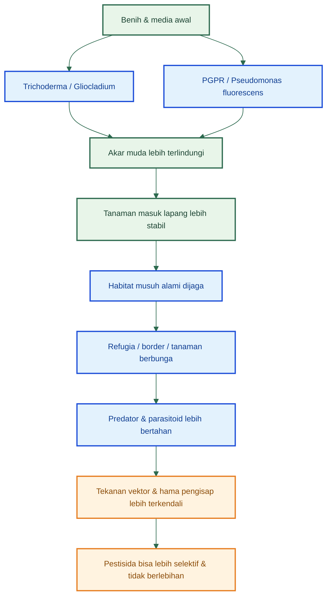

### Akar sehat vs akar sakit: pembanding yang harus dibaca jujur

Sumber resmi yang saya pakai untuk bab ini **menyediakan foto/visual penyakit layu dan jaringan akar-batang yang rusak**, tetapi **tidak menyediakan foto pembanding akar sehat cabai** yang setara kualitasnya. Karena itu, untuk menjaga akurasi, pembanding “akar sehat” lebih aman dijelaskan dengan kriteria, bukan saya isi dengan foto acak. Akar sehat pada bibit cabai dicirikan oleh perakaran banyak, tidak cokelat busuk, pertumbuhan bibit normal, dan batang tumbuh lurus; sedangkan akar/batang sakit pada kasus fusarium atau layu bakteri ditandai perubahan warna jaringan menjadi cokelat, gangguan kelayuan, dan kerusakan pembuluh. Ini lebih jujur daripada menampilkan foto sembarang tanpa kepastian konteks.

### Gambar aktual 5.3 — Akar/batang sakit pada penyakit tular tanah

**PNG sumber resmi:** halaman penyakit layu fusarium dari panduan teknis cabai di perkotaan dan/atau SOP Hiyung, yang menunjukkan gejala layu serta keterangan kerusakan akar/batang. Gambar ini ditempatkan tepat setelah penjelasan akar sehat vs akar sakit agar pembaca bisa melihat tanda sakit yang nyata.

### Agen hayati dan targetnya

| Agen hayati             | Sasaran utama        | Fase aplikasi        | Fungsi           |
| ----------------------- | -------------------- | -------------------- | ---------------- |
| Trichoderma             | Penyakit tanah       | Pra-tanam/persemaian | Proteksi akar    |
| Gliocladium             | Penyakit tanah       | Awal tanam           | Menekan patogen  |
| Pseudomonas fluorescens | Penyakit tular tanah | Benih/persemaian     | Proteksi dini    |
| Beauveria bassiana      | Serangga tertentu    | Vegetatif            | Penekanan hayati |

### Simpulan Bab 5

Agen hayati dan pengelolaan biologis harus masuk **sejak fase awal**, bukan baru dipanggil ketika kebun sudah berat. Pada cabai, lapisan preventif biologis yang dipasang sejak benih, persemaian, dan awal tanam akan jauh lebih efektif daripada pendekatan yang baru mencari agen hayati ketika penyakit tanah, vektor, atau ketidakseimbangan ekosistem sudah terlanjur kuat.

[1]: https://repository.pertanian.go.id/bitstreams/cba638be-f366-4e5d-9f2a-dfbb60b611f8/download 'KULTUR AGREGAT SAYURAN DAUN DENGAN SISTEM VERTIKULTUR'
[2]: https://hortikultura.pertanian.go.id/wp-content/uploads/2024/11/Teknik-Pengendalian-Penyakit-Kuning-Pada-Tanaman-Cabai_watermark.pdf 'BROSUR'

[**Kembali ke Atas**](#pht-pengendalian-hama-terpadu-cabai-rawit-dan-cabai-besar)

---

# BAGIAN III — PHT BERBASIS MUSIM, WAKTU TANAM, DAN FASE TANAMAN

## 6. Musim sebagai penentu tekanan OPT

Salah satu kelemahan paling besar dalam banyak tulisan tentang OPT cabai adalah pembahasannya seolah-olah serangan hama dan penyakit selalu sama sepanjang tahun. Padahal pada praktik lapang, **musim adalah pengatur utama tekanan OPT**. Musim menentukan suhu, kelembapan, intensitas hujan, kekuatan pertumbuhan gulma inang, kestabilan air, dan mikroklimat tajuk. Semua itu langsung memengaruhi apakah suatu OPT akan tetap ringan, naik perlahan, atau meledak menjadi penyebab gagal panen. Karena itu, dalam PHT cabai, musim bukan latar belakang pasif, tetapi bagian inti dari diagnosis dan keputusan budidaya. ([Hortikultura Direktoral][1])

Pada **musim kemarau**, ancaman yang paling sering menguat adalah **thrips, tungau, dan kutu daun**. Dokumen teknis cabai dari Kementan dan repository pertanian sama-sama menegaskan bahwa serangan berat thrips umumnya terjadi pada musim kemarau, dan tungau juga cenderung berat pada musim kemarau serta sering muncul bersamaan dengan thrips dan kutu daun. Secara biologis hal ini masuk akal: kondisi panas-kering mempercepat stres pucuk, menurunkan kelembapan permukaan, dan membuat tanaman lebih rentan mengalami kerusakan pada jaringan muda. Pada saat yang sama, bila irigasi tidak stabil, bunga rontok dan pertumbuhan pucuk menjadi tidak seragam, sehingga tekanan serangga pengisap menjadi lebih besar. ([Repositori Kementerian Pertanian][2])

Pada **musim hujan** atau periode dengan kelembapan sangat tinggi, ancaman bergeser. Yang naik bukan hanya busuk buah, tetapi juga **antraknosa, penyakit layu, dan gangguan berbasis kelembapan**. SOP Cabai Rawit Hiyung dan pedoman budidaya cabai menyebut bahwa kondisi panas-lembap mempercepat perkembangan antraknosa, sementara drainase buruk meningkatkan risiko layu bakteri, fusarium, dan penyakit akar lainnya. Ini berarti musim hujan tidak otomatis jelek untuk cabai, tetapi hanya aman bila kebun memiliki guludan kuat, drainase aktif, sanitasi tinggi, dan perlindungan penyakit yang disiplin. Tanpa itu, kebun yang awalnya subur justru mudah berubah menjadi sumber inokulum dan titik kehilangan buah. ([Hortikultura Direktoral][1])

Pada **musim transisi**, ancamannya sering paling menipu. Secara visual kebun tampak relatif nyaman karena curah hujan mulai turun atau mulai naik, tetapi justru fase ini sering menjadi masa pergerakan vektor seperti **kutu kebul, virus, dan thrips**, terutama bila gulma inang dan tanaman liar di sekitar kebun tidak dibersihkan. Dokumen pengendalian penyakit kuning pada cabai menekankan pentingnya sanitasi inang liar dan pengendalian vektor karena kutu kebul sangat berperan dalam penularan virus. Artinya, musim transisi bukan musim “aman”, melainkan musim yang menuntut monitoring lebih tajam terhadap pucuk, bawah daun, dan pergerakan serangga vektor dari kebun sekitar. ([Hortikultura Direktoral][3])

Bagi praktisi, makna paling penting dari pembacaan musim adalah ini: **jadwal tanam adalah alat PHT**. Bila musim dibaca dengan benar, pengelola bisa menyesuaikan kapan bibit mulai disemai, kapan vegetatif awal akan berlangsung, kapan pembungaan jatuh pada periode lebih aman, dan kapan panen utama tidak tepat berada di puncak tekanan penyakit buah. Sebaliknya, bila musim diabaikan, kebun cabai akan selalu masuk ke fase kritis pada saat ancaman OPT sedang tinggi. Itulah sebabnya kalender tanam tidak boleh dipisahkan dari kalender perlindungan tanaman. ([Hortikultura Direktoral][1])

### Diagram musim vs tekanan OPT

```mermaid
%%{init: {
  "theme": "base",
  "themeVariables": {
    "fontSize": "13px",
    "fontFamily": "Arial",
    "primaryColor": "#E3F2FD",
    "primaryTextColor": "#0F3D91",
    "primaryBorderColor": "#1D4ED8",
    "lineColor": "#2D6A4F",
    "secondaryColor": "#E8F5E9",
    "tertiaryColor": "#FFF3E0",
    "background": "#FFFFFF"
  }
}}%%
flowchart TB
    A["Musim hujan"] --> A1["Antraknosa"]
    A --> A2["Layu & busuk"]
    A --> A3["Kelembapan tinggi"]

    B["Musim transisi"] --> B1["Kutu kebul"]
    B --> B2["Virus"]
    B --> B3["Thrips"]
    B --> B4["Pergerakan vektor"]

    C["Musim kemarau"] --> C1["Thrips"]
    C --> C2["Tungau"]
    C --> C3["Kutu daun"]
    C --> C4["Stres air"]

    classDef blue fill:#E3F2FD,stroke:#1D4ED8,color:#0F3D91,stroke-width:2px;
    classDef green fill:#E8F5E9,stroke:#2D6A4F,color:#1B4332,stroke-width:2px;
    classDef orange fill:#FFF3E0,stroke:#E67E22,color:#8A4B08,stroke-width:2px;

    class A,A1,A2,A3 blue;
    class B,B1,B2,B3,B4 green;
    class C,C1,C2,C3,C4 orange;
```

### Diagram hubungan kelembapan dan jenis ancaman

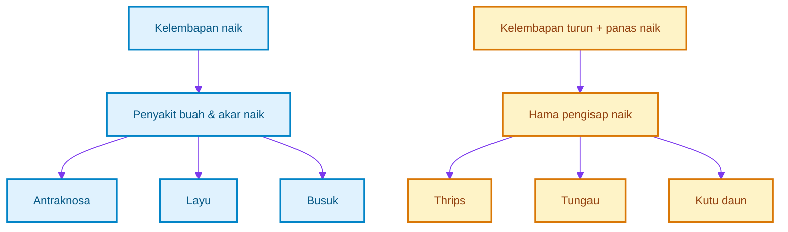

### Musim vs ancaman OPT

| Musim    | OPT dominan               | Risiko utama      | Fokus PHT                                       |
| -------- | ------------------------- | ----------------- | ----------------------------------------------- |
| Hujan    | Antraknosa, layu, busuk   | Kelembapan tinggi | Drainase, sanitasi, fungisida preventif terarah |
| Transisi | Kutu kebul, virus, thrips | Vektor bergerak   | Barrier, monitoring, eradikasi dini             |
| Kemarau  | Thrips, tungau, kutu daun | Stres air         | Stabilitas air, perangkap, monitoring pucuk     |

### Simpulan Bab 6

Musim bukan sekadar penanda bulan tanam, tetapi alat untuk membaca **jenis ancaman yang akan dominan**. Dengan memahami hubungan antara hujan, transisi, kemarau, dan tekanan OPT, pembaca seharusnya mulai melihat bahwa kalender tanam cabai sesungguhnya adalah salah satu komponen PHT yang paling menentukan. ([Hortikultura Direktoral][1])

[**Kembali ke Atas**](#pht-pengendalian-hama-terpadu-cabai-rawit-dan-cabai-besar)

---

## 7. Pengaturan waktu tanam sebagai alat pengendalian

Setelah musim dipahami, langkah berikutnya adalah menerjemahkannya menjadi **keputusan waktu tanam**. Dalam praktik budidaya, waktu tanam sering diperlakukan sebagai kebiasaan atau mengikuti ketersediaan tenaga dan benih. Dalam PHT, waktu tanam harus diperlakukan sebagai **keputusan teknis**. Alasannya sederhana: waktu tanam menentukan kapan fase vegetatif, pembungaan, buah muda, dan panen akan jatuh, dan setiap fase itu memiliki tekanan OPT yang berbeda. Bila fase kritis tanaman jatuh pada momen ancaman tertinggi, maka beban pengendalian menjadi jauh lebih berat. ([Hortikultura Direktoral][1])

Tanam serempak atau tidak serempak juga memengaruhi tekanan OPT. Bila dalam satu hamparan ada banyak kebun cabai dengan umur berbeda-beda, vektor dan sumber inokulum tidak pernah benar-benar putus. Ini terutama berbahaya untuk **kutu kebul, virus, thrips, dan beberapa penyakit buah**, karena selalu tersedia tanaman inang dalam berbagai fase. Sebaliknya, tanam yang lebih serempak membantu menyempitkan jendela reproduksi dan perpindahan OPT tertentu. Prinsip ini juga menjelaskan mengapa keberadaan sisa tanaman tua yang tidak dibongkar disiplin sering memperparah serangan di kebun baru. ([Hortikultura Direktoral][3])

Hubungan waktu tanam dengan curah hujan dan fase generatif sangat penting. Bila cabai ditanam terlalu dekat dengan periode hujan tinggi tanpa drainase kuat, maka fase pembungaan dan buah muda akan jatuh pada saat kelembapan tinggi. Pada kondisi ini, risiko **antraknosa, busuk buah, dan gangguan kelembapan** meningkat. Sebaliknya, bila cabai dimulai pada musim kemarau tetapi irigasi tidak sangat stabil, fase vegetatif awal akan lebih rentan terhadap **thrips, tungau, dan kerusakan pucuk**. SOP Cabai Rawit Hiyung secara eksplisit menyatakan bahwa **waktu tanam yang tepat adalah musim kemarau dengan irigasi yang baik**, terutama dalam konteks menekan beberapa penyakit penting. Namun, rekomendasi ini harus dibaca bersama kapasitas irigasi dan kemampuan perlindungan kebun. ([Hortikultura Direktoral][1])

Karena itu, tidak ada satu jawaban waktu tanam yang mutlak untuk semua kebun. Yang benar adalah membaca **jendela musim** dan menghubungkannya dengan **kapasitas perlindungan kebun**. Bila drainase sangat baik dan sanitasi disiplin, awal hujan masih bisa dipakai. Bila kebun berada di daerah yang tekanan vektornya sangat tinggi saat transisi, maka transisi menjadi pilihan yang lebih berisiko. Bila air sangat stabil dan mikroklimat bisa dikontrol, musim kemarau menjadi sangat menarik karena tekanan penyakit buah biasanya lebih rendah. Dengan kata lain, waktu tanam yang baik bukan waktu yang paling populer, tetapi waktu yang **paling cocok dengan kekuatan sistem kebun**. ([Hortikultura Direktoral][1])

### Diagram keputusan waktu tanam cabai

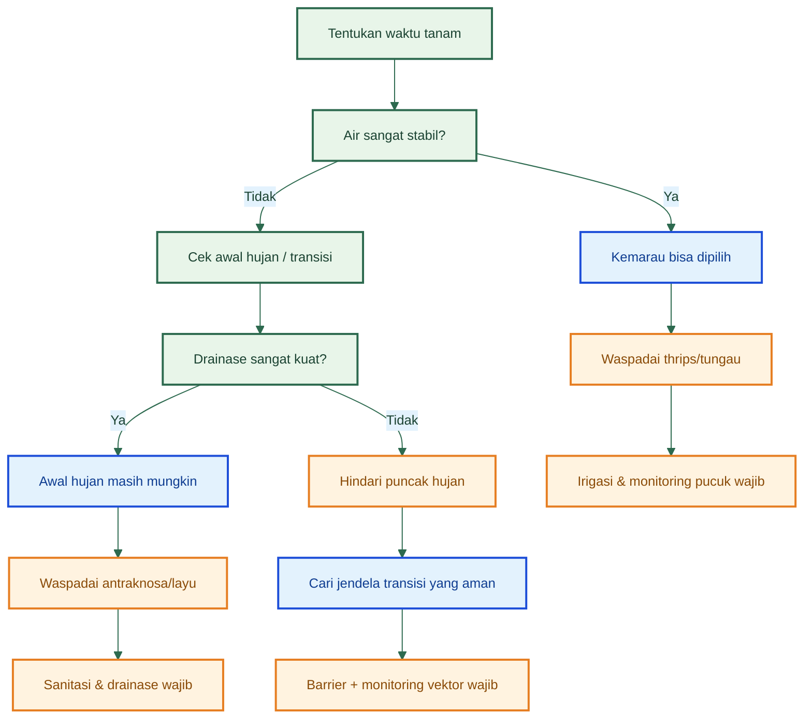

### Keputusan waktu tanam

| Waktu tanam | Kelebihan                          | Risiko             | Syarat                     |
| ----------- | ---------------------------------- | ------------------ | -------------------------- |
| Awal hujan  | Air tersedia                       | Penyakit tinggi    | Drainase kuat              |
| Transisi    | Relatif seimbang                   | Vektor tinggi      | Barrier + monitoring ketat |
| Kemarau     | Tekanan penyakit buah lebih rendah | Thrips/tungau naik | Air sangat stabil          |

### Simpulan Bab 7

Waktu tanam adalah bagian inti PHT karena ia menentukan kapan fase kritis cabai akan berhadapan dengan ancaman utama. Cabai tidak boleh dibangun hanya mengikuti kebiasaan tanam, tetapi harus mengikuti **jendela musim yang selaras dengan kekuatan drainase, air, sanitasi, dan kemampuan monitoring kebun**. ([Hortikultura Direktoral][1])

[**Kembali ke Atas**](#pht-pengendalian-hama-terpadu-cabai-rawit-dan-cabai-besar)

---

## 8. PHT berdasarkan fase tanaman

Artikel tentang OPT cabai sering terlalu berpusat pada nama organisme, sehingga pembaca sibuk menghafal hama tetapi tidak tahu **kapan fokus pengendalian harus bergeser**. Di lapangan, PHT yang efektif justru bersifat **phase-centric**, yaitu berubah mengikuti umur tanaman. Ancaman pada fase persemaian tidak sama dengan ancaman pada fase buah muda, dan tindakan terbaik pada fase vegetatif belum tentu relevan pada fase panen. Karena itu, kebun cabai harus dibaca dalam lima fase besar: persemaian, vegetatif, pembungaan, buah muda, dan panen. ([Repositori Kementerian Pertanian][4])

### 8.1 Fase persemaian

Pada fase persemaian, fokus PHT adalah **vektor, virus, kebersihan media, dan kualitas bibit**. Inilah fase di mana kutu kebul, thrips, dan beberapa gangguan awal bisa memberi efek jangka panjang yang sangat berat. Karena itu, kelambu/kasa, media sehat, sanitasi persemaian, dan seleksi bibit adalah empat tindakan utama. Pada fase ini, tindakan korektif yang paling kuat justru berupa **pemusnahan bibit bermasalah**, bukan penyelamatan paksa. ([Hortikultura Direktoral][3])

### 8.2 Fase vegetatif

Pada fase vegetatif, fokus berpindah ke **thrips, kutu kebul, kutu daun, tungau, dan keseragaman tumbuh**. Ini adalah fase di mana kebun harus sering diperiksa pada pucuk, bawah daun, dan pertumbuhan antarpetak. Bila vegetatif awal tidak stabil, tekanan OPT akan lebih sulit ditekan pada fase berikutnya. Barrier tanaman, mulsa, perangkap, kestabilan air, dan monitoring pucuk menjadi alat utama. Pada fase ini, banyak masalah berat sebetulnya masih bisa ditekan dengan cepat bila terdeteksi dini. ([Repositori Kementerian Pertanian][5])

### 8.3 Fase pembungaan

Saat tanaman mulai berbunga, fokus PHT harus menjadi lebih sensitif. Ancaman utama pada fase ini adalah **thrips, bunga rontok, air yang tidak stabil, dan nutrisi yang tidak seimbang**. Fase pembungaan adalah fase yang sangat mudah kehilangan potensi hasil tanpa gejala yang terlalu dramatis. Tanaman tampak masih sehat, tetapi bunga rontok, pembentukan buah awal lemah, atau kerusakan mikro pada bunga menurunkan hasil nyata. Karena itu, kestabilan irigasi dan pengamatan bunga menjadi lebih penting daripada sekadar melihat warna daun. ([Repositori Kementerian Pertanian][2])

### 8.4 Fase buah muda

Pada fase buah muda, ancaman utama bergeser ke **lalat buah, antraknosa awal, dan kestabilan mikroklimat**. Fase ini menentukan apakah hasil potensial benar-benar bisa menjadi hasil panen. Kebun yang tampak bagus pun bisa mulai kehilangan hasil besar bila perangkap tidak dipasang, buah sakit tidak disanitasi, dan kelembapan tajuk terlalu tinggi. Jadi, pada fase ini, perangkap atraktan, sanitasi buah, drainase, dan perlindungan penyakit buah menjadi pusat perhatian. ([Hortikultura Direktoral][6])

### 8.5 Fase panen

Pada fase panen, PHT tidak berhenti. Fokusnya bergeser ke **sanitasi buah, mutu, ketepatan panen, dan pemutusan sumber inokulum**. Buah sakit yang dibiarkan, panen yang terlambat, atau sortasi yang buruk akan memperbesar tekanan antraknosa, lalat buah, dan kerugian mutu. Fase panen harus dibaca sebagai fase perlindungan hasil dan perlindungan musim berikutnya sekaligus, karena kebun yang dibiarkan kotor pada akhir musim akan menjadi sumber masalah bagi tanam berikutnya. ([Hortikultura Direktoral][6])

### Diagram PHT berbasis fase tanaman

```mermaid
%%{init: {
  "theme": "base",
  "themeVariables": {
    "fontSize": "13px",
    "fontFamily": "Arial",
    "primaryColor": "#E8F5E9",
    "primaryTextColor": "#1B4332",
    "primaryBorderColor": "#2D6A4F",
    "lineColor": "#2D6A4F",
    "secondaryColor": "#E3F2FD",
    "tertiaryColor": "#FFF3E0",
    "background": "#FFFFFF"
  }
}}%%
flowchart TB
    A["Persemaian"] --> A1["Vektor + virus"]
    A --> A2["Kelambu & bibit sehat"]

    B["Vegetatif"] --> B1["Thrips, kutu kebul, tungau"]
    B --> B2["Monitoring pucuk, barrier, mulsa"]

    C["Pembungaan"] --> C1["Thrips & bunga rontok"]
    C --> C2["Air stabil & kontrol serangga"]

    D["Buah muda"] --> D1["Lalat buah & antraknosa"]
    D --> D2["Perangkap & sanitasi"]

    E["Panen"] --> E1["Buah sakit & mutu"]
    E --> E2["Sortasi, sanitasi, panen disiplin"]

    classDef green fill:#E8F5E9,stroke:#2D6A4F,color:#1B4332,stroke-width:2px;
    classDef blue fill:#E3F2FD,stroke:#1D4ED8,color:#0F3D91,stroke-width:2px;
    classDef orange fill:#FFF3E0,stroke:#E67E22,color:#8A4B08,stroke-width:2px;

    class A,B green;
    class C,D blue;
    class E orange;
    class A1,A2,B1,B2,C1,C2,D1,D2,E1,E2 green;
```

### Fase tanaman vs prioritas PHT

| Fase       | Ancaman utama              | Tindakan utama                    |
| ---------- | -------------------------- | --------------------------------- |
| Persemaian | Vektor + virus             | Kelambu, bibit sehat              |
| Vegetatif  | Thrips, kutu kebul, tungau | Monitoring pucuk, barrier, mulsa  |
| Pembungaan | Thrips, bunga rontok       | Air stabil, kontrol serangga      |
| Buah muda  | Lalat buah, antraknosa     | Perangkap, sanitasi               |
| Panen      | Buah sakit, kualitas       | Sortasi, sanitasi, panen disiplin |

### Simpulan Bab 8

Fokus PHT pada cabai **berubah menurut umur tanaman**. Itulah sebabnya artikel dan praktik lapang tidak boleh terlalu OPT-centric. Pembaca harus membiasakan diri bertanya: “Tanaman saya sedang ada di fase apa, dan fase ini paling rentan terhadap apa?” Dari sanalah tindakan menjadi lebih presisi, biaya perlindungan menjadi lebih efisien, dan peluang kehilangan hasil dapat ditekan lebih dini. ([Repositori Kementerian Pertanian][4])

[1]: https://hortikultura.pertanian.go.id/wp-content/uploads/2024/11/Panduan-Umum-Standar-Operasional-Prosedur-Budidaya-Cabai-Rawit-Hiyung_watermark.pdf?utm_source=chatgpt.com 'Panduan-Umum-Standar-Operasional-Prosedur-Budidaya ...'
[2]: https://repository.pertanian.go.id/server/api/core/bitstreams/efe030a2-b074-4585-9353-91aa14159f05/content?utm_source=chatgpt.com 'Teknologi Budidaya Cabai Merah'
[3]: https://hortikultura.pertanian.go.id/wp-content/uploads/2024/11/Teknik-Pengendalian-Penyakit-Kuning-Pada-Tanaman-Cabai_watermark.pdf?utm_source=chatgpt.com 'teknik pengendalian penyakit kuning pada tanaman cabai'
[4]: https://repository.pertanian.go.id/bitstreams/e6fa63a7-96a8-48be-840f-116ac332dc6a/download?utm_source=chatgpt.com 'HAMA DAN PENYAKIT TANAMAN CABAI MERAH'
[5]: https://repository.pertanian.go.id/server/api/core/bitstreams/057dc36a-0ef7-40ce-a6ff-5bb06605cb70/content?utm_source=chatgpt.com 'HAMA DAN PENYAKIT PADA TANAMAN CABAI SERTA ...'
[6]: https://hortikultura.pertanian.go.id/wp-content/uploads/2017/01/Success-Story-Dal-OPT-Cabai-Ramli-di-Indonesia.pdf?utm_source=chatgpt.com 'Success Story dan Strategic Planning Pengendalian OPT ...'

---

Berikut penulisan **Bagian IV — Modul OPT Utama dalam Kerangka PHT**, mengikuti **outline final Bab 9 yang sudah dikunci**. Saya tulis dengan logika prioritas lapang, bukan daftar OPT biasa, agar bab ini benar-benar menjadi alat keputusan. Outline acuannya adalah yang Anda unggah.

**Catatan penting untuk gambar aktual:** pada antarmuka ini saya tidak bisa mengekspor tangkapan gambar web resmi menjadi file PNG terlampir secara langsung. Karena itu, saya menempatkan **rujukan gambar aktual resmi tepat di subbab terkait**, lengkap dengan sumber dan halaman/figure yang relevan, agar saat dipindahkan ke file artikel final, gambar dapat dipasang persis di titik yang benar tanpa mengubah struktur bab.

[**Kembali ke Atas**](#pht-pengendalian-hama-terpadu-cabai-rawit-dan-cabai-besar)

---

# BAGIAN IV — MODUL OPT UTAMA DALAM KERANGKA PHT

# Bab 9 — Grading dan Modul OPT Utama dalam Kerangka PHT Cabai

## 9.1 Mengapa grading OPT diperlukan

Pada kebun cabai, tidak semua OPT mempunyai bobot ancaman yang sama. Ada organisme yang serangannya tampak kecil tetapi dampaknya besar karena menyerang fase awal dan meninggalkan kerusakan permanen. Ada pula organisme yang tidak selalu muncul, tetapi sekali datang dapat langsung merusak mutu dan volume panen. Tanpa grading, petani cenderung memperlakukan semua OPT setara, sehingga tenaga, biaya, dan perhatian lapang tersebar tidak efisien. Padahal dalam praktik PHT, pengelolaan yang baik justru dimulai dari pertanyaan: **mana ancaman yang harus diprioritaskan, mana yang dipantau ketat hanya pada kondisi tertentu, dan mana yang penting tetapi tidak boleh menggeser fokus dari ancaman utama**.

Pada cabai rawit dan cabai besar, kebutuhan grading menjadi lebih penting karena kerugian ekonomi sering lahir dari **kombinasi**. Vektor seperti kutu kebul merusak lebih berat karena membawa virus. Thrips bukan hanya mengisap, tetapi juga menekan pucuk dan bunga pada fase yang menentukan hasil. Antraknosa dan lalat buah mungkin baru dominan saat buah muncul, tetapi justru berada tepat pada fase pendapatan. Penyakit layu mungkin tidak seterkenal virus di permukaan daun, tetapi pada lahan dengan drainase jelek bisa menghabiskan tanaman produktif dari bawah. Karena itu, grading bukan klasifikasi akademik, melainkan **alat prioritas kerja** untuk monitoring, preventif, corrective, dan alokasi biaya perlindungan tanaman. ([Hortikultura Direktoral][1])

## 9.2 Dasar grading OPT cabai

Dalam bab ini, grading disusun berdasarkan tujuh parameter yang saling terkait: **daya rusak ekonomi, kecepatan ledakan populasi atau infeksi, kemampuan menurunkan hasil total, kemampuan menurunkan mutu buah, tingkat kesulitan pengendalian, potensi menyebabkan kerusakan permanen, serta keterkaitannya dengan musim dan fase kritis tanaman**. Ini berarti OPT diberi grade tinggi bukan semata karena terkenal, tetapi karena memenuhi satu atau beberapa kombinasi berikut: berkembang cepat, menyerang fase penting, sulit dipulihkan, menurunkan hasil bersih secara nyata, atau menyebabkan tanaman tetap hidup tetapi kehilangan nilai ekonomi. Struktur grading ini adalah sintesis operasional dari dokumen teknis cabai yang menekankan hubungan OPT dengan musim, fase tanaman, vektor, buah, drainase, dan sanitasi.

Dengan dasar ini, pembaca tidak diajak menghafal nama organisme, tetapi dilatih menilai ancaman secara lapang. Misalnya, virus kuning tidak selalu menyebabkan kematian cepat, tetapi karena infeksi dini membuat tanaman kerdil dan hampir tidak berbuah, ia harus ditempatkan tinggi. Antraknosa merusak terutama saat buah, sehingga ia mungkin tidak mencolok di awal musim, tetapi sangat berbahaya saat panen mendekat. Lalat buah menyerang langsung pada fase pendapatan, sedangkan tungau bisa naik tajam pada musim panas-kering dan menghambat fase generatif bila tidak terbaca sejak pucuk awal. Jadi, grading dalam PHT harus dibaca sebagai **peta prioritas kerja**, bukan daftar statis. ([Hortikultura Direktoral][2])

### Diagram dasar grading OPT cabai

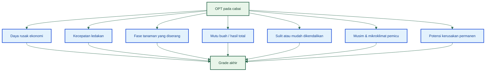

[**Kembali ke Atas**](#pht-pengendalian-hama-terpadu-cabai-rawit-dan-cabai-besar)

## 9.3 Grading utama OPT penggagal panen

### 9.3.1 Grade A — OPT penggagal panen utama

Dalam bab ini, saya menempatkan **kutu kebul beserta virus kuning/keriting, thrips, antraknosa, dan lalat buah** sebagai **Grade A**. Ini adalah hasil sintesis operasional dari dokumen resmi yang menunjukkan bahwa kutu kebul adalah vektor utama virus kuning, virus kuning menyebabkan kehilangan hasil sangat tinggi dan tidak disembuhkan melainkan dicegah, thrips tinggi pada musim kemarau dan merusak pucuk serta bunga, antraknosa adalah penyakit buah utama, dan lalat buah langsung merusak buah pada fase pendapatan dengan kapasitas reproduksi tinggi. Dengan kata lain, keempat kelompok ini paling sering menjadi penyebab kebun tampak hidup tetapi gagal secara ekonomi. ([Hortikultura Direktoral][2])

Kutu kebul dan virus kuning masuk Grade A karena kerusakannya **berlapis**: ada kerusakan isap langsung, ada peran sebagai vektor, dan ada efek permanen bila infeksi terjadi dini. Thrips masuk Grade A karena ia menekan jaringan muda, pembentukan tajuk, dan fase bunga, sehingga hasil akhir turun walau tanaman tidak mati. Antraknosa masuk Grade A karena menghancurkan mutu dan volume buah pada fase panen, sedangkan lalat buah masuk Grade A karena larvanya merusak buah dari dalam dan langsung memotong nilai jual hasil. Keempatnya harus menjadi **pusat perhatian utama** dalam monitoring, preventif, dan corrective.

### 9.3.2 Grade B — OPT perusak kuat tetapi lebih situasional

Saya menempatkan **tungau, layu bakteri, layu fusarium, dan ulat grayak/ulat buah** ke **Grade B**. Kelompok ini tetap sangat merusak, tetapi tingkat dominasinya lebih bergantung pada kondisi spesifik kebun: musim panas-kering, drainase buruk, mikroklimat terlalu lembap, atau monitoring yang lemah. Tungau misalnya dapat menjadi sangat berat saat kondisi panas dan kering, tetapi tidak selalu dominan di semua musim. Layu bakteri dan fusarium sangat destruktif, tetapi keduanya sangat erat dengan struktur tanah, guludan, aerasi, dan genangan. Ulat grayak dan ulat buah bisa meledak, tetapi umumnya lebih mudah ditekan bila telur dan larva awal dipantau dengan baik.

Grade B berarti bukan ancaman ringan, melainkan ancaman yang harus **naik prioritasnya saat kondisi pemicu muncul**. Pada kebun yang kering-panas tanpa stabilitas air, tungau bisa bertindak seperti Grade A. Pada kebun dengan drainase rusak atau musim hujan yang basah, layu bakteri dan fusarium bisa naik menjadi ancaman utama. Pada kebun yang lemah monitoringnya, ulat grayak dapat menimbulkan kerusakan mendadak yang besar. Jadi, Grade B harus dibaca sebagai OPT yang sangat penting, tetapi lebih **kondisional**. ([Hortikultura Direktoral][1])

### 9.3.3 Grade C — OPT penting tetapi umumnya sekunder

Dalam bab ini, **kutu daun** dan OPT minor lain saya tempatkan pada **Grade C**, bukan karena tidak penting, tetapi karena secara operasional mereka biasanya tidak seberat kelompok Grade A bila kebun dikelola baik. Kutu daun tetap dapat menimbulkan keriting pucuk, embun madu, jelaga, dan penurunan pertumbuhan, tetapi dalam banyak kebun cabai yang dipantau baik, kerusakan ekonomi langsungnya biasanya kalah berat dibanding kutu kebul+virus, thrips, antraknosa, atau lalat buah. Karena itu, Grade C tetap dipantau, tetapi tidak boleh menyedot energi lebih besar daripada Grade A. Penempatan ini adalah penyederhanaan operasional untuk membantu fokus lapang, bukan pengabaian biologis.

## 9.4 Tabel grading utama OPT cabai

| Grade | OPT                                | Fase paling berbahaya     | Daya rusak ekonomi | Karakter ancaman                        | Prioritas |
| ----- | ---------------------------------- | ------------------------- | ------------------ | --------------------------------------- | --------- |
| A     | Kutu kebul + virus kuning/keriting | Persemaian–vegetatif awal | Sangat tinggi      | Kerusakan permanen                      | 1         |
| A     | Thrips                             | Vegetatif–pembungaan      | Sangat tinggi      | Cepat meledak, ganggu pucuk dan bunga   | 2         |
| A     | Antraknosa                         | Buah–panen                | Sangat tinggi      | Hancurkan mutu dan volume panen         | 3         |
| A     | Lalat buah                         | Buah–panen                | Sangat tinggi      | Rusak buah langsung                     | 4         |
| B     | Tungau                             | Vegetatif–awal generatif  | Tinggi             | Situasional, kuat saat panas-kering     | 5         |
| B     | Layu bakteri                       | Vegetatif–generatif       | Tinggi             | Terkait tanah dan drainase              | 6         |
| B     | Fusarium                           | Vegetatif–generatif       | Tinggi             | Terkait tanah, akar, kelembapan         | 7         |
| B     | Ulat grayak/ulat buah              | Vegetatif–buah            | Sedang-tinggi      | Meledak bila monitoring lemah           | 8         |
| C     | Kutu daun                          | Vegetatif                 | Sedang             | Ganggu pucuk, bisa jadi vektor sekunder | 9         |
| C     | OPT sekunder lain                  | Variatif                  | Sedang-rendah      | Biasanya memperlemah                    | 10        |

Tabel ini adalah alat keputusan lapang. Fungsinya bukan memberi label, tetapi membantu pengelola menentukan **apa yang harus dilihat lebih dulu saat masuk kebun**, **apa yang harus dicegah paling awal**, dan **apa yang harus dikoreksi paling cepat**.

[**Kembali ke Atas**](#pht-pengendalian-hama-terpadu-cabai-rawit-dan-cabai-besar)

## 9.5 Grading berbasis musim

Grading di atas tidak sepenuhnya statis. Musim dapat menggeser prioritas. Pada **musim hujan**, ancaman yang naik adalah **antraknosa, layu bakteri, fusarium, dan busuk buah berbasis kelembapan**. Pada **musim transisi**, fokus kembali ke **kutu kebul, virus, dan thrips**, terutama bila gulma inang dan tanaman liar tidak dibersihkan. Pada **musim kemarau**, tekanan tertinggi biasanya kembali ke **thrips**, disusul **tungau** dan **kutu daun**, terutama bila air tidak stabil. Pola ini konsisten dengan dokumen SOP cabai yang menyebut thrips dan tungau berat pada musim kemarau, lalat buah dan beberapa gangguan buah berat pada musim hujan, serta penyakit buah berkembang cepat pada kondisi panas-lembap.

### Diagram grading berbasis musim

```mermaid id="bab9-musim"
%%{init: {
  "theme": "base",
  "themeVariables": {
    "fontSize": "13px",
    "fontFamily": "Arial",
    "primaryColor": "#E3F2FD",
    "primaryTextColor": "#0F3D91",
    "primaryBorderColor": "#1D4ED8",
    "lineColor": "#2D6A4F",
    "secondaryColor": "#E8F5E9",
    "tertiaryColor": "#FFF3E0",
    "background": "#FFFFFF"
  }
}}%%
flowchart TB
    A["Musim hujan"] --> A1["Antraknosa naik"]
    A --> A2["Layu bakteri/fusarium naik"]
    A --> A3["Drainase & sanitasi jadi kunci"]

    B["Musim transisi"] --> B1["Kutu kebul naik"]
    B --> B2["Virus naik"]
    B --> B3["Thrips mulai kuat"]

    C["Musim kemarau"] --> C1["Thrips dominan"]
    C --> C2["Tungau naik"]
    C --> C3["Kutu daun naik"]
    C --> C4["Air stabil jadi kunci"]

    classDef blue fill:#E3F2FD,stroke:#1D4ED8,color:#0F3D91,stroke-width:2px;
    classDef green fill:#E8F5E9,stroke:#2D6A4F,color:#1B4332,stroke-width:2px;
    classDef orange fill:#FFF3E0,stroke:#E67E22,color:#8A4B08,stroke-width:2px;

    class A,A1,A2,A3 blue;
    class B,B1,B2,B3 green;
    class C,C1,C2,C3,C4 orange;
```

| Musim    | Grade A musiman            | Grade B musiman      | Fokus PHT                             |
| -------- | -------------------------- | -------------------- | ------------------------------------- |
| Hujan    | Antraknosa, layu bakteri   | Fusarium, lalat buah | Drainase, sanitasi, proteksi penyakit |
| Transisi | Kutu kebul + virus, thrips | Kutu daun            | Barrier, kelambu, monitoring vektor   |
| Kemarau  | Thrips                     | Tungau, kutu daun    | Stabilitas air, monitoring pucuk      |

[**Kembali ke Atas**](#pht-pengendalian-hama-terpadu-cabai-rawit-dan-cabai-besar)

## 9.6 Grading berbasis fase tanaman

Selain musim, fase tanaman juga menggeser prioritas. Pada **persemaian**, ancaman Grade A adalah **kutu kebul, virus, dan thrips**, karena bila infeksi atau serangan berat dimulai di sini, efeknya bisa terbawa sampai lapang. Pada **fase vegetatif**, pusat perhatian tetap pada **thrips** dan **kutu kebul+virus**, sementara **tungau** dan **kutu daun** berada di lapis berikutnya. Pada **fase pembungaan**, ancaman paling sensitif kembali ke **thrips**, karena kerusakan kecil pada bunga dapat berujung pada kehilangan calon buah. Pada **fase buah muda sampai panen**, fokus Grade A bergeser ke **lalat buah** dan **antraknosa**, karena di sinilah nilai hasil nyata ditentukan. Struktur ini selaras dengan uraian teknis pada SOP cabai dan buku penyakit kuning yang menghubungkan vektor dengan pembibitan sampai pertanaman, serta penyakit buah dengan fase generatif. ([Hortikultura Direktoral][2])

### Diagram grading berbasis fase tanaman

```mermaid id="bab9-fase"
%%{init: {
  "theme": "base",
  "themeVariables": {
    "fontSize": "13px",
    "fontFamily": "Arial",
    "primaryColor": "#E8F5E9",
    "primaryTextColor": "#1B4332",
    "primaryBorderColor": "#2D6A4F",
    "lineColor": "#2D6A4F",
    "secondaryColor": "#E3F2FD",
    "tertiaryColor": "#FFF3E0",
    "background": "#FFFFFF"
  }
}}%%
flowchart TB
    A["Persemaian"] --> A1["Kutu kebul"]
    A --> A2["Virus"]
    A --> A3["Thrips"]

    B["Vegetatif"] --> B1["Thrips"]
    B --> B2["Kutu kebul + virus"]
    B --> B3["Tungau / kutu daun"]

    C["Pembungaan"] --> C1["Thrips"]
    C --> C2["Bunga rontok"]

    D["Buah muda - panen"] --> D1["Lalat buah"]
    D --> D2["Antraknosa"]
    D --> D3["Ulat buah"]

    classDef green fill:#E8F5E9,stroke:#2D6A4F,color:#1B4332,stroke-width:2px;
    classDef blue fill:#E3F2FD,stroke:#1D4ED8,color:#0F3D91,stroke-width:2px;
    classDef orange fill:#FFF3E0,stroke:#E67E22,color:#8A4B08,stroke-width:2px;

    class A,B green;
    class C blue;
    class D orange;
```

| Fase tanaman | Grade A                    | Grade B           | Fokus tindakan                    |
| ------------ | -------------------------- | ----------------- | --------------------------------- |
| Persemaian   | Kutu kebul, virus, thrips  | Kutu daun         | Kelambu, bibit sehat, barrier     |
| Vegetatif    | Thrips, kutu kebul + virus | Tungau, kutu daun | Monitoring pucuk dan bawah daun   |
| Pembungaan   | Thrips                     | Tungau            | Air stabil, jaga bunga            |
| Buah muda    | Lalat buah, antraknosa     | Ulat buah         | Atraktan, sanitasi, proteksi buah |
| Panen        | Antraknosa, lalat buah     | Layu/sekunder     | Panen disiplin, buang buah sakit  |

---

[**Kembali ke Atas**](#pht-pengendalian-hama-terpadu-cabai-rawit-dan-cabai-besar)

## 9.7 Modul OPT Grade A

## 9.7.1 Kutu kebul + virus kuning/keriting

Kutu kebul beserta virus kuning/keriting ditempatkan pada Grade A karena kerusakannya terjadi sejak dini dan dapat bersifat permanen. Dokumen penyakit kuning cabai menyebut dengan jelas bahwa tanaman yang terserang virus kuning memiliki ciri daun menggulung, mengecil, menguning, produksi buah menurun bahkan tidak berbuah bila serangan terjadi sebelum berbunga; pengendalian ditujukan bukan untuk menyembuhkan tanaman terinfeksi, melainkan mencegah dan mengurangi infeksi pada tanaman lain. SOP Cabai Rawit Hiyung juga menegaskan kutu kebul sebagai hama penting, dengan rekomendasi barrier jagung/orok-orok/kacang panjang, rotasi bukan inang, tumpangsari tagetes/caisim, likat kuning, kelambu pembibitan, sanitasi sisa tanaman terserang, serta pemanfaatan musuh alami. ([Hortikultura Direktoral][2])

**Fase paling rentan:** persemaian sampai vegetatif awal.
**Musim/kondisi pemicu:** transisi dan kebun dengan banyak gulma inang atau persemaian terbuka.
**Tindakan preventif utama:** kelambu/kasa pada persemaian, likat kuning, barrier jagung 2–3 minggu sebelum tanam, sanitasi gulma inang, bibit sehat, eradikasi tanaman sakit.
**Tindakan corrective utama:** cabut tanaman bergejala berat, fokus pada pengendalian vektor, tambah perangkap, perbaiki sanitasi, dan bila perlu gunakan insektisida selektif yang menjangkau bawah daun.
**Kesalahan lapang paling sering:** bibit sakit tetap ditanam, barrier tidak dibuat, persemaian terbuka, gulma inang dibiarkan, dan pengendalian hanya menunggu gejala berat.

**Gambar aktual yang harus masuk di subbab ini**

- **Gambar 9.7.1-A (resmi):** _Tanaman cabai yang terserang virus kuning_ dari buku **Teknik Pengendalian Penyakit Kuning pada Tanaman Cabai**, halaman gejala awal.
- **Gambar 9.7.1-B (resmi):** _Keragaman gejala penyakit virus kuning_ dari buku yang sama, sangat penting untuk membedakan variasi gejala lapang.
- **Gambar 9.7.1-C (resmi):** _Gambar 16. Kutu kebul_ dari SOP Cabai Rawit Hiyung.

**Checklist diagnosis cepat**

- Apakah daun pucuk mengecil dan menggulung?
- Apakah gejala kuning muncul sejak vegetatif awal?
- Apakah kutu kebul banyak di bawah daun?
- Apakah persemaian atau kebun sekitar memiliki gulma inang?
- Apakah tanaman sakit masih dibiarkan berdiri?

---

## 9.7.2 Thrips

Thrips masuk Grade A karena dia menyerang **pucuk, daun muda, dan bunga**, lalu menekan pembentukan hasil jauh sebelum buah banyak terlihat. SOP Cabai Rawit Hiyung menyebut thrips lebih berat pada musim kemarau, menyebabkan daun berubah warna menjadi coklat tembaga, menyusut, keriting, tunas dan bunga gugur; pengendalian yang disarankan mencakup sanitasi bagian terserang, pengairan cukup, musuh alami, cendawan antagonis _Beauveria bassiana_, serta pestisida bila ambang tercapai. Di luar itu, sumber teknis IPM menjelaskan siklus thrips berlangsung cepat sehingga jeda monitoring yang terlalu panjang sangat berbahaya.

**Fase paling rentan:** vegetatif sampai pembungaan.
**Musim/kondisi pemicu:** kemarau, panas-kering, air tidak stabil, pucuk terlalu lunak.
**Tindakan preventif utama:** mulsa, perangkap likat, sanitasi gulma inang, monitoring pucuk/bunga, air stabil.
**Tindakan corrective utama:** buang bagian rusak berat, perketat monitoring, koreksi stres air, rotasi bahan aktif bila intervensi kimia diperlukan.
**Kesalahan lapang paling sering:** datang ke kebun hanya melihat dari kejauhan, tidak memeriksa pucuk dan bunga, dan terlalu lambat membedakan keriting akibat thrips dari masalah hara.

**Gambar aktual yang harus masuk di subbab ini**

- **Gambar 9.7.2-A (resmi):** _Gambar 11. Hama trips dan gejala serangan_ dari SOP Cabai Rawit Hiyung.

**Checklist diagnosis cepat**

- Apakah daun muda tampak keperakan atau bronzing?
- Apakah pucuk sempit, keriting, dan pertumbuhan melambat?
- Apakah bunga rontok tanpa sebab jelas?
- Apakah tekanan serangan naik pada kemarau?
- Apakah pucuk paling muda menjadi pusat gejala?

---

## 9.7.3 Antraknosa

Antraknosa masuk Grade A karena langsung menghancurkan mutu dan volume panen. SOP Cabai Rawit Hiyung menjelaskan serangan awal berupa bercak coklat kehitaman pada buah, lalu menjadi busuk lunak; pada serangan berat buah keriput dan mengering, serta perkembangan penyakit dipercepat oleh kondisi panas dan lembap. Pengendalian yang direkomendasikan mencakup benih sehat, _Pseudomonas fluorescens_, _Trichoderma spp._, _Gliocladium spp._, sanitasi gulma dan buah sakit, rotasi, perbaikan drainase, dan fungisida protektif sejak keluar putik buah bila diperlukan. Ini menunjukkan bahwa antraknosa bukan sekadar penyakit saat buah, tetapi penyakit yang harus dicegah sejak sistem kebun dibangun.

**Fase paling rentan:** buah muda sampai panen.
**Musim/kondisi pemicu:** hujan, panas-lembap, sanitasi buah buruk, drainase jelek.
**Tindakan preventif utama:** sanitasi buah, drainase baik, kurangi percikan air, mulsa, agens hayati, proteksi dini bila kondisi mendukung.
**Tindakan corrective utama:** petik dan musnahkan buah sakit, jangan biarkan buah busuk tergantung atau jatuh, perbaiki drainase, dan gunakan fungisida rotasi bila gejala meluas.
**Kesalahan lapang paling sering:** panen terlambat, buah sakit dibiarkan, mengandalkan fungisida tanpa sanitasi.

**Gambar aktual yang harus masuk di subbab ini**

- **Gambar 9.7.3-A (resmi):** _Gambar 19. Busuk buah antraknosa_ dari SOP Cabai Rawit Hiyung.
- **Gambar 9.7.3-B (resmi teks pendukung):** halaman yang menjelaskan kaitan antraknosa dengan _Pseudomonas fluorescens_, _Trichoderma_, _Gliocladium_, drainase, dan sanitasi.

**Checklist diagnosis cepat**

- Apakah pada buah ada bercak cekung coklat-kehitaman?
- Apakah buah cepat lunak atau keriput?
- Apakah gejala naik saat kelembapan tinggi?
- Apakah banyak buah sakit dibiarkan di kebun?
- Apakah drainase dan sanitasi lemah?

---

## 9.7.4 Lalat buah

Lalat buah ditempatkan pada Grade A karena menyerang tepat pada fase pendapatan. SOP Cabai Rawit Hiyung menyebut betina mampu bertelur sekitar 1.200–1.500 butir dengan siklus hidup sekitar 25 hari; gejala khas pada buah adalah lubang titik hitam di pangkal, dan jika buah dibelah terdapat larva yang memakan daging buah hingga buah busuk dan gugur. Pengendalian yang direkomendasikan mencakup pengolahan tanah untuk mematikan pupa, pengumpulan dan pemusnahan buah terserang, penggunaan perangkap atraktan, pemanfaatan musuh alami, dan pestisida bila cara lain tidak cukup. Ini menjelaskan mengapa lalat buah tidak bisa dilawan hanya dengan semprotan biasa.

**Fase paling rentan:** buah muda sampai panen.
**Musim/kondisi pemicu:** musim hujan, sanitasi buah buruk, panen terlambat.
**Tindakan preventif utama:** atraktan/perangkap sejak mulai berbunga, sanitasi buah, panen disiplin, kebersihan lantai kebun.
**Tindakan corrective utama:** petik dan musnahkan buah terserang setiap 1–2 hari, tambah perangkap, bersihkan buah rontok, jangan hanya mengandalkan semprotan kontak.
**Kesalahan lapang paling sering:** menganggap buah busuk biasa, tidak membelah buah untuk melihat larva, dan membiarkan buah sakit di kebun.

**Gambar aktual yang harus masuk di subbab ini**

- **Gambar 9.7.4-A (resmi):** _Gambar 13. Lalat buah dan gejala serangan_ dari SOP Cabai Rawit Hiyung.

**Checklist diagnosis cepat**

- Apakah ada titik tusukan hitam di pangkal buah?
- Apakah buah membusuk dari dalam?
- Apakah ada larva saat buah dibelah?
- Apakah kebun banyak buah rontok atau buah sakit tertinggal?
- Apakah perangkap belum dipasang sejak awal pembungaan?

---

[**Kembali ke Atas**](#pht-pengendalian-hama-terpadu-cabai-rawit-dan-cabai-besar)

## 9.8 Modul OPT Grade B

## 9.8.1 Tungau

Tungau ditempatkan pada Grade B karena sangat merusak tetapi lebih situasional, terutama saat panas-kering dan air tidak stabil. SOP Cabai Rawit Hiyung menyebut ukuran tungau sangat kecil, gejalanya berupa daun menebal, perubahan warna menjadi tembaga/kecoklatan, menyusut, keriting, tunas dan bunga gugur, dan pengairan yang cukup membantu mengurangi populasinya. Musuh alami dan _Beauveria bassiana_ juga disebut sebagai bagian strategi kendali.

**Gambar aktual:** _Gambar 12. Hama tungau dan gejala serangan_ dari SOP Cabai Rawit Hiyung.

## 9.8.2 Layu bakteri

Layu bakteri masuk Grade B karena sangat merusak tetapi sangat terkait kondisi tanah, drainase, dan aerasi. SOP Cabai Rawit Hiyung menjelaskan gejala layu yang menjalar, batang/akar yang dicelup ke air mengeluarkan cairan keruh berupa koloni bakteri, dan pengendalian melalui sanitasi, rotasi, perbaikan aerasi, guludan tinggi, penurunan pH dengan belerang, varietas sehat, dan pemanfaatan _Pseudomonas fluorescens_, _Trichoderma spp._, dan _Gliocladium spp._. Ini menunjukkan bahwa layu bakteri tidak bisa dipisahkan dari manajemen lahan.

**Gambar aktual:** _Gambar 17. Penyakit Layu Bakteri_ dari SOP Cabai Rawit Hiyung.

## 9.8.3 Layu fusarium

Fusarium berada di Grade B karena kerusakannya kuat tetapi sangat dipengaruhi tanah, drainase, dan kondisi akar. SOP Cabai Rawit Hiyung menyebut tanaman layu mulai dari bawah, anak tulang daun menguning, jaringan akar dan batang menjadi coklat, serta infeksi berkembang cepat; pengendalian mencakup sanitasi, guludan 40–50 cm, benih sehat, rotasi, pemusnahan gulma tertentu, dan pemanfaatan _Trichoderma spp._ serta _Gliocladium spp._ sebagai pupuk dasar.

**Gambar aktual:** _Gambar 18. Layu Fusarium_ dari SOP Cabai Rawit Hiyung.

## 9.8.4 Ulat grayak / ulat buah

Ulat grayak dan ulat buah berada di Grade B karena dapat meledak cepat bila monitoring lemah, terutama bila kelompok telur dan larva awal tidak dimusnahkan. SOP Cabai Rawit Hiyung menekankan sanitasi lahan, pengolahan intensif, drainase baik, eradikasi kelompok telur, pemusnahan telur/larva/pupa, pemanfaatan musuh alami, serta penyemprotan bila intensitas kerusakan melewati ambang batas. Ini menegaskan bahwa kuncinya adalah **deteksi dini**, bukan menunggu ulat besar.

**Gambar aktual:** _Gambar 15. Hama Ulat Grayak_ dari SOP Cabai Rawit Hiyung.

---

## 9.9 Modul OPT Grade C

## 9.9.1 Kutu daun

Kutu daun berada di Grade C dalam bab ini karena secara operasional biasanya menjadi tekanan tambahan, walau tetap penting. SOP Cabai Rawit Hiyung menjelaskan bahwa kutu daun persik hidup berkelompok di bawah permukaan daun, menyerang daun muda dan pucuk, mengeluarkan embun madu yang mendorong jelaga, dan biasanya meledak pada musim kemarau. Rekomendasi pengendaliannya mencakup tumpangsari dengan bawang daun, tanaman perangkap seperti caisim, kain kasa, perangkap air kuning, musuh alami, dan pestisida bila diperlukan.

**Gambar aktual:** _Gambar 14. Hama Kutu Daun Persik dan Gejala Serangan_ dari SOP Cabai Rawit Hiyung.

## 9.9.2 OPT sekunder lain

OPT sekunder lain tetap perlu dicatat, tetapi dalam konteks bab ini tidak dijadikan pusat pembahasan karena tujuan grading adalah menajamkan prioritas, bukan memperpanjang daftar ancaman. Prinsipnya sederhana: bila Grade A belum terkendali, energi tidak boleh habis untuk ancaman minor. Ini adalah aturan fokus kerja, bukan pengabaian ilmiah.

[**Kembali ke Atas**](#pht-pengendalian-hama-terpadu-cabai-rawit-dan-cabai-besar)

---

## 9.10 Matriks prioritas tindakan PHT per grade

| Grade | Fokus monitoring             | Fokus preventif | Fokus corrective         |
| ----- | ---------------------------- | --------------- | ------------------------ |
| A     | Sangat intensif              | Sangat kuat     | Paling cepat             |
| B     | Intensif pada kondisi pemicu | Kuat            | Cepat saat gejala muncul |
| C     | Rutin                        | Normal          | Selektif                 |

Matriks ini harus dibaca sebagai terjemahan langsung dari grading ke ritme kerja lapang. Grade A berarti petani tidak boleh menunggu. Grade B berarti petani harus peka terhadap musim, drainase, dan gejala pemicu. Grade C berarti tetap diawasi, tetapi tidak boleh memecah fokus utama.

## 9.11 Kesimpulan Bab 9

Bab ini menegaskan bahwa **tidak semua OPT setara**. Pada cabai rawit dan cabai besar, Grade A harus bertumpu pada **kutu kebul beserta virus kuning/keriting, thrips, antraknosa, dan lalat buah**, karena empat kelompok ini paling sering merusak fase awal, fase bunga, atau langsung menghancurkan buah dan mutu hasil. Grade B sangat penting tetapi lebih situasional, sedangkan Grade C tetap dipantau sebagai tekanan tambahan. Dengan memahami grading ini, pembaca seharusnya tidak lagi masuk kebun dengan daftar ancaman yang datar, tetapi dengan **hierarki fokus** yang lebih cerdas: tahu mana yang paling berbahaya, mana yang musiman, mana yang terkait fase tanaman, dan bagaimana memprioritaskan monitoring, preventif, dan corrective. Rumusan ini selaras dengan tujuan Bab 9 yang Anda kunci.

### Penegasan akhir Bab 9

> Pada cabai rawit dan cabai besar, OPT penggagal panen utama yang harus diperlakukan sebagai Grade A adalah kutu kebul beserta virus kuning/keriting, thrips, antraknosa, dan lalat buah. OPT lain tetap penting, tetapi prioritas monitoring, preventif, dan corrective harus terlebih dahulu bertumpu pada empat kelompok ini.

[1]: https://hortikultura.pertanian.go.id/wp-content/uploads/2024/11/Panduan-Umum-Standar-Operasional-Prosedur-Budidaya-Cabai-Rawit-Hiyung_watermark.pdf?utm_source=chatgpt.com 'Panduan-Umum-Standar-Operasional-Prosedur-Budidaya ...'
[2]: https://hortikultura.pertanian.go.id/wp-content/uploads/2024/11/Teknik-Pengendalian-Penyakit-Kuning-Pada-Tanaman-Cabai_watermark.pdf 'BROSUR'

[**Kembali ke Atas**](#pht-pengendalian-hama-terpadu-cabai-rawit-dan-cabai-besar)

---

## 10. Pengendalian fisik, mekanis, biologis, kultur teknis, dan kimia: bagaimana mengintegrasikannya

Inti PHT bukan memilih satu alat terbaik, melainkan **menggabungkan beberapa alat pada waktu yang tepat**. Kebun cabai yang hanya bergantung pada satu jalur kendali biasanya rapuh. Bila hanya bergantung pada kelambu, masalah akan kembali saat tanaman keluar ke lapang. Bila hanya bergantung pada agen hayati, tekanan vektor tinggi bisa tetap menembus sistem. Bila hanya bergantung pada pestisida, resistensi, resurjensi, dan kerusakan musuh alami akan mempersempit pilihan pengendalian berikutnya. Dokumen kebijakan PHT Kementan menegaskan bahwa budidaya tanaman sehat, pemanfaatan musuh alami, pengamatan rutin, dan petani sebagai ahli PHT adalah pilar dasar, sedangkan dokumen success story cabai menambahkan bahwa praktik budidaya, sanitasi, tumpangsari, tanaman pendamping, tanaman perangkap, konservasi musuh alami, dan pestisida alami maupun kimia harus dibaca sebagai satu sistem tindakan. ([data.hortikultura.pertanian.go.id][1])

**Pengendalian fisik** bekerja terutama dengan cara **mencegah kontak awal** antara tanaman dan OPT. Di cabai, bentuk paling penting adalah **kelambu/kasa** pada persemaian, **screen house** pada sistem intensif atau lokasi berisiko tinggi, dan **mulsa plastik hitam perak** untuk menekan percikan tanah, mengganggu orientasi beberapa serangga, serta membantu stabilitas kelembapan tanah. Dokumen Renstra Direktorat Perlindungan Hortikultura menyebut bahwa penggunaan **kelambu, screen house, dan mulsa plastik perak-hitam** sudah dikembangkan untuk mengantisipasi serangan OPT sejak dini, sementara success story cabai menilai screen house efektif menekan cekaman cuaca ekstrem dan serangan OPT. ([Hortikultura Direktoral][2])

**Pengendalian mekanis** adalah tindakan yang secara langsung menurunkan sumber serangan di lapang. Ini mencakup mencabut tanaman bergejala virus berat, mengambil kelompok telur ulat, membuang buah sakit akibat antraknosa, mengumpulkan buah terserang lalat buah, dan memusnahkan bagian tanaman yang menjadi pusat infeksi atau populasi. Nilai ekonominya besar karena pada banyak kebun cabai, tindakan mekanis yang cepat pada fase awal jauh lebih murah daripada corrective kimia saat serangan sudah menyebar. Dokumen success story cabai menyebut pengendalian mekanis seperti mencabut tanaman, menanam tanaman penghalang, serta memusnahkan sumber serangan sebagai bagian dari langkah kuratif terpadu. ([Hortikultura Direktoral][3])

**Pengendalian biologis** terdiri dari dua kelompok. Pertama, **agens hayati untuk tanah dan penyakit awal**, seperti _Trichoderma_, _Gliocladium_, _Pseudomonas fluorescens_, dan PGPR. Kedua, **pengendalian hayati serangga**, seperti _Beauveria bassiana_ serta konservasi predator dan parasitoid. Dokumen SOP cabai Hiyung menempatkan _Trichoderma_, _Gliocladium_, dan _Pseudomonas fluorescens_ dalam pengendalian penyakit tular tanah dan penyakit penting cabai, sementara Renstra dan petunjuk teknis perlindungan hortikultura menegaskan berkembangnya penggunaan agens hayati dan pestisida biologi dalam PHT ramah lingkungan. ([Hortikultura Direktoral][4])

**Kultur teknis** adalah tulang punggung integrasi. Di sinilah mulsa, barrier jagung, rotasi tanaman, sanitasi, pengaturan jarak tanam, drainase, dan pengelolaan waktu tanam bekerja. Success story cabai menekankan pergiliran tanaman, tumpangsari, tanaman pendamping, tanaman penolak, tanaman penjerat, konservasi musuh alami, sanitasi, dan barrier seperti jagung atau tagetes sebagai bagian pencegahan. Ini berarti kultur teknis bukan pelengkap setelah hama muncul, tetapi alat utama untuk membentuk kebun yang lebih tahan sejak awal. ([Hortikultura Direktoral][3])

**Kimia** tetap punya tempat, tetapi tempatnya jelas: **alat penekan terarah saat tekanan sudah cukup tinggi atau saat kondisi menuntut intervensi cepat**. Dua hal yang wajib ditekankan adalah: pertama, pestisida harus dipilih sesuai sasaran organisme dan situasi lapang; kedua, pestisida tidak boleh dipakai terus-menerus dengan cara kerja yang sama. Dokumen Kementan tentang cara kerja dan daftar pestisida menegaskan bahwa pengelolaan resistensi dilakukan dengan **rotasi atau pergiliran penggunaan pestisida**, dan daftar pestisida untuk cabai juga disusun mengikuti **kode cara kerja** yang merujuk pada IRAC untuk insektisida/akarisida dan FRAC untuk fungisida. IRAC sendiri menegaskan bahwa strategi resistensi yang efektif memerlukan **rotasi antar kelompok mode of action**, dan FRAC menjelaskan bahwa fungisida dalam **kelompok FRAC yang sama** berisiko menunjukkan silang resistensi sehingga bukan pasangan rotasi yang baik. ([Hortikultura Direktoral][5])

### Diagram integrasi alat PHT cabai

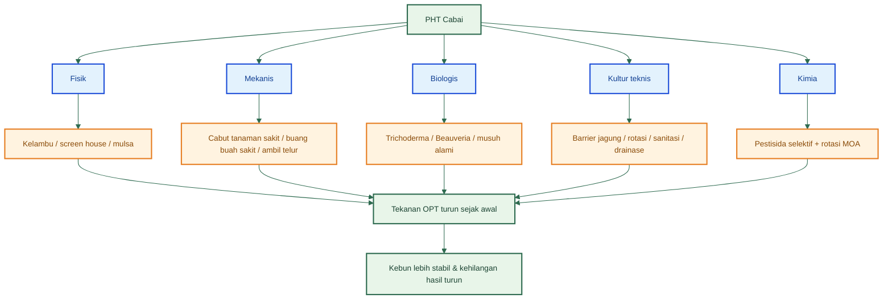

### Gambar aktual yang relevan untuk bagian ini

**PNG resmi yang sebaiknya ditempatkan pada subbagian alat fisik dan biologis:**

- **Kelambu/screen house/mulsa:** dokumen Renstra Direktorat Perlindungan Hortikultura dan success story cabai sebagai rujukan resmi bahwa kelambu, screen house, dan mulsa dikembangkan untuk antisipasi OPT sejak dini. ([Hortikultura Direktoral][2])
- **Refugia/habitat musuh alami:** dokumen resmi Ditjen Hortikultura yang menyebut tumbuhan berbunga/nektar sebagai tanaman refugia untuk konservasi musuh alami, serta success story pengendalian cabai yang memasukkan konservasi musuh alami sebagai bagian pencegahan. ([Hortikultura Direktoral][6])

### Matriks integrasi tindakan

| Jenis tindakan | Contoh                         | Target                       | Fase terbaik     |
| -------------- | ------------------------------ | ---------------------------- | ---------------- |
| Fisik          | Kelambu, screen house          | Vektor                       | Persemaian-awal  |
| Mekanis        | Ambil telur, buang buah sakit  | Ulat, lalat buah, antraknosa | Saat gejala awal |
| Biologis       | Trichoderma, Beauveria         | Penyakit tanah, serangga     | Awal-dini        |
| Kultur teknis  | Mulsa, barrier, rotasi         | Banyak OPT                   | Pra-tanam–panen  |
| Kimia          | Insektisida/fungisida selektif | Tekanan tinggi               | Saat perlu       |

### Penegasan praktis Bab 10

PHT cabai bukan seni memilih alat favorit. Ia adalah kemampuan **menggabungkan alat secara disiplin**. Kelambu tanpa sanitasi tidak cukup. Agen hayati tanpa drainase baik akan lemah. Kimia tanpa rotasi mode aksi akan mempercepat resistensi. Dengan memahami integrasi ini, pembaca seharusnya melihat bahwa PHT = **gabungan alat**, bukan satu alat. ([data.hortikultura.pertanian.go.id][1])

[**Kembali ke Atas**](#pht-pengendalian-hama-terpadu-cabai-rawit-dan-cabai-besar)

---

## 11. Monitoring, ambang kendali, dan keputusan tindakan

PHT gagal menjadi praktik bila monitoring tidak jelas. Banyak kebun cabai sebenarnya tidak kalah karena petani tidak tahu nama OPT, tetapi karena tidak punya **ritme pengamatan** dan **titik keputusan** yang tegas. Kebijakan PHT Kementan menekankan pengamatan rutin karena perkembangan OPT mengikuti dinamika agroekosistem dan populasinya perlu dipantau secara berkala sebagai dasar tindakan pengendalian. Artinya, monitoring bukan formalitas, melainkan jantung dari keputusan lapang. ([data.hortikultura.pertanian.go.id][1])

Dalam artikel ini, saya sarankan monitoring dibagi menjadi **harian, mingguan, dan bulanan**. Ini adalah kerangka operasional yang saya susun dari prinsip PHT resmi, kebutuhan fisiologis cabai, dan pola munculnya ancaman utama. **Monitoring harian** ditujukan untuk hal-hal yang berubah cepat dan bisa menimbulkan kerusakan segera: air, kelayuan, bunga rontok, buah sakit, genangan, atau kerusakan fisik mendadak. **Monitoring mingguan** ditujukan untuk gejala populasi dan tren: pucuk, bawah daun, perangkap, jumlah tanaman bergejala, serta arah penyebaran masalah. **Monitoring bulanan** dipakai untuk membaca dampak ekonomi: hasil, kehilangan, biaya pengendalian, dan apakah strategi PHT yang dipakai efektif. Kerangka ini konsisten dengan prinsip bahwa pengamatan harus menjadi dasar tindakan, bukan pekerjaan seremonial. ([data.hortikultura.pertanian.go.id][1])

Ambang kendali dalam praktik cabai tidak selalu harus dibaca sebagai angka tunggal yang kaku, terutama di tingkat petani atau kebun campuran. Yang lebih penting adalah memahami **titik ketika gejala atau populasi mulai berpotensi mengubah hasil atau mutu secara nyata**. Misalnya, satu atau dua tanaman bergejala virus berat di persemaian bukan hal kecil; itu sudah menjadi sinyal corrective cepat. Buah sakit yang mulai muncul sporadis pada musim lembap tidak boleh ditunggu sampai banyak. Demikian juga ledakan thrips pada pucuk dan bunga tidak layak menunggu kerusakan merata. Jadi, dalam artikel ini, ambang kendali dibaca sebagai **ambang tindakan operasional**: kapan kondisi masih bisa dipantau, kapan harus diperketat, dan kapan harus masuk corrective. Ini adalah penerjemahan praktis dari prinsip pengamatan rutin dan keputusan dini dalam PHT. ([data.hortikultura.pertanian.go.id][1])

Kaitan monitoring dengan **irigasi, drainase, dan musim** harus ditekankan. Monitoring harian kehilangan nilainya bila tidak disambungkan dengan kondisi air. Monitoring mingguan juga lemah bila tidak dibaca bersama perubahan musim, tekanan vektor, atau peningkatan kelembapan. Artinya, pengamatan cabai tidak boleh hanya melihat daun dan buah, tetapi juga harus membaca **air, tajuk, lantai kebun, parit, gulma, dan perangkap**. Di situlah monitoring berubah dari kegiatan teknisi menjadi alat manajemen kebun. ([Hortikultura Direktoral][3])

### Diagram alur monitoring ke keputusan tindakan

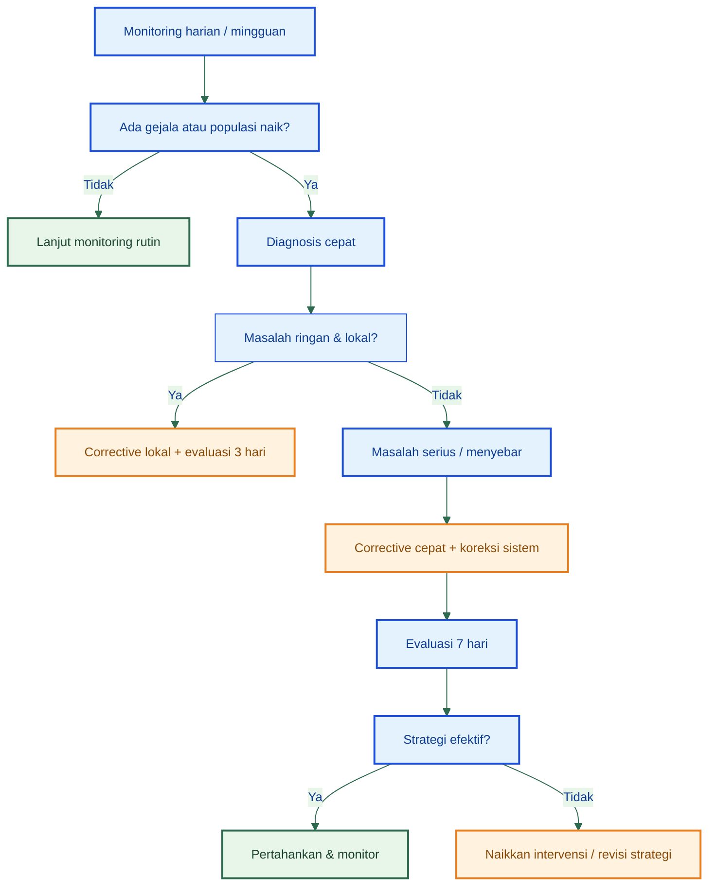

### Monitoring harian-mingguan

| Frekuensi | Yang dicek                                  | Tujuan             |
| --------- | ------------------------------------------- | ------------------ |
| Harian    | Air, layu, bunga rontok, buah sakit         | Deteksi cepat      |
| Mingguan  | Pucuk, bawah daun, perangkap, populasi hama | Keputusan tindakan |
| Bulanan   | Hasil, kehilangan, biaya OPT                | Evaluasi ekonomi   |

### Penegasan praktis Bab 11

Bab ini harus dipakai sebagai alat kerja. Pembaca tidak cukup hanya mengenal OPT, tetapi harus tahu **kapan harus bertindak**. Itulah fungsi monitoring dan ambang kendali: mengubah pengetahuan menjadi keputusan. ([data.hortikultura.pertanian.go.id][1])

[**Kembali ke Atas**](#pht-pengendalian-hama-terpadu-cabai-rawit-dan-cabai-besar)

---

## 12. Paket corrective berbasis skenario lapang

Bagian ini dibuat untuk menjawab situasi nyata di lapang. Corrective yang baik bukan saran umum seperti “semprot” atau “jaga sanitasi”, tetapi **protokol tindakan** berdasarkan gejala dominan. Dalam setiap skenario di bawah, saya susun urutan yang sama: diagnosis cepat, 24 jam pertama, 3 hari pertama, 7 hari evaluasi, dan apa yang tidak boleh dilakukan. Pola ini dibuat agar corrective di cabai tidak lagi bersifat reaktif tanpa arah. Dasarnya adalah praktik PHT resmi: pengamatan rutin, pengendalian dini, sanitasi, agen hayati, barrier, dan pestisida selektif bila perlu. ([data.hortikultura.pertanian.go.id][1])

### 12.1 Bila thrips meledak

**Diagnosis cepat**
Gejala utama: pucuk menyempit, daun muda keperakan atau bronzing, bunga rontok, pertumbuhan vegetatif menahan, dan tekanan lebih berat pada kemarau. SOP Hiyung menegaskan bahwa thrips berat pada musim kemarau dan menyebabkan daun coklat tembaga, keriting, serta bunga gugur. ([Hortikultura Direktoral][4])

**24 jam pertama**

- periksa pucuk dan bunga pada semua blok;
- tandai petak paling berat;
- buang bagian pucuk atau bunga yang sangat rusak;
- cek kestabilan air dan pulihkan blok yang terlalu kering;
- tambahkan atau rapikan perangkap likat.

**3 hari pertama**

- evaluasi apakah gejala berhenti meluas;
- bersihkan gulma inang;
- koreksi naungan berlebih atau ventilasi tajuk;
- bila populasi tetap tinggi, lakukan intervensi insektisida/akarisida yang sesuai sasaran dan rotasi bahan aktif. IRAC menegaskan pentingnya rotasi antar kelompok mode of action untuk menghambat resistensi. ([Insecticide Resistance Action Committee][7])

**7 hari evaluasi**

- bandingkan pucuk baru: masih rusak atau mulai normal;
- cek bunga baru: tetap rontok atau mulai bertahan;
- cek perangkap: populasi turun atau tetap tinggi;
- putuskan apakah corrective cukup atau harus ditingkatkan.

**Yang tidak boleh dilakukan**

- menunggu sampai semua bunga rusak;
- menyemprot bahan yang sama berulang-ulang;
- menganggap gejala pucuk rusak semata sebagai kekurangan hara.

### 12.2 Bila kutu kebul + virus mulai muncul

**Diagnosis cepat**
Gejala utama: pucuk mengecil, daun menggulung, warna kuning, tanaman kerdil; kutu kebul terlihat di bawah daun. Dokumen penyakit kuning cabai menyebut pengendalian berfokus pada penekanan vektor dan pencegahan infeksi lanjut, bukan menyembuhkan tanaman sakit. ([Hortikultura Direktoral][8])

**24 jam pertama**

- cabut tanaman bergejala berat;
- kumpulkan dan musnahkan di luar kebun;
- cek persemaian, tepi kebun, dan gulma inang;
- tambah likat kuning pada area paling aktif.

**3 hari pertama**

- rapikan barrier jagung bila ada celah;
- bersihkan gulma inang;
- intensifkan monitoring bawah daun;
- bila populasi tinggi, lakukan pengendalian vektor secara selektif dan arahkan semprotan ke bawah daun, sesuai anjuran dokumen penyakit kuning. ([Hortikultura Direktoral][8])

**7 hari evaluasi**

- hitung apakah tanaman bergejala baru masih bertambah;
- cek kepadatan kutu kebul pada perangkap atau bawah daun;
- putuskan apakah eradikasi blok kecil perlu diperluas.

**Yang tidak boleh dilakukan**

- membiarkan tanaman virus tetap berdiri;
- menyemprot tanpa mengeluarkan sumber infeksi;
- menganggap tanaman akan pulih normal.

### 12.3 Bila antraknosa mulai menyerang buah

**Diagnosis cepat**
Buah menunjukkan bercak cekung coklat-kehitaman, melunak, atau mengering; sering naik saat lembap. SOP Hiyung menegaskan antraknosa dipercepat panas-lembap dan buah sakit menjadi sumber masalah bila tidak dibuang. ([Hortikultura Direktoral][4])

**24 jam pertama**

- petik semua buah sakit yang terlihat;
- pisahkan dari kebun dan musnahkan;
- hentikan akumulasi buah busuk di tanaman dan di lantai kebun;
- cek parit dan aliran air.

**3 hari pertama**

- tingkatkan sanitasi harian;
- kurangi percikan air ke tajuk;
- koreksi drainase dan sirkulasi;
- bila tekanan tinggi, gunakan fungisida protektif/kuratif yang sesuai dan rotasi FRAC group. FRAC menekankan bahwa fungisida dalam kelompok MOA yang sama tidak cocok dipakai sebagai pasangan alternasi karena risiko silang resistensi. ([Frac][9])

**7 hari evaluasi**

- cek apakah buah baru masih banyak menunjukkan bercak baru;
- bandingkan blok kering vs lembap;
- nilai apakah sanitasi sudah cukup agresif.

**Yang tidak boleh dilakukan**

- membiarkan buah sakit di kebun;
- mengandalkan fungisida tanpa sanitasi;
- panen terlambat.

### 12.4 Bila lalat buah naik saat buah muda

**Diagnosis cepat**
Ada titik tusukan di buah, buah membusuk dari dalam, larva terlihat saat dibelah, dan buah rontok meningkat. SOP Hiyung menjelaskan betina bertelur sangat banyak dan larva merusak buah dari dalam. ([Hortikultura Direktoral][4])

**24 jam pertama**

- pasang atau tambah perangkap atraktan/metil eugenol;
- kumpulkan buah terserang dan musnahkan;
- bersihkan buah rontok.

**3 hari pertama**

- cek intensitas tangkapan perangkap;
- tingkatkan frekuensi sanitasi;
- percepat panen buah layak;
- periksa titik kebun yang paling terlambat panen.

**7 hari evaluasi**

- hitung apakah jumlah buah baru terserang menurun;
- lihat efektivitas lokasi perangkap;
- putuskan apakah perlu menambah kepadatan perangkap.

**Yang tidak boleh dilakukan**

- hanya menyemprot tanpa sanitasi buah;
- menunggu buah busuk banyak baru bertindak;
- membiarkan buah terserang menumpuk di kebun.

### 12.5 Bila petak mulai layu

**Diagnosis cepat**
Tanaman layu sebagian atau satu petak, sering terkait tanah, akar, drainase, dan dapat berupa layu bakteri atau fusarium. SOP Hiyung memberikan ciri pembuluh/akar coklat pada fusarium dan cairan keruh dari batang/akar pada layu bakteri. ([Hortikultura Direktoral][4])

**24 jam pertama**

- tandai petak layu;
- cabut tanaman yang jelas sakit;
- cek parit, genangan, dan aliran air;
- hentikan pengairan berlebih pada petak bermasalah.

**3 hari pertama**

- perbaiki aerasi dan drainase;
- cek apakah pola layu mengikuti cekungan atau jalur air;
- tambahkan atau ulang aplikasi agen hayati tanah bila sistem awal lemah.

**7 hari evaluasi**

- lihat apakah tanaman layu baru masih bertambah;
- cek apakah masalah terkonsentrasi di satu zona;
- putuskan apakah blok perlu dipisahkan secara manajerial.

**Yang tidak boleh dilakukan**

- terus menyiram petak yang sudah jenuh;
- menganggap semua layu sama dan menyemprot tanpa diagnosis;
- membiarkan tanaman sakit tetap berdiri.

### 12.6 Bila kebun underperform tetapi gejalanya campuran

**Diagnosis cepat**
Tanaman tampak hidup tetapi hasil rendah, pucuk tidak seragam, bunga rontok, buah sedikit, sebagian buah sakit, beberapa petak layu ringan. Ini sering berarti masalah sistem, bukan satu OPT tunggal.

**24 jam pertama**

- petakan blok menurut gejala dominan;
- cek air, drainase, pucuk, bawah daun, bunga, buah, dan gulma;
- identifikasi apakah masalah utama berasal dari vektor, kelembapan, air, atau penyakit tanah.

**3 hari pertama**

- koreksi faktor paling besar dulu: air, drainase, sanitasi, atau vektor;
- jangan membuka terlalu banyak front tindakan sekaligus;
- prioritaskan Grade A lebih dulu.

**7 hari evaluasi**

- ukur kembali hasil, bunga, pucuk baru, dan gejala penyebaran;
- tentukan apakah underperform terutama karena OPT, air, nutrisi, atau kombinasi.

**Yang tidak boleh dilakukan**

- menyemprot campuran banyak bahan tanpa diagnosis;
- langsung menyalahkan pupuk atau cuaca tanpa memeriksa sistem;
- mengejar semua gejala dengan tindakan berbeda pada saat yang sama.

### Diagram corrective berbasis skenario

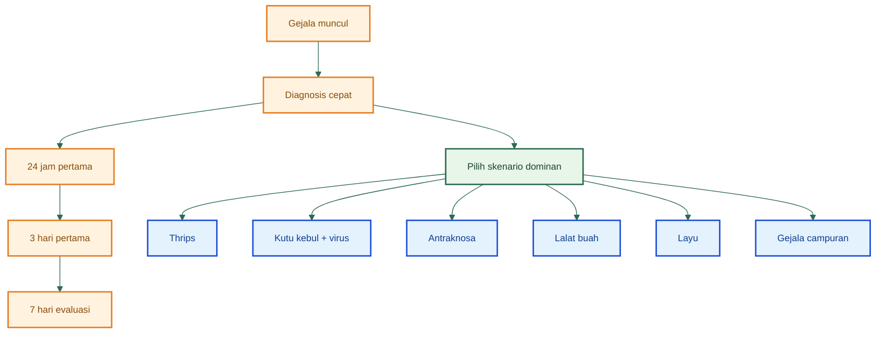

### Penegasan praktis Bab 12

Bab ini harus dibaca sebagai **protokol corrective**, bukan saran umum. Tujuannya adalah membuat pembaca tahu apa yang harus dilakukan **hari ini**, bukan hanya memahami konsep perlindungan tanaman. ([data.hortikultura.pertanian.go.id][1])

[**Kembali ke Atas**](#pht-pengendalian-hama-terpadu-cabai-rawit-dan-cabai-besar)

---

## 13. Kalender PHT cabai 1 musim

PHT yang baik harus bisa diterjemahkan ke dalam **waktu**. Tanpa kalender kerja, seluruh artikel akan kembali menjadi pengetahuan yang sulit dipakai. Kalender PHT satu musim menyatukan semua lapisan: pra-semai, persemaian, awal tanam, vegetatif, bunga, buah, panen, dan pasca. Logikanya sederhana: setiap fase punya ancaman utama, dan setiap ancaman punya tindakan yang harus dijalankan sebelum menjadi masalah. Dokumen success story cabai, SOP Hiyung, dan kebijakan PHT resmi semuanya mendukung gagasan bahwa perlindungan harus berjalan dari awal hingga akhir musim, bukan menunggu gejala. ([Hortikultura Direktoral][3])

### Diagram kalender PHT satu musim

```mermaid id="kalender-pht-cabai"
%%{init: {
  "theme": "base",
  "themeVariables": {
    "fontSize": "12px",
    "fontFamily": "Arial",
    "primaryColor": "#E8F5E9",
    "primaryTextColor": "#1B4332",
    "primaryBorderColor": "#2D6A4F",
    "lineColor": "#2D6A4F",
    "secondaryColor": "#E3F2FD",
    "tertiaryColor": "#FFF3E0",
    "background": "#FFFFFF"
  }
}}%%
gantt
    title Kalender PHT Cabai 1 Musim
    dateFormat  X
    axisFormat %s

    section Pra-semai
    Sanitasi, media, agen hayati        :a1, 0, 1

    section Semai
    Kelambu, monitoring vektor          :a2, 1, 1

    section Awal tanam
    Mulsa, barrier, drainase            :a3, 2, 1

    section Vegetatif
    Perangkap, monitoring pucuk         :a4, 3, 2

    section Bunga
    Air stabil, kontrol serangga        :a5, 5, 1

    section Buah
    Atraktan, sanitasi buah             :a6, 6, 2

    section Panen
    Panen disiplin, buang buah sakit    :a7, 8, 1

    section Pasca
    Bongkar, rotasi, evaluasi           :a8, 9, 1
```

### Kalender kerja PHT

| Minggu/fase | Fokus PHT                    | Tindakan                         |
| ----------- | ---------------------------- | -------------------------------- |
| Pra-semai   | Sanitasi, media, agen hayati | Siapkan persemaian sehat         |
| Semai       | Perlindungan vektor          | Kelambu, monitoring              |
| Awal tanam  | Adaptasi, air stabil         | Mulsa, barrier, drainase         |
| Vegetatif   | Thrips/kutu kebul/tungau     | Perangkap, monitoring pucuk      |
| Bunga       | Thrips, bunga rontok         | Air stabil, kontrol serangga     |
| Buah        | Lalat buah, antraknosa       | Atraktan, sanitasi buah          |
| Panen       | Mutu dan sumber inokulum     | Panen disiplin, buang buah sakit |
| Pasca       | Rotasi dan sanitasi          | Bongkar dan evaluasi             |

### Penegasan praktis Bab 13

Kalender ini membuat PHT bisa dijalankan sebagai **ritme kerja**, bukan daftar pengetahuan. Dengan kalender, mandor, pemilik kebun, atau teknisi lapang bisa tahu fokus utamanya pada setiap fase. ([Hortikultura Direktoral][3])

[**Kembali ke Atas**](#pht-pengendalian-hama-terpadu-cabai-rawit-dan-cabai-besar)

---

## 14. Ringkasan praktis satu halaman

Bagian ini dirancang sebagai halaman tempel untuk kebun. Fungsinya bukan memberi penjelasan panjang, tetapi menyediakan ringkasan operasional yang bisa dibaca cepat oleh mandor, pemilik kebun, atau teknisi lapang.

### 5 OPT kelas merah

1. Kutu kebul + virus kuning/keriting
2. Thrips
3. Antraknosa
4. Lalat buah
5. Layu bakteri/fusarium pada kebun berdrainase lemah

Kelima ancaman ini dipilih karena paling sering merusak fase kritis dan paling berbahaya secara ekonomi bila terlambat ditangani. ([Hortikultura Direktoral][8])

### 5 tindakan preventif wajib

1. Persemaian berkelambu/kasa
2. Barrier jagung atau tanaman penghalang
3. Mulsa plastik hitam perak
4. Sanitasi gulma, buah sakit, dan sisa tanaman
5. Agen hayati tanah sejak awal + monitoring rutin

Langkah-langkah ini konsisten dengan rekomendasi Kementan tentang budidaya sehat, kelambu, barrier, sanitasi, agens hayati, dan pengamatan rutin. ([Hortikultura Direktoral][3])

### 5 tindakan corrective tercepat

1. Cabut tanaman virus berat
2. Buang buah sakit/antraknosa
3. Kumpulkan buah terserang lalat buah
4. Musnahkan kelompok telur ulat
5. Koreksi air dan drainase di blok bermasalah

Corrective tercepat adalah tindakan yang segera memutus sumber kerusakan paling aktif. ([Hortikultura Direktoral][3])

### Kapan pakai kelambu, paranet, screen house

- **Kelambu/kasa:** untuk persemaian dan titik kritis awal saat target utamanya vektor.
- **Paranet:** untuk naungan atau pengurangan cekaman panas pada bibit/tanaman muda, bukan sebagai barrier utama vektor.
- **Screen house:** untuk kebun intensif atau lokasi berisiko tinggi, sekaligus menekan cekaman cuaca ekstrem dan OPT.

Pembedaan ini mengikuti praktik resmi yang menekankan kelambu untuk pencegahan dini vektor dan screen house untuk antisipasi cekaman dan serangan OPT. Sementara penggunaan paranet lebih tepat dibaca sebagai alat naungan. ([Hortikultura Direktoral][8])

### Kapan agen hayati harus masuk

Agen hayati paling efektif dimasukkan **sejak pra-tanam, perlakuan benih, persemaian, dan awal tanam**, bukan menunggu penyakit tanah parah. Ini berlaku terutama untuk _Trichoderma_, _Gliocladium_, _Pseudomonas fluorescens_, dan PGPR. ([Hortikultura Direktoral][4])

### Kapan tanam paling aman menurut kondisi kebun

- **Awal hujan:** aman bila drainase sangat kuat dan sanitasi sangat disiplin.
- **Transisi:** aman bila barrier, kelambu, dan monitoring vektor sangat ketat.
- **Kemarau:** aman bila air sangat stabil dan pengendalian thrips/tungau siap.

Keputusan ini bukan rumus tunggal, tetapi hasil membaca musim bersama kemampuan kontrol kebun. ([Hortikultura Direktoral][3])

### Ringkasan tempel untuk kebun

| Fokus cepat         | Keputusan praktis                                                        |
| ------------------- | ------------------------------------------------------------------------ |
| OPT kelas merah     | Kutu kebul+virus, thrips, antraknosa, lalat buah, layu pada kebun lemah  |
| Preventif wajib     | Kelambu, barrier, mulsa, sanitasi, agen hayati + monitoring              |
| Corrective tercepat | Cabut, buang, kumpulkan, musnahkan, koreksi air                          |
| Alat fisik          | Kelambu untuk vektor, paranet untuk naungan, screen house untuk intensif |
| Timing hayati       | Masuk sejak pra-tanam sampai awal tanam                                  |
| Timing tanam        | Sesuaikan musim dengan kekuatan kebun                                    |

### Penegasan akhir Bagian V

Pada titik ini, artikel tidak lagi berhenti sebagai penjelasan teoritis. Bagian V membuat seluruh pembahasan sebelumnya berubah menjadi **sistem keputusan lapang**: alat apa yang dipakai, kapan diamati, kapan bertindak, apa yang dilakukan dalam 24 jam pertama, dan bagaimana seluruh PHT diterjemahkan menjadi kalender kerja. Itulah yang membuat PHT cabai bisa benar-benar dipakai di kebun. ([data.hortikultura.pertanian.go.id][1])

[1]: https://data.hortikultura.pertanian.go.id/webi/uploads/webinarfile/2021/310/Kebijakan_Pengendalian_Hama_Terpadu.pdf?utm_source=chatgpt.com 'KEBIJAKAN PENGENDALIAN HAMA TERPADU (PHT)'
[2]: https://hortikultura.pertanian.go.id/wp-content/uploads/2023/04/Renstra-Ditlin-2020-2024.pdf?utm_source=chatgpt.com 'Renstra-Ditlin-2020-2024.pdf'
[3]: https://hortikultura.pertanian.go.id/wp-content/uploads/2017/01/Success-Story-Dal-OPT-Cabai-Ramli-di-Indonesia.pdf?utm_source=chatgpt.com 'Success Story dan Strategic Planning Pengendalian OPT ...'
[4]: https://hortikultura.pertanian.go.id/wp-content/uploads/2024/11/Panduan-Umum-Standar-Operasional-Prosedur-Budidaya-Cabai-Rawit-Hiyung_watermark.pdf?utm_source=chatgpt.com 'Panduan-Umum-Standar-Operasional-Prosedur-Budidaya ...'
[5]: https://hortikultura.pertanian.go.id/wp-content/uploads/2024/11/M-71-Cara-kerja-dan-daftar-pestisida_watermark.pdf?utm_source=chatgpt.com 'M-71-Cara-kerja-dan-daftar-pestisida_watermark.pdf'
[6]: https://hortikultura.pertanian.go.id/wp-content/uploads/2025/09/LAKIN-DITJEN-HORTI-2022.pdf?utm_source=chatgpt.com 'Untitled - DIREKTORAT JENDERAL HORTIKULTURA'
[7]: https://irac-online.org/documents/moa-classification/?utm_source=chatgpt.com 'MODE OF ACTION CLASSIFICATION SCHEME'
[8]: https://hortikultura.pertanian.go.id/wp-content/uploads/2024/11/Teknik-Pengendalian-Penyakit-Kuning-Pada-Tanaman-Cabai_watermark.pdf?utm_source=chatgpt.com 'teknik pengendalian penyakit kuning pada tanaman cabai'
[9]: https://www.frac.info/fungicide-resistance-management/by-frac-mode-of-action-group/?utm_source=chatgpt.com 'By FRAC Mode of Action Group'

---

[**Kembali ke Atas**](#pht-pengendalian-hama-terpadu-cabai-rawit-dan-cabai-besar)

---

# Lampiran A — Contoh Agen Hayati yang Ditemukan di Marketplace

## Nama produk, kandungan mikroba, dan fungsi dalam konteks OPT cabai

Lampiran ini disusun sebagai **daftar praktis**, bukan endorsement merek tertentu. Saya memilih contoh produk yang saat penelusuran ditemukan di marketplace Indonesia, lalu saya padankan dengan **fungsi biologisnya dalam konteks OPT cabai** berdasarkan sumber teknis dan ilmiah. Yang paling penting, **fungsi pada tabel mengikuti mikroba aktifnya**, bukan sekadar klaim pemasaran. Karena listing marketplace bisa berubah cepat, kandungan mikroba dan legalitas produk **tetap harus diverifikasi ulang pada label kemasan, nomor izin, tanggal kedaluwarsa, dan petunjuk aplikasi resmi** sebelum dibeli atau dipakai. Produk-produk ramah lingkungan yang disebut Direktorat Jenderal Hortikultura sebagai efektif untuk OPT hortikultura mencakup antara lain **Trichoderma sp., Beauveria bassiana, Pseudomonas fluorescens, dan Gliocladium sp.** ([Hortikultura Direktoral][1])

Sebagai pengantar fungsi, kelompok **Trichoderma, Gliocladium, dan Pseudomonas fluorescens** terutama kuat untuk **patogen tular tanah dan perlindungan akar/persemaian**, sedangkan **Beauveria bassiana** dan **Metarhizium anisopliae** terutama kuat sebagai **cendawan entomopatogen** untuk serangga hama. Pada cabai, SOP budidaya resmi juga menyebut _Pseudomonas fluorescens_, _Trichoderma spp._, dan _Gliocladium spp._ untuk pengendalian **layu bakteri, layu fusarium, dan antraknosa**, sementara kebijakan PHT dan dokumen hama ulat grayak menempatkan _Beauveria bassiana_ dan _Metarhizium_ sebagai komponen pengendalian hayati serangga. ([Hortikultura Direktoral][2])

### [Natural GLIO Nasa 100 Gram]()

#### Gliocladium + Trichoderma

_Rp 45.000_

### [Agens Hayati Trichor TM / Trichoderma 100gr]()

#### Trichoderma murni

_Rp 20.000_

### [BIO-P60 Pseudomonas P60]()

#### Pseudomonas P60

_Rp 20.000_

### [Seudoflor 100gr]()

#### Pseudomonas + Bacillus

_Rp 70.000_

### [Agen Hayati Beauveria Bassiana]()

#### Entomopatogen

_Rp 60.500_

### [Metarizep WP 50 gr]()

#### Metarhizium + Beauveria

_Rp 78.000_

## A.1 Tabel daftar produk

| Nama produk contoh di marketplace                                 | Kandungan mikroba yang tertera / teridentifikasi                                                                                                                                                                                                                                                                                      | Fungsi pada konteks OPT cabai                                                                                                                                                                                                                                                                                                                                                                    | Catatan praktis                                                                                                                                                                                            |
| ----------------------------------------------------------------- | ------------------------------------------------------------------------------------------------------------------------------------------------------------------------------------------------------------------------------------------------------------------------------------------------------------------------------------- | ------------------------------------------------------------------------------------------------------------------------------------------------------------------------------------------------------------------------------------------------------------------------------------------------------------------------------------------------------------------------------------------------ | ---------------------------------------------------------------------------------------------------------------------------------------------------------------------------------------------------------- |
| **Natural GLIO / GLIOTRI WP**                                     | **Gliocladium sp. + Trichoderma sp.**. Pada sumber produk/penjelasan NASA, GLIOTRI disebut mengandung **Gliocladium sp.**; pada halaman produk lain dan listing marketplace, Natural GLIO/GLIOTRI disebut mengandung **Gliocladium sp. dan Trichoderma sp.** ([naturalnusantara.co.id][3])                                            | Cocok sebagai **agens antagonis patogen tular tanah** dan proteksi dini terhadap **layu fusarium, layu bakteri, rebah semai, busuk akar**, serta dipakai preventif untuk kebun cabai yang punya riwayat masalah akar/persemaian. Pada SOP cabai, _Trichoderma spp._ dan _Gliocladium spp._ disebut untuk pengendalian **layu bakteri, fusarium, dan antraknosa**. ([Hortikultura Direktoral][2]) | Paling logis dipakai **pra-tanam, di persemaian, atau saat pupuk dasar**. Ini bukan “obat darurat saat parah”, melainkan lapisan proteksi awal.                                                            |
| **Trichor-TM / produk Trichoderma sejenis**                       | Listing Trichor-TM menyebut **Trichoderma viridae** dan **Trichoderma hanzianum/harzianum**; penelitian yang memakai merek Trichor-TM menyebut produk ini sebagai **Trichoderma sp.** dengan jumlah koloni **10^8 cfu/g**. ([Lazada Indonesia][4])                                                                                    | Utama untuk **patogen tanah**: membantu menekan **fusarium, pythium/phytophthora, rhizoctonia, rebah semai, busuk akar**, dan meningkatkan kesehatan rizosfer. Dokumen teknis Hortikultura memasukkan **Trichoderma spp.** sebagai agens antagonis untuk **layu fusarium dan layu bakteri**. ([Hortikultura Direktoral][5])                                                                      | Cocok untuk **pengolahan media, campur kompos matang, atau aplikasi lubang tanam**. Verifikasi ulang spesies/strain pada label karena penulisan di marketplace kadang tidak konsisten.                     |
| **BIO-P60 / produk Pseudomonas fluorescens P60**                  | Sumber penelitian dan deskripsi produk menyebut BIO-P60 berbasis **Pseudomonas fluorescens P60**; beberapa penelitian terbaru menjelaskan produk ini sebagai formulasi yang mengandung **metabolit sekunder** dari _P. fluorescens_ P60, sedangkan sumber lain menyebutnya sebagai biopestisida berbasis bakteri tersebut. ([bic][6]) | Relevan untuk **patogen tular tanah**, terutama konteks **layu fusarium, penyakit pangkal batang, busuk daun tertentu**, dan sekaligus mendukung fungsi **PGPR** pada akar. SOP dan success story cabai juga merekomendasikan **Pseudomonas fluorescens** untuk **layu bakteri, layu fusarium, dan proteksi dini**. ([Hortikultura Direktoral][2])                                               | Sangat cocok masuk sejak **perlakuan benih, persemaian, sampai awal tanam**. Periksa apakah produk yang dijual berisi sel hidup, metabolit, atau kombinasi keduanya, karena itu memengaruhi cara aplikasi. |
| **Seudoflor**                                                     | Produk resmi SEUDOFLOR menyebut kandungannya **Pseudomonas fluorescens + Bacillus velezensis**. ([Prima Agro Tech][7])                                                                                                                                                                                                                | Paling masuk akal diposisikan untuk **pelindung akar** dan penekanan **layu bakteri, busuk basah, busuk lunak, dan penyakit akar/daun tertentu**, sekaligus membantu ketersediaan fosfat. Ini lebih cocok untuk kebun cabai dengan riwayat penyakit bakteri atau busuk akar/pangkal. ([Prima Agro Tech][7])                                                                                      | Lebih dekat ke fungsi **biofungisida/bioprotektan akar** daripada “obat serangga”. Cocok untuk petak yang sering bermasalah di akar atau pangkal batang.                                                   |
| **Beauveria bassiana** (berbagai merek/listing)                   | Kandungan utamanya **Beauveria bassiana**; beberapa listing marketplace menuliskannya langsung pada judul produk. Secara kebijakan PHT, _Beauveria bassiana_ diakui sebagai **cendawan entomopatogen**. ([data.hortikultura.pertanian.go.id][8])                                                                                      | Relevan untuk **serangga hama**, terutama bila kebun cabai membutuhkan lapisan biologis untuk menekan **ulat, beberapa pengisap, atau hama serangga lain**. Pada dokumen ulat grayak, _Beauveria bassiana_ dilaporkan menyerang _Spodoptera_ spp.; kebijakan PHT juga menempatkannya sebagai biopestisida serangga. ([Hortikultura Direktoral][9])                                               | Lebih tepat dimasukkan sebagai bagian **pengendalian hayati serangga** pada fase vegetatif–awal generatif, bukan untuk penyakit tanah. Efektivitas sangat dipengaruhi kelembapan dan kualitas formulasi.   |
| **Metarizep / Entomobac / produk campuran Metarhizium–Beauveria** | Judul listing menunjukkan kombinasi **Metarhizium** dan **Beauveria bassiana**. Dalam dokumen resmi, _Metarhizium anisopliae_ dan _Beauveria bassiana_ sama-sama disebut sebagai **cendawan entomopatogen**. ([data.hortikultura.pertanian.go.id][8])                                                                                 | Cocok untuk konteks **hama serangga**, terutama bila ingin memperkuat lapisan biologis terhadap **ulat/larva serangga** dan beberapa hama permukaan tanaman. Pada dokumen ulat grayak, _Metarhizium anisopliae_ dan _Beauveria bassiana_ sama-sama dilaporkan menyerang _Spodoptera_ spp. ([Hortikultura Direktoral][9])                                                                         | Ini lebih cocok dipakai sebagai **bioinsektisida**, bukan untuk layu atau busuk akar. Lihat benar apakah formulanya campuran dua cendawan atau satu dominan plus carrier.                                  |

## A.2 Cara membaca lampiran ini dengan benar

Pertama, **nama produk tidak selalu sama dengan fungsi lapang yang paling tepat**. Misalnya, produk berbasis _Trichoderma_ atau _Gliocladium_ sering dipasarkan sangat luas untuk banyak penyakit, tetapi dalam konteks PHT cabai fungsinya paling kuat adalah **proteksi awal terhadap patogen tanah dan persemaian**. Sebaliknya, _Beauveria_ atau _Metarhizium_ sering dijual generik sebagai “obat hama”, padahal ia lebih tepat dibaca sebagai **bioinsektisida berbasis cendawan entomopatogen** yang butuh kondisi aplikasi dan target serangga yang tepat. ([Hortikultura Direktoral][5])

Kedua, **jangan memaksa satu agen hayati untuk semua masalah**. Pada kebun cabai, saya sarankan membedakan tiga kebutuhan besar. Untuk **penyakit tular tanah dan proteksi akar**, fokus pada _Trichoderma_, _Gliocladium_, _Pseudomonas fluorescens_, atau produk sejenis. Untuk **serangga hama**, fokus pada _Beauveria_ atau _Metarhizium_. Untuk **konservasi musuh alami**, jangan hanya beli produk, tetapi bangun habitat seperti refugia, kurangi pestisida nonselektif, dan jaga sanitasi tanpa membunuh seluruh ekosistem. Kebijakan PHT dan materi konservasi musuh alami Kementan mendukung pendekatan ini. ([data.hortikultura.pertanian.go.id][8])

Ketiga, **waktu masuk agen hayati jauh lebih penting daripada sekadar merek**. Untuk cabai, produk berbasis _Trichoderma_, _Gliocladium_, dan _Pseudomonas fluorescens_ paling berguna bila dipasang **sejak perlakuan benih, media semai, persemaian, atau awal tanam**. Bila baru dicari saat kebun sudah berat oleh layu atau busuk akar, hasilnya sering tidak sebaik aplikasi dini. Ini juga yang ditekankan dalam SOP cabai Hiyung dan petunjuk teknis perlindungan hortikultura. ([Hortikultura Direktoral][2])

## A.3 Rekomendasi praktis memilih produk di marketplace

Untuk pembaca artikel ini, saya sarankan pakai aturan sederhana berikut.

Bila tujuan utama Anda adalah **pencegahan layu, busuk akar, rebah semai, atau masalah tanah**, cari produk yang jelas menuliskan kandungan seperti **Trichoderma spp., Gliocladium spp., Pseudomonas fluorescens, Bacillus velezensis**, atau kombinasi yang relevan. Bila tujuan utama Anda adalah **menekan serangga hama**, cari produk yang jelas menuliskan **Beauveria bassiana** atau **Metarhizium anisopliae**. Jangan membeli hanya karena judulnya “agens hayati” atau “organik” tanpa membaca kandungan mikroba aktifnya. Fungsi biologisnya harus cocok dengan masalah OPT yang ingin Anda tangani. ([Hortikultura Direktoral][1])

Untuk verifikasi akhir sebelum membeli, cek empat hal:

1. **nama mikroba aktif** yang tertulis pada label,
2. **bentuk formulasi** dan petunjuk aplikasi,
3. **masa simpan/tanggal kedaluwarsa**,
4. **kondisi penyimpanan** yang disyaratkan.

Ini penting karena agen hayati adalah produk biologis; mutu riilnya bisa turun bila penyimpanan atau distribusinya buruk, walau nama produknya bagus.

## A.4 Simpulan Lampiran A

Lampiran ini menunjukkan bahwa marketplace Indonesia memang menyediakan contoh produk agen hayati untuk kebutuhan PHT cabai, tetapi cara membacanya harus benar. **Merek hanyalah pintu masuk; keputusan utamanya tetap pada mikroba aktif dan fungsi OPT-nya.** Untuk cabai, kelompok _Trichoderma–Gliocladium–Pseudomonas_ paling relevan untuk proteksi akar, persemaian, dan patogen tanah, sedangkan _Beauveria_ dan _Metarhizium_ paling relevan untuk pengendalian hayati serangga. Dengan cara membaca seperti ini, lampiran tidak berubah menjadi daftar belanja, melainkan menjadi **alat bantu memilih agen hayati secara lebih presisi**. ([Hortikultura Direktoral][1])

Kalau Anda lanjutkan, saya bisa menulis **Lampiran B** dalam format yang sama, misalnya:

- dosis aplikasi praktis per agen hayati,
- waktu aplikasi,
- kompatibilitas dengan pupuk/pestisida,
- atau SOP verifikasi produk sebelum dibeli.

[1]: https://hortikultura.pertanian.go.id/wp-content/uploads/2023/04/Renstra-Ditlin-2020-2024.pdf?utm_source=chatgpt.com 'Renstra-Ditlin-2020-2024.pdf'
[2]: https://hortikultura.pertanian.go.id/wp-content/uploads/2024/11/Panduan-Umum-Standar-Operasional-Prosedur-Budidaya-Cabai-Rawit-Hiyung_watermark.pdf?utm_source=chatgpt.com 'Panduan-Umum-Standar-Operasional-Prosedur-Budidaya ...'
[3]: https://www.naturalnusantara.co.id/id/index-info/testimony/detail/perubahan-merk-agens-hayati-nasa-glio-menjadi-gliotri.html?utm_source=chatgpt.com 'perubahan merk agens hayati nasa glio menjadi gliotri'
[4]: https://www.lazada.co.id/products/agen-hayati-trichor-tm-trichoderma-1kg-i471062866.html?utm_source=chatgpt.com 'Agen Hayati Trichor-TM Trichoderma 1kg'
[5]: https://hortikultura.pertanian.go.id/wp-content/uploads/2017/01/PETIS_PERLINDUNGAN_2017.pdf?utm_source=chatgpt.com 'PETUNJUK TEKNIS PENGEMBANGAN SISTEM ...'
[6]: https://bic.web.id/general/view/Mikroba%2BMusuh%2BMikroba?utm_source=chatgpt.com 'Potensi Bio P60 Sebagai Agensia Hayati Patogen Tanaman'
[7]: https://primaagrotech.com/id/solusi/seudoflor/?utm_source=chatgpt.com 'SEUDOFLOR Mikroba Pelindung Akar Tanaman'
[8]: https://data.hortikultura.pertanian.go.id/webi/uploads/webinarfile/2021/310/Kebijakan_Pengendalian_Hama_Terpadu.pdf?utm_source=chatgpt.com 'KEBIJAKAN PENGENDALIAN HAMA TERPADU (PHT)'
[9]: https://hortikultura.pertanian.go.id/wp-content/uploads/2024/11/Ulat-Gtayak_Spodoptera-spp_2022_watermark.pdf?utm_source=chatgpt.com 'ULAT GRAYAK, Spodoptera spp. : HAMA POLIFAG ...'

[**Kembali ke Atas**](#pht-pengendalian-hama-terpadu-cabai-rawit-dan-cabai-besar)

---

# Lampiran B — Contoh Pestisida Kimia yang Ditemukan di Marketplace

## Nama produk, zat aktif, kontak/sistemik, dan fungsi dalam konteks OPT cabai

Lampiran ini disusun sebagai **daftar praktis contoh produk**, bukan rekomendasi merek tertentu. Saya hanya memasukkan produk yang:

1. **muncul di marketplace Indonesia** pada penelusuran, dan
2. punya **verifikasi resmi** dari laman produsen atau sumber primer mengenai **zat aktif** dan **cara kerjanya**.

Karena listing marketplace bisa berubah cepat, semua data pembelian tetap harus diverifikasi ulang pada **label, nomor registrasi, tanggal kedaluwarsa, dan petunjuk penggunaan resmi** sebelum dipakai. Untuk bagian ini saya memakai istilah **pestisida kimia** agar lebih presisi daripada “racun kimia”, walaupun konteks penggunaannya tetap sama. Produk berbahan aktif seperti **imidakloprid, abamektin, tiametoksam, lamda sihalotrin, profenofos, diafentiuron, azoksistrobin, difenokonazol, propineb, mankozeb, mefenoksam, dan asibenzolar-s-metil** memang tercantum pada produk-produk yang tersedia di marketplace dan/atau laman resmi produsen. ([Bayer][1])

## B.1 Tabel daftar produk

| Nama produk contoh di marketplace | Zat aktif                                          | Kontak / sistemik                                                               | Fungsi dalam konteks OPT cabai                                                                                                                                                                                                                                               | Catatan praktis                                                                                                                                                                             |
| --------------------------------- | -------------------------------------------------- | ------------------------------------------------------------------------------- | ---------------------------------------------------------------------------------------------------------------------------------------------------------------------------------------------------------------------------------------------------------------------------- | ------------------------------------------------------------------------------------------------------------------------------------------------------------------------------------------- |
| **Confidor Extra 350 SC**         | **imidakloprid 350 g/l**                           | **Sistemik**, dan pada deskripsi resmi bekerja sebagai racun kontak dan lambung | Lebih cocok diposisikan untuk **hama pengisap dan vektor**, terutama konteks **kutu kebul, kutu daun, dan tekanan vektor virus** pada cabai.                                                                                                                                 | Paling relevan ketika fokusnya adalah **menekan vektor**, bukan penyakitnya langsung. ([Bayer][1])                                                                                          |
| **Agrimec 18 EC**                 | **abamektin 18 g/l**                               | **Kontak** menurut laman resmi produk                                           | Pada cabai paling relevan untuk **thrips**, dan secara umum kuat pada **hama serangga kecil tertentu**; resmi Syngenta mencantumkan aplikasi pada cabai untuk **Thrips parvispinus**.                                                                                        | Sangat cocok dibaca sebagai alat korektif untuk **thrips**; tetap perlu rotasi MOA agar tidak cepat turun efektivitasnya. ([Syngenta][2])                                                   |
| **Alika 247 ZC**                  | **tiametoksam 141 g/l + lamda sihalotrin 106 g/l** | **Kontak dan lambung**                                                          | Cocok untuk **kutu-kutuan dan ulat-ulatan** pada cabai; laman resmi mencantumkan target pada cabai untuk **kutu daun** dan pada komoditas lain/umum untuk ulat.                                                                                                              | Relevan ketika kebun menghadapi **kombinasi hama pengisap dan ulat**, tetapi tetap harus dibaca sebagai alat tekanan, bukan fondasi tunggal PHT. ([Syngenta][3])                            |
| **Curacron 500 EC**               | **profenofos 500 g/l**                             | **Kontak dan lambung**                                                          | Dalam konteks cabai, paling logis untuk **thrips, kutu daun, dan ulat grayak**, sesuai manfaat yang disebut di laman resmi.                                                                                                                                                  | Produk ini lebih cocok untuk **tekanan hama serangga aktif**, bukan untuk penyakit atau vektor virus sebagai strategi utama jangka panjang. ([Syngenta][4])                                 |
| **Pegasus 500 SC**                | **diafentiuron 500 g/l**                           | **Kontak dan lambung**                                                          | Sangat relevan pada cabai untuk **thrips dan tungau**; laman resmi Syngenta menulis manfaat utamanya memang pada dua kelompok ini.                                                                                                                                           | Ini salah satu contoh produk yang lebih tajam untuk **thrips/tungau** daripada untuk hama vektor virus. ([Syngenta][5])                                                                     |
| **Amistar Top 325 SC**            | **azoksistrobin 200 g/l + difenokonazol 125 g/l**  | **Sistemik**                                                                    | Pada cabai, laman resmi Syngenta mencantumkan penggunaan untuk **bercak daun** dan **antraknosa**. Jadi, dalam konteks OPT cabai, ini kuat sebagai opsi fungisida untuk **penyakit daun dan buah**.                                                                          | Cocok dibaca sebagai fungisida untuk **protektif–kuratif–preventif**, tetapi tetap harus diintegrasikan dengan sanitasi buah dan drainase. ([Syngenta][6])                                  |
| **Score 250 EC**                  | **difenokonazol 250 g/l**                          | **Sistemik**                                                                    | Pada cabai resmi dicantumkan untuk **bercak daun (Cercospora capsici)**, dan di praktik lapang sering dibaca sebagai fungisida sistemik untuk kelompok penyakit daun tertentu.                                                                                               | Lebih tajam untuk **bercak daun dan kelompok penyakit cendawan tertentu**, bukan untuk semua masalah buah/akar. ([Syngenta][7])                                                             |
| **Antracol 70 WP**                | **propineb 70%**                                   | **Kontak**                                                                      | Dalam konteks cabai, paling cocok diposisikan sebagai fungisida **protektif kontak** untuk membantu menekan penyakit daun/buah permukaan dan menjadi pasangan rotasi terhadap fungisida sistemik.                                                                            | Sangat berguna sebagai alat **proteksi**, tetapi tidak boleh dibaca sebagai solusi tunggal saat penyakit sudah berat. ([Bayer][8])                                                          |
| **Bion M 1/48 MZ**                | **asibenzolar-s-metil 1% + mankozeb 48%**          | **Sistemik dan kontak** menurut laman resmi                                     | Pada cabai, resmi disebut untuk **penyakit yang disebabkan cendawan dan bakteri**. Secara praktis, produk ini paling logis dipakai sebagai proteksi pada kebun yang perlu lapisan terhadap **penyakit jamur dan bakteri daun/buah**, sambil meningkatkan daya tahan tanaman. | Ini menarik karena bukan hanya fungisida biasa, tetapi juga membawa komponen yang terkait **induksi ketahanan**. Tetap harus dikombinasikan dengan sanitasi dan monitoring. ([Syngenta][9]) |

## B.2 Cara membaca lampiran ini dengan benar

Yang paling penting, **produk kimia harus dibaca berdasarkan zat aktif dan cara kerjanya**, bukan hanya nama dagang. Dua produk dengan merek berbeda bisa saja berbahan aktif sama, sementara dua produk dari merek yang sama bisa punya target OPT yang berbeda. Itu sebabnya tabel di atas saya susun dengan fokus pada:

- **nama produk contoh di marketplace**,
- **zat aktif**,
- **sifat kerja kontak/sistemik**,
- dan **fungsi dalam konteks OPT cabai**.

Sebagai contoh, **Confidor Extra** lebih logis dipakai ketika fokus kebun adalah **menekan vektor/hama pengisap**, bukan penyakitnya langsung. **Agrimec** dan **Pegasus** lebih tajam untuk **thrips dan/atau tungau**. **Curacron** dan **Alika** lebih cocok dibaca sebagai alat untuk **kombinasi hama serangga**, termasuk kutu-kutuan atau ulat. Di sisi fungisida, **Amistar Top** dan **Score** lebih dekat ke kelompok **fungisida sistemik**, sementara **Antracol** mewakili **fungisida kontak protektif**, dan **Bion M** berada di posisi khusus karena resmi disebut **sistemik dan kontak** serta terkait pengendalian penyakit cendawan dan bakteri. ([Bayer][1])

## B.3 Catatan penting tentang “kontak” dan “sistemik”

Dalam praktik lapang, istilah ini perlu dibaca hati-hati.

**Pestisida kontak** bekerja terutama pada bagian tanaman atau tubuh organisme yang terkena semprotan. Karena itu, ketepatan cakupan semprot sangat penting. **Antracol** dan **Agrimec** pada sumber resmi saya masuk kategori ini. **Pestisida sistemik** bekerja dengan masuk dan bergerak dalam jaringan tanaman, sehingga relevan untuk perlindungan yang lebih dalam atau lebih lama terhadap target tertentu; **Confidor Extra, Score, dan Amistar Top** secara resmi termasuk kategori ini. Ada juga produk yang pada sumber resmi disebut **kontak dan lambung**, seperti **Alika, Curacron, dan Pegasus**, yang berarti efektivitasnya terkait baik dengan paparan langsung maupun konsumsi bagian tanaman oleh hama target. **Bion M** bahkan secara resmi disebut **sistemik dan kontak**. ([Bayer][8])

Bagi praktisi, implikasinya sederhana:

- bila masalahnya **vektor/hama pengisap**, produk sistemik atau kombinasi sistemik-kontak sering lebih relevan;
- bila masalahnya **thrips/tungau** di pucuk, produk yang memang tajam pada target itu lebih tepat daripada produk generik;
- bila masalahnya **penyakit buah/daun**, pilih apakah Anda butuh **protektif kontak**, **sistemik**, atau kombinasi, dan jangan lupa rotasi mode of action;
- bila masalahnya **bakteri/jamur kompleks**, jangan berharap satu produk menggantikan sanitasi, drainase, dan agen hayati.

## B.4 Rotasi bahan aktif: jangan hanya ganti merek

Ini bagian yang wajib ditekankan. **Rotasi yang benar adalah rotasi cara kerja (mode of action), bukan sekadar ganti merek.** Dokumen resmi Kementan tentang cara kerja dan daftar pestisida menekankan pengelolaan resistensi dengan **rotasi atau pergiliran penggunaan pestisida**, dan daftar itu disusun memakai acuan **IRAC** untuk insektisida/akarisida dan **FRAC** untuk fungisida. IRAC menjelaskan bahwa strategi resistensi yang efektif memerlukan **rotasi antar kelompok mode of action**, sedangkan FRAC menegaskan bahwa bahan aktif dalam **kelompok FRAC yang sama** berisiko menunjukkan silang resistensi sehingga bukan pasangan rotasi yang ideal. ([Bayer][1])

Artinya, bila Anda sudah memakai produk berbasis **difenokonazol**, jangan merasa sudah merotasi hanya karena pindah dari merek **Score** ke merek lain yang tetap berbasis **difenokonazol** atau kombinasi yang masih bertumpu pada kelompok cara kerja yang sama. Demikian juga untuk insektisida: pindah dari satu merek ke merek lain tidak otomatis berarti rotasi yang benar bila **mode of action**-nya sama atau terlalu dekat. Di sinilah pentingnya membaca bukan hanya **nama produk**, tetapi juga **zat aktif dan kelompok cara kerjanya**.

## B.5 Simpulan Lampiran B

Lampiran ini menunjukkan bahwa marketplace Indonesia memang menyediakan banyak contoh pestisida kimia yang relevan untuk cabai, tetapi cara membacanya harus tepat. **Nama produk hanyalah pintu masuk; keputusan utamanya tetap ada pada zat aktif, sifat kerja kontak/sistemik, dan kecocokannya dengan OPT yang sedang dihadapi.** Untuk cabai:

- **vektor/hama pengisap** lebih relevan dibaca melalui produk seperti **Confidor Extra** atau kombinasi insektisida yang sesuai;
- **thrips/tungau** lebih relevan melalui produk yang memang tajam pada target itu seperti **Agrimec** atau **Pegasus**;
- **penyakit daun/buah** lebih relevan dibaca melalui kelompok fungisida seperti **Amistar Top, Score, Antracol, atau Bion M**, dengan tetap memperhatikan apakah Anda butuh protektif, sistemik, atau kombinasi;
- dan semua itu harus tetap tunduk pada **rotasi cara kerja, sanitasi, drainase, monitoring, dan PHT**, bukan berdiri sendiri. ([Bayer][1])

Kalau Anda lanjutkan, saya bisa menulis **Lampiran C** dengan format yang sama, misalnya:

- **peta mode of action (IRAC/FRAC) untuk produk-produk yang sering dipakai di cabai**, atau
- **matriks kompatibilitas sederhana antara agen hayati dan pestisida kimia**.

[1]: https://www.bayer.com/id/id/confidor-extra 'Confidor Extra | Bayer Indonesia'
[2]: https://www.syngenta.co.id/product/crop-protection/insektisida/agrimec-18-ec 'Agrimec 18 EC - Insektisida | Syngenta'
[3]: https://www.syngenta.co.id/product/crop-protection/insektisida/alika-247-zc 'Alika 247 ZC - Insektisida | Syngenta'
[4]: https://www.syngenta.co.id/product/crop-protection/insektisida/curacron-500-ec 'Curacron 500 EC - Insektisida | Syngenta'
[5]: https://www.syngenta.co.id/product/crop-protection/insektisida/pegasus-500-sc 'Pegasus 500 SC - Insektisida | Syngenta'
[6]: https://www.syngenta.co.id/product/crop-protection/fungisida/amistar-top 'Amistar Top 325 SC - Fungisida | Syngenta'
[7]: https://www.syngenta.co.id/product/crop-protection/fungisida/score-250-ec 'Score 250 EC - Fungisida | Syngenta'
[8]: https://www.bayer.com/id/id/antracol 'Antracol | Bayer Indonesia'
[9]: https://www.syngenta.co.id/product/crop-protection/fungisida/bion-m-148-mz 'Bion M 1/48 MZ - Fungisida | Syngenta'

[**Kembali ke Atas**](#pht-pengendalian-hama-terpadu-cabai-rawit-dan-cabai-besar)

---

<small>
  **_Catatan Penyusunan_** Artikel ini disusun sebagai materi edukasi dan
  referensi umum berdasarkan berbagai sumber pustaka, praktik lapangan, serta
  bantuan alat penulisan. Pembaca disarankan untuk melakukan verifikasi lanjutan
  dan penyesuaian sesuai dengan kondisi serta kebutuhan masing-masing sistem.
</small>
