# **_Phyllosphere Cabai sebagai Zona Strategis PHT: Mengelola Mikroba Daun untuk Menekan OPT, Penyakit, dan Risiko Gagal Panen_**

_Pendekatan praktis berbasis mikrobiologi daun, monitoring OPT, biokontrol, sanitasi, dan aplikasi mikroba menguntungkan dalam kerangka Pengendalian Hama Terpadu._

---

- [**_Phyllosphere Cabai sebagai Zona Strategis PHT: Mengelola Mikroba Daun untuk Menekan OPT, Penyakit, dan Risiko Gagal Panen_**](#phyllosphere-cabai-sebagai-zona-strategis-pht-mengelola-mikroba-daun-untuk-menekan-opt-penyakit-dan-risiko-gagal-panen)
- [Premis Utama Artikel](#premis-utama-artikel)
  - [1. Pendahuluan: Mengapa phyllosphere penting untuk cabai?](#1-pendahuluan-mengapa-phyllosphere-penting-untuk-cabai)
    - [Poin tajam yang perlu ditekankan](#poin-tajam-yang-perlu-ditekankan)
    - [Diagram ringkas: posisi phyllosphere dalam pengambilan keputusan PHT](#diagram-ringkas-posisi-phyllosphere-dalam-pengambilan-keputusan-pht)
    - [Implikasi praktis bagi petani dan praktisi lapang](#implikasi-praktis-bagi-petani-dan-praktisi-lapang)
  - [2. Definisi dan fundamental phyllosphere](#2-definisi-dan-fundamental-phyllosphere)
    - [2.1 Definisi phyllosphere](#21-definisi-phyllosphere)
    - [2.2 Perbedaan phyllosphere dan rhizosphere](#22-perbedaan-phyllosphere-dan-rhizosphere)
    - [2.3 Mengapa phyllosphere adalah habitat ekstrem?](#23-mengapa-phyllosphere-adalah-habitat-ekstrem)
    - [Karakter fundamental phyllosphere yang perlu dipahami praktisi](#karakter-fundamental-phyllosphere-yang-perlu-dipahami-praktisi)
      - [1. Nutrisi ada, tetapi tidak merata](#1-nutrisi-ada-tetapi-tidak-merata)
      - [2. Air mikro lebih penting daripada “daun basah total”](#2-air-mikro-lebih-penting-daripada-daun-basah-total)
      - [3. Waktu kolonisasi sangat menentukan](#3-waktu-kolonisasi-sangat-menentukan)
      - [4. Phyllosphere cabai bersifat dinamis](#4-phyllosphere-cabai-bersifat-dinamis)
    - [Ringkasan praktis Bab 2](#ringkasan-praktis-bab-2)
  - [Penutup singkat bagian ini](#penutup-singkat-bagian-ini)
  - [3. Mikrobiologi phyllosphere cabai](#3-mikrobiologi-phyllosphere-cabai)
    - [Diagram ringkas: kelompok mikroba pada phyllosphere cabai](#diagram-ringkas-kelompok-mikroba-pada-phyllosphere-cabai)
    - [3.1 Kelompok mikroba utama](#31-kelompok-mikroba-utama)
      - [3.1.1 Bakteri menguntungkan](#311-bakteri-menguntungkan)
      - [3.1.2 Fungi dan ragi menguntungkan](#312-fungi-dan-ragi-menguntungkan)
      - [3.1.3 Cendawan entomopatogen](#313-cendawan-entomopatogen)
      - [3.1.4 Patogen pada phyllosphere cabai](#314-patogen-pada-phyllosphere-cabai)
    - [3.2 Fungsi mikroba baik](#32-fungsi-mikroba-baik)
      - [3.2.1 Kompetisi ruang](#321-kompetisi-ruang)
      - [3.2.2 Kompetisi nutrisi](#322-kompetisi-nutrisi)
      - [3.2.3 Antibiosis](#323-antibiosis)
      - [3.2.4 Produksi enzim lisis](#324-produksi-enzim-lisis)
      - [3.2.5 Biofilm protektif](#325-biofilm-protektif)
      - [3.2.6 Induksi ketahanan sistemik](#326-induksi-ketahanan-sistemik)
      - [3.2.7 Pengurangan infeksi laten](#327-pengurangan-infeksi-laten)
      - [3.2.8 Bantuan toleransi stres](#328-bantuan-toleransi-stres)
    - [3.3 Konsep penting: priority effect](#33-konsep-penting-priority-effect)
    - [Diagram: priority effect pada permukaan cabai](#diagram-priority-effect-pada-permukaan-cabai)
  - [4. Faktor yang mempengaruhi phyllosphere: yang mendukung dan mengganggu](#4-faktor-yang-mempengaruhi-phyllosphere-yang-mendukung-dan-mengganggu)
    - [Diagram ringkas: faktor pendukung dan pengganggu phyllosphere cabai](#diagram-ringkas-faktor-pendukung-dan-pengganggu-phyllosphere-cabai)
    - [4.1 Faktor yang mendukung mikroba baik](#41-faktor-yang-mendukung-mikroba-baik)
      - [4.1.1 Air tipis dan embun](#411-air-tipis-dan-embun)
      - [4.1.2 Kelembapan mikro](#412-kelembapan-mikro)
      - [4.1.3 Eksudat daun](#413-eksudat-daun)
      - [4.1.4 Stomata, trikoma, dan tulang daun](#414-stomata-trikoma-dan-tulang-daun)
      - [4.1.5 Biofilm](#415-biofilm)
      - [4.1.6 Naungan dari UV langsung](#416-naungan-dari-uv-langsung)
    - [4.2 Faktor yang mengganggu mikroba baik](#42-faktor-yang-mengganggu-mikroba-baik)
      - [4.2.1 UV tinggi](#421-uv-tinggi)
      - [4.2.2 Panas](#422-panas)
      - [4.2.3 Kekeringan](#423-kekeringan)
      - [4.2.4 Angin](#424-angin)
      - [4.2.5 Hujan deras](#425-hujan-deras)
      - [4.2.6 Pestisida broad-spectrum](#426-pestisida-broad-spectrum)
      - [4.2.7 Bakterisida dan fungisida keras](#427-bakterisida-dan-fungisida-keras)
      - [4.2.8 Klorin tinggi dalam air semprot](#428-klorin-tinggi-dalam-air-semprot)
      - [4.2.9 pH larutan ekstrem](#429-ph-larutan-ekstrem)
      - [4.2.10 Kompetisi dengan mikroba liar dan patogen](#4210-kompetisi-dengan-mikroba-liar-dan-patogen)
    - [Tabel praktis: faktor pengganggu dan implikasi lapang](#tabel-praktis-faktor-pengganggu-dan-implikasi-lapang)
    - [Ringkasan praktis Bab 3 dan Bab 4](#ringkasan-praktis-bab-3-dan-bab-4)
  - [5. Sumber kebutuhan mikroba di daun cabai](#5-sumber-kebutuhan-mikroba-di-daun-cabai)
    - [Diagram ringkas: sumber kebutuhan mikroba pada phyllosphere cabai](#diagram-ringkas-sumber-kebutuhan-mikroba-pada-phyllosphere-cabai)
    - [5.1 Sumber karbon](#51-sumber-karbon)
    - [Tabel ringkas sumber karbon](#tabel-ringkas-sumber-karbon)
    - [5.2 Sumber nitrogen](#52-sumber-nitrogen)
    - [5.3 Sumber mineral](#53-sumber-mineral)
    - [5.4 Sumber eksternal](#54-sumber-eksternal)
    - [5.5 Peringatan praktis: jangan memberi “makanan” mikroba secara berlebihan di daun](#55-peringatan-praktis-jangan-memberi-makanan-mikroba-secara-berlebihan-di-daun)
    - [Prinsip aman untuk praktisi](#prinsip-aman-untuk-praktisi)
  - [6. Zona phyllosphere cabai yang rawan OPT](#6-zona-phyllosphere-cabai-yang-rawan-opt)
    - [6.1 Pucuk](#61-pucuk)
    - [6.2 Bawah daun](#62-bawah-daun)
    - [6.3 Bunga](#63-bunga)
    - [6.4 Kelopak dan pangkal buah](#64-kelopak-dan-pangkal-buah)
    - [6.5 Buah muda dan buah matang](#65-buah-muda-dan-buah-matang)
    - [6.6 Daun tua bagian bawah](#66-daun-tua-bagian-bawah)
    - [Tabel prioritas zona rawan OPT dan tindakan PHT](#tabel-prioritas-zona-rawan-opt-dan-tindakan-pht)
    - [Ringkasan praktis Bab 5 dan Bab 6](#ringkasan-praktis-bab-5-dan-bab-6)
  - [7. OPT dan penyakit penting pada cabai](#7-opt-dan-penyakit-penting-pada-cabai)
    - [Diagram ringkas: hubungan OPT, zona serangan, dan risiko phyllosphere](#diagram-ringkas-hubungan-opt-zona-serangan-dan-risiko-phyllosphere)
  - [7.1 Hama utama](#71-hama-utama)
  - [7.2 Penyakit utama](#72-penyakit-utama)
  - [8. Upaya IPM/PHT untuk mengantisipasi OPT cabai](#8-upaya-ipmpht-untuk-mengantisipasi-opt-cabai)
    - [Diagram alur keputusan PHT cabai](#diagram-alur-keputusan-pht-cabai)
  - [8.1 Prinsip besar IPM](#81-prinsip-besar-ipm)
  - [8.2 Pra-tanam](#82-pra-tanam)
  - [8.3 Fase vegetatif](#83-fase-vegetatif)
  - [8.4 Fase berbunga](#84-fase-berbunga)
  - [8.5 Fase buah muda](#85-fase-buah-muda)
  - [8.6 Fase panen](#86-fase-panen)
  - [8.7 Pascapanen dan akhir musim](#87-pascapanen-dan-akhir-musim)
    - [Fokus utama pascapanen dan akhir musim](#fokus-utama-pascapanen-dan-akhir-musim)
    - [Kalender ringkas PHT cabai berbasis fase tanaman](#kalender-ringkas-pht-cabai-berbasis-fase-tanaman)
    - [Ringkasan praktis Bab 7 dan Bab 8](#ringkasan-praktis-bab-7-dan-bab-8)
  - [9. Inokulasi mikroba menguntungkan dalam kerangka IPM](#9-inokulasi-mikroba-menguntungkan-dalam-kerangka-ipm)
    - [Diagram posisi inokulasi mikroba dalam PHT cabai](#diagram-posisi-inokulasi-mikroba-dalam-pht-cabai)
  - [9.1 Posisi mikroba dalam PHT](#91-posisi-mikroba-dalam-pht)
    - [Mikroba bukan pengganti total pestisida](#mikroba-bukan-pengganti-total-pestisida)
    - [Mikroba adalah lapisan proteksi preventif](#mikroba-adalah-lapisan-proteksi-preventif)
    - [Efektivitas sangat tergantung strain dan formulasi](#efektivitas-sangat-tergantung-strain-dan-formulasi)
    - [Hasil laboratorium tidak selalu sama dengan lapang](#hasil-laboratorium-tidak-selalu-sama-dengan-lapang)
  - [9.2 Mikroba untuk penyakit cabai](#92-mikroba-untuk-penyakit-cabai)
    - [Tabel mikroba potensial untuk penyakit cabai](#tabel-mikroba-potensial-untuk-penyakit-cabai)
    - [A. Mikroba untuk antraknosa](#a-mikroba-untuk-antraknosa)
    - [B. Mikroba untuk bercak bakteri](#b-mikroba-untuk-bercak-bakteri)
    - [C. Mikroba untuk busuk buah](#c-mikroba-untuk-busuk-buah)
    - [D. Mikroba untuk stres tanaman](#d-mikroba-untuk-stres-tanaman)
    - [Bukti lapang dan greenhouse pada cabai](#bukti-lapang-dan-greenhouse-pada-cabai)
  - [9.3 Mikroba untuk hama pengisap](#93-mikroba-untuk-hama-pengisap)
    - [Tabel agens hayati untuk hama pengisap cabai](#tabel-agens-hayati-untuk-hama-pengisap-cabai)
    - [A. Thrips](#a-thrips-1)
    - [B. Kutu kebul](#b-kutu-kebul-1)
    - [C. Aphid](#c-aphid)
    - [D. Tungau](#d-tungau-1)
    - [Diagram cara kerja cendawan entomopatogen pada hama pengisap](#diagram-cara-kerja-cendawan-entomopatogen-pada-hama-pengisap)
  - [9.4 Mikroba untuk tanah dan akar tetap penting](#94-mikroba-untuk-tanah-dan-akar-tetap-penting)
    - [A. _Trichoderma_](#a-trichoderma)
    - [B. PGPR](#b-pgpr)
    - [C. Mikoriza](#c-mikoriza)
    - [D. Kompos matang](#d-kompos-matang)
    - [E. Biostimulan mikroba](#e-biostimulan-mikroba)
    - [Hubungan akar sehat dan phyllosphere stabil](#hubungan-akar-sehat-dan-phyllosphere-stabil)
    - [Tabel integrasi mikroba akar dan phyllosphere](#tabel-integrasi-mikroba-akar-dan-phyllosphere)
    - [Kesimpulan Bab 9](#kesimpulan-bab-9)
  - [10. Strategi menyeluruh agar inokulasi mikroba berhasil](#10-strategi-menyeluruh-agar-inokulasi-mikroba-berhasil)
    - [Diagram strategi keberhasilan inokulasi mikroba](#diagram-strategi-keberhasilan-inokulasi-mikroba)
  - [10.1 Pilih mikroba berdasarkan target, bukan asal campur](#101-pilih-mikroba-berdasarkan-target-bukan-asal-campur)
    - [A. _Bacillus_: relatif kuat untuk phyllosphere karena spora](#a-bacillus-relatif-kuat-untuk-phyllosphere-karena-spora)
    - [B. _Pseudomonas_: bagus sebagai PGPR dan kompetitor, tetapi lebih sensitif](#b-pseudomonas-bagus-sebagai-pgpr-dan-kompetitor-tetapi-lebih-sensitif)
    - [C. _Trichoderma_: kuat di tanah/media, tidak semua cocok untuk foliar](#c-trichoderma-kuat-di-tanahmedia-tidak-semua-cocok-untuk-foliar)
    - [D. _Beauveria_, _Metarhizium_, dan _Lecanicillium_: untuk hama, bukan utama untuk antraknosa](#d-beauveria-metarhizium-dan-lecanicillium-untuk-hama-bukan-utama-untuk-antraknosa)
    - [E. Ragi antagonis: potensial untuk permukaan daun dan buah](#e-ragi-antagonis-potensial-untuk-permukaan-daun-dan-buah)
    - [Tabel pemilihan mikroba berdasarkan target](#tabel-pemilihan-mikroba-berdasarkan-target)
  - [10.2 Aplikasi harus preventif](#102-aplikasi-harus-preventif)
    - [A. Mulai dari persemaian](#a-mulai-dari-persemaian)
    - [B. Ulang setelah tanam](#b-ulang-setelah-tanam)
    - [C. Perkuat sebelum bunga dan buah muda](#c-perkuat-sebelum-bunga-dan-buah-muda)
    - [D. Ulang setelah hujan deras](#d-ulang-setelah-hujan-deras)
  - [10.3 Target semprot harus benar](#103-target-semprot-harus-benar)
    - [Urutan prioritas target semprot](#urutan-prioritas-target-semprot)
    - [Diagram prioritas target semprot](#diagram-prioritas-target-semprot)
    - [Prinsip teknis penyemprotan](#prinsip-teknis-penyemprotan)
  - [10.4 Waktu aplikasi](#104-waktu-aplikasi)
    - [A. Pagi atau sore](#a-pagi-atau-sore)
    - [B. Hindari UV tinggi](#b-hindari-uv-tinggi)
    - [C. Hindari daun terlalu panas](#c-hindari-daun-terlalu-panas)
    - [D. Hindari sebelum hujan deras](#d-hindari-sebelum-hujan-deras)
    - [E. Entomopatogen lebih baik sore](#e-entomopatogen-lebih-baik-sore)
  - [10.5 Kualitas air](#105-kualitas-air)
    - [A. Air tidak berklorin tinggi](#a-air-tidak-berklorin-tinggi)
    - [B. pH sekitar 6–7](#b-ph-sekitar-67)
    - [C. Hindari air panas](#c-hindari-air-panas)
    - [D. Hindari campuran dengan bakterisida/fungisida keras](#d-hindari-campuran-dengan-bakterisidafungisida-keras)
  - [10.6 Kompatibilitas pestisida](#106-kompatibilitas-pestisida)
    - [Jangan campur mikroba hidup dengan bahan keras](#jangan-campur-mikroba-hidup-dengan-bahan-keras)
    - [Beri jeda aplikasi](#beri-jeda-aplikasi)
    - [Pestisida selektif lebih disukai](#pestisida-selektif-lebih-disukai)
    - [Rotasi mode of action tetap wajib](#rotasi-mode-of-action-tetap-wajib)
  - [10.7 Jangan berlebihan memberi nutrisi foliar](#107-jangan-berlebihan-memberi-nutrisi-foliar)
    - [Risiko molase, gula, dan POC pekat](#risiko-molase-gula-dan-poc-pekat)
    - [Gunakan perekat/perata kompatibel](#gunakan-perekatperata-kompatibel)
    - [Prinsip aman](#prinsip-aman)
  - [10.8 Evaluasi keberhasilan](#108-evaluasi-keberhasilan)
    - [Parameter evaluasi](#parameter-evaluasi)
    - [Formula evaluasi sederhana](#formula-evaluasi-sederhana)
    - [Tabel evaluasi lapang](#tabel-evaluasi-lapang)
- [11. Mikroba dan strategi biologis untuk lalat buah](#11-mikroba-dan-strategi-biologis-untuk-lalat-buah)
  - [11.1 Posisi lalat buah dalam phyllosphere](#111-posisi-lalat-buah-dalam-phyllosphere)
    - [Diagram posisi lalat buah dalam sistem cabai](#diagram-posisi-lalat-buah-dalam-sistem-cabai)
  - [11.2 Strategi IPM lalat buah](#112-strategi-ipm-lalat-buah)
    - [1. Sanitasi buah busuk](#1-sanitasi-buah-busuk)
    - [2. Panen buah matang tepat waktu](#2-panen-buah-matang-tepat-waktu)
    - [3. Pengumpulan dan pemusnahan buah jatuh](#3-pengumpulan-dan-pemusnahan-buah-jatuh)
    - [4. Pembungkusan buah bila skala memungkinkan](#4-pembungkusan-buah-bila-skala-memungkinkan)
    - [5. Perangkap methyl eugenol](#5-perangkap-methyl-eugenol)
    - [6. Protein bait](#6-protein-bait)
    - [7. Spinosad bait](#7-spinosad-bait)
    - [8. Cendawan entomopatogen](#8-cendawan-entomopatogen)
    - [9. Nematoda entomopatogen di tanah](#9-nematoda-entomopatogen-di-tanah)
    - [10. Rotasi dan pengelolaan area luas](#10-rotasi-dan-pengelolaan-area-luas)
  - [11.3 Cendawan entomopatogen untuk lalat buah](#113-cendawan-entomopatogen-untuk-lalat-buah)
    - [A. _Beauveria bassiana_](#a-beauveria-bassiana-1)
    - [B. _Metarhizium anisopliae_](#b-metarhizium-anisopliae-1)
    - [C. Autodissemination trap](#c-autodissemination-trap)
    - [D. Aplikasi ke area istirahat lalat](#d-aplikasi-ke-area-istirahat-lalat)
    - [E. Aplikasi tanah untuk fase pupa tertentu](#e-aplikasi-tanah-untuk-fase-pupa-tertentu)
    - [F. Keterbatasan utama](#f-keterbatasan-utama)
  - [11.4 Nematoda entomopatogen](#114-nematoda-entomopatogen)
    - [A. _Steinernema_](#a-steinernema)
    - [B. _Heterorhabditis_](#b-heterorhabditis)
    - [C. Target larva dan pupa di tanah](#c-target-larva-dan-pupa-di-tanah)
    - [D. Aplikasi di bawah tajuk](#d-aplikasi-di-bawah-tajuk)
    - [E. Butuh kelembapan tanah](#e-butuh-kelembapan-tanah)
    - [F. Sensitif UV dan kekeringan](#f-sensitif-uv-dan-kekeringan)
  - [11.5 Spinosad bait sebagai produk berbasis metabolit mikroba](#115-spinosad-bait-sebagai-produk-berbasis-metabolit-mikroba)
    - [A. Asal spinosad](#a-asal-spinosad)
    - [B. Digunakan sebagai umpan protein atau atraktan](#b-digunakan-sebagai-umpan-protein-atau-atraktan)
    - [C. Target adult fly](#c-target-adult-fly)
    - [D. Cocok untuk spot spray](#d-cocok-untuk-spot-spray)
    - [E. Ikuti label dan regulasi setempat](#e-ikuti-label-dan-regulasi-setempat)
    - [Formula sederhana untuk evaluasi bait lalat buah](#formula-sederhana-untuk-evaluasi-bait-lalat-buah)
  - [Ringkasan praktis Bab 10 dan Bab 11](#ringkasan-praktis-bab-10-dan-bab-11)
  - [12. Integrasi mikroba, musuh alami, dan pestisida selektif](#12-integrasi-mikroba-musuh-alami-dan-pestisida-selektif)
    - [Diagram integrasi mikroba, musuh alami, dan pestisida selektif](#diagram-integrasi-mikroba-musuh-alami-dan-pestisida-selektif)
  - [12.1 Urutan keputusan](#121-urutan-keputusan)
    - [1. Apakah OPT teridentifikasi benar?](#1-apakah-opt-teridentifikasi-benar)
    - [2. Apakah populasi masih rendah?](#2-apakah-populasi-masih-rendah)
    - [3. Apakah musuh alami ada?](#3-apakah-musuh-alami-ada)
    - [4. Apakah mikroba preventif sudah diaplikasikan?](#4-apakah-mikroba-preventif-sudah-diaplikasikan)
    - [5. Apakah kondisi cuaca mendukung penyakit?](#5-apakah-kondisi-cuaca-mendukung-penyakit)
    - [6. Apakah perlu pestisida selektif?](#6-apakah-perlu-pestisida-selektif)
    - [7. Apakah mode of action sudah dirotasi?](#7-apakah-mode-of-action-sudah-dirotasi)
    - [8. Apakah ada risiko residu menjelang panen?](#8-apakah-ada-risiko-residu-menjelang-panen)
    - [Diagram alur keputusan PHT sebelum aplikasi pestisida](#diagram-alur-keputusan-pht-sebelum-aplikasi-pestisida)
  - [12.2 Pestisida sebagai alat terakhir](#122-pestisida-sebagai-alat-terakhir)
    - [A. Bukan dilarang, tetapi harus berbasis keputusan](#a-bukan-dilarang-tetapi-harus-berbasis-keputusan)
    - [B. Digunakan berbasis monitoring](#b-digunakan-berbasis-monitoring)
    - [C. Pilih yang paling selektif](#c-pilih-yang-paling-selektif)
    - [D. Rotasi IRAC dan FRAC](#d-rotasi-irac-dan-frac)
    - [E. Patuhi label, PHI, dan MRL](#e-patuhi-label-phi-dan-mrl)
    - [F. Jangan merusak mikroba baik dan musuh alami tanpa alasan kuat](#f-jangan-merusak-mikroba-baik-dan-musuh-alami-tanpa-alasan-kuat)
    - [Ringkasan Bab 12](#ringkasan-bab-12)
- [13. Kalender PHT phyllosphere cabai](#13-kalender-pht-phyllosphere-cabai)
  - [Diagram kalender PHT phyllosphere cabai](#diagram-kalender-pht-phyllosphere-cabai)
  - [Tabel inti kalender PHT phyllosphere cabai](#tabel-inti-kalender-pht-phyllosphere-cabai)
  - [13.1 Persemaian](#131-persemaian)
  - [13.2 Fase 0–14 HST](#132-fase-014-hst)
  - [13.3 Fase vegetatif](#133-fase-vegetatif)
  - [13.4 Fase pra-bunga](#134-fase-pra-bunga)
  - [13.5 Fase buah muda](#135-fase-buah-muda)
  - [13.6 Fase panen](#136-fase-panen)
  - [13.7 Akhir musim](#137-akhir-musim)
  - [Kalender aksi mingguan sederhana](#kalender-aksi-mingguan-sederhana)
  - [Ringkasan Bab 13](#ringkasan-bab-13)
  - [14. Kesalahan umum petani dalam aplikasi mikroba](#14-kesalahan-umum-petani-dalam-aplikasi-mikroba)
    - [Diagram troubleshooting aplikasi mikroba pada cabai](#diagram-troubleshooting-aplikasi-mikroba-pada-cabai)
    - [1. Menyemprot mikroba setelah penyakit sudah berat](#1-menyemprot-mikroba-setelah-penyakit-sudah-berat)
    - [2. Mencampur mikroba dengan fungisida atau bakterisida keras](#2-mencampur-mikroba-dengan-fungisida-atau-bakterisida-keras)
    - [3. Menyemprot siang hari saat UV tinggi](#3-menyemprot-siang-hari-saat-uv-tinggi)
    - [4. Menggunakan air berklorin tinggi](#4-menggunakan-air-berklorin-tinggi)
    - [5. Memberi molase atau gula terlalu banyak](#5-memberi-molase-atau-gula-terlalu-banyak)
    - [6. Tidak mengenai bawah daun](#6-tidak-mengenai-bawah-daun)
    - [7. Tidak mengulang setelah hujan](#7-tidak-mengulang-setelah-hujan)
    - [8. Menganggap semua _Bacillus_ sama](#8-menganggap-semua-bacillus-sama)
    - [9. Menganggap semua _Trichoderma_ cocok untuk foliar](#9-menganggap-semua-trichoderma-cocok-untuk-foliar)
    - [10. Tidak melakukan monitoring OPT](#10-tidak-melakukan-monitoring-opt)
    - [11. Tidak membuang buah sakit](#11-tidak-membuang-buah-sakit)
    - [12. Memakai insektisida broad-spectrum hingga musuh alami hilang](#12-memakai-insektisida-broad-spectrum-hingga-musuh-alami-hilang)
    - [Tabel ringkas kesalahan dan koreksi](#tabel-ringkas-kesalahan-dan-koreksi)
  - [15. Checklist lapang untuk praktisi](#15-checklist-lapang-untuk-praktisi)
    - [Checklist mingguan](#checklist-mingguan)
    - [15.1 Cara mengambil sampel tanaman](#151-cara-mengambil-sampel-tanaman)
    - [15.2 Apa yang dicek pada setiap zona?](#152-apa-yang-dicek-pada-setiap-zona)
    - [15.3 Format catatan mingguan](#153-format-catatan-mingguan)
    - [15.4 Formula sederhana untuk evaluasi lapang](#154-formula-sederhana-untuk-evaluasi-lapang)
    - [15.5 Matriks keputusan cepat](#155-matriks-keputusan-cepat)
    - [15.6 Checklist aplikasi mikroba](#156-checklist-aplikasi-mikroba)
  - [16. Kesimpulan artikel](#16-kesimpulan-artikel)
    - [Diagram akhir: sistem PHT phyllosphere cabai](#diagram-akhir-sistem-pht-phyllosphere-cabai)
    - [Penutup](#penutup)
- [Referensi utama yang disarankan untuk artikel](#referensi-utama-yang-disarankan-untuk-artikel)

---

# Premis Utama Artikel

Phyllosphere cabai bukan sekadar permukaan daun yang pasif, tetapi **habitat mikroba aktif** yang dapat dikelola. Zona rawan OPT seperti pucuk, bawah daun, bunga, kelopak, dan buah muda sering juga menjadi **niche nyaman bagi mikroba baik** karena tersedia air tipis, eksudat, perlindungan mikro, dan permukaan untuk kolonisasi.

Dalam kerangka PHT/IPM, tujuan utamanya bukan “membunuh semua mikroba”, tetapi **menggeser dominasi mikrobiologi permukaan tanaman** agar mikroba menguntungkan, musuh alami, dan kondisi tanaman sehat lebih unggul dibanding patogen dan hama. Pendekatan ini sejalan dengan definisi IPM FAO: penggunaan pendekatan ekologi, tanaman sehat, mekanisme pengendalian alami, dan intervensi pestisida hanya bila diperlukan secara ekonomis dan aman. ([FAOHome][1])

<ResourceBox
  title="Artikel Terkait:"
  items={[
    {
      name: 'Isolasi Mikroba Lokal untuk PGPM dan Agen Pengendali Hayati (APH)',
      href: '/blog/agri/agen-hayati/isolasi-mikroba-lokal',
    },
    {
      name: 'OPT Penggagal Panen pada Cabai Rawit dan Cabai Besar',
      href: '/blog/agri/kebon/pengendalian-opt-cabai',
    },
    {
      name: 'Tipuan Mikroba dalam Pertanian: Trichoderma, PGPR, PGPM, PGPF, MOL, dan JAKABA',
      href: '/blog/agri/agen-hayati/tipuan-mikroba-pertanian',
    },
    {
      name: 'Bioaktivator Rizosfer Bambu Kaya Silikat',
      href: '/blog/agri/kebon/biaktivator-rizosfer-bambu',
    },
    {
      name: 'Panduan Praktis Pembiakan Trichoderma dari Starter Komersial',
      href: '/blog/agri/agen-hayati/trichoderma-pembiakan',
    },
    {
      name: 'Keseimbangan Akar dan Tajuk: Fondasi Tanaman Sehat, Produktif, dan Tidak Terjebak Tipuan Input',
      href: '/blog/agri/kebon/keseimbangan-akar-dan-tajuk',
    },
    {
      name: 'Rhizosphere Cabai sebagai Zona Strategis PHT: Mengelola Mikrobioma Akar untuk Menekan Penyakit Tular Tanah, Nematoda, dan Stres Tanaman',
      href: '/blog/agri/kebon/rhizosphere-cabai-ipm',
    },
    {
      name: 'Membangun Rizosfer Cabai yang Tangguh dengan Mikroba dari Rumpun Bambu',
      href: '/blog/agri/kebon/rizosphere-cabai-tangguh-rumpun-bambu',
    },
    {
      name: 'Menanam Cabai dengan Prinsip Pohon Bambu: Akar Kuat, Tanah Hidup, Tanaman Tahan Stres',
      href: '/blog/agri/kebon/budidaya-cabai-prinsip-rumpun-bambu',
    },
    {
      name: 'Panduan Lengkap Pengendalian Lalat Buah di Kebun Campuran',
      href: '/blog/agri/kebon/lalat-buah-ipm',
    },
    {
      name: 'README - Pupuk Tepat, Panen Untung - Model Low-Lab untuk Petani Makmur di Gambiran',
      href: '/blog/agri/pupuk-terintegrasi/README',
    },
  ]}
/>

Secara praktis, premis artikel ini adalah sebagai berikut:

1. **Phyllosphere cabai adalah arena kompetisi biologis.**
   Permukaan daun, bunga, dan buah bukan ruang kosong. Di sana terjadi persaingan antara mikroba menguntungkan, patogen, dan faktor lingkungan yang menentukan apakah tanaman tetap sehat atau justru mudah terserang.

2. **Zona rawan OPT sering juga merupakan zona potensial untuk biokontrol.**
   Pucuk, bawah daun, bunga, kelopak, dan buah muda memang rawan serangan. Namun justru karena area ini menyediakan kelembapan mikro, nutrisi terbatas namun tersedia, dan perlindungan fisik tertentu, zona-zona tersebut juga dapat menjadi target utama inokulasi mikroba menguntungkan.

3. **PHT cabai harus melihat tanaman sebagai ekosistem.**
   Keputusan pengendalian tidak cukup hanya berbasis “ada hama lalu semprot”. Pengendalian harus mempertimbangkan hubungan antara tanaman, mikrobiologi permukaan, iklim mikro, serangga, penyakit, sanitasi, nutrisi, dan musuh alami.

4. **Mikroba menguntungkan adalah alat dalam sistem, bukan solusi tunggal.**
   Inokulasi mikroba tidak boleh diposisikan sebagai pengganti semua teknik pengendalian. Keberhasilannya sangat tergantung pada mutu bibit, drainase, keseimbangan nutrisi, monitoring, sanitasi, serta kompatibilitas dengan langkah PHT lainnya.

Dengan kerangka berpikir ini, phyllosphere tidak lagi dipandang hanya sebagai “permukaan tempat penyakit muncul”, tetapi sebagai **zona strategis yang bisa direkayasa secara biologis** untuk memperkuat sistem budidaya cabai.

[**Kembali ke Atas**](#phyllosphere-cabai-sebagai-zona-strategis-pht-mengelola-mikroba-daun-untuk-menekan-opt-penyakit-dan-risiko-gagal-panen)

---

## 1. Pendahuluan: Mengapa phyllosphere penting untuk cabai?

Cabai merupakan salah satu komoditas hortikultura yang sangat sensitif terhadap gangguan OPT karena memiliki karakter morfologi dan fisiologi yang mendukung terbentuknya mikrohabitat rawan serangan. Pucuk cabai aktif tumbuh, jaringan muda relatif lunak, bunga terbuka menyediakan ruang dan nutrisi mikro, sedangkan buah muda dan kelopak sering menjadi titik awal infeksi laten. Di sisi lain, kanopi cabai mudah membentuk kelembapan lokal, terutama bila pertanaman terlalu rapat, nitrogen berlebihan, ventilasi buruk, atau curah hujan tinggi.

Banyak persoalan cabai sebenarnya bermula dari **bagian atas tanaman**, bukan hanya dari akar atau tanah. Serangan thrips, kutu daun, kutu kebul, tungau, bercak bakteri, antraknosa, hingga virus sering kali terkait erat dengan kondisi phyllosphere. Pucuk, bawah daun, bunga, kelopak, dan buah muda menjadi titik kritis karena di situlah terjadi interaksi paling intens antara tanaman, mikroba, serangga, air mikro, dan eksudat.

Dalam praktik lapang, pengendalian cabai sering masih terlalu didominasi oleh pendekatan semprot pestisida. Pendekatan ini memang dapat memberi efek cepat, tetapi sering kali tidak menyelesaikan akar persoalan. Bila iklim mikro tetap mendukung patogen, bila vektor virus tidak dikelola, bila mikroba baik tidak diberi ruang hidup, dan bila sanitasi lemah, maka gangguan OPT akan terus berulang. Karena itu, phyllosphere perlu dipahami bukan sebagai permukaan pasif, melainkan sebagai **lapisan hidup** yang ikut menentukan kesehatan tanaman.

PHT modern pada cabai harus memandang tanaman sebagai **ekosistem kecil yang dinamis**. Pada ekosistem ini, kesehatan tanaman ditentukan oleh keseimbangan antara faktor pendukung dan pengganggu. Faktor pendukung meliputi mikroba menguntungkan, musuh alami, nutrisi seimbang, ventilasi baik, dan air yang terkelola benar. Faktor pengganggu meliputi patogen, hama vektor, kelembapan berlebih, percikan air, kerusakan jaringan, serta penggunaan pestisida yang tidak selektif.

Dengan demikian, memahami phyllosphere menjadi penting karena:

- membantu menjelaskan **mengapa area tertentu pada cabai lebih rawan serangan**;
- membantu menyusun **strategi monitoring yang lebih tepat sasaran**;
- membuka peluang **inokulasi mikroba menguntungkan** sebagai proteksi preventif;
- memperkuat penerapan **PHT berbasis ekologi**, bukan sekadar respon kuratif.

### Poin tajam yang perlu ditekankan

- OPT tidak hanya “datang menyerang”; mereka memanfaatkan **kelemahan mikrohabitat tanaman**.
- Daerah rawan OPT sering juga menjadi daerah potensial untuk **kolonisasi mikroba baik**.
- Aplikasi mikroba tidak boleh berdiri sendiri; harus masuk dalam **sistem PHT yang utuh**.
- Keputusan pengendalian harus berbasis **monitoring, diagnosis, dan pemahaman ekologi permukaan tanaman**.

### Diagram ringkas: posisi phyllosphere dalam pengambilan keputusan PHT

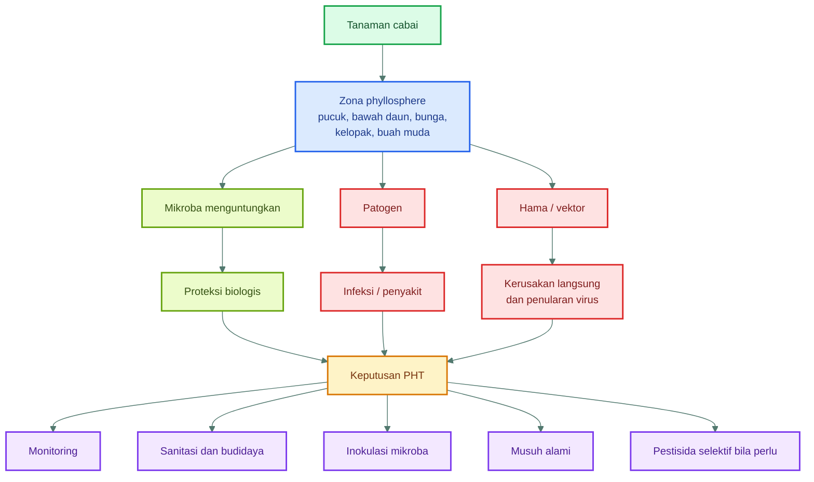

### Implikasi praktis bagi petani dan praktisi lapang

Bagi praktisi, pemahaman ini mengubah cara membaca tanaman cabai. Pucuk yang keriting tidak boleh langsung dianggap sekadar “kurang pupuk” atau “kena hama”. Bunga yang rontok tidak otomatis berarti masalah nutrisi saja. Buah muda yang tampak sehat pun belum tentu bebas infeksi laten. Dengan membaca phyllosphere, praktisi belajar melihat tanaman pada tingkat yang lebih halus: **mikrohabitat, permukaan, kelembapan mikro, dan komunitas biologis yang menempel di sana**.

Inilah alasan mengapa phyllosphere penting: karena banyak keputusan PHT yang paling efektif justru ditentukan pada tahap awal, saat gejala besar belum muncul, tetapi kondisi mikroekologi di permukaan tanaman sudah mengarah ke sehat atau sakit.

[**Kembali ke Atas**](#phyllosphere-cabai-sebagai-zona-strategis-pht-mengelola-mikroba-daun-untuk-menekan-opt-penyakit-dan-risiko-gagal-panen)

---

## 2. Definisi dan fundamental phyllosphere

<figure>
  
  <figcaption>
    Ilustrasi mikrobioma phyllosphere pada permukaan daun, mencakup interaksi
    mikroorganisme, kelembapan, cahaya, nutrisi permukaan daun, dan kesehatan
    tanaman.
  </figcaption>
</figure>

### 2.1 Definisi phyllosphere

Secara umum, **phyllosphere** adalah seluruh permukaan tanaman yang berada di atas tanah, termasuk daun, batang, bunga, buah, dan struktur aerial lainnya. Dalam praktik agronomi dan fitopatologi, fokus phyllosphere paling sering diarahkan pada **daun**, karena daun merupakan organ dengan luas permukaan besar dan menjadi lokasi interaksi intensif antara tanaman, mikroba, air, udara, cahaya, dan OPT.

Beberapa istilah penting yang perlu dibedakan adalah sebagai berikut:

- **Phyllosphere**: seluruh permukaan tanaman di atas tanah, termasuk daun, batang, bunga, dan buah.
- **Phylloplane**: permukaan daun secara spesifik.
- **Epifit**: mikroba yang hidup di permukaan tanaman.
- **Endofit**: mikroba yang hidup di dalam jaringan tanaman tanpa langsung menimbulkan gejala penyakit.
- **Microbiome phyllosphere**: seluruh komunitas mikroba yang berasosiasi dengan bagian atas tanaman, termasuk bakteri, fungi, ragi, dan mikroorganisme lain.

Dalam literatur modern, phyllosphere dipandang sebagai salah satu habitat mikroba daratan terbesar. Meski tampak sederhana, bagian atas tanaman dihuni oleh berbagai mikroba yang dapat berperan sebagai komensal, mutualis, antagonis patogen, atau justru patogen itu sendiri. Dengan kata lain, permukaan daun cabai bukan sekadar “kulit tanaman”, tetapi **ekosistem mikroba yang sangat dinamis**. ([Annual Reviews][2])

Bagi budidaya cabai, pengertian ini sangat penting. Banyak gangguan yang tampak “sekadar penyakit daun” sebenarnya merupakan hasil dari perubahan keseimbangan komunitas mikroba pada permukaan tanaman. Demikian pula, keberhasilan pengendalian dengan agens hayati sering kali ditentukan oleh kemampuan mikroba tersebut untuk **menempel, bertahan hidup, dan berkompetisi** pada phyllosphere.

### 2.2 Perbedaan phyllosphere dan rhizosphere

Praktisi pertanian umumnya lebih familiar dengan istilah **rhizosphere**, yaitu zona di sekitar akar yang kaya mikroba dan sangat aktif secara biologis. Namun phyllosphere berbeda cukup tajam dari rhizosphere, baik dari sisi lingkungan, sumber nutrisi, jenis mikroba, maupun cara pengelolaannya.

Berikut tabel perbandingan ringkas:

| Aspek           | Phyllosphere                              | Rhizosphere                                  |
| --------------- | ----------------------------------------- | -------------------------------------------- |
| Lokasi          | Daun, batang, bunga, buah                 | Sekitar akar                                 |
| Kondisi         | Kering, UV tinggi, nutrisi terbatas       | Lebih lembap, banyak eksudat akar            |
| Mikroba dominan | Bakteri epifit, ragi, fungi, patogen daun | PGPR, fungi tanah, mikoriza, patogen akar    |
| Tantangan       | UV, panas, hujan, pestisida               | Kompetisi tanah, pH, salinitas, patogen akar |
| Aplikasi        | Semprot foliar                            | Kocor, seed treatment, media tanam           |

Perbedaan ini punya implikasi teknis besar. Mikroba yang sangat efektif di rhizosphere belum tentu otomatis efektif di phyllosphere. Sebagai contoh, beberapa mikroba akar sangat baik dalam membantu serapan hara atau melindungi akar, tetapi tidak memiliki ketahanan cukup terhadap UV, panas, dan dehidrasi bila diaplikasikan ke daun. Sebaliknya, mikroba yang mampu bertahan di daun umumnya memiliki sifat khusus seperti toleransi kekeringan, kemampuan menempel pada kutikula, atau kemampuan membentuk biofilm.

Dengan demikian, ketika berbicara tentang biokontrol cabai, kita harus membedakan dengan tegas:

- **agens untuk akar dan media tanam**; dan
- **agens untuk permukaan daun, bunga, dan buah**.

Keduanya sama penting, tetapi tidak boleh dicampur secara konsep.

### 2.3 Mengapa phyllosphere adalah habitat ekstrem?

Secara biologis, phyllosphere adalah habitat yang keras. Mikroba yang hidup di permukaan daun cabai menghadapi kondisi yang berubah cepat dari jam ke jam. Inilah yang membuat phyllosphere disebut sebagai **habitat ekstrem relatif** bagi mikroorganisme.

Beberapa faktor yang menjadikan phyllosphere ekstrem adalah:

1. **Paparan UV**
   Permukaan daun menerima sinar matahari langsung. Radiasi UV dapat merusak membran sel, protein, dan materi genetik mikroba. Karena itu, hanya mikroba tertentu yang mampu bertahan baik di permukaan daun.

2. **Dehidrasi cepat**
   Setelah embun hilang atau angin meningkat, air tipis pada daun cepat menguap. Mikroba yang tidak mampu menghadapi kekeringan akan sulit bertahan.

3. **Perubahan suhu harian ekstrem**
   Pada siang hari daun bisa sangat panas, sedangkan malam hari bisa jauh lebih dingin. Fluktuasi ini memberi tekanan fisiologis pada mikroba.

4. **Hujan dan pencucian**
   Hujan, irigasi atas, atau percikan air dapat mencuci mikroba dari permukaan daun dan memindahkannya ke area lain.

5. **Nutrisi sangat sedikit**
   Tidak seperti rhizosphere yang kaya eksudat akar, phyllosphere hanya menyediakan nutrisi dalam jumlah kecil dan tidak merata.

6. **Pestisida dan senyawa antimikroba tanaman**
   Mikroba phyllosphere harus menghadapi residu pestisida, fungisida, bakterisida, serta senyawa pertahanan alami tanaman.

7. **Kompetisi antarmikroba**
   Meskipun miskin nutrisi, phyllosphere tetap dihuni banyak mikroba, sehingga kompetisi untuk ruang dan makanan sangat kuat.

Literatur phyllosphere menekankan bahwa permukaan daun memang miskin nutrisi dibanding rhizosphere, tetapi tetap mampu mendukung kehidupan mikroba melalui keberadaan sumber karbon terbatas seperti karbohidrat, asam amino, asam organik, dan gula alkohol. Artinya, habitat ini keras, tetapi bukan steril. Justru karena terbatas, hanya mikroba dengan strategi adaptasi tertentu yang dapat bertahan dan berfungsi di sana. ([Research Collection][3])

### Karakter fundamental phyllosphere yang perlu dipahami praktisi

Agar pembacaan lapang lebih tajam, ada beberapa prinsip fundamental yang perlu dipegang:

#### 1. Nutrisi ada, tetapi tidak merata

Mikroba tidak mendapatkan makanan secara merata di seluruh permukaan daun. Mereka cenderung berkumpul di area seperti:

- sekitar stomata;
- tulang daun;
- ketiak jaringan;
- bawah daun;
- sekitar trikoma;
- luka mikro;
- kelopak dan pangkal buah;
- area yang menahan embun atau gutasi.

Artinya, pada tanaman cabai, titik rawan OPT sering juga menjadi titik favorit kolonisasi mikroba.

#### 2. Air mikro lebih penting daripada “daun basah total”

Mikroba tidak selalu memerlukan daun yang basah kuyup. Justru yang sering paling penting adalah **lapisan air sangat tipis**, embun halus, atau kelembapan mikro yang cukup untuk melarutkan nutrisi dan mendukung aktivitas metabolik.

Ini menjelaskan mengapa bawah daun, kelopak, bunga, dan kanopi bagian dalam menjadi lokasi penting.

#### 3. Waktu kolonisasi sangat menentukan

Mikroba yang datang lebih awal dan berhasil menetap akan memiliki keunggulan kompetitif. Karena itu, aplikasi mikroba menguntungkan bersifat paling efektif bila dilakukan **preventif**, bukan menunggu tanaman sudah rusak berat.

#### 4. Phyllosphere cabai bersifat dinamis

Komunitas mikroba di daun muda tidak selalu sama dengan daun tua. Komunitas pada musim hujan juga tidak sama dengan musim kemarau. Demikian juga, perubahan nutrisi, varietas, jarak tanam, dan pola semprot dapat mengubah struktur komunitas phyllosphere.

### Ringkasan praktis Bab 2

Dari sisi praktik, bab ini memberi landasan penting:

- phyllosphere harus dipahami sebagai **habitat mikroba di bagian atas tanaman**;
- habitat ini berbeda tajam dari rhizosphere;
- kondisi phyllosphere keras, tetapi tetap mendukung kehidupan mikroba;
- hanya mikroba yang tepat yang mampu bertahan dan bekerja efektif di daun cabai;
- keberhasilan PHT berbasis mikroba menuntut pemahaman terhadap **ekologi permukaan tanaman**, bukan hanya pemilihan produk.

---

## Penutup singkat bagian ini

Dua bab awal ini menegaskan bahwa permukaan tanaman cabai adalah ruang hidup yang aktif dan sangat menentukan arah kesehatan tanaman. Dengan memahami pendahuluan, definisi, serta sifat dasar phyllosphere, praktisi memiliki fondasi yang benar sebelum masuk ke pembahasan lebih teknis tentang mikrobiologi phyllosphere, faktor pendukung dan pengganggu, sumber nutrisi mikroba, serta strategi inokulasi dalam kerangka PHT.

[**Kembali ke Atas**](#phyllosphere-cabai-sebagai-zona-strategis-pht-mengelola-mikroba-daun-untuk-menekan-opt-penyakit-dan-risiko-gagal-panen)

---

## 3. Mikrobiologi phyllosphere cabai

Mikrobiologi phyllosphere cabai membahas komunitas mikroba yang hidup pada bagian atas tanaman cabai, terutama permukaan daun, pucuk, bunga, kelopak, dan buah. Komunitas ini tidak bersifat statis. Ia berubah mengikuti umur tanaman, fase pertumbuhan, kelembapan, suhu, intensitas cahaya, pola hujan, aplikasi pestisida, status nutrisi, dan keberadaan OPT.

<figure>
  
  <figcaption>
    Ilustrasi mikrobiologi phyllosphere pada permukaan daun, mencakup interaksi
    mikroorganisme, kelembapan, cahaya, senyawa permukaan daun, dan kesehatan
    tanaman.
  </figcaption>
</figure>

Dalam konteks PHT, mikrobiologi phyllosphere penting karena banyak patogen dan hama tidak langsung merusak tanaman tanpa proses awal. Mereka terlebih dahulu harus **mendarat, bertahan, mencari makanan, menempel, berkembang, atau membuka jalan infeksi**. Pada tahap inilah mikroba menguntungkan dapat berperan sebagai pesaing, penghalang, pemicu ketahanan, atau penekan populasi patogen.

Literatur phyllosphere menunjukkan bahwa bagian atas tanaman dihuni oleh komunitas mikroba yang dapat berperan sebagai komensal, mutualis, antagonis patogen, maupun patogen. Karena itu, pengelolaan phyllosphere dalam budidaya cabai harus diarahkan untuk memperkuat kelompok mikroba yang mendukung kesehatan tanaman dan menekan kelompok yang merugikan. ([Annual Reviews][1])

### Diagram ringkas: kelompok mikroba pada phyllosphere cabai

```mermaid
%%{init: {
  "theme": "base",
  "themeVariables": {
    "background": "#ffffff",
    "primaryColor": "#ECFDF5",
    "primaryTextColor": "#064E3B",
    "primaryBorderColor": "#059669",
    "lineColor": "#64748B",
    "fontSize": "14px"
  }
}}%%
flowchart TB
    A[Phyllosphere cabai] --> B[Bakteri<br/>menguntungkan]
    A --> C[Fungi dan ragi<br/>menguntungkan]
    A --> D[Cendawan<br/>entomopatogen]
    A --> E[Patogen tanaman]

    B --> B1[Bacillus]
    B --> B2[Pseudomonas]
    B --> B3[Paenibacillus]
    B --> B4[Sphingomonas]
    B --> B5[Methylobacterium]

    C --> C1[Aureobasidium]
    C --> C2[Pseudozyma]
    C --> C3[Ragi antagonis]
    C --> C4[Trichoderma<br/>foliar tertentu]

    D --> D1[Beauveria]
    D --> D2[Metarhizium]
    D --> D3[Lecanicillium]
    D --> D4[Purpureocillium]

    E --> E1[Colletotrichum]
    E --> E2[Xanthomonas]
    E --> E3[Alternaria]
    E --> E4[Cercospora]
    E --> E5[Virus oleh vektor]

    classDef pusat fill:#DBEAFE,stroke:#2563EB,color:#1E3A8A,stroke-width:2px;
    classDef baik fill:#DCFCE7,stroke:#16A34A,color:#14532D,stroke-width:2px;
    classDef epf fill:#FEF3C7,stroke:#D97706,color:#78350F,stroke-width:2px;
    classDef patogen fill:#FEE2E2,stroke:#DC2626,color:#7F1D1D,stroke-width:2px;
    classDef mikro fill:#F8FAFC,stroke:#64748B,color:#0F172A,stroke-width:1.5px;

    class A pusat;
    class B,C baik;
    class D epf;
    class E patogen;
    class B1,B2,B3,B4,B5,C1,C2,C3,C4,D1,D2,D3,D4,E1,E2,E3,E4,E5 mikro;
```

---

### 3.1 Kelompok mikroba utama

#### 3.1.1 Bakteri menguntungkan

Bakteri merupakan kelompok mikroba yang sangat penting dalam phyllosphere. Pada permukaan daun, bakteri harus mampu bertahan terhadap kondisi kering, radiasi UV, keterbatasan nutrisi, perubahan suhu, dan pencucian oleh hujan. Beberapa bakteri phyllosphere dapat membentuk agregat, memproduksi biosurfaktan, mengubah struktur permukaan sel, menggunakan sumber karbon terbatas, dan mengaktifkan respons stres untuk bertahan hidup. ([Nature][2])

Pada cabai, bakteri menguntungkan yang relevan untuk pendekatan PHT antara lain _Bacillus_, _Pseudomonas_, _Paenibacillus_, _Sphingomonas_, dan _Methylobacterium_. Masing-masing memiliki kekuatan dan keterbatasan yang berbeda.

##### a. _Bacillus_

_Bacillus_ adalah salah satu kelompok paling praktis untuk aplikasi pertanian karena banyak spesiesnya mampu membentuk spora. Spora ini membantu _Bacillus_ bertahan lebih baik terhadap panas, kekeringan, penyimpanan, dan tekanan lingkungan dibanding banyak bakteri non-spora. Dalam konteks phyllosphere cabai, _Bacillus_ sering digunakan untuk menekan penyakit daun dan buah melalui kompetisi ruang, produksi metabolit antimikroba, enzim lisis, serta induksi ketahanan tanaman. Review biokontrol bakteri menjelaskan bahwa _Bacillus_ termasuk kelompok penting dalam pengendalian penyakit tanaman karena memiliki berbagai mekanisme, termasuk antibiosis, promosi pertumbuhan, dan induksi resistensi sistemik. ([MDPI][3])

Untuk cabai, _Bacillus_ relevan terutama terhadap penyakit seperti antraknosa, bercak daun, dan beberapa infeksi sekunder pada permukaan buah. Namun efektivitasnya tetap bergantung pada strain, formulasi, dosis, waktu aplikasi, dan kompatibilitas dengan pestisida lain.

##### b. _Pseudomonas_

_Pseudomonas_ dikenal luas sebagai kelompok bakteri yang berperan dalam biokontrol dan promosi pertumbuhan tanaman. Banyak strain _Pseudomonas_ menghasilkan siderofor, enzim, antibiotik alami, senyawa volatil, dan dapat memicu ketahanan tanaman. Namun dalam aplikasi foliar, _Pseudomonas_ umumnya lebih sensitif terhadap kekeringan dan radiasi UV dibanding bakteri pembentuk spora seperti _Bacillus_. Karena itu, keberhasilan aplikasi _Pseudomonas_ pada phyllosphere perlu memperhatikan waktu aplikasi, kelembapan mikro, dan perlindungan dari kondisi ekstrem. Literatur biokontrol _Pseudomonas_ menekankan bahwa banyak strain berpotensi mengendalikan penyakit tanaman, tetapi kemampuan bertahan pada bagian atas tanaman dapat menjadi faktor pembatas. ([Burleigh Dodds Science Publishing][4])

Dalam sistem cabai, _Pseudomonas_ dapat lebih kuat bila digunakan sebagai bagian dari pendekatan terpadu: perlakuan benih, kocor akar, serta dukungan foliar pada fase tertentu.

##### c. _Paenibacillus_

_Paenibacillus_ menarik untuk cabai karena beberapa strain memiliki potensi kuat sebagai biokontrol penyakit. Salah satu bukti spesifik pada cabai adalah penggunaan formulasi _Paenibacillus polymyxa_ C1 untuk mengendalikan antraknosa cabai. Studi pada cabai kultivar Cabe Besar menunjukkan bahwa aplikasi formulasi tersebut menurunkan insidensi, intensitas penyakit, dan kehilangan hasil, meskipun penulis tetap menyarankan pengujian lapang lebih lanjut untuk memastikan stabilitasnya pada kondisi budidaya yang lebih luas. ([Frontiers][5])

Secara praktis, _Paenibacillus_ dapat ditempatkan sebagai kandidat mikroba protektif untuk zona phyllosphere yang rawan antraknosa, terutama kelopak, buah muda, dan area luka mikro.

##### d. _Sphingomonas_

_Sphingomonas_ sering ditemukan sebagai penghuni phyllosphere pada berbagai tanaman. Kelompok ini menarik karena beberapa anggota komunitasnya mampu bertahan pada permukaan daun, berasosiasi dengan tanaman, dan dalam beberapa kasus dilaporkan berperan dalam stabilitas komunitas mikroba daun. Dalam konteks praktis cabai, _Sphingomonas_ lebih tepat dipahami sebagai bagian dari komunitas pendukung phyllosphere, bukan selalu sebagai produk biokontrol utama yang tersedia luas di pasar.

Peran penting _Sphingomonas_ adalah membantu menunjukkan bahwa kesehatan phyllosphere bukan hanya ditentukan oleh satu mikroba unggulan, tetapi oleh **struktur komunitas**. Komunitas yang stabil dan beragam sering kali lebih sulit ditembus patogen dibanding permukaan daun yang kosong atau terganggu berat.

##### e. _Methylobacterium_

_Methylobacterium_ dikenal sebagai bakteri methylotroph, yaitu mikroba yang dapat memanfaatkan senyawa satu karbon seperti metanol. Pada daun, metanol dapat muncul dari aktivitas metabolisme tanaman, terutama terkait perubahan dinding sel dan pertumbuhan jaringan. Kemampuan memanfaatkan metanol memberi keunggulan ekologis bagi _Methylobacterium_ di phyllosphere, karena tidak semua mikroba mampu memakai sumber karbon tersebut. Vorholt menjelaskan bahwa salah satu adaptasi mikroba phyllosphere adalah kemampuan menggunakan senyawa seperti metanol, asam amino, dan gula yang tersedia terbatas pada permukaan daun. ([Nature][2])

Dalam cabai, _Methylobacterium_ dapat dipahami sebagai bagian dari mikrobioma alami daun yang berpotensi mendukung keseimbangan komunitas dan fisiologi tanaman, meskipun pemanfaatannya sebagai produk komersial spesifik masih lebih terbatas dibanding _Bacillus_ atau _Trichoderma_.

---

#### 3.1.2 Fungi dan ragi menguntungkan

Selain bakteri, phyllosphere juga dihuni oleh fungi dan ragi. Kelompok ini dapat hidup di permukaan daun, bunga, dan buah, terutama pada area yang memiliki kelembapan mikro dan sumber nutrisi seperti eksudat, pollen, atau cairan luka. Beberapa ragi dan fungi epifit dapat bersaing dengan patogen, membentuk lapisan protektif, memicu ketahanan tanaman, atau menekan infeksi pascapanen. Review phyllosphere modern menempatkan fungi dan ragi sebagai bagian penting dari komunitas mikroba bagian atas tanaman yang dapat memengaruhi kesehatan tanaman. ([Annual Reviews][1])

##### a. _Aureobasidium_

_Aureobasidium_, terutama _Aureobasidium pullulans_, dikenal sebagai ragi/fungi epifit yang banyak ditemukan pada permukaan tanaman. Kelompok ini sering dibahas dalam konteks biokontrol permukaan buah dan daun karena mampu bersaing di habitat yang miskin nutrisi, membentuk populasi pada permukaan tanaman, dan menekan beberapa patogen. Pada cabai, logikanya relevan terutama untuk area buah, kelopak, dan permukaan daun yang memiliki kelembapan mikro.

Dalam kerangka PHT, _Aureobasidium_ dapat diposisikan sebagai kandidat mikroba permukaan, terutama bila tersedia dalam formulasi yang memang dirancang untuk aplikasi foliar atau pascapanen.

##### b. _Pseudozyma_

_Pseudozyma_ menarik karena ada bukti spesifik pada pepper. Aplikasi foliar ragi penghuni daun _Pseudozyma churashimaensis_ dilaporkan dapat memicu pertahanan sistemik pada pepper terhadap patogen bakteri dan virus. Studi tersebut menekankan bahwa perlindungan tidak hanya terjadi karena antagonisme langsung, tetapi juga karena tanaman mengalami aktivasi sistem pertahanan. ([Nature][6])

Poin ini penting bagi praktisi: mikroba phyllosphere tidak selalu harus membunuh patogen secara langsung. Ada mikroba yang bekerja dengan cara **membangunkan kesiagaan tanaman**, sehingga respons pertahanan muncul lebih cepat ketika patogen atau virus datang.

##### c. Ragi antagonis

Ragi antagonis secara umum memiliki potensi kuat untuk permukaan daun dan buah karena banyak ragi mampu bertahan pada habitat dengan gula terbatas, kelembapan fluktuatif, dan permukaan tanaman yang berubah-ubah. Pada buah cabai, ragi antagonis berpotensi menekan patogen melalui kompetisi nutrisi, kolonisasi luka mikro, serta pembentukan komunitas permukaan yang menghambat patogen oportunis.

Namun, ragi antagonis harus dipilih berdasarkan target. Tidak semua ragi aman, efektif, atau cocok untuk aplikasi foliar cabai. Dalam skala praktis, penggunaannya sebaiknya mengacu pada produk yang jelas strain-nya, terdaftar, dan memiliki rekomendasi aplikasi.

##### d. Beberapa _Trichoderma_ pada aplikasi foliar tertentu

_Trichoderma_ lebih dikenal sebagai mikroba tanah dan rizosfer. Ia kuat untuk pengelolaan patogen tanah, perbaikan zona akar, dekomposisi bahan organik, dan promosi pertumbuhan. Namun beberapa formulasi _Trichoderma_ juga digunakan pada aplikasi foliar, terutama untuk menekan patogen tertentu atau menginduksi ketahanan tanaman.

Kuncinya: jangan menganggap semua _Trichoderma_ otomatis cocok untuk daun. Formulasi foliar harus mampu bertahan pada permukaan daun, tidak mudah rusak oleh UV, tidak menimbulkan fitotoksisitas, dan kompatibel dengan program semprot lain. Dalam artikel ini, _Trichoderma_ ditempatkan sebagai agens penting, tetapi lebih kuat bila dilihat sebagai bagian dari strategi menyeluruh akar-daun, bukan hanya semprot daun.

---

#### 3.1.3 Cendawan entomopatogen

Cendawan entomopatogen adalah fungi yang dapat menginfeksi dan membunuh serangga atau tungau tertentu. Dalam PHT cabai, kelompok ini sangat penting untuk hama phyllosphere seperti thrips, kutu kebul, kutu daun, dan sebagian tungau. Genera yang banyak dibahas dalam biopestisida dan pengendalian hayati antara lain _Beauveria_, _Metarhizium_, _Lecanicillium_, dan _Purpureocillium_. Review entomopatogen menyebut _Beauveria_ dan _Metarhizium_ sebagai kelompok yang tidak hanya berperan sebagai patogen serangga, tetapi pada beberapa kondisi juga dapat berinteraksi dengan tanaman sebagai endofit atau pendukung kesehatan tanaman. ([Frontiers][7])

##### a. _Beauveria bassiana_

_Beauveria bassiana_ banyak digunakan sebagai agens hayati untuk hama pengisap dan serangga kecil. Pada cabai, target praktisnya meliputi thrips, kutu kebul, aphid, dan beberapa hama lain tergantung strain serta formulasi. Untuk chilli thrips, studi terhadap beberapa strain komersial menunjukkan bahwa _Beauveria bassiana_ memiliki aktivitas terhadap _Scirtothrips dorsalis_ dalam uji laboratorium. ([OUP Academic][8])

Secara lapang, keberhasilan _Beauveria_ sangat dipengaruhi oleh kelembapan, paparan UV, kualitas spora, dosis, frekuensi aplikasi, dan kemampuan semprotan mencapai lokasi hama seperti bawah daun, pucuk, dan bunga.

##### b. _Metarhizium anisopliae_

_Metarhizium_ juga merupakan cendawan entomopatogen penting. Ia banyak digunakan untuk berbagai serangga, terutama pada stadia atau habitat yang memungkinkan kontak antara konidia dan tubuh hama. Pada cabai, _Metarhizium_ dapat dipertimbangkan untuk program pengendalian hama tertentu, termasuk sebagian hama tanah atau hama permukaan, tergantung produk dan rekomendasi label.

Dibanding aplikasi langsung ke daun yang sangat terpapar UV, _Metarhizium_ sering lebih stabil bila diarahkan pada area yang lebih terlindung atau bila formulasi mendukung ketahanan lingkungan.

##### c. _Lecanicillium_ spp.

_Lecanicillium_ spp. relevan untuk hama pengisap seperti kutu kebul, aphid, dan thrips. Kelompok ini bekerja melalui infeksi pada tubuh serangga, sehingga kontak dengan target sangat penting. Karena banyak hama cabai bersembunyi di bawah daun atau bunga, aplikasi harus diarahkan secara presisi, bukan hanya menyemprot permukaan luar kanopi.

##### d. _Purpureocillium_ spp.

_Purpureocillium_ sering dibahas dalam konteks pengendalian nematoda dan beberapa hama tertentu, tetapi juga muncul dalam literatur entomopatogen. Pada cabai, penggunaannya perlu disesuaikan dengan target yang jelas. Jangan memasukkan _Purpureocillium_ ke program phyllosphere hanya karena “mikroba bagus”; harus ada alasan target, formulasi, dan bukti teknis.

---

#### 3.1.4 Patogen pada phyllosphere cabai

Selain mikroba menguntungkan, phyllosphere cabai juga dihuni atau disinggahi patogen. Patogen tidak selalu langsung masuk ke jaringan tanaman. Banyak patogen perlu bertahan di permukaan daun, bunga, kelopak, atau buah sebelum melakukan infeksi. Karena itu, pengurangan populasi patogen epifit di permukaan tanaman dapat menjadi bagian penting dari strategi pencegahan penyakit. Vorholt menekankan bahwa banyak patogen foliar lebih dulu mengolonisasi permukaan tanaman sebelum infeksi, dan ukuran populasi patogen di permukaan dapat berkaitan dengan keparahan penyakit. ([Research Collection][9])

##### a. _Colletotrichum_ spp.

_Colletotrichum_ adalah penyebab utama antraknosa cabai. Patogen ini sangat penting karena dapat menyerang buah dan menyebabkan kerugian besar, terutama saat kelembapan tinggi. Pada cabai di Bali, studi tentang _Paenibacillus polymyxa_ C1 menyebut antraknosa disebabkan oleh beberapa spesies _Colletotrichum_, termasuk _C. scovillei_, _C. acutatum_, _C. nymphaeae_, _C. gloeosporioides_, _C. truncatum_, dan _C. fructicola_. ([Frontiers][10])

Dalam konteks phyllosphere, zona kritis untuk _Colletotrichum_ adalah kelopak, buah muda, buah menjelang matang, luka mikro, dan area yang menahan air.

##### b. _Xanthomonas_ spp.

_Xanthomonas_ merupakan bakteri patogen penting penyebab bercak bakteri pada cabai. Bakteri ini dapat memanfaatkan kondisi hangat-lembap, percikan air, luka mikro, dan jaringan muda. Karena ia merupakan bakteri, penggunaan mikroba antagonis dan manajemen sanitasi harus dikombinasikan dengan pencegahan penyebaran melalui benih, bibit, alat, percikan air, dan pekerjaan lapang saat daun basah.

Pada penyakit bakteri, prinsipnya adalah pencegahan. Tanaman yang sudah bergejala berat sulit “disembuhkan”; yang lebih realistis adalah menekan penyebaran, mengurangi inokulum, dan melindungi jaringan baru.

##### c. _Alternaria_ dan _Cercospora_

_Alternaria_ dan _Cercospora_ umumnya berasosiasi dengan bercak daun dan defoliasi. Pada cabai, kelompok penyakit bercak daun sering berkembang lebih kuat pada daun bawah, kanopi lembap, tanaman terlalu rimbun, dan kondisi hujan atau embun berkepanjangan.

Dari sudut phyllosphere, daun tua bagian bawah penting karena sering menjadi reservoir inokulum. Bila daun bawah penuh bercak dan tetap dibiarkan, maka aplikasi mikroba baik di pucuk saja tidak cukup.

##### d. Virus yang dibawa vektor

Virus pada cabai tidak hidup bebas sebagai mikroba epifit seperti bakteri atau fungi, tetapi penyebarannya sangat terkait dengan phyllosphere karena vektornya hidup dan makan pada pucuk, daun muda, bawah daun, dan bunga. Thrips, kutu kebul, dan aphid merupakan hama penting dalam konteks ini.

Karena itu, strategi mikrobiologi phyllosphere untuk virus tidak diarahkan untuk “membunuh virus di daun”, tetapi untuk:

- mengurangi populasi vektor;
- memperkuat ketahanan tanaman;
- menjaga pucuk tidak terlalu lunak;
- mencegah tanaman sakit menjadi sumber inokulum;
- mengintegrasikan mikroba entomopatogen dan musuh alami.

---

### 3.2 Fungsi mikroba baik

Mikroba baik pada phyllosphere tidak bekerja dengan satu mekanisme tunggal. Efektivitasnya biasanya muncul dari kombinasi beberapa mekanisme yang saling mendukung. Review khusus tentang mode aksi biokontrol di phyllosphere menekankan bahwa mekanisme seperti kompetisi, antibiosis, adaptasi permukaan, induksi ketahanan, dan interaksi komunitas penting untuk merancang strategi biokontrol yang rasional. ([Frontiers][11])

#### 3.2.1 Kompetisi ruang

Permukaan daun, bunga, dan buah memiliki ruang terbatas. Mikroba yang mampu menempel lebih awal dapat mengisi celah mikro seperti sekitar stomata, trikoma, tulang daun, kelopak, dan luka kecil. Bila mikroba baik lebih dulu menempati lokasi tersebut, patogen memiliki peluang lebih kecil untuk mendarat, menempel, dan membentuk populasi.

Pada cabai, kompetisi ruang sangat penting di:

- pucuk;
- bawah daun;
- bunga;
- kelopak;
- pangkal buah;
- buah muda;
- luka mikro akibat hama atau gesekan.

#### 3.2.2 Kompetisi nutrisi

Nutrisi pada phyllosphere sangat terbatas. Gula, asam amino, asam organik, dan senyawa sederhana lain tersedia dalam jumlah kecil dan tidak merata. Mikroba baik yang cepat memanfaatkan nutrisi ini dapat mengurangi peluang patogen untuk tumbuh.

Kompetisi nutrisi sangat penting untuk patogen yang perlu memperbanyak diri di permukaan sebelum infeksi. Dalam praktik, prinsip ini menjelaskan mengapa aplikasi mikroba preventif lebih logis daripada aplikasi setelah penyakit meledak.

#### 3.2.3 Antibiosis

Antibiosis adalah mekanisme ketika mikroba menghasilkan senyawa yang menghambat atau membunuh mikroba lain. Kelompok seperti _Bacillus_ dan _Pseudomonas_ dikenal memiliki banyak senyawa bioaktif yang dapat berperan dalam penekanan patogen. Review tentang _Bacillus_ dan _Pseudomonas_ menekankan peran metabolit antimikroba, promosi pertumbuhan, dan induksi ketahanan sebagai bagian dari mekanisme biokontrol. ([ScienceDirect][12])

Pada cabai, antibiosis relevan untuk menekan patogen seperti _Colletotrichum_, _Alternaria_, dan beberapa bakteri patogen, tetapi efektivitas di lapang tetap dipengaruhi oleh konsentrasi mikroba, formulasi, cuaca, dan tekanan penyakit.

#### 3.2.4 Produksi enzim lisis

Beberapa mikroba menghasilkan enzim seperti kitinase, glukanase, protease, atau enzim hidrolitik lain yang dapat merusak struktur patogen. Mekanisme ini sering dibahas pada pengendalian jamur patogen karena dinding sel fungi mengandung komponen yang dapat menjadi target enzim tertentu.

Dalam konteks cabai, produksi enzim lisis berpotensi membantu menekan jamur penyebab antraknosa dan bercak daun. Namun mekanisme ini jarang berdiri sendiri; biasanya bekerja bersama kompetisi ruang, antibiosis, dan induksi ketahanan.

#### 3.2.5 Biofilm protektif

Biofilm adalah struktur komunitas mikroba yang menempel pada permukaan dan terlindungi oleh matriks ekstraseluler. Pada phyllosphere, biofilm membantu mikroba bertahan dari kekeringan, pencucian, dan tekanan lingkungan. Vorholt menyebut pembentukan agregat dan perubahan permukaan sebagai salah satu strategi adaptasi bakteri di phyllosphere. ([Nature][2])

Untuk praktik cabai, biofilm menjelaskan mengapa mikroba membutuhkan waktu untuk bekerja. Setelah disemprot, mikroba perlu menempel, beradaptasi, dan membentuk populasi. Karena itu, efek terbaik biasanya muncul pada aplikasi preventif dan berulang, bukan satu kali semprot saat penyakit sudah berat.

#### 3.2.6 Induksi ketahanan sistemik

Induksi ketahanan berarti mikroba memicu sistem pertahanan tanaman sehingga tanaman lebih siap menghadapi serangan. Ini dapat terjadi melalui jalur ketahanan sistemik terinduksi atau mekanisme priming. Pada pepper, aplikasi foliar _Pseudozyma churashimaensis_ dilaporkan memicu pertahanan sistemik terhadap patogen bakteri dan virus. ([Nature][6])

Konsep ini sangat penting dalam PHT cabai karena beberapa masalah, seperti virus, tidak bisa dikendalikan langsung dengan fungisida. Bila mikroba tertentu mampu memperkuat kesiagaan tanaman, maka ia dapat menjadi bagian dari strategi memperlambat perkembangan penyakit, terutama bila dikombinasikan dengan pengendalian vektor.

#### 3.2.7 Pengurangan infeksi laten

Infeksi laten adalah kondisi ketika patogen sudah masuk atau menetap, tetapi gejala belum terlihat. Pada cabai, ini sangat relevan untuk antraknosa buah. Buah muda dapat tampak sehat, tetapi gejala muncul saat buah membesar atau mendekati matang.

Mikroba baik di kelopak dan buah muda berpotensi mengurangi peluang infeksi awal melalui kompetisi ruang, antibiosis, dan penguatan jaringan permukaan. Karena itu, fase buah muda adalah titik penting untuk aplikasi biokontrol preventif.

#### 3.2.8 Bantuan toleransi stres

Sebagian mikroba membantu tanaman menghadapi stres abiotik seperti panas, kekeringan ringan, atau tekanan oksidatif. Mekanismenya dapat melibatkan fitohormon, antioksidan, perubahan fisiologi tanaman, atau stimulasi pertumbuhan. Review phyllosphere menyebut bahwa microbiota bagian atas tanaman dapat memengaruhi proses penting seperti fotosintesis, akumulasi biomassa, reproduksi, dan pertahanan terhadap tekanan biotik maupun abiotik. ([PubMed][13])

Pada cabai, manfaat ini penting karena tanaman yang stres lebih mudah diserang thrips, tungau, patogen oportunis, dan mengalami gugur bunga.

---

### 3.3 Konsep penting: priority effect

**Priority effect** adalah konsep ekologi yang menjelaskan bahwa organisme yang datang lebih awal ke suatu habitat dapat memengaruhi siapa yang berhasil menetap berikutnya. Dalam phyllosphere cabai, mikroba yang lebih dulu menempel di pucuk, bawah daun, kelopak, atau buah muda dapat mengambil ruang, nutrisi, dan posisi strategis sehingga patogen datang belakangan lebih sulit berkembang.

Konsep ini sangat penting untuk praktik PHT karena menjelaskan mengapa aplikasi mikroba menguntungkan harus bersifat **preventif**. Bila mikroba baik baru disemprot setelah patogen berkembang besar, ruang dan sumber daya sudah lebih dulu dikuasai patogen. Pada tahap itu, mikroba baik harus bekerja jauh lebih berat.

Prinsip praktisnya:

> Mikroba baik harus diaplikasikan **sebelum** patogen meledak, bukan setelah tanaman rusak berat.

### Diagram: priority effect pada permukaan cabai

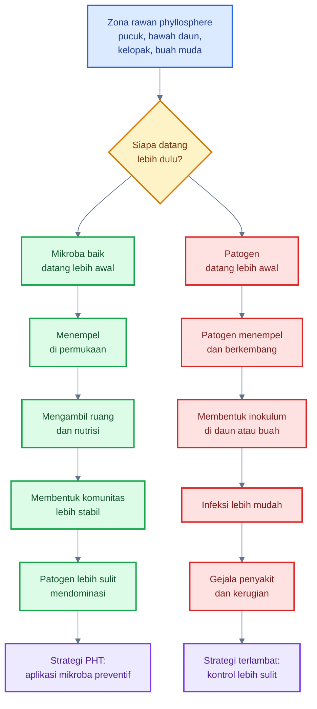

Implikasinya untuk cabai:

- aplikasi mikroba dimulai sejak persemaian atau awal vegetatif;
- zona pucuk dan bawah daun dilindungi sebelum thrips, kutu, dan bercak daun meningkat;
- kelopak dan buah muda dilindungi sebelum antraknosa terlihat;
- aplikasi perlu diulang setelah hujan deras atau setelah periode pestisida keras;
- monitoring tetap diperlukan karena mikroba baik bukan pengganti seluruh komponen PHT.

[**Kembali ke Atas**](#phyllosphere-cabai-sebagai-zona-strategis-pht-mengelola-mikroba-daun-untuk-menekan-opt-penyakit-dan-risiko-gagal-panen)

---

## 4. Faktor yang mempengaruhi phyllosphere: yang mendukung dan mengganggu

<figure>
  
  <figcaption>
    Ilustrasi ekosistem phyllosphere pada permukaan daun, termasuk interaksi
    antara mikroklimat, mikroorganisme, kelembapan, cahaya, dan kesehatan
    tanaman.
  </figcaption>
</figure>

Phyllosphere cabai sangat dipengaruhi oleh lingkungan mikro. Mikroba baik tidak hanya ditentukan oleh jenis produknya, tetapi juga oleh kondisi permukaan daun dan buah saat aplikasi. Mikroba yang bagus dapat gagal bekerja bila disemprot saat UV tinggi, daun terlalu panas, air semprot berklorin, atau dicampur dengan fungisida yang tidak kompatibel.

Sebaliknya, mikroba baik dapat lebih mudah berfungsi bila diaplikasikan pada waktu yang tepat, mencapai zona sasaran, memperoleh kelembapan mikro cukup, dan tidak langsung dihancurkan oleh pestisida broad-spectrum. Karena itu, faktor lingkungan perlu dibagi menjadi dua: **faktor yang mendukung** dan **faktor yang mengganggu**.

### Diagram ringkas: faktor pendukung dan pengganggu phyllosphere cabai

```mermaid
%%{init: {
  "theme": "base",
  "themeVariables": {
    "background": "#ffffff",
    "primaryColor": "#F8FAFC",
    "primaryTextColor": "#0F172A",
    "primaryBorderColor": "#64748B",
    "lineColor": "#64748B",
    "fontSize": "14px"
  }
}}%%
flowchart TB
    A[Phyllosphere cabai] --> B[Faktor mendukung]
    A --> C[Faktor mengganggu]

    B --> B1[Air tipis<br/>dan embun]
    B --> B2[Kelembapan mikro]
    B --> B3[Eksudat daun]
    B --> B4[Stomata, trikoma,<br/>tulang daun]
    B --> B5[Biofilm]
    B --> B6[Naungan dari UV]

    C --> C1[UV tinggi]
    C --> C2[Panas]
    C --> C3[Kekeringan]
    C --> C4[Angin dan hujan deras]
    C --> C5[Pestisida keras]
    C --> C6[Klorin dan pH ekstrem]
    C --> C7[Kompetisi patogen]

    B --> D[Mikroba baik<br/>lebih mudah bertahan]
    C --> E[Mikroba baik<br/>tertekan atau gagal]

    D --> F[Proteksi biologis<br/>lebih stabil]
    E --> G[Patogen atau hama<br/>lebih mudah dominan]

    classDef pusat fill:#DBEAFE,stroke:#2563EB,color:#1E3A8A,stroke-width:2px;
    classDef dukung fill:#DCFCE7,stroke:#16A34A,color:#14532D,stroke-width:2px;
    classDef ganggu fill:#FEE2E2,stroke:#DC2626,color:#7F1D1D,stroke-width:2px;
    classDef hasilbaik fill:#ECFCCB,stroke:#65A30D,color:#365314,stroke-width:2px;
    classDef hasilburuk fill:#FFEDD5,stroke:#EA580C,color:#7C2D12,stroke-width:2px;

    class A pusat;
    class B,B1,B2,B3,B4,B5,B6,D,F dukung;
    class C,C1,C2,C3,C4,C5,C6,C7,E,G ganggu;
```

---

### 4.1 Faktor yang mendukung mikroba baik

#### 4.1.1 Air tipis dan embun

Air tipis pada permukaan daun sangat penting bagi mikroba phyllosphere. Mikroba membutuhkan air untuk aktivitas metabolisme, pergerakan terbatas, pelarutan nutrisi, dan proses kolonisasi. Namun yang dibutuhkan bukan selalu daun basah kuyup; sering kali lapisan air tipis, embun pagi, atau kelembapan mikro sudah cukup untuk membantu mikroba aktif.

Pada cabai, air tipis biasanya muncul pada pagi hari, setelah hujan ringan, di bawah daun, di dalam kanopi, pada kelopak, atau pada area yang menahan embun. Kondisi ini dapat membantu mikroba menguntungkan menempel dan mulai beradaptasi.

Namun air harus dikelola hati-hati. Air tipis mendukung mikroba baik, tetapi daun yang terlalu lama basah juga mendukung patogen. Jadi, tujuan praktisnya bukan membuat tanaman selalu basah, melainkan menyediakan waktu aplikasi yang memungkinkan mikroba menempel tanpa menciptakan kondisi penyakit.

#### 4.1.2 Kelembapan mikro

Kelembapan mikro adalah kelembapan lokal pada bagian tertentu tanaman. Pada cabai, kelembapan mikro sering terjadi di:

- bawah daun;
- ketiak daun;
- pucuk yang rapat;
- bunga;
- kelopak;
- pangkal buah;
- kanopi bagian dalam.

Area ini lebih terlindung dari cahaya langsung dan angin, sehingga mikroba baik lebih mungkin bertahan. Akan tetapi, area yang sama juga disukai hama kecil dan patogen. Karena itu, kelembapan mikro harus dilihat sebagai **peluang sekaligus risiko**.

Dalam PHT, area dengan kelembapan mikro harus menjadi target utama monitoring dan aplikasi mikroba. Semprotan yang hanya mengenai permukaan atas daun sering gagal karena tidak mencapai lokasi yang benar.

#### 4.1.3 Eksudat daun

Eksudat daun adalah senyawa yang keluar dalam jumlah kecil dari jaringan tanaman ke permukaan. Senyawa ini dapat berupa gula, asam amino, asam organik, senyawa volatil, mineral mikro, dan metabolit lain. Pada phyllosphere, eksudat adalah sumber makanan penting karena permukaan daun umumnya miskin nutrisi. Lindow dan Brandl menjelaskan bahwa permukaan tanaman menyediakan habitat bagi bakteri epifit, tetapi ketersediaan nutrisi di sana terbatas dan sangat menentukan dinamika populasi mikroba. ([ASM Journals][14])

Pada cabai, eksudat lebih relevan pada jaringan muda, pucuk aktif, sekitar stomata, luka mikro, kelopak, dan buah muda. Karena itu, area rawan OPT sering juga menjadi area potensial untuk mikroba baik.

#### 4.1.4 Stomata, trikoma, dan tulang daun

Stomata, trikoma, dan tulang daun adalah mikrostruktur yang menciptakan mikrohabitat. Stomata menjadi area pertukaran gas dan kadang menjadi pintu masuk patogen. Trikoma dapat menahan tetesan air, debu, dan mikroba. Tulang daun serta cekungan kecil di sekitarnya dapat menahan kelembapan dan nutrisi terlarut lebih lama dibanding permukaan daun yang datar.

Bagi mikroba baik, struktur ini menyediakan tempat berlindung dari UV, angin, dan pencucian. Bagi patogen, struktur yang sama juga dapat menjadi lokasi awal infeksi. Maka, sekali lagi, zona ini adalah **arena kompetisi**.

Implikasi praktis:

- semprotan mikroba harus menggunakan droplet halus;
- bawah daun harus terkena;
- aplikasi terlalu deras tidak selalu lebih baik;
- semprotan harus menjangkau tulang daun, ketiak daun, dan kelopak.

#### 4.1.5 Biofilm

Biofilm membantu mikroba bertahan di phyllosphere. Dalam biofilm, mikroba tidak hidup sendirian sebagai sel bebas, tetapi membentuk agregat yang terlindungi oleh matriks. Struktur ini dapat membantu mikroba bertahan dari kekeringan, UV, dan pencucian. Vorholt menyebut agregasi, perubahan permukaan, biosurfaktan, dan respons stres sebagai bagian dari adaptasi bakteri terhadap kehidupan di phyllosphere. ([Nature][2])

Bagi praktisi, biofilm menjelaskan mengapa mikroba perlu waktu. Setelah aplikasi, mikroba tidak langsung menjadi “tameng” penuh. Ia harus menempel, bertahan, memperbanyak diri, dan membangun posisi ekologis. Karena itu, interval aplikasi harus dirancang preventif dan konsisten.

#### 4.1.6 Naungan dari UV langsung

Radiasi UV adalah salah satu faktor pembatas utama pada permukaan daun. Bagian bawah daun, kanopi dalam, kelopak, dan permukaan buah yang terlindung sebagian biasanya lebih bersahabat bagi mikroba dibanding permukaan atas daun yang terkena matahari langsung.

Ini memberi alasan teknis mengapa aplikasi mikroba lebih baik dilakukan pagi atau sore. Pada waktu tersebut, intensitas UV lebih rendah, suhu daun lebih bersahabat, dan peluang mikroba bertahan setelah aplikasi lebih tinggi.

---

### 4.2 Faktor yang mengganggu mikroba baik

#### 4.2.1 UV tinggi

UV dapat merusak sel mikroba, mengurangi viabilitas, dan menurunkan efektivitas aplikasi. Mikroba yang tidak memiliki perlindungan pigmen, spora, biofilm, atau formulasi pelindung akan lebih cepat mati pada permukaan daun terbuka.

Praktik lapang:

- hindari aplikasi tengah hari;
- pilih pagi atau sore;
- arahkan semprotan ke bawah daun dan zona terlindung;
- gunakan formulasi yang memang dirancang untuk foliar.

#### 4.2.2 Panas

Permukaan daun cabai dapat menjadi panas pada siang hari, terutama pada musim kemarau, lahan terbuka, dan tanaman yang kekurangan air. Panas mempercepat pengeringan droplet dan menekan viabilitas mikroba.

Praktik lapang:

- jangan menyemprot mikroba saat daun panas;
- pastikan tanaman tidak sedang stres air berat;
- lakukan aplikasi saat suhu lebih rendah;
- hindari campuran yang meningkatkan risiko fitotoksik.

#### 4.2.3 Kekeringan

Kekeringan menyebabkan mikroba sulit aktif. Beberapa mikroba akan dorman, sebagian mati, dan sebagian gagal menempel. Bakteri pembentuk spora seperti _Bacillus_ relatif lebih tahan, tetapi bukan berarti semua aplikasi akan berhasil pada daun yang sangat kering dan panas.

Praktik lapang:

- aplikasi mikroba lebih efektif saat ada kelembapan mikro;
- jangan menunggu tanaman layu berat;
- kelola irigasi dan mulsa;
- hindari nitrogen tinggi yang membuat tanaman rentan tetapi air tidak cukup.

#### 4.2.4 Angin

Angin dapat mempercepat pengeringan daun, mengganggu distribusi droplet, dan mengurangi deposit mikroba pada target. Pada aplikasi foliar, angin juga menyebabkan drift sehingga mikroba tidak mencapai bawah daun, bunga, atau kelopak.

Praktik lapang:

- semprot saat angin rendah;
- gunakan nozzle yang sesuai;
- arahkan semprotan ke dalam kanopi;
- pastikan bawah daun tetap terkena.

#### 4.2.5 Hujan deras

Hujan deras dapat mencuci mikroba dari permukaan daun dan buah. Pada saat yang sama, hujan juga meningkatkan percikan tanah, menyebarkan patogen, dan memperpanjang kelembapan permukaan. Jadi, hujan dapat menurunkan populasi mikroba baik sekaligus meningkatkan risiko penyakit.

Praktik lapang:

- jangan aplikasi tepat sebelum hujan deras;
- ulang aplikasi setelah hujan besar bila perlu;
- gunakan mulsa untuk mengurangi percikan tanah;
- perbaiki drainase dan sirkulasi udara.

#### 4.2.6 Pestisida broad-spectrum

Pestisida broad-spectrum dapat menekan hama, tetapi juga dapat mengganggu musuh alami dan mikroba non-target. Dalam PHT, pestisida seperti ini sebaiknya tidak digunakan secara otomatis, terutama bila populasi OPT masih dapat dikelola dengan monitoring, sanitasi, mikroba, dan musuh alami.

Dampak pada phyllosphere:

- mikroba baik berkurang;
- komunitas permukaan menjadi tidak stabil;
- patogen oportunis dapat mengisi ruang kosong;
- hama sekunder seperti tungau dapat meningkat bila musuh alami terganggu.

#### 4.2.7 Bakterisida dan fungisida keras

Bakterisida dan fungisida keras dapat membunuh mikroba target, tetapi juga dapat merusak mikroba baik yang diaplikasikan. Ini sangat penting bila petani menggunakan _Bacillus_, _Pseudomonas_, ragi antagonis, atau cendawan entomopatogen.

Praktik lapang:

- jangan mencampur mikroba hidup dengan fungisida/bakterisida keras kecuali kompatibilitas jelas;
- beri jeda aplikasi;
- dahulukan produk selektif;
- ikuti label dan rekomendasi teknis.

#### 4.2.8 Klorin tinggi dalam air semprot

Air dengan klorin tinggi dapat menurunkan viabilitas mikroba hidup. Ini sering diabaikan dalam praktik. Bila air semprot berasal dari air olahan atau sumber dengan disinfektan, mikroba dapat mati sebelum mencapai daun.

Praktik lapang:

- gunakan air bersih yang tidak berbau klorin kuat;
- endapkan air bila diperlukan;
- hindari mencampur mikroba dengan larutan sanitasi;
- siapkan larutan mikroba dekat waktu aplikasi.

#### 4.2.9 pH larutan ekstrem

Mikroba hidup umumnya tidak nyaman pada pH larutan yang terlalu asam atau terlalu basa. pH ekstrem dapat menurunkan viabilitas, merusak spora, atau mengganggu kestabilan formulasi.

Praktik lapang:

- gunakan pH air semprot yang mendekati netral;
- hindari campuran pupuk daun yang sangat asam atau sangat basa;
- lakukan uji kompatibilitas kecil sebelum aplikasi luas;
- ikuti rekomendasi produk.

#### 4.2.10 Kompetisi dengan mikroba liar dan patogen

Mikroba baik yang disemprot tidak masuk ke ruang kosong. Ia masuk ke komunitas yang sudah ada. Di sana ada mikroba netral, mikroba oportunis, dan patogen. Jika patogen sudah sangat dominan, mikroba baik lebih sulit membalik keadaan.

Inilah alasan aplikasi mikroba harus dilakukan preventif. Semakin awal mikroba baik hadir di zona rawan, semakin besar peluangnya untuk mengambil ruang dan membentuk komunitas protektif.

---

### Tabel praktis: faktor pengganggu dan implikasi lapang

| Faktor                            | Dampak pada mikroba baik              | Implikasi lapang                                         |
| --------------------------------- | ------------------------------------- | -------------------------------------------------------- |
| UV tinggi                         | Menurunkan viabilitas                 | Aplikasi pagi atau sore                                  |
| Hujan deras                       | Mencuci mikroba                       | Ulang aplikasi setelah hujan besar                       |
| Pestisida keras                   | Membunuh mikroba baik                 | Beri jeda aplikasi dan cek kompatibilitas                |
| Daun terlalu kering               | Mikroba dorman atau mati              | Butuh kelembapan mikro, hindari aplikasi saat daun panas |
| Daun terlalu basah                | Patogen ikut naik                     | Hindari genangan dan kanopi terlalu rapat                |
| Angin kencang                     | Droplet tidak mencapai target         | Semprot saat angin rendah                                |
| Klorin tinggi                     | Menurunkan viabilitas mikroba         | Gunakan air bersih tanpa klorin tinggi                   |
| pH ekstrem                        | Merusak mikroba atau formulasi        | Jaga pH larutan mendekati netral                         |
| Kanopi terlalu rapat              | Kelembapan berlebih dan penyakit naik | Atur jarak tanam, ajir, dan pruning selektif             |
| Campuran semprot tidak kompatibel | Mikroba mati sebelum bekerja          | Jangan asal tank-mix                                     |

---

### Ringkasan praktis Bab 3 dan Bab 4

Mikrobiologi phyllosphere cabai terdiri dari kelompok mikroba menguntungkan, cendawan entomopatogen, dan patogen yang saling berkompetisi di permukaan tanaman. Mikroba baik dapat bekerja melalui kompetisi ruang, kompetisi nutrisi, antibiosis, enzim lisis, biofilm, induksi ketahanan, pengurangan infeksi laten, dan bantuan toleransi stres.

Namun mikroba baik tidak akan otomatis berhasil hanya karena disemprotkan. Keberhasilannya ditentukan oleh faktor pendukung seperti air tipis, kelembapan mikro, eksudat, stomata, trikoma, biofilm, dan naungan dari UV. Sebaliknya, UV tinggi, panas, kekeringan, hujan deras, pestisida keras, klorin, pH ekstrem, dan dominasi patogen dapat menggagalkan kolonisasi.

Prinsip paling penting untuk PHT cabai adalah:

> Phyllosphere adalah arena kompetisi. Mikroba baik harus datang lebih awal, menempati zona rawan, dan didukung oleh kondisi budidaya yang membuatnya mampu bertahan.

[1]: https://www.annualreviews.org/content/journals/10.1146/annurev-arplant-102820-032704?utm_source=chatgpt.com 'Phyllosphere Microbiome'
[2]: https://www.nature.com/articles/nrmicro2910?utm_source=chatgpt.com 'Microbial life in the phyllosphere'
[3]: https://www.mdpi.com/2076-2607/10/9/1759?utm_source=chatgpt.com 'Bacteria as Biological Control Agents of Plant Diseases'
[4]: https://www.bdspublishing.com/_webedit/uploaded-files/All%20Files/Open%20Access/9781801460187.pdf?utm_source=chatgpt.com 'The use of Pseudomonas spp. as bacterial biocontrol ...'
[5]: https://www.frontiersin.org/journals/sustainable-food-systems/articles/10.3389/fsufs.2021.782425/full?utm_source=chatgpt.com 'Biocontrol of Anthracnose Disease on Chili Pepper Using a ...'
[6]: https://www.nature.com/articles/srep39432?utm_source=chatgpt.com 'Foliar application of the leaf-colonizing yeast Pseudozyma ...'
[7]: https://www.frontiersin.org/journals/plant-science/articles/10.3389/fpls.2021.741804/full?utm_source=chatgpt.com 'Model Application of Entomopathogenic Fungi as ...'
[8]: https://academic.oup.com/jinsectscience/article/13/1/31/1068847?utm_source=chatgpt.com 'Evaluation of entomopathogenic fungi against chilli thrips ...'
[9]: https://www.research-collection.ethz.ch/bitstreams/463f76c4-8be3-4601-9034-d50758f78e99/download?utm_source=chatgpt.com 'Microbial life in the phyllosphere'
[10]: https://www.frontiersin.org/journals/sustainable-food-systems/articles/10.3389/fsufs.2021.782425/pdf?utm_source=chatgpt.com 'Biocontrol of Anthracnose Disease on Chili Pepper Using a ...'
[11]: https://www.frontiersin.org/journals/microbiology/articles/10.3389/fmicb.2020.01619/full?utm_source=chatgpt.com 'Modes of Action of Microbial Biocontrol in the Phyllosphere'
[12]: https://www.sciencedirect.com/science/article/abs/pii/S0885576521001557?utm_source=chatgpt.com 'Plant-associated Bacillus and Pseudomonas antimicrobial ...'
[13]: https://pubmed.ncbi.nlm.nih.gov/36854478/?utm_source=chatgpt.com 'Phyllosphere Microbiome - PubMed - NIH'
[14]: https://journals.asm.org/doi/10.1128/AEM.69.4.1875-1883.2003?utm_source=chatgpt.com 'Microbiology of the Phyllosphere | Applied and Environmental ...'

[**Kembali ke Atas**](#phyllosphere-cabai-sebagai-zona-strategis-pht-mengelola-mikroba-daun-untuk-menekan-opt-penyakit-dan-risiko-gagal-panen)

---

## 5. Sumber kebutuhan mikroba di daun cabai

Mikroba yang hidup di phyllosphere cabai tidak memperoleh makanan sebanyak mikroba di rhizosphere. Permukaan daun, bunga, kelopak, dan buah bukan lingkungan yang kaya bahan organik. Namun bukan berarti phyllosphere steril atau tidak menyediakan nutrisi. Nutrisi tetap tersedia, tetapi dalam jumlah kecil, tidak merata, dan sangat dipengaruhi oleh air tipis, embun, gutasi, luka mikro, aktivitas serangga, dan kondisi fisiologis tanaman.

Bagi praktisi PHT, memahami sumber kebutuhan mikroba di daun cabai sangat penting karena dua alasan. Pertama, mikroba baik membutuhkan sumber energi, air, dan tempat melekat agar mampu bertahan. Kedua, sumber makanan yang sama juga bisa dimanfaatkan oleh patogen dan mikroba oportunis. Jadi, tujuan pengelolaan bukan membuat daun “kaya makanan”, tetapi menjaga agar mikroba baik memiliki peluang hidup tanpa menciptakan kondisi berlebihan yang justru memicu penyakit.

Studi klasik Leveau dan Lindow menunjukkan bahwa fruktosa dan sukrosa tersedia di phyllosphere dan dapat dimonitor sebagai sumber konsumsi bakteri epifit. Studi ini penting karena membuktikan bahwa gula pada permukaan daun bukan sekadar asumsi, tetapi benar-benar dapat digunakan oleh mikroba penghuni daun. ([PMC][4]) ([PMC][1])

### Diagram ringkas: sumber kebutuhan mikroba pada phyllosphere cabai

```mermaid
%%{init: {
  "theme": "base",
  "themeVariables": {
    "background": "#ffffff",
    "primaryColor": "#F8FAFC",
    "primaryTextColor": "#0F172A",
    "primaryBorderColor": "#64748B",
    "lineColor": "#64748B",
    "fontSize": "14px"
  }
}}%%
flowchart TB
    A[Phyllosphere cabai] --> B[Sumber karbon]
    A --> C[Sumber nitrogen]
    A --> D[Sumber mineral]
    A --> E[Sumber eksternal]

    B --> B1[Glukosa]
    B --> B2[Fruktosa]
    B --> B3[Sukrosa]
    B --> B4[Metanol]
    B --> B5[Asam organik]
    B --> B6[Gula alkohol]

    C --> C1[Asam amino]
    C --> C2[Peptida mikro]
    C --> C3[Protein pollen]
    C --> C4[Debris mikroba]
    C --> C5[Kotoran serangga]

    D --> D1[Gutasi]
    D --> D2[Residu pupuk daun]
    D --> D3[Debu]
    D --> D4[Aerosol tanah]
    D --> D5[Percikan air]

    E --> E1[Honeydew]
    E --> E2[Serbuk sari]
    E --> E3[Nektar]
    E --> E4[Luka mikro]
    E --> E5[Jaringan rusak]

    B --> F[Mikroba aktif]
    C --> F
    D --> F
    E --> F

    F --> G{Seimbang atau berlebih?}
    G --> H[Seimbang:<br/>mikroba baik terbantu]
    G --> I[Berlebih:<br/>patogen dan jamur oportunis ikut naik]

    classDef pusat fill:#DBEAFE,stroke:#2563EB,color:#1E3A8A,stroke-width:2px;
    classDef karbon fill:#DCFCE7,stroke:#16A34A,color:#14532D,stroke-width:2px;
    classDef nitrogen fill:#E0E7FF,stroke:#4F46E5,color:#312E81,stroke-width:2px;
    classDef mineral fill:#FEF3C7,stroke:#D97706,color:#78350F,stroke-width:2px;
    classDef eksternal fill:#FCE7F3,stroke:#DB2777,color:#831843,stroke-width:2px;
    classDef proses fill:#F8FAFC,stroke:#64748B,color:#0F172A,stroke-width:1.5px;
    classDef baik fill:#ECFCCB,stroke:#65A30D,color:#365314,stroke-width:2px;
    classDef risiko fill:#FEE2E2,stroke:#DC2626,color:#7F1D1D,stroke-width:2px;

    class A pusat;
    class B,B1,B2,B3,B4,B5,B6 karbon;
    class C,C1,C2,C3,C4,C5 nitrogen;
    class D,D1,D2,D3,D4,D5 mineral;
    class E,E1,E2,E3,E4,E5 eksternal;
    class F,G proses;
    class H baik;
    class I risiko;
```

---

### 5.1 Sumber karbon

Karbon adalah kebutuhan utama bagi banyak mikroba karena digunakan sebagai sumber energi dan bahan penyusun sel. Pada phyllosphere cabai, sumber karbon tersedia dalam jumlah kecil dari hasil metabolisme tanaman, eksudat daun, gutasi, pollen, honeydew serangga, dan cairan jaringan yang keluar akibat luka mikro.

Permukaan daun tidak menyediakan karbon secara merata. Sebagian area hampir miskin nutrisi, sedangkan titik tertentu seperti sekitar stomata, tulang daun, kelopak, pangkal buah, bunga, dan luka mikro dapat menjadi “hotspot” nutrisi. Review phyllosphere menyebut bahwa molekul yang tercuci atau keluar dari daun dapat mencakup gula, asam amino, asam organik, dan mineral; senyawa inilah yang menjadi dasar kehidupan mikroba di permukaan tanaman. ([PMC][2])

#### a. Glukosa

Glukosa adalah gula sederhana yang mudah digunakan oleh banyak bakteri, ragi, dan fungi. Pada tanaman, glukosa berasal dari metabolisme karbon dan dapat muncul di permukaan daun dalam jumlah kecil melalui eksudasi, luka mikro, atau pelarutan oleh embun dan hujan ringan.

Dalam konteks cabai, glukosa berpotensi tersedia lebih tinggi pada jaringan aktif seperti pucuk muda, bunga, buah muda, serta titik luka akibat gesekan, thrips, tungau, pruning, atau semprotan bertekanan tinggi.

Implikasi praktisnya:

- area luka kecil bisa menjadi titik awal kolonisasi mikroba;
- mikroba baik dapat memanfaatkan glukosa, tetapi patogen juga bisa;
- jangan memperbanyak sumber gula eksternal secara berlebihan di daun.

#### b. Fruktosa

Fruktosa juga merupakan gula sederhana yang dapat dikonsumsi mikroba epifit. Studi Leveau dan Lindow secara khusus menggunakan sistem bioreporter untuk memonitor ketersediaan fruktosa dan sukrosa bagi bakteri di phyllosphere. Ini menunjukkan bahwa gula pada permukaan daun dapat menjadi sumber makanan nyata bagi mikroba, walaupun jumlahnya terbatas. ([PMC][1])

Pada cabai, fruktosa dapat menjadi penting di area:

- pucuk muda;
- bunga;
- kelopak;
- buah muda;
- cairan luka mikro;
- honeydew dari kutu daun atau kutu kebul.

#### c. Sukrosa

Sukrosa adalah gula transport utama pada banyak tanaman. Walaupun sebagian besar sukrosa berada di dalam jaringan tanaman, sedikit sukrosa dapat tersedia di permukaan melalui eksudat, gutasi, luka, atau pencucian mikro dari jaringan daun.

Sukrosa penting karena dapat mendukung pertumbuhan mikroba epifit tertentu. Namun, bila permukaan daun terlalu kaya sukrosa akibat tambahan molase, gula, atau POC pekat, mikroba oportunis dan jamur jelaga juga dapat meningkat.

#### d. Metanol

Metanol merupakan sumber karbon khusus yang penting bagi kelompok bakteri methylotroph seperti _Methylobacterium_. Pada daun, metanol dapat dilepaskan dalam jumlah kecil selama proses pertumbuhan dan modifikasi dinding sel. Mikroba yang mampu memanfaatkan metanol memiliki keunggulan ekologis karena tidak semua mikroba dapat menggunakan senyawa ini.

Pada cabai, metanol kemungkinan lebih relevan pada jaringan muda yang aktif tumbuh, seperti pucuk dan daun muda. Ini membantu menjelaskan mengapa beberapa bakteri methylotroph sering ditemukan pada permukaan daun tanaman.

#### e. Asam organik

Asam organik dapat berasal dari metabolisme tanaman, eksudat, gutasi, dan degradasi jaringan. Contohnya dapat mencakup asam malat, sitrat, oksalat, dan senyawa organik lain dalam jumlah kecil. Asam organik berperan sebagai sumber karbon, tetapi juga dapat memengaruhi pH mikro pada permukaan daun.

Pada phyllosphere cabai, asam organik tidak hanya menjadi makanan, tetapi juga ikut membentuk seleksi mikroba. Mikroba yang toleran terhadap perubahan pH mikro dan mampu menggunakan asam organik akan lebih kompetitif.

#### f. Gula alkohol

Gula alkohol atau polyol dapat ditemukan pada beberapa permukaan tanaman dan berperan sebagai sumber karbon bagi mikroba tertentu. Dalam konteks phyllosphere, gula alkohol juga dapat membantu beberapa organisme menghadapi tekanan osmotik. Ketersediaannya pada cabai mungkin tidak sebesar gula sederhana, tetapi tetap dapat menjadi bagian dari komposisi nutrisi mikro di permukaan daun.

### Tabel ringkas sumber karbon

| Sumber karbon | Asal utama                     | Zona cabai yang relevan    | Catatan praktis                              |
| ------------- | ------------------------------ | -------------------------- | -------------------------------------------- |
| Glukosa       | Eksudat, luka mikro, gutasi    | pucuk, daun muda, kelopak  | mudah dimanfaatkan mikroba baik dan patogen  |
| Fruktosa      | Eksudat, pollen, honeydew      | bunga, pucuk, bawah daun   | terbukti tersedia bagi bakteri epifit        |
| Sukrosa       | Eksudat, gutasi, jaringan luka | daun, bunga, buah muda     | jangan ditambah berlebihan dari luar         |
| Metanol       | pertumbuhan jaringan daun      | pucuk, daun muda           | penting bagi _Methylobacterium_              |
| Asam organik  | metabolisme tanaman, gutasi    | stomata, tulang daun, luka | memengaruhi nutrisi dan pH mikro             |
| Gula alkohol  | metabolit tanaman              | permukaan daun tertentu    | sumber karbon tambahan bagi mikroba spesifik |

---

### 5.2 Sumber nitrogen

Nitrogen dibutuhkan mikroba untuk membentuk protein, enzim, asam nukleat, dan komponen sel lainnya. Di phyllosphere, nitrogen tersedia lebih terbatas dibanding karbon. Namun tetap ada beberapa sumber nitrogen mikro yang dapat dimanfaatkan.

#### a. Asam amino

Asam amino dapat keluar dari jaringan tanaman dalam jumlah kecil melalui eksudat daun, gutasi, atau luka mikro. Asam amino penting karena dapat langsung dimanfaatkan oleh mikroba sebagai sumber nitrogen dan kadang juga sebagai sumber karbon.

Pada cabai, asam amino lebih mungkin tersedia pada:

- pucuk aktif;
- daun muda;
- bunga;
- cairan luka;
- area gutasi;
- jaringan yang mengalami stres ringan.

Aplikasi pupuk daun berbasis asam amino dapat memengaruhi mikrobiologi phyllosphere. Pada dosis tepat, ia dapat membantu fisiologi tanaman. Namun pada dosis berlebihan atau saat kelembapan tinggi, ia dapat memperkaya permukaan daun dan mendukung pertumbuhan mikroba oportunis.

#### b. Peptida mikro

Peptida adalah rantai pendek asam amino. Sumbernya dapat berasal dari degradasi protein tanaman, pollen, jaringan rusak, atau sisa mikroba mati. Dalam jumlah kecil, peptida dapat menjadi nutrisi penting bagi bakteri dan ragi.

Pada daun cabai, peptida mikro kemungkinan lebih banyak tersedia pada jaringan yang mengalami kerusakan, bunga yang menua, pollen yang pecah, atau permukaan buah yang terluka.

#### c. Protein dari pollen

Bunga cabai menyediakan pollen yang mengandung protein, lipid, dan senyawa organik lain. Ini menjadikan bunga sebagai zona phyllosphere yang berbeda dari daun biasa. Bunga bukan hanya tempat reproduksi tanaman, tetapi juga habitat mikroba dan titik aktivitas hama seperti thrips.

Pollen dapat menjadi sumber nutrisi bagi mikroba baik, tetapi juga dapat mendukung mikroba liar. Karena itu, aplikasi mikroba pada fase bunga harus halus, tidak terlalu basah, dan tidak merusak struktur bunga.

#### d. Debris mikroba

Mikroba yang mati akan menjadi sumber nutrisi bagi mikroba lain. Di phyllosphere yang miskin nutrisi, sisa sel mikroba dapat menjadi sumber nitrogen, fosfor, karbon, dan mineral mikro.

Dari sudut ekologi, ini menunjukkan bahwa komunitas phyllosphere terus mengalami perputaran biomassa. Mikroba tidak hanya makan dari tanaman, tetapi juga dari sisa mikroba lain.

#### e. Kotoran serangga

Serangga kecil seperti thrips, aphid, kutu kebul, dan ulat dapat meninggalkan kotoran atau residu organik pada permukaan daun, bunga, dan buah. Bahan ini dapat menjadi sumber nitrogen dan karbon bagi mikroba.

Namun, keberadaan kotoran serangga biasanya juga menandakan adanya tekanan hama. Jadi, bila permukaan daun banyak mengandung residu serangga, itu bukan tanda baik. Itu menunjukkan mikrohabitat sedang bergeser menjadi lebih mendukung mikroba oportunis dan patogen sekunder.

---

### 5.3 Sumber mineral

Mikroba juga membutuhkan mineral seperti kalium, kalsium, magnesium, fosfor, besi, seng, mangan, dan unsur mikro lain. Di phyllosphere, mineral tidak selalu tersedia dalam bentuk stabil, tetapi dapat muncul melalui gutasi, debu, percikan tanah, residu pupuk daun, dan aerosol lingkungan.

#### a. Mineral dari gutasi

Gutasi adalah keluarnya cairan dari jaringan tanaman melalui hidatoda, biasanya terlihat sebagai tetesan kecil di tepi daun pada pagi hari atau saat kelembapan tinggi. Cairan gutasi dapat membawa mineral dan senyawa organik terlarut.

Pada cabai, gutasi dapat menjadi sumber air dan nutrisi mikro bagi mikroba. Namun tetesan gutasi juga dapat menjadi tempat mikroba berkembang bila kondisi mendukung. Karena itu, area tepi daun dan ujung daun perlu diperhatikan saat monitoring penyakit.

#### b. Residu pupuk daun

Pupuk daun meninggalkan mineral pada permukaan tanaman. Unsur hara mikro seperti Zn, Mn, B, Fe, Cu, dan Mg dapat memengaruhi fisiologi tanaman sekaligus komunitas mikroba permukaan.

Namun tidak semua pupuk daun aman bagi mikroba. Beberapa unsur, terutama bila dosis tinggi atau formulasi tertentu, dapat bersifat menekan mikroba. Tembaga, misalnya, sering dipakai sebagai bahan pengendali penyakit bakteri/jamur, tetapi dapat mengganggu mikroba baik bila diaplikasikan berdekatan dengan inokulasi mikroba hidup.

#### c. Debu

Debu membawa mineral, partikel organik, spora, bakteri, dan sisa tanah. Pada musim kering, debu dapat menempel pada daun dan menjadi sumber mineral mikro. Namun debu juga dapat membawa patogen atau menciptakan permukaan kasar yang menahan air dan spora.

Dalam budidaya cabai, debu bukan hanya masalah kebersihan daun. Debu dapat memengaruhi mikrohabitat phyllosphere, terutama pada kebun dekat jalan, lahan terbuka, atau area dengan aktivitas tanah tinggi.

#### d. Aerosol tanah

Aerosol tanah adalah partikel halus dari tanah yang terbawa angin atau percikan air. Partikel ini dapat membawa mineral, mikroba tanah, spora patogen, dan bahan organik.

Pada musim hujan, aerosol dan percikan tanah menjadi jalur penting perpindahan inokulum ke daun bawah, batang bawah, dan buah dekat permukaan tanah. Inilah alasan mulsa dan sanitasi daun bawah penting dalam PHT cabai.

#### e. Percikan air

Percikan air dari tanah, mulsa yang kotor, genangan, atau buah sakit dapat memindahkan mineral dan mikroba ke bagian tanaman. Pada penyakit seperti antraknosa, NC State Extension menyebut bahwa percikan hujan dapat membawa spora dari tanah, debris tanaman, atau buah terinfeksi ke tanaman sehat. ([NC State Extension][3])

Bagi mikroba baik, percikan air dapat membantu penyebaran terbatas. Tetapi dalam konteks penyakit, percikan lebih sering menjadi faktor risiko karena memindahkan inokulum patogen.

---

### 5.4 Sumber eksternal

Selain nutrisi yang berasal dari tanaman, phyllosphere cabai juga mendapat input dari luar. Sumber eksternal ini sering kali sangat menentukan ledakan mikroba oportunis dan patogen.

#### a. Honeydew kutu daun dan kutu kebul

Honeydew adalah cairan manis yang dikeluarkan oleh serangga pengisap seperti aphid dan kutu kebul. Bahan ini kaya gula dan sangat mudah dimanfaatkan mikroba. Bila honeydew banyak, permukaan daun menjadi lebih “bergizi” dari kondisi normal.

Dampaknya:

- jamur jelaga mudah muncul;
- ragi liar meningkat;
- mikroba oportunis lebih aktif;
- daun menjadi lengket;
- fotosintesis terganggu;
- populasi hama biasanya sudah cukup tinggi.

Dalam PHT cabai, honeydew adalah sinyal penting bahwa hama pengisap harus segera dikendalikan. Bukan hanya karena hama mengambil cairan tanaman, tetapi karena mereka mengubah mikrobiologi permukaan daun.

#### b. Serbuk sari bunga

Serbuk sari atau pollen menyediakan protein, lipid, karbohidrat, dan mineral mikro. Pada fase berbunga, pollen menjadikan bunga sebagai hotspot nutrisi. Ini menjelaskan mengapa bunga cabai sering menjadi pusat aktivitas thrips dan mikroba.

Strategi praktis:

- lakukan pengamatan bunga secara rutin;
- hindari semprotan keras saat bunga banyak;
- gunakan aplikasi mikroba yang halus dan kompatibel;
- jangan membuat bunga terlalu basah lama.

#### c. Nektar

Nektar pada bunga atau area tertentu dapat menyediakan gula sederhana. Walaupun pada cabai jumlahnya tidak selalu besar, nektar tetap dapat memengaruhi aktivitas serangga dan mikroba pada bunga.

Dalam konteks PHT, bunga harus diperlakukan sebagai zona sensitif. Ia adalah titik reproduksi tanaman sekaligus titik pertemuan mikroba, hama, pollen, dan kelembapan mikro.

#### d. Cairan dari luka mikro

Luka mikro adalah sumber nutrisi yang sangat penting. Luka dapat terjadi karena:

- gigitan atau tusukan thrips;
- aphid dan kutu kebul;
- tungau;
- gesekan antar daun;
- angin;
- pruning;
- panen kasar;
- fitotoksik pestisida;
- semprotan bertekanan tinggi;
- hujan deras.

Dari luka ini keluar cairan sel yang mengandung gula, asam amino, mineral, dan senyawa organik. Mikroba baik dapat memanfaatkannya, tetapi patogen juga sangat diuntungkan. Karena itu, luka mikro adalah **pintu nutrisi sekaligus pintu infeksi**.

#### e. Sisa jaringan rusak

Daun tua yang menguning, bunga gugur, kelopak membusuk, buah rusak, dan sisa jaringan yang tertinggal di tanaman atau permukaan mulsa dapat menjadi sumber nutrisi bagi mikroba.

Dalam PHT, jaringan rusak harus dikelola melalui sanitasi. Bila tidak, ia menjadi tempat patogen berkembang dan sumber inokulum untuk infeksi berikutnya.

---

### 5.5 Peringatan praktis: jangan memberi “makanan” mikroba secara berlebihan di daun

Salah satu kesalahan umum dalam aplikasi mikroba adalah beranggapan bahwa mikroba harus selalu diberi makanan tambahan sebanyak mungkin. Logikanya tampak masuk akal: bila mikroba baik diberi molase, gula, POC, susu, atau asam amino, maka mikroba akan tumbuh lebih cepat. Namun di phyllosphere, pendekatan ini berisiko.

Permukaan daun cabai adalah ekosistem terbuka. Makanan yang disemprotkan tidak hanya dikonsumsi mikroba baik, tetapi juga dapat dikonsumsi oleh patogen, ragi liar, jamur oportunis, bakteri pembusuk, dan mikroba penyebab bau atau lendir. Pada kondisi lembap, bahan organik foliar berlebih dapat mempercepat munculnya jamur jelaga, bercak, busuk, dan lapisan lengket pada daun.

Bahan yang perlu hati-hati:

- molase;
- gula pasir;
- susu;
- POC pekat;
- asam amino dosis tinggi;
- hidrolisat ikan atau protein;
- ekstrak organik yang belum jelas kestabilannya;
- campuran fermentasi yang tidak steril;
- bahan yang meninggalkan residu lengket.

### Prinsip aman untuk praktisi

| Praktik           | Risiko bila berlebihan                          | Rekomendasi                                                               |
| ----------------- | ----------------------------------------------- | ------------------------------------------------------------------------- |
| Molase/gula       | memicu jamur oportunis dan honeydew-like effect | hindari atau gunakan sangat rendah bila benar-benar direkomendasikan      |
| POC pekat         | meningkatkan beban organik daun                 | encerkan sesuai label, jangan saat lembap tinggi                          |
| Asam amino foliar | mikroba liar ikut naik                          | gunakan untuk fisiologi tanaman, bukan sebagai “pakan mikroba” berlebihan |
| Susu              | residu organik mudah rusak                      | tidak disarankan sebagai campuran rutin                                   |
| Perekat/perata    | bisa membantu deposit mikroba                   | pilih yang kompatibel dengan mikroba hidup                                |
| Air berklorin     | menurunkan viabilitas mikroba                   | gunakan air bersih tanpa klorin tinggi                                    |

Prinsip utamanya:

> Pada phyllosphere cabai, yang dibutuhkan adalah **dukungan mikrohabitat**, bukan pemberian makanan berlebihan.

Dukungan mikrohabitat berarti aplikasi tepat waktu, droplet halus, pH air sesuai, tidak dicampur pestisida keras, mengenai zona sasaran, dan dilakukan saat UV rendah. Ini jauh lebih penting daripada memberi gula tinggi pada daun.

[**Kembali ke Atas**](#phyllosphere-cabai-sebagai-zona-strategis-pht-mengelola-mikroba-daun-untuk-menekan-opt-penyakit-dan-risiko-gagal-panen)

---

## 6. Zona phyllosphere cabai yang rawan OPT

Zona phyllosphere cabai tidak memiliki risiko yang sama. Ada bagian tanaman yang lebih rawan karena lebih muda, lebih lunak, lebih lembap, lebih kaya eksudat, lebih sering dikunjungi hama, atau lebih mudah menahan spora. Dalam PHT, zona-zona ini harus menjadi prioritas monitoring dan aplikasi mikroba menguntungkan.

<figure>
  
  <figcaption>
    Ilustrasi kondisi phyllosphere yang rawan terhadap OPT, mencakup pengaruh
    kelembapan, mikroklimat daun, luka jaringan, dan tekanan organisme
    pengganggu tanaman.
  </figcaption>
</figure>

Secara praktis, zona rawan OPT pada cabai meliputi:

1. pucuk;
2. bawah daun;
3. bunga;
4. kelopak dan pangkal buah;
5. buah muda dan buah matang;
6. daun tua bagian bawah.

Zona-zona ini bukan hanya tempat hama dan patogen menyerang, tetapi juga area strategis untuk membangun kolonisasi mikroba baik. Artinya, zona rawan harus dilihat sebagai **zona prioritas intervensi biologis**.

### Diagram peta zona rawan OPT pada cabai

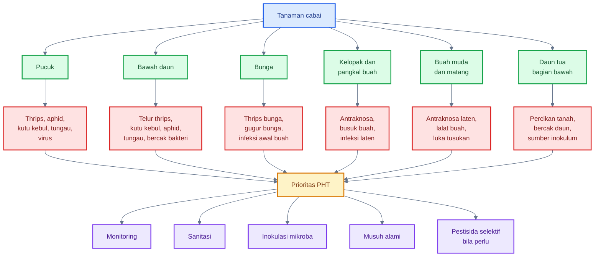

---

### 6.1 Pucuk

Pucuk adalah salah satu zona paling rawan pada cabai. Jaringan pucuk masih muda, lunak, aktif tumbuh, dan relatif kaya eksudat mikro. Kondisi ini membuat pucuk menarik bagi hama pengisap seperti thrips, kutu daun, kutu kebul, dan tungau. Pucuk juga menjadi zona penting dalam penularan virus karena banyak vektor memilih jaringan muda untuk makan.

#### OPT yang umum pada pucuk

Pucuk rawan terhadap:

- thrips;
- kutu daun;
- kutu kebul;
- tungau;
- virus;
- infeksi sekunder akibat luka tusukan.

Thrips dapat menyebabkan daun muda keriting, permukaan daun keperakan, pertumbuhan terhambat, dan kerusakan bunga. Aphid dan kutu kebul dapat menghasilkan honeydew, melemahkan tanaman, serta menjadi vektor virus. Tungau sering membuat daun muda mengeriting, kaku, atau berubah warna. Luka kecil dari hama pengisap juga dapat membuka jalan bagi infeksi sekunder.

#### Mengapa pucuk cocok untuk mikroba baik?

Pucuk adalah jaringan aktif. Di sana ada kelembapan mikro, eksudat terbatas, lipatan daun muda, dan permukaan baru yang belum sepenuhnya dikuasai mikroba patogen. Ini menjadikan pucuk sebagai target penting untuk **inokulasi mikroba preventif**.

Namun pucuk juga sensitif. Aplikasi terlalu pekat, terlalu asam, terlalu basa, atau terlalu keras dapat menyebabkan fitotoksik dan memperparah stres.

#### Strategi PHT pada pucuk

Strategi utama:

- semprot mikroba preventif sejak awal vegetatif;
- gunakan droplet halus;
- monitoring pucuk secara intensif;
- kendalikan vektor sejak awal;
- hindari nitrogen berlebih;
- jangan menyemprot bahan keras saat pucuk sedang stres;
- jaga keseimbangan air agar pucuk tidak terlalu lunak.

Mikroba yang relevan:

- _Bacillus_ untuk proteksi umum dan induksi ketahanan;
- _Pseudomonas_ atau PGPR sebagai bagian dari sistem akar-daun;
- _Beauveria bassiana_ atau _Lecanicillium_ bila targetnya hama pengisap;
- ragi atau mikroba phyllosphere tertentu bila tersedia formulasi yang sesuai.

---

### 6.2 Bawah daun

Bawah daun adalah zona yang sering diabaikan saat penyemprotan, padahal banyak OPT justru hidup di sana. Bagian bawah daun lebih teduh, lebih lembap, dan lebih terlindung dari UV langsung. Kondisi ini mendukung mikroba baik, tetapi juga mendukung hama dan patogen.

#### OPT yang umum pada bawah daun

Bawah daun rawan terhadap:

- telur thrips;
- kutu kebul;
- aphid;
- tungau;
- bercak bakteri;
- mikrohabitat lembap.

Kutu kebul dan aphid sering berkoloni di bawah daun. Tungau juga lebih mudah ditemukan di sana, terutama pada cuaca panas-kering. Bercak bakteri dan beberapa penyakit daun dapat berkembang bila bawah daun sering lembap dan sirkulasi udara buruk.

#### Mengapa bawah daun penting dalam phyllosphere?

Bawah daun memiliki beberapa keunggulan mikrohabitat:

- paparan UV lebih rendah;
- air tipis bertahan lebih lama;
- stomata lebih banyak pada banyak tanaman;
- droplet semprot dapat tertahan;
- mikroba lebih terlindung dari panas langsung.

Karena itu, bawah daun adalah lokasi strategis untuk kolonisasi mikroba baik. Tetapi bila tidak dikelola, ia juga menjadi tempat aman bagi hama.

#### Strategi PHT pada bawah daun

Strategi utama:

- arahkan semprotan ke bawah daun;
- gunakan nozzle halus dan tekanan sesuai;
- pasang sticky trap untuk monitoring vektor;
- gunakan entomopatogen saat kelembapan mendukung;
- hindari insektisida broad-spectrum berlebihan;
- cek bawah daun secara rutin dengan kaca pembesar bila perlu.

Mikroba yang relevan:

- _Beauveria bassiana_ untuk hama pengisap tertentu;
- _Lecanicillium_ untuk kutu kebul, aphid, dan thrips tertentu;
- _Bacillus_ untuk proteksi permukaan daun;
- ragi antagonis untuk membantu kompetisi mikroba permukaan.

---

### 6.3 Bunga

Bunga cabai adalah zona sensitif karena berhubungan langsung dengan pembentukan buah. Secara mikrobiologi, bunga berbeda dari daun biasa karena menyediakan pollen, nektar, jaringan lunak, dan celah mikro. Secara PHT, bunga penting karena sering menjadi tempat thrips bersembunyi dan makan.

#### Risiko utama pada bunga

Bunga rawan terhadap:

- thrips;
- gugur bunga;
- infeksi awal buah;
- kontaminasi pollen dan nektar.

Thrips pada bunga dapat menyebabkan kerusakan jaringan, menurunkan kualitas pembentukan buah, dan memperbesar risiko gugur bunga. Bila bunga menjadi terlalu lembap, mikroba oportunis dapat berkembang. Bila bunga rusak, buah muda yang terbentuk bisa lebih rentan terhadap infeksi.

#### Mengapa bunga menjadi hotspot mikroba?

Bunga menyediakan nutrisi yang lebih kompleks daripada permukaan daun biasa. Pollen mengandung protein, lipid, dan karbohidrat. Nektar mengandung gula. Jaringan bunga juga relatif lunak dan mudah rusak.

Ini menjadikan bunga sebagai habitat yang menarik bagi:

- mikroba baik;
- ragi;
- patogen oportunis;
- thrips;
- serangga kecil;
- mikroba pembusuk bila kelembapan tinggi.

#### Strategi PHT pada bunga

Strategi utama:

- lakukan pengamatan bunga secara rutin;
- cek thrips di dalam bunga;
- gunakan aplikasi mikroba ringan;
- hindari semprotan kasar;
- jangan membuat bunga basah terlalu lama;
- hindari campuran yang mengganggu penyerbukan atau menyebabkan fitotoksik;
- gunakan entomopatogen secara hati-hati bila targetnya thrips.

Mikroba yang relevan:

- _Beauveria bassiana_ atau _Lecanicillium_ untuk thrips, sesuai kondisi dan label;
- _Bacillus_ atau ragi antagonis untuk proteksi permukaan;
- mikroba induksi ketahanan bila tersedia dan sesuai rekomendasi.

---

### 6.4 Kelopak dan pangkal buah

Kelopak dan pangkal buah adalah salah satu zona paling kritis pada cabai. Area ini sering menahan air, debu, spora, pollen, dan residu organik. Kelopak juga terlindung dari cahaya langsung, sehingga kelembapan dapat bertahan lebih lama. Dalam konteks antraknosa, pangkal buah dan kelopak harus menjadi prioritas tinggi.

NC State Extension menjelaskan bahwa antraknosa cabai disebabkan oleh kompleks _Colletotrichum_, termasuk _C. truncatum_, _C. acutatum_, _C. gloeosporioides_, dan _C. scovillei_. Sumber inokulum dapat berasal dari transplant terinfeksi, debris tanaman, dan percikan air; semua bagian tanaman di atas tanah dapat terinfeksi, tetapi buah adalah bagian yang paling terdampak. ([NC State Extension][3])

#### Risiko utama pada kelopak dan pangkal buah

Kelopak dan pangkal buah rawan terhadap:

- antraknosa;
- busuk buah;
- infeksi laten;
- spora tertahan;
- residu air dan bahan organik;
- luka mikro akibat gesekan atau hama.

#### Mengapa kelopak sangat berisiko?

Kelopak memiliki bentuk yang menciptakan celah sempit antara jaringan kelopak dan permukaan buah. Celah ini bisa menahan:

- air tipis;
- spora jamur;
- debu;
- pollen;
- mikroba liar;
- residu semprotan;
- kotoran hama kecil.

Kondisi tersebut dapat menjadi titik awal infeksi, terutama saat kelembapan tinggi. Pada antraknosa, buah muda dapat terlihat sehat tetapi sudah mengalami infeksi laten. NC State Extension menyebut bahwa antraknosa dapat menyebabkan infeksi laten, sehingga buah muda yang terkontaminasi belum menunjukkan gejala sampai matang. ([NC State Extension][3])

#### Strategi PHT pada kelopak dan pangkal buah

Strategi utama:

- mulai proteksi sejak awal fruit set;
- arahkan semprotan mikroba ke kelopak dan pangkal buah;
- hindari kanopi terlalu rapat;
- buang buah sakit segera;
- kurangi percikan tanah;
- gunakan mulsa;
- hindari overhead irrigation;
- lakukan sanitasi buah busuk dan buah jatuh.

NC State Extension menekankan bahwa pengelolaan antraknosa memerlukan pendekatan terpadu, termasuk benih bebas patogen, rotasi, menghindari overhead irrigation, sanitasi, monitoring, mulsa, drainase baik, dan fungisida preventif bila diperlukan. Aplikasi fungisida untuk sistem konvensional direkomendasikan mulai pada fruit set pertama dan berlanjut saat buah matang. ([NC State Extension][3])

Mikroba yang relevan:

- _Bacillus_ untuk kompetisi dan antibiosis;
- _Paenibacillus_ untuk biokontrol antraknosa;
- ragi antagonis untuk kolonisasi permukaan buah;
- beberapa _Trichoderma_ foliar bila formulasi sesuai.

---

### 6.5 Buah muda dan buah matang

Buah cabai adalah bagian bernilai ekonomi utama. Dalam phyllosphere, buah memiliki permukaan mikrobiologis sendiri. Buah muda, buah membesar, dan buah matang memiliki kerentanan berbeda. Buah muda rawan infeksi laten, sedangkan buah matang lebih rawan gejala antraknosa, lalat buah, busuk sekunder, dan kerusakan pascapanen.

#### Risiko utama pada buah

Buah muda dan buah matang rawan terhadap:

- antraknosa laten;
- lalat buah;
- luka tusukan;
- busuk sekunder;
- luka panen;
- kontaminasi pascapanen.

NC State Extension menyebut bahwa _C. gloeosporioides_ lebih cenderung menginfeksi buah matang, sedangkan _C. acutatum_ lebih cenderung menginfeksi buah belum matang. Selain itu, _C. scovillei_ dikenal mampu menginfeksi buah cabai hijau belum matang dan memiliki siklus penyakit cepat pada kondisi mendukung. ([NC State Extension][3])

#### Buah muda sebagai zona infeksi laten

Buah muda sering terlihat sehat, tetapi tidak selalu bebas patogen. Infeksi laten berarti patogen sudah ada, tetapi gejala belum terlihat. Ini sangat berbahaya dalam agribisnis karena buah dapat tampak layak panen, lalu menunjukkan gejala saat mendekati panen atau pascapanen.

Karena itu, strategi PHT tidak boleh menunggu buah menunjukkan bercak besar. Perlindungan buah harus dimulai sejak buah kecil.

#### Lalat buah sebagai pembuka pintu busuk sekunder

Lalat buah menyerang dengan meletakkan telur pada buah. Luka tusukan oviposisi dapat menjadi pintu masuk mikroba pembusuk. Larva yang berkembang di dalam buah menyebabkan kerusakan internal, buah busuk, dan gugur. Setelah itu, buah rusak menjadi sumber mikroba dan menarik serangga lain.

Dalam konteks phyllosphere, lalat buah bukan mikroba, tetapi kerusakannya mengubah kondisi mikrobiologi buah secara drastis. Buah yang ditusuk menjadi kaya cairan sel, lebih mudah ditembus patogen, dan cepat menjadi reservoir busuk.

#### Strategi PHT pada buah

Strategi utama:

- mulai perlindungan sejak buah muda;
- targetkan kelopak dan permukaan buah;
- pasang perangkap lalat buah sesuai fase;
- lakukan sanitasi buah busuk;
- jangan biarkan buah jatuh di lahan;
- panen tepat waktu;
- hindari luka panen;
- pisahkan buah sakit dari buah sehat.

Mikroba yang relevan:

- _Bacillus_ dan _Paenibacillus_ untuk antraknosa;
- ragi antagonis untuk permukaan buah;
- cendawan entomopatogen untuk strategi tertentu terhadap lalat buah dewasa atau stadia tertentu;
- mikroba tanah atau nematoda entomopatogen untuk fase pupa di tanah, yang akan dibahas khusus pada bab lalat buah.

---

### 6.6 Daun tua bagian bawah

Daun tua bagian bawah sering menjadi sumber masalah karena posisinya dekat tanah, lebih mudah terkena percikan air, lebih lama lembap, dan sering memiliki sirkulasi udara buruk. Daun bawah juga dapat menjadi reservoir patogen bercak daun dan sumber inokulum untuk infeksi ke bagian atas tanaman.

#### Risiko utama pada daun bawah

Daun tua bagian bawah rawan terhadap:

- percikan tanah;
- bercak daun;
- sumber inokulum;
- sirkulasi udara buruk;
- kelembapan berlebih;
- kontak dengan mulsa atau tanah;
- akumulasi residu semprotan.

#### Mengapa daun bawah penting?

Daun bawah sering menjadi lokasi pertama munculnya bercak karena:

- dekat dengan tanah dan debris;
- terkena percikan air;
- kurang cahaya;
- kelembapan lebih lama;
- jaringan sudah menua;
- daya tahan fisiologis lebih rendah daripada daun muda sehat.

Pada penyakit antraknosa, NC State Extension menyebut percikan air sebagai salah satu jalur penyebaran spora dari tanah, debris tanaman, atau buah terinfeksi ke tanaman di sekitarnya. Ini memperkuat pentingnya pengelolaan daun bawah, mulsa, dan sanitasi. ([NC State Extension][3])

#### Strategi PHT pada daun bawah

Strategi utama:

- pangkas daun bawah yang menyentuh tanah;
- buang daun yang sangat sakit;
- jangan melakukan pruning saat daun basah;
- gunakan mulsa untuk mengurangi percikan tanah;
- perbaiki drainase;
- hindari kanopi terlalu rimbun;
- arahkan semprotan mikroba atau protektan secara merata;
- jangan biarkan daun sakit menjadi sumber inokulum.

Mikroba yang relevan:

- _Bacillus_ untuk proteksi permukaan daun;
- _Pseudomonas_ atau PGPR sebagai bagian dari sistem tanaman sehat;
- _Trichoderma_ lebih relevan pada tanah/media dan pangkal tanaman;
- ragi antagonis atau mikroba foliar tertentu bila targetnya permukaan daun.

---

### Tabel prioritas zona rawan OPT dan tindakan PHT

| Zona phyllosphere        | Risiko utama                             | Mengapa rawan                      | Tindakan PHT prioritas                                    |
| ------------------------ | ---------------------------------------- | ---------------------------------- | --------------------------------------------------------- |
| Pucuk                    | thrips, aphid, kutu kebul, tungau, virus | jaringan muda, lunak, kaya eksudat | monitoring intensif, mikroba preventif, kendali vektor    |
| Bawah daun               | telur thrips, kutu kebul, aphid, tungau  | teduh, lembap, terlindung UV       | semprot bawah daun, sticky trap, entomopatogen            |
| Bunga                    | thrips, gugur bunga, infeksi awal buah   | pollen, nektar, jaringan lunak     | pengamatan bunga, aplikasi halus, hindari semprotan kasar |
| Kelopak dan pangkal buah | antraknosa, busuk buah, infeksi laten    | menahan air, spora, debu           | proteksi sejak fruit set, mikroba antagonis, sanitasi     |
| Buah muda dan matang     | antraknosa, lalat buah, busuk sekunder   | nilai ekonomi tinggi, mudah luka   | perangkap lalat buah, proteksi buah, sortir dan sanitasi  |
| Daun tua bawah           | bercak daun, sumber inokulum             | dekat tanah, kena percikan, lembap | pruning selektif, mulsa, drainase, buang daun sakit       |

---

### Ringkasan praktis Bab 5 dan Bab 6

Mikroba di phyllosphere cabai membutuhkan karbon, nitrogen, mineral, air, dan tempat berlindung. Sumbernya berasal dari eksudat daun, gutasi, pollen, honeydew, luka mikro, debu, percikan air, dan jaringan rusak. Namun sumber nutrisi ini harus dipahami sebagai pedang bermata dua: ia dapat mendukung mikroba baik, tetapi juga dapat mendukung patogen.

Zona rawan OPT pada cabai meliputi pucuk, bawah daun, bunga, kelopak, buah muda, buah matang, dan daun tua bagian bawah. Zona-zona ini rawan karena menyediakan kelembapan mikro, eksudat, celah perlindungan, permukaan untuk melekat, dan sering menjadi titik aktivitas hama atau patogen.

Prinsip PHT yang perlu dipegang:

> Zona rawan OPT bukan hanya titik bahaya, tetapi juga titik strategis untuk kolonisasi mikroba baik.

Karena itu, pengelolaan phyllosphere cabai harus diarahkan pada tiga tindakan utama: **monitoring zona rawan, inokulasi mikroba secara preventif, dan sanitasi sumber inokulum**.

[1]: https://pmc.ncbi.nlm.nih.gov/articles/PMC30673/?utm_source=chatgpt.com 'Appetite of an epiphyte: Quantitative monitoring of bacterial ...'
[2]: https://pmc.ncbi.nlm.nih.gov/articles/PMC7123684/?utm_source=chatgpt.com 'Phyllospheric Microbiomes: Diversity, Ecological Significance ...'
[3]: https://content.ces.ncsu.edu/anthracnose-of-pepper 'Anthracnose of Pepper | NC State Extension Publications'

[**Kembali ke Atas**](#phyllosphere-cabai-sebagai-zona-strategis-pht-mengelola-mikroba-daun-untuk-menekan-opt-penyakit-dan-risiko-gagal-panen)

---

## 7. OPT dan penyakit penting pada cabai

Dalam PHT cabai berbasis phyllosphere, OPT dan penyakit tidak hanya dilihat sebagai “musuh yang harus dibasmi”, tetapi sebagai organisme yang memanfaatkan **zona lemah pada mikrohabitat tanaman**. Pucuk yang lunak, bawah daun yang lembap, bunga yang kaya pollen, kelopak yang menahan air, dan buah yang mudah luka adalah titik-titik strategis tempat hama, patogen, dan mikroba oportunis dapat berkembang.

Karena itu, Bab 7 ini perlu dibaca sebagai peta risiko. Tujuannya bukan hanya mengenali nama OPT, tetapi memahami **di mana mereka menyerang, mengapa zona itu rawan, dan bagaimana kaitannya dengan phyllosphere**.

### Diagram ringkas: hubungan OPT, zona serangan, dan risiko phyllosphere

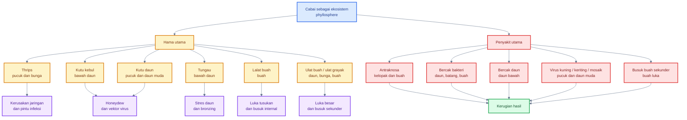

---

## 7.1 Hama utama

### A. Thrips

Thrips adalah salah satu hama paling penting pada cabai karena menyerang zona yang sangat menentukan produktivitas: **pucuk dan bunga**. Serangga ini berukuran kecil, bergerak cepat, dan sering tersembunyi di celah sempit, lipatan daun muda, bunga, dan titik tumbuh. Karena ukurannya kecil, populasi thrips sering terlambat diketahui sampai gejala keriting, perak, atau gugur bunga sudah terlihat.

Pada cabai, thrips menyebabkan kerusakan dengan mengisap isi sel jaringan muda. Gejala yang sering muncul adalah daun muda mengeriting, permukaan daun tampak keperakan, pucuk menjadi tidak normal, bunga rusak, dan fruit set menurun. Selain kerusakan langsung, thrips juga penting karena dapat menjadi vektor virus. UC IPM menekankan bahwa kerusakan utama thrips pada pepper adalah kemampuannya menularkan Tomato spotted wilt virus; virus diperoleh oleh thrips saat fase muda dan kemudian dapat ditularkan oleh thrips dewasa. ([UC IPM][1])

Dalam konteks phyllosphere, thrips berbahaya karena menciptakan **luka mikro** pada pucuk, bunga, dan buah muda. Luka ini mengeluarkan cairan sel yang kaya gula, asam amino, dan mineral. Akibatnya, area yang awalnya hanya rusak mekanis dapat berubah menjadi titik masuk patogen atau mikroba oportunis.

Zona risiko utama thrips:

| Zona       | Risiko                                |
| ---------- | ------------------------------------- |
| Pucuk      | daun keriting, titik tumbuh terganggu |
| Bunga      | gugur bunga, fruit set rendah         |
| Buah muda  | luka mikro dan deformasi              |
| Bawah daun | telur dan nimfa tersembunyi           |

Strategi PHT awal untuk thrips adalah monitoring pucuk dan bunga, penggunaan perangkap likat biru atau putih, menjaga musuh alami, dan menghindari aplikasi insektisida broad-spectrum yang merusak keseimbangan. SOP cabai rawit Hiyung dari Ditjen Hortikultura mencantumkan perangkap likat biru atau putih sebanyak 40 buah per ha atau 2 buah per 500 meter persegi, dipasang sejak tanaman berumur 2 minggu, serta penggunaan pestisida hanya bila populasi atau kerusakan mencapai ambang pengendalian.

---

### B. Kutu kebul

Kutu kebul, terutama _Bemisia tabaci_, menyerang bagian bawah daun dan menjadi salah satu vektor penting virus kuning atau geminivirus pada cabai. Hama ini mengisap cairan tanaman dan menghasilkan honeydew, yaitu cairan manis yang menempel pada daun. Honeydew kemudian menjadi substrat bagi jamur jelaga, menurunkan kemampuan fotosintesis, dan membuat tanaman tampak kotor serta lemah.

UC IPM menjelaskan bahwa whitefly pada pepper merusak tanaman dengan mengisap banyak sap dan menutupi tanaman dengan honeydew; jamur jelaga hitam kemudian tumbuh di atas honeydew dan menurunkan kapasitas fotosintesis serta membuat buah tidak menarik. Populasi tinggi dapat menyebabkan tanaman kerdil, pertumbuhan buruk, defoliasi, dan penurunan hasil. ([UC IPM][2])

Dalam konteks phyllosphere, kutu kebul sangat penting karena ia mengubah permukaan daun menjadi lebih kaya gula. Permukaan daun yang tertutup honeydew menjadi habitat nyaman bagi ragi liar, jamur oportunis, dan mikroba pembusuk. Jadi kerusakan kutu kebul bukan hanya mekanis atau virus, tetapi juga **menggeser mikrobiologi permukaan daun**.

Zona risiko utama kutu kebul:

| Zona              | Risiko                             |
| ----------------- | ---------------------------------- |
| Bawah daun        | koloni nimfa dan dewasa            |
| Pucuk             | vektor virus pada jaringan muda    |
| Kanopi dalam      | kelembapan dan perlindungan        |
| Daun yang lengket | jamur jelaga dan mikroba oportunis |

SOP cabai rawit Hiyung merekomendasikan tanaman penghalang seperti jagung, orok-orok, dan kacang panjang untuk mengurangi masuknya kutu kebul, pergiliran tanaman bukan inang virus terutama bukan Solanaceae dan Cucurbitaceae, tumpangsari dengan caisin dan tagetes, perangkap lekat kuning 40 buah per ha, kelambu di pembibitan, eradikasi sisa tanaman terserang, pemanfaatan musuh alami, dan pestisida efektif yang terdaftar bila diperlukan.

---

### C. Kutu daun

Kutu daun atau aphid menyerang pucuk, daun muda, dan bagian bawah daun. Pada cabai, kutu daun penting karena dapat mengisap cairan tanaman, menghasilkan honeydew, memicu pertumbuhan jamur jelaga, dan menjadi vektor beberapa virus. Populasinya dapat naik cepat ketika tanaman memiliki pucuk lunak, nitrogen tinggi, dan musuh alami terganggu.

UC IPM menyebut green peach aphid sebagai vektor sejumlah virus destruktif pada pepper, termasuk pepper potyviruses dan cucumber mosaic virus. Aphid juga merusak tanaman dengan mengisap sap; populasi tinggi sering ditemukan di bawah daun, menyebabkan daun menguning dan menggulung, serta menghasilkan honeydew yang menjadi masalah pada pepper pasar segar. ([UC IPM][3])

Pada phyllosphere, dampak kutu daun mirip dengan kutu kebul: mereka membuat permukaan tanaman menjadi lebih kaya gula melalui honeydew. Akibatnya, bagian pucuk dan bawah daun menjadi lebih nyaman bagi mikroba oportunis. Kutu daun juga memperbanyak titik luka mikro di daun muda.

Zona risiko utama kutu daun:

| Zona              | Risiko                                    |
| ----------------- | ----------------------------------------- |
| Pucuk             | daun muda keriting dan pertumbuhan kerdil |
| Bawah daun        | koloni berkembang cepat                   |
| Daun muda         | vektor virus dan honeydew                 |
| Tanaman perangkap | dapat menjadi titik pengendalian selektif |

SOP cabai rawit Hiyung menyebut kutu daun persik hidup berkelompok di bawah permukaan daun, menyerang daun muda dan pucuk, serta menghasilkan cairan madu yang mendorong cendawan jelaga. Rekomendasi pengendaliannya mencakup tumpangsari cabai dengan bawang daun, tanaman perangkap seperti caisin, kelambu pada persemaian, perangkap air kuning 40 buah per ha atau 2 buah per 500 meter persegi, dan pemanfaatan musuh alami.

---

### D. Tungau

Tungau sering menjadi masalah serius pada cabai, terutama pada kondisi panas, kering, berdebu, atau ketika musuh alami terganggu oleh insektisida broad-spectrum. Tungau biasanya menyerang bagian bawah daun. Gejala yang tampak dapat berupa daun menguning, bronzing, permukaan daun tampak kering, daun mengeriting, dan pada serangan berat tanaman menjadi lemah.

UC IPM menjelaskan bahwa spider mite merusak tanaman dengan mengisap isi sel daun; kerusakan sering tampak sebagai titik-titik terang pada daun, kemudian daun dapat berubah menjadi bronzing, menguning, dan gugur. Kerusakan biasanya lebih berat pada kondisi panas, berdebu, dan tanaman stres air. ([UC IPM][4])

Salah satu kesalahan umum dalam pengendalian cabai adalah menggunakan insektisida broad-spectrum berulang untuk hama lain, lalu populasi tungau justru meledak. UC IPM juga menekankan bahwa perlakuan insektisida broad-spectrum untuk hama lain sering menyebabkan outbreak tungau, sehingga sebaiknya dihindari bila memungkinkan. ([UC IPM][5])

Zona risiko utama tungau:

| Zona              | Risiko                 |
| ----------------- | ---------------------- |
| Bawah daun        | koloni utama dan telur |
| Pucuk             | daun muda abnormal     |
| Kanopi berdebu    | outbreak lebih cepat   |
| Tanaman stres air | kerusakan lebih berat  |

SOP cabai rawit Hiyung menyebut tungau kuning menyebabkan daun menebal, berubah warna menjadi tembaga atau kecoklatan, menyusut, keriting, serta membuat tunas dan bunga gugur. Rekomendasi pengendaliannya mencakup sanitasi bagian tanaman terserang, pengairan cukup, predator _Amblyseius cucumeris_, dan cendawan _Beauveria bassiana_.

---

### E. Lalat buah

Lalat buah menyerang bagian bernilai ekonomi utama, yaitu buah. Betina meletakkan telur ke dalam buah melalui tusukan oviposisi. Setelah telur menetas, larva berkembang di dalam buah, memakan jaringan, menyebabkan busuk internal, dan akhirnya buah gugur atau tidak layak jual.

Dalam phyllosphere cabai, lalat buah penting karena luka tusukan menjadi titik masuk mikroba pembusuk. Buah yang ditusuk akan mengeluarkan cairan sel, mengalami pelunakan lokal, dan mudah terinfeksi mikroba sekunder. Jadi, lalat buah tidak hanya menyebabkan kerusakan oleh larva, tetapi juga membuka jalan bagi busuk buah.

Zona risiko utama lalat buah:

| Zona                  | Risiko                      |
| --------------------- | --------------------------- |
| Buah muda             | tusukan oviposisi awal      |
| Buah menjelang matang | larva dan busuk internal    |
| Buah jatuh            | reservoir larva dan mikroba |
| Tanah bawah tajuk     | pupa dan siklus berikutnya  |

SOP cabai rawit Hiyung menjelaskan bahwa buah terserang lalat buah ditandai titik hitam di pangkal buah sebagai tempat peletakan telur; bila buah dibelah terdapat larva di dalamnya, dan larva membuat saluran dengan memakan daging buah serta menyebabkan infeksi oleh OPT lain sehingga buah busuk dan gugur. Pengendalian yang disarankan mencakup pengolahan tanah untuk mematikan kepompong, pengumpulan dan pemusnahan buah terserang, penggunaan perangkap atraktan, serta pemanfaatan parasitoid larva dan pupa.

---

### F. Ulat buah dan ulat grayak

Ulat buah dan ulat grayak menyerang daun, bunga, dan buah. Pada daun, ulat dapat menyebabkan kehilangan area fotosintesis. Pada bunga, serangan dapat mengganggu pembentukan buah. Pada buah, luka gigitan menjadi pintu masuk busuk sekunder.

Dalam konteks phyllosphere, ulat adalah pembuat luka besar. Luka ini berbeda dari luka mikro akibat thrips atau aphid. Luka gigitan ulat membuka jaringan lebih luas, mengeluarkan cairan sel lebih banyak, dan menjadi lokasi ideal bagi bakteri pembusuk, jamur oportunis, serta patogen sekunder.

Zona risiko utama ulat:

| Zona         | Risiko                          |
| ------------ | ------------------------------- |
| Daun         | kehilangan area fotosintesis    |
| Bunga        | gugur bunga dan fruit set turun |
| Buah         | luka besar dan busuk sekunder   |
| Kanopi dalam | larva tersembunyi               |

SOP cabai rawit Hiyung merekomendasikan sanitasi lahan, pembersihan gulma dan sisa tanaman, pengolahan lahan dan drainase baik, eradikasi selektif kelompok telur, serta pemusnahan telur, larva, pupa, dan bagian tanaman terserang.

---

## 7.2 Penyakit utama

### A. Antraknosa

Antraknosa adalah salah satu penyakit paling merugikan pada cabai, terutama pada fase buah. Penyakit ini disebabkan oleh kompleks _Colletotrichum_ spp. dan dapat menyerang buah muda maupun buah matang. Gejala umum berupa bercak cekung, busuk lunak, warna gelap, dan massa spora berwarna jingga atau salmon pada kondisi lembap.

NC State Extension menjelaskan bahwa antraknosa pada pepper disebabkan oleh beberapa spesies _Colletotrichum_, dan buah merupakan bagian tanaman yang paling terdampak. Sumber inokulum dapat berasal dari transplant terinfeksi, sisa tanaman, biji dari buah sakit, dan percikan air dari tanah atau buah terinfeksi. ([NC State Extension][6])

Hal yang sangat penting bagi praktisi adalah konsep **infeksi laten**. Buah muda yang tampak sehat dapat terinfeksi, tetapi gejalanya baru muncul saat buah matang. NC State Extension menyebut bahwa buah muda yang terkontaminasi bisa tidak menunjukkan gejala sampai buah matang penuh. ([NC State Extension][6])

Zona kritis antraknosa:

| Zona         | Alasan rawan                   |
| ------------ | ------------------------------ |
| Kelopak      | menahan air, spora, dan debris |
| Pangkal buah | celah sempit dan lembap        |
| Buah muda    | risiko infeksi laten           |
| Buah matang  | gejala berkembang cepat        |
| Buah jatuh   | sumber inokulum                |

SOP cabai rawit Hiyung menyebut busuk buah antraknosa pada cabai rawit disebabkan oleh _Colletotrichum capsici_, _C. gloeosporioides_, dan _Gloeosporium piperatum_; kondisi panas dan lembap dapat mempercepat perkembangan penyakit. Rekomendasi pengendalian mencakup benih sehat, mikroba antagonis seperti _Pseudomonas fluorescens_, pemanfaatan _Trichoderma_ dan _Gliocladium_, sanitasi gulma dan buah sakit, rotasi bukan Solanaceae, perbaikan drainase, serta fungisida protektif bila diperlukan.

---

### B. Bacterial spot atau bercak bakteri

Bacterial spot pada cabai disebabkan oleh bakteri _Xanthomonas_ spp. Penyakit ini menyerang bagian atas tanaman seperti daun, batang, petiol, kelopak, dan buah. Gejala pada daun biasanya berupa bercak kecil basah atau nekrotik yang dapat berkembang dan menyebabkan daun gugur. Pada buah, bercak membuat buah tidak layak pasar.

University of Minnesota Extension menjelaskan bahwa bacterial spot dapat sangat merusak ketika cuaca hangat dan lembap. Penyakit ini disebabkan oleh beberapa spesies _Xanthomonas_ dan dapat menyerang semua bagian atas tanaman tomat dan pepper, termasuk batang, petiol, daun, dan buah. ([University of Minnesota Extension][7])

Penyebaran bacterial spot sangat terkait dengan air. Percikan hujan, irigasi atas, pekerjaan saat daun basah, benih, bibit, dan alat dapat membantu penyebaran bakteri. Karena itu, penyakit ini harus dikelola dengan prinsip pencegahan, bukan menunggu tanaman parah.

Zona kritis bacterial spot:

| Zona          | Alasan rawan                     |
| ------------- | -------------------------------- |
| Daun muda     | jaringan aktif dan rentan        |
| Bawah daun    | kelembapan mikro                 |
| Batang/petiol | percikan air dan luka            |
| Kelopak       | menahan air                      |
| Buah          | bercak menurunkan kualitas pasar |

Prinsip pengendalian bacterial spot adalah benih dan bibit sehat, sanitasi, mengurangi percikan air, menghindari pekerjaan saat daun basah, memperbaiki sirkulasi udara, dan penggunaan produk terdaftar bila diperlukan. Karena penyebabnya bakteri, aplikasi fungisida biasa tidak otomatis efektif kecuali produk tersebut memang direkomendasikan untuk target bakteri dan terdaftar.

---

### C. Bercak daun oleh _Cercospora_ dan _Alternaria_

Bercak daun sering muncul pada daun tua bagian bawah dan berkembang pada kondisi kanopi lembap, sirkulasi udara buruk, serta banyak sumber inokulum dari sisa tanaman. Walau sering dianggap tidak separah antraknosa, bercak daun dapat menurunkan fotosintesis, mempercepat gugur daun, dan melemahkan tanaman sehingga lebih rentan terhadap OPT lain.

Pada cabai, _Cercospora_ biasanya menyebabkan bercak kecil bulat atau agak melingkar, sering dengan pusat yang lebih pucat. _Alternaria_ dapat menimbulkan bercak nekrotik yang kadang memiliki pola konsentris. Keduanya perlu dibedakan dari bercak bakteri, fitotoksik pestisida, defisiensi hara, dan kerusakan tungau.

Zona kritis bercak daun:

| Zona                      | Alasan rawan                 |
| ------------------------- | ---------------------------- |
| Daun tua bawah            | dekat tanah dan percikan air |
| Kanopi dalam              | lembap dan kurang cahaya     |
| Daun sakit yang dibiarkan | sumber inokulum              |
| Sisa tanaman              | reservoir patogen            |

SOP cabai rawit Hiyung menyebut penyakit bercak daun cenderung lebih banyak menyerang tanaman tua; daun terinfeksi dapat menguning dan gugur, dengan bercak kecil berbentuk bulat dan kering. Pengendalian yang disarankan mencakup sanitasi daun atau sisa tanaman terinfeksi, benih bebas patogen, lahan tidak terkontaminasi, waktu tanam tepat, irigasi baik, dan fungisida terdaftar bila pengendalian lain tidak mampu menekan serangan.

---

### D. Virus kuning, keriting, dan mosaik

Virus pada cabai sangat penting karena tidak dapat dikendalikan langsung dengan fungisida. Bila tanaman sudah terinfeksi virus sistemik, tindakan utama biasanya adalah mencegah penyebaran lebih lanjut. Karena itu, kunci pengendalian virus adalah **mencegah dan menekan vektor** sejak awal.

Virus penting pada cabai dapat meliputi kelompok geminivirus penyebab kuning/keriting, CMV, TMV, ToMV, CVMV, dan virus lain tergantung wilayah. Gejala dapat berupa daun menguning, mosaik, keriting, tulang daun menebal, pertumbuhan kerdil, daun kecil, dan produksi buah rendah.

SOP cabai rawit Hiyung menyebut penyakit mosaik pada cabai rawit dapat disebabkan oleh satu jenis atau gabungan beberapa virus, antara lain TMV, CVMV, CMV, geminivirus atau TYLCV, CVSV, dan ToMV. Untuk virus kuning, gejala awal dapat dimulai dari pucuk dengan vein clearing, lalu daun menjadi kuning jelas, tulang daun menebal, daun menggulung ke atas, tanaman kerdil, dan tidak berbuah pada infeksi lanjut.

Zona kritis virus:

| Zona               | Alasan rawan                  |
| ------------------ | ----------------------------- |
| Pucuk              | vektor menyukai jaringan muda |
| Daun muda          | gejala awal sering terlihat   |
| Persemaian         | infeksi awal sangat merugikan |
| Tanaman sakit awal | sumber inokulum               |
| Gulma inang        | reservoir virus dan vektor    |

Strategi paling penting adalah screen nursery, benih/bibit sehat, eradikasi tanaman sakit awal, pengendalian kutu kebul/thrips/aphid, perangkap likat, mulsa reflektif bila sesuai, sanitasi gulma inang, dan rotasi tanaman. SOP cabai rawit Hiyung juga mencantumkan penggunaan mulsa plastik perak atau jerami untuk mengurangi infestasi aphid vektor, perangkap likat kuning 40 lembar per ha, eradikasi tanaman inang terung-terungan, dan pemusnahan tanaman sakit.

---

### E. Busuk buah sekunder

Busuk buah sekunder bukan selalu penyakit primer. Sering kali ia muncul setelah ada luka akibat lalat buah, thrips, gesekan buah, panen kasar, retak, antraknosa, atau luka mekanis lain. Setelah jaringan buah terbuka, mikroba pembusuk masuk dan berkembang cepat, terutama bila kelembapan tinggi dan buah tidak segera disortir.

Zona kritis busuk buah sekunder:

| Penyebab awal      | Dampak lanjutan                    |
| ------------------ | ---------------------------------- |
| Tusukan lalat buah | busuk internal dan larva           |
| Luka thrips        | bercak kecil dan infeksi oportunis |
| Gigitan ulat       | luka besar dan busuk               |
| Panen kasar        | luka pascapanen                    |
| Antraknosa         | busuk meluas                       |
| Buah jatuh         | reservoir patogen                  |

Dalam PHT, busuk buah sekunder harus dicegah dengan menjaga buah tetap utuh, mengendalikan hama peluka, menekan antraknosa, melakukan panen hati-hati, dan memusnahkan buah busuk. Buah sakit yang dibiarkan di tanaman atau lahan akan menjadi sumber inokulum baru.

---

### Formula monitoring sederhana untuk Bab 7

Untuk membuat keputusan PHT lebih objektif, praktisi dapat mencatat insidensi serangan secara sederhana:

$$
\text{Insidensi OPT atau penyakit} = \frac{\text{jumlah tanaman atau buah terserang}}{\text{jumlah tanaman atau buah diamati}} \times 100%
$$

Untuk penyakit yang perlu diskoring, intensitas penyakit dapat dihitung dengan:

$$
\text{Intensitas penyakit} = \frac{\sum(n_i \times v_i)}{N \times V} \times 100%
$$

Keterangan: $n_i$ adalah jumlah sampel pada skor ke-$i$, $v_i$ adalah nilai skor ke-$i$, $N$ adalah total sampel yang diamati, dan $V$ adalah skor tertinggi. Formula ini berguna untuk membandingkan perkembangan penyakit antarpetak, antarwaktu, atau sebelum dan sesudah tindakan PHT.

[**Kembali ke Atas**](#phyllosphere-cabai-sebagai-zona-strategis-pht-mengelola-mikroba-daun-untuk-menekan-opt-penyakit-dan-risiko-gagal-panen)

---

## 8. Upaya IPM/PHT untuk mengantisipasi OPT cabai

PHT atau IPM bukan sekadar mengganti pestisida kimia dengan pestisida nabati atau agens hayati. PHT adalah sistem pengambilan keputusan berbasis ekologi, monitoring, pencegahan, dan intervensi bertahap. FAO menjelaskan IPM sebagai proses dinamis yang menggunakan pendekatan sistem ekologi, mempertimbangkan pilihan pengendalian terbaik secara ekonomi, lingkungan, dan sosial, serta mendorong pertumbuhan tanaman sehat dengan gangguan seminimal mungkin terhadap agroekosistem. ([FAOHome][8])

Dalam konteks cabai dan phyllosphere, PHT berarti mengelola tanaman agar zona rawan seperti pucuk, bawah daun, bunga, kelopak, dan buah muda tidak dikuasai hama atau patogen. Mikroba baik masuk sebagai salah satu komponen, tetapi harus didukung oleh bibit sehat, sanitasi, drainase, monitoring, musuh alami, perangkap, dan pestisida selektif bila diperlukan.

### Diagram alur keputusan PHT cabai

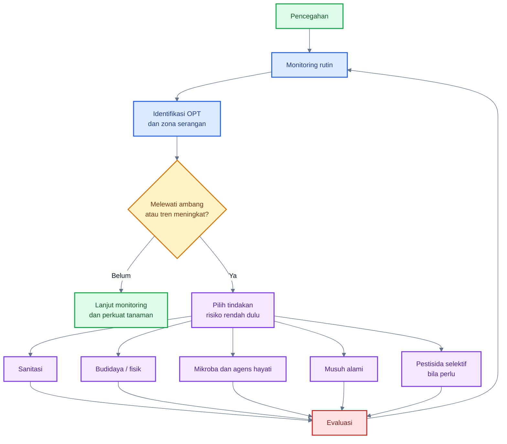

---

## 8.1 Prinsip besar IPM

Urutan kerja PHT cabai sebaiknya mengikuti tujuh langkah besar.

### 1. Pencegahan

Pencegahan dimulai sebelum benih disemai. Tujuannya adalah menurunkan peluang OPT masuk ke sistem. Pada cabai, pencegahan meliputi benih sehat, media semai bersih, screen nursery, sanitasi alat, drainase baik, mulsa, rotasi, dan pengelolaan gulma inang.

### 2. Monitoring

Monitoring adalah jantung PHT. Tanpa monitoring, aplikasi pestisida atau mikroba hanya menjadi rutinitas buta. Monitoring harus diarahkan ke zona rawan: pucuk, bawah daun, bunga, kelopak, buah muda, dan daun bawah.

SOP cabai rawit Hiyung menyatakan bahwa pengendalian OPT dilakukan berdasarkan pengamatan berkala untuk mengetahui jenis OPT, luas dan intensitas serangan, serta perkiraan OPT yang perlu diwaspadai; tindakan pengendalian dilakukan apabila mencapai ambang kendali. Dokumen yang sama juga menegaskan bahwa dalam konsep PHT, pestisida merupakan alternatif terakhir jika pengendalian non-kimia kurang efektif.

### 3. Identifikasi akurat

Gejala cabai sering mirip. Daun keriting bisa disebabkan thrips, tungau, aphid, virus, fitotoksik pestisida, kekurangan hara, atau stres air. Bercak daun bisa disebabkan bakteri, fungi, fitotoksik, atau luka fisik. Karena itu, diagnosis harus dilakukan sebelum tindakan.

### 4. Ambang tindakan

Ambang tindakan tidak selalu berarti angka kaku yang sama untuk semua lahan. Dalam praktik cabai, ambang perlu mempertimbangkan fase tanaman, cuaca, harga panen, risiko virus, riwayat lahan, dan tren populasi. Pada fase persemaian dan awal vegetatif, toleransi terhadap vektor virus harus lebih rendah karena infeksi awal bisa merusak seluruh produktivitas.

### 5. Pengendalian budaya, fisik, dan biologis

Langkah risiko rendah harus didahulukan: sanitasi, pemangkasan daun sakit, perangkap, barrier, mulsa, drainase, mikroba baik, dan musuh alami. Pendekatan ini menjaga agar agroekosistem tidak rusak.

### 6. Pestisida selektif bila perlu

Pestisida tetap dapat digunakan dalam PHT, tetapi harus selektif, berbasis monitoring, tepat sasaran, mengikuti label, dan mempertimbangkan dampaknya terhadap mikroba baik serta musuh alami.

### 7. Evaluasi

Setelah tindakan, lakukan evaluasi. Apakah populasi turun? Apakah gejala baru berhenti? Apakah buah sehat meningkat? Apakah musuh alami masih ada? Tanpa evaluasi, praktisi tidak tahu apakah programnya berhasil atau hanya menambah biaya.

---

## 8.2 Pra-tanam

Fase pra-tanam menentukan kekuatan sistem PHT. Kesalahan pada fase ini sering sulit diperbaiki di lapang. Tujuan fase pra-tanam adalah menghasilkan bibit sehat, menekan sumber inokulum awal, dan menciptakan lahan yang tidak terlalu nyaman bagi OPT.

### Komponen pra-tanam

#### Benih sehat

Benih harus berasal dari sumber terpercaya, tidak berasal dari tanaman sakit, dan bila perlu diberi perlakuan sesuai rekomendasi. Benih yang membawa patogen dapat menjadi sumber masalah sejak persemaian.

#### Media semai bersih

Media semai harus matang, bebas patogen, tidak terlalu basah, dan tidak tercemar sisa tanaman sakit. Media yang buruk dapat menyebabkan bibit lemah, akar rusak, dan tanaman lebih rentan saat pindah tanam.

#### Screen nursery

Persemaian sebaiknya dilindungi dengan screen atau kelambu untuk mencegah masuknya kutu kebul, aphid, dan thrips. Infeksi virus sejak persemaian adalah salah satu risiko paling serius pada cabai.

#### Sanitasi tray dan alat

Tray, meja semai, gunting, sprayer, dan alat lain perlu dibersihkan. Bacterial spot, virus mekanis tertentu, dan patogen lain dapat berpindah melalui alat atau kontak manusia.

#### Perlakuan PGPR

PGPR dapat digunakan untuk mendukung vigor bibit dan membantu ketahanan awal. SOP cabai rawit Hiyung mencantumkan perendaman benih dalam larutan PGPR untuk pengelolaan virus kuning, dilanjutkan aplikasi pada fase sebelum pindah tanam dan setelah tanam sesuai dosis dokumen tersebut.

#### _Trichoderma_ pada media

_Trichoderma_ lebih kuat sebagai agens tanah dan media tanam. Ia dapat digunakan untuk menekan patogen tanah, memperbaiki zona akar, dan mendukung tanaman lebih sehat sebelum masuk fase phyllosphere yang berat.

#### Barrier tanaman

Barrier seperti jagung atau tanaman penghalang lain dapat membantu mengurangi masuknya vektor dari luar lahan. SOP cabai rawit Hiyung merekomendasikan tanaman penghalang seperti jagung, orok-orok, dan kacang panjang untuk mengurangi masuknya kutu kebul dan memperbanyak musuh alami.

#### Mulsa

Mulsa membantu mengurangi percikan tanah, menekan gulma, menjaga kelembapan tanah, dan pada jenis reflektif dapat mengganggu orientasi beberapa serangga vektor. Dokumen Ditjen Hortikultura juga menyebut mulsa plastik perak di dataran tinggi dan jerami di dataran rendah dapat mengurangi infestasi vektor dan percikan air hujan dari tanah yang dapat menyebabkan infeksi patogen.

#### Drainase

Drainase buruk meningkatkan kelembapan, percikan, busuk pangkal, dan penyakit tanah. Guludan dan parit harus disiapkan sebelum tanam, terutama pada musim hujan.

---

## 8.3 Fase vegetatif

Fase vegetatif adalah fase pembentukan kanopi, pucuk, dan sistem phyllosphere awal. Banyak masalah virus dan hama pengisap dimulai pada fase ini.

### Fokus utama fase vegetatif

- monitoring pucuk dan bawah daun;
- semprot mikroba phyllosphere secara preventif;
- kelola nitrogen;
- pasang sticky trap;
- bersihkan gulma inang;
- konservasi musuh alami.

#### Monitoring pucuk dan bawah daun

Pucuk dan bawah daun harus diperiksa minimal 1–2 kali per minggu, lebih sering saat cuaca mendukung hama atau lahan memiliki riwayat virus. Cek thrips, aphid, kutu kebul, tungau, gejala keriting, bercak awal, dan keberadaan musuh alami.

#### Semprot mikroba phyllosphere

Fase vegetatif adalah waktu yang baik untuk mulai membangun kolonisasi mikroba baik pada pucuk dan bawah daun. Aplikasi sebaiknya preventif, pagi atau sore, dengan droplet halus, tidak dicampur pestisida keras, dan diarahkan ke zona rawan.

#### Kelola nitrogen

Nitrogen berlebihan membuat pucuk terlalu lunak, kanopi terlalu rimbun, dan hama pengisap lebih mudah berkembang. Ditjen Hortikultura menekankan pemupukan berimbang dan menghindari pupuk nitrogen dosis tinggi dalam strategi pengendalian OPT cabai.

#### Sticky trap

Perangkap likat kuning dan biru membantu deteksi dini. Kuning umum untuk kutu kebul, aphid, dan beberapa serangga kecil; biru sering dipakai untuk thrips. Jumlah dan warna perlu mengikuti rekomendasi lokal dan tujuan monitoring.

#### Bersihkan gulma inang

Gulma dapat menjadi reservoir aphid, kutu kebul, thrips, virus, dan patogen. Sanitasi gulma penting, tetapi jangan dilakukan secara ekstrem tanpa mempertimbangkan refugia yang sengaja ditanam dan dikelola.

#### Konservasi musuh alami

Hindari insektisida broad-spectrum yang mematikan predator dan parasitoid. Bila musuh alami hilang, hama seperti aphid, kutu kebul, dan tungau dapat melonjak lebih cepat.

---

## 8.4 Fase berbunga

Fase berbunga adalah fase kritis karena kerusakan pada bunga langsung memengaruhi fruit set dan hasil. Thrips menjadi target utama pada fase ini, tetapi aplikasi semprot harus lebih hati-hati agar tidak merusak bunga.

### Fokus utama fase berbunga

- thrips bunga;
- gugur bunga;
- aplikasi mikroba ringan;
- hindari semprotan kasar;
- jaga musuh alami.

#### Thrips bunga

Thrips sering bersembunyi di dalam bunga. Pemeriksaan daun saja tidak cukup. Bunga perlu diketuk perlahan di atas kertas putih atau diperiksa langsung dengan kaca pembesar.

#### Gugur bunga

Gugur bunga dapat disebabkan thrips, stres air, suhu ekstrem, nutrisi tidak seimbang, fitotoksik, atau penyakit. Jangan langsung menyimpulkan satu penyebab tanpa melihat pola lapang.

#### Aplikasi mikroba ringan

Aplikasi mikroba pada fase bunga sebaiknya halus dan tidak meninggalkan residu organik berlebihan. Targetnya adalah pucuk, bunga, bawah daun, dan awal kelopak. Jangan menyemprot terlalu deras sampai bunga basah lama.

#### Hindari semprotan kasar

Semprotan kasar dapat merusak bunga, mempercepat gugur, dan membuat kelembapan berlebih. Gunakan nozzle halus dan tekanan sesuai.

#### Jaga musuh alami

Fase berbunga juga menarik serangga bermanfaat. Gunakan pestisida selektif bila benar-benar diperlukan dan hindari aplikasi saat aktivitas musuh alami tinggi bila memungkinkan.

---

## 8.5 Fase buah muda

Fase buah muda adalah titik kunci untuk mencegah antraknosa laten, busuk buah, dan lalat buah. Pada fase ini, kelopak dan pangkal buah harus menjadi target utama monitoring serta proteksi.

### Fokus utama fase buah muda

- kelopak sebagai zona kunci;
- proteksi antraknosa;
- monitoring lalat buah;
- methyl eugenol atau mass trapping;
- sanitasi buah sakit.

#### Kelopak sebagai zona kunci

Kelopak menahan air, debu, spora, pollen, dan residu. Area ini harus mendapat perhatian saat semprot mikroba atau protektan.

#### Proteksi antraknosa

Perlindungan antraknosa harus dimulai sebelum gejala berat. NC State Extension menyebut bahwa pengelolaan antraknosa pada pepper mencakup praktik terpadu seperti benih sehat, rotasi, menghindari irigasi atas, sanitasi, monitoring, mulsa, drainase baik, dan aplikasi fungisida preventif bila diperlukan, mulai dari fruit set pertama pada sistem konvensional. ([NC State Extension][6])

#### Monitoring lalat buah

Perangkap atraktan dan pemeriksaan buah perlu dilakukan sejak buah mulai rentan. Jangan menunggu buah banyak busuk.

#### Methyl eugenol dan mass trapping

Methyl eugenol dapat digunakan untuk perangkap jantan lalat buah tertentu. Strategi ini lebih efektif bila diterapkan secara konsisten dan dikombinasikan dengan sanitasi buah sakit.

#### Sanitasi buah sakit

Buah sakit harus dikumpulkan dan dimusnahkan. Buah busuk yang dibiarkan di lahan menjadi sumber larva, pupa, dan mikroba pembusuk.

---

## 8.6 Fase panen

Fase panen sering dianggap hanya urusan hasil, padahal ini juga fase penting PHT. Panen yang kasar dapat menciptakan luka, mempercepat busuk, dan meningkatkan kerugian pascapanen.

### Fokus utama fase panen

- buang buah busuk;
- jangan tinggalkan buah jatuh;
- panen hati-hati agar tidak melukai buah;
- pisahkan buah sakit;
- patuhi interval panen dan PHI pestisida.

#### Buang buah busuk

Buah busuk harus diambil dari tanaman dan lahan. Jangan membiarkannya menggantung atau jatuh karena menjadi reservoir inokulum.

#### Jangan tinggalkan buah jatuh

Buah jatuh dapat menjadi tempat larva lalat buah menyelesaikan siklus hidup dan menjadi sumber mikroba busuk.

#### Panen hati-hati

Hindari mematahkan cabang, merusak kelopak, atau melukai buah. Luka panen mempercepat busuk sekunder.

#### Pisahkan buah sakit

Buah sakit jangan dicampur dengan buah sehat. Kontaminasi pascapanen dapat menyebar cepat, terutama bila buah dikemas dalam kondisi lembap.

#### Patuhi PHI

PHI atau pre-harvest interval wajib dipatuhi bila menggunakan pestisida. Ini penting untuk keamanan pangan, residu, dan akses pasar.

---

## 8.7 Pascapanen dan akhir musim

Akhir musim adalah fase memutus siklus OPT. Banyak kegagalan PHT terjadi karena sisa tanaman sakit dibiarkan menjadi sumber inokulum untuk musim berikutnya.

### Fokus utama pascapanen dan akhir musim

- cabut tanaman sakit;
- musnahkan sisa tanaman;
- rotasi tanaman;
- bersihkan ajir, mulsa, tray, dan alat;
- jangan biarkan buah busuk menjadi reservoir.

#### Cabut tanaman sakit

Tanaman yang terserang virus berat, layu, atau penyakit sistemik perlu dicabut dan dimusnahkan sesuai praktik aman. Jangan membiarkannya sebagai sumber vektor atau inokulum.

#### Musnahkan sisa tanaman

Sisa tanaman sakit, buah busuk, daun bercak, dan gulma inang harus dikelola. Pengomposan hanya aman bila prosesnya benar-benar matang dan panas; bila tidak, lebih aman dimusnahkan sesuai rekomendasi setempat.

#### Rotasi tanaman

Rotasi dengan tanaman bukan inang membantu menurunkan tekanan patogen tanah, patogen sisa tanaman, dan sebagian hama. Untuk penyakit tertentu, hindari rotasi pendek dengan tanaman satu famili seperti Solanaceae.

#### Bersihkan ajir, mulsa, tray, dan alat

Ajir, tray semai, sprayer, gunting, dan alat lain dapat menjadi media perpindahan patogen. Sanitasi alat perlu menjadi SOP, bukan tindakan darurat.

#### Jangan biarkan buah busuk menjadi reservoir

Buah busuk adalah bank mikroba, larva, spora, dan bau fermentasi yang menarik serangga. Pengelolaan buah busuk adalah salah satu tindakan paling murah tetapi sangat penting.

---

### Kalender ringkas PHT cabai berbasis fase tanaman

| Fase        | Zona prioritas        | OPT utama                                | Tindakan PHT utama                                          |
| ----------- | --------------------- | ---------------------------------------- | ----------------------------------------------------------- |
| Pra-tanam   | benih, media, lahan   | patogen benih, vektor awal               | benih sehat, screen nursery, sanitasi, drainase, mulsa      |
| Vegetatif   | pucuk, bawah daun     | thrips, aphid, kutu kebul, tungau, virus | monitoring, sticky trap, mikroba foliar, kendali gulma      |
| Berbunga    | bunga, pucuk          | thrips, gugur bunga                      | pengamatan bunga, semprot halus, jaga musuh alami           |
| Buah muda   | kelopak, pangkal buah | antraknosa, lalat buah                   | proteksi buah, perangkap, sanitasi buah sakit               |
| Panen       | buah                  | busuk sekunder, lalat buah, residu       | panen hati-hati, sortir, buang buah busuk, patuhi PHI       |
| Akhir musim | sisa tanaman, alat    | inokulum sisa, pupa, virus               | cabut tanaman sakit, musnahkan sisa, rotasi, bersihkan alat |

---

### Ringkasan praktis Bab 7 dan Bab 8

OPT utama cabai memiliki zona serangan yang khas. Thrips menyerang pucuk dan bunga, kutu kebul serta aphid dominan di bawah daun dan pucuk, tungau berkembang pada bawah daun terutama saat panas-kering, lalat buah menyerang buah, sedangkan ulat menciptakan luka besar pada daun, bunga, dan buah. Penyakit utama seperti antraknosa, bacterial spot, bercak daun, virus, dan busuk buah sekunder sangat erat dengan kondisi phyllosphere.

PHT cabai harus dimulai dari pencegahan, bukan menunggu ledakan. Urutannya adalah: **pencegahan, monitoring, identifikasi akurat, ambang tindakan, pengendalian budaya/fisik/biologis, pestisida selektif bila perlu, dan evaluasi**.

Prinsip lapang yang perlu dipegang:

> Pada cabai, PHT yang berhasil bukan yang paling sering menyemprot, tetapi yang paling cepat membaca zona rawan, menekan sumber inokulum, menjaga musuh alami, dan mengintervensi sebelum OPT melewati titik kendali.

Bab 7–8 selesai.

[1]: https://ipm.ucanr.edu/agriculture/peppers/thrips/?utm_source=chatgpt.com 'Thrips / Peppers / Agriculture: Pest Management ...'
[2]: https://ipm.ucanr.edu/agriculture/peppers/whiteflies/?utm_source=chatgpt.com 'Whiteflies / Peppers / Agriculture: Pest Management ...'
[3]: https://ipm.ucanr.edu/agriculture/peppers/green-peach-aphid/?utm_source=chatgpt.com 'Green Peach Aphid / Peppers / Agriculture'
[4]: https://ipm.ucanr.edu/QT/spidermitescard.html?utm_source=chatgpt.com 'Spider Mites'
[5]: https://ipm.ucanr.edu/legacy_assets/PDF/PESTNOTES/pnspidermites.pdf?utm_source=chatgpt.com 'SPIDER MITES'
[6]: https://content.ces.ncsu.edu/anthracnose-of-pepper?utm_source=chatgpt.com 'Anthracnose of Pepper - NC State Extension Publications'
[7]: https://extension.umn.edu/disease-management/bacterial-spot-tomato-and-pepper?utm_source=chatgpt.com 'Bacterial spot of tomato and pepper | UMN Extension'
[8]: https://www.fao.org/pest-and-pesticide-management/ipm/integrated-pest-management/en/?utm_source=chatgpt.com 'Integrated Pest Management (IPM)'

[**Kembali ke Atas**](#phyllosphere-cabai-sebagai-zona-strategis-pht-mengelola-mikroba-daun-untuk-menekan-opt-penyakit-dan-risiko-gagal-panen)

---

## 9. Inokulasi mikroba menguntungkan dalam kerangka IPM

Inokulasi mikroba menguntungkan pada cabai adalah strategi untuk menempatkan mikroorganisme bermanfaat pada zona tanaman yang rawan OPT, terutama pucuk, bawah daun, bunga, kelopak, buah muda, media tanam, dan rhizosphere. Dalam konteks phyllosphere, inokulasi dilakukan agar mikroba baik lebih dulu menempati ruang, menggunakan nutrisi mikro, membentuk komunitas pelindung, dan membantu tanaman merespons tekanan hama maupun patogen.

Namun, inokulasi mikroba tidak boleh dipahami sebagai “obat ajaib”. Mikroba hidup berbeda dari pestisida kimia kontak. Mereka harus tetap hidup, menempel, beradaptasi, dan berkompetisi di lingkungan yang keras. Karena itu, keberhasilan inokulasi sangat ditentukan oleh **strain**, **formulasi**, **waktu aplikasi**, **kelembapan mikro**, **kualitas air**, **kompatibilitas pestisida**, dan **kondisi tanaman**.

Dalam PHT, mikroba menguntungkan berfungsi sebagai **lapisan proteksi preventif**. Artinya, mikroba sebaiknya diaplikasikan sebelum populasi patogen atau hama meledak. Bila penyakit sudah parah, jaringan sudah rusak, dan inokulum patogen sudah tinggi, mikroba tetap bisa membantu, tetapi biasanya tidak cukup bila digunakan sendirian.

---

### Diagram posisi inokulasi mikroba dalam PHT cabai

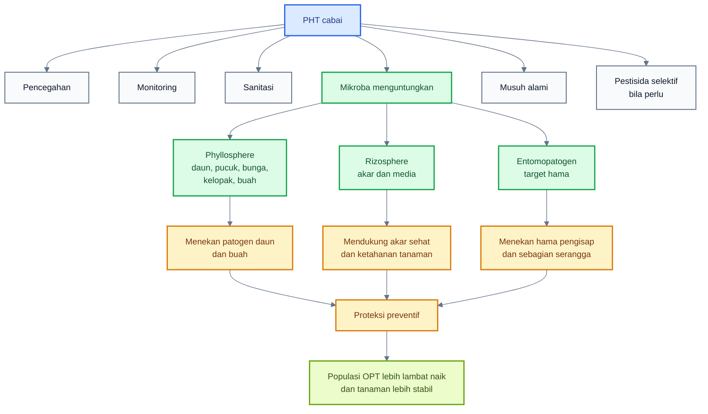

---

## 9.1 Posisi mikroba dalam PHT

### Mikroba bukan pengganti total pestisida

Mikroba menguntungkan tidak sebaiknya dijanjikan sebagai pengganti total pestisida dalam semua kondisi. Pada tekanan penyakit rendah sampai sedang, aplikasi mikroba preventif dapat membantu menekan perkembangan OPT. Namun pada tekanan tinggi, musim hujan berat, populasi vektor tinggi, atau serangan penyakit sudah meluas, mikroba biasanya perlu dikombinasikan dengan sanitasi, pengaturan kanopi, pengendalian hama vektor, dan bila perlu pestisida selektif.

Pendekatan ini sejalan dengan konsep IPM: pestisida bukan dilarang, tetapi digunakan secara selektif, berbasis monitoring, dan sebagai bagian dari sistem yang lebih luas. Mikroba baik berfungsi memperkuat sistem biologis tanaman, bukan menggantikan seluruh tindakan pengendalian.

### Mikroba adalah lapisan proteksi preventif

Aplikasi mikroba paling logis dilakukan sebelum patogen menguasai permukaan tanaman. Pada phyllosphere cabai, target preventifnya adalah:

- pucuk sebelum thrips, aphid, kutu kebul, dan virus meningkat;
- bawah daun sebelum koloni hama pengisap stabil;
- bunga sebelum thrips merusak fruit set;
- kelopak dan buah muda sebelum antraknosa laten berkembang;
- daun bawah sebelum bercak daun menjadi sumber inokulum;
- media dan akar sebelum tanaman mengalami stres berat.

Konsep ini penting karena mikroba hidup membutuhkan waktu untuk menempel, beradaptasi, dan bekerja. Produk mikroba tidak boleh diperlakukan seperti insektisida knockdown. Efeknya lebih ekologis: menekan peluang patogen, memperlambat perkembangan penyakit, membantu ketahanan tanaman, dan mendukung keseimbangan komunitas mikroba.

### Efektivitas sangat tergantung strain dan formulasi

Nama genus saja tidak cukup. Tidak semua _Bacillus_ efektif untuk antraknosa, tidak semua _Trichoderma_ cocok untuk aplikasi foliar, tidak semua _Beauveria_ efektif terhadap thrips, dan tidak semua _Pseudomonas_ mampu bertahan baik di permukaan daun.

Yang menentukan adalah:

- identitas strain;
- kemampuan bertahan hidup;
- kemampuan kolonisasi;
- metabolit yang dihasilkan;
- kompatibilitas dengan tanaman cabai;
- formulasi;
- umur simpan;
- cara aplikasi;
- kondisi lingkungan saat diaplikasikan.

Formulasi sangat penting karena mikroba harus melewati tekanan UV, panas, kering, air semprot, dan kompetisi mikroba liar. Produk berbasis spora seperti beberapa _Bacillus_ dan cendawan entomopatogen biasanya lebih tahan dibanding sel vegetatif, tetapi tetap memerlukan aplikasi yang tepat.

### Hasil laboratorium tidak selalu sama dengan lapang

Banyak mikroba tampak sangat efektif di laboratorium karena kondisi uji dikendalikan: suhu stabil, kelembapan cukup, patogen dan antagonis dipertemukan langsung, tidak ada hujan, tidak ada UV, dan tidak ada komunitas mikroba liar yang kompleks.

Di lapang, kondisinya berbeda. Mikroba harus menghadapi:

- UV;
- suhu tinggi;
- daun cepat kering;
- hujan;
- air semprot yang tidak ideal;
- pestisida lain;
- permukaan daun yang sudah dihuni mikroba liar;
- patogen yang datang bertahap;
- variasi varietas dan fase tanaman.

Contoh yang baik adalah studi _Paenibacillus polymyxa_ C1 pada cabai ‘Cabe Besar’. Formulasi ini efektif menekan antraknosa di greenhouse, tetapi penulis tetap merekomendasikan uji lapang untuk mengonfirmasi stabilitasnya pada kondisi lapangan. Ini menunjukkan sikap ilmiah yang tepat: hasil greenhouse menjanjikan, tetapi validasi lapang tetap diperlukan. ([Frontiers][1])

---

## 9.2 Mikroba untuk penyakit cabai

Mikroba untuk penyakit cabai dapat bekerja melalui beberapa mekanisme: kompetisi ruang, kompetisi nutrisi, antibiosis, produksi enzim, biofilm, induksi ketahanan, dan kolonisasi permukaan buah. Dalam PHT phyllosphere, mikroba diprioritaskan untuk penyakit yang siklus awalnya terjadi pada bagian atas tanaman, seperti antraknosa, bercak bakteri, busuk buah, dan infeksi sekunder.

### Tabel mikroba potensial untuk penyakit cabai

| Target         | Mikroba potensial                                          | Mekanisme utama                                      |
| -------------- | ---------------------------------------------------------- | ---------------------------------------------------- |
| Antraknosa     | _Bacillus_, _Paenibacillus_, _Trichoderma_, ragi antagonis | antibiosis, enzim lisis, kompetisi, ISR              |
| Bercak bakteri | _Bacillus_, _Pseudomonas_, ragi phyllosphere               | kompetisi, antibiosis, induksi ketahanan             |
| Busuk buah     | ragi antagonis, _Bacillus_                                 | kolonisasi permukaan buah dan luka mikro             |
| Stres tanaman  | PGPR, _Methylobacterium_, _Bacillus_                       | fitohormon, toleransi stres, keseimbangan fisiologis |

ISR adalah **induced systemic resistance**, yaitu ketahanan sistemik terinduksi. Dalam konteks praktis, ISR berarti tanaman menjadi lebih siap merespons serangan setelah berinteraksi dengan mikroba menguntungkan.

---

### A. Mikroba untuk antraknosa

Antraknosa adalah target paling relevan untuk inokulasi mikroba pada cabai karena penyakit ini sangat terkait dengan permukaan buah, kelopak, kelembapan, luka mikro, dan infeksi laten. Mikroba baik harus diarahkan ke fase sebelum gejala muncul, terutama mulai awal pembentukan buah.

Kelompok mikroba potensial:

#### 1. _Bacillus_

_Bacillus_ penting karena beberapa spesiesnya mampu membentuk spora, menghasilkan metabolit antimikroba, menghasilkan enzim lisis, dan memicu ketahanan tanaman. Untuk cabai, _Bacillus_ cocok dipertimbangkan sebagai mikroba foliar preventif pada pucuk, daun, kelopak, dan buah muda.

Kekuatan _Bacillus_:

- relatif tahan penyimpanan;
- beberapa strain tahan kondisi kering;
- dapat menghasilkan lipopeptida dan metabolit antimikroba;
- cocok untuk aplikasi preventif;
- banyak tersedia dalam produk hayati.

Keterbatasannya:

- efektivitas sangat tergantung strain;
- tidak semua produk cocok untuk semua penyakit;
- bisa terganggu oleh fungisida atau bakterisida keras;
- perlu aplikasi berulang.

#### 2. _Paenibacillus_

_Paenibacillus_ memiliki bukti spesifik pada cabai. Formulasi _Paenibacillus polymyxa_ C1 dilaporkan efektif menekan antraknosa pada cabai ‘Cabe Besar’ di greenhouse. Pada perlakuan lima aplikasi mingguan, studi tersebut menunjukkan penurunan insidensi dan intensitas penyakit secara signifikan, serta menyarankan pengujian lapang untuk memastikan kestabilan hasil. ([Frontiers][1])

Implikasi praktisnya:

- _Paenibacillus_ layak dipertimbangkan sebagai kandidat biokontrol antraknosa;
- aplikasi harus preventif dan berulang;
- target semprot perlu mencakup kelopak dan buah muda;
- hasil tetap perlu divalidasi sesuai lokasi, varietas, dan musim.

#### 3. _Trichoderma_

_Trichoderma_ lebih dikenal sebagai mikroba rhizosphere dan media tanam, tetapi beberapa formulasi dapat mendukung ketahanan tanaman dan menekan patogen melalui mekanisme tidak langsung. Review terbaru menekankan bahwa _Trichoderma_ dapat berperan dalam kesehatan tanaman melalui biokontrol, promosi pertumbuhan, dan induksi ketahanan sistemik. ([Springer Link][2])

Untuk antraknosa cabai, _Trichoderma_ sebaiknya diposisikan sebagai bagian dari strategi menyeluruh:

- aplikasi pada media atau akar untuk memperkuat tanaman;
- dukungan terhadap ketahanan sistemik;
- kemungkinan aplikasi foliar hanya bila formulasi memang dirancang untuk daun.

#### 4. Ragi antagonis

Ragi antagonis berpotensi pada permukaan buah dan luka mikro karena dapat menempati ruang, menggunakan nutrisi terbatas, dan menekan patogen oportunis. Pada cabai, ragi antagonis paling logis diarahkan ke permukaan buah, kelopak, dan pascapanen. Namun pemilihan strain tetap harus hati-hati dan berbasis produk atau isolat yang jelas.

---

### B. Mikroba untuk bercak bakteri

Bercak bakteri pada cabai disebabkan oleh _Xanthomonas_ spp. Karena patogennya bakteri, pengendalian dengan mikroba harus sangat hati-hati. Tujuan aplikasi mikroba bukan “menyembuhkan” jaringan yang sudah rusak, tetapi menekan kolonisasi permukaan, memperkuat ketahanan tanaman, dan mengurangi peluang penyebaran.

Mikroba potensial:

- _Bacillus_;
- _Pseudomonas_;
- ragi phyllosphere tertentu.

Mekanisme yang diharapkan:

- kompetisi ruang pada permukaan daun;
- kompetisi nutrisi;
- antibiosis;
- induksi ketahanan;
- stabilisasi komunitas phyllosphere.

Strategi praktis:

- mulai aplikasi sejak awal vegetatif;
- targetkan bawah daun, pucuk, dan daun muda;
- hindari pekerjaan saat daun basah;
- jangan mencampur mikroba dengan bakterisida keras;
- kombinasikan dengan benih sehat, sanitasi alat, dan pengurangan percikan air.

Mikroba tidak boleh dijadikan satu-satunya strategi untuk bercak bakteri. Penyakit bakteri harus dikelola dari sumbernya: benih, bibit, air, alat, dan sanitasi.

---

### C. Mikroba untuk busuk buah

Busuk buah sering muncul setelah luka akibat lalat buah, thrips, ulat, gesekan, panen kasar, atau antraknosa. Karena itu, mikroba untuk busuk buah perlu diarahkan ke pencegahan luka, kolonisasi permukaan buah, dan perlindungan titik rawan.

Mikroba potensial:

- ragi antagonis;
- _Bacillus_;
- beberapa mikroba permukaan buah yang diformulasikan khusus.

Target zona:

- kelopak;
- pangkal buah;
- permukaan buah muda;
- luka mikro;
- buah menjelang panen.

Strategi praktis:

- aplikasi sebelum gejala busuk muncul;
- sanitasi buah sakit;
- kendalikan lalat buah dan ulat;
- hindari panen kasar;
- jangan membuat buah terlalu basah lama;
- pisahkan buah sakit saat panen.

---

### D. Mikroba untuk stres tanaman

Tanaman cabai yang stres lebih mudah diserang OPT. Stres dapat berasal dari panas, kekeringan, salinitas, akar lemah, nutrisi tidak seimbang, atau fitotoksik. Mikroba tertentu dapat membantu tanaman menghadapi stres melalui produksi fitohormon, perbaikan akar, modulasi etilen, dan induksi ketahanan.

Mikroba potensial:

- PGPR;
- _Methylobacterium_;
- _Bacillus_;
- _Trichoderma_;
- mikoriza.

Khusus _Methylobacterium_, kelompok ini menarik karena mampu menggunakan senyawa satu karbon seperti metanol yang dilepaskan dari daun. Namun dalam praktik komersial, penggunaannya masih lebih spesifik dan tidak seumum _Bacillus_ atau _Trichoderma_.

---

### Bukti lapang dan greenhouse pada cabai

Dua referensi penting untuk cabai adalah:

1. Formulasi _Paenibacillus polymyxa_ C1 efektif menekan antraknosa pada cabai ‘Cabe Besar’ di greenhouse, tetapi direkomendasikan untuk uji lapang lebih lanjut. ([Frontiers][1])
2. Studi lapang 2025 pada cabai melaporkan bahwa aplikasi Bio P60 dan Bio T10, baik tunggal maupun kombinasi, dievaluasi untuk menekan antraknosa buah cabai dalam kondisi lapang pada ketinggian $1200 \text{ m}$ dpl. Publikasi tersebut melaporkan kombinasi Bio P60 dan Bio T10 sebagai perlakuan yang efektif dibanding kontrol dalam konteks studi tersebut. ([Tropical Plant Journal][3])

Catatan penting: hasil tersebut tidak berarti semua produk atau semua strain akan memberikan hasil yang sama di semua lokasi. Faktor varietas, iklim, intensitas penyakit, cara aplikasi, dan kompatibilitas program PHT sangat menentukan.

---

## 9.3 Mikroba untuk hama pengisap

Untuk hama pengisap, mikroba yang paling relevan bukan terutama _Bacillus_ atau PGPR, tetapi **cendawan entomopatogen**. Kelompok ini dapat menginfeksi serangga melalui kontak konidia dengan tubuh hama. Setelah menempel, konidia berkecambah, menembus kutikula, berkembang di dalam tubuh serangga, dan akhirnya menyebabkan kematian.

Target utama pada cabai:

- thrips;
- kutu kebul;
- aphid;
- sebagian tungau.

Kelompok yang umum digunakan:

- _Beauveria bassiana_;
- _Metarhizium_ spp.;
- _Lecanicillium_ spp.;
- beberapa _Purpureocillium_ spp. untuk target tertentu.

Review entomopatogen menjelaskan bahwa _Beauveria_ dan _Metarhizium_ banyak digunakan dalam pengendalian biologis serangga, dan beberapa kelompok entomopatogen juga dapat berinteraksi dengan tanaman dalam peran yang lebih luas, termasuk sebagai endofit pada kondisi tertentu. ([Frontiers][4])

### Tabel agens hayati untuk hama pengisap cabai

| Target     | Agens hayati                                         | Zona aplikasi            |
| ---------- | ---------------------------------------------------- | ------------------------ |
| Thrips     | _Beauveria bassiana_, _Metarhizium_, _Lecanicillium_ | pucuk, bunga, bawah daun |
| Kutu kebul | _Beauveria_, _Lecanicillium_                         | bawah daun               |
| Aphid      | _Beauveria_, _Lecanicillium_                         | pucuk, bawah daun        |
| Tungau     | cendawan entomopatogen dan predator tungau           | bawah daun               |

---

### A. Thrips

Thrips adalah target sulit karena sering bersembunyi di pucuk dan bunga. Cendawan entomopatogen dapat membantu, tetapi harus mengenai tubuh hama. Aplikasi yang hanya membasahi permukaan luar kanopi sering kurang efektif.

Strategi aplikasi:

- arahkan ke pucuk dan bunga;
- gunakan droplet halus;
- aplikasi sore hari lebih disukai;
- hindari UV tinggi;
- ulang sesuai tekanan populasi;
- kombinasikan dengan sticky trap dan monitoring bunga;
- jangan mencampur dengan fungisida yang membunuh cendawan.

Studi terhadap chilli thrips menunjukkan bahwa strain komersial _Beauveria bassiana_ memiliki aktivitas terhadap _Scirtothrips dorsalis_ dalam kondisi uji, tetapi efektivitas lapang tetap dipengaruhi oleh dosis, formulasi, dan kondisi lingkungan. ([Aisyiyah Yogyakarta Proceedings][5])

### B. Kutu kebul

Kutu kebul berada di bawah daun, sehingga aplikasi entomopatogen harus benar-benar mencapai bawah daun. Kelembapan mikro di bawah daun dapat membantu infeksi cendawan, tetapi lapisan honeydew dan kepadatan koloni tinggi juga dapat membuat kondisi lebih kompleks.

Strategi aplikasi:

- fokus bawah daun;
- gunakan nozzle yang mampu membalik atau menembus kanopi;
- kombinasikan dengan perangkap likat kuning;
- bersihkan gulma inang;
- jaga parasitoid dan predator;
- gunakan insektisida selektif bila populasi melewati ambang.

### C. Aphid

Aphid menyerang pucuk dan bawah daun. Karena tubuh aphid relatif lunak, cendawan entomopatogen dapat menjadi bagian dari strategi pengendalian. Namun aphid berkembang cepat, sehingga monitoring dan tindakan awal sangat penting.

Strategi aplikasi:

- target pucuk dan bawah daun;
- hindari nitrogen berlebihan;
- pertahankan predator seperti kumbang koksi dan lacewing;
- aplikasi entomopatogen saat populasi awal sampai sedang;
- jangan menunggu koloni sangat padat dan daun sudah menggulung rapat.

### D. Tungau

Tungau sering meledak pada kondisi panas-kering dan setelah musuh alami terganggu. Untuk tungau, pendekatan biologis yang kuat biasanya menggabungkan predator tungau dan pengelolaan lingkungan. Cendawan entomopatogen dapat membantu pada kondisi tertentu, tetapi efektivitas sangat tergantung kelembapan dan spesies target.

Strategi aplikasi:

- cek bawah daun dengan kaca pembesar;
- hindari insektisida broad-spectrum;
- jaga tanaman tidak stres air;
- gunakan predator tungau bila sistem memungkinkan;
- gunakan cendawan entomopatogen sesuai label;
- rotasi akarisida selektif bila harus menggunakan kimia.

---

### Diagram cara kerja cendawan entomopatogen pada hama pengisap

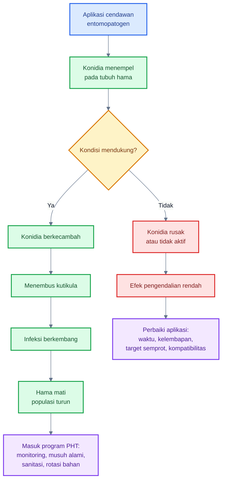

---

## 9.4 Mikroba untuk tanah dan akar tetap penting

Walaupun artikel ini berfokus pada phyllosphere, mikroba tanah dan akar tetap tidak boleh diabaikan. Tanaman dengan akar sehat lebih mampu menjaga keseimbangan air, nutrisi, hormon, dan respons pertahanan. Jika akar lemah, phyllosphere juga menjadi tidak stabil: pucuk lebih lunak, daun mudah stres, bunga mudah gugur, dan tanaman lebih rentan terhadap hama serta penyakit.

Dengan kata lain:

> Phyllosphere sehat sulit dibangun di atas akar yang sakit.

### A. _Trichoderma_

_Trichoderma_ adalah salah satu agens hayati paling penting untuk media tanam dan rhizosphere. Perannya meliputi kompetisi dengan patogen tanah, produksi enzim, antibiosis, stimulasi pertumbuhan akar, dan induksi ketahanan sistemik. Review terbaru menekankan bahwa _Trichoderma_ memiliki kapasitas menginduksi ketahanan sistemik pada tanaman dan berperan sebagai agen multifungsi dalam kesehatan tanaman. ([Springer Link][2])

Dalam PHT cabai, _Trichoderma_ paling tepat digunakan untuk:

- perlakuan media semai;
- pencampuran kompos matang;
- aplikasi kocor ke area akar;
- pemulihan rhizosphere setelah stres;
- pengurangan tekanan patogen tanah.

Untuk aplikasi foliar, gunakan hanya formulasi yang memang direkomendasikan untuk daun.

### B. PGPR

PGPR atau plant growth-promoting rhizobacteria adalah bakteri menguntungkan di sekitar akar yang dapat mendukung pertumbuhan tanaman dan ketahanan. Kelompok ini dapat mencakup _Bacillus_, _Pseudomonas_, _Azospirillum_, dan bakteri lain tergantung formulasi.

Peran PGPR:

- mendukung pertumbuhan akar;
- menghasilkan fitohormon;
- membantu ketersediaan nutrisi;
- memicu ISR;
- membantu tanaman menghadapi stres.

Studi tentang campuran PGPR menunjukkan bahwa PGPR dapat memicu ketahanan sistemik terhadap penyakit jamur, bakteri, dan virus pada beberapa tanaman uji. ([ScienceDirect][6])

Dalam cabai, PGPR dapat digunakan sejak benih, persemaian, dan setelah pindah tanam. Efeknya terhadap phyllosphere bersifat tidak langsung tetapi penting: tanaman lebih kuat, pucuk tidak terlalu stres, dan respons pertahanan lebih siap.

### C. Mikoriza

Mikoriza, terutama arbuscular mycorrhizal fungi, membantu tanaman dalam penyerapan fosfor, air, dan beberapa unsur hara. Pada kondisi tertentu, mikoriza juga dapat mendukung toleransi stres dan ketahanan tanaman.

Dalam PHT cabai, mikoriza relevan terutama untuk:

- lahan dengan kesuburan rendah;
- sistem yang ingin mengurangi stres transplanting;
- budidaya berkelanjutan;
- integrasi dengan kompos matang dan PGPR.

Catatan penting: mikoriza bekerja pada akar. Jadi aplikasinya harus diarahkan ke zona akar, bukan disemprotkan ke daun.

### D. Kompos matang

Kompos matang bukan sekadar pupuk organik. Bila benar-benar matang dan aman, kompos dapat membantu membangun ekosistem mikroba tanah yang lebih stabil. Kompos yang baik dapat memperbaiki struktur tanah, kapasitas menahan air, dan aktivitas mikroba bermanfaat.

Namun kompos yang belum matang dapat menjadi sumber patogen, panas, amonia, atau fitotoksik. Untuk cabai, hanya gunakan kompos matang, tidak berbau busuk, tidak panas, dan berasal dari bahan yang jelas.

### E. Biostimulan mikroba

Biostimulan mikroba adalah produk yang dirancang untuk mendukung pertumbuhan, ketahanan, atau efisiensi nutrisi tanaman melalui aktivitas mikroba. Namun klaim biostimulan harus dibaca kritis. Perhatikan:

- mikroba apa yang digunakan;
- strain jelas atau tidak;
- jumlah populasi hidup;
- cara aplikasi;
- kompatibilitas dengan pestisida;
- bukti uji pada komoditas yang relevan;
- izin edar atau registrasi sesuai ketentuan.

---

### Hubungan akar sehat dan phyllosphere stabil

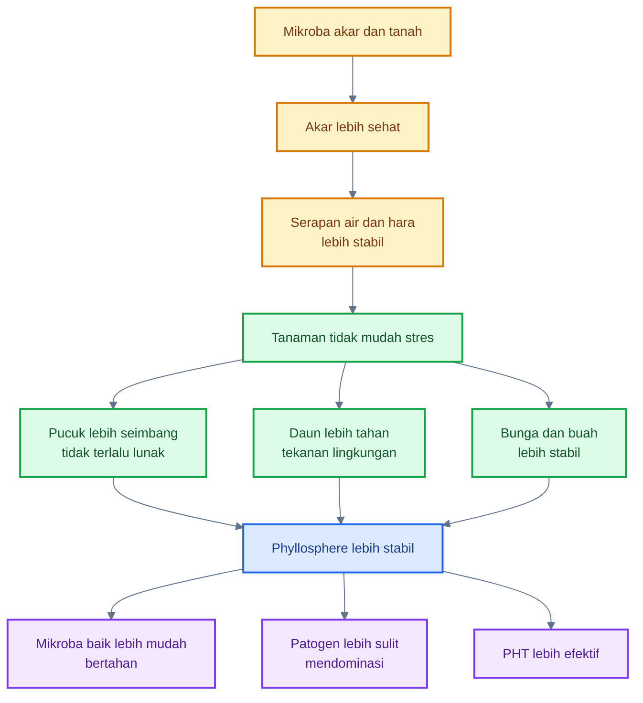

---

### Tabel integrasi mikroba akar dan phyllosphere

| Komponen mikroba  | Zona aplikasi              | Peran utama                                 | Hubungan dengan phyllosphere                         |
| ----------------- | -------------------------- | ------------------------------------------- | ---------------------------------------------------- |
| _Trichoderma_     | media, akar, kompos        | menekan patogen tanah, mendukung akar, ISR  | tanaman lebih kuat dan respons pertahanan lebih siap |
| PGPR              | benih, persemaian, akar    | pertumbuhan akar, fitohormon, ISR           | pucuk lebih stabil dan tanaman lebih tahan stres     |
| Mikoriza          | zona akar                  | serapan fosfor dan air                      | mengurangi stres yang memicu kerentanan daun         |
| Kompos matang     | tanah/media                | memperbaiki struktur dan mikrobiologi tanah | mendukung vigor tanaman secara menyeluruh            |
| _Bacillus_ foliar | pucuk, daun, kelopak, buah | proteksi phyllosphere                       | kompetisi, antibiosis, biofilm, ISR                  |
| Entomopatogen     | pucuk, bunga, bawah daun   | menekan hama pengisap                       | menurunkan luka mikro dan vektor virus               |

---

### Kesimpulan Bab 9

Inokulasi mikroba menguntungkan adalah komponen penting dalam PHT cabai, tetapi harus ditempatkan secara realistis. Mikroba bukan pengganti total pestisida dan bukan solusi tunggal untuk semua OPT. Mikroba adalah **lapisan proteksi preventif** yang bekerja paling baik ketika diaplikasikan sebelum patogen atau hama mendominasi.

Untuk penyakit cabai, mikroba seperti _Bacillus_, _Paenibacillus_, _Pseudomonas_, _Trichoderma_, dan ragi antagonis dapat digunakan sesuai target dan formulasi. Untuk hama pengisap, cendawan entomopatogen seperti _Beauveria_, _Metarhizium_, dan _Lecanicillium_ lebih relevan. Untuk kestabilan tanaman, mikroba akar seperti PGPR, _Trichoderma_, mikoriza, dan kompos matang tetap sangat penting.

Prinsip praktisnya:

> Inokulasi mikroba berhasil bila mikroba yang tepat ditempatkan pada zona yang tepat, pada waktu yang tepat, dengan lingkungan yang mendukung, dan dalam sistem PHT yang lengkap.

[1]: https://www.frontiersin.org/journals/sustainable-food-systems/articles/10.3389/fsufs.2021.782425/full?utm_source=chatgpt.com 'Biocontrol of Anthracnose Disease on Chili Pepper Using ... - Frontiers'
[2]: https://link.springer.com/article/10.1186/s12866-025-04158-2?utm_source=chatgpt.com 'Trichoderma: a multifunctional agent in plant health and microbiome ...'
[3]: https://jhpttropika.fp.unila.ac.id/index.php/jhpttropika/article/view/988?utm_source=chatgpt.com 'Application of biocontrol products Bio P60 and Bio T10 as ...'
[4]: https://www.frontiersin.org/journals/microbiology/articles/10.3389/fmicb.2024.1423980/full?utm_source=chatgpt.com 'Trichoderma and Bacillus multifunctional allies for plant growth and ...'
[5]: https://proceeding.unisayogya.ac.id/index.php/prosemnaslppm/article/download/63/78/316?utm_source=chatgpt.com 'Pemanfaatan Jamur Beauveria bassiana Sebagai ...'
[6]: https://www.sciencedirect.com/science/article/abs/pii/S1049964402000221?utm_source=chatgpt.com 'Mixtures of plant growth-promoting rhizobacteria for induction of ...'

[**Kembali ke Atas**](#phyllosphere-cabai-sebagai-zona-strategis-pht-mengelola-mikroba-daun-untuk-menekan-opt-penyakit-dan-risiko-gagal-panen)

---

## 10. Strategi menyeluruh agar inokulasi mikroba berhasil

Inokulasi mikroba pada cabai hanya berhasil bila diperlakukan sebagai **strategi biologis yang hidup**, bukan sekadar aktivitas “menambah produk ke tangki semprot”. Mikroba harus tetap hidup, sampai ke zona sasaran, mampu menempel, tidak langsung mati oleh UV atau pestisida, lalu memiliki waktu untuk beradaptasi di phyllosphere atau rhizosphere.

Dalam PHT, keberhasilan inokulasi mikroba ditentukan oleh delapan hal utama:

1. mikroba sesuai target;
2. aplikasi preventif;
3. target semprot tepat;
4. waktu aplikasi tepat;
5. kualitas air sesuai;
6. kompatibilitas dengan pestisida;
7. tidak memberi nutrisi foliar berlebihan;
8. evaluasi hasil secara terukur.

### Diagram strategi keberhasilan inokulasi mikroba

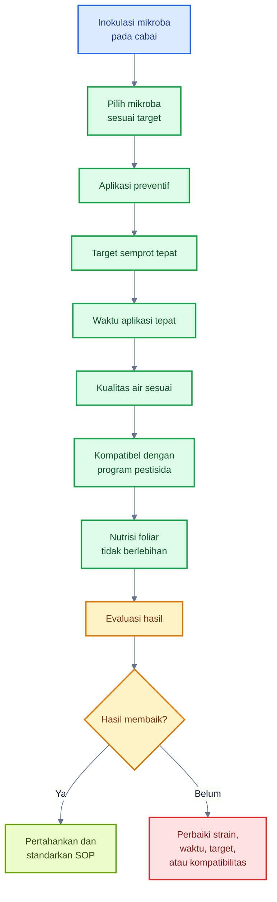

---

## 10.1 Pilih mikroba berdasarkan target, bukan asal campur

Kesalahan umum dalam aplikasi agens hayati adalah mencampur banyak mikroba tanpa memahami fungsi masing-masing. Dalam PHT cabai, pemilihan mikroba harus dimulai dari pertanyaan: **targetnya apa?** Antraknosa, bercak bakteri, thrips, kutu kebul, tungau, lalat buah, busuk buah, atau kesehatan akar?

Tidak semua mikroba bekerja pada target yang sama. Mikroba yang bagus untuk akar belum tentu bagus untuk daun. Mikroba yang efektif untuk hama belum tentu efektif untuk penyakit jamur. Mikroba yang bekerja baik di laboratorium belum tentu stabil di lapang.

### A. _Bacillus_: relatif kuat untuk phyllosphere karena spora

_Bacillus_ adalah salah satu pilihan paling praktis untuk phyllosphere cabai karena banyak spesiesnya mampu membentuk spora. Spora membantu mikroba bertahan terhadap kekeringan, panas, penyimpanan, dan kondisi lingkungan yang berubah. Ini membuat _Bacillus_ relatif lebih sesuai untuk aplikasi foliar dibanding bakteri yang tidak membentuk spora.

Target yang masuk akal:

- antraknosa;
- bercak daun;
- busuk buah awal;
- proteksi pucuk;
- induksi ketahanan tanaman;
- stabilisasi mikrobiologi permukaan.

Namun tetap harus diingat: tidak semua _Bacillus_ sama. Efektivitas sangat bergantung pada strain, formulasi, dosis, umur produk, dan cara aplikasi.

### B. _Pseudomonas_: bagus sebagai PGPR dan kompetitor, tetapi lebih sensitif

_Pseudomonas_ banyak dikenal sebagai PGPR dan agens biokontrol. Kelompok ini dapat menghasilkan siderofor, metabolit antimikroba, enzim, dan senyawa pemicu ketahanan. Namun pada aplikasi foliar, _Pseudomonas_ umumnya lebih sensitif terhadap kekeringan, UV, dan fluktuasi lingkungan dibanding _Bacillus_ pembentuk spora.

Posisi terbaik _Pseudomonas_ dalam PHT cabai:

- perlakuan benih;
- aplikasi akar;
- dukungan rhizosphere;
- aplikasi foliar terbatas bila formulasi memang mendukung;
- kombinasi dengan manajemen kelembapan dan waktu aplikasi yang tepat.

### C. _Trichoderma_: kuat di tanah/media, tidak semua cocok untuk foliar

_Trichoderma_ sangat kuat sebagai mikroba tanah dan media tanam. Ia baik untuk mendukung akar, menekan patogen tanah, membantu dekomposisi bahan organik, dan memicu ketahanan tanaman. Namun tidak semua formulasi _Trichoderma_ cocok disemprot ke daun.

Kesalahan yang perlu dihindari:

- menganggap semua _Trichoderma_ cocok untuk foliar;
- menyemprot _Trichoderma_ pada siang panas tanpa pelindung;
- mencampurnya dengan fungisida;
- mengharapkan _Trichoderma_ foliar bekerja sebagai “obat cepat” untuk antraknosa berat.

Posisi paling aman:

- media semai;
- kocor akar;
- kompos matang;
- rhizosphere;
- aplikasi foliar hanya bila label/formulasi memang menyebutkan foliar.

### D. _Beauveria_, _Metarhizium_, dan _Lecanicillium_: untuk hama, bukan utama untuk antraknosa

Cendawan entomopatogen seperti _Beauveria bassiana_, _Metarhizium anisopliae_, dan _Lecanicillium_ spp. digunakan untuk hama, bukan sebagai pilihan utama untuk penyakit seperti antraknosa. Mereka bekerja dengan menginfeksi tubuh serangga atau tungau tertentu. IAEA menyebut cendawan entomopatogen sebagai musuh alami yang efektif untuk lalat buah dan membahas penggunaannya dalam sistem pengendalian mikroba, termasuk pemanfaatan lalat sebagai pembawa konidia. ([IAEA][1])

Target yang masuk akal:

- thrips;
- aphid;
- kutu kebul;
- sebagian tungau;
- lalat buah pada strategi tertentu;
- hama lain sesuai label produk.

Cendawan entomopatogen membutuhkan kontak dengan hama. Karena itu, penyemprotan harus mencapai pucuk, bunga, bawah daun, atau area istirahat hama. Bila semprotan tidak mengenai target, efektivitas rendah.

### E. Ragi antagonis: potensial untuk permukaan daun dan buah

Ragi antagonis berpotensi kuat untuk phyllosphere dan permukaan buah karena dapat bersaing di habitat dengan nutrisi terbatas, menempati luka mikro, dan menekan mikroba pembusuk. Dalam cabai, ragi antagonis relevan untuk:

- permukaan buah muda;
- kelopak;
- pangkal buah;
- luka mikro;
- pascapanen;
- pengurangan busuk sekunder.

Namun penggunaannya harus berbasis strain dan formulasi yang jelas. Tidak semua ragi aman atau efektif sebagai biokontrol.

### Tabel pemilihan mikroba berdasarkan target

| Target         | Mikroba yang lebih sesuai                                           | Zona aplikasi                | Catatan praktis                      |
| -------------- | ------------------------------------------------------------------- | ---------------------------- | ------------------------------------ |
| Antraknosa     | _Bacillus_, _Paenibacillus_, ragi antagonis, beberapa _Trichoderma_ | kelopak, buah muda, daun     | preventif sejak awal fruit set       |
| Bercak bakteri | _Bacillus_, _Pseudomonas_, ragi phyllosphere                        | pucuk, bawah daun, daun muda | sanitasi dan benih sehat tetap wajib |
| Busuk buah     | ragi antagonis, _Bacillus_                                          | kelopak, buah, luka mikro    | jangan tunggu buah busuk banyak      |
| Thrips         | _Beauveria_, _Metarhizium_, _Lecanicillium_                         | pucuk, bunga, bawah daun     | harus kontak dengan hama             |
| Kutu kebul     | _Beauveria_, _Lecanicillium_                                        | bawah daun                   | kombinasikan dengan sticky trap      |
| Tungau         | entomopatogen dan predator tungau                                   | bawah daun                   | hindari insektisida broad-spectrum   |
| Akar lemah     | _Trichoderma_, PGPR, mikoriza                                       | media, akar                  | basis tanaman sehat                  |

---

## 10.2 Aplikasi harus preventif

Mikroba menguntungkan bekerja paling baik sebelum patogen atau hama mendominasi. Ini karena mikroba membutuhkan waktu untuk menempel, beradaptasi, dan membentuk populasi. Bila penyakit sudah parah, patogen sudah menguasai jaringan, populasi inokulum tinggi, dan mikroba baik sulit mengejar.

### A. Mulai dari persemaian

Persemaian adalah titik awal penting. Tanaman cabai yang sejak bibit sudah memiliki akar sehat dan phyllosphere awal yang lebih stabil akan lebih siap menghadapi tekanan OPT setelah pindah tanam.

Program yang dapat dilakukan:

- perlakuan benih dengan PGPR bila sesuai rekomendasi;
- aplikasi _Trichoderma_ pada media;
- screen nursery untuk mencegah vektor;
- semprot mikroba ringan pada bibit bila produk memang mendukung foliar;
- buang bibit abnormal atau bergejala virus.

### B. Ulang setelah tanam

Setelah pindah tanam, bibit mengalami stres transplanting. Pada fase ini, tanaman rentan terhadap hama pengisap dan penyakit awal. Aplikasi mikroba dapat dimulai setelah tanaman pulih, misalnya sekitar beberapa hari setelah tanam sesuai kondisi lapang dan label produk.

Target awal:

- pucuk;
- bawah daun;
- media sekitar akar;
- pangkal batang;
- daun muda.

### C. Perkuat sebelum bunga dan buah muda

Fase pra-bunga sampai buah muda adalah fase kritis. Thrips menyerang bunga, sedangkan antraknosa dapat mulai menginfeksi buah muda secara laten. Karena itu, aplikasi mikroba tidak boleh dimulai saat buah sudah banyak bercak.

Target penting:

- bunga;
- kelopak;
- buah muda;
- pangkal buah;
- bawah daun;
- pucuk.

### D. Ulang setelah hujan deras

Hujan deras dapat mencuci mikroba dari permukaan daun dan buah. Selain itu, hujan juga menyebarkan spora patogen melalui percikan air. Karena itu, setelah hujan besar, lakukan evaluasi ulang. Bila tekanan penyakit tinggi atau aplikasi sebelumnya kemungkinan tercuci, aplikasi ulang dapat dipertimbangkan.

Prinsipnya:

> Mikroba foliar adalah proteksi hidup yang perlu dijaga populasinya, terutama setelah hujan, pestisida keras, atau periode cuaca ekstrem.

---

## 10.3 Target semprot harus benar

Aplikasi mikroba sering gagal bukan karena produknya buruk, tetapi karena tidak mencapai zona sasaran. Pada cabai, menyemprot hanya permukaan luar kanopi tidak cukup. Banyak OPT berada di pucuk, bawah daun, bunga, kelopak, dan pangkal buah.

### Urutan prioritas target semprot

1. pucuk;
2. bawah daun;
3. bunga;
4. kelopak;
5. buah muda;
6. ketiak daun;
7. daun bawah;
8. luka pruning.

### Diagram prioritas target semprot

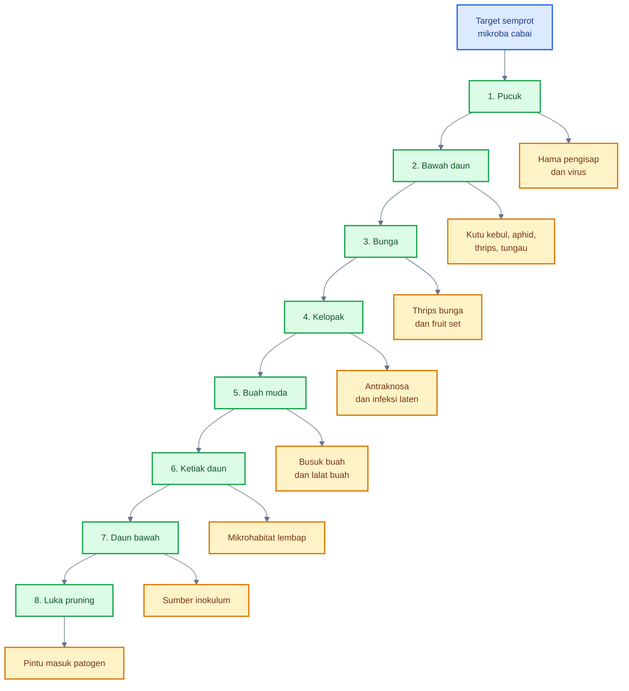

### Prinsip teknis penyemprotan

- Gunakan droplet halus.
- Jangan hanya membasahi daun atas.
- Arahkan nozzle ke bawah daun dan dalam kanopi.
- Hindari tekanan terlalu tinggi yang merusak pucuk dan bunga.
- Jangan membuat bunga dan kelopak basah terlalu lama.
- Pastikan buah muda dan pangkal buah terkena pada fase fruit set.

---

## 10.4 Waktu aplikasi

Waktu aplikasi menentukan viabilitas mikroba. Mikroba hidup rentan terhadap UV, panas, kekeringan, dan pengeringan droplet. Karena itu, waktu aplikasi harus dipilih untuk meningkatkan peluang mikroba bertahan.

### A. Pagi atau sore

Pagi dan sore lebih sesuai karena suhu lebih rendah dan UV tidak setinggi tengah hari. Pagi cocok bila daun tidak terlalu basah lama. Sore cocok terutama untuk cendawan entomopatogen karena kelembapan malam dapat membantu proses infeksi.

### B. Hindari UV tinggi

UV tinggi dapat menurunkan viabilitas mikroba. Ini penting terutama untuk bakteri non-spora, ragi, dan cendawan entomopatogen. Produk berbasis spora lebih kuat, tetapi tetap tidak ideal diaplikasikan pada siang terik.

### C. Hindari daun terlalu panas

Daun panas membuat droplet cepat menguap. Mikroba belum sempat menempel dan beradaptasi. Aplikasi pada daun panas juga meningkatkan risiko stres atau fitotoksik bila dicampur bahan lain.

### D. Hindari sebelum hujan deras

Aplikasi mikroba sebelum hujan deras berisiko tercuci. Lebih baik menunggu cuaca lebih stabil. Bila hujan terjadi setelah aplikasi, lakukan evaluasi ulang.

### E. Entomopatogen lebih baik sore

Cendawan entomopatogen seperti _Beauveria_, _Metarhizium_, dan _Lecanicillium_ membutuhkan kelembapan yang memadai untuk perkecambahan konidia dan infeksi serangga. Karena itu, aplikasi sore sering lebih logis dibanding siang hari.

---

## 10.5 Kualitas air

Air adalah pembawa mikroba. Jika air buruk, mikroba bisa mati sebelum mencapai tanaman.

### A. Air tidak berklorin tinggi

Klorin digunakan untuk membunuh mikroba. Maka, air yang berklorin tinggi tidak ideal untuk mencampur produk mikroba hidup. Gunakan air bersih yang tidak berbau klorin kuat. Bila memakai air yang dicurigai mengandung klorin, air dapat diendapkan terlebih dahulu sesuai praktik aman setempat.

### B. pH sekitar 6–7

Sebagian besar mikroba aplikasi foliar lebih nyaman pada pH mendekati netral. pH terlalu asam atau terlalu basa dapat menurunkan viabilitas mikroba atau mengganggu formulasi.

Format MDX/KaTeX untuk rentang pH:

$$
\text{pH ideal larutan mikroba} \approx 6 - 7
$$

### C. Hindari air panas

Air panas mempercepat kematian sel mikroba. Gunakan air bersuhu normal, tidak terpapar matahari langsung terlalu lama di dalam tangki atau ember.

### D. Hindari campuran dengan bakterisida/fungisida keras

Air tangki yang sebelumnya dipakai untuk pestisida keras dapat meninggalkan residu. Bersihkan tangki sebelum digunakan untuk mikroba hidup.

---

## 10.6 Kompatibilitas pestisida

Kompatibilitas adalah salah satu faktor paling sering menggagalkan aplikasi mikroba. Mikroba hidup bisa mati bila dicampur dengan bahan yang memang dirancang untuk membunuh mikroorganisme.

### Jangan campur mikroba hidup dengan bahan keras

Hindari mencampur mikroba hidup dengan:

- tembaga dosis tinggi;
- klorin;
- antibiotik pertanian;
- fungisida broad-spectrum;
- bakterisida kuat;
- larutan sangat asam atau basa;
- surfaktan agresif;
- pestisida yang belum diketahui kompatibilitasnya.

### Beri jeda aplikasi

Bila program membutuhkan pestisida dan mikroba, lebih aman memberi jeda aplikasi. Urutannya disesuaikan dengan target. Misalnya, bila tekanan penyakit tinggi dan harus memakai fungisida, jangan langsung mencampur mikroba hidup dalam tangki yang sama kecuali kompatibilitasnya sudah terbukti.

### Pestisida selektif lebih disukai

Dalam PHT, pestisida selektif lebih disukai karena lebih rendah risiko terhadap musuh alami dan mikroba non-target. Pestisida broad-spectrum dapat memberi efek cepat, tetapi sering merusak keseimbangan dan memicu hama sekunder seperti tungau.

### Rotasi mode of action tetap wajib

Rotasi mode of action diperlukan untuk menunda resistensi. IRAC menyatakan bahwa klasifikasi mode of action membantu pemilihan insektisida dan akarisida untuk strategi resistance management, dan rotasi antar kelompok mode of action digunakan untuk meminimalkan seleksi resistensi. ([Insecticide Resistance Action Committee][2])

Untuk fungisida, FRAC menyediakan rekomendasi pengelolaan resistensi berdasarkan mode of action. FRAC juga menekankan bahwa fungisida dalam kelompok MoA yang sama memiliki risiko cross-resistance dan tidak cocok dijadikan pasangan rotasi untuk manajemen resistensi. ([Frac][3])

Prinsip praktis:

- jangan mengulang bahan aktif dengan MoA sama terus-menerus;
- jangan mengandalkan satu bahan untuk satu musim;
- sesuaikan rotasi dengan OPT target;
- ikuti label dan registrasi lokal;
- pertimbangkan dampaknya pada mikroba dan musuh alami.

---

## 10.7 Jangan berlebihan memberi nutrisi foliar

Banyak petani ingin “memberi makan” mikroba dengan molase, gula, POC, susu, atau asam amino dosis tinggi. Ini perlu sangat hati-hati. Permukaan daun bukan fermentor tertutup. Semua mikroba di permukaan daun dapat memanfaatkan bahan organik tambahan, termasuk patogen dan mikroba oportunis.

### Risiko molase, gula, dan POC pekat

Risiko utama:

- jamur jelaga meningkat;
- ragi liar berkembang;
- daun lengket;
- patogen oportunis mendapat makanan;
- serangga pengisap lebih tertarik;
- bunga dan kelopak terlalu lembap;
- busuk buah meningkat.

### Gunakan perekat/perata kompatibel

Perekat/perata dapat membantu deposit mikroba, tetapi harus kompatibel dengan mikroba hidup. Hindari surfaktan yang terlalu keras atau bahan yang merusak membran sel mikroba.

### Prinsip aman

| Bahan tambahan    | Risiko utama                           | Rekomendasi                                           |
| ----------------- | -------------------------------------- | ----------------------------------------------------- |
| Molase/gula       | memberi makan patogen dan jamur jelaga | hindari sebagai rutinitas foliar                      |
| POC pekat         | residu organik tinggi                  | gunakan hati-hati sesuai label                        |
| Susu              | residu mudah rusak                     | tidak disarankan sebagai campuran rutin               |
| Asam amino tinggi | mikroba liar ikut naik                 | gunakan untuk tanaman, bukan pakan mikroba berlebihan |
| Perekat/perata    | bisa membantu atau merusak             | pilih yang kompatibel                                 |
| Air pH ekstrem    | menurunkan viabilitas                  | jaga pH mendekati netral                              |

Prinsip utamanya:

> Mikroba perlu mikrohabitat yang mendukung, bukan gula berlebihan di permukaan daun.

---

## 10.8 Evaluasi keberhasilan

Inokulasi mikroba harus dievaluasi. Tanpa data, praktisi tidak tahu apakah program berhasil atau hanya menambah biaya. Evaluasi tidak harus rumit, tetapi harus konsisten.

### Parameter evaluasi

1. populasi OPT per pucuk, daun, bunga, atau perangkap;
2. persentase tanaman bergejala virus;
3. insidensi antraknosa;
4. intensitas bercak daun;
5. persentase buah layak jual;
6. jumlah aplikasi pestisida;
7. keberadaan musuh alami;
8. konsistensi hasil antar musim.

### Formula evaluasi sederhana

Insidensi penyakit atau serangan:

$$
\text{Insidensi} = \frac{\text{jumlah sampel terserang}}{\text{jumlah sampel diamati}} \times 100%
$$

Intensitas penyakit berbasis skor:

$$
\text{Intensitas penyakit} = \frac{\sum(n_i \times v_i)}{N \times V} \times 100%
$$

Keterangan: $n_i$ adalah jumlah sampel pada skor ke-$i$, $v_i$ adalah nilai skor ke-$i$, $N$ adalah total sampel, dan $V$ adalah skor tertinggi.

Efektivitas perlakuan dibanding kontrol:

$$
\text{Efektivitas} = \frac{K - P}{K} \times 100%
$$

Keterangan: $K$ adalah nilai serangan pada kontrol atau petak pembanding, sedangkan $P$ adalah nilai serangan pada petak perlakuan.

Persentase buah layak jual:

$$
\text{Buah layak jual} = \frac{\text{berat buah sehat}}{\text{berat total panen}} \times 100%
$$

### Tabel evaluasi lapang

| Parameter       | Cara ukur                              | Frekuensi                                |
| --------------- | -------------------------------------- | ---------------------------------------- |
| Thrips          | jumlah per bunga atau pucuk            | 1–2 kali per minggu                      |
| Kutu kebul      | jumlah per bawah daun atau sticky trap | 1–2 kali per minggu                      |
| Aphid           | koloni per pucuk                       | mingguan                                 |
| Tungau          | bawah daun dengan kaca pembesar        | mingguan, lebih sering saat panas-kering |
| Antraknosa      | buah sakit per total buah diamati      | tiap panen                               |
| Virus           | tanaman bergejala per total tanaman    | mingguan                                 |
| Buah layak jual | kg buah sehat per total panen          | tiap panen                               |
| Pestisida       | jumlah aplikasi dan MoA                | setiap aplikasi                          |
| Musuh alami     | jumlah/keberadaan predator parasitoid  | mingguan                                 |

[**Kembali ke Atas**](#phyllosphere-cabai-sebagai-zona-strategis-pht-mengelola-mikroba-daun-untuk-menekan-opt-penyakit-dan-risiko-gagal-panen)

---

# 11. Mikroba dan strategi biologis untuk lalat buah

Lalat buah perlu dibahas khusus karena kerusakannya berbeda dari hama phyllosphere lain. Thrips, aphid, kutu kebul, dan tungau banyak beraktivitas di daun, pucuk, dan bunga. Lalat buah menyerang **buah**, yaitu bagian bernilai ekonomi tertinggi pada cabai. Betina menusukkan telur ke dalam buah, larva berkembang di dalam jaringan, lalu buah busuk dan gugur.

Dalam konteks phyllosphere, lalat buah bukan mikroba. Namun serangannya terjadi pada zona phyllosphere buah dan mengubah mikrobiologi buah secara drastis. Luka oviposisi membuka akses bagi mikroba pembusuk, antraknosa sekunder, bakteri oportunis, dan fermentasi buah.

---

## 11.1 Posisi lalat buah dalam phyllosphere

Lalat buah tidak hidup sebagai mikroba phyllosphere, tetapi menyerang permukaan dan jaringan buah yang termasuk bagian dari phyllosphere tanaman. Karena itu, strategi mikroba untuk lalat buah tidak sama dengan strategi mikroba untuk antraknosa atau bercak daun.

Mikroba untuk lalat buah lebih diarahkan ke lima target:

1. **adult fly** atau lalat dewasa;
2. **larva dalam buah**;
3. **pupa di tanah**;
4. **sistem attract-and-kill**;
5. **autodissemination**, yaitu lalat membawa mikroba patogen serangga ke populasi lalat lain atau ke lokasi istirahatnya.

### Diagram posisi lalat buah dalam sistem cabai

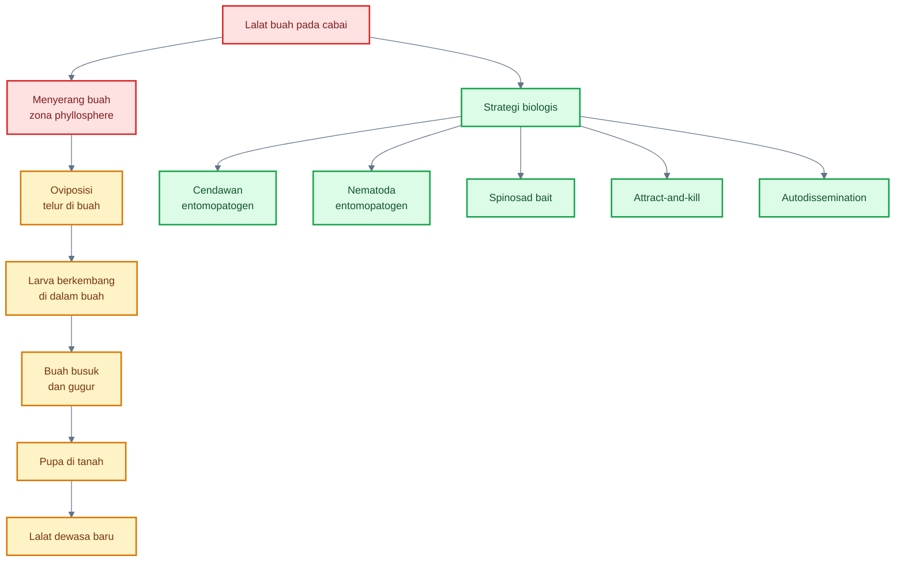

Poin penting bagi praktisi: pengendalian lalat buah tidak cukup dengan menyemprot permukaan daun. Siklus hidupnya melibatkan buah dan tanah. Jadi, PHT lalat buah harus menggabungkan sanitasi buah, perangkap, bait, pengendalian dewasa, dan pengelolaan stadia tanah.

---

## 11.2 Strategi IPM lalat buah

Review _Bactrocera_ menekankan bahwa IPM lalat buah menggunakan kombinasi beberapa komponen, termasuk sanitasi, bait, perangkap, male annihilation technique, parasitoid, dan pendekatan area-wide. Pendekatan area-wide penting karena lalat buah bergerak lintas kebun, sehingga pengendalian satu petak sering kurang efektif bila lingkungan sekitar penuh sumber infestasi. ([MDPI][4])

### 1. Sanitasi buah busuk

Sanitasi adalah fondasi. Buah terserang harus dikumpulkan, dimusnahkan, atau dikelola dengan cara yang memutus siklus larva. Buah busuk yang dibiarkan di tanaman atau jatuh ke tanah menjadi sumber larva, pupa, mikroba pembusuk, dan lalat generasi berikutnya.

Praktik:

- kumpulkan buah busuk minimal 2–3 kali per minggu saat tekanan tinggi;
- jangan membuang buah sakit di pinggir kebun;
- gunakan kantong tertutup, solarisasi, penguburan dalam, atau metode pemusnahan lain yang sesuai;
- pertimbangkan augmentorium bila tersedia dan dikelola benar.

### 2. Panen buah matang tepat waktu

Buah yang terlalu lama dibiarkan di tanaman lebih berisiko terserang. Panen teratur membantu mengurangi buah target lalat buah dan menurunkan sumber aroma yang menarik lalat.

Praktik:

- panen sesuai interval pasar;
- jangan membiarkan buah terlalu matang;
- sortir langsung di kebun;
- buah luka dipisahkan.

### 3. Pengumpulan dan pemusnahan buah jatuh

Buah jatuh adalah titik kritis karena larva dapat keluar dari buah dan berpupa di tanah. Jika buah jatuh dibiarkan, siklus lalat buah tetap berjalan meskipun perangkap dipasang.

Praktik:

- kumpulkan buah jatuh setiap panen;
- musnahkan buah terserang;
- jangan jadikan buah sakit sebagai pakan terbuka dekat kebun;
- jaga area bawah tajuk bersih.

### 4. Pembungkusan buah bila skala memungkinkan

Pada cabai, pembungkusan buah tidak selalu praktis untuk skala luas karena buah kecil dan jumlahnya banyak. Namun pada skala terbatas, benih, koleksi varietas, atau cabai premium, pembungkusan dapat digunakan untuk mengurangi oviposisi.

### 5. Perangkap methyl eugenol

Methyl eugenol digunakan untuk menarik jantan beberapa spesies lalat buah, terutama kelompok tertentu dalam _Bactrocera_. Strategi ini disebut male annihilation bila digunakan massal dengan toksikan yang sesuai dan pemasangan luas.

Catatan praktis:

- efektif hanya untuk spesies yang responsif terhadap methyl eugenol;
- tidak menangkap betina secara langsung;
- lebih efektif bila diterapkan luas dan konsisten;
- tetap harus dikombinasikan dengan sanitasi buah.

### 6. Protein bait

Protein bait menargetkan kebutuhan makan lalat dewasa, terutama betina yang membutuhkan protein untuk perkembangan telur. Bait dapat dikombinasikan dengan insektisida selektif atau bahan biologis tertentu sesuai registrasi.

Praktik:

- gunakan spot spray, bukan seluruh kanopi;
- tempatkan di area istirahat lalat;
- hindari mengenai bunga berlebihan;
- ikuti label produk.

### 7. Spinosad bait

Spinosad bait adalah pendekatan attract-and-kill berbasis umpan. Spinosad sendiri berasal dari metabolit sekunder _Saccharopolyspora spinosa_, bakteri aktinomiset tanah. Sumber IPM World menyebut spinosad sebagai metabolit sekunder dari fermentasi aerobik _S. spinosa_. ([ipmworld.umn.edu][5])

GF-120 adalah contoh bait berbasis spinosad yang menggabungkan bahan atraktan/pakan dan insektisida. Studi pada lalat buah mangga di Benin melaporkan bahwa aplikasi mingguan GF-120 menurunkan jumlah pupa per kilogram buah sebesar 81% setelah 7 minggu pada 2006 dan 89% setelah 10 minggu pada 2007 dibanding kontrol. ([ResearchGate][6])

Catatan penting: spinosad bait tetap merupakan produk pestisida/biopestisida yang harus digunakan sesuai label, dosis, komoditas, PHI, dan regulasi setempat.

### 8. Cendawan entomopatogen

Cendawan entomopatogen dapat diarahkan ke lalat dewasa, area istirahat lalat, atau sistem autodissemination. IAEA membahas penggunaan cendawan entomopatogen untuk pengendalian lalat buah dalam program area-wide, termasuk konsep lalat sebagai vektor konidia. ([IAEA][1])

### 9. Nematoda entomopatogen di tanah

Nematoda entomopatogen seperti _Steinernema_ dan _Heterorhabditis_ dapat diarahkan ke stadia tanah, terutama larva yang keluar dari buah dan pupa. Review 2023 menyimpulkan bahwa entomopathogenic nematodes berpotensi diaplikasikan di drip area atau bawah tajuk tanaman yang terinfestasi lalat buah dan dapat berkontribusi pada penekanannya. ([PMC][7])

### 10. Rotasi dan pengelolaan area luas

Lalat buah mudah berpindah antarpetak. Jika satu kebun dikelola baik tetapi kebun sekitar penuh buah busuk, tekanan tetap tinggi. Karena itu, strategi terbaik adalah pengelolaan area luas:

- sanitasi serempak;
- perangkap massal serempak;
- pengurangan buah inang liar;
- koordinasi antarpetani;
- rotasi tanaman dan jeda inang bila memungkinkan.

---

## 11.3 Cendawan entomopatogen untuk lalat buah

Cendawan entomopatogen untuk lalat buah bekerja dengan menginfeksi tubuh serangga. Konidia menempel pada kutikula, berkecambah, menembus tubuh, berkembang di dalam serangga, lalu menyebabkan kematian. Setelah itu, pada kondisi lembap, cendawan dapat tumbuh pada bangkai serangga dan menghasilkan konidia baru.

### A. _Beauveria bassiana_

_Beauveria bassiana_ banyak digunakan untuk pengendalian serangga. Pada lalat buah, ia dapat diarahkan ke lalat dewasa melalui perangkap, umpan, area istirahat, atau sistem autodissemination.

Kelebihan:

- dapat menginfeksi serangga dewasa;
- cocok untuk sistem autodissemination;
- dapat dipadukan dengan strategi area-wide;
- berpotensi mengurangi ketergantungan pada insektisida konvensional.

Keterbatasan:

- sensitif terhadap UV;
- butuh kelembapan mendukung;
- hasil lambat dibanding insektisida knockdown;
- efektivitas sangat tergantung strain dan formulasi.

### B. _Metarhizium anisopliae_

_Metarhizium anisopliae_ juga banyak digunakan sebagai entomopatogen. Pada lalat buah, ia dapat digunakan untuk target dewasa atau fase tanah tertentu, tergantung formulasi dan strategi aplikasi.

Kelebihan:

- dapat bertahan lebih baik di tanah pada beberapa kondisi;
- relevan untuk area pupa atau lalat yang kontak dengan permukaan terkontaminasi;
- dapat masuk dalam program biologis.

Keterbatasan:

- tidak semua strain efektif pada lalat buah;
- kondisi tanah dan kelembapan menentukan hasil;
- aplikasi foliar terbuka rentan UV.

### C. Autodissemination trap

Autodissemination adalah strategi ketika lalat dewasa masuk ke perangkap atau stasiun yang berisi konidia cendawan, lalu keluar membawa konidia tersebut ke tubuhnya dan menyebarkannya ke lalat lain atau lokasi istirahat.

Konsepnya:

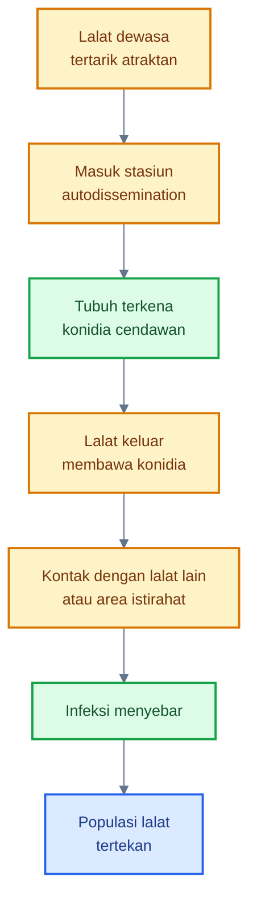

IAEA secara khusus menempatkan penggunaan lalat buah sebagai vektor konidia sebagai salah satu tujuan panduan pengendalian mikroba untuk lalat buah. ([IAEA][1])

### D. Aplikasi ke area istirahat lalat

Lalat dewasa tidak selalu berada pada buah. Mereka juga beristirahat pada daun, tanaman sekitar, pagar hidup, atau area terlindung. Aplikasi cendawan ke area istirahat dapat meningkatkan peluang kontak. Namun perlu hati-hati agar tidak mengganggu musuh alami dan tidak menyemprot berlebihan ke bunga.

### E. Aplikasi tanah untuk fase pupa tertentu

Beberapa pendekatan menargetkan fase tanah. Larva keluar dari buah dan masuk tanah untuk berpupa. Pada fase ini, cendawan atau nematoda entomopatogen dapat diarahkan ke zona bawah tajuk. Namun efektivitas sangat dipengaruhi kelembapan tanah, tekstur tanah, bahan organik, suhu, dan paparan matahari.

### F. Keterbatasan utama

| Faktor                         | Dampak                        |
| ------------------------------ | ----------------------------- |
| UV                             | menurunkan viabilitas konidia |
| Kelembapan rendah              | menghambat perkecambahan      |
| Strain tidak cocok             | infeksi rendah                |
| Formulasi buruk                | daya hidup rendah             |
| Aplikasi tidak mengenai target | hasil rendah                  |
| Hujan deras                    | mencuci inokulum              |
| Pestisida fungisida            | membunuh cendawan             |

---

## 11.4 Nematoda entomopatogen

Nematoda entomopatogen adalah nematoda yang menginfeksi serangga, biasanya melalui lubang alami atau kutikula, lalu melepaskan bakteri simbion yang membunuh inang. Dua genera utama yang banyak digunakan adalah _Steinernema_ dan _Heterorhabditis_.

Pada lalat buah, target utamanya bukan lalat yang sedang terbang, melainkan stadia yang berada di tanah:

- larva yang keluar dari buah;
- pupa;
- imago baru yang muncul dari tanah pada kondisi tertentu.

### A. _Steinernema_

_Steinernema_ banyak diteliti untuk hama tanah dan stadia serangga yang berada di tanah. Pada lalat buah, _Steinernema_ dapat diarahkan ke area bawah tajuk tempat buah jatuh dan larva masuk ke tanah.

### B. _Heterorhabditis_

_Heterorhabditis_ juga digunakan untuk target tanah. Beberapa spesies mampu menembus inang dan membunuhnya melalui bakteri simbion. Studi terhadap _Bactrocera dorsalis_ melaporkan efektivitas beberapa spesies _Steinernema_ dan _Heterorhabditis_ terhadap larva dan pupa dalam kondisi uji, dengan saran evaluasi lapang lebih lanjut. ([SpringerLink][8])

### C. Target larva dan pupa di tanah

Nematoda paling logis digunakan di bawah tajuk, terutama pada area yang sering terdapat buah jatuh. Pada cabai, area ini biasanya di sekitar guludan, mulsa berlubang, celah mulsa, dan tanah di bawah tanaman.

### D. Aplikasi di bawah tajuk

Praktik umum:

- aplikasikan pada tanah lembap;
- fokus pada bawah tajuk dan sekitar buah jatuh;
- lakukan sore hari;
- hindari permukaan tanah terlalu kering;
- jangan aplikasi saat panas ekstrem;
- jangan campur dengan bahan nematisida atau pestisida yang tidak kompatibel.

### E. Butuh kelembapan tanah

Nematoda entomopatogen membutuhkan kelembapan untuk bergerak dan bertahan. Tanah terlalu kering akan menurunkan efektivitas. Namun tanah tergenang juga tidak ideal.

### F. Sensitif UV dan kekeringan

Nematoda harus diarahkan ke tanah, bukan disemprot ke daun terbuka. UV dan kekeringan dapat membunuh nematoda dengan cepat.

---

## 11.5 Spinosad bait sebagai produk berbasis metabolit mikroba

Spinosad adalah bahan aktif insektisida yang berasal dari metabolit sekunder _Saccharopolyspora spinosa_. Secara teknis, spinosad bukan mikroba hidup yang diinokulasikan ke phyllosphere, tetapi produk berbasis metabolit mikroba. Karena itu, ia relevan dalam pembahasan “strategi biologis” atau biopestisida, terutama untuk sistem bait pada lalat buah.

### A. Asal spinosad

Spinosad dihasilkan dari fermentasi aerobik _Saccharopolyspora spinosa_. IPM World menjelaskan spinosad sebagai metabolit sekunder dari fermentasi aerobik _S. spinosa_. ([ipmworld.umn.edu][5])

### B. Digunakan sebagai umpan protein atau atraktan

Dalam pengendalian lalat buah, spinosad sering digunakan dalam formulasi bait. Prinsipnya, lalat dewasa tertarik ke umpan, makan, lalu terpapar bahan aktif. Pendekatan ini lebih selektif dibanding menyemprot seluruh tanaman karena aplikasi bisa berbentuk spot spray.

### C. Target adult fly

Spinosad bait menargetkan lalat dewasa, terutama yang aktif mencari makanan. Strategi ini tidak langsung membunuh larva yang sudah berada di dalam buah. Karena itu, sanitasi buah sakit tetap wajib.

### D. Cocok untuk spot spray

Spot spray berarti aplikasi titik atau jalur terbatas, bukan seluruh permukaan tanaman. Keuntungannya:

- mengurangi volume aplikasi;
- mengurangi paparan non-target;
- lebih fokus pada lokasi aktivitas lalat;
- dapat dikombinasikan dengan perangkap dan sanitasi.

### E. Ikuti label dan regulasi setempat

Spinosad tetap harus diperlakukan sebagai pestisida/biopestisida. Penggunaannya harus mengikuti:

- komoditas yang terdaftar;
- dosis label;
- interval aplikasi;
- PHI;
- MRL;
- perlindungan musuh alami dan penyerbuk;
- aturan lokal.

### Formula sederhana untuk evaluasi bait lalat buah

Penurunan infestasi buah:

$$
\text{Penurunan infestasi} = \frac{I_k - I_p}{I_k} \times 100%
$$

Keterangan: $I_k$ adalah infestasi pada kontrol atau sebelum perlakuan, dan $I_p$ adalah infestasi pada petak perlakuan.

Infestasi buah dapat dihitung sebagai:

$$
\text{Infestasi buah} = \frac{\text{jumlah buah terserang}}{\text{jumlah buah diamati}} \times 100%
$$

Untuk evaluasi berbasis larva atau pupa:

$$
\text{Pupa per kg buah} = \frac{\text{jumlah pupa ditemukan}}{\text{berat buah sampel dalam kg}}
$$

---

## Ringkasan praktis Bab 10 dan Bab 11

Inokulasi mikroba pada cabai berhasil bila strategi disusun menyeluruh. Pilih mikroba berdasarkan target, aplikasikan secara preventif, arahkan ke zona yang benar, lakukan pada waktu yang tepat, gunakan air yang sesuai, hindari campuran pestisida yang membunuh mikroba, jangan memberi nutrisi foliar berlebihan, dan evaluasi hasil secara terukur.

Untuk lalat buah, pendekatannya berbeda. Lalat buah bukan mikroba phyllosphere, tetapi menyerang zona phyllosphere buah. Strategi biologisnya harus menargetkan lalat dewasa, larva dalam buah, pupa di tanah, attract-and-kill, dan autodissemination. Komponen pentingnya adalah sanitasi buah, panen tepat waktu, perangkap methyl eugenol, protein bait, spinosad bait, cendawan entomopatogen, nematoda entomopatogen, dan pengelolaan area luas.

Prinsip akhirnya:

> Mikroba berhasil bukan karena disemprot lebih banyak, tetapi karena ditempatkan tepat sasaran, pada waktu yang tepat, dengan sistem PHT yang mendukung kehidupannya.

[1]: https://www.iaea.org/sites/default/files/21/05/2019_ipc_use_of_entomopathogenic_fungi_eng.pdf?utm_source=chatgpt.com '[PDF] Use of Entomopathogenic Fungi for Fruit Fly Control in Area-Wide ...'
[2]: https://irac-online.org/mode-of-action/?utm_source=chatgpt.com 'Mode of Action | Insecticide Resistance Action Committee (IRAC)'
[3]: https://www.frac.info/fungicide-resistance-management/by-frac-mode-of-action-group/?utm_source=chatgpt.com 'By FRAC Mode of Action Group'
[4]: https://www.mdpi.com/2075-4450/6/2/297?utm_source=chatgpt.com 'An Overview of Pest Species of Bactrocera Fruit Flies ...'
[5]: https://ipmworld.umn.edu/thompson-spinosad?utm_source=chatgpt.com 'Development of Spinosad and Attributes of A New Class of ...'
[6]: https://www.researchgate.net/publication/24434488_Effectiveness_of_Spinosad_Bait_Sprays_GF-120_in_Controlling_Mango-Infesting_Fruit_Flies_Diptera_Tephritidae_in_Benin?utm_source=chatgpt.com '(PDF) Effectiveness of Spinosad Bait Sprays (GF-120) in ...'
[7]: https://pmc.ncbi.nlm.nih.gov/articles/PMC10384719/?utm_source=chatgpt.com 'Can Entomopathogenic Nematodes and Their Symbiotic ...'
[8]: https://ejbpc.springeropen.com/articles/10.1186/s41938-019-0154-4?utm_source=chatgpt.com 'Assessment of the entomopathogenic nematodes against ...'

[**Kembali ke Atas**](#phyllosphere-cabai-sebagai-zona-strategis-pht-mengelola-mikroba-daun-untuk-menekan-opt-penyakit-dan-risiko-gagal-panen)

---

## 12. Integrasi mikroba, musuh alami, dan pestisida selektif

PHT cabai yang kuat bukan memilih salah satu antara mikroba, musuh alami, atau pestisida. Sistem yang kuat justru **mengintegrasikan ketiganya** secara tepat: mikroba digunakan untuk proteksi preventif, musuh alami dipertahankan untuk menekan populasi hama secara alami, dan pestisida selektif digunakan hanya bila monitoring menunjukkan risiko ekonomi atau epidemi penyakit sudah meningkat.

Dalam kerangka IPM, keputusan pengendalian harus berbasis ekologi dan kondisi lapang, bukan sekadar kalender semprot. FAO menekankan IPM sebagai proses dinamis berbasis pendekatan ekosistem, mendorong pertumbuhan tanaman sehat dengan gangguan minimal terhadap agroekosistem, dan memanfaatkan mekanisme pengendalian alami sejauh mungkin. ([FAOHome][1])

Pada cabai, integrasi ini menjadi sangat penting karena banyak OPT saling berhubungan. Thrips merusak pucuk dan bunga sekaligus dapat menjadi vektor virus. Kutu kebul menghasilkan honeydew, memicu embun jelaga, dan membawa virus kuning. Lalat buah melukai buah, lalu busuk sekunder masuk. Fungisida atau insektisida yang terlalu keras dapat menekan musuh alami dan mikroba baik, lalu hama sekunder seperti tungau meningkat.

Jadi, tujuan integrasi bukan hanya “mengendalikan OPT hari ini”, tetapi menjaga agar sistem budidaya tetap stabil sampai akhir musim.

---

### Diagram integrasi mikroba, musuh alami, dan pestisida selektif

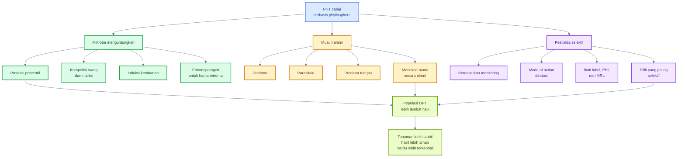

---

## 12.1 Urutan keputusan

Keputusan pengendalian cabai harus dilakukan secara bertahap. Semakin cepat praktisi mengidentifikasi masalah dengan benar, semakin kecil kebutuhan intervensi keras. Kerangka berikut dapat digunakan sebagai SOP pengambilan keputusan di lapang.

### 1. Apakah OPT teridentifikasi benar?

Langkah pertama adalah memastikan penyebab masalah. Daun cabai keriting bisa disebabkan thrips, tungau, aphid, virus, fitotoksik pestisida, stres air, atau ketidakseimbangan nutrisi. Bercak daun juga bisa berasal dari bakteri, fungi, luka mekanis, atau fitotoksik. Bila diagnosis salah, tindakan berikutnya hampir pasti tidak efisien.

Contoh kesalahan umum:

| Gejala        | Dugaan terburu-buru        | Risiko kesalahan                             |
| ------------- | -------------------------- | -------------------------------------------- |
| Daun keriting | langsung dianggap virus    | padahal bisa thrips, tungau, atau fitotoksik |
| Bercak daun   | langsung semprot fungisida | padahal bisa bercak bakteri                  |
| Gugur bunga   | langsung tambah pupuk      | padahal bisa thrips bunga atau stres air     |
| Buah busuk    | dianggap hanya antraknosa  | padahal bisa lalat buah dan busuk sekunder   |

Diagnosis perlu memakai pengamatan zona: pucuk, bawah daun, bunga, kelopak, buah muda, buah matang, dan daun bawah.

---

### 2. Apakah populasi masih rendah?

Jika populasi OPT masih rendah, tindakan paling baik biasanya bukan pestisida keras, tetapi penguatan sistem: sanitasi, mikroba preventif, perangkap, pengaturan kanopi, dan konservasi musuh alami.

Populasi rendah adalah fase terbaik untuk memakai mikroba dan agens hayati. Pada fase ini, mikroba masih punya peluang mengambil ruang, entomopatogen masih bisa menekan hama awal, dan musuh alami belum kalah jumlah.

---

### 3. Apakah musuh alami ada?

Sebelum menyemprot insektisida, cek keberadaan predator dan parasitoid. Musuh alami yang perlu diperhatikan antara lain kumbang koksi, laba-laba, lacewing, parasitoid kutu kebul, predator tungau, dan cendawan alami pada serangga.

Bila musuh alami masih aktif dan populasi hama belum tinggi, penggunaan insektisida broad-spectrum dapat merusak keseimbangan. Akibatnya, hama sekunder seperti tungau dapat meningkat. Dalam PHT, musuh alami adalah aset, bukan gangguan.

---

### 4. Apakah mikroba preventif sudah diaplikasikan?

Jika belum, dan kondisi serangan masih awal, aplikasi mikroba dapat menjadi langkah prioritas. Untuk penyakit, targetkan pucuk, bawah daun, kelopak, dan buah muda. Untuk hama pengisap, pertimbangkan cendawan entomopatogen pada pucuk, bunga, dan bawah daun.

Namun, bila penyakit sudah berat atau hama sudah meledak, mikroba saja biasanya tidak cukup. Pada kondisi tersebut, mikroba tetap bisa masuk sebagai bagian pemulihan sistem, tetapi perlu dikombinasikan dengan tindakan lain.

---

### 5. Apakah kondisi cuaca mendukung penyakit?

Cuaca menentukan risiko penyakit. Hujan, embun lama, kelembapan tinggi, kanopi rapat, dan suhu hangat dapat mempercepat bercak bakteri, antraknosa, serta penyakit daun. Sebaliknya, panas-kering dan debu sering mendukung ledakan tungau.

Pertanyaan praktis sebelum tindakan:

- Apakah 3–5 hari ke depan diperkirakan hujan?
- Apakah daun sering basah sampai siang?
- Apakah kanopi terlalu rimbun?
- Apakah ada buah sakit yang belum dibuang?
- Apakah aplikasi mikroba akan langsung tercuci?
- Apakah fungisida preventif diperlukan karena risiko antraknosa tinggi?

Keputusan PHT harus membaca tren cuaca, bukan hanya gejala hari ini.

---

### 6. Apakah perlu pestisida selektif?

Pestisida selektif digunakan bila risiko kerugian meningkat dan opsi non-kimia tidak cukup. Pilihan bahan harus disesuaikan dengan target: insektisida untuk hama, akarisida untuk tungau, bakterisida untuk bakteri, fungisida untuk jamur, atau bait untuk lalat buah.

Gunakan prinsip:

- target jelas;
- bahan sesuai OPT;
- pilih yang paling selektif;
- hindari broad-spectrum bila tidak perlu;
- perhatikan dampak pada mikroba baik dan musuh alami;
- patuhi label.

---

### 7. Apakah mode of action sudah dirotasi?

Rotasi mode of action penting untuk menunda resistensi. IRAC menjelaskan bahwa rotasi, urutan, atau pergantian senyawa dari kelompok mode of action berbeda merupakan bagian dari strategi manajemen resistensi insektisida yang efektif dan berkelanjutan. ([Insecticide Resistance Action Committee][2])

Untuk fungisida, FRAC menekankan bahwa fungisida dalam kelompok mode of action yang sama berpotensi menunjukkan cross-resistance ketika resistensi lapang muncul, sehingga tidak cocok dijadikan pasangan rotasi atau alternasi untuk manajemen resistensi. ([Frac][3])

Dalam praktik cabai, rotasi tidak cukup hanya mengganti merek. Yang harus diganti adalah **mode of action**, bukan nama dagang.

---

### 8. Apakah ada risiko residu menjelang panen?

Fase panen cabai berlangsung bertahap. Karena itu, risiko residu harus diperhitungkan setiap kali aplikasi pestisida. UC IPM menjelaskan PHI sebagai jumlah hari dari perlakuan sampai panen, dan beberapa bahan memiliki batas waktu sebelum panen yang harus dipatuhi. ([UC IPM][4])

Pertanyaan sebelum aplikasi menjelang panen:

- Kapan panen berikutnya?
- Berapa PHI bahan yang akan digunakan?
- Apakah bahan terdaftar untuk cabai?
- Apakah pasar tujuan memiliki batas MRL tertentu?
- Apakah ada alternatif non-residu seperti sanitasi, perangkap, atau mikroba sesuai label?

Keamanan pangan harus menjadi bagian dari PHT, bukan urusan akhir setelah panen.

---

### Diagram alur keputusan PHT sebelum aplikasi pestisida

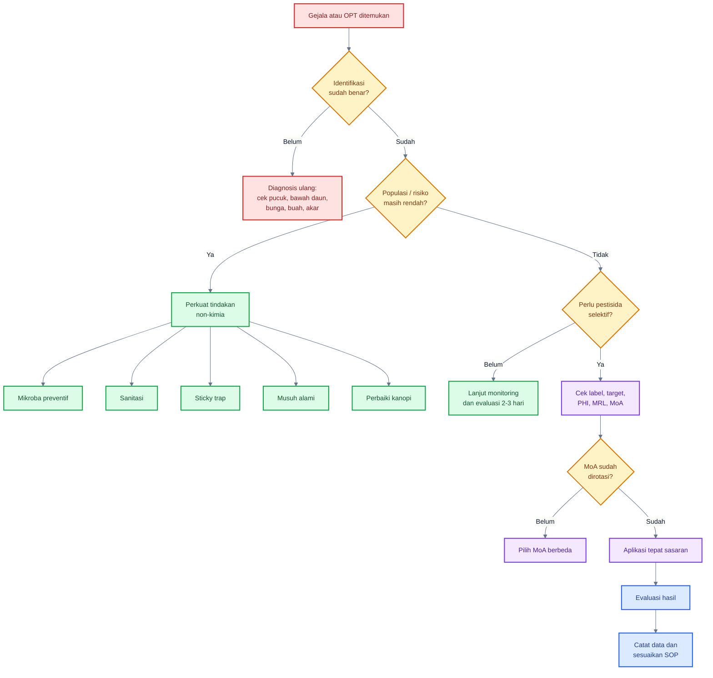

---

## 12.2 Pestisida sebagai alat terakhir

Pestisida dalam PHT **bukan dilarang**. Yang dihindari adalah penggunaan pestisida secara otomatis, berlebihan, tidak tepat target, tidak memperhatikan resistensi, dan merusak keseimbangan biologis tanpa alasan kuat.

Pestisida tetap diperlukan pada situasi tertentu, misalnya:

- populasi hama sudah melewati ambang tindakan;
- vektor virus meningkat pada fase tanaman muda;
- cuaca sangat mendukung antraknosa atau bercak bakteri;
- buah mulai banyak terserang lalat buah;
- tindakan biologis dan sanitasi tidak cukup;
- ada risiko kerugian ekonomi tinggi.

Namun penggunaannya harus mengikuti prinsip selektif.

---

### A. Bukan dilarang, tetapi harus berbasis keputusan

Dalam PHT, pestisida bukan musuh utama. Musuh utamanya adalah keputusan yang salah. Pestisida yang tepat, pada waktu yang tepat, dengan dosis tepat, target tepat, dan rotasi tepat dapat menjadi bagian penting dari perlindungan hasil.

Sebaliknya, pestisida yang salah dapat menyebabkan:

- resistensi OPT;
- matinya musuh alami;
- rusaknya mikroba baik;
- ledakan hama sekunder;
- residu melebihi batas;
- biaya meningkat;
- penyakit tetap tidak terkendali karena diagnosis salah.

---

### B. Digunakan berbasis monitoring

Semprot tanpa monitoring membuat petani tidak tahu apakah tindakan diperlukan. Monitoring harus mencatat:

- jenis OPT;
- zona serangan;
- fase tanaman;
- populasi atau intensitas;
- tren meningkat atau menurun;
- keberadaan musuh alami;
- riwayat aplikasi sebelumnya;
- cuaca;
- waktu menuju panen.

Aplikasi pestisida sebaiknya menjadi respons terhadap data, bukan kebiasaan mingguan.

---

### C. Pilih yang paling selektif

Pilih bahan yang sesuai target dan relatif aman terhadap komponen PHT lain. Misalnya, untuk tungau gunakan akarisida yang memang menargetkan tungau, bukan insektisida broad-spectrum yang membunuh predator. Untuk lalat buah, bait atau perangkap sering lebih selektif daripada semprot seluruh kanopi.

Selektivitas penting karena mikroba dan musuh alami adalah “modal biologis” kebun. Jika modal ini rusak, petani akan semakin bergantung pada pestisida.

---

### D. Rotasi IRAC dan FRAC

Untuk insektisida dan akarisida, gunakan klasifikasi IRAC. IRAC menyebut klasifikasi mode of action sebagai alat penting bagi petani, penyuluh, konsultan, dan profesional proteksi tanaman dalam strategi manajemen resistensi yang efektif. ([Insecticide Resistance Action Committee][5])

Untuk fungisida, gunakan klasifikasi FRAC. FRAC menyediakan rekomendasi pengelolaan resistensi fungisida dan pembaruan daftar kode mode of action untuk membantu mempertahankan efektivitas fungisida. ([Frac][6])

Prinsip praktis:

| Salah                                   | Benar                                  |
| --------------------------------------- | -------------------------------------- |
| Ganti merek tetapi bahan aktif/MoA sama | Rotasi berdasarkan MoA                 |
| Pakai satu bahan terus sepanjang musim  | Gunakan blok/rotasi sesuai target      |
| Campur bahan tanpa alasan               | Campur hanya bila kompatibel dan legal |
| Dosis diturunkan sembarangan            | Ikuti label                            |
| Pestisida dipakai tanpa monitoring      | Aplikasi berbasis data                 |

---

### E. Patuhi label, PHI, dan MRL

Label adalah dokumen hukum dan teknis. Dosis, target OPT, interval aplikasi, cara aplikasi, REI, PHI, dan peringatan keselamatan harus diikuti. UC IPM menegaskan bahwa instruksi label pestisida harus diikuti dan waktu yang diperlukan antara aplikasi dan panen harus dipenuhi. ([UC IPM][7])

PHI penting untuk keamanan panen. MRL penting untuk keamanan pangan dan akses pasar. Pada cabai yang dipanen bertahap, risiko pelanggaran PHI tinggi bila jadwal semprot tidak dikaitkan dengan jadwal panen.

---

### F. Jangan merusak mikroba baik dan musuh alami tanpa alasan kuat

Setiap aplikasi pestisida harus mempertimbangkan efek samping biologis. Bahan yang sangat keras terhadap fungi dapat mengganggu _Beauveria_, _Metarhizium_, _Lecanicillium_, _Trichoderma_, atau ragi antagonis. Bakterisida dapat mengganggu _Bacillus_ dan _Pseudomonas_. Insektisida broad-spectrum dapat menekan predator dan parasitoid.

Praktik yang lebih aman:

- beri jeda antara mikroba hidup dan pestisida keras;
- gunakan pestisida selektif;
- hindari tank-mix yang belum jelas kompatibilitasnya;
- semprot hanya zona target bila memungkinkan;
- setelah aplikasi pestisida keras, evaluasi kebutuhan re-inokulasi mikroba;
- jaga refugia dan musuh alami.

---

### Ringkasan Bab 12

Integrasi mikroba, musuh alami, dan pestisida selektif adalah inti PHT cabai modern. Mikroba berperan sebagai proteksi preventif, musuh alami menjaga tekanan hama, sedangkan pestisida selektif digunakan bila monitoring menunjukkan kebutuhan nyata.

Prinsip utamanya:

> Pestisida bukan dilarang dalam PHT, tetapi penggunaannya harus tepat target, berbasis monitoring, selektif, dirotasi berdasarkan mode of action, aman terhadap panen, dan tidak merusak komponen biologis tanpa alasan kuat.

[**Kembali ke Atas**](#phyllosphere-cabai-sebagai-zona-strategis-pht-mengelola-mikroba-daun-untuk-menekan-opt-penyakit-dan-risiko-gagal-panen)

---

# 13. Kalender PHT phyllosphere cabai

Kalender PHT phyllosphere cabai membantu praktisi mengubah teori menjadi jadwal kerja lapang. Kalender ini bukan jadwal semprot kaku, melainkan **kerangka keputusan berbasis fase tanaman**. Setiap fase cabai memiliki zona phyllosphere yang berbeda, risiko OPT yang berbeda, dan strategi mikroba yang berbeda.

Pada cabai, fase kritis utama adalah:

1. persemaian;
2. 0–14 HST;
3. vegetatif;
4. pra-bunga;
5. buah muda;
6. panen;
7. akhir musim.

HST berarti **hari setelah tanam**.

---

### Diagram kalender PHT phyllosphere cabai

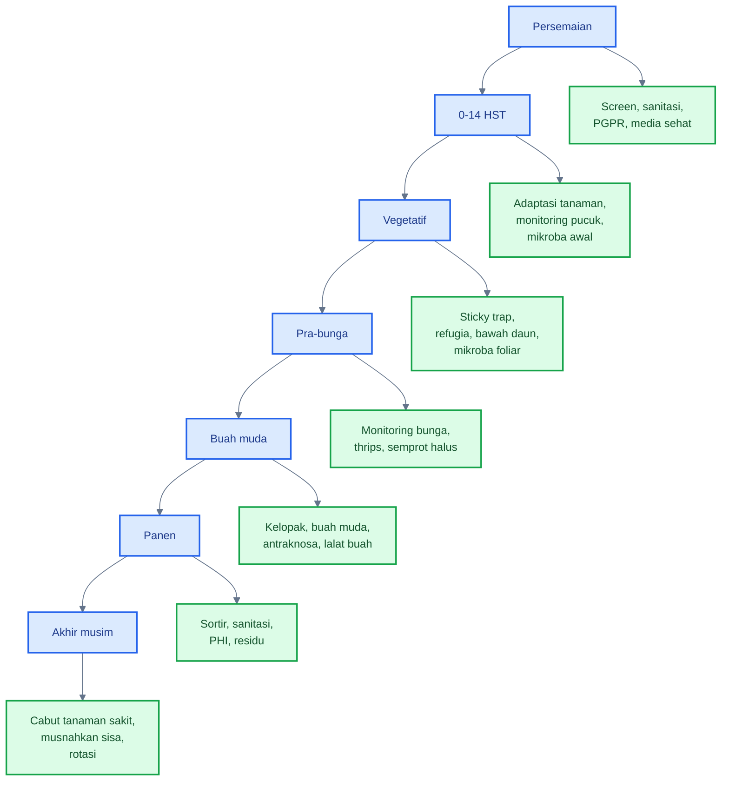

---

## Tabel inti kalender PHT phyllosphere cabai

| Fase        | Target utama              | Zona phyllosphere | Tindakan PHT                    | Mikroba yang relevan                     |
| ----------- | ------------------------- | ----------------- | ------------------------------- | ---------------------------------------- |
| Persemaian  | vektor virus, damping-off | daun muda, media  | screen, sanitasi, PGPR          | _Bacillus_, _Pseudomonas_, _Trichoderma_ |
| 0–14 HST    | adaptasi tanaman          | pucuk, bawah daun | monitoring, mikroba awal        | _Bacillus_, PGPR                         |
| Vegetatif   | thrips, aphid, kutu kebul | pucuk, bawah daun | sticky trap, refugia, mikroba   | _Bacillus_, _Beauveria_                  |
| Pra-bunga   | thrips bunga              | pucuk, bunga      | monitoring bunga, semprot halus | _Beauveria_, _Lecanicillium_             |
| Buah muda   | antraknosa, lalat buah    | kelopak, buah     | proteksi buah, sanitasi         | _Bacillus_, _Paenibacillus_, ragi        |
| Panen       | busuk buah, residu        | buah              | sortir, sanitasi, PHI           | ragi antagonis/biokontrol sesuai label   |
| Akhir musim | sumber inokulum           | sisa tanaman      | cabut, musnahkan, rotasi        | kompos hayati matang                     |

---

## 13.1 Persemaian

Persemaian adalah fase paling penting untuk mencegah virus dan patogen awal. Bibit yang sudah membawa virus, thrips, kutu kebul, bercak bakteri, atau akar lemah akan menjadi sumber masalah setelah pindah tanam.

### Target utama

- vektor virus;
- damping-off;
- bibit tidak sehat;
- patogen terbawa media;
- kontaminasi tray dan alat.

### Zona prioritas

- daun muda;
- pucuk bibit;
- media semai;
- pangkal batang;
- tray dan meja semai.

### Tindakan PHT

1. Gunakan benih sehat.
2. Gunakan media bersih dan matang.
3. Gunakan screen nursery.
4. Bersihkan tray dan alat.
5. Kendalikan gulma sekitar persemaian.
6. Gunakan PGPR atau mikroba sesuai rekomendasi.
7. Gunakan _Trichoderma_ pada media bila sesuai.
8. Buang bibit abnormal, kerdil, mosaik, atau keriting.

### Mikroba relevan

- _Bacillus_ untuk proteksi awal dan ketahanan;
- _Pseudomonas_ sebagai PGPR;
- _Trichoderma_ untuk media;
- mikoriza bila sistem produksi memungkinkan.

### Catatan praktis

Jangan mengejar jumlah bibit dengan mempertahankan bibit sakit. Dalam PHT cabai, bibit sakit adalah sumber epidemi awal.

---

## 13.2 Fase 0–14 HST

Fase 0–14 HST adalah masa adaptasi setelah pindah tanam. Tanaman sedang membangun akar baru, menyesuaikan diri dengan lingkungan lahan, dan mulai membentuk phyllosphere lapang.

### Target utama

- stres pindah tanam;
- hama pengisap awal;
- virus awal;
- bercak daun awal;
- akar belum stabil.

### Zona prioritas

- pucuk;
- bawah daun;
- pangkal batang;
- rhizosphere;
- daun muda.

### Tindakan PHT

1. Monitoring tanaman minimal 2 kali per minggu.
2. Cek pucuk dan bawah daun.
3. Pasang sticky trap sejak awal.
4. Aplikasi mikroba awal setelah tanaman pulih.
5. Jaga kelembapan tanah stabil.
6. Hindari pemupukan nitrogen berlebih.
7. Ganti tanaman mati atau sakit berat sesuai batas waktu sulam.
8. Cabut tanaman bergejala virus berat sejak awal.

### Mikroba relevan

- _Bacillus_ foliar untuk pucuk dan bawah daun;
- PGPR untuk akar;
- _Trichoderma_ untuk media;
- _Pseudomonas_ bila tersedia dalam formulasi akar/PGPR.

### Catatan praktis

Fase ini menentukan arah musim. Bila vektor virus sudah masuk pada awal tanam, kerugian dapat berlangsung sampai panen.

---

## 13.3 Fase vegetatif

Fase vegetatif adalah fase pertumbuhan kanopi. Pucuk aktif tumbuh dan menjadi target utama hama pengisap. Di sisi lain, ini adalah waktu terbaik membangun komunitas mikroba baik pada phyllosphere.

### Target utama

- thrips;
- aphid;
- kutu kebul;
- tungau;
- virus;
- bercak daun awal;
- kanopi terlalu rimbun.

### Zona prioritas

- pucuk;
- bawah daun;
- ketiak daun;
- daun muda;
- daun bawah.

### Tindakan PHT

1. Monitoring pucuk, bawah daun, dan daun bawah.
2. Gunakan sticky trap kuning/biru sesuai target.
3. Jaga refugia dan tanaman penghalang.
4. Semprot mikroba phyllosphere secara preventif.
5. Arahkan aplikasi ke bawah daun.
6. Kelola nitrogen agar pucuk tidak terlalu lunak.
7. Bersihkan gulma inang.
8. Jaga sirkulasi udara kanopi.
9. Hindari insektisida broad-spectrum bila belum perlu.

### Mikroba relevan

- _Bacillus_ untuk proteksi daun dan induksi ketahanan;
- _Beauveria_ untuk hama pengisap tertentu;
- _Lecanicillium_ untuk kutu kebul/aphid tertentu;
- PGPR untuk mempertahankan akar sehat.

### Catatan praktis

Pada fase vegetatif, keberhasilan tidak hanya dilihat dari tanaman hijau subur. Tanaman yang terlalu subur karena nitrogen berlebihan justru bisa menjadi lebih disukai hama pengisap.

---

## 13.4 Fase pra-bunga

Pra-bunga adalah fase transisi menuju produksi. Kesalahan pada fase ini dapat menyebabkan bunga rusak, gugur, atau gagal menjadi buah. Thrips menjadi target penting karena sering tersembunyi di bunga dan pucuk.

### Target utama

- thrips bunga;
- gugur bunga;
- stres nutrisi;
- pucuk terlalu lunak;
- awal infeksi pada calon buah.

### Zona prioritas

- pucuk;
- bunga awal;
- bawah daun;
- ketiak daun;
- cabang produktif.

### Tindakan PHT

1. Monitoring bunga dengan cara diketuk atau diperiksa langsung.
2. Semprot halus, jangan merusak bunga.
3. Aplikasi entomopatogen bila target thrips dan kondisi mendukung.
4. Pertahankan musuh alami.
5. Hindari pestisida keras saat tidak perlu.
6. Jaga kelembapan agar bunga tidak terlalu basah lama.
7. Koreksi nutrisi dengan hati-hati, jangan berlebihan nitrogen.

### Mikroba relevan

- _Beauveria_ untuk thrips;
- _Lecanicillium_ untuk hama pengisap tertentu;
- _Bacillus_ untuk proteksi phyllosphere;
- ragi antagonis bila tersedia dan cocok untuk bunga/permukaan tanaman.

### Catatan praktis

Aplikasi pada fase bunga harus lebih lembut. Semprotan kasar dapat menyebabkan bunga rusak dan meningkatkan gugur bunga.

---

## 13.5 Fase buah muda

Fase buah muda adalah titik kritis untuk mencegah antraknosa laten, lalat buah, dan busuk sekunder. Buah muda yang tampak sehat belum tentu bebas infeksi. Kelopak dan pangkal buah harus menjadi target utama.

### Target utama

- antraknosa;
- infeksi laten;
- lalat buah;
- busuk buah awal;
- luka mikro pada buah.

### Zona prioritas

- kelopak;
- pangkal buah;
- buah muda;
- bunga sisa;
- daun bawah;
- area bawah tajuk.

### Tindakan PHT

1. Proteksi kelopak dan buah muda sejak awal fruit set.
2. Aplikasi mikroba antagonis secara preventif.
3. Pasang perangkap lalat buah.
4. Gunakan methyl eugenol sesuai target spesies dan rekomendasi.
5. Kumpulkan buah sakit dan buah jatuh.
6. Kurangi percikan tanah dengan mulsa.
7. Hindari overhead irrigation.
8. Evaluasi kebutuhan fungisida preventif bila risiko antraknosa tinggi.
9. Jaga rotasi FRAC bila menggunakan fungisida.

### Mikroba relevan

- _Bacillus_;
- _Paenibacillus_;
- ragi antagonis;
- entomopatogen untuk strategi lalat buah tertentu;
- nematoda entomopatogen untuk fase tanah bila tersedia dan sesuai.

### Catatan praktis

Buah muda adalah fase paling penting untuk antraknosa. Menunggu bercak muncul berarti sering kali sudah terlambat.

---

## 13.6 Fase panen

Fase panen berlangsung berulang. Tantangannya adalah menjaga hasil tetap sehat, mengurangi busuk pascapanen, dan mencegah residu berlebih.

### Target utama

- busuk buah;
- antraknosa aktif;
- lalat buah;
- luka panen;
- residu pestisida;
- kontaminasi antarbuah.

### Zona prioritas

- buah;
- kelopak;
- pangkal buah;
- wadah panen;
- area sortasi;
- buah jatuh.

### Tindakan PHT

1. Panen hati-hati.
2. Pisahkan buah sakit dari buah sehat.
3. Jangan meninggalkan buah busuk di lahan.
4. Patuhi PHI pestisida.
5. Gunakan biokontrol pascapanen hanya bila produk sesuai label.
6. Jaga wadah panen bersih.
7. Hindari panen saat buah sangat basah bila memungkinkan.
8. Catat aplikasi pestisida dan tanggal panen.

### Mikroba relevan

- ragi antagonis sesuai label;
- _Bacillus_ sesuai label;
- biokontrol pascapanen yang terdaftar;
- tidak semua mikroba lapang aman dipakai pascapanen tanpa registrasi.

### Catatan praktis

Fase panen adalah fase risiko residu tertinggi. Setiap aplikasi pestisida harus dikaitkan dengan jadwal panen berikutnya.

---

## 13.7 Akhir musim

Akhir musim adalah fase memutus siklus OPT. Banyak petani gagal menekan penyakit musim berikutnya karena sisa tanaman sakit, buah busuk, pupa lalat buah, dan gulma inang dibiarkan di lahan.

### Target utama

- sumber inokulum;
- pupa lalat buah;
- sisa patogen daun dan buah;
- virus pada tanaman sakit;
- alat dan ajir terkontaminasi.

### Zona prioritas

- sisa tanaman;
- buah busuk;
- daun sakit;
- tanah bawah tajuk;
- ajir;
- mulsa;
- tray dan alat.

### Tindakan PHT

1. Cabut tanaman sakit.
2. Kumpulkan buah busuk dan buah jatuh.
3. Musnahkan sisa tanaman terinfeksi.
4. Bersihkan ajir dan alat.
5. Kelola mulsa bekas.
6. Lakukan rotasi tanaman.
7. Hindari menanam cabai terus-menerus di lahan yang sama.
8. Gunakan kompos hanya bila benar-benar matang.
9. Siapkan sanitasi sebelum musim berikutnya.

### Mikroba relevan

- kompos hayati matang;
- _Trichoderma_ pada pengelolaan media/tanah;
- PGPR untuk awal musim berikutnya;
- dekomposer hanya bila proses kompos dikelola benar.

### Catatan praktis

PHT musim berikutnya dimulai dari kebersihan akhir musim ini.

---

## Kalender aksi mingguan sederhana

| Minggu/fase | Fokus pengamatan                    | Keputusan utama                           |
| ----------- | ----------------------------------- | ----------------------------------------- |
| Persemaian  | bibit keriting, vektor, damping-off | buang bibit sakit, screen, PGPR           |
| 0–2 MST     | pucuk, bawah daun, adaptasi         | mikroba awal, sticky trap                 |
| 3–5 MST     | hama pengisap, kanopi               | entomopatogen bila perlu, kelola nitrogen |
| Pra-bunga   | thrips bunga, gugur bunga           | monitoring bunga, semprot halus           |
| Buah awal   | kelopak, antraknosa, lalat buah     | proteksi buah, perangkap, sanitasi        |
| Panen rutin | buah busuk, residu                  | sortir, buang buah sakit, patuhi PHI      |
| Akhir musim | sisa tanaman, buah jatuh            | cabut, musnahkan, rotasi                  |

MST berarti **minggu setelah tanam**.

---

## Ringkasan Bab 13

Kalender PHT phyllosphere cabai membantu praktisi menentukan **apa yang harus diamati, kapan harus bertindak, dan mikroba apa yang relevan** pada setiap fase tanaman. Fokusnya berubah dari persemaian, adaptasi awal, vegetatif, pra-bunga, buah muda, panen, sampai akhir musim.

Prinsip paling penting:

> PHT cabai tidak dimulai saat penyakit muncul. PHT dimulai sejak persemaian, diperkuat pada fase vegetatif, ditajamkan menjelang bunga dan buah muda, lalu ditutup dengan sanitasi akhir musim.

[1]: https://www.fao.org/pest-and-pesticide-management/ipm/integrated-pest-management/en/?utm_source=chatgpt.com 'Integrated Pest Management (IPM)'
[2]: https://irac-online.org/mode-of-action/classification-online/?utm_source=chatgpt.com 'Mode of Action Classification | Insecticide Resistance ...'
[3]: https://www.frac.info/fungicide-resistance-management/by-frac-mode-of-action-group/?utm_source=chatgpt.com 'By FRAC Mode of Action Group'
[4]: https://ipm.ucanr.edu/agriculture/peppers/herbicide-treatment-table/?utm_source=chatgpt.com 'Herbicide Treatment Table / Peppers / Agriculture'
[5]: https://irac-online.org/mode-of-action/?utm_source=chatgpt.com 'Mode of Action | Insecticide Resistance Action Committee ...'
[6]: https://www.frac.info/fungicide-resistance-management/?utm_source=chatgpt.com 'Fungicide Resistance Management'
[7]: https://ipm.ucanr.edu/legacy_assets/PDF/PMG/pmgpeppers.pdf?utm_source=chatgpt.com 'PEPPERS'

[**Kembali ke Atas**](#phyllosphere-cabai-sebagai-zona-strategis-pht-mengelola-mikroba-daun-untuk-menekan-opt-penyakit-dan-risiko-gagal-panen)

---

## 14. Kesalahan umum petani dalam aplikasi mikroba

Aplikasi mikroba menguntungkan pada cabai sering gagal bukan karena konsepnya salah, tetapi karena cara penerapannya tidak sesuai dengan sifat mikroba hidup. Mikroba bukan bahan kimia inert. Mereka bisa mati, dorman, tercuci, kalah bersaing, atau gagal mencapai zona target.

Dalam PHT, mikroba harus diperlakukan sebagai **komponen biologis yang perlu kondisi pendukung**. Ini sejalan dengan prinsip PHT yang mengintegrasikan berbagai teknik pengendalian dan menempatkan pestisida sebagai alternatif terakhir bila cara non-kimia kurang efektif. Panduan SOP cabai rawit dari Ditjen Hortikultura juga menekankan bahwa pengendalian OPT cabai dilakukan berdasarkan konsep PHT, pengamatan berkala, ambang kendali, dan pestisida sebagai alternatif terakhir. ([Hortikultura Pertanian][1])

### Diagram troubleshooting aplikasi mikroba pada cabai

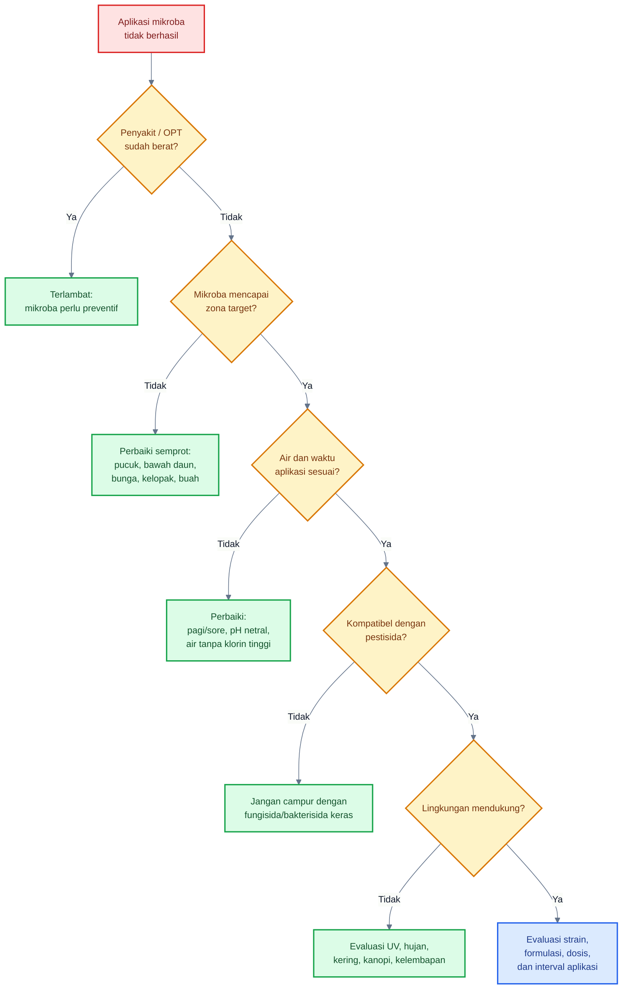

---

### 1. Menyemprot mikroba setelah penyakit sudah berat

Ini kesalahan paling umum. Mikroba menguntungkan bekerja paling baik sebagai **proteksi preventif**, bukan sebagai obat darurat ketika tanaman sudah rusak berat.

Jika antraknosa sudah banyak muncul pada buah, bercak bakteri sudah menyebar luas, atau pucuk sudah keriting parah akibat virus, maka ruang, nutrisi, dan jaringan tanaman sudah banyak dikuasai patogen atau vektor. Dalam kondisi seperti ini, mikroba tetap bisa membantu pemulihan sistem, tetapi biasanya tidak cukup bila digunakan sendirian.

Praktik yang benar:

| Kondisi                         | Tindakan lebih tepat                                                                    |
| ------------------------------- | --------------------------------------------------------------------------------------- |
| Belum ada gejala, risiko tinggi | aplikasi mikroba preventif                                                              |
| Gejala awal terbatas            | mikroba + sanitasi + monitoring ketat                                                   |
| Serangan berat                  | sanitasi, pengendalian target, pestisida selektif bila perlu, lalu re-inokulasi mikroba |
| Tanaman virus berat             | cabut sumber infeksi, kendalikan vektor                                                 |

Prinsipnya:

> Mikroba baik harus datang sebelum patogen menguasai zona phyllosphere.

---

### 2. Mencampur mikroba dengan fungisida atau bakterisida keras

Banyak mikroba yang diaplikasikan adalah organisme hidup. Jika dicampur dengan bahan yang memang dirancang untuk membunuh jamur atau bakteri, mikroba tersebut bisa mati sebelum mencapai daun.

Bahan yang perlu diwaspadai:

- fungisida broad-spectrum;
- bakterisida kuat;
- tembaga dosis tinggi;
- klorin;
- antibiotik pertanian;
- larutan sangat asam atau sangat basa;
- surfaktan agresif.

Praktik yang benar:

- jangan asal tank-mix;
- cek label dan kompatibilitas;
- beri jeda aplikasi;
- gunakan pestisida selektif bila perlu;
- setelah aplikasi pestisida keras, evaluasi kebutuhan re-inokulasi mikroba.

---

### 3. Menyemprot siang hari saat UV tinggi

Phyllosphere adalah habitat keras. UV tinggi, panas, dan daun yang cepat kering dapat menurunkan viabilitas mikroba. Aplikasi siang hari sering membuat droplet cepat menguap sebelum mikroba sempat menempel.

Praktik yang benar:

- aplikasi pagi atau sore;
- untuk cendawan entomopatogen, sore sering lebih baik;
- hindari daun yang sedang panas;
- jangan aplikasi saat tanaman stres air berat;
- pastikan aplikasi tidak langsung disusul hujan deras.

---

### 4. Menggunakan air berklorin tinggi

Klorin digunakan untuk membunuh mikroba. Maka, air dengan klorin tinggi berisiko menurunkan daya hidup mikroba dalam tangki semprot.

Praktik yang benar:

- gunakan air bersih;
- hindari air yang berbau klorin kuat;
- endapkan air bila perlu;
- jangan mencampur mikroba dengan larutan sanitasi;
- gunakan larutan mikroba segera setelah dicampur.

Untuk aplikasi mikroba hidup, kualitas air sering menentukan hasil. Produk yang bagus bisa gagal jika air pembawanya tidak sesuai.

---

### 5. Memberi molase atau gula terlalu banyak

Memberi gula, molase, POC pekat, susu, atau bahan organik lain ke daun sering dianggap dapat “memberi makan” mikroba baik. Masalahnya, bahan ini tidak selektif. Yang mendapat makanan bukan hanya mikroba baik, tetapi juga patogen, ragi liar, jamur oportunis, dan bakteri pembusuk.

Risiko pemberian nutrisi foliar berlebihan:

- daun lengket;
- jamur jelaga meningkat;
- patogen oportunis berkembang;
- bunga dan kelopak terlalu basah;
- busuk buah meningkat;
- hama pengisap lebih nyaman;
- permukaan phyllosphere menjadi terlalu kaya nutrisi.

Praktik yang benar:

- jangan rutin menambahkan molase/gula pada aplikasi foliar;
- gunakan bahan pembawa sesuai label produk;
- pilih perekat/perata yang kompatibel;
- utamakan waktu dan target aplikasi, bukan “pakan” berlebihan.

---

### 6. Tidak mengenai bawah daun

Banyak hama cabai berada di bawah daun: kutu kebul, aphid, tungau, telur thrips, dan sebagian koloni hama kecil. Bawah daun juga menjadi mikrohabitat lembap yang penting untuk kolonisasi mikroba baik.

Jika semprotan hanya mengenai daun bagian atas, maka aplikasi mikroba tidak mencapai lokasi utama kompetisi biologis.

Praktik yang benar:

- arahkan nozzle ke bawah daun;
- gunakan droplet halus;
- semprot dari beberapa arah;
- perhatikan kanopi bagian dalam;
- cek hasil semprot dengan melihat deposit pada bawah daun.

---

### 7. Tidak mengulang setelah hujan

Hujan deras dapat mencuci mikroba dari permukaan daun, bunga, kelopak, dan buah. Pada saat yang sama, hujan juga meningkatkan percikan tanah dan penyebaran spora patogen.

Praktik yang benar:

- jangan aplikasi tepat sebelum hujan besar;
- setelah hujan deras, cek ulang kondisi tanaman;
- ulang aplikasi bila tekanan penyakit tinggi;
- gunakan mulsa untuk mengurangi percikan tanah;
- perbaiki drainase dan sirkulasi udara.

---

### 8. Menganggap semua _Bacillus_ sama

Nama genus tidak cukup. _Bacillus subtilis_, _B. amyloliquefaciens_, _B. velezensis_, dan strain lain dapat memiliki kemampuan berbeda. Bahkan dalam spesies yang sama, strain berbeda bisa menghasilkan metabolit berbeda dan efektivitas berbeda.

Kesalahan praktis:

- membeli produk hanya karena tertulis _Bacillus_;
- tidak melihat strain, populasi, formulasi, dan masa kedaluwarsa;
- mengharapkan semua _Bacillus_ efektif untuk semua penyakit;
- mencampur dengan bahan keras lalu menyalahkan produknya.

Praktik yang benar:

- pilih produk dengan identitas mikroba jelas;
- lihat target OPT pada label;
- perhatikan populasi hidup;
- perhatikan cara simpan;
- uji pada petak kecil sebelum skala luas.

---

### 9. Menganggap semua _Trichoderma_ cocok untuk foliar

_Trichoderma_ sangat kuat untuk tanah, media, rhizosphere, dan kompos. Namun tidak semua formulasi _Trichoderma_ cocok untuk semprot daun. Phyllosphere memiliki UV tinggi, cepat kering, dan permukaan miskin nutrisi. Formulasi yang bagus di media belum tentu stabil di daun.

Praktik yang benar:

- gunakan _Trichoderma_ terutama untuk media, kompos, dan akar;
- aplikasi foliar hanya bila label/formulasi menyebutkan foliar;
- jangan campur dengan fungisida;
- jangan mengharapkan _Trichoderma_ foliar menjadi solusi cepat untuk penyakit buah berat.

---

### 10. Tidak melakukan monitoring OPT

Tanpa monitoring, aplikasi mikroba dan pestisida menjadi rutinitas buta. Petani tidak tahu apakah targetnya thrips, tungau, kutu kebul, bercak bakteri, antraknosa, virus, atau fitotoksik.

Monitoring menentukan:

- jenis OPT;
- zona serangan;
- fase tanaman;
- tingkat risiko;
- perlu atau tidaknya pestisida selektif;
- perlu atau tidaknya aplikasi ulang mikroba;
- efektivitas tindakan sebelumnya.

Prinsip PHT menurut FAO adalah mengintegrasikan berbagai teknik pengendalian untuk menumbuhkan tanaman sehat dan meminimalkan penggunaan pestisida melalui pendekatan yang mempertimbangkan ekosistem. Monitoring adalah dasar agar integrasi tersebut tidak salah arah. ([FAOHome][2])

---

### 11. Tidak membuang buah sakit

Buah sakit adalah sumber inokulum. Pada cabai, buah antraknosa, buah busuk, buah terserang lalat buah, dan buah jatuh dapat menjadi sumber spora, larva, pupa, bakteri pembusuk, dan serangga lain.

Kesalahan umum:

- buah sakit dibiarkan menggantung;
- buah busuk dibuang di pinggir lahan;
- buah jatuh tidak dikumpulkan;
- buah sakit dicampur dengan buah sehat saat panen.

Praktik yang benar:

- kumpulkan buah sakit secara rutin;
- musnahkan dengan cara aman;
- jangan biarkan buah busuk menjadi reservoir;
- lakukan sortasi sejak di kebun;
- sanitasi area bawah tajuk.

---

### 12. Memakai insektisida broad-spectrum hingga musuh alami hilang

Insektisida broad-spectrum dapat menekan hama dengan cepat, tetapi juga dapat membunuh predator, parasitoid, dan organisme non-target. Setelah musuh alami hilang, hama seperti tungau, aphid, dan kutu kebul bisa meningkat kembali lebih cepat.

Praktik yang benar:

- gunakan insektisida berbasis monitoring;
- pilih bahan selektif;
- rotasi mode of action;
- pertahankan refugia;
- cek keberadaan musuh alami sebelum aplikasi;
- gunakan pestisida keras hanya bila benar-benar diperlukan.

IRAC menekankan rotasi atau pergantian senyawa dari kelompok mode of action berbeda untuk meminimalkan seleksi resistensi insektisida, sedangkan FRAC menekankan bahwa fungisida dalam kelompok MoA yang sama berisiko cross-resistance dan tidak cocok dijadikan pasangan rotasi resistensi. ([Insecticide Resistance Action Committee][3])

---

### Tabel ringkas kesalahan dan koreksi

| Kesalahan                           | Dampak                       | Koreksi                          |
| ----------------------------------- | ---------------------------- | -------------------------------- |
| Aplikasi setelah penyakit berat     | mikroba kalah bersaing       | mulai preventif                  |
| Campur fungisida/bakterisida keras  | mikroba mati                 | beri jeda, cek kompatibilitas    |
| Semprot siang hari                  | UV dan panas menekan mikroba | pagi/sore                        |
| Air berklorin                       | viabilitas turun             | gunakan air bersih               |
| Molase/gula berlebihan              | patogen ikut naik            | hindari pakan foliar berlebih    |
| Tidak kena bawah daun               | target hama terlewat         | arahkan nozzle ke bawah daun     |
| Tidak ulang setelah hujan           | mikroba tercuci              | evaluasi dan ulang bila perlu    |
| Semua _Bacillus_ dianggap sama      | salah produk/target          | pilih strain/formulasi jelas     |
| Semua _Trichoderma_ dianggap foliar | aplikasi tidak cocok         | gunakan sesuai label             |
| Tanpa monitoring                    | tindakan salah sasaran       | buat jadwal pengamatan           |
| Buah sakit dibiarkan                | sumber inokulum              | sanitasi buah                    |
| Insektisida broad-spectrum berlebih | musuh alami hilang           | gunakan selektif berbasis ambang |

[**Kembali ke Atas**](#phyllosphere-cabai-sebagai-zona-strategis-pht-mengelola-mikroba-daun-untuk-menekan-opt-penyakit-dan-risiko-gagal-panen)

---

## 15. Checklist lapang untuk praktisi

Checklist lapang membantu praktisi mengubah konsep PHT menjadi tindakan rutin. Tujuannya bukan membuat pekerjaan rumit, tetapi memastikan keputusan pengendalian berbasis data.

Checklist ini sebaiknya dilakukan minimal **1 kali per minggu** pada kondisi normal, dan **2–3 kali per minggu** saat musim hujan, tekanan vektor tinggi, fase berbunga, atau fase buah muda.

### Checklist mingguan

- [ ] Cek pucuk 20–50 tanaman sampel.
- [ ] Cek bawah daun.
- [ ] Cek bunga.
- [ ] Cek kelopak dan buah muda.
- [ ] Hitung sticky trap.
- [ ] Catat gejala virus.
- [ ] Catat bercak daun.
- [ ] Catat buah antraknosa.
- [ ] Catat keberadaan musuh alami.
- [ ] Evaluasi cuaca 3–5 hari ke depan.
- [ ] Putuskan: cukup monitoring, mikroba, sanitasi, atau perlu pestisida selektif.

---

### 15.1 Cara mengambil sampel tanaman

Agar data tidak bias, jangan hanya memeriksa tanaman di pinggir lahan atau tanaman yang tampak sakit. Gunakan pola zig-zag atau diagonal.

Contoh sederhana:

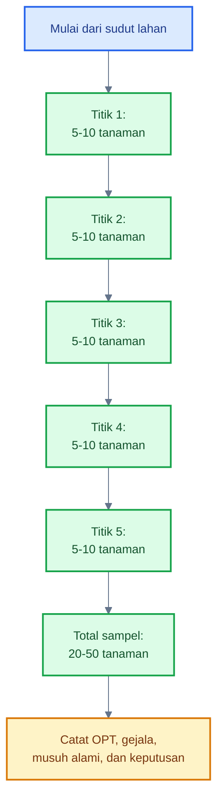

Untuk lahan kecil, 20 tanaman sampel bisa cukup sebagai awal. Untuk lahan lebih luas atau tidak seragam, gunakan 50 tanaman atau lebih. Yang penting adalah konsisten, sehingga data minggu ini bisa dibandingkan dengan minggu sebelumnya.

---

### 15.2 Apa yang dicek pada setiap zona?

| Zona              | Yang diamati                                       | Keputusan awal                                  |
| ----------------- | -------------------------------------------------- | ----------------------------------------------- |
| Pucuk             | thrips, aphid, kutu kebul, tungau, keriting, virus | monitoring intensif, mikroba, kendali vektor    |
| Bawah daun        | kutu kebul, aphid, telur thrips, tungau, bercak    | semprot bawah daun, entomopatogen, sticky trap  |
| Bunga             | thrips, gugur bunga, kerusakan bunga               | semprot halus, jaga musuh alami                 |
| Kelopak           | air tertahan, bercak awal, spora, luka             | proteksi antraknosa, mikroba antagonis          |
| Buah muda         | antraknosa laten, tusukan lalat buah, luka         | sanitasi, perangkap, proteksi buah              |
| Daun bawah        | bercak daun, percikan tanah, daun tua sakit        | pangkas selektif, sanitasi, mulsa               |
| Tanah bawah tajuk | buah jatuh, pupa lalat buah, kelembapan            | sanitasi buah, nematoda/agens tanah bila sesuai |
| Sticky trap       | jumlah dan jenis serangga                          | tren vektor naik atau turun                     |

---

### 15.3 Format catatan mingguan

Gunakan format sederhana. Catatan yang konsisten lebih berguna daripada catatan rumit tetapi tidak dilakukan.

| Tanggal | Fase tanaman | OPT dominan | Zona serangan | Intensitas/tren   | Musuh alami | Cuaca               | Tindakan                   | Evaluasi       |
| ------- | ------------ | ----------- | ------------- | ----------------- | ----------- | ------------------- | -------------------------- | -------------- |
|         |              |             |               | naik/turun/stabil | ada/tidak   | kering/hujan/lembap | mikroba/sanitasi/pestisida | berhasil/belum |

---

### 15.4 Formula sederhana untuk evaluasi lapang

Insidensi OPT atau penyakit:

$$
\text{Insidensi} = \frac{\text{jumlah tanaman atau buah terserang}}{\text{jumlah tanaman atau buah diamati}} \times 100%
$$

Buah layak jual:

$$
\text{Buah layak jual} = \frac{\text{berat buah sehat}}{\text{berat total panen}} \times 100%
$$

Efektivitas tindakan dibanding petak pembanding:

$$
\text{Efektivitas} = \frac{K - P}{K} \times 100%
$$

Keterangan: $K$ adalah nilai serangan pada kontrol atau petak pembanding, dan $P$ adalah nilai serangan pada petak perlakuan.

---

### 15.5 Matriks keputusan cepat

| Kondisi lapang                                     | Keputusan                                                                      |
| -------------------------------------------------- | ------------------------------------------------------------------------------ |
| OPT belum terlihat, cuaca mulai mendukung penyakit | mikroba preventif + monitoring                                                 |
| Thrips mulai muncul di bunga                       | monitoring bunga + entomopatogen/selektif bila perlu                           |
| Kutu kebul naik di sticky trap                     | cek bawah daun + kendali vektor + sanitasi gulma                               |
| Antraknosa mulai muncul di sedikit buah            | buang buah sakit + proteksi kelopak/buah + evaluasi fungisida preventif        |
| Banyak buah busuk/jatuh                            | sanitasi intensif + perangkap lalat buah + cek antraknosa                      |
| Tungau muncul setelah insektisida keras            | hentikan broad-spectrum + cek predator + gunakan akarisida selektif bila perlu |
| Musuh alami banyak, hama rendah                    | tunda pestisida keras, lanjut monitoring                                       |
| Menjelang panen                                    | cek PHI, MRL, dan pilih tindakan non-residu bila memungkinkan                  |

---

### 15.6 Checklist aplikasi mikroba

Sebelum aplikasi:

- [ ] Target OPT jelas.
- [ ] Mikroba sesuai target.
- [ ] Produk belum kedaluwarsa.
- [ ] Air tidak berklorin tinggi.
- [ ] pH air mendekati netral.
- [ ] Tangki bersih dari residu pestisida keras.
- [ ] Tidak dicampur fungisida/bakterisida keras.
- [ ] Cuaca tidak akan hujan deras.
- [ ] Aplikasi dilakukan pagi atau sore.
- [ ] Nozzle mampu mencapai bawah daun dan kelopak.
- [ ] Ada rencana evaluasi 3–7 hari setelah aplikasi.

Setelah aplikasi:

- [ ] Catat tanggal dan produk.
- [ ] Catat dosis dan volume semprot.
- [ ] Catat cuaca setelah aplikasi.
- [ ] Cek apakah hujan mencuci aplikasi.
- [ ] Evaluasi gejala dan populasi OPT.
- [ ] Putuskan perlu ulang atau tidak.

[**Kembali ke Atas**](#phyllosphere-cabai-sebagai-zona-strategis-pht-mengelola-mikroba-daun-untuk-menekan-opt-penyakit-dan-risiko-gagal-panen)

---

## 16. Kesimpulan artikel

Phyllosphere cabai adalah zona hidup mikroba, bukan permukaan steril. Di permukaan daun, pucuk, bunga, kelopak, dan buah muda terjadi interaksi dinamis antara tanaman, mikroba baik, patogen, hama, air, eksudat, sinar matahari, pestisida, dan kondisi mikroklimat. Interaksi inilah yang sering menentukan apakah tanaman cabai tetap sehat atau mulai masuk ke fase ledakan OPT.

Zona rawan OPT juga dapat menjadi zona strategis kolonisasi mikroba baik. Pucuk yang disukai thrips dan aphid, bawah daun yang disukai kutu kebul dan tungau, bunga yang kaya pollen, kelopak yang menahan air, serta buah muda yang rawan antraknosa laten, semuanya dapat dijadikan target pengelolaan biologis. Dengan kata lain, zona rawan tidak hanya dipahami sebagai titik bahaya, tetapi juga sebagai **titik intervensi PHT**.

Inokulasi mikroba berhasil bila dilakukan secara preventif, tepat target, tepat waktu, kompatibel dengan program pestisida, dan masuk dalam sistem PHT yang utuh. Mikroba baik tidak akan bekerja optimal jika diaplikasikan setelah penyakit berat, dicampur fungisida keras, disemprot siang hari, menggunakan air berklorin, tidak mengenai bawah daun, atau tidak diulang setelah hujan besar.

Mikroba baik bukan pengganti semua pestisida. Namun mikroba dapat menurunkan tekanan penyakit, memperlambat perkembangan patogen, mendukung ketahanan tanaman, membantu mengurangi luka akibat hama tertentu melalui entomopatogen, serta memperkuat sistem budidaya. Pestisida tetap dapat digunakan dalam PHT, tetapi harus berbasis monitoring, selektif, mengikuti label, memperhatikan PHI dan MRL, serta dirotasi berdasarkan mode of action. IRAC dan FRAC sama-sama menekankan pentingnya pengelolaan resistensi berdasarkan mode of action agar efektivitas pestisida tetap bertahan. ([Insecticide Resistance Action Committee][3])

PHT cabai terbaik menggabungkan:

- bibit sehat;
- sanitasi;
- monitoring;
- barrier dan refugia;
- mikroba phyllosphere;
- mikroba akar dan media;
- musuh alami;
- pengendalian lalat buah;
- pestisida selektif berbasis ambang;
- evaluasi hasil.

### Diagram akhir: sistem PHT phyllosphere cabai

```mermaid
%%{init: {
  "theme": "base",
  "themeVariables": {
    "background": "#ffffff",
    "primaryColor": "#F8FAFC",
    "primaryTextColor": "#0F172A",
    "primaryBorderColor": "#64748B",
    "lineColor": "#64748B",
    "fontSize": "14px"
  }
}}%%
flowchart TB
    A[PHT phyllosphere cabai] --> B[Bibit sehat]
    A --> C[Sanitasi]
    A --> D[Monitoring]
    A --> E[Barrier dan refugia]
    A --> F[Mikroba phyllosphere]
    A --> G[Mikroba akar dan media]
    A --> H[Musuh alami]
    A --> I[Pengendalian lalat buah]
    A --> J[Pestisida selektif<br/>berbasis ambang]
    A --> K[Evaluasi hasil]

    B --> L[Tanaman lebih sehat]
    C --> L
    D --> M[Keputusan lebih tepat]
    E --> N[Vektor dan hama<br/>lebih terkendali]
    F --> O[Zona daun, bunga,<br/>kelopak, buah terlindungi]
    G --> L
    H --> N
    I --> P[Buah lebih aman]
    J --> Q[Intervensi saat perlu]
    K --> R[SOP makin presisi]

    L --> S[Sistem budidaya<br/>lebih stabil]
    M --> S
    N --> S
    O --> S
    P --> S
    Q --> S
    R --> S

    classDef pusat fill:#DBEAFE,stroke:#2563EB,color:#1E3A8A,stroke-width:2px;
    classDef komponen fill:#DCFCE7,stroke:#16A34A,color:#14532D,stroke-width:2px;
    classDef hasil fill:#FEF3C7,stroke:#D97706,color:#78350F,stroke-width:2px;
    classDef akhir fill:#ECFCCB,stroke:#65A30D,color:#365314,stroke-width:2px;

    class A pusat;
    class B,C,D,E,F,G,H,I,J,K komponen;
    class L,M,N,O,P,Q,R hasil;
    class S akhir;
```

### Penutup

Dalam budidaya cabai modern, keberhasilan PHT bukan hanya ditentukan oleh apa yang disemprotkan, tetapi oleh siapa yang lebih dulu menguasai mikrohabitat tanaman: **mikroba baik atau patogen**.

Jika mikroba baik hadir lebih awal, tanaman sehat, kelembapan terkendali, buah sakit dibuang, hama vektor dimonitor, musuh alami dijaga, dan pestisida digunakan secara selektif, maka phyllosphere cabai dapat berubah dari zona rawan menjadi zona pertahanan biologis.

Dengan pendekatan ini, PHT cabai tidak lagi hanya menjadi program pengendalian hama, tetapi menjadi strategi membangun **ekosistem tanaman yang lebih stabil, produktif, dan berkelanjutan**.

[1]: https://hortikultura.pertanian.go.id/wp-content/uploads/2024/11/Panduan-Umum-Standar-Operasional-Prosedur-Budidaya-Cabai-Rawit-Hiyung_watermark.pdf?utm_source=chatgpt.com '[PDF] Panduan-Umum-Standar-Operasional-Prosedur-Budidaya-Cabai ...'
[2]: https://www.fao.org/pest-and-pesticide-management/ipm/integrated-pest-management/en/?utm_source=chatgpt.com 'Integrated Pest Management (IPM) | IPM and Pesticide Risk Reduction'
[3]: https://irac-online.org/mode-of-action/classification-online/?utm_source=chatgpt.com 'Mode of Action Classification | Insecticide Resistance Management'

[**Kembali ke Atas**](#phyllosphere-cabai-sebagai-zona-strategis-pht-mengelola-mikroba-daun-untuk-menekan-opt-penyakit-dan-risiko-gagal-panen)

---

# Referensi utama yang disarankan untuk artikel

1. FAO — prinsip IPM sebagai pendekatan ekologi dan integrasi berbagai teknik pengendalian. ([FAOHome][1])
2. Sohrabi et al., 2023 — review phyllosphere microbiome dan perannya pada kesehatan tanaman. ([Annual Reviews][2])
3. Lindow & Leveau/Vorholt — fundamental mikrobiologi phyllosphere, nutrisi terbatas, dan adaptasi mikroba daun. ([leveau.faculty.ucdavis.edu][14])
4. Kementerian Pertanian/Ditjen Hortikultura — SOP/PHT cabai, perangkap likat, sanitasi, PGPR, _Trichoderma_, dan prinsip pestisida sebagai alternatif terakhir. ([Hortikultura Pertanian][15])
5. NC State Extension — antraknosa cabai dan kompleks _Colletotrichum_. ([NC State Extension][5])
6. Suprapta et al., 2022 — _Paenibacillus polymyxa_ C1 untuk biokontrol antraknosa cabai. ([Frontiers][7])
7. Mugiastuti et al., 2025 — Bio P60 dan Bio T10 untuk menekan antraknosa cabai di lapang. ([Tropical Plant Pests Journal][8])
8. IAEA — penggunaan cendawan entomopatogen untuk lalat buah. ([IAEA][11])
9. Vargas et al., 2015 — IPM _Bactrocera_ dan teknologi reduced-risk. ([MDPI][10])
10. IRAC dan FRAC — rotasi mode of action untuk mencegah resistensi insektisida dan fungisida. ([Insecticide Resistance Action Committee][9])

[1]: https://www.fao.org/pest-and-pesticide-management/ipm/integrated-pest-management/en/?utm_source=chatgpt.com 'Integrated Pest Management (IPM)'
[2]: https://www.annualreviews.org/content/journals/10.1146/annurev-arplant-102820-032704?utm_source=chatgpt.com 'Phyllosphere Microbiome'
[3]: https://www.research-collection.ethz.ch/bitstreams/463f76c4-8be3-4601-9034-d50758f78e99/download?utm_source=chatgpt.com 'Microbial life in the phyllosphere'
[4]: https://pmc.ncbi.nlm.nih.gov/articles/PMC30673/?utm_source=chatgpt.com 'Appetite of an epiphyte: Quantitative monitoring of bacterial ...'
[5]: https://content.ces.ncsu.edu/anthracnose-of-pepper?utm_source=chatgpt.com 'Anthracnose of Pepper - NC State Extension Publications'
[6]: https://hortikultura.pertanian.go.id/wp-content/uploads/2024/11/Panduan-Umum-Standar-Operasional-Prosedur-Budidaya-Cabai-Rawit-Hiyung_watermark.pdf?utm_source=chatgpt.com 'Panduan-Umum-Standar-Operasional-Prosedur-Budidaya ...'
[7]: https://www.frontiersin.org/journals/sustainable-food-systems/articles/10.3389/fsufs.2021.782425/full?utm_source=chatgpt.com 'Biocontrol of Anthracnose Disease on Chili Pepper Using a ...'
[8]: https://jhpttropika.fp.unila.ac.id/index.php/jhpttropika/article/view/988?utm_source=chatgpt.com 'Application of biocontrol products Bio P60 and Bio T10 as ...'
[9]: https://irac-online.org/documents/moa-classification/?utm_source=chatgpt.com 'MODE OF ACTION CLASSIFICATION SCHEME'
[10]: https://www.mdpi.com/2075-4450/6/2/297?utm_source=chatgpt.com 'An Overview of Pest Species of Bactrocera Fruit Flies ...'
[11]: https://www.iaea.org/sites/default/files/21/05/2019_ipc_use_of_entomopathogenic_fungi_eng.pdf?utm_source=chatgpt.com 'Use of Entomopathogenic Fungi for Fruit Fly Control in ...'
[12]: https://pmc.ncbi.nlm.nih.gov/articles/PMC10384719/?utm_source=chatgpt.com 'Can Entomopathogenic Nematodes and Their Symbiotic ...'
[13]: https://biblio.iita.org/documents/vayssieres-effectiveness-2009.pdf-bc1001fca7be1971f8a4ad009e93104b.pdf?utm_source=chatgpt.com 'Effectiveness of Spinosad Bait Sprays (GF-120) in ...'
[14]: https://leveau.faculty.ucdavis.edu/wp-content/uploads/sites/220/2015/05/Lindow2002.pdf?utm_source=chatgpt.com 'Phyllosphere microbiology Steven E Lindow*† and Johan ...'
[15]: https://hortikultura.pertanian.go.id/wp-content/uploads/2017/01/Success-Story-Dal-OPT-Cabai-Ramli-di-Indonesia.pdf?utm_source=chatgpt.com 'Success Story dan Strategic Planning Pengendalian OPT ...'

[**Kembali ke Atas**](#phyllosphere-cabai-sebagai-zona-strategis-pht-mengelola-mikroba-daun-untuk-menekan-opt-penyakit-dan-risiko-gagal-panen)

---

Untuk **Lampiran A artikel**, saya sarankan daftar ini diposisikan sebagai **contoh produk yang muncul di marketplace/halaman publik**, bukan rekomendasi final tanpa verifikasi. Sebelum dipakai, praktisi tetap wajib cek **label resmi, izin edar/registrasi, dosis, komoditas cabai, target OPT, tanggal kedaluwarsa, cara simpan, dan kompatibilitas pestisida**.

### [Natural BVR NASA Beauveria Bassiana 100 g]()

#### Beauveria untuk hama

_Rp 45.000_

### [BEVERA NASA 100 g Beauveria Bassiana]()

#### Beauveria untuk cabai

_Rp 45.000_

### [GMN Beauveria Bassiana]()

#### Entomopatogen umum

_Rp 60.500_

### [Biotek Beauveria Bassiana 100 g]()

#### Beauveria ekonomis

_Rp 13.500_

### [Metarizep 50 g Bio Insecticide]()

#### Metarhizium mix

_Rp 72.500_

### [Metarizep WP 50 g Metarhizium Beauveria]()

#### Metarhizium-Beauveria

_Rp 78.000_

### [Bacillus subtilis Agen Hayati Organik]()

#### Bakteri antagonis

_Rp 28.500_

### [BACILLUS SUBTILIS Agen Hayati Organik]()

#### Bacillus foliar

_Rp 27.000_

### Lampiran A. Contoh produk mikroba marketplace untuk aplikasi foliar cabai

|  No | Nama produk di marketplace/halaman publik      | Kandungan mikroba yang dicantumkan                                                                                                    | OPT target yang relevan untuk cabai                                                                           | Catatan aplikasi foliar                                                                                                                                       |
| --: | ---------------------------------------------- | ------------------------------------------------------------------------------------------------------------------------------------- | ------------------------------------------------------------------------------------------------------------- | ------------------------------------------------------------------------------------------------------------------------------------------------------------- |
|   1 | Natural BVR NASA / BVR NASA                    | _Beauveria bassiana_                                                                                                                  | Thrips, kutu daun, kutu kebul, sebagian hama pengisap; beberapa listing menyebut cabai                        | Cocok diposisikan sebagai bioinsektisida foliar. Arahkan ke pucuk, bawah daun, dan bunga. Aplikasi sore lebih aman dari UV.                                   |
|   2 | BEVERA NASA 100 g                              | _Beauveria bassiana_                                                                                                                  | Hama tanaman cabai, tomat, padi; listing menyebut cabai dan tomat                                             | Target utama hama, bukan penyakit. Jangan dicampur fungisida keras.                                                                                           |
|   3 | GMN Beauveria Bassiana                         | _Beauveria bassiana_                                                                                                                  | Hama serangga, terutama hama pengisap dan serangga kecil                                                      | Perlu verifikasi label target cabai. Gunakan sebagai bagian IPM, bukan knockdown cepat.                                                                       |
|   4 | Biotek Beauveria Bassiana 100 g                | _Beauveria bassiana_                                                                                                                  | Hama serangga tanaman buah, bunga, sayur, hias                                                                | Potensial untuk thrips, aphid, kutu kebul; cek konsentrasi spora dan masa simpan.                                                                             |
|   5 | Metarizep 50 g Bio Insecticide                 | _Metarhizium_ spp.; beberapa listing menyebut kombinasi dengan _Beauveria bassiana_                                                   | Hama serangga; relevan untuk thrips, kutu, ulat kecil tertentu sesuai label                                   | Untuk hama, bukan antraknosa. Aplikasi harus mengenai tubuh hama.                                                                                             |
|   6 | Metarizep WP 50 g                              | _Metarhizium_ + _Beauveria bassiana_ menurut listing marketplace                                                                      | Hama serangga pada tanaman buah, bunga, sayur, hias                                                           | Berguna sebagai entomopatogen foliar; hindari UV tinggi dan fungisida.                                                                                        |
|   7 | Vertiplus 50 g / Vertiplus WP                  | _Verticillium lecanii_ / _Lecanicillium lecanii_; halaman produsen menyebut kombinasi _Verticillium lecanii_ dan _Beauveria bassiana_ | Kutu kebul, kutu putih, wereng, psyllidae; relevan untuk kutu kebul dan aphid cabai                           | Sangat relevan untuk bawah daun. Perlu aplikasi halus dan kelembapan cukup.                                                                                   |
|   8 | Bacillus subtilis Agen Hayati Organik          | _Bacillus subtilis_                                                                                                                   | Penyakit daun/buah secara preventif; potensi untuk antraknosa, bercak daun, busuk buah awal tergantung strain | Cocok sebagai mikroba protektif, tetapi efektivitas sangat tergantung strain dan formulasi.                                                                   |
|   9 | Biakan/Isolat _Bacillus subtilis_              | _Bacillus subtilis_ murni                                                                                                             | Potensi antagonis patogen; bukan selalu produk siap pakai                                                     | Tidak otomatis layak untuk aplikasi lapang. Perlu perbanyakan steril, uji keamanan tanaman, dan kepatuhan regulasi.                                           |
|  10 | Biakan/Isolat _Beauveria bassiana_             | _Beauveria bassiana_ murni                                                                                                            | Hama pengisap/serangga kecil                                                                                  | Lebih cocok untuk laboratorium/perbanyakan terkendali. Jangan dipakai sembarangan sebagai produk lapang tanpa SOP dan uji viabilitas.                         |
|  11 | Biakan/Isolat _Metarhizium anisopliae_         | _Metarhizium anisopliae_                                                                                                              | Hama serangga tertentu; potensi untuk stadia tanah/serangga tertentu                                          | Perlu formulasi dan perbanyakan yang benar. Sensitif terhadap UV dan kekeringan.                                                                              |
|  12 | Produk ragi antagonis / biokontrol ragi foliar | Umumnya ragi antagonis seperti _Aureobasidium_ atau ragi lain, bila tersedia                                                          | Busuk buah, permukaan buah, pascapanen                                                                        | Saya belum menemukan contoh marketplace Indonesia yang cukup jelas untuk dimasukkan sebagai produk spesifik. Jika ada produk, wajib cek label dan registrasi. |

### Rangkuman teknis berdasarkan kelompok mikroba

| Kelompok produk                      | Contoh produk marketplace                                      | Fungsi utama pada cabai                                                               | Zona aplikasi                             | Target OPT paling masuk akal                                     |
| ------------------------------------ | -------------------------------------------------------------- | ------------------------------------------------------------------------------------- | ----------------------------------------- | ---------------------------------------------------------------- |
| Bioinsektisida _Beauveria_           | Natural BVR NASA, BEVERA NASA, GMN Beauveria, Biotek Beauveria | Menginfeksi hama serangga melalui kontak                                              | Pucuk, bawah daun, bunga                  | Thrips, aphid, kutu kebul, sebagian hama kecil                   |
| Bioinsektisida _Metarhizium_         | Metarizep                                                      | Menginfeksi hama serangga; sebagian lebih kuat pada target tertentu tergantung strain | Bawah daun, kanopi dalam, area hama aktif | Thrips, kutu, ulat kecil tertentu, hama tanah tertentu           |
| _Lecanicillium/Verticillium lecanii_ | Vertiplus                                                      | Entomopatogen untuk hama pengisap                                                     | Bawah daun                                | Kutu kebul, aphid, kutu putih                                    |
| Bakteri antagonis                    | Produk _Bacillus subtilis_                                     | Proteksi preventif penyakit, kompetisi, antibiosis, induksi ketahanan                 | Pucuk, bawah daun, kelopak, buah muda     | Antraknosa awal, bercak daun, busuk buah awal, stres tanaman     |
| Isolat murni                         | Isolat _Bacillus_, _Beauveria_, _Metarhizium_                  | Bahan riset/perbanyakan, bukan otomatis produk siap semprot                           | Tergantung formulasi                      | Harus melalui SOP laboratorium, uji viabilitas, dan uji keamanan |

### Catatan penting untuk dimasukkan ke artikel

Produk _Beauveria bassiana_ paling banyak muncul di marketplace Indonesia dan beberapa listing secara eksplisit menyebut cabai atau hama trips cabai. Contohnya listing Shopee untuk agensia _Beauveria bassiana_ pada cabai rawit, BEVERA NASA untuk padi-cabai-tomat, dan BVR/Natural BVR yang dicantumkan sebagai _Beauveria bassiana_. ([Shopee][1])

Produk Vertiplus layak dicatat sebagai opsi bioinsektisida untuk hama pengisap karena halaman produsen menyebut kandungan _Verticillium lecanii_ dan _Beauveria bassiana_, dengan target seperti kutu putih, kutu kebul, wereng, dan psyllidae. ([Prima Agro Tech][2])

Metarizep muncul di marketplace sebagai bioinsektisida berbasis _Metarhizium_ dan beberapa listing menyebut kombinasi dengan _Beauveria bassiana_. Ini relevan untuk hama, bukan untuk penyakit seperti antraknosa. ([Shopee][3])

Untuk aplikasi foliar cabai, **jangan menyetarakan bioinsektisida entomopatogen dengan fungisida hayati penyakit**. _Beauveria_, _Metarhizium_, dan _Lecanicillium_ ditujukan terutama untuk hama. Untuk penyakit seperti antraknosa dan bercak daun, produk berbasis _Bacillus_, _Paenibacillus_, ragi antagonis, atau formulasi biokontrol penyakit lebih relevan, tetapi harus benar-benar jelas strain dan labelnya.

[1]: https://shopee.co.id/Agensia-pembasmi-hama-trips-Tanaman-Obat-Hayati-beauveria-bassiana-Buah-Cabai-rawit-i.369332209.11806872508?utm_source=chatgpt.com 'Jual Agensia pembasmi hama trips Tanaman, Obat Hayati ...'
[2]: https://primaagrotech.com/id/solusi/vertiplus/?utm_source=chatgpt.com 'VERTIPLUS'
[3]: https://shopee.co.id/Metarizep-WP-50-gr-Metarhizium-Beauveria-Bassiana-Bio-Insektisida-Organik-Agen-Hayati-Pembasmi-Hama-Serangga-Tanaman-Buah-Bunga-Sayur-Hias-i.135032082.24619537567?utm_source=chatgpt.com 'Metarizep WP 50 gr Metarhizium Beauveria Bassiana Bio ...'

---

<small>
  **_Catatan Penyusunan_** Artikel ini disusun sebagai materi edukasi dan
  referensi umum berdasarkan berbagai sumber pustaka, praktik lapangan, serta
  bantuan alat penulisan. Pembaca disarankan untuk melakukan verifikasi lanjutan
  dan penyesuaian sesuai dengan kondisi serta kebutuhan masing-masing sistem.
</small>
