# **_Produksi Cabai Tanpa Spekulasi: Mencari Parameter Kunci Nutrisi, OPT, dan Risiko Usaha_**

_Mengubah budidaya cabai dari coba-coba input menjadi usaha berbasis parameter: nutrisi lengkap, akar sehat, vektor terkendali, intervensi tepat, dan risiko bisnis terukur._

---

- [**_Produksi Cabai Tanpa Spekulasi: Mencari Parameter Kunci Nutrisi, OPT, dan Risiko Usaha_**](#produksi-cabai-tanpa-spekulasi-mencari-parameter-kunci-nutrisi-opt-dan-risiko-usaha)
- [1. Pembuka: Cabai Menggiurkan, tetapi Sering Dijalankan seperti Tebakan](#1-pembuka-cabai-menggiurkan-tetapi-sering-dijalankan-seperti-tebakan)
- [2. Masalah Utama: Rekomendasi Teknis Sering Terlalu Umum](#2-masalah-utama-rekomendasi-teknis-sering-terlalu-umum)
- [3. Parameter Pertama: Nutrisi Defensif, Bukan Sekadar Tanaman Hijau](#3-parameter-pertama-nutrisi-defensif-bukan-sekadar-tanaman-hijau)
  - [3.1. Definisi Nutrisi Defensif](#31-definisi-nutrisi-defensif)
  - [3.2. Nitrogen: Penting, tetapi Paling Mudah Disalahgunakan](#32-nitrogen-penting-tetapi-paling-mudah-disalahgunakan)
  - [3.3. N:K:Ca sebagai Dashboard Cepat, Bukan Formula Lengkap](#33-nkca-sebagai-dashboard-cepat-bukan-formula-lengkap)
  - [3.4. Fungsi Lengkap Hara pada Cabai](#34-fungsi-lengkap-hara-pada-cabai)
  - [3.5. Angka Pegangan Fertigasi untuk Sistem Terkendali](#35-angka-pegangan-fertigasi-untuk-sistem-terkendali)
  - [3.6. Rasio Praktis yang Boleh Disebut, dengan Catatan](#36-rasio-praktis-yang-boleh-disebut-dengan-catatan)
  - [3.7. Analisis Daun sebagai Pemeriksaan Status Nutrisi](#37-analisis-daun-sebagai-pemeriksaan-status-nutrisi)
  - [3.8. Gejala Lapang N Berlebih](#38-gejala-lapang-n-berlebih)
  - [Ringkasan Bab 3](#ringkasan-bab-3)
  - [4. Parameter Kedua: Air, Akar, dan Serapan Hara](#4-parameter-kedua-air-akar-dan-serapan-hara)
  - [4.1. Air Stabil Lebih Penting daripada Air Banyak](#41-air-stabil-lebih-penting-daripada-air-banyak)
  - [4.2. Kaitan Air, Kalsium, dan Buah](#42-kaitan-air-kalsium-dan-buah)
  - [4.3. Akar Sehat Harus Dilihat, Bukan Diasumsikan](#43-akar-sehat-harus-dilihat-bukan-diasumsikan)
  - [4.4. Ringkasan Bab 4](#44-ringkasan-bab-4)
  - [5. Parameter Ketiga: Vektor Harus Dikendalikan Sejak Pembibitan](#5-parameter-ketiga-vektor-harus-dikendalikan-sejak-pembibitan)
  - [5.1. Thrips: Kecil, tetapi Merusak Titik Produktif](#51-thrips-kecil-tetapi-merusak-titik-produktif)
  - [5.2. Kutu Kebul: Bahaya Utamanya Bukan Hanya Mengisap Cairan](#52-kutu-kebul-bahaya-utamanya-bukan-hanya-mengisap-cairan)
  - [5.3. Pembibitan Terbuka adalah Titik Awal Kegagalan](#53-pembibitan-terbuka-adalah-titik-awal-kegagalan)
  - [5.4. Bibit Abnormal Harus Dibuang, Bukan Diselamatkan](#54-bibit-abnormal-harus-dibuang-bukan-diselamatkan)
  - [5.5. Ringkasan Bab 5](#55-ringkasan-bab-5)
  - [6. Parameter Keempat: Monitoring OPT yang Sederhana, Bukan Riset Rumit](#6-parameter-keempat-monitoring-opt-yang-sederhana-bukan-riset-rumit)
  - [6.1. Monitoring Harus Menjawab “Tindakan Apa?”](#61-monitoring-harus-menjawab-tindakan-apa)
  - [6.2. Cara Monitoring yang Masuk Akal untuk Petani](#62-cara-monitoring-yang-masuk-akal-untuk-petani)
  - [6.3. Ambang Kerja, Bukan Ambang Universal](#63-ambang-kerja-bukan-ambang-universal)
  - [6.4. Jangan Menunggu Virus Parah](#64-jangan-menunggu-virus-parah)
  - [6.5. Sticky Trap Dibaca sebagai Tren, Bukan Jimat](#65-sticky-trap-dibaca-sebagai-tren-bukan-jimat)
  - [6.6. Monitoring Harus Terhubung ke Biaya](#66-monitoring-harus-terhubung-ke-biaya)
  - [6.7. Ringkasan Bab 6](#67-ringkasan-bab-6)
  - [7. Parameter Kelima: Mikroba Dipakai sebagai Pendukung, Bukan Jaminan](#7-parameter-kelima-mikroba-dipakai-sebagai-pendukung-bukan-jaminan)
  - [7.1. Mikroba Akar: Membantu Rizosfer, Bukan Menghapus Semua Penyakit](#71-mikroba-akar-membantu-rizosfer-bukan-menghapus-semua-penyakit)
  - [7.2. Cara Menulis Mikroba Akar agar Tidak Menyesatkan](#72-cara-menulis-mikroba-akar-agar-tidak-menyesatkan)
  - [7.3. Mikroba Tajuk: Membantu Menekan Hama Awal, Bukan Menggantikan Semua Pestisida](#73-mikroba-tajuk-membantu-menekan-hama-awal-bukan-menggantikan-semua-pestisida)
  - [7.4. Syarat Mikroba Tajuk agar Tidak Sia-Sia](#74-syarat-mikroba-tajuk-agar-tidak-sia-sia)
  - [7.5. Mikroba Tidak Boleh Menutupi Kesalahan Sistem](#75-mikroba-tidak-boleh-menutupi-kesalahan-sistem)
  - [7.6. Ringkasan Bab 7](#76-ringkasan-bab-7)
  - [8. Parameter Keenam: Pestisida sebagai Rem, Bukan Setir](#8-parameter-keenam-pestisida-sebagai-rem-bukan-setir)
  - [8.1. Masalahnya Bukan Pestisida Saja, tetapi Cara Memakainya](#81-masalahnya-bukan-pestisida-saja-tetapi-cara-memakainya)
  - [8.2. Rotasi Harus Berdasarkan Mode of Action, Bukan Merek](#82-rotasi-harus-berdasarkan-mode-of-action-bukan-merek)
  - [8.3. Aturan Penulisan Pestisida dalam Artikel Ini](#83-aturan-penulisan-pestisida-dalam-artikel-ini)
  - [8.4. Kapan Pestisida Masuk sebagai Rem?](#84-kapan-pestisida-masuk-sebagai-rem)
  - [8.5. Setelah Pestisida, Jangan Lupa Evaluasi](#85-setelah-pestisida-jangan-lupa-evaluasi)
  - [8.6. Ringkasan Bab 8](#86-ringkasan-bab-8)
  - [9. Parameter Ketujuh: Proteksi Fisik dan Sistem Tanam](#9-parameter-ketujuh-proteksi-fisik-dan-sistem-tanam)
  - [9.1. Proteksi Fisik Bukan Membuat Sistem Steril](#91-proteksi-fisik-bukan-membuat-sistem-steril)
  - [9.2. Net House dan Screen House: Mengurangi Tekanan Vektor](#92-net-house-dan-screen-house-mengurangi-tekanan-vektor)
  - [9.3. Rain Shelter: Mengurangi Kerusakan Akibat Hujan](#93-rain-shelter-mengurangi-kerusakan-akibat-hujan)
  - [9.4. Mulsa Plastik Perak-Hitam: Bukan Sekadar Rapi](#94-mulsa-plastik-perak-hitam-bukan-sekadar-rapi)
  - [9.5. Drip Irrigation: Mengendalikan Air dan Pupuk](#95-drip-irrigation-mengendalikan-air-dan-pupuk)
  - [9.6. Border Crop, Sanitasi Gulma, dan Tanaman Virus](#96-border-crop-sanitasi-gulma-dan-tanaman-virus)
  - [9.7. Proteksi Fisik Harus Dinilai dari Biaya dan Risiko](#97-proteksi-fisik-harus-dinilai-dari-biaya-dan-risiko)
  - [9.8. Ringkasan Bab 9](#98-ringkasan-bab-9)
  - [10. Parameter Kedelapan: Risiko Usaha Harus Dihitung Sejak Awal](#10-parameter-kedelapan-risiko-usaha-harus-dihitung-sejak-awal)
  - [10.1. Harga Impas Harus Dihitung Sebelum Tanam](#101-harga-impas-harus-dihitung-sebelum-tanam)
  - [10.2. Produksi Impas: Berapa Kilogram Minimal agar Tidak Rugi?](#102-produksi-impas-berapa-kilogram-minimal-agar-tidak-rugi)
  - [10.3. Biaya per Tanaman](#103-biaya-per-tanaman)
  - [10.4. Margin Bersih](#104-margin-bersih)
  - [10.5. Tabel Risiko Usaha Cabai](#105-tabel-risiko-usaha-cabai)
  - [10.6. Batas Kerugian Harus Ditentukan](#106-batas-kerugian-harus-ditentukan)
  - [10.7. Ringkasan Bab 10](#107-ringkasan-bab-10)
  - [11. Dashboard Produksi Cabai: 12 Angka yang Harus Dipegang](#11-dashboard-produksi-cabai-12-angka-yang-harus-dipegang)
  - [11.1. Dua Belas Angka yang Harus Dipegang](#111-dua-belas-angka-yang-harus-dipegang)
  - [11.2. Umur dan Fase Tanaman](#112-umur-dan-fase-tanaman)
  - [11.3. Total Nitrogen Harus Dihitung dari Semua Sumber](#113-total-nitrogen-harus-dihitung-dari-semua-sumber)
  - [11.4. K dan Ca Relatif terhadap N](#114-k-dan-ca-relatif-terhadap-n)
  - [11.5. Mikro Tidak Boleh Hilang dari Dashboard](#115-mikro-tidak-boleh-hilang-dari-dashboard)
  - [11.6. pH, EC, dan Akar](#116-ph-ec-dan-akar)
  - [11.7. Thrips, Kutu Kebul, Virus, dan Layu](#117-thrips-kutu-kebul-virus-dan-layu)
  - [11.8. Biaya Berjalan dan Harga Impas](#118-biaya-berjalan-dan-harga-impas)
  - [11.9. Ringkasan Bab 11](#119-ringkasan-bab-11)
  - [12. Alur SOP Artikel: Dari Sebelum Tanam sampai Panen](#12-alur-sop-artikel-dari-sebelum-tanam-sampai-panen)
  - [12.1. Sebelum Tanam](#121-sebelum-tanam)
  - [12.2. Pembibitan](#122-pembibitan)
  - [12.3. Fase 0–21 HST](#123-fase-021-hst)
  - [12.4. Fase 22–45 HST](#124-fase-2245-hst)
  - [12.5. Bunga dan Buah Awal](#125-bunga-dan-buah-awal)
  - [12.6. Panen Berjalan](#126-panen-berjalan)
  - [12.7. Ringkasan Bab 12](#127-ringkasan-bab-12)
  - [13. Kesalahan Umum yang Harus Dibongkar](#13-kesalahan-umum-yang-harus-dibongkar)
  - [13.1. Kesalahan 1: Mengejar Tanaman Paling Hijau](#131-kesalahan-1-mengejar-tanaman-paling-hijau)
  - [13.2. Kesalahan 2: Menambah N saat Bunga Rontok](#132-kesalahan-2-menambah-n-saat-bunga-rontok)
  - [13.3. Kesalahan 3: Menganggap Mikroba sebagai Penyelamat](#133-kesalahan-3-menganggap-mikroba-sebagai-penyelamat)
  - [13.4. Kesalahan 4: Menanam Bibit dari Nursery Terbuka](#134-kesalahan-4-menanam-bibit-dari-nursery-terbuka)
  - [13.5. Kesalahan 5: Semprot Berdasarkan Kalender](#135-kesalahan-5-semprot-berdasarkan-kalender)
  - [13.6. Kesalahan 6: Ganti Merek Dianggap Rotasi](#136-kesalahan-6-ganti-merek-dianggap-rotasi)
  - [13.7. Kesalahan 7: Menunggu Virus Parah](#137-kesalahan-7-menunggu-virus-parah)
  - [13.8. Kesalahan 8: Tidak Menghitung Harga Impas](#138-kesalahan-8-tidak-menghitung-harga-impas)
  - [13.9. Kesalahan 9: Menanam karena Harga Tinggi](#139-kesalahan-9-menanam-karena-harga-tinggi)
  - [13.10. Ringkasan Bab 13](#1310-ringkasan-bab-13)
  - [14. Penutup: Cabai Membutuhkan Parameter, Bukan Janji](#14-penutup-cabai-membutuhkan-parameter-bukan-janji)
  - [14.1. Risiko Tidak Hilang, tetapi Tidak Boleh Dibiarkan Tanpa Angka](#141-risiko-tidak-hilang-tetapi-tidak-boleh-dibiarkan-tanpa-angka)
  - [14.2. Petani Tidak Butuh Slogan](#142-petani-tidak-butuh-slogan)
  - [14.3. Produksi Cabai Tanpa Spekulasi](#143-produksi-cabai-tanpa-spekulasi)
- [15. Rujukan Inti yang Disarankan untuk Artikel](#15-rujukan-inti-yang-disarankan-untuk-artikel)

---

# 1. Pembuka: Cabai Menggiurkan, tetapi Sering Dijalankan seperti Tebakan

Cabai sering dipandang sebagai tanaman penghasil uang. Ketika harga sedang tinggi, banyak orang tergoda masuk ke budidaya cabai karena melihat potensi pendapatan yang besar. Masalahnya, cabai bukan hanya soal harga jual. Cabai adalah usaha yang mempertemukan risiko teknis, risiko cuaca, risiko hama penyakit, risiko harga, dan risiko biaya produksi dalam satu musim tanam.

Di lapangan, banyak kebun cabai dimulai dengan semangat besar, tetapi tanpa pegangan angka yang jelas. Bibit dibeli karena terlihat bagus. Pupuk diberikan karena tanaman ingin cepat hijau. Pestisida disemprot karena takut serangan. Mikroba dipakai karena mendengar testimoni. Semua dilakukan dengan niat baik, tetapi sering tanpa batas operasional.

Padahal, dalam usaha cabai, pertanyaan penting bukan hanya:

> “Tanamannya subur atau tidak?”

Pertanyaan yang lebih menentukan adalah:

```text
Apakah bibit benar-benar sehat?
Apakah sumber air aman dan cukup?
Apakah nutrisi mengikuti fase tanaman?
Apakah vektor virus dikendalikan sejak pembibitan?
Berapa biaya maksimal per tanaman?
Berapa harga impas per kg?
Kapan kebun harus dikoreksi?
Kapan kerugian harus dibatasi?
```

Cabai bisa menghasilkan uang besar, tetapi juga bisa menghabiskan modal dengan cepat. Studi kasus pada usahatani cabai besar di Lombok mencatat sumber risiko produksi penting seperti busuk buah, lalat buah, busuk akar, curah hujan tinggi, kekurangan air, hama, dan angin kencang; sementara risiko harga muncul ketika produksi melimpah atau permintaan melemah. Artinya, risiko cabai tidak hanya berada di tanaman, tetapi juga di pasar. ([JGIAS][1])

Karena itu, cabai tidak cukup dikelola dengan semangat dan input banyak. Cabai harus dikelola dengan angka.

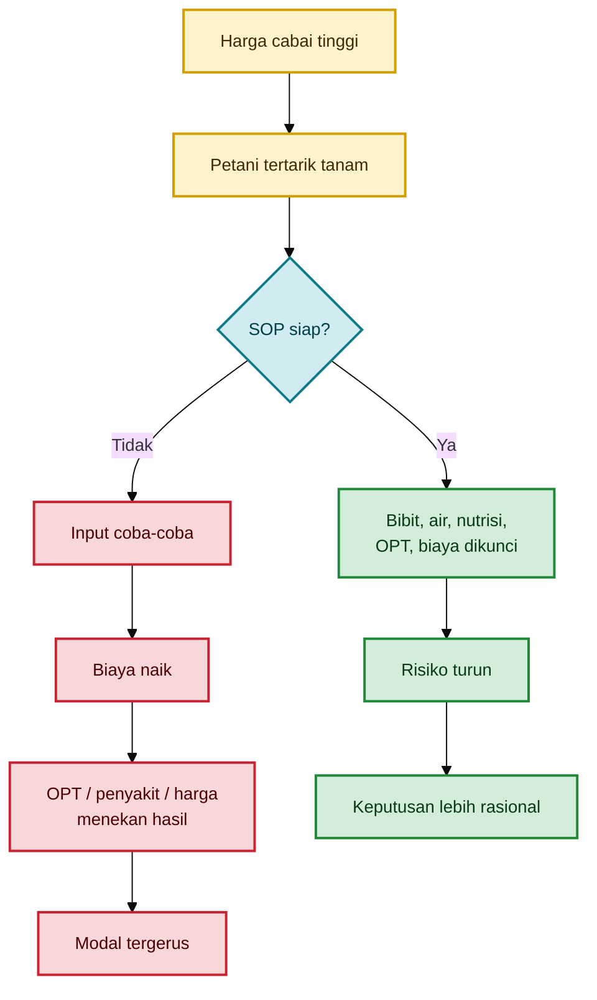
```mermaid
%%{init: {"theme": "base", "themeVariables": {"fontSize": "14px", "fontFamily": "Arial"}}}%%
flowchart TD
    A["Harga cabai tinggi"] --> B["Petani tertarik tanam"]
    B --> C{"SOP siap?"}
    C -->|Tidak| D["Input coba-coba"]
    D --> E["Biaya naik"]
    E --> F["OPT / penyakit / harga<br/>menekan hasil"]
    F --> G["Modal tergerus"]

    C -->|Ya| H["Bibit, air, nutrisi,<br/>OPT, biaya dikunci"]
    H --> I["Risiko turun"]
    I --> J["Keputusan lebih rasional"]

    classDef start fill:#fff3cd,stroke:#d39e00,color:#3d2b00,stroke-width:2px;
    classDef risk fill:#f8d7da,stroke:#c82333,color:#4a0000,stroke-width:2px;
    classDef decision fill:#d1ecf1,stroke:#117a8b,color:#003f46,stroke-width:2px;
    classDef safe fill:#d4edda,stroke:#218838,color:#063b14,stroke-width:2px;

    class A,B start;
    class C decision;
    class D,E,F,G risk;
    class H,I,J safe;
```

Dalam artikel ini, “angka” tidak berarti petani harus menjadi peneliti. Angka berarti petani memiliki batas kerja yang sederhana dan bisa digunakan untuk mengambil keputusan. Misalnya, biaya produksi tidak boleh dibiarkan berjalan tanpa kontrol. Harga impas harus dihitung sejak awal:

$$
H_{\text{impas}} = \frac{B_{\text{total}}}{Y_{\text{estimasi}}}
$$

dengan:

```text
H_impas     = harga impas per kg cabai
B_total     = total biaya produksi
Y_estimasi  = estimasi total hasil panen dalam kg
```

Jika total biaya produksi adalah $B_{\text{total}}$, dan jumlah tanaman hidup adalah $J_{\text{hidup}}$, maka biaya per tanaman dapat dihitung sebagai:

$$
B_{\text{tanaman}} = \frac{B_{\text{total}}}{J_{\text{hidup}}}
$$

Dua angka sederhana ini sering diabaikan. Akibatnya, petani baru sadar biaya sudah terlalu besar ketika tanaman belum masuk panen utama, atau ketika harga pasar tidak cukup menutup modal.

Budidaya cabai yang sehat tidak dimulai dari pertanyaan “pupuk apa yang paling bagus?” atau “pestisida apa yang paling kuat?”. Pertanyaan awal yang lebih penting adalah:

```text
Berapa biaya maksimal yang sanggup ditanggung?
Berapa hasil minimal agar tidak rugi?
Berapa harga jual minimal agar usaha layak?
Apakah sistem produksi mampu menahan serangan awal?
Apakah ada rencana koreksi bila tanaman mulai keluar jalur?
```

Cabai bisa menguntungkan bila risiko produksinya dikunci sejak awal. Risiko itu tidak hilang, tetapi bisa dibatasi. Tanpa batas biaya, tanpa target hasil, tanpa strategi nutrisi, tanpa perlindungan vektor, dan tanpa keputusan koreksi, budidaya cabai mudah berubah menjadi rangkaian coba-coba input sampai modal habis.

Inti bab ini sederhana:

> Cabai bukan hanya tanaman. Cabai adalah usaha berisiko tinggi yang harus dikelola dengan parameter.

<ResourceBox
  title="Artikel Terkait:"
  items={[
    {
      name: 'README — Framework Praktis Memulai Bisnis Agribisnis Terpadu di Lahan Gumuk Berlereng',
      href: '/blog/agri/kebon/agribisnis-gumuk/README',
    },
    {
      name: 'Isolasi Mikroba Lokal untuk PGPM dan Agen Pengendali Hayati (APH)',
      href: '/blog/agri/agen-hayati/isolasi-mikroba-lokal',
    },
    {
      name: 'OPT Penggagal Panen pada Cabai Rawit dan Cabai Besar',
      href: '/blog/agri/kebon/pengendalian-opt-cabai',
    },
    {
      name: 'Tipuan Mikroba dalam Pertanian: Trichoderma, PGPR, PGPM, PGPF, MOL, dan JAKABA',
      href: '/blog/agri/agen-hayati/tipuan-mikroba-pertanian',
    },
    {
      name: 'Bioaktivator Rizosfer Bambu Kaya Silikat',
      href: '/blog/agri/kebon/biaktivator-rizosfer-bambu',
    },
    {
      name: 'Panduan Praktis Pembiakan Trichoderma dari Starter Komersial',
      href: '/blog/agri/agen-hayati/trichoderma-pembiakan',
    },
    {
      name: 'Keseimbangan Akar dan Tajuk: Fondasi Tanaman Sehat, Produktif, dan Tidak Terjebak Tipuan Input',
      href: '/blog/agri/kebon/keseimbangan-akar-dan-tajuk',
    },
    {
      name: 'Menanam Cabai dengan Prinsip Pohon Bambu: Akar Kuat, Tanah Hidup, Tanaman Tahan Stres',
      href: '/blog/agri/kebon/budidaya-cabai-prinsip-rumpun-bambu',
    },
    {
      name: 'Panduan Lengkap Pengendalian Lalat Buah di Kebun Campuran',
      href: '/blog/agri/kebon/lalat-buah',
    },
    {
      name: 'README - Pupuk Tepat, Panen Untung - Model Low-Lab untuk Petani Makmur di Gambiran',
      href: '/blog/agri/pupuk-terintegrasi/README',
    },
  ]}
/>

[**Kembali ke Atas**](#produksi-cabai-tanpa-spekulasi-mencari-parameter-kunci-nutrisi-opt-dan-risiko-usaha)

---

# 2. Masalah Utama: Rekomendasi Teknis Sering Terlalu Umum

Banyak rekomendasi budidaya cabai terdengar benar, tetapi tidak cukup membantu petani mengambil keputusan di lapangan. Kalimat seperti ini sering muncul:

```text
gunakan pupuk berimbang
lakukan IPM
gunakan mikroba
jaga sanitasi
pantau hama
gunakan pestisida bijak
```

Secara konsep, kalimat tersebut tidak salah. Masalahnya, petani tidak bekerja di ruang konsep. Petani bekerja di lahan, dengan modal terbatas, waktu terbatas, cuaca berubah, hama datang, harga bergerak, dan keputusan harus diambil cepat.

Kalimat “gunakan pupuk berimbang” belum menjawab:

```text
Berimbang menurut fase apa?
Berapa batas nitrogen?
Kapan kalium harus dinaikkan?
Kapan kalsium harus distabilkan?
Apakah magnesium, boron, mangan, dan seng sudah cukup?
```

Kalimat “lakukan IPM” belum menjawab:

```text
Berapa populasi thrips yang masih bisa ditoleransi?
Kapan kutu kebul dianggap berbahaya?
Kapan tanaman bergejala virus harus dicabut?
Kapan agen hayati cukup?
Kapan pestisida kimia harus masuk sebagai rem?
```

Kalimat “gunakan mikroba” belum menjawab:

```text
Mikroba untuk akar atau tajuk?
Dipakai sejak kapan?
Boleh dicampur fungisida atau tidak?
Apa indikator berhasil?
Kapan dianggap gagal?
```

Kalimat “gunakan pestisida bijak” belum menjawab:

```text
Bahan aktif apa untuk target apa?
Rotasi berdasarkan merek atau mode of action?
Berapa interval aman?
Bagaimana dengan masa tunggu panen?
Kapan biaya semprot sudah tidak masuk akal?
```

Di sinilah masalah utamanya: rekomendasi tanpa angka tidak mengurangi spekulasi. Ia hanya memindahkan beban keputusan ke petani.

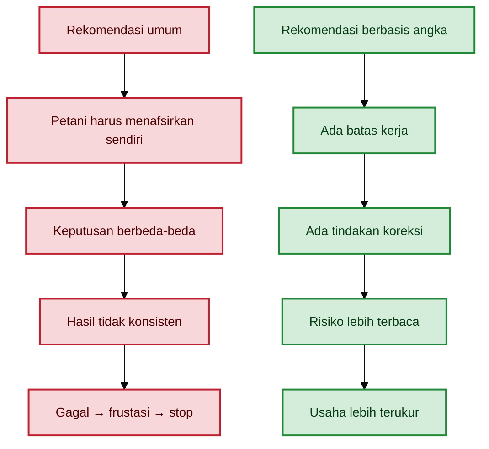
```mermaid
%%{init: {"theme": "base", "themeVariables": {"fontSize": "14px", "fontFamily": "Arial"}}}%%
flowchart TD
    A["Rekomendasi umum"] --> B["Petani harus menafsirkan sendiri"]
    B --> C["Keputusan berbeda-beda"]
    C --> D["Hasil tidak konsisten"]
    D --> E["Gagal → frustasi → stop"]

    A2["Rekomendasi berbasis angka"] --> B2["Ada batas kerja"]
    B2 --> C2["Ada tindakan koreksi"]
    C2 --> D2["Risiko lebih terbaca"]
    D2 --> E2["Usaha lebih terukur"]

    classDef vague fill:#f8d7da,stroke:#bd2130,color:#4a0000,stroke-width:2px;
    classDef clear fill:#d4edda,stroke:#218838,color:#063b14,stroke-width:2px;
    classDef mid fill:#fff3cd,stroke:#d39e00,color:#3d2b00,stroke-width:2px;

    class A,B,C,D,E vague;
    class A2,B2,C2,D2,E2 clear;
```

Kritik ini tidak berarti konsep seperti IPM, nutrisi berimbang, mikroba, sanitasi, dan pestisida selektif harus dibuang. Konsep tersebut tetap penting. Namun, untuk petani, konsep harus turun menjadi batas operasional.

IPM sendiri memang sering menghadapi masalah adopsi. Kajian Parsa dan kolega mengidentifikasi banyak hambatan adopsi IPM di negara berkembang, termasuk kelemahan teknis IPM, keterbatasan insentif, kelemahan dukungan petani, dan faktor industri pestisida. Ini menunjukkan bahwa masalahnya bukan hanya “petani tidak mau menerapkan”, tetapi juga karena sistem pengetahuan dan dukungan teknis belum cukup memudahkan petani menjalankan IPM secara konsisten. ([PNAS][2])

Maka, artikel ini tidak akan berhenti pada kata “berimbang”, “bijak”, atau “terpadu”. Kata-kata itu harus diterjemahkan menjadi parameter.

Contoh perbedaan rekomendasi umum dan rekomendasi berbasis parameter:

| Rekomendasi umum               | Rekomendasi yang lebih berguna bagi praktisi                              |
| ------------------------------ | ------------------------------------------------------------------------- |
| Gunakan pupuk berimbang        | Pisahkan strategi nutrisi vegetatif, bunga, buah awal, dan panen berjalan |
| Jangan terlalu banyak nitrogen | Hitung semua sumber $N$: urea, ZA, NPK, KNO₃, Ca(NO₃)₂, dan pupuk organik |
| Tingkatkan kalium saat berbuah | Tentukan kapan $K$ dinaikkan relatif terhadap $N$ dan kondisi buah        |
| Jaga kalsium                   | Pastikan $Ca$ tersedia, air stabil, dan akar aktif                        |
| Pantau hama                    | Tentukan bagian tanaman yang dicek, frekuensi cek, dan batas tindakan     |
| Gunakan mikroba                | Tentukan fungsi: akar, tajuk, penyakit, atau hama; lalu ukur hasilnya     |
| Gunakan pestisida bijak        | Rotasi berdasarkan mode of action, target hama, dan masa tunggu panen     |
| Hitung biaya                   | Hitung $H_{\text{impas}}$, $B_{\text{tanaman}}$, dan target hasil minimal |

Dengan cara ini, petani tidak lagi hanya menerima nasihat umum. Petani memiliki alat untuk menilai kondisi kebunnya.

Misalnya, ketika tanaman terlihat sangat hijau, responsnya bukan otomatis “bagus”. Pertanyaannya harus lebih tajam:

```text
Apakah daun terlalu hijau karena N berlebih?
Apakah pucuk terlalu lunak?
Apakah bunga mulai rontok?
Apakah thrips mulai menetap di bunga?
Apakah K, Ca, Mg, dan B cukup?
Apakah air terlalu fluktuatif?
```

Ketika kutu kebul muncul, responsnya bukan otomatis “semprot apa?”. Pertanyaannya:

```text
Apakah muncul sejak pembibitan?
Apakah ada tanaman virus?
Apakah gulma inang masih ada?
Apakah sticky trap menunjukkan kenaikan cepat?
Apakah tindakan biologis masih cukup?
Apakah sudah masuk kondisi perlu rem kimia?
```

Ketika biaya produksi naik, responsnya bukan “lanjut saja, semoga harga bagus”. Pertanyaannya:

```text
Berapa biaya berjalan?
Berapa potensi hasil tersisa?
Berapa harga impas terbaru?
Apakah panen berikutnya masih menutup biaya tambahan?
```

Karena itu, artikel ini menggunakan satu prinsip dasar:

> Setiap rekomendasi harus bisa diterjemahkan menjadi keputusan lapang.

Jika tidak bisa diterjemahkan menjadi keputusan, rekomendasi itu belum cukup matang untuk praktisi. Petani tidak butuh lebih banyak slogan. Petani membutuhkan batas kerja: kapan memberi, kapan menahan, kapan mengoreksi, kapan menyelamatkan, dan kapan berhenti menambah kerugian.

Inti bab ini adalah:

> Rekomendasi tanpa angka tidak mengurangi spekulasi. Ia hanya memindahkan beban keputusan ke petani.

[**Kembali ke Atas**](#produksi-cabai-tanpa-spekulasi-mencari-parameter-kunci-nutrisi-opt-dan-risiko-usaha)

[1]: https://jgiass.com/pdf-reader.php?file=Attitude-and-Strategies-for-Small-Farmers-in-Facing-Farm-Risks%3A-Case-Study-of-Large-Chili-Farming-in-Lombok-Island%2C-Indonesia.pdf&path=issue_papers&utm_source=chatgpt.com 'Case Study of Large Chili Farming in Lombok Island, ...'
[2]: https://www.pnas.org/doi/10.1073/pnas.1312693111?utm_source=chatgpt.com 'Obstacles to integrated pest management adoption in ...'

---

# 3. Parameter Pertama: Nutrisi Defensif, Bukan Sekadar Tanaman Hijau

Dalam budidaya cabai, tanaman yang terlihat hijau, besar, dan cepat rimbun sering dianggap sebagai tanda keberhasilan. Cara melihat seperti ini berbahaya. Tanaman cabai yang terlalu hijau belum tentu kuat. Pada banyak kasus, tanaman yang terlalu subur secara kasat mata justru memiliki jaringan yang terlalu lunak, tajuk terlalu rapat, bunga mudah terganggu, dan lebih mudah menjadi tempat nyaman bagi hama pengisap maupun penyakit tertentu.

Karena itu, artikel ini tidak memakai istilah “pupuk banyak” atau “tanaman subur” sebagai ukuran utama. Yang dipakai adalah **nutrisi defensif**.

Nutrisi defensif adalah strategi pemupukan yang bertujuan membuat cabai:

```text
cukup tumbuh
cukup generatif
jaringan kuat
buah kuat
akar aktif
tidak terlalu lunak
tidak terlalu rimbun
```

Dengan kata lain, targetnya bukan cabai yang paling hijau, tetapi cabai yang **produktif, seimbang, dan tidak mudah runtuh oleh tekanan OPT, cuaca, serta kesalahan air**.

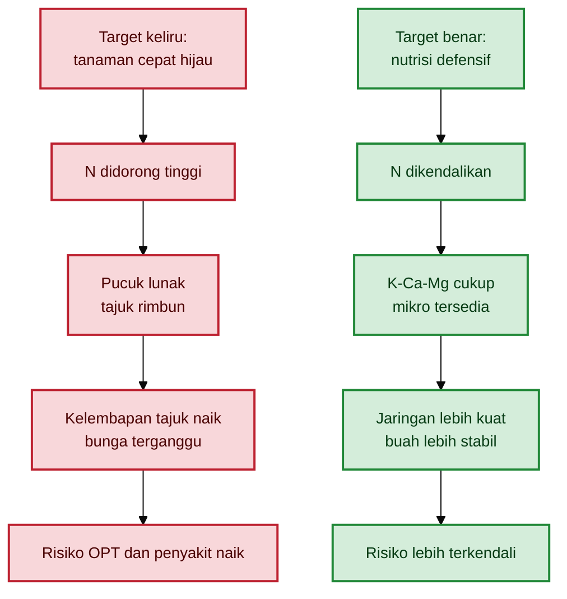
```mermaid
%%{init: {"theme": "base", "themeVariables": {"fontSize": "14px", "fontFamily": "Arial"}}}%%
flowchart TD
    A["Target keliru:<br/>tanaman cepat hijau"] --> B["N didorong tinggi"]
    B --> C["Pucuk lunak<br/>tajuk rimbun"]
    C --> D["Kelembapan tajuk naik<br/>bunga terganggu"]
    D --> E["Risiko OPT dan penyakit naik"]

    A2["Target benar:<br/>nutrisi defensif"] --> B2["N dikendalikan"]
    B2 --> C2["K-Ca-Mg cukup<br/>mikro tersedia"]
    C2 --> D2["Jaringan lebih kuat<br/>buah lebih stabil"]
    D2 --> E2["Risiko lebih terkendali"]

    classDef bad fill:#f8d7da,stroke:#bd2130,color:#4a0000,stroke-width:2px;
    classDef good fill:#d4edda,stroke:#218838,color:#063b14,stroke-width:2px;
    classDef warn fill:#fff3cd,stroke:#d39e00,color:#3d2b00,stroke-width:2px;

    class A,B,C,D,E bad;
    class A2,B2,C2,D2,E2 good;
```

Kalimat kuncinya:

> Tanaman hijau belum tentu sehat. Pada cabai, terlalu hijau bisa menjadi tanda tanaman terlalu vegetatif dan jaringan terlalu lunak.

Nutrisi defensif bukan berarti mengurangi pupuk secara membabi buta. Nutrisi defensif berarti **memberi hara sesuai fase tanaman dan risiko lapang**. Cabai tetap membutuhkan nitrogen, fosfor, kalium, kalsium, magnesium, sulfur, dan unsur mikro. Namun, hara tersebut harus disusun untuk membangun tanaman yang seimbang, bukan hanya mengejar pertumbuhan daun.

---

## 3.1. Definisi Nutrisi Defensif

Nutrisi defensif adalah pendekatan pemupukan yang melihat hara sebagai bagian dari sistem ketahanan tanaman. Hara tidak hanya dipakai untuk membuat tanaman tumbuh, tetapi juga untuk menjaga struktur jaringan, fungsi akar, keseimbangan generatif, kualitas buah, dan respons tanaman terhadap tekanan lingkungan.

Dalam praktik cabai, nutrisi defensif memiliki empat sasaran utama.

Pertama, tanaman harus tumbuh cukup, tetapi tidak terlalu vegetatif. Cabai perlu daun untuk fotosintesis, tetapi tajuk yang terlalu rimbun membuat sirkulasi udara buruk, kelembapan meningkat, dan area bawah daun menjadi lebih nyaman bagi kutu kebul, thrips, tungau, serta penyakit daun.

Kedua, tanaman harus masuk generatif dengan stabil. Cabai yang terlalu didorong vegetatif sering lambat masuk bunga, mudah rontok bunga, atau menghasilkan buah awal yang tidak seragam.

Ketiga, jaringan tanaman harus cukup kuat. Di sini kalium, kalsium, magnesium, boron, mangan, seng, dan unsur lain menjadi penting. Tanaman tidak cukup hanya memiliki daun besar. Jaringan pucuk, tangkai bunga, kulit buah, dan akar muda harus cukup kuat.

Keempat, akar harus aktif. Nutrisi yang lengkap tidak berguna bila akar rusak, becek, kekurangan oksigen, atau berada dalam media dengan pH dan EC yang tidak sesuai.

Secara sederhana:

$$
\text{Nutrisi defensif} =
\text{pertumbuhan cukup}
+
\text{jaringan kuat}
+
\text{akar aktif}
+
\text{buah stabil}
$$

Bukan:

$$
\text{Nutrisi defensif} \neq \text{tanaman paling hijau}
$$

Inilah perbedaan utama antara **tanaman subur secara visual** dan **tanaman sehat secara produksi**.

| Ukuran keliru        | Ukuran yang lebih tepat               |
| -------------------- | ------------------------------------- |
| Daun sangat hijau    | Warna daun normal sesuai fase         |
| Tanaman cepat rimbun | Tajuk cukup terbuka dan produktif     |
| Banyak pupuk masuk   | Hara terserap dan seimbang            |
| Pucuk cepat tumbuh   | Pucuk kuat, tidak terlalu lunak       |
| Semprot sering       | OPT turun dan biaya terkendali        |
| Buah banyak di awal  | Produksi stabil sampai panen berjalan |

Pada titik ini, petani perlu mengubah pertanyaan. Bukan lagi:

> “Pupuk apa supaya cabai cepat hijau?”

Tetapi:

> “Bagaimana membuat cabai cukup tumbuh, cepat produktif, jaringan kuat, akar aktif, dan biaya tetap terkendali?”

---

## 3.2. Nitrogen: Penting, tetapi Paling Mudah Disalahgunakan

Nitrogen atau (N) adalah unsur penting. Tanpa nitrogen yang cukup, cabai akan tumbuh lambat, daun pucat, ukuran tanaman kecil, dan potensi produksi rendah. Nitrogen diperlukan untuk pembentukan klorofil, protein, enzim, dan pertumbuhan vegetatif.

Masalahnya, nitrogen juga menjadi unsur yang paling mudah disalahgunakan.

Di lapangan, ketika tanaman terlihat lambat, banyak petani langsung menambah sumber nitrogen: urea, ZA, NPK tinggi N, KNO₃, Ca(NO₃)₂, atau pupuk daun yang juga mengandung N. Setiap sumber dianggap berdiri sendiri. Padahal tanaman menerima total nitrogen dari semua sumber tersebut.

Secara sederhana:

$$
N_{\text{total}} =
N_{\text{urea}}
+
N_{\text{ZA}}
+
N_{\text{NPK}}
+
N_{\mathrm{KNO_3}}
+
N_{\mathrm{Ca(NO_3)_2}}
+
N_{\text{organik}}
$$

Masalah muncul ketika $N_{\text{total}}$ naik, tetapi kalium, kalsium, magnesium, boron, mangan, seng, air, dan akar tidak ikut mendukung secara seimbang.

Jangan menulis bahwa “N adalah sumber patogen”. Itu tidak tepat. Sumber patogen adalah inokulum, vektor, benih, tanah, air, sisa tanaman, gulma inang, dan lingkungan. Namun nitrogen berlebihan dapat membuat tanaman menjadi lebih rentan atau menciptakan kondisi yang lebih mendukung perkembangan penyakit tertentu.

Kalimat yang tepat adalah:

> Nitrogen tinggi bukan sumber patogen. Namun nitrogen berlebihan dapat membuat jaringan lebih sukulen, tajuk lebih rimbun, dan mikroklimat lebih lembap, sehingga risiko hama dan penyakit tertentu dapat meningkat.

Hubungan nutrisi dan penyakit memang tidak sederhana. Review Dordas menjelaskan bahwa unsur seperti (N), (K), (P), (Mn), (Zn), (B), (Cl), dan (Si) dapat memengaruhi ketahanan atau kerentanan tanaman, tetapi responsnya berbeda menurut tanaman, patogen, lingkungan, dan keseimbangan hara. ([ResearchGate][1])

Karena itu, artikel ini tidak memakai logika tunggal:

```text
N tinggi = pasti penyakit
```

Yang lebih akurat:

```text
N berlebih + jaringan lunak + tajuk rimbun + air/udara buruk
= risiko naik
```

Dalam bentuk sederhana:

$$
\text{Risiko} \uparrow
\quad \text{bila} \quad
N \uparrow
+
K,Ca,Mg,B \downarrow
+
\text{tajuk rimbun}
+
\text{akar stres}
$$

Nitrogen harus dilihat sebagai pedal gas. Tanpa pedal gas, tanaman tidak bergerak. Tetapi bila pedal gas ditekan terus tanpa rem, kemudi, dan suspensi yang baik, sistem menjadi tidak stabil.

Pada cabai, “rem dan pengimbang” nitrogen adalah:

```text
K untuk pengisian buah dan regulasi air
Ca untuk kekuatan jaringan dan titik tumbuh
Mg untuk fotosintesis
B untuk bunga, titik tumbuh, dan fruit set
Mn, Zn, Fe, Cu, Mo untuk enzim dan fungsi fisiologis
air stabil untuk serapan hara
akar sehat untuk distribusi hara
```

Jadi masalahnya bukan nitrogen itu buruk. Masalahnya adalah **nitrogen yang berjalan sendirian**.

---

## 3.3. N:K:Ca sebagai Dashboard Cepat, Bukan Formula Lengkap

Dalam diskusi nutrisi cabai, rasio (N:K:Ca) sering tampak menarik karena sederhana. Namun harus tegas: **(N:K:Ca) bukan formula lengkap cabai**.

(N:K:Ca) hanya boleh dipakai sebagai **dashboard cepat** untuk membaca tiga risiko besar.

| Unsur | Risiko bila salah                                              |
| ----- | -------------------------------------------------------------- |
| (N)   | tanaman terlalu vegetatif, lunak, tajuk rimbun                 |
| (K)   | buah lemah, pengisian buah kurang, regulasi air terganggu      |
| (Ca)  | jaringan pucuk dan buah lemah, risiko gangguan fisiologis naik |

Dashboard cepat artinya membantu petani bertanya:

```text
Apakah N terlalu dominan?
Apakah K sudah cukup untuk fase bunga dan buah?
Apakah Ca stabil untuk pucuk, akar muda, dan buah?
```

Tetapi dashboard cepat bukan peta lengkap. Formula nutrisi cabai tetap wajib mencakup:

```text
N, P, K, Ca, Mg, S
+ Fe, Mn, Zn, Cu, B, Mo
+ Si bila digunakan sebagai unsur bermanfaat
```

Agar tidak salah arah, gunakan dua lapis berpikir.

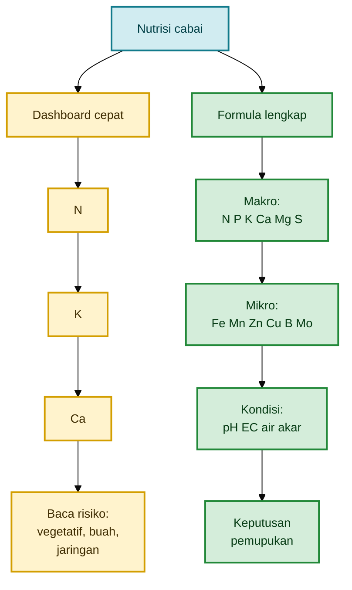
```mermaid
%%{init: {"theme": "base", "themeVariables": {"fontSize": "14px", "fontFamily": "Arial"}}}%%
flowchart TD
    A["Nutrisi cabai"] --> B["Dashboard cepat"]
    A --> C["Formula lengkap"]

    B --> B1["N"]
    B1 --> B2["K"]
    B2 --> B3["Ca"]
    B3 --> B4["Baca risiko:<br/>vegetatif, buah,<br/>jaringan"]

    C --> C1["Makro:<br/>N P K Ca Mg S"]
    C1 --> C2["Mikro:<br/>Fe Mn Zn Cu B Mo"]
    C2 --> C3["Kondisi:<br/>pH EC air akar"]
    C3 --> C4["Keputusan<br/>pemupukan"]

    classDef dash fill:#fff3cd,stroke:#d39e00,color:#3d2b00,stroke-width:2px;
    classDef full fill:#d4edda,stroke:#218838,color:#063b14,stroke-width:2px;
    classDef main fill:#d1ecf1,stroke:#117a8b,color:#003f46,stroke-width:2px;

    class A main;
    class B,B1,B2,B3,B4 dash;
    class C,C1,C2,C3,C4 full;
```

Dalam sistem fertigasi atau media terkendali, rasio dapat dihitung dari konsentrasi hara dalam larutan.

Misalnya:

$$
R_K = \frac{K}{N}
$$

dan:

$$
R_{Ca} = \frac{Ca}{N}
$$

Jika larutan mengandung $N = 100\ \mathrm{ppm}$, $K = 120\ \mathrm{ppm}$, dan $Ca = 100\ \mathrm{ppm}$, maka:

$$
R_K = \frac{120}{100} = 1.2
$$

$$
R_{Ca} = \frac{100}{100} = 1.0
$$

Sehingga penyederhanaannya:

$$
N:K:Ca \approx 1:1.2:1.0
$$

Namun, angka ini tidak boleh dipotong dari konteks. Jika (P), (Mg), (S), (B), (Mn), (Zn), air, pH, EC, dan akar bermasalah, rasio (N:K:Ca) yang terlihat bagus tetap tidak menyelamatkan tanaman.

Kalimat yang harus dipegang:

> (N:K:Ca) adalah alarm cepat, bukan resep lengkap.

---

## 3.4. Fungsi Lengkap Hara pada Cabai

Cabai tidak hidup dari tiga unsur saja. Tanaman membutuhkan makro, sekunder, mikro, dan kondisi serapan yang benar. Unsur mikro juga bukan kosmetik. Banyak unsur mikro bekerja pada enzim, dinding sel, lignifikasi, fotosintesis, titik tumbuh, dan metabolisme pertahanan.

Review nutrisi tanaman dan ketahanan penyakit menyimpulkan bahwa nutrisi mineral berperan dalam ketahanan tanaman melalui berbagai mekanisme, termasuk pembentukan struktur jaringan, metabolisme senyawa pertahanan, aktivitas enzim, dan interaksi tanaman-patogen. Review tersebut juga membahas peran makro dan mikro dalam penyakit tanaman, sehingga nutrisi tidak boleh dipersempit hanya menjadi NPK. ([Frontiers][2])

| Hara | Fungsi utama                                                   | Risiko kekurangan atau salah kelola                                                 |
| ---- | -------------------------------------------------------------- | ----------------------------------------------------------------------------------- |
| (N)  | pertumbuhan vegetatif, klorofil, protein                       | terlalu rendah: tanaman kerdil; terlalu tinggi: terlalu vegetatif dan lunak         |
| (P)  | akar awal, energi, pembungaan awal                             | akar lambat, tanaman lambat berkembang; berlebih bisa mengganggu keseimbangan mikro |
| (K)  | pengisian buah, regulasi air, stomata, kualitas buah           | buah kecil/lemah, tanaman kurang tahan stres                                        |
| (Ca) | dinding sel, membran, pucuk, akar muda, kualitas buah          | pucuk lemah, buah rusak fisiologis, jaringan rapuh                                  |
| (Mg) | pusat klorofil, fotosintesis                                   | daun tua klorosis, fotosintesis turun                                               |
| (S)  | protein, enzim, senyawa metabolik                              | pertumbuhan pucat, vigor turun                                                      |
| (B)  | dinding sel, titik tumbuh, bunga, tabung polen, fruit set      | bunga rontok, buah cacat, pucuk abnormal                                            |
| (Mn) | fotosintesis, lignin, metabolisme fenol                        | pertahanan jaringan melemah                                                         |
| (Zn) | enzim, hormon pertumbuhan, perkembangan ruas                   | daun kecil, pertumbuhan abnormal                                                    |
| (Fe) | pembentukan klorofil secara tidak langsung, enzim redoks       | daun muda klorosis                                                                  |
| (Cu) | enzim, lignifikasi, respons pertahanan                         | jaringan lemah; berlebih mudah toksik                                               |
| (Mo) | metabolisme nitrogen, reduksi nitrat                           | pemanfaatan (N) terganggu                                                           |
| (Si) | penguatan jaringan dan respons pertahanan pada beberapa sistem | bukan unsur esensial, tetapi bisa bermanfaat bila tersedia dan cocok                |

Fosfor ((P)) penting untuk energi dan perkembangan akar awal. Namun fosfor tidak boleh dipahami sebagai “semakin banyak semakin baik”. Fosfor yang berlebihan dapat mengganggu keseimbangan unsur mikro tertentu, terutama pada tanah atau media yang pH-nya tidak terkendali.

Kalium ((K)) penting pada fase bunga dan buah karena berhubungan dengan pengaturan air, pembukaan stomata, pengisian buah, dan kualitas hasil. Pada cabai, K tidak boleh terlambat dinaikkan. Bila tanaman sudah masuk bunga dan buah, tetapi pola pupuk masih mendorong vegetatif, hasil sering terlihat pada bunga rontok, buah kecil, dan tanaman terlalu rimbun.

Kalsium ((Ca)) penting untuk jaringan muda, akar, pucuk, dan buah. Namun Ca tidak hanya soal jumlah pupuk Ca yang diberikan. Ca bergerak mengikuti aliran air, sehingga air, akar, kelembapan, dan keseimbangan pertumbuhan sangat menentukan. University of Georgia menjelaskan bahwa gangguan seperti blossom-end rot pada pepper/tomat berhubungan dengan Ca dalam perkembangan buah dan sangat dipengaruhi manajemen air serta nutrisi. ([ASHS Journals][3])

Magnesium ((Mg)) sering dilupakan karena petani terlalu fokus pada NPK. Padahal Mg berada di pusat molekul klorofil. Bila Mg kurang, fotosintesis turun, daun tua dapat menguning, dan tanaman kehilangan tenaga untuk menopang produksi panjang.

Boron ((B)) penting untuk titik tumbuh, bunga, pembentukan tabung polen, dan fruit set. Dalam praktik cabai, ketika bunga rontok, petani sering hanya menambah pupuk buah atau pestisida. Padahal masalah bisa terkait air, akar, suhu, (K), (Ca), (Mg), dan (B).

Mangan ((Mn)), seng ((Zn)), besi ((Fe)), tembaga ((Cu)), dan molibdenum ((Mo)) bekerja dalam jumlah kecil, tetapi efeknya besar. Unsur-unsur ini terlibat dalam enzim, metabolisme nitrogen, fotosintesis, lignifikasi, dan proses fisiologis penting. Kekurangannya tidak selalu langsung tampak seperti kekurangan N, tetapi dapat membuat tanaman tidak bekerja optimal.

Kesimpulan bagian ini:

> Nutrisi defensif bukan hanya menurunkan N. Nutrisi defensif berarti menyusun seluruh hara agar tanaman tidak hanya tumbuh, tetapi juga mampu bertahan dan berbuah stabil.

---

## 3.5. Angka Pegangan Fertigasi untuk Sistem Terkendali

Bagian ini harus dibaca hati-hati. Angka berikut **bukan resep universal cabai rawit atau cabai besar di semua lahan**. Angka ini adalah rujukan kerja untuk pepper/paprika dalam sistem fertigasi atau media terkendali.

Untuk lahan terbuka, tanah mineral, musim hujan, musim kemarau, varietas berbeda, air berbeda, dan cara irigasi berbeda, angka harus disesuaikan. Namun angka ini tetap berguna karena menunjukkan pola penting: setelah tanaman masuk bunga, (K) dan (Ca) dinaikkan relatif terhadap (N).

Rujukan Haifa untuk pepper pada shade house dengan media kompos pinus mencantumkan konsentrasi larutan hara sebagai berikut. Dokumen yang sama juga menampilkan contoh kebutuhan nutrisi lain, sehingga angka ini harus dipakai sebagai titik awal berpikir, bukan hukum mutlak. ([Haifa Group][4])

| Fase                               | (N) ppm | (P) ppm | (K) ppm | (Ca) ppm | (Mg) ppm | (S) ppm |
| ---------------------------------- | ------: | ------: | ------: | -------: | -------: | ------: |
| Transplanting sampai bunga pertama |     100 |      50 |     120 |      100 |       40 |      50 |
| Setelah bunga pertama              |     130 |      50 |     200 |      150 |       50 |      60 |

Dalam larutan encer, satuan ppm umumnya dibaca sebagai:

$$
1\ \mathrm{ppm} \approx 1\ \mathrm{mg/L}
$$

Maka, bila larutan mengandung $N = 100\ \mathrm{ppm}$, artinya kira-kira terdapat:

$$
100\ \mathrm{mg}\ N \text{ per } 1\ \mathrm{L}\ \text{larutan}
$$

Yang penting dari tabel bukan menghafal angka, tetapi membaca arah perubahannya.

Dari transplanting sampai bunga pertama:

$$
N:K:Ca = 100:120:100
$$

Penyederhanaannya:

$$
N:K:Ca \approx 1:1.2:1.0
$$

Setelah bunga pertama:

$$
N:K:Ca = 130:200:150
$$

Penyederhanaannya:

$$
N:K:Ca \approx 1:1.54:1.15
$$

Makna praktisnya:

```text
Sebelum bunga:
N cukup untuk membangun tanaman,
tetapi K dan Ca tetap dijaga.

Setelah bunga:
K naik jelas,
Ca naik,
N naik terbatas,
P, Mg, dan S tetap tersedia.
```

Jangan ambil kesimpulan bahwa cabai hanya butuh (N), (K), dan (Ca). Tabel itu justru menunjukkan ada (P), (Mg), dan (S) yang tetap dipertahankan. Unsur mikro juga tetap harus dikelola, terutama bila tanaman berada dalam sistem fertigasi intensif atau media terbatas.

Untuk sistem fertigasi, angka dalam ppm membantu karena petani dapat mengatur larutan. Untuk sistem tanah terbuka, pendekatan ini perlu diterjemahkan menjadi dosis pupuk per fase berdasarkan uji tanah, sumber air, bahan organik, dan target hasil.

---

## 3.6. Rasio Praktis yang Boleh Disebut, dengan Catatan

Rasio praktis boleh digunakan, tetapi harus selalu disertai catatan. Rasio ini bukan resep universal. Ia hanya penyederhanaan dari contoh fertigasi pepper.

Untuk fase vegetatif sampai bunga pertama:

$$
N:K:Ca \approx 1:1.2:1.0
$$

Untuk fase setelah bunga:

$$
N:K:Ca \approx 1:1.5:1.1 \text{ sampai } 1.2
$$

Atau ditulis lebih operasional:

```text
Fase vegetatif:
N:K:Ca ≈ 1 : 1,2 : 1

Fase setelah bunga:
N:K:Ca ≈ 1 : 1,5 : 1,1–1,2
```

Catatan wajib:

> Rasio ini tidak menggantikan kebutuhan (P), (Mg), (S), dan unsur mikro. Rasio ini juga tidak menggantikan uji tanah, uji air, analisis daun, dan pembacaan kondisi tanaman.

Agar tidak disalahgunakan, letakkan rasio ini sebagai alat tanya, bukan alat klaim.

| Bila terlihat                   | Pertanyaan nutrisi                                     |
| ------------------------------- | ------------------------------------------------------ |
| Tanaman terlalu hijau dan lunak | Apakah (N) terlalu dominan?                            |
| Bunga mudah rontok              | Apakah (K), (Ca), (Mg), (B), air, dan akar bermasalah? |
| Buah kecil dan lemah            | Apakah (K) cukup saat generatif?                       |
| Pucuk abnormal                  | Apakah (Ca), (B), air, atau akar terganggu?            |
| Daun tua menguning              | Apakah (Mg) atau mobilitas hara terganggu?             |
| Daun muda klorosis              | Apakah (Fe), pH, atau akar bermasalah?                 |

Rasio (N:K:Ca) hanya membantu membaca arah. Diagnosis tetap harus melihat seluruh sistem.

---

## 3.7. Analisis Daun sebagai Pemeriksaan Status Nutrisi

Pemupukan sering hanya dihitung dari pupuk yang masuk. Padahal yang menentukan tanaman adalah hara yang benar-benar terserap dan bekerja di jaringan.

Karena itu, ada dua pemeriksaan yang berbeda:

```text
Uji tanah:
menunjukkan potensi hara yang tersedia di tanah/media.

Analisis daun:
menunjukkan status hara aktual di dalam tanaman.
```

Secara sederhana:

$$
\text{Pupuk masuk} \neq \text{hara terserap}
$$

dan:

$$
\text{hara tersedia} \neq \text{hara berfungsi optimal}
$$

NC State Extension menekankan bahwa kebutuhan nutrisi bell pepper berubah sesuai fase, dari vegetatif, flowering, sampai fruit set, dan analisis daun membantu petani menyesuaikan aplikasi hara pada tahap pertumbuhan yang tepat. ([NC State Extension][5])

Bagi praktisi, analisis daun tidak harus dilakukan setiap minggu. Tetapi untuk kebun komersial, analisis daun sangat berguna pada titik-titik penting:

| Fase           | Yang perlu dipantau                                            |
| -------------- | -------------------------------------------------------------- |
| Vegetatif awal | (N), (P), (K), (Ca), (Mg), (S)                                 |
| Bunga awal     | (N) jangan berlebih; (K), (Ca), (Mg), (B) cukup                |
| Fruit set      | (K), (Ca), (Mg), (B), dan keseimbangan (N)                     |
| Panen berjalan | (K)-(Ca)-(Mg) stabil, (N) tidak mendorong vegetatif berlebihan |

Analisis daun penting karena gejala visual sering terlambat atau menipu. Daun hijau belum tentu semua hara seimbang. Daun kuning juga tidak selalu berarti kekurangan nitrogen. Bisa saja masalahnya pH, akar, air, salinitas, magnesium, besi, atau penyakit akar.

Dalam praktik, analisis daun bisa dipakai untuk menjawab pertanyaan seperti:

```text
Apakah tanaman benar-benar kekurangan N?
Apakah K cukup saat buah mulai banyak?
Apakah Ca masuk ke tanaman atau hanya diberikan lewat pupuk?
Apakah Mg turun karena K terlalu tinggi?
Apakah B cukup untuk bunga dan fruit set?
```

Satu hal penting: analisis daun tidak menggantikan pengamatan lapang. Analisis daun harus dibaca bersama kondisi akar, cuaca, air, serangan OPT, dan fase tanaman.

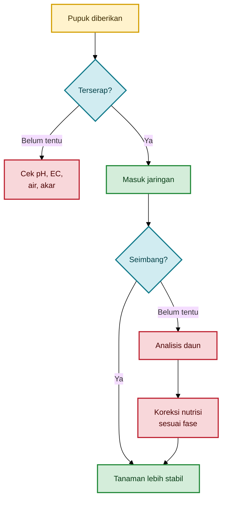
```mermaid
%%{init: {"theme": "base", "themeVariables": {"fontSize": "14px", "fontFamily": "Arial"}}}%%
flowchart TD
    A["Pupuk diberikan"] --> B{"Terserap?"}
    B -->|Belum tentu| C["Cek pH, EC,<br/>air, akar"]
    B -->|Ya| D["Masuk jaringan"]

    D --> E{"Seimbang?"}
    E -->|Belum tentu| F["Analisis daun"]
    E -->|Ya| G["Tanaman lebih stabil"]

    F --> H["Koreksi nutrisi<br/>sesuai fase"]
    H --> G

    classDef input fill:#fff3cd,stroke:#d39e00,color:#3d2b00,stroke-width:2px;
    classDef check fill:#d1ecf1,stroke:#117a8b,color:#003f46,stroke-width:2px;
    classDef warn fill:#f8d7da,stroke:#bd2130,color:#4a0000,stroke-width:2px;
    classDef good fill:#d4edda,stroke:#218838,color:#063b14,stroke-width:2px;

    class A input;
    class B,E check;
    class C,F,H warn;
    class D,G good;
```

Inti bagian ini:

> Uji tanah memberi tahu apa yang mungkin tersedia. Analisis daun memberi tahu apa yang benar-benar masuk ke tanaman.

---

## 3.8. Gejala Lapang N Berlebih

Nitrogen berlebih sering tidak terlihat sebagai “masalah” pada awalnya. Justru tanaman tampak bagus. Daun hijau, tunas cepat keluar, dan tajuk cepat menutup. Di sinilah jebakannya.

Gejala lapang yang perlu dicurigai:

| Gejala                          | Makna praktis                        |
| ------------------------------- | ------------------------------------ |
| Daun hijau gelap mengilap       | kemungkinan (N) terlalu tinggi       |
| Pucuk lunak                     | jaringan rentan                      |
| Ruas panjang                    | terlalu vegetatif                    |
| Tajuk terlalu rimbun            | kelembapan tajuk naik                |
| Bunga rontok                    | cek (N)-(K)-(Ca)-(Mg)-(B) dan air    |
| Thrips/kutu kebul cepat menetap | cek vektor, (N), tajuk, dan sanitasi |
| Buah lemah/cacat                | cek (Ca), (K), (B), air, dan EC      |

Tabel ini bukan alat diagnosis tunggal. Misalnya bunga rontok bisa disebabkan suhu, air, akar, thrips, kekurangan boron, ketidakseimbangan hormon, atau stres lain. Tetapi bila bunga rontok terjadi bersamaan dengan tanaman terlalu hijau, pucuk lunak, dan tajuk terlalu rimbun, maka nitrogen berlebih harus dicurigai.

Tindakan koreksi yang lebih masuk akal:

```text
Jika tanaman terlalu hijau dan lunak:

1. hentikan dorongan N cepat
2. cek total sumber N:
   urea, ZA, NPK, KNO3, Ca(NO3)2, pupuk kandang
3. naikkan keseimbangan K-Ca-Mg sesuai fase
4. cek B bila bunga dan titik tumbuh bermasalah
5. perbaiki air dan aerasi tajuk
6. cek akar sebelum menambah pupuk lagi
7. jangan langsung menambah pestisida sebagai satu-satunya jawaban
```

Dalam bentuk keputusan:

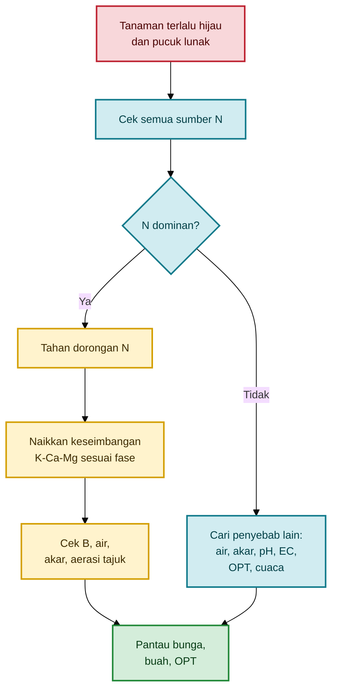
```mermaid
%%{init: {"theme": "base", "themeVariables": {"fontSize": "14px", "fontFamily": "Arial"}}}%%
flowchart TD
    A["Tanaman terlalu hijau<br/>dan pucuk lunak"] --> B["Cek semua sumber N"]
    B --> C{"N dominan?"}

    C -->|Ya| D["Tahan dorongan N"]
    D --> E["Naikkan keseimbangan<br/>K-Ca-Mg sesuai fase"]
    E --> F["Cek B, air,<br/>akar, aerasi tajuk"]
    F --> G["Pantau bunga,<br/>buah, OPT"]

    C -->|Tidak| H["Cari penyebab lain:<br/>air, akar, pH, EC,<br/>OPT, cuaca"]
    H --> G

    classDef alert fill:#f8d7da,stroke:#bd2130,color:#4a0000,stroke-width:2px;
    classDef action fill:#fff3cd,stroke:#d39e00,color:#3d2b00,stroke-width:2px;
    classDef check fill:#d1ecf1,stroke:#117a8b,color:#003f46,stroke-width:2px;
    classDef good fill:#d4edda,stroke:#218838,color:#063b14,stroke-width:2px;

    class A alert;
    class B,C,H check;
    class D,E,F action;
    class G good;
```

Koreksi nitrogen tidak berarti tanaman langsung dipuasakan. Tanaman tetap perlu hara. Yang dihentikan adalah **dorongan vegetatif berlebihan**. Setelah (N) dikendalikan, tanaman harus diarahkan ke keseimbangan generatif: (K), (Ca), (Mg), (B), air stabil, dan akar aktif.

Prinsip praktisnya:

$$
\text{Cabai produktif}
\neq
\text{cabai paling hijau}
$$

Yang dicari adalah:

$$
\text{Cabai produktif}
=

\text{pertumbuhan cukup}
+
\text{bunga stabil}
+
\text{buah kuat}
+
\text{akar aktif}
+
\text{risiko terkendali}
$$

---

### Ringkasan Bab 3

Nutrisi defensif adalah fondasi sebelum membahas mikroba, pestisida, atau pengendalian OPT. Tanaman cabai yang terlalu hijau belum tentu sehat. Nitrogen penting, tetapi bila berlebihan dan tidak diimbangi (K), (Ca), (Mg), (B), unsur mikro, air, dan akar sehat, tanaman dapat menjadi terlalu vegetatif dan rapuh.

(N:K:Ca) boleh digunakan sebagai dashboard cepat untuk membaca risiko, tetapi bukan rumus lengkap. Formula nutrisi cabai tetap harus mencakup seluruh hara utama dan mikro. Angka fertigasi pepper dapat menjadi titik awal berpikir, tetapi tidak boleh dipakai sebagai hukum universal untuk semua cabai dan semua lahan.

Kalimat penutup bab ini:

> Nutrisi defensif bukan soal mengurangi pupuk. Nutrisi defensif adalah mengatur hara agar cabai tidak hanya tumbuh, tetapi juga kuat, produktif, dan tidak mudah menjadi korban kesalahan sistem.

[**Kembali ke Atas**](#produksi-cabai-tanpa-spekulasi-mencari-parameter-kunci-nutrisi-opt-dan-risiko-usaha)

[1]: https://www.researchgate.net/publication/41714541_Role_of_Nutrients_in_Controlling_Plant_Diseases_in_Sustainable_Agriculture_A_Review?utm_source=chatgpt.com '(PDF) Role of Nutrients in Controlling Plant Diseases ...'
[2]: https://www.frontiersin.org/journals/plant-science/articles/10.3389/fpls.2022.883970/full?utm_source=chatgpt.com 'Plant mineral nutrition and disease resistance: A significant ...'
[3]: https://journals.ashs.org/view/journals/horttech/29/2/article-p163.xml?utm_source=chatgpt.com 'Fertilizer Program Impacts Yield and Blossom End Rot in ...'
[4]: https://www.haifa-group.com/sites/default/files/guide/Pepper_0.pdf?utm_source=chatgpt.com 'pepper'
[5]: https://content.ces.ncsu.edu/foliar-analysis-for-bell-pepper-production-in-north-carolina-a-guide-for-growers?utm_source=chatgpt.com 'Foliar Analysis for Bell Pepper Production in North Carolina'

---

## 4. Parameter Kedua: Air, Akar, dan Serapan Hara

Nutrisi yang bagus tidak akan banyak berarti bila akar cabai berada dalam kondisi stres. Banyak petani mengira masalah tanaman selalu berasal dari pupuk yang kurang. Padahal, sering kali pupuk sudah diberikan, tetapi hara tidak terserap dengan baik karena akar terganggu, tanah terlalu becek, pH tidak cocok, EC terlalu tinggi, atau air diberikan tidak stabil.

Dalam budidaya cabai, akar bukan sekadar “bagian bawah tanaman”. Akar adalah pintu masuk air dan hara. Bila pintu ini rusak, semua strategi nutrisi menjadi lemah.

Secara sederhana:

$$
\text{Hara terserap}
=

f(\text{akar sehat},\ \text{air stabil},\ \text{pH sesuai},\ \text{EC aman},\ \text{oksigen cukup})
$$

Artinya, pemupukan bukan hanya soal berapa banyak pupuk yang diberikan. Yang lebih penting adalah apakah akar mampu mengambil hara tersebut.

Akar cabai membutuhkan:

```text
air cukup
oksigen cukup
drainase bagus
pH cocok
EC tidak ekstrem
media tidak becek
```

Masalahnya, petani sering hanya memperhatikan bagian atas tanaman: daun, bunga, buah, dan pucuk. Akar baru diperhatikan setelah tanaman layu, bunga rontok, atau buah bermasalah. Padahal, pada saat gejala itu muncul, kerusakan sistem sering sudah berjalan cukup lama.

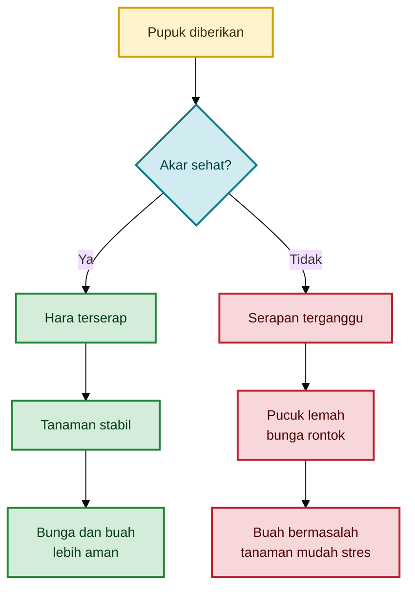
```mermaid
%%{init: {"theme": "base", "themeVariables": {"fontSize": "14px", "fontFamily": "Arial"}}}%%
flowchart TD
    A["Pupuk diberikan"] --> B{"Akar sehat?"}

    B -->|Ya| C["Hara terserap"]
    C --> D["Tanaman stabil"]
    D --> E["Bunga dan buah<br/>lebih aman"]

    B -->|Tidak| F["Serapan terganggu"]
    F --> G["Pucuk lemah<br/>bunga rontok"]
    G --> H["Buah bermasalah<br/>tanaman mudah stres"]

    classDef input fill:#fff3cd,stroke:#d39e00,color:#3d2b00,stroke-width:2px;
    classDef check fill:#d1ecf1,stroke:#117a8b,color:#003f46,stroke-width:2px;
    classDef good fill:#d4edda,stroke:#218838,color:#063b14,stroke-width:2px;
    classDef bad fill:#f8d7da,stroke:#bd2130,color:#4a0000,stroke-width:2px;

    class A input;
    class B check;
    class C,D,E good;
    class F,G,H bad;
```

Tabel praktis untuk membaca kondisi air dan akar:

| Parameter | Arah target                                                                 |
| --------- | --------------------------------------------------------------------------- |
| Bedengan  | tinggi, tidak tergenang                                                     |
| Drainase  | air cepat keluar setelah hujan atau irigasi                                 |
| Irigasi   | stabil, tidak basah-kering ekstrem                                          |
| pH        | disesuaikan dengan sistem; umumnya agak masam-netral lebih aman untuk cabai |
| EC        | tidak berlebihan, terutama pada media terbatas                              |
| Akar      | banyak akar serabut, warna putih sampai coklat muda sehat                   |

Pada tanah terbuka, drainase sering menjadi pembeda antara kebun cabai yang bertahan dan kebun yang cepat rusak. Cabai tidak suka akar yang terus-menerus berada dalam kondisi becek. Tanah yang terlalu basah mengurangi oksigen di zona akar. Bila oksigen akar turun, akar tidak bekerja normal, serapan hara terganggu, dan patogen tular tanah lebih mudah menjadi masalah.

Secara sederhana:

$$
\text{Akar stres}
=

\text{air berlebih}
+
\text{oksigen rendah}
+
\text{drainase buruk}
$$

Akar stres membuat pemupukan menjadi tidak efisien. Petani lalu sering menambah pupuk karena melihat tanaman tidak membaik. Padahal penyebabnya bukan pupuk kurang, tetapi akar tidak mampu menyerap.

Inilah salah satu jebakan mahal dalam budidaya cabai:

```text
akar terganggu
→ hara tidak terserap
→ tanaman tampak bermasalah
→ petani menambah pupuk
→ EC naik / akar makin stres
→ masalah makin berat
```

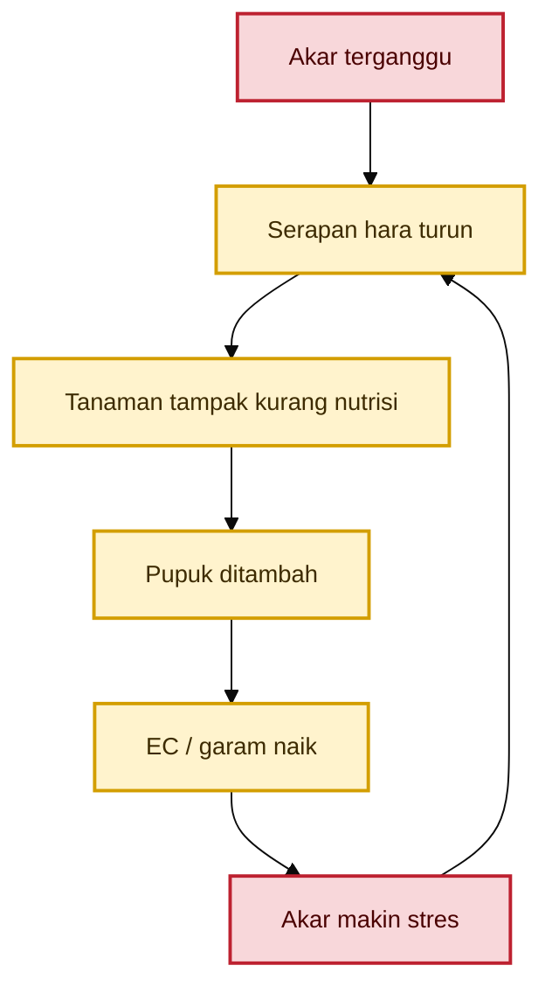
```mermaid
%%{init: {"theme": "base", "themeVariables": {"fontSize": "14px", "fontFamily": "Arial"}}}%%
flowchart TD
    A["Akar terganggu"] --> B["Serapan hara turun"]
    B --> C["Tanaman tampak kurang nutrisi"]
    C --> D["Pupuk ditambah"]
    D --> E["EC / garam naik"]
    E --> F["Akar makin stres"]
    F --> B

    classDef danger fill:#f8d7da,stroke:#bd2130,color:#4a0000,stroke-width:2px;
    classDef warn fill:#fff3cd,stroke:#d39e00,color:#3d2b00,stroke-width:2px;

    class A,F danger;
    class B,C,D,E warn;
```

Karena itu, sebelum menambah pupuk, petani perlu bertanya:

```text
Apakah tanah terlalu basah?
Apakah akar masih putih dan aktif?
Apakah pH sesuai?
Apakah EC terlalu tinggi?
Apakah air irigasi stabil?
Apakah bedengan cukup tinggi?
Apakah parit bekerja?
```

## 4.1. Air Stabil Lebih Penting daripada Air Banyak

Cabai membutuhkan air cukup, tetapi bukan berarti tanah harus terus basah. Air yang tidak stabil dapat mengganggu pertumbuhan akar, serapan kalsium, pembungaan, dan perkembangan buah.

Pola yang sering merusak:

```text
terlalu kering
→ tanaman stres
→ disiram terlalu banyak
→ akar kekurangan oksigen
→ serapan hara terganggu
```

Pada sistem fertigasi atau media terbatas, masalah ini lebih sensitif. Volume media terbatas membuat perubahan kelembapan dan EC terjadi lebih cepat. Bila air terlalu sedikit, EC di zona akar bisa naik. Bila air terlalu banyak, oksigen akar turun dan hara bisa tercuci.

Secara praktis:

$$
\text{Stabilitas air}

>

\text{jumlah air sesaat}
$$

Bukan air paling banyak yang dicari, tetapi air yang cukup dan stabil.

## 4.2. Kaitan Air, Kalsium, dan Buah

Masalah buah seperti blossom-end rot pada pepper atau tomat sering disangka penyakit. Padahal, University of Georgia menjelaskan bahwa blossom-end rot terjadi ketika kalsium pada dinding sel buah tidak mencukupi selama perkembangan awal buah; publikasi tersebut juga menekankan bahwa masalah ini berkaitan dengan manajemen air dan nutrisi, bukan penyakit menular. ([CAES Field Report][1])

Ini penting untuk cabai karena banyak kerusakan buah atau ujung buah sering langsung ditanggapi dengan fungisida. Padahal, bila masalahnya adalah gangguan fisiologis akibat kalsium dan air, fungisida tidak menyelesaikan akar masalah.

Kalsium ((Ca)) tidak mudah dipindahkan dari daun tua ke buah. Pergerakan (Ca) sangat bergantung pada aliran air dalam tanaman. Bila air tidak stabil, akar rusak, atau transpirasi terganggu, maka kalsium yang diberikan lewat pupuk belum tentu sampai dengan baik ke buah.

Secara sederhana:

$$
Ca_{\text{buah}} \downarrow
\quad \text{bila} \quad
\text{air tidak stabil}
+
\text{akar stres}
+
\text{aliran xilem terganggu}
$$

Maka, ketika buah cabai bermasalah, pertanyaannya bukan hanya:

> “Kurang pupuk Ca atau tidak?”

Tetapi:

```text
Apakah air stabil?
Apakah akar sehat?
Apakah tanah/media terlalu asin?
Apakah N terlalu mendorong pucuk?
Apakah K, Ca, Mg, dan B seimbang?
Apakah buah sedang berada pada fase pertumbuhan cepat?
```

Kalimat kunci bagian ini:

> Banyak masalah buah dan pucuk bukan karena pupuk kurang, tetapi karena air dan akar membuat hara tidak terserap dengan benar.

## 4.3. Akar Sehat Harus Dilihat, Bukan Diasumsikan

Petani sering melihat daun setiap hari, tetapi jarang memeriksa akar. Padahal akar memberi informasi yang sangat penting.

Akar yang relatif sehat biasanya:

```text
memiliki banyak akar serabut
warna putih sampai coklat muda sehat
tidak berbau busuk
tidak berlendir
media tidak terlalu padat
zona akar tidak tergenang
```

Akar yang bermasalah sering menunjukkan:

```text
warna coklat tua sampai hitam
akar mudah putus
bau busuk
akar serabut sedikit
tanaman layu saat panas
daun menguning tanpa pola jelas
pertumbuhan lambat meski sudah dipupuk
```

Dalam kebun cabai, pemeriksaan akar tidak perlu rumit. Cukup ambil beberapa tanaman contoh yang lemah dan beberapa tanaman yang sehat, lalu bandingkan. Bila bagian atas tanaman berbeda, tetapi akar tanaman lemah terlihat rusak, maka masalah utama kemungkinan berada di zona akar.

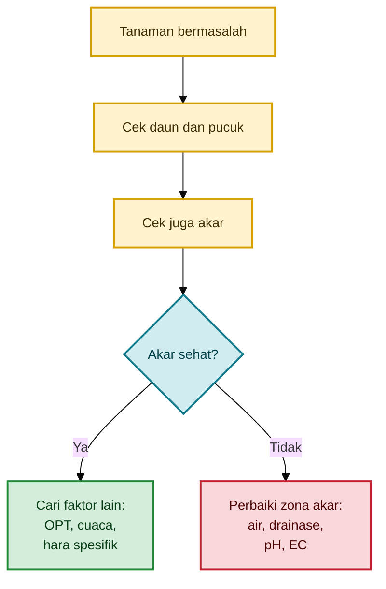
```mermaid
%%{init: {"theme": "base", "themeVariables": {"fontSize": "14px", "fontFamily": "Arial"}}}%%
flowchart TD
    A["Tanaman bermasalah"] --> B["Cek daun dan pucuk"]
    B --> C["Cek juga akar"]

    C --> D{"Akar sehat?"}
    D -->|Ya| E["Cari faktor lain:<br/>OPT, cuaca,<br/>hara spesifik"]
    D -->|Tidak| F["Perbaiki zona akar:<br/>air, drainase,<br/>pH, EC"]

    classDef start fill:#fff3cd,stroke:#d39e00,color:#3d2b00,stroke-width:2px;
    classDef check fill:#d1ecf1,stroke:#117a8b,color:#003f46,stroke-width:2px;
    classDef good fill:#d4edda,stroke:#218838,color:#063b14,stroke-width:2px;
    classDef bad fill:#f8d7da,stroke:#bd2130,color:#4a0000,stroke-width:2px;

    class A,B,C start;
    class D check;
    class E good;
    class F bad;
```

## 4.4. Ringkasan Bab 4

Nutrisi defensif tidak akan bekerja bila air dan akar tidak terkendali. Pupuk yang masuk belum tentu terserap. Kalsium yang diberikan belum tentu sampai ke buah. Tanaman yang terlihat kekurangan hara belum tentu kekurangan pupuk; bisa saja akarnya tidak mampu menyerap.

Prinsipnya:

$$
\text{Produksi stabil}
=

\text{akar sehat}
+
\text{air stabil}
+
\text{hara seimbang}
+
\text{drainase baik}
$$

Bukan:

$$
\text{Produksi stabil}
=

\text{pupuk banyak}
$$

Kalimat penutup bab ini:

> Sebelum menambah pupuk, pastikan akar masih mampu bekerja.

[**Kembali ke Atas**](#produksi-cabai-tanpa-spekulasi-mencari-parameter-kunci-nutrisi-opt-dan-risiko-usaha)

---

## 5. Parameter Ketiga: Vektor Harus Dikendalikan Sejak Pembibitan

Thrips dan kutu kebul tidak boleh dianggap sebagai masalah yang baru dimulai setelah tanaman besar. Pada cabai, risiko hama pengisap harus dikendalikan sejak pembibitan. Kegagalan sering dimulai dari nursery terbuka, bibit yang sudah membawa vektor, atau bibit yang sudah terinfeksi tetapi belum menunjukkan gejala jelas.

Kesalahan umum di lapangan adalah menganggap pembibitan sebagai tahap ringan. Petani sering lebih serius menyiapkan lahan daripada menyiapkan nursery. Padahal, bila bibit sudah bermasalah, kebun akan masuk musim tanam dengan beban risiko sejak hari pertama.

Kalimat kunci:

> Perang melawan kutu kebul dan thrips dimulai sebelum bibit pindah tanam.

## 5.1. Thrips: Kecil, tetapi Merusak Titik Produktif

Thrips menyerang bagian tanaman yang sangat penting: pucuk, daun muda, bunga, dan buah muda. Kerusakannya sering tidak langsung terlihat besar pada awalnya, tetapi dapat mengganggu bentuk daun, merusak bunga, menyebabkan parut pada buah, dan menurunkan kualitas panen. UC IPM menjelaskan bahwa thrips dapat menyebabkan distorsi atau bekas luka pada daun, bunga, dan buah; tanaman sayuran dan buah yang sedang berkembang dapat mengalami kerusakan lebih serius. ([UC IPM][2])

Pada cabai, ini sangat berbahaya karena titik ekonomi tanaman berada pada bunga dan buah. Bila bunga terganggu, jumlah buah turun. Bila buah muda terluka, kualitas panen turun. Bila pucuk rusak, arsitektur tanaman terganggu.

Secara sederhana:

$$
\text{Kerugian thrips}
=

\text{pucuk rusak}
+
\text{bunga terganggu}
+
\text{buah parut}
+
\text{kualitas turun}
$$

Thrips tidak boleh dibiarkan sampai gejala parah. Bila sudah banyak bunga rusak dan buah parut, pengendalian menjadi terlambat secara ekonomi.

## 5.2. Kutu Kebul: Bahaya Utamanya Bukan Hanya Mengisap Cairan

Kutu kebul memang mengisap cairan tanaman. Namun pada cabai, risiko yang lebih besar adalah perannya sebagai vektor virus. Pada cabai di Indonesia, Pepper yellow leaf curl Indonesia virus ((PepYLCIV)) atau penyakit keriting kuning berhubungan dengan vektor kutu kebul (Bemisia\ tabaci). Studi pada cabai menyebutkan bahwa serangga vektor kutu kebul dapat menyebarkan (PepYLCIV), dan satu kutu kebul dapat menularkan virus. ([Jurnal Universitas Padjadjaran][3])

Ini membuat strategi pengendalian kutu kebul berbeda dari hama daun biasa. Jika kutu kebul hanya dilihat sebagai serangga kecil di bawah daun, petani bisa terlambat. Yang harus dilihat adalah risiko penyebaran virus dalam blok tanaman.

Tanaman yang sudah terinfeksi virus tidak bisa “disembuhkan” dengan pupuk, mikroba, atau pestisida. Pupuk mungkin membuat tanaman tampak sedikit lebih segar, tetapi virus tetap berada di dalam jaringan. Mikroba tidak menghapus virus dari tanaman. Pestisida tidak menyembuhkan tanaman virus; pestisida hanya dapat membantu menekan vektor agar penyebaran tidak semakin cepat.

Maka, untuk virus:

$$
\text{Strategi utama}
=

\text{cegah vektor}
+
\text{cabut sumber infeksi}
+
\text{lindungi bibit}
$$

Bukan:

$$
\text{Strategi utama}
=

\text{obati tanaman yang sudah virus}
$$

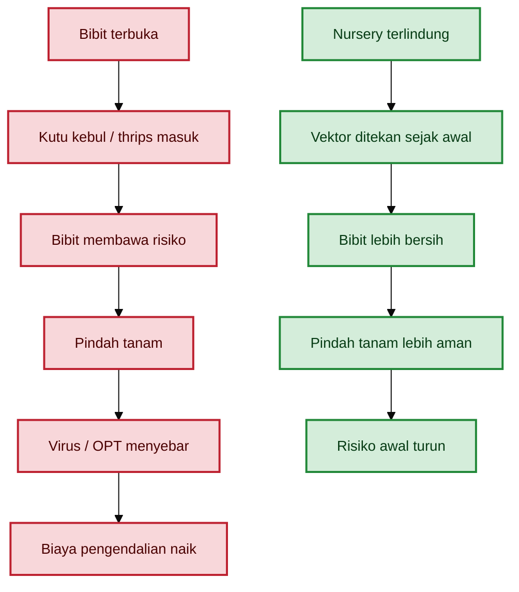
```mermaid
%%{init: {"theme": "base", "themeVariables": {"fontSize": "14px", "fontFamily": "Arial"}}}%%
flowchart TD
    A["Bibit terbuka"] --> B["Kutu kebul / thrips masuk"]
    B --> C["Bibit membawa risiko"]
    C --> D["Pindah tanam"]
    D --> E["Virus / OPT menyebar"]
    E --> F["Biaya pengendalian naik"]

    A2["Nursery terlindung"] --> B2["Vektor ditekan sejak awal"]
    B2 --> C2["Bibit lebih bersih"]
    C2 --> D2["Pindah tanam lebih aman"]
    D2 --> E2["Risiko awal turun"]

    classDef bad fill:#f8d7da,stroke:#bd2130,color:#4a0000,stroke-width:2px;
    classDef good fill:#d4edda,stroke:#218838,color:#063b14,stroke-width:2px;
    classDef warn fill:#fff3cd,stroke:#d39e00,color:#3d2b00,stroke-width:2px;

    class A,B,C,D,E,F bad;
    class A2,B2,C2,D2,E2 good;
```

## 5.3. Pembibitan Terbuka adalah Titik Awal Kegagalan

Pembibitan terbuka sering terlihat praktis dan murah. Tetapi untuk cabai, pembibitan terbuka bisa menjadi sumber kerugian besar. Bibit muda memiliki jaringan lunak, mudah diserang hama pengisap, dan sering belum menunjukkan gejala virus pada awal infeksi.

Bila bibit sakit masuk ke lahan, maka seluruh sistem produksi masuk dengan kondisi tertinggal. Petani kemudian mencoba mengejar dengan pupuk, pestisida, atau mikroba. Ini sering mahal dan tidak efisien.

SOP pembibitan minimal:

```text
nursery memakai insect net
sticky trap kuning dan biru
media semai bersih
bibit abnormal dibuang
nursery jauh dari cabai/tomat/terung tua
gulma sekitar nursery dibersihkan
pemeriksaan bawah daun rutin
```

Sticky trap bukan alat pengendali utama. Fungsinya terutama sebagai alat deteksi. University of California menyebut thrips dewasa dapat dimonitor dengan sticky trap kuning, tetapi keberadaan thrips pada trap tidak otomatis berarti kerusakan pasti terjadi. ([UC IPM][2]) Untuk western flower thrips, UCR menyebut trap biru dan kuning sama-sama dapat menangkap thrips, dengan biru sering lebih efisien, sedangkan kuning juga menarik whitefly dan hama terbang lain. ([Applied Biological Control Research][4])

Artinya, trap harus dibaca sebagai tren, bukan angka tunggal.

```text
trap naik cepat
→ cek tanaman langsung

trap rendah
→ tetap cek bawah daun dan pucuk

trap penuh serangga
→ identifikasi dulu, jangan langsung semprot buta
```

## 5.4. Bibit Abnormal Harus Dibuang, Bukan Diselamatkan

Dalam usaha cabai, tidak semua bibit layak ditanam. Bibit yang lemah, kerdil, pucuk aneh, daun keriting, atau menunjukkan gejala mencurigakan harus dibuang. Menanam bibit buruk bukan penghematan. Itu memindahkan risiko dari tray semai ke lahan utama.

Prinsip praktis:

$$
\text{Bibit buruk ditanam}
=

\text{risiko dibawa ke lahan}
$$

Bibit yang harus disingkirkan:

```text
daun keriting tidak normal
daun menguning tidak wajar
pucuk kerdil
pertumbuhan tertinggal jauh
terlihat ada kutu kebul atau thrips
akar lemah atau busuk
batang kecil dan lemah
```

Keputusan membuang bibit sering terasa berat karena petani merasa sudah mengeluarkan biaya. Tetapi biaya bibit jauh lebih kecil daripada biaya merawat tanaman bermasalah selama satu musim.

## 5.5. Ringkasan Bab 5

Thrips dan kutu kebul harus dianggap sebagai risiko awal. Thrips merusak pucuk, bunga, dan buah. Kutu kebul berbahaya karena dapat menjadi vektor virus. Tanaman virus tidak bisa disembuhkan dengan pupuk, mikroba, atau pestisida. Karena itu, pengendalian harus dimulai dari pembibitan.

Kalimat penutup bab ini:

> Bibit yang bersih tidak menjamin kebun bebas masalah, tetapi bibit yang bermasalah hampir pasti membuat kebun memulai musim dengan risiko tinggi.

[**Kembali ke Atas**](#produksi-cabai-tanpa-spekulasi-mencari-parameter-kunci-nutrisi-opt-dan-risiko-usaha)

---

## 6. Parameter Keempat: Monitoring OPT yang Sederhana, Bukan Riset Rumit

Monitoring OPT sering terdengar seperti pekerjaan peneliti. Padahal, yang dibutuhkan petani bukan riset rumit, tetapi rutinitas sederhana untuk mencegah keputusan terlambat.

Tanpa monitoring, petani biasanya berada dalam dua kondisi ekstrem:

```text
terlalu cepat semprot karena takut
atau
terlambat semprot karena tidak tahu populasi sudah naik
```

Keduanya mahal. Semprot terlalu cepat menaikkan biaya dan risiko resistensi. Semprot terlambat membuat hama dan penyakit sudah melewati titik aman.

Monitoring yang baik tidak harus rumit. Petani cukup memantau beberapa indikator utama secara rutin.

| Yang dipantau | Lokasi cek               | Makna                                    |
| ------------- | ------------------------ | ---------------------------------------- |
| Thrips        | pucuk, daun muda, bunga  | risiko keriting, bunga rusak, buah parut |
| Kutu kebul    | bawah daun               | risiko virus dan ledakan populasi        |
| Tanaman virus | seluruh blok             | sumber inokulum                          |
| Tanaman layu  | titik hotspot            | risiko patogen tanah/air                 |
| Sticky trap   | pinggir dan tengah lahan | tren populasi                            |
| Buah rusak    | saat panen               | evaluasi efektivitas pengendalian        |

## 6.1. Monitoring Harus Menjawab “Tindakan Apa?”

Monitoring bukan sekadar melihat hama. Monitoring harus menghasilkan keputusan.

Pertanyaan yang harus dijawab:

```text
Apakah populasi naik atau turun?
Apakah serangan menyebar atau hanya di pinggir?
Apakah tanaman muda sudah terpapar?
Apakah ada gejala virus?
Apakah perlu tindakan lokal atau seluruh blok?
Apakah agen hayati masih cukup?
Apakah sudah perlu rem kimia?
```

Jika monitoring tidak menghasilkan keputusan, maka monitoring hanya menjadi catatan kosong.

Secara sederhana:

$$
\text{Monitoring berguna}
=

\text{pengamatan}
+
\text{batas tindakan}
+
\text{keputusan}
$$

Bukan:

$$
\text{Monitoring berguna}
=

\text{melihat tanaman tanpa tindak lanjut}
$$

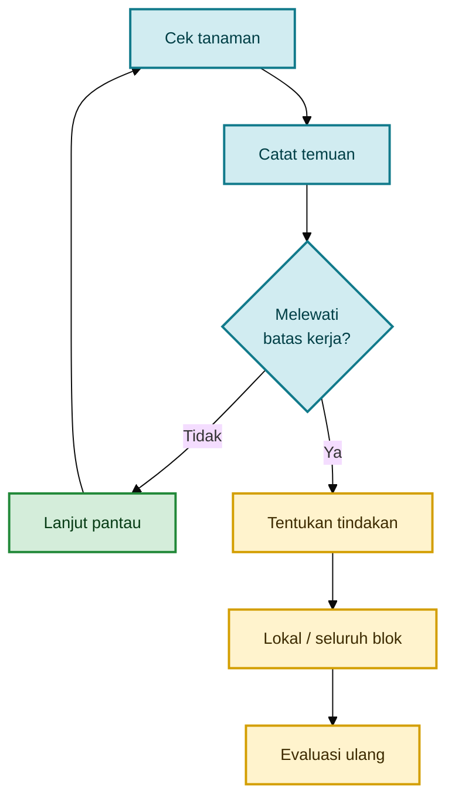
```mermaid
%%{init: {"theme": "base", "themeVariables": {"fontSize": "14px", "fontFamily": "Arial"}}}%%
flowchart TD
    A["Cek tanaman"] --> B["Catat temuan"]
    B --> C{"Melewati<br/>batas kerja?"}

    C -->|Tidak| D["Lanjut pantau"]
    D --> A

    C -->|Ya| E["Tentukan tindakan"]
    E --> F["Lokal / seluruh blok"]
    F --> G["Evaluasi ulang"]

    classDef check fill:#d1ecf1,stroke:#117a8b,color:#003f46,stroke-width:2px;
    classDef safe fill:#d4edda,stroke:#218838,color:#063b14,stroke-width:2px;
    classDef action fill:#fff3cd,stroke:#d39e00,color:#3d2b00,stroke-width:2px;
    classDef danger fill:#f8d7da,stroke:#bd2130,color:#4a0000,stroke-width:2px;

    class A,B,C check;
    class D safe;
    class E,F,G action;
```

## 6.2. Cara Monitoring yang Masuk Akal untuk Petani

Petani tidak perlu menghitung semua serangga secara akademik. Yang diperlukan adalah pola pemeriksaan yang konsisten.

Contoh pola sederhana:

```text
1. cek pinggir lahan
2. cek tengah lahan
3. cek titik dekat tanaman tua atau gulma
4. cek pucuk dan bunga untuk thrips
5. cek bawah daun untuk kutu kebul
6. tandai tanaman virus atau layu
7. bandingkan hasil cek dengan minggu sebelumnya
```

Waktu cek juga penting. Kutu kebul sering lebih mudah dilihat di bawah daun. Thrips sering perlu dicari di pucuk, bunga, dan daun muda. Sticky trap membantu membaca pergerakan populasi, tetapi tetap harus dikonfirmasi pada tanaman.

Jangan hanya melihat daun atas. Banyak masalah dimulai dari:

```text
bawah daun
pucuk muda
bunga
pinggir lahan
gulma sekitar
tanaman tua di sekitar kebun
```

## 6.3. Ambang Kerja, Bukan Ambang Universal

Ambang kendali tidak boleh ditulis seolah-olah satu angka berlaku untuk semua cabai, semua musim, semua varietas, semua lokasi, dan semua pasar. Itu tidak jujur.

Ambang kendali harus disesuaikan dengan:

```text
jenis cabai
fase tanaman
varietas
musim
sistem tanam
tekanan OPT sekitar
riwayat virus
toleransi pasar
biaya pengendalian
harga jual
```

Namun tanpa ambang kerja, petani akan cenderung mengambil keputusan dengan emosi: semprot panik atau terlambat bertindak.

Untuk whitefly pada pepper, UC IPM memberi contoh ambang silverleaf whitefly sekitar 4 dewasa per daun pada sampel acak 30 daun sehat. UC IPM juga menegaskan bahwa ambang untuk greenhouse whitefly belum ditetapkan. Angka ini bisa dipakai sebagai contoh cara berpikir berbasis ambang, bukan angka universal untuk semua cabai Indonesia. ([UC IPM][5])

Dalam artikel ini, istilah yang lebih aman adalah **ambang kerja kebun**.

Ambang kerja kebun berarti angka atau kondisi yang disepakati untuk mengambil tindakan. Misalnya:

```text
jika kutu kebul mulai menetap di bawah daun muda
jika sticky trap naik cepat dalam 3–5 hari
jika tanaman virus muncul di fase muda
jika thrips mulai ditemukan di bunga
jika buah muda mulai parut
```

Secara operasional:

$$
\text{Ambang kerja}
=

\text{populasi OPT}
+
\text{fase tanaman}
+
\text{risiko kerugian}
+
\text{biaya tindakan}
$$

## 6.4. Jangan Menunggu Virus Parah

Untuk tanaman virus, prinsipnya berbeda dengan hama biasa. Pada hama daun, petani masih bisa menurunkan populasi. Pada tanaman yang sudah terinfeksi virus, masalahnya bukan hanya tanaman itu sendiri, tetapi perannya sebagai sumber inokulum.

Karena itu, tanaman bergejala virus harus ditandai dan diputuskan cepat. Bila dibiarkan, ia dapat menjadi sumber risiko bagi tanaman sehat di sekitarnya, terutama bila vektor masih aktif.

Keputusan praktis:

```text
gejala ringan tetapi mencurigakan
→ tandai dan pantau ketat

gejala jelas virus
→ cabut dan musnahkan

gejala menyebar cepat
→ fokus pada vektor dan sumber inokulum

banyak tanaman muda terinfeksi
→ evaluasi kelayakan blok
```

Jangan menulis bahwa setiap gejala keriting pasti virus. Keriting bisa disebabkan thrips, tungau, herbisida, kekurangan hara, atau stres. Namun bila gejala mengarah ke virus dan vektor aktif, keputusan harus cepat.

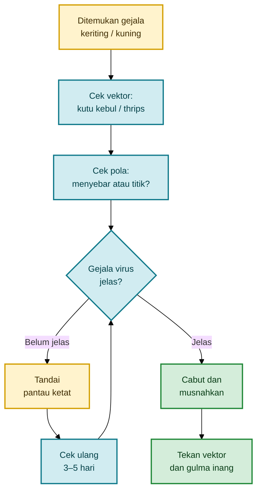
```mermaid
%%{init: {"theme": "base", "themeVariables": {"fontSize": "14px", "fontFamily": "Arial"}}}%%
flowchart TD
    A["Ditemukan gejala<br/>keriting / kuning"] --> B["Cek vektor:<br/>kutu kebul / thrips"]
    B --> C["Cek pola:<br/>menyebar atau titik?"]
    C --> D{"Gejala virus<br/>jelas?"}

    D -->|Belum jelas| E["Tandai<br/>pantau ketat"]
    D -->|Jelas| F["Cabut dan<br/>musnahkan"]
    F --> G["Tekan vektor<br/>dan gulma inang"]
    E --> H["Cek ulang<br/>3–5 hari"]
    H --> D

    classDef warn fill:#fff3cd,stroke:#d39e00,color:#3d2b00,stroke-width:2px;
    classDef check fill:#d1ecf1,stroke:#117a8b,color:#003f46,stroke-width:2px;
    classDef danger fill:#f8d7da,stroke:#bd2130,color:#4a0000,stroke-width:2px;
    classDef action fill:#d4edda,stroke:#218838,color:#063b14,stroke-width:2px;

    class A warn;
    class B,C,D,H check;
    class E warn;
    class F,G action;
```

## 6.5. Sticky Trap Dibaca sebagai Tren, Bukan Jimat

Sticky trap sering dipasang, tetapi tidak selalu dibaca dengan benar. Trap bukan jimat. Trap juga bukan pengganti pemeriksaan tanaman.

Fungsi sticky trap:

```text
mendeteksi kedatangan hama terbang
membaca tren kenaikan populasi
membandingkan pinggir dan tengah lahan
membantu menentukan area hotspot
```

Kesalahan membaca sticky trap:

```text
trap penuh → langsung semprot tanpa identifikasi
trap kosong → merasa aman tanpa cek bawah daun
trap dipasang terlalu rendah atau terlalu tinggi
trap tidak diganti saat sudah kotor
trap hanya dipasang di satu titik
```

Cara membaca yang lebih benar:

```text
Apakah jumlah tangkapan naik dibanding minggu lalu?
Apakah lebih tinggi di pinggir lahan?
Apakah jenis serangganya benar hama target?
Apakah temuan di trap sesuai dengan temuan di tanaman?
```

Untuk thrips, UC IPM mengingatkan bahwa keberadaan thrips di trap atau bunga tidak selalu berarti kerusakan akan terjadi, sehingga keputusan pengendalian harus mempertimbangkan gejala, tingkat populasi, dan kondisi tanaman. ([UC IPM][2])

## 6.6. Monitoring Harus Terhubung ke Biaya

Monitoring bukan hanya untuk menekan OPT. Monitoring juga untuk menekan biaya. Bila petani tahu serangan hanya berada di pinggir lahan, tindakan bisa difokuskan di area itu. Bila populasi masih rendah dan natural enemy atau agen hayati masih cukup, kimia bisa ditahan. Bila virus muncul pada fase muda, keputusan keras bisa diambil lebih cepat sebelum biaya semakin besar.

Dengan monitoring, keputusan menjadi:

```text
semprot lokal atau seluruh blok?
pakai biologis atau kimia?
cabut tanaman atau tunggu?
lanjutkan blok atau batasi kerugian?
```

Tanpa monitoring, keputusan menjadi:

```text
semprot karena takut
tambah pupuk karena panik
tunggu karena berharap
rugi karena terlambat
```

Rumus sederhananya:

$$
\text{Biaya salah keputusan}
=

\text{biaya input}
+
\text{kehilangan hasil}
+
\text{waktu yang hilang}
$$

Monitoring tidak menghilangkan risiko, tetapi membuat risiko lebih cepat terlihat.

## 6.7. Ringkasan Bab 6

Monitoring OPT harus dibuat sederhana agar bisa dilakukan petani. Yang dipantau bukan semua hal, tetapi titik penting: thrips, kutu kebul, tanaman virus, tanaman layu, sticky trap, dan buah rusak.

Ambang tidak boleh ditulis sebagai angka universal. Yang diperlukan adalah ambang kerja kebun: batas praktis yang menghubungkan populasi OPT, fase tanaman, risiko kerugian, dan biaya tindakan.

Kalimat penutup bab ini:

> Monitoring bukan pekerjaan peneliti. Monitoring adalah cara petani berhenti menebak.

[**Kembali ke Atas**](#produksi-cabai-tanpa-spekulasi-mencari-parameter-kunci-nutrisi-opt-dan-risiko-usaha)

[1]: https://fieldreport.caes.uga.edu/publications/C938/blossom-end-rot-and-calcium-nutrition-of-pepper-and-tomato/?utm_source=chatgpt.com 'Blossom-End Rot and Calcium Nutrition of Pepper and Tomato'
[2]: https://ipm.ucanr.edu/home-and-landscape/thrips/?utm_source=chatgpt.com 'Thrips / Home and Landscape / UC Statewide ...'
[3]: https://jurnal.unpad.ac.id/cropsaver/article/view/44927?utm_source=chatgpt.com 'Relationship Between whitefly (Bemisia tabaci) Population ...'
[4]: https://biocontrol.ucr.edu/western-flower-thrips?utm_source=chatgpt.com 'Western Flower Thrips | Applied Biological Control Research'
[5]: https://ipm.ucanr.edu/agriculture/peppers/whiteflies/?utm_source=chatgpt.com 'Whiteflies / Peppers / Agriculture: Pest Management ...'

---

## 7. Parameter Kelima: Mikroba Dipakai sebagai Pendukung, Bukan Jaminan

Mikroba dalam budidaya cabai perlu ditempatkan secara jujur. Mikroba bukan omong kosong, tetapi juga bukan jaminan. Kesalahan terbesar dalam penggunaan mikroba adalah menjualnya seolah-olah dapat menggantikan semua fondasi budidaya: nutrisi, air, akar, bibit sehat, sanitasi, dan pengendalian vektor.

Dalam artikel ini, mikroba tidak diposisikan sebagai “penyelamat kebun”. Mikroba diposisikan sebagai **pendukung sistem yang sudah benar**.

Kalimat kuncinya:

> Mikroba membantu sistem yang sudah benar. Mikroba tidak menyelamatkan tanaman yang kelebihan N, akar becek, bibit bervirus, dan vektor tidak terkendali.

Secara sederhana:

$$
\text{Hasil mikroba}
=

f(\text{strain},\ \text{kualitas produk},\ \text{waktu aplikasi},\ \text{lingkungan},\ \text{kondisi tanaman})
$$

Artinya, mikroba bukan hanya soal “pakai atau tidak pakai”. Efektivitasnya ditentukan oleh jenis mikroba, kualitas formulasi, cara aplikasi, fase tanaman, kelembapan, suhu, pH, residu pestisida, serta kondisi akar dan tajuk.

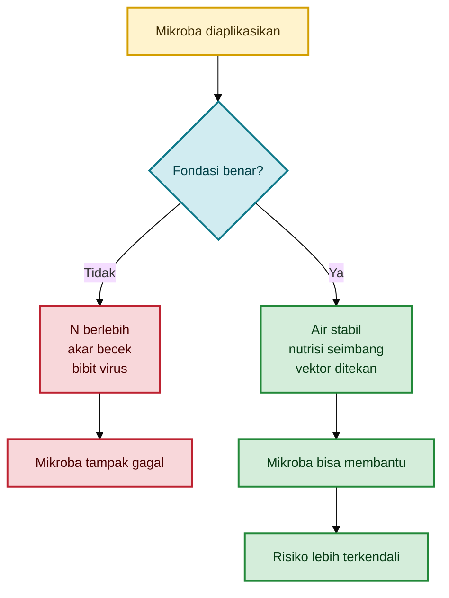
```mermaid id="l8w6bu"
%%{init: {"theme": "base", "themeVariables": {"fontSize": "14px", "fontFamily": "Arial"}}}%%
flowchart TD
    A["Mikroba diaplikasikan"] --> B{"Fondasi benar?"}

    B -->|Tidak| C["N berlebih<br/>akar becek<br/>bibit virus"]
    C --> D["Mikroba tampak gagal"]

    B -->|Ya| E["Air stabil<br/>nutrisi seimbang<br/>vektor ditekan"]
    E --> F["Mikroba bisa membantu"]
    F --> G["Risiko lebih terkendali"]

    classDef input fill:#fff3cd,stroke:#d39e00,color:#3d2b00,stroke-width:2px;
    classDef check fill:#d1ecf1,stroke:#117a8b,color:#003f46,stroke-width:2px;
    classDef bad fill:#f8d7da,stroke:#bd2130,color:#4a0000,stroke-width:2px;
    classDef good fill:#d4edda,stroke:#218838,color:#063b14,stroke-width:2px;

    class A input;
    class B check;
    class C,D bad;
    class E,F,G good;
```

## 7.1. Mikroba Akar: Membantu Rizosfer, Bukan Menghapus Semua Penyakit

Mikroba akar bekerja di sekitar rizosfer, yaitu zona tanah atau media yang dipengaruhi oleh akar. Kelompok yang sering dibahas dalam budidaya cabai antara lain:

```text id="oifvjm"
Trichoderma
Bacillus
Pseudomonas
mikoriza
```

Fungsi yang boleh ditulis secara aman:

```text id="fztk2e"
mendukung akar
membantu kompetisi mikroba di rizosfer
membantu toleransi stres tertentu
mendukung kesehatan tanaman bila air dan nutrisi benar
```

Jangan menulis:

> Mikroba akar pasti menekan semua penyakit.

Itu klaim berlebihan. Review terbaru tentang _Trichoderma_ dan _Bacillus_ memang membahas perannya sebagai promotor pertumbuhan dan kesehatan tanaman, termasuk berbagai mekanisme seperti dukungan terhadap pertumbuhan, stres, dan interaksi biologis; tetapi efektivitasnya tetap bergantung pada strain, tanaman, lingkungan, dan kondisi sistem budidaya. ([Frontiers][1])

Mikroba akar lebih tepat dipahami sebagai “penguat sistem akar”, bukan obat universal. Bila tanah terlalu becek, akar kekurangan oksigen, pH ekstrem, EC tinggi, atau tanaman sudah stres berat, mikroba sulit bekerja optimal.

Secara praktis:

$$
\text{Mikroba akar efektif}
\Rightarrow
\text{akar aktif}
+
\text{media tidak becek}
+
\text{nutrisi seimbang}
+
\text{residu kimia terkendali}
$$

Bukan:

$$
\text{Mikroba akar efektif}
\Leftarrow
\text{produk mikroba saja}
$$

## 7.2. Cara Menulis Mikroba Akar agar Tidak Menyesatkan

Kalimat yang boleh digunakan:

> Mikroba akar dapat membantu membangun rizosfer yang lebih sehat bila kondisi air, oksigen, pH, EC, dan nutrisi mendukung.

Kalimat yang harus dihindari:

> Mikroba akar membuat tanaman kebal penyakit.

Kalimat yang lebih akurat:

> Mikroba akar dapat menjadi bagian dari strategi menekan risiko penyakit tular tanah, tetapi tidak menggantikan drainase, rotasi, sanitasi, bibit sehat, dan pengelolaan air.

Tabel posisi mikroba akar:

| Klaim yang aman                               | Klaim yang berlebihan                         |
| --------------------------------------------- | --------------------------------------------- |
| Membantu kesehatan akar                       | Menjamin akar bebas penyakit                  |
| Membantu kompetisi di rizosfer                | Menghapus semua patogen tanah                 |
| Mendukung toleransi stres tertentu            | Membuat tanaman tahan semua kondisi           |
| Bekerja lebih baik bila air dan nutrisi benar | Bisa menyelamatkan lahan becek dan akar rusak |

## 7.3. Mikroba Tajuk: Membantu Menekan Hama Awal, Bukan Menggantikan Semua Pestisida

Mikroba tajuk bekerja pada bagian atas tanaman: daun, pucuk, bunga, dan kadang buah. Untuk hama pengisap seperti thrips dan kutu kebul, kelompok yang sering dipakai adalah jamur entomopatogen.

Contoh kelompok mikroba tajuk:

```text id="ctzggg"
Beauveria
Metarhizium
Lecanicillium / Akanthomyces
Bacillus foliar
```

Fungsi yang boleh ditulis:

```text id="p33d7e"
membantu menekan populasi hama tertentu pada fase awal
menjadi komponen rotasi biologis
berguna bila diaplikasikan sebelum serangan berat
```

Jangan menulis:

> Mikroba tajuk bisa menggantikan pestisida sepenuhnya.

Jamur entomopatogen seperti _Beauveria bassiana_ pernah diuji pada bell pepper greenhouse untuk menekan thrips, termasuk dalam kombinasi dengan inter-row cover; hasil seperti ini menunjukkan potensi biologis, tetapi tetap bukan bukti bahwa mikroba tajuk dapat menggantikan seluruh sistem pengendalian. ([Plant Protection][2])

Mikroba tajuk biasanya bekerja lebih lambat daripada pestisida kimia kontak tertentu. Karena itu, posisinya lebih cocok sebagai perlindungan dini, rotasi biologis, atau penekan populasi saat hama masih rendah.

Secara sederhana:

$$
\text{Mikroba tajuk} =
\text{alat tekan dini}
+
\text{komponen rotasi}
+
\text{pendukung pencegahan}
$$

Bukan:

$$
\text{Mikroba tajuk} =
\text{rem darurat tunggal saat ledakan hama}
$$

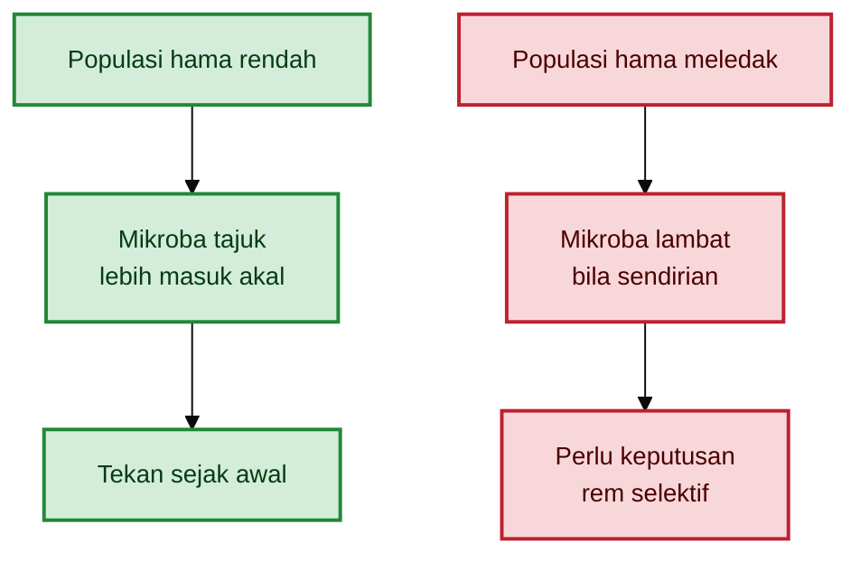
```mermaid id="b092z1"
%%{init: {"theme": "base", "themeVariables": {"fontSize": "14px", "fontFamily": "Arial"}}}%%
flowchart TD
    A["Populasi hama rendah"] --> B["Mikroba tajuk<br/>lebih masuk akal"]
    B --> C["Tekan sejak awal"]

    D["Populasi hama meledak"] --> E["Mikroba lambat<br/>bila sendirian"]
    E --> F["Perlu keputusan<br/>rem selektif"]

    classDef good fill:#d4edda,stroke:#218838,color:#063b14,stroke-width:2px;
    classDef warn fill:#fff3cd,stroke:#d39e00,color:#3d2b00,stroke-width:2px;
    classDef bad fill:#f8d7da,stroke:#bd2130,color:#4a0000,stroke-width:2px;

    class A,B,C good;
    class D,E,F bad;
```

## 7.4. Syarat Mikroba Tajuk agar Tidak Sia-Sia

Mikroba tajuk tidak boleh diperlakukan seperti pestisida biasa. Banyak produk biologis sensitif terhadap kondisi lingkungan dan campuran kimia.

Aturan praktis:

```text id="lavt3o"
aplikasikan sebelum serangan berat
semprot sore hari
targetkan bawah daun, pucuk, dan bunga
gunakan air dengan pH yang sesuai
hindari campur dengan fungisida keras
beri jarak dari aplikasi pestisida yang tidak kompatibel
gunakan produk yang jelas strain dan registrasinya
nilai hasil dari monitoring, bukan testimoni
```

Jika mikroba tajuk dipakai setelah thrips atau kutu kebul sudah meledak, petani sering kecewa. Bukan selalu karena mikrobanya buruk, tetapi karena posisi penggunaannya salah.

## 7.5. Mikroba Tidak Boleh Menutupi Kesalahan Sistem

Mikroba sering gagal bukan karena konsep biologinya salah, tetapi karena dipakai untuk menutupi kesalahan budidaya yang lebih dasar.

Contoh kesalahan:

| Kesalahan sistem               | Mengapa mikroba sulit membantu                  |
| ------------------------------ | ----------------------------------------------- |
| (N) terlalu tinggi             | jaringan terlalu lunak dan tajuk terlalu rimbun |
| Akar becek                     | mikroba baik sulit dominan bila oksigen rendah  |
| Bibit sudah bervirus           | mikroba tidak menyembuhkan virus                |
| Vektor tidak dikendalikan      | infeksi baru terus masuk                        |
| Fungisida keras sering dipakai | mikroba bisa tertekan                           |
| Monitoring tidak ada           | aplikasi biologis terlambat                     |

Kalimat yang harus tegas:

> Mikroba bukan alat untuk membenarkan sistem yang salah.

## 7.6. Ringkasan Bab 7

Mikroba boleh masuk dalam sistem cabai, tetapi posisinya harus benar. Mikroba akar mendukung rizosfer dan akar. Mikroba tajuk membantu menekan hama tertentu pada fase awal dan menjadi komponen rotasi biologis. Keduanya tidak boleh dijual sebagai jaminan.

Prinsipnya:

$$
\text{Mikroba berhasil}
=

\text{sistem benar}
+
\text{aplikasi tepat}
+
\text{monitoring}
$$

Bukan:

$$
\text{Mikroba berhasil}
=

\text{klaim produk}
$$

Kalimat penutup bab ini:

> Mikroba adalah pendukung. Fondasi tetap nutrisi, air, akar, bibit sehat, sanitasi, vektor terkendali, dan keputusan lapang yang tepat.

[**Kembali ke Atas**](#produksi-cabai-tanpa-spekulasi-mencari-parameter-kunci-nutrisi-opt-dan-risiko-usaha)

---

## 8. Parameter Keenam: Pestisida sebagai Rem, Bukan Setir

Pestisida perlu dibahas secara realistis. Dalam budidaya cabai komersial, pestisida kimia kadang diperlukan, terutama ketika populasi hama melewati batas risiko dan tindakan biologis atau mekanis tidak cukup cepat. Namun pestisida tidak boleh menjadi satu-satunya strategi.

Pestisida seharusnya dipakai sebagai **rem**, bukan **setir**.

Setir berarti seluruh arah budidaya dikendalikan oleh pestisida: ada hama sedikit, semprot; tanaman keriting, semprot; takut rugi, semprot; belum ada gejala, tetap semprot. Pola ini membuat biaya naik, musuh alami turun, risiko resistensi meningkat, dan petani kehilangan kemampuan membaca kebun.

Rem berarti pestisida masuk ketika sistem membutuhkan intervensi cepat dan terarah.

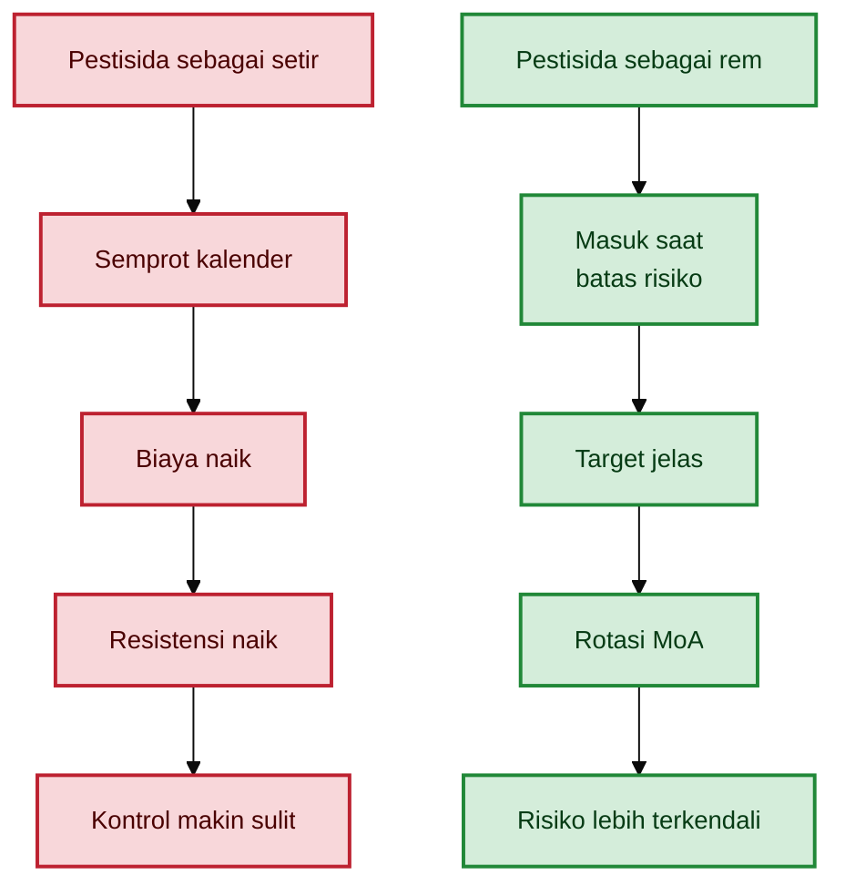
```mermaid id="g3pjnr"
%%{init: {"theme": "base", "themeVariables": {"fontSize": "14px", "fontFamily": "Arial"}}}%%
flowchart TD
    A["Pestisida sebagai setir"] --> B["Semprot kalender"]
    B --> C["Biaya naik"]
    C --> D["Resistensi naik"]
    D --> E["Kontrol makin sulit"]

    A2["Pestisida sebagai rem"] --> B2["Masuk saat<br/>batas risiko"]
    B2 --> C2["Target jelas"]
    C2 --> D2["Rotasi MoA"]
    D2 --> E2["Risiko lebih terkendali"]

    classDef bad fill:#f8d7da,stroke:#bd2130,color:#4a0000,stroke-width:2px;
    classDef good fill:#d4edda,stroke:#218838,color:#063b14,stroke-width:2px;
    classDef warn fill:#fff3cd,stroke:#d39e00,color:#3d2b00,stroke-width:2px;

    class A,B,C,D,E bad;
    class A2,B2,C2,D2,E2 good;
```

Kalimat kuncinya:

> Pestisida yang dipakai terlambat menjadi biaya. Pestisida yang dipakai sembarangan menjadi resistensi.

## 8.1. Masalahnya Bukan Pestisida Saja, tetapi Cara Memakainya

Pestisida bukan selalu salah. Yang sering salah adalah cara penggunaan:

```text id="bsguwh"
semprot berdasarkan kalender
semprot karena panik
ganti merek tetapi bahan aktif atau MoA sama
campur terlalu banyak bahan tanpa alasan teknis
tidak memperhatikan target hama
tidak memperhatikan fase tanaman
tidak memperhatikan masa tunggu panen
tidak mencatat hasil setelah aplikasi
```

Dalam budidaya cabai, pola seperti ini mahal. Semprot yang tidak tepat sasaran tidak hanya membuang biaya, tetapi juga mempercepat seleksi hama yang tahan terhadap bahan aktif tertentu.

Secara sederhana:

$$
\text{Risiko resistensi} \uparrow
\quad \text{bila} \quad
\text{MoA sama dipakai berulang}
+
\text{dosis tidak tepat}
+
\text{aplikasi terlalu sering}
$$

## 8.2. Rotasi Harus Berdasarkan Mode of Action, Bukan Merek

Salah satu kekeliruan lapang adalah menganggap ganti merek berarti rotasi. Belum tentu. Dua merek berbeda bisa memiliki bahan aktif sama atau kelompok mode of action ((MoA)) yang sama.

IRAC menyatakan bahwa strategi manajemen resistensi yang efektif menggunakan pergiliran, urutan, atau rotasi senyawa dari kelompok MoA berbeda untuk meminimalkan seleksi resistensi; IRAC juga menekankan bahwa generasi hama berturut-turut sebaiknya tidak diperlakukan dengan senyawa dari kelompok MoA yang sama. ([Insecticide Resistance Action Committee][3])

Maka, rotasi yang benar:

```text id="t0qqeu"
bukan:
merek A → merek B → merek C

tetapi:
MoA 1 → MoA 2 → MoA 3
sesuai target hama dan label
```

Dalam bentuk sederhana:

$$
\text{Rotasi benar}
\neq
\text{ganti merek}
$$

$$
\text{Rotasi benar}
=

\text{ganti MoA sesuai target dan label}
$$

## 8.3. Aturan Penulisan Pestisida dalam Artikel Ini

Artikel ini tidak memberikan resep bahan aktif spesifik tanpa konteks label lokal. Alasannya sederhana: legalitas, komoditas target, dosis, masa tunggu panen, dan aturan penggunaan dapat berbeda antarnegara, wilayah, dan produk.

Aturan yang harus ditulis:

```text id="o9avg8"
gunakan produk yang terdaftar untuk cabai
ikuti label
perhatikan PHI dan REI
rotasi berdasarkan MoA
hindari campuran tanpa alasan teknis
utamakan bahan yang sesuai target hama dan fase tanaman
```

Keterangan:

| Istilah | Makna praktis                                                      |
| ------- | ------------------------------------------------------------------ |
| (MoA)   | cara kerja bahan aktif terhadap hama                               |
| (PHI)   | pre-harvest interval, jarak aman sebelum panen                     |
| (REI)   | restricted entry interval, waktu aman masuk lahan setelah aplikasi |
| Label   | aturan resmi penggunaan produk                                     |

Jangan menulis:

> Untuk thrips, pakai bahan aktif X pasti beres.

Kalimat yang lebih benar:

> Untuk thrips, pilih produk yang terdaftar untuk cabai dan target thrips, gunakan sesuai label, dan rotasikan berdasarkan MoA.

## 8.4. Kapan Pestisida Masuk sebagai Rem?

Pestisida tidak perlu menjadi jawaban pertama untuk semua masalah. Tetapi bila batas risiko terlewati, menunda pestisida selektif juga bisa menjadi kerugian.

Pestisida bisa masuk sebagai rem bila:

```text id="o01fv5"
populasi hama naik cepat
kerusakan mulai masuk pucuk, bunga, atau buah
vektor virus aktif dan tanaman muda terancam
tindakan biologis tidak cukup menahan populasi
serangan melewati ambang kerja kebun
kerugian potensial lebih besar daripada biaya intervensi
```

Secara sederhana:

$$
\text{Rem kimia layak}
\quad \text{bila} \quad
\text{kerugian potensial}

>

\text{biaya tindakan}
$$

Namun tindakan kimia harus tetap terarah. Jangan semua masalah dijawab dengan campuran pestisida luas. Pertanyaan sebelum aplikasi:

```text id="t5d34s"
hama target apa?
fase hama apa: telur, nimfa, larva, dewasa?
bagian tanaman mana yang diserang?
apakah produk terdaftar untuk cabai?
apa MoA-nya?
kapan panen berikutnya?
berapa PHI?
apa risiko terhadap mikroba atau musuh alami?
```

## 8.5. Setelah Pestisida, Jangan Lupa Evaluasi

Banyak petani semprot, lalu berhenti berpikir. Padahal setelah aplikasi harus ada evaluasi. Bila tidak, petani tidak tahu apakah pestisida bekerja, terlambat, salah target, atau hama sudah mulai resisten.

Evaluasi setelah aplikasi:

```text id="jtoqt6"
cek 1–3 hari setelah aplikasi untuk efek awal
cek 5–7 hari untuk tren populasi
bandingkan hotspot sebelum dan sesudah
catat bahan aktif dan MoA
catat biaya
catat efek pada hama target
catat apakah perlu rotasi atau tidak
```

Rumus sederhana:

$$
\text{Efektivitas aplikasi}
=

\frac{\text{populasi sebelum} - \text{populasi sesudah}}
{\text{populasi sebelum}}
\times 100\%
$$

Rumus ini tidak perlu dipakai rumit setiap hari, tetapi membantu cara berpikir: aplikasi harus diukur, bukan hanya dilakukan.

## 8.6. Ringkasan Bab 8

Pestisida tetap bisa diperlukan dalam cabai komersial, tetapi posisinya harus sebagai rem, bukan setir. Masalah utama bukan hanya pestisida, tetapi semprot kalender, ganti merek tanpa ganti MoA, campuran tanpa alasan teknis, dan aplikasi tanpa evaluasi.

Kalimat penutup bab ini:

> Pestisida yang baik bukan yang paling sering dipakai, tetapi yang masuk pada waktu tepat, target tepat, MoA tepat, dan masih masuk akal secara biaya.

[**Kembali ke Atas**](#produksi-cabai-tanpa-spekulasi-mencari-parameter-kunci-nutrisi-opt-dan-risiko-usaha)

---

## 9. Parameter Ketujuh: Proteksi Fisik dan Sistem Tanam

Proteksi fisik sering dianggap sebagai teknologi mahal. Padahal, dalam budidaya cabai, proteksi fisik bukan sekadar fasilitas tambahan. Proteksi fisik adalah cara mengurangi tekanan risiko sejak awal, terutama dari hujan, vektor, percikan tanah, gulma, kelembapan ekstrem, dan serangan dari luar blok.

Komponen yang dapat dibahas:

```text id="lsr7p6"
net house / screen house
rain shelter
mulsa plastik perak-hitam
drip irrigation
border crop
sanitasi gulma
rotasi lahan
pembuangan tanaman virus
```

Kalimat kuncinya:

> Proteksi fisik bukan membuat tanaman steril. Fungsinya menurunkan tekanan vektor dan cuaca agar keputusan budidaya tidak selalu berada dalam kondisi darurat.

## 9.1. Proteksi Fisik Bukan Membuat Sistem Steril

Salah satu salah paham dalam proteksi fisik adalah menganggap net house, screen house, atau rain shelter bertujuan membuat tanaman steril. Itu tidak realistis. Tanaman tetap berinteraksi dengan mikroba, hama, udara, air, dan manusia.

Fungsi proteksi fisik adalah menurunkan tekanan dari luar.

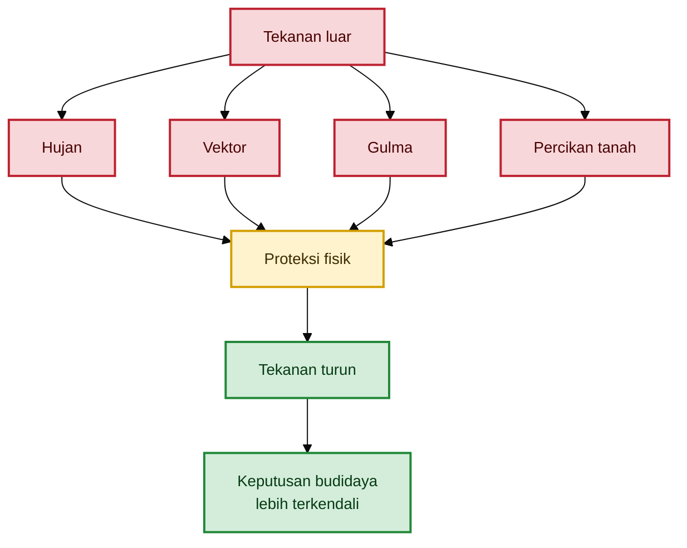
```mermaid id="jf7v86"
%%{init: {"theme": "base", "themeVariables": {"fontSize": "14px", "fontFamily": "Arial"}}}%%
flowchart TD
    A["Tekanan luar"] --> B["Hujan"]
    A --> C["Vektor"]
    A --> D["Gulma"]
    A --> E["Percikan tanah"]

    B --> F["Proteksi fisik"]
    C --> F
    D --> F
    E --> F

    F --> G["Tekanan turun"]
    G --> H["Keputusan budidaya<br/>lebih terkendali"]

    classDef risk fill:#f8d7da,stroke:#bd2130,color:#4a0000,stroke-width:2px;
    classDef tool fill:#fff3cd,stroke:#d39e00,color:#3d2b00,stroke-width:2px;
    classDef good fill:#d4edda,stroke:#218838,color:#063b14,stroke-width:2px;

    class A,B,C,D,E risk;
    class F tool;
    class G,H good;
```

Proteksi fisik tidak menghapus risiko, tetapi membuat risiko lebih lambat masuk atau lebih mudah dikendalikan. Dalam cabai, perbedaan ini sangat penting. Bila tekanan vektor dan hujan terlalu tinggi sejak awal, petani cenderung terus berada dalam mode darurat: semprot, tambah input, koreksi, panik, lalu biaya naik.

## 9.2. Net House dan Screen House: Mengurangi Tekanan Vektor

Net house atau screen house membantu menurunkan masuknya serangga vektor, terutama bila dipakai bersama nursery bersih, pintu yang disiplin, sanitasi, dan monitoring. Namun net house bukan jaminan bebas hama. Hama bisa masuk melalui bibit, pekerja, lubang net, pintu terbuka, gulma, atau sisa tanaman.

Karena itu, net house hanya efektif bila menjadi bagian dari sistem:

```text id="qbj56v"
bibit bersih
pintu dan akses terkendali
net tidak robek
gulma dibersihkan
tanaman virus dibuang
monitoring tetap berjalan
```

Jangan menulis:

> Net house membuat cabai aman dari OPT.

Tulis:

> Net house menurunkan tekanan masuknya vektor, tetapi tetap membutuhkan disiplin sanitasi, monitoring, dan pengelolaan tanaman.

## 9.3. Rain Shelter: Mengurangi Kerusakan Akibat Hujan

Hujan dapat memperberat banyak masalah pada cabai: percikan tanah, kelembapan tajuk, pencucian hara, penyakit daun/buah, bunga rontok, dan akar tergenang bila drainase buruk. Rain shelter membantu mengurangi kontak langsung hujan dengan tajuk dan buah.

Namun rain shelter juga bisa menimbulkan masalah bila sirkulasi udara buruk. Tajuk yang terlalu rapat di bawah naungan dapat mempertahankan kelembapan. Maka rain shelter harus disertai pengaturan jarak tanam, pemangkasan bila diperlukan, dan ventilasi yang cukup.

Prinsipnya:

$$
\text{Rain shelter efektif}
=

\text{hujan berkurang}
+
\text{ventilasi tetap baik}
+
\text{air akar terkendali}
$$

Bukan:

$$
\text{Rain shelter efektif}
=

\text{plastik dipasang}
$$

## 9.4. Mulsa Plastik Perak-Hitam: Bukan Sekadar Rapi

Mulsa plastik perak-hitam memiliki beberapa fungsi praktis: mengurangi gulma, mengurangi percikan tanah, menjaga kelembapan tanah lebih stabil, dan membantu pengelolaan area bedengan. Bagian perak juga sering dipakai untuk mengganggu orientasi serangga tertentu, walau efektivitasnya tetap bergantung pada kondisi lapang dan tekanan hama.

Fungsi yang aman ditulis:

```text id="bb5sk2"
mengurangi gulma di bedengan
mengurangi percikan tanah ke daun bawah
membantu kestabilan kelembapan
membuat fertigasi/irigasi lebih terarah
membantu menurunkan tekanan awal beberapa hama
```

Jangan menulis:

> Mulsa perak pasti mencegah kutu kebul dan thrips.

Kalimat yang lebih akurat:

> Mulsa perak-hitam membantu mengurangi beberapa risiko lapang, tetapi tidak menggantikan nursery bersih, monitoring, dan pengendalian vektor.

## 9.5. Drip Irrigation: Mengendalikan Air dan Pupuk

Drip irrigation bukan hanya alat irigasi. Dalam cabai, drip membantu membuat air lebih stabil dan pupuk lebih terarah. Bila digabung dengan fertigasi, drip membantu pemberian hara sesuai fase tanaman.

Namun drip juga bukan jaminan. Jika jadwal salah, filter buruk, emiter mampet, atau EC larutan terlalu tinggi, drip bisa membuat masalah menyebar merata.

Prinsip drip:

```text id="ust6u0"
air sedikit tetapi sering
zona akar stabil
pupuk lebih terarah
daun tidak sering basah
kelembapan tanah lebih terkendali
```

Kesalahan drip:

```text id="g08vu3"
tidak cek debit emiter
filter jarang dibersihkan
jadwal air tidak mengikuti cuaca
fertigasi terlalu pekat
tidak flushing saluran
tidak cek kelembapan akar
```

Secara sederhana:

$$
\text{Drip baik}
=

\text{debit seragam}
+
\text{jadwal tepat}
+
\text{EC terkendali}
+
\text{akar dipantau}
$$

## 9.6. Border Crop, Sanitasi Gulma, dan Tanaman Virus

Proteksi fisik tidak selalu berupa bangunan. Border crop, sanitasi gulma, dan pembuangan tanaman virus juga bagian dari proteksi sistem.

Gulma dapat menjadi tempat berlindung hama dan sebagian dapat menjadi inang penyakit atau vektor. Tanaman cabai, tomat, terung, atau tanaman solanaceae tua di sekitar nursery dan lahan dapat menjadi sumber hama dan penyakit. Tanaman virus di dalam blok dapat menjadi sumber risiko bagi tanaman sehat.

Tindakan praktis:

```text id="c60cyy"
bersihkan gulma sekitar nursery dan lahan
hindari nursery dekat tanaman cabai/tomat/terung tua
buang tanaman virus yang jelas
jangan biarkan sisa tanaman sakit
gunakan rotasi lahan bila memungkinkan
kelola border crop sebagai bagian sistem, bukan hiasan
```

Studi cabai di Indonesia mengevaluasi kombinasi sweet corn barrier, ambang kendali, mulsa plastik perak, perangkap, fungisida, serta sistem open field dan netting house untuk melihat kelayakan teknis dan ekonominya; penelitian itu menilai kombinasi teknik, bukan satu input tunggal. ([agriculturejournals.cz][4])

Ini penting karena banyak petani mencari satu alat utama. Padahal, proteksi risiko biasanya bekerja sebagai kombinasi.

## 9.7. Proteksi Fisik Harus Dinilai dari Biaya dan Risiko

Tidak semua petani harus langsung membangun net house mahal. Proteksi fisik harus disesuaikan dengan risiko, modal, dan target pasar.

Urutan berpikir:

```text id="n2kpl9"
risiko apa yang paling besar?
hujan, vektor, virus, gulma, air, atau harga?

biaya proteksi berapa?
pengurangan risiko berapa?

apakah pasar mampu membayar kualitas lebih baik?
apakah produksi lebih stabil?
apakah biaya semprot turun?
```

Secara bisnis:

$$
\text{Proteksi layak}
\quad \text{bila} \quad
\Delta \text{margin}

>

\text{biaya tambahan proteksi}
$$

Dengan:

$$
\Delta \text{margin}
=

\text{margin setelah proteksi}
-
\text{margin tanpa proteksi}
$$

Artinya, net house, rain shelter, drip, atau mulsa tidak boleh dinilai hanya dari biaya awal. Harus dinilai dari pengurangan risiko, peningkatan hasil layak jual, penghematan pestisida, stabilitas panen, dan akses pasar.

## 9.8. Ringkasan Bab 9

Proteksi fisik dan sistem tanam bukan teknologi mewah bila digunakan untuk menurunkan risiko. Net house, rain shelter, mulsa, drip, border crop, sanitasi, rotasi, dan pembuangan tanaman virus adalah alat untuk membuat budidaya cabai tidak selalu berada dalam kondisi darurat.

Prinsipnya:

$$
\text{Risiko cabai turun}
=

\text{tekanan luar berkurang}
+
\text{air terkendali}
+
\text{vektor ditekan}
+
\text{sanitasi berjalan}
$$

Bukan:

$$
\text{Risiko cabai turun}
=

\text{satu alat mahal}
$$

Kalimat penutup bab ini:

> Proteksi fisik bukan membuat tanaman steril. Proteksi fisik membuat petani punya ruang bernapas sebelum masalah menjadi ledakan.

[**Kembali ke Atas**](#produksi-cabai-tanpa-spekulasi-mencari-parameter-kunci-nutrisi-opt-dan-risiko-usaha)

[1]: https://www.frontiersin.org/journals/microbiology/articles/10.3389/fmicb.2024.1423980/full?utm_source=chatgpt.com 'Trichoderma and Bacillus multifunctional allies for plant ...'
[2]: https://www.plantprotection.pl/pdf-155113-84206?filename=Biological+control+of.pdf&utm_source=chatgpt.com 'Biological control of Frankliniella occidentalis on ...'
[3]: https://irac-online.org/mode-of-action/classification-online/?utm_source=chatgpt.com 'Mode of Action Classification | Insecticide Resistance ...'
[4]: https://www.agriculturejournals.cz/artkey/pps-202303-0010_determining-the-technical-and-economic-feasibility-of-combining-pest-control-techniques-in-open-field-and-netti.php?utm_source=chatgpt.com 'Determining the technical and economic feasibility of ...'

---

Berikut naskah **Bab 10–14** sesuai kerangka yang Anda unggah.

## 10. Parameter Kedelapan: Risiko Usaha Harus Dihitung Sejak Awal

Cabai tidak boleh dibahas hanya sebagai tanaman. Cabai harus dibahas sebagai usaha. Selama cabai hanya dilihat dari sisi teknis budidaya, petani mudah terjebak pada pertanyaan: pupuk apa, pestisida apa, mikroba apa, varietas apa. Padahal pertanyaan yang lebih awal dan lebih keras adalah: **berapa batas rugi yang masih bisa ditanggung?**

Petani sering rugi bukan karena tidak bisa menanam, tetapi karena tidak tahu batas kerugian sejak awal.

Dalam usaha cabai, risiko teknis dan risiko keuangan berjalan bersamaan. Tanaman bisa terlihat baik, tetapi biaya sudah terlalu tinggi. Sebaliknya, tanaman bisa sedang bermasalah, tetapi masih layak diselamatkan bila potensi hasil dan harga masih menutup biaya koreksi. Tanpa perhitungan, keputusan mudah berubah menjadi harapan.

Prinsipnya:

$$
\text{Budidaya cabai layak}
\neq
\text{tanaman terlihat bagus}
$$

Yang lebih tepat:

$$
\text{Budidaya cabai layak}
=

\text{hasil layak jual}
-
\text{biaya produksi}
+
\text{risiko terkendali}
$$

## 10.1. Harga Impas Harus Dihitung Sebelum Tanam

Harga impas adalah harga minimal per kilogram agar petani tidak rugi. Rumusnya:

$$
H_{\text{impas}} =
\frac{B_{\text{total}}}{Y_{\text{estimasi}}}
$$

dengan:

```text
H_impas     = harga impas per kg cabai
B_total     = total biaya produksi
Y_estimasi  = estimasi total hasil panen dalam kg
```

Contoh:

Jika total biaya produksi adalah:

$$
B_{\text{total}} = Rp18.000.000
$$

dan estimasi hasil panen adalah:

$$
Y_{\text{estimasi}} = 2.000\ \text{kg}
$$

maka:

$$
H_{\text{impas}} =
\frac{18.000.000}{2.000}
=

Rp9.000/\text{kg}
$$

Artinya, bila harga rata-rata jual di bawah:

$$
Rp9.000/\text{kg}
$$

usaha belum menutup biaya produksi.

Namun ini baru impas. Petani belum mendapat keuntungan. Bila petani ingin margin aman, harga target harus lebih tinggi dari harga impas.

$$
H_{\text{target}}

>

H_{\text{impas}}
$$

Kesalahan yang sering terjadi adalah petani hanya melihat harga pasar hari ini, lalu langsung tanam. Padahal harga saat tanam belum tentu sama dengan harga saat panen.

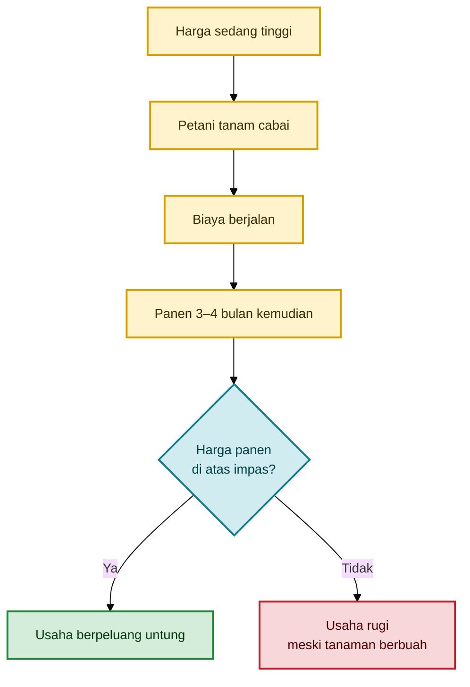
```mermaid
%%{init: {"theme": "base", "themeVariables": {"fontSize": "14px", "fontFamily": "Arial"}}}%%
flowchart TD
    A["Harga sedang tinggi"] --> B["Petani tanam cabai"]
    B --> C["Biaya berjalan"]
    C --> D["Panen 3–4 bulan kemudian"]
    D --> E{"Harga panen<br/>di atas impas?"}

    E -->|Ya| F["Usaha berpeluang untung"]
    E -->|Tidak| G["Usaha rugi<br/>meski tanaman berbuah"]

    classDef start fill:#fff3cd,stroke:#d39e00,color:#3d2b00,stroke-width:2px;
    classDef check fill:#d1ecf1,stroke:#117a8b,color:#003f46,stroke-width:2px;
    classDef good fill:#d4edda,stroke:#218838,color:#063b14,stroke-width:2px;
    classDef bad fill:#f8d7da,stroke:#bd2130,color:#4a0000,stroke-width:2px;

    class A,B,C,D start;
    class E check;
    class F good;
    class G bad;
```

## 10.2. Produksi Impas: Berapa Kilogram Minimal agar Tidak Rugi?

Selain harga impas, petani perlu menghitung produksi impas. Rumusnya:

$$
Y_{\text{impas}} =
\frac{B_{\text{total}}}{H_{\text{jual rata-rata}}}
$$

dengan:

```text
Y_impas              = produksi minimal agar tidak rugi
B_total              = total biaya produksi
H_jual rata-rata     = harga jual rata-rata per kg
```

Contoh:

Jika total biaya produksi:

$$
B_{\text{total}} = Rp18.000.000
$$

dan harga jual rata-rata yang realistis:

$$
H_{\text{jual rata-rata}} = Rp12.000/\text{kg}
$$

maka:

$$
Y_{\text{impas}} =
\frac{18.000.000}{12.000}
=

1.500\ \text{kg}
$$

Artinya, kebun harus menghasilkan minimal:

$$
1.500\ \text{kg}
$$

agar tidak rugi.

Bila target hasil realistis hanya:

$$
1.200\ \text{kg}
$$

maka usaha sudah berisiko sebelum tanam.

## 10.3. Biaya per Tanaman

Petani juga perlu mengetahui biaya nyata per tanaman hidup. Rumusnya:

$$
B_{\text{tanaman}} =
\frac{B_{\text{total}}}{J_{\text{tanaman hidup}}}
$$

dengan:

```text
B_tanaman             = biaya produksi per tanaman hidup
B_total               = total biaya produksi
J_tanaman hidup       = jumlah tanaman yang bertahan hidup
```

Contoh:

Jika total biaya:

$$
B_{\text{total}} = Rp18.000.000
$$

dan tanaman hidup:

$$
J_{\text{tanaman hidup}} = 4.500\ \text{tanaman}
$$

maka:

$$
B_{\text{tanaman}} =
\frac{18.000.000}{4.500}
=

Rp4.000/\text{tanaman}
$$

Angka ini penting. Bila tanaman mati banyak, biaya per tanaman hidup naik. Misalnya jumlah tanaman hidup turun menjadi:

$$
3.600\ \text{tanaman}
$$

maka:

$$
B_{\text{tanaman}} =
\frac{18.000.000}{3.600}
=

Rp5.000/\text{tanaman}
$$

Artinya, kematian tanaman bukan hanya masalah teknis. Kematian tanaman langsung menaikkan biaya produksi per tanaman yang tersisa.

## 10.4. Margin Bersih

Margin bersih adalah pendapatan yang tersisa setelah semua biaya dikurangi.

$$
M_{\text{bersih}} =
P_{\text{kotor}} -
B_{\text{total}}
$$

dengan:

```text
M_bersih      = margin bersih
P_kotor       = pendapatan kotor
B_total       = total biaya produksi
```

Pendapatan kotor dihitung sebagai:

$$
P_{\text{kotor}} =
Y_{\text{total}} \times H_{\text{jual rata-rata}}
$$

Contoh:

Jika hasil total:

$$
Y_{\text{total}} = 2.000\ \text{kg}
$$

harga jual rata-rata:

$$
H_{\text{jual rata-rata}} = Rp12.000/\text{kg}
$$

maka:

$$
P_{\text{kotor}} =
2.000 \times 12.000
=

Rp24.000.000
$$

Jika biaya total:

$$
B_{\text{total}} = Rp18.000.000
$$

maka:

$$
M_{\text{bersih}} =
24.000.000 - 18.000.000
=

Rp6.000.000
$$

Tetapi bila harga turun menjadi:

$$
Rp8.000/\text{kg}
$$

maka:

$$
P_{\text{kotor}} =
2.000 \times 8.000
=

Rp16.000.000
$$

dan:

$$
M_{\text{bersih}} =
16.000.000 - 18.000.000
=

-Rp2.000.000
$$

Tanamannya sama. Produksinya sama. Tetapi hasil usaha berubah dari untung menjadi rugi karena harga jual berbeda.

## 10.5. Tabel Risiko Usaha Cabai

| Parameter usaha   | Pertanyaan praktis                               |
| ----------------- | ------------------------------------------------ |
| Modal awal        | cukup sampai panen pertama atau tidak?           |
| Biaya per tanaman | berapa biaya nyata per tanaman hidup?            |
| Harga impas       | harga minimal agar tidak rugi?                   |
| Produksi impas    | kg/tanaman minimal agar layak?                   |
| Biaya pestisida   | kapan biaya semprot sudah tidak rasional?        |
| Serangan virus    | pada persen berapa kebun harus dievaluasi keras? |
| Tanaman mati      | berapa persen kematian masih bisa diterima?      |
| Pasar             | siapa pembeli, grade apa, harga bagaimana?       |

Tabel ini harus dipakai sebelum tanam, bukan setelah rugi.

## 10.6. Batas Kerugian Harus Ditentukan

Petani perlu memiliki batas keputusan. Misalnya:

```text
jika tanaman mati terlalu banyak sebelum 30 HST
→ evaluasi kelayakan blok

jika virus menyebar cepat di fase muda
→ hitung ulang potensi hasil

jika biaya semprot terus naik sebelum panen utama
→ cek apakah usaha masih layak

jika harga pasar jauh di bawah harga impas
→ hentikan input yang tidak meningkatkan hasil layak jual
```

Batas ini tidak sama untuk semua petani. Tetapi tanpa batas, petani mudah terus menambah biaya karena berharap keadaan membaik.

Secara sederhana:

$$
\text{Keputusan lanjut}
\quad \text{layak bila} \quad
\text{potensi pendapatan tersisa}

>

\text{biaya tambahan}
$$

Jika:

$$
\text{biaya tambahan}

>

\text{potensi pendapatan tersisa}
$$

maka menambah input hanya memperbesar kerugian.

## 10.7. Ringkasan Bab 10

Cabai harus dihitung sebagai usaha. Tanaman sehat penting, tetapi tidak cukup. Petani harus tahu harga impas, produksi impas, biaya per tanaman, margin bersih, dan batas kerugian.

Kalimat penutup bab ini:

> Petani sering rugi bukan karena tidak bisa menanam, tetapi karena tidak tahu batas kerugian sejak awal.

[**Kembali ke Atas**](#produksi-cabai-tanpa-spekulasi-mencari-parameter-kunci-nutrisi-opt-dan-risiko-usaha)

---

## 11. Dashboard Produksi Cabai: 12 Angka yang Harus Dipegang

Tanpa dashboard, petani melihat tanaman. Dengan dashboard, petani melihat usaha.

Dashboard produksi cabai bukan aplikasi mahal. Dashboard adalah daftar angka dan indikator yang harus dipantau agar keputusan tidak diambil berdasarkan rasa. Tujuannya bukan membuat petani menjadi peneliti, tetapi membuat petani memiliki pegangan ketika harus memilih: menambah pupuk, menahan nitrogen, mengendalikan vektor, mencabut tanaman virus, memakai pestisida, atau membatasi biaya.

Dashboard cabai harus menghubungkan tiga hal:

$$
\text{Tanaman}
+
\text{OPT}
+
\text{Uang}
$$

Bila hanya melihat tanaman, petani bisa terlambat menghitung biaya. Bila hanya melihat biaya, petani bisa salah membaca kondisi biologis. Bila hanya melihat OPT, petani bisa semprot terus tanpa tahu dampaknya pada margin.

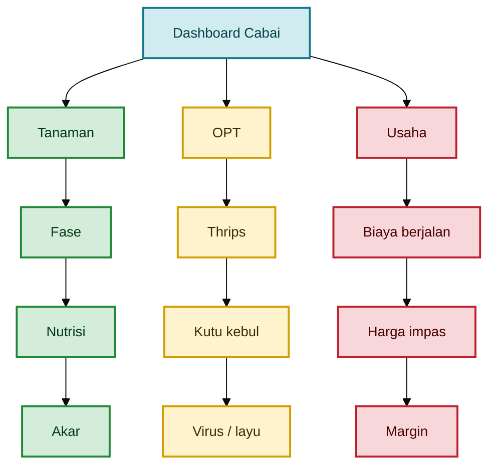
```mermaid
%%{init: {"theme": "base", "themeVariables": {"fontSize": "14px", "fontFamily": "Arial"}}}%%
flowchart TD
    A["Dashboard Cabai"] --> B["Tanaman"]
    A --> C["OPT"]
    A --> D["Usaha"]

    B --> B1["Fase"]
    B1 --> B2["Nutrisi"]
    B2 --> B3["Akar"]

    C --> C1["Thrips"]
    C1 --> C2["Kutu kebul"]
    C2 --> C3["Virus / layu"]

    D --> D1["Biaya berjalan"]
    D1 --> D2["Harga impas"]
    D2 --> D3["Margin"]

    classDef main fill:#d1ecf1,stroke:#117a8b,color:#003f46,stroke-width:2px;
    classDef crop fill:#d4edda,stroke:#218838,color:#063b14,stroke-width:2px;
    classDef pest fill:#fff3cd,stroke:#d39e00,color:#3d2b00,stroke-width:2px;
    classDef money fill:#f8d7da,stroke:#bd2130,color:#4a0000,stroke-width:2px;

    class A main;
    class B,B1,B2,B3 crop;
    class C,C1,C2,C3 pest;
    class D,D1,D2,D3 money;
```

## 11.1. Dua Belas Angka yang Harus Dipegang

|  No | Parameter                         | Mengapa penting                          |
| --: | --------------------------------- | ---------------------------------------- |
|   1 | Umur tanaman                      | menentukan fase nutrisi                  |
|   2 | Fase tanaman                      | vegetatif, bunga, buah awal, panen       |
|   3 | Sumber dan total (N)              | mencegah tanaman terlalu vegetatif       |
|   4 | (K) dan (Ca) relatif terhadap (N) | menjaga buah dan jaringan                |
|   5 | (Mg), (B), (Mn), (Zn)             | mencegah nutrisi defensif menjadi sempit |
|   6 | pH air/tanah/media                | menentukan serapan                       |
|   7 | EC air/media                      | membaca risiko salinitas                 |
|   8 | Kondisi akar                      | indikator kesehatan dasar                |
|   9 | Populasi thrips                   | risiko pucuk, bunga, buah                |
|  10 | Populasi kutu kebul               | risiko virus                             |
|  11 | Persentase tanaman virus/layu     | indikator keputusan keras                |
|  12 | Biaya berjalan dan harga impas    | indikator usaha, bukan hanya tanaman     |

Dashboard ini bukan daftar hiasan. Setiap angka harus berujung pada keputusan.

## 11.2. Umur dan Fase Tanaman

Umur tanaman penting karena kebutuhan cabai berubah. Tanaman muda membutuhkan fokus akar dan adaptasi. Tanaman menjelang bunga membutuhkan keseimbangan vegetatif-generatif. Tanaman berbuah membutuhkan (K), (Ca), (Mg), (B), air stabil, dan perlindungan bunga-buah.

Kesalahan umum adalah memakai pola pupuk yang sama sepanjang musim.

Padahal:

$$
\text{Kebutuhan hara}
=

f(\text{umur},\ \text{fase},\ \text{beban buah},\ \text{cuaca},\ \text{kondisi akar})
$$

Bukan:

$$
\text{Kebutuhan hara}
=

\text{satu resep tetap}
$$

## 11.3. Total Nitrogen Harus Dihitung dari Semua Sumber

Nitrogen tidak hanya datang dari satu pupuk. Total (N) bisa berasal dari urea, ZA, NPK, KNO₃, Ca(NO₃)₂, pupuk organik, pupuk daun, dan input lain.

Rumus sederhananya:

$$
N_{\text{total}} =
N_{\text{urea}}
+
N_{\text{ZA}}
+
N_{\text{NPK}}
+
N_{\mathrm{KNO_3}}
+
N_{\mathrm{Ca(NO_3)_2}}
+
N_{\text{organik}}
+
N_{\text{lain}}
$$

Bila tanaman terlalu hijau dan pucuk lunak, jangan hanya bertanya “kurang pupuk apa?”. Pertanyaan pertama:

```text
Berapa total N yang sebenarnya sudah masuk?
```

## 11.4. K dan Ca Relatif terhadap N

(K) dan (Ca) tidak boleh dibaca terpisah dari (N). Bila (N) terlalu dominan, tanaman bisa terlalu vegetatif. Bila (K) tidak cukup saat bunga dan buah, pengisian buah dan kualitas hasil bisa terganggu. Bila (Ca) tidak stabil, pucuk, akar muda, dan buah bisa lemah.

Rasio sederhana untuk membaca arah:

$$
R_K =
\frac{K}{N}
$$

$$
R_{Ca} =
\frac{Ca}{N}
$$

Rasio ini bukan rumus lengkap. Ini hanya alat tanya:

```text
Apakah N terlalu dominan?
Apakah K cukup untuk fase buah?
Apakah Ca stabil untuk jaringan?
```

## 11.5. Mikro Tidak Boleh Hilang dari Dashboard

Nutrisi defensif tidak boleh dipersempit menjadi (N), (K), dan (Ca). Unsur seperti (Mg), (B), (Mn), dan (Zn) perlu masuk dashboard karena berhubungan dengan fotosintesis, bunga, fruit set, enzim, dan jaringan tanaman.

Untuk praktik, petani tidak harus mengukur unsur mikro setiap minggu. Tetapi pada kebun komersial, ketika masalah berulang seperti bunga rontok, pucuk abnormal, buah cacat, atau daun klorosis muncul, unsur mikro harus masuk daftar pemeriksaan.

## 11.6. pH, EC, dan Akar

pH dan EC membantu membaca apakah akar berada dalam kondisi serapan yang masuk akal. pH yang tidak sesuai dapat mengganggu ketersediaan hara. EC terlalu tinggi dapat menekan akar, terutama pada media terbatas atau musim kering.

Secara sederhana:

$$
\text{Serapan hara baik}
\Rightarrow
\text{pH sesuai}
+
\text{EC aman}
+
\text{akar sehat}
$$

Jika akar rusak, angka pupuk tidak banyak berarti.

## 11.7. Thrips, Kutu Kebul, Virus, dan Layu

Dashboard OPT harus sederhana. Fokus pada risiko terbesar:

```text
thrips
kutu kebul
virus
layu
```

Thrips dibaca dari pucuk, daun muda, bunga, dan buah muda. Kutu kebul dibaca dari bawah daun dan sticky trap. Virus dibaca dari gejala tanaman dan penyebarannya. Layu dibaca dari pola hotspot dan kondisi akar.

Yang penting bukan hanya ada atau tidak ada hama, tetapi trennya:

$$
\text{Risiko OPT}
=

\text{jumlah}
+
\text{tren}
+
\text{fase tanaman}
+
\text{kerusakan}
$$

## 11.8. Biaya Berjalan dan Harga Impas

Dashboard tidak lengkap tanpa biaya. Setiap minggu, petani harus tahu biaya yang sudah keluar dan perkiraan harga impas terbaru.

Jika biaya bertambah, harga impas juga bisa naik.

$$
H_{\text{impas baru}} =
\frac{B_{\text{total baru}}}{Y_{\text{estimasi baru}}}
$$

Bila produksi estimasi turun karena virus, layu, atau kematian tanaman, harga impas juga naik.

Contoh:

$$
H_{\text{impas awal}} =
\frac{18.000.000}{2.000}
=

Rp9.000/\text{kg}
$$

Jika estimasi hasil turun menjadi:

$$
1.500\ \text{kg}
$$

maka:

$$
H_{\text{impas baru}} =
\frac{18.000.000}{1.500}
=

Rp12.000/\text{kg}
$$

Biaya sama, tetapi karena hasil turun, harga impas naik.

## 11.9. Ringkasan Bab 11

Dashboard cabai menggabungkan kondisi tanaman, OPT, dan usaha. Dashboard bukan pekerjaan akademik. Dashboard adalah cara agar petani tidak mengambil keputusan dalam gelap.

Kalimat penutup bab ini:

> Tanpa dashboard, petani melihat tanaman. Dengan dashboard, petani melihat usaha.

[**Kembali ke Atas**](#produksi-cabai-tanpa-spekulasi-mencari-parameter-kunci-nutrisi-opt-dan-risiko-usaha)

---

## 12. Alur SOP Artikel: Dari Sebelum Tanam sampai Panen

Setelah parameter dijelaskan, petani membutuhkan alur. Artikel ini tidak boleh berhenti pada konsep. Cabai harus dikelola sebagai rangkaian keputusan sejak sebelum tanam sampai panen berjalan.

SOP dalam artikel ini bukan resep mutlak. SOP ini adalah urutan berpikir agar petani tidak melompat langsung ke pupuk, pestisida, atau mikroba tanpa mengunci fondasi.

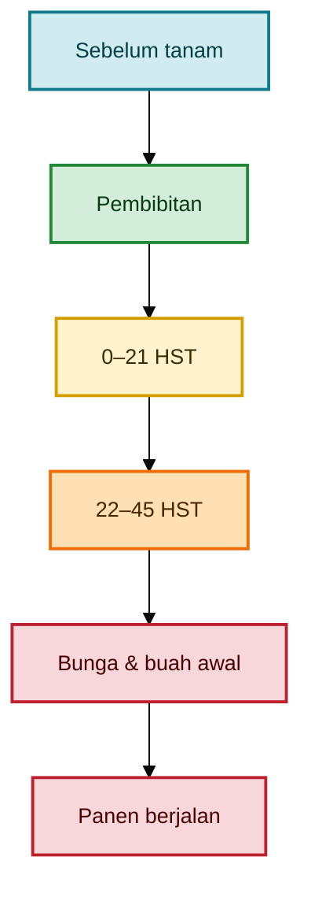
```mermaid
%%{init: {"theme": "base", "themeVariables": {"fontSize": "14px", "fontFamily": "Arial"}}}%%
flowchart TD
    A["Sebelum tanam"] --> B["Pembibitan"]
    B --> C["0–21 HST"]
    C --> D["22–45 HST"]
    D --> E["Bunga & buah awal"]
    E --> F["Panen berjalan"]

    classDef stage1 fill:#d1ecf1,stroke:#117a8b,color:#003f46,stroke-width:2px;
    classDef stage2 fill:#d4edda,stroke:#218838,color:#063b14,stroke-width:2px;
    classDef stage3 fill:#fff3cd,stroke:#d39e00,color:#3d2b00,stroke-width:2px;
    classDef stage4 fill:#ffe0b2,stroke:#ef6c00,color:#4a2500,stroke-width:2px;
    classDef stage5 fill:#f8d7da,stroke:#bd2130,color:#4a0000,stroke-width:2px;

    class A stage1;
    class B stage2;
    class C stage3;
    class D stage4;
    class E,F stage5;
```

## 12.1. Sebelum Tanam

Sebelum tanam, petani harus menjawab pertanyaan dasar. Jangan mulai dari beli pupuk. Mulai dari kesiapan sistem.

```text
uji tanah bila memungkinkan
cek sumber air
siapkan bedengan dan drainase
siapkan bibit sehat
hitung biaya dan harga impas
tentukan pasar
```

Tujuan fase ini:

```text
mengurangi risiko sebelum biaya besar keluar
```

Pertanyaan wajib:

```text
Apakah lahan punya riwayat layu?
Apakah air cukup sampai panen?
Apakah drainase bekerja saat hujan?
Apakah bibit berasal dari nursery terlindung?
Apakah biaya sampai panen pertama tersedia?
Apakah pembeli dan grade pasar jelas?
```

Rumus yang harus sudah dihitung sebelum tanam:

$$
H_{\text{impas}} =
\frac{B_{\text{total rencana}}}{Y_{\text{target}}}
$$

Jika harga impas terlalu tinggi dibanding harga pasar rata-rata, usaha harus dievaluasi sebelum tanam.

## 12.2. Pembibitan

Pembibitan adalah gerbang produksi. Bibit yang bermasalah membawa risiko ke seluruh musim.

SOP pembibitan:

```text
nursery terlindung
sticky trap
media bersih
bibit sakit dibuang
tidak dekat tanaman solanaceae tua
```

Tujuan fase ini:

```text
mencegah vektor dan penyakit masuk sejak awal
```

Keputusan keras:

```text
bibit abnormal jangan diselamatkan
bibit bergejala virus jangan ditanam
bibit dengan akar buruk jangan dipindah
```

Secara bisnis:

$$
\text{Membuang bibit buruk}
<
\text{merawat tanaman buruk satu musim}
$$

Artinya, membuang bibit buruk terasa rugi kecil, tetapi menanamnya bisa menjadi rugi besar.

## 12.3. Fase 0–21 HST

Fase ini adalah fase adaptasi. Fokus utamanya bukan mengejar tanaman paling besar, tetapi memastikan akar aktif dan tanaman tidak stres.

```text
fokus akar
N sedang
air stabil
hindari tanaman terlalu hijau
monitor vektor sejak awal
```

Tujuan fase ini:

```text
tanaman hidup kuat, akar jalan, vektor tidak menetap
```

Kesalahan umum:

```text
mendorong N terlalu cepat
menyiram tidak stabil
mengabaikan bawah daun
tidak mencabut tanaman abnormal
```

Pertanyaan monitoring:

```text
Apakah akar mulai aktif?
Apakah tanaman terlalu hijau?
Apakah kutu kebul ada di bawah daun?
Apakah thrips mulai muncul di pucuk?
Apakah ada tanaman kerdil atau keriting?
```

## 12.4. Fase 22–45 HST

Fase ini adalah fase transisi. Tanaman mulai diarahkan dari vegetatif menuju generatif. Kesalahan nutrisi pada fase ini bisa membuat tanaman terlalu rimbun, bunga terganggu, atau vektor lebih nyaman.

```text
mulai arahkan generatif
K-Ca-Mg naik
N tidak didorong berlebihan
thrips dan kutu kebul dipantau ketat
tanaman virus dicabut cepat
```

Tujuan fase ini:

```text
tanaman masuk generatif tanpa menjadi terlalu lunak
```

Rasio arah yang boleh dipakai sebagai dashboard cepat:

$$
R_K =
\frac{K}{N}
$$

$$
R_{Ca} =
\frac{Ca}{N}
$$

Bila tanaman terlalu hijau, pucuk lunak, dan bunga mulai terganggu, jangan langsung menambah N. Periksa (K), (Ca), (Mg), (B), air, akar, dan vektor.

## 12.5. Bunga dan Buah Awal

Fase bunga dan buah awal adalah fase sensitif. Di sini petani sering melihat bunga rontok lalu panik. Respon yang salah adalah langsung menambah pupuk atau semprot tanpa diagnosis.

```text
jaga K, Ca, Mg, B
hindari basah-kering ekstrem
cek bunga, pucuk, bawah daun
intervensi OPT berdasarkan risiko
```

Tujuan fase ini:

```text
bunga jadi buah, buah awal sehat, OPT tidak merusak titik ekonomi
```

Pertanyaan wajib:

```text
Apakah bunga rontok karena nutrisi, air, suhu, atau thrips?
Apakah buah muda parut karena thrips?
Apakah bawah daun mulai ditempati kutu kebul?
Apakah Ca dan air stabil?
Apakah N masih terlalu dominan?
```

Rumus berpikirnya:

$$
\text{Fruit set stabil}
=

\text{nutrisi seimbang}
+
\text{air stabil}
+
\text{akar sehat}
+
\text{OPT terkendali}
$$

Bukan:

$$
\text{Fruit set stabil}
=

\text{pupuk bunga saja}
$$

## 12.6. Panen Berjalan

Pada fase panen, fokusnya adalah menjaga produksi dan biaya. Banyak petani kehilangan margin bukan karena tanaman tidak berbuah, tetapi karena biaya terus naik saat hasil mulai turun.

```text
jaga nutrisi stabil
hindari over-N
sortasi buah
catat hasil per petik
catat biaya semprot dan tenaga kerja
bandingkan dengan harga impas
```

Tujuan fase ini:

```text
mempertahankan hasil layak jual dan menjaga margin
```

Setiap panen, catat:

```text
kg total
kg grade baik
kg reject
harga jual
biaya hari itu
bahan semprot yang dipakai
tenaga kerja
```

Margin berjalan dapat dibaca dengan:

$$
M_{\text{berjalan}} =
P_{\text{kumulatif}}
-

B_{\text{kumulatif}}
$$

Jika biaya terus naik tetapi hasil dan harga turun, petani harus mengevaluasi apakah blok masih layak dipertahankan dengan input tinggi.

## 12.7. Ringkasan Bab 12

SOP cabai harus mengikuti fase. Sebelum tanam fokus pada risiko dan biaya. Pembibitan fokus pada bibit bersih. Fase awal fokus pada akar. Fase transisi fokus pada keseimbangan vegetatif-generatif. Fase bunga-buah fokus pada nutrisi, air, dan OPT. Fase panen fokus pada margin.

Kalimat penutup bab ini:

> Cabai tidak gagal dalam satu hari. Cabai biasanya gagal karena keputusan kecil yang salah dibiarkan berulang dari awal musim.

[**Kembali ke Atas**](#produksi-cabai-tanpa-spekulasi-mencari-parameter-kunci-nutrisi-opt-dan-risiko-usaha)

---

## 13. Kesalahan Umum yang Harus Dibongkar

Bagian ini harus dibaca sebagai daftar koreksi. Banyak kegagalan cabai bukan berasal dari satu bencana besar, tetapi dari kebiasaan kecil yang dianggap normal.

| Kesalahan                             | Koreksi                                       |
| ------------------------------------- | --------------------------------------------- |
| Mengejar tanaman paling hijau         | kejar tanaman produktif dan jaringan kuat     |
| Menambah (N) saat bunga rontok        | cek (K), (Ca), (Mg), (B), air, suhu, dan akar |
| Menganggap mikroba sebagai penyelamat | mikroba hanya pendukung sistem benar          |
| Menanam bibit dari nursery terbuka    | pembibitan harus terlindung vektor            |
| Semprot berdasarkan kalender          | semprot berdasarkan target dan risiko         |
| Ganti merek pestisida dianggap rotasi | rotasi harus berdasarkan (MoA)                |
| Menunggu virus parah                  | tanaman virus harus segera dibuang            |
| Tidak hitung harga impas              | cabai harus dinilai sebagai usaha             |
| Menanam karena harga tinggi           | tanam bila SOP, modal, air, dan pasar siap    |

## 13.1. Kesalahan 1: Mengejar Tanaman Paling Hijau

Tanaman hijau memang terlihat menyenangkan. Tetapi cabai yang terlalu hijau, terlalu lunak, dan terlalu rimbun bukan selalu tanaman sehat. Tanaman seperti itu bisa terlalu vegetatif, sulit diarahkan generatif, dan menciptakan tajuk lembap.

Koreksi:

```text
kejar tanaman produktif
bukan tanaman paling hijau
```

## 13.2. Kesalahan 2: Menambah N saat Bunga Rontok

Bunga rontok tidak otomatis berarti kurang pupuk. Bisa terkait air, suhu, akar, thrips, (K), (Ca), (Mg), (B), atau tanaman terlalu vegetatif.

Koreksi:

```text
jangan langsung tambah N
cek K, Ca, Mg, B, air, suhu, akar, dan OPT
```

Rumus berpikirnya:

$$
\text{Bunga rontok}
\neq
\text{pasti kurang pupuk}
$$

Yang lebih benar:

$$
\text{Bunga rontok}
=

f(\text{nutrisi},\ \text{air},\ \text{suhu},\ \text{akar},\ \text{OPT},\ \text{fase})
$$

## 13.3. Kesalahan 3: Menganggap Mikroba sebagai Penyelamat

Mikroba dapat membantu, tetapi tidak menyelamatkan tanaman yang fondasinya salah. Bila akar becek, (N) berlebihan, bibit bervirus, dan vektor tidak terkendali, mikroba akan terlihat gagal.

Koreksi:

```text
mikroba dipakai setelah fondasi benar
bukan untuk menutupi kesalahan sistem
```

## 13.4. Kesalahan 4: Menanam Bibit dari Nursery Terbuka

Nursery terbuka membuat bibit mudah terpapar thrips, kutu kebul, dan risiko virus. Bibit yang sudah bermasalah akan membawa beban ke lahan utama.

Koreksi:

```text
nursery harus terlindung
bibit abnormal dibuang
vektor dicegah sebelum pindah tanam
```

## 13.5. Kesalahan 5: Semprot Berdasarkan Kalender

Semprot kalender membuat biaya naik dan risiko resistensi meningkat. Semprot harus berdasarkan target, tren populasi, fase tanaman, dan risiko kerugian.

Koreksi:

```text
semprot karena alasan
bukan karena jadwal kosong
```

## 13.6. Kesalahan 6: Ganti Merek Dianggap Rotasi

Ganti merek belum tentu ganti mode of action. Dua produk berbeda bisa bekerja dengan cara yang sama terhadap hama.

Koreksi:

```text
rotasi berdasarkan MoA
bukan berdasarkan merek
```

Rumus sederhana:

$$
\text{Rotasi benar}
=

\text{MoA berbeda}
+
\text{target tepat}
+
\text{label sesuai}
$$

## 13.7. Kesalahan 7: Menunggu Virus Parah

Tanaman virus bukan hanya tanaman sakit. Ia bisa menjadi sumber risiko bagi tanaman sehat bila vektor masih aktif. Menunggu virus parah sering membuat penyebaran lebih sulit dihentikan.

Koreksi:

```text
tanaman virus jelas harus segera dibuang
vektor harus ditekan
gulma inang harus dibersihkan
```

## 13.8. Kesalahan 8: Tidak Menghitung Harga Impas

Tanpa harga impas, petani tidak tahu apakah usaha masih sehat. Tanaman bisa berbuah, tetapi usaha tetap rugi.

Koreksi:

$$
H_{\text{impas}} =
\frac{B_{\text{total}}}{Y_{\text{estimasi}}}
$$

Hitung sebelum tanam, lalu perbarui saat biaya atau estimasi hasil berubah.

## 13.9. Kesalahan 9: Menanam karena Harga Tinggi

Harga tinggi saat ini bukan jaminan harga tinggi saat panen. Menanam karena harga sedang tinggi tanpa SOP, modal, air, bibit sehat, dan pasar jelas adalah spekulasi.

Koreksi:

```text
tanam bila sistem siap
bukan hanya karena harga sedang naik
```

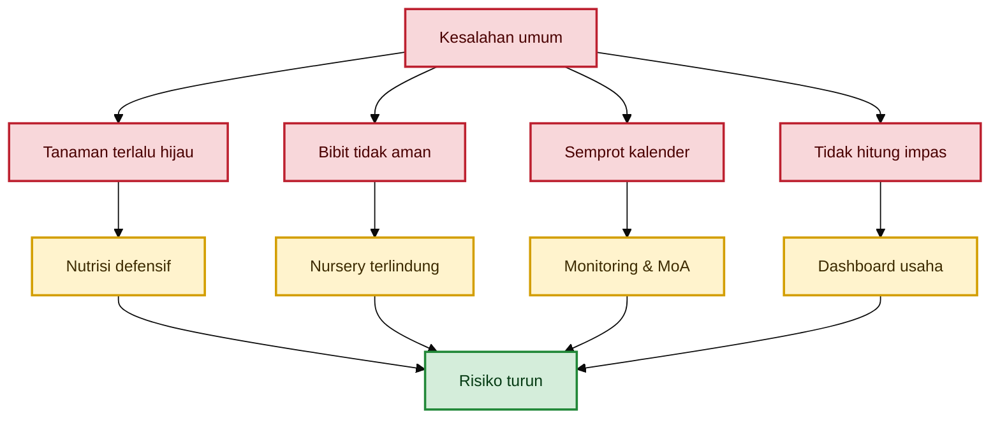
```mermaid
%%{init: {"theme": "base", "themeVariables": {"fontSize": "14px", "fontFamily": "Arial"}}}%%
flowchart TD
    A["Kesalahan umum"] --> B["Tanaman terlalu hijau"]
    A --> C["Bibit tidak aman"]
    A --> D["Semprot kalender"]
    A --> E["Tidak hitung impas"]

    B --> F["Nutrisi defensif"]
    C --> G["Nursery terlindung"]
    D --> H["Monitoring & MoA"]
    E --> I["Dashboard usaha"]

    F --> J["Risiko turun"]
    G --> J
    H --> J
    I --> J

    classDef bad fill:#f8d7da,stroke:#bd2130,color:#4a0000,stroke-width:2px;
    classDef fix fill:#fff3cd,stroke:#d39e00,color:#3d2b00,stroke-width:2px;
    classDef good fill:#d4edda,stroke:#218838,color:#063b14,stroke-width:2px;

    class A,B,C,D,E bad;
    class F,G,H,I fix;
    class J good;
```

## 13.10. Ringkasan Bab 13

Kesalahan budidaya cabai sering berulang karena terlihat wajar: mengejar hijau, menambah N, semprot kalender, percaya mikroba sebagai penyelamat, menanam bibit terbuka, dan tidak menghitung impas. Artikel ini membongkar kebiasaan itu agar cabai tidak dijalankan sebagai rangkaian coba-coba input.

Kalimat penutup bab ini:

> Kesalahan kecil yang dibiarkan berulang lebih berbahaya daripada satu masalah besar yang cepat dikenali.

[**Kembali ke Atas**](#produksi-cabai-tanpa-spekulasi-mencari-parameter-kunci-nutrisi-opt-dan-risiko-usaha)

---

## 14. Penutup: Cabai Membutuhkan Parameter, Bukan Janji

Cabai tidak akan menjadi usaha aman hanya karena diberi pupuk mahal, mikroba, atau pestisida. Input bisa membantu, tetapi input bukan pengganti parameter. Petani membutuhkan angka untuk membaca tanaman, OPT, air, akar, biaya, harga, dan risiko.

Risiko cabai turun bila petani memegang parameter:

```text
nutrisi lengkap
N terkendali
K-Ca-Mg cukup
mikro tidak diabaikan
air stabil
akar sehat
vektor ditekan sejak pembibitan
pestisida dipakai sebagai rem
biaya usaha dihitung
```

Tanpa parameter, semua input mudah berubah menjadi percobaan mahal. Pupuk diberikan karena tanaman terlihat kurang bagus. Pestisida disemprot karena takut. Mikroba dipakai karena testimoni. Net house dibangun karena dianggap solusi tunggal. Padahal, semua alat itu hanya berguna bila ditempatkan dalam sistem keputusan yang benar.

Artikel ini sejak awal tidak menawarkan janji bahwa cabai bisa bebas risiko. Janji seperti itu tidak jujur. Yang lebih realistis adalah: risiko cabai bisa dibuat lebih terbaca.

```mermaid
%%{init: {"theme": "base", "themeVariables": {"fontSize": "14px", "fontFamily": "Arial"}}}%%
flowchart TD
    A["Produksi cabai<br/>tanpa spekulasi"] --> B["Nutrisi defensif"]
    B --> C["Air dan akar"]
    C --> D["Vektor sejak nursery"]
    D --> E["Monitoring OPT"]
    E --> F["Mikroba sebagai pendukung"]
    F --> G["Pestisida sebagai rem"]
    G --> H["Proteksi fisik"]
    H --> I["Risiko usaha dihitung"]
    I --> J["Keputusan berbasis angka"]

    classDef main fill:#d1ecf1,stroke:#117a8b,color:#003f46,stroke-width:2px;
    classDef step fill:#d4edda,stroke:#218838,color:#063b14,stroke-width:2px;
    classDef final fill:#fff3cd,stroke:#d39e00,color:#3d2b00,stroke-width:2px;

    class A main;
    class B,C,D,E,F,G,H,I step;
    class J final;
```

## 14.1. Risiko Tidak Hilang, tetapi Tidak Boleh Dibiarkan Tanpa Angka

Budidaya cabai tetap menghadapi banyak risiko:

```text
cuaca
harga
thrips
kutu kebul
virus
layu
antraknosa
air
kesalahan nutrisi
biaya semprot
tenaga kerja
pasar
```

Namun risiko yang terlihat lebih mudah dikelola daripada risiko yang tidak dipantau. Petani tidak bisa mengendalikan semua hal, tetapi petani bisa mengendalikan cara mengambil keputusan.

Rumus besar artikel ini:

$$
\text{Risiko lebih rendah}
=

\text{parameter jelas}
+
\text{monitoring}
+
\text{tindakan tepat}
+
\text{batas biaya}
$$

Bukan:

$$
\text{Risiko lebih rendah}
=

\text{input lebih banyak}
$$

## 14.2. Petani Tidak Butuh Slogan

Petani tidak cukup diberi kalimat:

```text
gunakan pupuk berimbang
lakukan IPM
pakai mikroba
semprot bijak
jaga sanitasi
```

Kalimat itu harus turun menjadi keputusan:

```text
berapa total N?
kapan K dan Ca naik?
apakah akar sehat?
berapa populasi kutu kebul?
berapa tanaman virus?
berapa biaya berjalan?
berapa harga impas?
apakah blok masih layak dilanjutkan?
```

Inilah perbedaan antara rekomendasi umum dan SOP yang membantu.

## 14.3. Produksi Cabai Tanpa Spekulasi

Produksi cabai tanpa spekulasi bukan berarti tanpa risiko. Artinya, risiko tidak dibiarkan berjalan tanpa angka.

Cabai tetap bisa gagal. Tetapi kegagalan yang dipantau lebih cepat memberi tanda. Petani bisa mengurangi biaya, mengoreksi nutrisi, menekan vektor, mencabut tanaman virus, mengganti strategi pasar, atau membatasi kerugian. Tanpa parameter, petani hanya sadar setelah modal habis.

Kalimat akhir artikel:

> Produksi cabai tanpa spekulasi bukan berarti tanpa risiko. Artinya, risiko tidak dibiarkan berjalan tanpa angka.

[**Kembali ke Atas**](#produksi-cabai-tanpa-spekulasi-mencari-parameter-kunci-nutrisi-opt-dan-risiko-usaha)

---

# 15. Rujukan Inti yang Disarankan untuk Artikel

Gunakan rujukan ini sebagai tulang punggung, bukan kutipan dekoratif:

1. **Haifa Pepper Guide** — untuk contoh angka fertigasi pepper per fase. ([Haifa Group][2])
2. **NC State Extension Foliar Analysis for Bell Pepper** — untuk pentingnya analisis daun dan kecukupan hara per fase. ([NC State Extension][3])
3. **Dordas 2008, Role of Nutrients in Controlling Plant Diseases** — untuk hubungan nutrisi dan penyakit yang tidak sederhana. ([Springer Link][1])
4. **Frontiers 2022, Plant Mineral Nutrition and Disease Resistance** — untuk peran makro-mikro dalam pertahanan tanaman. ([Frontiers][8])
5. **University of Georgia, Blossom-End Rot and Calcium Nutrition of Pepper and Tomato** — untuk hubungan Ca, air, dan gangguan fisiologis buah. ([CAES Field Report][4])
6. **UC IPM Pepper Whiteflies** — untuk contoh ambang whitefly yang berbasis monitoring. ([UC IPM][5])
7. **IRAC Mode of Action Classification** — untuk rotasi pestisida berbasis MoA. ([Insecticide Resistance Action Committee][6])
8. **Studi cabai Indonesia open field/netting house IPM** — untuk konteks lokal bahwa kombinasi teknik perlu dievaluasi secara teknis dan ekonomi, bukan dinilai dari satu input. ([agriculturejournals.cz][7])

[1]: https://link.springer.com/article/10.1051/agro%3A2007051 'Role of nutrients in controlling plant diseases in sustainable agriculture. A review | Agronomy for Sustainable Development | Springer Nature Link'
[2]: https://www.haifa-group.com/sites/default/files/guide/Pepper_0.pdf 'Haifa Chemicals recommendations'
[3]: https://content.ces.ncsu.edu/foliar-analysis-for-bell-pepper-production-in-north-carolina-a-guide-for-growers 'Foliar Analysis for Bell Pepper Production in North Carolina: A Guide for Growers | NC State Extension Publications'
[4]: https://fieldreport.caes.uga.edu/publications/C938/blossom-end-rot-and-calcium-nutrition-of-pepper-and-tomato/?utm_source=chatgpt.com 'Blossom-End Rot and Calcium Nutrition of Pepper and Tomato'
[5]: https://ipm.ucanr.edu/agriculture/peppers/whiteflies/?utm_source=chatgpt.com 'Whiteflies / Peppers / Agriculture: Pest Management ...'
[6]: https://irac-online.org/mode-of-action/classification-online/?utm_source=chatgpt.com 'Mode of Action Classification | Insecticide Resistance ...'
[7]: https://www.agriculturejournals.cz/artkey/pps-202303-0010_determining-the-technical-and-economic-feasibility-of-combining-pest-control-techniques-in-open-field-and-netti.php?utm_source=chatgpt.com 'Determining the technical and economic feasibility of ...'
[8]: https://www.frontiersin.org/journals/plant-science/articles/10.3389/fpls.2022.883970/full 'Frontiers | Plant mineral nutrition and disease resistance: A significant linkage for sustainable crop protection'

[**Kembali ke Atas**](#produksi-cabai-tanpa-spekulasi-mencari-parameter-kunci-nutrisi-opt-dan-risiko-usaha)

---

<small>
  **_Catatan Penyusunan_** Artikel ini disusun sebagai materi edukasi dan
  referensi umum berdasarkan berbagai sumber pustaka, praktik lapangan, serta
  bantuan alat penulisan. Pembaca disarankan untuk melakukan verifikasi lanjutan
  dan penyesuaian sesuai dengan kondisi serta kebutuhan masing-masing sistem.
</small>
