# **_Sehat Dulu, Berbuah Optimal: Rezim Pemupukan Terintegrasi Cabai Besar dan Cabai Rawit Berbasis Pupuk Kimia, PGPM, MOL, dan JAKABA dalam Sistem Low-Lab_**

_Panduan praktis menyusun pemupukan cabai ketika analisis tanah lengkap sulit dilakukan, dengan tetap menjaga keseimbangan hara, kesehatan akar, efisiensi biaya, dan kualitas panen._

---

- [**_Sehat Dulu, Berbuah Optimal: Rezim Pemupukan Terintegrasi Cabai Besar dan Cabai Rawit Berbasis Pupuk Kimia, PGPM, MOL, dan JAKABA dalam Sistem Low-Lab_**](#sehat-dulu-berbuah-optimal-rezim-pemupukan-terintegrasi-cabai-besar-dan-cabai-rawit-berbasis-pupuk-kimia-pgpm-mol-dan-jakaba-dalam-sistem-low-lab)
- [1. Pembuka: Pemupukan Cabai Bukan Mengejar Tanaman Hijau, tetapi Tanaman Produktif](#1-pembuka-pemupukan-cabai-bukan-mengejar-tanaman-hijau-tetapi-tanaman-produktif)
- [2. Cabai Besar vs Cabai Rawit: Jangan Disamakan Rezimnya](#2-cabai-besar-vs-cabai-rawit-jangan-disamakan-rezimnya)
- [3. Fondasi Low-Lab: Bertani dengan Data Minimum, Bukan Menebak](#3-fondasi-low-lab-bertani-dengan-data-minimum-bukan-menebak)
  - [3.1 Data minimum sebelum tanam](#31-data-minimum-sebelum-tanam)
  - [3.2 Cara ambil sampel tanah sederhana](#32-cara-ambil-sampel-tanah-sederhana)
  - [3.3 Aturan keputusan pH](#33-aturan-keputusan-ph)
  - [3.4 Kapan petani harus berhenti menambah pupuk dan memeriksa akar/air](#34-kapan-petani-harus-berhenti-menambah-pupuk-dan-memeriksa-akarair)
- [4. Kesehatan Tanaman sebagai Dasar Rezim Pemupukan](#4-kesehatan-tanaman-sebagai-dasar-rezim-pemupukan)
  - [4.1 Akar sehat sebelum pupuk tinggi](#41-akar-sehat-sebelum-pupuk-tinggi)
  - [4.2 pH dan drainase sebagai pengunci serapan](#42-ph-dan-drainase-sebagai-pengunci-serapan)
  - [4.3 Air: kurang salah, berlebih juga salah](#43-air-kurang-salah-berlebih-juga-salah)
  - [4.4 Bahan organik matang sebagai penyangga sistem](#44-bahan-organik-matang-sebagai-penyangga-sistem)
- [5. Peran Input: Pupuk Kimia, PGPM, MOL, dan JAKABA](#5-peran-input-pupuk-kimia-pgpm-mol-dan-jakaba)
  - [5.1 Pupuk kimia: sumber hara utama yang bisa dihitung](#51-pupuk-kimia-sumber-hara-utama-yang-bisa-dihitung)
  - [5.2 PGPM: pendukung akar dan rizosfer](#52-pgpm-pendukung-akar-dan-rizosfer)
  - [5.3 MOL: bioaktivator lokal, bukan sumber utama hara](#53-mol-bioaktivator-lokal-bukan-sumber-utama-hara)
  - [5.4 JAKABA: biostimulan lokal yang perlu diuji dengan petak kontrol](#54-jakaba-biostimulan-lokal-yang-perlu-diuji-dengan-petak-kontrol)
- [6. Kerangka Menyusun Formula Pemupukan](#6-kerangka-menyusun-formula-pemupukan)
  - [6.1 Tentukan jenis cabai](#61-tentukan-jenis-cabai)
  - [6.2 Tentukan populasi tanaman](#62-tentukan-populasi-tanaman)
  - [6.3 Konversi dosis hektar ke tanaman](#63-konversi-dosis-hektar-ke-tanaman)
  - [6.4 Pecah dosis menjadi aplikasi kecil](#64-pecah-dosis-menjadi-aplikasi-kecil)
  - [6.5 Gunakan pagar rekomendasi, bukan resep mati](#65-gunakan-pagar-rekomendasi-bukan-resep-mati)
- [7. Rezim Pemupukan Berdasarkan Fase Tanaman](#7-rezim-pemupukan-berdasarkan-fase-tanaman)
  - [Catatan aplikasi per fase](#catatan-aplikasi-per-fase)
  - [Prinsip integrasi bioinput dalam tabel fase](#prinsip-integrasi-bioinput-dalam-tabel-fase)
- [7A. Cara Memberikan Pupuk: Padat, Cair Kocor, dan Semprot Tajuk](#7a-cara-memberikan-pupuk-padat-cair-kocor-dan-semprot-tajuk)
  - [7A.1 Pupuk padat: untuk pupuk dasar dan susulan tanah](#7a1-pupuk-padat-untuk-pupuk-dasar-dan-susulan-tanah)
  - [7A.2 Pupuk cair kocor: untuk memberi hara langsung ke zona akar](#7a2-pupuk-cair-kocor-untuk-memberi-hara-langsung-ke-zona-akar)
  - [7A.3 Semprot tajuk: untuk suplemen daun, bukan pengganti pupuk akar](#7a3-semprot-tajuk-untuk-suplemen-daun-bukan-pengganti-pupuk-akar)
  - [7A.4 Kapan memilih padat, kocor, atau semprot?](#7a4-kapan-memilih-padat-kocor-atau-semprot)
  - [7A.5 Posisi PGPM, MOL, JAKABA, dan agen hayati](#7a5-posisi-pgpm-mol-jakaba-dan-agen-hayati)
  - [7A.6 Bagan keputusan aplikasi](#7a6-bagan-keputusan-aplikasi)
  - [7A.7 Ringkasan praktis](#7a7-ringkasan-praktis)
- [8. Risiko Under-Fertilizing dan Over-Fertilizing Sepanjang Siklus Hidup Cabai](#8-risiko-under-fertilizing-dan-over-fertilizing-sepanjang-siklus-hidup-cabai)
  - [8.1 Dosis normal: titik tengah yang harus dicari](#81-dosis-normal-titik-tengah-yang-harus-dicari)
  - [8.2 Jika harus memilih: lebih aman under atau over?](#82-jika-harus-memilih-lebih-aman-under-atau-over)
  - [8.3 Risiko salah dosis dari semai sampai panen](#83-risiko-salah-dosis-dari-semai-sampai-panen)
  - [8.4 Perbedaan risiko pada cabai besar dan cabai rawit](#84-perbedaan-risiko-pada-cabai-besar-dan-cabai-rawit)
  - [8.5 Salah dosis dan kerentanan stres/OPT](#85-salah-dosis-dan-kerentanan-stresopt)
  - [8.6 Mitigasi risiko agar target produksi tetap terjaga](#86-mitigasi-risiko-agar-target-produksi-tetap-terjaga)
    - [A. Bila tanaman cenderung under-fertilized](#a-bila-tanaman-cenderung-under-fertilized)
    - [B. Bila tanaman cenderung over-fertilized](#b-bila-tanaman-cenderung-over-fertilized)
  - [8.7 Matriks keputusan cepat: normal, under, atau over?](#87-matriks-keputusan-cepat-normal-under-atau-over)
  - [8.8 Prinsip akhir: targetnya bukan under atau over, tetapi normal yang aman](#88-prinsip-akhir-targetnya-bukan-under-atau-over-tetapi-normal-yang-aman)
- [9. Monitoring, Koreksi, dan Evaluasi Ekonomi](#9-monitoring-koreksi-dan-evaluasi-ekonomi)
  - [9.1 Monitoring mingguan](#91-monitoring-mingguan)
  - [9.2 Matriks koreksi lapang](#92-matriks-koreksi-lapang)
  - [9.3 Petak pembanding](#93-petak-pembanding)
  - [9.4 Hitung hasil, bukan hanya biaya pupuk](#94-hitung-hasil-bukan-hanya-biaya-pupuk)
  - [9.5 Keputusan akhir: lanjut, koreksi, atau hentikan](#95-keputusan-akhir-lanjut-koreksi-atau-hentikan)
- [Lampiran Teknis](#lampiran-teknis)
  - [Lampiran 1. Rumus Konversi Pupuk](#lampiran-1-rumus-konversi-pupuk)
    - [1. Dosis pupuk per tanaman](#1-dosis-pupuk-per-tanaman)
    - [2. Dosis pupuk per 1.000 tanaman](#2-dosis-pupuk-per-1000-tanaman)
    - [3. Kandungan unsur hara dalam pupuk](#3-kandungan-unsur-hara-dalam-pupuk)
    - [4. Dosis per aplikasi](#4-dosis-per-aplikasi)
    - [5. Jumlah tanaman yang terlayani dalam satu drum](#5-jumlah-tanaman-yang-terlayani-dalam-satu-drum)
    - [6. Kebutuhan larutan untuk sejumlah tanaman](#6-kebutuhan-larutan-untuk-sejumlah-tanaman)
  - [Lampiran 2. Contoh Hitungan per Hektar, per 1.000 Tanaman, dan per Drum 200 Liter](#lampiran-2-contoh-hitungan-per-hektar-per-1000-tanaman-dan-per-drum-200-liter)
    - [Contoh 1 — Konversi NPK 500 kg/ha ke dosis per tanaman](#contoh-1--konversi-npk-500-kgha-ke-dosis-per-tanaman)
    - [Contoh 2 — Dosis pupuk per 1.000 tanaman](#contoh-2--dosis-pupuk-per-1000-tanaman)
    - [Contoh 3 — Drum 200 liter untuk 1.000 tanaman](#contoh-3--drum-200-liter-untuk-1000-tanaman)
    - [Contoh 4 — Drum 200 liter bila volume kocor 250 ml/tanaman](#contoh-4--drum-200-liter-bila-volume-kocor-250-mltanaman)
  - [Lampiran 3. Checklist Low-Lab Sebelum Tanam](#lampiran-3-checklist-low-lab-sebelum-tanam)
  - [Lampiran 4. Format Catatan Pemupukan](#lampiran-4-format-catatan-pemupukan)
  - [Lampiran 5. Format Petak Pembanding](#lampiran-5-format-petak-pembanding)
    - [Format pencatatan hasil petak](#format-pencatatan-hasil-petak)
  - [Lampiran 6. Tabel Gejala Under/Over Fertilizing](#lampiran-6-tabel-gejala-underover-fertilizing)
  - [Lampiran 7. Lokasi Pemberian Pupuk Padat yang Aman](#lampiran-7-lokasi-pemberian-pupuk-padat-yang-aman)
    - [Panduan praktis jarak pupuk padat](#panduan-praktis-jarak-pupuk-padat)
    - [Aturan aman](#aturan-aman)
  - [Lampiran 8. Daftar Rujukan Teknis](#lampiran-8-daftar-rujukan-teknis)

---

# 1. Pembuka: Pemupukan Cabai Bukan Mengejar Tanaman Hijau, tetapi Tanaman Produktif

Pemupukan cabai sering dibaca terlalu sempit: tanaman hijau dianggap sehat, tanaman pucat dianggap kurang pupuk, tanaman lambat tumbuh langsung diberi tambahan NPK. Cara berpikir seperti ini berbahaya karena cabai bukan hanya ditanam untuk menghasilkan daun. Cabai ditanam untuk menghasilkan buah yang banyak, seragam, bernas, tahan panen berulang, dan tetap memiliki mutu pasar yang baik.

Di lapangan, kegagalan pemupukan sering tidak muncul sebagai gejala yang sederhana. Ada tanaman yang sangat hijau, tetapi bunga sedikit. Ada tanaman yang rajin berbunga, tetapi pentil mudah rontok. Ada tanaman yang buahnya banyak di awal, tetapi ukuran kecil dan cepat habis setelah beberapa kali petik. Ada juga tanaman yang tampak “lapar pupuk”, padahal akar sebenarnya rusak karena genangan, tanah terlalu asam, garam pupuk menumpuk, atau media tidak memiliki aerasi yang baik.

Masalahnya, banyak keputusan pemupukan masih didasarkan pada reaksi cepat: tanaman stres berarti tambah pupuk. Padahal stres tanaman cabai tidak selalu berarti kekurangan hara. Tanaman bisa tampak kerdil karena pH tidak sesuai. Daun bisa menguning karena akar tidak aktif. Bunga bisa rontok karena kelembapan tanah naik-turun ekstrem. Buah bisa kecil karena daun tidak cukup produktif, bukan semata-mata karena kurang pupuk buah.

Maka, pemupukan cabai harus dimulai dari prinsip yang lebih mendasar: **pupuk hanya efektif bila akar, air, pH, dan fase tanaman mendukung**. Akar adalah pintu masuk hara. Air adalah kendaraan yang membawa hara ke zona akar. pH menentukan apakah unsur hara tersedia atau terkunci. Fase tanaman menentukan jenis hara mana yang harus diprioritaskan. Bila salah satu komponen ini bermasalah, pupuk yang mahal sekalipun tidak otomatis berubah menjadi produksi.

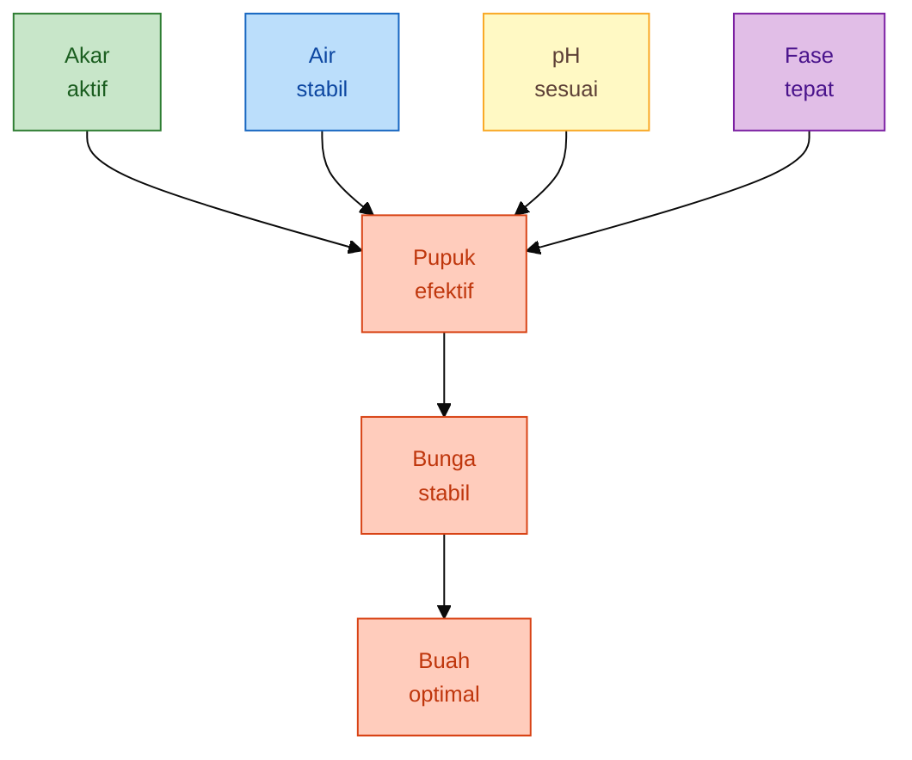

Karena itu, artikel ini tidak menempatkan pemupukan sebagai kegiatan menambah input sebanyak mungkin. Pemupukan diposisikan sebagai **rezim kesehatan tanaman**, yaitu rangkaian keputusan yang mengatur kapan tanaman perlu didorong vegetatif, kapan harus diarahkan generatif, kapan pupuk perlu ditahan, dan kapan akar harus dipulihkan terlebih dahulu sebelum pupuk dinaikkan.

Dalam sistem ini, pupuk kimia tetap penting karena kandungan haranya jelas dan bisa dihitung. Namun pupuk kimia tidak bekerja sendirian. PGPM, MOL, dan JAKABA dapat ditempatkan sebagai pendukung sistem perakaran dan kehidupan mikroba di sekitar rizosfer, dengan catatan penggunaannya realistis dan tidak dianggap sebagai pengganti total hara makro. Pupuk kimia memberi kepastian unsur. Bioinput membantu lingkungan akar. Air, pH, dan bahan organik menjaga agar keduanya bekerja.

Target akhirnya bukan tanaman yang paling hijau, tetapi tanaman yang **seimbang**: cukup daun untuk fotosintesis, cukup akar untuk menyerap, cukup bunga yang berhasil menjadi buah, cukup energi untuk panen berulang, dan cukup kuat menghadapi tekanan cuaca serta organisme pengganggu tanaman. Tanaman yang terlalu kurus kehilangan potensi hasil sejak awal. Tanaman yang terlalu dipupuk bisa tampak subur, tetapi gagal mengubah pertumbuhan menjadi buah.

<ResourceBox
  title="Artikel Terkait:"
  items={[
    {
      name: 'README — Framework Praktis Memulai Bisnis Agribisnis Terpadu di Lahan Gumuk Berlereng',
      href: '/blog/agri/kebon/agribisnis-gumuk/README',
    },
    {
      name: 'Proposal Pembangunan Sistem Drip Irrigation',
      href: '/blog/agri/kebon/proposal-pembangunan-drip-irigation',
    },
    {
      name: 'OPT Penggagal Panen pada Cabai Rawit dan Cabai Besar',
      href: '/blog/agri/pengendalian-opt-cabai',
    },
    {
      name: 'Pedoman lengkap bergambar pengendalian OPT cabai - kutu kebul dan thrips',
      href: '/blog/agri/pengendalian-kutu-kebul-thrips',
    },
    {
      name: 'Panduan Terpadu Budidaya Cabai di Gambiran: Agronomi, Mikroba, Pupuk, Pestisida, dan Companion Planting',
      href: '/blog/agri/kebon/panduan-pengembangan-cabai-terpadu',
    },
    {
      name: 'Panduan Praktis Pembiakan Trichoderma dari Starter Komersial',
      href: '/blog/agri/agen-hayati/trichoderma-pembiakan',
    },
    {
      name: 'Panduan Praktis Integrasi PGPM, Pupuk Kimia, dan Pestisida Kimia pada Budidaya Cabai Rawit dan Cabai Besar',
      href: '/blog/agri/agen-hayati/panduan-praktis-integrasi-pgpm-cabai',
    },
    {
      name: 'Agen Hayati untuk Pengendalian OPT Cabai: Panduan Praktis dari Persemaian sampai Panen',
      href: '/blog/agri/agen-hayati/agen-hayati-cabai',
    },
    {
      name: 'Rancangan Bioreactor Sederhana untuk Pembiakan PGPM Cair dan Padat Skala Petani',
      href: '/blog/agri/agen-hayati/bioreactor-design',
    },
    {
      name: 'JAKABA, MOL, POC, dan PGPM: Formulasi, Fermentasi, Standar Mutu, serta Aplikasi pada Cabai dan Durian',
      href: '/blog/agri/agen-hayati/jakaba-poc-cabai-durian',
    },
    {
      name: 'Panduan Lengkap Pengendalian Lalat Buah di Kebun Campuran',
      href: '/blog/agri/lalat-buah',
    },
    {
      name: 'README - Pupuk Tepat, Panen Untung - Model Low-Lab untuk Petani Makmur di Gambiran',
      href: '/blog/agri/pupuk-terintegrasi/README',
    },
  ]}
/>

---

# 2. Cabai Besar vs Cabai Rawit: Jangan Disamakan Rezimnya

Salah satu kesalahan umum dalam pemupukan cabai adalah menyamakan semua jenis cabai. Cabai besar, cabai merah besar, cabai keriting, dan cabai rawit memang berada dalam kelompok tanaman yang berdekatan, tetapi target produksinya berbeda. Perbedaan target produksi ini membuat strategi pemupukannya juga harus berbeda.

Cabai besar atau cabai merah lebih banyak dinilai dari ukuran, panjang, bentuk, keseragaman, bobot buah, warna, dan mutu pasar. Pada cabai tipe ini, tanaman tidak cukup hanya banyak buah; buah harus seragam, bernas, dan memenuhi ukuran yang diterima pasar. SOP cabai merah menargetkan produksi 15–20 ton/ha, menyebut pH tanah sesuai pada kisaran 6–7, serta mencantumkan panen pertama pada umur 90–110 HST dengan interval panen 4–7 hari, tergantung lokasi dan varietas. ([Gaphor Tikultura][1])

Cabai rawit atau cabai kecil memiliki logika produksi yang berbeda. Nilai utamanya bukan hanya ukuran per buah, tetapi jumlah buah, kontinuitas petik, ketahanan tanaman, dan kemampuan pulih setelah panen berulang. SOP cabai rawit Hiyung mencantumkan pH ideal 5,5–6,8, panen pada 100–115 hari setelah tanam, dan interval panen 3–7 hari. Dokumen yang sama juga menekankan bahwa ketersediaan hara makro dan mikro yang cukup serta seimbang penting untuk memperoleh hasil dan kualitas cabai yang baik.

| Aspek                     | Cabai besar / merah besar / keriting                             | Cabai rawit / kecil                                                                              |
| ------------------------- | ---------------------------------------------------------------- | ------------------------------------------------------------------------------------------------ |
| Target utama              | Ukuran, panjang, bentuk, keseragaman, bobot buah                 | Jumlah buah, kontinuitas petik, ketahanan tanaman lebih lama                                     |
| Risiko pemupukan berlebih | Terlalu rimbun, bunga mundur, buah tidak seragam, kualitas turun | Tanaman terlalu vegetatif, fruit set tidak stabil, umur panen panjang tetapi hasil tidak efisien |
| Fokus generatif           | K, Ca, Mg, dan B untuk kualitas buah dan pengisian               | K stabil dalam jangka panjang karena panen berulang lebih intens                                 |
| Pola aplikasi             | Lebih disiplin pada transisi vegetatif-generatif                 | Lebih cocok dosis kecil tetapi konsisten karena siklus petik panjang                             |
| Cara membaca hasil        | Ukuran buah, keseragaman, bobot per buah, mutu pasar             | Jumlah petik, total buah, kontinuitas produksi, daya pulih tanaman                               |

Perbedaan ini penting sejak awal. Pada cabai besar, kesalahan mendorong nitrogen terlalu lama dapat menghasilkan tanaman rimbun tetapi buah tidak seragam. Tanaman terlihat subur, tetapi produksi komersial tidak optimal karena buah tidak masuk kelas mutu yang diinginkan. Pada cabai rawit, kesalahan yang sering terjadi adalah memberi dorongan vegetatif berlebihan sehingga tanaman terlihat besar, tetapi fruit set tidak stabil dan panen tidak efisien.

Maka, rezim pemupukan cabai besar harus lebih tegas membaca fase transisi dari vegetatif ke generatif. Begitu tanaman memasuki fase pra-bunga, pemupukan tidak boleh terus didominasi dorongan daun. Keseimbangan K, Ca, Mg, dan unsur mikro seperti B mulai menjadi penting untuk pembentukan bunga, pengisian buah, dan mutu hasil.

Pada cabai rawit, strategi yang lebih aman adalah menjaga tanaman tetap produktif dalam jangka lebih panjang. Pemupukan sebaiknya tidak terlalu ekstrem dalam satu aplikasi. Lebih baik kecil, konsisten, dan disesuaikan dengan ritme petik. Tanaman rawit yang sudah memasuki panen perlu diperlakukan sebagai mesin produksi berulang: setelah dipetik, tanaman harus mampu membentuk bunga baru, mengisi buah berikutnya, dan mempertahankan daun yang masih aktif berfotosintesis.

Dengan demikian, artikel ini akan memakai prinsip yang sama untuk semua cabai—akar sehat, hara seimbang, air stabil, dan koreksi berbasis respons tanaman—tetapi penerapannya dibedakan. Cabai besar diarahkan pada mutu buah dan keseragaman. Cabai rawit diarahkan pada kontinuitas produksi dan daya tahan tanaman.

---

# 3. Fondasi Low-Lab: Bertani dengan Data Minimum, Bukan Menebak

Analisis tanah lengkap tetap merupakan dasar terbaik untuk menyusun pemupukan. Dengan analisis tanah, petani dapat mengetahui status hara, pH, bahan organik, serta potensi masalah yang tidak selalu terlihat dari permukaan. Namun dalam kenyataan, banyak petani belum memiliki akses mudah ke laboratorium. Biaya, jarak, waktu tunggu hasil, dan kesulitan menerjemahkan angka laboratorium menjadi dosis lapang membuat analisis tanah belum menjadi kebiasaan umum.

Di sinilah pendekatan **low-lab** diperlukan. Low-lab bukan berarti bertani tanpa data. Low-lab berarti menggunakan data minimum yang bisa dikumpulkan langsung di lahan untuk mengurangi keputusan yang bersifat menebak. Data minimum itu mencakup pH tanah sederhana, riwayat lahan, tekstur tanah, drainase, bahan organik, kondisi akar, respons tanaman, dan catatan aplikasi pupuk.

PUTK atau Perangkat Uji Tanah Kering dapat menjadi jembatan praktis antara laboratorium penuh dan keputusan lapangan. Panduan PUTK menjelaskan bahwa alat ini digunakan untuk analisis cepat P, K, C-organik, pH, dan kebutuhan kapur di lahan kering; rekomendasinya juga mencakup hortikultura seperti cabai.

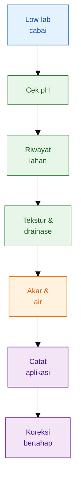

## 3.1 Data minimum sebelum tanam

Sebelum menyusun pemupukan, petani perlu mengumpulkan data sederhana tetapi relevan. Pertama, **riwayat lahan**: apakah sebelumnya ditanami cabai, tomat, terung, atau tanaman Solanaceae lain; apakah pernah ada serangan layu; apakah lahan sering diberi pupuk tinggi; dan apakah pernah tergenang. Riwayat ini penting karena masalah pemupukan sering bercampur dengan masalah penyakit tular tanah dan akumulasi garam pupuk.

Kedua, **pH tanah**. Cabai merah dalam SOP memiliki kisaran pH sesuai 6–7, sedangkan cabai rawit Hiyung mencantumkan pH ideal 5,5–6,8. Ini menunjukkan bahwa pH bukan angka kosmetik; pH menentukan apakah pupuk yang diberikan bisa tersedia atau justru terkunci di tanah. ([Gaphor Tikultura][1])

Ketiga, **tekstur dan drainase**. Tanah pasir lebih cepat kehilangan hara sehingga cenderung membutuhkan aplikasi lebih kecil tetapi lebih sering. Tanah liat lebih lambat mengering sehingga berisiko membuat akar kekurangan oksigen bila drainase buruk. Keempat, **kondisi akar dan respons tanaman**. Bila akar cokelat, busuk, atau berbau tidak normal, menaikkan pupuk bukan langkah pertama. Akar harus dipulihkan dulu.

## 3.2 Cara ambil sampel tanah sederhana

Dalam sistem low-lab, pengambilan sampel tanah tetap harus dilakukan dengan benar. Panduan PUTK menganjurkan contoh tanah komposit diambil dari 8–10 anak contoh pada hamparan yang relatif homogen, pada kedalaman 0–20 cm untuk tanaman pangan dan hortikultura berumur pendek. Untuk tanaman dalam bedengan, contoh tanah diambil di tengah bedengan di antara tanaman dan dilakukan sebelum pemupukan.

Praktiknya sederhana. Bagi lahan berdasarkan keseragaman warna tanah, tekstur, kemiringan, riwayat pupuk, dan drainase. Jangan mencampur sampel dari area sehat dengan area yang sering tergenang atau bekas tumpukan pupuk. Ambil tanah dari beberapa titik dengan pola diagonal, zigzag, sistematik, atau acak. Bersihkan permukaan dari rumput, sisa tanaman, batu, atau bahan organik segar. Campur tanah dalam ember plastik, buang kerikil dan akar, lalu ambil sebagian sebagai contoh uji.

Panduan PUTK juga mengingatkan agar contoh tidak diambil dari pinggir jalan, sekitar rumah, bekas pembakaran, tempat kotoran ternak, bekas timbunan pupuk, atau bekas timbunan kapur karena lokasi seperti itu tidak mewakili kondisi lahan. Ketepatan hasil sangat ditentukan oleh pengambilan contoh tanah yang tepat dan mewakili.

## 3.3 Aturan keputusan pH

Dalam pendekatan low-lab, pH adalah data pertama yang harus dibaca karena murah, cepat, dan dampaknya besar. Bila pH terlalu rendah, petani sering mengira tanaman kurang P, K, Ca, atau Mg, padahal masalahnya adalah unsur tersebut sulit tersedia. Bila pH terlalu tinggi, unsur mikro tertentu bisa menjadi kurang tersedia.

Aturan praktisnya:

| Hasil pH sederhana | Keputusan awal                                                                               |
| ------------------ | -------------------------------------------------------------------------------------------- |
| < 5,5              | Jangan langsung menaikkan NPK. Prioritaskan pembenahan pH, bahan organik, dan drainase.      |
| 5,5–6,0            | Masih bisa ditanami, tetapi perlu kehati-hatian. Koreksi pH dan hindari pupuk pekat di awal. |
| 6,0–6,8            | Relatif aman untuk memulai pemupukan bertahap.                                               |
| >7,0               | Hati-hati masalah unsur mikro dan jangan menambah kapur/dolomit tanpa alasan kuat.           |

Pada SOP cabai merah, bila pH tanah kurang dari 6, dianjurkan pengapuran dengan kaptan atau dolomit 1–2 ton/ha yang diberikan bersama pengolahan tanah. ([Gaphor Tikultura][1])

## 3.4 Kapan petani harus berhenti menambah pupuk dan memeriksa akar/air

Dalam sistem low-lab, keberanian menahan pupuk sama pentingnya dengan kemampuan memberi pupuk. Petani perlu berhenti menambah pupuk dan memeriksa akar atau air bila tanaman layu saat tanah masih basah, daun menguning tetapi akar terlihat cokelat, pertumbuhan berhenti setelah kocor pupuk pekat, bunga rontok setelah aplikasi tinggi, atau muncul kerak putih di permukaan media.

Gejala seperti itu tidak boleh langsung dibaca sebagai “kurang pupuk”. Bisa jadi akar kekurangan oksigen, tanah terlalu basah, pH tidak sesuai, atau garam pupuk menumpuk. Pada titik ini, tindakan terbaik bukan menambah input, tetapi membaca ulang kondisi media. Cabut satu atau dua tanaman contoh dari area bermasalah, periksa warna dan bau akar, cek kelembapan bedengan, lihat riwayat aplikasi terakhir, lalu koreksi secara bertahap.

Low-lab bukan sistem yang sempurna, tetapi jauh lebih baik daripada menebak. Dengan pH sederhana, sampel tanah yang benar, catatan aplikasi, dan pembacaan akar, petani sudah memiliki dasar untuk membuat keputusan pemupukan yang lebih aman. Prinsipnya sederhana: **jangan memberi pupuk lebih cepat daripada kemampuan tanaman menyerapnya.**

[1]: https://gaphortikultura.puslithorti.net/wp-content/uploads/2018/12/SOP-Cabai-Merah-2014.pdf 'Agroklimat yang sesuai bagi pertanaman mangga adalah tipe iklim D, 2-4 bulan basah, 8-10 bulan kering, curah hujan 200-250 mm/'

---

# 4. Kesehatan Tanaman sebagai Dasar Rezim Pemupukan

Pemupukan cabai yang baik tidak dimulai dari pertanyaan “pupuk apa yang paling bagus”, tetapi dari pertanyaan “apakah tanaman mampu menyerap dan menggunakan pupuk itu?”. Perbedaan ini penting. Banyak kasus di lapangan menunjukkan tanaman tampak seperti kekurangan hara, padahal akar sedang tidak aktif, tanah terlalu masam, bedengan terlalu basah, atau bahan organik belum matang. Dalam kondisi seperti itu, menambah pupuk justru bisa memperberat stres tanaman.

Tanaman cabai hanya dapat mengubah pupuk menjadi pertumbuhan, bunga, dan buah bila empat komponen dasarnya bekerja bersama: **akar sehat, air terkendali, pH sesuai, dan media tanam hidup**. Bila akar rusak, pupuk tidak terserap. Bila air kurang, hara tidak bergerak ke akar. Bila air berlebih, akar kekurangan oksigen. Bila pH tidak sesuai, sebagian unsur hara menjadi sulit tersedia. Bila bahan organik buruk atau belum matang, media bisa menjadi panas, asam, anaerob, atau menjadi sumber patogen.

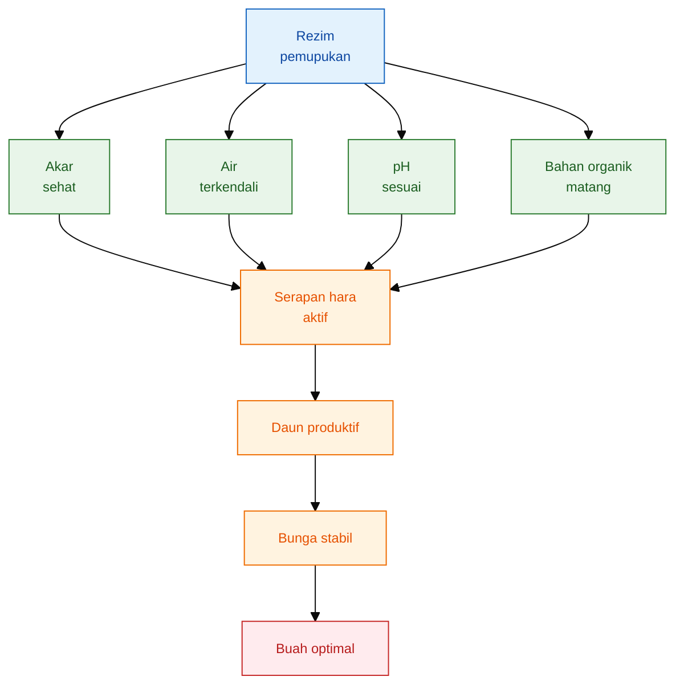

## 4.1 Akar sehat sebelum pupuk tinggi

Akar adalah titik masuk pupuk. Seberapa lengkap pun formula pupuk yang diberikan, hasilnya akan rendah bila akar tidak aktif. Pada cabai, akar yang sehat umumnya tampak putih sampai krem muda, memiliki rambut akar, tidak berbau busuk, dan berada pada media yang gembur serta cukup lembap. Sebaliknya, akar yang cokelat, pendek, berlendir, atau berbau tidak normal menunjukkan bahwa tanaman tidak berada dalam kondisi siap menerima pupuk tinggi.

Kesalahan yang sering terjadi adalah memberi pupuk pekat saat tanaman sedang layu. Padahal layu tidak selalu berarti kurang pupuk. Bila tanaman layu ketika tanah masih basah, kemungkinan masalahnya justru berada pada akar, drainase, oksigen tanah, atau penyakit tular tanah. Pada kondisi ini, menaikkan dosis pupuk dapat meningkatkan tekanan garam di sekitar akar dan memperburuk kerusakan.

Dalam rezim pemupukan berbasis kesehatan tanaman, fase awal budidaya cabai harus diperlakukan sebagai fase membangun sistem akar. Pupuk dasar tetap diperlukan, tetapi tidak boleh membuat zona akar muda menjadi terlalu “panas”. PGPM, bahan organik matang, drainase baik, dan kelembapan stabil lebih penting daripada mengejar pertumbuhan daun terlalu cepat. Tanaman yang tumbuh terlalu cepat tetapi akarnya lemah biasanya rentan saat memasuki fase bunga dan buah.

Prinsip praktisnya sederhana: **jangan memberi pupuk lebih cepat daripada kemampuan akar menyerapnya**. Bila akar belum pulih setelah pindah tanam, pupuk sebaiknya diberikan ringan dan bertahap. Bila akar sudah aktif, barulah pemupukan dapat diarahkan sesuai fase pertumbuhan.

## 4.2 pH dan drainase sebagai pengunci serapan

pH tanah menentukan apakah unsur hara berada dalam bentuk yang mudah diserap atau justru terkunci. Cabai merah dalam SOP budidaya mencantumkan pH tanah sesuai pada kisaran 6–7, dan bila pH tanah kurang dari 6 dianjurkan pengapuran dengan kaptan atau dolomit 1–2 ton/ha bersama pengolahan tanah. SOP yang sama juga mencantumkan pupuk kompos sekitar 15–20 ton/ha sebagai pupuk dasar sekitar dua minggu sebelum tanam. ([Gaphor Tikultura][1])

Pada cabai rawit Hiyung, SOP mencantumkan penggunaan pupuk kandang 20–30 ton/ha yang sudah difermentasi dengan agen hayati dan NPK 16-16-16 sebanyak 450 kg/ha sebagai salah satu rujukan pupuk dasar. Rujukan ini menegaskan bahwa budidaya rawit juga tetap membutuhkan kombinasi bahan organik matang dan pupuk mineral terukur, bukan hanya salah satunya. ([Hortikultura][2])

Namun pH saja tidak cukup. Drainase juga menjadi pengunci serapan. Tanah dengan pH sesuai tetap dapat gagal mendukung tanaman bila air menggenang terlalu lama. Pada tanah yang terlalu basah, pori-pori tanah terisi air, oksigen rendah, dan akar tidak mampu bernapas dengan baik. Akibatnya, tanaman tampak seperti kekurangan hara: daun pucat, pertumbuhan lambat, bunga mudah gugur, dan buah tidak terisi maksimal.

Drainase buruk juga membuat aplikasi pupuk kocor berisiko. Larutan pupuk yang seharusnya membantu tanaman justru bertahan terlalu lama di zona akar. Pada tanah liat atau bedengan rendah, hal ini dapat memicu kondisi anaerob, akar rusak, dan penyakit akar. Karena itu, sebelum menaikkan dosis pupuk, praktisi harus memastikan bahwa bedengan cukup tinggi, parit berfungsi, dan air tidak menggenang setelah hujan atau penyiraman.

## 4.3 Air: kurang salah, berlebih juga salah

Air adalah pengatur utama penyerapan hara. Unsur hara bergerak ke akar melalui larutan tanah. Bila tanah terlalu kering, hara sulit bergerak dan tanaman tidak mampu menyerap meskipun pupuk tersedia. Gejalanya bisa berupa daun menggulung, bunga rontok, buah kecil, dan tanaman tampak berhenti tumbuh.

Namun air berlebih juga sama berbahayanya. Cabai bukan tanaman air. Media yang terus-menerus basah membuat akar kekurangan oksigen, aktivitas mikroba menguntungkan terganggu, dan risiko penyakit akar meningkat. Dalam kondisi ini, pupuk tidak menjadi solusi utama. Yang harus dibenahi lebih dulu adalah tata air.

Pada fase vegetatif, fluktuasi air dapat membuat pertumbuhan tidak seragam. Pada fase bunga dan fruit set, air yang naik-turun ekstrem dapat meningkatkan kerontokan bunga dan pentil. Pada fase pengisian buah, air yang tidak stabil dapat membuat ukuran buah tidak seragam dan mutu buah menurun. Karena itu, pemupukan harus selalu dibaca bersama irigasi. Pupuk yang tepat pada tanah yang salah kelembapannya tetap menghasilkan respons yang buruk.

Untuk praktisi, aturan lapangnya adalah: sebelum koreksi pupuk, cek kelembapan tanah di zona akar. Jangan hanya melihat permukaan bedengan. Permukaan bisa tampak kering, tetapi bagian dalam masih terlalu basah. Sebaliknya, permukaan bisa tampak lembap karena mulsa, tetapi akar mengalami kekeringan di bawahnya. Keputusan pemupukan yang baik harus membaca air di tempat akar bekerja.

## 4.4 Bahan organik matang sebagai penyangga sistem

Bahan organik bukan sekadar “pupuk tambahan”. Dalam rezim pemupukan cabai, bahan organik matang berfungsi sebagai penyangga sistem. Ia membantu memperbaiki struktur tanah, menjaga kelembapan, meningkatkan aktivitas biologi tanah, dan membuat zona akar lebih stabil. Pada tanah pasir, bahan organik membantu menahan air dan hara. Pada tanah liat, bahan organik membantu memperbaiki porositas dan aerasi.

Namun bahan organik harus matang. Pupuk kandang atau kompos yang belum matang dapat menjadi sumber panas, amonia, asam organik, biji gulma, dan patogen. Pada cabai yang akarnya sensitif, bahan organik mentah dapat menimbulkan stres awal yang kemudian disalahartikan sebagai kekurangan pupuk. Akibatnya, petani menambah pupuk kimia, padahal akar sedang terganggu oleh media yang belum siap.

Bahan organik matang juga menjadi dasar agar PGPM, MOL, dan JAKABA lebih masuk akal digunakan. Mikroba pendukung membutuhkan lingkungan yang stabil: kelembapan cukup, oksigen tersedia, pH tidak ekstrem, dan bahan organik tidak membusuk secara anaerob. Bila media terlalu asam, terlalu becek, atau terlalu tinggi garam pupuk, bioinput tidak akan bekerja optimal.

Dengan demikian, kesehatan tanaman bukan konsep tambahan di luar pemupukan. Kesehatan tanaman adalah dasar dari pemupukan itu sendiri. Akar, pH, air, dan bahan organik menentukan apakah pupuk menjadi hasil atau menjadi beban.

---

# 5. Peran Input: Pupuk Kimia, PGPM, MOL, dan JAKABA

Rezim pemupukan terintegrasi tidak berarti semua input dicampur menjadi satu larutan. Integrasi berarti setiap input ditempatkan sesuai fungsi, waktu, dan batasannya. Pupuk kimia berperan sebagai sumber hara yang terukur. PGPM mendukung aktivitas akar dan rizosfer. MOL dapat dipakai sebagai bioaktivator lokal bila mutunya baik. JAKABA dapat diuji sebagai biostimulan lokal, tetapi tidak boleh diposisikan sebagai pengganti pupuk utama.

Kesalahan dalam integrasi biasanya muncul dari dua arah. Pertama, terlalu mengandalkan pupuk kimia sehingga tanah dan akar menjadi sekadar “wadah aplikasi”. Kedua, terlalu percaya pada bioinput sehingga kebutuhan hara utama tanaman tidak terpenuhi. Keduanya sama-sama berisiko. Cabai membutuhkan hara yang cukup dan lingkungan akar yang sehat.

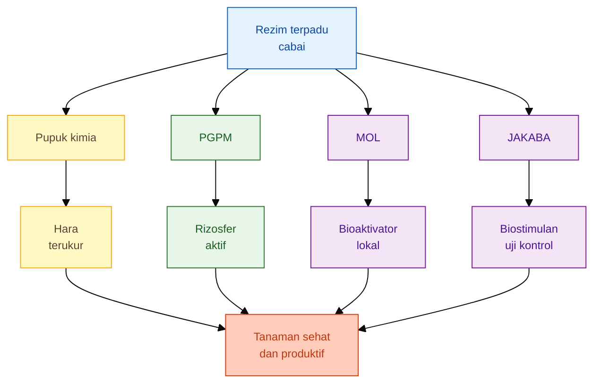

## 5.1 Pupuk kimia: sumber hara utama yang bisa dihitung

Pupuk kimia tetap menjadi komponen penting dalam budidaya cabai karena kandungan haranya jelas. Nitrogen, fosfor, kalium, kalsium, magnesium, sulfur, dan unsur mikro dapat dihitung dari jenis serta jumlah pupuk yang diberikan. Ini berbeda dengan sebagian besar bioinput lokal yang kandungannya lebih bervariasi dan tidak selalu stabil.

Dalam sistem terintegrasi, pupuk kimia tidak diposisikan sebagai musuh bahan organik atau bioinput. Justru pupuk kimia diperlukan agar kebutuhan hara makro dan mikro tanaman tetap terpenuhi secara terukur. Yang perlu dikendalikan adalah cara penggunaannya: tidak berlebihan, tidak terlalu pekat di sekitar akar muda, tidak diberikan sama rata sepanjang fase tanaman, dan tidak dijadikan solusi tunggal untuk semua gejala stres.

Formula dasar yang perlu dipakai praktisi adalah sebagai berikut.

$$
\text{Kandungan unsur hara} = \text{berat pupuk} \times \frac{\text{persentase unsur hara}}{100}
$$

Contoh untuk pupuk NPK 16-16-16:

$$
1 \text{ kg NPK 16-16-16} \times \frac{16}{100} = 0{,}16 \text{ kg}
$$

Artinya, setiap 1 kg NPK 16-16-16 mengandung sekitar 0,16 kg N, 0,16 kg P₂O₅, dan 0,16 kg K₂O. Perhitungan seperti ini penting agar praktisi tidak hanya berbicara “berapa kilogram pupuk”, tetapi juga memahami “berapa unsur hara” yang sebenarnya diberikan.

Formula kedua adalah konversi dosis hektar ke dosis tanaman:

$$
\text{Dosis per tanaman} =
\frac{\text{dosis pupuk kg/ha} \times 1.000}{\text{populasi tanaman per ha}}
$$

Rumus ini akan menjadi dasar dalam bab berikutnya ketika menyusun formula per hektar, per tanaman, per 1.000 tanaman, dan per volume larutan. Pada tahap ini, prinsip yang perlu dipegang adalah: **pupuk kimia harus dihitung, bukan ditebak**.

## 5.2 PGPM: pendukung akar dan rizosfer

PGPM atau Plant Growth Promoting Microorganisms mencakup mikroorganisme yang mendukung pertumbuhan tanaman melalui aktivitas di sekitar akar. Dalam praktik lapangan, istilah yang sering digunakan adalah PGPR, yaitu Plant Growth Promoting Rhizobacteria. Mekanisme PGPR yang banyak dibahas dalam literatur meliputi peningkatan ketersediaan hara, pelarutan fosfat, produksi fitohormon, serta penekanan patogen melalui mekanisme langsung dan tidak langsung. ([PMC][3])

Namun dalam artikel ini, PGPM tidak boleh ditulis sebagai pengganti NPK. PGPM lebih tepat diposisikan sebagai **pendukung efisiensi akar**. Ia membantu membuat rizosfer lebih aktif, tetapi tidak otomatis menyediakan seluruh kebutuhan N, P, K, Ca, Mg, dan unsur mikro dalam jumlah cukup untuk produksi cabai intensif.

PGPM bekerja paling baik bila lingkungannya mendukung. Tanah tidak boleh terlalu becek, terlalu kering, terlalu asam, terlalu panas, atau terlalu tinggi garam pupuk. Aplikasi PGPM juga sebaiknya tidak dicampur langsung dengan larutan pupuk kimia pekat, fungisida keras, bakterisida, atau air berklorin tinggi. Mikroba hidup memerlukan perlakuan berbeda dari pupuk mineral.

Dalam rezim cabai, PGPM paling masuk akal digunakan pada fase pembibitan, awal pindah tanam, pemulihan akar, dan pemeliharaan rizosfer secara berkala. Manfaatnya bukan selalu terlihat sebagai lonjakan tinggi tanaman, tetapi bisa muncul sebagai akar lebih aktif, tanaman lebih cepat pulih setelah stres, dan respons pemupukan yang lebih stabil.

## 5.3 MOL: bioaktivator lokal, bukan sumber utama hara

MOL atau Mikroorganisme Lokal banyak digunakan karena bahannya mudah diperoleh dan pembuatannya relatif sederhana. Dalam praktik, MOL sering dibuat dari bahan-bahan seperti buah, rebung, bonggol pisang, nasi, air kelapa, air cucian beras, atau bahan organik lokal lain yang difermentasi bersama sumber gula. Namun mutu MOL sangat bergantung pada bahan, proses fermentasi, kebersihan wadah, lama fermentasi, pH, aroma, dan cara penyimpanan.

Karena itu, MOL harus ditulis dengan hati-hati. Penelitian tentang MOL menunjukkan bahwa sifat MOL sangat beragam dan sering tidak mengandung mikrob berguna. Ini berarti MOL tidak boleh otomatis dianggap sebagai produk yang selalu efektif hanya karena dibuat melalui fermentasi. ([Pertanian Press][4])

Dalam rezim pemupukan cabai, posisi MOL yang paling aman adalah sebagai **bioaktivator lokal**, terutama untuk mendukung proses pengomposan, memperkaya bahan organik, atau membantu aktivitas biologis media bila mutunya baik. MOL bukan sumber utama hara makro. Kandungan NPK MOL biasanya tidak cukup untuk memenuhi kebutuhan produksi cabai secara intensif, apalagi pada fase pengisian buah dan panen berulang.

MOL yang baik umumnya memiliki aroma fermentasi yang wajar, tidak berbau busuk menyengat, tidak berlendir busuk, dan tidak menunjukkan tanda kontaminasi ekstrem. Sebaliknya, MOL yang gagal fermentasi dapat membawa masalah ke lahan: akar terganggu, media menjadi asam atau anaerob, dan tanaman tampak stres setelah aplikasi.

Prinsip aplikasinya adalah moderat. MOL sebaiknya tidak diberikan dalam dosis berlebihan, tidak diaplikasikan saat tanah becek, dan tidak dicampur sembarangan dengan pupuk kimia pekat atau pestisida. Bila digunakan pada cabai, MOL lebih baik masuk sebagai bagian dari pengelolaan bahan organik dan kesehatan media, bukan sebagai tulang punggung pemupukan.

## 5.4 JAKABA: biostimulan lokal yang perlu diuji dengan petak kontrol

JAKABA sering dipromosikan sebagai pupuk organik cair atau biostimulan lokal, umumnya dikaitkan dengan peraman air cucian beras atau air leri. Di lapangan, JAKABA menarik karena murah, mudah dibuat, dan dianggap mampu mendukung pertumbuhan tanaman. Namun untuk artikel acuan praktisi, klaim seperti ini harus ditempatkan secara proporsional.

JAKABA tidak boleh diposisikan sebagai pengganti pupuk utama. Penelitian 2025 pada cabai rawit tentang konsentrasi JAKABA melalui media tanam dan dosis NPK Mutiara menunjukkan bahwa perlakuan dosis NPK Mutiara memberikan pengaruh berbeda nyata pada beberapa parameter pertumbuhan, sedangkan konsentrasi JAKABA tidak menjadi faktor utama yang menggantikan kebutuhan hara dari NPK. ([Ejurnal][5])

Artinya, JAKABA boleh diuji sebagai pendamping, tetapi tidak bijak bila dijadikan dasar utama pemupukan cabai. Pada tanaman dengan kebutuhan hara tinggi seperti cabai, terutama saat bunga, fruit set, dan pengisian buah, kebutuhan K, Ca, Mg, N, P, dan unsur mikro tetap harus dipenuhi dari sumber yang kandungannya jelas.

Cara terbaik memakai JAKABA dalam sistem praktisi adalah dengan **petak kontrol**. Misalnya, satu petak menggunakan program standar tanpa JAKABA, satu petak menggunakan program standar ditambah JAKABA. Yang dibandingkan bukan warna daun saja, tetapi jumlah bunga, fruit set, bobot panen, ukuran buah, jumlah petikan, dan biaya tambahan. Bila tidak ada pembanding, petani sulit membedakan apakah hasil berasal dari JAKABA, pupuk kimia, cuaca, varietas, atau perawatan lain.

Dalam rezim terpadu, JAKABA diperlakukan sebagai input opsional. Ia dapat dicoba bila mutu fermentasi baik, dosis moderat, media tidak becek, dan tanaman tidak sedang stres akar. Namun keputusan pemupukan utama tetap harus bertumpu pada hara terukur, kesehatan akar, air stabil, pH sesuai, dan respons tanaman yang dicatat.

Dengan pembagian peran ini, integrasi pupuk kimia, PGPM, MOL, dan JAKABA menjadi lebih rasional. Pupuk kimia memberi kepastian hara. PGPM mendukung rizosfer. MOL mendukung aktivitas biologis bila mutunya baik. JAKABA diuji sebagai biostimulan, bukan dijadikan klaim utama. Kombinasi ini akan kuat bila dikelola dengan prinsip yang sama: **ukur, aplikasikan bertahap, amati respons, dan koreksi berdasarkan data lapang.**

[1]: https://gaphortikultura.puslithorti.net/wp-content/uploads/2018/12/SOP-Cabai-Merah-2014.pdf?utm_source=chatgpt.com 'SOP-Cabai-Merah-2014.pdf - Good Agricultural Practices'
[2]: https://hortikultura.pertanian.go.id/wp-content/uploads/2024/11/Panduan-Umum-Standar-Operasional-Prosedur-Budidaya-Cabai-Rawit-Hiyung_watermark.pdf?utm_source=chatgpt.com 'Panduan-Umum-Standar-Operasional-Prosedur-Budidaya ...'
[3]: https://pmc.ncbi.nlm.nih.gov/articles/PMC11377119/?utm_source=chatgpt.com 'Unveiling the Diverse Roles of Plant Growth-Promoting ... - PMC'
[4]: https://epublikasi.pertanian.go.id/berkala/jti/article/view/3163?utm_source=chatgpt.com 'Aplikasi Mikroorganisme Lokal (MOL) Diperkaya Mikrob ...'
[5]: https://ejurnal.uij.ac.id/index.php/AGR/article/download/4368/2407/17674?utm_source=chatgpt.com 'Pengaruh Konsentrasi Jakaba Melalui Media Tanam dan ...'

---

# 6. Kerangka Menyusun Formula Pemupukan

Formula pemupukan cabai tidak boleh dimulai dari “berapa gram per tanaman” secara langsung. Angka gram per tanaman adalah hasil akhir dari beberapa keputusan sebelumnya: jenis cabai, populasi tanaman, kondisi lahan, fase pertumbuhan, bentuk pupuk, cara aplikasi, dan frekuensi pemberian. Bila urutan ini dibalik, pemupukan mudah berubah menjadi resep umum yang belum tentu cocok untuk lahan tertentu.

Dalam sistem low-lab, formula pemupukan harus dibuat sebagai **kerangka hitung yang bisa dikoreksi**, bukan sebagai angka mati. Petani tetap memakai rekomendasi resmi sebagai pagar awal, tetapi keputusan akhir harus disesuaikan dengan kondisi akar, pH, drainase, respons tanaman, dan catatan aplikasi.

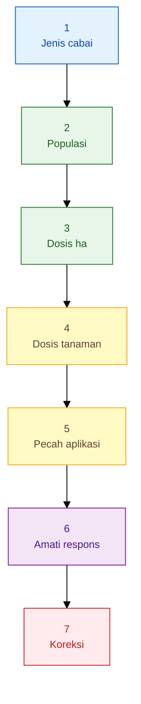

## 6.1 Tentukan jenis cabai

Cabai besar dan cabai rawit memakai prinsip fisiologi yang sama: akar harus sehat, hara harus cukup, air harus stabil, dan pemupukan harus mengikuti fase tanaman. Namun bobot keputusannya berbeda.

Pada cabai besar, fokus formula lebih kuat pada pembentukan tanaman yang seimbang sebelum masuk generatif, lalu menjaga kualitas buah: ukuran, panjang, bentuk, keseragaman, warna, dan bobot. Kelebihan nitrogen pada cabai besar sering menghasilkan tanaman rimbun, tetapi transisi ke bunga menjadi lambat dan kualitas buah tidak seragam.

Pada cabai rawit, formula harus lebih memperhatikan kontinuitas panen. Rawit biasanya dipetik berulang dalam ritme lebih rapat, sehingga pemupukan perlu menjaga daya pulih tanaman setelah panen. Dorongan hara tidak boleh terlalu ekstrem dalam satu aplikasi. Strategi yang lebih aman adalah pemberian kecil, rutin, dan stabil, terutama saat tanaman sudah masuk fase generatif berulang.

Dengan kata lain, cabai besar lebih sensitif terhadap kesalahan transisi vegetatif-generatif, sedangkan cabai rawit lebih sensitif terhadap ketidakstabilan pemeliharaan jangka panjang.

## 6.2 Tentukan populasi tanaman

Populasi tanaman adalah dasar semua perhitungan. Dosis 500 kg/ha akan menghasilkan gram per tanaman yang berbeda bila populasi 16.000 tanaman/ha, 18.000 tanaman/ha, atau 24.000 tanaman/ha. Karena itu, formula tidak boleh langsung menyebut “gram per tanaman” tanpa menjelaskan populasi yang dipakai.

Untuk menghitung populasi, gunakan luas efektif tanam, bukan hanya luas lahan total. Pada lahan bermulsa dan berbedengan, sebagian area dipakai untuk parit, jalan perawatan, dan batas lahan. Karena itu, populasi nyata sering lebih rendah daripada populasi teoritis.

Rumus MDX:

$$
\text{Populasi tanaman/ha} =
\frac{\text{luas efektif tanam }(m^2)}
{\text{jarak dalam baris }(m) \times \text{jarak antarbaris }(m)}
$$

Contoh teoritis pada jarak tanam 60 cm × 70 cm:

$$
\text{Populasi} =
\frac{10.000}{0{,}60 \times 0{,}70}
$$

$$
\text{Populasi} =
\frac{10.000}{0{,}42}
= 23.809 \text{ tanaman/ha}
$$

Angka ini adalah populasi teoritis bila seluruh lahan efektif ditanami. Untuk praktik, populasi perlu dikoreksi berdasarkan luas bedengan nyata, jumlah baris, jarak lubang, dan ruang parit. SOP cabai merah mencantumkan jarak tanam 50–60 cm × 60–70 cm, sedangkan SOP cabai rawit Hiyung mencantumkan jarak tanam 70 cm × 70 cm atau 60 cm × 70 cm. ([Gaphor Tikultura][1])

## 6.3 Konversi dosis hektar ke tanaman

Setelah populasi diketahui, dosis pupuk per hektar dapat dikonversi menjadi dosis per tanaman. Ini penting agar rekomendasi resmi dapat diterjemahkan ke praktik kocor, tugal, atau tabur per lubang.

Rumus MDX:

$$
\text{Dosis pupuk per tanaman }(g) =
\frac{\text{dosis pupuk }(kg/ha) \times 1.000}
{\text{populasi tanaman/ha}}
$$

Contoh: NPK 500 kg/ha pada populasi 20.000 tanaman/ha.

$$
\text{Dosis per tanaman} =
\frac{500 \times 1.000}{20.000}
$$

$$
\text{Dosis per tanaman} =
25 \text{ g/tanaman}
$$

Contoh lain: NPK 700 kg/ha pada populasi 20.000 tanaman/ha.

$$
\text{Dosis per tanaman} =
\frac{700 \times 1.000}{20.000}
$$

$$
\text{Dosis per tanaman} =
35 \text{ g/tanaman}
$$

Perhitungan ini tidak berarti seluruh pupuk harus diberikan sekaligus dekat akar. Pada cabai, terutama setelah pindah tanam, akar muda sensitif terhadap larutan pupuk terlalu pekat. Karena itu, angka per tanaman perlu dibaca bersama fase tanaman dan cara aplikasi.

## 6.4 Pecah dosis menjadi aplikasi kecil

Cabai adalah tanaman yang dipupuk bertahap. Kebutuhan hara berubah dari fase akar, vegetatif, pra-bunga, fruit set, pengisian buah, sampai panen berulang. Karena itu, dosis susulan lebih aman dipecah menjadi aplikasi kecil daripada diberikan besar sekaligus.

Rumus MDX:

$$
\text{Dosis per aplikasi} =
\frac{\text{total dosis susulan}}
{\text{jumlah aplikasi}}
$$

Contoh: total pupuk susulan 300 kg/ha dibagi menjadi 10 kali aplikasi.

$$
\text{Dosis per aplikasi} =
\frac{300}{10}
= 30 \text{ kg/ha/aplikasi}
$$

Bila populasi 20.000 tanaman/ha:

$$
\text{Dosis per tanaman per aplikasi} =
\frac{30 \times 1.000}{20.000}
$$

$$
\text{Dosis per tanaman per aplikasi} =
1{,}5 \text{ g/tanaman/aplikasi}
$$

Pendekatan ini membuat pemupukan lebih aman bagi akar dan lebih mudah dikoreksi. Bila tanaman terlalu rimbun, dosis N bisa diturunkan pada aplikasi berikutnya. Bila buah kecil dan daun masih sehat, porsi K dan Mg bisa diperkuat. Bila tanaman layu atau akar terganggu, pupuk pekat dapat dihentikan sementara.

## 6.5 Gunakan pagar rekomendasi, bukan resep mati

Dalam kondisi low-lab, rekomendasi resmi tetap penting sebagai pagar. Pagar berarti angka tersebut membantu petani tidak terlalu rendah dan tidak terlalu tinggi dalam memulai program. Namun angka tersebut bukan resep mati untuk semua lahan.

Untuk cabai merah, SOP mencantumkan pupuk kompos 15–20 ton/ha sekitar dua minggu sebelum tanam. Bila menggunakan pupuk majemuk NPK, pupuk dasar diberikan dengan dosis 500–700 kg/ha, dan dokumen yang sama menegaskan bahwa dosis serta jenis pupuk disesuaikan dengan rekomendasi spesifik lokasi. ([Gaphor Tikultura][1])

SOP cabai merah juga menyebut pupuk N dan K susulan diberikan mulai umur 21 HST, kemudian diulang dengan interval 7–10 hari sekali, serta setiap kegiatan pemupukan harus tercatat. Ini penting karena pemupukan cabai bukan kegiatan sekali jadi, melainkan program yang harus diamati dan dikoreksi. ([Gaphor Tikultura][1])

Untuk cabai rawit Hiyung, SOP mencantumkan pupuk kandang 20–30 ton/ha yang sudah difermentasi dengan agen hayati, serta NPK 16-16-16 sebanyak 450 kg/ha atau alternatif pupuk tunggal sebagai pupuk dasar. Pada pemupukan susulan, SOP tersebut mencantumkan aplikasi mulai 15 HST, kemudian interval 10–15 hari hingga 55 HST, dan dilanjutkan pada fase berikutnya dengan kombinasi NPK dan KNO₃ pada 65, 75, dan 85 HST.

Maka, cara paling aman menyusun formula adalah:

1. pakai rekomendasi resmi sebagai rentang awal;
2. konversi ke populasi tanaman nyata;
3. pecah dosis menjadi aplikasi bertahap;
4. pisahkan strategi cabai besar dan rawit;
5. koreksi berdasarkan akar, air, pH, bunga, buah, dan catatan panen.

Formula yang baik bukan formula yang paling tinggi dosisnya, tetapi formula yang paling mampu menjaga tanaman tetap sehat dan produktif sepanjang siklus hidupnya.

---

# 7. Rezim Pemupukan Berdasarkan Fase Tanaman

Bab ini menjadi pusat operasional artikel. Tujuannya bukan memberi satu resep kaku, tetapi menyediakan kerangka fase agar praktisi tahu **apa yang sedang dikejar tanaman**, **apa perbedaan cabai besar dan rawit**, serta **kapan pupuk harus dinaikkan, ditahan, atau dikoreksi**.

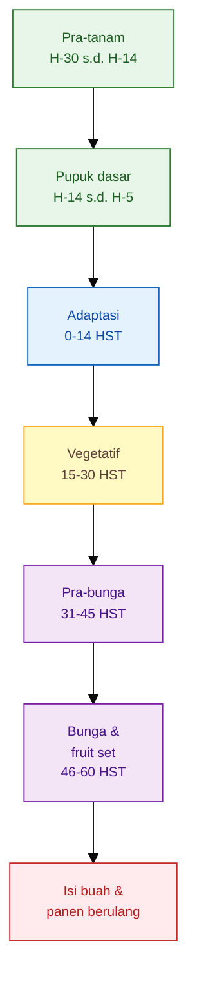

| Fase                              |                              Umur | Target tanaman                                                                               | Cabai besar                                                                                               | Cabai rawit/kecil                                                                                              | Bioinput                                                                                                        | Risiko utama                                                                                                   | Indikator koreksi                                                                       |
| --------------------------------- | --------------------------------: | -------------------------------------------------------------------------------------------- | --------------------------------------------------------------------------------------------------------- | -------------------------------------------------------------------------------------------------------------- | --------------------------------------------------------------------------------------------------------------- | -------------------------------------------------------------------------------------------------------------- | --------------------------------------------------------------------------------------- |
| Pra-tanam                         |                  H-30 sampai H-14 | Lahan siap akar: pH terbaca, drainase baik, bahan organik matang, riwayat penyakit dipetakan | Lebih ketat pada keseragaman bedengan karena mutu buah sangat dipengaruhi awal pertumbuhan                | Lebih ketat pada daya tahan media karena rawit dipelihara lebih panjang                                        | MOL dapat dipakai untuk membantu proses pengomposan bila mutunya baik; PGPM dapat disiapkan untuk aplikasi awal | Menanam di lahan asam, becek, bekas penyakit, atau bahan organik belum matang                                  | pH rendah, air menggenang, bau tanah anaerob, banyak sisa akar sakit                    |
| Pupuk dasar                       |                   H-14 sampai H-5 | Hara awal tersedia tanpa membuat zona akar terlalu panas                                     | Gunakan pagar rekomendasi pupuk dasar, tetapi jangan berlebihan N karena akan memanjangkan fase vegetatif | Bahan organik matang penting untuk menopang panen panjang; pupuk dasar jangan terlalu pekat dekat lubang tanam | MOL hanya jika fermentasi baik; PGPM lebih aman diaplikasikan terpisah dari pupuk kimia pekat                   | Pupuk dasar terlalu dekat akar, kompos panas, dolomit/pupuk tidak tercampur merata                             | Bibit sulit adaptasi, akar muda cokelat, tanaman layu setelah tanam                     |
| Adaptasi                          |                          0–14 HST | Bibit pulih, akar baru aktif, tanaman tidak stres pindah tanam                               | Hindari dorongan pupuk tinggi; kejar akar dan keseragaman bibit                                           | Rawit perlu fondasi akar kuat karena umur produksi panjang                                                     | PGPM paling relevan untuk kocor ringan atau perlakuan akar; JAKABA belum wajib                                  | Garam pupuk tinggi, media terlalu basah, bibit rebah atau layu                                                 | Tanaman layu siang padahal media basah, daun bawah menguning, pertumbuhan berhenti      |
| Vegetatif                         |                         15–30 HST | Daun cukup, batang kuat, cabang produktif mulai terbentuk, akar aktif                        | N cukup untuk membangun kanopi, tetapi jangan membuat tanaman terlalu rimbun                              | Dorongan vegetatif perlu stabil, jangan terlalu cepat besar dengan akar lemah                                  | PGPM dapat diulang; MOL/JAKABA ringan bila tanaman responsif dan media sehat                                    | Kekurangan N membuat tanaman kecil; kelebihan N membuat batang lunak dan ruas panjang                          | Daun terlalu pucat atau terlalu hijau gelap, ruas terlalu panjang, cabang sedikit       |
| Pra-bunga                         |                         31–45 HST | Transisi vegetatif ke generatif; bakal bunga stabil                                          | Fase kritis cabai besar: N mulai dikendalikan, K-Ca-Mg-B mulai diperhatikan untuk mutu buah               | Rawit mulai diarahkan ke generatif, tetapi jangan sampai daun produktif melemah                                | Bioinput hanya pendukung; jangan campur dengan pupuk pekat                                                      | Tanaman terlalu vegetatif, bunga mundur, atau akar stres karena pupuk tinggi                                   | Bunga terlambat, pucuk terlalu lunak, daun hijau gelap berlebihan                       |
| Bunga dan fruit set               |                         46–60 HST | Bunga tidak rontok, pentil jadi buah, air stabil                                             | Fokus pada fruit set dan keseragaman awal buah; hindari lonjakan N                                        | Fokus pada jumlah bunga jadi buah dan ketahanan tanaman memasuki petik berulang                                | PGPM dapat menjaga rizosfer; MOL/JAKABA hanya bila tidak memicu media terlalu basah                             | Rontok bunga, rontok pentil, stres air, ketidakseimbangan K-Ca-B                                               | Banyak bunga gugur, pentil hitam/rontok, daun tetap rimbun tapi buah sedikit            |
| Pengisian buah dan panen berulang | Setelah 60 HST sampai akhir panen | Buah terisi, daun tetap produktif, tanaman pulih setelah petik                               | Kualitas buah menjadi ukuran utama: ukuran, bobot, warna, keseragaman, daya simpan                        | Kontinuitas petik menjadi ukuran utama: jumlah buah, frekuensi petik, daya pulih setelah panen                 | Bioinput sebagai pemeliharaan akar, bukan pengganti pupuk buah                                                  | Under-fertilizing membuat buah kecil dan panen pendek; over-fertilizing membuat biaya tinggi dan tanaman stres | Buah mengecil, petikan menurun tajam, daun cepat tua, tanaman tidak pulih setelah panen |

Tabel ini perlu dibaca sebagai alat keputusan, bukan jadwal kaku. Pada cabai besar, perhatian terbesar berada pada fase pra-bunga sampai pengisian buah karena mutu pasar ditentukan oleh keseragaman dan kualitas buah. Pada cabai rawit, perhatian terbesar berada pada stabilitas panen berulang: tanaman tidak boleh kehabisan tenaga setelah beberapa kali petik.

## Catatan aplikasi per fase

Pada fase pra-tanam dan pupuk dasar, pekerjaan utama bukan mengejar pupuk tinggi, tetapi membuat lahan siap menerima tanaman. Pengapuran, bahan organik matang, drainase, dan sanitasi lahan lebih penting daripada menambah banyak input cair. Pupuk dasar diberikan sebagai fondasi, tetapi harus ditempatkan aman agar tidak membakar akar muda.

Pada fase adaptasi, pemupukan harus ringan. Akar bibit baru belum mampu menanggung tekanan garam tinggi. Bila tanaman terlihat lambat pada 0–14 HST, jangan langsung menaikkan pupuk. Periksa dulu apakah akar tumbuh, apakah media terlalu basah, dan apakah bibit mengalami stres pindah tanam.

Pada fase vegetatif, cabai membutuhkan hara untuk membangun daun dan cabang. Namun vegetatif yang berlebihan bukan target. Tanaman yang terlalu rimbun sering terlambat masuk generatif. Pada fase ini, pemupukan harus menghasilkan batang kuat, daun aktif, dan cabang produktif, bukan sekadar daun hijau gelap.

Pada fase pra-bunga, arah formula mulai berubah. Nitrogen tetap dibutuhkan, tetapi tidak boleh dominan. K, Ca, Mg, dan B mulai menjadi perhatian karena fase berikutnya membutuhkan bunga yang kuat, serbuk sari aktif, pentil tidak mudah gugur, dan jaringan buah yang baik.

Pada fase bunga dan fruit set, stabilitas lebih penting daripada dorongan ekstrem. Perubahan air yang tajam, pupuk terlalu pekat, atau N berlebihan dapat memicu gugur bunga dan pentil. Bila rontok bunga terjadi, jangan langsung menambah semua jenis pupuk. Baca dulu air, akar, suhu, N, dan keseimbangan K-Ca-B.

Pada fase pengisian buah dan panen berulang, strategi cabai besar dan rawit semakin berbeda. Cabai besar harus menjaga ukuran, bobot, dan keseragaman buah. Rawit harus menjaga kontinuitas petik dan kemampuan tanaman membentuk buah berikutnya. Keduanya tetap membutuhkan daun sehat, akar aktif, dan suplai hara bertahap.

## Prinsip integrasi bioinput dalam tabel fase

PGPM, MOL, dan JAKABA tidak perlu disebut sebagai “obat semua fase”. Penggunaannya harus mengikuti kondisi media. PGPM paling logis pada fase akar dan pemulihan rizosfer. MOL lebih aman untuk mendukung bahan organik dan media, bukan sebagai pupuk utama. JAKABA sebaiknya diperlakukan sebagai biostimulan opsional yang diuji dengan petak pembanding.

Pada praktiknya, bioinput sebaiknya tidak diaplikasikan bersamaan dengan pupuk kimia pekat. Beri jeda aplikasi agar mikroba tidak langsung terpapar tekanan garam tinggi. Bila tanah becek, akar busuk, atau tanaman sedang layu karena media terlalu basah, aplikasi bioinput cair juga harus ditunda. Dalam kondisi seperti itu, yang pertama dibenahi adalah drainase dan akar.

Rezim pemupukan berdasarkan fase ini membuat petani tidak lagi bertanya “pupuk apa minggu ini?”, tetapi “fase tanaman saya sekarang apa, targetnya apa, dan risiko terbesarnya apa?”. Dengan cara pikir ini, pemupukan menjadi lebih presisi, lebih aman, dan lebih dekat pada tujuan utama: tanaman sehat yang menghasilkan buah optimal.

[1]: https://gaphortikultura.puslithorti.net/wp-content/uploads/2018/12/SOP-Cabai-Merah-2014.pdf 'Agroklimat yang sesuai bagi pertanaman mangga adalah tipe iklim D, 2-4 bulan basah, 8-10 bulan kering, curah hujan 200-250 mm/'

---

# 7A. Cara Memberikan Pupuk: Padat, Cair Kocor, dan Semprot Tajuk

Dosis pupuk yang benar tetap bisa gagal bila cara aplikasinya salah. Pada cabai, pupuk tidak boleh hanya dipikirkan sebagai “berapa gram”, tetapi juga **di mana diletakkan, dalam bentuk apa diberikan, kapan diaplikasikan, dan lewat jalur serapan mana tanaman menerimanya**.

Secara praktis, ada tiga cara utama aplikasi input pada cabai:

1. **pupuk padat**: diberikan ke tanah sebagai pupuk dasar, tugal, larik samping, atau tabur terbatas;
2. **pupuk cair kocor**: diberikan ke zona akar dalam bentuk larutan;
3. **semprot tajuk**: diberikan ke daun, bunga, atau tajuk sebagai aplikasi foliar.

Ketiganya tidak saling menggantikan sepenuhnya. Pupuk padat dan kocor adalah jalur utama untuk memenuhi kebutuhan hara dalam jumlah besar. Semprot tajuk lebih tepat sebagai **suplemen, koreksi cepat, atau aplikasi agen hayati tajuk**, bukan pengganti pemupukan akar.

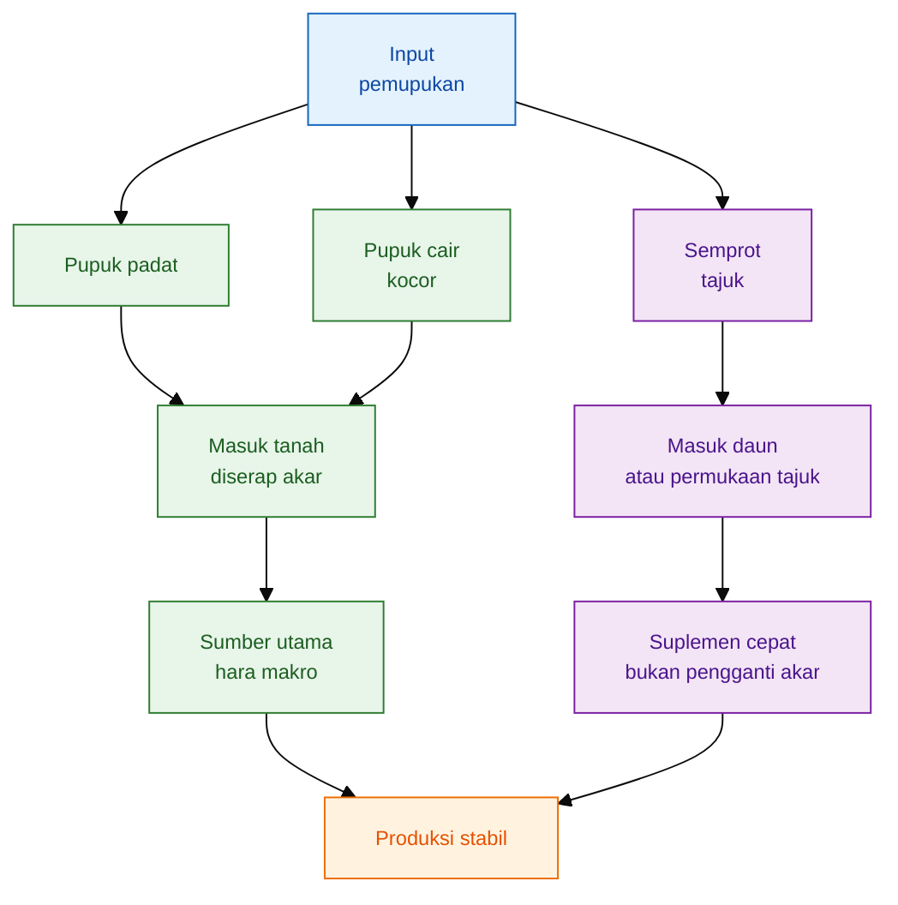

## 7A.1 Pupuk padat: untuk pupuk dasar dan susulan tanah

Pupuk padat cocok untuk membangun cadangan hara di zona akar. Pada pupuk dasar, pupuk dapat dicampur ke tanah sebelum tanam agar tersebar lebih merata. University of Missouri Extension menjelaskan bahwa aplikasi dasar dapat dilakukan dengan membagi pupuk, sebagian dicampur lebih dalam dan sebagian dicampur lebih dangkal agar hara tersebar pada lapisan tanah atas. ([MU Extension][1])

Pada cabai, pupuk padat susulan sebaiknya tidak ditempatkan menempel pada batang. Akar muda dan pangkal batang sensitif terhadap konsentrasi garam pupuk. Panduan botani dan hortikultura UNH Extension menjelaskan bahwa penempatan pupuk terlalu dekat dengan benih dapat membakar akar bibit; prinsip ini relevan untuk cabai muda karena akar awal masih terbatas dan sensitif.

**Prinsip aplikasi pupuk padat pada cabai:**

| Fase           | Cara aplikasi                            |     Jarak aman dari pangkal | Catatan                                         |
| -------------- | ---------------------------------------- | --------------------------: | ----------------------------------------------- |
| Pra-tanam      | Dicampur merata ke bedengan              |           Belum ada tanaman | Cocok untuk kompos matang, dolomit, pupuk dasar |
| 0–14 HST       | Hindari pupuk padat pekat dekat bibit    |     Jangan menempel pangkal | Lebih aman kocor ringan bila akar sehat         |
| 15–30 HST      | Tugal/larik samping                      |                   ±10–15 cm | Tutup kembali dengan tanah                      |
| 31 HST ke atas | Larik samping mengikuti akar aktif/tajuk |                   ±15–20 cm | Jangan merusak akar saat menugal                |
| Panen berulang | Larik samping atau sekitar drip line     | ±20 cm atau mengikuti tajuk | Cocok untuk susulan bertahap                    |

**Aturan aman pupuk padat:**

- jangan menempelkan pupuk pada pangkal tanaman;
- jangan menugal terlalu dalam hingga memutus akar;
- jangan aplikasi saat tanah sangat kering;
- jangan aplikasi saat tanah becek;
- setelah pupuk padat diberikan, tutup dengan tanah tipis;
- pada mulsa plastik, masukkan melalui lubang tanam atau lubang tugal samping;
- hindari menaruh pupuk padat dalam lubang tanam yang langsung kontak dengan akar bibit.

Pupuk padat lebih cocok untuk **cadangan hara dan susulan bertahap**, bukan untuk koreksi cepat saat tanaman sudah menunjukkan stres akut.

---

## 7A.2 Pupuk cair kocor: untuk memberi hara langsung ke zona akar

Pupuk cair kocor adalah pupuk yang dilarutkan dalam air lalu diberikan ke sekitar zona akar. Cara ini umum dipakai pada cabai karena praktis, cepat tersedia, dan mudah dikontrol per tanaman. Namun kocor juga berisiko bila konsentrasi terlalu pekat, tanah terlalu kering, atau akar sedang rusak.

Kocor berbeda dari semprot. Kocor ditujukan ke tanah, bukan daun. Targetnya adalah akar aktif.

**Pupuk/input yang cocok dikocor:**

| Input                   | Cocok dikocor?     | Catatan                                                     |
| ----------------------- | ------------------ | ----------------------------------------------------------- |
| NPK larut air           | Ya                 | Gunakan konsentrasi aman sesuai umur tanaman                |
| KNO₃, MKP, Ca, Mg larut | Ya                 | Sesuaikan fase dan kompatibilitas                           |
| PGPM/PGPR               | Ya                 | Aplikasi ke zona akar, jangan campur larutan pupuk pekat    |
| MOL                     | Ya, bila mutu baik | Lebih aman sebagai pendukung media, bukan sumber utama hara |
| JAKABA                  | Bisa diuji         | Gunakan petak kontrol, dosis moderat                        |
| Agen hayati tanah       | Ya                 | Aplikasi ke zona akar, hindari pestisida/fungisida keras    |

**Rumus konsentrasi kocor:**

$$
\text{Konsentrasi larutan }(g/L) =
\frac{\text{berat pupuk }(g)}
{\text{volume air }(L)}
$$

Contoh:

$$
\frac{1.000 \text{ g}}{200 \text{ L}}
= 5 \text{ g/L}
$$

Artinya, 1 kg pupuk dalam 200 liter air menghasilkan konsentrasi 5 g/L.

**Rumus kebutuhan larutan:**

$$
\text{Kebutuhan larutan }(L) =
\frac{\text{jumlah tanaman} \times \text{volume kocor per tanaman }(ml)}
{1.000}
$$

Contoh 1.000 tanaman dengan volume kocor 200 ml/tanaman:

$$
\frac{1.000 \times 200}{1.000}
= 200 \text{ L}
$$

Jadi, satu drum 200 liter cukup untuk 1.000 tanaman bila volume kocor 200 ml/tanaman.

**Rumus pupuk per drum:**

$$
\text{Pupuk per drum }(g) =
\text{konsentrasi }(g/L) \times \text{volume drum }(L)
$$

Contoh target konsentrasi 5 g/L dalam drum 200 liter:

$$
5 \times 200
= 1.000 \text{ g}
= 1 \text{ kg}
$$

**Lokasi kocor yang aman:**

| Fase           | Lokasi kocor                                      | Catatan                          |
| -------------- | ------------------------------------------------- | -------------------------------- |
| 0–14 HST       | Melingkar tipis ±5–10 cm dari pangkal             | Jangan tepat di batang           |
| 15–30 HST      | Melingkar ±10–15 cm dari pangkal                  | Ikuti perkembangan akar          |
| 31 HST ke atas | Melingkar ±15–20 cm atau mengikuti proyeksi tajuk | Hindari pangkal batang           |
| Panen berulang | Zona akar aktif, bukan pangkal                    | Dosis kecil-konsisten lebih aman |

Kocor paling baik dilakukan saat tanah **lembap**, bukan sangat kering dan bukan becek. Bila tanah sangat kering, larutan pupuk pekat dapat menekan akar. Bila tanah becek, akar kekurangan oksigen dan pupuk sulit dimanfaatkan.

---

## 7A.3 Semprot tajuk: untuk suplemen daun, bukan pengganti pupuk akar

Semprot tajuk atau aplikasi foliar dilakukan dengan menyemprotkan larutan ke permukaan daun. Jalur ini berguna untuk koreksi cepat unsur tertentu, mendukung fase kritis, atau mengaplikasikan agen hayati yang memang ditujukan ke permukaan daun. Namun semprot tajuk tidak boleh dijadikan pengganti utama pupuk akar.

University of Minnesota Extension mencatat bahwa urea dapat diberikan ke tanah sebagai padatan, larutan, atau pada beberapa tanaman sebagai semprot foliar; tetapi ada batas keamanan, termasuk perhatian pada kandungan biuret dan batas jumlah nitrogen yang diaplikasikan lewat daun. Ini menunjukkan bahwa aplikasi foliar memang mungkin dilakukan, tetapi harus hati-hati terhadap bahan, konsentrasi, dan risiko fitotoksik. ([University of Minnesota Extension][2])

**Input yang cocok untuk semprot tajuk:**

| Input                   | Cocok semprot tajuk?              | Catatan                                                         |
| ----------------------- | --------------------------------- | --------------------------------------------------------------- |
| Pupuk daun/mikro        | Ya                                | Gunakan sesuai label; jangan terlalu pekat                      |
| Ca/B/Mg foliar          | Ya, bila formulasi mendukung      | Sebagai suplemen, bukan pengganti serapan akar                  |
| Urea foliar             | Bisa, hati-hati                   | Perhatikan konsentrasi dan mutu produk                          |
| PGPM/agen hayati foliar | Ya, bila produk memang untuk daun | Semprot pagi/sore, liput daun atas-bawah                        |
| Agen hayati tanah       | Tidak ideal                       | Lebih tepat dikocor ke zona akar                                |
| MOL                     | Hati-hati                         | Harus disaring, uji kecil dulu; risiko sumbat nozzle/fitotoksik |
| JAKABA                  | Hati-hati                         | Lebih aman diuji terbatas; jangan saat panas                    |

**Waktu semprot tajuk yang aman:**

- pagi atau sore;
- tidak saat matahari terik;
- tidak saat tanaman layu;
- tidak saat angin kencang;
- tidak menjelang hujan;
- tidak saat daun terlalu basah oleh embun tebal;
- hindari campuran terlalu banyak bahan dalam satu tangki.

Untuk aplikasi foliar, University of Minnesota Extension menyarankan memperhatikan tipe nozzle, tinggi semprot, zona penyangga, kecepatan angin, serta menghindari aplikasi ketika hujan diperkirakan turun dalam 24–48 jam. Walaupun konteks sumber tersebut membahas aplikasi pestisida dan perlindungan serangga menguntungkan, prinsip waktu semprot, drift, dan risiko tercuci tetap relevan untuk aplikasi tajuk. ([Minnesota Crop News][3])

**Rumus pupuk semprot per tangki:**

$$
\text{Pupuk per tangki }(g) =
\text{konsentrasi semprot }(g/L) \times \text{volume tangki }(L)
$$

Contoh target konsentrasi 2 g/L pada tangki 16 liter:

$$
2 \times 16
= 32 \text{ g}
$$

Jadi, kebutuhan pupuk untuk satu tangki 16 liter adalah 32 g.

**Peringatan penting:**
Semprot tajuk tidak mengejar volume basah berlebihan sampai menetes. Targetnya adalah membasahi permukaan daun secara merata, termasuk bagian bawah daun bila targetnya agen hayati atau hama/penyakit tajuk. Larutan yang terlalu pekat atau semprotan saat panas dapat menyebabkan daun terbakar.

---

## 7A.4 Kapan memilih padat, kocor, atau semprot?

| Tujuan                                | Metode utama                      | Alasan                                        |
| ------------------------------------- | --------------------------------- | --------------------------------------------- |
| Membangun kesuburan awal bedengan     | Pupuk padat/pupuk dasar           | Lebih cocok sebagai fondasi hara              |
| Memperbaiki media sebelum tanam       | Kompos/dolomit/pupuk dasar        | Perlu tercampur dan stabil sebelum akar masuk |
| Memulihkan bibit setelah pindah tanam | Kocor ringan                      | Lebih mudah diarahkan ke zona akar            |
| Mendukung akar dan rizosfer           | Kocor PGPM/agen hayati tanah      | Targetnya zona akar                           |
| Memenuhi hara makro saat vegetatif    | Padat susulan atau kocor          | Diserap akar dalam jumlah lebih besar         |
| Koreksi cepat daun/mikro              | Semprot tajuk                     | Respons lebih cepat, dosis kecil              |
| Mendukung fruit set                   | Kombinasi akar + foliar hati-hati | Akar tetap utama, foliar hanya suplemen       |
| Mengaplikasikan agen hayati daun      | Semprot tajuk                     | Targetnya permukaan daun                      |
| Mengaplikasikan MOL/JAKABA            | Lebih aman kocor/uji terbatas     | Mutu bervariasi, perlu kontrol                |

---

## 7A.5 Posisi PGPM, MOL, JAKABA, dan agen hayati

PGPM, MOL, JAKABA, dan agen hayati tidak boleh diperlakukan sama dengan pupuk kimia larut. Sebagian merupakan mikroba hidup atau hasil fermentasi, sehingga aplikasinya harus memperhatikan suhu, air, pH, sinar matahari, pestisida, dan konsentrasi garam.

| Input             | Jalur terbaik                      | Hindari                                                               |
| ----------------- | ---------------------------------- | --------------------------------------------------------------------- |
| PGPM/PGPR         | Kocor zona akar                    | Campur pupuk pekat, fungisida/bakterisida keras, air berklorin tinggi |
| MOL               | Kocor ringan atau aktivator kompos | MOL busuk, tidak disaring, aplikasi saat tanah becek                  |
| JAKABA            | Kocor/uji terbatas                 | Klaim sebagai pengganti NPK, aplikasi tanpa petak kontrol             |
| Agen hayati tanah | Kocor zona akar                    | Tanah terlalu kering/becek, pupuk pekat, pestisida keras              |
| Agen hayati tajuk | Semprot daun                       | Matahari terik, hujan dekat waktu aplikasi, campuran tangki agresif   |

Prinsipnya: **pupuk kimia boleh dihitung sebagai sumber hara; bioinput harus diperlakukan sebagai input hidup atau sensitif**. Bila akar sedang rusak, tanah becek, atau baru saja diberi pupuk pekat, aplikasi PGPM/MOL/JAKABA sebaiknya ditunda sampai kondisi media lebih aman.

---

## 7A.6 Bagan keputusan aplikasi

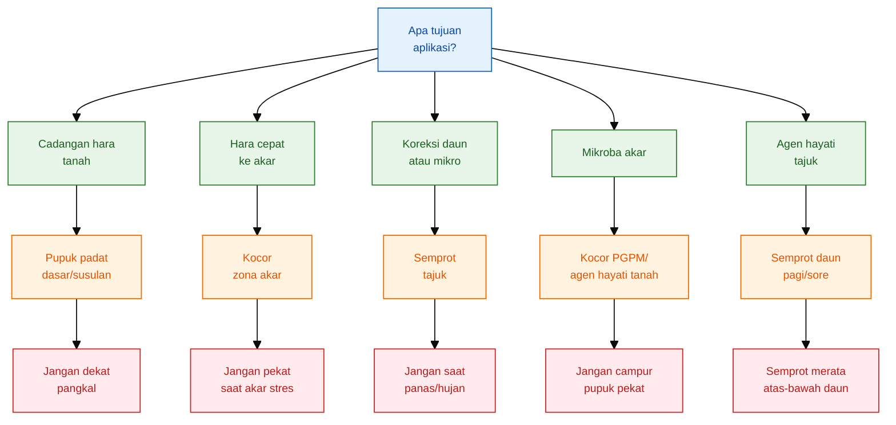

---

## 7A.7 Ringkasan praktis

| Bentuk aplikasi | Kelebihan                                                 | Kelemahan                                           | Cocok untuk                                                |
| --------------- | --------------------------------------------------------- | --------------------------------------------------- | ---------------------------------------------------------- |
| Pupuk padat     | Lebih praktis untuk pupuk dasar dan susulan tanah         | Risiko akar terbakar bila terlalu dekat/padat       | Kompos, dolomit, NPK dasar, susulan samping                |
| Kocor           | Cepat sampai zona akar, dosis per tanaman mudah dikontrol | Risiko pekat bila salah konsentrasi                 | NPK larut, KNO₃, MKP, Ca/Mg larut, PGPM, agen hayati tanah |
| Semprot tajuk   | Cepat untuk koreksi daun dan aplikasi agen hayati tajuk   | Tidak menggantikan hara utama; risiko daun terbakar | Pupuk daun, mikro, Ca/B/Mg foliar, agen hayati daun        |
| MOL/JAKABA      | Murah dan lokal                                           | Mutu bervariasi; perlu uji kontrol                  | Pendamping, bukan sumber hara utama                        |

Kalimat kunci:

> **Pupuk padat membangun cadangan hara di tanah. Pupuk cair kocor memberi hara langsung ke zona akar. Semprot tajuk hanya menjadi suplemen atau aplikasi agen hayati daun, bukan pengganti pemupukan akar. PGPM, MOL, JAKABA, dan agen hayati harus diberikan sesuai targetnya: akar atau tajuk, bukan dicampur sembarangan dalam satu tangki.**

[1]: https://extension.missouri.edu/publications/g6950 'Steps in Fertilizing Garden Soil: Vegetables and Annual Flowers | MU Extension'
[2]: https://extension.umn.edu/nitrogen/fertilizer-urea 'Fertilizer urea'
[3]: https://blog-crop-news.extension.umn.edu/2025/06/putting-beneficial-insects-to-work-for.html 'Putting beneficial insects to work for you'

---

# 8. Risiko Under-Fertilizing dan Over-Fertilizing Sepanjang Siklus Hidup Cabai

Pemupukan cabai bukan hanya soal “kurang” atau “lebih”. Yang sebenarnya dicari adalah **dosis normal**, yaitu dosis yang cukup untuk menjaga pertumbuhan, pembungaan, fruit set, pengisian buah, dan daya tahan tanaman tanpa menekan akar, menaikkan stres garam, atau mendorong vegetatif berlebihan.

Dalam budidaya cabai, under-fertilizing dan over-fertilizing sama-sama merugikan, tetapi risikonya berbeda menurut fase. Pada fase semai dan awal tanam, kelebihan pupuk biasanya lebih berbahaya karena akar masih muda dan sensitif. Pada fase vegetatif, kekurangan pupuk kronis dapat mengurangi cabang produktif. Pada fase pra-bunga sampai fruit set, kelebihan nitrogen dapat membuat tanaman rimbun tetapi lambat berbuah. Pada fase panen berulang, kekurangan hara dapat membuat tanaman cepat habis, terutama pada cabai rawit.

Karena itu, pertanyaan praktisnya bukan: **lebih aman kurang pupuk atau lebih pupuk?**
Pertanyaan yang benar adalah: **di fase ini, risiko mana yang lebih cepat merusak target produksi?**

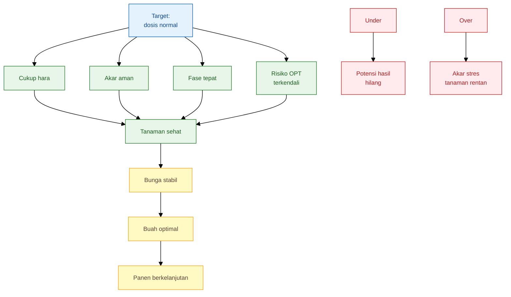

## 8.1 Dosis normal: titik tengah yang harus dicari

Dosis normal bukan berarti dosis rata-rata. Dosis normal adalah dosis yang **sesuai dengan kemampuan tanaman menyerap dan sesuai dengan fase pertumbuhannya**. Dosis yang normal pada tanaman sehat bisa menjadi berlebihan pada tanaman yang akarnya rusak. Sebaliknya, dosis yang tampak cukup pada fase vegetatif bisa menjadi kurang saat tanaman masuk pengisian buah.

Dalam sistem low-lab, dosis normal dicari dari tiga sumber:

1. **pagar rekomendasi teknis**, misalnya SOP atau rekomendasi lokal;
2. **kondisi lapang**, terutama pH, drainase, kelembapan, akar, dan riwayat lahan;
3. **respons tanaman**, seperti warna daun, panjang ruas, jumlah bunga, fruit set, ukuran buah, dan tren panen.

Rumus kerangka:

$$
\text{Dosis normal lapang} =
\text{pagar rekomendasi} \times \text{faktor kondisi tanaman dan lahan}
$$

Faktor kondisi tidak harus dibuat rumit. Untuk praktisi, cukup gunakan pendekatan berikut.

| Kondisi tanaman/lahan                                  |        Faktor koreksi praktis | Makna keputusan                                                |
| ------------------------------------------------------ | ----------------------------: | -------------------------------------------------------------- |
| Akar sehat, pH sesuai, air stabil, tanaman sesuai fase |                           1,0 | Ikuti dosis rencana                                            |
| Tanaman muda, akar belum kuat, media mudah kering      |          0,5–0,7 per aplikasi | Kurangi konsentrasi, jangan kurangi total musim secara ekstrem |
| Tanah pasir atau hujan tinggi                          |          0,6–0,8 per aplikasi | Dosis kecil tetapi lebih sering                                |
| Tanah basah, akar cokelat, tanaman layu                | 0 untuk pupuk pekat sementara | Hentikan pupuk tinggi, pulihkan akar dan air                   |
| Tanaman sehat, beban buah tinggi, daun masih aktif     |                     1,05–1,15 | Naikkan terbatas sesuai fase                                   |
| Tanaman terlalu hijau, ruas panjang, bunga mundur      |               0,7–0,9 untuk N | Turunkan dorongan vegetatif                                    |

Rumus koreksi aplikasi:

$$
\text{Dosis aplikasi baru} =
\text{dosis aplikasi berjalan} \times \text{faktor koreksi}
$$

Contoh:

Jika dosis aplikasi berjalan adalah 2 g/tanaman dan tanaman terlalu hijau dengan bunga terlambat, gunakan faktor 0,8.

$$
2 \times 0{,}8 = 1{,}6 \text{ g/tanaman}
$$

Artinya, aplikasi berikutnya tidak dihentikan total, tetapi diturunkan menjadi 1,6 g/tanaman sambil mengatur keseimbangan hara sesuai fase.

---

## 8.2 Jika harus memilih: lebih aman under atau over?

Secara prinsip, targetnya tetap **normal**. Namun di lapangan, petani sering menghadapi kondisi tidak ideal: akar belum pulih, cuaca ekstrem, pH belum stabil, hujan tinggi, atau tanaman menunjukkan gejala yang belum jelas. Dalam kondisi seperti ini, keputusan harus memakai prinsip mitigasi risiko.

Jawaban praktisnya:

**Pada fase akar muda dan tanaman stres, sedikit under lebih aman daripada over.**
**Pada fase pembentukan cabang, bunga, buah, dan panen berulang, under kronis berbahaya karena menghilangkan potensi hasil.**
**Pada fase generatif, over nitrogen lebih berbahaya daripada sedikit menahan nitrogen.**

Tabel berikut menjadi pegangan keputusan.

| Fase                | Bila harus memilih                     | Alasan                                                                               |
| ------------------- | -------------------------------------- | ------------------------------------------------------------------------------------ |
| Semai               | Pilih sedikit under daripada over      | Akar semai sangat sensitif; over dapat membakar akar dan membuat bibit tidak seragam |
| Baru tanam 0–14 HST | Pilih ringan/bertahap daripada agresif | Target utama adalah akar pulih, bukan daun cepat besar                               |
| Vegetatif 15–30 HST | Jangan under kronis, jangan over N     | Under mengurangi cabang; over membuat tanaman lunak dan terlalu rimbun               |
| Pra-bunga           | Lebih baik menahan N daripada over N   | Over N membuat tanaman terus vegetatif dan bunga mundur                              |
| Fruit set           | Hindari ekstrem dua arah               | Under melemahkan bunga; over memicu rontok akibat stres garam atau ketidakseimbangan |
| Pengisian buah      | Jangan under K-Mg-Ca, jangan over N    | Buah butuh pengisian, tetapi vegetatif berlebih menurunkan keseragaman               |
| Panen berulang      | Jangan under kronis                    | Tanaman perlu pulih setelah petik, terutama cabai rawit                              |
| Tanaman stres akar  | Hentikan pupuk pekat sementara         | Masalah utama bukan hara, tetapi akar dan air                                        |

Jadi, under bukan strategi utama. Over juga bukan jalan pintas. Yang benar adalah **under sementara bisa dipakai sebagai tindakan aman saat akar belum siap**, tetapi harus segera dikembalikan ke dosis normal ketika tanaman pulih.

---

## 8.3 Risiko salah dosis dari semai sampai panen

| Fase                          | Under-fertilizing                                                 | Over-fertilizing                                                          | Dampak pada kesehatan tanaman dan OPT                                                                                                                               | Mitigasi                                                                                  |
| ----------------------------- | ----------------------------------------------------------------- | ------------------------------------------------------------------------- | ------------------------------------------------------------------------------------------------------------------------------------------------------------------- | ----------------------------------------------------------------------------------------- |
| Semai                         | Bibit kecil, daun pucat, akar lambat, vigor rendah                | Akar terbakar, bibit rebah, daun gosong, pertumbuhan tidak seragam        | Bibit lemah lebih mudah kalah oleh stres pindah tanam; media terlalu pekat dapat merusak akar muda                                                                  | Gunakan media semai matang, pupuk sangat ringan, PGPM dosis aman, hindari larutan pekat   |
| Pindah tanam 0–14 HST         | Bibit lama pulih, akar baru lambat, tanaman stagnan               | Layu meski tanah basah, akar cokelat, tanaman stres setelah kocor         | Akar stres membuat tanaman rentan layu, busuk akar, dan sulit merespons pupuk berikutnya                                                                            | Fokus pemulihan akar, air stabil, pupuk ringan, jangan tambah pupuk saat tanah becek      |
| Vegetatif 15–30 HST           | Daun kecil, batang lemah, cabang produktif sedikit                | Tanaman terlalu rimbun, batang lunak, ruas panjang                        | Under membuat tanaman kurang cadangan energi; over N membuat jaringan lunak dan kanopi rapat, sehingga mikroklimat lebih lembap dan penyemprotan OPT kurang efektif | Jaga N cukup tetapi tidak dominan, pantau ruas dan warna daun, ulang PGPM bila akar sehat |
| Pra-bunga 31–45 HST           | Bakal bunga lemah, jumlah calon bunga rendah                      | Tanaman terus vegetatif, bunga terlambat, pucuk terlalu lunak             | Kelebihan vegetatif dapat meningkatkan kelembapan tajuk dan mempersulit pengendalian hama/penyakit                                                                  | Turunkan dorongan N, mulai seimbangkan K, Ca, Mg, dan B                                   |
| Bunga dan fruit set 46–60 HST | Bunga sedikit, serbuk sari lemah, pentil mudah gagal              | Bunga/pentil rontok akibat stres garam, N berlebih, atau antagonisme hara | Tanaman yang stres lebih sulit mempertahankan bunga; tajuk terlalu rimbun dapat mendukung kelembapan tinggi                                                         | Stabilkan air, hindari lonjakan pupuk, koreksi bertahap berdasarkan fruit set             |
| Pengisian buah                | Buah kecil, bobot rendah, warna dan ukuran tidak seragam          | Buah tidak seragam, tanaman mudah layu, kualitas simpan turun             | Under menurunkan mutu panen; over dapat menekan akar dan membuat tanaman lebih sensitif terhadap cuaca ekstrem                                                      | Perkuat K-Mg-Ca sesuai fase, N tetap ada tetapi tidak berlebihan                          |
| Panen berulang                | Tanaman cepat habis, daun tua tidak terganti, petikan turun cepat | Akar/media tertekan, biaya tinggi, respons pupuk makin rendah             | Under kronis membuat tanaman lemah; over kronis membuat zona akar tidak sehat dan memperpendek umur produktif                                                       | Evaluasi bobot per petik, pulihkan tanaman setelah panen, gunakan dosis kecil-konsisten   |

---

## 8.4 Perbedaan risiko pada cabai besar dan cabai rawit

Cabai besar dan cabai rawit tidak boleh dibaca dengan kacamata yang sama.

Pada **cabai besar**, target pasar menuntut ukuran, panjang, bobot, bentuk, warna, dan keseragaman buah. Karena itu, kesalahan pemupukan paling mahal terjadi saat tanaman masuk pra-bunga, fruit set, dan pengisian buah. Under-fertilizing membuat buah kecil dan tidak seragam. Over-fertilizing, terutama nitrogen, membuat tanaman terlalu rimbun, bunga mundur, dan kualitas buah tidak sebanding dengan ukuran tajuk.

Pada **cabai rawit**, targetnya adalah kontinuitas petik. Tanaman harus mampu berbunga, berbuah, dipetik, lalu pulih lagi. Under-fertilizing kronis membuat tanaman cepat habis setelah beberapa kali petik. Over-fertilizing membuat tanaman terlalu vegetatif, biaya naik, dan panen tidak efisien. Pada rawit, pemupukan kecil tetapi konsisten biasanya lebih aman daripada aplikasi besar yang membuat respons tanaman naik-turun tajam.

| Titik keputusan | Cabai besar                              | Cabai rawit/kecil                             |
| --------------- | ---------------------------------------- | --------------------------------------------- |
| Semai           | Kejar keseragaman bibit                  | Kejar akar kuat untuk umur panjang            |
| Vegetatif       | Jangan terlalu rimbun                    | Jangan terlalu cepat besar dengan akar lemah  |
| Pra-bunga       | Fase sangat kritis; N harus dikendalikan | Mulai arahkan generatif tanpa melemahkan daun |
| Fruit set       | Jaga keseragaman pentil                  | Jaga jumlah pentil dan daya tahan tanaman     |
| Pengisian buah  | Fokus ukuran, bobot, bentuk, warna       | Fokus jumlah buah dan kontinuitas             |
| Panen berulang  | Mutu buah per petik penting              | Stabilitas petik lebih penting                |

---

## 8.5 Salah dosis dan kerentanan stres/OPT

Salah dosis pupuk tidak selalu langsung terlihat sebagai defisiensi atau toksisitas. Kadang dampaknya muncul sebagai tanaman yang lebih rentan terhadap stres dan gangguan OPT.

**Under-fertilizing** membuat tanaman kekurangan energi untuk membentuk akar, daun, jaringan baru, dan senyawa pertahanan. Tanaman kecil, daun tipis, dan akar lemah biasanya lebih lambat pulih setelah serangan hama, penyakit, panas, kekeringan, atau hujan berlebih. Pada rawit, under kronis membuat tanaman tidak kuat mempertahankan ritme panen. Pada cabai besar, under membuat buah kecil dan kualitas turun.

**Over-fertilizing**, terutama nitrogen, dapat membuat jaringan tanaman lebih lunak dan tajuk terlalu rimbun. Tajuk yang terlalu rapat meningkatkan kelembapan mikro di sekitar daun dan buah, mengurangi sirkulasi udara, serta menyulitkan penetrasi semprotan pengendalian OPT. Selain itu, pupuk pekat di zona akar dapat menimbulkan stres garam. Tanaman yang akarnya stres akan lebih mudah layu, sulit menyerap Ca dan Mg secara stabil, serta lebih mudah mengalami kerontokan bunga atau pentil saat cuaca berubah.

Karena itu, pemupukan harus dilihat sebagai bagian dari manajemen kesehatan tanaman, bukan kegiatan terpisah dari pengendalian OPT. Tanaman yang mendapat dosis normal lebih mudah dikelola: tidak terlalu lemah, tidak terlalu lunak, tidak terlalu rimbun, dan tidak terlalu stres pada zona akar.

---

## 8.6 Mitigasi risiko agar target produksi tetap terjaga

Mitigasi risiko dimulai dari prinsip sederhana: **jangan koreksi semua gejala dengan menambah pupuk**. Sebelum menambah dosis, periksa akar, air, pH, dan fase tanaman.

### A. Bila tanaman cenderung under-fertilized

Gejala umum:

- daun kecil atau pucat;
- pertumbuhan lambat;
- cabang produktif sedikit;
- bunga sedikit;
- buah kecil;
- petikan turun cepat.

Mitigasi:

1. pastikan akar sehat dan media tidak becek;
2. naikkan dosis bertahap, bukan sekaligus;
3. prioritaskan hara sesuai fase;
4. jangan mengejar ketertinggalan dengan larutan pekat;
5. catat respons 3–7 hari setelah koreksi.

Rumus koreksi bertahap:

$$
\text{Dosis koreksi} =
\text{dosis berjalan} \times 1{,}10 \text{ sampai } 1{,}20
$$

Contoh bila dosis berjalan 2 g/tanaman:

$$
2 \times 1{,}10 = 2{,}2 \text{ g/tanaman}
$$

$$
2 \times 1{,}20 = 2{,}4 \text{ g/tanaman}
$$

Artinya, koreksi cukup menjadi 2,2–2,4 g/tanaman, bukan langsung dua kali lipat.

### B. Bila tanaman cenderung over-fertilized

Gejala umum:

- daun hijau gelap berlebihan;
- ruas panjang;
- batang lunak;
- bunga terlambat;
- bunga atau pentil rontok setelah aplikasi;
- tanaman layu meski tanah basah;
- tepi daun seperti terbakar;
- muncul kerak pupuk di permukaan media.

Mitigasi:

1. hentikan sementara pupuk pekat;
2. stabilkan air, jangan membuat tanah becek;
3. cek akar dan drainase;
4. turunkan dosis aplikasi berikutnya 10–30%;
5. kurangi dorongan nitrogen bila tanaman terlalu vegetatif;
6. jangan langsung menambah PGPM, MOL, atau JAKABA saat akar masih stres berat;
7. setelah akar pulih, bioinput dapat dipakai untuk membantu pemulihan rizosfer.

Rumus penurunan dosis:

$$
\text{Dosis koreksi} =
\text{dosis berjalan} \times 0{,}70 \text{ sampai } 0{,}90
$$

Contoh bila dosis berjalan 2 g/tanaman:

$$
2 \times 0{,}70 = 1{,}4 \text{ g/tanaman}
$$

$$
2 \times 0{,}90 = 1{,}8 \text{ g/tanaman}
$$

Artinya, aplikasi berikutnya diturunkan menjadi 1,4–1,8 g/tanaman sesuai tingkat stres tanaman.

---

## 8.7 Matriks keputusan cepat: normal, under, atau over?

| Kondisi lapang                                  | Diagnosis awal                                | Keputusan pupuk                      | Target mitigasi                    |
| ----------------------------------------------- | --------------------------------------------- | ------------------------------------ | ---------------------------------- |
| Akar putih, daun normal, bunga stabil, buah isi | Mendekati normal                              | Pertahankan dosis                    | Jaga konsistensi                   |
| Akar sehat, daun pucat, cabang sedikit          | Under ringan-sedang                           | Naikkan 10–20% bertahap              | Pulihkan vigor tanpa membakar akar |
| Daun hijau gelap, ruas panjang, bunga mundur    | Over N / vegetatif berlebih                   | Turunkan N, seimbangkan K            | Arahkan ke generatif               |
| Layu tanah basah, akar cokelat                  | Stres akar, bukan kurang pupuk                | Hentikan pupuk pekat                 | Pulihkan akar dan drainase         |
| Bunga banyak tetapi pentil rontok               | Stres air, N berlebih, K-Ca-B tidak stabil    | Jangan tambah semua pupuk            | Koreksi air dan keseimbangan hara  |
| Buah kecil, daun masih sehat                    | K/Mg/air/akar perlu dicek                     | Perkuat K-Mg sesuai fase             | Dorong pengisian buah              |
| Petikan rawit turun cepat                       | Under kronis atau akar lemah                  | Cek akar, lalu pupuk kecil-konsisten | Panjangkan umur produksi           |
| Cabai besar rimbun tetapi buah tidak seragam    | Over vegetatif / keseimbangan generatif buruk | Turunkan N, perbaiki K-Ca-Mg         | Perbaiki mutu buah                 |

---

## 8.8 Prinsip akhir: targetnya bukan under atau over, tetapi normal yang aman

Dalam budidaya cabai, “kurang sedikit” kadang lebih aman daripada “lebih sedikit”, terutama pada fase semai, awal tanam, dan saat akar sedang stres. Namun strategi ini hanya boleh bersifat sementara. Bila under dibiarkan terlalu lama, tanaman kehilangan cabang, bunga, buah, dan umur produksi.

Sebaliknya, over-fertilizing tidak boleh dianggap sebagai cadangan keamanan. Kelebihan pupuk dapat membuat tanaman tampak subur, tetapi sebenarnya menekan akar, mengganggu keseimbangan hara, memperbesar kerentanan stres, meningkatkan risiko gangguan OPT melalui tajuk yang terlalu rimbun atau jaringan yang terlalu lunak, dan menaikkan biaya tanpa jaminan hasil.

Maka, mitigasi terbaik adalah mencari **zona dosis normal**:

- cukup untuk menjaga vigor;
- tidak membuat akar stres;
- sesuai fase tanaman;
- berbeda antara cabai besar dan rawit;
- dikoreksi bertahap;
- selalu dibaca bersama akar, air, pH, bunga, buah, dan catatan panen.

Pesan utama bab ini adalah: **under-fertilizing menghilangkan potensi hasil, over-fertilizing merusak keseimbangan tanaman, tetapi dosis normal menjaga kesehatan tanaman sekaligus mempertahankan target produksi.**

---

# 9. Monitoring, Koreksi, dan Evaluasi Ekonomi

Rezim pemupukan cabai tidak selesai setelah jadwal dibuat. Jadwal hanya rencana. Yang menentukan keberhasilan adalah kemampuan petani membaca respons tanaman, mencatat aplikasi, membandingkan hasil, dan melakukan koreksi tanpa panik. Inilah alasan monitoring mingguan menjadi bagian wajib dalam sistem pemupukan low-lab.

Monitoring bukan pekerjaan rumit. Yang penting adalah konsisten. Tanaman cabai perlu diamati dengan cara yang sama dari minggu ke minggu: warna daun, panjang ruas, cabang produktif, kondisi akar, kelembapan media, jumlah bunga, fruit set, ukuran buah, bobot panen, serta gejala defisiensi atau toksisitas.

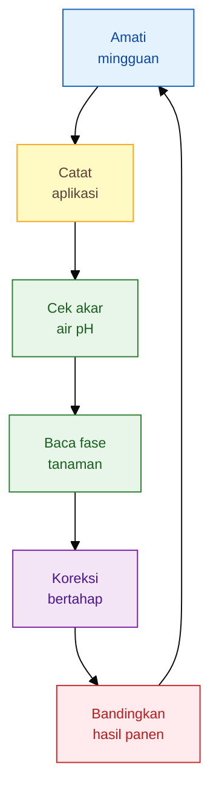

## 9.1 Monitoring mingguan

Monitoring mingguan harus mencakup tiga kelompok pengamatan: vegetatif, akar-media, dan generatif.

| Kelompok   | Parameter                    | Cara membaca                                                                                 |
| ---------- | ---------------------------- | -------------------------------------------------------------------------------------------- |
| Vegetatif  | Warna daun                   | Pucat bisa mengarah ke kurang hara, akar lemah, pH bermasalah, atau air tidak stabil         |
| Vegetatif  | Panjang ruas                 | Ruas terlalu panjang sering menunjukkan vegetatif berlebihan, terutama bila daun hijau gelap |
| Vegetatif  | Cabang produktif             | Cabang sedikit membatasi jumlah bunga dan buah potensial                                     |
| Akar-media | Kondisi akar                 | Akar putih/krem aktif lebih siap menerima pupuk; akar cokelat/busuk harus dipulihkan dulu    |
| Akar-media | Kelembapan media             | Terlalu kering menghambat serapan; terlalu basah menekan akar                                |
| Akar-media | pH sederhana                 | Membantu membaca apakah hara tersedia atau terkunci                                          |
| Generatif  | Jumlah bunga                 | Menilai keberhasilan transisi vegetatif ke generatif                                         |
| Generatif  | Fruit set                    | Mengukur persentase bunga yang menjadi pentil/buah                                           |
| Generatif  | Ukuran buah                  | Indikator pengisian buah dan keseimbangan K, air, serta daun produktif                       |
| Hasil      | Bobot panen                  | Dasar evaluasi ekonomi, bukan sekadar melihat warna tanaman                                  |
| Risiko     | Gejala defisiensi/toksisitas | Harus dibaca bersama akar, air, pH, dan riwayat aplikasi                                     |

Untuk fruit set, praktisi dapat memakai rumus sederhana:

$$
\text{Fruit set }(%) =
\frac{\text{jumlah pentil jadi}}{\text{jumlah bunga diamati}}
\times 100
$$

Contoh: dari 100 bunga yang diamati, 62 berhasil menjadi pentil.

$$
\text{Fruit set} =
\frac{62}{100} \times 100
= 62%
$$

Angka fruit set membantu petani membaca masalah generatif secara lebih objektif. Bila bunga banyak tetapi fruit set rendah, masalahnya belum tentu kurang pupuk. Bisa berasal dari air tidak stabil, N berlebih, suhu ekstrem, akar terganggu, atau ketidakseimbangan K, Ca, Mg, dan B.

Untuk hasil panen, catat bobot setiap petikan. Jangan hanya mencatat total akhir, karena pola penurunan hasil juga penting. Cabai rawit perlu dilihat dari kontinuitas petik, sedangkan cabai besar perlu dilihat dari ukuran, keseragaman, dan mutu buah.

## 9.2 Matriks koreksi lapang

Matriks koreksi lapang membantu petani menghindari reaksi berlebihan. Prinsipnya: **jangan langsung menambah pupuk sebelum penyebab utama diperiksa**.

| Gejala                            | Jangan langsung               | Cek dulu                                              | Koreksi                                                    |
| --------------------------------- | ----------------------------- | ----------------------------------------------------- | ---------------------------------------------------------- |
| Daun pucat                        | Tambah N tinggi               | Akar, pH, air, riwayat aplikasi                       | Tambah N bertahap bila akar sehat dan pH mendukung         |
| Tanaman hijau gelap               | Lanjut pupuk sama             | Jumlah bunga, panjang ruas, batang, fruit set         | Turunkan N, seimbangkan K sesuai fase                      |
| Layu saat tanah basah             | Tambah kocor                  | Akar, drainase, bau media, riwayat pupuk pekat        | Hentikan pupuk pekat, benahi drainase, pulihkan akar       |
| Bunga rontok                      | Tambah semua pupuk            | Air, N, K, Ca, B, suhu, akar                          | Stabilkan air, hindari lonjakan N, koreksi K-Ca-B bertahap |
| Buah kecil                        | Tambah N                      | Daun produktif, K, Mg, akar, beban buah               | Perkuat K-Mg sesuai fase bila akar dan daun sehat          |
| Daun tepi terbakar                | Tambah air/pupuk tanpa cek    | Kemungkinan garam pupuk, pestisida, panas, kekeringan | Hentikan aplikasi pekat, stabilkan air, evaluasi dosis     |
| Tanaman cepat habis setelah panen | Tambah pupuk tinggi sekaligus | Daun tersisa, akar, jadwal petik, K, Mg, N            | Pemulihan bertahap, jaga daun aktif, koreksi sesuai panen  |

Matriks ini tidak menggantikan analisis tanah atau jaringan tanaman. Namun dalam kondisi low-lab, matriks ini mencegah kesalahan paling mahal: membaca semua gejala sebagai kekurangan pupuk. Pemeriksaan visual saja tidak cukup untuk memastikan masalah hara; plant analysis bahkan disebut dapat mendeteksi toksisitas atau defisiensi tersembunyi yang tidak tampak dari gejala visual. ([Purdue University - Extension][4])

## 9.3 Petak pembanding

Petak pembanding adalah laboratorium kecil di lahan sendiri. Tujuannya bukan penelitian rumit, tetapi membandingkan respons tanaman secara adil. Tanpa petak pembanding, petani sulit mengetahui apakah perubahan hasil berasal dari pupuk, PGPM, MOL, JAKABA, cuaca, varietas, atau perawatan lain.

Model sederhana:

| Petak | Perlakuan                 | Tujuan                                                    |
| ----- | ------------------------- | --------------------------------------------------------- |
| A     | Standar petani            | Menjadi pembanding utama                                  |
| B     | Standar -20%              | Menguji apakah dosis bisa dihemat tanpa menurunkan hasil  |
| C     | Standar +20%              | Menguji apakah tambahan pupuk benar-benar menaikkan hasil |
| D     | Standar + PGPM/MOL/JAKABA | Menguji manfaat bioinput pada program standar             |

Agar hasilnya berguna, hanya ubah satu kelompok perlakuan utama. Jangan membedakan varietas, jarak tanam, mulsa, pestisida, dan irigasi antarpetak. Bila terlalu banyak variabel berubah, hasil tidak bisa dibaca.

Data yang perlu dicatat pada tiap petak:

| Data              | Keterangan                                                   |
| ----------------- | ------------------------------------------------------------ |
| Jumlah tanaman    | Pastikan populasi antarpetak seimbang                        |
| Total pupuk       | Catat jenis, dosis, waktu, dan cara aplikasi                 |
| Bioinput          | Catat jenis, dosis, waktu, dan kondisi tanaman saat aplikasi |
| Jumlah bunga      | Diamati pada tanaman contoh                                  |
| Fruit set         | Persentase bunga yang menjadi pentil                         |
| Bobot panen       | Dicatat setiap petikan                                       |
| Kualitas buah     | Ukuran, keseragaman, warna, sortasi                          |
| Serangan penyakit | Jumlah tanaman layu/sakit                                    |
| Biaya             | Pupuk, bioinput, tenaga kerja tambahan                       |
| Pendapatan        | Nilai jual panen per petak                                   |

Untuk dosis -20% dan +20%, gunakan rumus berikut:

$$
\text{Dosis -20%} =
\text{dosis standar} \times 0{,}8
$$

$$
\text{Dosis +20%} =
\text{dosis standar} \times 1{,}2
$$

Contoh bila dosis standar suatu aplikasi adalah 10 kg:

$$
\text{Dosis -20%} =
10 \times 0{,}8
= 8 \text{ kg}
$$

$$
\text{Dosis +20%} =
10 \times 1{,}2
= 12 \text{ kg}
$$

Petak pembanding sangat penting untuk JAKABA dan MOL karena kualitas bahan lokal dapat bervariasi. Bila petak dengan bioinput tidak meningkatkan hasil, fruit set, kesehatan akar, atau pendapatan bersih, maka input tersebut perlu dievaluasi ulang. Sebaliknya, bila hasilnya konsisten lebih baik dan biaya tambahannya masuk akal, barulah program bisa diperluas.

## 9.4 Hitung hasil, bukan hanya biaya pupuk

Efisiensi pemupukan tidak boleh diukur dari rendahnya biaya pupuk saja. Pupuk murah tetapi menurunkan hasil bukan efisien. Pupuk mahal tetapi tidak menaikkan hasil juga bukan efisien. Yang harus dihitung adalah hubungan antara biaya tambahan dan kenaikan nilai panen.

Rumus dasar pendapatan bersih:

$$
\text{Pendapatan bersih} =
\text{nilai panen} - \text{total biaya produksi}
$$

Rumus efisiensi tambahan pupuk:

$$
\text{Efisiensi tambahan pupuk} =
\frac{\text{kenaikan nilai panen}}
{\text{tambahan biaya pupuk}}
$$

Contoh: program tambahan pupuk dan bioinput menghabiskan biaya ekstra Rp500.000. Nilai panen meningkat Rp1.500.000.

$$
\text{Efisiensi tambahan pupuk} =
\frac{1.500.000}{500.000}
= 3
$$

Artinya, setiap Rp1 tambahan biaya pupuk menghasilkan Rp3 tambahan nilai panen. Program seperti ini layak dipertimbangkan bila hasilnya konsisten, tidak merusak tanaman, dan tidak menurunkan kualitas tanah.

Namun bila tambahan biaya Rp500.000 hanya menaikkan nilai panen Rp300.000:

$$
\text{Efisiensi tambahan pupuk} =
\frac{300.000}{500.000}
= 0{,}6
$$

Program tersebut tidak efisien secara ekonomi, meskipun tanaman mungkin tampak lebih hijau.

Untuk cabai besar, evaluasi ekonomi perlu memasukkan mutu buah. Buah yang besar, seragam, dan masuk kelas pasar lebih tinggi dapat meningkatkan nilai panen meskipun total bobot tidak naik drastis. Untuk cabai rawit, evaluasi harus melihat kontinuitas petik dan umur produktif. Program yang membuat tanaman bertahan lebih lama dan hasil per petik stabil sering lebih menguntungkan daripada program yang hanya mendorong ledakan hasil sesaat.

Rumus tambahan yang berguna:

$$
\text{Biaya pupuk per kg panen} =
\frac{\text{total biaya pupuk}}
{\text{total bobot panen}}
$$

Contoh: total biaya pupuk Rp4.000.000 dan total panen 2.000 kg.

$$
\text{Biaya pupuk per kg panen} =
\frac{4.000.000}{2.000}
= Rp2.000/\text{kg}
$$

Angka ini membantu membandingkan program pemupukan antarpetak atau antarmusim. Bila biaya pupuk per kg panen naik tetapi kualitas dan harga jual tidak ikut naik, program perlu dikoreksi.

## 9.5 Keputusan akhir: lanjut, koreksi, atau hentikan

Setiap program pemupukan harus dievaluasi dengan tiga keputusan:

| Hasil evaluasi                                            | Keputusan                                       |
| --------------------------------------------------------- | ----------------------------------------------- |
| Hasil naik, kualitas baik, akar sehat, biaya masuk akal   | Program dapat dilanjutkan                       |
| Hasil naik tetapi tanaman stres atau biaya terlalu tinggi | Program dikoreksi                               |
| Hasil tidak naik, biaya naik, atau akar/media memburuk    | Program dihentikan atau dikembalikan ke standar |

Inilah inti manajemen pemupukan praktis. Petani tidak perlu menunggu semua fasilitas laboratorium tersedia untuk mulai bertani lebih presisi. Dengan monitoring mingguan, matriks koreksi, petak pembanding, dan evaluasi ekonomi, keputusan pemupukan menjadi lebih terukur.

Pemupukan cabai yang baik bukan hanya soal menambah input. Pemupukan yang baik adalah sistem belajar: tanaman diamati, akar dibaca, data dicatat, hasil dihitung, lalu program dikoreksi. Dengan cara ini, pupuk kimia, PGPM, MOL, dan JAKABA dapat ditempatkan secara rasional untuk tujuan yang sama: **tanaman sehat, buah optimal, biaya efisien, dan lahan tetap produktif untuk musim berikutnya.**

[1]: https://pmc.ncbi.nlm.nih.gov/articles/PMC11074857/?utm_source=chatgpt.com 'A Systematic Review on Effects of Nitrogen Fertilizer Levels ...'
[2]: https://extension.umd.edu/resource/fertilizer-or-pesticide-burn-vegetable-leaves?utm_source=chatgpt.com 'Fertilizer or Pesticide Burn on Vegetable Leaves'
[3]: https://extension.missouri.edu/publications/g9074?utm_source=chatgpt.com 'Questions to Diagnose Crop Nutrient Deficiencies'
[4]: https://www.extension.purdue.edu/extmedia/nch/nch-46.html?utm_source=chatgpt.com 'Plant Analysis: a Diagnostic Tool - Purdue Extension'

---

# Lampiran Teknis

Lampiran ini tidak dimasukkan sebagai bab utama agar artikel tetap tajam. Fungsinya adalah menjadi alat bantu hitung, checklist, dan format kerja lapang bagi praktisi.

---

## Lampiran 1. Rumus Konversi Pupuk

### 1. Dosis pupuk per tanaman

$$
\text{Dosis pupuk per tanaman }(g) =
\frac{\text{dosis pupuk }(kg/ha) \times 1.000}
{\text{populasi tanaman/ha}}
$$

### 2. Dosis pupuk per 1.000 tanaman

$$
\text{Dosis per 1.000 tanaman }(kg) =
\frac{\text{dosis per tanaman }(g) \times 1.000}
{1.000}
$$

Karena gram dikonversi ke kilogram, rumus tersebut dapat disederhanakan:

$$
\text{Dosis per 1.000 tanaman }(kg) =
\text{dosis per tanaman }(g)
$$

Artinya, bila dosis adalah 2 g/tanaman, maka kebutuhan untuk 1.000 tanaman adalah 2 kg.

### 3. Kandungan unsur hara dalam pupuk

$$
\text{Kandungan unsur hara} =
\text{berat pupuk} \times \frac{\text{persentase unsur hara}}{100}
$$

Contoh NPK 16-16-16:

$$
1 \text{ kg} \times \frac{16}{100}
= 0{,}16 \text{ kg}
$$

Jadi, 1 kg NPK 16-16-16 mengandung sekitar:

| Unsur | Kandungan |
| ----- | --------: |
| N     |     160 g |
| P₂O₅  |     160 g |
| K₂O   |     160 g |

### 4. Dosis per aplikasi

$$
\text{Dosis per aplikasi} =
\frac{\text{total dosis susulan}}
{\text{jumlah aplikasi}}
$$

### 5. Jumlah tanaman yang terlayani dalam satu drum

$$
\text{Jumlah tanaman} =
\frac{\text{volume larutan }(L) \times 1.000}
{\text{volume kocor per tanaman }(ml)}
$$

### 6. Kebutuhan larutan untuk sejumlah tanaman

$$
\text{Kebutuhan larutan }(L) =
\frac{\text{jumlah tanaman} \times \text{volume kocor per tanaman }(ml)}
{1.000}
$$

---

## Lampiran 2. Contoh Hitungan per Hektar, per 1.000 Tanaman, dan per Drum 200 Liter

### Contoh 1 — Konversi NPK 500 kg/ha ke dosis per tanaman

Asumsi:

| Komponen  |             Nilai |
| --------- | ----------------: |
| Dosis NPK |         500 kg/ha |
| Populasi  | 20.000 tanaman/ha |

$$
\text{Dosis per tanaman} =
\frac{500 \times 1.000}{20.000}
$$

$$
= 25 \text{ g/tanaman}
$$

Artinya, total jatah NPK 500 kg/ha setara dengan 25 g/tanaman pada populasi 20.000 tanaman/ha.

Jika NPK yang digunakan adalah 16-16-16:

$$
500 \times \frac{16}{100}
= 80 \text{ kg}
$$

Maka 500 kg NPK 16-16-16 mengandung sekitar:

| Unsur | Kandungan per 500 kg NPK |
| ----- | -----------------------: |
| N     |                    80 kg |
| P₂O₅  |                    80 kg |
| K₂O   |                    80 kg |

---

### Contoh 2 — Dosis pupuk per 1.000 tanaman

Asumsi:

| Komponen       |         Nilai |
| -------------- | ------------: |
| Dosis aplikasi | 1,5 g/tanaman |
| Jumlah tanaman | 1.000 tanaman |

$$
\text{Kebutuhan pupuk} =
1{,}5 \times 1.000
= 1.500 \text{ g}
$$

$$
= 1{,}5 \text{ kg}
$$

Jadi, untuk 1.000 tanaman, kebutuhan pupuk adalah **1,5 kg per aplikasi**.

---

### Contoh 3 — Drum 200 liter untuk 1.000 tanaman

Asumsi:

| Komponen       |          Nilai |
| -------------- | -------------: |
| Jumlah tanaman |  1.000 tanaman |
| Volume kocor   | 200 ml/tanaman |
| Dosis pupuk    |  1,5 g/tanaman |

Kebutuhan larutan:

$$
\text{Kebutuhan larutan} =
\frac{1.000 \times 200}{1.000}
= 200 \text{ L}
$$

Kebutuhan pupuk:

$$
1.000 \times 1{,}5
= 1.500 \text{ g}
= 1{,}5 \text{ kg}
$$

Jadi, untuk 1.000 tanaman dengan volume kocor 200 ml/tanaman, satu drum 200 liter dapat diisi **1,5 kg pupuk**.

Konsentrasi larutan:

$$
\text{Konsentrasi} =
\frac{1.500 \text{ g}}{200 \text{ L}}
= 7{,}5 \text{ g/L}
$$

Catatan: angka ini adalah contoh hitung. Konsentrasi aktual harus disesuaikan dengan umur tanaman, jenis pupuk, kondisi akar, kelembapan media, dan keamanan aplikasi.

---

### Contoh 4 — Drum 200 liter bila volume kocor 250 ml/tanaman

$$
\text{Jumlah tanaman} =
\frac{200 \times 1.000}{250}
= 800 \text{ tanaman}
$$

Artinya, bila volume kocor 250 ml/tanaman, satu drum 200 liter hanya cukup untuk **800 tanaman**.

Untuk 1.000 tanaman:

$$
\text{Kebutuhan larutan} =
\frac{1.000 \times 250}{1.000}
= 250 \text{ L}
$$

---

## Lampiran 3. Checklist Low-Lab Sebelum Tanam

| Parameter           | Cara cek sederhana                                                      | Keputusan praktis                                       |
| ------------------- | ----------------------------------------------------------------------- | ------------------------------------------------------- |
| Riwayat lahan       | Catat tanaman sebelumnya, penyakit layu, genangan, dan pupuk musim lalu | Lahan bekas Solanaceae sakit perlu sanitasi lebih ketat |
| pH tanah            | PUTK, pH meter, atau lakmus                                             | pH rendah perlu pembenahan sebelum pupuk tinggi         |
| Tekstur tanah       | Remas tanah basah                                                       | Pasir: pupuk kecil-sering; liat: hati-hati genangan     |
| Drainase            | Amati setelah hujan/siram                                               | Air tidak boleh menggenang lama di bedengan             |
| Bahan organik       | Lihat warna, remah, bau, kematangan kompos                              | Gunakan bahan organik matang, bukan yang masih panas    |
| Akar tanaman contoh | Cabut tanaman indikator/gulma berakar halus                             | Akar busuk menandakan media bermasalah                  |
| Sumber air          | Cek kebersihan, bau, salinitas bila memungkinkan                        | Air buruk dapat mengganggu pupuk dan mikroba            |
| Catatan pupuk       | Buat format sejak awal                                                  | Tanpa catatan, koreksi sulit dilakukan                  |
| Petak pembanding    | Siapkan area kecil                                                      | Berguna untuk menguji dosis dan bioinput                |

PUTK dapat digunakan untuk analisis cepat P, K, C-organik, pH, dan kebutuhan kapur pada lahan kering, termasuk rekomendasi hortikultura seperti cabai. Pengambilan contoh tanah komposit dianjurkan dari beberapa anak contoh pada hamparan homogen agar hasil lebih mewakili kondisi lahan. ([Gaphor Tikultura][1])

---

## Lampiran 4. Format Catatan Pemupukan

| Tanggal | HST | Fase      | Jenis pupuk/bioinput | Dosis | Cara aplikasi     | Kondisi tanah       | Kondisi tanaman   | Catatan cuaca       | Respons 3–7 hari |
| ------- | --: | --------- | -------------------- | ----: | ----------------- | ------------------- | ----------------- | ------------------- | ---------------- |
|         |     | Adaptasi  |                      |       | Kocor/tabur/tugal | Kering/lembap/basah | Normal/stres/layu | Panas/hujan/berawan |                  |
|         |     | Vegetatif |                      |       | Kocor/tabur/tugal | Kering/lembap/basah | Normal/stres/layu | Panas/hujan/berawan |                  |
|         |     | Pra-bunga |                      |       | Kocor/tabur/tugal | Kering/lembap/basah | Normal/stres/layu | Panas/hujan/berawan |                  |
|         |     | Fruit set |                      |       | Kocor/tabur/tugal | Kering/lembap/basah | Normal/stres/layu | Panas/hujan/berawan |                  |
|         |     | Panen     |                      |       | Kocor/tabur/tugal | Kering/lembap/basah | Normal/stres/layu | Panas/hujan/berawan |                  |

Kolom yang wajib diisi minimal:

| Wajib           | Alasan                                               |
| --------------- | ---------------------------------------------------- |
| HST             | Menentukan fase tanaman                              |
| Jenis input     | Membedakan pupuk kimia, PGPM, MOL, JAKABA            |
| Dosis           | Dasar koreksi                                        |
| Cara aplikasi   | Kocor, tabur, tugal, semprot memiliki risiko berbeda |
| Kondisi tanah   | Membaca hubungan pupuk dan air                       |
| Respons tanaman | Menilai apakah aplikasi dilanjutkan atau dikoreksi   |

SOP cabai merah menekankan bahwa kegiatan pemupukan perlu dicatat, dan pupuk susulan N serta K diberikan mulai 21 HST dengan interval 7–10 hari sesuai kebutuhan lapang. ([Gaphor Tikultura][1])

---

## Lampiran 5. Format Petak Pembanding

| Petak | Perlakuan                 | Tujuan                         | Catatan penting                                  |
| ----- | ------------------------- | ------------------------------ | ------------------------------------------------ |
| A     | Standar petani            | Pembanding utama               | Jangan diubah selama pengujian                   |
| B     | Standar -20%              | Menguji potensi penghematan    | Hasil tidak boleh turun signifikan               |
| C     | Standar +20%              | Menguji respons tambahan pupuk | Harus dihitung apakah hasil naik sebanding biaya |
| D     | Standar + PGPM/MOL/JAKABA | Menguji manfaat bioinput       | Bandingkan hasil, akar, fruit set, dan biaya     |

### Format pencatatan hasil petak

| Petak | Jumlah tanaman | Total pupuk | Total bioinput | Bobot panen | Mutu buah | Tanaman sakit | Total biaya | Nilai panen | Pendapatan bersih |
| ----- | -------------: | ----------: | -------------: | ----------: | --------- | ------------: | ----------: | ----------: | ----------------: |
| A     |                |             |                |             |           |               |             |             |                   |
| B     |                |             |                |             |           |               |             |             |                   |
| C     |                |             |                |             |           |               |             |             |                   |
| D     |                |             |                |             |           |               |             |             |                   |

Rumus koreksi dosis:

$$
\text{Dosis -20%} =
\text{dosis standar} \times 0{,}8
$$

$$
\text{Dosis +20%} =
\text{dosis standar} \times 1{,}2
$$

---

## Lampiran 6. Tabel Gejala Under/Over Fertilizing

| Fase           | Gejala under-fertilizing                  | Gejala over-fertilizing                             | Langkah aman                                  |
| -------------- | ----------------------------------------- | --------------------------------------------------- | --------------------------------------------- |
| Awal tanam     | Bibit lama pulih, daun kecil, akar lambat | Layu meski tanah basah, akar cokelat, daun terbakar | Cek akar dan kelembapan sebelum tambah pupuk  |
| Vegetatif      | Cabang sedikit, daun kecil, batang lemah  | Tanaman terlalu rimbun, ruas panjang, batang lunak  | Seimbangkan N dengan K, Ca, Mg sesuai fase    |
| Pra-bunga      | Bakal bunga lemah, transisi lambat        | Bunga terlambat, tanaman terus membentuk daun       | Kurangi dorongan N berlebih                   |
| Fruit set      | Bunga sedikit, pentil gagal               | Bunga/pentil rontok, stres garam                    | Stabilkan air, koreksi bertahap               |
| Pengisian buah | Buah kecil, bobot rendah                  | Buah tidak seragam, kualitas simpan turun           | Perhatikan K, Mg, Ca, dan daun produktif      |
| Panen berulang | Tanaman cepat habis                       | Biaya tinggi, akar/media tertekan                   | Hitung hasil per petik dan biaya pupuk per kg |

---

## Lampiran 7. Lokasi Pemberian Pupuk Padat yang Aman

Pupuk padat tidak boleh ditempatkan terlalu dekat dengan pangkal tanaman, terutama pada bibit muda atau saat tanah kering. Prinsip side-dressing pada sayuran adalah menempatkan pupuk di samping tanaman, bukan menempel pada batang. University of Missouri Extension menyarankan side-dressing diletakkan setidaknya 6 inci dari batang utama untuk menghindari risiko terbakar; UNH Extension juga menyarankan pupuk musim tanam ditempatkan di samping tanaman atau melingkar di sekitar drip line, bukan menyentuh pangkal tanaman. ([ipm.missouri.edu][2])

Konversi praktis:

$$
6 \text{ inci} \times 2{,}54
= 15{,}24 \text{ cm}
$$

Jadi, jarak aman minimum secara praktis adalah sekitar **15 cm dari pangkal tanaman** untuk pupuk padat susulan. Pada tanaman yang lebih besar, pupuk dapat diletakkan lebih jauh mengikuti proyeksi tajuk atau area akar aktif.

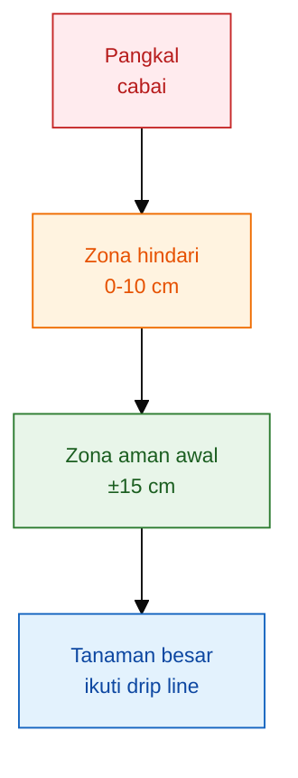

### Panduan praktis jarak pupuk padat

| Umur/fase      |                      Jarak dari pangkal | Cara aplikasi                                 | Catatan                                  |
| -------------- | --------------------------------------: | --------------------------------------------- | ---------------------------------------- |
| 0–14 HST       | Hindari pupuk padat pekat dekat tanaman | Lebih aman kocor ringan bila akar sehat       | Bibit muda sensitif terhadap garam pupuk |
| 15–30 HST      |                               ±10–15 cm | Tugal dangkal/larik samping, lalu tutup tanah | Jangan mengenai batang atau akar utama   |
| 31–60 HST      |                               ±15–20 cm | Larik samping mengikuti barisan tanaman       | Sesuaikan kelembapan tanah               |
| Panen berulang |             ±20 cm atau mengikuti tajuk | Larik samping/drip line                       | Jangan merusak akar saat menugal         |

### Aturan aman

| Kondisi                    | Keputusan                                                      |
| -------------------------- | -------------------------------------------------------------- |
| Tanah sangat kering        | Siram dulu, jangan beri pupuk padat pekat                      |
| Tanah becek                | Tunda aplikasi, benahi drainase                                |
| Akar terlihat rusak        | Hentikan pupuk pekat sementara                                 |
| Mulsa plastik              | Masukkan pupuk melalui lubang aman atau sistem kocor/fertigasi |
| Pupuk mudah larut          | Gunakan dosis kecil dan bertahap                               |
| Pupuk organik belum matang | Jangan diberikan dekat akar                                    |

Kalimat kunci:

> **Pupuk padat membangun cadangan hara di tanah. Pupuk cair kocor memberi hara langsung ke zona akar. Semprot tajuk hanya menjadi suplemen atau aplikasi agen hayati daun, bukan pengganti pemupukan akar. PGPM, MOL, JAKABA, dan agen hayati harus diberikan sesuai targetnya: akar atau tajuk, bukan dicampur sembarangan dalam satu tangki.**

---

## Lampiran 8. Daftar Rujukan Teknis

1. **SOP Cabai Merah — Kementerian Pertanian / GAP Hortikultura**
   Rujukan untuk pH tanah, pengapuran, pupuk kompos, pupuk dasar, pupuk susulan, panen, dan pencatatan pemupukan cabai merah. ([Gaphor Tikultura][1])

2. **Panduan Umum SOP Budidaya Cabai Rawit Hiyung — Direktorat Jenderal Hortikultura, Kementerian Pertanian**
   Rujukan untuk cabai rawit Hiyung, termasuk pemupukan dasar, pemupukan susulan mulai 15 HST, interval aplikasi, dan pemeliharaan tanaman. ([Hortikultura][3])

3. **Panduan PUTK — Kementerian Pertanian / Hortikultura**
   Rujukan untuk pendekatan low-lab, pengambilan contoh tanah, serta pengujian cepat P, K, C-organik, pH, dan kebutuhan kapur. ([Gaphor Tikultura][1])

4. **University of Missouri Extension — Side-Dressing Mid-season Boost for Vegetable Crops**
   Rujukan untuk jarak aman pupuk samping minimal 6 inci dari batang tanaman agar mengurangi risiko fertilizer burn. ([ipm.missouri.edu][2])

5. **University of New Hampshire Extension — Fertilizing Vegetable Gardens**
   Rujukan untuk prinsip penempatan pupuk musim tanam di samping tanaman atau sekitar drip line, serta menghindari kontak langsung dengan pangkal tanaman. ([Extension | University of New Hampshire][4])

6. **University of Maryland Extension — Fertilizing Vegetables dan Fertilizer Burn**
   Rujukan untuk prinsip side-dressing tanaman sayuran dan risiko garam pupuk terhadap akar/daun. ([University of Maryland Extension][5])

7. **Literatur MOL Kementerian Pertanian / E-Publikasi Pertanian**
   Rujukan untuk kehati-hatian dalam menilai mutu MOL karena sifatnya dapat sangat beragam.

8. **Penelitian JAKABA pada cabai rawit**
   Rujukan untuk menempatkan JAKABA sebagai bioinput opsional yang perlu diuji dengan petak kontrol, bukan sebagai pengganti pupuk utama.

---

[1]: https://gaphortikultura.puslithorti.net/wp-content/uploads/2018/12/SOP-Cabai-Merah-2014.pdf?utm_source=chatgpt.com 'SOP-Cabai-Merah-2014.pdf - Good Agricultural Practices'
[2]: https://ipm.missouri.edu/meg/index.cfm?ID=792&utm_source=chatgpt.com "Side-Dressing: Mid-season Boost for 'Hungry' Plants"
[3]: https://hortikultura.pertanian.go.id/wp-content/uploads/2024/11/Panduan-Umum-Standar-Operasional-Prosedur-Budidaya-Cabai-Rawit-Hiyung_watermark.pdf?utm_source=chatgpt.com 'Panduan-Umum-Standar-Operasional-Prosedur-Budidaya ...'
[4]: https://extension.unh.edu/resource/fertilizing-vegetable-gardens-fact-sheet?utm_source=chatgpt.com 'Fertilizing Vegetable Gardens [fact sheet] - UNH Extension'
[5]: https://extension.umd.edu/resource/fertilizing-vegetables?utm_source=chatgpt.com 'Fertilizing Vegetables'

---

<small>
  **_Catatan Penyusunan_** Artikel ini disusun sebagai materi edukasi dan
  referensi umum berdasarkan berbagai sumber pustaka, praktik lapangan, serta
  bantuan alat penulisan. Pembaca disarankan untuk melakukan verifikasi lanjutan
  dan penyesuaian sesuai dengan kondisi serta kebutuhan masing-masing sistem.
</small>
