# **_Rhizosphere Cabai sebagai Zona Strategis PHT: Mengelola Mikrobioma Akar untuk Menekan Penyakit Tular Tanah, Nematoda, dan Stres Tanaman_**

_Pendekatan praktis berbasis mikrobiologi akar, kesehatan tanah, inokulasi mikroba menguntungkan, drainase, nutrisi seimbang, dan pengendalian terpadu pada budidaya cabai._

---

- [**_Rhizosphere Cabai sebagai Zona Strategis PHT: Mengelola Mikrobioma Akar untuk Menekan Penyakit Tular Tanah, Nematoda, dan Stres Tanaman_**](#rhizosphere-cabai-sebagai-zona-strategis-pht-mengelola-mikrobioma-akar-untuk-menekan-penyakit-tular-tanah-nematoda-dan-stres-tanaman)
- [Premis Utama Artikel](#premis-utama-artikel)
- [Struktur Artikel 16 Bab](#struktur-artikel-16-bab)
  - [1. Pendahuluan: Mengapa rhizosphere penting untuk cabai?](#1-pendahuluan-mengapa-rhizosphere-penting-untuk-cabai)
    - [Pokok bahasan](#pokok-bahasan)
    - [Poin tajam](#poin-tajam)
    - [Visual yang disarankan](#visual-yang-disarankan)
  - [2. Definisi dan fundamental rhizosphere](#2-definisi-dan-fundamental-rhizosphere)
    - [2.1 Definisi rhizosphere](#21-definisi-rhizosphere)
    - [2.2 Perbedaan rhizosphere dan phyllosphere](#22-perbedaan-rhizosphere-dan-phyllosphere)
    - [2.3 Mengapa rhizosphere adalah zona biologis paling intens?](#23-mengapa-rhizosphere-adalah-zona-biologis-paling-intens)
  - [3. Mikrobiologi rhizosphere cabai](#3-mikrobiologi-rhizosphere-cabai)
    - [3.1 Kelompok mikroba utama](#31-kelompok-mikroba-utama)
      - [A. Bakteri menguntungkan](#a-bakteri-menguntungkan)
      - [B. Fungi menguntungkan](#b-fungi-menguntungkan)
      - [C. Mikroba biokontrol tanah](#c-mikroba-biokontrol-tanah)
      - [D. Patogen dan organisme pengganggu](#d-patogen-dan-organisme-pengganggu)
    - [3.2 Fungsi mikroba baik](#32-fungsi-mikroba-baik)
    - [3.3 Konsep penting: root colonization dan priority effect](#33-konsep-penting-root-colonization-dan-priority-effect)
  - [4. Faktor yang mempengaruhi rhizosphere: pendukung dan pengganggu](#4-faktor-yang-mempengaruhi-rhizosphere-pendukung-dan-pengganggu)
    - [4.1 Faktor yang mendukung mikroba baik](#41-faktor-yang-mendukung-mikroba-baik)
    - [4.2 Faktor yang mengganggu mikroba baik](#42-faktor-yang-mengganggu-mikroba-baik)
    - [Tabel yang disarankan](#tabel-yang-disarankan)
  - [5. Sumber kebutuhan mikroba di rhizosphere cabai](#5-sumber-kebutuhan-mikroba-di-rhizosphere-cabai)
    - [5.1 Eksudat akar sebagai sumber karbon](#51-eksudat-akar-sebagai-sumber-karbon)
    - [5.2 Sumber nitrogen](#52-sumber-nitrogen)
    - [5.3 Sumber mineral](#53-sumber-mineral)
    - [5.4 Sumber eksternal](#54-sumber-eksternal)
    - [5.5 Peringatan praktis](#55-peringatan-praktis)
  - [6. Zona rhizosphere cabai yang rawan OPT](#6-zona-rhizosphere-cabai-yang-rawan-opt)
    - [6.1 Ujung akar muda](#61-ujung-akar-muda)
    - [6.2 Permukaan akar/rhizoplane](#62-permukaan-akarrhizoplane)
    - [6.3 Pangkal batang dan crown](#63-pangkal-batang-dan-crown)
    - [6.4 Zona akar dalam bedengan](#64-zona-akar-dalam-bedengan)
    - [6.5 Area bawah lubang tanam/mulsa](#65-area-bawah-lubang-tanammulsa)
    - [6.6 Sisa akar tanaman sakit](#66-sisa-akar-tanaman-sakit)
  - [7. OPT dan penyakit penting pada rhizosphere cabai](#7-opt-dan-penyakit-penting-pada-rhizosphere-cabai)
    - [7.1 Penyakit utama](#71-penyakit-utama)
      - [A. Busuk akar dan busuk pangkal oleh _Phytophthora capsici_](#a-busuk-akar-dan-busuk-pangkal-oleh-phytophthora-capsici)
      - [B. Layu bakteri oleh _Ralstonia solanacearum_](#b-layu-bakteri-oleh-ralstonia-solanacearum)
      - [C. Layu fusarium](#c-layu-fusarium)
      - [D. Damping-off](#d-damping-off)
      - [E. Busuk akar kompleks](#e-busuk-akar-kompleks)
    - [7.2 Nematoda dan hama tanah](#72-nematoda-dan-hama-tanah)
      - [A. Nematoda puru akar: _Meloidogyne_ spp.](#a-nematoda-puru-akar-meloidogyne-spp)
      - [B. Larva tanah](#b-larva-tanah)
      - [C. Pupa lalat buah di tanah](#c-pupa-lalat-buah-di-tanah)
  - [8. Upaya IPM/PHT untuk mengantisipasi masalah rhizosphere cabai](#8-upaya-ipmpht-untuk-mengantisipasi-masalah-rhizosphere-cabai)
    - [8.1 Prinsip besar IPM rhizosphere](#81-prinsip-besar-ipm-rhizosphere)
    - [8.2 Pra-tanam](#82-pra-tanam)
    - [8.3 Persemaian](#83-persemaian)
    - [8.4 Setelah pindah tanam](#84-setelah-pindah-tanam)
    - [8.5 Fase vegetatif dan generatif](#85-fase-vegetatif-dan-generatif)
    - [8.6 Akhir musim](#86-akhir-musim)
  - [9. Inokulasi mikroba menguntungkan dalam kerangka IPM rhizosphere](#9-inokulasi-mikroba-menguntungkan-dalam-kerangka-ipm-rhizosphere)
    - [9.1 Posisi mikroba dalam PHT akar](#91-posisi-mikroba-dalam-pht-akar)
    - [9.2 Mikroba untuk penyakit akar cabai](#92-mikroba-untuk-penyakit-akar-cabai)
    - [9.3 Mikroba untuk pertumbuhan dan toleransi stres](#93-mikroba-untuk-pertumbuhan-dan-toleransi-stres)
    - [9.4 Hubungan mikroba akar dengan phyllosphere](#94-hubungan-mikroba-akar-dengan-phyllosphere)
  - [10. Strategi menyeluruh agar inokulasi mikroba rhizosphere berhasil](#10-strategi-menyeluruh-agar-inokulasi-mikroba-rhizosphere-berhasil)
    - [10.1 Pilih mikroba berdasarkan target](#101-pilih-mikroba-berdasarkan-target)
    - [10.2 Aplikasi harus sejak awal](#102-aplikasi-harus-sejak-awal)
    - [10.3 Target aplikasi harus benar](#103-target-aplikasi-harus-benar)
    - [10.4 Kualitas media/tanah](#104-kualitas-mediatanah)
    - [10.5 Kualitas air kocor](#105-kualitas-air-kocor)
    - [10.6 Kompatibilitas pestisida dan pupuk](#106-kompatibilitas-pestisida-dan-pupuk)
    - [10.7 Jangan berlebihan memberi bahan organik mentah](#107-jangan-berlebihan-memberi-bahan-organik-mentah)
    - [10.8 Evaluasi keberhasilan](#108-evaluasi-keberhasilan)
  - [11. Nematoda akar dan strategi biologis](#11-nematoda-akar-dan-strategi-biologis)
    - [11.1 Posisi nematoda dalam rhizosphere](#111-posisi-nematoda-dalam-rhizosphere)
    - [11.2 Strategi IPM nematoda](#112-strategi-ipm-nematoda)
    - [11.3 Mikroba untuk nematoda](#113-mikroba-untuk-nematoda)
    - [11.4 Nematoda entomopatogen vs nematoda parasit tanaman](#114-nematoda-entomopatogen-vs-nematoda-parasit-tanaman)
  - [12. Integrasi mikroba akar, kesehatan tanah, dan pestisida selektif](#12-integrasi-mikroba-akar-kesehatan-tanah-dan-pestisida-selektif)
    - [12.1 Urutan keputusan](#121-urutan-keputusan)
    - [12.2 Pestisida tanah sebagai alat terakhir](#122-pestisida-tanah-sebagai-alat-terakhir)
    - [12.3 Prinsip membangun tanah supresif](#123-prinsip-membangun-tanah-supresif)
  - [13. Kalender PHT rhizosphere cabai](#13-kalender-pht-rhizosphere-cabai)
  - [14. Kesalahan umum dalam pengelolaan rhizosphere cabai](#14-kesalahan-umum-dalam-pengelolaan-rhizosphere-cabai)
  - [15. Checklist lapang untuk praktisi](#15-checklist-lapang-untuk-praktisi)
    - [Checklist mingguan](#checklist-mingguan)
    - [Formula evaluasi sederhana](#formula-evaluasi-sederhana)
  - [16. Kesimpulan artikel](#16-kesimpulan-artikel)
- [Referensi utama yang disarankan untuk artikel rhizosphere](#referensi-utama-yang-disarankan-untuk-artikel-rhizosphere)
  - [Lampiran A. Contoh produk mikroba marketplace untuk aplikasi **rhizosphere cabai**](#lampiran-a-contoh-produk-mikroba-marketplace-untuk-aplikasi-rhizosphere-cabai)
    - [Trichoderma 500 gr Agensia Hayati](#trichoderma-500-gr-agensia-hayati)
      - [Trichoderma umum](#trichoderma-umum)
    - [Trichoderma harzianum 1 Kg Bio Fungisida Hayati](#trichoderma-harzianum-1-kg-bio-fungisida-hayati)
      - [T. harzianum](#t-harzianum)
    - [Trichoderma koningii Saco P WP 1 Kg](#trichoderma-koningii-saco-p-wp-1-kg)
      - [T. koningii](#t-koningii)
    - [TRICOBA 500 g Trichoderma GLIO](#tricoba-500-g-trichoderma-glio)
      - [Tricho + Gliocladium](#tricho--gliocladium)
    - [PGPR Rhizobium sp Trichoderma harzianum](#pgpr-rhizobium-sp-trichoderma-harzianum)
      - [PGPR campuran](#pgpr-campuran)
    - [Pupuk Hayati Cair Pseudomonas fluorescens Flora One](#pupuk-hayati-cair-pseudomonas-fluorescens-flora-one)
      - [Pseudomonas](#pseudomonas)
    - [Micobio Pupuk Hayati Mikoriza 1 Kg](#micobio-pupuk-hayati-mikoriza-1-kg)
      - [Mikoriza](#mikoriza)
    - [Mycogrow Pupuk Hayati Mikoriza 1 Kg](#mycogrow-pupuk-hayati-mikoriza-1-kg)
      - [Mikoriza](#mikoriza-1)
    - [Fumyco Pupuk Mikoriza 1 Kg](#fumyco-pupuk-mikoriza-1-kg)
      - [Mikoriza](#mikoriza-2)
    - [Pupuk Hayati PSB Bakteri Pelarut Fosfat](#pupuk-hayati-psb-bakteri-pelarut-fosfat)
      - [Pelarut fosfat](#pelarut-fosfat)
    - [Tabel Lampiran A. Produk mikroba untuk rhizosphere cabai](#tabel-lampiran-a-produk-mikroba-untuk-rhizosphere-cabai)
  - [Rangkuman berdasarkan fungsi](#rangkuman-berdasarkan-fungsi)
  - [Catatan teknis untuk artikel](#catatan-teknis-untuk-artikel)

---

# Premis Utama Artikel

Rhizosphere cabai bukan sekadar tanah di sekitar akar, tetapi **zona biologis aktif** tempat akar, eksudat, mikroba, air, hara, patogen, nematoda, dan bahan organik saling berinteraksi. Jika phyllosphere adalah “medan tempur” pada bagian atas tanaman, maka rhizosphere adalah **pusat kendali bawah tanah** yang menentukan daya serap, ketahanan, vigor, dan stabilitas tanaman.

<ResourceBox
  title="Artikel Terkait:"
  items={[
    {
      name: 'Isolasi Mikroba Lokal untuk PGPM dan Agen Pengendali Hayati (APH)',
      href: '/blog/agri/agen-hayati/isolasi-mikroba-lokal',
    },
    {
      name: 'OPT Penggagal Panen pada Cabai Rawit dan Cabai Besar',
      href: '/blog/agri/kebon/pengendalian-opt-cabai',
    },
    {
      name: 'Tipuan Mikroba dalam Pertanian: Trichoderma, PGPR, PGPM, PGPF, MOL, dan JAKABA',
      href: '/blog/agri/agen-hayati/tipuan-mikroba-pertanian',
    },
    {
      name: 'Bioaktivator Rizosfer Bambu Kaya Silikat',
      href: '/blog/agri/kebon/biaktivator-rizosfer-bambu',
    },
    {
      name: 'Panduan Praktis Pembiakan Trichoderma dari Starter Komersial',
      href: '/blog/agri/agen-hayati/trichoderma-pembiakan',
    },
    {
      name: 'Keseimbangan Akar dan Tajuk: Fondasi Tanaman Sehat, Produktif, dan Tidak Terjebak Tipuan Input',
      href: '/blog/agri/kebon/keseimbangan-akar-dan-tajuk',
    },
    {
      name: 'Phyllosphere Cabai sebagai Zona Strategis PHT: Mengelola Mikroba Daun untuk Menekan OPT, Penyakit, dan Risiko Gagal Panen',
      href: '/blog/agri/kebon/phyllosphere-cabai-ipm',
    },
    {
      name: 'Membangun Rizosfer Cabai yang Tangguh dengan Mikroba dari Rumpun Bambu',
      href: '/blog/agri/kebon/rizosphere-cabai-tangguh-rumpun-bambu',
    },
    {
      name: 'Menanam Cabai dengan Prinsip Pohon Bambu: Akar Kuat, Tanah Hidup, Tanaman Tahan Stres',
      href: '/blog/agri/kebon/budidaya-cabai-prinsip-rumpun-bambu',
    },
    {
      name: 'Panduan Lengkap Pengendalian Lalat Buah di Kebun Campuran',
      href: '/blog/agri/kebon/lalat-buah-ipm',
    },
    {
      name: 'README - Pupuk Tepat, Panen Untung - Model Low-Lab untuk Petani Makmur di Gambiran',
      href: '/blog/agri/pupuk-terintegrasi/README',
    },
  ]}
/>

Dalam kerangka PHT/IPM, tujuan utama pengelolaan rhizosphere bukan “mensterilkan tanah”, tetapi **membangun ekosistem akar yang sehat** agar mikroba menguntungkan, struktur tanah baik, drainase, dan keseimbangan nutrisi lebih dominan dibanding patogen tular tanah. IPM dipahami FAO sebagai pendekatan yang mengintegrasikan strategi biologis, kimia, fisik, dan budidaya untuk menumbuhkan tanaman sehat sekaligus meminimalkan penggunaan pestisida dan risikonya bagi manusia serta lingkungan. ([FAOHome][1])

Premis utama artikel ini adalah bahwa **akar cabai adalah fondasi kesehatan seluruh tanaman**. Tajuk yang tampak hijau, bunga yang kuat, buah yang besar, dan phyllosphere yang stabil tidak dapat dipisahkan dari rhizosphere yang sehat. Bila akar rusak, maka serapan air dan hara terganggu, keseimbangan hormon berubah, tanaman mudah stres, dan bagian atas tanaman menjadi lebih rentan terhadap OPT.

Dalam budidaya cabai, gejala di atas tanah sering kali hanya “sinyal akhir” dari masalah yang dimulai di bawah tanah. Tanaman yang layu, pucuk lemah, daun menguning, bunga gugur, buah kecil, dan produktivitas turun tidak selalu disebabkan oleh kekurangan pupuk atau serangan hama daun. Masalah tersebut bisa berasal dari akar yang busuk, media yang terlalu basah, salinitas tinggi, nematoda, patogen tanah, atau mikrobioma akar yang tidak seimbang.

Karena itu, artikel ini menggunakan kerangka berpikir berikut:

1. **Rhizosphere adalah zona hidup, bukan media mati.**
   Tanah atau media di sekitar akar tidak boleh dilihat hanya sebagai tempat berdiri tanaman. Di sana ada interaksi biologis yang menentukan apakah akar tumbuh sehat atau justru dikuasai patogen.

2. **Akar sehat adalah dasar PHT cabai.**
   PHT yang hanya fokus pada daun dan buah akan kurang lengkap bila akar tidak diperbaiki. Tanaman dengan akar lemah lebih mudah terserang OPT, lebih sulit pulih, dan lebih boros input.

3. **Mikroba akar harus dikelola secara sistemik.**
   Mikroba seperti PGPR, _Trichoderma_, _Bacillus_, _Pseudomonas_, mikoriza, dan mikroba antagonis nematoda tidak cukup hanya “dikocor”. Mereka harus ditempatkan pada waktu, zona, media, dan kondisi lingkungan yang tepat.

4. **Tanah steril bukan tujuan.**
   Tujuan PHT rhizosphere bukan membunuh semua organisme tanah, melainkan membangun lingkungan akar yang **seimbang, aeratif, kaya mikroba baik, dan supresif terhadap patogen**.

5. **Rhizosphere dan phyllosphere saling berhubungan.**
   Akar yang sehat mendukung daun sehat. Sebaliknya, tajuk yang stres sering mencerminkan akar yang bermasalah. Maka, PHT cabai modern harus membaca tanaman sebagai satu sistem utuh.

[**Kembali ke Atas**](#rhizosphere-cabai-sebagai-zona-strategis-pht-mengelola-mikrobioma-akar-untuk-menekan-penyakit-tular-tanah-nematoda-dan-stres-tanaman)

---

## 1. Pendahuluan: Mengapa rhizosphere penting untuk cabai?

Cabai adalah tanaman yang sangat responsif terhadap kondisi akar. Sistem akar menentukan kemampuan tanaman menyerap air, nitrogen, fosfor, kalium, kalsium, magnesium, unsur mikro, serta sinyal biologis yang memengaruhi pertumbuhan tajuk. Ketika akar sehat, tanaman lebih stabil menghadapi panas, kekeringan ringan, tekanan hama, dan penyakit. Namun ketika akar terganggu, gejala di tajuk sering muncul cepat: daun layu, pucuk mengecil, bunga gugur, buah tidak berkembang, dan tanaman lebih mudah terserang OPT.

Rhizosphere menjadi penting karena akar tidak bekerja sendirian. Di sekitar akar terdapat komunitas mikroba yang sangat aktif. Sebagian mikroba membantu tanaman, sebagian netral, dan sebagian lain merugikan. Mikroba baik dapat membantu pelarutan hara, produksi fitohormon, induksi ketahanan, kompetisi dengan patogen, dan perbaikan struktur tanah. Sebaliknya, patogen tular tanah seperti _Phytophthora_, _Ralstonia_, _Fusarium_, _Pythium_, _Rhizoctonia_, serta nematoda puru akar dapat melemahkan atau menghancurkan sistem akar.

Banyak masalah di tajuk cabai sebenarnya bermula dari akar. Tanaman yang tampak layu saat siang hari sering langsung dianggap kekurangan air. Padahal, pada banyak kasus, akar justru sedang rusak sehingga tidak mampu menyerap air. Bila petani menambah air tanpa diagnosis, tanah menjadi makin basah, oksigen akar turun, dan patogen seperti _Phytophthora_ atau _Pythium_ semakin diuntungkan. Inilah alasan mengapa PHT rhizosphere harus dimulai dari diagnosis akar, bukan hanya melihat daun.

Dalam sistem cabai, rhizosphere juga menentukan keberhasilan aplikasi input. Pupuk yang diberikan tidak akan efisien bila akar rusak. Mikroba yang dikocor tidak akan bekerja bila media terlalu panas, terlalu asam, terlalu asin, terlalu anaerob, atau penuh residu pestisida keras. Fungisida tanah juga tidak akan menyelesaikan masalah bila drainase buruk dan sisa akar sakit tetap dibiarkan di lahan.

Secara ilmiah, rhizosphere dipahami sebagai wilayah interaksi antara akar tanaman, organisme tanah, nutrisi, dan air. Jurnal _Rhizosphere_ mendefinisikan cakupan bidang ini sebagai studi interaksi antara akar tanaman, organisme tanah, hara, dan air; selain karbon dari fotosintesis, tanaman memperoleh unsur lain terutama dari tanah melalui akar. ([ScienceDirect][2])

Bagi praktisi cabai, pemahaman ini berarti satu hal: **akar adalah pusat keputusan budidaya**. Pengelolaan benih, media semai, bedengan, drainase, bahan organik, mikroba, rotasi, pestisida tanah, dan sanitasi akar harus disusun dalam satu sistem PHT.

### Poin tajam yang perlu ditekankan

- **Akar sehat adalah fondasi phyllosphere sehat.**
  Daun, pucuk, bunga, dan buah tidak akan stabil bila akar tidak mampu menopang air, hara, dan ketahanan tanaman.

- **Tanah steril bukan tujuan.**
  Tanah yang terlalu sering “dihabisi” dengan bahan keras bisa kehilangan mikroba bermanfaat. Yang dicari adalah rhizosphere yang seimbang dan supresif terhadap patogen.

- **Mikroba akar harus masuk dalam sistem PHT.**
  PGPR, _Trichoderma_, mikoriza, dan mikroba antagonis lain bukan sekadar produk tambahan, melainkan bagian dari strategi pencegahan sejak benih, persemaian, pindah tanam, dan pemeliharaan akar.

- **Drainase adalah bagian dari biokontrol.**
  Mikroba baik sulit bekerja pada tanah yang becek, padat, dan kekurangan oksigen. Perbaikan fisik tanah sering lebih penting daripada menambah produk.

- **Gejala tajuk harus dibaca bersama kondisi akar.**
  Layu, keriting, gugur bunga, dan pertumbuhan lambat tidak selalu berasal dari daun; sering kali akar adalah sumber masalahnya.

### Diagram: posisi rhizosphere dalam keputusan PHT cabai

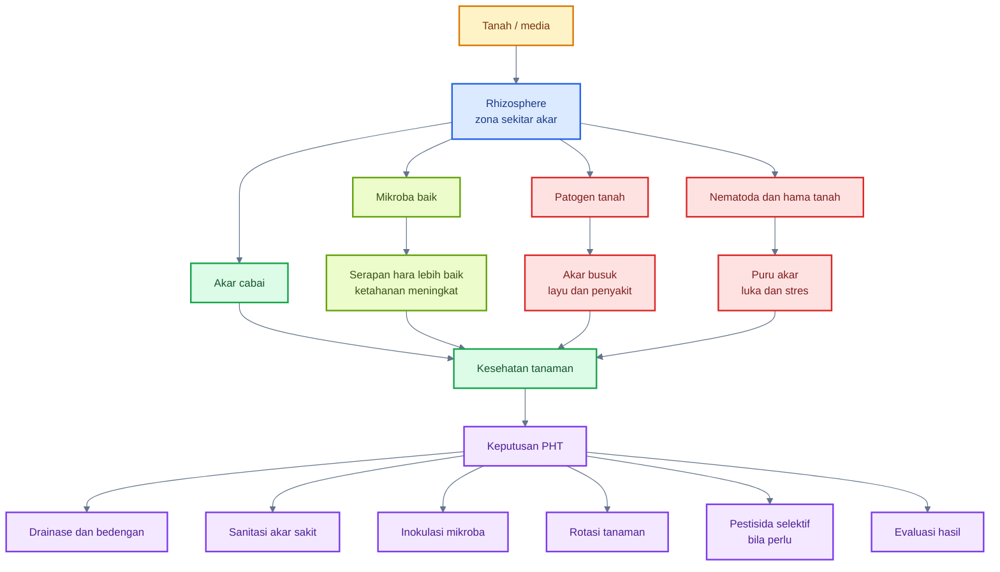

### Implikasi praktis bagi budidaya cabai

Dalam praktik lapang, rhizosphere penting karena banyak keputusan budidaya harus diarahkan ke akar sejak awal. Misalnya, pemilihan media semai tidak cukup hanya melihat tekstur yang gembur, tetapi juga kebersihan patogen, kematangan bahan organik, pH, EC, dan kemampuan drainase. Bedengan tidak cukup hanya tinggi, tetapi harus mampu mengalirkan air setelah hujan. Aplikasi mikroba tidak cukup hanya dikocor, tetapi harus mengenai zona akar aktif dan dilakukan sebelum akar rusak berat.

Pada cabai, rhizosphere harus dipandang sebagai sistem yang memiliki tiga lapisan utama:

1. **Lapisan fisik**, yaitu struktur tanah, aerasi, kelembapan, drainase, kepadatan, dan suhu tanah.
2. **Lapisan kimia**, yaitu pH, EC, ketersediaan hara, salinitas, residu pupuk, dan keseimbangan ion.
3. **Lapisan biologis**, yaitu akar, eksudat, mikroba baik, patogen, nematoda, larva tanah, dan bahan organik.

Ketiga lapisan ini saling memengaruhi. Tanah yang terlalu padat menurunkan oksigen akar dan menekan mikroba aerob. Pemupukan terlalu pekat menaikkan EC dan merusak ujung akar muda. Bahan organik belum matang dapat menciptakan kondisi anaerob dan fitotoksik. Drainase buruk membuat patogen air lebih mudah berkembang. Sebaliknya, tanah yang remah, cukup oksigen, kaya bahan organik matang, dan dihuni mikroba menguntungkan akan lebih mendukung akar sehat.

Karena itu, PHT rhizosphere bukan hanya program “anti-layu”. Ia adalah strategi membangun akar yang kuat sehingga tanaman lebih tahan terhadap tekanan dari bawah tanah dan lebih stabil menghadapi OPT di bagian atas tanaman.

[**Kembali ke Atas**](#rhizosphere-cabai-sebagai-zona-strategis-pht-mengelola-mikrobioma-akar-untuk-menekan-penyakit-tular-tanah-nematoda-dan-stres-tanaman)

---

## 2. Definisi dan fundamental rhizosphere

<figure>
  
  <figcaption>
    Ilustrasi rhizosphere tanaman cabai dalam pendekatan IPM, mencakup interaksi
    akar, mikroorganisme tanah, unsur hara, kelembapan, dan kesehatan tanaman.
  </figcaption>
</figure>

### 2.1 Definisi rhizosphere

**Rhizosphere** atau **rizosfer** adalah zona tanah atau media di sekitar akar yang secara langsung dipengaruhi oleh aktivitas akar, terutama eksudat akar, penyerapan hara, perubahan pH mikro, serta aktivitas mikroorganisme. Zona ini bukan tanah biasa. Rhizosphere adalah wilayah dengan aktivitas biologis, kimia, dan fisik yang jauh lebih intens dibanding tanah yang tidak dipengaruhi akar.

Beberapa istilah penting perlu dibedakan sejak awal:

- **Rhizosphere/rizosfer**: zona tanah atau media yang dipengaruhi langsung oleh akar, eksudat akar, dan mikroorganisme.
- **Rhizoplane**: permukaan akar, yaitu area kontak langsung antara akar dan tanah/media.
- **Endorhizosphere**: bagian dalam jaringan akar yang dapat dihuni mikroba endofit.
- **Root microbiome**: komunitas mikroba yang hidup pada akar, permukaan akar, dan tanah di sekitar akar.
- **Bulk soil**: tanah di luar pengaruh langsung akar.

Secara praktis, rhizosphere adalah “ruang negosiasi” antara tanaman dan tanah. Tanaman melepaskan eksudat akar untuk memengaruhi lingkungan sekitarnya. Mikroba merespons eksudat tersebut dengan datang, tumbuh, bersaing, atau membantu tanaman. Patogen dan nematoda juga memanfaatkan sinyal akar untuk menemukan inang. Hara berubah bentuk karena aktivitas akar dan mikroba. Air bergerak mengikuti struktur tanah, pori, dan penyerapan akar.

Nature Scitable menggambarkan rhizosphere sebagai bagian yang sangat aktif dari batas akar-tanah, tempat proses biogeokimia penting terjadi dan berpengaruh pada skala lanskap hingga global. ([Nature][3])

Dalam budidaya cabai, definisi ini penting karena sebagian besar masalah akar terjadi bukan hanya karena “tanah jelek”, tetapi karena interaksi yang tidak seimbang di rhizosphere. Misalnya, akar cabai yang mengeluarkan eksudat dapat menarik mikroba baik, tetapi juga dapat menarik patogen atau nematoda. Bila lingkungan mendukung mikroba baik, akar lebih terlindungi. Bila lingkungan mendukung patogen, penyakit akan lebih mudah berkembang.

### Rhizosphere sebagai zona gradien

Rhizosphere tidak memiliki batas tegas seperti dinding. Ia adalah zona gradien. Semakin dekat ke permukaan akar, pengaruh akar semakin kuat. Semakin jauh dari akar, pengaruh akar semakin melemah dan tanah lebih mendekati kondisi bulk soil.

Secara sederhana:

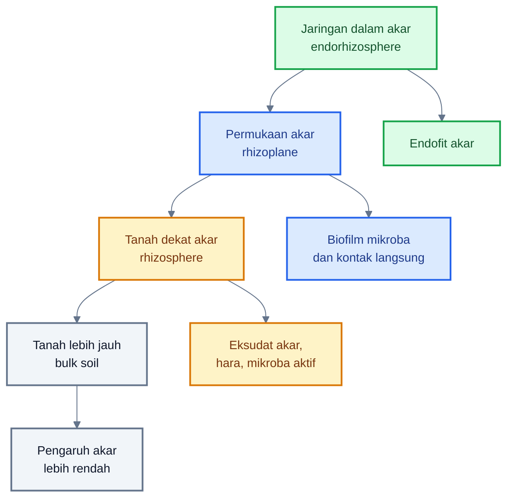

Zona terdekat dengan akar biasanya paling kaya eksudat dan paling aktif secara mikrobiologis. Di sinilah PGPR, _Trichoderma_, mikoriza, bakteri pelarut fosfat, dan mikroba antagonis patogen perlu ditempatkan. Aplikasi mikroba yang tidak sampai ke zona akar aktif akan jauh lebih lemah dampaknya.

---

### 2.2 Perbedaan rhizosphere dan phyllosphere

Rhizosphere dan phyllosphere sama-sama merupakan habitat mikroba tanaman, tetapi keduanya sangat berbeda. Rhizosphere berada di sekitar akar, sedangkan phyllosphere berada pada bagian tanaman di atas tanah seperti daun, batang, bunga, dan buah.

Perbedaannya penting karena strategi mikroba untuk akar tidak bisa disamakan dengan strategi mikroba untuk daun. Mikroba yang bagus untuk daun belum tentu bisa hidup baik di tanah. Sebaliknya, mikroba yang sangat bagus di tanah belum tentu kuat di permukaan daun yang panas, kering, dan terpapar UV.

| Aspek          | Rhizosphere                                | Phyllosphere                         |
| -------------- | ------------------------------------------ | ------------------------------------ |
| Lokasi         | Sekitar akar                               | Daun, batang, bunga, buah            |
| Sumber makanan | Eksudat akar relatif tinggi                | Eksudat daun rendah dan tidak merata |
| Kondisi        | Lebih lembap, gelap, kaya interaksi tanah  | Terpapar UV, kering, suhu fluktuatif |
| Mikroba utama  | PGPR, fungi tanah, mikoriza, _Trichoderma_ | Bakteri epifit, ragi, fungi daun     |
| OPT utama      | Patogen tanah, nematoda, larva tanah       | Hama pengisap, patogen daun/buah     |
| Aplikasi       | Kocor, seed treatment, campur media        | Semprot foliar                       |

Perbedaan ini melahirkan implikasi teknis:

1. **Aplikasi rhizosphere harus mencapai akar.**
   Produk mikroba akar sebaiknya diaplikasikan melalui perlakuan benih, media semai, lubang tanam, kocor pangkal, atau fertigation yang mencapai zona akar.

2. **Aplikasi phyllosphere harus mencapai permukaan tanaman.**
   Produk mikroba foliar harus disemprot ke pucuk, bawah daun, bunga, kelopak, dan buah muda.

3. **Mikroba tanah membutuhkan media yang mendukung.**
   _Trichoderma_, PGPR, mikoriza, dan bakteri pelarut fosfat tidak akan optimal bila tanah terlalu asin, terlalu basah, terlalu panas, atau penuh residu bahan kimia keras.

4. **Mikroba daun membutuhkan perlindungan dari UV dan kekeringan.**
   Ini menjelaskan mengapa aplikasi foliar biasanya lebih baik pagi atau sore.

5. **Keduanya harus diintegrasikan.**
   Cabai yang sehat membutuhkan rhizosphere dan phyllosphere yang sama-sama stabil. Akar sehat mendukung daun sehat; daun sehat mendukung fotosintesis dan eksudat akar.

### Diagram hubungan rhizosphere dan phyllosphere pada cabai

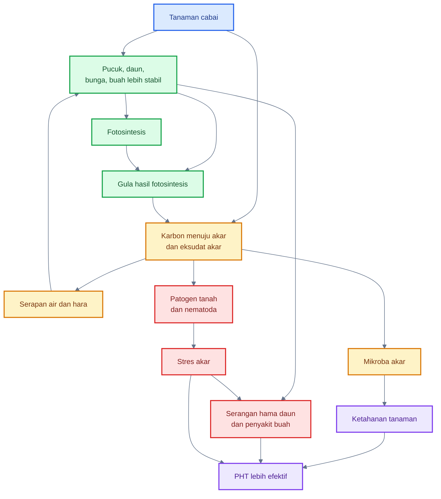

Diagram tersebut menunjukkan bahwa rhizosphere dan phyllosphere tidak berdiri sendiri. Fotosintesis di daun menghasilkan karbon yang sebagian dialirkan ke akar dan dilepas sebagai eksudat. Eksudat akar membentuk komunitas mikroba rhizosphere. Sebaliknya, akar yang sehat menyediakan air dan hara untuk mempertahankan pucuk, bunga, dan buah. Bila akar terganggu, phyllosphere ikut lemah.

---

### 2.3 Mengapa rhizosphere adalah zona biologis paling intens?

Rhizosphere disebut sebagai salah satu zona biologis paling intens karena di sinilah akar tanaman, mikroba, hara, air, oksigen, bahan organik, patogen, dan nematoda berinteraksi dalam jarak sangat dekat. Akar tidak hanya menyerap hara; akar juga mengubah lingkungan sekitarnya.

#### 1. Akar melepaskan eksudat

Akar cabai melepaskan berbagai senyawa organik ke lingkungan sekitar. Senyawa ini dapat berupa gula, asam amino, asam organik, fenolik, enzim, mucilage, dan sel akar yang terlepas. Eksudat akar menjadi sumber energi bagi mikroba rhizosphere.

Dalam konteks praktis, eksudat akar adalah alasan mengapa zona sekitar akar lebih aktif dibanding tanah biasa. Mikroba berkumpul di sana karena ada makanan. Patogen dan nematoda juga bisa tertarik oleh sinyal kimia akar.

#### 2. Eksudat menarik mikroba

Eksudat akar dapat mengundang mikroba menguntungkan, mikroba netral, maupun patogen. Mikroba menguntungkan seperti PGPR, _Bacillus_, _Pseudomonas_, _Trichoderma_, dan mikoriza dapat membantu akar. Namun patogen tanah juga dapat menggunakan sinyal akar untuk menemukan inang.

Ini berarti rhizosphere adalah **zona kompetisi**. Yang penting bukan hanya ada mikroba, tetapi mikroba mana yang lebih dominan dan lebih dulu mengolonisasi akar.

#### 3. Mikroba memengaruhi ketersediaan hara

Mikroba rhizosphere dapat memengaruhi ketersediaan hara melalui pelarutan fosfat, mineralisasi bahan organik, produksi siderofor, fiksasi nitrogen oleh kelompok tertentu, dan perubahan pH mikro. ScienceDirect menjelaskan rhizosphere sebagai zona kritis tempat akar mengakses air dan nutrisi serta berinteraksi erat dengan komponen fisik, kimia, dan biotik tanah; proses rhizosphere berperan dalam mobilisasi nutrisi dan akuisisi hara tanaman. ([ScienceDirect][4])

Bagi cabai, ini sangat penting karena kebutuhan hara tinggi, terutama pada fase vegetatif aktif, berbunga, dan pembentukan buah. Bila mikrobioma akar mendukung, efisiensi hara dapat lebih baik. Bila mikrobioma terganggu, pupuk yang diberikan belum tentu terserap optimal.

#### 4. Patogen dan nematoda juga tertarik ke akar

Akar adalah sumber nutrisi dan tempat masuk yang menarik bagi patogen tanah. Patogen seperti _Phytophthora_, _Pythium_, _Fusarium_, _Rhizoctonia_, _Sclerotium_, dan _Ralstonia_ dapat memanfaatkan akar yang lemah, luka, atau lingkungan yang terlalu basah. Nematoda puru akar juga menyerang jaringan akar dan mengganggu serapan air serta hara.

Karena itu, pengelolaan rhizosphere bukan hanya menambah mikroba baik, tetapi juga mengurangi faktor yang menguntungkan patogen:

- genangan;
- tanah padat;
- bahan organik belum matang;
- salinitas tinggi;
- akar luka;
- monokultur;
- sisa akar sakit;
- drainase buruk.

#### 5. Zona akar menentukan daya tahan tanaman terhadap stres

Rhizosphere yang sehat membantu tanaman menghadapi stres. Akar yang aktif dan dikelilingi mikroba menguntungkan lebih mampu menyerap air, menyeimbangkan nutrisi, dan merespons tekanan lingkungan. Sebaliknya, akar yang rusak membuat tanaman mudah layu, walaupun air tersedia.

Stres akar juga memengaruhi bagian atas tanaman. Pucuk bisa lebih kecil, daun mudah menguning, bunga gugur, dan buah tidak maksimal. Kondisi ini membuat tanaman lebih rentan terhadap OPT di phyllosphere.

### Diagram: mengapa rhizosphere sangat aktif

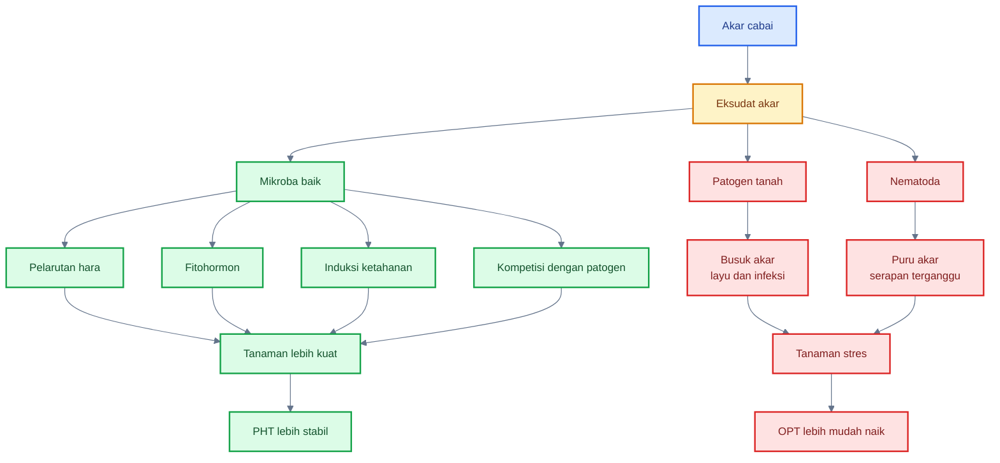

### Prinsip fundamental rhizosphere untuk praktisi cabai

Ada beberapa prinsip dasar yang perlu dipegang sebelum masuk ke strategi teknis.

#### 1. Rhizosphere sehat tidak dibangun dalam satu kali kocor

Mikroba membutuhkan waktu untuk berkolonisasi. Mereka harus bertahan hidup, bersaing, menempel pada akar, dan beradaptasi dengan kondisi tanah. Karena itu, program mikroba akar harus dimulai sejak benih atau persemaian, bukan menunggu tanaman layu berat.

#### 2. Mikroba baik membutuhkan rumah yang layak

Produk mikroba sebagus apa pun sulit bekerja bila media terlalu becek, panas, asin, atau anaerob. Tanah remah, cukup oksigen, kelembapan stabil, bahan organik matang, dan pH sesuai adalah “rumah” bagi mikroba baik.

#### 3. Drainase adalah bagian dari kesehatan mikrobiologi

Drainase buruk menurunkan oksigen akar dan mengubah komunitas mikroba. Patogen yang menyukai kondisi basah akan lebih mudah berkembang. Maka, bedengan, parit, mulsa, dan manajemen irigasi adalah bagian dari strategi mikrobiologi rhizosphere.

#### 4. Eksudat akar bisa menguntungkan dan merugikan

Eksudat memberi makan mikroba baik, tetapi juga dapat dimanfaatkan patogen dan nematoda. Karena itu, akar muda yang aktif harus “ditemani” mikroba menguntungkan sejak awal agar patogen tidak lebih dulu menguasai rhizoplane.

#### 5. Sanitasi akar sakit penting untuk musim berikutnya

Sisa akar sakit dapat menjadi sumber inokulum. Tanaman yang mati karena layu, busuk akar, atau nematoda tidak sebaiknya dibiarkan membusuk begitu saja di lahan. Akhir musim adalah fase penting untuk memutus siklus patogen tanah.

---

## Ringkasan praktis Bab 1 dan Bab 2

Rhizosphere cabai adalah zona biologis aktif yang menentukan kesehatan akar, efisiensi hara, ketahanan tanaman, dan stabilitas produksi. Rhizosphere berbeda dari phyllosphere karena berada di sekitar akar, lebih lembap, lebih gelap, kaya eksudat akar, dan dihuni mikroba tanah seperti PGPR, _Trichoderma_, mikoriza, serta patogen tular tanah.

Dalam PHT cabai, rhizosphere harus dipahami sebagai pusat kendali bawah tanah. Akar sehat mendukung phyllosphere sehat. Tanah steril bukan tujuan; yang dicari adalah rizosfer seimbang, aeratif, kaya mikroba baik, dan kurang mendukung patogen. Mikroba akar harus diaplikasikan sejak awal, pada zona yang benar, dan didukung drainase, bahan organik matang, pH/EC sesuai, serta sanitasi tanaman sakit.

Prinsip kuncinya:

> Rhizosphere cabai bukan sekadar tempat akar berada, tetapi arena biologis yang menentukan apakah tanaman dikuasai mikroba baik, patogen tanah, atau nematoda.

[1]: https://www.fao.org/pest-and-pesticide-management/ipm/integrated-pest-management/en/?utm_source=chatgpt.com 'Integrated Pest Management (IPM)'
[2]: https://www.sciencedirect.com/journal/rhizosphere?utm_source=chatgpt.com 'Rhizosphere | Journal | ScienceDirect.com by Elsevier'
[3]: https://www.nature.com/scitable/knowledge/library/the-rhizosphere-roots-soil-and-67500617/?utm_source=chatgpt.com 'The Rhizosphere - Roots, Soil and Everything In Between'
[4]: https://www.sciencedirect.com/topics/agricultural-and-biological-sciences/rhizosphere?utm_source=chatgpt.com 'Rhizosphere - an overview'

[**Kembali ke Atas**](#rhizosphere-cabai-sebagai-zona-strategis-pht-mengelola-mikrobioma-akar-untuk-menekan-penyakit-tular-tanah-nematoda-dan-stres-tanaman)

---

## 3. Mikrobiologi rhizosphere cabai

Mikrobiologi rhizosphere cabai membahas komunitas mikroba yang hidup di sekitar akar, permukaan akar, dan sebagian di dalam jaringan akar. Komunitas ini sangat menentukan apakah akar cabai menjadi kuat, aktif, dan terlindungi, atau justru menjadi rentan terhadap busuk akar, layu, nematoda, dan stres lingkungan.

<figure>
  
  <figcaption>
    Ilustrasi rhizosphere tanaman cabai dalam pendekatan IPM, mencakup interaksi
    akar, mikroorganisme tanah, unsur hara, kelembapan, dan kesehatan tanaman.
  </figcaption>
</figure>

Berbeda dengan phyllosphere yang miskin nutrisi dan terpapar UV, rhizosphere relatif lebih kaya sumber makanan karena akar melepaskan eksudat. Eksudat ini menarik mikroba menguntungkan, tetapi juga dapat menarik patogen dan nematoda. Karena itu, rhizosphere adalah **arena kompetisi bawah tanah**.

Dalam PHT cabai, mikrobiologi rhizosphere penting karena banyak masalah besar dimulai dari akar: _Phytophthora capsici_, _Ralstonia solanacearum_, _Fusarium oxysporum_, _Pythium_, _Rhizoctonia_, _Sclerotium_, dan nematoda puru akar _Meloidogyne_ spp. Jika mikroba baik lebih dulu menguasai akar dan lingkungan sekitarnya, peluang patogen untuk berkembang dapat ditekan.

### Diagram ringkas: kelompok mikroba dan organisme penting di rhizosphere cabai

```mermaid
%%{init: {
  "theme": "base",
  "themeVariables": {
    "background": "#ffffff",
    "primaryColor": "#F8FAFC",
    "primaryTextColor": "#0F172A",
    "primaryBorderColor": "#64748B",
    "lineColor": "#64748B",
    "fontSize": "14px"
  }
}}%%
flowchart TB
    A[Rhizosphere cabai] --> B[Bakteri<br/>menguntungkan]
    A --> C[Fungi<br/>menguntungkan]
    A --> D[Mikroba<br/>biokontrol tanah]
    A --> E[Patogen dan<br/>organisme pengganggu]

    B --> B1[Bacillus]
    B --> B2[Pseudomonas]
    B --> B3[Azospirillum]
    B --> B4[Azotobacter]
    B --> B5[Paenibacillus]
    B --> B6[Streptomyces]

    C --> C1[Trichoderma]
    C --> C2[Mikoriza arbuskular<br/>AMF]
    C --> C3[Gliocladium]
    C --> C4[Fungi endofit akar]

    D --> D1[Bacillus<br/>untuk patogen akar]
    D --> D2[Pseudomonas<br/>kompetisi dan siderofor]
    D --> D3[Trichoderma<br/>antagonis fungi patogen]
    D --> D4[Purpureocillium<br/>untuk nematoda]
    D --> D5[Metarhizium / Beauveria<br/>untuk hama tanah tertentu]

    E --> E1[Phytophthora capsici]
    E --> E2[Ralstonia solanacearum]
    E --> E3[Fusarium oxysporum]
    E --> E4[Pythium]
    E --> E5[Rhizoctonia]
    E --> E6[Sclerotium]
    E --> E7[Meloidogyne spp.]

    classDef pusat fill:#DBEAFE,stroke:#2563EB,color:#1E3A8A,stroke-width:2px;
    classDef bakteri fill:#DCFCE7,stroke:#16A34A,color:#14532D,stroke-width:2px;
    classDef fungi fill:#E0E7FF,stroke:#4F46E5,color:#312E81,stroke-width:2px;
    classDef biokontrol fill:#FEF3C7,stroke:#D97706,color:#78350F,stroke-width:2px;
    classDef patogen fill:#FEE2E2,stroke:#DC2626,color:#7F1D1D,stroke-width:2px;
    classDef mikro fill:#F8FAFC,stroke:#64748B,color:#0F172A,stroke-width:1.5px;

    class A pusat;
    class B,B1,B2,B3,B4,B5,B6 bakteri;
    class C,C1,C2,C3,C4 fungi;
    class D,D1,D2,D3,D4,D5 biokontrol;
    class E,E1,E2,E3,E4,E5,E6,E7 patogen;
```

---

### 3.1 Kelompok mikroba utama

#### A. Bakteri menguntungkan

Bakteri menguntungkan di rhizosphere sering disebut **PGPR** atau _plant growth-promoting rhizobacteria_. Kelompok ini dapat membantu tanaman melalui beberapa mekanisme, seperti pelarutan fosfat, produksi fitohormon, fiksasi nitrogen oleh kelompok tertentu, produksi siderofor, kompetisi dengan patogen, dan induksi ketahanan sistemik. Review tentang bakteri rhizosphere menjelaskan bahwa PGPR dapat berperan dalam promosi pertumbuhan tanaman, biokontrol, perbaikan nutrisi, dan peningkatan toleransi stres. ([PMC][1])

##### 1. _Bacillus_

_Bacillus_ adalah salah satu bakteri paling penting untuk rhizosphere cabai karena banyak spesiesnya mampu membentuk spora. Spora membuat _Bacillus_ relatif lebih tahan terhadap penyimpanan, kekeringan, fluktuasi suhu, dan kondisi lapang yang tidak ideal. Dalam rhizosphere, _Bacillus_ dapat berperan sebagai PGPR sekaligus agen biokontrol.

Fungsi utama _Bacillus_ pada cabai:

- berkompetisi dengan patogen di sekitar akar;
- menghasilkan metabolit antimikroba;
- menghasilkan enzim yang menghambat patogen;
- membantu induksi ketahanan sistemik;
- mendukung pertumbuhan akar;
- membantu tanaman menghadapi stres.

Dalam praktik, _Bacillus_ cocok digunakan sejak benih, media semai, atau kocor awal setelah tanam. Namun efektivitasnya tetap bergantung pada strain, formulasi, populasi hidup, dan kondisi tanah.

##### 2. _Pseudomonas_

_Pseudomonas_ dikenal sebagai bakteri rhizosphere yang kuat dalam kompetisi hara, terutama melalui produksi siderofor. Siderofor adalah senyawa pengikat besi yang membantu mikroba memperoleh besi sekaligus membatasi akses patogen terhadap besi. Banyak _Pseudomonas_ juga mampu menghasilkan metabolit antimikroba dan memicu ketahanan tanaman.

Peran _Pseudomonas_ pada cabai:

- kompetisi dengan patogen akar;
- produksi siderofor;
- dukungan terhadap ISR;
- promosi pertumbuhan akar;
- potensi menekan penyakit tular tanah.

Keterbatasannya adalah _Pseudomonas_ umumnya lebih sensitif terhadap kondisi ekstrem dibanding bakteri pembentuk spora. Karena itu, kualitas media, kelembapan stabil, pH sesuai, dan kompatibilitas pestisida sangat penting.

##### 3. _Azospirillum_

_Azospirillum_ dikenal sebagai bakteri pemacu pertumbuhan yang sering dikaitkan dengan peningkatan pertumbuhan akar dan produksi fitohormon, terutama IAA atau indole-3-acetic acid. Kelompok ini juga dapat membantu efisiensi nutrisi melalui asosiasi di sekitar akar.

Pada cabai, _Azospirillum_ lebih tepat diposisikan sebagai mikroba pendukung vigor, bukan sebagai biokontrol utama terhadap penyakit berat. Manfaat yang diharapkan adalah perakaran lebih aktif, pertumbuhan awal lebih baik, dan tanaman lebih siap menghadapi stres.

##### 4. _Azotobacter_

_Azotobacter_ adalah bakteri bebas yang dikenal memiliki kemampuan fiksasi nitrogen pada kondisi tertentu. Selain itu, beberapa strain dapat menghasilkan fitohormon dan senyawa pemacu pertumbuhan. Dalam sistem cabai, _Azotobacter_ dapat masuk sebagai bagian dari pupuk hayati untuk mendukung kesuburan biologis tanah.

Namun, klaim fiksasi nitrogen harus realistis. _Azotobacter_ bukan pengganti total pupuk nitrogen. Ia lebih tepat dipahami sebagai pendukung ekosistem akar dan efisiensi nutrisi, terutama jika tanah memiliki bahan organik matang dan kondisi aerasi baik.

##### 5. _Paenibacillus_

_Paenibacillus_ memiliki peran sebagai PGPR dan biokontrol pada beberapa sistem tanaman. Beberapa strain dapat menghasilkan metabolit antimikroba, enzim, serta membantu pertumbuhan tanaman. Pada cabai, _Paenibacillus_ menarik karena sebagian anggota genus ini juga telah diteliti untuk pengendalian penyakit cabai, termasuk antraknosa pada bagian atas tanaman. Dalam rhizosphere, posisinya lebih luas sebagai bakteri pemacu pertumbuhan dan antagonis patogen.

Peran potensial:

- kompetisi di rhizosphere;
- produksi metabolit antimikroba;
- dukungan pertumbuhan akar;
- induksi ketahanan.

##### 6. _Streptomyces_

_Streptomyces_ adalah aktinobakteri tanah yang dikenal menghasilkan banyak senyawa bioaktif, termasuk antibiotik alami. Dalam rhizosphere, _Streptomyces_ dapat membantu menekan patogen tanah dan mendukung tanah supresif. Struktur pertumbuhannya yang mirip filamen juga membuatnya mampu berinteraksi erat dengan partikel tanah dan akar.

Pada cabai, _Streptomyces_ relevan untuk strategi jangka panjang membangun mikrobioma tanah yang lebih supresif, terutama pada sistem dengan bahan organik matang dan rotasi tanaman.

---

#### B. Fungi menguntungkan

Fungi menguntungkan di rhizosphere memiliki peran besar dalam kesehatan akar. Sebagian berperan sebagai antagonis patogen, sebagian membantu serapan hara, dan sebagian lain menjadi endofit akar. Fungi pemacu pertumbuhan tanaman atau PGPF dapat mendukung produksi tanaman, pertumbuhan, ketahanan terhadap penyakit, dan toleransi stres abiotik. ([MDPI][2])

##### 1. _Trichoderma_

_Trichoderma_ adalah fungi biokontrol paling populer untuk rhizosphere. Ia dapat berperan melalui beberapa mekanisme: kompetisi ruang, kompetisi nutrisi, mikoparasitisme, produksi enzim lisis, antibiosis, dan induksi ketahanan tanaman.

Pada cabai, _Trichoderma_ sangat relevan untuk:

- media semai;
- perlakuan kompos matang;
- aplikasi lubang tanam;
- kocor pangkal;
- pengurangan tekanan patogen tanah seperti _Fusarium_, _Pythium_, _Rhizoctonia_, dan sebagian kompleks busuk akar.

Namun _Trichoderma_ bukan solusi tunggal. Ia membutuhkan media yang mendukung: tidak terlalu basah, tidak anaerob, tidak penuh fungisida keras, dan tersedia bahan organik matang.

##### 2. Mikoriza arbuskular atau AMF

Mikoriza arbuskular atau AMF adalah fungi simbiotik akar yang membantu tanaman meningkatkan eksplorasi hara, terutama fosfor. Mikoriza membentuk hubungan dengan akar dan memperluas jangkauan penyerapan melalui hifa. Pada cabai, AMF relevan untuk memperbaiki serapan fosfor, membantu toleransi stres air, dan mendukung kesehatan akar.

Prinsip aplikasi AMF:

- harus kontak dengan akar;
- paling baik diberikan saat semai atau pindah tanam;
- tidak efektif jika hanya ditabur jauh dari akar aktif;
- fosfor berlebihan dapat menekan kolonisasi mikoriza;
- tanah terlalu basah atau terlalu panas dapat menghambat kolonisasi.

##### 3. _Gliocladium_

_Gliocladium_ dikenal sebagai fungi antagonis patogen tanah. Dalam beberapa produk hayati, _Gliocladium_ digunakan bersama _Trichoderma_ untuk mendukung pengendalian patogen tanah. Perannya terutama sebagai kompetitor dan antagonis terhadap fungi patogen tertentu.

Pada cabai, _Gliocladium_ dapat diposisikan sebagai komponen biokontrol media dan akar, terutama pada persemaian, lubang tanam, dan pengelolaan tanah organik matang.

##### 4. Fungi endofit akar

Fungi endofit akar hidup di dalam jaringan akar tanpa langsung menyebabkan penyakit. Beberapa endofit dapat membantu tanaman menghadapi stres, meningkatkan pertumbuhan, atau memicu ketahanan. Namun, pemanfaatan fungi endofit akar harus lebih hati-hati karena efeknya sangat tergantung spesies, strain, tanaman inang, dan kondisi lingkungan.

Untuk praktisi cabai, fungi endofit akar lebih tepat dipahami sebagai bagian dari ekosistem akar sehat, bukan selalu sebagai produk yang mudah dipilih tanpa data.

---

#### C. Mikroba biokontrol tanah

Mikroba biokontrol tanah adalah mikroba yang digunakan untuk menekan patogen, nematoda, atau hama tanah tertentu. Kelompok ini sangat penting karena banyak masalah akar cabai sulit dikendalikan setelah gejala berat muncul.

##### 1. _Bacillus_ untuk patogen akar

_Bacillus_ dapat membantu menekan patogen akar melalui metabolit antimikroba, kompetisi, enzim, dan induksi ketahanan. Karena banyak strain mampu membentuk spora, _Bacillus_ relatif praktis untuk formulasi pupuk hayati atau biopestisida.

Target potensial:

- damping-off;
- busuk akar awal;
- _Fusarium_;
- _Pythium_;
- _Rhizoctonia_;
- stres akar akibat kondisi lingkungan.

##### 2. _Pseudomonas_ untuk kompetisi dan siderofor

_Pseudomonas_ sangat penting dalam kompetisi besi melalui siderofor. Pada rhizosphere, besi sering menjadi faktor yang diperebutkan. Jika _Pseudomonas_ menguasai sumber besi, patogen tertentu lebih sulit berkembang. Selain itu, beberapa strain dapat menghasilkan senyawa antimikroba dan memicu ISR.

Target potensial:

- patogen akar;
- tanah dengan tekanan penyakit sedang;
- sistem yang membutuhkan PGPR;
- peningkatan ketahanan tanaman.

##### 3. _Trichoderma_ untuk antagonisme fungi patogen

_Trichoderma_ dapat menyerang atau menghambat fungi patogen melalui mikoparasitisme dan enzim lisis. Ini membuatnya relevan untuk patogen fungi tanah. Pada cabai, _Trichoderma_ sering digunakan untuk mengurangi risiko layu dan busuk akar, meskipun efektivitas bergantung kondisi tanah dan strain.

Target potensial:

- _Fusarium_;
- _Rhizoctonia_;
- _Pythium_;
- _Sclerotium_;
- kompleks busuk akar.

##### 4. _Purpureocillium lilacinum_ untuk nematoda tertentu

_Purpureocillium lilacinum_, sebelumnya sering dikenal sebagai _Paecilomyces lilacinus_, dikenal sebagai fungi antagonis nematoda, terutama melalui parasitisme telur nematoda pada beberapa sistem. Pada cabai, target utamanya adalah nematoda puru akar _Meloidogyne_ spp.

Penggunaannya harus tepat:

- diarahkan ke zona akar;
- digunakan preventif;
- didukung bahan organik matang;
- kelembapan harus cukup;
- hasil sangat tergantung strain dan populasi nematoda.

##### 5. _Metarhizium_ dan _Beauveria_ untuk sebagian hama tanah

_Metarhizium_ dan _Beauveria_ lebih dikenal sebagai cendawan entomopatogen. Di rhizosphere atau zona tanah, keduanya dapat relevan untuk sebagian hama tanah atau stadia serangga tertentu. Beberapa review modern juga menunjukkan bahwa _Beauveria_ dan _Metarhizium_ dapat berinteraksi dengan tanaman dan tanah lebih luas daripada sekadar patogen serangga. ([MDPI][2])

Namun, untuk cabai, keduanya tidak boleh diposisikan sebagai pengendali utama penyakit akar. Target utamanya tetap hama, bukan _Phytophthora_, _Fusarium_, atau _Ralstonia_.

---

#### D. Patogen dan organisme pengganggu

Rhizosphere cabai juga dihuni atau diserang oleh organisme pengganggu. Beberapa patogen dapat bertahan lama di tanah, menyerang akar, masuk ke pembuluh, dan menyebabkan tanaman layu atau mati. Sebagian lain menyerang pada kondisi tanah terlalu basah atau media semai buruk.

##### 1. _Phytophthora capsici_

_Phytophthora capsici_ adalah salah satu patogen paling destruktif pada cabai. Patogen ini dapat menyebabkan busuk akar, busuk pangkal, hawar daun, dan busuk buah. Pada pepper, _P. capsici_ dapat menyebabkan root rot, crown rot, foliar blight, dan fruit rot; penyakit sering berat pada kondisi banjir atau tanah terlalu basah. ([PMC][3])

Dalam rhizosphere, _Phytophthora_ sangat terkait dengan drainase buruk, genangan, dan kelembapan berlebih. Karena itu, pengendalian tidak cukup dengan mikroba atau fungisida; bedengan, drainase, rotasi, dan sanitasi sangat menentukan.

##### 2. _Ralstonia solanacearum_

_Ralstonia solanacearum_ adalah bakteri penyebab layu bakteri. Patogen ini masuk melalui akar atau luka, berkembang di pembuluh xilem, lalu menghambat aliran air sehingga tanaman layu. Pada cabai, layu bakteri sering sulit dikendalikan setelah tanaman terinfeksi.

Ciri umum:

- tanaman layu mendadak;
- sering tetap hijau pada fase awal;
- batang bisa mengeluarkan ooze bakteri bila diuji;
- penyebaran terkait air, tanah, alat, dan tanaman sakit.

Strategi utamanya adalah pencegahan: bibit sehat, sanitasi, drainase, rotasi, pengurangan luka akar, dan tanah yang tidak mendukung ledakan bakteri.

##### 3. _Fusarium oxysporum_

_Fusarium oxysporum_ menyebabkan layu fusarium atau gangguan vaskular pada banyak tanaman. Pada cabai, gejalanya dapat berupa daun menguning, layu bertahap, pertumbuhan terhambat, dan perubahan warna jaringan pembuluh. Patogen ini dapat bertahan di tanah dan sisa akar.

Strategi pengelolaan:

- gunakan bibit sehat;
- hindari tanah terinfestasi berat;
- rotasi;
- _Trichoderma_ dan mikroba antagonis;
- sanitasi tanaman sakit;
- bahan organik matang.

##### 4. _Pythium_

_Pythium_ sering terkait dengan damping-off dan busuk akar pada media terlalu basah. Patogen ini sangat penting pada persemaian cabai, terutama bila media becek, aerasi buruk, dan sanitasi tray lemah.

Gejala:

- bibit rebah;
- pangkal batang lembek;
- akar cokelat dan rusak;
- pertumbuhan lambat.

Pencegahan melalui media bersih, drainase, penyiraman terkendali, dan mikroba media lebih efektif daripada tindakan setelah bibit rebah.

##### 5. _Rhizoctonia_

_Rhizoctonia_ dapat menyebabkan damping-off, busuk pangkal, dan kerusakan akar. Patogen ini sering berkembang pada kondisi media atau tanah yang tidak seimbang, terutama bila bahan organik belum matang atau tanaman stres.

Strategi:

- media sehat;
- kompos matang;
- _Trichoderma_;
- sanitasi tray;
- hindari kelembapan berlebihan.

##### 6. _Sclerotium_

_Sclerotium_ dapat menyebabkan busuk pangkal dan penyakit tular tanah. Patogen ini membentuk struktur tahan yang dapat bertahan di tanah. Serangan sering terlihat pada pangkal tanaman, terutama bila kelembapan tinggi dan bahan organik permukaan mendukung.

Strategi:

- sanitasi tanaman sakit;
- jangan biarkan sisa pangkal busuk di lahan;
- rotasi;
- pengelolaan bahan organik matang;
- agens antagonis pada tanah.

##### 7. Nematoda _Meloidogyne_ spp.

_Meloidogyne_ spp. menyebabkan puru akar. Akar yang terserang membentuk benjolan, serapan air dan hara terganggu, tanaman kerdil, mudah layu, dan lebih rentan terhadap patogen tanah. Pada pepper, root-knot nematode seperti _Meloidogyne incognita_ dilaporkan sebagai salah satu organisme pengganggu penting yang dapat menurunkan hasil. ([ScienceDirect][4])

Nematoda penting karena sering tidak terlihat dari atas sampai kerusakan cukup berat. Diagnosis harus dilakukan dengan membongkar akar dan melihat puru.

---

### 3.2 Fungsi mikroba baik

Mikroba baik di rhizosphere tidak bekerja dengan satu mekanisme saja. Dalam banyak kasus, efektivitas muncul dari kombinasi beberapa mekanisme. PGPR dan fungi pemacu pertumbuhan dapat menekan penyakit tanaman melalui produksi senyawa penghambat, induksi respons imun tanaman, dan peningkatan performa tanaman. ([MDPI][2])

### Diagram fungsi mikroba baik di rhizosphere cabai

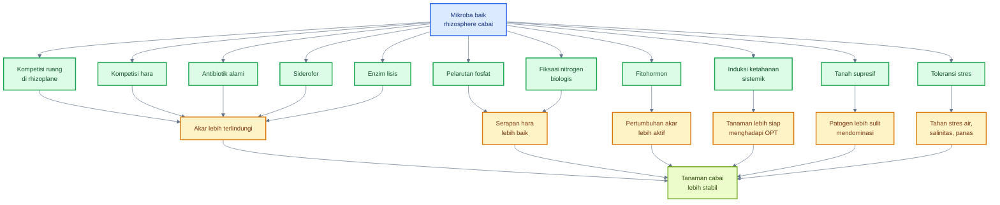

#### 1. Kompetisi ruang di rhizoplane

Rhizoplane adalah permukaan akar. Ini adalah zona paling strategis karena patogen dan mikroba baik sama-sama ingin menempel di sana. Mikroba baik yang lebih dulu menempel dapat mengurangi peluang patogen masuk atau membentuk biofilm.

Praktik yang mendukung:

- seed treatment;
- kocor mikroba saat pindah tanam;
- aplikasi mikroba pada media semai;
- hindari akar luka;
- jaga kelembapan stabil.

#### 2. Kompetisi hara

Mikroba baik dapat menggunakan eksudat akar dan sumber hara mikro lebih cepat daripada patogen. Dalam rhizosphere, kompetisi hara sangat penting karena akar terus mengeluarkan senyawa organik yang dapat dimanfaatkan banyak organisme.

Jika mikroba baik lebih dominan, patogen kehilangan sebagian sumber energi dan ruang tumbuh.

#### 3. Produksi antibiotik alami

Beberapa mikroba rhizosphere menghasilkan senyawa yang menghambat patogen. _Bacillus_, _Pseudomonas_, dan _Streptomyces_ dikenal memiliki potensi menghasilkan metabolit antimikroba. Namun efek ini sangat tergantung strain dan kondisi tanah.

Praktik penting:

- gunakan produk dengan strain jelas;
- jangan campur dengan bahan yang membunuh mikroba;
- aplikasikan sejak awal;
- dukung dengan bahan organik matang.

#### 4. Siderofor

Siderofor adalah senyawa pengikat besi. Mikroba seperti _Pseudomonas_ dapat menghasilkan siderofor untuk mengambil besi dari lingkungan. Ketika besi menjadi terbatas bagi patogen, pertumbuhan patogen tertentu dapat terhambat.

Ini adalah contoh bahwa biokontrol tidak selalu berarti “membunuh langsung”, tetapi bisa juga **membatasi sumber daya penting bagi patogen**.

#### 5. Pelarutan fosfat

Fosfor sering tersedia di tanah tetapi terikat dalam bentuk yang sulit diserap. Bakteri pelarut fosfat dan beberapa fungi dapat membantu melarutkan fosfat melalui produksi asam organik dan proses biokimia lain.

Bagi cabai, fosfor penting untuk akar, energi tanaman, pembungaan, dan pembentukan buah. Namun pelarutan fosfat oleh mikroba tidak berarti pupuk P boleh diabaikan total. Ia lebih tepat dipahami sebagai strategi peningkatan efisiensi hara.

#### 6. Fiksasi nitrogen biologis

Beberapa bakteri seperti _Azotobacter_, _Azospirillum_, dan kelompok lain dapat berkontribusi terhadap fiksasi nitrogen biologis pada kondisi tertentu. Dalam sistem cabai, kontribusinya biasanya lebih realistis sebagai dukungan efisiensi nutrisi, bukan pengganti total pupuk N.

Pemupukan nitrogen tetap harus seimbang. Nitrogen berlebihan dapat membuat tanaman terlalu vegetatif, pucuk lunak, dan lebih rentan OPT.

#### 7. Produksi fitohormon

Mikroba rhizosphere dapat menghasilkan atau memengaruhi hormon tanaman seperti IAA, sitokinin, giberelin, dan senyawa terkait etilen. Efeknya dapat berupa akar lateral lebih aktif, rambut akar lebih banyak, dan pertumbuhan tanaman lebih baik.

Namun produksi fitohormon yang bermanfaat tetap bergantung pada strain, dosis, kondisi tanaman, dan lingkungan.

#### 8. Enzim lisis

Mikroba antagonis tertentu menghasilkan enzim yang dapat merusak struktur patogen, misalnya kitinase, glukanase, protease, atau selulase. _Trichoderma_ sering dibahas dalam konteks enzim lisis dan mikoparasitisme terhadap fungi patogen.

Pada cabai, mekanisme ini relevan untuk patogen fungi seperti _Fusarium_, _Rhizoctonia_, dan _Sclerotium_.

#### 9. Induksi ketahanan sistemik

Induksi ketahanan sistemik atau ISR membuat tanaman lebih siap menghadapi serangan. Mikroba akar dapat memicu respons tanaman yang berdampak tidak hanya pada akar, tetapi juga pada bagian atas tanaman. Review PGPR menyebut ISR sebagai mekanisme sentral bagi _Pseudomonas_, _Trichoderma_, _Bacillus_, dan mikoriza dalam meningkatkan proteksi tanaman terhadap patogen. ([PMC][1])

Implikasinya bagi cabai: mikroba akar dapat membantu memperkuat ketahanan tanaman secara menyeluruh, termasuk phyllosphere, meskipun efeknya tidak selalu terlihat cepat.

#### 10. Pembentukan tanah supresif

Tanah supresif adalah tanah yang mampu menekan penyakit meskipun patogen ada. Supresivitas dapat terbentuk karena komunitas mikroba beragam, kompetisi kuat, bahan organik matang, struktur tanah baik, dan kondisi tidak menguntungkan bagi patogen.

Tujuan jangka panjang PHT rhizosphere adalah membangun tanah seperti ini. Bukan tanah steril, tetapi tanah yang secara biologis tidak mudah dikuasai patogen.

#### 11. Peningkatan toleransi stres air, salinitas, dan panas

Mikroba rhizosphere dapat membantu tanaman menghadapi stres melalui produksi fitohormon, eksopolisakarida, ACC deaminase, peningkatan akar, dan perbaikan serapan hara. Review rhizosphere competence dan aplikasi PGPR menekankan peran PGPR dalam fiksasi nitrogen biologis, pelarutan fosfat, sekresi fitohormon, dan dukungan pertumbuhan pada lingkungan tertekan. ([ScienceDirect][5])

Pada cabai, ini penting karena stres akar sering memicu masalah lanjutan: bunga gugur, buah kecil, dan tanaman lebih rentan terhadap OPT.

---

### 3.3 Konsep penting: root colonization dan priority effect

**Root colonization** adalah kemampuan mikroba untuk menempel, bertahan, dan berkembang di sekitar akar atau pada permukaan akar. Ini adalah syarat utama keberhasilan inokulasi mikroba. Mikroba yang tidak mampu mengolonisasi akar biasanya tidak akan memberikan efek kuat di lapang.

**Priority effect** berarti organisme yang datang lebih awal ke suatu habitat memiliki peluang lebih besar untuk menguasai ruang dan sumber daya. Dalam rhizosphere cabai, mikroba baik yang lebih dulu mengolonisasi akar dapat mengurangi peluang patogen dan nematoda untuk mendominasi.

Prinsipnya:

> Mikroba baik harus lebih dulu mengolonisasi akar sebelum patogen tanah mendominasi.

Konsep ini menjadi dasar:

- seed treatment;
- aplikasi mikroba di media semai;
- kocor awal setelah pindah tanam;
- inokulasi di lubang tanam;
- aplikasi mikroba saat akar muda aktif;
- tidak menunggu tanaman layu berat.

### Diagram priority effect pada rhizosphere cabai

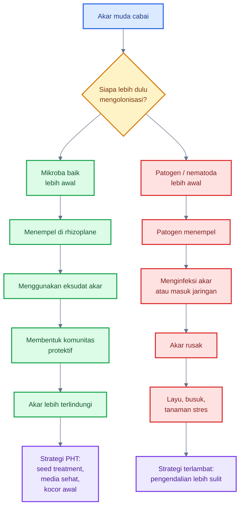

Implikasi praktisnya jelas: mikroba akar harus dimulai sejak awal. Ketika akar cabai sudah busuk, tanaman sudah layu, dan patogen sudah menyebar di bedengan, aplikasi mikroba tetap bisa menjadi bagian pemulihan, tetapi tidak bisa diharapkan bekerja sebagai solusi tunggal.

[**Kembali ke Atas**](#rhizosphere-cabai-sebagai-zona-strategis-pht-mengelola-mikrobioma-akar-untuk-menekan-penyakit-tular-tanah-nematoda-dan-stres-tanaman)

---

## 4. Faktor yang mempengaruhi rhizosphere: pendukung dan pengganggu

Rhizosphere tidak hanya ditentukan oleh mikroba yang diberikan. Keberhasilan mikroba akar sangat bergantung pada kondisi tanah atau media. Mikroba baik membutuhkan ruang hidup yang layak: oksigen cukup, kelembapan stabil, bahan organik matang, pH sesuai, dan akar aktif. Sebaliknya, genangan, tanah padat, salinitas tinggi, kompos mentah, dan pestisida tanah keras dapat menggagalkan kolonisasi mikroba.

<figure>
  
  <figcaption>
    Ilustrasi rhizosphere tanaman cabai yang menunjukkan interaksi antara faktor
    pendukung, organisme menguntungkan, unsur hara, serta faktor pengganggu di
    sekitar zona perakaran.
  </figcaption>
</figure>

Dalam praktik PHT cabai, faktor pendukung dan pengganggu rhizosphere harus dibaca bersamaan. Jika petani hanya menambah produk mikroba tanpa memperbaiki drainase, bahan organik, pH, EC, dan sanitasi, hasilnya sering tidak konsisten.

### Diagram faktor pendukung dan pengganggu rhizosphere cabai

```mermaid
%%{init: {
  "theme": "base",
  "themeVariables": {
    "background": "#ffffff",
    "primaryColor": "#F8FAFC",
    "primaryTextColor": "#0F172A",
    "primaryBorderColor": "#64748B",
    "lineColor": "#64748B",
    "fontSize": "14px"
  }
}}%%
flowchart TB
    A[Rhizosphere cabai] --> B[Faktor mendukung]
    A --> C[Faktor mengganggu]

    B --> B1[Bahan organik matang]
    B --> B2[Kelembapan stabil]
    B --> B3[Aerasi baik]
    B --> B4[pH sesuai]
    B --> B5[Drainase baik]
    B --> B6[Eksudat akar aktif]
    B --> B7[Struktur tanah remah]
    B --> B8[Akar muda banyak]
    B --> B9[Rotasi tanaman]
    B --> B10[Minim residu keras]

    C --> C1[Genangan]
    C --> C2[Tanah anaerob]
    C --> C3[Kekeringan ekstrem]
    C --> C4[Salinitas tinggi]
    C --> C5[pH ekstrem]
    C --> C6[Nitrogen berlebih]
    C --> C7[Pestisida / nematisida keras]
    C --> C8[Kompos belum matang]
    C --> C9[Tanah padat]
    C --> C10[Monokultur dan akar sakit]

    B --> D[Mikroba baik<br/>lebih mudah kolonisasi]
    C --> E[Mikroba baik tertekan<br/>patogen lebih mudah naik]

    D --> F[Akar lebih sehat]
    E --> G[Akar stres<br/>penyakit meningkat]

    classDef pusat fill:#DBEAFE,stroke:#2563EB,color:#1E3A8A,stroke-width:2px;
    classDef dukung fill:#DCFCE7,stroke:#16A34A,color:#14532D,stroke-width:2px;
    classDef ganggu fill:#FEE2E2,stroke:#DC2626,color:#7F1D1D,stroke-width:2px;
    classDef hasilbaik fill:#ECFCCB,stroke:#65A30D,color:#365314,stroke-width:2px;
    classDef hasilburuk fill:#FFEDD5,stroke:#EA580C,color:#7C2D12,stroke-width:2px;

    class A pusat;
    class B,B1,B2,B3,B4,B5,B6,B7,B8,B9,B10,D,F dukung;
    class C,C1,C2,C3,C4,C5,C6,C7,C8,C9,C10,E,G ganggu;
```

---

### 4.1 Faktor yang mendukung mikroba baik

#### 1. Bahan organik matang

Bahan organik matang menyediakan karbon stabil, memperbaiki struktur tanah, meningkatkan kapasitas menahan air, dan mendukung aktivitas mikroba. Kompos matang membantu membangun habitat yang lebih ramah bagi mikroba menguntungkan.

Ciri bahan organik matang:

- tidak panas;
- tidak berbau busuk;
- tekstur remah;
- tidak menarik lalat berlebihan;
- tidak menyebabkan akar terbakar;
- tidak memicu fermentasi anaerob.

Bahan organik matang berbeda dari bahan organik mentah. Yang matang mendukung mikroba baik; yang mentah bisa merusak akar.

#### 2. Kelembapan tanah stabil

Mikroba akar membutuhkan air, tetapi bukan genangan. Kelembapan stabil membantu mikroba bergerak, memperoleh nutrisi, dan berinteraksi dengan akar. Tanah yang terlalu kering membuat mikroba dorman, sedangkan tanah terlalu basah menurunkan oksigen dan mendukung patogen air.

Praktik lapang:

- gunakan irigasi bertahap;
- hindari over-irrigation;
- gunakan mulsa untuk menjaga kelembapan;
- cek kelembapan di zona akar, bukan hanya permukaan.

#### 3. Aerasi baik

Sebagian besar mikroba menguntungkan rhizosphere dan akar cabai membutuhkan oksigen. Tanah yang remah dan memiliki pori cukup mendukung akar putih aktif dan mikroba aerob. Tanah padat atau becek mengarah ke kondisi anaerob, yang sering merugikan akar.

Aerasi baik didukung oleh:

- bedengan gembur;
- bahan organik matang;
- drainase;
- tidak menginjak bedengan berlebihan;
- struktur tanah yang tidak memadat.

#### 4. pH sesuai

pH memengaruhi ketersediaan hara dan komposisi mikroba. pH ekstrem dapat menekan mikroba tertentu dan membuat hara sulit diserap. Untuk cabai, pH tanah umumnya perlu dijaga pada kisaran agak asam sampai netral, sesuai rekomendasi lokal dan hasil uji tanah.

Format MDX/KaTeX untuk kisaran pH umum:

$$
\text{pH tanah ideal cabai umumnya berada sekitar } 6{,}0 - 7{,}0
$$

Koreksi pH sebaiknya dilakukan bertahap berdasarkan uji tanah, bukan menebak.

#### 5. Drainase baik

Drainase adalah faktor utama pada cabai. Banyak patogen akar, terutama yang terkait kondisi basah, meningkat ketika tanah tergenang. _Phytophthora capsici_ pada pepper sangat terkait kondisi basah dan dapat menyebabkan root rot serta crown rot. ([PMC][3])

Drainase baik berarti:

- bedengan cukup tinggi;
- parit berfungsi;
- air hujan cepat keluar;
- tidak ada genangan di lubang tanam;
- mulsa tidak menahan air di pangkal batang;
- irigasi tidak berlebihan.

#### 6. Eksudat akar aktif

Akar muda yang sehat melepaskan eksudat yang menjadi sumber makanan mikroba. Semakin aktif akar, semakin dinamis rhizosphere. Eksudat membantu menarik mikroba baik, tetapi juga dapat menarik patogen. Karena itu, akar muda harus dilindungi sejak awal dengan mikroba menguntungkan.

#### 7. Struktur tanah remah

Tanah remah memiliki keseimbangan pori air dan pori udara yang lebih baik. Struktur seperti ini mendukung akar, mikroba aerob, dan aliran air. Tanah remah juga memudahkan akar muda berkembang dan memperluas zona rhizosphere.

Faktor pendukung struktur remah:

- bahan organik matang;
- aktivitas mikroba;
- akar tanaman;
- rotasi;
- pengolahan tanah tidak berlebihan;
- biochar atau amelioran sesuai kebutuhan.

#### 8. Populasi akar muda banyak

Akar muda adalah pusat aktivitas rhizosphere. Akar muda memiliki rambut akar, eksudat aktif, dan kemampuan serapan tinggi. Mikroba baik paling bermanfaat ketika dapat mengolonisasi akar muda sejak awal.

Praktik untuk mendukung akar muda:

- hindari EC pupuk terlalu tinggi;
- jangan menaruh pupuk pekat langsung menyentuh akar;
- jaga kelembapan stabil;
- gunakan PGPR atau mikoriza saat akar aktif;
- hindari akar luka saat pindah tanam.

#### 9. Kompos matang

Kompos matang adalah sumber mikroba, bahan organik stabil, dan perbaikan struktur tanah. Namun kualitas kompos sangat penting. Kompos yang belum matang dapat menyebabkan panas, amonia, atau kondisi anaerob.

Kompos matang dapat mendukung:

- mikroba baik;
- struktur tanah;
- kapasitas tukar kation;
- retensi air;
- supresivitas tanah.

#### 10. Rotasi tanaman

Rotasi tanaman membantu memutus siklus patogen spesifik. Menanam cabai atau Solanaceae terus-menerus dapat meningkatkan tekanan patogen tanah dan nematoda. Rotasi dengan tanaman bukan inang dapat menurunkan inokulum dan memberi waktu pemulihan biologis tanah.

#### 11. Mulsa organik

Mulsa organik dapat menjaga kelembapan tanah, menurunkan fluktuasi suhu, menambah bahan organik secara bertahap, dan mendukung kehidupan mikroba permukaan tanah. Namun mulsa harus dikelola agar tidak membuat pangkal batang terlalu lembap atau menjadi tempat hama.

#### 12. Minim residu pestisida tanah yang merusak mikroba

Pestisida atau nematisida keras dapat menekan organisme target, tetapi juga dapat mengganggu mikroba non-target. Dalam PHT, bahan seperti ini digunakan bila diperlukan dan dengan pertimbangan dampak terhadap mikrobioma tanah.

---

### 4.2 Faktor yang mengganggu mikroba baik

#### 1. Genangan

Genangan menurunkan oksigen tanah dan membuat akar mengalami stres. Mikroba aerob tertekan, sementara patogen yang menyukai air dapat meningkat. Pada cabai, genangan adalah salah satu pemicu utama busuk akar dan busuk pangkal.

Praktik koreksi:

- tingkatkan bedengan;
- buka parit;
- hindari irigasi berlebihan;
- cek mulsa yang menahan air di pangkal batang.

#### 2. Tanah anaerob

Tanah anaerob adalah tanah kekurangan oksigen. Kondisi ini terjadi akibat genangan, pemadatan, bahan organik mentah, atau over-irrigation. Akar cabai tidak nyaman pada kondisi anaerob, dan banyak mikroba baik juga tertekan.

Tanda lapang:

- tanah berbau asam/busuk;
- akar cokelat atau hitam;
- tanaman layu walau tanah basah;
- pertumbuhan lambat;
- pangkal batang mudah busuk.

#### 3. Kekeringan ekstrem

Kekeringan ekstrem membuat mikroba tidak aktif, akar muda mati, dan eksudasi akar berubah. Tanaman cabai yang stres air lebih mudah gugur bunga dan lebih rentan terhadap hama tertentu. Mikroba akar tidak bisa bekerja optimal tanpa kelembapan memadai.

#### 4. Salinitas tinggi

Salinitas atau EC tinggi dapat merusak ujung akar, menekan mikroba sensitif, dan membuat tanaman sulit menyerap air. Pada budidaya intensif, salinitas sering berasal dari pupuk berlebihan atau akumulasi garam pada media.

Format MDX/KaTeX sederhana:

$$
\text{EC tinggi} \rightarrow \text{tekanan osmotik naik} \rightarrow \text{akar sulit menyerap air}
$$

Praktik koreksi:

- cek EC media/tanah bila tersedia alat;
- hindari pupuk pekat dekat akar;
- lakukan pencucian garam hanya bila drainase baik;
- seimbangkan pemupukan.

#### 5. pH ekstrem

pH terlalu rendah atau terlalu tinggi dapat menekan mikroba tertentu dan mengganggu ketersediaan hara. Misalnya, pada pH sangat asam, beberapa unsur dapat menjadi toksik, sementara fosfor dapat sulit tersedia. Pada pH terlalu basa, beberapa unsur mikro sulit diserap.

Koreksi pH harus dilakukan berdasarkan uji tanah dan bertahap.

#### 6. Pemupukan nitrogen berlebih

Nitrogen berlebih dapat membuat tanaman terlalu vegetatif, jaringan lunak, dan lebih rentan OPT. Di rhizosphere, nitrogen berlebih juga dapat mengubah eksudat akar, keseimbangan mikroba, dan salinitas media.

Prinsipnya: tanaman cabai butuh nitrogen, tetapi bukan nitrogen tanpa kendali.

#### 7. Pestisida atau nematisida keras

Pestisida tanah dan nematisida keras dapat mengganggu mikroba menguntungkan. Dalam situasi tertentu bahan ini mungkin diperlukan, tetapi penggunaannya harus berbasis diagnosis dan tidak dilakukan sebagai rutinitas tanpa alasan.

Jika pestisida tanah digunakan, pertimbangkan:

- targetnya jelas;
- waktu aplikasi;
- dampak pada mikroba baik;
- jeda sebelum inokulasi ulang;
- rotasi mode of action;
- label dan keamanan.

#### 8. Kompos belum matang

Kompos belum matang dapat menyebabkan panas, amonia, fermentasi anaerob, patogen oportunis, dan akar terbakar. Ini adalah salah satu kesalahan besar dalam pengelolaan rhizosphere.

Tanda kompos belum matang:

- masih panas;
- bau menyengat;
- bahan asal masih jelas;
- banyak lalat;
- tekstur belum remah;
- menyebabkan tanaman layu setelah aplikasi.

#### 9. Tanah padat

Tanah padat membatasi pertumbuhan akar, menurunkan oksigen, menghambat infiltrasi air, dan membuat mikroba aerob tertekan. Akar cabai sulit membentuk jaringan akar halus pada tanah padat.

Koreksi:

- bedengan remah;
- bahan organik matang;
- hindari pemadatan oleh injakan;
- gunakan rotasi akar dalam bila cocok;
- perbaiki drainase.

#### 10. Monokultur cabai terus-menerus

Monokultur cabai atau tanaman sekeluarga secara terus-menerus meningkatkan risiko akumulasi patogen spesifik, nematoda, dan ketidakseimbangan mikroba. Rotasi adalah salah satu alat paling penting untuk menurunkan tekanan penyakit tanah.

#### 11. Residu akar sakit

Akar sakit yang tertinggal di lahan menjadi sumber inokulum. Patogen dan nematoda dapat bertahan pada sisa akar. Jika tanaman sakit hanya dipotong bagian atasnya, masalah di bawah tanah tetap tertinggal.

Praktik benar:

- cabut tanaman sakit bersama akar;
- buang dari lahan;
- jangan jadikan kompos biasa bila proses tidak matang;
- bersihkan area sekitar tanaman sakit.

#### 12. Over-irrigation

Over-irrigation tidak selalu terlihat sebagai genangan besar. Irigasi yang terlalu sering membuat zona akar selalu basah, oksigen rendah, dan patogen meningkat. Tanaman yang layu karena akar rusak sering disiram lebih banyak, padahal itu memperparah masalah.

Prinsipnya:

> Tanaman layu tidak selalu kekurangan air; bisa jadi akarnya tidak mampu menyerap air.

---

### Tabel faktor pendukung dan pengganggu rhizosphere

| Faktor                | Dampak pada mikroba akar       | Implikasi lapang                 |
| --------------------- | ------------------------------ | -------------------------------- |
| Genangan              | Akar anaerob, patogen air naik | Perbaiki drainase                |
| Kompos matang         | Sumber karbon stabil           | Dukung mikroba baik              |
| pH ekstrem            | Mikroba tertentu tertekan      | Koreksi pH bertahap              |
| Tanah padat           | Akar dan oksigen rendah        | Olah tanah dan perbaiki bedengan |
| Monokultur            | Patogen spesifik naik          | Rotasi tanaman                   |
| Kelembapan stabil     | Mikroba aktif dan akar tumbuh  | Irigasi terukur                  |
| Salinitas tinggi      | Akar stres dan mikroba turun   | Cek EC, seimbangkan pupuk        |
| Kompos belum matang   | Amonia, panas, anaerob         | Gunakan bahan organik matang     |
| Residu akar sakit     | Sumber inokulum                | Cabut dan musnahkan              |
| Pestisida tanah keras | Mikroba baik terganggu         | Gunakan berbasis diagnosis       |

---

## Ringkasan praktis Bab 3 dan Bab 4

Rhizosphere cabai dihuni oleh bakteri menguntungkan, fungi menguntungkan, mikroba biokontrol tanah, patogen, dan nematoda. Kelompok mikroba baik seperti _Bacillus_, _Pseudomonas_, _Azospirillum_, _Azotobacter_, _Paenibacillus_, _Streptomyces_, _Trichoderma_, mikoriza, _Gliocladium_, dan fungi endofit akar dapat mendukung pertumbuhan serta menekan gangguan akar melalui kompetisi, antibiotik alami, siderofor, pelarutan fosfat, fitohormon, enzim lisis, ISR, dan pembentukan tanah supresif.

Namun mikroba baik hanya berhasil bila lingkungan rhizosphere mendukung. Faktor seperti bahan organik matang, kelembapan stabil, aerasi, pH sesuai, drainase, akar muda aktif, struktur tanah remah, rotasi, dan minim residu pestisida keras akan memperkuat mikroba baik. Sebaliknya, genangan, tanah anaerob, salinitas tinggi, pH ekstrem, kompos mentah, tanah padat, monokultur, residu akar sakit, dan over-irrigation akan memperlemah sistem akar.

Prinsip kuncinya:

> Mikroba akar tidak cukup hanya diberikan; mereka harus diberi rumah yang layak agar mampu mengolonisasi akar dan menekan patogen.

[1]: https://pmc.ncbi.nlm.nih.gov/articles/PMC8509026/?utm_source=chatgpt.com 'Rhizosphere Bacteria in Plant Growth Promotion, Biocontrol ...'
[2]: https://www.mdpi.com/2309-608X/9/2/239?utm_source=chatgpt.com 'Fungi That Promote Plant Growth in the Rhizosphere Boost ...'
[3]: https://pmc.ncbi.nlm.nih.gov/articles/PMC7721533/?utm_source=chatgpt.com 'Novel Sources of Resistance to Phytophthora capsici ... - PMC'
[4]: https://www.sciencedirect.com/science/article/abs/pii/S0261219410003625?utm_source=chatgpt.com 'Global sources of pepper genetic resources against ...'
[5]: https://www.sciencedirect.com/science/article/pii/S2468227624000255?utm_source=chatgpt.com 'Rhizosphere competence and applications of plant growth ...'

[**Kembali ke Atas**](#rhizosphere-cabai-sebagai-zona-strategis-pht-mengelola-mikrobioma-akar-untuk-menekan-penyakit-tular-tanah-nematoda-dan-stres-tanaman)

---

## 5. Sumber kebutuhan mikroba di rhizosphere cabai

Mikroba di rhizosphere cabai hidup dari kombinasi sumber makanan yang berasal dari akar, tanah, bahan organik, pupuk, dan biomassa organisme lain. Berbeda dengan phyllosphere yang relatif miskin nutrisi, rhizosphere jauh lebih aktif karena akar terus melepaskan senyawa organik ke sekitarnya. Senyawa ini disebut **eksudat akar**.

<figure>
  
  <figcaption>
    Ilustrasi rhizosphere sebagai sumber kebutuhan mikroba, mencakup eksudat
    akar, unsur hara, kelembapan, bahan organik, dan interaksi mikroba di zona
    perakaran.
  </figcaption>
</figure>

Eksudat akar sangat penting karena berfungsi sebagai sumber karbon, sumber energi, sinyal kimia, dan pemicu interaksi antara tanaman dengan mikroba. Literatur rhizosphere menjelaskan bahwa root exudates mencakup senyawa seperti gula, asam organik, asam amino, protein, fenolik, dan metabolit sekunder lain yang dapat dimanfaatkan mikroorganisme serta membentuk komunitas mikroba di sekitar akar. ([Nature][1])

Dalam konteks cabai, sumber kebutuhan mikroba di rhizosphere dapat dibagi menjadi empat kelompok besar:

1. eksudat akar sebagai sumber karbon;
2. sumber nitrogen;
3. sumber mineral;
4. sumber eksternal seperti kompos, pupuk kandang matang, biochar, humic/fulvic, mulsa, dan pupuk hayati.

Namun prinsip pentingnya tetap sama: **nutrisi harus tersedia dalam bentuk yang mendukung mikroba baik, bukan dalam bentuk mentah, busuk, anaerob, atau terlalu pekat yang justru merusak akar**.

---

### Diagram sumber kebutuhan mikroba di rhizosphere cabai

```mermaid
%%{init: {
  "theme": "base",
  "themeVariables": {
    "background": "#ffffff",
    "primaryColor": "#F8FAFC",
    "primaryTextColor": "#0F172A",
    "primaryBorderColor": "#64748B",
    "lineColor": "#64748B",
    "fontSize": "14px"
  }
}}%%
flowchart TB
    A[Rhizosphere cabai] --> B[Eksudat akar<br/>sumber karbon]
    A --> C[Sumber nitrogen]
    A --> D[Sumber mineral]
    A --> E[Sumber eksternal]

    B --> B1[Gula]
    B --> B2[Asam organik]
    B --> B3[Asam amino]
    B --> B4[Fenolik dan flavonoid]
    B --> B5[Polisakarida]
    B --> B6[Mucilage akar]
    B --> B7[Sel akar terlepas]

    C --> C1[Asam amino]
    C --> C2[Ammonium]
    C --> C3[Nitrat]
    C --> C4[Protein bahan organik]
    C --> C5[Biomassa mikroba mati]
    C --> C6[Mineralisasi kompos]

    D --> D1[Fosfat]
    D --> D2[Kalium]
    D --> D3[Kalsium]
    D --> D4[Magnesium]
    D --> D5[Sulfur]
    D --> D6[Fe, Zn, Mn, B]

    E --> E1[Kompos matang]
    E --> E2[Pupuk kandang matang]
    E --> E3[Biochar]
    E --> E4[Humic / fulvic]
    E --> E5[Mulsa organik]
    E --> E6[Pupuk hayati]
    E --> E7[Sisa akar sebelumnya]

    B --> F[Mikroba aktif]
    C --> F
    D --> F
    E --> F

    F --> G{Kualitas sumber<br/>mendukung?}
    G -->|Ya| H[Akar sehat<br/>mikroba baik stabil]
    G -->|Tidak| I[Akar stres<br/>patogen oportunis naik]

    classDef pusat fill:#DBEAFE,stroke:#2563EB,color:#1E3A8A,stroke-width:2px;
    classDef karbon fill:#DCFCE7,stroke:#16A34A,color:#14532D,stroke-width:2px;
    classDef nitrogen fill:#E0E7FF,stroke:#4F46E5,color:#312E81,stroke-width:2px;
    classDef mineral fill:#FEF3C7,stroke:#D97706,color:#78350F,stroke-width:2px;
    classDef eksternal fill:#FCE7F3,stroke:#DB2777,color:#831843,stroke-width:2px;
    classDef proses fill:#F8FAFC,stroke:#64748B,color:#0F172A,stroke-width:1.5px;
    classDef baik fill:#ECFCCB,stroke:#65A30D,color:#365314,stroke-width:2px;
    classDef risiko fill:#FEE2E2,stroke:#DC2626,color:#7F1D1D,stroke-width:2px;

    class A pusat;
    class B,B1,B2,B3,B4,B5,B6,B7 karbon;
    class C,C1,C2,C3,C4,C5,C6 nitrogen;
    class D,D1,D2,D3,D4,D5,D6 mineral;
    class E,E1,E2,E3,E4,E5,E6,E7 eksternal;
    class F,G proses;
    class H baik;
    class I risiko;
```

---

### 5.1 Eksudat akar sebagai sumber karbon

Karbon adalah kebutuhan utama mikroba karena menjadi sumber energi dan bahan pembentuk sel. Pada rhizosphere, sumber karbon paling penting berasal dari eksudat akar. Tanaman cabai, seperti tanaman lain, melepaskan sebagian hasil fotosintesis ke zona akar dalam bentuk senyawa organik.

Root exudates berperan sebagai sumber karbon bagi mikroorganisme tanah dan menjadi sarana pertukaran energi, materi, serta informasi antara akar dan tanah. Senyawa ini juga dapat membantu tanaman merekrut mikroorganisme tertentu ke zona akar. ([Frontiers][2])

#### A. Gula

Gula adalah sumber energi cepat bagi banyak mikroba rhizosphere. Bentuknya dapat berupa glukosa, fruktosa, sukrosa, dan gula sederhana lain. Gula dari eksudat akar membantu mikroba tumbuh, bergerak menuju akar, membentuk biofilm, dan berkompetisi di rhizoplane.

Pada cabai, gula dari eksudat akar sangat penting pada fase:

- bibit aktif tumbuh;
- setelah pindah tanam;
- fase vegetatif;
- awal pembungaan;
- pemulihan setelah stres akar.

Namun gula juga bisa dimanfaatkan patogen. Karena itu, akar muda harus lebih dulu dikolonisasi mikroba baik melalui PGPR, _Bacillus_, _Pseudomonas_, _Trichoderma_, atau mikoriza sesuai target.

#### B. Asam organik

Asam organik adalah komponen penting eksudat akar. Contohnya dapat mencakup asam sitrat, malat, oksalat, laktat, dan senyawa sejenis, tergantung tanaman serta kondisi tanah. Asam organik berperan dalam mobilisasi hara, perubahan pH mikro, dan interaksi mikroba.

Fungsi asam organik di rhizosphere:

- membantu pelarutan fosfat;
- memengaruhi ketersediaan Fe, Zn, Mn, dan unsur mikro;
- menjadi sumber karbon bagi mikroba tertentu;
- memengaruhi komposisi mikrobioma akar.

Frontiers menjelaskan bahwa eksudat akar dapat merekrut mikroorganisme pelepas fosfor; mikroba ini dapat meningkatkan ketersediaan fosfor melalui pelepasan asam organik dan fosfatase. ([Frontiers][2])

#### C. Asam amino

Asam amino menyediakan karbon sekaligus nitrogen. Mikroba dapat menggunakannya untuk sintesis protein, enzim, dan pertumbuhan sel. Di rhizosphere cabai, asam amino dari akar dapat membantu mikroba pemacu pertumbuhan berkembang pada permukaan akar.

Namun penggunaan pupuk atau biostimulan berbasis asam amino harus hati-hati. Dosis berlebihan, terutama pada media yang terlalu basah, dapat memperkaya rhizosphere secara tidak seimbang dan mendukung mikroba oportunis.

#### D. Fenolik

Senyawa fenolik adalah metabolit sekunder tanaman yang dapat berperan sebagai sinyal, senyawa pertahanan, atau pengatur komunitas mikroba. Fenolik dapat menghambat mikroba tertentu, tetapi juga dapat dimanfaatkan atau ditoleransi oleh mikroba khusus.

Dalam rhizosphere, fenolik membantu membentuk seleksi mikroba: mikroba yang mampu bertahan terhadap senyawa pertahanan tanaman akan lebih kompetitif.

#### E. Flavonoid

Flavonoid adalah senyawa sinyal penting pada beberapa interaksi tanaman-mikroba. Pada legum, flavonoid terkenal dalam interaksi dengan rhizobia. Pada cabai, perannya lebih umum sebagai bagian dari metabolit sekunder yang ikut membentuk komunitas mikroba di sekitar akar.

Flavonoid dapat berperan dalam:

- sinyal mikroba;
- pertahanan akar;
- perubahan komunitas rhizosphere;
- interaksi dengan fungi atau bakteri tertentu.

#### F. Polisakarida

Polisakarida adalah karbohidrat kompleks. Di rhizosphere, polisakarida dapat berasal dari akar, mucilage, mikroba, atau bahan organik. Polisakarida membantu pembentukan agregat tanah dan biofilm mikroba.

Dampak praktisnya:

- struktur tanah lebih stabil;
- mikroba lebih mudah menempel;
- kelembapan mikro lebih terjaga;
- rhizoplane lebih terlindungi.

#### G. Mucilage akar

Mucilage adalah lendir alami yang dilepaskan akar, terutama di ujung akar. Mucilage membantu akar bergerak menembus tanah, menjaga kelembapan mikro, dan menciptakan zona kontak antara akar dan partikel tanah.

Bagi mikroba, mucilage adalah habitat penting karena mengandung senyawa organik dan membantu mikroba menempel pada akar. Pada cabai, mucilage sangat relevan pada ujung akar muda yang aktif tumbuh.

#### H. Sel akar yang terlepas

Akar terus memperbarui jaringan. Sel akar tua, sel tudung akar, dan fragmen jaringan dapat terlepas ke rhizosphere. Bahan ini menjadi sumber karbon, nitrogen, dan mineral bagi mikroba.

Namun, jaringan akar yang rusak karena patogen, salinitas, pupuk pekat, atau nematoda juga dapat menjadi sumber makanan bagi mikroba oportunis. Karena itu, menjaga akar tetap sehat sama pentingnya dengan memberi mikroba baik.

---

### Tabel ringkas sumber karbon dari akar

| Sumber karbon     | Asal                                 | Fungsi bagi mikroba                               | Catatan praktis                         |
| ----------------- | ------------------------------------ | ------------------------------------------------- | --------------------------------------- |
| Gula              | hasil fotosintesis yang dilepas akar | energi cepat, pertumbuhan mikroba                 | mendukung mikroba baik dan patogen      |
| Asam organik      | metabolisme akar                     | pelarutan hara, sumber karbon, perubahan pH mikro | penting untuk P dan unsur mikro         |
| Asam amino        | eksudat akar, jaringan akar          | karbon dan nitrogen                               | jangan berlebihan lewat input eksternal |
| Fenolik           | metabolit sekunder                   | sinyal dan pertahanan                             | menyeleksi komunitas mikroba            |
| Flavonoid         | metabolit sekunder                   | komunikasi tanaman-mikroba                        | efek tergantung tanaman dan mikroba     |
| Polisakarida      | akar dan mikroba                     | biofilm, agregat tanah                            | mendukung struktur tanah                |
| Mucilage          | ujung akar                           | perlindungan akar dan habitat mikroba             | penting pada akar muda                  |
| Sel akar terlepas | pembaruan jaringan akar              | nutrisi mikroba                                   | akar rusak dapat mendukung oportunis    |

---

### 5.2 Sumber nitrogen

Nitrogen dibutuhkan mikroba untuk membentuk protein, enzim, asam nukleat, dan komponen sel lain. Di rhizosphere, nitrogen dapat berasal dari eksudat akar, pupuk, bahan organik, biomassa mikroba mati, dan mineralisasi kompos.

#### A. Asam amino

Asam amino dari eksudat akar menyediakan nitrogen organik yang mudah digunakan. Mikroba yang mampu menggunakan asam amino dapat berkembang cepat di sekitar akar.

Dalam praktik cabai, input asam amino dari luar perlu dibaca sebagai biostimulan, bukan “pakan mikroba” yang boleh diberikan berlebihan. Dosis terlalu tinggi pada media lembap dapat meningkatkan mikroba oportunis.

#### B. Ammonium

Ammonium atau $NH_4^+$ adalah bentuk nitrogen yang dapat diserap tanaman dan digunakan mikroba. Namun ammonium berlebihan dapat meningkatkan risiko toksisitas, perubahan pH rhizosphere, dan ketidakseimbangan nutrisi.

Format reaksi sederhana nitrogen mineral:

$$
NH_4^+ \leftrightarrow NO_3^-
$$

Dalam tanah, transformasi antara ammonium dan nitrat sangat dipengaruhi oleh mikroba nitrifikasi, aerasi, kelembapan, pH, dan suhu.

#### C. Nitrat

Nitrat atau $NO_3^-$ adalah bentuk nitrogen yang sangat mobil di tanah. Tanaman cabai dapat menyerap nitrat, tetapi nitrat mudah tercuci bila irigasi berlebihan atau drainase terlalu cepat. Mikroba juga terlibat dalam transformasi nitrogen.

Pada sistem cabai intensif, manajemen nitrat penting karena kelebihan nitrogen dapat membuat tanaman terlalu vegetatif dan lebih rentan terhadap hama pengisap.

#### D. Protein dari bahan organik

Bahan organik matang mengandung protein dan senyawa nitrogen kompleks. Mikroba menguraikannya secara bertahap menjadi bentuk yang lebih sederhana. Proses ini disebut mineralisasi.

Protein dari bahan organik matang lebih aman daripada protein dari bahan organik mentah yang masih aktif fermentasi. Bahan mentah dapat memicu panas, amonia, dan kondisi anaerob.

#### E. Biomassa mikroba mati

Mikroba yang mati menjadi sumber nitrogen bagi mikroba lain. Ini disebut perputaran biomassa mikroba. Dalam tanah yang sehat, mikroba terus tumbuh, mati, dan didaur ulang menjadi nutrisi bagi komunitas lain serta tanaman.

Ini menunjukkan bahwa rhizosphere adalah sistem dinamis, bukan sistem input-output sederhana.

#### F. Mineralisasi kompos

Kompos matang menyediakan nitrogen secara lebih lambat dan stabil. Mikroba tanah mengubah nitrogen organik dalam kompos menjadi bentuk yang dapat digunakan tanaman dan mikroba.

Mineralisasi kompos dipengaruhi oleh:

- kematangan kompos;
- rasio $C:N$;
- kelembapan;
- aerasi;
- suhu;
- populasi mikroba.

Kompos matang mendukung mikroba baik. Kompos mentah berisiko merusak akar.

---

### 5.3 Sumber mineral

Mikroba membutuhkan mineral untuk metabolisme, pembentukan enzim, struktur sel, dan aktivitas biokimia. Di rhizosphere, mineral juga menjadi titik penting karena mikroba dapat membantu melarutkan, mengikat, atau mengubah ketersediaannya bagi tanaman.

#### A. Fosfat

Fosfor penting untuk energi tanaman, akar, pembungaan, dan pembentukan buah. Namun fosfat sering terikat dalam tanah sehingga tidak selalu tersedia. Mikroba pelarut fosfat dapat membantu meningkatkan ketersediaan fosfor melalui asam organik dan enzim fosfatase. ([Frontiers][2])

Bagi cabai, fosfor penting sejak awal pembentukan akar. Namun fosfor berlebihan dapat mengganggu kolonisasi mikoriza. Jadi, pemupukan P harus seimbang.

#### B. Kalium

Kalium berperan dalam regulasi air, pembukaan stomata, kekuatan jaringan, dan kualitas buah. Mikroba tertentu dapat membantu pelarutan kalium dari mineral tanah, meskipun efeknya sangat tergantung jenis tanah dan mikroba.

Pada cabai, kalium penting pada fase pembungaan dan pengisian buah. Akar sehat diperlukan agar serapan K stabil.

#### C. Kalsium

Kalsium penting untuk dinding sel, kekuatan jaringan, dan kesehatan ujung akar. Kekurangan atau gangguan serapan kalsium dapat memperburuk kualitas buah dan ketahanan jaringan.

Serapan kalsium sangat terkait dengan aliran air. Akar yang rusak atau kelembapan tanah tidak stabil dapat mengganggu serapan Ca meskipun Ca tersedia di tanah.

#### D. Magnesium

Magnesium adalah inti klorofil dan penting untuk fotosintesis. Dari sudut rhizosphere, Mg perlu tersedia dalam keseimbangan dengan K dan Ca. Ketidakseimbangan kation dapat memengaruhi serapan.

#### E. Sulfur

Sulfur penting untuk asam amino tertentu, enzim, dan metabolisme pertahanan tanaman. Mikroba tanah berperan dalam siklus sulfur, terutama pada bahan organik.

#### F. Besi

Besi diperlukan untuk banyak enzim dan proses redoks. Namun ketersediaannya sangat dipengaruhi pH dan kondisi oksidasi-reduksi. Mikroba seperti _Pseudomonas_ dapat menghasilkan siderofor untuk mengikat besi, yang juga dapat menjadi mekanisme kompetisi melawan patogen.

#### G. Zinc

Zinc penting untuk enzim, pertumbuhan, dan regulasi hormon. Pada pH tinggi, Zn dapat menjadi kurang tersedia. Mikroba tertentu dapat membantu mobilisasi unsur mikro.

#### H. Mangan

Mangan berperan dalam fotosintesis dan enzim pertahanan. Ketersediaannya dipengaruhi pH, aerasi, dan kondisi redoks tanah.

#### I. Boron

Boron penting untuk pertumbuhan titik tumbuh, pembungaan, dan pembentukan dinding sel. Namun rentang aman boron relatif sempit: kekurangan dan kelebihan sama-sama bermasalah. Karena itu, aplikasi B harus hati-hati dan berbasis kebutuhan.

---

### Tabel ringkas mineral penting di rhizosphere cabai

| Mineral   | Peran utama                 | Hubungan dengan rhizosphere          | Catatan praktis                  |
| --------- | --------------------------- | ------------------------------------ | -------------------------------- |
| Fosfat    | akar, energi, bunga         | dapat dibantu mikroba pelarut P      | jangan berlebihan dekat mikoriza |
| Kalium    | kualitas buah, regulasi air | perlu akar aktif                     | penting fase buah                |
| Kalsium   | dinding sel, ujung akar     | tergantung aliran air dan akar sehat | kelembapan stabil penting        |
| Magnesium | klorofil                    | perlu keseimbangan kation            | terkait fotosintesis             |
| Sulfur    | asam amino, pertahanan      | terkait mineralisasi bahan organik   | dukung metabolisme               |
| Besi      | enzim dan redoks            | siderofor mikroba penting            | pH memengaruhi ketersediaan      |
| Zinc      | enzim dan hormon            | dapat dimobilisasi mikroba tertentu  | sering rendah pada pH tinggi     |
| Mangan    | enzim dan fotosintesis      | dipengaruhi aerasi dan pH            | hindari pH ekstrem               |
| Boron     | titik tumbuh, bunga         | tersedia dalam rentang sempit        | dosis harus hati-hati            |

---

### 5.4 Sumber eksternal

Selain eksudat akar dan mineral tanah, rhizosphere juga dipengaruhi oleh input eksternal. Input ini dapat memperbaiki atau merusak ekosistem akar tergantung kualitas, dosis, dan cara aplikasinya.

#### A. Kompos matang

Kompos matang adalah salah satu input terbaik untuk mendukung rhizosphere. Kompos matang menyediakan bahan organik stabil, mikroba, nutrisi bertahap, dan perbaikan struktur tanah.

Manfaat kompos matang:

- meningkatkan agregat tanah;
- mendukung mikroba baik;
- memperbaiki kapasitas menahan air;
- menyediakan nutrisi bertahap;
- membantu membangun tanah supresif.

Namun kompos harus benar-benar matang. Kompos mentah dapat menyebabkan masalah serius.

#### B. Pupuk kandang matang

Pupuk kandang matang dapat menjadi sumber bahan organik dan hara. Namun pupuk kandang yang belum matang berisiko membawa patogen, biji gulma, amonia, garam tinggi, dan panas fermentasi.

Pada cabai, pupuk kandang sebaiknya:

- sudah matang;
- tidak berbau menyengat;
- tidak panas;
- diaplikasikan sebelum tanam;
- dicampur merata;
- tidak langsung menempel pekat pada akar muda.

#### C. Biochar

Biochar dapat membantu memperbaiki struktur tanah, kapasitas menahan air, dan habitat mikroba. Biochar memiliki pori yang dapat menjadi tempat berlindung mikroba. Namun efeknya sangat tergantung bahan asal, suhu pirolisis, pH biochar, dan dosis.

Biochar yang terlalu basa atau dosis berlebihan dapat mengubah pH tanah. Karena itu, gunakan bertahap dan uji kecil.

#### D. Humic dan fulvic

Asam humat dan fulvat dapat membantu struktur tanah, ketersediaan hara tertentu, dan aktivitas akar. Namun produk humic/fulvic bukan pengganti bahan organik matang. Ia lebih tepat diposisikan sebagai pendukung.

Pada cabai, manfaatnya dapat terlihat bila dikombinasikan dengan manajemen akar, irigasi, dan nutrisi yang benar.

#### E. Mulsa organik

Mulsa organik menjaga kelembapan, menurunkan fluktuasi suhu tanah, menekan gulma, dan menambah bahan organik secara bertahap. Namun mulsa yang terlalu menempel pada pangkal batang dapat membuat crown terlalu lembap dan meningkatkan risiko busuk pangkal.

Praktik aman:

- jangan menumpuk mulsa terlalu tebal di pangkal batang;
- hindari mulsa yang belum stabil dan mudah membusuk anaerob;
- perhatikan hama yang berlindung di bawah mulsa;
- jaga sirkulasi udara pangkal tanaman.

#### F. Pupuk hayati

Pupuk hayati membawa mikroba tertentu seperti PGPR, _Trichoderma_, mikoriza, _Bacillus_, _Pseudomonas_, PSB, atau mikroba lain. Pupuk hayati harus diperlakukan sebagai inokulan hidup, bukan pupuk kimia biasa.

Keberhasilan pupuk hayati tergantung:

- viabilitas mikroba;
- strain;
- jumlah populasi;
- formulasi;
- kualitas air;
- pH/EC tanah;
- kelembapan;
- kompatibilitas pestisida;
- kontak dengan akar.

#### G. Sisa akar tanaman sebelumnya

Sisa akar tanaman sebelumnya dapat menjadi sumber karbon dan nutrisi bagi mikroba. Namun bila tanaman sebelumnya sakit, sisa akar juga bisa menjadi sumber inokulum patogen dan nematoda.

Karena itu, sisa akar harus dibaca berdasarkan riwayat lahan:

- jika tanaman sehat, sisa akar dapat menjadi bahan organik;
- jika tanaman sakit, sisa akar adalah risiko;
- jika ada nematoda, sisa akar dapat mempertahankan populasi;
- jika ada layu bakteri/fusarium, sanitasi lebih penting.

---

### 5.5 Peringatan praktis: jangan membuat rhizosphere terlalu kaya bahan organik mentah

Bahan organik sangat penting untuk rhizosphere, tetapi bentuknya harus benar. Kesalahan umum adalah memasukkan pupuk kandang segar, kompos belum matang, sisa tanaman basah, fermentasi setengah jadi, atau bahan organik mentah langsung ke zona akar cabai.

Bahan organik belum matang dapat menyebabkan:

- panas fermentasi;
- amonia;
- penurunan oksigen;
- fermentasi anaerob;
- bau busuk;
- peningkatan patogen oportunis;
- akar terbakar;
- bibit layu;
- busuk pangkal;
- ledakan lalat atau serangga pengurai.

### Diagram risiko bahan organik mentah

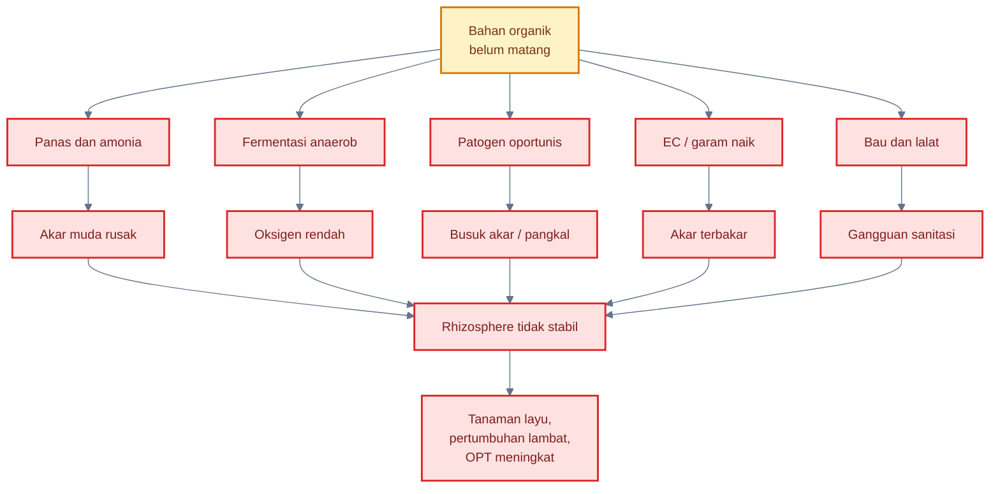

Prinsip praktisnya:

> Rhizosphere cabai membutuhkan bahan organik matang yang stabil, bukan bahan organik mentah yang masih aktif membusuk.

Bahan organik yang baik mendukung mikroba baik. Bahan organik yang belum matang justru dapat menjadi pemicu penyakit akar.

[**Kembali ke Atas**](#rhizosphere-cabai-sebagai-zona-strategis-pht-mengelola-mikrobioma-akar-untuk-menekan-penyakit-tular-tanah-nematoda-dan-stres-tanaman)

---

## 6. Zona rhizosphere cabai yang rawan OPT

Rhizosphere cabai tidak memiliki risiko yang sama di semua titik. Ada zona akar yang lebih rawan karena aktif tumbuh, mudah terluka, dekat permukaan tanah, sering basah, atau menjadi tempat bertahan patogen. Dalam PHT, zona-zona ini harus menjadi target monitoring, inokulasi mikroba, perbaikan drainase, dan sanitasi.

<figure>
  
  <figcaption>
    Ilustrasi kondisi rhizosphere yang rawan terhadap OPT, mencakup tekanan
    patogen tanah, kelembapan berlebih, akar stres, bahan organik membusuk, dan
    ketidakseimbangan mikroba di zona perakaran.
  </figcaption>
</figure>

Zona rawan utama meliputi:

1. ujung akar muda;
2. permukaan akar atau rhizoplane;
3. pangkal batang dan crown;
4. zona akar dalam bedengan;
5. area bawah lubang tanam atau mulsa;
6. sisa akar tanaman sakit.

---

### Diagram zona rhizosphere cabai yang rawan OPT

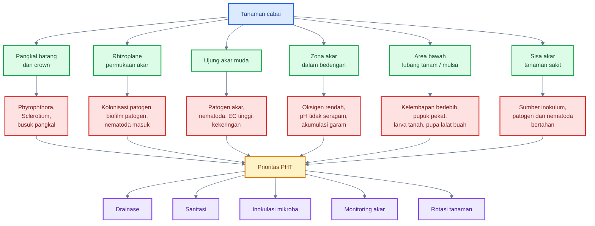

---

### 6.1 Ujung akar muda

Ujung akar muda adalah zona paling aktif dalam pertumbuhan dan serapan. Di sini terjadi pembelahan sel, pemanjangan akar, pembentukan rambut akar, dan pelepasan eksudat. Karena sangat aktif, ujung akar juga sangat rentan.

#### Risiko utama pada ujung akar muda

Ujung akar muda rawan terhadap:

- patogen akar;
- nematoda;
- kerusakan salinitas;
- kekeringan;
- luka transplanting;
- pupuk pekat;
- media terlalu panas;
- oksigen rendah.

Ujung akar yang rusak membuat tanaman kehilangan kapasitas serapan. Akibatnya, tajuk bisa layu, daun menguning, bunga gugur, dan pertumbuhan terhambat.

#### Mengapa ujung akar menjadi target patogen?

Ujung akar muda mengeluarkan eksudat aktif. Eksudat ini mengundang mikroba baik, tetapi juga memberi sinyal dan makanan bagi patogen serta nematoda. Bila mikroba baik belum hadir, patogen dapat lebih mudah mendekati akar.

#### Strategi PHT pada ujung akar

Strategi utama:

- gunakan PGPR sejak semai;
- hindari EC tinggi;
- jangan menaruh pupuk pekat langsung ke akar;
- jaga kelembapan stabil;
- hindari media becek;
- inokulasi mikroba saat akar aktif;
- gunakan mikoriza saat pindah tanam bila sesuai;
- kurangi stres transplanting.

Prinsipnya:

> Ujung akar muda harus dilindungi sebelum rusak, karena akar yang sudah rusak sulit dipulihkan cepat.

---

### 6.2 Permukaan akar atau rhizoplane

Rhizoplane adalah permukaan akar. Ini adalah zona kontak langsung antara akar, mikroba, patogen, dan tanah. Rhizoplane sangat strategis karena di sinilah mikroba baik atau patogen berusaha menempel.

#### Risiko utama pada rhizoplane

Rhizoplane rawan terhadap:

- kolonisasi patogen;
- kompetisi mikroba;
- biofilm patogen;
- nematoda masuk jaringan;
- luka mekanis;
- ketidakseimbangan mikroba;
- residu pestisida tanah.

#### Mengapa rhizoplane penting?

Patogen sering harus menempel atau berada sangat dekat dengan akar sebelum menginfeksi. Mikroba baik yang lebih dulu menempel dapat menutup ruang, menggunakan eksudat, menghasilkan senyawa antagonis, dan memicu ketahanan akar.

Dalam konteks priority effect, rhizoplane adalah salah satu lokasi paling penting untuk dikuasai mikroba baik.

#### Strategi PHT pada rhizoplane

Strategi utama:

- seed treatment;
- kocor mikroba preventif;
- aplikasi mikroba di media semai;
- gunakan kompos matang;
- hindari pestisida tanah berlebihan;
- hindari akar luka saat transplanting;
- jaga pH dan kelembapan;
- jangan membiarkan tanah terlalu padat.

Mikroba relevan:

- _Bacillus_;
- _Pseudomonas_;
- _Trichoderma_;
- mikoriza;
- _Paenibacillus_;
- _Streptomyces_;
- PSB sesuai kebutuhan.

---

### 6.3 Pangkal batang dan crown

Pangkal batang dan crown adalah zona transisi antara akar dan batang. Pada cabai, area ini sangat rawan karena sering terkena cipratan air, kelembapan tinggi, mulsa yang terlalu rapat, dan genangan mikro di sekitar lubang tanam.

#### Risiko utama pada pangkal batang dan crown

Pangkal batang dan crown rawan terhadap:

- _Phytophthora_;
- _Sclerotium_;
- busuk pangkal;
- genangan;
- luka mekanis;
- mulsa terlalu rapat;
- tanah menempel di batang;
- kelembapan berlebih.

_Phytophthora capsici_ pada pepper dapat menyebabkan root rot, crown rot, foliar blight, dan fruit rot; pada budidaya pepper, penyakit ini sangat penting karena menyerang beberapa bagian tanaman dan berkaitan kuat dengan kondisi basah. ([MDPI][3])

#### Mengapa crown sangat kritis?

Crown adalah titik penghubung antara akar dan tajuk. Kerusakan kecil di area ini dapat memutus aliran air dan hara. Jika crown busuk, tanaman dapat layu cepat meskipun akar sebagian masih ada.

Kondisi yang memperparah:

- bedengan rendah;
- parit tidak lancar;
- lubang mulsa menahan air;
- pangkal batang tertutup bahan organik basah;
- penyiraman berlebihan;
- tanaman terlalu dalam saat tanam.

#### Strategi PHT pada pangkal batang dan crown

Strategi utama:

- buat bedengan tinggi;
- pastikan parit berfungsi;
- jangan menanam terlalu dalam;
- jangan menutup crown dengan pupuk kandang atau kompos basah;
- hindari genangan di lubang tanam;
- gunakan _Trichoderma_ dan _Bacillus_ preventif di media/lubang tanam;
- cabut tanaman busuk berat dan buang dari lahan;
- hindari menyiram langsung berlebihan ke pangkal.

---

### 6.4 Zona akar dalam bedengan

Zona akar dalam bedengan adalah ruang utama eksplorasi akar cabai. Di sinilah akar menyerap air dan hara dalam jumlah besar. Namun zona ini juga dapat menjadi masalah bila oksigen rendah, pH tidak seragam, pupuk menumpuk, atau patogen bertahan.

#### Risiko utama di zona akar bedengan

Zona akar dalam bedengan rawan terhadap:

- kekurangan oksigen;
- pH tidak seragam;
- akumulasi garam;
- patogen tanah;
- kelembapan tidak merata;
- pupuk pekat;
- akar berhenti tumbuh;
- nematoda.

#### Masalah yang sering terjadi

Pada cabai intensif, bedengan sering diberi banyak pupuk dasar. Jika pupuk tidak tercampur baik atau terlalu dekat dengan akar muda, akar dapat terbakar. Jika drainase buruk, bagian dalam bedengan menjadi anaerob. Jika irigasi tidak merata, sebagian akar mengalami kering ekstrem dan sebagian lain terlalu basah.

#### Strategi PHT di zona bedengan

Strategi utama:

- olah bedengan agar remah;
- campur pupuk dasar merata;
- gunakan bahan organik matang;
- cek pH dan EC bila memungkinkan;
- gunakan irigasi terukur;
- hindari pupuk pekat dekat akar;
- lakukan kocor mikroba saat akar aktif;
- gunakan rotasi tanaman untuk menurunkan patogen.

---

### 6.5 Area bawah lubang tanam atau mulsa

Area bawah lubang tanam atau mulsa adalah titik yang sering bermasalah pada cabai bermulsa plastik. Lubang tanam dapat menahan air, pupuk, panas, dan bahan organik di sekitar pangkal tanaman. Jika tidak dikelola, area ini menjadi zona stres akar dan crown.

#### Risiko utama

Area bawah lubang tanam/mulsa rawan terhadap:

- kelembapan berlebih;
- akumulasi pupuk;
- akar terbakar;
- larva tanah;
- pupa lalat buah;
- busuk pangkal;
- suhu tanah tinggi;
- aerasi buruk.

#### Mengapa area ini penting?

Pada sistem mulsa plastik, air dan pupuk sering terkonsentrasi di sekitar lubang tanam. Saat hujan, lubang dapat menjadi titik masuk air. Saat panas, suhu di bawah mulsa dapat meningkat. Bila pupuk dasar terlalu dekat, akar muda bisa rusak.

Selain itu, buah cabai yang jatuh dan membusuk di sekitar tanaman dapat menjadi sumber larva lalat buah. Larva dapat keluar dari buah dan berpupa di tanah bawah tajuk. Karena itu, area bawah tanaman adalah bagian penting dari PHT lalat buah.

#### Strategi PHT

Strategi utama:

- buat lubang tanam tidak menahan air;
- jangan menaruh pupuk pekat langsung di bawah akar;
- gunakan kompos matang;
- jaga pangkal batang tidak terlalu basah;
- kumpulkan buah jatuh;
- gunakan entomopatogen atau nematoda entomopatogen bila sesuai target dan tersedia;
- cek suhu dan kelembapan di bawah mulsa;
- pastikan parit tidak tersumbat.

---

### 6.6 Sisa akar tanaman sakit

Sisa akar tanaman sakit adalah salah satu sumber masalah paling sering diabaikan. Banyak petani mencabut bagian atas tanaman tetapi membiarkan akar sakit tertinggal di tanah. Padahal, akar sakit dapat menyimpan patogen dan nematoda.

#### Risiko utama

Sisa akar tanaman sakit rawan menjadi:

- sumber inokulum;
- tempat patogen bertahan;
- tempat nematoda bertahan;
- sumber masalah musim berikutnya;
- titik awal infeksi tanaman baru;
- penyebab tanah menjadi semakin “lelah”.

#### Patogen yang dapat bertahan melalui sisa akar

Sisa akar dapat mendukung keberlanjutan:

- _Fusarium_;
- _Ralstonia_;
- _Sclerotium_;
- nematoda _Meloidogyne_;
- patogen akar kompleks;
- mikroba oportunis.

#### Strategi PHT pada sisa akar sakit

Strategi utama:

- cabut tanaman sakit bersama akar;
- jangan membiarkan akar sakit membusuk di bedengan;
- buang dari lahan atau musnahkan sesuai prosedur aman;
- jangan dijadikan kompos biasa bila proses tidak panas/matang;
- lakukan rotasi tanaman;
- catat titik tanaman sakit untuk evaluasi musim berikutnya;
- perbaiki drainase area tersebut.

---

### Tabel prioritas zona rhizosphere rawan OPT

| Zona rhizosphere         | Risiko utama                                  | Mengapa rawan                                | Tindakan PHT prioritas                                |
| ------------------------ | --------------------------------------------- | -------------------------------------------- | ----------------------------------------------------- |
| Ujung akar muda          | patogen akar, nematoda, salinitas, kekeringan | jaringan aktif, kaya eksudat, mudah luka     | PGPR sejak semai, EC rendah, kelembapan stabil        |
| Rhizoplane               | kolonisasi patogen, biofilm, nematoda         | permukaan kontak langsung akar-mikroba       | seed treatment, kocor mikroba, kompos matang          |
| Pangkal batang/crown     | _Phytophthora_, _Sclerotium_, busuk pangkal   | lembap, transisi akar-batang, rawan genangan | bedengan tinggi, drainase, jangan tanam terlalu dalam |
| Zona akar bedengan       | oksigen rendah, pH/EC tidak seragam, patogen  | ruang utama akar dan pupuk                   | struktur remah, pH/EC terkontrol, irigasi terukur     |
| Bawah lubang tanam/mulsa | pupuk pekat, kelembapan, larva/pupa           | air dan pupuk terkonsentrasi                 | atur lubang, sanitasi buah jatuh, hindari genangan    |
| Sisa akar sakit          | sumber inokulum dan nematoda                  | patogen bertahan di jaringan akar            | cabut akar sakit, musnahkan, rotasi                   |

---

## Ringkasan praktis Bab 5 dan Bab 6

Mikroba rhizosphere cabai membutuhkan karbon, nitrogen, mineral, air, dan habitat yang mendukung. Sumber utamanya berasal dari eksudat akar seperti gula, asam organik, asam amino, fenolik, flavonoid, polisakarida, mucilage, dan sel akar yang terlepas. Sumber tambahan berasal dari nitrogen mineral, bahan organik, kompos matang, pupuk kandang matang, biochar, humic/fulvic, mulsa organik, pupuk hayati, serta sisa akar tanaman sebelumnya.

Namun sumber nutrisi di rhizosphere harus dikelola hati-hati. Bahan organik matang mendukung mikroba baik, sedangkan bahan organik mentah dapat memicu panas, amonia, anaerob, patogen oportunis, dan kerusakan akar.

Zona rhizosphere cabai yang rawan OPT meliputi ujung akar muda, rhizoplane, pangkal batang/crown, zona akar dalam bedengan, area bawah lubang tanam/mulsa, dan sisa akar tanaman sakit. Setiap zona memiliki risiko berbeda dan membutuhkan strategi PHT yang berbeda.

Prinsip kuncinya:

> Rhizosphere sehat bukan hanya soal memberi nutrisi, tetapi memastikan sumber nutrisi, air, oksigen, mikroba, dan struktur tanah bekerja seimbang agar akar lebih dulu dikuasai mikroba baik, bukan patogen.

[1]: https://www.nature.com/scitable/knowledge/library/the-rhizosphere-roots-soil-and-67500617/?utm_source=chatgpt.com 'The Rhizosphere - Roots, Soil and Everything In Between'
[2]: https://www.frontiersin.org/journals/microbiology/articles/10.3389/fmicb.2022.937940/full?utm_source=chatgpt.com 'Root exudates contribute to belowground ecosystem ...'
[3]: https://www.mdpi.com/2309-608X/9/3/360?utm_source=chatgpt.com 'Biocontrol of Diseases Caused by Phytophthora capsici ...'

[**Kembali ke Atas**](#rhizosphere-cabai-sebagai-zona-strategis-pht-mengelola-mikrobioma-akar-untuk-menekan-penyakit-tular-tanah-nematoda-dan-stres-tanaman)

---

## 7. OPT dan penyakit penting pada rhizosphere cabai

Masalah rhizosphere cabai sering lebih sulit dideteksi dibanding masalah phyllosphere. Serangan thrips, kutu kebul, antraknosa buah, atau bercak daun relatif mudah terlihat di bagian atas tanaman. Sebaliknya, kerusakan akar sering baru disadari ketika tanaman sudah layu, kerdil, menguning, atau mati.

Inilah tantangan utama PHT rhizosphere: **gejala di atas tanah sering muncul setelah kerusakan bawah tanah cukup parah**. Oleh karena itu, praktisi cabai perlu memahami penyakit dan OPT akar bukan hanya dari gejala tajuk, tetapi juga dari kondisi akar, pangkal batang, kelembapan tanah, riwayat lahan, dan pola sebaran tanaman sakit.

Penyakit penting pada rhizosphere cabai meliputi busuk akar dan busuk pangkal oleh _Phytophthora capsici_, layu bakteri oleh _Ralstonia solanacearum_, layu fusarium oleh _Fusarium oxysporum_, damping-off pada persemaian, busuk akar kompleks, nematoda puru akar, larva tanah, dan pupa lalat buah di tanah.

---

### Diagram ringkas OPT dan penyakit penting rhizosphere cabai

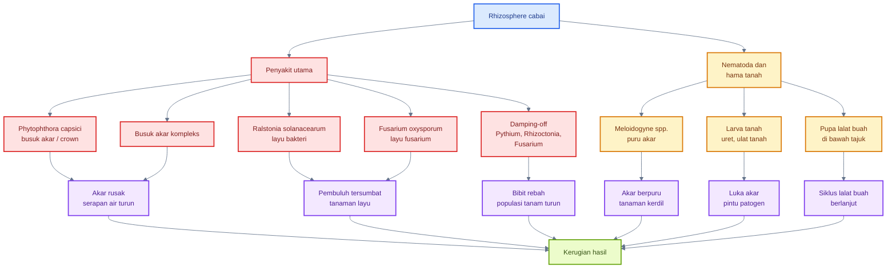

---

## 7.1 Penyakit utama

### A. Busuk akar dan busuk pangkal oleh _Phytophthora capsici_

_Phytophthora capsici_ adalah salah satu patogen paling berbahaya pada cabai karena dapat menyerang akar, crown, batang, daun, dan buah. Dalam konteks rhizosphere, masalah paling penting adalah busuk akar dan busuk pangkal. Penyakit ini sangat terkait dengan kondisi hangat-basah, genangan, drainase buruk, dan percikan air.

Oklahoma State Extension menyebut _P. capsici_ sebagai patogen tular tanah mirip fungi yang membutuhkan cuaca hangat dan basah untuk pertumbuhan serta perkembangan penyakit. Struktur bertahan yang disebut oospora dapat tetap dorman di tanah hingga 10 tahun. ([extension.okstate.edu][1])

NC State Extension juga menjelaskan bahwa gejala paling umum pada pepper adalah crown rot dan fruit rot; pada kondisi basah, penyakit sering tampak sebagai tanaman layu yang kemudian mati, dengan lesi crown berwarna cokelat gelap yang meluas ke atas dan mengelilingi batang. ([NC State Extension][2])

#### Mengapa _Phytophthora_ berbahaya pada cabai?

Penyakit ini berbahaya karena:

- dapat menyerang banyak bagian tanaman;
- berkembang cepat saat tanah basah;
- dapat bertahan lama di tanah;
- mudah menyebar melalui air;
- sulit dikendalikan bila sudah mapan di lahan;
- menyebabkan tanaman layu mendadak dan mati.

Pada lahan cabai, ledakan _Phytophthora_ sering terjadi setelah hujan panjang, irigasi berlebih, bedengan rendah, parit tersumbat, atau air mengalir dari area sakit ke area sehat.

#### Zona rawan

| Zona                 | Risiko                                    |
| -------------------- | ----------------------------------------- |
| Pangkal batang/crown | busuk pangkal dan tanaman mati            |
| Akar muda            | busuk akar dan serapan air turun          |
| Bedengan basah       | patogen berkembang dan menyebar           |
| Parit/genangan       | sumber penyebaran melalui air             |
| Buah dekat tanah     | busuk buah akibat percikan dan kelembapan |

#### Gejala lapang

Gejala yang perlu dicurigai:

- tanaman layu walau tanah basah;
- pangkal batang cokelat gelap;
- akar cokelat, busuk, atau berkurang;
- serangan sering mengikuti jalur air;
- tanaman mati dalam pola petak atau alur drainase;
- pada kondisi lembap, penyakit dapat naik ke batang, daun, dan buah.

#### Implikasi PHT

Pengendalian _Phytophthora_ tidak boleh hanya mengandalkan fungisida atau mikroba. Fondasinya adalah:

- bedengan tinggi;
- drainase sangat baik;
- irigasi tidak berlebihan;
- hindari aliran air dari petak sakit;
- rotasi panjang dengan tanaman bukan inang bila memungkinkan;
- cabut tanaman sakit berat;
- gunakan mikroba antagonis secara preventif;
- gunakan fungisida selektif sesuai label bila risiko tinggi.

Prinsip praktis:

> Untuk _Phytophthora_, drainase adalah “pestisida pertama”.

---

### B. Layu bakteri oleh _Ralstonia solanacearum_

Layu bakteri oleh _Ralstonia solanacearum_ merupakan penyakit tular tanah yang sangat destruktif pada banyak tanaman, termasuk cabai/pepper. Patogen ini menyerang sistem pembuluh tanaman. Setelah masuk melalui akar atau luka, bakteri berkembang di xilem dan menghambat aliran air. Akibatnya, tanaman dapat layu mendadak meskipun tanah masih cukup basah.

Review tentang _Ralstonia solanacearum_ menyebut patogen ini sebagai bakteri tular tanah penyebab bacterial wilt yang tersebar luas dan menyerang berbagai tanaman penting. ([PMC][3]) Studi lain menyebut bacterial wilt oleh _Ralstonia solanacearum_ sebagai penyakit tular tanah destruktif pada pepper/cabai dan berpotensi menimbulkan kerugian besar. ([PMC][4])

#### Mengapa layu bakteri sulit dikendalikan?

Layu bakteri sulit dikendalikan karena:

- patogen berada di tanah dan air;
- dapat masuk melalui luka akar;
- berkembang di pembuluh tanaman;
- gejala layu sering muncul setelah infeksi sistemik;
- pestisida kontak sulit menjangkau bakteri di xilem;
- tanaman sakit menjadi sumber inokulum.

#### Gejala lapang

Gejala yang sering terlihat:

- tanaman layu mendadak;
- daun bisa tetap hijau pada fase awal;
- layu lebih jelas pada siang hari;
- tanaman tidak pulih walau disiram;
- potongan batang dapat menunjukkan lendir bakteri pada uji sederhana;
- pola serangan bisa menyebar dari titik tertentu melalui air, alat, atau pergerakan tanah.

#### Zona rawan

| Zona                | Risiko                            |
| ------------------- | --------------------------------- |
| Akar luka           | pintu masuk bakteri               |
| Rhizoplane          | kontak awal patogen dengan akar   |
| Pembuluh xilem      | lokasi perkembangan sistemik      |
| Tanah hangat-lembap | mendukung survival dan penyebaran |
| Area tanaman sakit  | sumber inokulum                   |

#### Implikasi PHT

Pengendalian layu bakteri harus berbasis pencegahan:

- gunakan bibit sehat;
- hindari menanam di lahan dengan riwayat layu berat;
- cabut tanaman sakit bersama akar;
- hindari mengolah tanah basah dari area sakit ke sehat;
- desinfeksi alat;
- perbaiki drainase;
- lakukan rotasi tanaman bukan inang;
- gunakan bahan organik matang;
- dukung mikroba antagonis dan tanah supresif.

Mikroba seperti _Bacillus_, _Pseudomonas_, kompos matang, dan PGPR dapat menjadi bagian program, tetapi tidak realistis diperlakukan sebagai “obat” untuk tanaman yang sudah tersumbat pembuluhnya.

---

### C. Layu fusarium

Layu fusarium pada cabai umumnya terkait dengan _Fusarium oxysporum_. Patogen ini menyerang akar dan sistem pembuluh. Gejala sering berkembang lebih lambat dibanding layu bakteri. Tanaman dapat menunjukkan daun menguning, layu bertahap, pertumbuhan terhambat, dan penurunan vigor.

Pada rhizosphere, _Fusarium_ penting karena dapat bertahan di tanah dan sisa akar. Penyakit ini sering lebih berat pada tanah yang terus ditanami cabai atau tanaman sekeluarga, drainase buruk, akar stres, dan tanah dengan mikrobioma tidak seimbang.

#### Gejala lapang

Gejala yang perlu diamati:

- daun bawah menguning;
- layu bertahap;
- tanaman kerdil;
- sebagian cabang dapat lebih parah;
- jaringan pembuluh tampak kecokelatan saat batang dibelah;
- akar terlihat lemah atau rusak.

#### Faktor pendukung

- monokultur cabai;
- sisa akar sakit;
- tanah padat;
- akar luka;
- salinitas;
- bahan organik belum matang;
- kelembapan tidak stabil;
- tanaman stres.

#### Implikasi PHT

Strategi pengendalian:

- gunakan bibit sehat;
- rotasi tanaman;
- sanitasi tanaman sakit;
- cabut akar sakit;
- gunakan _Trichoderma_, _Bacillus_, _Pseudomonas_, atau _Streptomyces_ secara preventif;
- perbaiki struktur tanah;
- hindari pupuk pekat yang merusak akar;
- jaga pH dan kelembapan.

_Trichoderma_ relevan karena mampu berkompetisi, menghasilkan enzim lisis, dan menghambat fungi patogen. Namun efektivitasnya tetap bergantung pada strain, formulasi, dan kondisi tanah.

---

### D. Damping-off

Damping-off adalah penyakit penting pada fase benih dan bibit. Penyebabnya dapat mencakup _Pythium_, _Rhizoctonia_, _Fusarium_, dan _Phytophthora_. UC IPM menjelaskan damping-off dapat disebabkan oleh beberapa fungi dan organisme mirip fungi tanah; _Pythium_ sering paling bertanggung jawab, tetapi _Rhizoctonia_, _Fusarium_, dan _Phytophthora_ juga dapat menyebabkan pembusukan. ([UC IPM][5])

Pada pepper, _Pythium_ dapat menyebabkan pre-emergence dan post-emergence damping-off, termasuk pembusukan benih atau bibit muda. ([PMC][6])

#### Gejala damping-off

Gejala di persemaian:

- benih tidak tumbuh karena busuk;
- bibit rebah di pangkal;
- pangkal batang mengecil dan busuk;
- akar pendek dan cokelat;
- bibit layu setelah muncul;
- sebaran sering terkait media terlalu basah.

#### Faktor pemicu

- media terlalu basah;
- drainase tray buruk;
- tray tidak steril;
- benih tidak sehat;
- penyiraman berlebihan;
- sirkulasi udara buruk;
- media mengandung bahan organik belum matang;
- kepadatan bibit terlalu tinggi.

#### Implikasi PHT

Pencegahan jauh lebih efektif dibanding pengobatan:

- gunakan media semai bersih/matang;
- sanitasi tray;
- hindari overwatering;
- beri aerasi cukup;
- gunakan PGPR atau _Trichoderma_ pada media;
- seleksi bibit sehat;
- buang bibit sakit;
- jangan memakai ulang media sakit tanpa perlakuan.

---

### E. Busuk akar kompleks

Busuk akar kompleks terjadi ketika beberapa faktor bekerja bersama: akar lemah, tanah terlalu basah, patogen, nematoda, salinitas, tanah padat, bahan organik mentah, dan pemupukan tidak seimbang. Dalam kondisi ini, sulit menunjuk satu penyebab tunggal.

#### Ciri busuk akar kompleks

- akar cokelat, pendek, atau membusuk;
- akar putih aktif sedikit;
- tanaman layu saat siang;
- pertumbuhan tidak seragam;
- daun menguning;
- bunga gugur;
- respons terhadap pupuk buruk;
- gejala muncul bertahap di beberapa titik lahan.

#### Mengapa kompleks?

Karena satu faktor melemahkan faktor lain. Contoh:

- tanah becek menurunkan oksigen;
- oksigen rendah membuat akar lemah;
- akar lemah mudah diserang _Pythium_ atau _Phytophthora_;
- nematoda membuat luka;
- luka menjadi pintu _Fusarium_ atau bakteri;
- pupuk pekat memperparah kerusakan akar.

#### Implikasi PHT

Pendekatannya harus sistemik:

- bongkar akar untuk diagnosis;
- cek drainase;
- cek pH dan EC bila tersedia alat;
- perbaiki bedengan;
- gunakan bahan organik matang;
- hentikan over-irrigation;
- gunakan mikroba preventif;
- sanitasi tanaman sakit;
- rotasi tanaman;
- hindari pupuk pekat langsung ke akar.

---

## 7.2 Nematoda dan hama tanah

### A. Nematoda puru akar: _Meloidogyne_ spp.

Nematoda puru akar _Meloidogyne_ spp. menyerang akar dan menyebabkan terbentuknya puru atau bintil. Puru ini mengganggu fungsi akar dalam menyerap air dan hara. Akibatnya, tanaman cabai dapat menjadi kerdil, mudah layu, daun menguning, buah kecil, dan produktivitas turun.

Root-knot nematode _Meloidogyne incognita_ dilaporkan dapat sangat menurunkan hasil pepper secara global. ([Frontiers][7]) USDA juga menyebut southern root-knot nematode _M. incognita_ menyebabkan kerugian besar pada produksi pepper di Amerika Serikat dan dunia. ([ARS][8])

#### Gejala lapang

Gejala di atas tanah:

- tanaman kerdil;
- daun pucat;
- layu saat panas;
- pertumbuhan tidak seragam;
- respons pupuk rendah;
- hasil turun.

Gejala pada akar:

- puru atau bintil akar;
- akar bercabang tidak normal;
- akar aktif berkurang;
- akar mudah terserang patogen sekunder.

#### Mengapa nematoda memperparah penyakit tanah?

Nematoda membuat luka pada akar dan mengganggu fungsi fisiologis akar. Luka ini dapat menjadi pintu masuk patogen seperti _Fusarium_, _Ralstonia_, atau kompleks busuk akar. Jadi, nematoda tidak hanya menurunkan serapan hara, tetapi juga memperbesar risiko penyakit lain.

#### Implikasi PHT

Strategi PHT nematoda:

- cek akar secara rutin;
- gunakan rotasi tanaman bukan inang;
- gunakan varietas/toleransi bila tersedia;
- cabut akar tanaman sakit;
- gunakan bahan organik matang;
- gunakan mikroba antagonis nematoda seperti _Purpureocillium_ atau _Pochonia_ bila tersedia dan sesuai label;
- hindari membawa tanah terinfestasi ke area sehat;
- solarisasi atau biofumigasi bila memungkinkan.

---

### B. Larva tanah

Larva tanah meliputi larva kumbang, uret, ulat tanah, dan berbagai serangga yang hidup di tanah atau permukaan dekat tanah. Mereka dapat memakan akar, memotong pangkal bibit, atau membuat luka yang membuka jalan bagi patogen.

#### Risiko utama

- akar terpotong;
- bibit mati mendadak;
- pangkal tanaman terluka;
- serapan hara terganggu;
- patogen sekunder masuk melalui luka.

#### Faktor pemicu

- bahan organik belum matang;
- sisa tanaman membusuk;
- gulma;
- tanah lembap dan banyak bahan organik kasar;
- sanitasi buruk;
- riwayat lahan dengan hama tanah.

#### Strategi PHT

- gunakan kompos matang;
- olah tanah sebelum tanam;
- bersihkan sisa tanaman;
- monitoring pangkal tanaman;
- gunakan perangkap atau metode mekanis bila sesuai;
- gunakan entomopatogen seperti _Metarhizium_ atau _Beauveria_ untuk target tertentu sesuai label;
- gunakan pestisida tanah selektif hanya bila perlu.

---

### C. Pupa lalat buah di tanah

Lalat buah menyerang buah, tetapi sebagian siklus hidupnya terjadi di tanah. Larva keluar dari buah busuk atau buah jatuh, lalu berpupa di tanah bawah tajuk. Jika buah jatuh dibiarkan, tanah di bawah tanaman menjadi tempat regenerasi populasi lalat buah.

#### Hubungan dengan buah jatuh

Buah jatuh yang terserang lalat buah adalah sumber larva. Larva dapat keluar dan masuk ke tanah untuk berpupa. Dengan demikian, sanitasi buah bukan hanya urusan phyllosphere atau panen, tetapi juga bagian dari pengelolaan rhizosphere.

#### Strategi PHT

- kumpulkan buah jatuh secara rutin;
- musnahkan buah terserang;
- jangan buang buah busuk di pinggir lahan;
- gunakan perangkap methyl eugenol untuk lalat jantan spesies responsif;
- gunakan protein bait atau spinosad bait sesuai label;
- pertimbangkan nematoda entomopatogen di tanah bila tersedia;
- kelola area bawah tajuk agar tidak menjadi reservoir.

---

### Formula monitoring sederhana Bab 7

Insidensi tanaman layu:

$$
\text{Insidensi layu} = \frac{\text{jumlah tanaman layu}}{\text{jumlah tanaman diamati}} \times 100%
$$

Persentase akar berpuru:

$$
\text{Akar berpuru} = \frac{\text{jumlah tanaman dengan puru akar}}{\text{jumlah tanaman dibongkar}} \times 100%
$$

Persentase tanaman mati:

$$
\text{Tanaman mati} = \frac{\text{jumlah tanaman mati}}{\text{jumlah tanaman awal}} \times 100%
$$

[**Kembali ke Atas**](#rhizosphere-cabai-sebagai-zona-strategis-pht-mengelola-mikrobioma-akar-untuk-menekan-penyakit-tular-tanah-nematoda-dan-stres-tanaman)

---

## 8. Upaya IPM/PHT untuk mengantisipasi masalah rhizosphere cabai

PHT rhizosphere cabai harus dimulai sebelum benih ditanam. Jika patogen tanah sudah tinggi, drainase buruk, bahan organik mentah digunakan, dan bibit lemah masuk ke lahan, maka tindakan setelah tanaman sakit akan jauh lebih sulit.

FAO menjelaskan IPM sebagai pendekatan ekosistem yang menggabungkan berbagai strategi dan praktik untuk menumbuhkan tanaman sehat serta meminimalkan penggunaan pestisida. IPM juga menekankan monitoring, penggunaan varietas tahan bila tersedia, rotasi, praktik budidaya, non-kimia, dan penggunaan agrokimia sebagai pilihan terakhir dengan praktik aplikasi yang baik. ([FAOHome][9])

Dalam konteks rhizosphere, PHT berarti membangun kondisi akar yang tidak mudah dikuasai patogen. Strategi utamanya adalah pencegahan, pemilihan lahan, media sehat, bibit sehat, drainase, rotasi, bahan organik matang, inokulasi mikroba, monitoring akar, intervensi selektif bila perlu, dan evaluasi.

---

### Diagram alur PHT rhizosphere cabai

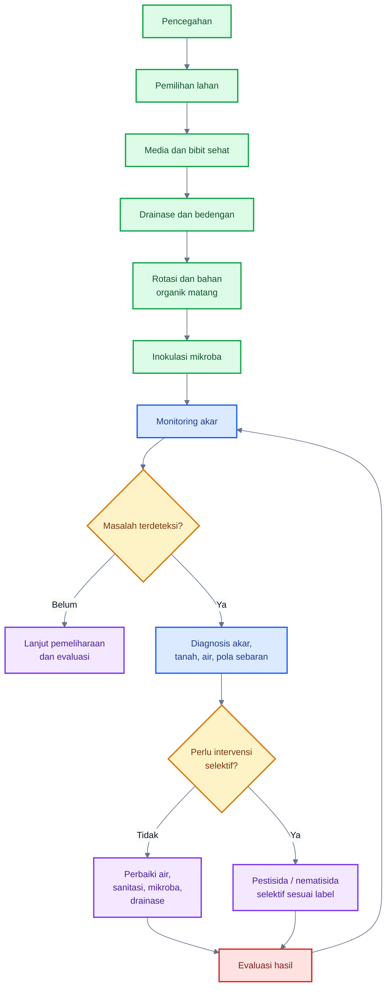

---

## 8.1 Prinsip besar IPM rhizosphere

### 1. Pencegahan

Pencegahan adalah dasar PHT rhizosphere. Penyakit tanah sulit dikendalikan setelah berkembang. Karena itu, tindakan terbaik dilakukan sebelum tanam: pilih lahan, benih sehat, media sehat, drainase baik, bahan organik matang, dan mikroba preventif.

### 2. Pemilihan lahan

Lahan dengan riwayat layu berat, busuk akar, nematoda, atau genangan harus dianggap berisiko tinggi. Jika tetap digunakan, perlu tindakan tambahan seperti rotasi, solarisasi, biofumigasi, bedengan tinggi, dan inokulasi mikroba.

### 3. Media sehat

Media semai harus bersih, matang, tidak terlalu basah, dan tidak mengandung bahan organik mentah. Media yang buruk dapat menyebabkan damping-off dan bibit lemah.

### 4. Bibit sehat

Bibit sehat adalah syarat utama. Bibit yang akarnya rusak, pangkal busuk, atau membawa patogen akan menjadi sumber masalah setelah pindah tanam.

### 5. Drainase

Drainase adalah komponen paling penting untuk banyak penyakit akar cabai. Bedengan tinggi dan parit berfungsi adalah bagian dari PHT, bukan sekadar konstruksi lahan.

### 6. Rotasi

Rotasi membantu menekan patogen spesifik dan nematoda. Rotasi dengan tanaman bukan inang lebih baik daripada menanam cabai atau Solanaceae terus-menerus.

### 7. Bahan organik matang

Bahan organik matang mendukung mikroba baik, struktur tanah, dan kapasitas menahan air. Bahan organik mentah justru dapat merusak akar.

### 8. Inokulasi mikroba

Mikroba seperti _Trichoderma_, PGPR, _Bacillus_, _Pseudomonas_, mikoriza, dan mikroba antagonis nematoda harus diberikan preventif, bukan menunggu tanaman mati.

### 9. Monitoring akar

Monitoring akar dilakukan dengan membongkar sampel tanaman bermasalah. Jangan hanya melihat daun. Akar perlu dicek: putih aktif atau cokelat busuk, ada puru atau tidak, ada bau busuk atau tidak, pangkal batang sehat atau tidak.

### 10. Pestisida atau nematisida selektif bila perlu

Pestisida tanah bukan dilarang, tetapi harus berbasis diagnosis, sesuai target, terdaftar, dan mengikuti label. Jangan digunakan sebagai rutinitas yang merusak mikroba baik tanpa alasan kuat.

### 11. Evaluasi

Evaluasi mencakup jumlah tanaman layu, tanaman mati, kondisi akar, hasil panen, dan apakah tindakan yang dilakukan benar-benar menurunkan masalah.

---

## 8.2 Pra-tanam

Pra-tanam adalah fase paling strategis untuk PHT rhizosphere. Kesalahan pada fase ini sering berdampak sepanjang musim.

### Riwayat lahan

Catat riwayat lahan:

- pernah layu bakteri?
- pernah busuk pangkal?
- pernah _Phytophthora_?
- ada nematoda?
- sering tergenang?
- ditanami cabai terus-menerus?
- ada titik yang selalu mati?

Riwayat lahan menentukan tingkat risiko dan strategi.

### Uji pH dan EC

pH dan EC membantu membaca kondisi kimia tanah. pH ekstrem mengganggu hara dan mikroba. EC tinggi menunjukkan risiko salinitas atau pupuk berlebih.

Format target umum:

$$
\text{pH tanah cabai ideal umumnya} \approx 6{,}0 - 7{,}0
$$

Koreksi harus berdasarkan uji tanah dan dilakukan bertahap.

### Bedengan tinggi

Bedengan tinggi membantu akar tetap memiliki oksigen saat hujan. Ini penting untuk mencegah _Phytophthora_ dan busuk akar.

### Drainase

Drainase harus diuji sebelum tanam. Setelah hujan atau irigasi, air harus keluar dari lahan. Parit tidak boleh buntu.

### Solarisasi tanah bila memungkinkan

Solarisasi menggunakan plastik bening untuk memanaskan tanah pada periode tertentu. Ini dapat membantu menekan sebagian patogen dan gulma di lapisan atas tanah, terutama pada daerah panas dengan sinar matahari kuat.

### Pupuk kandang matang

Gunakan pupuk kandang yang benar-benar matang. Jangan gunakan pupuk kandang segar langsung ke lubang tanam.

### Kompos matang

Kompos matang membantu struktur tanah dan mikrobioma. Kompos dapat menjadi pembawa mikroba baik bila proses dan bahan aman.

### _Trichoderma_ di media

_Trichoderma_ dapat dicampur ke media semai, kompos matang, atau lubang tanam sesuai label. Tujuannya adalah membantu kolonisasi awal sebelum patogen.

### PGPR seed treatment

Perlakuan benih atau akar bibit dengan PGPR membantu akar muda bertemu mikroba baik sejak awal.

### Rotasi non-Solanaceae

Hindari menanam cabai setelah cabai, tomat, terung, atau tanaman Solanaceae lain bila riwayat penyakit tanah berat. Gunakan tanaman rotasi bukan inang bila memungkinkan.

---

## 8.3 Persemaian

Persemaian adalah tempat membangun akar awal. Bibit dengan akar sehat akan lebih kuat setelah pindah tanam.

### Media steril atau matang

Media harus bersih dan matang. Jika menggunakan kompos, pastikan matang. Jika menggunakan tanah, pastikan tidak berasal dari lahan sakit.

### Tray bersih

Tray semai harus dibersihkan. Patogen damping-off dapat terbawa media, tray, air, dan alat.

### PGPR

PGPR dapat diberikan pada benih atau media sesuai label. Tujuannya mendukung akar awal dan mengurangi stres bibit.

### _Trichoderma_

_Trichoderma_ dapat digunakan pada media semai untuk menekan patogen tanah. Aplikasinya harus preventif.

### Hindari overwatering

Overwatering adalah pemicu damping-off. Media cukup lembap, bukan basah terus-menerus. Pastikan drainase tray baik.

### Seleksi bibit sehat

Bibit yang pangkalnya busuk, akar cokelat, pertumbuhan abnormal, atau layu harus dibuang. Jangan memindahkan bibit sakit ke lahan.

---

## 8.4 Setelah pindah tanam

Fase setelah pindah tanam adalah fase rawan karena akar mengalami luka dan stres adaptasi.

### Kocor mikroba awal

Kocor mikroba awal bertujuan membantu kolonisasi akar baru. Mikroba yang relevan dapat berupa PGPR, _Bacillus_, _Pseudomonas_, _Trichoderma_, atau mikoriza sesuai target.

### Hindari pupuk pekat menyentuh akar

Pupuk yang terlalu pekat dapat membakar akar muda. Pupuk dasar harus tercampur merata dan tidak langsung menempel pada akar bibit.

### Jaga kelembapan

Kelembapan harus stabil. Terlalu kering membuat akar stres. Terlalu basah memicu busuk akar.

### Monitoring layu

Jika ada tanaman layu, jangan langsung disiram banyak. Bongkar sebagian tanaman sampel dan cek akar.

### Sulam tanaman sakit dengan hati-hati

Jika tanaman mati karena penyakit tanah, menyulam tanpa memperbaiki titik tanam sering gagal. Tanah di sekitar tanaman sakit perlu dievaluasi, mungkin perlu dibuang sebagian, diberi perlakuan, atau titik tersebut dihindari.

---

## 8.5 Fase vegetatif dan generatif

Pada fase vegetatif dan generatif, akar bekerja keras mendukung tajuk, bunga, dan buah. Gangguan akar pada fase ini langsung berdampak pada hasil.

### Akar aktif

Akar aktif perlu dijaga dengan kelembapan stabil, hara seimbang, dan aerasi baik. Jangan biarkan akar berada dalam kondisi kering-ekstrem lalu basah berlebihan.

### Kebutuhan air

Kebutuhan air meningkat saat tanaman besar dan berbuah. Namun irigasi tetap harus terukur. Air berlebih dapat memicu penyakit tanah.

### Risiko genangan

Setelah hujan, cek parit dan bedengan. Tanaman cabai bisa rusak cepat bila akar tergenang.

### Monitoring layu

Layu di fase ini harus didiagnosis:

- apakah tanah terlalu kering?
- apakah tanah terlalu basah?
- apakah akar busuk?
- apakah ada puru nematoda?
- apakah pangkal batang cokelat?
- apakah pola serangan mengikuti aliran air?

### Aplikasi mikroba berkala

Aplikasi mikroba dapat diulang berkala, terutama setelah hujan besar, stres akar, atau aplikasi pestisida tanah. Namun pastikan mikroba tidak dicampur dengan bahan yang membunuhnya.

### Sanitasi tanaman sakit

Tanaman sakit berat harus dicabut bersama akar. Jangan biarkan menjadi sumber inokulum.

---

## 8.6 Akhir musim

Akhir musim adalah fase memutus siklus patogen tanah. Banyak masalah rhizosphere berulang karena sisa akar sakit dibiarkan.

### Cabut akar sakit

Tanaman yang sakit harus dicabut bersama akar. Sisa akar adalah tempat patogen dan nematoda bertahan.

### Musnahkan sisa tanaman

Sisa tanaman sakit sebaiknya tidak dikomposkan sembarangan. Jika pengomposan tidak panas dan matang, patogen dapat bertahan.

### Rotasi

Rotasi dengan tanaman bukan inang membantu menurunkan tekanan patogen. Rotasi juga membantu memperbaiki struktur tanah dan mikrobioma.

### Biofumigasi

Biofumigasi menggunakan tanaman tertentu, sering dari keluarga Brassicaceae, yang ketika dihancurkan dapat menghasilkan senyawa yang membantu menekan sebagian patogen atau nematoda. Praktik ini harus dilakukan dengan benar agar efektif dan tidak merusak tanaman berikutnya.

### Komposisasi aman

Jika sisa tanaman akan dikomposkan, proses harus benar-benar matang dan panas. Jangan mengembalikan bahan sakit yang belum matang ke lahan.

### Perbaikan tanah

Akhir musim adalah waktu untuk memperbaiki:

- pH;
- bahan organik;
- drainase;
- struktur tanah;
- rotasi;
- titik genangan;
- inokulasi mikroba untuk musim berikutnya.

---

## Kalender singkat tindakan PHT rhizosphere

| Fase         | Fokus akar              | Tindakan utama                                                      |
| ------------ | ----------------------- | ------------------------------------------------------------------- |
| Pra-tanam    | riwayat lahan dan tanah | uji pH/EC, drainase, bedengan, kompos matang, rotasi                |
| Persemaian   | akar bibit              | media sehat, tray bersih, PGPR, _Trichoderma_, hindari overwatering |
| Pindah tanam | akar luka dan adaptasi  | kocor mikroba, hindari pupuk pekat, jaga kelembapan                 |
| Vegetatif    | akar aktif              | monitoring layu, irigasi terukur, mikroba berkala                   |
| Generatif    | akar mendukung buah     | cegah genangan, nutrisi seimbang, sanitasi tanaman sakit            |
| Akhir musim  | sumber inokulum         | cabut akar sakit, musnahkan sisa, rotasi, perbaikan tanah           |

---

## Ringkasan praktis Bab 7 dan Bab 8

Masalah rhizosphere cabai meliputi penyakit tular tanah, nematoda, dan hama tanah. _Phytophthora capsici_ sangat terkait kondisi hangat-basah dan drainase buruk; _Ralstonia solanacearum_ menyerang pembuluh dan menyebabkan layu bakteri; _Fusarium oxysporum_ menyebabkan layu bertahap; damping-off menyerang benih dan bibit; sedangkan busuk akar kompleks muncul dari interaksi akar lemah, patogen, nematoda, kelembapan, dan salinitas.

Nematoda _Meloidogyne_ spp. menyebabkan puru akar, mengganggu serapan air/hara, dan memperparah infeksi patogen tanah. Larva tanah melukai akar, sedangkan pupa lalat buah di tanah menunjukkan bahwa sanitasi buah juga bagian dari PHT rhizosphere.

PHT rhizosphere harus dimulai dari pra-tanam: riwayat lahan, pH/EC, drainase, bedengan, media sehat, bibit sehat, bahan organik matang, rotasi, mikroba preventif, monitoring akar, dan sanitasi akhir musim.

Prinsip kuncinya:

> Pengendalian penyakit akar cabai paling efektif dilakukan sebelum akar rusak. Setelah akar busuk, pilihan menjadi lebih mahal, lebih sulit, dan hasilnya lebih tidak pasti.

[1]: https://extension.okstate.edu/fact-sheets/phytophthora-blight-of-cucurbits-and-peppers?utm_source=chatgpt.com 'Phytophthora Blight of Cucurbits and Peppers'
[2]: https://content.ces.ncsu.edu/phytophthora-blight-of-peppers?utm_source=chatgpt.com 'Phytophthora Blight of Peppers'
[3]: https://pmc.ncbi.nlm.nih.gov/articles/PMC6638647/?utm_source=chatgpt.com 'Ralstonia solanacearum, a widespread bacterial plant ... - PMC'
[4]: https://pmc.ncbi.nlm.nih.gov/articles/PMC9998985/?utm_source=chatgpt.com 'Ralstonia solanacearum – A soil borne hidden enemy of plants'
[5]: https://ipm.ucanr.edu/home-and-landscape/damping-off-diseases-in-the-garden/?utm_source=chatgpt.com 'Damping-off Diseases in the Garden'
[6]: https://pmc.ncbi.nlm.nih.gov/articles/PMC8069622/?utm_source=chatgpt.com 'Pythium Damping-Off and Root Rot of Capsicum annuum L.'
[7]: https://www.frontiersin.org/journals/plant-science/articles/10.3389/fpls.2019.00886/full?utm_source=chatgpt.com 'Physical Localization of the Root-Knot Nematode (Meloidogyne ...'
[8]: https://www.ars.usda.gov/research/publications/publication/?seqNo115=232461&utm_source=chatgpt.com 'Virulence of Meloidogyne incognita to expression of N gene in pepper'
[9]: https://www.fao.org/pest-and-pesticide-management/ipm/integrated-pest-management/en/?utm_source=chatgpt.com 'Integrated Pest Management (IPM)'

[**Kembali ke Atas**](#rhizosphere-cabai-sebagai-zona-strategis-pht-mengelola-mikrobioma-akar-untuk-menekan-penyakit-tular-tanah-nematoda-dan-stres-tanaman)

---

## 9. Inokulasi mikroba menguntungkan dalam kerangka IPM rhizosphere

Inokulasi mikroba menguntungkan pada rhizosphere cabai adalah strategi memasukkan mikroorganisme bermanfaat ke zona akar agar akar lebih cepat dikolonisasi oleh mikroba baik dibanding patogen tanah atau nematoda. Dalam praktik PHT, mikroba akar tidak diperlakukan sebagai “obat tunggal”, melainkan sebagai **lapisan proteksi biologis preventif** yang bekerja bersama media sehat, drainase, bahan organik matang, rotasi, sanitasi, dan monitoring akar.

Mikroba akar yang umum digunakan meliputi _Trichoderma_, PGPR, _Bacillus_, _Pseudomonas_, _Streptomyces_, mikoriza, _Purpureocillium_, _Pochonia_, dan beberapa mikroba lain sesuai target. Perannya bisa berbeda: ada yang lebih kuat untuk patogen tanah, ada yang untuk vigor akar, ada yang untuk nematoda, dan ada yang lebih relevan untuk toleransi stres.

Kunci utamanya bukan sekadar “berapa banyak dikocor”, tetapi **apakah mikroba hidup mampu mencapai akar, bertahan, mengolonisasi rhizoplane, dan bekerja pada kondisi tanah yang mendukung**.

---

### Diagram posisi inokulasi mikroba dalam IPM rhizosphere cabai

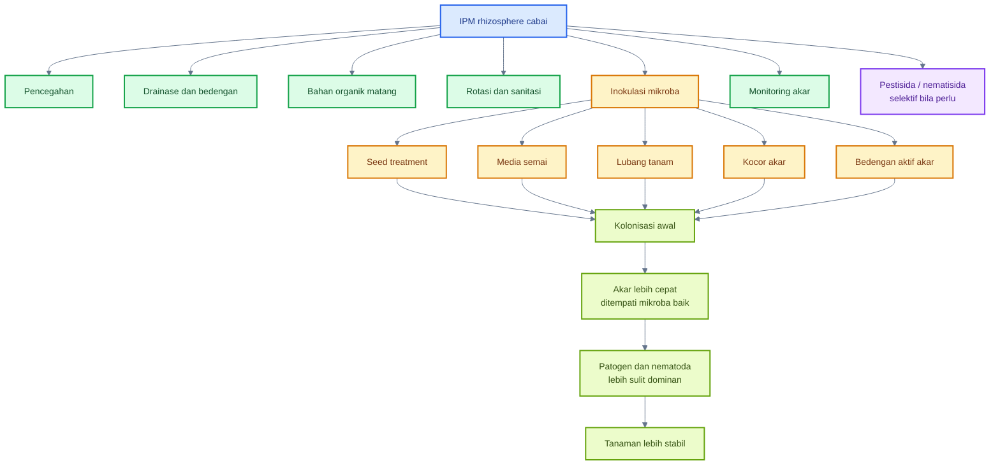

---

## 9.1 Posisi mikroba dalam PHT akar

### Mikroba bukan pengganti total fungisida atau nematisida

Mikroba menguntungkan tidak boleh diposisikan sebagai pengganti total semua fungisida, bakterisida, atau nematisida. Pada tekanan penyakit rendah sampai sedang, mikroba dapat membantu menekan patogen dan memperkuat tanaman. Namun pada kondisi penyakit berat, drainase rusak, populasi nematoda tinggi, atau tanaman sudah layu sistemik, mikroba biasanya tidak cukup bila berdiri sendiri.

Dalam PHT, mikroba adalah bagian dari sistem. Ia bekerja bersama:

- bibit sehat;
- media semai bersih;
- drainase baik;
- bahan organik matang;
- rotasi tanaman;
- sanitasi akar sakit;
- monitoring akar;
- pestisida/nematisida selektif bila benar-benar diperlukan.

Studi pada pepper menunjukkan bahwa beberapa agen biokontrol, termasuk beberapa _Trichoderma_ dan mikroba lain, dievaluasi untuk menekan penyakit oleh _Phytophthora capsici_ dan _P. parasitica_, tetapi pendekatan biokontrol tetap perlu dibaca sebagai bagian dari strategi pengelolaan terpadu, bukan solusi tunggal untuk semua kondisi lapang. ([PMC][1])

### Mikroba bekerja preventif

Mikroba akar paling kuat bila hadir sebelum patogen mendominasi. Ini karena mikroba perlu menempel pada akar, menggunakan eksudat, membentuk populasi, dan menempati ruang di rhizoplane. Jika aplikasi dilakukan setelah akar busuk berat, maka jaringan akar sudah rusak dan ruang biologis sering sudah dikuasai patogen.

Urutan yang ideal:

1. perlakuan benih;
2. aplikasi media semai;
3. inokulasi lubang tanam;
4. kocor awal setelah pindah tanam;
5. aplikasi berkala saat akar aktif;
6. re-inokulasi setelah stres berat, hujan ekstrem, atau aplikasi pestisida keras.

### Kolonisasi akar lebih penting daripada sekadar “kocor banyak”

Banyak kegagalan aplikasi mikroba terjadi karena fokus pada volume kocor, bukan kolonisasi. Larutan mikroba yang banyak tidak menjamin berhasil bila:

- tidak mencapai akar aktif;
- air terlalu berklorin;
- pH larutan ekstrem;
- tanah terlalu becek;
- tanah terlalu kering;
- EC terlalu tinggi;
- mikroba dicampur fungisida/nematisida keras;
- produk sudah rusak atau kedaluwarsa.

Konsep yang benar:

> Yang menentukan bukan hanya jumlah mikroba yang masuk ke tanah, tetapi jumlah mikroba hidup yang berhasil menempel dan bertahan pada zona akar aktif.

### Hasil sangat tergantung strain, formulasi, dan kondisi tanah

Nama mikroba tidak cukup. _Trichoderma_ antarspesies dan antarstrain bisa berbeda. _Bacillus_ juga tidak semuanya sama. _Pseudomonas_ tertentu bisa kuat sebagai PGPR, tetapi belum tentu tahan terhadap kondisi tanah ekstrem. Mikoriza harus kontak dengan akar dan dipengaruhi oleh kadar fosfor. _Purpureocillium_ dan _Pochonia_ harus dipilih berdasarkan target nematoda dan formulasi.

Faktor penentu hasil:

| Faktor         | Mengapa penting                                                  |
| -------------- | ---------------------------------------------------------------- |
| Strain         | menentukan kemampuan biokontrol, kolonisasi, dan toleransi stres |
| Formulasi      | menentukan daya simpan dan viabilitas                            |
| Tanah/media    | menentukan habitat mikroba                                       |
| Kelembapan     | menentukan aktivitas mikroba dan akar                            |
| pH             | memengaruhi mikroba dan ketersediaan hara                        |
| Bahan organik  | menyediakan habitat dan karbon                                   |
| Pestisida      | dapat membunuh mikroba hidup bila tidak kompatibel               |
| Waktu aplikasi | menentukan siapa lebih dulu menguasai akar                       |

---

## 9.2 Mikroba untuk penyakit akar cabai

Penyakit akar cabai memiliki karakter berbeda. _Phytophthora_ sangat terkait kondisi basah, _Fusarium_ sering bertahan di tanah dan jaringan akar, _Ralstonia_ masuk ke pembuluh, damping-off menyerang bibit, sedangkan nematoda membuat luka dan puru. Karena itu, mikroba harus dipilih berdasarkan target.

### Tabel mikroba potensial untuk penyakit akar cabai

| Target         | Mikroba potensial                                   | Mekanisme                             |
| -------------- | --------------------------------------------------- | ------------------------------------- |
| _Phytophthora_ | _Trichoderma_, _Bacillus_, _Pseudomonas_            | antagonisme, enzim, kompetisi, ISR    |
| _Fusarium_     | _Trichoderma_, _Bacillus_, _Streptomyces_           | antibiosis, parasitisme, kompetisi    |
| _Ralstonia_    | _Bacillus_, _Pseudomonas_, kompos supresif          | kompetisi, antibiosis, ISR            |
| Damping-off    | _Trichoderma_, _Bacillus_, PGPR                     | perlindungan media dan akar           |
| Nematoda       | _Purpureocillium_, _Pochonia_, _Bacillus_, mikoriza | parasit telur, toksin, ketahanan akar |

---

### A. Mikroba untuk _Phytophthora_

_Phytophthora capsici_ adalah target sulit karena sangat terkait dengan air, drainase, dan kondisi tanah. Mikroba seperti _Trichoderma_, _Bacillus_, dan _Pseudomonas_ dapat membantu menekan patogen melalui kompetisi, antagonisme, enzim, dan ISR, tetapi keberhasilannya sangat bergantung pada pencegahan genangan.

Studi pada pepper menunjukkan beberapa agen biokontrol seperti _Trichoderma aggressivum_, _T. longibrachiatum_, _Paecilomyces variotii_, dan _T. saturnisporum_ dievaluasi terhadap penyakit yang disebabkan _P. capsici_ dan _P. parasitica_ pada pepper, dengan hasil yang menunjukkan potensi sebagai alternatif biologis terhadap bahan kimia dalam konteks percobaan tersebut. ([PMC][1])

Strategi praktis:

- gunakan _Trichoderma_ sejak media/lubang tanam;
- gunakan _Bacillus_ atau _Pseudomonas_ sebagai dukungan akar;
- perbaiki drainase sebelum mengandalkan mikroba;
- hindari over-irrigation;
- cabut tanaman busuk berat;
- jangan membiarkan aliran air dari tanaman sakit ke sehat.

Prinsipnya:

> Mikroba dapat membantu menekan _Phytophthora_, tetapi drainase buruk akan mengalahkan banyak strategi biokontrol.

---

### B. Mikroba untuk _Fusarium_

_Fusarium oxysporum_ dapat bertahan di tanah dan sisa akar. Mikroba yang relevan antara lain _Trichoderma_, _Bacillus_, dan _Streptomyces_. Mekanismenya mencakup antibiosis, kompetisi, mikoparasitisme, enzim lisis, dan induksi ketahanan.

_Trichoderma_ penting karena dapat berkompetisi dengan fungi patogen dan menghasilkan enzim yang merusak struktur patogen. _Bacillus_ dapat mendukung melalui metabolit antimikroba dan pembentukan spora yang relatif tahan. _Streptomyces_ menarik karena dikenal sebagai aktinobakteri penghasil senyawa bioaktif.

Strategi praktis:

- aplikasikan mikroba sebelum tanam;
- gunakan kompos matang;
- cabut akar sakit;
- rotasi tanaman;
- hindari salinitas dan pupuk pekat;
- perbaiki struktur tanah;
- gunakan produk dengan strain jelas.

---

### C. Mikroba untuk _Ralstonia_

_Ralstonia solanacearum_ adalah bakteri tular tanah yang masuk melalui akar dan berkembang di pembuluh. Setelah masuk ke jaringan vaskular, pengendalian menjadi sangat sulit. Karena itu, mikroba untuk _Ralstonia_ harus diarahkan pada pencegahan: kompetisi di rhizosphere, induksi ketahanan, dan pembentukan tanah yang lebih supresif.

Mikroba potensial:

- _Bacillus_;
- _Pseudomonas_;
- kompos matang/supresif;
- PGPR tertentu.

PGPR dapat memicu priming pada tanaman sehingga tanaman merespons serangan patogen lebih kuat dan lebih cepat; konsep ini menjadi dasar penting penggunaan PGPR dalam sistem ketahanan tanaman. ([PMC][2])

Strategi praktis:

- gunakan bibit sehat;
- hindari luka akar;
- gunakan PGPR sejak semai;
- perbaiki drainase;
- cabut tanaman layu bersama akar;
- hindari memindahkan tanah dari area sakit;
- desinfeksi alat;
- rotasi tanaman.

Mikroba tidak realistis digunakan sebagai “obat” tanaman yang sudah layu berat akibat _Ralstonia_. Targetnya adalah mencegah infeksi awal dan menekan penyebaran.

---

### D. Mikroba untuk damping-off

Damping-off menyerang benih dan bibit. Mikroba seperti _Trichoderma_, _Bacillus_, dan PGPR dapat digunakan untuk melindungi media dan akar bibit. Namun faktor utama tetap media semai bersih, tray steril, aerasi baik, dan penyiraman tidak berlebihan.

Strategi praktis:

- campur _Trichoderma_ pada media semai sesuai label;
- gunakan PGPR untuk benih atau bibit;
- jaga media lembap, bukan basah;
- bersihkan tray;
- buang bibit rebah;
- jangan menggunakan media bekas penyakit tanpa perlakuan.

---

### E. Mikroba untuk nematoda

Nematoda puru akar _Meloidogyne_ spp. dapat ditekan dengan strategi biologis menggunakan _Purpureocillium_, _Pochonia_, beberapa _Bacillus_, dan mikoriza. _Purpureocillium_ dan _Pochonia_ dikenal sebagai fungi yang dapat menyerang telur atau stadia nematoda tertentu. Studi tentang _Pochonia chlamydosporia_ dan _Purpureocillium lilacinum_ menunjukkan keduanya dievaluasi sebagai agen biokontrol terhadap root-knot nematode, dengan fokus pada kemampuannya menekan nematoda pada sistem tanaman uji. ([PMC][3])

Strategi praktis:

- gunakan preventif sebelum populasi nematoda tinggi;
- aplikasikan ke zona akar;
- gunakan bahan organik matang;
- rotasi dengan tanaman bukan inang;
- cabut akar berpuru;
- jangan memindahkan tanah terinfestasi;
- kombinasikan dengan solarisasi atau biofumigasi bila sesuai.

---

## 9.3 Mikroba untuk pertumbuhan dan toleransi stres

Selain menekan penyakit, mikroba rhizosphere juga berperan dalam pertumbuhan dan toleransi stres. Pada cabai, ini penting karena tanaman sering menghadapi panas, kekeringan, salinitas, ketidakseimbangan hara, dan stres pindah tanam.

### A. PGPR

PGPR membantu tanaman melalui berbagai mekanisme: produksi fitohormon, pelarutan fosfat, fiksasi nitrogen oleh kelompok tertentu, siderofor, enzim, dan induksi ketahanan sistemik. Review PGPR menjelaskan bahwa bakteri menguntungkan di rhizosphere dapat meningkatkan pertumbuhan, meningkatkan toleransi stres, serta membantu proteksi tanaman terhadap penyakit. ([PMC][2])

Pada cabai, PGPR relevan untuk:

- perlakuan benih;
- persemaian;
- kocor setelah pindah tanam;
- pemulihan setelah stres akar;
- dukungan vegetatif dan generatif.

### B. Mikoriza

Mikoriza arbuskular membantu memperluas eksplorasi akar melalui hifa, terutama untuk fosfor dan air. Pada pepper, penelitian terbaru menunjukkan AMF dapat membantu mitigasi stres garam melalui perbaikan parameter fisiologis seperti konduktansi stomata dan proses terkait toleransi stres. ([MDPI][4]) Studi lain pada pepper juga menunjukkan mikoriza membantu meningkatkan toleransi terhadap stres salinitas melalui berbagai mekanisme terkait nutrisi dan fisiologi tanaman. ([PMC][5])

Pada cabai, mikoriza relevan untuk:

- media semai atau lubang tanam;
- tanah miskin fosfor tersedia;
- stres air ringan;
- sistem budidaya berkelanjutan;
- dukungan akar jangka panjang.

Catatan penting: mikoriza harus kontak dengan akar. Aplikasi jauh dari akar aktif sering tidak efektif.

### C. _Azospirillum_

_Azospirillum_ sering dikaitkan dengan pertumbuhan akar dan produksi fitohormon seperti IAA. Pada cabai, posisinya lebih sebagai pendukung vigor akar dan pertumbuhan awal, bukan sebagai biokontrol utama terhadap penyakit berat.

### D. _Bacillus_

_Bacillus_ berperan ganda: promosi pertumbuhan dan biokontrol. Kemampuan beberapa strain membentuk spora membuatnya relatif praktis untuk produk lapang. Pada cabai, _Bacillus_ dapat digunakan untuk mendukung akar, menekan patogen, dan membantu ISR.

### E. _Pseudomonas_

_Pseudomonas_ kuat dalam kompetisi di rhizosphere, produksi siderofor, dan pemicu ISR. Namun ia lebih sensitif terhadap kondisi ekstrem dibanding spora _Bacillus_, sehingga kualitas tanah dan air kocor sangat menentukan.

### F. _Methylobacterium_ sebagai jembatan phyllosphere-rhizosphere tertentu

_Methylobacterium_ lebih sering dibahas sebagai mikroba phyllosphere karena dapat memanfaatkan metanol dari jaringan tanaman. Namun beberapa kelompok methylotroph juga dapat berinteraksi dengan tanaman secara lebih luas. Dalam artikel ini, _Methylobacterium_ lebih tepat ditempatkan sebagai jembatan konsep antara mikrobioma bagian atas dan bawah tanaman: tanaman tidak hanya memiliki mikroba akar atau daun secara terpisah, tetapi satu sistem mikrobioma yang saling memengaruhi.

Untuk praktik cabai, _Methylobacterium_ bukan pilihan utama untuk penyakit akar, tetapi dapat dibahas sebagai bagian dari strategi mikrobioma tanaman sehat.

### G. Kompos matang

Kompos matang bukan hanya sumber hara. Ia adalah pendukung habitat mikroba, struktur tanah, retensi air, dan potensi supresivitas. Kompos matang dapat membantu mikroba baik bekerja lebih stabil, terutama bila dikombinasikan dengan _Trichoderma_, PGPR, atau pupuk hayati lain.

---

## 9.4 Hubungan mikroba akar dengan phyllosphere

Rhizosphere dan phyllosphere tidak terpisah. Akar yang sehat mendukung pucuk sehat, dan pucuk sehat menghasilkan fotosintat yang kembali mendukung akar. Mikroba akar dapat memengaruhi ketahanan bagian atas tanaman melalui ISR, sedangkan akar yang rusak dapat membuat phyllosphere menjadi lebih rentan terhadap hama dan penyakit.

### Akar sehat mendukung pucuk sehat

Akar sehat membantu:

- serapan air stabil;
- serapan hara seimbang;
- transport kalsium dan kalium;
- pembentukan tajuk kuat;
- bunga lebih stabil;
- buah lebih baik;
- tanaman tidak mudah stres.

Jika akar lemah, pucuk menjadi lebih rentan terhadap thrips, tungau, aphid, kutu kebul, gugur bunga, dan penyakit buah.

### ISR dari akar dapat memengaruhi ketahanan daun

Mikroba akar tertentu dapat memicu ketahanan sistemik. Kajian klasik tentang rhizobacteria-mediated ISR menjelaskan bahwa rhizobacteria nonpatogen dapat menginduksi ketahanan sistemik yang membantu tanaman menghadapi fungi, bakteri, dan virus pada berbagai tanaman model. ([Annual Reviews][6])

Implikasi praktis untuk cabai:

- aplikasi PGPR di akar dapat mendukung ketahanan tajuk;
- _Trichoderma_ di rhizosphere dapat membantu respons tanaman secara sistemik;
- _Bacillus_ dan _Pseudomonas_ dapat mendukung pertahanan akar dan daun;
- efeknya bersifat preventif dan sistemik, bukan knockdown cepat.

### Kekurangan akar memperlemah phyllosphere

Akar yang rusak menyebabkan:

- daun lebih cepat layu;
- stomata terganggu;
- nutrisi tidak seimbang;
- pucuk lemah;
- bunga gugur;
- buah kecil;
- pertahanan tanaman turun.

Kondisi ini dapat membuat mikroba baik di phyllosphere juga sulit bertahan karena tanaman menjadi stres.

### Strategi terbaik: dual inoculation akar + daun

Strategi paling kuat adalah menggabungkan inokulasi rhizosphere dan phyllosphere:

- akar diberi PGPR, _Trichoderma_, mikoriza, _Bacillus_, atau _Pseudomonas_;
- daun/pucuk/kelopak diberi mikroba foliar seperti _Bacillus_, ragi antagonis, atau entomopatogen sesuai target;
- keduanya dilakukan preventif;
- keduanya didukung monitoring dan sanitasi.

### Diagram hubungan mikroba akar dan phyllosphere

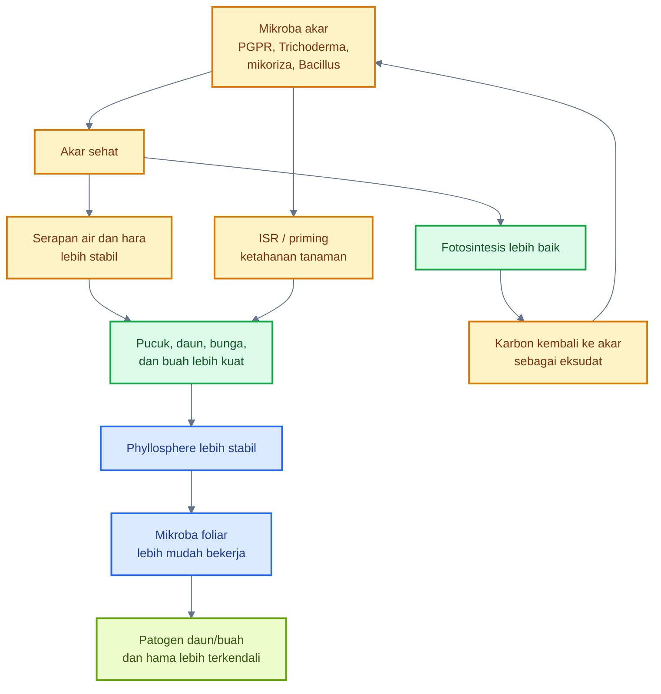

[**Kembali ke Atas**](#rhizosphere-cabai-sebagai-zona-strategis-pht-mengelola-mikrobioma-akar-untuk-menekan-penyakit-tular-tanah-nematoda-dan-stres-tanaman)

---

# 10. Strategi menyeluruh agar inokulasi mikroba rhizosphere berhasil

Inokulasi mikroba rhizosphere berhasil bila mikroba yang tepat ditempatkan pada target yang tepat, sejak awal, dalam tanah/media yang mendukung, dan tidak langsung dirusak oleh pestisida, pupuk pekat, salinitas, genangan, atau bahan organik mentah.

Strategi menyeluruh harus menjawab delapan pertanyaan:

1. Mikroba apa yang dipilih?
2. Targetnya apa?
3. Kapan diberikan?
4. Di zona mana diberikan?
5. Apakah tanah/media mendukung?
6. Apakah air kocor aman?
7. Apakah kompatibel dengan pestisida dan pupuk?
8. Bagaimana keberhasilannya dievaluasi?

---

### Diagram strategi keberhasilan inokulasi mikroba rhizosphere

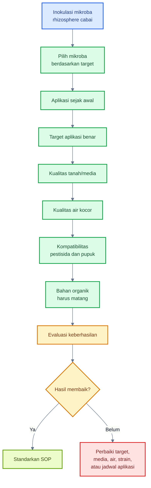

---

## 10.1 Pilih mikroba berdasarkan target

Kesalahan umum adalah membeli produk mikroba karena klaim “anti-layu” tanpa melihat target biologisnya. Padahal penyebab layu bisa berbeda: _Phytophthora_, _Ralstonia_, _Fusarium_, nematoda, salinitas, akar terbakar, atau genangan.

### _Trichoderma_ untuk patogen tanah dan akar

_Trichoderma_ cocok untuk patogen fungi tanah dan dukungan kesehatan akar. Target yang masuk akal:

- _Fusarium_;
- _Rhizoctonia_;
- _Pythium_;
- _Sclerotium_;
- sebagian kompleks busuk akar;
- dukungan terhadap _Phytophthora_ sebagai bagian sistem terpadu.

Namun _Trichoderma_ tidak menggantikan drainase. Untuk _Phytophthora_, drainase tetap kunci.

### PGPR untuk vigor dan ISR

PGPR seperti _Bacillus_, _Pseudomonas_, _Azospirillum_, dan kelompok lain cocok untuk:

- vigor bibit;
- akar muda;
- pemulihan stres;
- ISR;
- dukungan ketahanan umum.

PGPR dapat memicu priming ketahanan sehingga tanaman merespons serangan lebih cepat dan kuat. ([PMC][2])

### Mikoriza untuk serapan hara dan air

Mikoriza cocok untuk:

- serapan fosfor;
- dukungan akar;
- toleransi stres air;
- kondisi tanah dengan P tersedia rendah;
- sistem budidaya berkelanjutan.

Namun mikoriza harus kontak dengan akar, dan fosfor berlebihan dapat mengurangi manfaatnya.

### _Purpureocillium_ dan _Pochonia_ untuk nematoda

_Purpureocillium_ dan _Pochonia_ relevan untuk nematoda puru akar karena beberapa strain dapat menyerang telur atau stadia nematoda tertentu. Studi biokontrol nematoda menunjukkan fungi seperti _Purpureocillium lilacinum_ dan _Pochonia chlamydosporia_ dievaluasi sebagai alternatif biologis untuk root-knot nematode. ([PMC][3])

### _Metarhizium_ dan _Beauveria_ untuk hama tanah tertentu

_Metarhizium_ dan _Beauveria_ digunakan untuk hama, bukan utama untuk penyakit akar. Pada rhizosphere, keduanya relevan untuk:

- larva tanah tertentu;
- pupa atau stadia serangga tertentu;
- area bawah tajuk;
- strategi biologis terhadap hama tanah sesuai label.

### Kompos matang untuk dukungan mikrobiologi umum

Kompos matang mendukung habitat mikroba. Ia bukan mikroba tunggal, tetapi memperbaiki kondisi ekologi tanah agar mikroba baik lebih mudah bertahan.

### Tabel pemilihan mikroba berdasarkan target

| Target             | Mikroba lebih sesuai                                | Zona aplikasi              | Catatan                                    |
| ------------------ | --------------------------------------------------- | -------------------------- | ------------------------------------------ |
| Patogen fungi akar | _Trichoderma_, _Bacillus_, _Streptomyces_           | media, lubang tanam, akar  | preventif lebih baik                       |
| _Phytophthora_     | _Trichoderma_, _Bacillus_, _Pseudomonas_            | crown, akar, bedengan      | drainase wajib                             |
| Layu bakteri       | _Bacillus_, _Pseudomonas_, kompos supresif          | rhizosphere                | target pencegahan, bukan obat tanaman layu |
| Damping-off        | _Trichoderma_, _Bacillus_, PGPR                     | media semai                | media dan tray harus bersih                |
| Nematoda           | _Purpureocillium_, _Pochonia_, mikoriza, _Bacillus_ | zona akar                  | perlu rotasi dan sanitasi                  |
| Vigor akar         | PGPR, mikoriza, kompos matang                       | benih, media, lubang tanam | dukungan pertumbuhan                       |
| Hama tanah         | _Metarhizium_, _Beauveria_                          | bawah tajuk, zona hama     | sesuai label target                        |

---

## 10.2 Aplikasi harus sejak awal

Mikroba akar paling efektif bila diberikan sebelum patogen. Ini mengikuti konsep priority effect dan root colonization.

### Seed treatment

Perlakuan benih bertujuan memperkenalkan mikroba sejak akar pertama muncul. Cocok untuk PGPR, _Bacillus_, _Pseudomonas_, atau produk lain yang labelnya mendukung perlakuan benih.

Manfaat:

- mikroba hadir sejak awal;
- akar muda langsung dikolonisasi;
- risiko damping-off dapat ditekan;
- vigor bibit lebih baik.

### Media semai

Media semai adalah rumah pertama akar. _Trichoderma_, PGPR, dan _Bacillus_ dapat diberikan ke media sesuai label. Pastikan media tidak terlalu basah dan tidak mengandung bahan organik mentah.

### Kocor saat pindah tanam

Saat pindah tanam, akar mengalami luka dan stres. Kocor mikroba pada fase ini membantu akar baru segera bertemu mikroba baik.

Target:

- lubang tanam;
- sekitar akar bibit;
- pangkal tanaman;
- tanah di sekitar perakaran awal.

### Aplikasi berkala saat akar aktif

Aplikasi mikroba dapat diulang pada fase akar aktif, terutama:

- setelah tanaman pulih dari pindah tanam;
- awal vegetatif;
- menjelang generatif;
- setelah hujan ekstrem;
- setelah aplikasi pestisida tanah keras;
- setelah gejala awal stres akar.

### Jangan menunggu tanaman layu berat

Tanaman layu berat sering berarti akar sudah rusak, pembuluh mungkin tersumbat, atau patogen sudah dominan. Pada kondisi ini, mikroba sulit bekerja sendiri.

Prinsip praktis:

> Aplikasi mikroba akar yang terlambat lebih mirip rehabilitasi, bukan proteksi.

---

## 10.3 Target aplikasi harus benar

Mikroba rhizosphere harus ditempatkan pada zona yang benar. Jika hanya dikocor di permukaan tetapi tidak mencapai akar, hasilnya lemah.

### Urutan target aplikasi

1. benih;
2. media semai;
3. lubang tanam;
4. sekitar akar muda;
5. pangkal batang;
6. bedengan aktif akar;
7. zona bawah tajuk;
8. sisa akar setelah panen.

### Diagram target aplikasi mikroba rhizosphere

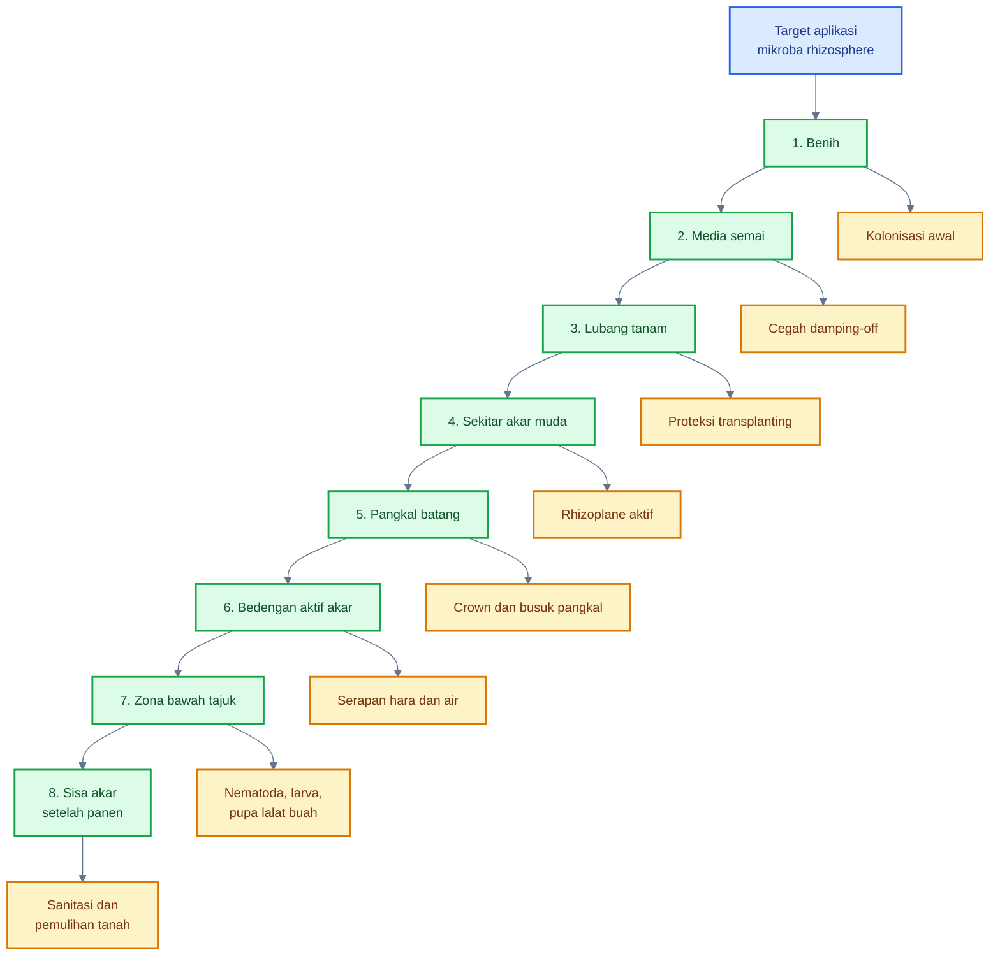

---

## 10.4 Kualitas media/tanah

Media atau tanah adalah “rumah” mikroba. Jika rumahnya buruk, mikroba tidak stabil.

### pH

pH memengaruhi mikroba dan ketersediaan hara. Untuk cabai, kisaran umum yang sering ditargetkan adalah agak asam sampai netral.

$$
\text{pH ideal cabai secara umum} \approx 6{,}0 - 7{,}0
$$

Koreksi pH harus berdasarkan uji tanah.

### EC

EC menunjukkan konsentrasi garam terlarut. EC terlalu tinggi menekan akar dan mikroba.

$$
\text{EC tinggi} \rightarrow \text{tekanan osmotik naik} \rightarrow \text{akar stres}
$$

Praktik:

- jangan memberi pupuk pekat dekat akar;
- hindari akumulasi garam;
- cek EC bila tersedia alat;
- pencucian garam hanya efektif bila drainase baik.

### Aerasi

Aerasi baik penting untuk akar dan mikroba aerob. Tanah becek atau padat menurunkan oksigen dan mendukung patogen tertentu.

### Bahan organik

Bahan organik matang membantu mikroba. Bahan organik mentah merusak akar.

### Kelembapan

Kelembapan harus stabil. Terlalu kering membuat mikroba dorman. Terlalu basah membuat tanah anaerob.

### Suhu tanah

Suhu tanah terlalu tinggi menekan akar dan mikroba. Mulsa, irigasi, dan bahan organik dapat membantu menstabilkan suhu.

### Salinitas

Salinitas tinggi mengganggu serapan air dan viabilitas mikroba sensitif. Ini sering terjadi pada sistem pupuk intensif atau media yang tidak tercuci.

---

## 10.5 Kualitas air kocor

Air kocor membawa mikroba ke zona akar. Air buruk dapat membunuh mikroba sebelum mencapai tanah.

### Air tidak berklorin tinggi

Klorin membunuh mikroba. Air dengan bau klorin kuat tidak ideal untuk inokulan hidup. Gunakan air bersih dan, bila perlu, endapkan sebelum dipakai.

### pH sekitar netral

pH air sebaiknya mendekati netral.

$$
\text{pH air kocor mikroba} \approx 6 - 7
$$

### EC tidak berlebihan

Air dengan EC tinggi dapat menambah tekanan garam. Jika air sumber sudah asin, aplikasi mikroba dan pupuk bisa terganggu.

### Tidak dicampur fungisida atau nematisida keras

Jangan mencampur mikroba hidup dengan bahan yang membunuh fungi, bakteri, atau nematoda kecuali label/kompatibilitas jelas mendukung.

### Volume cukup mencapai zona akar

Volume kocor harus cukup mencapai akar aktif, bukan hanya membasahi permukaan. Namun jangan berlebihan sampai menimbulkan genangan.

---

## 10.6 Kompatibilitas pestisida dan pupuk

Kompatibilitas sangat penting. Mikroba hidup dapat mati oleh pestisida, pupuk garam tinggi, pH ekstrem, atau campuran tangki yang agresif.

### Hindari fungisida tanah keras dekat aplikasi mikroba

Fungisida tanah keras dapat menekan _Trichoderma_, mikoriza, fungi antagonis, dan sebagian mikroba baik. Bila fungisida diperlukan, beri jeda aplikasi dan cek label.

### Hati-hati dengan pupuk garam tinggi

Pupuk dengan EC tinggi dapat merusak akar muda dan mikroba. Jangan menempatkan pupuk pekat langsung di lubang akar.

### Beri jeda aplikasi

Jeda membantu mengurangi risiko mikroba mati akibat residu bahan keras. Urutan dan jeda harus mengikuti label dan rekomendasi teknis produk.

### Pestisida selektif bila perlu

Pestisida tanah tidak dilarang dalam IPM, tetapi harus berbasis diagnosis. Pilih bahan yang sesuai target, terdaftar, dan tidak merusak sistem biologis tanpa alasan kuat.

### Rotasi mode of action tetap wajib

Jika menggunakan insektisida, akarisida, fungisida, atau nematisida, rotasi mode of action tetap diperlukan untuk menunda resistensi. IRAC menjelaskan bahwa rotasi, urutan, atau pergantian senyawa dari kelompok MoA berbeda merupakan strategi penting untuk meminimalkan seleksi resistensi insektisida. ([Insecticide Resistance Action Committee][7]) FRAC juga menekankan bahwa fungisida dalam kelompok MoA yang sama memiliki risiko cross-resistance dan tidak cocok dijadikan pasangan rotasi untuk manajemen resistensi. ([Frac][8])

Praktik yang benar:

- jangan hanya mengganti merek;
- cek bahan aktif dan MoA;
- hindari penggunaan satu MoA terus-menerus;
- ikuti label;
- catat aplikasi.

---

## 10.7 Jangan berlebihan memberi bahan organik mentah

Bahan organik penting, tetapi harus matang. Bahan mentah di zona akar cabai dapat menyebabkan masalah besar.

### Risiko panas

Bahan organik yang masih aktif fermentasi dapat menghasilkan panas. Panas lokal dapat merusak akar muda.

### Risiko amonia

Pupuk kandang atau bahan nitrogen tinggi yang belum matang dapat melepaskan amonia. Amonia dapat merusak akar dan menekan mikroba sensitif.

### Risiko anaerob

Bahan mentah yang membusuk dalam kondisi basah dapat menghabiskan oksigen dan menciptakan lingkungan anaerob.

### Risiko patogen

Bahan organik belum matang dapat membawa patogen, telur hama, biji gulma, atau mikroba oportunis.

### Risiko lalat

Bahan berbau dan belum matang menarik lalat serta organisme pengurai lain. Ini memperburuk sanitasi kebun.

### Risiko akar terbakar

Kombinasi panas, amonia, garam, dan fermentasi dapat menyebabkan akar terbakar. Gejalanya sering disalahartikan sebagai penyakit.

Prinsip:

> Bahan organik untuk cabai harus matang, stabil, tidak panas, tidak berbau busuk, dan tidak ditempatkan terlalu pekat di zona akar muda.

---

## 10.8 Evaluasi keberhasilan

Inokulasi mikroba harus dievaluasi dengan data. Jangan hanya menilai dari “tanaman terlihat hijau”. Evaluasi harus mencakup akar, tajuk, penyakit, nematoda, hasil, dan kebutuhan pestisida.

### Parameter evaluasi

- akar putih aktif;
- jumlah tanaman layu;
- pertumbuhan pucuk;
- insidensi busuk pangkal;
- puru akar;
- EC dan pH;
- hasil panen;
- kebutuhan pestisida;
- konsistensi antar musim.

### Akar putih aktif

Akar putih menunjukkan akar baru yang sehat. Jika akar cokelat, pendek, busuk, atau berbau, rhizosphere bermasalah.

### Jumlah tanaman layu

Catat jumlah tanaman layu per petak dan pola sebarannya. Pola mengikuti aliran air sering mengarah ke penyakit terkait air.

### Pertumbuhan pucuk

Akar sehat biasanya mendukung pucuk aktif. Namun pucuk terlalu lunak karena nitrogen berlebih juga bukan indikator sehat.

### Insidensi busuk pangkal

Catat tanaman dengan pangkal cokelat atau busuk. Ini penting untuk _Phytophthora_, _Sclerotium_, atau busuk pangkal kompleks.

### Puru akar

Bongkar tanaman sampel untuk melihat puru. Jangan menunggu tanaman kerdil berat.

### EC dan pH

Jika tersedia alat, catat pH dan EC media/tanah. Data ini membantu menjelaskan kegagalan mikroba.

### Hasil panen

Evaluasi akhir tetap harus melihat hasil: berat buah sehat, jumlah panen, dan stabilitas produksi.

### Kebutuhan pestisida

Salah satu tanda program biologis membaik adalah kebutuhan pestisida tanah atau intervensi darurat menurun, tanpa menurunkan hasil.

### Konsistensi antar musim

Mikroba yang benar-benar masuk sistem PHT harus memberi tren yang konsisten antar musim, bukan hanya hasil bagus sekali.

---

### Formula evaluasi Bab 10

Insidensi layu:

$$
\text{Insidensi layu} = \frac{\text{jumlah tanaman layu}}{\text{jumlah tanaman diamati}} \times 100%
$$

Insidensi busuk pangkal:

$$
\text{Insidensi busuk pangkal} = \frac{\text{jumlah tanaman dengan busuk pangkal}}{\text{jumlah tanaman diamati}} \times 100%
$$

Persentase akar sehat pada sampel:

$$
\text{Akar sehat} = \frac{\text{jumlah tanaman sampel dengan akar putih aktif}}{\text{jumlah tanaman sampel dibongkar}} \times 100%
$$

Efektivitas perlakuan dibanding kontrol atau petak pembanding:

$$
\text{Efektivitas} = \frac{K - P}{K} \times 100%
$$

Keterangan: $K$ adalah nilai serangan pada kontrol atau petak pembanding, sedangkan $P$ adalah nilai serangan pada petak perlakuan.

---

### Tabel evaluasi lapang inokulasi mikroba rhizosphere

| Parameter          | Cara ukur                    | Frekuensi                             |
| ------------------ | ---------------------------- | ------------------------------------- |
| Akar putih aktif   | bongkar 3–5 tanaman sampel   | 1–2 minggu sekali atau saat gejala    |
| Tanaman layu       | hitung per petak             | mingguan                              |
| Busuk pangkal      | cek crown dan pangkal batang | mingguan, terutama musim hujan        |
| Puru akar          | bongkar akar sampel          | 2–4 minggu sekali bila lahan berisiko |
| pH dan EC          | alat ukur media/tanah        | pra-tanam dan berkala                 |
| Pertumbuhan pucuk  | amati vigor dan warna        | mingguan                              |
| Hasil panen        | kg buah sehat                | setiap panen                          |
| Aplikasi pestisida | catat bahan aktif dan MoA    | setiap aplikasi                       |
| Konsistensi        | bandingkan antar musim       | akhir musim                           |

---

## Ringkasan praktis Bab 9 dan Bab 10

Inokulasi mikroba menguntungkan dalam IPM rhizosphere cabai harus diposisikan sebagai strategi preventif untuk memperkuat akar, menekan patogen tanah, menurunkan risiko nematoda, dan meningkatkan toleransi stres. Mikroba bukan pengganti total fungisida atau nematisida. Keberhasilannya sangat bergantung pada strain, formulasi, media/tanah, kelembapan, pH, bahan organik, kualitas air, kompatibilitas pestisida, dan waktu aplikasi.

Untuk penyakit akar, _Trichoderma_, _Bacillus_, _Pseudomonas_, _Streptomyces_, kompos supresif, _Purpureocillium_, _Pochonia_, dan mikoriza dapat digunakan sesuai target. Untuk pertumbuhan dan toleransi stres, PGPR, mikoriza, _Azospirillum_, _Bacillus_, _Pseudomonas_, dan kompos matang berperan penting.

Strategi menyeluruhnya adalah memilih mikroba berdasarkan target, aplikasi sejak awal, menempatkan mikroba pada zona akar aktif, menjaga pH/EC/aerasi/kelembapan, menggunakan air kocor yang aman, menghindari campuran pestisida keras, tidak memakai bahan organik mentah, dan mengevaluasi keberhasilan dengan data.

Prinsip kuncinya:

> Inokulasi mikroba rhizosphere berhasil bukan karena volume kocor besar, tetapi karena mikroba hidup berhasil menguasai akar lebih awal dalam lingkungan tanah yang mendukung.

[1]: https://pmc.ncbi.nlm.nih.gov/articles/PMC10051450/?utm_source=chatgpt.com 'Biocontrol of Diseases Caused by Phytophthora capsici and P ...'
[2]: https://pmc.ncbi.nlm.nih.gov/articles/PMC9396261/?utm_source=chatgpt.com 'Development of plant systemic resistance by beneficial ... - PMC'
[3]: https://pmc.ncbi.nlm.nih.gov/articles/PMC5411256/?utm_source=chatgpt.com 'Evaluation of Pochonia chlamydosporia and Purpureocillium ...'
[4]: https://www.mdpi.com/2311-7524/10/11/1150?utm_source=chatgpt.com 'Mitigating the Adverse Effects of Salt Stress on Pepper ...'
[5]: https://pmc.ncbi.nlm.nih.gov/articles/PMC11124886/?utm_source=chatgpt.com 'Unlocking the Potential of Pepper Plants under Salt Stress'
[6]: https://www.annualreviews.org/content/journals/10.1146/annurev.phyto.36.1.453?utm_source=chatgpt.com 'SYSTEMIC RESISTANCE INDUCED BY RHIZOSPHERE ...'
[7]: https://irac-online.org/mode-of-action/classification-online/?utm_source=chatgpt.com 'Mode of Action Classification | Insecticide Resistance ...'
[8]: https://www.frac.info/fungicide-resistance-management/by-frac-mode-of-action-group/?utm_source=chatgpt.com 'By FRAC Mode of Action Group'

[**Kembali ke Atas**](#rhizosphere-cabai-sebagai-zona-strategis-pht-mengelola-mikrobioma-akar-untuk-menekan-penyakit-tular-tanah-nematoda-dan-stres-tanaman)

---

## 11. Nematoda akar dan strategi biologis

Nematoda akar adalah salah satu masalah rhizosphere cabai yang sering terlambat dikenali. Berbeda dengan ulat atau hama daun yang mudah terlihat, nematoda hidup di dalam tanah dan menyerang akar. Gejala di atas tanah sering tampak umum: tanaman kerdil, daun pucat, mudah layu saat panas, pertumbuhan tidak seragam, dan hasil rendah. Karena gejalanya mirip kekurangan hara atau kekeringan, banyak kasus nematoda baru diketahui setelah akar dibongkar dan terlihat puru.

Pada cabai, nematoda yang paling penting adalah nematoda puru akar, terutama _Meloidogyne_ spp. Nematoda ini merusak akar dengan membentuk puru atau bintil, mengganggu serapan air dan hara, serta membuat akar lebih mudah terinfeksi patogen tanah. Root-knot nematode termasuk kelompok nematoda parasit tanaman yang paling merugikan, dan review terbaru menegaskan bahwa nematoda parasit tanaman dapat menyebabkan kerusakan besar pada berbagai komoditas pertanian. ([Frontiers][1])

---

### Diagram posisi nematoda dalam rhizosphere cabai

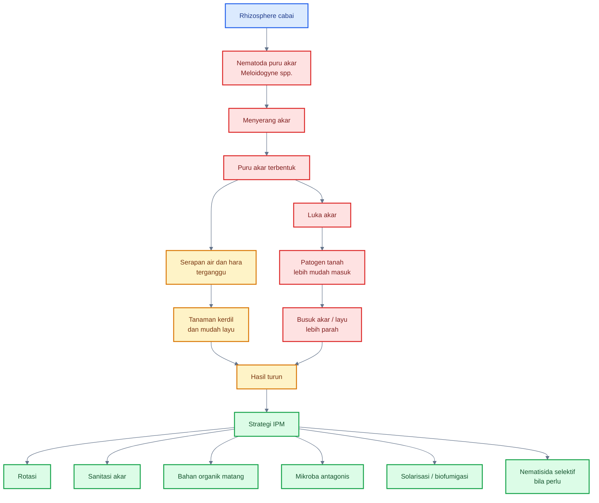

---

## 11.1 Posisi nematoda dalam rhizosphere

### Nematoda menyerang akar

Nematoda puru akar hidup di tanah dan menyerang akar tanaman. Juvenil nematoda masuk ke jaringan akar, memanipulasi sel tanaman, lalu memicu terbentuknya jaringan makan khusus. Akibatnya, akar membentuk puru atau bintil.

Pada cabai, serangan nematoda sering lebih parah pada lahan yang:

- ditanami cabai atau tanaman inang berulang;
- memiliki riwayat tanaman kerdil tidak merata;
- banyak akar berpuru;
- drainase dan struktur tanah buruk;
- sanitasi akar sakit lemah;
- rotasi tidak dilakukan.

### Puru akar mengganggu serapan

Puru bukan sekadar benjolan. Puru mengubah struktur dan fungsi akar. Akar yang seharusnya menyerap air dan hara menjadi tidak efisien. Tanaman dapat layu walau air tersedia, karena akar tidak mampu bekerja normal.

Dampak puru akar:

- serapan air turun;
- serapan hara terganggu;
- tanaman mudah layu;
- pertumbuhan tidak seragam;
- bunga dan buah berkurang;
- respons terhadap pupuk rendah.

Formula sederhana untuk mencatat kejadian puru akar:

$$
\text{Insidensi puru akar} = \frac{\text{jumlah tanaman dengan puru akar}}{\text{jumlah tanaman dibongkar}} \times 100%
$$

### Akar luka mudah terinfeksi patogen

Nematoda membuat luka dan perubahan jaringan akar. Luka ini menjadi pintu masuk bagi patogen tanah seperti _Fusarium_, _Ralstonia_, _Pythium_, atau patogen busuk akar lain. Karena itu, nematoda sering menjadi faktor yang memperparah penyakit akar kompleks.

Dalam praktik lapang, tanaman yang terserang nematoda berat jarang hanya mengalami satu masalah. Biasanya terjadi gabungan:

- puru akar;
- akar pendek;
- akar cokelat;
- infeksi patogen sekunder;
- tanaman kerdil;
- hasil rendah.

### Nematoda membuat tanaman sulit pulih

Tanaman cabai yang akarnya sudah berpuru parah sulit dipulihkan hanya dengan pupuk atau biostimulan. Pupuk tambahan tidak banyak membantu bila sistem akar tidak mampu menyerap. Bahkan pupuk terlalu pekat dapat memperparah stres akar.

Prinsip penting:

> Pada serangan nematoda, akar adalah bottleneck. Jika akar rusak, input di atas tanah tidak dapat dimanfaatkan optimal.

---

## 11.2 Strategi IPM nematoda

Pengelolaan nematoda tidak cukup dengan satu tindakan. Nematoda hidup di tanah, populasinya dapat bertahan antar musim, dan gejalanya sering terlambat terlihat. Karena itu, strategi terbaik adalah IPM atau pengendalian terpadu yang menggabungkan rotasi, sanitasi, solarisasi, bahan organik matang, biofumigasi, tanaman perangkap, mikroba antagonis, dan nematisida selektif bila diperlukan.

### 1. Rotasi tanaman bukan inang

Rotasi adalah salah satu strategi paling penting. Menanam cabai terus-menerus memberi makanan berkelanjutan bagi nematoda. Rotasi dengan tanaman bukan inang dapat menurunkan populasi nematoda karena siklus hidupnya terganggu.

Praktik lapang:

- hindari rotasi cabai-tomat-terung bila nematoda tinggi;
- gunakan tanaman bukan inang sesuai rekomendasi lokal;
- lakukan rotasi lebih panjang pada lahan dengan serangan berat;
- catat riwayat tanaman dan tingkat puru akar.

Catatan: tidak semua tanaman rotasi aman. Beberapa tanaman yang tampak berbeda bisa tetap menjadi inang _Meloidogyne_. Karena itu, pilihan rotasi perlu disesuaikan dengan spesies nematoda dan rekomendasi lokal.

### 2. Varietas atau toleransi bila tersedia

Varietas tahan atau toleran dapat membantu menurunkan kerusakan. Namun pada cabai, ketersediaan varietas dengan ketahanan kuat terhadap semua populasi _Meloidogyne_ tidak selalu tersedia. Ketahanan juga bisa spesifik terhadap spesies atau ras tertentu.

Praktik:

- gunakan varietas/toleransi bila tersedia;
- jangan mengandalkan varietas saja;
- tetap lakukan rotasi, sanitasi, dan monitoring akar.

### 3. Sanitasi akar sakit

Akar berpuru adalah reservoir nematoda. Jika sisa akar sakit dibiarkan di lahan, populasi dapat bertahan dan menyerang tanaman berikutnya.

Praktik:

- cabut tanaman sakit bersama akar;
- jangan hanya memotong batang atas;
- buang akar sakit dari lahan;
- jangan memasukkan akar sakit ke kompos biasa bila proses tidak panas dan matang;
- bersihkan alat dari tanah terinfestasi.

### 4. Solarisasi

Solarisasi menggunakan panas matahari yang terperangkap di bawah plastik bening untuk menekan organisme pengganggu pada lapisan tanah atas. Teknik ini lebih efektif pada daerah panas dengan radiasi matahari kuat, tanah cukup lembap, dan periode solarisasi memadai.

Solarisasi dapat membantu menekan sebagian patogen tanah, gulma, dan nematoda di lapisan atas. Namun efektivitasnya tergantung suhu tanah, lama perlakuan, kedalaman target, dan kondisi cuaca.

### 5. Bahan organik matang

Bahan organik matang mendukung mikroba tanah, memperbaiki struktur, dan membantu membangun tanah yang lebih supresif. Namun bahan organik harus matang. Bahan mentah dapat memicu panas, amonia, anaerob, dan justru merusak akar.

Manfaat bahan organik matang:

- memperbaiki struktur tanah;
- mendukung mikroba antagonis;
- meningkatkan kapasitas air;
- memperbaiki lingkungan akar;
- membantu tanaman lebih toleran terhadap serangan.

### 6. Biofumigasi

Biofumigasi menggunakan bahan tanaman tertentu, sering dari Brassicaceae atau tanaman penutup tertentu, yang saat dihancurkan dan terdekomposisi dapat menghasilkan senyawa yang menekan organisme tanah. Review tentang biofumigasi menyebut strategi ini sebagai pendekatan untuk mengelola nematoda parasit tanaman dan patogen tanah, dengan beberapa studi menunjukkan pengendalian root-knot nematode dapat meningkat ketika biofumigasi dikombinasikan dengan solarisasi. ([ScienceDirect][2])

Praktik penting:

- gunakan tanaman biofumigasi yang sesuai;
- cincang halus biomassa;
- inkorporasikan ke tanah;
- jaga kelembapan;
- tutup tanah bila metode membutuhkan;
- beri jeda sebelum tanam cabai agar tidak fitotoksik.

### 7. Tanaman perangkap

Tanaman perangkap digunakan untuk menarik nematoda, lalu tanaman dihancurkan sebelum nematoda menyelesaikan siklus hidupnya. Teknik ini membutuhkan pemahaman siklus hidup nematoda dan waktu penghancuran yang tepat.

Jika terlambat dihancurkan, tanaman perangkap justru dapat memperbanyak populasi nematoda. Karena itu, strategi ini cocok bila praktisi mampu mengelola waktunya dengan disiplin.

### 8. Mikroba antagonis

Mikroba antagonis dapat menekan nematoda melalui parasitisme telur, produksi metabolit, kompetisi, induksi ketahanan, atau perubahan rhizosphere. Mikroba yang sering dibahas untuk nematoda antara lain _Purpureocillium lilacinum_, _Pochonia chlamydosporia_, _Bacillus firmus_, _Pasteuria_, mikoriza, dan kompos supresif. Review biokontrol nematoda menyebut bahwa produk komersial yang dikenal mencakup bakteri seperti _Bacillus firmus_ dan _Pasteuria penetrans_, serta fungi seperti _Purpureocillium lilacinum_. ([ResearchGate][3])

### 9. Nematisida selektif bila perlu

Nematisida tidak dilarang dalam PHT, tetapi harus digunakan berdasarkan diagnosis dan mengikuti label. Pada lahan dengan populasi nematoda tinggi, nematisida selektif mungkin diperlukan sebagai bagian dari strategi terpadu.

IRAC menyatakan bahwa pada sistem yang membutuhkan beberapa aplikasi nematisida dalam satu siklus atau pada lahan yang sama selama beberapa siklus, rotasi ke nematisida dengan mode of action berbeda direkomendasikan untuk mengurangi tekanan seleksi pada populasi nematoda parasit tanaman. ([Insecticide Resistance Action Committee][4])

### 10. Monitoring puru akar

Monitoring akar wajib dilakukan. Tanpa membongkar akar, nematoda sering tidak terdeteksi. Pemeriksaan dapat dilakukan pada tanaman kerdil, tanaman layu, atau sampel acak.

Parameter sederhana:

- jumlah tanaman berpuru;
- tingkat puru akar;
- sebaran tanaman kerdil;
- hasil panen per petak;
- riwayat tanaman sebelumnya.

Skoring puru akar dapat dibuat sederhana, misalnya $0-5$:

| Skor | Kondisi akar                        |
| ---: | ----------------------------------- |
|    0 | tidak ada puru                      |
|    1 | puru sangat sedikit                 |
|    2 | puru ringan                         |
|    3 | puru sedang                         |
|    4 | puru berat                          |
|    5 | puru sangat berat, akar rusak parah |

Indeks puru akar sederhana:

$$
\text{Indeks puru akar} = \frac{\sum(n_i \times v_i)}{N \times V} \times 100%
$$

Keterangan: $n_i$ adalah jumlah tanaman pada skor ke-$i$, $v_i$ adalah nilai skor, $N$ adalah jumlah tanaman sampel, dan $V$ adalah skor tertinggi.

---

## 11.3 Mikroba untuk nematoda

Mikroba untuk nematoda bekerja dengan beberapa mekanisme: parasit telur, infeksi juvenil, produksi metabolit nematisidal, kompetisi di rhizosphere, peningkatan ketahanan akar, serta perbaikan tanah agar tanaman lebih toleran. Penggunaan mikroba nematoda harus preventif dan diarahkan ke zona akar, bukan disemprot ke daun.

### A. _Purpureocillium lilacinum_

_Purpureocillium lilacinum_, sebelumnya banyak dikenal sebagai _Paecilomyces lilacinus_, adalah fungi yang sering dikaji untuk pengendalian nematoda puru akar. Mekanisme utamanya adalah parasitisme telur nematoda dan produksi enzim/metabolit yang dapat mengganggu perkembangan nematoda. Review biokontrol nematoda mencantumkan _Purpureocillium lilacinum_ sebagai salah satu fungi penting yang digunakan dalam produk biokontrol nematoda. ([ResearchGate][3])

Praktik aplikasi:

- aplikasikan ke zona akar;
- gunakan sebelum populasi nematoda tinggi;
- kombinasikan dengan bahan organik matang;
- jaga kelembapan tanah;
- hindari fungisida keras berdekatan;
- ulang sesuai label.

### B. _Pochonia chlamydosporia_

_Pochonia chlamydosporia_ dikenal sebagai fungi parasit telur nematoda. Fungi ini dapat mengolonisasi rhizosphere dan menyerang telur nematoda tertentu. Studi dan review biokontrol menempatkan _Pochonia_ sebagai salah satu kandidat penting dalam pengendalian biologis root-knot nematode. ([PMC][5])

Kelebihan:

- target telur nematoda;
- relevan untuk pengelolaan jangka menengah;
- dapat masuk dalam strategi tanah supresif.

Keterbatasan:

- efek tidak instan;
- membutuhkan kondisi tanah mendukung;
- sangat tergantung strain dan formulasi;
- perlu integrasi dengan rotasi dan sanitasi.

### C. _Bacillus firmus_ dan _Bacillus_ lain

_Bacillus firmus_ dan beberapa _Bacillus_ lain digunakan sebagai bakteri antagonis nematoda. Mekanismenya dapat mencakup produksi metabolit nematisidal, pengaruh terhadap telur atau juvenil, induksi ketahanan akar, dan perubahan lingkungan rhizosphere.

Keunggulan _Bacillus_:

- banyak strain membentuk spora;
- relatif tahan formulasi;
- dapat mendukung akar sekaligus menekan patogen tertentu;
- cocok dalam program preventif.

Namun tidak semua _Bacillus_ efektif terhadap nematoda. Produk harus jelas target, strain, dosis, dan cara aplikasinya.

### D. _Pasteuria_

_Pasteuria_ adalah bakteri parasit obligat pada nematoda tertentu. Salah satu yang terkenal adalah _Pasteuria penetrans_, yang dapat menempel pada kutikula nematoda dan mengganggu reproduksinya. Review biokontrol root-knot nematode mencantumkan _Pasteuria penetrans_ sebagai salah satu agen biologis yang dikenal untuk nematoda. ([ResearchGate][3])

Keterbatasan praktisnya adalah spesifisitas inang, produksi, formulasi, dan ketersediaan produk. Karena itu, _Pasteuria_ sangat menarik secara biologis, tetapi penggunaannya harus mengikuti produk dan rekomendasi yang benar-benar tersedia.

### E. Mikoriza

Mikoriza tidak membunuh nematoda secara langsung seperti nematisida. Namun mikoriza dapat membantu tanaman lebih toleran melalui perbaikan serapan hara dan air, peningkatan pertumbuhan akar, serta kemungkinan induksi ketahanan. Dalam sistem dengan tekanan nematoda rendah sampai sedang, mikoriza dapat menjadi bagian dari strategi memperkuat tanaman.

Catatan penting:

- mikoriza harus kontak dengan akar;
- aplikasi paling baik sejak awal;
- fosfor berlebihan dapat menurunkan kolonisasi;
- tidak menggantikan sanitasi dan rotasi.

### F. Kompos supresif

Kompos matang berkualitas dapat mendukung komunitas mikroba yang lebih beragam dan berpotensi menekan patogen atau nematoda. Efeknya tidak berasal dari satu mikroba saja, tetapi dari kombinasi bahan organik stabil, mikroba antagonis, struktur tanah, dan peningkatan kesehatan akar.

Namun kompos supresif harus benar-benar matang. Kompos mentah dapat memperparah masalah akar.

---

### Tabel mikroba untuk nematoda

| Mikroba/komponen                      | Target utama                    | Mekanisme                             | Catatan praktis                          |
| ------------------------------------- | ------------------------------- | ------------------------------------- | ---------------------------------------- |
| _Purpureocillium lilacinum_           | telur/juvenil nematoda tertentu | parasitisme telur, enzim, metabolit   | aplikasikan preventif di zona akar       |
| _Pochonia chlamydosporia_             | telur nematoda                  | parasit telur                         | efek tidak instan, perlu tanah mendukung |
| _Bacillus firmus_ dan _Bacillus_ lain | nematoda dan akar stres         | metabolit, ISR, dukungan akar         | strain sangat menentukan                 |
| _Pasteuria_                           | nematoda tertentu               | parasit obligat                       | spesifik dan tergantung produk           |
| Mikoriza                              | toleransi tanaman               | serapan hara/air, ketahanan akar      | bukan pembunuh langsung nematoda         |
| Kompos supresif                       | sistem tanah                    | biodiversitas mikroba, struktur tanah | harus matang dan stabil                  |

---

## 11.4 Nematoda entomopatogen vs nematoda parasit tanaman

Istilah “nematoda” sering membingungkan karena tidak semua nematoda merugikan tanaman. Ada nematoda parasit tanaman yang menyerang akar, tetapi ada juga nematoda entomopatogen yang menyerang serangga.

### A. Nematoda parasit tanaman

Nematoda parasit tanaman merugikan akar. Contohnya:

- _Meloidogyne_ spp.;
- _Pratylenchus_ spp.;
- _Rotylenchulus_ spp.;
- nematoda parasit tanaman lain.

Pada cabai, yang paling sering dibahas adalah _Meloidogyne_ spp. penyebab puru akar.

Dampaknya:

- akar berpuru;
- akar luka;
- serapan air dan hara turun;
- tanaman kerdil;
- penyakit tanah lebih mudah masuk.

### B. Nematoda entomopatogen

Nematoda entomopatogen menyerang serangga/hama tanah. Contohnya:

- _Steinernema_ spp.;
- _Heterorhabditis_ spp.

Kelompok ini digunakan untuk target hama tanah, larva tertentu, atau stadia serangga di tanah. Mereka bukan penyebab puru akar.

### Perbedaan praktis

| Aspek            | Nematoda parasit tanaman  | Nematoda entomopatogen           |
| ---------------- | ------------------------- | -------------------------------- |
| Dampak           | merusak akar              | menyerang serangga               |
| Contoh           | _Meloidogyne_ spp.        | _Steinernema_, _Heterorhabditis_ |
| Target           | tanaman                   | hama tanah                       |
| Gejala           | puru akar, tanaman kerdil | hama tanah menurun               |
| Status dalam PHT | OPT                       | agens hayati                     |

Prinsipnya:

> Jangan menyamakan semua nematoda. Ada nematoda yang menjadi OPT akar, dan ada nematoda yang justru menjadi alat biologis untuk hama tanah.

[**Kembali ke Atas**](#rhizosphere-cabai-sebagai-zona-strategis-pht-mengelola-mikrobioma-akar-untuk-menekan-penyakit-tular-tanah-nematoda-dan-stres-tanaman)

---

# 12. Integrasi mikroba akar, kesehatan tanah, dan pestisida selektif

PHT rhizosphere cabai harus mengintegrasikan tiga komponen besar: **mikroba akar**, **kesehatan tanah**, dan **pestisida/nematisida selektif bila diperlukan**. Jika hanya memakai mikroba tanpa memperbaiki tanah, hasilnya tidak stabil. Jika hanya memakai pestisida tanah tanpa membangun mikrobioma dan struktur tanah, masalah bisa berulang. Jika hanya menambah bahan organik tanpa kematangan dan drainase, akar justru bisa rusak.

FAO menekankan bahwa tanah hidup memiliki biodiversitas besar, termasuk mikroba dan fauna tanah, yang berperan dalam fungsi ekosistem, kesuburan, dan pertanian berkelanjutan. FAO juga menekankan pentingnya menjaga biodiversitas tanah untuk mendukung fungsi ekosistem dan keberlanjutan produksi. ([FAOHome][6])

---

### Diagram integrasi mikroba akar, kesehatan tanah, dan pestisida selektif

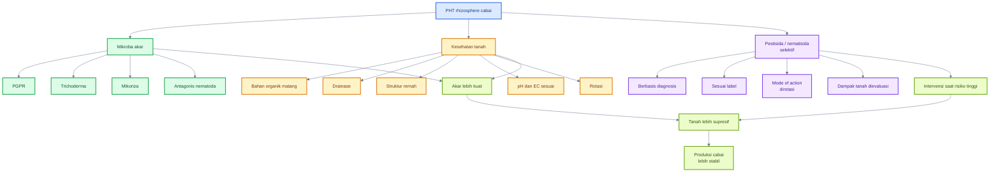

---

## 12.1 Urutan keputusan

Keputusan PHT rhizosphere harus dimulai dari diagnosis. Jangan langsung kocor mikroba, menambah pupuk, atau memakai pestisida tanah sebelum tahu penyebab masalah. Pada cabai, gejala layu bisa berasal dari kekeringan, genangan, _Phytophthora_, _Ralstonia_, _Fusarium_, nematoda, pupuk pekat, atau akar rusak.

### 1. Apakah gejala berasal dari akar atau tajuk?

Pertama, bedakan apakah masalah berasal dari akar/rhizosphere atau tajuk/phyllosphere. Daun layu, bunga gugur, dan pucuk lemah bisa berasal dari akar. Sebaliknya, keriting pucuk bisa berasal dari thrips, tungau, virus, atau fitotoksik.

Langkah praktis:

- cek akar tanaman sakit;
- cek pangkal batang;
- cek bawah daun dan pucuk;
- lihat pola sebaran gejala;
- cek riwayat aplikasi pupuk/pestisida.

### 2. Apakah tanah terlalu basah atau terlalu kering?

Kondisi air menentukan banyak penyakit akar. Tanah terlalu basah mendukung patogen air dan menurunkan oksigen. Tanah terlalu kering membuat akar dan mikroba stres.

Pertanyaan praktis:

- apakah tanah basah terus?
- apakah ada genangan setelah hujan?
- apakah bedengan terlalu rendah?
- apakah tanaman layu walau tanah basah?
- apakah permukaan kering tetapi bagian dalam bedengan basah?

### 3. Apakah akar sehat atau busuk?

Bongkar tanaman sampel. Akar sehat biasanya memiliki akar putih aktif. Akar bermasalah tampak cokelat, hitam, pendek, busuk, berbau, atau sedikit akar halus.

Tabel diagnosis cepat:

| Kondisi akar                    | Kemungkinan masalah                       |
| ------------------------------- | ----------------------------------------- |
| akar putih aktif banyak         | akar relatif sehat                        |
| akar cokelat dan busuk          | busuk akar, genangan, patogen             |
| akar berpuru                    | nematoda _Meloidogyne_                    |
| akar pendek dan terbakar        | EC tinggi, pupuk pekat, salinitas         |
| pangkal cokelat                 | busuk crown, _Phytophthora_, _Sclerotium_ |
| akar sedikit tetapi tanah basah | anaerob, over-irrigation                  |

### 4. Apakah ada puru nematoda?

Puru akar harus dicek langsung. Jangan menebak dari daun. Jika tanaman kerdil tidak merata dan respon pupuk rendah, bongkar akar.

Jika ada puru:

- catat tingkat puru;
- tandai petak bermasalah;
- hindari memindahkan tanah;
- rencanakan rotasi;
- gunakan mikroba antagonis atau tindakan nematoda lain pada musim berikutnya.

### 5. Apakah riwayat lahan bermasalah?

Riwayat lahan sangat penting. Patogen tanah dan nematoda sering berulang di titik yang sama.

Catat:

- titik tanaman layu tahun lalu;
- area genangan;
- riwayat cabai/tomat/terung;
- lokasi nematoda;
- riwayat pupuk kandang mentah;
- riwayat _Phytophthora_ atau layu bakteri.

### 6. Apakah mikroba preventif sudah diberikan?

Jika belum, dan tanaman masih pada fase awal, aplikasi mikroba dapat menjadi tindakan pencegahan. Namun bila gejala sudah berat, mikroba harus dipadukan dengan tindakan lain.

Pertanyaan:

- apakah benih diberi PGPR?
- apakah media diberi _Trichoderma_?
- apakah lubang tanam diinokulasi?
- apakah aplikasi dilakukan sebelum atau setelah tanaman sakit?
- apakah mikroba dicampur dengan bahan keras?

### 7. Apakah perlu fungisida atau nematisida selektif?

Jika risiko tinggi dan tindakan non-kimia tidak cukup, pestisida tanah atau nematisida selektif dapat dipertimbangkan. Namun harus berdasarkan diagnosis, bukan rutinitas.

Contoh:

- _Phytophthora_ tinggi setelah hujan panjang;
- damping-off menyebar di persemaian;
- nematoda tinggi berdasarkan puru akar;
- busuk pangkal meluas;
- tindakan sanitasi dan drainase tidak cukup.

### 8. Apakah rotasi mode of action diperhatikan?

Jika memakai nematisida, fungisida, atau insektisida tanah, mode of action harus dirotasi. IRAC mencantumkan klasifikasi mode of action nematisida dan menyarankan rotasi MoA berbeda bila aplikasi berulang diperlukan untuk mengurangi tekanan seleksi pada populasi nematoda parasit tanaman. ([Insecticide Resistance Action Committee][4])

Untuk fungisida, prinsip FRAC tetap relevan: jangan mengulang bahan dengan mode of action yang sama terus-menerus karena risiko resistensi dan cross-resistance. ([Insecticide Resistance Action Committee][7])

### 9. Apakah sisa tanaman sakit sudah dibuang?

Sanitasi adalah keputusan terakhir yang sering dilupakan. Tanaman sakit yang dibiarkan menjadi sumber inokulum.

Tindakan:

- cabut tanaman sakit bersama akar;
- jangan tinggalkan akar busuk;
- musnahkan sisa tanaman sakit;
- jangan komposkan sembarangan;
- bersihkan alat;
- catat titik serangan untuk musim berikutnya.

---

### Diagram alur keputusan PHT rhizosphere

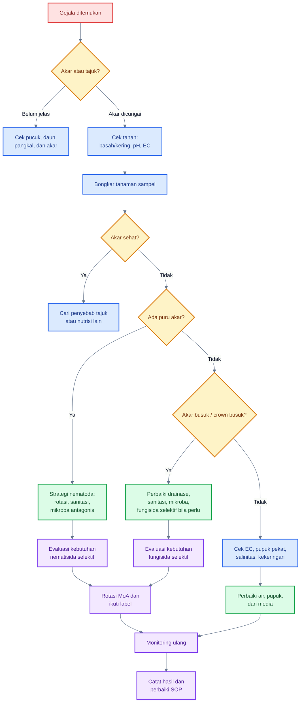

---

## 12.2 Pestisida tanah sebagai alat terakhir

Pestisida tanah, fungisida tanah, dan nematisida tidak dilarang dalam PHT. Namun penggunaannya harus berbasis diagnosis dan ditempatkan sebagai intervensi selektif, bukan kebiasaan rutin. Tujuannya adalah menyelamatkan sistem saat risiko tinggi, bukan menggantikan kesehatan tanah.

### Bukan dilarang

Dalam sistem cabai intensif, ada kondisi ketika pestisida tanah atau nematisida diperlukan. Misalnya, tekanan _Phytophthora_ tinggi, damping-off menyebar, atau nematoda sangat tinggi. Namun bahan tersebut harus digunakan dengan prinsip PHT.

### Berbasis diagnosis

Jangan memakai nematisida tanpa bukti nematoda. Jangan memakai fungisida tanah bila masalah utamanya EC tinggi atau akar terbakar. Jangan menambah pupuk saat akar busuk karena genangan.

Diagnosis minimal:

- bongkar akar;
- cek puru;
- cek pangkal batang;
- cek kelembapan;
- cek pola sebaran;
- cek riwayat lahan.

### Pilih selektif

Pilih bahan yang sesuai target. Nematisida untuk nematoda, fungisida untuk target fungi/oomycete tertentu, insektisida tanah untuk hama tanah. Pilihan bahan harus sesuai label dan komoditas.

### Patuhi label

Label adalah acuan legal dan teknis. Ikuti dosis, interval, cara aplikasi, target OPT, keselamatan kerja, PHI bila relevan, dan batasan penggunaan.

### Jangan merusak mikroba baik tanpa alasan kuat

Bahan keras dapat menekan mikroba baik. Jika pestisida tanah digunakan, evaluasi dampaknya terhadap program mikroba:

- apakah perlu re-inokulasi?
- apakah jeda aplikasi cukup?
- apakah bahan kompatibel dengan _Trichoderma_, PGPR, atau mikoriza?
- apakah ada alternatif selektif?

### Evaluasi dampak terhadap tanah

Setelah menggunakan pestisida tanah, evaluasi:

- apakah tanaman layu menurun?
- apakah akar baru tumbuh?
- apakah mikroba perlu diulang?
- apakah pH/EC berubah?
- apakah masalah muncul lagi setelah beberapa minggu?

---

## 12.3 Prinsip membangun tanah supresif

Tanah supresif adalah tanah yang mampu menekan penyakit walaupun patogen ada. Supresivitas tidak dibangun dengan satu produk. Ia terbentuk dari kombinasi bahan organik matang, biodiversitas mikroba, struktur tanah, drainase, rotasi, dan minimnya faktor yang mendukung patogen.

FAO menekankan bahwa tanah sehat mengandung organisme hidup yang sangat beragam dan kompleks; biodiversitas tanah mendukung fungsi ekosistem, siklus hara, struktur tanah, dan keberlanjutan pertanian. ([FAOHome][6])

### 1. Bahan organik matang

Bahan organik matang menjadi dasar makanan dan habitat mikroba. Ia membantu agregat tanah, retensi air, dan aktivitas biologis. Namun bahan organik harus matang, bukan mentah.

### 2. Diversitas tanaman

Diversitas tanaman mendukung diversitas mikroba. Sistem yang terlalu monokultur cenderung memberi peluang patogen spesifik meningkat. Rotasi, tanaman penutup, refugia, dan tanaman sela yang tepat dapat membantu memperkaya ekosistem.

### 3. Rotasi

Rotasi memutus siklus patogen dan nematoda. Pada cabai, rotasi non-Solanaceae penting untuk menurunkan tekanan penyakit tanah.

### 4. Mikroba antagonis

Mikroba antagonis seperti _Trichoderma_, _Bacillus_, _Pseudomonas_, _Streptomyces_, _Purpureocillium_, _Pochonia_, mikoriza, dan kompos supresif dapat membantu membangun dominasi biologis yang menghambat patogen.

### 5. Minim genangan

Genangan merusak akar dan mengubah mikrobiologi tanah. Tanah supresif sulit terbentuk jika akar terus kekurangan oksigen dan patogen air terus meningkat.

### 6. Struktur tanah baik

Struktur tanah remah mendukung akar, oksigen, air, dan mikroba. Tanah padat menekan akar dan meningkatkan stres.

---

### Diagram pembangunan tanah supresif

```mermaid
%%{init: {
  "theme": "base",
  "themeVariables": {
    "background": "#ffffff",
    "primaryColor": "#F8FAFC",
    "primaryTextColor": "#0F172A",
    "primaryBorderColor": "#64748B",
    "lineColor": "#64748B",
    "fontSize": "14px"
  }
}}%%
flowchart TB
    A[Target:<br/>tanah supresif] --> B[Bahan organik matang]
    A --> C[Diversitas tanaman]
    A --> D[Rotasi]
    A --> E[Mikroba antagonis]
    A --> F[Drainase baik]
    A --> G[Struktur tanah remah]
    A --> H[pH dan EC stabil]

    B --> I[Mikroba tanah aktif]
    C --> I
    D --> J[Siklus patogen<br/>terputus]
    E --> K[Patogen ditekan]
    F --> L[Akar tidak anaerob]
    G --> M[Akar dan udara<br/>lebih seimbang]
    H --> N[Lingkungan akar<br/>lebih stabil]

    I --> O[Rhizosphere sehat]
    J --> O
    K --> O
    L --> O
    M --> O
    N --> O

    O --> P[Penyakit tanah<br/>lebih sulit dominan]
    P --> Q[Produksi cabai<br/>lebih stabil]

    classDef target fill:#DBEAFE,stroke:#2563EB,color:#1E3A8A,stroke-width:2px;
    classDef input fill:#DCFCE7,stroke:#16A34A,color:#14532D,stroke-width:2px;
    classDef proses fill:#FEF3C7,stroke:#D97706,color:#78350F,stroke-width:2px;
    classDef hasil fill:#ECFCCB,stroke:#65A30D,color:#365314,stroke-width:2px;

    class A target;
    class B,C,D,E,F,G,H input;
    class I,J,K,L,M,N,O,P proses;
    class Q hasil;
```

---

### Tabel integrasi tindakan rhizosphere

| Masalah utama  | Tindakan biologis                                   | Tindakan tanah                                 | Pestisida selektif bila perlu          | Catatan                              |
| -------------- | --------------------------------------------------- | ---------------------------------------------- | -------------------------------------- | ------------------------------------ |
| _Phytophthora_ | _Trichoderma_, _Bacillus_, _Pseudomonas_            | drainase, bedengan tinggi, sanitasi            | fungisida target oomycete sesuai label | drainase adalah kunci                |
| Layu bakteri   | PGPR, _Bacillus_, _Pseudomonas_, kompos supresif    | sanitasi, rotasi, hindari luka akar            | terbatas, sesuai rekomendasi lokal     | tanaman sakit berat sulit dipulihkan |
| _Fusarium_     | _Trichoderma_, _Bacillus_, _Streptomyces_           | rotasi, bahan organik matang                   | fungisida sesuai label bila perlu      | cabut akar sakit                     |
| Damping-off    | _Trichoderma_, _Bacillus_, PGPR                     | media sehat, tray bersih, hindari overwatering | perlakuan benih/media sesuai label     | pencegahan paling efektif            |
| Nematoda       | _Purpureocillium_, _Pochonia_, _Bacillus_, mikoriza | rotasi, solarisasi, biofumigasi, sanitasi akar | nematisida selektif sesuai label       | monitoring puru wajib                |
| Hama tanah     | _Metarhizium_, _Beauveria_, nematoda entomopatogen  | sanitasi, olah tanah, bahan organik matang     | insektisida tanah selektif bila perlu  | sesuai target hama                   |

---

## Ringkasan praktis Bab 11 dan Bab 12

Nematoda akar, terutama _Meloidogyne_ spp., adalah OPT rhizosphere penting pada cabai karena menyerang akar, membentuk puru, mengganggu serapan air dan hara, serta membuka jalan bagi patogen tanah. Tanaman yang terserang nematoda sering kerdil, mudah layu, sulit pulih, dan kurang responsif terhadap pupuk.

Strategi IPM nematoda harus terpadu: rotasi tanaman bukan inang, varietas/toleransi bila tersedia, sanitasi akar sakit, solarisasi, bahan organik matang, biofumigasi, tanaman perangkap, mikroba antagonis, nematisida selektif bila perlu, dan monitoring puru akar. Mikroba seperti _Purpureocillium lilacinum_, _Pochonia chlamydosporia_, _Bacillus firmus_, _Pasteuria_, mikoriza, dan kompos supresif dapat masuk sebagai bagian strategi biologis.

Integrasi PHT rhizosphere harus menggabungkan mikroba akar, kesehatan tanah, dan pestisida selektif. Pestisida tanah bukan dilarang, tetapi harus berbasis diagnosis, selektif, mengikuti label, dirotasi berdasarkan mode of action, dan dievaluasi dampaknya terhadap mikroba baik. Tujuan jangka panjangnya adalah membangun tanah supresif: tanah yang kaya biodiversitas mikroba, berstruktur baik, tidak tergenang, kaya bahan organik matang, dan tidak mudah dikuasai patogen.

Prinsip kuncinya:

> Rhizosphere cabai yang kuat bukan tanah steril, tetapi tanah hidup yang membuat patogen dan nematoda sulit menang meskipun mereka ada.

[1]: https://www.frontiersin.org/journals/microbiology/articles/10.3389/fmicb.2024.1433716/full?utm_source=chatgpt.com 'Biocontrol of plant parasitic nematodes by bacteria and fungi'
[2]: https://www.sciencedirect.com/science/article/pii/S2214662818302172?utm_source=chatgpt.com 'Plant-parasitic nematode management via biofumigation ...'
[3]: https://www.researchgate.net/publication/376634553_Biological_Control_of_Root-Knot_Nematodes_Meloidogyne_spp_Microbes_against_the_Pests?utm_source=chatgpt.com 'Biological Control of Root-Knot Nematodes (Meloidogyne ...'
[4]: https://irac-online.org/documents/nematicides-poster/?utm_source=chatgpt.com 'Nematicide Mode of Action Classification'
[5]: https://pmc.ncbi.nlm.nih.gov/articles/PMC9606992/?utm_source=chatgpt.com 'The Fight against Plant-Parasitic Nematodes: Current Status ...'
[6]: https://www.fao.org/fileadmin/templates/nr/images/resources/pdf_documents/CGRFA_SoilBiodSustAg.doc?utm_source=chatgpt.com 'SOIL BIODIVERSITY AND SUSTAINABLE AGRICULTURE'
[7]: https://irac-online.org/documents/moa-classification/?utm_source=chatgpt.com 'MODE OF ACTION CLASSIFICATION SCHEME'

[**Kembali ke Atas**](#rhizosphere-cabai-sebagai-zona-strategis-pht-mengelola-mikrobioma-akar-untuk-menekan-penyakit-tular-tanah-nematoda-dan-stres-tanaman)

---

## 13. Kalender PHT rhizosphere cabai

Kalender PHT rhizosphere cabai adalah panduan kerja berbasis fase tanaman. Tujuannya bukan membuat jadwal kocor mikroba yang kaku, tetapi membantu praktisi menentukan **apa yang harus dicegah, zona akar mana yang diprioritaskan, tindakan PHT apa yang dilakukan, dan mikroba apa yang relevan** pada setiap fase budidaya.

Rhizosphere berubah sepanjang umur tanaman. Pada fase semai, fokusnya adalah media sehat dan pencegahan damping-off. Pada 0–14 HST, fokusnya akar muda dan stres pindah tanam. Pada vegetatif, akar aktif harus dijaga agar mendukung pertumbuhan tajuk. Pada berbunga dan buah muda, akar harus mampu memasok air serta hara secara stabil. Pada panen dan akhir musim, fokus bergeser ke sanitasi tanaman sakit dan pemutusan siklus patogen tanah.

PHT menurut FAO menggabungkan strategi biologis, kimia, fisik, dan budidaya untuk menumbuhkan tanaman sehat serta meminimalkan penggunaan pestisida. Dalam konteks rhizosphere, prinsip ini berarti mikroba akar, drainase, rotasi, bahan organik matang, sanitasi, monitoring, dan pestisida selektif harus dipakai sebagai satu sistem. ([FAOHome][1])

---

### Diagram kalender PHT rhizosphere cabai

```mermaid
%%{init: {
  "theme": "base",
  "themeVariables": {
    "background": "#ffffff",
    "primaryColor": "#F8FAFC",
    "primaryTextColor": "#0F172A",
    "primaryBorderColor": "#64748B",
    "lineColor": "#64748B",
    "fontSize": "14px"
  }
}}%%
flowchart TB
    A[Pra-semai] --> B[Persemaian]
    B --> C[Pra-tanam]
    C --> D[0-14 HST]
    D --> E[Vegetatif]
    E --> F[Berbunga]
    F --> G[Buah muda]
    G --> H[Panen]
    H --> I[Akhir musim]

    A --> A1[Media sehat<br/>sanitasi, kompos matang]
    B --> B1[Cegah damping-off<br/>akar bibit kuat]
    C --> C1[Bedengan, drainase,<br/>rotasi, bahan organik matang]
    D --> D1[Akar muda<br/>adaptasi transplanting]
    E --> E1[Akar aktif<br/>nutrisi seimbang]
    F --> F1[Cegah stres akar<br/>dan layu]
    G --> G1[Kebutuhan hara tinggi<br/>cek EC dan air]
    H --> H1[Sanitasi tanaman sakit<br/>akar menua]
    I --> I1[Cabut akar sakit<br/>musnahkan, rotasi]

    classDef fase fill:#DBEAFE,stroke:#2563EB,color:#1E3A8A,stroke-width:2px;
    classDef aksi fill:#DCFCE7,stroke:#16A34A,color:#14532D,stroke-width:2px;

    class A,B,C,D,E,F,G,H,I fase;
    class A1,B1,C1,D1,E1,F1,G1,H1,I1 aksi;
```

---

## Tabel inti kalender PHT rhizosphere cabai

| Fase        | Target utama             | Zona rhizosphere  | Tindakan PHT                           | Mikroba relevan                          |
| ----------- | ------------------------ | ----------------- | -------------------------------------- | ---------------------------------------- |
| Pra-semai   | media sehat              | media semai       | sanitasi, kompos matang                | _Trichoderma_, PGPR                      |
| Persemaian  | damping-off, akar lemah  | akar bibit        | seed treatment, kocor ringan           | _Bacillus_, _Pseudomonas_, _Trichoderma_ |
| Pra-tanam   | patogen tanah            | bedengan          | drainase, rotasi, bahan organik matang | kompos hayati, _Trichoderma_             |
| 0–14 HST    | transplant shock         | akar muda         | kocor mikroba, air stabil              | PGPR, mikoriza                           |
| Vegetatif   | akar aktif, nematoda     | zona akar         | monitoring akar, nutrisi seimbang      | PGPR, _Bacillus_, mikoriza               |
| Berbunga    | stres akar, layu         | akar dan crown    | jaga air, cegah genangan               | _Trichoderma_, PGPR                      |
| Buah muda   | kebutuhan hara tinggi    | rhizosphere aktif | fertigation seimbang, cek EC           | mikoriza, PGPR                           |
| Panen       | akar menua, patogen naik | bedengan          | sanitasi tanaman sakit                 | mikroba tanah sesuai label               |
| Akhir musim | sumber inokulum          | sisa akar         | cabut, musnahkan, rotasi               | kompos matang, dekomposer aman           |

---

## 13.1 Pra-semai

Pra-semai adalah fase persiapan media dan sistem persemaian. Pada fase ini, target utamanya adalah memastikan media semai tidak menjadi sumber damping-off, akar lemah, salinitas, atau kontaminasi patogen.

### Target utama

- media sehat;
- sanitasi tray dan alat;
- bahan organik matang;
- pH dan EC media aman;
- mencegah patogen masuk sebelum benih tumbuh.

### Zona rhizosphere

- media semai;
- tray;
- meja semai;
- sumber air;
- campuran kompos/pupuk kandang bila digunakan.

### Tindakan PHT

1. Gunakan media semai yang bersih, remah, dan tidak becek.
2. Pastikan kompos atau pupuk kandang benar-benar matang.
3. Hindari media dari lahan yang punya riwayat layu, damping-off, atau nematoda.
4. Cuci dan sanitasi tray semai.
5. Jangan mencampur bahan organik mentah ke media semai.
6. Uji pH dan EC bila memungkinkan.
7. Aplikasikan _Trichoderma_ atau PGPR sesuai label bila produk memang untuk media/semai.

### Mikroba relevan

- _Trichoderma_ untuk menekan patogen media;
- PGPR untuk dukungan akar awal;
- _Bacillus_ bila produk mendukung aplikasi media.

### Catatan praktis

Kesalahan di pra-semai sering terlihat 7–21 hari kemudian sebagai bibit rebah, akar cokelat, atau pertumbuhan tidak seragam. Media sehat adalah fondasi akar sehat.

---

## 13.2 Persemaian

Persemaian adalah fase pembentukan akar pertama. Akar bibit masih sangat muda, tipis, dan mudah rusak. Damping-off menjadi risiko utama, terutama jika media terlalu basah, tray tidak bersih, sirkulasi udara buruk, atau benih tidak sehat.

### Target utama

- damping-off;
- akar lemah;
- bibit rebah;
- media terlalu basah;
- kontaminasi tray.

### Zona rhizosphere

- akar bibit;
- rhizoplane awal;
- media dekat benih;
- pangkal batang bibit.

### Tindakan PHT

1. Gunakan seed treatment bila produk PGPR atau _Bacillus_ mendukung.
2. Aplikasikan _Trichoderma_ pada media sesuai label.
3. Jaga media cukup lembap, bukan basah terus.
4. Hindari penyiraman kasar.
5. Buang bibit rebah atau pangkal busuk.
6. Jangan memindahkan bibit sakit ke lahan.
7. Pastikan tray memiliki drainase baik.
8. Seleksi bibit dengan akar putih aktif.

### Mikroba relevan

- _Bacillus_ untuk perlindungan awal dan vigor;
- _Pseudomonas_ sebagai PGPR dan kompetitor rhizosphere;
- _Trichoderma_ untuk perlindungan media;
- PGPR campuran bila label mendukung persemaian.

### Catatan praktis

Bibit yang tampak hijau belum tentu akarnya sehat. Saat seleksi bibit, cek beberapa sampel akar. Bibit dengan akar putih aktif lebih layak tanam dibanding bibit tinggi tetapi akar cokelat.

---

## 13.3 Pra-tanam

Pra-tanam di lahan adalah fase membangun “rumah akar”. Pada fase ini, fokusnya adalah bedengan, drainase, bahan organik matang, riwayat lahan, rotasi, dan penurunan sumber inokulum patogen tanah.

### Target utama

- patogen tanah;
- nematoda;
- salinitas;
- genangan;
- tanah padat;
- bahan organik belum matang.

### Zona rhizosphere

- bedengan;
- lubang tanam;
- lapisan tanah akar;
- parit;
- area yang punya riwayat tanaman sakit.

### Tindakan PHT

1. Cek riwayat lahan: layu bakteri, _Phytophthora_, _Fusarium_, nematoda, atau genangan.
2. Buat bedengan tinggi dan parit berfungsi.
3. Gunakan bahan organik matang.
4. Jangan menanam cabai terus-menerus di lahan yang sama.
5. Lakukan rotasi non-Solanaceae bila memungkinkan.
6. Lakukan solarisasi atau biofumigasi bila lahan berisiko tinggi dan kondisi memungkinkan.
7. Campurkan mikroba seperti _Trichoderma_ pada kompos matang atau area lubang tanam sesuai label.
8. Jangan menaruh pupuk dasar pekat langsung di bawah akar bibit.

### Mikroba relevan

- kompos hayati matang;
- _Trichoderma_;
- PGPR;
- _Bacillus_;
- mikoriza di lubang tanam bila tersedia dan sesuai.

### Catatan praktis

Pra-tanam adalah waktu terbaik memperbaiki masalah besar. Setelah tanaman masuk lahan, koreksi drainase, salinitas, dan patogen tanah menjadi jauh lebih sulit.

---

## 13.4 Fase 0–14 HST

HST berarti **hari setelah tanam**. Fase 0–14 HST adalah masa adaptasi bibit setelah pindah tanam. Akar mengalami luka kecil, stres transplanting, perubahan suhu, perubahan kelembapan, dan perubahan komunitas mikroba dari media semai ke tanah lapang.

### Target utama

- transplant shock;
- akar muda luka;
- adaptasi air;
- akar terbakar pupuk;
- awal infeksi patogen tanah;
- bibit layu.

### Zona rhizosphere

- akar muda;
- lubang tanam;
- pangkal batang;
- rhizoplane baru;
- zona kontak media semai dan tanah.

### Tindakan PHT

1. Kocor mikroba awal setelah tanaman pulih sesuai label.
2. Jaga kelembapan stabil.
3. Hindari genangan.
4. Hindari pupuk pekat menyentuh akar.
5. Monitoring tanaman layu sejak minggu pertama.
6. Bongkar tanaman sampel jika layu tidak normal.
7. Sulam hanya dengan bibit sehat.
8. Evaluasi titik tanam yang menyebabkan sulaman berulang mati.

### Mikroba relevan

- PGPR;
- mikoriza;
- _Bacillus_;
- _Pseudomonas_;
- _Trichoderma_ pada lubang tanam/pangkal sesuai label.

### Catatan praktis

Jika bibit layu pada fase ini, jangan langsung menambah air. Cek apakah tanah terlalu basah, akar busuk, pupuk terlalu pekat, atau pangkal batang bermasalah.

---

## 13.5 Fase vegetatif

Fase vegetatif adalah fase pembentukan tajuk dan akar aktif. Akar harus berkembang cukup kuat untuk menopang pertumbuhan daun, cabang, dan calon bunga. Di fase ini, risiko nematoda mulai terlihat pada tanaman kerdil tidak seragam.

### Target utama

- akar aktif;
- nematoda;
- salinitas;
- ketidakseimbangan nitrogen;
- awal layu;
- akar kurang berkembang.

### Zona rhizosphere

- zona akar aktif;
- rhizoplane;
- bedengan;
- area bawah tajuk;
- akar lateral muda.

### Tindakan PHT

1. Monitoring akar tanaman yang pertumbuhannya tertinggal.
2. Cek puru akar pada sampel tanaman kerdil.
3. Jaga nutrisi seimbang, jangan berlebihan nitrogen.
4. Pertahankan kelembapan stabil.
5. Kocor mikroba berkala bila diperlukan.
6. Gunakan PGPR atau _Bacillus_ untuk dukungan akar.
7. Hindari EC tinggi.
8. Perbaiki parit setelah hujan.
9. Cabut tanaman sakit berat bersama akar.

### Mikroba relevan

- PGPR;
- _Bacillus_;
- mikoriza;
- _Pseudomonas_;
- _Trichoderma_ bila ada risiko patogen tanah.

### Catatan praktis

Fase vegetatif yang terlalu subur karena nitrogen bukan selalu baik. Tajuk besar tetapi akar lemah membuat tanaman mudah stres saat mulai berbunga dan berbuah.

---

## 13.6 Fase berbunga

Fase berbunga meningkatkan kebutuhan air dan hara. Tanaman mulai sensitif terhadap stres akar. Gangguan akar pada fase ini dapat menyebabkan gugur bunga, layu siang, dan penurunan fruit set.

### Target utama

- stres akar;
- layu;
- genangan;
- pangkal busuk;
- kekurangan/ketidakseimbangan hara;
- bunga gugur akibat akar tidak stabil.

### Zona rhizosphere

- akar aktif;
- crown;
- pangkal batang;
- zona serapan air;
- bedengan sekitar tanaman produktif.

### Tindakan PHT

1. Jaga air stabil.
2. Cegah genangan setelah hujan.
3. Cek pangkal batang bila tanaman layu.
4. Jangan menaikkan pupuk secara ekstrem.
5. Gunakan aplikasi mikroba akar bila akar masih aktif dan tanah mendukung.
6. Hindari fungisida/nematisida keras berdekatan dengan aplikasi mikroba.
7. Cabut tanaman layu berat dan evaluasi akarnya.

### Mikroba relevan

- _Trichoderma_;
- PGPR;
- _Bacillus_;
- mikoriza yang sudah diaplikasikan sejak awal.

### Catatan praktis

Bunga gugur tidak selalu karena hama bunga. Pada banyak kasus, akar yang tidak stabil membuat tanaman gagal mempertahankan bunga.

---

## 13.7 Fase buah muda

Fase buah muda adalah fase kebutuhan hara tinggi. Tanaman membutuhkan air, kalium, kalsium, magnesium, nitrogen seimbang, dan akar aktif. Jika akar terganggu, buah kecil, bunga lanjutan gugur, tanaman mudah layu, dan risiko penyakit meningkat.

### Target utama

- kebutuhan hara tinggi;
- EC meningkat;
- akar lelah;
- air tidak stabil;
- busuk pangkal saat musim hujan;
- nematoda makin terlihat.

### Zona rhizosphere

- rhizosphere aktif;
- zona akar lateral;
- area fertigation/kocor;
- pangkal batang;
- bedengan produktif.

### Tindakan PHT

1. Fertigation atau pemupukan harus seimbang.
2. Cek EC bila memungkinkan.
3. Hindari pupuk pekat mendadak.
4. Jaga kelembapan stabil.
5. Jangan biarkan bedengan tergenang.
6. Monitoring akar tanaman yang buahnya kecil atau layu.
7. Lanjutkan aplikasi mikroba sesuai kebutuhan dan label.
8. Sanitasi tanaman sakit agar tidak menjadi sumber inokulum.

### Mikroba relevan

- mikoriza;
- PGPR;
- _Bacillus_;
- _Pseudomonas_;
- _Trichoderma_ bila risiko busuk akar tinggi.

### Catatan praktis

Pada fase buah muda, masalah akar sering disalahartikan sebagai kekurangan pupuk. Padahal, bila akar rusak, tambahan pupuk justru dapat menaikkan EC dan memperparah stres.

---

## 13.8 Fase panen

Fase panen adalah fase akar mulai menua, tekanan patogen meningkat, dan tanaman mengalami beban produksi tinggi. Karena cabai dipanen berulang, tanaman harus dijaga agar akar tetap aktif selama mungkin.

### Target utama

- akar menua;
- patogen tanah naik;
- tanaman layu;
- busuk pangkal;
- nematoda;
- residu tanaman sakit.

### Zona rhizosphere

- bedengan;
- akar tua;
- crown;
- area bawah tajuk;
- titik tanaman sakit.

### Tindakan PHT

1. Sanitasi tanaman sakit.
2. Cabut tanaman mati bersama akar.
3. Jangan membiarkan buah busuk dan sisa tanaman menumpuk.
4. Cek akar tanaman yang produktivitasnya turun tajam.
5. Jaga air stabil, terutama saat panen rutin.
6. Hindari aplikasi pestisida tanah yang tidak perlu menjelang panen.
7. Patuhi label dan PHI bila memakai pestisida apa pun.
8. Evaluasi apakah perlu re-inokulasi mikroba tanah setelah stres berat.

### Mikroba relevan

- mikroba tanah sesuai label;
- _Trichoderma_ bila masih relevan dan tanah mendukung;
- PGPR untuk pemulihan terbatas;
- kompos matang sebagai strategi jangka panjang, bukan koreksi instan.

### Catatan praktis

Pada fase panen, jangan hanya fokus buah. Tanaman bisa kehilangan produktivitas karena akar menua, terserang patogen, atau akumulasi salinitas.

---

## 13.9 Akhir musim

Akhir musim adalah fase memutus siklus penyakit tanah. Jika tanaman sakit, akar busuk, puru nematoda, dan sisa pangkal dibiarkan, musim berikutnya akan dimulai dengan inokulum tinggi.

### Target utama

- sumber inokulum;
- sisa akar sakit;
- patogen bertahan;
- nematoda bertahan;
- tanah lelah;
- sanitasi alat dan bedengan.

### Zona rhizosphere

- sisa akar;
- bedengan bekas cabai;
- tanah bawah tajuk;
- area tanaman sakit;
- parit dan titik genangan.

### Tindakan PHT

1. Cabut tanaman sakit bersama akar.
2. Musnahkan sisa tanaman sakit.
3. Jangan komposkan akar sakit tanpa proses kompos panas dan matang.
4. Catat titik layu, busuk pangkal, dan nematoda.
5. Lakukan rotasi tanaman.
6. Perbaiki pH, EC, struktur tanah, dan drainase.
7. Gunakan kompos matang.
8. Gunakan dekomposer hanya bila proses pengomposan dikelola aman.
9. Siapkan strategi mikroba untuk musim berikutnya.

### Mikroba relevan

- kompos matang;
- dekomposer aman untuk sisa tanaman sehat;
- _Trichoderma_ untuk kompos/media sesuai label;
- mikroba tanah yang mendukung pemulihan lahan.

### Catatan praktis

PHT musim berikutnya dimulai saat musim ini ditutup. Sanitasi akhir musim adalah investasi untuk menurunkan tekanan patogen.

---

## Kalender aksi cepat PHT rhizosphere cabai

| Fase        | Pertanyaan kunci                               | Keputusan praktis                                |
| ----------- | ---------------------------------------------- | ------------------------------------------------ |
| Pra-semai   | Apakah media bersih dan matang?                | sanitasi media, tray, dan sumber air             |
| Persemaian  | Apakah bibit rebah atau akar cokelat?          | atur air, PGPR, _Trichoderma_, buang bibit sakit |
| Pra-tanam   | Apakah lahan punya riwayat layu/nematoda?      | drainase, rotasi, kompos matang, bedengan tinggi |
| 0–14 HST    | Apakah layu karena kurang air atau akar rusak? | cek akar sebelum menambah air                    |
| Vegetatif   | Apakah tanaman kerdil tidak seragam?           | bongkar akar, cek puru dan EC                    |
| Berbunga    | Apakah bunga gugur karena akar stres?          | stabilkan air, cek crown, hindari genangan       |
| Buah muda   | Apakah pupuk terlalu pekat?                    | cek EC, seimbangkan fertigation                  |
| Panen       | Apakah tanaman produktif tiba-tiba layu?       | cek akar, cabut tanaman sakit                    |
| Akhir musim | Apakah sisa akar sakit masih tertinggal?       | cabut, musnahkan, rotasi                         |

[**Kembali ke Atas**](#rhizosphere-cabai-sebagai-zona-strategis-pht-mengelola-mikrobioma-akar-untuk-menekan-penyakit-tular-tanah-nematoda-dan-stres-tanaman)

---

# 14. Kesalahan umum dalam pengelolaan rhizosphere cabai

Kesalahan dalam pengelolaan rhizosphere cabai sering terjadi karena masalah akar tidak terlihat langsung. Banyak keputusan dibuat berdasarkan gejala tajuk, padahal penyebabnya ada di bawah tanah. Akibatnya, tanaman yang sebenarnya busuk akar justru disiram lebih banyak, tanaman yang terserang nematoda diberi pupuk lebih tinggi, atau lahan yang penuh patogen tanah tetap ditanami cabai terus-menerus.

Kesalahan-kesalahan ini bukan sekadar teknis kecil. Pada cabai, kesalahan rhizosphere dapat menyebabkan tanaman mati, populasi patogen meningkat, biaya input naik, dan hasil panen turun.

FAO menekankan bahwa organisme tanah berperan penting dalam kesehatan tanah dan fungsi ekosistem, termasuk siklus hara, struktur tanah, serta keberlanjutan pertanian. Maka, pengelolaan cabai yang merusak kehidupan tanah akan melemahkan fondasi produksi jangka panjang. ([FAOHome][2])

---

### Diagram troubleshooting kesalahan rhizosphere cabai

```mermaid
%%{init: {
  "theme": "base",
  "themeVariables": {
    "background": "#ffffff",
    "primaryColor": "#F8FAFC",
    "primaryTextColor": "#0F172A",
    "primaryBorderColor": "#64748B",
    "lineColor": "#64748B",
    "fontSize": "14px"
  }
}}%%
flowchart TB
    A[Tanaman cabai bermasalah] --> B{Langsung disiram<br/>atau dipupuk?}
    B -->|Ya| C[Berisiko salah tindakan]
    B -->|Tidak| D[Cek akar dan tanah]

    D --> E{Akar sehat?}
    E -->|Tidak| F[Cek busuk akar,<br/>puru, EC, genangan]
    E -->|Ya| G[Cek tajuk, hama,<br/>nutrisi, cuaca]

    F --> H{Penyebab utama?}
    H --> H1[Genangan / anaerob]
    H --> H2[Pupuk pekat / EC tinggi]
    H --> H3[Nematoda]
    H --> H4[Patogen tanah]
    H --> H5[Bahan organik mentah]

    H1 --> I[Perbaiki drainase]
    H2 --> J[Koreksi pupuk dan EC]
    H3 --> K[Strategi nematoda]
    H4 --> L[Sanitasi, mikroba,<br/>rotasi, selektif bila perlu]
    H5 --> M[Gunakan bahan matang]

    I --> N[Evaluasi ulang]
    J --> N
    K --> N
    L --> N
    M --> N

    classDef masalah fill:#FEE2E2,stroke:#DC2626,color:#7F1D1D,stroke-width:2px;
    classDef keputusan fill:#FEF3C7,stroke:#D97706,color:#78350F,stroke-width:2px;
    classDef cek fill:#DBEAFE,stroke:#2563EB,color:#1E3A8A,stroke-width:2px;
    classDef aksi fill:#DCFCE7,stroke:#16A34A,color:#14532D,stroke-width:2px;
    classDef evaluasi fill:#F3E8FF,stroke:#7C3AED,color:#4C1D95,stroke-width:2px;

    class A,C masalah;
    class B,E,H keputusan;
    class D,F,G cek;
    class H1,H2,H3,H4,H5,I,J,K,L,M aksi;
    class N evaluasi;
```

---

## 14.1 Menganggap semua masalah layu adalah kurang air

Ini kesalahan paling umum. Tanaman cabai yang layu belum tentu kekurangan air. Tanaman bisa layu karena akar busuk, pembuluh tersumbat oleh _Ralstonia_ atau _Fusarium_, pangkal batang terserang _Phytophthora_, akar berpuru nematoda, atau EC terlalu tinggi.

### Dampak kesalahan

Jika tanaman layu akibat akar rusak lalu disiram lebih banyak, maka:

- tanah makin anaerob;
- patogen air makin aktif;
- akar makin busuk;
- mikroba baik tertekan;
- tanaman makin sulit pulih.

### Koreksi

Sebelum menyiram berlebihan:

- cek kelembapan tanah;
- bongkar 1–3 tanaman sampel;
- lihat akar putih atau cokelat;
- cek pangkal batang;
- cek puru akar;
- cek apakah layu mengikuti aliran air atau titik genangan.

Prinsip praktis:

> Tanaman layu tidak selalu haus; bisa jadi akarnya tidak bisa minum.

---

## 14.2 Menyiram berlebihan saat tanaman layu akibat busuk akar

Over-irrigation memperparah busuk akar. Pada cabai, akar membutuhkan oksigen. Jika tanah terus basah, akar kehilangan oksigen, mikroba aerob turun, dan patogen seperti _Pythium_ serta _Phytophthora_ lebih mudah berkembang.

### Tanda akar bermasalah karena terlalu basah

- tanaman layu walau tanah basah;
- akar cokelat dan mudah putus;
- pangkal batang gelap;
- tanah berbau asam atau busuk;
- daun menguning;
- tanaman mati setelah hujan panjang.

### Koreksi

- kurangi frekuensi irigasi;
- buka drainase;
- perbaiki parit;
- jangan kocor besar pada tanah becek;
- gunakan mikroba setelah kondisi aerasi membaik;
- cabut tanaman busuk berat.

---

## 14.3 Menggunakan pupuk kandang belum matang

Pupuk kandang belum matang dapat memicu panas, amonia, salinitas, patogen, lalat, dan kondisi anaerob. Di zona akar cabai, ini sangat berbahaya.

### Dampak

- akar terbakar;
- bibit layu;
- media berbau;
- patogen oportunis naik;
- busuk pangkal meningkat;
- pertumbuhan tidak seragam.

### Koreksi

Gunakan pupuk kandang yang:

- sudah matang;
- tidak panas;
- tidak berbau menyengat;
- teksturnya remah;
- tidak menarik lalat berlebihan;
- sudah melalui proses pengomposan aman.

---

## 14.4 Menanam cabai terus-menerus di lahan sama

Monokultur cabai atau tanaman Solanaceae berulang meningkatkan risiko akumulasi patogen dan nematoda. _Fusarium_, _Ralstonia_, _Phytophthora_, _Sclerotium_, dan _Meloidogyne_ dapat menjadi lebih dominan bila inang tersedia terus.

### Dampak

- penyakit tanah berulang;
- tanaman mati di titik yang sama;
- nematoda meningkat;
- kebutuhan pestisida naik;
- mikroba tanah tidak seimbang.

### Koreksi

- rotasi non-Solanaceae;
- gunakan tanaman penutup;
- lakukan biofumigasi bila sesuai;
- perbaiki bahan organik matang;
- catat riwayat lahan;
- hindari cabai-tomat-terung berulang pada lahan bermasalah.

---

## 14.5 Tidak mengecek akar saat tanaman bermasalah

Melihat daun saja tidak cukup. Banyak masalah akar hanya bisa dipastikan dengan membongkar tanaman sampel.

### Dampak

- diagnosis salah;
- tindakan salah sasaran;
- pupuk dan pestisida boros;
- penyakit menyebar;
- tanaman sakit menjadi sumber inokulum.

### Koreksi

Saat tanaman layu, kerdil, atau tidak responsif terhadap pupuk:

- bongkar akar tanaman sakit;
- bandingkan dengan tanaman sehat;
- cek warna akar;
- cek bau;
- cek puru;
- cek pangkal batang;
- catat pola sebaran.

---

## 14.6 Kocor mikroba setelah tanaman sudah mati atau layu berat

Mikroba akar bekerja preventif. Jika tanaman sudah mati atau layu berat, akar sering sudah rusak parah. Pada kondisi ini, mikroba sulit bekerja karena tidak ada akar aktif untuk dikolonisasi.

### Dampak

- biaya mikroba tidak efisien;
- hasil tidak terlihat;
- petani menyimpulkan mikroba “tidak bekerja”;
- sumber masalah utama tidak diperbaiki.

### Koreksi

Gunakan mikroba sejak awal:

- seed treatment;
- media semai;
- lubang tanam;
- kocor awal;
- aplikasi berkala saat akar aktif;
- re-inokulasi setelah kondisi tanah membaik.

---

## 14.7 Mencampur mikroba dengan fungisida atau nematisida keras

Mikroba hidup bisa mati jika dicampur dengan bahan yang memang dirancang untuk membunuh fungi, bakteri, atau nematoda. _Trichoderma_, mikoriza, _Bacillus_, _Pseudomonas_, _Purpureocillium_, dan _Pochonia_ perlu diperlakukan sebagai organisme hidup.

### Dampak

- viabilitas mikroba turun;
- kolonisasi gagal;
- program biologis tidak efektif;
- biaya input terbuang.

### Koreksi

- jangan asal tank-mix;
- cek label kompatibilitas;
- beri jeda aplikasi;
- gunakan pestisida selektif bila perlu;
- re-inokulasi setelah bahan keras bila sesuai.

---

## 14.8 Memakai dosis pupuk terlalu pekat dekat akar

Pupuk pekat dekat akar dapat menaikkan EC, menyebabkan tekanan osmotik, dan membakar akar muda. Gejalanya sering mirip penyakit: tanaman layu, akar cokelat, pertumbuhan lambat.

### Rumus konsep sederhana

$$
\text{Pupuk pekat} \rightarrow \text{EC naik} \rightarrow \text{akar stres} \rightarrow \text{serapan air turun}
$$

### Koreksi

- campur pupuk dasar merata;
- jangan letakkan pupuk pekat langsung di bawah akar;
- gunakan dosis bertahap;
- cek EC bila memungkinkan;
- pastikan drainase baik;
- jangan mengejar pertumbuhan cepat dengan garam berlebih.

---

## 14.9 Tidak memperbaiki drainase

Drainase buruk adalah akar dari banyak masalah rhizosphere. Bedengan rendah, parit buntu, dan genangan mikro di lubang tanam dapat memicu busuk akar dan busuk pangkal.

### Dampak

- akar anaerob;
- _Phytophthora_ meningkat;
- _Pythium_ meningkat;
- crown busuk;
- mikroba baik tertekan;
- tanaman mati setelah hujan.

### Koreksi

- buat bedengan tinggi;
- bersihkan parit;
- hindari lubang tanam menahan air;
- jangan menanam terlalu dalam;
- evaluasi aliran air setelah hujan.

---

## 14.10 Mengabaikan pH dan EC tanah/media

pH dan EC sering diabaikan karena tidak terlihat. Padahal keduanya sangat menentukan akar, mikroba, dan serapan hara.

### Dampak pH ekstrem

- hara sulit tersedia;
- mikroba tertentu tertekan;
- akar tidak optimal;
- tanaman mudah stres.

### Dampak EC tinggi

- akar sulit menyerap air;
- akar terbakar;
- mikroba sensitif turun;
- tanaman layu walau media basah.

### Koreksi

- uji pH dan EC sebelum tanam;
- koreksi pH bertahap;
- gunakan pupuk seimbang;
- hindari akumulasi garam;
- cek EC pada sistem intensif/fertigation.

---

## 14.11 Tidak membuang tanaman sakit beserta akarnya

Tanaman sakit yang hanya dipotong bagian atasnya masih menyisakan akar sakit di tanah. Akar ini dapat menjadi sumber patogen dan nematoda.

### Dampak

- inokulum bertahan;
- penyakit berulang;
- tanaman sulaman ikut mati;
- nematoda tetap hidup;
- lahan makin bermasalah.

### Koreksi

- cabut tanaman sakit bersama akar;
- buang dari lahan;
- jangan komposkan tanpa proses panas matang;
- desinfeksi alat;
- tandai titik serangan.

---

## 14.12 Menganggap semua _Trichoderma_ dan PGPR sama

Tidak semua _Trichoderma_ sama. Tidak semua PGPR sama. Efektivitas tergantung spesies, strain, formulasi, populasi hidup, umur produk, cara simpan, target OPT, dan kondisi tanah.

### Dampak

- salah memilih produk;
- target tidak sesuai;
- hasil tidak konsisten;
- klaim produk disalahpahami.

### Koreksi

- cek kandungan mikroba;
- cek strain bila tersedia;
- cek target label;
- cek CFU/spora;
- cek tanggal kedaluwarsa;
- uji petak kecil;
- jangan campur produk sembarangan.

---

## 14.13 Mengabaikan nematoda

Nematoda sering diabaikan karena tidak terlihat. Padahal puru akar dapat membuat tanaman tidak responsif terhadap pupuk, mudah layu, dan lebih rentan penyakit tanah.

### Dampak

- tanaman kerdil tidak seragam;
- hasil turun;
- pupuk tidak efisien;
- patogen sekunder meningkat;
- masalah berulang musim berikutnya.

### Koreksi

- bongkar akar tanaman kerdil;
- cek puru;
- catat lokasi;
- lakukan rotasi;
- sanitasi akar sakit;
- gunakan mikroba antagonis nematoda bila tersedia;
- pertimbangkan solarisasi/biofumigasi.

---

## 14.14 Tidak mencatat riwayat lahan

Tanah punya memori biologis. Titik yang pernah terkena layu, nematoda, atau busuk pangkal sering berulang. Tanpa catatan, petani mengulang kesalahan yang sama.

### Catatan minimal

- lokasi tanaman layu;
- lokasi busuk pangkal;
- area genangan;
- titik nematoda;
- tanaman rotasi sebelumnya;
- aplikasi pestisida tanah;
- aplikasi mikroba;
- hasil panen per petak.

### Koreksi

Buat peta sederhana lahan. Tandai zona merah, kuning, dan hijau:

| Zona   | Arti                              | Tindakan                                   |
| ------ | --------------------------------- | ------------------------------------------ |
| Merah  | riwayat layu/nematoda/busuk berat | rotasi, sanitasi, perbaikan tanah intensif |
| Kuning | pernah ada gejala sedang          | monitoring ketat, mikroba preventif        |
| Hijau  | relatif sehat                     | pertahankan SOP dan cegah kontaminasi      |

---

## Tabel ringkas kesalahan dan koreksi

|  No | Kesalahan                         | Dampak                         | Koreksi                          |
| --: | --------------------------------- | ------------------------------ | -------------------------------- |
|   1 | Semua layu dianggap kurang air    | over-irrigation, busuk akar    | cek akar dan kelembapan          |
|   2 | Menyiram tanaman busuk akar       | anaerob dan patogen naik       | perbaiki drainase                |
|   3 | Pupuk kandang belum matang        | panas, amonia, akar rusak      | gunakan bahan matang             |
|   4 | Cabai terus-menerus               | patogen dan nematoda naik      | rotasi non-Solanaceae            |
|   5 | Tidak cek akar                    | diagnosis salah                | bongkar sampel akar              |
|   6 | Mikroba diberikan saat layu berat | terlambat dan tidak efektif    | aplikasi preventif               |
|   7 | Mikroba dicampur bahan keras      | mikroba mati                   | cek kompatibilitas dan beri jeda |
|   8 | Pupuk pekat dekat akar            | EC tinggi, akar terbakar       | pupuk bertahap dan merata        |
|   9 | Drainase buruk                    | _Phytophthora_ dan busuk akar  | bedengan tinggi, parit baik      |
|  10 | pH/EC diabaikan                   | hara dan mikroba terganggu     | uji dan koreksi bertahap         |
|  11 | Akar sakit dibiarkan              | sumber inokulum                | cabut bersama akar               |
|  12 | Semua mikroba dianggap sama       | salah target                   | pilih strain/formulasi jelas     |
|  13 | Nematoda diabaikan                | tanaman kerdil dan hasil turun | cek puru akar                    |
|  14 | Riwayat lahan tidak dicatat       | masalah berulang               | buat peta risiko lahan           |

---

## Ringkasan praktis Bab 13 dan Bab 14

Kalender PHT rhizosphere cabai membantu praktisi mengelola akar sesuai fase tanaman: pra-semai, persemaian, pra-tanam, 0–14 HST, vegetatif, berbunga, buah muda, panen, dan akhir musim. Setiap fase memiliki target berbeda, mulai dari media sehat, pencegahan damping-off, transplant shock, akar aktif, nematoda, stres akar, kebutuhan hara tinggi, sanitasi tanaman sakit, sampai pemutusan sumber inokulum.

Kesalahan paling umum dalam pengelolaan rhizosphere adalah melihat layu sebagai kurang air, menyiram berlebihan, memakai pupuk kandang belum matang, tidak rotasi, tidak mengecek akar, terlambat kocor mikroba, mencampur mikroba dengan bahan keras, memberi pupuk terlalu pekat, mengabaikan drainase, pH, EC, nematoda, dan riwayat lahan.

Prinsip kuncinya:

> PHT rhizosphere cabai berhasil bila akar dikelola sejak sebelum tanam, bukan setelah tanaman layu. Akar sehat adalah keputusan budidaya yang dibangun bertahap dari media, drainase, mikroba, rotasi, sanitasi, dan evaluasi lapang.

[1]: https://www.fao.org/pest-and-pesticide-management/ipm/integrated-pest-management/en/?utm_source=chatgpt.com 'Integrated Pest Management (IPM)'
[2]: https://www.fao.org/fileadmin/templates/nr/images/resources/pdf_documents/CGRFA_SoilBiodSustAg.doc?utm_source=chatgpt.com 'SOIL BIODIVERSITY AND SUSTAINABLE AGRICULTURE'

[**Kembali ke Atas**](#rhizosphere-cabai-sebagai-zona-strategis-pht-mengelola-mikrobioma-akar-untuk-menekan-penyakit-tular-tanah-nematoda-dan-stres-tanaman)

---

## 15. Checklist lapang untuk praktisi

Checklist lapang adalah alat praktis untuk memastikan pengelolaan rhizosphere cabai tidak hanya berdasarkan perkiraan. Dalam PHT, keputusan terbaik selalu dimulai dari **pengamatan**, lalu **diagnosis**, kemudian **tindakan**. Tanpa checklist, masalah akar sering terlambat dikenali karena gejalanya muncul di bawah tanah.

Checklist ini dapat digunakan minimal **1 kali per minggu** pada kondisi normal. Pada musim hujan, lahan dengan riwayat layu, fase awal pindah tanam, atau fase buah berat, pemeriksaan sebaiknya dilakukan lebih sering.

---

### Checklist mingguan

- [ ] Cek tanaman layu pagi dan siang.
- [ ] Cek kelembapan bedengan.
- [ ] Cek drainase setelah hujan.
- [ ] Bongkar 3–5 tanaman sampel bila ada gejala.
- [ ] Amati akar putih aktif atau busuk cokelat.
- [ ] Cek pangkal batang/crown.
- [ ] Cek puru akar nematoda.
- [ ] Catat pH dan EC bila tersedia alat.
- [ ] Catat tanaman mati dan pola sebarannya.
- [ ] Cek riwayat aplikasi mikroba/pestisida.
- [ ] Putuskan: cukup perbaikan air, mikroba, sanitasi, atau perlu intervensi selektif.

---

### Diagram alur checklist lapang rhizosphere cabai

```mermaid
%%{init: {
  "theme": "base",
  "themeVariables": {
    "background": "#ffffff",
    "primaryColor": "#F8FAFC",
    "primaryTextColor": "#0F172A",
    "primaryBorderColor": "#64748B",
    "lineColor": "#64748B",
    "fontSize": "14px"
  }
}}%%
flowchart TB
    A[Mulai monitoring mingguan] --> B[Cek tanaman layu<br/>pagi dan siang]
    B --> C[Cek kelembapan<br/>dan drainase bedengan]
    C --> D{Ada gejala?}

    D -->|Tidak| E[Lanjut monitoring<br/>dan catat kondisi]
    D -->|Ya| F[Bongkar 3-5<br/>tanaman sampel]

    F --> G[Cek akar:<br/>putih aktif, busuk,<br/>pendek, atau berpuru]
    G --> H[Cek pangkal batang<br/>dan crown]
    H --> I[Cek pH, EC,<br/>riwayat mikroba/pestisida]

    I --> J{Keputusan PHT}
    J --> K[Perbaikan air<br/>dan drainase]
    J --> L[Mikroba akar<br/>preventif/pemulihan]
    J --> M[Sanitasi tanaman sakit]
    J --> N[Intervensi selektif<br/>bila perlu]

    K --> O[Evaluasi minggu berikutnya]
    L --> O
    M --> O
    N --> O

    classDef mulai fill:#DBEAFE,stroke:#2563EB,color:#1E3A8A,stroke-width:2px;
    classDef cek fill:#DCFCE7,stroke:#16A34A,color:#14532D,stroke-width:2px;
    classDef keputusan fill:#FEF3C7,stroke:#D97706,color:#78350F,stroke-width:2px;
    classDef aksi fill:#F3E8FF,stroke:#7C3AED,color:#4C1D95,stroke-width:2px;
    classDef evaluasi fill:#ECFCCB,stroke:#65A30D,color:#365314,stroke-width:2px;

    class A mulai;
    class B,C,F,G,H,I cek;
    class D,J keputusan;
    class K,L,M,N aksi;
    class E,O evaluasi;
```

---

## 15.1 Cara membaca tanaman layu pagi dan siang

Tanaman cabai dapat layu karena beberapa sebab. Pemeriksaan pagi dan siang membantu membedakan apakah layu masih bersifat sementara atau sudah terkait kerusakan akar.

| Kondisi                         | Kemungkinan penyebab                                           | Tindakan awal                  |
| ------------------------------- | -------------------------------------------------------------- | ------------------------------ |
| Layu siang, pulih pagi          | stres panas ringan, air kurang, akar mulai lemah               | cek kelembapan dan akar sampel |
| Layu pagi dan siang             | akar rusak, busuk akar, layu bakteri, fusarium, nematoda berat | bongkar akar dan cek crown     |
| Tanah basah tetapi tanaman layu | akar tidak mampu menyerap, busuk akar, anaerob                 | jangan tambah air berlebihan   |
| Layu mengikuti jalur air        | _Phytophthora_ atau patogen terbawa aliran                     | cek drainase dan sanitasi      |
| Tanaman kerdil tidak seragam    | nematoda, pH/EC tidak seragam, akar lemah                      | bongkar akar dan cek puru      |

Prinsip praktis:

> Tanaman layu harus dibaca bersama kondisi tanah dan akar, bukan hanya berdasarkan daun.

---

## 15.2 Pemeriksaan kelembapan bedengan

Kelembapan bedengan harus dicek di zona akar, bukan hanya permukaan. Permukaan tanah bisa tampak kering, tetapi bagian dalam bedengan masih terlalu basah. Sebaliknya, permukaan bisa tampak lembap, tetapi akar bagian dalam kekeringan.

Yang perlu dicek:

- apakah bedengan terlalu basah setelah hujan;
- apakah air menggenang di lubang tanam;
- apakah parit mengalir baik;
- apakah tanah berbau asam atau busuk;
- apakah akar berada di zona anaerob;
- apakah irigasi terlalu sering.

Kelembapan ideal adalah **stabil**, bukan basah terus-menerus dan bukan kering ekstrem.

---

## 15.3 Bongkar tanaman sampel bila ada gejala

Bongkar tanaman sampel adalah langkah penting. Tanpa melihat akar, diagnosis sering salah.

Pilih sampel dari tiga kategori:

1. tanaman sakit;
2. tanaman transisi atau mulai lemah;
3. tanaman sehat sebagai pembanding.

Hal yang diamati:

| Bagian             | Kondisi sehat                    | Kondisi bermasalah              |
| ------------------ | -------------------------------- | ------------------------------- |
| Akar muda          | putih, aktif, banyak rambut akar | cokelat, pendek, busuk, sedikit |
| Pangkal batang     | kokoh, tidak busuk               | cokelat, lunak, menyempit       |
| Crown              | bersih, tidak berbau             | busuk, gelap, berair            |
| Akar utama         | kuat dan bercabang               | luka, patah, berbau             |
| Akar nematoda      | tidak berpuru                    | ada puru/bintil                 |
| Media sekitar akar | remah, tidak bau                 | becek, padat, bau asam          |

---

## 15.4 Cek pH dan EC bila tersedia alat

pH dan EC membantu membedakan masalah biologis, kimia, dan fisik. Banyak kasus akar rusak bukan hanya karena patogen, tetapi karena pH ekstrem atau EC tinggi.

Kisaran pH umum yang sering ditargetkan untuk cabai:

$$
\text{pH tanah ideal cabai} \approx 6{,}0 - 7{,}0
$$

Konsep risiko EC tinggi:

$$
\text{EC tinggi} \rightarrow \text{tekanan osmotik naik} \rightarrow \text{akar sulit menyerap air}
$$

Catatan praktis:

- EC tinggi sering muncul akibat pupuk pekat atau akumulasi garam.
- pH ekstrem dapat mengganggu hara dan mikroba.
- Koreksi pH dan EC harus bertahap, bukan drastis.
- Data pH/EC sangat berguna untuk mengevaluasi kegagalan mikroba.

---

## 15.5 Catat tanaman mati dan pola sebarannya

Pola sebaran tanaman mati dapat membantu diagnosis.

| Pola sebaran                           | Dugaan awal                                         |
| -------------------------------------- | --------------------------------------------------- |
| Mengikuti aliran air                   | _Phytophthora_, patogen terbawa air, drainase buruk |
| Titik-titik acak                       | nematoda, pupuk pekat, masalah lokal                |
| Mengelompok di area rendah             | genangan, anaerob, busuk akar                       |
| Berulang di titik yang sama tiap musim | patogen tanah menetap, nematoda, riwayat lahan      |
| Satu baris tertentu                    | irigasi, pupuk, media, atau alur air bermasalah     |

Catatan ini penting untuk keputusan musim berikutnya: rotasi, solarisasi, biofumigasi, perbaikan drainase, atau penghindaran titik tanam tertentu.

---

## 15.6 Cek riwayat aplikasi mikroba dan pestisida

Banyak kegagalan aplikasi mikroba terjadi bukan karena mikroba tidak efektif, tetapi karena:

- diaplikasikan terlambat;
- tanah terlalu basah;
- air berklorin;
- dicampur fungisida/nematisida keras;
- produk kedaluwarsa;
- tidak mencapai zona akar;
- pH/EC tidak sesuai;
- akar sudah mati.

Catatan minimal aplikasi:

| Data          | Yang dicatat                               |
| ------------- | ------------------------------------------ |
| Tanggal       | kapan aplikasi dilakukan                   |
| Produk        | nama produk dan kandungan mikroba          |
| Dosis         | dosis per tanaman atau per tangki          |
| Cara aplikasi | seed treatment, media, lubang tanam, kocor |
| Air           | sumber air, pH, EC bila ada                |
| Campuran      | pupuk/pestisida yang dicampur              |
| Cuaca/tanah   | basah, kering, setelah hujan               |
| Evaluasi      | akar membaik, layu turun, atau belum       |

---

## 15.7 Matriks keputusan cepat

| Temuan lapang                                | Keputusan utama                                             |
| -------------------------------------------- | ----------------------------------------------------------- |
| Tanah basah, tanaman layu, akar cokelat      | kurangi air, perbaiki drainase, sanitasi, evaluasi patogen  |
| Tanah kering, akar putih, tanaman layu siang | stabilkan irigasi, cek mulsa dan suhu                       |
| Akar berpuru                                 | strategi nematoda: rotasi, sanitasi akar, mikroba antagonis |
| Pangkal batang busuk                         | curigai crown rot, perbaiki drainase, cabut tanaman berat   |
| Akar pendek seperti terbakar                 | cek EC, koreksi pupuk, hindari pupuk pekat                  |
| Bibit rebah di semai                         | cek media, tray, overwatering, damping-off                  |
| Tanaman mati berulang di titik sama          | catat zona merah, rotasi/perbaikan tanah                    |
| Akar sehat tetapi daun bermasalah            | cek phyllosphere, hama, virus, nutrisi tajuk                |
| Setelah fungisida keras, mikroba gagal       | beri jeda dan rencanakan re-inokulasi                       |
| Tanaman sakit berat                          | jangan hanya kocor mikroba; sanitasi dan diagnosis dulu     |

---

## 15.8 Formula evaluasi sederhana

### Insidensi layu

$$
\text{Insidensi layu} = \frac{\text{jumlah tanaman layu}}{\text{jumlah tanaman diamati}} \times 100%
$$

### Persentase tanaman hidup

$$
\text{Tanaman hidup} = \frac{\text{jumlah tanaman sehat}}{\text{jumlah tanaman awal}} \times 100%
$$

### Persentase tanaman mati

$$
\text{Tanaman mati} = \frac{\text{jumlah tanaman mati}}{\text{jumlah tanaman awal}} \times 100%
$$

### Insidensi puru akar

$$
\text{Insidensi puru akar} = \frac{\text{jumlah tanaman dengan puru akar}}{\text{jumlah tanaman dibongkar}} \times 100%
$$

### Indeks puru akar

Indeks puru akar dapat dibuat dengan skoring $0-5$ atau $0-10$, tergantung SOP lapang.

Untuk skoring umum:

$$
\text{Indeks puru akar} = \frac{\sum(n_i \times v_i)}{N \times V} \times 100%
$$

Keterangan:

- $n_i$ adalah jumlah tanaman pada skor ke-$i$;
- $v_i$ adalah nilai skor ke-$i$;
- $N$ adalah total tanaman sampel;
- $V$ adalah skor tertinggi.

### Efektivitas perlakuan

$$
\text{Efektivitas} = \frac{K - P}{K} \times 100%
$$

Keterangan:

- $K$ adalah nilai serangan pada kontrol atau petak pembanding;
- $P$ adalah nilai serangan pada petak perlakuan.

### Persentase akar sehat

$$
\text{Akar sehat} = \frac{\text{jumlah tanaman sampel dengan akar putih aktif}}{\text{jumlah tanaman sampel dibongkar}} \times 100%
$$

---

## 15.9 Format catatan lapang sederhana

| Tanggal | Fase tanaman | Gejala utama      | Kondisi akar     | pH/EC | Kelembapan          | Tindakan                            | Evaluasi      |
| ------- | ------------ | ----------------- | ---------------- | ----- | ------------------- | ----------------------------------- | ------------- |
|         |              | layu/kerdil/busuk | putih/busuk/puru |       | basah/kering/stabil | mikroba/sanitasi/drainase/pestisida | membaik/belum |

Format ini cukup sederhana untuk dipakai praktisi. Yang penting bukan rumitnya catatan, tetapi konsistensi pencatatan.

[**Kembali ke Atas**](#rhizosphere-cabai-sebagai-zona-strategis-pht-mengelola-mikrobioma-akar-untuk-menekan-penyakit-tular-tanah-nematoda-dan-stres-tanaman)

---

# 16. Kesimpulan artikel

Rhizosphere cabai adalah zona hidup mikroba yang menentukan kekuatan tanaman. Di sekitar akar terjadi interaksi antara akar, eksudat, mikroba baik, patogen tanah, nematoda, air, hara, bahan organik, dan struktur tanah. Interaksi ini menentukan apakah tanaman cabai tumbuh kuat atau rentan terhadap layu, busuk akar, puru akar, stres air, dan penurunan hasil.

Akar sehat adalah fondasi phyllosphere sehat. Daun yang hijau, pucuk yang aktif, bunga yang tidak mudah gugur, dan buah yang berkembang baik sangat bergantung pada akar yang mampu menyerap air dan hara secara stabil. Bila akar rusak, bagian atas tanaman ikut melemah. Akibatnya, tanaman lebih rentan terhadap hama, penyakit, dan stres lingkungan.

Zona akar bukan hanya tempat serapan hara, tetapi arena kompetisi antara mikroba baik, patogen, dan nematoda. Eksudat akar memberi makan mikroba, tetapi juga dapat dimanfaatkan patogen. Karena itu, akar muda perlu lebih dulu dikolonisasi oleh mikroba menguntungkan seperti PGPR, _Trichoderma_, _Bacillus_, _Pseudomonas_, mikoriza, _Streptomyces_, dan mikroba antagonis nematoda bila targetnya sesuai.

Inokulasi mikroba berhasil bila dilakukan sejak awal, tepat target, tepat media, kompatibel, dan didukung drainase serta bahan organik matang. Mikroba akar tidak boleh diperlakukan sebagai solusi darurat setelah tanaman mati atau layu berat. Mikroba hidup perlu lingkungan yang mendukung: pH sesuai, EC terkendali, kelembapan stabil, aerasi baik, bahan organik matang, dan tidak dicampur dengan pestisida atau pupuk yang merusak viabilitasnya.

Mikroba akar bukan pengganti seluruh fungisida atau nematisida. Namun mikroba dapat menurunkan tekanan patogen, membantu tanaman lebih tahan stres, meningkatkan kesehatan akar, dan memperkuat sistem budidaya. Pestisida tanah atau nematisida tetap dapat digunakan dalam PHT, tetapi harus berbasis diagnosis, selektif, sesuai label, memperhatikan mode of action, serta tidak merusak mikroba baik tanpa alasan kuat.

PHT rhizosphere cabai terbaik menggabungkan:

- bibit sehat;
- media sehat;
- drainase;
- bahan organik matang;
- rotasi;
- PGPR;
- _Trichoderma_;
- mikoriza;
- pengendalian nematoda;
- monitoring akar;
- pestisida selektif berbasis diagnosis;
- evaluasi hasil.

---

### Diagram akhir: sistem PHT rhizosphere cabai

```mermaid
%%{init: {
  "theme": "base",
  "themeVariables": {
    "background": "#ffffff",
    "primaryColor": "#F8FAFC",
    "primaryTextColor": "#0F172A",
    "primaryBorderColor": "#64748B",
    "lineColor": "#64748B",
    "fontSize": "14px"
  }
}}%%
flowchart TB
    A[PHT rhizosphere cabai] --> B[Bibit sehat]
    A --> C[Media sehat]
    A --> D[Drainase]
    A --> E[Bahan organik matang]
    A --> F[Rotasi]
    A --> G[PGPR]
    A --> H[Trichoderma]
    A --> I[Mikoriza]
    A --> J[Pengendalian nematoda]
    A --> K[Monitoring akar]
    A --> L[Pestisida selektif<br/>berbasis diagnosis]
    A --> M[Evaluasi hasil]

    B --> N[Akar awal kuat]
    C --> N
    D --> O[Akar tidak anaerob]
    E --> P[Mikroba tanah aktif]
    F --> Q[Siklus patogen<br/>terputus]
    G --> R[ISR dan vigor akar]
    H --> S[Patogen tanah<br/>lebih tertekan]
    I --> T[Serapan hara dan air<br/>lebih baik]
    J --> U[Puru akar berkurang]
    K --> V[Keputusan lebih tepat]
    L --> W[Intervensi saat perlu]
    M --> X[SOP makin presisi]

    N --> Y[Rhizosphere lebih sehat]
    O --> Y
    P --> Y
    Q --> Y
    R --> Y
    S --> Y
    T --> Y
    U --> Y
    V --> Y
    W --> Y
    X --> Y

    Y --> Z[Tanaman cabai<br/>lebih stabil dan produktif]

    classDef pusat fill:#DBEAFE,stroke:#2563EB,color:#1E3A8A,stroke-width:2px;
    classDef komponen fill:#DCFCE7,stroke:#16A34A,color:#14532D,stroke-width:2px;
    classDef proses fill:#FEF3C7,stroke:#D97706,color:#78350F,stroke-width:2px;
    classDef hasil fill:#ECFCCB,stroke:#65A30D,color:#365314,stroke-width:2px;

    class A pusat;
    class B,C,D,E,F,G,H,I,J,K,L,M komponen;
    class N,O,P,Q,R,S,T,U,V,W,X,Y proses;
    class Z hasil;
```

---

## Penutup

Dalam budidaya cabai modern, keberhasilan PHT tidak hanya ditentukan oleh daun yang tampak hijau, tetapi oleh siapa yang menguasai zona akar: **mikroba baik, patogen, atau nematoda**.

Jika akar sejak awal ditemani mikroba baik, tumbuh dalam media sehat, mendapat drainase baik, diberi bahan organik matang, tidak dibebani pupuk pekat, dijaga dari genangan, dan dimonitor secara rutin, maka rhizosphere dapat menjadi zona pertahanan biologis yang kuat.

Sebaliknya, bila akar dibiarkan berada dalam tanah padat, becek, asin, penuh bahan organik mentah, dan sisa akar sakit, maka patogen serta nematoda akan lebih mudah mendominasi. Pada kondisi seperti itu, pupuk, pestisida, dan mikroba tambahan sering tidak mampu memberikan hasil maksimal.

Prinsip akhir artikel ini adalah:

> PHT rhizosphere cabai bukan sekadar mengobati tanaman layu, tetapi membangun ekosistem akar yang membuat tanaman lebih sulit sakit sejak awal.

Dengan pendekatan ini, rhizosphere tidak lagi dipandang sebagai bagian tersembunyi di bawah tanah, tetapi sebagai **pusat kendali produktivitas, ketahanan, dan keberlanjutan budidaya cabai**.

[**Kembali ke Atas**](#rhizosphere-cabai-sebagai-zona-strategis-pht-mengelola-mikrobioma-akar-untuk-menekan-penyakit-tular-tanah-nematoda-dan-stres-tanaman)

---

# Referensi utama yang disarankan untuk artikel rhizosphere

1. FAO — prinsip IPM sebagai pendekatan ekosistem untuk tanaman sehat dan pengurangan pestisida. ([FAOHome][1])
2. _Rhizosphere_ journal — cakupan interaksi akar, organisme tanah, nutrisi, dan air. ([ScienceDirect][2])
3. Nature Scitable — pengantar rhizosphere sebagai zona aktif proses akar-tanah. ([Nature][3])
4. FAO Open Knowledge — pentingnya mikrobioma tanah dan kesehatan tanah. ([Open Knowledge FAO][10])
5. Frontiers 2022 — mikroorganisme pemacu pertumbuhan sebagai biokontrol dan peningkat performa tanaman. ([Frontiers][4])
6. NC State / Extension — _Phytophthora_ pada pepper. ([NC State Extension][11])
7. Oklahoma State Extension — _Phytophthora capsici_ sebagai patogen tular tanah yang berkembang pada kondisi hangat-basah dan oospora tahan lama. ([extension.okstate.edu][6])
8. Studi _Ralstonia solanacearum_ pada pepper/cabai. ([PMC][7])
9. Studi/root-knot nematode pada pepper. ([Frontiers][8])
10. Studi biokontrol _Phytophthora capsici_ dan _P. parasitica_ pada pepper menggunakan agens hayati. ([PMC][9])

[1]: https://www.fao.org/pest-and-pesticide-management/ipm/integrated-pest-management/en/?utm_source=chatgpt.com 'Integrated Pest Management (IPM)'
[2]: https://www.sciencedirect.com/journal/rhizosphere?utm_source=chatgpt.com 'Rhizosphere | Journal | ScienceDirect.com by Elsevier'
[3]: https://www.nature.com/scitable/knowledge/library/the-rhizosphere-roots-soil-and-67500617/?utm_source=chatgpt.com 'The Rhizosphere - Roots, Soil and Everything In Between'
[4]: https://www.frontiersin.org/journals/plant-science/articles/10.3389/fpls.2022.923880/full?utm_source=chatgpt.com 'Plant growth-promoting microorganisms as biocontrol ...'
[5]: https://www.mdpi.com/2309-608X/9/3/360?utm_source=chatgpt.com 'Biocontrol of Diseases Caused by Phytophthora capsici ...'
[6]: https://extension.okstate.edu/fact-sheets/phytophthora-blight-of-cucurbits-and-peppers?utm_source=chatgpt.com 'Phytophthora Blight of Cucurbits and Peppers'
[7]: https://pmc.ncbi.nlm.nih.gov/articles/PMC9229654/?utm_source=chatgpt.com 'QTL Mapping for Resistance to Bacterial Wilt Caused by Two ...'
[8]: https://www.frontiersin.org/journals/plant-science/articles/10.3389/fpls.2019.00886/full?utm_source=chatgpt.com 'Physical Localization of the Root-Knot Nematode ...'
[9]: https://pmc.ncbi.nlm.nih.gov/articles/PMC10051450/?utm_source=chatgpt.com 'Biocontrol of Diseases Caused by Phytophthora capsici and P ...'
[10]: https://openknowledge.fao.org/handle/20.500.14283/cb8698en?utm_source=chatgpt.com 'A review of the impacts of crop production on the soil ...'
[11]: https://content.ces.ncsu.edu/phytophthora-blight-of-peppers?utm_source=chatgpt.com 'Phytophthora Blight of Peppers'

[**Kembali ke Atas**](#rhizosphere-cabai-sebagai-zona-strategis-pht-mengelola-mikrobioma-akar-untuk-menekan-penyakit-tular-tanah-nematoda-dan-stres-tanaman)

---

## Lampiran A. Contoh produk mikroba marketplace untuk aplikasi **rhizosphere cabai**

Catatan penting: daftar ini adalah **contoh produk yang ditemukan di marketplace/halaman publik**, bukan rekomendasi mutlak. Sebelum dimasukkan ke SOP budidaya, praktisi wajib mengecek **label resmi, izin edar, kandungan mikroba, populasi CFU/spora, dosis, cara aplikasi, masa kedaluwarsa, cara simpan, target OPT, dan kompatibilitas dengan pestisida/pupuk**.

### [Trichoderma 500 gr Agensia Hayati]()

#### Trichoderma umum

_Rp 45.000_

### [Trichoderma harzianum 1 Kg Bio Fungisida Hayati]()

#### T. harzianum

_Rp 29.900_

### [Trichoderma koningii Saco P WP 1 Kg]()

#### T. koningii

_Rp 140.000_

### [TRICOBA 500 g Trichoderma GLIO]()

#### Tricho + Gliocladium

_Rp 42.500_

### [PGPR Rhizobium sp Trichoderma harzianum]()

#### PGPR campuran

_Rp 66.000_

### [Pupuk Hayati Cair Pseudomonas fluorescens Flora One]()

#### Pseudomonas

_Rp 65.000_

### [Micobio Pupuk Hayati Mikoriza 1 Kg]()

#### Mikoriza

_Rp 45.450_

### [Mycogrow Pupuk Hayati Mikoriza 1 Kg]()

#### Mikoriza

_Rp 78.000_

### [Fumyco Pupuk Mikoriza 1 Kg]()

#### Mikoriza

_Rp 36.666_

### [Pupuk Hayati PSB Bakteri Pelarut Fosfat]()

#### Pelarut fosfat

_Rp 8.000_

---

### Tabel Lampiran A. Produk mikroba untuk rhizosphere cabai

|  No | Nama produk marketplace/halaman publik                   | Kandungan mikroba yang dicantumkan                                   | Target utama pada cabai                          | Zona aplikasi                             | Catatan praktis                                                                                                                                             |
| --: | -------------------------------------------------------- | -------------------------------------------------------------------- | ------------------------------------------------ | ----------------------------------------- | ----------------------------------------------------------------------------------------------------------------------------------------------------------- |
|   1 | Trichoderma 500 g Agensia Hayati                         | _Trichoderma_ sp.                                                    | Layu fusarium, busuk akar, patogen tanah         | Media semai, lubang tanam, kocor akar     | Lebih cocok untuk rhizosphere, bukan utama untuk foliar. Gunakan preventif.                                                                                 |
|   2 | Trichoderma harzianum 1 kg Bio Fungisida Hayati          | _Trichoderma harzianum_                                              | Patogen tanah, layu fusarium, busuk akar         | Media, kompos, sekitar akar               | Cocok untuk pembenahan media dan proteksi akar. Hindari fungisida keras berdekatan.                                                                         |
|   3 | Trichoderma koningii Saco-P WP                           | _Trichoderma koningii_                                               | Jamur patogen tanah, layu, busuk akar            | Media, bedengan, kocor                    | Perlu cek label dosis dan metode aplikasi.                                                                                                                  |
|   4 | TRICOBA 500 g Trichoderma GLIO                           | _Trichoderma_ + kemungkinan _Gliocladium_ sesuai nama produk         | Patogen tanah, busuk akar, penyakit pangkal      | Media semai, lubang tanam, akar           | Produk kombinasi perlu verifikasi kandungan mikroba dan CFU.                                                                                                |
|   5 | PGPR Rhizobium sp Trichoderma harzianum                  | PGPR, _Rhizobium_ sp., _Trichoderma harzianum_                       | Vigor akar, pertumbuhan awal, dukungan ketahanan | Benih, media semai, kocor akar            | Listing marketplace menampilkan produk PGPR/Rhizobium/Trichoderma untuk penyubur dan anti-layu; tetap cek kesesuaian untuk cabai. ([Shopee][1])             |
|   6 | Pupuk Hayati Cair Pseudomonas fluorescens Flora One      | _Pseudomonas fluorescens_                                            | PGPR, kompetisi patogen akar, dukungan ketahanan | Kocor akar, persemaian                    | _Pseudomonas_ baik untuk rhizosphere, tetapi sensitif terhadap pestisida/bahan kimia keras.                                                                 |
|   7 | Micobio Pupuk Hayati Mikoriza 1 kg                       | Mikoriza / mycorrhizae                                               | Perakaran, serapan P, toleransi stres air        | Lubang tanam, kontak langsung dengan akar | Mikoriza harus kontak dengan akar. Tidak efektif bila hanya ditabur jauh dari akar aktif.                                                                   |
|   8 | Mycogrow Pupuk Hayati Mikoriza 1 kg                      | Mikoriza / mycorrhizae                                               | Serapan hara, akar aktif, toleransi stres        | Lubang tanam, sekitar akar muda           | Cocok untuk aplikasi awal tanam. Hindari pupuk fosfat berlebihan dekat aplikasi.                                                                            |
|   9 | Fumyco Pupuk Mikoriza 1 kg                               | Mikoriza / fungi akar                                                | Penguatan akar, serapan hara, toleransi stres    | Lubang tanam, media semai, akar muda      | Perlu kelembapan cukup dan akar aktif agar kolonisasi berhasil.                                                                                             |
|  10 | Pupuk Hayati PSB Bakteri Pelarut Fosfat                  | Bakteri pelarut fosfat / PSB                                         | Ketersediaan fosfat, pertumbuhan akar            | Kocor tanah/media                         | Cocok sebagai pendukung nutrisi, bukan pengendali langsung patogen.                                                                                         |
|  11 | Flora One / PGPR cair marketplace                        | PGPR, _Rhizobium_ sp., beberapa listing menyebut _Trichoderma_       | Vigor tanaman, akar, dukungan anti-layu          | Kocor akar, media                         | Produk PGPR banyak muncul di marketplace Shopee, tetapi detail kandungan berbeda antar listing. ([Shopee][2])                                               |
|  12 | Produk _Paecilomyces_ / _Purpureocillium_ untuk nematoda | _Purpureocillium lilacinum_ / _Paecilomyces lilacinus_ bila tersedia | Nematoda puru akar                               | Tanah sekitar akar                        | Saya belum menemukan listing marketplace yang cukup jelas dan kuat untuk dimasukkan sebagai produk spesifik. Jika ditemukan, wajib cek label dan izin edar. |

---

## Rangkuman berdasarkan fungsi

| Kelompok mikroba             | Contoh produk                                      | Fungsi utama di rhizosphere cabai                               | Target masalah                                     | Cara aplikasi paling relevan                           |
| ---------------------------- | -------------------------------------------------- | --------------------------------------------------------------- | -------------------------------------------------- | ------------------------------------------------------ |
| _Trichoderma_                | Trichoderma 500 g, _T. harzianum_, Saco-P, TRICOBA | Antagonis patogen tanah, proteksi akar, dukungan ketahanan      | Layu fusarium, busuk akar, patogen media           | Campur media, kompos matang, lubang tanam, kocor       |
| PGPR                         | PGPR Rhizobium sp, Flora One PGPR                  | Merangsang akar, membantu ketahanan, mendukung vigor            | Bibit lemah, stres pindah tanam, akar kurang aktif | Rendam benih, kocor persemaian, kocor setelah tanam    |
| _Pseudomonas fluorescens_    | Flora One Pseudomonas fluorescens                  | Kompetisi patogen, siderofor, dukungan ISR                      | Patogen akar dan stres tanaman                     | Kocor akar, seed treatment bila label mendukung        |
| Mikoriza                     | Micobio, Mycogrow, Fumyco                          | Meningkatkan serapan fosfor dan air, memperluas eksplorasi akar | Stres air, serapan P rendah, akar lemah            | Lubang tanam, kontak langsung akar                     |
| PSB / bakteri pelarut fosfat | Pupuk Hayati PSB                                   | Membantu ketersediaan fosfat                                    | Pertumbuhan akar dan hara P                        | Kocor tanah/media                                      |
| Mikroba nematoda             | _Purpureocillium_, _Pochonia_, _Bacillus_ tertentu | Menekan nematoda atau telur nematoda                            | Puru akar _Meloidogyne_                            | Kocor tanah, aplikasi zona akar, perlu produk spesifik |

---

## Catatan teknis untuk artikel

Untuk rhizosphere cabai, **produk paling relevan bukan produk semprot daun**, melainkan produk yang mampu masuk ke zona akar: media semai, lubang tanam, pangkal batang, dan bedengan aktif akar. Produk _Trichoderma_, PGPR, _Pseudomonas_, mikoriza, dan PSB perlu diperlakukan sebagai **inokulan hidup**, sehingga keberhasilannya sangat bergantung pada kelembapan tanah, pH, EC, bahan organik matang, drainase, dan tidak dicampur dengan fungisida/nematisida keras.

Prinsip lampiran ini:

> Pilih produk berdasarkan target rhizosphere: patogen tanah, akar lemah, serapan hara, nematoda, atau stres tanaman. Jangan membeli hanya karena klaim “anti-layu” tanpa mengecek kandungan mikroba, label, dosis, dan bukti aplikasi.

[1]: https://shopee.co.id/search?keyword=rhizobium+sp&utm_source=chatgpt.com 'Jual rhizobium sp Harga Terbaik & Termurah Mei 2026'
[2]: https://shopee.co.id/search?keyword=pgpr&utm_source=chatgpt.com 'Jual pgpr Harga Terbaik & Termurah Mei 2026'

[**Kembali ke Atas**](#rhizosphere-cabai-sebagai-zona-strategis-pht-mengelola-mikrobioma-akar-untuk-menekan-penyakit-tular-tanah-nematoda-dan-stres-tanaman)

---

<small>
  **_Catatan Penyusunan_** Artikel ini disusun sebagai materi edukasi dan
  referensi umum berdasarkan berbagai sumber pustaka, praktik lapangan, serta
  bantuan alat penulisan. Pembaca disarankan untuk melakukan verifikasi lanjutan
  dan penyesuaian sesuai dengan kondisi serta kebutuhan masing-masing sistem.
</small>
