# **_Membangun Rizosfer Cabai yang Tangguh dengan Mikroba dari Rumpun Bambu_**

---

- [**_Membangun Rizosfer Cabai yang Tangguh dengan Mikroba dari Rumpun Bambu_**](#membangun-rizosfer-cabai-yang-tangguh-dengan-mikroba-dari-rumpun-bambu)
- [Bab 1](#bab-1)
  - [Pengantar: Cabai Butuh Akar yang Tangguh](#pengantar-cabai-butuh-akar-yang-tangguh)
  - [Diagram Bab 1 — Masalah Cabai Sering Bermula dari Akar](#diagram-bab-1--masalah-cabai-sering-bermula-dari-akar)
- [Bab 2](#bab-2)
  - [Pelajaran dari Bambu dan Alang-Alang: Tanaman Kuat Dimulai dari Bawah Tanah](#pelajaran-dari-bambu-dan-alang-alang-tanaman-kuat-dimulai-dari-bawah-tanah)
  - [2.1 Tanaman tangguh punya cadangan energi bawah tanah](#21-tanaman-tangguh-punya-cadangan-energi-bawah-tanah)
  - [2.2 Tanaman tangguh tidak hidup sendirian](#22-tanaman-tangguh-tidak-hidup-sendirian)
  - [2.3 Tanaman tangguh cepat pulih setelah stres](#23-tanaman-tangguh-cepat-pulih-setelah-stres)
  - [2.4 Alang-alang cukup dijadikan pelajaran, bukan sumber utama praktik](#24-alang-alang-cukup-dijadikan-pelajaran-bukan-sumber-utama-praktik)
  - [Diagram Bab 2 — Pelajaran dari Bambu dan Alang-Alang untuk Cabai](#diagram-bab-2--pelajaran-dari-bambu-dan-alang-alang-untuk-cabai)
- [Bab 3](#bab-3)
  - [Rizosfer: Area Kecil yang Menentukan Kekuatan Tanaman](#rizosfer-area-kecil-yang-menentukan-kekuatan-tanaman)
  - [3.1 Akar tidak hanya menyerap, tetapi juga “berkomunikasi”](#31-akar-tidak-hanya-menyerap-tetapi-juga-berkomunikasi)
  - [3.2 Rizosfer sehat membuat pupuk lebih efektif](#32-rizosfer-sehat-membuat-pupuk-lebih-efektif)
  - [3.3 Rizosfer buruk membuat cabai mudah stres](#33-rizosfer-buruk-membuat-cabai-mudah-stres)
  - [3.4 Rizosfer adalah fondasi ketahanan cabai](#34-rizosfer-adalah-fondasi-ketahanan-cabai)
  - [Diagram Bab 3 — Cara Kerja Rizosfer Sehat](#diagram-bab-3--cara-kerja-rizosfer-sehat)
- [Bab 4](#bab-4)
  - [Mikroba Rizosfer: Menyehatkan Akar Sekaligus Membantu Hara](#mikroba-rizosfer-menyehatkan-akar-sekaligus-membantu-hara)
  - [4.1 Mikroba sebagai “dokter akar”](#41-mikroba-sebagai-dokter-akar)
  - [4.2 Mikroba sebagai “juru masak hara”](#42-mikroba-sebagai-juru-masak-hara)
  - [4.3 Mikroba Bukan Pengganti Pupuk](#43-mikroba-bukan-pengganti-pupuk)
  - [4.4 Mengapa cabai sangat membutuhkan mikroba rizosfer?](#44-mengapa-cabai-sangat-membutuhkan-mikroba-rizosfer)
  - [4.5 Mikroba butuh rumah, makanan, dan lingkungan stabil](#45-mikroba-butuh-rumah-makanan-dan-lingkungan-stabil)
  - [Diagram Bab 4 — Dua Peran Utama Mikroba Rizosfer](#diagram-bab-4--dua-peran-utama-mikroba-rizosfer)
- [Bab 5](#bab-5)
  - [Mengapa Memilih Rizosfer Bambu dan Meninggalkan Alang-Alang Dulu?](#mengapa-memilih-rizosfer-bambu-dan-meninggalkan-alang-alang-dulu)
  - [5.1 Rizosfer bambu lebih ramah untuk praktik cabai](#51-rizosfer-bambu-lebih-ramah-untuk-praktik-cabai)
  - [5.2 Bambu tetap harus diseleksi, bukan dipakai mentah](#52-bambu-tetap-harus-diseleksi-bukan-dipakai-mentah)
  - [5.3 Mengapa alang-alang ditinggalkan dulu?](#53-mengapa-alang-alang-ditinggalkan-dulu)
    - [5.3.1 Risiko alelopati](#531-risiko-alelopati)
    - [5.3.2 Risiko rimpang menjadi gulma baru](#532-risiko-rimpang-menjadi-gulma-baru)
    - [5.3.3 Risiko dominasi biologis](#533-risiko-dominasi-biologis)
  - [5.4 Perbandingan praktis: bambu vs alang-alang](#54-perbandingan-praktis-bambu-vs-alang-alang)
  - [5.5 Prinsip keputusan untuk praktisi](#55-prinsip-keputusan-untuk-praktisi)
  - [Diagram Bab 5 — Keputusan Memilih Sumber Mikroba](#diagram-bab-5--keputusan-memilih-sumber-mikroba)
  - [Penutup Bab 4–5](#penutup-bab-45)
  - [Cara Aman Membuat PGPR Rizosfer Bambu untuk Cabai](#cara-aman-membuat-pgpr-rizosfer-bambu-untuk-cabai)
- [Bab 6](#bab-6)
  - [Cara Aman Membuat PGPR Rizosfer Bambu untuk Cabai](#cara-aman-membuat-pgpr-rizosfer-bambu-untuk-cabai-1)
  - [6.1 Prinsip Dasar yang Harus Dipegang](#61-prinsip-dasar-yang-harus-dipegang)
    - [1. Sumber harus bersih](#1-sumber-harus-bersih)
    - [2. Yang diambil adalah rizosfer, bukan tanah sembarang](#2-yang-diambil-adalah-rizosfer-bukan-tanah-sembarang)
    - [3. Biang bambu harus diadaptasikan ke cabai](#3-biang-bambu-harus-diadaptasikan-ke-cabai)
    - [4. Fermentasi tidak boleh busuk](#4-fermentasi-tidak-boleh-busuk)
    - [5. Gunakan sebagai kocor tanah, bukan semprot buah](#5-gunakan-sebagai-kocor-tanah-bukan-semprot-buah)
  - [Diagram Alur Bab 6 — Dari Rizosfer Bambu ke PGPR Cabai](#diagram-alur-bab-6--dari-rizosfer-bambu-ke-pgpr-cabai)
- [6.2 Tahap 1 — Memilih Rumpun Bambu Sumber](#62-tahap-1--memilih-rumpun-bambu-sumber)
  - [Ciri rumpun bambu yang baik](#ciri-rumpun-bambu-yang-baik)
  - [Lokasi yang sebaiknya dihindari](#lokasi-yang-sebaiknya-dihindari)
- [6.3 Tahap 2 — Mengambil Tanah Rizosfer Bambu](#63-tahap-2--mengambil-tanah-rizosfer-bambu)
  - [Alat yang dibutuhkan](#alat-yang-dibutuhkan)
  - [Cara pengambilan](#cara-pengambilan)
  - [Jumlah yang cukup](#jumlah-yang-cukup)
- [6.4 Tahap 3 — Membuat Biang Awal Rizosfer Bambu](#64-tahap-3--membuat-biang-awal-rizosfer-bambu)
  - [Bahan biang awal](#bahan-biang-awal)
  - [Formula skala bahan](#formula-skala-bahan)
  - [Cara membuat biang awal](#cara-membuat-biang-awal)
  - [Ciri biang awal yang baik](#ciri-biang-awal-yang-baik)
  - [Ciri biang yang harus dibuang](#ciri-biang-yang-harus-dibuang)
- [6.5 Tahap 4 — Uji Sederhana Sebelum Adaptasi](#65-tahap-4--uji-sederhana-sebelum-adaptasi)
  - [6.5.1 Uji bau](#651-uji-bau)
  - [6.5.2 Uji kecambah](#652-uji-kecambah)
  - [Rumus indeks kecambah](#rumus-indeks-kecambah)
  - [Cara membaca hasil](#cara-membaca-hasil)
- [6.6 Tahap 5 — Adaptasi Mikroba Bambu ke Bibit Cabai](#66-tahap-5--adaptasi-mikroba-bambu-ke-bibit-cabai)
  - [Media adaptasi](#media-adaptasi)
  - [Cara aplikasi biang ke media adaptasi](#cara-aplikasi-biang-ke-media-adaptasi)
  - [Jumlah bibit untuk seleksi](#jumlah-bibit-untuk-seleksi)
  - [Ciri bibit hasil adaptasi yang baik](#ciri-bibit-hasil-adaptasi-yang-baik)
- [6.7 Tahap 6 — Mengambil Biang Adaptif dari Akar Cabai Terbaik](#67-tahap-6--mengambil-biang-adaptif-dari-akar-cabai-terbaik)
  - [Cara mengambil rizosfer cabai adaptif](#cara-mengambil-rizosfer-cabai-adaptif)
- [6.8 Tahap 7 — Perbanyakan Biang Adaptif](#68-tahap-7--perbanyakan-biang-adaptif)
  - [Bahan perbanyakan](#bahan-perbanyakan)
  - [Cara membuat](#cara-membuat)
  - [Formula skala perbanyakan](#formula-skala-perbanyakan)
- [\\frac{25}{10}](#frac2510)
- [6.9 Tahap 8 — Penyaringan dan Penyimpanan](#69-tahap-8--penyaringan-dan-penyimpanan)
  - [Penyaringan](#penyaringan)
  - [Penyimpanan](#penyimpanan)
- [6.10 Indikator Keberhasilan dan Kegagalan](#610-indikator-keberhasilan-dan-kegagalan)
  - [Indikator berhasil](#indikator-berhasil)
  - [Indikator gagal](#indikator-gagal)
  - [Diagram Keputusan Bab 6 — Lanjut atau Buang?](#diagram-keputusan-bab-6--lanjut-atau-buang)
- [6.11 Kesalahan Umum yang Harus Dihindari](#611-kesalahan-umum-yang-harus-dihindari)
  - [1. Mengambil tanah dari lokasi kotor](#1-mengambil-tanah-dari-lokasi-kotor)
  - [2. Gula terlalu banyak](#2-gula-terlalu-banyak)
  - [3. Fermentasi terlalu lama](#3-fermentasi-terlalu-lama)
  - [4. Langsung diaplikasikan ke semua lahan](#4-langsung-diaplikasikan-ke-semua-lahan)
  - [5. Tidak melakukan adaptasi ke cabai](#5-tidak-melakukan-adaptasi-ke-cabai)
  - [6. Menggunakan pupuk kandang mentah dalam media adaptasi](#6-menggunakan-pupuk-kandang-mentah-dalam-media-adaptasi)
  - [7. Dicampur pestisida kimia keras](#7-dicampur-pestisida-kimia-keras)
- [6.12 Standar Minimum Produksi untuk Praktisi](#612-standar-minimum-produksi-untuk-praktisi)
- [6.13 Ringkasan Protokol Bab 6](#613-ringkasan-protokol-bab-6)
  - [Uji Kecil Sebelum Dipakai Luas](#uji-kecil-sebelum-dipakai-luas)
- [Bab 7](#bab-7)
  - [Cara Aplikasi dan Paket Rizosfer Tangguh untuk Cabai](#cara-aplikasi-dan-paket-rizosfer-tangguh-untuk-cabai)
  - [7.1 Prinsip Aplikasi PGPR Bambu Adaptif](#71-prinsip-aplikasi-pgpr-bambu-adaptif)
  - [1. Gunakan sebagai kocor tanah](#1-gunakan-sebagai-kocor-tanah)
  - [2. Aplikasikan saat tanah lembap](#2-aplikasikan-saat-tanah-lembap)
  - [3. Jangan dicampur langsung dengan fungisida atau bakterisida](#3-jangan-dicampur-langsung-dengan-fungisida-atau-bakterisida)
  - [4. Dosis dimulai ringan](#4-dosis-dimulai-ringan)
  - [5. PGPR harus ditemani bahan pendukung](#5-pgpr-harus-ditemani-bahan-pendukung)
  - [Diagram Bab 7 — Prinsip Aplikasi PGPR](#diagram-bab-7--prinsip-aplikasi-pgpr)
- [7.2 Aplikasi pada Fase Semai](#72-aplikasi-pada-fase-semai)
  - [Tujuan aplikasi fase semai](#tujuan-aplikasi-fase-semai)
  - [Dosis fase semai](#dosis-fase-semai)
  - [Cara aplikasi](#cara-aplikasi)
  - [Tanda respons baik](#tanda-respons-baik)
  - [Tanda dosis terlalu keras](#tanda-dosis-terlalu-keras)
- [7.3 Aplikasi Sebelum Pindah Tanam](#73-aplikasi-sebelum-pindah-tanam)
  - [Dosis rendam akar](#dosis-rendam-akar)
  - [Cara aplikasi](#cara-aplikasi-1)
- [7.4 Aplikasi Setelah Tanam](#74-aplikasi-setelah-tanam)
  - [Dosis kocor setelah tanam](#dosis-kocor-setelah-tanam)
  - [Jadwal praktis aplikasi](#jadwal-praktis-aplikasi)
  - [7.6 Pemupukan Tetap Wajib Dijalankan](#76-pemupukan-tetap-wajib-dijalankan)
- [7.6 Paket Rizosfer Tangguh untuk Cabai](#76-paket-rizosfer-tangguh-untuk-cabai)
  - [Paket utama](#paket-utama)
  - [7.6.1 Kompos matang](#761-kompos-matang)
  - [7.6.2 Sekam bakar atau biochar](#762-sekam-bakar-atau-biochar)
  - [7.6.3 Mikoriza](#763-mikoriza)
  - [7.6.4 Trichoderma](#764-trichoderma)
  - [7.6.5 Mulsa](#765-mulsa)
- [7.7 Contoh Paket Aplikasi di Bedengan Cabai](#77-contoh-paket-aplikasi-di-bedengan-cabai)
- [7.8 Contoh Paket Aplikasi di Polybag](#78-contoh-paket-aplikasi-di-polybag)
- [7.9 Larangan Penting dalam Aplikasi](#79-larangan-penting-dalam-aplikasi)
- [7.10 Ringkasan Bab 7](#710-ringkasan-bab-7)
- [Bab 8](#bab-8)
  - [Uji Kecil Sebelum Dipakai Luas](#uji-kecil-sebelum-dipakai-luas-1)
  - [8.1 Tujuan Uji Kecil](#81-tujuan-uji-kecil)
  - [8.2 Prinsip Rancangan Uji](#82-prinsip-rancangan-uji)
  - [1. Harus ada kontrol](#1-harus-ada-kontrol)
  - [2. Perlakuan harus dipisah](#2-perlakuan-harus-dipisah)
  - [3. Jumlah tanaman harus cukup](#3-jumlah-tanaman-harus-cukup)
  - [4. Amati lebih dari satu parameter](#4-amati-lebih-dari-satu-parameter)
  - [8.3 Rancangan Perlakuan Sederhana](#83-rancangan-perlakuan-sederhana)
  - [Diagram Bab 8 — Rancangan Uji Kecil](#diagram-bab-8--rancangan-uji-kecil)
- [8.4 Jumlah Tanaman untuk Uji](#84-jumlah-tanaman-untuk-uji)
- [8.5 Penempatan Petak Uji](#85-penempatan-petak-uji)
  - [Cara sederhana](#cara-sederhana)
  - [Diagram Layout Uji Blok Sederhana](#diagram-layout-uji-blok-sederhana)
- [8.6 Parameter yang Diamati](#86-parameter-yang-diamati)
  - [1. Pertumbuhan awal](#1-pertumbuhan-awal)
  - [2. Kondisi akar](#2-kondisi-akar)
  - [3. Stres panas atau kekeringan](#3-stres-panas-atau-kekeringan)
  - [4. Kejadian layu](#4-kejadian-layu)
  - [5. Awal berbunga](#5-awal-berbunga)
  - [6. Buah dan hasil panen](#6-buah-dan-hasil-panen)
- [8.7 Skoring Praktis untuk Pengamatan Lapangan](#87-skoring-praktis-untuk-pengamatan-lapangan)
- [8.8 Cara Membaca Hasil Uji](#88-cara-membaca-hasil-uji)
  - [Perlakuan dianggap menjanjikan bila:](#perlakuan-dianggap-menjanjikan-bila)
  - [Perlakuan belum layak diperluas bila:](#perlakuan-belum-layak-diperluas-bila)
- [8.9 Keputusan Setelah Uji Kecil](#89-keputusan-setelah-uji-kecil)
- [8.10 Ringkasan Bab 8](#810-ringkasan-bab-8)
  - [Kesimpulan Praktis](#kesimpulan-praktis)
    - [Ditambah Lampiran Tabel Pengamatan dan Cara Perhitungan Lanjutan](#ditambah-lampiran-tabel-pengamatan-dan-cara-perhitungan-lanjutan)
- [Bab 9](#bab-9)
  - [Kesimpulan Praktis](#kesimpulan-praktis-1)
  - [9.1 Inti Pembelajaran Artikel](#91-inti-pembelajaran-artikel)
  - [1. Ketangguhan cabai dimulai dari akar](#1-ketangguhan-cabai-dimulai-dari-akar)
  - [2. Rizosfer adalah pusat kerja biologis tanaman](#2-rizosfer-adalah-pusat-kerja-biologis-tanaman)
  - [3. Mikroba rizosfer punya dua fungsi besar](#3-mikroba-rizosfer-punya-dua-fungsi-besar)
  - [4. Rizosfer bambu lebih aman untuk tahap awal](#4-rizosfer-bambu-lebih-aman-untuk-tahap-awal)
  - [5. Uji kecil wajib dilakukan](#5-uji-kecil-wajib-dilakukan)
  - [6. Pupuk Tetap Menjadi Sumber Utama Hara](#6-pupuk-tetap-menjadi-sumber-utama-hara)
  - [9.2 Alur Keputusan Praktis](#92-alur-keputusan-praktis)
  - [9.3 Kapan Formula Layak Diperluas?](#93-kapan-formula-layak-diperluas)
  - [9.4 Kapan Formula Harus Dievaluasi Ulang?](#94-kapan-formula-harus-dievaluasi-ulang)
  - [9.5 Penutup Artikel](#95-penutup-artikel)
- [Lampiran A](#lampiran-a)
  - [Komposisi Eksudat Akar Bambu, Alang-Alang, dan Cabai: Persamaan, Perbedaan, serta Kemungkinan Mikroba Rizosfernya](#komposisi-eksudat-akar-bambu-alang-alang-dan-cabai-persamaan-perbedaan-serta-kemungkinan-mikroba-rizosfernya)
  - [A.1 Ringkasan Persamaan Eksudat Akar](#a1-ringkasan-persamaan-eksudat-akar)
  - [A.2 Eksudat Akar Bambu](#a2-eksudat-akar-bambu)
  - [A.3 Eksudat Akar Alang-Alang](#a3-eksudat-akar-alang-alang)
  - [A.4 Eksudat Akar Cabai](#a4-eksudat-akar-cabai)
  - [A.5 Perbandingan Strategis: Bambu vs Alang-Alang vs Cabai](#a5-perbandingan-strategis-bambu-vs-alang-alang-vs-cabai)
  - [A.6 Persamaan Utama](#a6-persamaan-utama)
  - [A.7 Perbedaan Utama](#a7-perbedaan-utama)
  - [A.8 Implikasi terhadap Strategi PGPR Bambu Adaptif](#a8-implikasi-terhadap-strategi-pgpr-bambu-adaptif)
  - [A.9 Kesimpulan Lampiran A](#a9-kesimpulan-lampiran-a)
- [Lampiran](#lampiran)
  - [Tabel Pengamatan dan Cara Perhitungan Lanjutan](#tabel-pengamatan-dan-cara-perhitungan-lanjutan)
- [Lampiran 1](#lampiran-1)
  - [Tabel Identitas Uji](#tabel-identitas-uji)
- [Lampiran 2](#lampiran-2)
  - [Tabel Rancangan Perlakuan](#tabel-rancangan-perlakuan)
- [Lampiran 3](#lampiran-3)
  - [Tabel Jadwal Aplikasi PGPR](#tabel-jadwal-aplikasi-pgpr)
- [Lampiran 4](#lampiran-4)
  - [Tabel Pengamatan Pertumbuhan](#tabel-pengamatan-pertumbuhan)
- [Lampiran 5](#lampiran-5)
  - [Tabel Pengamatan Akar](#tabel-pengamatan-akar)
- [Lampiran 6](#lampiran-6)
  - [Tabel Pengamatan Layu dan Stres](#tabel-pengamatan-layu-dan-stres)
- [Lampiran 7](#lampiran-7)
  - [Tabel Pengamatan Bunga dan Buah](#tabel-pengamatan-bunga-dan-buah)
- [Lampiran 8](#lampiran-8)
  - [Tabel Panen](#tabel-panen)
- [Lampiran 9](#lampiran-9)
  - [Rumus-Rumus Pengamatan Dasar](#rumus-rumus-pengamatan-dasar)
  - [1. Rata-rata tinggi tanaman](#1-rata-rata-tinggi-tanaman)
  - [2. Persentase tanaman layu](#2-persentase-tanaman-layu)
  - [3. Persentase tanaman hidup](#3-persentase-tanaman-hidup)
  - [4. Rata-rata bobot panen per tanaman](#4-rata-rata-bobot-panen-per-tanaman)
  - [5. Peningkatan hasil dibanding kontrol](#5-peningkatan-hasil-dibanding-kontrol)
- [Lampiran 10](#lampiran-10)
  - [Perhitungan Estimasi Hasil per Hektare](#perhitungan-estimasi-hasil-per-hektare)
  - [Rumus jumlah tanaman per hektare](#rumus-jumlah-tanaman-per-hektare)
  - [Rumus estimasi hasil per hektare](#rumus-estimasi-hasil-per-hektare)
- [Lampiran 11](#lampiran-11)
  - [Perhitungan Biaya Tambahan PGPR](#perhitungan-biaya-tambahan-pgpr)
  - [Rumus biaya tambahan per tanaman](#rumus-biaya-tambahan-per-tanaman)
- [Lampiran 12](#lampiran-12)
  - [Perhitungan Pendapatan Tambahan](#perhitungan-pendapatan-tambahan)
  - [Rumus pendapatan kotor](#rumus-pendapatan-kotor)
  - [Rumus pendapatan tambahan dibanding kontrol](#rumus-pendapatan-tambahan-dibanding-kontrol)
- [Lampiran 13](#lampiran-13)
  - [Perhitungan Keuntungan Bersih Tambahan](#perhitungan-keuntungan-bersih-tambahan)
- [Lampiran 14](#lampiran-14)
  - [Benefit-Cost Ratio Tambahan](#benefit-cost-ratio-tambahan)
- [Lampiran 15](#lampiran-15)
  - [Break-Even Tambahan Hasil](#break-even-tambahan-hasil)
- [Lampiran 16](#lampiran-16)
  - [Skor Keputusan Akhir](#skor-keputusan-akhir)
- [Lampiran 17](#lampiran-17)
  - [Format Ringkas Catatan Harian](#format-ringkas-catatan-harian)
- [Lampiran 18](#lampiran-18)
  - [Checklist Sebelum Memperluas ke Skala Lebih Besar](#checklist-sebelum-memperluas-ke-skala-lebih-besar)
- [Penutup Lampiran](#penutup-lampiran)

---

# Bab 1

## Pengantar: Cabai Butuh Akar yang Tangguh

Dalam budidaya cabai, banyak petani dan praktisi terlalu cepat melihat masalah dari bagian atas tanaman: daun menguning, pucuk layu, bunga rontok, buah kecil, atau tanaman mati mendadak. Padahal, banyak masalah itu bermula dari bawah tanah, terutama dari **akar dan rizosfer**.

Cabai adalah tanaman bernilai tinggi, tetapi juga sensitif. Ia membutuhkan akar yang aktif, tanah yang cukup oksigen, kelembapan yang stabil, serta lingkungan mikroba yang sehat. Ketika akar terganggu, tanaman menjadi sulit menyerap air dan hara. Akibatnya, pupuk yang diberikan bisa tidak efektif, tanaman mudah stres saat panas, dan serangan patogen tanah lebih cepat merusak tanaman.

Di lapangan, kegagalan cabai sering terlihat dalam bentuk:

- bibit lambat tumbuh setelah pindah tanam,
- akar sedikit dan pendek,
- tanaman mudah layu saat siang,
- daun tampak pucat walaupun sudah dipupuk,
- bunga mudah rontok,
- tanaman rentan terhadap penyakit layu,
- produktivitas tidak stabil antar musim.

Masalah-masalah itu tidak selalu selesai hanya dengan menambah dosis pupuk. Pupuk memang penting, tetapi pupuk baru benar-benar bermanfaat bila akar mampu menyerapnya dan tanah memiliki aktivitas biologis yang mendukung.

Di sinilah kita perlu melihat tanaman tangguh seperti **bambu** dan **alang-alang**. Keduanya bukan tanaman cabai, tetapi memberi pelajaran penting: tanaman yang kuat biasanya memiliki sistem bawah tanah yang kuat. Bambu memiliki rimpang dan akar yang mendukung pertumbuhan rumpun, sedangkan alang-alang dikenal sangat agresif karena sistem rimpangnya mampu bertahan dalam kondisi buruk dan menyebar cepat. Literatur tentang **Imperata cylindrica** atau alang-alang menjelaskan bahwa rimpang merupakan organ utama yang membuat tanaman ini mampu menjadi gulma agresif dan invasif, termasuk karena kemampuannya bertahan pada kondisi lingkungan yang tidak menguntungkan. ([Repository Universitas Hasanuddin][1])

Penting ditegaskan sejak awal: pendekatan rizosfer bukan berarti mengurangi atau menghilangkan kebutuhan pupuk. Cabai tetap membutuhkan hara makro seperti nitrogen, fosfor, kalium, kalsium, magnesium, dan sulfur, serta hara mikro seperti boron, zinc, besi, mangan, tembaga, dan molibdenum. Semua kebutuhan ini tetap harus dipenuhi melalui pemupukan yang tepat, baik dari kompos matang, pupuk kandang matang, pupuk hayati, maupun pupuk mineral/anorganik sesuai kebutuhan lahan. Peran mikroba rizosfer adalah membantu akar memanfaatkan hara tersebut dengan lebih baik, bukan menggantikan seluruh fungsi pupuk.

Namun, tujuan artikel ini bukan membawa alang-alang ke lahan cabai. Justru sebaliknya. Dari diskusi sebelumnya, kita mengambil keputusan praktis: **alang-alang ditinggalkan dulu karena risikonya lebih tinggi**, terutama karena potensi alelopati, rimpang gulma, dan karakter dominasi biologisnya. Alang-alang menarik sebagai objek pembelajaran, tetapi belum ideal sebagai sumber mikroba awal untuk cabai.

Sumber yang lebih aman untuk tahap awal adalah **rizosfer bambu**. Rumpun bambu biasanya memiliki tanah bawah rumpun yang kaya seresah, lebih gembur, banyak bahan organik lapuk, dan aktif secara biologis. Kajian tentang mikroba ekosistem bambu menyebutkan bahwa rizosfer bambu dapat dihuni berbagai bakteri dan fungi yang berperan dalam siklus hara dan promosi pertumbuhan tanaman. ([Frontiers][2])

Maka arah artikel ini jelas:

> **Membangun cabai yang lebih tangguh dimulai dari membangun akar dan rizosfernya, bukan hanya dari menambah pupuk.**
> Akar sehat dan mikroba aktif tidak menggantikan pupuk, tetapi membuat pupuk bekerja lebih efektif.

Artikel ini akan membawa pembaca dari pemahaman dasar menuju praktik lapangan: bagaimana belajar dari ketangguhan bambu, memahami peran rizosfer, lalu memakai mikroba dari rumpun bambu secara aman untuk mendukung budidaya cabai.

<ResourceBox
  title="Artikel Terkait:"
  items={[
    {
      name: 'README — Framework Praktis Memulai Bisnis Agribisnis Terpadu di Lahan Gumuk Berlereng',
      href: '/blog/agri/kebon/agribisnis-gumuk/README',
    },
    {
      name: 'Isolasi Mikroba Lokal untuk PGPM dan Agen Pengendali Hayati (APH)',
      href: '/blog/agri/agen-hayati/isolasi-mikroba-lokal',
    },
    {
      name: 'Bioaktivator Rizosfer Bambu Kaya Silikat',
      href: '/blog/agri/kebon/biaktivator-rizosfer-bambu',
    },
    {
      name: 'Tanah Hidup untuk Budidaya Cabai: Meniru Rizosfer Rumpun Bambu untuk Akar yang Sehat dan Produktif',
      href: '/blog/agri/kebon/tanah-hidup-menirukan-rumpun-bambu',
    },
    {
      name: 'Membangun Rizosfer Cabai yang Tangguh dengan Mikroba dari Rumpun Bambu',
      href: '/blog/agri/kebon/rizosphere-cabai-tangguh-rumpun-bambu',
    },
    {
      name: 'Kompos Hidup Berbasis Rizosfer Bambu: Cara Membuat Kompos untuk Membangun Tanah Sehat dan Produktif',
      href: '/blog/agri/kebon/kompos-prinsip-rumpun-bambau',
    },
    {
      name: 'Menanam Cabai dengan Prinsip Pohon Bambu: Akar Kuat, Tanah Hidup, Tanaman Tahan Stres',
      href: '/blog/agri/kebon/budidaya-cabai-prinsip-rumpun-bambu',
    },
    {
      name: 'Panduan Praktis Pembiakan Trichoderma dari Starter Komersial',
      href: '/blog/agri/agen-hayati/trichoderma-pembiakan',
    },
    {
      name: 'Keseimbangan Akar dan Tajuk: Fondasi Tanaman Sehat, Produktif, dan Tidak Terjebak Tipuan Input',
      href: '/blog/agri/kebon/keseimbangan-akar-dan-tajuk',
    },
    {
      name: 'Menanam Cabai dengan Prinsip Pohon Bambu: Akar Kuat, Tanah Hidup, Tanaman Tahan Stres',
      href: '/blog/agri/kebon/budidaya-cabai-prinsip-rumpun-bambu',
    },
    {
      name: 'Panduan Lengkap Pengendalian Lalat Buah di Kebun Campuran',
      href: '/blog/agri/lalat-buah',
    },
    {
      name: 'README - Pupuk Tepat, Panen Untung - Model Low-Lab untuk Petani Makmur di Gambiran',
      href: '/blog/agri/pupuk-terintegrasi/README',
    },
  ]}
/>

---

## Diagram Bab 1 — Masalah Cabai Sering Bermula dari Akar

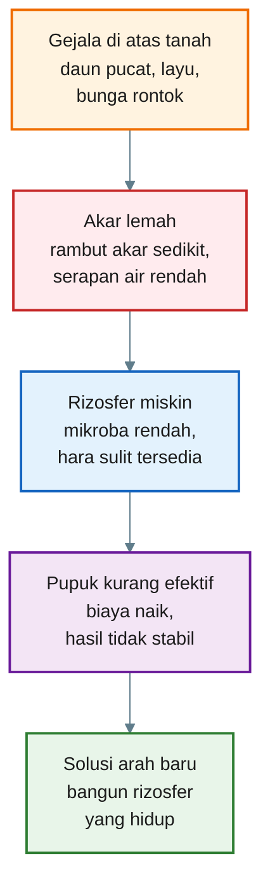

[Kembali ke atas](#membangun-rizosfer-cabai-yang-tangguh-dengan-mikroba-dari-rumpun-bambu)

---

# Bab 2

## Pelajaran dari Bambu dan Alang-Alang: Tanaman Kuat Dimulai dari Bawah Tanah

Bambu dan alang-alang berasal dari keluarga besar rumput-rumputan atau **Poaceae**. Bambu merupakan rumput berkayu dari kelompok Bambusoideae, sedangkan alang-alang adalah rumput herba yang dikenal sangat invasif. Keduanya berbeda bentuk, berbeda nilai ekonomi, dan berbeda perilaku di lahan. Namun, keduanya memiliki satu kesamaan besar: **kekuatan hidupnya banyak ditentukan oleh sistem bawah tanah**.

Bambu bertahan sebagai rumpun. Ia memiliki rimpang, akar, dan cadangan energi yang mendukung munculnya rebung serta batang baru. Kajian mikroba bambu menunjukkan bahwa bagian rizosfer dan rimpang bambu memiliki komunitas mikroba yang berperan dalam siklus hara dan pertumbuhan tanaman. ([Frontiers][2])

Alang-alang lebih ekstrem. Ia mampu membentuk hamparan luas, tumbuh kembali setelah terganggu, dan menyebar melalui rimpang. Dalam kajian tentang reproduksi dan penyebaran alang-alang, rimpang disebut sebagai organ utama yang membuat **Imperata cylindrica** menjadi gulma agresif dan invasif; fragmen rimpang yang berpindah juga dapat membantu penyebaran jarak jauh. ([Repository Universitas Hasanuddin][1])

Dari dua tanaman ini, ada beberapa pelajaran penting untuk cabai.


## 2.1 Tanaman tangguh punya cadangan energi bawah tanah

Bambu dan alang-alang sama-sama tidak hanya mengandalkan bagian atas tanaman. Mereka menyimpan energi dan titik pertumbuhan penting di bawah tanah. Jika bagian atas rusak karena dipotong, terbakar, atau terganggu, bagian bawah masih bisa menjadi sumber pemulihan.

Cabai tidak memiliki rimpang seperti bambu atau alang-alang. Namun, cabai tetap bisa dibuat lebih kuat bila akarnya sehat, aktif, dan didukung lingkungan rizosfer yang baik.

Pelajaran praktisnya:

> **Tanaman yang akarnya kuat lebih cepat pulih dari stres.**

## 2.2 Tanaman tangguh tidak hidup sendirian

Di bawah rumpun bambu, tanah biasanya tidak kosong. Ada akar, seresah daun, bahan organik lapuk, fungi, bakteri, mikrofauna, air, dan pori-pori tanah. Semua itu membentuk lingkungan hidup yang mendukung tanaman.

Hal yang sama berlaku pada cabai. Tanaman cabai tidak cukup hanya diberi pupuk. Ia membutuhkan “lingkungan akar” yang hidup. Rizosfer yang aktif membantu akar menjangkau air, hara, dan perlindungan biologis.

PGPR atau **Plant Growth-Promoting Rhizobacteria** dikenal sebagai kelompok bakteri yang mengkolonisasi akar dan dapat mendukung pertumbuhan tanaman melalui beberapa mekanisme, termasuk peningkatan pertumbuhan akar, ketersediaan hara, dan perlindungan dari patogen. ([PMC][3])

## 2.3 Tanaman tangguh cepat pulih setelah stres

Bambu dapat menghasilkan rebung baru. Alang-alang bisa muncul kembali dari rimpang setelah bagian atasnya rusak. Keduanya menunjukkan prinsip penting: ketangguhan bukan berarti tidak pernah rusak, tetapi mampu **pulih cepat**.

Dalam budidaya cabai, stres bisa datang dari:

- pindah tanam,
- panas berlebih,
- kekeringan,
- hujan berkepanjangan,
- tanah padat,
- serangan patogen akar,
- ketidakseimbangan hara.

Cabai yang memiliki akar sehat dan rizosfer aktif akan lebih siap menghadapi kondisi seperti itu. Bukan berarti kebal penyakit, tetapi memiliki peluang lebih baik untuk bertahan dan pulih.

## 2.4 Alang-alang cukup dijadikan pelajaran, bukan sumber utama praktik

Alang-alang mengajarkan pentingnya sistem bawah tanah. Namun, bukan berarti tanah alang-alang langsung cocok dipakai untuk cabai. Justru dari sisi praktis, alang-alang perlu dihindari dulu sebagai sumber aplikasi langsung karena sifatnya yang invasif dan berpotensi alelopatik. Kajian alelopati **Imperata cylindrica** menyebutkan bahwa spesies ini termasuk gulma invasif serius dan senyawa dari ekstrak, eksudat akar, residu, serta tanah rizosfernya dapat menekan perkecambahan dan pertumbuhan beberapa tanaman lain. ([PMC][4])

Karena itu, keputusan praktis dalam artikel ini adalah:

> **Belajar dari alang-alang, tetapi bekerja dengan bambu.**

Bambu dipilih karena lebih aman sebagai sumber awal eksplorasi mikroba untuk cabai. Rizosfer bambu cenderung kaya bahan organik dan mikroba pendukung siklus hara, sementara risiko membawa gulma agresif lebih rendah dibanding alang-alang.

---

## Diagram Bab 2 — Pelajaran dari Bambu dan Alang-Alang untuk Cabai

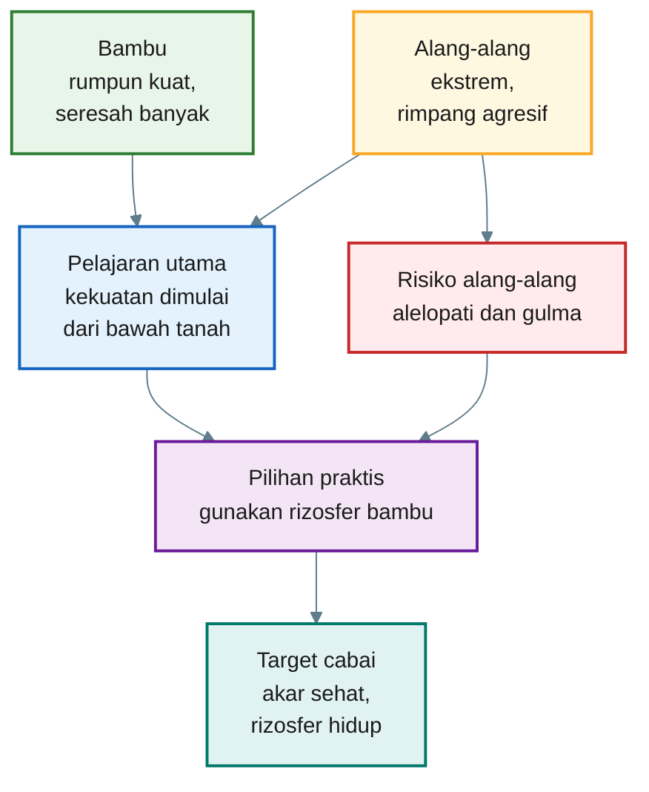

[Kembali ke atas](#membangun-rizosfer-cabai-yang-tangguh-dengan-mikroba-dari-rumpun-bambu)

---

# Bab 3

## Rizosfer: Area Kecil yang Menentukan Kekuatan Tanaman

Rizosfer adalah zona tanah di sekitar akar yang dipengaruhi langsung oleh aktivitas akar dan mikroba. Walaupun ukurannya kecil, perannya sangat besar. Di sinilah akar, air, udara, partikel tanah, bahan organik, hara, dan mikroorganisme saling berinteraksi.

Jurnal _Rhizosphere_ menjelaskan ruang lingkup rizosfer sebagai interaksi antara akar tanaman, organisme tanah, nutrisi, dan air. Kecuali karbon yang diperoleh dari fotosintesis, unsur-unsur lain yang dibutuhkan tanaman terutama diperoleh dari tanah melalui akar. ([ScienceDirect][5])

Dalam bahasa praktisi, rizosfer bisa dianggap sebagai **dapur, klinik, dan pasar hara** di sekitar akar.

- Disebut dapur karena bahan organik diolah menjadi hara yang lebih tersedia.
- Disebut klinik karena mikroba baik dapat membantu menekan patogen.
- Disebut pasar hara karena akar, mikroba, air, dan mineral saling bertukar kebutuhan.

## 3.1 Akar tidak hanya menyerap, tetapi juga “berkomunikasi”

Akar tanaman tidak pasif. Akar mengeluarkan eksudat berupa gula, asam organik, asam amino, fenolik, dan berbagai senyawa lain. Eksudat ini menjadi makanan sekaligus sinyal bagi mikroba di sekitar akar.

Review tentang interaksi rizosfer menjelaskan bahwa akar tanaman melepaskan berbagai senyawa kimia yang dapat menarik dan menyeleksi mikroorganisme di rizosfer. Mikroorganisme yang terasosiasi dengan tanaman kemudian dapat memengaruhi kesehatan dan pertumbuhan tanaman melalui berbagai mekanisme. ([Akar Lahan: Kunci Pangan dan Lingkungan][6])

Artinya, akar seperti “mengundang” mikroba tertentu. Mikroba yang cocok akan tinggal di sekitar akar, memanfaatkan eksudat, lalu memberi balasan dalam bentuk bantuan biologis: membantu hara tersedia, menghasilkan hormon, memperbaiki lingkungan akar, atau menekan patogen.

## 3.2 Rizosfer sehat membuat pupuk lebih efektif

Pupuk tetap penting. Namun, pupuk yang diberikan ke tanah belum tentu langsung tersedia atau langsung terserap. Ada hara yang terkunci, tercuci, menguap, atau tidak terjangkau akar.

Rizosfer yang aktif membantu memperbaiki situasi ini. Mikroba tertentu dapat membantu melarutkan fosfat, mengurai bahan organik, menghasilkan asam organik, dan mendukung serapan unsur mikro. Review tentang kesehatan tanaman dan rizobioma menyebutkan bahwa mikroba rizosfer dapat membantu tanaman tumbuh lebih efektif, antara lain melalui peningkatan resistensi terhadap patogen, retensi air, dan pengambilan nutrisi. ([PMC][7])

Bagi praktisi cabai, ini sangat penting. Bila rizosfer mati, miskin bahan organik, terlalu padat, atau terlalu sering terkena bahan kimia keras, akar cabai bisa kehilangan dukungan biologisnya. Akibatnya, pupuk yang diberikan tidak menghasilkan respons maksimal.

Kalimat sederhananya:

> **Pupuk memberi bahan baku, tetapi rizosfer yang sehat membantu tanaman benar-benar memakainya.**

## 3.3 Rizosfer buruk membuat cabai mudah stres

Rizosfer yang buruk biasanya ditandai oleh tanah yang padat, miskin bahan organik, drainase buruk, terlalu panas, terlalu sering kering, atau memiliki tekanan patogen tinggi.

Pada kondisi seperti ini, akar cabai bekerja dalam tekanan. Rambut akar sedikit, serapan air menurun, dan tanaman lebih mudah layu saat siang. Pada musim hujan, rizosfer yang terlalu becek dan miskin oksigen juga dapat memperburuk penyakit akar.

Karena itu, strategi membangun cabai yang kuat tidak boleh hanya berfokus pada daun dan buah. Praktisi perlu menilai kondisi bawah tanah:

- apakah akar tumbuh putih dan bercabang,
- apakah tanah mudah ditembus akar,
- apakah media cukup pori udara,
- apakah bahan organik tersedia,
- apakah kelembapan stabil,
- apakah mikroba baik diberi tempat hidup.

## 3.4 Rizosfer adalah fondasi ketahanan cabai

Cabai yang kuat bukan berarti tidak perlu pupuk, pestisida, atau pengairan. Semua itu tetap bagian dari budidaya. Tetapi akar dan rizosfer menjadi fondasi agar semua input bekerja lebih efisien.

Jika akar sehat, tanaman lebih mudah menyerap air dan hara. Jika rizosfer hidup, mikroba ikut membantu proses biologis di sekitar akar. Jika tanah stabil, tanaman lebih tahan terhadap fluktuasi cuaca.

Maka, sebelum bertanya “pupuk apa yang kurang?”, praktisi sebaiknya juga bertanya:

> **Apakah rizosfer cabai saya cukup hidup untuk membuat pupuk itu bekerja?**

Pertanyaan inilah yang menjadi dasar bab berikutnya. Setelah memahami pentingnya rizosfer, kita akan masuk ke inti: **mikroba rizosfer menyehatkan akar atau membantu menyediakan hara?** Jawabannya: keduanya.

---

## Diagram Bab 3 — Cara Kerja Rizosfer Sehat

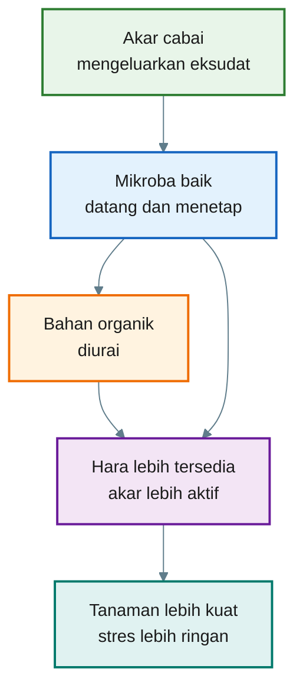

---

Tiga bab awal ini membangun fondasi artikel:

1. **Cabai butuh akar yang tangguh.**
2. **Tanaman kuat seperti bambu dan alang-alang menunjukkan bahwa ketahanan dimulai dari bawah tanah.**
3. **Rizosfer adalah area kecil di sekitar akar yang menentukan apakah pupuk, air, dan mikroba bisa bekerja efektif.**

[1]: https://repository.unhas.ac.id/id/eprint/5241/1/CAB%20REVIEWS%2C%20Imperata%20publikasi%202020.pdf?utm_source=chatgpt.com 'Imperata cylindrica: reproduction, dispersal, and controls'
[2]: https://www.frontiersin.org/journals/microbiology/articles/10.3389/fmicb.2025.1533061/full?utm_source=chatgpt.com 'Microbial diversity and function in bamboo ecosystems'
[3]: https://pmc.ncbi.nlm.nih.gov/articles/PMC3571425/?utm_source=chatgpt.com 'Plant growth-promoting rhizobacteria (PGPR): Their potential ...'
[4]: https://pmc.ncbi.nlm.nih.gov/articles/PMC9573136/?utm_source=chatgpt.com 'Allelopathy and Allelochemicals of Imperata cylindrica as an ...'
[5]: https://www.sciencedirect.com/journal/rhizosphere?utm_source=chatgpt.com 'Rhizosphere | Journal | ScienceDirect.com by Elsevier'
[6]: https://rootbiome.tamu.edu/wp-content/uploads/sites/38/2015/06/2014-Huang-et-al-Rhizosp-interaxctions-root-exudates_microbes-and-micro-communities-NRC-press-review-cjb-2013-0225.pdf?utm_source=chatgpt.com 'root exudates, microbes, and microbial communities1'
[7]: https://pmc.ncbi.nlm.nih.gov/articles/PMC6394481/?utm_source=chatgpt.com 'Plant health: feedback effect of root exudates-rhizobiome ...'

[Kembali ke atas](#membangun-rizosfer-cabai-yang-tangguh-dengan-mikroba-dari-rumpun-bambu)

---

# Bab 4

## Mikroba Rizosfer: Menyehatkan Akar Sekaligus Membantu Hara

Pertanyaan penting dalam praktik budidaya adalah:

> **Mikroba rizosfer itu sebenarnya menyehatkan akar, atau membantu menyediakan hara?**

Jawabannya: **keduanya.**

Mikroba rizosfer bukan hanya “pelindung akar”, tetapi juga ikut membantu mengubah lingkungan sekitar akar agar hara lebih mudah diserap tanaman. Karena itu, dalam budidaya cabai, mikroba rizosfer sebaiknya tidak dipandang sebagai pengganti pupuk, melainkan sebagai **penguat sistem akar dan peningkat efisiensi hara**.

PGPR atau **Plant Growth-Promoting Rhizobacteria** bekerja melalui mekanisme langsung dan tidak langsung. Mekanisme langsung mencakup produksi hormon tumbuh, pelarutan hara, dan peningkatan serapan nutrisi. Mekanisme tidak langsung mencakup penekanan patogen, kompetisi ruang di akar, produksi senyawa antimikroba, dan pemicuan ketahanan tanaman. ([PMC][1])

Dalam bahasa praktisi:

> **Mikroba rizosfer adalah dokter akar sekaligus juru masak hara.**

---

## 4.1 Mikroba sebagai “dokter akar”

Akar cabai adalah organ yang sangat rentan. Akar muda mudah rusak oleh kekeringan, genangan, suhu tanah tinggi, pupuk berlebihan, nematoda, jamur patogen, dan bakteri penyebab layu.

Mikroba rizosfer yang menguntungkan membantu akar melalui beberapa cara:

- menempati ruang di sekitar akar sehingga patogen sulit masuk,
- bersaing dengan patogen dalam mengambil makanan,
- menghasilkan senyawa antimikroba,
- merangsang pembentukan rambut akar,
- membantu akar pulih setelah stres,
- memperbaiki struktur mikro tanah di sekitar akar.

Kelompok seperti **Bacillus**, **Pseudomonas**, **Streptomyces**, dan **Trichoderma** sering dibahas dalam konteks kesehatan akar karena kemampuannya mendukung pertumbuhan tanaman dan menekan patogen tanah. Review tentang **Trichoderma** menyebut genus ini sebagai agen multifungsi yang dapat berinteraksi dengan tanaman, mikrobioma, dan patogen melalui mekanisme promosi pertumbuhan, kompetisi, mikoparasitisme, dan aktivasi respons pertahanan tanaman. ([PMC][2])

Bagi cabai, manfaat praktisnya terlihat pada hal-hal sederhana:

- akar lebih putih,
- akar lateral lebih banyak,
- rambut akar lebih aktif,
- tanaman tidak mudah layu saat panas,
- pemulihan setelah pindah tanam lebih cepat,
- tekanan penyakit akar bisa berkurang.

Namun, mikroba bukan obat ajaib. Bila tanah terlalu becek, drainase buruk, bahan organik mentah, atau patogen sudah sangat tinggi, mikroba baik tetap akan kesulitan bekerja. Mikroba membutuhkan lingkungan yang mendukung.

---

## 4.2 Mikroba sebagai “juru masak hara”

Tanah bisa mengandung banyak unsur hara, tetapi tidak semuanya siap diserap. Fosfor misalnya, sering terkunci oleh kalsium, besi, atau aluminium. Bahan organik juga belum langsung menjadi hara sebelum diurai.

Di sinilah mikroba rizosfer berperan. Mereka tidak selalu “memberi pupuk” seperti NPK, tetapi membantu mengubah hara menjadi bentuk yang lebih tersedia.

Mikroba dapat membantu hara melalui:

- pelarutan fosfat,
- mineralisasi bahan organik,
- siklus nitrogen,
- produksi asam organik,
- produksi siderofor untuk membantu akses besi,
- kerja sama dengan mikoriza untuk memperluas jangkauan serapan air dan fosfor.

Bakteri pelarut fosfat atau **Phosphate-Solubilizing Bacteria** dapat mengubah fosfor tidak larut di tanah menjadi bentuk yang lebih mudah diserap tanaman, terutama melalui produksi asam organik dan mekanisme pelarutan lainnya. ([MDPI][3])

Mikoriza juga penting. Hifa mikoriza dapat menjangkau pori-pori tanah yang tidak bisa dijangkau akar, sehingga membantu penyerapan fosfor, air, dan beberapa unsur mikro. Review tentang interaksi tanaman-mikroba dalam rizosfer menegaskan bahwa mikrobioma rizosfer berperan dalam akuisisi sumber daya, termasuk nutrisi dan air. ([PMC][4])

Untuk cabai, ini berarti mikroba rizosfer dapat membantu:

- pupuk fosfat lebih efisien,
- kompos lebih cepat menjadi hara tersedia,
- akar lebih mudah mengambil unsur mikro,
- tanaman lebih stabil saat cuaca kering,
- respons pemupukan lebih merata.

Jadi, mikroba bukan menggantikan pupuk, tetapi membuat sistem pemupukan lebih hidup.

---

## 4.3 Mikroba Bukan Pengganti Pupuk

Bagian ini wajib masuk.

Isi yang disarankan:

> Dalam praktik budidaya cabai, mikroba rizosfer tidak boleh dipahami sebagai sumber hara utama 100%. Mikroba memang dapat membantu melarutkan fosfat, mengurai bahan organik, memobilisasi unsur mikro, dan mendukung kerja mikoriza. Namun, jumlah hara yang dibutuhkan cabai untuk tumbuh, berbunga, dan berbuah tetap harus tersedia dari sumber pupuk.

> Cabai adalah tanaman dengan kebutuhan hara tinggi, terutama pada fase pertumbuhan vegetatif, pembungaan, pembentukan buah, dan panen berulang. Pada fase tersebut, tanaman tetap membutuhkan suplai nitrogen, fosfor, kalium, kalsium, magnesium, dan unsur mikro dalam jumlah yang cukup dan seimbang.

> Maka posisi PGPR bambu adaptif adalah sebagai **penguat efisiensi pemupukan**, bukan pengganti pemupukan.

| Komponen    | Peran Utama                                             | Bisa Digantikan PGPR?      |
| ----------- | ------------------------------------------------------- | -------------------------- |
| Pupuk N     | Sumber nitrogen untuk daun dan pertumbuhan vegetatif    | Tidak                      |
| Pupuk P     | Sumber fosfor untuk akar, bunga, dan energi tanaman     | Tidak                      |
| Pupuk K     | Sumber kalium untuk buah, ketahanan, dan kualitas panen | Tidak                      |
| Kalsium     | Menguatkan jaringan dan mengurangi gangguan fisiologis  | Tidak                      |
| Magnesium   | Komponen klorofil dan fotosintesis                      | Tidak                      |
| Unsur mikro | Mendukung enzim, bunga, dan metabolisme                 | Tidak                      |
| PGPR        | Membantu akar, mobilisasi hara, dan efisiensi serapan   | Pendukung, bukan pengganti |

Kalimat kunci:

> **Mikroba membantu membuka pintu hara, tetapi pupuk tetap menyediakan isi gudangnya.**

---

## 4.4 Mengapa cabai sangat membutuhkan mikroba rizosfer?

Cabai adalah tanaman dengan beban produksi tinggi. Ia harus membentuk akar, batang, cabang, daun, bunga, dan buah dalam waktu relatif singkat. Pada fase generatif, kebutuhan air dan hara meningkat, sementara tekanan penyakit dan stres lingkungan juga sering naik.

Masalahnya, cabai sering ditanam pada lahan yang sudah intensif. Tanah bisa mulai padat, bahan organik menurun, residu pupuk tinggi, dan mikroba tanah tidak seimbang. Kondisi ini membuat tanaman semakin tergantung pada input luar, tetapi responsnya tidak selalu baik.

Mikroba rizosfer membantu memutus pola tersebut dengan membangun kembali fungsi biologis tanah.

Untuk praktisi, manfaat mikroba rizosfer pada cabai bisa dirangkum menjadi tiga sasaran:

| Sasaran Praktis | Peran Mikroba                                                       | Dampak yang Diharapkan                          |
| --------------- | ------------------------------------------------------------------- | ----------------------------------------------- |
| Akar sehat      | Menekan patogen, merangsang akar lateral, memperbanyak rambut akar  | Bibit cepat pulih dan tanaman lebih kokoh       |
| Hara tersedia   | Melarutkan fosfat, mengurai bahan organik, membantu unsur mikro     | Pupuk lebih efektif dan daun lebih stabil       |
| Tahan stres     | Membantu serapan air, memperbaiki agregat tanah, mendukung mikoriza | Tanaman tidak mudah layu saat panas atau kering |

Intinya:

> **Tanaman cabai yang sehat bukan hanya tanaman yang dipupuk, tetapi tanaman yang akarnya hidup bersama mikroba yang tepat.**

---

## 4.5 Mikroba butuh rumah, makanan, dan lingkungan stabil

Kesalahan umum dalam penggunaan PGPR adalah menganggap mikroba cukup dikocorkan, lalu pasti bekerja. Padahal mikroba adalah makhluk hidup. Mereka membutuhkan tempat tinggal, sumber energi, kelembapan, dan kondisi tanah yang tidak ekstrem.

Agar mikroba rizosfer bekerja, tanah perlu memiliki:

- bahan organik matang,
- pori udara cukup,
- kelembapan stabil,
- suhu tanah tidak terlalu panas,
- pH tidak terlalu ekstrem,
- residu kimia yang tidak berlebihan,
- akar aktif sebagai sumber eksudat.

Karena itu, PGPR bambu nantinya tidak berdiri sendiri. Ia perlu didukung oleh **kompos matang, sekam bakar atau biochar, mikoriza, Trichoderma, dan mulsa**. Kombinasi ini akan dibahas lebih teknis pada Bab 7.

Kalimat kunci untuk bab ini:

> **PGPR bukan sekadar cairan mikroba. PGPR adalah bagian dari sistem rizosfer. Jika tanahnya tidak mendukung, mikroba sulit bertahan.**

---

## Diagram Bab 4 — Dua Peran Utama Mikroba Rizosfer

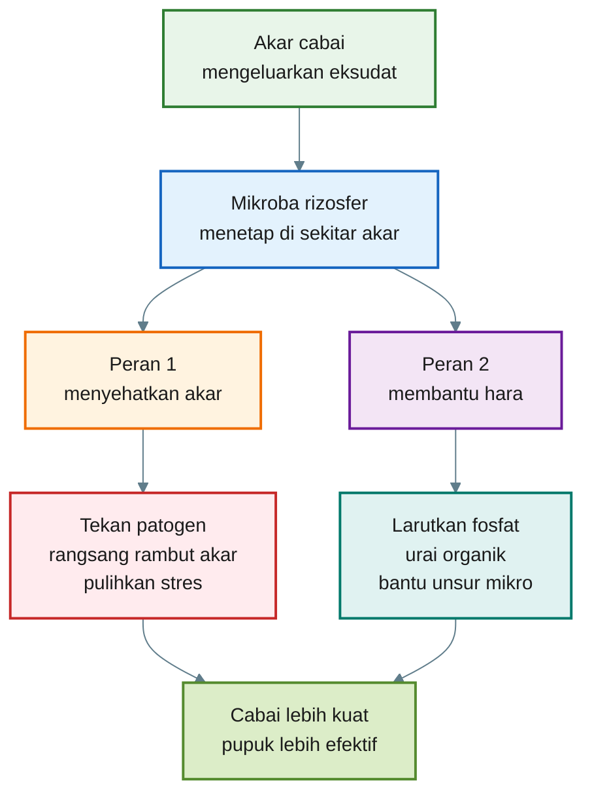

[Kembali ke atas](#membangun-rizosfer-cabai-yang-tangguh-dengan-mikroba-dari-rumpun-bambu)

---

# Bab 5

## Mengapa Memilih Rizosfer Bambu dan Meninggalkan Alang-Alang Dulu?

Setelah memahami fungsi mikroba rizosfer, pertanyaan berikutnya adalah:

> **Kalau bambu dan alang-alang sama-sama tangguh, mengapa yang dipilih untuk cabai justru bambu?**

Jawabannya sederhana: **karena bambu lebih aman untuk tahap praktik awal.**

Alang-alang memang sangat menarik. Ia mampu hidup pada kondisi ekstrem, cepat pulih setelah terganggu, dan memiliki sistem bawah tanah yang kuat. Tetapi justru karena terlalu agresif, alang-alang membawa risiko yang lebih tinggi untuk budidaya cabai.

Untuk praktisi, prinsipnya begini:

> **Dari alang-alang kita ambil pelajaran biologinya. Dari bambu kita ambil peluang aplikasinya.**

---

## 5.1 Rizosfer bambu lebih ramah untuk praktik cabai

Rumpun bambu umumnya memiliki lingkungan bawah tanah yang kaya bahan organik. Daun bambu gugur, menumpuk, melapuk, lalu menjadi sumber karbon bagi mikroba. Tanah di bawah rumpun bambu sering lebih gembur, lembap, dan kaya aktivitas biologis dibanding tanah terbuka yang miskin penutup.

Kajian tentang mikroba ekosistem bambu menunjukkan bahwa rizosfer bambu dapat dihuni beragam bakteri seperti **Actinomycetes, Bacillus, Burkholderia, Streptomyces**, serta fungi seperti **Aspergillus, Penicillium, dan Glomus**, yang berperan dalam siklus hara dan promosi pertumbuhan tanaman. ([Frontiers][5])

Ini membuat rizosfer bambu menarik sebagai sumber awal mikroba untuk cabai, terutama karena potensi fungsinya:

- membantu dekomposisi bahan organik,
- mendukung ketersediaan hara,
- menyediakan mikroba pelarut fosfat,
- mendukung kesehatan akar,
- memperbaiki aktivitas biologis tanah,
- lebih mudah dikombinasikan dengan kompos, biochar, dan mikoriza.

Kajian lain tentang rimpang bambu juga menyebut bahwa rizosfer di sekitar rimpang bambu menyimpan komunitas fungi dan bakteri yang berperan dalam penyerapan nutrisi dan kesehatan tanaman. ([ScienceDirect][6])

Bagi cabai, ini penting karena yang dibutuhkan bukan mikroba yang “paling ekstrem”, tetapi mikroba yang **cukup adaptif, cukup aman, dan bisa diarahkan untuk mendukung akar cabai**.

---

## 5.2 Bambu tetap harus diseleksi, bukan dipakai mentah

Walaupun lebih aman daripada alang-alang, rizosfer bambu tidak boleh dipakai sembarangan. Tanah dari rumpun bambu tetap bisa mengandung mikroba netral, mikroba tidak cocok, atau bahkan patogen tertentu bila sumbernya buruk.

Karena itu, pendekatannya bukan:

> “Ambil tanah bambu lalu tabur ke semua bedengan.”

Pendekatan yang benar adalah:

> **Ambil sedikit rizosfer bambu, buat biang, adaptasikan pada bibit cabai, pilih yang terbaik, baru perbanyak.**

Dengan cara ini, mikroba dari bambu diseleksi ulang oleh akar cabai. Mikroba yang tidak cocok akan berkurang, sedangkan mikroba yang mampu hidup di sekitar akar cabai punya peluang lebih besar untuk bertahan.

Ini penting karena komunitas mikroba rizosfer sangat dipengaruhi oleh jenis tanaman, eksudat akar, kondisi tanah, dan lingkungan. Review tentang mikrobioma rizosfer menjelaskan bahwa interaksi tanaman-mikroba berperan dalam akuisisi sumber daya dan dapat berbeda tergantung sistem tanaman serta lingkungan tumbuhnya. ([PMC][4])

Jadi, bambu adalah **sumber awal**, bukan produk akhir.

---

## 5.3 Mengapa alang-alang ditinggalkan dulu?

Alang-alang atau **Imperata cylindrica** adalah tanaman yang sangat tangguh, tetapi dari sisi praktik cabai, ada tiga risiko besar: **alelopati, rimpang gulma, dan dominasi biologis**.

### 5.3.1 Risiko alelopati

Alang-alang memiliki sifat alelopati. Artinya, bagian tanaman, eksudat akar, residu membusuk, dan tanah rizosfernya dapat mengandung senyawa yang menekan tanaman lain.

Review tentang alelopati **Imperata cylindrica** menyebut bahwa ekstrak, leachate, eksudat akar, residu membusuk, dan tanah rizosfer alang-alang ditemukan dapat menekan perkecambahan serta pertumbuhan beberapa spesies tanaman. Review yang sama juga menyatakan bahwa alelopati alang-alang dapat mendukung kemampuan invasif dan pembentukan tegakan monospesifik. ([PMC][7])

Untuk cabai, ini risiko serius, terutama pada fase bibit dan awal pindah tanam. Akar muda cabai sangat sensitif. Jika bahan dari alang-alang masih membawa efek fitotoksik, pertumbuhan akar bisa terganggu.

Dampak yang mungkin muncul:

- akar lebih pendek,
- rambut akar sedikit,
- bibit lambat pulih,
- tanaman tampak kerdil,
- respons terhadap pupuk tidak stabil.

Karena artikel ini ditujukan untuk praktik aman, maka risiko ini tidak boleh diabaikan.

---

### 5.3.2 Risiko rimpang menjadi gulma baru

Alang-alang menyebar kuat lewat rimpang. Rimpang adalah organ bawah tanah yang menyimpan energi dan memiliki banyak titik tumbuh. Jika potongan rimpang ikut terbawa ke lahan cabai, ia dapat tumbuh menjadi gulma baru.

Review tentang reproduksi dan penyebaran **Imperata cylindrica** menyebut rimpang sebagai organ utama yang membuat alang-alang menjadi gulma agresif dan invasif; perpindahan fragmen rimpang juga dapat membantu penyebaran ke tempat baru. ([Repository Universitas Hasanuddin][8])

FAO juga menjelaskan bahwa rimpang alang-alang memiliki kemampuan regenerasi tinggi karena memiliki banyak tunas yang dapat tumbuh setelah terpotong akibat pengolahan tanah atau gangguan lain. ([FAOHome][9])

Dalam budidaya cabai, ini sangat berbahaya. Bedengan cabai biasanya gembur, cukup air, mendapat pupuk, dan terbuka terhadap cahaya. Kondisi ini bisa menjadi tempat ideal bagi rimpang alang-alang yang terbawa untuk tumbuh kembali.

Sekali alang-alang masuk ke bedengan cabai, biaya pengendaliannya bisa jauh lebih besar daripada manfaat mikroba yang dicari.

---

### 5.3.3 Risiko dominasi biologis

Alang-alang bukan hanya kuat karena rimpang. Ia juga membangun lingkungan bawah tanah yang mendukung dirinya sendiri. Rizosfer alang-alang terbentuk oleh eksudat akar alang-alang, mikroba yang cocok dengan alang-alang, serta senyawa kimia yang membantu tanaman itu menguasai ruang.

Masalahnya, sistem yang bagus untuk alang-alang belum tentu bagus untuk cabai.

Mikroba dari rizosfer alang-alang bisa saja menarik secara ilmiah karena mungkin memiliki toleransi tinggi terhadap stres. Namun, mikroba itu terseleksi oleh akar alang-alang, bukan oleh akar cabai. Ketika dipindahkan langsung ke cabai, hasilnya bisa berbeda:

- sebagian mikroba tidak mampu menetap,
- sebagian menjadi netral,
- sebagian kalah oleh mikroba lokal,
- sebagian mungkin tidak cocok dengan mikoriza cabai,
- sebagian bisa membawa efek yang tidak diinginkan.

Karena itu, alang-alang lebih baik disimpan untuk riset lanjutan, bukan praktik awal.

---

## 5.4 Perbandingan praktis: bambu vs alang-alang

| Aspek                   | Rizosfer Bambu                            | Rizosfer Alang-Alang                                  |
| ----------------------- | ----------------------------------------- | ----------------------------------------------------- |
| Tingkat risiko          | Lebih rendah                              | Lebih tinggi                                          |
| Potensi mikroba baik    | Tinggi                                    | Tinggi, tetapi lebih liar                             |
| Risiko gulma            | Relatif rendah bila rimpang tidak terbawa | Tinggi karena rimpang mudah tumbuh                    |
| Risiko alelopati        | Lebih rendah untuk praktik cabai          | Lebih tinggi                                          |
| Kesesuaian untuk pemula | Lebih cocok                               | Tidak disarankan dulu                                 |
| Cara penggunaan         | Biang, adaptasi ke cabai, uji kecil       | Sebaiknya ditunda atau hanya untuk riset              |
| Nilai praktis           | Aman sebagai sumber awal PGPR             | Menarik sebagai pembelajaran, bukan aplikasi langsung |

Kesimpulan praktisnya:

> **Bambu dipilih bukan karena paling ekstrem, tetapi karena lebih aman, lebih mudah diarahkan, dan lebih cocok untuk tahap awal budidaya cabai.**

---

## 5.5 Prinsip keputusan untuk praktisi

Dalam memilih sumber mikroba, praktisi tidak hanya bertanya:

> “Mikrobanya kuat atau tidak?”

Pertanyaan yang lebih tepat adalah:

> “Apakah sumber mikroba ini aman, bisa diseleksi, dan cocok diarahkan ke tanaman cabai?”

Dengan kriteria itu, rizosfer bambu lebih masuk akal.

Alang-alang memang memberi inspirasi tentang ketangguhan. Tetapi untuk cabai, kita tidak ingin membawa sifat gulma, alelopati, dan dominasi biologisnya ke lahan produksi. Yang dibutuhkan cabai adalah rizosfer yang hidup, tetapi tetap terkendali.

Maka strategi artikel ini dikunci pada jalur berikut:

> **Rizosfer bambu sehat → biang mikroba → adaptasi pada bibit cabai → seleksi akar terbaik → perbanyakan → uji kecil → baru diperluas.**

---

## Diagram Bab 5 — Keputusan Memilih Sumber Mikroba

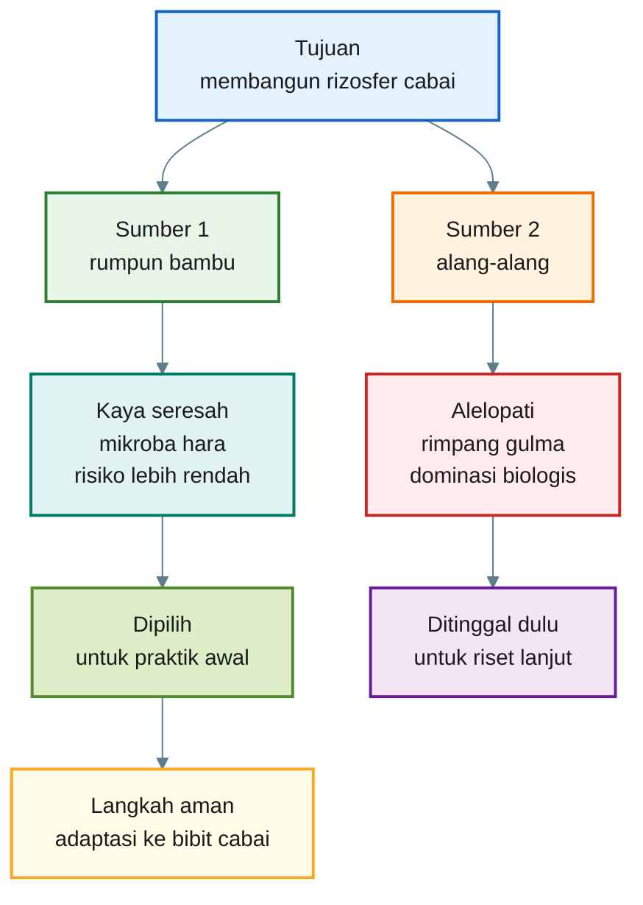

---

## Penutup Bab 4–5

Dua bab ini menjadi inti pemikiran artikel.

Pertama, mikroba rizosfer berperan ganda: **menyehatkan akar dan membantu ketersediaan hara**. Karena itu, membangun rizosfer cabai bukan sekadar menambahkan mikroba, tetapi membangun ekosistem kecil di sekitar akar.

Kedua, untuk praktik awal, **rizosfer bambu lebih layak dipilih dibanding alang-alang**. Alang-alang tetap menarik sebagai sumber pembelajaran, tetapi terlalu berisiko untuk langsung dibawa ke sistem cabai.

## Cara Aman Membuat PGPR Rizosfer Bambu untuk Cabai

[1]: https://pmc.ncbi.nlm.nih.gov/articles/PMC6206271/?utm_source=chatgpt.com 'Plant Growth-Promoting Rhizobacteria: Context, Mechanisms ...'
[2]: https://pmc.ncbi.nlm.nih.gov/articles/PMC12255041/?utm_source=chatgpt.com 'Trichoderma: a multifunctional agent in plant health and ...'
[3]: https://www.mdpi.com/2076-2607/11/12/2904?utm_source=chatgpt.com 'Phosphate-Solubilizing Bacteria: Advances in Their ...'
[4]: https://pmc.ncbi.nlm.nih.gov/articles/PMC9796772/?utm_source=chatgpt.com 'The rhizosphere microbiome: Plant–microbial interactions for ...'
[5]: https://www.frontiersin.org/journals/microbiology/articles/10.3389/fmicb.2025.1533061/full?utm_source=chatgpt.com 'Microbial diversity and function in bamboo ecosystems'
[6]: https://www.sciencedirect.com/science/article/pii/S2773139125000011?utm_source=chatgpt.com 'Unlocking the hidden power of bamboo rhizomes'
[7]: https://pmc.ncbi.nlm.nih.gov/articles/PMC9573136/?utm_source=chatgpt.com 'Allelopathy and Allelochemicals of Imperata cylindrica as an ...'
[8]: https://repository.unhas.ac.id/id/eprint/5241/1/CAB%20REVIEWS%2C%20Imperata%20publikasi%202020.pdf?utm_source=chatgpt.com 'Imperata cylindrica: reproduction, dispersal, and controls'
[9]: https://www.fao.org/4/y5031e/y5031e08.htm?utm_source=chatgpt.com 'Characteristics and management of Imperata cylindrica (L.) ...'

[Kembali ke atas](#membangun-rizosfer-cabai-yang-tangguh-dengan-mikroba-dari-rumpun-bambu)

---

# Bab 6

## Cara Aman Membuat PGPR Rizosfer Bambu untuk Cabai

Bab ini adalah bagian teknis utama. Tujuannya bukan sekadar membuat “fermentasi mikroba”, tetapi membuat **PGPR rizosfer bambu yang lebih aman, terseleksi, dan lebih cocok untuk cabai**.

Prinsip pentingnya:

> **Rizosfer bambu jangan langsung dipindahkan mentah ke bedengan cabai. Ambil sedikit sebagai sumber mikroba, buat biang, adaptasikan ke akar cabai, seleksi, lalu perbanyak.**

PGPR atau **Plant Growth-Promoting Rhizobacteria** adalah mikroba rizosfer yang dapat mendukung pertumbuhan tanaman melalui mekanisme langsung maupun tidak langsung, seperti membantu ketersediaan hara, memproduksi hormon tumbuh, dan menekan patogen. ([PMC][1]) Rizosfer bambu layak dijadikan sumber awal karena ekosistem bambu dilaporkan memiliki mikroba seperti **Bacillus, Burkholderia, Streptomyces, Actinomycetes, Aspergillus, Penicillium, dan Glomus** yang berkaitan dengan siklus hara serta promosi pertumbuhan tanaman. ([Frontiers][2])

Namun, perlu diingat: metode ini adalah **seleksi mikroba lokal secara praktis**, bukan identifikasi laboratorium. Jadi hasil terbaik tetap harus diuji kecil sebelum dipakai luas.


---

## 6.1 Prinsip Dasar yang Harus Dipegang

Sebelum masuk ke resep, ada lima prinsip penting.

### 1. Sumber harus bersih

Jangan mengambil tanah bambu dari lokasi yang berisiko tercemar. Hindari rumpun bambu yang dekat dengan:

- limbah rumah tangga,
- kandang yang becek dan kotor,
- tempat pembuangan sampah,
- jalan besar,
- area bekas herbisida,
- saluran air tercemar,
- lokasi dengan banyak tanaman sakit.

Mikroba yang kita cari adalah mikroba tanah yang mendukung akar, bukan mikroba pembusuk atau patogen.

### 2. Yang diambil adalah rizosfer, bukan tanah sembarang

Tanah rizosfer adalah tanah yang menempel dekat akar halus. Jangan hanya mengambil tanah permukaan yang kering atau seresah kasar. Mikroba yang lebih relevan ada di zona akar aktif.

### 3. Biang bambu harus diadaptasikan ke cabai

Mikroba yang bagus untuk bambu belum tentu langsung cocok untuk cabai. Karena itu, biang awal perlu “dilatih” dulu pada bibit cabai.

### 4. Fermentasi tidak boleh busuk

Aroma yang dicari adalah aroma tanah segar, asam ringan, atau manis-asam. Jika bau busuk menyengat, seperti bangkai, septic tank, telur busuk tajam, atau lendir hitam pekat, larutan sebaiknya dibuang.

### 5. Gunakan sebagai kocor tanah, bukan semprot buah

Untuk keamanan pangan, larutan mikroba liar sebaiknya digunakan sebagai aplikasi tanah di sekitar akar, bukan disemprotkan ke buah atau bagian yang akan dipanen. Penggunaan teh kompos atau ekstrak mikroba pada tanaman pangan memiliki perhatian keamanan pangan bila berpotensi membawa mikroba penyebab penyakit; beberapa panduan menyarankan menghindari kontak larutan yang belum diuji dengan bagian tanaman yang dimakan, terutama mendekati panen. ([uvm.edu][3])

---

## Diagram Alur Bab 6 — Dari Rizosfer Bambu ke PGPR Cabai

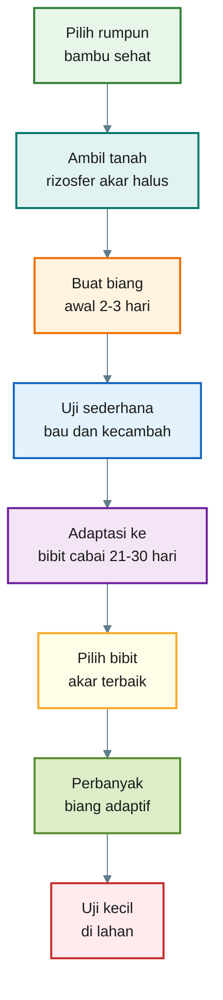

---

# 6.2 Tahap 1 — Memilih Rumpun Bambu Sumber

Pemilihan sumber sangat menentukan. Jangan hanya memilih bambu yang dekat atau mudah dijangkau. Pilih rumpun bambu yang menunjukkan ekosistem bawah rumpun sehat.

## Ciri rumpun bambu yang baik

Pilih rumpun bambu dengan ciri:

| Kriteria          | Ciri Lapangan                                               |
| ----------------- | ----------------------------------------------------------- |
| Tanaman sehat     | Daun hijau, rumpun aktif, tidak banyak batang mati busuk    |
| Tanah gembur      | Tanah mudah dicungkil, tidak keras seperti semen            |
| Seresah lapuk     | Ada daun bambu kering dan lapuk, bukan sampah plastik       |
| Aroma tanah segar | Tidak bau busuk atau bau limbah                             |
| Tidak tercemar    | Jauh dari limbah, jalan besar, herbisida, dan kandang kotor |
| Tidak tergenang   | Tanah lembap tetapi tidak becek anaerob                     |

Jenis bambu tidak harus spesifik. Bambu apus, bambu tali, bambu petung, bambu kuning, atau bambu lokal lain bisa dipakai selama rumpunnya sehat.

## Lokasi yang sebaiknya dihindari

Hindari mengambil dari:

- bambu di pinggir jalan raya,
- bambu di dekat saluran limbah,
- bambu dekat tempat pembuangan sampah,
- bambu di lahan yang sering disemprot herbisida,
- bambu di area banjir kotor,
- bambu dengan tanah berbau busuk,
- bambu dekat kandang yang limbahnya mengalir langsung ke tanah.

Untuk budidaya cabai, keamanan sumber lebih penting daripada sekadar “mikrobanya banyak”.

---

# 6.3 Tahap 2 — Mengambil Tanah Rizosfer Bambu

Yang diambil bukan tanah sembarang, tetapi tanah di sekitar akar halus.

## Alat yang dibutuhkan

- sekop kecil atau cetok bersih,
- sarung tangan,
- plastik ziplock atau wadah bersih,
- label,
- spidol,
- saringan kasar,
- ember kecil bersih.

Sebelum digunakan, alat sebaiknya dicuci bersih. Tidak perlu steril laboratorium, tetapi jangan memakai alat bekas pupuk kandang mentah, pestisida, atau bahan kimia keras.

## Cara pengambilan

1. Singkirkan seresah daun paling atas.
2. Cungkil tanah pada kedalaman sekitar **5–15 cm**.
3. Cari akar halus bambu atau rimpang kecil yang aktif.
4. Ambil tanah yang menempel di sekitar akar halus.
5. Jangan mengambil rimpang besar.
6. Jangan mengambil tanah yang terlalu kering, terlalu becek, atau berbau busuk.
7. Masukkan ke wadah bersih dan beri label.

## Jumlah yang cukup

Untuk skala awal, cukup ambil:

| Kebutuhan              | Jumlah Tanah Rizosfer |
| ---------------------- | --------------------: |
| Uji kecil rumah tangga |              250 gram |
| Uji pembibitan kecil   |              500 gram |
| Uji kelompok tani      |                  1 kg |

Jangan langsung mengambil banyak. Tahap awal adalah seleksi, bukan produksi massal.

---

# 6.4 Tahap 3 — Membuat Biang Awal Rizosfer Bambu

Biang awal adalah larutan ekstrak mikroba dari tanah rizosfer bambu. Ini belum menjadi produk akhir. Fungsinya sebagai sumber mikroba untuk proses adaptasi ke cabai.

## Bahan biang awal

Untuk **1 liter biang awal**:

| Bahan                        |         Jumlah | Fungsi                    |
| ---------------------------- | -------------: | ------------------------- |
| Tanah rizosfer bambu         |       250 gram | Sumber mikroba            |
| Air non-klorin               |        1 liter | Media larutan             |
| Molase/gula merah cair       |       10–15 ml | Sumber energi awal        |
| Air cucian beras pekat       |      50–100 ml | Sumber karbohidrat ringan |
| Opsional: dedak rebus dingin | 1 sendok makan | Nutrisi tambahan ringan   |

Gunakan air sumur bersih, air hujan bersih, atau air PDAM yang sudah diendapkan minimal semalam. Klorin pada air dapat mengganggu mikroba.

## Formula skala bahan

Gunakan rasio dasar berikut:

```mdx
Untuk setiap 1 liter air non-klorin:

- Tanah rizosfer bambu: 250 gram
- Molase/gula merah cair: 10–15 ml
- Air cucian beras pekat: 50–100 ml
```

Jika ingin membuat volume lebih besar:

$$
\text{Bahan baru} = \text{Bahan dasar} \times \text{Volume akhir dalam liter}
$$

Contoh untuk 5 liter:

```mdx
Tanah rizosfer = 250 gram × 5 = 1.250 gram
Molase = 10–15 ml × 5 = 50–75 ml
Air cucian beras = 50–100 ml × 5 = 250–500 ml
```

Namun untuk tahap awal, jangan langsung membuat banyak. Mulai dari 1 liter dulu.

## Cara membuat biang awal

1. Masukkan 250 gram tanah rizosfer bambu ke ember bersih.
2. Tambahkan 1 liter air non-klorin.
3. Aduk perlahan 2–3 menit.
4. Tambahkan molase atau gula merah cair.
5. Tambahkan air cucian beras pekat.
6. Aduk lagi sampai rata.
7. Tutup dengan kain bersih atau tutup longgar.
8. Simpan di tempat teduh.
9. Fermentasi **48–72 jam**.
10. Aduk ringan 1 kali sehari.
11. Saring sebelum digunakan.

## Ciri biang awal yang baik

| Indikator | Ciri Baik                                         |
| --------- | ------------------------------------------------- |
| Aroma     | Tanah segar, asam ringan, manis-asam              |
| Warna     | Cokelat muda sampai cokelat tua                   |
| Gas       | Ada sedikit gas, tidak berlebihan                 |
| Endapan   | Ada endapan tanah, normal                         |
| Lendir    | Tidak berlendir busuk                             |
| Bau       | Tidak bau bangkai, septic, atau telur busuk tajam |

## Ciri biang yang harus dibuang

Buang biang jika:

- bau busuk menyengat,
- berwarna hitam pekat dan berlendir,
- muncul belatung,
- ada lapisan jamur hitam pekat dominan,
- pH sangat asam dengan bau tajam menyengat,
- sumber tanah dicurigai tercemar.

Jangan memaksakan biang yang buruk ke bibit cabai.

---

# 6.5 Tahap 4 — Uji Sederhana Sebelum Adaptasi

Sebelum biang awal digunakan ke bibit cabai, lakukan dua uji sederhana: **uji bau** dan **uji kecambah**.

## 6.5.1 Uji bau

Ambil sedikit larutan, cium dari jarak aman.

| Aroma             | Keputusan |
| ----------------- | --------- |
| Tanah segar       | Lanjut    |
| Asam-manis ringan | Lanjut    |
| Fermentasi lembut | Lanjut    |
| Busuk bangkai     | Buang     |
| Septic atau got   | Buang     |
| Telur busuk tajam | Buang     |

Uji bau memang sederhana, tetapi sangat berguna untuk menghindari fermentasi anaerob yang buruk.

## 6.5.2 Uji kecambah

Uji ini berguna untuk melihat apakah biang terlalu keras atau fitotoksik.

Bahan:

- 20 benih cabai atau kacang hijau,
- tisu/kertas merang,
- 2 wadah kecil,
- air bersih,
- biang awal yang sudah diencerkan.

Perlakuan:

| Perlakuan | Isi                        |
| --------- | -------------------------- |
| Kontrol   | Air bersih                 |
| Uji       | Biang awal diencerkan 1:20 |

Cara:

1. Letakkan 10 benih pada wadah kontrol.
2. Letakkan 10 benih pada wadah uji.
3. Basahi kontrol dengan air bersih.
4. Basahi uji dengan larutan biang 1:20.
5. Simpan di tempat teduh.
6. Amati 48–72 jam.
7. Bandingkan jumlah kecambah dan panjang akar.

## Rumus indeks kecambah

Gunakan rumus sederhana berikut:

$$
GI =
\frac{\text{Kecambah uji }(\%)}{\text{Kecambah kontrol }(\%)}
\times
\frac{\text{Panjang akar uji}}{\text{Panjang akar kontrol}}
\times
100
$$

Keterangan:

```mdx
GI = Germination Index / indeks kecambah
%Ku = persentase kecambah perlakuan uji
%Kk = persentase kecambah kontrol
Au = rata-rata panjang akar perlakuan uji
Ak = rata-rata panjang akar kontrol
```

## Cara membaca hasil

| Nilai GI | Keputusan                               |
| -------: | --------------------------------------- |
|     ≥ 80 | Aman untuk lanjut adaptasi              |
|    50–79 | Hati-hati, encerkan lagi dan ulangi uji |
|     < 50 | Jangan dipakai                          |

Contoh:

```mdx
Kontrol:

- 9 dari 10 benih tumbuh = 90%
- rata-rata akar = 2 cm

Uji:

- 8 dari 10 benih tumbuh = 80%
- rata-rata akar = 1,8 cm
```

$$
GI =
\left(
\frac{80}{90}
\right)
\times
\left(
\frac{1.8}{2.0}
\right)
\times
100
= 80
$$

Artinya, biang masih layak dilanjutkan ke tahap adaptasi.

---

# 6.6 Tahap 5 — Adaptasi Mikroba Bambu ke Bibit Cabai

Ini bagian paling penting dari seluruh Bab 6.

Biang awal dari bambu belum tentu cocok untuk cabai. Maka mikroba perlu melewati proses adaptasi. Prinsipnya: **akar cabai diberi kesempatan untuk menyeleksi mikroba bambu yang cocok hidup di sekitarnya.**

## Media adaptasi

Gunakan media yang ringan, tidak terlalu subur, dan tidak panas.

Komposisi media:

| Bahan                     | Perbandingan |
| ------------------------- | -----------: |
| Tanah sehat               |          50% |
| Kompos matang             |          30% |
| Sekam bakar/biochar halus |          20% |

Kompos harus matang. Jangan memakai pupuk kandang mentah. Dari sisi keamanan pangan, kompos berbasis tanaman atau kompos yang matang lebih aman untuk tanaman sayuran dibanding bahan organik mentah yang berpotensi membawa patogen. ([soiltesting.cahnr.uconn.edu][4])

## Cara aplikasi biang ke media adaptasi

Gunakan larutan:

```mdx
100 ml biang awal + 1 liter air non-klorin
```

Cara:

1. Campur media adaptasi.
2. Masukkan ke tray semai atau polybag kecil.
3. Siram media dengan larutan biang.
4. Diamkan 1–2 hari.
5. Tanam benih cabai atau pindahkan bibit muda.
6. Rawat selama 21–30 hari.

## Jumlah bibit untuk seleksi

Jangan hanya menanam 5 bibit. Semakin banyak bibit, semakin baik proses seleksi.

| Skala          | Jumlah Bibit Adaptasi |
| -------------- | --------------------: |
| Uji kecil      |           25–50 bibit |
| Praktisi kecil |         100–200 bibit |
| Kelompok tani  |         300–500 bibit |

Pilih bibit terbaik dari populasi tersebut.

## Ciri bibit hasil adaptasi yang baik

Setelah 21–30 hari, pilih bibit dengan ciri:

- akar putih,
- akar lateral banyak,
- rambut akar halus terlihat,
- batang kokoh,
- daun hijau normal,
- pertumbuhan seragam,
- tidak kerdil,
- tidak layu saat siang,
- tidak ada busuk pangkal batang.

Bibit terbaik inilah yang menjadi indikator bahwa sebagian mikroba dari biang bambu mampu beradaptasi di sekitar akar cabai.

---

# 6.7 Tahap 6 — Mengambil Biang Adaptif dari Akar Cabai Terbaik

Setelah bibit cabai tumbuh 21–30 hari, jangan langsung mengambil seluruh media. Ambil bagian rizosfer dari bibit terbaik.

## Cara mengambil rizosfer cabai adaptif

1. Pilih 5–10% bibit terbaik.
2. Cabut bibit perlahan.
3. Goyang ringan agar tanah lepas.
4. Ambil tanah yang masih menempel dekat akar halus.
5. Jangan mengambil akar busuk.
6. Masukkan ke wadah bersih.
7. Gunakan segera untuk membuat biang adaptif.

Inilah yang disebut **PGPR bambu adaptif cabai**.

Mengapa lebih baik?

Karena mikroba di tahap ini sudah melewati dua seleksi:

1. berasal dari rizosfer bambu sehat,
2. mampu bertahan di sekitar akar cabai.

Kalimat kuncinya:

> **Mikroba bambu perlu dilatih oleh akar cabai sebelum dipakai luas.**

---

# 6.8 Tahap 7 — Perbanyakan Biang Adaptif

Setelah mendapatkan tanah rizosfer dari akar cabai terbaik, lakukan perbanyakan.

## Bahan perbanyakan

Untuk **10 liter larutan PGPR adaptif**:

| Bahan                        |       Jumlah |
| ---------------------------- | -----------: |
| Tanah rizosfer cabai adaptif | 250–500 gram |
| Air non-klorin               |     10 liter |
| Molase/gula merah cair       |   100–150 ml |
| Air cucian beras pekat       |       500 ml |
| Dedak halus rebus dingin     |     250 gram |

Dedak sebaiknya direbus dulu lalu didinginkan. Tujuannya mengurangi kontaminan liar dan membuat nutrisinya lebih mudah dimanfaatkan mikroba.

## Cara membuat

1. Masukkan tanah rizosfer cabai adaptif ke ember bersih.
2. Tambahkan 10 liter air non-klorin.
3. Aduk perlahan.
4. Tambahkan molase.
5. Tambahkan air cucian beras.
6. Tambahkan dedak rebus yang sudah dingin.
7. Aduk rata.
8. Tutup longgar.
9. Simpan di tempat teduh.
10. Fermentasi **5–7 hari**.
11. Aduk ringan setiap hari.
12. Saring sebelum aplikasi.

## Formula skala perbanyakan

Rasio dasar:

```mdx
Untuk 10 liter PGPR adaptif:

- Rizosfer cabai adaptif: 250–500 gram
- Molase: 100–150 ml
- Air cucian beras pekat: 500 ml
- Dedak rebus: 250 gram
```

Jika ingin membuat 20 liter:

```mdx
Rizosfer cabai adaptif = 500–1.000 gram
Molase = 200–300 ml
Air cucian beras = 1 liter
Dedak rebus = 500 gram
```

Gunakan rumus:

$$
\text{Bahan target} =
\text{Bahan dasar}
\times
\frac{\text{Volume target}}{\text{Volume dasar}}
$$

Contoh molase untuk 25 liter:

$$
\begin{aligned}
\text{Molase target}
&= 150 \ \text{ml} \times \frac{25}{10} \\
&= 375 \ \text{ml}
\end{aligned}
$$

---

# 6.9 Tahap 8 — Penyaringan dan Penyimpanan

Setelah fermentasi selesai, saring larutan agar tidak menyumbat gembor atau sprayer.

## Penyaringan

Gunakan:

- kain kasa,
- saringan teh besar,
- kain mori,
- kain bekas bersih.

Sisa padatan jangan dibuang ke saluran air. Bisa dimasukkan ke kompos atau dibenamkan tipis di sekitar tanaman non-sayuran, asalkan tidak busuk.

## Penyimpanan

PGPR adaptif paling baik digunakan segar.

| Kondisi                              |  Lama Simpan Disarankan |
| ------------------------------------ | ----------------------: |
| Suhu ruang teduh                     |                3–7 hari |
| Tempat sejuk                         |              1–2 minggu |
| Terkena panas matahari               |        Tidak disarankan |
| Wadah tertutup rapat tanpa buang gas | Berisiko meledak/berbau |

Jika disimpan, buka tutup sebentar setiap hari untuk melepas gas. Jangan menyimpan dalam botol penuh sampai leher botol.

---

# 6.10 Indikator Keberhasilan dan Kegagalan

## Indikator berhasil

| Aspek      | Ciri Baik                     |
| ---------- | ----------------------------- |
| Aroma      | Tanah segar, asam ringan      |
| Warna      | Cokelat normal                |
| Gas        | Ada sedikit gas               |
| Endapan    | Normal, tidak berlendir busuk |
| Bibit uji  | Akar putih dan aktif          |
| Daun bibit | Hijau normal                  |
| Media      | Tidak bau busuk               |

## Indikator gagal

| Aspek        | Ciri Buruk                  |
| ------------ | --------------------------- |
| Aroma        | Busuk bangkai, got, septic  |
| Warna        | Hitam pekat berlendir       |
| Bibit        | Pangkal busuk               |
| Akar         | Cokelat, pendek, rusak      |
| Permukaan    | Jamur hitam dominan         |
| Serangga     | Banyak belatung             |
| Efek tanaman | Bibit layu setelah aplikasi |

Jika gagal, jangan diperbaiki dengan menambah gula. Lebih aman membuat ulang dari sumber yang lebih bersih.

---

## Diagram Keputusan Bab 6 — Lanjut atau Buang?

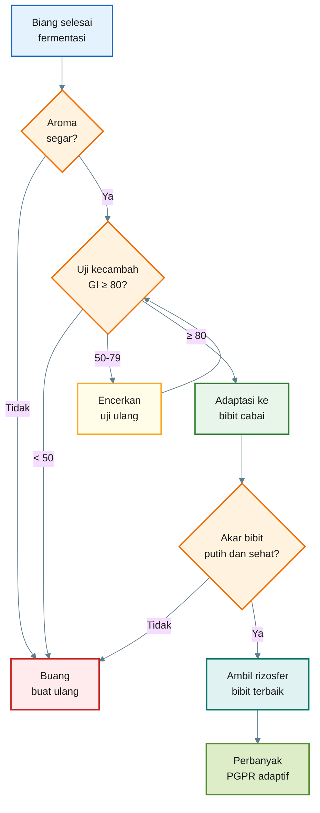

---

# 6.11 Kesalahan Umum yang Harus Dihindari

## 1. Mengambil tanah dari lokasi kotor

Ini kesalahan paling berbahaya. Mikroba banyak bukan berarti baik. Sumber yang kotor bisa membawa mikroba pembusuk, patogen, atau kontaminan.

## 2. Gula terlalu banyak

Gula berlebihan membuat fermentasi tidak seimbang. Mikroba tertentu bisa meledak populasinya, oksigen cepat habis, lalu larutan menjadi busuk.

## 3. Fermentasi terlalu lama

Biang awal cukup 2–3 hari. Perbanyakan adaptif cukup 5–7 hari. Fermentasi terlalu lama tanpa kontrol dapat menurunkan kualitas.

## 4. Langsung diaplikasikan ke semua lahan

PGPR lokal harus diuji kecil. Jangan langsung dipakai seluruh lahan cabai.

## 5. Tidak melakukan adaptasi ke cabai

Ini kesalahan penting. Tanpa adaptasi, mikroba dari bambu belum tentu cocok dengan akar cabai.

## 6. Menggunakan pupuk kandang mentah dalam media adaptasi

Pupuk kandang mentah berisiko membawa patogen dan menghasilkan panas atau amonia yang merusak akar muda. Gunakan kompos matang.

## 7. Dicampur pestisida kimia keras

Jangan mencampur PGPR dengan fungisida, bakterisida, atau bahan desinfektan. Beri jarak aplikasi minimal 5–7 hari.

---

# 6.12 Standar Minimum Produksi untuk Praktisi

Agar metode ini lebih rapi, gunakan standar minimum berikut.

| Tahap        | Standar Minimum                 |
| ------------ | ------------------------------- |
| Sumber bambu | Rumpun sehat, tidak tercemar    |
| Pengambilan  | Zona akar 5–15 cm               |
| Biang awal   | Fermentasi 48–72 jam            |
| Uji awal     | Bau normal dan GI ≥ 80          |
| Adaptasi     | Bibit cabai 21–30 hari          |
| Seleksi      | Ambil dari 5–10% bibit terbaik  |
| Perbanyakan  | Fermentasi 5–7 hari             |
| Aplikasi     | Kocor tanah, bukan semprot buah |
| Uji lahan    | Minimal ada kontrol             |

Standar ini membantu agar praktik PGPR tidak sekadar “ramuan”, tetapi menjadi proses seleksi yang lebih terukur.

---

# 6.13 Ringkasan Protokol Bab 6

Berikut ringkasan singkatnya:

1. Pilih rumpun bambu sehat dan bersih.
2. Ambil tanah rizosfer dari akar halus kedalaman 5–15 cm.
3. Buat biang awal dengan air non-klorin, molase, dan air cucian beras.
4. Fermentasi 48–72 jam.
5. Lakukan uji bau dan uji kecambah.
6. Encerkan dan aplikasikan ke media bibit cabai.
7. Adaptasikan selama 21–30 hari.
8. Pilih bibit dengan akar terbaik.
9. Ambil rizosfer dari bibit terbaik.
10. Perbanyak menjadi PGPR bambu adaptif cabai.
11. Gunakan segar dan uji kecil sebelum diperluas.

Kalimat kunci Bab 6:

> **PGPR bambu yang baik bukan sekadar hasil fermentasi tanah bambu, tetapi hasil seleksi bertahap: bambu sehat → biang awal → uji aman → adaptasi cabai → seleksi akar terbaik → perbanyakan.**

## Uji Kecil Sebelum Dipakai Luas

[1]: https://pmc.ncbi.nlm.nih.gov/articles/PMC6273255/?utm_source=chatgpt.com 'Role of Plant Growth Promoting Rhizobacteria in Agricultural ...'
[2]: https://www.frontiersin.org/journals/microbiology/articles/10.3389/fmicb.2025.1533061/full?utm_source=chatgpt.com 'Microbial diversity and function in bamboo ecosystems'
[3]: https://www.uvm.edu/vtvegandberry/factsheets/composttea.html?utm_source=chatgpt.com 'Compost Tea to Suppress Plant Disease'
[4]: https://soiltesting.cahnr.uconn.edu/compost_compost_tea_and_manure/?utm_source=chatgpt.com 'Compost, compost tea, and manure: Food Safety ...'

[Kembali ke atas](#membangun-rizosfer-cabai-yang-tangguh-dengan-mikroba-dari-rumpun-bambu)

---

# Bab 7

## Cara Aplikasi dan Paket Rizosfer Tangguh untuk Cabai

Setelah PGPR bambu adaptif cabai berhasil dibuat, tahap berikutnya adalah **cara aplikasi**. Ini bagian penting karena PGPR tidak akan bekerja optimal bila waktu, dosis, dan lingkungan tanahnya salah.

PGPR bukan sekadar “cairan ajaib” yang disiramkan ke tanaman. PGPR adalah mikroba hidup. Ia membutuhkan akar aktif, bahan organik, kelembapan, oksigen, dan tanah yang tidak terlalu panas. Karena itu, aplikasi PGPR harus dipadukan dengan **paket rizosfer tangguh**: kompos matang, sekam bakar atau biochar, mikoriza, Trichoderma, dan mulsa.

PGPR dikenal sebagai bakteri menguntungkan yang mengkolonisasi rizosfer dan memberi pengaruh positif bagi pertumbuhan tanaman, baik secara langsung maupun tidak langsung. Secara praktis, ini berarti PGPR perlu diarahkan ke area akar, bukan asal disemprot ke daun atau buah. ([Direktorat Jenderal Perkebunan][1])

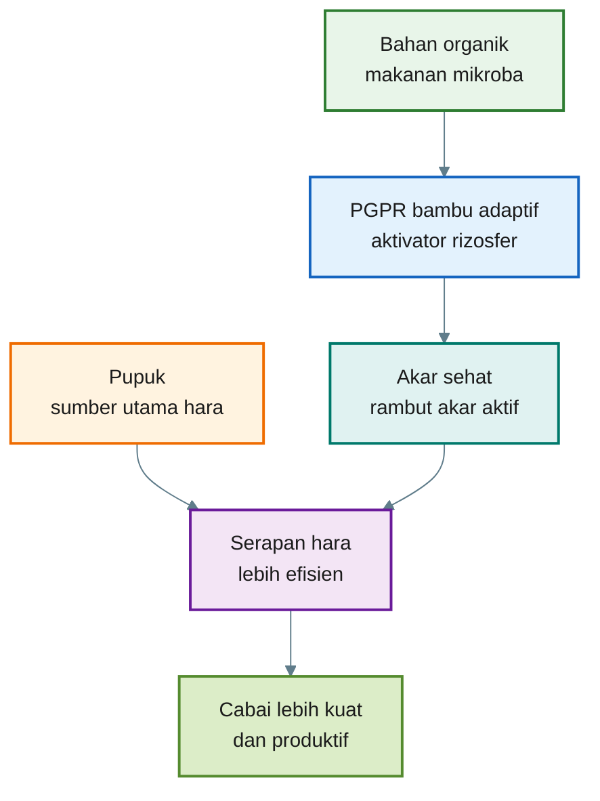

Kalimat kunci Bab 7:

> **PGPR bekerja paling baik bila dikocorkan ke zona akar dan didukung oleh tanah yang hidup.**

---

## 7.1 Prinsip Aplikasi PGPR Bambu Adaptif

Ada lima prinsip aplikasi yang perlu dipegang.

## 1. Gunakan sebagai kocor tanah

PGPR bambu adaptif sebaiknya diaplikasikan ke sekitar pangkal tanaman, bukan disemprotkan ke buah. Tujuannya adalah membangun koloni mikroba di rizosfer.

Aplikasi ke buah atau daun, terutama menjelang panen, tidak disarankan untuk larutan mikroba liar yang tidak diuji laboratorium. Beberapa panduan keamanan pangan menyebutkan bahwa teh kompos atau larutan mikroba yang tidak terkontrol dapat membawa risiko mikroba penyebab penyakit bila kontak dengan bagian tanaman yang dikonsumsi. ([uvm.edu][2])

## 2. Aplikasikan saat tanah lembap

PGPR jangan diberikan saat tanah sangat kering atau sangat panas. Mikroba lebih mudah bertahan bila tanah lembap, tetapi tidak becek.

Waktu aplikasi terbaik:

- pagi sebelum panas tinggi,
- sore setelah suhu turun,
- setelah penyiraman ringan,
- setelah hujan ringan bila tanah tidak becek.

## 3. Jangan dicampur langsung dengan fungisida atau bakterisida

Fungisida dan bakterisida dapat mengganggu mikroba PGPR. Jika perlu aplikasi pestisida kimia, beri jarak minimal **5–7 hari** dari aplikasi PGPR.

## 4. Dosis dimulai ringan

Bibit cabai sensitif. Jangan langsung memberi larutan pekat. Mulai dari dosis rendah, lalu naik bertahap pada fase tanaman lebih kuat.

## 5. PGPR harus ditemani bahan pendukung

PGPR membutuhkan rumah dan makanan. Karena itu, aplikasi PGPR lebih baik bila tanah diberi:

- kompos matang,
- sekam bakar atau biochar,
- mulsa,
- mikoriza,
- Trichoderma.

---

## Diagram Bab 7 — Prinsip Aplikasi PGPR

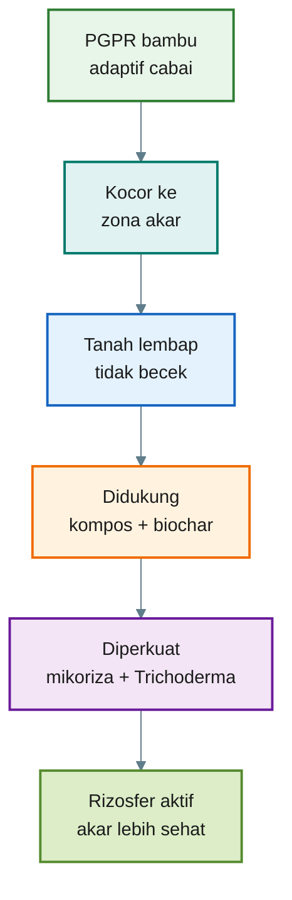

---

# 7.2 Aplikasi pada Fase Semai

Fase semai adalah waktu terbaik untuk mulai membentuk rizosfer cabai. Pada fase ini, targetnya bukan memaksa pertumbuhan cepat, tetapi membangun akar awal yang sehat.

## Tujuan aplikasi fase semai

- membantu pembentukan rambut akar,
- mengurangi stres bibit,
- membiasakan akar cabai dengan mikroba baik,
- menyiapkan bibit agar lebih siap pindah tanam.

## Dosis fase semai

Gunakan dosis ringan:

```mdx id="dosis-semai"
Dosis:
10 ml PGPR bambu adaptif + 1 liter air non-klorin

Volume aplikasi:
20–30 ml larutan per bibit

Waktu:
Bibit umur 7–10 hari
Ulangi umur 18–21 hari
```

## Cara aplikasi

1. Encerkan PGPR dengan air non-klorin.
2. Siram tipis di sekitar pangkal bibit.
3. Jangan sampai media terlalu becek.
4. Aplikasikan pagi atau sore.
5. Jangan berikan saat bibit baru stres berat atau media terlalu panas.

## Tanda respons baik

- bibit berdiri tegak,
- daun hijau normal,
- akar putih,
- pangkal batang tidak busuk,
- pertumbuhan seragam.

## Tanda dosis terlalu keras

- bibit rebah,
- pangkal batang basah,
- daun menguning cepat,
- media bau asam tajam atau busuk,
- akar kecokelatan.

Jika tanda buruk muncul, hentikan aplikasi PGPR, siram dengan air bersih secukupnya, perbaiki aerasi media, dan evaluasi kualitas larutan.

---

# 7.3 Aplikasi Sebelum Pindah Tanam

Pindah tanam adalah salah satu fase paling kritis pada cabai. Akar terganggu, tanaman masuk lingkungan baru, suhu tanah berubah, dan bibit harus cepat membentuk akar baru.

PGPR bisa digunakan untuk membantu kolonisasi awal mikroba di akar.

## Dosis rendam akar

```mdx id="rendam-akar"
Dosis:
20 ml PGPR bambu adaptif + 1 liter air non-klorin

Durasi rendam:
10–15 menit

Waktu:
Sesaat sebelum bibit ditanam
```

## Cara aplikasi

1. Siapkan larutan PGPR encer.
2. Cabut bibit dari tray secara hati-hati.
3. Rendam bagian akar, bukan seluruh daun.
4. Durasi cukup 10–15 menit.
5. Tanam segera setelah perendaman.
6. Siram ringan setelah tanam.

Jangan merendam terlalu lama. Akar tetap membutuhkan oksigen. Perendaman terlalu lama dapat membuat akar stres.

---

# 7.4 Aplikasi Setelah Tanam

Setelah cabai ditanam di bedengan atau polybag, aplikasi PGPR dilakukan dengan cara **kocor pangkal tanaman**.

## Dosis kocor setelah tanam

```mdx id="kocor-tanam"
Dosis:
20–30 ml PGPR bambu adaptif + 1 liter air non-klorin

Volume:
100–200 ml larutan per tanaman

Interval:
Setiap 10–14 hari sampai awal berbunga
```

## Jadwal praktis aplikasi

| Umur Tanaman  | Aplikasi                  | Tujuan                        |
| ------------- | ------------------------- | ----------------------------- |
| 0 HST         | Rendam akar sebelum tanam | Kolonisasi awal               |
| 7 HST         | Kocor ringan              | Pemulihan pindah tanam        |
| 14–21 HST     | Kocor ulang               | Dorong akar dan cabang        |
| 28–35 HST     | Kocor ulang               | Siapkan fase berbunga         |
| Awal berbunga | Kocor ringan              | Stabilkan rizosfer            |
| Fase berbuah  | 2–3 minggu sekali         | Pemeliharaan, bukan pemaksaan |

HST = hari setelah tanam.

Pada fase berbuah, PGPR tetap bisa digunakan, tetapi frekuensinya dikurangi. Fokus fase berbuah adalah menjaga kelembapan stabil, hara seimbang, dan kesehatan akar.

---

## 7.6 Pemupukan Tetap Wajib Dijalankan

> Paket rizosfer tangguh tidak boleh dipahami sebagai pengganti program pemupukan cabai. PGPR bambu adaptif, kompos, biochar, mikoriza, dan Trichoderma berfungsi memperbaiki lingkungan akar. Namun, kebutuhan hara cabai tetap harus dipenuhi melalui pemupukan dasar dan pemupukan susulan.

> Dalam praktiknya, PGPR bekerja paling baik bila ada hara yang bisa dibantu untuk dimobilisasi. Jika tanah miskin hara dan pemupukan tidak mencukupi, mikroba tidak dapat menciptakan hara dari ruang kosong. Mikroba hanya membantu mengolah, melarutkan, memobilisasi, atau meningkatkan efisiensi serapan hara yang memang tersedia di tanah atau diberikan melalui pupuk.

| Sumber Input          | Fungsi                                                      |
| --------------------- | ----------------------------------------------------------- |
| Kompos matang         | Menambah bahan organik dan sebagian hara                    |
| Pupuk dasar           | Menyediakan hara awal untuk pertumbuhan                     |
| Pupuk susulan         | Menjaga suplai hara selama vegetatif, berbunga, dan berbuah |
| Kalsium dan magnesium | Mendukung jaringan tanaman, daun, bunga, dan buah           |
| Unsur mikro           | Mendukung metabolisme dan pembentukan bunga/buah            |
| PGPR bambu adaptif    | Membantu akar dan efisiensi pemanfaatan hara                |
| Mikoriza              | Membantu jangkauan serapan air dan fosfor                   |
| Trichoderma           | Mendukung kesehatan akar dan menekan patogen tertentu       |

---

# 7.6 Paket Rizosfer Tangguh untuk Cabai

PGPR bambu adaptif akan bekerja lebih baik bila dikombinasikan dengan komponen pendukung. Tujuannya adalah menciptakan lingkungan akar yang stabil.

## Paket utama

| Komponen            | Fungsi Praktis                           |
| ------------------- | ---------------------------------------- |
| PGPR bambu adaptif  | Mengaktifkan mikroba rizosfer            |
| Kompos matang       | Makanan mikroba dan sumber bahan organik |
| Sekam bakar/biochar | Rumah mikroba, pori udara, penahan air   |
| Mikoriza            | Membantu serapan air dan fosfor          |
| Trichoderma         | Membantu menekan patogen akar            |
| Mulsa               | Menjaga suhu dan kelembapan tanah        |

## 7.6.1 Kompos matang

Kompos matang adalah makanan dasar bagi mikroba. Tanpa bahan organik, PGPR sulit bertahan lama.

Gunakan kompos yang:

- sudah matang,
- tidak panas,
- tidak bau amonia,
- tidak membawa bentuk bahan mentah yang jelas,
- remah dan berbau tanah.

Hindari pupuk kandang mentah untuk media cabai, terutama pada sistem intensif. Dari sisi keamanan pangan dan kesehatan tanaman, pupuk kandang mentah berisiko membawa patogen dan sebaiknya tidak digunakan langsung pada tanaman pangan bernilai konsumsi cepat. ([soiltesting.cahnr.uconn.edu][3])

## 7.6.2 Sekam bakar atau biochar

Sekam bakar atau biochar membantu menyediakan pori mikro untuk tempat hidup mikroba. Selain itu, bahan ini membantu aerasi dan menjaga kelembapan tanah.

Fungsi praktis:

- mengurangi pemadatan media,
- membantu drainase,
- menahan sebagian air,
- menyediakan ruang bagi mikroba,
- membuat akar lebih mudah berkembang.

Untuk cabai di polybag atau bedengan intensif, sekam bakar sangat membantu menjaga akar tidak mudah kekurangan oksigen.

## 7.6.3 Mikoriza

Mikoriza adalah fungi yang bersimbiosis dengan akar. Hifanya dapat memperluas jangkauan serapan akar, terutama untuk fosfor dan air. Pada tanaman Capsicum, kekurangan air adalah masalah penting; fungi mikoriza arbuskular dilaporkan berperan membantu suplai air dengan meningkatkan area serapan sistem akar. ([Czasopisma UP][4])

Mikoriza paling baik diberikan saat tanam, dekat dengan akar.

Cara aplikasi praktis:

```mdx id="mikoriza-aplikasi"
Letakkan mikoriza di lubang tanam,
dekat akar bibit,
sesuai dosis label produk.

Jangan ditabur jauh dari akar,
karena mikoriza perlu kontak dengan akar hidup.
```

## 7.6.4 Trichoderma

Trichoderma adalah fungi menguntungkan yang banyak digunakan untuk mendukung kesehatan akar dan menekan beberapa patogen tanah. Studi dan review modern menjelaskan bahwa **Trichoderma** dapat meningkatkan pertumbuhan tanaman dan membantu penekanan penyakit melalui interaksi dengan tanaman, patogen, dan lingkungan rizosfer. ([Frontiers][5])

Cara aplikasi praktis:

- campurkan dengan kompos matang,
- letakkan di sekitar lubang tanam,
- aplikasikan sebagai kocor sesuai label,
- jangan dicampur langsung dengan fungisida kimia.

## 7.6.5 Mulsa

Mulsa menjaga tanah tidak terlalu panas dan tidak cepat kering. Ini penting karena mikroba rizosfer aktif pada kelembapan yang stabil.

Mulsa bisa berupa:

- mulsa plastik perak hitam,
- jerami matang,
- seresah kering yang aman,
- daun bambu lapuk dalam jumlah terbatas,
- rumput kering bebas biji gulma.

Untuk cabai intensif, mulsa membantu mengurangi fluktuasi suhu dan kelembapan tanah.

---

# 7.7 Contoh Paket Aplikasi di Bedengan Cabai

Berikut contoh paket untuk satu tanaman cabai di bedengan.

```mdx id="paket-bedengan"
Saat tanam:

- Kompos matang: 1–2 genggam per lubang tanam
- Sekam bakar/biochar: 1 genggam per lubang tanam
- Mikoriza: sesuai dosis label, dekat akar
- Trichoderma: sesuai dosis label atau dicampur kompos matang
- PGPR bambu adaptif: rendam akar sebelum tanam

Setelah tanam:

- Kocor PGPR 100–200 ml per tanaman
- Ulangi setiap 10–14 hari sampai awal berbunga
- Gunakan mulsa untuk menjaga kelembapan
```

Untuk polybag, dosis bahan padat disesuaikan dengan ukuran polybag. Jangan terlalu banyak kompos bila media sudah subur, karena cabai tidak suka media terlalu panas atau terlalu lembek.

---

# 7.8 Contoh Paket Aplikasi di Polybag

Untuk polybag ukuran 35–40 cm:

```mdx id="paket-polybag"
Media dasar:

- Tanah sehat: 50%
- Kompos matang: 30%
- Sekam bakar/biochar: 20%

Saat tanam:

- Mikoriza: sesuai label, dekat akar
- Trichoderma: secukupnya sesuai label
- Rendam akar dengan PGPR 20 ml/L selama 10–15 menit

Setelah tanam:

- Kocor PGPR 100 ml per tanaman
- Ulangi 10–14 hari sekali
- Kurangi frekuensi setelah tanaman berbuah
```

Untuk polybag, jangan membuat media terlalu basah. Cabai membutuhkan aerasi yang baik. Media yang terlalu padat dan becek akan membuat akar mudah rusak.

---

# 7.9 Larangan Penting dalam Aplikasi

Agar aplikasi aman, hindari hal berikut:

| Kesalahan                      | Risiko                                           |
| ------------------------------ | ------------------------------------------------ |
| PGPR disemprot ke buah         | Risiko keamanan pangan bila larutan tidak steril |
| PGPR dicampur fungisida        | Mikroba mati atau melemah                        |
| Dosis terlalu pekat pada bibit | Akar stres, media asam, bibit rebah              |
| Tanah terlalu becek            | Akar kekurangan oksigen                          |
| Kompos belum matang            | Panas, amonia, patogen                           |
| Aplikasi saat siang panas      | Mikroba cepat stres                              |
| Langsung semua lahan           | Tidak ada kontrol jika gagal                     |

---

# 7.10 Ringkasan Bab 7

PGPR bambu adaptif cabai sebaiknya digunakan dengan pola berikut:

1. Fase semai: dosis ringan.
2. Sebelum pindah tanam: rendam akar singkat.
3. Setelah tanam: kocor pangkal tanaman.
4. Sampai awal berbunga: aplikasi rutin 10–14 hari sekali.
5. Fase berbuah: frekuensi dikurangi.
6. Kombinasikan dengan kompos matang, biochar, mikoriza, Trichoderma, dan mulsa.
7. Jangan semprotkan ke buah.
8. Jangan campur langsung dengan fungisida atau bakterisida.

Kalimat kunci:

> **PGPR bekerja bukan karena dosis besar, tetapi karena ditempatkan di zona akar, pada waktu yang tepat, dan didukung lingkungan tanah yang hidup.** > **Program terbaik bukan PGPR saja, tetapi PGPR + pupuk seimbang + bahan organik + akar sehat.**

[Kembali ke atas](#membangun-rizosfer-cabai-yang-tangguh-dengan-mikroba-dari-rumpun-bambu)

---

# Bab 8

## Uji Kecil Sebelum Dipakai Luas

Sebelum PGPR bambu adaptif digunakan ke seluruh lahan cabai, praktisi perlu melakukan **uji kecil**. Ini penting karena mikroba lokal bisa berbeda hasilnya antar lokasi.

Tanah berbeda, varietas cabai berbeda, air berbeda, kompos berbeda, dan tekanan penyakit juga berbeda. Karena itu, formula yang bagus di satu tempat belum tentu otomatis sama bagus di tempat lain.

Prinsip Bab 8:

> **Jangan langsung percaya. Jangan langsung menolak. Uji kecil dulu.**

---

## 8.1 Tujuan Uji Kecil

Uji kecil dilakukan untuk menjawab pertanyaan praktis berikut:

1. Apakah PGPR bambu adaptif aman untuk cabai?
2. Apakah tanaman lebih cepat pulih setelah pindah tanam?
3. Apakah akar lebih putih dan lebih banyak?
4. Apakah tanaman lebih tahan saat panas atau kurang air?
5. Apakah kejadian layu berkurang?
6. Apakah pembungaan dan buah lebih stabil?
7. Apakah hasilnya cukup baik untuk menutup biaya tambahan?

Uji kecil bukan harus serumit penelitian akademik. Yang penting ada **pembanding** dan **catatan**.

---

## 8.2 Prinsip Rancangan Uji

Ada empat prinsip sederhana.

## 1. Harus ada kontrol

Kontrol adalah tanaman tanpa PGPR. Tanpa kontrol, kita tidak tahu apakah hasil baik benar karena PGPR atau karena faktor lain.

## 2. Perlakuan harus dipisah

Jangan mencampur tanaman kontrol dan tanaman perlakuan terlalu dekat tanpa batas. Jika terlalu campur, air kocor dan mikroba bisa berpindah.

## 3. Jumlah tanaman harus cukup

Jangan hanya menguji pada 2–3 tanaman. Minimal gunakan 10–20 tanaman per perlakuan. Lebih baik 25–50 tanaman per perlakuan bila lahan memungkinkan.

## 4. Amati lebih dari satu parameter

Jangan hanya melihat tinggi tanaman. Amati akar, daun, layu, bunga, buah, dan hasil panen.

---

## 8.3 Rancangan Perlakuan Sederhana

Dalam uji kecil, pemupukan dasar dan pemupukan susulan harus dibuat sama untuk semua perlakuan. Tujuannya agar perbedaan hasil lebih adil dibaca sebagai efek PGPR dan paket rizosfer, bukan karena satu perlakuan mendapat pupuk lebih banyak.

Gunakan empat perlakuan berikut:

| Perlakuan | PGPR               | Paket Rizosfer | Program Pupuk              |
| --------- | ------------------ | -------------- | -------------------------- |
| P0        | Tidak              | Tidak          | Sama dengan perlakuan lain |
| P1        | PGPR bambu biasa   | Tidak          | Sama dengan perlakuan lain |
| P2        | PGPR bambu adaptif | Tidak          | Sama dengan perlakuan lain |
| P3        | PGPR bambu adaptif | Ya             | Sama dengan perlakuan lain |

> **Dalam uji PGPR, pupuk jangan dibuat berbeda. Jika pupuk berbeda, hasil uji menjadi bias.**

Mengapa perlu P1 dan P2?

Karena kita ingin tahu apakah proses adaptasi ke cabai memang memberi hasil lebih baik dibanding biang bambu biasa.

Mengapa perlu P3?

Karena PGPR biasanya lebih stabil bila diberi paket pendukung. Mikroba membutuhkan rumah, makanan, dan kelembapan yang stabil.

---

## Diagram Bab 8 — Rancangan Uji Kecil

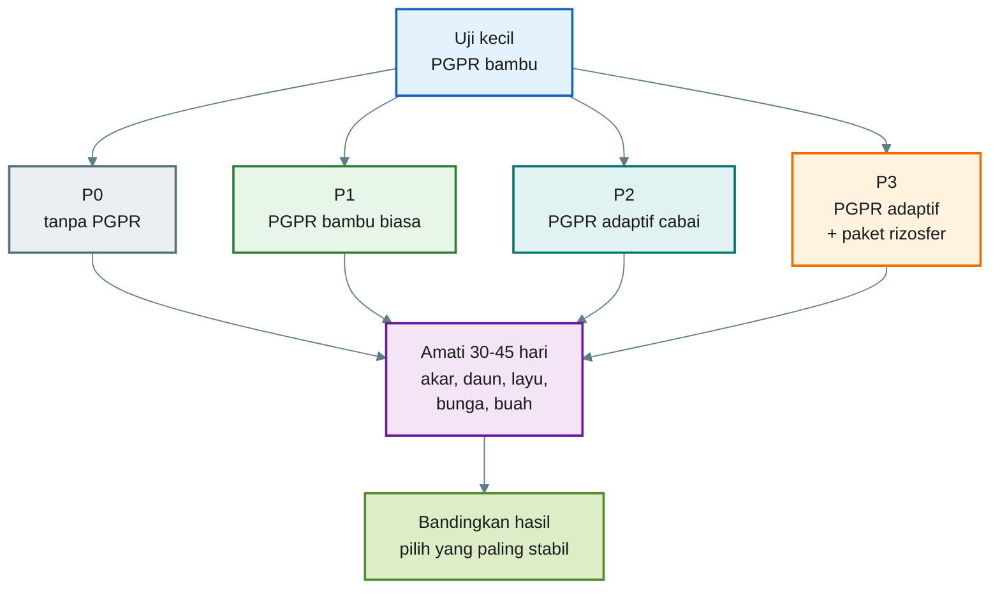

---

# 8.4 Jumlah Tanaman untuk Uji

Jumlah tanaman tergantung skala.

| Skala Uji     | Jumlah Tanaman per Perlakuan | Total untuk 4 Perlakuan |
| ------------- | ---------------------------: | ----------------------: |
| Sangat kecil  |                   10 tanaman |              40 tanaman |
| Praktis kecil |                   25 tanaman |             100 tanaman |
| Lebih kuat    |                   50 tanaman |             200 tanaman |

Untuk praktisi, saya sarankan minimal **25 tanaman per perlakuan**. Jumlah ini masih mudah dikelola, tetapi cukup untuk melihat kecenderungan.

Jika hanya tersedia sedikit lahan, gunakan minimal 10 tanaman per perlakuan. Namun, hasilnya harus dibaca sebagai indikasi awal, bukan keputusan final.

---

# 8.5 Penempatan Petak Uji

Penempatan petak harus dibuat seadil mungkin. Jangan menempatkan P3 di tanah paling subur dan P0 di tanah paling jelek. Itu membuat hasil tidak adil.

## Cara sederhana

Jika lahan cukup seragam:

```mdx id="layout-uji"
Baris 1: P0
Baris 2: P1
Baris 3: P2
Baris 4: P3
```

Jika lahan tidak seragam, misalnya satu sisi lebih basah atau lebih teduh, gunakan pengulangan blok sederhana.

Contoh:

```mdx id="blok-uji"
Blok A: P0 - P1 - P2 - P3
Blok B: P1 - P2 - P3 - P0
Blok C: P2 - P3 - P0 - P1
```

Tujuannya agar setiap perlakuan punya peluang menghadapi kondisi lahan yang mirip.

---

## Diagram Layout Uji Blok Sederhana

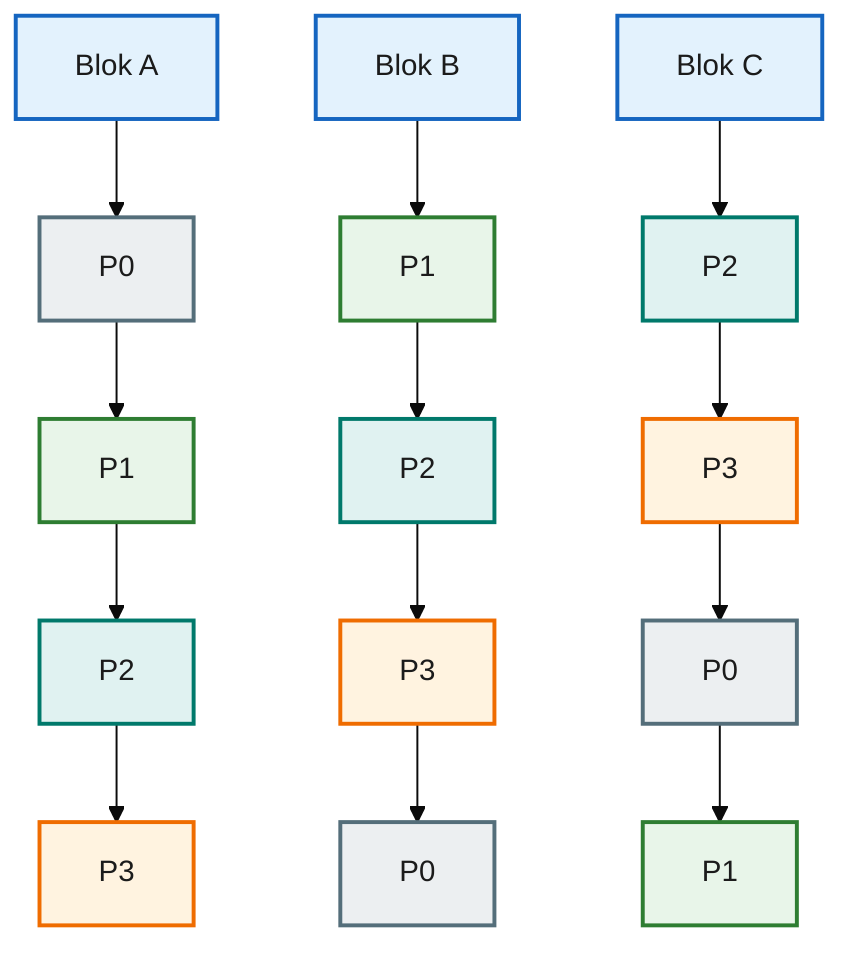

---

# 8.6 Parameter yang Diamati

Uji kecil harus mencatat parameter yang mudah diamati praktisi.

## 1. Pertumbuhan awal

Diamati pada 7, 14, 21, dan 30 HST.

Catat:

- tinggi tanaman,
- jumlah daun,
- jumlah cabang,
- warna daun,
- keseragaman tanaman.

## 2. Kondisi akar

Diamati dengan mencabut sampel terbatas, bukan semua tanaman.

Catat:

- warna akar,
- jumlah akar lateral,
- rambut akar,
- bau akar,
- gejala busuk.

Akar sehat biasanya putih sampai krem muda, bercabang, dan tidak berbau busuk.

## 3. Stres panas atau kekeringan

Amati pada siang hari, terutama saat cuaca panas.

Catat:

- tanaman layu sementara,
- tanaman pulih sore hari,
- daun menggulung,
- tanaman tetap segar.

## 4. Kejadian layu

Catat jumlah tanaman yang layu permanen atau mati.

Gunakan rumus sederhana:

$$
\text{Persentase Layu} =
\frac{\text{Jumlah Tanaman Layu}}{\text{Jumlah Tanaman Diamati}}
\times 100
$$

Contoh dalam format MDX:

```mdx id="persen-layu"
Jumlah tanaman diamati = 25
Jumlah tanaman layu = 3

Persentase layu = (3 / 25) × 100 = 12%
```

## 5. Awal berbunga

Catat umur tanaman saat mulai muncul bunga pertama.

Yang diamati:

- hari pertama bunga muncul,
- jumlah tanaman yang mulai berbunga,
- keseragaman pembungaan.

## 6. Buah dan hasil panen

Pada fase panen, catat:

- jumlah buah per tanaman,
- bobot buah per tanaman,
- total panen per perlakuan,
- kualitas buah.

Perhitungan lebih detail akan dibuat pada Bab 9 dan lampiran.

---

# 8.7 Skoring Praktis untuk Pengamatan Lapangan

Agar mudah, gunakan skoring 1–5.

| Skor | Arti         |
| ---: | ------------ |
|    1 | Sangat buruk |
|    2 | Buruk        |
|    3 | Sedang       |
|    4 | Baik         |
|    5 | Sangat baik  |

Contoh penggunaan:

| Parameter       | Skor 1                | Skor 5                  |
| --------------- | --------------------- | ----------------------- |
| Warna daun      | pucat/kuning          | hijau segar             |
| Akar            | cokelat/busuk         | putih dan banyak cabang |
| Kesegaran siang | layu berat            | tetap segar             |
| Keseragaman     | banyak kerdil         | seragam                 |
| Pembungaan      | sedikit dan terlambat | banyak dan stabil       |

Gunakan skor untuk membantu keputusan cepat. Namun, tetap catat angka penting seperti jumlah tanaman layu dan bobot panen.

---

# 8.8 Cara Membaca Hasil Uji

Hasil uji tidak harus selalu dilihat dari tanaman paling tinggi. Untuk cabai, yang penting adalah kombinasi antara kesehatan, ketahanan, dan hasil.

## Perlakuan dianggap menjanjikan bila:

- akar lebih putih,
- tanaman lebih seragam,
- layu lebih rendah,
- bunga lebih stabil,
- buah lebih banyak,
- bobot panen naik,
- biaya tambahan masih masuk akal.

## Perlakuan belum layak diperluas bila:

- pertumbuhan tidak berbeda dari kontrol,
- tanaman justru lebih rentan layu,
- akar lebih buruk,
- aplikasi terlalu rumit,
- biaya tambahan tidak tertutup hasil,
- hasil hanya bagus pada sedikit tanaman.

Kalimat penting:

> **Formula terbaik bukan yang terlihat paling subur di awal, tetapi yang paling stabil sampai panen.**

---

# 8.9 Keputusan Setelah Uji Kecil

Setelah uji 30–45 hari, praktisi bisa membuat keputusan awal.

| Hasil Uji                      | Keputusan                                                   |
| ------------------------------ | ----------------------------------------------------------- |
| P0 sama dengan semua perlakuan | PGPR belum terlihat manfaatnya, evaluasi kualitas biang     |
| P1 lebih baik dari P0          | Rizosfer bambu berpotensi, tetapi adaptasi perlu diperbaiki |
| P2 lebih baik dari P1          | Adaptasi ke cabai berhasil memberi nilai tambah             |
| P3 paling baik                 | Paket rizosfer lengkap layak diuji lebih luas               |
| Semua perlakuan buruk          | Masalah utama mungkin tanah, air, patogen, atau media       |

Jika P3 paling stabil, jangan langsung ke seluruh lahan. Naikkan skala bertahap, misalnya dari 100 tanaman menjadi 500 tanaman, lalu 1.000 tanaman.

---

# 8.10 Ringkasan Bab 8

Uji kecil adalah jembatan antara ide dan praktik.

Langkahnya:

1. Buat kontrol.
2. Bandingkan PGPR bambu biasa, PGPR adaptif, dan paket lengkap.
3. Gunakan minimal 10–25 tanaman per perlakuan.
4. Amati akar, daun, layu, bunga, buah, dan hasil.
5. Catat data sederhana.
6. Pilih perlakuan yang paling stabil, bukan hanya yang paling cepat tinggi.
7. Perluas bertahap bila hasilnya konsisten.

Kalimat kunci Bab 8:

> **Praktisi yang baik tidak menebak-nebak. Ia menguji kecil, mencatat, lalu memperbesar hanya formula yang terbukti stabil.**

---

Bab 7 menjelaskan bahwa PGPR bambu adaptif harus diaplikasikan ke **zona akar**, bukan ke buah, dan perlu didukung oleh kompos matang, biochar, mikoriza, Trichoderma, serta mulsa.

Bab 8 menekankan bahwa sebelum dipakai luas, formula harus diuji kecil dengan kontrol. Keputusan tidak boleh hanya berdasarkan kesan visual, tetapi perlu catatan sederhana: akar, daun, layu, bunga, buah, dan hasil.

## Kesimpulan Praktis

### Ditambah Lampiran Tabel Pengamatan dan Cara Perhitungan Lanjutan

[1]: https://ditjenbun.pertanian.go.id/pgpr-bakteri-menguntungkan-yang-membantu-pengendalian-opt/?utm_source=chatgpt.com 'PGPR: BAKTERI MENGUNTUNGKAN YANG MEMBANTU ...'
[2]: https://www.uvm.edu/vtvegandberry/factsheets/composttea.html?utm_source=chatgpt.com 'Compost Tea to Suppress Plant Disease'
[3]: https://soiltesting.cahnr.uconn.edu/compost_compost_tea_and_manure/?utm_source=chatgpt.com 'Compost, compost tea, and manure: Food Safety ...'
[4]: https://czasopisma.up.lublin.pl/asphc/article/view/2016?utm_source=chatgpt.com 'INOCULATION WITH ARBUSCULAR MYCORRHIZAL ...'
[5]: https://www.frontiersin.org/journals/plant-science/articles/10.3389/fpls.2024.1414193/full?utm_source=chatgpt.com 'The growth-promoting and disease-suppressing ...'

[Kembali ke atas](#membangun-rizosfer-cabai-yang-tangguh-dengan-mikroba-dari-rumpun-bambu)

---

# Bab 9

## Kesimpulan Praktis

Budidaya cabai yang kuat tidak hanya ditentukan oleh pupuk, varietas, pestisida, atau penyiraman. Semua itu penting, tetapi ada satu fondasi yang sering kurang diperhatikan: **akar dan rizosfer**.

Cabai yang akarnya lemah akan mudah stres. Pupuk bisa tersedia, tetapi tidak terserap optimal. Air bisa ada, tetapi akar tidak mampu mengambilnya dengan baik. Mikroba baik bisa diberikan, tetapi tidak bertahan bila tanah terlalu panas, padat, miskin bahan organik, atau terlalu sering terganggu bahan kimia keras.

Dari bambu dan alang-alang, kita belajar bahwa tanaman tangguh biasanya memiliki sistem bawah tanah yang kuat. Namun, untuk praktik budidaya cabai, tidak semua sumber ketangguhan aman untuk langsung dibawa ke lahan.

Alang-alang memang ekstrem dan menarik. Ia kuat, agresif, dan memiliki sistem bawah tanah yang luar biasa. Tetapi untuk cabai, alang-alang sebaiknya **ditinggalkan dulu** karena membawa risiko alelopati, rimpang gulma, dan dominasi biologis yang belum tentu cocok dengan cabai.

Bambu menjadi pilihan yang lebih aman. Rumpun bambu umumnya memiliki tanah bawah rumpun yang kaya seresah lapuk, bahan organik, fungi dekomposer, bakteri pelarut hara, dan mikroba pendukung akar. Tetapi tanah bambu tetap tidak boleh dipindahkan mentah begitu saja. Prinsipnya harus selektif.

Strategi yang dikunci dalam artikel ini adalah:

> **Rizosfer bambu sehat → biang awal → uji aman → adaptasi ke bibit cabai → seleksi akar terbaik → perbanyakan → aplikasi terukur → uji kecil → perluasan bertahap.**

Tujuannya bukan membuat cabai menjadi seperti bambu, tetapi membuat rizosfer cabai lebih hidup, stabil, dan membantu tanaman menghadapi tekanan lapangan.

---

## 9.1 Inti Pembelajaran Artikel

Ada lima inti besar dari artikel ini.

## 1. Ketangguhan cabai dimulai dari akar

Gejala di daun, bunga, dan buah sering berawal dari akar. Jika akar lemah, tanaman mudah layu, sulit menyerap hara, dan tidak stabil saat cuaca berubah.

## 2. Rizosfer adalah pusat kerja biologis tanaman

Rizosfer adalah zona kecil di sekitar akar tempat akar, mikroba, air, udara, bahan organik, dan hara saling berinteraksi. Zona kecil ini menentukan apakah pupuk benar-benar bisa dimanfaatkan tanaman.

## 3. Mikroba rizosfer punya dua fungsi besar

Mikroba rizosfer bukan hanya menyehatkan akar, tetapi juga membantu menyediakan hara.

Secara sederhana:

> **Mikroba rizosfer adalah dokter akar sekaligus juru masak hara.**

Ia membantu menekan patogen, merangsang akar, mengurai bahan organik, melarutkan fosfat, membantu unsur mikro, serta mendukung kerja mikoriza.

## 4. Rizosfer bambu lebih aman untuk tahap awal

Bambu dipilih bukan karena paling ekstrem, tetapi karena lebih aman, lebih mudah diarahkan, dan lebih cocok untuk praktik awal pada cabai.

Alang-alang cukup dijadikan sumber pembelajaran, bukan sumber aplikasi langsung.

## 5. Uji kecil wajib dilakukan

PGPR lokal tidak boleh langsung digunakan ke seluruh lahan. Setiap lahan memiliki kondisi berbeda. Karena itu, praktisi harus menguji kecil, mencatat, membandingkan, lalu memperluas hanya bila hasilnya stabil.

## 6. Pupuk Tetap Menjadi Sumber Utama Hara

PGPR bambu adaptif tidak menggantikan pupuk. Cabai tetap membutuhkan suplai hara yang cukup dan seimbang dari pupuk organik matang dan pupuk mineral/anorganik sesuai kondisi tanah. Peran PGPR adalah membantu akar dan rizosfer agar hara lebih mudah dimanfaatkan. Dengan kata lain, mikroba bukan sumber hara utama, melainkan penguat sistem serapan hara.

---

## 9.2 Alur Keputusan Praktis

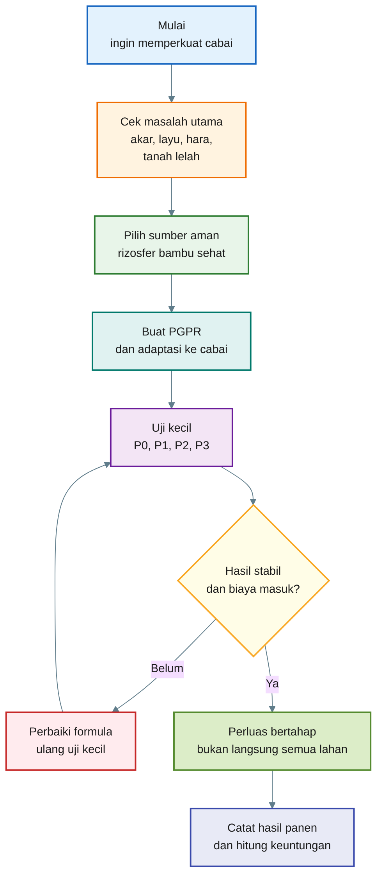

---

## 9.3 Kapan Formula Layak Diperluas?

Formula PGPR bambu adaptif layak diperluas bila memenuhi beberapa syarat berikut:

| Aspek            | Tanda Layak                                                           |
| ---------------- | --------------------------------------------------------------------- |
| Keamanan tanaman | Tidak menyebabkan bibit rebah, akar busuk, atau pertumbuhan terhambat |
| Akar             | Akar lebih putih, lebih bercabang, dan tidak berbau busuk             |
| Pertumbuhan      | Tanaman lebih seragam dan pulih lebih cepat setelah pindah tanam      |
| Stres            | Tanaman lebih tahan saat panas atau kekurangan air ringan             |
| Penyakit         | Persentase layu lebih rendah dibanding kontrol                        |
| Hasil            | Bobot panen meningkat atau kualitas buah lebih baik                   |
| Biaya            | Tambahan hasil menutup tambahan biaya                                 |
| Praktik          | Cara aplikasi masih realistis untuk dikerjakan di lapangan            |

Jika hanya satu aspek yang membaik tetapi hasil panen dan biaya tidak membaik, formula belum layak diperluas.

---

## 9.4 Kapan Formula Harus Dievaluasi Ulang?

Formula perlu dievaluasi ulang bila muncul kondisi berikut:

- bibit lebih banyak rebah dibanding kontrol,
- akar cokelat atau berbau busuk,
- tanaman lebih lambat tumbuh,
- kejadian layu meningkat,
- hasil panen tidak berbeda,
- biaya tambahan terlalu besar,
- aplikasi terlalu rumit untuk tenaga kerja yang tersedia,
- fermentasi sering gagal atau tidak konsisten.

Evaluasi bisa dilakukan pada:

- sumber rizosfer bambu,
- kualitas air,
- dosis molase,
- lama fermentasi,
- kebersihan alat,
- media adaptasi,
- dosis aplikasi,
- kondisi tanah lahan,
- kombinasi dengan pestisida atau fungisida.

---

## 9.5 Penutup Artikel

Membangun cabai yang tangguh bukan berarti mencari satu ramuan yang menyelesaikan semua masalah. Tanaman cabai tetap membutuhkan varietas yang sesuai, drainase baik, nutrisi seimbang, pengairan tepat, sanitasi kebun, dan pengendalian hama penyakit.

Namun, pendekatan rizosfer memberi sudut pandang yang lebih dalam:

> **Akar yang sehat membutuhkan tanah yang hidup. Tanah yang hidup membutuhkan mikroba, bahan organik, air, udara, dan pengelolaan yang tidak merusak keseimbangannya.**

Rizosfer bambu dapat menjadi pintu masuk yang aman untuk membangun sistem ini. Tetapi tetap harus melalui seleksi dan adaptasi.

Kesimpulan akhirnya:

> **Untuk cabai, jangan mengejar mikroba sebanyak mungkin. Bangun rizosfer yang stabil, hidup, aman, dan terbukti memberi hasil di lahan sendiri.** > **Tanpa pupuk yang cukup, mikroba tidak bisa menghasilkan panen tinggi sendirian. Tanpa akar dan rizosfer sehat, pupuk juga tidak selalu bekerja efisien. Keduanya harus berjalan bersama.**

[Kembali ke atas](#membangun-rizosfer-cabai-yang-tangguh-dengan-mikroba-dari-rumpun-bambu)

---

# Lampiran A

## Komposisi Eksudat Akar Bambu, Alang-Alang, dan Cabai: Persamaan, Perbedaan, serta Kemungkinan Mikroba Rizosfernya

Lampiran ini menjelaskan perbandingan eksudat akar pada **bambu**, **alang-alang**, dan **cabai**. Tujuannya adalah memperjelas mengapa strategi artikel ini memilih **rizosfer bambu sebagai sumber mikroba awal**, lalu tetap melakukan **adaptasi ke bibit cabai** sebelum diaplikasikan ke tanaman cabai riil.

Penting dipahami sejak awal: komposisi eksudat akar tidak bersifat tetap. Ia berubah menurut spesies, varietas, umur tanaman, fase pertumbuhan, jenis tanah/media, pH, ketersediaan hara, kadar air, stres patogen, dan stres lingkungan. Pada tanaman sayur, eksudat akar umumnya terdiri dari **asam amino, asam organik, gula, fenolik, polisakarida, protein, dan metabolit sekunder lain**. Review terbaru tentang eksudat akar pada tanaman hortikultura di sistem terkendali juga menegaskan bahwa eksudat akar berperan dalam pertumbuhan, interaksi mikrobiota, akuisisi nutrisi, respons stres, dan mediasi lingkungan rizosfer. ([Frontiers][1])

Karena itu, tabel berikut sebaiknya dibaca sebagai **peta fungsi dan kecenderungan biologis**, bukan sebagai angka komposisi pasti untuk semua lokasi.

---

## A.1 Ringkasan Persamaan Eksudat Akar

Bambu, alang-alang, dan cabai sama-sama mengeluarkan eksudat akar yang dapat menjadi makanan, sinyal, dan faktor seleksi bagi mikroba rizosfer.

| Kelompok Eksudat           | Bambu                                        | Alang-Alang      | Cabai                                                  | Fungsi Umum di Rizosfer                                            |
| -------------------------- | -------------------------------------------- | ---------------- | ------------------------------------------------------ | ------------------------------------------------------------------ |
| Gula/karbohidrat sederhana | Ada                                          | Ada              | Ada                                                    | Sumber karbon cepat bagi mikroba                                   |
| Asam organik               | Ada                                          | Ada              | Ada                                                    | Membantu pelarutan mineral, perubahan pH mikro, dan sinyal mikroba |
| Asam amino                 | Ada                                          | Ada              | Ada                                                    | Sumber N-organik dan sinyal untuk mikroba                          |
| Fenolik/metabolit sekunder | Ada                                          | Kuat dan penting | Ada                                                    | Pertahanan akar, seleksi mikroba, potensi alelopati                |
| Polisakarida/mucilage      | Ada                                          | Ada              | Ada                                                    | Membantu agregasi tanah, kelembapan mikro, dan kolonisasi mikroba  |
| Senyawa alelopatik         | Kemungkinan rendah-menengah tergantung jenis | Tinggi           | Ada, tetapi bukan karakter dominan seperti alang-alang | Mengatur kompetisi biologis di sekitar akar                        |

Persamaan utamanya adalah: ketiganya menggunakan eksudat akar untuk **membangun zona interaksi akar–mikroba–hara–air**. Perbedaannya ada pada **kekuatan dominasi, proporsi senyawa, dan tujuan ekologis tanaman**.

---

## A.2 Eksudat Akar Bambu

Bambu adalah tanaman perennial ber-rimpang. Sistem akarnya hidup lama, membentuk jaringan bawah tanah, dan mendukung pertumbuhan rebung serta rumpun. Karena itu, eksudat bambu dapat dipahami sebagai bagian dari sistem **pemeliharaan rizosfer jangka panjang**.

Pada studi **Moso bamboo** atau _Phyllostachys pubescens/edulis_, asam organik yang dilaporkan dalam eksudat akar meliputi **asam oksalat** dan **asam malat** pada semua perlakuan, serta **asam laktat** pada perlakuan Cu, Cd, dan kontrol. Dalam studi tersebut, asam oksalat menjadi asam organik utama yang dieksudasi, terutama terkait mobilisasi logam/mineral pada media uji. ([PubMed][2])

| Kelompok Eksudat Bambu     | Contoh/Kecenderungan                                                                       | Fungsi Kemungkinan                                                 |
| -------------------------- | ------------------------------------------------------------------------------------------ | ------------------------------------------------------------------ |
| Asam organik               | Oksalat, malat, laktat pada Moso bamboo                                                    | Mobilisasi mineral, perubahan pH mikro, dukungan aktivitas mikroba |
| Gula/karbohidrat           | Glukosa, sukrosa, dan karbon larut lain secara umum pada eksudat tanaman                   | Makanan cepat untuk bakteri rizosfer                               |
| Asam amino                 | Beragam, tergantung fase akar dan kondisi hara                                             | Sinyal mikroba dan sumber N-organik                                |
| Fenolik/metabolit sekunder | Ada, tetapi tidak menjadi karakter alelopatik sekuat alang-alang dalam konteks artikel ini | Seleksi mikroba, perlindungan akar                                 |
| Polisakarida/mucilage      | Kemungkinan hadir seperti pada akar tanaman umum                                           | Membantu agregasi tanah dan kolonisasi mikroba                     |

Mikroba yang mungkin terkait dengan rizosfer bambu antara lain **Actinomycetes, Bacillus, Burkholderia, Streptomyces**, serta fungi seperti **Aspergillus, Penicillium, dan Glomus mosseae**. Review mikrobioma bambu menyebut kelompok tersebut berperan dalam siklus hara dan promosi pertumbuhan tanaman. ([Frontiers][3])

**Makna praktis untuk artikel:** bambu layak dipakai sebagai **bank mikroba awal**, terutama untuk mencari mikroba pelarut hara, dekomposer, penghasil hormon akar, dan pendukung kesehatan akar.

---

## A.3 Eksudat Akar Alang-Alang

Alang-alang atau _Imperata cylindrica_ adalah rumput agresif dan invasif. Kekuatan bawah tanahnya tidak hanya berasal dari rimpang, tetapi juga dari senyawa kimia dan mikroba rizosfer yang mendukung dominasi tanaman tersebut.

Review tentang alelopati _Imperata cylindrica_ menyebut bahwa ekstrak, leachate, eksudat akar, residu membusuk, dan tanah rizosfernya dapat menekan perkecambahan serta pertumbuhan beberapa tanaman lain. Review yang sama juga mencatat kelompok allelochemical seperti **asam lemak, terpenoid, fenolik sederhana, asam benzoat, asam fenolat, aldehida fenolat, fenilpropanoid, flavonoid, kuinon, dan alkaloid** pada ekstrak, leachate, eksudat akar, atau media tumbuh _I. cylindrica_. ([OUCI][4])

| Kelompok Eksudat/Allelochemical Alang-Alang | Contoh/Kecenderungan                   | Fungsi Kemungkinan                            |
| ------------------------------------------- | -------------------------------------- | --------------------------------------------- |
| Fenolik sederhana                           | Senyawa fenolik beragam                | Alelopati, penekanan pesaing, seleksi mikroba |
| Asam benzoat/asam fenolat                   | Kelompok asam aromatik                 | Hambatan perkecambahan dan akar tanaman lain  |
| Flavonoid/fenilpropanoid                    | Metabolit sekunder                     | Sinyal mikroba, pertahanan, potensi alelopati |
| Terpenoid                                   | Senyawa pertahanan                     | Kompetisi kimia dan perlindungan tanaman      |
| Asam lemak                                  | Beragam                                | Efek kimia pada mikroba dan tanaman sekitar   |
| Kuinon/alkaloid                             | Metabolit bioaktif                     | Potensi tekanan biologis pada organisme lain  |
| Gula/asam amino/asam organik umum           | Tetap ada sebagai eksudat akar tanaman | Makanan dan sinyal mikroba                    |

Dari sisi mikroba, _Imperata cylindrica_ terbukti mampu membentuk komunitas rizosfer yang membantu bertahan di lingkungan ekstrem. Pada studi di lahan bekas tambang, kolonisasi alang-alang meningkatkan keragaman fungi rizosfer dan memperkaya **Ascomycota** yang terkait siklus hara; studi yang sama juga menemukan hubungan **Massilia** dan **Duganella** dengan toleransi terhadap Zn, serta menduga mikrobioma membantu suplai nutrisi pada lingkungan ekstrem. ([Frontiers][5])

**Makna praktis untuk artikel:** alang-alang sangat menarik sebagai objek riset mikroba tahan stres, tetapi terlalu berisiko untuk aplikasi awal pada cabai karena membawa potensi **alelopati, rimpang gulma, dan dominasi biologis**.

---

## A.4 Eksudat Akar Cabai

Cabai atau _Capsicum annuum_ adalah tanaman hortikultura bernilai tinggi dengan siklus produksi relatif cepat. Eksudat cabai sangat dipengaruhi oleh varietas, sistem budidaya, pemupukan, fase pertumbuhan, dan stres. Studi tentang interaksi akar–tanah pada beberapa aksesi pepper menunjukkan bahwa arsitektur akar dan eksudat akar bergantung pada spesies/genotipe dan teknik budidaya, terutama rezim pemupukan; eksudat akar juga membentuk komunitas mikroba di rizosfer. ([MDPI][6])

Pada bell pepper di bawah stres arsenik, eksudasi asam organik dari akar meningkat seiring meningkatnya toksisitas arsenik. Asam organik yang diamati dalam konteks tersebut meliputi **asam malat, asam sitrat, asam asetat, dan asam oksalat**. ([researchgate.net][7])

| Kelompok Eksudat Cabai | Contoh/Kecenderungan                                              | Fungsi Kemungkinan                                         |
| ---------------------- | ----------------------------------------------------------------- | ---------------------------------------------------------- |
| Asam organik           | Malat, sitrat, asetat, oksalat pada kondisi stres tertentu        | Mobilisasi hara/mineral, respons stres, perubahan pH mikro |
| Gula                   | Glukosa, fruktosa, sukrosa secara umum pada eksudat tanaman sayur | Sumber karbon cepat untuk mikroba                          |
| Asam amino             | Beragam                                                           | Sinyal mikroba, sumber N-organik, respons fisiologis       |
| Fenolik/flavonoid      | Ada, terutama terkait respons pertahanan                          | Seleksi mikroba dan perlindungan akar                      |
| Polisakarida/mucilage  | Ada                                                               | Membantu kelembapan mikro dan kolonisasi akar              |
| Metabolit pertahanan   | Tergantung varietas dan stres                                     | Rekrutmen mikroba antagonis/pemicu ketahanan               |

Mikroba yang umum dicari untuk mendukung cabai meliputi **Bacillus, Pseudomonas, Trichoderma, Streptomyces**, mikoriza arbuskular, pelarut fosfat, serta mikroba penghasil hormon akar. Review tentang perubahan eksudat saat stres biotik menjelaskan bahwa eksudat akar dapat merekrut mutualis menguntungkan seperti **Pseudomonas, Bacillus, Trichoderma**, dan spesies mikoriza, serta mengubah komposisi komunitas mikroba rizosfer. ([Frontiers][8])

**Makna praktis untuk artikel:** cabai akan menyeleksi sendiri mikroba yang cocok melalui eksudat akarnya. Karena itu, mikroba dari bambu perlu **diadaptasikan dulu pada bibit cabai**.

---

## A.5 Perbandingan Strategis: Bambu vs Alang-Alang vs Cabai

| Aspek                         | Bambu                                                        | Alang-Alang                                                                    | Cabai                                                         |
| ----------------------------- | ------------------------------------------------------------ | ------------------------------------------------------------------------------ | ------------------------------------------------------------- |
| Tipe tanaman                  | Perennial ber-rimpang                                        | Rumput agresif/invasif ber-rimpang                                             | Tanaman hortikultura produktif                                |
| Karakter rizosfer             | Stabil, kaya bahan organik, mendukung siklus hara            | Dominan, agresif, berpotensi alelopatik                                        | Dinamis, dipengaruhi varietas dan pemupukan                   |
| Eksudat kunci                 | Asam organik seperti oksalat, malat, laktat pada Moso bamboo | Fenolik, asam fenolat, flavonoid, terpenoid, alkaloid, dan allelochemical lain | Asam organik, gula, asam amino, fenolik, metabolit pertahanan |
| Fungsi ekologis               | Menopang rumpun dan rimpang jangka panjang                   | Menekan pesaing dan menguasai ruang                                            | Mendukung pertumbuhan cepat, bunga, buah, dan pertahanan akar |
| Mikroba potensial             | Bacillus, Streptomyces, Burkholderia, Actinomycetes, Glomus  | Ascomycota, Massilia, Duganella, mikroba toleran stres                         | Bacillus, Pseudomonas, Trichoderma, Streptomyces, mikoriza    |
| Risiko untuk cabai            | Relatif rendah jika diseleksi                                | Tinggi karena alelopati dan rimpang gulma                                      | Target akhir seleksi                                          |
| Posisi dalam strategi artikel | Sumber mikroba awal                                          | Ditunda dulu                                                                   | Tanaman target                                                |

---

## A.6 Persamaan Utama

Bambu, alang-alang, dan cabai sama-sama memakai eksudat akar untuk:

1. memberi karbon bagi mikroba,
2. mengubah lingkungan kimia mikro di sekitar akar,
3. membantu mobilisasi hara tertentu,
4. merekrut mikroba tertentu,
5. memengaruhi kompetisi di rizosfer,
6. merespons stres hara, air, patogen, atau logam berat.

Dengan kata lain, ketiganya sama-sama membangun “bahasa kimia” antara akar dan mikroba.

---

## A.7 Perbedaan Utama

Perbedaan terbesar bukan pada ada atau tidaknya gula, asam organik, atau asam amino. Hampir semua tanaman mengeluarkannya. Perbedaannya adalah **komposisi relatif dan tujuan biologisnya**.

| Perbedaan   | Penjelasan                                                                          |
| ----------- | ----------------------------------------------------------------------------------- |
| Bambu       | Eksudat dan rizosfernya mendukung sistem rumpun-rimpang jangka panjang              |
| Alang-alang | Eksudat dan residunya lebih kuat terkait dominasi, alelopati, dan kemampuan invasif |
| Cabai       | Eksudatnya lebih responsif terhadap fase pertumbuhan, pemupukan, dan stres produksi |

Karena itulah rizosfer cabai tidak akan otomatis menjadi rizosfer bambu hanya karena cabai ditanam dekat bambu. Cabai tetap mengeluarkan eksudat cabai, sehingga mikroba yang bertahan adalah mikroba yang cocok dengan akar cabai.

---

## A.8 Implikasi terhadap Strategi PGPR Bambu Adaptif

Perbedaan eksudat ini justru memperkuat strategi utama artikel:

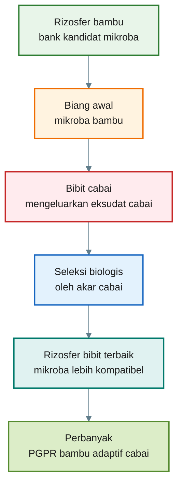

Makna diagram:

> **Bambu menyediakan kandidat mikroba. Cabai menentukan mikroba mana yang boleh tinggal.**

Inilah alasan mengapa tahap adaptasi pada bibit cabai bukan langkah tambahan, tetapi langkah kunci.

---

## A.9 Kesimpulan Lampiran A

1. **Eksudat bambu, alang-alang, dan cabai memiliki kelas senyawa yang mirip**, seperti gula, asam organik, asam amino, fenolik, dan polisakarida.
2. **Eksudat bambu** cenderung mendukung sistem rizosfer perennial yang stabil dan kaya mikroba siklus hara.
3. **Eksudat alang-alang** lebih berisiko karena berkaitan dengan alelopati, dominasi biologis, dan kemampuan invasif.
4. **Eksudat cabai** bersifat dinamis, dipengaruhi varietas, pemupukan, fase pertumbuhan, dan stres.
5. Mikroba bambu tidak otomatis cocok untuk cabai.
6. Adaptasi mikroba bambu pada bibit cabai diperlukan agar mikroba yang diperbanyak adalah mikroba yang mampu hidup bersama akar cabai.
7. PGPR bambu adaptif tetap bukan pengganti pupuk. Pupuk tetap menjadi sumber utama hara, sedangkan mikroba membantu kesehatan akar dan efisiensi pemanfaatan hara.

Kalimat kunci Lampiran A:

> **Eksudat bambu membangun bank mikroba. Eksudat cabai melakukan seleksi. Karena itu, PGPR terbaik bukan sekadar dari bambu, tetapi dari bambu yang sudah “dibaca ulang” oleh akar cabai.**

[1]: https://www.frontiersin.org/journals/plant-science/articles/10.3389/fpls.2025.1567707/full 'Frontiers | Root exudates in controlled environment agriculture: composition, function, and future directions'
[2]: https://pubmed.ncbi.nlm.nih.gov/27488712/?utm_source=chatgpt.com 'Organic acid compounds in root exudation of Moso ...'
[3]: https://www.frontiersin.org/journals/microbiology/articles/10.3389/fmicb.2025.1533061/full 'Frontiers | Microbial diversity and function in bamboo ecosystems'
[4]: https://ouci.dntb.gov.ua/en/works/9QJvjGp7/?utm_source=chatgpt.com 'Allelopathy and Allelochemicals of Imperata cylindrica as ...'
[5]: https://www.frontiersin.org/journals/microbiology/articles/10.3389/fmicb.2024.1415329/full 'Frontiers | Seed endophytes and rhizosphere microbiome of Imperata cylindrica, a pioneer plant of abandoned mine lands'
[6]: https://www.mdpi.com/2223-7747/12/9/1873 'Root–Soil Interactions for Pepper Accessions Grown under Organic and Conventional Farming'
[7]: https://www.researchgate.net/publication/383359475_Selenium_improved_arsenic_toxicity_tolerance_in_two_bell_pepper_Capsicum_annuum_L_varieties_by_modulating_growth_ion_uptake_photosynthesis_and_antioxidant_profile?utm_source=chatgpt.com '(PDF) Selenium improved arsenic toxicity tolerance in two bell ...'
[8]: https://www.frontiersin.org/journals/plant-science/articles/10.3389/fpls.2023.1132824/full 'Frontiers | Biotic stress-induced changes in root exudation confer plant stress tolerance by altering rhizospheric microbial community'

[Kembali ke atas](#membangun-rizosfer-cabai-yang-tangguh-dengan-mikroba-dari-rumpun-bambu)

---

# Lampiran

## Tabel Pengamatan dan Cara Perhitungan Lanjutan

Lampiran ini dibuat agar Bab 8 bisa langsung dipraktikkan di lapangan. Tabel dapat disalin ke buku catatan, spreadsheet, atau aplikasi pencatatan kebun.

---

# Lampiran 1

## Tabel Identitas Uji

| Item                         | Keterangan                      |
| ---------------------------- | ------------------------------- |
| Nama lahan                   |                                 |
| Lokasi                       |                                 |
| Tanggal semai                |                                 |
| Tanggal pindah tanam         |                                 |
| Varietas cabai               |                                 |
| Jenis bambu sumber           |                                 |
| Tanggal pembuatan biang awal |                                 |
| Tanggal adaptasi ke cabai    |                                 |
| Tanggal perbanyakan PGPR     |                                 |
| Jenis media                  |                                 |
| Sumber air                   |                                 |
| Sistem tanam                 | Bedengan / polybag / greenhouse |
| Mulsa                        | Ada / tidak                     |
| Catatan cuaca umum           |                                 |

---

# Lampiran 2

## Tabel Rancangan Perlakuan

| Perlakuan | Isi Perlakuan                                                  | Jumlah Tanaman | Lokasi Petak | Catatan |
| --------- | -------------------------------------------------------------- | -------------: | ------------ | ------- |
| P0        | Tanpa PGPR                                                     |                |              |         |
| P1        | PGPR bambu biasa                                               |                |              |         |
| P2        | PGPR bambu adaptif cabai                                       |                |              |         |
| P3        | PGPR bambu adaptif + kompos + biochar + mikoriza + Trichoderma |                |              |         |

---

# Lampiran 3

## Tabel Jadwal Aplikasi PGPR

| Tanggal |  Umur Tanaman | Perlakuan | Dosis PGPR | Volume per Tanaman | Kondisi Tanah | Catatan |
| ------- | ------------: | --------- | ---------- | ------------------ | ------------- | ------- |
|         |         0 HST | P1/P2/P3  | 20 ml/L    | Rendam akar        |               |         |
|         |         7 HST | P1/P2/P3  | 20–30 ml/L | 100–200 ml         |               |         |
|         |        14 HST | P1/P2/P3  | 20–30 ml/L | 100–200 ml         |               |         |
|         |        28 HST | P1/P2/P3  | 20–30 ml/L | 100–200 ml         |               |         |
|         | Awal berbunga | P1/P2/P3  | 20 ml/L    | 100 ml             |               |         |
|         |     Fase buah | P1/P2/P3  | 20 ml/L    | 100 ml             |               |         |

---

# Lampiran 4

## Tabel Pengamatan Pertumbuhan

Amati minimal pada 7, 14, 21, 30, dan 45 HST.

| Tanggal | HST | Perlakuan | Jumlah Tanaman Diamati | Rata-rata Tinggi Tanaman | Rata-rata Jumlah Daun | Rata-rata Jumlah Cabang | Skor Warna Daun | Catatan |
| ------- | --: | --------- | ---------------------: | -----------------------: | --------------------: | ----------------------: | --------------: | ------- |
|         |   7 | P0        |                        |                          |                       |                         |                 |         |
|         |   7 | P1        |                        |                          |                       |                         |                 |         |
|         |   7 | P2        |                        |                          |                       |                         |                 |         |
|         |   7 | P3        |                        |                          |                       |                         |                 |         |
|         |  14 | P0        |                        |                          |                       |                         |                 |         |
|         |  14 | P1        |                        |                          |                       |                         |                 |         |
|         |  14 | P2        |                        |                          |                       |                         |                 |         |
|         |  14 | P3        |                        |                          |                       |                         |                 |         |

Skor warna daun:

| Skor | Arti                   |
| ---: | ---------------------- |
|    1 | Sangat pucat / kuning  |
|    2 | Pucat                  |
|    3 | Hijau sedang           |
|    4 | Hijau baik             |
|    5 | Hijau segar dan merata |

---

# Lampiran 5

## Tabel Pengamatan Akar

Pengamatan akar dilakukan dengan mencabut sampel terbatas. Jangan mencabut semua tanaman.

| Tanggal | HST | Perlakuan | Jumlah Sampel | Skor Warna Akar | Skor Cabang Akar | Skor Rambut Akar | Ada Busuk? | Catatan |
| ------- | --: | --------- | ------------: | --------------: | ---------------: | ---------------: | ---------- | ------- |
|         |  14 | P0        |               |                 |                  |                  | Ya/Tidak   |         |
|         |  14 | P1        |               |                 |                  |                  | Ya/Tidak   |         |
|         |  14 | P2        |               |                 |                  |                  | Ya/Tidak   |         |
|         |  14 | P3        |               |                 |                  |                  | Ya/Tidak   |         |
|         |  30 | P0        |               |                 |                  |                  | Ya/Tidak   |         |
|         |  30 | P1        |               |                 |                  |                  | Ya/Tidak   |         |
|         |  30 | P2        |               |                 |                  |                  | Ya/Tidak   |         |
|         |  30 | P3        |               |                 |                  |                  | Ya/Tidak   |         |

Skor akar:

| Skor | Warna Akar    | Cabang Akar    | Rambut Akar      |
| ---: | ------------- | -------------- | ---------------- |
|    1 | Cokelat/busuk | Sangat sedikit | Hampir tidak ada |
|    2 | Cokelat muda  | Sedikit        | Sedikit          |
|    3 | Krem          | Sedang         | Sedang           |
|    4 | Putih krem    | Banyak         | Banyak           |
|    5 | Putih sehat   | Sangat banyak  | Sangat aktif     |

---

# Lampiran 6

## Tabel Pengamatan Layu dan Stres

| Tanggal | HST | Perlakuan | Jumlah Tanaman Diamati | Layu Sementara | Layu Permanen | Mati | Skor Kesegaran Siang | Catatan Cuaca |
| ------- | --: | --------- | ---------------------: | -------------: | ------------: | ---: | -------------------: | ------------- |
|         |   7 | P0        |                        |                |               |      |                      |               |
|         |   7 | P1        |                        |                |               |      |                      |               |
|         |   7 | P2        |                        |                |               |      |                      |               |
|         |   7 | P3        |                        |                |               |      |                      |               |
|         |  21 | P0        |                        |                |               |      |                      |               |
|         |  21 | P1        |                        |                |               |      |                      |               |
|         |  21 | P2        |                        |                |               |      |                      |               |
|         |  21 | P3        |                        |                |               |      |                      |               |

Skor kesegaran siang:

| Skor | Arti         |
| ---: | ------------ |
|    1 | Layu berat   |
|    2 | Layu sedang  |
|    3 | Sedikit layu |
|    4 | Cukup segar  |
|    5 | Tetap segar  |

---

# Lampiran 7

## Tabel Pengamatan Bunga dan Buah

| Tanggal | HST | Perlakuan | Jumlah Tanaman Diamati | Tanaman Mulai Berbunga | Rata-rata Bunga per Tanaman | Rontok Bunga | Rata-rata Buah Jadi | Catatan |
| ------- | --: | --------- | ---------------------: | ---------------------: | --------------------------: | -----------: | ------------------: | ------- |
|         |  30 | P0        |                        |                        |                             |              |                     |         |
|         |  30 | P1        |                        |                        |                             |              |                     |         |
|         |  30 | P2        |                        |                        |                             |              |                     |         |
|         |  30 | P3        |                        |                        |                             |              |                     |         |
|         |  45 | P0        |                        |                        |                             |              |                     |         |
|         |  45 | P1        |                        |                        |                             |              |                     |         |
|         |  45 | P2        |                        |                        |                             |              |                     |         |
|         |  45 | P3        |                        |                        |                             |              |                     |         |

---

# Lampiran 8

## Tabel Panen

| Tanggal Panen | Perlakuan | Jumlah Tanaman Panen | Jumlah Buah Total | Bobot Panen Total | Bobot Rata-rata per Tanaman | Catatan Kualitas |
| ------------- | --------- | -------------------: | ----------------: | ----------------: | --------------------------: | ---------------- |
|               | P0        |                      |                   |                   |                             |                  |
|               | P1        |                      |                   |                   |                             |                  |
|               | P2        |                      |                   |                   |                             |                  |
|               | P3        |                      |                   |                   |                             |                  |

Jika panen dilakukan berkali-kali, buat tabel rekap:

| Perlakuan | Panen 1 | Panen 2 | Panen 3 | Panen 4 | Total Panen |
| --------- | ------: | ------: | ------: | ------: | ----------: |
| P0        |         |         |         |         |             |
| P1        |         |         |         |         |             |
| P2        |         |         |         |         |             |
| P3        |         |         |         |         |             |

---

# Lampiran 9

## Rumus-Rumus Pengamatan Dasar

## 1. Rata-rata tinggi tanaman

$$
\text{Rata-rata Tinggi} =
\frac{\text{Total Tinggi Semua Sampel}}{\text{Jumlah Sampel}}
$$

Contoh:

```mdx id="contoh-rata-tinggi"
Total tinggi 10 tanaman = 420 cm
Jumlah sampel = 10 tanaman

Rata-rata tinggi = 420 / 10 = 42 cm
```

---

## 2. Persentase tanaman layu

$$
\text{Persentase Layu} =
\frac{\text{Jumlah Tanaman Layu}}{\text{Jumlah Tanaman Diamati}}
\times 100
$$

Contoh:

```mdx id="contoh-layu"
Jumlah tanaman diamati = 25
Jumlah tanaman layu = 3

Persentase layu = (3 / 25) × 100 = 12%
```

---

## 3. Persentase tanaman hidup

$$
\text{Persentase Hidup} =
\frac{\text{Jumlah Tanaman Hidup}}{\text{Jumlah Tanaman Awal}}
\times 100
$$

Contoh:

```mdx id="contoh-hidup"
Jumlah tanaman awal = 25
Jumlah tanaman hidup = 23

Persentase hidup = (23 / 25) × 100 = 92%
```

---

## 4. Rata-rata bobot panen per tanaman

$$
\text{Bobot per Tanaman} =
\frac{\text{Total Bobot Panen}}{\text{Jumlah Tanaman Panen}}
$$

Contoh:

```mdx id="contoh-bobot-tanaman"
Total bobot panen P3 = 18 kg
Jumlah tanaman panen = 25 tanaman

Bobot per tanaman = 18 / 25 = 0,72 kg/tanaman
```

---

## 5. Peningkatan hasil dibanding kontrol

$$
\text{Peningkatan Hasil} =
\frac{\text{Hasil Perlakuan} - \text{Hasil Kontrol}}{\text{Hasil Kontrol}}
\times 100
$$

Contoh:

```mdx id="contoh-peningkatan-hasil"
Hasil kontrol P0 = 12 kg
Hasil P3 = 18 kg

Peningkatan hasil = ((18 - 12) / 12) × 100
Peningkatan hasil = 50%
```

---

# Lampiran 10

## Perhitungan Estimasi Hasil per Hektare

Jika uji dilakukan pada skala kecil, hasil bisa diproyeksikan ke hektare. Ini hanya estimasi, bukan angka final.

## Rumus jumlah tanaman per hektare

$$
\text{Populasi per Hektare} =
\frac{10.000}{\text{Jarak Antarbaris} \times \text{Jarak Dalam Baris}}
$$

Keterangan:

```mdx id="keterangan-populasi"
10.000 = luas 1 hektare dalam meter persegi
Jarak antarbaris = meter
Jarak dalam baris = meter
```

Contoh:

```mdx id="contoh-populasi"
Jarak tanam = 0,6 m × 0,5 m

Populasi per hektare = 10.000 / (0,6 × 0,5)
Populasi per hektare = 10.000 / 0,3
Populasi per hektare = 33.333 tanaman/ha
```

## Rumus estimasi hasil per hektare

$$
\text{Hasil per Hektare} =
\text{Bobot per Tanaman} \times \text{Populasi per Hektare}
$$

Contoh:

```mdx id="contoh-hasil-ha"
Bobot panen per tanaman = 0,72 kg
Populasi = 33.333 tanaman/ha

Hasil per hektare = 0,72 × 33.333
Hasil per hektare = 23.999,76 kg/ha
Hasil per hektare ≈ 24 ton/ha
```

Catatan: hasil aktual bisa lebih rendah karena tanaman pinggir, kematian tanaman, variasi lahan, serangan hama, dan kualitas pengelolaan.

---

# Lampiran 11

## Perhitungan Biaya Tambahan PGPR

Hitung semua biaya tambahan akibat penggunaan PGPR dan paket rizosfer.

| Komponen Biaya         | Jumlah | Harga Satuan | Total Biaya |
| ---------------------- | -----: | -----------: | ----------: |
| Molase/gula merah      |        |              |             |
| Air cucian beras/dedak |        |              |             |
| Kompos tambahan        |        |              |             |
| Sekam bakar/biochar    |        |              |             |
| Mikoriza               |        |              |             |
| Trichoderma            |        |              |             |
| Wadah/alat             |        |              |             |
| Tenaga kerja           |        |              |             |
| Transport bahan        |        |              |             |
| Total biaya tambahan   |        |              |             |

## Rumus biaya tambahan per tanaman

$$
\text{Biaya Tambahan per Tanaman} =
\frac{\text{Total Biaya Tambahan}}{\text{Jumlah Tanaman Perlakuan}}
$$

Contoh:

```mdx id="contoh-biaya-tanaman"
Total biaya tambahan P3 = Rp150.000
Jumlah tanaman P3 = 250 tanaman

Biaya tambahan per tanaman = 150.000 / 250
Biaya tambahan per tanaman = Rp600/tanaman
```

---

# Lampiran 12

## Perhitungan Pendapatan Tambahan

## Rumus pendapatan kotor

$$
\text{Pendapatan Kotor} =
\text{Total Panen} \times \text{Harga Jual per kg}
$$

Contoh:

```mdx id="contoh-pendapatan-kotor"
Total panen P3 = 180 kg
Harga cabai = Rp30.000/kg

Pendapatan kotor = 180 × 30.000
Pendapatan kotor = Rp5.400.000
```

## Rumus pendapatan tambahan dibanding kontrol

$$
\text{Pendapatan Tambahan} =
\text{Pendapatan Perlakuan} - \text{Pendapatan Kontrol}
$$

Contoh:

```mdx id="contoh-pendapatan-tambahan"
Pendapatan P0 = Rp3.600.000
Pendapatan P3 = Rp5.400.000

Pendapatan tambahan = 5.400.000 - 3.600.000
Pendapatan tambahan = Rp1.800.000
```

---

# Lampiran 13

## Perhitungan Keuntungan Bersih Tambahan

Rumus:

$$
\text{Keuntungan Bersih Tambahan} =
\text{Pendapatan Tambahan} - \text{Biaya Tambahan}
$$

Contoh:

```mdx id="contoh-keuntungan-bersih"
Pendapatan tambahan P3 = Rp1.800.000
Biaya tambahan P3 = Rp150.000

Keuntungan bersih tambahan = 1.800.000 - 150.000
Keuntungan bersih tambahan = Rp1.650.000
```

Jika keuntungan bersih tambahan positif dan hasilnya konsisten, formula layak diuji lebih luas.

---

# Lampiran 14

## Benefit-Cost Ratio Tambahan

Rumus:

$$
\text{BCR Tambahan} =
\frac{\text{Pendapatan Tambahan}}{\text{Biaya Tambahan}}
$$

Contoh:

```mdx id="contoh-bcr"
Pendapatan tambahan = Rp1.800.000
Biaya tambahan = Rp150.000

BCR tambahan = 1.800.000 / 150.000
BCR tambahan = 12
```

Cara membaca:

| BCR Tambahan | Arti                                 |
| -----------: | ------------------------------------ |
|          < 1 | Tidak layak                          |
|          1–2 | Layak tipis, perlu hati-hati         |
|          > 2 | Menarik untuk diuji lebih luas       |
|          > 5 | Sangat menarik, asal hasil konsisten |

BCR tinggi tidak otomatis berarti langsung diterapkan ke seluruh lahan. Tetap perhatikan konsistensi hasil, risiko penyakit, dan kemampuan tenaga kerja.

---

# Lampiran 15

## Break-Even Tambahan Hasil

Rumus ini menjawab pertanyaan:

> **Berapa tambahan panen minimal agar biaya PGPR dan paket rizosfer tertutup?**

$$
\text{Tambahan Panen Minimal} =
\frac{\text{Biaya Tambahan}}{\text{Harga Jual per kg}}
$$

Contoh:

```mdx id="contoh-bep-panen"
Biaya tambahan = Rp150.000
Harga jual cabai = Rp30.000/kg

Tambahan panen minimal = 150.000 / 30.000
Tambahan panen minimal = 5 kg
```

Artinya, jika paket PGPR menghasilkan tambahan panen lebih dari 5 kg, biaya tambahannya sudah tertutup.

---

# Lampiran 16

## Skor Keputusan Akhir

Gunakan tabel ini untuk menentukan apakah formula layak diperluas.

| Parameter                         | Bobot | Skor 1–5 | Nilai |
| --------------------------------- | ----: | -------: | ----: |
| Akar lebih sehat                  |   20% |          |       |
| Layu berkurang                    |   20% |          |       |
| Pertumbuhan lebih seragam         |   15% |          |       |
| Bunga dan buah lebih stabil       |   15% |          |       |
| Hasil panen meningkat             |   20% |          |       |
| Biaya dan tenaga masih masuk akal |   10% |          |       |
| Total                             |  100% |          |       |

Rumus nilai:

$$
\text{Nilai Parameter} =
\text{Bobot} \times \text{Skor}
$$

Agar lebih mudah, gunakan bobot dalam angka desimal.

```mdx id="contoh-bobot"
20% = 0,20
15% = 0,15
10% = 0,10
```

Contoh perhitungan:

| Parameter             | Bobot | Skor | Nilai |
| --------------------- | ----: | ---: | ----: |
| Akar lebih sehat      |  0,20 |    5 |  1,00 |
| Layu berkurang        |  0,20 |    4 |  0,80 |
| Pertumbuhan seragam   |  0,15 |    4 |  0,60 |
| Bunga dan buah stabil |  0,15 |    4 |  0,60 |
| Hasil panen meningkat |  0,20 |    5 |  1,00 |
| Biaya masuk akal      |  0,10 |    4 |  0,40 |
| Total                 |  1,00 |      |  4,40 |

Cara membaca:

| Total Skor | Keputusan                       |
| ---------: | ------------------------------- |
|      < 3,0 | Jangan diperluas                |
|    3,0–3,5 | Perbaiki dan uji ulang          |
|    3,6–4,2 | Layak uji skala lebih besar     |
|      > 4,2 | Sangat layak diperluas bertahap |

---

# Lampiran 17

## Format Ringkas Catatan Harian

| Tanggal | HST | Cuaca               | Perlakuan   | Kegiatan | Gejala Tanaman | Catatan Khusus |
| ------- | --: | ------------------- | ----------- | -------- | -------------- | -------------- |
|         |     | Panas/Hujan/Mendung | P0/P1/P2/P3 |          |                |                |
|         |     | Panas/Hujan/Mendung | P0/P1/P2/P3 |          |                |                |
|         |     | Panas/Hujan/Mendung | P0/P1/P2/P3 |          |                |                |

Catatan harian ini penting karena hasil cabai sangat dipengaruhi cuaca dan perlakuan lapangan. Misalnya, tanaman layu setelah hari sangat panas tidak bisa langsung disimpulkan sebagai kegagalan PGPR.

---

# Lampiran 18

## Checklist Sebelum Memperluas ke Skala Lebih Besar

| Pertanyaan                                            | Ya/Tidak |
| ----------------------------------------------------- | -------- |
| Apakah sumber bambu bersih dan konsisten?             |          |
| Apakah fermentasi selalu beraroma normal?             |          |
| Apakah uji kecambah aman?                             |          |
| Apakah bibit adaptasi menunjukkan akar sehat?         |          |
| Apakah P2 lebih baik dari P1?                         |          |
| Apakah P3 lebih baik dari P0?                         |          |
| Apakah layu berkurang?                                |          |
| Apakah hasil panen meningkat?                         |          |
| Apakah biaya tambahan tertutup?                       |          |
| Apakah tenaga kerja mampu menjalankan aplikasi rutin? |          |
| Apakah ada catatan data yang cukup?                   |          |

Jika sebagian besar jawaban “Ya”, formula bisa diperluas bertahap.

Jika banyak jawaban “Tidak”, ulangi dari sumber bambu, proses adaptasi, atau rancangan aplikasi.

---

# Penutup Lampiran

Lampiran ini menjadikan penggunaan PGPR bambu adaptif lebih terukur. Praktisi tidak hanya membuat larutan, mengocor, lalu menebak hasilnya. Dengan tabel dan perhitungan sederhana, keputusan menjadi lebih objektif.

Prinsip akhirnya:

> **Yang tidak dicatat sulit diperbaiki. Yang tidak diuji sulit dipercaya. Yang tidak dihitung sulit dijadikan bisnis.**

Dengan pendekatan ini, penggunaan mikroba rizosfer bambu untuk cabai bisa bergerak dari sekadar percobaan menjadi sistem budidaya yang lebih disiplin, aman, dan layak secara agribisnis.

---

<small>
  **_Catatan Penyusunan_** Artikel ini disusun sebagai materi edukasi dan
  referensi umum berdasarkan berbagai sumber pustaka, praktik lapangan, serta
  bantuan alat penulisan. Pembaca disarankan untuk melakukan verifikasi lanjutan
  dan penyesuaian sesuai dengan kondisi serta kebutuhan masing-masing sistem.
</small>
