# **_Tanah Hidup untuk Budidaya Cabai: Meniru Rizosfer Rumpun Bambu untuk Akar yang Sehat dan Produktif_**

---

- [**_Tanah Hidup untuk Budidaya Cabai: Meniru Rizosfer Rumpun Bambu untuk Akar yang Sehat dan Produktif_**](#tanah-hidup-untuk-budidaya-cabai-meniru-rizosfer-rumpun-bambu-untuk-akar-yang-sehat-dan-produktif)
- [1. Pengertian Tanah Hidup](#1-pengertian-tanah-hidup)
  - [1.1 Apa itu tanah hidup?](#11-apa-itu-tanah-hidup)
  - [1.2 Tanah hidup vs tanah mati](#12-tanah-hidup-vs-tanah-mati)
  - [1.3 Mengapa konsep rizosfer penting?](#13-mengapa-konsep-rizosfer-penting)
- [2. Ciri-Ciri Tanah Hidup dan Tanah Bermasalah](#2-ciri-ciri-tanah-hidup-dan-tanah-bermasalah)
  - [2.1 Ciri tanah hidup](#21-ciri-tanah-hidup)
  - [2.2 Ciri tanah bermasalah](#22-ciri-tanah-bermasalah)
  - [2.3 Ciri khusus pada cabai](#23-ciri-khusus-pada-cabai)
  - [Ringkasan Bab 1–2](#ringkasan-bab-12)
- [3. Meniru Lingkungan Rizosfer Rumpun Bambu](#3-meniru-lingkungan-rizosfer-rumpun-bambu)
  - [3.1 Mengapa rumpun bambu menarik?](#31-mengapa-rumpun-bambu-menarik)
  - [3.2 Karakter lingkungan rizosfer bambu yang perlu ditiru](#32-karakter-lingkungan-rizosfer-bambu-yang-perlu-ditiru)
  - [3.3 Cara meniru rizosfer bambu pada lahan cabai](#33-cara-meniru-rizosfer-bambu-pada-lahan-cabai)
    - [a. Buat tanah selalu tertutup](#a-buat-tanah-selalu-tertutup)
    - [b. Tambahkan karbon stabil](#b-tambahkan-karbon-stabil)
    - [c. Gunakan mikroba lokal secara terkendali](#c-gunakan-mikroba-lokal-secara-terkendali)
    - [d. Kurangi gangguan tanah](#d-kurangi-gangguan-tanah)
    - [e. Jaga kelembapan, bukan becek](#e-jaga-kelembapan-bukan-becek)
  - [3.4 Formula praktis “rizosfer bambu tiruan”](#34-formula-praktis-rizosfer-bambu-tiruan)
- [4. Metode Menghidupkan Tanah untuk Cabai](#4-metode-menghidupkan-tanah-untuk-cabai)
  - [4.1 Perbaiki fisik tanah terlebih dahulu](#41-perbaiki-fisik-tanah-terlebih-dahulu)
  - [4.2 Tambahkan bahan organik matang](#42-tambahkan-bahan-organik-matang)
  - [4.3 Atur pH tanah](#43-atur-ph-tanah)
  - [4.4 Gunakan agen hayati sebagai pendukung](#44-gunakan-agen-hayati-sebagai-pendukung)
  - [4.5 Gunakan biochar aktif](#45-gunakan-biochar-aktif)
  - [4.6 Gunakan rotasi tanaman](#46-gunakan-rotasi-tanaman)
  - [4.7 Urutan kerja yang disarankan](#47-urutan-kerja-yang-disarankan)
  - [Ringkasan Bab 3–4](#ringkasan-bab-34)
- [5. SOP Aplikasi pada Budidaya Cabai](#5-sop-aplikasi-pada-budidaya-cabai)
  - [5.1 Empat sampai enam minggu sebelum tanam](#51-empat-sampai-enam-minggu-sebelum-tanam)
    - [Rumus kebutuhan kompos](#rumus-kebutuhan-kompos)
  - [5.2 Dua sampai tiga minggu sebelum tanam](#52-dua-sampai-tiga-minggu-sebelum-tanam)
    - [Formula Rizosfer Bambu Tiruan](#formula-rizosfer-bambu-tiruan)
    - [Rumus kebutuhan bahan formula](#rumus-kebutuhan-bahan-formula)
  - [5.3 Saat tanam](#53-saat-tanam)
    - [Rumus kebutuhan kompos per lubang](#rumus-kebutuhan-kompos-per-lubang)
  - [5.4 Umur 1–4 minggu setelah tanam](#54-umur-14-minggu-setelah-tanam)
  - [5.5 Fase berbunga dan berbuah](#55-fase-berbunga-dan-berbuah)
  - [5.6 Setelah panen](#56-setelah-panen)
- [6. Monitoring Keberhasilan](#6-monitoring-keberhasilan)
  - [6.1 Indikator tanah](#61-indikator-tanah)
    - [Uji lapangan sederhana](#uji-lapangan-sederhana)
  - [6.2 Indikator akar](#62-indikator-akar)
  - [6.3 Indikator tanaman cabai](#63-indikator-tanaman-cabai)
  - [6.4 Indikator ekonomi](#64-indikator-ekonomi)
    - [Rumus persentase tanaman layu](#rumus-persentase-tanaman-layu)
    - [Rumus produktivitas per tanaman](#rumus-produktivitas-per-tanaman)
    - [Rumus biaya per kilogram cabai](#rumus-biaya-per-kilogram-cabai)
  - [6.5 Format monitoring lapangan](#65-format-monitoring-lapangan)
  - [Ringkasan Bab 5–6](#ringkasan-bab-56)

---

# 1. Pengertian Tanah Hidup

Dalam budidaya cabai, tanah sering dianggap hanya sebagai tempat berdirinya tanaman. Padahal, tanah yang sehat bukan sekadar media penopang akar. Tanah adalah ruang hidup bagi akar, air, udara, bahan organik, unsur hara, dan mikroorganisme.

Karena itu, istilah **tanah hidup** perlu dipahami bukan sebagai istilah mistis atau sekadar istilah pertanian organik, tetapi sebagai cara praktis untuk menjelaskan tanah yang masih aktif menjalankan fungsi alaminya.

Tanah yang hidup membantu tanaman tumbuh lebih stabil, lebih tahan stres, dan lebih efisien dalam memanfaatkan pupuk. Sebaliknya, tanah yang rusak membuat tanaman mudah sakit, akar lemah, dan produksi tidak konsisten.

<ResourceBox
  title="Artikel Terkait:"
  items={[
    {
      name: 'README — Framework Praktis Memulai Bisnis Agribisnis Terpadu di Lahan Gumuk Berlereng',
      href: '/blog/agri/kebon/agribisnis-gumuk/README',
    },
    {
      name: 'Isolasi Mikroba Lokal untuk PGPM dan Agen Pengendali Hayati (APH)',
      href: '/blog/agri/agen-hayati/isolasi-mikroba-lokal',
    },
    {
      name: 'Bioaktivator Rizosfer Bambu Kaya Silikat',
      href: '/blog/agri/kebon/biaktivator-rizosfer-bambu',
    },
    {
      name: 'Kompos Hidup Berbasis Rizosfer Bambu: Cara Membuat Kompos untuk Membangun Tanah Sehat dan Produktif',
      href: '/blog/agri/kebon/kompos-prinsip-rumpun-bambau',
    },
    {
      name: 'Tipuan Mikroba dalam Pertanian: Trichoderma, PGPR, PGPM, PGPF, MOL, dan JAKABA',
      href: '/blog/agri/agen-hayati/tipuan-mikroba-pertanian',
    },
    {
      name: 'Menanam Cabai dengan Prinsip Pohon Bambu: Akar Kuat, Tanah Hidup, Tanaman Tahan Stres',
      href: '/blog/agri/kebon/budidaya-cabai-prinsip-rumpun-bambu',
    },
    {
      name: 'Panduan Praktis Pembiakan Trichoderma dari Starter Komersial',
      href: '/blog/agri/agen-hayati/trichoderma-pembiakan',
    },
    {
      name: 'Keseimbangan Akar dan Tajuk: Fondasi Tanaman Sehat, Produktif, dan Tidak Terjebak Tipuan Input',
      href: '/blog/agri/kebon/keseimbangan-akar-dan-tajuk',
    },
    {
      name: 'Menanam Cabai dengan Prinsip Pohon Bambu: Akar Kuat, Tanah Hidup, Tanaman Tahan Stres',
      href: '/blog/agri/kebon/budidaya-cabai-prinsip-rumpun-bambu',
    },
    {
      name: 'Panduan Lengkap Pengendalian Lalat Buah di Kebun Campuran',
      href: '/blog/agri/lalat-buah',
    },
    {
      name: 'README - Pupuk Tepat, Panen Untung - Model Low-Lab untuk Petani Makmur di Gambiran',
      href: '/blog/agri/pupuk-terintegrasi/README',
    },
  ]}
/>

---

## 1.1 Apa itu tanah hidup?

**Tanah hidup adalah tanah yang memiliki keseimbangan antara struktur fisik, bahan organik, aktivitas mikroba, pH, air, udara, dan perkembangan akar.**

Tanah hidup bukan hanya tanah yang diberi pupuk organik. Tanah hidup adalah tanah yang memiliki **zona akar aktif secara biologis**.

Artinya, di sekitar akar terjadi banyak proses penting, seperti:

- bahan organik diurai menjadi hara tersedia,
- mikroba membantu akar menyerap hara,
- akar mengeluarkan eksudat sebagai makanan mikroba,
- struktur tanah terbentuk menjadi remah,
- air dan udara tersedia dalam keseimbangan,
- patogen tanah ditekan oleh kompetisi mikroba menguntungkan.

Dalam praktik lapangan, tanah hidup biasanya terasa lebih remah, tidak mudah padat, tidak berbau busuk, dan tanaman yang tumbuh di atasnya terlihat lebih seragam.

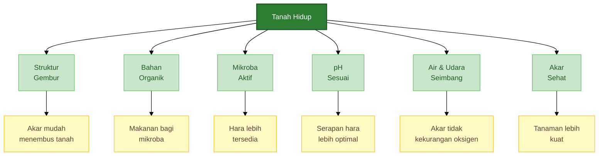

Tanah hidup bekerja seperti sistem pendukung akar. Bila sistem ini baik, tanaman tidak hanya bergantung pada pupuk yang diberikan dari luar. Tanah ikut membantu menyediakan, menyimpan, dan menyeimbangkan kebutuhan tanaman.

Pada cabai, tanah hidup sangat penting karena cabai memiliki akar yang sensitif terhadap tanah padat, genangan, dan penyakit tular tanah. Tanah yang tampak subur dari atas belum tentu sehat jika zona akarnya buruk.

---

## 1.2 Tanah hidup vs tanah mati

Istilah **tanah mati** tidak berarti tanah tersebut benar-benar tidak memiliki kehidupan sama sekali. Dalam konteks praktis, tanah mati adalah tanah yang fungsi alaminya sudah sangat lemah.

Tanah seperti ini biasanya masih bisa ditanami, tetapi tanaman menjadi sangat bergantung pada pupuk, pestisida, dan perlakuan korektif lain. Begitu input dikurangi, tanaman cepat menunjukkan gejala stres.

Tanah bermasalah sering memiliki ciri seperti:

- keras saat kering,
- becek dan lengket saat hujan,
- miskin bahan organik,
- akar sulit berkembang,
- air sulit meresap atau justru menggenang,
- penyakit akar sering muncul,
- tanaman tumbuh tidak seragam,
- respons terhadap pupuk tidak stabil.

Perbedaan utamanya terletak pada fungsi. Tanah hidup **mendukung tanaman**, sedangkan tanah mati atau rusak hanya menjadi tempat akar berada.

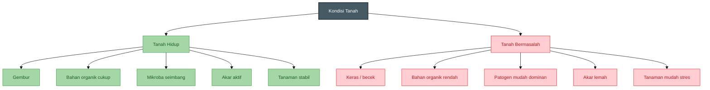

Dalam budidaya cabai, tanah mati biasanya terlihat dari pola serangan penyakit yang berulang. Misalnya, pada titik yang sama tanaman sering layu, akar membusuk, atau pertumbuhan selalu tertinggal dibanding tanaman lain.

Masalah tersebut jarang disebabkan oleh satu faktor saja. Biasanya merupakan gabungan dari:

- drainase buruk,
- bahan organik rendah,
- pH tidak sesuai,
- pemupukan tidak seimbang,
- populasi mikroba menguntungkan rendah,
- patogen tanah meningkat,
- rotasi tanaman tidak dilakukan.

Karena itu, memperbaiki tanah tidak cukup hanya dengan menambah pupuk. Tanah harus diperbaiki sebagai sebuah ekosistem.

---

## 1.3 Mengapa konsep rizosfer penting?

Untuk memahami tanah hidup, praktisi perlu memahami konsep **rizosfer**.

**Rizosfer adalah area sempit di sekitar akar tempat akar tanaman, mikroba, air, udara, dan unsur hara saling berinteraksi.**

Walaupun ukurannya sangat kecil, rizosfer adalah pusat aktivitas tanah. Di area inilah akar menyerap hara, mikroba bekerja, patogen bersaing, dan sinyal biologis antara tanaman dan mikroorganisme terjadi.

Akar tanaman tidak hanya menyerap air dan hara. Akar juga mengeluarkan senyawa organik yang disebut **eksudat akar**. Eksudat ini dapat berupa gula, asam organik, asam amino, dan senyawa lain yang menjadi sumber makanan bagi mikroba tertentu.

Sebagai imbalannya, mikroba menguntungkan dapat membantu tanaman melalui beberapa cara:

- melarutkan fosfat,
- membantu ketersediaan nitrogen,
- menghasilkan zat perangsang tumbuh,
- menekan patogen,
- memperbaiki struktur tanah,
- membantu akar menghadapi stres lingkungan.

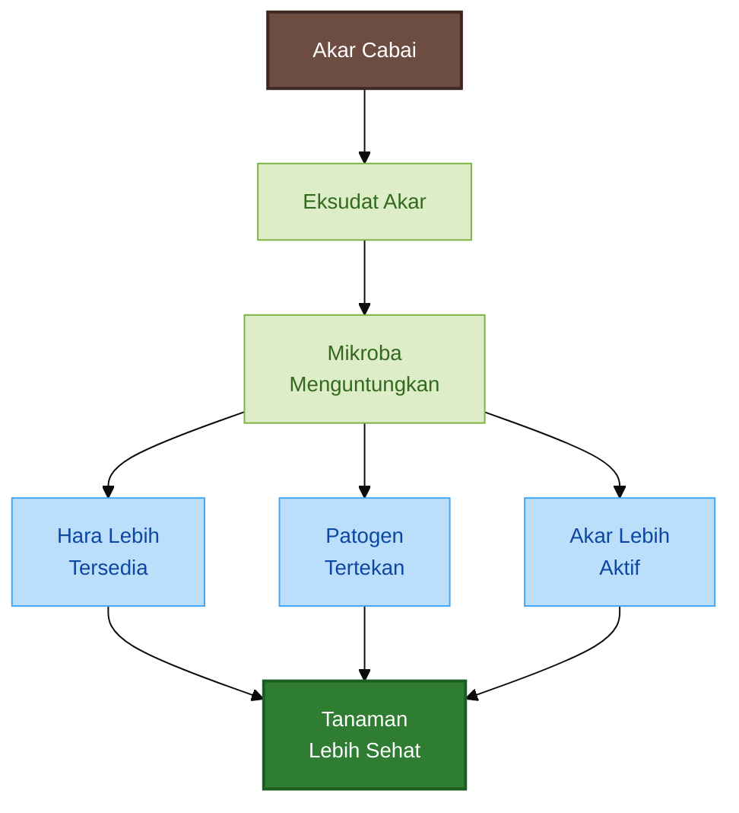

Pada cabai, rizosfer yang sehat sangat menentukan keberhasilan budidaya. Tanaman cabai bisa saja terlihat baik pada awal pertumbuhan, tetapi jika rizosfernya lemah, tanaman mudah drop ketika mulai berbunga dan berbuah.

Hal ini terjadi karena fase generatif membutuhkan energi dan hara yang besar. Bila akar tidak sehat, tanaman tidak mampu menopang kebutuhan bunga dan buah. Akibatnya, bunga rontok, buah kecil, tanaman mudah layu, dan umur panen menjadi pendek.

Maka, dalam budidaya cabai, tujuan utama membangun tanah hidup adalah menciptakan **rizosfer yang sehat, aktif, dan stabil**.

---

# 2. Ciri-Ciri Tanah Hidup dan Tanah Bermasalah

Sebelum memperbaiki tanah, praktisi perlu mampu membaca tanda-tanda di lapangan. Banyak kegagalan budidaya cabai terjadi karena petani hanya melihat bagian atas tanaman, tetapi tidak memeriksa kondisi tanah dan akar.

Padahal, gejala di daun, bunga, dan buah sering berawal dari masalah di zona akar.

Tanah hidup dan tanah bermasalah dapat dibedakan dari tiga sisi utama:

1. kondisi tanah,
2. kondisi akar,
3. respons tanaman.

---

## 2.1 Ciri tanah hidup

Tanah hidup biasanya memiliki ciri yang mudah dikenali di lapangan. Tidak semua ciri harus muncul sekaligus, tetapi semakin banyak ciri yang terlihat, semakin besar kemungkinan tanah tersebut sehat.

Ciri utama tanah hidup adalah tanah **remah dan tidak mudah padat**. Saat digenggam dalam kondisi lembap, tanah bisa menggumpal ringan tetapi mudah pecah kembali. Tanah seperti ini memiliki pori yang cukup untuk air dan udara.

Ciri berikutnya adalah **air meresap dengan baik**. Setelah hujan atau penyiraman, air tidak langsung menggenang lama di permukaan. Namun, tanah juga tidak terlalu cepat kering. Ini menandakan keseimbangan antara drainase dan daya simpan air.

Tanah hidup juga biasanya memiliki **bau tanah segar**, bukan bau busuk. Bau busuk sering menjadi tanda kondisi anaerob, yaitu kondisi kekurangan oksigen yang tidak disukai akar cabai.

Dari sisi biologis, tanah hidup biasanya menunjukkan tanda-tanda seperti:

- ada cacing atau organisme kecil,
- sisa bahan organik terurai perlahan,
- banyak akar halus,
- warna akar lebih putih,
- tanaman tumbuh lebih seragam.

Pada tanaman cabai, tanah hidup biasanya terlihat dari pertumbuhan yang stabil. Tanaman tidak terlalu cepat layu saat panas, respons terhadap pupuk lebih baik, dan penyakit akar tidak mudah menyebar cepat.

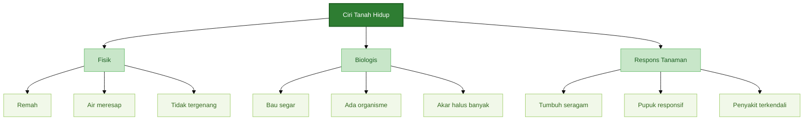

Secara praktis, tanah hidup tidak selalu berarti tanah sangat subur tanpa pupuk. Tanah hidup tetap bisa membutuhkan pupuk tambahan, terutama untuk tanaman cabai yang berproduksi tinggi. Namun, pada tanah hidup, pupuk bekerja lebih efisien karena akar aktif dan lingkungan tanah mendukung penyerapan hara.

---

## 2.2 Ciri tanah bermasalah

Tanah bermasalah sering kali terlihat jelas, tetapi gejalanya kerap dianggap sebagai masalah pupuk atau penyakit semata. Padahal, akar penyebabnya bisa berasal dari struktur tanah, drainase, pH, atau rendahnya bahan organik.

Ciri fisik yang paling umum adalah tanah **keras saat kering dan lengket saat basah**. Tanah seperti ini biasanya memiliki aerasi buruk. Saat hujan, pori tanah penuh air. Saat kering, tanah memadat dan menyulitkan akar menembus.

Ciri lain adalah permukaan tanah mudah berkerak. Kerak tanah menghambat pertukaran udara dan membuat air sulit masuk secara merata. Pada cabai muda, kondisi ini dapat menghambat perkembangan akar awal.

Tanah bermasalah juga sering memiliki tanda biologis yang lemah, seperti:

- jarang terlihat cacing,
- bahan organik tidak terurai baik,
- tanah berbau asam atau busuk,
- akar tanaman pendek,
- akar berwarna cokelat,
- banyak akar busuk atau berlendir.

Pada cabai, tanah bermasalah biasanya berkaitan erat dengan penyakit tular tanah, seperti layu bakteri, layu fusarium, busuk akar, dan busuk pangkal batang. Penyakit tersebut lebih mudah berkembang jika tanah becek, akar lemah, dan mikroba menguntungkan rendah.

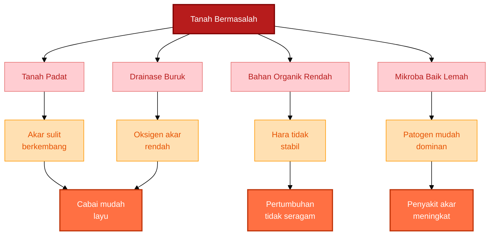

Kesalahan yang sering terjadi adalah langsung menambah pupuk ketika tanaman cabai terlihat kuning, kerdil, atau tidak seragam. Padahal, jika akar rusak atau tanah kekurangan oksigen, penambahan pupuk justru bisa memperberat stres tanaman.

Pada tanah yang sudah bermasalah, pupuk tidak selalu menjadi solusi pertama. Yang perlu diperbaiki lebih dulu adalah:

- struktur tanah,
- drainase,
- bahan organik,
- pH,
- kesehatan akar,
- keseimbangan mikroba.

---

## 2.3 Ciri khusus pada cabai

Cabai memiliki respons yang cukup sensitif terhadap kondisi tanah. Karena itu, gejala tanah bermasalah sering terlihat lebih cepat pada cabai dibanding beberapa tanaman lain.

Salah satu tanda awal adalah **bibit lambat pulih setelah pindah tanam**. Bibit yang sehat biasanya mulai menunjukkan pertumbuhan baru beberapa hari setelah tanam. Jika tanaman tetap stagnan terlalu lama, akar kemungkinan mengalami stres.

Gejala lain yang sering muncul adalah **daun layu saat siang meskipun tanah masih basah**. Ini merupakan tanda penting. Banyak petani menganggap tanaman kekurangan air, lalu menambah penyiraman. Padahal, jika tanah sudah basah tetapi tanaman tetap layu, masalahnya bisa berupa akar rusak, oksigen rendah, atau serangan patogen akar.

Pada cabai, tanah bermasalah juga sering terlihat dari pangkal batang yang mudah busuk. Kondisi ini biasanya dipicu oleh kelembapan berlebih, drainase buruk, dan lingkungan pangkal batang yang terlalu lembap.

Akar cabai yang sehat umumnya berwarna putih hingga krem muda, bercabang, dan memiliki banyak akar halus. Sebaliknya, akar yang bermasalah sering berwarna cokelat, pendek, sedikit cabang, atau tampak busuk.

Dari sisi produksi, tanah bermasalah sering menghasilkan pola seperti ini:

- pertumbuhan awal terlihat cukup baik,
- tanaman mulai lemah saat masuk fase bunga,
- bunga mudah rontok,
- buah tidak seragam,
- tanaman cepat drop setelah panen awal,
- umur produktif lebih pendek.

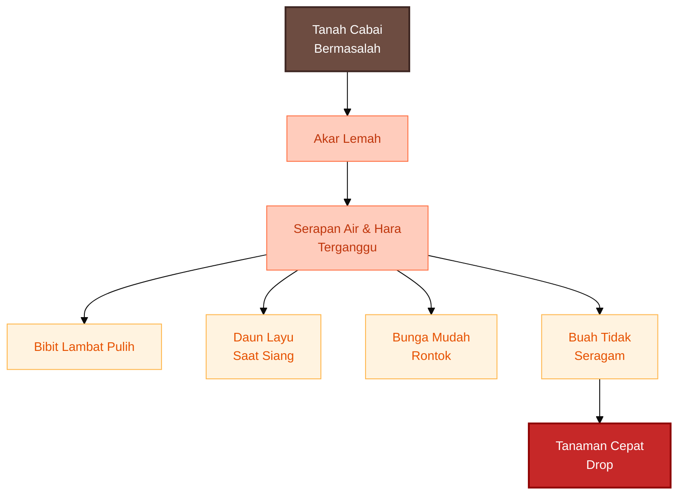

Karena itu, pemeriksaan tanah cabai sebaiknya tidak hanya dilakukan dari daun. Praktisi perlu sesekali mencabut tanaman contoh, terutama tanaman yang tumbuh lambat atau mulai layu, lalu memeriksa kondisi akarnya.

Hal yang perlu diamati:

- apakah akar berwarna putih atau cokelat,
- apakah akar bercabang banyak atau sedikit,
- apakah ada bau busuk,
- apakah tanah di sekitar akar terlalu padat,
- apakah air menggenang di sekitar bedengan,
- apakah pangkal batang mulai menghitam atau busuk.

Pemeriksaan sederhana ini sering lebih berguna daripada hanya menebak kekurangan pupuk dari warna daun.

---

## Ringkasan Bab 1–2

Tanah hidup adalah tanah yang memiliki fungsi biologis, fisik, dan kimia yang mendukung pertumbuhan akar. Intinya bukan hanya banyak pupuk organik, tetapi adanya **rizosfer yang aktif dan seimbang**.

Pada cabai, tanah hidup sangat penting karena cabai sensitif terhadap genangan, tanah padat, dan penyakit akar. Tanah yang sehat akan membantu akar berkembang, membuat tanaman lebih stabil, dan meningkatkan efisiensi pupuk.

Sebaliknya, tanah bermasalah membuat cabai mudah layu, akar rusak, bunga rontok, buah tidak seragam, dan tanaman cepat drop setelah panen awal.

Praktisi perlu mulai membaca tanah dari bawah, bukan hanya dari daun. Dalam budidaya cabai, kesehatan tanaman selalu dimulai dari kesehatan rizosfer.

---

Berikut naskah **Bab 3–4** berdasarkan outline yang Anda unggah.

---

# 3. Meniru Lingkungan Rizosfer Rumpun Bambu

Rumpun bambu sering dijadikan rujukan oleh praktisi pertanian ketika membahas tanah hidup. Bukan karena bambu memiliki “keajaiban” tertentu, tetapi karena lingkungan di bawah rumpun bambu biasanya menunjukkan banyak ciri tanah sehat: permukaan tanah tertutup serasah, kelembapan relatif stabil, akar hidup tersedia terus-menerus, dan aktivitas mikroba berjalan aktif.

Dalam konteks budidaya cabai, konsep ini penting karena cabai sangat bergantung pada kesehatan zona akar. Cabai bukan hanya membutuhkan pupuk, tetapi membutuhkan lingkungan rizosfer yang mampu menjaga akar tetap aktif, putih, bercabang, dan tidak mudah diserang patogen.

Namun, pendekatan yang tepat bukan sekadar mengambil tanah dari bawah bambu lalu memindahkannya ke lahan cabai. Yang lebih penting adalah **meniru prinsip ekologis yang membuat tanah di sekitar rumpun bambu menjadi hidup**.

---

## 3.1 Mengapa rumpun bambu menarik?

Rumpun bambu menarik karena di bawahnya terbentuk lingkungan tanah yang relatif stabil. Daun bambu jatuh terus-menerus, akar dan rimpang bambu aktif sepanjang tahun, dan tanah jarang terganggu oleh pengolahan intensif. Kondisi ini menciptakan habitat yang baik bagi mikroba tanah.

Kajian tentang ekosistem bambu menunjukkan bahwa rizosfer bambu dapat dihuni berbagai kelompok mikroba yang berperan dalam siklus hara dan promosi pertumbuhan tanaman, termasuk kelompok seperti **Bacillus, Burkholderia, Streptomyces**, serta beberapa fungi bermanfaat. ([Frontiers][1])

Beberapa penelitian lokal tentang PGPR dari akar bambu juga menyebut peran kelompok mikroba seperti **Pseudomonas fluorescens, Bacillus**, dan **Serratia** dalam pelarutan fosfat, produksi hormon tumbuh seperti IAA, serta dukungan terhadap pertumbuhan tanaman. ([Scholar Universitas Muhammadiyah Metro][2])

Dalam penelitian lain, tanah rizosfer bambu juga dikaji sebagai tanah yang berpotensi menekan perkembangan patogen **Phytophthora palmivora** dan meningkatkan pertumbuhan bibit pepaya. Namun, hasil ini perlu dibaca secara tepat: potensi tersebut ditemukan pada konteks penelitian tertentu, bukan jaminan bahwa semua tanah bambu otomatis mampu menekan semua penyakit pada cabai. ([E-Publikasi Pertanian][3])

Jadi, nilai utama rumpun bambu bukan hanya pada mikroba yang ada di sana, tetapi pada **sistem lingkungan** yang mendukung mikroba tersebut.

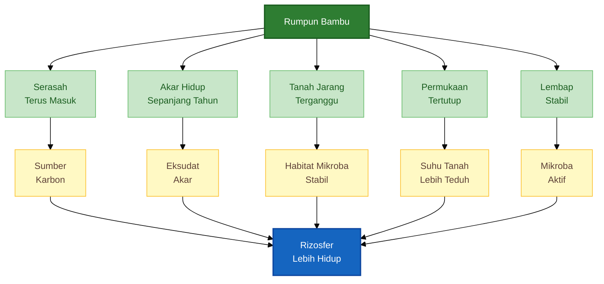

Bagi praktisi cabai, pelajaran penting dari rumpun bambu adalah ini:

> Tanah menjadi hidup bukan karena satu bahan tertentu, tetapi karena ada makanan mikroba, akar hidup, kelembapan, pori tanah, perlindungan permukaan, dan gangguan tanah yang rendah.

---

## 3.2 Karakter lingkungan rizosfer bambu yang perlu ditiru

Untuk meniru rizosfer bambu, kita perlu memahami karakter utamanya. Rumpun bambu memiliki beberapa kondisi yang jarang ditemukan pada lahan cabai intensif.

Pertama, ada **akar hidup terus-menerus**. Bambu adalah tanaman tahunan dengan sistem rimpang dan akar yang aktif dalam jangka panjang. Akar hidup ini mengeluarkan eksudat yang menjadi sumber makanan bagi mikroba di sekitar akar.

Kedua, ada **serasah daun yang masuk secara rutin**. Daun bambu yang jatuh menjadi sumber karbon. Karbon ini penting karena mikroba tanah membutuhkan makanan. Tanah yang terus-menerus kehilangan bahan organik akan sulit mempertahankan mikroba menguntungkan.

Ketiga, tanah di bawah bambu biasanya **jarang dibalik atau diolah intensif**. Ini membuat jaringan akar, pori tanah, dan komunitas mikroba lebih stabil. Sebaliknya, tanah cabai yang terlalu sering diolah, dibalik, dikeringkan, lalu diberi input keras akan lebih sulit membangun keseimbangan biologis.

Keempat, permukaan tanah di bawah bambu **tidak telanjang**. Serasah melindungi tanah dari panas langsung, pukulan air hujan, dan penguapan berlebihan. Ini membuat suhu dan kelembapan tanah lebih stabil.

Kelima, rizosfer bambu memiliki **makanan dan habitat**. Mikroba tidak cukup hanya ditebar. Mereka membutuhkan bahan organik, pori tanah, kelembapan, dan lingkungan yang tidak ekstrem.

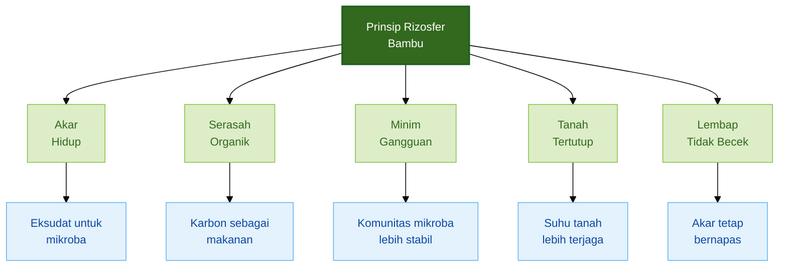

Untuk lahan cabai, prinsip ini diterjemahkan menjadi lima tindakan utama:

1. tanah jangan dibiarkan telanjang,
2. bahan organik harus masuk secara teratur,
3. akar cabai harus dibantu agar cepat berkembang,
4. tanah tidak boleh tergenang,
5. mikroba hayati harus diberi habitat, bukan hanya ditebar.

Inilah dasar dari pendekatan “meniru rizosfer bambu”.

---

## 3.3 Cara meniru rizosfer bambu pada lahan cabai

Meniru rizosfer bambu bukan berarti menjadikan lahan cabai seperti hutan bambu. Cabai adalah tanaman semusim bernilai ekonomi tinggi, sehingga tetap membutuhkan bedengan, pemupukan, sanitasi, pengendalian hama penyakit, dan manajemen produksi.

Yang ditiru adalah **cara bambu membangun tanah hidup**.

---

### a. Buat tanah selalu tertutup

Di bawah rumpun bambu, tanah jarang terbuka langsung. Permukaan tanah tertutup daun, ranting halus, dan bahan organik. Pada lahan cabai, kondisi ini bisa ditiru dengan mulsa.

Mulsa dapat berupa:

- jerami,
- daun kering,
- sekam,
- rumput kering bebas biji,
- serasah bambu setengah lapuk,
- mulsa plastik hitam perak.

Mulsa organik lebih dekat dengan pola alami rumpun bambu karena selain menutup tanah, juga menjadi sumber karbon ketika terurai. Namun, pada cabai musim hujan, mulsa organik perlu diatur agar tidak terlalu tebal dan tidak menempel langsung pada pangkal batang. Kelembapan berlebih di pangkal batang dapat meningkatkan risiko busuk pangkal.

Mulsa plastik lebih praktis untuk budidaya cabai intensif karena membantu menekan gulma, menjaga kelembapan, dan mengurangi percikan tanah ke daun. Kekurangannya, mulsa plastik tidak menambah bahan organik. Karena itu, jika memakai mulsa plastik, bahan organik harus sudah cukup diberikan sebelum pemasangan mulsa.

Prinsipnya sederhana:

> Tanah yang selalu telanjang akan cepat panas, cepat kering, mudah tererosi, dan sulit mempertahankan aktivitas mikroba.

---

### b. Tambahkan karbon stabil

Mikroba tanah membutuhkan makanan dan tempat berlindung. Pada rumpun bambu, serasah dan akar menyediakan sumber karbon secara terus-menerus. Pada lahan cabai, karbon ini perlu diberikan melalui bahan organik matang dan bahan pembenah tanah.

Bahan yang dapat digunakan antara lain:

- kompos matang,
- pupuk kandang matang,
- bokashi matang,
- vermikompos,
- sekam bakar,
- biochar aktif,
- serasah bambu terkomposkan.

Biochar aktif sangat berguna karena memiliki pori-pori yang dapat menjadi habitat mikroba. Namun, biochar sebaiknya tidak diberikan dalam kondisi mentah atau kering tanpa aktivasi. Biochar yang belum diaktivasi dapat “menarik” sebagian hara dan air pada fase awal, sehingga tanaman tampak lambat tumbuh.

Cara sederhana mengaktifkan biochar:

1. campur biochar dengan kompos matang,
2. lembapkan dengan air bersih,
3. tambahkan molase encer bila tersedia,
4. tambahkan PGPR atau Trichoderma bila diperlukan,
5. diamkan 1–2 minggu di tempat teduh.

Setelah aktif, biochar dapat dicampurkan ke bedengan sebagai bahan pembenah tanah.

---

### c. Gunakan mikroba lokal secara terkendali

Rizosfer bambu sering dijadikan sumber PGPR lokal. Ini dapat dilakukan, tetapi harus dipahami sebagai teknik pendukung, bukan solusi tunggal.

Pengambilan starter dari akar bambu sebaiknya dilakukan secara selektif. Pilih rumpun bambu yang:

- tumbuh sehat,
- tidak berada di lahan tercemar,
- tidak tergenang,
- tidak dekat saluran limbah,
- memiliki tanah remah dan berbau segar.

Ambil sedikit tanah rizosfer atau akar halus dari sekitar rumpun. Jangan mengambil dalam jumlah besar dan jangan merusak rumpun bambu. Bahan ini dapat dipakai sebagai starter untuk fermentasi PGPR lokal.

Namun, aplikasinya perlu hati-hati. PGPR lokal berisi komunitas mikroba yang tidak selalu seragam. Karena itu, lebih aman jika hasil fermentasi diaplikasikan terlebih dahulu ke kompos atau bedengan, bukan langsung pekat ke akar cabai muda.

Prinsip penggunaan mikroba lokal:

> Mikroba hayati lebih efektif jika diberikan bersama makanan dan habitatnya.

Jadi, aplikasi PGPR akan lebih masuk akal bila dikombinasikan dengan kompos matang, biochar aktif, kelembapan cukup, dan drainase baik.

---

### d. Kurangi gangguan tanah

Rizosfer sehat membutuhkan stabilitas. Pada rumpun bambu, tanah tidak dibalik setiap bulan. Akar, pori tanah, dan komunitas mikroba memiliki waktu untuk terbentuk.

Pada cabai, pengolahan tanah tetap diperlukan, terutama saat membuat bedengan. Namun, setelah bedengan terbentuk dan sistem tanam berjalan, hindari pembalikan tanah yang tidak perlu.

Beberapa praktik yang bisa diterapkan:

- gunakan jalur kerja tetap agar bedengan tidak sering diinjak,
- hindari mengolah tanah saat terlalu basah,
- pertahankan mulsa selama musim tanam,
- tambahkan bahan organik secara bertahap,
- lakukan rotasi setelah musim cabai selesai.

Tanah yang terlalu sering diganggu akan kehilangan struktur remah, karbon cepat teroksidasi, dan akar halus mudah rusak.

---

### e. Jaga kelembapan, bukan becek

Rumpun bambu yang sehat biasanya memiliki tanah lembap tetapi tidak tergenang. Ini penting untuk cabai. Akar cabai membutuhkan air, tetapi juga membutuhkan oksigen.

Kesalahan umum di lahan cabai adalah menganggap tanaman layu selalu berarti kurang air. Padahal, tanaman cabai bisa layu karena akar kekurangan oksigen akibat tanah terlalu becek.

Kondisi ideal untuk cabai adalah:

- tanah lembap stabil,
- air tidak menggenang lama,
- bedengan tetap berpori,
- akar tidak berbau busuk,
- pangkal batang tidak terlalu lembap.

Jika tanah terlalu kering, mikroba menjadi tidak aktif. Jika tanah terlalu basah, oksigen rendah dan patogen akar lebih mudah berkembang. Maka, targetnya bukan tanah basah, tetapi tanah **lembap, berpori, dan bernapas**.

---

## 3.4 Formula praktis “rizosfer bambu tiruan”

Untuk menerapkan prinsip ini di lahan cabai, praktisi dapat membuat formula pembenah rizosfer sebelum tanam. Formula ini bukan resep mutlak, tetapi kerangka kerja yang bisa disesuaikan dengan kondisi lahan.

Untuk **10 m² bedengan**, gunakan komposisi awal berikut:

- kompos matang: 10–20 kg,
- biochar aktif: 3–5 kg,
- sekam bakar: 5–10 kg jika tanah berat,
- serasah bambu lapuk: 2–5 kg,
- PGPR akar bambu atau PGPR komersial: sesuai dosis,
- Trichoderma: sesuai dosis produk,
- dolomit: sesuai hasil pH tanah.

Aplikasikan 2–3 minggu sebelum tanam. Campur merata pada lapisan atas bedengan, lembapkan, lalu tutup dengan mulsa atau bahan organik tipis.

Untuk menghitung kebutuhan bahan berdasarkan luas lahan, gunakan rumus sederhana berikut.

$$
\text{Kebutuhan bahan (kg)} =
\text{Dosis per m}^2 \times \text{Luas lahan (m}^2\text{)}
$$

Contoh:

Jika dosis kompos adalah **2 kg/m²** dan luas bedengan adalah **100 m²**, maka:

$$
2 \ \text{kg/m}^2 \times 100 \ \text{m}^2 = 200 \ \text{kg kompos}
$$

Konversi dosis dari ton per hektare ke kg per meter persegi:

$$
\begin{aligned}
1 \ \text{ton/ha}
&= \frac{1{.}000 \ \text{kg}}{10{.}000 \ \text{m}^2} \\
&= 0{,}1 \ \text{kg/m}^2
\end{aligned}
$$

Maka:

$$
10 \ \text{ton/ha} = 1 \ \text{kg/m}^2
$$

$$
20 \ \text{ton/ha} = 2 \ \text{kg/m}^2
$$

Dengan rumus ini, praktisi dapat menyesuaikan dosis sesuai luas bedengan tanpa harus selalu menggunakan satuan hektare.

---

# 4. Metode Menghidupkan Tanah untuk Cabai

Menghidupkan tanah untuk cabai harus dimulai dari pemahaman bahwa masalah utama cabai sering berada di zona akar. Banyak kasus layu, pertumbuhan tidak seragam, bunga rontok, dan tanaman cepat drop bukan hanya disebabkan oleh kekurangan pupuk, tetapi oleh rizosfer yang tidak sehat.

Karena itu, metode menghidupkan tanah untuk cabai harus mengikuti urutan yang benar:

1. perbaiki fisik tanah,
2. tambahkan bahan organik matang,
3. atur pH,
4. bangun mikroba menguntungkan,
5. aktifkan habitat mikroba,
6. lakukan rotasi tanaman.

Jika urutan ini dibalik, hasilnya sering tidak maksimal. Misalnya, menebar mikroba pada tanah yang padat, panas, kering, miskin bahan organik, dan becek tidak akan memberi hasil stabil.

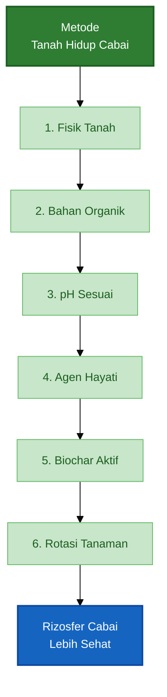

---

## 4.1 Perbaiki fisik tanah terlebih dahulu

Untuk cabai, prioritas pertama bukan pupuk, tetapi **drainase dan aerasi**.

Akar cabai membutuhkan oksigen. Jika tanah terlalu padat atau terlalu lama tergenang, akar kekurangan oksigen. Dalam kondisi ini, akar menjadi lemah, mudah cokelat, dan lebih rentan terhadap patogen tanah.

Karena itu, sebelum membahas kompos, PGPR, Trichoderma, atau pupuk susulan, praktisi harus memastikan tanah memiliki struktur fisik yang layak.

Rekomendasi bedengan untuk cabai:

- tinggi bedengan: 30–50 cm,
- lebar bedengan: 100–120 cm,
- parit antarbedengan: 40–60 cm,
- saluran pembuangan air harus lancar,
- bedengan tidak boleh tergenang setelah hujan.

Beberapa panduan teknis budidaya cabai dari sumber hortikultura Indonesia juga menekankan pentingnya bedengan dengan lebar sekitar 100–110 cm dan tinggi sekitar 30–40 cm, serta pengaturan drainase agar tanaman tidak tergenang. ([Direktorat Jenderal Hortikultura][4]) Pada musim hujan atau lahan yang rawan becek, bedengan dapat dibuat lebih tinggi, sekitar 40–50 cm, untuk mengurangi risiko genangan. ([Badung Dinas Komunikasi][5])

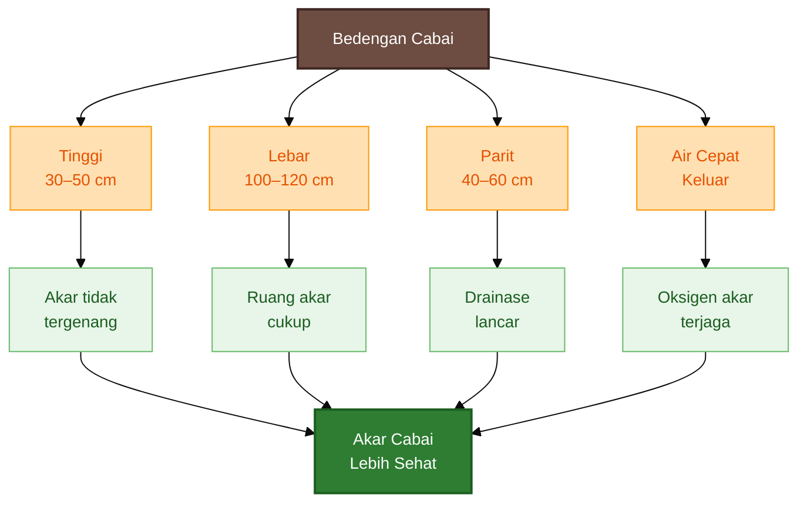

Tanah hidup tidak akan terbentuk baik pada tanah yang selalu anaerob. Mikroba menguntungkan yang mendukung akar umumnya membutuhkan lingkungan yang cukup oksigen. Sebaliknya, kondisi becek dan kekurangan oksigen dapat mendorong pembusukan akar.

Praktik lapangan yang disarankan:

- jangan membuat bedengan terlalu rendah di musim hujan,
- jangan menanam cabai di titik yang sering tergenang,
- jangan mengolah tanah saat terlalu basah,
- buat saluran pembuangan air sebelum tanam,
- periksa titik genangan setelah hujan pertama.

Jika air masih menggenang lebih dari beberapa jam di sekitar bedengan, perbaikan drainase harus menjadi prioritas.

---

## 4.2 Tambahkan bahan organik matang

Setelah struktur tanah dan drainase diperbaiki, langkah berikutnya adalah menambahkan bahan organik matang. Bahan organik adalah makanan utama bagi kehidupan tanah.

Bahan organik membantu tanah melalui beberapa mekanisme:

- memperbaiki struktur tanah,
- meningkatkan kemampuan tanah menahan air,
- menyediakan makanan mikroba,
- membantu pembentukan agregat tanah,
- mendukung pelepasan hara secara bertahap,
- memperbaiki lingkungan rizosfer.

Bahan yang dapat digunakan:

- kompos matang,
- pupuk kandang matang,
- bokashi matang,
- vermikompos,
- kompos daun,
- serasah bambu terkomposkan.

Dosis umum untuk cabai:

- 10–20 ton/ha,
- atau 1–2 kg/m²,
- atau 200–300 gram per lubang tanam sebagai tambahan lokal.

Konversinya sebagai berikut:

$$
10 \ \text{ton/ha} = 1 \ \text{kg/m}^2
$$

$$
20 \ \text{ton/ha} = 2 \ \text{kg/m}^2
$$

Untuk menghitung kebutuhan kompos pada lahan tertentu:

$$
\begin{aligned}
\text{Kompos total (kg)}
&= \text{Dosis kompos (kg/m}^2\text{)}
\times
\text{Luas bedengan (m}^2\text{)}
\end{aligned}
$$

Contoh kebutuhan kompos:

| Luas Bedengan | Dosis 1 kg/m² | Dosis 2 kg/m² |
| ------------: | ------------: | ------------: |
|         10 m² |         10 kg |         20 kg |
|        100 m² |        100 kg |        200 kg |
|      1.000 m² |      1.000 kg |      2.000 kg |
|     10.000 m² |     10.000 kg |     20.000 kg |

Bahan organik harus **matang**. Ini sangat penting. Pupuk kandang mentah atau kompos yang belum matang dapat membawa masalah baru.

Risiko bahan organik mentah:

- menghasilkan panas,
- mengeluarkan amonia,
- membawa biji gulma,
- membawa patogen,
- membuat akar muda stres,
- memicu bau busuk,
- mengundang lalat atau organisme pengganggu.

Ciri kompos matang:

- tidak panas,
- tidak berbau busuk,
- warna cokelat gelap sampai hitam,
- tekstur remah,
- bahan asal tidak dominan terlihat,
- tidak menyengat,
- aman dipegang.

Untuk cabai, bahan organik mentah sebaiknya tidak diletakkan langsung di lubang tanam. Akar cabai muda sensitif terhadap panas, gas amonia, dan kondisi anaerob.

---

## 4.3 Atur pH tanah

pH tanah menentukan banyak hal: ketersediaan hara, aktivitas mikroba, kesehatan akar, dan efektivitas pemupukan. Cabai umumnya tumbuh baik pada tanah agak asam hingga mendekati netral.

Beberapa panduan budidaya cabai menyebut kisaran pH ideal sekitar **5,5–6,8** atau sekitar **6–7**, tergantung jenis cabai, kondisi tanah, dan sistem budidaya. ([Direktorat Jenderal Hortikultura][6]) Dalam praktik artikel ini, kisaran aman yang digunakan adalah **pH 5,8–6,8**.

Jika pH terlalu rendah, beberapa masalah dapat muncul:

- akar terganggu,
- fosfor sulit tersedia,
- kalsium dan magnesium rendah,
- aluminium dapat menjadi toksik pada tanah masam tertentu,
- mikroba menguntungkan tidak optimal,
- tanaman kurang responsif terhadap pupuk.

Jika tanah terlalu asam, gunakan dolomit atau kapur pertanian. Dolomit bermanfaat karena selain membantu menaikkan pH, juga menyediakan kalsium dan magnesium.

Aplikasi dolomit sebaiknya dilakukan:

- 2–4 minggu sebelum tanam,
- dicampur merata ke bedengan,
- tidak diberikan terlalu dekat dengan akar muda,
- tidak dicampur pekat bersamaan dengan pupuk tertentu.

Dosis dolomit sebaiknya mengacu pada hasil pengukuran pH dan jenis tanah. Tanah liat berat biasanya membutuhkan koreksi lebih besar dibanding tanah ringan berpasir. Tanpa uji tanah, dosis hanya boleh dianggap sebagai perkiraan awal.

Rumus kebutuhan dolomit berdasarkan luas:

$$
\begin{aligned}
\text{Dolomit total (kg)}
&= \text{Dosis dolomit (kg/m}^2\text{)}
\times
\text{Luas bedengan (m}^2\text{)}
\end{aligned}
$$

Contoh:

Jika dosis dolomit adalah **0,2 kg/m²** dan luas bedengan **100 m²**, maka:

$$
0{,}2 \ \text{kg/m}^2 \times 100 \ \text{m}^2 = 20 \ \text{kg dolomit}
$$

Namun, untuk rekomendasi presisi, uji pH tanah tetap lebih baik daripada menebak.

---

## 4.4 Gunakan agen hayati sebagai pendukung

Agen hayati dapat membantu membangun tanah hidup, tetapi tidak boleh diposisikan sebagai pengganti perbaikan tanah. Mikroba tidak akan bekerja baik jika tanahnya padat, terlalu panas, terlalu kering, terlalu asam, miskin bahan organik, atau baru terkena bahan kimia yang menekan mikroba.

Mikroba yang umum digunakan pada budidaya cabai antara lain:

- **Trichoderma**,
- **Bacillus**,
- **Pseudomonas**,
- **Mikoriza**,
- **PGPR lokal**.

Fungsi agen hayati dapat meliputi:

- membantu pertumbuhan akar,
- mendukung pelarutan hara tertentu,
- bersaing dengan patogen,
- membantu ketahanan tanaman,
- memperbaiki aktivitas biologis di rizosfer.

Aplikasi yang lebih efektif adalah mencampur agen hayati dengan kompos matang atau bahan organik lain sebelum diberikan ke tanah.

Langkah praktis:

1. siapkan kompos matang,
2. campurkan agen hayati sesuai dosis produk,
3. lembapkan,
4. inkubasi 3–7 hari di tempat teduh,
5. aplikasikan ke bedengan atau lubang tanam.

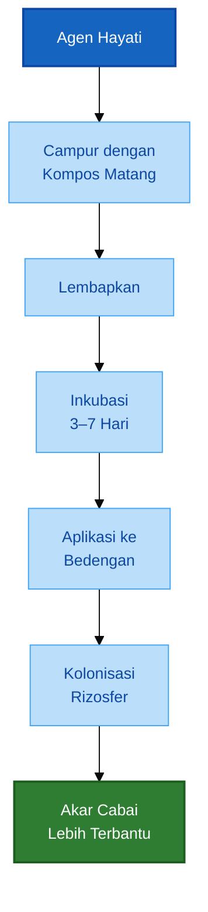

Hal yang perlu dihindari:

- mencampur agen hayati dengan fungisida kuat secara langsung,
- menabur mikroba pada tanah kering ekstrem,
- memakai dosis berlebihan tanpa kebutuhan,
- menganggap PGPR sebagai obat semua penyakit,
- memakai starter lokal dari lokasi tercemar.

Untuk cabai, agen hayati sebaiknya dianggap sebagai bagian dari sistem. Ia bekerja paling baik jika digabungkan dengan bahan organik matang, drainase baik, pH sesuai, dan kelembapan stabil.

---

## 4.5 Gunakan biochar aktif

Biochar adalah arang hayati yang digunakan sebagai pembenah tanah. Dalam konteks tanah hidup, biochar penting karena dapat membantu menyediakan ruang mikro bagi mikroba dan meningkatkan kestabilan lingkungan tanah.

Biochar membantu meniru salah satu karakter tanah sehat di bawah rumpun bambu: banyak pori dan habitat mikroba.

Namun, biochar perlu diaktifkan sebelum digunakan. Biochar yang masih “kosong” belum tentu langsung memberi manfaat maksimal bagi tanaman. Aktivasi bertujuan mengisi pori biochar dengan air, hara, bahan organik larut, dan mikroba.

Cara aktivasi biochar:

1. campur biochar dengan kompos matang,
2. tambahkan air sampai lembap,
3. tambahkan molase encer bila tersedia,
4. tambahkan PGPR atau Trichoderma bila diperlukan,
5. diamkan 1–2 minggu,
6. gunakan pada bedengan.

Dosis praktis:

- 0,5–1 kg/m²,
- atau 2–5 ton/ha.

Konversi dosis biochar:

$$
2 \ \text{ton/ha} = 0{,}2 \ \text{kg/m}^2
$$

$$
5 \ \text{ton/ha} = 0{,}5 \ \text{kg/m}^2
$$

Jika menggunakan dosis lebih tinggi pada skala kecil, misalnya 0,5–1 kg/m², aplikasikan bertahap dan pastikan biochar sudah aktif.

Rumus kebutuhan biochar:

$$
\begin{aligned}
\text{Biochar total (kg)}
&= \text{Dosis biochar (kg/m}^2\text{)}
\times
\text{Luas bedengan (m}^2\text{)}
\end{aligned}
$$

Contoh:

Jika dosis biochar aktif adalah **0,5 kg/m²** untuk bedengan seluas **50 m²**, maka:

$$
0{,}5 \ \text{kg/m}^2 \times 50 \ \text{m}^2 = 25 \ \text{kg biochar aktif}
$$

Biochar paling baik digunakan sebagai pembenah jangka panjang. Efeknya tidak selalu instan seperti pupuk larut, tetapi dapat membantu membangun kondisi tanah yang lebih stabil dari musim ke musim.

---

## 4.6 Gunakan rotasi tanaman

Rotasi tanaman adalah bagian penting dalam menghidupkan tanah. Jika cabai ditanam terus-menerus di lahan yang sama, patogen spesifik cabai dan keluarga Solanaceae dapat meningkat.

Cabai satu keluarga dengan:

- tomat,
- terung,
- kentang,
- paprika,
- tembakau.

Karena itu, tanaman tersebut sebaiknya tidak digunakan sebagai rotasi langsung setelah cabai jika tujuan utamanya adalah memutus siklus penyakit. Panduan budidaya cabai juga menganjurkan pemilihan lahan yang sebelumnya tidak ditanami tanaman sefamili Solanaceae, dan merekomendasikan bekas tanaman seperti padi atau jagung sebagai pilihan yang lebih aman. ([Direktorat Jenderal Hortikultura][6])

Tanaman rotasi yang disarankan:

- jagung,
- padi,
- kacang tanah,
- kacang hijau,
- kacang tunggak,
- Crotalaria,
- Mucuna.

Rotasi memberi beberapa manfaat:

- memutus siklus penyakit,
- menambah variasi akar,
- meningkatkan keragaman mikroba,
- memperbaiki struktur tanah,
- mengurangi tekanan hama dan patogen tertentu,
- membantu pemulihan bahan organik tanah.

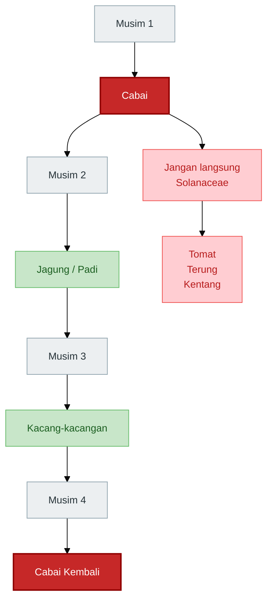

Rotasi yang baik tidak hanya mengganti tanaman, tetapi juga mengganti tipe akar dan pola pengelolaan tanah. Tanaman serealia seperti jagung dan padi membantu memutus siklus beberapa penyakit Solanaceae. Tanaman legum membantu menambah biomassa dan mendukung kehidupan mikroba.

Jika lahan memiliki riwayat layu berat, rotasi satu musim kadang belum cukup. Perlu kombinasi dengan:

- sanitasi lahan,
- drainase baik,
- kompos matang,
- agen hayati,
- pH sesuai,
- pengurangan tanaman sefamili,
- pengamatan titik serangan berulang.

---

## 4.7 Urutan kerja yang disarankan

Agar metode ini mudah diterapkan, praktisi dapat memakai urutan berikut.

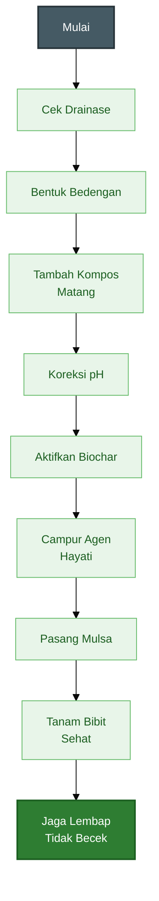

Urutan ini penting karena setiap tahap mendukung tahap berikutnya. Drainase yang baik membuat akar bisa bernapas. Kompos memberi makanan mikroba. pH sesuai membuat hara lebih tersedia. Biochar menyediakan habitat. Agen hayati mengisi rizosfer. Mulsa menjaga suhu dan kelembapan. Bibit sehat memastikan sistem dimulai dari bahan tanam yang kuat.

---

## Ringkasan Bab 3–4

Rumpun bambu memberi contoh penting tentang bagaimana tanah hidup terbentuk. Di bawah rumpun bambu, tanah biasanya tertutup serasah, memiliki akar hidup, lembap stabil, kaya bahan organik, minim gangguan, dan aktif secara mikrobiologis. Beberapa kajian menunjukkan bahwa rizosfer bambu dapat dihuni mikroba yang berkaitan dengan siklus hara, promosi pertumbuhan, dan penekanan patogen tertentu, tetapi aplikasinya pada cabai tetap harus dilakukan secara hati-hati dan tidak boleh dianggap sebagai solusi tunggal. ([Frontiers][1])

Untuk cabai, prinsip yang perlu ditiru bukan sekadar mengambil tanah bambu, melainkan menciptakan kondisi serupa: tanah tertutup, kaya karbon, lembap tetapi tidak becek, minim gangguan, memiliki bahan organik matang, dan mendukung mikroba menguntungkan.

Metode menghidupkan tanah cabai harus dilakukan berurutan: perbaiki fisik tanah, tambahkan bahan organik matang, atur pH, gunakan agen hayati, aktifkan biochar, dan lakukan rotasi tanaman. Dengan pendekatan ini, tanah tidak hanya menjadi tempat tumbuh cabai, tetapi menjadi sistem rizosfer yang membantu akar tetap sehat dan produktif.

[1]: https://www.frontiersin.org/journals/microbiology/articles/10.3389/fmicb.2025.1533061/full?utm_source=chatgpt.com 'Microbial diversity and function in bamboo ecosystems'
[2]: https://scholar.ummetro.ac.id/index.php/biolova/article/download/23/20?utm_source=chatgpt.com 'BIOLOVA'
[3]: https://epublikasi.pertanian.go.id/berkala/jti/article/view/3155?utm_source=chatgpt.com 'Peranan Tanah Rhizosfer Bambu sebagai Bahan untuk ...'
[4]: https://hortikultura.pertanian.go.id/wp-content/uploads/2024/10/Budidaya-cabe-di-perkotaan_watermark.pdf?utm_source=chatgpt.com 'Budidaya-cabe-di-perkotaan_watermark.pdf'
[5]: https://diperpa.badungkab.go.id/storage/diperpa/file/HASIL%20PENELITIAN.pdf?utm_source=chatgpt.com 'TEKNOLOGI BUDIDAYA CABAI RAWIT MERAH'
[6]: https://hortikultura.pertanian.go.id/wp-content/uploads/2024/11/Panduan-Umum-Standar-Operasional-Prosedur-Budidaya-Cabai-Rawit-Hiyung_watermark.pdf?utm_source=chatgpt.com 'Panduan-Umum-Standar-Operasional-Prosedur-Budidaya ...'

---

# 5. SOP Aplikasi pada Budidaya Cabai

SOP ini disusun untuk membantu praktisi menerapkan konsep tanah hidup secara bertahap pada budidaya cabai. Fokus utamanya adalah membangun lingkungan akar yang sehat sebelum tanaman masuk ke lahan, lalu mempertahankannya sampai panen selesai.

Dalam budidaya cabai, kesalahan yang sering terjadi adalah tanah baru diperbaiki setelah tanaman menunjukkan gejala layu, kerdil, atau bunga rontok. Padahal, perbaikan tanah seharusnya dimulai **sebelum tanam**.

Prinsip SOP ini adalah:

> Bangun tanah lebih dulu, baru tanam cabai.

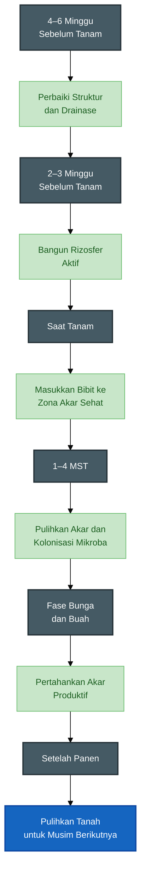

---

## 5.1 Empat sampai enam minggu sebelum tanam

Tahap ini bertujuan memperbaiki struktur tanah, memperbaiki drainase, menambah bahan organik, dan memberi waktu agar proses biologis mulai berjalan.

Pada tahap ini, jangan langsung berpikir tentang pupuk produksi. Fokus utamanya adalah membuat tanah menjadi layak sebagai rumah akar.

Langkah kerja:

1. Bersihkan lahan dari sisa tanaman sakit.
2. Buat saluran drainase utama dan parit antarbedengan.
3. Olah tanah awal.
4. Aplikasikan kompos matang sebanyak **1–2 kg/m²**.
5. Tambahkan dolomit jika pH tanah rendah.
6. Bentuk bedengan.
7. Siram ringan jika tanah terlalu kering.
8. Diamkan agar proses biologis mulai berjalan.

Sisa tanaman sakit sebaiknya tidak langsung dikomposkan di sekitar lahan cabai. Tanaman yang menunjukkan gejala layu berat, busuk pangkal, atau akar busuk sebaiknya dikeluarkan dari area budidaya. Tujuannya untuk menurunkan sumber inokulum penyakit.

Pada tahap ini, saluran air harus dibuat lebih dulu sebelum bedengan difinalkan. Cabai sangat sensitif terhadap genangan. Jika drainase buruk, penambahan kompos, PGPR, Trichoderma, atau pupuk apa pun tidak akan bekerja optimal.

Ukuran bedengan yang dapat digunakan:

- tinggi bedengan: **30–50 cm**,
- lebar bedengan: **100–120 cm**,
- parit antarbedengan: **40–60 cm**.

Untuk lahan datar dan musim hujan, bedengan sebaiknya dibuat lebih tinggi. Untuk tanah ringan dan musim kemarau, tinggi bedengan bisa disesuaikan, tetapi tetap harus memastikan akar tidak tergenang.

### Rumus kebutuhan kompos

Untuk menghitung kebutuhan kompos berdasarkan luas bedengan:

$$
\begin{aligned}
\text{Kebutuhan kompos (kg)}
&= \text{Dosis kompos (kg/m}^2\text{)}
\times
\text{Luas bedengan (m}^2\text{)}
\end{aligned}
$$

Contoh:

Jika luas bedengan adalah **500 m²** dan dosis kompos yang digunakan **2 kg/m²**, maka:

$$
2 \ \text{kg/m}^2 \times 500 \ \text{m}^2 = 1{.}000 \ \text{kg kompos}
$$

Artinya, kebutuhan kompos adalah:

$$
1{.}000 \ \text{kg} = 1 \ \text{ton}
$$

Konversi praktis:

| Dosis Kompos |    Setara |
| -----------: | --------: |
|      1 kg/m² | 10 ton/ha |
|    1,5 kg/m² | 15 ton/ha |
|      2 kg/m² | 20 ton/ha |

Catatan penting: gunakan hanya kompos atau pupuk kandang yang sudah matang. Bahan organik mentah dapat menghasilkan panas, amonia, bau busuk, dan berisiko merusak akar muda.

---

## 5.2 Dua sampai tiga minggu sebelum tanam

Tahap ini bertujuan membangun zona rizosfer aktif. Jika tahap sebelumnya berfokus pada struktur tanah, maka tahap ini berfokus pada kehidupan biologis di sekitar calon zona akar cabai.

Langkah kerja:

1. Campurkan kompos matang dengan Trichoderma, PGPR, atau mikroba pilihan.
2. Tambahkan biochar aktif.
3. Aplikasikan ke bedengan.
4. Tutup dengan mulsa.
5. Pastikan bedengan tidak tergenang.

Agen hayati sebaiknya tidak langsung ditebar begitu saja ke tanah yang miskin bahan organik. Mikroba membutuhkan makanan dan habitat. Karena itu, cara yang lebih baik adalah mencampurnya terlebih dahulu dengan kompos matang atau biochar aktif.

Tujuannya adalah agar mikroba masuk ke tanah bersama “rumah” dan “makanan”-nya.

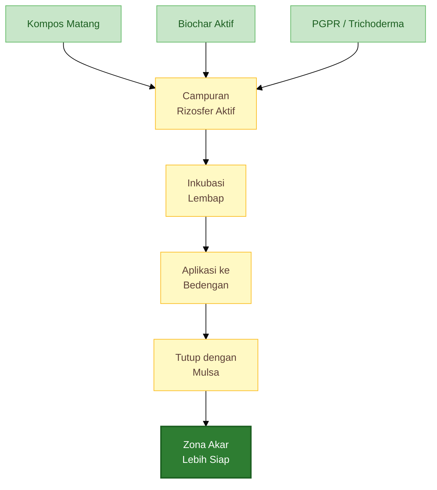

### Formula Rizosfer Bambu Tiruan

Formula ini bertujuan meniru prinsip tanah sehat di bawah rumpun bambu: kaya bahan organik, tertutup, lembap stabil, banyak pori, dan aktif secara mikrobiologis.

Untuk **10 m² bedengan**, gunakan komposisi berikut:

| Bahan                            | Dosis untuk 10 m² | Fungsi Utama                       |
| -------------------------------- | ----------------: | ---------------------------------- |
| Kompos matang                    |          10–20 kg | Makanan mikroba dan pembenah tanah |
| Biochar aktif                    |            3–5 kg | Habitat mikroba dan penyangga hara |
| Sekam bakar                      |           5–10 kg | Meningkatkan pori dan aerasi       |
| Serasah bambu lapuk              |        Secukupnya | Sumber karbon tambahan             |
| PGPR akar bambu / PGPR komersial |      Sesuai dosis | Pendukung aktivitas rizosfer       |
| Trichoderma                      |      Sesuai dosis | Pendukung penekanan patogen tanah  |
| Dolomit                          |         Sesuai pH | Koreksi pH, Ca, dan Mg             |

Campur bahan tersebut ke lapisan atas bedengan. Lembapkan, tetapi jangan sampai becek. Diamkan selama **2–3 minggu** sebelum tanam.

Jika memakai mulsa plastik, campuran pembenah tanah sebaiknya sudah masuk sebelum mulsa dipasang. Jika memakai mulsa organik, bahan mulsa dapat ditambahkan bertahap di permukaan, tetapi jangan terlalu menempel pada pangkal batang cabai setelah tanam.

### Rumus kebutuhan bahan formula

Untuk menghitung kebutuhan bahan dari formula per 10 m²:

$$
\begin{aligned}
\text{Kebutuhan bahan}
&= \frac{\text{Luas bedengan}}{10}
\times
\text{Dosis bahan per } 10 \ \text{m}^2
\end{aligned}
$$

Contoh:

Luas bedengan adalah **100 m²**. Dosis biochar aktif adalah **5 kg per 10 m²**.

$$
\frac{100}{10} \times 5 = 50 \ \text{kg biochar aktif}
$$

Maka kebutuhan biochar aktif untuk 100 m² adalah **50 kg**.

---

## 5.3 Saat tanam

Tahap tanam bertujuan memastikan bibit cabai langsung masuk ke lingkungan akar yang ramah. Pada fase ini, akar masih sensitif. Kesalahan kecil seperti pupuk terlalu pekat, lubang tanam terlalu basah, atau akar rusak saat pindah tanam dapat menghambat pertumbuhan awal.

Langkah kerja:

1. Gunakan bibit sehat.
2. Pilih bibit dengan akar putih dan batang kokoh.
3. Buat lubang tanam.
4. Tambahkan kompos matang **200–300 gram per lubang** jika diperlukan.
5. Tambahkan agen hayati di sekitar zona akar.
6. Tanam tanpa merusak akar.
7. Siram secukupnya.
8. Hindari pupuk kimia pekat menyentuh akar langsung.

Bibit yang baik memiliki batang kokoh, daun normal, tidak terlalu tinggi kurus, dan akar berwarna putih. Bibit yang sudah stres sejak persemaian biasanya lebih lambat pulih setelah pindah tanam.

Jangan menanam terlalu dalam hingga pangkal batang tertimbun lembap. Pangkal batang cabai harus tetap mendapat sirkulasi udara yang baik agar tidak mudah busuk.

### Rumus kebutuhan kompos per lubang

Jika tambahan kompos diberikan per lubang tanam, kebutuhan total dapat dihitung dengan rumus:

$$
\begin{aligned}
\text{Kebutuhan kompos lubang (kg)}
&=
\frac{
\text{Jumlah tanaman}
\times
\text{Dosis per lubang (gram)}
}{1000}
\end{aligned}
$$

Contoh:

Jumlah tanaman adalah **2.000 tanaman**. Dosis kompos per lubang adalah **250 gram**.

$$
\frac{2{.}000 \times 250}{1000} = 500 \ \text{kg}
$$

Maka kebutuhan kompos tambahan untuk lubang tanam adalah **500 kg**.

Jika belum mengetahui jumlah tanaman, jumlah tanaman dapat diperkirakan dari jarak tanam.

$$
\begin{aligned}
\text{Jumlah tanaman}
&=
\frac{
\text{Luas tanam (m}^2\text{)}
}{
\text{Jarak antarbaris (m)}
\times
\text{Jarak dalam baris (m)}
}
\end{aligned}
$$

Contoh:

Luas tanam **1.000 m²**, jarak tanam **0,6 m × 0,6 m**.

$$
\begin{aligned}
\text{Jumlah tanaman}
&= \frac{1{.}000}{0{,}6 \times 0{,}6} \\
&= \frac{1{.}000}{0{,}36} \\
&= 2{.}777{,}8
\end{aligned}
$$

Dibulatkan menjadi sekitar **2.778 tanaman**.

---

## 5.4 Umur 1–4 minggu setelah tanam

Fase 1–4 minggu setelah tanam adalah fase pemulihan akar. Pada fase ini, tanaman sedang beradaptasi dari media semai ke tanah bedengan.

Tujuan utamanya adalah mempercepat pertumbuhan akar baru dan membantu kolonisasi mikroba baik di sekitar akar.

Langkah kerja:

1. Jaga kelembapan stabil.
2. Hindari genangan.
3. Aplikasi PGPR encer 1–2 minggu sekali bila diperlukan.
4. Berikan pupuk susulan ringan.
5. Amati tanaman layu.
6. Cabut tanaman sakit berat.
7. Perbaiki titik bedengan yang terlalu basah.

Pada fase ini, jangan terlalu agresif memberi pupuk nitrogen. Akar yang belum kuat tidak selalu mampu menyerap pupuk dengan baik. Pupuk berlebihan justru dapat meningkatkan tekanan garam di sekitar akar.

Tanda pemulihan yang baik:

- tunas baru muncul,
- daun muda segar,
- tanaman tidak layu berlebihan saat siang,
- pertumbuhan mulai seragam,
- akar baru mulai keluar dari media semai.

Jika ada tanaman layu satu per satu, segera periksa akar dan pangkal batang. Jangan hanya menambah air. Jika tanah masih basah tetapi tanaman layu, kemungkinan masalahnya ada pada akar, bukan kekurangan air.

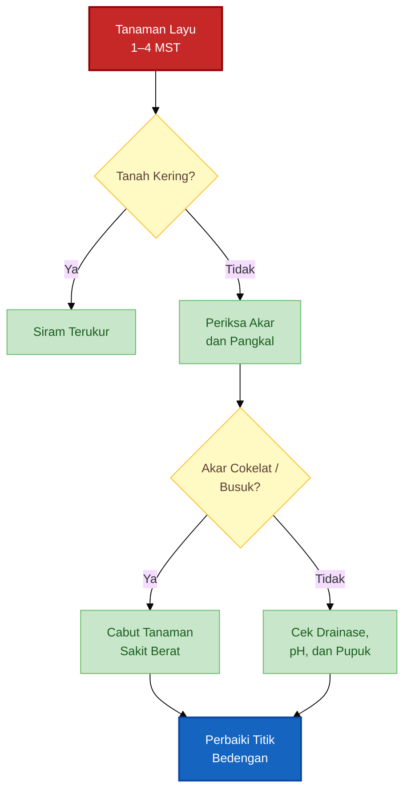

---

## 5.5 Fase berbunga dan berbuah

Fase berbunga dan berbuah adalah fase paling berat bagi tanaman cabai. Pada fase ini, tanaman membutuhkan suplai air dan hara yang stabil. Jika akar lemah, gejala akan cepat terlihat pada bunga dan buah.

Tujuan pada fase ini adalah mempertahankan akar tetap sehat agar tanaman mampu berproduksi panjang.

Langkah kerja:

1. Kurangi nitrogen berlebihan.
2. Perhatikan kalium, kalsium, magnesium, dan boron.
3. Jaga air stabil.
4. Pertahankan mulsa.
5. Pantau penyakit akar dan pangkal batang.
6. Panen rutin agar tanaman terus produktif.

Nitrogen tetap dibutuhkan, tetapi tidak boleh mendominasi. Nitrogen berlebihan dapat membuat tanaman terlalu rimbun, jaringan lunak, bunga mudah rontok, dan tanaman lebih rentan terhadap gangguan hama serta penyakit.

Pada fase generatif, perhatian perlu diberikan pada:

- **kalium**, untuk pengisian dan kualitas buah,
- **kalsium**, untuk kekuatan jaringan dan kualitas buah,
- **magnesium**, untuk mendukung fotosintesis,
- **boron**, untuk mendukung pembungaan dan pembentukan buah.

Air juga harus stabil. Kekeringan mendadak dapat menyebabkan bunga rontok. Sebaliknya, tanah terlalu basah dapat merusak akar dan memicu penyakit.

Pada fase ini, tanah hidup berperan sebagai penyangga. Tanah yang remah, kaya bahan organik, dan memiliki mikroba aktif akan membantu tanaman menghadapi tekanan produksi.

---

## 5.6 Setelah panen

Setelah panen selesai, pekerjaan belum selesai. Justru fase setelah panen sangat menentukan kesehatan tanah untuk musim berikutnya.

Tujuannya adalah menjaga tanah tetap hidup, mengurangi sumber penyakit, dan memulihkan bahan organik.

Langkah kerja:

1. Cabut tanaman cabai tua.
2. Pisahkan tanaman sehat dan sakit.
3. Tanaman sakit dimusnahkan di luar lahan.
4. Tanaman sehat dikomposkan.
5. Tambahkan bahan organik lagi.
6. Tanam tanaman rotasi.
7. Jangan langsung cabai lagi di lahan yang sama.

Tanaman sakit tidak disarankan langsung masuk kompos biasa, terutama jika menunjukkan gejala layu berat, busuk akar, atau busuk pangkal. Jika proses kompos tidak panas dan tidak terkontrol, patogen dapat bertahan dan kembali ke lahan.

Tanaman sehat dapat dicacah dan dikomposkan. Ini membantu mengembalikan sebagian biomassa ke sistem tanah.

Rotasi tanaman sangat penting. Setelah cabai, hindari langsung menanam tanaman satu keluarga seperti tomat, terung, kentang, dan paprika. Lebih baik gunakan tanaman rotasi seperti jagung, padi, kacang tanah, kacang hijau, kacang tunggak, Crotalaria, atau Mucuna.

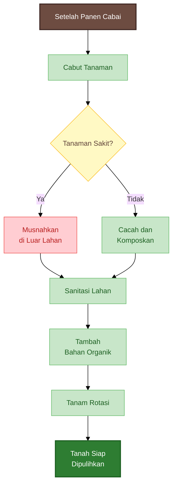

---

# 6. Monitoring Keberhasilan

Tanah hidup tidak bisa dinilai hanya dari satu tanda. Warna tanah yang hitam belum tentu sehat. Tanah yang banyak diberi pupuk organik juga belum tentu aktif secara biologis jika drainase buruk, pH tidak sesuai, atau tanah terlalu padat.

Karena itu, keberhasilan perlu dipantau dari beberapa indikator:

1. indikator tanah,
2. indikator akar,
3. indikator tanaman,
4. indikator ekonomi.

Monitoring ini penting agar praktisi tidak hanya bekerja berdasarkan kebiasaan, tetapi berdasarkan data lapangan.

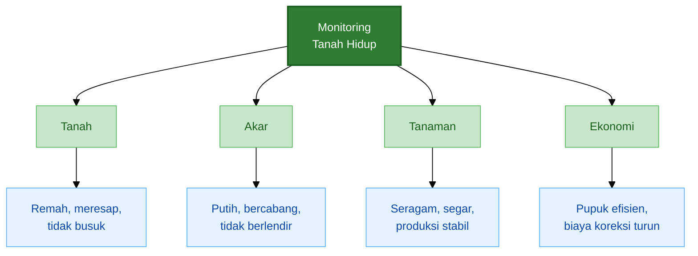

---

## 6.1 Indikator tanah

Indikator tanah adalah tanda pertama yang perlu diamati. Tanah yang mulai hidup biasanya menunjukkan perubahan pada struktur, bau, daya serap air, dan proses penguraian bahan organik.

Ciri yang perlu diperhatikan:

- tanah lebih remah,
- air meresap baik,
- tidak bau busuk,
- ada akar halus,
- mulsa organik terurai perlahan,
- tidak mudah keras setelah hujan dan panas.

Tanah yang remah menunjukkan bahwa agregat tanah mulai terbentuk. Agregat ini penting karena menciptakan pori untuk air dan udara. Cabai membutuhkan tanah yang mampu menyimpan air, tetapi tidak membuat akar tergenang.

Bau tanah juga penting. Tanah sehat biasanya berbau segar. Jika tanah berbau busuk, asam menyengat, atau seperti lumpur anaerob, kemungkinan ada masalah aerasi dan drainase.

Mulsa organik yang terurai perlahan juga menjadi tanda bahwa proses biologis berjalan. Namun, jika mulsa membusuk basah, berlendir, dan berbau tidak sedap, berarti kelembapan terlalu tinggi atau bahan terlalu rapat.

### Uji lapangan sederhana

Praktisi dapat melakukan beberapa uji cepat:

| Uji Sederhana  | Cara Melakukan                | Interpretasi                                |
| -------------- | ----------------------------- | ------------------------------------------- |
| Uji genggam    | Genggam tanah lembap          | Baik jika menggumpal ringan dan mudah pecah |
| Uji bau        | Cium tanah dari zona akar     | Baik jika bau segar, buruk jika busuk       |
| Uji infiltrasi | Siram air dan lihat resapan   | Baik jika meresap tanpa genangan lama       |
| Uji akar       | Cabut tanaman contoh          | Baik jika banyak akar halus                 |
| Uji kerak      | Amati permukaan setelah hujan | Buruk jika mudah berkerak keras             |

---

## 6.2 Indikator akar

Akar adalah indikator paling jujur dalam budidaya cabai. Daun bisa terlihat hijau karena pupuk, tetapi akar yang buruk akan terlihat jelas saat tanaman mulai stres.

Indikator akar sehat:

- akar putih,
- akar bercabang banyak,
- tidak berlendir,
- tidak busuk,
- perakaran menyebar merata.

Akar putih menunjukkan jaringan akar masih aktif. Akar bercabang banyak menunjukkan tanaman memiliki area serapan yang luas. Semakin baik akar, semakin besar kemampuan tanaman menyerap air dan hara.

Sebaliknya, akar bermasalah biasanya menunjukkan tanda:

- warna cokelat gelap,
- akar pendek,
- sedikit cabang,
- berlendir,
- berbau busuk,
- mudah putus,
- pangkal akar menghitam.

Jika akar bermasalah ditemukan pada banyak tanaman, maka masalahnya bukan hanya pada satu bibit. Kemungkinan ada persoalan sistemik pada tanah, seperti drainase buruk, patogen tinggi, pH tidak sesuai, atau pemupukan terlalu pekat.

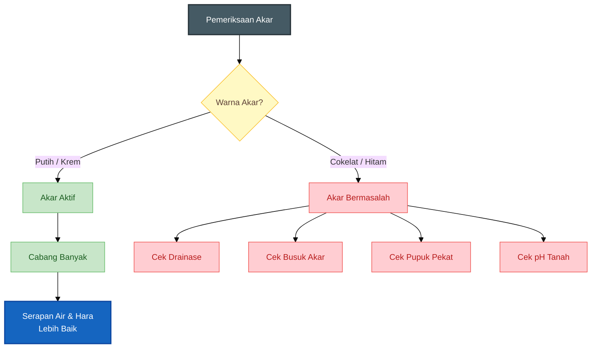

Pemeriksaan akar sebaiknya dilakukan berkala, terutama pada tanaman yang tumbuh lambat, layu saat siang, atau tidak seragam. Cabut tanaman contoh dari titik yang bermasalah, bukan hanya dari tanaman yang sehat.

---

## 6.3 Indikator tanaman cabai

Tanaman cabai yang tumbuh di tanah sehat biasanya menunjukkan pertumbuhan yang lebih stabil. Bukan berarti tanaman bebas hama dan penyakit sepenuhnya, tetapi tanaman memiliki daya pulih yang lebih baik.

Indikator tanaman yang perlu diamati:

- tanaman cepat pulih setelah pindah tanam,
- pertumbuhan seragam,
- daun segar,
- bunga tidak mudah rontok,
- buah lebih seragam,
- tanaman tidak cepat drop setelah panen awal.

Pada fase awal, tanda keberhasilan terlihat dari pemulihan bibit. Bibit yang masuk ke tanah sehat biasanya lebih cepat membentuk tunas baru. Daun tampak segar, batang mulai aktif tumbuh, dan tanaman tidak terlalu lama stagnan.

Pada fase generatif, indikator keberhasilan terlihat dari bunga dan buah. Tanaman dengan akar sehat biasanya lebih mampu mempertahankan bunga dan mengisi buah. Jika bunga banyak rontok, buah kecil, atau tanaman cepat lemah setelah panen awal, zona akar perlu diperiksa.

Tanda tanaman mulai drop karena masalah akar:

- daun layu saat siang meskipun tanah basah,
- daun bawah menguning tidak merata,
- bunga rontok berlebihan,
- buah mengecil,
- tanaman berhenti membentuk tunas produktif,
- pangkal batang menghitam,
- tanaman mati satu per satu di titik tertentu.

Jika gejala muncul berkelompok pada area tertentu, periksa kondisi bedengan di titik tersebut. Biasanya ada masalah lokal seperti genangan, tanah terlalu padat, serangan patogen, atau aplikasi pupuk terlalu pekat.

---

## 6.4 Indikator ekonomi

Tanah hidup bukan hanya konsep ekologis, tetapi juga berdampak pada ekonomi budidaya. Bagi praktisi, perbaikan tanah harus terlihat pada efisiensi biaya dan stabilitas produksi.

Indikator ekonomi yang perlu dicatat:

- pemakaian pupuk lebih efisien,
- serangan penyakit akar berkurang,
- masa panen lebih panjang,
- produksi lebih stabil,
- biaya koreksi tanaman sakit menurun.

Tanah sehat tidak selalu langsung menurunkan semua biaya pada musim pertama. Pada awal perbaikan, biaya kompos, biochar, dolomit, dan tenaga kerja mungkin meningkat. Namun, manfaatnya terlihat dari stabilitas tanaman dan penurunan risiko gagal panen.

Parameter sederhana yang dapat dicatat:

| Parameter                     | Cara Mengukur                              |
| ----------------------------- | ------------------------------------------ |
| Persentase tanaman hidup      | Jumlah tanaman hidup dibanding total tanam |
| Persentase tanaman layu       | Jumlah tanaman layu dibanding total tanam  |
| Jumlah panen                  | Total petikan selama musim                 |
| Bobot panen                   | Kg cabai per petikan atau per musim        |
| Biaya pupuk                   | Total biaya pupuk per musim                |
| Biaya pestisida penyakit akar | Total biaya koreksi penyakit tanah         |
| Lama masa panen               | Jumlah minggu tanaman masih produktif      |

### Rumus persentase tanaman layu

$$
\begin{aligned}
\text{Persentase tanaman layu (\%)}
&=
\frac{
\text{Jumlah tanaman layu}
}{
\text{Jumlah tanaman total}
}
\times
100
\end{aligned}
$$

Contoh:

Jumlah tanaman total adalah **2.000 tanaman**. Jumlah tanaman layu adalah **80 tanaman**.

$$
\frac{80}{2{.}000} \times 100 = 4\%
$$

Maka persentase tanaman layu adalah **4%**.

### Rumus produktivitas per tanaman

$$
\begin{aligned}
\text{Produktivitas per tanaman}
&=
\frac{
\text{Total hasil panen (kg)}
}{
\text{Jumlah tanaman produktif}
}
\end{aligned}
$$

Contoh:

Total hasil panen adalah **1.500 kg**. Jumlah tanaman produktif adalah **1.800 tanaman**.

$$
\frac{1{.}500}{1{.}800} = 0{,}83 \ \text{kg/tanaman}
$$

Maka produktivitas rata-rata adalah sekitar **0,83 kg per tanaman**.

### Rumus biaya per kilogram cabai

$$
\begin{aligned}
\text{Biaya per kg cabai}
&=
\frac{
\text{Total biaya produksi}
}{
\text{Total hasil panen (kg)}
}
\end{aligned}
$$

Contoh:

Total biaya produksi adalah **Rp18.000.000**. Total hasil panen adalah **1.500 kg**.

$$
\frac{18{.}000{.}000}{1{.}500} = 12{.}000
$$

Maka biaya produksi adalah **Rp12.000 per kg cabai**.

Indikator ekonomi ini penting agar perbaikan tanah tidak hanya dinilai dari tampilan tanaman, tetapi juga dari dampaknya terhadap profitabilitas.

---

## 6.5 Format monitoring lapangan

Agar monitoring mudah dilakukan, praktisi dapat menggunakan tabel sederhana berikut.

|        Minggu | Kondisi Tanah                    | Kondisi Akar      | Kondisi Tanaman     | Tindakan Koreksi      |
| ------------: | -------------------------------- | ----------------- | ------------------- | --------------------- |
|         0 MST | Bedengan lembap, tidak tergenang | Bibit sehat       | Tanaman baru tanam  | Siram ringan          |
|         1 MST | Cek kerak dan kelembapan         | Akar mulai keluar | Tanaman mulai pulih | PGPR encer bila perlu |
|         2 MST | Drainase dicek setelah hujan     | Akar putih        | Tunas baru muncul   | Pupuk ringan          |
|       3–4 MST | Tanah tetap remah                | Akar bercabang    | Pertumbuhan seragam | Koreksi titik lemah   |
|    Fase bunga | Kelembapan stabil                | Akar aktif        | Bunga muncul        | Hindari N berlebih    |
|     Fase buah | Tidak becek                      | Akar tidak busuk  | Buah seragam        | Fokus K, Ca, Mg       |
| Setelah panen | Tambah organik                   | Evaluasi akar     | Tanaman tua dicabut | Rotasi tanaman        |

MST berarti **minggu setelah tanam**.

---

## Ringkasan Bab 5–6

SOP menghidupkan tanah untuk cabai harus dimulai **4–6 minggu sebelum tanam**, bukan setelah tanaman sakit. Tahap awal berfokus pada pembersihan lahan, drainase, kompos matang, koreksi pH, dan pembentukan bedengan.

Pada **2–3 minggu sebelum tanam**, fokus bergeser ke pembangunan rizosfer aktif melalui kompos, biochar aktif, PGPR, Trichoderma, dan mulsa. Formula rizosfer bambu tiruan dapat digunakan untuk meniru prinsip tanah sehat di bawah rumpun bambu: kaya karbon, berpori, lembap stabil, dan aktif secara biologis.

Saat tanam, bibit harus masuk ke zona akar yang ramah. Setelah tanam, kelembapan harus dijaga stabil, genangan dihindari, dan tanaman layu harus segera diperiksa akarnya. Pada fase berbunga dan berbuah, kesehatan akar tetap menjadi dasar utama agar produksi panjang dan stabil.

Keberhasilan tanah hidup harus dipantau dari empat sisi: tanah, akar, tanaman, dan ekonomi. Tanah yang lebih remah, akar putih bercabang, tanaman seragam, masa panen lebih panjang, serta biaya koreksi penyakit yang menurun adalah tanda bahwa sistem tanah mulai membaik.

Inti dari SOP ini adalah:

> Tanah hidup bukan hasil dari satu aplikasi, tetapi hasil dari urutan kerja yang konsisten: drainase baik, bahan organik matang, pH sesuai, mikroba didukung, tanah tertutup, akar sehat, dan rotasi tanaman setelah panen.

---

> Jangan hanya mengambil tanah bambu. Tirulah sistemnya: tanah tertutup, kaya serasah, lembap stabil, minim gangguan, kaya akar, kaya karbon, dan aktif secara mikrobiologis.

[1]: https://www.frontiersin.org/journals/microbiology/articles/10.3389/fmicb.2025.1533061/full 'Frontiers | Microbial diversity and function in bamboo ecosystems'
[2]: https://scholar.ummetro.ac.id/index.php/biolova/article/view/23 '
		PLANT GROWTH PROMOTING RHIZOBACTERIA (PGPR) DARI AKAR BAMBU APUS (Gigantochola apus) MENINGKATKAN PERTUMBUHAN TANAMAN
							| BIOLOVA
			'
[3]: https://www.researchgate.net/publication/329125332_The_Role_of_Bamboo_Rhizosphere_Soil_for_Suppressing_the_Growth_of_Phytophthora_palmivora_Pathogen_and_Promoting_the_Growth_of_Papaya_Seedlings '(PDF) The Role of Bamboo Rhizosphere Soil for Suppressing the Growth of Phytophthora palmivora Pathogen and Promoting the Growth of Papaya Seedlings'

---

<small>
  **_Catatan Penyusunan_** Artikel ini disusun sebagai materi edukasi dan
  referensi umum berdasarkan berbagai sumber pustaka, praktik lapangan, serta
  bantuan alat penulisan. Pembaca disarankan untuk melakukan verifikasi lanjutan
  dan penyesuaian sesuai dengan kondisi serta kebutuhan masing-masing sistem.
</small>
