# **_Keseimbangan Akar dan Tajuk: Fondasi Tanaman Sehat, Produktif, dan Tidak Terjebak Tipuan Input_**

---

- [**_Keseimbangan Akar dan Tajuk: Fondasi Tanaman Sehat, Produktif, dan Tidak Terjebak Tipuan Input_**](#keseimbangan-akar-dan-tajuk-fondasi-tanaman-sehat-produktif-dan-tidak-terjebak-tipuan-input)
- [Keseimbangan Akar dan Tajuk: Fondasi Tanaman Sehat, Produktif, dan Tahan Gangguan](#keseimbangan-akar-dan-tajuk-fondasi-tanaman-sehat-produktif-dan-tahan-gangguan)
  - [1. Pembukaan: Tanaman Sehat Dimulai dari Bawah Tanah](#1-pembukaan-tanaman-sehat-dimulai-dari-bawah-tanah)
    - [1.1. Mengapa akar menjadi titik awal?](#11-mengapa-akar-menjadi-titik-awal)
    - [1.2. Kesalahan umum dalam praktik budidaya](#12-kesalahan-umum-dalam-praktik-budidaya)
    - [1.3. Prinsip praktis bab ini](#13-prinsip-praktis-bab-ini)
  - [2. Hubungan Akar dan Tajuk: Mana Lebih Utama?](#2-hubungan-akar-dan-tajuk-mana-lebih-utama)
    - [2.1. Mengapa pada awal budidaya akar lebih utama?](#21-mengapa-pada-awal-budidaya-akar-lebih-utama)
    - [2.2. Mengapa setelah itu tajuk ikut menentukan akar?](#22-mengapa-setelah-itu-tajuk-ikut-menentukan-akar)
    - [2.3. Gejala bila akar dan tajuk tidak seimbang](#23-gejala-bila-akar-dan-tajuk-tidak-seimbang)
    - [2.4. Prinsip praktis bab ini](#24-prinsip-praktis-bab-ini)
  - [3. Prioritas Awal Tanam: Sehatkan Akar Terlebih Dahulu](#3-prioritas-awal-tanam-sehatkan-akar-terlebih-dahulu)
    - [3.1. Mengapa fase awal tanam sangat menentukan?](#31-mengapa-fase-awal-tanam-sangat-menentukan)
    - [3.2. Fokus utama pada fase awal](#32-fokus-utama-pada-fase-awal)
    - [3.3. Hal-hal praktis yang perlu dijaga](#33-hal-hal-praktis-yang-perlu-dijaga)
    - [3.4. Apa yang sebaiknya tidak dilakukan pada awal tanam?](#34-apa-yang-sebaiknya-tidak-dilakukan-pada-awal-tanam)
    - [3.5. Prinsip praktis bab ini](#35-prinsip-praktis-bab-ini)
- [Keseimbangan Akar dan Tajuk: Oksigen, Mulsa, Air Stabil, dan Lingkungan Akar](#keseimbangan-akar-dan-tajuk-oksigen-mulsa-air-stabil-dan-lingkungan-akar)
  - [4. Apa yang Dibutuhkan Akar agar Tanaman Sehat?](#4-apa-yang-dibutuhkan-akar-agar-tanaman-sehat)
    - [4.1. Akar membutuhkan oksigen](#41-akar-membutuhkan-oksigen)
    - [4.2. Akar membutuhkan air stabil](#42-akar-membutuhkan-air-stabil)
    - [4.3. Akar membutuhkan tanah gembur](#43-akar-membutuhkan-tanah-gembur)
    - [4.4. Akar membutuhkan pH sesuai](#44-akar-membutuhkan-ph-sesuai)
    - [4.5. Akar membutuhkan nutrisi seimbang](#45-akar-membutuhkan-nutrisi-seimbang)
    - [4.6. Akar membutuhkan EC yang tidak berlebihan](#46-akar-membutuhkan-ec-yang-tidak-berlebihan)
    - [4.7. Akar membutuhkan bahan organik matang](#47-akar-membutuhkan-bahan-organik-matang)
    - [4.8. Akar membutuhkan mikroba seimbang](#48-akar-membutuhkan-mikroba-seimbang)
    - [4.9. Akar membutuhkan tekanan patogen rendah](#49-akar-membutuhkan-tekanan-patogen-rendah)
    - [4.10. Akar membutuhkan suhu dan ruang tumbuh yang sesuai](#410-akar-membutuhkan-suhu-dan-ruang-tumbuh-yang-sesuai)
    - [4.11. Kesimpulan Bab 4](#411-kesimpulan-bab-4)
  - [5. Oksigen Akar: Faktor yang Sering Dilupakan](#5-oksigen-akar-faktor-yang-sering-dilupakan)
    - [5.1. Mengapa tanah becek berbahaya?](#51-mengapa-tanah-becek-berbahaya)
    - [5.2. Tanda akar kekurangan oksigen](#52-tanda-akar-kekurangan-oksigen)
    - [5.3. Faktor yang memengaruhi oksigen akar](#53-faktor-yang-memengaruhi-oksigen-akar)
    - [5.4. Cara menjaga oksigen akar](#54-cara-menjaga-oksigen-akar)
    - [5.5. Kesimpulan Bab 5](#55-kesimpulan-bab-5)
  - [6. Mulsa Plastik dan Oksigen Akar](#6-mulsa-plastik-dan-oksigen-akar)
    - [6.1. Jalur masuk oksigen pada bedengan bermulsa](#61-jalur-masuk-oksigen-pada-bedengan-bermulsa)
    - [6.2. Kapan mulsa menjadi masalah?](#62-kapan-mulsa-menjadi-masalah)
    - [6.3. Manfaat mulsa bila digunakan benar](#63-manfaat-mulsa-bila-digunakan-benar)
    - [6.4. Syarat aman memakai mulsa](#64-syarat-aman-memakai-mulsa)
    - [6.5. Alur penggunaan mulsa yang benar](#65-alur-penggunaan-mulsa-yang-benar)
    - [6.6. Kesimpulan Bab 6](#66-kesimpulan-bab-6)
  - [7. Air Stabil: Cukup, Bukan Berlebihan](#7-air-stabil-cukup-bukan-berlebihan)
    - [7.1. Peran air bagi akar](#71-peran-air-bagi-akar)
    - [7.2. Bahaya air berlebihan](#72-bahaya-air-berlebihan)
    - [7.3. Bahaya air tidak stabil](#73-bahaya-air-tidak-stabil)
    - [7.4. Tiga kondisi air di zona akar](#74-tiga-kondisi-air-di-zona-akar)
    - [7.5. Cara menjaga air tetap stabil](#75-cara-menjaga-air-tetap-stabil)
    - [7.6. Cara sederhana mengecek kelembapan](#76-cara-sederhana-mengecek-kelembapan)
    - [7.7. Air dan serapan kalsium](#77-air-dan-serapan-kalsium)
    - [7.8. Kesimpulan Bab 7](#78-kesimpulan-bab-7)
- [Keseimbangan Akar dan Tajuk: Nutrisi, Bahan Organik, Mikroba, dan Trichoderma](#keseimbangan-akar-dan-tajuk-nutrisi-bahan-organik-mikroba-dan-trichoderma)
  - [8. Nutrisi Seimbang: Pupuk Banyak Belum Tentu Benar](#8-nutrisi-seimbang-pupuk-banyak-belum-tentu-benar)
    - [8.1. Tanaman tidak hanya membutuhkan NPK](#81-tanaman-tidak-hanya-membutuhkan-npk)
    - [8.2. Nutrisi harus sesuai fase tanaman](#82-nutrisi-harus-sesuai-fase-tanaman)
    - [8.3. Contoh ketidakseimbangan nutrisi](#83-contoh-ketidakseimbangan-nutrisi)
    - [8.4. Pupuk banyak bisa membuat akar stres](#84-pupuk-banyak-bisa-membuat-akar-stres)
    - [8.5. Nutrisi terjamin bukan berarti pupuk banyak](#85-nutrisi-terjamin-bukan-berarti-pupuk-banyak)
    - [8.6. Kesimpulan Bab 8](#86-kesimpulan-bab-8)
  - [9. Bahan Organik Matang sebagai Penyangga Akar](#9-bahan-organik-matang-sebagai-penyangga-akar)
    - [9.1. Mengapa bahan organik penting?](#91-mengapa-bahan-organik-penting)
    - [9.2. Bahan organik matang sebagai penyangga](#92-bahan-organik-matang-sebagai-penyangga)
    - [9.3. Bahaya bahan organik mentah](#93-bahaya-bahan-organik-mentah)
    - [9.4. Ciri bahan organik yang lebih aman](#94-ciri-bahan-organik-yang-lebih-aman)
    - [9.5. Cara memakai bahan organik dengan aman](#95-cara-memakai-bahan-organik-dengan-aman)
    - [9.6. Kesimpulan Bab 9](#96-kesimpulan-bab-9)
  - [10. Mikroba Seimbang: Bukan Mikroba Sebanyak-banyaknya](#10-mikroba-seimbang-bukan-mikroba-sebanyak-banyaknya)
    - [10.1. Peran mikroba dalam mendukung akar](#101-peran-mikroba-dalam-mendukung-akar)
    - [10.2. Mikroba seimbang bukan berarti semua diperbanyak](#102-mikroba-seimbang-bukan-berarti-semua-diperbanyak)
    - [10.3. Bahaya dominasi satu mikroba](#103-bahaya-dominasi-satu-mikroba)
    - [10.4. Prinsip memakai mikroba](#104-prinsip-memakai-mikroba)
    - [10.5. Mikroba membutuhkan rumah](#105-mikroba-membutuhkan-rumah)
    - [10.6. Kesimpulan Bab 10](#106-kesimpulan-bab-10)
  - [11. Trichoderma dalam Keseimbangan Akar](#11-trichoderma-dalam-keseimbangan-akar)
    - [11.1. Fungsi utama Trichoderma](#111-fungsi-utama-trichoderma)
    - [11.2. Yang tidak bisa diselesaikan Trichoderma](#112-yang-tidak-bisa-diselesaikan-trichoderma)
    - [11.3. Dosis Trichoderma harus terukur](#113-dosis-trichoderma-harus-terukur)
    - [11.4. Rumus kebutuhan Trichoderma](#114-rumus-kebutuhan-trichoderma)
    - [11.5. Jangan gunakan Trichoderma seperti pupuk utama](#115-jangan-gunakan-trichoderma-seperti-pupuk-utama)
    - [11.6. Cara aplikasi yang lebih aman](#116-cara-aplikasi-yang-lebih-aman)
    - [11.7. Posisi Trichoderma dalam sistem akar](#117-posisi-trichoderma-dalam-sistem-akar)
    - [11.8. Kesimpulan Bab 11](#118-kesimpulan-bab-11)
- [Keseimbangan Akar dan Tajuk: Patogen, Daun sebagai Pabrik Energi, Gejala Tajuk, dan Budidaya Berimbang](#keseimbangan-akar-dan-tajuk-patogen-daun-sebagai-pabrik-energi-gejala-tajuk-dan-budidaya-berimbang)
  - [12. Keseimbangan Akar dan Risiko Patogen](#12-keseimbangan-akar-dan-risiko-patogen)
    - [12.1. Patogen akar penting](#121-patogen-akar-penting)
    - [12.2. Kondisi yang membuat patogen meningkat](#122-kondisi-yang-membuat-patogen-meningkat)
    - [12.3. Gejala umum serangan patogen akar](#123-gejala-umum-serangan-patogen-akar)
    - [12.4. Sanitasi tanaman sakit](#124-sanitasi-tanaman-sakit)
    - [12.5. Pencegahan lebih penting daripada penyembuhan](#125-pencegahan-lebih-penting-daripada-penyembuhan)
    - [12.6. Alur menjaga akar dari patogen](#126-alur-menjaga-akar-dari-patogen)
    - [12.7. Kesimpulan Bab 12](#127-kesimpulan-bab-12)
  - [13. Tajuk Sehat: Daun sebagai Pabrik Energi](#13-tajuk-sehat-daun-sebagai-pabrik-energi)
    - [13.1. Daun memberi energi untuk seluruh tanaman](#131-daun-memberi-energi-untuk-seluruh-tanaman)
    - [13.2. Bila tajuk rusak, akar ikut melemah](#132-bila-tajuk-rusak-akar-ikut-melemah)
    - [13.3. Tajuk sehat bukan berarti terlalu rimbun](#133-tajuk-sehat-bukan-berarti-terlalu-rimbun)
    - [13.4. Hubungan akar dan tajuk dalam produksi](#134-hubungan-akar-dan-tajuk-dalam-produksi)
    - [13.5. Praktik menjaga tajuk tetap sehat](#135-praktik-menjaga-tajuk-tetap-sehat)
    - [13.6. Kesimpulan Bab 13](#136-kesimpulan-bab-13)
  - [14. Gejala Tajuk sebagai Cermin Masalah Akar](#14-gejala-tajuk-sebagai-cermin-masalah-akar)
    - [14.1. Tajuk sebagai layar monitor](#141-tajuk-sebagai-layar-monitor)
    - [14.2. Tabel gejala tajuk dan kemungkinan masalah akar](#142-tabel-gejala-tajuk-dan-kemungkinan-masalah-akar)
    - [14.3. Alur membaca gejala](#143-alur-membaca-gejala)
    - [14.4. Contoh pembacaan gejala](#144-contoh-pembacaan-gejala)
    - [14.5. Jangan mengobati gejala tanpa mencari sumber](#145-jangan-mengobati-gejala-tanpa-mencari-sumber)
    - [14.6. Kesimpulan Bab 14](#146-kesimpulan-bab-14)
  - [15. Tidak Harus 100% Organik](#15-tidak-harus-100-organik)
    - [15.1. Mengapa tidak harus 100% organik?](#151-mengapa-tidak-harus-100-organik)
    - [15.2. Peran masing-masing komponen](#152-peran-masing-masing-komponen)
    - [15.3. Sistem budidaya berimbang](#153-sistem-budidaya-berimbang)
    - [15.4. Prinsip praktis pertanian berimbang](#154-prinsip-praktis-pertanian-berimbang)
    - [15.5. Kesalahan dua ekstrem](#155-kesalahan-dua-ekstrem)
    - [15.6. Kesimpulan Bab 15](#156-kesimpulan-bab-15)
- [Keseimbangan Akar dan Tajuk: Tipuan Input, Rumus Praktis, Checklist, dan Penutup](#keseimbangan-akar-dan-tajuk-tipuan-input-rumus-praktis-checklist-dan-penutup)
  - [16. Tipuan Input: Jangan Salah Menafsirkan Kesehatan Tanaman](#16-tipuan-input-jangan-salah-menafsirkan-kesehatan-tanaman)
    - [16.1. Akar sehat dibangun oleh sistem, bukan satu produk](#161-akar-sehat-dibangun-oleh-sistem-bukan-satu-produk)
    - [16.2. Klaim yang perlu dicurigai](#162-klaim-yang-perlu-dicurigai)
    - [16.3. Input harus punya fungsi, dosis, target, dan bukti hasil](#163-input-harus-punya-fungsi-dosis-target-dan-bukti-hasil)
    - [16.4. Jangan salah membaca tanaman sehat](#164-jangan-salah-membaca-tanaman-sehat)
    - [16.5. Kesimpulan Bab 16](#165-kesimpulan-bab-16)
  - [17. Rumus Praktis Keseimbangan Akar dan Tajuk](#17-rumus-praktis-keseimbangan-akar-dan-tajuk)
    - [17.1. Rumus produktivitas](#171-rumus-produktivitas)
    - [17.2. Diagram rumus keseimbangan](#172-diagram-rumus-keseimbangan)
    - [17.3. Penjelasan tiap faktor](#173-penjelasan-tiap-faktor)
    - [17.4. Cara memakai rumus di lapangan](#174-cara-memakai-rumus-di-lapangan)
    - [17.5. Kesimpulan Bab 17](#175-kesimpulan-bab-17)
  - [18. Checklist Praktis untuk Petani](#18-checklist-praktis-untuk-petani)
    - [18.1. Checklist akar dan tanah](#181-checklist-akar-dan-tanah)
    - [18.2. Checklist sebelum tanam](#182-checklist-sebelum-tanam)
    - [18.3. Checklist saat pindah tanam](#183-checklist-saat-pindah-tanam)
    - [18.4. Checklist 1–3 minggu setelah tanam](#184-checklist-13-minggu-setelah-tanam)
    - [18.5. Checklist fase bunga dan buah](#185-checklist-fase-bunga-dan-buah)
    - [18.6. Alur checklist praktis](#186-alur-checklist-praktis)
    - [18.7. Kesimpulan Bab 18](#187-kesimpulan-bab-18)
  - [19. Penutup: Akar Menyerap, Daun Memasak, Petani Mengatur](#19-penutup-akar-menyerap-daun-memasak-petani-mengatur)
    - [19.1. Ringkasan besar](#191-ringkasan-besar)
    - [19.2. Diagram akhir sistem tanaman produktif](#192-diagram-akhir-sistem-tanaman-produktif)
    - [19.3. Prinsip akhir untuk praktisi](#193-prinsip-akhir-untuk-praktisi)
    - [19.4. Kalimat penutup](#194-kalimat-penutup)

---

# Keseimbangan Akar dan Tajuk: Fondasi Tanaman Sehat, Produktif, dan Tahan Gangguan

Dalam praktik budidaya, banyak orang lebih cepat menilai kesehatan tanaman dari apa yang tampak di atas tanah: daun hijau, batang kokoh, bunga banyak, atau buah lebat. Padahal, bagian yang paling menentukan justru sering tidak terlihat, yaitu **akar**.

Akar bukan sekadar penyangga tanaman. Akar adalah pusat serapan air, hara, oksigen, dan titik temu utama antara tanaman dengan tanah, bahan organik, serta mikroba. Bila akar bekerja baik, tanaman mampu menyerap kebutuhan hidupnya secara stabil. Bila akar terganggu, maka bagian atas tanaman lambat laun ikut bermasalah, meskipun pupuk cukup atau daun tampak sempat hijau.

Di sisi lain, bagian atas tanaman—terutama daun—juga tidak bisa diabaikan. Daun adalah pabrik energi melalui fotosintesis. Energi hasil fotosintesis ini sebagian dikirim ke akar untuk mempertahankan pertumbuhan akar, pembentukan akar rambut, dan aktivitas fisiologis tanaman. Karena itu, hubungan akar dan tajuk sebenarnya adalah hubungan saling mendukung.

Namun dalam urutan budidaya, ada satu prinsip yang sangat penting:

> **Tanaman produktif dimulai dari akar sehat, lalu didukung tajuk sehat.**

Artinya, pada fase awal tanam, petani sebaiknya tidak buru-buru mengejar tanaman cepat rimbun. Yang lebih penting adalah memastikan akar aktif lebih dulu. Akar yang sehat akan membuat serapan air dan hara berjalan baik. Serapan yang baik akan mendukung daun sehat. Daun sehat akan memperkuat fotosintesis. Fotosintesis yang baik akan menopang pembentukan bunga dan buah yang lebih stabil.

Bila prinsip ini dipahami sejak awal, maka banyak keputusan budidaya akan menjadi lebih tepat. Petani akan lebih berhati-hati terhadap tanah becek, pupuk terlalu pekat, kompos mentah, bibit yang akar rusak, dan input apa pun yang bisa mengganggu perakaran. Sebaliknya, petani akan lebih fokus pada hal-hal yang benar-benar membangun fondasi tanaman: media semai bersih, tanah gembur, air stabil, bahan organik matang, drainase baik, dan tekanan patogen yang rendah.

Artikel ini disusun untuk menempatkan akar dan tajuk dalam satu kerangka pikir yang utuh. Tujuannya sederhana: membantu praktisi memahami bahwa tanaman sehat bukan dibangun dari satu input ajaib, tetapi dari sistem yang benar, dimulai dari bawah tanah.

<ResourceBox
  title="Artikel Terkait:"
  items={[
    {
      name: 'README — Framework Praktis Memulai Bisnis Agribisnis Terpadu di Lahan Gumuk Berlereng',
      href: '/blog/agri/kebon/agribisnis-gumuk/README',
    },
    {
      name: 'Isolasi Mikroba Lokal untuk PGPM dan Agen Pengendali Hayati (APH)',
      href: '/blog/agri/agen-hayati/isolasi-mikroba-lokal',
    },
    {
      name: 'OPT Penggagal Panen pada Cabai Rawit dan Cabai Besar',
      href: '/blog/agri/pengendalian-opt-cabai',
    },
    {
      name: 'Tipuan Mikroba dalam Pertanian: Trichoderma, PGPR, PGPM, PGPF, MOL, dan JAKABA',
      href: '/blog/agri/agen-hayati/tipuan-mikroba-pertanian',
    },
    {
      name: 'Pedoman lengkap bergambar pengendalian OPT cabai - kutu kebul dan thrips',
      href: '/blog/agri/pengendalian-kutu-kebul-thrips',
    },
    {
      name: 'Panduan Praktis Pembiakan Trichoderma dari Starter Komersial',
      href: '/blog/agri/agen-hayati/trichoderma-pembiakan',
    },
    {
      name: 'Panduan Praktis Pengembangan Cabai di Desa Gambiran, Banyuwangi',
      href: '/blog/agri/kebon/panduan-pengembangan-cabai',
    },
    {
      name: 'Panduan Lengkap Pengendalian Lalat Buah di Kebun Campuran',
      href: '/blog/agri/lalat-buah',
    },
    {
      name: 'README - Pupuk Tepat, Panen Untung - Model Low-Lab untuk Petani Makmur di Gambiran',
      href: '/blog/agri/pupuk-terintegrasi/README',
    },
  ]}
/>

---

## 1. Pembukaan: Tanaman Sehat Dimulai dari Bawah Tanah

Tanaman yang sehat dan produktif bukan hanya ditentukan oleh daun, bunga, atau buah yang terlihat. Bagian paling menentukan justru sering berada di bawah tanah, yaitu **akar**.

Dalam budidaya, akar memegang peran dasar yang tidak bisa digantikan. Akar menyerap air, mengambil unsur hara, bernapas menggunakan oksigen yang tersedia di pori tanah, dan berinteraksi dengan mikroba di rizosfer. Semua proses ini menentukan apakah tanaman mampu tumbuh kuat atau justru tumbuh lemah dan mudah terganggu.

Tajuk, daun, bunga, dan buah pada dasarnya adalah hasil dari sistem akar yang bekerja baik. Daun bisa hijau bila unsur hara terserap. Bunga bisa muncul stabil bila air dan energi cukup. Buah bisa berkembang baik bila akar mampu mendukung kebutuhan tanaman secara terus-menerus.

Karena itu, membaca tanaman sehat seharusnya tidak berhenti pada tampilan atas. Tanaman tampak segar belum tentu akarnya sehat. Sebaliknya, gangguan akar sering baru terlihat beberapa hari atau beberapa minggu kemudian di tajuk.

Urutan sederhananya adalah sebagai berikut:

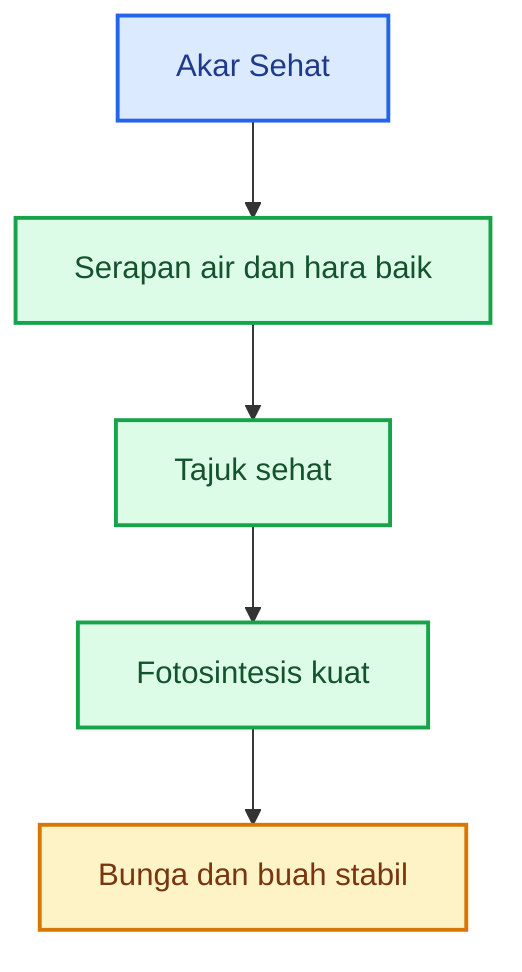


Diagram di atas menunjukkan satu hal penting: **kesehatan tanaman dimulai dari akar**. Bila akar sehat, serapan air dan hara menjadi lancar. Bila serapan lancar, tajuk berkembang lebih baik. Tajuk yang sehat akan mendukung fotosintesis. Fotosintesis yang kuat akhirnya menopang bunga dan buah.

### 1.1. Mengapa akar menjadi titik awal?

Ada beberapa alasan utama.

**Pertama, akar adalah pintu masuk utama air dan hara.**
Tanpa akar yang aktif, unsur hara di tanah tidak banyak berarti. Pupuk bisa tersedia, tetapi tidak terserap optimal bila akar rusak, lemah, atau berada di tanah yang salah kondisi.

**Kedua, akar menentukan stabilitas tanaman terhadap cekaman.**
Tanaman dengan akar kuat lebih tahan menghadapi fluktuasi air, perubahan suhu, gangguan ringan penyakit, dan tekanan budidaya lainnya.

**Ketiga, akar adalah pusat hubungan tanaman dengan tanah.**
Di sekitar akar terdapat zona rizosfer, yaitu wilayah aktif tempat akar berinteraksi dengan mikroba, bahan organik, udara tanah, dan kelembapan. Kondisi rizosfer ini sangat menentukan kesehatan tanaman secara umum.

**Keempat, banyak masalah tajuk sebenarnya berawal dari akar.**
Layu, daun menguning, pertumbuhan lambat, bunga rontok, buah kecil, dan tanaman kerdil sering kali bukan sekadar masalah daun, tetapi masalah sistem akar atau lingkungan akar.

### 1.2. Kesalahan umum dalam praktik budidaya

Salah satu kesalahan paling sering terjadi adalah terlalu fokus pada bagian atas tanaman sejak awal. Petani sering ingin melihat tanaman cepat rimbun, cepat hijau, dan cepat tumbuh besar. Akibatnya, perhatian lebih banyak diarahkan ke pupuk pertumbuhan atas, semprotan daun, atau pemacu pertumbuhan tajuk, sementara akar belum benar-benar siap.

Padahal, bila tajuk dipacu terlalu cepat sementara akar belum mapan, tanaman menjadi tidak seimbang. Bagian atas tumbuh, tetapi penopangnya belum kuat. Ini bisa berujung pada:

- tanaman mudah layu;
- bunga mudah rontok;
- serapan hara tidak stabil;
- akar stres;
- tanaman lebih rentan penyakit;
- hasil akhir tidak maksimal.

### 1.3. Prinsip praktis bab ini

Bagi praktisi, prinsip besar dari bab ini adalah:

> **Tanaman produktif dimulai dari akar sehat, lalu didukung tajuk sehat.**

Artinya, sejak awal budidaya, perhatian utama harus diberikan pada kesehatan perakaran: media yang baik, aerasi tanah, kelembapan yang tepat, bahan organik matang, dan lingkungan akar yang aman.

---

## 2. Hubungan Akar dan Tajuk: Mana Lebih Utama?

Pertanyaan yang sering muncul adalah: mana yang lebih utama, akar atau tajuk?

Jawaban paling tepat adalah: **secara awal budidaya, akar lebih utama; tetapi setelah tanaman tumbuh, hubungan akar dan tajuk menjadi dua arah**.

Akar sehat membuat tanaman bagian atas lebih sehat. Sebaliknya, setelah tajuk berkembang, daun yang sehat menghasilkan fotosintat atau energi yang kemudian dikirim kembali ke akar. Maka pada fase lanjut, akar dan tajuk saling menguatkan.

Hubungan ini dapat digambarkan seperti berikut:

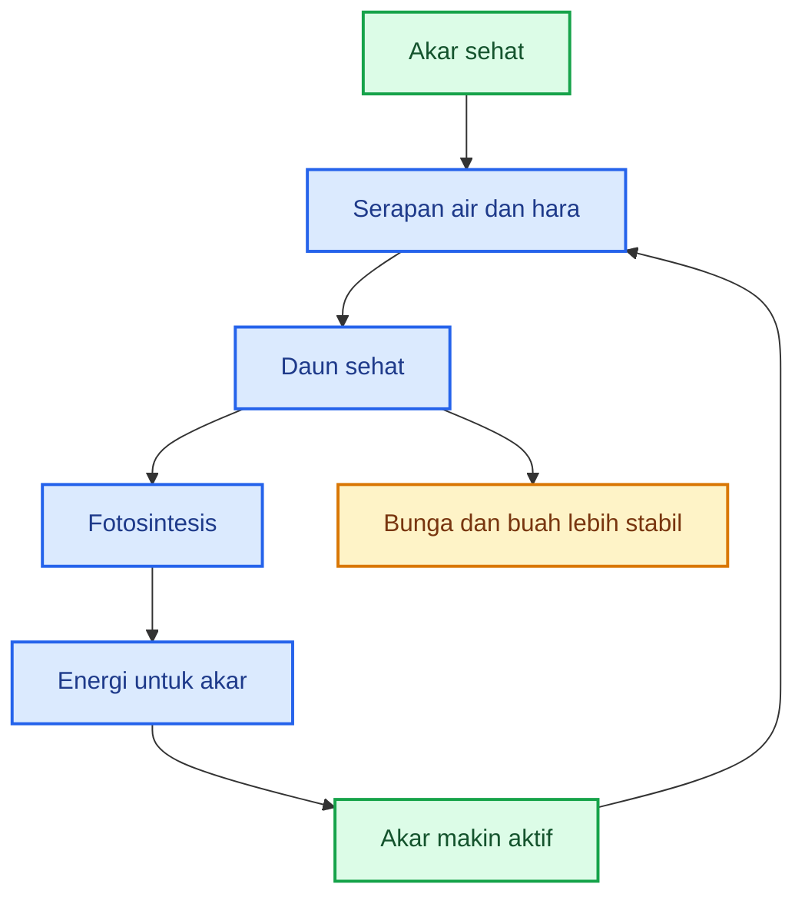

Diagram ini menunjukkan bahwa akar dan tajuk bukan dua sistem yang berdiri sendiri. Keduanya saling terhubung.

### 2.1. Mengapa pada awal budidaya akar lebih utama?

Pada fase awal tanam, daun belum luas, bunga belum terbentuk, dan buah belum ada. Pada fase ini, tanaman masih dalam tahap penyesuaian dan pembentukan fondasi. Yang paling menentukan adalah kemampuan akar untuk:

- menembus media atau tanah;
- membentuk akar rambut;
- pulih dari stres pindah tanam;
- menyerap air tanpa terganggu;
- mulai mengambil hara secara efektif.

Jika akar gagal berkembang di fase ini, maka tajuk akan tertahan. Daun bisa kecil, pertumbuhan lambat, dan tanaman mudah terganggu.

Karena itu, dalam 1–3 minggu awal setelah tanam, akar harus menjadi prioritas utama.

### 2.2. Mengapa setelah itu tajuk ikut menentukan akar?

Setelah tanaman mulai memiliki daun aktif, fotosintesis menjadi mesin utama pembentuk energi. Hasil fotosintesis ini tidak hanya dipakai untuk batang, bunga, dan buah, tetapi juga dialirkan ke akar.

Dengan kata lain:

- akar sehat membantu daun sehat;
- daun sehat kemudian membantu akar tetap aktif.

Bila daun rusak berat akibat hama, penyakit, defisiensi, atau stres, akar juga akan terdampak karena pasokan energi menurun.

Jadi hubungan akar dan tajuk sebaiknya dipahami sebagai **siklus penguatan**:

1. akar sehat memulai sistem;
2. tajuk sehat memperkuat sistem;
3. tanaman menjadi lebih stabil.

### 2.3. Gejala bila akar dan tajuk tidak seimbang

Ketidakseimbangan antara akar dan tajuk sering muncul dalam beberapa bentuk.

**Kasus 1: Tajuk besar, akar lemah**
Ciri-cirinya:

- tanaman tampak cepat rimbun;
- mudah layu saat panas;
- bunga mudah rontok;
- serapan nutrisi tidak stabil;
- mudah stres saat perubahan cuaca.

**Kasus 2: Akar cukup baik, tetapi tajuk rusak**
Ciri-cirinya:

- akar sebenarnya mampu menyerap;
- tetapi daun rusak karena hama/penyakit;
- fotosintesis turun;
- energi untuk akar menurun;
- pertumbuhan berikutnya ikut melemah.

**Kasus 3: Akar dan tajuk sama-sama sehat**
Ciri-cirinya:

- tanaman segar;
- pertumbuhan stabil;
- daun aktif;
- pembungaan lebih baik;
- respons terhadap pupuk dan air lebih baik;
- hasil lebih konsisten.

### 2.4. Prinsip praktis bab ini

Bab ini menegaskan satu prinsip penting:

> **Akar sehat membuat tajuk sehat; tajuk sehat memberi energi kembali ke akar.**

Bagi praktisi, maknanya jelas. Pada awal tanam, sehatkan akar lebih dulu. Setelah itu, pelihara tajuk agar fotosintesis tetap baik. Jangan hanya fokus pada salah satu.

---

## 3. Prioritas Awal Tanam: Sehatkan Akar Terlebih Dahulu

Pada fase awal tanam, banyak petani tergoda untuk mengejar tanaman cepat rimbun. Ini sangat wajar karena tanaman yang cepat hijau dan cepat besar terlihat meyakinkan. Namun pendekatan seperti ini justru bisa menyesatkan bila akar belum siap menopang pertumbuhan tersebut.

Pada fase awal, fokus utama bukan membuat tanaman terlihat besar, tetapi membuat **akar cepat aktif dan akar rambut banyak**. Akar rambut sangat penting karena di situlah sebagian besar serapan air dan hara terjadi.

### 3.1. Mengapa fase awal tanam sangat menentukan?

Kesalahan awal pada akar sering terbawa sampai fase produksi. Jika pada minggu-minggu awal tanaman mengalami:

- akar luka saat pindah tanam;
- media terlalu padat;
- tanah terlalu becek;
- pupuk terlalu pekat;
- kompos belum matang;
- patogen akar tinggi;

maka efeknya bisa panjang. Tanaman mungkin tetap hidup, tetapi pertumbuhannya tertahan. Ketika masuk fase pembungaan dan pembuahan, kelemahan akar mulai terlihat dalam bentuk bunga rontok, buah sedikit, atau tanaman mudah sakit.

### 3.2. Fokus utama pada fase awal

Yang harus diperhatikan pada fase ini adalah:

- media semai bersih;
- akar bibit putih dan aktif;
- lubang tanam siap;
- tanah gembur;
- air cukup tetapi tidak becek;
- pupuk tidak terlalu pekat;
- kompos matang;
- patogen akar ditekan sejak awal.

Semua poin ini berpusat pada satu tujuan: **membuat akar nyaman berkembang**.

Diagram prioritas awal tanam dapat digambarkan sebagai berikut:

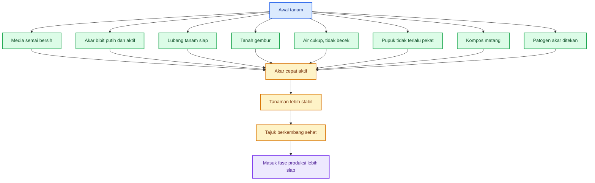

### 3.3. Hal-hal praktis yang perlu dijaga

✓ a. Media semai bersih

Media semai adalah rumah pertama akar. Media yang kotor, terlalu basah, atau membawa patogen akan langsung mengganggu pembentukan akar awal.

✓ b. Akar bibit putih dan aktif

Bibit yang baik umumnya memiliki akar muda yang putih, segar, dan tidak busuk. Bibit dengan akar lemah akan lebih lama pulih setelah pindah tanam.

✓ c. Lubang tanam siap

Lubang tanam harus cukup gembur dan tidak menjadi tempat berkumpulnya air. Bila menggunakan bahan organik atau agen hayati, semuanya harus dalam kondisi aman untuk akar.

✓ d. Tanah gembur

Tanah yang padat menghambat penetrasi akar. Akar menjadi pendek, sedikit, dan kurang aktif.

✓ e. Air cukup tetapi tidak becek

Akar muda sangat sensitif terhadap kelebihan air. Kelembapan penting, tetapi genangan sangat berisiko.

✓ f. Pupuk tidak terlalu pekat

Akar muda mudah stres oleh garam atau kepekatan pupuk yang tinggi. Karena itu, pada fase awal, pupuk harus diberikan dengan hati-hati.

✓ g. Kompos matang

Kompos matang membantu struktur tanah dan mendukung lingkungan akar. Sebaliknya, kompos mentah bisa merusak akar karena panas, gas, atau kontaminasi.

✓ h. Patogen akar ditekan sejak awal

Pencegahan lebih baik daripada memperbaiki akar yang sudah rusak. Karena itu, kebersihan media, drainase, dan lingkungan tanam sangat penting.

### 3.4. Apa yang sebaiknya tidak dilakukan pada awal tanam?

Beberapa hal berikut sebaiknya dihindari:

- mengejar pertumbuhan tajuk terlalu cepat;
- memberi pupuk pekat langsung ke zona akar muda;
- membiarkan tanah becek;
- memakai bahan organik yang belum matang;
- menanam bibit stres atau akar rusak;
- memasang tanaman pada media yang padat;
- menganggap tanaman tampak hijau berarti akar sudah sehat.

### 3.5. Prinsip praktis bab ini

Bab ini menegaskan prinsip yang sangat penting:

> **Jangan memaksa tajuk tumbuh cepat sebelum akar siap menopang.**

Bila akar diprioritaskan sejak awal, maka tajuk akan mengikuti secara lebih stabil. Bila tajuk dipaksa sementara akar tertinggal, maka tanaman hanya tampak bagus sementara, tetapi fondasinya lemah.

---

# Keseimbangan Akar dan Tajuk: Oksigen, Mulsa, Air Stabil, dan Lingkungan Akar

Pada bagian sebelumnya, kita sudah menegaskan bahwa tanaman sehat dimulai dari akar. Akar yang sehat membuat serapan air dan hara berjalan baik, lalu mendukung tajuk, daun, bunga, dan buah. Namun akar tidak bisa sehat hanya karena diberi pupuk. Akar membutuhkan lingkungan yang seimbang.

Banyak kegagalan budidaya terjadi karena akar dipaksa bekerja dalam kondisi yang tidak nyaman: tanah terlalu padat, terlalu basah, kekurangan oksigen, pH tidak sesuai, pupuk terlalu pekat, bahan organik belum matang, atau tekanan patogen terlalu tinggi.

Bagian ini membahas kebutuhan dasar akar yang paling sering diabaikan: **oksigen, air stabil, tanah gembur, mulsa yang benar, dan kelembapan yang tidak ekstrem**.

---

## 4. Apa yang Dibutuhkan Akar agar Tanaman Sehat?

Akar bukan hanya membutuhkan pupuk. Akar membutuhkan **lingkungan hidup yang lengkap**. Pupuk memang penting, tetapi pupuk hanya berguna bila akar mampu menyerapnya. Bila akar rusak atau lingkungan tanah tidak mendukung, pupuk sebanyak apa pun tidak akan bekerja optimal.

Akar yang sehat membutuhkan beberapa syarat utama:

1. oksigen;
2. air stabil;
3. tanah gembur;
4. pH sesuai;
5. nutrisi seimbang;
6. EC atau kepekatan larutan tanah tidak berlebihan;
7. bahan organik matang;
8. mikroba tanah seimbang;
9. tekanan patogen rendah;
10. suhu tanah tidak ekstrem;
11. ruang tumbuh akar cukup.

Hubungan antar faktor tersebut dapat digambarkan seperti ini:

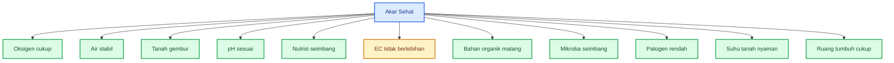

Diagram di atas menunjukkan bahwa akar sehat adalah hasil dari banyak faktor yang bekerja bersama. Bila salah satu faktor sangat buruk, sistem akar tetap bisa terganggu.

Contohnya, nutrisi lengkap tidak banyak berguna bila tanah becek dan akar kekurangan oksigen. Mikroba baik tidak akan maksimal bila bahan organik mentah membusuk di zona akar. Pupuk mahal pun tidak efektif bila pH tanah membuat hara terkunci.

### 4.1. Akar membutuhkan oksigen

Akar adalah organ hidup yang bernapas. Akar memerlukan oksigen untuk menjalankan metabolisme dan menyerap hara. Bila tanah terlalu padat atau terlalu basah, pori-pori udara di tanah tertutup air. Akibatnya, oksigen berkurang.

Tanaman bisa terlihat layu walaupun tanah basah. Ini sering membingungkan petani. Tanah terlihat cukup air, tetapi akar tidak mampu bekerja karena kekurangan oksigen atau mulai rusak.

### 4.2. Akar membutuhkan air stabil

Air dibutuhkan untuk melarutkan hara dan mengangkutnya ke akar. Namun air yang terlalu banyak justru berbahaya. Akar membutuhkan kelembapan, bukan genangan.

Air yang naik turun ekstrem juga merusak kestabilan tanaman. Tanah terlalu kering lalu tiba-tiba terlalu basah dapat membuat tanaman stres, bunga rontok, buah pecah, dan serapan kalsium terganggu.

### 4.3. Akar membutuhkan tanah gembur

Tanah gembur memberi ruang bagi akar untuk tumbuh. Tanah yang padat membuat akar sulit menembus, akar rambut sedikit, dan serapan hara terbatas.

Tanah gembur bukan berarti tanah terlalu ringan dan cepat kering. Tanah yang baik adalah tanah yang memiliki keseimbangan antara pori udara dan kemampuan menahan air.

### 4.4. Akar membutuhkan pH sesuai

pH tanah menentukan ketersediaan hara. Pada pH yang tidak sesuai, unsur hara bisa terkunci atau menjadi terlalu tersedia hingga berisiko toksik. Banyak tanaman hortikultura tumbuh baik pada kisaran pH agak asam sampai netral, tetapi setiap komoditas tetap memiliki toleransi masing-masing.

Bagi praktisi, yang penting adalah pH tidak boleh diabaikan. Kadang masalah tanaman bukan karena pupuk kurang, tetapi karena pH membuat pupuk tidak terserap.

### 4.5. Akar membutuhkan nutrisi seimbang

Tanaman membutuhkan hara makro dan mikro. Bukan hanya NPK. Unsur seperti Ca, Mg, S, B, Zn, Fe, Mn, dan Mo juga berperan dalam kesehatan akar, daun, bunga, dan buah.

Nutrisi seimbang artinya:

- jumlahnya cukup;
- bentuknya bisa diserap;
- waktunya sesuai fase tanaman;
- tidak saling menghambat;
- tidak terlalu pekat bagi akar.

### 4.6. Akar membutuhkan EC yang tidak berlebihan

EC menggambarkan kepekatan larutan hara di sekitar akar. Pada sistem tanah, petani sering tidak mengukur EC, tetapi gejalanya bisa terlihat. Pupuk terlalu pekat dapat membuat akar stres seperti “terbakar”.

Tanda yang sering muncul:

- tanaman layu setelah pemupukan;
- tepi daun mengering;
- akar rambut berkurang;
- pertumbuhan berhenti;
- daun tampak kusam;
- tanaman lebih rentan penyakit.

### 4.7. Akar membutuhkan bahan organik matang

Bahan organik matang membantu memperbaiki tanah, menjaga kelembapan, dan menjadi habitat mikroba. Namun bahan organik mentah bisa menjadi masalah.

Kompos mentah atau pupuk kandang belum matang dapat menghasilkan panas, amonia, gas, dan membawa patogen. Jika ditempatkan dekat akar muda, bahan seperti ini bisa merusak akar.

### 4.8. Akar membutuhkan mikroba seimbang

Mikroba tanah membantu dekomposisi bahan organik, melarutkan hara, menekan patogen, dan mendukung rizosfer. Namun mikroba yang baik bukan berarti satu jenis mikroba diperbanyak tanpa batas.

Keseimbangan mikroba lebih penting daripada jumlah satu mikroba yang terlalu dominan.

### 4.9. Akar membutuhkan tekanan patogen rendah

Akar sulit sehat bila tanah dipenuhi patogen. Patogen seperti Fusarium, Phytophthora, Rhizoctonia, Pythium, Sclerotium, nematoda, dan bakteri layu dapat menyerang akar atau pangkal batang.

Pengendalian patogen akar harus dimulai dari pencegahan: bibit sehat, drainase baik, sanitasi, rotasi, kompos matang, dan agen hayati teruji.

### 4.10. Akar membutuhkan suhu dan ruang tumbuh yang sesuai

Suhu tanah yang terlalu panas atau terlalu dingin dapat menghambat akar. Ruang akar juga penting. Tanaman dalam polybag kecil, tray terlalu lama, atau tanah padat akan mengalami keterbatasan akar.

Akar yang terbatas membuat tanaman mudah stres saat masuk fase generatif.

### 4.11. Kesimpulan Bab 4

Akar sehat tidak dibangun oleh satu input. Akar sehat lahir dari lingkungan tanah yang seimbang.

Pesan kunci:

> **Akar sehat bukan hanya butuh pupuk, tetapi butuh lingkungan tanah yang seimbang.**

---

## 5. Oksigen Akar: Faktor yang Sering Dilupakan

Dalam budidaya, air dan pupuk sering mendapat perhatian besar. Namun oksigen di zona akar sering dilupakan. Padahal akar juga bernapas.

Akar membutuhkan oksigen untuk menghasilkan energi. Energi ini dipakai untuk pertumbuhan akar, penyerapan hara, pembentukan akar rambut, dan pertahanan terhadap stres.

Bila akar kekurangan oksigen, tanaman tidak bisa menyerap air dan hara secara normal. Akibatnya, tanaman bisa tampak layu walaupun tanah masih basah.

### 5.1. Mengapa tanah becek berbahaya?

Tanah memiliki pori-pori. Sebagian pori menyimpan air, sebagian lagi menyimpan udara. Akar membutuhkan keduanya. Bila semua pori terisi air, maka ruang udara berkurang. Oksigen turun dan akar mulai terganggu.

Alurnya seperti ini:

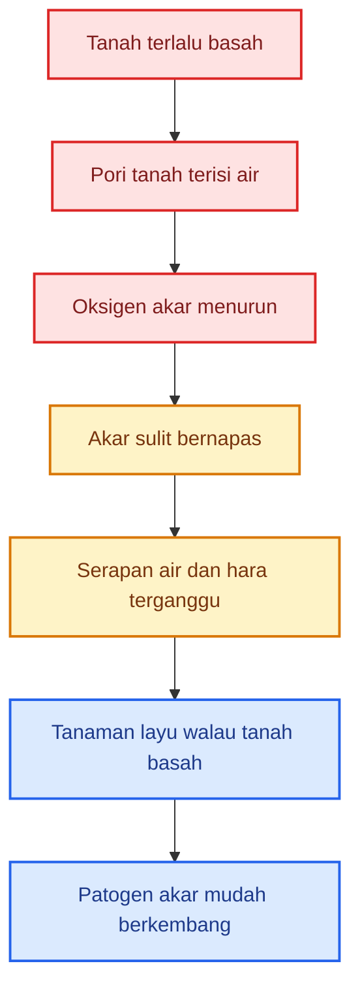

Inilah sebabnya tanaman bisa layu pada tanah yang basah. Masalahnya bukan kekurangan air, tetapi akar tidak mampu mengambil air karena fungsi akar terganggu.

### 5.2. Tanda akar kekurangan oksigen

Tanda-tanda yang sering terlihat:

- tanaman layu walau tanah basah;
- akar berubah cokelat;
- akar rambut sedikit;
- daun menguning;
- pertumbuhan terhambat;
- pangkal batang mudah busuk;
- penyakit akar meningkat;
- tanaman mudah rebah atau mati mendadak.

Pada kondisi ini, menambah air justru memperparah masalah. Yang dibutuhkan bukan tambahan air, tetapi perbaikan aerasi dan drainase.

### 5.3. Faktor yang memengaruhi oksigen akar

Oksigen akar dipengaruhi oleh:

| Faktor          | Dampak terhadap akar                                      |
| --------------- | --------------------------------------------------------- |
| Struktur tanah  | Tanah gembur menyediakan pori udara                       |
| Drainase        | Drainase buruk membuat tanah jenuh air                    |
| Kelembapan      | Terlalu basah menurunkan oksigen                          |
| Bahan organik   | Bahan matang memperbaiki pori, bahan mentah bisa membusuk |
| Kepadatan tanah | Tanah padat mengurangi ruang udara                        |
| Bedengan        | Bedengan tinggi membantu air keluar                       |
| Penyiraman      | Penyiraman berlebihan menurunkan aerasi                   |

### 5.4. Cara menjaga oksigen akar

Praktik yang bisa dilakukan:

- buat bedengan cukup tinggi;
- pastikan parit antarbedeng lancar;
- hindari genangan;
- jangan menyiram berlebihan;
- gunakan bahan organik matang;
- hindari tanah terlalu padat;
- jangan mengolah tanah saat terlalu basah;
- gunakan media tanam porous untuk pot atau polybag;
- jangan menutup lubang tanam dengan lumpur.

### 5.5. Kesimpulan Bab 5

Tanah yang terlihat basah belum tentu baik untuk akar. Akar membutuhkan kelembapan dan oksigen sekaligus.

Pesan kunci:

> **Tanah lembap itu baik, tetapi tanah becek terus-menerus merusak akar.**

---

## 6. Mulsa Plastik dan Oksigen Akar

Banyak petani bertanya apakah penggunaan mulsa plastik membuat akar kekurangan oksigen. Jawabannya: **tidak otomatis**.

Mulsa plastik memang menutup permukaan bedengan, tetapi bukan berarti tanah menjadi tertutup total seperti wadah kedap udara. Oksigen masih bisa masuk melalui lubang tanam, sisi bedengan, celah pinggir mulsa, pori tanah, dan retakan kecil di permukaan tanah.

Masalah biasanya bukan karena mulsa itu sendiri, tetapi karena mulsa dipasang pada kondisi bedengan yang salah.

### 6.1. Jalur masuk oksigen pada bedengan bermulsa

Oksigen masih dapat masuk melalui beberapa jalur.

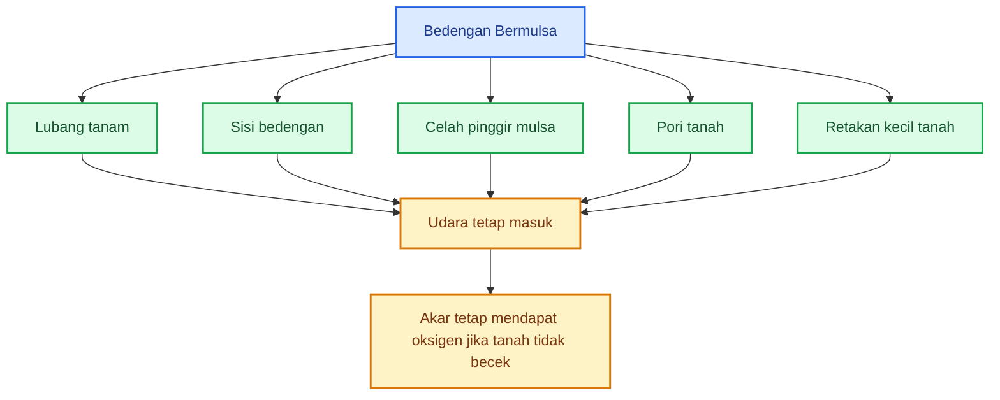

Diagram ini menunjukkan bahwa mulsa tidak otomatis memutus oksigen. Selama tanah di bawahnya gembur dan drainase baik, akar tetap bisa bernapas.

### 6.2. Kapan mulsa menjadi masalah?

Mulsa bisa memperparah masalah bila dipasang pada kondisi berikut:

- tanah terlalu padat;
- tanah sudah becek saat ditutup;
- bedengan terlalu rendah;
- drainase buruk;
- parit antarbedeng tidak lancar;
- lubang tanam tertutup lumpur;
- bahan organik belum matang berada di bawah mulsa;
- penyiraman terlalu sering;
- air hujan tertahan lama di bedengan.

Dalam kondisi seperti ini, mulsa menahan penguapan sehingga tanah bisa terlalu lama basah. Jika drainase buruk, akar kekurangan oksigen dan patogen akar mudah berkembang.

### 6.3. Manfaat mulsa bila digunakan benar

Mulsa justru sangat berguna bila bedengan dibuat benar.

Manfaatnya:

- menjaga kelembapan lebih stabil;
- menekan gulma;
- mengurangi cipratan tanah ke daun dan buah;
- menjaga struktur permukaan bedengan;
- mengurangi penguapan berlebihan;
- menjaga suhu tanah lebih stabil;
- membantu efisiensi pemupukan dan penyiraman.

Jadi, mulsa bukan musuh akar. Yang berbahaya adalah **mulsa di atas bedengan yang buruk**.

### 6.4. Syarat aman memakai mulsa

Agar mulsa aman untuk akar, perhatikan syarat berikut:

| Syarat                             | Alasan                          |
| ---------------------------------- | ------------------------------- |
| Bedengan cukup tinggi              | Mencegah genangan               |
| Tanah gembur sebelum ditutup       | Menyediakan ruang udara         |
| Parit antarbedeng lancar           | Air cepat keluar                |
| Lubang tanam tidak tertutup lumpur | Pertukaran udara tetap ada      |
| Bahan organik sudah matang         | Mencegah panas, gas, dan amonia |
| Penyiraman tidak berlebihan        | Mencegah jenuh air              |
| Pupuk tidak terlalu pekat          | Menghindari stres akar          |

### 6.5. Alur penggunaan mulsa yang benar

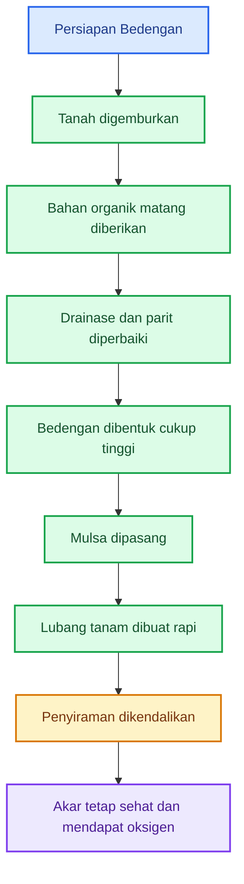

### 6.6. Kesimpulan Bab 6

Mulsa plastik tidak otomatis membuat akar kekurangan oksigen. Akar kekurangan oksigen bila tanah di bawah mulsa terlalu padat, terlalu basah, dan drainasenya buruk.

Pesan kunci:

> **Mulsa aman untuk akar jika tanah tetap berpori dan air tidak menggenang.**

---

## 7. Air Stabil: Cukup, Bukan Berlebihan

Air adalah kebutuhan utama tanaman. Tanpa air, akar tidak bisa menyerap hara dengan baik. Namun dalam budidaya, masalah air bukan hanya kekurangan. Kelebihan air juga sering merusak akar.

Akar membutuhkan air yang **cukup dan stabil**, bukan genangan.

### 7.1. Peran air bagi akar

Air membantu:

- melarutkan unsur hara;
- mengangkut hara ke permukaan akar;
- menjaga tekanan sel tanaman;
- mendukung fotosintesis;
- menjaga suhu tanaman;
- membantu pertumbuhan akar muda.

Namun air harus berada dalam jumlah yang tepat. Bila terlalu sedikit, tanaman stres kekeringan. Bila terlalu banyak, akar kekurangan oksigen.

### 7.2. Bahaya air berlebihan

Air berlebihan mengisi pori udara di tanah. Akibatnya:

- oksigen akar turun;
- akar sulit bernapas;
- akar mudah busuk;
- serapan hara terganggu;
- patogen tanah meningkat;
- tanaman layu walau tanah basah.

Inilah penyebab banyak petani salah membaca gejala. Tanaman layu dikira kurang air, lalu disiram lagi. Padahal masalahnya justru kelebihan air.

### 7.3. Bahaya air tidak stabil

Air yang naik turun ekstrem juga berbahaya. Misalnya tanah sangat kering, lalu tiba-tiba disiram berlebihan. Kondisi seperti ini membuat tanaman stres.

Dampaknya:

- bunga rontok;
- buah pecah;
- kalsium sulit terserap;
- tanaman mudah layu;
- ukuran buah tidak seragam;
- penyakit akar meningkat;
- daun tampak tidak stabil;
- pertumbuhan tersendat.

Pada fase berbunga dan berbuah, stabilitas air menjadi semakin penting. Tanaman yang sedang membentuk bunga dan buah membutuhkan pasokan air yang konsisten.

### 7.4. Tiga kondisi air di zona akar

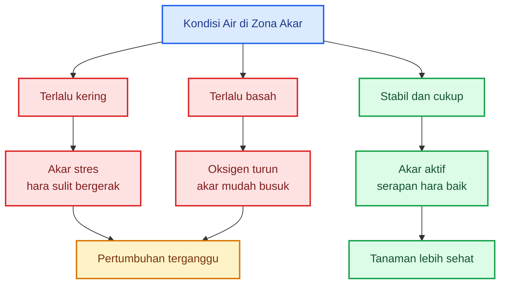

Targetnya bukan tanah kering dan bukan tanah becek, tetapi **lembap stabil**.

### 7.5. Cara menjaga air tetap stabil

Praktik yang bisa dilakukan:

- gunakan bedengan dan drainase baik;
- gunakan mulsa untuk menekan penguapan;
- siram berdasarkan kondisi tanah, bukan hanya jadwal;
- cek kelembapan di bawah permukaan, bukan hanya permukaan atas;
- hindari penyiraman berlebihan pada tanah berat;
- gunakan bahan organik matang untuk memperbaiki daya simpan air;
- buat parit agar air hujan cepat keluar;
- sesuaikan penyiraman dengan fase tanaman;
- hindari fluktuasi kering-basah yang terlalu ekstrem.

### 7.6. Cara sederhana mengecek kelembapan

Untuk praktik lapang, pengecekan sederhana bisa dilakukan dengan menggenggam tanah dari sekitar zona akar.

| Kondisi tanah saat digenggam           | Makna praktis             |
| -------------------------------------- | ------------------------- |
| Hancur seperti debu                    | Terlalu kering            |
| Menggumpal ringan tetapi tidak menetes | Cukup lembap              |
| Lengket, berat, atau menetes           | Terlalu basah             |
| Bau busuk atau asam menyengat          | Risiko anaerob/pembusukan |

Untuk bedengan bermulsa, jangan menilai hanya dari permukaan. Tanah di bawah mulsa sering masih lembap meskipun permukaan terlihat kering.

### 7.7. Air dan serapan kalsium

Stabilitas air sangat penting untuk unsur yang pergerakannya mengikuti aliran air, seperti kalsium. Bila air tidak stabil, serapan kalsium juga terganggu. Akibatnya, pucuk, akar muda, bunga, atau buah bisa bermasalah.

Pada tanaman buah dan sayuran buah, fluktuasi air sering berkaitan dengan masalah kualitas buah.

### 7.8. Kesimpulan Bab 7

Air adalah kebutuhan akar, tetapi air harus dikendalikan. Kekurangan air membuat tanaman stres. Kelebihan air membuat akar kekurangan oksigen. Perubahan ekstrem membuat tanaman tidak stabil.

Pesan kunci:

> **Akar sehat membutuhkan air yang cukup dan stabil, bukan genangan.**

---

# Keseimbangan Akar dan Tajuk: Nutrisi, Bahan Organik, Mikroba, dan Trichoderma

Pada bagian sebelumnya, kita sudah membahas bahwa akar membutuhkan oksigen, air stabil, tanah gembur, dan kondisi fisik tanah yang mendukung. Namun akar tidak hanya dipengaruhi oleh fisik tanah. Akar juga sangat dipengaruhi oleh **nutrisi, bahan organik, mikroba tanah, dan tekanan penyakit**.

Di sinilah banyak kesalahan budidaya terjadi. Tanaman yang tampak kurang subur sering langsung diberi pupuk lebih banyak. Tanah yang dianggap kurang hidup langsung diberi banyak mikroba. Lahan yang sering layu langsung dibanjiri Trichoderma. Padahal, akar membutuhkan **keseimbangan**, bukan input sebanyak-banyaknya.

Bagian ini membahas empat hal penting:

- nutrisi harus seimbang, bukan sekadar banyak;
- bahan organik harus matang, bukan asal organik;
- mikroba harus seimbang, bukan didominasi satu jenis;
- Trichoderma berguna, tetapi bukan obat semua masalah tanaman.

---

## 8. Nutrisi Seimbang: Pupuk Banyak Belum Tentu Benar

Tanaman membutuhkan nutrisi untuk tumbuh, tetapi nutrisi yang benar bukan berarti pupuk diberikan sebanyak-banyaknya. Tanaman membutuhkan hara dalam jumlah cukup, bentuk yang bisa diserap, waktu yang sesuai fase pertumbuhan, dan kepekatan yang aman bagi akar.

Kesalahan umum dalam budidaya adalah menganggap tanaman kurang subur pasti karena pupuk kurang. Padahal, tanaman bisa tampak kurang subur karena:

- akar rusak;
- tanah terlalu becek;
- pH tidak sesuai;
- pupuk terlalu pekat;
- unsur hara saling menghambat;
- bahan organik belum matang;
- patogen menyerang akar;
- mikroba tanah tidak seimbang;
- air tidak stabil.

Jadi sebelum menambah pupuk, praktisi perlu bertanya:

> **Apakah pupuknya kurang, atau akarnya tidak mampu menyerap?**

### 8.1. Tanaman tidak hanya membutuhkan NPK

NPK memang penting, tetapi tanaman tidak hanya hidup dari nitrogen, fosfor, dan kalium. Unsur lain seperti kalsium, magnesium, sulfur, boron, seng, besi, mangan, tembaga, molibdenum, dan unsur mikro lain juga berperan penting.

Secara praktis:

| Unsur              | Fungsi utama                                    |
| ------------------ | ----------------------------------------------- |
| **N / Nitrogen**   | pertumbuhan daun, tunas, dan vegetatif          |
| **P / Fosfor**     | akar, energi, pembungaan awal                   |
| **K / Kalium**     | kualitas buah, ketahanan stres, pengisian hasil |
| **Ca / Kalsium**   | dinding sel, akar muda, pucuk, kualitas buah    |
| **Mg / Magnesium** | klorofil dan fotosintesis                       |
| **S / Sulfur**     | pembentukan protein dan metabolisme             |
| **B / Boron**      | titik tumbuh, bunga, buah, pembelahan sel       |
| **Zn / Seng**      | hormon pertumbuhan dan enzim                    |
| **Fe / Besi**      | pembentukan klorofil                            |
| **Mn / Mangan**    | enzim dan fotosintesis                          |

Jika salah satu unsur penting tidak tersedia atau tidak terserap, tanaman bisa terganggu meskipun NPK cukup.

### 8.2. Nutrisi harus sesuai fase tanaman

Kebutuhan tanaman berubah sesuai fase pertumbuhan. Fase bibit tidak sama dengan fase vegetatif. Fase pembungaan tidak sama dengan fase pembesaran buah.

| Fase tanaman        | Fokus nutrisi                             |
| ------------------- | ----------------------------------------- |
| **Bibit**           | akar sehat, fosfor cukup, EC tidak tinggi |
| **Vegetatif awal**  | nitrogen cukup, Ca-Mg seimbang            |
| **Menjelang bunga** | fosfor, kalium, kalsium, boron, seng      |
| **Pembesaran buah** | kalium, kalsium, magnesium, air stabil    |
| **Panen berulang**  | suplai hara bertahap dan konsisten        |

Pada fase awal, terlalu banyak pupuk pekat bisa mengganggu akar muda. Pada fase vegetatif, nitrogen memang dibutuhkan, tetapi bila berlebihan tanaman bisa terlalu rimbun. Pada fase bunga dan buah, kalium, kalsium, magnesium, boron, dan air stabil menjadi sangat penting.

### 8.3. Contoh ketidakseimbangan nutrisi

Ketidakseimbangan nutrisi sering lebih berbahaya daripada kekurangan ringan. Sebab, satu unsur yang berlebihan bisa mengganggu unsur lain.

| Ketidakseimbangan     | Dampak praktis                                             |
| --------------------- | ---------------------------------------------------------- |
| **N berlebihan**      | tanaman terlalu rimbun, jaringan lunak, bunga mudah rontok |
| **K berlebihan**      | serapan Mg dan Ca bisa terganggu                           |
| **P berlebihan**      | Zn bisa terkunci atau sulit diserap                        |
| **Ca kurang**         | pucuk, akar muda, bunga, dan buah mudah bermasalah         |
| **Mg kurang**         | daun tua menguning, fotosintesis turun                     |
| **B kurang**          | titik tumbuh dan pembungaan terganggu                      |
| **EC terlalu tinggi** | akar stres, tepi daun kering, tanaman mudah layu           |

Diagram sederhananya:

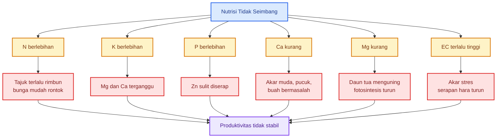

### 8.4. Pupuk banyak bisa membuat akar stres

Pupuk kimia bekerja cepat, tetapi juga bisa menimbulkan kepekatan tinggi di sekitar akar jika dosis dan cara aplikasinya salah. Akar muda sangat sensitif terhadap kondisi ini.

Tanda akar stres akibat pupuk terlalu pekat:

- tanaman layu setelah pemupukan;
- daun tepi mengering;
- pertumbuhan berhenti sementara;
- akar rambut sedikit;
- akar kecokelatan;
- tanaman tampak “panas”;
- serapan air terganggu.

Karena itu, pupuk kimia sebaiknya diberikan secara **terukur dan bertahap**, bukan sekaligus banyak. Pada fase awal, hindari pupuk pekat langsung menempel pada akar muda.

### 8.5. Nutrisi terjamin bukan berarti pupuk banyak

Nutrisi terjamin berarti:

- hara tersedia;
- hara bisa diserap;
- sesuai fase pertumbuhan;
- tidak saling menghambat;
- tidak merusak akar;
- diberikan dengan dosis terukur;
- didukung air, pH, dan oksigen yang baik.

Rumus praktisnya:

```mdx
Nutrisi efektif = hara tersedia + akar aktif + pH sesuai + air stabil + dosis aman
```

Atau dalam bentuk pemahaman lapang:

> **Pupuk yang baik bukan yang paling banyak, tetapi yang paling tepat diserap tanaman.**

### 8.6. Kesimpulan Bab 8

Tanaman membutuhkan nutrisi lengkap, tetapi nutrisi harus seimbang. Pupuk berlebihan bukan solusi otomatis. Bahkan, pupuk berlebihan bisa menekan akar dan membuat tanaman lebih rentan stres.

Pesan kunci:

> **Nutrisi terjamin berarti hara tersedia, bisa diserap, sesuai fase, dan tidak merusak akar.**

---

## 9. Bahan Organik Matang sebagai Penyangga Akar

Bahan organik adalah salah satu fondasi penting kesehatan tanah. Namun, tidak semua bahan organik aman untuk akar. Bahan organik harus **matang**.

Ini penting karena banyak praktisi menyamakan semua bahan organik sebagai sesuatu yang pasti baik. Padahal pupuk kandang mentah, kompos belum matang, atau bahan fermentasi gagal bisa merusak akar.

Bahan organik matang membangun akar. Bahan organik mentah bisa merusak akar.

### 9.1. Mengapa bahan organik penting?

Bahan organik membantu tanah dalam banyak cara:

- membuat tanah lebih gembur;
- meningkatkan pori udara;
- membantu menahan air;
- menyediakan habitat mikroba;
- melepas hara perlahan;
- meningkatkan kapasitas tukar kation;
- memperbaiki struktur agregat tanah;
- mengurangi fluktuasi ekstrem di zona akar.

Pada tanah miskin bahan organik, pupuk kimia sering lebih cepat hilang, tanah mudah padat, mikroba kurang aktif, dan akar kurang nyaman berkembang.

### 9.2. Bahan organik matang sebagai penyangga

Bahan organik matang bekerja seperti penyangga sistem tanah. Ia membantu menjaga air, udara, hara, dan mikroba tetap lebih stabil.

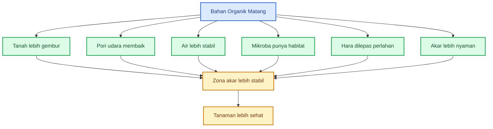

### 9.3. Bahaya bahan organik mentah

Bahan organik mentah atau belum matang dapat menyebabkan masalah serius, terutama jika diletakkan dekat akar.

Risikonya:

- menghasilkan panas;
- menghasilkan amonia;
- menghasilkan gas yang mengganggu akar;
- mengundang lalat atau larva;
- membawa patogen;
- memicu pembusukan;
- membuat tanah berbau;
- menyebabkan akar cokelat atau busuk;
- membuat tanaman layu setelah tanam.

Bahan organik mentah sering masih aktif terurai. Proses penguraian ini membutuhkan oksigen dan dapat menciptakan kondisi yang tidak nyaman bagi akar. Jika terjadi di zona akar, tanaman bisa stres.

### 9.4. Ciri bahan organik yang lebih aman

Bahan organik yang lebih aman untuk akar biasanya memiliki ciri:

- tidak panas;
- tidak berbau busuk;
- tidak berbau amonia tajam;
- tekstur lebih remah;
- warna lebih gelap dan stabil;
- tidak terlihat bahan asal yang masih segar;
- tidak banyak belatung;
- tidak berlendir;
- tidak menimbulkan panas saat ditumpuk.

Tabel praktis:

| Kondisi bahan organik         | Status untuk akar |
| ----------------------------- | ----------------- |
| Tidak panas, remah, bau tanah | Lebih aman        |
| Masih panas                   | Jangan dekat akar |
| Bau amonia tajam              | Berisiko          |
| Bau busuk/got                 | Tolak             |
| Banyak belatung               | Sanitasi buruk    |
| Berlendir                     | Risiko pembusukan |
| Masih terlihat bahan segar    | Belum matang      |

### 9.5. Cara memakai bahan organik dengan aman

Praktik aman:

- gunakan kompos atau pupuk kandang yang sudah matang;
- campur dengan tanah, jangan menggumpal di akar;
- aplikasikan sebelum tanam agar stabil;
- jangan menaruh bahan mentah langsung di lubang tanam;
- pada tanah berat, gunakan bahan organik untuk memperbaiki pori;
- pada tanah pasir, gunakan bahan organik untuk menahan air;
- hindari bahan organik berbau busuk.

### 9.6. Kesimpulan Bab 9

Bahan organik sangat penting, tetapi harus matang. Bahan organik matang membantu akar. Bahan organik mentah bisa menjadi sumber panas, gas, amonia, dan patogen.

Pesan kunci:

> **Bahan organik matang membangun akar; bahan organik mentah bisa merusak akar.**

---

## 10. Mikroba Seimbang: Bukan Mikroba Sebanyak-banyaknya

Mikroba tanah sangat penting untuk kesehatan akar. Namun, dalam praktik pertanian modern, istilah mikroba sering disalahpahami. Banyak orang mengira semakin banyak mikroba diberikan, semakin sehat tanahnya.

Ini tidak selalu benar.

Tanah sehat bukan tanah yang didominasi satu mikroba atau dibanjiri berbagai kultur tanpa kontrol. Tanah sehat adalah tanah yang memiliki **komunitas mikroba seimbang** dan fungsi biologisnya berjalan.

### 10.1. Peran mikroba dalam mendukung akar

Mikroba tanah dapat membantu akar melalui berbagai mekanisme:

- mengurai bahan organik;
- melarutkan fosfat;
- membantu ketersediaan unsur tertentu;
- menghasilkan senyawa pemacu pertumbuhan;
- menekan patogen;
- memperbaiki struktur tanah;
- membentuk hubungan simbiosis dengan akar;
- menjaga kestabilan rizosfer.

Mikroba yang membantu akar dapat meliputi:

- bakteri pengurai;
- jamur dekomposer;
- PGPR;
- mikoriza;
- Trichoderma;
- aktinomiset;
- mikroba netral penyangga ekosistem.

### 10.2. Mikroba seimbang bukan berarti semua diperbanyak

Kesalahan umum adalah mencampur semua mikroba sekaligus:

- Trichoderma;
- PGPR;
- mikoriza;
- Bacillus;
- Pseudomonas;
- MOL;
- JAKABA;
- fermentasi organik;
- pupuk hayati lain.

Lalu semuanya dikocorkan bersama dengan harapan hasilnya lebih bagus. Padahal mikroba bisa saling bersaing atau saling menekan.

Mikroba tidak otomatis bekerja sama hanya karena semuanya disebut “baik”.

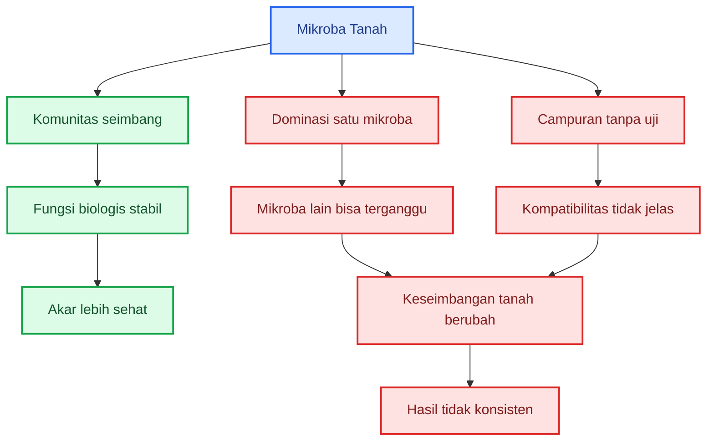

### 10.3. Bahaya dominasi satu mikroba

Mikroba seperti Trichoderma, Bacillus, atau Pseudomonas bisa sangat berguna bila digunakan tepat. Namun bila satu kelompok mikroba terus-menerus dibanjiri, ada potensi mengganggu keseimbangan mikroba lain.

Contoh risiko:

- mikoriza tertekan;
- jamur dekomposer lokal berkurang;
- mikroba netral terganggu;
- fungsi dekomposisi berubah;
- hasil tidak konsisten;
- tanah menjadi bergantung pada input tertentu.

Tujuan budidaya bukan membuat tanah penuh satu mikroba, tetapi membuat fungsi tanah berjalan.

### 10.4. Prinsip memakai mikroba

Gunakan mikroba berdasarkan fungsi, bukan berdasarkan tren.

| Masalah atau tujuan       | Mikroba yang mungkin relevan                 |
| ------------------------- | -------------------------------------------- |
| Patogen tanah             | Trichoderma, Bacillus, Pseudomonas tertentu  |
| Serapan fosfor            | Mikoriza, bakteri pelarut fosfat             |
| Dekomposisi bahan organik | bakteri dan jamur dekomposer                 |
| Kesehatan rizosfer        | PGPR teruji                                  |
| Hama tertentu             | Beauveria, Metarhizium                       |
| Perbaikan tanah           | bahan organik matang + mikroba beragam alami |

Jangan memakai mikroba tanpa target. Jangan mencampur semua mikroba tanpa uji. Jangan percaya bahwa mikroba banyak pasti lebih baik.

### 10.5. Mikroba membutuhkan rumah

Mikroba baik juga membutuhkan habitat. Jika tanah terlalu panas, terlalu kering, terlalu becek, terlalu miskin bahan organik, atau sering terkena bahan kimia keras, mikroba sulit stabil.

Karena itu, memakai mikroba tanpa memperbaiki tanah sering hasilnya lemah.

Mikroba membutuhkan:

- bahan organik matang;
- kelembapan cukup;
- oksigen;
- pH sesuai;
- akar aktif;
- residu kimia tidak ekstrem;
- tanah tidak terlalu padat.

### 10.6. Kesimpulan Bab 10

Mikroba sangat penting, tetapi tidak boleh dipahami secara sederhana. Mikroba yang baik bukan berarti satu mikroba diperbanyak tanpa batas.

Pesan kunci:

> **Mikroba yang baik adalah komunitas yang seimbang, bukan dominasi satu jenis mikroba.**

---

## 11. Trichoderma dalam Keseimbangan Akar

Trichoderma adalah salah satu jamur yang paling sering digunakan dalam pertanian sebagai agen hayati. Ia dikenal karena kemampuannya bersaing dengan patogen tanah, mengkolonisasi zona akar, dan membantu menekan beberapa penyakit tular tanah.

Namun Trichoderma harus ditempatkan dengan benar. Ia bukan pupuk utama. Ia bukan obat semua penyakit. Ia bukan solusi untuk semua kondisi tanaman.

Trichoderma adalah **alat bantu kesehatan akar**, terutama untuk menghadapi penyakit tular tanah.

### 11.1. Fungsi utama Trichoderma

Trichoderma paling relevan untuk menjaga zona akar dari gangguan patogen tanah seperti:

- Fusarium;
- Phytophthora;
- Rhizoctonia;
- Pythium;
- beberapa patogen busuk akar atau rebah semai.

Ia bekerja melalui beberapa cara:

- bersaing merebut ruang dan nutrisi;
- menghasilkan senyawa penghambat;
- membantu kolonisasi rizosfer;
- menekan perkembangan patogen tertentu;
- mendukung lingkungan akar yang lebih sehat.

Diagram sederhana:

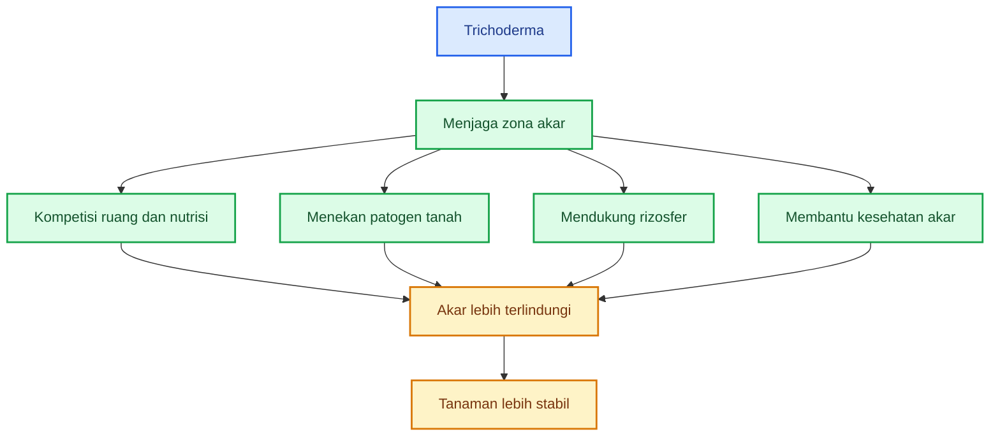

### 11.2. Yang tidak bisa diselesaikan Trichoderma

Trichoderma tidak boleh diklaim untuk semua masalah tanaman.

Ia bukan solusi utama untuk:

- virus kuning;
- keriting daun akibat virus;
- hama serangga;
- semua penyakit daun;
- semua penyakit buah;
- defisiensi hara;
- tanah becek parah;
- pupuk berlebihan;
- akar rusak karena garam pupuk.

Jika tanaman sakit karena drainase buruk, Trichoderma tidak akan maksimal. Jika akar terbakar karena pupuk pekat, Trichoderma bukan jawaban utama. Jika tanaman terserang virus, fokusnya bukan Trichoderma, tetapi pengendalian vektor dan sanitasi.

### 11.3. Dosis Trichoderma harus terukur

Trichoderma harus digunakan dengan dosis yang jelas. Jangan memakai istilah “banyakkan saja” atau “semakin sering semakin baik”.

Dosis praktis:

| Kondisi     |                    Dosis |
| ----------- | -----------------------: |
| Rendah      |  5–10 g/tanaman/aplikasi |
| Normal      | 10–20 g/tanaman/aplikasi |
| Tinggi      | 20–30 g/tanaman/aplikasi |
| Total musim |    20–60 g/tanaman/musim |

Dosis rendah cocok untuk pencegahan pada lahan relatif sehat. Dosis normal cocok untuk lahan dengan risiko penyakit sedang. Dosis tinggi hanya digunakan bila ada riwayat penyakit akar atau penyakit tular tanah yang jelas.

### 11.4. Rumus kebutuhan Trichoderma

Untuk menghitung kebutuhan Trichoderma padat:

```mdx
Kebutuhan Trichoderma (kg) = (Jumlah tanaman × dosis per tanaman dalam gram) / 1000
```

Contoh:

Jumlah tanaman = 20.000
Dosis = 10 g/tanaman

```mdx
Kebutuhan = (20.000 × 10) / 1000
Kebutuhan = 200 kg per aplikasi
```

Jika aplikasi dilakukan 2 kali:

```mdx
Total kebutuhan musim = 200 kg × 2
Total kebutuhan musim = 400 kg
```

Dengan rumus ini, praktisi bisa menghitung kebutuhan nyata dan menghindari aplikasi berlebihan.

### 11.5. Jangan gunakan Trichoderma seperti pupuk utama

Trichoderma bukan sumber utama N, P, atau K. Ia membantu sistem akar dan menekan patogen tertentu, tetapi tetap membutuhkan dukungan:

- bahan organik matang;
- tanah gembur;
- air stabil;
- pH sesuai;
- nutrisi seimbang;
- drainase baik;
- sanitasi tanaman sakit.

Jika tanah becek, patogen tinggi, dan akar kekurangan oksigen, Trichoderma tidak akan menjadi penyelamat tunggal.

### 11.6. Cara aplikasi yang lebih aman

Praktik penggunaan yang lebih aman:

- aplikasikan sejak awal, bukan setelah tanaman sakit parah;
- gunakan di media semai atau sekitar lubang tanam;
- campur dengan tanah halus atau kompos matang;
- jangan dicampur langsung dengan pupuk kimia pekat;
- jangan dicampur dengan fungisida keras;
- jangan gunakan kultur busuk;
- jangan diaplikasikan terus-menerus tanpa alasan;
- evaluasi hasil dengan kontrol.

### 11.7. Posisi Trichoderma dalam sistem akar

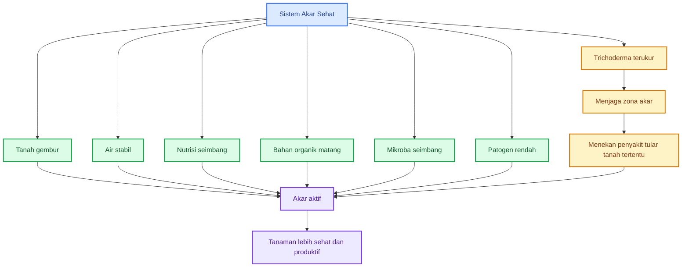

Diagram ini menunjukkan bahwa Trichoderma hanyalah satu komponen dalam sistem akar sehat. Ia bekerja lebih baik bila faktor lain juga mendukung.

### 11.8. Kesimpulan Bab 11

Trichoderma berguna, terutama untuk menjaga zona akar dari penyakit tular tanah tertentu. Namun Trichoderma harus digunakan dengan target jelas, dosis terukur, dan cara aplikasi yang benar.

Pesan kunci:

> **Trichoderma adalah alat bantu kesehatan akar, bukan obat semua masalah tanaman.**

---

# Keseimbangan Akar dan Tajuk: Patogen, Daun sebagai Pabrik Energi, Gejala Tajuk, dan Budidaya Berimbang

Pada bagian sebelumnya, kita sudah membahas nutrisi, bahan organik matang, mikroba seimbang, dan posisi Trichoderma dalam menjaga kesehatan akar. Sekarang pembahasan masuk ke hubungan yang lebih luas: **akar harus dilindungi dari patogen, tajuk harus dijaga sebagai pabrik energi, dan sistem budidaya tidak perlu ekstrem 100% organik untuk menjadi sehat**.

Tanaman produktif bukan hasil dari akar saja atau tajuk saja. Akar dan tajuk saling menguatkan. Namun keduanya juga bisa saling melemahkan. Akar yang sakit membuat tajuk layu. Tajuk yang rusak membuat akar kekurangan energi. Karena itu, pengelolaan tanaman harus melihat sistem secara utuh.

---

## 12. Keseimbangan Akar dan Risiko Patogen

Akar sehat sulit tercapai bila tekanan patogen di tanah terlalu tinggi. Patogen akar bisa menyerang akar muda, akar rambut, pangkal batang, jaringan pembuluh, atau leher akar. Bila serangan sudah berat, tanaman akan sulit pulih meskipun diberi pupuk, mikroba, atau perangsang akar.

Patogen akar biasanya berkembang lebih cepat pada kondisi tanah yang tidak seimbang, terutama tanah yang:

- terlalu becek;
- terlalu padat;
- drainasenya buruk;
- banyak sisa tanaman sakit;
- bahan organiknya belum matang;
- pH tidak sesuai;
- akar tanaman sering luka;
- sanitasi lahannya buruk.

Jadi, menjaga akar bukan hanya memberi nutrisi dan mikroba baik. Menjaga akar juga berarti **menekan sumber penyakit di tanah**.

### 12.1. Patogen akar penting

Beberapa patogen akar dan pangkal batang yang sering menjadi masalah dalam budidaya tanaman antara lain:

- **Fusarium**;
- **Phytophthora**;
- **Rhizoctonia**;
- **Pythium**;
- **Sclerotium**;
- **nematoda**;
- **bakteri layu**.

Masing-masing punya karakter berbeda. Ada yang menyerang pembuluh tanaman, ada yang menyebabkan busuk akar, ada yang menyerang bibit, ada yang berkembang cepat pada tanah becek, dan ada yang bertahan lama di tanah.

### 12.2. Kondisi yang membuat patogen meningkat

Patogen jarang muncul karena satu faktor tunggal. Biasanya ledakan penyakit terjadi karena beberapa kondisi bertemu.

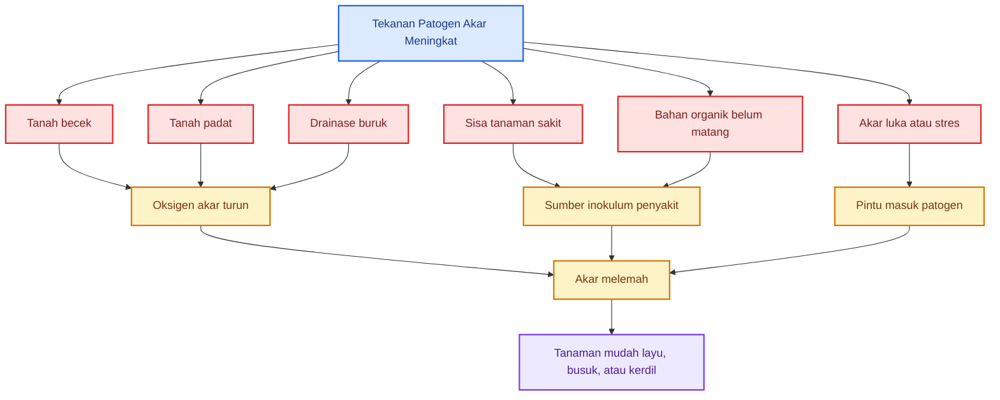

Diagram ini menunjukkan bahwa patogen sering memanfaatkan akar yang sudah melemah. Tanah becek menurunkan oksigen. Tanah padat membatasi akar. Sisa tanaman sakit menjadi sumber inokulum. Bahan organik mentah dapat memicu pembusukan. Akar yang luka menjadi pintu masuk penyakit.

### 12.3. Gejala umum serangan patogen akar

Gejala patogen akar sering terlihat di atas tanah, tetapi sumbernya berada di bawah tanah.

| Gejala tanaman               | Kemungkinan masalah                                |
| ---------------------------- | -------------------------------------------------- |
| Layu siang hari              | akar rusak, pembuluh terganggu, air tidak terserap |
| Layu mendadak                | busuk pangkal, Phytophthora, bakteri layu          |
| Daun bawah kuning            | Fusarium, akar melemah, hara tidak terserap        |
| Pangkal batang cokelat/busuk | Rhizoctonia, Phytophthora, Sclerotium              |
| Bibit rebah                  | Pythium, Rhizoctonia, media terlalu basah          |
| Akar sedikit dan cokelat     | busuk akar, tanah becek, patogen                   |
| Tanaman kerdil               | nematoda, akar rusak, tanah padat                  |

Pada praktik lapang, gejala harus dibaca bersama kondisi tanah. Tanaman layu pada tanah kering berbeda maknanya dengan tanaman layu pada tanah basah. Tanaman layu pada tanah basah sering menunjukkan masalah akar, bukan kekurangan air.

### 12.4. Sanitasi tanaman sakit

Tanaman yang sudah sakit berat tidak boleh dibiarkan menjadi sumber penyakit. Banyak petani membiarkan tanaman sakit tetap berada di lahan karena berharap bisa pulih. Dalam beberapa kasus ringan, tanaman mungkin masih bisa bertahan. Namun tanaman yang sudah parah sering justru menjadi sumber penyebaran patogen.

Tindakan praktis:

- cabut tanaman sakit berat;
- angkat sebagian tanah di sekitar akar bila memungkinkan;
- jangan buang tanaman sakit ke parit atau dekat bedengan;
- jangan jadikan tanaman sakit sebagai bahan kompos mentah;
- buang aman atau musnahkan sesuai kondisi lapang;
- perlakukan lubang bekas tanaman sakit dengan kompos matang dan agen hayati teruji bila diperlukan;
- jangan langsung menanam ulang di titik yang sama tanpa perbaikan.

### 12.5. Pencegahan lebih penting daripada penyembuhan

Patogen akar paling efektif dikendalikan melalui pencegahan. Setelah akar rusak berat, pemulihan menjadi sulit.

Pencegahan dapat dilakukan dengan:

- bibit sehat;
- media semai bersih;
- drainase baik;
- bedengan cukup tinggi;
- bahan organik matang;
- rotasi tanaman;
- sanitasi tanaman sakit;
- pengaturan air;
- penghindaran pupuk pekat di akar muda;
- penggunaan agen hayati teruji;
- pengendalian nematoda bila ada indikasi;
- menjaga pH dan struktur tanah.

### 12.6. Alur menjaga akar dari patogen

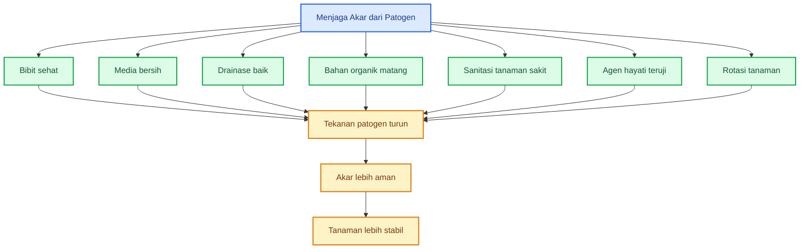

### 12.7. Kesimpulan Bab 12

Akar sehat sulit dicapai jika sumber penyakit di tanah dibiarkan. Menjaga akar berarti menjaga lingkungan akar sekaligus menekan patogen.

Pesan kunci:

> **Menjaga akar berarti juga menekan sumber penyakit di tanah.**

---

## 13. Tajuk Sehat: Daun sebagai Pabrik Energi

Akar adalah fondasi tanaman, tetapi daun adalah pabrik energi. Daun melakukan fotosintesis, yaitu proses mengubah cahaya, air, dan karbon dioksida menjadi energi berupa karbohidrat. Energi ini kemudian digunakan tanaman untuk membangun akar, batang, daun baru, bunga, dan buah.

Karena itu, setelah akar dibuat sehat, tajuk juga harus dijaga. Akar tanpa tajuk sehat tidak akan maksimal. Tajuk tanpa akar sehat juga tidak akan bertahan lama.

### 13.1. Daun memberi energi untuk seluruh tanaman

Daun yang sehat menghasilkan energi. Energi ini dikirim ke:

- akar;
- batang;
- daun muda;
- bunga;
- buah;
- titik tumbuh;
- mikroba rizosfer melalui eksudat akar.

Artinya, kesehatan daun tidak hanya berpengaruh pada tampilan tanaman di atas tanah, tetapi juga pada aktivitas akar di bawah tanah.

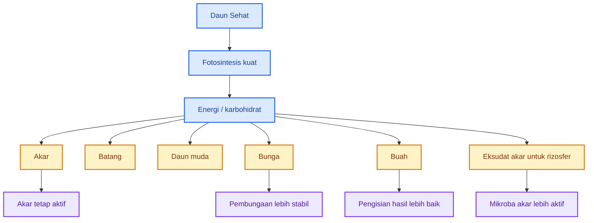

### 13.2. Bila tajuk rusak, akar ikut melemah

Daun yang rusak parah membuat fotosintesis turun. Bila fotosintesis turun, energi yang dikirim ke akar juga berkurang. Akibatnya akar menjadi kurang aktif, pertumbuhan akar baru melambat, dan kemampuan tanaman menyerap air serta hara menurun.

Penyebab tajuk melemah antara lain:

- hama;
- penyakit daun;
- defisiensi hara;
- pestisida berlebihan;
- pemangkasan berlebihan;
- kekeringan;
- stres panas;
- kelembapan terlalu tinggi;
- tanaman terlalu rimbun dan kurang sirkulasi.

### 13.3. Tajuk sehat bukan berarti terlalu rimbun

Tajuk sehat bukan berarti daun harus sebanyak-banyaknya. Tajuk yang terlalu rimbun juga bisa menjadi masalah, terutama bila sirkulasi udara buruk. Tajuk terlalu rimbun dapat meningkatkan kelembapan mikro, memicu penyakit daun, mengurangi penetrasi cahaya, dan membuat energi tanaman terlalu banyak masuk ke vegetatif.

Tajuk sehat berarti:

- daun cukup aktif;
- warna daun normal;
- tidak terlalu rimbun;
- tidak terlalu jarang;
- sirkulasi udara baik;
- cahaya masuk cukup;
- hama terkendali;
- penyakit daun rendah;
- fotosintesis berjalan baik.

### 13.4. Hubungan akar dan tajuk dalam produksi

Akar menyerap air dan hara. Daun mengolahnya menjadi energi. Buah menerima hasil akhir dari kerja keduanya.

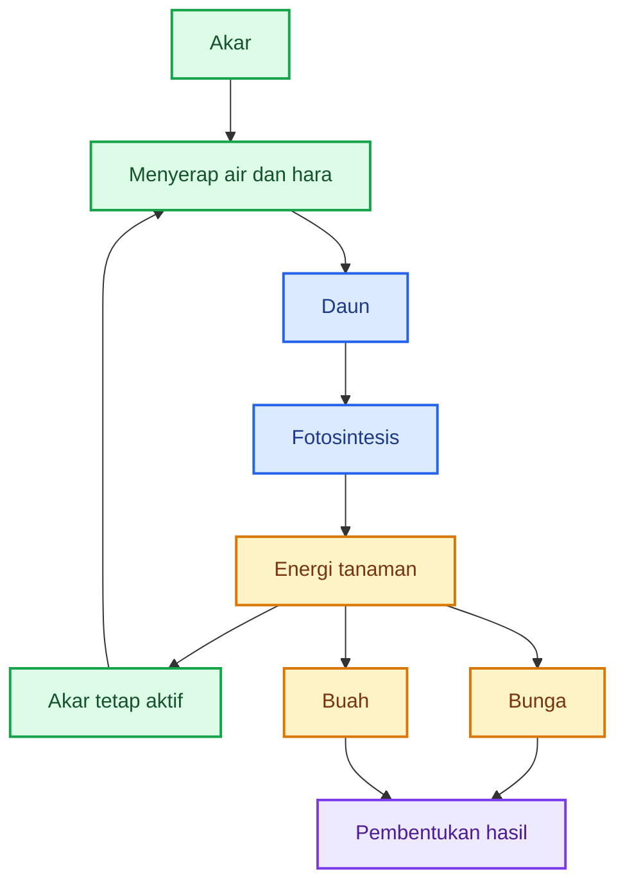

Diagram ini menunjukkan siklus saling mendukung. Akar mendukung daun. Daun mendukung akar. Keduanya mendukung hasil.

### 13.5. Praktik menjaga tajuk tetap sehat

Praktik lapang yang penting:

- kendalikan hama sejak awal;
- cegah penyakit daun dengan sanitasi dan sirkulasi udara;
- hindari penyemprotan berlebihan yang membuat daun stres;
- gunakan nutrisi seimbang;
- jangan berlebihan nitrogen;
- atur jarak tanam;
- lakukan pemangkasan seperlunya;
- hindari defoliasi berat;
- jaga air stabil;
- pantau warna dan bentuk daun.

### 13.6. Kesimpulan Bab 13

Akar memang fondasi, tetapi daun adalah pabrik energi. Bila daun sehat, energi untuk akar, bunga, dan buah tersedia lebih baik. Bila daun rusak, akar juga ikut melemah.

Pesan kunci:

> **Akar menopang daun, tetapi daun memberi energi kembali kepada akar.**

---

## 14. Gejala Tajuk sebagai Cermin Masalah Akar

Bagian atas tanaman sering menjadi indikator masalah yang terjadi di bawah tanah. Daun, pucuk, bunga, dan buah dapat menjadi “layar monitor” untuk membaca kondisi akar.

Namun gejala tajuk tidak boleh dibaca terlalu cepat. Satu gejala bisa memiliki beberapa penyebab. Daun kuning, misalnya, bisa disebabkan oleh kekurangan hara, akar rusak, pH tidak sesuai, tanah becek, atau penyakit. Karena itu, pembacaan gejala harus dikaitkan dengan kondisi akar dan tanah.

### 14.1. Tajuk sebagai layar monitor

Tanaman menunjukkan gangguan akar melalui perubahan di bagian atas. Bila akar tidak mampu menyerap air, daun layu. Bila akar tidak mampu menyerap hara, daun menguning. Bila akar muda terganggu, pucuk bisa lemah. Bila air dan hara tidak stabil, bunga dan buah ikut terganggu.

Prinsipnya:

> **Tajuk adalah layar monitor; akar adalah mesin di bawah tanah.**

Jika layar menunjukkan masalah, jangan hanya membersihkan layar. Periksa mesinnya.

### 14.2. Tabel gejala tajuk dan kemungkinan masalah akar

| Gejala di Atas Tanah | Kemungkinan Masalah Akar/Tanah              |
| -------------------- | ------------------------------------------- |
| Layu siang hari      | akar rusak, tanah panas, air tidak terserap |
| Daun kuning          | akar lemah, hara kurang, pH tidak sesuai    |
| Bunga rontok         | stres air, nutrisi tidak seimbang           |
| Buah kecil           | serapan K, Ca, Mg kurang                    |
| Tanaman kerdil       | tanah padat, akar terbatas, patogen         |
| Tepi daun kering     | EC tinggi, stres garam                      |
| Pucuk lemah          | Ca/B terganggu, akar muda rusak             |

### 14.3. Alur membaca gejala

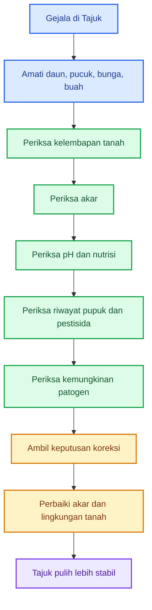

Diagram ini penting karena banyak kesalahan terjadi saat gejala tajuk langsung dijawab dengan semprotan daun atau tambahan pupuk. Padahal sumber masalah mungkin ada di akar.

### 14.4. Contoh pembacaan gejala

✓ Contoh 1: Tanaman layu siang hari

Kemungkinan penyebab:

- tanah terlalu kering;
- akar rusak;
- tanah terlalu panas;
- tanah terlalu becek;
- patogen akar;
- EC terlalu tinggi.

Langkah cek:

1. cek kelembapan tanah;
2. lihat apakah tanah kering atau justru basah;
3. periksa akar;
4. cek apakah ada busuk pangkal;
5. evaluasi pemupukan terakhir.

Jika tanah basah tetapi tanaman layu, jangan langsung menyiram lagi. Periksa akar.

✓ Contoh 2: Daun kuning

Kemungkinan penyebab:

- kekurangan nitrogen;
- kekurangan magnesium;
- akar tidak aktif;
- pH tidak sesuai;
- tanah becek;
- serangan patogen akar.

Daun kuning tidak selalu berarti pupuk kurang. Bisa jadi pupuk ada, tetapi akar tidak mampu menyerap.

✓ Contoh 3: Bunga rontok

Kemungkinan penyebab:

- stres air;
- suhu tinggi;
- nitrogen berlebihan;
- kalium, boron, atau kalsium tidak seimbang;
- akar lemah;
- tajuk terlalu rimbun;
- serangan hama.

Bunga rontok sering merupakan gejala sistemik. Jadi jangan hanya mencari “obat bunga”, tetapi cek akar, air, nutrisi, dan tajuk.

✓ Contoh 4: Tepi daun kering

Kemungkinan penyebab:

- EC tinggi;
- pupuk terlalu pekat;
- stres garam;
- kekurangan kalium;
- akar terganggu;
- air tidak stabil.

Bila muncul setelah pemupukan, besar kemungkinan akar mengalami stres kepekatan.

### 14.5. Jangan mengobati gejala tanpa mencari sumber

Kesalahan umum:

- daun kuning langsung tambah pupuk;
- tanaman layu langsung tambah air;
- bunga rontok langsung semprot hormon;
- buah kecil langsung tambah K;
- tanaman kerdil langsung tambah N;
- tepi daun kering langsung semprot mikro.

Cara ini kadang berhasil, tetapi sering salah sasaran. Praktisi harus membiasakan diri membaca tanaman sebagai sistem.

### 14.6. Kesimpulan Bab 14

Gejala di tajuk sering menjadi cermin kondisi akar dan tanah. Namun gejala harus dibaca hati-hati karena penyebabnya bisa banyak.

Pesan kunci:

> **Tajuk adalah layar monitor; akar adalah mesin di bawah tanah.**

---

## 15. Tidak Harus 100% Organik

Tanaman produktif tidak harus 100% organik. Yang paling penting adalah sistem budidaya yang sehat, terukur, dan tidak merusak akar maupun tanah.

Pendekatan yang paling realistis untuk praktisi adalah **semi-organik, organik-terpadu, atau pertanian berimbang**. Artinya, bahan organik tetap dipakai untuk membangun tanah, mikroba teruji digunakan untuk menjaga fungsi biologis, dan pupuk kimia terukur dipakai untuk memberi presisi nutrisi.

Tujuannya bukan menjadi anti-kimia. Tujuannya adalah **mengurangi ketergantungan kimia dengan memperbaiki tanah**.

### 15.1. Mengapa tidak harus 100% organik?

Tanaman budidaya, terutama yang bernilai ekonomi tinggi dan dipanen intensif, membutuhkan nutrisi dalam jumlah dan waktu yang cukup presisi. Jika hanya mengandalkan organik tanpa perhitungan, beberapa masalah bisa muncul:

- suplai hara lambat;
- kebutuhan K, Ca, Mg, B, dan Zn tidak terpenuhi tepat waktu;
- koreksi defisiensi lambat;
- pertumbuhan tidak seragam;
- produksi turun;
- biaya bahan dan tenaga kerja bisa tinggi.

Sebaliknya, bila terlalu mengandalkan pupuk kimia tanpa bahan organik, masalah lain muncul:

- tanah keras;
- bahan organik tanah rendah;
- akar melemah;
- mikroba tanah menurun;
- penyakit tular tanah meningkat;
- pupuk makin boros;
- tanaman mudah stres.

Jadi, pilihan terbaik bukan ekstrem organik atau ekstrem kimia. Pilihan terbaik adalah **berimbang**.

### 15.2. Peran masing-masing komponen

| Komponen                   | Peran dalam sistem                                       |
| -------------------------- | -------------------------------------------------------- |
| **Bahan organik matang**   | membangun struktur tanah, C-organik, dan habitat mikroba |
| **Pupuk kimia terukur**    | memberi nutrisi cepat dan presisi sesuai fase            |
| **Mikroba teruji**         | menjaga rizosfer dan membantu menekan patogen            |
| **Air dan pH terkendali**  | memastikan hara dapat diserap                            |
| **Pengendalian OPT bijak** | menjaga akar, daun, bunga, dan buah tetap produktif      |
| **Sanitasi dan rotasi**    | menekan sumber penyakit                                  |

### 15.3. Sistem budidaya berimbang

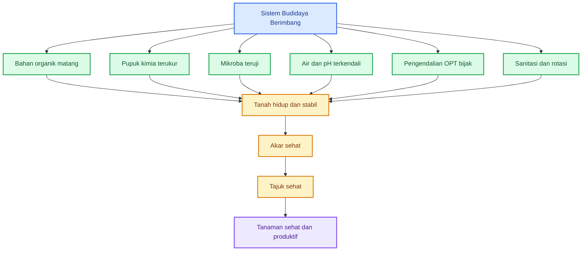

Diagram ini menunjukkan bahwa sistem budidaya berimbang tidak menolak pupuk kimia, tetapi menggunakannya secara terukur. Pupuk kimia menjadi alat presisi nutrisi, bukan satu-satunya penopang tanaman. Bahan organik dan mikroba menjaga tanah tetap hidup. Air, pH, sanitasi, dan pengendalian OPT menjaga sistem tetap stabil.

### 15.4. Prinsip praktis pertanian berimbang

Pertanian berimbang dapat diringkas dalam empat prinsip:

**Organik membangun tanah.**
**Kimia terukur memberi presisi nutrisi.**
**Mikroba menjaga fungsi biologis.**
**Air, pH, dan sanitasi menentukan kestabilan sistem.**

Jika semua berjalan seimbang, tanaman bisa sehat tanpa harus fanatik 100% organik.

### 15.5. Kesalahan dua ekstrem

Ada dua ekstrem yang sama-sama berisiko.

| Pendekatan ekstrem                      | Risiko                                      |
| --------------------------------------- | ------------------------------------------- |
| 100% organik tanpa hitungan hara        | defisiensi, produksi rendah, koreksi lambat |
| Kimia intensif tanpa bahan organik      | tanah keras, akar lemah, mikroba turun      |
| Mikroba berlebihan tanpa nutrisi        | tanaman tetap kekurangan hara               |
| Pupuk banyak tanpa akar sehat           | pupuk tidak terserap optimal                |
| Anti-pestisida total tanpa strategi OPT | hama/penyakit bisa meledak                  |
| Pestisida berlebihan                    | tajuk stres, musuh alami turun, biaya naik  |

Sistem yang kuat berada di tengah: organik dipakai untuk membangun tanah, pupuk kimia dipakai secara presisi, mikroba dipakai terukur, dan OPT dikendalikan bijak.

### 15.6. Kesimpulan Bab 15

Tanaman produktif tidak harus 100% organik. Yang penting adalah sistem budidaya sehat, terukur, dan tidak merusak akar atau tanah.

Pesan kunci:

> **Target terbaik bukan anti-kimia, tetapi mengurangi ketergantungan kimia dengan memperbaiki tanah.**

---

# Keseimbangan Akar dan Tajuk: Tipuan Input, Rumus Praktis, Checklist, dan Penutup

Pada bagian sebelumnya, kita sudah membahas bahwa tanaman produktif tidak harus 100% organik. Yang lebih penting adalah sistem budidaya yang sehat, terukur, dan tidak merusak akar maupun tanah.

Bagian terakhir ini menjadi penutup praktis. Fokusnya adalah bagaimana praktisi tidak mudah tertipu oleh klaim input, bagaimana menggunakan rumus sederhana untuk membaca keseimbangan akar dan tajuk, serta bagaimana membuat checklist lapang agar keputusan budidaya tidak hanya berdasarkan perasaan.

---

## 16. Tipuan Input: Jangan Salah Menafsirkan Kesehatan Tanaman

Tanaman sehat bukan hasil dari satu input ajaib.

Tidak ada satu pupuk, satu mikroba, satu hormon, satu fermentasi, satu pestisida nabati, atau satu produk organik yang bisa menyelesaikan semua masalah tanaman. Tanaman sehat lahir dari sistem yang saling mendukung: akar sehat, tanah baik, air stabil, nutrisi seimbang, mikroba terkendali, patogen rendah, daun aktif, dan manajemen budidaya yang konsisten.

Inilah titik penting yang sering disalahpahami. Banyak produk pertanian dipromosikan seolah-olah menjadi jawaban tunggal untuk semua masalah. Ada yang diklaim bisa mempercepat pertumbuhan, memperbanyak bunga, memperbesar buah, menekan semua penyakit, memperbaiki tanah, sekaligus mengurangi semua pupuk.

Klaim seperti ini harus dibaca dengan kritis.

### 16.1. Akar sehat dibangun oleh sistem, bukan satu produk

Akar sehat tidak cukup hanya diberi satu input. Akar membutuhkan:

- oksigen;
- air stabil;
- tanah gembur;
- pH sesuai;
- nutrisi seimbang;
- bahan organik matang;
- mikroba seimbang;
- patogen rendah;
- suhu tanah nyaman;
- ruang tumbuh cukup.

Jika tanah becek, pupuk terlalu pekat, bahan organik mentah, dan patogen tinggi, maka produk apa pun tidak akan bekerja maksimal. Bahkan input yang sebenarnya baik bisa gagal karena lingkungan akarnya buruk.

Diagram sederhananya:

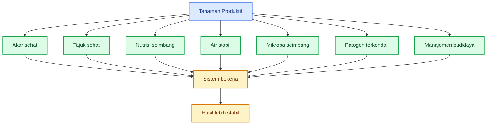

Intinya, input hanya bekerja bila sistem mendukung. Produk bagus tetap bisa gagal bila akar berada dalam kondisi buruk.

### 16.2. Klaim yang perlu dicurigai

Beberapa klaim input yang perlu dicurigai:

- “bisa untuk semua tanaman”;
- “mengatasi semua penyakit”;
- “semakin banyak semakin bagus”;
- “100% alami pasti aman”;
- “mikroba lokal pasti lebih unggul”;
- “cukup kocor, semua selesai”;
- “tidak perlu pupuk lain”;
- “tidak perlu pengendalian hama lagi”;
- “langsung terlihat dalam beberapa hari”;
- “bisa menyembuhkan tanaman yang sudah parah”.

Klaim seperti ini tidak selalu pasti salah, tetapi harus meminta bukti. Dalam pertanian praktis, klaim harus diterjemahkan menjadi pertanyaan:

- fungsinya apa?
- targetnya apa?
- dosisnya berapa?
- kapan digunakan?
- boleh dicampur apa?
- tidak boleh dicampur apa?
- sudah diuji pada tanaman apa?
- hasilnya dibandingkan dengan kontrol atau tidak?
- cocok untuk fase apa?
- risikonya apa?

Jika pertanyaan dasar ini tidak bisa dijawab, input tersebut belum layak dipercaya penuh.

### 16.3. Input harus punya fungsi, dosis, target, dan bukti hasil

Input yang baik harus jelas minimal empat hal:

| Syarat     | Pertanyaan praktis                                                  |
| ---------- | ------------------------------------------------------------------- |
| **Fungsi** | Input ini untuk apa? akar, daun, bunga, buah, tanah, atau penyakit? |
| **Dosis**  | Berapa gram/ml/liter per tanaman atau per hektare?                  |
| **Target** | Masalah apa yang ingin dikoreksi?                                   |
| **Hasil**  | Apa indikator keberhasilannya?                                      |

Contoh:

| Input       | Klaim kabur                 | Klaim lebih masuk akal                                          |
| ----------- | --------------------------- | --------------------------------------------------------------- |
| Mikroba     | menyuburkan semua tanaman   | membantu rizosfer dan menekan patogen tanah tertentu            |
| Pupuk       | membuat tanaman cepat besar | menambah N pada fase vegetatif dengan dosis tertentu            |
| Kalsium     | memperkuat semua tanaman    | membantu jaringan muda dan kualitas buah bila serapan mendukung |
| Trichoderma | mengobati semua penyakit    | membantu menekan penyakit tular tanah tertentu                  |
| MOL         | pupuk hayati lengkap        | kultur campuran yang perlu diuji kecil dulu                     |

### 16.4. Jangan salah membaca tanaman sehat

Tanaman yang tampak hijau belum tentu benar-benar sehat. Tanaman bisa hijau karena nitrogen tinggi, tetapi akarnya lemah. Tanaman bisa rimbun, tetapi bunga mudah rontok. Tanaman bisa tampak segar setelah disemprot, tetapi patogen akar tetap berkembang.

Kesehatan tanaman harus dibaca dari beberapa indikator:

- akar putih dan aktif;
- daun sehat tetapi tidak terlalu rimbun;
- bunga tidak mudah rontok;
- buah berkembang normal;
- tanah tidak becek;
- pH dan nutrisi mendukung;
- tidak ada gejala busuk akar;
- pertumbuhan stabil dari minggu ke minggu.

### 16.5. Kesimpulan Bab 16

Input pertanian harus dipakai sebagai alat, bukan sebagai mantra. Tanaman produktif tidak lahir dari satu produk ajaib, tetapi dari sistem yang seimbang dan dikelola dengan baik.

Pesan kunci:

> **Tanaman produktif bukan hasil mantra input, tetapi hasil sistem budidaya yang seimbang.**

---

## 17. Rumus Praktis Keseimbangan Akar dan Tajuk

Agar mudah diterapkan di lapangan, keseimbangan akar dan tajuk bisa dirumuskan secara sederhana.

```mdx
Tanaman sehat = akar aktif + daun produktif + hara seimbang + air stabil + mikroba seimbang + patogen terkendali
```

Rumus ini bukan rumus matematika mutlak, tetapi rumus berpikir praktis. Tujuannya agar petani tidak hanya fokus pada satu faktor.

Jika tanaman bermasalah, jangan langsung bertanya “kurang pupuk apa?”. Tanyakan dulu:

- apakah akarnya aktif?
- apakah daunnya masih produktif?
- apakah hara seimbang?
- apakah air stabil?
- apakah mikroba tanah seimbang?
- apakah patogen terkendali?

### 17.1. Rumus produktivitas

Rumus kedua:

```mdx
Produktivitas = kesehatan akar × kemampuan fotosintesis × ketersediaan nutrisi × stabilitas lingkungan
```

Tanda kali `×` penting. Artinya, jika salah satu faktor sangat rendah, produktivitas ikut jatuh.

Contoh:

- akar bagus tetapi daun rusak berat → hasil turun;
- daun sehat tetapi akar busuk → hasil turun;
- pupuk lengkap tetapi air tidak stabil → hasil turun;
- mikroba banyak tetapi patogen tinggi → hasil turun;
- nutrisi tersedia tetapi pH salah → hasil turun;
- varietas unggul tetapi tanah buruk → hasil turun.

### 17.2. Diagram rumus keseimbangan

```mermaid
flowchart TB
    A[Produktivitas Tanaman] --> B[Kesehatan akar]
    A --> C[Kemampuan fotosintesis]
    A --> D[Ketersediaan nutrisi]
    A --> E[Stabilitas lingkungan]

    B --> F[Serapan air dan hara]
    C --> G[Energi tanaman]
    D --> H[Pertumbuhan dan hasil]
    E --> I[Tanaman tidak mudah stres]

    F --> J[Produksi stabil]
    G --> J
    H --> J
    I --> J

    classDef main fill:#dbeafe,stroke:#2563eb,color:#1e3a8a,stroke-width:2px;
    classDef factor fill:#dcfce7,stroke:#16a34a,color:#14532d,stroke-width:2px;
    classDef process fill:#fef3c7,stroke:#d97706,color:#78350f,stroke-width:2px;
    classDef result fill:#ede9fe,stroke:#7c3aed,color:#4c1d95,stroke-width:2px;

    class A main;
    class B,C,D,E factor;
    class F,G,H,I process;
    class J result;
```

### 17.3. Penjelasan tiap faktor

✓ Akar aktif

Akar aktif berarti akar mampu tumbuh, membentuk akar rambut, menyerap air, dan menyerap hara. Akar aktif biasanya berwarna putih hingga krem segar, tidak busuk, tidak berlendir, dan memiliki cabang akar yang baik.

Jika akar rusak, serapan turun. Akibatnya, tanaman bisa layu, menguning, kerdil, bunga rontok, atau buah kecil.

✓ Daun produktif

Daun produktif berarti daun mampu berfotosintesis. Daun tidak harus terlalu banyak, tetapi harus cukup sehat, mendapat cahaya, tidak rusak berat oleh hama, dan tidak tertutup penyakit.

Jika daun rusak, energi turun. Bila energi turun, akar juga melemah.

✓ Hara seimbang

Hara seimbang berarti unsur makro dan mikro tersedia sesuai kebutuhan fase tanaman. Bukan hanya NPK, tetapi juga Ca, Mg, B, Zn, Fe, Mn, dan unsur penting lain.

Jika nutrisi tidak seimbang, pertumbuhan terganggu.

✓ Air stabil

Air stabil berarti tidak terlalu kering dan tidak becek. Air harus cukup untuk melarutkan hara, tetapi tidak sampai mengusir oksigen dari zona akar.

Jika air ekstrem, akar stres.

✓ Mikroba seimbang

Mikroba seimbang berarti komunitas biologis tanah bekerja baik. Ada mikroba pengurai, mikroba penyangga, mikroba pemacu pertumbuhan, dan mikroba antagonis dalam kondisi tidak saling mendominasi secara merusak.

Jika mikroba tidak seimbang, tanah menjadi tidak stabil.

✓ Patogen terkendali

Patogen terkendali berarti sumber penyakit ditekan. Bukan berarti tanah steril, tetapi tekanan penyakit tidak sampai merusak akar.

Jika patogen tinggi, akar melemah.

### 17.4. Cara memakai rumus di lapangan

Saat tanaman bermasalah, gunakan urutan pertanyaan berikut:

```mermaid
flowchart TB
    A[Tanaman bermasalah] --> B[Cek akar]
    B --> C[Cek tanah dan air]
    C --> D[Cek daun dan tajuk]
    D --> E[Cek nutrisi]
    E --> F[Cek patogen]
    F --> G[Cek input terakhir]
    G --> H[Ambil keputusan koreksi]

    classDef main fill:#dbeafe,stroke:#2563eb,color:#1e3a8a,stroke-width:2px;
    classDef check fill:#dcfce7,stroke:#16a34a,color:#14532d,stroke-width:2px;
    classDef action fill:#fef3c7,stroke:#d97706,color:#78350f,stroke-width:2px;

    class A main;
    class B,C,D,E,F,G check;
    class H action;
```

Jangan langsung menambah input. Periksa dulu sistemnya.

### 17.5. Kesimpulan Bab 17

Produktivitas tidak lahir dari satu faktor tunggal. Semua faktor utama harus cukup baik. Jika salah satu sangat lemah, hasil akhir akan ikut terganggu.

Pesan kunci:

> **Produktivitas lahir dari keseimbangan, bukan dari satu faktor tunggal.**

---

## 18. Checklist Praktis untuk Petani

Checklist penting karena hal yang tidak dicek sulit dikendalikan. Dalam budidaya, petani sering mengandalkan ingatan dan pengamatan umum. Itu baik, tetapi untuk masalah akar dan tajuk, perlu daftar cek yang lebih terstruktur.

Checklist berikut bisa dipakai sebelum tanam, saat pindah tanam, dan selama pemeliharaan.

### 18.1. Checklist akar dan tanah

```mdx
[ ] Tanah tidak becek terlalu lama
[ ] Drainase baik
[ ] Bedengan cukup tinggi
[ ] Tanah gembur dan tidak padat
[ ] Bahan organik matang
[ ] pH tanah sesuai
[ ] Pupuk tidak terlalu pekat
[ ] Pupuk kimia tidak menempel langsung pada akar muda
[ ] Air tersedia stabil
[ ] Tidak ada genangan
[ ] Mikroba teruji digunakan secara terukur
[ ] Tidak ada fermentasi busuk
[ ] Tanaman sakit dicabut dan dibuang aman
[ ] Akar bibit putih, segar, dan aktif
[ ] Tajuk cukup sehat untuk fotosintesis
```

### 18.2. Checklist sebelum tanam

Sebelum tanam, periksa:

| Aspek         | Pertanyaan                                     |
| ------------- | ---------------------------------------------- |
| Bedengan      | Apakah cukup tinggi dan tidak mudah tergenang? |
| Tanah         | Apakah gembur dan tidak terlalu padat?         |
| Bahan organik | Apakah sudah matang dan tidak bau busuk?       |
| pH            | Apakah sesuai untuk tanaman?                   |
| Drainase      | Apakah parit lancar?                           |
| Bibit         | Apakah akar putih, segar, dan tidak busuk?     |
| Patogen       | Apakah lahan punya riwayat layu/busuk akar?    |
| Mulsa         | Apakah dipasang pada tanah yang sudah siap?    |

### 18.3. Checklist saat pindah tanam

Saat pindah tanam, periksa:

- akar tidak rusak parah;
- bibit tidak terlalu tua di tray;
- lubang tanam tidak becek;
- pupuk kimia tidak menempel langsung pada akar muda;
- kompos yang dipakai sudah matang;
- mikroba bila digunakan ditempatkan di zona akar secara terukur;
- tanaman disiram secukupnya;
- tidak ada genangan di lubang tanam.

### 18.4. Checklist 1–3 minggu setelah tanam

Fase ini penting karena akar sedang menyesuaikan diri.

Periksa:

- tanaman segar pagi dan siang;
- tidak ada layu berlebihan;
- pertumbuhan pucuk mulai aktif;
- akar mulai menjelajah tanah;
- tidak ada busuk pangkal;
- tanah tidak terlalu basah;
- daun tidak menguning tidak wajar;
- tidak ada serangan hama awal yang berat.

### 18.5. Checklist fase bunga dan buah

Pada fase bunga dan buah, akar dan tajuk harus sama-sama kuat.

Periksa:

- air stabil;
- bunga tidak banyak rontok;
- daun cukup aktif;
- tajuk tidak terlalu rimbun;
- sirkulasi udara baik;
- nutrisi K, Ca, Mg, B, dan mikro mendukung;
- tidak ada gejala stres garam;
- buah berkembang seragam;
- tidak ada serangan penyakit tajuk berat.

### 18.6. Alur checklist praktis

```mermaid
flowchart TB
    A[Checklist Budidaya] --> B[Sebelum tanam]
    A --> C[Saat pindah tanam]
    A --> D[1 sampai 3 minggu setelah tanam]
    A --> E[Fase bunga dan buah]

    B --> F[Siapkan tanah, bedengan,<br/>bahan organik, drainase]
    C --> G[Lindungi akar muda<br/>dari stres dan pupuk pekat]
    D --> H[Pastikan akar aktif<br/>dan tanaman tidak layu]
    E --> I[Jaga air, hara,<br/>tajuk, dan buah]

    F --> J[Sistem lebih terkendali]
    G --> J
    H --> J
    I --> J

    classDef main fill:#dbeafe,stroke:#2563eb,color:#1e3a8a,stroke-width:2px;
    classDef stage fill:#dcfce7,stroke:#16a34a,color:#14532d,stroke-width:2px;
    classDef action fill:#fef3c7,stroke:#d97706,color:#78350f,stroke-width:2px;
    classDef result fill:#ede9fe,stroke:#7c3aed,color:#4c1d95,stroke-width:2px;

    class A main;
    class B,C,D,E stage;
    class F,G,H,I action;
    class J result;
```

### 18.7. Kesimpulan Bab 18

Checklist membantu petani berpikir sistematis. Tanpa checklist, masalah sering terlambat diketahui atau salah ditafsirkan.

Pesan kunci:

> **Yang tidak dicek tidak bisa dikendalikan.**

---

## 19. Penutup: Akar Menyerap, Daun Memasak, Petani Mengatur

Tanaman sehat adalah hasil kerja sama akar dan tajuk.

Akar menyerap air dan hara dari tanah. Daun memasak energi melalui fotosintesis. Tanah menyediakan ruang hidup bagi akar dan mikroba. Mikroba menjaga fungsi biologis tanah. Petani mengatur agar semua faktor tidak ekstrem.

Jika akar rusak, tanaman kehilangan kemampuan menyerap. Jika daun rusak, tanaman kehilangan kemampuan membuat energi. Jika tanah rusak, akar kehilangan tempat hidup. Jika air ekstrem, akar stres. Jika nutrisi tidak seimbang, pertumbuhan terganggu. Jika patogen tinggi, tanaman melemah. Jika input digunakan sembarangan, sistem menjadi tidak stabil.

Karena itu, budidaya yang baik tidak boleh hanya bertumpu pada satu produk atau satu teknik. Budidaya yang baik harus membangun keseimbangan.

### 19.1. Ringkasan besar

| Komponen          | Fungsi utama                                      |
| ----------------- | ------------------------------------------------- |
| **Akar**          | menyerap air dan hara                             |
| **Daun**          | menghasilkan energi melalui fotosintesis          |
| **Tanah**         | menyediakan ruang, air, udara, dan penyangga hara |
| **Bahan organik** | memperbaiki struktur dan habitat mikroba          |
| **Mikroba**       | menjaga fungsi biologis dan membantu rizosfer     |
| **Nutrisi**       | menyediakan bahan baku pertumbuhan                |
| **Air**           | menggerakkan hara dan menjaga metabolisme         |
| **Petani**        | mengatur agar sistem tidak ekstrem                |

### 19.2. Diagram akhir sistem tanaman produktif

```mermaid
flowchart TB
    A[Tanaman Produktif] --> B[Akar menyerap]
    A --> C[Daun memasak]
    A --> D[Tanah menopang]
    A --> E[Mikroba menjaga fungsi biologis]
    A --> F[Petani mengatur input]

    B --> G[Air dan hara masuk]
    C --> H[Energi terbentuk]
    D --> I[Ruang akar stabil]
    E --> J[Rizosfer seimbang]
    F --> K[Dosis, waktu, dan cara tepat]

    G --> L[Sistem tanaman seimbang]
    H --> L
    I --> L
    J --> L
    K --> L

    L --> M[Pertumbuhan sehat]
    M --> N[Produksi lebih stabil]

    classDef main fill:#dbeafe,stroke:#2563eb,color:#1e3a8a,stroke-width:2px;
    classDef role fill:#dcfce7,stroke:#16a34a,color:#14532d,stroke-width:2px;
    classDef process fill:#fef3c7,stroke:#d97706,color:#78350f,stroke-width:2px;
    classDef result fill:#ede9fe,stroke:#7c3aed,color:#4c1d95,stroke-width:2px;

    class A main;
    class B,C,D,E,F role;
    class G,H,I,J,K,L process;
    class M,N result;
```

### 19.3. Prinsip akhir untuk praktisi

Beberapa prinsip yang perlu dipegang:

1. Sehatkan akar sejak awal.
2. Jangan memaksa tajuk rimbun sebelum akar siap.
3. Jaga oksigen dan air di zona akar.
4. Gunakan bahan organik matang.
5. Gunakan pupuk secara terukur.
6. Gunakan mikroba berdasarkan fungsi dan dosis.
7. Jangan percaya input yang diklaim menyelesaikan semua masalah.
8. Baca gejala tajuk sebagai petunjuk untuk memeriksa akar.
9. Kendalikan patogen dari sumbernya.
10. Bangun sistem budidaya berimbang, bukan sistem ekstrem.

### 19.4. Kalimat penutup

Tanaman produktif bukan hasil dari keberuntungan dan bukan hasil dari satu input ajaib. Tanaman produktif lahir dari sistem yang bekerja seimbang.

> **Tanaman produktif lahir dari keseimbangan bawah tanah dan atas tanah: akar mampu menyerap, daun mampu memasak, tanah mampu menopang, dan petani mampu mengelola input secara terukur.**

---

<small>
  **_Catatan Penyusunan_** Artikel ini disusun sebagai materi edukasi dan
  referensi umum berdasarkan berbagai sumber pustaka, praktik lapangan, serta
  bantuan alat penulisan. Pembaca disarankan untuk melakukan verifikasi lanjutan
  dan penyesuaian sesuai dengan kondisi serta kebutuhan masing-masing sistem.
</small>
