# **_Akuaponik Sederhana Lele Air Dangkal: Aliran Akar Tanaman dengan Airlift-Pump untuk Mengambil Nitrat_**

> _Lanjutan dari modul siklus nitrogen: memanfaatkan air kolam lele 251 liter untuk mengalirkan nutrien ke akar tanaman, menambah oksigen, dan mengeluarkan nitrogen melalui panen sayuran._

---

- [**_Akuaponik Sederhana Lele Air Dangkal: Aliran Akar Tanaman dengan Airlift-Pump untuk Mengambil Nitrat_**](#akuaponik-sederhana-lele-air-dangkal-aliran-akar-tanaman-dengan-airlift-pump-untuk-mengambil-nitrat)
- [1. Pendahuluan: Dari Siklus Nitrogen ke Akuaponik Sederhana](#1-pendahuluan-dari-siklus-nitrogen-ke-akuaponik-sederhana)
  - [1.1 Ringkasan artikel sebelumnya](#11-ringkasan-artikel-sebelumnya)
  - [1.2 Mengapa akuaponik menjadi lanjutan logis](#12-mengapa-akuaponik-menjadi-lanjutan-logis)
  - [1.3 Konsep yang dipilih](#13-konsep-yang-dipilih)
  - [1.4 Prinsip batas](#14-prinsip-batas)
    - [Pertama: tanaman membantu mengambil nitrat](#pertama-tanaman-membantu-mengambil-nitrat)
    - [Kedua: airlift membantu oksigen dan sirkulasi](#kedua-airlift-membantu-oksigen-dan-sirkulasi)
    - [Ketiga: sistem ini bukan pembenar padat tebar ekstrem](#ketiga-sistem-ini-bukan-pembenar-padat-tebar-ekstrem)
    - [Keempat: pakan dan endapan tetap harus dikontrol](#keempat-pakan-dan-endapan-tetap-harus-dikontrol)
- [2. Basis Desain: Kolam Lele Air Dangkal 251 Liter](#2-basis-desain-kolam-lele-air-dangkal-251-liter)
  - [2.1 Spesifikasi kolam](#21-spesifikasi-kolam)
  - [2.2 Rumus volume](#22-rumus-volume)
  - [2.3 Konsekuensi volume kecil](#23-konsekuensi-volume-kecil)
    - [1. Limbah cepat pekat](#1-limbah-cepat-pekat)
    - [2. Amonia dan nitrit cepat naik bila pakan berlebih](#2-amonia-dan-nitrit-cepat-naik-bila-pakan-berlebih)
    - [3. Akar tanaman tidak boleh menjadi tempat penumpukan feses](#3-akar-tanaman-tidak-boleh-menjadi-tempat-penumpukan-feses)
    - [4. Biomassa ikan harus rasional](#4-biomassa-ikan-harus-rasional)
  - [2.4 Target biomassa untuk desain](#24-target-biomassa-untuk-desain)
    - [2–3 kg: aman untuk mulai](#23-kg-aman-untuk-mulai)
    - [3–5 kg: target rasional](#35-kg-target-rasional)
    - [5–8 kg: target lanjut dengan kontrol ketat](#58-kg-target-lanjut-dengan-kontrol-ketat)
    - [10 kg ke atas: sebaiknya mulai tambah filter](#10-kg-ke-atas-sebaiknya-mulai-tambah-filter)
    - [50 kg: tidak rasional untuk sistem akar langsung](#50-kg-tidak-rasional-untuk-sistem-akar-langsung)
- [3. Konsep Sistem: Aliran Akar dengan Airlift-Pump](#3-konsep-sistem-aliran-akar-dengan-airlift-pump)
  - [3.1 Alur sistem dasar](#31-alur-sistem-dasar)
  - [3.2 Fungsi airlift-pump](#32-fungsi-airlift-pump)
    - [1. Mengalirkan air kolam ke akar tanaman](#1-mengalirkan-air-kolam-ke-akar-tanaman)
    - [2. Menambah kontak air dengan udara](#2-menambah-kontak-air-dengan-udara)
    - [3. Membantu memperkaya oksigen](#3-membantu-memperkaya-oksigen)
    - [4. Membantu melepas CO₂](#4-membantu-melepas-co)
    - [5. Menghindari pompa impeller yang mudah terganggu kotoran](#5-menghindari-pompa-impeller-yang-mudah-terganggu-kotoran)
  - [3.3 Batas airlift-pump](#33-batas-airlift-pump)
    - [1. Tidak cocok untuk head tinggi](#1-tidak-cocok-untuk-head-tinggi)
    - [2. Tidak menyaring feses](#2-tidak-menyaring-feses)
    - [3. Debit terbatas](#3-debit-terbatas)
    - [4. Tetap membutuhkan aerator atau blower](#4-tetap-membutuhkan-aerator-atau-blower)
    - [5. Talang harus rendah dan dekat kolam](#5-talang-harus-rendah-dan-dekat-kolam)
- [4. Nitrogen sebagai Dasar Ukuran Sistem](#4-nitrogen-sebagai-dasar-ukuran-sistem)
  - [4.1 Asumsi desain awal](#41-asumsi-desain-awal)
  - [4.2 Nitrogen pakan harian](#42-nitrogen-pakan-harian)
  - [4.3 Nitrogen limbah harian](#43-nitrogen-limbah-harian)
  - [4.4 Potensi nitrat harian](#44-potensi-nitrat-harian)
  - [4.5 Makna desain](#45-makna-desain)
    - [1. Tanaman membantu mengambil sebagian nitrat](#1-tanaman-membantu-mengambil-sebagian-nitrat)
    - [2. Tidak semua nitrat langsung terserap](#2-tidak-semua-nitrat-langsung-terserap)
    - [3. Jika nitrat terus naik, ada tiga kemungkinan utama](#3-jika-nitrat-terus-naik-ada-tiga-kemungkinan-utama)
    - [4. Nitrat benar-benar keluar hanya jika tanaman dipanen](#4-nitrat-benar-benar-keluar-hanya-jika-tanaman-dipanen)
- [5. Desain Airlift-Pump untuk Kolam 50 cm](#5-desain-airlift-pump-untuk-kolam-50-cm)
  - [5.1 Prinsip desain](#51-prinsip-desain)
  - [5.2 Spesifikasi awal](#52-spesifikasi-awal)
    - [Pipa riser](#pipa-riser)
    - [Kedalaman pipa terendam](#kedalaman-pipa-terendam)
    - [Tinggi angkat air](#tinggi-angkat-air)
    - [Outlet](#outlet)
    - [Sumber udara](#sumber-udara)
    - [Return air](#return-air)
  - [5.3 Posisi intake](#53-posisi-intake)
  - [5.4 Target debit](#54-target-debit)
- [6. Desain Talang Akar Tanaman](#6-desain-talang-akar-tanaman)
  - [6.1 Bentuk talang yang disarankan](#61-bentuk-talang-yang-disarankan)
  - [6.2 Spesifikasi awal](#62-spesifikasi-awal)
    - [Panjang talang](#panjang-talang)
    - [Lebar talang](#lebar-talang)
    - [Kedalaman air](#kedalaman-air)
    - [Jumlah lubang tanaman](#jumlah-lubang-tanaman)
    - [Kemiringan talang](#kemiringan-talang)
    - [Return air](#return-air-1)
  - [6.3 Kenapa bukan NFT sempit](#63-kenapa-bukan-nft-sempit)
  - [6.4 Kenapa talang lebar lebih aman](#64-kenapa-talang-lebar-lebih-aman)
- [7. Tanaman yang Cocok](#7-tanaman-yang-cocok)
  - [7.1 Tanaman utama untuk uji awal](#71-tanaman-utama-untuk-uji-awal)
    - [Kangkung](#kangkung)
    - [Pakcoy](#pakcoy)
    - [Sawi](#sawi)
    - [Bayam air](#bayam-air)
    - [Selada](#selada)
    - [Kemangi atau mint](#kemangi-atau-mint)
  - [7.2 Kenapa kangkung menjadi pilihan pertama](#72-kenapa-kangkung-menjadi-pilihan-pertama)
  - [7.3 Fungsi tanaman](#73-fungsi-tanaman)
    - [1. Mengambil nitrat](#1-mengambil-nitrat)
    - [2. Mengambil sebagian ammonium](#2-mengambil-sebagian-ammonium)
    - [3. Mengambil fosfat dan mineral](#3-mengambil-fosfat-dan-mineral)
    - [4. Menjadi indikator kualitas air](#4-menjadi-indikator-kualitas-air)
    - [5. Mengeluarkan nitrogen lewat panen](#5-mengeluarkan-nitrogen-lewat-panen)
  - [7.4 Panen sebagai kunci](#74-panen-sebagai-kunci)
- [8. Peran Akar sebagai Biofilter Ringan](#8-peran-akar-sebagai-biofilter-ringan)
  - [8.1 Akar sebagai tempat biofilm](#81-akar-sebagai-tempat-biofilm)
  - [8.2 Fungsi positif](#82-fungsi-positif)
    - [1. Membantu nitrifikasi ringan](#1-membantu-nitrifikasi-ringan)
    - [2. Menyerap nutrien](#2-menyerap-nutrien)
    - [3. Menstabilkan mikroba air](#3-menstabilkan-mikroba-air)
    - [4. Menambah permukaan biologis](#4-menambah-permukaan-biologis)
  - [8.3 Batas akar tanaman](#83-batas-akar-tanaman)
  - [8.4 Prinsip utama](#84-prinsip-utama)
- [9. Endapan Dasar dan Sifon Manual](#9-endapan-dasar-dan-sifon-manual)
  - [9.1 Mengapa tetap perlu sifon](#91-mengapa-tetap-perlu-sifon)
  - [9.2 Sumber endapan](#92-sumber-endapan)
    - [1. Feses](#1-feses)
    - [2. Sisa pakan](#2-sisa-pakan)
    - [3. Plankton mati](#3-plankton-mati)
    - [4. Biofilm](#4-biofilm)
    - [5. Bahan organik dari akar/tanaman](#5-bahan-organik-dari-akartanaman)
  - [9.3 SOP sifon](#93-sop-sifon)
    - [Endapan tipis](#endapan-tipis)
    - [Endapan mulai tebal](#endapan-mulai-tebal)
    - [Endapan hitam](#endapan-hitam)
    - [Bau telur busuk](#bau-telur-busuk)
  - [9.4 Frekuensi awal](#94-frekuensi-awal)
- [10. Oksigen dalam Sistem Aliran Akar](#10-oksigen-dalam-sistem-aliran-akar)
  - [10.1 Sumber oksigen](#101-sumber-oksigen)
    - [Airlift-pump](#airlift-pump)
    - [Percikan return air](#percikan-return-air)
    - [Difusi permukaan kolam](#difusi-permukaan-kolam)
    - [Fotosintesis plankton siang hari](#fotosintesis-plankton-siang-hari)
    - [Aerasi tambahan](#aerasi-tambahan)
  - [10.2 Pengguna oksigen](#102-pengguna-oksigen)
    - [Ikan](#ikan)
    - [Mikroba pengurai](#mikroba-pengurai)
    - [Nitrifikasi](#nitrifikasi)
    - [Akar tanaman](#akar-tanaman)
    - [Biofilm](#biofilm)
    - [Plankton malam hari](#plankton-malam-hari)
  - [10.3 Kebutuhan oksigen nitrifikasi](#103-kebutuhan-oksigen-nitrifikasi)
  - [10.4 Kesimpulan oksigen](#104-kesimpulan-oksigen)
- [11. Padat Tebar dan Batas Kapasitas](#11-padat-tebar-dan-batas-kapasitas)
  - [11.1 Klasifikasi untuk sistem ini](#111-klasifikasi-untuk-sistem-ini)
    - [2–3 kg: aman mulai](#23-kg-aman-mulai)
    - [3–5 kg: rasional](#35-kg-rasional)
    - [5–8 kg: uji lanjut](#58-kg-uji-lanjut)
    - [10 kg: mulai perlu filter tambahan](#10-kg-mulai-perlu-filter-tambahan)
    - [25 kg dan 50 kg: tidak cocok untuk sistem sederhana](#25-kg-dan-50-kg-tidak-cocok-untuk-sistem-sederhana)
  - [11.2 Kenapa 50 kg tidak cocok](#112-kenapa-50-kg-tidak-cocok)
  - [11.3 Prinsip batas](#113-prinsip-batas)
- [12. SOP Operasional Harian dan Mingguan](#12-sop-operasional-harian-dan-mingguan)
  - [12.1 Harian](#121-harian)
    - [12.1.1 Cek airlift menyala](#1211-cek-airlift-menyala)
    - [12.1.2 Cek aliran di talang](#1212-cek-aliran-di-talang)
    - [12.1.3 Cek return air jatuh ke kolam](#1213-cek-return-air-jatuh-ke-kolam)
    - [12.1.4 Cek ikan pagi](#1214-cek-ikan-pagi)
    - [12.1.5 Cek pakan habis](#1215-cek-pakan-habis)
    - [12.1.6 Cek bau air](#1216-cek-bau-air)
    - [12.1.7 Cek akar tanaman](#1217-cek-akar-tanaman)
  - [12.2 Setiap 2–3 hari](#122-setiap-23-hari)
    - [12.2.1 Cek endapan dasar](#1221-cek-endapan-dasar)
    - [12.2.2 Sifon bila perlu](#1222-sifon-bila-perlu)
    - [12.2.3 Cek talang dari lumpur](#1223-cek-talang-dari-lumpur)
    - [12.2.4 Buang daun tua/busuk](#1224-buang-daun-tuabusuk)
  - [12.3 Mingguan](#123-mingguan)
    - [12.3.1 Ukur pH](#1231-ukur-ph)
    - [12.3.2 Ukur TAN/amonia](#1232-ukur-tanamonia)
    - [12.3.3 Ukur nitrit](#1233-ukur-nitrit)
    - [12.3.4 Ukur nitrat](#1234-ukur-nitrat)
    - [12.3.5 Sampling bobot ikan](#1235-sampling-bobot-ikan)
    - [12.3.6 Hitung FCR sementara](#1236-hitung-fcr-sementara)
    - [12.3.7 Pangkas atau panen tanaman](#1237-pangkas-atau-panen-tanaman)
    - [12.3.8 Bersihkan pipa airlift jika aliran melemah](#1238-bersihkan-pipa-airlift-jika-aliran-melemah)
- [13. Tanda Sistem Berhasil atau Gagal](#13-tanda-sistem-berhasil-atau-gagal)
  - [13.1 Tanda berhasil](#131-tanda-berhasil)
    - [Ikan aktif](#ikan-aktif)
    - [Pakan cepat habis](#pakan-cepat-habis)
    - [Air tidak bau](#air-tidak-bau)
    - [Akar tanaman bersih](#akar-tanaman-bersih)
    - [Tanaman tumbuh](#tanaman-tumbuh)
    - [Nitrit rendah](#nitrit-rendah)
    - [Nitrat tidak naik ekstrem](#nitrat-tidak-naik-ekstrem)
    - [Endapan terkendali](#endapan-terkendali)
    - [FCR stabil](#fcr-stabil)
  - [13.2 Tanda gagal](#132-tanda-gagal)
    - [Ikan menggantung](#ikan-menggantung)
    - [Air bau amonia](#air-bau-amonia)
    - [Akar berlendir busuk](#akar-berlendir-busuk)
    - [Talang penuh lumpur](#talang-penuh-lumpur)
    - [Nitrit naik](#nitrit-naik)
    - [Tanaman menguning atau busuk](#tanaman-menguning-atau-busuk)
    - [Pakan tersisa](#pakan-tersisa)
    - [Endapan hitam](#endapan-hitam-1)
    - [Airlift melemah](#airlift-melemah)
  - [13.3 Tindakan koreksi](#133-tindakan-koreksi)
    - [13.3.1 Jika ikan menggantung](#1331-jika-ikan-menggantung)
    - [13.3.2 Jika akar busuk](#1332-jika-akar-busuk)
    - [13.3.3 Jika nitrit naik](#1333-jika-nitrit-naik)
    - [13.3.4 Jika nitrat naik](#1334-jika-nitrat-naik)
    - [13.3.5 Jika endapan bau](#1335-jika-endapan-bau)
    - [13.3.6 Jika airlift lemah](#1336-jika-airlift-lemah)
- [14. Rancangan Uji Lapangan](#14-rancangan-uji-lapangan)
  - [14.1 Tujuan uji](#141-tujuan-uji)
    - [1. Menguji apakah aliran akar menurunkan nitrat](#1-menguji-apakah-aliran-akar-menurunkan-nitrat)
    - [2. Menguji apakah airlift cukup membantu oksigen](#2-menguji-apakah-airlift-cukup-membantu-oksigen)
    - [3. Menguji batas biomassa ikan](#3-menguji-batas-biomassa-ikan)
    - [4. Mengukur FCR](#4-mengukur-fcr)
    - [5. Mengukur pertumbuhan tanaman](#5-mengukur-pertumbuhan-tanaman)
  - [14.2 Desain uji sederhana](#142-desain-uji-sederhana)
    - [Syarat agar uji adil](#syarat-agar-uji-adil)
    - [Desain tahap awal](#desain-tahap-awal)
  - [14.3 Data yang dicatat](#143-data-yang-dicatat)
    - [14.3.1 Catatan harian](#1431-catatan-harian)
    - [14.3.2 Catatan mingguan](#1432-catatan-mingguan)
    - [14.3.3 Rumus biomassa](#1433-rumus-biomassa)
    - [14.3.4 Rumus survival rate](#1434-rumus-survival-rate)
    - [14.3.5 Rumus FCR sementara](#1435-rumus-fcr-sementara)
    - [14.3.6 Estimasi nitrogen dari pakan](#1436-estimasi-nitrogen-dari-pakan)
  - [14.4 Cara menyimpulkan](#144-cara-menyimpulkan)
    - [Kesimpulan yang salah](#kesimpulan-yang-salah)
    - [Kesimpulan yang benar](#kesimpulan-yang-benar)
    - [14.4.1 Matriks penilaian kelayakan](#1441-matriks-penilaian-kelayakan)
    - [14.4.2 Diagram kesimpulan uji](#1442-diagram-kesimpulan-uji)
    - [14.4.3 Kriteria naik tahap](#1443-kriteria-naik-tahap)
- [15. Kesimpulan Strategis](#15-kesimpulan-strategis)
  - [15.1 Rumusan utama](#151-rumusan-utama)
  - [15.2 Desain final yang dikunci](#152-desain-final-yang-dikunci)
    - [Komponen kunci](#komponen-kunci)
    - [Desain yang dihindari](#desain-yang-dihindari)
  - [15.3 Target awal](#153-target-awal)
    - [Biomassa ikan awal: 2–3 kg](#biomassa-ikan-awal-23-kg)
    - [Biomassa rasional: 3–5 kg](#biomassa-rasional-35-kg)
    - [Lubang tanam awal: 10–20](#lubang-tanam-awal-1020)
    - [Lubang tanam lanjut: 20–40](#lubang-tanam-lanjut-2040)
    - [Debit airlift: 100–250 L/jam](#debit-airlift-100250-ljam)
    - [Tanaman awal: kangkung](#tanaman-awal-kangkung)
  - [15.4 Prinsip akhir](#154-prinsip-akhir)
    - [1. Pakan tetap sumber utama nitrogen](#1-pakan-tetap-sumber-utama-nitrogen)
    - [2. Akar mengambil nitrat, bukan lumpur](#2-akar-mengambil-nitrat-bukan-lumpur)
    - [3. Airlift membantu, tetapi bukan filter](#3-airlift-membantu-tetapi-bukan-filter)
    - [4. Endapan harus keluar dari sistem](#4-endapan-harus-keluar-dari-sistem)
    - [5. Panen tanaman adalah pengeluaran nitrogen](#5-panen-tanaman-adalah-pengeluaran-nitrogen)
    - [6. Biomassa harus naik bertahap](#6-biomassa-harus-naik-bertahap)
- [Penutup Artikel](#penutup-artikel)

---

# 1. Pendahuluan: Dari Siklus Nitrogen ke Akuaponik Sederhana

Artikel ini adalah lanjutan dari pembahasan sebelumnya tentang **siklus nitrogen pada budidaya lele air dangkal**. Artikel pertama sudah membahas bagaimana pakan berubah menjadi daging, feses, amonia, nitrit, nitrat, endapan, dan kebutuhan oksigen.

Artikel baru ini tidak mengulang seluruh pembahasan tersebut. Fokusnya lebih spesifik:

> **Bagaimana nitrat yang terbentuk di kolam lele air dangkal dapat dimanfaatkan oleh tanaman melalui sistem akuaponik sederhana berbasis aliran air kolam ke akar tanaman dengan airlift-pump.**

Konsep yang dipakai bukan akuaponik lengkap skala komersial dengan filter mekanis besar, biofilter terpisah, dan instalasi hidroponik kompleks. Konsep yang dipilih lebih sederhana, murah, dan cocok untuk uji lapangan kecil:

```text id="t2940i"
Kolam lele air dangkal
→ airlift-pump
→ talang akar tanaman
→ akar menyerap nitrat
→ air jatuh kembali ke kolam
```

Namun sederhana bukan berarti bebas risiko. Justru karena sistem ini sederhana, batas desainnya harus lebih disiplin.

<ResourceBox
  title="Artikel Terkait:"
  items={[
    {
      name: 'Budidaya Lele Air Dangkal, Probiotik, dan Fermentasi Pakan',
      href: '/blog/agri/perikanan/lele-air-dangkal-probiotik',
    },
    {
      name: 'Siklus Nitrogen pada Budidaya Lele Air Dangkal: Pakan, Amonia, Nitrit, Nitrat, Mikroba, dan Batas Kapasitas Kolam',
      href: '/blog/agri/perikanan/siklus-nitrogen-lele-air-dangkal',
    },
    {
      name: 'Desain Airlift-Pump untuk Kolam Lele Air Dangkal 50 cm',
      href: '/blog/agri/perikanan/design-airlift-pump',
    },
    {
      name: 'Air Lift Pump - Prinsip, Desain, dan Aplikasi dalam Akuakultur',
      href: '/blog/agri/airlift-pump',
    },
  ]}
/>

---

## 1.1 Ringkasan artikel sebelumnya

Pada artikel sebelumnya, prinsip utama yang dikunci adalah:

> **Setiap pakan yang tidak menjadi daging akan menjadi beban nitrogen.**

Pakan adalah sumber pertumbuhan, tetapi juga sumber limbah. Protein dalam pakan membawa nitrogen. Setelah pakan dimakan ikan, nitrogen akan terbagi menjadi dua jalur besar.

Jalur pertama adalah jalur produktif:

```text id="9pt05u"
pakan → protein → asam amino → daging ikan
```

Jalur kedua adalah jalur limbah:

```text id="z3se1p"
pakan → feses/urin/sisa pakan → amonia → nitrit → nitrat
```

Amonia dan nitrit adalah dua fase yang paling berbahaya. Amonia, terutama dalam bentuk **NH₃ bebas**, dapat meracuni ikan. Nitrit dapat mengganggu kemampuan darah ikan membawa oksigen. Nitrat lebih aman dibanding amonia dan nitrit, tetapi nitrat tetap menunjukkan adanya akumulasi nitrogen di sistem.

Alur ringkasnya:

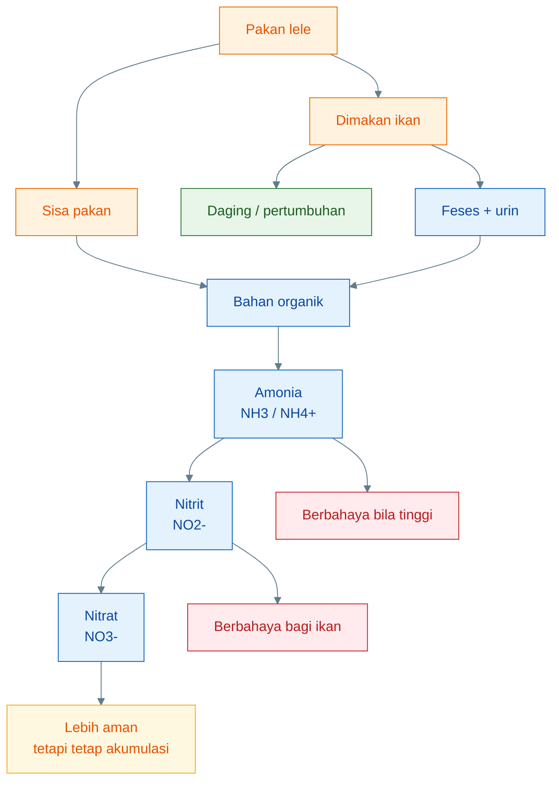

Dalam artikel sebelumnya juga sudah dihitung bahwa pada kolam kecil, beban nitrogen dapat meningkat sangat cepat. Kolam diameter 80 cm dengan tinggi air 50 cm hanya berisi sekitar **251 liter air**. Pada volume sekecil ini, pakan yang berlebih sedikit saja bisa cepat memengaruhi kualitas air.

Karena itu, tujuan artikel baru ini bukan untuk membuat sistem padat tebar ekstrem, tetapi untuk menjawab pertanyaan lanjutan:

> **Setelah amonia dan nitrit berhasil diproses menjadi nitrat, bagaimana nitrat itu bisa dimanfaatkan tanaman agar sebagian nitrogen keluar dari sistem?**

---

## 1.2 Mengapa akuaponik menjadi lanjutan logis

Akuaponik menjadi lanjutan logis dari siklus nitrogen karena tanaman membutuhkan nitrogen untuk tumbuh. Salah satu bentuk nitrogen yang umum dimanfaatkan tanaman adalah nitrat.

Dalam sistem lele air dangkal, nitrat terbentuk setelah proses nitrifikasi:

```text id="bsfl6h"
amonia → nitrit → nitrat
```

Jika nitrat tidak dikeluarkan, ia akan menumpuk di air. Nitrat memang tidak secepat amonia atau nitrit dalam meracuni ikan, tetapi nitrat tinggi tetap menunjukkan bahwa sistem sudah membawa beban nitrogen besar.

Akuaponik memberi jalur keluar:

```text id="bbbhdf"
nitrat → akar tanaman → batang/daun → panen sayuran
```

Dengan kata lain, tanaman bukan hanya “hiasan” di atas kolam. Tanaman berfungsi sebagai **penyerap nutrien**. Ketika tanaman dipanen, sebagian nitrogen benar-benar keluar dari sistem.

Alurnya:

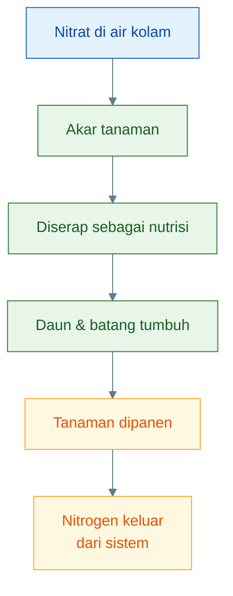

Inilah alasan akuaponik cocok menjadi lanjutan dari artikel siklus nitrogen. Artikel pertama berhenti pada pemahaman bahwa pakan menghasilkan nitrogen. Artikel kedua melanjutkan bahwa nitrogen, terutama nitrat, dapat dimanfaatkan untuk membesarkan tanaman.

Namun ada batas penting:

> **Tanaman paling aman diposisikan sebagai penyerap nitrat, bukan sebagai penyelamat utama saat amonia dan nitrit sedang tinggi.**

Jika amonia atau nitrit tinggi, tindakan pertama tetap:

- kurangi pakan,
- tambah aerasi,
- kendalikan endapan,
- cek kualitas air,
- stabilkan sistem.

Tanaman membantu, tetapi bukan alat darurat untuk menetralkan pakan berlebih.

---

## 1.3 Konsep yang dipilih

Konsep yang dipilih dalam artikel ini bukan akuaponik lengkap dengan filter formal besar. Sistem yang dipilih adalah:

> **akuaponik sederhana berbasis aliran air kolam ke akar tanaman dengan airlift-pump.**

<figure>
  
  <figcaption>Sistem akuaponik lele pada kondisi air dangkal.</figcaption>
</figure>

Artinya, air dari kolam lele dialirkan ke talang atau wadah akar tanaman. Air tersebut membawa nitrat, sebagian amonium, fosfat, mineral, dan bahan organik terlarut. Akar tanaman menyerap sebagian nutrien. Setelah melewati akar tanaman, air jatuh kembali ke kolam.

Skema dasarnya:

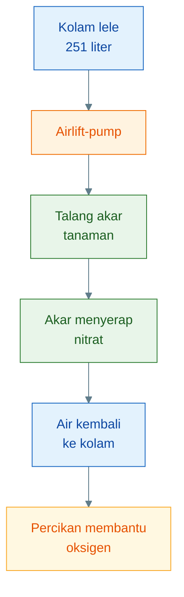

Mengapa memakai **airlift-pump**?

Karena airlift-pump memiliki beberapa keunggulan untuk sistem kecil:

1. **mengalirkan air tanpa impeller**, sehingga lebih toleran terhadap air kolam yang tidak terlalu bersih;
2. **menambah udara ke air**, karena air bergerak bersama gelembung;
3. **membantu memperkaya oksigen**, terutama di jalur air yang menuju akar;
4. **membantu melepas CO₂**, karena air mengalami kontak dengan udara;
5. **hemat dan sederhana**, cocok untuk eksperimen praktisi.

Namun airlift-pump juga punya batas:

- tidak kuat mengangkat air terlalu tinggi,
- debit terbatas,
- tidak menyaring feses,
- tetap membutuhkan aerator/blower,
- tidak boleh dipakai untuk membenarkan padat tebar ekstrem.

Karena itu, desain artikel ini diarahkan pada sistem **rendah-head**, yaitu talang akar diletakkan tidak terlalu tinggi dari permukaan kolam.

Konsep yang tidak dipilih:

```text id="cjiosr"
kolam lele kecil
+ padat tebar ekstrem
+ air langsung ke akar
+ tanpa kontrol pakan
+ tanpa sifon endapan
```

Konsep yang dipilih:

```text id="4j2dfu"
kolam lele 251 liter
+ biomassa rasional
+ airlift-pump
+ talang akar lebar
+ return air jatuh ke kolam
+ sifon endapan manual
+ pakan disiplin
```

Perbedaan keduanya sangat penting. Sistem sederhana masih bisa berhasil jika beban nitrogen rendah sampai sedang. Tetapi sistem sederhana akan gagal jika dipaksa menanggung biomassa terlalu tinggi.

---

## 1.4 Prinsip batas

Ada empat prinsip batas yang harus dikunci sejak awal.

### Pertama: tanaman membantu mengambil nitrat

Tanaman dapat menyerap nitrat dan sebagian nutrien lain. Tetapi kemampuan tanaman terbatas oleh:

- jumlah akar,
- kecepatan tumbuh,
- cahaya,
- kesehatan tanaman,
- luas talang,
- aliran air,
- oksigen di zona akar,
- jumlah nitrat yang masuk.

Jika pakan harian terlalu besar, nitrat yang terbentuk bisa jauh lebih banyak daripada kemampuan tanaman menyerapnya.

### Kedua: airlift membantu oksigen dan sirkulasi

Airlift-pump membantu menggerakkan air dan menambah kontak dengan udara. Ini lebih baik daripada air diam. Namun airlift tidak boleh dianggap sebagai solusi semua masalah.

Airlift membantu:

- sirkulasi air,
- suplai oksigen,
- aliran nutrien ke akar,
- pengembalian air ke kolam dengan percikan.

Tetapi airlift tidak menyelesaikan:

- pakan berlebih,
- feses menumpuk,
- akar berlendir,
- nitrit tinggi,
- amonia tinggi,
- padat tebar ekstrem.

### Ketiga: sistem ini bukan pembenar padat tebar ekstrem

Sistem akar tanaman dengan airlift-pump cocok untuk membantu menstabilkan nitrogen pada beban rendah sampai sedang. Sistem ini tidak dirancang untuk menanggung 50 kg lele dalam 251 liter air.

Untuk beban ekstrem, dibutuhkan sistem lebih lengkap:

- filter mekanis,
- biofilter khusus,
- aerasi kuat,
- monitoring amonia dan nitrit,
- pengelolaan endapan,
- kemungkinan panen bertahap,
- kontrol pakan sangat ketat.

### Keempat: pakan dan endapan tetap harus dikontrol

Tanaman tidak boleh dijadikan tempat menampung feses dan sisa pakan. Akar tanaman adalah penyerap nutrisi dan biofilter ringan, bukan bak sampah organik.

Prinsipnya:

> **Akar tanaman boleh menerima air kaya nutrien, tetapi tidak boleh dipaksa menjadi filter lumpur utama.**

Maka dalam desain ini tetap diperlukan:

- pakan harus habis cepat,
- endapan dasar harus disifon,
- airlift intake jangan tepat di dasar,
- talang harus mudah dibersihkan,
- tanaman harus dipanen rutin,
- daun/akar busuk harus dibuang.

Ringkasan prinsip batas:

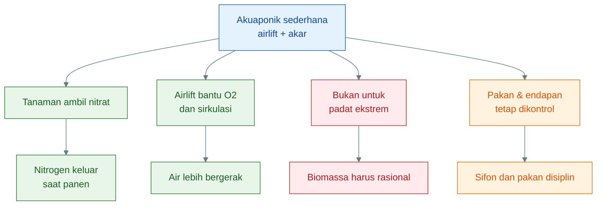

Kesimpulan Bab 1:

> **Akuaponik sederhana dengan aliran akar dan airlift-pump adalah lanjutan logis dari siklus nitrogen, karena nitrat dapat dimanfaatkan tanaman. Namun sistem ini tetap harus dibatasi: tanaman mengambil nitrat, airlift membantu oksigen, tetapi pakan, endapan, amonia, nitrit, dan biomassa ikan tetap harus dikendalikan.**

[**Kembali ke Atas**](#akuaponik-sederhana-lele-air-dangkal-aliran-akar-tanaman-dengan-airlift-pump-untuk-mengambil-nitrat)

---

# 2. Basis Desain: Kolam Lele Air Dangkal 251 Liter

Sebelum merancang talang tanaman, airlift-pump, jumlah lubang tanam, atau target biomassa ikan, dasar pertama yang harus dikunci adalah ukuran kolam.

Artikel ini memakai basis desain yang sama dengan artikel sebelumnya:

> **kolam bulat diameter 80 cm dengan tinggi air maksimal 50 cm.**

Ukuran ini penting karena menentukan volume air. Volume air menentukan kapasitas sistem menghadapi pakan, feses, amonia, nitrit, nitrat, oksigen, dan endapan.

---

## 2.1 Spesifikasi kolam

Spesifikasi dasar:

| Parameter           |      Nilai |
| ------------------- | ---------: |
| Bentuk kolam        |      bulat |
| Diameter            |      80 cm |
| Tinggi air maksimal |      50 cm |
| Volume air          | ±251 liter |

Kolam seperti ini cocok untuk eksperimen kecil karena:

- mudah dibuat,
- murah,
- mudah diamati,
- cocok untuk sistem air dangkal,
- cocok untuk uji konsep airlift dan akar tanaman.

Namun kolam seperti ini juga memiliki keterbatasan:

- volume air kecil,
- limbah cepat pekat,
- toleransi kesalahan pakan rendah,
- endapan cepat berpengaruh,
- tidak cocok untuk langsung dikejar padat tebar ekstrem.

Dengan kata lain, kolam kecil cocok untuk belajar dan menguji sistem, tetapi harus dikelola dengan disiplin.

---

## 2.2 Rumus volume

Kolam bulat dapat dihitung sebagai tabung.

Rumus volume:

$$
V = \pi r^2 h
$$

Keterangan:

$$
V = \text{volume air}
$$

$$
r = \text{jari-jari kolam}
$$

$$
h = \text{tinggi air}
$$

Diameter kolam:

$$
d = 80 \text{ cm} = 0{,}8 \text{ m}
$$

Jari-jari:

$$
r = \frac{d}{2}
$$

$$
r = \frac{0{,}8}{2} = 0{,}4 \text{ m}
$$

Tinggi air:

$$
h = 50 \text{ cm} = 0{,}5 \text{ m}
$$

Maka:

$$
V = 3{,}14 \times (0{,}4)^2 \times 0{,}5
$$

$$
V = 3{,}14 \times 0{,}16 \times 0{,}5
$$

$$
V = 0{,}2512 \text{ m}^3
$$

Karena:

$$
1 \text{ m}^3 = 1.000 \text{ liter}
$$

Maka:

$$
0{,}2512 \text{ m}^3 = 251{,}2 \text{ liter}
$$

Jadi:

> **Volume air kolam adalah sekitar 251 liter.**

Diagram perhitungan:

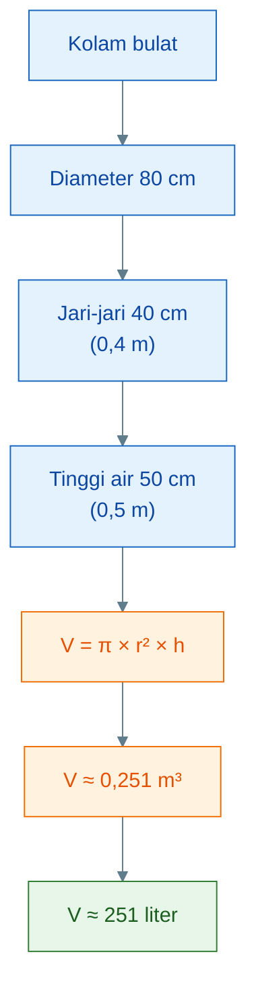

Dalam praktik, volume efektif bisa sedikit lebih rendah karena:

- tinggi air tidak selalu tepat 50 cm,
- dasar kolam mungkin tidak rata,
- ada endapan,
- ada ruang bebas di atas air,
- ada pipa, aerasi, atau komponen tambahan.

Karena itu, untuk desain lapangan, volume 251 liter sebaiknya dianggap sebagai angka maksimum praktis. Pendekatan konservatif bisa memakai 230–250 liter.

---

## 2.3 Konsekuensi volume kecil

Volume 251 liter membuat sistem sangat responsif. Ini bisa menjadi kelebihan dan kelemahan.

Kelebihannya:

- perubahan mudah diamati,
- koreksi cepat terasa,
- kebutuhan air tidak besar,
- cocok untuk uji perlakuan,
- cocok untuk pembelajaran praktis.

Kelemahannya:

- pakan berlebih cepat memicu masalah,
- amonia cepat naik,
- nitrit cepat berbahaya,
- suhu lebih mudah berubah,
- endapan cepat memengaruhi air,
- akar tanaman mudah kotor jika feses ikut terbawa,
- padat tebar harus lebih konservatif.

Dalam sistem akuaponik sederhana berbasis airlift, konsekuensi volume kecil menjadi lebih penting karena air kolam akan dialirkan ke akar tanaman. Jika air terlalu kotor, akar tanaman akan menerima beban organik langsung.

Alur risikonya:

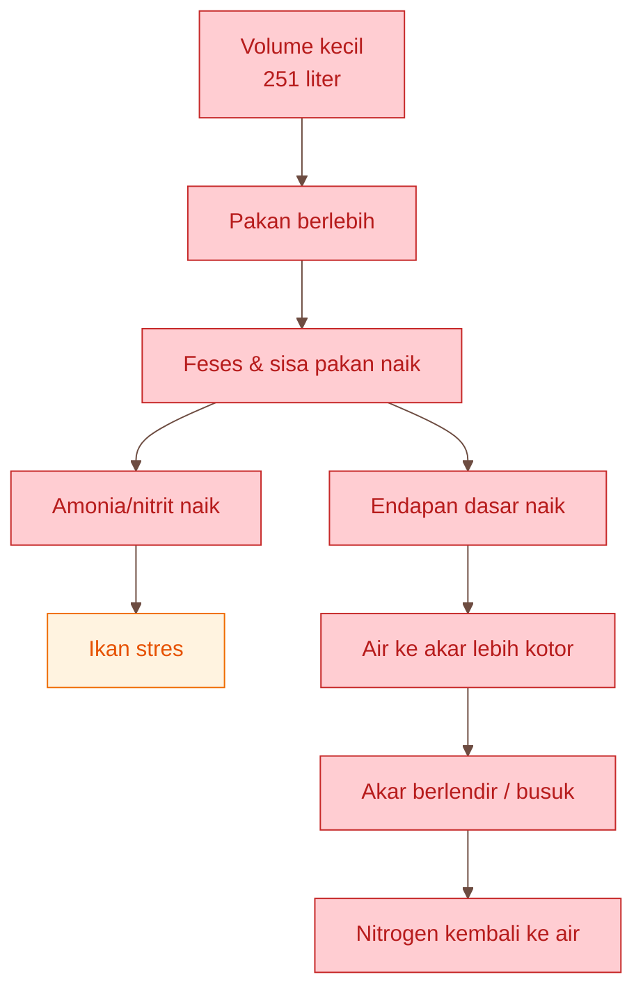

Ada empat konsekuensi utama yang harus dipegang.

### 1. Limbah cepat pekat

Pada kolam besar, kesalahan pakan kecil mungkin masih terencerkan. Pada kolam 251 liter, pakan tersisa sedikit tetapi terjadi berulang bisa cepat menjadi masalah.

Misalnya pakan tersisa 5–10 gram per hari. Dalam seminggu, sisa organik bisa menjadi 35–70 gram. Untuk kolam kecil, ini tidak kecil.

### 2. Amonia dan nitrit cepat naik bila pakan berlebih

Amonia berasal dari metabolisme protein dan penguraian bahan organik. Nitrit muncul jika proses nitrifikasi tidak seimbang. Pada volume kecil, keduanya bisa naik lebih cepat.

Maka sistem airlift dan tanaman tidak boleh dipakai untuk menutupi kebiasaan overfeeding.

### 3. Akar tanaman tidak boleh menjadi tempat penumpukan feses

Dalam konsep ini, air kolam dialirkan ke akar tanaman. Tetapi akar tanaman tidak dirancang untuk menerima lumpur pekat. Jika feses dan sisa pakan menempel berlebihan, akar bisa menjadi anaerob dan busuk.

Maka posisi intake airlift penting. Intake tidak boleh tepat di dasar kolam. Lebih rasional mengambil air beberapa sentimeter di atas dasar, sementara endapan dasar dibuang dengan sifon manual.

### 4. Biomassa ikan harus rasional

Semakin besar biomassa ikan, semakin besar pakan harian. Semakin besar pakan harian, semakin besar nitrogen dan endapan. Pada sistem sederhana, batas biomassa harus lebih konservatif dibanding sistem akuaponik lengkap.

Prinsipnya:

> **Semakin sederhana sistem filtrasi, semakin rendah biomassa ikan yang aman.**

---

## 2.4 Target biomassa untuk desain

Target biomassa harus dibaca berdasarkan kapasitas kolam 251 liter dan karakter sistem yang dipilih.

Sistem ini memakai:

- kolam kecil,
- air dangkal,
- airlift-pump,
- talang akar tanaman,
- tanpa filter mekanis formal,
- tanpa biofilter besar terpisah,
- sifon endapan manual,
- pakan disiplin.

Karena itu target biomassa tidak boleh terlalu agresif.

| Biomassa lele | Status                                    |
| ------------: | ----------------------------------------- |
|        2–3 kg | aman untuk mulai                          |
|        3–5 kg | target rasional                           |
|        5–8 kg | target lanjut dengan kontrol ketat        |
| 10 kg ke atas | sebaiknya mulai tambah filter             |
|         50 kg | tidak rasional untuk sistem akar langsung |

### 2–3 kg: aman untuk mulai

Ini cocok untuk uji awal. Beban pakan masih rendah. Akar tanaman belum terlalu berat menerima nutrien dan partikel organik. Sistem airlift dapat diuji tanpa risiko terlalu tinggi.

Cocok untuk:

- belajar membaca air,
- menguji airlift,
- melihat respons kangkung/pakcoy,
- mengecek apakah akar berlendir atau tidak,
- mengukur nitrat awal.

### 3–5 kg: target rasional

Ini adalah target utama desain awal. Pada biomassa 3–5 kg, sistem masih masuk akal jika:

- pakan habis cepat,
- endapan disifon,
- akar tanaman bersih,
- air tidak bau,
- ikan tidak menggantung pagi,
- aliran airlift stabil.

Untuk 5 kg biomassa, jika feed rate 2% biomassa/hari:

$$
\text{Pakan harian} = 5 \times 2%
$$

$$
= 0{,}1 \text{ kg/hari}
$$

$$
= 100 \text{ gram/hari}
$$

Angka ini masih bisa dikelola dengan sistem sederhana, tetapi tetap harus disiplin.

### 5–8 kg: target lanjut dengan kontrol ketat

Ini sudah lebih menantang. Sistem masih bisa diuji, tetapi hanya setelah fase 3–5 kg terbukti stabil.

Syarat naik ke 5–8 kg:

- pakan tidak tersisa,
- akar tidak busuk,
- talang tidak berlumpur,
- endapan dasar terkendali,
- nitrit rendah,
- TAN rendah,
- tanaman tumbuh aktif,
- airlift tidak melemah,
- aerasi cukup.

Jika salah satu syarat ini gagal, jangan naik biomassa.

### 10 kg ke atas: sebaiknya mulai tambah filter

Pada 10 kg biomassa, pakan harian dapat mencapai:

$$
10 \times 2% = 0{,}2 \text{ kg/hari}
$$

$$
= 200 \text{ gram/hari}
$$

Ini berarti nitrogen dan feses juga meningkat. Pada titik ini, sistem akar langsung mulai berat. Sebaiknya mulai menambahkan komponen seperti:

- swirl filter kecil,
- radial flow filter,
- media bed tambahan,
- biofilter aerasi,
- pembersihan endapan lebih sering.

### 50 kg: tidak rasional untuk sistem akar langsung

50 kg lele dalam kolam 251 liter adalah beban ekstrem. Jika feed rate 2%:

$$
50 \times 2% = 1 \text{ kg pakan/hari}
$$

Dari artikel sebelumnya, 1 kg pakan 32% protein dapat berpotensi menghasilkan sekitar:

$$
158{,}75 \text{ gram NO}_3^-/hari
$$

Ini terlalu besar untuk sistem akar langsung sederhana tanpa filter formal.

Maka kesimpulannya jelas:

> **Sistem airlift + akar tanaman cocok untuk membantu mengambil nitrat pada beban rendah sampai sedang, bukan untuk memaksa kolam 251 liter menanggung 50 kg biomassa lele.**

Diagram batas biomassa:

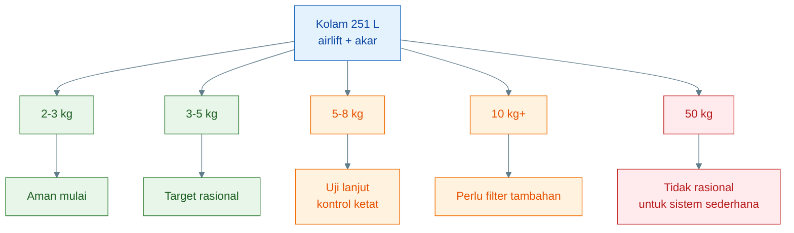

Kesimpulan Bab 2:

> **Kolam bulat 80 cm dengan tinggi air 50 cm hanya berisi sekitar 251 liter. Volume kecil membuat sistem mudah diamati, tetapi juga membuat limbah cepat pekat. Karena sistem ini memakai aliran akar dengan airlift-pump tanpa filter formal besar, target biomassa harus konservatif: mulai 2–3 kg, target rasional 3–5 kg, dan 5–8 kg hanya sebagai uji lanjut dengan kontrol ketat.**

[**Kembali ke Atas**](#akuaponik-sederhana-lele-air-dangkal-aliran-akar-tanaman-dengan-airlift-pump-untuk-mengambil-nitrat)

---

# 3. Konsep Sistem: Aliran Akar dengan Airlift-Pump

Konsep utama sistem ini adalah mengalirkan air kolam lele ke zona akar tanaman menggunakan **airlift-pump**. Air yang mengandung nitrat, sebagian ammonium, fosfat, mineral, dan bahan organik terlarut dialirkan melewati akar tanaman. Akar menyerap sebagian nutrien, lalu air jatuh kembali ke kolam.

Sistem ini dibuat sederhana, tetapi tetap harus dibaca sebagai sistem biologis. Di dalamnya ada ikan, pakan, feses, mikroba, oksigen, akar tanaman, biofilm, amonia, nitrit, nitrat, dan endapan.

Prinsip dasarnya:

> **airlift menggerakkan air dan membantu oksigen; akar tanaman mengambil nitrat; endapan tetap harus dibuang manual.**

---

## 3.1 Alur sistem dasar

Alur sistem yang dikunci adalah:

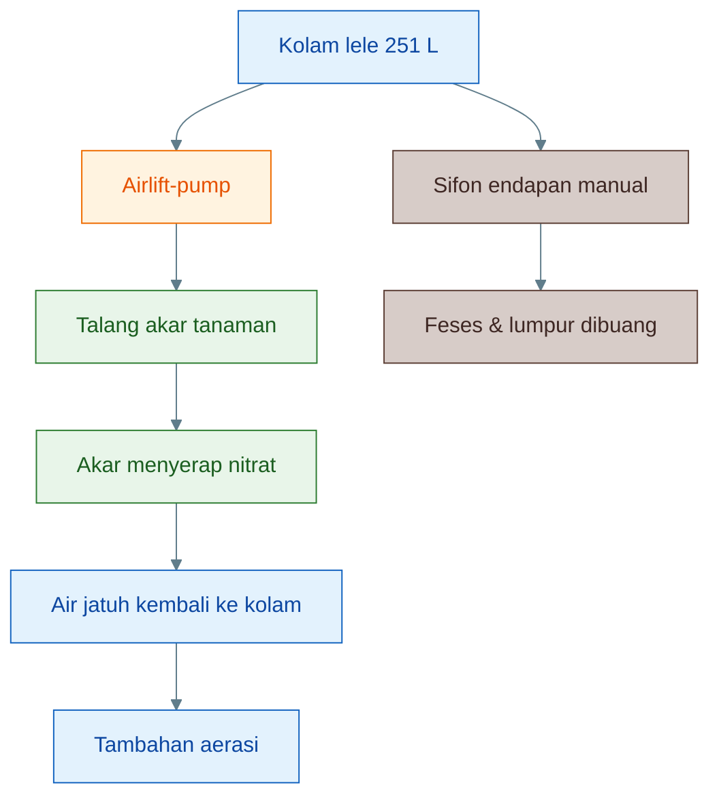

Ada dua jalur penting dalam diagram ini.

Jalur pertama adalah jalur sirkulasi air:

```text id="t8f5qw"
kolam → airlift → talang akar → kembali ke kolam
```

Jalur kedua adalah jalur pembuangan padatan:

```text id="zekez9"
endapan dasar → sifon manual → dibuang keluar sistem
```

Dua jalur ini tidak boleh disamakan. Airlift berfungsi mengalirkan air bernutrien ke akar. Sifon manual berfungsi membuang feses dan lumpur. Jika feses kasar dibiarkan masuk terus ke akar tanaman, maka akar akan berubah menjadi perangkap lumpur, bukan penyerap nitrat.

Jadi sistem ini memiliki tiga fungsi utama:

| Komponen     | Fungsi utama                                 |
| ------------ | -------------------------------------------- |
| Kolam lele   | tempat ikan, pakan, dan siklus nitrogen awal |
| Airlift-pump | mengalirkan air dan membantu oksigen         |
| Talang akar  | tempat akar menyerap nitrat dan nutrien      |
| Sifon manual | membuang endapan kasar                       |

Rumusan praktisnya:

> **Airlift untuk air bernutrien; sifon untuk lumpur. Jangan memaksa akar tanaman menjadi filter feses utama.**

---

## 3.2 Fungsi airlift-pump

Airlift-pump adalah pompa yang memanfaatkan gelembung udara untuk mengangkat air. Udara dimasukkan ke dalam pipa vertikal. Campuran air dan gelembung menjadi lebih ringan, lalu terdorong naik keluar dari pipa.

Dalam sistem ini, airlift-pump memiliki lima fungsi utama.

### 1. Mengalirkan air kolam ke akar tanaman

Airlift membawa air dari kolam menuju talang akar. Air tersebut membawa nutrien terlarut, terutama nitrat. Dengan aliran kontinu, akar tanaman lebih sering bertemu air bernutrien.

Tanpa aliran, akar hanya mengandalkan difusi dan gerakan air alami. Dengan aliran, distribusi nutrien menjadi lebih merata.

### 2. Menambah kontak air dengan udara

Saat udara masuk ke pipa airlift, gelembung bercampur dengan air. Proses ini meningkatkan kontak air dengan udara. Efeknya, air yang keluar dari airlift cenderung lebih kaya oksigen dibanding air diam.

Ini penting karena sistem akar tanaman tidak hanya membutuhkan nutrien, tetapi juga oksigen. Akar, biofilm, dan mikroba nitrifikasi di zona akar juga menggunakan oksigen.

### 3. Membantu memperkaya oksigen

Airlift tidak hanya mengalirkan air, tetapi juga memberi aerasi. Oksigen dibutuhkan oleh:

- ikan,
- mikroba pengurai,
- bakteri nitrifikasi,
- akar tanaman,
- biofilm pada akar,
- organisme air lainnya.

Dalam artikel sebelumnya sudah dijelaskan bahwa nitrifikasi membutuhkan oksigen. Jadi, ketika airlift membantu oksigen, ia juga mendukung proses biologis yang mengubah amonia menjadi nitrit dan nitrit menjadi nitrat.

### 4. Membantu melepas CO₂

Air kolam mengandung CO₂ dari respirasi ikan, mikroba, akar tanaman, dan plankton pada malam hari. Airlift membantu sebagian CO₂ terlepas karena air bercampur dengan gelembung dan mengalami turbulensi.

CO₂ yang terlalu tinggi dapat menurunkan kenyamanan ikan dan memengaruhi pH. Jadi, airlift membantu sistem menjadi lebih dinamis.

### 5. Menghindari pompa impeller yang mudah terganggu kotoran

Pompa impeller kecil sering bermasalah jika air membawa lendir, partikel organik, atau kotoran halus. Airlift relatif lebih sederhana karena tidak memakai impeller yang berputar di dalam air kotor.

Namun ini bukan berarti airlift boleh mengangkat lumpur kasar. Jika terlalu banyak feses masuk, pipa tetap bisa berlendir, aliran melemah, dan talang akar tetap kotor.

Diagram fungsi airlift:

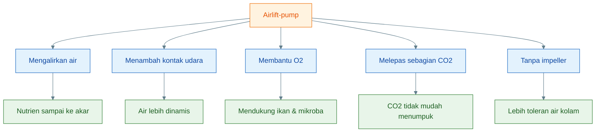

Kesimpulannya:

> **Airlift-pump adalah alat sirkulasi sekaligus aerasi ringan. Ia membuat konsep aliran akar lebih rasional dibanding akar tanaman diam di air kolam.**

---

## 3.3 Batas airlift-pump

Walaupun berguna, airlift-pump punya batas teknis. Jika batas ini tidak dipahami, sistem bisa gagal bukan karena konsepnya salah, tetapi karena desainnya tidak sesuai kemampuan airlift.

### 1. Tidak cocok untuk head tinggi

Airlift paling efektif untuk mengangkat air pada selisih tinggi rendah. Jika talang tanaman diletakkan terlalu tinggi, debit airlift turun drastis.

Karena kolam ini hanya memiliki tinggi air 50 cm, pipa airlift juga pendek. Maka tinggi angkat air harus rendah.

Prinsip desain:

```text id="4ld4f8"
talang rendah
+ jarak dekat
+ head kecil
= airlift lebih efektif
```

Desain yang harus dihindari:

```text id="5x8pb5"
kolam dangkal
+ talang tinggi
+ pipa panjang
= debit airlift lemah
```

### 2. Tidak menyaring feses

Airlift mengalirkan air, bukan menyaring air. Jika intake terlalu dekat dasar, feses dan lumpur bisa terangkat ke talang.

Akibatnya:

- akar tanaman berlendir,
- talang bau,
- aliran tersumbat,
- zona akar menjadi anaerob,
- tanaman stres,
- nitrogen kembali ke air.

Maka endapan tetap harus dikelola dengan sifon manual.

### 3. Debit terbatas

Debit airlift tergantung pada:

- diameter pipa,
- kedalaman pipa terendam,
- jumlah udara,
- ukuran gelembung,
- tinggi angkat air,
- panjang jalur,
- hambatan di talang.

Airlift tidak perlu dipaksa mengejar debit besar. Untuk sistem ini, yang lebih penting adalah aliran stabil dan kontinu.

### 4. Tetap membutuhkan aerator atau blower

Airlift memerlukan sumber udara. Jadi tetap ada kebutuhan listrik untuk aerator/blower. Jika aerator mati, aliran berhenti dan oksigen tambahan juga hilang.

Maka perlu SOP:

- cek gelembung harian,
- cek aliran air,
- bersihkan batu aerasi/pipa,
- siapkan cadangan bila memungkinkan.

### 5. Talang harus rendah dan dekat kolam

Karena airlift tidak kuat untuk head tinggi, talang akar sebaiknya diletakkan:

- dekat kolam,
- hanya sedikit di atas permukaan air,
- dengan return air jatuh kembali ke kolam,
- tidak menggunakan instalasi tinggi seperti tower.

Ringkasan batas:

| Batas airlift           | Implikasi desain                         |
| ----------------------- | ---------------------------------------- |
| Tidak cocok head tinggi | talang harus rendah                      |
| Tidak menyaring feses   | tetap perlu sifon endapan                |
| Debit terbatas          | jangan pakai jalur terlalu panjang       |
| Butuh aerator           | cek udara harian                         |
| Sensitif pada hambatan  | talang harus lebar dan mudah dibersihkan |

Diagram batas desain:

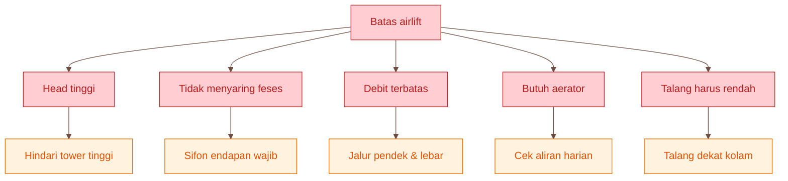

Kesimpulan Bab 3:

> **Konsep aliran akar dengan airlift-pump rasional untuk kolam lele 251 liter karena airlift mengalirkan nutrien sekaligus membantu oksigen. Tetapi airlift tidak menyaring feses, tidak kuat untuk head tinggi, dan debitnya terbatas. Karena itu desain harus rendah, dekat kolam, mudah dibersihkan, dan tetap disertai sifon endapan manual.**

[**Kembali ke Atas**](#akuaponik-sederhana-lele-air-dangkal-aliran-akar-tanaman-dengan-airlift-pump-untuk-mengambil-nitrat)

---

# 4. Nitrogen sebagai Dasar Ukuran Sistem

Desain akuaponik sederhana tidak boleh dimulai dari jumlah tanaman atau panjang talang saja. Desain harus dimulai dari **berapa nitrogen yang masuk ke sistem melalui pakan**.

Mengapa?

Karena tanaman tidak “membersihkan air” secara ajaib. Tanaman hanya menyerap nutrien sesuai kapasitas pertumbuhannya. Jika pakan harian terlalu besar, nitrogen yang terbentuk bisa melampaui kemampuan akar tanaman menyerapnya.

Maka pertanyaan desain yang benar adalah:

> **Berapa gram nitrogen masuk per hari, berapa menjadi limbah, dan berapa potensi nitrat yang harus ditangani tanaman?**

---

## 4.1 Asumsi desain awal

Untuk desain awal, kita memakai biomassa lele **5 kg**. Ini sesuai dengan target rasional pada kolam 251 liter.

Asumsi:

| Parameter               |            Nilai |
| ----------------------- | ---------------: |
| Biomassa desain         |        5 kg lele |
| Feed rate               | 2% biomassa/hari |
| Pakan harian            |       100 g/hari |
| Protein pakan           |              32% |
| Nitrogen pakan          | 5,12% dari pakan |
| Nitrogen menjadi limbah |              70% |

Mengapa memakai 5 kg?

Karena 5 kg masih berada dalam kategori target rasional:

```text id="1d2v7l"
2–3 kg = aman mulai
3–5 kg = rasional
5–8 kg = lanjut dengan kontrol ketat
```

Pada 5 kg, sistem sudah cukup memberi beban nitrogen untuk menguji fungsi tanaman, tetapi belum terlalu ekstrem untuk sistem sederhana.

Feed rate 2% berarti:

$$
\text{Pakan harian} = 5 \text{ kg} \times 2%
$$

$$
= 0{,}1 \text{ kg/hari}
$$

$$
= 100 \text{ g/hari}
$$

Jadi basis desain ini memakai **100 gram pakan per hari**.

---

## 4.2 Nitrogen pakan harian

Protein pakan adalah sumber nitrogen. Secara umum, nitrogen dalam protein dihitung menggunakan faktor 6,25.

Rumus:

$$
N_{pakan} = \frac{\text{Protein pakan}}{6{,}25}
$$

Jika protein pakan 32%:

$$
N_{pakan} = \frac{32%}{6{,}25}
$$

$$
N_{pakan} = 5{,}12%
$$

Artinya, setiap 100 gram pakan 32% protein membawa nitrogen sekitar:

$$
N_{pakan} = 100 \times 5{,}12%
$$

$$
N_{pakan} = 5{,}12 \text{ g N/hari}
$$

Jadi:

> **Pada biomassa 5 kg dengan pakan 100 g/hari, nitrogen yang masuk ke sistem sekitar 5,12 g N per hari.**

Diagram alurnya:

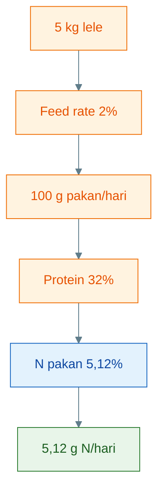

Angka ini menjadi dasar untuk menghitung beban limbah nitrogen dan potensi nitrat.

---

## 4.3 Nitrogen limbah harian

Tidak semua nitrogen pakan menjadi daging. Sebagian tertahan di tubuh ikan, sebagian menjadi limbah melalui:

- feses,
- urin,
- ekskresi nitrogen,
- sisa pakan,
- bahan organik,
- amonia,
- nitrit,
- nitrat.

Dalam desain ini, kita memakai asumsi konservatif:

$$
70% \text{ nitrogen pakan menjadi limbah}
$$

Maka:

$$
N_{limbah} = 5{,}12 \times 70%
$$

$$
N_{limbah} = 3{,}584 \text{ g N/hari}
$$

Dibulatkan:

$$
N_{limbah} \approx 3{,}58 \text{ g N/hari}
$$

Jadi:

> **Pada biomassa 5 kg, sistem harus menghadapi sekitar 3,58 g nitrogen limbah per hari.**

Nitrogen limbah ini tidak semuanya langsung menjadi nitrat. Secara biologis, alurnya bertahap:

```text id="bgjmr7"
nitrogen organik / ekskresi
→ amonia
→ nitrit
→ nitrat
```

Dalam sistem yang stabil, amonia dan nitrit tidak menumpuk lama. Dalam sistem yang tidak stabil, amonia dan nitrit bisa naik dan berbahaya bagi ikan.

Diagramnya:

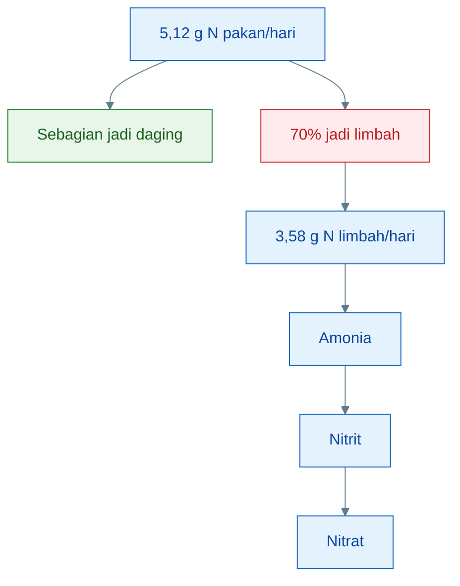

Dari sini terlihat bahwa tanaman bukan menghadapi “pakan”, tetapi menghadapi hasil akhir dari proses nitrogen, terutama nitrat.

---

## 4.4 Potensi nitrat harian

Jika nitrogen limbah berhasil diproses sampai menjadi nitrat, maka potensi nitrat dapat dihitung dengan rumus:

$$
NO_3^- = N \times \frac{62}{14}
$$

Keterangan:

$$
N = \text{nitrogen limbah}
$$

$$
62 = \text{massa molekul } NO_3^-
$$

$$
14 = \text{massa atom nitrogen}
$$

Dengan:

$$
N = 3{,}58 \text{ g}
$$

Maka:

$$
NO_3^- = 3{,}58 \times \frac{62}{14}
$$

$$
NO_3^- = 3{,}58 \times 4{,}429
$$

$$
NO_3^- \approx 15{,}9 \text{ g NO}_3^-/hari
$$

Jadi:

> **Pada biomassa 5 kg, pakan 100 g/hari berpotensi menghasilkan sekitar 15,9 g nitrat per hari, jika nitrogen limbah selesai diproses menjadi NO₃⁻.**

Jika nitrat tersebut tidak diserap tanaman, tidak keluar melalui penggantian air, dan tidak masuk jalur lain, maka ia akan menumpuk di air.

Dalam kolam 251 liter, 15,9 g nitrat setara dengan potensi kenaikan:

$$
\frac{15.900 \text{ mg}}{251 \text{ L}}
$$

$$
= 63{,}3 \text{ mg/L per hari}
$$

Ini angka teoritis jika tidak ada serapan atau pembuangan. Dalam kondisi nyata, sebagian nitrogen dapat:

- diserap plankton,
- diserap tanaman,
- masuk sedimen,
- keluar melalui penggantian air,
- keluar melalui panen tanaman,
- mengalami proses mikroba lain.

Namun angka ini memberi pesan penting:

> **Bahkan pada biomassa 5 kg, beban nitrat potensial tidak kecil. Maka tanaman harus tumbuh aktif dan dipanen rutin.**

---

## 4.5 Makna desain

Perhitungan nitrogen memberi beberapa makna penting untuk desain sistem.

### 1. Tanaman membantu mengambil sebagian nitrat

Tanaman bukan mesin penghapus nitrat tanpa batas. Kapasitas serap tanaman bergantung pada:

- jumlah tanaman,
- jenis tanaman,
- kesehatan akar,
- cahaya,
- suhu,
- aliran air,
- ketersediaan oksigen,
- umur tanaman,
- frekuensi panen.

Tanaman seperti kangkung dapat menyerap nutrien dengan cepat jika tumbuh sehat. Tetapi jika akar busuk, daun menguning, atau tanaman kurang cahaya, penyerapan nitrat akan rendah.

### 2. Tidak semua nitrat langsung terserap

Air yang melewati akar tidak otomatis kehilangan semua nitrat. Akar menyerap sesuai kebutuhan tanaman. Jika produksi nitrat lebih cepat daripada penyerapan tanaman, nitrat akan tetap naik.

Maka indikatornya:

```text id="qanzay"
nitrat stabil/turun = tanaman dan sistem cukup membantu
nitrat terus naik = area tanaman kurang atau beban pakan terlalu besar
```

### 3. Jika nitrat terus naik, ada tiga kemungkinan utama

Kemungkinan pertama:

> **jumlah tanaman kurang.**

Solusinya:

- tambah lubang tanam,
- tambah panjang talang,
- pilih tanaman yang lebih rakus nutrisi,
- panen rutin agar tanaman terus tumbuh aktif.

Kemungkinan kedua:

> **pakan terlalu besar.**

Solusinya:

- kurangi feed rate,
- perbaiki FCR,
- pastikan pakan habis cepat,
- jangan memberi pakan saat air buruk.

Kemungkinan ketiga:

> **sistem belum stabil.**

Solusinya:

- tunggu biofilm dan tanaman beradaptasi,
- jangan langsung menaikkan biomassa,
- pantau amonia dan nitrit,
- jaga oksigen.

### 4. Nitrat benar-benar keluar hanya jika tanaman dipanen

Jika tanaman menyerap nitrat tetapi tidak dipanen, nitrogen masih berada di sistem sebagai biomassa tanaman. Jika tanaman tua, mati, atau akar membusuk, nitrogen dapat kembali ke air.

Maka panen adalah bagian dari manajemen nitrogen.

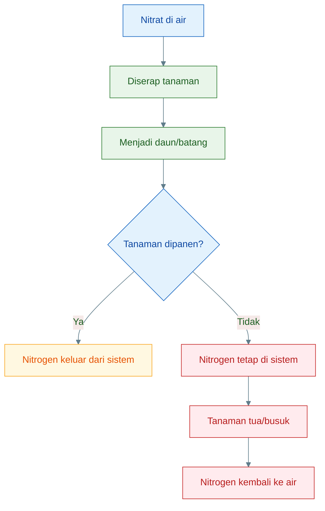

Kesimpulan Bab 4:

> **Desain akuaponik sederhana harus dihitung dari beban nitrogen pakan. Pada biomassa 5 kg dengan pakan 100 g/hari, sistem berpotensi menghasilkan sekitar 3,58 g nitrogen limbah atau 15,9 g nitrat per hari. Tanaman membantu mengambil nitrat, tetapi hanya panen tanaman yang benar-benar mengeluarkan nitrogen dari sistem.**

[**Kembali ke Atas**](#akuaponik-sederhana-lele-air-dangkal-aliran-akar-tanaman-dengan-airlift-pump-untuk-mengambil-nitrat)

---

# 5. Desain Airlift-Pump untuk Kolam 50 cm

Airlift-pump adalah inti dari sistem ini. Karena kolam hanya memiliki tinggi air 50 cm, desain airlift harus realistis. Jangan merancang airlift seolah-olah kolam memiliki kedalaman 1–2 meter. Semakin dangkal air, semakin terbatas kemampuan airlift untuk mengangkat air.

Prinsip desainnya:

> **rendah, dekat, sederhana, dan aliran stabil.**

---

## 5.1 Prinsip desain

Airlift harus dibuat **rendah-head**.

Head adalah selisih tinggi antara permukaan air kolam dan titik keluarnya air dari airlift. Semakin tinggi head, semakin berat kerja airlift dan semakin kecil debitnya.

Untuk kolam tinggi air 50 cm, desain yang masuk akal adalah:

```text id="me20dj"
pipa terendam sedalam mungkin
+ outlet tidak terlalu tinggi
+ talang rendah
+ jalur pendek
```

Desain yang salah:

```text id="vo2h1p"
pipa pendek
+ outlet tinggi
+ talang jauh
+ pipa kecil panjang
```

Airlift membutuhkan kedalaman terendam agar dorongan gelembung cukup. Jika pipa hanya terendam sedikit, dorongan lemah. Karena itu, pipa riser sebaiknya dibuat sedalam mungkin di kolam.

Diagram prinsip:

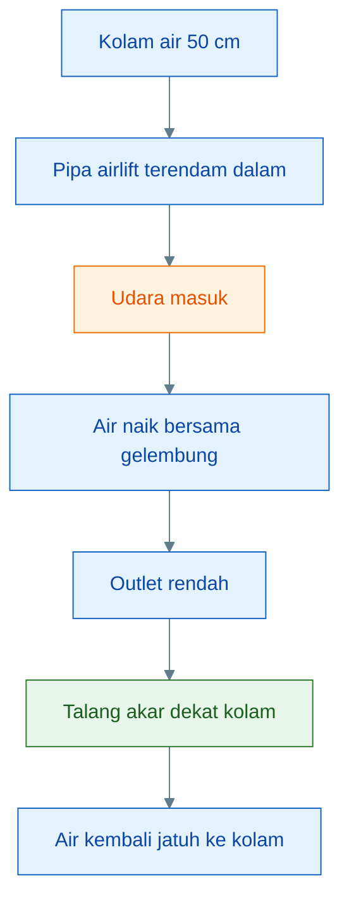

Kuncinya:

> **Jangan mengejar instalasi tinggi. Keunggulan sistem ini justru sederhana dan rendah.**

---

## 5.2 Spesifikasi awal

Spesifikasi awal yang disarankan:

| Komponen                |               Rekomendasi |
| ----------------------- | ------------------------: |
| Pipa riser              |              1/2–3/4 inci |
| Kedalaman pipa terendam |                  35–45 cm |
| Tinggi angkat air       |          ideal < 20–30 cm |
| Outlet                  | langsung ke talang rendah |
| Sumber udara            |      aerator/blower kecil |
| Return air              |            jatuh ke kolam |

### Pipa riser

Untuk skala kolam 251 liter, pipa **1/2–3/4 inci** cukup untuk uji awal.

Pipa terlalu kecil dapat membatasi aliran dan mudah berlendir. Pipa terlalu besar membutuhkan udara lebih banyak untuk mengangkat air. Maka ukuran menengah lebih aman.

### Kedalaman pipa terendam

Kolam memiliki tinggi air maksimal 50 cm. Maka pipa sebaiknya terendam sedalam mungkin, sekitar:

```text id="jrm8hk"
35–45 cm
```

Semakin panjang bagian pipa yang terendam, semakin baik gaya angkat airlift.

### Tinggi angkat air

Tinggi angkat ideal:

```text id="d9a48w"
<20–30 cm
```

Jika talang terlalu tinggi, debit akan turun. Maka talang akar sebaiknya ditempatkan hanya sedikit di atas permukaan air kolam.

### Outlet

Outlet sebaiknya langsung masuk ke talang rendah. Jangan membuat jalur berbelok terlalu panjang karena akan menambah hambatan.

### Sumber udara

Gunakan aerator atau blower kecil yang stabil. Udara yang masuk harus cukup untuk mengangkat air, tetapi tidak perlu berlebihan sampai air terlalu bergolak.

### Return air

Air dari talang sebaiknya jatuh kembali ke kolam. Jatuhan air memberi tambahan aerasi dan membantu sirkulasi.

---

## 5.3 Posisi intake

Posisi intake airlift sangat penting.

Intake sebaiknya:

```text id="ub5kj7"
5–10 cm di atas dasar kolam
```

Bukan tepat di dasar.

Mengapa?

Karena dasar kolam adalah tempat berkumpul:

- feses berat,
- sisa pakan,
- lumpur organik,
- plankton mati,
- biofilm,
- gas dari endapan.

Jika intake tepat di dasar, maka airlift akan mengangkat terlalu banyak padatan ke talang akar. Ini membuat akar menjadi kotor dan berisiko busuk.

Posisi 5–10 cm di atas dasar adalah kompromi:

- air kaya nutrien tetap terambil,
- padatan berat tidak terlalu banyak ikut,
- lumpur dasar tetap bisa disifon manual,
- akar tidak menjadi filter feses utama.

Diagram posisi intake:

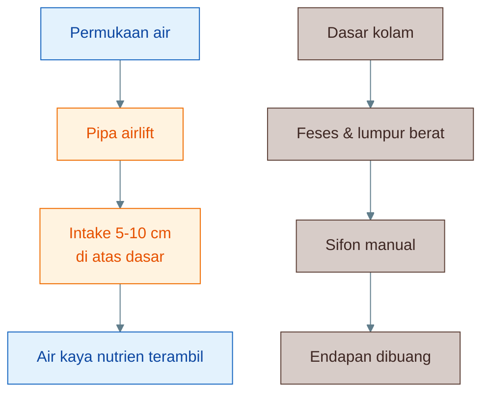

Prinsip praktis:

> **Ambil airnya, bukan lumpurnya.**

Itulah alasan intake tidak diletakkan tepat di dasar.

---

## 5.4 Target debit

Debit adalah jumlah air yang dialirkan per satuan waktu. Untuk sistem ini, debit tidak perlu terlalu besar. Targetnya bukan membuat arus kuat, tetapi membuat aliran nutrien yang stabil melewati akar tanaman.

Untuk kolam 251 liter, target awal:

$$
Q = 0{,}5 - 1 \times \text{volume kolam/jam}
$$

Maka:

$$
Q = 0{,}5 \times 251
$$

$$
Q = 125{,}5 \text{ liter/jam}
$$

Dan:

$$
Q = 1 \times 251
$$

$$
Q = 251 \text{ liter/jam}
$$

Jadi target awal:

> **100–250 liter/jam**

Setelah sistem stabil, debit bisa dinaikkan menjadi:

> **250–400 liter/jam**

Namun jangan mengejar debit besar jika desain airlift tidak mendukung. Debit yang terlalu besar juga bisa membuat akar terlalu terganggu atau membawa lebih banyak partikel organik.

Target praktis:

| Fase sistem         |                   Debit target |
| ------------------- | -----------------------------: |
| Uji awal            |                  100–150 L/jam |
| Sistem mulai stabil |                  150–250 L/jam |
| Lanjut/stabil       |                  250–400 L/jam |
| Jika akar kotor     |  kurangi debit/bersihkan jalur |
| Jika talang kering  | naikkan debit/perbaiki airlift |

Yang lebih penting daripada angka debit adalah konsistensi:

- air mengalir terus,
- akar tidak kering,
- talang tidak meluap,
- akar tidak dipenuhi lumpur,
- return air jatuh kembali ke kolam,
- ikan tidak stres.

Diagram hubungan debit:

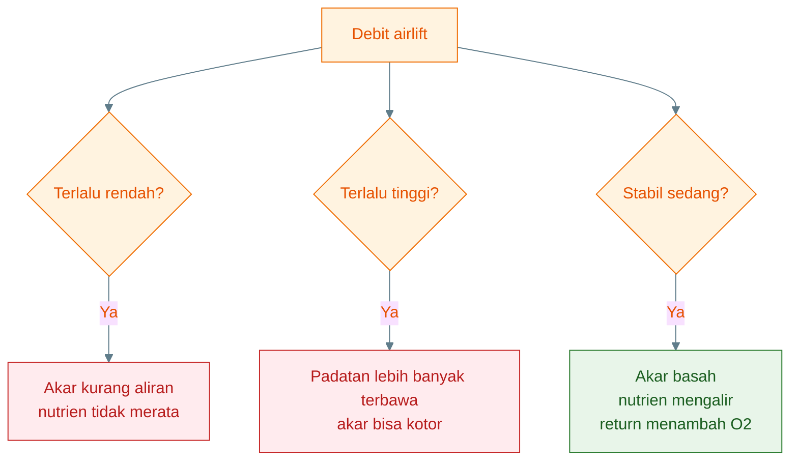

Kesimpulan Bab 5:

> **Airlift-pump untuk kolam 50 cm harus dirancang rendah-head. Pipa riser 1/2–3/4 inci, terendam 35–45 cm, intake 5–10 cm di atas dasar, outlet rendah ke talang, dan return air jatuh ke kolam. Target debit awal 100–250 L/jam sudah cukup untuk mengalirkan nutrien ke akar dan membantu oksigen tanpa memaksa sistem bekerja terlalu berat.**

[**Kembali ke Atas**](#akuaponik-sederhana-lele-air-dangkal-aliran-akar-tanaman-dengan-airlift-pump-untuk-mengambil-nitrat)

---

# 6. Desain Talang Akar Tanaman

Talang akar adalah tempat air kolam mengalir melewati akar tanaman. Dalam sistem ini, talang bukan sekadar tempat menaruh tanaman, tetapi menjadi zona pertemuan antara:

- air kolam,
- nitrat,
- ammonium dalam kadar rendah,
- fosfat,
- mineral,
- akar tanaman,
- biofilm mikroba,
- oksigen,
- partikel organik halus.

Karena air berasal langsung dari kolam lele, desain talang harus mudah dibersihkan dan tidak mudah tersumbat. Kesalahan desain talang dapat membuat akar berlendir, air bau, aliran melemah, dan tanaman mati.

Prinsip utama:

> **talang harus lebar, dangkal, mudah dilihat, mudah dibersihkan, dan alirannya pelan-stabil.**

---

## 6.1 Bentuk talang yang disarankan

Gunakan:

> **talang lebar dangkal**

Bukan NFT pipa kecil dan bukan tower tinggi.

Talang lebar dangkal lebih cocok untuk konsep ini karena air kolam lele masih membawa partikel organik halus. Jika memakai pipa NFT kecil, akar dan kotoran mudah menyumbat aliran. Jika memakai tower tinggi, airlift-pump akan kesulitan mengangkat air karena head terlalu tinggi.

Bentuk yang disarankan:

```text id="zbj3kh"
Kolam 251 L
→ airlift rendah
→ talang lebar dangkal
→ akar tanaman
→ air jatuh kembali ke kolam
```

Skema sederhana:

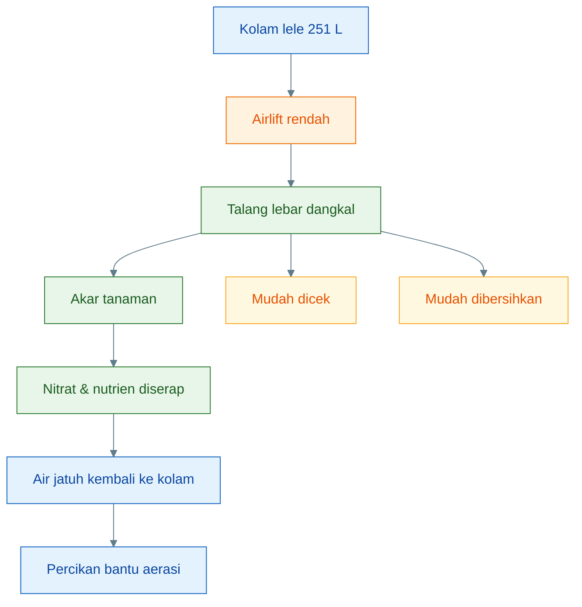

Talang lebar dangkal memiliki beberapa keunggulan:

- air tidak terlalu dalam,
- akar mudah bernapas,
- akar mudah diamati,
- endapan mudah terlihat,
- pembersihan mudah,
- aliran tidak mudah mampet,
- cocok dengan airlift rendah-head.

Talang tidak perlu dibuat mewah. Yang penting fungsional: air mengalir, akar basah, tidak tergenang busuk, tidak kering, dan air kembali ke kolam dengan percikan.

---

## 6.2 Spesifikasi awal

Spesifikasi awal yang disarankan:

| Parameter          |            Rekomendasi |
| ------------------ | ---------------------: |
| Panjang talang     |              1–2 meter |
| Lebar talang       |               10–20 cm |
| Kedalaman air      |                 3–7 cm |
| Jumlah lubang awal |           10–20 lubang |
| Setelah stabil     |           20–40 lubang |
| Kemiringan         |                 ringan |
| Return air         | jatuh kembali ke kolam |

### Panjang talang

Untuk uji awal, panjang **1–2 meter** sudah cukup. Jangan langsung membuat instalasi panjang sebelum sistem terbukti stabil.

Panjang 1 meter cocok untuk:

- uji aliran airlift,
- uji akar kangkung,
- melihat apakah akar berlendir,
- melihat apakah talang mudah dibersihkan.

Panjang 2 meter bisa dipakai setelah aliran stabil dan tanaman tumbuh baik.

### Lebar talang

Lebar ideal awal:

```text id="vu3kwn"
10–20 cm
```

Lebar ini cukup untuk memberi ruang akar dan memudahkan pembersihan. Talang terlalu sempit membuat akar cepat menutup jalur air. Talang terlalu besar membutuhkan debit air lebih besar.

### Kedalaman air

Kedalaman air di talang:

```text id="2jetbe"
3–7 cm
```

Kedalaman ini cukup untuk membasahi akar, tetapi tidak terlalu dalam sehingga zona akar menjadi kekurangan oksigen.

Jika terlalu dangkal:

- akar bisa kering,
- nutrien tidak merata,
- tanaman stres saat panas.

Jika terlalu dalam:

- akar mudah kekurangan oksigen,
- endapan mudah mengumpul,
- zona bawah talang bisa anaerob.

### Jumlah lubang tanaman

Mulai dari:

```text id="fgncow"
10–20 lubang
```

Setelah sistem stabil, naik ke:

```text id="9sdvyc"
20–40 lubang
```

Jangan langsung penuh. Mulai sedikit dulu agar mudah membaca respons sistem.

Jika tanaman tumbuh cepat dan nitrat masih naik, jumlah lubang bisa ditambah.

Jika akar berlendir dan air bau, jumlah tanaman bukan solusi utama. Yang harus dikoreksi adalah pakan, endapan, aliran, dan oksigen.

### Kemiringan talang

Kemiringan cukup ringan. Tujuannya agar air mengalir pelan, bukan deras.

Aliran yang terlalu cepat:

- nutrien kurang lama kontak dengan akar,
- partikel bisa terdorong cepat,
- akar terganggu.

Aliran yang terlalu lambat:

- endapan mengumpul,
- akar berlendir,
- zona anaerob muncul.

### Return air

Air dari talang harus jatuh kembali ke kolam. Ini penting karena jatuhan air dapat membantu aerasi.

Bentuk return bisa berupa:

- pancuran kecil,
- jatuhan pendek,
- pipa berlubang,
- aliran menetes lebar.

Jangan membuat return masuk diam di bawah permukaan. Lebih baik ada percikan ringan.

---

## 6.3 Kenapa bukan NFT sempit

NFT atau _Nutrient Film Technique_ memakai aliran tipis di dalam pipa/talang kecil. Dalam hidroponik bersih, NFT bisa sangat baik. Tetapi untuk air langsung dari kolam lele, NFT sempit berisiko tinggi.

Masalahnya, air kolam lele membawa:

- partikel feses,
- sisa pakan halus,
- lendir,
- biofilm,
- plankton,
- bahan organik terlarut,
- mikroba.

Jika masuk ke pipa kecil, risiko sumbatan tinggi.

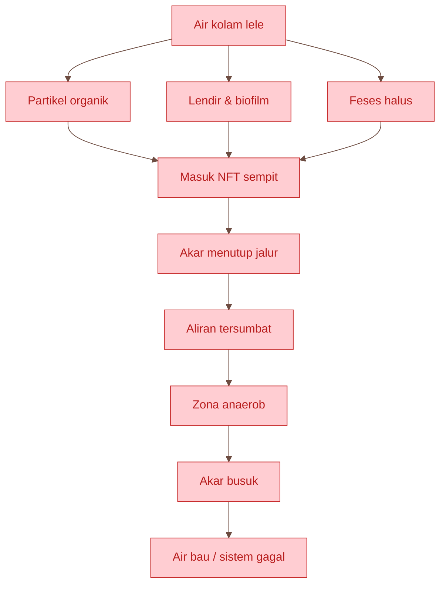

Alasan tidak memakai NFT sempit:

1. **Air lele membawa partikel organik**
   NFT lebih cocok untuk larutan nutrisi bersih, bukan air kolam yang membawa bahan organik.

2. **Pipa kecil mudah tersumbat**
   Akar tanaman dan biofilm bisa menutup jalur air.

3. **Akar mudah berlendir**
   Lendir dan feses halus menempel di akar. Jika oksigen rendah, akar cepat busuk.

4. **Sulit dibersihkan**
   Pipa tertutup sulit diperiksa. Saat masalah terlihat, biasanya sudah terlambat.

5. **Risiko anaerob lebih tinggi**
   Jika aliran macet, bagian dalam pipa dapat menjadi rendah oksigen.

Maka NFT sempit tidak cocok untuk sistem sederhana ini, kecuali air sudah difilter dengan baik. Karena konsep artikel ini sengaja tidak memakai filter formal, maka NFT sempit sebaiknya dihindari.

---

## 6.4 Kenapa talang lebar lebih aman

Talang lebar lebih aman karena lebih toleran terhadap air kolam yang tidak sebersih larutan hidroponik. Talang lebar memberi ruang bagi akar, aliran, dan pembersihan.

Keunggulan talang lebar:

| Keunggulan                | Dampak praktis               |
| ------------------------- | ---------------------------- |
| Akar mudah diperiksa      | masalah cepat terlihat       |
| Endapan mudah dibersihkan | tidak cepat busuk            |
| Aliran lebih toleran      | tidak mudah mampet           |
| Return bisa dibuat jatuh  | membantu aerasi              |
| Cocok untuk airlift       | head rendah dan aliran pelan |
| Mudah dimodifikasi        | cocok untuk uji lapangan     |

Talang lebar juga memudahkan pembudidaya membaca kondisi akar.

Akar sehat biasanya:

- putih atau krem muda,
- tidak bau,
- tidak berlendir tebal,
- banyak rambut akar,
- tanaman tumbuh aktif.

Akar bermasalah biasanya:

- cokelat gelap,
- berlendir,
- bau busuk,
- mudah putus,
- daun menguning,
- pertumbuhan berhenti.

Diagram keputusan talang:

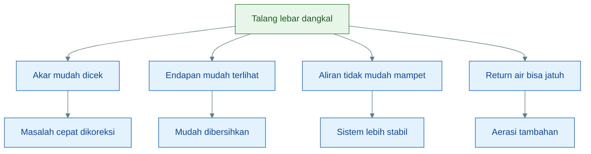

Kesimpulan Bab 6:

> **Talang akar untuk sistem air kolam lele langsung harus lebar dan dangkal. NFT pipa kecil dan tower tinggi tidak cocok karena air lele membawa partikel organik dan airlift tidak kuat untuk head tinggi. Talang lebar membuat akar mudah diperiksa, endapan mudah dibersihkan, aliran lebih toleran, dan return air bisa membantu aerasi.**

[**Kembali ke Atas**](#akuaponik-sederhana-lele-air-dangkal-aliran-akar-tanaman-dengan-airlift-pump-untuk-mengambil-nitrat)

---

# 7. Tanaman yang Cocok

Tanaman dalam sistem ini bukan sekadar hasil tambahan. Tanaman adalah bagian dari manajemen nitrogen. Tanaman menyerap nitrat dan sebagian nutrien lain, lalu mengubahnya menjadi biomassa daun, batang, dan akar.

Namun tidak semua tanaman cocok untuk sistem sederhana berbasis air kolam lele. Tanaman yang dipilih harus:

- cepat tumbuh,
- toleran air kaya nutrien,
- akar kuat,
- mudah dipanen,
- tidak terlalu sensitif,
- cocok dengan suhu tropis,
- mudah diamati responsnya.

---

## 7.1 Tanaman utama untuk uji awal

Tabel rekomendasi:

| Tanaman      | Penilaian                   |
| ------------ | --------------------------- |
| Kangkung     | paling cocok                |
| Pakcoy       | cocok setelah sistem stabil |
| Sawi         | cocok                       |
| Bayam air    | cocok                       |
| Selada       | lebih sensitif              |
| Kemangi/mint | tambahan                    |

### Kangkung

Kangkung adalah pilihan pertama. Tanaman ini cepat tumbuh, toleran, dan cocok untuk air kaya nutrien. Kangkung juga mudah dipanen bertahap.

### Pakcoy

Pakcoy cocok setelah sistem stabil. Nilai jualnya lebih baik, tetapi lebih sensitif terhadap akar kotor dan ketidakseimbangan nutrisi dibanding kangkung.

### Sawi

Sawi cukup cocok untuk sistem sederhana. Pertumbuhannya cepat dan mudah dibaca dari warna daun.

### Bayam air

Bayam air cocok karena tahan kondisi basah dan cepat tumbuh. Namun perlu pengamatan agar tidak terlalu rimbun dan membusuk.

### Selada

Selada bisa dipakai, tetapi lebih sensitif. Selada membutuhkan air yang relatif bersih dan stabil. Untuk uji awal, selada bukan pilihan pertama.

### Kemangi atau mint

Kemangi dan mint bisa menjadi tambahan. Namun keduanya lebih cocok setelah sistem stabil dan bukan tanaman utama penyerap nitrogen pada tahap awal.

---

## 7.2 Kenapa kangkung menjadi pilihan pertama

Kangkung menjadi pilihan pertama karena paling cocok untuk kondisi sistem ini.

Alasannya:

1. **Cepat tumbuh**
   Kangkung bisa menunjukkan respons dalam waktu singkat. Jika nutrisi cukup, pertumbuhan cepat terlihat.

2. **Toleran air kaya nutrisi**
   Air kolam lele biasanya kaya nitrogen dan fosfat. Kangkung dapat memanfaatkan kondisi ini dengan baik.

3. **Akar kuat**
   Akar kangkung relatif tahan terhadap kondisi air yang tidak sebersih larutan hidroponik.

4. **Mudah dipanen**
   Kangkung bisa dipanen potong ulang. Ini membantu mengeluarkan nitrogen secara rutin.

5. **Cepat menunjukkan masalah**
   Jika daun menguning, akar berlendir, atau pertumbuhan lambat, sistem mudah dievaluasi.

Diagram posisi kangkung:

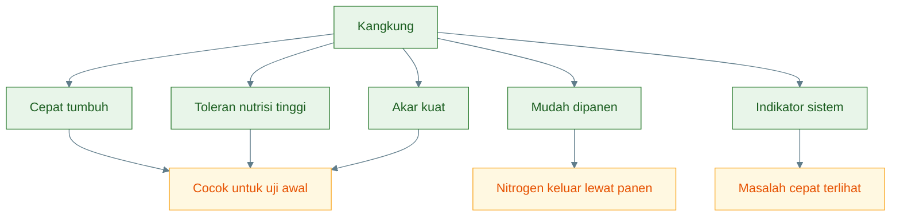

Untuk uji awal, sebaiknya jangan mencampur terlalu banyak jenis tanaman. Mulai dengan satu tanaman utama, yaitu kangkung. Setelah sistem stabil, baru bandingkan dengan pakcoy atau sawi.

---

## 7.3 Fungsi tanaman

Tanaman memiliki beberapa fungsi dalam sistem ini.

### 1. Mengambil nitrat

Fungsi utama tanaman adalah menyerap nitrat dari air. Nitrat digunakan untuk membentuk jaringan tanaman, terutama daun dan batang.

Alur:

```text id="rh1o3c"
NO3- → akar → daun/batang → panen
```

### 2. Mengambil sebagian ammonium

Tanaman juga dapat menyerap ammonium dalam jumlah tertentu. Namun dalam sistem ikan, ammonium/amonia tetap harus dikendalikan karena keseimbangan NH₄⁺ dan NH₃ dipengaruhi pH dan suhu. Jangan mengandalkan tanaman untuk menyelamatkan amonia tinggi.

### 3. Mengambil fosfat dan mineral

Selain nitrogen, tanaman juga membutuhkan:

- fosfor,
- kalium,
- kalsium,
- magnesium,
- besi,
- unsur mikro.

Air kolam ikan biasanya membawa sebagian nutrien ini, tetapi tidak selalu seimbang untuk semua tanaman. Karena itu, tanaman daun cepat seperti kangkung lebih cocok dibanding tanaman buah yang membutuhkan nutrisi lebih kompleks.

### 4. Menjadi indikator kualitas air

Tanaman dapat menjadi indikator. Jika tanaman tumbuh baik, akar sehat, dan daun hijau, sistem cenderung mendukung pertumbuhan.

Jika tanaman gagal, bisa jadi penyebabnya:

- akar kekurangan oksigen,
- air terlalu kotor,
- pH tidak cocok,
- nutrisi tidak seimbang,
- nitrit/amonia tinggi,
- cahaya kurang,
- akar tertutup lumpur.

### 5. Mengeluarkan nitrogen lewat panen

Ini fungsi paling penting secara ekologi.

Nitrogen baru benar-benar keluar dari sistem jika tanaman dipanen dan dikeluarkan dari area kolam.

Jika tanaman mati dan jatuh kembali ke air, nitrogen kembali menjadi bahan organik.

---

## 7.4 Panen sebagai kunci

Tanaman harus dipanen rutin.

```text id="3e6lj4"
Nitrat → tanaman → panen → nitrogen keluar
```

Jika tanaman hanya dibiarkan tumbuh tua, lalu mati dan membusuk, maka fungsi pengambilan nitrogen gagal. Nitrogen yang sudah diserap tanaman akan kembali ke kolam sebagai bahan organik.

Alurnya:

```mermaid id="ivsprr"
%%{init: {"theme": "base", "themeVariables": {"fontFamily": "Arial", "primaryColor": "#E8F5E9", "primaryTextColor": "#1B5E20", "primaryBorderColor": "#2E7D32", "lineColor": "#607D8B"}}}%%
flowchart TD
    A["Nitrat di air"] --> B["Diserap tanaman"]
    B --> C["Daun & batang tumbuh"]
    C --> D{"Dipanen?"}

    D -->|Ya| E["Nitrogen keluar<br/>dari sistem"]
    D -->|Tidak| F["Tanaman tua"]
    F --> G["Daun/akar mati"]
    G --> H["Membusuk"]
    H --> I["Nitrogen kembali<br/>ke kolam"]

    classDef nitrogen fill:#E3F2FD,stroke:#1565C0,color:#0D47A1;
    classDef plant fill:#E8F5E9,stroke:#2E7D32,color:#1B5E20;
    classDef good fill:#FFF8E1,stroke:#F9A825,color:#E65100;
    classDef risk fill:#FFEBEE,stroke:#C62828,color:#B71C1C;

    class A nitrogen;
    class B,C plant;
    class D nitrogen;
    class E good;
    class F,G,H,I risk;
```

Panen bukan hanya kegiatan produksi sayuran. Panen adalah bagian dari manajemen nitrogen.

Rekomendasi panen awal:

| Tanaman   | Panen awal |
| --------- | ---------: |
| Kangkung  | 20–30 hari |
| Sawi      | 25–35 hari |
| Pakcoy    | 30–40 hari |
| Selada    | 30–45 hari |
| Bayam air | 20–30 hari |

Untuk kangkung, bisa dilakukan panen potong bertahap. Jangan biarkan terlalu tua dan rimbun karena daun tua dan akar mati dapat menambah bahan organik.

Kesimpulan Bab 7:

> **Tanaman utama untuk uji awal adalah kangkung karena cepat tumbuh, toleran, akar kuat, dan mudah dipanen. Fungsi tanaman bukan hanya menghasilkan sayur, tetapi mengambil nitrat dan mengeluarkan nitrogen melalui panen. Jika tanaman mati dan membusuk, nitrogen kembali ke kolam.**

[**Kembali ke Atas**](#akuaponik-sederhana-lele-air-dangkal-aliran-akar-tanaman-dengan-airlift-pump-untuk-mengambil-nitrat)

---

# 8. Peran Akar sebagai Biofilter Ringan

Dalam sistem ini, akar tanaman bukan hanya alat penyerap nitrat. Akar juga menjadi permukaan biologis. Di permukaan akar, mikroba dapat hidup dan membentuk biofilm. Karena itu, akar dapat berperan sebagai **biofilter ringan**.

Namun istilah “biofilter ringan” harus dipahami dengan benar. Akar membantu proses biologis, tetapi tidak menggantikan filter mekanis atau biofilter besar pada sistem padat.

---

## 8.1 Akar sebagai tempat biofilm

Akar tanaman memiliki permukaan luas dan berada di aliran air. Kondisi ini memungkinkan terbentuknya biofilm.

Biofilm adalah lapisan mikroba yang menempel pada permukaan. Pada akar, biofilm dapat terdiri dari:

- bakteri heterotrof,
- bakteri nitrifikasi,
- mikroba rhizosphere,
- mikroba kompetitor pembusuk,
- mikroalga,
- partikel organik halus.

Zona sekitar akar disebut rhizosphere. Di zona ini terjadi interaksi antara akar, nutrien, oksigen, dan mikroba.

Skema sederhana:

```mermaid id="rjacm6"
%%{init: {"theme": "base", "themeVariables": {"fontFamily": "Arial", "primaryColor": "#F1F8E9", "primaryTextColor": "#33691E", "primaryBorderColor": "#689F38", "lineColor": "#607D8B"}}}%%
flowchart TD
    A["Akar tanaman"] --> B["Permukaan akar"]
    B --> C["Biofilm mikroba"]

    C --> D["Bakteri heterotrof"]
    C --> E["Bakteri nitrifikasi"]
    C --> F["Mikroba rhizosphere"]
    C --> G["Kompetitor pembusuk"]

    D --> H["Mengurai organik ringan"]
    E --> I["Bantu amonia/nitrit ringan"]
    F --> J["Stabilkan zona akar"]
    G --> K["Menekan mikroba pembusuk"]

    classDef root fill:#E8F5E9,stroke:#2E7D32,color:#1B5E20;
    classDef microbe fill:#E3F2FD,stroke:#1565C0,color:#0D47A1;
    classDef function fill:#FFF8E1,stroke:#F9A825,color:#E65100;

    class A,B root;
    class C,D,E,F,G microbe;
    class H,I,J,K function;
```

Biofilm tipis dapat membantu sistem. Tetapi biofilm yang terlalu tebal, berlendir, dan bau adalah tanda masalah.

Biofilm baik:

- tipis,
- tidak bau,
- akar masih terlihat sehat,
- aliran lancar,
- tanaman tumbuh.

Biofilm buruk:

- tebal,
- berlendir,
- bau,
- akar cokelat busuk,
- aliran terhambat,
- tanaman menguning.

---

## 8.2 Fungsi positif

Akar sebagai biofilter ringan memiliki beberapa fungsi positif.

### 1. Membantu nitrifikasi ringan

Bakteri nitrifikasi dapat menempel di permukaan akar dan dinding talang. Mereka membantu mengubah amonia menjadi nitrit, lalu nitrit menjadi nitrat.

Namun fungsi ini terbatas. Bakteri nitrifikasi membutuhkan oksigen. Jika akar tertutup lumpur atau zona akar kekurangan oksigen, nitrifikasi melemah.

### 2. Menyerap nutrien

Akar menyerap nitrat, ammonium dalam jumlah terbatas, fosfat, kalium, dan mineral lain. Ini membantu mengurangi sebagian nutrien terlarut di air.

### 3. Menstabilkan mikroba air

Akar dan biofilm dapat menjadi tempat hidup mikroba yang membantu stabilitas ekosistem. Mikroba yang baik dapat berkompetisi dengan mikroba pembusuk.

### 4. Menambah permukaan biologis

Dalam sistem akuaponik, semakin banyak permukaan biologis yang sehat, semakin banyak tempat mikroba menguntungkan hidup. Akar, dinding talang, batu kecil, media tambahan, dan permukaan kolam semuanya bisa menjadi tempat mikroba.

Namun permukaan biologis hanya bermanfaat jika tidak berubah menjadi tempat penumpukan lumpur busuk.

Diagram fungsi positif:

```mermaid id="fk7wod"
%%{init: {"theme": "base", "themeVariables": {"fontFamily": "Arial", "primaryColor": "#E8F5E9", "primaryTextColor": "#1B5E20", "primaryBorderColor": "#2E7D32", "lineColor": "#607D8B"}}}%%
flowchart TD
    A["Akar tanaman sehat"] --> B["Serap nitrat"]
    A --> C["Tempat biofilm tipis"]
    A --> D["Permukaan biologis"]
    A --> E["Zona mikroba stabil"]

    B --> F["Nutrien berkurang"]
    C --> G["Bantu nitrifikasi ringan"]
    D --> H["Mikroba menguntungkan"]
    E --> I["Air lebih stabil"]

    classDef root fill:#E8F5E9,stroke:#2E7D32,color:#1B5E20;
    classDef benefit fill:#E3F2FD,stroke:#1565C0,color:#0D47A1;
    classDef result fill:#FFF8E1,stroke:#F9A825,color:#E65100;

    class A root;
    class B,C,D,E benefit;
    class F,G,H,I result;
```

---

## 8.3 Batas akar tanaman

Akar bukan tempat membuang feses dalam jumlah besar.

Ini harus ditegaskan karena konsep air langsung ke akar sering disalahpahami. Akar memang bisa membantu menyaring partikel halus dan menjadi tempat mikroba, tetapi akar tidak dirancang untuk menerima lumpur lele dalam jumlah besar.

Jika akar menerima terlalu banyak padatan:

- akar berlendir,
- akar busuk,
- air bau,
- oksigen turun,
- tanaman stres,
- nitrogen kembali ke air.

Alur kegagalan:

```mermaid id="vl2w8g"
%%{init: {"theme": "base", "themeVariables": {"fontFamily": "Arial", "primaryColor": "#FFEBEE", "primaryTextColor": "#B71C1C", "primaryBorderColor": "#C62828", "lineColor": "#6D4C41"}}}%%
flowchart TD
    A["Feses & sisa pakan berlebih"] --> B["Terbawa ke talang"]
    B --> C["Menempel di akar"]
    C --> D["Biofilm terlalu tebal"]
    D --> E["Oksigen zona akar turun"]
    E --> F["Akar busuk"]
    F --> G["Tanaman stres/mati"]
    G --> H["Bahan organik kembali ke air"]
    H --> I["Amonia/nitrogen naik"]

    classDef risk fill:#FFCDD2,stroke:#C62828,color:#B71C1C;
    class A,B,C,D,E,F,G,H,I risk;
```

Akar tanaman mulai bermasalah jika:

| Tanda              | Arti praktis                          |
| ------------------ | ------------------------------------- |
| akar cokelat gelap | beban organik tinggi/oksigen rendah   |
| akar berlendir     | biofilm berlebih                      |
| akar bau           | zona anaerob                          |
| daun menguning     | nutrisi tidak seimbang/akar terganggu |
| aliran lambat      | akar/endapan menyumbat                |
| air talang bau     | organik menumpuk                      |

Jika tanda ini muncul, jangan langsung menambah tanaman. Perbaiki dulu:

- kurangi pakan,
- bersihkan talang,
- sifon endapan,
- tambah aerasi,
- cek posisi intake,
- buang akar/tanaman busuk.

---

## 8.4 Prinsip utama

Prinsip utama bab ini adalah:

> **Akar tanaman adalah penyerap nutrien dan biofilter ringan, bukan filter lumpur utama.**

Kalimat ini penting karena menentukan seluruh desain.

Jika akar diperlakukan sebagai penyerap nutrien:

- air yang masuk relatif tidak terlalu berlumpur,
- akar sehat,
- tanaman tumbuh,
- nitrat terserap,
- panen mengeluarkan nitrogen.

Jika akar diperlakukan sebagai filter lumpur:

- akar kotor,
- biofilm berlebih,
- akar busuk,
- tanaman mati,
- nitrogen kembali ke air,
- sistem memburuk.

Perbandingannya:

| Fungsi akar yang benar       | Fungsi akar yang salah        |
| ---------------------------- | ----------------------------- |
| menyerap nitrat              | menampung feses kasar         |
| tempat biofilm tipis         | tempat lumpur menumpuk        |
| mendukung nitrifikasi ringan | menggantikan biofilter besar  |
| indikator kualitas air       | tempat menyembunyikan masalah |
| menghasilkan panen           | menjadi sumber busuk          |

Diagram prinsip akhir:

```mermaid id="e6mg1z"
%%{init: {"theme": "base", "themeVariables": {"fontFamily": "Arial", "primaryColor": "#E8F5E9", "primaryTextColor": "#1B5E20", "primaryBorderColor": "#2E7D32", "lineColor": "#607D8B"}}}%%
flowchart TD
    A["Akar tanaman"] --> B{"Dipakai sebagai apa?"}

    B -->|Penyerap nutrien| C["Nitrat diserap"]
    C --> D["Tanaman tumbuh"]
    D --> E["Panen = N keluar"]

    B -->|Filter lumpur| F["Feses menumpuk"]
    F --> G["Akar busuk"]
    G --> H["Air bau"]
    H --> I["Nitrogen kembali"]

    classDef root fill:#E3F2FD,stroke:#1565C0,color:#0D47A1;
    classDef good fill:#E8F5E9,stroke:#2E7D32,color:#1B5E20;
    classDef bad fill:#FFEBEE,stroke:#C62828,color:#B71C1C;

    class A,B root;
    class C,D,E good;
    class F,G,H,I bad;
```

Kesimpulan Bab 8:

> **Akar tanaman dapat berperan sebagai biofilter ringan karena menjadi tempat biofilm mikroba dan menyerap nutrien. Namun fungsi ini hanya efektif jika akar tetap sehat, oksigen cukup, dan padatan tidak berlebihan. Akar bukan pengganti filter lumpur. Endapan dasar tetap harus dikendalikan melalui pakan disiplin dan sifon manual.**

[**Kembali ke Atas**](#akuaponik-sederhana-lele-air-dangkal-aliran-akar-tanaman-dengan-airlift-pump-untuk-mengambil-nitrat)

---

# 9. Endapan Dasar dan Sifon Manual

Dalam sistem akuaponik sederhana berbasis **airlift-pump dan aliran akar**, endapan dasar tetap menjadi titik kritis. Sistem ini tidak memakai filter mekanis formal seperti swirl filter, radial flow filter, atau drum filter. Karena itu, fungsi pemisahan padatan harus dilakukan secara manual melalui **sifon endapan**.

Prinsip utamanya:

> **Airlift mengalirkan air bernutrien ke akar; sifon membuang lumpur dan feses. Keduanya tidak boleh dipertukarkan.**

Jika endapan tidak dikendalikan, akar tanaman akan menerima air yang terlalu kotor. Akibatnya, akar berlendir, biofilm berlebihan, oksigen turun, air bau, dan nitrogen kembali membebani kolam.

---

## 9.1 Mengapa tetap perlu sifon

Sifon tetap diperlukan karena sistem ini tidak memakai filter mekanis formal.

Pada sistem akuaponik lengkap, padatan biasanya dipisahkan lebih dulu sebelum air masuk ke akar tanaman. Dalam sistem sederhana ini, kita sengaja tidak memakai filter formal agar desain tetap murah dan mudah. Konsekuensinya, endapan tidak boleh dibiarkan menumpuk di dasar kolam.

Endapan dasar terdiri dari bahan organik yang terus terurai. Saat terurai, endapan dapat menghasilkan:

- amonia,
- CO₂,
- bau busuk,
- gas dari zona anaerob,
- beban oksigen,
- lumpur halus yang dapat terbawa ke akar.

Alurnya:

```mermaid id="kwp5y2"
%%{init: {"theme": "base", "themeVariables": {"fontFamily": "Arial", "primaryColor": "#D7CCC8", "primaryTextColor": "#3E2723", "primaryBorderColor": "#5D4037", "lineColor": "#607D8B"}}}%%
flowchart TD
    A["Feses + sisa pakan"] --> B["Endapan dasar"]
    B --> C["Mikroba mengurai"]
    C --> D["O2 terpakai"]
    C --> E["Amonia naik"]
    C --> F["CO2 naik"]
    B --> G["Zona anaerob bila tebal"]
    G --> H["Bau busuk / gas berbahaya"]

    B --> I["Jika tersedot airlift"]
    I --> J["Masuk talang akar"]
    J --> K["Akar berlendir / busuk"]

    classDef waste fill:#D7CCC8,stroke:#5D4037,color:#3E2723;
    classDef risk fill:#FFEBEE,stroke:#C62828,color:#B71C1C;
    classDef process fill:#FFF3E0,stroke:#EF6C00,color:#E65100;

    class A,B waste;
    class C,D,E,F process;
    class G,H,I,J,K risk;
```

Tanpa sifon, endapan dasar akan menjadi “bank nitrogen” yang terus melepas masalah ke air. Pada kolam kecil 251 liter, endapan sedikit saja bisa cepat memengaruhi kualitas air.

Jadi, walaupun sistem ini memakai tanaman, akar, dan airlift, tetap berlaku prinsip:

> **padatan kasar harus dikeluarkan, bukan diserahkan kepada akar tanaman.**

---

## 9.2 Sumber endapan

Endapan dasar berasal dari beberapa sumber.

### 1. Feses

Feses adalah sumber endapan utama. Semakin banyak pakan yang dimakan, semakin banyak feses yang keluar. Jika pakan kurang tercerna, feses makin banyak dan mudah mencemari air.

### 2. Sisa pakan

Sisa pakan adalah sumber endapan paling berbahaya karena sebenarnya bisa dicegah. Pakan yang tidak dimakan akan tenggelam, melunak, membusuk, lalu menjadi sumber amonia dan bau.

### 3. Plankton mati

Plankton yang tumbuh di air akan mengalami siklus hidup. Sebagian mati dan turun menjadi bahan organik di dasar kolam.

### 4. Biofilm

Biofilm dapat terlepas dari permukaan kolam, pipa, talang, akar, atau dinding sistem. Dalam jumlah wajar tidak masalah, tetapi jika berlebihan akan menambah lumpur organik.

### 5. Bahan organik dari akar/tanaman

Daun tua, akar mati, potongan tanaman, atau tanaman busuk dapat menjadi sumber endapan baru. Ini sering dilupakan dalam sistem akuaponik sederhana.

Alur pembentukan endapan:

```mermaid id="rp2b3m"
%%{init: {"theme": "base", "themeVariables": {"fontFamily": "Arial", "primaryColor": "#FFF3E0", "primaryTextColor": "#E65100", "primaryBorderColor": "#EF6C00", "lineColor": "#607D8B"}}}%%
flowchart TD
    A["Feses"] --> F["Endapan dasar"]
    B["Sisa pakan"] --> F
    C["Plankton mati"] --> F
    D["Biofilm terlepas"] --> F
    E["Akar/daun busuk"] --> F

    F --> G["Bahan organik"]
    G --> H["Amonia"]
    G --> I["Bau"]
    G --> J["O2 terpakai"]

    classDef source fill:#FFF3E0,stroke:#EF6C00,color:#E65100;
    classDef sediment fill:#D7CCC8,stroke:#5D4037,color:#3E2723;
    classDef risk fill:#FFEBEE,stroke:#C62828,color:#B71C1C;

    class A,B,C,D,E source;
    class F,G sediment;
    class H,I,J risk;
```

Karena sumber endapan banyak, pengendalian endapan tidak cukup hanya dengan “memberi probiotik”. Yang lebih penting adalah:

```text id="df6aq2"
pakan tidak berlebih
+ sisa pakan dicegah
+ tanaman busuk dibuang
+ endapan disifon
```

---

## 9.3 SOP sifon

Sifon harus dilakukan hati-hati. Tujuannya membuang endapan, bukan mengaduk seluruh dasar kolam hingga gas dan lumpur naik ke air.

Tabel tindakan:

| Kondisi             | Tindakan                                 |
| ------------------- | ---------------------------------------- |
| Endapan tipis       | pantau                                   |
| Endapan mulai tebal | sifon ringan                             |
| Endapan hitam       | sifon bertahap                           |
| Bau telur busuk     | jangan aduk kasar, aerasi, kurangi pakan |

### Endapan tipis

Endapan tipis masih wajar. Tidak semua endapan harus langsung dibersihkan total. Kolam tetap membutuhkan mikroba dan biofilm. Yang penting endapan tidak menjadi tebal, hitam, dan bau.

Tindakan:

- pantau,
- jangan overfeeding,
- cek bau,
- cek ikan pagi.

### Endapan mulai tebal

Jika endapan mulai terlihat jelas dan menyebar, lakukan sifon ringan. Jangan menunggu sampai bau.

Tindakan:

- sifon bagian paling kotor,
- buang 5–10% air bila perlu,
- tambah air baru perlahan,
- kurangi pakan bila endapan cepat muncul.

### Endapan hitam

Endapan hitam menandakan bahan organik menumpuk dan berpotensi anaerob. Jangan diaduk kasar.

Tindakan:

- sifon bertahap,
- aerasi,
- kurangi pakan,
- jangan menambah ikan,
- cek akar tanaman.

### Bau telur busuk

Bau telur busuk adalah tanda bahaya. Ini menunjukkan kemungkinan zona anaerob menghasilkan gas berbahaya.

Tindakan:

1. jangan aduk kasar,
2. aerasi,
3. stop/kurangi pakan,
4. sifon perlahan bagian tertentu,
5. ganti air sebagian,
6. pantau ikan.

Diagram keputusan sifon:

```mermaid id="tu268s"
%%{init: {"theme": "base", "themeVariables": {"fontFamily": "Arial", "primaryColor": "#D7CCC8", "primaryTextColor": "#3E2723", "primaryBorderColor": "#5D4037", "lineColor": "#607D8B"}}}%%
flowchart TD
    A["Cek endapan dasar"] --> B{"Endapan tipis?"}
    B -->|Ya| C["Pantau"]

    B -->|Tidak| D{"Mulai tebal?"}
    D -->|Ya| E["Sifon ringan"]

    D -->|Tidak| F{"Hitam / pekat?"}
    F -->|Ya| G["Sifon bertahap<br/>+ aerasi"]

    F -->|Tidak| H{"Bau telur busuk?"}
    H -->|Ya| I["Jangan aduk kasar<br/>stop pakan<br/>aerasi"]
    H -->|Tidak| C

    classDef check fill:#E3F2FD,stroke:#1565C0,color:#0D47A1;
    classDef safe fill:#E8F5E9,stroke:#2E7D32,color:#1B5E20;
    classDef action fill:#FFF3E0,stroke:#EF6C00,color:#E65100;
    classDef danger fill:#FFEBEE,stroke:#C62828,color:#B71C1C;

    class A,B,D,F,H check;
    class C safe;
    class E,G action;
    class I danger;
```

Prinsip penting:

> **Lebih baik sifon ringan dan rutin daripada menunggu endapan busuk lalu membersihkan besar-besaran.**

---

## 9.4 Frekuensi awal

Frekuensi sifon bergantung pada biomassa ikan, jumlah pakan, respons makan, dan kondisi dasar kolam.

Panduan awal:

| Kondisi sistem                 | Frekuensi sifon              |
| ------------------------------ | ---------------------------- |
| Pakan tinggi                   | 2–3 hari sekali              |
| Biomassa rendah dan air stabil | mingguan                     |
| Ada bau                        | segera                       |
| Endapan mulai hitam            | segera, bertahap             |
| Pakan sering tersisa           | lebih sering + kurangi pakan |
| Akar mulai berlendir           | cek talang + sifon dasar     |

Untuk fase awal 2–3 kg biomassa, sifon mingguan bisa cukup jika pakan disiplin. Untuk 3–5 kg biomassa, sifon 2–3 hari sekali lebih aman bila pakan mendekati 100 g/hari. Untuk 5–8 kg, sifon harus lebih disiplin dan monitoring kualitas air wajib lebih ketat.

Kesimpulan Bab 9:

> **Dalam sistem airlift dan aliran akar tanpa filter mekanis formal, sifon manual adalah komponen wajib. Akar tanaman tidak boleh dijadikan tempat penampungan feses. Endapan harus dikendalikan dengan pakan disiplin, sifon ringan rutin, dan koreksi cepat jika muncul bau.**

[**Kembali ke Atas**](#akuaponik-sederhana-lele-air-dangkal-aliran-akar-tanaman-dengan-airlift-pump-untuk-mengambil-nitrat)

---

# 10. Oksigen dalam Sistem Aliran Akar

Oksigen adalah faktor penentu keberhasilan sistem ini. Banyak orang melihat airlift hanya sebagai pompa, padahal dalam konsep ini airlift juga berperan sebagai alat aerasi ringan. Namun oksigen yang dibutuhkan sistem bukan hanya untuk lele.

Oksigen dipakai oleh:

- ikan,
- mikroba pengurai,
- bakteri nitrifikasi,
- akar tanaman,
- biofilm,
- plankton pada malam hari.

Karena itu, sistem airlift + akar tanaman harus dirancang sebagai sistem yang **mengalir dan bernapas**.

---

## 10.1 Sumber oksigen

Sumber oksigen dalam sistem ini meliputi:

- airlift-pump,
- percikan return air,
- difusi permukaan kolam,
- fotosintesis plankton siang hari,
- aerasi tambahan bila ada.

### Airlift-pump

Airlift memasukkan udara ke pipa dan mencampurkannya dengan air. Ini menambah kontak air dengan udara dan membantu memperkaya oksigen.

### Percikan return air

Air yang jatuh dari talang kembali ke kolam sebaiknya dibuat menghasilkan percikan ringan. Percikan membantu pertukaran gas.

### Difusi permukaan kolam

Permukaan air tetap menjadi tempat pertukaran gas. Karena itu, jangan menutup seluruh permukaan kolam dengan instalasi atau tanaman.

### Fotosintesis plankton siang hari

Jika ada fitoplankton, pada siang hari plankton dapat menghasilkan oksigen. Namun pada malam hari plankton justru menggunakan oksigen.

### Aerasi tambahan

Aerasi tambahan tetap dianjurkan, terutama jika:

- biomassa naik,
- pakan harian naik,
- ikan menggantung,
- nitrit naik,
- air bau,
- cuaca mendung panjang,
- talang akar mulai berlendir.

Diagram sumber oksigen:

```mermaid id="zy67w5"
%%{init: {"theme": "base", "themeVariables": {"fontFamily": "Arial", "primaryColor": "#E3F2FD", "primaryTextColor": "#0D47A1", "primaryBorderColor": "#1565C0", "lineColor": "#607D8B"}}}%%
flowchart TD
    A["Sumber O2"] --> B["Airlift-pump"]
    A --> C["Percikan return air"]
    A --> D["Difusi permukaan"]
    A --> E["Plankton siang hari"]
    A --> F["Aerasi tambahan"]

    B --> G["Air bergerak + udara"]
    C --> H["Kontak air-udara"]
    D --> I["Pertukaran gas"]
    E --> J["Fotosintesis"]
    F --> K["Cadangan saat beban tinggi"]

    classDef oxygen fill:#E3F2FD,stroke:#1565C0,color:#0D47A1;
    classDef source fill:#E8F5E9,stroke:#2E7D32,color:#1B5E20;
    classDef support fill:#FFF8E1,stroke:#F9A825,color:#E65100;

    class A oxygen;
    class B,C,D,E,F source;
    class G,H,I,J,K support;
```

---

## 10.2 Pengguna oksigen

Oksigen digunakan oleh banyak komponen. Ini yang sering dilupakan.

### Ikan

Lele memang bisa mengambil udara langsung, tetapi tetap lebih baik jika air memiliki oksigen terlarut cukup. Ikan yang stres karena kualitas air buruk tetap bisa mengalami penurunan nafsu makan dan FCR memburuk.

### Mikroba pengurai

Mikroba pengurai memakai oksigen untuk menguraikan feses, sisa pakan, dan bahan organik. Semakin banyak bahan organik, semakin besar oksigen yang dipakai.

### Nitrifikasi

Bakteri nitrifikasi memakai oksigen untuk mengubah amonia menjadi nitrit dan nitrit menjadi nitrat. Jika oksigen rendah, nitrifikasi melemah, lalu amonia/nitrit bisa naik.

### Akar tanaman

Akar juga membutuhkan oksigen. Akar yang kekurangan oksigen mudah busuk, terutama jika tertutup lendir dan bahan organik.

### Biofilm

Biofilm pada akar dan talang juga memakai oksigen. Biofilm tipis membantu. Biofilm tebal dapat menjadi beban oksigen.

### Plankton malam hari

Plankton menghasilkan oksigen pada siang hari, tetapi menggunakan oksigen pada malam hari. Risiko DO rendah biasanya meningkat menjelang subuh.

Diagram pengguna oksigen:

```mermaid id="zj0b4h"
%%{init: {"theme": "base", "themeVariables": {"fontFamily": "Arial", "primaryColor": "#FFF3E0", "primaryTextColor": "#E65100", "primaryBorderColor": "#EF6C00", "lineColor": "#607D8B"}}}%%
flowchart TD
    A["O2 tersedia"] --> B["Ikan"]
    A --> C["Mikroba pengurai"]
    A --> D["Nitrifikasi"]
    A --> E["Akar tanaman"]
    A --> F["Biofilm"]
    A --> G["Plankton malam"]

    C --> H["Mengurai organik"]
    D --> I["Amonia → nitrit → nitrat"]
    E --> J["Akar tetap sehat"]
    F --> K["Mikroba aktif"]
    G --> L["DO subuh bisa turun"]

    classDef oxygen fill:#E3F2FD,stroke:#1565C0,color:#0D47A1;
    classDef user fill:#FFF3E0,stroke:#EF6C00,color:#E65100;
    classDef result fill:#E8F5E9,stroke:#2E7D32,color:#1B5E20;
    classDef risk fill:#FFEBEE,stroke:#C62828,color:#B71C1C;

    class A oxygen;
    class B,C,D,E,F,G user;
    class H,I,J,K result;
    class L risk;
```

Poin penting:

> **Lele bisa mengambil udara, tetapi akar tanaman, biofilm, dan bakteri nitrifikasi tetap bergantung pada oksigen terlarut.**

---

## 10.3 Kebutuhan oksigen nitrifikasi

Nitrifikasi membutuhkan oksigen dalam jumlah nyata. Rumus praktisnya:

$$
O_2 \approx N_{TAN} \times 4{,}57
$$

Keterangan:

$$
O_2 = \text{kebutuhan oksigen untuk nitrifikasi}
$$

$$
N_{TAN} = \text{nitrogen amonia yang dioksidasi}
$$

Pada basis desain 5 kg biomassa, kita sudah menghitung nitrogen limbah:

$$
N_{limbah} = 3{,}58 \text{ g N/hari}
$$

Jika nitrogen ini harus diproses melalui nitrifikasi, kebutuhan oksigennya:

$$
O_2 = 3{,}58 \times 4{,}57
$$

$$
O_2 = 16{,}36 \text{ g O}_2/\text{hari}
$$

Jadi:

> **Pada biomassa 5 kg, sistem membutuhkan sekitar 16,36 g O₂ per hari hanya untuk proses nitrifikasi nitrogen limbah.**

Ini belum termasuk oksigen untuk:

- ikan,
- penguraian feses,
- penguraian sisa pakan,
- akar tanaman,
- biofilm,
- plankton malam hari.

Jika biomassa dinaikkan, kebutuhan oksigen naik.

Contoh perbandingan:

| Biomassa | Pakan/hari 2% | N limbah/hari | O₂ nitrifikasi/hari |
| -------: | ------------: | ------------: | ------------------: |
|     2 kg |          40 g |      1,43 g N |           6,54 g O₂ |
|     3 kg |          60 g |      2,15 g N |           9,83 g O₂ |
|     5 kg |         100 g |      3,58 g N |          16,36 g O₂ |
|     8 kg |         160 g |      5,73 g N |          26,19 g O₂ |
|    10 kg |         200 g |      7,17 g N |          32,77 g O₂ |

Diagram beban oksigen:

```mermaid id="k8jl31"
%%{init: {"theme": "base", "themeVariables": {"fontFamily": "Arial", "primaryColor": "#E3F2FD", "primaryTextColor": "#0D47A1", "primaryBorderColor": "#1565C0", "lineColor": "#607D8B"}}}%%
flowchart TD
    A["Biomassa naik"] --> B["Pakan harian naik"]
    B --> C["Nitrogen limbah naik"]
    C --> D["Kebutuhan O2 nitrifikasi naik"]
    D --> E["Airlift harus cukup"]
    D --> F["Aerasi tambahan mungkin perlu"]

    classDef main fill:#E3F2FD,stroke:#1565C0,color:#0D47A1;
    classDef warn fill:#FFF3E0,stroke:#EF6C00,color:#E65100;
    classDef risk fill:#FFEBEE,stroke:#C62828,color:#B71C1C;

    class A,B,C main;
    class D,E warn;
    class F risk;
```

Perhitungan ini menunjukkan bahwa airlift memang membantu, tetapi tidak boleh dijadikan alasan untuk menaikkan biomassa tanpa batas.

---

## 10.4 Kesimpulan oksigen

Airlift membantu, tetapi tidak boleh dipakai untuk membenarkan overfeeding atau biomassa ekstrem.

Airlift memberi manfaat:

- air bergerak,
- oksigen bertambah,
- CO₂ lebih mudah lepas,
- akar mendapat aliran baru,
- return air bisa membantu aerasi.

Tetapi airlift tidak menghilangkan kebutuhan untuk:

- mengontrol pakan,
- membuang endapan,
- menjaga akar tidak busuk,
- memantau amonia/nitrit,
- menyiapkan aerasi tambahan,
- membatasi biomassa.

Kesimpulan praktis:

> **Airlift adalah pendukung oksigen dan sirkulasi, bukan izin untuk memberi pakan berlebih.**

Jika ikan menggantung, akar bau, atau nitrit naik, maka langkah pertama bukan menambah tanaman, tetapi:

1. kurangi atau hentikan pakan sementara,
2. tambah aerasi,
3. cek endapan,
4. bersihkan talang,
5. cek aliran airlift,
6. ganti air sebagian jika perlu.

Kesimpulan Bab 10:

> **Dalam sistem aliran akar, oksigen digunakan oleh ikan, mikroba, nitrifikasi, akar tanaman, biofilm, dan plankton malam hari. Airlift membantu suplai oksigen, tetapi kebutuhan oksigen tetap meningkat seiring naiknya pakan dan biomassa. Pada basis 5 kg biomassa, kebutuhan oksigen nitrifikasi saja sekitar 16,36 g O₂/hari. Maka airlift harus dilihat sebagai alat bantu, bukan pembenar overfeeding atau padat tebar ekstrem.**

[**Kembali ke Atas**](#akuaponik-sederhana-lele-air-dangkal-aliran-akar-tanaman-dengan-airlift-pump-untuk-mengambil-nitrat)

---

# 11. Padat Tebar dan Batas Kapasitas

Padat tebar adalah titik yang paling sering disalahpahami. Banyak orang bertanya:

> “Berapa ekor lele bisa ditebar?”

Pertanyaan yang lebih tepat adalah:

> **Berapa kg biomassa lele yang masih mampu ditanggung sistem ini?**

Karena pada akhirnya beban sistem bukan ditentukan oleh jumlah ekor awal, tetapi oleh:

- total biomassa ikan,
- pakan harian,
- feses,
- nitrogen limbah,
- kebutuhan oksigen,
- endapan,
- kemampuan akar menyerap nitrat,
- kemampuan airlift menjaga aliran dan oksigen.

---

## 11.1 Klasifikasi untuk sistem ini

Untuk sistem:

```text id="d0m2qf"
kolam 251 L
+ airlift-pump
+ talang akar lebar
+ tanpa filter formal
+ sifon manual
```

klasifikasi biomassa yang rasional adalah:

| Biomassa lele | Status                      |
| ------------: | --------------------------- |
|        2–3 kg | aman mulai                  |
|        3–5 kg | rasional                    |
|        5–8 kg | uji lanjut                  |
|         10 kg | mulai perlu filter tambahan |
|         25 kg | tidak cocok tanpa filter    |
|         50 kg | tidak rasional              |

### 2–3 kg: aman mulai

Ini tahap belajar dan validasi sistem. Pada tahap ini, beban pakan masih rendah, akar belum terlalu berat menerima nutrien, dan kesalahan masih relatif mudah dikoreksi.

Cocok untuk:

- uji airlift,
- uji talang,
- uji kangkung,
- uji sifon,
- uji respons air.

### 3–5 kg: rasional

Ini target utama desain sederhana. Pada 5 kg biomassa, pakan sekitar 100 g/hari jika feed rate 2%. Beban nitrogen sudah nyata, tetapi masih bisa dikelola jika pakan disiplin dan endapan dikontrol.

### 5–8 kg: uji lanjut

Ini hanya dilakukan jika sistem 3–5 kg sudah stabil. Indikatornya:

- pakan habis cepat,
- air tidak bau,
- ikan tidak menggantung,
- akar tidak berlendir,
- nitrit rendah,
- endapan terkendali,
- tanaman tumbuh aktif.

### 10 kg: mulai perlu filter tambahan

Pada 10 kg biomassa, pakan harian bisa mencapai 200 g/hari. Ini mulai berat untuk akar langsung tanpa filter formal. Sebaiknya mulai menambah:

- swirl filter kecil,
- radial flow filter,
- media bed,
- biofilter aerasi,
- aerasi tambahan.

### 25 kg dan 50 kg: tidak cocok untuk sistem sederhana

Pada level ini, sistem akar langsung tidak memadai. Beban pakan, feses, nitrat, amonia, nitrit, dan oksigen terlalu tinggi.

Diagram batas kapasitas:

```mermaid id="hcc6fe"
%%{init: {"theme": "base", "themeVariables": {"fontFamily": "Arial", "primaryColor": "#E8F5E9", "primaryTextColor": "#1B5E20", "primaryBorderColor": "#2E7D32", "lineColor": "#607D8B"}}}%%
flowchart TD
    A["Kolam 251 L<br/>airlift + akar"] --> B["2-3 kg"]
    A --> C["3-5 kg"]
    A --> D["5-8 kg"]
    A --> E["10 kg"]
    A --> F["25 kg"]
    A --> G["50 kg"]

    B --> H["Aman mulai"]
    C --> I["Rasional"]
    D --> J["Uji lanjut"]
    E --> K["Perlu filter tambahan"]
    F --> L["Tidak cocok tanpa filter"]
    G --> M["Tidak rasional"]

    classDef main fill:#E3F2FD,stroke:#1565C0,color:#0D47A1;
    classDef good fill:#E8F5E9,stroke:#2E7D32,color:#1B5E20;
    classDef warn fill:#FFF3E0,stroke:#EF6C00,color:#E65100;
    classDef danger fill:#FFEBEE,stroke:#C62828,color:#B71C1C;

    class A main;
    class B,C,H,I good;
    class D,E,J,K warn;
    class F,G,L,M danger;
```

---

## 11.2 Kenapa 50 kg tidak cocok

Pada 50 kg biomassa:

$$
50 \times 2% = 1 \text{ kg pakan/hari}
$$

Jika pakan 32% protein, nitrogen pakan per kg pakan adalah:

$$
N_{pakan} = \frac{32%}{6{,}25}
$$

$$
N_{pakan} = 5{,}12%
$$

Maka 1 kg pakan membawa:

$$
1.000 \times 5{,}12% = 51{,}2 \text{ g N/hari}
$$

Jika 70% menjadi limbah:

$$
N_{limbah} = 51{,}2 \times 70%
$$

$$
N_{limbah} = 35{,}84 \text{ g N/hari}
$$

Potensi nitrat:

$$
NO_3^- = 35{,}84 \times \frac{62}{14}
$$

$$
NO_3^- = 35{,}84 \times 4{,}429
$$

$$
NO_3^- \approx 158{,}75 \text{ g NO}_3^-/hari
$$

Jadi:

> **50 kg lele dapat menghasilkan potensi sekitar 158,75 g nitrat per hari pada feed rate 2%.**

Ini terlalu besar untuk sistem:

```text id="e5ytzs"
kolam 251 L
+ airlift sederhana
+ talang akar langsung
+ tanpa filter formal
```

Masalahnya bukan hanya nitrat. Pada biomassa 50 kg, sistem juga menghadapi:

- pakan 1 kg/hari,
- feses tinggi,
- endapan cepat tebal,
- amonia tinggi jika nitrifikasi terganggu,
- nitrit tinggi jika proses tidak seimbang,
- kebutuhan oksigen besar,
- akar cepat kotor,
- talang cepat berlendir,
- risiko ikan menggantung,
- FCR memburuk.

Diagram risiko 50 kg:

```mermaid id="w2er28"
%%{init: {"theme": "base", "themeVariables": {"fontFamily": "Arial", "primaryColor": "#FFEBEE", "primaryTextColor": "#B71C1C", "primaryBorderColor": "#C62828", "lineColor": "#6D4C41"}}}%%
flowchart TD
    A["50 kg lele"] --> B["Pakan ±1 kg/hari"]
    B --> C["N limbah ±35,84 g/hari"]
    C --> D["Potensi NO3 ±158,75 g/hari"]
    B --> E["Feses tinggi"]
    E --> F["Endapan cepat tebal"]
    F --> G["Akar kotor / busuk"]
    C --> H["O2 nitrifikasi tinggi"]
    H --> I["Airlift sederhana tidak cukup"]
    D --> J["Beban tanaman terlalu besar"]

    classDef danger fill:#FFCDD2,stroke:#C62828,color:#B71C1C;
    class A,B,C,D,E,F,G,H,I,J danger;
```

Kesimpulannya:

> **50 kg lele dalam 251 liter bukan target untuk sistem aliran akar sederhana. Jika ingin mengejar biomassa setinggi itu, sistem harus berubah kelas menjadi sistem intensif dengan filter mekanis, biofilter besar, aerasi kuat, monitoring kualitas air, dan panen bertahap.**

[**Kembali ke Atas**](#akuaponik-sederhana-lele-air-dangkal-aliran-akar-tanaman-dengan-airlift-pump-untuk-mengambil-nitrat)

---

## 11.3 Prinsip batas

Prinsip batas yang harus dikunci:

> **Semakin sederhana sistem, semakin konservatif biomassa ikannya.**

Sistem ini sederhana karena:

- tidak memakai filter mekanis formal,
- tidak memakai biofilter besar terpisah,
- memakai airlift rendah-head,
- memakai talang akar langsung,
- mengandalkan sifon manual,
- mengandalkan disiplin pakan.

Karena itu, biomassa harus dibatasi.

Jika ingin menaikkan biomassa, sistem juga harus dinaikkan levelnya.

Tabel konsekuensi:

| Target biomassa | Sistem yang diperlukan                         |
| --------------: | ---------------------------------------------- |
|          2–3 kg | airlift + talang akar + sifon cukup            |
|          3–5 kg | airlift + talang akar + sifon disiplin         |
|          5–8 kg | tambah aerasi dan monitoring                   |
|           10 kg | mulai tambah filter mekanis/biofilter          |
|           25 kg | sistem filtrasi serius                         |
|           50 kg | sistem intensif, bukan akar langsung sederhana |

Diagram prinsip:

```mermaid id="c8eqjn"
%%{init: {"theme": "base", "themeVariables": {"fontFamily": "Arial", "primaryColor": "#FFF8E1", "primaryTextColor": "#E65100", "primaryBorderColor": "#F9A825", "lineColor": "#607D8B"}}}%%
flowchart TD
    A["Biomassa naik"] --> B["Pakan naik"]
    B --> C["Nitrogen naik"]
    C --> D["Endapan naik"]
    D --> E["Kebutuhan filter naik"]
    E --> F["Sistem harus lebih kompleks"]

    G["Sistem sederhana"] --> H["Biomassa harus konservatif"]

    classDef warn fill:#FFF3E0,stroke:#EF6C00,color:#E65100;
    classDef principle fill:#E8F5E9,stroke:#2E7D32,color:#1B5E20;

    class A,B,C,D,E,F warn;
    class G,H principle;
```

Kesimpulan Bab 11:

> **Padat tebar dalam sistem ini harus dihitung berdasarkan biomassa, bukan jumlah ekor. Untuk kolam 251 liter dengan airlift dan talang akar tanpa filter formal, target rasional adalah 3–5 kg biomassa, dengan 5–8 kg sebagai uji lanjut. Target 50 kg tidak rasional karena menghasilkan beban pakan, nitrogen, nitrat, endapan, dan kebutuhan oksigen yang terlalu besar untuk sistem sederhana.**

[**Kembali ke Atas**](#akuaponik-sederhana-lele-air-dangkal-aliran-akar-tanaman-dengan-airlift-pump-untuk-mengambil-nitrat)

---

# 12. SOP Operasional Harian dan Mingguan

Sistem akuaponik sederhana berbasis **kolam lele 251 liter + airlift-pump + talang akar tanaman** hanya bisa stabil jika dioperasikan dengan disiplin. Karena sistem ini tidak memakai filter mekanis formal dan tidak memakai biofilter besar terpisah, pengamatan harian menjadi sangat penting.

Prinsip SOP-nya:

> **Jangan menunggu ikan mati, akar busuk, atau air bau parah baru bertindak. Koreksi harus dimulai dari tanda kecil.**

SOP dibagi menjadi tiga tingkat:

```text id="lr57fe"
harian
→ setiap 2–3 hari
→ mingguan
```

---

## 12.1 Harian

Pemeriksaan harian adalah garis pertahanan pertama. Dalam sistem kecil, perubahan bisa cepat. Pakan berlebih hari ini bisa menjadi bau, amonia, akar berlendir, atau ikan menggantung besok pagi.

Checklist harian:

- cek airlift menyala,
- cek aliran di talang,
- cek return air jatuh ke kolam,
- cek ikan pagi,
- cek pakan habis,
- cek bau air,
- cek akar tanaman tidak berlendir busuk.

Diagram SOP harian:

```mermaid id="m4psvz"
%%{init: {"theme": "base", "themeVariables": {"fontFamily": "Arial", "primaryColor": "#E3F2FD", "primaryTextColor": "#0D47A1", "primaryBorderColor": "#1565C0", "lineColor": "#607D8B"}}}%%
flowchart TD
    A["Mulai cek harian"] --> B["Cek airlift"]
    B --> C{"Airlift menyala?"}
    C -->|Tidak| D["Perbaiki aerator/pipa"]
    C -->|Ya| E["Cek aliran talang"]

    E --> F{"Aliran lancar?"}
    F -->|Tidak| G["Bersihkan pipa/talang"]
    F -->|Ya| H["Cek return air"]

    H --> I{"Air jatuh ke kolam?"}
    I -->|Tidak| J["Atur outlet/return"]
    I -->|Ya| K["Cek ikan pagi"]

    K --> L{"Ikan normal?"}
    L -->|Tidak| M["Stop pakan + aerasi"]
    L -->|Ya| N["Cek bau air & akar"]

    N --> O{"Bau/akar busuk?"}
    O -->|Ya| P["Kurangi pakan + bersihkan"]
    O -->|Tidak| Q["Beri pakan terkontrol"]

    classDef check fill:#E3F2FD,stroke:#1565C0,color:#0D47A1;
    classDef action fill:#FFF3E0,stroke:#EF6C00,color:#E65100;
    classDef good fill:#E8F5E9,stroke:#2E7D32,color:#1B5E20;
    classDef danger fill:#FFEBEE,stroke:#C62828,color:#B71C1C;

    class A,B,E,H,K,N check;
    class C,F,I,L,O check;
    class D,G,J,M,P action;
    class Q good;
```

### 12.1.1 Cek airlift menyala

Airlift adalah jantung aliran sistem. Jika airlift mati, maka:

- air tidak mengalir ke akar,
- akar tidak menerima nutrien baru,
- oksigen tambahan hilang,
- return air tidak memberi percikan,
- zona akar bisa stagnan.

Yang dicek:

| Komponen       | Kondisi baik     | Tanda masalah        |
| -------------- | ---------------- | -------------------- |
| Aerator/blower | menyala stabil   | mati/lemah           |
| Gelembung      | keluar konsisten | kecil/tidak ada      |
| Pipa airlift   | air terangkat    | tidak mengangkat air |
| Outlet         | air masuk talang | aliran tersendat     |

Jika airlift mati, jangan menunggu. Perbaiki sebelum memberi pakan.

---

### 12.1.2 Cek aliran di talang

Talang harus dialiri air secara stabil. Aliran tidak perlu deras, tetapi harus cukup untuk membasahi akar dan membawa nutrien.

Kondisi baik:

- air mengalir pelan,
- akar basah,
- tidak ada genangan bau,
- tidak ada bagian kering,
- tidak ada lumpur tebal.

Tanda masalah:

- aliran putus-putus,
- talang kering,
- air menggenang,
- akar menutup aliran,
- ada lendir atau lumpur menumpuk.

Jika aliran melemah, kemungkinan penyebab:

- pipa airlift berlendir,
- batu aerasi tersumbat,
- aerator lemah,
- akar menutup jalur,
- talang terlalu tinggi,
- outlet tersumbat.

---

### 12.1.3 Cek return air jatuh ke kolam

Return air sebaiknya jatuh kembali ke kolam dengan percikan ringan. Tujuannya membantu aerasi dan sirkulasi.

Return yang baik:

```text id="0g3dg1"
air keluar dari talang
→ jatuh ke kolam
→ membuat percikan ringan
```

Return yang kurang baik:

```text id="8ziwj7"
air kembali diam di bawah permukaan
→ aerasi tambahan kecil
```

Return jangan terlalu deras sampai membuat ikan stres, tetapi harus cukup untuk membantu kontak air dengan udara.

---

### 12.1.4 Cek ikan pagi

Pagi adalah waktu penting karena oksigen sering berada pada titik rendah menjelang subuh. Ikan pagi memberi sinyal kesehatan sistem.

Tanda baik:

- ikan bergerak normal,
- tidak menggantung massal,
- respons terhadap pakan baik,
- tidak ada ikan lemas,
- tidak ada kematian.

Tanda bahaya:

- ikan menggantung,
- ikan megap-megap,
- ikan berkumpul di permukaan,
- respons makan lemah,
- ada ikan mati,
- ikan tampak gelisah.

Jika ikan menggantung pagi:

> **jangan beri pakan.**

Tindakan awal:

1. stop pakan sementara,
2. tambah aerasi,
3. cek bau air,
4. cek endapan,
5. cek akar/talang,
6. ganti air sebagian jika perlu.

---

### 12.1.5 Cek pakan habis

Pakan adalah sumber nitrogen utama. Jika pakan tidak habis, sistem langsung menerima beban organik tambahan.

Kondisi baik:

- pakan habis cepat,
- ikan aktif makan,
- tidak ada sisa mengendap,
- air tidak bau setelah pakan.

Kondisi buruk:

- pakan lambat dimakan,
- pakan tersisa,
- pakan masuk ke dasar,
- air cepat bau,
- ikan tidak responsif.

Prinsip:

> **Pakan yang tidak dimakan adalah calon amonia.**

Jika pakan tersisa, dosis berikutnya harus dikurangi.

---

### 12.1.6 Cek bau air

Bau adalah indikator lapangan yang murah tetapi penting.

| Bau                | Makna praktis                     |
| ------------------ | --------------------------------- |
| segar/tanah ringan | relatif stabil                    |
| amis ringan        | pantau                            |
| amonia menyengat   | kurangi pakan, cek pH/TAN         |
| busuk              | cek endapan dan akar              |
| telur busuk        | bahaya anaerob, jangan aduk kasar |

Bau amonia atau busuk tidak boleh ditutupi dengan probiotik saja. Sumbernya harus dikurangi: pakan, endapan, akar busuk, atau sisa organik.

---

### 12.1.7 Cek akar tanaman

Akar adalah indikator penting. Dalam sistem ini, akar menjadi zona serap nutrien sekaligus biofilter ringan.

Akar sehat:

- putih/krem,
- tidak bau,
- tidak berlendir tebal,
- tanaman tumbuh,
- daun segar.

Akar bermasalah:

- cokelat gelap,
- berlendir,
- bau,
- mudah putus,
- daun menguning,
- pertumbuhan berhenti.

Jika akar mulai busuk, jangan menambah pakan atau menambah ikan. Bersihkan talang dan kurangi beban organik.

---

## 12.2 Setiap 2–3 hari

Pemeriksaan 2–3 hari sekali fokus pada endapan, talang, dan bahan organik yang mulai menumpuk. Ini penting karena sistem tidak memakai filter formal.

Checklist:

- cek endapan dasar,
- sifon bila perlu,
- cek talang dari lumpur,
- buang daun tua/busuk.

Diagram SOP 2–3 hari:

```mermaid id="cw7drl"
%%{init: {"theme": "base", "themeVariables": {"fontFamily": "Arial", "primaryColor": "#FFF3E0", "primaryTextColor": "#E65100", "primaryBorderColor": "#EF6C00", "lineColor": "#607D8B"}}}%%
flowchart TD
    A["Setiap 2-3 hari"] --> B["Cek endapan dasar"]
    B --> C{"Endapan tebal/bau?"}
    C -->|Ya| D["Sifon ringan/bertahap"]
    C -->|Tidak| E["Pantau"]

    A --> F["Cek talang"]
    F --> G{"Ada lumpur/lendir?"}
    G -->|Ya| H["Bersihkan talang"]
    G -->|Tidak| I["Biarkan"]

    A --> J["Cek tanaman"]
    J --> K{"Ada daun/akar busuk?"}
    K -->|Ya| L["Buang bagian busuk"]
    K -->|Tidak| M["Lanjut pantau"]

    classDef routine fill:#FFF3E0,stroke:#EF6C00,color:#E65100;
    classDef action fill:#E8F5E9,stroke:#2E7D32,color:#1B5E20;
    classDef risk fill:#FFEBEE,stroke:#C62828,color:#B71C1C;

    class A,B,F,J routine;
    class C,G,K routine;
    class D,H,L action;
    class E,I,M action;
```

### 12.2.1 Cek endapan dasar

Endapan harus dilihat secara rutin karena endapan adalah sumber masalah tersembunyi.

Cek:

- ketebalan,
- warna,
- bau,
- ada gelembung dari dasar atau tidak,
- ada sisa pakan atau tidak.

Jika endapan tipis dan tidak bau, cukup pantau. Jika mulai tebal, lakukan sifon ringan. Jika hitam dan bau, lakukan sifon bertahap dengan aerasi.

---

### 12.2.2 Sifon bila perlu

Sifon bukan berarti menguras kolam. Sifon adalah mengambil bagian paling kotor.

Prinsip sifon:

```text id="ylpqn0"
ambil kotoran
bukan mengaduk seluruh kolam
```

Langkah praktis:

1. pilih titik endapan paling banyak,
2. sifon perlahan,
3. jangan aduk kasar,
4. buang air kotor,
5. tambah air baru perlahan bila volume berkurang,
6. amati respons ikan.

Jika setelah sifon ikan stres, kemungkinan endapan terlalu busuk atau proses terlalu kasar. Lain kali lakukan lebih bertahap.

---

### 12.2.3 Cek talang dari lumpur

Talang harus bersih dari lumpur tebal. Sedikit biofilm masih wajar, tetapi lumpur organik tebal tidak boleh dibiarkan.

Tanda talang perlu dibersihkan:

- ada lumpur di dasar talang,
- akar berlendir,
- air talang bau,
- aliran melambat,
- daun tanaman menguning,
- ada nyamuk/serangga berlebih,
- return air lemah.

Membersihkan talang tidak harus membongkar seluruh sistem. Cukup angkat sebagian akar, bilas ringan, dan buang lumpur.

---

### 12.2.4 Buang daun tua/busuk

Daun tua, daun kuning, akar mati, dan tanaman busuk harus dibuang keluar sistem.

Jangan biarkan daun busuk jatuh ke kolam atau talang.

Alur buruk jika dibiarkan:

```text id="sg5y38"
daun/akar busuk
→ bahan organik
→ amonia
→ beban oksigen
→ air bau
```

Tanaman yang mati tidak lagi mengambil nitrogen. Ia justru mengembalikan nitrogen ke air.

---

## 12.3 Mingguan

Pemeriksaan mingguan bertujuan melihat apakah sistem bergerak ke arah yang benar. Harian dan 2–3 harian fokus pada gejala cepat. Mingguan fokus pada data.

Checklist mingguan:

- ukur pH,
- ukur TAN/amonia,
- ukur nitrit,
- ukur nitrat,
- sampling bobot ikan,
- hitung FCR sementara,
- pangkas/panen tanaman,
- bersihkan pipa airlift bila aliran melemah.

Diagram SOP mingguan:

```mermaid id="1k2hcy"
%%{init: {"theme": "base", "themeVariables": {"fontFamily": "Arial", "primaryColor": "#E3F2FD", "primaryTextColor": "#0D47A1", "primaryBorderColor": "#1565C0", "lineColor": "#607D8B"}}}%%
flowchart TD
    A["SOP mingguan"] --> B["Ukur air"]
    B --> B1["pH"]
    B --> B2["TAN/amonia"]
    B --> B3["Nitrit"]
    B --> B4["Nitrat"]

    A --> C["Ukur ikan"]
    C --> C1["Sampling bobot"]
    C --> C2["Hitung biomassa"]
    C --> C3["Hitung FCR sementara"]

    A --> D["Ukur tanaman"]
    D --> D1["Pangkas/panen"]
    D --> D2["Cek akar"]

    A --> E["Cek alat"]
    E --> E1["Bersihkan airlift jika lemah"]

    classDef main fill:#E3F2FD,stroke:#1565C0,color:#0D47A1;
    classDef water fill:#E8F5E9,stroke:#2E7D32,color:#1B5E20;
    classDef fish fill:#FFF3E0,stroke:#EF6C00,color:#E65100;
    classDef plant fill:#F1F8E9,stroke:#689F38,color:#33691E;
    classDef tool fill:#FFF8E1,stroke:#F9A825,color:#E65100;

    class A main;
    class B,B1,B2,B3,B4 water;
    class C,C1,C2,C3 fish;
    class D,D1,D2 plant;
    class E,E1 tool;
```

### 12.3.1 Ukur pH

pH memengaruhi ikan, bakteri nitrifikasi, tanaman, dan toksisitas amonia.

Target praktis kompromi:

$$
6{,}8 \leq pH \leq 7{,}5
$$

Jika pH terlalu tinggi, amonia bebas lebih berisiko. Jika pH terlalu rendah, nitrifikasi bisa melemah.

---

### 12.3.2 Ukur TAN/amonia

TAN menunjukkan total amonia nitrogen. Jika TAN naik, artinya beban nitrogen dari pakan, feses, atau endapan mulai melebihi kapasitas sistem.

Tindakan jika TAN naik:

- kurangi pakan,
- tambah aerasi,
- cek endapan,
- cek akar/talang,
- cek pH,
- ganti air sebagian bila perlu.

---

### 12.3.3 Ukur nitrit

Nitrit harus dijaga rendah. Nitrit naik berarti nitrifikasi belum seimbang atau oksigen/koloni bakteri belum cukup.

Tindakan jika nitrit naik:

- stop/kurangi pakan,
- tambah aerasi,
- cek aliran airlift,
- cek endapan,
- jangan mengandalkan tanaman saja.

Tanaman bukan solusi utama untuk nitrit tinggi.

---

### 12.3.4 Ukur nitrat

Nitrat adalah indikator apakah nitrogen akhir menumpuk atau mulai terserap tanaman.

Interpretasi:

| Nitrat                             | Makna                               |
| ---------------------------------- | ----------------------------------- |
| stabil rendah                      | sistem cukup seimbang               |
| naik perlahan                      | tanaman belum cukup atau beban naik |
| naik cepat                         | pakan/biomassa terlalu tinggi       |
| turun setelah panen/tanaman tumbuh | tanaman bekerja                     |

Jika nitrat naik terus:

- tambah tanaman,
- panen/pangkas agar tanaman aktif tumbuh,
- kurangi pakan,
- perbaiki FCR,
- pertimbangkan ganti air sebagian.

---

### 12.3.5 Sampling bobot ikan

Sampling bobot penting untuk menghitung biomassa. Jangan memberi pakan hanya berdasarkan perkiraan kasar.

Rumus biomassa:

$$
\text{Biomassa} =
\text{Jumlah ikan hidup} \times \text{Bobot rata-rata}
$$

Contoh:

$$
100 \text{ ekor} \times 50 \text{ g}
= 5.000 \text{ g}
$$

$$
= 5 \text{ kg}
$$

Setelah biomassa diketahui, pakan harian dapat dihitung lebih rasional.

---

### 12.3.6 Hitung FCR sementara

FCR sementara membantu melihat apakah sistem efisien.

Rumus:

$$
FCR_{sementara} =
\frac{\text{Total pakan kumulatif}}
{\text{Kenaikan biomassa}}
$$

Kenaikan biomassa:

$$
\text{Kenaikan biomassa} =
\text{Biomassa saat ini} - \text{Biomassa awal}
$$

Jika FCR memburuk, kemungkinan:

- pakan berlebih,
- air buruk,
- ikan stres,
- nitrit/amonia naik,
- kualitas pakan buruk,
- kepadatan terlalu tinggi.

FCR buruk berarti lebih banyak pakan menjadi limbah nitrogen.

---

### 12.3.7 Pangkas atau panen tanaman

Panen tanaman adalah cara mengeluarkan nitrogen dari sistem.

```text id="a9thts"
nitrat → tanaman → panen → nitrogen keluar
```

Jika tanaman terlalu tua, pertumbuhan melambat dan serapan nutrien turun. Maka panen atau pangkas rutin lebih baik daripada membiarkan tanaman tua.

---

### 12.3.8 Bersihkan pipa airlift jika aliran melemah

Aliran airlift bisa melemah karena:

- batu aerasi tersumbat,
- pipa berlendir,
- tekanan aerator turun,
- outlet terlalu tinggi,
- akar/lendir masuk jalur,
- pipa terlalu kecil.

Jika aliran melemah, bersihkan sebelum sistem stagnan.

Kesimpulan Bab 12:

> **SOP sistem airlift dan aliran akar harus sederhana tetapi disiplin. Harian fokus pada airlift, aliran, ikan, pakan, bau, dan akar. Setiap 2–3 hari fokus pada endapan, talang, dan daun busuk. Mingguan fokus pada pH, amonia, nitrit, nitrat, bobot ikan, FCR, dan panen tanaman. Sistem kecil hanya stabil jika tanda kecil segera dikoreksi.**

[**Kembali ke Atas**](#akuaponik-sederhana-lele-air-dangkal-aliran-akar-tanaman-dengan-airlift-pump-untuk-mengambil-nitrat)

---

# 13. Tanda Sistem Berhasil atau Gagal

Sistem akuaponik sederhana tidak boleh dinilai hanya dari “ikan masih hidup” atau “tanaman masih hijau”. Sistem dianggap berhasil jika ikan, air, akar, tanaman, aliran, nitrogen, dan FCR bergerak dalam arah yang baik.

Dengan kata lain:

> **sistem berhasil jika ikan tumbuh, air stabil, akar sehat, tanaman bisa dipanen, dan FCR tidak memburuk.**

---

## 13.1 Tanda berhasil

Tanda sistem berhasil:

- ikan aktif,
- pakan cepat habis,
- air tidak bau,
- akar tanaman bersih,
- tanaman tumbuh,
- nitrit rendah,
- nitrat tidak naik ekstrem,
- endapan terkendali,
- FCR stabil.

Diagram tanda berhasil:

```mermaid id="0c7gje"
%%{init: {"theme": "base", "themeVariables": {"fontFamily": "Arial", "primaryColor": "#E8F5E9", "primaryTextColor": "#1B5E20", "primaryBorderColor": "#2E7D32", "lineColor": "#607D8B"}}}%%
flowchart TD
    A["Sistem berhasil"] --> B["Ikan aktif"]
    A --> C["Pakan cepat habis"]
    A --> D["Air tidak bau"]
    A --> E["Akar bersih"]
    A --> F["Tanaman tumbuh"]
    A --> G["Nitrit rendah"]
    A --> H["Nitrat terkendali"]
    A --> I["Endapan terkendali"]
    A --> J["FCR stabil"]

    B --> K["Panen ikan lebih aman"]
    F --> L["Panen sayuran"]
    G --> M["Risiko toksik rendah"]
    J --> N["Biaya pakan terkendali"]

    classDef success fill:#E8F5E9,stroke:#2E7D32,color:#1B5E20;
    classDef result fill:#FFF8E1,stroke:#F9A825,color:#E65100;

    class A,B,C,D,E,F,G,H,I,J success;
    class K,L,M,N result;
```

### Ikan aktif

Ikan aktif menunjukkan bahwa air masih mendukung. Namun aktif saja belum cukup. Harus dilihat bersama pakan, bau air, dan FCR.

### Pakan cepat habis

Pakan cepat habis menunjukkan nafsu makan baik dan dosis relatif sesuai. Jika pakan lambat habis, jangan dipaksa.

### Air tidak bau

Air yang stabil biasanya tidak berbau menyengat. Bau amonia atau busuk menandakan sistem mulai overload.

### Akar tanaman bersih

Akar bersih menunjukkan talang masih sehat. Sedikit warna krem/cokelat muda masih wajar. Tetapi lendir tebal dan bau adalah tanda gagal.

### Tanaman tumbuh

Tanaman tumbuh menunjukkan nutrien tersedia dan akar bekerja. Tanaman yang stagnan atau menguning perlu dievaluasi.

### Nitrit rendah

Nitrit rendah adalah indikator penting bahwa nitrifikasi tidak macet di tengah.

### Nitrat tidak naik ekstrem

Nitrat boleh ada. Tetapi jika naik terus tanpa terkendali, berarti tanaman tidak cukup, pakan terlalu besar, atau pengeluaran nitrogen kurang.

### Endapan terkendali

Endapan terkendali berarti dasar kolam tidak menjadi sumber amonia dan bau.

### FCR stabil

FCR stabil menunjukkan pakan masih efisien. Jika FCR memburuk, biaya naik dan nitrogen limbah meningkat.

---

## 13.2 Tanda gagal

Tanda sistem gagal:

- ikan menggantung,
- air bau amonia,
- akar berlendir busuk,
- talang penuh lumpur,
- nitrit naik,
- tanaman menguning atau busuk,
- pakan tersisa,
- endapan hitam,
- aliran airlift melemah.

Diagram tanda gagal:

```mermaid id="z7e9cq"
%%{init: {"theme": "base", "themeVariables": {"fontFamily": "Arial", "primaryColor": "#FFEBEE", "primaryTextColor": "#B71C1C", "primaryBorderColor": "#C62828", "lineColor": "#6D4C41"}}}%%
flowchart TD
    A["Sistem gagal"] --> B["Ikan menggantung"]
    A --> C["Air bau amonia"]
    A --> D["Akar berlendir busuk"]
    A --> E["Talang penuh lumpur"]
    A --> F["Nitrit naik"]
    A --> G["Tanaman menguning/busuk"]
    A --> H["Pakan tersisa"]
    A --> I["Endapan hitam"]
    A --> J["Airlift melemah"]

    H --> K["Beban organik naik"]
    K --> C
    K --> I
    I --> D
    F --> B
    J --> D

    classDef fail fill:#FFCDD2,stroke:#C62828,color:#B71C1C;
    classDef chain fill:#FFF3E0,stroke:#EF6C00,color:#E65100;

    class A,B,C,D,E,F,G,H,I,J fail;
    class K chain;
```

### Ikan menggantung

Ini tanda serius. Penyebabnya bisa DO rendah, amonia, nitrit, suhu, atau kualitas air buruk.

Tindakan pertama:

```text id="spldcq"
stop pakan
+ aerasi
+ cek air
```

### Air bau amonia

Bau amonia menunjukkan nitrogen mulai tidak terkendali. Cek pakan, endapan, dan pH.

### Akar berlendir busuk

Akar busuk berarti zona akar menerima terlalu banyak organik atau kekurangan oksigen.

### Talang penuh lumpur

Ini menunjukkan intake terlalu banyak membawa padatan atau endapan dasar tidak dikelola.

### Nitrit naik

Nitrit naik berarti sistem biologis belum stabil atau oksigen kurang. Tanaman tidak menyelesaikan nitrit secara langsung.

### Tanaman menguning atau busuk

Penyebabnya bisa akar terganggu, pH tidak cocok, nutrisi tidak seimbang, atau air terlalu kotor.

### Pakan tersisa

Pakan tersisa adalah tanda dosis terlalu tinggi, ikan stres, atau air buruk.

### Endapan hitam

Endapan hitam menandakan bahan organik berlebihan dan potensi anaerob.

### Airlift melemah

Airlift melemah berarti aliran dan oksigen tambahan turun. Ini bisa membuat talang stagnan dan akar busuk.

---

## 13.3 Tindakan koreksi

Tabel tindakan koreksi:

| Masalah          | Tindakan                        |
| ---------------- | ------------------------------- |
| Ikan menggantung | stop pakan, aerasi              |
| Akar busuk       | bersihkan talang, kurangi pakan |
| Nitrit naik      | aerasi, kurangi pakan           |
| Nitrat naik      | tambah/panen tanaman            |
| Endapan bau      | sifon bertahap                  |
| Airlift lemah    | bersihkan pipa/batu aerasi      |

### 13.3.1 Jika ikan menggantung

Tindakan:

1. stop pakan,
2. tambah aerasi,
3. cek bau air,
4. cek endapan,
5. cek airlift,
6. cek nitrit/amonia bila ada alat,
7. ganti air sebagian bila perlu.

Jangan memberi pakan untuk “menguatkan ikan”. Saat air bermasalah, pakan justru memperparah nitrogen.

---

### 13.3.2 Jika akar busuk

Tindakan:

1. bersihkan talang,
2. buang akar/tanaman busuk,
3. kurangi pakan,
4. cek posisi intake airlift,
5. sifon endapan,
6. tambah aerasi,
7. mulai ulang tanaman bila perlu.

Akar busuk biasanya bukan masalah tanaman saja. Sering kali akar busuk adalah gejala beban organik berlebihan.

---

### 13.3.3 Jika nitrit naik

Tindakan:

1. kurangi/stop pakan,
2. aerasi,
3. cek endapan,
4. cek aliran airlift,
5. cek pH,
6. ganti air sebagian jika tinggi,
7. jangan menambah ikan.

Tanaman tidak boleh dianggap solusi utama nitrit. Nitrit harus diselesaikan melalui pengurangan beban nitrogen dan dukungan nitrifikasi.

---

### 13.3.4 Jika nitrat naik

Nitrat naik tidak selalu darurat, tetapi menunjukkan akumulasi nitrogen.

Tindakan:

1. tambah tanaman,
2. panen/pangkas tanaman agar tumbuh aktif,
3. kurangi pakan jika perlu,
4. perbaiki FCR,
5. ganti air sebagian bila terus naik,
6. evaluasi biomassa ikan.

Rumus praktis:

```text id="qzpumz"
nitrat naik terus
= nitrogen masuk > nitrogen keluar
```

Maka solusinya:

```text id="ost8yu"
kurangi nitrogen masuk
atau
tambah nitrogen keluar
```

---

### 13.3.5 Jika endapan bau

Tindakan:

1. jangan aduk kasar,
2. aerasi,
3. sifon bertahap,
4. kurangi pakan,
5. cek akar,
6. buang daun/akar busuk,
7. tambah air baru perlahan bila perlu.

Endapan bau berarti sumber masalah ada di dasar. Probiotik tidak boleh menjadi tindakan pertama jika endapan sudah busuk.

---

### 13.3.6 Jika airlift lemah

Tindakan:

1. cek aerator/blower,
2. cek selang udara,
3. cek batu aerasi,
4. cek pipa riser,
5. bersihkan lendir,
6. turunkan outlet jika terlalu tinggi,
7. pastikan intake tidak tersumbat.

Jika airlift lemah, sistem kehilangan dua hal sekaligus:

- aliran nutrien ke akar,
- tambahan oksigen.

Diagram koreksi cepat:

```mermaid id="y5spsq"
%%{init: {"theme": "base", "themeVariables": {"fontFamily": "Arial", "primaryColor": "#FFF3E0", "primaryTextColor": "#E65100", "primaryBorderColor": "#EF6C00", "lineColor": "#607D8B"}}}%%
flowchart TD
    A["Masalah muncul"] --> B{"Ikan menggantung?"}
    B -->|Ya| C["Stop pakan + aerasi"]

    A --> D{"Akar busuk?"}
    D -->|Ya| E["Bersihkan talang<br/>kurangi pakan"]

    A --> F{"Nitrit naik?"}
    F -->|Ya| G["Aerasi<br/>kurangi pakan"]

    A --> H{"Nitrat naik?"}
    H -->|Ya| I["Tambah/panen tanaman"]

    A --> J{"Endapan bau?"}
    J -->|Ya| K["Sifon bertahap"]

    A --> L{"Airlift lemah?"}
    L -->|Ya| M["Bersihkan pipa/batu aerasi"]

    classDef check fill:#E3F2FD,stroke:#1565C0,color:#0D47A1;
    classDef action fill:#FFF3E0,stroke:#EF6C00,color:#E65100;
    classDef danger fill:#FFEBEE,stroke:#C62828,color:#B71C1C;

    class A,B,D,F,H,J,L check;
    class C,E,G,I,K,M action;
```

Kesimpulan Bab 13:

> **Sistem berhasil jika ikan aktif, pakan cepat habis, air tidak bau, akar bersih, tanaman tumbuh, nitrit rendah, nitrat terkendali, endapan tidak menumpuk, dan FCR stabil. Sistem mulai gagal jika ikan menggantung, pakan tersisa, air bau, akar berlendir, talang berlumpur, nitrit naik, endapan hitam, atau airlift melemah. Koreksi utama selalu dimulai dari mengurangi pakan, menambah aerasi, membersihkan endapan/talang, dan memastikan aliran airlift kembali stabil.**

[**Kembali ke Atas**](#akuaponik-sederhana-lele-air-dangkal-aliran-akar-tanaman-dengan-airlift-pump-untuk-mengambil-nitrat)

---

# 14. Rancangan Uji Lapangan

Rancangan uji lapangan diperlukan agar sistem ini tidak berhenti sebagai konsep. Dalam budidaya, desain yang tampak logis belum tentu langsung stabil di lapangan. Perbedaan benih, pakan, suhu, kualitas air awal, cahaya, disiplin operator, dan kondisi tanaman dapat mengubah hasil.

Karena itu, sistem **kolam lele 251 liter + airlift-pump + talang akar tanaman** harus diuji dengan data.

Prinsip uji lapangan:

> **Jangan menyimpulkan dari “ikan masih hidup” saja. Sistem dianggap berhasil jika ikan sehat, FCR stabil, nitrit rendah, nitrat lebih terkendali, akar tidak busuk, tanaman bisa dipanen, dan sistem bisa diulang.**

---

## 14.1 Tujuan uji

Tujuan uji lapangan ada lima.

### 1. Menguji apakah aliran akar menurunkan nitrat

Pertanyaan utama:

> **Apakah talang akar tanaman benar-benar membantu menahan kenaikan nitrat dibanding kolam tanpa tanaman?**

Yang diharapkan:

```text id="gub0m3"
kolam + airlift + talang akar
→ nitrat lebih terkendali
dibanding
kolam tanpa tanaman
```

Nitrat tidak harus langsung nol. Yang penting adalah pola kenaikannya lebih lambat atau lebih stabil.

---

### 2. Menguji apakah airlift cukup membantu oksigen

Airlift diharapkan membantu:

- mengalirkan air,
- menambah kontak air dengan udara,
- memperkaya oksigen,
- membantu melepas CO₂,
- membuat return air memberi aerasi tambahan.

Tetapi harus diuji apakah airlift cukup pada biomassa tertentu.

Pertanyaan lapangan:

- Apakah ikan masih menggantung pagi?
- Apakah airlift berjalan stabil?
- Apakah akar tetap sehat?
- Apakah nitrit rendah?
- Apakah bau air membaik?

Jika ikan tetap sering menggantung, airlift saja belum cukup.

---

### 3. Menguji batas biomassa ikan

Artikel ini merekomendasikan:

| Biomassa | Status                             |
| -------: | ---------------------------------- |
|   2–3 kg | aman mulai                         |
|   3–5 kg | rasional                           |
|   5–8 kg | uji lanjut                         |
|    10 kg | mulai perlu filter tambahan        |
| 25–50 kg | tidak cocok untuk sistem sederhana |

Uji lapangan bertujuan membuktikan batas ini di kondisi nyata.

Pertanyaan utama:

> **Pada biomassa berapa sistem mulai menunjukkan tanda overload?**

Tanda overload:

- pakan lambat habis,
- air bau,
- nitrit naik,
- akar berlendir,
- endapan cepat hitam,
- FCR memburuk,
- ikan menggantung.

---

### 4. Mengukur FCR

FCR adalah indikator teknis dan ekonomi. Sistem dianggap baik jika FCR tidak memburuk.

Rumus:

$$
FCR =
\frac{\text{Total pakan diberikan}}
{\text{Kenaikan biomassa ikan}}
$$

Jika total pakan 6 kg dan kenaikan biomassa 5 kg:

$$
FCR =
\frac{6}{5}
$$

$$
FCR = 1{,}2
$$

FCR memburuk berarti lebih banyak pakan menjadi limbah nitrogen.

---

### 5. Mengukur pertumbuhan tanaman

Tanaman harus dilihat sebagai bagian dari sistem nitrogen. Jika tanaman tidak tumbuh, maka nitrat tidak banyak keluar melalui panen.

Parameter tanaman:

- jumlah tanaman hidup,
- warna daun,
- kondisi akar,
- bobot panen,
- frekuensi panen,
- ada/tidaknya akar busuk.

Rumus sederhana produktivitas tanaman:

$$
\text{Produktivitas tanaman} =
\frac{\text{Bobot panen tanaman}}
{\text{Lama pemeliharaan}}
$$

Contoh:

$$
\frac{1{,}5 \text{ kg kangkung}}{30 \text{ hari}}
=================================================

0{,}05 \text{ kg/hari}
$$

$$
= 50 \text{ g/hari}
$$

Semakin tinggi panen tanaman sehat, semakin besar nitrogen yang keluar dari sistem melalui biomassa tanaman.

---

## 14.2 Desain uji sederhana

Desain uji paling sederhana:

| Kolam | Perlakuan                     |
| ----- | ----------------------------- |
| A     | kolam lele tanpa tanaman      |
| B     | kolam + airlift               |
| C     | kolam + airlift + talang akar |

Tujuan desain ini adalah memisahkan efek:

1. kolam biasa,
2. tambahan airlift,
3. tambahan airlift + akar tanaman.

Diagram desain uji:

```mermaid id="k3u88a"
%%{init: {"theme": "base", "themeVariables": {"fontFamily": "Arial", "primaryColor": "#E3F2FD", "primaryTextColor": "#0D47A1", "primaryBorderColor": "#1565C0", "lineColor": "#607D8B"}}}%%
flowchart TD
    A["Uji lapangan"] --> B["Kolam A<br/>lele tanpa tanaman"]
    A --> C["Kolam B<br/>lele + airlift"]
    A --> D["Kolam C<br/>lele + airlift<br/>+ talang akar"]

    B --> E["Kontrol dasar"]
    C --> F["Efek airlift"]
    D --> G["Efek airlift + tanaman"]

    E --> H["Bandingkan"]
    F --> H
    G --> H

    H --> I["FCR"]
    H --> J["TAN"]
    H --> K["Nitrit"]
    H --> L["Nitrat"]
    H --> M["Bau/endapan"]
    H --> N["Mortalitas"]
    H --> O["Panen tanaman"]

    classDef main fill:#E3F2FD,stroke:#1565C0,color:#0D47A1;
    classDef treatment fill:#FFF3E0,stroke:#EF6C00,color:#E65100;
    classDef output fill:#E8F5E9,stroke:#2E7D32,color:#1B5E20;

    class A,H main;
    class B,C,D,E,F,G treatment;
    class I,J,K,L,M,N,O output;
```

### Syarat agar uji adil

Agar hasil bisa dibandingkan, semua kolam harus dibuat sama kecuali perlakuannya.

Yang harus sama:

| Faktor                    | Harus disamakan                  |
| ------------------------- | -------------------------------- |
| Volume air                | ±251 liter                       |
| Ukuran kolam              | diameter 80 cm, tinggi air 50 cm |
| Jumlah/biomassa ikan awal | sama                             |
| Ukuran benih              | sama                             |
| Pakan                     | merek dan protein sama           |
| Jadwal pakan              | sama                             |
| Feed rate                 | sama                             |
| Lokasi/cahaya             | semirip mungkin                  |
| Waktu tebar               | sama                             |
| Frekuensi sampling        | sama                             |

Jika kolam C hasilnya lebih baik tetapi jumlah ikannya lebih sedikit, maka kesimpulannya bias. Jika kolam C mendapat pakan lebih sedikit, hasil nitrat juga akan lebih rendah tetapi bukan karena tanaman.

---

### Desain tahap awal

Untuk uji pertama, jangan langsung memakai biomassa tinggi. Mulai dari target aman:

| Parameter                     | Rekomendasi uji awal |
| ----------------------------- | -------------------: |
| Biomassa awal total per kolam |               2–3 kg |
| Target naik uji               |               3–5 kg |
| Tanaman awal di kolam C       |             kangkung |
| Lubang tanaman awal           |                10–20 |
| Lama uji awal                 |           30–45 hari |
| Debit airlift                 |        100–250 L/jam |

Setelah uji awal stabil, baru naik ke uji lanjut:

| Parameter         |   Uji lanjut |
| ----------------- | -----------: |
| Biomassa target   |       5–8 kg |
| Lubang tanaman    |        20–40 |
| Monitoring nitrit |        wajib |
| Sifon             | lebih sering |
| Aerasi tambahan   |    disiapkan |

---

## 14.3 Data yang dicatat

Data yang dicatat:

- pakan harian,
- biomassa ikan,
- FCR,
- pH,
- TAN,
- nitrit,
- nitrat,
- bau air,
- endapan,
- kondisi akar,
- bobot tanaman panen,
- mortalitas.

Tanpa data, hasil uji hanya menjadi cerita. Dengan data, pembudidaya bisa tahu apakah sistem benar-benar lebih baik.

---

### 14.3.1 Catatan harian

Format catatan harian:

| Tanggal | Kolam | Pakan pagi | Pakan sore | Total pakan | Ikan pagi | Bau air | Sisa pakan | Airlift | Akar/tanaman | Mortalitas |
| ------- | ----- | ---------: | ---------: | ----------: | --------- | ------- | ---------- | ------- | ------------ | ---------: |
| 1       | A     |       20 g |       80 g |       100 g | normal    | normal  | tidak      | -       | -            |          0 |
| 1       | B     |       20 g |       80 g |       100 g | normal    | normal  | tidak      | normal  | -            |          0 |
| 1       | C     |       20 g |       80 g |       100 g | normal    | normal  | tidak      | normal  | akar bersih  |          0 |

Catatan harian fokus pada operasional cepat.

Yang paling penting dicatat setiap hari:

```text id="ivh8uy"
pakan total
+ respons ikan
+ bau air
+ sisa pakan
+ mortalitas
+ kondisi airlift
+ kondisi akar
```

---

### 14.3.2 Catatan mingguan

Format catatan mingguan:

| Minggu | Kolam | Ikan hidup | Bobot rata-rata | Biomassa | Pakan kumulatif | FCR sementara |  pH |    TAN |   NO₂⁻ |         NO₃⁻ | Bobot tanaman |
| -----: | ----- | ---------: | --------------: | -------: | --------------: | ------------: | --: | -----: | -----: | -----------: | ------------: |
|      1 | A     |        100 |            30 g |     3 kg |          2,5 kg |             - | 7,2 | rendah | rendah |         naik |             - |
|      1 | B     |        100 |            30 g |     3 kg |          2,5 kg |             - | 7,3 | rendah | rendah |         naik |             - |
|      1 | C     |        100 |            30 g |     3 kg |          2,5 kg |             - | 7,2 | rendah | rendah | lebih stabil |        0,3 kg |

Mingguan harus mencakup air, ikan, dan tanaman.

---

### 14.3.3 Rumus biomassa

$$
\text{Biomassa} =
\text{Jumlah ikan hidup} \times \text{Bobot rata-rata}
$$

Contoh:

$$
100 \text{ ekor} \times 50 \text{ g}
= 5.000 \text{ g}
$$

$$
= 5 \text{ kg}
$$

---

### 14.3.4 Rumus survival rate

$$
SR =
\frac{\text{Jumlah ikan hidup}}
{\text{Jumlah ikan tebar}}
\times 100%
$$

Contoh:

$$
SR =
\frac{96}{100}
\times 100%
$$

$$
SR = 96%
$$

---

### 14.3.5 Rumus FCR sementara

$$
FCR_{sementara} =
\frac{\text{Total pakan kumulatif}}
{\text{Biomassa saat ini} - \text{Biomassa awal}}
$$

Contoh:

- biomassa awal: 2 kg,
- biomassa saat ini: 5 kg,
- total pakan kumulatif: 3,9 kg.

$$
FCR =
\frac{3{,}9}{5 - 2}
$$

$$
FCR =
\frac{3{,}9}{3}
$$

$$
FCR = 1{,}3
$$

---

### 14.3.6 Estimasi nitrogen dari pakan

Jika pakan 32% protein:

$$
N_{pakan} =
\frac{32%}{6{,}25}
$$

$$
N_{pakan} = 5{,}12%
$$

Jika pakan harian 100 g:

$$
N_{pakan/hari} =
100 \times 5{,}12%
$$

$$
N_{pakan/hari} =
5{,}12 \text{ g N/hari}
$$

Jika 70% menjadi limbah:

$$
N_{limbah} =
5{,}12 \times 70%
$$

$$
N_{limbah} =
3{,}58 \text{ g N/hari}
$$

Potensi nitrat:

$$
NO_3^- =
3{,}58 \times \frac{62}{14}
$$

$$
NO_3^- \approx 15{,}9 \text{ g NO}_3^-/hari
$$

Rumus ini membantu menghubungkan pakan dengan nitrat yang harus ditangani tanaman.

---

## 14.4 Cara menyimpulkan

Sistem dianggap layak jika:

- ikan tetap sehat,
- FCR tidak memburuk,
- nitrit rendah,
- nitrat lebih terkendali,
- akar tidak busuk,
- tanaman dapat dipanen,
- sistem bisa diulang.

Kesimpulan tidak boleh hanya berdasarkan satu indikator.

### Kesimpulan yang salah

> “Kolam C berhasil karena tanamannya tumbuh.”

Belum cukup. Harus dicek:

- apakah ikan sehat?
- apakah FCR stabil?
- apakah nitrit rendah?
- apakah akar tidak busuk?
- apakah nitrat lebih terkendali?
- apakah pakan tidak tersisa?
- apakah mortalitas rendah?

### Kesimpulan yang benar

> “Kolam C lebih layak karena dibanding A dan B, nitrat lebih stabil, nitrit tetap rendah, ikan aktif, FCR tidak memburuk, akar bersih, dan kangkung bisa dipanen.”

Atau:

> “Kolam C belum layak karena meskipun tanaman tumbuh, akar berlendir, nitrit naik, ikan menggantung pagi, dan FCR memburuk.”

---

### 14.4.1 Matriks penilaian kelayakan

| Indikator | Layak            | Belum layak       |
| --------- | ---------------- | ----------------- |
| Ikan      | aktif            | menggantung/lemah |
| Pakan     | cepat habis      | tersisa           |
| FCR       | stabil           | memburuk          |
| TAN       | rendah           | naik              |
| Nitrit    | rendah           | naik              |
| Nitrat    | terkendali       | naik ekstrem      |
| Akar      | bersih           | berlendir/busuk   |
| Tanaman   | tumbuh dan panen | menguning/busuk   |
| Endapan   | terkendali       | hitam/bau         |
| Airlift   | stabil           | sering lemah      |

---

### 14.4.2 Diagram kesimpulan uji

```mermaid id="gxcb11"
%%{init: {"theme": "base", "themeVariables": {"fontFamily": "Arial", "primaryColor": "#E8F5E9", "primaryTextColor": "#1B5E20", "primaryBorderColor": "#2E7D32", "lineColor": "#607D8B"}}}%%
flowchart TD
    A["Hasil uji"] --> B{"Ikan sehat?"}
    B -->|Tidak| X["Belum layak"]

    B -->|Ya| C{"FCR stabil?"}
    C -->|Tidak| X

    C -->|Ya| D{"Nitrit rendah?"}
    D -->|Tidak| X

    D -->|Ya| E{"Nitrat terkendali?"}
    E -->|Tidak| Y["Perlu tambah tanaman<br/>atau kurangi pakan"]

    E -->|Ya| F{"Akar sehat?"}
    F -->|Tidak| X

    F -->|Ya| G{"Tanaman panen?"}
    G -->|Tidak| Y

    G -->|Ya| H["Sistem layak diuji ulang<br/>atau dinaikkan bertahap"]

    classDef check fill:#E3F2FD,stroke:#1565C0,color:#0D47A1;
    classDef good fill:#E8F5E9,stroke:#2E7D32,color:#1B5E20;
    classDef warn fill:#FFF3E0,stroke:#EF6C00,color:#E65100;
    classDef fail fill:#FFEBEE,stroke:#C62828,color:#B71C1C;

    class A,B,C,D,E,F,G check;
    class H good;
    class Y warn;
    class X fail;
```

---

### 14.4.3 Kriteria naik tahap

Sistem boleh dinaikkan dari 2–3 kg ke 3–5 kg jika:

- ikan tidak menggantung pagi,
- pakan habis cepat,
- nitrit rendah,
- TAN rendah,
- akar tidak busuk,
- airlift stabil,
- endapan tidak bau,
- tanaman tumbuh,
- FCR tidak memburuk.

Sistem boleh diuji ke 5–8 kg jika semua syarat di atas tetap stabil selama minimal satu siklus pengamatan.

Namun jika nitrit naik, akar busuk, atau FCR memburuk, jangan naik tahap.

Kesimpulan Bab 14:

> **Uji lapangan harus membandingkan kolam tanpa tanaman, kolam dengan airlift, dan kolam dengan airlift + talang akar. Data utama adalah pakan, biomassa, FCR, pH, TAN, nitrit, nitrat, bau, endapan, akar, tanaman panen, dan mortalitas. Sistem dianggap layak bukan karena ikan hidup atau tanaman tumbuh saja, tetapi karena ikan sehat, FCR stabil, nitrit rendah, nitrat lebih terkendali, akar sehat, tanaman bisa dipanen, dan hasilnya bisa diulang.**

[**Kembali ke Atas**](#akuaponik-sederhana-lele-air-dangkal-aliran-akar-tanaman-dengan-airlift-pump-untuk-mengambil-nitrat)

---

# 15. Kesimpulan Strategis

Artikel ini mengunci desain **akuaponik sederhana lele air dangkal berbasis airlift-pump dan aliran akar tanaman**. Sistem ini bukan akuaponik lengkap skala komersial, tetapi sistem praktis untuk membantu mengelola nitrat pada kolam kecil.

Basisnya adalah kolam bulat:

```text id="kex5d5"
diameter 80 cm
tinggi air 50 cm
volume ±251 liter
```

Tujuan utamanya bukan mengejar padat tebar ekstrem, tetapi:

> **membuat jalur keluar nitrogen melalui tanaman, tanpa melupakan bahwa pakan tetap sumber nitrogen utama.**

---

## 15.1 Rumusan utama

Rumusan utama artikel ini:

> **Aliran akar dengan airlift-pump adalah bentuk akuaponik sederhana yang lebih rasional daripada akar tanaman diam, karena air bergerak, oksigen bertambah, CO₂ lebih mudah lepas, dan akar menerima nutrien lebih merata.**

Airlift membuat sistem lebih hidup karena air tidak diam. Air bergerak dari kolam ke akar, melewati talang, lalu jatuh kembali ke kolam. Selama proses itu, terjadi:

- sirkulasi nutrien,
- kontak air dengan udara,
- tambahan oksigen,
- pelepasan sebagian CO₂,
- distribusi nitrat ke akar,
- return air yang membantu aerasi.

Namun rumusan ini harus dibaca bersama batasnya:

> **Airlift membantu, tetapi tidak menyaring feses dan tidak membenarkan biomassa ekstrem.**

Tanaman juga harus dibaca secara tepat:

> **Tanaman membantu mengambil nitrat, tetapi bukan penyelamat utama saat amonia dan nitrit tinggi.**

Maka urutan berpikir yang benar:

```text id="596b34"
pakan disiplin
→ amonia/nitrit terkendali
→ nitrat terbentuk
→ nitrat diserap tanaman
→ tanaman dipanen
→ nitrogen keluar
```

Bukan:

```text id="k8a6dr"
pakan berlebih
→ air kotor
→ akar tanaman dipaksa menyaring lumpur
→ sistem dianggap akuaponik
```

---

## 15.2 Desain final yang dikunci

Desain final:

```text id="owf852"
Kolam lele 251 L
+ airlift-pump rendah-head
+ talang akar lebar dangkal
+ kangkung/pakcoy
+ return air jatuh ke kolam
+ sifon endapan manual
+ pakan disiplin
```

Diagram final:

```mermaid id="vyfowt"
%%{init: {"theme": "base", "themeVariables": {"fontFamily": "Arial", "primaryColor": "#E3F2FD", "primaryTextColor": "#0D47A1", "primaryBorderColor": "#1565C0", "lineColor": "#607D8B"}}}%%
flowchart TD
    A["Kolam lele 251 L"] --> B["Airlift-pump<br/>rendah-head"]
    B --> C["Talang akar<br/>lebar dangkal"]
    C --> D["Kangkung / pakcoy"]
    D --> E["Nitrat diserap"]
    E --> F["Tanaman dipanen"]
    F --> G["Nitrogen keluar"]

    C --> H["Air jatuh kembali<br/>ke kolam"]
    H --> I["Tambahan aerasi"]

    A --> J["Endapan dasar"]
    J --> K["Sifon manual"]
    K --> L["Feses/lumpur keluar"]

    M["Pakan disiplin"] --> A
    M --> N["FCR stabil"]
    M --> O["Nitrogen limbah rendah"]

    classDef pond fill:#E3F2FD,stroke:#1565C0,color:#0D47A1;
    classDef airlift fill:#FFF3E0,stroke:#EF6C00,color:#E65100;
    classDef plant fill:#E8F5E9,stroke:#2E7D32,color:#1B5E20;
    classDef waste fill:#D7CCC8,stroke:#5D4037,color:#3E2723;
    classDef result fill:#FFF8E1,stroke:#F9A825,color:#E65100;

    class A,H,I pond;
    class B airlift;
    class C,D,E,F,G plant;
    class J,K,L waste;
    class M,N,O result;
```

### Komponen kunci

| Komponen       | Fungsi                               |
| -------------- | ------------------------------------ |
| Kolam 251 L    | tempat lele dan siklus nitrogen awal |
| Airlift-pump   | sirkulasi air dan aerasi ringan      |
| Talang akar    | zona serap nitrat                    |
| Tanaman        | mengambil nitrogen menjadi biomassa  |
| Return jatuh   | menambah kontak air-udara            |
| Sifon manual   | membuang feses dan lumpur            |
| Pakan disiplin | menekan sumber nitrogen berlebih     |

### Desain yang dihindari

| Desain                         | Alasan dihindari                      |
| ------------------------------ | ------------------------------------- |
| NFT pipa kecil                 | mudah tersumbat oleh akar dan organik |
| Tower tinggi                   | tidak cocok untuk airlift rendah-head |
| Intake tepat di dasar          | terlalu banyak feses tersedot         |
| Tanpa sifon                    | endapan menjadi sumber amonia         |
| Permukaan kolam tertutup total | pertukaran gas turun                  |
| Padat tebar ekstrem            | beban nitrogen terlalu besar          |

---

## 15.3 Target awal

Target awal yang dikunci:

| Komponen            |        Target |
| ------------------- | ------------: |
| Biomassa ikan awal  |        2–3 kg |
| Biomassa rasional   |        3–5 kg |
| Lubang tanam awal   |         10–20 |
| Lubang tanam lanjut |         20–40 |
| Debit airlift       | 100–250 L/jam |
| Tanaman awal        |      kangkung |

### Biomassa ikan awal: 2–3 kg

Ini tahap aman untuk menguji sistem. Tujuannya bukan produksi maksimal, tetapi validasi:

- airlift bekerja,
- talang tidak mampet,
- akar tidak busuk,
- tanaman tumbuh,
- ikan tetap sehat,
- nitrit rendah,
- pakan habis.

### Biomassa rasional: 3–5 kg

Ini target kerja utama. Pada 5 kg biomassa, pakan harian sekitar:

$$
5 \times 2% = 0{,}1 \text{ kg/hari}
$$

$$
= 100 \text{ g/hari}
$$

Dengan pakan 32% protein, potensi nitrat sekitar:

$$
15{,}9 \text{ g NO}_3^-/hari
$$

Ini masih bisa diuji dengan talang akar, tetapi harus disertai pakan disiplin dan sifon.

### Lubang tanam awal: 10–20

Mulai dari 10–20 lubang agar sistem mudah diamati. Jangan langsung terlalu padat tanaman.

### Lubang tanam lanjut: 20–40

Jika tanaman tumbuh baik dan nitrat masih naik, lubang tanam bisa ditambah menjadi 20–40.

### Debit airlift: 100–250 L/jam

Target awal cukup:

$$
100 - 250 \text{ L/jam}
$$

Yang penting aliran stabil, akar basah, return jatuh, dan talang tidak berlumpur.

### Tanaman awal: kangkung

Kangkung menjadi pilihan pertama karena:

- cepat tumbuh,
- toleran,
- akar kuat,
- mudah dipanen,
- mudah menunjukkan masalah.

Setelah sistem stabil, baru dicoba pakcoy, sawi, bayam air, atau selada.

---

## 15.4 Prinsip akhir

Prinsip akhir artikel ini:

> **Akar tanaman mengambil nitrat, airlift membantu oksigen, tetapi pakan tetap sumber utama nitrogen. Karena itu, keberhasilan sistem tetap ditentukan oleh pakan disiplin, endapan terkendali, biomassa rasional, dan panen tanaman rutin.**

Kalimat ini mengunci seluruh artikel.

### 1. Pakan tetap sumber utama nitrogen

Jangan berpikir bahwa tanaman akan menyelesaikan semua masalah. Jika pakan berlebih, nitrogen tetap berlebih.

Rumus dasarnya:

$$
N_{pakan} =
\frac{\text{Protein pakan}}{6{,}25}
$$

Semakin tinggi pakan dan protein, semakin tinggi nitrogen masuk.

---

### 2. Akar mengambil nitrat, bukan lumpur

Akar berfungsi untuk:

```text id="8lhv3g"
nitrat
+ nutrien terlarut
+ biofilm ringan
```

Bukan untuk:

```text id="tkilqe"
feses kasar
+ sisa pakan
+ lumpur busuk
```

Jika akar menjadi tempat lumpur, sistem akan gagal.

---

### 3. Airlift membantu, tetapi bukan filter

Airlift berfungsi untuk:

- mengalirkan air,
- menambah oksigen,
- membantu melepas CO₂,
- memberi return aerasi.

Airlift tidak berfungsi untuk:

- menyaring feses,
- menghilangkan nitrit,
- menggantikan sifon,
- membenarkan padat tebar ekstrem.

---

### 4. Endapan harus keluar dari sistem

Karena tidak ada filter mekanis formal, endapan harus dibuang dengan sifon manual.

```text id="1hqizc"
endapan dibiarkan
→ amonia
→ bau
→ akar busuk
→ ikan stres
```

---

### 5. Panen tanaman adalah pengeluaran nitrogen

Tanaman menyerap nitrat, tetapi nitrogen baru benar-benar keluar jika tanaman dipanen.

```text id="lr5xlw"
Nitrat → tanaman → panen → nitrogen keluar
```

Jika tanaman mati dan membusuk, nitrogen kembali ke kolam.

---

### 6. Biomassa harus naik bertahap

Jangan langsung mengejar target tinggi. Naikkan biomassa berdasarkan data.

Urutan yang disarankan:

```mermaid id="j8q5vg"
%%{init: {"theme": "base", "themeVariables": {"fontFamily": "Arial", "primaryColor": "#E8F5E9", "primaryTextColor": "#1B5E20", "primaryBorderColor": "#2E7D32", "lineColor": "#607D8B"}}}%%
flowchart TD
    A["Mulai 2-3 kg"] --> B{"Sistem stabil?"}
    B -->|Tidak| C["Perbaiki pakan<br/>airlift/endapan"]
    B -->|Ya| D["Naik ke 3-5 kg"]

    D --> E{"Nitrit rendah<br/>akar sehat<br/>FCR stabil?"}
    E -->|Tidak| C
    E -->|Ya| F["Uji 5-8 kg"]

    F --> G{"Masih stabil?"}
    G -->|Tidak| H["Turunkan beban<br/>atau tambah filter"]
    G -->|Ya| I["Pertahankan / tambah tanaman"]

    classDef step fill:#E3F2FD,stroke:#1565C0,color:#0D47A1;
    classDef check fill:#FFF3E0,stroke:#EF6C00,color:#E65100;
    classDef good fill:#E8F5E9,stroke:#2E7D32,color:#1B5E20;
    classDef action fill:#FFF8E1,stroke:#F9A825,color:#E65100;
    classDef danger fill:#FFEBEE,stroke:#C62828,color:#B71C1C;

    class A,D,F step;
    class B,E,G check;
    class C,H action;
    class I good;
```

---

# Penutup Artikel

Sistem **akuaponik sederhana lele air dangkal dengan airlift-pump dan aliran akar tanaman** adalah desain yang masuk akal untuk skala kecil. Sistem ini memanfaatkan prinsip siklus nitrogen: pakan menghasilkan nitrogen, nitrogen diproses menjadi nitrat, nitrat dimanfaatkan tanaman, dan tanaman dipanen untuk mengeluarkan nitrogen dari sistem.

Namun sistem ini harus digunakan dengan batas yang jelas.

Desain ini cocok untuk:

- pembelajaran,
- uji lapangan,
- kolam kecil,
- biomassa 2–5 kg,
- tanaman cepat panen,
- sistem hemat energi,
- pengurangan nitrat ringan-menengah.

Desain ini tidak cocok untuk:

- padat tebar ekstrem,
- pakan berlebih,
- 50 kg biomassa dalam 251 liter,
- air kolam penuh lumpur tanpa sifon,
- akar tanaman dijadikan filter feses,
- sistem tanpa pengamatan harian.

Rumusan final:

> **Akuaponik sederhana bukan jalan pintas untuk memaksa kolam kecil menanggung ikan terlalu banyak. Akuaponik sederhana adalah cara cerdas untuk memberi jalur keluar nitrogen melalui tanaman, selama pakan disiplin, endapan terkendali, oksigen cukup, biomassa rasional, dan panen tanaman rutin dilakukan.**

[**Kembali ke Atas**](#akuaponik-sederhana-lele-air-dangkal-aliran-akar-tanaman-dengan-airlift-pump-untuk-mengambil-nitrat)

---

<small>
  **_Catatan Penyusunan_** Artikel ini disusun sebagai materi edukasi dan
  referensi umum berdasarkan berbagai sumber pustaka, praktik lapangan, serta
  bantuan alat penulisan. Pembaca disarankan untuk melakukan verifikasi lanjutan
  dan penyesuaian sesuai dengan kondisi serta kebutuhan masing-masing sistem.
</small>
