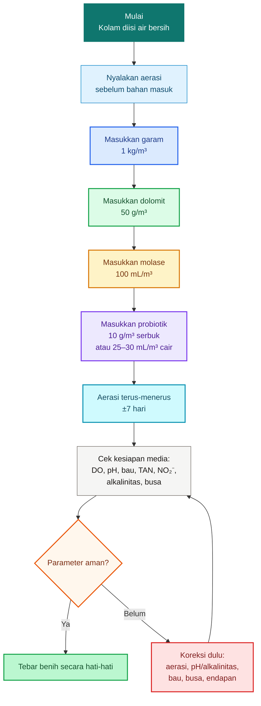
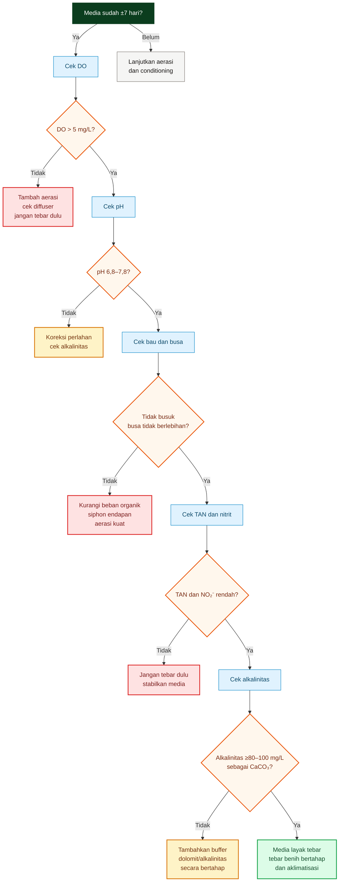
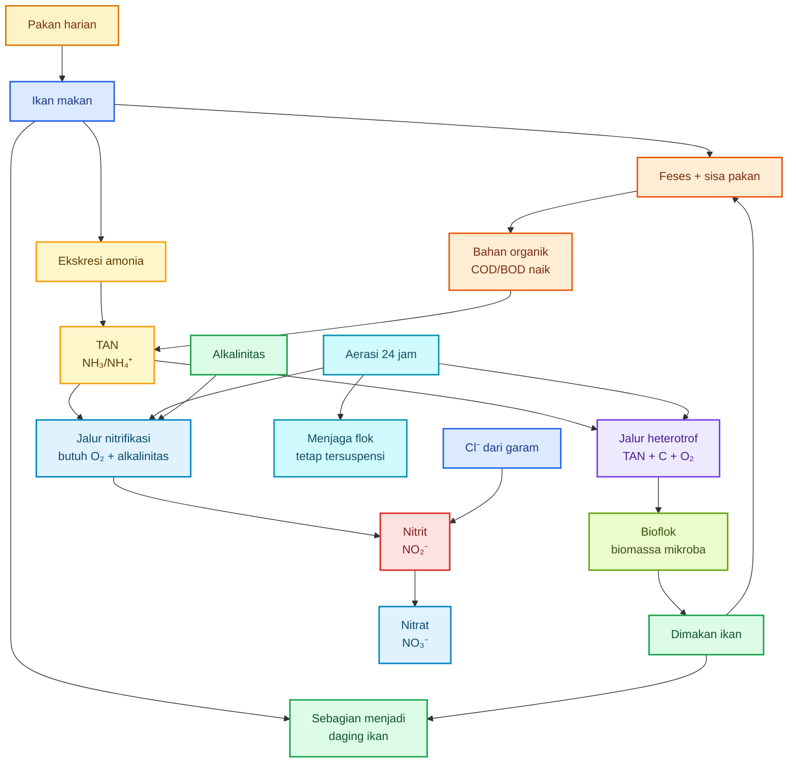
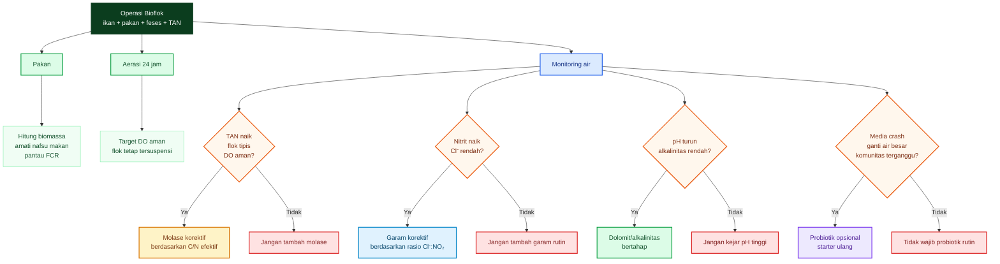
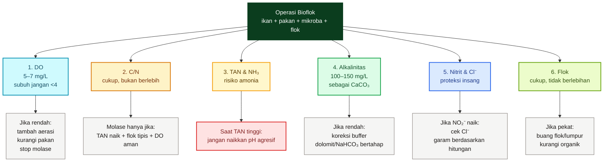
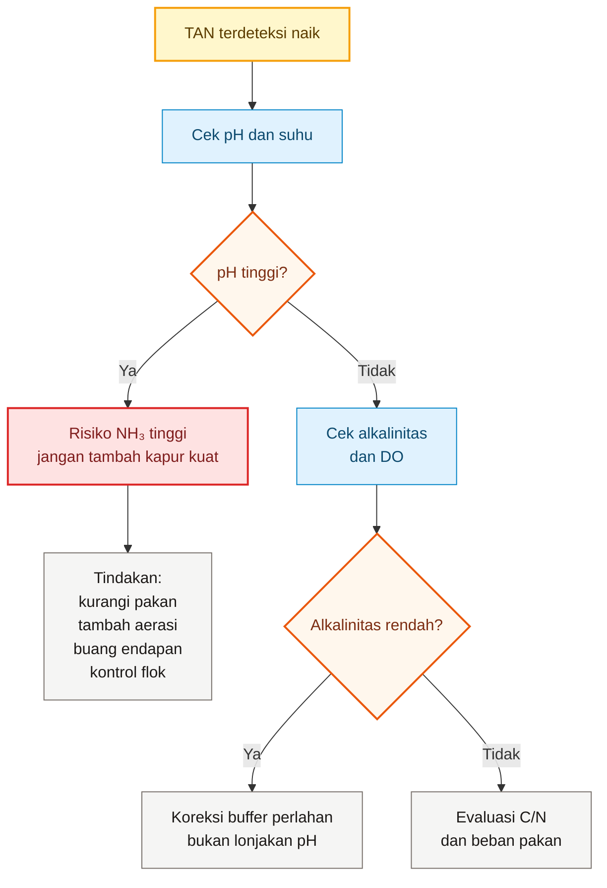
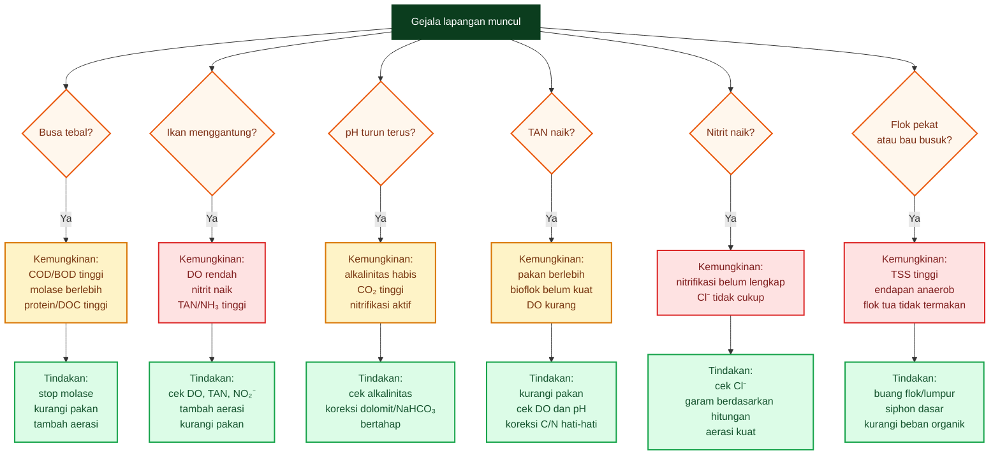
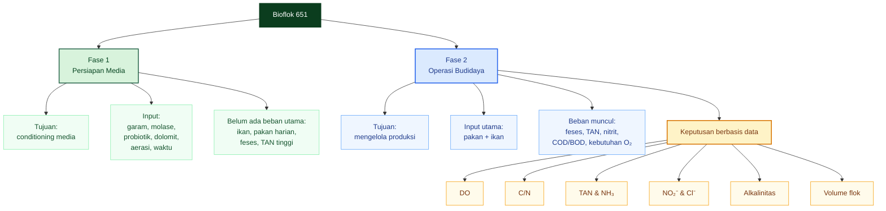

# **_Bioflok 651: Membedakan Persiapan Media dan Operasi Budidaya_**

_Mengapa garam, molase, probiotik, dolomit, aerasi, dan waktu 7 hari tidak boleh dibaca sebagai resep tunggal._

---

- [**_Bioflok 651: Membedakan Persiapan Media dan Operasi Budidaya_**](#bioflok-651-membedakan-persiapan-media-dan-operasi-budidaya)
- [Bioflok 651: Membedakan Persiapan Media dan Operasi Budidaya](#bioflok-651-membedakan-persiapan-media-dan-operasi-budidaya-1)
  - [Pendahuluan](#pendahuluan)
- [1. Inti Masalah: Persiapan Media Bukan Operasi Budidaya](#1-inti-masalah-persiapan-media-bukan-operasi-budidaya)
- [2. Fase 1 — Persiapan Media Bioflok 651](#2-fase-1--persiapan-media-bioflok-651)
  - [2.1. Tujuan Fase Persiapan](#21-tujuan-fase-persiapan)
  - [2.2. Formula Dasar Persiapan Media per 1 m³](#22-formula-dasar-persiapan-media-per-1-m)
  - [2.3. Alur Persiapan Media](#23-alur-persiapan-media)
  - [2.4. Membaca Fungsi Tiap Komponen pada Fase Persiapan](#24-membaca-fungsi-tiap-komponen-pada-fase-persiapan)
    - [Garam](#garam)
    - [Molase](#molase)
    - [Probiotik](#probiotik)
    - [Dolomit](#dolomit)
    - [Aerasi](#aerasi)
  - [2.5. Makna Waktu ±7 Hari](#25-makna-waktu-7-hari)
  - [2.6. Parameter Minimal Sebelum Tebar](#26-parameter-minimal-sebelum-tebar)
  - [2.7. Kesimpulan Bab 2](#27-kesimpulan-bab-2)
- [3. Makna Tiap Komponen Persiapan](#3-makna-tiap-komponen-persiapan)
  - [3.1. Garam: Bukan untuk C/N, tetapi untuk Ion dan Proteksi Nitrit](#31-garam-bukan-untuk-cn-tetapi-untuk-ion-dan-proteksi-nitrit)
  - [3.2. Molase: Starter Karbon, tetapi Membawa COD/BOD](#32-molase-starter-karbon-tetapi-membawa-codbod)
  - [3.3. Probiotik: Starter Mikroba, Bukan Jaminan Sistem Stabil](#33-probiotik-starter-mikroba-bukan-jaminan-sistem-stabil)
  - [3.4. Dolomit: Buffer, Alkalinitas, Ca, dan Mg](#34-dolomit-buffer-alkalinitas-ca-dan-mg)
  - [3.5. Aerasi: Oksigen dan Mixing Sejak Awal](#35-aerasi-oksigen-dan-mixing-sejak-awal)
  - [3.6. Ringkasan Fungsi Komponen Persiapan](#36-ringkasan-fungsi-komponen-persiapan)
- [4. Kapan Media Persiapan Dianggap Siap?](#4-kapan-media-persiapan-dianggap-siap)
  - [4.1. Indikator Media Siap Tebar](#41-indikator-media-siap-tebar)
  - [4.2. Mengapa 7 Hari Tidak Cukup Sebagai Patokan?](#42-mengapa-7-hari-tidak-cukup-sebagai-patokan)
  - [4.3. Alur Keputusan Sebelum Tebar](#43-alur-keputusan-sebelum-tebar)
  - [4.4. Cara Membaca Tiap Parameter](#44-cara-membaca-tiap-parameter)
    - [DO](#do)
    - [pH](#ph)
    - [Alkalinitas](#alkalinitas)
    - [Bau](#bau)
    - [TAN dan Nitrit](#tan-dan-nitrit)
    - [Busa dan Kepekatan Air](#busa-dan-kepekatan-air)
  - [4.5. Kesimpulan Bab 4](#45-kesimpulan-bab-4)
- [5. Fase 2 — Operasi Budidaya: Sistem Mulai Diuji](#5-fase-2--operasi-budidaya-sistem-mulai-diuji)
  - [5.1. Apa yang Berubah Setelah Ikan Ditebar?](#51-apa-yang-berubah-setelah-ikan-ditebar)
  - [5.2. Nitrogen dari Pakan](#52-nitrogen-dari-pakan)
  - [5.3. Alur Pakan Menjadi TAN, Flok, dan Nitrat](#53-alur-pakan-menjadi-tan-flok-dan-nitrat)
  - [5.4. Pakan Menjadi Sumber C, N, dan Beban Oksigen](#54-pakan-menjadi-sumber-c-n-dan-beban-oksigen)
  - [5.5. Pakan Tidak Menggantikan Semua Komponen](#55-pakan-tidak-menggantikan-semua-komponen)
  - [5.6. Risiko Awal Saat Operasi Dimulai](#56-risiko-awal-saat-operasi-dimulai)
  - [5.7. Kesimpulan Bab 5](#57-kesimpulan-bab-5)
- [6. Manajemen Operasi: Mana yang Rutin, Mana yang Korektif?](#6-manajemen-operasi-mana-yang-rutin-mana-yang-korektif)
  - [6.1. Tabel Utama: Rutin atau Korektif?](#61-tabel-utama-rutin-atau-korektif)
  - [6.2. Diagram Keputusan Operasi](#62-diagram-keputusan-operasi)
  - [6.3. Pakan: Rutin, tetapi Harus Terkontrol](#63-pakan-rutin-tetapi-harus-terkontrol)
  - [6.4. Aerasi: Rutin 24 Jam, Tidak Boleh Korektif Saja](#64-aerasi-rutin-24-jam-tidak-boleh-korektif-saja)
  - [6.5. Molase: Korektif, Bukan Ritual Harian](#65-molase-korektif-bukan-ritual-harian)
  - [6.6. Garam: Korektif Berdasarkan Nitrit dan Cl⁻](#66-garam-korektif-berdasarkan-nitrit-dan-cl)
  - [6.7. Dolomit/Kapur: Korektif atau Berkala Berdasarkan Alkalinitas](#67-dolomitkapur-korektif-atau-berkala-berdasarkan-alkalinitas)
  - [6.8. Probiotik: Opsional, Bukan Pengganti Monitoring](#68-probiotik-opsional-bukan-pengganti-monitoring)
  - [6.9. Ringkasan Manajemen Operasi](#69-ringkasan-manajemen-operasi)
- [7. Titik Kendali Utama Saat Operasi](#7-titik-kendali-utama-saat-operasi)
  - [7.1. Dashboard Operasi Bioflok](#71-dashboard-operasi-bioflok)
  - [7.2. Diagram Dashboard Praktisi](#72-diagram-dashboard-praktisi)
  - [7.3. DO: Titik Kendali Paling Kritis](#73-do-titik-kendali-paling-kritis)
  - [7.4. C/N: Cukup, Bukan Setinggi-tingginya](#74-cn-cukup-bukan-setinggi-tingginya)
  - [7.5. TAN dan NH₃: Jangan Salah Membaca Amonia](#75-tan-dan-nh-jangan-salah-membaca-amonia)
  - [7.6. Alkalinitas: Lebih Penting daripada pH Sesaat](#76-alkalinitas-lebih-penting-daripada-ph-sesaat)
  - [7.7. Nitrit dan Cl⁻: Garam Berdasarkan Data, Bukan Jadwal](#77-nitrit-dan-cl-garam-berdasarkan-data-bukan-jadwal)
  - [7.8. Flok: Cukup, Bukan Sebanyak-banyaknya](#78-flok-cukup-bukan-sebanyak-banyaknya)
  - [7.9. Ringkasan Titik Kendali Operasi](#79-ringkasan-titik-kendali-operasi)
- [8. Gejala Lapangan dan Tindakan Cepat](#8-gejala-lapangan-dan-tindakan-cepat)
  - [8.1. Tabel Diagnosis Cepat](#81-tabel-diagnosis-cepat)
  - [8.2. Diagram Tindakan Cepat](#82-diagram-tindakan-cepat)
  - [8.3. Busa Tebal](#83-busa-tebal)
  - [8.4. Ikan Menggantung](#84-ikan-menggantung)
  - [8.5. pH Turun Terus](#85-ph-turun-terus)
  - [8.6. TAN Naik](#86-tan-naik)
  - [8.7. Nitrit Naik](#87-nitrit-naik)
  - [8.8. Flok Terlalu Pekat](#88-flok-terlalu-pekat)
  - [8.9. Bau Busuk](#89-bau-busuk)
  - [8.10. Ringkasan Prioritas Tindakan Darurat](#810-ringkasan-prioritas-tindakan-darurat)
- [9. Kesimpulan Praktis](#9-kesimpulan-praktis)
  - [9.1. Inti Pembeda Dua Fase](#91-inti-pembeda-dua-fase)
  - [9.2. Kesimpulan Teknis per Komponen](#92-kesimpulan-teknis-per-komponen)
  - [9.3. Kesimpulan Manajemen](#93-kesimpulan-manajemen)
  - [9.4. Kalimat Penutup](#94-kalimat-penutup)
- [Lampiran Teknis](#lampiran-teknis)
  - [Lampiran 1 — Hitungan Garam](#lampiran-1--hitungan-garam)
  - [Lampiran 2 — Hitungan Molase](#lampiran-2--hitungan-molase)
  - [Lampiran 3 — Hitungan C/N Operasi](#lampiran-3--hitungan-cn-operasi)
  - [Lampiran 4 — Hitungan Alkalinitas](#lampiran-4--hitungan-alkalinitas)
  - [Lampiran 5 — Hitungan Aerasi](#lampiran-5--hitungan-aerasi)
- [Lampiran 6 — Pengukuran Bioflok dan Daftar Peralatan Ukur](#lampiran-6--pengukuran-bioflok-dan-daftar-peralatan-ukur)
  - [L6.1. Prinsip Pengukuran Bioflok](#l61-prinsip-pengukuran-bioflok)
  - [L6.2. Paket Minimal untuk Praktisi](#l62-paket-minimal-untuk-praktisi)
  - [L6.3. DO Meter](#l63-do-meter)
  - [L6.4. pH Meter atau pH Test Kit](#l64-ph-meter-atau-ph-test-kit)
  - [L6.5. Test Kit TAN / Amonia](#l65-test-kit-tan--amonia)
  - [L6.6. Test Kit Nitrit](#l66-test-kit-nitrit)
  - [L6.7. Test Kit Nitrat](#l67-test-kit-nitrat)
  - [L6.8. Test Kit Alkalinitas](#l68-test-kit-alkalinitas)
  - [L6.9. Salinity Meter, Refraktometer, atau Test Kit Chloride](#l69-salinity-meter-refraktometer-atau-test-kit-chloride)
  - [L6.10. Corong Imhoff untuk Volume Flok](#l610-corong-imhoff-untuk-volume-flok)
  - [L6.11. Termometer](#l611-termometer)
  - [L6.12. TDS/EC Meter](#l612-tdsec-meter)
  - [L6.13. Secchi Disk atau Tabung Kekeruhan](#l613-secchi-disk-atau-tabung-kekeruhan)
  - [L6.14. Timbangan Digital](#l614-timbangan-digital)
  - [L6.15. Flow Meter Udara dan Watt Meter](#l615-flow-meter-udara-dan-watt-meter)
  - [L6.16. Frekuensi Pengukuran](#l616-frekuensi-pengukuran)
  - [L6.17. Daftar Belanja Berdasarkan Kelas Praktisi](#l617-daftar-belanja-berdasarkan-kelas-praktisi)
  - [L6.18. Kata Kunci Pencarian Marketplace](#l618-kata-kunci-pencarian-marketplace)
  - [L6.19. Kriteria Membeli Alat di Marketplace](#l619-kriteria-membeli-alat-di-marketplace)
  - [L6.20. Format Log Pengukuran Harian](#l620-format-log-pengukuran-harian)
  - [L6.21. Kesimpulan Lampiran 6](#l621-kesimpulan-lampiran-6)
- [Lampiran L7 — Produk Mikroba Starter dari Marketplace](#lampiran-f--produk-mikroba-starter-dari-marketplace)
  - [L7.1. Standar Minimal Produk Mikroba Starter](#f1-standar-minimal-produk-mikroba-starter)
  - [L7.2. Contoh Produk Marketplace yang Mencantumkan Komposisi dan/atau Kepadatan](#f2-contoh-produk-marketplace-yang-mencantumkan-komposisi-danatau-kepadatan)
  - [L7.3. Produk yang Layak untuk Fermentasi Pakan](#f3-produk-yang-layak-untuk-fermentasi-pakan)
  - [L7.4. Produk yang Layak untuk Starter Air/Bioflok](#f4-produk-yang-layak-untuk-starter-airbioflok)
  - [L7.5. Produk yang Tidak Lolos Seleksi Teknis](#f5-produk-yang-tidak-lolos-seleksi-teknis)
  - [L7.6. Checklist Membeli Mikroba Starter di Marketplace](#f6-checklist-membeli-mikroba-starter-di-marketplace)
  - [L7.7. Rekomendasi Praktis untuk Artikel](#f7-rekomendasi-praktis-untuk-artikel)

---

# Pendahuluan

Bioflok 651 sering dipahami sebagai **paket resep**: isi air, masukkan garam, molase, probiotik, dolomit, aerasi, tunggu ±7 hari, lalu tebar benih. Cara baca seperti ini tidak sepenuhnya salah, tetapi berbahaya bila dianggap sebagai formula tunggal untuk seluruh siklus budidaya.

<figure>
  
  <figcaption>
    Ilustrasi sistem bioflok 651 untuk budidaya lele dengan pengelolaan air,
    aerasi, dan mikroorganisme.
  </figcaption>
</figure>

Dalam materi Bioflok 651, tahap **penyiapan media** memang memuat bahan seperti garam, molase, probiotik, dolomit, aerasi, dan waktu pematangan. Namun materi yang sama juga membedakan tahap setelah ikan masuk: pengelolaan pakan, pengamatan volume flok, warna air, tingkah laku ikan, pH, alkalinitas, amonia, nitrit, nitrat, dan DO. Artinya, sejak awal Bioflok 651 sebenarnya bukan hanya “campuran bahan”, melainkan sistem manajemen air dan biologi yang berubah dari fase persiapan ke fase operasi. ([Madiun Food Security and Agriculture][1])

Bioflok bekerja karena mikroba memanfaatkan bahan organik dan nitrogen di air. Dalam kerangka ilmiah, pengendalian nitrogen pada bioflok berkaitan erat dengan manipulasi rasio C/N: penambahan sumber karbon dapat mendorong bakteri mengambil nitrogen anorganik dari air untuk membentuk protein mikroba. Prinsip ini dijelaskan oleh Avnimelech sebagai salah satu dasar pengendalian nitrogen dalam sistem akuakultur. ([ScienceDirect][2])

Namun, bioflok bukan hanya soal C/N. Ketika sistem sudah beroperasi, ikan, pakan, feses, amonia, nitrit, oksigen, flok, alkalinitas, salinitas, dan beban organik bergerak bersamaan. Hargreaves menekankan bahwa sistem bioflok dikembangkan untuk meningkatkan kontrol lingkungan pada akuakultur intensif, tetapi keberhasilannya bergantung pada aerasi, padatan tersuspensi, kualitas air, dan manajemen mikroba. ([Aquaculture][3])

Karena itu, artikel ini memakai satu pemisahan utama:

$$
\boxed{\text{Persiapan media} \neq \text{Operasi budidaya}}
$$

Persiapan media adalah tahap **conditioning**. Operasi budidaya adalah tahap ketika sistem benar-benar menerima beban produksi: ikan makan, feses muncul, TAN terbentuk, nitrit bisa naik, oksigen dikonsumsi, dan bioflok mulai diuji sebagai sistem biologis.

<ResourceBox
  title="Artikel Terkait:"
  items={[
    {
      name: 'Komparasi Ekonomi Budidaya Nila dan Lele pada Kolam Statis, Bioflok, dan RAS Berbasis m² Footprint Lahan',
      href: '/blog/agri/perikanan/komparasi-kolam-statis-bioflok-ras',
    },
    {
      name: 'C/N Ratio pada Bioflok: Mengatur Mikroba, Oksigen, dan Stabilitas Kolam untuk Praktisi',
      href: '/blog/agri/perikanan/ratio-cn-rendah-biflok',
    },
    {
      name: 'E/P Ratio Pakan Ikan: Antara Efisiensi FCR, Fermentasi Ringan, Bioflok, dan Perbedaan Strategi Lele vs Nila',
      href: '/blog/agri/perikanan/ep-ratio-pakan-fermentasi',
    },
    {
      name: 'Manajemen Nitrit dan Nitrat pada Bioflok: `$C/N$`, `$Cl^-$`, Nitrifikasi, Denitrifikasi, dan Ekspor Nitrogen Berbasis Angka',
      href: '/blog/agri/perikanan/nitri-nitrat-manajemen-biofloc',
    },
    {
      name: 'Fermentasi Protein untuk Pakan Lele: Membuat Hidrolisat Asam Amino yang Aman, Rasional, dan Bernilai Guna',
      href: '/blog/agri/perikanan/fermentasi-protein-untuk-pakan-lele',
    },
    {
      name: 'Menurunkan FCR Lele: Dari Pakan Dimakan sampai Menjadi Daging',
      href: '/blog/agri/perikanan/menurunkan-fcr-lele',
    },
    {
      name: 'Kolam Lele sebagai Bioreaktor Penurun FCR Berbasis Bioflok',
      href: '/blog/agri/perikanan/menurunkan-fcr-lele-bioflok',
    },
    {
      name: 'Fermentasi, Pengomposan, dan Pembusukan: Meluruskan Istilah agar Praktisi Agri Tidak Salah Interpretasi',
      href: '/blog/agri/fermentasi-pengomposan-pembusukan',
    },
  ]}
/>

---

# 1. Inti Masalah: Persiapan Media Bukan Operasi Budidaya

Poin utama bab ini adalah sederhana, tetapi sangat penting:

$$
\boxed{\text{Persiapan media = conditioning}}
$$

$$
\boxed{\text{Operasi = sistem sudah menerima pakan, ikan, feses, TAN, nitrit, dan beban oksigen}}
$$

Pada fase **persiapan media**, kolam belum menerima beban utama dari budidaya. Belum ada ikan yang makan, belum ada feses harian, belum ada ekskresi amonia dari ikan, dan belum ada beban nitrogen yang stabil dari pakan. Maka, molase yang diberikan pada fase ini bukan sedang “menyeimbangkan C/N pakan”, karena pakan belum menjadi input rutin.

Pada fase **operasi**, situasinya berubah total. Pakan menjadi sumber utama karbon, nitrogen, fosfor, bahan organik, BOD, dan COD. Ikan mengubah sebagian pakan menjadi biomassa, tetapi sebagian lain menjadi feses dan amonia. Dari sinilah TAN, nitrit, nitrat, kebutuhan oksigen, pertumbuhan flok, dan risiko penurunan kualitas air mulai nyata.

Secara sederhana:

$$
\text{Persiapan} = \text{air} + \text{garam} + \text{molase} + \text{probiotik} + \text{dolomit} + \text{aerasi} + \text{waktu}
$$

Sedangkan:

$$
\text{Operasi} = \text{ikan} + \text{pakan} + \text{feses} + \text{TAN} + \text{NO}_2^- + \text{NO}_3^- + \text{bioflok} + \text{beban O}_2
$$

TAN sendiri adalah gabungan amonia bebas dan amonium:

$$
\text{TAN} = NH_3\text{-N} + NH_4^+\text{-N}
$$

Nitrit juga baru menjadi isu utama setelah nitrogen dari pakan masuk ke sistem. Dalam publikasi SRAC tentang nitrit pada kolam ikan, nitrit dijelaskan sebagai hasil antara dari proses perubahan amonia menuju nitrat, dan klorida dari garam dapat menghambat masuknya nitrit melalui insang ikan. ([Texas A&M AgriLife][4])

Berikut diagram ringkas untuk membedakan dua fase tersebut.

```mermaid
flowchart TD
    A["Bioflok 651"]:::title

    A --> B["Fase 1<br/>Persiapan Media"]:::prep
    A --> C["Fase 2<br/>Operasi Budidaya"]:::ops

    B --> B1["Air bersih"]:::prepNode
    B --> B2["Garam<br/>Na⁺ + Cl⁻"]:::prepNode
    B --> B3["Molase<br/>starter karbon"]:::prepNode
    B --> B4["Probiotik<br/>inokulum mikroba"]:::prepNode
    B --> B5["Dolomit<br/>alkalinitas + Ca/Mg"]:::prepNode
    B --> B6["Aerasi<br/>O₂ + mixing"]:::prepNode
    B --> B7["±7 hari<br/>conditioning"]:::prepNode

    C --> C1["Ikan ditebar"]:::opsNode
    C --> C2["Pakan rutin"]:::opsNode
    C --> C3["Feses + sisa pakan"]:::opsNode
    C --> C4["TAN<br/>NH₃/NH₄⁺"]:::warning
    C --> C5["Nitrit<br/>NO₂⁻"]:::danger
    C --> C6["Nitrat<br/>NO₃⁻"]:::opsNode
    C --> C7["Bioflok dimakan ikan"]:::good
    C --> C8["Beban oksigen naik"]:::warning

    B --> D["Media siap menerima beban awal,<br/>bukan berarti siklus nitrogen sudah matang penuh"]:::note
    C --> E["Manajemen berbasis data:<br/>DO, pH, TAN, NO₂⁻, alkalinitas, Cl⁻, volume flok"]:::note

    classDef title fill:#0b3d1e,color:#ffffff,stroke:#0b3d1e,stroke-width:2px;
    classDef prep fill:#d8f3dc,color:#064420,stroke:#2d6a4f,stroke-width:2px;
    classDef prepNode fill:#eef9f0,color:#064420,stroke:#74c69d,stroke-width:1px;
    classDef ops fill:#dbeafe,color:#0f172a,stroke:#2563eb,stroke-width:2px;
    classDef opsNode fill:#eff6ff,color:#0f172a,stroke:#60a5fa,stroke-width:1px;
    classDef warning fill:#fff7cc,color:#5c3d00,stroke:#f59e0b,stroke-width:2px;
    classDef danger fill:#fee2e2,color:#7f1d1d,stroke:#dc2626,stroke-width:2px;
    classDef good fill:#dcfce7,color:#14532d,stroke:#16a34a,stroke-width:2px;
    classDef note fill:#f5f5f4,color:#1c1917,stroke:#78716c,stroke-width:1px;
```

Kesalahan terbesar dalam praktik adalah membawa logika fase persiapan ke fase operasi secara mentah. Contohnya: molase diberikan terus karena “dari awal memang pakai molase”, garam ditambah tanpa mengukur nitrit atau klorida, dolomit diberikan tanpa membaca pH dan alkalinitas, atau probiotik dituang rutin tanpa melihat apakah sistem sebenarnya sudah stabil.

Padahal setelah operasi berjalan, sebagian bahan berubah status. **Pakan** menjadi input rutin utama. **Aerasi** menjadi kebutuhan wajib 24 jam. **Molase** menjadi alat koreksi C/N, bukan ritual harian. **Garam** menjadi koreksi terhadap risiko nitrit dan stres osmotik, bukan pengganti manajemen kualitas air. **Dolomit atau bahan alkali** menjadi koreksi alkalinitas dan pH, bukan alat untuk menaikkan pH sembarangan. **Probiotik** menjadi inokulum awal atau alat pemulihan, bukan jaminan bahwa sistem pasti stabil.

Dengan kata lain:

$$
\boxed{\text{Resep persiapan tidak boleh otomatis menjadi resep operasi}}
$$

Yang harus berubah saat ikan mulai diberi pakan adalah cara berpikirnya. Bukan lagi “berapa bahan yang harus ditambahkan sesuai resep”, tetapi:

$$
\boxed{\text{parameter apa yang berubah, dan koreksi apa yang benar-benar diperlukan}}
$$

Bab berikutnya akan masuk ke **Fase 1: Persiapan Media Bioflok 651**, yaitu membaca ulang fungsi garam, molase, probiotik, dolomit, aerasi, dan waktu ±7 hari sebagai proses conditioning, bukan sebagai bukti bahwa kolam sudah siap menanggung beban budidaya penuh.

[**Kembali ke Atas**](#bioflok-651-membedakan-persiapan-media-dan-operasi-budidaya)

[1]: https://disperta.madiunkota.go.id/wp-content/uploads/2025/08/Materi-Bioflok.pdf?utm_source=chatgpt.com 'AQUACULTURE DISCOVERY'
[2]: https://www.sciencedirect.com/science/article/pii/S004484869900085X?utm_source=chatgpt.com 'Carbon/nitrogen ratio as a control element in aquaculture ...'
[3]: https://aquaculture.mgcafe.uky.edu/sites/aquaculture.ca.uky.edu/files/srac_4503_biofloc_production_systems_for_aquaculture.pdf?utm_source=chatgpt.com 'Biofloc Production Systems for Aquaculture'
[4]: https://agrilife.org/fisheries/files/2013/09/SRAC-Publication-No.-0462-%E2%80%93-Nitrite-in-Fish-Ponds.pdf?utm_source=chatgpt.com 'Nitrite in Fish Ponds'

---

# 2. Fase 1 — Persiapan Media Bioflok 651

Fase persiapan media adalah tahap **conditioning**: air disiapkan secara kimia, fisik, dan biologis sebelum ikan ditebar. Pada fase ini, sistem belum menanggung beban produksi karena belum ada pakan harian, feses, ekskresi amonia ikan, dan lonjakan nitrit dari proses nitrifikasi.

Dalam materi Bioflok 651, penyiapan media Metode 1 per **1 m³ air** menggunakan air bersih yang diaerasi, garam **1 kg/m³**, molase **100 mL/m³**, probiotik serbuk **10 g/m³**, dolomit **50 g/m³** atau pada kasus tertentu sampai **100 g/m³**, probiotik cair bila digunakan **25–30 mL/m³**, aerasi **30 L/menit/titik batu aerasi/m³** atau setara **8–10 watt/m³**, dan media dinyatakan siap tebar setelah sekitar **7 hari**. ([Madiun Food Security and Agriculture][1])

## 2.1. Tujuan Fase Persiapan

Tujuan fase persiapan bukan membentuk sistem nitrogen yang sudah matang penuh. Tanpa ikan dan pakan harian, belum ada beban TAN yang nyata.

Tujuan fase ini lebih tepat dibaca sebagai:

$$
\boxed{\text{menyiapkan air agar siap menerima beban awal ikan dan pakan}}
$$

Ada enam tujuan praktis:

1. **Menyiapkan kondisi ionik air** melalui garam.
2. **Memberi starter karbon** melalui molase.
3. **Memasukkan inokulum mikroba** melalui probiotik.
4. **Menyiapkan buffer pH dan mineral** melalui dolomit.
5. **Menjaga oksigen dan pengadukan** melalui aerasi.
6. **Memberi waktu adaptasi mikroba** selama ±7 hari.

Bioflok sendiri adalah sistem yang sangat bergantung pada kontrol lingkungan, aerasi, padatan tersuspensi, dan komunitas mikroba. Hargreaves menjelaskan bahwa sistem bioflok dikembangkan untuk meningkatkan kontrol lingkungan pada akuakultur intensif dengan pertukaran air terbatas, tetapi keberhasilannya menuntut pengelolaan aerasi dan padatan yang baik. ([Aquaculture][2])

---

## 2.2. Formula Dasar Persiapan Media per 1 m³

| Komponen               |       Dosis per 1 m³ | Fungsi pada fase persiapan            |
| ---------------------- | -------------------: | ------------------------------------- |
| Air bersih             | Isi wadah dan aerasi | Media dasar                           |
| Garam                  |          **1 kg/m³** | Na⁺, Cl⁻, salinitas ringan            |
| Molase                 |        **100 mL/m³** | Starter karbon                        |
| Probiotik serbuk       |          **10 g/m³** | Inokulum mikroba                      |
| Probiotik cair         |      **25–30 mL/m³** | Alternatif inokulum cair              |
| Dolomit                |          **50 g/m³** | Alkalinitas, Ca, Mg                   |
| Dolomit kasus tertentu |         **100 g/m³** | Jika air sangat rendah mineral/buffer |
| Aerasi                 |    **30 L/menit/m³** | Oksigen dan mixing                    |
| Daya aerasi            |     **8–10 watt/m³** | Patokan daya praktis                  |
| Waktu                  |          **±7 hari** | Conditioning media                    |

Rumus skala untuk volume kolam:

$$
\text{Kebutuhan bahan} = \text{Dosis per m}^3 \times \text{Volume kolam}
$$

Jika volume kolam adalah $V$ m³:

$$
\text{Garam} = 1 \times V \quad \text{kg}
$$

$$
\text{Molase} = 100 \times V \quad \text{mL}
$$

$$
\text{Probiotik serbuk} = 10 \times V \quad \text{g}
$$

$$
\text{Dolomit} = 50 \times V \quad \text{g}
$$

$$
\text{Aerasi} = 30 \times V \quad \text{L/menit}
$$

$$
\text{Daya aerasi} = 8\text{ sampai }10 \times V \quad \text{watt}
$$

Contoh untuk kolam **10 m³**:

| Komponen         |          Kebutuhan |
| ---------------- | -----------------: |
| Garam            |          **10 kg** |
| Molase           | **1.000 mL = 1 L** |
| Probiotik serbuk |          **100 g** |
| Probiotik cair   |     **250–300 mL** |
| Dolomit          |          **500 g** |
| Aerasi           |    **300 L/menit** |
| Daya aerasi      |    **80–100 watt** |

---

## 2.3. Alur Persiapan Media

Diagram berikut disusun vertikal agar nyaman dibaca di layar HP.

---

## 2.4. Membaca Fungsi Tiap Komponen pada Fase Persiapan

### Garam

Garam pada fase persiapan bukan untuk mengatur C/N. Garam tidak menyumbang karbon dan tidak memberi makanan bagi mikroba bioflok.

Fungsi utamanya adalah menyiapkan ion:

$$
NaCl \rightarrow Na^+ + Cl^-
$$

Pada dosis:

$$
1 \text{ kg/m}^3 = 1 \text{ g/L} = 1000 \text{ mg/L NaCl}
$$

Fraksi klorida dalam NaCl:

$$
\frac{Cl}{NaCl} = \frac{35.45}{58.44} = 0.607
$$

Maka:

$$
Cl^- = 1000 \times 0.607 = 607 \text{ mg/L}
$$

Jadi:

$$
\boxed{1 \text{ kg garam/m}^3 \approx 607 \text{ mg/L Cl}^-}
$$

Klorida penting terutama nanti pada fase operasi, ketika nitrit mulai muncul. Publikasi SRAC tentang nitrit pada kolam ikan menjelaskan bahwa klorida dari garam membantu menghambat masuknya nitrit melalui insang ikan, sehingga garam lebih tepat dipahami sebagai proteksi ionik terhadap nitrit, bukan bahan pembentuk bioflok. ([Madiun Food Security and Agriculture][1])

### Molase

Molase pada fase persiapan adalah **starter karbon**. Tetapi karena belum ada pakan dan belum ada amonia ikan, molase pada fase ini tidak boleh dibaca sebagai koreksi C/N operasional.

Asumsi umum:

- berat jenis molase: 1,35–1,40 g/mL
- kandungan karbon molase basah: 35–40%

Untuk dosis 100 mL/m³:

$$
\text{Berat molase} = 100 \times 1.35\text{ sampai }1.40
$$

$$
\text{Berat molase} = 135\text{–}140 \text{ g}
$$

Karbon molase:

$$
C_{\text{molase}} = 135 \times 0.35 = 47.25 \text{ g C}
$$

sampai:

$$
C_{\text{molase}} = 140 \times 0.40 = 56 \text{ g C}
$$

Jadi:

$$
\boxed{100 \text{ mL molase/m}^3 \approx 47\text{–}56 \text{ g C/m}^3}
$$

Karbon ini akan merangsang mikroba heterotrof awal, tetapi juga membawa beban organik. Konversi kasar:

$$
1 \text{ g C} \approx 2.67 \text{ g COD}
$$

Maka:

$$
COD \approx 47\text{–}56 \times 2.67
$$

$$
\boxed{COD \approx 126\text{–}149 \text{ g O}_2\text{-eq/m}^3}
$$

Ini penting: molase bukan hanya “makanan bakteri”, tetapi juga **beban oksigen**. Karena itu aerasi wajib hidup selama fase persiapan.

### Probiotik

Probiotik pada fase persiapan berfungsi sebagai **inokulum mikroba**. Titik pentingnya bukan sekadar merek, tetapi:

- jenis mikroba,
- kepadatan mikroba atau CFU,
- tanggal produksi dan kedaluwarsa,
- peruntukan akuakultur,
- cara aktivasi,
- keamanan bagi ikan.

Jika probiotik serbuk memiliki kepadatan:

$$
10^9 \text{ CFU/g}
$$

dan dosisnya:

$$
10 \text{ g/m}^3
$$

maka total inokulum:

$$
10 \times 10^9 = 10^{10} \text{ CFU/m}^3
$$

Karena:

$$
1 \text{ m}^3 = 1000 \text{ L}
$$

maka:

$$
\frac{10^{10}}{1000} = 10^7 \text{ CFU/L}
$$

Jadi:

$$
\boxed{10 \text{ g/m}^3 \text{ pada } 10^9 \text{ CFU/g} = 10^7 \text{ CFU/L}}
$$

Angka ini hanya contoh perhitungan. Produk berbeda dapat memiliki CFU berbeda. Karena itu label produk harus dibaca, bukan hanya mengikuti volume atau berat.

### Dolomit

Dolomit pada fase persiapan bukan sumber karbon organik. Dolomit berfungsi sebagai sumber alkalinitas, kalsium, dan magnesium.

Rumus dolomit:

$$
CaMg(CO_3)_2
$$

Fungsi praktisnya:

$$
\boxed{\text{dolomit = buffer pH + alkalinitas + Ca + Mg}}
$$

Jika dosis dolomit:

$$
50 \text{ g/m}^3
$$

dan efektivitas praktisnya diasumsikan sekitar 60–108% sebagai CaCO₃-equivalent, maka potensi alkalinitasnya:

$$
50 \times 0.60 = 30 \text{ g CaCO}_3\text{-eq/m}^3
$$

sampai:

$$
50 \times 1.08 = 54 \text{ g CaCO}_3\text{-eq/m}^3
$$

Karena:

$$
1 \text{ g/m}^3 = 1 \text{ mg/L}
$$

maka:

$$
\boxed{50 \text{ g dolomit/m}^3 \approx 30\text{–}54 \text{ mg/L sebagai CaCO}_3}
$$

Dosis ini cocok dibaca sebagai **buffer awal**, bukan jaminan bahwa alkalinitas akan selalu aman selama operasi. Saat ikan diberi pakan, nitrifikasi dan respirasi mikroba dapat mengonsumsi alkalinitas, sehingga koreksi lanjutan tetap harus berbasis hasil ukur.

### Aerasi

Aerasi pada fase persiapan bekerja untuk dua hal:

$$
\boxed{\text{oksigenasi + pengadukan}}
$$

Oksigen diperlukan karena molase dan probiotik akan mengaktifkan mikroba. Pengadukan diperlukan agar bahan tersebar merata dan tidak terbentuk zona anaerob di dasar kolam.

Dosis Bioflok 651:

$$
30 \text{ L udara/menit/m}^3
$$

Rumus estimasi oxygen transfer:

$$
OTR = Q_{\text{air}} \times 0.0179 \times OTE
$$

Keterangan:

- $OTR$ = oxygen transfer rate, kg O₂/jam
- $Q_{\text{air}}$ = debit udara, L/menit
- $0.0179$ = kg O₂/jam yang terkandung dalam 1 L/menit udara
- $OTE$ = oxygen transfer efficiency aktual

Jika:

$$
Q_{\text{air}}=30 \text{ L/menit}
$$

dan:

$$
OTE=5\%\text{–}10\%
$$

maka:

$$
OTR = 30 \times 0.0179 \times 0.05
$$

sampai:

$$
OTR = 30 \times 0.0179 \times 0.10
$$

Hasilnya:

$$
\boxed{OTR \approx 27\text{–}54 \text{ g O}_2/\text{jam/m}^3}
$$

Pada fase persiapan, suplai ini relatif besar dibanding beban molase 100 mL/m³. Namun saat operasi, kebutuhan oksigen akan jauh lebih tinggi karena ada ikan, pakan, feses, mikroba, nitrifikasi, dan bioflok yang tumbuh. Hargreaves menekankan bahwa dalam sistem bioflok, aerasi bukan hanya untuk oksigen, tetapi juga untuk menjaga flok tetap tersuspensi dan mendukung sistem intensif dengan pertukaran air rendah. ([Aquaculture][2])

---

## 2.5. Makna Waktu ±7 Hari

Angka **±7 hari** harus dibaca sebagai waktu conditioning, bukan jaminan bahwa kolam sudah matang secara nitrogen.

Selama ±7 hari, yang diharapkan terjadi adalah:

| Hari | Proses dominan                            | Indikator lapangan                  |
| ---: | ----------------------------------------- | ----------------------------------- |
|    0 | Bahan masuk, aerasi mulai stabil          | Air mulai bercampur                 |
|  1–2 | Mikroba adaptasi, molase mulai dikonsumsi | Bisa muncul busa ringan             |
|  3–5 | Biofilm dan flok awal mulai terbentuk     | Air mulai berubah warna             |
|  5–7 | Media lebih stabil                        | Bau tidak busuk, DO aman            |
|   7+ | Siap tebar bila parameter aman            | Bukan hanya karena sudah tujuh hari |

Titik kritisnya:

$$
\boxed{\text{media siap tebar} \neq \text{bioflok operasional matang}}
$$

Media persiapan belum benar-benar diuji sampai ikan masuk dan pakan mulai diberikan. Ujian sebenarnya baru terjadi saat sistem menerima nitrogen dari pakan dan ekskresi ikan.

---

## 2.6. Parameter Minimal Sebelum Tebar

Sebelum benih masuk, jangan hanya memakai patokan “sudah 7 hari”. Gunakan indikator berikut.

| Parameter   |      Target praktis sebelum tebar |
| ----------- | --------------------------------: |
| DO          |                       &gt; 5 mg/L |
| pH          |                           6,8–7,8 |
| Alkalinitas | minimal 80–100 mg/L sebagai CaCO₃ |
| Bau         |                       Tidak busuk |
| Busa        |                  Tidak berlebihan |
| TAN         |                            Rendah |
| Nitrit      |                            Rendah |
| Endapan     |              Tidak berbau anaerob |
| Aerasi      |                   Merata dan kuat |

Jika media berbau busuk, busa tebal, DO rendah, atau dasar kolam berlumpur anaerob, maka media belum layak disebut siap tebar meskipun sudah melewati 7 hari.

---

## 2.7. Kesimpulan Bab 2

Fase persiapan Bioflok 651 adalah tahap membangun **landasan awal**:

$$
\boxed{
\text{garam} + \text{molase} + \text{probiotik} + \text{dolomit} + \text{aerasi} + \text{waktu}
}
$$

Tetapi maknanya harus tepat:

$$
\boxed{\text{garam = buffer ionik awal, terutama Cl}^-}
$$

$$
\boxed{\text{molase = starter karbon, bukan C/N pakan}}
$$

$$
\boxed{\text{probiotik = inokulum awal}}
$$

$$
\boxed{\text{dolomit = alkalinitas, Ca, Mg}}
$$

$$
\boxed{\text{aerasi = oksigen dan mixing}}
$$

$$
\boxed{\text{7 hari = conditioning, bukan jaminan nitrogen cycle matang}}
$$

Bab berikutnya akan membedah lebih tajam **makna tiap komponen persiapan**: mengapa garam lebih banyak dibahas dari sisi Cl⁻, mengapa molase membawa COD/BOD, bagaimana membaca probiotik, kenapa dolomit bukan sekadar “menaikkan pH”, dan mengapa aerasi adalah komponen paling kritis sejak awal.

[**Kembali ke Atas**](#bioflok-651-membedakan-persiapan-media-dan-operasi-budidaya)

[1]: https://disperta.madiunkota.go.id/wp-content/uploads/2025/08/Materi-Bioflok.pdf?utm_source=chatgpt.com 'AQUACULTURE DISCOVERY'
[2]: https://aquaculture.mgcafe.uky.edu/sites/aquaculture.ca.uky.edu/files/srac_4503_biofloc_production_systems_for_aquaculture.pdf?utm_source=chatgpt.com 'Biofloc Production Systems for Aquaculture'

---

# 3. Makna Tiap Komponen Persiapan

Pada fase persiapan, setiap bahan memiliki fungsi yang berbeda. Kesalahan umum di lapangan adalah menganggap semua bahan sebagai “obat bioflok”. Padahal garam, molase, probiotik, dolomit, dan aerasi bekerja pada aspek yang berbeda: **ion, karbon, mikroba, buffer, dan oksigen**.

Dalam materi Bioflok 651, komponen persiapan media per 1 m³ mencakup garam, molase, probiotik, dolomit, aerasi, dan waktu pematangan ±7 hari. Bagian pentingnya adalah memahami **fungsi teknis tiap komponen**, bukan hanya menyalin dosis. Materi tersebut juga menekankan bahwa bioflok didukung oleh sumber karbon, komunitas mikroba, O₂, pH, serta Ca dan Mg dari kapur/dolomit. ([Madiun Food Security and Agriculture][1])

```mermaid id="komponen-persiapan-bioflok-651"
flowchart TD
    A["Persiapan Media Bioflok 651"]:::title

    A --> B["Garam<br/>NaCl"]:::salt
    B --> B1["Na⁺<br/>osmoregulasi"]:::saltNode
    B --> B2["Cl⁻<br/>proteksi nitrit"]:::saltNode

    A --> C["Molase"]:::carbon
    C --> C1["Karbon cepat urai"]:::carbonNode
    C --> C2["Starter heterotrof<br/>biofilm + EPS"]:::carbonNode
    C --> C3["Membawa COD/BOD"]:::warn

    A --> D["Probiotik"]:::microbe
    D --> D1["Inokulum mikroba"]:::microbeNode
    D --> D2["Cek strain + CFU<br/>bukan sekadar merek"]:::microbeNode

    A --> E["Dolomit"]:::alk
    E --> E1["Alkalinitas"]:::alkNode
    E --> E2["Ca + Mg"]:::alkNode
    E --> E3["Buffer pH<br/>bukan kejar pH tinggi"]:::alkNode

    A --> F["Aerasi"]:::air
    F --> F1["Oksigen"]:::airNode
    F --> F2["Mixing"]:::airNode
    F --> F3["Menjaga flok tersuspensi"]:::airNode

    classDef title fill:#0b3d1e,color:#ffffff,stroke:#0b3d1e,stroke-width:2px;
    classDef salt fill:#dbeafe,color:#1e3a8a,stroke:#2563eb,stroke-width:2px;
    classDef saltNode fill:#eff6ff,color:#1e3a8a,stroke:#60a5fa,stroke-width:1px;
    classDef carbon fill:#fef3c7,color:#78350f,stroke:#d97706,stroke-width:2px;
    classDef carbonNode fill:#fffbeb,color:#78350f,stroke:#f59e0b,stroke-width:1px;
    classDef microbe fill:#ede9fe,color:#4c1d95,stroke:#7c3aed,stroke-width:2px;
    classDef microbeNode fill:#f5f3ff,color:#4c1d95,stroke:#a78bfa,stroke-width:1px;
    classDef alk fill:#dcfce7,color:#14532d,stroke:#16a34a,stroke-width:2px;
    classDef alkNode fill:#f0fdf4,color:#14532d,stroke:#86efac,stroke-width:1px;
    classDef air fill:#cffafe,color:#164e63,stroke:#0891b2,stroke-width:2px;
    classDef airNode fill:#ecfeff,color:#164e63,stroke:#67e8f9,stroke-width:1px;
    classDef warn fill:#fee2e2,color:#7f1d1d,stroke:#dc2626,stroke-width:2px;
```

---

## 3.1. Garam: Bukan untuk C/N, tetapi untuk Ion dan Proteksi Nitrit

Garam yang dimaksud adalah garam dapur atau garam krosok tanpa bahan berbahaya, dengan komponen utama natrium klorida:

$$
NaCl \rightarrow Na^+ + Cl^-
$$

Pada fase persiapan, **nitrit belum menjadi masalah utama** karena belum ada ikan, pakan rutin, feses, dan ekskresi amonia. Jadi garam pada tahap ini bersifat **preventif**, bukan reaktif.

Peran garam terbagi menjadi dua:

| Ion             | Fungsi utama                                    |
| --------------- | ----------------------------------------------- |
| $\mathrm{Cl^-}$ | Proteksi terhadap nitrit                        |
| $\mathrm{Na^+}$ | Membantu osmoregulasi dan keseimbangan ion ikan |

Yang paling sering dibahas dalam bioflok adalah $\mathrm{Cl^-}$, karena nitrit $\mathrm{NO_2^-}$ dapat masuk melalui insang. Klorida dari garam dapat bersaing dengan nitrit pada insang, sehingga mengurangi masuknya nitrit ke tubuh ikan. SRAC menjelaskan bahwa bagian klorida dari garam bersaing dengan nitrit untuk penyerapan melalui insang, dan rasio klorida terhadap nitrit minimal sekitar 10:1 dapat membantu mencegah nitrit masuk ke ikan catfish. ([Texas A&M AgriLife][2])

Hitungan dosis Bioflok 651:

$$
1 \text{ kg NaCl/m}^3 = 1 \text{ g/L} = 1000 \text{ mg/L NaCl}
$$

Fraksi klorida dalam NaCl:

$$
\frac{Cl}{NaCl} = \frac{35.45}{58.44} = 0.607
$$

Maka:

$$
Cl^- = 1000 \times 0.607 = 607 \text{ mg/L}
$$

Fraksi natrium dalam NaCl:

$$
\frac{Na}{NaCl} = \frac{22.99}{58.44} = 0.393
$$

Maka:

$$
Na^+ = 1000 \times 0.393 = 393 \text{ mg/L}
$$

Jadi:

$$
\boxed{
1 \text{ kg garam/m}^3
\approx
607 \text{ mg/L } Cl^- + 393 \text{ mg/L } Na^+
}
$$

Makna praktisnya:

$$
\boxed{
\text{Garam persiapan = cadangan ionik awal, bukan sumber karbon dan bukan pembentuk bioflok utama.}
}
$$

Garam tidak menaikkan C/N. Garam juga bukan pengganti dolomit, karena NaCl tidak memberikan alkalinitas karbonat yang berarti. Dalam operasi nanti, garam seharusnya dikoreksi berdasarkan **nitrit dan klorida**, bukan ditambahkan rutin tanpa data.

---

## 3.2. Molase: Starter Karbon, tetapi Membawa COD/BOD

Molase adalah sumber karbon organik yang mudah dimanfaatkan bakteri heterotrof. Pada fase persiapan, molase berfungsi sebagai **starter karbon** untuk mengaktifkan mikroba awal, membantu pembentukan biofilm, dan mendukung produksi EPS atau extracellular polymeric substances yang membantu partikel bergabung menjadi flok.

Namun molase pada fase persiapan **bukan hitungan C/N pakan**, karena pakan belum masuk sebagai input rutin.

Prinsip ilmiah bioflok memang menggunakan manipulasi C/N untuk mengendalikan nitrogen anorganik. Avnimelech menjelaskan bahwa penambahan karbohidrat dapat mendorong bakteri mengambil nitrogen dari air untuk sintesis protein mikroba. Namun prinsip itu berlaku kuat ketika sudah ada nitrogen yang harus dikendalikan, terutama dari pakan dan ekskresi ikan. ([ScienceDirect][3])

Pada fase persiapan, molase lebih tepat dibaca sebagai:

$$
\boxed{
\text{molase = pemicu aktivitas heterotrof awal}
}
$$

bukan:

$$
\boxed{
\text{molase = koreksi C/N pakan}
}
$$

Hitungan molase per 1 m³:

Asumsi:

$$
BJ_{\text{molase}} = 1.35\text{–}1.40 \text{ g/mL}
$$

$$
f_C = 35\%\text{–}40\%
$$

Dosis:

$$
100 \text{ mL/m}^3
$$

Berat molase:

$$
100 \times 1.35 = 135 \text{ g}
$$

sampai:

$$
100 \times 1.40 = 140 \text{ g}
$$

Karbon molase:

$$
C_{\text{molase}} = 135 \times 0.35 = 47.25 \text{ g C}
$$

sampai:

$$
C_{\text{molase}} = 140 \times 0.40 = 56 \text{ g C}
$$

Maka:

$$
\boxed{
100 \text{ mL molase/m}^3
\approx
47\text{–}56 \text{ g C/m}^3
}
$$

Karbon organik ini membawa beban oksidasi. Secara stoikiometri sederhana:

$$
1 \text{ g C} \approx 2.67 \text{ g COD}
$$

Maka:

$$
COD \approx 47\text{–}56 \times 2.67
$$

$$
\boxed{
COD \approx 126\text{–}149 \text{ g O}_2\text{-eq/m}^3
}
$$

Artinya, molase bukan hanya “makanan bakteri”. Molase juga menambah **COD/BOD**, sehingga membutuhkan oksigen untuk diuraikan.

Makna praktisnya:

| Kondisi                         | Pembacaan                         |
| ------------------------------- | --------------------------------- |
| Molase diberikan saat persiapan | Mengaktifkan mikroba awal         |
| Belum ada ikan dan pakan        | Belum ada C/N pakan yang dihitung |
| Molase berlebihan               | Busa, bau, DO turun, BOD/COD naik |
| Aerasi lemah                    | Risiko anaerob dan media busuk    |

Kesimpulannya:

$$
\boxed{
\text{Molase persiapan berguna, tetapi harus dibaca sebagai starter karbon dan beban oksigen.}
}
$$

---

## 3.3. Probiotik: Starter Mikroba, Bukan Jaminan Sistem Stabil

Probiotik pada fase persiapan berfungsi sebagai **inokulum awal**. Tujuannya adalah mempercepat hadirnya mikroba pengurai bahan organik dan membantu pembentukan komunitas awal di media.

Namun, yang penting bukan sekadar merek. Untuk praktisi, probiotik harus dibaca dari aspek berikut:

| Aspek         | Pertanyaan praktis                                 |
| ------------- | -------------------------------------------------- |
| Strain        | Mikroba apa yang terkandung?                       |
| CFU           | Berapa kepadatan hidupnya?                         |
| Viabilitas    | Masih hidup atau sudah lemah?                      |
| Peruntukan    | Untuk akuakultur atau bukan?                       |
| Cara aktivasi | Perlu fermentasi dulu atau langsung pakai?         |
| Keamanan      | Aman untuk ikan dan tidak membawa bahan berbahaya? |

Materi Bioflok 651 menyebut probiotik sebagai bagian dari penyiapan media, dan juga menekankan pentingnya keanekaragaman serta stabilitas komunitas mikroba dalam bioflok. Namun, dalam praktik, probiotik tidak boleh menggantikan pengukuran DO, pH, TAN, nitrit, alkalinitas, dan volume flok. ([Madiun Food Security and Agriculture][1])

Contoh hitungan inokulum:

Jika probiotik serbuk memiliki kepadatan:

$$
10^9 \text{ CFU/g}
$$

Dosis:

$$
10 \text{ g/m}^3
$$

Maka total mikroba yang dimasukkan:

$$
10 \times 10^9 = 10^{10} \text{ CFU/m}^3
$$

Karena:

$$
1 \text{ m}^3 = 1000 \text{ L}
$$

Maka:

$$
\frac{10^{10}}{1000} = 10^7 \text{ CFU/L}
$$

Jadi:

$$
\boxed{
10 \text{ g/m}^3
\text{ pada produk } 10^9 \text{ CFU/g}
=
10^7 \text{ CFU/L}
}
$$

Jika probiotik cair memiliki kepadatan:

$$
10^8 \text{ CFU/mL}
$$

dan dosisnya:

$$
25 \text{ mL/m}^3
$$

maka:

$$
25 \times 10^8 = 2.5 \times 10^9 \text{ CFU/m}^3
$$

atau:

$$
\frac{2.5 \times 10^9}{1000}
=
2.5 \times 10^6 \text{ CFU/L}
$$

Jadi:

$$
\boxed{
25 \text{ mL/m}^3
\text{ pada produk } 10^8 \text{ CFU/mL}
=
2.5 \times 10^6 \text{ CFU/L}
}
$$

Angka ini hanya contoh. Produk dengan CFU berbeda akan menghasilkan kepadatan inokulum berbeda. Karena itu label produk harus dibaca.

Makna praktisnya:

$$
\boxed{
\text{Probiotik adalah starter, bukan pengganti manajemen air.}
}
$$

---

## 3.4. Dolomit: Buffer, Alkalinitas, Ca, dan Mg

Dolomit sering disebut “kapur”, tetapi fungsinya perlu dibedakan dari kapur kuat seperti kapur tohor $\mathrm{CaO}$ atau kapur hidrat $\mathrm{Ca(OH)_2}$.

Dolomit:

$$
CaMg(CO_3)_2
$$

Fungsi utamanya:

$$
\boxed{
\text{menambah alkalinitas, Ca, dan Mg}
}
$$

Dolomit bukan untuk menaikkan pH setinggi mungkin. Targetnya adalah menyiapkan **buffer** agar pH tidak mudah jatuh saat sistem mulai menerima beban organik dan nitrogen.

Dalam bioflok, alkalinitas penting karena proses pengendalian amonia, khususnya nitrifikasi, mengonsumsi alkalinitas. Hargreaves menjelaskan bahwa sistem bioflok membutuhkan pengelolaan alkalinitas karena proses nitrifikasi mengonsumsi alkalinitas dan dapat menyebabkan pH turun jika buffer tidak cukup. ([Aquaculture][4])

Reaksi nitrifikasi sederhana:

$$
NH_4^+ + 2O_2 \rightarrow NO_3^- + 2H^+ + H_2O
$$

Ion $\mathrm{H^+}$ inilah yang mendorong pH turun.

Rumus praktis kehilangan alkalinitas:

$$
\boxed{
1 \text{ mg TAN-N yang dinitrifikasi}
\approx
7.14 \text{ mg CaCO}_3\text{-eq}
}
$$

Pada fase persiapan, belum ada beban TAN dari ikan. Maka dolomit berfungsi sebagai **buffer awal**, bukan untuk mengganti alkalinitas yang sudah terkuras oleh pakan.

Hitungan dolomit per 1 m³:

Dosis:

$$
50 \text{ g/m}^3
$$

Jika efektivitas praktis dolomit diasumsikan:

$$
60\%\text{–}108\% \text{ sebagai CaCO}_3\text{-equivalent}
$$

maka:

$$
50 \times 0.60 = 30 \text{ g CaCO}_3\text{-eq/m}^3
$$

sampai:

$$
50 \times 1.08 = 54 \text{ g CaCO}_3\text{-eq/m}^3
$$

Karena:

$$
1 \text{ g/m}^3 = 1 \text{ mg/L}
$$

maka:

$$
\boxed{
50 \text{ g dolomit/m}^3
\approx
30\text{–}54 \text{ mg/L sebagai CaCO}_3
}
$$

Jika dosis dinaikkan menjadi:

$$
100 \text{ g/m}^3
$$

maka potensi alkalinitasnya menjadi:

$$
\boxed{
60\text{–}108 \text{ mg/L sebagai CaCO}_3
}
$$

Makna praktisnya:

| Pernyataan                                  | Koreksi     |
| ------------------------------------------- | ----------- |
| Dolomit untuk menaikkan pH setinggi mungkin | Salah       |
| Dolomit untuk menyiapkan buffer             | Benar       |
| Dolomit menggantikan garam                  | Salah       |
| Dolomit memberi Ca dan Mg                   | Benar       |
| Dolomit cukup sekali untuk seluruh siklus   | Belum tentu |

Kesimpulannya:

$$
\boxed{
\text{Dolomit persiapan = fondasi alkalinitas dan mineral, bukan obat langsung amonia.}
}
$$

---

## 3.5. Aerasi: Oksigen dan Mixing Sejak Awal

Aerasi adalah komponen yang paling tidak boleh diremehkan. Pada fase persiapan, aerasi berfungsi sebagai:

$$
\boxed{
\text{oksigenasi + pengadukan}
}
$$

Molase dan probiotik akan merangsang aktivitas mikroba. Mikroba membutuhkan oksigen untuk menguraikan bahan organik. Aerasi juga menjaga partikel tetap bergerak agar tidak cepat mengendap dan membentuk zona anaerob.

Dalam sistem bioflok, aerasi bukan hanya alat tambahan. Hargreaves menekankan bahwa aerasi dibutuhkan untuk suplai oksigen dan menjaga padatan bioflok tetap tersuspensi. Sistem bioflok juga memiliki respirasi air yang tinggi, sehingga kegagalan aerasi dapat berdampak cepat pada kualitas air dan ikan. ([Aquaculture][4])

Dosis persiapan:

$$
30 \text{ L udara/menit/m}^3
$$

Rumus estimasi transfer oksigen:

$$
OTR = Q_{\text{air}} \times 0.0179 \times OTE
$$

Keterangan:

| Simbol           | Arti                                            |
| ---------------- | ----------------------------------------------- |
| $OTR$            | oxygen transfer rate, kg O₂/jam                 |
| $Q_{\text{air}}$ | debit udara, L/menit                            |
| $0.0179$         | kg O₂/jam yang terkandung dalam 1 L/menit udara |
| $OTE$            | oxygen transfer efficiency aktual               |

Jika:

$$
Q_{\text{air}} = 30 \text{ L/menit}
$$

dan:

$$
OTE = 5\%\text{–}10\%
$$

maka:

$$
OTR_{5\%} = 30 \times 0.0179 \times 0.05
$$

$$
OTR_{5\%} = 0.02685 \text{ kg O}_2/\text{jam}
$$

atau:

$$
\boxed{
26.85 \text{ g O}_2/\text{jam/m}^3
}
$$

Untuk OTE 10%:

$$
OTR_{10\%} = 30 \times 0.0179 \times 0.10
$$

$$
OTR_{10\%} = 0.0537 \text{ kg O}_2/\text{jam}
$$

atau:

$$
\boxed{
53.7 \text{ g O}_2/\text{jam/m}^3
}
$$

Jadi estimasi transfer oksigen aktual:

$$
\boxed{
OTR \approx 27\text{–}54 \text{ g O}_2/\text{jam/m}^3
}
$$

Bandingkan dengan beban COD dari molase:

$$
100 \text{ mL molase/m}^3
\approx
126\text{–}149 \text{ g COD/m}^3
$$

Jika COD ini terurai selama 7 hari:

$$
7 \times 24 = 168 \text{ jam}
$$

Maka beban oksigen rata-rata:

$$
\frac{126}{168} = 0.75 \text{ g O}_2/\text{jam}
$$

sampai:

$$
\frac{149}{168} = 0.89 \text{ g O}_2/\text{jam}
$$

Secara kasar, aerasi persiapan jauh lebih besar dari kebutuhan oksigen rata-rata untuk molase. Namun ini tidak boleh membuat praktisi lengah, karena saat operasi nanti beban oksigen meningkat tajam akibat ikan, pakan, feses, mikroba, nitrifikasi, dan flok.

Makna praktisnya:

$$
\boxed{
\text{Aerasi persiapan membangun media aerob. Aerasi operasi menopang kehidupan sistem.}
}
$$

---

## 3.6. Ringkasan Fungsi Komponen Persiapan

| Komponen  | Fungsi benar                                 | Bukan untuk                              |
| --------- | -------------------------------------------- | ---------------------------------------- |
| Garam     | Na⁺, Cl⁻, proteksi awal nitrit, osmoregulasi | Menaikkan C/N atau alkalinitas           |
| Molase    | Starter karbon dan heterotrof awal           | Menghitung C/N pakan sebelum pakan masuk |
| Probiotik | Inokulum awal                                | Jaminan sistem stabil tanpa monitoring   |
| Dolomit   | Alkalinitas, Ca, Mg, buffer pH               | Menaikkan pH setinggi mungkin            |
| Aerasi    | Oksigen dan mixing                           | Sekadar aksesori kolam                   |

Prinsip yang harus dipegang:

$$
\boxed{
\text{Komponen persiapan menyiapkan media, bukan menggantikan manajemen operasi.}
}
$$

Saat ikan sudah masuk, keputusan tidak lagi berdasarkan “resep awal”, tetapi berdasarkan data:

$$
\boxed{
DO,\ pH,\ TAN,\ NO_2^-,\ alkalinitas,\ Cl^-,\ volume\ flok,\ nafsu\ makan,\ dan\ FCR
}
$$

Bab berikutnya membahas kapan media persiapan benar-benar layak disebut siap tebar. Bukan hanya karena sudah lewat tujuh hari, tetapi karena parameter air dan tanda lapangan menunjukkan sistem cukup aman untuk menerima ikan.

[**Kembali ke Atas**](#bioflok-651-membedakan-persiapan-media-dan-operasi-budidaya)

[1]: https://disperta.madiunkota.go.id/wp-content/uploads/2025/08/Materi-Bioflok.pdf?utm_source=chatgpt.com 'AQUACULTURE DISCOVERY'
[2]: https://agrilife.org/fisheries/files/2013/09/SRAC-Publication-No.-0462-%E2%80%93-Nitrite-in-Fish-Ponds.pdf?utm_source=chatgpt.com 'Nitrite in Fish Ponds'
[3]: https://www.sciencedirect.com/science/article/pii/S004484869900085X?utm_source=chatgpt.com 'Carbon/nitrogen ratio as a control element in aquaculture ...'
[4]: https://aquaculture.mgcafe.uky.edu/sites/aquaculture.ca.uky.edu/files/srac_4503_biofloc_production_systems_for_aquaculture.pdf?utm_source=chatgpt.com 'Biofloc Production Systems for Aquaculture'

---

# 4. Kapan Media Persiapan Dianggap Siap?

Jangan hanya memakai patokan **“sudah 7 hari”**. Dalam Bioflok 651, waktu ±7 hari lebih tepat dibaca sebagai waktu **conditioning media**, bukan jaminan bahwa sistem nitrogen sudah matang penuh.

Pada fase persiapan, belum ada ikan, belum ada pakan harian, belum ada feses, dan belum ada ekskresi amonia yang stabil. Jadi sistem belum benar-benar diuji oleh beban nitrogen. Bioflok yang sebenarnya baru diuji ketika ikan masuk, mulai makan, lalu menghasilkan limbah nitrogen dan bahan organik. Hargreaves menjelaskan bahwa sistem bioflok dikembangkan untuk mengontrol lingkungan produksi intensif, tetapi keberhasilannya bergantung pada aerasi, padatan tersuspensi, mikroba, dan pengelolaan kualitas air secara aktif. ([Aquaculture][1])

Kalimat pentingnya:

$$
\boxed{
7 \text{ hari adalah waktu conditioning, bukan jaminan bioflok matang secara nitrogen.}
}
$$

Media persiapan dianggap layak tebar bila kondisi air **cukup aman untuk menerima benih**, bukan hanya karena sudah melewati waktu tertentu.

## 4.1. Indikator Media Siap Tebar

Gunakan indikator berikut sebagai pegangan awal.

| Parameter     |      Target praktis sebelum tebar |
| ------------- | --------------------------------: |
| DO            |                        &gt;5 mg/L |
| pH            |                           6,8–7,8 |
| Alkalinitas   | minimal 80–100 mg/L sebagai CaCO₃ |
| Bau           |                       Tidak busuk |
| TAN           |                            Rendah |
| Nitrit        |                            Rendah |
| Busa          |                  Tidak berlebihan |
| Air           |               Tidak terlalu pekat |
| Endapan dasar |              Tidak berbau anaerob |
| Aerasi        |                   Merata dan kuat |

Angka di atas adalah **target praktis**, bukan angka mutlak untuk semua lokasi. Kualitas sumber air, suhu, padat tebar, jenis benih, dan desain aerasi dapat membuat batas aman berbeda. Namun untuk praktisi, tabel ini cukup baik sebagai saringan awal sebelum tebar.

## 4.2. Mengapa 7 Hari Tidak Cukup Sebagai Patokan?

Karena pada fase persiapan, sumber nitrogen masih sangat terbatas.

Bioflok membutuhkan hubungan antara:

$$
\text{karbon} + \text{nitrogen} + \text{mikroba} + O_2
$$

Molase memang menyediakan karbon, probiotik menyediakan inokulum mikroba, dan aerasi menyediakan oksigen. Tetapi nitrogen utama dari sistem budidaya baru masuk setelah ikan diberi pakan.

Maka, pada hari ke-7 media mungkin sudah:

$$
\text{lebih stabil secara fisik dan mikrobiologis}
$$

tetapi belum tentu:

$$
\text{matang menghadapi beban TAN dan nitrit}
$$

Dengan kata lain:

$$
\boxed{
\text{Media siap tebar} \neq \text{siklus nitrogen matang penuh}
}
$$

## 4.3. Alur Keputusan Sebelum Tebar

Diagram berikut dibuat vertikal agar nyaman dibaca di layar HP.

## 4.4. Cara Membaca Tiap Parameter

### DO

DO adalah indikator pertama yang harus dilihat. Bioflok membutuhkan oksigen untuk ikan, mikroba heterotrof, dan nanti untuk proses nitrifikasi. Aerasi juga menjaga flok tetap tersuspensi. Pada sistem bioflok, aerasi bukan aksesori, melainkan komponen utama produksi. ([Aquaculture][1])

Target sebelum tebar:

$$
\boxed{
DO \gt  5 \text{ mg/L}
}
$$

Jika DO sulit naik sebelum ikan masuk, maka setelah ikan dan pakan masuk sistem akan lebih mudah gagal. Jangan tebar benih ke media yang aerasi dan DO-nya belum stabil.

### pH

pH sebelum tebar sebaiknya berada di kisaran netral-sedikit basa ringan:

$$
\boxed{
pH 6,8\text{–}7,8
}
$$

pH terlalu rendah membuat aktivitas mikroba dan nitrifikasi lemah. pH terlalu tinggi meningkatkan risiko amonia bebas $\mathrm{NH_3}$ ketika TAN mulai muncul setelah ikan diberi pakan.

Hubungan TAN dan pH penting karena:

$$
NH_4^+ \rightleftharpoons NH_3 + H^+
$$

Saat pH naik, fraksi $\mathrm{NH_3}$ juga naik. Jadi sejak fase persiapan, pH tidak perlu dikejar terlalu tinggi.

### Alkalinitas

Alkalinitas adalah cadangan buffer. Ini berbeda dari pH. pH menunjukkan kondisi saat itu, sedangkan alkalinitas menunjukkan kemampuan air menahan perubahan pH.

Target awal yang lebih aman:

$$
\boxed{
\text{Alkalinitas minimal } 80\text{–}100 \text{ mg/L sebagai CaCO}_3
}
$$

Pada fase operasi nanti, nitrifikasi akan mengonsumsi alkalinitas dan menghasilkan asam. Karena itu media dengan alkalinitas terlalu rendah mudah mengalami pH drop. Dalam bioflok, Hargreaves menekankan pentingnya pengelolaan alkalinitas karena proses pengendalian amonia, terutama nitrifikasi, dapat mengonsumsi alkalinitas dan menurunkan pH. ([Aquaculture][1])

### Bau

Media yang baik tidak berbau busuk. Bau busuk menunjukkan kemungkinan ada zona anaerob, bahan organik membusuk, atau aerasi tidak merata.

Bau yang perlu diwaspadai:

| Bau                   | Kemungkinan                      |
| --------------------- | -------------------------------- |
| Busuk menyengat       | Anaerob, endapan organik         |
| Seperti telur busuk   | Risiko H₂S                       |
| Asam fermentasi tajam | Molase/organik berlebih          |
| Normal tanah/kolam    | Masih wajar bila tidak menyengat |

Jika bau busuk muncul sebelum ikan masuk, jangan tebar benih. Koreksi dulu dengan aerasi, pengadukan, siphon endapan, dan pengurangan beban organik.

### TAN dan Nitrit

Pada fase persiapan, TAN dan nitrit seharusnya rendah. Jika TAN atau nitrit sudah tinggi sebelum ikan masuk, berarti ada sumber organik/nitrogen yang membusuk atau media tidak stabil.

Nitrit penting karena dapat menyebabkan gangguan pengangkutan oksigen pada ikan. SRAC menjelaskan bahwa nitrit dapat menyebabkan brown blood disease pada catfish, dan klorida dari garam menghambat masuknya nitrit melalui insang. ([Texas A&M AgriLife][2])

Sebelum tebar, prinsipnya:

$$
\boxed{
TAN \text{ rendah dan } NO_2^- \text{ rendah}
}
$$

Jangan menunggu ikan stres untuk mengecek dua parameter ini.

### Busa dan Kepekatan Air

Sedikit busa dari aerasi masih wajar, terutama bila ada molase dan mikroba aktif. Tetapi busa tebal, cokelat, tahan lama, atau berbau menunjukkan beban organik tinggi.

Air juga tidak perlu terlalu pekat sebelum tebar. Pada fase persiapan, flok mungkin belum banyak karena nitrogen dari pakan belum masuk. Itu normal. Mengejar air terlalu pekat sebelum ikan masuk justru berisiko menaikkan BOD/COD dan menurunkan DO.

## 4.5. Kesimpulan Bab 4

Media persiapan dianggap siap bukan karena sudah tujuh hari, tetapi karena parameter dasarnya aman.

$$
\boxed{
\text{Siap tebar} =
DO \text{ aman}
+
pH \text{ stabil}
+
alkalinitas cukup}
$$

$$
\boxed{
+
TAN/NO_2^- \text{ rendah}
+
tidak bau busuk
+
aerasi merata
}
$$

Prinsipnya:

$$
\boxed{
7 \text{ hari adalah waktu conditioning, bukan sertifikat bahwa bioflok sudah matang.}
}
$$

[**Kembali ke Atas**](#bioflok-651-membedakan-persiapan-media-dan-operasi-budidaya)

---

# 5. Fase 2 — Operasi Budidaya: Sistem Mulai Diuji

Setelah ikan masuk dan mulai diberi pakan, barulah bioflok diuji sesungguhnya. Pada fase ini, sistem tidak lagi hanya berisi air, garam, molase, probiotik, dolomit, dan aerasi. Sistem mulai menerima **beban produksi**.

<figure>
  
  <figcaption>
    Siklus nitrogen pada sistem bioflok 651 yang menunjukkan hubungan antara
    limbah organik, amonia, nitrit, nitrat, mikroorganisme, dan kualitas air.
  </figcaption>
</figure>

Input utama operasi adalah pakan:

$$
\text{pakan} \rightarrow C + N + P + COD + BOD
$$

Pakan membawa karbon, nitrogen, fosfor, bahan organik, serta beban oksigen dalam bentuk COD/BOD. Sebagian nutrien menjadi daging ikan, sebagian menjadi feses, sebagian menjadi amonia, dan sebagian masuk ke biomassa mikroba atau bioflok.

Kalimat kunci fase operasi:

$$
\boxed{
\text{Pakan adalah bahan bakar utama bioflok saat operasi.}
}
$$

Tetapi pakan tidak otomatis menggantikan semua fungsi garam, dolomit, aerasi, atau koreksi molase. Pakan memang menjadi sumber C dan N, tetapi garam berhubungan dengan ion dan nitrit, dolomit berhubungan dengan alkalinitas, dan aerasi berhubungan dengan oksigen serta mixing.

## 5.1. Apa yang Berubah Setelah Ikan Ditebar?

Pada fase persiapan, sistem masih relatif ringan. Setelah ikan masuk, terjadi perubahan besar:

| Komponen    | Fase persiapan | Fase operasi                            |
| ----------- | -------------- | --------------------------------------- |
| Ikan        | Belum ada      | Ada dan tumbuh                          |
| Pakan       | Belum rutin    | Input utama harian                      |
| Feses       | Belum ada      | Ada setiap hari                         |
| TAN         | Rendah         | Bisa naik                               |
| Nitrit      | Rendah         | Bisa naik saat nitrifikasi belum stabil |
| DO          | Beban rendah   | Beban naik tajam                        |
| Flok        | Awal/tipis     | Tumbuh mengikuti pakan dan mikroba      |
| Alkalinitas | Buffer awal    | Terkuras oleh proses biologis           |
| Garam/Cl⁻   | Preventif      | Korektif bila nitrit naik               |
| Molase      | Starter        | Koreksi C/N bila diperlukan             |

Pemisahan ini penting agar praktisi tidak meneruskan “resep persiapan” sebagai input harian tanpa membaca kondisi air.

## 5.2. Nitrogen dari Pakan

Nitrogen utama dalam operasi berasal dari protein pakan. Rumus praktis:

$$
N_{\text{pakan}} = Pakan \times \%Protein \times 0{,}16
$$

Keterangan:

| Simbol             | Arti                                       |
| ------------------ | ------------------------------------------ |
| $N_{\text{pakan}}$ | nitrogen dalam pakan                       |
| $Pakan$            | jumlah pakan yang diberikan                |
| $\%Protein$        | kadar protein pakan                        |
| $0{,}16$           | protein rata-rata mengandung ±16% nitrogen |

Contoh:

Jika diberikan:

$$
Pakan = 1.000 \text{ g}
$$

dengan:

$$
Protein = 30\% = 0{,}30
$$

maka:

$$
N_{\text{pakan}} = 1000 \times 0{,}30 \times 0{,}16
$$

$$
\boxed{
N_{\text{pakan}} = 48 \text{ g N}
}
$$

Tidak semua nitrogen ini menjadi daging. Sebagian masuk ke tubuh ikan, sebagian keluar sebagai feses, sebagian diekskresikan sebagai amonia. Dalam bioflok, nitrogen inilah yang harus dikendalikan melalui kombinasi:

$$
\text{asimilasi heterotrof}
+
\text{nitrifikasi}
+
\text{panen biomassa}
+
\text{pengelolaan flok}
$$

Avnimelech menjelaskan bahwa pengendalian nitrogen anorganik dapat dilakukan dengan manipulasi rasio C/N, sehingga bakteri menggunakan karbohidrat dan mengambil nitrogen dari air untuk membentuk protein mikroba. ([ScienceDirect][3])

## 5.3. Alur Pakan Menjadi TAN, Flok, dan Nitrat

Diagram berikut menunjukkan perubahan utama setelah operasi dimulai.

Diagram ini menunjukkan satu hal penting: setelah operasi dimulai, bioflok bukan lagi sekadar “air cokelat”. Bioflok menjadi sistem yang menerima pakan, mengubah limbah, mengonsumsi oksigen, menghasilkan padatan, dan membutuhkan kontrol harian.

## 5.4. Pakan Menjadi Sumber C, N, dan Beban Oksigen

Pakan tidak hanya membawa nitrogen. Pakan juga membawa karbon dan bahan organik. Artinya, pada fase operasi, pakan ikut menyumbang C/N sistem.

Rumus sederhana untuk membaca C/N efektif:

$$
C/N_{\text{efektif}}
=
\frac{
C_{pakan\ tersedia} + C_{karbon\ eksternal}
}{
N_{\text{limbah}}
}
$$

atau lebih rinci:

$$
C/N_{\text{efektif}}
=
\frac{
(F \times C_f \times f_{\text{tersedia}}) + C_{\text{molase}}
}{
F \times P \times 0{,}16 \times f_N
}
$$

Keterangan:

| Simbol                | Arti                                           |
| --------------------- | ---------------------------------------------- |
| $F$                   | jumlah pakan                                   |
| $C_f$                 | fraksi karbon total dalam pakan                |
| $f_{\text{tersedia}}$ | fraksi karbon pakan yang tersedia bagi mikroba |
| $C_{\text{molase}}$   | karbon dari molase atau sumber eksternal       |
| $P$                   | fraksi protein pakan                           |
| $0{,}16$              | fraksi nitrogen dalam protein                  |
| $f_N$                 | fraksi nitrogen pakan yang menjadi limbah      |

Poin pentingnya:

$$
\boxed{
\text{Karbon pakan tidak boleh diabaikan.}
}
$$

Tetapi juga:

$$
\boxed{
\text{Karbon pakan tidak boleh dihitung 100\% tersedia untuk bioflok.}
}
$$

Sebagian karbon pakan menjadi daging, sebagian menjadi CO₂ lewat respirasi ikan, sebagian menjadi feses, sebagian menjadi DOC, dan sebagian menjadi sisa pakan. Karena itu molase saat operasi sebaiknya digunakan sebagai **koreksi**, bukan ritual harian.

## 5.5. Pakan Tidak Menggantikan Semua Komponen

Pakan memang menjadi bahan bakar utama operasi, tetapi tidak otomatis menggantikan semua fungsi komponen persiapan.

| Komponen             | Apakah digantikan oleh pakan? | Penjelasan                                                  |
| -------------------- | ----------------------------- | ----------------------------------------------------------- |
| Karbon untuk mikroba | Sebagian ya                   | Pakan membawa karbon, tetapi ketersediaannya tidak 100%     |
| Nitrogen             | Ya, pakan sumber utama N      | Protein pakan menjadi sumber TAN                            |
| Garam/Cl⁻            | Tidak                         | Pakan bukan sumber proteksi nitrit yang andal               |
| Dolomit/alkalinitas  | Tidak                         | Pakan tidak mengganti buffer karbonat                       |
| Aerasi               | Tidak                         | Justru kebutuhan aerasi naik saat pakan naik                |
| Probiotik            | Tidak langsung                | Mikroba bisa tumbuh, tetapi stabilitas tetap harus dipantau |
| Molase               | Bisa berkurang                | Molase hanya koreksi bila C/N efektif kurang                |

Dalam sistem bioflok, penambahan karbon dapat membantu pengendalian nitrogen, tetapi juga meningkatkan produksi biomassa mikroba dan kebutuhan oksigen. Karena itu, keputusan menambah molase harus membaca DO, TAN, flok, busa, dan alkalinitas, bukan hanya mengikuti dosis awal. ([ScienceDirect][3])

## 5.6. Risiko Awal Saat Operasi Dimulai

Fase awal operasi adalah masa rawan. Masalah umum yang muncul:

| Gejala                   | Kemungkinan sebab                                     |
| ------------------------ | ----------------------------------------------------- |
| TAN naik                 | Bioflok/nitrifikasi belum mampu mengikuti beban pakan |
| Nitrit naik              | Nitrifikasi belum lengkap                             |
| DO turun                 | Ikan, mikroba, dan organik mulai memakai oksigen      |
| Busa tebal               | Protein/DOC/EPS/molase/organik tinggi                 |
| pH turun                 | Alkalinitas mulai habis                               |
| Flok terlalu cepat pekat | Input organik dan karbon berlebih                     |
| Ikan menggantung         | DO rendah, nitrit, TAN, atau stres osmotik            |

Nitrit perlu perhatian khusus karena dapat menjadi masalah pada fase transisi nitrifikasi. Klorida dari garam membantu menekan masuknya nitrit ke ikan, tetapi garam tidak menyelesaikan sumber masalahnya. Sumber masalah tetap harus dikendalikan melalui pakan, aerasi, alkalinitas, dan stabilitas mikroba. ([Texas A&M AgriLife][2])

## 5.7. Kesimpulan Bab 5

Setelah ikan masuk dan pakan diberikan, bioflok masuk fase operasi. Pada fase ini, sistem mulai diuji oleh beban sebenarnya.

$$
\boxed{
\text{Pakan adalah input utama C, N, P, COD, dan BOD.}
}
$$

$$
\boxed{
\text{Sebagian pakan menjadi daging, sebagian menjadi feses, sebagian menjadi TAN.}
}
$$

$$
\boxed{
\text{Bioflok yang baik mengubah sebagian limbah menjadi biomassa mikroba yang bisa dimakan ikan.}
}
$$

Tetapi:

$$
\boxed{
\text{Pakan tidak menggantikan garam, dolomit, aerasi, dan monitoring kualitas air.}
}
$$

Maka setelah operasi dimulai, pertanyaan praktisi bukan lagi:

$$
\text{“Berapa resep yang harus dituang?”}
$$

melainkan:

$$
\boxed{
\text{“Parameter apa yang berubah, dan koreksi apa yang benar-benar diperlukan?”}
}
$$

Bab berikutnya akan membahas manajemen operasi: mana yang harus rutin, mana yang hanya korektif, dan kapan molase, garam, dolomit, atau probiotik benar-benar diperlukan.

[**Kembali ke Atas**](#bioflok-651-membedakan-persiapan-media-dan-operasi-budidaya)

[1]: https://aquaculture.mgcafe.uky.edu/sites/aquaculture.ca.uky.edu/files/srac_4503_biofloc_production_systems_for_aquaculture.pdf?utm_source=chatgpt.com 'Biofloc Production Systems for Aquaculture'
[2]: https://agrilife.org/fisheries/files/2013/09/SRAC-Publication-No.-0462-%E2%80%93-Nitrite-in-Fish-Ponds.pdf?utm_source=chatgpt.com 'Nitrite in Fish Ponds'
[3]: https://www.sciencedirect.com/science/article/pii/S004484869900085X?utm_source=chatgpt.com 'Carbon/nitrogen ratio as a control element in aquaculture ...'

---

# 6. Manajemen Operasi: Mana yang Rutin, Mana yang Korektif?

Bab ini adalah bagian paling penting untuk praktisi. Setelah ikan masuk dan pakan diberikan, sistem tidak boleh lagi dikelola dengan pola **“tuang bahan sesuai resep persiapan”**. Fase operasi harus dikelola berdasarkan **data kolam**: biomassa, pakan, DO, pH, TAN, nitrit, alkalinitas, Cl⁻, volume flok, busa, bau, dan respons ikan.

Kalimat kuncinya:

$$
\boxed{
\text{Jangan meneruskan resep persiapan secara buta saat operasi.}
}
$$

Dalam sistem bioflok, aerasi, padatan tersuspensi, mikroba, dan kualitas air harus dikendalikan secara aktif. Hargreaves menekankan bahwa bioflok membutuhkan aerasi dan mixing yang kuat karena sistem ini memiliki padatan tersuspensi dan aktivitas respirasi mikroba yang tinggi. ([Aquaculture][1])

---

## 6.1. Tabel Utama: Rutin atau Korektif?

| Komponen      | Saat operasi     | Dasar keputusan                       |
| ------------- | ---------------- | ------------------------------------- |
| Pakan         | Rutin            | Biomassa, nafsu makan, FCR            |
| Aerasi        | Rutin 24 jam     | DO, biomassa, flok, pakan             |
| Molase        | Korektif         | C/N efektif, TAN, flok, DO            |
| Garam         | Korektif         | Nitrit dan Cl⁻                        |
| Dolomit/kapur | Korektif/berkala | pH dan alkalinitas                    |
| Probiotik     | Opsional         | Starter ulang, crash, ganti air besar |

Prinsipnya sederhana:

$$
\boxed{
\text{Yang menopang produksi diberi rutin.}
}
$$

$$
\boxed{
\text{Yang mengoreksi parameter diberi hanya saat perlu.}
}
$$

Pakan dan aerasi adalah input rutin. Molase, garam, dolomit, dan probiotik adalah **alat koreksi**, bukan ritual harian.

---

## 6.2. Diagram Keputusan Operasi

Diagram berikut dibuat vertikal agar nyaman dibaca di HP.

---

## 6.3. Pakan: Rutin, tetapi Harus Terkontrol

Pakan adalah input utama operasi. Dari pakan, sistem menerima karbon, nitrogen, fosfor, bahan organik, COD, dan BOD. Nitrogen dari pakan terutama berasal dari protein.

Rumus dasar:

$$
N_{\text{pakan}} = Pakan \times \%Protein \times 0{,}16
$$

Contoh:

$$
Pakan = 1.000 \text{ g}
$$

$$
Protein = 30\% = 0{,}30
$$

Maka:

$$
N_{\text{pakan}} = 1000 \times 0{,}30 \times 0{,}16
$$

$$
\boxed{
N_{\text{pakan}} = 48 \text{ g N}
}
$$

Sebagian nitrogen menjadi daging ikan, tetapi sebagian menjadi feses dan amonia. Karena itu pakan adalah **bahan bakar produksi sekaligus sumber beban limbah**.

Dasar keputusan pakan:

| Indikator              | Tindakan                                         |
| ---------------------- | ------------------------------------------------ |
| Ikan aktif makan       | Pakan dapat dipertahankan                        |
| Pakan tersisa          | Kurangi dosis                                    |
| DO turun setelah pakan | Kurangi pakan atau tambah aerasi                 |
| TAN/nitrit naik        | Kurangi pakan sementara                          |
| FCR memburuk           | Evaluasi pakan, kesehatan ikan, dan kualitas air |

Prinsipnya:

$$
\boxed{
\text{Overfeeding adalah sumber utama TAN, BOD, COD, busa, dan flok berlebih.}
}
$$

---

## 6.4. Aerasi: Rutin 24 Jam, Tidak Boleh Korektif Saja

Aerasi adalah komponen operasi yang wajib menyala terus. Pada fase operasi, aerasi menopang empat hal sekaligus:

$$
\text{ikan} + \text{bakteri heterotrof} + \text{nitrifikasi} + \text{flok tersuspensi}
$$

Dalam bioflok, aerasi bukan hanya untuk menaikkan DO, tetapi juga menjaga flok tetap melayang agar tidak mengendap menjadi lumpur anaerob. Hargreaves menjelaskan bahwa bioflok membutuhkan mixing dan aerasi untuk mempertahankan padatan tersuspensi serta memasok oksigen bagi organisme di sistem. ([Aquaculture][1])

Target praktis:

$$
\boxed{
DO \text{ ideal } = 5\text{–}7 \text{ mg/L}
}
$$

$$
\boxed{
DO \text{ subuh jangan } \lt  4 \text{ mg/L}
}
$$

Rumus neraca sederhana:

$$
\Delta DO =
\frac{
(OTR - OUR) \times 1000
}{
V
}
$$

Keterangan:

| Simbol      | Arti                                                |
| ----------- | --------------------------------------------------- |
| $OTR$       | oxygen transfer rate dari aerasi, kg O₂/jam         |
| (OUR)       | oxygen uptake rate oleh ikan dan mikroba, kg O₂/jam |
| $V$         | volume air, m³                                      |
| (\Delta DO) | perubahan DO, mg/L/jam                              |

Makna praktis:

$$
OTR > OUR \Rightarrow DO \text{ stabil atau naik}
$$

$$
OTR < OUR \Rightarrow DO \text{ turun}
$$

Ketika pakan dan biomassa naik, (OUR) naik. Maka aerasi yang cukup saat persiapan belum tentu cukup saat operasi.

---

## 6.5. Molase: Korektif, Bukan Ritual Harian

Molase digunakan untuk mengoreksi kekurangan karbon mudah urai, terutama bila TAN mulai naik dan flok masih tipis. Prinsip C/N sebagai alat pengendali nitrogen anorganik dijelaskan oleh Avnimelech: penambahan karbohidrat dapat mendorong bakteri mengambil nitrogen dari air dan membentuk protein mikroba. ([ScienceDirect][2])

Namun saat operasi, pakan sendiri sudah membawa karbon. Maka molase tidak boleh dihitung sendirian. Gunakan konsep:

$$
C/N_{\text{efektif}}
=
\frac{
C_{pakan\ tersedia} + C_{\text{molase}}
}{
N_{\text{limbah}}
}
$$

Atau lebih rinci:

$$
C/N_{\text{efektif}}
=
\frac{
(F \times C_f \times f_{\text{tersedia}}) + C_{\text{molase}}
}{
F \times P \times 0{,}16 \times f_N
}
$$

Keterangan:

| Simbol                | Arti                                            |
| --------------------- | ----------------------------------------------- |
| $F$                   | pakan harian                                    |
| $C_f$                 | fraksi karbon dalam pakan                       |
| $f_{\text{tersedia}}$ | fraksi karbon pakan yang tersedia untuk mikroba |
| $C_{\text{molase}}$   | karbon dari molase                              |
| $P$                   | fraksi protein pakan                            |
| $f_N$                 | fraksi nitrogen pakan yang menjadi limbah       |

Molase layak dipertimbangkan bila:

| Kondisi                 | Keputusan                    |
| ----------------------- | ---------------------------- |
| TAN naik                | Molase boleh dipertimbangkan |
| Flok tipis              | Molase boleh dipertimbangkan |
| DO aman                 | Syarat wajib                 |
| Busa tidak berlebihan   | Syarat pendukung             |
| Air tidak terlalu pekat | Syarat pendukung             |

Molase sebaiknya dihentikan bila:

| Kondisi            | Alasan                   |
| ------------------ | ------------------------ |
| DO turun           | Molase menaikkan BOD/COD |
| Busa tebal         | Organik/DOC/EPS tinggi   |
| Flok terlalu pekat | TSS dan OUR naik         |
| Air bau            | Risiko anaerob           |
| Ikan menggantung   | Sistem sedang stres      |

Kesimpulan praktis:

$$
\boxed{
\text{Molase diberikan jika C/N efektif kurang, bukan karena jadwal.}
}
$$

---

## 6.6. Garam: Korektif Berdasarkan Nitrit dan Cl⁻

Garam pada operasi bukan input harian. Garam dipakai untuk mengoreksi risiko nitrit dan membantu osmoregulasi.

Fungsi utama dalam konteks nitrit adalah $\mathrm{Cl^-}$, bukan $\mathrm{Na^+}$. SRAC menjelaskan bahwa klorida dari garam bersaing dengan nitrit untuk masuk melalui insang ikan; mempertahankan rasio klorida terhadap nitrit membantu mencegah brown blood disease pada catfish. ([Texas A&M AgriLife][3])

Reaksi larut:

$$
NaCl \rightarrow Na^+ + Cl^-
$$

Fraksi klorida dalam NaCl:

$$
\frac{Cl}{NaCl} = 0{,}607
$$

Jika alat ukur membaca nitrit sebagai $NO_2\text{-N}$, pendekatan praktis:

$$
Cl^-_{	ext{target}} = 10\text{–}20 \times NO_2\text{-N}
$$

Kebutuhan NaCl:

$$
NaCl =
\frac{
Cl^-_{\text{target}} - Cl^-_{\text{awal}}
}{
0{,}607
}
$$

Keterangan:

| Simbol                            | Arti                      |
| --------------------------------- | ------------------------- |
| $\mathrm{Cl}^{-}_{\text{target}}$ | klorida target, mg/L      |
| $\mathrm{Cl}^{-}_{\text{awal}}$   | klorida awal air, mg/L    |
| $0{,}607$                         | fraksi klorida dalam NaCl |

Jika hasil perhitungan negatif, garam tambahan tidak diperlukan.

Contoh:

$$
NO_2\text{-N} = 5 \text{ mg/L}
$$

Gunakan target konservatif:

$$
Cl^-_{	ext{target}} = 20 \times 5 = 100 \text{ mg/L}
$$

Jika klorida awal:

$$
Cl^-_{	ext{awal}} = 30 \text{ mg/L}
$$

Defisit:

$$
100 - 30 = 70 \text{ mg/L}
$$

Kebutuhan NaCl:

$$
NaCl = \frac{70}{0{,}607}
$$

$$
\boxed{
NaCl \approx 115 \text{ mg/L} = 115 \text{ g/m}^3
}
$$

Kesimpulan:

$$
\boxed{
\text{Garam operasi = koreksi nitrit dan ion, bukan input rutin.}
}
$$

---

## 6.7. Dolomit/Kapur: Korektif atau Berkala Berdasarkan Alkalinitas

Dolomit atau bahan alkali tidak digunakan untuk mengejar pH tinggi. Tujuannya adalah menjaga **alkalinitas** agar pH tidak mudah jatuh dan nitrifikasi tetap dapat berlangsung.

Nitrifikasi menghasilkan asam dan mengonsumsi alkalinitas. Dalam sistem bioflok, Hargreaves menyebut alkalinitas perlu dikelola karena proses pengendalian amonia, terutama nitrifikasi, dapat menghabiskan alkalinitas dan menurunkan pH. ([Aquaculture][1])

Reaksi sederhana nitrifikasi:

$$
NH_4^+ + 2O_2 \rightarrow NO_3^- + 2H^+ + H_2O
$$

Ion $\mathrm{H^+}$ menurunkan pH. Karena itu alkalinitas diperlukan sebagai buffer.

Rumus praktis:

$$
\boxed{
1 \text{ mg TAN-N dinitrifikasi}
\approx
7{,}14 \text{ mg CaCO}_3\text{-eq}
}
$$

Gunakan dolomit/kapur/bikarbonat bila:

| Kondisi                       | Tindakan                        |
| ----------------------------- | ------------------------------- |
| pH pagi turun terus           | Cek alkalinitas                 |
| alkalinitas &lt;80–100 mg/L   | Tambah buffer bertahap          |
| TAN tinggi + pH tinggi        | Jangan tambah kapur kuat        |
| TAN tinggi + pH rendah        | Koreksi alkalinitas pelan-pelan |
| pH stabil + alkalinitas cukup | Tidak perlu tambah              |

Poin kritis:

$$
\boxed{
\text{Kapur bukan obat langsung amonia.}
}
$$

$$
\boxed{
\text{Kapur/dolomit adalah alat menjaga buffer dan alkalinitas.}
}
$$

---

## 6.8. Probiotik: Opsional, Bukan Pengganti Monitoring

Probiotik pada operasi lebih tepat dipakai sebagai alat bantu, bukan rutinitas wajib. Setelah sistem stabil, mikroba berkembang dari pakan, feses, DOC, dan bahan organik yang masuk ke kolam.

Probiotik dapat dipertimbangkan bila:

| Kondisi                            | Alasan                     |
| ---------------------------------- | -------------------------- |
| Media baru mulai                   | Starter komunitas mikroba  |
| Ganti air besar                    | Populasi mikroba terdilusi |
| Media crash                        | Perlu pemulihan komunitas  |
| Setelah perlakuan obat/desinfektan | Mikroba terganggu          |
| Bioflok gagal terbentuk            | Perlu inokulum ulang       |

Tetapi probiotik tidak menggantikan:

$$
DO,\ pH,\ TAN,\ NO_2^-,\ alkalinitas,\ Cl^-,\ dan\ volume\ flok
$$

Prinsipnya:

$$
\boxed{
\text{Probiotik membantu, tetapi data kualitas air tetap memimpin keputusan.}
}
$$

---

## 6.9. Ringkasan Manajemen Operasi

| Komponen  | Status operasi   | Kesalahan umum                     | Prinsip benar                           |
| --------- | ---------------- | ---------------------------------- | --------------------------------------- |
| Pakan     | Rutin            | Overfeeding                        | Ikuti biomassa, nafsu makan, FCR        |
| Aerasi    | Rutin 24 jam     | Menyamakan dengan aerasi persiapan | Naik mengikuti biomassa dan pakan       |
| Molase    | Korektif         | Diberikan harian tanpa TAN/DO      | Berdasarkan C/N efektif dan kondisi air |
| Garam     | Korektif         | Ditambah tanpa ukur nitrit/Cl⁻     | Berdasarkan NO₂ dan Cl⁻                 |
| Dolomit   | Korektif/berkala | Kejar pH tinggi                    | Jaga alkalinitas dan pH stabil          |
| Probiotik | Opsional         | Dianggap jaminan stabil            | Untuk starter ulang atau pemulihan      |

Inti bab ini:

$$
\boxed{
\text{Pakan dan aerasi adalah rutinitas operasi.}
}
$$

$$
\boxed{
\text{Molase, garam, dolomit, dan probiotik adalah alat koreksi.}
}
$$

$$
\boxed{
\text{Keputusan operasi harus berbasis parameter, bukan kebiasaan menambah bahan.}
}
$$

Bab berikutnya akan membahas **titik kendali utama saat operasi**: DO, C/N, TAN, NH₃, nitrit, alkalinitas, Cl⁻, dan volume flok.

[**Kembali ke Atas**](#bioflok-651-membedakan-persiapan-media-dan-operasi-budidaya)

[1]: https://aquaculture.mgcafe.uky.edu/sites/aquaculture.ca.uky.edu/files/srac_4503_biofloc_production_systems_for_aquaculture.pdf?utm_source=chatgpt.com 'Biofloc Production Systems for Aquaculture'
[2]: https://www.sciencedirect.com/science/article/pii/S004484869900085X?utm_source=chatgpt.com 'Carbon/nitrogen ratio as a control element in aquaculture ...'
[3]: https://agrilife.org/fisheries/files/2013/09/SRAC-Publication-No.-0462-%E2%80%93-Nitrite-in-Fish-Ponds.pdf?utm_source=chatgpt.com 'Nitrite in Fish Ponds'

---

# 7. Titik Kendali Utama Saat Operasi

Bab ini berfungsi sebagai **dashboard praktisi**. Saat bioflok sudah beroperasi, keputusan harian tidak boleh hanya berdasarkan warna air atau kebiasaan menambah bahan. Keputusan harus dibaca dari beberapa titik kendali utama:

$$
\boxed{
DO,\ C/N,\ TAN,\ NH_3,\ alkalinitas,\ nitrit,\ Cl^-,\ dan\ volume\ flok
}
$$

Bioflok bekerja karena mikroba mengubah sebagian limbah menjadi biomassa flok, tetapi proses itu membutuhkan oksigen, karbon yang tepat, alkalinitas yang cukup, dan kontrol padatan. Hargreaves menekankan bahwa sistem bioflok membutuhkan aerasi dan mixing yang memadai karena padatan tersuspensi dan aktivitas mikroba di air tinggi. ([Aquaculture][1])

---

## 7.1. Dashboard Operasi Bioflok

Gunakan tabel berikut sebagai pegangan lapangan.

| Titik kendali |             Target praktis | Risiko bila keluar batas                | Tindakan utama                                |
| ------------- | -------------------------: | --------------------------------------- | --------------------------------------------- |
| DO            |                   5–7 mg/L | Ikan stres, mikroba melemah, flok busuk | Tambah aerasi, kurangi pakan, hentikan molase |
| DO subuh      |          Jangan &lt;4 mg/L | Risiko kematian dan crash media         | Aerasi cadangan, cek diffuser                 |
| C/N           |      Cukup, bukan berlebih | TAN naik atau flok terlalu pekat        | Koreksi molase hanya bila perlu               |
| TAN           |                     Rendah | Risiko NH₃ dan nitrit                   | Kurangi pakan, cek DO, C/N, alkalinitas       |
| NH₃           |           Serendah mungkin | Toksik bagi ikan                        | Jangan naikkan pH agresif saat TAN tinggi     |
| Alkalinitas   | 100–150 mg/L sebagai CaCO₃ | pH crash, nitrifikasi lemah             | Tambah buffer bertahap                        |
| Nitrit        |                     Rendah | Brown blood, ikan menggantung           | Cek Cl⁻, aerasi, pakan                        |
| Cl⁻           |              Sesuai nitrit | Proteksi nitrit lemah                   | Tambah garam berdasarkan hitungan             |
| Flok          |      Cukup, tidak berlebih | TSS, BOD/COD, DO drop                   | Buang flok/lumpur berlebih                    |

---

## 7.2. Diagram Dashboard Praktisi

Diagram ini disusun vertikal agar nyaman dibaca di layar HP.

---

## 7.3. DO: Titik Kendali Paling Kritis

Target DO operasi:

$$
\boxed{
DO = 5\text{–}7 \text{ mg/L}
}
$$

Batas subuh:

$$
\boxed{
DO \text{ subuh jangan } \lt 4 \text{ mg/L}
}
$$

DO adalah titik kendali paling kritis karena oksigen dipakai oleh ikan, bakteri heterotrof, bakteri nitrifikasi, dan proses oksidasi bahan organik. Dalam bioflok, aerasi juga berfungsi menjaga partikel flok tetap tersuspensi. Jika aerasi lemah, flok mengendap, dasar kolam bisa menjadi anaerob, dan bau busuk mulai muncul. ([Aquaculture][1])

Rumus neraca sederhana:

$$
\Delta DO =
\frac{
(OTR - OUR) \times 1000
}{
V
}
$$

Keterangan:

| Simbol      | Arti                                                                |
| ----------- | ------------------------------------------------------------------- |
| $OTR$       | oxygen transfer rate dari aerasi, kg O₂/jam                         |
| (OUR)       | oxygen uptake rate oleh ikan, mikroba, dan bahan organik, kg O₂/jam |
| $V$         | volume air, m³                                                      |
| (\Delta DO) | perubahan DO, mg/L/jam                                              |

Makna praktisnya:

$$
OTR > OUR \Rightarrow DO \text{ stabil atau naik}
$$

$$
OTR < OUR \Rightarrow DO \text{ turun}
$$

Jika DO turun, tindakan pertama bukan menambah molase atau probiotik. Tindakan pertama adalah:

$$
\boxed{
\text{tambah aerasi, kurangi pakan, hentikan molase, dan cek endapan}
}
$$

---

## 7.4. C/N: Cukup, Bukan Setinggi-tingginya

C/N penting karena bakteri heterotrof membutuhkan karbon untuk mengambil nitrogen dari air dan membentuk biomassa mikroba. Avnimelech menjelaskan bahwa manipulasi rasio C/N dapat menurunkan akumulasi nitrogen anorganik karena bakteri diberi karbohidrat dan kemudian mengambil nitrogen dari air untuk sintesis protein mikroba. ([ScienceDirect][2])

Namun pada fase operasi, pakan sudah membawa karbon. Maka molase tidak boleh diberikan hanya karena “bioflok harus pakai molase”.

Rumus dasar:

$$
C/N_{\text{efektif}}
=
\frac{
C_{pakan\ tersedia} + C_{\text{molase}}
}{
N_{\text{limbah}}
}
$$

Atau lebih rinci:

$$
C/N_{\text{efektif}}
=
\frac{
(F \times C_f \times f_{\text{tersedia}}) + C_{\text{molase}}
}{
F \times P \times 0{,}16 \times f_N
}
$$

Keterangan:

| Simbol                | Arti                                           |
| --------------------- | ---------------------------------------------- |
| $F$                   | jumlah pakan                                   |
| $C_f$                 | fraksi karbon total dalam pakan                |
| $f_{\text{tersedia}}$ | fraksi karbon pakan yang tersedia bagi mikroba |
| $C_{\text{molase}}$   | karbon tambahan dari molase                    |
| $P$                   | fraksi protein pakan                           |
| $0{,}16$              | fraksi nitrogen dalam protein                  |
| $f_N$                 | fraksi nitrogen pakan yang menjadi limbah      |

Molase hanya diberikan jika:

$$
\boxed{
C/N_{\text{efektif}} \text{ kurang}
+
TAN \text{ mulai naik}
+
flok \text{ tipis}
+
DO \text{ aman}
}
$$

Molase tidak diberikan jika:

$$
\boxed{
DO \text{ rendah}
\quad \text{atau} \quad
busa \text{ tebal}
\quad \text{atau} \quad
flok \text{ terlalu pekat}
}
$$

Karena molase juga membawa COD/BOD. Jika diberikan saat oksigen rendah, molase justru mempercepat penurunan DO.

---

## 7.5. TAN dan NH₃: Jangan Salah Membaca Amonia

TAN adalah total nitrogen amonia:

$$
\boxed{
TAN = NH_3\text{-N} + NH_4^+\text{-N}
}
$$

Dalam bahasa praktis, TAN adalah gabungan antara amonia bebas $$\mathrm{NH_3}$$ dan amonium $$\mathrm{NH_4^+}$$. Yang paling beracun bagi ikan adalah $\mathrm{NH_3}$, bukan $\mathrm{NH_4^+}$.

Kesetimbangannya:

$$
NH_4^+ \rightleftharpoons NH_3 + H^+
$$

Saat pH naik, fraksi $\mathrm{NH_3}$ meningkat. SRAC menjelaskan bahwa amonia tak terionisasi $$\mathrm{NH_3}$$ adalah bentuk toksik, dan proporsinya meningkat ketika pH tinggi; proporsi ini juga dipengaruhi suhu. ([srac.msstate.edu][3])

Jadi saat TAN tinggi:

$$
\boxed{
\text{jangan menaikkan pH agresif}
}
$$

Ini penting untuk koreksi kapur. Jika TAN tinggi dan pH sudah tinggi, menambahkan kapur kuat dapat memperbesar fraksi $\mathrm{NH_3}$ dan memperparah toksisitas.

Alur keputusan:

Tindakan saat TAN tinggi:

| Kondisi                                     | Tindakan                                                  |
| ------------------------------------------- | --------------------------------------------------------- |
| TAN tinggi + pH tinggi                      | Jangan tambah kapur kuat; kurangi pakan dan tambah aerasi |
| TAN tinggi + DO rendah                      | Tambah aerasi, hentikan molase                            |
| TAN tinggi + flok tipis + DO aman           | Pertimbangkan koreksi C/N                                 |
| TAN tinggi + endapan banyak                 | Siphon lumpur/flok mati                                   |
| TAN tinggi + pH rendah + alkalinitas rendah | Koreksi alkalinitas perlahan                              |

---

## 7.6. Alkalinitas: Lebih Penting daripada pH Sesaat

Target alkalinitas operasi:

$$
\boxed{
100\text{–}150 \text{ mg/L sebagai CaCO}_3
}
$$

Alkalinitas adalah cadangan buffer. pH hanya menunjukkan kondisi saat itu, sedangkan alkalinitas menunjukkan kemampuan air menahan perubahan pH.

Dalam bioflok, alkalinitas penting karena proses nitrifikasi menghasilkan asam dan mengonsumsi buffer. Hargreaves menekankan bahwa alkalinitas harus dikelola dalam sistem bioflok karena proses pengendalian amonia, terutama nitrifikasi, dapat menurunkan alkalinitas dan pH. ([Aquaculture][1])

Reaksi nitrifikasi sederhana:

$$
NH_4^+ + 2O_2 \rightarrow NO_3^- + 2H^+ + H_2O
$$

Ion $\mathrm{H^+}$ menurunkan pH. Alkalinitas menahan dampak tersebut.

Rumus praktis:

$$
\boxed{
1 \text{ mg TAN-N dinitrifikasi}
\approx
7{,}14 \text{ mg CaCO}_3\text{-eq}
}
$$

Makna praktis:

| Kondisi                             | Pembacaan                              |
| ----------------------------------- | -------------------------------------- |
| pH masih normal, alkalinitas rendah | Sistem rentan crash                    |
| pH turun pagi hari                  | Kemungkinan buffer melemah             |
| TAN/nitrit naik, alkalinitas rendah | Nitrifikasi bisa terganggu             |
| pH tinggi, TAN tinggi               | Jangan naikkan pH agresif              |
| alkalinitas cukup                   | pH lebih stabil menghadapi beban pakan |

Bahan koreksi yang umum:

| Bahan       | Fungsi                | Catatan                                           |
| ----------- | --------------------- | ------------------------------------------------- |
| Dolomit     | Alkalinitas + Ca + Mg | Lambat dan relatif aman                           |
| CaCO₃ halus | Alkalinitas + Ca      | Lambat                                            |
| NaHCO₃      | Alkalinitas cepat     | Relatif aman untuk koreksi bertahap               |
| Ca(OH)₂     | Naikkan pH cepat      | Hati-hati saat ikan ada                           |
| CaO         | Sangat reaktif        | Tidak disarankan sembarangan di kolam berisi ikan |

Intinya:

$$
\boxed{
\text{Yang dikejar bukan pH tinggi, tetapi alkalinitas cukup dan pH stabil.}
}
$$

---

## 7.7. Nitrit dan Cl⁻: Garam Berdasarkan Data, Bukan Jadwal

Nitrit $\mathrm{NO_2^-}$ adalah senyawa antara dalam nitrifikasi. Ia bisa muncul saat bakteri pengubah amonia menjadi nitrit sudah aktif, tetapi bakteri pengubah nitrit menjadi nitrat belum cukup kuat.

Nitrit berbahaya bagi ikan karena dapat menyebabkan gangguan pengangkutan oksigen dalam darah. Publikasi SRAC tentang nitrit pada kolam ikan menjelaskan bahwa catfish dan tilapia cukup sensitif terhadap nitrit, dan klorida dari garam dapat menghambat nitrit masuk melalui insang. ([Texas A&M AgriLife][4])

<figure>
  
  <figcaption>
    Hubungan salinitas dan alkalinitas pada sistem bioflok 651 untuk menjaga
    kestabilan kualitas air, aktivitas mikroorganisme, dan kesehatan lele.
  </figcaption>
</figure>

Garam bekerja melalui:

$$
NaCl \rightarrow Na^+ + Cl^-
$$

Yang penting untuk proteksi nitrit adalah:

$$
\boxed{
Cl^-
}
$$

Rumus praktis bila alat membaca $NO_2\text{-N}$:

$$
Cl^-_{	ext{target}}
=
10\text{–}20 \times NO_2\text{-N}
$$

Kebutuhan NaCl:

$$
NaCl =
\frac{
Cl^-_{\text{target}} - Cl^-_{\text{awal}}
}{
0{,}607
}
$$

Keterangan:

| Simbol                            | Arti                      |
| --------------------------------- | ------------------------- |
| $\mathrm{Cl}^{-}_{\text{target}}$ | klorida target, mg/L      |
| $\mathrm{Cl}^{-}_{\text{awal}}$   | klorida awal air, mg/L    |
| $0{,}607$                         | fraksi klorida dalam NaCl |

Jika hasil negatif:

$$
\boxed{
\text{garam tambahan tidak diperlukan}
}
$$

Contoh:

$$
NO_2\text{-N} = 5 \text{ mg/L}
$$

Ambil konservatif:

$$
Cl^-_{	ext{target}} = 20 \times 5 = 100 \text{ mg/L}
$$

Jika:

$$
Cl^-_{	ext{awal}} = 30 \text{ mg/L}
$$

Defisit:

$$
100 - 30 = 70 \text{ mg/L}
$$

Maka:

$$
NaCl = \frac{70}{0{,}607}
$$

$$
\boxed{
NaCl \approx 115 \text{ mg/L}
}
$$

Karena:

$$
1 \text{ mg/L} = 1 \text{ g/m}^3
$$

maka:

$$
\boxed{
NaCl \approx 115 \text{ g/m}^3
}
$$

Kesimpulan:

$$
\boxed{
\text{Garam dipakai berdasarkan nitrit dan Cl}^- \text{, bukan jadwal.}
}
$$

---

## 7.8. Flok: Cukup, Bukan Sebanyak-banyaknya

Bioflok yang baik bukan berarti air makin pekat terus. Flok harus cukup untuk membantu daur ulang nutrien, tetapi tidak boleh berlebihan.

Flok berlebihan akan menaikkan:

$$
TSS
$$

$$
BOD
$$

$$
COD
$$

$$
OUR
$$

Akibatnya DO bisa turun, busa meningkat, dasar kolam menumpuk lumpur, dan zona anaerob terbentuk. Sistem bioflok memang mendorong akumulasi padatan mikroba, tetapi padatan tersebut harus tetap dikelola agar tidak menjadi beban lingkungan kolam. ([Aquaculture][1])

Prinsip praktis:

$$
\boxed{
\text{Flok harus cukup untuk dimakan ikan, tetapi tidak boleh menjadi lumpur yang membusuk.}
}
$$

Tanda flok sehat:

| Indikator   | Tanda baik                     |
| ----------- | ------------------------------ |
| Warna air   | Cokelat kehijauan, tidak hitam |
| Bau         | Tidak busuk                    |
| Ikan        | Aktif makan                    |
| Busa        | Tipis atau wajar               |
| Endapan     | Tidak banyak dan tidak berbau  |
| DO          | Stabil                         |
| Volume flok | Tidak melonjak berlebihan      |

Tanda flok bermasalah:

| Tanda                 | Kemungkinan                       |
| --------------------- | --------------------------------- |
| Busa tebal cokelat    | Organik/EPS/flok tua tinggi       |
| Air sangat pekat      | TSS tinggi                        |
| Bau busuk             | Zona anaerob                      |
| Ikan menggantung      | DO rendah, nitrit, atau TAN       |
| Flok menggumpal kasar | Flok tua atau tidak stabil        |
| Lumpur dasar tebal    | Flok tidak termakan dan mengendap |

Tindakan bila flok berlebih:

$$
\boxed{
\text{kurangi pakan, hentikan molase, tambah aerasi, dan buang flok/lumpur berlebih}
}
$$

---

## 7.9. Ringkasan Titik Kendali Operasi

| Parameter   |             Target | Keputusan praktis                         |
| ----------- | -----------------: | ----------------------------------------- |
| DO          |           5–7 mg/L | Aerasi wajib 24 jam                       |
| DO subuh    |         &gt;4 mg/L | Jika rendah, kurangi beban organik        |
| C/N         |              Cukup | Molase hanya jika C kurang dan DO aman    |
| TAN         |             Rendah | Cek pH, DO, pakan, flok                   |
| NH₃         |   Serendah mungkin | Jangan naikkan pH agresif saat TAN tinggi |
| Alkalinitas | 100–150 mg/L CaCO₃ | Koreksi buffer, bukan kejar pH tinggi     |
| Nitrit      |             Rendah | Cek Cl⁻ dan nitrifikasi                   |
| Cl⁻         |       Sesuai NO₂-N | Garam berdasarkan hitungan                |
| Flok        |              Cukup | Buang bila terlalu pekat                  |

Inti bab ini:

$$
\boxed{
\text{DO menjaga kehidupan sistem.}
}
$$

$$
\boxed{
C/N mengarahkan mikroba.}
$$

$$
\boxed{
TAN dan NH_3 menentukan risiko amonia.}
$$

$$
\boxed{
Alkalinitas menjaga stabilitas pH dan nitrifikasi.}
$$

$$
\boxed{
Cl^- melindungi ikan dari nitrit.}
$$

$$
\boxed{
Flok harus dikelola agar menjadi pakan, bukan beban.}
$$

Bab berikutnya akan membahas **gejala lapangan dan tindakan cepat**, yaitu cara membaca busa, ikan menggantung, pH turun, TAN naik, nitrit naik, flok pekat, dan bau busuk.

[**Kembali ke Atas**](#bioflok-651-membedakan-persiapan-media-dan-operasi-budidaya)

[1]: https://aquaculture.mgcafe.uky.edu/sites/aquaculture.ca.uky.edu/files/srac_4503_biofloc_production_systems_for_aquaculture.pdf?utm_source=chatgpt.com 'Biofloc Production Systems for Aquaculture'
[2]: https://www.sciencedirect.com/science/article/pii/S004484869900085X?utm_source=chatgpt.com 'Carbon/nitrogen ratio as a control element in aquaculture ...'
[3]: https://srac.msstate.edu/pdfs/Fact%20Sheets/4603%20Managing%20Ammonia%20in%20Fish%20Ponds.pdf?utm_source=chatgpt.com 'Managing Ammonia in Fish Ponds'
[4]: https://agrilife.org/fisheries/files/2013/09/SRAC-Publication-No.-0462-%E2%80%93-Nitrite-in-Fish-Ponds.pdf?utm_source=chatgpt.com 'Nitrite in Fish Ponds'

---

# 8. Gejala Lapangan dan Tindakan Cepat

Pada fase operasi, praktisi sering lebih dulu melihat **gejala lapangan** sebelum hasil uji air tersedia: busa tebal, ikan menggantung, air berbau, pH turun, atau flok terlalu pekat. Gejala seperti ini tidak boleh langsung dijawab dengan “tambah probiotik” atau “tambah molase”. Bioflok adalah sistem dengan respirasi mikroba tinggi, padatan tersuspensi, dan kebutuhan aerasi besar; karena itu gejala lapangan harus dibaca bersama DO, TAN, nitrit, alkalinitas, dan volume flok. ([Aquaculture][1])

## 8.1. Tabel Diagnosis Cepat

| Gejala             | Kemungkinan sebab                   | Tindakan                                     |
| ------------------ | ----------------------------------- | -------------------------------------------- |
| Busa tebal         | Organik/COD tinggi, molase berlebih | Stop molase, tambah aerasi, kurangi pakan    |
| Ikan menggantung   | DO rendah, nitrit, TAN              | Cek DO, TAN, NO₂⁻, tambah aerasi             |
| pH turun terus     | Alkalinitas habis                   | Koreksi dolomit/NaHCO₃                       |
| TAN naik           | Pakan berlebih, bioflok belum kuat  | Kurangi pakan, cek DO, koreksi C/N hati-hati |
| Nitrit naik        | Nitrifikasi belum stabil            | Pastikan Cl⁻ cukup, aerasi kuat              |
| Flok terlalu pekat | TSS tinggi                          | Buang flok/lumpur berlebih                   |
| Bau busuk          | Zona anaerob                        | Siphon, aerasi, kurangi beban organik        |

Tabel ini adalah alat keputusan awal. Setelah tindakan darurat dilakukan, tetap perlu pengukuran parameter agar koreksi tidak salah arah.

---

## 8.2. Diagram Tindakan Cepat

Diagram berikut disusun vertikal agar nyaman dibaca di HP.

---

## 8.3. Busa Tebal

Busa tipis di sekitar aerasi masih bisa normal. Tetapi busa tebal, cokelat, tahan lama, atau berbau adalah tanda beban organik mulai berlebih.

Kemungkinan penyebab:

$$
\text{molase berlebih}
+
\text{sisa pakan}
+
\text{protein terlarut}
+
\text{EPS mikroba}
+
\text{flok tua}
$$

Molase dan sisa pakan meningkatkan COD/BOD. Jika aerasi tidak mampu mengejar kebutuhan oksigen mikroba, DO turun dan media mulai tidak stabil.

Tindakan cepat:

$$
\boxed{
\text{Stop molase sementara}
}
$$

$$
\boxed{
\text{Kurangi pakan 10–30\%}
}
$$

$$
\boxed{
\text{Tambah aerasi dan cek diffuser}
}
$$

$$
\boxed{
\text{Buang busa dan siphon endapan bila perlu}
}
$$

Jangan menambah molase saat busa tebal. Molase dalam kondisi ini sering memperberat BOD/COD dan mempercepat penurunan DO.

---

## 8.4. Ikan Menggantung

Ikan menggantung di permukaan tidak selalu berarti lapar. Dalam bioflok, gejala ini sering berkaitan dengan:

$$
DO \text{ rendah}
$$

$$
NO_2^- \text{ naik}
$$

$$
TAN/NH_3 \text{ tinggi}
$$

$$
flok terlalu pekat
$$

DO rendah sangat kritis karena oksigen rendah menekan konsumsi pakan, pertumbuhan, dan ketahanan ikan. FAO menjelaskan bahwa oksigen rendah menjelang pagi dapat merugikan pertumbuhan ikan, dan peningkatan pencampuran air dengan udara dapat membantu menaikkan oksigen. ([FAOHome][2])

Tindakan cepat:

1. Cek DO segera, terutama subuh.
2. Tambah aerasi.
3. Hentikan molase.
4. Kurangi atau hentikan pakan sementara.
5. Cek TAN, pH, dan nitrit.
6. Bila flok sangat pekat, buang sebagian flok/lumpur.

Target darurat:

$$
\boxed{
DO \text{ harus dikembalikan } \gt  4 \text{ mg/L secepat mungkin}
}
$$

Target stabil:

$$
\boxed{
DO = 5\text{–}7 \text{ mg/L}
}
$$

---

## 8.5. pH Turun Terus

pH yang turun terus biasanya menunjukkan alkalinitas melemah. Dalam bioflok, pH bisa turun karena respirasi ikan dan mikroba menghasilkan CO₂, sementara nitrifikasi menghasilkan ion $\mathrm{H^+}$.

Reaksi nitrifikasi sederhana:

$$
NH_4^+ + 2O_2 \rightarrow NO_3^- + 2H^+ + H_2O
$$

Ion $\mathrm{H^+}$ menurunkan pH. Jika alkalinitas tidak cukup, pH lebih mudah crash. Dalam bioflok, alkalinitas perlu dikelola karena proses pengendalian amonia, terutama nitrifikasi, dapat menghabiskan buffer dan menurunkan pH. ([Aquaculture][1])

Tindakan cepat:

$$
\boxed{
\text{Cek alkalinitas}
}
$$

$$
\boxed{
\text{Koreksi dengan dolomit halus atau NaHCO}_3 \text{ secara bertahap}
}
$$

$$
\boxed{
\text{Jangan menaikkan pH mendadak saat TAN tinggi}
}
$$

Target alkalinitas operasi:

$$
\boxed{
100\text{–}150 \text{ mg/L sebagai CaCO}_3
}
$$

Catatan penting: bila TAN tinggi, jangan memakai bahan yang menaikkan pH terlalu agresif. pH tinggi meningkatkan fraksi amonia bebas $\mathrm{NH_3}$, yaitu bentuk amonia yang paling toksik. SRAC menjelaskan bahwa proporsi amonia tak terionisasi meningkat seiring kenaikan pH dan suhu. ([srac.msstate.edu][3])

---

## 8.6. TAN Naik

TAN naik berarti sistem menerima nitrogen lebih cepat daripada kemampuan mikroba, nitrifikasi, dan pengelolaan flok dalam menanganinya.

Rumus asal nitrogen pakan:

$$
N_{\text{pakan}} = Pakan \times \%Protein \times 0{,}16
$$

Contoh:

$$
1.000 \text{ g pakan protein 30\%}
$$

$$
N_{\text{pakan}} = 1000 \times 0{,}30 \times 0{,}16 = 48 \text{ g N}
$$

Sebagian nitrogen ini masuk ke ikan, tetapi sebagian keluar menjadi feses dan amonia.

Kemungkinan penyebab TAN naik:

| Penyebab           | Penjelasan                                |
| ------------------ | ----------------------------------------- |
| Pakan berlebih     | Nitrogen masuk terlalu tinggi             |
| DO rendah          | Mikroba dan nitrifikasi melemah           |
| C/N efektif rendah | Jalur heterotrof kurang kuat              |
| Flok belum stabil  | Biomassa mikroba belum mampu menyerap TAN |
| Alkalinitas rendah | Nitrifikasi terganggu                     |
| Endapan organik    | Amonifikasi dari lumpur/feses             |

Tindakan cepat:

$$
\boxed{
\text{Kurangi pakan sementara}
}
$$

$$
\boxed{
\text{Tambah aerasi}
}
$$

$$
\boxed{
\text{Cek pH agar risiko NH}_3 \text{ tidak meningkat}
}
$$

$$
\boxed{
\text{Koreksi C/N hanya jika DO aman}
}
$$

Molase boleh dipakai jika TAN naik, flok tipis, dan DO aman. Tetapi jika DO rendah atau busa tebal, molase harus dihentikan.

---

## 8.7. Nitrit Naik

Nitrit naik biasanya menunjukkan nitrifikasi belum stabil. Amonia sudah mulai diubah menjadi nitrit, tetapi nitrit belum cukup cepat diubah menjadi nitrat.

Alur:

$$
NH_4^+ \rightarrow NO_2^- \rightarrow NO_3^-
$$

Nitrit berbahaya karena mengganggu kemampuan darah membawa oksigen. SRAC menjelaskan bahwa catfish dan tilapia termasuk cukup sensitif terhadap nitrit, dan klorida dari garam dapat melindungi ikan dengan menghambat nitrit masuk melalui insang. ([Texas A&M AgriLife][4])

Tindakan cepat:

$$
\boxed{
\text{Cek } NO_2^- \text{ atau } NO_2\text{-N}
}
$$

$$
\boxed{
\text{Cek } Cl^-
}
$$

$$
\boxed{
\text{Tambahkan garam berdasarkan hitungan, bukan jadwal}
}
$$

$$
\boxed{
\text{Tambah aerasi dan kurangi pakan sementara}
}
$$

Jika alat membaca $NO_2\text{-N}$, gunakan pendekatan:

$$
Cl^-_{	ext{target}} = 10\text{–}20 \times NO_2\text{-N}
$$

Kebutuhan NaCl:

$$
NaCl =
\frac{
Cl^-_{\text{target}} - Cl^-_{\text{awal}}
}{
0{,}607
}
$$

Jika hasil negatif, garam tambahan tidak diperlukan.

---

## 8.8. Flok Terlalu Pekat

Flok harus cukup, tetapi tidak boleh berlebihan. Flok yang terlalu pekat menaikkan TSS, BOD, COD, dan kebutuhan oksigen.

Tanda flok terlalu pekat:

| Tanda                   | Makna                        |
| ----------------------- | ---------------------------- |
| Air sangat gelap/berat  | TSS tinggi                   |
| Busa cokelat tebal      | Organik dan EPS tinggi       |
| Endapan cepat terbentuk | Flok tua atau tidak termakan |
| DO turun malam/subuh    | Respirasi mikroba tinggi     |
| Ikan lambat makan       | Stres kualitas air           |
| Bau dasar tidak enak    | Zona anaerob mulai terbentuk |

Tindakan:

$$
\boxed{
\text{Buang sebagian flok/lumpur}
}
$$

$$
\boxed{
\text{Kurangi pakan sementara}
}
$$

$$
\boxed{
\text{Hentikan molase}
}
$$

$$
\boxed{
\text{Tambah aerasi}
}
$$

Prinsipnya:

$$
\boxed{
\text{Bioflok yang baik adalah flok yang aktif dan termakan, bukan air yang makin pekat tanpa kontrol.}
}
$$

---

## 8.9. Bau Busuk

Bau busuk adalah tanda bahaya. Biasanya menunjukkan adanya zona anaerob, endapan organik membusuk, atau flok mati yang menumpuk di dasar.

Kemungkinan penyebab:

$$
\text{flok mengendap}
+
\text{aerasi kurang}
+
\text{pakan berlebih}
+
\text{endapan feses}
+
\text{molase berlebih}
$$

Tindakan cepat:

$$
\boxed{
\text{Siphon dasar}
}
$$

$$
\boxed{
\text{Tambah aerasi}
}
$$

$$
\boxed{
\text{Kurangi pakan}
}
$$

$$
\boxed{
\text{Stop molase}
}
$$

$$
\boxed{
\text{Buang sebagian air pekat bila perlu}
}
$$

Jangan menutup bau busuk dengan probiotik atau molase tambahan. Sumber masalahnya biasanya adalah **beban organik dan oksigen yang tidak seimbang**.

---

## 8.10. Ringkasan Prioritas Tindakan Darurat

Jika kolam menunjukkan gejala berat, urutan prioritasnya:

$$
\boxed{

1. Selamatkan oksigen
   }
$$

$$
\boxed{
2. Hentikan input organik berlebih
}
$$

$$
\boxed{
3. Ukur TAN, NO_2^-, pH, alkalinitas, dan Cl^-
}
$$

$$
\boxed{
4. Buang flok/lumpur bila berlebih
}
$$

$$
\boxed{
5. Koreksi molase, garam, atau dolomit berdasarkan data
}
$$

Dengan kata lain, tindakan pertama biasanya bukan menambah bahan, tetapi **mengurangi beban dan memperkuat aerasi**.

[**Kembali ke Atas**](#bioflok-651-membedakan-persiapan-media-dan-operasi-budidaya)

---

# 9. Kesimpulan Praktis

Bioflok 651 harus dibaca sebagai sistem manajemen dua fase, bukan sekadar formula bahan. Fase persiapan dan fase operasi memiliki tujuan, risiko, dan keputusan yang berbeda.

$$
\boxed{
\text{Bioflok 651 bukan sekadar formula bahan, tetapi sistem manajemen dua fase.}
}
$$

$$
\boxed{
\text{Fase persiapan menyiapkan media. Fase operasi mengelola beban pakan dan limbah.}
}
$$

$$
\boxed{
\text{Keberhasilan ditentukan oleh DO, C/N, TAN, nitrit, alkalinitas, Cl}^- \text{, pakan, dan volume flok.}
}
$$

## 9.1. Inti Pembeda Dua Fase

---

## 9.2. Kesimpulan Teknis per Komponen

| Komponen  | Pada persiapan            | Pada operasi                                       |
| --------- | ------------------------- | -------------------------------------------------- |
| Garam     | Menyiapkan Na⁺ dan Cl⁻    | Koreksi berdasarkan nitrit dan Cl⁻                 |
| Molase    | Starter karbon            | Koreksi C/N bila TAN naik, flok tipis, dan DO aman |
| Probiotik | Inokulum awal             | Opsional untuk pemulihan atau starter ulang        |
| Dolomit   | Buffer awal, Ca, Mg       | Koreksi alkalinitas dan pH secara bertahap         |
| Aerasi    | Oksigen dan mixing        | Wajib 24 jam, naik mengikuti biomassa dan pakan    |
| Pakan     | Belum menjadi input rutin | Input utama C, N, P, COD, BOD                      |
| Flok      | Baru mulai terbentuk      | Harus aktif, cukup, dan tidak berlebihan           |

Prinsip paling penting:

$$
\boxed{
\text{Pakan dan aerasi adalah rutinitas operasi.}
}
$$

$$
\boxed{
\text{Molase, garam, dolomit, dan probiotik adalah alat koreksi.}
}
$$

---

## 9.3. Kesimpulan Manajemen

Pada fase operasi, keberhasilan tidak ditentukan oleh seberapa sering bahan ditambahkan, tetapi oleh kemampuan membaca data kolam.

Keputusan yang benar:

$$
\boxed{
\text{TAN naik} \Rightarrow \text{cek pakan, DO, C/N, pH, alkalinitas}
}
$$

$$
\boxed{
\text{Nitrit naik} \Rightarrow \text{cek Cl}^- \text{ dan aerasi}
}
$$

$$
\boxed{
\text{pH turun} \Rightarrow \text{cek alkalinitas}
}
$$

$$
\boxed{
\text{DO turun} \Rightarrow \text{tambah aerasi, kurangi pakan, stop molase}
}
$$

$$
\boxed{
\text{Flok pekat} \Rightarrow \text{buang flok/lumpur, kurangi beban organik}
}
$$

Sistem bioflok yang stabil bukan sistem yang selalu diberi tambahan bahan, tetapi sistem yang **beban pakan, mikroba, oksigen, alkalinitas, dan padatan** berada dalam keseimbangan.

---

## 9.4. Kalimat Penutup

Bioflok 651 layak dipakai sebagai kerangka praktis, tetapi harus dibaca dengan logika teknis:

$$
\boxed{
\text{Persiapan media bukan operasi budidaya.}
}
$$

$$
\boxed{
\text{Operasi budidaya harus berbasis parameter, bukan kebiasaan menambah bahan.}
}
$$

$$
\boxed{
\text{Bioflok yang baik mengubah limbah menjadi pakan mikroba, tetapi tetap harus dikendalikan agar tidak menjadi beban oksigen dan padatan.}
}
$$

Jika satu kalimat harus merangkum seluruh artikel:

$$
\boxed{
\textbf{Bioflok 651 berhasil bila praktisi mampu membedakan fase persiapan dan fase operasi, lalu mengelola kolam berdasarkan data air, pakan, dan perilaku ikan.}
}
$$

[**Kembali ke Atas**](#bioflok-651-membedakan-persiapan-media-dan-operasi-budidaya)

[1]: https://aquaculture.mgcafe.uky.edu/sites/aquaculture.ca.uky.edu/files/srac_4503_biofloc_production_systems_for_aquaculture.pdf?utm_source=chatgpt.com 'Biofloc Production Systems for Aquaculture'
[2]: https://www.fao.org/4/x5744e/x5744e0m.htm?utm_source=chatgpt.com 'Chapter 21 Aeration and Oxygenation in Aquaculture'
[3]: https://srac.msstate.edu/pdfs/Fact%20Sheets/4603%20Managing%20Ammonia%20in%20Fish%20Ponds.pdf?utm_source=chatgpt.com 'Managing Ammonia in Fish Ponds'
[4]: https://agrilife.org/fisheries/files/2013/09/SRAC-Publication-No.-0462-%E2%80%93-Nitrite-in-Fish-Ponds.pdf?utm_source=chatgpt.com 'Nitrite in Fish Ponds'

---

# Lampiran Teknis

Bagian ini menampung rumus dan contoh hitungan agar artikel utama tetap ringan untuk praktisi. Semua angka berikut adalah **angka kerja lapangan**, sehingga tetap perlu dikoreksi dengan hasil ukur kolam: DO, pH, alkalinitas, TAN, nitrit, Cl⁻, volume flok, dan respons ikan.

---

## Lampiran 1 — Hitungan Garam

Garam yang umum dipakai adalah natrium klorida:

$$
NaCl \rightarrow Na^+ + Cl^-
$$

Dosis persiapan Bioflok 651:

$$
1 \text{ kg NaCl/m}^3
$$

Karena:

$$
1 \text{ m}^3 = 1000 \text{ L}
$$

maka:

$$
1 \text{ kg/m}^3 = 1 \text{ g/L} = 1000 \text{ mg/L NaCl}
$$

Fraksi klorida dalam NaCl:

$$
\begin{aligned}
\frac{Cl}{NaCl} &= \frac{35{,}45}{58{,}44} \\
&= 0{,}607
\end{aligned}
$$

Maka kandungan klorida:

$$
Cl^- = 1000 \times 0{,}607
$$

$$
\boxed{
Cl^- \approx 607 \text{ mg/L}
}
$$

Fraksi natrium dalam NaCl:

$$
\begin{aligned}
\frac{Na}{NaCl} &= \frac{22{,}99}{58{,}44} \\
&= 0{,}393
\end{aligned}
$$

Maka kandungan natrium:

$$
Na^+ = 1000 \times 0{,}393
$$

$$
\boxed{
Na^+ \approx 393 \text{ mg/L}
}
$$

Jadi:

$$
\boxed{
1 \text{ kg NaCl/m}^3
\approx
607 \text{ mg/L } Cl^-
+
393 \text{ mg/L } Na^+
}
$$

Untuk koreksi nitrit saat operasi:

$$
Cl^-_{	ext{target}}
=
10\text{–}20 \times NO_2\text{-N}
$$

Kebutuhan garam:

$$
NaCl =
\frac{
Cl^-_{\text{target}} - Cl^-_{\text{awal}}
}{
0{,}607
}
$$

Jika hasil negatif, garam tambahan tidak diperlukan.

Contoh:

$$
NO_2\text{-N} = 5 \text{ mg/L}
$$

Gunakan target konservatif:

$$
Cl^-_{	ext{target}} = 20 \times 5 = 100 \text{ mg/L}
$$

Jika klorida awal:

$$
Cl^-_{	ext{awal}} = 30 \text{ mg/L}
$$

maka defisit klorida:

$$
100 - 30 = 70 \text{ mg/L}
$$

Kebutuhan NaCl:

$$
NaCl =
\frac{70}{0{,}607}
=
115 \text{ mg/L}
$$

Karena:

$$
1 \text{ mg/L} = 1 \text{ g/m}^3
$$

maka:

$$
\boxed{
NaCl \approx 115 \text{ g/m}^3
}
$$

---

## Lampiran 2 — Hitungan Molase

Dosis persiapan:

$$
100 \text{ mL molase/m}^3
$$

Asumsi umum:

$$
BJ_{\text{molase}} = 1{,}35\text{–}1{,}40 \text{ g/mL}
$$

$$
f_C = 35\%\text{–}40\%
$$

Berat molase:

$$
100 \times 1{,}35 = 135 \text{ g}
$$

sampai:

$$
100 \times 1{,}40 = 140 \text{ g}
$$

Karbon molase:

$$
\begin{aligned}
C_{molase,min} &= 135 \times 0{,}35 \\
&= 47{,}25 \text{ g C}
\end{aligned}
$$

$$
\begin{aligned}
C_{molase,max} &= 140 \times 0{,}40 \\
&= 56 \text{ g C}
\end{aligned}
$$

Jadi:

$$
\boxed{
100 \text{ mL molase/m}^3
\approx
47\text{–}56 \text{ g C}
}
$$

Konversi karbon ke COD:

$$
1 \text{ g C}
\approx
2{,}67 \text{ g COD}
$$

Maka:

$$
\begin{aligned}
COD_{\text{min}} &= 47{,}25 \times 2{,}67 \\
&= 126 \text{ g COD}
\end{aligned}
$$

$$
\begin{aligned}
COD_{\text{max}} &= 56 \times 2{,}67 \\
&= 149{,}5 \text{ g COD}
\end{aligned}
$$

Jadi:

$$
\boxed{
100 \text{ mL molase/m}^3
\approx
126\text{–}149 \text{ g COD}
}
$$

Makna praktis:

$$
\boxed{
\text{molase = sumber karbon + beban oksigen}
}
$$

Karena itu molase jangan diberikan saat:

$$
DO \text{ rendah}
$$

atau:

$$
busa \text{ tebal}
$$

atau:

$$
flok \text{ terlalu pekat}
$$

---

## Lampiran 3 — Hitungan C/N Operasi

Pada fase operasi, karbon tidak hanya berasal dari molase. Pakan juga membawa karbon dari protein, lemak, karbohidrat, dan serat.

Rumus umum:

$$
C/N_{\text{efektif}}
=
\frac{
C_{\text{pakan}} \times f_{\text{tersedia}} + C_{\text{molase}}
}{
N_{\text{limbah}}
}
$$

Rumus lebih rinci:

$$
C/N_{\text{efektif}}
=
\frac{
(F \times C_f \times f_{\text{tersedia}}) + C_{\text{molase}}
}{
F \times P \times 0{,}16 \times f_N
}
$$

Keterangan:

| Simbol                | Arti                                            |
| --------------------- | ----------------------------------------------- |
| $F$                   | jumlah pakan                                    |
| $C_f$                 | fraksi karbon total dalam pakan                 |
| $f_{\text{tersedia}}$ | fraksi karbon pakan yang tersedia untuk mikroba |
| $C_{\text{molase}}$   | karbon tambahan dari molase                     |
| $P$                   | fraksi protein pakan                            |
| $0{,}16$              | protein mengandung ±16% nitrogen                |
| $f_N$                 | fraksi nitrogen pakan yang menjadi limbah       |
| $N_{\text{limbah}}$   | nitrogen limbah dari pakan                      |

Contoh:

Pakan:

$$
F = 150 \text{ g}
$$

Protein:

$$
P = 30\% = 0{,}30
$$

Karbon total pakan:

$$
C_f = 38\% = 0{,}38
$$

Nitrogen menjadi limbah:

$$
f_N = 75\% = 0{,}75
$$

Karbon pakan tersedia untuk mikroba:

$$
f_{\text{tersedia}} = 40\% = 0{,}40
$$

Molase:

$$
100 \text{ mL}
\approx
47{,}25 \text{ g C}
$$

Hitung nitrogen limbah:

$$
N_{\text{limbah}}
=
150 \times 0{,}30 \times 0{,}16 \times 0{,}75
$$

$$
N_{\text{limbah}}
=
5{,}4 \text{ g N}
$$

Hitung karbon pakan tersedia:

$$
C_{pakan\ tersedia}
=
150 \times 0{,}38 \times 0{,}40
$$

$$
C_{pakan\ tersedia}
=
22{,}8 \text{ g C}
$$

Total karbon efektif:

$$
\begin{aligned}
C_{\text{total}} &= 22{,}8 + 47{,}25 \\
&= 70{,}05 \text{ g C}
\end{aligned}
$$

C/N efektif:

$$
\begin{aligned}
C/N_{\text{efektif}} &= \frac{70{,}05}{5{,}4} \\
&= 12{,}97
\end{aligned}
$$

Maka:

$$
\boxed{
C/N_{\text{efektif}}
\approx
13:1
}
$$

Makna praktis:

$$
\boxed{
\text{molase dihitung bersama karbon pakan, bukan sendirian}
}
$$

Tetapi:

$$
\boxed{
\text{karbon pakan tidak boleh dihitung 100\% tersedia}
}
$$

---

## Lampiran 4 — Hitungan Alkalinitas

Nitrifikasi mengonsumsi alkalinitas. Patokan praktis:

$$
\boxed{
1 \text{ mg TAN-N dinitrifikasi}
\approx
7{,}14 \text{ mg CaCO}_3\text{-eq}
}
$$

Atau dalam satuan gram:

$$
\boxed{
1 \text{ g TAN-N dinitrifikasi}
\approx
7{,}14 \text{ g CaCO}_3\text{-eq}
}
$$

Contoh dari pakan:

Pakan:

$$
1.000 \text{ g}
$$

Protein:

$$
30\% = 0{,}30
$$

Nitrogen pakan:

$$
N_{\text{pakan}}
=
1000 \times 0{,}30 \times 0{,}16
$$

$$
N_{\text{pakan}}
=
48 \text{ g N}
$$

Jika 75% menjadi limbah:

$$
\begin{aligned}
N_{\text{limbah}} &= 48 \times 0{,}75 \\
&= 36 \text{ g N}
\end{aligned}
$$

Jika seluruh nitrogen limbah masuk jalur nitrifikasi:

$$
Alkalinitas
=
36 \times 7{,}14
$$

$$
Alkalinitas
=
257 \text{ g CaCO}_3\text{-eq}
$$

Jadi:

$$
\boxed{
1 \text{ kg pakan protein 30\%}
\approx
257 \text{ g CaCO}_3\text{-eq}
}
$$

bila mayoritas N limbah diproses melalui nitrifikasi.

Untuk volume kolam 10 m³, jika ingin menaikkan alkalinitas sebesar:

$$
50 \text{ mg/L sebagai CaCO}_3
$$

maka kebutuhan CaCO₃-equivalent:

$$
50 \text{ mg/L}
=
50 \text{ g/m}^3
$$

$$
50 \times 10
=
500 \text{ g CaCO}_3\text{-eq}
$$

Jadi:

$$
\boxed{
10 \text{ m}^3 \text{ air naik } 50 \text{ mg/L alkalinitas}
=
500 \text{ g CaCO}_3\text{-eq}
}
$$

Jika memakai dolomit dengan efektivitas praktis 80%:

$$
\begin{aligned}
Dosis_{\text{dolomit}} &= \frac{500}{0{,}80} \\
&= 625 \text{ g}
\end{aligned}
$$

Maka:

$$
\boxed{
\text{butuh sekitar } 625 \text{ g dolomit}
}
$$

Catatan penting:

$$
\boxed{
\text{alkalinitas dinaikkan bertahap, bukan dengan lonjakan pH mendadak}
}
$$

---

## Lampiran 5 — Hitungan Aerasi

Rumus dasar oxygen transfer dari blower dan diffuser:

$$
OTR =
Q_{\text{air}} \times 0{,}0179 \times OTE
$$

Keterangan:

| Simbol           | Arti                                            |
| ---------------- | ----------------------------------------------- |
| $OTR$            | oxygen transfer rate, kg O₂/jam                 |
| $Q_{\text{air}}$ | debit udara, L/menit                            |
| $0{,}0179$       | kg O₂/jam yang terkandung dalam 1 L/menit udara |
| $OTE$            | oxygen transfer efficiency aktual               |

Contoh fase persiapan:

$$
Q_{\text{air}} = 30 \text{ L/menit/m}^3
$$

Jika:

$$
OTE = 5\% = 0{,}05
$$

maka:

$$
OTR =
30 \times 0{,}0179 \times 0{,}05
$$

$$
OTR =
0{,}02685 \text{ kg O}_2/\text{jam}
$$

atau:

$$
\boxed{
OTR \approx 26{,}85 \text{ g O}_2/\text{jam/m}^3
}
$$

Jika:

$$
OTE = 10\% = 0{,}10
$$

maka:

$$
OTR =
30 \times 0{,}0179 \times 0{,}10
$$

$$
OTR =
0{,}0537 \text{ kg O}_2/\text{jam}
$$

atau:

$$
\boxed{
OTR \approx 53{,}7 \text{ g O}_2/\text{jam/m}^3
}
$$

Jadi:

$$
\boxed{
30 \text{ L udara/menit/m}^3
\approx
27\text{–}54 \text{ g O}_2/\text{jam/m}^3
}
$$

Rumus perubahan DO:

$$
\Delta DO =
\frac{
(OTR - OUR) \times 1000
}{
V
}
$$

Keterangan:

| Simbol      | Arti                                                     |
| ----------- | -------------------------------------------------------- |
| $OTR$       | oksigen masuk dari aerasi, kg O₂/jam                     |
| (OUR)       | oksigen yang dipakai ikan + mikroba + organik, kg O₂/jam |
| $V$         | volume air, m³                                           |
| (\Delta DO) | perubahan DO, mg/L/jam                                   |

Jika:

$$
OTR > OUR
$$

maka:

$$
DO \text{ stabil atau naik}
$$

Jika:

$$
OTR < OUR
$$

maka:

$$
DO \text{ turun}
$$

Contoh:

Volume kolam:

$$
V = 10 \text{ m}^3
$$

Oksigen masuk:

$$
OTR = 0{,}30 \text{ kg O}_2/\text{jam}
$$

Oksigen terpakai:

$$
OUR = 0{,}20 \text{ kg O}_2/\text{jam}
$$

Selisih:

$$
OTR - OUR = 0{,}10 \text{ kg O}_2/\text{jam}
$$

Perubahan DO:

$$
\Delta DO =
\frac{
0{,}10 \times 1000
}{
10
}
$$

$$
\Delta DO =
10 \text{ mg/L/jam}
$$

Secara teori DO naik, tetapi dalam praktik DO tidak akan terus naik tanpa batas karena dibatasi oleh kejenuhan oksigen air, suhu, tekanan, salinitas, dan efisiensi transfer aktual.

Prinsip praktis:

$$
\boxed{
\text{aerasi operasi harus mengikuti biomassa, pakan, dan volume flok}
}
$$

bukan hanya mengikuti dosis persiapan.

---

# Lampiran 6 — Pengukuran Bioflok dan Daftar Peralatan Ukur

Lampiran ini berisi alat ukur yang dibutuhkan untuk mengelola Bioflok 651 secara praktis. Sumber pembelian bisa dari marketplace seperti Tokopedia, Shopee, Lazada, TikTok Shop, Instagram seller, toko akuarium, toko laboratorium, atau toko alat ukur. Yang penting bukan nama marketplace-nya, tetapi **fungsi alat, akurasi, kalibrasi, dan reagen tersedia**.

### [Portable Dissolved Oxygen Meter Kit DO 850]()

#### DO meter serius

_Rp 33.750.000_

### [IMHOFF Sedimentation Cone 1000 ML]()

#### Ukur volume flok

_Rp 585.000_

### [5 in 1 Ammonia Nitrogen, DO, Nitrite, pH Meter]()

#### Multiparameter bioflok

_Rp 5.199.000_

### [API Freshwater Master Test Kit]()

#### TAN nitrit nitrat

_Rp 677.634_

### [Alat Ukur Kualitas Air 7 in 1 pH TDS Salinity ORP EC Temperature]()

#### Salinitas lengkap

_Rp 780.000_

### [5 in 1 Alat Ukur Air Digital pH TDS EC Salinity Temperature]()

#### Salinitas ekonomis

_Rp 260.500_

### [HANNA HI9813-6 pH/EC/TDS/Suhu]()

#### pH-EC presisi

_Rp 6.610.000_

### [5 in 1 Water Test Kit pH Total Alkalinity]()

#### Alkalinitas dasar

_Rp 267.000_

### [Krisbow pH Meter Dengan Indikator Suhu]()

#### pH meter toko

_Rp 1.849.900_

---

## L6.1. Prinsip Pengukuran Bioflok

Bioflok tidak bisa dikelola hanya dengan melihat warna air. Warna cokelat kehijauan bisa terlihat bagus, tetapi belum tentu DO aman, TAN rendah, nitrit terkendali, atau alkalinitas cukup.

Parameter utama yang harus diukur:

| Parameter          | Fungsi                                                        |
| ------------------ | ------------------------------------------------------------- |
| DO                 | Menentukan kecukupan oksigen untuk ikan dan mikroba           |
| pH                 | Menentukan risiko NH₃ dan stabilitas sistem                   |
| TAN                | Mengukur total amonia                                         |
| NH₃ bebas          | Menentukan toksisitas amonia aktual                           |
| Nitrit             | Menentukan risiko brown blood / gangguan oksigen darah        |
| Nitrat             | Menilai akhir nitrifikasi                                     |
| Alkalinitas        | Menilai cadangan buffer pH                                    |
| Salinitas / Cl⁻    | Menilai proteksi nitrit dan osmoregulasi                      |
| Volume flok        | Menilai kepadatan bioflok                                     |
| Suhu               | Mempengaruhi DO, NH₃, metabolisme ikan dan mikroba            |
| TDS/EC             | Indikator ion terlarut, bukan pengganti salinitas/alkalinitas |
| Secchi / kekeruhan | Indikator kasar kepekatan air                                 |
| Timbangan          | Dasar hitung pakan dan biomassa                               |
| Flow meter udara   | Mengecek debit aerasi                                         |
| Watt meter         | Mengecek konsumsi listrik blower/aerator                      |

---

## L6.2. Paket Minimal untuk Praktisi

Untuk pemula, jangan langsung membeli semua alat mahal. Mulai dari paket minimal yang benar-benar dipakai harian.

| Prioritas | Alat                         |            Wajib? | Catatan                             |
| --------- | ---------------------------- | ----------------: | ----------------------------------- |
| 1         | DO meter                     |      Sangat wajib | Parameter paling kritis             |
| 2         | pH meter / pH test kit       |             Wajib | Kalibrasi rutin                     |
| 3         | Test kit TAN/amonia          |             Wajib | Pilih yang membaca TAN/amonia total |
| 4         | Test kit nitrit              |             Wajib | Penting saat start-up               |
| 5         | Test kit alkalinitas         |             Wajib | Untuk keputusan dolomit/NaHCO₃      |
| 6         | Termometer                   |             Wajib | Suhu mempengaruhi NH₃ dan DO        |
| 7         | Corong Imhoff                | Sangat disarankan | Untuk volume flok                   |
| 8         | Refraktometer/salinity meter |        Disarankan | Untuk salinitas                     |
| 9         | Test kit chloride            |        Disarankan | Lebih presisi untuk proteksi nitrit |
| 10        | Timbangan digital            |             Wajib | Untuk pakan dan sampling biomassa   |

Paket paling hemat tetapi masih layak:

$$
\boxed{
DO\ meter + pH\ meter + TAN\ kit + nitrit\ kit + alkalinitas\ kit + termometer + corong\ Imhoff
}
$$

---

## L6.3. DO Meter

DO adalah parameter paling kritis dalam bioflok.

Target operasi:

$$
\boxed{
DO = 5\text{–}7 \text{ mg/L}
}
$$

Batas subuh:

$$
\boxed{
DO \text{ jangan } <4 \text{ mg/L}
}
$$

### Spesifikasi yang dicari

| Kriteria           | Rekomendasi                  |
| ------------------ | ---------------------------- |
| Rentang ukur       | 0–20 mg/L                    |
| Resolusi           | 0,01 atau 0,1 mg/L           |
| Kompensasi suhu    | Ada                          |
| Kalibrasi          | Bisa dikalibrasi udara jenuh |
| Probe              | Mudah diganti atau dirawat   |
| Waterproof         | Lebih baik                   |
| Membran/elektrolit | Tersedia cadangan            |

### Cara pakai ringkas

1. Kalibrasi sesuai manual.
2. Ukur pagi/subuh dan sore.
3. Ukur juga setelah pemberian pakan.
4. Ukur beberapa titik, bukan hanya dekat aerator.
5. Bilas probe setelah dipakai.

### Kesalahan umum

| Kesalahan                       | Dampak                     |
| ------------------------------- | -------------------------- |
| Probe tidak dikalibrasi         | Data menyesatkan           |
| Mengukur hanya siang hari       | Gagal membaca risiko subuh |
| Mengukur dekat gelembung aerasi | DO terbaca terlalu tinggi  |
| Membran kotor                   | Bacaan lambat/salah        |

---

## L6.4. pH Meter atau pH Test Kit

pH penting karena mempengaruhi fraksi amonia bebas (NH_3).

$$
TAN = NH_3 + NH_4^+
$$

Saat pH naik:

$$
NH_3 \uparrow
$$

Maka saat TAN tinggi:

$$
\boxed{
\text{jangan menaikkan pH agresif}
}
$$

### Spesifikasi pH meter

| Kriteria         | Rekomendasi                                   |
| ---------------- | --------------------------------------------- |
| Rentang          | pH 0–14                                       |
| Resolusi         | 0,01 atau 0,1                                 |
| Kalibrasi        | Minimal 2 titik: pH 4 dan pH 7                |
| ATC              | Automatic temperature compensation lebih baik |
| Buffer kalibrasi | Harus tersedia                                |
| Elektroda        | Bisa dibersihkan dan disimpan basah           |

### Cara pakai

1. Kalibrasi dengan buffer pH 4 dan 7.
2. Ukur pH pagi dan sore.
3. Jangan menyimpan elektroda dalam air kering.
4. Bilas dengan air bersih setelah dipakai.

Target praktis:

$$
\boxed{
pH = 6{,}8\text{–}7{,}8
}
$$

Lebih aman untuk lele bioflok:

$$
\boxed{
pH = 7{,}0\text{–}7{,}6
}
$$

---

## L6.5. Test Kit TAN / Amonia

TAN adalah total amonia nitrogen:

$$
\boxed{
TAN = NH_3\text{-N} + NH_4^+\text{-N}
}
$$

Alat yang umum di marketplace bisa berupa:

- ammonia test kit akuarium,
- ammonia nitrogen test kit,
- API Freshwater Master Test Kit,
- test kit cair reagent,
- photometer digital.

### Hal yang harus dicek sebelum beli

| Kriteria              | Catatan                   |
| --------------------- | ------------------------- |
| Membaca TAN atau NH₃? | Jangan salah interpretasi |
| Satuan                | mg/L atau ppm             |
| Reagen                | Tersedia refill           |
| Expired date          | Reagen lama tidak akurat  |
| Warna pembanding      | Harus jelas               |
| Range                 | Minimal cocok 0–5 mg/L    |

### Cara membaca

Jika alat membaca TAN, risiko NH₃ harus dibaca bersama:

$$
pH + suhu
$$

TAN yang sama bisa lebih berbahaya pada pH tinggi.

Contoh keputusan:

| Kondisi                         | Tindakan                                        |
| ------------------------------- | ----------------------------------------------- |
| TAN naik + pH tinggi            | Kurangi pakan, tambah aerasi, jangan naikkan pH |
| TAN naik + DO rendah            | Tambah aerasi, stop molase                      |
| TAN naik + flok tipis + DO aman | Koreksi C/N hati-hati                           |
| TAN naik + endapan banyak       | Siphon dasar                                    |

---

## L6.6. Test Kit Nitrit

Nitrit adalah parameter wajib saat operasi awal bioflok.

Alur nitrogen:

$$
NH_4^+ \rightarrow NO_2^- \rightarrow NO_3^-
$$

Nitrit sering naik saat nitrifikasi belum stabil.

### Spesifikasi yang dicari

| Kriteria  | Rekomendasi      |
| --------- | ---------------- |
| Parameter | NO₂⁻ atau NO₂-N  |
| Range     | Minimal 0–5 mg/L |
| Reagen    | Tersedia refill  |
| Warna     | Mudah dibaca     |
| Satuan    | Harus jelas      |

### Catatan penting

Ada dua bentuk laporan:

$$
NO_2^-
$$

dan:

$$
NO_2\text{-N}
$$

Konversi:

$$
NO_2^- = NO_2\text{-N} \times 3{,}29
$$

atau:

$$
NO_2\text{-N} = \frac{NO_2^-}{3{,}29}
$$

Untuk proteksi nitrit, gunakan Cl⁻:

$$
Cl^-_{target} = 10\text{–}20 \times NO_2\text{-N}
$$

---

## L6.7. Test Kit Nitrat

Nitrat lebih aman daripada TAN dan nitrit, tetapi tetap perlu dipantau pada sistem minim ganti air.

$$
NO_2^- \rightarrow NO_3^-
$$

Nitrat tinggi menunjukkan nitrifikasi berjalan, tetapi nitrogen tetap menumpuk dalam sistem.

Tindakan bila nitrat makin tinggi:

- buang sebagian air,
- buang flok/lumpur berlebih,
- integrasikan tanaman/akuaponik jika relevan,
- kurangi beban pakan bila sistem terlalu berat.

---

## L6.8. Test Kit Alkalinitas

Alkalinitas adalah cadangan buffer.

Target operasi:

$$
\boxed{
100\text{–}150 \text{ mg/L sebagai CaCO}_3
}
$$

Minimal sebelum tebar:

$$
\boxed{
80\text{–}100 \text{ mg/L sebagai CaCO}_3
}
$$

Alkalinitas lebih penting daripada pH sesaat karena menunjukkan daya tahan air terhadap pH drop.

Rumus konsumsi alkalinitas:

$$
\boxed{
1 \text{ mg TAN-N dinitrifikasi}
\approx
7{,}14 \text{ mg CaCO}_3\text{-eq}
}
$$

### Jenis alat

| Alat                     | Catatan                      |
| ------------------------ | ---------------------------- |
| Titration alkalinity kit | Lebih baik                   |
| Pool alkalinity kit      | Bisa untuk indikasi awal     |
| Photometer alkalinity    | Lebih mahal, lebih konsisten |
| Strip test               | Cepat, tetapi kurang presisi |

### Keputusan

| Hasil        | Tindakan                                 |
| ------------ | ---------------------------------------- |
| < 80 mg/L    | Koreksi buffer                           |
| 100–150 mg/L | Ideal                                    |
| >200 mg/L    | Hati-hati pH tinggi dan kesadahan tinggi |

---

## L6.9. Salinity Meter, Refraktometer, atau Test Kit Chloride

Salinitas dan Cl⁻ berbeda dengan alkalinitas.

$$
NaCl \rightarrow Na^+ + Cl^-
$$

Fungsi utama Cl⁻:

$$
\boxed{
Cl^- \text{ membantu melindungi ikan dari nitrit}
}
$$

### Alat ukur

| Alat                    | Fungsi                                 |
| ----------------------- | -------------------------------------- |
| Refraktometer salinitas | Mengukur salinitas ppt                 |
| Salinity meter digital  | Mengukur salinitas/EC                  |
| Chloride test kit       | Mengukur Cl⁻ langsung                  |
| EC/TDS meter            | Indikator ion umum, bukan spesifik Cl⁻ |

Untuk bioflok lele air tawar, chloride test kit lebih presisi untuk keputusan nitrit. Namun bila tidak ada, salinity meter masih membantu membaca salinitas kasar.

Dosis awal garam 1 kg/m³:

$$
1 \text{ kg NaCl/m}^3
\approx
607 \text{ mg/L } Cl^-
$$

---

## L6.10. Corong Imhoff untuk Volume Flok

Corong Imhoff digunakan untuk mengukur volume flok yang mengendap.

Satuan umum:

$$
\text{mL/L}
$$

Cara ukur:

1. Ambil air kolam sebanyak 1 liter.
2. Masukkan ke corong Imhoff.
3. Diamkan 15–30 menit.
4. Baca volume endapan flok.
5. Catat hasilnya dalam mL/L.

Interpretasi praktis:

| Volume flok | Pembacaan                           |
| ----------: | ----------------------------------- |
|    < 5 mL/L | Flok tipis                          |
|  10–20 mL/L | Umumnya cukup aman untuk lele       |
|  20–30 mL/L | Produktif, tapi mulai perlu kontrol |
| >30–40 mL/L | Hati-hati TSS, BOD, DO              |
|    >50 mL/L | Risiko flok berlebih                |

Catatan: angka ideal dapat berbeda tergantung spesies, padat tebar, sistem aerasi, dan fase pemeliharaan.

---

## L6.11. Termometer

Suhu mempengaruhi:

- metabolisme ikan,
- konsumsi oksigen,
- kecepatan reaksi mikroba,
- fraksi NH₃ dari TAN,
- kelarutan oksigen.

Suhu tinggi membuat DO jenuh lebih rendah dan NH₃ lebih berisiko.

Alat:

- termometer digital,
- termometer akuarium,
- sensor suhu multiparameter.

---

## L6.12. TDS/EC Meter

TDS/EC meter berguna untuk membaca total ion terlarut, tetapi jangan disalahgunakan.

TDS/EC **bukan** pengganti:

- alkalinitas,
- chloride,
- salinitas spesifik,
- TAN,
- nitrit.

Fungsinya sebagai indikator tambahan apakah ion terlarut naik/turun.

---

## L6.13. Secchi Disk atau Tabung Kekeruhan

Secchi disk atau tabung transparansi membantu membaca kepekatan air secara kasar.

Untuk bioflok, alat ini bukan pengganti corong Imhoff. Secchi membaca kekeruhan umum, sedangkan Imhoff membaca volume flok mengendap.

Gunakan sebagai indikator cepat:

| Air                | Kemungkinan              |
| ------------------ | ------------------------ |
| Sangat bening      | Flok kurang              |
| Cokelat kehijauan  | Umumnya aktif            |
| Sangat pekat gelap | TSS tinggi               |
| Hitam/bau          | Anaerob/organik berlebih |

---

## L6.14. Timbangan Digital

Timbangan wajib untuk:

- menimbang pakan,
- sampling bobot ikan,
- menghitung biomassa,
- menghitung FCR,
- menghitung dosis bahan koreksi.

Rumus biomassa:

$$
Biomassa = Jumlah\ ikan \times Bobot\ rata\text{-}rata
$$

Rumus pakan harian:

$$
Pakan\ harian = Biomassa \times Feeding\ rate
$$

Tanpa timbangan, manajemen pakan akan mudah menjadi overfeeding.

---

## L6.15. Flow Meter Udara dan Watt Meter

Aerasi sering dianggap cukup hanya karena gelembung terlihat banyak. Padahal yang penting adalah debit udara, distribusi, dan performa diffuser.

Alat bantu:

| Alat             | Fungsi                    |
| ---------------- | ------------------------- |
| Flow meter udara | Mengukur L/menit udara    |
| Pressure gauge   | Melihat tekanan blower    |
| Watt meter       | Mengukur konsumsi listrik |
| Ampere meter     | Memantau beban motor      |
| Manifold valve   | Mengatur distribusi udara |

Rumus aerasi:

$$
OTR =
Q_{air} \times 0{,}0179 \times OTE
$$

Jika diffuser kotor atau tekanan turun, OTR aktual turun walaupun blower masih menyala.

---

## L6.16. Frekuensi Pengukuran

| Parameter     |        Fase persiapan |                                Fase operasi |
| ------------- | --------------------: | ------------------------------------------: |
| DO            |                Harian |                      Harian, terutama subuh |
| pH            |                Harian |                               Pagi dan sore |
| Suhu          |                Harian |                                      Harian |
| TAN           |       2–3 kali/minggu |  2–3 kali/minggu, lebih sering saat masalah |
| Nitrit        |       2–3 kali/minggu | 2–3 kali/minggu, lebih sering saat start-up |
| Nitrat        |              Mingguan |                                    Mingguan |
| Alkalinitas   |         2 kali/minggu |                             2–3 kali/minggu |
| Salinitas/Cl⁻ | Awal dan saat koreksi |             Saat nitrit naik atau ganti air |
| Volume flok   |       2–3 kali/minggu |                             2–3 kali/minggu |
| Biomassa      |                     - |                           1–2 minggu sekali |
| FCR           |                     - |                     Setiap periode sampling |

---

## L6.17. Daftar Belanja Berdasarkan Kelas Praktisi

### Paket hemat

| Alat                | Fungsi |
| ------------------- | ------ |
| pH meter digital    |        |
| Termometer          |        |
| TAN/amonia test kit |        |
| Nitrit test kit     |        |
| Alkalinity test kit |        |
| Corong Imhoff       |        |
| Timbangan digital   |        |

Kelemahan paket hemat: belum ada DO meter. Untuk bioflok intensif, ini kurang aman.

### Paket standar praktisi

| Alat                         | Fungsi |
| ---------------------------- | ------ |
| DO meter                     |        |
| pH meter                     |        |
| Termometer                   |        |
| TAN/amonia test kit          |        |
| Nitrit test kit              |        |
| Nitrat test kit              |        |
| Alkalinity test kit          |        |
| Salinity meter/refraktometer |        |
| Corong Imhoff                |        |
| Timbangan digital            |        |

Ini paket yang paling masuk akal untuk pembudidaya bioflok lele.

### Paket serius/intensif

| Alat                                     | Fungsi |
| ---------------------------------------- | ------ |
| DO meter berkualitas                     |        |
| pH meter waterproof                      |        |
| Photometer TAN/nitrit/nitrat/alkalinitas |        |
| Chloride test kit                        |        |
| Salinity/EC meter                        |        |
| Corong Imhoff                            |        |
| Flow meter udara                         |        |
| Watt meter                               |        |
| Timbangan sampling                       |        |
| Data log sheet / aplikasi pencatatan     |        |

---

## L6.18. Kata Kunci Pencarian Marketplace

Gunakan kata kunci berikut di Tokopedia, Shopee, Lazada, TikTok Shop, Instagram seller, atau toko alat laboratorium.

| Kebutuhan   | Kata kunci                                                   |
| ----------- | ------------------------------------------------------------ |
| DO          | `DO meter dissolved oxygen meter aquaculture`                |
| pH          | `pH meter air waterproof kalibrasi`                          |
| TAN         | `ammonia test kit aquarium` / `test kit amonia air`          |
| Nitrit      | `nitrite test kit aquarium` / `test kit nitrit NO2`          |
| Nitrat      | `nitrate test kit aquarium` / `test kit nitrat NO3`          |
| Alkalinitas | `alkalinity test kit CaCO3` / `test kit alkalinitas air`     |
| Salinitas   | `salinity meter digital` / `refractometer salinity 0-10 ppt` |
| Chloride    | `chloride test kit water` / `test kit klorida air`           |
| Flok        | `corong imhoff 1000 ml` / `imhoff cone`                      |
| Suhu        | `termometer digital air aquarium`                            |
| Aerasi      | `air flow meter LPM` / `flow meter udara aerator`            |
| Listrik     | `watt meter digital stop kontak`                             |
| Timbangan   | `timbangan digital 5 kg 0.1 gram`                            |

---

## L6.19. Kriteria Membeli Alat di Marketplace

Sebelum membeli, cek:

| Kriteria                   | Alasan                                |
| -------------------------- | ------------------------------------- |
| Ada ulasan pembeli asli    | Mengurangi risiko barang tidak sesuai |
| Spesifikasi jelas          | Range, resolusi, akurasi              |
| Ada video/foto produk      | Memastikan bentuk dan kelengkapan     |
| Ada reagen refill          | Penting untuk test kit                |
| Ada buffer kalibrasi       | Penting untuk pH meter                |
| Ada membran/probe cadangan | Penting untuk DO meter                |
| Tanggal expired reagen     | Reagen lama bisa salah baca           |
| Seller paham produk        | Lebih aman untuk alat ukur            |
| Garansi                    | Penting untuk alat digital mahal      |
| Manual jelas               | Supaya tidak salah pakai              |

Hindari membeli alat ukur hanya karena murah. Dalam bioflok, data yang salah bisa membuat keputusan salah: tambah molase saat DO rendah, tambah kapur saat TAN tinggi, atau menambah garam tanpa nitrit.

---

## L6.20. Format Log Pengukuran Harian

Gunakan tabel pencatatan sederhana.

| Tanggal |   Jam |  DO |  pH | Suhu | TAN | NO₂⁻ | Alkalinitas | Salinitas/Cl⁻ | Flok | Pakan | Catatan |
| ------- | ----: | --: | --: | ---: | --: | ---: | ----------: | ------------: | ---: | ----: | ------- |
|         | Subuh |     |     |      |     |      |             |               |      |       |         |
|         |  Sore |     |     |      |     |      |             |               |      |       |         |

Data minimal yang harus dicatat harian:

$$
DO + pH + suhu + pakan + perilaku\ ikan
$$

Data yang dicatat beberapa kali seminggu:

$$
TAN + NO_2^- + alkalinitas + volume\ flok
$$

---

## L6.21. Kesimpulan Lampiran 6

Alat ukur bukan pelengkap, tetapi bagian dari sistem bioflok.

$$
\boxed{
\text{Bioflok tanpa pengukuran = budidaya berbasis tebakan}
}
$$

Paket paling penting:

$$
\boxed{
DO\ meter + pH\ meter + TAN\ kit + nitrit\ kit + alkalinitas\ kit + corong\ Imhoff
}
$$

Untuk operasi yang lebih aman, tambahkan:

$$
\boxed{
salinity/chloride\ test + nitrat\ kit + flow\ meter\ udara + timbangan
}
$$

Keputusan utama tetap sama:

$$
\boxed{
\text{ukur dulu, baru koreksi}
}
$$

[**Kembali ke Atas**](#bioflok-651-membedakan-persiapan-media-dan-operasi-budidaya)

---

# Lampiran L7 — Produk Mikroba Starter dari Marketplace

Lampiran ini bukan rekomendasi merek, tetapi **template seleksi produk probiotik/mikroba starter** dari marketplace. Produk hanya layak dipertimbangkan bila label atau listing mencantumkan minimal:

$$
\boxed{
komposisi\ mikroba + kepadatan\ CFU + tanggal\ kedaluwarsa + cara\ aplikasi
}
$$

Tanpa informasi itu, produk sebaiknya **tidak dipakai sebagai rujukan teknis**.

---

## L7.1. Standar Minimal Produk Mikroba Starter

Produk probiotik untuk ikan sebaiknya mencantumkan:

| Komponen label      |     Wajib? | Keterangan                                   |
| ------------------- | ---------: | -------------------------------------------- |
| Nama mikroba        |      Wajib | Minimal genus, lebih baik sampai spesies     |
| Kepadatan           |      Wajib | CFU/g untuk bubuk, CFU/mL untuk cair         |
| Tanggal kedaluwarsa |      Wajib | CFU turun selama penyimpanan                 |
| Batch/lot produksi  |      Wajib | Untuk pelacakan mutu                         |
| Bentuk produk       |      Wajib | Bubuk, cair, spora, kultur aktif             |
| Target aplikasi     |      Wajib | Pakan, air, bioflok, tambak, fermentasi      |
| Dosis               |      Wajib | Per kg pakan atau per m³ air                 |
| Cara aktivasi       | Disarankan | Apakah perlu molase, aerasi, atau fermentasi |

Rujukan praktis dari Sekolah Vokasi IPB menyebut kelompok mikroba yang banyak dipakai dalam budidaya ikan meliputi **Bacillus subtilis, Bacillus licheniformis, Bacillus coagulans, Lactobacillus acidophilus, Lactobacillus casei, Lactobacillus rhamnosus, Nitrosomonas sp., Nitrobacter sp., dan Saccharomyces cerevisiae**. Sumber yang sama menyarankan agar pembudidaya mengecek strain dan kepadatan bakteri pada label, dengan standar sekitar **10⁶–10¹⁰ CFU/g pakan atau CFU/mL air**, serta menghindari produk yang tidak mencantumkan kepadatan bakteri. ([Sekolah Vokasi IPB][1])

---

## L7.2. Contoh Produk Marketplace yang Mencantumkan Komposisi dan/atau Kepadatan

| Produk/listing                                        | Marketplace              | Komposisi mikroba yang tercantum                                                                                                | Kepadatan tercantum                                                                             | Catatan seleksi                                                                                                            |
| ----------------------------------------------------- | ------------------------ | ------------------------------------------------------------------------------------------------------------------------------- | ----------------------------------------------------------------------------------------------- | -------------------------------------------------------------------------------------------------------------------------- |
| Fish Growth Booster / Fish Probiotics Feed Supplement | Alibaba                  | _Bacillus licheniformis_, _Saccharomyces cerevisiae_, _Bacillus subtilis_                                                       | _B. licheniformis_ ≥5,0×10⁹ CFU/g; _S. cerevisiae_ ≥5,0×10⁸ CFU/g; _B. subtilis_ ≥5,0×10⁹ CFU/g | Contoh paling lengkap untuk fermentasi pakan/feed additive; cocok sebagai contoh label ideal. ([Alibaba][2])               |
| Feed Grade _Bacillus subtilis_ Aquaculture Probiotic  | Alibaba                  | _Bacillus subtilis_                                                                                                             | 100/150/200 miliar CFU/g                                                                        | Cocok sebagai contoh produk mono-strain berkepadatan tinggi; perlu verifikasi COA dan peruntukan pakan/air. ([Alibaba][3]) |
| Biofloc Probiotics Fish _Bacillus subtilis_           | Alibaba                  | _Bacillus subtilis_                                                                                                             | 10–50 miliar CFU/g                                                                              | Relevan untuk bioflok, tetapi tetap perlu cek apakah strain, batch, dan COA tersediL7. ([Alibaba][4])                      |
| Pangoo Probiotics Fish/Shrimp Farming                 | Alibaba                  | _Bacillus subtilis_, _Rhodopseudomonas palustris_, _Thiobacillus_, bakteri nitrifikasi, bakteri denitrifikasi, dan mikroba lain | Tidak tampak jelas pada hasil publik                                                            | Komposisi luas, tetapi bila CFU tidak tercantum pada label, harus minta data teknis/COA sebelum dipakai. ([Alibaba][5])    |
| BIOMIX LB                                             | Shopee                   | Bacillus dan Lactobacillus                                                                                                      | Tidak tampak pada hasil publik                                                                  | Tidak masuk daftar “layak teknis” sebelum CFU, batch, dan expiry terlihat jelas. ([Shopee Indonesia][6])                   |
| Probiotik Bioflok 5-in-1                              | Shopee                   | Nitrobacter, Rhodobacter, Thiobacillus, Lactobacillus, Bacillus sp.                                                             | Tidak tampak pada hasil publik                                                                  | Komposisi menarik untuk bioflok, tetapi belum cukup tanpa kepadatan CFU. ([Shopee Indonesia][7])                           |
| Probac/Bacillus Probiotic ikan                        | Shopee                   | Bacillus                                                                                                                        | Tidak tampak pada hasil publik                                                                  | Perlu foto label yang menunjukkan spesies dan CFU. ([Shopee Indonesia][8])                                                 |
| Aquacare Bacillus                                     | Marketplace/hasil publik | _Bacillus subtilis_                                                                                                             | >1,0×10⁹ CFU disebut pada hasil publik                                                          | Perlu verifikasi dari label asli atau COA karena sumber publik bukan brosur teknis resmi. ([Pinterest][9])                 |

---

## L7.3. Produk yang Layak untuk Fermentasi Pakan

Untuk fermentasi ringan pelet, mikroba yang lebih relevan:

| Mikroba                    | Fungsi utama                                 | Catatan                                           |
| -------------------------- | -------------------------------------------- | ------------------------------------------------- |
| _Bacillus subtilis_        | enzim protease, amilase, bioremediasi ringan | baik untuk pre-digestion dan stabil sebagai spora |
| _Bacillus licheniformis_   | enzim dan degradasi bahan organik            | sering dipakai pada feed additive                 |
| _Lactobacillus_ spp.       | asam laktat, pH turun, palatabilitas         | cocok untuk fermentasi semi-anaerob               |
| _Saccharomyces cerevisiae_ | ragi, vitamin B, palatabilitas               | jangan sampai fermentasi alkohol berlebihan       |

Produk ideal untuk fermentasi pakan sebaiknya mencantumkan:

$$
\boxed{
Bacillus + LAB\ atau\ Bacillus + yeast
}
$$

dengan kepadatan minimal:

$$
\boxed{
\geq 10^6\ CFU/g\ atau\ CFU/mL
}
$$

Lebih baik jika berada pada kisaran:

$$
\boxed{
10^8\text{–}10^{10}\ CFU/g\ atau\ CFU/mL
}
$$

---

## L7.4. Produk yang Layak untuk Starter Air/Bioflok

Untuk media air atau bioflok, fungsi mikroba berbedL7.

| Kelompok mikroba               | Fungsi                                 | Catatan                                  |
| ------------------------------ | -------------------------------------- | ---------------------------------------- |
| _Bacillus_ spp.                | mengurai bahan organik, menekan sludge | cocok untuk starter heterotrof           |
| _Lactobacillus_ spp.           | fermentatif, kompetisi mikroba         | lebih cocok untuk pakan/aktivasi organik |
| _Nitrosomonas_                 | oksidasi amonia ke nitrit              | nitrifier, tumbuh lambat                 |
| _Nitrobacter/Nitrospira_       | oksidasi nitrit ke nitrat              | butuh DO dan alkalinitas stabil          |
| _Rhodopseudomonas/Rhodobacter_ | fotosintetik/organik tertentu          | tergantung kondisi cahaya dan substrat   |
| _Thiobacillus_                 | oksidasi sulfur/H₂S                    | relevan bila ada masalah bau dasar/H₂S   |

Untuk **persiapan bioflok**, jangan berharap semua mikroba langsung dominan. Pada awal conditioning, yang paling cepat bekerja biasanya heterotrof seperti _Bacillus_ dengan bantuan karbon organik. Nitrifier seperti _Nitrosomonas_ dan _Nitrobacter_ lebih lambat dan butuh oksigen, alkalinitas, serta permukaan biofilm yang stabil.

---

## L7.5. Produk yang Tidak Lolos Seleksi Teknis

Produk tidak saya anggap layak sebagai rujukan teknis bila hanya menulis:

$$
\boxed{
“probiotik\ bioflok”
}
$$

atau:

$$
\boxed{
“bakteri\ kolam”
}
$$

atau:

$$
\boxed{
“mengandung\ bakteri\ baik”
}
$$

tanpa menyebut:

$$
\boxed{
nama\ mikroba + CFU + expiry
}
$$

Aturan seleksinya:

| Kondisi label                           | Keputusan                                    |
| --------------------------------------- | -------------------------------------------- |
| Ada spesies + CFU + expiry              | Layak diuji                                  |
| Ada genus saja, misalnya “Bacillus sp.” | Bisa diuji, tetapi kurang kuat               |
| Ada komposisi tetapi tidak ada CFU      | Minta COA/foto label; jangan jadikan standar |
| Tidak ada komposisi dan CFU             | Hindari                                      |
| Klaim terlalu umum                      | Hindari                                      |
| Tidak ada tanggal produksi/kedaluwarsa  | Hindari                                      |

---

## L7.6. Checklist Membeli Mikroba Starter di Marketplace

Sebelum membeli, tanyakan ke penjual:

1. Apa saja mikroba yang terkandung?
2. Apakah sampai tingkat spesies, misalnya _Bacillus subtilis_, bukan hanya “Bacillus”?
3. Berapa CFU/g atau CFU/mL?
4. Apakah CFU dijamin sampai tanggal kedaluwarsa atau hanya saat produksi?
5. Ada COA?
6. Untuk aplikasi pakan, air, atau keduanya?
7. Apakah perlu aktivasi dengan molase?
8. Berapa dosis per kg pakan atau per m³ air?
9. Apakah produk aerob, fakultatif anaerob, atau fermentatif?
10. Bagaimana penyimpanan setelah dibuka?

Kalimat kunci:

$$
\boxed{
Jika\ label\ tidak\ mencantumkan\ CFU,\ produk\ tidak\ boleh\ dipakai\ sebagai\ dasar\ hitungan.
}
$$

---

## L7.7. Rekomendasi Praktis untuk Artikel

Untuk **fermentasi ringan pelet**, pilih produk dengan karakter:

$$
\boxed{
Bacillus\ subtilis/licheniformis
+
Lactobacillus\ atau\ yeast
+
CFU\ jelas
}
$$

Untuk **starter air bioflok**, pilih produk dengan karakter:

$$
\boxed{
Bacillus\ dominan
+
opsional\ nitrifier
+
CFU\ jelas
}
$$

Untuk **bioflok yang sudah berjalan**, jangan menambah mikroba hanya karena jadwal. Tambahkan hanya bila ada alasan:

- ganti air besar,
- crash mikroba,
- bau busuk,
- flok rusak,
- TAN/nitrit naik,
- pakan berubah,
- sistem baru mulai.

[1]: https://sv.ipb.ac.id/2024/11/08/strategi-penggunaan-probiotik-untuk-kesehatan-dan-pertumbuhan-ikan/ 'Strategi Penggunaan Probiotik Untuk Kesehatan dan Pertumbuhan Ikan – Sekolah Vokasi IPB'
[2]: https://www.alibabL7.com/product-detail/fish-grwoth-booster-weight-gain-feed_1601287671087.html?utm_source=chatgpt.com 'Fish Growth Booster - Enhance Immunity & Promote Growth'
[3]: https://indonesian.alibabL7.com/g/probiotics-for-aquaculture.html?utm_source=chatgpt.com 'Probiotik Untuk Akuakultur(999+)'
[4]: https://indonesian.alibabL7.com/product-detail/biofloc-biofloc-probiotics-fish-bacillus-subtilis-1600891644550.html?utm_source=chatgpt.com 'Bioflok Probiotik Bioflok Fermentasi Bakteri Bacillus ...'
[5]: https://indonesian.alibabL7.com/product-detail/Pangoo-Probiotics-Fish-shrimp-Farming-60703831968.html?utm_source=chatgpt.com 'Pangoo Probiotik untuk Budidaya Ikan & Udang'
[6]: https://shopee.co.id/1-KG-BIOMIX-LB-Produk-Probiotik-Mengandung-Bacillus-dan-Lactobacillus-untuk-Udang-dan-Ikan-i.41339011.44478011988 'Jual 1 KG - BIOMIX LB Produk Probiotik Mengandung Bacillus dan Lactobacillus untuk Udang dan Ikan | Shopee Indonesia'
[7]: https://shopee.co.id/Probiotik-bioflok-kolam-ikan-lengkap-5in1-500gr-bakteri-kolam-tambak-ikan-lele-nila-gurame-udang-dll-nitrobacter-rhodobacter-thiobacillus-lactobacillus-bacillus-sp-bakteri-kolam-tambak-udang-ikan-bandeng-nila-gurame-lele-dll-i.250232201.27912623914 'Jual Probiotik bioflok kolam ikan lengkap 5in1 500gr bakteri kolam tambak ikan lele nila gurame udang dll nitrobacter rhodobacter thiobacillus lactobacillus bacillus sp bakteri kolam tambak udang ikan bandeng nila gurame lele dll | Shopee Indonesia'
[8]: https://shopee.co.id/Probiotik-Ikan-Bacillus-Probac-1-Kg-i.18438131.15431453595 'Jual Probiotik Ikan Bacillus Probac 1 Kg | Shopee Indonesia'
[9]: https://cL7.pinterest.com/pin/1-kg-aquacare-bacillus--4605634397131838976/?utm_source=chatgpt.com '1 Kg - Aquacare Bacillus'

[**Kembali ke Atas**](#bioflok-651-membedakan-persiapan-media-dan-operasi-budidaya)

---

<small>
  **_Catatan Penyusunan_** Artikel ini disusun sebagai materi edukasi dan
  referensi umum berdasarkan berbagai sumber pustaka, praktik lapangan, serta
  bantuan alat penulisan. Pembaca disarankan untuk melakukan verifikasi lanjutan
  dan penyesuaian sesuai dengan kondisi serta kebutuhan masing-masing sistem.
</small>
