# **_Bioflok Nila Berbasis Neraca Mikroba: C/N Ratio, Protein Pakan, TAN, FCR, dan Keputusan Bisnis_**

_Membaca Avnimelech, Sarker, Debnath, dan Zablon untuk Praktik Budidaya yang Tidak Menyesatkan_

---

- [**_Bioflok Nila Berbasis Neraca Mikroba: C/N Ratio, Protein Pakan, TAN, FCR, dan Keputusan Bisnis_**](#bioflok-nila-berbasis-neraca-mikroba-cn-ratio-protein-pakan-tan-fcr-dan-keputusan-bisnis)
- [Posisi Empat Rujukan](#posisi-empat-rujukan)
- [1. Pendahuluan: Bioflok adalah Keputusan Bisnis, Bukan Sekadar Teknologi Air Coklat](#1-pendahuluan-bioflok-adalah-keputusan-bisnis-bukan-sekadar-teknologi-air-coklat)
  - [1.1 Mengapa artikel ini perlu ditulis](#11-mengapa-artikel-ini-perlu-ditulis)
  - [1.2 Kesalahan teknis bisa menjadi kerugian bisnis](#12-kesalahan-teknis-bisa-menjadi-kerugian-bisnis)
  - [1.3 Bioflok bukan tujuan, tetapi alat](#13-bioflok-bukan-tujuan-tetapi-alat)
  - [1.4 Kerangka berpikir artikel](#14-kerangka-berpikir-artikel)
- [2. Prinsip Dasar Avnimelech: C/N Ratio sebagai Tuas Kendali Nitrogen](#2-prinsip-dasar-avnimelech-cn-ratio-sebagai-tuas-kendali-nitrogen)
  - [2.1 C/N ratio bukan angka kosmetik](#21-cn-ratio-bukan-angka-kosmetik)
  - [2.2 Nitrogen masuk terutama dari protein pakan](#22-nitrogen-masuk-terutama-dari-protein-pakan)
  - [2.3 Dalam bioflok, karbon menggeser nasib TAN](#23-dalam-bioflok-karbon-menggeser-nasib-tan)
  - [2.4 Tiga arah sistem berdasarkan C/N ratio](#24-tiga-arah-sistem-berdasarkan-cn-ratio)
  - [2.5 Hubungan C/N ratio dengan pakan dan biaya](#25-hubungan-cn-ratio-dengan-pakan-dan-biaya)
  - [2.6 Mengapa apparent FCR bisa turun dalam bioflok](#26-mengapa-apparent-fcr-bisa-turun-dalam-bioflok)
  - [2.7 Output praktis dari bab ini](#27-output-praktis-dari-bab-ini)
- [3. Mesin Mikroba BFT: Heterotrof, Autotrof, Alga, dan Denitrifier](#3-mesin-mikroba-bft-heterotrof-autotrof-alga-dan-denitrifier)
  - [3.1 Bakteri Heterotrof: Pengikat TAN Tercepat, tetapi Penghasil Padatan Terbesar](#31-bakteri-heterotrof-pengikat-tan-tercepat-tetapi-penghasil-padatan-terbesar)
    - [Makna Praktis](#makna-praktis)
  - [3.2 Bakteri Autotrof/Nitrifier: Lambat, Hemat Padatan, Boros Alkalinitas](#32-bakteri-autotrofnitrifier-lambat-hemat-padatan-boros-alkalinitas)
    - [Makna Praktis](#makna-praktis-1)
  - [3.3 Photoautotroph/Alga: Penyerap Nitrogen Berbasis Cahaya](#33-photoautotrophalga-penyerap-nitrogen-berbasis-cahaya)
    - [Makna Praktis](#makna-praktis-2)
  - [3.4 Denitrifier: Pengurang Nitrat di Zona Rendah Oksigen](#34-denitrifier-pengurang-nitrat-di-zona-rendah-oksigen)
    - [Makna Praktis](#makna-praktis-3)
  - [3.5 Perbandingan Empat Jalur Mikroba](#35-perbandingan-empat-jalur-mikroba)
  - [3.6 Apa Artinya untuk Keputusan Praktisi?](#36-apa-artinya-untuk-keputusan-praktisi)
    - [Jika TAN tinggi](#jika-tan-tinggi)
    - [Jika nitrit tinggi](#jika-nitrit-tinggi)
    - [Jika sistem terlihat hijau/alga dominan](#jika-sistem-terlihat-hijaualga-dominan)
    - [Jika TSS tinggi tetapi TAN rendah](#jika-tss-tinggi-tetapi-tan-rendah)
    - [Jika DO subuh rendah](#jika-do-subuh-rendah)
    - [Jika ingin mengandalkan denitrifikasi](#jika-ingin-mengandalkan-denitrifikasi)
  - [3.7 Pesan Kunci Bab Ini](#37-pesan-kunci-bab-ini)
- [4. Stoikiometri Praktis: dari TAN ke Dosis Karbon, Oksigen, Alkalinitas, dan TSS](#4-stoikiometri-praktis-dari-tan-ke-dosis-karbon-oksigen-alkalinitas-dan-tss)
  - [4.1 Rumus Nitrogen Pakan](#41-rumus-nitrogen-pakan)
  - [4.2 Rumus Karbon Praktis Berbasis Ekskresi Nitrogen](#42-rumus-karbon-praktis-berbasis-ekskresi-nitrogen)
  - [4.3 Dua Pendekatan Dosis Karbon: Berbasis Pakan vs Berbasis TAN Aktual](#43-dua-pendekatan-dosis-karbon-berbasis-pakan-vs-berbasis-tan-aktual)
  - [4.4 Microbial Efficiency / ME](#44-microbial-efficiency--me)
  - [4.5 Konsekuensi Stoikiometri: Karbon Bukan Satu-satunya Input](#45-konsekuensi-stoikiometri-karbon-bukan-satu-satunya-input)
  - [4.6 Perbandingan Heterotrof dan Nitrifikasi dari Sudut Neraca](#46-perbandingan-heterotrof-dan-nitrifikasi-dari-sudut-neraca)
  - [4.7 Contoh Hitungan Lapangan: 10 kg Pakan per Hari](#47-contoh-hitungan-lapangan-10-kg-pakan-per-hari)
  - [4.8 Contoh Hitungan Berbasis TAN Aktual](#48-contoh-hitungan-berbasis-tan-aktual)
  - [4.9 Hubungan Stoikiometri dengan TSS dan Sludge](#49-hubungan-stoikiometri-dengan-tss-dan-sludge)
  - [4.10 Koreksi Dosis Karbon Berdasarkan Kondisi Lapangan](#410-koreksi-dosis-karbon-berdasarkan-kondisi-lapangan)
  - [4.11 Pesan Bisnis dari Stoikiometri](#411-pesan-bisnis-dari-stoikiometri)
- [5. Membaca Indikator Air sebagai Sinyal Proses Mikroba](#5-membaca-indikator-air-sebagai-sinyal-proses-mikroba)
  - [5.1 Prinsip Utama Diagnosis: Jangan Membaca Satu Angka Sendiri](#51-prinsip-utama-diagnosis-jangan-membaca-satu-angka-sendiri)
  - [5.2 Diagnostic Framework Utama](#52-diagnostic-framework-utama)
  - [5.3 TAN Naik, Flok Rendah](#53-tan-naik-flok-rendah)
  - [5.4 TAN Turun, TSS Naik Cepat](#54-tan-turun-tss-naik-cepat)
  - [5.5 TAN Rendah, Nitrit Tinggi](#55-tan-rendah-nitrit-tinggi)
  - [5.6 pH Turun Terus](#56-ph-turun-terus)
  - [5.7 DO Subuh Rendah](#57-do-subuh-rendah)
  - [5.8 Air Bau atau Lumpur Hitam](#58-air-bau-atau-lumpur-hitam)
  - [5.9 FCR Naik tetapi TAN Rendah](#59-fcr-naik-tetapi-tan-rendah)
  - [5.10 Membaca Tren, Bukan Hanya Angka Tunggal](#510-membaca-tren-bukan-hanya-angka-tunggal)
  - [5.11 Urutan Diagnosis Lapangan](#511-urutan-diagnosis-lapangan)
  - [5.12 Decision Matrix Praktis](#512-decision-matrix-praktis)
  - [5.13 Hubungan Diagnostic Framework dengan Tiga Artikel](#513-hubungan-diagnostic-framework-dengan-tiga-artikel)
  - [5.14 Pesan Kunci Bab Ini](#514-pesan-kunci-bab-ini)
- [6. Studi Sarker: C/N 15:1 sebagai Titik Keseimbangan, Bukan Angka Sakral](#6-studi-sarker-cn-151-sebagai-titik-keseimbangan-bukan-angka-sakral)
  - [6.1 Pertanyaan yang Dijawab Sarker](#61-pertanyaan-yang-dijawab-sarker)
  - [6.2 Data Inti Sarker](#62-data-inti-sarker)
  - [6.3 Membaca TAN: C/N Tinggi Menurunkan TAN, tetapi Itu Baru Separuh Cerita](#63-membaca-tan-cn-tinggi-menurunkan-tan-tetapi-itu-baru-separuh-cerita)
  - [6.4 Membaca TSS dan BFV: Ketika Flok Berubah dari Aset menjadi Beban](#64-membaca-tss-dan-bfv-ketika-flok-berubah-dari-aset-menjadi-beban)
  - [6.5 Mengapa C/N 15:1 Memberi Pertumbuhan Terbaik](#65-mengapa-cn-151-memberi-pertumbuhan-terbaik)
  - [6.6 Membaca FCR dalam Studi Sarker](#66-membaca-fcr-dalam-studi-sarker)
  - [6.10 Interpretasi Bisnis dari Studi Sarker](#610-interpretasi-bisnis-dari-studi-sarker)
  - [6.11 Kesimpulan Operasional dari Sarker](#611-kesimpulan-operasional-dari-sarker)
- [7. Studi Debnath: Protein Pakan Bisa Diturunkan, tetapi C/N Benar Saja Tidak Cukup](#7-studi-debnath-protein-pakan-bisa-diturunkan-tetapi-cn-benar-saja-tidak-cukup)
  - [7.1 Pertanyaan yang Dijawab Debnath](#71-pertanyaan-yang-dijawab-debnath)
  - [7.2 Data Inti Debnath](#72-data-inti-debnath)
  - [7.3 Makna Biologis: Bioflok Menyumbang Nutrisi, tetapi Tidak Menghapus Kebutuhan Protein Pakan](#73-makna-biologis-bioflok-menyumbang-nutrisi-tetapi-tidak-menghapus-kebutuhan-protein-pakan)
  - [7.4 Mengapa 24–28% CP Lebih Masuk Akal daripada 32% CP](#74-mengapa-2428-cp-lebih-masuk-akal-daripada-32-cp)
  - [7.5 Mengapa 20% dan 16% CP Terlalu Rendah](#75-mengapa-20-dan-16-cp-terlalu-rendah)
  - [7.6 Kualitas Air: C/N 15:1 Menjaga Sistem Tetap Aman, tetapi Tidak Menjamin FCR Rendah](#76-kualitas-air-cn-151-menjaga-sistem-tetap-aman-tetapi-tidak-menjamin-fcr-rendah)
  - [7.7 Masalah Kunci: Tanpa Solid Management](#77-masalah-kunci-tanpa-solid-management)
  - [7.8 Hematologi dan Komposisi Tubuh: Protein Bisa Diturunkan tanpa Mengganggu Indikator Kesehatan](#78-hematologi-dan-komposisi-tubuh-protein-bisa-diturunkan-tanpa-mengganggu-indikator-kesehatan)
  - [7.9 Membaca FCR Debnath secara Bisnis](#79-membaca-fcr-debnath-secara-bisnis)
  - [7.10 Hubungan Debnath dengan Sarker dan Zablon](#710-hubungan-debnath-dengan-sarker-dan-zablon)
  - [7.11 Batas Interpretasi Debnath](#711-batas-interpretasi-debnath)
  - [7.12 Kesimpulan Operasional dari Debnath](#712-kesimpulan-operasional-dari-debnath)
- [8. Studi Zablon: FCR \< 1 Mungkin, tetapi Konteksnya Sangat Spesifik](#8-studi-zablon-fcr--1-mungkin-tetapi-konteksnya-sangat-spesifik)
  - [8.1 Pertanyaan yang Dijawab Zablon](#81-pertanyaan-yang-dijawab-zablon)
  - [8.2 Data Inti Zablon](#82-data-inti-zablon)
  - [8.3 Mengapa FCR Bisa di Bawah 1?](#83-mengapa-fcr-bisa-di-bawah-1)
  - [8.4 FCR \< 1 dalam Zablon Bukan Total Input FCR](#84-fcr--1-dalam-zablon-bukan-total-input-fcr)
  - [8.5 Mengapa Fase Fry Sangat Penting?](#85-mengapa-fase-fry-sangat-penting)
  - [8.6 Mengapa C/N 20:1 Bisa Berhasil di Zablon?](#86-mengapa-cn-201-bisa-berhasil-di-zablon)
  - [8.7 Glukosa vs Molase: Sumber Karbon Mempengaruhi Kualitas Flok](#87-glukosa-vs-molase-sumber-karbon-mempengaruhi-kualitas-flok)
  - [8.8 Protein Pakan 22% Bisa Berhasil, tetapi Jangan Salah Terapkan](#88-protein-pakan-22-bisa-berhasil-tetapi-jangan-salah-terapkan)
  - [8.9 Catatan Kritis: Kontrol Zablon Juga FCR \< 1](#89-catatan-kritis-kontrol-zablon-juga-fcr--1)
  - [8.10 Membaca Survival: Nilai Bisnis yang Tidak Boleh Diabaikan](#810-membaca-survival-nilai-bisnis-yang-tidak-boleh-diabaikan)
  - [8.11 Hubungan Zablon dengan Sarker dan Debnath](#811-hubungan-zablon-dengan-sarker-dan-debnath)
  - [8.12 Kesalahan Generalisasi yang Harus Dihindari](#812-kesalahan-generalisasi-yang-harus-dihindari)
  - [8.13 Kesimpulan Operasional dari Zablon](#813-kesimpulan-operasional-dari-zablon)
- [9. Sintesis Tiga Artikel: Satu Sistem Keputusan](#9-sintesis-tiga-artikel-satu-sistem-keputusan)
  - [9.1 Tiga Artikel Menjawab Tiga Level Keputusan](#91-tiga-artikel-menjawab-tiga-level-keputusan)
  - [9.2 Tabel Sintesis Tiga Artikel](#92-tabel-sintesis-tiga-artikel)
  - [9.3 Sintesis Pertama: $C/N=15:1$ adalah Titik Awal Kuat, Bukan Angka Sakral](#93-sintesis-pertama-cn151-adalah-titik-awal-kuat-bukan-angka-sakral)
  - [9.4 Sintesis Kedua: Protein Pakan Bisa Diturunkan, tetapi Ada Batas Biologis](#94-sintesis-kedua-protein-pakan-bisa-diturunkan-tetapi-ada-batas-biologis)
  - [9.5 Sintesis Ketiga: $FCR\<1$ Mungkin, tetapi Harus Dibaca sebagai Apparent Pellet FCR](#95-sintesis-ketiga-fcr1-mungkin-tetapi-harus-dibaca-sebagai-apparent-pellet-fcr)
  - [9.6 Sintesis Keempat: Solid Management adalah Faktor Pembeda Bisnis](#96-sintesis-keempat-solid-management-adalah-faktor-pembeda-bisnis)
  - [9.7 Sintesis Kelima: Mikroba Menentukan Nilai Bioflok](#97-sintesis-kelima-mikroba-menentukan-nilai-bioflok)
  - [9.8 Sistem Keputusan Terpadu](#98-sistem-keputusan-terpadu)
  - [9.9 Kesimpulan Bab 9](#99-kesimpulan-bab-9)
- [10. Matriks Rekomendasi Berdasarkan Fase Budidaya](#10-matriks-rekomendasi-berdasarkan-fase-budidaya)
  - [10.1 Matriks Rekomendasi Utama](#101-matriks-rekomendasi-utama)
  - [10.2 Fase Fry/Nursery Awal](#102-fase-frynursery-awal)
  - [10.3 Fase Fingerling](#103-fase-fingerling)
  - [10.4 Fase Pembesaran Awal](#104-fase-pembesaran-awal)
  - [10.5 Sistem Tanpa Solid Management](#105-sistem-tanpa-solid-management)
  - [10.6 Sistem dengan Settling atau Siphon yang Baik](#106-sistem-dengan-settling-atau-siphon-yang-baik)
  - [10.7 Decision Matrix Berdasarkan Tujuan Bisnis](#107-decision-matrix-berdasarkan-tujuan-bisnis)
  - [10.8 Urutan Pengambilan Keputusan Praktis](#108-urutan-pengambilan-keputusan-praktis)
  - [10.9 Rekomendasi Operasional yang Aman](#109-rekomendasi-operasional-yang-aman)
  - [10.10 Kesimpulan Bab 10](#1010-kesimpulan-bab-10)
- [11. Bab Khusus: Membaca FCR agar Tidak Menyesatkan Bisnis](#11-bab-khusus-membaca-fcr-agar-tidak-menyesatkan-bisnis)
  - [11.1 Tiga Jenis FCR](#111-tiga-jenis-fcr)
  - [11.2 Membandingkan FCR dari Sarker, Debnath, dan Zablon](#112-membandingkan-fcr-dari-sarker-debnath-dan-zablon)
  - [11.3 FCR Rendah Bisa Menipu Jika Tidak Menghitung Biaya Tersembunyi](#113-fcr-rendah-bisa-menipu-jika-tidak-menghitung-biaya-tersembunyi)
  - [11.4 FCR Harus Dibaca Bersama Survival](#114-fcr-harus-dibaca-bersama-survival)
  - [11.5 FCR Harus Dibaca Bersama Kecepatan Tumbuh](#115-fcr-harus-dibaca-bersama-kecepatan-tumbuh)
  - [11.6 FCR Harus Dibaca Bersama TSS dan DO](#116-fcr-harus-dibaca-bersama-tss-dan-do)
  - [11.7 Cara Menggunakan FCR untuk Keputusan Bisnis](#117-cara-menggunakan-fcr-untuk-keputusan-bisnis)
  - [11.8 Pesan Praktis Bab 11](#118-pesan-praktis-bab-11)
- [12. Bab Troubleshooting Berbasis Proses Mikroba](#12-bab-troubleshooting-berbasis-proses-mikroba)
  - [12.1 Tabel Troubleshooting Utama](#121-tabel-troubleshooting-utama)
  - [12.2 Urutan Diagnosis Saat Masalah Muncul](#122-urutan-diagnosis-saat-masalah-muncul)
  - [12.3 Masalah 1: TAN Naik](#123-masalah-1-tan-naik)
  - [12.4 Masalah 2: Nitrit Naik](#124-masalah-2-nitrit-naik)
  - [12.5 Masalah 3: Flok Sedikit](#125-masalah-3-flok-sedikit)
  - [12.6 Masalah 4: Flok Terlalu Pekat](#126-masalah-4-flok-terlalu-pekat)
  - [12.7 Masalah 5: FCR Naik](#127-masalah-5-fcr-naik)
  - [12.8 Masalah 6: Ikan Megap-megap Subuh](#128-masalah-6-ikan-megap-megap-subuh)
  - [12.9 Peta Troubleshooting Cepat](#129-peta-troubleshooting-cepat)
  - [12.10 Aturan Emas Troubleshooting BFT](#1210-aturan-emas-troubleshooting-bft)
  - [12.11 Kesimpulan Bab 12](#1211-kesimpulan-bab-12)
- [13. Batas Bukti: Mana Data, Mana Interpretasi, Mana Hipotesis](#13-batas-bukti-mana-data-mana-interpretasi-mana-hipotesis)
  - [13.1 Pernyataan yang Didukung Data Langsung](#131-pernyataan-yang-didukung-data-langsung)
  - [13.2 Pernyataan yang Merupakan Interpretasi Teknis](#132-pernyataan-yang-merupakan-interpretasi-teknis)
  - [13.3 Pernyataan yang Masih Hipotesis Operasional](#133-pernyataan-yang-masih-hipotesis-operasional)
  - [13.4 Tabel Batas Bukti untuk Praktisi](#134-tabel-batas-bukti-untuk-praktisi)
  - [13.5 Mengapa Batas Bukti Ini Penting untuk Bisnis?](#135-mengapa-batas-bukti-ini-penting-untuk-bisnis)
  - [13.6 Cara Aman Mengubah Data Artikel Menjadi SOP Lokal](#136-cara-aman-mengubah-data-artikel-menjadi-sop-lokal)
  - [13.7 Kesimpulan Bab 13](#137-kesimpulan-bab-13)
- [14. Keputusan Bisnis: Parameter Minimum Sebelum Scale-Up](#14-keputusan-bisnis-parameter-minimum-sebelum-scale-up)
  - [14.1 Parameter Minimum yang Wajib Dicatat](#141-parameter-minimum-yang-wajib-dicatat)
  - [14.2 Rumus Minimum untuk Evaluasi Bisnis](#142-rumus-minimum-untuk-evaluasi-bisnis)
  - [14.3 Ambang Keputusan Sebelum Scale-Up](#143-ambang-keputusan-sebelum-scale-up)
  - [14.4 Pelajaran Bisnis dari Tiga Artikel](#144-pelajaran-bisnis-dari-tiga-artikel)
  - [14.5 Checklist Minimum Sebelum Scale-Up](#145-checklist-minimum-sebelum-scale-up)
  - [14.6 Strategi Scale-Up Bertahap](#146-strategi-scale-up-bertahap)
  - [14.7 Kesimpulan Akhir Artikel](#147-kesimpulan-akhir-artikel)

---

# Posisi Empat Rujukan

Artikel ini menggunakan empat rujukan dengan fungsi yang berbeda. Pemisahan ini penting agar praktisi tidak mencampuradukkan **kerangka teori**, **data eksperimen**, **interpretasi teknis**, dan **keputusan bisnis**.

Bioflok bukan hanya soal menumbuhkan flok. Bioflok adalah sistem pengendalian nitrogen melalui mikroba. Karena itu, setiap angka—rasio karbon-nitrogen, kadar protein pakan, TAN, TSS, DO, FCR, dan survival—harus dibaca sebagai bagian dari satu sistem produksi.

| Rujukan                                                               | Fungsi dalam artikel                                    | Fokus                                                                  |
| --------------------------------------------------------------------- | ------------------------------------------------------- | ---------------------------------------------------------------------- |
| **Avnimelech, _Biofloc Technology: A Practical Guide Book_, 3rd ed.** | Fondasi teori dan praktik BFT                           | Rasio C/N, mikroba heterotrof, nitrogen, karbon, flok, aerasi, padatan |
| **Sarker et al. 2026**                                                | Bukti empiris rasio C/N pada nila                       | C/N 10:1, 12:1, 15:1, 18:1, 21:1                                       |
| **Debnath et al. 2025**                                               | Bukti empiris protein pakan pada sistem C/N 15:1        | Protein 32%, 28%, 24%, 20%, 16%                                        |
| **Zablon et al. 2022**                                                | Bukti empiris apparent FCR di bawah 1 pada fry nila BFT | Protein 22%, 27%, 35%; C/N 20:1; glukosa/molase                        |

Buku Avnimelech digunakan sebagai fondasi untuk memahami mengapa rasio C/N menjadi tuas utama dalam bioflok. Artikel Sarker digunakan untuk membaca batas optimum C/N pada nila. Artikel Debnath digunakan untuk melihat seberapa jauh protein pakan bisa diturunkan ketika C/N dijaga pada 15:1. Artikel Zablon digunakan untuk membahas kondisi ketika bioflok dapat menghasilkan apparent FCR di bawah 1, terutama pada fase fry nila. :contentReference[oaicite:0]{index=0} :contentReference[oaicite:1]{index=1} :contentReference[oaicite:2]{index=2}

<ResourceBox
  title="Artikel Terkait:"
  items={[
    {
      name: 'Komparasi Ekonomi Budidaya Nila dan Lele pada Kolam Statis, Bioflok, dan RAS Berbasis m² Footprint Lahan',
      href: '/blog/agri/perikanan/komparasi-kolam-statis-bioflok-ras',
    },
    {
      name: 'C/N Ratio pada Bioflok: Mengatur Mikroba, Oksigen, dan Stabilitas Kolam untuk Praktisi',
      href: '/blog/agri/perikanan/ratio-cn-rendah-biflok',
    },
    {
      name: 'E/P Ratio Pakan Ikan: Antara Efisiensi FCR, Fermentasi Ringan, Bioflok, dan Perbedaan Strategi Lele vs Nila',
      href: '/blog/agri/perikanan/ep-ratio-pakan-fermentasi',
    },
    {
      name: 'Manajemen Nitrit dan Nitrat pada Bioflok: `$C/N$`, `$Cl^-$`, Nitrifikasi, Denitrifikasi, dan Ekspor Nitrogen Berbasis Angka',
      href: '/blog/agri/perikanan/nitri-nitrat-manajemen-biofloc',
    },
    {
      name: 'Pemanfaatan Sludge BFT Lele dan Nila: Kompos, Pupuk Cair Mineral, Biofertilizer, dan Integrasi ke Sistem Tanaman',
      href: '/blog/agri/perikanan/sludge-bioflok-biofertilizer',
    },
    {
      name: 'Sistem Sedimentasi Bioflok untuk Praktisi: Analisis Swirler, Radial Sedimentasi, IPC, dan Kombinasi Swirler–IPC',
      href: '/blog/agri/perikanan/sludge-bioflok-sedimentasi',
    },
    {
      name: 'Fermentasi Protein untuk Pakan Lele: Membuat Hidrolisat Asam Amino yang Aman, Rasional, dan Bernilai Guna',
      href: '/blog/agri/perikanan/fermentasi-protein-untuk-pakan-lele',
    },
    {
      name: 'Menurunkan FCR Lele: Dari Pakan Dimakan sampai Menjadi Daging',
      href: '/blog/agri/perikanan/menurunkan-fcr-lele',
    },
    {
      name: 'Kolam Lele sebagai Bioreaktor Penurun FCR Berbasis Bioflok',
      href: '/blog/agri/perikanan/menurunkan-fcr-lele-bioflok',
    },
    {
      name: 'Fermentasi, Pengomposan, dan Pembusukan: Meluruskan Istilah agar Praktisi Agri Tidak Salah Interpretasi',
      href: '/blog/agri/fermentasi-pengomposan-pembusukan',
    },
  ]}
/>

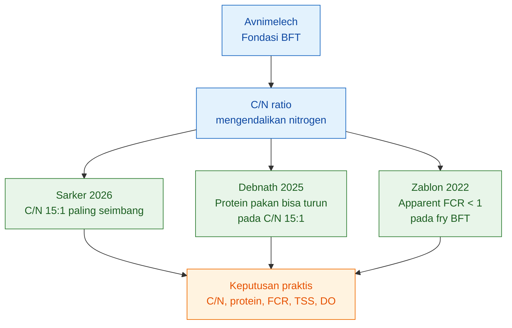
```mermaid
flowchart TD
    A["Avnimelech<br/>Fondasi BFT"] --> B["C/N ratio<br/>mengendalikan nitrogen"]
    B --> C["Sarker 2026<br/>C/N 15:1 paling seimbang"]
    B --> D["Debnath 2025<br/>Protein pakan bisa turun<br/>pada C/N 15:1"]
    B --> E["Zablon 2022<br/>Apparent FCR &lt; 1<br/>pada fry BFT"]
    C --> F["Keputusan praktis<br/>C/N, protein, FCR, TSS, DO"]
    D --> F
    E --> F

    classDef theory fill:#E3F2FD,stroke:#1565C0,color:#0D47A1,stroke-width:1px;
    classDef data fill:#E8F5E9,stroke:#2E7D32,color:#1B5E20,stroke-width:1px;
    classDef decision fill:#FFF3E0,stroke:#EF6C00,color:#E65100,stroke-width:1px;

    class A,B theory;
    class C,D,E data;
    class F decision;
```

[**Kembali ke Atas**](#bioflok-nila-berbasis-neraca-mikroba-cn-ratio-protein-pakan-tan-fcr-dan-keputusan-bisnis)

---

# 1. Pendahuluan: Bioflok adalah Keputusan Bisnis, Bukan Sekadar Teknologi Air Coklat

## 1.1 Mengapa artikel ini perlu ditulis

Banyak praktisi melihat bioflok sebagai teknologi untuk membuat air menjadi coklat, pekat, dan penuh flok. Cara pandang ini berbahaya. Air yang tampak “jadi bioflok” belum tentu sistemnya sehat. Flok yang banyak belum tentu menguntungkan. TAN yang turun belum tentu margin membaik. FCR yang rendah belum tentu biaya produksi paling murah.

Dalam bioflok, keputusan menambah molase, memilih protein pakan, menaikkan aerasi, atau membuang sludge bukan keputusan teknis kecil. Itu keputusan bisnis. Salah membaca proses mikroba berarti salah menghitung biaya, pertumbuhan, mortalitas, dan arus kas.

Bioflok harus dibaca sebagai sistem yang menghubungkan:

$$
\text{protein pakan}
\rightarrow
\text{beban nitrogen}
\rightarrow
\text{proses mikroba}
\rightarrow
\text{kualitas air}
\rightarrow
\text{pertumbuhan ikan}
\rightarrow
\text{FCR}
\rightarrow
\text{laba atau rugi}
$$

Jika satu mata rantai salah dibaca, keputusan berikutnya ikut salah.

## 1.2 Kesalahan teknis bisa menjadi kerugian bisnis

Dalam sistem bioflok, masalah jarang berdiri sendiri. Satu keputusan bisa memicu efek berantai.

Jika TAN naik:

$$
\text{TAN naik}
\rightarrow
\text{NH}_3 \text{ bebas naik}
\rightarrow
\text{ikan stres}
\rightarrow
\text{nafsu makan turun}
\rightarrow
\text{FCR memburuk}
\rightarrow
\text{biaya per kg ikan naik}
$$

Jika TSS terlalu tinggi:

$$
\text{TSS terlalu tinggi}
\rightarrow
\text{beban respirasi mikroba naik}
\rightarrow
\text{DO turun}
\rightarrow
\text{insang terganggu}
\rightarrow
\text{pertumbuhan turun}
$$

Jika protein pakan terlalu rendah:

$$
\text{protein pakan terlalu rendah}
\rightarrow
\text{asam amino tidak cukup}
\rightarrow
\text{pertumbuhan jatuh}
\rightarrow
\text{siklus panen lebih lama}
\rightarrow
\text{biaya listrik dan tenaga kerja naik}
$$

Jika FCR salah dibaca:

$$
\text{FCR salah dibaca}
\rightarrow
\text{biaya produksi salah dihitung}
\rightarrow
\text{margin semu}
\rightarrow
\text{keputusan scale-up berisiko}
$$

Karena itu, artikel ini tidak memulai pembahasan dari “berapa dosis molase” atau “berapa FCR yang bisa dicapai”. Artikel ini memulai dari fondasi: **bagaimana nitrogen dari pakan diproses oleh mikroba**, lalu bagaimana proses itu memengaruhi kualitas air, pakan, FCR, dan bisnis.

## 1.3 Bioflok bukan tujuan, tetapi alat

Tujuan bisnis budidaya bukan menghasilkan flok. Tujuan bisnis adalah menghasilkan ikan dengan pertumbuhan cepat, survival tinggi, FCR terkendali, biaya masuk akal, dan risiko mortalitas rendah.

Bioflok hanya berguna jika membantu mencapai tujuan itu.

Dengan kata lain:

$$
\text{flok banyak} \neq \text{sistem menguntungkan}
$$

Yang dicari adalah:

$$
\text{flok aktif}
+
\text{TAN terkendali}
+
\text{nitrit rendah}
+
\text{DO aman}
+
\text{TSS terkelola}
+
\text{ikan tumbuh cepat}
=

\text{sistem layak bisnis}
$$

Inilah alasan tiga artikel yang dibahas perlu dibaca secara hati-hati.

Sarker et al. menunjukkan bahwa C/N 15:1 memberi hasil terbaik pada nila, meskipun C/N yang lebih tinggi dapat menurunkan TAN lebih jauh. Artinya, menurunkan TAN bukan satu-satunya target.

Debnath et al. menunjukkan bahwa protein pakan dapat diturunkan sampai sekitar 24,5% pada sistem bioflok C/N 15:1, tetapi FCR tetap tinggi pada sistem tanpa solid management. Artinya, protein lebih murah belum tentu otomatis menghasilkan efisiensi produksi terbaik.

Zablon et al. menunjukkan bahwa apparent FCR di bawah 1 dapat terjadi pada fry nila dalam sistem bioflok C/N 20:1, tetapi konteksnya spesifik: ikan sangat kecil, ada sumber karbon, mikroorganisme aktif, dan sludge disifon mingguan. Artinya, FCR di bawah 1 mungkin terjadi, tetapi tidak boleh dijadikan janji umum untuk semua fase budidaya.

## 1.4 Kerangka berpikir artikel

Artikel ini memakai satu kerangka dasar:

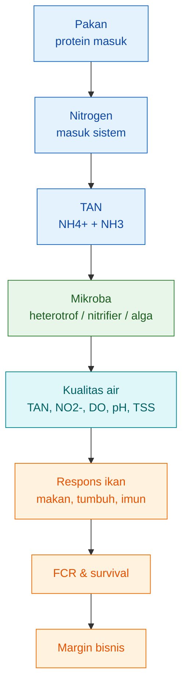
```mermaid
flowchart TD
    A["Pakan<br/>protein masuk"] --> B["Nitrogen<br/>masuk sistem"]
    B --> C["TAN<br/>NH4+ + NH3"]
    C --> D["Mikroba<br/>heterotrof / nitrifier / alga"]
    D --> E["Kualitas air<br/>TAN, NO2-, DO, pH, TSS"]
    E --> F["Respons ikan<br/>makan, tumbuh, imun"]
    F --> G["FCR & survival"]
    G --> H["Margin bisnis"]

    classDef input fill:#E3F2FD,stroke:#1565C0,color:#0D47A1,stroke-width:1px;
    classDef microbe fill:#E8F5E9,stroke:#2E7D32,color:#1B5E20,stroke-width:1px;
    classDef water fill:#E0F7FA,stroke:#00838F,color:#006064,stroke-width:1px;
    classDef business fill:#FFF3E0,stroke:#EF6C00,color:#E65100,stroke-width:1px;

    class A,B,C input;
    class D microbe;
    class E water;
    class F,G,H business;
```

Kerangka ini penting karena troubleshooting bioflok tidak boleh dimulai dari gejala permukaan saja. Air coklat, bau, flok banyak, ikan menggantung, atau FCR naik adalah akibat. Praktisi perlu membaca proses penyebabnya.

[**Kembali ke Atas**](#bioflok-nila-berbasis-neraca-mikroba-cn-ratio-protein-pakan-tan-fcr-dan-keputusan-bisnis)

---

# 2. Prinsip Dasar Avnimelech: C/N Ratio sebagai Tuas Kendali Nitrogen

## 2.1 C/N ratio bukan angka kosmetik

Dalam bioflok, C/N ratio bukan sekadar angka target di atas kertas. C/N ratio adalah alat untuk mengatur arah proses mikroba.

Jika karbon terlalu rendah, bakteri heterotrof tidak cukup kuat untuk mengambil TAN. Akibatnya, TAN dan nitrit lebih mudah naik.

Jika karbon cukup, bakteri heterotrof dapat tumbuh, mengambil TAN, dan mengubah nitrogen anorganik menjadi biomassa mikroba.

Jika karbon terlalu tinggi, heterotrof bisa terlalu dominan. TAN memang dapat turun, tetapi TSS, sludge, konsumsi oksigen, dan risiko padatan bisa meningkat.

Maka C/N ratio harus dibaca sebagai tuas, bukan mantra.

$$
\text{C/N rendah}
\rightarrow
\text{TAN lebih sulit dikendalikan}
$$

$$
\text{C/N moderat}
\rightarrow
\text{heterotrof aktif dan flok produktif}
$$

$$
\text{C/N terlalu tinggi}
\rightarrow
\text{TSS dan beban oksigen meningkat}
$$

## 2.2 Nitrogen masuk terutama dari protein pakan

Dalam budidaya intensif, sumber nitrogen utama adalah protein pakan. Secara praktis, nitrogen pakan dapat dihitung dengan:

$$
N_{\text{pakan}}
=

\text{pakan}
\times
\% \text{protein}
\times
0{,}16
$$

Angka $0{,}16$ digunakan karena protein rata-rata mengandung sekitar 16% nitrogen.

Contoh sederhana:

Jika ikan diberi pakan 1 kg dengan protein 30%, maka nitrogen yang masuk adalah:

$$
N_{\text{pakan}}
=

1{,}000 \text{ g}
\times
0{,}30
\times
0{,}16
$$

$$
N_{\text{pakan}}
=

48 \text{ g N}
$$

Tidak semua nitrogen ini menjadi daging ikan. Sebagian masuk ke pertumbuhan, tetapi sebagian keluar sebagai TAN, feses, sisa pakan, dan bahan organik tersuspensi.

Secara sederhana:

$$
N_{\text{pakan}}
=

N_{\text{ikan}}
+
N_{\text{TAN}}
+
N_{\text{feses}}
+
N_{\text{sisa pakan}}
+
N_{\text{organik}}
$$

Bagian yang menjadi masalah utama di air adalah TAN.

$$
\text{TAN}
=

\text{NH}_4^+
+
\text{NH}_3
$$

Dalam praktik, bentuk yang paling berbahaya adalah amonia bebas, yaitu $\text{NH}_3$. Proporsi $\text{NH}_3$ meningkat ketika pH dan suhu naik. Karena itu, TAN harus selalu dibaca bersama pH dan suhu, bukan sendirian.

## 2.3 Dalam bioflok, karbon menggeser nasib TAN

Tanpa manajemen karbon, TAN harus dikendalikan terutama melalui nitrifikasi, pergantian air, atau sistem filtrasi. Dalam bioflok, karbon organik ditambahkan untuk mendorong bakteri heterotrof mengambil TAN dan mengubahnya menjadi biomassa mikroba.

Reaksi sederhananya:

$$
\text{TAN}
+
\text{karbon organik}
+
O_2
\rightarrow
\text{biomassa mikroba/flok}
+
CO_2
+
H_2O
$$

Inilah inti bioflok: nitrogen yang semula menjadi limbah diarahkan menjadi biomassa mikroba yang sebagian dapat dimakan ikan.

Tetapi proses ini tidak gratis. Ia membutuhkan oksigen dan menghasilkan padatan.

$$
\text{karbon ditambah}
\rightarrow
\text{bakteri tumbuh}
\rightarrow
\text{TAN turun}
\rightarrow
\text{TSS naik}
\rightarrow
\text{kebutuhan } O_2 \text{ naik}
$$

Di sinilah banyak praktisi tersesat. Mereka melihat TAN turun setelah penambahan molase, lalu menganggap sistem membaik. Padahal, masalah bisa bergeser dari nitrogen menjadi oksigen dan padatan.

## 2.4 Tiga arah sistem berdasarkan C/N ratio

Secara praktis, sistem dapat bergerak ke tiga arah.

| Kondisi C/N        | Proses dominan                           | Dampak positif                                 | Risiko                                        |
| ------------------ | ---------------------------------------- | ---------------------------------------------- | --------------------------------------------- |
| C/N rendah         | Nitrifikasi, TAN belum cepat diasimilasi | TSS lebih rendah                               | TAN/nitrit lebih mudah naik                   |
| C/N moderat        | Heterotrof aktif seimbang                | TAN turun, flok terbentuk, pakan lebih efisien | perlu kontrol DO dan TSS                      |
| C/N terlalu tinggi | Heterotrof sangat dominan                | TAN bisa sangat rendah                         | TSS tinggi, DO drop, sludge, insang terganggu |

Sarker et al. memperlihatkan pola ini secara empiris. Pada C/N 15:1, nila menunjukkan pertumbuhan dan FCR terbaik. Pada C/N 21:1, TAN memang lebih rendah, tetapi performa pertumbuhan tidak lebih baik dan TSS lebih tinggi.

Artinya, C/N tinggi tidak otomatis lebih baik.

$$
\text{TAN paling rendah}
\neq
\text{keuntungan paling tinggi}
$$

Yang dibutuhkan adalah titik keseimbangan:

$$
\text{TAN aman}
+
\text{flok cukup}
+
\text{DO stabil}
+
\text{TSS terkendali}
+
\text{pertumbuhan cepat}
$$

## 2.5 Hubungan C/N ratio dengan pakan dan biaya

C/N ratio tidak bisa dilepaskan dari protein pakan. Pakan berprotein tinggi memasukkan lebih banyak nitrogen ke sistem. Semakin tinggi protein pakan dan semakin tinggi jumlah pakan, semakin besar beban TAN yang harus diproses.

Secara logika:

$$
\text{protein pakan naik}
\rightarrow
N_{\text{pakan}} \text{ naik}
\rightarrow
\text{potensi TAN naik}
\rightarrow
\text{kebutuhan karbon dan oksigen naik}
$$

Sebaliknya, jika protein pakan terlalu rendah, beban nitrogen memang turun, tetapi ikan bisa kekurangan asam amino untuk pertumbuhan.

$$
\text{protein terlalu rendah}
\rightarrow
\text{beban nitrogen turun}
\rightarrow
\text{tetapi pertumbuhan ikan turun}
$$

Debnath et al. menunjukkan titik penting ini. Pada sistem C/N 15:1, protein pakan dapat diturunkan dari 32% ke sekitar 24,5% tanpa mengorbankan pertumbuhan. Tetapi penurunan lebih jauh ke 20% dan 16% menurunkan performa.

Maka keputusan protein pakan harus dibaca bersama C/N ratio.

$$
\text{C/N benar}
+
\text{protein pakan tepat}
=

\text{peluang efisiensi pakan}
$$

Tetapi:

$$
\text{C/N benar}
+
\text{protein terlalu rendah}
\neq
\text{pertumbuhan optimal}
$$

## 2.6 Mengapa apparent FCR bisa turun dalam bioflok

Dalam sistem biasa, FCR dihitung sebagai:

$$
FCR
=

\frac{\text{pakan komersial yang diberikan}}
{\text{kenaikan biomassa ikan}}
$$

Dalam bioflok, ikan tidak hanya makan pakan komersial. Ikan juga dapat memakan flok.

Maka secara praktis:

$$
\text{kenaikan biomassa ikan}
=

\text{kontribusi pakan}
+
\text{kontribusi flok}
$$

Jika FCR tetap dihitung hanya dari pakan komersial, maka FCR yang muncul adalah apparent FCR.

$$
FCR_{\text{apparent}}
=

\frac{\text{pakan komersial}}
{\text{kenaikan biomassa dari pakan + flok}}
$$

Zablon et al. menunjukkan apparent FCR di bawah 1 pada fry nila dalam sistem bioflok C/N 20:1. Pada perlakuan bioflok glukosa, FCR berada sekitar 0,56–0,57; pada bioflok molase sekitar 0,59–0,63; sedangkan kontrol non-bioflok 35% CP memiliki FCR 0,89.

Namun, angka ini harus dibaca hati-hati. Glukosa, molase, listrik aerasi, kerja siphon sludge, dan biomassa mikroba tidak dimasukkan sebagai “pakan” dalam rumus FCR. Karena itu, apparent FCR rendah belum tentu sama dengan biaya produksi terendah.

Untuk bisnis, rumus yang lebih penting adalah:

$$
\text{biaya produksi per kg ikan}
=

\frac{
\text{biaya pakan}
+
\text{biaya karbon}
+
\text{biaya listrik}
+
\text{biaya benih}
+
\text{biaya tenaga kerja}
+
\text{biaya manajemen sludge}
}
{\text{kg ikan panen}}
$$

## 2.7 Output praktis dari bab ini

Pembaca harus membawa empat prinsip dari bab ini.

Pertama, C/N ratio mengatur arah proses mikroba.

$$
\text{C/N}
\rightarrow
\text{dominasi mikroba}
\rightarrow
\text{kualitas air}
\rightarrow
\text{pertumbuhan}
$$

Kedua, karbon bukan obat amonia yang bebas risiko.

$$
\text{karbon}
\rightarrow
\text{TAN turun}
+
\text{TSS naik}
+
\text{kebutuhan } O_2 \text{ naik}
$$

Ketiga, protein pakan harus disesuaikan dengan kemampuan bioflok menyumbang nutrisi, tetapi tidak boleh diturunkan sampai melewati batas biologis ikan.

$$
\text{protein cukup}
+
\text{flok aktif}
\rightarrow
\text{pertumbuhan efisien}
$$

Keempat, FCR harus dibaca sebagai angka teknis sekaligus angka bisnis.

$$
FCR_{\text{rendah}}
\neq
\text{otomatis laba tinggi}
$$

Yang dicari adalah:

$$
\text{FCR terkendali}
+
\text{survival tinggi}
+
\text{siklus panen cepat}
+
\text{biaya karbon dan listrik masuk akal}
=

\text{bioflok layak bisnis}
$$

[**Kembali ke Atas**](#bioflok-nila-berbasis-neraca-mikroba-cn-ratio-protein-pakan-tan-fcr-dan-keputusan-bisnis)

---

# 3. Mesin Mikroba BFT: Heterotrof, Autotrof, Alga, dan Denitrifier

Bagian ini adalah inti bioflok. Praktisi tidak cukup hanya tahu bahwa “molase menurunkan amonia” atau “flok bisa dimakan ikan”. Yang harus dipahami adalah **mikroba mana yang bekerja, memakai energi dari mana, mengambil nitrogen dalam bentuk apa, menghasilkan apa, berapa lama responsnya terlihat, dan apa konsekuensi bisnisnya**.

Dalam BFT, TAN tidak hanya “hilang”. TAN berpindah jalur. Sebagian dapat diikat menjadi biomassa bakteri, sebagian dioksidasi menjadi nitrat, sebagian diserap alga, dan sebagian nitrat dapat direduksi menjadi gas nitrogen pada zona rendah oksigen. Karena itu, troubleshooting bioflok harus dimulai dari proses mikroba, bukan dari warna air.

<figure>
  
  <figcaption>
    Ilustrasi empat jalur pengendalian TAN dalam sistem budidaya, mencakup
    keseimbangan antara amonia, mikroorganisme, aerasi, dan pengelolaan kualitas
    air.
  </figcaption>
</figure>

Dalam BFT, TAN dapat masuk ke beberapa jalur:

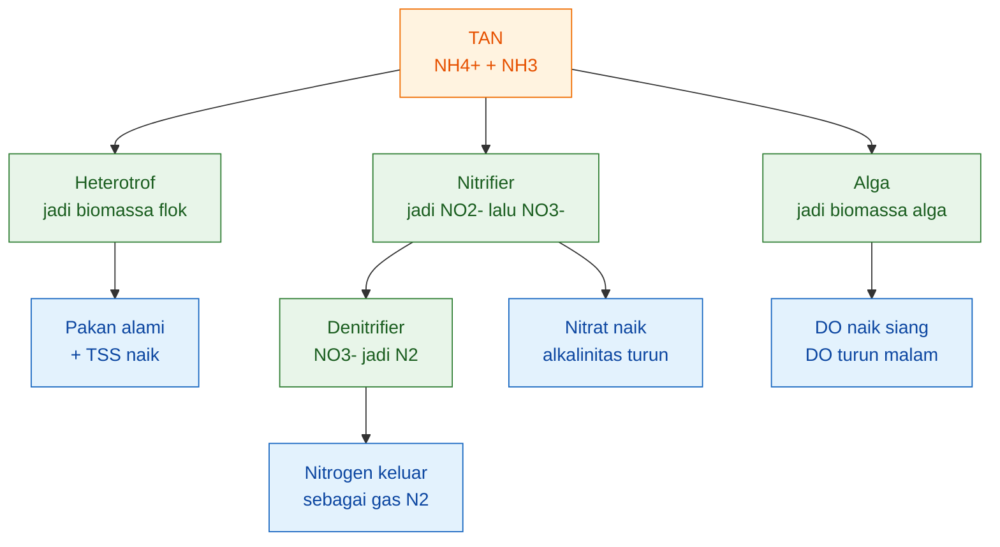
```mermaid
flowchart TD
    A["TAN<br/>NH4+ + NH3"] --> B["Heterotrof<br/>jadi biomassa flok"]
    A --> C["Nitrifier<br/>jadi NO2- lalu NO3-"]
    A --> D["Alga<br/>jadi biomassa alga"]
    C --> E["Denitrifier<br/>NO3- jadi N2"]

    B --> F["Pakan alami<br/>+ TSS naik"]
    C --> G["Nitrat naik<br/>alkalinitas turun"]
    D --> H["DO naik siang<br/>DO turun malam"]
    E --> I["Nitrogen keluar<br/>sebagai gas N2"]

    classDef tan fill:#FFF3E0,stroke:#EF6C00,color:#E65100,stroke-width:1px;
    classDef microbe fill:#E8F5E9,stroke:#2E7D32,color:#1B5E20,stroke-width:1px;
    classDef effect fill:#E3F2FD,stroke:#1565C0,color:#0D47A1,stroke-width:1px;

    class A tan;
    class B,C,D,E microbe;
    class F,G,H,I effect;
```

Keempat jalur itu tidak selalu bekerja terpisah. Dalam satu kolam, heterotrof, nitrifier, alga, dan denitrifier bisa bekerja bersamaan. Namun dominansinya berubah tergantung **C/N ratio, cahaya, DO, pH, alkalinitas, TSS, sumber karbon, dan umur sistem**.

Praktisi perlu membaca empat jalur ini sebagai “mesin proses”:

$$
\text{TAN}
\rightarrow
\text{jalur mikroba}
\rightarrow
\text{kualitas air}
\rightarrow
\text{pertumbuhan, FCR, survival}
$$

---

## 3.1 Bakteri Heterotrof: Pengikat TAN Tercepat, tetapi Penghasil Padatan Terbesar

Bakteri heterotrof adalah mesin utama dalam bioflok berbasis penambahan karbon. Mereka memakai karbon organik sebagai sumber energi dan sebagai bahan pembentuk sel. Contoh karbon organik adalah molase, gula, glukosa, tapioka, dedak halus, sisa pakan, dan feses.

TAN digunakan sebagai sumber nitrogen untuk membentuk protein mikroba.

Secara sederhana:

$$
\mathrm{NH_4^+}
+
\text{karbon organik}
+
\mathrm{O_2}
\rightarrow
\text{biomassa bakteri}
+
\mathrm{CO_2}
+
\mathrm{H_2O}
$$

Dalam notasi proses:

| Komponen                            | Peran                               |
| ----------------------------------- | ----------------------------------- |
| Karbon organik                      | Sumber energi dan sumber karbon sel |
| $\mathrm{NH_4^+}$ / TAN             | Sumber nitrogen                     |
| $\mathrm{O_2}$                      | Akseptor elektron                   |
| Biomassa bakteri                    | Produk utama                        |
| $\mathrm{CO_2}$ dan $\mathrm{H_2O}$ | Produk respirasi                    |

Reaksi representatif yang sering digunakan untuk menggambarkan biosintesis heterotrof adalah:

$$
\mathrm{NH_4^+}
+
1{,}18\mathrm{C_6H_{12}O_6}
+
\mathrm{HCO_3^-}
+
2{,}06\mathrm{O_2}
\rightarrow
\mathrm{C_5H_7O_2N}
+
6{,}06\mathrm{H_2O}
+
3{,}07\mathrm{CO_2}
$$

Rumus $\mathrm{C_5H_7O_2N}$ adalah rumus empiris biomassa bakteri. Ini bukan berarti semua bakteri persis memiliki komposisi tersebut, tetapi rumus ini berguna untuk membuat neraca massa.

Menurut analisis stoikiometri Ebeling et al., untuk setiap $1 \ \mathrm{g}$ TAN-N yang dikonversi melalui jalur heterotrof, kira-kira dibutuhkan:

| Komponen                              |    Nilai per $1 \ \mathrm{g}$ TAN-N |
| ------------------------------------- | ----------------------------------: |
| Karbohidrat                           |      $\approx 15{,}17 \ \mathrm{g}$ |
| Oksigen                               | $\approx 4{,}71 \ \mathrm{g \ O_2}$ |
| Alkalinitas sebagai $\mathrm{CaCO_3}$ |       $\approx 3{,}57 \ \mathrm{g}$ |
| Biomassa mikroba sebagai VSS          |       $\approx 8{,}07 \ \mathrm{g}$ |

Artinya, jalur heterotrof cepat menurunkan TAN, tetapi menghasilkan padatan tersuspensi yang besar.

$$
1 \ \mathrm{g \ TAN\text{-}N}
\rightarrow
8{,}07 \ \mathrm{g \ VSS}
$$

Ini menjelaskan mengapa sistem bioflok dapat cepat menjadi pekat setelah penambahan karbon. TAN turun, tetapi TSS naik.

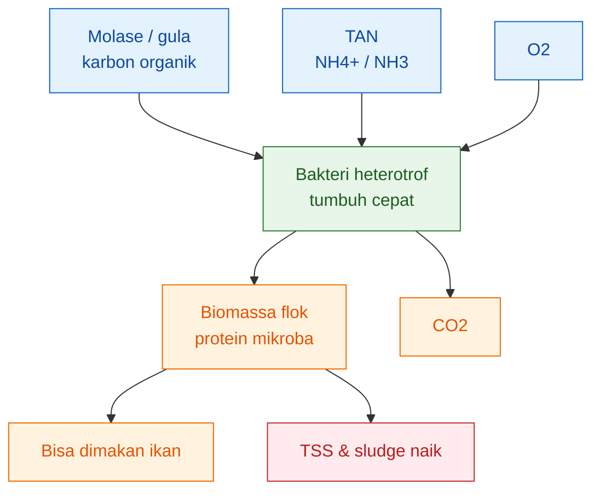
```mermaid
flowchart TD
    A["Molase / gula<br/>karbon organik"] --> B["Bakteri heterotrof<br/>tumbuh cepat"]
    C["TAN<br/>NH4+ / NH3"] --> B
    D["O2"] --> B
    B --> E["Biomassa flok<br/>protein mikroba"]
    B --> F["CO2"]
    E --> G["Bisa dimakan ikan"]
    E --> H["TSS & sludge naik"]

    classDef input fill:#E3F2FD,stroke:#1565C0,color:#0D47A1,stroke-width:1px;
    classDef microbe fill:#E8F5E9,stroke:#2E7D32,color:#1B5E20,stroke-width:1px;
    classDef output fill:#FFF3E0,stroke:#EF6C00,color:#E65100,stroke-width:1px;
    classDef risk fill:#FFEBEE,stroke:#C62828,color:#B71C1C,stroke-width:1px;

    class A,C,D input;
    class B microbe;
    class E,F,G output;
    class H risk;
```

### Makna Praktis

Heterotrof adalah “pemadam cepat” TAN, tetapi biaya biologisnya besar.

$$
\text{TAN turun}
\quad
\text{tetapi}
\quad
\mathrm{O_2} \text{ turun, TSS naik, sludge naik}
$$

Maka, ketika praktisi menambah molase, ia tidak hanya menambahkan “obat amonia”. Ia sedang memerintahkan bakteri heterotrof untuk berkembang cepat. Akibatnya, sistem membutuhkan lebih banyak oksigen dan menghasilkan lebih banyak padatan.

Secara operasional, respons heterotrof dapat mulai terlihat dalam jendela waktu:

$$
6-24 \ \text{jam}
$$

Sinyal awalnya adalah TAN mulai stabil atau turun, sementara TSS/BFV mulai naik. Flok yang lebih jelas biasanya baru terlihat dalam:

$$
2-7 \ \text{hari}
$$

Namun, respons cepat ini justru membuatnya berisiko jika praktisi terlalu agresif menambah karbon. Literatur BFT menyebutkan bahwa pertumbuhan dan yield heterotrof jauh lebih tinggi daripada nitrifier, sehingga imobilisasi amonia oleh heterotrof terjadi lebih cepat, tetapi konsekuensinya adalah peningkatan biomassa dan padatan. ([Aquaculture][1])

Keputusan menambah karbon harus selalu dibaca bersama:

$$
\text{TAN}
+
\text{DO}
+
\text{TSS}
+
\text{BFV}
+
\text{pH}
+
\text{alkalinitas}
$$

Jika TAN tinggi dan TSS rendah, penambahan karbon bisa masuk akal. Tetapi jika TAN rendah dan TSS sudah tinggi, penambahan karbon bisa memperburuk keadaan.

$$
\text{TAN rendah}
+
\text{TSS tinggi}
+
\text{DO subuh rendah}
\rightarrow
\text{jangan tambah karbon}
$$

Dalam studi Sarker, kenaikan C/N memang menurunkan TAN, tetapi C/N yang terlalu tinggi juga menaikkan TSS dan biofloc volume. C/N 15:1 menjadi titik terbaik, bukan karena TAN paling rendah, tetapi karena kombinasi pertumbuhan, FCR, survival, hematologi, dan padatan lebih seimbang.

---

## 3.2 Bakteri Autotrof/Nitrifier: Lambat, Hemat Padatan, Boros Alkalinitas

Jika heterotrof adalah jalur cepat untuk mengikat TAN menjadi biomassa, nitrifier adalah jalur yang lebih lambat untuk mengoksidasi TAN menjadi nitrat. Nitrifier adalah kelompok bakteri chemoautotroph. Mereka berbeda dari heterotrof. Nitrifier tidak memakai molase sebagai sumber energi utama. Energinya berasal dari oksidasi nitrogen anorganik.

Ada dua tahap utama.

Tahap pertama adalah oksidasi amonium menjadi nitrit:

$$
\mathrm{NH_4^+}
+
1{,}5\mathrm{O_2}
\rightarrow
\mathrm{NO_2^-}
+
2\mathrm{H^+}
+
\mathrm{H_2O}
$$

Tahap kedua adalah oksidasi nitrit menjadi nitrat:

$$
\mathrm{NO_2^-}
+
0{,}5\mathrm{O_2}
\rightarrow
\mathrm{NO_3^-}
$$

Jika digabung dengan pembentukan biomassa nitrifier, reaksi dapat ditulis:

$$
\mathrm{NH_4^+}
+
1{,}83\mathrm{O_2}
+
1{,}98\mathrm{HCO_3^-}
\rightarrow
0{,}021\mathrm{C_5H_7O_2N}
+
0{,}98\mathrm{NO_3^-}
+
1{,}041\mathrm{H_2O}
+
1{,}88\mathrm{H_2CO_3}
$$

Dari sisi praktis, untuk setiap $1 \ \mathrm{g}$ TAN-N yang diproses melalui nitrifikasi, kira-kira dibutuhkan:

| Komponen                              |             Nilai per $1 \ \mathrm{g}$ TAN-N |
| ------------------------------------- | -------------------------------------------: |
| Oksigen                               | $\approx 4{,}18 - 4{,}57 \ \mathrm{g \ O_2}$ |
| Alkalinitas sebagai $\mathrm{CaCO_3}$ |       $\approx 7{,}05 - 7{,}14 \ \mathrm{g}$ |
| Biomassa nitrifier                    |       $\approx 0{,}17 - 0{,}20 \ \mathrm{g}$ |
| Produk utama                          |                            $\mathrm{NO_3^-}$ |

Perbandingan pentingnya:

$$
\text{heterotrof}
\rightarrow
\text{biomassa tinggi}
$$

$$
\text{nitrifier}
\rightarrow
\text{biomassa rendah}
$$

Dengan kata lain, nitrifikasi tidak membuat air sepekat jalur heterotrof. Tetapi nitrifikasi sangat membutuhkan alkalinitas.

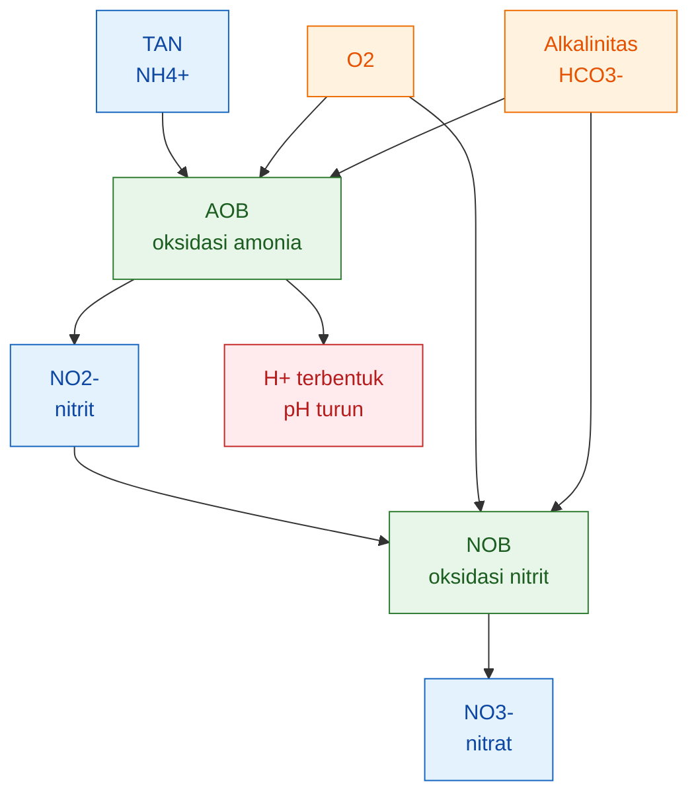
```mermaid
flowchart TD
    A["TAN<br/>NH4+"] --> B["AOB<br/>oksidasi amonia"]
    B --> C["NO2-<br/>nitrit"]
    C --> D["NOB<br/>oksidasi nitrit"]
    D --> E["NO3-<br/>nitrat"]

    F["O2"] --> B
    F --> D
    G["Alkalinitas<br/>HCO3-"] --> B
    G --> D
    B --> H["H+ terbentuk<br/>pH turun"]

    classDef nitrogen fill:#E3F2FD,stroke:#1565C0,color:#0D47A1,stroke-width:1px;
    classDef microbe fill:#E8F5E9,stroke:#2E7D32,color:#1B5E20,stroke-width:1px;
    classDef input fill:#FFF3E0,stroke:#EF6C00,color:#E65100,stroke-width:1px;
    classDef risk fill:#FFEBEE,stroke:#C62828,color:#B71C1C,stroke-width:1px;

    class A,C,E nitrogen;
    class B,D microbe;
    class F,G input;
    class H risk;
```

### Makna Praktis

Nitrifikasi penting karena mengubah TAN menjadi nitrat yang relatif lebih aman. Tetapi proses ini menghasilkan ion hidrogen, menurunkan alkalinitas, dan dapat menurunkan pH.

$$
\text{nitrifikasi aktif}
\rightarrow
\text{alkalinitas turun}
\rightarrow
\text{pH turun}
$$

Jika alkalinitas turun terlalu rendah, nitrifier melemah. Jika nitrifier tahap kedua melemah, nitrit dapat menumpuk.

$$
\mathrm{NH_4^+}
\rightarrow
\mathrm{NO_2^-}
\quad
\text{tetapi}
\quad
\mathrm{NO_2^-}
\nrightarrow
\mathrm{NO_3^-}
$$

Inilah salah satu penyebab umum nitrit spike.

Dalam troubleshooting, pola ini penting:

| Gejala                    | Interpretasi mikroba                                 |
| ------------------------- | ---------------------------------------------------- |
| TAN tinggi, nitrit rendah | proses pengambilan TAN belum kuat                    |
| TAN turun, nitrit naik    | oksidasi amonia berjalan, oksidasi nitrit tertinggal |
| nitrit turun, nitrat naik | nitrifikasi mulai lengkap                            |
| pH turun perlahan         | nitrifikasi dan respirasi menghabiskan alkalinitas   |
| pH jatuh mendadak         | alkalinitas tidak cukup menahan sistem               |

Kata “lambat” pada nitrifier harus diberi ukuran waktu. Praktisi sebaiknya tidak menilai nitrifikasi dari satu atau dua hari pertama. Untuk membaca tren awal nitrifikasi, gunakan jendela:

$$
7-14 \ \text{hari}
$$

Untuk maturasi alami yang kuat, nitrifier biasanya memerlukan waktu jauh lebih panjang:

$$
4-8 \ \text{minggu}
$$

Nitrifier tidak hanya lambat karena pembelahan selnya lebih lambat, tetapi karena populasi fungsionalnya perlu waktu terbentuk. Inisiasi biofilter nitrifikasi secara kolonisasi alami dapat memerlukan sekitar **4–8 minggu** untuk membentuk populasi yang sehat dan layak. ([ScienceDirect][2])

Maka pada awal siklus bioflok, praktisi tidak boleh berharap nitrifikasi langsung stabil. Pada fase awal, heterotrof sering lebih dominan, terutama jika karbon organik ditambahkan.

---

## 3.3 Photoautotroph/Alga: Penyerap Nitrogen Berbasis Cahaya

Setelah heterotrof dan nitrifier, jalur lain yang sering ikut bekerja adalah photoautotroph atau alga. Alga dan mikroalga memakai cahaya sebagai sumber energi. Mereka mengambil karbon dari $\mathrm{CO_2}$ atau $\mathrm{HCO_3^-}$, lalu mengambil nitrogen dari TAN, nitrit, atau nitrat untuk membentuk biomassa.

Secara sederhana:

$$
\mathrm{NH_4^+}
+
\mathrm{CO_2}
+
\text{cahaya}
\rightarrow
\text{biomassa alga}
+
\mathrm{O_2}
$$

Jika nitrogen berasal dari amonium, reaksi konseptualnya dapat ditulis:

$$
\mathrm{NH_4^+}
+
\mathrm{CO_2}
+
\mathrm{H_2O}
+
\text{cahaya}
\rightarrow
\text{biomassa alga}
+
\mathrm{O_2}
$$

Alga dapat membantu menyerap nitrogen dan menghasilkan oksigen pada siang hari. Tetapi alga juga bernafas pada malam hari.

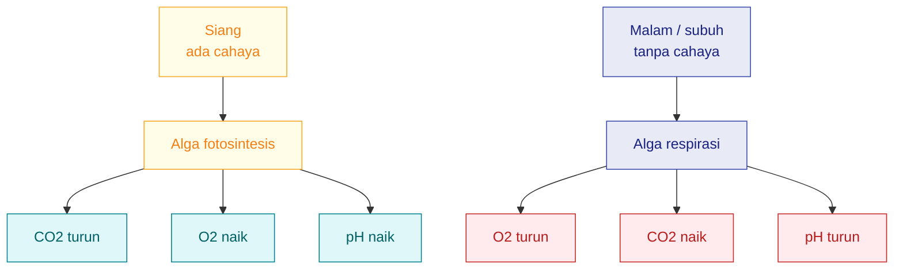
```mermaid
flowchart TD
    A["Siang<br/>ada cahaya"] --> B["Alga fotosintesis"]
    B --> C["CO2 turun"]
    B --> D["O2 naik"]
    B --> E["pH naik"]

    F["Malam / subuh<br/>tanpa cahaya"] --> G["Alga respirasi"]
    G --> H["O2 turun"]
    G --> I["CO2 naik"]
    G --> J["pH turun"]

    classDef day fill:#FFFDE7,stroke:#F9A825,color:#F57F17,stroke-width:1px;
    classDef night fill:#E8EAF6,stroke:#3949AB,color:#1A237E,stroke-width:1px;
    classDef effect fill:#E0F7FA,stroke:#00838F,color:#006064,stroke-width:1px;
    classDef risk fill:#FFEBEE,stroke:#C62828,color:#B71C1C,stroke-width:1px;

    class A,B day;
    class F,G night;
    class C,D,E effect;
    class H,I,J risk;
```

### Makna Praktis

Alga membuat sistem tampak sehat pada siang hari, tetapi dapat menyembunyikan risiko subuh.

Siang hari:

$$
\text{fotosintesis}
\rightarrow
\mathrm{O_2} \text{ naik}
+
\mathrm{CO_2} \text{ turun}
+
\text{pH naik}
$$

Malam hingga subuh:

$$
\text{respirasi}
\rightarrow
\mathrm{O_2} \text{ turun}
+
\mathrm{CO_2} \text{ naik}
+
\text{pH turun}
$$

Risiko bisnisnya besar. Kolam bisa terlihat bagus pada pukul 14.00, tetapi berbahaya pada pukul 04.00.

Maka pengukuran DO hanya siang hari adalah data yang menyesatkan. Untuk sistem bioflok, DO subuh sering lebih penting daripada DO siang.

$$
\mathrm{DO}*{\text{subuh}}
<
\mathrm{DO}*{\text{siang}}
$$

Jika alga terlalu dominan, pH siang bisa naik. Kenaikan pH menaikkan fraksi amonia bebas $\mathrm{NH_3}$ dari TAN. Jadi TAN yang sama bisa menjadi lebih berbahaya pada pH tinggi.

$$
\text{pH naik}
\rightarrow
\frac{\mathrm{NH_3}}{\mathrm{TAN}} \text{ naik}
\rightarrow
\text{toksisitas naik}
$$

Untuk alga, ukuran waktu yang paling penting bukan hanya pertumbuhan sel, tetapi siklus harian cahaya. Praktisi harus membaca pola:

$$
DO_{\text{subuh}}
\quad
\text{vs}
\quad
DO_{\text{sore}}
$$

dan:

$$
pH_{\text{subuh}}
\quad
\text{vs}
\quad
pH_{\text{sore}}
$$

Waktu justifikasi praktis untuk alga adalah:

$$
1 \ \text{siklus harian}
$$

untuk membaca fluktuasi DO/pH, dan:

$$
2-5 \ \text{hari}
$$

untuk membaca tren bloom. DO dan pH kolam biasanya paling rendah menjelang subuh dan lebih tinggi pada sore hari karena fotosintesis siang dan respirasi malam. ([Global Seafood Alliance][3])

Praktisi harus berhati-hati pada sistem yang terlalu hijau, terutama jika:

$$
\text{pH siang tinggi}
+
\text{DO subuh rendah}
+
\text{TAN terukur}
\rightarrow
\text{risiko stres amonia}
$$

---

## 3.4 Denitrifier: Pengurang Nitrat di Zona Rendah Oksigen

Jalur terakhir adalah denitrifikasi. Berbeda dari heterotrof aerob dan nitrifier, denitrifier bekerja pada kondisi rendah oksigen atau anoksik. Mereka memakai nitrat atau nitrit sebagai akseptor elektron ketika oksigen bebas tidak cukup.

Jalur umumnya:

$$
\mathrm{NO_3^-}
\rightarrow
\mathrm{NO_2^-}
\rightarrow
\mathrm{NO}
\rightarrow
\mathrm{N_2O}
\rightarrow
\mathrm{N_2}
$$

Reaksi sederhana dengan bahan organik sebagai donor elektron dapat ditulis:

$$
4\mathrm{NO_3^-}
+
5\mathrm{CH_2O}
+
4\mathrm{H^+}
\rightarrow
2\mathrm{N_2}
+
5\mathrm{CO_2}
+
7\mathrm{H_2O}
$$

Dalam bioflok, denitrifikasi bisa terjadi di mikro-zona anoksik:

- bagian dalam flok besar,
- lumpur dasar,
- settling chamber,
- biofilm tebal,
- area mati dengan mixing buruk.

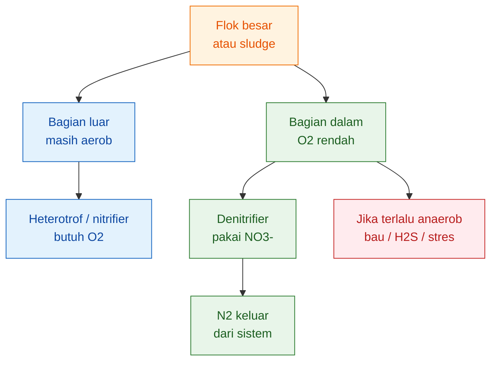
```mermaid
flowchart TD
    A["Flok besar<br/>atau sludge"] --> B["Bagian luar<br/>masih aerob"]
    A --> C["Bagian dalam<br/>O2 rendah"]
    B --> D["Heterotrof / nitrifier<br/>butuh O2"]
    C --> E["Denitrifier<br/>pakai NO3-"]
    E --> F["N2 keluar<br/>dari sistem"]
    C --> G["Jika terlalu anaerob<br/>bau / H2S / stres"]

    classDef solid fill:#FFF3E0,stroke:#EF6C00,color:#E65100,stroke-width:1px;
    classDef aerobic fill:#E3F2FD,stroke:#1565C0,color:#0D47A1,stroke-width:1px;
    classDef anoxic fill:#E8F5E9,stroke:#2E7D32,color:#1B5E20,stroke-width:1px;
    classDef risk fill:#FFEBEE,stroke:#C62828,color:#B71C1C,stroke-width:1px;

    class A solid;
    class B,D aerobic;
    class C,E,F anoxic;
    class G risk;
```

### Makna Praktis

Denitrifikasi terkendali bisa membantu mengurangi nitrat.

$$
\mathrm{NO_3^-}
\rightarrow
\mathrm{N_2}
\uparrow
$$

Namun, zona anaerob yang tidak terkendali adalah risiko. Jika padatan mengendap, membusuk, dan kekurangan oksigen, sistem bisa menghasilkan bau, lumpur hitam, stres ikan, bahkan senyawa berbahaya seperti $\mathrm{H_2S}$.

$$
\text{padatan mengendap}
+
\mathrm{O_2} \text{ rendah}
\rightarrow
\text{zona anaerob}
\rightarrow
\text{bau, H}_2\text{S, stres ikan}
$$

Maka pesan praktisnya jelas:

> Flok harus aktif dan tersuspensi. Padatan yang berubah menjadi lumpur mati bukan lagi pakan, tetapi risiko.

Untuk denitrifikasi, waktu justifikasi bergantung pada desainnya. Pada zona atau reaktor anoksik yang memang dirancang, respons dapat dibaca dalam:

$$
1-2 \ \text{hari}
$$

Pada kolam utama bioflok yang aerob, denitrifikasi tidak layak dijadikan proses utama harian. Praktisi baru boleh menganggap denitrifikasi bekerja jika nitrat turun dalam tren:

$$
2-7 \ \text{hari}
$$

dengan kondisi:

$$
O_2 \text{ rendah terkendali}
+
\text{karbon cukup}
+
\text{tidak ada bau busuk/H}_2\text{S}
$$

Pada sistem anoksik yang memang dirancang, Hargreaves menyebut side-stream dengan waktu tinggal **1–2 hari** dapat cukup untuk membantu mengendalikan nitrat. Ini berbeda dari kolom air bioflok aerob, di mana denitrifikasi tidak boleh dijadikan alasan membiarkan sludge menumpuk. ([Aquaculture][1])

Di sinilah manajemen padatan menjadi keputusan bisnis. Debnath menunjukkan bahwa sistem C/N 15:1 tanpa solid management masih dapat mempertahankan kualitas air, tetapi FCR relatif tinggi. Zablon, sebaliknya, memakai sistem dengan siphon sludge mingguan dan memperoleh apparent FCR jauh lebih rendah pada fry nila. Perbedaan ini menunjukkan bahwa bioflok bukan hanya soal C/N ratio, tetapi juga soal apakah padatan tetap menjadi flok aktif atau berubah menjadi beban sistem.

---

## 3.5 Perbandingan Empat Jalur Mikroba

Setelah empat jalur dijelaskan satu per satu, praktisi perlu membandingkannya dari dua sisi: **fungsi proses** dan **kecepatan operasional**. Ini penting agar kata “cepat” dan “lambat” tidak menjadi istilah kabur.

Untuk praktisi, tabel berikut lebih penting daripada hafalan nama mikroba.

| Jalur       | Sumber energi                                    | Sumber karbon                        | Nitrogen yang dipakai | Produk utama                   | Kekuatan            | Risiko                             |
| ----------- | ------------------------------------------------ | ------------------------------------ | --------------------- | ------------------------------ | ------------------- | ---------------------------------- |
| Heterotrof  | Karbon organik                                   | Karbon organik                       | TAN                   | Biomassa flok                  | TAN turun cepat     | TSS, sludge, DO drop               |
| Nitrifier   | Oksidasi $\mathrm{NH_4^+}$ dan $\mathrm{NO_2^-}$ | $\mathrm{CO_2}$ / $\mathrm{HCO_3^-}$ | TAN dan nitrit        | Nitrat                         | Padatan rendah      | alkalinitas turun, nitrit spike    |
| Alga        | Cahaya                                           | $\mathrm{CO_2}$ / $\mathrm{HCO_3^-}$ | TAN/nitrat            | Biomassa alga + $\mathrm{O_2}$ | bantu oksigen siang | fluktuasi DO/pH                    |
| Denitrifier | Karbon organik                                   | Karbon organik                       | Nitrat/nitrit         | $\mathrm{N_2}$                 | mengurangi nitrat   | zona anaerob, bau, $\mathrm{H_2S}$ |

Inti perbandingannya:

$$
\text{heterotrof}
=

\text{respon cepat dalam jam, tetapi menghasilkan padatan}
$$

$$
\text{nitrifier}
=

\text{respon populasi lambat; tren hari, maturasi minggu}
$$

$$
\text{alga}
=

\text{respon harian mengikuti cahaya; risiko subuh}
$$

$$
\text{denitrifier}
=

\text{berguna dalam zona anoksik terkendali; bukan alasan membiarkan sludge}
$$

Agar bisa dipakai untuk justifikasi lapangan, perbandingan ini perlu diberi ukuran waktu.

| Jalur mikroba           |                                     Skala kecepatan biologis | Sinyal lapangan yang bisa diamati              |                                                            Waktu justifikasi praktis | Catatan keputusan                                                            |
| ----------------------- | -----------------------------------------------------------: | ---------------------------------------------- | -----------------------------------------------------------------------------------: | ---------------------------------------------------------------------------- |
| **Heterotrof**          |                                                    menit–jam | TAN mulai stabil/turun, TSS/BFV mulai naik     |                 **6–24 jam** untuk respons awal; **2–7 hari** untuk flok lebih jelas | Cepat menekan TAN, tetapi jangan tambah karbon berulang tanpa cek DO dan TSS |
| **Nitrifier**           | jam–hari per pembelahan, tetapi populasi matang butuh minggu | TAN turun, nitrit naik lalu turun, nitrat naik | **7–14 hari** untuk membaca tren awal; **4–8 minggu** untuk maturasi alami yang kuat | Jangan menyimpulkan nitrifikasi gagal hanya dari 1–2 hari pertama            |
| **Photoautotroph/alga** |           jam dalam siklus cahaya; hari untuk biomassa bloom | DO dan pH naik siang/sore, turun subuh         |                           **1 hari** untuk pola DO/pH; **2–5 hari** untuk tren bloom | Wajib ukur DO subuh dan sore, bukan hanya siang                              |
| **Denitrifier**         |                    jam–hari bila anoksik dan karbon tersedia | nitrat turun pada zona/reaktor anoksik         | **1–2 hari** pada unit denitrifikasi/side-stream; **beberapa hari** untuk tren kolam | Jangan mengandalkan denitrifikasi di kolom air aerob utama                   |

Dengan demikian, “cepat” dan “lambat” harus dibaca sebagai tiga jenis waktu:

$$
t_{\text{respon}}
=

\text{waktu sampai parameter air mulai berubah}
$$

$$
t_{\text{stabilisasi}}
=

\text{waktu sampai tren air konsisten}
$$

$$
t_{\text{maturasi}}
=

\text{waktu sampai komunitas mikroba cukup stabil}
$$

Untuk heterotrof:

$$
t_{\text{respon}}
\approx
6-24 \ \text{jam}
$$

Untuk nitrifier:

$$
t_{\text{maturasi}}
\approx
4-8 \ \text{minggu}
$$

Untuk alga:

$$
t_{\text{respon}}
=

\text{siklus harian cahaya}
$$

Untuk denitrifier dalam unit anoksik:

$$
t_{\text{hidraulik}}
\approx
1-2 \ \text{hari}
$$

Diagram berikut merangkum cara membaca waktu operasionalnya.

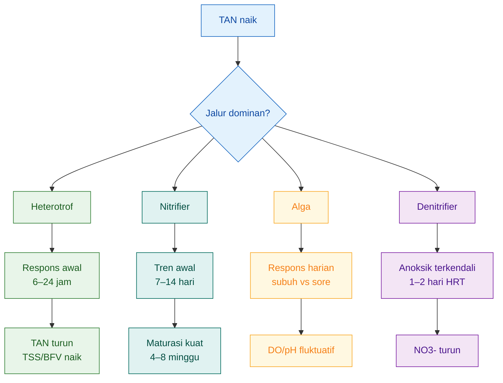
```mermaid
flowchart TD
    A["TAN naik"] --> B{"Jalur dominan?"}

    B --> C["Heterotrof"]
    C --> C1["Respons awal<br/>6–24 jam"]
    C1 --> C2["TAN turun<br/>TSS/BFV naik"]

    B --> D["Nitrifier"]
    D --> D1["Tren awal<br/>7–14 hari"]
    D1 --> D2["Maturasi kuat<br/>4–8 minggu"]

    B --> E["Alga"]
    E --> E1["Respons harian<br/>subuh vs sore"]
    E1 --> E2["DO/pH fluktuatif"]

    B --> F["Denitrifier"]
    F --> F1["Anoksik terkendali<br/>1–2 hari HRT"]
    F1 --> F2["NO3- turun"]

    classDef main fill:#E3F2FD,stroke:#1565C0,color:#0D47A1,stroke-width:1px;
    classDef hetero fill:#E8F5E9,stroke:#2E7D32,color:#1B5E20,stroke-width:1px;
    classDef nitri fill:#E0F2F1,stroke:#00695C,color:#004D40,stroke-width:1px;
    classDef algae fill:#FFF8E1,stroke:#F9A825,color:#F57F17,stroke-width:1px;
    classDef denit fill:#F3E5F5,stroke:#7B1FA2,color:#4A148C,stroke-width:1px;

    class A,B main;
    class C,C1,C2 hetero;
    class D,D1,D2 nitri;
    class E,E1,E2 algae;
    class F,F1,F2 denit;
```

---

## 3.6 Apa Artinya untuk Keputusan Praktisi?

Praktisi tidak boleh mengambil keputusan hanya dari satu parameter. Selain itu, praktisi juga tidak boleh mengambil keputusan terlalu cepat sebelum jendela waktu prosesnya masuk akal.

### Jika TAN tinggi

Pertanyaan pertama bukan “berapa banyak molase ditambah?”, tetapi:

$$
\text{TAN tinggi}
\rightarrow
\text{apakah TSS rendah atau tinggi?}
$$

Jika TSS rendah, heterotrof mungkin kurang aktif. Penambahan karbon bertahap bisa dipertimbangkan.

Jika karbon ditambahkan, evaluasi awal jangan dilakukan dalam 1–2 jam. Gunakan jendela:

$$
6-24 \ \text{jam}
$$

Jika dalam 24 jam TAN tidak turun atau tidak stabil, jangan otomatis tambah karbon lagi. Cek:

$$
DO,\ TSS,\ pH,\ alkalinitas,\ feeding,\ sludge
$$

Karena bisa saja masalahnya bukan kekurangan karbon, tetapi DO rendah atau beban organik terlalu tinggi.

Jika TSS tinggi, masalahnya bukan kekurangan flok. Masalahnya bisa DO, mixing, pakan berlebih, sludge, atau flok yang tidak aktif.

### Jika nitrit tinggi

Nitrit tinggi sering menunjukkan nitrifikasi belum lengkap.

$$
\mathrm{NH_4^+}
\rightarrow
\mathrm{NO_2^-}
\quad
\text{lebih cepat daripada}
\quad
\mathrm{NO_2^-}
\rightarrow
\mathrm{NO_3^-}
$$

Jangan menyimpulkan sistem gagal dalam 1–2 hari. Nitrit naik sering terjadi saat nitrifikasi belum lengkap.

Gunakan jendela evaluasi:

$$
7-14 \ \text{hari}
$$

Tanda nitrifikasi mulai matang:

$$
TAN \downarrow
+
NO_2^- \downarrow
+
NO_3^- \uparrow
$$

Jika setelah 2 minggu nitrit tetap tinggi, cek alkalinitas, DO, pH, dan TSS. Untuk menyatakan sistem nitrifikasi benar-benar matang, praktisi sebaiknya menunggu tren stabil beberapa minggu, bukan beberapa hari.

Keputusan praktisnya:

- cek alkalinitas,
- cek DO,
- kurangi feeding sementara,
- hindari penambahan karbon berlebihan,
- stabilkan pH,
- biarkan komunitas nitrifier matang.

### Jika sistem terlihat hijau/alga dominan

Jangan hanya ukur siang. Minimal bandingkan:

$$
DO_{\text{subuh}}
\quad
\text{dan}
\quad
DO_{\text{sore}}
$$

Jika:

$$
DO_{\text{sore}} \text{ tinggi}
$$

tetapi:

$$
DO_{\text{subuh}} \text{ rendah}
$$

maka sistem terlihat sehat di siang hari, tetapi berisiko pada subuh.

### Jika TSS tinggi tetapi TAN rendah

Ini situasi yang sering menipu. Air terlihat “bioflok”, TAN aman, tetapi ikan tumbuh lambat atau FCR naik.

$$
\text{TAN rendah}
+
\text{TSS tinggi}
\rightarrow
\text{flok bisa menjadi beban}
$$

Keputusan praktisnya:

- jangan tambah molase,
- lakukan settling atau siphon,
- cek DO subuh,
- cek insang ikan,
- evaluasi feeding rate.

### Jika DO subuh rendah

Ini kondisi berisiko tinggi.

$$
\mathrm{DO}_{\text{subuh rendah}}
\rightarrow
\text{risiko kematian massal}
$$

Penyebabnya bisa:

- respirasi heterotrof terlalu tinggi,
- TSS terlalu pekat,
- alga respirasi malam hari,
- aerasi tidak cukup,
- biomassa ikan terlalu tinggi.

Keputusan praktis:

$$
\text{tambah aerasi}
+
\text{kurangi beban organik}
+
\text{kelola TSS}
$$

### Jika ingin mengandalkan denitrifikasi

Denitrifikasi tidak layak dijadikan alasan membiarkan sludge menumpuk di kolam utama. Denitrifikasi yang aman harus berada pada zona/reaktor anoksik yang terkendali.

Justifikasi baru masuk akal jika:

$$
NO_3^- \downarrow
$$

terlihat dalam tren:

$$
2-7 \ \text{hari}
$$

dengan kondisi:

$$
O_2 \text{ rendah terkendali}
+
\text{karbon cukup}
+
\text{tidak ada bau busuk/H}_2\text{S}
$$

---

## 3.7 Pesan Kunci Bab Ini

Bioflok adalah sistem mikroba. Maka semua tindakan praktisi adalah intervensi terhadap mikroba.

Menambah molase berarti:

$$
\text{mendorong heterotrof}
\rightarrow
\text{TAN turun}
+
\text{TSS naik}
+
\mathrm{O_2} \text{ dibutuhkan lebih banyak}
$$

Menjaga alkalinitas berarti:

$$
\text{mendukung nitrifier}
\rightarrow
\mathrm{NO_2^-} \text{ lebih stabil}
\rightarrow
\text{pH tidak mudah jatuh}
$$

Mengontrol cahaya dan plankton berarti:

$$
\text{mengurangi fluktuasi}
\ \mathrm{DO}
\text{ dan pH}
$$

Membuang sludge berarti:

$$
\text{mencegah zona anaerob}
\rightarrow
\text{menurunkan risiko bau, H}_2\text{S, stres ikan}
$$

Kesimpulan bab ini:

$$
\text{troubleshooting BFT}
\neq
\text{menebak dari warna air}
$$

$$
\text{troubleshooting BFT}
=

\text{membaca proses mikroba dari TAN, nitrit, DO, pH, alkalinitas, TSS, dan respons ikan}
$$

Ukuran waktu operasional yang harus diingat praktisi:

$$
\text{heterotrof: } 6-24 \ \text{jam}
$$

$$
\text{alga: } 1 \ \text{siklus harian}
$$

$$
\text{denitrifier terkendali: } 1-2 \ \text{hari}
$$

$$
\text{nitrifier: } 7-14 \ \text{hari untuk tren awal, } 4-8 \ \text{minggu untuk maturasi}
$$

Dengan kerangka ini, praktisi tidak hanya tahu “siapa mikroba yang bekerja”, tetapi juga tahu **kapan harus menunggu, kapan harus koreksi, dan kapan tindakan justru berbahaya**.

[**Kembali ke Atas**](#bioflok-nila-berbasis-neraca-mikroba-cn-ratio-protein-pakan-tan-fcr-dan-keputusan-bisnis)

[1]: https://aquaculture.mgcafe.uky.edu/sites/aquaculture.ca.uky.edu/files/srac_4503_biofloc_production_systems_for_aquaculture.pdf?utm_source=chatgpt.com 'Biofloc Production Systems for Aquaculture'
[2]: https://www.sciencedirect.com/science/article/abs/pii/S014486091000049X?utm_source=chatgpt.com 'Evaluation of nitrifying bacteria product to improve ...'
[3]: https://www.globalseafood.org/advocate/phytoplankton-impact-water-quality/?utm_source=chatgpt.com 'Phytoplankton and its impact on water quality'

---

# 4. Stoikiometri Praktis: dari TAN ke Dosis Karbon, Oksigen, Alkalinitas, dan TSS

Bab ini adalah jembatan antara mikrobiologi dan keputusan lapangan. Setelah memahami bahwa heterotrof, nitrifier, alga, dan denitrifier bekerja dengan mekanisme berbeda, praktisi harus mampu menjawab pertanyaan operasional:

> Jika pakan masuk sekian kilogram, berapa nitrogen masuk? Berapa TAN yang mungkin terbentuk? Berapa karbon yang dibutuhkan? Apa konsekuensinya terhadap oksigen, alkalinitas, dan TSS?

Tanpa stoikiometri, keputusan bioflok mudah berubah menjadi kebiasaan: “tambah molase”, “tambah probiotik”, “air kurang coklat”, atau “flok belum jadi”. Padahal, dalam bisnis budidaya, keputusan harus berbasis neraca.

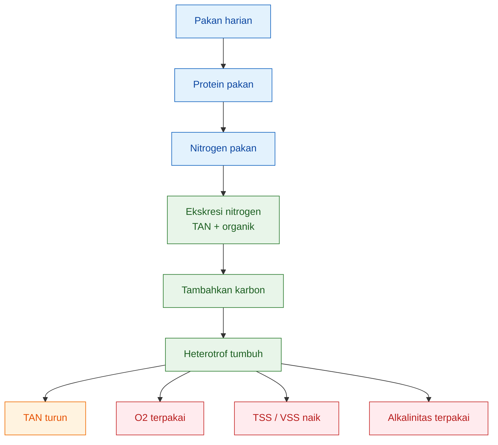
```mermaid
flowchart TD
    A["Pakan harian"] --> B["Protein pakan"]
    B --> C["Nitrogen pakan"]
    C --> D["Ekskresi nitrogen<br/>TAN + organik"]
    D --> E["Tambahkan karbon"]
    E --> F["Heterotrof tumbuh"]
    F --> G["TAN turun"]
    F --> H["O2 terpakai"]
    F --> I["TSS / VSS naik"]
    F --> J["Alkalinitas terpakai"]

    classDef input fill:#E3F2FD,stroke:#1565C0,color:#0D47A1,stroke-width:1px;
    classDef process fill:#E8F5E9,stroke:#2E7D32,color:#1B5E20,stroke-width:1px;
    classDef result fill:#FFF3E0,stroke:#EF6C00,color:#E65100,stroke-width:1px;
    classDef risk fill:#FFEBEE,stroke:#C62828,color:#B71C1C,stroke-width:1px;

    class A,B,C input;
    class D,E,F process;
    class G result;
    class H,I,J risk;
```

---

## 4.1 Rumus Nitrogen Pakan

Sumber nitrogen utama dalam sistem nila intensif adalah protein pakan. Secara praktis, nitrogen pakan dihitung dengan:

$$
N_{\text{pakan}}
=

\text{Feed}
\times
CP
\times
0{,}16
$$

Keterangan:

$$
N_{\text{pakan}}
=

\text{nitrogen yang masuk dari pakan}
$$

$$
\text{Feed}
=

\text{jumlah pakan yang diberikan}
$$

$$
CP
=

\text{fraksi protein pakan}
$$

$$
0{,}16
=

\text{fraksi nitrogen rata-rata dalam protein}
$$

Jika pakan mengandung protein 30%, maka:

$$
CP = 0{,}30
$$

Jika pakan harian adalah $1{,}000 \ \mathrm{g}$, maka nitrogen yang masuk:

$$
N_{\text{pakan}}
=

1{,}000
\times
0{,}30
\times
0{,}16
$$

$$
N_{\text{pakan}}
=

48 \ \mathrm{g \ N}
$$

Angka $48 \ \mathrm{g \ N}$ ini bukan semuanya menjadi daging ikan. Sebagian ditahan dalam biomassa ikan, tetapi sebagian besar menjadi limbah nitrogen dalam bentuk TAN, feses, sisa pakan, dan bahan organik.

Secara konseptual:

$$
N_{\text{pakan}}
=

N_{\text{retensi ikan}}
+
N_{\text{ekskresi}}
+
N_{\text{feses}}
+
N_{\text{sisa pakan}}
+
N_{\text{organik tersuspensi}}
$$

Dalam artikel Sarker et al., kebutuhan karbon dihitung dari konsumsi pakan harian, protein pakan, nitrogen pakan, lalu nitrogen yang diekskresikan. Mereka menggunakan asumsi bahwa nitrogen yang diekskresikan adalah 75% dari total nitrogen pakan, kemudian molase digunakan untuk menyesuaikan rasio C/N pada perlakuan bioflok.

Maka untuk pendekatan praktis:

$$
EFN
=

N_{\text{pakan}}
\times
0{,}75
$$

atau langsung:

$$
EFN
=

\text{Feed}
\times
CP
\times
0{,}16
\times
0{,}75
$$

Keterangan:

$$
EFN
=

\text{excreted feed nitrogen}
$$

Jika contoh sebelumnya digunakan:

$$
EFN
=

1{,}000
\times
0{,}30
\times
0{,}16
\times
0{,}75
$$

$$
EFN
=

36 \ \mathrm{g \ N}
$$

Artinya, dari $1 \ \mathrm{kg}$ pakan 30% protein, kira-kira $36 \ \mathrm{g}$ nitrogen berpotensi menjadi beban yang harus diproses sistem.

---

## 4.2 Rumus Karbon Praktis Berbasis Ekskresi Nitrogen

Setelah beban nitrogen diperkirakan, praktisi perlu menghitung karbon yang dibutuhkan untuk mencapai target C/N.

Rumus dasarnya:

$$
EFN
=

\text{Feed}
\times
CP
\times
0{,}16
\times
0{,}75
$$

Kemudian:

$$
C_{\text{required}}
=

EFN
\times
\left(C:N\right)_{\text{target}}
$$

Jika sumber karbon adalah molase, maka:

$$
\text{Molase}
=

\frac{
C_{\text{required}}
}{
f_{C,\text{molase}}
}
$$

Keterangan:

$$
C_{\text{required}}
=

\text{karbon yang dibutuhkan}
$$

$$
\left(C:N\right)_{\text{target}}
=

\text{target rasio karbon terhadap nitrogen}
$$

$$
f_{C,\text{molase}}
=

\text{fraksi karbon efektif dalam molase}
$$

Misalnya:

$$
\text{Feed} = 1{,}000 \ \mathrm{g}
$$

$$
CP = 0{,}30
$$

$$
\left(C:N\right)_{\text{target}} = 15
$$

$$
f_{C,\text{molase}} = 0{,}40
$$

Maka:

$$
EFN
=

1{,}000
\times
0{,}30
\times
0{,}16
\times
0{,}75
$$

$$
EFN
=

36 \ \mathrm{g \ N}
$$

Karbon yang dibutuhkan untuk target C/N 15:1:

$$
C_{\text{required}}
=

36
\times
15
$$

$$
C_{\text{required}}
=

540 \ \mathrm{g \ C}
$$

Jika molase diasumsikan memiliki fraksi karbon efektif 40%, maka:

$$
\text{Molase}
=

\frac{540}{0{,}40}
$$

$$
\text{Molase}
=

1{,}350 \ \mathrm{g}
$$

Secara matematis, hasil ini benar berdasarkan asumsi tersebut. Namun, dalam praktik, angka ini tidak boleh langsung dipakai tanpa koreksi lapangan. Mengapa? Karena rumus ini menghitung kebutuhan karbon berdasarkan estimasi nitrogen ekskresi, bukan berdasarkan kondisi aktual air.

Kondisi aktual bisa berbeda karena:

- ikan tidak selalu memakan seluruh pakan,
- retensi nitrogen berubah menurut ukuran ikan,
- flok yang sudah ada ikut menyerap TAN,
- nitrifikasi ikut bekerja,
- alga ikut mengambil nitrogen,
- sebagian padatan mengendap,
- karbon molase tidak seluruhnya dikonversi menjadi biomassa,
- DO dan alkalinitas dapat membatasi proses mikroba.

Maka rumus karbon berbasis pakan harus dibaca sebagai **starting estimate**, bukan dosis buta.

$$
\text{dosis karbon teoritis}
\neq
\text{dosis karbon final}
$$

Dosis final harus dikoreksi dengan data lapangan:

$$
\text{dosis final}
=

f
\left(
\text{TAN},
\text{NO}_2^-,
\text{DO},
\text{pH},
\text{alkalinitas},
\text{TSS},
\text{BFV},
\text{respons makan},
\text{sludge}
\right)
$$

---

## 4.3 Dua Pendekatan Dosis Karbon: Berbasis Pakan vs Berbasis TAN Aktual

Dalam praktik, ada dua pendekatan utama.

### Pendekatan 1: Berbasis Pakan

Pendekatan ini memakai jumlah pakan dan protein pakan sebagai dasar.

$$
EFN
=

\text{Feed}
\times
CP
\times
0{,}16
\times
0{,}75
$$

Lalu:

$$
C_{\text{required}}
=

EFN
\times
\left(C:N\right)_{\text{target}}
$$

Kelebihan pendekatan ini:

- mudah digunakan,
- cocok untuk perencanaan harian,
- membantu memperkirakan beban nitrogen sebelum TAN naik.

Kelemahannya:

- tidak membaca kondisi aktual air,
- bisa over-dosing jika bioflok sudah matang,
- bisa under-dosing jika pakan banyak tidak termakan,
- tidak memperhitungkan kontribusi nitrifikasi dan alga.

### Pendekatan 2: Berbasis TAN Aktual

Pendekatan ini menghitung karbon dari TAN-N yang benar-benar ingin dikonversi.

$$
\Delta CH
=

\frac{
\Delta N
\times
\left(C:N\right)_{\text{mikroba}}
}{
E
\times
f_C
}
$$

Kelebihan pendekatan ini:

- lebih dekat ke kondisi aktual,
- lebih aman untuk koreksi saat TAN naik,
- mengurangi risiko over-carbon.

Kelemahannya:

- membutuhkan pengukuran TAN yang benar,
- harus bisa membedakan TAN sebagai $\mathrm{mg/L}$ dan TAN-N,
- memerlukan estimasi volume air yang akurat,
- tetap harus dikoreksi dengan DO, TSS, dan alkalinitas.

Untuk bisnis, pendekatan terbaik adalah kombinasi:

$$
\text{dosis awal}
=

\text{berbasis pakan}
$$

$$
\text{koreksi harian}
=

\text{berbasis TAN, TSS, DO, dan respons ikan}
$$

---

## 4.4 Microbial Efficiency / ME

Dalam kerangka Avnimelech, kebutuhan karbon tidak cukup dihitung hanya dari target C/N air. Yang penting adalah berapa banyak karbon yang benar-benar dikonversi menjadi biomassa mikroba.

Kerangka praktisnya:

$$
\Delta CH
=

\frac{
\Delta N
\times
\left(C:N\right)_{\text{mikroba}}
}{
E
\times
f_C
}
$$

Keterangan:

$$
\Delta CH
=

\text{kebutuhan karbohidrat}
$$

$$
\Delta N
=

\text{nitrogen yang ingin diikat}
$$

$$
\left(C:N\right)_{\text{mikroba}}
\approx
4
$$

$$
E
=

\text{efisiensi konversi mikroba}
$$

$$
f_C
=

\text{fraksi karbon dalam bahan karbon}
$$

Jika digunakan asumsi praktis:

$$
E = 0{,}40
$$

$$
\left(C:N\right)_{\text{mikroba}} = 4
$$

$$
f_C = 0{,}50
$$

Maka untuk mengikat $1 \ \mathrm{g}$ TAN-N:

$$
\Delta CH
=

\frac{
1
\times
4
}{
0{,}40
\times
0{,}50
}
$$

$$
\Delta CH
=

\frac{4}{0{,}20}
$$

$$
\Delta CH
=

20 \ \mathrm{g \ karbohidrat/g \ TAN\text{-}N}
$$

Angka ini penting karena sering menjadi dasar praktis: sekitar $20 \ \mathrm{g}$ karbohidrat untuk mengikat $1 \ \mathrm{g}$ TAN-N. Tetapi angka ini tetap bergantung pada efisiensi mikroba dan bahan karbon.

Jika efisiensi mikroba turun, kebutuhan karbon naik.

Misalnya:

$$
E = 0{,}30
$$

$$
\Delta CH
=

\frac{
1
\times
4
}{
0{,}30
\times
0{,}50
}
$$

$$
\Delta CH
=

26{,}67 \ \mathrm{g \ karbohidrat/g \ TAN\text{-}N}
$$

Jika efisiensi mikroba naik:

$$
E = 0{,}60
$$

$$
\Delta CH
=

\frac{
1
\times
4
}{
0{,}60
\times
0{,}50
}
$$

$$
\Delta CH
=

13{,}33 \ \mathrm{g \ karbohidrat/g \ TAN\text{-}N}
$$

Artinya, satu angka dosis karbon tidak bisa dipakai untuk semua kolam. Efisiensi mikroba berubah menurut:

- DO,
- suhu,
- pH,
- alkalinitas,
- jenis karbon,
- kualitas inokulum,
- umur bioflok,
- TSS,
- rasio bakteri hidup terhadap detritus,
- beban organik.

---

## 4.5 Konsekuensi Stoikiometri: Karbon Bukan Satu-satunya Input

Mengikat TAN menjadi biomassa heterotrof membutuhkan lebih dari karbon. Ia juga membutuhkan oksigen dan menghasilkan padatan.

Dari stoikiometri heterotrof:

$$
1 \ \mathrm{g \ TAN\text{-}N}
\rightarrow
15{,}17 \ \mathrm{g \ karbohidrat}
+
4{,}71 \ \mathrm{g \ O_2}
+
3{,}57 \ \mathrm{g \ CaCO_3}
+
8{,}07 \ \mathrm{g \ VSS}
$$

Ini berarti setiap keputusan menambah karbon membawa empat konsekuensi.

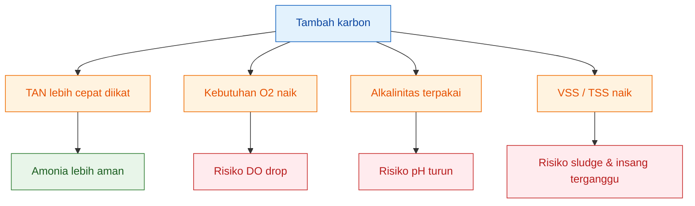
```mermaid
flowchart TD
    A["Tambah karbon"] --> B["TAN lebih cepat diikat"]
    A --> C["Kebutuhan O2 naik"]
    A --> D["Alkalinitas terpakai"]
    A --> E["VSS / TSS naik"]
    B --> F["Amonia lebih aman"]
    C --> G["Risiko DO drop"]
    D --> H["Risiko pH turun"]
    E --> I["Risiko sludge & insang terganggu"]

    classDef action fill:#E3F2FD,stroke:#1565C0,color:#0D47A1,stroke-width:1px;
    classDef benefit fill:#E8F5E9,stroke:#2E7D32,color:#1B5E20,stroke-width:1px;
    classDef risk fill:#FFEBEE,stroke:#C62828,color:#B71C1C,stroke-width:1px;
    classDef process fill:#FFF3E0,stroke:#EF6C00,color:#E65100,stroke-width:1px;

    class A action;
    class B,C,D,E process;
    class F benefit;
    class G,H,I risk;
```

Praktisi sering hanya fokus pada manfaat:

$$
\text{karbon}
\rightarrow
\text{TAN turun}
$$

Padahal neraca lengkapnya adalah:

$$
\text{karbon}
\rightarrow
\text{TAN turun}
+
\text{DO terpakai}
+
\text{alkalinitas terpakai}
+
\text{TSS naik}
$$

Inilah alasan sistem dengan karbon berlebih bisa terlihat “aman” dari amonia, tetapi ikan tetap lambat tumbuh.

$$
\text{TAN rendah}
+
\text{TSS tinggi}
+
\text{DO rendah}
\rightarrow
\text{FCR memburuk}
$$

---

## 4.6 Perbandingan Heterotrof dan Nitrifikasi dari Sudut Neraca

Heterotrof dan nitrifier sama-sama memproses TAN, tetapi konsekuensinya berbeda.

| Jalur       | Kebutuhan utama                 | Produk nitrogen   | Biomassa yang terbentuk | Risiko utama           |
| ----------- | ------------------------------- | ----------------- | ----------------------- | ---------------------- |
| Heterotrof  | Karbon organik + $\mathrm{O_2}$ | Biomassa mikroba  | Tinggi                  | TSS, sludge, DO drop   |
| Nitrifikasi | $\mathrm{O_2}$ + alkalinitas    | $\mathrm{NO_3^-}$ | Rendah                  | pH turun, nitrit spike |

Secara konseptual:

$$
\text{heterotrof}
:
\mathrm{TAN}
\rightarrow
\text{biomassa}
$$

$$
\text{nitrifikasi}
:
\mathrm{TAN}
\rightarrow
\mathrm{NO_2^-}
\rightarrow
\mathrm{NO_3^-}
$$

Jika sistem terlalu heterotrof:

$$
\text{TSS naik cepat}
+
\text{DO tertekan}
$$

Jika sistem terlalu bergantung pada nitrifikasi tanpa alkalinitas:

$$
\text{pH turun}
+
\text{nitrit berisiko naik}
$$

Sistem bioflok yang stabil biasanya bukan sistem yang hanya dikuasai satu proses, tetapi sistem yang memiliki keseimbangan:

$$
\text{heterotrof}
+
\text{nitrifier}
+
\text{flok terkendali}
+
\text{padatan dikelola}
$$

---

## 4.7 Contoh Hitungan Lapangan: 10 kg Pakan per Hari

Misalnya satu unit bioflok nila menerima:

$$
\text{Feed} = 10 \ \mathrm{kg/hari}
$$

$$
CP = 30\% = 0{,}30
$$

Target:

$$
C:N = 15:1
$$

Asumsi:

$$
75\% \text{ nitrogen pakan diekskresikan}
$$

Maka nitrogen pakan:

$$
N_{\text{pakan}}
=

10{,}000
\times
0{,}30
\times
0{,}16
$$

$$
N_{\text{pakan}}
=

480 \ \mathrm{g \ N/hari}
$$

Nitrogen yang diekskresikan:

$$
EFN
=

480
\times
0{,}75
$$

$$
EFN
=

360 \ \mathrm{g \ N/hari}
$$

Karbon yang dibutuhkan untuk C/N 15:1:

$$
C_{\text{required}}
=

360
\times
15
$$

$$
C_{\text{required}}
=

5{,}400 \ \mathrm{g \ C/hari}
$$

Jika fraksi karbon efektif molase diasumsikan 40%:

$$
\text{Molase}
=

\frac{5{,}400}{0{,}40}
$$

$$
\text{Molase}
=

13{,}500 \ \mathrm{g/hari}
$$

atau:

$$
\text{Molase}
=

13{,}5 \ \mathrm{kg/hari}
$$

Angka ini terlihat besar. Karena itu, praktisi tidak boleh memakai hasil hitungan ini secara mekanis tanpa membaca kondisi air. Jika bioflok sudah matang, TAN rendah, dan TSS tinggi, dosis aktual harus lebih rendah atau bahkan dihentikan sementara.

Keputusan yang benar bukan:

$$
\text{pakan 10 kg}
\rightarrow
\text{molase wajib 13,5 kg}
$$

Keputusan yang benar:

$$
\text{pakan 10 kg}
\rightarrow
\text{estimasi beban N}
\rightarrow
\text{cek TAN, TSS, DO, pH, alkalinitas}
\rightarrow
\text{putuskan dosis karbon aktual}
$$

---

## 4.8 Contoh Hitungan Berbasis TAN Aktual

Misalnya kolam volume:

$$
V = 10{,}000 \ \mathrm{L}
$$

TAN-N ingin diturunkan sebesar:

$$
\Delta TAN\text{-}N = 1 \ \mathrm{mg/L}
$$

Maka total TAN-N yang ingin dikonversi:

$$
\Delta N
=

1 \ \mathrm{mg/L}
\times
10{,}000 \ \mathrm{L}
$$

$$
\Delta N
=

10{,}000 \ \mathrm{mg}
$$

$$
\Delta N
=

10 \ \mathrm{g \ TAN\text{-}N}
$$

Jika memakai pendekatan $20 \ \mathrm{g}$ karbohidrat per $1 \ \mathrm{g}$ TAN-N:

$$
\Delta CH
=

10
\times
20
$$

$$
\Delta CH
=

200 \ \mathrm{g \ karbohidrat}
$$

Jika bahan karbon mengandung 50% karbohidrat efektif:

$$
\text{bahan karbon}
=

\frac{200}{0{,}50}
$$

$$
\text{bahan karbon}
=

400 \ \mathrm{g}
$$

Tetapi konsekuensi oksigennya juga harus dihitung. Jika $1 \ \mathrm{g}$ TAN-N membutuhkan sekitar $4{,}71 \ \mathrm{g \ O_2}$:

$$
O_{2,\text{required}}
=

10
\times
4{,}71
$$

$$
O_{2,\text{required}}
=

47{,}1 \ \mathrm{g \ O_2}
$$

Dan biomassa mikroba yang terbentuk:

$$
VSS_{\text{formed}}
=

10
\times
8{,}07
$$

$$
VSS_{\text{formed}}
=

80{,}7 \ \mathrm{g \ VSS}
$$

Artinya, menurunkan TAN-N sebesar $1 \ \mathrm{mg/L}$ pada kolam $10{,}000 \ \mathrm{L}$ bukan hanya soal menambah karbon. Sistem juga harus mampu menyediakan oksigen tambahan dan menampung padatan baru.

---

## 4.9 Hubungan Stoikiometri dengan TSS dan Sludge

TSS bukan sekadar angka kualitas air. TSS adalah konsekuensi dari neraca mikroba.

Jika heterotrof mengambil TAN dan membentuk biomassa:

$$
\mathrm{TAN}
+
\text{karbon}
\rightarrow
\text{VSS}
$$

VSS adalah bagian organik dari padatan tersuspensi. Jika VSS terus bertambah dan tidak dimakan ikan, tidak diurai, atau tidak dikeluarkan, maka akan berubah menjadi beban.

$$
\text{VSS naik}
\rightarrow
\text{TSS naik}
\rightarrow
\text{sludge naik}
$$

Jika padatan tetap tersuspensi, aktif, dan dimakan ikan, ia bisa menjadi aset.

$$
\text{flok aktif}
\rightarrow
\text{nutrisi tambahan}
\rightarrow
\text{FCR pellet membaik}
$$

Tetapi jika padatan mengendap dan membusuk, ia menjadi risiko.

$$
\text{sludge mati}
\rightarrow
\text{zona anaerob}
\rightarrow
\text{bau}
+
\mathrm{H_2S}
+
\text{stres ikan}
$$

Inilah perbedaan penting antara **flok produktif** dan **lumpur organik**.

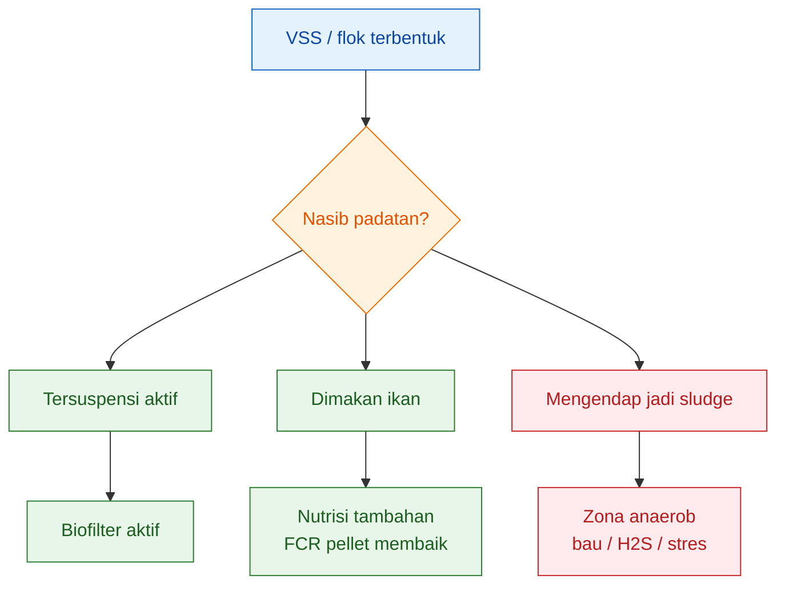
```mermaid
flowchart TD
    A["VSS / flok terbentuk"] --> B{"Nasib padatan?"}
    B --> C["Tersuspensi aktif"]
    B --> D["Dimakan ikan"]
    B --> E["Mengendap jadi sludge"]

    C --> F["Biofilter aktif"]
    D --> G["Nutrisi tambahan<br/>FCR pellet membaik"]
    E --> H["Zona anaerob<br/>bau / H2S / stres"]

    classDef start fill:#E3F2FD,stroke:#1565C0,color:#0D47A1,stroke-width:1px;
    classDef decision fill:#FFF3E0,stroke:#EF6C00,color:#E65100,stroke-width:1px;
    classDef good fill:#E8F5E9,stroke:#2E7D32,color:#1B5E20,stroke-width:1px;
    classDef bad fill:#FFEBEE,stroke:#C62828,color:#B71C1C,stroke-width:1px;

    class A start;
    class B decision;
    class C,D,F,G good;
    class E,H bad;
```

Dalam artikel Sarker, kenaikan C/N meningkatkan biofloc volume dan TSS. Pada titik tertentu, tambahan karbon tidak lagi menghasilkan pertumbuhan lebih baik. Ini menunjukkan bahwa padatan yang berlebih dapat mengurangi manfaat bioflok.

---

## 4.10 Koreksi Dosis Karbon Berdasarkan Kondisi Lapangan

Rumus hanya memberi estimasi. Keputusan akhir harus mengikuti kondisi aktual.

| Kondisi lapangan                  | Interpretasi              | Keputusan karbon                                |
| --------------------------------- | ------------------------- | ----------------------------------------------- |
| TAN tinggi, TSS rendah, DO aman   | heterotrof kurang aktif   | karbon bisa ditambah bertahap                   |
| TAN tinggi, TSS tinggi, DO rendah | sistem organik berat      | jangan tambah karbon; perbaiki DO dan padatan   |
| TAN rendah, TSS tinggi            | karbon/flok berlebih      | kurangi atau hentikan karbon                    |
| TAN rendah, nitrit tinggi         | nitrifikasi belum lengkap | jangan over-carbon; cek alkalinitas dan DO      |
| pH turun                          | alkalinitas terpakai      | koreksi alkalinitas sebelum tambah karbon besar |
| DO subuh rendah                   | respirasi terlalu tinggi  | kurangi beban organik dan tambah aerasi         |

Keputusan praktisnya:

$$
\text{karbon ditambah}
\quad
\text{hanya jika}
\quad
\text{TAN perlu dikendalikan dan sistem mampu menanggung O}_2 \text{ serta TSS}
$$

Bukan:

$$
\text{air kurang coklat}
\rightarrow
\text{tambah molase}
$$

---

## 4.11 Pesan Bisnis dari Stoikiometri

Dosis karbon yang salah bukan hanya membuat air “tidak jadi bioflok”. Dosis karbon yang salah bisa:

$$
\text{menaikkan biaya karbon}
$$

$$
\text{menurunkan DO}
$$

$$
\text{menaikkan TSS}
$$

$$
\text{memperburuk FCR}
$$

$$
\text{memperpanjang siklus panen}
$$

$$
\text{menaikkan risiko mortalitas}
$$

Dalam bisnis, ini berarti:

$$
\text{kesalahan stoikiometri}
\rightarrow
\text{kesalahan biaya produksi}
\rightarrow
\text{kesalahan margin}
$$

Karena itu, praktisi perlu menghitung setidaknya empat hal setiap kali mengatur karbon:

1. Berapa nitrogen masuk dari pakan?
2. Berapa TAN aktual di air?
3. Berapa oksigen dan alkalinitas yang tersedia?
4. Berapa TSS/BFV yang sudah terbentuk?

Rumus ringkas keputusan:

$$
\text{Dosis karbon aman}
=

f
\left(
N_{\text{pakan}},
TAN,
DO,
pH,
\text{alkalinitas},
TSS,
BFV,
\text{respons ikan}
\right)
$$

Kesimpulan bab ini:

> Karbon adalah alat kendali nitrogen. Tetapi setiap gram karbon yang masuk membawa konsekuensi terhadap oksigen, alkalinitas, padatan, biaya, dan risiko produksi. Stoikiometri membuat praktisi tidak mengambil keputusan berdasarkan warna air, tetapi berdasarkan neraca sistem.

[Kembali ke Atas](#bioflok-nila-berbasis-neraca-mikroba-cn-ratio-protein-pakan-tan-fcr-dan-keputusan-bisnis)

---

# 5. Membaca Indikator Air sebagai Sinyal Proses Mikroba

Dalam bioflok, indikator air bukan sekadar angka laboratorium. Setiap angka adalah sinyal dari proses mikroba yang sedang dominan atau terganggu. TAN, nitrit, DO, pH, alkalinitas, TSS, BFV, bau air, respons makan, dan warna flok harus dibaca sebagai satu paket.

Kesalahan umum praktisi adalah membaca satu parameter secara terpisah. Misalnya TAN rendah dianggap aman, padahal TSS tinggi dan DO subuh rendah. Atau air coklat dianggap “bioflok jadi”, padahal flok sudah berubah menjadi sludge organik yang membebani sistem.

Bab ini memberi kerangka diagnosis agar praktisi tidak mengambil keputusan reaktif seperti “tambah molase”, “tambah probiotik”, atau “ganti air” tanpa memahami proses penyebabnya.

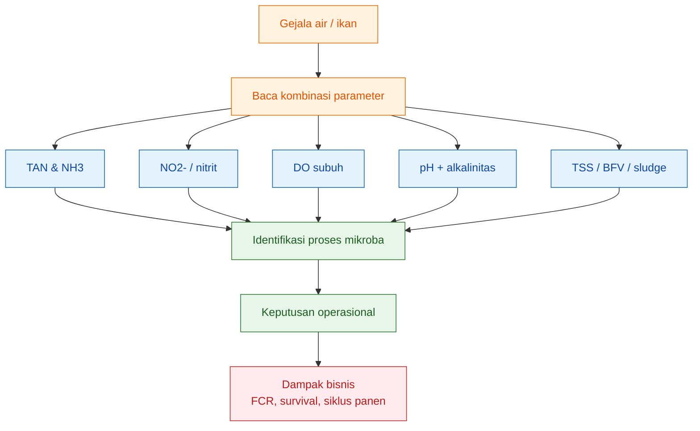
```mermaid
flowchart TD
    A["Gejala air / ikan"] --> B["Baca kombinasi parameter"]
    B --> C["TAN & NH3"]
    B --> D["NO2- / nitrit"]
    B --> E["DO subuh"]
    B --> F["pH + alkalinitas"]
    B --> G["TSS / BFV / sludge"]
    C --> H["Identifikasi proses mikroba"]
    D --> H
    E --> H
    F --> H
    G --> H
    H --> I["Keputusan operasional"]
    I --> J["Dampak bisnis<br/>FCR, survival, siklus panen"]

    classDef symptom fill:#FFF3E0,stroke:#EF6C00,color:#E65100,stroke-width:1px;
    classDef data fill:#E3F2FD,stroke:#1565C0,color:#0D47A1,stroke-width:1px;
    classDef process fill:#E8F5E9,stroke:#2E7D32,color:#1B5E20,stroke-width:1px;
    classDef business fill:#FFEBEE,stroke:#C62828,color:#B71C1C,stroke-width:1px;

    class A,B symptom;
    class C,D,E,F,G data;
    class H,I process;
    class J business;
```

---

## 5.1 Prinsip Utama Diagnosis: Jangan Membaca Satu Angka Sendiri

Satu angka jarang cukup untuk mengambil keputusan. Dalam BFT, keputusan harus berbasis kombinasi parameter.

Contoh:

$$
\text{TAN rendah}
\neq
\text{sistem pasti sehat}
$$

Karena TAN rendah bisa terjadi bersama:

$$
\text{TSS tinggi}
+
\text{DO subuh rendah}
+
\text{flok tua}
+
\text{FCR naik}
$$

Dalam kondisi seperti itu, sistem tidak kekurangan karbon. Sistem justru mungkin kelebihan beban organik.

Contoh lain:

$$
\text{air coklat}
\neq
\text{flok produktif}
$$

Air coklat bisa berarti flok aktif, tetapi bisa juga berarti padatan organik berlebih.

Maka indikator air harus dibaca sebagai pola:

$$
\text{diagnosis}
=

f
\left(
\text{TAN},
\text{NO}_2^-,
\text{DO},
\text{pH},
\text{alkalinitas},
\text{TSS},
\text{BFV},
\text{bau},
\text{respons makan}
\right)
$$

---

## 5.2 Diagnostic Framework Utama

| Kombinasi gejala           | Kemungkinan proses                                | Risiko bisnis                         | Keputusan awal                          |
| -------------------------- | ------------------------------------------------- | ------------------------------------- | --------------------------------------- |
| TAN naik, flok rendah      | Heterotrof belum aktif                            | Toksisitas amonia, pertumbuhan lambat | Cek karbon, DO, alkalinitas             |
| TAN turun, TSS naik cepat  | Heterotrof terlalu dominan                        | DO drop, insang terganggu             | Kurangi karbon, lakukan settling/siphon |
| TAN rendah, nitrit tinggi  | Nitrifikasi tidak lengkap                         | Stres kronis, nafsu makan turun       | Cek alkalinitas, DO, maturasi bioflok   |
| pH turun terus             | Nitrifikasi/respirasi tinggi                      | Nitrifikasi melemah, ikan stres       | Tambah buffer alkalinitas               |
| DO subuh rendah            | Respirasi mikroba/flok/alga tinggi                | Kematian massal                       | Tambah aerasi, kurangi TSS              |
| Air bau/lumpur hitam       | Zona anaerob                                      | $\mathrm{H_2S}$, mortalitas           | Siphon sludge, tambah mixing            |
| FCR naik tetapi TAN rendah | Sistem bersih nitrogen tetapi berat padatan/stres | Margin turun                          | Evaluasi TSS, feeding, kesehatan insang |

Tabel ini bukan resep tunggal. Ini adalah kerangka awal untuk mencegah keputusan salah. Keputusan final tetap harus melihat data harian, tren mingguan, umur flok, padat tebar, feeding rate, dan kondisi ikan.

---

## 5.3 TAN Naik, Flok Rendah

### Pola gejala

$$
\text{TAN naik}
+
\text{BFV rendah}
+
\text{TSS rendah}
$$

Pola ini biasanya menunjukkan bahwa bakteri heterotrof belum cukup aktif untuk mengikat TAN menjadi biomassa mikroba.

Kemungkinan penyebab:

- karbon organik kurang,
- bioflok belum matang,
- inokulum mikroba lemah,
- DO tidak cukup untuk pertumbuhan heterotrof,
- alkalinitas rendah,
- feeding terlalu tinggi untuk umur sistem,
- pakan tidak termakan dan mulai membusuk.

Secara proses:

$$
\text{protein pakan}
\rightarrow
\text{TAN}
$$

Tetapi:

$$
\text{TAN}
+
\text{karbon}
+
O_2
\nrightarrow
\text{biomassa mikroba cukup}
$$

### Risiko bisnis

Jika TAN naik, risiko bukan hanya kematian. Risiko awal biasanya lebih halus:

$$
\text{TAN naik}
\rightarrow
\text{ikan stres}
\rightarrow
\text{nafsu makan turun}
\rightarrow
\text{pertumbuhan lambat}
\rightarrow
\text{FCR naik}
$$

Jika pH tinggi, sebagian TAN berubah menjadi amonia bebas $\mathrm{NH_3}$ yang lebih toksik.

$$
\text{pH naik}
\rightarrow
\frac{\mathrm{NH_3}}{\mathrm{TAN}} \text{ naik}
\rightarrow
\text{risiko toksisitas naik}
$$

### Keputusan awal

Jangan langsung menambah karbon dalam dosis besar. Periksa dulu:

$$
\text{DO}
+
\text{pH}
+
\text{alkalinitas}
+
\text{TSS}
+
\text{respons makan}
$$

Jika DO aman dan TSS rendah, karbon dapat ditambahkan bertahap.

$$
\text{TAN tinggi}
+
\text{TSS rendah}
+
\text{DO aman}
\rightarrow
\text{tambah karbon bertahap}
$$

Jika DO rendah, menambah karbon bisa memperburuk keadaan karena heterotrof membutuhkan oksigen.

$$
\text{TAN tinggi}
+
\text{DO rendah}
\rightarrow
\text{perbaiki aerasi dulu}
$$

---

## 5.4 TAN Turun, TSS Naik Cepat

### Pola gejala

$$
\text{TAN turun}
+
\text{TSS naik}
+
\text{BFV naik cepat}
$$

Ini biasanya menunjukkan bahwa heterotrof sangat aktif. Mereka berhasil mengambil TAN, tetapi menghasilkan banyak biomassa tersuspensi.

Secara proses:

$$
\text{TAN}
+
\text{karbon organik}
+
O_2
\rightarrow
\text{VSS/TSS}
$$

Ini adalah tanda bahwa sistem berjalan secara heterotrof, tetapi belum tentu berarti sistem aman secara produksi.

### Risiko bisnis

Heterotrof yang terlalu dominan dapat menciptakan masalah baru:

$$
\text{TSS naik}
\rightarrow
\text{beban insang naik}
\rightarrow
\text{energi ikan untuk stres naik}
\rightarrow
\text{pertumbuhan turun}
$$

Selain itu:

$$
\text{TSS tinggi}
\rightarrow
\text{respirasi mikroba tinggi}
\rightarrow
\text{DO subuh turun}
$$

Dalam artikel Sarker, rasio C/N yang lebih tinggi memang menurunkan TAN, tetapi juga meningkatkan TSS dan biofloc volume. C/N 15:1 memberikan performa terbaik, sedangkan C/N 21:1 menghasilkan TAN lebih rendah tetapi pertumbuhan tidak lebih baik dan TSS lebih tinggi. Ini menunjukkan bahwa TAN rendah saja bukan target akhir.

### Keputusan awal

Jika TAN sudah rendah tetapi TSS naik cepat:

$$
\text{jangan tambah karbon}
$$

Keputusan awal:

- kurangi atau hentikan sementara karbon tambahan,
- lakukan settling atau siphon,
- cek DO subuh,
- evaluasi feeding rate,
- cek apakah ada pakan tidak termakan,
- cek kondisi insang bila memungkinkan.

Secara keputusan:

$$
\text{TAN rendah}
+
\text{TSS tinggi}
\rightarrow
\text{kelola padatan, bukan tambah molase}
$$

---

## 5.5 TAN Rendah, Nitrit Tinggi

### Pola gejala

$$
\text{TAN rendah}
+
\mathrm{NO_2^-} \text{ tinggi}
$$

Pola ini sering menunjukkan bahwa nitrifikasi tidak lengkap. Amonia sudah berubah menjadi nitrit, tetapi nitrit belum cukup cepat berubah menjadi nitrat.

Secara proses:

$$
\mathrm{NH_4^+}
\rightarrow
\mathrm{NO_2^-}
$$

Tetapi:

$$
\mathrm{NO_2^-}
\nrightarrow
\mathrm{NO_3^-}
$$

Kemungkinan penyebab:

- komunitas nitrifier belum matang,
- alkalinitas rendah,
- DO tidak stabil,
- pH turun,
- padatan organik terlalu tinggi,
- sistem terlalu heterotrof sehingga nitrifier kalah bersaing,
- fluktuasi suhu atau pH.

### Risiko bisnis

Nitrit tinggi menyebabkan stres kronis. Gejalanya sering tidak langsung berupa kematian massal, tetapi performa turun:

$$
\mathrm{NO_2^-} \text{ tinggi}
\rightarrow
\text{stres}
\rightarrow
\text{nafsu makan turun}
\rightarrow
\text{FCR naik}
$$

Jika berlangsung lama:

$$
\text{stres kronis}
\rightarrow
\text{imunitas turun}
\rightarrow
\text{risiko penyakit naik}
$$

### Keputusan awal

Fokus pada stabilisasi nitrifikasi, bukan sekadar menambah karbon.

Keputusan awal:

- cek alkalinitas,
- cek DO,
- stabilkan pH,
- kurangi feeding sementara jika nitrit tinggi,
- hindari over-carbon,
- pastikan mixing cukup,
- pantau tren nitrat.

Jika nitrit tinggi tetapi TAN rendah, menambah karbon berlebih dapat memperkuat heterotrof dan menaikkan TSS, tetapi belum tentu menyelesaikan bottleneck nitrifikasi.

$$
\text{nitrit tinggi}
+
\text{TAN rendah}
\rightarrow
\text{perkuat nitrifikasi dan alkalinitas}
$$

Bukan:

$$
\text{nitrit tinggi}
\rightarrow
\text{otomatis tambah molase}
$$

---

## 5.6 pH Turun Terus

### Pola gejala

$$
\text{pH turun harian}
+
\text{alkalinitas turun}
$$

pH turun dalam bioflok biasanya terkait dengan respirasi mikroba, akumulasi $\mathrm{CO_2}$, dan nitrifikasi.

Nitrifikasi menghasilkan ion hidrogen:

$$
\mathrm{NH_4^+}
+
1{,}5\mathrm{O_2}
\rightarrow
\mathrm{NO_2^-}
+
2\mathrm{H^+}
+
\mathrm{H_2O}
$$

Ion $\mathrm{H^+}$ menekan pH. Alkalinitas berfungsi sebagai penyangga.

$$
\mathrm{HCO_3^-}
+
\mathrm{H^+}
\rightarrow
\mathrm{H_2CO_3}
\rightarrow
\mathrm{CO_2}
+
\mathrm{H_2O}
$$

Jika alkalinitas habis, pH menjadi mudah jatuh.

### Risiko bisnis

pH yang turun terus dapat melemahkan nitrifier.

$$
\text{alkalinitas rendah}
\rightarrow
\text{pH tidak stabil}
\rightarrow
\text{nitrifikasi terganggu}
\rightarrow
\text{nitrit naik}
$$

Selain itu, pH rendah dapat menekan nafsu makan dan memperlambat pertumbuhan.

### Keputusan awal

Keputusan pertama adalah memperbaiki sistem buffer.

$$
\text{pH turun terus}
\rightarrow
\text{cek alkalinitas}
\rightarrow
\text{tambahkan buffer jika perlu}
$$

Jangan hanya menaikkan pH sesaat. Yang penting adalah kapasitas penyangga.

Secara praktis:

$$
\text{target}
\neq
\text{pH naik cepat}
$$

Tetapi:

$$
\text{target}
=

\text{alkalinitas cukup agar pH stabil}
$$

---

## 5.7 DO Subuh Rendah

### Pola gejala

$$
\mathrm{DO}_{\text{subuh rendah}}
$$

Ini salah satu sinyal paling berbahaya dalam BFT. DO subuh rendah menunjukkan bahwa total respirasi malam hari lebih besar daripada kapasitas aerasi.

Penyebab utama:

- respirasi bakteri heterotrof tinggi,
- TSS/BFV terlalu padat,
- alga respirasi malam hari,
- biomassa ikan tinggi,
- aerasi kurang,
- mixing tidak merata,
- sludge mengendap.

Secara proses:

$$
\text{ikan}
+
\text{bakteri}
+
\text{alga malam}
+
\text{dekomposisi organik}
\rightarrow
\mathrm{O_2} \text{ turun}
$$

### Risiko bisnis

DO subuh rendah bisa menyebabkan kematian massal. Bahkan jika tidak mati, ikan dapat mengalami stres berat.

$$
\mathrm{DO} \text{ rendah}
\rightarrow
\text{ikan megap-megap}
\rightarrow
\text{makan turun}
\rightarrow
\text{FCR naik}
$$

Jika kejadian berulang:

$$
\text{DO subuh rendah berulang}
\rightarrow
\text{pertumbuhan lambat}
+
\text{imunitas turun}
+
\text{risiko panen mundur}
$$

### Keputusan awal

DO subuh rendah adalah kondisi prioritas.

Keputusan awal:

- tambah aerasi,
- periksa distribusi aerasi,
- kurangi feeding sementara,
- kurangi karbon tambahan,
- lakukan settling atau siphon jika TSS tinggi,
- buang sludge,
- periksa biomassa ikan aktual.

Secara keputusan:

$$
\mathrm{DO}_{\text{subuh rendah}}
\rightarrow
\text{kurangi beban oksigen dan tambah suplai oksigen}
$$

Bukan:

$$
\mathrm{DO}_{\text{subuh rendah}}
\rightarrow
\text{tunggu siang}
$$

Karena siang hari DO bisa naik akibat fotosintesis, tetapi masalah utama tetap terjadi saat malam dan subuh.

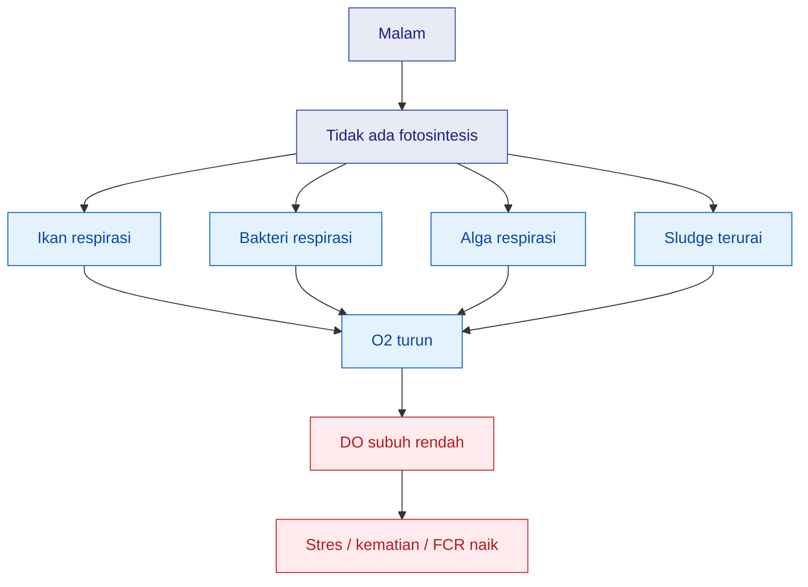
```mermaid
flowchart TD
    A["Malam"] --> B["Tidak ada fotosintesis"]
    B --> C["Ikan respirasi"]
    B --> D["Bakteri respirasi"]
    B --> E["Alga respirasi"]
    B --> F["Sludge terurai"]
    C --> G["O2 turun"]
    D --> G
    E --> G
    F --> G
    G --> H["DO subuh rendah"]
    H --> I["Stres / kematian / FCR naik"]

    classDef time fill:#E8EAF6,stroke:#3949AB,color:#1A237E,stroke-width:1px;
    classDef process fill:#E3F2FD,stroke:#1565C0,color:#0D47A1,stroke-width:1px;
    classDef risk fill:#FFEBEE,stroke:#C62828,color:#B71C1C,stroke-width:1px;

    class A,B time;
    class C,D,E,F,G process;
    class H,I risk;
```

---

## 5.8 Air Bau atau Lumpur Hitam

### Pola gejala

$$
\text{bau busuk}
+
\text{lumpur hitam}
+
\text{flok mengendap}
$$

Ini menunjukkan kemungkinan zona anaerob. Dalam zona anaerob, oksigen sangat rendah. Padatan organik membusuk dan dapat menghasilkan senyawa berbahaya.

Salah satu risiko utama adalah hidrogen sulfida:

$$
\mathrm{H_2S}
$$

Zona anaerob biasanya muncul ketika:

- TSS terlalu tinggi,
- mixing lemah,
- sludge tidak dikeluarkan,
- dasar kolam mati,
- bioflok menggumpal besar,
- feeding berlebih,
- karbon berlebih.

### Risiko bisnis

Zona anaerob bisa menyebabkan:

$$
\text{bau}
+
\text{stres ikan}
+
\text{kerusakan insang}
+
\text{mortalitas}
$$

Dari sudut bisnis, ini salah satu sinyal bahwa sistem sudah berubah dari bioflok produktif menjadi reaktor organik bermasalah.

$$
\text{flok aktif}
=

\text{aset}
$$

$$
\text{sludge anaerob}
=

\text{risiko}
$$

### Keputusan awal

Keputusan awal:

- siphon sludge,
- tambah mixing,
- perbaiki aerasi dasar,
- kurangi feeding sementara,
- hentikan karbon tambahan sementara,
- cek DO subuh,
- cek TSS/BFV,
- hindari pengadukan mendadak sludge tebal yang dapat melepaskan racun ke kolom air.

Secara keputusan:

$$
\text{bau/lumpur hitam}
\rightarrow
\text{buang sumber anaerob, bukan tambah probiotik dulu}
$$

---

## 5.9 FCR Naik tetapi TAN Rendah

### Pola gejala

$$
FCR \text{ naik}
+
\text{TAN rendah}
$$

Ini pola yang sering membingungkan. Praktisi merasa sistem air “bagus” karena TAN rendah, tetapi pakan boros dan pertumbuhan lambat.

Kemungkinan penyebab:

- TSS terlalu tinggi,
- DO subuh rendah,
- ikan stres insang,
- flok tidak termakan,
- pakan tidak termakan,
- feeding rate terlalu tinggi,
- protein pakan tidak sesuai,
- ukuran pelet tidak sesuai,
- kualitas pakan buruk,
- sludge membebani sistem,
- bioflok tua dan rendah nilai nutrisi.

Dalam kondisi ini, masalahnya bukan nitrogen toksik. Masalahnya adalah efisiensi biologis dan ekonomi.

$$
\text{TAN rendah}
\neq
\text{FCR baik}
$$

### Risiko bisnis

FCR naik langsung memukul biaya produksi.

$$
\text{biaya pakan/kg ikan}
=

FCR
\times
\text{harga pakan/kg}
$$

Jika FCR naik dari 1,35 menjadi 2,83, biaya pakan per kg pertambahan biomassa bisa lebih dari dua kali lipat, tergantung harga pakan.

Sarker menunjukkan FCR terbaik 1,35 pada C/N 15:1. Debnath menunjukkan bahwa pada sistem C/N 15:1 tanpa solid management, FCR pada perlakuan 24–32% protein berada sekitar 2,83–2,94. Perbedaan ini penting: C/N benar tidak otomatis menghasilkan FCR rendah jika sistem padatan dan performa makan tidak optimal.

### Keputusan awal

Jika FCR naik tetapi TAN rendah:

- jangan fokus pada amonia,
- cek TSS dan BFV,
- ukur DO subuh,
- cek feeding loss,
- cek ukuran pelet,
- cek kesehatan insang,
- evaluasi protein pakan,
- cek sludge,
- bandingkan pertumbuhan mingguan.

Secara keputusan:

$$
FCR \text{ naik}
+
\text{TAN rendah}
\rightarrow
\text{evaluasi padatan, oksigen, feeding, dan kesehatan ikan}
$$

---

## 5.10 Membaca Tren, Bukan Hanya Angka Tunggal

Dalam BFT, tren lebih penting daripada satu angka.

Contoh:

$$
\text{TAN} = 0{,}5 \ \mathrm{mg/L}
$$

Angka ini bisa berarti dua hal berbeda.

Jika tren turun:

$$
1{,}2
\rightarrow
0{,}8
\rightarrow
0{,}5
$$

Sistem membaik.

Jika tren naik:

$$
0{,}1
\rightarrow
0{,}3
\rightarrow
0{,}5
$$

Sistem mulai terbebani.

Maka pembacaan harus berbasis tren:

$$
\Delta \text{TAN}
=

\text{TAN}_{\text{hari ini}}

\text{TAN}_{\text{kemarin}}
$$

$$
\Delta \text{TSS}
=

\text{TSS}_{\text{minggu ini}}

\text{TSS}_{\text{minggu lalu}}
$$

$$
\Delta \text{FCR}
=

FCR_{\text{periode ini}}

FCR_{\text{periode sebelumnya}}
$$

Parameter yang perlu dibaca sebagai tren:

| Parameter     | Tren berbahaya                          |
| ------------- | --------------------------------------- |
| TAN           | naik terus                              |
| Nitrit        | naik atau tidak turun setelah TAN turun |
| pH            | turun harian tanpa pemulihan            |
| Alkalinitas   | turun terus                             |
| DO subuh      | makin rendah                            |
| TSS/BFV       | naik cepat tanpa kontrol                |
| FCR           | naik dari minggu ke minggu              |
| Respons makan | makin lambat                            |
| Survival      | mortalitas kecil tetapi berulang        |

---

## 5.11 Urutan Diagnosis Lapangan

Saat ada masalah, gunakan urutan berikut agar keputusan tidak salah.

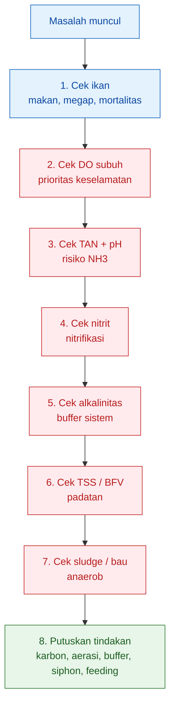
```mermaid
flowchart TD
    A["Masalah muncul"] --> B["1. Cek ikan<br/>makan, megap, mortalitas"]
    B --> C["2. Cek DO subuh<br/>prioritas keselamatan"]
    C --> D["3. Cek TAN + pH<br/>risiko NH3"]
    D --> E["4. Cek nitrit<br/>nitrifikasi"]
    E --> F["5. Cek alkalinitas<br/>buffer sistem"]
    F --> G["6. Cek TSS / BFV<br/>padatan"]
    G --> H["7. Cek sludge / bau<br/>anaerob"]
    H --> I["8. Putuskan tindakan<br/>karbon, aerasi, buffer, siphon, feeding"]

    classDef step fill:#E3F2FD,stroke:#1565C0,color:#0D47A1,stroke-width:1px;
    classDef danger fill:#FFEBEE,stroke:#C62828,color:#B71C1C,stroke-width:1px;
    classDef decision fill:#E8F5E9,stroke:#2E7D32,color:#1B5E20,stroke-width:1px;

    class A,B step;
    class C,D,E,F,G,H danger;
    class I decision;
```

Mengapa DO subuh ditempatkan awal? Karena DO rendah dapat membunuh ikan lebih cepat daripada masalah TAN moderat.

Mengapa TAN harus dibaca bersama pH? Karena toksisitas aktual bergantung pada fraksi $\mathrm{NH_3}$.

Mengapa TSS/BFV harus dibaca sebelum menambah karbon? Karena karbon tambahan dapat memperberat TSS.

---

## 5.12 Decision Matrix Praktis

| Diagnosis                            | Tindakan yang benar                      | Tindakan yang sering salah      |
| ------------------------------------ | ---------------------------------------- | ------------------------------- |
| TAN tinggi, TSS rendah, DO aman      | Tambah karbon bertahap                   | Menambah karbon besar sekaligus |
| TAN tinggi, DO rendah                | Tambah aerasi, kurangi feeding sementara | Menambah molase banyak          |
| Nitrit tinggi, pH/alkalinitas rendah | Tambah buffer, stabilkan nitrifikasi     | Over-carbon                     |
| TSS tinggi, TAN rendah               | Siphon/settling, kurangi karbon          | Tambah probiotik/molase         |
| DO subuh rendah                      | Tambah aerasi, kurangi beban organik     | Menunggu DO siang membaik       |
| Bau/lumpur hitam                     | Buang sludge, tambah mixing              | Mengaduk sludge tanpa kontrol   |
| FCR naik, TAN rendah                 | Audit feeding, TSS, DO, insang           | Menganggap air sudah bagus      |

---

## 5.13 Hubungan Diagnostic Framework dengan Tiga Artikel

Sarker et al. memberi pelajaran bahwa C/N tinggi dapat menurunkan TAN, tetapi tidak otomatis memberi performa terbaik. C/N 15:1 menghasilkan kombinasi terbaik antara pertumbuhan, FCR, survival, dan hematologi; sementara C/N lebih tinggi meningkatkan TSS/BFV. Ini mendukung prinsip bahwa indikator nitrogen harus dibaca bersama padatan dan performa ikan.

Debnath et al. menunjukkan bahwa sistem C/N 15:1 dapat menjaga kualitas air pada berbagai kadar protein pakan, tetapi FCR tetap relatif tinggi dalam sistem tanpa solid management. Ini mendukung prinsip bahwa kualitas air “dalam batas aman” belum tentu cukup untuk menghasilkan efisiensi bisnis optimal.

Zablon et al. menunjukkan apparent FCR rendah pada fry nila dalam BFT dengan C/N 20:1, sumber karbon aktif, mikroorganisme melimpah, dan siphon sludge mingguan. Ini mendukung prinsip bahwa flok dapat menjadi aset nutrisi bila aktif dan dikelola, bukan dibiarkan menjadi sludge.

---

## 5.14 Pesan Kunci Bab Ini

Praktisi harus berhenti membaca bioflok dari warna air saja. Bioflok harus dibaca dari kombinasi proses.

$$
\text{warna air}
\neq
\text{diagnosis}
$$

Diagnosis yang benar adalah:

$$
\text{TAN}
+
\text{nitrit}
+
\text{DO subuh}
+
\text{pH}
+
\text{alkalinitas}
+
\text{TSS/BFV}
+
\text{respons ikan}
+
\text{FCR}
$$

Keputusan yang salah biasanya muncul karena praktisi hanya melihat satu gejala:

$$
\text{TAN naik}
\rightarrow
\text{langsung tambah molase}
$$

Padahal keputusan yang benar:

$$
\text{TAN naik}
\rightarrow
\text{cek TSS, DO, pH, alkalinitas, feeding}
\rightarrow
\text{baru putuskan tindakan}
$$

Kesimpulan bab ini:

> Dalam BFT, indikator air adalah bahasa mikroba. Praktisi yang bisa membaca kombinasi TAN, nitrit, DO, pH, alkalinitas, TSS, dan respons ikan akan mengambil keputusan lebih tepat. Praktisi yang hanya membaca warna air atau satu angka akan mudah salah diagnosis, dan salah diagnosis dalam bisnis budidaya berarti margin hilang.

[Kembali ke Atas](#bioflok-nila-berbasis-neraca-mikroba-cn-ratio-protein-pakan-tan-fcr-dan-keputusan-bisnis)

---

# 6. Studi Sarker: C/N 15:1 sebagai Titik Keseimbangan, Bukan Angka Sakral

Studi Sarker et al. penting karena menjawab pertanyaan yang sangat praktis:

> Pada nila bioflok, rasio C/N berapa yang memberikan kombinasi terbaik antara kualitas air, pertumbuhan, FCR, hematologi, dan komunitas mikroba?

Pertanyaan ini penting karena praktisi sering menganggap bahwa semakin tinggi C/N, semakin baik bioflok. Logikanya terlihat masuk akal: karbon lebih banyak, bakteri heterotrof lebih aktif, TAN lebih rendah. Tetapi data Sarker menunjukkan bahwa cara berpikir itu tidak lengkap.

C/N yang lebih tinggi memang dapat menurunkan TAN. Namun, C/N yang terlalu tinggi juga dapat menaikkan TSS, biofloc volume, dan beban sistem. Karena itu, target praktisi bukan **TAN serendah mungkin**, melainkan **kombinasi performa terbaik**.

Dalam studi ini, perlakuan yang diuji adalah:

$$
C/N = 10:1,\ 12:1,\ 15:1,\ 18:1,\ 21:1
$$

Perlakuan terbaik adalah:

$$
C/N = 15:1
$$

Namun, angka 15:1 tidak boleh dibaca sebagai angka sakral untuk semua kolam, semua umur ikan, dan semua kondisi. Angka ini harus dibaca sebagai **titik keseimbangan terbaik dalam kondisi eksperimen Sarker**.

---

## 6.1 Pertanyaan yang Dijawab Sarker

Sarker et al. tidak sekadar menanyakan apakah bioflok bisa menurunkan amonia. Pertanyaan mereka lebih lengkap:

> Bagaimana rasio C/N yang berbeda memengaruhi kualitas air, pertumbuhan, efisiensi pakan, hematologi, dan komunitas mikroba pada nila?

Ini penting karena bioflok tidak bisa dievaluasi dari satu parameter saja.

Jika hanya melihat TAN, C/N tinggi tampak lebih baik.

Jika melihat pertumbuhan, FCR, survival, hematologi, dan TSS, hasilnya berbeda.

Secara kerangka:

$$
C/N
\rightarrow
\text{kualitas air}
\rightarrow
\text{komunitas mikroba}
\rightarrow
\text{flok}
\rightarrow
\text{pertumbuhan}
\rightarrow
FCR
\rightarrow
\text{kelayakan bisnis}
$$

Maka Sarker harus dibaca sebagai studi keseimbangan sistem, bukan studi “siapa paling rendah amonia”.

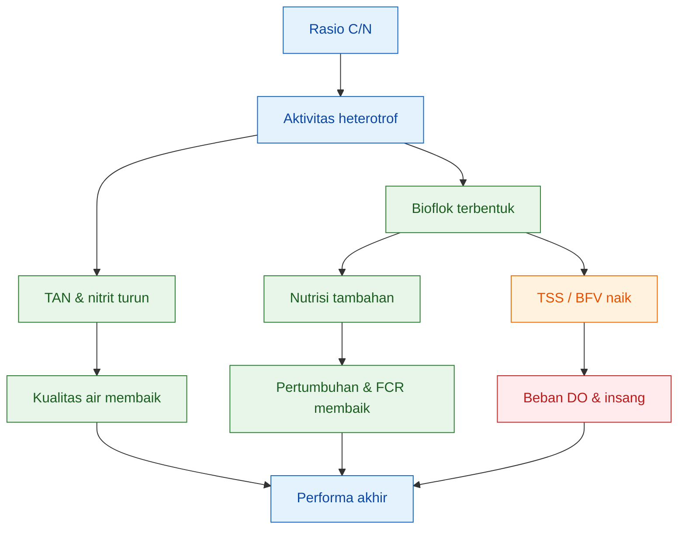
```mermaid id="sarker-cn-framework"
flowchart TD
    A["Rasio C/N"] --> B["Aktivitas heterotrof"]
    B --> C["TAN & nitrit turun"]
    B --> D["Bioflok terbentuk"]
    D --> E["Nutrisi tambahan"]
    D --> F["TSS / BFV naik"]
    C --> G["Kualitas air membaik"]
    E --> H["Pertumbuhan & FCR membaik"]
    F --> I["Beban DO & insang"]
    G --> J["Performa akhir"]
    H --> J
    I --> J

    classDef cn fill:#E3F2FD,stroke:#1565C0,color:#0D47A1,stroke-width:1px;
    classDef good fill:#E8F5E9,stroke:#2E7D32,color:#1B5E20,stroke-width:1px;
    classDef warn fill:#FFF3E0,stroke:#EF6C00,color:#E65100,stroke-width:1px;
    classDef risk fill:#FFEBEE,stroke:#C62828,color:#B71C1C,stroke-width:1px;

    class A,B cn;
    class C,D,E,G,H good;
    class F warn;
    class I risk;
    class J cn;
```

---

## 6.2 Data Inti Sarker

Data utama menunjukkan bahwa C/N 15:1 memberikan performa pertumbuhan dan efisiensi pakan terbaik.

| Parameter   |             Kontrol 10:1 |                     C/N 15:1 |                 C/N 21:1 |
| ----------- | -----------------------: | ---------------------------: | -----------------------: |
| TAN         | $1{,}50 \ \mathrm{mg/L}$ |     $0{,}32 \ \mathrm{mg/L}$ | $0{,}25 \ \mathrm{mg/L}$ |
| Bobot akhir |   $38{,}86 \ \mathrm{g}$ |   **$41{,}79 \ \mathrm{g}$** |   $37{,}69 \ \mathrm{g}$ |
| Weight gain |   $32{,}14 \ \mathrm{g}$ |   **$35{,}06 \ \mathrm{g}$** |   $30{,}94 \ \mathrm{g}$ |
| SGR         | $2{,}53\%/\mathrm{hari}$ | **$2{,}62\%/\mathrm{hari}$** | $2{,}47\%/\mathrm{hari}$ |
| FCR         |                 $2{,}15$ |                 **$1{,}35$** |                 $1{,}47$ |
| Survival    |              $93{,}51\%$ |              **$98{,}34\%$** |              $96{,}36\%$ |

Data ini memperlihatkan satu hal yang sangat penting: C/N 21:1 menghasilkan TAN lebih rendah daripada C/N 15:1, tetapi pertumbuhan dan FCR tidak lebih baik.

Secara sederhana:

$$
TAN_{21:1}
<
TAN_{15:1}
$$

Tetapi:

$$
\text{Growth}_{15:1}

>

\text{Growth}_{21:1}
$$

Dan:

$$
FCR_{15:1}
<
FCR_{21:1}
$$

Artinya:

$$
\text{TAN paling rendah}
\neq
\text{performa terbaik}
$$

---

## 6.3 Membaca TAN: C/N Tinggi Menurunkan TAN, tetapi Itu Baru Separuh Cerita

Dalam studi Sarker, TAN menurun ketika C/N meningkat. Ini sesuai dengan prinsip heterotrof: karbon tambahan mendorong bakteri mengambil TAN dan membentuk biomassa mikroba.

Secara mekanisme:

$$
\mathrm{TAN}
+
\text{karbon organik}
+
O_2
\rightarrow
\text{biomassa bakteri}
+
CO_2
+
H_2O
$$

Data TAN:

| Perlakuan    |                      TAN |
| ------------ | -----------------------: |
| Kontrol 10:1 | $1{,}50 \ \mathrm{mg/L}$ |
| C/N 12:1     | $0{,}46 \ \mathrm{mg/L}$ |
| C/N 15:1     | $0{,}32 \ \mathrm{mg/L}$ |
| C/N 18:1     | $0{,}29 \ \mathrm{mg/L}$ |
| C/N 21:1     | $0{,}25 \ \mathrm{mg/L}$ |

Jika hanya membaca tabel TAN, praktisi mungkin menyimpulkan:

$$
C/N\ 21:1
=

\text{terbaik}
$$

Tetapi kesimpulan itu salah jika tidak membaca indikator lain.

Mengapa? Karena penurunan TAN dibayar dengan peningkatan padatan.

$$
\text{TAN turun}
\rightarrow
\text{biomassa mikroba naik}
\rightarrow
\text{TSS/BFV naik}
$$

Dalam bioflok, nitrogen tidak hilang begitu saja. Sebagian dikonversi menjadi biomassa mikroba. Biomassa ini bisa menjadi pakan tambahan jika aktif dan termakan, tetapi bisa menjadi beban jika terlalu banyak.

---

## 6.4 Membaca TSS dan BFV: Ketika Flok Berubah dari Aset menjadi Beban

Sarker menunjukkan bahwa peningkatan C/N meningkatkan biofloc volume dan TSS. Pada minggu ke-10, TSS C/N 15:1 sekitar:

$$
606{,}05 \ \mathrm{mg/L}
$$

Sedangkan pada C/N 21:1 sekitar:

$$
1001{,}03 \ \mathrm{mg/L}
$$

Biofloc volume pada minggu ke-10 juga meningkat dari C/N 15:1 ke C/N 21:1. C/N 15:1 sekitar:

$$
4{,}18 \ \mathrm{mL/L}
$$

Sedangkan C/N 21:1 sekitar:

$$
12{,}48 \ \mathrm{mL/L}
$$

Ini menunjukkan bahwa C/N tinggi mempercepat pembentukan flok dan padatan.

Secara proses:

$$
C/N \uparrow
\rightarrow
\text{heterotrof} \uparrow
\rightarrow
\text{TAN} \downarrow
+
\text{TSS} \uparrow
+
\text{BFV} \uparrow
$$

Masalahnya, TSS tinggi tidak selalu berarti pakan alami lebih baik. Pada titik tertentu, TSS tinggi dapat:

- meningkatkan konsumsi oksigen mikroba,
- mengganggu insang,
- menurunkan kenyamanan ikan,
- menurunkan visibilitas pakan,
- meningkatkan sludge,
- menaikkan risiko zona anaerob.

Maka ada dua fase nilai flok:

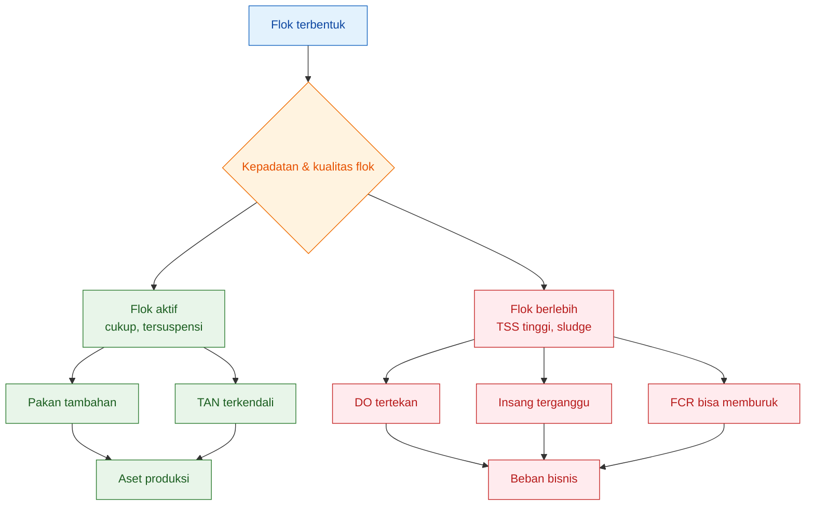
```mermaid id="flok-asset-risk"
flowchart TD
    A["Flok terbentuk"] --> B{"Kepadatan & kualitas flok"}
    B --> C["Flok aktif<br/>cukup, tersuspensi"]
    B --> D["Flok berlebih<br/>TSS tinggi, sludge"]
    C --> E["Pakan tambahan"]
    C --> F["TAN terkendali"]
    D --> G["DO tertekan"]
    D --> H["Insang terganggu"]
    D --> I["FCR bisa memburuk"]
    E --> J["Aset produksi"]
    F --> J
    G --> K["Beban bisnis"]
    H --> K
    I --> K

    classDef base fill:#E3F2FD,stroke:#1565C0,color:#0D47A1,stroke-width:1px;
    classDef good fill:#E8F5E9,stroke:#2E7D32,color:#1B5E20,stroke-width:1px;
    classDef bad fill:#FFEBEE,stroke:#C62828,color:#B71C1C,stroke-width:1px;
    classDef decision fill:#FFF3E0,stroke:#EF6C00,color:#E65100,stroke-width:1px;

    class A base;
    class B decision;
    class C,E,F,J good;
    class D,G,H,I,K bad;
```

Kesimpulan praktis:

$$
\text{flok cukup}
=

\text{aset}
$$

$$
\text{flok berlebih}
=

\text{beban}
$$

---

## 6.5 Mengapa C/N 15:1 Memberi Pertumbuhan Terbaik

C/N 15:1 memberikan bobot akhir, weight gain, SGR, survival, dan FCR terbaik dalam studi Sarker. Ini menunjukkan bahwa C/N 15:1 berada di zona keseimbangan.

Pada C/N 10:1, karbon tidak cukup untuk mendorong heterotrof secara optimal. Akibatnya TAN lebih tinggi dan FCR lebih buruk.

$$
C/N\ 10:1
\rightarrow
\text{karbon relatif kurang}
\rightarrow
\text{TAN tinggi}
\rightarrow
FCR\ 2{,}15
$$

Pada C/N 15:1, karbon cukup untuk mendorong heterotrof dan membentuk flok, tetapi belum terlalu tinggi sehingga padatan menjadi beban berat.

$$
C/N\ 15:1
\rightarrow
\text{TAN terkendali}
+
\text{flok cukup}
+
\text{FCR terbaik}
+
\text{growth terbaik}
$$

Pada C/N 21:1, TAN lebih rendah, tetapi padatan lebih tinggi dan pertumbuhan menurun.

$$
C/N\ 21:1
\rightarrow
\text{TAN sangat rendah}
+
\text{TSS tinggi}
+
\text{growth turun}
$$

Dengan kata lain, C/N 15:1 menjadi titik optimum karena berada di antara dua risiko:

$$
\text{risiko C/N rendah}
=

\text{nitrogen toksik}
$$

$$
\text{risiko C/N tinggi}
=

\text{beban padatan}
$$

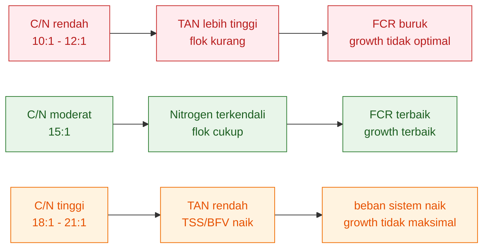
```mermaid id="cn-balance-sarker"
flowchart LR
    A["C/N rendah<br/>10:1 - 12:1"] --> B["TAN lebih tinggi<br/>flok kurang"]
    B --> C["FCR buruk<br/>growth tidak optimal"]

    D["C/N moderat<br/>15:1"] --> E["Nitrogen terkendali<br/>flok cukup"]
    E --> F["FCR terbaik<br/>growth terbaik"]

    G["C/N tinggi<br/>18:1 - 21:1"] --> H["TAN rendah<br/>TSS/BFV naik"]
    H --> I["beban sistem naik<br/>growth tidak maksimal"]

    classDef low fill:#FFEBEE,stroke:#C62828,color:#B71C1C,stroke-width:1px;
    classDef opt fill:#E8F5E9,stroke:#2E7D32,color:#1B5E20,stroke-width:1px;
    classDef high fill:#FFF3E0,stroke:#EF6C00,color:#E65100,stroke-width:1px;

    class A,B,C low;
    class D,E,F opt;
    class G,H,I high;
```

---

## 6.6 Membaca FCR dalam Studi Sarker

Sarker menghitung FCR sebagai:

$$
FCR
=

\frac{
\text{total feed consumption}
}{
\text{total body weight gain}
}
$$

Nilai FCR terbaik adalah C/N 15:1:

$$
FCR_{15:1} = 1{,}35
$$

Sedangkan kontrol:

$$
FCR_{10:1} = 2{,}15
$$

C/N 21:1:

$$
FCR_{21:1} = 1{,}47
$$

Penurunan FCR dari kontrol ke C/N 15:1 adalah:

$$
\Delta FCR
=

2{,}15

1{,}35
$$

$$
\Delta FCR
=

0{,}80
$$

Secara persentase terhadap kontrol:

$$
\text{penurunan FCR}
=

\frac{2{,}15 - 1{,}35}{2{,}15}
\times
100\%
$$

$$
\text{penurunan FCR}
=

37{,}21\%
$$

Ini besar secara bisnis.

Jika harga pakan adalah $P$ per kg, maka biaya pakan per kg pertambahan biomassa adalah:

$$
\text{biaya pakan/kg gain}
=

FCR
\times
P
$$

Jika $P = 12{,}000 \ \mathrm{Rp/kg}$, maka:

Kontrol:

$$
2{,}15
\times
12{,}000
=

25{,}800 \ \mathrm{Rp/kg\ gain}
$$

C/N 15:1:

$$
1{,}35
\times
12{,}000
=

16{,}200 \ \mathrm{Rp/kg\ gain}
$$

Selisih:

$$
25{,}800
-

16{,}200

9{,}600 \ \mathrm{Rp/kg\ gain}
$$

Ini belum menghitung biaya molase, aerasi, dan tenaga. Tetapi secara sinyal bisnis, FCR 1,35 pada C/N 15:1 jauh lebih menarik dibanding kontrol.

Namun, Sarker tidak menunjukkan FCR di bawah 1. Jadi kesimpulan yang aman adalah:

$$
\text{C/N 15:1 memperbaiki FCR}
$$

Bukan:

$$
\text{bioflok selalu menghasilkan FCR} < 1
$$

---

## 6.7 Membaca Hematologi: C/N 15:1 Bukan Hanya Soal Pertumbuhan

Sarker juga mengukur parameter hematologi seperti hemoglobin, RBC, WBC, dan hematokrit. Hasilnya, perlakuan C/N 15:1 menunjukkan parameter hematologi terbaik dibanding perlakuan lain.

Ini penting karena bisnis budidaya tidak hanya membutuhkan ikan tumbuh cepat, tetapi juga ikan yang tidak mudah stres dan tidak rentan terhadap masalah kesehatan.

Secara interpretasi:

$$
\text{kualitas air stabil}
+
\text{flok cukup}
+
\text{beban padatan tidak berlebih}
\rightarrow
\text{kondisi fisiologis lebih baik}
$$

Parameter hematologi dapat dibaca sebagai sinyal bahwa ikan berada dalam kondisi fisiologis yang lebih baik. Misalnya:

- hemoglobin berkaitan dengan kapasitas transport oksigen,
- RBC berkaitan dengan status darah dan transport oksigen,
- WBC berkaitan dengan respons imun,
- hematokrit berkaitan dengan kondisi darah secara umum.

Namun, perlu hati-hati. Sarker tidak membuktikan semua mekanisme molekuler imunitas. Jadi kalimat yang akurat adalah:

$$
C/N\ 15:1
\rightarrow
\text{parameter hematologi lebih baik dalam studi ini}
$$

Bukan:

$$
C/N\ 15:1
\rightarrow
\text{pasti meningkatkan semua mekanisme imun}
$$

---

## 6.8 Membaca Komunitas Mikroba: C/N Menggeser Dominansi

Sarker juga melaporkan bahwa dominansi _Vibrio_ menurun ketika C/N meningkat. Pada kontrol, _Vibrio_ menjadi kelompok dominan. Ketika C/N meningkat, dominansi _Vibrio_ menurun, sedangkan kelompok heterotrof seperti _Bacillus_ cenderung meningkat.

Ini relevan secara praktis karena komunitas mikroba dalam bioflok bukan hanya berfungsi sebagai pengolah nitrogen, tetapi juga ikut membentuk ekologi kesehatan sistem.

Secara sederhana:

$$
C/N \uparrow
\rightarrow
\text{heterotrof kompetitif} \uparrow
\rightarrow
\text{dominansi Vibrio} \downarrow
$$

Namun, sekali lagi, ini harus dibaca hati-hati. Turunnya dominansi _Vibrio_ dalam studi Sarker bukan berarti semua _Vibrio_ hilang atau risiko penyakit menjadi nol. Ini menunjukkan pergeseran komunitas mikroba ke arah yang lebih menguntungkan dalam kondisi eksperimen tersebut.

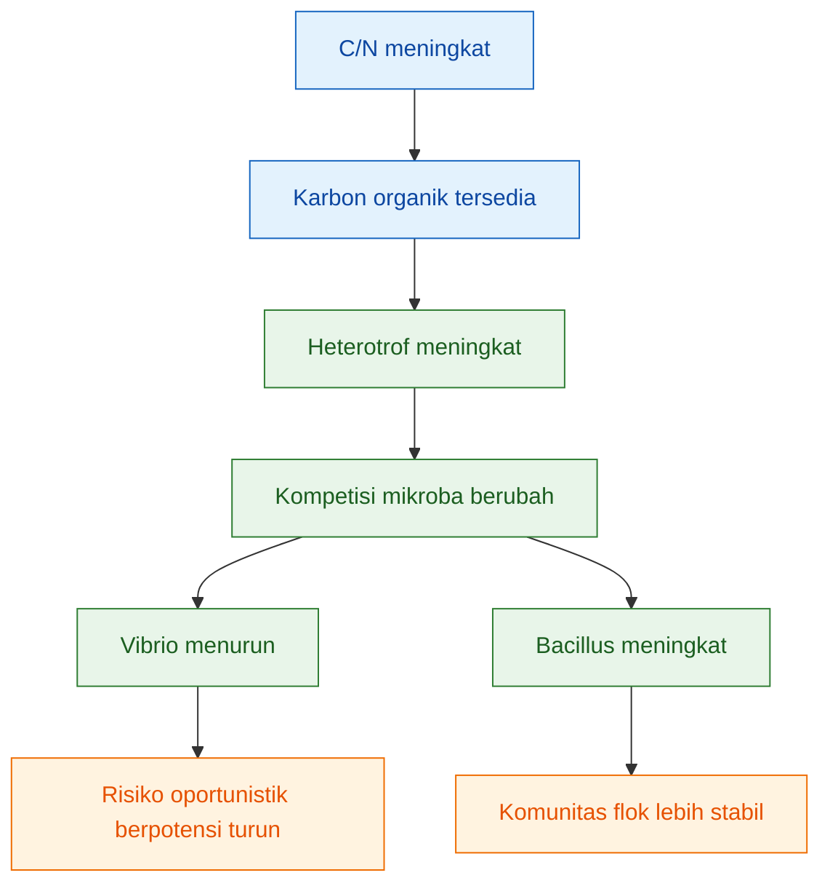
```mermaid id="microbial-shift-sarker"
flowchart TD
    A["C/N meningkat"] --> B["Karbon organik tersedia"]
    B --> C["Heterotrof meningkat"]
    C --> D["Kompetisi mikroba berubah"]
    D --> E["Vibrio menurun"]
    D --> F["Bacillus meningkat"]
    E --> G["Risiko oportunistik berpotensi turun"]
    F --> H["Komunitas flok lebih stabil"]

    classDef cn fill:#E3F2FD,stroke:#1565C0,color:#0D47A1,stroke-width:1px;
    classDef microbe fill:#E8F5E9,stroke:#2E7D32,color:#1B5E20,stroke-width:1px;
    classDef effect fill:#FFF3E0,stroke:#EF6C00,color:#E65100,stroke-width:1px;

    class A,B cn;
    class C,D,E,F microbe;
    class G,H effect;
```

---

## 6.9 Mengapa C/N 21:1 Tidak Menang Walau TAN Lebih Rendah

Ini adalah pelajaran paling penting dari Sarker.

C/N 21:1 menghasilkan TAN:

$$
0{,}25 \ \mathrm{mg/L}
$$

C/N 15:1 menghasilkan TAN:

$$
0{,}32 \ \mathrm{mg/L}
$$

Secara nitrogen, C/N 21:1 tampak lebih baik.

Tetapi bobot akhir C/N 21:1:

$$
37{,}69 \ \mathrm{g}
$$

Sedangkan C/N 15:1:

$$
41{,}79 \ \mathrm{g}
$$

Selisih bobot akhir:

$$
41{,}79
-

37{,}69

4{,}10 \ \mathrm{g}
$$

Secara persentase terhadap C/N 21:1:

$$
\frac{4{,}10}{37{,}69}
\times
100\%
=

10{,}88\%
$$

Artinya, C/N 15:1 menghasilkan bobot akhir sekitar 10,88% lebih tinggi daripada C/N 21:1 dalam studi ini.

Maka, jika praktisi hanya mengejar TAN rendah, ia bisa memilih C/N 21:1. Tetapi jika mengejar pertumbuhan dan FCR, C/N 15:1 lebih unggul.

Secara bisnis:

$$
\text{TAN lebih rendah}
\neq
\text{biomassa panen lebih tinggi}
$$

Yang dibutuhkan adalah:

$$
\text{TAN cukup rendah}
+
\text{TSS tidak berlebihan}
+
\text{ikan makan baik}
+
\text{FCR rendah}
$$

---

## 6.10 Interpretasi Bisnis dari Studi Sarker

Sarker memberi tiga pesan bisnis utama.

### Pertama, C/N 15:1 adalah titik kerja yang kuat untuk nila bioflok

Dalam kondisi studi Sarker, C/N 15:1 menghasilkan:

$$
\text{bobot akhir tertinggi}
+
\text{weight gain tertinggi}
+
\text{SGR tertinggi}
+
\text{FCR terendah}
+
\text{survival tertinggi}
+
\text{hematologi terbaik}
$$

Maka untuk praktisi, C/N 15:1 layak dipakai sebagai titik awal desain, terutama pada fase fingerling/pembesaran awal.

$$
C/N\ 15:1
\rightarrow
\text{starting point praktis}
$$

Bukan:

$$
C/N\ 15:1
\rightarrow
\text{angka mutlak semua kondisi}
$$

### Kedua, C/N tinggi harus dikendalikan dengan manajemen padatan

C/N tinggi meningkatkan bioflok dan TSS. Jika sistem tidak punya strategi settling, siphon, atau kontrol padatan, C/N tinggi dapat mengubah flok menjadi beban.

$$
C/N \uparrow
\rightarrow
TSS \uparrow
\rightarrow
\text{beban DO dan insang} \uparrow
$$

### Ketiga, indikator bisnis harus lebih luas daripada TAN

Dalam studi Sarker, keputusan terbaik tidak datang dari parameter TAN saja, tetapi dari kombinasi:

$$
\text{TAN}
+
\text{TSS}
+
\text{growth}
+
FCR
+
\text{survival}
+
\text{hematologi}
+
\text{mikroba}
$$

Dengan kata lain:

$$
\text{keputusan bisnis}
\neq
\text{keputusan amonia saja}
$$

---

## 6.11 Kesimpulan Operasional dari Sarker

Kesimpulan operasional yang aman dari studi Sarker adalah:

$$
C/N\ 15:1
\rightarrow
\text{nitrogen terkendali}
+
\text{flok cukup}
+
FCR\ \text{terbaik}
+
\text{pertumbuhan terbaik}
+
\text{hematologi terbaik}
$$

Sedangkan:

$$
C/N\ \text{terlalu tinggi}
\rightarrow
\text{TAN rendah}
+
\text{TSS/BFV meningkat}
+
\text{beban sistem meningkat}
$$

Maka, untuk praktisi:

> Jangan mengejar C/N tinggi hanya karena ingin TAN lebih rendah. Kejar titik keseimbangan antara nitrogen terkendali, flok aktif, padatan tidak berlebih, DO aman, FCR rendah, dan pertumbuhan cepat.

Sarker mengajarkan bahwa bioflok yang baik bukan bioflok yang paling pekat, tetapi bioflok yang paling produktif.

$$
\text{bioflok produktif}
=

\text{flok cukup}
+
\text{air stabil}
+
\text{ikan tumbuh cepat}
+
\text{FCR rendah}
$$

[Kembali ke Atas](#bioflok-nila-berbasis-neraca-mikroba-cn-ratio-protein-pakan-tan-fcr-dan-keputusan-bisnis)

---

# 7. Studi Debnath: Protein Pakan Bisa Diturunkan, tetapi C/N Benar Saja Tidak Cukup

Studi Debnath et al. penting karena menjawab pertanyaan yang sangat dekat dengan keputusan bisnis:

> Jika sistem bioflok sudah dijalankan pada C/N 15:1, apakah protein pakan masih perlu tinggi?

Pertanyaan ini kritis karena protein adalah komponen mahal dalam pakan. Jika protein pakan bisa diturunkan tanpa menurunkan pertumbuhan dan kesehatan ikan, biaya produksi berpotensi turun. Tetapi jika protein diturunkan terlalu jauh, pertumbuhan jatuh, FCR memburuk, siklus panen lebih panjang, dan penghematan pakan berubah menjadi kerugian.

Debnath tidak mencari C/N terbaik. Mereka **mengunci sistem pada C/N 15:1**, lalu menguji kadar protein pakan:

$$
CP = 32\%,\ 28\%,\ 24\%,\ 20\%,\ 16\%
$$

Sistem yang digunakan adalah bioflok skala kecil tanpa solid management. Ini membuat artikel Debnath sangat berguna untuk praktisi karena banyak unit bioflok kecil memang tidak memiliki sistem pengelolaan padatan yang rapi.

---

## 7.1 Pertanyaan yang Dijawab Debnath

Debnath et al. menjawab pertanyaan berikut:

> Pada sistem bioflok C/N 15:1, sampai berapa kadar protein pakan dapat diturunkan tanpa mengorbankan pertumbuhan, komposisi tubuh, dan hematologi nila?

Ini berbeda dari studi Sarker.

Sarker bertanya:

$$
\text{C/N ratio berapa yang paling seimbang?}
$$

Debnath bertanya:

$$
\text{Jika C/N sudah 15:1, protein pakan bisa diturunkan sampai berapa?}
$$

Dengan demikian, posisi Debnath dalam artikel ini adalah sebagai jembatan antara **C/N ratio** dan **formulasi pakan**.

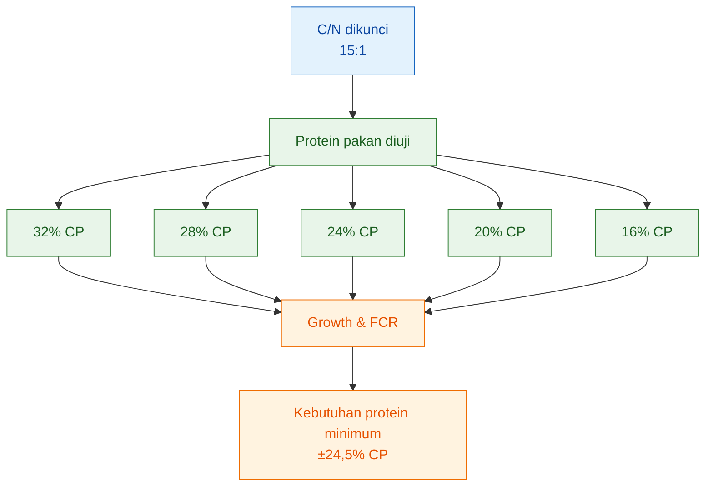
```mermaid id="debnath-position"
flowchart TD
    A["C/N dikunci<br/>15:1"] --> B["Protein pakan diuji"]
    B --> C["32% CP"]
    B --> D["28% CP"]
    B --> E["24% CP"]
    B --> F["20% CP"]
    B --> G["16% CP"]
    C --> H["Growth & FCR"]
    D --> H
    E --> H
    F --> H
    G --> H
    H --> I["Kebutuhan protein minimum<br/>±24,5% CP"]

    classDef cn fill:#E3F2FD,stroke:#1565C0,color:#0D47A1,stroke-width:1px;
    classDef protein fill:#E8F5E9,stroke:#2E7D32,color:#1B5E20,stroke-width:1px;
    classDef result fill:#FFF3E0,stroke:#EF6C00,color:#E65100,stroke-width:1px;

    class A cn;
    class B,C,D,E,F,G protein;
    class H,I result;
```

Debnath menggunakan nila GIFT dengan bobot awal sekitar:

$$
40{,}82 \ \mathrm{g}
$$

Ikan dipelihara selama 13 minggu pada tangki bioflok volume efektif 300 L, dengan padat tebar:

$$
65 \ \mathrm{ikan/m^3}
$$

Semua tangki dijaga pada C/N 15:1 dengan penambahan sumber karbon berupa brown sugar.

---

## 7.2 Data Inti Debnath

Hasil utama Debnath menunjukkan bahwa pakan 32%, 28%, dan 24% CP menghasilkan pertumbuhan yang relatif setara dan lebih baik daripada 20% dan 16% CP.

| Protein pakan |            Bobot akhir |          FCR | Makna                           |
| ------------- | ---------------------: | -----------: | ------------------------------- |
| 32% CP        | $88{,}01 \ \mathrm{g}$ |     $2{,}90$ | Tidak berbeda nyata dari 28–24% |
| 28% CP        | $86{,}11 \ \mathrm{g}$ |     $2{,}94$ | Masih baik                      |
| 24% CP        | $85{,}66 \ \mathrm{g}$ | **$2{,}83$** | Paling efisien secara praktis   |
| 20% CP        | $77{,}27 \ \mathrm{g}$ |     $3{,}69$ | Mulai defisit                   |
| 16% CP        | $71{,}00 \ \mathrm{g}$ |     $4{,}43$ | Terlalu rendah                  |

Model linear plateau dalam artikel memperkirakan kebutuhan protein minimum untuk mencapai pertumbuhan maksimum sekitar:

$$
CP_{\text{minimum}}
=

24{,}5\%
$$

Dengan kata lain, pada sistem Debnath:

$$
32\% \ CP
\rightarrow
\text{bisa diturunkan ke sekitar}
\ 24{,}5\% \ CP
$$

tanpa mengorbankan pertumbuhan maksimum berdasarkan model tersebut.

---

## 7.3 Makna Biologis: Bioflok Menyumbang Nutrisi, tetapi Tidak Menghapus Kebutuhan Protein Pakan

Dalam sistem bioflok, ikan tidak hanya mendapatkan nutrisi dari pelet. Ikan juga dapat memanfaatkan bioflok sebagai sumber nutrisi tambahan.

Secara konsep:

$$
\text{pertumbuhan ikan}
=

\text{nutrisi dari pakan}
+
\text{nutrisi dari bioflok}
$$

Bioflok dalam studi Debnath memiliki kandungan rata-rata:

$$
CP_{\text{flok}}
\approx
28{,}82\%
$$

Kandungan lipid rata-rata:

$$
\text{lipid}_{\text{flok}}
\approx
5{,}31\%
$$

Kandungan abu rata-rata:

$$
\text{ash}_{\text{flok}}
\approx
19{,}43\%
$$

Komposisi flok tidak berbeda nyata antar perlakuan protein pakan. Artinya, dalam studi ini, kualitas proksimat bioflok relatif stabil meskipun protein pakan berbeda.

Ini membantu menjelaskan mengapa pakan 24% CP masih mampu mendukung pertumbuhan yang setara dengan 28% dan 32% CP. Bioflok kemungkinan menyumbang sebagian nutrisi, sehingga kebutuhan protein dari pelet dapat dikurangi.

Namun, bioflok tidak menghapus kebutuhan protein pakan.

Ketika protein pakan turun ke 20% dan 16% CP, performa ikan menurun. Ini menunjukkan bahwa kontribusi bioflok memiliki batas.

$$
\text{bioflok}
\neq
\text{pengganti total protein pakan}
$$

Lebih tepat:

$$
\text{bioflok}
=

\text{suplemen nutrisi}
+
\text{pendaur ulang nitrogen}
$$

---

## 7.4 Mengapa 24–28% CP Lebih Masuk Akal daripada 32% CP

Dalam studi Debnath, 32% CP tidak memberikan keunggulan pertumbuhan yang nyata dibanding 28% dan 24% CP. Ini penting untuk bisnis.

Jika hasil pertumbuhan tidak berbeda nyata, maka protein berlebih dapat menjadi biaya yang tidak efisien.

Secara konsep:

$$
\text{protein pakan lebih tinggi}
\rightarrow
\text{biaya pakan lebih tinggi}
$$

Tetapi jika pertumbuhan tidak naik sebanding:

$$
\text{protein lebih tinggi}
\nrightarrow
\text{laba lebih tinggi}
$$

Pada sistem bioflok C/N 15:1, pakan 24–28% CP menjadi lebih rasional karena:

1. pertumbuhan masih setara dengan 32% CP,
2. FCR tidak lebih buruk daripada 32% CP,
3. protein pakan lebih rendah berpotensi menurunkan biaya formulasi,
4. beban nitrogen dari pakan juga lebih rendah.

Secara nitrogen:

$$
N_{\text{pakan}}
=

\text{Feed}
\times
CP
\times
0{,}16
$$

Jika jumlah pakan sama, maka pakan 32% CP memasukkan nitrogen lebih besar daripada pakan 24% CP.

Perbandingan nitrogen per 1 kg pakan:

Untuk 32% CP:

$$
N_{32}
=

1{,}000
\times
0{,}32
\times
0{,}16
$$

$$
N_{32}
=

51{,}2 \ \mathrm{g \ N}
$$

Untuk 24% CP:

$$
N_{24}
=

1{,}000
\times
0{,}24
\times
0{,}16
$$

$$
N_{24}
=

38{,}4 \ \mathrm{g \ N}
$$

Selisih nitrogen:

$$
51{,}2
-

38{,}4

12{,}8 \ \mathrm{g \ N/kg \ pakan}
$$

Penurunan beban nitrogen:

$$
\frac{
12{,}8
}{
51{,}2
}
\times
100\%
=

25\%
$$

Artinya, menurunkan pakan dari 32% CP ke 24% CP dapat menurunkan beban nitrogen pakan sekitar 25% per kg pakan.

Ini penting karena nitrogen yang lebih rendah dapat mengurangi beban TAN, kebutuhan karbon, kebutuhan oksigen mikroba, dan potensi padatan.

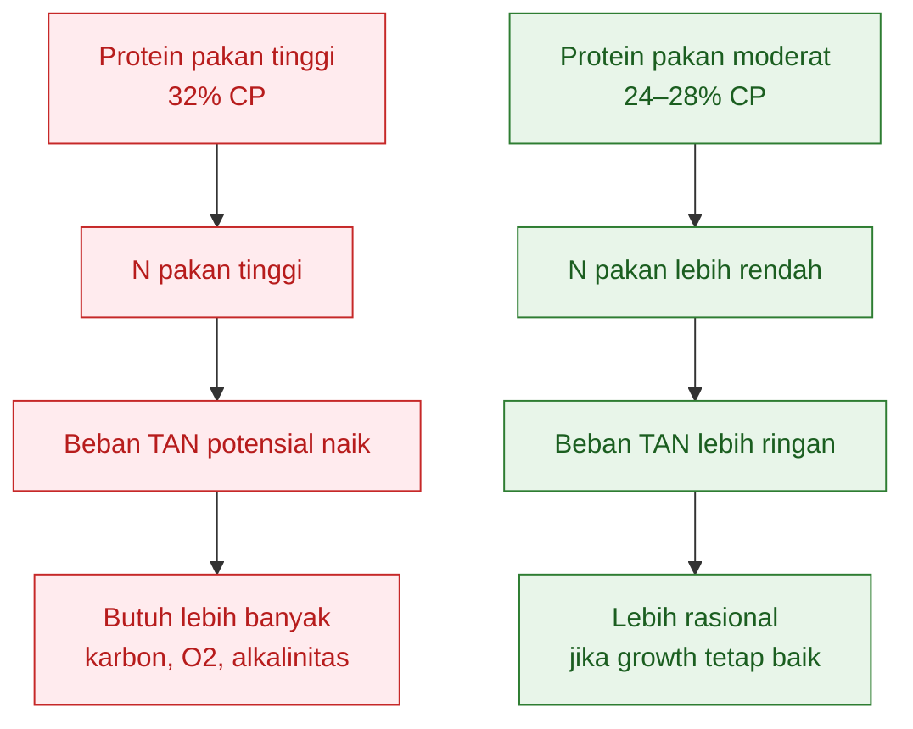
```mermaid id="protein-nitrogen-debnath"
flowchart TD
    A["Protein pakan tinggi<br/>32% CP"] --> B["N pakan tinggi"]
    B --> C["Beban TAN potensial naik"]
    C --> D["Butuh lebih banyak<br/>karbon, O2, alkalinitas"]

    E["Protein pakan moderat<br/>24–28% CP"] --> F["N pakan lebih rendah"]
    F --> G["Beban TAN lebih ringan"]
    G --> H["Lebih rasional<br/>jika growth tetap baik"]

    classDef high fill:#FFEBEE,stroke:#C62828,color:#B71C1C,stroke-width:1px;
    classDef mid fill:#E8F5E9,stroke:#2E7D32,color:#1B5E20,stroke-width:1px;
    classDef process fill:#FFF3E0,stroke:#EF6C00,color:#E65100,stroke-width:1px;

    class A,B,C,D high;
    class E,F,G,H mid;
```

---

## 7.5 Mengapa 20% dan 16% CP Terlalu Rendah

Debnath menunjukkan bahwa penurunan protein ke 20% dan 16% CP menurunkan performa.

Bobot akhir pada 24% CP:

$$
85{,}66 \ \mathrm{g}
$$

Bobot akhir pada 20% CP:

$$
77{,}27 \ \mathrm{g}
$$

Selisih:

$$
85{,}66 - 77{,}27 = 8{,}39 \ \mathrm{g}
$$

Penurunan terhadap 24% CP:

$$
\frac{8{,}39}{85{,}66}
\times
100\%
=

9{,}79\%
$$

Bobot akhir pada 16% CP:

$$
71{,}00 \ \mathrm{g}
$$

Selisih terhadap 24% CP:

$$
85{,}66 - 71{,}00 = 14{,}66 \ \mathrm{g}
$$

Penurunan terhadap 24% CP:

$$
\frac{14{,}66}{85{,}66}
\times
100\%
=

17{,}11\%
$$

Secara bisnis, penurunan bobot akhir ini berarti:

$$
\text{panen lebih kecil}
+
\text{siklus lebih panjang}
+
\text{biaya listrik lebih lama}
+
\text{risiko produksi lebih lama}
$$

FCR juga memburuk.

FCR 24% CP:

$$
2{,}83
$$

FCR 20% CP:

$$
3{,}69
$$

Kenaikan FCR:

$$
3{,}69 - 2{,}83 = 0{,}86
$$

Persentase kenaikan:

$$
\frac{0{,}86}{2{,}83}
\times
100\%
=

30{,}39\%
$$

FCR 16% CP:

$$
4{,}43
$$

Kenaikan terhadap 24% CP:

$$
4{,}43 - 2{,}83 = 1{,}60
$$

Persentase kenaikan:

$$
\frac{1{,}60}{2{,}83}
\times
100\%
=

56{,}54\%
$$

Maka penghematan protein di bawah batas biologis justru merusak efisiensi.

$$
\text{protein terlalu rendah}
\rightarrow
\text{growth turun}
+
FCR \text{ naik}
+
\text{margin turun}
$$

Ini pelajaran besar dari Debnath: **mengurangi protein pakan boleh, tetapi bukan serendah mungkin**.

---

## 7.6 Kualitas Air: C/N 15:1 Menjaga Sistem Tetap Aman, tetapi Tidak Menjamin FCR Rendah

Dalam studi Debnath, parameter kualitas air tidak berbeda nyata antar perlakuan protein pakan. Nilainya tetap berada dalam kisaran yang dianggap sesuai untuk nila.

Data rata-rata kualitas air:

| Parameter |             Kisaran dalam perlakuan |
| --------- | ----------------------------------: |
| pH        |                   $8{,}27 - 8{,}34$ |
| DO        |   $5{,}15 - 5{,}27 \ \mathrm{mg/L}$ |
| TAN       |   $0{,}65 - 0{,}76 \ \mathrm{mg/L}$ |
| Nitrit    |   $0{,}10 - 0{,}14 \ \mathrm{mg/L}$ |
| Nitrat    | $15{,}81 - 19{,}25 \ \mathrm{mg/L}$ |

Ini menunjukkan bahwa sistem C/N 15:1 mampu menjaga kualitas air relatif stabil meskipun protein pakan berbeda.

Namun, FCR tetap relatif tinggi:

$$
FCR_{24\%}
=

2{,}83
$$

$$
FCR_{32\%}
=

2{,}90
$$

Ini penting. Air yang stabil belum tentu menghasilkan FCR rendah. Kualitas air adalah syarat dasar, tetapi bukan satu-satunya penentu efisiensi pakan.

FCR dipengaruhi oleh:

$$
FCR
=

f
\left(
\text{kualitas pakan},
\text{feeding rate},
\text{konsumsi flok},
\text{TSS},
\text{DO},
\text{ukuran ikan},
\text{padatan},
\text{kesehatan ikan}
\right)
$$

Dengan kata lain:

$$
\text{C/N benar}
\neq
\text{FCR otomatis rendah}
$$

---

## 7.7 Masalah Kunci: Tanpa Solid Management

Judul studi Debnath secara eksplisit menyebut sistem bioflok **without solid management system**. Ini sangat penting untuk interpretasi.

Debnath menunjukkan bahwa bioflok dapat mempertahankan kualitas air dan memungkinkan pengurangan protein pakan. Tetapi FCR yang relatif tinggi memberi sinyal bahwa sistem belum optimal dari sisi efisiensi produksi.

Penulis juga menyatakan bahwa pengelolaan padatan yang sesuai direkomendasikan untuk memastikan pertumbuhan optimal.

Secara proses:

$$
\text{C/N 15:1}
\rightarrow
\text{heterotrof aktif}
\rightarrow
\text{flok terbentuk}
$$

Tetapi jika padatan tidak dikelola:

$$
\text{flok}
\rightarrow
\text{TSS/sludge}
\rightarrow
\text{beban sistem}
$$

Ini bisa menyebabkan:

- visibilitas pakan turun,
- flok tidak termakan optimal,
- DO terbebani,
- energi ikan dipakai untuk adaptasi,
- FCR naik,
- pertumbuhan tidak maksimal.

```mermaid id="debnath-solid-management"
flowchart TD
    A["C/N 15:1"] --> B["Bioflok terbentuk"]
    B --> C["TAN terkendali"]
    B --> D["Nutrisi tambahan"]
    B --> E["Padatan bertambah"]
    E --> F{"Solid management?"}
    F --> G["Ada settling/siphon<br/>padatan terkendali"]
    F --> H["Tidak ada<br/>padatan menumpuk"]
    G --> I["Peluang FCR membaik"]
    H --> J["DO terbebani<br/>flok jadi beban"]
    J --> K["FCR tetap tinggi"]

    classDef good fill:#E8F5E9,stroke:#2E7D32,color:#1B5E20,stroke-width:1px;
    classDef neutral fill:#E3F2FD,stroke:#1565C0,color:#0D47A1,stroke-width:1px;
    classDef decision fill:#FFF3E0,stroke:#EF6C00,color:#E65100,stroke-width:1px;
    classDef risk fill:#FFEBEE,stroke:#C62828,color:#B71C1C,stroke-width:1px;

    class A,B,C,D neutral;
    class F decision;
    class G,I good;
    class E,H,J,K risk;
```

Pelajaran praktisnya:

$$
C/N\ 15:1
+
\text{protein tepat}
\quad
\text{masih belum cukup}
$$

Jika padatan tidak dikelola:

$$
\text{bioflok}
\rightarrow
\text{beban TSS}
\rightarrow
FCR \text{ bisa tetap tinggi}
$$

---

## 7.8 Hematologi dan Komposisi Tubuh: Protein Bisa Diturunkan tanpa Mengganggu Indikator Kesehatan

Debnath melaporkan bahwa kadar protein pakan tidak memberikan pengaruh signifikan terhadap komposisi tubuh ikan dan parameter hematologi.

Parameter hematologi seperti hemoglobin, WBC, RBC, hematokrit, dan parameter darah lain tidak berbeda nyata antar perlakuan protein.

Ini penting karena penurunan protein pakan tidak hanya dinilai dari pertumbuhan. Praktisi perlu tahu apakah ikan tetap sehat secara fisiologis.

Kesimpulan dari bagian ini:

$$
CP\ 24\% - 32\%
\rightarrow
\text{growth relatif baik}
+
\text{hematologi tidak terganggu}
$$

Tetapi:

$$
CP\ 20\% - 16\%
\rightarrow
\text{growth turun}
$$

Walaupun hematologi tidak berbeda nyata, pertumbuhan yang turun tetap menjadi masalah bisnis.

---

## 7.9 Membaca FCR Debnath secara Bisnis

FCR dalam Debnath relatif tinggi jika dibandingkan dengan Sarker dan Zablon. Tetapi perbandingan ini harus hati-hati karena ukuran ikan, sistem, durasi, dan manajemen berbeda.

Namun untuk keputusan bisnis, FCR Debnath tetap harus dibaca serius.

FCR 24% CP:

$$
2{,}83
$$

Jika harga pakan 24% CP adalah $P_{24}$, maka biaya pakan per kg gain:

$$
\text{biaya pakan/kg gain}
=

2{,}83
\times
P_{24}
$$

Jika pakan 32% CP memiliki harga $P_{32}$ dan FCR 2,90:

$$
\text{biaya pakan/kg gain}_{32}
=

2{,}90
\times
P_{32}
$$

Pakan 24% CP lebih menguntungkan hanya jika:

$$
2{,}83
\times
P_{24}
<
2{,}90
\times
P_{32}
$$

atau:

$$
\frac{P_{24}}{P_{32}}
<
\frac{2{,}90}{2{,}83}
$$

$$
\frac{P_{24}}{P_{32}}
<
1{,}0247
$$

Artinya, karena FCR 24% dan 32% hampir sama, pakan 24% CP hampir pasti lebih ekonomis jika harganya lebih murah. Tetapi itu hanya untuk biaya pakan. Praktisi tetap harus menghitung biaya listrik, karbon, tenaga, dan durasi panen.

Untuk membandingkan 24% CP dengan 20% CP:

Pakan 20% CP lebih murah belum tentu lebih baik. Syaratnya:

$$
3{,}69
\times
P_{20}
<
2{,}83
\times
P_{24}
$$

atau:

$$
\frac{P_{20}}{P_{24}}
<
\frac{2{,}83}{3{,}69}
$$

$$
\frac{P_{20}}{P_{24}}
<
0{,}767
$$

Artinya, pakan 20% CP harus lebih dari 23,3% lebih murah daripada pakan 24% CP hanya untuk menyamai biaya pakan per kg gain. Itu pun belum memperhitungkan pertumbuhan lebih lambat dan siklus panen lebih panjang.

Untuk 16% CP:

$$
4{,}43
\times
P_{16}
<
2{,}83
\times
P_{24}
$$

$$
\frac{P_{16}}{P_{24}}
<
\frac{2{,}83}{4{,}43}
$$

$$
\frac{P_{16}}{P_{24}}
<
0{,}639
$$

Artinya, pakan 16% CP harus lebih dari 36,1% lebih murah daripada pakan 24% CP untuk menyamai biaya pakan per kg gain. Dengan pertumbuhan yang jauh lebih rendah, risiko bisnisnya tetap besar.

Maka secara bisnis:

$$
24\% - 28\% \ CP
=

\text{zona rasional}
$$

$$
20\% - 16\% \ CP
=

\text{zona risiko}
$$

---

## 7.10 Hubungan Debnath dengan Sarker dan Zablon

Debnath tidak berdiri sendiri. Ia harus dibaca bersama Sarker dan Zablon.

### Hubungan dengan Sarker

Sarker menunjukkan bahwa C/N 15:1 adalah titik keseimbangan terbaik untuk kualitas air, pertumbuhan, FCR, survival, dan hematologi pada nila.

Debnath menggunakan C/N 15:1 sebagai platform tetap. Artinya, Debnath secara praktis menguji pertanyaan lanjutan:

$$
\text{Jika C/N 15:1 digunakan, protein pakan bisa diturunkan sampai berapa?}
$$

Jawaban Debnath:

$$
CP_{\text{minimum}}
\approx
24{,}5\%
$$

### Hubungan dengan Zablon

Zablon menunjukkan bahwa pada fry nila, bioflok C/N 20:1 dengan sumber karbon glukosa/molase dapat menghasilkan apparent FCR di bawah 1 dan protein pakan 22% CP masih efektif.

Namun Zablon menggunakan fry sangat kecil, sistem berbeda, dan ada siphon sludge mingguan. Debnath menggunakan ikan lebih besar dan sistem tanpa solid management.

Maka sintesisnya:

| Fase/sistem                                      | Rujukan | Implikasi                                 |
| ------------------------------------------------ | ------- | ----------------------------------------- |
| Fry/nursery dengan flok aktif dan sludge disifon | Zablon  | Protein 22% CP bisa efektif               |
| Fingerling/pembesaran awal pada C/N 15:1         | Debnath | Protein sekitar 24–28% CP lebih realistis |
| C/N optimum untuk nila pada kondisi Sarker       | Sarker  | C/N 15:1 menjadi titik awal kuat          |

Kesimpulan lintas studi:

$$
\text{semakin kecil ikan dan semakin aktif flok}
\rightarrow
\text{peluang protein pakan lebih rendah}
$$

Tetapi:

$$
\text{tanpa solid management}
\rightarrow
\text{FCR bisa tetap tinggi}
$$

---

## 7.11 Batas Interpretasi Debnath

Agar artikel ini tidak menyesatkan praktisi, batas bukti harus jelas.

Yang dapat disimpulkan langsung dari Debnath:

$$
\text{Pada BFT C/N 15:1, protein pakan dapat diturunkan ke sekitar 24,5\% CP}
$$

$$
\text{Protein 20\% dan 16\% CP menurunkan performa pertumbuhan}
$$

$$
\text{Kualitas air dan hematologi tidak berbeda nyata antar perlakuan protein}
$$

$$
\text{Solid management tetap direkomendasikan untuk performa optimal}
$$

Yang tidak boleh disimpulkan secara berlebihan:

$$
\text{Protein 24,5\% CP pasti terbaik di semua sistem bioflok}
$$

$$
\text{C/N 15:1 otomatis menghasilkan FCR rendah}
$$

$$
\text{Bioflok selalu bisa mengganti protein pakan tinggi}
$$

$$
\text{Sistem tanpa solid management aman untuk scale-up}
$$

Debnath memberi arah penting, tetapi praktisi tetap harus menguji pada kondisi lokal: ukuran ikan, padat tebar, kualitas pakan, sumber karbon, aerasi, suhu, dan manajemen padatan.

---

## 7.12 Kesimpulan Operasional dari Debnath

Kesimpulan operasional yang kuat dari Debnath adalah:

$$
C/N\ 15:1
+
CP\ 24\%-28\%
\rightarrow
\text{layak secara biologis}
$$

Protein pakan 32% CP tidak selalu diperlukan pada sistem bioflok nila jika flok aktif dan kualitas air stabil.

$$
CP\ 32\%
\rightarrow
\text{bisa diganti kisaran}
\ CP\ 24\%-28\%
$$

Tetapi protein tidak boleh diturunkan terlalu jauh.

$$
CP\ 20\%-16\%
\rightarrow
\text{pertumbuhan turun}
+
FCR \text{ memburuk}
$$

Dan C/N yang benar saja tidak cukup.

$$
C/N\ 15:1
+
\text{tanpa solid management}
\rightarrow
FCR \text{ bisa tetap tinggi}
$$

Maka rekomendasi praktisnya:

> Gunakan C/N 15:1 sebagai titik awal yang aman, pilih pakan 24–28% CP untuk efisiensi biaya, tetapi jangan mengabaikan TSS, BFV, DO subuh, dan sludge. Penghematan protein pakan hanya menjadi keuntungan jika pertumbuhan tetap cepat dan FCR tidak memburuk.

Debnath mengajarkan satu hal penting: **bioflok bisa menurunkan kebutuhan protein pakan, tetapi bioflok yang tidak dikelola padatannya dapat kehilangan keunggulan efisiensi.**

[Kembali ke Atas](#bioflok-nila-berbasis-neraca-mikroba-cn-ratio-protein-pakan-tan-fcr-dan-keputusan-bisnis)

---

# 8. Studi Zablon: FCR &lt; 1 Mungkin, tetapi Konteksnya Sangat Spesifik

Studi Zablon et al. penting karena menjadi contoh kuat bahwa bioflok dapat menghasilkan **apparent pellet FCR di bawah 1** pada nila. Namun, artikel ini juga harus dibaca dengan disiplin. Angka FCR di bawah 1 dalam studi ini tidak boleh langsung diterjemahkan menjadi “semua bioflok pasti FCR di bawah 1”.

Konteksnya sangat spesifik:

$$
\text{fry nila sangat kecil}
+
C/N\ 20:1
+
\text{sumber karbon glukosa/molase}
+
\text{bioflok aktif}
+
\text{sludge disifon mingguan}
$$

Maka, studi Zablon bukan pembenaran untuk klaim umum bahwa bioflok selalu menghasilkan FCR ekstrem. Studi ini lebih tepat dibaca sebagai bukti bahwa **dalam fase dan manajemen tertentu**, bioflok dapat sangat meningkatkan efisiensi pakan komersial.

---

## 8.1 Pertanyaan yang Dijawab Zablon

Zablon et al. menguji apakah bioflok dapat meningkatkan efisiensi pemanfaatan protein dan pertumbuhan pada **fry nila**.

Ikan yang digunakan sangat kecil, dengan bobot awal sekitar:

$$
0{,}07 \ \mathrm{g}
$$

Desain perlakuannya:

$$
CP = 22\%,\ 27\%,\ 35\%
$$

Sumber karbon:

$$
\text{glukosa}
\quad
\text{dan}
\quad
\text{molase}
$$

Target C/N:

$$
C/N = 20:1
$$

Kontrol:

$$
\text{non-BFT dengan pakan } 35\% \ CP
$$

Artinya, artikel ini tidak hanya membandingkan kadar protein pakan. Artikel ini juga membandingkan **sistem bioflok versus non-bioflok**, serta **sumber karbon glukosa versus molase**.

```mermaid id="zablon-design"
flowchart TD
    A["Fry nila<br/>±0,07 g"] --> B["Bioflok<br/>C/N 20:1"]
    A --> C["Kontrol<br/>non-BFT 35% CP"]

    B --> D["Glukosa"]
    B --> E["Molase"]

    D --> F["22% CP"]
    D --> G["27% CP"]
    D --> H["35% CP"]

    E --> I["22% CP"]
    E --> J["27% CP"]
    E --> K["35% CP"]

    classDef fish fill:#E3F2FD,stroke:#1565C0,color:#0D47A1,stroke-width:1px;
    classDef bft fill:#E8F5E9,stroke:#2E7D32,color:#1B5E20,stroke-width:1px;
    classDef control fill:#FFEBEE,stroke:#C62828,color:#B71C1C,stroke-width:1px;
    classDef protein fill:#FFF3E0,stroke:#EF6C00,color:#E65100,stroke-width:1px;

    class A fish;
    class B,D,E bft;
    class C control;
    class F,G,H,I,J,K protein;
```

Pertanyaan praktis dari studi ini adalah:

$$
\text{Apakah bioflok dapat membuat protein pakan lebih efisien pada fry nila?}
$$

Jawaban Zablon:

$$
\text{Ya, dalam kondisi eksperimen tersebut.}
$$

Tetapi jawaban itu harus dibatasi pada konteksnya.

---

## 8.2 Data Inti Zablon

Data utama menunjukkan bahwa bioflok menghasilkan FCR lebih rendah, SGR lebih tinggi, dan survival lebih baik dibanding kontrol non-BFT.

| Perlakuan              |               FCR |               SGR |   Survival |
| ---------------------- | ----------------: | ----------------: | ---------: |
| Bioflok glukosa        | $0{,}56 - 0{,}57$ | $3{,}52 - 3{,}59$ |    $>97\%$ |
| Bioflok molase         | $0{,}59 - 0{,}63$ | $3{,}49 - 3{,}56$ |    $>94\%$ |
| Kontrol non-BFT 35% CP |          $0{,}89$ |          $2{,}91$ | $74{,}7\%$ |

Bioflok glukosa mengandung protein sekitar:

$$
34\%
$$

Bioflok molase mengandung protein sekitar:

$$
31\%
$$

Artikel juga mencatat bahwa mikroorganisme seperti amoeboid, flagellate, ciliate, dan rotifer lebih melimpah pada unit bioflok dibanding kontrol. Ini penting karena pada fase fry, mikroorganisme kecil tersebut dapat menjadi pakan alami yang sangat relevan.

---

## 8.3 Mengapa FCR Bisa di Bawah 1?

FCR dalam artikel dihitung sebagai:

$$
FCR_{\text{artikel}}
=

\frac{
\text{pakan komersial yang dikonsumsi}
}{
\text{kenaikan bobot ikan}
}
$$

Dalam sistem non-bioflok, sumber nutrisi utama adalah pakan komersial.

Namun dalam bioflok, sumber nutrisi ikan menjadi dua:

$$
\text{nutrisi ikan}
=

\text{pakan komersial}
+
\text{bioflok}
$$

Karena bioflok tidak dihitung sebagai “pakan komersial” dalam rumus FCR, maka FCR yang muncul adalah **apparent pellet FCR**.

$$
FCR_{\text{apparent}}
=

\frac{
\text{pakan pelet}
}{
\text{kenaikan bobot dari pelet + flok}
}
$$

Jika ikan mendapatkan tambahan nutrisi dari flok, maka kenaikan bobot ikan bisa lebih besar dibanding kontribusi pelet saja. Akibatnya, FCR berbasis pelet dapat turun di bawah 1.

```mermaid id="apparent-fcr"
flowchart TD
    A["Pakan pelet"] --> C["Pertumbuhan ikan"]
    B["Bioflok<br/>mikroba + rotifer + ciliate"] --> C
    C --> D["Kenaikan bobot ikan"]

    E["Rumus FCR artikel"] --> F["Pelet / kenaikan bobot"]
    D --> F
    A --> F

    B --> G["Tidak dihitung<br/>sebagai pakan pelet"]

    classDef feed fill:#E3F2FD,stroke:#1565C0,color:#0D47A1,stroke-width:1px;
    classDef floc fill:#E8F5E9,stroke:#2E7D32,color:#1B5E20,stroke-width:1px;
    classDef result fill:#FFF3E0,stroke:#EF6C00,color:#E65100,stroke-width:1px;
    classDef note fill:#FFEBEE,stroke:#C62828,color:#B71C1C,stroke-width:1px;

    class A,E,F feed;
    class B floc;
    class C,D result;
    class G note;
```

Maka, FCR di bawah 1 tidak melanggar logika massa. Ikan bertambah bobot basah, sementara bobot basah ikan mengandung air. Selain itu, sebagian nutrisi berasal dari bioflok yang tidak masuk dalam pembilang FCR.

Secara sederhana:

$$
0{,}6 \ \mathrm{kg\ pelet}
+
\text{kontribusi bioflok}
\rightarrow
1 \ \mathrm{kg\ kenaikan\ bobot\ ikan}
$$

Maka:

$$
FCR_{\text{apparent}}
=

\frac{0{,}6}{1}

0{,}6
$$

Tetapi ini bukan berarti seluruh input sistem hanya $0{,}6 \ \mathrm{kg}$.

---

## 8.4 FCR &lt; 1 dalam Zablon Bukan Total Input FCR

Ini titik yang sangat penting untuk bisnis.

Dalam rumus FCR artikel, yang dihitung sebagai input hanya pakan komersial. Padahal sistem bioflok juga membutuhkan:

- glukosa atau molase,
- aerasi,
- energi listrik,
- inokulum mikroba atau air hijau awal,
- kerja siphon sludge,
- monitoring kualitas air,
- risiko operasional akibat padatan.

Maka FCR di bawah 1 dalam Zablon harus ditulis sebagai:

$$
FCR_{\text{apparent pellet}}
<
1
$$

Bukan:

$$
FCR_{\text{total input}}
<
1
$$

Untuk bisnis, rumus yang lebih jujur adalah:

$$
\text{biaya produksi/kg ikan}
=

\frac{
\text{biaya pelet}
+
\text{biaya karbon}
+
\text{biaya listrik}
+
\text{biaya tenaga}
+
\text{biaya manajemen sludge}
+
\text{biaya risiko}
}{
\text{kg ikan panen}
}
$$

Dengan kata lain:

$$
FCR_{\text{apparent rendah}}
\neq
\text{otomatis biaya produksi rendah}
$$

Namun, data Zablon tetap sangat bernilai karena menunjukkan bahwa bioflok mampu mengurangi ketergantungan fry terhadap pakan komersial.

---

## 8.5 Mengapa Fase Fry Sangat Penting?

Zablon menggunakan fry nila dengan bobot awal sekitar $0{,}07 \ \mathrm{g}$. Ini berbeda jauh dari studi Sarker dan Debnath.

Pada fase fry, ikan masih sangat kecil dan lebih mampu memanfaatkan partikel mikro, plankton, rotifer, ciliate, dan mikroorganisme kecil lain sebagai pakan alami.

Dalam sistem bioflok Zablon, mikroorganisme yang tercatat meliputi:

$$
\text{amoeboid}
+
\text{flagellate}
+
\text{ciliate}
+
\text{rotifer}
$$

Pada fase fry, organisme ini bukan sekadar “komunitas mikroba air”, tetapi dapat menjadi komponen pakan alami.

Secara konsep:

$$
\text{fry kecil}
+
\text{partikel mikro}
\rightarrow
\text{konsumsi flok tinggi}
$$

Sedangkan pada ikan yang lebih besar, kontribusi flok masih ada, tetapi pola konsumsi dan kebutuhan nutrisi berbeda.

Maka, hasil Zablon tidak boleh langsung diterapkan ke pembesaran tanpa uji.

$$
\text{hasil pada fry}
\neq
\text{otomatis sama pada grow-out}
$$

---

## 8.6 Mengapa C/N 20:1 Bisa Berhasil di Zablon?

Zablon memakai target:

$$
C/N = 20:1
$$

Ini lebih tinggi daripada titik terbaik Sarker:

$$
C/N = 15:1
$$

Apakah ini bertentangan? Tidak.

Konteksnya berbeda.

| Faktor      | Sarker                       | Zablon                               |
| ----------- | ---------------------------- | ------------------------------------ |
| Fase ikan   | Fingerling nila              | Fry nila sangat kecil                |
| C/N         | 10:1 sampai 21:1             | 20:1                                 |
| Fokus       | Mencari C/N terbaik          | Protein pakan dan sumber karbon      |
| FCR terbaik | $1{,}35$                     | $0{,}56 - 0{,}63$                    |
| Padatan     | C/N tinggi menaikkan TSS/BFV | Sludge disifon mingguan              |
| Peran flok  | Pakan tambahan               | Pakan alami sangat penting untuk fry |

C/N 20:1 pada Zablon berhasil karena sistemnya mendukung terbentuknya bioflok aktif dan padatan dikelola melalui siphon sludge mingguan.

Secara keputusan:

$$
C/N\ 20:1
+
\text{flok aktif}
+
\text{sludge siphoning}
+
\text{fase fry}
\rightarrow
\text{apparent FCR rendah}
$$

Tetapi jika C/N 20:1 diterapkan pada pembesaran tanpa solid management, hasilnya bisa berbeda.

$$
C/N\ 20:1
+
\text{tanpa kontrol TSS}
\rightarrow
\text{risiko padatan tinggi}
$$

```mermaid id="cn20-context"
flowchart TD
    A["C/N 20:1"] --> B{"Konteks sistem"}
    B --> C["Fry kecil<br/>flok mudah dimakan"]
    B --> D["Sludge disifon<br/>padatan terkendali"]
    B --> E["Aerasi cukup"]
    C --> F["Apparent FCR rendah"]
    D --> F
    E --> F

    B --> G["Grow-out tanpa<br/>solid management"]
    G --> H["TSS naik<br/>DO tertekan"]
    H --> I["FCR bisa memburuk"]

    classDef start fill:#E3F2FD,stroke:#1565C0,color:#0D47A1,stroke-width:1px;
    classDef good fill:#E8F5E9,stroke:#2E7D32,color:#1B5E20,stroke-width:1px;
    classDef risk fill:#FFEBEE,stroke:#C62828,color:#B71C1C,stroke-width:1px;
    classDef decision fill:#FFF3E0,stroke:#EF6C00,color:#E65100,stroke-width:1px;

    class A start;
    class B decision;
    class C,D,E,F good;
    class G,H,I risk;
```

---

## 8.7 Glukosa vs Molase: Sumber Karbon Mempengaruhi Kualitas Flok

Zablon membandingkan dua sumber karbon:

$$
\text{glukosa}
\quad
\text{dan}
\quad
\text{molase}
$$

FCR pada bioflok glukosa:

$$
0{,}56 - 0{,}57
$$

FCR pada bioflok molase:

$$
0{,}59 - 0{,}63
$$

Bioflok glukosa memiliki protein sekitar:

$$
34\%
$$

Bioflok molase sekitar:

$$
31\%
$$

Glukosa tampak menghasilkan bioflok dengan kandungan protein sedikit lebih tinggi dan FCR sedikit lebih rendah dalam studi ini.

Namun, untuk bisnis, glukosa belum tentu lebih baik secara ekonomi. Molase biasanya lebih murah dan lebih mudah diperoleh. Maka keputusan sumber karbon harus menghitung:

$$
\text{biaya karbon/kg ikan}
$$

Bukan hanya:

$$
\text{FCR terendah}
$$

Misalnya:

$$
\text{glukosa}
\rightarrow
\text{FCR sedikit lebih baik}
+
\text{biaya karbon mungkin lebih tinggi}
$$

$$
\text{molase}
\rightarrow
\text{FCR sedikit lebih tinggi}
+
\text{biaya karbon mungkin lebih rendah}
$$

Keputusan bisnisnya:

$$
\text{sumber karbon terbaik}
=

\frac{
\text{performa ikan}
}{
\text{biaya karbon + risiko operasional}
}
$$

---

## 8.8 Protein Pakan 22% Bisa Berhasil, tetapi Jangan Salah Terapkan

Salah satu temuan menarik Zablon adalah bahwa protein pakan 22% CP dalam bioflok dapat menghasilkan performa baik pada fry nila.

Namun, kesimpulan ini harus dibatasi:

$$
22\% \ CP
\rightarrow
\text{berhasil pada fry dalam BFT Zablon}
$$

Bukan:

$$
22\% \ CP
\rightarrow
\text{aman untuk semua fase nila bioflok}
$$

Mengapa?

Karena kebutuhan nutrisi ikan berubah menurut fase pertumbuhan. Selain itu, kemampuan ikan memanfaatkan flok juga berbeda.

Pada fry:

$$
\text{flok + mikrofauna}
\rightarrow
\text{sangat relevan sebagai pakan alami}
$$

Pada fingerling dan pembesaran:

$$
\text{kebutuhan asam amino dan energi}
\rightarrow
\text{lebih besar dan berbeda}
$$

Debnath menunjukkan bahwa pada nila sekitar 40–87 g, protein pakan dapat diturunkan sampai sekitar 24,5% CP pada C/N 15:1, tetapi 20% dan 16% CP menurunkan pertumbuhan.

Maka sintesis yang lebih aman:

$$
\text{fry BFT aktif}
\rightarrow
22\%-27\% \ CP \text{ bisa diuji}
$$

$$
\text{fingerling/grow-out awal}
\rightarrow
24\%-28\% \ CP \text{ lebih realistis}
$$

---

## 8.9 Catatan Kritis: Kontrol Zablon Juga FCR &lt; 1

Ada satu hal yang harus dibaca sangat hati-hati: kontrol non-BFT 35% CP dalam Zablon juga memiliki FCR:

$$
0{,}89
$$

Artinya, FCR di bawah 1 tidak sepenuhnya disebabkan oleh bioflok. Faktor lain ikut berperan, terutama fase fry dan cara perhitungan berbasis bobot basah.

Namun, bioflok tetap jelas lebih unggul karena:

$$
FCR_{\text{BFT}}
<
FCR_{\text{kontrol}}
$$

$$
SGR_{\text{BFT}}

>

SGR_{\text{kontrol}}
$$

$$
Survival_{\text{BFT}}

>

Survival_{\text{kontrol}}
$$

Jadi kesimpulan yang akurat bukan:

$$
\text{bioflok satu-satunya penyebab FCR} < 1
$$

Melainkan:

$$
\text{bioflok memperbaiki FCR, SGR, dan survival dibanding kontrol}
$$

dalam konteks fry nila pada sistem eksperimen tersebut.

---

## 8.10 Membaca Survival: Nilai Bisnis yang Tidak Boleh Diabaikan

Survival dalam Zablon sangat berbeda antara bioflok dan kontrol.

Bioflok glukosa:

$$
Survival > 97\%
$$

Bioflok molase:

$$
Survival > 94\%
$$

Kontrol:

$$
Survival = 74{,}7\%
$$

Ini sangat besar secara bisnis. FCR rendah tidak berguna jika survival buruk. Dalam Zablon, bioflok unggul bukan hanya karena FCR, tetapi karena kombinasi:

$$
FCR \text{ rendah}
+
SGR \text{ tinggi}
+
Survival \text{ tinggi}
$$

Jika survival turun, biaya benih per kg panen naik.

Secara sederhana:

$$
\text{biaya benih/kg panen}
=

\frac{
\text{total biaya benih ditebar}
}{
\text{kg ikan panen}
}
$$

Jika survival rendah:

$$
\text{kg ikan panen turun}
\rightarrow
\text{biaya benih/kg panen naik}
$$

Maka nilai bisnis bioflok dalam Zablon bukan hanya apparent FCR, tetapi juga perlindungan performa survival.

---

## 8.11 Hubungan Zablon dengan Sarker dan Debnath

Zablon melengkapi dua studi sebelumnya.

### Hubungan dengan Sarker

Sarker menunjukkan bahwa C/N 15:1 paling seimbang untuk nila fingerling dalam kondisi studi tersebut. Zablon menunjukkan bahwa C/N 20:1 bisa berhasil pada fry dengan flok aktif dan sludge siphoning.

Sintesisnya:

$$
C/N\ 15:1
\rightarrow
\text{titik awal kuat untuk fingerling/grow-out awal}
$$

$$
C/N\ 20:1
\rightarrow
\text{bisa relevan pada fry/nursery dengan kontrol padatan}
$$

### Hubungan dengan Debnath

Debnath menunjukkan bahwa protein pakan dapat diturunkan ke sekitar 24,5% CP pada nila ukuran lebih besar dalam BFT C/N 15:1, tetapi FCR tetap tinggi pada sistem tanpa solid management. Zablon menunjukkan bahwa pada fry, protein 22% CP dapat berjalan baik dengan FCR sangat rendah dalam sistem BFT yang padatannya disifon.

Sintesisnya:

$$
\text{protein pakan bisa turun}
$$

Tetapi batasnya tergantung:

$$
\text{fase ikan}
+
\text{kualitas flok}
+
\text{solid management}
+
\text{sumber karbon}
+
\text{feeding rate}
$$

---

## 8.12 Kesalahan Generalisasi yang Harus Dihindari

Studi Zablon sangat menarik, tetapi justru karena itu mudah disalahgunakan.

### Generalisasi salah 1

$$
\text{bioflok}
\rightarrow
FCR &lt; 1
$$

Koreksi:

$$
\text{bioflok pada konteks tertentu}
\rightarrow
FCR_{\text{apparent pellet}} < 1
$$

### Generalisasi salah 2

$$
C/N\ 20:1
\rightarrow
\text{lebih baik daripada } C/N\ 15:1
$$

Koreksi:

$$
C/N\ 20:1
\rightarrow
\text{berhasil pada fry Zablon dengan sludge siphoning}
$$

Tetapi Sarker menunjukkan C/N 15:1 terbaik untuk kombinasi performa pada kondisi studinya.

### Generalisasi salah 3

$$
22\% \ CP
\rightarrow
\text{cukup untuk semua nila bioflok}
$$

Koreksi:

$$
22\% \ CP
\rightarrow
\text{berhasil pada fry dalam studi Zablon}
$$

Tetapi Debnath menunjukkan bahwa pada ikan lebih besar, titik minimum praktis sekitar 24,5% CP.

### Generalisasi salah 4

$$
FCR \text{ rendah}
\rightarrow
\text{biaya produksi pasti rendah}
$$

Koreksi:

$$
FCR_{\text{apparent rendah}}
\rightarrow
\text{perlu diuji dengan economic FCR}
$$

---

## 8.13 Kesimpulan Operasional dari Zablon

Kesimpulan langsung dari Zablon adalah:

$$
\text{fry nila}
+
C/N\ 20:1
+
\text{bioflok aktif}
+
\text{glukosa/molase}
+
\text{sludge siphoning}
\rightarrow
FCR_{\text{apparent pellet}} < 1
$$

Studi ini juga menunjukkan bahwa bioflok dapat meningkatkan:

$$
\text{SGR}
+
\text{survival}
+
\text{efisiensi pakan komersial}
$$

Namun, kesimpulan yang aman untuk praktisi adalah:

> FCR di bawah 1 mungkin terjadi dalam bioflok, terutama pada fase fry/nursery dengan flok aktif dan padatan terkelola. Tetapi FCR tersebut adalah apparent pellet FCR, bukan total input FCR. Untuk keputusan bisnis, biaya karbon, aerasi, tenaga kerja, dan manajemen sludge tetap harus dihitung.

Maka, studi Zablon sebaiknya dipakai sebagai dasar untuk strategi nursery bioflok, bukan sebagai janji umum bahwa semua sistem pembesaran nila bioflok akan menghasilkan FCR di bawah 1.

$$
\text{Zablon}
=

\text{bukti potensi tinggi BFT pada fry}
$$

Bukan:

$$
\text{Zablon}
=

\text{jaminan FCR} < 1 \text{ pada semua sistem}
$$

[Kembali ke Atas](#bioflok-nila-berbasis-neraca-mikroba-cn-ratio-protein-pakan-tan-fcr-dan-keputusan-bisnis)

---

# 9. Sintesis Tiga Artikel: Satu Sistem Keputusan

Tiga artikel yang dibahas tidak boleh dibaca sebagai tiga rekomendasi yang berdiri sendiri. Sarker, Debnath, dan Zablon menjawab pertanyaan yang berbeda. Jika digabung dengan kerangka Avnimelech, ketiganya membentuk satu sistem keputusan untuk praktisi bioflok nila.

Sarker menjawab pertanyaan tentang **rasio $C/N$**. Debnath menjawab pertanyaan tentang **protein pakan ketika $C/N$ dijaga pada $15:1$**. Zablon menjawab pertanyaan tentang **seberapa jauh bioflok dapat meningkatkan efisiensi pakan pada fase fry**, termasuk kemungkinan $FCR_{\text{apparent}}<1$.

Maka sintesisnya bukan:

$$
\text{ambil satu angka dari satu artikel}
$$

Tetapi:

$$
\text{fase ikan}
+
C/N
+
CP
+
\text{flok}
+
\text{padatan}
+
DO
+
FCR
\rightarrow
\text{keputusan bisnis}
$$

---

## 9.1 Tiga Artikel Menjawab Tiga Level Keputusan

```mermaid
flowchart TD
    A["Avnimelech<br/>kerangka BFT"] --> B["C/N mengatur<br/>jalur nitrogen"]

    B --> C["Sarker<br/>berapa C/N terbaik?"]
    B --> D["Debnath<br/>berapa protein pakan<br/>pada C/N 15:1?"]
    B --> E["Zablon<br/>kapan apparent FCR<br/>bisa < 1?"]

    C --> F["Keputusan C/N"]
    D --> G["Keputusan CP pakan"]
    E --> H["Keputusan fase nursery<br/>dan pembacaan FCR"]

    F --> I["Sistem keputusan praktisi"]
    G --> I
    H --> I

    classDef theory fill:#E3F2FD,stroke:#1565C0,color:#0D47A1,stroke-width:1px;
    classDef study fill:#E8F5E9,stroke:#2E7D32,color:#1B5E20,stroke-width:1px;
    classDef decision fill:#FFF3E0,stroke:#EF6C00,color:#E65100,stroke-width:1px;

    class A,B theory;
    class C,D,E study;
    class F,G,H,I decision;
```

Sarker menunjukkan bahwa $C/N=15:1$ memberikan kombinasi terbaik antara kualitas air, pertumbuhan, $FCR$, survival, hematologi, dan komunitas mikroba pada kondisi studinya.

Debnath menunjukkan bahwa pada sistem $C/N=15:1$, protein pakan dapat diturunkan sampai sekitar $24{,}5\% \ CP$ tanpa mengorbankan pertumbuhan maksimum, tetapi sistem tanpa solid management tetap menghasilkan $FCR$ relatif tinggi.

Zablon menunjukkan bahwa pada fry nila sangat kecil, sistem BFT dengan $C/N=20:1$, sumber karbon glukosa atau molase, dan siphon sludge mingguan dapat menghasilkan $FCR_{\text{apparent}}$ sekitar $0{,}56-0{,}63$ pada bioflok.

---

## 9.2 Tabel Sintesis Tiga Artikel

| Topik keputusan | Sarker                           | Debnath                                 | Zablon                                     | Sintesis praktis                                                                           |
| --------------- | -------------------------------- | --------------------------------------- | ------------------------------------------ | ------------------------------------------------------------------------------------------ |
| $C/N$ ratio     | $15:1$ terbaik                   | $15:1$ dipakai sebagai basis            | $20:1$ berhasil pada fry                   | $15:1$ aman untuk fingerling/pembesaran; $20:1$ bisa diuji pada fry dengan kontrol padatan |
| Protein pakan   | Menggunakan sekitar $30\% \ CP$  | Optimum praktis sekitar $24{,}5\% \ CP$ | $22\% \ CP$ berhasil pada fry              | Protein bisa diturunkan, tetapi tergantung fase ikan dan kualitas flok                     |
| $FCR$           | Terbaik $1{,}35$                 | $2{,}83-2{,}94$ pada $24\%-32\% \ CP$   | $0{,}56-0{,}63$ pada BFT                   | $FCR$ sangat dipengaruhi fase ikan, padatan, dan perhitungan apparent                      |
| Padatan         | $C/N$ tinggi menaikkan $TSS/BFV$ | Tanpa solid management, $FCR$ tinggi    | Sludge disifon mingguan                    | Solid management adalah faktor bisnis kritis                                               |
| Mikroba         | _Vibrio_ turun saat $C/N$ naik   | Flok sekitar $28{,}8\% \ CP$            | Flok sekitar $31\%-34\% \ CP$ + mikrofauna | Kualitas komunitas mikroba menentukan nilai bioflok                                        |

---

## 9.3 Sintesis Pertama: $C/N=15:1$ adalah Titik Awal Kuat, Bukan Angka Sakral

Dari Sarker, $C/N=15:1$ menjadi titik terbaik karena memberikan kombinasi performa paling seimbang:

$$
C/N=15:1
\rightarrow
\text{TAN terkendali}
+
\text{growth terbaik}
+
FCR\ \text{terbaik}
+
\text{survival terbaik}
$$

Tetapi $C/N=15:1$ tidak boleh dibaca sebagai angka mutlak untuk semua fase. Zablon menunjukkan bahwa $C/N=20:1$ dapat berhasil pada fry nila jika flok aktif dan sludge dikelola.

Maka keputusan praktisnya:

$$
C/N=15:1
=

\text{starting point kuat untuk fingerling dan pembesaran awal}
$$

Sedangkan:

$$
C/N=20:1
=

\text{opsi uji untuk fry/nursery dengan kontrol padatan}
$$

Bukan:

$$
C/N=20:1

>

C/N=15:1
\quad
\text{untuk semua kondisi}
$$

Dan juga bukan:

$$
C/N=15:1
=

\text{angka sakral semua sistem}
$$

---

## 9.4 Sintesis Kedua: Protein Pakan Bisa Diturunkan, tetapi Ada Batas Biologis

Debnath menunjukkan bahwa pada sistem $C/N=15:1$, protein pakan dapat diturunkan dari $32\% \ CP$ ke sekitar $24{,}5\% \ CP$ tanpa kehilangan pertumbuhan maksimum menurut model linear plateau.

Secara bisnis, ini penting karena protein pakan adalah komponen mahal.

$$
CP\ \text{turun}
\rightarrow
\text{biaya formulasi pakan bisa turun}
$$

Tetapi protein tidak boleh diturunkan tanpa batas.

Pada Debnath:

$$
CP=20\%
\rightarrow
\text{growth turun}
+
FCR\ \text{memburuk}
$$

$$
CP=16\%
\rightarrow
\text{growth lebih buruk}
+
FCR\ \text{sangat tinggi}
$$

Zablon menunjukkan bahwa $22\% \ CP$ bisa berhasil pada fry, tetapi konteksnya adalah fry sangat kecil dengan bioflok aktif dan sludge siphoning.

Maka sintesisnya:

$$
\text{fry/nursery aktif}
\rightarrow
22\%-27\% \ CP
\ \text{bisa diuji}
$$

$$
\text{fingerling/pembesaran awal}
\rightarrow
24\%-28\% \ CP
\ \text{lebih realistis}
$$

$$
\text{protein terlalu rendah}
\rightarrow
\text{growth turun}
+
FCR\ \text{naik}
+
\text{margin turun}
$$

---

## 9.5 Sintesis Ketiga: $FCR<1$ Mungkin, tetapi Harus Dibaca sebagai Apparent Pellet FCR

Zablon membuktikan bahwa $FCR_{\text{apparent}}<1$ dapat terjadi pada bioflok fry nila. Tetapi pembacaannya harus tepat.

Rumus $FCR$ artikel:

$$
FCR_{\text{artikel}}
=

\frac{
\text{pakan komersial}
}{
\text{kenaikan bobot ikan}
}
$$

Dalam bioflok, kenaikan bobot ikan tidak hanya berasal dari pelet:

$$
\text{kenaikan bobot}
=

\text{kontribusi pelet}
+
\text{kontribusi bioflok}
$$

Maka:

$$
FCR_{\text{apparent}}
=

\frac{
\text{pakan pelet}
}{
\text{kenaikan bobot dari pelet + bioflok}
}
$$

Itulah sebabnya $FCR_{\text{apparent}}$ bisa di bawah 1.

Namun biaya karbon, listrik, aerasi, dan sludge tidak masuk ke rumus tersebut. Untuk bisnis, yang harus dihitung adalah:

$$
\text{biaya produksi/kg ikan}
=

\frac{
\text{pakan}
+
\text{karbon}
+
\text{listrik}
+
\text{tenaga}
+
\text{sludge}
+
\text{risiko}
}{
\text{kg ikan panen}
}
$$

Maka:

$$
FCR_{\text{apparent}}<1
\neq
\text{otomatis bisnis paling untung}
$$

Yang benar:

$$
FCR_{\text{apparent}}<1
=

\text{sinyal bahwa flok memberi kontribusi nutrisi kuat}
$$

---

## 9.6 Sintesis Keempat: Solid Management adalah Faktor Pembeda Bisnis

Sarker menunjukkan bahwa $C/N$ tinggi meningkatkan $TSS$ dan $BFV$. Debnath menunjukkan bahwa sistem tanpa solid management bisa mempertahankan kualitas air, tetapi $FCR$ tetap relatif tinggi. Zablon menunjukkan apparent $FCR$ rendah pada sistem yang melakukan siphon sludge mingguan.

Maka padatan adalah titik pembeda besar.

```mermaid
flowchart TD
    A["Bioflok terbentuk"] --> B{"Padatan dikelola?"}

    B --> C["Ya<br/>settling / siphon"]
    B --> D["Tidak<br/>menumpuk"]

    C --> E["Flok aktif"]
    E --> F["Nutrisi tambahan"]
    F --> G["Peluang FCR membaik"]

    D --> H["TSS tinggi"]
    H --> I["DO tertekan"]
    H --> J["Insang terganggu"]
    I --> K["FCR naik"]
    J --> K

    classDef start fill:#E3F2FD,stroke:#1565C0,color:#0D47A1,stroke-width:1px;
    classDef decision fill:#FFF3E0,stroke:#EF6C00,color:#E65100,stroke-width:1px;
    classDef good fill:#E8F5E9,stroke:#2E7D32,color:#1B5E20,stroke-width:1px;
    classDef bad fill:#FFEBEE,stroke:#C62828,color:#B71C1C,stroke-width:1px;

    class A start;
    class B decision;
    class C,E,F,G good;
    class D,H,I,J,K bad;
```

Kesimpulan praktis:

$$
\text{flok aktif}
=

\text{aset}
$$

$$
\text{padatan menumpuk}
=

\text{beban}
$$

Dan:

$$
\text{tanpa solid management}
\rightarrow
\text{jangan berharap FCR ekstrem}
$$

---

## 9.7 Sintesis Kelima: Mikroba Menentukan Nilai Bioflok

Bioflok bukan hanya partikel coklat. Nilainya ditentukan oleh komunitas mikroba, kandungan nutrisi, ukuran flok, dan apakah flok tersebut benar-benar dimakan ikan.

Sarker menunjukkan pergeseran komunitas mikroba: dominansi _Vibrio_ menurun saat $C/N$ meningkat, sementara bakteri heterotrof menguntungkan seperti _Bacillus_ meningkat.

Debnath menunjukkan bioflok dengan kandungan protein rata-rata sekitar:

$$
28{,}82\% \ CP
$$

Zablon menunjukkan bioflok dengan protein sekitar:

$$
31\%-34\% \ CP
$$

serta keberadaan mikrofauna seperti flagellate, ciliate, rotifer, dan amoeboid yang relevan sebagai pakan alami fry.

Maka:

$$
\text{nilai bioflok}
=

f
\left(
\text{protein flok},
\text{mikrofauna},
\text{ukuran flok},
\text{kecernaan},
\text{konsumsi ikan},
\text{TSS}
\right)
$$

Bioflok berkualitas adalah bioflok yang:

- aktif secara mikroba,
- tidak terlalu pekat,
- tersuspensi,
- dapat dikonsumsi ikan,
- tidak berubah menjadi sludge anaerob,
- mendukung kualitas air.

Bukan sekadar bioflok yang banyak.

---

## 9.8 Sistem Keputusan Terpadu

Satu keputusan praktis tidak boleh berdiri sendiri. Misalnya, memilih $CP$ pakan harus mempertimbangkan $C/N$, $TSS$, dan fase ikan. Memilih target $C/N$ harus mempertimbangkan solid management. Mengejar $FCR$ rendah harus mempertimbangkan biaya karbon dan listrik.

```mermaid
flowchart TD
    A["Fase ikan"] --> B["Target C/N"]
    A --> C["Protein pakan"]

    B --> D["Dominasi mikroba"]
    C --> E["Beban nitrogen"]

    D --> F["TAN / NO2-"]
    D --> G["TSS / BFV"]
    E --> F
    E --> G

    F --> H["Kualitas air"]
    G --> H

    H --> I["Growth, survival, FCR"]
    I --> J["Economic FCR"]
    J --> K["Keputusan bisnis"]

    classDef input fill:#E3F2FD,stroke:#1565C0,color:#0D47A1,stroke-width:1px;
    classDef process fill:#E8F5E9,stroke:#2E7D32,color:#1B5E20,stroke-width:1px;
    classDef metric fill:#FFF3E0,stroke:#EF6C00,color:#E65100,stroke-width:1px;
    classDef business fill:#FFEBEE,stroke:#C62828,color:#B71C1C,stroke-width:1px;

    class A,B,C input;
    class D,E,F,G,H process;
    class I,J metric;
    class K business;
```

Formulasi keputusan:

$$
\text{Keputusan BFT}
=

f
\left(
\text{fase ikan},
C/N,
CP,
TAN,
NO_2^-,
DO,
pH,
\text{alkalinitas},
TSS,
BFV,
FCR,
\text{solid management}
\right)
$$

---

## 9.9 Kesimpulan Bab 9

Sintesis tiga artikel menghasilkan satu pesan utama:

> Bioflok nila tidak boleh dikelola dengan satu angka tunggal. $C/N$, protein pakan, $FCR$, padatan, dan mikroba harus dibaca sebagai satu sistem keputusan.

Kesimpulan praktisnya:

$$
C/N=15:1
\rightarrow
\text{titik awal kuat untuk fingerling dan pembesaran awal}
$$

$$
C/N=20:1
\rightarrow
\text{bisa diuji pada fry dengan kontrol padatan}
$$

$$
CP=24\%-28\%
\rightarrow
\text{zona realistis untuk fingerling/pembesaran awal BFT}
$$

$$
CP=22\%-27\%
\rightarrow
\text{bisa relevan pada fry/nursery aktif}
$$

$$
FCR_{\text{apparent}}<1
\rightarrow
\text{mungkin, tetapi bukan jaminan semua sistem}
$$

$$
\text{solid management}
\rightarrow
\text{faktor kritis agar flok menjadi aset, bukan beban}
$$

[Kembali ke Atas](#bioflok-nila-berbasis-neraca-mikroba-cn-ratio-protein-pakan-tan-fcr-dan-keputusan-bisnis)

---

# 10. Matriks Rekomendasi Berdasarkan Fase Budidaya

Rekomendasi bioflok harus dibedakan berdasarkan fase ikan. Fry, fingerling, dan pembesaran awal tidak boleh diperlakukan sama. Ukuran ikan menentukan kemampuan konsumsi flok, kebutuhan protein, toleransi padatan, dan target $FCR$ yang realistis.

Maka rekomendasi praktis tidak berbentuk satu angka tunggal, tetapi matriks keputusan.

---

## 10.1 Matriks Rekomendasi Utama

| Fase                               |                  $C/N$ awal |    Protein pakan |            Target $FCR$ realistis | Rujukan utama    | Catatan bisnis                                    |
| ---------------------------------- | --------------------------: | ---------------: | --------------------------------: | ---------------- | ------------------------------------------------- |
| Fry/nursery awal                   |                 $18:1-20:1$ | $22\%-27\% \ CP$ | $FCR_{\text{apparent}}$ bisa $<1$ | Zablon           | Wajib aerasi kuat, flok aktif, kontrol sludge     |
| Fingerling                         |              sekitar $15:1$ | $28\%-30\% \ CP$ |             sekitar $1{,}3-1{,}6$ | Sarker           | Jangan kejar flok terlalu pekat                   |
| Pembesaran awal                    |              sekitar $15:1$ | $24\%-28\% \ CP$ |                 tergantung sistem | Debnath          | Protein bisa ditekan, tetapi $TSS$ harus dikelola |
| Sistem tanpa solid management      |                 $12:1-15:1$ | $24\%-28\% \ CP$ |           jangan berharap ekstrem | Debnath + Sarker | $C/N$ tinggi berisiko padatan                     |
| Sistem dengan settling/siphon baik | $15:1-20:1$ tergantung fase | $22\%-28\% \ CP$ |                 bisa lebih rendah | Zablon + Sarker  | Tetap hitung biaya karbon dan listrik             |

---

## 10.2 Fase Fry/Nursery Awal

Pada fase fry, ikan sangat kecil dan lebih mampu memanfaatkan partikel mikro, rotifer, ciliate, flagellate, dan flok halus sebagai pakan alami.

Zablon menggunakan fry nila sekitar:

$$
0{,}07 \ \mathrm{g}
$$

Pada kondisi BFT $C/N=20:1$, sumber karbon glukosa atau molase, dan sludge siphoning mingguan, bioflok menghasilkan:

$$
FCR_{\text{BFT}}
=

0{,}56-0{,}63
$$

dengan survival lebih dari $94\%-97\%$.

Rekomendasi praktis untuk fase ini:

$$
C/N_{\text{awal}}
=

18:1-20:1
$$

$$
CP_{\text{pakan}}
=

22\%-27\%
$$

Tetapi syaratnya ketat:

$$
\text{flok aktif}
+
\text{DO aman}
+
\text{sludge disifon}
+
\text{feeding terkontrol}
$$

Jika padatan tidak dikelola, $C/N$ tinggi dapat berubah menjadi masalah.

### Keputusan praktis fry/nursery

```mermaid
flowchart TD
    A["Fry/nursery"] --> B["Apakah ada kontrol sludge?"]
    B --> C["Ya"]
    B --> D["Tidak"]

    C --> E["C/N 18:1-20:1<br/>bisa diuji"]
    E --> F["CP 22%-27%"]
    F --> G["Pantau FCR apparent,<br/>survival, DO subuh"]

    D --> H["Gunakan C/N lebih konservatif"]
    H --> I["Kontrol TSS dulu"]
    I --> J["Jangan mengejar FCR ekstrem"]

    classDef phase fill:#E3F2FD,stroke:#1565C0,color:#0D47A1,stroke-width:1px;
    classDef good fill:#E8F5E9,stroke:#2E7D32,color:#1B5E20,stroke-width:1px;
    classDef warn fill:#FFF3E0,stroke:#EF6C00,color:#E65100,stroke-width:1px;
    classDef risk fill:#FFEBEE,stroke:#C62828,color:#B71C1C,stroke-width:1px;

    class A phase;
    class B warn;
    class C,E,F,G good;
    class D,H,I,J risk;
```

---

## 10.3 Fase Fingerling

Untuk fase fingerling, studi Sarker lebih relevan. Sarker menunjukkan bahwa $C/N=15:1$ menghasilkan performa terbaik pada nila dibanding $10:1$, $12:1$, $18:1$, dan $21:1$.

Rekomendasi awal:

$$
C/N_{\text{awal}}
\approx
15:1
$$

Protein pakan:

$$
CP
\approx
28\%-30\%
$$

Target realistis $FCR$:

$$
FCR
\approx
1{,}3-1{,}6
$$

Sarker menghasilkan $FCR$ terbaik:

$$
FCR_{15:1}
=

1{,}35
$$

Namun, jangan mengejar $C/N$ terlalu tinggi hanya untuk menurunkan TAN. Sarker menunjukkan bahwa $C/N$ tinggi dapat meningkatkan $TSS$ dan $BFV$.

Prinsipnya:

$$
\text{fingerling}
\rightarrow
C/N=15:1
\rightarrow
\text{flok cukup, bukan flok sebanyak mungkin}
$$

---

## 10.4 Fase Pembesaran Awal

Untuk pembesaran awal, Debnath memberi petunjuk penting. Pada sistem BFT $C/N=15:1$, protein pakan dapat diturunkan sampai sekitar:

$$
24{,}5\% \ CP
$$

tanpa mengorbankan pertumbuhan maksimum berdasarkan model linear plateau.

Rekomendasi awal:

$$
C/N_{\text{awal}}
\approx
15:1
$$

$$
CP
=

24\%-28\%
$$

Namun, Debnath juga menunjukkan bahwa tanpa solid management, $FCR$ tetap relatif tinggi:

$$
FCR_{24\%-32\%}
\approx
2{,}83-2{,}94
$$

Maka untuk pembesaran awal, penurunan protein pakan harus disertai kontrol padatan.

$$
CP\ \text{lebih rendah}
+
\text{tanpa kontrol TSS}
\neq
\text{otomatis lebih untung}
$$

Keputusan praktis:

$$
\text{pilih } 24\%-28\% \ CP
\quad
\text{hanya jika}
\quad
\text{growth dan FCR tetap baik}
$$

---

## 10.5 Sistem Tanpa Solid Management

Banyak praktisi kecil menjalankan bioflok tanpa settling chamber, tanpa swirl separator, dan tanpa pembuangan sludge rutin. Untuk sistem seperti ini, rekomendasi harus lebih konservatif.

Debnath menunjukkan bahwa sistem tanpa solid management dapat menjaga kualitas air, tetapi $FCR$ tetap tinggi.

Maka:

$$
\text{tanpa solid management}
\rightarrow
C/N\ \text{jangan terlalu tinggi}
$$

Rekomendasi awal:

$$
C/N
=

12:1-15:1
$$

Protein pakan:

$$
CP
=

24\%-28\%
$$

Target $FCR$:

$$
\text{jangan berharap } FCR_{\text{apparent}}<1
$$

Fokus utama sistem tanpa solid management adalah stabilitas:

$$
\text{TAN aman}
+
\text{nitrit rendah}
+
\text{DO subuh aman}
+
\text{TSS tidak berlebih}
$$

Bukan mengejar FCR ekstrem.

---

## 10.6 Sistem dengan Settling atau Siphon yang Baik

Jika sistem memiliki kontrol padatan yang baik, ruang manuver lebih besar. Zablon menunjukkan bahwa dengan sludge siphoning mingguan, $C/N=20:1$ dapat berjalan baik pada fry.

Untuk sistem dengan kontrol padatan:

$$
C/N
=

15:1-20:1
$$

tergantung fase ikan.

Protein pakan:

$$
CP
=

22\%-28\%
$$

tergantung fase.

Namun, sistem dengan solid management tetap harus menghitung biaya tambahan:

$$
\text{biaya sludge management}
+
\text{biaya listrik}
+
\text{biaya karbon}
$$

Maka keputusan bisnisnya bukan hanya:

$$
FCR \text{ rendah}
$$

Tetapi:

$$
\text{economic FCR rendah}
$$

---

## 10.7 Decision Matrix Berdasarkan Tujuan Bisnis

Praktisi juga perlu memilih strategi berdasarkan tujuan bisnis.

| Tujuan bisnis                  | Strategi utama             | Risiko utama                     | Data yang wajib dipantau        |
| ------------------------------ | -------------------------- | -------------------------------- | ------------------------------- |
| Menekan TAN                    | Atur $C/N$ dan karbon      | $TSS$ naik                       | TAN, $TSS$, $DO$                |
| Menurunkan biaya protein pakan | Turunkan $CP$ ke zona aman | Growth turun jika terlalu rendah | Bobot mingguan, $FCR$, survival |
| Mengejar $FCR$ rendah          | Maksimalkan konsumsi flok  | Apparent $FCR$ menipu biaya      | $FCR$, karbon, listrik, sludge  |
| Menjaga survival               | Stabilkan $DO$, nitrit, pH | Biaya aerasi naik                | $DO$ subuh, nitrit, pH          |
| Scale-up bisnis                | Hitung economic FCR        | Margin semu                      | biaya/kg ikan panen             |

---

## 10.8 Urutan Pengambilan Keputusan Praktis

Sebelum menentukan $C/N$ dan protein pakan, praktisi harus menjawab lima pertanyaan.

```mermaid
flowchart TD
    A["1. Fase ikan?"] --> B["2. Ada solid management?"]
    B --> C["3. Target produksi?"]
    C --> D["4. Sumber karbon murah dan stabil?"]
    D --> E["5. Aerasi cukup?"]
    E --> F["Baru tentukan<br/>C/N + CP + feeding"]
    F --> G["Pantau TAN, NO2-, DO,<br/>pH, TSS, FCR"]

    classDef q fill:#E3F2FD,stroke:#1565C0,color:#0D47A1,stroke-width:1px;
    classDef decision fill:#E8F5E9,stroke:#2E7D32,color:#1B5E20,stroke-width:1px;
    classDef monitor fill:#FFF3E0,stroke:#EF6C00,color:#E65100,stroke-width:1px;

    class A,B,C,D,E q;
    class F decision;
    class G monitor;
```

Urutan ini penting. Jangan mulai dari “berapa molase?” sebelum tahu fase ikan, protein pakan, kemampuan aerasi, dan strategi padatan.

---

## 10.9 Rekomendasi Operasional yang Aman

Untuk praktisi yang baru memulai atau belum punya data lokal, rekomendasi konservatif adalah:

### Fry/nursery

$$
C/N = 18:1-20:1
$$

$$
CP = 22\%-27\%
$$

Syarat:

$$
\text{sludge control}
+
\text{DO subuh aman}
+
\text{flok aktif}
$$

### Fingerling

$$
C/N \approx 15:1
$$

$$
CP = 28\%-30\%
$$

Target:

$$
FCR \approx 1{,}3-1{,}6
$$

### Pembesaran awal

$$
C/N \approx 15:1
$$

$$
CP = 24\%-28\%
$$

Syarat:

$$
TSS
+
BFV
+
DO_{\text{subuh}}
\ \text{terkendali}
$$

### Sistem tanpa solid management

$$
C/N = 12:1-15:1
$$

$$
CP = 24\%-28\%
$$

Target:

$$
\text{stabilitas lebih penting daripada FCR ekstrem}
$$

---

## 10.10 Kesimpulan Bab 10

Rekomendasi bioflok harus mengikuti fase ikan dan kapasitas manajemen sistem.

$$
\text{fry}
\neq
\text{fingerling}
\neq
\text{pembesaran}
$$

Jika praktisi memiliki nursery dengan flok aktif dan sludge dikelola, $C/N$ lebih tinggi seperti $18:1-20:1$ dapat diuji. Jika sistem masuk fase fingerling dan pembesaran awal, $C/N=15:1$ lebih aman sebagai titik awal. Jika sistem tidak memiliki solid management, $C/N$ tinggi justru berisiko menaikkan padatan.

Kesimpulan operasional:

$$
\text{fase ikan}
+
\text{solid management}
+
C/N
+
CP
=

\text{strategi bioflok}
$$

Bukan:

$$
\text{bioflok}
=

\text{satu resep untuk semua kondisi}
$$

Pesan bisnisnya:

> Pilih $C/N$ dan protein pakan bukan berdasarkan klaim terbaik di satu artikel, tetapi berdasarkan fase ikan, kemampuan sistem mengelola padatan, kapasitas aerasi, harga pakan, biaya karbon, dan target panen.

[Kembali ke Atas](#bioflok-nila-berbasis-neraca-mikroba-cn-ratio-protein-pakan-tan-fcr-dan-keputusan-bisnis)

---

# 11. Bab Khusus: Membaca FCR agar Tidak Menyesatkan Bisnis

FCR sering dipakai sebagai angka utama untuk menilai efisiensi budidaya. Masalahnya, dalam bioflok, FCR bisa mudah disalahbaca. Angka FCR yang rendah belum tentu berarti biaya produksi paling rendah. Sebaliknya, FCR yang sedikit lebih tinggi bisa saja lebih menguntungkan jika sistem lebih stabil, survival lebih tinggi, siklus panen lebih pendek, dan biaya karbon-listrik lebih rendah.

Dalam bioflok, FCR harus dibaca dalam tiga lapis:

```mermaid
flowchart TD
    A["FCR"] --> B["Pellet FCR<br/>berbasis pelet"]
    A --> C["Apparent FCR<br/>pelet + kontribusi flok"]
    A --> D["Economic FCR<br/>biaya total/kg ikan"]

    B --> E["Umum dipakai<br/>di artikel"]
    C --> F["Bisa < 1<br/>pada BFT"]
    D --> G["Paling penting<br/>untuk bisnis"]

    classDef root fill:#E3F2FD,stroke:#1565C0,color:#0D47A1,stroke-width:1px;
    classDef metric fill:#E8F5E9,stroke:#2E7D32,color:#1B5E20,stroke-width:1px;
    classDef warn fill:#FFF3E0,stroke:#EF6C00,color:#E65100,stroke-width:1px;

    class A root;
    class B,C,D metric;
    class E,F,G warn;
```

---

## 11.1 Tiga Jenis FCR

## a. Pellet FCR

Pellet FCR adalah FCR yang paling umum dipakai dalam artikel budidaya.

$$
FCR_{\text{pellet}}
=

\frac{
\text{pakan pelet}
}{
\Delta \text{biomassa ikan}
}
$$

Keterangan:

$$
\Delta \text{biomassa ikan}
=

\text{biomassa akhir}

\text{biomassa awal}
$$

Jika diberikan $135 \ \mathrm{kg}$ pelet dan biomassa ikan naik $100 \ \mathrm{kg}$, maka:

$$
FCR_{\text{pellet}}
=

\frac{135}{100}

1{,}35
$$

Artinya, dibutuhkan $1{,}35 \ \mathrm{kg}$ pakan pelet untuk menghasilkan $1 \ \mathrm{kg}$ kenaikan biomassa ikan.

Ini jenis FCR yang dipakai dalam banyak studi, termasuk Sarker, Debnath, dan Zablon. Namun, dalam bioflok, pembacaan angka ini harus hati-hati karena ikan tidak hanya memperoleh nutrisi dari pelet.

---

## b. Apparent FCR dalam Bioflok

Dalam bioflok, ikan dapat memakan bioflok. Maka kenaikan biomassa ikan tidak hanya berasal dari pelet.

$$
\Delta \text{biomassa ikan}
=

\text{kontribusi pelet}
+
\text{kontribusi flok}
$$

Jika FCR tetap dihitung hanya dari pelet, maka angka yang muncul adalah apparent FCR.

$$
FCR_{\text{apparent}}
=

\frac{
\text{pakan pelet}
}{
\Delta \text{biomassa dari pelet + flok}
}
$$

Ini menjelaskan mengapa FCR bisa di bawah 1 pada studi Zablon.

Misalnya:

$$
\text{pakan pelet}
=

60 \ \mathrm{kg}
$$

$$
\Delta \text{biomassa ikan}
=

100 \ \mathrm{kg}
$$

Maka:

$$
FCR_{\text{apparent}}
=

\frac{60}{100}

0{,}60
$$

Angka ini mungkin terjadi jika bioflok memberi kontribusi nutrisi signifikan. Namun, karbon, aerasi, listrik, mikroba, dan kerja pengelolaan sludge tidak masuk ke pembilang FCR tersebut.

Jadi:

$$
FCR_{\text{apparent}} < 1
$$

tidak berarti:

$$
\text{total input sistem} < 1
$$

Lebih tepat:

$$
FCR_{\text{apparent}} < 1
=

\text{sinyal bahwa flok menyumbang nutrisi}
$$

Zablon menunjukkan FCR sekitar $0{,}56-0{,}63$ pada unit bioflok fry nila, tetapi itu harus dibaca sebagai apparent pellet FCR karena rumusnya memakai pakan komersial terhadap kenaikan bobot ikan.

---

## c. Economic FCR

Untuk bisnis, angka paling penting bukan hanya pellet FCR atau apparent FCR, tetapi biaya total per kg ikan panen atau per kg kenaikan biomassa.

Dalam artikel ini, istilah **Economic FCR** digunakan sebagai ukuran ekonomi, bukan rasio massa murni. Satuannya adalah biaya per kg ikan, misalnya Rp/kg.

$$
Economic\ FCR
=

\frac{
\text{biaya pelet}
+
\text{biaya karbon}
+
\text{biaya listrik}
+
\text{biaya probiotik}
+
\text{biaya tenaga}
+
\text{biaya sludge}
}{
\text{kg ikan panen}
}
$$

Jika ingin lebih tajam untuk evaluasi pertumbuhan, gunakan basis kenaikan biomassa:

$$
Economic\ FCR_{\Delta B}
=

\frac{
\text{biaya pelet}
+
\text{biaya karbon}
+
\text{biaya listrik}
+
\text{biaya probiotik}
+
\text{biaya tenaga}
+
\text{biaya sludge}
}{
\Delta \text{biomassa ikan}
}
$$

Ini yang paling penting untuk keputusan bisnis.

Karena itu:

$$
FCR_{\text{apparent rendah}}
\neq
\text{otomatis biaya produksi rendah}
$$

Yang dicari adalah:

$$
Economic\ FCR_{\Delta B}
\text{ rendah}
+
\text{survival tinggi}
+
\text{siklus panen cepat}
+
\text{risiko rendah}
$$

---

## 11.2 Membandingkan FCR dari Sarker, Debnath, dan Zablon

Tiga artikel menunjukkan rentang FCR yang sangat berbeda.

| Artikel | Konteks                                                 |                      FCR utama | Cara membaca                              |
| ------- | ------------------------------------------------------- | -----------------------------: | ----------------------------------------- |
| Sarker  | Nila bioflok, beberapa C/N                              | terbaik $1{,}35$ pada C/N 15:1 | FCR kuat untuk fingerling/pembesaran awal |
| Debnath | C/N 15:1, protein pakan berbeda, tanpa solid management | $2{,}83-2{,}94$ pada 24–32% CP | C/N benar belum tentu FCR rendah          |
| Zablon  | Fry nila, C/N 20:1, glukosa/molase, sludge siphoning    |       $0{,}56-0{,}63$ pada BFT | apparent FCR, konteks sangat spesifik     |

Sarker menunjukkan FCR terbaik $1{,}35$ pada C/N 15:1. Ini sangat menarik secara bisnis karena disertai pertumbuhan, survival, dan hematologi terbaik dalam studi tersebut.

Debnath menunjukkan FCR tinggi walaupun C/N dijaga pada 15:1. Ini mengingatkan bahwa C/N benar saja tidak cukup jika sistem tanpa solid management dan efisiensi produksi belum optimal.

Zablon menunjukkan apparent FCR di bawah 1, tetapi pada fry sangat kecil dan sistem dengan sumber karbon serta siphon sludge. Ini tidak boleh digeneralisasi ke semua fase pembesaran nila.

---

## 11.3 FCR Rendah Bisa Menipu Jika Tidak Menghitung Biaya Tersembunyi

Misalnya ada dua sistem.

### Sistem A

$$
FCR_{\text{apparent}} = 0{,}60
$$

Tetapi biaya karbon, listrik, dan sludge tinggi.

### Sistem B

$$
FCR_{\text{pellet}} = 1{,}35
$$

Tetapi sistem stabil, survival tinggi, dan biaya tambahan rendah.

Sistem A belum tentu lebih menguntungkan.

Secara bisnis, bandingkan:

$$
Economic\ FCR_A
<
Economic\ FCR_B
$$

bukan hanya:

$$
FCR_A
<
FCR_B
$$

Contoh sederhana:

Sistem A:

$$
\text{biaya pelet}
=

7{,}200 \ \mathrm{Rp/kg\ gain}
$$

$$
\text{biaya karbon + listrik + sludge}
=

10{,}000 \ \mathrm{Rp/kg\ gain}
$$

Maka:

$$
Economic\ FCR_A
=

17{,}200 \ \mathrm{Rp/kg\ gain}
$$

Sistem B:

$$
\text{biaya pelet}
=

16{,}200 \ \mathrm{Rp/kg\ gain}
$$

$$
\text{biaya karbon + listrik + sludge}
=

3{,}000 \ \mathrm{Rp/kg\ gain}
$$

Maka:

$$
Economic\ FCR_B
=

19{,}200 \ \mathrm{Rp/kg\ gain}
$$

Dalam contoh ini, Sistem A masih lebih murah. Tetapi jika biaya listrik atau karbon naik sedikit, posisinya bisa berubah.

Karena itu, praktisi tidak boleh berhenti pada FCR.

$$
FCR
=

\text{angka teknis}
$$

$$
Economic\ FCR
=

\text{angka bisnis}
$$

---

## 11.4 FCR Harus Dibaca Bersama Survival

FCR rendah tidak cukup jika survival rendah. Survival menentukan berapa banyak ikan yang benar-benar menjadi biomassa panen.

Zablon menarik karena bioflok tidak hanya menurunkan FCR, tetapi juga menaikkan survival. Survival bioflok glukosa lebih dari $97\%$, bioflok molase lebih dari $94\%$, sedangkan kontrol sekitar $74{,}7\%$.

Secara bisnis:

$$
\text{survival rendah}
\rightarrow
\text{kg panen turun}
\rightarrow
\text{biaya benih/kg panen naik}
$$

Maka evaluasi harus memakai kombinasi:

$$
FCR
+
\text{survival}
+
\text{growth}
+
\text{siklus panen}
$$

Bukan FCR saja.

```mermaid
flowchart TD
    A["FCR rendah"] --> B{"Survival?"}
    B --> C["Tinggi"]
    B --> D["Rendah"]
    C --> E["Efisiensi mungkin nyata"]
    D --> F["Biaya benih/kg panen naik"]
    F --> G["Margin bisa turun"]

    classDef metric fill:#E3F2FD,stroke:#1565C0,color:#0D47A1,stroke-width:1px;
    classDef good fill:#E8F5E9,stroke:#2E7D32,color:#1B5E20,stroke-width:1px;
    classDef bad fill:#FFEBEE,stroke:#C62828,color:#B71C1C,stroke-width:1px;
    classDef decision fill:#FFF3E0,stroke:#EF6C00,color:#E65100,stroke-width:1px;

    class A metric;
    class B decision;
    class C,E good;
    class D,F,G bad;
```

---

## 11.5 FCR Harus Dibaca Bersama Kecepatan Tumbuh

FCR rendah juga bisa menipu jika pertumbuhan lambat. Misalnya, feeding dibatasi terlalu kuat sehingga pakan sedikit, FCR tampak baik, tetapi ikan tumbuh lambat dan panen mundur.

Secara teknis:

$$
\text{feeding rendah}
\rightarrow
\text{FCR bisa terlihat baik}
$$

Tetapi:

$$
\text{growth lambat}
\rightarrow
\text{siklus panen panjang}
\rightarrow
\text{biaya listrik dan risiko naik}
$$

Dalam bisnis, waktu adalah biaya. Semakin lama ikan berada di sistem, semakin lama aerasi, tenaga kerja, monitoring, risiko penyakit, dan risiko listrik padam harus ditanggung.

Maka FCR harus dibaca bersama SGR atau pertambahan bobot harian.

$$
\text{keputusan efisiensi}
=

f
\left(
FCR,
SGR,
\text{survival},
\text{durasi panen}
\right)
$$

---

## 11.6 FCR Harus Dibaca Bersama TSS dan DO

Dalam bioflok, FCR naik sering bukan karena pakan jelek, tetapi karena sistem terlalu berat.

Jika TSS tinggi:

$$
TSS \uparrow
\rightarrow
\text{beban insang} \uparrow
\rightarrow
\text{stres} \uparrow
\rightarrow
FCR \uparrow
$$

Jika DO subuh rendah:

$$
DO_{\text{subuh}} \downarrow
\rightarrow
\text{nafsu makan turun}
\rightarrow
\text{growth turun}
\rightarrow
FCR \uparrow
$$

Maka ketika FCR naik, jangan langsung menyimpulkan pakan buruk. Cek dulu:

$$
TSS
+
BFV
+
DO_{\text{subuh}}
+
\text{feeding loss}
+
\text{kesehatan insang}
$$

Ini penting terutama setelah membaca Debnath. Sistem C/N 15:1 dapat menjaga kualitas air dalam rentang aman, tetapi tanpa solid management, FCR tetap tinggi.

---

## 11.7 Cara Menggunakan FCR untuk Keputusan Bisnis

Gunakan urutan berikut.

```mermaid
flowchart TD
    A["FCR dihitung"] --> B["Apakah FCR pellet<br/>atau apparent?"]
    B --> C["Cek survival"]
    C --> D["Cek growth / SGR"]
    D --> E["Cek biaya pelet"]
    E --> F["Cek karbon + listrik"]
    F --> G["Cek TSS / sludge"]
    G --> H["Hitung Economic FCR"]
    H --> I["Keputusan bisnis"]

    classDef step fill:#E3F2FD,stroke:#1565C0,color:#0D47A1,stroke-width:1px;
    classDef cost fill:#FFF3E0,stroke:#EF6C00,color:#E65100,stroke-width:1px;
    classDef decision fill:#E8F5E9,stroke:#2E7D32,color:#1B5E20,stroke-width:1px;

    class A,B,C,D step;
    class E,F,G,H cost;
    class I decision;
```

Praktisi perlu mencatat minimal:

| Data                    | Mengapa penting                        |
| ----------------------- | -------------------------------------- |
| Total pakan pelet       | pembilang FCR                          |
| Biomassa awal dan akhir | penyebut FCR                           |
| Mortalitas              | koreksi survival                       |
| Biaya pakan             | komponen biaya terbesar                |
| Biaya karbon            | biaya tersembunyi BFT                  |
| Biaya listrik aerasi    | biaya wajib BFT                        |
| Biaya sludge/tenaga     | biaya operasional                      |
| Lama siklus             | memengaruhi biaya tetap                |
| TSS dan BFV             | menentukan apakah flok aset atau beban |
| DO subuh                | indikator risiko utama                 |

---

## 11.8 Pesan Praktis Bab 11

FCR $0{,}6$ belum tentu lebih menguntungkan daripada FCR $1{,}35$ jika biaya karbon, listrik, tenaga, dan risiko operasional tinggi.

Sebaliknya, FCR $1{,}35$ seperti pada Sarker bisa sangat menarik jika disertai pertumbuhan cepat, survival tinggi, dan sistem stabil.

Kesimpulan praktis:

$$
FCR_{\text{rendah}}
\neq
\text{otomatis untung}
$$

Yang harus dicari:

$$
Economic\ FCR_{\Delta B}
\text{ rendah}
+
\text{survival tinggi}
+
\text{growth cepat}
+
\text{risiko rendah}
$$

Dalam bioflok, FCR adalah pintu masuk analisis, bukan akhir analisis.

[Kembali ke Atas](#bioflok-nila-berbasis-neraca-mikroba-cn-ratio-protein-pakan-tan-fcr-dan-keputusan-bisnis)

---

# 12. Bab Troubleshooting Berbasis Proses Mikroba

Troubleshooting bioflok tidak boleh dimulai dari kebiasaan. Tidak boleh setiap TAN naik langsung tuang molase. Tidak boleh setiap nitrit naik langsung ganti air besar. Tidak boleh setiap FCR naik langsung menyalahkan pakan. Dalam BFT, setiap masalah harus dibaca sebagai sinyal dari proses mikroba yang sedang tidak seimbang.

Prinsip utamanya:

$$
\text{gejala}
\rightarrow
\text{diagnosis proses}
\rightarrow
\text{tindakan}
\rightarrow
\text{evaluasi ulang}
$$

Bukan:

$$
\text{gejala}
\rightarrow
\text{tindakan spontan}
$$

---

## 12.1 Tabel Troubleshooting Utama

| Masalah lapangan       | Jangan langsung lakukan             | Diagnosis dulu                         | Tindakan berbasis proses                                |
| ---------------------- | ----------------------------------- | -------------------------------------- | ------------------------------------------------------- |
| TAN naik               | Jangan otomatis tuang molase banyak | Cek DO, pH, alkalinitas, TSS           | Tambah karbon bertahap jika TSS rendah; perbaiki aerasi |
| Nitrit naik            | Jangan hanya ganti air besar        | Cek maturasi nitrifier dan alkalinitas | Stabilkan pH/alkalinitas, kurangi feeding sementara     |
| Flok sedikit           | Jangan langsung over-carbon         | Cek TAN, pakan, aerasi, sumber karbon  | Tambah karbon/inokulum bertahap                         |
| Flok terlalu pekat     | Jangan tambah probiotik/molase      | Cek TSS/BFV dan DO subuh               | Siphon/settling, kurangi karbon dan pakan               |
| FCR naik               | Jangan langsung ganti pakan         | Cek DO, TSS, feeding loss, insang      | Evaluasi padatan dan pola feeding                       |
| Ikan megap-megap subuh | Jangan tunggu siang                 | DO subuh adalah data kunci             | Tambah aerasi, kurangi biomassa/flok                    |

---

## 12.2 Urutan Diagnosis Saat Masalah Muncul

Gunakan urutan ini agar tidak salah prioritas.

```mermaid
flowchart TD
    A["Masalah muncul"] --> B["1. Cek ikan<br/>megap, makan, mortalitas"]
    B --> C["2. Cek DO subuh"]
    C --> D["3. Cek TAN + pH"]
    D --> E["4. Cek nitrit"]
    E --> F["5. Cek alkalinitas"]
    F --> G["6. Cek TSS/BFV"]
    G --> H["7. Cek sludge/bau"]
    H --> I["8. Putuskan tindakan"]

    classDef step fill:#E3F2FD,stroke:#1565C0,color:#0D47A1,stroke-width:1px;
    classDef danger fill:#FFEBEE,stroke:#C62828,color:#B71C1C,stroke-width:1px;
    classDef action fill:#E8F5E9,stroke:#2E7D32,color:#1B5E20,stroke-width:1px;

    class A,B step;
    class C,D,E,F,G,H danger;
    class I action;
```

DO subuh ditempatkan awal karena kekurangan oksigen bisa membunuh ikan lebih cepat daripada banyak masalah kualitas air lain.

TAN harus dibaca bersama pH karena toksisitas sebenarnya berasal dari fraksi $\mathrm{NH_3}$.

TSS harus dicek sebelum menambah karbon karena karbon tambahan bisa memperberat padatan.

---

## 12.3 Masalah 1: TAN Naik

### Jangan langsung lakukan

$$
\text{TAN naik}
\rightarrow
\text{tuang molase banyak}
$$

Ini berbahaya jika DO rendah atau TSS sudah tinggi.

### Diagnosis dulu

Baca kombinasi:

$$
TAN
+
pH
+
DO
+
TSS
+
\text{alkalinitas}
+
\text{respons makan}
$$

Jika TAN naik dan TSS rendah:

$$
TAN \uparrow
+
TSS \downarrow
\rightarrow
\text{heterotrof mungkin kurang aktif}
$$

Jika TAN naik dan TSS tinggi:

$$
TAN \uparrow
+
TSS \uparrow
\rightarrow
\text{sistem organik berat, bukan kekurangan flok}
$$

### Tindakan berbasis proses

Jika TSS rendah dan DO aman:

$$
\text{tambah karbon bertahap}
$$

Jika DO rendah:

$$
\text{perbaiki aerasi dulu}
$$

Jika TSS tinggi:

$$
\text{siphon/settling}
+
\text{kurangi feeding sementara}
$$

Keputusan ringkas:

$$
\text{karbon hanya ditambah jika sistem mampu menanggung tambahan } O_2 \text{ dan TSS}
$$

---

## 12.4 Masalah 2: Nitrit Naik

Nitrit naik biasanya menunjukkan nitrifikasi tidak lengkap.

Secara proses:

$$
\mathrm{NH_4^+}
\rightarrow
\mathrm{NO_2^-}
$$

Tetapi:

$$
\mathrm{NO_2^-}
\nrightarrow
\mathrm{NO_3^-}
$$

### Jangan langsung lakukan

Jangan hanya ganti air besar tanpa memahami penyebab. Ganti air bisa membantu darurat, tetapi jika penyebabnya alkalinitas rendah atau nitrifier belum matang, masalah bisa kembali.

### Diagnosis dulu

Cek:

$$
\text{alkalinitas}
+
DO
+
pH
+
TSS
+
\text{umur bioflok}
$$

Kemungkinan penyebab:

- nitrifier belum matang,
- alkalinitas habis,
- DO tidak cukup,
- pH tidak stabil,
- TSS terlalu tinggi,
- heterotrof terlalu dominan.

### Tindakan berbasis proses

Fokus pada nitrifikasi:

$$
\text{stabilkan alkalinitas}
+
\text{jaga DO}
+
\text{kurangi feeding sementara}
$$

Hindari over-carbon jika TSS sudah tinggi.

$$
\text{nitrit naik}
\neq
\text{otomatis tambah molase}
$$

---

## 12.5 Masalah 3: Flok Sedikit

Flok sedikit tidak selalu buruk. Jika TAN dan nitrit rendah, ikan tumbuh baik, dan FCR bagus, flok sedikit mungkin masih cukup. Tetapi jika flok sedikit disertai TAN naik, itu tanda sistem heterotrof belum cukup aktif.

### Jangan langsung lakukan

$$
\text{flok sedikit}
\rightarrow
\text{over-carbon}
$$

Over-carbon dapat menyebabkan lonjakan TSS dan DO drop.

### Diagnosis dulu

Cek:

$$
TAN
+
NO_2^-
+
DO
+
\text{feeding rate}
+
\text{sumber karbon}
+
\text{alkalinitas}
$$

Jika TAN rendah:

$$
\text{flok sedikit}
+
TAN \text{ rendah}
\rightarrow
\text{tidak perlu agresif}
$$

Jika TAN naik:

$$
\text{flok sedikit}
+
TAN \text{ naik}
\rightarrow
\text{aktivasi heterotrof diperlukan}
$$

### Tindakan berbasis proses

- tambah karbon bertahap,
- tambah inokulum jika sistem baru,
- pastikan aerasi cukup,
- pastikan pakan tidak berlebih,
- pantau TSS setelah penambahan karbon.

---

## 12.6 Masalah 4: Flok Terlalu Pekat

Flok terlalu pekat adalah masalah umum dalam sistem yang terlalu agresif menambah karbon.

### Jangan langsung lakukan

Jangan tambah probiotik atau molase lagi.

$$
\text{flok terlalu pekat}
\rightarrow
\text{jangan tambah karbon}
$$

### Diagnosis dulu

Cek:

$$
TSS
+
BFV
+
DO_{\text{subuh}}
+
\text{bau}
+
\text{sludge}
+
FCR
$$

Jika TAN rendah tetapi TSS tinggi:

$$
TAN \downarrow
+
TSS \uparrow
\rightarrow
\text{flok menjadi beban}
$$

### Tindakan berbasis proses

- lakukan siphon atau settling,
- kurangi karbon,
- kurangi feeding sementara,
- tambah aerasi,
- cek insang ikan,
- buang sludge yang mengendap.

Secara proses:

$$
\text{TSS tinggi}
\rightarrow
\text{beban respirasi tinggi}
\rightarrow
DO_{\text{subuh}} \downarrow
\rightarrow
FCR \uparrow
$$

Ini konsisten dengan pelajaran Sarker: C/N tinggi dapat menurunkan TAN, tetapi meningkatkan TSS/BFV dan tidak otomatis meningkatkan pertumbuhan.

---

## 12.7 Masalah 5: FCR Naik

FCR naik sering langsung dikaitkan dengan kualitas pakan. Padahal dalam bioflok, FCR bisa naik karena masalah air dan padatan.

### Jangan langsung lakukan

$$
FCR \uparrow
\rightarrow
\text{langsung ganti pakan}
$$

Belum tentu pakan penyebabnya.

### Diagnosis dulu

Cek:

$$
DO_{\text{subuh}}
+
TSS
+
BFV
+
\text{feeding loss}
+
\text{ukuran pelet}
+
\text{insang}
+
\text{sludge}
+
\text{protein pakan}
$$

Jika TAN rendah tetapi FCR naik:

$$
TAN \downarrow
+
FCR \uparrow
\rightarrow
\text{masalah bisa berada pada TSS, DO, atau feeding}
$$

Debnath menunjukkan bahwa sistem C/N 15:1 dapat menjaga kualitas air, tetapi tanpa solid management, FCR tetap relatif tinggi. Ini memperkuat bahwa FCR bukan hanya fungsi TAN.

### Tindakan berbasis proses

- audit pemberian pakan,
- hitung ulang biomassa,
- cek pakan tidak termakan,
- cek DO subuh,
- cek TSS/BFV,
- lakukan siphon jika padatan tinggi,
- evaluasi kadar protein pakan.

Rumus evaluasi sederhana:

$$
\text{biaya pakan/kg gain}
=

FCR
\times
\text{harga pakan/kg}
$$

Jika FCR naik, biaya langsung naik.

---

## 12.8 Masalah 6: Ikan Megap-megap Subuh

Ini adalah situasi prioritas tinggi.

### Jangan langsung lakukan

Jangan menunggu siang. DO bisa naik pada siang hari karena fotosintesis, tetapi masalah sebenarnya terjadi saat malam dan subuh.

### Diagnosis dulu

Ukur:

$$
DO_{\text{subuh}}
$$

Lalu cek:

$$
TSS
+
BFV
+
\text{biomassa ikan}
+
\text{sludge}
+
\text{aerasi}
+
\text{feeding malam}
$$

### Tindakan berbasis proses

- tambah aerasi segera,
- perbaiki distribusi aerasi,
- kurangi feeding sementara,
- hentikan karbon tambahan sementara,
- kurangi TSS melalui settling/siphon,
- buang sludge,
- evaluasi biomassa aktual.

Secara proses:

$$
\text{ikan}
+
\text{bakteri}
+
\text{alga malam}
+
\text{sludge}
\rightarrow
O_2 \downarrow
$$

Jika suplai aerasi tidak cukup:

$$
DO_{\text{subuh}} \downarrow
\rightarrow
\text{megap-megap}
\rightarrow
\text{risiko kematian massal}
$$

---

## 12.9 Peta Troubleshooting Cepat

```mermaid
flowchart TD
    A["Masalah"] --> B{"DO subuh rendah?"}
    B --> C["Ya:<br/>tambah aerasi<br/>kurangi TSS"]
    B --> D["Tidak"]

    D --> E{"TAN tinggi?"}
    E --> F["Ya:<br/>cek TSS & pH"]
    E --> G["Tidak"]

    F --> H{"TSS rendah?"}
    H --> I["Ya:<br/>karbon bertahap"]
    H --> J["Tidak:<br/>siphon/settling"]

    G --> K{"Nitrit tinggi?"}
    K --> L["Ya:<br/>cek alkalinitas<br/>stabilkan nitrifikasi"]
    K --> M["Tidak"]

    M --> N{"FCR naik?"}
    N --> O["Ya:<br/>audit feeding<br/>TSS, insang, sludge"]
    N --> P["Pantau tren"]

    classDef q fill:#FFF3E0,stroke:#EF6C00,color:#E65100,stroke-width:1px;
    classDef action fill:#E8F5E9,stroke:#2E7D32,color:#1B5E20,stroke-width:1px;
    classDef risk fill:#FFEBEE,stroke:#C62828,color:#B71C1C,stroke-width:1px;

    class A,B,E,H,K,N q;
    class C,F,I,J,L,O,P action;
    class D,G,M risk;
```

---

## 12.10 Aturan Emas Troubleshooting BFT

### Aturan 1

Jangan tambah karbon tanpa membaca TSS dan DO.

$$
\text{karbon}
\rightarrow
\text{heterotrof}
\rightarrow
TSS \uparrow
+
O_2 \downarrow
$$

### Aturan 2

Jangan membaca TAN tanpa pH.

$$
TAN
=

\mathrm{NH_4^+}
+
\mathrm{NH_3}
$$

Fraksi $\mathrm{NH_3}$ naik saat pH naik.

### Aturan 3

Jangan membaca nitrit tanpa alkalinitas.

$$
\text{alkalinitas rendah}
\rightarrow
\text{nitrifikasi lemah}
\rightarrow
NO_2^- \uparrow
$$

### Aturan 4

Jangan membaca FCR tanpa TSS, DO, dan survival.

$$
FCR
=

\text{hasil gabungan pakan, air, ikan, dan mikroba}
$$

### Aturan 5

Jangan membiarkan sludge menjadi anaerob.

$$
\text{sludge anaerob}
\rightarrow
\text{bau}
+
\mathrm{H_2S}
+
\text{mortalitas}
$$

---

## 12.11 Kesimpulan Bab 12

Troubleshooting bioflok adalah troubleshooting proses mikroba. Warna air bukan diagnosis. Flok banyak bukan selalu baik. TAN rendah bukan selalu aman. FCR rendah bukan selalu untung.

Keputusan yang benar selalu dimulai dari pola:

$$
\text{gejala}
+
\text{parameter air}
+
\text{respons ikan}
+
\text{data pakan}
\rightarrow
\text{diagnosis proses}
$$

Lalu:

$$
\text{diagnosis proses}
\rightarrow
\text{tindakan spesifik}
$$

Kesimpulan praktis:

> Jika TAN naik, cari tahu apakah sistem kekurangan heterotrof atau justru kelebihan beban organik. Jika nitrit naik, pikirkan nitrifikasi dan alkalinitas. Jika FCR naik, jangan langsung menyalahkan pakan. Jika ikan megap-megap subuh, selamatkan oksigen terlebih dahulu. Bioflok yang menguntungkan adalah bioflok yang didiagnosis dengan data, bukan ditebak dari warna air.

[Kembali ke Atas](#bioflok-nila-berbasis-neraca-mikroba-cn-ratio-protein-pakan-tan-fcr-dan-keputusan-bisnis)

---

# 13. Batas Bukti: Mana Data, Mana Interpretasi, Mana Hipotesis

Bab ini penting karena artikel praktisi tidak boleh menjual kepastian palsu. Dalam bisnis budidaya, klaim yang terlalu longgar bisa berujung pada keputusan salah: salah memilih C/N, salah menurunkan protein pakan, salah membaca FCR, atau salah melakukan scale-up.

Data dari artikel ilmiah harus dibaca sesuai konteks eksperimennya. Satu hasil yang valid pada fry belum tentu valid pada pembesaran. Satu hasil pada sistem dengan sludge siphoning belum tentu valid pada sistem tanpa solid management. Satu angka FCR tidak otomatis mewakili biaya produksi.

Karena itu, setiap pernyataan dalam artikel ini perlu ditempatkan dalam tiga kategori:

$$
\text{data langsung}
\quad
\text{vs}
\quad
\text{interpretasi teknis}
\quad
\text{vs}
\quad
\text{hipotesis operasional}
$$

```mermaid id="evidence-level"
flowchart TD
    A["Pernyataan teknis"] --> B{"Status bukti?"}
    B --> C["Data langsung<br/>diukur dalam artikel"]
    B --> D["Interpretasi teknis<br/>ditarik dari pola data"]
    B --> E["Hipotesis operasional<br/>perlu diuji lokal"]

    C --> F["Boleh menjadi dasar kuat"]
    D --> G["Boleh dipakai<br/>dengan catatan"]
    E --> H["Jangan jadi SOP final<br/>tanpa uji"]

    classDef root fill:#E3F2FD,stroke:#1565C0,color:#0D47A1,stroke-width:1px;
    classDef data fill:#E8F5E9,stroke:#2E7D32,color:#1B5E20,stroke-width:1px;
    classDef interp fill:#FFF3E0,stroke:#EF6C00,color:#E65100,stroke-width:1px;
    classDef hypo fill:#FFEBEE,stroke:#C62828,color:#B71C1C,stroke-width:1px;

    class A,B root;
    class C,F data;
    class D,G interp;
    class E,H hypo;
```

---

## 13.1 Pernyataan yang Didukung Data Langsung

Pernyataan berikut dapat dianggap sebagai **data langsung** dari tiga artikel.

| Pernyataan                                                                                                        | Status bukti                | Rujukan |
| ----------------------------------------------------------------------------------------------------------------- | --------------------------- | ------- |
| Pada studi Sarker, C/N 15:1 memberikan FCR terbaik, yaitu $1{,}35$                                                | Data langsung               | Sarker  |
| Pada studi Sarker, C/N 21:1 menghasilkan TAN lebih rendah daripada C/N 15:1, tetapi pertumbuhan tidak lebih baik  | Data langsung               | Sarker  |
| Pada studi Sarker, C/N tinggi meningkatkan TSS/BFV                                                                | Data langsung               | Sarker  |
| Pada studi Debnath, C/N dijaga pada 15:1 untuk semua perlakuan                                                    | Data langsung               | Debnath |
| Pada studi Debnath, protein pakan sekitar $24{,}5\% \ CP$ diperkirakan sebagai minimum untuk pertumbuhan maksimum | Data/model langsung artikel | Debnath |
| Pada studi Debnath, pakan $20\%$ dan $16\% \ CP$ menurunkan performa dibanding $24\%-32\% \ CP$                   | Data langsung               | Debnath |
| Pada studi Zablon, bioflok menghasilkan FCR sekitar $0{,}56-0{,}63$ pada fry nila                                 | Data langsung               | Zablon  |
| Pada studi Zablon, kontrol non-BFT juga memiliki FCR di bawah 1, yaitu sekitar $0{,}89$                           | Data langsung               | Zablon  |
| Pada studi Zablon, bioflok glukosa dan molase memiliki protein sekitar $34\%$ dan $31\%$                          | Data langsung               | Zablon  |

Sarker secara langsung menunjukkan bahwa C/N 15:1 adalah perlakuan terbaik dalam kondisi eksperimennya, bukan karena TAN paling rendah, tetapi karena kombinasi pertumbuhan, FCR, survival, dan hematologi terbaik.

Debnath secara langsung menunjukkan bahwa pada sistem BFT C/N 15:1, protein pakan dapat diturunkan sampai sekitar $24{,}5\% \ CP$ tanpa menurunkan pertumbuhan maksimum menurut model linear plateau.

Zablon secara langsung menunjukkan apparent FCR di bawah 1 pada fry nila dalam sistem BFT C/N 20:1, tetapi konteksnya adalah fry sangat kecil, sumber karbon aktif, dan sludge siphoning.

---

## 13.2 Pernyataan yang Merupakan Interpretasi Teknis

Interpretasi teknis adalah kesimpulan yang tidak selalu ditulis eksplisit sebagai kalimat utama artikel, tetapi didukung oleh pola data dan mekanisme mikroba.

Contoh:

$$
C/N\ 15:1
\rightarrow
\text{titik keseimbangan antara TAN rendah dan TSS tidak berlebihan}
$$

Ini adalah interpretasi teknis dari data Sarker. Data langsungnya adalah TAN turun saat C/N naik, TSS/BFV naik pada C/N tinggi, dan performa terbaik berada pada C/N 15:1. Dari pola itu, kita menyimpulkan bahwa C/N 15:1 adalah titik keseimbangan dalam kondisi studi tersebut.

Contoh lain:

$$
\text{tanpa solid management}
\rightarrow
FCR \text{ dapat tetap tinggi}
$$

Ini adalah interpretasi teknis dari Debnath. Data langsungnya: sistem Debnath tanpa solid management, kualitas air masih dalam kisaran aman, tetapi FCR tetap tinggi pada perlakuan $24\%-32\% \ CP$. Debnath juga merekomendasikan solid management untuk optimasi pertumbuhan.

Contoh lain:

$$
FCR_{\text{Zablon}} < 1
=

FCR_{\text{apparent pellet}}
$$

Ini adalah interpretasi teknis dari rumus FCR yang digunakan Zablon. Artikel menghitung FCR sebagai pakan komersial dibagi kenaikan bobot ikan. Karena bioflok, glukosa/molase, aerasi, dan sludge management tidak dihitung sebagai pakan komersial, maka angka FCR tersebut lebih tepat dibaca sebagai apparent pellet FCR.

---

## 13.3 Pernyataan yang Masih Hipotesis Operasional

Hipotesis operasional adalah dugaan yang masuk akal secara teknis, tetapi belum dibuktikan langsung oleh tiga artikel tersebut dalam semua kondisi.

Contoh:

$$
C/N\ 20:1
+
\text{solid management}
\rightarrow
FCR &lt; 1
\quad
\text{pada pembesaran}
$$

Ini belum dibuktikan oleh Zablon, karena Zablon memakai fry nila, bukan pembesaran. Maka tidak boleh dijadikan SOP pembesaran tanpa uji lokal.

Contoh lain:

$$
CP\ 22\%
\rightarrow
\text{cukup untuk semua nila bioflok}
$$

Ini juga hipotesis yang tidak didukung. Zablon menunjukkan $22\% \ CP$ berhasil pada fry, tetapi Debnath menunjukkan bahwa pada ikan lebih besar, protein pakan sekitar $24{,}5\% \ CP$ lebih realistis, dan $20\%-16\% \ CP$ menurunkan performa.

Contoh lain:

$$
FCR_{\text{apparent}} < 1
\rightarrow
\text{bisnis pasti untung}
$$

Ini hipotesis yang berbahaya. FCR apparent tidak memasukkan biaya karbon, listrik, tenaga kerja, dan sludge. Maka keputusan bisnis harus memakai economic FCR.

---

## 13.4 Tabel Batas Bukti untuk Praktisi

| Pernyataan                                                              | Status                                                  | Boleh dipakai untuk keputusan?     |
| ----------------------------------------------------------------------- | ------------------------------------------------------- | ---------------------------------- |
| C/N 15:1 terbaik pada studi Sarker                                      | Data langsung                                           | Ya, sebagai titik awal kuat        |
| C/N 15:1 pasti terbaik di semua kolam                                   | Generalisasi berlebihan                                 | Tidak                              |
| Protein pakan dapat turun ke sekitar $24{,}5\% \ CP$ pada studi Debnath | Data/model langsung                                     | Ya, dengan konteks C/N 15:1        |
| Protein $22\% \ CP$ aman untuk pembesaran                               | Generalisasi dari Zablon                                | Tidak                              |
| FCR $0{,}56-0{,}63$ terjadi pada BFT Zablon                             | Data langsung                                           | Ya, untuk memahami potensi nursery |
| Semua bioflok bisa FCR $<1$                                             | Klaim tidak didukung                                    | Tidak                              |
| Solid management penting                                                | Interpretasi kuat dari Debnath + Zablon + mekanisme TSS | Ya, sebagai prinsip manajemen      |
| TAN rendah cukup untuk menyatakan sistem sehat                          | Salah baca indikator                                    | Tidak                              |
| Economic FCR lebih penting untuk bisnis daripada FCR teknis saja        | Interpretasi bisnis                                     | Ya                                 |

---

## 13.5 Mengapa Batas Bukti Ini Penting untuk Bisnis?

Dalam bisnis, kerugian sering muncul bukan karena data salah, tetapi karena data benar diterapkan pada konteks yang salah.

Contoh:

$$
\text{data benar pada fry}
\rightarrow
\text{salah diterapkan pada pembesaran}
\rightarrow
\text{kerugian}
$$

Contoh lain:

$$
FCR_{\text{apparent}} = 0{,}6
\rightarrow
\text{dianggap biaya rendah}
\rightarrow
\text{biaya listrik dan karbon terabaikan}
\rightarrow
\text{margin meleset}
$$

Contoh lain:

$$
C/N=21:1
\rightarrow
\text{TAN rendah}
\rightarrow
\text{praktisi mengejar C/N tinggi}
\rightarrow
TSS \uparrow
\rightarrow
DO_{\text{subuh}} \downarrow
\rightarrow
FCR \uparrow
$$

Maka batas bukti melindungi praktisi dari tiga kesalahan:

1. **over-generalization** — menganggap satu hasil berlaku di semua sistem,
2. **single-parameter decision** — mengambil keputusan hanya dari TAN atau FCR,
3. **ignoring hidden cost** — mengabaikan biaya karbon, listrik, dan sludge.

---

## 13.6 Cara Aman Mengubah Data Artikel Menjadi SOP Lokal

Artikel ilmiah memberi arah, bukan menggantikan uji lokal. Praktisi harus mengubah rujukan menjadi SOP melalui validasi bertahap.

```mermaid id="local-validation"
flowchart TD
    A["Data artikel"] --> B["Tentukan konteks<br/>fase ikan, C/N, CP, sistem"]
    B --> C["Uji skala kecil"]
    C --> D["Catat TAN, NO2-, DO,<br/>TSS, FCR, survival"]
    D --> E["Hitung economic FCR"]
    E --> F{"Hasil stabil?"}
    F --> G["Ya<br/>jadikan SOP sementara"]
    F --> H["Tidak<br/>koreksi C/N, CP,<br/>aerasi, sludge"]
    G --> I["Scale-up bertahap"]
    H --> C

    classDef data fill:#E3F2FD,stroke:#1565C0,color:#0D47A1,stroke-width:1px;
    classDef test fill:#E8F5E9,stroke:#2E7D32,color:#1B5E20,stroke-width:1px;
    classDef decision fill:#FFF3E0,stroke:#EF6C00,color:#E65100,stroke-width:1px;
    classDef risk fill:#FFEBEE,stroke:#C62828,color:#B71C1C,stroke-width:1px;

    class A,B data;
    class C,D,E test;
    class F,G,I decision;
    class H risk;
```

Prinsipnya:

$$
\text{artikel}
\rightarrow
\text{uji lokal}
\rightarrow
\text{SOP}
\rightarrow
\text{scale-up}
$$

Bukan:

$$
\text{artikel}
\rightarrow
\text{langsung scale-up}
$$

---

## 13.7 Kesimpulan Bab 13

Batas bukti bukan melemahkan rekomendasi. Justru batas bukti membuat rekomendasi lebih aman untuk bisnis.

Kesimpulan utama:

$$
\text{Sarker}
\rightarrow
C/N\ 15:1
\text{ sebagai titik awal kuat}
$$

$$
\text{Debnath}
\rightarrow
CP\ sekitar\ 24{,}5\%
\text{ layak pada BFT C/N 15:1}
$$

$$
\text{Zablon}
\rightarrow
FCR_{\text{apparent}}<1
\text{ mungkin pada fry BFT}
$$

Tetapi:

$$
\text{semua hasil harus dibaca sesuai konteks}
$$

Pesan praktisnya:

> Artikel ilmiah memberi arah keputusan. SOP bisnis harus lahir dari data artikel yang diuji ulang pada kondisi kolam sendiri. Dalam bioflok, klaim yang terlalu umum adalah risiko bisnis.

[Kembali ke Atas](#bioflok-nila-berbasis-neraca-mikroba-cn-ratio-protein-pakan-tan-fcr-dan-keputusan-bisnis)

---

# 14. Keputusan Bisnis: Parameter Minimum Sebelum Scale-Up

Scale-up bioflok tidak boleh dilakukan hanya karena satu siklus kecil terlihat berhasil. Banyak sistem bioflok tampak menjanjikan pada awalnya, tetapi gagal ketika volume, biomassa ikan, pakan harian, TSS, kebutuhan oksigen, dan biaya operasional meningkat.

Sebelum scale-up, praktisi harus membuktikan bahwa sistemnya stabil secara teknis dan masuk akal secara ekonomi.

Prinsip utama:

$$
\text{scale-up}
\neq
\text{memperbesar kolam}
$$

Scale-up berarti memperbesar:

$$
\text{beban pakan}
+
\text{beban nitrogen}
+
\text{kebutuhan oksigen}
+
\text{TSS}
+
\text{risiko listrik}
+
\text{biaya operasional}
$$

---

## 14.1 Parameter Minimum yang Wajib Dicatat

Sebelum memperbesar sistem, praktisi minimal harus memiliki data berikut.

| Parameter      | Mengapa wajib                       |
| -------------- | ----------------------------------- |
| Pakan harian   | dasar beban nitrogen dan biaya      |
| Protein pakan  | menentukan nitrogen masuk           |
| TAN            | indikator beban amonia              |
| pH             | menentukan fraksi $\mathrm{NH_3}$   |
| Nitrit         | indikator nitrifikasi tidak lengkap |
| DO subuh       | indikator risiko kematian massal    |
| Alkalinitas    | buffer pH dan nitrifikasi           |
| TSS/BFV        | indikator padatan/flok              |
| Sludge         | risiko anaerob dan H₂S              |
| Bobot mingguan | pertumbuhan aktual                  |
| Survival       | menentukan biomassa panen           |
| FCR pellet     | efisiensi pakan teknis              |
| Biaya karbon   | biaya tersembunyi BFT               |
| Biaya listrik  | biaya utama aerasi                  |
| Economic FCR   | ukuran bisnis utama                 |

Parameter ini harus dicatat sebagai tren, bukan angka sekali ukur.

$$
\text{tren}

>

\text{angka tunggal}
$$

---

## 14.2 Rumus Minimum untuk Evaluasi Bisnis

### Nitrogen pakan

$$
N_{\text{pakan}}
=

\text{Feed}
\times
CP
\times
0{,}16
$$

### Estimasi nitrogen ekskresi

$$
EFN
=

\text{Feed}
\times
CP
\times
0{,}16
\times
0{,}75
$$

### Pellet FCR

$$
FCR_{\text{pellet}}
=

\frac{
\text{pakan pelet}
}{
\Delta \text{biomassa ikan}
}
$$

### Survival

$$
Survival
=

\frac{
N_{\text{akhir}}
}{
N_{\text{awal}}
}
\times
100\%
$$

### Biaya pakan per kg gain

$$
\text{biaya pakan/kg gain}
=

FCR_{\text{pellet}}
\times
\text{harga pakan/kg}
$$

### Economic FCR berbasis kenaikan biomassa

$$
Economic\ FCR_{\Delta B}
=

\frac{
C_{\text{pelet}}
+
C_{\text{karbon}}
+
C_{\text{listrik}}
+
C_{\text{tenaga}}
+
C_{\text{probiotik}}
+
C_{\text{sludge}}
}{
\Delta \text{biomassa ikan}
}
$$

### Margin kasar per kg ikan

$$
\text{margin kasar/kg}
=

\text{harga jual/kg}

Economic\ FCR_{\Delta B}

\text{biaya benih/kg}

\text{biaya lain/kg}
$$

Jika margin ini tidak positif secara konsisten pada skala kecil, scale-up berbahaya.

---

## 14.3 Ambang Keputusan Sebelum Scale-Up

Sebelum scale-up, sistem harus lolos lima uji.

```mermaid id="scale-up-gate"
flowchart TD
    A["Rencana scale-up"] --> B{"1. DO subuh stabil?"}
    B --> C{"2. TAN & nitrit terkendali?"}
    C --> D{"3. TSS/BFV terkendali?"}
    D --> E{"4. FCR & growth stabil?"}
    E --> F{"5. Economic FCR positif?"}
    F --> G["Scale-up bertahap"]
    B --> H["Tunda<br/>perbaiki aerasi"]
    C --> I["Tunda<br/>perbaiki C/N & nitrifikasi"]
    D --> J["Tunda<br/>solid management"]
    E --> K["Tunda<br/>audit feeding & pakan"]
    F --> L["Tunda<br/>model bisnis belum aman"]

    classDef gate fill:#E3F2FD,stroke:#1565C0,color:#0D47A1,stroke-width:1px;
    classDef go fill:#E8F5E9,stroke:#2E7D32,color:#1B5E20,stroke-width:1px;
    classDef stop fill:#FFEBEE,stroke:#C62828,color:#B71C1C,stroke-width:1px;

    class A,B,C,D,E,F gate;
    class G go;
    class H,I,J,K,L stop;
```

### Gate 1: DO subuh stabil

Jika DO subuh sering rendah, scale-up tidak boleh dilakukan.

$$
DO_{\text{subuh rendah}}
\rightarrow
\text{risiko kematian massal}
$$

### Gate 2: TAN dan nitrit terkendali

TAN dan nitrit harus stabil, bukan hanya rendah sesaat.

$$
TAN \downarrow
+
NO_2^- \downarrow
=

\text{sistem nitrogen stabil}
$$

### Gate 3: TSS/BFV terkendali

Jika TSS terus naik, sistem belum siap diperbesar.

$$
TSS \uparrow
\rightarrow
\text{kebutuhan oksigen naik}
+
\text{risiko sludge naik}
$$

### Gate 4: FCR dan pertumbuhan stabil

FCR rendah tetapi pertumbuhan lambat bukan sinyal baik. Growth dan FCR harus dibaca bersama.

$$
FCR \text{ baik}
+
SGR \text{ baik}
+
Survival \text{ baik}
=

\text{performa layak}
$$

### Gate 5: Economic FCR positif

Jika biaya total per kg ikan belum aman, scale-up hanya memperbesar kerugian.

$$
\text{rugi kecil}
\times
\text{skala besar}
=

\text{rugi besar}
$$

---

## 14.4 Pelajaran Bisnis dari Tiga Artikel

### Dari Sarker

Sarker mengajarkan bahwa C/N 15:1 dapat menjadi titik awal kuat karena menghasilkan FCR terbaik, survival tertinggi, pertumbuhan terbaik, dan hematologi terbaik dalam kondisi studinya. Tetapi C/N yang lebih tinggi menaikkan TSS/BFV dan tidak memberi pertumbuhan terbaik.

Pelajaran bisnis:

$$
\text{jangan mengejar TAN paling rendah}
$$

Kejar:

$$
\text{growth}
+
FCR
+
Survival
+
TSS \text{ terkendali}
$$

### Dari Debnath

Debnath mengajarkan bahwa protein pakan dapat diturunkan sampai sekitar $24{,}5\% \ CP$ pada sistem C/N 15:1, tetapi sistem tanpa solid management dapat tetap menghasilkan FCR tinggi.

Pelajaran bisnis:

$$
\text{pakan lebih murah}
\neq
\text{otomatis lebih untung}
$$

Keuntungan hanya terjadi jika:

$$
CP \downarrow
+
Growth \text{ tetap}
+
FCR \text{ tidak memburuk}
+
TSS \text{ terkendali}
$$

### Dari Zablon

Zablon mengajarkan bahwa apparent FCR di bawah 1 bisa terjadi pada fry nila BFT dengan C/N 20:1, sumber karbon aktif, dan sludge siphoning. Tetapi itu bukan total input FCR dan tidak boleh digeneralisasi ke pembesaran.

Pelajaran bisnis:

$$
FCR_{\text{apparent}}<1
=

\text{potensi}
$$

Bukan:

$$
FCR_{\text{apparent}}<1
=

\text{jaminan laba}
$$

---

## 14.5 Checklist Minimum Sebelum Scale-Up

| Pertanyaan                                                | Ya/Tidak |
| --------------------------------------------------------- | -------- |
| Apakah DO subuh stabil selama minimal 2–3 minggu?         |          |
| Apakah TAN tidak naik saat feeding meningkat?             |          |
| Apakah nitrit terkendali tanpa tindakan darurat berulang? |          |
| Apakah alkalinitas cukup stabil?                          |          |
| Apakah TSS/BFV tidak naik liar?                           |          |
| Apakah sludge bisa dibuang tanpa mengganggu ikan?         |          |
| Apakah FCR stabil, bukan hanya bagus sesaat?              |          |
| Apakah survival tinggi dan mortalitas tidak berulang?     |          |
| Apakah biaya karbon tercatat?                             |          |
| Apakah biaya listrik aerasi tercatat?                     |          |
| Apakah economic FCR sudah dihitung?                       |          |
| Apakah sistem tetap stabil saat pakan harian naik?        |          |

Jika jawaban “tidak” masih banyak, scale-up harus ditunda.

---

## 14.6 Strategi Scale-Up Bertahap

Scale-up yang aman dilakukan bertahap.

```mermaid id="scale-up-stage"
flowchart TD
    A["Pilot kecil"] --> B["Validasi teknis<br/>TAN, DO, TSS, FCR"]
    B --> C["Validasi ekonomi<br/>economic FCR"]
    C --> D["Naik skala 2x"]
    D --> E["Pantau ulang 1 siklus"]
    E --> F{"Stabil?"}
    F --> G["Naik skala lagi"]
    F --> H["Tahan skala<br/>perbaiki SOP"]

    classDef phase fill:#E3F2FD,stroke:#1565C0,color:#0D47A1,stroke-width:1px;
    classDef validate fill:#E8F5E9,stroke:#2E7D32,color:#1B5E20,stroke-width:1px;
    classDef decision fill:#FFF3E0,stroke:#EF6C00,color:#E65100,stroke-width:1px;
    classDef stop fill:#FFEBEE,stroke:#C62828,color:#B71C1C,stroke-width:1px;

    class A,D,E phase;
    class B,C validate;
    class F,G decision;
    class H stop;
```

Jangan langsung melompat dari skala kecil ke skala besar. Bioflok sangat sensitif terhadap skala karena pakan harian dan kebutuhan oksigen meningkat cepat.

Jika pakan harian naik:

$$
\text{Feed} \uparrow
\rightarrow
N_{\text{pakan}} \uparrow
\rightarrow
TAN \uparrow
\rightarrow
\text{kebutuhan karbon dan } O_2 \uparrow
\rightarrow
TSS \uparrow
$$

Maka scale-up harus mengikuti kapasitas aerasi dan solid management.

---

## 14.7 Kesimpulan Akhir Artikel

Bioflok nila yang menguntungkan bukan ditentukan oleh air yang paling coklat, flok yang paling banyak, TAN yang paling rendah, protein pakan yang paling murah, atau FCR yang paling spektakuler.

Bioflok yang menguntungkan adalah sistem yang mampu menjaga keseimbangan:

$$
C/N
+
CP
+
TAN
+
NO_2^-
+
DO
+
pH
+
\text{alkalinitas}
+
TSS
+
FCR
+
Survival
+
\text{biaya}
$$

Dari Avnimelech, prinsip dasarnya jelas: C/N ratio adalah tuas kendali nitrogen melalui mikroba. Dari Sarker, C/N 15:1 menjadi titik awal kuat untuk keseimbangan kualitas air dan performa nila. Dari Debnath, protein pakan dapat ditekan ke sekitar $24{,}5\% \ CP$ pada sistem C/N 15:1, tetapi solid management tetap penting. Dari Zablon, apparent FCR di bawah 1 mungkin terjadi pada fry BFT, tetapi konteksnya spesifik dan harus dihitung secara ekonomi.

Kesimpulan operasional akhir:

$$
C/N\ 15:1
=

\text{titik awal kuat untuk fingerling/pembesaran awal}
$$

$$
C/N\ 18:1-20:1
=

\text{opsi uji untuk fry/nursery dengan kontrol padatan}
$$

$$
CP\ 24\%-28\%
=

\text{zona praktis untuk nila BFT setelah flok stabil}
$$

$$
FCR_{\text{apparent}}<1
=

\text{mungkin, tetapi bukan janji universal}
$$

$$
\text{solid management}
=

\text{penentu apakah flok menjadi aset atau beban}
$$

Pesan terakhir untuk praktisi:

> Bioflok adalah bisnis berbasis mikroba. Praktisi yang menang bukan yang paling banyak menuang molase, tetapi yang paling disiplin membaca nitrogen, oksigen, padatan, pakan, FCR, dan biaya. Dalam bioflok, data kecil yang diukur setiap hari lebih berharga daripada klaim besar yang tidak diuji di kolam sendiri.

[Kembali ke Atas](#bioflok-nila-berbasis-neraca-mikroba-cn-ratio-protein-pakan-tan-fcr-dan-keputusan-bisnis)

---

<small>
  **_Catatan Penyusunan_** Artikel ini disusun sebagai materi edukasi dan
  referensi umum berdasarkan berbagai sumber pustaka, praktik lapangan, serta
  bantuan alat penulisan. Pembaca disarankan untuk melakukan verifikasi lanjutan
  dan penyesuaian sesuai dengan kondisi serta kebutuhan masing-masing sistem.
</small>
