# **_Design Sistem Aerasi Bioflok dengan Airlift-Pump pada Kolam D2_**

---

- [**_Design Sistem Aerasi Bioflok dengan Airlift-Pump pada Kolam D2_**](#design-sistem-aerasi-bioflok-dengan-airlift-pump-pada-kolam-d2)
- [Design Sistem Aerasi Bioflok dengan Airlift-Pump pada Kolam D2](#design-sistem-aerasi-bioflok-dengan-airlift-pump-pada-kolam-d2-1)
  - [1. Mengapa Oksigen Diperlukan pada Bioflok](#1-mengapa-oksigen-diperlukan-pada-bioflok)
  - [1.1 Oksigen adalah Batas Produksi Bioflok](#11-oksigen-adalah-batas-produksi-bioflok)
  - [1.1.1 Mengapa Oksigen Menjadi Batas?](#111-mengapa-oksigen-menjadi-batas)
  - [1.2 Bioflok Sehat Harus Aerob](#12-bioflok-sehat-harus-aerob)
    - [1.2.1 Jalur Aerob vs Anaerob](#121-jalur-aerob-vs-anaerob)
    - [1.2.2 Mengapa Pengadukan Sama Pentingnya dengan Oksigen?](#122-mengapa-pengadukan-sama-pentingnya-dengan-oksigen)
  - [1.3 Kalimat Kunci](#13-kalimat-kunci)
- [2. Neraca Kebutuhan Oksigen Total](#2-neraca-kebutuhan-oksigen-total)
  - [2.1 Rumus Besar Kebutuhan Oksigen](#21-rumus-besar-kebutuhan-oksigen)
  - [2.2 Komponen Perhitungan](#22-komponen-perhitungan)
    - [2.2.1 Oksigen untuk Ikan](#221-oksigen-untuk-ikan)
  - [2.2.2 Oksigen untuk Nitrogen](#222-oksigen-untuk-nitrogen)
  - [2.2.3 Oksigen untuk Karbon Tambahan](#223-oksigen-untuk-karbon-tambahan)
  - [2.2.4 Oksigen untuk Bahan Organik](#224-oksigen-untuk-bahan-organik)
  - [2.2.5 Oksigen untuk Flok dan Endapan](#225-oksigen-untuk-flok-dan-endapan)
  - [2.3 Koreksi Penting](#23-koreksi-penting)
    - [2.3.1 Jangan Menghitung Ganda Kebutuhan Mikroba](#231-jangan-menghitung-ganda-kebutuhan-mikroba)
    - [2.3.2 Oksigen Desain Harus Lebih Besar dari Oksigen Operasional](#232-oksigen-desain-harus-lebih-besar-dari-oksigen-operasional)
  - [2.3.3 Oksigen Harian Harus Diubah Menjadi Kebutuhan Puncak](#233-oksigen-harian-harus-diubah-menjadi-kebutuhan-puncak)
  - [2.3.4 Neraca Oksigen Harus Divalidasi dengan DO Meter](#234-neraca-oksigen-harus-divalidasi-dengan-do-meter)
  - [2.4 Alur Desain Oksigen Artikel Ini](#24-alur-desain-oksigen-artikel-ini)
  - [2.5 Kalimat Kunci Bab 2](#25-kalimat-kunci-bab-2)
- [3. Data Dasar Kolam D2](#3-data-dasar-kolam-d2)
  - [3.1 Definisi Kolam D2](#31-definisi-kolam-d2)
  - [3.2 Volume Kolam](#32-volume-kolam)
  - [3.2.1 Mengapa Volume Harus Dihitung Akurat?](#321-mengapa-volume-harus-dihitung-akurat)
  - [3.3 Asumsi Desain Dasar Kolam D2](#33-asumsi-desain-dasar-kolam-d2)
    - [3.3.1 Hitung Jumlah Ikan](#331-hitung-jumlah-ikan)
  - [3.3.2 Hitung Biomassa](#332-hitung-biomassa)
  - [3.3.3 Hitung Pakan Harian](#333-hitung-pakan-harian)
  - [3.3.4 Hitung Molase Harian](#334-hitung-molase-harian)
  - [3.3.5 Alur Data Dasar Menuju Desain Oksigen](#335-alur-data-dasar-menuju-desain-oksigen)
  - [3.3.6 Kalimat Kunci Bab 3](#336-kalimat-kunci-bab-3)
  - [4. Menghitung Oksigen untuk Ikan](#4-menghitung-oksigen-untuk-ikan)
  - [4.1 Rumus](#41-rumus)
  - [4.2 Asumsi Praktis](#42-asumsi-praktis)
  - [4.3 Contoh Kolam D2](#43-contoh-kolam-d2)
  - [4.3.1 Interpretasi Angka](#431-interpretasi-angka)
  - [4.3.2 Kalimat Kunci Bab 4](#432-kalimat-kunci-bab-4)
- [5. Menghitung Oksigen untuk Nitrogen](#5-menghitung-oksigen-untuk-nitrogen)
  - [5.1 Nitrogen dari Pakan](#51-nitrogen-dari-pakan)
  - [5.2 Contoh Kolam D2](#52-contoh-kolam-d2)
  - [5.3 Nitrogen Limbah](#53-nitrogen-limbah)
  - [5.4 Oksigen untuk Nitrifikasi](#54-oksigen-untuk-nitrifikasi)
  - [5.4.1 Jika Fraksi Nitrifikasi Lebih Besar](#541-jika-fraksi-nitrifikasi-lebih-besar)
  - [5.4.2 Alur Nitrogen dan Oksigen](#542-alur-nitrogen-dan-oksigen)
  - [5.4.3 Koreksi Praktis](#543-koreksi-praktis)
  - [5.4.4 Kalimat Kunci Bab 5](#544-kalimat-kunci-bab-5)
- [6. Menghitung Oksigen untuk Molase/Karbon Tambahan](#6-menghitung-oksigen-untuk-molasekarbon-tambahan)
  - [6.1 Rumus](#61-rumus)
  - [6.2 Asumsi](#62-asumsi)
  - [6.3 Hitungan](#63-hitungan)
  - [6.3.1 Interpretasi Angka](#631-interpretasi-angka)
  - [6.3.2 Simulasi Jika Molase Dinaikkan](#632-simulasi-jika-molase-dinaikkan)
  - [6.4 Kalimat Kunci](#64-kalimat-kunci)
- [7. Menghitung Oksigen untuk Bahan Organik Pakan dan Feses](#7-menghitung-oksigen-untuk-bahan-organik-pakan-dan-feses)
  - [7.1 Rumus](#71-rumus)
  - [7.2 Asumsi](#72-asumsi)
  - [7.3 Contoh Kolam D2](#73-contoh-kolam-d2)
  - [7.3.1 Interpretasi Angka](#731-interpretasi-angka)
  - [7.3.2 Faktor yang Membuat Beban Organik Naik](#732-faktor-yang-membuat-beban-organik-naik)
  - [7.3.3 Simulasi Jika Banyak Sisa Pakan](#733-simulasi-jika-banyak-sisa-pakan)
  - [7.3.4 Kalimat Kunci Bab 7](#734-kalimat-kunci-bab-7)
- [8. Menghitung Oksigen untuk Flok dan Endapan](#8-menghitung-oksigen-untuk-flok-dan-endapan)
  - [8.1 Subtotal Sebelum Faktor Flok](#81-subtotal-sebelum-faktor-flok)
  - [8.1.1 Komposisi Subtotal Oksigen](#811-komposisi-subtotal-oksigen)
  - [8.2 Faktor Flok/Endapan](#82-faktor-flokendapan)
  - [8.2.1 Mengapa Faktor Flok/Endapan Diperlukan?](#821-mengapa-faktor-flokendapan-diperlukan)
  - [8.2.2 Kapan Faktor Harus Dinaikkan?](#822-kapan-faktor-harus-dinaikkan)
  - [8.2.3 Simulasi Faktor Flok/Endapan](#823-simulasi-faktor-flokendapan)
  - [8.2.4 Hubungan Flok, Endapan, dan Airlift](#824-hubungan-flok-endapan-dan-airlift)
  - [8.2.5 Kalimat Kunci Bab 8](#825-kalimat-kunci-bab-8)
- [9. Contoh Perhitungan Lengkap Kolam D2](#9-contoh-perhitungan-lengkap-kolam-d2)
  - [9.1 Total Kebutuhan Oksigen Operasional](#91-total-kebutuhan-oksigen-operasional)
  - [9.1.1 Makna Angka 0,90 kg O₂/hari](#911-makna-angka-090-kg-ohari)
- [\\frac{900}{24}](#frac90024)
  - [9.2 Tambahkan Safety Factor](#92-tambahkan-safety-factor)
  - [9.2.1 Mengapa Safety Factor Wajib?](#921-mengapa-safety-factor-wajib)
  - [9.3 Kebutuhan Oksigen Rata-Rata per Jam](#93-kebutuhan-oksigen-rata-rata-per-jam)
  - [9.4 Kebutuhan Oksigen Puncak](#94-kebutuhan-oksigen-puncak)
  - [9.4.1 Mengapa Peak Factor Dipakai?](#941-mengapa-peak-factor-dipakai)
  - [9.5 Ringkasan Perhitungan Kolam D2](#95-ringkasan-perhitungan-kolam-d2)
  - [9.6 Validasi dengan Cadangan DO di Air](#96-validasi-dengan-cadangan-do-di-air)
  - [9.6.1 Makna Praktis](#961-makna-praktis)
  - [9.7 Apa Arti Angka Ini untuk Desain Alat?](#97-apa-arti-angka-ini-untuk-desain-alat)
  - [9.8 Kalimat Kunci Bab 9](#98-kalimat-kunci-bab-9)
  - [10. Mengubah Kebutuhan Oksigen Menjadi Kebutuhan Udara](#10-mengubah-kebutuhan-oksigen-menjadi-kebutuhan-udara)
  - [10.1 Rumus OTR Difuser](#101-rumus-otr-difuser)
  - [10.1.1 Memahami OTE](#1011-memahami-ote)
  - [10.2 Rumus Kebutuhan Udara](#102-rumus-kebutuhan-udara)
  - [10.3 Asumsi](#103-asumsi)
  - [10.4 Kebutuhan Blower pada Puncak](#104-kebutuhan-blower-pada-puncak)
  - [10.4.1 Tambahkan Cadangan Lapangan](#1041-tambahkan-cadangan-lapangan)
  - [10.4.2 Interpretasi Desain](#1042-interpretasi-desain)
  - [10.4.3 Diagram Konversi Oksigen ke Udara](#1043-diagram-konversi-oksigen-ke-udara)
  - [10.4.4 Kalimat Kunci Bab 10](#1044-kalimat-kunci-bab-10)
  - [11. Menghitung Aerator dari SOTR dan SAE](#11-menghitung-aerator-dari-sotr-dan-sae)
  - [11.1 Masalah Spesifikasi Alat](#111-masalah-spesifikasi-alat)
  - [11.1.1 Mengapa SOTR Tidak Bisa Dipakai Mentah?](#1111-mengapa-sotr-tidak-bisa-dipakai-mentah)
  - [11.2 Rumus Koreksi](#112-rumus-koreksi)
  - [11.2.1 Makna Faktor Koreksi](#1121-makna-faktor-koreksi)
  - [11.3 Contoh Asumsi](#113-contoh-asumsi)
  - [11.4 Hasil Koreksi](#114-hasil-koreksi)
  - [11.4.1 Aerator Cukup Oksigen, tetapi Belum Tentu Cukup Mixing](#1141-aerator-cukup-oksigen-tetapi-belum-tentu-cukup-mixing)
  - [11.4.2 Kalimat Kunci Bab 11](#1142-kalimat-kunci-bab-11)
  - [12. Kombinasi Aerator + Difuser pada Kolam D2](#12-kombinasi-aerator--difuser-pada-kolam-d2)
  - [12.1 Neraca Oksigen Gabungan](#121-neraca-oksigen-gabungan)
  - [12.2 Syarat Aman](#122-syarat-aman)
  - [12.3 Contoh Desain Praktis D2](#123-contoh-desain-praktis-d2)
  - [12.3.1 Opsi 1 — Difuser Saja](#1231-opsi-1--difuser-saja)
  - [12.3.2 Opsi 2 — Aerator Kecil + Difuser](#1232-opsi-2--aerator-kecil--difuser)
  - [12.3.3 Opsi 3 — Airlift-Difuser + Difuser Tambahan](#1233-opsi-3--airlift-difuser--difuser-tambahan)
  - [12.3.4 Opsi 4 — Aerator + Airlift-Difuser](#1234-opsi-4--aerator--airlift-difuser)
  - [12.3.5 Diagram Konfigurasi Kolam D2](#1235-diagram-konfigurasi-kolam-d2)
  - [12.4 Koreksi Penting](#124-koreksi-penting)
    - [12.4.1 Jika DO Cukup tetapi Flok Mengendap](#1241-jika-do-cukup-tetapi-flok-mengendap)
    - [12.4.2 Jika Arus Terlalu Kuat](#1242-jika-arus-terlalu-kuat)
    - [12.4.3 Kesimpulan Bab 10–12](#1243-kesimpulan-bab-1012)
  - [13. Mengapa Difuser Saja Belum Cukup](#13-mengapa-difuser-saja-belum-cukup)
  - [13.1 Difuser Memasok Oksigen, tetapi Arusnya Lokal](#131-difuser-memasok-oksigen-tetapi-arusnya-lokal)
  - [13.2 Risiko Jika Kolam Statis](#132-risiko-jika-kolam-statis)
  - [13.3 Batas Desain Arus: Jangan Menjadi Kolam Air Deras](#133-batas-desain-arus-jangan-menjadi-kolam-air-deras)
  - [13.4 Batas Konservatif untuk Kolam D2](#134-batas-konservatif-untuk-kolam-d2)
  - [13.4.1 Tabel Batas Arus Berdasarkan Panjang Ikan](#1341-tabel-batas-arus-berdasarkan-panjang-ikan)
  - [13.4.2 Diagram Batas Arus D2](#1342-diagram-batas-arus-d2)
  - [13.5 Catatan Penting](#135-catatan-penting)
  - [14. Airlift-Pump sebagai Pengaduk Bioflok, Bukan Pembuat Arus Deras](#14-airlift-pump-sebagai-pengaduk-bioflok-bukan-pembuat-arus-deras)
  - [14.1 Prinsip Airlift-Pump](#141-prinsip-airlift-pump)
  - [14.2 Fungsi Airlift pada Bioflok D2](#142-fungsi-airlift-pada-bioflok-d2)
    - [14.2.1 Mengangkat Air dari Bawah](#1421-mengangkat-air-dari-bawah)
    - [14.2.2 Mengurangi Zona Mati](#1422-mengurangi-zona-mati)
    - [14.2.3 Menjaga Flok Melayang](#1423-menjaga-flok-melayang)
    - [14.2.4 Mengarahkan Padatan Berat ke Tengah](#1424-mengarahkan-padatan-berat-ke-tengah)
  - [14.3 Batas Arus Airlift](#143-batas-arus-airlift)
  - [14.3.1 Cara Membaca Arus Tanpa Flow Meter](#1431-cara-membaca-arus-tanpa-flow-meter)
  - [14.4 Hubungan dengan Panjang Ikan](#144-hubungan-dengan-panjang-ikan)
  - [14.5 Desain Praktis Kolam D2](#145-desain-praktis-kolam-d2)
    - [14.5.1 Tata Letak yang Disarankan](#1451-tata-letak-yang-disarankan)
  - [14.5.2 Skema Tata Letak D2](#1452-skema-tata-letak-d2)
  - [14.5.3 Kesalahan Arah Outlet](#1453-kesalahan-arah-outlet)
  - [14.6 Catatan Solids Removal](#146-catatan-solids-removal)
  - [14.6.1 Praktik Sifon pada Kolam D2](#1461-praktik-sifon-pada-kolam-d2)
  - [14.7 Kalimat Kunci Bab 14](#147-kalimat-kunci-bab-14)
  - [15. Desain Final Kolam D2: Aerator, Difuser, Airlift, dan Sifon](#15-desain-final-kolam-d2-aerator-difuser-airlift-dan-sifon)
  - [15.1 Data Desain Final](#151-data-desain-final)
    - [15.1.1 Makna Data Desain](#1511-makna-data-desain)
  - [15.2 Rekomendasi Konfigurasi Utama](#152-rekomendasi-konfigurasi-utama)
    - [15.2.1 Skema Konfigurasi Utama](#1521-skema-konfigurasi-utama)
    - [15.2.2 Tampak Atas Kolam D2](#1522-tampak-atas-kolam-d2)
  - [15.3 Pembagian Udara Awal](#153-pembagian-udara-awal)
  - [15.3.1 Mengapa Airlift Mendapat Porsi Lebih Besar?](#1531-mengapa-airlift-mendapat-porsi-lebih-besar)
  - [15.3.2 Pembagian Udara Menggunakan Valve](#1532-pembagian-udara-menggunakan-valve)
  - [15.4 Koreksi Berdasarkan Kondisi Lapangan](#154-koreksi-berdasarkan-kondisi-lapangan)
    - [15.4.1 Jika Flok Mengendap](#1541-jika-flok-mengendap)
    - [15.4.2 Jika Ikan Melawan Arus](#1542-jika-ikan-melawan-arus)
    - [15.4.3 Jika DO Subuh Rendah](#1543-jika-do-subuh-rendah)
    - [15.4.4 Jika Air Bau](#1544-jika-air-bau)
    - [15.4.5 Diagram Keputusan Koreksi Lapangan](#1545-diagram-keputusan-koreksi-lapangan)
  - [15.5 Notasi Desain Kolam D2](#155-notasi-desain-kolam-d2)
    - [15.5.1 Skema Notasi Aliran](#1551-skema-notasi-aliran)
  - [15.6 Checklist Instalasi Kolam D2](#156-checklist-instalasi-kolam-d2)
  - [15.7 Kesimpulan Bab 15](#157-kesimpulan-bab-15)
  - [16. Uji Lapangan OUR dan OTR dengan DO Meter](#16-uji-lapangan-our-dan-otr-dengan-do-meter)
  - [16.1 Mengukur OUR Kolam](#161-mengukur-our-kolam)
  - [16.1.1 Cara Mengukur OUR](#1611-cara-mengukur-our)
  - [16.1.2 Contoh Hitung OUR Kolam D2](#1612-contoh-hitung-our-kolam-d2)
  - [16.1.3 Mengapa OUR Lapangan Bisa Berbeda dari Hitungan Desain?](#1613-mengapa-our-lapangan-bisa-berbeda-dari-hitungan-desain)
  - [16.2 Mengukur OTR Aerator/Difuser](#162-mengukur-otr-aeratordifuser)
  - [16.2.1 Cara Mengukur OTR](#1621-cara-mengukur-otr)
  - [16.2.2 Contoh Hitung OTR Kolam D2](#1622-contoh-hitung-otr-kolam-d2)
  - [16.2.3 Membandingkan OTR Aktual dengan Kebutuhan Desain](#1623-membandingkan-otr-aktual-dengan-kebutuhan-desain)
  - [16.2.4 Diagram Uji OUR dan OTR](#1624-diagram-uji-our-dan-otr)
  - [16.3 Waktu Uji yang Disarankan](#163-waktu-uji-yang-disarankan)
    - [16.3.1 Subuh](#1631-subuh)
    - [16.3.2 Setelah Pakan](#1632-setelah-pakan)
    - [16.3.3 Setelah Molase](#1633-setelah-molase)
    - [16.3.4 Saat Flok Tinggi](#1634-saat-flok-tinggi)
    - [16.3.5 Saat Biomassa Mendekati Panen](#1635-saat-biomassa-mendekati-panen)
  - [16.4 Kalimat Kunci](#164-kalimat-kunci)
    - [16.4.1 Keputusan Berdasarkan Hasil Uji](#1641-keputusan-berdasarkan-hasil-uji)
  - [17. Kesimpulan Artikel](#17-kesimpulan-artikel)
  - [17.1 Pernyataan Utama](#171-pernyataan-utama)
  - [17.2 Kesimpulan Teknis](#172-kesimpulan-teknis)
  - [17.3 Kesimpulan Desain Arus](#173-kesimpulan-desain-arus)
  - [17.3.1 Skema Akhir Sistem D2](#1731-skema-akhir-sistem-d2)
  - [17.4 Kalimat Penutup](#174-kalimat-penutup)
  - [Lampiran Produk. Daftar Alat dan Spesifikasi Belanja untuk Kolam D2](#lampiran-produk-daftar-alat-dan-spesifikasi-belanja-untuk-kolam-d2)
  - [L1. Prinsip Memilih Produk](#l1-prinsip-memilih-produk)
  - [L2. Blower Udara](#l2-blower-udara)
    - [L2.1 Spesifikasi yang Dibutuhkan](#l21-spesifikasi-yang-dibutuhkan)
    - [L2.2 Kriteria Lulus Belanja](#l22-kriteria-lulus-belanja)
  - [L3. Difuser](#l3-difuser)
    - [L3.1 Fungsi Difuser](#l31-fungsi-difuser)
    - [L3.2 Tipe Difuser yang Bisa Dipakai](#l32-tipe-difuser-yang-bisa-dipakai)
    - [L3.3 Kata Kunci Marketplace](#l33-kata-kunci-marketplace)
    - [L3.4 Rekomendasi D2](#l34-rekomendasi-d2)
  - [L4. Aerator Tambahan](#l4-aerator-tambahan)
    - [L4.1 Fungsi Aerator Tambahan](#l41-fungsi-aerator-tambahan)
    - [L4.2 Catatan Penting untuk Kolam D2](#l42-catatan-penting-untuk-kolam-d2)
    - [L4.3 Kata Kunci Marketplace](#l43-kata-kunci-marketplace)
  - [L5. Alat Ukur DO](#l5-alat-ukur-do)
    - [L5.1 Mengapa DO Meter Wajib](#l51-mengapa-do-meter-wajib)
    - [L5.2 Tipe DO Meter](#l52-tipe-do-meter)
    - [L5.3 Kata Kunci Marketplace](#l53-kata-kunci-marketplace)
    - [L5.4 Kriteria Lulus Belanja](#l54-kriteria-lulus-belanja)
  - [L6. Alat Ukur pH](#l6-alat-ukur-ph)
    - [L6.1 Fungsi pH Meter](#l61-fungsi-ph-meter)
  - [L6.2 Rekomendasi Produk](#l62-rekomendasi-produk)
  - [L6.3 Kata Kunci Marketplace](#l63-kata-kunci-marketplace)
  - [L6.4 Kriteria Lulus Belanja](#l64-kriteria-lulus-belanja)
  - [L7. Imhoff Cone atau Alternatif Gelas Ukur](#l7-imhoff-cone-atau-alternatif-gelas-ukur)
    - [L7.1 Fungsi Imhoff Cone](#l71-fungsi-imhoff-cone)
    - [L7.2 Produk yang Dicari](#l72-produk-yang-dicari)
    - [L7.3 Alternatif Murah](#l73-alternatif-murah)
    - [L7.4 Kata Kunci Marketplace](#l74-kata-kunci-marketplace)
  - [L8. TDS/EC Meter Bila Diperlukan](#l8-tdsec-meter-bila-diperlukan)
    - [L8.1 Posisi TDS/EC Meter dalam Bioflok Lele](#l81-posisi-tdsec-meter-dalam-bioflok-lele)
    - [L8.2 Rekomendasi Produk](#l82-rekomendasi-produk)
    - [L8.3 Kata Kunci Marketplace](#l83-kata-kunci-marketplace)
    - [L8.4 Catatan](#l84-catatan)
  - [L9. Perlengkapan Pendukung yang Sebaiknya Tidak Dilupakan](#l9-perlengkapan-pendukung-yang-sebaiknya-tidak-dilupakan)
  - [L10. Rekomendasi Paket Ekonomis, Menengah, dan Lebih Aman](#l10-rekomendasi-paket-ekonomis-menengah-dan-lebih-aman)
    - [L10.1 Paket Ekonomis](#l101-paket-ekonomis)
    - [L10.2 Paket Menengah](#l102-paket-menengah)
    - [L10.3 Paket Lebih Aman](#l103-paket-lebih-aman)
  - [L11. Matriks Keputusan Belanja](#l11-matriks-keputusan-belanja)
  - [L12. Checklist Sebelum Membeli](#l12-checklist-sebelum-membeli)
  - [L13. Kesimpulan Lampiran Produk](#l13-kesimpulan-lampiran-produk)

---

# Design Sistem Aerasi Bioflok dengan Airlift-Pump pada Kolam D2

## 1. Mengapa Oksigen Diperlukan pada Bioflok

Bioflok sering dibahas dari sisi probiotik, molase, C/N, atau flok yang terbentuk di air. Namun dalam praktik kolam, komponen yang paling menentukan hidup-matinya sistem adalah **oksigen**.

Bioflok bukan sekadar air keruh berisi mikroba. Bioflok adalah sistem biologis aktif. Di dalamnya ada ikan, bakteri, protozoa, plankton, bahan organik, feses, amonia, karbon, dan padatan tersuspensi yang semuanya saling bereaksi.

Karena itu, kolam bioflok tidak cukup dirancang berdasarkan volume air. Kolam harus dirancang berdasarkan **kapasitas oksigen** dan **kemampuan pengadukan**.

Kalimat teknisnya:

> Bioflok hanya bekerja sebagai bioreaktor jika sistem tetap aerob.

Jika oksigen cukup, bioflok membantu mengolah limbah.  
Jika oksigen kurang, bioflok berubah menjadi beban organik yang membusuk.

<ResourceBox
  title="Artikel Terkait:"
  items={[
    {
      name: 'C/N Ratio pada Bioflok: Mengatur Mikroba, Oksigen, dan Stabilitas Kolam untuk Praktisi',
      href: '/blog/agri/perikanan/ratio-cn-rendah-biflok',
    },
    {
      name: 'E/P Ratio Pakan Ikan: Antara Efisiensi FCR, Fermentasi Ringan, Bioflok, dan Perbedaan Strategi Lele vs Nila',
      href: '/blog/agri/perikanan/ep-ratio-pakan-fermentasi',
    },
    {
      name: 'C/N Ratio pada Bioflok: Mengatur Mikroba, Oksigen, dan Stabilitas Kolam untuk Praktisi',
      href: '/blog/agri/perikanan/ratio-cn-rendah-biflok',
    },
    {
      name: 'Manajemen Nitrit dan Nitrat pada Bioflok: `$C/N$`, `$Cl^-$`, Nitrifikasi, Denitrifikasi, dan Ekspor Nitrogen Berbasis Angka',
      href: '/blog/agri/perikanan/nitri-nitrat-manajemen-biofloc',
    },
    {
      name: 'Budidaya Lele Air Dangkal, Probiotik, dan Fermentasi Pakan',
      href: '/blog/agri/perikanan/lele-air-dangkal-probiotik',
    },
    {
      name: 'Siklus Nitrogen pada Budidaya Lele Air Dangkal: Pakan, Amonia, Nitrit, Nitrat, Mikroba, dan Batas Kapasitas Kolam',
      href: '/blog/agri/perikanan/siklus-nitrogen-lele-air-dangkal',
    },
    {
      name: 'Akuaponik Sederhana Lele Air Dangkal: Aliran Akar Tanaman dengan Airlift-Pump untuk Mengambil Nitrat',
      href: '/blog/agri/perikanan/akuaponik-lele-dangkal',
    },
    {
      name: 'Air Lift Pump - Prinsip, Desain, dan Aplikasi dalam Akuakultur',
      href: '/blog/agri/airlift-pump',
    },
  ]}
/>

---

## 1.1 Oksigen adalah Batas Produksi Bioflok

Pada kolam konvensional, oksigen terutama dibutuhkan oleh ikan. Pada kolam bioflok, oksigen dibutuhkan oleh lebih banyak komponen.

Yang memakai oksigen di kolam bioflok:

- lele;
- bakteri heterotrof;
- bakteri nitrifikasi;
- protozoa;
- flok;
- bahan organik;
- endapan dasar.

Maka, kebutuhan oksigen kolam bioflok lebih tinggi daripada kolam biasa.

Kesalahan yang sering terjadi di lapangan adalah pembudidaya hanya menghitung kolam dari ukuran fisiknya:

> Kolam diameter sekian, air sekian kubik, bisa ditebar sekian ekor.

Padahal pada bioflok, pertanyaan yang lebih penting adalah:

> Apakah oksigen cukup untuk ikan, mikroba, karbon, nitrogen, bahan organik, dan flok?

Jika oksigen tidak cukup, padat tebar tinggi justru mempercepat kegagalan sistem.

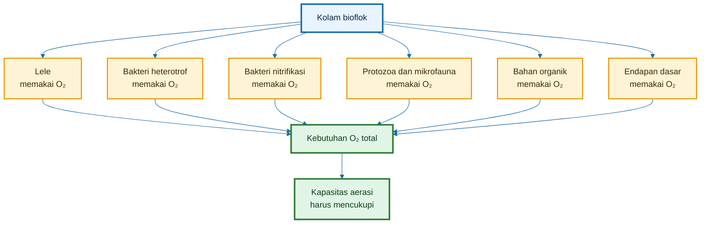

Diagram di atas menunjukkan bahwa oksigen di kolam bioflok diperebutkan oleh banyak komponen. Karena itu, kapasitas produksi bioflok tidak boleh hanya dihitung dari volume kolam.

Secara praktis:

$$
\text{Batas produksi bioflok}
\neq
\text{volume kolam saja}
$$

Yang lebih tepat:

$$
\begin{aligned}
\text{Batas produksi bioflok} &= \text{kapasitas oksigen} + \text{kapasitas pengadukan} + \text{kapasitas buang padatan}
\end{aligned}
$$

Artinya, kolam D2 dengan volume sekitar 2,5 m³ tidak otomatis aman ditebar padat hanya karena bentuknya bundar atau menggunakan bioflok. Sistemnya harus mampu memasok oksigen dan menjaga flok tetap tersuspensi.

---

### 1.1.1 Mengapa Oksigen Menjadi Batas?

Oksigen menjadi batas karena seluruh proses utama bioflok membutuhkan oksigen.

Pertama, lele membutuhkan oksigen untuk bernapas dan metabolisme. Lele memang dikenal tahan terhadap kondisi oksigen rendah, tetapi tahan hidup bukan berarti tumbuh optimal. Untuk bisnis, targetnya bukan sekadar ikan hidup, tetapi ikan tumbuh cepat dan FCR terkendali.

Kedua, mikroba bioflok membutuhkan oksigen untuk mengolah bahan organik. Jika mikroba kekurangan oksigen, proses penguraian berubah menjadi anaerob.

Ketiga, nitrifikasi membutuhkan oksigen. Amonia dari limbah protein pakan dapat diubah melalui proses nitrifikasi, tetapi proses ini membutuhkan oksigen cukup.

Keempat, sumber karbon seperti molase juga meningkatkan kebutuhan oksigen. Molase memang membantu mikroba mengikat nitrogen, tetapi juga menjadi bahan bakar yang membuat mikroba lebih aktif bernapas.

Maka, setiap peningkatan pakan, molase, padat tebar, atau flok harus dibaca sebagai peningkatan kebutuhan oksigen.

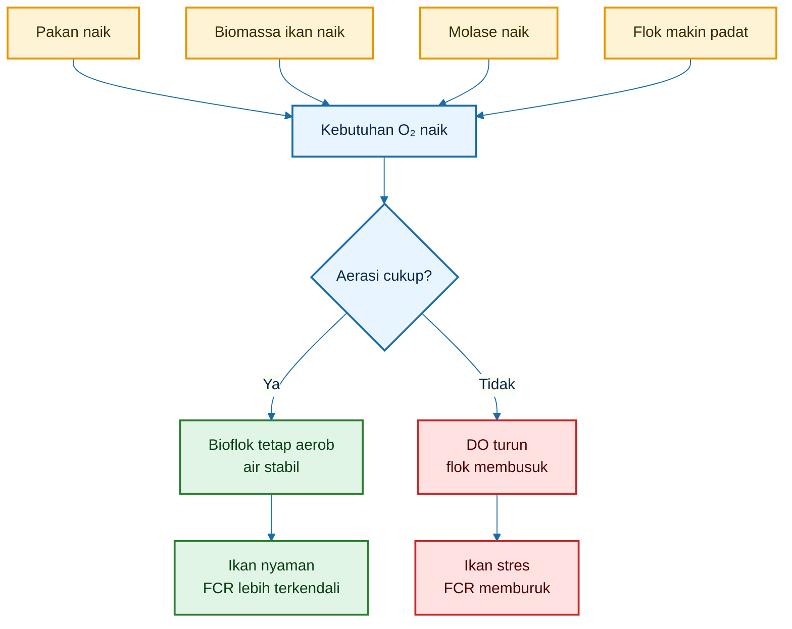

---

## 1.2 Bioflok Sehat Harus Aerob

Bioflok sehat adalah bioflok yang bekerja dalam kondisi cukup oksigen. Floknya aktif, tersuspensi, dan tidak berbau busuk.

Ciri bioflok sehat:

- air keruh tetapi tidak busuk;
- bau tanah atau fermentasi ringan;
- flok halus melayang;
- ikan aktif makan;
- tidak ada endapan hitam tebal;
- DO terutama subuh masih aman;
- pakan cepat habis;
- FCR tidak memburuk.

Sebaliknya, bioflok busuk terjadi ketika oksigen tidak cukup. Bahan organik tetap masuk, mikroba tetap bekerja, tetapi prosesnya bergeser ke arah anaerob.

Ciri bioflok busuk:

- air hitam pekat;
- bau got, bangkai, atau telur busuk;
- busa tebal menetap;
- ikan menggantung;
- pakan tidak habis;
- endapan hitam;
- FCR memburuk.

Hargreaves dalam publikasi teknis bioflok menekankan bahwa padatan bioflok harus tetap tersuspensi. Jika tidak ada pengadukan yang cukup, flok dapat mengendap dan menciptakan zona anaerob yang berpotensi menghasilkan senyawa toksik seperti hidrogen sulfida, metana, dan amonia.

---

### 1.2.1 Jalur Aerob vs Anaerob

Perbedaan bioflok sehat dan bioflok busuk dapat dipahami dari jalur prosesnya.

Jika oksigen cukup:

$$
\text{Bahan organik}
+
O_2
\rightarrow
CO_2
+
H_2O
+
\text{biomassa mikroba/flok}
$$

Jika oksigen kurang:

$$
\begin{aligned}
\text{Bahan organik} &= O_2 \rightarrow \text{pembusukan anaerob} + \text{bau} + \text{senyawa berbahaya}
\end{aligned}
$$

Dengan kata lain, bahan organiknya bisa sama, tetapi hasilnya berbeda karena kondisi oksigen berbeda.

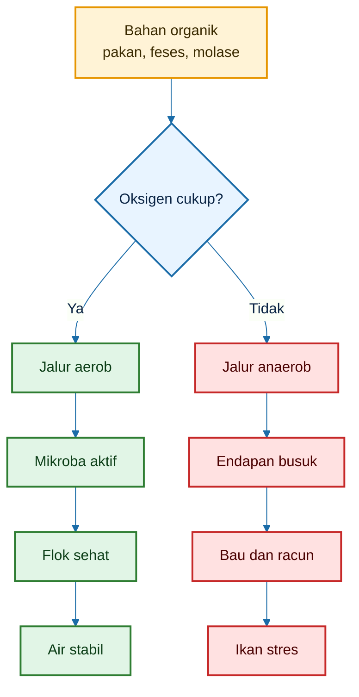

---

### 1.2.2 Mengapa Pengadukan Sama Pentingnya dengan Oksigen?

Oksigen yang masuk ke kolam belum tentu merata. Jika kolam hanya memiliki gelembung di satu titik, area lain bisa tetap miskin oksigen.

Bioflok membutuhkan pengadukan karena:

- flok harus tetap melayang;
- oksigen harus tersebar;
- sisa organik tidak boleh mengendap;
- dasar kolam tidak boleh menjadi anaerob;
- padatan berat harus diarahkan ke titik sifon.

Di sinilah airlift-pump menjadi penting. Airlift tidak hanya membantu oksigenasi, tetapi juga membantu mengangkat air dari bawah dan menciptakan arus memutar pelan.

Namun, arus yang dibutuhkan bukan arus deras. Targetnya adalah **arus cukup untuk menahan flok tetap tersuspensi**, bukan membuat lele berenang melawan arus sepanjang waktu.

---

## 1.3 Kalimat Kunci

Kalimat kunci bab ini adalah:

> Bioflok bukan hanya butuh probiotik dan molase. Bioflok butuh oksigen dan pengadukan terus-menerus.

Atau dalam bahasa desain:

> Probiotik adalah starter biologis. Molase adalah bahan bakar mikroba. Tetapi oksigen dan pengadukan adalah mesin yang membuat bioflok tetap hidup.

Tanpa oksigen, probiotik tidak efektif.  
Tanpa pengadukan, flok mengendap.  
Tanpa sifon, padatan menumpuk.  
Tanpa desain aerasi yang cukup, bioflok berubah menjadi kolam busuk.

Maka artikel ini akan membahas desain sistem aerasi bioflok pada kolam D2 dengan pendekatan:

1. menghitung kebutuhan oksigen total;
2. mengubah kebutuhan oksigen menjadi kebutuhan udara;
3. memilih blower, difuser, dan aerator yang sesuai;
4. merancang airlift-pump agar flok tidak mengendap;
5. menjaga arus tetap pelan agar lele tidak stres.

[**Kembali ke Atas**](#design-sistem-aerasi-bioflok-dengan-airlift-pump-pada-kolam-d2)

---

# 2. Neraca Kebutuhan Oksigen Total

Setelah memahami mengapa oksigen penting, langkah berikutnya adalah menghitung kebutuhan oksigen total.

Ini penting karena desain aerasi tidak boleh berdasarkan perkiraan kasar seperti:

> Kolam kecil cukup aerator kecil.

Atau:

> Yang penting ada gelembung.

Dalam bioflok, gelembung belum tentu cukup. Yang harus dihitung adalah apakah oksigen yang berhasil masuk ke air mampu menutup seluruh kebutuhan oksigen sistem.

Prinsip dasarnya:

$$
\text{Oksigen masuk}
\ge
\text{Oksigen terpakai}
$$

Jika oksigen masuk lebih besar dari oksigen terpakai, DO cenderung aman.  
Jika oksigen masuk lebih kecil dari oksigen terpakai, DO turun dan sistem berisiko gagal.

---

## 2.1 Rumus Besar Kebutuhan Oksigen

Kebutuhan oksigen total pada kolam bioflok dapat ditulis sebagai:

$$
\begin{aligned}
O_{2,\text{total}} &= O_{2,\text{ikan}} + O_{2,N} + O_{2,C} + O_{2,\text{organik}} + O_{2,\text{flok/endapan}}
\end{aligned}
$$

Keterangan:

- $O_{2,\text{total}}$ = kebutuhan oksigen total sistem;
- $O_{2,\text{ikan}}$ = oksigen untuk respirasi ikan;
- $O_{2,N}$ = oksigen untuk perombakan nitrogen/nitrifikasi;
- $O_{2,C}$ = oksigen untuk oksidasi karbon tambahan, misalnya molase;
- $O_{2,\text{organik}}$ = oksigen untuk sisa pakan, feses, lendir, dan bahan organik;
- $O_{2,\text{flok/endapan}}$ = tambahan oksigen untuk flok, mikrofauna, plankton malam hari, dan endapan aktif.

Rumus ini adalah model desain praktis. Tujuannya bukan membuat angka laboratorium sempurna, tetapi memberi dasar yang lebih akurat untuk menentukan kapasitas blower, difuser, aerator, dan airlift-pump.

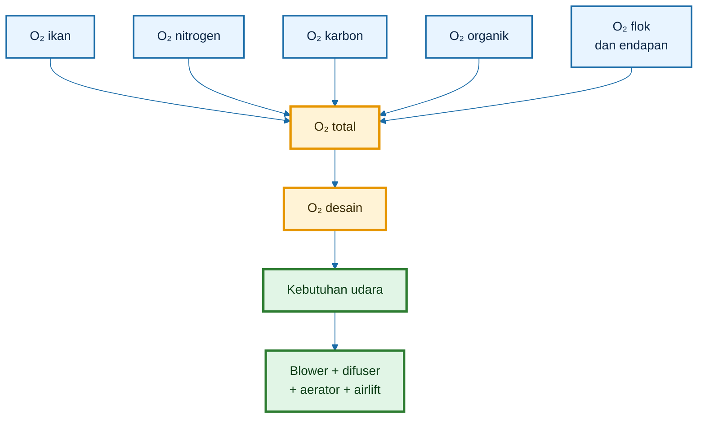

Diagram ini menunjukkan bahwa desain aerasi harus dimulai dari total beban oksigen, bukan dari merek alat atau watt aerator.

---

## 2.2 Komponen Perhitungan

### 2.2.1 Oksigen untuk Ikan

Komponen pertama adalah oksigen untuk ikan.

Lele membutuhkan oksigen untuk:

- bernapas;
- metabolisme;
- mencerna pakan;
- bergerak;
- tumbuh;
- menjaga fungsi organ.

Secara umum:

$$
\begin{aligned}
O_{2,\text{ikan}} &= B \times q_{\text{ikan}} \times 24
\end{aligned}
$$

Keterangan:

- $B$ = biomassa ikan, kg;
- $q_{\text{ikan}}$ = konsumsi oksigen ikan, g O₂/kg ikan/jam;
- 24 = jam per hari.

Komponen ini meningkat jika:

- biomassa ikan naik;
- ikan makin besar;
- feeding rate naik;
- suhu naik;
- ikan stres;
- arus terlalu kuat;
- DO rendah.

---

### 2.2.2 Oksigen untuk Nitrogen

Nitrogen terutama berasal dari protein pakan. Sebagian nitrogen menjadi daging ikan, tetapi sebagian menjadi limbah berupa amonia dan bahan nitrogen lain.

Nitrogen dari pakan dihitung dengan:

$$
\begin{aligned}
N_{\text{pakan}} &= F \times \frac{CP}{6{,}25}
\end{aligned}
$$

Keterangan:

- $F$ = pakan harian, kg/hari;
- $CP$ = protein pakan dalam desimal;
- 6,25 = faktor konversi protein menjadi nitrogen.

Jika sebagian nitrogen limbah masuk jalur nitrifikasi, oksigen yang diperlukan adalah:

$$
\begin{aligned}
O_{2,N} &= 4{,}57 \times N_{\text{nitrifikasi}}
\end{aligned}
$$

Angka 4,57 berarti setiap 1 kg amonia-N yang dinitrifikasi secara teoritis membutuhkan sekitar 4,57 kg O₂.

---

### 2.2.3 Oksigen untuk Karbon Tambahan

Karbon tambahan seperti molase, gula, tapioka, atau sumber karbohidrat lain dipakai untuk mendorong pertumbuhan mikroba heterotrof.

Namun karbon tambahan juga menambah kebutuhan oksigen.

Secara praktis:

$$
\begin{aligned}
O_{2,C} &= M \times COD_C \times f_{\text{oks}}
\end{aligned}
$$

Keterangan:

- $M$ = jumlah sumber karbon, kg/hari;
- $COD_C$ = kebutuhan oksigen kimiawi bahan karbon, kg O₂/kg bahan;
- $f_{\text{oks}}$ = fraksi karbon yang teroksidasi dalam periode tersebut.

Molase tidak boleh dilihat hanya sebagai “makanan mikroba”. Molase juga harus dilihat sebagai **beban oksigen**.

Kalimat praktis:

> Setiap tambahan molase harus dibayar dengan tambahan oksigen.

---

### 2.2.4 Oksigen untuk Bahan Organik

Bahan organik dalam kolam berasal dari:

- feses;
- pakan tidak termakan;
- lendir ikan;
- flok tua;
- mikroorganisme mati;
- partikel organik halus;
- endapan dasar.

Kebutuhan oksigennya dapat diperkirakan dengan pendekatan:

$$
\begin{aligned}
O_{2,\text{organik}} &= F \times k_{\text{BOD}}
\end{aligned}
$$

Keterangan:

- $F$ = pakan harian, kg/hari;
- $k_{\text{BOD}}$ = faktor beban oksigen bahan organik dari pakan.

Jika pakan habis cepat dan endapan sedikit, $k_{\text{BOD}}$ bisa lebih rendah. Jika banyak sisa pakan dan dasar kotor, $k_{\text{BOD}}$ harus dinaikkan.

---

### 2.2.5 Oksigen untuk Flok dan Endapan

Flok bukan benda mati. Di dalam flok terdapat mikroba, protozoa, alga, partikel organik, dan mikrofauna lain yang juga membutuhkan oksigen.

Namun, bagian ini harus dihitung hati-hati agar tidak menghitung ganda kebutuhan mikroba.

Karena mikroba sudah memakai oksigen pada perombakan karbon, nitrogen, dan organik, maka komponen flok/endapan sebaiknya dihitung sebagai faktor tambahan empiris.

Rumus praktis:

$$
\begin{aligned}
O_{2,\text{flok/endapan}} &= f_{\text{bg}} \times ( O_{2,\text{ikan}} + O_{2,N} + O_{2,C} + O_{2,\text{organik}} )
\end{aligned}
$$

Keterangan:

- $f_{\text{bg}}$ = faktor tambahan biologi/flok/endapan.

Nilai awal praktis:

| Kondisi flok dan dasar           | $f_{\text{bg}}$ |
| -------------------------------- | --------------: |
| Flok rendah, dasar bersih        |            0,10 |
| Flok sedang, sistem stabil       |            0,20 |
| Flok padat, endapan mulai banyak |       0,30–0,50 |

Untuk desain awal kolam D2, nilai yang aman digunakan:

$$
\begin{aligned}
f_{\text{bg}} &= 0{,}20
\end{aligned}
$$

---

## 2.3 Koreksi Penting

Model neraca oksigen harus digunakan dengan benar. Ada beberapa koreksi penting agar perhitungan tidak menyesatkan.

---

### 2.3.1 Jangan Menghitung Ganda Kebutuhan Mikroba

Mikroba adalah pelaku utama dalam bioflok. Namun, jangan menambahkan kebutuhan oksigen mikroba secara bebas di luar komponen karbon, nitrogen, dan organik tanpa alasan jelas.

Sebab, mikroba sudah memakai oksigen untuk:

- mengoksidasi karbon;
- mengasimilasi nitrogen;
- mengurai bahan organik;
- membentuk biomassa flok.

Jika semua itu sudah dihitung, lalu mikroba dihitung lagi secara penuh, hasilnya bisa terlalu besar.

Karena itu, komponen $O_{2,\text{flok/endapan}}$ dipakai sebagai faktor tambahan, bukan angka utama yang berdiri sendiri.

---

### 2.3.2 Oksigen Desain Harus Lebih Besar dari Oksigen Operasional

Kebutuhan oksigen tidak stabil sepanjang hari. Pada jam tertentu, kebutuhan bisa meningkat.

Kondisi puncak biasanya terjadi:

- malam hari;
- menjelang subuh;
- setelah pemberian pakan;
- setelah pemberian molase;
- saat biomassa tinggi;
- saat flok terlalu pekat;
- saat cuaca mendung;
- saat difuser mulai kotor.

Maka setelah menghitung $O_{2,\text{total}}$, harus ditambahkan safety factor.

$$
\begin{aligned}
O_{2,\text{desain}} &= O_{2,\text{total}} \times SF
\end{aligned}
$$

Untuk sistem bioflok lele, nilai awal yang disarankan:

$$
\begin{aligned}
SF &= 1{,}5
\end{aligned}
$$

Jika sistem padat, alat ukur terbatas, atau listrik rawan, gunakan safety factor lebih tinggi.

---

### 2.3.3 Oksigen Harian Harus Diubah Menjadi Kebutuhan Puncak

Desain blower dan aerator tidak cukup memakai angka rata-rata harian. Sistem harus mampu menghadapi beban puncak.

Rumus sederhana:

$$
\begin{aligned}
O_{2,\text{puncak}} &= \frac{O_{2,\text{desain}}}{24} \times PF
\end{aligned}
$$

Keterangan:

- $PF$ = peak factor.

Untuk bioflok, nilai praktis:

$$
\begin{aligned}
PF &= 1{,}5 - 2{,}0
\end{aligned}
$$

Dalam desain kolam D2 artikel ini, digunakan:

$$
\begin{aligned}
PF &= 1{,}8
\end{aligned}
$$

---

### 2.3.4 Neraca Oksigen Harus Divalidasi dengan DO Meter

Perhitungan adalah desain awal. Di lapangan, kondisi aktual harus dicek dengan DO meter.

Yang perlu dipantau:

- DO subuh;
- DO setelah pakan;
- DO setelah molase;
- DO saat flok tinggi;
- DO saat ikan mendekati panen.

Jika hasil perhitungan mengatakan sistem aman tetapi DO subuh tetap jatuh, maka desain perlu dikoreksi.

Penyebabnya bisa:

- OTE difuser lebih rendah dari asumsi;
- difuser kotor;
- selang bocor;
- blower melemah;
- molase berlebihan;
- pakan tidak habis;
- flok terlalu pekat;
- dasar kolam penuh endapan;
- arus tidak merata.

---

## 2.4 Alur Desain Oksigen Artikel Ini

Artikel ini akan memakai alur desain berikut:

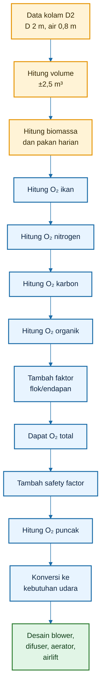

Diagram ini menjadi peta kerja artikel. Tujuannya agar desain aerasi tidak lagi berbasis kira-kira, tetapi berbasis kebutuhan oksigen aktual.

---

## 2.5 Kalimat Kunci Bab 2

Kalimat kunci bab ini:

> Desain aerasi bioflok harus dimulai dari kebutuhan oksigen total, bukan dari ukuran kolam, watt alat, atau jumlah gelembung.

Atau lebih praktis:

> Hitung dulu oksigen yang dipakai ikan, nitrogen, karbon, bahan organik, flok, dan endapan. Setelah itu baru tentukan blower, difuser, aerator, dan airlift-pump.

Jika neraca oksigen tidak dihitung, pembudidaya mudah terjebak pada dua kesalahan:

1. alat terlihat menyala, tetapi oksigen tidak cukup;
2. air terlihat bergerak, tetapi flok tetap mengendap dan dasar menjadi anaerob.

Maka, neraca oksigen adalah fondasi desain sistem aerasi bioflok.

[**Kembali ke Atas**](#design-sistem-aerasi-bioflok-dengan-airlift-pump-pada-kolam-d2)

---

# 3. Data Dasar Kolam D2

Sebelum menghitung kebutuhan oksigen, desain kolam harus dikunci terlebih dahulu. Dalam artikel ini, seluruh perhitungan memakai basis **kolam D2**, yaitu kolam bundar diameter 2 meter dengan kedalaman air efektif 80 cm.

Penguncian data dasar penting karena kebutuhan oksigen, kebutuhan udara, kapasitas blower, jumlah difuser, dan desain airlift-pump semuanya bergantung pada:

- volume air;
- jumlah ikan;
- biomassa;
- pakan harian;
- protein pakan;
- molase;
- beban organik;
- target padat tebar.

Tanpa data dasar yang jelas, desain aerasi hanya menjadi perkiraan.

---

## 3.1 Definisi Kolam D2

Kolam D2 berarti:

- diameter kolam: **2 meter**;
- jari-jari: **1 meter**;
- kedalaman air: **80 cm** atau **0,8 meter**.

Secara visual, kolam D2 adalah kolam bundar kecil-menengah yang sering digunakan oleh pembudidaya lele skala rumah tangga, pelatihan, demplot, atau unit produksi padat tebar terbatas.

Dalam desain bioflok, bentuk bundar memiliki keunggulan karena lebih mudah dibuat arus memutar pelan. Arus ini membantu:

- menjaga flok tetap melayang;
- mengurangi zona mati;
- mengarahkan padatan berat ke tengah;
- memudahkan sifon;
- mendukung desain airlift-pump tangensial.

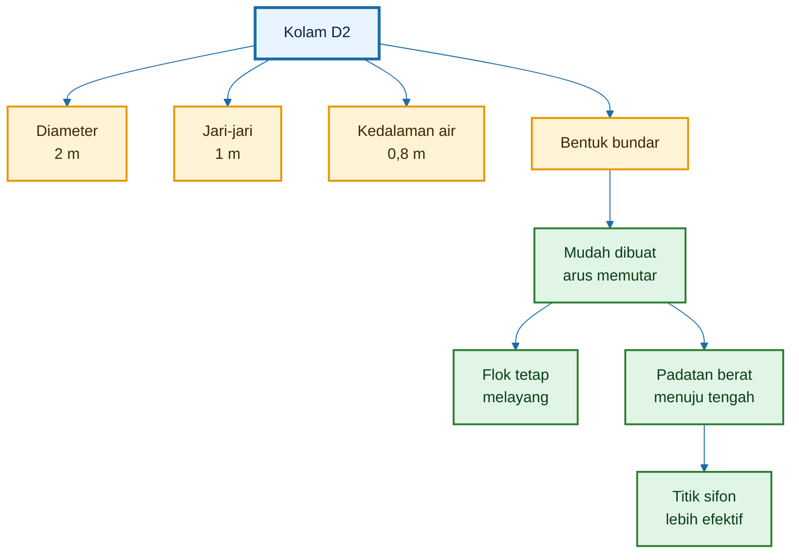

---

## 3.2 Volume Kolam

Volume kolam bundar dihitung dengan rumus volume tabung:

$$
\begin{aligned}
V &= \pi \times r^2 \times h
\end{aligned}
$$

Keterangan:

- $V$ = volume air, m³;
- $\pi$ = 3,14;
- $r$ = jari-jari kolam, meter;
- $h$ = kedalaman air, meter.

Untuk kolam D2:

$$
\begin{aligned}
r &= 1 \text{ m}
\end{aligned}
$$

$$
\begin{aligned}
h &= 0{,}8 \text{ m}
\end{aligned}
$$

Maka:

$$
\begin{aligned}
V &= 3{,}14 \times 1^2 \times 0{,}8
\end{aligned}
$$

$$
\begin{aligned}
V &= 2{,}512 \text{ m}^3
\end{aligned}
$$

Dibulatkan:

$$
V
\approx
2{,}5
\text{ m}^3
$$

Jadi, kolam D2 dengan kedalaman air 80 cm memiliki volume efektif sekitar **2,5 m³**.

---

### 3.2.1 Mengapa Volume Harus Dihitung Akurat?

Volume air memengaruhi banyak keputusan teknis:

- jumlah ikan yang ditebar;
- dosis probiotik;
- dosis molase awal;
- kebutuhan aerasi;
- kapasitas airlift;
- kebutuhan sifon;
- konsentrasi DO;
- dampak amonia;
- risiko penurunan oksigen.

Kesalahan menghitung volume akan merembet ke semua perhitungan berikutnya.

Contoh:

Jika kolam dianggap 3 m³, padahal volume riil hanya 2,5 m³, maka padat tebar, pakan, dan molase bisa diberikan terlalu tinggi. Akibatnya beban oksigen naik dan sistem lebih mudah gagal.

---

## 3.3 Asumsi Desain Dasar Kolam D2

Artikel ini memakai asumsi desain berikut.

| Parameter              | Simbol |     Nilai desain |
| ---------------------- | -----: | ---------------: |
| Diameter kolam         |    $D$ |              2 m |
| Kedalaman air          |    $h$ |            0,8 m |
| Volume air             |    $V$ |           2,5 m³ |
| Kepadatan desain       |      - |      300 ekor/m³ |
| Jumlah ikan            |    $N$ |         750 ekor |
| Bobot rata-rata contoh |    $W$ |        50 g/ekor |
| Biomassa               |    $B$ |          37,5 kg |
| Feeding rate           |   $FR$ | 3% biomassa/hari |
| Pakan harian           |    $F$ |    1,125 kg/hari |
| Protein pakan          |   $CP$ |              32% |
| Molase                 |    $M$ |   10% dari pakan |
| Molase harian          |    $M$ |   0,1125 kg/hari |

---

### 3.3.1 Hitung Jumlah Ikan

Dengan kepadatan desain:

$$
300
\text{ ekor/m}^3
$$

dan volume:

$$
2{,}5
\text{ m}^3
$$

maka jumlah ikan:

$$
\begin{aligned}
N &= 300 \times 2{,}5
\end{aligned}
$$

$$
\begin{aligned}
N &= 750 \text{ ekor}
\end{aligned}
$$

Jadi asumsi desain kolam D2 ini menggunakan **750 ekor lele**.

---

### 3.3.2 Hitung Biomassa

Bobot rata-rata contoh:

$$
\begin{aligned}
W &= 50 \text{ gram/ekor}
\end{aligned}
$$

Ubah ke kg:

$$
\begin{aligned}
50 \text{ gram} &= 0{,}05 \text{ kg}
\end{aligned}
$$

Biomassa:

$$
\begin{aligned}
B &= N \times W
\end{aligned}
$$

$$
\begin{aligned}
B &= 750 \times 0{,}05
\end{aligned}
$$

$$
\begin{aligned}
B &= 37{,}5 \text{ kg}
\end{aligned}
$$

Jadi biomassa contoh dalam kolam D2 adalah:

$$
37{,}5
\text{ kg ikan}
$$

---

### 3.3.3 Hitung Pakan Harian

Feeding rate:

$$
\begin{aligned}
FR &= 3\% \\ &= 0{,}03
\end{aligned}
$$

Pakan harian:

$$
\begin{aligned}
F &= B \times FR
\end{aligned}
$$

$$
\begin{aligned}
F &= 37{,}5 \times 0{,}03
\end{aligned}
$$

$$
\begin{aligned}
F &= 1{,}125 \text{ kg/hari}
\end{aligned}
$$

Jadi pada biomassa 37,5 kg dan feeding rate 3%, kebutuhan pakan harian adalah:

$$
1{,}125
\text{ kg/hari}
$$

---

### 3.3.4 Hitung Molase Harian

Asumsi molase:

$$
\begin{aligned}
M &= 10\% \times F
\end{aligned}
$$

Maka:

$$
\begin{aligned}
M &= 10\% \times 1{,}125
\end{aligned}
$$

$$
\begin{aligned}
M &= 0{,}10 \times 1{,}125
\end{aligned}
$$

$$
\begin{aligned}
M &= 0{,}1125 \text{ kg/hari}
\end{aligned}
$$

Jadi molase harian contoh:

$$
0{,}1125
\text{ kg/hari}
$$

atau sekitar:

$$
112{,}5
\text{ gram/hari}
$$

Catatan penting:

> Molase 10% dari pakan dipakai sebagai asumsi desain awal, bukan dosis wajib. Di lapangan, dosis molase harus dikoreksi berdasarkan DO, bau air, volume flok, amonia, nitrit, dan respons makan ikan.

---

### 3.3.5 Alur Data Dasar Menuju Desain Oksigen

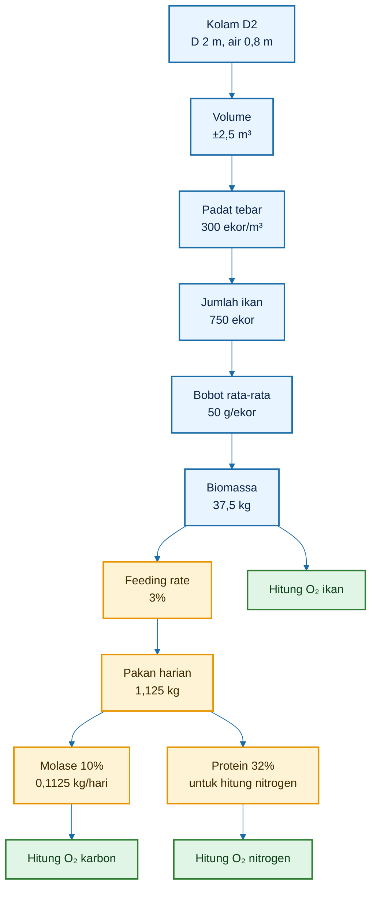

Diagram ini menunjukkan bahwa desain oksigen dimulai dari data kolam, bukan dari ukuran blower. Setelah volume, biomassa, pakan, protein, dan molase diketahui, barulah kebutuhan oksigen bisa dihitung.

---

### 3.3.6 Kalimat Kunci Bab 3

> Kolam D2 tidak boleh hanya dibaca sebagai kolam diameter 2 meter. Dalam desain bioflok, kolam D2 harus diterjemahkan menjadi volume, biomassa, pakan harian, beban nitrogen, beban karbon, dan kebutuhan oksigen.

[**Kembali ke Atas**](#design-sistem-aerasi-bioflok-dengan-airlift-pump-pada-kolam-d2)

---

## 4. Menghitung Oksigen untuk Ikan

Komponen oksigen pertama yang harus dihitung adalah kebutuhan oksigen ikan.

Dalam kolam bioflok, lele bukan satu-satunya pengguna oksigen, tetapi tetap menjadi komponen utama. Semakin besar biomassa lele, semakin tinggi kebutuhan oksigen untuk respirasi dan metabolisme.

Oksigen untuk ikan dipengaruhi oleh:

- biomassa ikan;
- ukuran ikan;
- suhu air;
- aktivitas ikan;
- feeding rate;
- tingkat stres;
- kualitas air;
- arus kolam.

Dalam desain awal, kebutuhan oksigen ikan dihitung dari biomassa dan konsumsi oksigen per kg ikan per jam.

---

## 4.1 Rumus

Rumus kebutuhan oksigen ikan:

$$
\begin{aligned}
O_{2,\text{ikan}} &= B \times q_{\text{ikan}} \times 24
\end{aligned}
$$

Keterangan:

- $O_{2,\text{ikan}}$ = kebutuhan oksigen ikan, gram O₂/hari;
- $B$ = biomassa ikan, kg;
- $q_{\text{ikan}}$ = konsumsi oksigen ikan, gram O₂/kg ikan/jam;
- 24 = jumlah jam per hari.

Jika hasil masih dalam gram, ubah ke kg:

$$
\begin{aligned}
O_{2,ikan,kg} &= \frac{O_{2,ikan,g}}{1000}
\end{aligned}
$$

---

## 4.2 Asumsi Praktis

Untuk perhitungan awal kolam D2, digunakan:

$$
\begin{aligned}
q_{\text{ikan}} &= 0{,}35 \text{ g O}_2/\text{kg ikan/jam}
\end{aligned}
$$

Angka ini dipakai sebagai asumsi desain moderat. Pada kondisi lapangan, konsumsi oksigen ikan bisa berubah.

Konsumsi oksigen ikan cenderung naik bila:

- suhu naik;
- ikan aktif makan;
- biomassa tinggi;
- ikan stres;
- air buruk;
- arus terlalu kuat;
- DO rendah;
- amonia/nitrit naik.

Untuk desain yang lebih aman, terutama mendekati panen atau padat tebar lebih tinggi, nilai $q_{\text{ikan}}$ dapat dinaikkan menjadi:

$$
0{,}40 - 0{,}50
\text{ g O}_2/\text{kg ikan/jam}
$$

Namun dalam contoh dasar artikel ini, dipakai:

$$
0{,}35
\text{ g O}_2/\text{kg ikan/jam}
$$

agar konsisten dengan data desain awal.

---

## 4.3 Contoh Kolam D2

Dari Bab 3, biomassa ikan:

$$
\begin{aligned}
B &= 37{,}5 \text{ kg}
\end{aligned}
$$

Asumsi konsumsi oksigen ikan:

$$
\begin{aligned}
q_{\text{ikan}} &= 0{,}35 \text{ g O}_2/\text{kg ikan/jam}
\end{aligned}
$$

Maka:

$$
\begin{aligned}
O_{2,\text{ikan}} &= 37{,}5 \times 0{,}35 \times 24
\end{aligned}
$$

Hitung bertahap:

$$
\begin{aligned}
37{,}5 \times 0{,}35 &= 13{,}125 \text{ g O}_2/\text{jam}
\end{aligned}
$$

Lalu:

$$
\begin{aligned}
13{,}125 \times 24 &= 315 \text{ g O}_2/\text{hari}
\end{aligned}
$$

Jadi:

$$
\begin{aligned}
O_{2,\text{ikan}} &= 315 \text{ g O}_2/\text{hari}
\end{aligned}
$$

Ubah ke kg:

$$
\begin{aligned}
O_{2,\text{ikan}} &= \frac{315}{1000}
\end{aligned}
$$

$$
\begin{aligned}
O_{2,\text{ikan}} &= 0{,}315 \text{ kg O}_2/\text{hari}
\end{aligned}
$$

Maka kebutuhan oksigen ikan pada kolam D2 contoh adalah:

$$
\boxed{
\begin{aligned}
O_{2,\text{ikan}} &= 0{,}315 \text{ kg O}_2/\text{hari}
\end{aligned}
}
$$

---

### 4.3.1 Interpretasi Angka

Angka 0,315 kg O₂/hari berarti ikan dalam kolam D2 membutuhkan sekitar:

$$
315
\text{ gram O}_2/\text{hari}
$$

atau rata-rata:

$$
\begin{aligned}
\frac{315}{24} &= 13{,}125 \text{ gram O}_2/\text{jam}
\end{aligned}
$$

Namun ini baru kebutuhan ikan. Belum termasuk:

- oksigen untuk nitrifikasi;
- oksigen untuk molase;
- oksigen untuk feses dan sisa organik;
- oksigen untuk flok;
- oksigen untuk endapan;
- faktor keamanan;
- kebutuhan puncak malam/subuh.

Karena itu, tidak boleh mendesain aerasi hanya berdasarkan kebutuhan ikan.

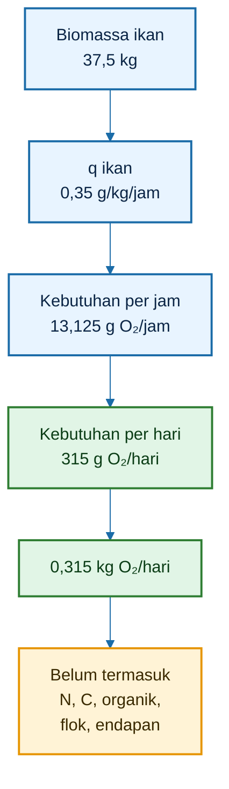

---

### 4.3.2 Kalimat Kunci Bab 4

> Kebutuhan oksigen ikan adalah komponen pertama dalam desain aerasi, tetapi bukan satu-satunya. Pada bioflok, oksigen untuk mikroba, nitrogen, karbon, organik, flok, dan endapan bisa sama pentingnya.

[**Kembali ke Atas**](#design-sistem-aerasi-bioflok-dengan-airlift-pump-pada-kolam-d2)

---

# 5. Menghitung Oksigen untuk Nitrogen

Komponen kedua adalah kebutuhan oksigen untuk nitrogen.

Nitrogen terutama berasal dari protein pakan. Ketika lele memakan pakan, sebagian nitrogen dari protein digunakan untuk membentuk tubuh ikan. Namun sebagian lain keluar sebagai limbah nitrogen, terutama dalam bentuk amonia dan bahan organik nitrogen.

Dalam bioflok, nitrogen limbah dapat masuk ke beberapa jalur:

1. diasimilasi oleh mikroba menjadi biomassa flok;
2. diubah melalui nitrifikasi;
3. mengendap sebagai bahan organik;
4. keluar saat sifon;
5. tetap berada di air sebagai TAN/nitrit jika sistem tidak stabil.

Pada bagian ini, yang dihitung adalah kebutuhan oksigen untuk bagian nitrogen yang masuk jalur **nitrifikasi**.

---

## 5.1 Nitrogen dari Pakan

Nitrogen pakan dihitung dari kadar protein pakan.

Rumus:

$$
\begin{aligned}
N_{\text{pakan}} &= F \times \frac{CP}{6{,}25}
\end{aligned}
$$

Keterangan:

- $N_{\text{pakan}}$ = nitrogen dari pakan, kg N/hari;
- $F$ = pakan harian, kg/hari;
- $CP$ = kadar protein pakan dalam bentuk desimal;
- 6,25 = faktor konversi protein menjadi nitrogen.

Faktor 6,25 berasal dari pendekatan bahwa protein mengandung sekitar 16% nitrogen.

$$
\begin{aligned}
\frac{100}{16} &= 6{,}25
\end{aligned}
$$

---

## 5.2 Contoh Kolam D2

Dari data desain:

$$
\begin{aligned}
F &= 1{,}125 \text{ kg/hari}
\end{aligned}
$$

Protein pakan:

$$
\begin{aligned}
CP &= 32\% \\ &= 0{,}32
\end{aligned}
$$

Maka:

$$
\begin{aligned}
N_{\text{pakan}} &= 1{,}125 \times \frac{0{,}32}{6{,}25}
\end{aligned}
$$

Hitung bagian protein menjadi nitrogen:

$$
\begin{aligned}
\frac{0{,}32}{6{,}25} &= 0{,}0512
\end{aligned}
$$

Maka:

$$
\begin{aligned}
N_{\text{pakan}} &= 1{,}125 \times 0{,}0512
\end{aligned}
$$

$$
\begin{aligned}
N_{\text{pakan}} &= 0{,}0576 \text{ kg N/hari}
\end{aligned}
$$

Atau:

$$
\begin{aligned}
0{,}0576 \text{ kg} &= 57{,}6 \text{ gram}
\end{aligned}
$$

Jadi pakan 1,125 kg/hari dengan protein 32% membawa sekitar:

$$
\boxed{
57{,}6
\text{ g N/hari}
}
$$

---

## 5.3 Nitrogen Limbah

Tidak semua nitrogen pakan menjadi limbah. Sebagian nitrogen diretensi menjadi biomassa ikan.

Rumus nitrogen limbah:

$$
\begin{aligned}
N_{\text{limbah}} &= N_{\text{pakan}} \times (1 - R_N)
\end{aligned}
$$

Keterangan:

- $N_{\text{limbah}}$ = nitrogen limbah, kg N/hari;
- $N_{\text{pakan}}$ = nitrogen dari pakan, kg N/hari;
- $R_N$ = retensi nitrogen oleh ikan.

Dalam desain ini digunakan retensi nitrogen:

$$
\begin{aligned}
R_N &= 30\% \\ &= 0{,}30
\end{aligned}
$$

Maka bagian nitrogen yang menjadi limbah:

$$
\begin{aligned}
1 - R_N &= 1 - 0{,}30 \\
&= 0{,}70
\end{aligned}
$$

Hitung:

$$
\begin{aligned}
N_{\text{limbah}} &= 0{,}0576 \times 0{,}70
\end{aligned}
$$

$$
\begin{aligned}
N_{\text{limbah}} &= 0{,}04032 \text{ kg N/hari}
\end{aligned}
$$

Atau:

$$
40{,}32
\text{ g N/hari}
$$

Jadi dari 57,6 gram nitrogen pakan per hari, sekitar 40,32 gram diasumsikan menjadi beban nitrogen limbah.

---

## 5.4 Oksigen untuk Nitrifikasi

Tidak semua nitrogen limbah masuk jalur nitrifikasi. Pada sistem bioflok, sebagian nitrogen limbah dapat diasimilasi oleh bakteri heterotrof menjadi biomassa mikroba, sebagian mengendap, dan sebagian keluar saat sifon.

Dalam desain ini diasumsikan:

$$
\begin{aligned}
f_{\text{nit}} &= 40\% \\ &= 0{,}40
\end{aligned}
$$

Artinya, 40% nitrogen limbah diasumsikan masuk jalur nitrifikasi.

Nitrogen yang dinitrifikasi:

$$
\begin{aligned}
N_{\text{nitrifikasi}} &= N_{\text{limbah}} \times f_{\text{nit}}
\end{aligned}
$$

$$
\begin{aligned}
N_{\text{nitrifikasi}} &= 0{,}04032 \times 0{,}40
\end{aligned}
$$

$$
\begin{aligned}
N_{\text{nitrifikasi}} &= 0{,}016128 \text{ kg N/hari}
\end{aligned}
$$

Oksigen untuk nitrifikasi dihitung dengan:

$$
\begin{aligned}
O_{2,N} &= 4{,}57 \times N_{\text{nitrifikasi}}
\end{aligned}
$$

Maka:

$$
\begin{aligned}
O_{2,N} &= 4{,}57 \times 0{,}016128
\end{aligned}
$$

$$
\begin{aligned}
O_{2,N} &= 0{,}0737 \text{ kg O}_2/\text{hari}
\end{aligned}
$$

Jadi kebutuhan oksigen untuk nitrifikasi pada kolam D2 contoh adalah:

$$
\boxed{
\begin{aligned}
O_{2,N} &= 0{,}0737 \text{ kg O}_2/\text{hari}
\end{aligned}
}
$$

atau sekitar:

$$
73{,}7
\text{ gram O}_2/\text{hari}
$$

---

### 5.4.1 Jika Fraksi Nitrifikasi Lebih Besar

Jika sistem lebih banyak bergantung pada nitrifikasi, kebutuhan oksigen naik.

Misalnya seluruh nitrogen limbah masuk nitrifikasi:

$$
\begin{aligned}
N_{\text{nitrifikasi}} &= 0{,}04032 \text{ kg N/hari}
\end{aligned}
$$

Maka:

$$
\begin{aligned}
O_{2,N} &= 4{,}57 \times 0{,}04032
\end{aligned}
$$

$$
\begin{aligned}
O_{2,N} &= 0{,}1843 \text{ kg O}_2/\text{hari}
\end{aligned}
$$

Bandingkan:

| Fraksi nitrogen limbah ke nitrifikasi |         $O_{2,N}$ |
| ------------------------------------: | ----------------: |
|                                   40% | 0,0737 kg O₂/hari |
|                                  100% | 0,1843 kg O₂/hari |

Artinya, jalur nitrogen sangat memengaruhi kebutuhan oksigen.

---

### 5.4.2 Alur Nitrogen dan Oksigen

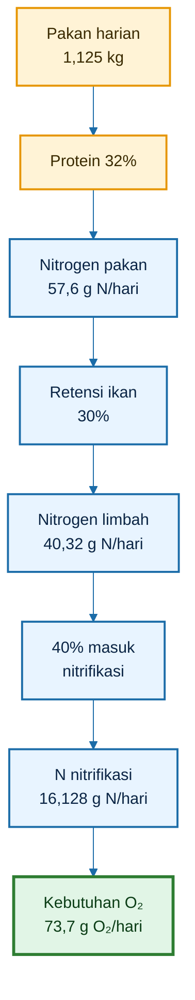

---

### 5.4.3 Koreksi Praktis

Perhitungan nitrogen ini adalah pendekatan desain. Di lapangan, nilai aktual bisa berubah karena:

- kualitas pakan;
- ukuran ikan;
- FCR;
- retensi protein;
- jumlah pakan tidak termakan;
- aktivitas mikroba heterotrof;
- volume flok;
- frekuensi sifon;
- pH;
- DO;
- alkalinitas.

Jika pakan banyak tersisa, nitrogen limbah akan lebih tinggi. Jika ikan tumbuh buruk, retensi nitrogen lebih rendah. Jika bioflok aktif, sebagian nitrogen lebih banyak masuk ke biomassa mikroba.

Maka, desain nitrogen harus dibaca bersama pengukuran lapangan seperti:

- TAN;
- nitrit;
- pH;
- DO;
- bau air;
- volume flok;
- respons makan ikan.

---

### 5.4.4 Kalimat Kunci Bab 5

> Protein pakan membawa nitrogen. Nitrogen yang tidak menjadi daging akan menjadi beban sistem. Jika nitrogen masuk jalur nitrifikasi, setiap 1 kg N membutuhkan sekitar 4,57 kg O₂. Karena itu, semakin tinggi pakan dan protein, semakin besar kebutuhan oksigen.

[**Kembali ke Atas**](#design-sistem-aerasi-bioflok-dengan-airlift-pump-pada-kolam-d2)

---

# 6. Menghitung Oksigen untuk Molase/Karbon Tambahan

Setelah kebutuhan oksigen ikan dan nitrogen dihitung, komponen berikutnya adalah oksigen untuk **karbon tambahan**, terutama molase.

Dalam sistem bioflok, molase sering dipakai untuk menaikkan ketersediaan karbon agar bakteri heterotrof dapat memanfaatkan nitrogen limbah. Namun molase tidak boleh dipahami hanya sebagai “makanan mikroba”. Molase juga menambah beban oksigen.

Semakin banyak molase diberikan, semakin aktif mikroba berkembang. Semakin aktif mikroba berkembang, semakin besar oksigen yang dibutuhkan.

Jadi, molase memiliki dua sisi:

- membantu pembentukan bioflok;
- menambah kebutuhan oksigen.

Jika molase diberikan tanpa aerasi cukup, sistem bisa menjadi berat, DO turun, flok membusuk, dan ikan stres.

---

## 6.1 Rumus

Kebutuhan oksigen untuk karbon tambahan dihitung dengan pendekatan COD.

$$
\begin{aligned}
O_{2,C} &= M \times COD_C \times f_{\text{oks}}
\end{aligned}
$$

Keterangan:

- $O_{2,C}$ = kebutuhan oksigen untuk karbon tambahan, kg O₂/hari;
- $M$ = jumlah molase atau sumber karbon, kg/hari;
- $COD_C$ = kebutuhan oksigen kimiawi bahan karbon, kg O₂/kg bahan;
- $f_{\text{oks}}$ = fraksi karbon yang teroksidasi pada hari tersebut.

Dalam desain praktis, molase dapat diasumsikan memiliki:

$$
\begin{aligned}
COD_C &= 1{,}0 \text{ kg O}_2/\text{kg molase}
\end{aligned}
$$

Artinya, setiap 1 kg molase dapat memberi beban oksigen sekitar 1 kg O₂ jika seluruhnya teroksidasi. Namun dalam kolam, tidak semuanya teroksidasi pada hari yang sama. Karena itu digunakan faktor $f_{\text{oks}}$.

---

## 6.2 Asumsi

Pada kolam D2 ini digunakan asumsi:

- molase = 10% dari pakan;
- pakan harian = 1,125 kg;
- molase = 0,1125 kg/hari;
- $COD_C = 1{,}0$ kg O₂/kg molase;
- $f_{\text{oks}} = 0{,}70$.

Hitung molase harian:

$$
\begin{aligned}
M &= 10\% \times F
\end{aligned}
$$

$$
\begin{aligned}
M &= 0{,}10 \times 1{,}125
\end{aligned}
$$

$$
\begin{aligned}
M &= 0{,}1125 \text{ kg/hari}
\end{aligned}
$$

Atau:

$$
\begin{aligned}
0{,}1125 \text{ kg} &= 112{,}5 \text{ gram}
\end{aligned}
$$

Jadi asumsi molase harian untuk kolam D2 adalah sekitar:

$$
112{,}5
\text{ gram/hari}
$$

---

## 6.3 Hitungan

Masukkan data ke rumus:

$$
\begin{aligned}
O_{2,C} &= M \times COD_C \times f_{\text{oks}}
\end{aligned}
$$

$$
\begin{aligned}
O_{2,C} &= 0{,}1125 \times 1{,}0 \times 0{,}70
\end{aligned}
$$

$$
\begin{aligned}
O_{2,C} &= 0{,}07875 \text{ kg O}_2/\text{hari}
\end{aligned}
$$

Atau:

$$
\begin{aligned}
0{,}07875 \text{ kg} &= 78{,}75 \text{ gram}
\end{aligned}
$$

Jadi kebutuhan oksigen untuk molase pada kolam D2 contoh adalah:

$$
\boxed{
\begin{aligned}
O_{2,C} &= 0{,}07875 \text{ kg O}_2/\text{hari}
\end{aligned}
}
$$

atau sekitar:

$$
78{,}75
\text{ gram O}_2/\text{hari}
$$

---

### 6.3.1 Interpretasi Angka

Angka 0,07875 kg O₂/hari terlihat kecil, tetapi perlu dibaca hati-hati.

Pertama, angka ini hanya untuk molase 10% dari pakan. Jika molase dinaikkan menjadi 20% dari pakan, kebutuhan oksigen dari karbon juga naik dua kali lipat.

Kedua, angka ini hanya menghitung beban molase. Belum termasuk oksigen untuk ikan, nitrogen, feses, sisa pakan, flok, dan endapan.

Ketiga, molase dapat memicu pertumbuhan mikroba cepat. Bila aerasi kurang, efek penurunan DO bisa terasa lebih cepat daripada yang terlihat dari angka rata-rata harian.

---

### 6.3.2 Simulasi Jika Molase Dinaikkan

Dengan pakan harian tetap:

$$
\begin{aligned}
F &= 1{,}125 \text{ kg/hari}
\end{aligned}
$$

Simulasi kebutuhan oksigen karbon:

|   Dosis molase | Molase per hari |          $O_{2,C}$ |
| -------------: | --------------: | -----------------: |
|  5% dari pakan |      0,05625 kg |  0,0394 kg O₂/hari |
| 10% dari pakan |       0,1125 kg | 0,07875 kg O₂/hari |
| 20% dari pakan |        0,225 kg |  0,1575 kg O₂/hari |
| 30% dari pakan |       0,3375 kg | 0,23625 kg O₂/hari |

Tabel ini menunjukkan bahwa molase menaikkan kebutuhan oksigen secara langsung.

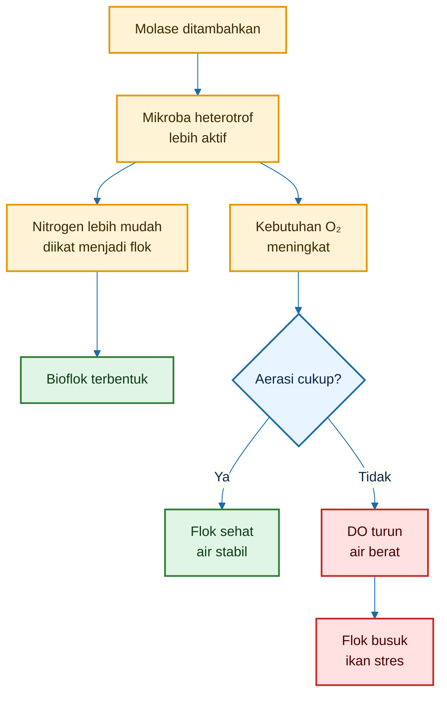

---

## 6.4 Kalimat Kunci

Kalimat kunci bab ini:

> Molase bukan hanya sumber karbon. Molase juga menambah beban oksigen.

Atau lebih operasional:

> Jangan menambah molase jika aerasi belum aman, DO subuh rendah, ikan menggantung, busa tebal, atau dasar kolam mulai bau.

Molase harus diberikan berdasarkan kondisi sistem, bukan berdasarkan kebiasaan tetap.

Molase dapat diberikan jika:

- DO aman;
- ikan aktif makan;
- air tidak bau busuk;
- flok masih kurang;
- amonia mulai naik;
- aerasi kuat;
- tidak ada endapan hitam berlebihan.

Molase harus dikurangi atau dihentikan sementara jika:

- ikan menggantung;
- DO rendah;
- busa tebal menetap;
- air bau got atau telur busuk;
- flok terlalu pekat;
- endapan hitam banyak;
- pakan tidak habis.

[**Kembali ke Atas**](#design-sistem-aerasi-bioflok-dengan-airlift-pump-pada-kolam-d2)

---

# 7. Menghitung Oksigen untuk Bahan Organik Pakan dan Feses

Komponen berikutnya adalah oksigen untuk bahan organik yang berasal dari pakan dan feses.

Dalam kolam bioflok, pakan tidak seluruhnya berubah menjadi daging. Sebagian menjadi:

- feses;
- sisa pakan;
- lendir;
- partikel halus;
- bahan organik terlarut;
- flok tua;
- endapan dasar.

Semua bahan organik ini akan diurai oleh mikroba. Proses penguraian tersebut membutuhkan oksigen.

Jika oksigen cukup, bahan organik dapat diproses secara aerob. Jika oksigen kurang, bahan organik akan membusuk secara anaerob.

---

## 7.1 Rumus

Kebutuhan oksigen untuk bahan organik dari pakan dan feses dapat diperkirakan dengan rumus:

$$
\begin{aligned}
O_{2,\text{organik}} &= F \times k_{\text{BOD}}
\end{aligned}
$$

Keterangan:

- $O_{2,\text{organik}}$ = kebutuhan oksigen untuk bahan organik, kg O₂/hari;
- $F$ = pakan harian, kg/hari;
- $k_{\text{BOD}}$ = faktor beban oksigen bahan organik dari pakan, kg O₂/kg pakan.

Rumus ini adalah pendekatan praktis. Nilai sebenarnya tergantung kualitas pakan, kecernaan pakan, jumlah pakan tersisa, feses, dan kondisi flok.

---

## 7.2 Asumsi

Untuk desain kolam D2, digunakan:

$$
\begin{aligned}
k_{\text{BOD}} &= 0{,}25 \text{ kg O}_2/\text{kg pakan}
\end{aligned}
$$

Artinya, setiap 1 kg pakan diasumsikan menimbulkan beban organik yang membutuhkan sekitar 0,25 kg O₂ untuk diproses.

Patokan praktis:

| Kondisi pakan dan kolam        |         $k_{\text{BOD}}$ |
| ------------------------------ | -----------------------: |
| Pakan habis cepat, air stabil  | 0,15–0,25 kg O₂/kg pakan |
| Pakan sedang, flok cukup padat | 0,25–0,40 kg O₂/kg pakan |
| Sisa pakan/endapan tinggi      | 0,40–0,70 kg O₂/kg pakan |

Dalam artikel ini digunakan angka:

$$
\begin{aligned}
k_{\text{BOD}} &= 0{,}25
\end{aligned}
$$

karena diasumsikan pakan dikelola cukup baik dan tidak banyak tersisa.

---

## 7.3 Contoh Kolam D2

Dari data desain:

$$
\begin{aligned}
F &= 1{,}125 \text{ kg/hari}
\end{aligned}
$$

Maka:

$$
\begin{aligned}
O_{2,\text{organik}} &= 1{,}125 \times 0{,}25
\end{aligned}
$$

$$
\begin{aligned}
O_{2,\text{organik}} &= 0{,}28125 \text{ kg O}_2/\text{hari}
\end{aligned}
$$

Atau:

$$
\begin{aligned}
0{,}28125 \text{ kg} &= 281{,}25 \text{ gram}
\end{aligned}
$$

Jadi kebutuhan oksigen untuk bahan organik pakan dan feses pada kolam D2 adalah:

$$
\boxed{
\begin{aligned}
O_{2,\text{organik}} &= 0{,}28125 \text{ kg O}_2/\text{hari}
\end{aligned}
}
$$

atau sekitar:

$$
281{,}25
\text{ gram O}_2/\text{hari}
$$

---

### 7.3.1 Interpretasi Angka

Komponen bahan organik ini cukup besar. Pada contoh kolam D2:

- oksigen untuk ikan = 0,315 kg O₂/hari;
- oksigen untuk bahan organik = 0,28125 kg O₂/hari.

Artinya, beban organik dari pakan dan feses hampir mendekati kebutuhan oksigen ikan.

Ini menjelaskan mengapa kolam bioflok tidak boleh hanya dihitung berdasarkan ikan. Pakan yang masuk ke kolam ikut menentukan kebutuhan oksigen.

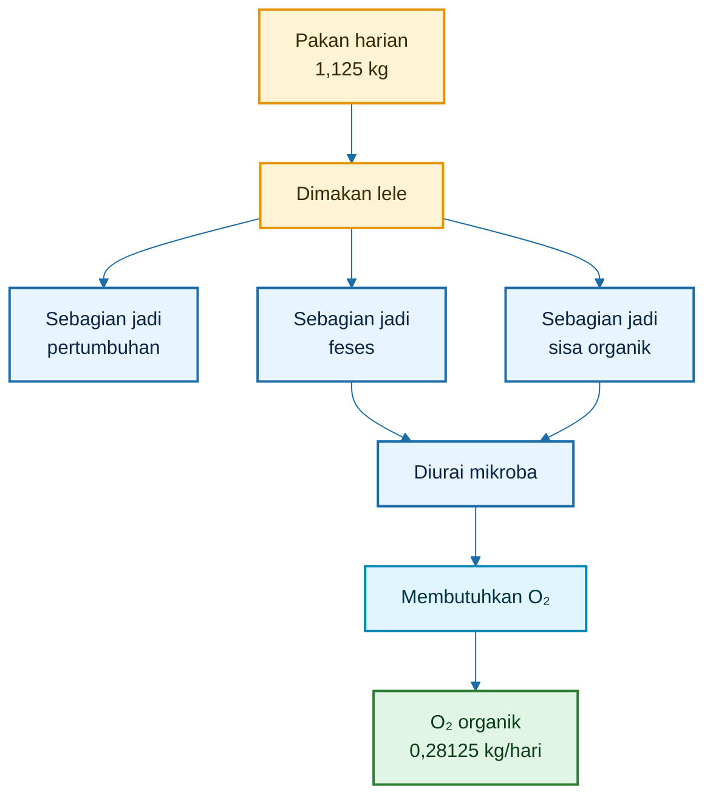

---

### 7.3.2 Faktor yang Membuat Beban Organik Naik

Beban organik akan naik jika:

- pakan terlalu banyak;
- pakan tidak habis;
- ukuran pakan tidak sesuai;
- pakan mudah hancur;
- feeding rate terlalu tinggi;
- ikan stres dan tidak makan;
- flok terlalu pekat;
- sifon jarang dilakukan;
- arus terlalu lemah;
- dasar kolam banyak endapan.

Jika kondisi ini terjadi, nilai $k_{\text{BOD}}$ sebaiknya tidak memakai 0,25. Gunakan angka lebih tinggi, misalnya:

$$
\begin{aligned}
k_{\text{BOD}} &= 0{,}40 \text{ kg O}_2/\text{kg pakan}
\end{aligned}
$$

atau bahkan:

$$
\begin{aligned}
k_{\text{BOD}} &= 0{,}50 - 0{,}70 \text{ kg O}_2/\text{kg pakan}
\end{aligned}
$$

pada kondisi kolam berat.

---

### 7.3.3 Simulasi Jika Banyak Sisa Pakan

Dengan pakan harian sama:

$$
\begin{aligned}
F &= 1{,}125 \text{ kg/hari}
\end{aligned}
$$

Perbandingan kebutuhan oksigen organik:

| $k_{\text{BOD}}$ | Kondisi                    | $O_{2,\text{organik}}$ |
| ---------------: | -------------------------- | ---------------------: |
|             0,25 | pakan habis, sistem stabil |     0,28125 kg O₂/hari |
|             0,40 | flok/padatan mulai berat   |        0,45 kg O₂/hari |
|             0,60 | banyak sisa/endapan        |       0,675 kg O₂/hari |

Hitungan untuk $k_{\text{BOD}}=0{,}60$:

$$
\begin{aligned}
O_{2,\text{organik}} &= 1{,}125 \times 0{,}60
\end{aligned}
$$

$$
\begin{aligned}
O_{2,\text{organik}} &= 0{,}675 \text{ kg O}_2/\text{hari}
\end{aligned}
$$

Angka ini lebih dari dua kali lipat dibanding asumsi awal 0,25.

Maka, pakan tidak habis bukan hanya merusak FCR, tetapi juga menaikkan kebutuhan oksigen.

---

### 7.3.4 Kalimat Kunci Bab 7

> Pakan yang tidak menjadi daging akan menjadi beban oksigen. Semakin banyak feses, sisa pakan, dan endapan, semakin besar oksigen yang diperlukan untuk menjaga bioflok tetap aerob.

[**Kembali ke Atas**](#design-sistem-aerasi-bioflok-dengan-airlift-pump-pada-kolam-d2)

---

# 8. Menghitung Oksigen untuk Flok dan Endapan

Setelah kebutuhan oksigen ikan, nitrogen, karbon, dan bahan organik dihitung, masih ada kebutuhan tambahan dari sistem biologis kolam.

Komponen ini berasal dari:

- flok yang sudah terbentuk;
- mikroba dalam flok;
- protozoa;
- mikrofauna;
- alga pada malam hari;
- flok tua;
- endapan organik aktif;
- lumpur dasar yang belum disifon.

Namun bagian ini harus dihitung hati-hati. Jangan sampai kebutuhan mikroba dihitung ganda terlalu besar.

Sebagian besar oksigen mikroba sebenarnya sudah tercermin dalam:

- oksidasi karbon;
- perombakan nitrogen;
- penguraian bahan organik.

Karena itu, kebutuhan oksigen flok dan endapan dihitung sebagai **faktor tambahan** dari subtotal.

---

## 8.1 Subtotal Sebelum Faktor Flok

Subtotal kebutuhan oksigen dihitung dari empat komponen sebelumnya:

$$
\begin{aligned}
O_{2,\text{subtotal}} &= O_{2,\text{ikan}} + O_{2,N} + O_{2,C} + O_{2,\text{organik}}
\end{aligned}
$$

Dari hasil bab sebelumnya:

$$
\begin{aligned}
O_{2,\text{ikan}} &= 0{,}315 \text{ kg O}_2/\text{hari}
\end{aligned}
$$

$$
\begin{aligned}
O_{2,N} &= 0{,}0737 \text{ kg O}_2/\text{hari}
\end{aligned}
$$

$$
\begin{aligned}
O_{2,C} &= 0{,}07875 \text{ kg O}_2/\text{hari}
\end{aligned}
$$

$$
\begin{aligned}
O_{2,\text{organik}} &= 0{,}28125 \text{ kg O}_2/\text{hari}
\end{aligned}
$$

Maka:

$$
\begin{aligned}
O_{2,\text{subtotal}} &= 0{,}315 + 0{,}0737 + 0{,}07875 + 0{,}28125
\end{aligned}
$$

$$
\begin{aligned}
O_{2,\text{subtotal}} &= 0{,}7487 \text{ kg O}_2/\text{hari}
\end{aligned}
$$

Jadi subtotal kebutuhan oksigen sebelum faktor flok dan endapan adalah:

$$
\boxed{
\begin{aligned}
O_{2,\text{subtotal}} &= 0{,}7487 \text{ kg O}_2/\text{hari}
\end{aligned}
}
$$

atau sekitar:

$$
748{,}7
\text{ gram O}_2/\text{hari}
$$

---

### 8.1.1 Komposisi Subtotal Oksigen

| Komponen                |          Kebutuhan O₂ |
| ----------------------- | --------------------: |
| Ikan                    |      0,315 kg O₂/hari |
| Nitrogen/nitrifikasi    |     0,0737 kg O₂/hari |
| Molase/karbon           |    0,07875 kg O₂/hari |
| Organik pakan dan feses |    0,28125 kg O₂/hari |
| **Subtotal**            | **0,7487 kg O₂/hari** |

Dari tabel ini terlihat bahwa kebutuhan oksigen terbesar berasal dari:

1. ikan;
2. bahan organik pakan dan feses;
3. karbon/molase;
4. nitrifikasi.

Namun urutan ini bisa berubah bila pakan berlebih, molase dinaikkan, atau endapan menumpuk.

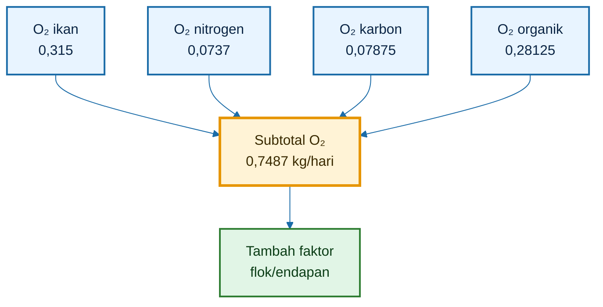

---

## 8.2 Faktor Flok/Endapan

Kebutuhan oksigen flok dan endapan dihitung dengan rumus:

$$
\begin{aligned}
O_{2,\text{flok/endapan}} &= f_{\text{bg}} \times O_{2,\text{subtotal}}
\end{aligned}
$$

Keterangan:

- $O_{2,\text{flok/endapan}}$ = tambahan oksigen untuk flok dan endapan, kg O₂/hari;
- $f_{\text{bg}}$ = faktor tambahan biologi/flok/endapan;
- $O_{2,\text{subtotal}}$ = subtotal kebutuhan oksigen sebelum faktor tambahan.

Untuk desain kolam D2 ini digunakan:

$$
\begin{aligned}
f_{\text{bg}} &= 0{,}20
\end{aligned}
$$

Maka:

$$
\begin{aligned}
O_{2,\text{flok/endapan}} &= 0{,}20 \times 0{,}7487
\end{aligned}
$$

$$
\begin{aligned}
O_{2,\text{flok/endapan}} &= 0{,}1497 \text{ kg O}_2/\text{hari}
\end{aligned}
$$

Atau:

$$
\begin{aligned}
0{,}1497 \text{ kg} &= 149{,}7 \text{ gram}
\end{aligned}
$$

Jadi kebutuhan oksigen tambahan untuk flok dan endapan pada kolam D2 adalah:

$$
\boxed{
\begin{aligned}
O_{2,\text{flok/endapan}} &= 0{,}1497 \text{ kg O}_2/\text{hari}
\end{aligned}
}
$$

---

### 8.2.1 Mengapa Faktor Flok/Endapan Diperlukan?

Faktor ini diperlukan karena kolam bioflok bukan sistem steril. Di dalam kolam ada komunitas biologis yang dinamis.

Bahkan jika pakan dan molase sudah dihitung, masih ada aktivitas tambahan dari:

- flok yang semakin padat;
- mikroorganisme dalam flok;
- alga yang memakai oksigen pada malam hari;
- protozoa dan mikrofauna;
- endapan organik yang belum dikeluarkan;
- flok tua yang mulai terurai.

Jika faktor ini diabaikan, kebutuhan oksigen bisa terlalu rendah dari kondisi lapangan.

---

### 8.2.2 Kapan Faktor Harus Dinaikkan?

Nilai $f_{\text{bg}}=0{,}20$ cocok untuk sistem yang relatif stabil.

Namun nilai ini perlu dinaikkan jika:

- flok terlalu pekat;
- volume flok tinggi;
- dasar mulai hitam;
- sifon jarang dilakukan;
- busa tebal;
- air terasa berat;
- ikan menggantung pagi;
- DO subuh rendah;
- molase tinggi;
- pakan banyak tersisa.

Patokan praktis:

| Kondisi kolam                    | $f_{\text{bg}}$ |
| -------------------------------- | --------------: |
| Flok rendah, dasar bersih        |            0,10 |
| Flok sedang, sistem stabil       |            0,20 |
| Flok padat, endapan mulai banyak |            0,30 |
| Flok sangat pekat, dasar berat   |       0,40–0,50 |

---

### 8.2.3 Simulasi Faktor Flok/Endapan

Dengan subtotal:

$$
\begin{aligned}
O_{2,\text{subtotal}} &= 0{,}7487 \text{ kg O}_2/\text{hari}
\end{aligned}
$$

Simulasi:

| $f_{\text{bg}}$ | Kondisi                   | $O_{2,\text{flok/endapan}}$ |
| --------------: | ------------------------- | --------------------------: |
|            0,10 | flok rendah, dasar bersih |           0,0749 kg O₂/hari |
|            0,20 | flok sedang, stabil       |           0,1497 kg O₂/hari |
|            0,30 | flok padat                |           0,2246 kg O₂/hari |
|            0,50 | flok sangat berat         |           0,3744 kg O₂/hari |

Jika flok dan endapan tidak dikontrol, kebutuhan oksigen tambahan bisa naik signifikan.

---

### 8.2.4 Hubungan Flok, Endapan, dan Airlift

Airlift-pump berperan penting pada bagian ini. Tujuannya bukan membuat arus deras, tetapi menjaga flok tetap tersuspensi dan mencegah endapan anaerob.

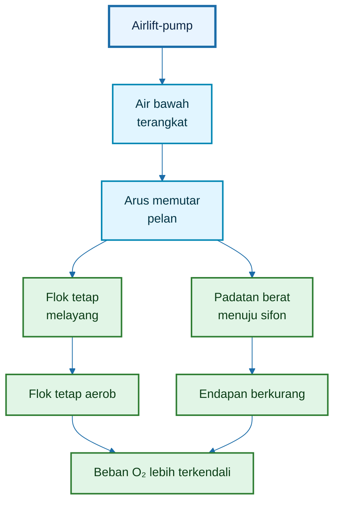

Jika airlift tidak cukup, flok mengendap. Jika flok mengendap, dasar kolam lebih mudah anaerob. Jika dasar anaerob, kebutuhan oksigen dan risiko racun meningkat.

---

### 8.2.5 Kalimat Kunci Bab 8

> Flok dan endapan adalah beban biologis tambahan. Flok yang melayang dan aerob membantu sistem. Flok yang mengendap dan membusuk menjadi beban oksigen dan sumber masalah.

Atau lebih praktis:

> Airlift diperlukan bukan untuk membuat kolam deras, tetapi untuk menjaga flok tetap melayang dan membantu padatan berat terkumpul ke titik sifon.

[**Kembali ke Atas**](#design-sistem-aerasi-bioflok-dengan-airlift-pump-pada-kolam-d2)

---

# 9. Contoh Perhitungan Lengkap Kolam D2

Bab ini merangkum seluruh perhitungan kebutuhan oksigen untuk kolam D2.

Tujuannya adalah mengubah data biologis dan operasional menjadi angka desain yang bisa dipakai untuk menentukan kapasitas blower, difuser, aerator, dan airlift-pump.

<figure>
  
  <figcaption>
    Sistem aerasi pada kolam D2 bioflok untuk menjaga suplai oksigen, pergerakan
    air, dan kestabilan lingkungan budidaya lele.
  </figcaption>
</figure>

Data dasar kolam D2 yang digunakan:

| Parameter       |            Nilai |
| --------------- | ---------------: |
| Diameter kolam  |              2 m |
| Kedalaman air   |            0,8 m |
| Volume efektif  |          ±2,5 m³ |
| Jumlah ikan     |         750 ekor |
| Bobot rata-rata |        50 g/ekor |
| Biomassa        |          37,5 kg |
| Feeding rate    | 3% biomassa/hari |
| Pakan harian    |    1,125 kg/hari |
| Protein pakan   |              32% |
| Molase          |   10% dari pakan |
| Molase harian   |   0,1125 kg/hari |

Dari bab sebelumnya, hasil komponen kebutuhan oksigen adalah:

| Komponen                              |       Kebutuhan O₂ |
| ------------------------------------- | -----------------: |
| Oksigen ikan                          |   0,315 kg O₂/hari |
| Oksigen nitrogen/nitrifikasi          |  0,0737 kg O₂/hari |
| Oksigen molase/karbon                 | 0,07875 kg O₂/hari |
| Oksigen bahan organik pakan dan feses | 0,28125 kg O₂/hari |
| Subtotal                              |  0,7487 kg O₂/hari |
| Tambahan flok/endapan                 |  0,1497 kg O₂/hari |

---

## 9.1 Total Kebutuhan Oksigen Operasional

Total kebutuhan oksigen operasional dihitung dari subtotal ditambah faktor flok dan endapan.

$$
\begin{aligned}
O_{2,\text{total}} &= O_{2,\text{subtotal}} + O_{2,\text{flok/endapan}}
\end{aligned}
$$

Masukkan angka:

$$
\begin{aligned}
O_{2,\text{total}} &= 0{,}7487 + 0{,}1497
\end{aligned}
$$

$$
\begin{aligned}
O_{2,\text{total}} &= 0{,}8984 \text{ kg O}_2/\text{hari}
\end{aligned}
$$

Dibulatkan:

$$
O_{2,\text{total}}
\approx
0{,}90
\text{ kg O}_2/\text{hari}
$$

Jadi, secara operasional, kolam D2 dengan data contoh membutuhkan sekitar:

$$
\boxed{
0{,}90
\text{ kg O}_2/\text{hari}
}
$$

Angka ini adalah kebutuhan dasar harian sebelum faktor keamanan.

---

### 9.1.1 Makna Angka 0,90 kg O₂/hari

Angka 0,90 kg O₂/hari berarti sistem kolam D2 membutuhkan sekitar:

$$
900
\text{ gram O}_2/\text{hari}
$$

atau rata-rata:

$$
\begin{aligned}
\frac{900}{24} &= 37{,}5 \text{ gram O}_2/\text{jam}
\end{aligned}
$$

Namun angka ini belum cukup untuk desain alat, karena kebutuhan oksigen tidak merata sepanjang hari.

Pada waktu tertentu, kebutuhan oksigen bisa naik, misalnya:

- malam hari;
- menjelang subuh;
- setelah pemberian pakan;
- setelah pemberian molase;
- saat flok makin pekat;
- saat biomassa meningkat;
- saat difuser mulai kotor;
- saat dasar kolam mulai banyak endapan.

Karena itu, perhitungan harus dilanjutkan dengan safety factor dan peak factor.

---

## 9.2 Tambahkan Safety Factor

Safety factor dipakai untuk memberi ruang aman pada desain aerasi.

Gunakan:

$$
\begin{aligned}
SF &= 1{,}5
\end{aligned}
$$

Rumus:

$$
\begin{aligned}
O_{2,\text{desain}} &= O_{2,\text{total}} \times SF
\end{aligned}
$$

Masukkan angka:

$$
\begin{aligned}
O_{2,\text{desain}} &= 0{,}8984 \times 1{,}5
\end{aligned}
$$

$$
\begin{aligned}
O_{2,\text{desain}} &= 1{,}3476 \text{ kg O}_2/\text{hari}
\end{aligned}
$$

Dibulatkan:

$$
O_{2,\text{desain}}
\approx
1{,}35
\text{ kg O}_2/\text{hari}
$$

Jadi kebutuhan oksigen desain untuk kolam D2 adalah:

$$
\boxed{
O_{2,\text{desain}}
\approx
1{,}35
\text{ kg O}_2/\text{hari}
}
$$

---

### 9.2.1 Mengapa Safety Factor Wajib?

Bioflok tidak boleh didesain pas-pasan. Jika kebutuhan oksigen operasional 0,90 kg O₂/hari, bukan berarti sistem cukup didesain tepat 0,90 kg O₂/hari.

Alasannya:

- performa difuser bisa turun karena kotor;
- blower bisa melemah;
- selang bisa bocor;
- suhu bisa naik;
- ikan bisa lebih aktif;
- molase bisa berlebih;
- flok bisa makin tebal;
- pakan bisa tidak habis;
- endapan bisa meningkat;
- DO subuh bisa turun.

Safety factor memberi ruang aman agar sistem tidak langsung kolaps ketika beban naik.

Patokan praktis:

| Kondisi sistem                    | Safety factor |
| --------------------------------- | ------------: |
| Sistem ringan, padat tebar rendah |           1,2 |
| Sistem sedang                     |           1,5 |
| Sistem padat/risiko tinggi        |       1,8–2,0 |

Untuk kolam D2 bioflok dengan padat tebar 300 ekor/m³, nilai:

$$
SF = 1{,}5
$$

cukup masuk akal sebagai desain awal.

---

## 9.3 Kebutuhan Oksigen Rata-Rata per Jam

Setelah kebutuhan oksigen desain harian diperoleh, ubah menjadi kebutuhan rata-rata per jam.

Rumus:

$$
\begin{aligned}
O_{2,\text{rata/jam}} &= \frac{O_{2,\text{desain}}}{24}
\end{aligned}
$$

Masukkan angka:

$$
\begin{aligned}
O_{2,\text{rata/jam}} &= \frac{1{,}3476}{24}
\end{aligned}
$$

$$
\begin{aligned}
O_{2,\text{rata/jam}} &= 0{,}0562 \text{ kg O}_2/\text{jam}
\end{aligned}
$$

Atau:

$$
\begin{aligned}
0{,}0562 \text{ kg} &= 56{,}2 \text{ gram}
\end{aligned}
$$

Jadi kebutuhan oksigen rata-rata kolam D2 adalah:

$$
\boxed{
56{,}2
\text{ gram O}_2/\text{jam}
}
$$

Namun ini masih angka rata-rata. Desain blower dan difuser sebaiknya memakai kebutuhan puncak, bukan hanya rata-rata.

---

## 9.4 Kebutuhan Oksigen Puncak

Kebutuhan oksigen puncak dihitung dengan peak factor.

Gunakan:

$$
\begin{aligned}
PF &= 1{,}8
\end{aligned}
$$

Rumus:

$$
\begin{aligned}
O_{2,\text{puncak}} &= O_{2,\text{rata/jam}} \times PF
\end{aligned}
$$

Masukkan angka:

$$
\begin{aligned}
O_{2,\text{puncak}} &= 0{,}0562 \times 1{,}8
\end{aligned}
$$

$$
\begin{aligned}
O_{2,\text{puncak}} &= 0{,}101 \text{ kg O}_2/\text{jam}
\end{aligned}
$$

Atau sekitar:

$$
101
\text{ gram O}_2/\text{jam}
$$

Jadi untuk kolam D2:

$$
\boxed{
O_{2,\text{puncak}}
\approx
0{,}10
\text{ kg O}_2/\text{jam}
}
$$

Angka inilah yang lebih relevan untuk desain kapasitas sistem aerasi.

---

### 9.4.1 Mengapa Peak Factor Dipakai?

Kebutuhan oksigen kolam tidak rata. Pada siang hari, DO bisa tampak aman. Tetapi pada malam hingga subuh, sistem sering berada pada titik kritis.

Penyebabnya:

- tidak ada fotosintesis;
- ikan tetap bernapas;
- mikroba tetap aktif;
- alga ikut memakai oksigen;
- bahan organik tetap diurai;
- suhu dan metabolisme tetap berjalan;
- setelah pakan, kebutuhan oksigen naik;
- setelah molase, aktivitas mikroba naik.

Maka, alat aerasi harus mampu menghadapi kebutuhan puncak, bukan hanya kebutuhan rata-rata.

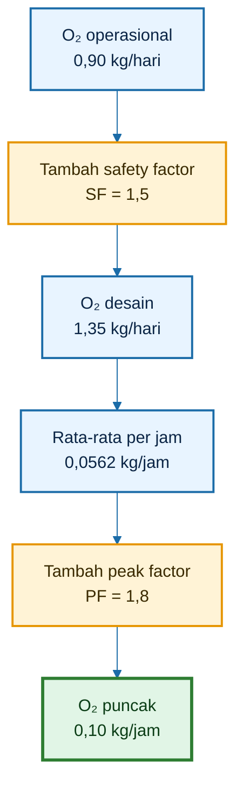

---

## 9.5 Ringkasan Perhitungan Kolam D2

Berikut ringkasan hasil perhitungan oksigen untuk kolam D2.

| Tahap                               |              Nilai |
| ----------------------------------- | -----------------: |
| $O_{2,\text{ikan}}$                 |   0,315 kg O₂/hari |
| $O_{2,N}$                           |  0,0737 kg O₂/hari |
| $O_{2,C}$                           | 0,07875 kg O₂/hari |
| $O_{2,\text{organik}}$              | 0,28125 kg O₂/hari |
| $O_{2,\text{subtotal}}$             |  0,7487 kg O₂/hari |
| $O_{2,\text{flok/endapan}}$         |  0,1497 kg O₂/hari |
| $O_{2,\text{total}}$                |  0,8984 kg O₂/hari |
| $O_{2,\text{desain}}$ dengan SF 1,5 |  1,3476 kg O₂/hari |
| $O_{2,\text{rata/jam}}$             |   0,0562 kg O₂/jam |
| $O_{2,\text{puncak}}$ dengan PF 1,8 |    0,101 kg O₂/jam |

Dibulatkan untuk desain praktis:

$$
\boxed{
O_{2,\text{total}}
\approx
0{,}90
\text{ kg O}_2/\text{hari}
}
$$

$$
\boxed{
O_{2,\text{desain}}
\approx
1{,}35
\text{ kg O}_2/\text{hari}
}
$$

$$
\boxed{
O_{2,\text{puncak}}
\approx
0{,}10
\text{ kg O}_2/\text{jam}
}
$$

---

## 9.6 Validasi dengan Cadangan DO di Air

Agar angka di atas terasa nyata, bandingkan dengan cadangan oksigen terlarut dalam kolam.

Jika volume kolam:

$$
\begin{aligned}
V &= 2{,}5 \text{ m}^3
\end{aligned}
$$

dan DO target:

$$
\begin{aligned}
DO &= 5 \text{ mg/L}
\end{aligned}
$$

maka oksigen tersimpan di air:

$$
\begin{aligned}
O_{2,\text{tersimpan}} &= V \times DO
\end{aligned}
$$

$$
\begin{aligned}
O_{2,\text{tersimpan}} &= 2{,}5 \times 5
\end{aligned}
$$

$$
\begin{aligned}
O_{2,\text{tersimpan}} &= 12{,}5 \text{ gram O}_2
\end{aligned}
$$

Artinya, pada DO 5 mg/L, seluruh kolam D2 hanya menyimpan sekitar:

$$
12{,}5
\text{ gram O}_2
$$

Padahal kebutuhan oksigen desain harian adalah:

$$
\begin{aligned}
1{,}35 \text{ kg O}_2/\text{hari} &= 1.350 \text{ gram O}_2/\text{hari}
\end{aligned}
$$

Persentase cadangan DO terhadap kebutuhan desain harian:

$$
\begin{aligned}
\frac{12{,}5}{1.350} \times 100\% &= 0{,}93\%
\end{aligned}
$$

Jadi cadangan oksigen di air pada DO 5 mg/L hanya sekitar:

$$
\boxed{
0{,}93\%
}
$$

dari kebutuhan oksigen desain harian.

---

### 9.6.1 Makna Praktis

Ini sangat penting.

Walaupun DO terlihat aman di angka 5 mg/L, cadangan oksigen terlarut di air sebenarnya sangat kecil. Jika aerasi mati atau tidak cukup, DO bisa jatuh cepat.

Maka prinsipnya:

> DO bukan tabungan oksigen besar. DO hanya stok kecil yang harus terus diisi oleh aerasi.

Dalam bioflok, aerasi harus bekerja terus-menerus karena oksigen langsung dipakai oleh ikan, mikroba, flok, dan bahan organik.

---

## 9.7 Apa Arti Angka Ini untuk Desain Alat?

Dari hasil perhitungan:

$$
O_{2,\text{puncak}}
\approx
0{,}10
\text{ kg O}_2/\text{jam}
$$

Artinya, sistem aerasi kolam D2 harus mampu mentransfer oksigen aktual ke air minimal sekitar:

$$
100
\text{ gram O}_2/\text{jam}
$$

pada kondisi puncak.

Namun oksigen dalam udara tidak seluruhnya larut ke air. Sebagian besar gelembung naik dan keluar ke atmosfer.

Karena itu, bab berikutnya akan mengubah kebutuhan oksigen puncak ini menjadi:

- kebutuhan udara, L/menit;
- kapasitas blower;
- kebutuhan difuser;
- kontribusi aerator;
- desain airlift-pump.

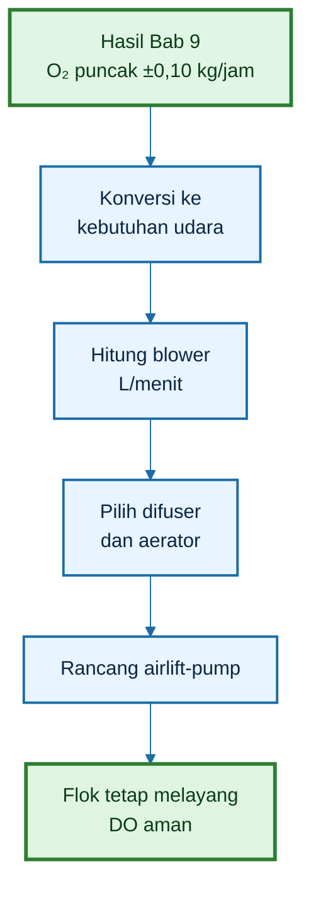

---

## 9.8 Kalimat Kunci Bab 9

Kalimat kunci bab ini:

> Untuk kolam D2 dengan volume ±2,5 m³, biomassa 37,5 kg, dan pakan 1,125 kg/hari, kebutuhan oksigen desain sekitar 1,35 kg O₂/hari, dengan kebutuhan puncak sekitar 0,10 kg O₂/jam.

Atau lebih praktis:

> Kolam kecil bukan berarti kebutuhan oksigennya kecil secara risiko. Pada bioflok, cadangan DO di air sangat kecil, sehingga aerasi harus didesain berdasarkan kebutuhan oksigen puncak.

[**Kembali ke Atas**](#design-sistem-aerasi-bioflok-dengan-airlift-pump-pada-kolam-d2)

---

## 10. Mengubah Kebutuhan Oksigen Menjadi Kebutuhan Udara

Pada Bab 9, kebutuhan oksigen puncak kolam D2 sudah dihitung:

$$
O_{2,\text{puncak}}
\approx
0{,}10
\text{ kg O}_2/\text{jam}
$$

Angka ini belum langsung berarti ukuran blower. Sebab blower tidak memasukkan oksigen murni, tetapi memasukkan **udara**.

Udara mengandung oksigen, tetapi tidak semua oksigen dalam udara larut ke air. Sebagian besar gelembung naik ke permukaan lalu keluar ke atmosfer. Yang benar-benar masuk ke air hanya sebagian kecil, tergantung efisiensi transfer oksigen.

Maka, desain blower harus menjawab pertanyaan:

> Berapa liter udara per menit yang harus dialirkan agar oksigen aktual yang larut ke air mampu memenuhi kebutuhan puncak kolam?

---

## 10.1 Rumus OTR Difuser

Untuk blower dan difuser, oxygen transfer rate dapat dihitung dengan rumus:

$$
\begin{aligned}
OTR_{\text{difuser}} &= Q_{\text{air}} \times 0{,}0179 \times OTE
\end{aligned}
$$

Keterangan:

- $OTR_{\text{difuser}}$ = oxygen transfer rate aktual dari difuser, kg O₂/jam;
- $Q_{\text{air}}$ = debit udara, L/menit;
- 0,0179 = kg O₂/jam yang terkandung dalam 1 L/menit udara;
- $OTE$ = oxygen transfer efficiency aktual.

Angka 0,0179 berasal dari kandungan oksigen dalam udara. Secara praktis, 1 L/menit udara mengandung sekitar 0,0179 kg O₂ per jam. Namun oksigen ini belum tentu larut seluruhnya.

Karena itu perlu dikalikan dengan $OTE$.

---

### 10.1.1 Memahami OTE

OTE adalah efisiensi transfer oksigen aktual. Nilainya menunjukkan berapa persen oksigen dari udara yang berhasil larut ke air.

Contoh:

Jika:

$$
\begin{aligned}
OTE &= 0{,}06
\end{aligned}
$$

berarti efisiensi transfer oksigen adalah:

$$
6\%
$$

Artinya, dari seluruh oksigen yang dibawa gelembung udara, hanya sekitar 6% yang benar-benar larut ke air.

OTE dipengaruhi oleh:

- kedalaman air;
- ukuran gelembung;
- jenis difuser;
- kebersihan difuser;
- suhu air;
- kepadatan flok;
- lama kontak gelembung;
- distribusi titik aerasi;
- posisi difuser;
- arus air;
- kotoran dan biofilm pada difuser.

Pada kolam bioflok, OTE aktual sering lebih rendah daripada klaim alat karena air lebih pekat, banyak padatan tersuspensi, dan difuser lebih mudah tertutup biofilm.

---

## 10.2 Rumus Kebutuhan Udara

Jika kebutuhan oksigen sudah diketahui, kebutuhan udara dihitung dengan membalik rumus OTR.

$$
\begin{aligned}
Q_{\text{air}} &= \frac{OTR} {0{,}0179 \times OTE}
\end{aligned}
$$

Keterangan:

- $Q_{\text{air}}$ = kebutuhan udara, L/menit;
- $OTR$ = target oksigen yang harus ditransfer, kg O₂/jam;
- $OTE$ = efisiensi transfer oksigen aktual.

Untuk desain kolam D2, target $OTR$ yang digunakan adalah kebutuhan oksigen puncak:

$$
\begin{aligned}
OTR &= O_{2,\text{puncak}}
\end{aligned}
$$

Sehingga:

$$
\begin{aligned}
Q_{\text{air}} &= \frac{O_{2,\text{puncak}}} {0{,}0179 \times OTE}
\end{aligned}
$$

---

## 10.3 Asumsi

Untuk kolam D2 bioflok, digunakan asumsi konservatif:

$$
\begin{aligned}
OTE &= 0{,}06
\end{aligned}
$$

atau:

$$
6\%
$$

Asumsi 6% cukup masuk akal untuk desain praktis karena kolam D2 memiliki kedalaman air sekitar 0,8 m. Kedalaman ini tidak terlalu dalam, sehingga waktu kontak gelembung dengan air terbatas.

Jika memakai difuser sangat halus, bersih, dan sebaran baik, OTE bisa lebih tinggi. Namun jika difuser kasar, kotor, terlalu dangkal, atau distribusi udara buruk, OTE bisa lebih rendah.

Untuk desain praktisi, lebih aman menggunakan angka konservatif.

---

## 10.4 Kebutuhan Blower pada Puncak

Dari Bab 9:

$$
\begin{aligned}
O_{2,\text{puncak}} &= 0{,}101 \text{ kg O}_2/\text{jam}
\end{aligned}
$$

Gunakan:

$$
\begin{aligned}
OTE &= 0{,}06
\end{aligned}
$$

Maka:

$$
\begin{aligned}
Q_{\text{air}} &= \frac{0{,}101} {0{,}0179 \times 0{,}06}
\end{aligned}
$$

Hitung penyebut:

$$
\begin{aligned}
0{,}0179 \times 0{,}06 &= 0{,}001074
\end{aligned}
$$

Maka:

$$
\begin{aligned}
Q_{\text{air}} &= \frac{0{,}101}{0{,}001074}
\end{aligned}
$$

$$
\begin{aligned}
Q_{\text{air}} &= 94 \text{ L/menit}
\end{aligned}
$$

Jadi kebutuhan udara teoritis pada puncak adalah sekitar:

$$
94
\text{ L/menit}
$$

---

### 10.4.1 Tambahkan Cadangan Lapangan

Angka 94 L/menit adalah kebutuhan teoritis berdasarkan OTE 6%. Di lapangan, blower dan difuser tidak bekerja dalam kondisi ideal.

Faktor yang menurunkan performa:

- selang panjang;
- kebocoran sambungan;
- valve tidak terbuka penuh;
- difuser mulai mampet;
- tekanan balik;
- blower menurun performanya;
- pembagian udara tidak merata;
- airlift mengambil sebagian udara;
- kedalaman dan posisi difuser tidak optimal.

Karena itu tambahkan cadangan lapangan 20%.

$$
\begin{aligned}
Q_{\text{blower}} &= 94 \times 1{,}20
\end{aligned}
$$

$$
\begin{aligned}
Q_{\text{blower}} &= 113 \text{ L/menit}
\end{aligned}
$$

Dibulatkan untuk praktik:

$$
\boxed{
\text{Kolam D2 membutuhkan blower sekitar } 110 - 130
\text{ L/menit}
}
$$

Angka ini dipakai sebagai kapasitas total udara untuk sistem D2, bukan hanya satu titik difuser.

---

### 10.4.2 Interpretasi Desain

Rekomendasi blower 110–130 L/menit berarti udara harus dibagi dengan benar.

Untuk kolam D2 bioflok dengan airlift-pump:

| Jalur udara               | Fungsi                                           |
| ------------------------- | ------------------------------------------------ |
| Airlift-pump              | mengangkat air bawah, membuat arus memutar pelan |
| Difuser tambahan          | meratakan oksigen dan mengurangi zona mati       |
| Cadangan/aerator opsional | membantu saat DO rawan atau biomassa tinggi      |

Jika semua udara hanya masuk ke satu difuser, oksigen mungkin masuk, tetapi sirkulasi kolam belum tentu baik.

Jika semua udara hanya masuk ke airlift, arus bisa terbentuk, tetapi pemerataan oksigen di titik lain belum tentu cukup.

Maka pembagian udara menjadi penting.

---

### 10.4.3 Diagram Konversi Oksigen ke Udara

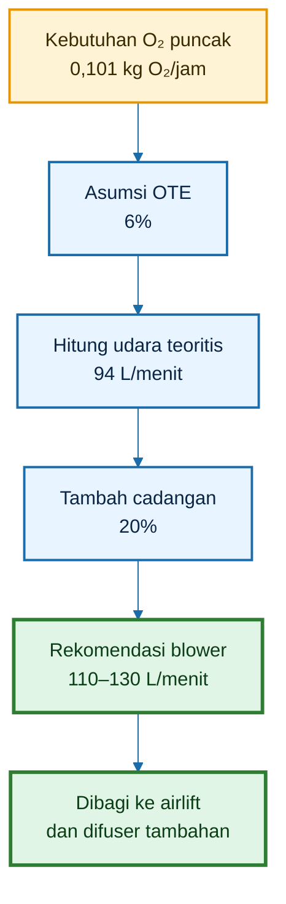

---

### 10.4.4 Kalimat Kunci Bab 10

> Kebutuhan oksigen harus dikonversi menjadi kebutuhan udara dengan memperhitungkan efisiensi transfer. Untuk kolam D2 contoh, kebutuhan puncak sekitar 0,10 kg O₂/jam setara dengan blower sekitar 110–130 L/menit pada asumsi OTE 6% dan cadangan lapangan 20%.

Atau lebih praktis:

> Jangan membeli blower hanya dari watt. Perhatikan debit udara L/menit, tekanan, kedalaman kolam, jumlah titik difuser, dan kebutuhan airlift.

[**Kembali ke Atas**](#design-sistem-aerasi-bioflok-dengan-airlift-pump-pada-kolam-d2)

---

## 11. Menghitung Aerator dari SOTR dan SAE

Blower dan difuser bukan satu-satunya alat aerasi. Banyak pembudidaya juga memakai aerator, misalnya paddle wheel kecil, kincir mini, venturi, atau aerator permukaan.

Namun membaca spesifikasi aerator tidak boleh sembarangan.

Masalahnya, banyak spesifikasi alat memakai angka dalam kondisi standar, yaitu air bersih, suhu tertentu, dan kondisi laboratorium. Padahal kolam bioflok berisi air keruh, flok, bahan organik, ikan, dan endapan.

Karena itu, angka standar harus dikoreksi menjadi angka aktual di kolam.

---

## 11.1 Masalah Spesifikasi Alat

Angka yang sering muncul pada aerator:

- SOTR;
- SAE;
- watt;
- HP;
- debit air;
- kapasitas kolam;
- klaim “untuk kolam sekian meter”.

Yang paling perlu dipahami adalah **SOTR** dan **SAE**.

### SOTR

SOTR adalah:

$$
Standard\ Oxygen\ Transfer\ Rate
$$

Satuan:

$$
\text{kg O}_2/\text{jam}
$$

SOTR menunjukkan kemampuan alat mentransfer oksigen dalam kondisi standar. Tetapi kondisi standar berbeda dari kolam bioflok.

### SAE

SAE adalah:

$$
Standard\ Aeration\ Efficiency
$$

Satuan:

$$
\text{kg O}_2/\text{kWh}
$$

SAE menunjukkan efisiensi aerasi berdasarkan energi listrik. Jika diketahui daya alat, SOTR dapat diperkirakan:

$$
\begin{aligned}
SOTR &= SAE \times P
\end{aligned}
$$

Keterangan:

- $P$ = daya alat, kW.

---

### 11.1.1 Mengapa SOTR Tidak Bisa Dipakai Mentah?

SOTR biasanya diukur pada:

- air bersih;
- suhu standar;
- DO awal rendah;
- kondisi alat ideal;
- tanpa bioflok;
- tanpa kotoran difuser;
- tanpa bahan organik tinggi.

Sedangkan kolam bioflok memiliki:

- air keruh;
- padatan tersuspensi;
- flok;
- mikroba padat;
- suhu tropis;
- DO target tertentu;
- bahan organik;
- aerator/difuser yang bisa kotor;
- kebutuhan pengadukan.

Maka, SOTR harus dikoreksi menjadi AOTR.

---

## 11.2 Rumus Koreksi

AOTR adalah:

$$
Actual\ Oxygen\ Transfer\ Rate
$$

Yaitu kemampuan transfer oksigen aktual dalam kondisi kolam.

Rumus koreksi:

$$
\begin{aligned}
AOTR &= SOTR \times \alpha \times \theta^{(T-20)} \times \frac{\beta C_s - DO_{\text{target}}}{C_{s20}}
\end{aligned}
$$

Keterangan:

- $AOTR$ = transfer oksigen aktual, kg O₂/jam;
- $SOTR$ = transfer oksigen standar, kg O₂/jam;
- $\alpha$ = faktor koreksi air kotor/bioflok;
- $\theta$ = faktor suhu;
- $T$ = suhu air aktual, °C;
- $\beta$ = faktor koreksi kejenuhan/salinitas;
- $C_s$ = konsentrasi DO jenuh pada suhu aktual, mg/L;
- $DO_{\text{target}}$ = target DO kolam, mg/L;
- $C_{s20}$ = DO jenuh pada 20°C, mg/L.

---

### 11.2.1 Makna Faktor Koreksi

| Faktor                              | Makna praktis                                                          |
| ----------------------------------- | ---------------------------------------------------------------------- |
| $\alpha$                            | menurunkan performa karena air bioflok lebih kotor daripada air bersih |
| $\theta^{(T-20)}$                   | koreksi pengaruh suhu                                                  |
| $\beta $C_s$ - DO\_{\text{target}}$ | driving force oksigen aktual                                           |
| $C_{s20}$                           | pembanding kondisi standar                                             |

Semakin tinggi DO target, semakin kecil driving force oksigen. Artinya, lebih sulit menaikkan DO dari 5 ke 6 mg/L dibanding dari 1 ke 2 mg/L.

Karena itu, aerator bisa terlihat kuat saat DO rendah, tetapi kemampuannya menambah oksigen menurun saat DO sudah mendekati jenuh.

---

## 11.3 Contoh Asumsi

Gunakan asumsi:

- $SOTR = 1$ kg O₂/jam;
- $\alpha = 0{,}6$;
- $T = 30^\circ C$;
- $\theta = 1{,}024$;
- $C_s = 7{,}44$ mg/L;
- $DO_{\text{target}} = 5$ mg/L;
- $C_{s20} = 9{,}08$ mg/L;
- $\beta = 1$.

Masukkan ke rumus:

$$
\begin{aligned}
AOTR &= 1 \times 0{,}6 \times 1{,}024^{(30-20)} \times \frac{1 \times 7{,}44 - 5}{9{,}08}
\end{aligned}
$$

Hitung faktor suhu:

$$
1{,}024^{10}
\approx
1{,}268
$$

Hitung driving force:

$$
\begin{aligned}
7{,}44 - 5 &= 2{,}44
\end{aligned}
$$

$$
\begin{aligned}
\frac{2{,}44}{9{,}08} &= 0{,}269
\end{aligned}
$$

Maka:

$$
\begin{aligned}
AOTR &= 1 \times 0{,}6 \times 1{,}268 \times 0{,}269
\end{aligned}
$$

$$
AOTR
\approx
0{,}205
\text{ kg O}_2/\text{jam}
$$

---

## 11.4 Hasil Koreksi

Dengan asumsi tersebut, aerator dengan:

$$
\begin{aligned}
SOTR &= 1 \text{ kg O}_2/\text{jam}
\end{aligned}
$$

dapat turun menjadi:

$$
AOTR
\approx
0{,}205
\text{ kg O}_2/\text{jam}
$$

Artinya, performa aktualnya sekitar:

$$
20{,}5\%
$$

dari angka standar.

Untuk kolam D2, kebutuhan puncak dari Bab 9 adalah:

$$
O_{2,\text{puncak}}
\approx
0{,}10
\text{ kg O}_2/\text{jam}
$$

Maka secara oksigen, aerator dengan AOTR aktual 0,205 kg O₂/jam terlihat cukup karena:

$$
0{,}205
>
0{,}10
$$

Namun ini belum otomatis berarti desain bioflok sudah cukup.

Mengapa?

Karena bioflok bukan hanya butuh oksigen. Bioflok juga butuh pengadukan agar flok tidak mengendap.

---

### 11.4.1 Aerator Cukup Oksigen, tetapi Belum Tentu Cukup Mixing

Aerator permukaan cenderung kuat di area permukaan. Tetapi pada kolam bioflok, masalah sering terjadi di bagian bawah:

- flok mengendap;
- feses terkumpul;
- sisa pakan turun ke dasar;
- dasar menjadi anaerob;
- gas busuk muncul;
- titik mati terbentuk.

Karena itu, aerator permukaan perlu dikombinasikan dengan:

- difuser dasar;
- airlift-pump;
- outlet tangensial;
- titik sifon tengah.

Jika tidak, aerator bisa membuat permukaan tampak aktif, tetapi dasar tetap bermasalah.

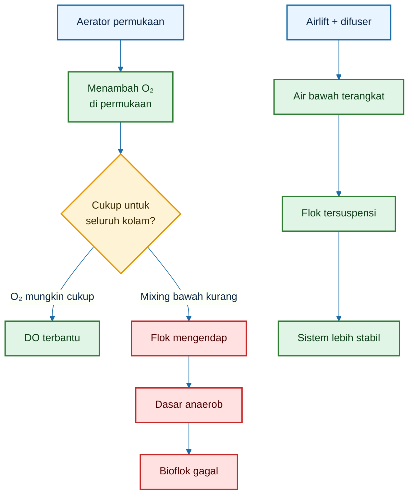

---

### 11.4.2 Kalimat Kunci Bab 11

> Spesifikasi aerator harus dikoreksi dari SOTR menjadi AOTR. Aerator yang terlihat besar di brosur bisa turun jauh performanya di kolam bioflok.

Atau lebih praktis:

> Aerator bisa membantu oksigen, tetapi bioflok tetap membutuhkan difuser dan airlift agar flok tidak mengendap di dasar.

[**Kembali ke Atas**](#design-sistem-aerasi-bioflok-dengan-airlift-pump-pada-kolam-d2)

---

## 12. Kombinasi Aerator + Difuser pada Kolam D2

Setelah memahami kebutuhan udara dan koreksi aerator, langkah berikutnya adalah menentukan konfigurasi aerasi.

Untuk kolam D2 bioflok, desain terbaik biasanya bukan memilih satu alat saja, tetapi menggabungkan fungsi beberapa alat.

Ada tiga fungsi utama yang harus dipenuhi:

1. **oksigenasi**, agar DO aman;
2. **sirkulasi**, agar air tidak statis;
3. **suspensi flok**, agar flok tidak mengendap dan membusuk.

Aerator, difuser, dan airlift memiliki fungsi yang berbeda.

| Alat            | Fungsi utama                    | Kelemahan jika sendirian         |
| --------------- | ------------------------------- | -------------------------------- |
| Aerator         | oksigenasi permukaan, degassing | dasar bisa tetap kurang teraduk  |
| Difuser         | oksigenasi kolom air            | arus bisa lokal                  |
| Airlift-difuser | sirkulasi dan suspensi flok     | perlu pembagian udara yang tepat |

---

## 12.1 Neraca Oksigen Gabungan

Jika memakai aerator dan difuser, total oksigen yang masuk dihitung:

$$
\begin{aligned}
OTR_{\text{total}} &= AOTR_{aerator} + OTR_{\text{difuser}}
\end{aligned}
$$

Keterangan:

- $OTR_{\text{total}}$ = total oxygen transfer rate aktual, kg O₂/jam;
- $AOTR_{aerator}$ = transfer oksigen aktual aerator, kg O₂/jam;
- $OTR_{\text{difuser}}$ = transfer oksigen aktual difuser, kg O₂/jam.

Jika menggunakan airlift-difuser, kontribusi udaranya dapat dihitung sebagai bagian dari $OTR_{\text{difuser}}$, tetapi fungsinya lebih luas karena juga menghasilkan sirkulasi.

---

## 12.2 Syarat Aman

Syarat oksigen aman:

$$
OTR_{\text{total}}
\ge
O_{2,\text{puncak}}
$$

Untuk kolam D2:

$$
\begin{aligned}
O_{2,\text{puncak}} &= 0{,}10 \text{ kg O}_2/\text{jam}
\end{aligned}
$$

Maka sistem aerasi harus mampu menyediakan minimal:

$$
0{,}10
\text{ kg O}_2/\text{jam}
$$

secara aktual pada kondisi puncak.

Namun desain yang baik tidak berhenti di sini.

Syarat lengkap bioflok D2:

$$
\text{Oksigen cukup}
+
\text{flok tersuspensi}
+
\text{padatan bisa disifon}
+
\text{lele tidak stres}
$$

---

## 12.3 Contoh Desain Praktis D2

Kebutuhan puncak:

$$
\begin{aligned}
O_{2,\text{puncak}} &= 0{,}10 \text{ kg O}_2/\text{jam}
\end{aligned}
$$

Opsi konfigurasi:

| Opsi                               | Rekomendasi                                   |
| ---------------------------------- | --------------------------------------------- |
| Difuser saja                       | blower 110–130 L/menit                        |
| Aerator kecil + difuser            | aerator untuk cadangan + blower 60–80 L/menit |
| Airlift-difuser + difuser tambahan | paling sesuai untuk bioflok D2                |
| Aerator + airlift-difuser          | paling aman bila padat tebar dan pakan tinggi |

---

### 12.3.1 Opsi 1 — Difuser Saja

Pada opsi ini, semua kebutuhan oksigen dipenuhi oleh blower dan difuser.

Rekomendasi:

$$
\begin{aligned}
Q_{\text{blower}} &= 110 - 130 \text{ L/menit}
\end{aligned}
$$

Kelebihan:

- sederhana;
- mudah dipasang;
- biaya relatif lebih rendah;
- cocok untuk pemula.

Kelemahan:

- arus bisa lokal;
- flok dapat mengendap di area tertentu;
- zona mati bisa muncul;
- dasar kolam belum tentu terangkat;
- padatan berat sulit diarahkan ke tengah.

Opsi ini dapat dipakai, tetapi tata letak difuser harus benar dan sifon dasar harus disiplin.

---

### 12.3.2 Opsi 2 — Aerator Kecil + Difuser

Pada opsi ini, aerator membantu oksigenasi dan degassing, sedangkan difuser membantu oksigenasi kolom air.

Contoh desain:

- aerator kecil sebagai cadangan oksigen;
- blower 60–80 L/menit untuk difuser;
- difuser ditempatkan di titik bawah;
- tetap perlu sirkulasi agar flok tidak mengendap.

Kelebihan:

- lebih aman saat DO rawan;
- ada cadangan oksigen permukaan;
- baik untuk kondisi puncak.

Kelemahan:

- belum otomatis menyelesaikan masalah pengendapan flok;
- aerator permukaan bisa membuat air atas aktif tetapi bawah tetap berat;
- perlu tambahan airlift atau sirkulasi bawah bila flok padat.

---

### 12.3.3 Opsi 3 — Airlift-Difuser + Difuser Tambahan

Ini opsi paling sesuai untuk bioflok D2.

Konsepnya:

- sebagian udara masuk ke airlift;
- airlift mengangkat air dari bawah;
- outlet tangensial membuat arus memutar pelan;
- difuser tambahan membantu pemerataan oksigen;
- padatan berat diarahkan ke titik sifon tengah.

Rekomendasi awal:

| Jalur            | Porsi udara | Fungsi                   |
| ---------------- | ----------: | ------------------------ |
| Airlift-pump     |      60–70% | sirkulasi, suspensi flok |
| Difuser tambahan |      30–40% | pemerataan oksigen       |
| Aerator opsional |    cadangan | emergency dan degassing  |

Jika blower 120 L/menit:

- ke airlift: 70–85 L/menit;
- ke difuser tambahan: 35–50 L/menit.

Angka ini harus dikoreksi berdasarkan kondisi lapangan.

Jika ikan melawan arus terus-menerus, kurangi udara ke airlift.  
Jika flok mengendap, tambah udara ke airlift atau koreksi arah outlet.

---

### 12.3.4 Opsi 4 — Aerator + Airlift-Difuser

Ini opsi paling aman untuk sistem yang lebih intensif.

Konfigurasi:

- airlift-difuser untuk sirkulasi dan suspensi flok;
- difuser tambahan untuk pemerataan oksigen;
- aerator kecil sebagai cadangan atau emergency.

Kelebihan:

- oksigen lebih aman;
- flok lebih stabil;
- padatan lebih mudah dikumpulkan;
- risiko zona mati lebih rendah;
- lebih aman saat biomassa tinggi.

Kelemahan:

- biaya awal lebih tinggi;
- listrik lebih tinggi;
- perlu pengaturan valve;
- perlu pengamatan arus agar tidak terlalu kuat.

---

### 12.3.5 Diagram Konfigurasi Kolam D2

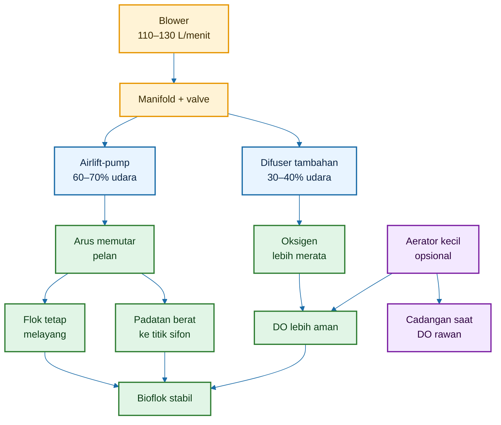

---

## 12.4 Koreksi Penting

Kalimat penting untuk bab ini:

> Aerator bisa cukup secara oksigen, tetapi bioflok tetap butuh pengadukan agar flok tidak mengendap.

Artinya, desain bioflok tidak boleh hanya mengejar angka OTR. Sistem juga harus memastikan:

- air bawah terangkat;
- flok tetap tersuspensi;
- padatan berat bergerak ke titik sifon;
- tidak ada zona mati;
- ikan tidak dipaksa berenang terlalu kuat.

---

### 12.4.1 Jika DO Cukup tetapi Flok Mengendap

Kondisi ini bisa terjadi jika aerasi permukaan cukup, tetapi sirkulasi bawah lemah.

Tanda-tandanya:

- DO siang terlihat baik;
- flok banyak di dasar;
- dasar mulai hitam;
- ada bau saat dasar terganggu;
- pakan sisa terkumpul;
- ikan mulai tidak nyaman.

Koreksi:

- tambah airlift;
- arahkan outlet tangensial;
- tambah udara ke airlift;
- sifon endapan;
- jangan hanya menambah aerator permukaan.

---

### 12.4.2 Jika Arus Terlalu Kuat

Airlift juga tidak boleh berlebihan. Tujuannya bukan membuat kolam air deras.

Tanda arus terlalu kuat:

- lele terus melawan arus;
- ikan berkumpul di zona tenang;
- pakan cepat hanyut;
- ikan sulit makan;
- pertumbuhan tidak optimal.

Koreksi:

- kurangi udara ke airlift;
- bagi udara ke difuser tambahan;
- ubah arah outlet agar mengikuti dinding;
- jangan arahkan outlet langsung ke tengah;
- buat arus memutar pelan.

---

### 12.4.3 Kesimpulan Bab 10–12

Dari Bab 10–12, hasil desain sementara kolam D2 adalah:

| Komponen                 |                       Nilai desain |
| ------------------------ | ---------------------------------: |
| Kebutuhan O₂ puncak      |                    ±0,10 kg O₂/jam |
| OTE asumsi difuser       |                                 6% |
| Kebutuhan udara teoritis |                        ±94 L/menit |
| Cadangan lapangan        |                                20% |
| Rekomendasi blower       |                    110–130 L/menit |
| Aerator opsional         |         sebagai cadangan/emergency |
| Konfigurasi terbaik      | airlift-difuser + difuser tambahan |

Kalimat desainnya:

> Untuk kolam D2, blower 110–130 L/menit sebaiknya tidak hanya dipakai untuk membuat gelembung, tetapi dibagi antara airlift-pump dan difuser tambahan. Aerator kecil dapat ditambahkan sebagai cadangan, tetapi pengadukan bawah tetap harus dijaga dengan airlift agar bioflok tidak mengendap.

[**Kembali ke Atas**](#design-sistem-aerasi-bioflok-dengan-airlift-pump-pada-kolam-d2)

---

## 13. Mengapa Difuser Saja Belum Cukup

Difuser adalah komponen penting dalam sistem bioflok. Tanpa difuser, suplai oksigen dari blower tidak bisa masuk ke air secara efektif.

Namun, dalam kolam bioflok, difuser saja belum tentu cukup.

Alasannya: bioflok tidak hanya membutuhkan oksigen, tetapi juga membutuhkan **sirkulasi dan pengadukan** agar flok tetap tersuspensi. Jika oksigen masuk hanya di titik tertentu, sementara air kolam tetap statis di area lain, maka flok dan padatan tetap bisa mengendap.

Maka desain bioflok D2 tidak boleh hanya bertanya:

> Apakah ada gelembung?

Pertanyaan yang lebih tepat:

> Apakah oksigen tersebar, flok tetap melayang, dasar tidak anaerob, dan arus tidak terlalu kuat untuk lele?

---

## 13.1 Difuser Memasok Oksigen, tetapi Arusnya Lokal

Difuser bekerja dengan cara memecah udara dari blower menjadi gelembung. Gelembung ini naik dari dasar ke permukaan. Selama naik, sebagian oksigen berpindah dari gelembung ke air.

Fungsi difuser:

- memasok oksigen;
- menggerakkan air di sekitar titik gelembung;
- membantu mencampur air secara lokal;
- menjaga area sekitar difuser tetap aerob;
- membantu mikroba bioflok tetap aktif.

Namun, gerakan air dari difuser sering bersifat lokal.

Artinya, air di sekitar difuser bergerak, tetapi area yang jauh dari difuser bisa tetap relatif diam. Pada kolam D2, masalah ini tetap bisa terjadi, terutama jika:

- difuser hanya satu titik;
- posisi difuser tidak tepat;
- tekanan blower kurang;
- gelembung terlalu besar;
- flok terlalu pekat;
- ada area dasar yang tidak tersapu arus;
- tidak ada airlift atau arah arus yang jelas.

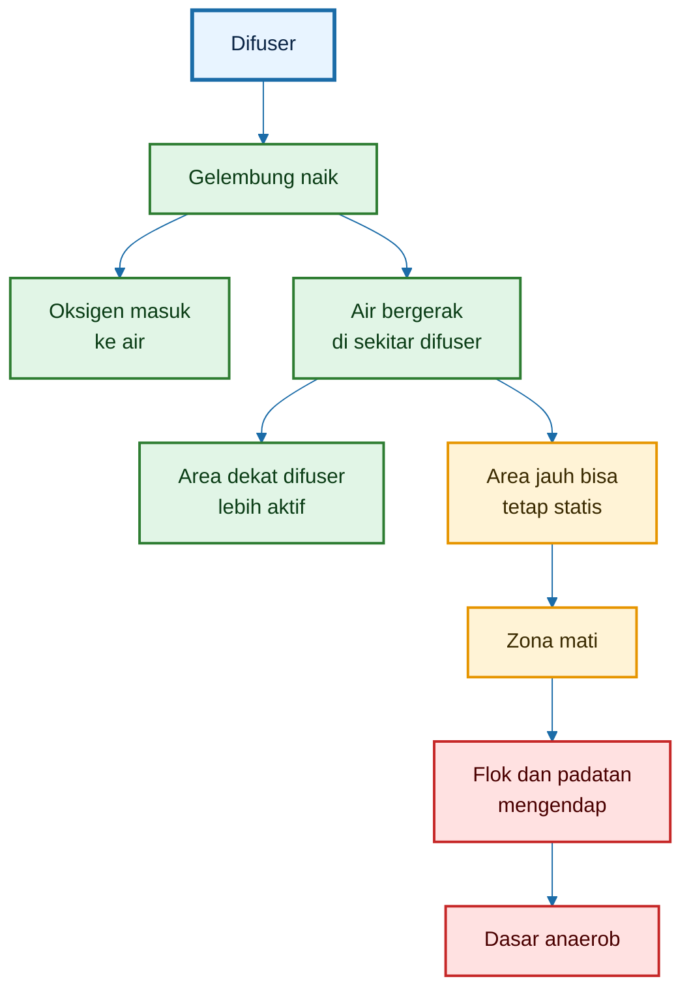

Kesimpulannya:

> Difuser memasok oksigen, tetapi belum tentu menciptakan pola sirkulasi yang cukup untuk mengelola flok dan padatan.

---

## 13.2 Risiko Jika Kolam Statis

Kolam bioflok yang terlalu statis berisiko gagal, meskipun ada gelembung udara.

Risiko utama kolam statis:

- flok mengendap;
- sisa pakan dan feses terkumpul;
- dasar anaerob;
- bau busuk muncul;
- bioflok gagal.

Masalahnya tidak selalu terlihat dari permukaan. Permukaan kolam bisa tampak aktif karena ada gelembung, tetapi bagian dasar masih dapat menjadi titik pengendapan.

Urutannya biasanya seperti ini:

$$
\text{Arus lemah}
\rightarrow
\text{flok mengendap}
\rightarrow
\text{endapan organik}
\rightarrow
\text{zona anaerob}
\rightarrow
\text{bau/racun}
\rightarrow
\text{ikan stres}
$$

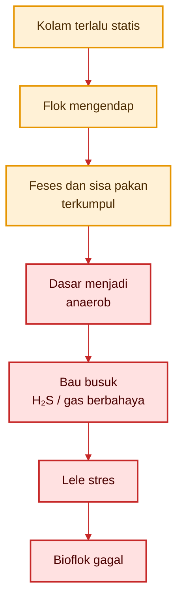

Hargreaves menjelaskan bahwa biofloc system memang membiarkan padatan dan komunitas mikroba terkumpul di air, tetapi kualitas air dapat dikendalikan selama ada **mixing dan aerasi yang cukup untuk menjaga flok tetap aktif dan tersuspensi**. Ia juga menekankan bahwa flok dapat mengendap dengan mudah pada air yang tenang. ([aquaculture.mgcafe.uky.edu][1])

Maka, untuk bioflok D2, difuser harus dilengkapi dengan desain sirkulasi. Di sinilah airlift-pump menjadi relevan.

---

## 13.3 Batas Desain Arus: Jangan Menjadi Kolam Air Deras

Walaupun kolam bioflok membutuhkan arus, bukan berarti kolam harus dibuat deras.

Ini koreksi penting.

Tujuan arus pada bioflok D2 adalah:

- menjaga flok tetap melayang;
- mengurangi zona mati;
- membantu padatan berat bergerak ke titik sifon;
- meratakan oksigen;
- menjaga dasar tidak anaerob.

Tujuannya **bukan**:

- membuat lele berenang kuat;
- melatih otot ikan;
- membuat kolam seperti raceway;
- mengejar sistem air deras.

Dalam teknologi tangki bundar akuakultur, Timmons dkk. menyebut bahwa kecepatan air sekitar **0,5–2,0 kali panjang tubuh ikan per detik** sering digunakan sebagai rentang untuk menjaga kesehatan, muscle tone, dan respirasi ikan pada circular tank. ([ScienceDirect][2]) Studi Davidson dan Summerfelt pada Cornell-type dual-drain circular tanks juga menunjukkan bahwa pengaturan orientasi inlet dan aliran bottom-center drain memengaruhi velocity, mixing, dan flushing padatan; penelitian itu melaporkan water flow bottom-center drain minimal **5–6 L/menit per m² luas dasar** untuk membantu flushing settleable solids. ([ScienceDirect][3])

Namun, rujukan circular tank tersebut tidak boleh diterapkan mentah-mentah untuk kolam bioflok lele D2.

Alasannya:

- lele bukan salmonid;
- lele cenderung bottom-oriented;
- target bioflok adalah suspensi flok, bukan latihan renang;
- kolam D2 kecil sehingga outlet airlift mudah menciptakan arus lokal kuat;
- arus terlalu kuat bisa membuat pakan hanyut dan lele boros energi.

Maka batas desain untuk kolam D2 harus dibuat lebih konservatif.

---

## 13.4 Batas Konservatif untuk Kolam D2

Gunakan batas desain berdasarkan body length per second, tetapi diturunkan untuk konteks bioflok lele.

Target desain:

$$
\begin{aligned}
v_{\text{target}} &= 0{,}3 - 0{,}8 \text{ BL/s}
\end{aligned}
$$

Batas atas normal:

$$
\begin{aligned}
v_{\text{max}} &= 1{,}0 \text{ BL/s}
\end{aligned}
$$

Keterangan:

- (v) = kecepatan arus;
- (BL/s) = body length per second;
- $L_{\text{ikan}}$ = panjang tubuh ikan.

Konversi sederhana:

$$
\begin{aligned}
v_{\text{max}} &= L_{\text{ikan}}
\end{aligned}
$$

jika batasnya 1,0 BL/s.

Jika panjang ikan 10 cm:

$$
\begin{aligned}
L_{\text{ikan}} &= 0{,}10 \text{ m}
\end{aligned}
$$

maka:

$$
\begin{aligned}
v_{\text{max}} &= 0{,}10 \text{ m/s}
\end{aligned}
$$

Jika panjang ikan 15 cm:

$$
\begin{aligned}
L_{\text{ikan}} &= 0{,}15 \text{ m}
\end{aligned}
$$

maka:

$$
\begin{aligned}
v_{\text{max}} &= 0{,}15 \text{ m/s}
\end{aligned}
$$

Maka untuk kolam D2 bioflok lele, gunakan target praktis:

$$
\boxed{
\begin{aligned}
v_{\text{target}} &= 0{,}05 - 0{,}12 \text{ m/s}
\end{aligned}
}
$$

dan batas atas praktis:

$$
\boxed{
v_{\text{max}}
\le
0{,}15
\text{ m/s}
}
$$

Ini berarti arus harus cukup untuk menggerakkan flok, tetapi tidak sampai membuat lele terus-menerus melawan arus.

---

### 13.4.1 Tabel Batas Arus Berdasarkan Panjang Ikan

| Panjang ikan | Target konservatif | Batas atas praktis |
| -----------: | -----------------: | -----------------: |
|         7 cm |      0,04–0,07 m/s |          ±0,07 m/s |
|        10 cm |      0,05–0,10 m/s |          ±0,10 m/s |
|        12 cm |      0,06–0,12 m/s |          ±0,12 m/s |
|        15 cm |      0,07–0,12 m/s |          ±0,15 m/s |

Untuk kolam D2, gunakan batas rendah saat ikan masih kecil. Jangan memakai arus yang sama untuk ikan 7 cm dan ikan 15 cm.

---

### 13.4.2 Diagram Batas Arus D2

```mermaid
%%{init: {"theme": "base", "themeVariables": {
  "fontFamily": "Arial",
  "primaryColor": "#F7FBFF",
  "primaryTextColor": "#0B2545",
  "primaryBorderColor": "#1B6CA8",
  "lineColor": "#1B6CA8"
}}}%%
flowchart TD
    A["Arus terlalu lemah<br/>< 0,05 m/s"] --> B["Flok mengendap<br/>zona mati"]
    B --> C["Risiko anaerob"]

    D["Arus target<br/>0,05–0,12 m/s"] --> E["Flok melayang<br/>lele nyaman"]
    E --> F["Bioflok stabil"]

    G["Arus terlalu kuat<br/>> 0,15 m/s"] --> H["Lele melawan arus<br/>pakan hanyut"]
    H --> I["Energi boros<br/>stres"]

    classDef bad fill:#FFE1E1,stroke:#C62828,color:#4A0000,stroke-width:2px;
    classDef good fill:#E1F5E6,stroke:#2E7D32,color:#0B3D16,stroke-width:3px;
    classDef warn fill:#FFF3D6,stroke:#E69500,color:#3A2A00,stroke-width:2px;

    class A,B,C bad;
    class D,E,F good;
    class G,H,I warn;
```

---

## 13.5 Catatan Penting

Ada beberapa catatan desain yang harus dipegang.

Pertama, kecepatan lokal dekat outlet boleh lebih tinggi. Air yang keluar dari outlet airlift pasti lebih cepat daripada rata-rata kolam. Yang penting, zona tempat ikan berada tidak terus-menerus berarus kuat.

Kedua, kecepatan rata-rata zona ikan jangan terlalu tinggi. Bila ikan terus berenang melawan arus, berarti desain terlalu agresif.

Ketiga, jika flok mengendap, arus terlalu lemah atau arahnya tidak tepat.

Keempat, jika pakan cepat hanyut, outlet terlalu kuat atau salah arah.

Kelima, jika padatan tidak terkumpul ke tengah, pola arus belum membentuk sirkulasi tangensial yang efektif.

Tabel keputusan:

| Gejala                  | Makna                  | Koreksi                                 |
| ----------------------- | ---------------------- | --------------------------------------- |
| Flok mengendap          | arus terlalu lemah     | tambah udara ke airlift, koreksi outlet |
| Ikan melawan arus       | arus terlalu kuat      | kurangi udara ke airlift                |
| Pakan hanyut            | outlet terlalu agresif | ubah arah outlet, kecilkan debit        |
| Dasar hitam             | zona mati/endapan      | tambah sirkulasi, sifon                 |
| Padatan tidak ke tengah | pola arus salah        | arahkan outlet tangensial               |

Kalimat kunci Bab 13:

> Difuser memberi oksigen, tetapi belum tentu memberi pola arus. Bioflok D2 membutuhkan arus memutar pelan: cukup kuat agar flok tidak mengendap, tetapi cukup lemah agar lele tidak berubah menjadi ikan kolam deras.

[**Kembali ke Atas**](#design-sistem-aerasi-bioflok-dengan-airlift-pump-pada-kolam-d2)

---

## 14. Airlift-Pump sebagai Pengaduk Bioflok, Bukan Pembuat Arus Deras

Airlift-pump adalah salah satu solusi paling cocok untuk kolam D2 bioflok karena memanfaatkan udara dari blower untuk dua fungsi sekaligus:

1. membantu oksigenasi;
2. menggerakkan air.

Namun airlift harus didesain dengan benar. Dalam artikel ini, airlift bukan dimaksudkan untuk membuat kolam deras, melainkan untuk menjaga bioflok tetap tersuspensi dan membantu padatan berat bergerak menuju titik sifon.

Dengan kata lain:

> Airlift adalah pengaduk bioflok, bukan mesin arus deras.

---

## 14.1 Prinsip Airlift-Pump

Prinsip kerja airlift-pump:

$$
\text{Udara dari blower}
\rightarrow
\text{difuser bawah}
\rightarrow
\text{gelembung naik}
\rightarrow
\text{air bawah terangkat}
\rightarrow
\text{outlet tangensial}
\rightarrow
\text{arus memutar pelan}
$$

Udara dimasukkan ke bagian bawah pipa riser. Campuran udara dan air di dalam pipa menjadi lebih ringan daripada air di luar pipa, sehingga campuran tersebut naik.

Air yang naik lalu keluar melalui outlet. Jika outlet diarahkan tangensial mengikuti dinding kolam, air membentuk arus memutar pelan.

```mermaid
%%{init: {"theme": "base", "themeVariables": {
  "fontFamily": "Arial",
  "primaryColor": "#F7FBFF",
  "primaryTextColor": "#0B2545",
  "primaryBorderColor": "#1B6CA8",
  "lineColor": "#1B6CA8"
}}}%%
flowchart TD
    A["Udara dari blower"] --> B["Difuser bawah<br/>di dalam pipa"]
    B --> C["Gelembung naik"]
    C --> D["Air bawah<br/>ikut terangkat"]
    D --> E["Outlet tangensial"]
    E --> F["Arus memutar<br/>pelan"]
    F --> G["Flok tetap<br/>melayang"]
    F --> H["Padatan berat<br/>menuju sifon"]

    classDef air fill:#FFF3D6,stroke:#E69500,color:#3A2A00,stroke-width:2px;
    classDef water fill:#E1F5FF,stroke:#0086B3,color:#003344,stroke-width:2px;
    classDef good fill:#E1F5E6,stroke:#2E7D32,color:#0B3D16,stroke-width:2px;

    class A,B,C air;
    class D,E,F water;
    class G,H good;
```

Diagram ini menjelaskan bahwa airlift bekerja dari bawah ke atas. Karena itu, airlift sangat berguna untuk mengurangi zona mati di dasar kolam.

---

## 14.2 Fungsi Airlift pada Bioflok D2

Pada kolam D2, fungsi airlift bukan hanya sebagai pompa air sederhana. Airlift menjadi bagian dari sistem bioreaktor.

Fungsi airlift:

- mengangkat air dari bawah;
- mengurangi zona mati;
- menjaga flok melayang;
- membantu distribusi oksigen;
- mengarahkan padatan berat ke tengah;
- membantu pembuangan padatan lewat sifon.

---

### 14.2.1 Mengangkat Air dari Bawah

Bagian bawah kolam adalah area rawan karena feses, sisa pakan, dan flok tua cenderung turun ke dasar.

Jika air bawah tidak bergerak, dasar mudah menjadi anaerob.

Airlift menarik air bawah masuk ke pipa, lalu mengangkatnya ke permukaan. Ini membantu sirkulasi vertikal.

---

### 14.2.2 Mengurangi Zona Mati

Zona mati adalah area air yang kurang bergerak.

Pada zona mati:

- oksigen rendah;
- flok mengendap;
- bahan organik menumpuk;
- dasar menjadi hitam;
- bau busuk bisa muncul.

Airlift dengan outlet tangensial membantu menciptakan pola arus yang lebih merata.

---

### 14.2.3 Menjaga Flok Melayang

Bioflok harus tetap tersuspensi agar tetap aktif.

Flok yang melayang masih berada dalam kondisi kontak dengan oksigen dan mikroba. Flok yang mengendap terlalu lama berisiko membusuk.

Maka target arus airlift:

$$
\text{cukup untuk flok melayang}
\neq
\text{cukup kuat untuk membuat ikan kelelahan}
$$

---

### 14.2.4 Mengarahkan Padatan Berat ke Tengah

Pada kolam bundar, arus memutar dapat membantu padatan berat bergerak menuju tengah dasar, terutama jika dasar kolam sedikit miring atau ada titik sifon di tengah.

Padatan berat yang terkumpul lebih mudah dibuang.

Ini penting karena bioflok bukan berarti semua padatan harus dibiarkan.

---

## 14.3 Batas Arus Airlift

Airlift harus menghasilkan arus memutar pelan, bukan kolam deras.

Target:

$$
\begin{aligned}
v_{rata-rata} &= 0{,}05 - 0{,}12 \text{ m/s}
\end{aligned}
$$

Batas atas:

$$
v_{maksimum}
\le
0{,}15
\text{ m/s}
$$

Makna angka ini:

- di bawah 0,05 m/s: flok mudah mengendap;
- 0,05–0,12 m/s: target konservatif untuk D2;
- mendekati 0,15 m/s: batas atas praktis;
- di atas 0,15 m/s: risiko ikan terlalu aktif melawan arus.

Catatan:

> Kecepatan di dekat outlet bisa lebih tinggi, tetapi kecepatan rata-rata zona ikan sebaiknya tetap rendah.

---

### 14.3.1 Cara Membaca Arus Tanpa Flow Meter

Di lapangan, pembudidaya sering tidak memiliki alat ukur kecepatan air. Maka arus bisa dibaca dari tanda visual.

Tanda arus terlalu lemah:

- flok mengendap;
- pakan terkumpul di titik tertentu;
- dasar mulai hitam;
- air bawah bau;
- padatan tidak bergerak ke sifon.

Tanda arus ideal:

- flok halus melayang;
- padatan berat perlahan ke tengah;
- ikan berenang santai;
- pakan masih mudah dimakan;
- tidak ada area dasar yang hitam tebal.

Tanda arus terlalu kuat:

- lele terus melawan arus;
- ikan menumpuk di area tenang;
- pakan cepat hanyut;
- ikan tampak gelisah;
- pertumbuhan tidak optimal.

---

## 14.4 Hubungan dengan Panjang Ikan

Batas arus harus mengikuti ukuran ikan. Ikan kecil lebih mudah terbawa arus dan lebih cepat stres.

Jika panjang ikan masih 7–10 cm, gunakan batas lebih rendah:

$$
\begin{aligned}
v_{\text{max}} &= 0{,}07 - 0{,}10 \text{ m/s}
\end{aligned}
$$

Jika ikan 12–15 cm:

$$
\begin{aligned}
v_{\text{max}} &= 0{,}12 - 0{,}15 \text{ m/s}
\end{aligned}
$$

Tabel praktis:

| Panjang ikan | Rekomendasi arus |
| -----------: | ---------------: |
|      7–10 cm |    0,05–0,10 m/s |
|     10–12 cm |    0,06–0,12 m/s |
|     12–15 cm |    0,08–0,15 m/s |

Prinsip:

> Semakin kecil ikan, semakin pelan arus yang digunakan.

---

## 14.5 Desain Praktis Kolam D2

Untuk kolam D2, desain praktisnya:

- 1 airlift tangensial cukup untuk D2;
- tambahkan 1–2 difuser kecil untuk titik mati;
- outlet diarahkan mengikuti dinding kolam;
- jangan diarahkan langsung ke tengah;
- titik sifon berada di tengah dasar.

---

### 14.5.1 Tata Letak yang Disarankan

Komponen utama:

1. blower 110–130 L/menit;
2. manifold dan valve pembagi udara;
3. 1 airlift-pump di sisi kolam;
4. outlet tangensial dekat permukaan;
5. 1–2 difuser tambahan;
6. titik sifon tengah;
7. aerator kecil opsional sebagai cadangan.

Pembagian udara awal:

| Jalur            |      Porsi udara | Fungsi                         |
| ---------------- | ---------------: | ------------------------------ |
| Airlift-pump     |           60–70% | arus memutar dan suspensi flok |
| Difuser tambahan |           30–40% | oksigen merata dan titik mati  |
| Aerator opsional | sesuai kebutuhan | cadangan/emergency             |

Jika blower 120 L/menit:

$$
\begin{aligned}
\text{Udara ke airlift}
&= (60\% - 70\%) \times 120 \\
&= 72 - 84 \ 	ext{L/menit}
\end{aligned}
$$

Udara ke difuser tambahan:

$$
\begin{aligned}
\text{Udara ke difuser tambahan}
&= (30\% - 40\%) \times 120 \\
&= 36 - 48 \ 	ext{L/menit}
\end{aligned}
$$

---

### 14.5.2 Skema Tata Letak D2

```mermaid
%%{init: {"theme": "base", "themeVariables": {
  "fontFamily": "Arial",
  "primaryColor": "#F7FBFF",
  "primaryTextColor": "#0B2545",
  "primaryBorderColor": "#1B6CA8",
  "lineColor": "#1B6CA8"
}}}%%
flowchart TD
    A["Kolam D2<br/>diameter 2 m"] --> B["Airlift di sisi kolam"]
    B --> C["Outlet tangensial<br/>ikuti dinding"]
    C --> D["Arus memutar pelan<br/>0,05–0,12 m/s"]

    A --> E["Difuser tambahan<br/>1–2 titik"]
    E --> F["Oksigen lebih merata<br/>zona mati berkurang"]

    A --> G["Titik sifon<br/>tengah dasar"]
    D --> H["Padatan berat<br/>bergerak ke tengah"]
    H --> G

    D --> I["Flok tetap melayang"]
    F --> I
    I --> J["Bioflok tetap aerob"]

    classDef pond fill:#E8F4FF,stroke:#1B6CA8,color:#0B2545,stroke-width:3px;
    classDef tool fill:#FFF3D6,stroke:#E69500,color:#3A2A00,stroke-width:2px;
    classDef flow fill:#E1F5FF,stroke:#0086B3,color:#003344,stroke-width:2px;
    classDef good fill:#E1F5E6,stroke:#2E7D32,color:#0B3D16,stroke-width:2px;

    class A pond;
    class B,C,E,G tool;
    class D,F,H flow;
    class I,J good;
```

---

### 14.5.3 Kesalahan Arah Outlet

Outlet airlift jangan diarahkan langsung ke tengah kolam.

Jika outlet diarahkan ke tengah:

- arus memecah pola putaran;
- padatan bisa tersebar lagi;
- ikan terkena semburan langsung;
- flok tidak bergerak stabil;
- titik sifon kurang efektif.

Arah yang benar:

$$
\text{Outlet}
\rightarrow
\text{mengikuti dinding kolam}
$$

Tujuannya membentuk arus tangensial.

---

## 14.6 Catatan Solids Removal

Pada tangki bundar akuakultur, desain dual-drain atau bottom-center drain dipakai untuk mengeluarkan padatan yang mengendap.

Penelitian Davidson dan Summerfelt pada Cornell-type dual-drain tank menunjukkan bahwa bottom-center drain flow minimal sekitar **5–6 L/menit per m² luas dasar** dapat membantu flushing settleable solids. Penelitian yang sama juga menunjukkan bahwa flushing padatan dipengaruhi oleh aliran bottom-center drain dan rotational period air dalam tangki. ([ScienceDirect][3])

Untuk kolam D2, hitung luas dasar:

$$
\begin{aligned}
A &= \pi r^2
\end{aligned}
$$

$$
\begin{aligned}
A &= 3{,}14 \times 1^2
\end{aligned}
$$

$$
\begin{aligned}
A &= 3{,}14 \text{ m}^2
\end{aligned}
$$

Jika memakai pendekatan 5–6 L/menit per m²:

$$
\begin{aligned}
Q_{drain} &= 3{,}14 \times 5 - 6
\end{aligned}
$$

Secara penulisan matematis yang lebih jelas:

$$
\begin{aligned}
Q_{drain,min} 3{,}14 \times 5 &= 15{,}7 \text{ L/menit}
\end{aligned}
$$

$$
\begin{aligned}
Q_{drain,max} 3{,}14 \times 6 &= 18{,}8 \text{ L/menit}
\end{aligned}
$$

Maka:

$$
\begin{aligned}
Q_{drain} &= 15{,}7 - 18{,}8 \text{ L/menit}
\end{aligned}
$$

Namun pada kolam bioflok D2, angka ini tidak harus diterapkan sebagai drain kontinu. Sistem bioflok bukan sistem RAS Cornell-type murni.

Yang lebih sesuai untuk praktisi adalah menerapkannya sebagai acuan **sifon berkala**:

- padatan diarahkan ke tengah;
- titik tengah disifon berkala;
- jangan membiarkan lumpur hitam menumpuk;
- jangan menyedot terlalu banyak air sekaligus jika sistem masih stabil;
- sifon lebih sering saat flok berat dan pakan tinggi.

---

### 14.6.1 Praktik Sifon pada Kolam D2

Rekomendasi praktis:

| Kondisi dasar        | Tindakan                                               |
| -------------------- | ------------------------------------------------------ |
| Dasar bersih         | sifon ringan sesuai kebutuhan                          |
| Ada padatan cokelat  | sifon berkala                                          |
| Ada lumpur hitam     | sifon segera                                           |
| Bau busuk dari dasar | hentikan molase, kurangi pakan, aerasi maksimal, sifon |
| Flok terlalu pekat   | sifon sebagian dan kurangi karbon                      |

Tujuan sifon bukan membuat air bening, tetapi membuang padatan berat yang tidak lagi bermanfaat.

---

## 14.7 Kalimat Kunci Bab 14

Kalimat kunci bab ini:

> Airlift-pump pada bioflok D2 harus dipahami sebagai pengaduk biologis: mengangkat air bawah, menjaga flok melayang, dan mengarahkan padatan ke sifon, bukan membuat kolam menjadi deras.

Atau lebih operasional:

> Arahkan outlet tangensial, jaga arus rata-rata 0,05–0,12 m/s, batasi maksimum sekitar 0,15 m/s, dan gunakan sifon tengah untuk membuang padatan berat.

[**Kembali ke Atas**](#design-sistem-aerasi-bioflok-dengan-airlift-pump-pada-kolam-d2)

[1]: https://aquaculture.mgcafe.uky.edu/sites/aquaculture.ca.uky.edu/files/srac_4503_biofloc_production_systems_for_aquaculture.pdf?utm_source=chatgpt.com 'Biofloc Production Systems for Aquaculture'
[2]: https://www.sciencedirect.com/science/article/pii/S0144860998000235?utm_source=chatgpt.com 'Review of circular tank technology and management'
[3]: https://www.sciencedirect.com/science/article/pii/S0144860904000214?utm_source=chatgpt.com 'Solids flushing, mixing, and water velocity profiles within ...'

---

## 15. Desain Final Kolam D2: Aerator, Difuser, Airlift, dan Sifon

Bab ini adalah rangkuman desain teknis untuk kolam D2. Semua perhitungan oksigen, kebutuhan blower, batas arus, dan fungsi airlift disatukan menjadi konfigurasi praktis.

Tujuannya bukan membuat sistem terlihat rumit, tetapi membuat kolam bioflok D2 bekerja stabil:

- oksigen cukup;
- flok tetap melayang;
- padatan berat terkumpul;
- dasar tidak anaerob;
- lele tidak dipaksa melawan arus kuat;
- sistem mudah dikoreksi di lapangan.

Desain akhir yang disarankan adalah:

> **blower utama + airlift-pump tangensial + difuser tambahan + titik sifon tengah + aerator opsional sebagai cadangan.**

---

## 15.1 Data Desain Final

Data desain final kolam D2:

| Parameter                |     Nilai desain |
| ------------------------ | ---------------: |
| Tipe kolam               |               D2 |
| Diameter kolam           |              2 m |
| Kedalaman air            |            0,8 m |
| Volume efektif           |          ±2,5 m³ |
| Biomassa contoh          |          37,5 kg |
| Pakan harian             |    1,125 kg/hari |
| Molase harian            |   0,1125 kg/hari |
| Kebutuhan oksigen desain | ±1,35 kg O₂/hari |
| Kebutuhan oksigen puncak |  ±0,10 kg O₂/jam |
| Rekomendasi blower       |  110–130 L/menit |
| Target arus              |    0,05–0,12 m/s |
| Batas arus maksimum      |        ≤0,15 m/s |

Angka penting untuk desain alat adalah:

$$
O_{2,\text{desain}}
\approx
1{,}35
\text{ kg O}_2/\text{hari}
$$

dan:

$$
O_{2,\text{puncak}}
\approx
0{,}10
\text{ kg O}_2/\text{jam}
$$

Dengan asumsi efisiensi transfer oksigen difuser sekitar 6% dan cadangan lapangan 20%, kebutuhan blower praktis menjadi:

$$
Q_{\text{blower}}
\approx
110 - 130
\text{ L/menit}
$$

---

### 15.1.1 Makna Data Desain

Data ini harus dipahami sebagai **basis desain**, bukan angka mati.

Jika biomassa ikan naik, pakan naik, molase naik, atau flok makin pekat, maka kebutuhan oksigen juga naik. Jika blower melemah, difuser kotor, atau dasar mulai banyak endapan, kapasitas aktual sistem turun.

Maka desain D2 harus selalu dibaca dengan prinsip:

$$
\text{Beban kolam naik}
\rightarrow
\text{kebutuhan oksigen naik}
$$

dan:

$$
\text{Kapasitas aerasi turun}
\rightarrow
\text{risiko DO turun}
$$

Karena itu, sistem harus memiliki ruang koreksi melalui valve, pembagian udara, difuser tambahan, dan aerator cadangan.

---

## 15.2 Rekomendasi Konfigurasi Utama

Konfigurasi yang disarankan:

1. **blower utama 110–130 L/menit**;
2. udara dibagi ke:
   - airlift-pump tangensial;
   - difuser tambahan;
3. outlet airlift diarahkan mengikuti dinding kolam;
4. titik sifon di tengah dasar;
5. aerator kecil opsional sebagai cadangan/emergency.

Konfigurasi ini dipilih karena memenuhi empat fungsi sekaligus:

- memasok oksigen;
- menggerakkan air bawah;
- menjaga flok tetap tersuspensi;
- mengarahkan padatan berat ke titik sifon.

---

### 15.2.1 Skema Konfigurasi Utama

```mermaid
%%{init: {"theme": "base", "themeVariables": {
  "fontFamily": "Arial",
  "primaryColor": "#F7FBFF",
  "primaryTextColor": "#0B2545",
  "primaryBorderColor": "#1B6CA8",
  "lineColor": "#1B6CA8"
}}}%%
flowchart TD
    A["Blower utama<br/>110–130 L/menit"] --> B["Manifold + valve<br/>pembagi udara"]

    B --> C["Airlift-pump<br/>tangensial"]
    B --> D["Difuser tambahan<br/>1–2 titik"]

    C --> E["Arus memutar pelan<br/>0,05–0,12 m/s"]
    D --> F["Oksigen lebih merata"]

    E --> G["Flok tetap melayang"]
    E --> H["Padatan berat<br/>menuju tengah"]
    H --> I["Titik sifon<br/>tengah dasar"]

    F --> J["DO lebih aman"]
    G --> K["Bioflok stabil"]
    I --> K
    J --> K

    L["Aerator kecil<br/>opsional"] --> M["Cadangan DO<br/>emergency / degassing"]
    M --> K

    classDef source fill:#FFF3D6,stroke:#E69500,color:#3A2A00,stroke-width:2px;
    classDef tool fill:#E8F4FF,stroke:#1B6CA8,color:#0B2545,stroke-width:2px;
    classDef flow fill:#E1F5FF,stroke:#0086B3,color:#003344,stroke-width:2px;
    classDef good fill:#E1F5E6,stroke:#2E7D32,color:#0B3D16,stroke-width:2px;
    classDef backup fill:#F3E8FF,stroke:#7B1FA2,color:#2D0040,stroke-width:2px;

    class A,B source;
    class C,D,I tool;
    class E,F,H flow;
    class G,J,K good;
    class L,M backup;
```

Diagram ini menunjukkan bahwa blower tidak langsung dipakai ke satu titik. Udara harus dibagi dan dikendalikan agar fungsi oksigenasi dan sirkulasi berjalan bersama.

---

### 15.2.2 Tampak Atas Kolam D2

Tampak atas kolam D2 dapat dibayangkan sebagai lingkaran dengan satu airlift di sisi kolam, outlet mengarah mengikuti dinding, dan titik sifon di tengah.

```mermaid
%%{init: {"theme": "base", "themeVariables": {
  "fontFamily": "Arial",
  "primaryColor": "#F7FBFF",
  "primaryTextColor": "#0B2545",
  "primaryBorderColor": "#1B6CA8",
  "lineColor": "#1B6CA8"
}}}%%
flowchart TD
    A["Kolam D2<br/>diameter 2 m"] --> B["Airlift di sisi kolam"]
    B --> C["Outlet tangensial<br/>mengikuti dinding"]
    C --> D["Arus memutar pelan"]

    D --> E["Flok tetap<br/>tersuspensi"]
    D --> F["Padatan berat<br/>bergerak ke tengah"]

    A --> G["Difuser tambahan<br/>1–2 titik"]
    G --> H["Oksigen merata<br/>zona mati berkurang"]

    F --> I["Titik sifon tengah"]

    E --> J["Bioflok aerob"]
    H --> J
    I --> J

    classDef pond fill:#E8F4FF,stroke:#1B6CA8,color:#0B2545,stroke-width:3px;
    classDef tool fill:#FFF3D6,stroke:#E69500,color:#3A2A00,stroke-width:2px;
    classDef flow fill:#E1F5FF,stroke:#0086B3,color:#003344,stroke-width:2px;
    classDef good fill:#E1F5E6,stroke:#2E7D32,color:#0B3D16,stroke-width:2px;

    class A pond;
    class B,C,G,I tool;
    class D,F,H flow;
    class E,J good;
```

Catatan penting:

> Outlet airlift jangan diarahkan langsung ke tengah kolam. Arahkan mengikuti dinding agar terbentuk arus tangensial.

---

## 15.3 Pembagian Udara Awal

Pembagian udara awal:

| Jalur            | Porsi udara | Fungsi                      |
| ---------------- | ----------: | --------------------------- |
| Airlift-pump     |      60–70% | sirkulasi dan suspensi flok |
| Difuser tambahan |      30–40% | pemerataan oksigen          |
| Aerator opsional |    cadangan | emergency dan degassing     |

Jika blower yang digunakan 120 L/menit, maka pembagian awal dapat dihitung sebagai berikut.

### Udara ke airlift-pump

$$
\begin{aligned}
Q_{\text{airlift}} &= 60\% - 70\% \times 120
\end{aligned}
$$

$$
\begin{aligned}
Q_{\text{airlift}} &= 72 - 84 \text{ L/menit}
\end{aligned}
$$

### Udara ke difuser tambahan

$$
\begin{aligned}
Q_{\text{difuser}} &= 30\% - 40\% \times 120
\end{aligned}
$$

$$
\begin{aligned}
Q_{\text{difuser}} &= 36 - 48 \text{ L/menit}
\end{aligned}
$$

Jadi, untuk blower 120 L/menit, pembagian awal yang masuk akal:

| Jalur            | Debit udara awal |
| ---------------- | ---------------: |
| Airlift-pump     |    72–84 L/menit |
| Difuser tambahan |    36–48 L/menit |

Namun, ini hanya titik awal. Pembagian harus dikoreksi berdasarkan kondisi air, flok, ikan, dan DO.

---

### 15.3.1 Mengapa Airlift Mendapat Porsi Lebih Besar?

Airlift mendapat porsi udara lebih besar karena tugasnya lebih berat:

- menarik air dari bawah;
- mengangkat air dalam pipa;
- membentuk arus tangensial;
- menjaga flok melayang;
- membantu padatan menuju sifon.

Difuser tambahan tetap diperlukan karena airlift tidak selalu meratakan oksigen ke seluruh titik kolam.

Dengan kata lain:

$$
\begin{aligned}
\text{Airlift} &= \text{sirkulasi utama}
\end{aligned}
$$

$$
\begin{aligned}
\text{Difuser tambahan} &= \text{pemerataan oksigen}
\end{aligned}
$$

$$
\begin{aligned}
\text{Aerator opsional} &= \text{cadangan risiko}
\end{aligned}
$$

---

### 15.3.2 Pembagian Udara Menggunakan Valve

Gunakan manifold dan valve agar pembagian udara bisa diatur.

```mermaid
%%{init: {"theme": "base", "themeVariables": {
  "fontFamily": "Arial",
  "primaryColor": "#F7FBFF",
  "primaryTextColor": "#0B2545",
  "primaryBorderColor": "#1B6CA8",
  "lineColor": "#1B6CA8"
}}}%%
flowchart TD
    A["Blower<br/>120 L/menit"] --> B["Manifold"]

    B --> C["Valve 1"]
    B --> D["Valve 2"]

    C --> E["Airlift-pump<br/>72–84 L/menit"]
    D --> F["Difuser tambahan<br/>36–48 L/menit"]

    E --> G["Arus memutar<br/>flok melayang"]
    F --> H["DO merata<br/>zona mati turun"]

    classDef source fill:#FFF3D6,stroke:#E69500,color:#3A2A00,stroke-width:2px;
    classDef valve fill:#E8F4FF,stroke:#1B6CA8,color:#0B2545,stroke-width:2px;
    classDef good fill:#E1F5E6,stroke:#2E7D32,color:#0B3D16,stroke-width:2px;

    class A,B source;
    class C,D,E,F valve;
    class G,H good;
```

Valve wajib dipasang karena kondisi kolam berubah. Saat flok mengendap, udara ke airlift bisa dinaikkan. Saat ikan terlihat melawan arus, udara ke airlift bisa dikurangi dan dialihkan ke difuser tambahan.

---

## 15.4 Koreksi Berdasarkan Kondisi Lapangan

Desain final tidak boleh kaku. Kolam bioflok adalah sistem hidup. Karena itu, desain harus memiliki prosedur koreksi.

---

### 15.4.1 Jika Flok Mengendap

Tanda flok mengendap:

- air tampak lebih jernih di bagian atas;
- banyak partikel di dasar;
- dasar mulai cokelat gelap atau hitam;
- bau muncul saat dasar terganggu;
- flok tidak berputar mengikuti arus;
- titik tertentu menjadi tempat penumpukan.

Tindakan koreksi:

- naikkan udara ke airlift;
- perbaiki arah outlet;
- sifon dasar;
- cek apakah difuser tambahan bekerja;
- kurangi molase sementara jika flok terlalu berat;
- jangan mengaduk lumpur hitam terlalu kasar ke seluruh kolam.

Rumus keputusan sederhana:

$$
\text{Flok mengendap}
\rightarrow
\text{arus kurang atau salah arah}
\rightarrow
\text{koreksi airlift + sifon}
$$

---

### 15.4.2 Jika Ikan Melawan Arus

Tanda arus terlalu kuat:

- lele terus menghadap arus;
- ikan berenang tanpa henti;
- ikan menumpuk di area tenang;
- pakan cepat hanyut;
- ikan sulit mengambil pakan;
- pertumbuhan tidak seimbang dengan pakan.

Tindakan koreksi:

- turunkan udara ke airlift;
- bagi udara ke difuser tambahan;
- ubah sudut outlet;
- arahkan outlet lebih mengikuti dinding;
- jangan arahkan outlet ke tengah;
- pastikan target arus tetap 0,05–0,12 m/s.

Rumus keputusan:

$$
\text{Ikan melawan arus}
\rightarrow
\text{arus terlalu kuat}
\rightarrow
\text{kurangi debit airlift}
$$

---

### 15.4.3 Jika DO Subuh Rendah

Tanda DO subuh rendah:

- ikan menggantung pagi;
- ikan berkumpul dekat aerasi;
- respons makan lambat;
- air terasa berat;
- busa tebal;
- DO meter menunjukkan nilai rendah.

Tindakan koreksi:

- tambah udara total;
- bersihkan difuser;
- kurangi pakan sore/malam;
- kurangi molase;
- sifon endapan;
- tambahkan aerator cadangan;
- cek blower dan kebocoran selang.

Rumus keputusan:

$$
\text{DO subuh rendah}
\rightarrow
\text{kapasitas O₂ kurang atau beban terlalu tinggi}
\rightarrow
\text{tambah aerasi + kurangi beban}
$$

---

### 15.4.4 Jika Air Bau

Tanda air bermasalah:

- bau got;
- bau telur busuk;
- bau bangkai;
- busa tebal menetap;
- dasar hitam;
- ikan tidak nyaman;
- pakan tidak habis.

Tindakan koreksi:

- hentikan molase;
- kurangi pakan;
- sifon endapan;
- aerasi maksimal;
- buang sebagian air bawah jika perlu;
- jangan tambah probiotik sebelum beban organik dikurangi.

Rumus keputusan:

$$
\text{Air bau}
\rightarrow
\text{anaerob / organik berlebih}
\rightarrow
\text{kurangi beban + aerasi maksimal + sifon}
$$

---

### 15.4.5 Diagram Keputusan Koreksi Lapangan

```mermaid
%%{init: {"theme": "base", "themeVariables": {
  "fontFamily": "Arial",
  "primaryColor": "#F7FBFF",
  "primaryTextColor": "#0B2545",
  "primaryBorderColor": "#1B6CA8",
  "lineColor": "#1B6CA8"
}}}%%
flowchart TD
    A["Cek kolam D2"] --> B{"Gejala utama?"}

    B --> C["Flok mengendap"]
    C --> C1["Tambah udara ke airlift<br/>koreksi outlet<br/>sifon dasar"]

    B --> D["Ikan melawan arus"]
    D --> D1["Kurangi udara ke airlift<br/>bagi ke difuser<br/>ubah sudut outlet"]

    B --> E["DO subuh rendah"]
    E --> E1["Tambah aerasi<br/>kurangi pakan malam<br/>kurangi molase"]

    B --> F["Air bau"]
    F --> F1["Hentikan molase<br/>kurangi pakan<br/>sifon + aerasi maksimal"]

    C1 --> G["Pantau ulang<br/>DO, flok, ikan"]
    D1 --> G
    E1 --> G
    F1 --> G

    classDef check fill:#E8F4FF,stroke:#1B6CA8,color:#0B2545,stroke-width:2px;
    classDef warn fill:#FFF3D6,stroke:#E69500,color:#3A2A00,stroke-width:2px;
    classDef action fill:#E1F5E6,stroke:#2E7D32,color:#0B3D16,stroke-width:2px;
    classDef danger fill:#FFE1E1,stroke:#C62828,color:#4A0000,stroke-width:2px;

    class A,B check;
    class C,D,E warn;
    class F danger;
    class C1,D1,E1,F1,G action;
```

---

## 15.5 Notasi Desain Kolam D2

Untuk memudahkan pembacaan desain, gunakan notasi berikut:

| Notasi          | Makna                                   |
| --------------- | --------------------------------------- |
| Panah oranye    | udara dari blower                       |
| Panah biru muda | air + gelembung naik dalam pipa airlift |
| Panah biru tua  | arus memutar pelan                      |
| Panah cokelat   | padatan berat menuju sifon              |
| Area hijau      | zona flok tetap melayang                |
| Titik tengah    | area sifon padatan                      |

Notasi ini penting agar operator lapangan tidak salah memahami desain. Targetnya bukan membuat semua air bergerak keras, tetapi menciptakan pola sirkulasi lembut dan terarah.

---

### 15.5.1 Skema Notasi Aliran

```mermaid
%%{init: {"theme": "base", "themeVariables": {
  "fontFamily": "Arial",
  "primaryColor": "#F7FBFF",
  "primaryTextColor": "#0B2545",
  "primaryBorderColor": "#1B6CA8",
  "lineColor": "#1B6CA8"
}}}%%
flowchart TD
    A["🟧 Udara dari blower"] --> B["Difuser bawah<br/>airlift"]
    B --> C["🟦 Air + gelembung<br/>naik dalam pipa"]
    C --> D["Outlet tangensial"]
    D --> E["🔵 Arus memutar pelan"]
    E --> F["🟢 Flok tetap melayang"]
    E --> G["🟫 Padatan berat<br/>menuju sifon"]
    G --> H["Titik sifon tengah"]

    classDef orange fill:#FFF3D6,stroke:#E69500,color:#3A2A00,stroke-width:2px;
    classDef lightblue fill:#E1F5FF,stroke:#0086B3,color:#003344,stroke-width:2px;
    classDef blue fill:#E8F4FF,stroke:#1B6CA8,color:#0B2545,stroke-width:2px;
    classDef green fill:#E1F5E6,stroke:#2E7D32,color:#0B3D16,stroke-width:2px;
    classDef brown fill:#F3E0C7,stroke:#8D5A1F,color:#3A2100,stroke-width:2px;

    class A,B orange;
    class C lightblue;
    class D,E blue;
    class F green;
    class G,H brown;
```

---

## 15.6 Checklist Instalasi Kolam D2

Sebelum sistem dijalankan, gunakan checklist berikut.

| Komponen         | Checklist                            |
| ---------------- | ------------------------------------ |
| Blower           | debit 110–130 L/menit, tekanan cukup |
| Manifold         | ada pembagi udara                    |
| Valve            | bisa mengatur airlift dan difuser    |
| Airlift          | pipa tegak, bawah terbuka            |
| Difuser airlift  | berada di bawah dalam pipa           |
| Outlet           | tangensial mengikuti dinding         |
| Difuser tambahan | 1–2 titik untuk pemerataan           |
| Titik sifon      | di tengah dasar                      |
| Aerator opsional | siap untuk cadangan                  |
| Listrik          | aman dan terlindung air              |
| Backup           | idealnya ada cadangan listrik/aerasi |

---

## 15.7 Kesimpulan Bab 15

Desain final kolam D2 harus menggabungkan oksigenasi dan sirkulasi.

Konfigurasi praktis:

$$
\boxed{
\text{Blower } 110 - 130 \text{ L/menit}

- \text{airlift tangensial}
- \text{difuser tambahan}
- \text{sifon tengah}
- \text{aerator opsional}
  }


$$

Target teknis:

$$
O_{2,\text{desain}}
\approx
1{,}35
\text{ kg O}_2/\text{hari}
$$

$$
O_{2,\text{puncak}}
\approx
0{,}10
\text{ kg O}_2/\text{jam}
$$

$$
\begin{aligned}
v_{\text{target}} &= 0{,}05 - 0{,}12 \text{ m/s}
\end{aligned}
$$

$$
v_{\text{max}}
\le
0{,}15
\text{ m/s}
$$

Kalimat kunci bab ini:

> Desain terbaik kolam D2 bukan sekadar banyak gelembung, tetapi kombinasi udara, arus pelan, flok tersuspensi, dan pembuangan padatan. Airlift menjaga bioflok tetap hidup, difuser menjaga oksigen tersebar, sifon membuang beban berat, dan aerator menjadi cadangan saat sistem rawan.

[**Kembali ke Atas**](#design-sistem-aerasi-bioflok-dengan-airlift-pump-pada-kolam-d2)

---

## 16. Uji Lapangan OUR dan OTR dengan DO Meter

Perhitungan pada bab sebelumnya adalah **desain awal**. Namun desain aerasi tidak boleh berhenti di atas kertas. Sistem harus diuji di kolam nyata karena kondisi lapangan sering berbeda dari asumsi.

Perbedaan bisa muncul karena:

- difuser kotor;
- blower tidak sesuai spesifikasi;
- selang bocor;
- valve tidak terbuka penuh;
- flok terlalu pekat;
- pakan tidak habis;
- molase berlebihan;
- suhu air tinggi;
- biomassa ikan meningkat;
- dasar kolam banyak endapan.

Karena itu, DO meter menjadi alat penting. Dengan DO meter, pembudidaya dapat mengukur dua hal:

1. **OUR** atau oxygen uptake rate, yaitu laju pemakaian oksigen oleh kolam.
2. **OTR** atau oxygen transfer rate, yaitu laju pemasukan oksigen oleh aerator/difuser/airlift.

Kalimat praktisnya:

> Hitungan desain memberi perkiraan. DO meter memberi kenyataan lapangan.

---

## 16.1 Mengukur OUR Kolam

OUR adalah laju konsumsi oksigen kolam.

OUR menunjukkan seberapa cepat oksigen habis saat aerasi dihentikan sementara. Nilai OUR mencerminkan total kebutuhan oksigen aktual dari ikan, mikroba, flok, bahan organik, dan endapan.

Rumus OUR:

$$
\begin{aligned}
OUR &= \frac{ \text{penurunan DO, mg/L/jam} \times V } {1000}
\end{aligned}
$$

Keterangan:

- $OUR$ = oxygen uptake rate, kg O₂/jam;
- penurunan DO = laju turunnya DO, mg/L/jam;
- $V$ = volume kolam, m³;
- 1000 = konversi gram ke kg.

Karena:

$$
\begin{aligned}
1 \text{ mg/L pada } 1 \text{ m}^3 &= 1 \text{ gram O}_2
\end{aligned}
$$

maka rumus di atas langsung menghasilkan kg O₂/jam setelah dibagi 1000.

---

### 16.1.1 Cara Mengukur OUR

Langkah uji OUR:

1. Pastikan ikan dalam kondisi aman.
2. Ukur DO awal.
3. Matikan aerasi sebentar.
4. Catat DO setelah 5–15 menit.
5. Jangan biarkan DO turun di bawah 4 mg/L.
6. Hitung penurunan DO per jam.
7. Hitung OUR.

Uji ini harus dilakukan hati-hati. Jangan mematikan aerasi terlalu lama, terutama pada kolam padat tebar atau saat flok sedang pekat.

Batas aman:

> Jika DO turun cepat atau ikan mulai menggantung, segera nyalakan aerasi kembali.

---

### 16.1.2 Contoh Hitung OUR Kolam D2

Misal:

- volume kolam D2 = 2,5 m³;
- DO awal = 6,0 mg/L;
- aerasi dimatikan 10 menit;
- DO akhir = 5,6 mg/L.

Penurunan DO selama 10 menit:

$$
\begin{aligned}
6{,}0 - 5{,}6 &= 0{,}4 \text{ mg/L}
\end{aligned}
$$

Konversi ke penurunan per jam:

$$
\begin{aligned}
0{,}4 \times 6 &= 2{,}4 \text{ mg/L/jam}
\end{aligned}
$$

Hitung OUR:

$$
\begin{aligned}
OUR &= \frac{ 2{,}4 \times 2{,}5 } {1000}
\end{aligned}
$$

$$
\begin{aligned}
OUR &= \frac{ 6 } {1000}
\end{aligned}
$$

$$
\begin{aligned}
OUR &= 0{,}006 \text{ kg O}_2/\text{jam}
\end{aligned}
$$

Atau:

$$
\begin{aligned}
OUR &= 6 \text{ gram O}_2/\text{jam}
\end{aligned}
$$

Artinya, pada kondisi uji tersebut, kolam memakai oksigen sekitar **6 gram O₂ per jam**.

---

### 16.1.3 Mengapa OUR Lapangan Bisa Berbeda dari Hitungan Desain?

Pada Bab 9, kebutuhan oksigen puncak desain kolam D2 dihitung sekitar:

$$
O_{2,\text{puncak}}
\approx
0{,}10
\text{ kg O}_2/\text{jam}
$$

atau:

$$
100
\text{ gram O}_2/\text{jam}
$$

Namun OUR hasil uji lapangan bisa lebih rendah atau lebih tinggi, tergantung kapan pengukuran dilakukan.

OUR rendah biasanya terjadi saat:

- biomassa belum tinggi;
- pakan sedikit;
- flok belum pekat;
- molase rendah;
- dasar bersih.

OUR tinggi biasanya terjadi saat:

- biomassa tinggi;
- setelah pakan;
- setelah molase;
- flok padat;
- malam/subuh;
- suhu tinggi;
- endapan banyak;
- air mulai berat.

Karena itu, OUR harus diuji beberapa kali, bukan hanya sekali.

---

## 16.2 Mengukur OTR Aerator/Difuser

OTR adalah laju pemasukan oksigen aktual ke dalam air oleh alat aerasi.

OTR dapat diukur dengan DO meter melalui kenaikan DO saat aerator, difuser, atau airlift dinyalakan.

Rumus praktis:

$$
\begin{aligned}
OTR &= OUR + \frac{ \text{kenaikan DO, mg/L/jam} \times V } {1000}
\end{aligned}
$$

Keterangan:

- $OTR$ = oxygen transfer rate aktual, kg O₂/jam;
- $OUR$ = oxygen uptake rate kolam, kg O₂/jam;
- kenaikan DO = laju naiknya DO saat aerasi menyala, mg/L/jam;
- $V$ = volume kolam, m³.

Catatan koreksi penting:

> Rumus OTR memakai tanda tambah, bukan tanda kurang.

Alasannya, saat aerasi menyala, alat aerasi harus memenuhi dua hal sekaligus:

1. mengganti oksigen yang sedang dipakai kolam;
2. menaikkan DO di air.

Maka:

$$
\begin{aligned}
OTR &= \text{oksigen yang dipakai kolam} + \text{oksigen yang menaikkan DO}
\end{aligned}
$$

atau:

$$
\begin{aligned}
OTR &= OUR + \Delta DO
\end{aligned}
$$

---

### 16.2.1 Cara Mengukur OTR

Langkah uji OTR:

1. Ukur OUR terlebih dahulu.
2. Nyalakan aerator/difuser/airlift.
3. Catat DO awal saat aerasi mulai.
4. Catat DO setelah periode tertentu, misalnya 10–30 menit.
5. Hitung kenaikan DO per jam.
6. Masukkan ke rumus OTR.

Penting:

- lakukan uji saat ikan aman;
- jangan melakukan uji terlalu lama jika DO sudah tinggi;
- hindari gangguan pakan saat uji;
- catat kondisi kolam saat pengukuran;
- lakukan uji pada alat berbeda jika ingin membandingkan aerator, difuser, dan airlift.

---

### 16.2.2 Contoh Hitung OTR Kolam D2

Misal:

- volume kolam = 2,5 m³;
- OUR hasil uji = 0,006 kg O₂/jam;
- setelah aerasi menyala, DO naik dari 5,6 menjadi 6,2 mg/L dalam 20 menit.

Kenaikan DO:

$$
\begin{aligned}
6{,}2 - 5{,}6 &= 0{,}6 \text{ mg/L}
\end{aligned}
$$

Konversi ke kenaikan per jam:

Karena 20 menit adalah sepertiga jam:

$$
\begin{aligned}
0{,}6 \times 3 &= 1{,}8 \text{ mg/L/jam}
\end{aligned}
$$

Oksigen yang menaikkan DO:

$$
\begin{aligned}
\frac{ 1{,}8 \times 2{,}5 } {1000} &= 0{,}0045 \text{ kg O}_2/\text{jam}
\end{aligned}
$$

Maka OTR:

$$
\begin{aligned}
OTR &= OUR + \frac{ \text{kenaikan DO} \times V } {1000}
\end{aligned}
$$

$$
\begin{aligned}
OTR &= 0{,}006 + 0{,}0045
\end{aligned}
$$

$$
\begin{aligned}
OTR &= 0{,}0105 \text{ kg O}_2/\text{jam}
\end{aligned}
$$

Atau:

$$
\begin{aligned}
OTR &= 10{,}5 \text{ gram O}_2/\text{jam}
\end{aligned}
$$

Artinya, pada kondisi uji tersebut, sistem aerasi aktual memasukkan sekitar **10,5 gram O₂ per jam** ke air.

---

### 16.2.3 Membandingkan OTR Aktual dengan Kebutuhan Desain

Dari Bab 9:

$$
O_{2,\text{puncak}}
\approx
0{,}10
\text{ kg O}_2/\text{jam}
$$

Jika hasil uji OTR aktual hanya:

$$
0{,}0105
\text{ kg O}_2/\text{jam}
$$

maka:

$$
OTR
<
O_{2,\text{puncak}}
$$

Artinya, aerasi aktual belum cukup untuk kondisi puncak desain.

Koreksi yang mungkin diperlukan:

- tambah debit blower;
- tambah titik difuser;
- bersihkan difuser;
- kurangi kebocoran selang;
- tambah aerator cadangan;
- kurangi pakan sementara;
- kurangi molase;
- sifon endapan;
- kurangi biomassa bila sistem tidak mampu.

---

### 16.2.4 Diagram Uji OUR dan OTR

```mermaid
%%{init: {"theme": "base", "themeVariables": {
  "fontFamily": "Arial",
  "primaryColor": "#F7FBFF",
  "primaryTextColor": "#0B2545",
  "primaryBorderColor": "#1B6CA8",
  "lineColor": "#1B6CA8"
}}}%%
flowchart TD
    A["Uji OUR"] --> B["Matikan aerasi<br/>sebentar"]
    B --> C["Catat penurunan DO"]
    C --> D["Hitung OUR<br/>kg O₂/jam"]

    D --> E["Uji OTR"]
    E --> F["Nyalakan aerasi"]
    F --> G["Catat kenaikan DO"]
    G --> H["Hitung OTR<br/>OUR + kenaikan DO"]

    H --> I{"OTR ≥ kebutuhan<br/>O₂ puncak?"}

    I -->|Ya| J["Aerasi aman<br/>secara lapangan"]
    I -->|Tidak| K["Tambah aerasi<br/>atau kurangi beban"]

    classDef test fill:#E8F4FF,stroke:#1B6CA8,color:#0B2545,stroke-width:2px;
    classDef calc fill:#FFF3D6,stroke:#E69500,color:#3A2A00,stroke-width:2px;
    classDef good fill:#E1F5E6,stroke:#2E7D32,color:#0B3D16,stroke-width:2px;
    classDef bad fill:#FFE1E1,stroke:#C62828,color:#4A0000,stroke-width:2px;

    class A,B,C,E,F,G test;
    class D,H,I calc;
    class J good;
    class K bad;
```

---

## 16.3 Waktu Uji yang Disarankan

Uji DO tidak cukup dilakukan satu kali. Kolam bioflok berubah sepanjang hari dan sepanjang siklus budidaya.

Waktu uji yang disarankan:

- subuh;
- setelah pakan;
- setelah molase;
- saat flok tinggi;
- saat biomassa mendekati panen.

---

### 16.3.1 Subuh

Subuh adalah waktu paling penting untuk uji DO.

Alasannya:

- tidak ada fotosintesis sepanjang malam;
- ikan tetap memakai oksigen;
- mikroba tetap memakai oksigen;
- alga juga memakai oksigen;
- DO biasanya berada di titik terendah.

Jika DO subuh aman, sistem lebih kuat.

Jika DO subuh rendah, jangan menambah molase atau pakan berat.

---

### 16.3.2 Setelah Pakan

Setelah pakan, kebutuhan oksigen naik karena:

- ikan aktif makan;
- metabolisme meningkat;
- pencernaan butuh oksigen;
- sisa pakan mulai diurai;
- feses mulai menambah beban organik.

Uji setelah pakan membantu mengetahui apakah feeding rate terlalu tinggi untuk kapasitas aerasi.

---

### 16.3.3 Setelah Molase

Molase dapat menaikkan aktivitas mikroba. Maka DO bisa turun setelah molase diberikan.

Uji setelah molase penting untuk memastikan bahwa dosis karbon tidak melebihi kapasitas oksigen.

Jika DO turun tajam setelah molase, tindakan koreksi:

- kurangi molase;
- bagi dosis molase menjadi lebih kecil;
- tambah aerasi;
- pastikan airlift dan difuser bekerja;
- jangan beri molase saat DO rendah.

---

### 16.3.4 Saat Flok Tinggi

Flok tinggi berarti biomassa mikroba dan padatan tersuspensi meningkat. Ini bisa baik jika terkendali, tetapi berisiko jika terlalu pekat.

Uji DO saat flok tinggi membantu menentukan apakah:

- aerasi masih cukup;
- flok perlu dikurangi;
- sifon perlu dilakukan;
- molase harus dihentikan sementara.

---

### 16.3.5 Saat Biomassa Mendekati Panen

Mendekati panen, biomassa ikan tinggi. Pakan harian juga biasanya tinggi.

Ini fase paling rawan karena:

- kebutuhan oksigen ikan naik;
- kebutuhan oksigen mikroba naik;
- limbah pakan naik;
- flok biasanya lebih padat;
- endapan lebih cepat terbentuk.

Pada fase ini, uji OUR dan OTR menjadi sangat penting.

---

## 16.4 Kalimat Kunci

Kalimat kunci bab ini:

> Jangan hanya percaya spesifikasi alat. Ukur DO aktual di kolam.

Atau lebih lengkap:

> Hitungan desain memberi arah, tetapi DO meter memberi bukti. Uji OUR untuk mengetahui beban oksigen kolam, uji OTR untuk mengetahui kemampuan alat memasukkan oksigen, lalu bandingkan dengan kebutuhan oksigen puncak.

---

### 16.4.1 Keputusan Berdasarkan Hasil Uji

| Hasil uji               | Makna                       | Tindakan                        |
| ----------------------- | --------------------------- | ------------------------------- |
| OUR rendah, DO stabil   | sistem ringan               | lanjut pantau                   |
| OUR tinggi              | beban biologis tinggi       | cek pakan, flok, endapan        |
| OTR tinggi, DO aman     | aerasi cukup                | pertahankan                     |
| OTR rendah              | alat tidak cukup            | tambah aerasi/bersihkan difuser |
| DO subuh rendah         | risiko tinggi               | kurangi beban malam             |
| DO turun setelah molase | karbon terlalu berat        | kurangi molase                  |
| DO turun setelah pakan  | feeding rate terlalu tinggi | koreksi pakan                   |

[**Kembali ke Atas**](#design-sistem-aerasi-bioflok-dengan-airlift-pump-pada-kolam-d2)

---

## 17. Kesimpulan Artikel

Desain sistem aerasi bioflok dengan airlift-pump pada kolam D2 harus dipahami sebagai desain **oksigen + sirkulasi + pengelolaan padatan**.

Kesalahan umum adalah menganggap aerasi hanya soal gelembung atau watt alat. Padahal dalam bioflok, aerasi harus dihitung dari kebutuhan oksigen total dan harus dipadukan dengan pengadukan agar flok tidak mengendap.

Kolam D2 memang kecil, tetapi tetap bisa gagal jika oksigen kurang, flok mengendap, dan dasar menjadi anaerob.

---

## 17.1 Pernyataan Utama

Pernyataan utama artikel ini adalah:

> Desain aerasi bioflok kolam D2 harus dimulai dari neraca oksigen, bukan dari ukuran blower atau watt aerator semata.

Neraca oksigen meliputi:

- oksigen untuk ikan;
- oksigen untuk nitrogen;
- oksigen untuk molase/karbon;
- oksigen untuk bahan organik;
- oksigen tambahan untuk flok dan endapan.

Secara ringkas:

$$
\begin{aligned}
O_{2,\text{total}} &= O_{2,\text{ikan}} + O_{2,N} + O_{2,C} + O_{2,\text{organik}} + O_{2,\text{flok/endapan}}
\end{aligned}
$$

Setelah kebutuhan oksigen dihitung, barulah ditentukan:

- kebutuhan udara;
- kapasitas blower;
- jumlah difuser;
- kontribusi aerator;
- pembagian udara;
- desain airlift;
- batas kecepatan arus;
- titik sifon.

---

## 17.2 Kesimpulan Teknis

Untuk kolam D2 dengan volume sekitar 2,5 m³ dan biomassa contoh 37,5 kg:

$$
O_{2,\text{desain}}
\approx
1{,}35
\text{ kg O}_2/\text{hari}
$$

$$
O_{2,\text{puncak}}
\approx
0{,}10
\text{ kg O}_2/\text{jam}
$$

$$
Q_{\text{blower}}
\approx
110 - 130
\text{ L/menit}
$$

Konfigurasi utama yang disarankan:

$$
\boxed{
\text{blower utama}
+
\text{airlift-pump tangensial}
+
\text{difuser tambahan}
+
\text{sifon tengah}
+
\text{aerator opsional}
}
$$

Pembagian udara awal:

| Jalur            | Porsi udara | Fungsi                      |
| ---------------- | ----------: | --------------------------- |
| Airlift-pump     |      60–70% | sirkulasi dan suspensi flok |
| Difuser tambahan |      30–40% | pemerataan oksigen          |
| Aerator opsional |    cadangan | emergency dan degassing     |

Jika memakai blower 120 L/menit:

$$
Q_{\text{airlift}}
\approx
72 - 84
\text{ L/menit}
$$

$$
Q_{\text{difuser}}
\approx
36 - 48
\text{ L/menit}
$$

---

## 17.3 Kesimpulan Desain Arus

Bioflok butuh pengadukan, tetapi kolam tidak boleh berubah menjadi kolam air deras.

Prinsip desain arus:

- bioflok butuh pengadukan;
- flok harus melayang;
- padatan berat harus bisa disifon;
- arus harus memutar pelan;
- outlet airlift diarahkan tangensial;
- ikan tidak boleh dipaksa melawan arus terus-menerus.

Batas praktis:

$$
\begin{aligned}
v_{\text{target}} &= 0{,}05 - 0{,}12 \text{ m/s}
\end{aligned}
$$

$$
v_{\text{max}}
\le
0{,}15
\text{ m/s}
$$

Maknanya:

| Kondisi arus  | Dampak                          |
| ------------- | ------------------------------- |
| Terlalu lemah | flok mengendap, dasar anaerob   |
| Sesuai target | flok melayang, ikan nyaman      |
| Terlalu kuat  | ikan boros energi, pakan hanyut |

---

### 17.3.1 Skema Akhir Sistem D2

```mermaid
%%{init: {"theme": "base", "themeVariables": {
  "fontFamily": "Arial",
  "primaryColor": "#F7FBFF",
  "primaryTextColor": "#0B2545",
  "primaryBorderColor": "#1B6CA8",
  "lineColor": "#1B6CA8"
}}}%%
flowchart TD
    A["Kolam D2<br/>2 m × 0,8 m"] --> B["Neraca O₂"]
    B --> C["O₂ desain<br/>±1,35 kg/hari"]
    B --> D["O₂ puncak<br/>±0,10 kg/jam"]

    D --> E["Blower<br/>110–130 L/menit"]
    E --> F["Airlift tangensial<br/>60–70% udara"]
    E --> G["Difuser tambahan<br/>30–40% udara"]

    F --> H["Arus pelan<br/>0,05–0,12 m/s"]
    H --> I["Flok tetap<br/>melayang"]
    H --> J["Padatan menuju<br/>sifon tengah"]

    G --> K["DO lebih merata"]
    L["Aerator opsional"] --> M["Cadangan DO"]

    I --> N["Bioflok aerob"]
    J --> N
    K --> N
    M --> N

    N --> O["Lele nyaman<br/>sistem stabil"]

    classDef pond fill:#E8F4FF,stroke:#1B6CA8,color:#0B2545,stroke-width:3px;
    classDef oxygen fill:#FFF3D6,stroke:#E69500,color:#3A2A00,stroke-width:2px;
    classDef tool fill:#E1F5FF,stroke:#0086B3,color:#003344,stroke-width:2px;
    classDef good fill:#E1F5E6,stroke:#2E7D32,color:#0B3D16,stroke-width:2px;
    classDef backup fill:#F3E8FF,stroke:#7B1FA2,color:#2D0040,stroke-width:2px;

    class A pond;
    class B,C,D oxygen;
    class E,F,G,H tool;
    class I,J,K,N,O good;
    class L,M backup;
```

---

## 17.4 Kalimat Penutup

Kalimat penutup artikel ini:

> Dalam bioflok lele, oksigen membuat flok tetap hidup, difuser memasok udara, airlift menjaga flok tidak mengendap, dan arus pelan menjaga lele tetap nyaman. Desain yang benar bukan membuat air deras, tetapi membuat kolam cukup bergerak agar bioflok tetap aerob dan FCR tidak rusak.

Atau dalam bentuk paling praktis:

> Hitung oksigen.  
> Pilih blower berdasarkan debit udara.  
> Bagi udara ke airlift dan difuser.  
> Arahkan outlet tangensial.  
> Jaga arus pelan.  
> Sifon padatan berat.  
> Ukur DO aktual.  
> Koreksi sistem sebelum bioflok berubah menjadi busuk.

[**Kembali ke Atas**](#design-sistem-aerasi-bioflok-dengan-airlift-pump-pada-kolam-d2)

---

[1]: https://aquaculture.mgcafe.uky.edu/sites/aquaculture.ca.uky.edu/files/srac_4503_biofloc_production_systems_for_aquaculture.pdf 'Biofloc Production Systems for Aquaculture'
[2]: https://www.sciencedirect.com/science/article/pii/S0144860998000235 'Review of circular tank technology and management'
[3]: https://www.sciencedirect.com/science/article/pii/S0144860904000214 'Solids flushing, mixing, and water velocity profiles within ...'

---

## Lampiran Produk. Daftar Alat dan Spesifikasi Belanja untuk Kolam D2

Lampiran ini bukan daftar merek wajib. Lampiran ini adalah **panduan belanja berbasis spesifikasi teknis** untuk menerapkan desain aerasi bioflok kolam D2.

Target desain kolam D2:

$$
V \approx 2{,}5 \text{ m}^3
$$

$$
O_{2,\text{desain}}
\approx
1{,}35
\text{ kg O}_2/\text{hari}
$$

$$
O_{2,\text{puncak}}
\approx
0{,}10
\text{ kg O}_2/\text{jam}
$$

$$
Q_{\text{blower}}
\approx
110 - 130
\text{ L/menit}
$$

$$
\begin{aligned}
v_{\text{target}} &= 0{,}05 - 0{,}12 \text{ m/s}
\end{aligned}
$$

$$
v_{\text{max}}
\le
0{,}15
\text{ m/s}
$$

Harga marketplace berubah cepat. Saat pengecekan, contoh blower LP-120 di Shopee tercantum sekitar Rp2.005.000, fine bubble diffuser 6–12 inch muncul di kisaran sekitar Rp79.500–Rp175.000, Imhoff cone 1 liter muncul dari sekitar Rp375.000 sampai di atas Rp900.000, DO meter portabel muncul sekitar Rp1,1 juta–Rp2,55 juta, dan TDS/EC meter portabel banyak muncul di bawah Rp400.000. Angka ini harus dianggap **estimasi saat penulisan**, bukan harga tetap. ([Shopee Indonesia][1])

---

## L1. Prinsip Memilih Produk

Untuk kolam D2, jangan membeli alat hanya karena tulisan “untuk kolam bioflok” atau “gelembung kuat”.

Yang harus dicocokkan adalah:

1. debit udara blower;
2. tekanan blower;
3. jumlah dan tipe difuser;
4. desain airlift;
5. kemampuan mengukur DO;
6. kemudahan sifon;
7. cadangan saat listrik atau aerasi bermasalah.

Urutan prioritas belanja:

| Prioritas | Produk                 | Alasan                                |
| --------: | ---------------------- | ------------------------------------- |
|         1 | Blower udara           | sumber utama oksigen dan airlift      |
|         2 | Difuser                | memasukkan udara ke air               |
|         3 | Pipa airlift + valve   | membentuk arus memutar pelan          |
|         4 | DO meter               | validasi keamanan oksigen             |
|         5 | pH meter               | kontrol pH bioflok                    |
|         6 | Imhoff cone/gelas ukur | ukur volume flok                      |
|         7 | Aerator cadangan       | emergency saat DO rawan               |
|         8 | TDS/EC meter           | opsional, untuk kualitas air tertentu |

---

## L2. Blower Udara

### L2.1 Spesifikasi yang Dibutuhkan

Untuk kolam D2:

$$
Q_{\text{blower}}
\approx
110 - 130
\text{ L/menit}
$$

Spesifikasi minimal yang dicari:

| Parameter   |                                  Rekomendasi |
| ----------- | -------------------------------------------: |
| Debit udara |                              110–130 L/menit |
| Tipe        |  air pump/blower elektromagnetik atau linear |
| Output      |            cukup untuk airlift + 1–2 difuser |
| Tekanan     |       mampu bekerja pada kedalaman air 0,8 m |
| Operasi     |                               24 jam nonstop |
| Fitting     |                  mudah disambung ke manifold |
| Cadangan    | idealnya ada blower kecil/alat aerasi backup |

Kata kunci marketplace:

> blower udara 120 LPM
> air pump LP 120
> blower kolam bioflok 120 LPM
> pompa udara kolam ikan 120 LPM
> Resun GF 120
> Aquaman LP 120

Saat pengecekan, contoh produk bertipe LP-120 di Shopee muncul di sekitar Rp2.005.000, sedangkan listing lain untuk Resun GF-120 dan LP-120 juga tersedia, tetapi harga dan stok perlu dicek ulang di aplikasi marketplace masing-masing. ([Shopee Indonesia][1])

### L2.2 Kriteria Lulus Belanja

Blower layak dipilih jika:

- debit udara mendekati 120 L/menit;
- bisa bekerja terus-menerus;
- casing kuat;
- tersedia spare part diafragma/membran;
- ulasan pembeli cukup baik;
- toko responsif;
- garansi jelas;
- tekanan cukup untuk 80 cm air plus rugi selang/difuser.

Hindari blower jika:

- hanya mencantumkan watt tanpa debit L/menit;
- debit terlalu kecil;
- tidak jelas tekanan kerjanya;
- banyak ulasan panas/mati;
- tidak ada spare part;
- hanya cocok untuk akuarium kecil.

---

## L3. Difuser

### L3.1 Fungsi Difuser

Difuser berfungsi memecah udara menjadi gelembung agar oksigen dapat berpindah ke air.

Pada kolam D2, difuser dipakai untuk dua fungsi:

1. difuser/injektor di dalam airlift;
2. difuser tambahan untuk pemerataan oksigen.

### L3.2 Tipe Difuser yang Bisa Dipakai

| Tipe                   | Kelebihan                   | Catatan                           |
| ---------------------- | --------------------------- | --------------------------------- |
| Fine bubble diffuser   | transfer oksigen lebih baik | lebih mudah kotor/mampet          |
| Coarse bubble diffuser | dorongan air lebih kuat     | transfer oksigen lebih rendah     |
| Batu aerasi besar      | murah dan mudah             | umur pakai dan tekanan bervariasi |
| Membrane diffuser EPDM | lebih profesional           | biaya lebih tinggi                |

Untuk kolam D2, pilihan praktis:

- 1 unit difuser/injektor untuk airlift;
- 1–2 unit fine bubble diffuser 6–10 inch untuk pemerataan oksigen.

Marketplace menunjukkan fine bubble diffuser 6 inch sekitar Rp79.500, 8 inch sekitar Rp89.500, 10 inch sekitar Rp119.500, dan 12 inch sekitar Rp175.000 pada salah satu toko Shopee saat pengecekan. ([Shopee Indonesia][2])

### L3.3 Kata Kunci Marketplace

Gunakan kata kunci:

> fine bubble diffuser bioflok
> diffuser aerasi kolam bioflok
> air diffuser EPDM 8 inch
> fine bubble diffuser 10 inch
> coarse bubble diffuser kolam
> batu aerasi besar kolam bioflok

### L3.4 Rekomendasi D2

Untuk kolam D2:

| Komponen         | Rekomendasi                                           |
| ---------------- | ----------------------------------------------------- |
| Difuser airlift  | 1 titik, gelembung sedang/kasar atau fine bubble kuat |
| Difuser tambahan | 1–2 titik, fine bubble 6–10 inch                      |
| Posisi           | dasar/sisi bawah, tidak mengganggu sifon tengah       |
| Perawatan        | bersihkan jika gelembung melemah                      |

---

## L4. Aerator Tambahan

### L4.1 Fungsi Aerator Tambahan

Aerator tambahan bukan komponen utama jika blower dan airlift sudah benar. Fungsinya sebagai:

- cadangan saat DO subuh rendah;
- emergency saat ikan menggantung;
- tambahan degassing;
- bantuan saat biomassa tinggi;
- backup jika difuser menurun performanya.

### L4.2 Catatan Penting untuk Kolam D2

Kincir tambak besar **tidak cocok** untuk kolam D2. Kincir tambak 370–550 watt atau kincir tambak ukuran besar lebih cocok untuk tambak/kolam luas, bukan kolam D2 diameter 2 m. Marketplace memperlihatkan kincir tambak mini atau kincir 550 watt berada di kisaran jutaan rupiah dan ukurannya terlalu agresif untuk D2. ([Shopee Indonesia][3])

Untuk D2, aerator tambahan yang lebih masuk akal:

| Opsi                        | Catatan                             |
| --------------------------- | ----------------------------------- |
| aerator permukaan kecil     | hanya sebagai cadangan              |
| pompa celup kecil + venturi | bisa bantu sirkulasi/degassing      |
| blower cadangan kecil       | lebih relevan daripada kincir besar |
| aerator DC/baterai          | berguna saat mati listrik           |

Marketplace juga menampilkan aerator mini/akuarium murah di puluhan ribu rupiah, tetapi alat seperti ini **tidak boleh dianggap cukup** untuk sistem utama bioflok D2 padat tebar. ([Shopee Indonesia][4])

### L4.3 Kata Kunci Marketplace

> aerator kolam ikan kecil
> aerator kolam emergency
> aerator DC kolam ikan
> pompa celup venturi kolam
> aerator baterai kolam ikan
> backup aerator kolam lele

---

## L5. Alat Ukur DO

### L5.1 Mengapa DO Meter Wajib

DO meter adalah alat ukur paling penting dalam artikel ini.

Tanpa DO meter, pembudidaya hanya menebak:

- apakah oksigen cukup;
- apakah blower cukup;
- apakah molase aman;
- apakah pakan terlalu banyak;
- apakah subuh rawan;
- apakah airlift benar-benar membantu.

Target praktis:

| Kondisi |         DO |
| ------- | ---------: |
| Aman    |    >5 mg/L |
| Waspada |   3–4 mg/L |
| Bahaya  | &lt;3 mg/L |
| Darurat | &lt;2 mg/L |

### L5.2 Tipe DO Meter

| Tipe                    | Kelebihan                  | Catatan                         |
| ----------------------- | -------------------------- | ------------------------------- |
| DO meter portabel probe | praktis untuk kolam        | perlu kalibrasi/perawatan probe |
| DO meter online         | monitoring kontinu         | lebih mahal dan perlu instalasi |
| DO test kit kimia       | bisa jadi alternatif murah | tidak secepat digital           |

Saat pengecekan, contoh DO meter JPB-607A muncul sekitar Rp2.550.600, JPB-70A muncul sekitar Rp1.099.000–Rp1.266.250 tetapi stok pada listing tersebut tercatat habis, dan DO9100 muncul sekitar Rp1.300.000. ([Shopee Indonesia][5])

### L5.3 Kata Kunci Marketplace

> DO meter kolam ikan
> dissolved oxygen meter aquaculture
> DO meter akuakultur
> DO meter JPB 70A
> DO meter DO9100
> DO meter kolam bioflok

### L5.4 Kriteria Lulus Belanja

Pilih DO meter yang:

- rentang ukur minimal 0–20 mg/L;
- resolusi cukup, ideal 0,1 mg/L;
- probe tersedia penggantinya;
- ada larutan/kit kalibrasi;
- tahan percikan air;
- pembacaan stabil;
- penjual menyediakan panduan pemakaian.

Hindari DO meter jika:

- probe tidak jelas;
- tidak ada cara kalibrasi;
- tidak ada spare membrane/probe;
- ulasan banyak menyebut bacaan tidak stabil;
- hanya klaim “multi water tester” tanpa DO sebenarnya.

---

## L6. Alat Ukur pH

### L6.1 Fungsi pH Meter

pH memengaruhi:

- kenyamanan lele;
- aktivitas mikroba;
- toksisitas amonia;
- stabilitas bioflok;
- kebutuhan koreksi alkalinitas.

Untuk bioflok lele, target praktis:

$$
\begin{aligned}
pH &= 6{,}8 - 8{,}0
\end{aligned}
$$

Waspada jika:

$$
pH &lt; 6{,}5
$$

atau:

$$
pH > 8{,}5
$$

### L6.2 Rekomendasi Produk

Untuk praktisi, minimal gunakan pH meter digital portabel dengan larutan kalibrasi.

Marketplace menampilkan paket pH meter dan TDS meter murah sekitar Rp39.000–Rp119.000, sedangkan tipe 3-in-1 atau waterproof bisa berada di kisaran ratusan ribu rupiah. ([Shopee Indonesia][6])

### L6.3 Kata Kunci Marketplace

> pH meter air digital
> pH meter kolam ikan
> pH meter hidroponik kalibrasi
> pH meter waterproof
> pH meter TDS EC 3 in 1

### L6.4 Kriteria Lulus Belanja

Pilih pH meter yang:

- bisa dikalibrasi;
- dilengkapi buffer pH 4, 7, atau 10;
- pembacaan stabil;
- ada fitur ATC lebih baik;
- probe tidak mudah rusak;
- ada instruksi penyimpanan probe.

Hindari pH meter jika:

- tidak bisa dikalibrasi;
- tidak ada buffer;
- harga terlalu murah tetapi bacaan loncat-loncat;
- probe kering terlalu lama.

---

## L7. Imhoff Cone atau Alternatif Gelas Ukur

### L7.1 Fungsi Imhoff Cone

Imhoff cone dipakai untuk mengukur volume flok.

Target praktis bioflok lele:

| Volume flok | Interpretasi    |
| ----------: | --------------- |
|    0–2 ml/L | flok kurang     |
|    3–5 ml/L | mulai terbentuk |
|   5–15 ml/L | cukup baik      |
|    >20 ml/L | mulai berat     |
|    >30 ml/L | berisiko        |

### L7.2 Produk yang Dicari

Pilihan terbaik:

- Imhoff cone 1 liter;
- sedimentation cone 1000 ml;
- gelas ukur kerucut flok.

Saat pengecekan, listing Imhoff cone 1 liter di Shopee muncul dari sekitar Rp375.000, sementara produk branded/laboratorium bisa sekitar Rp892.000–Rp932.000 atau lebih tinggi. ([Shopee Indonesia][7])

### L7.3 Alternatif Murah

Jika belum mampu membeli Imhoff cone:

- gunakan gelas ukur 1 liter bening;
- gunakan botol bening 1 liter yang diberi skala;
- gunakan tabung ukur plastik tinggi.

Namun hasilnya kurang presisi dibanding Imhoff cone.

### L7.4 Kata Kunci Marketplace

> Imhoff cone bioflok
> sedimentation cone 1000 ml
> gelas ukur flok bioflok
> alat ukur flok bioflok
> gelas takar endapan lumpur bioflok

---

## L8. TDS/EC Meter Bila Diperlukan

### L8.1 Posisi TDS/EC Meter dalam Bioflok Lele

TDS/EC meter bukan alat utama untuk mengukur kesehatan bioflok lele. Alat utama tetap:

1. DO meter;
2. pH meter;
3. Imhoff cone;
4. thermometer jika tersedia;
5. test kit amonia/nitrit jika ada.

Namun TDS/EC meter berguna jika:

- sumber air berbeda-beda;
- memakai garam;
- memakai mineral/buffer;
- ingin melihat perubahan total ion;
- sistem memakai tambahan alkalinitas;
- air sumur memiliki mineral tinggi.

### L8.2 Rekomendasi Produk

Untuk praktisi, cukup gunakan TDS/EC meter portabel. Marketplace menampilkan TDS meter murah dari puluhan ribu rupiah, paket TDS+pH sekitar Rp80.000–Rp120.000, dan tipe 3-in-1/lebih baik di kisaran ratusan ribu rupiah. ([Shopee Indonesia][6])

### L8.3 Kata Kunci Marketplace

> TDS EC meter air
> TDS meter hidroponik
> EC meter air digital
> TDS pH EC meter 3 in 1
> water quality tester TDS EC pH

### L8.4 Catatan

TDS/EC meter tidak menggantikan DO meter.

Kalimat penting:

> Air dengan TDS baik belum tentu oksigennya cukup. Untuk bioflok, DO tetap parameter utama.

---

## L9. Perlengkapan Pendukung yang Sebaiknya Tidak Dilupakan

Walaupun tidak masuk daftar utama, perlengkapan berikut sangat menentukan keberhasilan instalasi.

| Produk           | Fungsi                                |
| ---------------- | ------------------------------------- |
| Selang aerasi    | mengalirkan udara dari blower         |
| Manifold         | membagi udara                         |
| Valve/kran udara | mengatur debit ke airlift dan difuser |
| Check valve      | mencegah air balik ke blower          |
| Pipa PVC         | membuat airlift                       |
| Elbow PVC        | membuat outlet tangensial             |
| Clamp/klem       | mengunci selang                       |
| Kabel dan MCB    | keamanan listrik                      |
| Genset/UPS       | cadangan saat mati listrik            |

Untuk kolam D2, valve wajib karena pembagian udara harus bisa dikoreksi.

Contoh pembagian:

$$
\begin{aligned}
Q_{\text{blower}} &= 120 \text{ L/menit}
\end{aligned}
$$

Udara ke airlift:

$$
\begin{aligned}
Q_{\text{airlift}} &= 72 - 84 \text{ L/menit}
\end{aligned}
$$

Udara ke difuser tambahan:

$$
\begin{aligned}
Q_{\text{difuser}} &= 36 - 48 \text{ L/menit}
\end{aligned}
$$

Tanpa valve, operator tidak bisa menyesuaikan arus bila flok mengendap atau ikan melawan arus.

---

## L10. Rekomendasi Paket Ekonomis, Menengah, dan Lebih Aman

### L10.1 Paket Ekonomis

Tujuan: bisa menjalankan bioflok D2 dengan alat minimum, tetapi tetap memperhatikan oksigen dan flok.

| Komponen    | Spesifikasi                                 |
| ----------- | ------------------------------------------- |
| Blower      | 110–130 L/menit                             |
| Difuser     | 1 untuk airlift + 1 difuser tambahan        |
| Airlift     | 1 unit PVC sederhana                        |
| pH meter    | digital portabel                            |
| Imhoff cone | alternatif gelas ukur 1 liter               |
| DO meter    | minimal pinjam/sewa berkala jika belum beli |

Catatan:

> Paket ekonomis tidak ideal jika tanpa DO meter. Minimal lakukan pengecekan DO berkala dengan alat pinjaman atau test kit.

### L10.2 Paket Menengah

Tujuan: sistem lebih stabil dan mudah dikoreksi.

| Komponen         | Spesifikasi                        |
| ---------------- | ---------------------------------- |
| Blower           | 120 L/menit kualitas baik          |
| Difuser          | 1 airlift + 2 fine bubble tambahan |
| Airlift          | 1 unit tangensial dengan valve     |
| DO meter         | portabel                           |
| pH meter         | digital kalibrasi                  |
| Imhoff cone      | 1 liter                            |
| TDS/EC           | opsional                           |
| Aerator cadangan | kecil/emergency                    |

Paket ini paling masuk akal untuk praktisi yang serius menggunakan kolam D2 bioflok.

### L10.3 Paket Lebih Aman

Tujuan: mengurangi risiko saat padat tebar tinggi atau listrik/aerasi rawan.

| Komponen               | Spesifikasi                    |
| ---------------------- | ------------------------------ |
| Blower utama           | 120 L/menit                    |
| Blower cadangan        | 60–120 L/menit                 |
| Difuser                | 1 airlift + 2 difuser tambahan |
| Aerator cadangan       | DC/AC emergency                |
| DO meter               | portabel atau online           |
| pH meter               | digital kalibrasi              |
| Imhoff cone            | 1 liter                        |
| TDS/EC                 | opsional                       |
| Genset/UPS             | disarankan                     |
| Check valve            | wajib                          |
| MCB dan instalasi aman | wajib                          |

Paket ini lebih mahal, tetapi lebih aman jika:

- biomassa tinggi;
- listrik sering padam;
- operator tidak selalu di lokasi;
- kolam dipakai produksi intensif;
- molase dan pakan cukup tinggi.

---

## L11. Matriks Keputusan Belanja

| Kondisi Praktisi                     | Paket yang Disarankan                                     |
| ------------------------------------ | --------------------------------------------------------- |
| Baru belajar bioflok D2              | ekonomis, tetapi wajib siapkan cara cek DO                |
| Produksi rutin                       | menengah                                                  |
| Padat tebar tinggi                   | lebih aman                                                |
| Listrik sering padam                 | lebih aman + backup listrik                               |
| Modal terbatas                       | prioritaskan blower, difuser, airlift, pH, alat ukur flok |
| Sering gagal karena ikan menggantung | prioritaskan DO meter dan cadangan aerasi                 |
| Flok sering mengendap                | prioritaskan airlift, valve, dan desain outlet            |

---

## L12. Checklist Sebelum Membeli

Sebelum checkout marketplace, cek:

- apakah blower mencantumkan L/menit;
- apakah tekanan cukup untuk 0,8 m air;
- apakah difuser cocok dengan debit blower;
- apakah ada valve untuk membagi udara;
- apakah pipa airlift bisa dibuat tegak dan bawah terbuka;
- apakah outlet bisa diarahkan tangensial;
- apakah ada alat ukur DO;
- apakah pH meter bisa dikalibrasi;
- apakah Imhoff cone/gelas ukur tersedia;
- apakah toko punya ulasan baik;
- apakah spare part tersedia;
- apakah ada garansi atau proteksi pengiriman.

---

## L13. Kesimpulan Lampiran Produk

Untuk kolam D2, produk utama yang paling penting adalah:

$$
\boxed{
\text{blower } 110 - 130 \text{ L/menit}
}
$$

ditambah:

$$
\boxed{
\text{airlift tangensial}
+
\text{difuser tambahan}
+
\text{sifon tengah}
}
$$

Alat ukur yang paling penting:

$$
\boxed{
\text{DO meter}
+
\text{pH meter}
+
\text{Imhoff cone}
}
$$

Paket yang paling direkomendasikan untuk praktisi serius adalah **paket menengah**, karena sudah mencakup blower cukup, airlift, difuser tambahan, DO meter, pH meter, dan alat ukur flok.

Kalimat kunci lampiran ini:

> Jangan membeli alat bioflok berdasarkan klaim produk. Belilah berdasarkan kebutuhan oksigen, debit udara, kemampuan pengadukan, kemudahan koreksi, dan alat ukur lapangan.

[**Kembali ke Atas**](#design-sistem-aerasi-bioflok-dengan-airlift-pump-pada-kolam-d2)

[1]: https://shopee.co.id/Airpump-aerator-udara-Blower-udara-aquarium-kolam-AQUAMAN-WP-LP-120-i.1173861.8962626385?utm_source=chatgpt.com 'Jual Airpump aerator udara Blower udara aquarium kolam ...'
[2]: https://shopee.co.id/aeration?utm_source=chatgpt.com 'Produk AERATION'
[3]: https://shopee.co.id/Kincir-Aerator-Tambak-FUTI-SC-1-5M-FUTI-SC-0-75M-Kincir-Tambak-Kolam-Pembuat-Gelembung-Udara-i.390933865.26907980532?utm_source=chatgpt.com '0,75M Kincir Tambak Kolam Pembuat Gelembung Udara'
[4]: https://shopee.co.id/search?keyword=aerator+mini&utm_source=chatgpt.com 'Jual aerator mini Harga Terbaik & Termurah Mei 2026'
[5]: https://shopee.co.id/JPB-607A-0-19.9Mg-L-DO-Meter-Dissolve-Oxygen-Alat-Pengukur-Oksigen-Terlarut-untuk-Budidaya-Ikan-di-Kolam-dan-Peternakan-Ikan-i.1330227604.52005314861?utm_source=chatgpt.com 'Jual JPB-607A 0-19.9Mg/L DO Meter Dissolve Oxygen Alat ...'
[6]: https://shopee.co.id/list/TDS/Meter?utm_source=chatgpt.com 'Jual TDS Meter Terlengkap & Harga Terbaru Mei 2026'
[7]: https://shopee.co.id/search?keyword=imhoff+cone&utm_source=chatgpt.com 'Jual imhoff cone Harga Terbaik & Termurah Mei 2026'

---

<small>
  **_Catatan Penyusunan_** Artikel ini disusun sebagai materi edukasi dan
  referensi umum berdasarkan berbagai sumber pustaka, praktik lapangan, serta
  bantuan alat penulisan. Pembaca disarankan untuk melakukan verifikasi lanjutan
  dan penyesuaian sesuai dengan kondisi serta kebutuhan masing-masing sistem.
</small>
