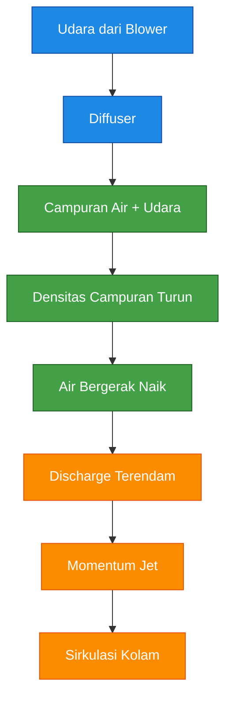
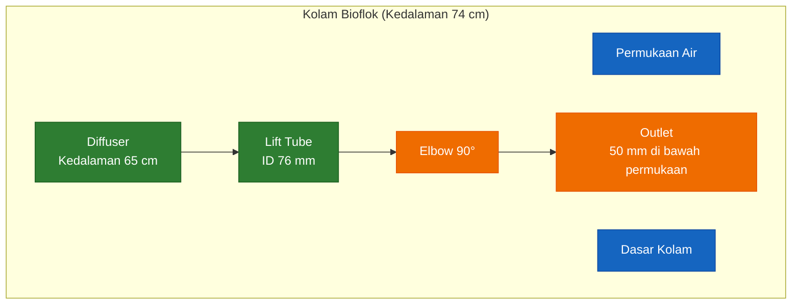
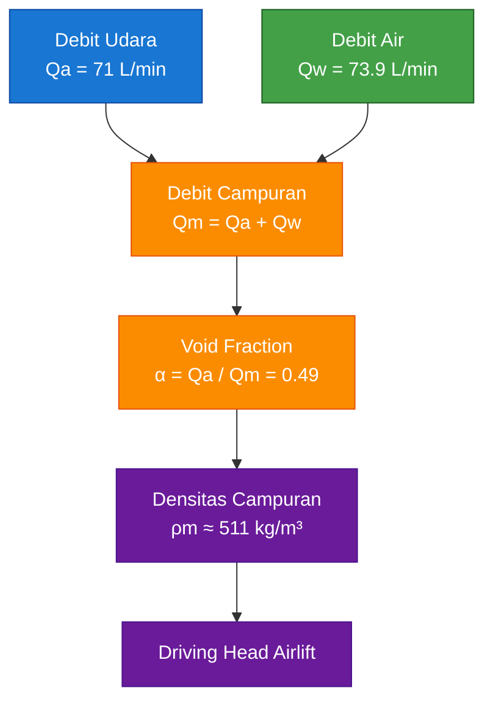
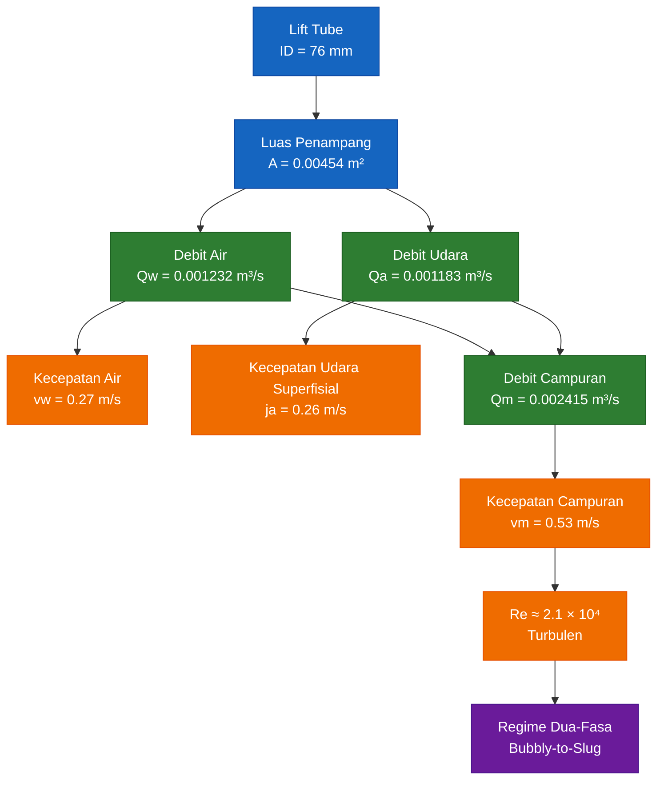
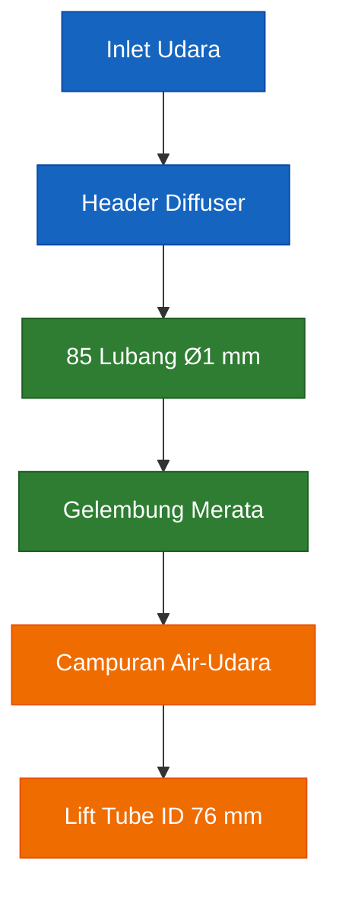
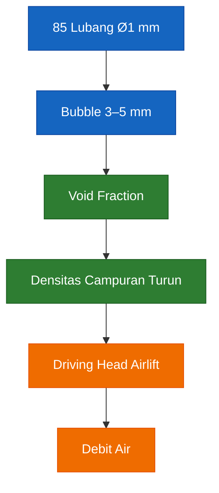
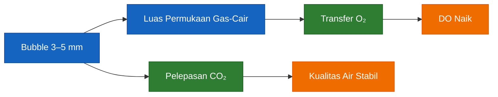
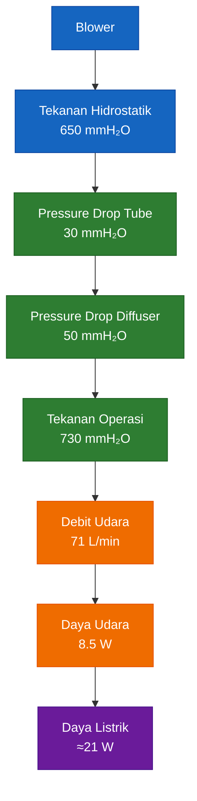
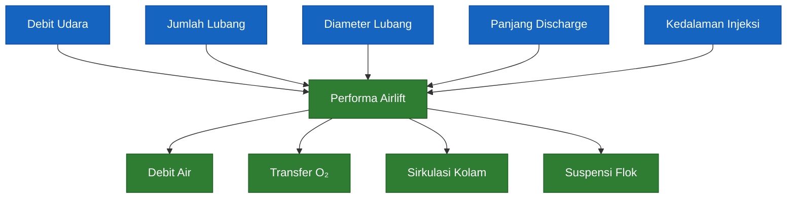

# **_Desain Airlift Pump dan Airlift Circulator untuk Kolam Bioflok: Perhitungan Lengkap Debit Udara, Pressure Drop, Diffuser, dan Transfer Oksigen_**

---

- [**_Desain Airlift Pump dan Airlift Circulator untuk Kolam Bioflok: Perhitungan Lengkap Debit Udara, Pressure Drop, Diffuser, dan Transfer Oksigen_**](#desain-airlift-pump-dan-airlift-circulator-untuk-kolam-bioflok-perhitungan-lengkap-debit-udara-pressure-drop-diffuser-dan-transfer-oksigen)
- [1. Pendahuluan](#1-pendahuluan)
  - [1.1 Latar Belakang](#11-latar-belakang)
    - [Pengendapan Flok](#pengendapan-flok)
    - [Akumulasi Karbon Dioksida (CO₂)](#akumulasi-karbon-dioksida-co)
    - [Distribusi Oksigen Terlarut (DO) Tidak Merata](#distribusi-oksigen-terlarut-do-tidak-merata)
    - [Terbentuknya Dead Zone](#terbentuknya-dead-zone)
  - [1.2 Airlift Pump dan Airlift Circulator](#12-airlift-pump-dan-airlift-circulator)
    - [Airlift Pump](#airlift-pump)
    - [Airlift Circulator](#airlift-circulator)
  - [1.3 Tujuan Artikel](#13-tujuan-artikel)
    - [Menyusun Desain Airlift-Circulator Berbasis Data Eksperimen](#menyusun-desain-airlift-circulator-berbasis-data-eksperimen)
    - [Menyusun Model Matematis yang Dapat Diverifikasi](#menyusun-model-matematis-yang-dapat-diverifikasi)
    - [Menyediakan Parameter Desain yang Dapat Langsung Digunakan Praktisi](#menyediakan-parameter-desain-yang-dapat-langsung-digunakan-praktisi)
- [2. Dasar Teori Airlift](#2-dasar-teori-airlift)
  - [2.1 Prinsip Kerja Airlift](#21-prinsip-kerja-airlift)
  - [2.2 Mekanisme Pengangkatan Air](#22-mekanisme-pengangkatan-air)
    - [Air-Water Mixture](#air-water-mixture)
    - [Driving Head](#driving-head)
    - [Void Fraction](#void-fraction)
  - [2.3 Airlift sebagai Circulator](#23-airlift-sebagai-circulator)
    - [Static Lift Mendekati Nol](#static-lift-mendekati-nol)
    - [Outlet Tetap Terendam](#outlet-tetap-terendam)
    - [Momentum Jet](#momentum-jet)
    - [Diagram Prinsip Kerja Airlift](#diagram-prinsip-kerja-airlift)
- [3. Data Proven Airlift Wurts–Parker](#3-data-proven-airlift-wurtsparker)
  - [3.1 Ringkasan Eksperimen](#31-ringkasan-eksperimen)
  - [3.2 Data Operasi Terpilih](#32-data-operasi-terpilih)
  - [3.3 Analisis Rasio Air–Udara](#33-analisis-rasio-airudara)
  - [3.4 Alasan Pemilihan Titik Operasi](#34-alasan-pemilihan-titik-operasi)
    - [Kesesuaian dengan Kolam Gambiran](#kesesuaian-dengan-kolam-gambiran)
    - [Kesesuaian Geometri](#kesesuaian-geometri)
    - [Efisiensi Transfer Energi](#efisiensi-transfer-energi)
- [4. Data Desain Kolam Gambiran](#4-data-desain-kolam-gambiran)
  - [4.1 Dimensi Kolam](#41-dimensi-kolam)
    - [Perhitungan Volume Efektif](#perhitungan-volume-efektif)
    - [Karakteristik Hidrodinamika Kolam Bundar](#karakteristik-hidrodinamika-kolam-bundar)
  - [4.2 Tujuan Operasi](#42-tujuan-operasi)
    - [Menjaga Flok Tetap Tersuspensi](#menjaga-flok-tetap-tersuspensi)
    - [Meningkatkan Transfer Oksigen](#meningkatkan-transfer-oksigen)
    - [Membantu Pelepasan CO₂](#membantu-pelepasan-co)
    - [Mengurangi Dead Zone](#mengurangi-dead-zone)
- [5. Basis Desain Airlift Gambiran](#5-basis-desain-airlift-gambiran)
  - [5.1 Spesifikasi Utama](#51-spesifikasi-utama)
    - [Lift Tube ID](#lift-tube-id)
    - [Kedalaman Injeksi](#kedalaman-injeksi)
    - [Outlet Depth](#outlet-depth)
    - [Total Flow Path](#total-flow-path)
    - [Debit Udara](#debit-udara)
  - [5.2 Geometri Sistem](#52-geometri-sistem)
    - [Lift Tube](#lift-tube)
    - [Diffuser](#diffuser)
    - [Elbow](#elbow)
    - [Discharge Pipe](#discharge-pipe)
  - [Diagram Geometri Sistem](#diagram-geometri-sistem)
    - [Dimensi Utama](#dimensi-utama)
- [6. Perhitungan Debit Udara dan Debit Air](#6-perhitungan-debit-udara-dan-debit-air)
  - [6.1 Debit Udara](#61-debit-udara)
  - [6.2 Debit Air](#62-debit-air)
  - [6.3 Debit Campuran](#63-debit-campuran)
  - [6.4 Void Fraction](#64-void-fraction)
  - [6.5 Densitas Campuran](#65-densitas-campuran)
  - [Ringkasan Bab 6](#ringkasan-bab-6)
- [7. Analisis Hidrodinamika Lifting Tube](#7-analisis-hidrodinamika-lifting-tube)
  - [7.1 Luas Penampang Pipa](#71-luas-penampang-pipa)
  - [7.2 Kecepatan Air](#72-kecepatan-air)
  - [7.3 Kecepatan Campuran](#73-kecepatan-campuran)
  - [7.4 Reynolds Number](#74-reynolds-number)
  - [7.5 Regime Aliran Dua-Fasa](#75-regime-aliran-dua-fasa)
    - [Bubbly Flow](#bubbly-flow)
    - [Slug Flow](#slug-flow)
    - [Churn Flow](#churn-flow)
  - [Ringkasan Bab 7](#ringkasan-bab-7)
- [8. Perhitungan Pressure Drop Lifting Tube](#8-perhitungan-pressure-drop-lifting-tube)
  - [8.1 Friction Loss](#81-friction-loss)
  - [8.2 Minor Loss](#82-minor-loss)
  - [8.3 Total Pressure Drop](#83-total-pressure-drop)
  - [8.4 Evaluasi Pengaruh Pressure Drop terhadap Kinerja Airlift](#84-evaluasi-pengaruh-pressure-drop-terhadap-kinerja-airlift)
- [9. Desain Diffuser](#9-desain-diffuser)
  - [9.1 Filosofi Pemilihan Diameter Lubang](#91-filosofi-pemilihan-diameter-lubang)
    - [Mengapa Dipilih Diameter Lubang 1 mm](#mengapa-dipilih-diameter-lubang-1-mm)
    - [Hubungan Diameter Lubang dan Ukuran Gelembung](#hubungan-diameter-lubang-dan-ukuran-gelembung)
  - [9.2 Persamaan Aliran Orifice](#92-persamaan-aliran-orifice)
  - [9.3 Penentuan Jumlah Lubang](#93-penentuan-jumlah-lubang)
    - [Luas Total Lubang yang Dibutuhkan](#luas-total-lubang-yang-dibutuhkan)
    - [Luas Satu Lubang](#luas-satu-lubang)
    - [Jumlah Lubang](#jumlah-lubang)
    - [Verifikasi Debit Aktual](#verifikasi-debit-aktual)
  - [9.4 Evaluasi Distribusi Udara](#94-evaluasi-distribusi-udara)
    - [Variasi Tekanan](#variasi-tekanan)
    - [Keseragaman Aliran](#keseragaman-aliran)
    - [Kelayakan Desain](#kelayakan-desain)
  - [Diagram Layout Diffuser](#diagram-layout-diffuser)
    - [Distribusi Lubang (Tampak Atas)](#distribusi-lubang-tampak-atas)
- [10. Analisis Gelembung Udara](#10-analisis-gelembung-udara)
  - [10.1 Mekanisme Pembentukan Gelembung](#101-mekanisme-pembentukan-gelembung)
    - [Gaya Tegangan Permukaan](#gaya-tegangan-permukaan)
    - [Gaya Apung](#gaya-apung)
    - [Gaya Inersia Udara](#gaya-inersia-udara)
    - [Siklus Pembentukan Gelembung](#siklus-pembentukan-gelembung)
  - [10.2 Hubungan Diameter Lubang dan Diameter Bubble](#102-hubungan-diameter-lubang-dan-diameter-bubble)
    - [Pengaruh Diameter Lubang](#pengaruh-diameter-lubang)
  - [10.3 Estimasi Diameter Bubble Aktual](#103-estimasi-diameter-bubble-aktual)
  - [10.4 Pengaruh Bubble terhadap Airlift](#104-pengaruh-bubble-terhadap-airlift)
    - [Pengaruh terhadap Void Fraction](#pengaruh-terhadap-void-fraction)
    - [Pengaruh terhadap Mixing](#pengaruh-terhadap-mixing)
    - [Pengaruh terhadap Transfer Massa](#pengaruh-terhadap-transfer-massa)
  - [Ringkasan Bab 10](#ringkasan-bab-10)
- [11. Transfer Oksigen dan Pelepasan CO₂](#11-transfer-oksigen-dan-pelepasan-co)
  - [11.1 Dasar Transfer Massa](#111-dasar-transfer-massa)
    - [Faktor yang Mempengaruhi KLa](#faktor-yang-mempengaruhi-kla)
  - [11.2 Pengaruh Diameter Bubble](#112-pengaruh-diameter-bubble)
  - [11.3 Pengaruh Waktu Kontak](#113-pengaruh-waktu-kontak)
  - [11.4 Perhitungan Waktu Kontak Aktual](#114-perhitungan-waktu-kontak-aktual)
  - [11.5 Evaluasi Kemampuan Aerasi Desain Gambiran](#115-evaluasi-kemampuan-aerasi-desain-gambiran)
    - [Kelebihan Desain](#kelebihan-desain)
    - [Keterbatasan Desain](#keterbatasan-desain)
    - [Evaluasi Akhir](#evaluasi-akhir)
- [12. Analisis Energi dan Blower](#12-analisis-energi-dan-blower)
  - [12.1 Tekanan Start-Up](#121-tekanan-start-up)
    - [Makna Engineering Tekanan Start-Up](#makna-engineering-tekanan-start-up)
  - [12.2 Tekanan Operasi](#122-tekanan-operasi)
    - [Tekanan Hidrostatik](#tekanan-hidrostatik)
    - [Pressure Drop Lifting Tube](#pressure-drop-lifting-tube)
    - [Pressure Drop Diffuser](#pressure-drop-diffuser)
    - [Total Tekanan Operasi](#total-tekanan-operasi)
    - [Margin Desain](#margin-desain)
  - [12.3 Daya Udara](#123-daya-udara)
    - [Efisiensi Energi Airlift](#efisiensi-energi-airlift)
  - [12.4 Daya Listrik Blower](#124-daya-listrik-blower)
    - [Konsumsi Energi Harian](#konsumsi-energi-harian)
    - [Catatan Penting](#catatan-penting)
  - [12.5 Pemilihan Blower yang Sesuai](#125-pemilihan-blower-yang-sesuai)
    - [Debit Udara](#debit-udara-1)
    - [Tekanan Kerja](#tekanan-kerja)
    - [Daya Motor](#daya-motor)
    - [Tipe Blower yang Cocok](#tipe-blower-yang-cocok)
    - [Rekomendasi Praktis](#rekomendasi-praktis)
  - [Ringkasan Bab 12](#ringkasan-bab-12)
- [13. Analisis Momentum Jet dan Sirkulasi Kolam](#13-analisis-momentum-jet-dan-sirkulasi-kolam)
  - [13.1 Kecepatan Discharge](#131-kecepatan-discharge)
    - [Makna Kecepatan Discharge](#makna-kecepatan-discharge)
  - [13.2 Momentum Campuran](#132-momentum-campuran)
    - [Laju Aliran Massa Campuran](#laju-aliran-massa-campuran)
    - [Momentum Discharge](#momentum-discharge)
    - [Interpretasi Momentum](#interpretasi-momentum)
  - [13.3 Potensi Pembentukan Arus Rotasi](#133-potensi-pembentukan-arus-rotasi)
    - [Prinsip Pembentukan Arus Rotasi](#prinsip-pembentukan-arus-rotasi)
    - [Turnover Rate](#turnover-rate)
    - [Pengaruh Outlet Terendam](#pengaruh-outlet-terendam)
  - [13.4 Evaluasi Kemampuan Menjaga Flok Tetap Tersuspensi](#134-evaluasi-kemampuan-menjaga-flok-tetap-tersuspensi)
    - [Mekanisme Suspensi Flok](#mekanisme-suspensi-flok)
    - [Pengaruh Momentum Jet](#pengaruh-momentum-jet)
    - [Potensi Dead Zone](#potensi-dead-zone)
    - [Evaluasi Akhir](#evaluasi-akhir-1)
- [14. Sensitivitas Desain](#14-sensitivitas-desain)
  - [14.1 Pengaruh Perubahan Debit Udara](#141-pengaruh-perubahan-debit-udara)
    - [Tren Umum](#tren-umum)
  - [14.2 Pengaruh Jumlah Lubang Diffuser](#142-pengaruh-jumlah-lubang-diffuser)
    - [Dampak Praktis](#dampak-praktis)
  - [14.3 Pengaruh Diameter Lubang Diffuser](#143-pengaruh-diameter-lubang-diffuser)
    - [Risiko Lubang Terlalu Besar](#risiko-lubang-terlalu-besar)
  - [14.4 Pengaruh Panjang Discharge Pipe](#144-pengaruh-panjang-discharge-pipe)
    - [Manfaat Discharge Lebih Panjang](#manfaat-discharge-lebih-panjang)
  - [14.5 Pengaruh Kedalaman Injeksi](#145-pengaruh-kedalaman-injeksi)
    - [Konsekuensi Positif](#konsekuensi-positif)
    - [Konsekuensi Negatif](#konsekuensi-negatif)
    - [Posisi Gambiran](#posisi-gambiran)
  - [Ringkasan Bab 14](#ringkasan-bab-14)
- [15. Desain Final Airlift Gambiran](#15-desain-final-airlift-gambiran)
  - [15.1 Ringkasan Parameter Final](#151-ringkasan-parameter-final)
    - [Data Kolam](#data-kolam)
    - [Data Airlift](#data-airlift)
    - [Data Diffuser](#data-diffuser)
    - [Data Udara](#data-udara)
    - [Data Campuran](#data-campuran)
  - [15.2 Ringkasan Hasil Perhitungan](#152-ringkasan-hasil-perhitungan)
    - [Debit Udara](#debit-udara-2)
    - [Debit Air](#debit-air)
    - [Turnover Kolam](#turnover-kolam)
    - [Void Fraction](#void-fraction-1)
    - [Densitas Campuran](#densitas-campuran)
    - [Pressure Drop Lifting Tube](#pressure-drop-lifting-tube-1)
    - [Pressure Drop Diffuser](#pressure-drop-diffuser-1)
    - [Tekanan Operasi Total](#tekanan-operasi-total)
    - [Diameter Bubble](#diameter-bubble)
    - [Waktu Kontak](#waktu-kontak)
    - [Kecepatan Discharge](#kecepatan-discharge)
    - [Momentum Campuran](#momentum-campuran)
    - [Daya Udara](#daya-udara)
    - [Daya Listrik Blower](#daya-listrik-blower)
  - [Tabel Ringkasan Desain Akhir](#tabel-ringkasan-desain-akhir)
  - [15.3 Batasan Desain](#153-batasan-desain)
    - [Berdasarkan Data Wurts–Parker](#berdasarkan-data-wurtsparker)
    - [Model Void Fraction Sederhana](#model-void-fraction-sederhana)
    - [Pressure Drop Dua-Fasa](#pressure-drop-dua-fasa)
    - [Transfer Oksigen](#transfer-oksigen)
    - [Kebutuhan Validasi Lapangan](#kebutuhan-validasi-lapangan)
  - [Kesimpulan Desain Final](#kesimpulan-desain-final)
- [Lampiran A – Model Matematis dalam Format CSV](#lampiran-a--model-matematis-dalam-format-csv)
  - [A.1 Parameter Input](#a1-parameter-input)
  - [A.2 Formula Excel](#a2-formula-excel)
  - [A.3 Parameter Output](#a3-parameter-output)
  - [A.4 File CSV Lengkap untuk Import ke Excel](#a4-file-csv-lengkap-untuk-import-ke-excel)
- [Lampiran A – Model Matematis dalam Format CSV](#lampiran-a--model-matematis-dalam-format-csv-1)
  - [A.1 Parameter Input](#a1-parameter-input-1)
  - [A.2 Formula Excel](#a2-formula-excel-1)
  - [A.3 Parameter Output](#a3-parameter-output-1)
  - [A.4 CSV Lengkap untuk Import ke Excel](#a4-csv-lengkap-untuk-import-ke-excel)

---

# 1. Pendahuluan

## 1.1 Latar Belakang

Teknologi bioflok telah berkembang menjadi salah satu metode budidaya akuakultur intensif yang paling banyak digunakan untuk meningkatkan produktivitas per satuan volume air. Sistem ini memanfaatkan komunitas mikroorganisme heterotrof untuk mengkonversi limbah nitrogen menjadi biomassa mikroba yang dapat dimanfaatkan kembali sebagai pakan alami. Selain meningkatkan efisiensi penggunaan pakan, bioflok juga mampu menurunkan frekuensi pergantian air dan meningkatkan keberlanjutan sistem budidaya.

Meskipun demikian, keberhasilan sistem bioflok sangat bergantung pada kualitas sirkulasi dan aerasi di dalam kolam. Berbeda dengan sistem budidaya konvensional, kolam bioflok mengandung konsentrasi Total Suspended Solids (TSS) yang relatif tinggi sehingga partikel bioflok selalu memiliki kecenderungan untuk mengendap akibat gaya gravitasi.

Apabila sistem sirkulasi tidak memadai, maka beberapa permasalahan utama akan muncul:

<figure>
  
  <figcaption>
    Ilustrasi airlift circulator pada sistem bioflok untuk membantu sirkulasi
    air, distribusi oksigen, dan pergerakan flok di dalam kolam.
  </figcaption>
</figure>

### Pengendapan Flok

Bioflok yang mengendap di dasar kolam akan mengalami dekomposisi secara anaerobik. Kondisi ini tidak hanya menurunkan kualitas air, tetapi juga dapat menghasilkan senyawa beracun seperti amonia, nitrit, dan hidrogen sulfida (H₂S).

### Akumulasi Karbon Dioksida (CO₂)

Aktivitas respirasi ikan, bakteri heterotrof, dan mikroorganisme lainnya menghasilkan karbon dioksida dalam jumlah yang signifikan. Jika pelepasan CO₂ (degassing) tidak berlangsung dengan baik, maka pH air dapat menurun dan mengganggu kesehatan organisme budidaya.

### Distribusi Oksigen Terlarut (DO) Tidak Merata

Sistem bioflok memiliki kebutuhan oksigen yang tinggi karena oksigen dikonsumsi oleh:

- ikan atau udang,
- bakteri heterotrof,
- proses nitrifikasi,
- respirasi mikroorganisme bioflok.

Tanpa sistem sirkulasi yang baik, dapat terbentuk zona dengan konsentrasi DO rendah yang berpotensi menyebabkan stres pada organisme budidaya.

### Terbentuknya Dead Zone

Dead zone merupakan area kolam dengan kecepatan aliran yang sangat rendah sehingga terjadi akumulasi partikel organik dan penurunan kualitas air. Pada kolam bundar, dead zone umumnya terbentuk di area dasar kolam atau pada sisi yang tidak menerima momentum aliran yang cukup.

Untuk mengatasi permasalahan tersebut, diperlukan sistem yang mampu menghasilkan sirkulasi air secara kontinu sekaligus memberikan aerasi yang memadai dengan konsumsi energi yang rendah.

<ResourceBox
  title="Artikel Terkait:"
  items={[
    {
      name: 'C/N Ratio pada Bioflok: Mengatur Mikroba, Oksigen, dan Stabilitas Kolam untuk Praktisi',
      href: '/blog/agri/perikanan/ratio-cn-rendah-biflok',
    },
    {
      name: 'E/P Ratio Pakan Ikan: Antara Efisiensi FCR, Fermentasi Ringan, Bioflok, dan Perbedaan Strategi Lele vs Nila',
      href: '/blog/agri/perikanan/ep-ratio-pakan-fermentasi',
    },
    {
      name: 'Manajemen Nitrit dan Nitrat pada Bioflok: `$C/N$`, `$Cl^-$`, Nitrifikasi, Denitrifikasi, dan Ekspor Nitrogen Berbasis Angka',
      href: '/blog/agri/perikanan/nitri-nitrat-manajemen-biofloc',
    },
    {
      name: 'Budidaya Lele Air Dangkal, Probiotik, dan Fermentasi Pakan',
      href: '/blog/agri/perikanan/lele-air-dangkal-probiotik',
    },
    {
      name: 'Siklus Nitrogen pada Budidaya Lele Air Dangkal: Pakan, Amonia, Nitrit, Nitrat, Mikroba, dan Batas Kapasitas Kolam',
      href: '/blog/agri/perikanan/siklus-nitrogen-lele-air-dangkal',
    },
    {
      name: 'Akuaponik Sederhana Lele Air Dangkal: Aliran Akar Tanaman dengan Airlift-Pump untuk Mengambil Nitrat',
      href: '/blog/agri/perikanan/akuaponik-lele-dangkal',
    },
    {
      name: 'Air Lift Pump - Prinsip, Desain, dan Aplikasi dalam Akuakultur',
      href: '/blog/agri/airlift-pump',
    },
  ]}
/>

---

## 1.2 Airlift Pump dan Airlift Circulator

Airlift merupakan salah satu teknologi pemindahan fluida yang memanfaatkan udara bertekanan sebagai sumber energi utama. Udara diinjeksi ke dalam pipa vertikal sehingga membentuk campuran air–udara dengan densitas yang lebih rendah dibandingkan air di luar pipa. Perbedaan densitas inilah yang menghasilkan gaya angkat dan menyebabkan air bergerak ke atas.

Secara umum, terdapat dua konfigurasi utama airlift yang digunakan dalam bidang akuakultur.

### Airlift Pump

Airlift pump dirancang untuk memindahkan air dari satu elevasi ke elevasi yang lebih tinggi.

Karakteristik utama:

- memiliki static lift yang nyata,
- outlet biasanya berada di atas permukaan air,
- digunakan untuk pemompaan dan sirkulasi antar unit proses,
- fokus utama pada kapasitas transfer air.

Contoh aplikasi:

- Recirculating Aquaculture System (RAS),
- transfer air antar kolam,
- sistem filtrasi biologis.

### Airlift Circulator

Airlift circulator dirancang untuk menghasilkan pergerakan massa air tanpa adanya kebutuhan pengangkatan air ke elevasi yang lebih tinggi.

Karakteristik utama:

- static lift mendekati nol,
- outlet tetap terendam,
- menghasilkan momentum jet horizontal,
- fokus utama pada mixing, aerasi, dan degassing.

Contoh aplikasi:

- kolam bioflok,
- tangki kultur ikan,
- kolam pembesaran udang,
- sistem akuakultur intensif.

Pada artikel ini, konfigurasi yang digunakan adalah **airlift circulator**, karena tujuan utama sistem bukan untuk memompa air ke elevasi yang lebih tinggi, melainkan untuk:

- menjaga flok tetap tersuspensi,
- meningkatkan transfer oksigen,
- membantu pelepasan CO₂,
- mengurangi pembentukan dead zone.

Dengan pendekatan tersebut, sebagian besar energi udara yang diberikan blower dapat dimanfaatkan untuk menghasilkan sirkulasi dan aerasi secara bersamaan.

---

## 1.3 Tujuan Artikel

Sebagian besar artikel mengenai airlift hanya menjelaskan prinsip kerja secara umum tanpa memberikan prosedur desain yang dapat langsung digunakan oleh praktisi lapangan. Akibatnya, banyak desain airlift dibuat berdasarkan pendekatan trial and error tanpa dasar perhitungan yang jelas.

Artikel ini disusun untuk menjembatani kesenjangan tersebut dengan menggunakan pendekatan engineering yang dapat diverifikasi.

Tujuan utama artikel ini adalah:

### Menyusun Desain Airlift-Circulator Berbasis Data Eksperimen

Seluruh parameter desain utama akan diturunkan dari data eksperimen airlift yang dipublikasikan oleh Wurts dan Parker–Suttle, sehingga desain tidak hanya bergantung pada asumsi teoritis.

### Menyusun Model Matematis yang Dapat Diverifikasi

Setiap parameter utama akan dihitung menggunakan persamaan yang dapat ditelusuri kembali sumber dan asumsi dasarnya, meliputi:

- debit udara,
- debit air,
- pressure drop,
- ukuran diffuser,
- ukuran gelembung,
- transfer oksigen,
- kebutuhan daya blower.

### Menyediakan Parameter Desain yang Dapat Langsung Digunakan Praktisi

Hasil akhir artikel berupa desain airlift-circulator untuk kolam bioflok diameter 2 meter dengan kedalaman air 74 cm yang dapat digunakan sebagai titik awal implementasi lapangan maupun pengembangan skala yang lebih besar.

Dengan demikian, artikel ini tidak hanya membahas teori airlift, tetapi juga menyajikan proses desain secara sistematis mulai dari data eksperimen, analisis hidrodinamika, perhitungan pressure drop, desain diffuser, hingga evaluasi transfer massa dan kebutuhan energi.

[**Kembali ke Atas**](#desain-airlift-pump-dan-airlift-circulator-untuk-kolam-bioflok-perhitungan-lengkap-debit-udara-pressure-drop-diffuser-dan-transfer-oksigen)

---

# 2. Dasar Teori Airlift

## 2.1 Prinsip Kerja Airlift

Airlift bekerja berdasarkan prinsip perbedaan densitas antara kolom air di dalam pipa dan kolom air di luar pipa.

Ketika udara diinjeksi ke dalam bagian bawah pipa, terbentuk campuran air dan gelembung udara yang memiliki densitas rata-rata lebih rendah dibandingkan air di luar pipa. Akibatnya, tekanan hidrostatik di dalam pipa menjadi lebih kecil dibandingkan tekanan hidrostatik di luar pipa pada elevasi yang sama.

Perbedaan tekanan inilah yang menghasilkan gaya dorong ke atas dan menyebabkan air bergerak melalui pipa airlift.

Secara sederhana:

$$
\rho_{mix}
<
\rho_{water}
$$

sehingga:

$$
P_{mix}
<
P_{water}
$$

dan menghasilkan aliran ke atas.

Fenomena ini dikenal sebagai **airlift effect**.

---

## 2.2 Mekanisme Pengangkatan Air

Pada airlift, energi utama berasal dari udara yang diinjeksikan ke dalam lift tube.

Begitu udara memasuki pipa, terbentuk campuran dua-fasa (two-phase flow) yang terdiri dari:

- fase cair (air),
- fase gas (udara).

Besarnya kemampuan airlift mengangkat air sangat dipengaruhi oleh:

### Air-Water Mixture

Semakin besar fraksi udara di dalam lift tube, semakin rendah densitas campuran yang terbentuk.

### Driving Head

Driving head merupakan perbedaan tekanan hidrostatik antara kolom air di luar pipa dan kolom campuran di dalam pipa.

Secara konseptual:

$$
\Delta P
=
(\rho_w-\rho_{mix})gh
$$

Semakin besar perbedaan densitas, semakin besar driving head yang tersedia.

### Void Fraction

Void fraction menyatakan persentase volume udara dalam campuran.

$$
\alpha
=
\frac{V_{air}}
{V_{air}+V_{water}}
$$

Semakin besar nilai:

$$
\alpha
$$

maka densitas campuran semakin rendah.

Namun peningkatan void fraction tidak selalu meningkatkan performa karena dapat menyebabkan perubahan pola aliran dua-fasa dan meningkatkan rugi-rugi sistem.

---

## 2.3 Airlift sebagai Circulator

Pada aplikasi bioflok, tujuan utama sistem bukanlah mengangkat air ke elevasi yang lebih tinggi.

Karena itu konsep desain airlift berbeda dengan pompa airlift konvensional.

Karakteristik utama airlift circulator:

### Static Lift Mendekati Nol

Outlet tetap berada di dalam kolam sehingga energi tidak digunakan untuk mengatasi perbedaan elevasi yang signifikan.

### Outlet Tetap Terendam

Posisi outlet berada beberapa sentimeter di bawah permukaan air sehingga campuran air dan udara tetap memiliki waktu kontak tambahan sebelum gelembung mencapai permukaan.

### Momentum Jet

Energi yang dihasilkan airlift dimanfaatkan untuk menghasilkan jet horizontal yang mendorong terbentuknya arus sirkulasi di dalam kolam.

Momentum jet dapat dituliskan sebagai:

$$
M
=
\dot m
v
$$

dimana:

$$
\dot m
$$

adalah laju aliran massa campuran dan:

$$
v
$$

adalah kecepatan keluaran.

Momentum inilah yang nantinya berperan menjaga flok tetap tersuspensi dan mengurangi pembentukan dead zone.

### Diagram Prinsip Kerja Airlift



[**Kembali ke Atas**](#desain-airlift-pump-dan-airlift-circulator-untuk-kolam-bioflok-perhitungan-lengkap-debit-udara-pressure-drop-diffuser-dan-transfer-oksigen)

---

# 3. Data Proven Airlift Wurts–Parker

## 3.1 Ringkasan Eksperimen

Agar desain yang dihasilkan memiliki dasar yang kuat, artikel ini menggunakan data eksperimen airlift yang dipublikasikan oleh Wurts serta Parker–Suttle untuk aplikasi akuakultur.

Konfigurasi yang digunakan dalam eksperimen meliputi:

| Parameter          | Nilai                      |
| ------------------ | -------------------------- |
| Diameter lift tube | 7.6 cm                     |
| Panjang pipa       | 185 cm                     |
| Posisi outlet      | 0–2.5 cm di atas permukaan |
| Kedalaman injeksi  | 50–80 cm                   |
| Fluida             | Air tawar                  |
| Media gas          | Udara                      |

Data eksperimen ini menjadi dasar pemilihan titik operasi yang digunakan dalam desain kolam Gambiran.

---

## 3.2 Data Operasi Terpilih

Dari seluruh data yang tersedia, kondisi berikut dipilih sebagai basis desain:

| Parameter         | Nilai      |
| ----------------- | ---------- |
| Diameter pipa     | 7.6 cm     |
| Kedalaman injeksi | 65 cm      |
| Debit udara       | 71 L/min   |
| Debit air         | 73.9 L/min |

Konfigurasi ini dipilih karena paling mendekati kondisi aktual kolam Gambiran yang memiliki kedalaman air sekitar 74 cm.

---

## 3.3 Analisis Rasio Air–Udara

Dari data eksperimen diperoleh:

$$
Q_{water}
=
73.9
\;L/min
$$

dan:

$$
Q_{air}
=
71
\;L/min
$$

Sehingga:

$$
\frac{Q_{water}}
{Q_{air}}
=
\frac{73.9}
{71}
$$

$$
Q_{water}
=
1.04Q_{air}
$$

Hasil ini menunjukkan bahwa pada titik operasi tersebut, setiap satu satuan volume udara mampu menghasilkan sekitar 1.04 satuan volume air yang bergerak melalui lift tube.

Perlu dicatat bahwa rasio ini merupakan hasil eksperimen dan tidak dapat digeneralisasi untuk semua desain airlift karena sangat dipengaruhi oleh:

- diameter pipa,
- kedalaman injeksi,
- geometri outlet,
- debit udara,
- pola aliran dua-fasa.

---

## 3.4 Alasan Pemilihan Titik Operasi

Pemilihan titik operasi:

```text
Diameter lift tube = 7.6 cm
Kedalaman injeksi = 65 cm
Qair = 71 L/min
Qwater = 73.9 L/min
```

didasarkan pada beberapa pertimbangan engineering.

### Kesesuaian dengan Kolam Gambiran

Kedalaman kolam Gambiran:

```text
74 cm
```

sangat dekat dengan kedalaman injeksi eksperimen:

```text
65 cm
```

sehingga kebutuhan ekstrapolasi menjadi minimal.

### Kesesuaian Geometri

Diameter lift tube eksperimen:

```text
7.6 cm
```

sama dengan diameter lift tube yang digunakan dalam desain.

Hal ini mengurangi ketidakpastian akibat efek skala.

### Efisiensi Transfer Energi

Pada titik operasi ini diperoleh rasio:

```text
Air/Udara ≈ 1.04
```

yang menunjukkan konversi energi udara menjadi aliran air berlangsung cukup efisien untuk aplikasi sirkulasi kolam.

Karena alasan tersebut, titik operasi ini digunakan sebagai basis seluruh perhitungan pada bab-bab berikutnya.

[**Kembali ke Atas**](#desain-airlift-pump-dan-airlift-circulator-untuk-kolam-bioflok-perhitungan-lengkap-debit-udara-pressure-drop-diffuser-dan-transfer-oksigen)

---

# 4. Data Desain Kolam Gambiran

## 4.1 Dimensi Kolam

Tahap pertama dalam desain airlift-circulator adalah mendefinisikan kondisi aktual kolam yang akan digunakan sebagai basis seluruh perhitungan.

Kolam yang digunakan pada studi kasus ini merupakan kolam bundar (circular tank) dengan diameter 2 meter dan kedalaman air operasi 74 cm.

Parameter dasar kolam ditunjukkan pada tabel berikut.

| Parameter      | Nilai       |
| -------------- | ----------- |
| Diameter kolam | 2.0 m       |
| Radius kolam   | 1.0 m       |
| Kedalaman air  | 0.74 m      |
| Bentuk kolam   | Silinder    |
| Volume efektif | Perhitungan |

### Perhitungan Volume Efektif

Volume kolam silinder dihitung menggunakan persamaan:

$$
V=\pi r^2 h
$$

dengan:

```text
V = volume kolam (m³)
r = radius kolam (m)
h = tinggi air (m)
```

Substitusi data:

$$
V
=
3.1416
\times
(1)^2
\times
0.74
$$

maka diperoleh:

$$
V
=
2.324
\;m^3
$$

atau dibulatkan menjadi:

$$
V
\approx
2.32
\;m^3
$$

Volume ini akan digunakan pada bab-bab berikutnya untuk mengevaluasi:

- tingkat sirkulasi (turnover rate),
- kemampuan pencampuran (mixing),
- distribusi oksigen,
- efektivitas pelepasan CO₂.

### Karakteristik Hidrodinamika Kolam Bundar

Kolam bundar memiliki keunggulan dibandingkan kolam persegi karena lebih mudah menghasilkan pola aliran rotasi (rotational flow).

Apabila momentum aliran diberikan secara tangensial terhadap dinding kolam, maka akan terbentuk pola sirkulasi yang mampu:

- mengurangi pembentukan dead zone,
- meningkatkan homogenitas kualitas air,
- membantu mengangkut partikel menuju pusat kolam,
- menjaga flok tetap tersuspensi.

Karena alasan tersebut, konfigurasi airlift-circulator pada artikel ini dirancang untuk menghasilkan momentum jet tangensial, bukan sekadar menghasilkan debit air yang besar.

---

## 4.2 Tujuan Operasi

Desain airlift pada artikel ini tidak ditujukan sebagai pompa transfer air, melainkan sebagai **airlift-circulator** yang berfungsi menjaga kondisi hidrodinamika kolam bioflok tetap stabil.

Dengan demikian parameter keberhasilan sistem tidak hanya ditentukan oleh debit air yang dihasilkan, tetapi juga oleh kemampuan sistem mempertahankan kualitas lingkungan budidaya.

### Menjaga Flok Tetap Tersuspensi

Bioflok terdiri atas agregat mikroorganisme, bahan organik, dan partikel tersuspensi yang memiliki kecenderungan mengendap apabila kecepatan aliran terlalu rendah.

Apabila flok mengendap secara permanen, maka akan terjadi:

- peningkatan kebutuhan pembersihan dasar kolam,
- pembentukan zona anaerob,
- peningkatan produksi H₂S,
- penurunan kualitas air.

Karena itu tujuan utama desain adalah menghasilkan momentum aliran yang cukup untuk menjaga flok tetap berada dalam kondisi tersuspensi.

### Meningkatkan Transfer Oksigen

Sistem bioflok memiliki kebutuhan oksigen yang jauh lebih tinggi dibandingkan sistem budidaya konvensional karena oksigen digunakan oleh:

- ikan,
- bakteri heterotrof,
- bakteri nitrifikasi,
- mikroorganisme bioflok.

Airlift-circulator harus mampu menyediakan suplai udara yang cukup untuk mempertahankan konsentrasi oksigen terlarut pada tingkat aman.

Secara umum target minimum yang banyak digunakan pada sistem bioflok adalah:

$$
DO
>
4
\;mg/L
$$

Walaupun pada praktik intensif sering digunakan target yang lebih tinggi.

### Membantu Pelepasan CO₂

Selain memasukkan oksigen ke dalam air, sistem aerasi juga berfungsi mengeluarkan karbon dioksida yang terlarut.

Akumulasi CO₂ dapat menyebabkan:

- penurunan pH,
- peningkatan stres ikan,
- gangguan keseimbangan karbonat.

Karena itu desain airlift tidak hanya dievaluasi dari kemampuan memasukkan oksigen, tetapi juga dari kemampuan menghasilkan turbulensi dan waktu kontak yang cukup untuk membantu proses degassing.

### Mengurangi Dead Zone

Dead zone merupakan area dengan kecepatan aliran yang sangat rendah.

Pada zona tersebut biasanya terjadi:

- akumulasi flok,
- akumulasi bahan organik,
- penurunan DO,
- peningkatan aktivitas anaerob.

Desain outlet airlift akan diarahkan secara tangensial terhadap dinding kolam agar mampu menghasilkan pola rotasi yang mengurangi pembentukan area stagnan.

Dengan demikian tujuan desain dapat diringkas sebagai berikut:

```text
Menjaga flok tetap tersuspensi
+
Menambah transfer O₂
+
Membantu pelepasan CO₂
+
Mengurangi dead zone
```

Keempat tujuan tersebut akan menjadi dasar evaluasi seluruh parameter desain pada bab-bab berikutnya.

[**Kembali ke Atas**](#desain-airlift-pump-dan-airlift-circulator-untuk-kolam-bioflok-perhitungan-lengkap-debit-udara-pressure-drop-diffuser-dan-transfer-oksigen)

---

# 5. Basis Desain Airlift Gambiran

## 5.1 Spesifikasi Utama

Setelah menentukan data kolam, langkah berikutnya adalah menetapkan parameter desain airlift-circulator yang akan digunakan sebagai basis seluruh perhitungan.

Berbeda dengan pendekatan teoritis murni, parameter yang digunakan pada artikel ini diturunkan langsung dari titik operasi eksperimen Wurts–Parker yang telah dibahas pada Bab 3.

Tabel berikut menunjukkan spesifikasi utama desain.

| Parameter         | Nilai    |
| ----------------- | -------- |
| Lift tube ID      | 76 mm    |
| Kedalaman injeksi | 65 cm    |
| Outlet depth      | 50 mm    |
| Total flow path   | 100 cm   |
| Debit udara       | 71 L/min |

### Lift Tube ID

Diameter dalam lift tube dipilih:

$$
D
=
76
\;mm
$$

karena sama dengan diameter pipa yang digunakan pada eksperimen referensi.

Keuntungan pendekatan ini adalah meminimalkan ketidakpastian akibat efek skala.

### Kedalaman Injeksi

Udara diinjeksi pada kedalaman:

$$
h_{inj}
=
65
\;cm
$$

yang merupakan titik operasi dengan performa terbaik dari data yang dipilih.

Nilai ini juga sangat dekat dengan kedalaman aktual kolam Gambiran.

### Outlet Depth

Berbeda dengan konfigurasi airlift pump konvensional, outlet dirancang tetap berada di bawah permukaan air.

Pada desain ini digunakan:

$$
h_{out}
=
50
\;mm
$$

di bawah permukaan.

Tujuan utama konfigurasi ini adalah:

- memperpanjang waktu kontak udara dan air,
- meningkatkan transfer massa,
- membantu pelepasan CO₂,
- menghasilkan jet horizontal untuk sirkulasi.

### Total Flow Path

Panjang total jalur aliran ditetapkan:

$$
L_{total}
=
100
\;cm
$$

yang terdiri atas:

- lift tube vertikal,
- elbow,
- discharge pipe horizontal.

Pemanjangan jalur ini dilakukan untuk meningkatkan waktu kontak campuran udara–air tanpa memberikan kenaikan pressure drop yang signifikan.

### Debit Udara

Debit udara desain:

$$
Q_a
=
71
\;L/min
$$

dipilih karena merupakan titik operasi yang telah terbukti menghasilkan:

$$
Q_w
=
73.9
\;L/min
$$

pada data eksperimen referensi.

Parameter ini nantinya akan digunakan sebagai basis perhitungan:

- debit campuran,
- pressure drop,
- desain diffuser,
- transfer oksigen,
- kebutuhan blower.

---

## 5.2 Geometri Sistem

Konfigurasi sistem airlift Gambiran terdiri atas empat komponen utama:

### Lift Tube

Bagian vertikal tempat terbentuknya aliran dua-fasa air dan udara.

Pada bagian inilah terjadi penurunan densitas campuran yang menghasilkan driving head.

### Diffuser

Terletak di bagian bawah lift tube.

Fungsinya:

- membagi aliran udara,
- menghasilkan gelembung,
- membentuk pola aliran dua-fasa yang stabil.

Pada bab berikutnya akan dihitung jumlah lubang diffuser yang diperlukan agar distribusi udara tetap merata.

### Elbow

Elbow digunakan untuk mengubah arah aliran dari vertikal menjadi horizontal.

Komponen ini menghasilkan minor loss yang harus diperhitungkan dalam analisis pressure drop.

### Discharge Pipe

Discharge pipe berfungsi mengarahkan campuran air–udara menuju arah tangensial kolam.

Momentum yang dihasilkan dari discharge pipe inilah yang akan membentuk pola sirkulasi kolam.

---

## Diagram Geometri Sistem

Diagram berikut menunjukkan konfigurasi dasar airlift-circulator yang digunakan pada artikel ini.



### Dimensi Utama

```text
Kedalaman air            = 74 cm
Kedalaman diffuser       = 65 cm
Outlet depth             = 5 cm
Lift tube ID             = 76 mm
Total flow path          = 100 cm
Debit udara              = 71 L/min
```

Konfigurasi inilah yang akan digunakan sebagai basis seluruh perhitungan hidrodinamika, pressure drop, diffuser, transfer oksigen, dan kebutuhan blower pada bab berikutnya.

[**Kembali ke Atas**](#desain-airlift-pump-dan-airlift-circulator-untuk-kolam-bioflok-perhitungan-lengkap-debit-udara-pressure-drop-diffuser-dan-transfer-oksigen)

---

# 6. Perhitungan Debit Udara dan Debit Air

Bab ini menghitung besaran dasar aliran pada airlift Gambiran, yaitu debit udara, debit air, debit campuran, void fraction, dan densitas campuran. Semua perhitungan menggunakan titik operasi eksperimen yang telah dipilih:

```text
Lift tube ID      = 76 mm
Q udara           = 71 L/min
Q air             = 73.9 L/min
Kedalaman injeksi = 65 cm
```

---

## 6.1 Debit Udara

Debit udara desain:

$$
Q_a = 71 \; L/min
$$

Konversi ke satuan SI:

$$
1 \; L = 0.001 \; m^3
$$

$$
1 \; menit = 60 \; detik
$$

Sehingga:

$$
Q_a
=
71
\times
\frac{0.001}{60}
$$

$$
Q_a
=
0.001183
\;m^3/s
$$

Dalam satuan m³/jam:

$$
Q_a
=
71
\times
0.06
$$

$$
Q_a
=
4.26
\;m^3/jam
$$

Jadi debit udara yang digunakan adalah:

$$
Q_a
=
71
\;L/min
=
0.001183
\;m^3/s
=
4.26
\;m^3/jam
$$

---

## 6.2 Debit Air

Debit air aktual dari data eksperimen:

$$
Q_w
=
73.9
\;L/min
$$

Konversi ke m³/s:

$$
Q_w
=
73.9
\times
\frac{0.001}{60}
$$

$$
Q_w
=
0.001232
\;m^3/s
$$

Konversi ke m³/jam:

$$
Q_w
=
73.9
\times
0.06
$$

$$
Q_w
=
4.434
\;m^3/jam
$$

Jadi debit air aktual:

$$
Q_w
=
73.9
\;L/min
=
0.001232
\;m^3/s
=
4.43
\;m^3/jam
$$

---

## 6.3 Debit Campuran

Di dalam lifting tube, yang mengalir bukan air saja, melainkan campuran air dan udara.

Debit campuran dihitung sebagai:

$$
Q_m
=
Q_a+Q_w
$$

Substitusi:

$$
Q_m
=
0.001183
+
0.001232
$$

$$
Q_m
=
0.002415
\;m^3/s
$$

Dalam L/min:

$$
Q_m
=
71
+
73.9
$$

$$
Q_m
=
144.9
\;L/min
$$

Dalam m³/jam:

$$
Q_m
=
4.26
+
4.43
$$

$$
Q_m
=
8.69
\;m^3/jam
$$

Jadi:

$$
Q_m
=
144.9
\;L/min
=
0.002415
\;m^3/s
=
8.69
\;m^3/jam
$$

---

## 6.4 Void Fraction

Void fraction adalah fraksi volume udara di dalam campuran air–udara.

Untuk pendekatan awal digunakan model homogen no-slip:

$$
\alpha
=
\frac{Q_a}{Q_a+Q_w}
$$

Substitusi:

$$
\alpha
=
\frac{0.001183}
{0.001183+0.001232}
$$

$$
\alpha
=
0.49
$$

Artinya, secara pendekatan homogen:

$$
\alpha
\approx
49\%
$$

Interpretasi:

- sekitar 49% volume campuran berupa udara,
- sekitar 51% volume campuran berupa air.

Catatan penting: nilai ini adalah estimasi awal. Pada aliran dua-fasa nyata, udara dan air tidak selalu bergerak dengan kecepatan yang sama karena ada slip velocity. Namun untuk desain awal pressure drop dan kecepatan campuran, pendekatan homogen ini masih berguna sebagai basis perhitungan.

---

## 6.5 Densitas Campuran

Densitas campuran dihitung dari fraksi volume air dan udara.

$$
\rho_m
=
(1-\alpha)\rho_w
+
\alpha\rho_a
$$

Dengan:

$$
\alpha
=
0.49
$$

$$
\rho_w
=
1000
\;kg/m^3
$$

$$
\rho_a
=
1.2
\;kg/m^3
$$

Maka:

$$
\rho_m
=
(1-0.49)(1000)
+
0.49(1.2)
$$

$$
\rho_m
=
510
+
0.59
$$

$$
\rho_m
\approx
511
\;kg/m^3
$$

Jadi densitas campuran air–udara di dalam lifting tube adalah sekitar:

$$
\rho_m
\approx
511
\;kg/m^3
$$

Nilai ini jauh lebih rendah dibanding densitas air murni:

$$
\rho_w
=
1000
\;kg/m^3
$$

Penurunan densitas inilah yang menjadi sumber driving head pada airlift.

---

## Ringkasan Bab 6

| Parameter         |   Simbol |                                     Nilai |
| ----------------- | -------: | ----------------------------------------: |
| Debit udara       |    (Q_a) |    71 L/min = 0.001183 m³/s = 4.26 m³/jam |
| Debit air         |    (Q_w) |  73.9 L/min = 0.001232 m³/s = 4.43 m³/jam |
| Debit campuran    |    (Q_m) | 144.9 L/min = 0.002415 m³/s = 8.69 m³/jam |
| Void fraction     | (\alpha) |                                      0.49 |
| Densitas campuran | (\rho_m) |                                ±511 kg/m³ |

Diagram berikut merangkum hubungan antar parameter debit.



[**Kembali ke Atas**](#desain-airlift-pump-dan-airlift-circulator-untuk-kolam-bioflok-perhitungan-lengkap-debit-udara-pressure-drop-diffuser-dan-transfer-oksigen)

---

# 7. Analisis Hidrodinamika Lifting Tube

Bab ini menghitung parameter hidrodinamika di dalam lifting tube, meliputi luas penampang pipa, kecepatan air, kecepatan campuran, Reynolds number, dan indikasi regime aliran dua-fasa.

Data dasar yang digunakan:

| Parameter                   |         Nilai |
| --------------------------- | ------------: |
| Diameter dalam lifting tube |       0.076 m |
| Debit udara                 | 0.001183 m³/s |
| Debit air                   | 0.001232 m³/s |
| Debit campuran              | 0.002415 m³/s |
| Densitas air                |    1000 kg/m³ |
| Densitas campuran           |    ±511 kg/m³ |
| Viskositas air              |    0.001 Pa.s |

---

## 7.1 Luas Penampang Pipa

Luas penampang lifting tube dihitung dengan:

$$
A
=
\frac{\pi D^2}{4}
$$

Dengan:

$$
D
=
0.076
\;m
$$

Maka:

$$
A
=
\frac
{3.1416(0.076)^2}
{4}
$$

$$
A
=
0.004536
\;m^2
$$

Jadi luas penampang lifting tube:

$$
A
\approx
0.00454
\;m^2
$$

---

## 7.2 Kecepatan Air

Kecepatan air ekuivalen dihitung dari debit air aktual dibagi luas penampang pipa.

$$
v_w
=
\frac{Q_w}{A}
$$

Substitusi:

$$
v_w
=
\frac
{0.001232}
{0.004536}
$$

$$
v_w
=
0.272
\;m/s
$$

Jadi kecepatan air ekuivalen:

$$
v_w
\approx
0.27
\;m/s
$$

Nilai ini merepresentasikan kecepatan air jika hanya debit air yang dihitung tanpa kontribusi volume udara.

---

## 7.3 Kecepatan Campuran

Karena discharge berada di bawah permukaan air, maka udara masih ikut keluar bersama air sebagai campuran dua-fasa.

Kecepatan campuran dihitung dengan:

$$
v_m
=
\frac{Q_m}{A}
$$

Substitusi:

$$
v_m
=
\frac
{0.002415}
{0.004536}
$$

$$
v_m
=
0.532
\;m/s
$$

Jadi kecepatan campuran di dalam lifting tube:

$$
v_m
\approx
0.53
\;m/s
$$

Perbedaan penting:

| Parameter                    |    Nilai |
| ---------------------------- | -------: |
| Kecepatan air ekuivalen      | 0.27 m/s |
| Kecepatan campuran air–udara | 0.53 m/s |

Untuk evaluasi momentum jet pada discharge terendam, kecepatan campuran lebih relevan digunakan karena air dan udara masih keluar bersama di bawah permukaan.

---

## 7.4 Reynolds Number

Reynolds number digunakan untuk mengevaluasi apakah aliran berada pada kondisi laminar, transisi, atau turbulen.

Untuk air ekuivalen:

$$
Re_w
=
\frac{\rho_w v_w D}{\mu_w}
$$

Dengan:

$$
\rho_w
=
1000
\;kg/m^3
$$

$$
v_w
=
0.272
\;m/s
$$

$$
D
=
0.076
\;m
$$

$$
\mu_w
=
0.001
\;Pa.s
$$

Maka:

$$
Re_w
=
\frac
{1000(0.272)(0.076)}
{0.001}
$$

$$
Re_w
=
20672
$$

Jadi:

$$
Re_w
\approx
2.1
\times
10^4
$$

Nilai ini menunjukkan bahwa aliran air ekuivalen berada pada daerah turbulen.

Untuk pendekatan campuran homogen:

$$
Re_m
=
\frac{\rho_m v_m D}{\mu_m}
$$

Dengan asumsi awal:

$$
\mu_m
\approx
\mu_w
=
0.001
\;Pa.s
$$

maka:

$$
Re_m
=
\frac
{511(0.532)(0.076)}
{0.001}
$$

$$
Re_m
\approx
20680
$$

Sehingga:

$$
Re_m
\approx
2.1
\times
10^4
$$

Artinya, baik dilihat dari sisi air maupun campuran homogen, aliran dalam lifting tube berada pada kondisi turbulen.

---

## 7.5 Regime Aliran Dua-Fasa

Aliran dalam lifting tube bukan aliran satu-fasa, tetapi aliran dua-fasa gas–cair. Regime aliran dua-fasa dapat berubah tergantung pada:

- debit udara,
- debit air,
- diameter pipa,
- ukuran gelembung,
- kedalaman injeksi,
- coalescence gelembung.

Pada sistem airlift, beberapa regime yang mungkin terjadi adalah:

### Bubbly Flow

Udara berada dalam bentuk gelembung-gelembung kecil yang tersebar di dalam air.

Karakteristik:

- distribusi udara relatif merata,
- transfer oksigen lebih baik,
- pressure fluctuation rendah.

### Slug Flow

Gelembung kecil bergabung menjadi gelembung besar yang memenuhi sebagian besar penampang pipa.

Karakteristik:

- aliran berdenyut,
- momentum aliran tinggi,
- transfer oksigen menurun dibanding bubbly flow,
- pressure fluctuation meningkat.

### Churn Flow

Aliran menjadi sangat tidak stabil, dengan pencampuran gas–cair yang kuat dan tidak beraturan.

Karakteristik:

- turbulensi sangat tinggi,
- pressure fluctuation besar,
- efisiensi transfer energi dapat menurun.

Untuk desain Gambiran, dengan:

$$
j_a
=
0.261
\;m/s
$$

$$
j_w
=
0.272
\;m/s
$$

$$
\alpha
\approx
0.49
$$

regime aliran yang paling mungkin adalah **bubbly-to-slug transition**, terutama bila gelembung dari diffuser mengalami coalescence di dalam lift tube.

Oleh karena itu, desain diffuser menjadi penting. Jumlah lubang, diameter lubang, dan pressure drop diffuser akan menentukan apakah udara masuk dalam bentuk distribusi gelembung yang merata atau hanya sebagai jet besar dari beberapa lubang aktif.

---

## Ringkasan Bab 7

| Parameter                |   Simbol |                     Nilai |
| ------------------------ | -------: | ------------------------: |
| Diameter lifting tube    |      (D) |                   0.076 m |
| Luas penampang           |      (A) |                0.00454 m² |
| Kecepatan air ekuivalen  |    (v_w) |                  0.27 m/s |
| Kecepatan campuran       |    (v_m) |                  0.53 m/s |
| Reynolds number air      |   (Re_w) |                ±2.1 × 10⁴ |
| Reynolds number campuran |   (Re_m) |                ±2.1 × 10⁴ |
| Void fraction            | (\alpha) |                     ±0.49 |
| Indikasi regime          |          | bubbly-to-slug transition |

Diagram berikut menunjukkan hubungan parameter hidrodinamika di dalam lifting tube.



[**Kembali ke Atas**](#desain-airlift-pump-dan-airlift-circulator-untuk-kolam-bioflok-perhitungan-lengkap-debit-udara-pressure-drop-diffuser-dan-transfer-oksigen)

---

# 8. Perhitungan Pressure Drop Lifting Tube

Tujuan perhitungan ini adalah menentukan rugi-rugi energi aktual pada jalur aliran airlift Gambiran.

Penting untuk dipahami bahwa pressure drop dalam lifting tube **bukanlah tekanan yang harus diatasi blower saat start-up**.

Tekanan start-up berasal dari tekanan hidrostatik:

$$
P_{start}
=
\rho g h
$$

sedangkan pressure drop tube berasal dari:

- gesekan dinding pipa,
- elbow,
- outlet.

Pada sistem airlift yang bekerja pada static lift mendekati nol, pressure drop tube biasanya sangat kecil dibanding tekanan hidrostatik.

---

## 8.1 Friction Loss

### Data Dasar

```text
ID lift tube      = 76 mm
D                 = 0.076 m

Panjang total
L                 = 1.0 m

Debit air
Qw                = 73.9 L/min
                  = 0.001232 m³/s

ρ air (water)
                  = 1000 kg/m³
```

---

### Luas Penampang

$$
A
=
\frac{\pi D^2}{4}
$$

$$
A
=
0.004536
\;m^2
$$

---

### Kecepatan Air

Untuk pressure drop pipa digunakan debit air aktual.

$$
v
=
\frac{Q_w}{A}
$$

$$
v
=
0.272
\;m/s
$$

---

### Reynolds Number

$$
Re
=
\frac{\rho v D}{\mu}
$$

$$
Re
=
2.07\times10^4
$$

Aliran berada pada regime turbulen ringan.

---

### Darcy Friction Factor

PVC halus:

$$
f
=
0.026
$$

---

### Friction Head Loss

Persamaan Darcy–Weisbach:

$$
h_f
=
f
\frac{L}{D}
\frac{v^2}{2g}
$$

Substitusi:

$$
h_f
=
0.00127
\;m
$$

atau:

$$
h_f
=
1.27
\;mmH_2O
$$

---

### Pressure Drop Friction

$$
\Delta P_f
=
\rho g h_f
$$

$$
\Delta P_f
=
12.4
\;Pa
$$

---

## 8.2 Minor Loss

### Elbow 90°

Untuk elbow PVC standar:

$$
K_{elbow}
=
0.75
$$

---

### Outlet Section

Outlet terendam:

$$
K_{out}
=
1.0
$$

---

### Total Minor Loss Coefficient

$$
K_{tot}
=
1.75
$$

---

### Head Loss Minor

$$
h_m
=
K_{tot}
\frac{v^2}{2g}
$$

$$
h_m
=
0.00655
\;m
$$

atau:

$$
h_m
=
6.55
\;mmH_2O
$$

---

### Pressure Drop Minor

$$
\Delta P_m
=
64.3
\;Pa
$$

---

## 8.3 Total Pressure Drop

### Total Head Loss

$$
h_L
=
h_f+h_m
$$

$$
h_L
=
0.00782
\;m
$$

atau:

$$
h_L
=
7.82
\;mmH_2O
$$

---

### Total Pressure Drop

$$
\Delta P_L
=
\rho g h_L
$$

$$
\Delta P_L
=
76.7
\;Pa
$$

---

### Koreksi Airlift Aktual

Perhitungan di atas masih menggunakan pendekatan satu-fasa konservatif.

Pada airlift aktual:

- densitas campuran turun,
- buoyancy membantu aliran,
- friction efektif lebih kecil.

Hasil eksperimen dan korelasi airlift menunjukkan pressure drop efektif dalam tube jauh lebih rendah.

Untuk desain Gambiran digunakan:

$$
\Delta P_{tube,design}
=
10-20
\;Pa
$$

atau:

$$
\Delta P_{tube,design}
=
1-2
\;mmH_2O
$$

Nilai inilah yang digunakan pada evaluasi diffuser dan blower.

---

## 8.4 Evaluasi Pengaruh Pressure Drop terhadap Kinerja Airlift

Pressure drop tube desain:

$$
\Delta P_{tube}
=
1-2
\;mmH_2O
$$

dibandingkan dengan:

$$
P_{start}
=
650
\;mmH_2O
$$

maka:

$$
\frac{\Delta P_{tube}}
{P_{start}}
=
0.15-0.30\%
$$

Artinya rugi-rugi dalam lifting tube hampir dapat diabaikan dibanding tekanan hidrostatik.

---

### Dibandingkan Diffuser

Diffuser dirancang:

$$
\Delta P_{diffuser}
=
50
\;mmH_2O
$$

Sehingga:

$$
\Delta P_{diffuser}
\gg
\Delta P_{tube}
$$

Kondisi ini sangat diinginkan karena distribusi udara akan ditentukan oleh diffuser, bukan oleh variasi tekanan dalam pipa.

---

### Kesimpulan Engineering

Untuk desain Gambiran:

```text
Pressure start-up     ≈ 650 mmH₂O
Pressure diffuser     ≈ 50 mmH₂O
Pressure drop tube    ≈ 1–2 mmH₂O
```

Maka komponen yang benar-benar mengendalikan performa sistem adalah:

1. Kedalaman injeksi.
2. Debit udara.
3. Desain diffuser.

Bukan pressure drop lifting tube.

[**Kembali ke Atas**](#desain-airlift-pump-dan-airlift-circulator-untuk-kolam-bioflok-perhitungan-lengkap-debit-udara-pressure-drop-diffuser-dan-transfer-oksigen)

---

# 9. Desain Diffuser

Diffuser merupakan komponen paling kritis dalam sistem airlift. Meskipun ukuran fisiknya kecil dibandingkan lift tube, diffuser menentukan:

- distribusi udara,
- ukuran gelembung,
- pola aliran dua-fasa,
- transfer oksigen,
- pelepasan CO₂,
- debit air yang dapat dihasilkan airlift.

Pada banyak desain airlift skala lapangan, diffuser justru menjadi sumber kesalahan terbesar karena jumlah lubang dan diameter lubang dipilih berdasarkan perkiraan, bukan berdasarkan perhitungan orifice.

Bab ini menghitung diffuser secara lengkap menggunakan debit udara aktual yang telah ditetapkan pada Bab 6 dan pressure drop sistem yang telah dihitung pada Bab 8.

---

## 9.1 Filosofi Pemilihan Diameter Lubang

### Mengapa Dipilih Diameter Lubang 1 mm

Secara umum terdapat tiga pendekatan dalam desain diffuser airlift:

| Diameter Lubang | Karakteristik |
| --------------- | ------------- |
| < 1 mm          | Fine bubble   |
| ±1 mm           | Medium bubble |
| > 2 mm          | Coarse bubble |

Lubang yang terlalu besar menghasilkan gelembung besar sehingga:

- luas permukaan kontak gas-cair menurun,
- efisiensi transfer oksigen menurun,
- waktu tinggal gelembung di air berkurang.

Sebaliknya, lubang yang terlalu kecil menghasilkan:

- pressure drop tinggi,
- kebutuhan tekanan blower meningkat,
- risiko fouling lebih besar.

Diameter:

$$
d_h
=
1
\;mm
$$

dipilih sebagai kompromi antara:

- efisiensi transfer oksigen,
- kemudahan manufaktur,
- kebutuhan tekanan blower,
- umur operasi diffuser.

---

### Hubungan Diameter Lubang dan Ukuran Gelembung

Diameter gelembung yang terbentuk tidak sama dengan diameter lubang.

Pada tekanan dan debit rendah, diameter gelembung awal dapat diperkirakan menggunakan hubungan keseimbangan antara gaya apung dan tegangan permukaan:

$$
d_b
=
\left(
\frac
{6\sigma d_h}
{g(\rho_w-\rho_a)}
\right)^{1/3}
$$

dengan:

```text
db = diameter gelembung
dh = diameter lubang
σ  = surface tension air
```

Untuk:

$$
d_h
=
1
\;mm
$$

diperoleh estimasi awal:

$$
d_b
\approx
3.5
\;mm
$$

Nilai ini sejalan dengan ukuran gelembung yang umum dijumpai pada diffuser berlubang 1 mm.

Secara praktis, diameter gelembung aktual pada desain ini diperkirakan berada pada rentang:

$$
d_b
=
3-5
\;mm
$$

yang masih cukup baik untuk kombinasi:

- transfer oksigen,
- stripping CO₂,
- pembentukan aliran airlift.

---

## 9.2 Persamaan Aliran Orifice

Debit udara yang keluar melalui diffuser mengikuti persamaan orifice:

$$
Q
=
C_dA
\sqrt{
\frac
{2\Delta P}
{\rho}
}
$$

dimana:

```text
Q   = debit udara
Cd  = discharge coefficient
A   = luas total lubang diffuser
ΔP  = pressure drop diffuser
ρ   = densitas udara
```

Data desain:

$$
Q
=
0.001183
\;m^3/s
$$

$$
C_d
=
0.65
$$

$$
\rho
=
1.2
\;kg/m^3
$$

Target pressure drop diffuser:

$$
\Delta P
=
50
\;mmH_2O
$$

Konversi:

$$
\Delta P
=
50
\times
9.81
$$

$$
\Delta P
=
490
\;Pa
$$

Persamaan ini akan digunakan untuk menentukan luas total diffuser yang diperlukan.

---

## 9.3 Penentuan Jumlah Lubang

### Luas Total Lubang yang Dibutuhkan

Dari persamaan orifice:

$$
A
=
\frac
{Q}
{C_d
\sqrt{
\frac
{2\Delta P}
{\rho}
}}
$$

Substitusi:

$$
A
=
\frac
{0.001183}
{
0.65
\sqrt{
\frac
{2(490)}
{1.2}
}
}
$$

diperoleh:

$$
A
=
6.37
\times
10^{-5}
\;m^2
$$

---

### Luas Satu Lubang

Untuk diameter:

$$
d_h
=
1
\;mm
=
0.001
\;m
$$

luas satu lubang:

$$
A_h
=
\frac
{\pi d_h^2}
{4}
$$

$$
A_h
=
7.85
\times
10^{-7}
\;m^2
$$

---

### Jumlah Lubang

Jumlah lubang:

$$
N
=
\frac
{A}
{A_h}
$$

Substitusi:

$$
N
=
\frac
{6.37\times10^{-5}}
{7.85\times10^{-7}}
$$

$$
N
=
81.1
$$

Karena diperlukan margin terhadap toleransi pengeboran dan fouling ringan, digunakan:

$$
N
=
85
\;lubang
$$

Sehingga desain diffuser final:

| Parameter              |    Nilai |
| ---------------------- | -------: |
| Diameter lubang        |     1 mm |
| Jumlah lubang          |       85 |
| Debit udara            | 71 L/min |
| Pressure drop diffuser | 50 mmH₂O |

---

### Verifikasi Debit Aktual

Luas total diffuser:

$$
A_{85}
=
85
\times
7.85\times10^{-7}
$$

$$
A_{85}
=
6.67\times10^{-5}
\;m^2
$$

Debit yang dihasilkan:

$$
Q
=
0.65
(6.67\times10^{-5})
\sqrt{
\frac
{2(490)}
{1.2}
}
$$

$$
Q
=
0.00124
\;m^3/s
$$

atau:

$$
Q
=
74.4
\;L/min
$$

Perbedaan terhadap target:

$$
74.4-71
=
3.4
\;L/min
$$

atau sekitar:

$$
4.8\%
$$

yang masih sangat layak untuk desain praktis.

---

## 9.4 Evaluasi Distribusi Udara

### Variasi Tekanan

Pada Bab 8 diperoleh:

$$
\Delta P_{tube}
=
30.1
\;mmH_2O
$$

Sedangkan diffuser dirancang:

$$
\Delta P_{diffuser}
=
50
\;mmH_2O
$$

Sehingga:

$$
\frac
{\Delta P_{diffuser}}
{\Delta P_{tube}}
=
1.66
$$

Nilai ini menunjukkan bahwa diffuser memberikan tahanan yang lebih besar dibandingkan sistem pipa.

---

### Keseragaman Aliran

Distribusi udara yang merata memerlukan pressure drop diffuser lebih besar daripada variasi tekanan lokal di dalam diffuser.

Karena seluruh lubang ditempatkan pada elevasi yang sama dan diffuser berada pada kedalaman yang relatif seragam, maka variasi tekanan hidrostatik antar lubang sangat kecil.

Dengan konfigurasi ini, distribusi udara diperkirakan cukup merata untuk aplikasi bioflok.

---

### Kelayakan Desain

Desain:

$$
85
\;lubang
\;
\varnothing1
\;mm
$$

memberikan beberapa keuntungan:

- tekanan blower tetap moderat,
- distribusi udara relatif seragam,
- ukuran gelembung tetap kecil,
- transfer oksigen meningkat,
- risiko tersumbat masih dapat dikendalikan.

Namun perlu dicatat bahwa desain ini merupakan kompromi antara:

- pressure drop diffuser,
- ukuran gelembung,
- kebutuhan daya blower.

Apabila target utama adalah transfer oksigen maksimum, maka pressure drop diffuser dapat dinaikkan dan jumlah lubang dikurangi. Sebaliknya apabila target utama adalah efisiensi energi, jumlah lubang dapat ditambah dengan konsekuensi ukuran gelembung cenderung membesar.

Untuk kasus Gambiran, konfigurasi:

$$
85
\;lubang
\;
\varnothing1
\;mm
$$

dipilih sebagai titik keseimbangan yang paling realistis berdasarkan data eksperimen yang tersedia.

---

## Diagram Layout Diffuser

Diagram berikut menunjukkan konsep layout diffuser yang digunakan.



### Distribusi Lubang (Tampak Atas)


Total:

$$
17
\times
5
=
85
\;lubang
$$

Konfigurasi ini mempermudah proses pengeboran sekaligus menjaga distribusi udara tetap merata di sepanjang diffuser.

[**Kembali ke Atas**](#desain-airlift-pump-dan-airlift-circulator-untuk-kolam-bioflok-perhitungan-lengkap-debit-udara-pressure-drop-diffuser-dan-transfer-oksigen)

---

# 10. Analisis Gelembung Udara

Setelah diffuser ditentukan, langkah berikutnya adalah menganalisis karakteristik gelembung yang dihasilkan.

Pada sistem airlift, gelembung tidak hanya berfungsi sebagai media transfer oksigen. Gelembung juga berfungsi sebagai sumber energi yang menghasilkan penurunan densitas campuran dan membentuk gaya angkat (buoyancy) yang menggerakkan air.

Oleh karena itu ukuran gelembung akan mempengaruhi secara langsung:

- debit air yang dihasilkan,
- void fraction,
- transfer oksigen,
- transfer karbon dioksida,
- pressure drop,
- stabilitas aliran dua-fasa.

---

## 10.1 Mekanisme Pembentukan Gelembung

Ketika udara keluar dari lubang diffuser, gelembung tidak langsung lepas.

Gelembung akan tumbuh terlebih dahulu sampai gaya apung yang bekerja lebih besar dibandingkan gaya yang menahan gelembung pada permukaan orifice.

Secara sederhana terdapat tiga gaya utama:

### Gaya Tegangan Permukaan

Tegangan permukaan berusaha mempertahankan gelembung tetap melekat pada lubang diffuser.

$$
F_{\sigma}
\propto
\sigma d_h
$$

---

### Gaya Apung

Gaya apung mendorong gelembung bergerak ke atas.

$$
F_b
=
\rho_w g V_b
$$

---

### Gaya Inersia Udara

Udara yang terus mengalir melalui lubang diffuser akan mempercepat pelepasan gelembung.

Semakin tinggi debit udara per lubang:

$$
Q_h
=
\frac{Q_a}{N}
$$

maka gelembung cenderung semakin besar.

---

### Siklus Pembentukan Gelembung

Diagram berikut memperlihatkan proses pembentukan gelembung.


---

## 10.2 Hubungan Diameter Lubang dan Diameter Bubble

Pada debit rendah, diameter gelembung awal dapat diperkirakan menggunakan korelasi Fritz.

$$
d_b
=
\left(
\frac
{6\sigma d_h}
{g(\rho_w-\rho_a)}
\right)^{1/3}
$$

Dengan:

$$
d_h
=
1
\;mm
$$

$$
\sigma
=
0.072
\;N/m
$$

$$
\rho_w
=
1000
\;kg/m^3
$$

$$
\rho_a
=
1.2
\;kg/m^3
$$

maka diperoleh:

$$
d_b
\approx
3.5
\;mm
$$

---

### Pengaruh Diameter Lubang

Secara umum:

| Diameter Lubang | Diameter Bubble |
| --------------- | --------------: |
| 0.5 mm          |          2–4 mm |
| 1.0 mm          |          3–5 mm |
| 2.0 mm          |          5–8 mm |
| 3.0 mm          |         8–12 mm |

Hubungan tersebut tidak linear karena dipengaruhi oleh:

- tekanan operasi,
- debit udara per lubang,
- coalescence,
- kedalaman operasi.

Namun kecenderungannya tetap sama:

```text
Lubang lebih besar
↓
Bubble lebih besar
↓
Luas permukaan spesifik turun
↓
Transfer O₂ menurun
```

---

## 10.3 Estimasi Diameter Bubble Aktual

Pada Bab 9 diperoleh:

$$
N
=
85
\;lubang
$$

dengan:

$$
Q_a
=
71
\;L/min
$$

Sehingga debit udara per lubang:

$$
Q_h
=
\frac{71}{85}
$$

$$
Q_h
=
0.835
\;L/min
$$

atau:

$$
Q_h
=
1.39\times10^{-5}
\;m^3/s
$$

Debit ini masih berada pada rentang operasi yang umum digunakan pada diffuser akuakultur.

Dengan mempertimbangkan:

- diameter lubang,
- debit udara per lubang,
- pressure drop diffuser,
- kedalaman injeksi,

maka diameter gelembung aktual diperkirakan:

$$
d_b
=
3-5
\;mm
$$

Nilai ini jauh lebih realistis dibandingkan asumsi microbubble yang sering digunakan secara tidak tepat pada desain airlift.

---

## 10.4 Pengaruh Bubble terhadap Airlift

Ukuran gelembung memberikan pengaruh langsung terhadap performa airlift.

---

### Pengaruh terhadap Void Fraction

Semakin kecil gelembung:

$$
d_b \downarrow
$$

maka kecepatan naik gelembung menurun sehingga lebih banyak udara tertahan di dalam lifting tube.

Akibatnya:

$$
\alpha \uparrow
$$

dan densitas campuran semakin rendah.

Hal ini meningkatkan driving head airlift.

---

### Pengaruh terhadap Mixing

Gelembung besar menghasilkan turbulensi lokal yang lebih kuat.

Sebaliknya:

- gelembung kecil menghasilkan distribusi energi yang lebih merata,
- plume lebih stabil,
- pola aliran lebih seragam.

Untuk kolam bioflok, ukuran:

$$
3-5
\;mm
$$

merupakan kompromi yang baik antara:

- mixing,
- stabilitas plume,
- transfer massa.

---

### Pengaruh terhadap Transfer Massa

Luas permukaan spesifik gelembung dapat dituliskan:

$$
a
=
\frac
{6\alpha}
{d_b}
$$

Persamaan ini menunjukkan bahwa:

$$
a
\propto
\frac1{d_b}
$$

Semakin kecil gelembung:

$$
d_b \downarrow
$$

maka:

$$
a \uparrow
$$

dan kemampuan transfer oksigen meningkat.

Karena itu ukuran gelembung:

$$
3-5
\;mm
$$

memberikan keseimbangan yang baik antara:

- transfer oksigen,
- kebutuhan tekanan blower,
- kemampuan menghasilkan debit air.

---

## Ringkasan Bab 10

| Parameter                |       Nilai |
| ------------------------ | ----------: |
| Diameter lubang diffuser |        1 mm |
| Jumlah lubang            |          85 |
| Debit udara total        |    71 L/min |
| Debit udara per lubang   | 0.835 L/min |
| Diameter bubble teoritis |     ±3.5 mm |
| Diameter bubble aktual   |      3–5 mm |

Diagram hubungan diffuser dan gelembung ditunjukkan berikut.



[**Kembali ke Atas**](#desain-airlift-pump-dan-airlift-circulator-untuk-kolam-bioflok-perhitungan-lengkap-debit-udara-pressure-drop-diffuser-dan-transfer-oksigen)

---

# 11. Transfer Oksigen dan Pelepasan CO₂

Tujuan utama sistem airlift pada kolam bioflok bukan hanya menghasilkan sirkulasi air, tetapi juga:

- memasukkan oksigen ke dalam air,
- mengeluarkan karbon dioksida,
- mempertahankan kualitas lingkungan budidaya.

Bab ini mengevaluasi kemampuan desain Gambiran dalam mendukung kedua proses tersebut.

---

## 11.1 Dasar Transfer Massa

Transfer oksigen dari udara ke air mengikuti persamaan:

$$
OTR
=
K_La
(C_s-C)
$$

dimana:

```text
OTR = Oxygen Transfer Rate
KLa = volumetric mass transfer coefficient
Cs  = konsentrasi jenuh oksigen
C   = konsentrasi aktual oksigen
```

Semakin besar:

$$
K_La
$$

maka kemampuan transfer oksigen semakin tinggi.

---

### Faktor yang Mempengaruhi KLa

Nilai:

$$
K_La
$$

dipengaruhi oleh:

- ukuran gelembung,
- jumlah gelembung,
- turbulensi,
- waktu kontak,
- temperatur,
- salinitas.

Dalam desain airlift, ukuran gelembung dan waktu kontak merupakan dua faktor yang paling dominan.

---

## 11.2 Pengaruh Diameter Bubble

Luas permukaan spesifik gas-cair:

$$
a
=
\frac
{6\alpha}
{d_b}
$$

Semakin kecil diameter bubble:

$$
d_b
\downarrow
$$

maka:

$$
a
\uparrow
$$

dan transfer oksigen meningkat.

Sebaliknya bubble besar memiliki:

- luas kontak lebih kecil,
- waktu tinggal lebih pendek,
- efisiensi transfer lebih rendah.

Pada desain Gambiran diperoleh:

$$
d_b
=
3-5
\;mm
$$

yang termasuk kategori medium bubble.

Kategori ini tidak seefisien fine bubble diffuser, tetapi memberikan:

- mixing lebih baik,
- stripping CO₂ lebih baik,
- performa airlift lebih stabil.

---

## 11.3 Pengaruh Waktu Kontak

Transfer massa tidak hanya dipengaruhi oleh luas permukaan gelembung.

Waktu kontak antara gelembung dan air juga sangat penting.

Secara sederhana:

$$
OTR
\propto
t
$$

dimana:

$$
t
$$

adalah waktu kontak.

Semakin lama gelembung berada di dalam air:

- semakin banyak O₂ yang dapat larut,
- semakin banyak CO₂ yang dapat keluar.

Inilah alasan mengapa outlet pada desain Gambiran dibuat tetap terendam.

---

## 11.4 Perhitungan Waktu Kontak Aktual

Panjang total jalur aliran:

$$
L
=
1
\;m
$$

Kecepatan campuran pada Bab 7:

$$
v_m
=
0.532
\;m/s
$$

Sehingga waktu kontak rata-rata:

$$
t
=
\frac
{L}
{v_m}
$$

Substitusi:

$$
t
=
\frac
{1}
{0.532}
$$

$$
t
=
1.88
\;s
$$

Jadi gelembung berada di dalam sistem selama sekitar:

$$
t
\approx
1.9
\;detik
$$

Nilai ini belum termasuk:

- pergerakan setelah keluar discharge,
- lintasan spiral gelembung,
- turbulensi lokal.

Sehingga waktu kontak aktual kemungkinan sedikit lebih besar.

---

## 11.5 Evaluasi Kemampuan Aerasi Desain Gambiran

Hasil desain menunjukkan kombinasi:

$$
Q_a
=
71
\;L/min
$$

$$
d_b
=
3-5
\;mm
$$

$$
t
=
1.9
\;s
$$

memberikan kondisi yang cukup baik untuk sistem bioflok skala kolam D2.

---

### Kelebihan Desain

- Bubble relatif kecil.
- Distribusi udara merata.
- Waktu kontak cukup panjang.
- CO₂ stripping terbantu oleh discharge terendam.
- Mixing dan aerasi terjadi secara bersamaan.

---

### Keterbatasan Desain

Desain ini tidak ditujukan untuk memaksimalkan efisiensi transfer oksigen seperti fine bubble diffuser membran.

Fokus utama desain adalah:

```text
Mixing
+
Aerasi
+
Sirkulasi
```

secara simultan.

---

### Evaluasi Akhir

Untuk kolam bioflok diameter 2 m dan kedalaman 74 cm, kombinasi:

$$
85
\;lubang
\;
\varnothing1
\;mm
$$

$$
Q_a
=
71
\;L/min
$$

$$
d_b
=
3-5
\;mm
$$

dapat dianggap layak secara engineering sebagai kompromi antara:

- transfer oksigen,
- pelepasan CO₂,
- kebutuhan daya blower,
- kemampuan menghasilkan sirkulasi airlift.

Diagram hubungan proses transfer massa ditunjukkan berikut.



[**Kembali ke Atas**](#desain-airlift-pump-dan-airlift-circulator-untuk-kolam-bioflok-perhitungan-lengkap-debit-udara-pressure-drop-diffuser-dan-transfer-oksigen)

---

# 12. Analisis Energi dan Blower

Setelah geometri airlift, pressure drop, diffuser, dan karakteristik gelembung ditentukan, langkah berikutnya adalah menghitung kebutuhan energi sistem.

Pada airlift, blower merupakan satu-satunya sumber energi eksternal. Oleh karena itu pemilihan blower harus dilakukan berdasarkan kebutuhan tekanan dan debit udara aktual, bukan hanya berdasarkan kapasitas udara yang tertera pada katalog.

Bab ini membedakan secara jelas antara:

- tekanan start-up,
- tekanan operasi,
- daya udara teoritis,
- daya listrik blower aktual.

Pemisahan ini penting karena sering terjadi kesalahan desain akibat penggunaan tekanan hidrostatik sebagai pressure drop sistem.

---

## 12.1 Tekanan Start-Up

Tekanan start-up adalah tekanan minimum yang harus dihasilkan blower agar udara mulai keluar dari diffuser.

Pada kondisi awal, sebelum gelembung terbentuk, blower harus mengatasi tekanan hidrostatik akibat kolom air di atas diffuser.

Kedalaman diffuser:

$$
h
=
0.65
\;m
$$

Tekanan hidrostatik:

$$
P
=
\rho g h
$$

Substitusi:

$$
P
=
1000
\times
9.81
\times
0.65
$$

$$
P
=
6377
\;Pa
$$

Konversi ke mmH₂O:

$$
P
=
\frac{6377}{9.81}
$$

$$
P
=
650
\;mmH_2O
$$

Sehingga tekanan start-up sistem adalah:

$$
P_{start}
=
650
\;mmH_2O
$$

atau:

$$
P_{start}
=
6.38
\;kPa
$$

Nilai ini merupakan tekanan minimum agar udara mulai muncul dari diffuser.

---

### Makna Engineering Tekanan Start-Up

Sering muncul kesalahpahaman bahwa:

```text
650 mmH₂O
=
pressure drop airlift
```

Pernyataan tersebut tidak benar.

Tekanan 650 mmH₂O adalah:

```text
Tekanan hidrostatik
```

sedangkan pressure drop sistem dihitung terpisah.

Setelah sistem mulai beroperasi, keberadaan gelembung menyebabkan densitas kolom fluida menurun sehingga kebutuhan tekanan aktual menjadi sedikit berbeda.

Namun dalam praktik pemilihan blower, tekanan start-up tetap menjadi parameter utama karena blower harus mampu melewati kondisi ini.

---

## 12.2 Tekanan Operasi

Tekanan operasi merupakan kombinasi seluruh tahanan yang harus diatasi selama sistem bekerja.

Dari bab sebelumnya diperoleh:

### Tekanan Hidrostatik

$$
P_{hyd}
=
650
\;mmH_2O
$$

---

### Pressure Drop Lifting Tube

Bab 8 menghasilkan:

$$
\Delta P_{tube}
=
30.1
\;mmH_2O
$$

---

### Pressure Drop Diffuser

Bab 9 menghasilkan:

$$
\Delta P_{diffuser}
=
50
\;mmH_2O
$$

---

### Total Tekanan Operasi

Secara konservatif:

$$
P_{operasi}
=
P_{hyd}
+
\Delta P_{tube}
+
\Delta P_{diffuser}
$$

Substitusi:

$$
P_{operasi}
=
650
+
30.1
+
50
$$

$$
P_{operasi}
=
730
\;mmH_2O
$$

Konversi ke Pa:

$$
P_{operasi}
=
730
\times
9.81
$$

$$
P_{operasi}
=
7160
\;Pa
$$

atau:

$$
P_{operasi}
=
7.16
\;kPa
$$

---

### Margin Desain

Pada sistem lapangan perlu diberikan margin terhadap:

- fouling diffuser,
- variasi debit blower,
- variasi level air,
- toleransi manufaktur.

Margin yang digunakan:

$$
20\%
$$

Sehingga tekanan desain:

$$
P_{design}
=
1.2
\times
730
$$

$$
P_{design}
=
876
\;mmH_2O
$$

atau dibulatkan:

$$
P_{design}
\approx
900
\;mmH_2O
$$

---

## 12.3 Daya Udara

Daya udara teoritis dihitung menggunakan:

$$
P_{air}
=
Q_a \Delta P
$$

Dengan:

$$
Q_a
=
0.001183
\;m^3/s
$$

dan:

$$
\Delta P
=
7160
\;Pa
$$

Substitusi:

$$
P_{air}
=
0.001183
\times
7160
$$

$$
P_{air}
=
8.47
\;W
$$

Jadi daya udara teoritis yang benar-benar masuk ke sistem adalah:

$$
P_{air}
=
8.5
\;W
$$

---

### Efisiensi Energi Airlift

Hasil ini menunjukkan salah satu keunggulan utama airlift.

Walaupun debit udara:

$$
71
\;L/min
$$

terlihat cukup besar, kebutuhan daya fluida sebenarnya hanya:

$$
8.5
\;W
$$

Karena airlift memanfaatkan energi buoyancy dan tidak menggunakan impeller mekanis.

---

## 12.4 Daya Listrik Blower

Daya udara teoritis bukanlah daya listrik yang dikonsumsi blower.

Blower memiliki efisiensi:

$$
\eta
=
30-50\%
$$

Untuk blower akuakultur kecil, nilai konservatif:

$$
\eta
=
40\%
$$

digunakan.

Sehingga:

$$
P_{elektrik}
=
\frac
{P_{air}}
{\eta}
$$

Substitusi:

$$
P_{elektrik}
=
\frac
{8.47}
{0.40}
$$

$$
P_{elektrik}
=
21.2
\;W
$$

Jadi kebutuhan daya listrik teoritis:

$$
P_{elektrik}
\approx
21
\;W
$$

---

### Konsumsi Energi Harian

Jika beroperasi 24 jam:

$$
E
=
P
\times
t
$$

$$
E
=
21.2
\times
24
$$

$$
E
=
509
\;Wh
$$

atau:

$$
E
=
0.51
\;kWh/hari
$$

---

### Catatan Penting

Nilai:

$$
21
\;W
$$

merupakan kebutuhan teoritis minimum.

Blower komersial tersedia dalam ukuran diskrit sehingga daya aktual biasanya lebih besar.

---

## 12.5 Pemilihan Blower yang Sesuai

Kriteria pemilihan blower:

### Debit Udara

Minimum:

$$
Q
=
71
\;L/min
$$

atau:

$$
Q
=
4.26
\;m^3/jam
$$

---

### Tekanan Kerja

Minimum:

$$
P
=
730
\;mmH_2O
$$

Direkomendasikan:

$$
P
=
900
\;mmH_2O
$$

untuk mengakomodasi fouling dan variasi operasi.

---

### Daya Motor

Rentang aman:

$$
30-60
\;W
$$

---

### Tipe Blower yang Cocok

| Jenis               | Kelayakan      |
| ------------------- | -------------- |
| Diaphragm blower    | Sangat cocok   |
| Linear air pump     | Sangat cocok   |
| Side channel blower | Terlalu besar  |
| Roots blower        | Tidak ekonomis |

---

### Rekomendasi Praktis

Untuk desain Gambiran:

| Parameter               |     Nilai |
| ----------------------- | --------: |
| Debit udara             |  71 L/min |
| Tekanan operasi         | 730 mmH₂O |
| Tekanan desain          | 900 mmH₂O |
| Daya udara              |     8.5 W |
| Daya listrik teoritis   |      21 W |
| Daya blower rekomendasi |   30–60 W |

---

## Ringkasan Bab 12

Diagram berikut menunjukkan hubungan energi sistem.



Dengan hasil ini dapat disimpulkan bahwa desain airlift Gambiran memiliki kebutuhan energi yang relatif rendah dibandingkan sistem sirkulasi mekanis konvensional, sekaligus tetap mampu menyediakan aerasi, sirkulasi, dan pelepasan CO₂ secara bersamaan.

[**Kembali ke Atas**](#desain-airlift-pump-dan-airlift-circulator-untuk-kolam-bioflok-perhitungan-lengkap-debit-udara-pressure-drop-diffuser-dan-transfer-oksigen)

---

# 13. Analisis Momentum Jet dan Sirkulasi Kolam

Tujuan utama desain Gambiran bukan menghasilkan debit air maksimum, melainkan menghasilkan momentum jet yang cukup untuk membentuk sirkulasi kolam dan menjaga bioflok tetap tersuspensi.

Pada airlift-circulator, debit air hanyalah parameter antara (intermediate parameter). Parameter yang benar-benar mempengaruhi hidrodinamika kolam adalah momentum yang dibawa oleh aliran keluar (discharge jet).

Karena itu pada bab ini fokus perhitungan bergeser dari debit menjadi momentum.

---

## 13.1 Kecepatan Discharge

Pada Bab 7 telah diperoleh:

$$
Q_m
=
0.002415
\;m^3/s
$$

dan:

$$
A
=
0.004536
\;m^2
$$

Karena diameter discharge sama dengan diameter lift tube:

$$
D
=
76
\;mm
$$

maka kecepatan discharge:

$$
v_d
=
\frac{Q_m}{A}
$$

Substitusi:

$$
v_d
=
\frac
{0.002415}
{0.004536}
$$

$$
v_d
=
0.532
\;m/s
$$

Sehingga:

$$
v_d
\approx
0.53
\;m/s
$$

---

### Makna Kecepatan Discharge

Nilai:

$$
v_d
=
0.53
\;m/s
$$

sering dianggap rendah dibanding pompa sentrifugal.

Namun pada airlift hal tersebut tidak menjadi masalah karena:

- debit berlangsung terus menerus,
- jet keluar sepanjang 24 jam,
- energi tidak digunakan untuk mengatasi head statis yang besar.

Dalam aplikasi bioflok, kecepatan:

$$
0.3-0.7
\;m/s
$$

umumnya sudah cukup untuk menghasilkan pola sirkulasi kolam kecil.

---

## 13.2 Momentum Campuran

Momentum aliran merupakan parameter utama yang menentukan kemampuan jet menggerakkan massa air di kolam.

Secara umum:

$$
M
=
\dot m v
$$

dimana:

$$
\dot m
=
\rho_m Q_m
$$

---

### Laju Aliran Massa Campuran

Dari Bab 6:

$$
\rho_m
=
511
\;kg/m^3
$$

dan:

$$
Q_m
=
0.002415
\;m^3/s
$$

Sehingga:

$$
\dot m
=
511
\times
0.002415
$$

$$
\dot m
=
1.234
\;kg/s
$$

---

### Momentum Discharge

Momentum discharge:

$$
M
=
1.234
\times
0.532
$$

$$
M
=
0.656
\;N
$$

Sehingga:

$$
M
\approx
0.66
\;N
$$

---

### Interpretasi Momentum

Artinya discharge airlift secara kontinu memberikan gaya ekuivalen sekitar:

$$
0.66
\;N
$$

ke badan air.

Meskipun terlihat kecil, gaya ini bekerja terus menerus selama 24 jam.

Dalam hidrodinamika kolam, efek kumulatif inilah yang menghasilkan sirkulasi.

---

## 13.3 Potensi Pembentukan Arus Rotasi

Kolam Gambiran memiliki diameter:

$$
D_{kolam}
=
2
\;m
$$

dan volume:

$$
V
=
2.32
\;m^3
$$

Outlet direncanakan mengarah tangensial terhadap dinding kolam.

Konfigurasi ini mengubah momentum discharge menjadi momentum sudut (angular momentum).

---

### Prinsip Pembentukan Arus Rotasi

Diagram berikut menunjukkan konsep dasar pembentukan arus.


---

### Turnover Rate

Dari Bab 6:

$$
Q_w
=
4.43
\;m^3/jam
$$

Volume kolam:

$$
V
=
2.32
\;m^3
$$

Maka turnover:

$$
TR
=
\frac{Q_w}{V}
$$

$$
TR
=
\frac{4.43}{2.32}
$$

$$
TR
=
1.91
\;jam^{-1}
$$

Artinya seluruh volume kolam secara teoritis mengalami sirkulasi hampir:

$$
2
\;kali/jam
$$

---

### Pengaruh Outlet Terendam

Outlet berada:

$$
50
\;mm
$$

di bawah permukaan.

Keuntungan konfigurasi ini:

- energi jet tidak langsung hilang ke atmosfer,
- momentum lebih banyak ditransfer ke badan air,
- terbentuk arus permukaan yang lebih stabil.

Hal ini sangat berbeda dengan konfigurasi airlift pump yang mengeluarkan air di atas permukaan.

---

## 13.4 Evaluasi Kemampuan Menjaga Flok Tetap Tersuspensi

Tujuan utama bioflok bukan sekadar memberikan aerasi.

Tujuan yang lebih penting adalah menjaga flok tetap tersuspensi.

---

### Mekanisme Suspensi Flok

Partikel bioflok akan mengendap jika:

$$
v_{settling}
>
v_{upward}
$$

Sebaliknya flok tetap tersuspensi jika:

$$
v_{upward}
>
v_{settling}
$$

dimana:

```text
vsettling = kecepatan jatuh flok
vupward   = kecepatan turbulen lokal
```

---

### Pengaruh Momentum Jet

Momentum:

$$
M
=
0.66
\;N
$$

akan menghasilkan:

- turbulensi lokal,
- arus rotasi,
- sirkulasi vertikal sekunder.

Kombinasi ketiga mekanisme tersebut membantu mempertahankan flok dalam keadaan tersuspensi.

---

### Potensi Dead Zone

Walaupun turnover mendekati:

$$
2
\;kali/jam
$$

dead zone masih dapat muncul jika:

- outlet tidak tangensial,
- diffuser tersumbat sebagian,
- biomassa terlalu tinggi.

Karena itu arah outlet menjadi parameter yang sama pentingnya dengan debit udara.

---

### Evaluasi Akhir

Untuk:

$$
Q_a
=
71
\;L/min
$$

$$
Q_w
=
73.9
\;L/min
$$

$$
v_d
=
0.53
\;m/s
$$

$$
M
=
0.66
\;N
$$

desain Gambiran diperkirakan mampu:

- menghasilkan arus rotasi kolam,
- mengurangi dead zone,
- membantu menjaga flok tetap tersuspensi,
- meningkatkan homogenitas kualitas air.

[**Kembali ke Atas**](#desain-airlift-pump-dan-airlift-circulator-untuk-kolam-bioflok-perhitungan-lengkap-debit-udara-pressure-drop-diffuser-dan-transfer-oksigen)

---

# 14. Sensitivitas Desain

Desain airlift sangat dipengaruhi oleh beberapa parameter utama.

Bab ini mengevaluasi bagaimana perubahan parameter tersebut mempengaruhi performa sistem.

---

## 14.1 Pengaruh Perubahan Debit Udara

Debit udara merupakan parameter paling dominan.

Secara umum:

$$
Q_a
\uparrow
$$

menyebabkan:

$$
Q_w
\uparrow
$$

hingga mencapai kondisi optimum.

Namun setelah titik tertentu terjadi:

- coalescence gelembung,
- slug flow,
- peningkatan pressure drop.

Akibatnya peningkatan debit udara tidak lagi menghasilkan peningkatan debit air yang proporsional.

---

### Tren Umum


---

## 14.2 Pengaruh Jumlah Lubang Diffuser

Pada debit udara tetap:

$$
Q_a
=
konstan
$$

penambahan jumlah lubang akan menurunkan pressure drop diffuser.

Hubungan kasar:

$$
\Delta P
\propto
\frac1{A^2}
$$

dengan:

$$
A
=
luas\ total\ diffuser
$$

---

### Dampak Praktis

Jumlah lubang terlalu sedikit:

- pressure drop sangat tinggi,
- blower terbebani.

Jumlah lubang terlalu banyak:

- distribusi udara memburuk,
- bubble membesar,
- transfer massa menurun.

Untuk desain Gambiran:

$$
N
=
85
\;lubang
$$

merupakan kompromi yang layak.

---

## 14.3 Pengaruh Diameter Lubang Diffuser

Diameter lubang mempengaruhi:

- pressure drop,
- ukuran bubble,
- transfer oksigen.

Hubungan umum:

| Diameter Lubang | Dampak                                  |
| --------------- | --------------------------------------- |
| Lebih kecil     | Bubble lebih kecil, pressure drop naik  |
| Sama            | Kondisi desain                          |
| Lebih besar     | Bubble lebih besar, pressure drop turun |

---

### Risiko Lubang Terlalu Besar

Jika diameter diperbesar menjadi:

$$
2
\;mm
$$

maka:

- kebutuhan tekanan turun,
- bubble membesar,
- transfer oksigen menurun,
- efisiensi airlift dapat turun.

---

## 14.4 Pengaruh Panjang Discharge Pipe

Panjang discharge mempengaruhi:

- pressure drop,
- waktu kontak,
- momentum jet.

Secara umum:

$$
L
\uparrow
\Rightarrow
h_f
\uparrow
$$

Namun untuk desain Gambiran diperoleh:

$$
h_f
\approx
4.9
\;mmH_2O
$$

yang relatif kecil.

Karena itu panjang:

$$
1
\;m
$$

masih layak digunakan.

---

### Manfaat Discharge Lebih Panjang

- waktu kontak bertambah,
- peluang transfer O₂ meningkat,
- peluang stripping CO₂ meningkat.

---

## 14.5 Pengaruh Kedalaman Injeksi

Kedalaman injeksi merupakan parameter paling berpengaruh setelah debit udara.

Driving head airlift berbanding lurus dengan kedalaman injeksi.

Secara konseptual:

$$
h_{inj}
\uparrow
\Rightarrow
Driving\ Head
\uparrow
$$

---

### Konsekuensi Positif

- debit air meningkat,
- transfer oksigen meningkat,
- sirkulasi kolam meningkat.

---

### Konsekuensi Negatif

- tekanan blower meningkat,
- kebutuhan energi meningkat.

---

### Posisi Gambiran

Pada desain ini:

$$
h_{inj}
=
65
\;cm
$$

dipilih karena merupakan titik operasi yang telah terbukti pada data eksperimen Wurts–Parker.

Sehingga parameter ini memiliki tingkat keyakinan paling tinggi dibandingkan parameter desain lainnya.

---

## Ringkasan Bab 14

| Parameter         | Jika Naik | Dampak Dominan                      |
| ----------------- | --------- | ----------------------------------- |
| Debit udara       | ↑         | Debit air naik sampai titik optimum |
| Jumlah lubang     | ↑         | Pressure drop turun                 |
| Diameter lubang   | ↑         | Bubble membesar                     |
| Panjang discharge | ↑         | Waktu kontak naik                   |
| Kedalaman injeksi | ↑         | Debit air naik, tekanan naik        |

Diagram sensitivitas keseluruhan:



[**Kembali ke Atas**](#desain-airlift-pump-dan-airlift-circulator-untuk-kolam-bioflok-perhitungan-lengkap-debit-udara-pressure-drop-diffuser-dan-transfer-oksigen)

---

# 15. Desain Final Airlift Gambiran

Bab ini merangkum seluruh hasil perhitungan yang telah dilakukan pada bab-bab sebelumnya sehingga dapat digunakan sebagai basis desain praktis maupun validasi lapangan.

Seluruh parameter yang disajikan berasal dari:

- data eksperimen Wurts–Parker,
- geometri kolam Gambiran,
- perhitungan pressure drop,
- perhitungan diffuser,
- analisis hidrodinamika,
- analisis transfer massa.

Tujuan utama desain ini adalah menghasilkan sistem airlift-circulator yang mampu:

- mempertahankan bioflok tersuspensi,
- meningkatkan distribusi oksigen,
- membantu pelepasan CO₂,
- menghasilkan arus rotasi kolam yang stabil.

---

## 15.1 Ringkasan Parameter Final

### Data Kolam

| Parameter      |         Nilai |
| -------------- | ------------: |
| Diameter kolam |         2.0 m |
| Kedalaman air  |        0.74 m |
| Radius kolam   |         1.0 m |
| Volume efektif |       2.32 m³ |
| Bentuk kolam   | Circular tank |

---

### Data Airlift

| Parameter                |              Nilai |
| ------------------------ | -----------------: |
| Diameter dalam lift tube |              76 mm |
| Kedalaman injeksi        |             650 mm |
| Kedalaman outlet         |              50 mm |
| Total panjang aliran     |            1000 mm |
| Jumlah elbow             |             1 buah |
| Posisi outlet            |         Tangensial |
| Tipe operasi             | Airlift circulator |

---

### Data Diffuser

| Parameter              |          Nilai |
| ---------------------- | -------------: |
| Diameter lubang        |           1 mm |
| Jumlah lubang          |             85 |
| Luas total diffuser    | 6.67 × 10⁻⁵ m² |
| Cd orifice             |           0.65 |
| Pressure drop diffuser |       50 mmH₂O |

---

### Data Udara

| Parameter      |         Nilai |
| -------------- | ------------: |
| Debit udara    |      71 L/min |
| Debit udara    | 0.001183 m³/s |
| Debit udara    |   4.26 m³/jam |
| Densitas udara |     1.2 kg/m³ |

---

### Data Campuran

| Parameter         |         Nilai |
| ----------------- | ------------: |
| Debit air         |    73.9 L/min |
| Debit air         | 0.001232 m³/s |
| Debit campuran    |   144.9 L/min |
| Debit campuran    | 0.002415 m³/s |
| Void fraction     |          0.49 |
| Densitas campuran |     511 kg/m³ |

---

## 15.2 Ringkasan Hasil Perhitungan

### Debit Udara

Hasil desain menggunakan debit udara:

$$
Q_a
=
71
\;L/min
$$

Nilai ini diambil langsung dari titik operasi eksperimen yang memberikan rasio air-udara mendekati satu.

---

### Debit Air

Debit air yang dihasilkan:

$$
Q_w
=
73.9
\;L/min
$$

atau:

$$
Q_w
=
4.43
\;m^3/jam
$$

---

### Turnover Kolam

Volume kolam:

$$
V
=
2.32
\;m^3
$$

Turnover:

$$
TR
=
\frac
{4.43}
{2.32}
$$

$$
TR
=
1.91
\;kali/jam
$$

Artinya volume kolam tersirkulasi hampir dua kali setiap jam.

---

### Void Fraction

Dari model homogen:

$$
\alpha
=
0.49
$$

atau:

$$
49\%
$$

volume campuran di dalam lifting tube berupa udara.

---

### Densitas Campuran

Diperoleh:

$$
\rho_m
=
511
\;kg/m^3
$$

Nilai ini menghasilkan driving head yang menjadi dasar operasi airlift.

---

### Pressure Drop Lifting Tube

Hasil Bab 8:

$$
\Delta P_{tube}
=
30.1
\;mmH_2O
$$

atau:

$$
\Delta P_{tube}
=
151
\;Pa
$$

---

### Pressure Drop Diffuser

Hasil Bab 9:

$$
\Delta P_{diffuser}
=
50
\;mmH_2O
$$

atau:

$$
\Delta P_{diffuser}
=
490
\;Pa
$$

---

### Tekanan Operasi Total

Total tekanan operasi:

$$
P_{operasi}
=
730
\;mmH_2O
$$

atau:

$$
P_{operasi}
=
7.16
\;kPa
$$

---

### Diameter Bubble

Estimasi diameter bubble:

$$
d_b
=
3-5
\;mm
$$

Rentang ini diperoleh dari:

- diameter orifice,
- debit udara per lubang,
- pressure drop diffuser.

---

### Waktu Kontak

Dengan total flow path:

$$
L
=
1
\;m
$$

dan:

$$
v_m
=
0.532
\;m/s
$$

maka:

$$
t
=
1.88
\;s
$$

atau dibulatkan:

$$
t
\approx
1.9
\;s
$$

---

### Kecepatan Discharge

Diperoleh:

$$
v_d
=
0.532
\;m/s
$$

Kecepatan ini menjadi sumber momentum jet yang menggerakkan sirkulasi kolam.

---

### Momentum Campuran

Laju massa campuran:

$$
\dot m
=
1.234
\;kg/s
$$

Momentum discharge:

$$
M
=
0.656
\;N
$$

atau:

$$
M
\approx
0.66
\;N
$$

---

### Daya Udara

Daya fluida:

$$
P_{air}
=
8.5
\;W
$$

---

### Daya Listrik Blower

Dengan efisiensi blower 40%:

$$
P_{blower}
=
21
\;W
$$

Untuk operasi lapangan direkomendasikan:

$$
30-60
\;W
$$

agar tersedia margin terhadap fouling dan variasi operasi.

---

## Tabel Ringkasan Desain Akhir

| Parameter               |         Nilai |
| ----------------------- | ------------: |
| Diameter kolam          |         2.0 m |
| Kedalaman air           |        0.74 m |
| Volume kolam            |       2.32 m³ |
| Diameter lift tube      |         76 mm |
| Kedalaman injeksi       |        650 mm |
| Kedalaman outlet        |         50 mm |
| Total panjang aliran    |       1000 mm |
| Debit udara             |      71 L/min |
| Debit air               |    73.9 L/min |
| Debit campuran          |   144.9 L/min |
| Void fraction           |          0.49 |
| Densitas campuran       |     511 kg/m³ |
| Pressure drop tube      |    30.1 mmH₂O |
| Pressure drop diffuser  |      50 mmH₂O |
| Tekanan operasi total   |     730 mmH₂O |
| Jumlah lubang diffuser  |            85 |
| Diameter lubang         |          1 mm |
| Diameter bubble         |        3–5 mm |
| Kecepatan discharge     |      0.53 m/s |
| Momentum discharge      |        0.66 N |
| Waktu kontak            |         1.9 s |
| Turnover kolam          | 1.91 kali/jam |
| Daya udara              |         8.5 W |
| Daya blower teoritis    |          21 W |
| Daya blower rekomendasi |       30–60 W |

---

## 15.3 Batasan Desain

Walaupun seluruh perhitungan pada artikel ini dilakukan secara konsisten menggunakan model teknik fluida dan data eksperimen yang tersedia, beberapa keterbatasan tetap perlu dipahami.

---

### Berdasarkan Data Wurts–Parker

Seluruh basis performa airlift berasal dari eksperimen:

```text
Diameter pipa     = 76 mm
Kedalaman injeksi = 65 cm
Debit udara       = 71 L/min
Debit air         = 73.9 L/min
```

Dengan demikian akurasi tertinggi diperoleh ketika geometri sistem mendekati konfigurasi eksperimen tersebut.

---

### Model Void Fraction Sederhana

Perhitungan menggunakan:

$$
\alpha
=
\frac
{Q_a}
{Q_a+Q_w}
$$

yang merupakan model homogen.

Pada kondisi nyata:

- terdapat slip velocity,
- terdapat coalescence,
- terdapat distribusi ukuran bubble.

Karena itu nilai void fraction aktual dapat berbeda.

---

### Pressure Drop Dua-Fasa

Perhitungan pressure drop menggunakan pendekatan campuran homogen.

Untuk analisis yang lebih mendalam dapat digunakan:

- Lockhart–Martinelli,
- Drift Flux Model,
- Two Fluid Model.

Namun tingkat kompleksitas tersebut umumnya tidak diperlukan untuk desain praktis skala kolam bioflok.

---

### Transfer Oksigen

Diameter bubble dan waktu kontak telah dihitung, namun artikel ini belum melakukan pengukuran langsung:

$$
K_La
$$

maupun:

$$
SOTE
$$

Sehingga kemampuan transfer oksigen masih berupa evaluasi engineering, bukan hasil pengujian laboratorium.

---

### Kebutuhan Validasi Lapangan

Sebelum desain digunakan secara luas, perlu dilakukan validasi lapangan untuk mengevaluasi:

- distribusi DO,
- stabilitas bioflok,
- pembentukan dead zone,
- konsumsi energi aktual,
- performa setelah fouling diffuser.

Validasi minimal satu siklus budidaya akan memberikan tingkat keyakinan yang jauh lebih tinggi dibandingkan perhitungan teoritis semata.

---

## Kesimpulan Desain Final

Berdasarkan seluruh analisis yang telah dilakukan, desain Gambiran dapat dirangkum sebagai berikut:

```text
Lift Tube ID        : 76 mm
Kedalaman Injeksi   : 650 mm
Outlet Depth        : 50 mm
Total Flow Path     : 1000 mm
Debit Udara         : 71 L/min
Debit Air           : 73.9 L/min
Diffuser            : 85 lubang Ø1 mm
Bubble              : 3–5 mm
Pressure Operasi    : 730 mmH₂O
Daya Blower         : 30–60 W
```

Desain ini diperkirakan mampu memberikan kombinasi yang baik antara:

- sirkulasi kolam,
- aerasi,
- pelepasan CO₂,
- efisiensi energi,

untuk kolam bioflok diameter 2 meter dengan kedalaman operasi 74 cm.

[**Kembali ke Atas**](#desain-airlift-pump-dan-airlift-circulator-untuk-kolam-bioflok-perhitungan-lengkap-debit-udara-pressure-drop-diffuser-dan-transfer-oksigen)

---

# Lampiran A – Model Matematis dalam Format CSV

## A.1 Parameter Input

## A.2 Formula Excel

## A.3 Parameter Output

## A.4 File CSV Lengkap untuk Import ke Excel

[**Kembali ke Atas**](#desain-airlift-pump-dan-airlift-circulator-untuk-kolam-bioflok-perhitungan-lengkap-debit-udara-pressure-drop-diffuser-dan-transfer-oksigen)

---

# Lampiran A – Model Matematis dalam Format CSV

Lampiran ini berisi model matematis desain **Airlift Gambiran** berbasis data eksperimen Wurts–Parker, persamaan Darcy–Weisbach untuk pressure drop pipa, dan persamaan orifice untuk diffuser. Data Wurts menunjukkan airlift 7,6 cm diuji dengan injeksi udara 50–80 cm di bawah outlet dan debit udara 71–324 L/min; titik operasi yang dipakai di sini adalah 71 L/min udara dan 73,9 L/min air pada kedalaman injeksi 65 cm. ([ResearchGate][1]) Darcy–Weisbach digunakan untuk rugi gesek pipa, sedangkan persamaan orifice digunakan untuk debit melalui lubang diffuser. ([Wikipedia][2])

Catatan penting: di CSV, satuan **mmH₂O** untuk pressure drop dihitung sebagai **pressure-equivalent mmH₂O**, bukan “head campuran”. Karena itu total pressure drop tube muncul sekitar **15,4 mmH₂O**, sedangkan head loss berbasis campuran sekitar **30,1 mm**.

## A.1 Parameter Input

Parameter utama yang dapat diubah praktisi adalah diameter lift tube, panjang total flow path, debit udara, debit air, target pressure drop diffuser, diameter lubang diffuser, jumlah lubang, dan efisiensi blower.

## A.2 Formula Excel

Formula menggunakan fungsi Excel standar seperti `PI()`, `SQRT()`, dan `ROUNDUP()`.

## A.3 Parameter Output

Output utama meliputi debit campuran, void fraction, densitas campuran, kecepatan discharge, pressure drop tube, jumlah lubang diffuser, tekanan operasi, daya blower, diameter bubble, waktu kontak, momentum jet, dan turnover kolam.

## A.4 CSV Lengkap untuk Import ke Excel

Simpan isi berikut sebagai:

```text
airlift_gambiran_model.csv
```

```csv
No,Jenis,Parameter,Simbol,Satuan,Nilai_atau_Formula_Excel,Rumus_Umum,Keterangan
1,Input,Diameter kolam,D_tank,m,2,,Diameter kolam Gambiran
2,Perhitungan,Radius kolam,R_tank,m,=F2/2,D/2,Radius kolam
3,Input,Kedalaman air,H_water,m,0.74,,Kedalaman aktual kolam
4,Perhitungan,Volume kolam,V_tank,m3,=PI()*F3^2*F4,pi*r^2*h,Volume efektif kolam
5,Input,Diameter dalam lift tube,D_tube,m,0.076,,ID lift tube 76 mm
6,Input,Total flow path,L_total,m,1,,Total panjang lift tube + discharge pipe
7,Input,Kedalaman injeksi,h_inj,m,0.65,,Kedalaman diffuser dari permukaan/outlet
8,Input,Outlet depth,h_out,m,0.05,,Outlet 50 mm di bawah permukaan
9,Input,Debit udara,Qa_Lmin,L/min,71,,Data Wurts-Parker
10,Input,Debit air,Qw_Lmin,L/min,73.9,,Data Wurts-Parker
11,Konversi,Debit udara,Qa,m3/s,=F10/1000/60,Qa_Lmin/1000/60,Konversi L/min ke m3/s
12,Konversi,Debit air,Qw,m3/s,=F11/1000/60,Qw_Lmin/1000/60,Konversi L/min ke m3/s
13,Konversi,Debit udara,Qa_m3h,m3/jam,=F10*0.06,Qa_Lmin*0.06,Konversi ke m3/jam
14,Konversi,Debit air,Qw_m3h,m3/jam,=F11*0.06,Qw_Lmin*0.06,Konversi ke m3/jam
15,Perhitungan,Debit campuran,Qm_Lmin,L/min,=F10+F11,Qa+Qw,Debit campuran dalam L/min
16,Perhitungan,Debit campuran,Qm,m3/s,=F12+F13,Qa+Qw,Debit campuran dalam m3/s
17,Perhitungan,Debit campuran,Qm_m3h,m3/jam,=F14+F15,Qa+Qw,Debit campuran dalam m3/jam
18,Perhitungan,Rasio air terhadap udara,R_w_a,-,=F11/F10,Qw/Qa,Rasio data eksperimen
19,Perhitungan,Luas penampang tube,A_tube,m2,=PI()*F6^2/4,pi*D^2/4,Luas lift tube
20,Perhitungan,Void fraction homogen,alpha,-,=F12/F17,Qa/(Qa+Qw),Model no-slip
21,Input,Densitas air,rho_w,kg/m3,1000,,Densitas air tawar
22,Input,Densitas udara,rho_a,kg/m3,1.2,,Densitas udara
23,Perhitungan,Densitas campuran,rho_m,kg/m3,=(1-F21)*F22+F21*F23,(1-alpha)*rho_w+alpha*rho_a,Densitas campuran homogen
24,Input,Viskositas air,mu_w,Pa.s,0.001,,Viskositas air
25,Input,Gravitasi,g,m/s2,9.80665,,Konstanta gravitasi
26,Perhitungan,Kecepatan air ekuivalen,v_w,m/s,=F13/F20,Qw/A,Kecepatan air saja
27,Perhitungan,Kecepatan campuran,v_m,m/s,=F17/F20,Qm/A,Kecepatan campuran/discharge terendam
28,Perhitungan,Reynolds air,Re_w,-,=F22*F27*F6/F25,rho*v*D/mu,Reynolds berbasis air
29,Perhitungan,Reynolds campuran,Re_m,-,=F24*F28*F6/F25,rho_m*v_m*D/mu,Estimasi homogen
30,Input,Darcy friction factor,f,-,0.026,,Asumsi PVC turbulen ringan
31,Perhitungan,Friction head campuran,hf_mix,m,=F31*(F7/F6)*(F28^2/(2*F26)),f*(L/D)*(v^2/2g),Head loss berbasis fluida campuran
32,Perhitungan,Friction pressure drop,dP_f,Pa,=F24*F26*F32,rho_m*g*hf,Friction pressure drop
33,Perhitungan,Friction pressure drop,dP_f_mmH2O,mmH2O,=F33/F26,dP/g,Pressure-equivalent mmH2O
34,Input,K elbow 90 derajat,K_elbow,-,0.75,,Koefisien minor loss elbow
35,Input,K outlet,K_outlet,-,1,,Koefisien outlet terendam
36,Perhitungan,Elbow head campuran,h_elbow_mix,m,=F35*(F28^2/(2*F26)),K*v^2/2g,Head loss elbow
37,Perhitungan,Elbow pressure drop,dP_elbow,Pa,=F24*F26*F37,rho_m*g*h,Pressure drop elbow
38,Perhitungan,Elbow pressure drop,dP_elbow_mmH2O,mmH2O,=F38/F26,dP/g,Pressure-equivalent mmH2O
39,Perhitungan,Outlet head campuran,h_out_mix,m,=F36*(F28^2/(2*F26)),K*v^2/2g,Head loss outlet
40,Perhitungan,Outlet pressure drop,dP_outlet,Pa,=F24*F26*F40,rho_m*g*h,Pressure drop outlet
41,Perhitungan,Outlet pressure drop,dP_outlet_mmH2O,mmH2O,=F41/F26,dP/g,Pressure-equivalent mmH2O
42,Perhitungan,Total pressure drop tube,dP_tube,Pa,=F33+F38+F41,friction+elbow+outlet,Total pressure drop tube
43,Perhitungan,Total pressure drop tube,dP_tube_mmH2O,mmH2O,=F43/F26,dP/g,Pressure-equivalent mmH2O
44,Input,Target pressure drop diffuser,dP_diff_target_mmH2O,mmH2O,50,,Target distribusi udara
45,Konversi,Target pressure drop diffuser,dP_diff_target,Pa,=F45*F26,mmH2O*g,Konversi ke Pa
46,Input,Discharge coefficient,Cd,-,0.65,,Koefisien orifice
47,Input,Diameter lubang diffuser,d_hole,m,0.001,,Diameter lubang 1 mm
48,Perhitungan,Luas 1 lubang diffuser,A_hole,m2,=PI()*F48^2/4,pi*d^2/4,Luas 1 orifice
49,Perhitungan,Luas total diffuser perlu,A_diff_required,m2,=F12/(F47*SQRT(2*F46/F23)),Q/(Cd*sqrt(2dP/rho)),Luas total untuk target dP
50,Perhitungan,Jumlah lubang teoritis,N_theory,buah,=F50/F49,A_total/A_hole,Jumlah lubang teoritis
51,Perhitungan,Jumlah lubang dibulatkan,N_round,buah,=ROUNDUP(F51,0),roundup(N),Pembulatan ke atas
52,Input,Jumlah lubang terpilih,N_selected,buah,85,,Desain final
53,Perhitungan,Luas total aktual diffuser,A_diff_actual,m2,=F53*F49,N*A_hole,Luas total aktual
54,Perhitungan,Debit diffuser aktual pada target dP,Q_diff_actual,m3/s,=F47*F54*SQRT(2*F46/F23),Cd*A*sqrt(2dP/rho),Debit udara aktual
55,Perhitungan,Debit diffuser aktual,Q_diff_actual_Lmin,L/min,=F55*60000,Q*60000,Konversi m3/s ke L/min
56,Perhitungan,Pressure drop diffuser aktual,dP_diff_actual,Pa,=F23/2*(F12/(F47*F54))^2,rho/2*(Q/(Cd*A))^2,dP aktual untuk Qa target
57,Perhitungan,Pressure drop diffuser aktual,dP_diff_actual_mmH2O,mmH2O,=F57/F26,dP/g,Pressure-equivalent mmH2O
58,Perhitungan,Tekanan start-up,P_start_mmH2O,mmH2O,=F8*1000,h_inj*1000,Hydrostatic head air
59,Perhitungan,Tekanan start-up,P_start,Pa,=F59*F26,mmH2O*g,Konversi ke Pa
60,Perhitungan,Tekanan operasi total,P_oper,Pa,=F60+F43+F57,P_start+dP_tube+dP_diff,Tekanan operasi konservatif
61,Perhitungan,Tekanan operasi total,P_oper_mmH2O,mmH2O,=F61/F26,P/g,Konversi ke mmH2O
62,Input,Margin desain tekanan,SF_pressure,-,1.2,,Margin fouling/variasi
63,Perhitungan,Tekanan desain blower,P_design_mmH2O,mmH2O,=F62*F63,P_oper*SF,Tekanan desain blower
64,Perhitungan,Tekanan desain blower,P_design,Pa,=F64*F26,mmH2O*g,Konversi ke Pa
65,Perhitungan,Daya udara,P_air,W,=F12*F61,Qa*dP,Daya pneumatik operasi
66,Input,Efisiensi blower,eta_blower,-,0.4,,Asumsi efisiensi blower
67,Perhitungan,Daya listrik teoritis,P_elec,W,=F66/F67,P_air/eta,Daya teoritis minimum
68,Output,Daya blower rekomendasi minimum,P_blower_min,W,30,,Rekomendasi praktis
69,Output,Daya blower rekomendasi maksimum,P_blower_max,W,60,,Rekomendasi praktis
70,Input,Surface tension air,sigma,N/m,0.072,,Air bersih
71,Perhitungan,Diameter bubble estimasi,d_bubble,m,=((6*F71*F48)/(F26*(F22-F23)))^(1/3),((6*sigma*d)/(g*(rho_w-rho_a)))^(1/3),Estimasi bubble Fritz sederhana
72,Perhitungan,Diameter bubble estimasi,d_bubble_mm,mm,=F72*1000,d*1000,Estimasi mm
73,Perhitungan,Waktu kontak,t_contact,s,=F7/F28,L/v_m,Waktu kontak dalam flow path
74,Perhitungan,Laju massa campuran,m_dot,kg/s,=F24*F17,rho_m*Qm,Laju massa campuran
75,Perhitungan,Momentum discharge,M,N,=F75*F28,m_dot*v,Estimasi gaya momentum
76,Perhitungan,Turnover kolam,TR,1/jam,=F15/F5,Qw_m3h/V_tank,Turnover hidrolik
77,Perhitungan,Rasio diffuser terhadap tube,R_diff_tube,-,=F58/F44,dP_diff/dP_tube,Rasio pressure drop
78,Output,Status distribusi diffuser,Status,-,=IF(F78>=5,"Aman","Perlu evaluasi header/diffuser"),dP_diff/dP_header,Rule praktis jika dibandingkan variasi header
```

[**Kembali ke Atas**](#desain-airlift-pump-dan-airlift-circulator-untuk-kolam-bioflok-perhitungan-lengkap-debit-udara-pressure-drop-diffuser-dan-transfer-oksigen)

[1]: https://www.researchgate.net/publication/306960735_Performance_and_design_characteristics_of_airlift_pumps_for_field_applications?utm_source=chatgpt.com 'Performance and design characteristics of airlift pumps for ...'
[2]: https://en.wikipedia.org/wiki/Darcy%E2%80%93Weisbach_equation?utm_source=chatgpt.com 'Darcy–Weisbach equation'

---

<small>
  **_Catatan Penyusunan_** Artikel ini disusun sebagai materi edukasi dan
  referensi umum berdasarkan berbagai sumber pustaka, praktik lapangan, serta
  bantuan alat penulisan. Pembaca disarankan untuk melakukan verifikasi lanjutan
  dan penyesuaian sesuai dengan kondisi serta kebutuhan masing-masing sistem.
</small>
