# **_Desain Airlift Circulator untuk Kolam Bioflok D2 Kedalaman 80 cm: Sirkulasi, Aerasi, Head Loss, dan Oksigen Terlarut_**

---

- [**_Desain Airlift Circulator untuk Kolam Bioflok D2 Kedalaman 80 cm: Sirkulasi, Aerasi, Head Loss, dan Oksigen Terlarut_**](#desain-airlift-circulator-untuk-kolam-bioflok-d2-kedalaman-80-cm-sirkulasi-aerasi-head-loss-dan-oksigen-terlarut)
- [1. Pendahuluan](#1-pendahuluan)
- [2. Data Awal Kolam](#2-data-awal-kolam)
- [3. Design Basis](#3-design-basis)
  - [3.1 Target Kecepatan Arus Kolam](#31-target-kecepatan-arus-kolam)
  - [3.2 Target Dissolved Oxygen](#32-target-dissolved-oxygen)
  - [3.3 Pendekatan Energi Mixing](#33-pendekatan-energi-mixing)
  - [3.4 Implikasi terhadap Desain Airlift Circulator](#34-implikasi-terhadap-desain-airlift-circulator)
- [4. Konsep Airlift Circulator](#4-konsep-airlift-circulator)
  - [4.1 Outlet Tetap Terendam](#41-outlet-tetap-terendam)
  - [4.2 Outlet Diarahkan Tangensial](#42-outlet-diarahkan-tangensial)
  - [4.3 Submergence Ratio Klasik Tidak Menjadi Parameter Utama](#43-submergence-ratio-klasik-tidak-menjadi-parameter-utama)
  - [4.4 Parameter Utama Airlift Circulator](#44-parameter-utama-airlift-circulator)
    - [Kedalaman Diffuser](#kedalaman-diffuser)
    - [Panjang Efektif Lift Tube](#panjang-efektif-lift-tube)
    - [Momentum Outlet](#momentum-outlet)
    - [Distribusi Arus Kolam](#distribusi-arus-kolam)
- [5. Konfigurasi Jumlah Unit](#5-konfigurasi-jumlah-unit)
  - [5.1 Mengapa Tidak Menggunakan Satu Unit Besar?](#51-mengapa-tidak-menggunakan-satu-unit-besar)
  - [5.2 Alasan Menggunakan Empat Unit](#52-alasan-menggunakan-empat-unit)
    - [Distribusi Arus Lebih Merata](#distribusi-arus-lebih-merata)
    - [Dead Zone Lebih Kecil](#dead-zone-lebih-kecil)
    - [Redundansi Lebih Baik](#redundansi-lebih-baik)
    - [Oksigenasi Lebih Merata](#oksigenasi-lebih-merata)
  - [5.3 Layout Penempatan Empat Unit](#53-layout-penempatan-empat-unit)
  - [5.4 Konfigurasi Awal yang Direkomendasikan](#54-konfigurasi-awal-yang-direkomendasikan)
- [6. Dimensi Utama Per Unit](#6-dimensi-utama-per-unit)
  - [6.1 Spesifikasi Dimensi Per Unit](#61-spesifikasi-dimensi-per-unit)
  - [6.2 Kedalaman Diffuser](#62-kedalaman-diffuser)
  - [6.3 Posisi Outlet](#63-posisi-outlet)
  - [6.4 Panjang Efektif Lift Tube](#64-panjang-efektif-lift-tube)
  - [6.5 Panjang Outlet Horizontal](#65-panjang-outlet-horizontal)
  - [6.6 Diagram Dimensi Per Unit](#66-diagram-dimensi-per-unit)
- [7. Debit Udara dan Debit Air](#7-debit-udara-dan-debit-air)
  - [7.1 Debit Udara Per Unit](#71-debit-udara-per-unit)
  - [7.2 Estimasi Debit Air Per Unit](#72-estimasi-debit-air-per-unit)
  - [7.3 Turnover Hidrolik](#73-turnover-hidrolik)
  - [7.4 Ringkasan Debit Desain](#74-ringkasan-debit-desain)
- [8. Perhitungan Kecepatan Outlet](#8-perhitungan-kecepatan-outlet)
  - [8.1 Rumus Kecepatan Outlet](#81-rumus-kecepatan-outlet)
  - [8.2 Contoh Perhitungan](#82-contoh-perhitungan)
  - [8.3 Interpretasi Kecepatan Outlet](#83-interpretasi-kecepatan-outlet)
  - [8.4 Hubungan dengan Momentum Outlet](#84-hubungan-dengan-momentum-outlet)
  - [8.5 Diagram Hubungan Debit, Diameter, dan Velocity Outlet](#85-diagram-hubungan-debit-diameter-dan-velocity-outlet)
  - [8.6 Penekanan Desain](#86-penekanan-desain)
- [9. Perhitungan Rugi-Rugi Hidrolik](#9-perhitungan-rugi-rugi-hidrolik)
  - [9.1 Major Loss atau Rugi Gesek Pipa](#91-major-loss-atau-rugi-gesek-pipa)
  - [9.2 Minor Loss atau Rugi Fitting](#92-minor-loss-atau-rugi-fitting)
  - [9.3 Total Head Loss Sisi Air](#93-total-head-loss-sisi-air)
  - [9.4 Interpretasi Engineering](#94-interpretasi-engineering)
  - [9.5 Diagram Rugi-Rugi Hidrolik](#95-diagram-rugi-rugi-hidrolik)
- [10. Penentuan Panjang Outlet Maksimum](#10-penentuan-panjang-outlet-maksimum)
  - [10.1 Rumus Head Loss Outlet Horizontal](#101-rumus-head-loss-outlet-horizontal)
  - [10.2 Estimasi Panjang Teoritis](#102-estimasi-panjang-teoritis)
  - [10.3 Mengapa Outlet Tidak Boleh Terlalu Panjang?](#103-mengapa-outlet-tidak-boleh-terlalu-panjang)
    - [Momentum Jet Melemah](#momentum-jet-melemah)
    - [Risiko Fouling Meningkat](#risiko-fouling-meningkat)
    - [Risiko Pengendapan dalam Pipa](#risiko-pengendapan-dalam-pipa)
    - [Arus Rotasi Melemah](#arus-rotasi-melemah)
  - [10.4 Rekomendasi Panjang Outlet](#104-rekomendasi-panjang-outlet)
  - [10.5 Hubungan Panjang Outlet dengan Oksigen Terlarut](#105-hubungan-panjang-outlet-dengan-oksigen-terlarut)
  - [10.6 Diagram Penentuan Panjang Outlet](#106-diagram-penentuan-panjang-outlet)
  - [10.7 Keputusan Desain](#107-keputusan-desain)
- [11. Desain Diffuser](#11-desain-diffuser)
  - [11.1 Fungsi Diffuser dalam Airlift-Circulator](#111-fungsi-diffuser-dalam-airlift-circulator)
  - [11.2 Mengapa Velocity Udara Tidak Boleh Dipakai Sendiri sebagai Batas Desain?](#112-mengapa-velocity-udara-tidak-boleh-dipakai-sendiri-sebagai-batas-desain)
  - [11.3 Rumus Orifice Diffuser](#113-rumus-orifice-diffuser)
  - [11.4 Target Pressure Drop Diffuser](#114-target-pressure-drop-diffuser)
  - [11.5 Spesifikasi Awal Diffuser](#115-spesifikasi-awal-diffuser)
  - [11.6 Contoh Perhitungan Jumlah Lubang](#116-contoh-perhitungan-jumlah-lubang)
  - [11.7 Cek Velocity Udara sebagai Konsekuensi Desain](#117-cek-velocity-udara-sebagai-konsekuensi-desain)
  - [11.8 Hubungan Diffuser dengan Kapasitas Blower](#118-hubungan-diffuser-dengan-kapasitas-blower)
  - [11.9 Diagram Alur Desain Diffuser](#119-diagram-alur-desain-diffuser)
  - [11.10 Acceptance Criteria Diffuser](#1110-acceptance-criteria-diffuser)
  - [11.11 Keputusan Desain Bab 11](#1111-keputusan-desain-bab-11)
- [12. Oksigen Terlarut dan Transfer Oksigen](#12-oksigen-terlarut-dan-transfer-oksigen)
  - [12.1 Rumus Dasar Transfer Oksigen](#121-rumus-dasar-transfer-oksigen)
  - [12.2 Faktor yang Mempengaruhi DO](#122-faktor-yang-mempengaruhi-do)
    - [Debit Udara](#debit-udara)
    - [Kedalaman Injeksi](#kedalaman-injeksi)
    - [Ukuran Gelembung](#ukuran-gelembung)
    - [Waktu Kontak](#waktu-kontak)
    - [Turbulensi](#turbulensi)
    - [Suhu](#suhu)
    - [Salinitas](#salinitas)
    - [Biomassa](#biomassa)
    - [Konsumsi Oksigen Mikroba Bioflok](#konsumsi-oksigen-mikroba-bioflok)
  - [12.3 Airlift sebagai Sirkulasi dan Aerasi](#123-airlift-sebagai-sirkulasi-dan-aerasi)
  - [12.4 Outlet Panjang Tidak Selalu Meningkatkan DO](#124-outlet-panjang-tidak-selalu-meningkatkan-do)
  - [12.5 Diagram Faktor yang Mempengaruhi DO](#125-diagram-faktor-yang-mempengaruhi-do)
  - [12.6 Keputusan Desain Bab 12](#126-keputusan-desain-bab-12)
- [13. Blower dan Manifold](#13-blower-dan-manifold)
  - [13.1 Tekanan Hidrostatik Diffuser](#131-tekanan-hidrostatik-diffuser)
  - [13.2 Tekanan Desain Blower](#132-tekanan-desain-blower)
  - [13.3 Kapasitas Blower](#133-kapasitas-blower)
  - [13.4 Daya Blower](#134-daya-blower)
  - [13.5 Manifold Empat Cabang](#135-manifold-empat-cabang)
  - [13.6 Diagram Blower dan Manifold](#136-diagram-blower-dan-manifold)
  - [13.7 Catatan Penting Pemilihan Blower](#137-catatan-penting-pemilihan-blower)
  - [13.8 Keputusan Desain Bab 13](#138-keputusan-desain-bab-13)
- [14. Layout Pemasangan](#14-layout-pemasangan)
  - [14.1 Posisi Empat Unit](#141-posisi-empat-unit)
  - [14.2 Arah Outlet](#142-arah-outlet)
  - [14.3 Tujuan Layout](#143-tujuan-layout)
  - [14.4 Diagram Layout Tampak Atas](#144-diagram-layout-tampak-atas)
  - [14.5 Sketsa Konseptual Tampak Atas](#145-sketsa-konseptual-tampak-atas)
- [15. Spesifikasi Final Desain](#15-spesifikasi-final-desain)
  - [15.1 Catatan Engineering](#151-catatan-engineering)
  - [15.2 Diagram Hubungan Spesifikasi Final](#152-diagram-hubungan-spesifikasi-final)
- [16. Acceptance Criteria](#16-acceptance-criteria)
  - [16.1 Tidak Ada Endapan Bioflok Stabil](#161-tidak-ada-endapan-bioflok-stabil)
  - [16.2 DO Lebih Besar dari 4 mg/L](#162-do-lebih-besar-dari-4-mgl)
  - [16.3 Pola Arus Rotasi Terlihat](#163-pola-arus-rotasi-terlihat)
  - [16.4 Tidak Ada Dead Zone](#164-tidak-ada-dead-zone)
  - [16.5 Ikan Tidak Stres](#165-ikan-tidak-stres)
  - [16.6 Tidak Ada Bau Anaerob](#166-tidak-ada-bau-anaerob)
  - [16.7 Flok Tersuspensi Merata](#167-flok-tersuspensi-merata)
  - [16.8 Outlet dan Diffuser Tidak Tersumbat](#168-outlet-dan-diffuser-tidak-tersumbat)
  - [16.9 Checklist Acceptance Criteria](#169-checklist-acceptance-criteria)
  - [16.10 Diagram Acceptance Criteria](#1610-diagram-acceptance-criteria)
- [17. Commissioning dan Validasi Lapangan](#17-commissioning-dan-validasi-lapangan)
  - [17.1 Uji Debit Udara per Cabang](#171-uji-debit-udara-per-cabang)
  - [17.2 Uji DO Pagi dan Sore](#172-uji-do-pagi-dan-sore)
  - [17.3 Uji Visual Bioflok di Dasar](#173-uji-visual-bioflok-di-dasar)
  - [17.4 Uji Pola Arus dengan Tracer](#174-uji-pola-arus-dengan-tracer)
  - [17.5 Uji Fouling Diffuser](#175-uji-fouling-diffuser)
  - [17.6 Uji Variasi Bukaan Valve](#176-uji-variasi-bukaan-valve)
  - [17.7 Pencatatan 1 Jam, 6 Jam, dan 24 Jam](#177-pencatatan-1-jam-6-jam-dan-24-jam)
  - [17.8 Diagram Commissioning](#178-diagram-commissioning)
- [18. Batasan Desain](#18-batasan-desain)
  - [18.1 Faktor yang Mempengaruhi Performa Aktual](#181-faktor-yang-mempengaruhi-performa-aktual)
  - [18.2 Mengapa Perlu Pilot Test?](#182-mengapa-perlu-pilot-test)
  - [18.3 Status Desain](#183-status-desain)
  - [18.4 Batas Penggunaan](#184-batas-penggunaan)
- [19. Kesimpulan](#19-kesimpulan)
- [20. Referensi](#20-referensi)

---

# 1. Pendahuluan

Dalam desain kolam bioflok, alat yang dibutuhkan bukan sekadar alat untuk “mengangkat air”, tetapi alat yang mampu **menggerakkan massa air secara kontinu**, menjaga bioflok tetap melayang, dan mempertahankan oksigen terlarut pada level aman. Karena itu, untuk kolam bundar **D2 dengan kedalaman air 80 cm**, pendekatan desain yang lebih tepat adalah **airlift circulator**, bukan airlift pump konvensional.

Secara prinsip, **airlift pump** digunakan untuk memindahkan atau menaikkan air dari satu elevasi ke elevasi lain dengan bantuan udara bertekanan. Fokus utamanya adalah **head** dan **debit angkat**. Sebaliknya, **airlift circulator** digunakan untuk menghasilkan arus internal di dalam kolam dengan static lift mendekati nol. Fokusnya bukan menaikkan air, tetapi menciptakan **sirkulasi, aerasi, dan mixing**.

Pada sistem bioflok, air mengandung flok mikroba, sisa organik, bakteri heterotrof, partikel pakan, dan padatan tersuspensi lain. Bioflok harus tetap berada dalam kondisi tersuspensi agar tetap aktif secara biologis dan tidak membentuk zona anaerob di dasar kolam. Manual biofloc dari CIBA menjelaskan bahwa sistem bioflok membutuhkan aerasi dan mixing tinggi, bukan hanya untuk menyediakan oksigen terlarut, tetapi juga untuk membuang CO₂ dan menjaga bioflok tetap tersuspensi di kolom air. ([CIBA][1])

Fungsi utama airlift circulator pada kolam bioflok D2 adalah:

- menjaga bioflok tetap tersuspensi,
- meningkatkan dan mendistribusikan dissolved oxygen atau DO,
- mencegah terbentuknya dead zone,
- mengurangi endapan organik di dasar kolam,
- membentuk arus rotasi yang stabil pada kolam bundar.

Pada kolam bundar, pola arus sangat penting. Circular tank banyak digunakan dalam akuakultur karena dapat membentuk lingkungan budidaya yang lebih seragam, mendukung mixing, dan membantu pengelolaan padatan bila inlet dan outlet dirancang dengan benar. Review circular tank technology oleh Timmons dan kolega menekankan bahwa struktur inlet dan outlet harus direkayasa agar karakteristik rotasi, mixing, dan solids flushing menjadi efektif. ([ScienceDirect][2])

Dengan demikian, desain airlift circulator untuk kolam bioflok tidak boleh hanya menjawab pertanyaan “berapa debit air yang keluar dari pipa”, tetapi harus menjawab pertanyaan yang lebih penting:

> Apakah sistem mampu menjaga flok tetap tersuspensi, mempertahankan DO, dan mencegah zona mati di dasar kolam?

Diagram berikut menunjukkan perbedaan mendasar antara airlift pump dan airlift circulator.

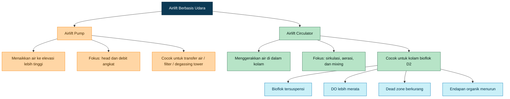

[**Kembali ke Atas**](#desain-airlift-circulator-untuk-kolam-bioflok-d2-kedalaman-80-cm-sirkulasi-aerasi-head-loss-dan-oksigen-terlarut)

---

# 2. Data Awal Kolam

Desain ini menggunakan data awal sebagai berikut.

| Parameter       |                                                Nilai |
| --------------- | ---------------------------------------------------: |
| Bentuk kolam    |                                               Bundar |
| Diameter kolam  |                                                2,0 m |
| Radius kolam    |                                                1,0 m |
| Kedalaman air   |                                                0,8 m |
| Sistem budidaya |                                              Bioflok |
| Fungsi alat     |                                 Sirkulasi dan aerasi |
| Target utama    | Flok tersuspensi, DO stabil, tidak ada endapan dasar |

Volume kolam dihitung menggunakan rumus volume silinder.

$$
V = \pi r^2 h
$$

$$
V = 3.14 \times 1^2 \times 0.8
$$

$$
V = 2.51 \, m^3
$$

Jadi, volume air efektif kolam D2 kedalaman 80 cm adalah sekitar:

$$
V \approx 2.5 \, m^3
$$

Nilai volume ini menjadi dasar untuk menghitung kebutuhan mixing, kapasitas udara, jumlah unit airlift circulator, serta kebutuhan blower.

Pada sistem bioflok, volume kolam bukan hanya menentukan jumlah air, tetapi juga menentukan total beban oksigen dan kebutuhan energi pencampuran. Bioflok bekerja sebagai sistem budidaya intensif dengan padatan tersuspensi dan aktivitas mikroba tinggi. SRAC Publication No. 4503 menjelaskan bahwa biofloc production system dikembangkan untuk meningkatkan kontrol lingkungan produksi, terutama pada sistem akuakultur intensif dengan keterbatasan air dan lahan. ([aquaculture.mgcafe.uky.edu][3])

Target operasional dari data awal ini adalah:

| Target                 | Keterangan                                         |
| ---------------------- | -------------------------------------------------- |
| Bioflok tersuspensi    | Flok tidak mengendap stabil di dasar kolam         |
| DO stabil              | DO tidak turun ke level kritis, terutama dini hari |
| Tidak ada dead zone    | Tidak ada area air stagnan                         |
| Endapan organik rendah | Risiko zona anaerob berkurang                      |
| Arus tidak berlebihan  | Ikan tidak stres karena arus terlalu kuat          |

[**Kembali ke Atas**](#desain-airlift-circulator-untuk-kolam-bioflok-d2-kedalaman-80-cm-sirkulasi-aerasi-head-loss-dan-oksigen-terlarut)

---

# 3. Design Basis

Design basis adalah bagian paling penting karena menjadi dasar seluruh keputusan dimensi, kapasitas blower, jumlah airlift circulator, dan acceptance criteria. Untuk kolam bioflok D2, design basis tidak boleh hanya menggunakan kapasitas debit air. Parameter yang lebih relevan adalah:

1. target kecepatan arus kolam,
2. target dissolved oxygen,
3. kebutuhan energi mixing,
4. kemampuan sistem menjaga flok tetap tersuspensi.

## 3.1 Target Kecepatan Arus Kolam

Untuk kolam bundar akuakultur, kecepatan air berkaitan langsung dengan mixing, distribusi oksigen, dan pengangkutan padatan. Literatur circular aquaculture tank menyebutkan bahwa kecepatan air yang diperlukan untuk mempertahankan sifat self-cleaning dapat berada pada rentang sekitar **3–40 cm/s**, tergantung ukuran padatan, geometri tangki, densitas ikan, dan pola aliran. ([PMC][4])

Namun, target bioflok berbeda dengan target self-cleaning tank RAS. Pada RAS, arus sering didesain untuk membawa padatan ke drain tengah. Pada bioflok, targetnya adalah menjaga flok tetap tersuspensi tanpa membuat ikan stres.

Karena itu, untuk desain awal digunakan rentang:

$$
v_{kolam}=0.03-0.10 \, m/s
$$

atau:

$$
v_{kolam}=3-10 \, cm/s
$$

Target desain awal yang dipakai:

$$
v_{kolam,target}=0.05 \, m/s
$$

Nilai 0,05 m/s tidak diperlakukan sebagai angka mutlak, tetapi sebagai **target commissioning**. Artinya, setelah sistem dipasang, pola arus aktual harus diuji dengan observasi flok, tracer sederhana, dan pemeriksaan endapan dasar.

## 3.2 Target Dissolved Oxygen

Bioflok membutuhkan aerasi kontinu karena oksigen dikonsumsi oleh ikan, bakteri, dan proses oksidasi bahan organik. Dalam sistem bioflok, kebutuhan oksigen tidak hanya berasal dari biomassa ikan, tetapi juga dari komunitas mikroba yang aktif mengolah nitrogen dan bahan organik.

Target minimum yang digunakan:

$$
DO > 4 \, mg/L
$$

Nilai ini digunakan sebagai batas aman minimum. Untuk operasi yang lebih sehat, terutama pada budidaya intensif, DO sebaiknya dijaga lebih tinggi bila memungkinkan. Studi dan panduan bioflok menekankan bahwa aerasi/mixing harus cukup untuk menjaga kondisi aerob dan mencegah penurunan kualitas air. ([CIBA][1])

## 3.3 Pendekatan Energi Mixing

Untuk menjaga flok tetap tersuspensi, pendekatan praktis yang digunakan adalah **power per unit volume** atau:

$$
\frac{P}{V}
$$

Untuk bioflok skala kecil, design basis awal yang digunakan:

$$
P/V = 15-20 \, W/m^3
$$

Dengan volume kolam:

$$
V = 2.51 \, m^3
$$

maka kebutuhan energi mixing yang masuk ke air diperkirakan:

$$
P = V \times (P/V)
$$

$$
P = 2.51 \times 15-20
$$

$$
P = 37.5-50 \, W
$$

Angka ini adalah estimasi **energi mixing efektif di air**, bukan langsung daya listrik blower. Daya listrik blower harus lebih besar karena terdapat rugi-rugi pada blower, manifold, valve, diffuser, bubble plume, dan transfer energi dari udara ke massa air.

## 3.4 Implikasi terhadap Desain Airlift Circulator

Berdasarkan design basis di atas, desain airlift circulator harus memenuhi tiga kondisi utama.

Pertama, sistem harus menghasilkan arus rotasi yang cukup untuk menjaga flok tetap tersuspensi. Kedua, sistem harus menyediakan aerasi yang cukup agar DO tidak turun di bawah batas aman. Ketiga, distribusi unit harus merata agar tidak terbentuk dead zone.

Hubungan antar parameter desain dapat dirangkum sebagai berikut.

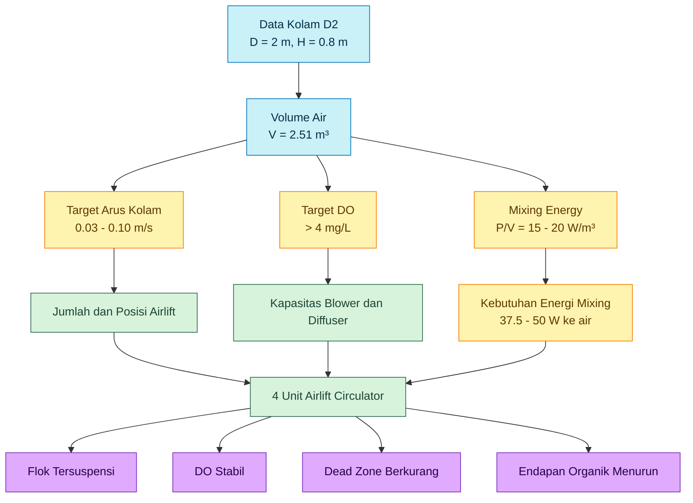

Dengan design basis ini, artikel tidak lagi memperlakukan airlift circulator sebagai alat sederhana yang hanya dihitung dari diameter pipa dan debit udara. Sistem ini diperlakukan sebagai **perangkat sirkulasi-aerasi** yang harus memenuhi target hidrodinamika dan kualitas air.

[1]: https://ciba.res.in/wp-content/uploads/2021/11/Biolfoc-final-manual-Nov9-12-2021_compressed.pdf?utm_source=chatgpt.com 'Biofloc Technology for Nursery and Growout Aquaculture'
[2]: https://www.sciencedirect.com/science/article/pii/S0144860998000235?utm_source=chatgpt.com 'Review of circular tank technology and management'
[3]: https://aquaculture.mgcafe.uky.edu/sites/aquaculture.ca.uky.edu/files/srac_4503_biofloc_production_systems_for_aquaculture.pdf?utm_source=chatgpt.com 'Biofloc Production Systems for Aquaculture'
[4]: https://pmc.ncbi.nlm.nih.gov/articles/PMC9334348/?utm_source=chatgpt.com 'Flow patterns in circular fish tanks and its relations with ... - PMC'

[**Kembali ke Atas**](#desain-airlift-circulator-untuk-kolam-bioflok-d2-kedalaman-80-cm-sirkulasi-aerasi-head-loss-dan-oksigen-terlarut)

---

# 4. Konsep Airlift Circulator

Pada kolam bioflok D2 kedalaman 80 cm, alat yang dirancang dalam artikel ini adalah **airlift circulator**, bukan airlift pump untuk menaikkan air. Perbedaan ini penting karena akan menentukan cara menghitung dimensi, posisi outlet, panjang pipa, kebutuhan blower, serta acceptance criteria di lapangan.

Pada **airlift pump klasik**, air dinaikkan ke elevasi tertentu. Artinya terdapat **static lift** atau head vertikal yang harus diatasi. Dalam kondisi tersebut, submergence ratio menjadi parameter penting karena menentukan efisiensi pengangkatan air.

Pada **airlift circulator**, static lift dibuat mendekati nol. Air tidak dinaikkan ke tempat yang lebih tinggi, tetapi digerakkan secara horizontal atau tangensial di dalam kolam. Outlet tetap berada di bawah permukaan air sehingga energi aliran langsung masuk ke massa air kolam untuk membentuk arus rotasi.

Dengan demikian:

$$
Static \, Lift \approx 0
$$

dan fungsi utama sistem adalah:

$$
Energi \, udara \rightarrow Bubble \, plume \rightarrow Sirkulasi \, air \rightarrow Mixing \, bioflok
$$

<figure>
  
  <figcaption>
    Ilustrasi airlift circulator sebagai alat bantu sirkulasi air, suplai
    oksigen, dan pergerakan flok dalam sistem bioflok.
  </figcaption>
</figure>

## 4.1 Outlet Tetap Terendam

Pada desain ini, outlet airlift tidak diarahkan keluar ke atas permukaan, tetapi tetap berada di bawah permukaan air. Posisi outlet yang terendam memberikan beberapa keuntungan.

Pertama, rugi head akibat pengangkatan air dapat ditekan. Kedua, energi jet outlet langsung digunakan untuk mendorong arus kolam. Ketiga, air yang keluar dari outlet dapat diarahkan secara tangensial untuk membentuk pola rotasi.

Untuk kolam D2 kedalaman 80 cm, posisi outlet yang digunakan adalah:

$$
5-15 \, cm
$$

di bawah permukaan air.

Rentang ini dipilih agar outlet tetap cukup dekat dengan permukaan, tetapi masih terendam sehingga aliran tidak pecah ke udara. Pada desain airlift circulator, posisi outlet tidak ditentukan oleh submergence ratio klasik, melainkan oleh kemampuan outlet membentuk arus rotasi dan mendistribusikan energi mixing ke kolom air.

## 4.2 Outlet Diarahkan Tangensial

Outlet harus diarahkan **tangensial mengikuti dinding kolam**, bukan diarahkan langsung ke tengah. Tujuannya adalah membentuk arus melingkar atau rotational flow.

Pada tangki akuakultur bundar, pola aliran sangat dipengaruhi oleh karakteristik inlet dan outlet. Studi mengenai flow pattern pada circular aquaculture tank menjelaskan bahwa geometri tangki serta karakteristik inlet–outlet merupakan parameter utama yang memengaruhi pola aliran dan kecepatan rata-rata di dalam tangki. Konfigurasi tangki bundar dengan inlet tangensial banyak digunakan karena mampu menghasilkan pola aliran yang lebih stabil dan velocity yang lebih baik dibanding beberapa bentuk tangki lain. ([UPCommons][1])

Arah tangensial juga membantu mengurangi dead zone. Dead zone adalah area air yang bergerak sangat lambat atau hampir stagnan. Dalam sistem bioflok, dead zone berisiko menjadi tempat akumulasi flok, sisa pakan, feses, dan bahan organik. Jika dibiarkan, area ini dapat mengalami kondisi anaerob dan menurunkan kualitas air.

## 4.3 Submergence Ratio Klasik Tidak Menjadi Parameter Utama

Pada airlift pump klasik, submergence ratio biasanya didefinisikan sebagai perbandingan antara panjang pipa yang terendam dan total panjang dari titik injeksi udara sampai titik discharge di atas permukaan. Parameter ini penting jika air harus diangkat ke elevasi lebih tinggi.

Namun pada airlift circulator untuk kolam D2:

- outlet tetap terendam,
- static lift mendekati nol,
- tujuan utama adalah sirkulasi internal,
- air tidak dipompa ke elevasi lebih tinggi.

Karena itu, submergence ratio klasik tidak menjadi parameter desain utama. Parameter yang lebih penting adalah:

1. kedalaman diffuser,
2. panjang efektif lift tube,
3. momentum outlet,
4. distribusi arus kolam,
5. kemampuan menjaga bioflok tetap tersuspensi.

## 4.4 Parameter Utama Airlift Circulator

### Kedalaman Diffuser

Diffuser ditempatkan sedalam mungkin dalam batas kedalaman kolam agar udara memiliki waktu kontak lebih panjang dengan air dan bubble plume terbentuk lebih stabil. Untuk kolam kedalaman 80 cm, kedalaman diffuser yang digunakan adalah sekitar:

$$
70 \, cm
$$

dari permukaan air.

Kedalaman ini memberi ruang sekitar 10 cm dari dasar untuk mengurangi risiko diffuser terlalu dekat dengan endapan dasar atau lumpur organik.

### Panjang Efektif Lift Tube

Panjang efektif lift tube adalah jarak dari titik injeksi udara/diffuser sampai outlet terendam.

Jika diffuser pada kedalaman 70 cm dan outlet pada 5–15 cm di bawah permukaan, maka:

$$
L_{efektif}=70-5=65 \, cm
$$

$$
L_{efektif}=70-15=55 \, cm
$$

Sehingga:

$$
L_{efektif}=55-65 \, cm
$$

Panjang ini menjadi ruang pembentukan campuran air–udara sebelum air keluar dari outlet.

### Momentum Outlet

Momentum outlet adalah faktor penting karena arus rotasi kolam dibentuk oleh dorongan jet outlet. Secara sederhana, momentum aliran berhubungan dengan debit dan kecepatan outlet.

$$
Momentum \sim \rho Q v
$$

Keterangan:

- $\rho$ = densitas air,
- $Q$ = debit air outlet,
- $v$ = kecepatan outlet.

Semakin besar debit dan kecepatan outlet, semakin besar dorongan aliran tangensial yang dibentuk. Namun, momentum yang terlalu besar dapat membuat ikan stres, sedangkan momentum terlalu kecil tidak mampu menjaga flok tetap tersuspensi. Karena itu, desain harus mencari keseimbangan antara mixing, oksigenasi, dan kenyamanan ikan.

### Distribusi Arus Kolam

Distribusi arus lebih penting daripada hanya mengejar debit besar. Satu outlet besar dapat menghasilkan arus kuat di satu titik, tetapi masih menyisakan area stagnan di sisi lain. Karena itu, desain ini menggunakan beberapa unit airlift kecil agar arus lebih merata.

Diagram konsep berikut memperlihatkan perbedaan airlift pump dan airlift circulator dalam konteks kolam bioflok.

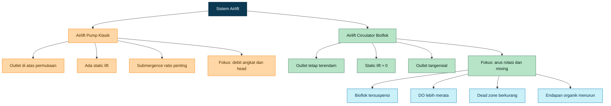

[**Kembali ke Atas**](#desain-airlift-circulator-untuk-kolam-bioflok-d2-kedalaman-80-cm-sirkulasi-aerasi-head-loss-dan-oksigen-terlarut)

---

# 5. Konfigurasi Jumlah Unit

Untuk kolam bioflok D2 kedalaman 80 cm, konfigurasi yang direkomendasikan adalah:

$$
N = 4 \, unit
$$

Artinya, satu kolam D2 menggunakan **empat unit airlift circulator kecil**, bukan satu unit besar.

Keputusan ini bukan hanya pertimbangan debit, tetapi juga pertimbangan distribusi arus, kualitas mixing, kestabilan oksigenasi, dan pengurangan dead zone.

## 5.1 Mengapa Tidak Menggunakan Satu Unit Besar?

Satu unit airlift besar memang dapat menghasilkan debit tinggi di satu titik, tetapi pada kolam bundar kecil hal ini dapat menimbulkan beberapa masalah:

- arus terlalu kuat di dekat outlet,
- sisi berlawanan berisiko menjadi zona lambat,
- bioflok dapat terkumpul pada area tertentu,
- distribusi oksigen kurang merata,
- jika unit gagal, seluruh sirkulasi berhenti.

Pada kolam bioflok, distribusi energi mixing lebih penting daripada sekadar debit total. Sistem bioflok memerlukan aerasi dan mixing yang cukup untuk menjaga bioflok tetap tersuspensi serta mencegah terbentuknya metabolit berbahaya. Manual biofloc CIBA menegaskan bahwa aerasi/mixing diperlukan bukan hanya untuk menyediakan DO dan membuang CO₂, tetapi juga untuk menjaga bioflok tetap tersuspensi serta mencegah pembentukan metabolit nitrogen, sulfida, dan asam organik. ([CIBA][2])

Karena itu, empat unit kecil lebih sesuai dibanding satu unit besar.

## 5.2 Alasan Menggunakan Empat Unit

### Distribusi Arus Lebih Merata

Dengan empat unit yang ditempatkan pada posisi berbeda, energi jet tersebar di beberapa titik. Ini membantu membentuk arus rotasi yang lebih stabil dan mengurangi area air yang bergerak lambat.

### Dead Zone Lebih Kecil

Dead zone sering muncul di area yang tidak tersapu arus. Dalam sistem bioflok, dead zone dapat menjadi tempat endapan organik. Empat unit airlift yang diarahkan searah secara tangensial membantu mengurangi area stagnan.

Studi tentang circular aquaculture tank menunjukkan bahwa flow rate, diameter nozzle, dan jumlah nozzle memengaruhi rotational velocity, impulse force, dan kondisi aliran rata-rata di dalam tangki. Ini mendukung prinsip bahwa jumlah dan konfigurasi outlet perlu diperhatikan, bukan hanya total debit air. ([PMC][3])

### Redundansi Lebih Baik

Jika satu unit mengalami penurunan performa akibat fouling diffuser atau valve kurang terbuka, tiga unit lain masih tetap bekerja. Dalam sistem bioflok, kegagalan aerasi dan mixing dapat berdampak cepat terhadap DO dan kualitas air, sehingga redundansi menjadi nilai desain yang penting.

### Oksigenasi Lebih Merata

Empat titik injeksi udara membuat distribusi bubble plume lebih menyebar. Hal ini membantu pemerataan DO dan mengurangi kemungkinan area dengan DO rendah.

## 5.3 Layout Penempatan Empat Unit

Empat unit dipasang pada keliling kolam dengan jarak sudut sekitar 90°. Semua outlet diarahkan searah mengikuti dinding kolam agar membentuk arus rotasi.

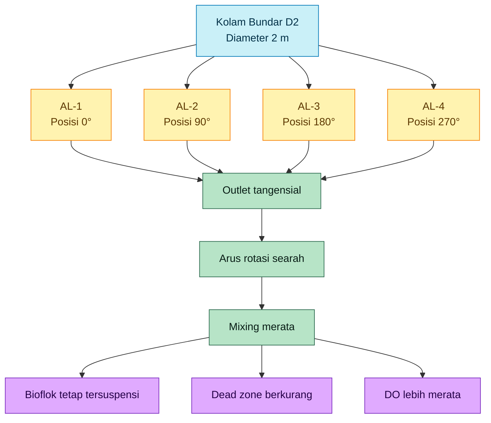

Secara praktis, konfigurasi tampak atas dapat dibayangkan sebagai berikut.

```text
Tampak atas kolam D2

              AL-1
              ↘
       ┌─────────────┐
       │             │
 AL-4 ↗│      ○      │↘ AL-2
       │             │
       └─────────────┘
              ↖
              AL-3
```

Semua outlet harus mengarah searah. Jangan membuat dua outlet berlawanan arah karena dapat saling meniadakan momentum dan membentuk turbulensi lokal tanpa rotasi kolam yang stabil.

## 5.4 Konfigurasi Awal yang Direkomendasikan

Konfigurasi awal yang digunakan untuk desain selanjutnya adalah sebagai berikut.

| Parameter                 |                     Nilai Desain |
| ------------------------- | -------------------------------: |
| Jumlah airlift circulator |                           4 unit |
| Posisi pemasangan         |              0°, 90°, 180°, 270° |
| Arah outlet               |                Tangensial searah |
| Posisi outlet             |       5–15 cm di bawah permukaan |
| Fungsi utama              |           Rotasi, mixing, aerasi |
| Target visual             | Tidak ada endapan bioflok stabil |
| Target DO                 |                          >4 mg/L |

Konfigurasi empat unit ini menjadi basis untuk perhitungan dimensi pipa, debit udara, debit air, head loss, diffuser, dan blower pada bab-bab berikutnya.

[1]: https://upcommons.upc.edu/bitstreams/a01db351-abd1-4e8a-a259-898ef6d5ffad/download?utm_source=chatgpt.com 'Flow pattern in aquaculture circular tanks'
[2]: https://ciba.res.in/wp-content/uploads/2021/11/Biolfoc-final-manual-Nov9-12-2021_compressed.pdf?utm_source=chatgpt.com 'Biofloc Technology for Nursery and Growout Aquaculture'
[3]: https://pmc.ncbi.nlm.nih.gov/articles/PMC9334348/?utm_source=chatgpt.com 'Flow patterns in circular fish tanks and its relations with ... - PMC'

[**Kembali ke Atas**](#desain-airlift-circulator-untuk-kolam-bioflok-d2-kedalaman-80-cm-sirkulasi-aerasi-head-loss-dan-oksigen-terlarut)

---

# 6. Dimensi Utama Per Unit

Dimensi airlift circulator per unit harus disusun berdasarkan fungsi utamanya sebagai **alat sirkulasi dan aerasi internal**, bukan sebagai pompa pengangkat air. Oleh karena itu, desain dimensi difokuskan pada empat aspek:

1. panjang kontak udara–air di dalam lift tube,
2. kemampuan membentuk bubble plume,
3. momentum outlet untuk menghasilkan arus tangensial,
4. rugi-rugi hidrolik yang masih dapat diterima.

Untuk kolam bioflok D2 kedalaman 80 cm, desain awal per unit menggunakan pipa PVC 1 inch. Pipa ukuran ini dipilih karena mudah tersedia, cukup kecil untuk 4 titik distribusi, dan masih mampu menghasilkan kecepatan outlet yang memadai pada debit air sekitar 1,0–1,6 m³/jam per unit.

## 6.1 Spesifikasi Dimensi Per Unit

| Komponen                        |                       Nilai Desain |
| ------------------------------- | ---------------------------------: |
| Lift tube                       |                         PVC 1 inch |
| Diameter dalam lift tube        |                             ±26 mm |
| Kedalaman diffuser              |               70 cm dari permukaan |
| Kedalaman outlet                |         5–15 cm di bawah permukaan |
| Panjang efektif lift tube       |                           55–65 cm |
| Panjang outlet horizontal       |                           15–30 cm |
| Panjang outlet maksimum praktis |                              50 cm |
| Arah outlet                     | Tangensial mengikuti dinding kolam |
| Sudut vertikal outlet           |                     0–10° ke bawah |

## 6.2 Kedalaman Diffuser

Diffuser diletakkan pada kedalaman sekitar:

$$
h_{diffuser}=70 \, cm
$$

dari permukaan air.

Dengan kedalaman air 80 cm, posisi ini menyisakan jarak sekitar 10 cm dari dasar kolam. Jarak ini penting agar diffuser tidak terlalu dekat dengan dasar, sehingga risiko tersumbat oleh endapan organik atau flok yang mengendap dapat dikurangi.

Kedalaman diffuser juga berpengaruh terhadap waktu kontak udara–air. Semakin dalam udara diinjeksi, semakin lama gelembung naik di dalam lift tube. Dalam konteks airlift untuk akuakultur, performa airlift dipengaruhi oleh debit udara, diameter pipa, dan konfigurasi pengaliran karena sistem ini bekerja sebagai aliran dua-fasa udara–air. Parker dan Suttle mengukur performa airlift berbagai diameter untuk aplikasi sirkulasi dan aerasi akuakultur, yang menunjukkan bahwa performa airlift memang perlu dilihat sebagai kombinasi antara udara, air, dan geometri pipa. ([ScienceDirect][1])

## 6.3 Posisi Outlet

Outlet ditempatkan pada kedalaman:

$$
h_{outlet}=5-15 \, cm
$$

di bawah permukaan air.

Outlet yang tetap terendam menjaga agar energi jet langsung masuk ke massa air kolam. Jika outlet berada di atas permukaan, sebagian energi akan hilang sebagai percikan, turbulensi permukaan, dan kehilangan head. Untuk airlift circulator, konfigurasi terendam lebih logis karena targetnya adalah membentuk arus rotasi, bukan menaikkan air.

## 6.4 Panjang Efektif Lift Tube

Panjang efektif lift tube adalah jarak dari posisi diffuser sampai posisi outlet. Jika diffuser berada pada kedalaman 70 cm dan outlet berada pada 5–15 cm di bawah permukaan, maka panjang efektif dihitung sebagai berikut.

Untuk outlet 5 cm di bawah permukaan:

$$
L_{efektif}=70-5=65 \, cm
$$

Untuk outlet 15 cm di bawah permukaan:

$$
L_{efektif}=70-15=55 \, cm
$$

Sehingga:

$$
L_{efektif}=55-65 \, cm
$$

Panjang efektif ini menjadi ruang utama pembentukan campuran air–udara. Di dalam ruang inilah densitas campuran menurun, bubble plume terbentuk, dan air terdorong menuju outlet.

## 6.5 Panjang Outlet Horizontal

Outlet horizontal direkomendasikan sepanjang:

$$
L_{outlet}=15-30 \, cm
$$

dengan batas maksimum praktis:

$$
L_{outlet,max}=50 \, cm
$$

Panjang outlet yang terlalu pendek dapat membuat arah jet kurang terkendali. Namun outlet yang terlalu panjang dapat meningkatkan rugi-rugi pipa, memperbesar risiko fouling, dan mengurangi momentum jet. Pada kolam kecil D2, panjang 15–30 cm cukup untuk mengarahkan aliran secara tangensial tanpa membuat sistem menjadi kompleks.

## 6.6 Diagram Dimensi Per Unit

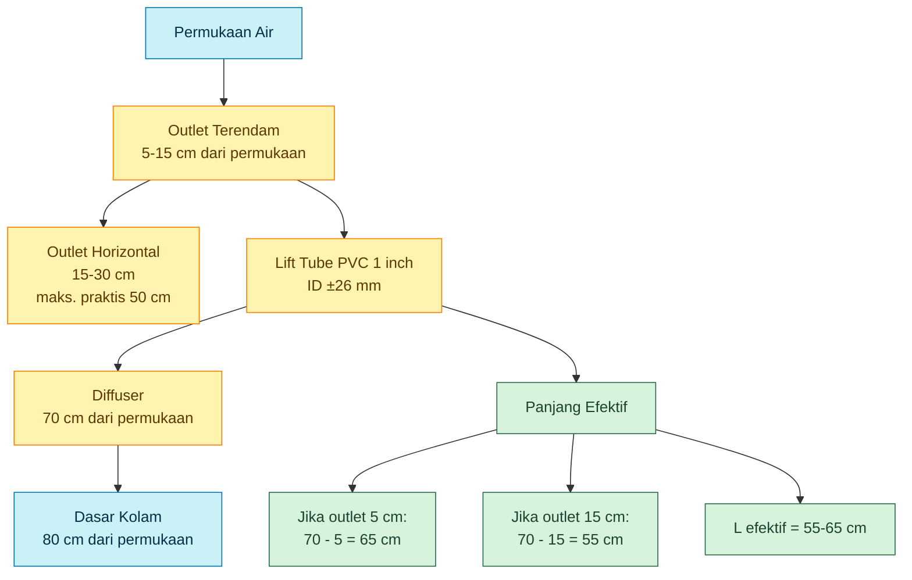

Diagram tersebut menggambarkan bahwa panjang efektif lift tube tidak sama dengan kedalaman air penuh 80 cm. Panjang efektif hanya dihitung dari titik diffuser sampai outlet.

[**Kembali ke Atas**](#desain-airlift-circulator-untuk-kolam-bioflok-d2-kedalaman-80-cm-sirkulasi-aerasi-head-loss-dan-oksigen-terlarut)

---

# 7. Debit Udara dan Debit Air

Debit udara adalah parameter utama yang menggerakkan sistem airlift circulator. Udara yang diinjeksi melalui diffuser membentuk bubble plume, menurunkan densitas campuran air–udara, dan mendorong air bergerak ke outlet.

Namun, hubungan antara debit udara dan debit air pada airlift tidak selalu linear. Debit air aktual dipengaruhi oleh diameter pipa, kedalaman diffuser, konfigurasi outlet, rugi-rugi pipa, ukuran gelembung, slip antara udara dan air, serta pola aliran dua-fasa. Penelitian dan review airlift menunjukkan bahwa air flow rate, submergence, diameter riser, dan karakteristik aliran dua-fasa sangat memengaruhi performa airlift. ([ScienceDirect][1])

## 7.1 Debit Udara Per Unit

Untuk desain awal kolam D2, debit udara per unit ditetapkan:

$$
Q_{air}=1.5-2.0 \, m^3/jam
$$

Karena jumlah unit yang digunakan adalah 4, maka total udara:

$$
Q_{air,total}=4 \times Q_{air}
$$

$$
Q_{air,total}=4 \times (1.5-2.0)
$$

$$
Q_{air,total}=6-8 \, m^3/jam
$$

Nilai ini harus dibaca sebagai kapasitas udara pada tekanan kerja aktual, bukan kapasitas free air flow tanpa beban.

## 7.2 Estimasi Debit Air Per Unit

Untuk airlift circulator dangkal dengan kedalaman diffuser sekitar 70 cm, estimasi debit air dibuat konservatif. Dalam desain awal digunakan:

$$
Q_{water}=1.0-1.6 \, m^3/jam/unit
$$

Sehingga untuk 4 unit:

$$
Q_{water,total}=4 \times (1.0-1.6)
$$

$$
Q_{water,total}=4.0-6.4 \, m^3/jam
$$

Rentang ini tidak boleh diperlakukan sebagai jaminan debit final, karena performa airlift harus divalidasi melalui pengukuran aktual. Pada airlift, debit air sangat sensitif terhadap debit udara, diameter pipa, panjang pipa, dan pola discharge.

## 7.3 Turnover Hidrolik

Turnover hidrolik adalah perbandingan antara total debit sirkulasi dan volume kolam. Volume kolam D2 adalah:

$$
V=2.51 \, m^3
$$

Dengan total debit air:

$$
Q_{water,total}=4.0-6.4 \, m^3/jam
$$

maka turnover:

$$
Turnover=\frac{Q_{water,total}}{V}
$$

$$
Turnover=\frac{4.0-6.4}{2.51}
$$

$$
Turnover=1.6-2.5 \, kali/jam
$$

Turnover ini bukan satu-satunya ukuran keberhasilan. Untuk bioflok, yang lebih penting adalah apakah flok tetap tersuspensi dan apakah tidak ada dead zone. Bioflok membutuhkan kondisi aerasi dan mixing kontinu untuk menjaga flok mikroba tetap berada di kolom air; panduan biofloc menekankan pentingnya aerasi untuk mempertahankan DO dan suspended microbial flocs. ([ResearchGate][2])

## 7.4 Ringkasan Debit Desain

| Parameter                   |            Nilai |
| --------------------------- | ---------------: |
| Debit udara per unit        |   1,5–2,0 m³/jam |
| Jumlah unit                 |                4 |
| Total debit udara           |       6–8 m³/jam |
| Estimasi debit air per unit |   1,0–1,6 m³/jam |
| Estimasi debit air total    |   4,0–6,4 m³/jam |
| Volume kolam                |          2,51 m³ |
| Turnover hidrolik           | 1,6–2,5 kali/jam |

[**Kembali ke Atas**](#desain-airlift-circulator-untuk-kolam-bioflok-d2-kedalaman-80-cm-sirkulasi-aerasi-head-loss-dan-oksigen-terlarut)

---

# 8. Perhitungan Kecepatan Outlet

Kecepatan outlet adalah kecepatan air yang keluar dari ujung outlet airlift circulator. Parameter ini penting karena memengaruhi momentum jet tangensial yang membentuk arus rotasi di dalam kolam.

Namun, perlu ditekankan sejak awal: **velocity outlet bukan target utama desain**. Target utama tetap pola arus kolam, suspensi bioflok, DO stabil, dan tidak ada endapan dasar. Velocity outlet hanyalah hasil dari kombinasi debit air dan diameter outlet.

Pada circular tank, pola aliran dan rata-rata kecepatan air sangat dipengaruhi oleh geometri, inlet, outlet, flow rate, diameter nozzle, dan jumlah nozzle. Oleh sebab itu, kecepatan outlet harus dipahami sebagai salah satu variabel pembentuk hidrodinamika kolam, bukan satu-satunya parameter desain. ([UPCommons][3])

## 8.1 Rumus Kecepatan Outlet

Kecepatan outlet dihitung menggunakan:

$$
v_{outlet}=\frac{Q}{A}
$$

dengan luas penampang outlet:

$$
A=\frac{\pi D^2}{4}
$$

Keterangan:

| Simbol       | Keterangan                |
| ------------ | ------------------------- |
| $v_{outlet}$ | kecepatan outlet, m/s     |
| $Q$          | debit air per unit, m³/s  |
| $A$          | luas penampang outlet, m² |
| $D$          | diameter dalam outlet, m  |

## 8.2 Contoh Perhitungan

Gunakan debit air per unit:

$$
Q=1.2 \, m^3/jam
$$

Konversi ke m³/s:

$$
Q=\frac{1.2}{3600}
$$

$$
Q=0.000333 \, m^3/s
$$

Diameter dalam outlet PVC 1 inch:

$$
D=26 \, mm=0.026 \, m
$$

Luas outlet:

$$
A=\frac{3.14 \times 0.026^2}{4}
$$

$$
A=0.000531 \, m^2
$$

Kecepatan outlet:

$$
v_{outlet}=\frac{0.000333}{0.000531}
$$

$$
v_{outlet}=0.63 \, m/s
$$

Jadi, untuk debit air 1,2 m³/jam dan outlet ID 26 mm, kecepatan outlet sekitar:

$$
v_{outlet}\approx0.63 \, m/s
$$

## 8.3 Interpretasi Kecepatan Outlet

Nilai 0,63 m/s tidak berarti seluruh kolam bergerak dengan kecepatan tersebut. Kecepatan outlet adalah kecepatan jet lokal pada ujung outlet. Setelah keluar ke kolam, momentum jet akan tersebar, mengalami dissipasi, membentuk arus rotasi, dan kecepatannya menurun.

Karena itu, hubungan antara $v_{outlet}$ dan $v_{kolam}$ tidak boleh dianggap satu banding satu.

Secara konseptual:

$$
v_{outlet} > v_{kolam}
$$

karena jet outlet mengalami kehilangan energi dan menyebar ke volume air kolam.

## 8.4 Hubungan dengan Momentum Outlet

Momentum outlet dapat dipahami dengan pendekatan:

$$
M \sim \rho Q v
$$

Jika debit $Q$ naik, momentum meningkat. Jika kecepatan outlet $v$ naik, momentum juga meningkat. Namun menaikkan kecepatan outlet secara berlebihan bukan selalu solusi, karena dapat:

- menimbulkan arus terlalu kuat di dekat outlet,
- membuat ikan stres,
- menyebabkan pola aliran tidak stabil,
- meningkatkan rugi-rugi hidrolik,
- mempercepat fouling pada pipa kecil.

Sebaliknya, kecepatan outlet terlalu rendah dapat menyebabkan:

- arus rotasi lemah,
- bioflok mudah mengendap,
- dead zone terbentuk,
- oksigenasi tidak merata.

## 8.5 Diagram Hubungan Debit, Diameter, dan Velocity Outlet

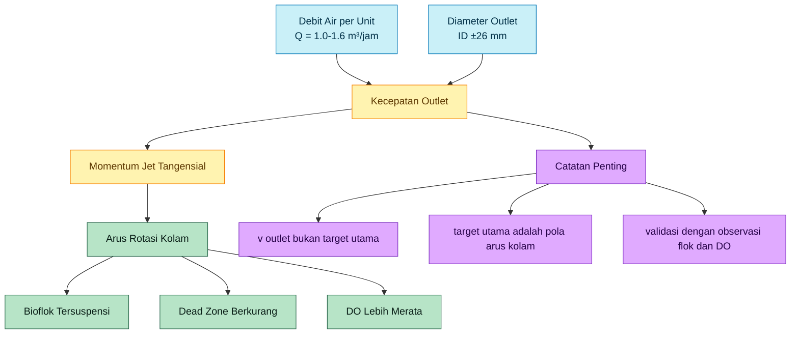

## 8.6 Penekanan Desain

Kecepatan outlet sebesar 0,5–0,8 m/s dapat muncul sebagai konsekuensi dari pemilihan debit air per unit dan diameter outlet 1 inch. Namun angka ini tidak boleh ditulis sebagai target utama tanpa konteks.

Pernyataan desain yang benar adalah:

> Kecepatan outlet airlift circulator dihitung dari debit air aktual dan diameter outlet. Nilai ini memengaruhi momentum jet tangensial, tetapi keberhasilan desain tetap harus dinilai dari pola arus kolam, suspensi bioflok, DO, dan tidak adanya endapan dasar.

Dengan demikian, perhitungan velocity outlet digunakan sebagai bagian dari evaluasi hidrodinamika, bukan sebagai satu-satunya dasar penentuan performa sistem.

[1]: https://www.sciencedirect.com/science/article/pii/0144860987900082?utm_source=chatgpt.com 'Design of airlift pumps for water circulation and aeration in ...'
[2]: https://www.researchgate.net/publication/308052605_Biofloc_technology_A_practical_guide_book_The_World_Aquaculture_Society?utm_source=chatgpt.com '(PDF) Biofloc technology. A practical guide book. The ...'
[3]: https://upcommons.upc.edu/bitstreams/a01db351-abd1-4e8a-a259-898ef6d5ffad/download?utm_source=chatgpt.com 'Flow pattern in aquaculture circular tanks'

[**Kembali ke Atas**](#desain-airlift-circulator-untuk-kolam-bioflok-d2-kedalaman-80-cm-sirkulasi-aerasi-head-loss-dan-oksigen-terlarut)

---

# 9. Perhitungan Rugi-Rugi Hidrolik

Rugi-rugi hidrolik perlu dihitung karena airlift circulator tidak hanya bergantung pada debit udara, tetapi juga pada kemampuan aliran air–udara melewati lift tube, elbow, outlet, dan fitting tanpa kehilangan momentum yang terlalu besar. Jika rugi-rugi terlalu tinggi, debit air aktual turun, velocity outlet melemah, dan arus rotasi kolam tidak terbentuk dengan baik.

Pada sistem ini, perhitungan rugi-rugi dilakukan sebagai **pendekatan awal sisi air**. Perlu dicatat bahwa aliran aktual di dalam lift tube adalah aliran dua-fasa udara–air. Studi airlift untuk akuakultur menunjukkan bahwa performa airlift sangat dipengaruhi oleh pola aliran dua-fasa, airflow rate, metode injeksi, dan void fraction, sehingga perhitungan satu-fasa harus diberi faktor koreksi desain. ([MDPI][1])

## 9.1 Major Loss atau Rugi Gesek Pipa

Rugi gesek pipa lurus dihitung menggunakan persamaan Darcy-Weisbach. Persamaan ini umum digunakan untuk menghitung head loss akibat gesekan fluida di dalam pipa. ([Engineering ToolBox][2])

$$
h_f=f\frac{L}{D}\frac{v^2}{2g}
$$

Keterangan:

| Simbol | Keterangan                      |
| ------ | ------------------------------- |
| $h_f$  | rugi gesek pipa lurus, m        |
| $f$    | Darcy friction factor           |
| $L$    | panjang pipa, m                 |
| $D$    | diameter dalam pipa, m          |
| $v$    | kecepatan aliran, m/s           |
| $g$    | percepatan gravitasi, 9.81 m/s² |

Untuk desain awal ini digunakan:

| Parameter                  |    Nilai |
| -------------------------- | -------: |
| Diameter dalam pipa        |  0.026 m |
| Panjang efektif lift tube  |   0.60 m |
| Kecepatan air              | 0.63 m/s |
| Friction factor asumsi PVC |    0.025 |

Maka:

$$
h_f=0.025 \times \frac{0.60}{0.026} \times \frac{0.63^2}{2 \times 9.81}
$$

$$
h_f=0.0117 \, m
$$

Jadi rugi gesek pipa lurus pada lift tube sekitar:

$$
h_f \approx 0.012 \, m
$$

atau sekitar **1,2 cm head air**.

Nilai ini relatif kecil karena pipa pendek. Pada desain airlift circulator kecil, rugi-rugi yang lebih dominan biasanya berasal dari fitting dan perubahan arah aliran.

## 9.2 Minor Loss atau Rugi Fitting

Minor loss adalah rugi energi akibat elbow, tee, perubahan arah, sambungan, outlet, dan entry/exit loss. Minor loss biasanya dihitung dengan menjumlahkan koefisien loss $K$, lalu dikalikan dengan velocity head. ([Engineering ToolBox][3])

$$
h_m=K\frac{v^2}{2g}
$$

Keterangan:

| Simbol | Keterangan                 |
| ------ | -------------------------- |
| $h_m$  | minor loss, m              |
| $K$    | total koefisien loss       |
| $v$    | kecepatan aliran, m/s      |
| $g$    | percepatan gravitasi, m/s² |

Komponen minor loss pada satu unit airlift circulator meliputi:

| Komponen           | Fungsi                                             | Estimasi $K$ |
| ------------------ | -------------------------------------------------- | -----------: |
| Elbow bawah        | mengarahkan aliran dari zona diffuser ke lift tube |          0.9 |
| Tee/diffuser entry | area masuk campuran udara–air                      |          1.0 |
| Elbow outlet       | mengubah arah aliran menuju outlet horizontal      |          0.9 |
| Exit loss          | kerugian saat jet keluar ke kolam                  |          1.0 |
| Total              |                                                    |          3.8 |

Dengan:

$$
K=3.8
$$

$$
v=0.63 \, m/s
$$

maka:

$$
h_m=3.8 \times \frac{0.63^2}{2 \times 9.81}
$$

$$
h_m=0.077 \, m
$$

Jadi minor loss sekitar:

$$
h_m \approx 0.077 \, m
$$

atau sekitar **7,7 cm head air**.

## 9.3 Total Head Loss Sisi Air

Total head loss sisi air dihitung sebagai penjumlahan major loss dan minor loss.

$$
h_L=h_f+h_m
$$

$$
h_L=0.0117+0.077
$$

$$
h_L=0.0887 \, m
$$

Sehingga:

$$
h_L \approx 0.09 \, m
$$

Nilai ini adalah estimasi satu-fasa sisi air. Karena aliran aktual adalah campuran air–udara, serta sistem bioflok memiliki potensi fouling dan padatan tersuspensi, maka perlu digunakan faktor koreksi desain.

Untuk desain awal:

$$
h_{L,design}=1.5-2.0 \times h_L
$$

$$
h_{L,design}=1.5-2.0 \times 0.09
$$

$$
h_{L,design}=0.13-0.18 \, m
$$

Jadi head loss desain sisi air yang digunakan adalah:

$$
h_{L,design}=0.13-0.18 \, m
$$

## 9.4 Interpretasi Engineering

Nilai head loss sekitar 0.13–0.18 m tidak berarti blower harus menambahkan tekanan sebesar itu secara langsung dalam bentuk head air penuh, karena mekanisme penggerak airlift berasal dari bubble plume dan perbedaan densitas campuran air–udara. Namun head loss ini tetap penting karena menunjukkan besarnya energi yang hilang pada sisi aliran air.

Jika head loss terlalu tinggi, beberapa akibat yang mungkin terjadi adalah:

- debit air aktual turun,
- velocity outlet turun,
- momentum jet tangensial melemah,
- arus rotasi tidak stabil,
- dead zone lebih mudah terbentuk,
- bioflok lebih mudah mengendap.

Karena itu, desain harus menghindari pipa terlalu panjang, terlalu banyak elbow, outlet terlalu kecil, dan diffuser yang mudah fouling.

## 9.5 Diagram Rugi-Rugi Hidrolik

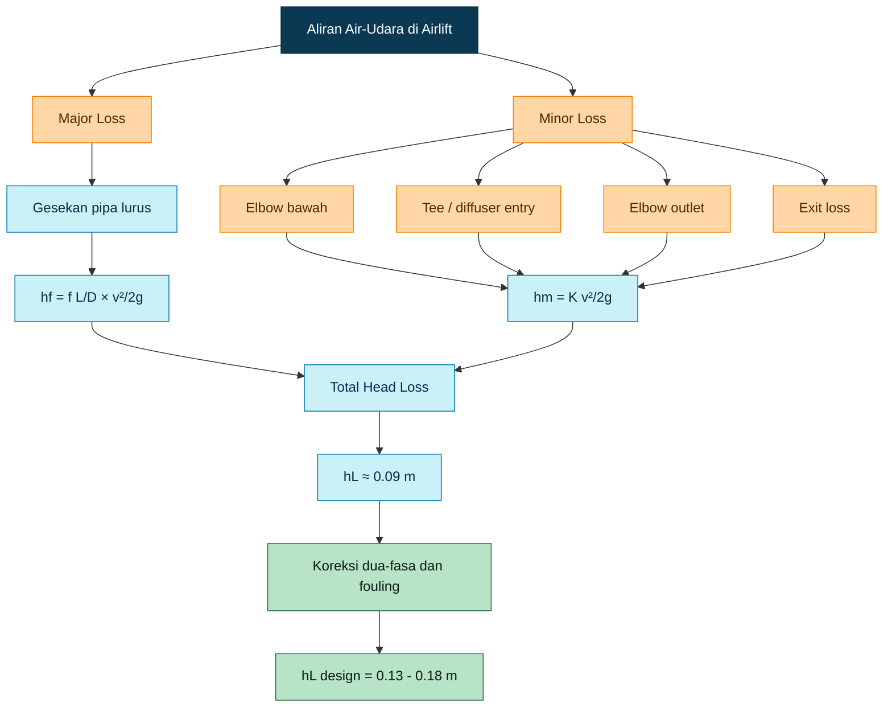

[**Kembali ke Atas**](#desain-airlift-circulator-untuk-kolam-bioflok-d2-kedalaman-80-cm-sirkulasi-aerasi-head-loss-dan-oksigen-terlarut)

---

# 10. Penentuan Panjang Outlet Maksimum

Panjang outlet horizontal perlu dikendalikan karena outlet berfungsi sebagai pengarah jet tangensial. Outlet yang terlalu pendek membuat arah jet kurang stabil, tetapi outlet yang terlalu panjang menambah head loss, meningkatkan risiko fouling, dan melemahkan momentum jet.

Pada airlift circulator, outlet bukan sekadar saluran buang. Outlet adalah komponen yang mengubah energi aliran menjadi arus rotasi kolam. Oleh karena itu, panjang outlet harus ditentukan dengan mempertimbangkan keseimbangan antara:

- rugi-rugi hidrolik,
- momentum jet,
- risiko fouling bioflok,
- kemudahan pembersihan,
- kemampuan membentuk arus rotasi.

## 10.1 Rumus Head Loss Outlet Horizontal

Untuk outlet horizontal, rugi gesek pipa lurus dapat dihitung dengan:

$$
h_{f,outlet}=f\frac{L_{outlet}}{D}\frac{v^2}{2g}
$$

Keterangan:

| Simbol         | Keterangan                      |
| -------------- | ------------------------------- |
| $h_{f,outlet}$ | rugi gesek outlet horizontal, m |
| $f$            | friction factor                 |
| $L_{outlet}$   | panjang outlet horizontal, m    |
| $D$            | diameter dalam outlet, m        |
| $v$            | kecepatan outlet, m/s           |
| $g$            | percepatan gravitasi, m/s²      |

Secara teoritis, jika hanya menghitung gesekan pipa lurus, outlet bisa dibuat cukup panjang. Namun desain praktis tidak boleh hanya mengikuti batas teoritis tersebut.

## 10.2 Estimasi Panjang Teoritis

Jika digunakan:

| Parameter                    |    Nilai |
| ---------------------------- | -------: |
| $D$                          |  0.026 m |
| $v$                          | 0.63 m/s |
| $f$                          |    0.025 |
| Allowable tambahan head loss |   0.08 m |

Maka panjang outlet teoritis dapat dihitung dari:

$$
L_{outlet,max}=
\frac{h_{allow}D}{f}
\frac{2g}{v^2}
$$

$$
L_{outlet,max}=
\frac{0.08 \times 0.026}{0.025}
\times
\frac{19.62}{0.63^2}
$$

$$
L_{outlet,max}\approx4.1 \, m
$$

Namun nilai **4,1 m** ini hanya batas hidrolik pipa lurus secara teoritis. Nilai tersebut tidak cocok diterapkan langsung pada kolam D2 karena panjang kolam hanya 2 m dan outlet terlalu panjang akan merusak fungsi utama jet tangensial.

## 10.3 Mengapa Outlet Tidak Boleh Terlalu Panjang?

### Momentum Jet Melemah

Semakin panjang outlet, semakin besar kehilangan energi. Walaupun head loss pipa lurus terlihat kecil, kombinasi gesekan, fitting, fouling, dan gelembung udara dapat menurunkan momentum jet. Jika momentum melemah, arus rotasi kolam tidak terbentuk dengan baik.

### Risiko Fouling Meningkat

Air bioflok mengandung padatan tersuspensi dan mikroorganisme. Pipa outlet yang terlalu panjang dapat menjadi area akumulasi biofilm, flok, atau endapan halus. Jika fouling terjadi, diameter efektif pipa mengecil dan head loss meningkat.

### Risiko Pengendapan dalam Pipa

Jika kecepatan lokal turun, partikel bioflok dapat mengendap di dalam pipa outlet. Ini berbahaya karena dapat menyebabkan penyumbatan parsial dan membuat debit antar unit tidak seimbang.

### Arus Rotasi Melemah

Outlet terlalu panjang dapat mengubah arah jet atau membuat distribusi momentum tidak efektif. Pada kolam bundar kecil, yang dibutuhkan adalah jet pendek, terarah, dan tangensial.

## 10.4 Rekomendasi Panjang Outlet

Berdasarkan pertimbangan hidrolik dan praktis, outlet horizontal direkomendasikan:

$$
L_{outlet}=15-30 \, cm
$$

Dengan batas maksimum praktis:

$$
L_{outlet,max}=50 \, cm
$$

Rentang 15–30 cm cukup untuk mengarahkan aliran tangensial tanpa menambah head loss dan fouling secara berlebihan.

## 10.5 Hubungan Panjang Outlet dengan Oksigen Terlarut

Ada kemungkinan outlet yang lebih panjang memberikan waktu kontak udara–air sedikit lebih lama. Namun, pada desain airlift circulator kecil, peningkatan panjang outlet tidak boleh dianggap otomatis meningkatkan DO secara signifikan.

Transfer oksigen lebih banyak dipengaruhi oleh:

- debit udara,
- kedalaman injeksi udara,
- ukuran gelembung,
- turbulensi,
- waktu kontak di lift tube,
- distribusi bubble plume,
- DO aktual air,
- suhu dan salinitas.

Studi two-phase mass transfer pada airlift pump untuk akuakultur menunjukkan bahwa oxygen transfer dipengaruhi oleh airflow rate, metode injeksi, void fraction, dan pola aliran dua-fasa dalam riser. ([MDPI][1])

Karena itu, strategi desain yang lebih aman adalah:

- menjaga diffuser sedalam mungkin dalam kolam,
- mempertahankan lift tube efektif 55–65 cm,
- membuat outlet tetap pendek dan tangensial,
- menggunakan 4 unit agar distribusi aerasi merata,
- memilih blower berdasarkan tekanan kerja aktual.

## 10.6 Diagram Penentuan Panjang Outlet

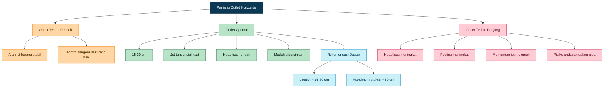

## 10.7 Keputusan Desain

Untuk artikel ini, panjang outlet horizontal yang digunakan sebagai basis desain adalah:

$$
L_{outlet}=15-30 \, cm
$$

dan batas maksimum praktis:

$$
L_{outlet,max}=50 \, cm
$$

Nilai teoritis hasil perhitungan head loss boleh digunakan sebagai pemeriksaan hidrolik, tetapi keputusan akhir tetap harus mempertimbangkan momentum jet, fouling, dan pola arus kolam.

[1]: https://www.mdpi.com/2311-5521/6/6/226?utm_source=chatgpt.com 'Two-Phase Flow Mass Transfer Analysis of Airlift Pump for ...'
[2]: https://www.engineeringtoolbox.com/darcy-weisbach-equation-d_646.html?utm_source=chatgpt.com 'Darcy-Weisbach Equation: Flow Resistance & Pressure ...'
[3]: https://www.engineeringtoolbox.com/total-pressure-loss-ducts-pipes-d_625.html?utm_source=chatgpt.com 'Pipe and Duct Systems - Total Head Loss'

[**Kembali ke Atas**](#desain-airlift-circulator-untuk-kolam-bioflok-d2-kedalaman-80-cm-sirkulasi-aerasi-head-loss-dan-oksigen-terlarut)

---

# 11. Desain Diffuser

Diffuser adalah komponen yang menentukan bagaimana udara dari blower masuk ke lift tube. Pada airlift-circulator, diffuser tidak boleh hanya dipahami sebagai “pembuat gelembung”, tetapi sebagai **elemen distribusi udara** yang memengaruhi debit udara, kestabilan bubble plume, kebutuhan tekanan blower, debit airlift, mixing, dan transfer oksigen.

Pada desain sebelumnya, jumlah lubang diffuser tidak boleh ditentukan hanya dari perkiraan praktis. Desain yang lebih kuat harus menggunakan pendekatan **orifice pressure drop**, karena udara keluar dari lubang diffuser seperti aliran melalui orifice kecil.

Prinsip desain perforated pipe diffuser untuk distribusi udara adalah membuat pressure drop pada lubang diffuser cukup dominan agar udara keluar lebih merata dari setiap lubang. Dalam desain diffuser pipa untuk sistem aerasi IFAS/MBBR, metode distribusi udara yang merata dilakukan dengan membuat rata-rata pressure drop pada orifice diffuser lebih besar dibanding perubahan tekanan sepanjang pipa diffuser. ([researchgate.net](https://www.researchgate.net/profile/Joshua-Boltz/publication/311797726_Aeration_system_design_in_integrated_fixed-film_activated_sludge_IFAS_and_moving_bed_biofilm_reactors_MBBR_using_stainless_steel_pipe_diffusers_manifold_and_down_pipes/links/585ae55808ae6eb8719aae70/Aeration-system-design-in-integrated-fixed-film-activated-sludge-IFAS-and-moving-bed-biofilm-reactors-MBBR-using-stainless-steel-pipe-diffusers-manifold-and-down-pipes.pdf?utm_source=chatgpt.com))

## 11.1 Fungsi Diffuser dalam Airlift-Circulator

Pada sistem ini, diffuser memiliki empat fungsi utama.

Pertama, diffuser membagi udara dari blower menjadi aliran kecil melalui beberapa lubang. Kedua, diffuser membentuk bubble plume di dalam lift tube. Ketiga, bubble plume menurunkan densitas campuran air–udara sehingga air terdorong bergerak. Keempat, gelembung udara membantu proses aerasi dan peningkatan oksigen terlarut.

Pada sistem bioflok, fungsi mixing sama pentingnya dengan fungsi aerasi. Bioflok harus tetap tersuspensi agar tidak mengendap dan membentuk zona anaerob. Oleh karena itu, diffuser pada airlift-circulator tidak harus selalu menghasilkan microbubble sangat halus. Diffuser harus menghasilkan kombinasi yang seimbang antara distribusi udara, dorongan air, turbulensi, dan transfer oksigen.

## 11.2 Mengapa Velocity Udara Tidak Boleh Dipakai Sendiri sebagai Batas Desain?

Kecepatan udara keluar lubang diffuser memang dapat dihitung dengan:

$$
v_{air}=\frac{Q_{air}}{A_{hole,total}}
$$

Namun, menetapkan batas velocity tertentu tanpa menghubungkannya dengan pressure drop dapat menyesatkan. Yang menentukan apakah blower mampu bekerja adalah total tekanan yang harus diatasi, yaitu tekanan hidrostatik, rugi pipa udara, rugi manifold, pressure drop diffuser, dan margin fouling.

Karena itu, parameter desain diffuser yang lebih tepat adalah:

$$
\Delta P_{diffuser}
$$

atau pressure drop pada lubang diffuser.

Velocity udara tetap dihitung, tetapi sebagai konsekuensi dari debit dan luas lubang, bukan sebagai satu-satunya batas desain.

## 11.3 Rumus Orifice Diffuser

Aliran udara melalui lubang diffuser dapat didekati menggunakan persamaan orifice:

$$
Q=C_d A \sqrt{\frac{2\Delta P}{\rho_{air}}}
$$

Jika ingin menghitung pressure drop:

$$
\Delta P=\frac{\rho_{air}}{2}
\left(\frac{Q}{C_d A}\right)^2
$$

Keterangan:

| Simbol       | Keterangan                         |
| ------------ | ---------------------------------- |
| $Q$          | debit udara per unit airlift, m³/s |
| $C_d$        | discharge coefficient              |
| $A$          | total luas lubang diffuser, m²     |
| $\Delta P$   | pressure drop diffuser, Pa         |
| $\rho_{air}$ | densitas udara, kg/m³              |

Persamaan orifice merupakan bentuk umum yang diturunkan dari prinsip Bernoulli, dengan discharge coefficient digunakan untuk mengoreksi debit aktual terhadap debit teoritis. Literatur orifice flow menjelaskan bahwa debit melalui orifice berbanding dengan luas penampang dan akar kuadrat pressure drop. ([journals.riverpublishers.com](https://journals.riverpublishers.com/index.php/IJFP/article/download/617/355/1531?utm_source=chatgpt.com))

Untuk desain awal digunakan:

$$
C_d=0.6-0.7
$$

dan:

$$
\rho_{air}=1.2 \, kg/m^3
$$

## 11.4 Target Pressure Drop Diffuser

Untuk diffuser perforated tube sederhana, pressure drop diffuser perlu cukup besar agar udara keluar merata, tetapi tidak terlalu besar sehingga blower terbebani.

Design basis awal:

$$
\Delta P_{diffuser}=0.005-0.02 \, bar
$$

atau:

$$
\Delta P_{diffuser}=500-2000 \, Pa
$$

Jika pressure drop terlalu kecil, udara cenderung keluar dari lubang yang paling mudah, biasanya lubang terdekat dari inlet udara atau lubang dengan tahanan paling rendah. Akibatnya, distribusi gelembung tidak merata.

Jika pressure drop terlalu besar, blower harus bekerja pada tekanan lebih tinggi. Dampaknya adalah konsumsi energi naik, debit udara aktual turun, dan blower bisa beroperasi di luar titik kerja optimalnya.

## 11.5 Spesifikasi Awal Diffuser

Untuk satu kolam D2 digunakan 4 unit airlift-circulator. Setiap unit memakai satu diffuser perforated tube.

Spesifikasi awal per unit:

| Parameter                     |      Nilai Desain |
| ----------------------------- | ----------------: |
| Tipe diffuser                 |   Perforated tube |
| Material                      |        PVC / HDPE |
| Diameter pipa diffuser        |          16–20 mm |
| Panjang diffuser              |           8–12 cm |
| Diameter lubang               |        1.0–1.2 mm |
| Debit udara per unit          |    1.5–2.0 m³/jam |
| Target pressure drop diffuser |    0.005–0.02 bar |
| Jumlah lubang awal            | 12–24 lubang/unit |

Desain ini berbeda dari pendekatan awal yang memakai 40–50 lubang. Jumlah lubang yang terlalu banyak akan memperbesar total luas lubang, menurunkan pressure drop diffuser, dan dapat membuat distribusi udara kurang merata jika tekanan di sepanjang pipa diffuser tidak cukup seragam.

## 11.6 Contoh Perhitungan Jumlah Lubang

Debit udara per unit:

$$
Q_{air}=1.5 \, m^3/jam
$$

Konversi ke m³/s:

$$
Q_{air}=\frac{1.5}{3600}
$$

$$
Q_{air}=0.000417 \, m^3/s
$$

Asumsi:

$$
C_d=0.65
$$

$$
\rho_{air}=1.2 \, kg/m^3
$$

Target pressure drop:

$$
\Delta P=500-2000 \, Pa
$$

Total luas lubang yang dibutuhkan dihitung dari:

$$
A=\frac{Q}{C_d\sqrt{\frac{2\Delta P}{\rho_{air}}}}
$$

Untuk:

$$
\Delta P=500 \, Pa
$$

maka:

$$
A \approx 2.22 \times 10^{-5} \, m^2
$$

Untuk:

$$
\Delta P=2000 \, Pa
$$

maka:

$$
A \approx 1.11 \times 10^{-5} \, m^2
$$

Luas satu lubang dengan diameter 1.2 mm:

$$
A_{hole}=\frac{\pi d^2}{4}
$$

$$
A_{hole}=\frac{3.14 \times 0.0012^2}{4}
$$

$$
A_{hole}=1.13 \times 10^{-6} \, m^2
$$

Jumlah lubang:

$$
N=\frac{A}{A_{hole}}
$$

Untuk $\Delta P=500\,\mathrm{Pa}$:

$$
N=\frac{2.22 \times 10^{-5}}{1.13 \times 10^{-6}}
$$

$$
N \approx 20 \, lubang
$$

Untuk $\Delta P=2000\,\mathrm{Pa}$:

$$
N=\frac{1.11 \times 10^{-5}}{1.13 \times 10^{-6}}
$$

$$
N \approx 10 \, lubang
$$

Dengan mempertimbangkan toleransi pengeboran, fouling, variasi tekanan, dan kemudahan fabrikasi, jumlah lubang awal yang dipilih:

$$
N=12-24 \, lubang/unit
$$

Rekomendasi praktis awal:

$$
N=16-20 \, lubang/unit
$$

dengan diameter lubang:

$$
d=1.2 \, mm
$$

## 11.7 Cek Velocity Udara sebagai Konsekuensi Desain

Velocity udara tetap dapat dihitung sebagai indikator, tetapi bukan sebagai basis utama.

$$
v_{air}=\frac{Q_{air}}{A_{hole,total}}
$$

Jika dipilih 20 lubang diameter 1.2 mm:

$$
A_{hole,total}=20 \times 1.13 \times 10^{-6}
$$

$$
A_{hole,total}=2.26 \times 10^{-5} \, m^2
$$

Maka:

$$
v_{air}=\frac{0.000417}{2.26 \times 10^{-5}}
$$

$$
v_{air}=18.5 \, m/s
$$

Jika debit udara dinaikkan menjadi 2.0 m³/jam:

$$
Q_{air}=0.000556 \, m^3/s
$$

$$
v_{air}=\frac{0.000556}{2.26 \times 10^{-5}}
$$

$$
v_{air}=24.6 \, m/s
$$

Nilai velocity ini tidak otomatis menjadi masalah selama pressure drop diffuser masih berada dalam kapasitas blower. Karena itu, keputusan desain tetap dikembalikan ke $\Delta P_{diffuser}$ dan kapasitas blower pada tekanan kerja aktual.

## 11.8 Hubungan Diffuser dengan Kapasitas Blower

Blower harus mampu menyediakan udara pada tekanan kerja total, bukan hanya pada kondisi free air flow. Banyak blower terlihat besar jika dilihat dari kapasitas udara bebas, tetapi debitnya turun tajam ketika diberi tekanan.

Tekanan total blower dihitung sebagai:

$$
P_{blower}=P_{hydrostatic}+P_{line}+P_{diffuser}+P_{fouling}
$$

Untuk kedalaman diffuser 70 cm:

$$
P_{hydrostatic}=\rho g h
$$

$$
P_{hydrostatic}=1000 \times 9.81 \times 0.7
$$

$$
P_{hydrostatic}=6867 \, Pa
$$

Konversi ke bar:

$$
P_{hydrostatic}=0.069 \, bar
$$

Estimasi tambahan:

| Komponen                   |       Estimasi |
| -------------------------- | -------------: |
| Line loss, manifold, valve |  0.02–0.04 bar |
| Diffuser pressure drop     | 0.005–0.02 bar |
| Fouling margin             |  0.03–0.05 bar |

Maka tekanan blower desain:

$$
P_{blower}=0.12-0.18 \, bar
$$

Debit blower total:

$$
Q_{blower}=6-8 \, m^3/jam
$$

Spesifikasi blower harus ditulis sebagai:

$$
6-8 \, m^3/jam \, pada \, 0.12-0.18 \, bar
$$

bukan hanya:

$$
6-8 \, m^3/jam \, free \, air
$$

Ini sangat penting untuk mencegah kesalahan pemilihan blower.

## 11.9 Diagram Alur Desain Diffuser

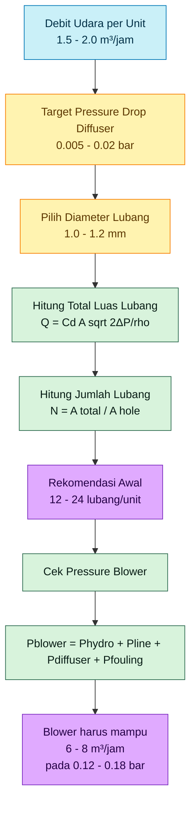

## 11.10 Acceptance Criteria Diffuser

Diffuser dianggap bekerja baik jika memenuhi kriteria berikut.

| Parameter              | Target                                   |
| ---------------------- | ---------------------------------------- |
| Distribusi gelembung   | Relatif merata dari seluruh lubang aktif |
| Aliran airlift         | Stabil, tidak berdenyut ekstrem          |
| Tekanan blower         | Masih dalam range kerja                  |
| Debit udara per cabang | Dapat dikontrol dengan valve             |
| Fouling                | Tidak cepat menyumbat lubang             |
| Bioflok                | Tetap tersuspensi                        |
| DO                     | Tetap di atas target operasi             |
| Dead zone              | Tidak terbentuk di dasar kolam           |

Jika sebagian lubang tidak aktif, kemungkinan total luas lubang terlalu besar, pressure drop diffuser terlalu rendah, atau distribusi tekanan pada pipa diffuser tidak merata. Jika blower terasa berat dan debit udara turun, kemungkinan jumlah lubang terlalu sedikit, diameter lubang terlalu kecil, atau diffuser mulai tersumbat.

## 11.11 Keputusan Desain Bab 11

Untuk kolam D2 bioflok, desain diffuser awal yang digunakan adalah:

| Parameter                    |  Nilai Final Awal |
| ---------------------------- | ----------------: |
| Tipe diffuser                |   Perforated tube |
| Material                     |        PVC / HDPE |
| Diameter pipa diffuser       |          16–20 mm |
| Panjang diffuser             |           8–12 cm |
| Diameter lubang              |            1.2 mm |
| Jumlah lubang                | 16–20 lubang/unit |
| Debit udara per unit         |    1.5–2.0 m³/jam |
| Target $\Delta P_{diffuser}$ |    0.005–0.02 bar |
| Total unit                   |                 4 |
| Total lubang sistem          |      64–80 lubang |
| Total udara sistem           |        6–8 m³/jam |

Desain ini dipilih karena memberi pressure drop diffuser yang cukup untuk membantu pemerataan udara, tetapi masih dalam batas tekanan blower yang realistis untuk kolam D2 bioflok.

[**Kembali ke Atas**](#desain-airlift-circulator-untuk-kolam-bioflok-d2-kedalaman-80-cm-sirkulasi-aerasi-head-loss-dan-oksigen-terlarut)

---

# 12. Oksigen Terlarut dan Transfer Oksigen

Pada sistem bioflok, oksigen terlarut atau **dissolved oxygen $DO$** adalah parameter kritis. DO tidak hanya dibutuhkan oleh ikan, tetapi juga oleh komunitas mikroba bioflok yang aktif menguraikan bahan organik dan mengasimilasi nitrogen. Karena itu, sistem bioflok membutuhkan aerasi dan mixing yang lebih intensif dibanding kolam konvensional.

Literatur bioflok menjelaskan bahwa inti dari Biofloc Technology adalah aerasi kontinu, suplai karbon, dekomposisi aerob, dan pemeliharaan flok mikroba tetap tersuspensi. Jika aerasi dan mixing tidak cukup, flok dapat mengendap, DO turun, dan risiko zona anaerob meningkat. ([ResearchGate][1])

## 12.1 Rumus Dasar Transfer Oksigen

Transfer oksigen dari udara ke air dapat dijelaskan dengan persamaan dasar:

$$
OTR = K_La(C_s-C)
$$

Keterangan:

| Simbol | Keterangan                            |
| ------ | ------------------------------------- |
| (OTR)  | oxygen transfer rate                  |
| $K_La$ | koefisien transfer oksigen volumetrik |
| $C_s$  | konsentrasi oksigen jenuh di air      |
| $C$    | konsentrasi DO aktual di air          |

Persamaan ini menunjukkan bahwa laju transfer oksigen dipengaruhi oleh dua hal utama: nilai $K_La$ dan selisih antara oksigen jenuh dengan oksigen aktual. Semakin rendah DO aktual, semakin besar driving force untuk transfer oksigen. Namun, saat DO mendekati kondisi jenuh, laju transfer oksigen menurun.

Dalam sistem aerasi akuakultur, $K_La$ dan oxygen transfer efficiency sering digunakan sebagai indikator performa aerasi. Studi aerasi akuakultur juga menggunakan $K_La$ dan standard oxygen transfer efficiency untuk mengevaluasi kemampuan sistem aerasi dalam memasukkan oksigen ke air. ([ResearchGate][2])

## 12.2 Faktor yang Mempengaruhi DO

DO di dalam kolam bioflok dipengaruhi oleh banyak faktor. Pada desain airlift-circulator, faktor utama yang harus diperhatikan adalah sebagai berikut.

### Debit Udara

Semakin besar debit udara, semakin besar suplai oksigen potensial dan semakin kuat bubble plume yang terbentuk. Namun, menaikkan debit udara tidak selalu meningkatkan DO secara linear. Pada titik tertentu, tambahan udara dapat menghasilkan gelembung besar, turbulensi berlebihan, atau rugi energi yang tidak efektif.

Untuk desain ini digunakan:

$$
Q_{air,total}=6-8 \, m^3/jam
$$

dengan distribusi:

$$
Q_{air,unit}=1.5-2.0 \, m^3/jam
$$

### Kedalaman Injeksi

Semakin dalam udara diinjeksi, semakin lama waktu kontak gelembung dengan air. Untuk kolam D2 kedalaman 80 cm, diffuser ditempatkan pada kedalaman sekitar:

$$
h_{diffuser}=70 \, cm
$$

Kedalaman ini memberikan waktu kontak yang cukup tanpa membuat diffuser terlalu dekat dengan dasar kolam.

### Ukuran Gelembung

Gelembung kecil memiliki luas permukaan kontak lebih besar per satuan volume udara, sehingga umumnya meningkatkan potensi transfer oksigen. Namun, untuk airlift-circulator bioflok, gelembung terlalu halus tidak selalu menjadi pilihan terbaik karena tujuan sistem bukan hanya transfer oksigen, tetapi juga mixing dan pembentukan arus.

Karena itu, diffuser perforated tube dengan lubang 1.0–1.2 mm dipilih sebagai kompromi antara bubble plume, mixing, dan aerasi.

### Waktu Kontak

Waktu kontak udara–air terjadi terutama di dalam lift tube. Untuk desain ini, panjang efektif lift tube adalah:

$$
L_{efektif}=55-65 \, cm
$$

Semakin lama gelembung berada di dalam air, semakin besar peluang oksigen terlarut. Namun, memperpanjang outlet horizontal tidak otomatis meningkatkan DO karena dapat melemahkan momentum jet dan meningkatkan rugi-rugi hidrolik.

### Turbulensi

Turbulensi membantu memperbarui lapisan batas air di sekitar gelembung sehingga transfer oksigen meningkat. Namun, turbulensi berlebihan dapat membuat energi terbuang dan menyebabkan arus tidak nyaman bagi ikan.

### Suhu

Kelarutan oksigen menurun saat suhu air meningkat. Artinya, pada suhu tinggi, DO lebih sulit dipertahankan. Ini penting untuk kolam bioflok tropis karena suhu air siang hari dapat meningkat cukup tinggi.

### Salinitas

Salinitas juga menurunkan kelarutan oksigen. Pada sistem air payau atau budidaya udang, kebutuhan aerasi bisa lebih besar dibanding sistem air tawar dengan kondisi lain yang sama.

### Biomassa

Semakin tinggi biomassa ikan atau udang, semakin besar konsumsi oksigen. Pada bioflok intensif, kenaikan biomassa harus diikuti evaluasi kapasitas aerasi.

### Konsumsi Oksigen Mikroba Bioflok

Bioflok mengandung komunitas mikroba aktif. Mikroba ini membantu pengolahan limbah nitrogen, tetapi juga mengonsumsi oksigen. Karena itu, pada sistem bioflok, kebutuhan oksigen bukan hanya untuk ikan, tetapi juga untuk komunitas mikroba. Kajian bioflok terbaru juga menekankan bahwa aerasi penting karena bakteri heterotrof menggunakan oksigen dalam jumlah besar untuk asimilasi amonia. ([MDPI][3])

## 12.3 Airlift sebagai Sirkulasi dan Aerasi

Airlift dapat berfungsi ganda sebagai alat sirkulasi dan aerasi. Udara yang diinjeksi menghasilkan aliran dua-fasa air–udara, membentuk bubble plume, dan sekaligus memungkinkan transfer oksigen.

Studi tentang airlift pump untuk aplikasi akuakultur menunjukkan bahwa airflow rate dan metode injeksi memengaruhi oxygen transfer rate. Studi tersebut juga menggunakan pola aliran dua-fasa dan void fraction untuk mengevaluasi mekanisme transfer DO pada airlift pump. ([MDPI][4])

Dengan demikian, performa oksigenasi airlift-circulator dipengaruhi oleh:

- airflow rate,
- metode injeksi udara,
- void fraction,
- pola aliran dua-fasa,
- geometri lift tube,
- kedalaman diffuser,
- konfigurasi outlet.

## 12.4 Outlet Panjang Tidak Selalu Meningkatkan DO

Secara intuitif, outlet yang lebih panjang dapat dianggap memberikan waktu kontak tambahan antara udara dan air. Namun, dalam desain airlift-circulator kecil, hal ini tidak selalu menguntungkan.

Outlet terlalu panjang dapat menyebabkan:

- head loss meningkat,
- momentum jet melemah,
- arus rotasi berkurang,
- fouling meningkat,
- risiko endapan dalam pipa naik.

Jika momentum jet melemah, mixing kolam menurun. Akibatnya, walaupun waktu kontak lokal sedikit bertambah, distribusi DO di seluruh kolam bisa memburuk.

Karena itu, strategi yang lebih seimbang adalah:

$$
L_{outlet}=15-30 \, cm
$$

dengan maksimum praktis:

$$
L_{outlet,max}=50 \, cm
$$

Fokus desain bukan memperpanjang outlet, tetapi mengoptimalkan kedalaman injeksi, distribusi udara, debit blower, dan pola arus kolam.

## 12.5 Diagram Faktor yang Mempengaruhi DO

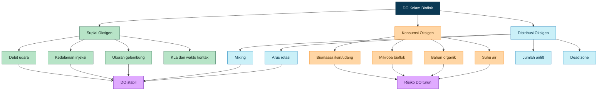

## 12.6 Keputusan Desain Bab 12

Untuk kolam D2 bioflok, desain oksigenasi melalui airlift-circulator menggunakan pendekatan berikut.

| Parameter                 |                Nilai Desain |
| ------------------------- | --------------------------: |
| Target DO minimum         |                     >4 mg/L |
| Debit udara total         |                  6–8 m³/jam |
| Debit udara per unit      |              1.5–2.0 m³/jam |
| Kedalaman diffuser        |                       70 cm |
| Panjang efektif lift tube |                    55–65 cm |
| Outlet horizontal         |                    15–30 cm |
| Jumlah unit               |                           4 |
| Fungsi utama              | Mixing + aerasi + sirkulasi |

Target operasionalnya bukan hanya DO tinggi pada satu titik, tetapi DO yang tersebar merata di seluruh kolam.

[**Kembali ke Atas**](#desain-airlift-circulator-untuk-kolam-bioflok-d2-kedalaman-80-cm-sirkulasi-aerasi-head-loss-dan-oksigen-terlarut)

---

# 13. Blower dan Manifold

Blower adalah sumber energi utama airlift-circulator. Kesalahan memilih blower akan membuat sistem gagal meskipun desain pipa dan diffuser sudah benar. Kesalahan yang paling umum adalah memilih blower berdasarkan kapasitas udara bebas atau **free air flow**, bukan berdasarkan kapasitas udara pada tekanan kerja aktual.

Untuk sistem ini, blower harus mampu memberikan:

$$
Q_{blower}=6-8 \, m^3/jam
$$

pada tekanan:

$$
P_{blower}=0.12-0.18 \, bar
$$

## 13.1 Tekanan Hidrostatik Diffuser

Tekanan minimum yang harus dikalahkan blower adalah tekanan hidrostatik pada kedalaman diffuser.

$$
P=\rho g h
$$

Dengan:

| Parameter |      Nilai |
| --------- | ---------: |
| $\rho$    | 1000 kg/m³ |
| $g$       |  9.81 m/s² |
| $h$       |      0.7 m |

Maka:

$$
P=1000 \times 9.81 \times 0.7
$$

$$
P=6867 \, Pa
$$

Konversi ke bar:

$$
P=\frac{6867}{100000}
$$

$$
P=0.069 \, bar
$$

Jadi blower minimal harus mengatasi tekanan hidrostatik sekitar:

$$
0.069 \, bar
$$

Namun nilai ini belum termasuk rugi-rugi sistem.

## 13.2 Tekanan Desain Blower

Tekanan desain harus mencakup:

$$
P_{blower}=P_{hydrostatic}+P_{line}+P_{diffuser}+P_{fouling}
$$

Estimasi komponen tekanan:

| Komponen                |       Estimasi |
| ----------------------- | -------------: |
| Tekanan hidrostatik     |      0.069 bar |
| Selang, manifold, valve |  0.02–0.04 bar |
| Pressure drop diffuser  | 0.005–0.02 bar |
| Fouling margin          |  0.03–0.05 bar |

Maka tekanan desain:

$$
P_{blower}=0.12-0.18 \, bar
$$

Rentang ini lebih realistis dibanding hanya menggunakan tekanan hidrostatik. Bioflok memiliki risiko fouling pada diffuser, sehingga margin fouling tidak boleh diabaikan.

## 13.3 Kapasitas Blower

Karena terdapat 4 unit airlift-circulator, dan setiap unit membutuhkan udara:

$$
Q_{air,unit}=1.5-2.0 \, m^3/jam
$$

maka total kebutuhan udara:

$$
Q_{blower}=4 \times (1.5-2.0)
$$

$$
Q_{blower}=6-8 \, m^3/jam
$$

Spesifikasi blower harus ditulis sebagai:

$$
6-8 \, m^3/jam \, pada \, 0.12-0.18 \, bar
$$

Jika hanya tertulis 8 m³/jam tanpa informasi tekanan, spesifikasi tersebut belum cukup untuk desain.

## 13.4 Daya Blower

Untuk kisaran kapasitas dan tekanan tersebut, daya blower praktis yang digunakan:

$$
P_{electric}=120-200 \, W
$$

Nilai ini adalah rekomendasi praktis untuk memastikan blower masih memiliki cadangan kapasitas saat diffuser mulai kotor atau saat tekanan aktual meningkat.

Daya blower tidak boleh dipilih terlalu mepet karena sistem bioflok sangat sensitif terhadap kegagalan aerasi. Bila blower melemah, DO dapat turun, flok mengendap, dan kualitas air memburuk.

## 13.5 Manifold Empat Cabang

Blower harus dihubungkan ke manifold empat cabang, masing-masing menuju satu airlift-circulator. Setiap cabang wajib memiliki valve individual.

Fungsi valve:

- menyeimbangkan debit udara antar unit,
- mengatur kuat-lemah bubble plume,
- mengompensasi perbedaan panjang selang,
- memudahkan isolasi unit saat perawatan,
- mengoreksi distribusi arus kolam.

Konfigurasi dasar:

```text
Blower → Main line → Manifold 4 cabang → Valve individual → Airlift circulator
```

## 13.6 Diagram Blower dan Manifold

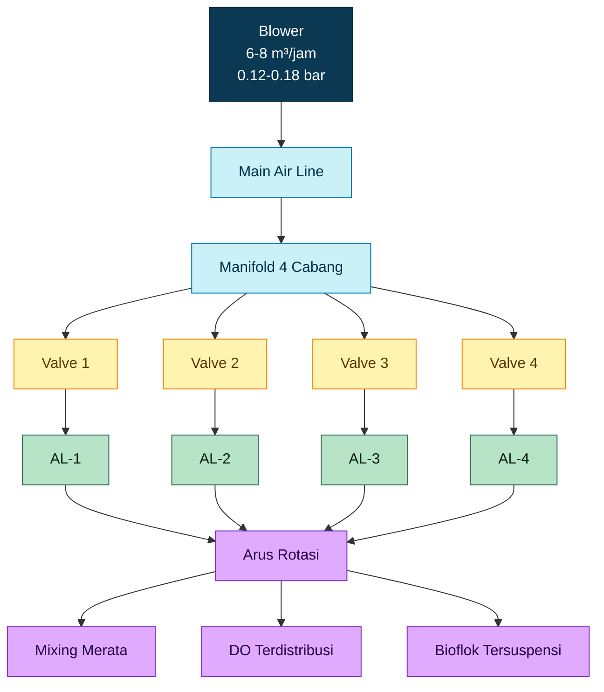

## 13.7 Catatan Penting Pemilihan Blower

Beberapa hal yang harus diperhatikan saat memilih blower:

1. Periksa kurva performa blower, bukan hanya kapasitas maksimum.
2. Pastikan debit 6–8 m³/jam tersedia pada tekanan 0.12–0.18 bar.
3. Pilih blower dengan cadangan kapasitas minimal 20–30%.
4. Gunakan valve individual untuk balancing antar airlift.
5. Sediakan check valve agar air tidak masuk balik ke blower saat listrik mati.
6. Gunakan selang dan manifold dengan diameter cukup agar line loss rendah.

## 13.8 Keputusan Desain Bab 13

| Parameter              |                                  Nilai Final Awal |
| ---------------------- | ------------------------------------------------: |
| Total debit udara      |                                        6–8 m³/jam |
| Tekanan hidrostatik    |                                         0.069 bar |
| Tekanan desain blower  |                                     0.12–0.18 bar |
| Daya blower            |                                         120–200 W |
| Jumlah cabang manifold |                                          4 cabang |
| Kontrol cabang         |                                  Valve individual |
| Proteksi               |                                       Check valve |
| Catatan utama          | Pilih berdasarkan kurva blower pada tekanan kerja |

[1]: https://www.researchgate.net/publication/308052605_Biofloc_technology_A_practical_guide_book_The_World_Aquaculture_Society?utm_source=chatgpt.com '(PDF) Biofloc technology. A practical guide book. The ...'
[2]: https://www.researchgate.net/publication/231371312_Oxygen_Transfer_Rate_in_a_Coarse-Bubble_Diffused_Aeration_System?utm_source=chatgpt.com 'Oxygen Transfer Rate in a Coarse-Bubble Diffused Aeration ...'
[3]: https://www.mdpi.com/2410-3888/10/4/144?utm_source=chatgpt.com 'Using BioFloc Technology to Improve Aquaculture Efficiency'
[4]: https://www.mdpi.com/2311-5521/6/6/226?utm_source=chatgpt.com 'Two-Phase Flow Mass Transfer Analysis of Airlift Pump for ...'

[**Kembali ke Atas**](#desain-airlift-circulator-untuk-kolam-bioflok-d2-kedalaman-80-cm-sirkulasi-aerasi-head-loss-dan-oksigen-terlarut)

---

# 14. Layout Pemasangan

Layout pemasangan menentukan apakah energi dari airlift-circulator benar-benar berubah menjadi arus rotasi yang stabil atau hanya menjadi turbulensi lokal di sekitar pipa. Pada kolam bundar D2, desain layout harus mengutamakan **arah tangensial**, **distribusi empat titik**, dan **keseimbangan debit udara antar unit**.

Circular aquaculture tank umumnya memanfaatkan inlet tangensial untuk menghasilkan aliran berputar yang lebih stabil. Pola aliran seperti ini membantu distribusi oksigen dan metabolit menjadi lebih merata serta mendukung pengelolaan biosolid. ([UPCommons][1])

## 14.1 Posisi Empat Unit

Empat unit airlift-circulator dipasang pada keliling kolam dengan jarak sudut sekitar:

$$
90^\circ
$$

Konfigurasi sudut:

| Unit | Posisi Sudut |
| ---- | -----------: |
| AL-1 |           0° |
| AL-2 |          90° |
| AL-3 |         180° |
| AL-4 |         270° |

Tujuannya adalah menyebarkan energi mixing secara merata ke seluruh kolam. Pada desain circular tank, parameter inlet seperti flow rate, diameter nozzle, dan jumlah nozzle memengaruhi rotational velocity, impulse force, dan kondisi aliran rata-rata. ([PMC][2])

## 14.2 Arah Outlet

Semua outlet harus diarahkan **searah**. Jangan mengarahkan outlet saling berlawanan karena momentum aliran dapat saling meniadakan dan menghasilkan turbulensi lokal tanpa rotasi yang stabil.

Rekomendasi:

| Parameter         |                        Nilai |
| ----------------- | ---------------------------: |
| Arah outlet       | Tangensial mengikuti dinding |
| Sudut horizontal  |                       10–20° |
| Sudut vertikal    |               0–10° ke bawah |
| Outlet depth      |   5–15 cm di bawah permukaan |
| Outlet horizontal |                     15–30 cm |

Sudut horizontal 10–20° digunakan untuk menjaga aliran tetap mengikuti dinding kolam, tetapi tidak terlalu menempel ke dinding. Jika outlet terlalu sejajar dinding, sebagian energi dapat hilang sebagai gesekan dinding. Jika outlet terlalu mengarah ke tengah, rotasi melemah dan dapat membentuk arus silang.

Sudut vertikal 0–10° ke bawah membantu mendorong sebagian energi ke kolom air tengah dan bawah, bukan hanya permukaan. Ini penting karena endapan bioflok biasanya mulai terjadi di area dasar atau zona dengan kecepatan rendah.

## 14.3 Tujuan Layout

Layout empat unit bertujuan menghasilkan:

- arus rotasi stabil,
- distribusi DO lebih merata,
- pengurangan dead zone,
- flok tetap tersuspensi,
- endapan organik berkurang,
- beban kerja tiap unit lebih ringan.

Pada sistem bioflok, kurangnya suspensi dan agitasi dapat menciptakan zona anaerob dan mempercepat penurunan DO. Oleh karena itu, layout yang menghasilkan mixing merata sangat penting untuk menjaga stabilitas sistem. ([Wiley Online Library][3])

## 14.4 Diagram Layout Tampak Atas

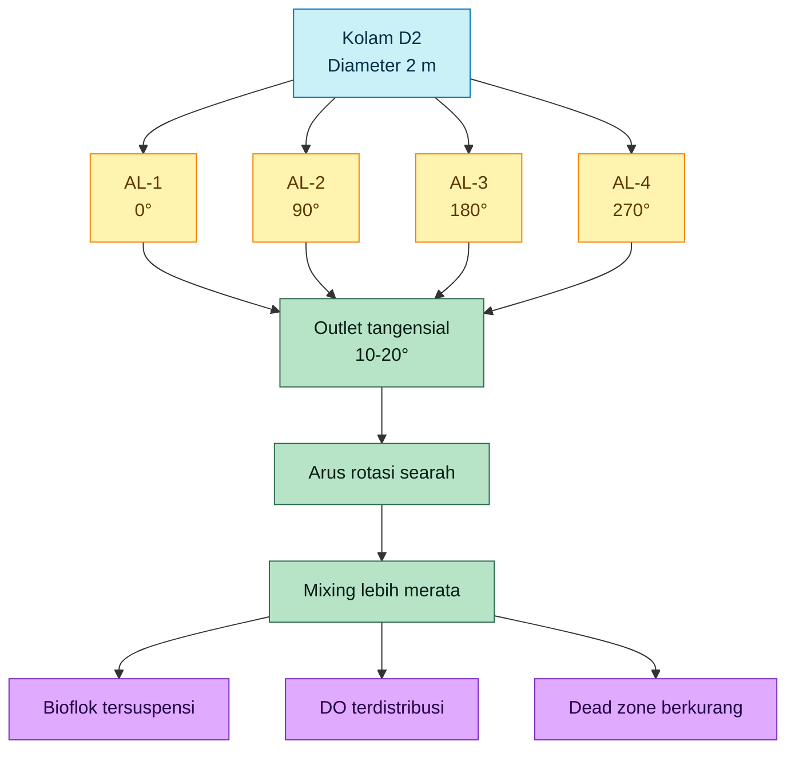

## 14.5 Sketsa Konseptual Tampak Atas

```text
Tampak atas kolam D2

              AL-1
              ↘
       ┌─────────────┐
       │             │
 AL-4 ↗│      ○      │↘ AL-2
       │             │
       └─────────────┘
              ↖
              AL-3
```

Semua panah harus berputar searah. Bila setelah commissioning terlihat ada zona stagnan, koreksi pertama yang dilakukan bukan langsung mengganti blower, tetapi menyesuaikan arah outlet dan bukaan valve antar cabang.

---

# 15. Spesifikasi Final Desain

Spesifikasi final berikut adalah **preliminary engineering design** untuk kolam bioflok D2 kedalaman 80 cm. Nilai ini dipakai sebagai basis fabrikasi awal dan harus divalidasi melalui commissioning lapangan.

| Parameter                     |                     Nilai Desain |
| ----------------------------- | -------------------------------: |
| Diameter kolam                |                            2.0 m |
| Radius kolam                  |                            1.0 m |
| Kedalaman air                 |                            0.8 m |
| Volume air                    |                          2.51 m³ |
| Sistem budidaya               |                          Bioflok |
| Jenis alat                    |               Airlift-circulator |
| Jumlah unit                   |                           4 unit |
| Posisi unit                   |              0°, 90°, 180°, 270° |
| Lift tube                     |                       PVC 1 inch |
| ID lift tube                  |                           ±26 mm |
| Kedalaman diffuser            |             70 cm dari permukaan |
| Outlet depth                  |       5–15 cm di bawah permukaan |
| Panjang efektif lift tube     |                         55–65 cm |
| Panjang outlet horizontal     |                         15–30 cm |
| Maksimum outlet praktis       |                            50 cm |
| Diameter outlet               |                       PVC 1 inch |
| ID outlet                     |                           ±26 mm |
| Sudut horizontal outlet       |                10–20° tangensial |
| Sudut vertikal outlet         |                   0–10° ke bawah |
| Debit udara per unit          |                   1.5–2.0 m³/jam |
| Total debit udara             |                       6–8 m³/jam |
| Estimasi debit air per unit   |                   1.0–1.6 m³/jam |
| Estimasi debit air total      |                   4.0–6.4 m³/jam |
| Turnover hidrolik             |                 1.6–2.5 kali/jam |
| Velocity outlet estimasi      |        ±0.63 m/s pada 1.2 m³/jam |
| Head loss sisi air            |                          ±0.09 m |
| Head loss desain              |                      0.13–0.18 m |
| Diffuser                      |                  Perforated tube |
| Diameter pipa diffuser        |                         16–20 mm |
| Diameter lubang diffuser      |                           1.2 mm |
| Jumlah lubang diffuser        |                16–20 lubang/unit |
| Target pressure drop diffuser |                   0.005–0.02 bar |
| Tekanan hidrostatik diffuser  |                        0.069 bar |
| Tekanan blower desain         |                    0.12–0.18 bar |
| Kapasitas blower              |    6–8 m³/jam pada 0.12–0.18 bar |
| Daya blower                   |                        120–200 W |
| Manifold                      |                         4 cabang |
| Kontrol udara                 |      Valve individual per cabang |
| Target DO                     |                          >4 mg/L |
| Target arus kolam             |                    0.03–0.10 m/s |
| Target visual                 | Tidak ada endapan bioflok stabil |

## 15.1 Catatan Engineering

Spesifikasi di atas tidak boleh dipahami sebagai jaminan absolut bahwa seluruh kolam akan otomatis mencapai kecepatan 0.03–0.10 m/s. Nilai tersebut adalah **target validasi**, sedangkan desain pipa, blower, diffuser, dan outlet adalah konfigurasi awal untuk mencapai target tersebut.

Karena bioflok adalah sistem biologis dengan TSS, biomassa, suhu, salinitas, dan beban organik yang berubah-ubah, performa akhir tetap harus divalidasi melalui pengamatan lapangan.

## 15.2 Diagram Hubungan Spesifikasi Final

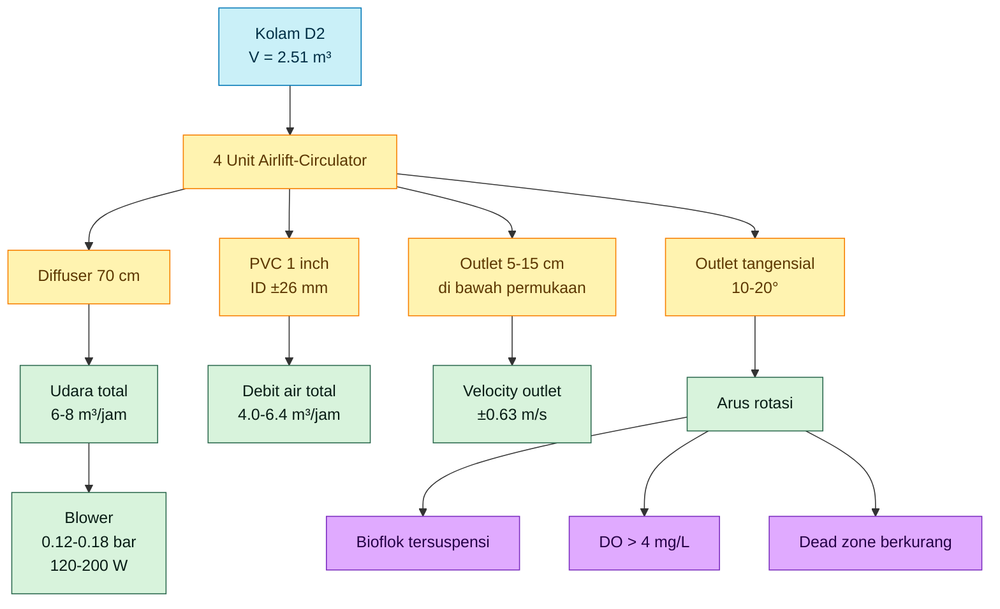

---

# 16. Acceptance Criteria

Acceptance criteria adalah standar untuk menentukan apakah desain airlift-circulator bekerja sesuai tujuan. Dalam sistem bioflok, keberhasilan desain tidak cukup dinilai dari apakah gelembung keluar atau pipa mengalir. Yang harus dinilai adalah apakah sistem mampu menjaga kualitas lingkungan budidaya.

Desain dinyatakan berhasil jika memenuhi kriteria berikut.

## 16.1 Tidak Ada Endapan Bioflok Stabil

Bioflok boleh bergerak, berkumpul sesaat, lalu kembali tersuspensi. Namun, jika terlihat endapan stabil di dasar kolam yang tidak terangkat oleh arus, berarti mixing belum cukup.

Indikasi gagal:

- flok menumpuk di satu titik,
- dasar kolam terlihat berlumpur,
- ada area gelap atau bau,
- endapan tidak bergerak meskipun blower menyala.

Koreksi awal:

- ubah arah outlet,
- naikkan debit udara pada cabang terkait,
- bersihkan diffuser,
- pendekkan outlet jika terlalu panjang,
- tambah unit bila dead zone tetap terjadi.

## 16.2 DO Lebih Besar dari 4 mg/L

Target minimum:

$$
DO > 4 \, mg/L
$$

Nilai ini konsisten dengan panduan bioflok yang menekankan kebutuhan supplemental aeration untuk menjaga DO pada sistem intensif. Manual CIBA menyebut sistem budidaya intensif membutuhkan aerasi tambahan untuk menjaga DO memadai, termasuk di atas 4 ppm. ([CIBA][4])

Pengukuran DO sebaiknya dilakukan minimal pada:

- pagi hari sebelum matahari tinggi,
- sore hari,
- area dekat outlet,
- area jauh dari outlet,
- dekat dasar jika alat ukur memungkinkan.

## 16.3 Pola Arus Rotasi Terlihat

Arus rotasi harus terlihat secara visual. Pengujian sederhana dapat dilakukan dengan:

- pakan halus,
- partikel ringan,
- pewarna aman,
- observasi pergerakan flok.

Pola yang diharapkan:

- semua partikel bergerak searah,
- tidak ada area berputar balik kuat,
- tidak ada area stagnan,
- flok bergerak dari permukaan sampai kolom air bawah.

## 16.4 Tidak Ada Dead Zone

Dead zone adalah area dengan gerakan air sangat rendah. Pada kolam bundar, dead zone sering muncul bila outlet salah arah, debit tidak seimbang, atau jumlah unit kurang.

Kriteria visual:

| Kondisi                              | Status                     |
| ------------------------------------ | -------------------------- |
| Flok bergerak merata                 | Baik                       |
| Flok berhenti di satu area           | Perlu koreksi              |
| Endapan terbentuk dalam 1–2 jam      | Gagal mixing               |
| Permukaan bergerak tetapi dasar diam | Perlu koreksi sudut outlet |

## 16.5 Ikan Tidak Stres

Airlift-circulator tidak boleh menghasilkan arus berlebihan. Ikan yang stres biasanya terlihat terus melawan arus, berkumpul di area tertentu, atau kehilangan pola berenang normal.

Kriteria baik:

- ikan dapat berenang normal,
- tidak terus terdorong arus,
- tidak berkumpul menghindari outlet,
- tidak terlihat megap-megap karena DO rendah.

## 16.6 Tidak Ada Bau Anaerob

Bau anaerob menunjukkan adanya akumulasi bahan organik dan area kekurangan oksigen. Dalam bioflok, ini adalah tanda serius bahwa mixing dan aerasi tidak mencukupi.

Indikasi buruk:

- bau busuk dari dasar,
- warna endapan gelap,
- flok menggumpal dan tidak bergerak,
- gas terperangkap dari dasar.

## 16.7 Flok Tersuspensi Merata

Bioflok yang sehat harus terlihat sebagai partikel tersuspensi di kolom air. Flok tidak harus selalu tersebar sempurna, tetapi tidak boleh mengendap stabil di dasar.

## 16.8 Outlet dan Diffuser Tidak Tersumbat

Sistem harus tetap stabil setelah beberapa hari operasi. Jika debit menurun cepat, kemungkinan terjadi fouling pada diffuser atau outlet.

Tanda fouling:

- gelembung tidak merata,
- satu unit lebih lemah dari unit lain,
- blower terdengar lebih berat,
- valve harus dibuka lebih besar untuk hasil sama,
- aliran outlet menurun.

## 16.9 Checklist Acceptance Criteria

| Parameter              | Target          | Status |
| ---------------------- | --------------- | ------ |
| Endapan bioflok stabil | Tidak ada       | Wajib  |
| DO                     | >4 mg/L         | Wajib  |
| Pola arus rotasi       | Terlihat searah | Wajib  |
| Dead zone              | Tidak terlihat  | Wajib  |
| Ikan stres             | Tidak ada       | Wajib  |
| Bau anaerob            | Tidak ada       | Wajib  |
| Flok tersuspensi       | Merata          | Wajib  |
| Outlet tersumbat       | Tidak           | Wajib  |
| Diffuser tersumbat     | Tidak           | Wajib  |
| Blower overload        | Tidak           | Wajib  |

## 16.10 Diagram Acceptance Criteria

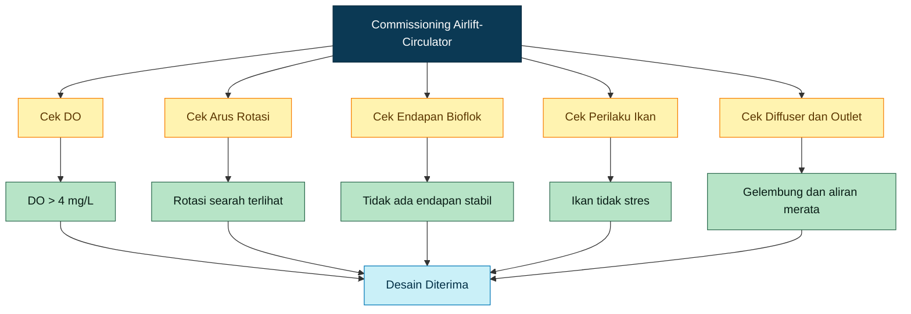

Acceptance criteria ini menjadi dasar evaluasi sebelum desain dipakai sebagai standar produksi. Jika salah satu kriteria utama gagal, sistem harus disesuaikan sebelum digunakan pada kepadatan tebar tinggi.

[1]: https://upcommons.upc.edu/bitstreams/a01db351-abd1-4e8a-a259-898ef6d5ffad/download?utm_source=chatgpt.com 'Flow pattern in aquaculture circular tanks'
[2]: https://pmc.ncbi.nlm.nih.gov/articles/PMC9334348/?utm_source=chatgpt.com 'Flow patterns in circular fish tanks and its relations with ... - PMC'
[3]: https://onlinelibrary.wiley.com/doi/full/10.1002/aff2.108?utm_source=chatgpt.com 'Biofloc technology as part of a sustainable aquaculture ...'
[4]: https://ciba.res.in/wp-content/uploads/2021/11/Biolfoc-final-manual-Nov9-12-2021_compressed.pdf?utm_source=chatgpt.com 'Biofloc Technology for Nursery and Growout Aquaculture'

[**Kembali ke Atas**](#desain-airlift-circulator-untuk-kolam-bioflok-d2-kedalaman-80-cm-sirkulasi-aerasi-head-loss-dan-oksigen-terlarut)

---

# 17. Commissioning dan Validasi Lapangan

Commissioning adalah tahap wajib sebelum desain airlift-circulator digunakan sebagai standar produksi. Pada sistem bioflok, commissioning tidak cukup hanya memastikan blower menyala dan gelembung keluar. Sistem harus diuji apakah benar mampu menjaga flok tersuspensi, mempertahankan DO, membentuk arus rotasi, dan mencegah endapan dasar.

Bioflok membutuhkan aerasi dan mixing kontinu karena flok mikroba harus tetap tersuspensi serta sistem harus tetap aerob. Panduan bioflok SRAC dan CIBA sama-sama menekankan pentingnya aerasi/mixing untuk menjaga kualitas air pada sistem bioflok intensif. ([aquaculture.mgcafe.uky.edu][1])

## 17.1 Uji Debit Udara per Cabang

Setiap cabang manifold harus diuji agar debit udara ke masing-masing airlift-circulator seimbang.

Target:

$$
Q_{air,unit}=1.5-2.0 \, m^3/jam
$$

Jika tidak tersedia flow meter udara, validasi awal dapat dilakukan dengan membandingkan kekuatan gelembung dan aliran outlet antar unit. Namun untuk standardisasi bisnis, flow meter per cabang lebih disarankan.

## 17.2 Uji DO Pagi dan Sore

DO harus diuji minimal dua kali:

- pagi hari, saat DO biasanya rendah,
- sore hari, saat aktivitas sistem sudah stabil.

Target minimum:

$$
DO > 4 \, mg/L
$$

Jika DO pagi turun mendekati batas minimum, kapasitas blower atau distribusi aerasi harus ditinjau ulang. Pada sistem bioflok, konsumsi oksigen tidak hanya berasal dari ikan, tetapi juga dari mikroba bioflok dan proses penguraian bahan organik. ([CIBA][2])

## 17.3 Uji Visual Bioflok di Dasar

Uji ini dilakukan untuk melihat apakah flok mengendap stabil di dasar kolam. Bioflok boleh bergerak mengikuti pola arus, tetapi tidak boleh membentuk lapisan endapan yang menetap.

Kondisi baik:

- flok bergerak mengikuti arus,
- tidak ada lumpur stabil di dasar,
- tidak ada area gelap,
- tidak ada bau anaerob.

Kondisi buruk:

- flok menumpuk di satu titik,
- dasar tampak berlumpur,
- bau tidak sedap muncul,
- bagian dasar tidak tersapu arus.

## 17.4 Uji Pola Arus dengan Tracer

Tracer dapat berupa partikel ringan, pakan halus, atau pewarna aman dalam jumlah sangat kecil. Tujuannya adalah melihat apakah arus benar-benar membentuk rotasi searah.

Pola yang diharapkan:

- tracer bergerak melingkar,
- tidak ada area stagnan,
- tidak ada arus saling bertabrakan,
- tracer tidak berhenti di satu titik dasar.

Desain circular tank sangat dipengaruhi oleh konfigurasi inlet/outlet dan sudut jet. Penelitian circular tank menunjukkan bahwa sudut dan posisi inlet berpengaruh terhadap flow field dan kemampuan pengumpulan limbah. ([Frontiers][3])

## 17.5 Uji Fouling Diffuser

Diffuser perlu diuji setelah beberapa jam dan beberapa hari operasi. Sistem bioflok mengandung TSS dan mikroorganisme yang dapat menyebabkan fouling pada lubang diffuser.

Tanda diffuser mulai fouling:

- gelembung tidak merata,
- satu unit lebih lemah,
- blower terdengar lebih berat,
- debit outlet turun,
- valve perlu dibuka lebih besar untuk hasil yang sama.

## 17.6 Uji Variasi Bukaan Valve

Setiap cabang manifold harus memiliki valve individual. Saat commissioning, valve disetel untuk memperoleh:

- bubble plume relatif seimbang,
- arus rotasi tidak saling bertabrakan,
- tidak ada outlet yang terlalu dominan,
- tidak ada area dasar yang stagnan.

## 17.7 Pencatatan 1 Jam, 6 Jam, dan 24 Jam

Kondisi sistem harus dicatat pada tiga tahap.

| Waktu Pengamatan | Tujuan                                                    |
| ---------------- | --------------------------------------------------------- |
| 1 jam            | memastikan arah arus dan distribusi awal                  |
| 6 jam            | melihat kestabilan DO dan pola flok                       |
| 24 jam           | mengevaluasi fouling awal, endapan, dan stabilitas sistem |

Parameter yang dicatat:

| Parameter          | Target                   |
| ------------------ | ------------------------ |
| DO                 | >4 mg/L                  |
| Pola arus          | rotasi searah            |
| Endapan dasar      | tidak ada endapan stabil |
| Gelembung diffuser | merata                   |
| Perilaku ikan      | normal                   |
| Bau anaerob        | tidak ada                |
| Outlet             | tidak tersumbat          |

## 17.8 Diagram Commissioning

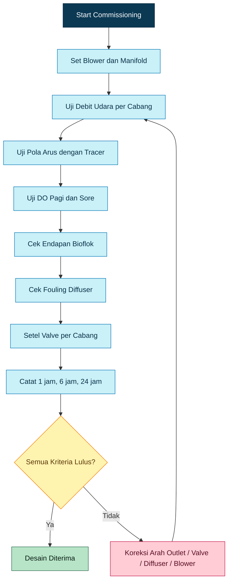

[**Kembali ke Atas**](#desain-airlift-circulator-untuk-kolam-bioflok-d2-kedalaman-80-cm-sirkulasi-aerasi-head-loss-dan-oksigen-terlarut)

---

# 18. Batasan Desain

Desain ini adalah **preliminary engineering design**, bukan jaminan performa absolut. Artinya, angka-angka desain seperti 4 unit airlift-circulator, debit udara 6–8 m³/jam, dan blower 120–200 W adalah basis awal yang harus divalidasi melalui commissioning.

Performa aktual airlift dipengaruhi oleh debit udara, diameter pipa, konfigurasi discharge, dan karakteristik aliran dua-fasa. Parker dan Suttle mengukur performa airlift untuk aplikasi akuakultur dan menunjukkan bahwa data performa airlift perlu dikembangkan berdasarkan pengukuran, bukan hanya perhitungan teoritis. ([ScienceDirect][4])

## 18.1 Faktor yang Mempengaruhi Performa Aktual

| Faktor           | Pengaruh                                                          |
| ---------------- | ----------------------------------------------------------------- |
| TSS bioflok      | semakin tinggi TSS, risiko fouling dan kebutuhan mixing meningkat |
| Biomassa ikan    | semakin tinggi biomassa, kebutuhan oksigen meningkat              |
| Ukuran flok      | flok besar lebih mudah mengendap                                  |
| Suhu             | suhu tinggi menurunkan kelarutan oksigen                          |
| Salinitas        | salinitas tinggi menurunkan kelarutan oksigen                     |
| Kualitas blower  | menentukan debit aktual pada tekanan kerja                        |
| Fouling diffuser | menurunkan debit dan distribusi udara                             |
| Geometri outlet  | memengaruhi momentum jet dan pola rotasi                          |
| Arah outlet      | menentukan dead zone atau rotasi stabil                           |

## 18.2 Mengapa Perlu Pilot Test?

Untuk standardisasi bisnis, satu kali desain di atas kertas belum cukup. Sistem harus diuji pada beberapa siklus operasional karena kondisi bioflok berubah seiring waktu.

Pilot test perlu mencakup:

- kolam tanpa ikan,
- kolam dengan biomassa rendah,
- kolam dengan biomassa operasional,
- kondisi TSS rendah,
- kondisi TSS tinggi,
- operasi harian minimal beberapa siklus.

Bioflok adalah sistem biologis dinamis. SRAC menjelaskan bahwa biofloc production systems dikembangkan untuk meningkatkan kontrol lingkungan pada akuakultur intensif, tetapi sistem ini tetap memerlukan pengelolaan kualitas air, solids, aerasi, dan feeding yang disiplin. ([aquaculture.mgcafe.uky.edu][1])

## 18.3 Status Desain

Desain ini layak disebut:

$$
Preliminary \, Engineering \, Design
$$

Belum layak disebut:

$$
Final \, Guaranteed \, Performance \, Design
$$

sebelum melewati commissioning dan pilot test.

## 18.4 Batas Penggunaan

Desain ini berlaku untuk kondisi awal:

| Parameter      |         Batas Desain |
| -------------- | -------------------: |
| Diameter kolam |                  2 m |
| Kedalaman air  |                0.8 m |
| Volume         |              ±2.5 m³ |
| Sistem         |        bioflok kecil |
| Fungsi alat    | sirkulasi dan aerasi |
| Static lift    |        mendekati nol |
| Jumlah unit    | 4 airlift-circulator |

Jika diameter kolam, kedalaman, biomassa, atau sistem budidaya berubah signifikan, desain harus dihitung ulang.

[**Kembali ke Atas**](#desain-airlift-circulator-untuk-kolam-bioflok-d2-kedalaman-80-cm-sirkulasi-aerasi-head-loss-dan-oksigen-terlarut)

---

# 19. Kesimpulan

Untuk kolam bioflok bundar D2 dengan kedalaman air 80 cm, konfigurasi yang paling tepat adalah **4 unit airlift-circulator kecil**, bukan satu airlift pump besar. Fungsi utama sistem ini bukan menaikkan air, tetapi membentuk arus rotasi, mendistribusikan oksigen, menjaga bioflok tetap tersuspensi, dan mencegah dead zone.

Outlet harus tetap terendam dan diarahkan tangensial mengikuti dinding kolam. Submergence ratio klasik tidak menjadi parameter utama karena static lift mendekati nol. Parameter yang lebih penting adalah kedalaman diffuser, panjang efektif lift tube, debit udara, pressure drop diffuser, rugi-rugi hidrolik, momentum outlet, dan pola arus aktual di kolam.

Head loss harus dihitung karena rugi-rugi pada pipa, elbow, outlet, diffuser, dan fouling dapat menurunkan debit aktual serta melemahkan arus rotasi. Outlet horizontal tidak boleh dibuat panjang hanya untuk mengejar waktu kontak oksigen. Outlet yang terlalu panjang dapat meningkatkan fouling, menurunkan momentum jet, dan memperburuk distribusi arus.

Desain final awal yang direkomendasikan adalah:

| Parameter                 |         Nilai |
| ------------------------- | ------------: |
| Jumlah airlift-circulator |        4 unit |
| Lift tube                 |    PVC 1 inch |
| ID lift tube              |        ±26 mm |
| Kedalaman diffuser        |         70 cm |
| Outlet depth              |       5–15 cm |
| Panjang efektif lift tube |      55–65 cm |
| Outlet horizontal         |      15–30 cm |
| Debit udara total         |    6–8 m³/jam |
| Blower                    |     120–200 W |
| Tekanan blower            | 0.12–0.18 bar |
| Target DO                 |       >4 mg/L |
| Target arus kolam         | 0.03–0.10 m/s |

Sistem bioflok yang sehat adalah hasil gabungan dari:

- mixing yang cukup,
- DO yang cukup,
- bioflok tetap tersuspensi,
- tidak ada zona anaerob,
- tidak ada dead zone,
- distribusi arus yang stabil.

Desain ini dapat digunakan sebagai basis awal fabrikasi dan pilot test. Untuk penggunaan bisnis, desain harus dikunci setelah commissioning, pengukuran DO, pengamatan endapan, uji tracer, serta evaluasi performa beberapa siklus produksi.

[**Kembali ke Atas**](#desain-airlift-circulator-untuk-kolam-bioflok-d2-kedalaman-80-cm-sirkulasi-aerasi-head-loss-dan-oksigen-terlarut)

---

# 20. Referensi

1. Hargreaves, J. A. **Biofloc Production Systems for Aquaculture**. SRAC Publication No. 4503, 2013. Rujukan utama konsep bioflok, intensifikasi akuakultur, dan kebutuhan pengelolaan kualitas air pada sistem bioflok. ([aquaculture.mgcafe.uky.edu][1])

2. ICAR-CIBA. **Biofloc Technology for Nursery and Growout Aquaculture**. Manual teknis bioflok yang membahas aerasi, mixing, DO, dan pengelolaan sistem bioflok. ([CIBA][2])

3. Parker, N. C., & Suttle, M. A. **Design of Airlift Pumps for Water Circulation and Aeration in Aquaculture**. Aquacultural Engineering, 1987. Rujukan penting mengenai airlift untuk sirkulasi dan aerasi akuakultur. ([ScienceDirect][4])

4. Zhang, Y., Yang, X., Hu, J., Qu, X., Feng, D., Gui, F., & Zhu, F. **Effect of Inlet Pipe Design on Self-Cleaning Ability of a Circular Tank in RAS**. Frontiers in Marine Science, 2023. Rujukan tentang pengaruh sudut dan posisi inlet terhadap flow field serta self-cleaning circular tank. ([Frontiers][3])

5. **Two-Phase Flow Mass Transfer Analysis of Airlift Pump for Aquaculture Applications**. Fluids, 2021. Rujukan mengenai airlift sebagai sistem aliran dua-fasa untuk aerasi dan transfer oksigen. ([scispace.com][5])

[1]: https://aquaculture.mgcafe.uky.edu/sites/aquaculture.ca.uky.edu/files/srac_4503_biofloc_production_systems_for_aquaculture.pdf?utm_source=chatgpt.com 'Biofloc Production Systems for Aquaculture'
[2]: https://ciba.res.in/wp-content/uploads/2021/11/Biolfoc-final-manual-Nov9-12-2021_compressed.pdf?utm_source=chatgpt.com 'Biofloc Technology for Nursery and Growout Aquaculture'
[3]: https://www.frontiersin.org/journals/marine-science/articles/10.3389/fmars.2023.1120205/full?utm_source=chatgpt.com 'Effect of inlet pipe design on self-cleaning ability of a ...'
[4]: https://www.sciencedirect.com/science/article/pii/0144860987900082?utm_source=chatgpt.com 'Design of airlift pumps for water circulation and aeration in ...'
[5]: https://scispace.com/pdf/a-feasibility-study-of-using-air-lift-pumps-for-aeration-57admoqk.pdf?utm_source=chatgpt.com 'A Feasibility Study of Using Air-lift Pumps for Aeration, ...'

[**Kembali ke Atas**](#desain-airlift-circulator-untuk-kolam-bioflok-d2-kedalaman-80-cm-sirkulasi-aerasi-head-loss-dan-oksigen-terlarut)

---

<small>
  **_Catatan Penyusunan_** Artikel ini disusun sebagai materi edukasi dan
  referensi umum berdasarkan berbagai sumber pustaka, praktik lapangan, serta
  bantuan alat penulisan. Pembaca disarankan untuk melakukan verifikasi lanjutan
  dan penyesuaian sesuai dengan kondisi serta kebutuhan masing-masing sistem.
</small>
