# **_Desain Airlift-Pump untuk Kolam Lele Air Dangkal 50 cm_**

> _Panduan praktis merancang airlift-pump rendah-head: pipa riser, injeksi udara, intake, debit, tekanan, dan perawatan._

---

- [**_Desain Airlift-Pump untuk Kolam Lele Air Dangkal 50 cm_**](#desain-airlift-pump-untuk-kolam-lele-air-dangkal-50-cm)
  - [1. Pendahuluan: Mengapa Airlift-Pump Dipakai pada Kolam Air Dangkal](#1-pendahuluan-mengapa-airlift-pump-dipakai-pada-kolam-air-dangkal)
    - [1.1 Masalah pada kolam air dangkal](#11-masalah-pada-kolam-air-dangkal)
    - [1.2 Fungsi utama Airlift-Pump](#12-fungsi-utama-airlift-pump)
      - [1. Mengalirkan air](#1-mengalirkan-air)
      - [2. Membantu aerasi](#2-membantu-aerasi)
      - [3. Membantu melepas CO₂](#3-membantu-melepas-co)
      - [4. Membuat air bergerak](#4-membuat-air-bergerak)
      - [5. Mengurangi risiko pompa macet karena tidak ada impeller di air](#5-mengurangi-risiko-pompa-macet-karena-tidak-ada-impeller-di-air)
    - [1.3 Batas sejak awal](#13-batas-sejak-awal)
      - [AP bukan filter](#ap-bukan-filter)
      - [AP bukan pompa head tinggi](#ap-bukan-pompa-head-tinggi)
      - [AP tidak menyedot lumpur untuk dibuang otomatis](#ap-tidak-menyedot-lumpur-untuk-dibuang-otomatis)
      - [AP tetap butuh aerator atau blower](#ap-tetap-butuh-aerator-atau-blower)
      - [Debit harus diuji, bukan diasumsikan](#debit-harus-diuji-bukan-diasumsikan)
  - [2. Prinsip Kerja Airlift-Pump](#2-prinsip-kerja-airlift-pump)
    - [2.1 Mekanisme dasar](#21-mekanisme-dasar)
    - [2.2 Kenapa air bisa naik](#22-kenapa-air-bisa-naik)
      - [1. Campuran air + udara lebih ringan daripada air di luar pipa](#1-campuran-air--udara-lebih-ringan-daripada-air-di-luar-pipa)
      - [2. Perbedaan densitas mendorong air naik](#2-perbedaan-densitas-mendorong-air-naik)
      - [3. Semakin panjang kolom gelembung, efek angkat makin baik](#3-semakin-panjang-kolom-gelembung-efek-angkat-makin-baik)
    - [2.3 Tiga syarat agar AP bekerja](#23-tiga-syarat-agar-ap-bekerja)
      - [1. Pipa riser cukup terendam](#1-pipa-riser-cukup-terendam)
      - [2. Udara masuk cukup kuat](#2-udara-masuk-cukup-kuat)
      - [3. Outlet tidak terlalu tinggi](#3-outlet-tidak-terlalu-tinggi)
    - [2.4 Diagram prinsip kerja](#24-diagram-prinsip-kerja)
  - [3. Komponen Utama Airlift-Pump](#3-komponen-utama-airlift-pump)
    - [3.1 Pipa riser](#31-pipa-riser)
    - [3.2 Injektor udara / diffuser](#32-injektor-udara--diffuser)
    - [3.3 Selang udara](#33-selang-udara)
    - [3.4 Check valve](#34-check-valve)
    - [3.5 Kran kontrol udara](#35-kran-kontrol-udara)
    - [3.6 Intake air](#36-intake-air)
    - [3.7 Outlet](#37-outlet)
    - [3.8 Diagram komponen AP](#38-diagram-komponen-ap)
- [4. Ukuran Dasar untuk Kolam Lele Air Dangkal 50 cm](#4-ukuran-dasar-untuk-kolam-lele-air-dangkal-50-cm)
  - [4.1 Kondisi desain](#41-kondisi-desain)
  - [4.2 Kenapa pipa harus terendam dalam](#42-kenapa-pipa-harus-terendam-dalam)
  - [4.3 Kenapa outlet harus rendah](#43-kenapa-outlet-harus-rendah)
  - [4.4 Batas kolam 50 cm](#44-batas-kolam-50-cm)
- [5. Submergence Ratio: Ukuran Kritis yang Sering Dilupakan](#5-submergence-ratio-ukuran-kritis-yang-sering-dilupakan)
  - [5.1 Pengertian submergence ratio](#51-pengertian-submergence-ratio)
  - [5.2 Contoh perhitungan bagus](#52-contoh-perhitungan-bagus)
  - [5.3 Contoh perhitungan kurang ideal](#53-contoh-perhitungan-kurang-ideal)
  - [5.4 Makna praktis](#54-makna-praktis)
  - [5.5 Prinsip desain](#55-prinsip-desain)
  - [5.6 Diagram submergence ratio](#56-diagram-submergence-ratio)
- [6. Tekanan Udara Minimum](#6-tekanan-udara-minimum)
  - [6.1 Rumus tekanan hidrostatik](#61-rumus-tekanan-hidrostatik)
  - [6.2 Contoh untuk kedalaman 45 cm](#62-contoh-untuk-kedalaman-45-cm)
  - [6.3 Koreksi praktis](#63-koreksi-praktis)
  - [6.4 Kenapa aerator lemah gagal](#64-kenapa-aerator-lemah-gagal)
- [7. Debit Airlift-Pump: Target dan Cara Mengukur](#7-debit-airlift-pump-target-dan-cara-mengukur)
  - [7.1 Target debit](#71-target-debit)
    - [Uji awal: 100–150 L/jam](#uji-awal-100150-ljam)
    - [Operasi normal: 150–250 L/jam](#operasi-normal-150250-ljam)
    - [Target lanjut: 250–400 L/jam](#target-lanjut-250400-ljam)
  - [7.2 Jangan percaya angka tanpa pengukuran](#72-jangan-percaya-angka-tanpa-pengukuran)
    - [Diameter riser](#diameter-riser)
    - [Kedalaman terendam](#kedalaman-terendam)
    - [Tinggi outlet](#tinggi-outlet)
    - [Debit udara](#debit-udara)
    - [Diffuser](#diffuser)
    - [Hambatan elbow](#hambatan-elbow)
    - [Kebersihan pipa](#kebersihan-pipa)
    - [Posisi intake](#posisi-intake)
  - [7.3 Cara ukur sederhana](#73-cara-ukur-sederhana)
    - [Cara praktik di lapangan](#cara-praktik-di-lapangan)
  - [7.4 Diagram faktor debit](#74-diagram-faktor-debit)
- [8. Desain Intake: Jangan Tepat di Dasar](#8-desain-intake-jangan-tepat-di-dasar)
  - [8.1 Posisi intake](#81-posisi-intake)
  - [8.2 Alasan teknis](#82-alasan-teknis)
    - [1. Air kaya nutrien tetap terambil](#1-air-kaya-nutrien-tetap-terambil)
    - [2. Feses berat tidak langsung tersedot](#2-feses-berat-tidak-langsung-tersedot)
    - [3. Pipa tidak mudah tersumbat](#3-pipa-tidak-mudah-tersumbat)
    - [4. Lumpur tetap bisa disifon manual](#4-lumpur-tetap-bisa-disifon-manual)
  - [8.3 Saringan kasar intake](#83-saringan-kasar-intake)
  - [8.4 Yang tidak boleh dilakukan](#84-yang-tidak-boleh-dilakukan)
    - [Intake tepat di dasar](#intake-tepat-di-dasar)
    - [Saringan terlalu halus](#saringan-terlalu-halus)
    - [Pipa intake sulit dibersihkan](#pipa-intake-sulit-dibersihkan)
    - [Menjadikan AP sebagai penyedot lumpur](#menjadikan-ap-sebagai-penyedot-lumpur)
  - [8.5 Diagram posisi intake](#85-diagram-posisi-intake)
- [9. Desain Outlet: Rendah, Pendek, dan Minim Hambatan](#9-desain-outlet-rendah-pendek-dan-minim-hambatan)
  - [9.1 Outlet harus rendah](#91-outlet-harus-rendah)
  - [9.2 Jalur outlet pendek](#92-jalur-outlet-pendek)
  - [9.3 Outlet boleh diarahkan ke](#93-outlet-boleh-diarahkan-ke)
    - [Talang rendah](#talang-rendah)
    - [Bak kecil](#bak-kecil)
    - [Kolam kembali](#kolam-kembali)
    - [Titik aerasi jatuh](#titik-aerasi-jatuh)
  - [9.4 Return jatuh lebih baik](#94-return-jatuh-lebih-baik)
- [10. Setting Udara: Terlalu Kecil Lemah, Terlalu Besar Boros](#10-setting-udara-terlalu-kecil-lemah-terlalu-besar-boros)
  - [10.1 Udara terlalu kecil](#101-udara-terlalu-kecil)
  - [10.2 Udara terlalu besar](#102-udara-terlalu-besar)
  - [10.3 Cara menyetel](#103-cara-menyetel)
  - [10.4 Kran kontrol udara wajib](#104-kran-kontrol-udara-wajib)
  - [10.5 Diagram setting udara](#105-diagram-setting-udara)
- [11. SOP Pemasangan](#11-sop-pemasangan)
  - [11.1 Urutan pemasangan](#111-urutan-pemasangan)
    - [1. Pasang riser](#1-pasang-riser)
    - [2. Pasang intake 5–10 cm di atas dasar](#2-pasang-intake-510-cm-di-atas-dasar)
    - [3. Pasang diffuser atau injektor](#3-pasang-diffuser-atau-injektor)
    - [4. Pasang selang udara](#4-pasang-selang-udara)
    - [5. Pasang check valve](#5-pasang-check-valve)
    - [6. Pasang kran kontrol](#6-pasang-kran-kontrol)
    - [7. Sambungkan aerator](#7-sambungkan-aerator)
    - [8. Atur outlet rendah](#8-atur-outlet-rendah)
    - [9. Uji gelembung](#9-uji-gelembung)
    - [10. Ukur debit](#10-ukur-debit)
  - [11.2 Posisi akhir yang benar](#112-posisi-akhir-yang-benar)
  - [11.3 Diagram SOP pemasangan](#113-diagram-sop-pemasangan)
- [12. SOP Operasional Harian dan Mingguan](#12-sop-operasional-harian-dan-mingguan)
  - [12.1 Harian](#121-harian)
    - [1. Cek aerator menyala](#1-cek-aerator-menyala)
    - [2. Cek gelembung di riser](#2-cek-gelembung-di-riser)
    - [3. Cek aliran outlet](#3-cek-aliran-outlet)
    - [4. Cek selang tidak terlipat](#4-cek-selang-tidak-terlipat)
    - [5. Cek suara aerator normal](#5-cek-suara-aerator-normal)
  - [12.2 Setiap 2–3 hari](#122-setiap-23-hari)
    - [Intake tidak tersumbat](#intake-tidak-tersumbat)
    - [Saringan kasar](#saringan-kasar)
    - [Pipa mulai berlendir atau tidak](#pipa-mulai-berlendir-atau-tidak)
    - [Endapan sekitar AP](#endapan-sekitar-ap)
  - [12.3 Mingguan](#123-mingguan)
    - [Ukur debit aktual](#ukur-debit-aktual)
    - [Bersihkan diffuser](#bersihkan-diffuser)
    - [Bersihkan saringan intake](#bersihkan-saringan-intake)
    - [Cek check valve](#cek-check-valve)
    - [Cek sambungan pipa](#cek-sambungan-pipa)
    - [Sikat riser bila perlu](#sikat-riser-bila-perlu)
- [13. Troubleshooting Airlift-Pump](#13-troubleshooting-airlift-pump)
  - [13.1 Air tidak naik](#131-air-tidak-naik)
    - [Analisis penyebab](#analisis-penyebab)
      - [Aerator mati](#aerator-mati)
      - [Selang bocor](#selang-bocor)
      - [Diffuser tersumbat](#diffuser-tersumbat)
      - [Outlet terlalu tinggi](#outlet-terlalu-tinggi)
      - [Pipa tidak cukup terendam](#pipa-tidak-cukup-terendam)
    - [Tindakan koreksi](#tindakan-koreksi)
  - [13.2 Debit lemah](#132-debit-lemah)
    - [Analisis penyebab](#analisis-penyebab-1)
      - [Pipa berlendir](#pipa-berlendir)
      - [Diffuser kotor](#diffuser-kotor)
      - [Udara kurang](#udara-kurang)
      - [Intake tersumbat](#intake-tersumbat)
      - [Head terlalu tinggi](#head-terlalu-tinggi)
    - [Tindakan koreksi](#tindakan-koreksi-1)
  - [13.3 Air menyembur kasar](#133-air-menyembur-kasar)
    - [Analisis penyebab](#analisis-penyebab-2)
      - [Udara terlalu besar](#udara-terlalu-besar)
      - [Outlet terlalu sempit](#outlet-terlalu-sempit)
      - [Riser terlalu kecil](#riser-terlalu-kecil)
    - [Tindakan koreksi](#tindakan-koreksi-2)
  - [13.4 Air balik ke aerator](#134-air-balik-ke-aerator)
    - [Analisis penyebab](#analisis-penyebab-3)
    - [Tindakan koreksi](#tindakan-koreksi-3)
  - [13.5 Diagram troubleshooting](#135-diagram-troubleshooting)
- [14. Batas dan Kesalahan Umum](#14-batas-dan-kesalahan-umum)
  - [14.1 Batas AP](#141-batas-ap)
    - [1. Tidak cocok untuk head tinggi](#1-tidak-cocok-untuk-head-tinggi)
    - [2. Tidak menyaring feses](#2-tidak-menyaring-feses)
    - [3. Tidak menggantikan filter mekanis](#3-tidak-menggantikan-filter-mekanis)
    - [4. Tidak otomatis membuang endapan](#4-tidak-otomatis-membuang-endapan)
    - [5. Tidak bekerja jika aerator mati](#5-tidak-bekerja-jika-aerator-mati)
  - [14.2 Kesalahan umum](#142-kesalahan-umum)
    - [1. Outlet terlalu tinggi](#1-outlet-terlalu-tinggi)
    - [2. Intake tepat di dasar](#2-intake-tepat-di-dasar)
    - [3. Tidak ada check valve](#3-tidak-ada-check-valve)
    - [4. Tidak ada kran kontrol udara](#4-tidak-ada-kran-kontrol-udara)
    - [5. Diffuser sulit dibersihkan](#5-diffuser-sulit-dibersihkan)
    - [6. Debit tidak pernah diukur](#6-debit-tidak-pernah-diukur)
    - [7. Pipa dibuat permanen dan sulit dibongkar](#7-pipa-dibuat-permanen-dan-sulit-dibongkar)
  - [14.3 Prinsip anti-gagal](#143-prinsip-anti-gagal)
    - [1. Mudah dilihat](#1-mudah-dilihat)
    - [2. Mudah dibongkar](#2-mudah-dibongkar)
    - [3. Mudah dibersihkan](#3-mudah-dibersihkan)
    - [4. Mudah diukur debitnya](#4-mudah-diukur-debitnya)
- [15. Spesifikasi Final yang Direkomendasikan](#15-spesifikasi-final-yang-direkomendasikan)
  - [15.1 Spesifikasi praktis](#151-spesifikasi-praktis)
    - [Penjelasan spesifikasi](#penjelasan-spesifikasi)
      - [Pipa riser 3/4 inci disarankan](#pipa-riser-34-inci-disarankan)
      - [Pipa terendam 35–45 cm](#pipa-terendam-3545-cm)
      - [Intake 5–10 cm di atas dasar](#intake-510-cm-di-atas-dasar)
      - [Outlet ideal \<10–20 cm](#outlet-ideal-1020-cm)
      - [Debit awal 100–250 L/jam](#debit-awal-100250-ljam)
      - [Debit lanjut 250–400 L/jam](#debit-lanjut-250400-ljam)
      - [Tekanan aerator 0,06–0,10 bar](#tekanan-aerator-006010-bar)
      - [Check valve wajib](#check-valve-wajib)
      - [Kran udara disarankan kuat](#kran-udara-disarankan-kuat)
      - [Diffuser mudah dibersihkan](#diffuser-mudah-dibersihkan)
      - [Intake screen kasar](#intake-screen-kasar)
  - [15.2 Desain final ringkas](#152-desain-final-ringkas)
  - [15.3 Kesimpulan spesifikasi](#153-kesimpulan-spesifikasi)

---

## 1. Pendahuluan: Mengapa Airlift-Pump Dipakai pada Kolam Air Dangkal

Airlift-Pump (AP) adalah alat sederhana yang memanfaatkan udara untuk mengangkat dan mengalirkan air. Pada kolam air dangkal, terutama yang kedalamannya hanya puluhan sentimeter, AP menarik karena bisa memberi **sirkulasi air ringan** tanpa impeller yang terendam di dalam air.

<figure>
  
  <figcaption>Sistem akuaponik lele pada kondisi air dangkal.</figcaption>
</figure>

Bab ini penting karena banyak praktisi langsung tertarik pada bentuk alatnya, tetapi belum memahami **masalah apa yang sebenarnya ingin diselesaikan**. Airlift-Pump bukan alat ajaib. Ia dipakai karena ada kebutuhan nyata: air harus bergerak, pertukaran gas harus dibantu, dan sistem harus tetap sederhana.

<ResourceBox
  title="Artikel Terkait:"
  items={[
    {
      name: 'C/N Ratio pada Bioflok: Mengatur Mikroba, Oksigen, dan Stabilitas Kolam untuk Praktisi',
      href: '/blog/agri/perikanan/ratio-cn-rendah-biflok',
    },
    {
      name: 'E/P Ratio Pakan Ikan: Antara Efisiensi FCR, Fermentasi Ringan, Bioflok, dan Perbedaan Strategi Lele vs Nila',
      href: '/blog/agri/perikanan/ep-ratio-pakan-fermentasi',
    },
    {
      name: 'Budidaya Lele Air Dangkal, Probiotik, dan Fermentasi Pakan',
      href: '/blog/agri/perikanan/lele-air-dangkal-probiotik',
    },
    {
      name: 'Siklus Nitrogen pada Budidaya Lele Air Dangkal: Pakan, Amonia, Nitrit, Nitrat, Mikroba, dan Batas Kapasitas Kolam',
      href: '/blog/agri/perikanan/siklus-nitrogen-lele-air-dangkal',
    },
    {
      name: 'Akuaponik Sederhana Lele Air Dangkal: Aliran Akar Tanaman dengan Airlift-Pump untuk Mengambil Nitrat',
      href: '/blog/agri/perikanan/akuaponik-lele-dangkal',
    },
    {
      name: 'Air Lift Pump - Prinsip, Desain, dan Aplikasi dalam Akuakultur',
      href: '/blog/agri/airlift-pump',
    },
  ]}
/>

---

### 1.1 Masalah pada kolam air dangkal

Kolam air dangkal mempunyai kelebihan dan kelemahan. Kelebihannya, pengamatan ikan lebih mudah, akses udara ke permukaan lebih cepat, dan pengelolaan relatif sederhana. Namun kelemahannya juga jelas.

Masalah utama pada kolam air dangkal adalah sebagai berikut:

- **Air cepat stagnan**
  Karena volume kecil dan kedalaman rendah, aliran alami di dalam kolam sering tidak cukup untuk membuat air terus bergerak merata. Zona tertentu bisa relatif diam.

- **Oksigen mudah turun**
  Oksigen terlarut dapat cepat turun jika beban organik naik, terutama pada malam sampai subuh. Pada kolam kecil, perubahan kualitas air berlangsung lebih cepat dibanding kolam besar.

- **CO₂ dapat menumpuk**
  Respirasi ikan, mikroba, dan plankton menghasilkan karbon dioksida. Jika air kurang bergerak, pelepasan CO₂ ke atmosfer tidak optimal.

- **Endapan mudah menjadi sumber masalah**
  Feses, sisa pakan, dan bahan organik lain mudah terkonsentrasi di dasar. Jika dibiarkan, endapan menjadi sumber bau, amonia, dan beban oksigen.

- **Dibutuhkan sirkulasi ringan tanpa pompa impeller**
  Pada sistem kecil, praktisi sering menginginkan alat yang sederhana, hemat, mudah dibersihkan, dan tidak mudah rusak karena kotoran. Di sinilah AP menjadi menarik.

Secara praktis, kolam air dangkal membutuhkan **air yang bergerak**, bukan sekadar air yang “ada”.

Diagram masalah dasar kolam air dangkal:

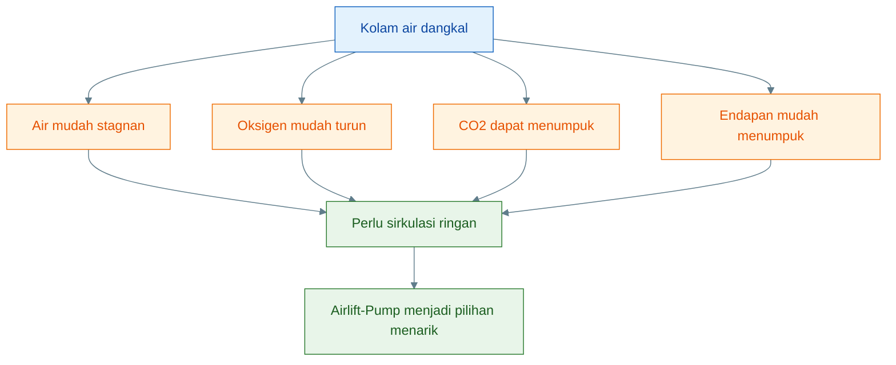

---

### 1.2 Fungsi utama Airlift-Pump

Airlift-Pump dipilih bukan karena terlihat unik, tetapi karena fungsi praktisnya cocok untuk sistem dangkal dan sederhana.

Fungsi utamanya adalah sebagai berikut.

#### 1. Mengalirkan air

Fungsi pertama AP adalah **menciptakan aliran air**. Air dari satu titik di kolam diangkat melalui pipa riser, lalu dikeluarkan ke titik lain. Ini membantu mengurangi zona air diam.

#### 2. Membantu aerasi

Udara yang masuk ke AP membentuk gelembung di dalam pipa. Selain berfungsi mengangkat air, proses ini juga membantu kontak udara dengan air. Hasilnya, AP ikut membantu penambahan oksigen, walaupun bukan pengganti total sistem aerasi besar.

#### 3. Membantu melepas CO₂

Saat air bergerak dan keluar dari outlet, terutama bila jatuh kembali ke kolam atau mengalir ke tempat terbuka, pelepasan CO₂ menjadi lebih baik. Ini penting untuk kolam kecil yang cenderung mudah menumpuk gas terlarut.

#### 4. Membuat air bergerak

Pergerakan air membantu distribusi suhu, distribusi nutrien terlarut, dan pemerataan kualitas air. Air yang bergerak juga membantu pembudidaya mengamati sistem lebih mudah.

#### 5. Mengurangi risiko pompa macet karena tidak ada impeller di air

Pompa impeller yang bekerja langsung dalam air sering rentan terhadap:

- kotoran,
- lendir,
- serat,
- sisa organik,
- partikel padat.

AP tidak memiliki impeller di dalam air kolam. Ini membuatnya lebih sederhana secara mekanis dan sering lebih toleran untuk sistem kecil yang airnya tidak sepenuhnya bersih.

Ringkasnya, AP adalah alat untuk:

```text
menggerakkan air
+ membantu aerasi
+ membantu degassing ringan
+ mempertahankan kesederhanaan sistem
```

Diagram fungsi utama AP:

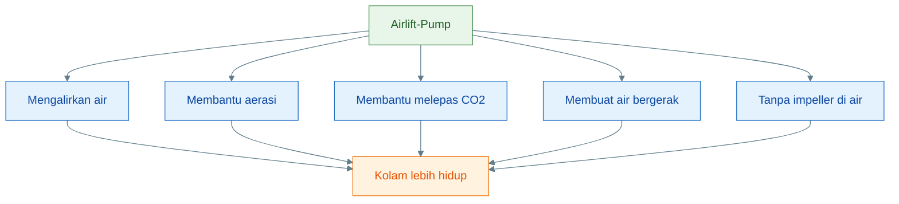

---

### 1.3 Batas sejak awal

Agar tidak salah tafsir, batas AP harus dipahami dari awal. Banyak kegagalan di lapangan terjadi bukan karena alatnya salah, tetapi karena ekspektasinya keliru.

#### AP bukan filter

AP tidak dirancang untuk menyaring padatan. Ia bisa memindahkan air, tetapi **bukan alat pemisah kotoran**. Jika kolam memiliki banyak endapan, AP tidak otomatis menyelesaikan masalah itu.

#### AP bukan pompa head tinggi

AP bekerja baik pada **head rendah**. Jika air harus diangkat terlalu tinggi, debit akan turun tajam. Maka AP cocok untuk aplikasi pendek, rendah, dan ringan.

#### AP tidak menyedot lumpur untuk dibuang otomatis

Jika intake diletakkan tepat di dasar dan dipaksa menyedot lumpur, maka:

- pipa mudah tersumbat,
- aliran turun,
- sistem cepat kotor,
- AP bekerja di luar fungsinya.

Padatan tetap harus dikelola dengan cara lain, misalnya sifon manual.

#### AP tetap butuh aerator atau blower

Airlift-Pump tidak bekerja sendiri. Jantung energinya adalah **udara bertekanan** dari aerator atau blower. Jika aerator mati, AP berhenti.

#### Debit harus diuji, bukan diasumsikan

Banyak desain terlihat bagus di atas kertas, tetapi debit aktualnya kecil. Penyebabnya bisa karena:

- pipa terlalu kecil,
- head terlalu tinggi,
- udara kurang,
- diffuser buruk,
- pipa berlendir,
- intake tersumbat.

Karena itu, debit AP harus **diukur langsung**, bukan sekadar diperkirakan.

Prinsip batas ini sangat penting:

> **Airlift-Pump adalah alat sirkulasi rendah-head, bukan alat serbaguna untuk semua masalah kolam.**

Diagram batas AP:

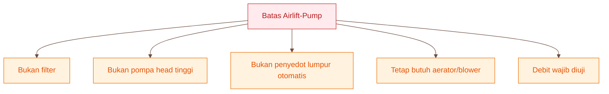

[**Kembali ke Atas**](#desain-airlift-pump-untuk-kolam-lele-air-dangkal-50-cm)

---

## 2. Prinsip Kerja Airlift-Pump

Agar desain AP tidak menjadi sekadar rakitan pipa, praktisi harus memahami prinsip kerjanya. Begitu prinsip ini dipahami, maka keputusan desain seperti kedalaman pipa, tinggi outlet, dan kebutuhan udara menjadi jauh lebih rasional.

---

### 2.1 Mekanisme dasar

Mekanisme dasar AP dapat diringkas sebagai berikut:

```text
udara masuk ke pipa riser
→ gelembung naik
→ campuran air-udara lebih ringan
→ air terdorong naik
→ air keluar lewat outlet
```

Ini adalah prinsip inti yang harus diingat. AP tidak “memompa” air seperti pompa impeller. AP bekerja karena **udara yang diinjeksikan ke bawah pipa membuat kolom di dalam pipa menjadi lebih ringan daripada air di luar pipa**.

Dengan kata lain, udara tidak mendorong air seperti piston, tetapi **mengubah sifat kolom fluida di dalam pipa** sehingga air di luar pipa mendorong campuran itu naik.

---

### 2.2 Kenapa air bisa naik

Ada tiga penjelasan utama.

#### 1. Campuran air + udara lebih ringan daripada air di luar pipa

Saat udara masuk ke pipa riser, terbentuk gelembung-gelembung. Gelembung ini membuat campuran di dalam pipa berisi:

- air,
- udara,
- ruang kosong di antara gelembung.

Akibatnya, **massa jenis rata-rata** kolom fluida di dalam pipa menjadi lebih rendah daripada air penuh di luar pipa.

#### 2. Perbedaan densitas mendorong air naik

Karena kolom di dalam pipa lebih ringan, maka air di luar pipa yang lebih berat memberi tekanan dari bawah dan samping. Tekanan inilah yang mendorong campuran di dalam pipa naik ke atas.

#### 3. Semakin panjang kolom gelembung, efek angkat makin baik

Semakin panjang bagian pipa yang berisi campuran air-udara, semakin besar efek pengangkatan. Karena itu, AP bekerja lebih baik bila **pipa riser cukup terendam**.

Ringkasnya:

```text
bukan karena udara “menyapu” air
tetapi karena udara menurunkan densitas campuran di dalam pipa
```

Ini adalah kunci pemahaman teknis AP.

---

### 2.3 Tiga syarat agar AP bekerja

Agar AP bekerja dengan baik, tiga syarat ini harus dipenuhi.

#### 1. Pipa riser cukup terendam

Jika pipa terlalu dangkal, kolom campuran air-udara pendek, sehingga efek pengangkatan lemah.

#### 2. Udara masuk cukup kuat

Udara harus mampu masuk sampai ke bawah pipa, membentuk gelembung stabil, dan mempertahankan aliran. Jika udara terlalu lemah, air tidak akan terangkat dengan baik.

#### 3. Outlet tidak terlalu tinggi

Semakin tinggi air harus diangkat, semakin berat beban AP. Karena AP bukan pompa head tinggi, maka outlet harus dibuat serendah mungkin.

Prinsip praktis:

> **pipa terendam cukup, udara cukup, outlet rendah.**

Jika satu saja gagal, AP cenderung melemah.

---

### 2.4 Diagram prinsip kerja

Berikut diagram prinsip kerja AP dalam bentuk Mermaid berwarna.

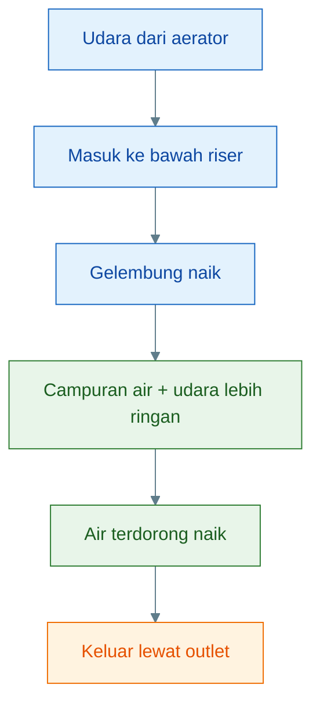

Kesimpulan Bab 2:

> **Airlift-Pump bekerja karena udara yang masuk ke pipa riser menurunkan densitas kolom fluida di dalam pipa, sehingga air terdorong naik. Kinerja AP ditentukan oleh pipa yang cukup terendam, suplai udara yang memadai, dan outlet yang tetap rendah.**

[**Kembali ke Atas**](#desain-airlift-pump-untuk-kolam-lele-air-dangkal-50-cm)

---

## 3. Komponen Utama Airlift-Pump

Setelah prinsip kerjanya dipahami, langkah berikutnya adalah mengenali komponen-komponen utamanya. Ini penting karena banyak AP gagal bukan pada ide dasarnya, tetapi pada detail komponennya: pipa terlalu kecil, diffuser buruk, selang terlipat, atau tidak ada check valve.

---

### 3.1 Pipa riser

Pipa riser adalah komponen utama AP. Inilah jalur tempat campuran air dan udara naik.

Fungsinya:

- menjadi saluran vertikal utama,
- menampung kolom campuran air-udara,
- menentukan karakter aliran bersama komponen lain.

Untuk skala kecil, ukuran praktis yang umum adalah:

- **1/2 inci** untuk uji kecil,
- **3/4 inci** untuk target debit menengah.

Secara praktis, **3/4 inci lebih aman** jika targetnya adalah sistem yang tetap sederhana tetapi ingin debit yang lebih masuk akal. Pipa yang terlalu kecil lebih mudah membatasi aliran.

Catatan penting:

> **Riser adalah inti AP. Jika riser salah ukuran atau terlalu pendek terendam, performa AP langsung turun.**

---

### 3.2 Injektor udara / diffuser

Udara harus dimasukkan ke bagian bawah riser. Komponen yang melakukan ini bisa berupa:

- batu aerasi,
- lubang injeksi sederhana,
- diffuser kecil,
- nozzle udara sederhana.

Fungsi diffuser atau injektor adalah:

- memasukkan udara ke bawah pipa,
- membentuk gelembung,
- memulai pembentukan kolom campuran air-udara.

Komponen ini harus:

- mudah dibersihkan,
- tidak cepat mampet,
- mudah diganti bila rusak.

Jika diffuser tersumbat, maka gelembung melemah dan AP langsung kehilangan tenaga angkat.

---

### 3.3 Selang udara

Selang udara menghubungkan aerator atau blower ke injektor udara pada AP.

Fungsinya tampak sederhana, tetapi tetap penting. Selang yang buruk bisa membuat AP gagal walaupun aerator dan pipa sudah benar.

Hal yang perlu dijaga:

- selang tidak terlipat,
- sambungan rapat,
- panjang selang tidak berlebihan,
- bahan cukup kuat,
- jalur selang mudah diperiksa.

Selang yang terlipat atau bocor membuat suplai udara turun.

---

### 3.4 Check valve

Check valve atau katup satu arah adalah komponen keselamatan.

Fungsi utamanya:

- mencegah air balik ke aerator,
- menjaga aerator saat listrik mati,
- mengurangi risiko kerusakan alat.

Komponen ini **wajib**. Tanpa check valve, air dari kolam bisa masuk ke selang udara dan merusak aerator.

Prinsip sederhana:

```text
aerator boleh mengirim udara ke kolam
tetapi air kolam tidak boleh balik ke aerator
```

---

### 3.5 Kran kontrol udara

Kran kontrol udara berguna untuk mengatur banyaknya udara yang masuk ke AP.

Fungsinya:

- mencari titik aliran paling stabil,
- menghindari udara terlalu kecil,
- menghindari udara terlalu besar,
- memberi fleksibilitas saat uji lapangan.

Tanpa kontrol udara, operator cenderung hanya menerima kondisi “apa adanya”, padahal AP sering memerlukan penyetelan kecil agar stabil.

Kran ini sangat berguna terutama jika:

- satu aerator dipakai untuk beberapa titik,
- kondisi kolam berubah,
- target debit ingin dioptimalkan.

---

### 3.6 Intake air

Intake adalah titik masuk air dari kolam ke dalam AP. Posisi intake sangat penting.

Prinsipnya:

> **intake ditempatkan 5–10 cm di atas dasar kolam, bukan tepat di dasar.**

Tujuannya:

- air kaya nutrien tetap terambil,
- feses berat tidak langsung tersedot,
- pipa tidak cepat mampet,
- dasar kolam tetap bisa dibersihkan terpisah.

Intake juga sebaiknya diberi **saringan kasar**. Fungsi saringan ini bukan menyaring lumpur halus, tetapi menahan:

- ikan kecil,
- daun,
- benda besar,
- kotoran besar.

Saringan jangan terlalu halus karena justru akan cepat tersumbat.

---

### 3.7 Outlet

Outlet adalah titik keluarnya air dari AP.

Fungsi outlet:

- mengarahkan air ke titik tujuan,
- menentukan arah sirkulasi,
- memengaruhi beban head.

Prinsip desain outlet:

- harus rendah,
- jangan terlalu tinggi dari permukaan air,
- jalurnya pendek,
- hambatan dibuat minimal.

Jika outlet terlalu tinggi, AP harus bekerja lebih berat dan debit akan turun.

---

### 3.8 Diagram komponen AP

Berikut diagram komponen utama AP.

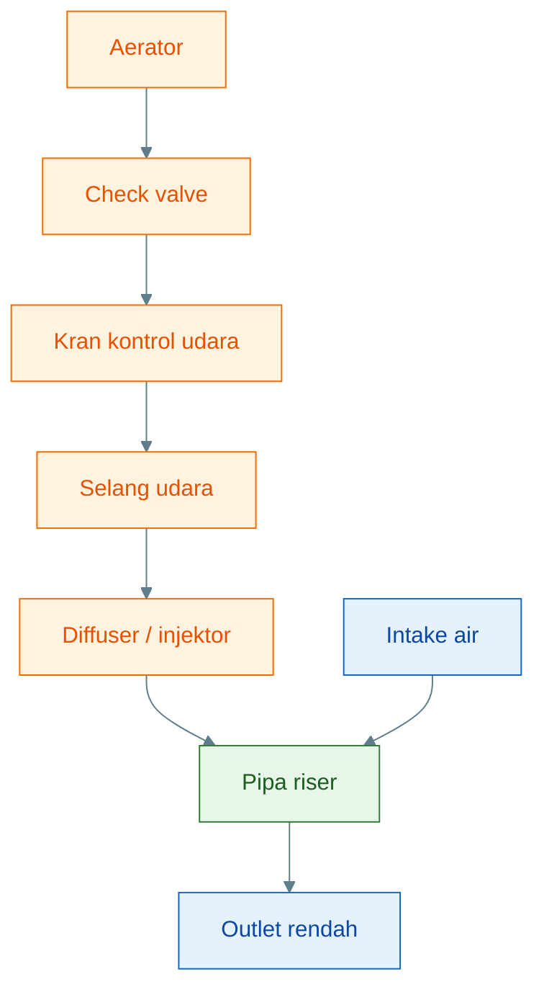

Kesimpulan Bab 3:

> **Airlift-Pump tersusun dari komponen sederhana, tetapi setiap komponen punya fungsi penting. Riser menentukan jalur angkat, diffuser memasukkan udara, selang dan check valve menjaga suplai udara aman, kran mengatur kestabilan, intake menentukan kualitas air yang masuk, dan outlet menentukan beban angkat. Kesalahan pada satu komponen saja bisa menurunkan performa seluruh sistem.**

[**Kembali ke Atas**](#desain-airlift-pump-untuk-kolam-lele-air-dangkal-50-cm)

---

# 4. Ukuran Dasar untuk Kolam Lele Air Dangkal 50 cm

Airlift-Pump untuk kolam air dangkal harus dirancang dengan asumsi yang realistis. Kolam dengan kedalaman air **50 cm** berbeda jauh dengan kolam atau tangki yang kedalamannya 1–2 meter. Pada kolam dalam, airlift memiliki kolom air yang lebih panjang untuk membentuk gaya angkat. Pada kolam dangkal, ruang kerja airlift terbatas.

Karena itu, desain AP untuk kolam air dangkal harus mengikuti prinsip:

> **pipa terendam sedalam mungkin, outlet serendah mungkin, dan debit diuji langsung.**

---

## 4.1 Kondisi desain

Basis desain yang digunakan dalam artikel ini adalah kolam air dangkal dengan kedalaman air **50 cm**.

| Parameter                  |                 Nilai |
| -------------------------- | --------------------: |
| Kedalaman air              |                 50 cm |
| Pipa terendam              |              35–45 cm |
| Posisi intake              | 5–10 cm di atas dasar |
| Tinggi angkat ideal        |            < 10–20 cm |
| Tinggi angkat maksimum uji |              20–30 cm |
| Target debit awal          |         100–250 L/jam |
| Target debit lanjut        |         250–400 L/jam |

Angka-angka ini bukan angka mutlak. Ini adalah **batas desain awal** untuk membuat AP tetap rasional pada kolam dangkal.

Maknanya:

- pipa riser harus memanfaatkan hampir seluruh kedalaman air,
- intake tidak boleh tepat di dasar,
- outlet tidak boleh terlalu tinggi,
- debit awal harus diuji,
- target debit lanjut hanya boleh dicoba setelah desain dasar stabil.

Diagram kondisi desain:

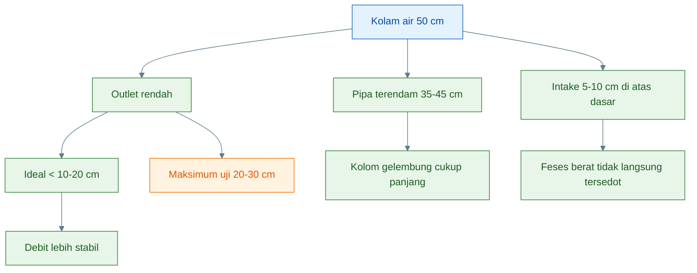

---

## 4.2 Kenapa pipa harus terendam dalam

Pipa riser adalah tempat campuran air dan udara naik. Semakin panjang bagian pipa yang terendam, semakin panjang pula kolom gelembung yang terbentuk di dalam pipa.

Efeknya:

```text
pipa terendam lebih panjang
→ kolom gelembung lebih panjang
→ campuran air-udara lebih efektif terbentuk
→ gaya angkat lebih baik
→ debit lebih stabil
```

Sebaliknya, jika pipa hanya terendam pendek, maka:

```text
kolom gelembung pendek
→ efek angkat lemah
→ air sulit naik
→ debit rendah
```

Pada kolam air 50 cm, pipa sebaiknya terendam sekitar **35–45 cm**. Ini berarti AP memanfaatkan hampir seluruh kedalaman air yang tersedia.

Jika pipa hanya terendam 20–25 cm, AP masih mungkin mengangkat air, tetapi performanya biasanya lemah, terutama jika outlet dinaikkan terlalu tinggi.

Prinsip praktis:

> **Pada kolam dangkal, jangan menyia-nyiakan kedalaman. Masukkan pipa riser sedalam mungkin, tetapi tetap sisakan jarak intake 5–10 cm dari dasar.**

---

## 4.3 Kenapa outlet harus rendah

Airlift-Pump tidak cocok untuk mengangkat air tinggi. AP bekerja paling baik jika air hanya perlu dinaikkan sedikit dari permukaan kolam.

Tinggi angkat disebut juga **head**. Semakin tinggi head, semakin berat beban AP.

Pada kolam 50 cm, outlet sebaiknya:

- idealnya < 10–20 cm di atas permukaan air,
- maksimum uji 20–30 cm,
- tidak dibuat tinggi seperti tower,
- tidak dipaksa mengalir ke talang yang jauh dan tinggi.

Jika outlet terlalu tinggi:

```text
head naik
→ beban AP naik
→ debit turun
→ aliran tidak stabil
```

Diagram hubungan outlet dan debit:

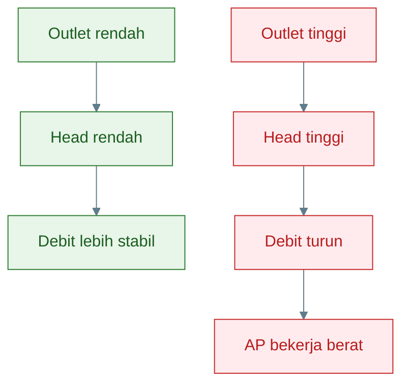

Karena itu, jika AP dipakai untuk mengalirkan air ke talang, bak kecil, atau titik aerasi, posisi tujuan air harus **dekat dan rendah**.

---

## 4.4 Batas kolam 50 cm

Kolam 50 cm termasuk kolam dangkal untuk desain airlift. AP masih bisa bekerja, tetapi jangan disamakan dengan airlift pada tangki dalam.

Perbandingan sederhananya:

| Kondisi       | Dampak terhadap AP                     |
| ------------- | -------------------------------------- |
| Kolam 50 cm   | kolom angkat pendek, wajib rendah-head |
| Kolam 1 meter | ruang kerja lebih baik                 |
| Kolam 2 meter | airlift jauh lebih leluasa             |
| Outlet tinggi | debit turun tajam                      |
| Outlet rendah | performa lebih stabil                  |

Kesimpulan penting:

> **Kolam 50 cm masih bisa memakai AP, tetapi desainnya harus konservatif. Jangan mengejar head tinggi dan jangan menjanjikan debit besar sebelum diuji.**

Kesimpulan Bab 4:

> **Untuk kolam air dangkal 50 cm, AP harus memakai pipa terendam 35–45 cm, intake 5–10 cm di atas dasar, outlet serendah mungkin, dan target debit awal 100–250 L/jam. Target debit lebih tinggi hanya boleh dianggap sebagai uji lanjut, bukan angka pasti.**

[**Kembali ke Atas**](#desain-airlift-pump-untuk-kolam-lele-air-dangkal-50-cm)

---

# 5. Submergence Ratio: Ukuran Kritis yang Sering Dilupakan

Banyak desain AP gagal karena hanya memperhatikan ukuran pipa dan aerator, tetapi melupakan satu konsep penting: **submergence ratio**.

Submergence ratio menjelaskan seberapa besar bagian pipa yang terendam dibanding total “usaha angkat” yang harus dilakukan AP.

Dalam bahasa praktis:

> **Semakin besar bagian pipa yang terendam dibanding tinggi angkatnya, semakin baik peluang AP bekerja stabil.**

---

## 5.1 Pengertian submergence ratio

Rumus:

$$
SR =
\frac{\text{pipa terendam}}
{\text{pipa terendam} + \text{tinggi angkat}}
$$

Keterangan:

$$
SR = \text{submergence ratio}
$$

$$
\text{pipa terendam} = \text{panjang pipa riser yang berada di bawah permukaan air}
$$

$$
\text{tinggi angkat} = \text{selisih tinggi dari permukaan air ke outlet}
$$

Jika ingin ditulis dalam persen:

$$
SR_{%} = SR \times 100%
$$

Submergence ratio bukan satu-satunya faktor, tetapi sangat penting karena langsung berkaitan dengan kemampuan AP membentuk kolom air-udara yang cukup panjang.

---

## 5.2 Contoh perhitungan bagus

Misalnya:

- pipa terendam: 45 cm,
- tinggi angkat: 15 cm.

Maka:

$$
SR =
\frac{45}{45 + 15}
$$

$$
SR =
\frac{45}{60}
$$

$$
SR = 0{,}75
$$

Jika dikonversi ke persen:

$$
SR_{%} = 0{,}75 \times 100%
$$

$$
SR_{%} = 75%
$$

Artinya, desain ini cukup baik karena pipa terendam jauh lebih panjang daripada tinggi angkatnya.

Makna praktis:

```text
pipa terendam panjang
+ outlet rendah
= submergence ratio tinggi
= debit lebih stabil
```

---

## 5.3 Contoh perhitungan kurang ideal

Misalnya:

- pipa terendam: 35 cm,
- tinggi angkat: 30 cm.

Maka:

$$
SR =
\frac{35}{35 + 30}
$$

$$
SR =
\frac{35}{65}
$$

$$
SR = 0{,}538
$$

Dibulatkan:

$$
SR \approx 0{,}54
$$

Jika dikonversi ke persen:

$$
SR_{%} = 0{,}54 \times 100%
$$

$$
SR_{%} = 54%
$$

Ini termasuk desain lemah-menengah. AP mungkin masih bekerja, tetapi debitnya berpotensi lebih rendah dan lebih sensitif terhadap hambatan.

Makna praktis:

```text
pipa terendam pendek
+ outlet tinggi
= submergence ratio rendah
= debit mudah melemah
```

---

## 5.4 Makna praktis

Panduan praktis:

|     SR | Penilaian         |
| -----: | ----------------- |
|   >70% | baik              |
| 60–70% | cukup             |
| 50–60% | lemah-menengah    |
|  < 50% | kurang disarankan |

Untuk kolam air dangkal 50 cm, target desain sebaiknya diarahkan ke **SR minimal 60–70%**, dan lebih baik jika bisa di atas 70%.

Cara mencapainya:

- pipa riser dibuat sedalam mungkin,
- outlet dibuat rendah,
- talang atau titik tujuan air diletakkan dekat,
- belokan dan hambatan outlet dikurangi.

---

## 5.5 Prinsip desain

Prinsip desain paling penting:

> **Maksimalkan pipa terendam, minimalkan tinggi angkat.**

Dalam desain lapangan, ini berarti:

```text
pipa riser jangan pendek
outlet jangan tinggi
jalur air jangan jauh
belokan jangan berlebihan
```

Untuk kolam 50 cm, desain yang lebih disarankan:

```text
pipa terendam 40–45 cm
tinggi angkat 10–15 cm
```

Desain yang kurang disarankan:

```text
pipa terendam 25–35 cm
tinggi angkat 25–30 cm
```

---

## 5.6 Diagram submergence ratio

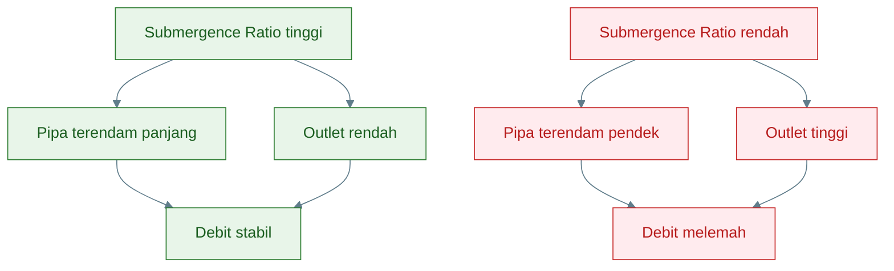

Kesimpulan Bab 5:

> **Submergence ratio adalah ukuran penting untuk membaca apakah desain AP masuk akal. Pada kolam 50 cm, AP harus dibuat dengan pipa terendam panjang dan outlet rendah. Target SR sebaiknya minimal 60–70%, dan lebih baik di atas 70%.**

[**Kembali ke Atas**](#desain-airlift-pump-untuk-kolam-lele-air-dangkal-50-cm)

---

# 6. Tekanan Udara Minimum

Airlift-Pump hanya bekerja jika udara dari aerator atau blower mampu masuk ke bawah pipa riser. Udara tidak akan masuk dengan stabil jika tekanannya kalah oleh tekanan air.

Karena itu, selain debit udara, kita perlu memahami **tekanan minimum**.

---

## 6.1 Rumus tekanan hidrostatik

Tekanan air pada kedalaman tertentu disebut tekanan hidrostatik.

Rumus:

$$
P = \rho g h
$$

Keterangan:

$$
P = \text{tekanan hidrostatik} ; (\text{Pa})
$$

$$
\rho = \text{densitas air} \approx 1000 ; \text{kg/m}^3
$$

$$
g = \text{percepatan gravitasi} \approx 9{,}81 ; \text{m/s}^2
$$

$$
h = \text{kedalaman injeksi udara} ; (\text{m})
$$

Semakin dalam titik injeksi udara, semakin besar tekanan yang harus dilawan oleh aerator.

---

## 6.2 Contoh untuk kedalaman 45 cm

Jika udara masuk pada kedalaman 45 cm:

$$
h = 45 \text{ cm} = 0{,}45 \text{ m}
$$

Maka:

$$
P = 1000 \times 9{,}81 \times 0{,}45
$$

$$
P = 4414{,}5 \text{ Pa}
$$

Konversi ke bar:

$$
1 \text{ bar} = 100.000 \text{ Pa}
$$

Maka:

$$
P =
\frac{4414{,}5}{100.000}
$$

$$
P = 0{,}044145 \text{ bar}
$$

Dibulatkan:

$$
P \approx 0{,}044 \text{ bar}
$$

Artinya, secara teori, untuk memasukkan udara pada kedalaman 45 cm, aerator harus mampu mengatasi tekanan sekitar **0,044 bar**.

---

## 6.3 Koreksi praktis

Secara teori perlu sekitar **0,044 bar**, tetapi praktik lapangan membutuhkan tekanan lebih tinggi.

Mengapa?

Karena ada hambatan tambahan dari:

- selang udara,
- sambungan,
- check valve,
- kran kontrol udara,
- diffuser atau batu aerasi,
- lendir/kotoran pada diffuser,
- tekanan balik dari air,
- rugi-rugi kecil pada sistem.

Karena itu, rekomendasi praktisnya:

> **Aerator/blower sebaiknya mampu bekerja stabil sekitar 0,06–0,10 bar untuk AP kecil pada kolam 50 cm.**

Ini bukan berarti harus selalu memakai blower besar. Tetapi aerator harus cukup kuat untuk mempertahankan gelembung stabil pada kedalaman 35–45 cm.

Diagram tekanan udara:

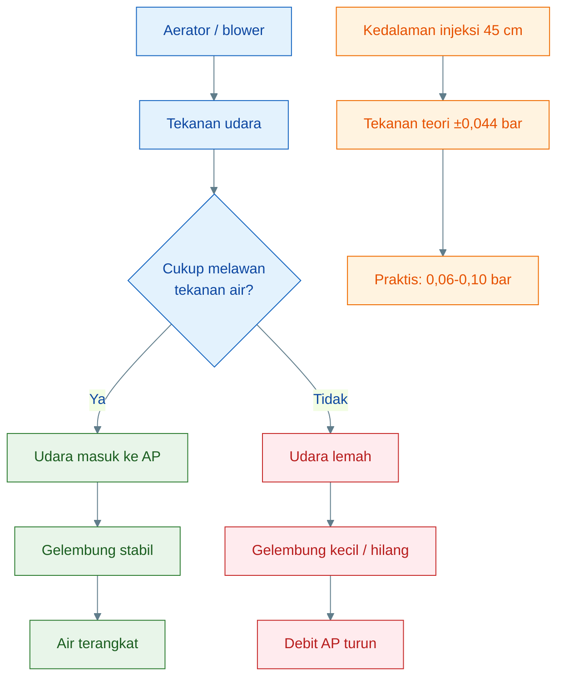

---

## 6.4 Kenapa aerator lemah gagal

Aerator yang lemah menyebabkan AP gagal karena udara tidak mampu masuk dan membentuk kolom gelembung yang stabil.

Gejalanya:

- gelembung kecil,
- gelembung tidak merata,
- air tidak naik,
- debit keluar sangat kecil,
- aliran putus-putus,
- AP hanya berbuih tetapi tidak memindahkan air.

Penyebab umum:

| Penyebab                             | Dampak                           |
| ------------------------------------ | -------------------------------- |
| aerator kurang kuat                  | udara tidak cukup masuk          |
| selang terlalu panjang               | tekanan turun                    |
| diffuser tersumbat                   | gelembung melemah                |
| check valve berat/rusak              | hambatan udara naik              |
| outlet terlalu tinggi                | beban AP naik                    |
| pipa terlalu besar untuk udara kecil | udara tidak mampu mengangkat air |

Cara mengatasinya:

- pakai aerator lebih kuat,
- pendekkan selang,
- bersihkan diffuser,
- cek check valve,
- turunkan outlet,
- gunakan pipa riser sesuai kapasitas udara.

Kesimpulan Bab 6:

> **Untuk AP pada kolam air 50 cm, tekanan teori pada kedalaman injeksi 45 cm sekitar 0,044 bar. Namun karena ada rugi-rugi lapangan, aerator/blower sebaiknya mampu bekerja stabil sekitar 0,06–0,10 bar. Aerator yang lemah akan membuat gelembung tidak stabil, debit turun, dan AP gagal mengangkat air secara konsisten.**

[**Kembali ke Atas**](#desain-airlift-pump-untuk-kolam-lele-air-dangkal-50-cm)

---

# 7. Debit Airlift-Pump: Target dan Cara Mengukur

Debit adalah ukuran nyata dari performa Airlift-Pump. Banyak desain terlihat benar secara bentuk, tetapi ternyata debit aktualnya kecil. Karena itu, AP tidak boleh dinilai hanya dari gelembung yang terlihat ramai. Yang harus dinilai adalah:

> **berapa liter air benar-benar keluar dari outlet per jam.**

Gelembung besar belum tentu debit besar. Suara aerator kuat juga belum tentu aliran air efektif. Satu-satunya cara memastikan adalah mengukur debit.

---

## 7.1 Target debit

Untuk kolam air dangkal 50 cm, target debit AP sebaiknya dibuat bertahap.

| Fase           |        Target |
| -------------- | ------------: |
| Uji awal       | 100–150 L/jam |
| Operasi normal | 150–250 L/jam |
| Target lanjut  | 250–400 L/jam |

### Uji awal: 100–150 L/jam

Ini target paling aman untuk memulai. Pada fase ini, tujuan utamanya adalah memastikan:

- air benar-benar naik,
- outlet mengalir stabil,
- tidak ada sumbatan,
- aerator cukup kuat,
- pipa tidak menyembur kasar,
- sistem mudah dikontrol.

### Operasi normal: 150–250 L/jam

Ini target yang lebih realistis untuk operasi harian pada AP kecil di kolam dangkal. Debit ini cukup untuk membuat air bergerak tanpa memaksa AP bekerja terlalu berat.

### Target lanjut: 250–400 L/jam

Ini boleh dijadikan target lanjut, tetapi harus dipahami sebagai **hasil uji**, bukan janji desain. Untuk mencapai debit ini, biasanya dibutuhkan:

- pipa riser cukup besar,
- head sangat rendah,
- aerator cukup kuat,
- diffuser bersih,
- pipa tidak berlendir,
- hambatan outlet kecil.

Prinsip penting:

> **Target debit tinggi hanya layak jika aliran tetap stabil dan tidak membuat sistem kasar.**

---

## 7.2 Jangan percaya angka tanpa pengukuran

Debit AP dipengaruhi oleh banyak faktor. Karena itu, angka debit tidak boleh hanya diasumsikan.

Faktor yang memengaruhi debit:

- diameter riser,
- kedalaman terendam,
- tinggi outlet,
- debit udara,
- diffuser,
- hambatan elbow,
- kebersihan pipa,
- posisi intake.

### Diameter riser

Pipa terlalu kecil membatasi volume air. Pipa terlalu besar membutuhkan udara lebih banyak. Untuk skala kecil, 3/4 inci sering lebih aman dibanding 1/2 inci jika target debit menengah.

### Kedalaman terendam

Semakin panjang pipa terendam, semakin baik peluang air terangkat. Pipa yang hanya sedikit terendam membuat kolom gelembung pendek dan gaya angkat lemah.

### Tinggi outlet

Outlet tinggi membuat beban AP meningkat. Ini salah satu penyebab paling umum debit kecil.

### Debit udara

Udara terlalu kecil membuat air tidak naik. Udara terlalu besar bisa membuat aliran kasar dan tidak efisien.

### Diffuser

Diffuser kotor atau tersumbat membuat gelembung melemah. Diffuser yang terlalu halus juga bisa menambah hambatan jika aerator tidak kuat.

### Hambatan elbow

Setiap belokan menambah hambatan. Elbow terlalu banyak atau terlalu tajam dapat menurunkan debit.

### Kebersihan pipa

Biofilm dan lendir di pipa riser mengurangi diameter efektif dan membuat aliran melemah.

### Posisi intake

Intake terlalu dekat dasar mudah tersumbat lumpur. Intake terlalu tinggi bisa mengambil air kurang efektif dari zona bawah.

Diagram faktor debit:

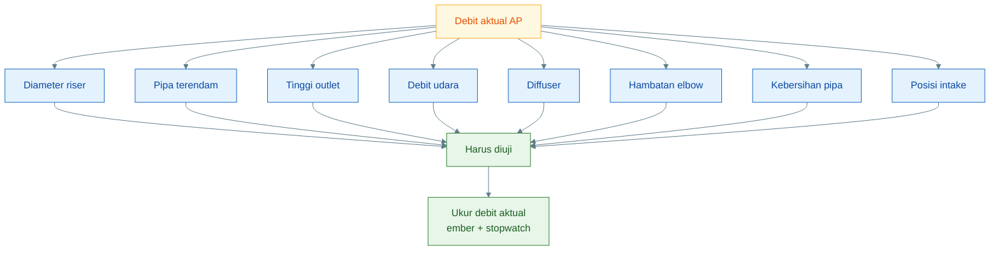

Kesimpulannya:

> **AP tidak dinilai dari tampilan gelembung, tetapi dari debit air yang benar-benar keluar.**

---

## 7.3 Cara ukur sederhana

Cara paling mudah mengukur debit adalah memakai ember dan stopwatch.

Rumus:

$$
Q =
\frac{V}{t}
$$

Keterangan:

$$
Q = \text{debit}
$$

$$
V = \text{volume air yang tertampung}
$$

$$
t = \text{waktu pengukuran}
$$

Jika hasil pengukuran memakai liter per menit, maka:

$$
Q_{\text{L/jam}} =
Q_{\text{L/menit}} \times 60
$$

Contoh:

Jika dalam 1 menit terkumpul 3 liter air:

$$
Q = 3 \text{ L/menit}
$$

Maka:

$$
Q_{\text{L/jam}} =
3 \times 60
$$

$$
Q_{\text{L/jam}} =
180 \text{ L/jam}
$$

Artinya, AP tersebut menghasilkan debit sekitar:

> **180 L/jam**

### Cara praktik di lapangan

1. Arahkan outlet AP ke ember.
2. Nyalakan AP sampai aliran stabil.
3. Tampung air selama 1 menit.
4. Ukur volume air yang terkumpul.
5. Kalikan hasil liter/menit dengan 60.
6. Catat hasilnya.

Contoh tabel pencatatan:

| Uji | Volume 1 menit | Debit L/jam | Catatan       |
| --: | -------------: | ----------: | ------------- |
|   1 |            2 L |   120 L/jam | udara kecil   |
|   2 |            3 L |   180 L/jam | stabil        |
|   3 |            4 L |   240 L/jam | agak kasar    |
|   4 |          3,5 L |   210 L/jam | paling stabil |

Dari tabel di atas, pilihan terbaik belum tentu debit terbesar. Jika 240 L/jam terlalu kasar, sementara 180–210 L/jam stabil, maka debit stabil lebih layak dipilih.

---

## 7.4 Diagram faktor debit

Diagram berikut merangkum hubungan antara desain, kondisi AP, dan debit aktual.

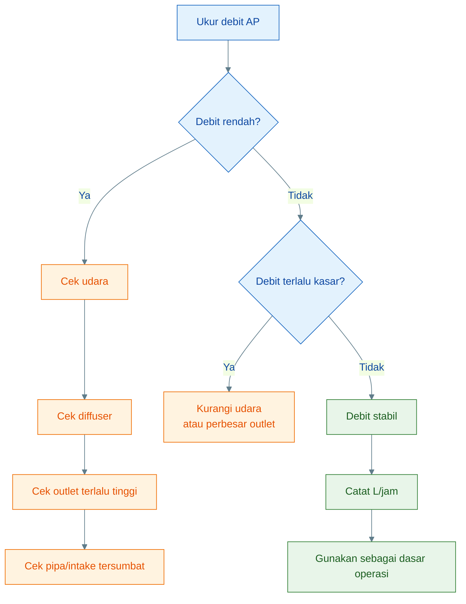

Kesimpulan Bab 7:

> **Debit AP harus diukur langsung. Target awal 100–150 L/jam, operasi normal 150–250 L/jam, dan target lanjut 250–400 L/jam hanya layak jika aliran stabil. Pengukuran sederhana dengan ember dan stopwatch jauh lebih berguna daripada menebak dari banyaknya gelembung.**

---

# 8. Desain Intake: Jangan Tepat di Dasar

Intake adalah titik masuk air ke AP. Posisi intake sangat menentukan kualitas air yang masuk ke pipa riser. Desain intake yang buruk dapat membuat AP cepat tersumbat, membawa lumpur, dan membuat aliran tidak stabil.

Prinsip desain intake:

> **ambil airnya, jangan ambil lumpurnya.**

---

## 8.1 Posisi intake

Posisi intake yang disarankan:

> **5–10 cm di atas dasar kolam.**

Bukan tepat di dasar.

Posisi ini adalah kompromi antara dua kebutuhan:

1. mengambil air dari zona bawah yang relatif kaya nutrien,
2. menghindari feses berat dan lumpur dasar tersedot langsung ke pipa.

Jika intake terlalu tinggi, AP hanya mengambil air dari zona tengah/atas. Jika intake tepat di dasar, AP akan membawa terlalu banyak padatan.

---

## 8.2 Alasan teknis

### 1. Air kaya nutrien tetap terambil

Air di dekat dasar sering membawa nutrien terlarut dari feses, pakan, dan proses biologis. Dengan intake 5–10 cm di atas dasar, air dari zona bawah masih dapat ikut tersirkulasi.

### 2. Feses berat tidak langsung tersedot

Feses dan sisa pakan yang berat cenderung berada di dasar. Dengan menaikkan intake sedikit dari dasar, padatan berat tidak langsung masuk ke riser.

### 3. Pipa tidak mudah tersumbat

Jika intake menyedot lumpur, pipa riser, diffuser, atau outlet lebih mudah berlendir dan tersumbat. Aliran akan turun.

### 4. Lumpur tetap bisa disifon manual

Endapan dasar sebaiknya dikelola dengan sifon manual, bukan dipaksa masuk ke AP.

Prinsipnya:

```text id="y6swdf"
AP untuk sirkulasi air
sifon untuk membuang lumpur
```

---

## 8.3 Saringan kasar intake

Intake sebaiknya diberi saringan kasar.

Fungsinya:

- menahan ikan kecil,
- menahan daun,
- menahan potongan akar,
- menahan kotoran besar,
- mencegah benda besar masuk ke riser.

Namun saringan jangan terlalu halus. Saringan terlalu halus cepat tertutup lendir dan partikel.

Kriteria saringan yang baik:

| Kriteria            | Tujuan                      |
| ------------------- | --------------------------- |
| kasar               | tidak cepat mampet          |
| mudah dibuka        | mudah dibersihkan           |
| cukup rapat         | menahan benda besar         |
| tidak tajam         | aman untuk ikan             |
| tidak permanen mati | bisa dilepas saat perawatan |

Jika saringan mulai tertutup, debit AP akan turun. Maka saringan intake harus masuk daftar perawatan rutin.

---

## 8.4 Yang tidak boleh dilakukan

Kesalahan intake yang harus dihindari:

- intake tepat di dasar,
- saringan terlalu halus,
- pipa intake sulit dibersihkan,
- menjadikan AP sebagai penyedot lumpur.

### Intake tepat di dasar

Ini membuat AP menyedot feses, lumpur, dan sisa pakan. Akibatnya AP cepat kotor dan debit turun.

### Saringan terlalu halus

Saringan halus terlihat bagus, tetapi cepat mampet. Akibatnya AP kekurangan air masuk.

### Pipa intake sulit dibersihkan

AP harus mudah dirawat. Jika intake dibuat permanen dan sulit dibuka, masalah kecil akan menjadi besar.

### Menjadikan AP sebagai penyedot lumpur

AP bukan pompa lumpur. Jika dipaksa menyedot lumpur, performanya turun dan sistem menjadi kotor.

---

## 8.5 Diagram posisi intake

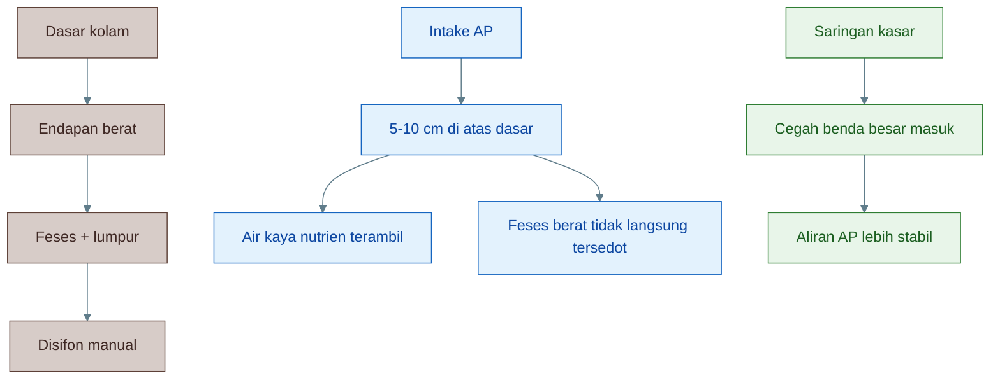

Kesimpulan Bab 8:

> **Intake AP sebaiknya berada 5–10 cm di atas dasar kolam, dilengkapi saringan kasar, dan mudah dibersihkan. AP harus mengambil air, bukan lumpur. Endapan dasar tetap harus dikelola dengan sifon manual.**

[**Kembali ke Atas**](#desain-airlift-pump-untuk-kolam-lele-air-dangkal-50-cm)

---

# 9. Desain Outlet: Rendah, Pendek, dan Minim Hambatan

Outlet adalah titik keluarnya air dari AP. Dalam desain AP, outlet sama pentingnya dengan intake. Banyak AP gagal bukan karena udara kurang, tetapi karena outlet terlalu tinggi atau jalurnya terlalu berat.

Prinsip outlet:

> **rendah, pendek, dan minim hambatan.**

---

## 9.1 Outlet harus rendah

Airlift-Pump tidak cocok untuk head tinggi. Karena itu, outlet harus dibuat serendah mungkin.

Panduan:

- ideal < 10–20 cm di atas permukaan air,
- maksimum uji 20–30 cm,
- semakin tinggi outlet, semakin turun debit.

Jika outlet dinaikkan terlalu tinggi, AP harus mengangkat air lebih berat. Akibatnya:

```text id="2tbqwe"
debit turun
aliran putus-putus
gelembung tampak banyak tetapi air sedikit
AP tidak stabil
```

Untuk kolam air dangkal 50 cm, outlet yang rendah jauh lebih penting daripada mengejar bentuk instalasi tinggi.

---

## 9.2 Jalur outlet pendek

Jalur outlet sebaiknya pendek. Semakin panjang pipa outlet, semakin besar hambatan.

Yang harus dihindari:

- terlalu banyak belokan,
- pipa terlalu panjang,
- diameter mengecil mendadak,
- outlet terlalu sempit,
- ujung pipa tenggelam terlalu dalam,
- jalur naik-turun tidak perlu.

Setiap hambatan menurunkan debit AP.

Prinsip praktis:

```text id="mnb3jq"
AP kecil
+ jalur outlet pendek
+ belokan minimal
= aliran lebih stabil
```

---

## 9.3 Outlet boleh diarahkan ke

Outlet AP bisa diarahkan ke beberapa titik, tergantung tujuan sistem.

Pilihan:

- talang rendah,
- bak kecil,
- kolam kembali,
- titik aerasi jatuh.

### Talang rendah

Cocok jika AP dipakai untuk mengalirkan air ke unit akar tanaman atau jalur sirkulasi rendah. Talang harus dekat dan tidak tinggi.

### Bak kecil

Bisa dipakai untuk pengamatan debit atau penampung sementara sebelum air kembali.

### Kolam kembali

Jika tujuan AP hanya sirkulasi dan aerasi, outlet bisa diarahkan kembali ke kolam.

### Titik aerasi jatuh

Outlet bisa dibuat jatuh agar air menciptakan percikan. Ini membantu kontak air dengan udara.

---

## 9.4 Return jatuh lebih baik

Return air yang jatuh kembali ke kolam lebih baik daripada air yang masuk diam di bawah permukaan.

Manfaat return jatuh:

- membantu aerasi,
- menambah kontak air-udara,
- membantu degassing ringan,
- membuat air bergerak,
- memudahkan operator melihat aliran.

Namun return tidak perlu terlalu tinggi. Jatuhan pendek sudah cukup. Yang penting ada kontak air dengan udara.

Diagram outlet dan return:

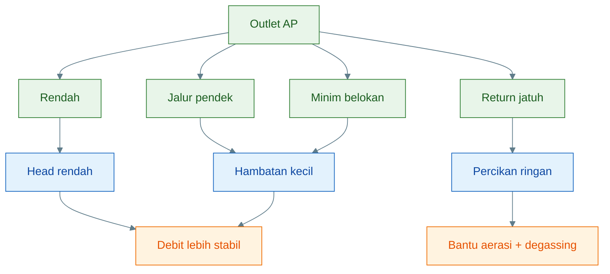

Kesimpulan Bab 9:

> **Outlet AP harus rendah, pendek, dan minim hambatan. Untuk kolam 50 cm, outlet idealnya < 10–20 cm di atas permukaan air. Return air sebaiknya dibuat jatuh ringan agar ikut membantu aerasi dan degassing.**

[**Kembali ke Atas**](#desain-airlift-pump-untuk-kolam-lele-air-dangkal-50-cm)

---

# 10. Setting Udara: Terlalu Kecil Lemah, Terlalu Besar Boros

Udara adalah tenaga utama AP. Tetapi lebih banyak udara tidak selalu berarti lebih baik. Airlift-Pump memiliki titik kerja optimal. Jika udara terlalu kecil, air tidak naik. Jika udara terlalu besar, aliran bisa kasar dan energi terbuang.

Tujuan setting udara adalah mencari:

> **titik aliran paling stabil, bukan gelembung paling ramai.**

---

## 10.1 Udara terlalu kecil

Jika udara terlalu kecil, AP tidak mampu membentuk kolom gelembung yang cukup.

Gejalanya:

- air tidak naik,
- debit rendah,
- gelembung lemah,
- aliran putus-putus,
- outlet hanya menetes,
- air tampak berbuih tetapi tidak berpindah banyak.

Penyebab:

- aerator kurang kuat,
- kran udara terlalu tertutup,
- selang bocor,
- diffuser tersumbat,
- tekanan udara kalah oleh kedalaman air.

Solusi:

- buka kran udara sedikit,
- cek selang,
- bersihkan diffuser,
- cek check valve,
- gunakan aerator lebih kuat bila perlu.

---

## 10.2 Udara terlalu besar

Udara terlalu besar juga tidak ideal. Banyak praktisi mengira semakin besar udara semakin baik. Padahal, pada AP kecil, udara berlebihan bisa membuat aliran kasar.

Gejalanya:

- air menyembur kasar,
- gelembung sangat besar,
- outlet berisik,
- aliran tidak stabil,
- energi boros,
- air terciprat berlebihan,
- debit tidak naik sebanding dengan udara tambahan.

Udara berlebihan dapat membuat sebagian energi hilang sebagai turbulensi, bukan sebagai pengangkatan air yang efektif.

Solusi:

- tutup sedikit kran kontrol udara,
- amati debit,
- pilih titik aliran stabil,
- jangan mengejar gelembung paling besar.

---

## 10.3 Cara menyetel

Cara menyetel udara sebaiknya dilakukan bertahap.

Langkah:

1. mulai dari udara kecil,
2. naikkan perlahan,
3. amati outlet,
4. ukur debit,
5. naikkan lagi sedikit,
6. ukur ulang,
7. pilih titik debit stabil dan aliran halus.

Contoh uji:

| Setting udara |     Debit | Catatan             |
| ------------- | --------: | ------------------- |
| rendah        |  90 L/jam | terlalu lemah       |
| sedang        | 180 L/jam | stabil              |
| tinggi        | 230 L/jam | agak kasar          |
| sangat tinggi | 240 L/jam | boros dan menyembur |

Pada contoh ini, setting terbaik kemungkinan **sedang** atau **tinggi ringan**, bukan sangat tinggi.

Prinsipnya:

> **Debit stabil lebih penting daripada debit puncak yang kasar.**

---

## 10.4 Kran kontrol udara wajib

Kran kontrol udara sangat disarankan, bahkan bisa dianggap wajib untuk desain praktis.

Fungsi kran kontrol:

- fine-tuning udara,
- mencari titik aliran stabil,
- menghindari udara berlebihan,
- mengatur beberapa AP dari satu aerator,
- memudahkan uji debit.

Jika tidak ada kran kontrol, operator sulit mengatur performa AP. Semua bergantung pada kekuatan aerator secara langsung.

Posisi kran kontrol:

```text id="1xu7t7"
aerator
→ check valve
→ kran kontrol udara
→ selang udara
→ diffuser AP
```

Urutan ini membuat aerator aman dan udara tetap bisa disetel.

---

## 10.5 Diagram setting udara

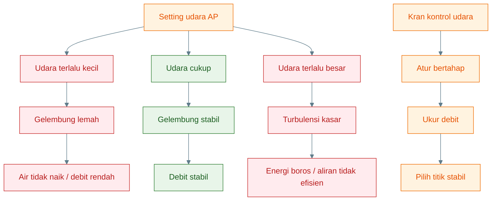

Kesimpulan Bab 10:

> **Udara adalah tenaga AP, tetapi bukan berarti harus sebesar mungkin. Udara terlalu kecil membuat AP lemah, sedangkan udara terlalu besar membuat aliran kasar dan boros. Gunakan kran kontrol udara, naikkan udara bertahap, ukur debit, lalu pilih titik aliran yang paling stabil.**

[**Kembali ke Atas**](#desain-airlift-pump-untuk-kolam-lele-air-dangkal-50-cm)

---

# 11. SOP Pemasangan

Pemasangan Airlift-Pump (AP) harus dilakukan dengan urutan yang benar. Banyak AP terlihat “sudah terpasang”, tetapi performanya buruk karena urutan pemasangan asal-asalan: intake terlalu rendah, check valve terbalik, outlet terlalu tinggi, atau selang udara terlipat.

Prinsip pemasangan:

> **Pasang sederhana, tetapi setiap posisi harus benar.**

---

## 11.1 Urutan pemasangan

Urutan berikut disarankan agar pemasangan rapi dan mudah diperiksa.

### 1. Pasang riser

Pipa riser adalah badan utama AP. Riser harus:

- tegak,
- cukup terendam,
- tidak goyah,
- mudah dibuka jika perlu dibersihkan.

Pada kolam air dangkal 50 cm, target umum:

- pipa terendam 35–45 cm,
- tetap menyisakan jarak intake 5–10 cm dari dasar.

### 2. Pasang intake 5–10 cm di atas dasar

Intake tidak boleh menyentuh dasar kolam. Jarak ini penting agar:

- air zona bawah tetap terambil,
- lumpur berat tidak langsung masuk,
- AP tidak cepat tersumbat.

Jika memakai saringan kasar, pasang sekaligus pada tahap ini.

### 3. Pasang diffuser atau injektor

Diffuser dipasang di bagian bawah riser, di titik injeksi udara. Posisi ini menentukan pembentukan gelembung.

Syarat diffuser:

- terpasang rapat,
- tidak longgar,
- mudah dilepas,
- tidak tertutup lumpur.

### 4. Pasang selang udara

Selang udara menghubungkan aerator ke diffuser. Pastikan:

- panjang cukup, tidak berlebihan,
- sambungan rapat,
- selang tidak terjepit,
- selang tidak terlipat.

### 5. Pasang check valve

Check valve wajib dipasang pada jalur udara untuk mencegah air balik ke aerator.

Hal yang harus diperhatikan:

- arah panah check valve benar,
- sambungan tidak bocor,
- posisi mudah diperiksa.

### 6. Pasang kran kontrol

Kran kontrol udara dipakai untuk menyetel banyaknya udara yang masuk ke AP.

Tujuan:

- mempermudah fine-tuning,
- mencegah udara terlalu kecil,
- mencegah udara berlebihan.

### 7. Sambungkan aerator

Aerator diletakkan di posisi aman:

- lebih tinggi dari permukaan air jika memungkinkan,
- tidak kena percikan air,
- ventilasi cukup,
- mudah dijangkau untuk pemeriksaan.

### 8. Atur outlet rendah

Outlet harus dibuat rendah. Untuk kolam air dangkal:

- ideal < 10–20 cm di atas permukaan air,
- maksimum uji 20–30 cm.

Jalur outlet juga harus:

- pendek,
- minim belokan,
- tidak mengecil mendadak.

### 9. Uji gelembung

Nyalakan aerator dan lihat apakah:

- gelembung masuk ke riser,
- gelembung naik stabil,
- tidak ada kebocoran udara,
- air mulai terangkat.

### 10. Ukur debit

Setelah aliran stabil, debit harus diukur. Jangan berhenti pada “air sudah keluar”. Ukur dengan ember dan stopwatch agar sistem punya angka dasar.

Ringkasnya:

```text id="7pl2n6"
pasang
→ cek posisi
→ nyalakan
→ amati gelembung
→ ukur debit
```

---

## 11.2 Posisi akhir yang benar

Setelah pemasangan selesai, posisi akhir AP harus diperiksa. Jangan menganggap instalasi selesai hanya karena alat sudah berdiri.

Checklist posisi akhir yang benar:

- **Riser tegak**
  Jika miring berlebihan, aliran bisa terganggu dan pemasangan menjadi tidak stabil.

- **Intake tidak menyentuh dasar**
  Intake harus tetap 5–10 cm di atas dasar.

- **Outlet rendah**
  Jangan biarkan outlet terlalu tinggi hanya demi kerapian visual.

- **Selang tidak terlipat**
  Selang terlipat akan menurunkan suplai udara.

- **Aerator aman dari air**
  Aerator tidak boleh berada di posisi mudah terkena aliran balik atau percikan berat.

- **Check valve terpasang**
  Ini wajib, bukan opsional.

Tambahan yang juga perlu dicek:

- diffuser tidak longgar,
- sambungan pipa rapat,
- saringan intake tidak terpasang terlalu rapat,
- jalur outlet tidak tersumbat,
- aliran keluar konsisten.

Tabel inspeksi akhir:

| Item         | Kondisi benar         | Risiko bila salah    |
| ------------ | --------------------- | -------------------- |
| Riser        | tegak                 | aliran kurang stabil |
| Intake       | 5–10 cm di atas dasar | lumpur tersedot      |
| Outlet       | rendah                | debit turun          |
| Selang udara | lurus, tidak bocor    | udara lemah          |
| Check valve  | terpasang benar       | air balik ke aerator |
| Diffuser     | bersih, rapat         | gelembung lemah      |
| Aerator      | aman, kering          | kerusakan alat       |

Prinsip inspeksi akhir:

> **Jika posisi akhir salah, AP bisa tampak hidup tetapi performanya jelek.**

---

## 11.3 Diagram SOP pemasangan

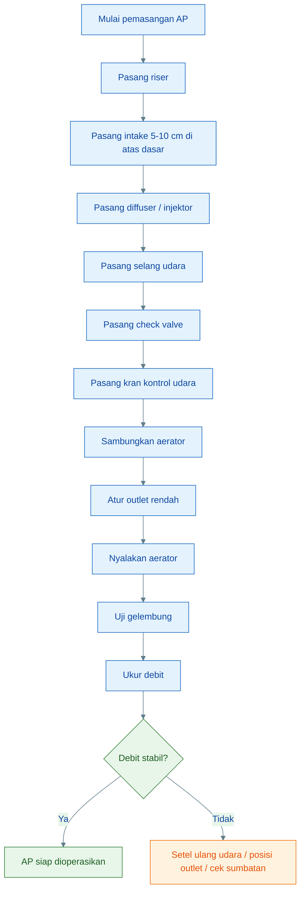

Kesimpulan Bab 11:

> **Pemasangan AP harus mengikuti urutan yang benar: riser, intake, diffuser, selang, check valve, kran kontrol, aerator, outlet, uji gelembung, lalu ukur debit. Posisi akhir harus diperiksa agar AP tidak hanya “terpasang”, tetapi juga benar-benar bekerja baik.**

---

# 12. SOP Operasional Harian dan Mingguan

AP yang sudah terpasang dengan benar tetap bisa turun performanya jika tidak dioperasikan dan dirawat secara rutin. Karena itu, sistem perlu SOP sederhana yang mudah dilakukan praktisi.

Prinsip SOP operasional:

> **Lebih baik pemeriksaan singkat tetapi rutin, daripada menunggu AP lemah baru diperbaiki.**

---

## 12.1 Harian

Pemeriksaan harian fokus pada tanda-tanda cepat bahwa AP masih bekerja normal.

Checklist harian:

- cek aerator menyala,
- cek gelembung di riser,
- cek aliran outlet,
- cek selang tidak terlipat,
- cek suara aerator normal.

### 1. Cek aerator menyala

Pastikan aerator benar-benar aktif. Jangan hanya melihat kabel tersambung. Lihat dan dengarkan apakah aerator bekerja normal.

### 2. Cek gelembung di riser

Gelembung harus:

- muncul stabil,
- tidak terlalu kecil,
- tidak hilang-timbul,
- tidak menunjukkan hambatan berat.

### 3. Cek aliran outlet

Air harus keluar konsisten. Jika hanya menetes, debit mungkin turun.

### 4. Cek selang tidak terlipat

Selang terlipat atau terjepit adalah masalah sederhana tetapi sering terjadi.

### 5. Cek suara aerator normal

Suara aerator yang berubah bisa menandakan:

- hambatan udara,
- diafragma melemah,
- diffuser tersumbat,
- check valve bermasalah.

Diagram SOP harian:

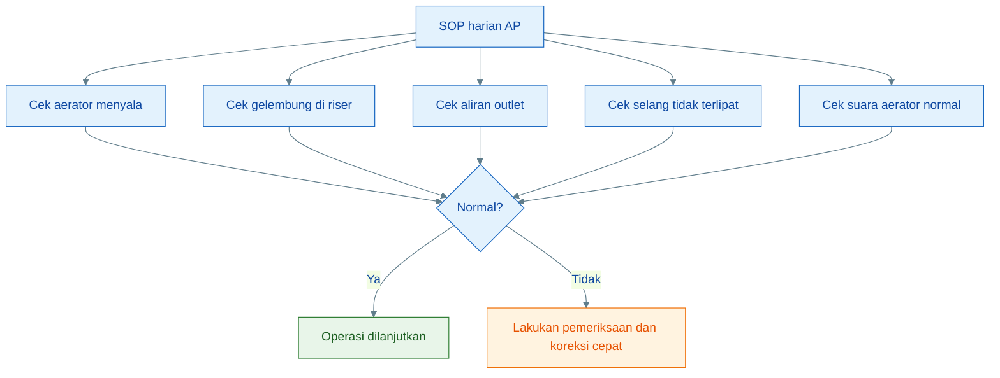

---

## 12.2 Setiap 2–3 hari

Pemeriksaan 2–3 hari sekali lebih fokus pada kebersihan bagian yang mulai terpengaruh oleh biofilm dan partikel.

Checklist:

- cek intake tidak tersumbat,
- cek saringan kasar,
- cek pipa mulai berlendir atau tidak,
- cek endapan sekitar AP.

### Intake tidak tersumbat

Pastikan tidak ada:

- feses besar,
- daun,
- potongan akar,
- benda asing.

### Saringan kasar

Saringan harus tetap terbuka dan tidak tertutup lendir.

### Pipa mulai berlendir atau tidak

Biofilm tipis masih wajar, tetapi jika sudah tebal, debit akan turun.

### Endapan sekitar AP

Jika endapan menumpuk di sekitar intake, AP akan lebih mudah menarik air kotor dan kehilangan efisiensi.

---

## 12.3 Mingguan

Pemeriksaan mingguan fokus pada performa nyata dan perawatan.

Checklist:

- ukur debit aktual,
- bersihkan diffuser bila melemah,
- bersihkan saringan intake,
- cek check valve,
- cek sambungan pipa,
- sikat riser bila perlu.

### Ukur debit aktual

Ini poin paling penting. Jangan hanya mengandalkan perkiraan visual.

### Bersihkan diffuser

Diffuser adalah salah satu titik paling sering mengalami penurunan performa.

### Bersihkan saringan intake

Jika saringan mulai tertutup, debit ikut turun.

### Cek check valve

Pastikan check valve masih satu arah dengan baik dan tidak bocor.

### Cek sambungan pipa

Sambungan longgar bisa menyebabkan kebocoran air atau ketidakstabilan posisi.

### Sikat riser bila perlu

Jika dinding dalam pipa mulai berlendir, diameter efektif berkurang.

Tabel SOP operasional:

| Frekuensi | Yang dicek                                     | Tujuan                        |
| --------- | ---------------------------------------------- | ----------------------------- |
| Harian    | aerator, gelembung, outlet, selang, suara      | deteksi gangguan cepat        |
| 2–3 hari  | intake, screen, lendir, endapan                | jaga kebersihan kerja         |
| Mingguan  | debit, diffuser, check valve, sambungan, riser | jaga performa jangka menengah |

Kesimpulan Bab 12:

> **Operasional AP harus dijaga dengan SOP sederhana: pemeriksaan harian untuk fungsi dasar, pemeriksaan 2–3 harian untuk kebersihan intake dan screen, serta pemeriksaan mingguan untuk debit aktual dan perawatan komponen.**

---

# 13. Troubleshooting Airlift-Pump

Troubleshooting AP harus dilakukan secara sistematis. Jangan langsung mengganti aerator atau membongkar seluruh sistem sebelum memahami gejalanya.

Prinsip troubleshooting:

> **Mulai dari gejala utama, lalu telusuri penyebab paling sederhana terlebih dahulu.**

Empat gejala utama yang paling sering muncul adalah:

1. air tidak naik,
2. debit lemah,
3. air menyembur kasar,
4. air balik ke aerator.

---

## 13.1 Air tidak naik

Ini adalah gejala paling jelas: gelembung mungkin ada, tetapi air tidak benar-benar terangkat, atau outlet tidak mengalir.

Penyebab umum:

- aerator mati,
- selang bocor,
- diffuser tersumbat,
- outlet terlalu tinggi,
- pipa tidak cukup terendam.

### Analisis penyebab

#### Aerator mati

Jika aerator mati, AP otomatis berhenti. Ini penyebab paling sederhana dan harus dicek pertama.

#### Selang bocor

Kebocoran udara pada selang atau sambungan membuat tekanan udara berkurang sebelum mencapai diffuser.

#### Diffuser tersumbat

Udara gagal masuk dengan baik ke riser.

#### Outlet terlalu tinggi

Meskipun udara masuk, AP tidak mampu mengangkat air sampai outlet.

#### Pipa tidak cukup terendam

Kolom gelembung terlalu pendek, sehingga gaya angkat terlalu kecil.

### Tindakan koreksi

1. cek listrik dan aerator,
2. cek selang dan sambungan,
3. bersihkan diffuser,
4. turunkan outlet,
5. perpanjang bagian pipa terendam jika perlu.

---

## 13.2 Debit lemah

Pada kondisi ini, air masih naik, tetapi jumlahnya kecil atau tidak stabil.

Penyebab umum:

- pipa berlendir,
- diffuser kotor,
- udara kurang,
- intake tersumbat,
- head terlalu tinggi.

### Analisis penyebab

#### Pipa berlendir

Lendir di dalam riser memperkecil diameter efektif.

#### Diffuser kotor

Gelembung menjadi lemah dan distribusinya buruk.

#### Udara kurang

Bisa karena aerator melemah, kran terlalu tertutup, atau ada hambatan di jalur udara.

#### Intake tersumbat

Air sulit masuk ke riser.

#### Head terlalu tinggi

Outlet terlalu tinggi atau jalur terlalu berat.

### Tindakan koreksi

1. bersihkan riser,
2. bersihkan diffuser,
3. tambah udara sedikit,
4. bersihkan intake dan screen,
5. turunkan outlet atau pendekkan jalur.

---

## 13.3 Air menyembur kasar

Gejala ini sering disalahartikan sebagai performa bagus. Padahal, air yang terlalu kasar bisa menandakan setting udara tidak efisien.

Penyebab umum:

- udara terlalu besar,
- outlet terlalu sempit,
- riser terlalu kecil.

### Analisis penyebab

#### Udara terlalu besar

Energi udara banyak berubah menjadi turbulensi, bukan pengangkatan air yang efisien.

#### Outlet terlalu sempit

Air keluar tercekik lalu menyembur.

#### Riser terlalu kecil

Campuran air-udara dipaksa lewat jalur yang sempit.

### Tindakan koreksi

1. kecilkan udara dengan kran kontrol,
2. periksa diameter outlet,
3. evaluasi ukuran riser jika masalah menetap.

---

## 13.4 Air balik ke aerator

Ini gejala yang sangat berbahaya karena bisa merusak aerator.

Penyebab umum:

- tidak ada check valve,
- check valve rusak.

### Analisis penyebab

Jika listrik mati atau tekanan udara hilang, air dapat bergerak balik melalui selang. Tanpa check valve, air bisa masuk ke badan aerator.

### Tindakan koreksi

1. pasang check valve jika belum ada,
2. ganti check valve jika bocor,
3. letakkan aerator di posisi lebih aman,
4. cek arah pemasangan check valve.

Prinsip keselamatan:

> **Check valve bukan aksesori tambahan. Ini komponen wajib.**

---

## 13.5 Diagram troubleshooting

```mermaid id="ap-bab13-troubleshooting"
%%{init: {"theme": "base", "themeVariables": {
  "fontFamily": "Arial",
  "primaryColor": "#FFF3E0",
  "primaryTextColor": "#E65100",
  "primaryBorderColor": "#EF6C00",
  "lineColor": "#607D8B"
}}}%%
flowchart TD
    A["Gejala AP"] --> B["Air tidak naik"]
    A --> C["Debit lemah"]
    A --> D["Air menyembur kasar"]
    A --> E["Air balik ke aerator"]

    B --> B1["Cek aerator"]
    B --> B2["Cek selang bocor"]
    B --> B3["Cek diffuser"]
    B --> B4["Cek outlet terlalu tinggi"]
    B --> B5["Cek pipa terendam"]

    C --> C1["Cek pipa berlendir"]
    C --> C2["Cek diffuser kotor"]
    C --> C3["Cek udara kurang"]
    C --> C4["Cek intake tersumbat"]
    C --> C5["Cek head terlalu tinggi"]

    D --> D1["Cek udara terlalu besar"]
    D --> D2["Cek outlet terlalu sempit"]
    D --> D3["Cek riser terlalu kecil"]

    E --> E1["Cek ada check valve?"]
    E --> E2["Cek check valve rusak?"]

    classDef symptom fill:#FFF3E0,stroke:#EF6C00,color:#E65100;
    classDef cause fill:#E3F2FD,stroke:#1565C0,color:#0D47A1;

    class A,B,C,D,E symptom;
    class B1,B2,B3,B4,B5,C1,C2,C3,C4,C5,D1,D2,D3,E1,E2 cause;
```

Kesimpulan Bab 13:

> **Troubleshooting AP harus dimulai dari gejala utama. Air tidak naik biasanya terkait aerator, selang, diffuser, outlet, atau pipa terendam. Debit lemah biasanya terkait lendir, diffuser, udara, intake, atau head. Air menyembur kasar biasanya karena udara berlebihan atau outlet sempit. Air balik ke aerator hampir selalu terkait ketiadaan atau kerusakan check valve.**

[**Kembali ke Atas**](#desain-airlift-pump-untuk-kolam-lele-air-dangkal-50-cm)

---

# 14. Batas dan Kesalahan Umum

Airlift-Pump (AP) adalah alat sederhana dan berguna, tetapi hanya efektif jika dipakai sesuai batasnya. Banyak kegagalan AP terjadi karena alat ini dipaksa melakukan fungsi yang bukan tugasnya.

AP paling tepat dipahami sebagai:

> **alat sirkulasi rendah-head yang memindahkan air dengan bantuan udara.**

Bukan sebagai pompa kuat, bukan filter, dan bukan alat pembuang lumpur otomatis.

---

## 14.1 Batas AP

Ada lima batas utama yang harus dipahami sebelum AP dipakai di lapangan.

### 1. Tidak cocok untuk head tinggi

AP tidak dirancang untuk mengangkat air tinggi. Jika outlet terlalu tinggi, debit akan turun.

Pada kolam air dangkal 50 cm, batas aman desain adalah:

```text
Outlet ideal: < 10–20 cm
Outlet maksimum uji: 20–30 cm
```

Jika outlet dibuat terlalu tinggi, AP bisa terlihat tetap berbuih, tetapi air yang keluar sangat sedikit.

Prinsipnya:

> **Semakin tinggi outlet, semakin kecil debit.**

---

### 2. Tidak menyaring feses

AP memindahkan air, bukan menyaring kotoran. Jika intake menyedot feses, maka feses akan ikut masuk ke pipa dan keluar lagi di outlet.

Akibatnya:

- pipa cepat berlendir,
- diffuser lebih mudah kotor,
- outlet bisa tersumbat,
- air yang dipindahkan membawa beban organik tinggi.

Karena itu, AP tidak boleh dianggap sebagai filter feses.

---

### 3. Tidak menggantikan filter mekanis

Filter mekanis berfungsi memisahkan padatan. AP tidak melakukan pemisahan padatan. AP hanya memindahkan air dari satu titik ke titik lain.

Jika sistem memiliki beban padatan tinggi, tetap diperlukan:

- sifon manual,
- pengendapan,
- saringan kasar,
- filter mekanis sederhana,
- atau pembersihan rutin.

AP boleh membantu sirkulasi, tetapi tidak menggantikan pengelolaan padatan.

---

### 4. Tidak otomatis membuang endapan

AP tidak otomatis membuang endapan dasar. Jika intake diletakkan tepat di dasar untuk menyedot lumpur, maka masalah baru muncul:

- intake cepat tersumbat,
- pipa membawa lumpur,
- debit menurun,
- AP bekerja tidak stabil.

Endapan tetap harus dikelola dengan cara terpisah, misalnya **sifon manual**.

---

### 5. Tidak bekerja jika aerator mati

AP sepenuhnya bergantung pada udara. Jika aerator atau blower mati, AP berhenti.

Artinya:

```text
aerator mati
→ udara berhenti
→ gelembung hilang
→ air tidak terangkat
→ sirkulasi AP berhenti
```

Karena itu, aerator harus diperlakukan sebagai komponen utama, bukan pelengkap.

Diagram batas AP:

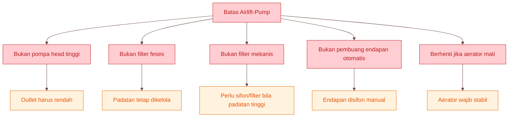

---

## 14.2 Kesalahan umum

Kesalahan umum berikut paling sering membuat AP tidak bekerja optimal.

### 1. Outlet terlalu tinggi

Ini kesalahan paling umum. Praktisi sering ingin mengalirkan air ke titik yang terlalu tinggi, padahal AP tidak cocok untuk head tinggi.

Akibatnya:

- debit turun,
- air keluar tidak stabil,
- aerator bekerja berat,
- AP terlihat aktif tetapi air sedikit.

Solusi:

> **turunkan outlet dan pendekkan jalur air.**

---

### 2. Intake tepat di dasar

Intake yang menyentuh dasar akan menarik feses, lumpur, dan sisa pakan.

Akibatnya:

- pipa cepat kotor,
- saringan mampet,
- debit melemah,
- air yang dipindahkan lebih kotor.

Solusi:

> **posisikan intake 5–10 cm di atas dasar.**

---

### 3. Tidak ada check valve

Tanpa check valve, air bisa balik ke aerator saat listrik mati atau tekanan udara hilang.

Risikonya:

- air masuk ke selang,
- aerator rusak,
- sistem berhenti,
- biaya perbaikan naik.

Solusi:

> **pasang check valve pada selang udara.**

---

### 4. Tidak ada kran kontrol udara

Tanpa kran kontrol, udara tidak bisa disetel. Padahal AP membutuhkan titik udara yang stabil.

Jika udara terlalu kecil, AP lemah.
Jika udara terlalu besar, AP kasar dan boros.

Solusi:

> **pasang kran kontrol udara untuk fine-tuning.**

---

### 5. Diffuser sulit dibersihkan

Diffuser yang sulit dibuka akan menjadi masalah saat tersumbat. AP bisa melemah hanya karena batu aerasi atau lubang injeksi kotor.

Solusi:

> **gunakan diffuser/injektor yang mudah dilepas dan dibersihkan.**

---

### 6. Debit tidak pernah diukur

Ini kesalahan serius. Banyak praktisi hanya melihat gelembung, lalu mengira AP bekerja baik.

Padahal yang penting adalah:

```text
berapa liter air keluar per jam
```

Solusi:

> **ukur debit dengan ember dan stopwatch.**

---

### 7. Pipa dibuat permanen dan sulit dibongkar

AP akan berlendir seiring waktu. Jika pipa dibuat permanen dan sulit dibongkar, perawatan menjadi berat.

Solusi:

> **buat sambungan mudah dibuka, misalnya memakai socket, union, atau desain knock-down.**

Diagram kesalahan umum:

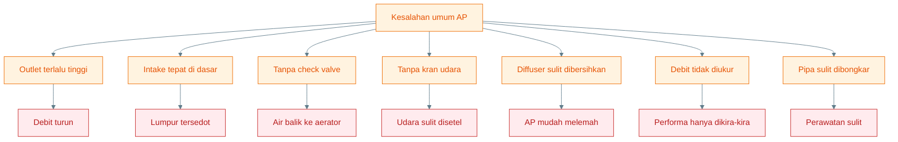

---

## 14.3 Prinsip anti-gagal

Prinsip anti-gagal AP adalah:

> **AP harus mudah dilihat, mudah dibongkar, mudah dibersihkan, dan mudah diukur debitnya.**

Empat kata kunci ini penting.

### 1. Mudah dilihat

Operator harus mudah melihat:

- gelembung,
- aliran outlet,
- posisi intake,
- kondisi selang,
- kondisi aerator.

Jika AP sulit dilihat, gejala kecil terlambat diketahui.

### 2. Mudah dibongkar

Pipa riser, diffuser, dan intake harus bisa dibuka. Jangan membuat AP terlalu permanen.

### 3. Mudah dibersihkan

Komponen yang paling perlu dibersihkan:

- diffuser,
- saringan intake,
- pipa riser,
- outlet.

Jika sulit dibersihkan, performa AP akan turun pelan-pelan.

### 4. Mudah diukur debitnya

Outlet sebaiknya memungkinkan pengukuran debit dengan ember. Jika outlet terlalu sulit diakses, operator akan malas mengukur dan hanya menebak.

Diagram prinsip anti-gagal:

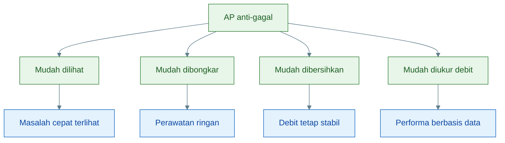

Kesimpulan Bab 14:

> **Airlift-Pump adalah alat sederhana, tetapi tetap punya batas. AP tidak cocok untuk head tinggi, tidak menyaring feses, tidak menggantikan filter mekanis, tidak otomatis membuang endapan, dan berhenti jika aerator mati. Desain yang baik harus mudah dilihat, mudah dibongkar, mudah dibersihkan, dan mudah diukur debitnya.**

[**Kembali ke Atas**](#desain-airlift-pump-untuk-kolam-lele-air-dangkal-50-cm)

---

# 15. Spesifikasi Final yang Direkomendasikan

Bab ini merangkum spesifikasi akhir yang dapat dipakai sebagai acuan praktis untuk membuat AP pada kolam air dangkal 50 cm.

Spesifikasi ini bukan satu-satunya desain yang mungkin, tetapi merupakan desain aman untuk uji awal dan operasi sederhana.

---

## 15.1 Spesifikasi praktis

| Komponen                |           Rekomendasi |
| ----------------------- | --------------------: |
| Kedalaman air           |                 50 cm |
| Pipa riser              |   3/4 inci disarankan |
| Alternatif kecil        |              1/2 inci |
| Pipa terendam           |              35–45 cm |
| Intake                  | 5–10 cm di atas dasar |
| Outlet ideal            |            < 10–20 cm |
| Outlet maksimum uji     |              20–30 cm |
| Debit awal              |         100–250 L/jam |
| Debit lanjut            |         250–400 L/jam |
| Tekanan aerator praktis |         0,06–0,10 bar |
| Check valve             |                 wajib |
| Kran udara              |       disarankan kuat |
| Diffuser                |     mudah dibersihkan |
| Intake screen           |   kasar, mudah dibuka |

### Penjelasan spesifikasi

#### Pipa riser 3/4 inci disarankan

Untuk skala kecil, 1/2 inci bisa dipakai. Namun 3/4 inci lebih aman untuk target debit menengah karena ruang aliran lebih lega.

#### Pipa terendam 35–45 cm

Pada kolam air 50 cm, pipa harus memanfaatkan kedalaman sebanyak mungkin. Ini membantu meningkatkan submergence ratio.

#### Intake 5–10 cm di atas dasar

Posisi ini menghindari feses berat tersedot langsung, tetapi tetap mengambil air dari zona bawah.

#### Outlet ideal < 10–20 cm

Outlet rendah adalah kunci. AP akan jauh lebih stabil bila tinggi angkat kecil.

#### Debit awal 100–250 L/jam

Ini target realistis untuk uji awal dan operasi normal. Debit harus diukur, bukan diasumsikan.

#### Debit lanjut 250–400 L/jam

Ini hanya target lanjut. Untuk mencapainya, AP harus benar-benar stabil, aerator cukup, head rendah, dan jalur air minim hambatan.

#### Tekanan aerator 0,06–0,10 bar

Tekanan teori untuk injeksi 45 cm sekitar 0,044 bar, tetapi praktik memerlukan lebih karena ada rugi-rugi dari selang, diffuser, check valve, dan sambungan.

#### Check valve wajib

Check valve melindungi aerator dari air balik.

#### Kran udara disarankan kuat

Kran udara membantu menyetel titik kerja AP agar tidak terlalu lemah atau terlalu kasar.

#### Diffuser mudah dibersihkan

Diffuser adalah titik kritis. Jika tersumbat, AP melemah.

#### Intake screen kasar

Screen intake harus kasar dan mudah dibuka, bukan halus dan mudah mampet.

---

## 15.2 Desain final ringkas

Desain final aliran udara dan air:

```text
Aerator
→ check valve
→ kran kontrol udara
→ selang udara
→ diffuser bawah riser
→ gelembung naik
→ air terangkat
→ outlet rendah
```

Diagram desain final:

```mermaid id="ap-bab15-desain-final"
%%{init: {"theme": "base", "themeVariables": {
  "fontFamily": "Arial",
  "primaryColor": "#E3F2FD",
  "primaryTextColor": "#0D47A1",
  "primaryBorderColor": "#1565C0",
  "lineColor": "#607D8B"
}}}%%
flowchart TD
    A["Aerator"] --> B["Check valve"]
    B --> C["Kran kontrol udara"]
    C --> D["Selang udara"]
    D --> E["Diffuser bawah riser"]
    E --> F["Gelembung naik"]
    F --> G["Air terangkat"]
    G --> H["Outlet rendah"]

    I["Intake 5-10 cm<br/>di atas dasar"] --> G
    J["Pipa riser 3/4 inci<br/>terendam 35-45 cm"] --> G

    classDef air fill:#E3F2FD,stroke:#1565C0,color:#0D47A1;
    classDef control fill:#FFF3E0,stroke:#EF6C00,color:#E65100;
    classDef lift fill:#E8F5E9,stroke:#2E7D32,color:#1B5E20;

    class A,D,E,F air;
    class B,C control;
    class G,H,I,J lift;
```

Desain final ini harus dibaca sebagai sistem sederhana yang fokus pada:

- udara masuk stabil,
- riser cukup terendam,
- intake tidak menyedot lumpur,
- outlet rendah,
- debit bisa diukur,
- komponen mudah dibersihkan.

---

## 15.3 Kesimpulan spesifikasi

Untuk kolam air dangkal 50 cm, desain paling aman adalah:

> **pipa riser 3/4 inci, terendam 35–45 cm, intake 5–10 cm di atas dasar, outlet serendah mungkin, aerator stabil, check valve wajib, dan debit diukur langsung.**

Rumusan akhir artikel:

> **Airlift-Pump bukan pompa kuat untuk mengangkat air tinggi. AP adalah alat sirkulasi rendah-head yang efektif jika pipa cukup terendam, udara stabil, outlet rendah, intake tidak menyedot lumpur, dan seluruh komponen mudah dirawat.**

Checklist final desain:

```mermaid id="ap-bab15-checklist-final"
%%{init: {"theme": "base", "themeVariables": {
  "fontFamily": "Arial",
  "primaryColor": "#E8F5E9",
  "primaryTextColor": "#1B5E20",
  "primaryBorderColor": "#2E7D32",
  "lineColor": "#607D8B"
}}}%%
flowchart TD
    A["Checklist final AP"] --> B["Riser 3/4 inci"]
    A --> C["Terendam 35-45 cm"]
    A --> D["Intake 5-10 cm di atas dasar"]
    A --> E["Outlet rendah"]
    A --> F["Aerator stabil"]
    A --> G["Check valve wajib"]
    A --> H["Kran udara"]
    A --> I["Diffuser mudah dibersihkan"]
    A --> J["Debit diukur langsung"]

    B --> K["Desain siap diuji"]
    C --> K
    D --> K
    E --> K
    F --> K
    G --> K
    H --> K
    I --> K
    J --> K

    classDef item fill:#E8F5E9,stroke:#2E7D32,color:#1B5E20;
    classDef result fill:#FFF3E0,stroke:#EF6C00,color:#E65100;

    class A,B,C,D,E,F,G,H,I,J item;
    class K result;
```

Penutup:

> **AP yang baik bukan yang gelembungnya paling besar, tetapi yang debitnya stabil, head-nya rendah, udara mudah disetel, pipa mudah dibersihkan, dan performanya bisa diukur.**

[**Kembali ke Atas**](#desain-airlift-pump-untuk-kolam-lele-air-dangkal-50-cm)

---

<small>
  **_Catatan Penyusunan_** Artikel ini disusun sebagai materi edukasi dan
  referensi umum berdasarkan berbagai sumber pustaka, praktik lapangan, serta
  bantuan alat penulisan. Pembaca disarankan untuk melakukan verifikasi lanjutan
  dan penyesuaian sesuai dengan kondisi serta kebutuhan masing-masing sistem.
</small>
