# **_E/P Ratio Pakan Ikan: Antara Efisiensi FCR, Fermentasi Ringan, Bioflok, dan Perbedaan Strategi Lele vs Nila_**

_Mengapa energi–protein tidak boleh dibaca sebagai angka sakti, dan kapan fermentasi pakan benar-benar masuk akal._

---

- [**_E/P Ratio Pakan Ikan: Antara Efisiensi FCR, Fermentasi Ringan, Bioflok, dan Perbedaan Strategi Lele vs Nila_**](#ep-ratio-pakan-ikan-antara-efisiensi-fcr-fermentasi-ringan-bioflok-dan-perbedaan-strategi-lele-vs-nila)
- [E/P Ratio Pakan Ikan: Energi, Protein, FCR, dan Batas Klaim](#ep-ratio-pakan-ikan-energi-protein-fcr-dan-batas-klaim)
  - [Standing Teknis Artikel](#standing-teknis-artikel)
- [1. Fundamental E/P Ratio: Apa dan Mengapa Penting untuk Menurunkan FCR](#1-fundamental-ep-ratio-apa-dan-mengapa-penting-untuk-menurunkan-fcr)
  - [1.1. Definisi E/P Ratio](#11-definisi-ep-ratio)
  - [1.2. Mengapa E/P Penting?](#12-mengapa-ep-penting)
  - [1.3. Hubungan E/P dengan FCR](#13-hubungan-ep-dengan-fcr)
  - [1.4. E/P Terlalu Rendah](#14-ep-terlalu-rendah)
  - [1.5. E/P Terlalu Tinggi](#15-ep-terlalu-tinggi)
  - [1.6. Zona Seimbang: Tempat FCR Biasanya Lebih Baik](#16-zona-seimbang-tempat-fcr-biasanya-lebih-baik)
  - [1.7. Mengapa Gross Energy Bisa Menyesatkan?](#17-mengapa-gross-energy-bisa-menyesatkan)
  - [1.8. E/P dalam Konteks Bioflok](#18-ep-dalam-konteks-bioflok)
  - [1.9. Kesimpulan Bab 1](#19-kesimpulan-bab-1)
- [2. Cara Menghitung E/P dari Label Pakan Komersial](#2-cara-menghitung-ep-dari-label-pakan-komersial)
  - [2.1. Masalah Label Pakan](#21-masalah-label-pakan)
  - [2.2. Alur Praktis Menghitung E/P dari Label](#22-alur-praktis-menghitung-ep-dari-label)
  - [2.3. Rumus NFE](#23-rumus-nfe)
  - [2.4. Estimasi Digestible Energy](#24-estimasi-digestible-energy)
  - [2.5. Menentukan Asumsi Kecernaan](#25-menentukan-asumsi-kecernaan)
  - [2.6. Contoh Perhitungan Lengkap](#26-contoh-perhitungan-lengkap)
  - [2.7. Formula Excel untuk Praktisi](#27-formula-excel-untuk-praktisi)
    - [NFE](#nfe)
    - [Estimasi DE](#estimasi-de)
    - [Protein g/kg](#protein-gkg)
    - [E/P ratio](#ep-ratio)
  - [2.8. Membaca Hasil E/P](#28-membaca-hasil-ep)
  - [2.9. Kesalahan Umum Saat Menghitung E/P](#29-kesalahan-umum-saat-menghitung-ep)
  - [2.10. Hubungan Perhitungan Ini dengan Bioflok](#210-hubungan-perhitungan-ini-dengan-bioflok)
  - [2.11. Kesimpulan Bab 2](#211-kesimpulan-bab-2)
- [3. Contoh Pelet Pasaran dan Estimasi E/P _Before Fermentation_](#3-contoh-pelet-pasaran-dan-estimasi-ep-before-fermentation)
  - [3.1. Contoh Pakan Pasaran](#31-contoh-pakan-pasaran)
  - [3.2. Kenapa Kita Tetap Memakai Model Pelet 30% Protein?](#32-kenapa-kita-tetap-memakai-model-pelet-30-protein)
  - [3.3. Alur Perhitungan E/P dari Contoh Pelet](#33-alur-perhitungan-ep-dari-contoh-pelet)
  - [3.4. Asumsi Digestibilitas Awal](#34-asumsi-digestibilitas-awal)
  - [3.5. Estimasi Digestible Energy](#35-estimasi-digestible-energy)
  - [3.6. Protein per kg Pakan](#36-protein-per-kg-pakan)
  - [3.7. Estimasi E/P _Before Fermentation_](#37-estimasi-ep-before-fermentation)
  - [3.8. Jangan Salah Membaca: 9,4 Bukan Jaminan FCR Rendah](#38-jangan-salah-membaca-94-bukan-jaminan-fcr-rendah)
  - [3.9. Simulasi Sensitivitas: Jika Digestibilitas Berbeda](#39-simulasi-sensitivitas-jika-digestibilitas-berbeda)
    - [Skenario konservatif](#skenario-konservatif)
    - [Skenario optimistis](#skenario-optimistis)
  - [3.10. Membandingkan Model 30% dengan Contoh Label 31–33%](#310-membandingkan-model-30-dengan-contoh-label-3133)
    - [Skenario rendah energi](#skenario-rendah-energi)
    - [Skenario tengah](#skenario-tengah)
    - [Skenario tinggi energi](#skenario-tinggi-energi)
  - [3.11. Makna Praktis untuk Lele Bioflok](#311-makna-praktis-untuk-lele-bioflok)
  - [3.12. Kesimpulan Bab 3](#312-kesimpulan-bab-3)
- [4. Menaikkan E/P Pelet dengan Fermentasi Ringan + Molase + Mikroba](#4-menaikkan-ep-pelet-dengan-fermentasi-ringan--molase--mikroba)
  - [4.1. Standing Kritis: Apa yang Sebenarnya Naik?](#41-standing-kritis-apa-yang-sebenarnya-naik)
  - [4.2. Fermentasi Ringan untuk Pelet Jadi](#42-fermentasi-ringan-untuk-pelet-jadi)
  - [4.3. Mengapa Semi-Anaerob, Bukan Aerob Penuh?](#43-mengapa-semi-anaerob-bukan-aerob-penuh)
  - [4.4. Peran Molase sebagai Karbon Luar](#44-peran-molase-sebagai-karbon-luar)
  - [4.5. Molase: Sumber Karbon atau Beban Oksigen?](#45-molase-sumber-karbon-atau-beban-oksigen)
  - [4.6. Dosis Awal Molase](#46-dosis-awal-molase)
  - [4.7. SOP Fermentasi Ringan Pelet Jadi](#47-sop-fermentasi-ringan-pelet-jadi)
  - [4.8. Diagram Proses Fermentasi Ringan](#48-diagram-proses-fermentasi-ringan)
  - [4.9. E/P _Before–After_ pada Model Pelet 30%](#49-ep-beforeafter-pada-model-pelet-30)
  - [4.10. Simulasi Setelah Fermentasi Ringan](#410-simulasi-setelah-fermentasi-ringan)
    - [Skenario rendah](#skenario-rendah)
    - [Skenario tinggi](#skenario-tinggi)
  - [4.11. Apakah Kenaikan E/P Ini Selalu Baik?](#411-apakah-kenaikan-ep-ini-selalu-baik)
  - [4.12. Risiko Berat Basah: Jangan Salah Hitung Pakan](#412-risiko-berat-basah-jangan-salah-hitung-pakan)
  - [4.13. Kapan Fermentasi Dianggap Berhasil?](#413-kapan-fermentasi-dianggap-berhasil)
  - [4.14. Kesimpulan Bab 4](#414-kesimpulan-bab-4)
- [5. E/P Optimal Lele vs Nila](#5-ep-optimal-lele-vs-nila)
  - [5.1. Prinsip Dasar: E/P Optimal Bukan Satu Angka Universal](#51-prinsip-dasar-ep-optimal-bukan-satu-angka-universal)
  - [5.2. Lele/Catfish: E/P Tidak Perlu Dikejar Terlalu Tinggi](#52-lelecatfish-ep-tidak-perlu-dikejar-terlalu-tinggi)
  - [5.3. Nila: E/P Cenderung Lebih Tinggi](#53-nila-ep-cenderung-lebih-tinggi)
  - [5.4. Perbandingan Zona E/P Lele vs Nila](#54-perbandingan-zona-ep-lele-vs-nila)
  - [5.5. Diagram Perbandingan Praktis](#55-diagram-perbandingan-praktis)
  - [5.6. Mengapa Nila Lebih Toleran terhadap E/P Tinggi?](#56-mengapa-nila-lebih-toleran-terhadap-ep-tinggi)
  - [5.7. Implikasi terhadap Fermentasi Ringan](#57-implikasi-terhadap-fermentasi-ringan)
    - [Untuk lele](#untuk-lele)
    - [Untuk nila](#untuk-nila)
  - [5.8. Risiko Salah Strategi pada Lele](#58-risiko-salah-strategi-pada-lele)
  - [5.9. Strategi Berbeda untuk Lele dan Nila](#59-strategi-berbeda-untuk-lele-dan-nila)
  - [5.10. Kesimpulan Bab 5](#510-kesimpulan-bab-5)
- [6. Mengapa Fermentasi Lebih Masuk Akal untuk Nila daripada Lele](#6-mengapa-fermentasi-lebih-masuk-akal-untuk-nila-daripada-lele)
  - [6.1. Nila Lebih Mampu Memanfaatkan Karbohidrat dan Bahan Nabati](#61-nila-lebih-mampu-memanfaatkan-karbohidrat-dan-bahan-nabati)
  - [6.2. Mengapa Manfaat Fermentasi Lebih “Nyambung” dengan Nila?](#62-mengapa-manfaat-fermentasi-lebih-nyambung-dengan-nila)
  - [6.3. Lele Lebih Ketat: Fermentasi Boleh, tetapi Targetnya Berbeda](#63-lele-lebih-ketat-fermentasi-boleh-tetapi-targetnya-berbeda)
  - [6.4. Risiko Lele Bioflok Bila Pelet Fermentasi Hancur](#64-risiko-lele-bioflok-bila-pelet-fermentasi-hancur)
  - [6.5. Perbandingan Nila vs Lele dalam Menerima Fermentasi](#65-perbandingan-nila-vs-lele-dalam-menerima-fermentasi)
  - [6.6. Implikasi terhadap E/P Ratio](#66-implikasi-terhadap-ep-ratio)
    - [Pada nila](#pada-nila)
    - [Pada lele](#pada-lele)
  - [6.7. Strategi Fermentasi untuk Nila](#67-strategi-fermentasi-untuk-nila)
  - [6.8. Strategi Fermentasi untuk Lele](#68-strategi-fermentasi-untuk-lele)
  - [6.9. Diagram Keputusan Praktis](#69-diagram-keputusan-praktis)
  - [6.10. Kesimpulan Bab 6](#610-kesimpulan-bab-6)
- [7. Strategi Menurunkan FCR dengan Bioflok dan Fermentasi](#7-strategi-menurunkan-fcr-dengan-bioflok-dan-fermentasi)
  - [7.1. Jalur Utama Penurunan FCR](#71-jalur-utama-penurunan-fcr)
  - [7.2. Penurunan FCR Tidak Boleh Mengorbankan Air](#72-penurunan-fcr-tidak-boleh-mengorbankan-air)
  - [7.3. Peran Bioflok dalam Menurunkan FCR](#73-peran-bioflok-dalam-menurunkan-fcr)
  - [7.4. Peran Fermentasi Pakan dalam Menurunkan FCR](#74-peran-fermentasi-pakan-dalam-menurunkan-fcr)
  - [7.5. Strategi pada Lele: Bioflok Stabil Dulu, Baru Uji Fermentasi](#75-strategi-pada-lele-bioflok-stabil-dulu-baru-uji-fermentasi)
  - [7.6. SOP Strategi Lele Bioflok](#76-sop-strategi-lele-bioflok)
  - [7.7. Parameter Keberhasilan Fermentasi pada Lele](#77-parameter-keberhasilan-fermentasi-pada-lele)
  - [7.8. Strategi pada Nila: Bioflok + Pakan Nabati Fermentasi](#78-strategi-pada-nila-bioflok--pakan-nabati-fermentasi)
  - [7.9. SOP Strategi Nila Bioflok + Fermentasi](#79-sop-strategi-nila-bioflok--fermentasi)
  - [7.10. Bioflok Dimakan Ikan: Lele vs Nila](#710-bioflok-dimakan-ikan-lele-vs-nila)
  - [7.11. Hubungan E/P, Bioflok, dan Fermentasi](#711-hubungan-ep-bioflok-dan-fermentasi)
  - [7.12. Rumus Praktis Mengukur Dampak FCR](#712-rumus-praktis-mengukur-dampak-fcr)
  - [7.13. Desain Uji Kecil Sebelum Diterapkan Luas](#713-desain-uji-kecil-sebelum-diterapkan-luas)
    - [Perlakuan minimal](#perlakuan-minimal)
    - [Parameter wajib dicatat](#parameter-wajib-dicatat)
  - [7.14. Kesimpulan Bab 7](#714-kesimpulan-bab-7)
- [8. Pengaruh terhadap HPP: Bioflok vs Bioflok + Fermentasi](#8-pengaruh-terhadap-hpp-bioflok-vs-bioflok--fermentasi)
  - [8.1. Formula HPP Pakan per kg Ikan](#81-formula-hpp-pakan-per-kg-ikan)
  - [8.2. HPP Bioflok Tanpa Fermentasi](#82-hpp-bioflok-tanpa-fermentasi)
  - [8.3. Bioflok + Fermentasi: Tambahan Biaya dan Tambahan Risiko](#83-bioflok--fermentasi-tambahan-biaya-dan-tambahan-risiko)
  - [8.4. Diagram Keputusan HPP Fermentasi](#84-diagram-keputusan-hpp-fermentasi)
  - [8.5. Titik Impas Fermentasi](#85-titik-impas-fermentasi)
  - [8.6. Contoh Simulasi Biaya Fermentasi](#86-contoh-simulasi-biaya-fermentasi)
    - [Tanpa fermentasi](#tanpa-fermentasi)
    - [Dengan fermentasi](#dengan-fermentasi)
  - [8.7. Skenario Sensitivitas FCR](#87-skenario-sensitivitas-fcr)
  - [8.8. Skenario Risiko Kualitas Air](#88-skenario-risiko-kualitas-air)
  - [8.9. HPP Lele: Bioflok vs Bioflok + Fermentasi](#89-hpp-lele-bioflok-vs-bioflok--fermentasi)
  - [8.10. HPP Nila: Bioflok + Fermentasi Lebih Menjanjikan](#810-hpp-nila-bioflok--fermentasi-lebih-menjanjikan)
  - [8.11. Prediksi Realistis Lele vs Nila](#811-prediksi-realistis-lele-vs-nila)
  - [8.12. Checklist Kelayakan Ekonomi Fermentasi](#812-checklist-kelayakan-ekonomi-fermentasi)
  - [8.13. Kesimpulan Bab 8](#813-kesimpulan-bab-8)
- [9. Kerangka Uji Lapangan agar Tidak Tersesat](#9-kerangka-uji-lapangan-agar-tidak-tersesat)
  - [9.1. Tujuan Uji Lapangan](#91-tujuan-uji-lapangan)
  - [9.2. Desain Perlakuan](#92-desain-perlakuan)
  - [9.3. Diagram Desain Uji](#93-diagram-desain-uji)
  - [9.4. Replikasi: Jangan Percaya Satu Kolam Saja](#94-replikasi-jangan-percaya-satu-kolam-saja)
  - [9.5. Durasi Uji](#95-durasi-uji)
  - [9.6. Parameter Ikan](#96-parameter-ikan)
    - [ADG](#adg)
    - [SGR](#sgr)
    - [FCR](#fcr)
    - [Survival](#survival)
    - [Keseragaman](#keseragaman)
  - [9.7. Parameter Air](#97-parameter-air)
  - [9.8. COD/BOD Bila Ada Akses Lab](#98-codbod-bila-ada-akses-lab)
  - [9.9. Format Log Harian](#99-format-log-harian)
  - [9.10. Kriteria Berhasil](#910-kriteria-berhasil)
  - [9.11. Matriks Keputusan](#911-matriks-keputusan)
  - [9.12. Catatan Khusus: Lele vs Nila](#912-catatan-khusus-lele-vs-nila)
    - [Lele](#lele)
    - [Nila](#nila)
  - [9.13. Kesimpulan Bab 9](#913-kesimpulan-bab-9)
- [10. Bagian Kritikal: Batas Klaim Fermentasi](#10-bagian-kritikal-batas-klaim-fermentasi)
  - [10.1. Klaim yang Boleh](#101-klaim-yang-boleh)
  - [10.2. Klaim yang Tidak Boleh](#102-klaim-yang-tidak-boleh)
  - [10.3. Diagram Batas Klaim Fermentasi](#103-diagram-batas-klaim-fermentasi)
  - [10.4. Prinsip Anti-Sesat](#104-prinsip-anti-sesat)
- [11. Rekomendasi Praktis Artikel](#11-rekomendasi-praktis-artikel)
  - [11.1. Untuk Lele Bioflok](#111-untuk-lele-bioflok)
  - [11.2. Batas Praktis Fermentasi untuk Lele](#112-batas-praktis-fermentasi-untuk-lele)
  - [11.3. Untuk Nila Bioflok](#113-untuk-nila-bioflok)
  - [11.4. Beda Strategi: Lele vs Nila](#114-beda-strategi-lele-vs-nila)
  - [11.5. Rekomendasi Teknis Singkat](#115-rekomendasi-teknis-singkat)
    - [Untuk lele bioflok](#untuk-lele-bioflok)
    - [Untuk nila bioflok](#untuk-nila-bioflok)
  - [11.6. Kesimpulan Bab 11](#116-kesimpulan-bab-11)
- [12. Kesimpulan Artikel](#12-kesimpulan-artikel)
  - [12.1. Kesimpulan tentang E/P Ratio](#121-kesimpulan-tentang-ep-ratio)
  - [12.2. Kesimpulan tentang Fermentasi Ringan](#122-kesimpulan-tentang-fermentasi-ringan)
  - [12.3. Kesimpulan tentang Lele vs Nila](#123-kesimpulan-tentang-lele-vs-nila)
  - [12.4. Kesimpulan tentang Bioflok dan HPP](#124-kesimpulan-tentang-bioflok-dan-hpp)
  - [12.5. Diagram Kesimpulan Akhir](#125-diagram-kesimpulan-akhir)
  - [12.6. Penutup untuk Praktisi](#126-penutup-untuk-praktisi)
- [Lampiran A — Rumus E/P dan P/E](#lampiran-a--rumus-ep-dan-pe)
  - [A.1. E/P Ratio](#a1-ep-ratio)
  - [A.2. P/E Ratio](#a2-pe-ratio)
  - [A.3. Konversi P/E ke E/P](#a3-konversi-pe-ke-ep)
  - [A.4. Rumus NFE](#a4-rumus-nfe)
  - [A.5. Estimasi Digestible Energy](#a5-estimasi-digestible-energy)
  - [A.6. Formula Excel](#a6-formula-excel)
- [Lampiran B — Contoh Perhitungan Pelet 30% Protein](#lampiran-b--contoh-perhitungan-pelet-30-protein)
  - [B.1. Komposisi Model](#b1-komposisi-model)
  - [B.2. E/P Sebelum Fermentasi](#b2-ep-sebelum-fermentasi)
  - [B.3. E/P Setelah Fermentasi Ringan](#b3-ep-setelah-fermentasi-ringan)
  - [B.4. Catatan Kritis](#b4-catatan-kritis)
- [Lampiran C — Template HPP Bioflok vs Bioflok + Fermentasi](#lampiran-c--template-hpp-bioflok-vs-bioflok--fermentasi)
  - [C.1. HPP Total](#c1-hpp-total)
  - [C.2. Biaya Pakan per kg Ikan](#c2-biaya-pakan-per-kg-ikan)
  - [C.3. Penghematan dari Penurunan FCR](#c3-penghematan-dari-penurunan-fcr)
  - [C.4. Kelayakan Fermentasi](#c4-kelayakan-fermentasi)
  - [C.5. Template Tabel HPP](#c5-template-tabel-hpp)
- [Lampiran D — SOP Fermentasi Ringan Pelet](#lampiran-d--sop-fermentasi-ringan-pelet)
  - [D.1. Formula Awal](#d1-formula-awal)
  - [D.2. Langkah Kerja](#d2-langkah-kerja)
  - [D.3. Kriteria Lolos](#d3-kriteria-lolos)
  - [D.4. Kriteria Gagal](#d4-kriteria-gagal)
  - [D.5. Diagram SOP Ringkas](#d5-diagram-sop-ringkas)
- [Lampiran E — Saluran Pencernaan Lele vs Nila](#lampiran-e--saluran-pencernaan-lele-vs-nila)
  - [E.1. Ringkasan Perbedaan](#e1-ringkasan-perbedaan)
  - [Lele](#lele-1)
  - [Nila](#nila-1)
  - [E.2. Organ Pencernaan dan Fungsinya](#e2-organ-pencernaan-dan-fungsinya)
  - [E.3. Lokasi Penyerapan Nutrisi Optimal](#e3-lokasi-penyerapan-nutrisi-optimal)
  - [E.4. Perbandingan Saluran Cerna Lele vs Nila](#e4-perbandingan-saluran-cerna-lele-vs-nila)
  - [E.5. Alur Pakan dalam Sistem Pencernaan](#e5-alur-pakan-dalam-sistem-pencernaan)
  - [E.6. Perkiraan Waktu Tinggal Pakan](#e6-perkiraan-waktu-tinggal-pakan)
  - [E.7. Implikasi terhadap Fermentasi](#e7-implikasi-terhadap-fermentasi)
- [Rujukan Utama yang Disarankan](#rujukan-utama-yang-disarankan)

---

# E/P Ratio Pakan Ikan: Energi, Protein, FCR, dan Batas Klaim

## Standing Teknis Artikel

Artikel ini membuka dengan posisi yang tegas:

$$
\boxed{
E/P\ ratio\ penting,\ tetapi\ bukan\ satu\text{-}satunya\ penentu\ FCR.
}
$$

E/P ratio membantu membaca apakah energi dalam pakan cukup untuk menopang metabolisme ikan, sehingga protein tidak terlalu banyak dibakar sebagai energi. Namun E/P tidak boleh dibaca sebagai angka sakti. FCR tetap dipengaruhi oleh kualitas protein, profil asam amino, digestibilitas bahan, ukuran ikan, suhu, DO, kesehatan ikan, manajemen pakan, padat tebar, serta kualitas air.

Yang lebih tepat dianalisis adalah:

$$
\boxed{
\text{digestible energy dibanding digestible protein}
}
$$

bukan hanya:

$$
\boxed{
\text{gross energy dibanding crude protein}
}
$$

Dengan kata lain, yang penting bukan sekadar berapa energi dan protein yang tertulis di label, tetapi berapa bagian dari energi dan protein itu yang benar-benar dapat dicerna dan dimanfaatkan ikan.

Untuk catfish, Mississippi State Extension menyebut rasio **DE/CP 8,5–10 kcal/g protein** cukup untuk pakan komersial catfish. Pada dokumen lain dari institusi yang sama, rasio **DE/DP 10–11 kcal/g protein** disebut optimal untuk pertumbuhan catfish dari advanced fingerlings sampai ukuran pasar. Ini bukan kontradiksi, karena **CP** berarti _crude protein_, sedangkan **DP** berarti _digestible protein_. ([MSU Extension Service][1])

Perbedaan itu sangat penting untuk praktisi. Dua pakan sama-sama bertuliskan protein 30%, tetapi bila pakan pertama proteinnya lebih mudah dicerna daripada pakan kedua, maka nilai biologisnya berbeda. Dalam keputusan budidaya, label pakan hanya pintu masuk; performa lapangan tetap harus dibaca dari FCR, pertumbuhan, mortalitas, TAN, nitrit, DO, flok, dan HPP.

<ResourceBox
  title="Artikel Terkait:"
  items={[
    {
      name: 'Komparasi Ekonomi Budidaya Nila dan Lele pada Kolam Statis, Bioflok, dan RAS Berbasis m² Footprint Lahan',
      href: '/blog/agri/perikanan/komparasi-kolam-statis-bioflok-ras',
    },
    {
      name: 'Bioflok 651: Membedakan Persiapan Media dan Operasi Budidaya',
      href: '/blog/agri/perikanan/bioflok-651',
    },
    {
      name: 'C/N Ratio pada Bioflok: Mengatur Mikroba, Oksigen, dan Stabilitas Kolam untuk Praktisi',
      href: '/blog/agri/perikanan/ratio-cn-rendah-biflok',
    },
    {
      name: 'Fermentasi Protein untuk Pakan Lele: Membuat Hidrolisat Asam Amino yang Aman, Rasional, dan Bernilai Guna',
      href: '/blog/agri/perikanan/fermentasi-protein-untuk-pakan-lele',
    },
    {
      name: 'Menurunkan FCR Lele: Dari Pakan Dimakan sampai Menjadi Daging',
      href: '/blog/agri/perikanan/menurunkan-fcr-lele',
    },
    {
      name: 'Kolam Lele sebagai Bioreaktor Penurun FCR Berbasis Bioflok',
      href: '/blog/agri/perikanan/menurunkan-fcr-lele-bioflok',
    },
    {
      name: 'Fermentasi, Pengomposan, dan Pembusukan: Meluruskan Istilah agar Praktisi Agri Tidak Salah Interpretasi',
      href: '/blog/agri/fermentasi-pengomposan-pembusukan',
    },
  ]}
/>

---

# 1. Fundamental E/P Ratio: Apa dan Mengapa Penting untuk Menurunkan FCR

## 1.1. Definisi E/P Ratio

E/P ratio adalah perbandingan antara energi dan protein dalam pakan.

$$
E/P =
\frac{
Energi
}{
Protein
}
$$

Satuan praktis yang umum dipakai dalam nutrisi ikan:

$$
\boxed{
kcal\ DE/g\ protein
}
$$

Keterangan:

| Istilah | Arti                                 |
| ------- | ------------------------------------ |
| $E$     | energi pakan                         |
| $P$     | protein pakan                        |
| $DE$    | digestible energy, energi tercerna   |
| $CP$    | crude protein, protein kasar         |
| $DP$    | digestible protein, protein tercerna |

Secara teknis, ada dua cara membaca E/P:

$$
E/P_{CP} =
\frac{
DE
}{
Crude\ Protein
}
$$

dan:

$$
E/P_{DP} =
\frac{
DE
}{
Digestible\ Protein
}
$$

Keduanya tidak sama.

Misalnya sebuah pakan memiliki:

$$
DE = 3000\ kcal/kg
$$

$$
CP = 30\% = 300\ g/kg
$$

Maka:

$$
E/P_{CP} = \frac{3000}{300} = 10\ kcal/g\ CP
$$

Tetapi bila protein tercernanya hanya 85% dari CP:

$$
DP = 300 \times 0{,}85 = 255\ g/kg
$$

Maka:

$$
E/P_{DP} = \frac{3000}{255} = 11{,}76\ kcal/g\ DP
$$

Jadi:

$$
\boxed{
E/P_{CP} \neq E/P_{DP}
}
$$

Inilah mengapa angka **8,5–10 DE/CP** dan **10–11 DE/DP** bisa sama-sama masuk akal. Penyebutnya berbeda: satu memakai protein kasar, satu memakai protein tercerna.

---

## 1.2. Mengapa E/P Penting?

Prinsip nutrisinya sederhana:

$$
\boxed{
energi\ sebaiknya\ dari\ karbohidrat\ dan\ lemak
}
$$

$$
\boxed{
protein\ sebaiknya\ untuk\ pertumbuhan
}
$$

Protein adalah komponen mahal dalam pakan. Jika energi dari karbohidrat dan lemak tidak cukup, ikan akan memakai sebagian protein sebagai energi. Itu tidak efisien.

Secara sederhana:

$$
Protein
\rightarrow
Asam\ amino
\rightarrow
Pertumbuhan
$$

Tetapi jika energi non-protein kurang:

$$
Protein
\rightarrow
Energi + NH_3
$$

Akibatnya:

$$
\boxed{
FCR\ naik
}
$$

$$
\boxed{
TAN\ naik
}
$$

$$
\boxed{
biaya\ pakan\ per\ kg\ ikan\ naik
}
$$

National Research Council/National Academies menekankan bahwa nitrogen limbah dapat diturunkan dengan formulasi keseimbangan asam amino dan rasio digestible energy-to-protein yang tepat, sehingga katabolisme asam amino dapat diminimalkan. Artinya, protein yang tidak dipakai untuk pertumbuhan akan lebih banyak menjadi limbah nitrogen. ([National Academies][2])

Dalam konteks bioflok, ini menjadi lebih penting. Protein yang boros tidak hanya merugikan biaya pakan, tetapi juga memperberat sistem air:

$$
Protein\ boros
\Rightarrow
N\ limbah\ naik
\Rightarrow
TAN\ naik
\Rightarrow
NO_2^- \text{ berisiko naik}
$$

---

## 1.3. Hubungan E/P dengan FCR

FCR adalah ukuran efisiensi pakan:

$$
FCR =
\frac{
Pakan\ yang\ diberikan
}{
Pertambahan\ bobot\ ikan
}
$$

Semakin rendah FCR, semakin efisien pakan dikonversi menjadi bobot ikan. Mississippi Agricultural and Forestry Experiment Station menjelaskan FCR sebagai jumlah pakan yang diberikan per satuan pertambahan bobot; semakin rendah nilainya, semakin baik efisiensi pakan. ([MS Agricultural Experiment Station][3])

Contoh:

Jika ikan membutuhkan 1,2 kg pakan untuk menghasilkan 1 kg pertambahan bobot:

$$
FCR = 1{,}2
$$

Jika membutuhkan 1,5 kg pakan:

$$
FCR = 1{,}5
$$

Maka pakan pertama lebih efisien.

Dalam biaya:

$$
Biaya\ pakan/kg\ ikan =
FCR \times Harga\ pakan/kg
$$

Jika harga pakan:

$$
Rp12.000/kg
$$

dan FCR:

$$
1{,}2
$$

maka:

$$
Biaya\ pakan/kg\ ikan = 1{,}2 \times 12.000 = Rp14.400
$$

Jika FCR naik menjadi:

$$
1{,}5
$$

maka:

$$
Biaya\ pakan/kg\ ikan = 1{,}5 \times 12.000 = Rp18.000
$$

Selisih:

$$
Rp18.000 - Rp14.400 =
Rp3.600/kg\ ikan
$$

Jadi FCR bukan angka teknis kecil. FCR langsung menentukan HPP.

---

## 1.4. E/P Terlalu Rendah

E/P terlalu rendah berarti energi dalam pakan tidak cukup dibanding proteinnya.

$$
\boxed{
E/P\ rendah = energi\ kurang\ relatif\ terhadap\ protein
}
$$

Akibatnya:

$$
\boxed{
protein\ mahal\ dibakar\ menjadi\ energi
}
$$

Secara biologis:

$$
Asam\ amino
\rightarrow
deaminasi
\rightarrow
energi + NH_3
$$

Dampak praktis:

| Dampak                    | Penjelasan                           |
| ------------------------- | ------------------------------------ |
| FCR naik                  | Protein tidak efisien menjadi daging |
| TAN naik                  | Nitrogen dari protein keluar ke air  |
| Biaya pakan naik          | Protein adalah komponen mahal        |
| Bioflok lebih berat       | Beban nitrogen dan oksigen naik      |
| Pertumbuhan tidak optimal | Energi metabolik kurang seimbang     |

Dalam bioflok, kondisi ini berbahaya karena sistem harus menangani limbah nitrogen lebih besar.

$$
E/P\ rendah
\Rightarrow
protein\ dibakar
\Rightarrow
TAN\ naik
\Rightarrow
aerasi,\ alkalinitas,\ dan\ mikroba\ bekerja\ lebih\ berat
$$

---

## 1.5. E/P Terlalu Tinggi

E/P terlalu tinggi berarti energi terlalu besar dibanding protein.

$$
\boxed{
E/P\ tinggi = energi\ berlebih\ relatif\ terhadap\ protein
}
$$

Risikonya:

$$
\boxed{
ikan\ cepat\ kenyang\ energi\ sebelum\ cukup\ protein/asam\ amino
}
$$

Dampak praktis:

| Dampak                             | Penjelasan                                 |
| ---------------------------------- | ------------------------------------------ |
| Pertumbuhan protein tidak maksimal | Protein/asam amino menjadi pembatas        |
| Lemak tubuh naik                   | Energi berlebih disimpan sebagai lemak     |
| FCR bisa memburuk                  | Pakan tidak efisien menjadi daging         |
| Kualitas panen turun               | Lemak visceral atau lemak daging bisa naik |
| Konsumsi pakan turun               | Ikan merasa cukup energi                   |

Mississippi State Extension menjelaskan bahwa rasio DE/DP di atas kisaran optimal pada catfish dapat menyebabkan peningkatan deposisi lemak dan penurunan yield olahan, sementara rasio terlalu rendah membuat protein mahal dipakai sebagai energi. ([MSU Extension Service][4])

Jadi targetnya bukan E/P setinggi mungkin.

Targetnya adalah:

$$
\boxed{
E/P\ seimbang
}
$$

---

## 1.6. Zona Seimbang: Tempat FCR Biasanya Lebih Baik

FCR terbaik biasanya muncul pada zona tengah:

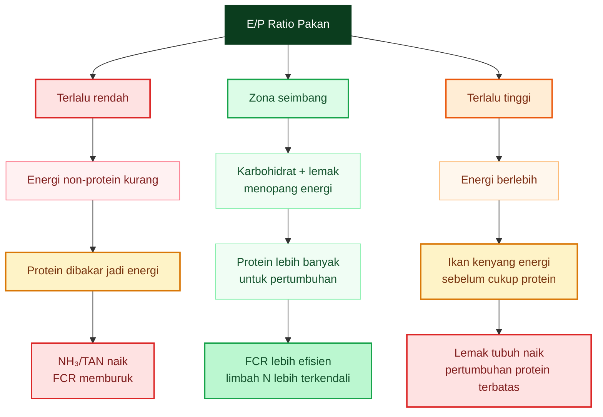

Intinya:

$$
\boxed{
FCR\ terbaik\ bukan\ pada\ protein\ tertinggi
}
$$

dan juga bukan pada:

$$
\boxed{
energi\ tertinggi
}
$$

melainkan pada:

$$
\boxed{
protein\ cukup + energi\ cukup + asam\ amino\ baik + digestibilitas\ tinggi
}
$$

---

## 1.7. Mengapa Gross Energy Bisa Menyesatkan?

Gross energy adalah energi total bahan jika dibakar sempurna. Masalahnya, ikan tidak selalu bisa mencerna seluruh energi itu.

Secara bertingkat:

$$
GE \rightarrow DE \rightarrow ME \rightarrow NE
$$

Keterangan:

| Istilah | Makna                                            |
| ------- | ------------------------------------------------ |
| $GE$    | gross energy, energi total                       |
| $DE$    | digestible energy, energi tercerna               |
| $ME$    | metabolizable energy, energi termetabolisme      |
| $NE$    | net energy, energi bersih untuk hidup dan tumbuh |

Untuk praktisi, minimal yang perlu dipahami:

$$
\boxed{
GE\ tinggi\ belum\ tentu\ DE\ tinggi
}
$$

Contoh:

Pakan tinggi serat bisa punya energi total, tetapi sebagian tidak tercerna. Pakan dengan protein rendah mutu juga bisa terlihat tinggi protein kasar, tetapi asam aminonya tidak seimbang atau digestibilitasnya buruk.

Karena itu:

$$
\boxed{
E/P\ berbasis\ DE\ lebih\ berguna\ daripada\ E/P\ berbasis\ GE
}
$$

dan:

$$
\boxed{
E/P_{DP}\ lebih\ tajam\ daripada\ E/P_{CP}
}
$$

Namun dalam praktik lapangan, data DE dan DP jarang tertulis di karung pakan. Maka artikel ini akan memakai dua pendekatan:

1. **Pendekatan estimasi** dari label proksimat.
2. **Validasi lapangan** melalui FCR, kualitas air, dan performa ikan.

---

## 1.8. E/P dalam Konteks Bioflok

Dalam bioflok, E/P tidak hanya memengaruhi ikan, tetapi juga memengaruhi air.

Jika E/P buruk dan protein banyak terbuang:

$$
N\ limbah \uparrow
$$

lalu:

$$
TAN \uparrow
$$

kemudian:

$$
NO_2^- \text{ bisa naik}
$$

Jika pakan terlalu banyak karbohidrat mudah larut atau pellet hancur:

$$
COD/BOD \uparrow
$$

lalu:

$$
DO \downarrow
$$

dan:

$$
flok\ bisa\ terlalu\ pekat
$$

Jadi pada bioflok, pakan harus dibaca dari dua sisi:

$$
\boxed{
pakan\ sebagai\ nutrisi\ ikan
}
$$

dan:

$$
\boxed{
pakan\ sebagai\ beban\ air
}
$$

Diagram sederhananya:

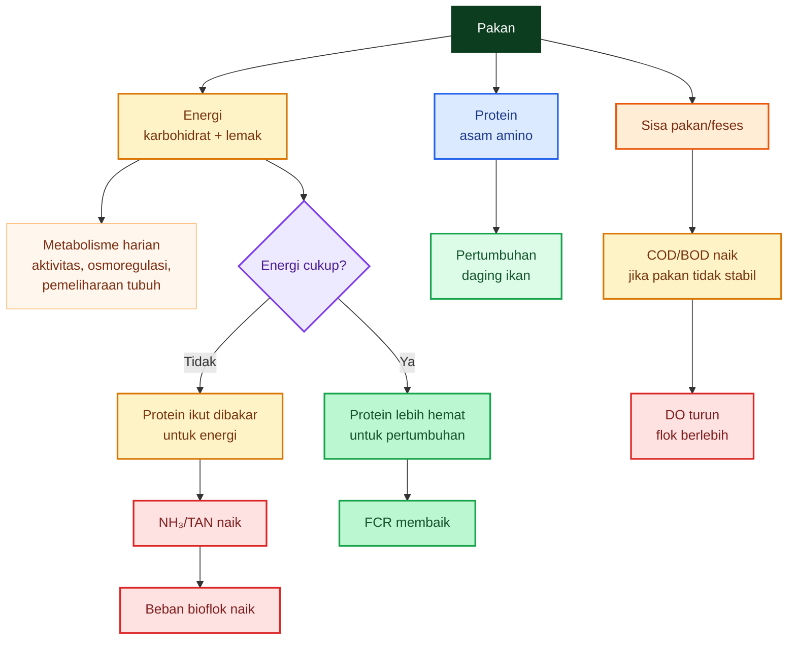

Maka dalam bioflok, FCR yang baik harus dicapai tanpa membuat air menjadi berat.

Kriteria praktisnya:

$$
\boxed{
FCR\ turun
}
$$

tetapi juga:

$$
\boxed{
DO\ stabil
}
$$

$$
\boxed{
TAN\ rendah
}
$$

$$
\boxed{
NO_2^-\ terkendali
}
$$

$$
\boxed{
flok\ tidak\ berlebihan
}
$$

$$
\boxed{
busa\ dan\ bau\ tidak\ memburuk
}
$$

---

## 1.9. Kesimpulan Bab 1

Bab ini harus menutup dengan prinsip praktis yang tegas:

$$
\boxed{
E/P\ ratio\ adalah\ alat\ membaca\ keseimbangan\ energi\text{-}protein,\ bukan\ angka\ sakti.
}
$$

$$
\boxed{
protein\ yang\ baik\ harus\ didukung\ energi\ non\text{-}protein\ yang\ cukup.
}
$$

$$
\boxed{
energi\ terlalu\ rendah\ membuat\ protein\ dibakar;\ energi\ terlalu\ tinggi\ membuat\ ikan\ kenyang\ sebelum\ cukup\ protein.
}
$$

Untuk catfish, perbedaan angka **DE/CP 8,5–10** dan **DE/DP 10–11** harus dibaca dengan benar: CP adalah protein kasar, sedangkan DP adalah protein tercerna. Maka analisis yang lebih kuat bukan sekadar membaca angka protein di label, tetapi memperkirakan digestibilitas dan membuktikannya di kolam melalui FCR dan kualitas air. ([MSU Extension Service][1])

Kalimat kunci untuk praktisi:

> **Pakan terbaik bukan yang proteinnya paling tinggi, tetapi yang menghasilkan pertumbuhan cepat, FCR rendah, limbah nitrogen rendah, DO stabil, dan HPP lebih rendah.**

[1]: https://extension.msstate.edu/agriculture/catfish/catfish-feeds-and-feeding?utm_source=chatgpt.com 'Catfish Feeds and Feeding'
[2]: https://nap.nationalacademies.org/resource/13039/Fish-Shrimp-Report-Brief-Final.pdf?utm_source=chatgpt.com 'Nutrient Requirements of Fish and Shrimp'
[3]: https://www.mafes.msstate.edu/publications/bulletins/b1230.pdf 'A Practical Guide to Nutrition, Feeds, and Feeding of Catfish (Third Revision), Mississippi Agricultural and Forestry Experiment Station Bulletin 1230'
[4]: https://extension.msstate.edu/agriculture/catfish/nutrition-feeds-and-feeding 'Nutrition, Feeds, and Feeding | Mississippi State University Extension Service'

[**Kembali ke Atas**](#ep-ratio-pakan-ikan-antara-efisiensi-fcr-fermentasi-ringan-bioflok-dan-perbedaan-strategi-lele-vs-nila)

---

# 2. Cara Menghitung E/P dari Label Pakan Komersial

Mayoritas praktisi membeli pakan dari informasi yang tersedia di karung: protein, lemak, serat, abu, dan kadar air. Masalahnya, untuk menghitung **E/P ratio** secara lebih kuat, data yang benar-benar dibutuhkan adalah **digestible energy** dan **digestible protein**. Dua angka ini hampir tidak pernah dicantumkan pada label pakan komersial.

Maka bab ini memakai pendekatan praktis:

$$
\boxed{
\text{label pakan} \rightarrow \text{estimasi NFE} \rightarrow \text{estimasi DE} \rightarrow \text{estimasi E/P}
}
$$

Namun sejak awal harus tegas:

$$
\boxed{
\text{hasilnya adalah estimasi kerja, bukan nilai laboratorium.}
}
$$

FAO menjelaskan bahwa analisis proksimat pakan mencakup moisture, crude protein, lipid, crude fibre, ash, dan digestible carbohydrate; tetapi komposisi proksimat hanya indeks umum nilai nutrisi, bukan ukuran langsung spesifik semua nutrien yang dapat dimanfaatkan ikan. FAO juga mendefinisikan NFE sebagai ukuran tidak langsung karbohidrat potensial yang diperoleh dengan mengurangkan total moisture, crude protein, lipid, crude fibre, dan ash dari 100.

---

## 2.1. Masalah Label Pakan

Label pakan biasanya hanya mencantumkan:

| Komponen label     | Biasanya tersedia? | Catatan                             |
| ------------------ | -----------------: | ----------------------------------- |
| Protein kasar      |                Ada | Biasanya minimum                    |
| Lemak kasar        |                Ada | Biasanya minimum                    |
| Serat kasar        |                Ada | Biasanya maksimum                   |
| Abu                |         Kadang ada | Umumnya maksimum                    |
| Kadar air          |         Kadang ada | Umumnya maksimum                    |
| Digestible energy  |             Jarang | Padahal penting untuk E/P           |
| Digestible protein |             Jarang | Lebih kuat daripada crude protein   |
| Profil asam amino  |      Sangat jarang | Padahal menentukan kualitas protein |
| E/P atau P/E       |   Hampir tidak ada | Praktisi harus estimasi sendiri     |

Masalah utamanya: **protein kasar tidak sama dengan protein yang tercerna**, dan energi total tidak sama dengan energi yang benar-benar tersedia bagi ikan.

Misalnya dua pakan sama-sama tertulis:

$$
Protein = 30\%
$$

Tetapi pakan A memakai bahan protein yang mudah dicerna, sedangkan pakan B memakai bahan lebih berserat atau asam aminonya kurang seimbang. Di label, keduanya terlihat sama. Di kolam, hasilnya bisa berbeda:

$$
FCR_A < FCR_B
$$

$$
TAN_A < TAN_B
$$

$$
Pertumbuhan_A > Pertumbuhan_B
$$

Karena itu, label pakan harus dipakai sebagai **titik awal analisis**, bukan keputusan akhir.

---

## 2.2. Alur Praktis Menghitung E/P dari Label

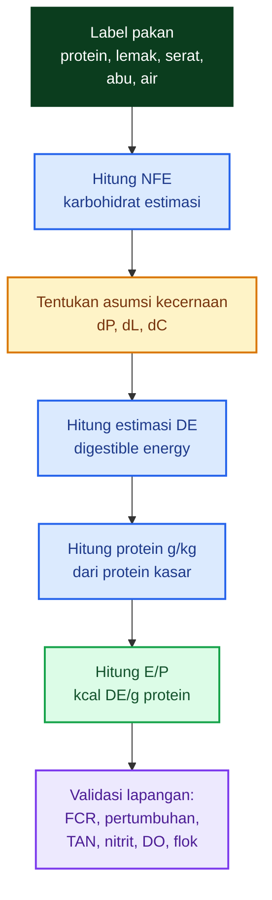

Alur ini penting karena E/P tidak boleh berhenti di spreadsheet. Angka E/P harus diuji di kolam melalui:

$$
FCR,\ ADG,\ SGR,\ survival,\ TAN,\ NO_2^-,\ DO,\ flok,\ dan\ HPP
$$

---

## 2.3. Rumus NFE

NFE adalah **Nitrogen-Free Extract**, yaitu pendekatan kasar untuk karbohidrat mudah larut atau karbohidrat non-serat.

$$
\boxed{
NFE =
100 - Protein - Lemak - Serat - Abu - Air
}
$$

Keterangan:

| Komponen | Satuan |
| -------- | -----: |
| Protein  |      % |
| Lemak    |      % |
| Serat    |      % |
| Abu      |      % |
| Air      |      % |
| NFE      |      % |

Contoh label:

| Komponen | Nilai |
| -------- | ----: |
| Protein  |   30% |
| Lemak    |    5% |
| Serat    |    6% |
| Abu      |   10% |
| Air      |   10% |

Maka:

$$
NFE =
100 - 30 - 5 - 6 - 10 - 10
$$

$$
\boxed{
NFE = 39\%
}
$$

Makna praktisnya:

$$
\boxed{
NFE \approx karbohidrat\ non\text{-}serat
}
$$

Namun perlu hati-hati: NFE bukan hasil ukur langsung pati atau gula. NFE adalah angka sisa dari analisis proksimat, sehingga kesalahan pada protein, lemak, serat, abu, atau air akan terbawa ke NFE.

---

## 2.4. Estimasi Digestible Energy

Rumus kerja:

$$
\boxed{
DE =
56{,}5P d_P
+
94{,}5L d_L
+
41NFE d_C
}
$$

**Catatan koreksi penting:** tanda operasi pada rumus di atas adalah **plus**, bukan minus. Protein, lemak, dan NFE semuanya menyumbang energi. Yang membedakan adalah faktor kecernaannya.

Keterangan:

| Simbol | Makna                        |
| ------ | ---------------------------- |
| $P$    | protein kasar, %             |
| $L$    | lemak kasar, %               |
| $NFE$  | karbohidrat/NFE, %           |
| $d_P$  | asumsi kecernaan protein     |
| $d_L$  | asumsi kecernaan lemak       |
| $d_C$  | asumsi kecernaan karbohidrat |

Angka koefisien berasal dari pendekatan energi kasar:

| Nutrien         | Energi kasar | Jika komponen dalam % menjadi |
| --------------- | -----------: | ----------------------------: |
| Protein         | ±5,65 kcal/g |             $56{,}5 \times P$ |
| Lemak           | ±9,45 kcal/g |             $94{,}5 \times L$ |
| Karbohidrat/NFE | ±4,10 kcal/g |               $41 \times NFE$ |

Karena kita ingin mendekati **digestible energy**, maka masing-masing komponen dikalikan asumsi kecernaan.

---

## 2.5. Menentukan Asumsi Kecernaan

Dalam praktik, angka kecernaan tidak diketahui dari label. Maka kita memakai asumsi.

Untuk model awal pakan komersial yang cukup baik:

| Komponen        | Simbol | Asumsi konservatif |
| --------------- | ------ | -----------------: |
| Protein         | $d_P$  |          0,80–0,88 |
| Lemak           | $d_L$  |          0,85–0,95 |
| Karbohidrat/NFE | $d_C$  |          0,50–0,70 |

Untuk model kerja standar dalam artikel ini, dapat dipakai:

$$
d_P = 0{,}85
$$

$$
d_L = 0{,}90
$$

$$
d_C = 0{,}60
$$

Nilai ini bukan hukum mutlak. Kecernaan karbohidrat, misalnya, sangat dipengaruhi oleh spesies ikan, proses ekstrusi pakan, bahan baku, ukuran ikan, dan suhu. FAO menyebut langkah pertama dalam formulasi pakan adalah menyeimbangkan protein kasar dan energi, lalu memeriksa asam amino esensial agar kebutuhan ikan tetap terpenuhi; setelah substitusi bahan, tingkat protein dan energi harus dicek ulang. ([FAOHome][1])

---

## 2.6. Contoh Perhitungan Lengkap

Gunakan contoh pakan:

| Komponen | Nilai |
| -------- | ----: |
| Protein  |   30% |
| Lemak    |    5% |
| Serat    |    6% |
| Abu      |   10% |
| Air      |   10% |

Hitung NFE:

$$
NFE =
100 - 30 - 5 - 6 - 10 - 10
$$

$$
NFE = 39\%
$$

Asumsi kecernaan:

$$
d_P = 0{,}85
$$

$$
d_L = 0{,}90
$$

$$
d_C = 0{,}60
$$

Hitung DE:

$$
DE =
56{,}5(30)(0{,}85)
+
94{,}5(5)(0{,}90)
+
41(39)(0{,}60)
$$

Bagian protein:

$$
56{,}5 \times 30 \times 0{,}85 = 1440{,}75
$$

Bagian lemak:

$$
94{,}5 \times 5 \times 0{,}90 = 425{,}25
$$

Bagian NFE:

$$
41 \times 39 \times 0{,}60 = 959{,}4
$$

Total:

$$
DE =
1440{,}75 + 425{,}25 + 959{,}4
$$

$$
\boxed{
DE \approx 2825\ kcal/kg
}
$$

Protein per kg pakan:

$$
Protein =
30\% \times 1000
$$

$$
\boxed{
Protein = 300\ g/kg
}
$$

Maka E/P:

$$
E/P =
\frac{
2825
}{
300
}
$$

$$
\boxed{
E/P \approx 9{,}42\ kcal\ DE/g\ protein
}
$$

Angka ini masuk akal untuk contoh pakan catfish/lele. Mississippi State Extension menyebut rasio DE/CP **8,5–10 kcal/g protein** memadai untuk pakan komersial catfish, sedangkan rasio di atas kisaran itu bisa meningkatkan deposisi lemak dan rasio terlalu rendah dapat memperlambat pertumbuhan. ([MSU Extension Service][2])

---

## 2.7. Formula Excel untuk Praktisi

Jika data label ada di sel berikut:

| Parameter   | Cell |
| ----------- | ---: |
| Protein (%) |   B2 |
| Lemak (%)   |   B3 |
| Serat (%)   |   B4 |
| Abu (%)     |   B5 |
| Air (%)     |   B6 |
| $d_P$       |   B8 |
| $d_L$       |   B9 |
| $d_C$       |  B10 |

### NFE

```excel
=100-B2-B3-B4-B5-B6
```

Misal hasil NFE diletakkan di B7.

### Estimasi DE

```excel
=56,5*B2*B8 + 94,5*B3*B9 + 41*B7*B10
```

### Protein g/kg

```excel
=B2*10
```

Karena:

$$
1\% = 10\ g/kg
$$

### E/P ratio

Jika DE ada di B11 dan protein g/kg ada di B12:

```excel
=B11/B12
```

Hasil satuan:

$$
kcal\ DE/g\ protein
$$

---

## 2.8. Membaca Hasil E/P

Untuk pakan catfish/lele grow-out, pembacaan kasar:

|            E/P | Pembacaan praktis                                            |
| -------------: | ------------------------------------------------------------ |
|          &lt;8 | Energi relatif kurang; protein berisiko dibakar untuk energi |
|         8,5–10 | Umumnya masuk zona kerja catfish komersial                   |
|         &gt;10 | Mulai perlu hati-hati; energi relatif tinggi                 |
| Terlalu tinggi | Risiko deposisi lemak dan konsumsi protein/asam amino kurang |

Namun ini bukan aturan tunggal. Mississippi State juga menyebut dokumen lain dengan dasar **DE/DP** bahwa rasio **10–11 kcal/g digestible protein** optimal untuk catfish dari advanced fingerlings sampai ukuran pasar; rasio di atasnya dapat meningkatkan lemak dan menurunkan yield, sedangkan rasio terlalu rendah membuat protein mahal dipakai sebagai energi. ([MSU Extension Service][3])

Maka praktisi harus selalu bertanya:

$$
\boxed{
E/P\ ini\ berbasis\ CP\ atau\ DP?
}
$$

Jika memakai **CP**, angka biasanya lebih rendah. Jika memakai **DP**, angka akan terlihat lebih tinggi karena penyebutnya adalah protein yang tercerna saja.

---

## 2.9. Kesalahan Umum Saat Menghitung E/P

| Kesalahan                                              | Dampak                                                       |
| ------------------------------------------------------ | ------------------------------------------------------------ |
| Menggunakan gross energy seolah-olah digestible energy | E/P terlihat terlalu optimistis                              |
| Menganggap protein kasar = protein tercerna            | Kualitas protein bisa salah dibaca                           |
| Tidak menghitung NFE                                   | Sumber energi karbohidrat tidak terlihat                     |
| Mengabaikan serat                                      | Pakan tinggi serat bisa tampak murah tetapi kecernaan rendah |
| Mengabaikan air                                        | Pakan basah terlihat banyak, tetapi nutrien per kg turun     |
| Mengabaikan asam amino                                 | Protein tinggi belum tentu protein berkualitas               |
| Tidak memvalidasi dengan FCR                           | Angka spreadsheet tidak diuji di kolam                       |

FAO menekankan bahwa komposisi proksimat hanya indeks umum nilai nutrisi dan tidak menjelaskan nutrien spesifik secara lengkap, termasuk kualitas asam amino dan ketersediaan biologis.

---

## 2.10. Hubungan Perhitungan Ini dengan Bioflok

Dalam bioflok, menghitung E/P dari label tidak hanya untuk memilih pakan, tetapi juga untuk memperkirakan beban air.

Jika E/P rendah:

$$
protein\ dibakar \rightarrow NH_3/TAN naik
$$

Jika pakan tinggi karbohidrat mudah larut atau pellet hancur:

$$
COD/BOD naik \rightarrow DO turun
$$

Maka pakan yang terlihat bagus di label tetap harus diuji pada:

| Parameter | Mengapa penting                |
| --------- | ------------------------------ |
| FCR       | Bukti efisiensi pakan          |
| ADG/SGR   | Bukti pertumbuhan              |
| TAN       | Bukti nitrogen limbah          |
| Nitrit    | Risiko transisi nitrifikasi    |
| DO        | Beban oksigen ikan dan mikroba |
| Flok      | Akumulasi mikroba dan padatan  |
| Busa/bau  | Indikator organik berlebih     |
| HPP       | Bukti ekonomi akhir            |

Dalam bioflok, pakan terbaik bukan hanya yang E/P-nya masuk zona, tetapi yang menghasilkan:

$$
\boxed{
FCR\ rendah + TAN\ terkendali + DO\ stabil + flok\ tidak\ berlebihan
}
$$

---

## 2.11. Kesimpulan Bab 2

Menghitung E/P dari label pakan komersial bisa dilakukan, tetapi harus jujur terhadap keterbatasannya.

Rumus intinya:

$$
\boxed{
NFE =
100 - Protein - Lemak - Serat - Abu - Air
}
$$

$$
\boxed{
DE =
56{,}5P d_P
+
94{,}5L d_L
+
41NFE d_C
}
$$

$$
\boxed{
E/P =
\frac{
DE
}{
Protein\ g/kg
}
}
$$

Tetapi hasilnya hanya **estimasi kerja**. Nilai final tetap harus divalidasi oleh performa lapangan.

Kalimat praktisnya:

> **Label pakan memberi angka awal. Kolam memberi kebenaran akhir.**

[**Kembali ke Atas**](#ep-ratio-pakan-ikan-antara-efisiensi-fcr-fermentasi-ringan-bioflok-dan-perbedaan-strategi-lele-vs-nila)

[1]: https://www.fao.org/4/x5738e/x5738e0g.htm 'Chapter 15. Fish Feed Formulation'
[2]: https://extension.msstate.edu/agriculture/catfish/catfish-feeds-and-feeding?utm_source=chatgpt.com 'Catfish Feeds and Feeding'
[3]: https://extension.msstate.edu/agriculture/catfish/nutrition-feeds-and-feeding?utm_source=chatgpt.com 'Nutrition, Feeds, and Feeding'

---

# 3. Contoh Pelet Pasaran dan Estimasi E/P _Before Fermentation_

Bab ini memakai contoh pelet pasaran sebagai **latihan membaca label**, bukan sebagai rekomendasi merek. Tujuannya adalah menunjukkan bagaimana praktisi dapat mengubah data label menjadi estimasi E/P ratio, lalu membaca apakah pakan berada di zona energi–protein yang masuk akal.

Posisi kritisnya:

$$
\boxed{
\text{label pakan hanya memberi angka awal, bukan kepastian performa}
}
$$

Yang menentukan akhir tetap:

$$
\boxed{
FCR,\ pertumbuhan,\ survival,\ TAN,\ nitrit,\ DO,\ flok,\ dan HPP
}
$$

---

## 3.1. Contoh Pakan Pasaran

Sebagai contoh, beberapa listing toko daring untuk **HI-PRO-VITE 781-1** mencantumkan kisaran nutrisi berikut:

| Komponen  | Kisaran pada listing |
| --------- | -------------------: |
| Protein   |               31–33% |
| Lemak     |                 3–5% |
| Serat     |                 4–6% |
| Abu       |               10–13% |
| Kadar air |               11–13% |

Angka tersebut dapat dipakai sebagai contoh latihan menghitung E/P, tetapi **tidak boleh dipakai sebagai rujukan final** sebelum diverifikasi dari karung pakan, brosur resmi produsen, atau hasil analisis laboratorium. Listing marketplace berguna untuk ilustrasi, tetapi bukan sumber nutrisi paling kuat. ([Makassar Hobi][1])

---

## 3.2. Kenapa Kita Tetap Memakai Model Pelet 30% Protein?

Walaupun contoh pasaran di atas mencantumkan protein 31–33%, artikel ini memakai **model pelet 30% protein** agar perhitungan lebih mudah diikuti praktisi.

Model ini bukan klaim terhadap satu merek tertentu. Ini adalah **model kerja**:

| Komponen | Nilai model |
| -------- | ----------: |
| Protein  |         30% |
| Lemak    |          5% |
| Serat    |          6% |
| Abu      |         10% |
| Air      |         10% |
| NFE      |         39% |

Rumus NFE:

$$
NFE =
100 - Protein - Lemak - Serat - Abu - Air
$$

Maka:

$$
NFE =
100 - 30 - 5 - 6 - 10 - 10
$$

$$
\boxed{
NFE = 39\%
}
$$

FAO menjelaskan bahwa analisis proksimat pakan mencakup moisture, crude protein, crude fibre, crude lipids, ash, dan nitrogen-free extract. NFE sendiri merupakan komponen yang dihitung secara tidak langsung dari selisih, sehingga ia hanya pendekatan kasar untuk fraksi karbohidrat, bukan hasil ukur langsung pati atau gula. ([FAOHome][2])

---

## 3.3. Alur Perhitungan E/P dari Contoh Pelet

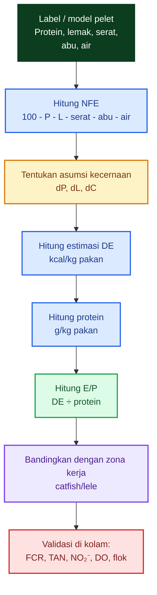

---

## 3.4. Asumsi Digestibilitas Awal

Untuk menghitung **digestible energy**, kita perlu asumsi kecernaan.

Pada model awal, digunakan:

$$
d_P = 0{,}85
$$

$$
d_L = 0{,}90
$$

$$
d_C = 0{,}60
$$

Keterangan:

| Simbol | Makna                     | Nilai model |
| ------ | ------------------------- | ----------: |
| $d_P$  | kecernaan protein         |        0,85 |
| $d_L$  | kecernaan lemak           |        0,90 |
| $d_C$  | kecernaan karbohidrat/NFE |        0,60 |

Nilai ini adalah asumsi kerja. Dalam kenyataan, digestibilitas dipengaruhi bahan baku, proses ekstrusi, ukuran pelet, suhu air, spesies ikan, ukuran ikan, dan kesehatan saluran pencernaan.

---

## 3.5. Estimasi Digestible Energy

Rumus kerja:

$$
DE =
56{,}5P d_P
+
94{,}5L d_L
+
41NFE d_C
$$

Dengan:

$$
P = 30
$$

$$
L = 5
$$

$$
NFE = 39
$$

$$
d_P = 0{,}85
$$

$$
d_L = 0{,}90
$$

$$
d_C = 0{,}60
$$

Maka:

$$
DE =
56{,}5(30)(0{,}85)
+
94{,}5(5)(0{,}90)
+
41(39)(0{,}60)
$$

Bagian energi dari protein tercerna:

$$
56{,}5 \times 30 \times 0{,}85 = 1440{,}75
$$

Bagian energi dari lemak tercerna:

$$
94{,}5 \times 5 \times 0{,}90 = 425{,}25
$$

Bagian energi dari NFE tercerna:

$$
41 \times 39 \times 0{,}60 = 959{,}4
$$

Total:

$$
DE =
1440{,}75 + 425{,}25 + 959{,}4
$$

$$
\boxed{
DE \approx 2825\ kcal/kg
}
$$

---

## 3.6. Protein per kg Pakan

Jika protein pakan:

$$
30\%
$$

maka protein per kg pakan:

$$
Protein =
30\% \times 1000
$$

$$
\boxed{
Protein = 300\ g/kg
}
$$

---

## 3.7. Estimasi E/P _Before Fermentation_

Rumus:

$$
E/P =
\frac{
DE
}{
Protein
}
$$

Maka:

$$
E/P =
\frac{
2825
}{
300
}
$$

$$
\boxed{
E/P = 9{,}42\ kcal\ DE/g\ protein
}
$$

Atau dibulatkan:

$$
\boxed{
E/P_{before} \approx 9{,}4\ kcal/g\ protein
}
$$

Untuk catfish, Mississippi State Extension menyebut rasio **DE/CP 8,5–10 kcal/g protein** cukup untuk pakan komersial catfish. Jadi model pelet 30% protein dengan estimasi E/P sekitar 9,4 masih berada dalam zona kerja yang masuk akal untuk catfish/lele, selama kualitas protein, asam amino, stabilitas pelet, dan kualitas air juga baik. ([MSU Extension Service][3])

---

## 3.8. Jangan Salah Membaca: 9,4 Bukan Jaminan FCR Rendah

Angka:

$$
E/P \approx 9{,}4
$$

bukan berarti pakan pasti bagus. Angka ini hanya mengatakan bahwa secara estimasi, energi tercerna relatif terhadap protein kasar berada dalam zona yang masuk akal.

FCR tetap bisa buruk jika:

| Penyebab                       | Dampak                            |
| ------------------------------ | --------------------------------- |
| Protein sulit dicerna          | FCR naik, TAN naik                |
| Asam amino tidak seimbang      | protein terbuang sebagai energi   |
| Pelet cepat hancur             | COD/BOD naik                      |
| Pakan terlalu banyak diberikan | sisa pakan dan feses naik         |
| DO rendah                      | nafsu makan dan metabolisme turun |
| Nitrit/TAN tinggi              | ikan stres, pertumbuhan turun     |
| Ukuran pelet tidak sesuai      | pakan tidak efisien dimakan       |

Jadi E/P harus dibaca bersama data kolam.

$$
\boxed{
E/P\ baik + manajemen\ buruk
\neq
FCR\ baik
}
$$

---

## 3.9. Simulasi Sensitivitas: Jika Digestibilitas Berbeda

Karena angka $d_P$, $d_L$, dan $d_C$ hanya asumsi, mari lihat bagaimana E/P berubah.

### Skenario konservatif

$$
d_P = 0{,}80
$$

$$
d_L = 0{,}85
$$

$$
d_C = 0{,}55
$$

Maka:

$$
DE =
56{,}5(30)(0{,}80)
+
94{,}5(5)(0{,}85)
+
41(39)(0{,}55)
$$

$$
DE =
1356
+
401{,}625
+
879{,}45
$$

$$
DE =
2637{,}075
$$

$$
E/P = \frac{2637}{300} = 8{,}79
$$

$$
\boxed{
E/P \approx 8{,}8
}
$$

### Skenario optimistis

$$
d_P = 0{,}90
$$

$$
d_L = 0{,}92
$$

$$
d_C = 0{,}68
$$

Maka:

$$
DE =
56{,}5(30)(0{,}90)
+
94{,}5(5)(0{,}92)
+
41(39)(0{,}68)
$$

$$
DE =
1525{,}5
+
434{,}7
+
1087{,}32
$$

$$
DE =
3047{,}52
$$

$$
E/P = \frac{3047{,}52}{300} = 10{,}16
$$

$$
\boxed{
E/P \approx 10{,}2
}
$$

Jadi dari label yang sama, estimasi E/P bisa bergeser:

$$
\boxed{
8{,}8\text{–}10{,}2
}
$$

hanya karena asumsi digestibilitas berbeda.

Ini alasan utama mengapa E/P dari label harus dianggap sebagai **model kerja**, bukan kepastian laboratorium.

---

## 3.10. Membandingkan Model 30% dengan Contoh Label 31–33%

Jika memakai kisaran contoh pasaran:

| Komponen | Rendah | Tengah | Tinggi |
| -------- | -----: | -----: | -----: |
| Protein  |     31 |     32 |     33 |
| Lemak    |      3 |      4 |      5 |
| Serat    |      6 |      5 |      4 |
| Abu      |     13 |   11,5 |     10 |
| Air      |     13 |     12 |     11 |

Hitung NFE:

### Skenario rendah energi

$$
NFE =
100 - 31 - 3 - 6 - 13 - 13
$$

$$
NFE = 34\%
$$

### Skenario tengah

$$
NFE =
100 - 32 - 4 - 5 - 11{,}5 - 12
$$

$$
NFE = 35{,}5\%
$$

### Skenario tinggi energi

$$
NFE =
100 - 33 - 5 - 4 - 10 - 11
$$

$$
NFE = 37\%
$$

Dengan asumsi standar:

$$
d_P = 0{,}85
$$

$$
d_L = 0{,}90
$$

$$
d_C = 0{,}60
$$

Perkiraan hasil:

| Skenario      |   DE estimasi | Protein g/kg |   E/P |
| ------------- | ------------: | -----------: | ----: |
| Rendah energi | ±2577 kcal/kg |        310 g | ±8,31 |
| Tengah        | ±2728 kcal/kg |        320 g | ±8,53 |
| Tinggi energi | ±2878 kcal/kg |        330 g | ±8,72 |

Pembacaan kritisnya: contoh label dengan protein lebih tinggi belum tentu menghasilkan E/P lebih tinggi. Jika protein naik tetapi energi dari lemak dan NFE tidak naik seimbang, E/P bisa lebih rendah. Itulah sebabnya membeli pakan hanya dari angka protein bisa menyesatkan.

---

## 3.11. Makna Praktis untuk Lele Bioflok

Untuk lele bioflok, pakan harus dilihat dari dua sisi:

$$
\boxed{
\text{nutrisi ikan}
}
$$

dan:

$$
\boxed{
\text{beban kualitas air}
}
$$

Jika protein tinggi tetapi energi tidak cukup:

$$
Protein \rightarrow energi + NH_3
$$

maka:

$$
TAN \uparrow
$$

Jika pelet banyak larut atau fermentasi/pembasahan membuat pelet hancur:

$$
COD/BOD \uparrow
$$

maka:

$$
DO \downarrow
$$

dan:

$$
flok\ bisa\ terlalu\ pekat
$$

Jadi pakan dengan E/P yang “terlihat bagus” tetap harus diuji di bioflok.

Parameter validasi:

| Parameter   | Target praktis         |
| ----------- | ---------------------- |
| FCR         | turun atau stabil baik |
| DO subuh    | aman                   |
| TAN         | tidak naik tajam       |
| Nitrit      | terkendali             |
| Flok        | tidak berlebihan       |
| Busa        | tidak melonjak         |
| Nafsu makan | baik                   |
| HPP         | turun                  |

---

## 3.12. Kesimpulan Bab 3

Dari model pelet 30% protein:

$$
\boxed{
Protein = 30\%
}
$$

$$
\boxed{
NFE = 39\%
}
$$

$$
\boxed{
DE \approx 2825\ kcal/kg
}
$$

$$
\boxed{
E/P_{before} \approx 9{,}4\ kcal/g\ protein
}
$$

Angka ini berada di zona kerja catfish/lele yang masuk akal jika dibandingkan dengan rujukan DE/CP 8,5–10 kcal/g protein. Namun angka ini tetap **estimasi**, bukan bukti bahwa pakan pasti menghasilkan FCR rendah. ([MSU Extension Service][3])

Kalimat kunci bab ini:

$$
\boxed{
\text{protein tinggi belum tentu lebih efisien bila energi dan digestibilitas tidak seimbang.}
}
$$

Dan untuk praktisi:

> **Jangan membeli pakan hanya dari protein. Hitung energi, perkirakan E/P, lalu buktikan di kolam melalui FCR dan kualitas air.**

[**Kembali ke Atas**](#ep-ratio-pakan-ikan-antara-efisiensi-fcr-fermentasi-ringan-bioflok-dan-perbedaan-strategi-lele-vs-nila)

[1]: https://makassarhobi.com/product/pelet-hi-pro-vite-781-1-pakan-benih-bibit-ikan-lele-gurame-nila-30kg/?utm_source=chatgpt.com 'Jual Pelet HI-PRO-VITE 781-1 Pakan Benih Bibit Ikan Lele ...'
[2]: https://www.fao.org/4/ab479e/ab479e03.htm?utm_source=chatgpt.com '3. proximate analyses'
[3]: https://extension.msstate.edu/agriculture/catfish/catfish-feeds-and-feeding?utm_source=chatgpt.com 'Catfish Feeds and Feeding'

---

# 4. Menaikkan E/P Pelet dengan Fermentasi Ringan + Molase + Mikroba

Bab ini harus dibaca dengan sikap kritis. Fermentasi pakan sering dipromosikan sebagai cara membuat pakan “lebih kuat”, “lebih hemat”, atau “lebih cepat tumbuh”. Sebagian klaim itu mungkin benar dalam kondisi tertentu, tetapi sebagian lain terlalu disederhanakan.

Posisi artikel ini:

$$
\boxed{
fermentasi\ tidak\ menciptakan\ energi\ baru
}
$$

Yang mungkin naik adalah:

$$
\boxed{
digestible\ energy
}
$$

atau:

$$
\boxed{
available\ energy
}
$$

Artinya, fermentasi tidak menambah energi secara ajaib. Mikroba justru memakai sebagian substrat untuk hidup. Tetapi fermentasi dapat membuat sebagian nutrien yang sebelumnya sulit dicerna menjadi lebih mudah dimanfaatkan ikan.

Fermentasi aquafeed dilaporkan dapat memperbaiki kualitas nutrisi, meningkatkan palatabilitas dan digestibilitas, serta menurunkan sebagian antinutrisi, tetapi hasilnya sangat bergantung pada bahan pakan, jenis mikroba, waktu, kelembapan, suhu, dan cara aplikasi. Review tentang fermentasi aquafeed menyebut fermentasi dapat meningkatkan nutrient availability, bioavailability, palatability, dan digestibility, tetapi efeknya tidak universal untuk semua bahan dan spesies. ([Wiley Online Library][1])

---

## 4.1. Standing Kritis: Apa yang Sebenarnya Naik?

Fermentasi ringan dapat memperbaiki pakan melalui tiga jalur utama:

$$
\boxed{
kecernaan\ naik
}
$$

$$
\boxed{
palatabilitas\ naik
}
$$

$$
\boxed{
sebagian\ antinutrisi\ turun
}
$$

Tetapi bukan berarti:

$$
\boxed{
gross\ energy\ selalu\ naik
}
$$

Gross energy adalah energi total bahan jika dibakar sempurna. Fermentasi tidak menciptakan energi baru. Jika mikroba memakai sebagian gula atau pati, sebagian energi bisa hilang sebagai panas, CO₂, atau biomassa mikroba.

Yang lebih realistis adalah:

$$
GE\ bisa\ tetap\ atau\ turun
$$

tetapi:

$$
DE\ bisa\ naik
$$

karena pakan menjadi lebih mudah dicerna.

Dengan kata lain:

$$
\boxed{
fermentasi\ yang\ baik\ bukan\ menambah\ energi,\ tetapi\ memperbesar\ bagian\ energi\ yang\ dapat\ dimanfaatkan\ ikan.
}
$$

Studi pada pakan berbasis tanaman untuk nila dalam sistem bioflok menggunakan _Lactobacillus acidophilus_ menunjukkan bahwa fermentasi meningkatkan jumlah LAB, meningkatkan protein larut, menurunkan pH pakan, serta memperbaiki survival ikan. Namun hasil yang sama juga menunjukkan feed intake meningkat dan feed efficiency memburuk; ini penting karena membuktikan bahwa fermentasi tidak otomatis menurunkan FCR. ([MDPI][2])

Jadi batas klaimnya harus jelas:

$$
\boxed{
fermentasi\ bisa\ membantu,\ tetapi\ harus\ dibuktikan\ dengan\ FCR,\ kualitas\ air,\ dan\ HPP.
}
$$

---

## 4.2. Fermentasi Ringan untuk Pelet Jadi

Untuk pelet komersial yang sudah jadi, pendekatan paling aman adalah:

$$
\boxed{
semi\text{-}anaerob,\ 6\text{–}12\ jam
}
$$

bukan:

$$
\boxed{
aerob\ penuh
}
$$

Tujuan fermentasi ringan pada pelet jadi adalah:

| Tujuan               | Penjelasan                                         |
| -------------------- | -------------------------------------------------- |
| Aktivasi mikroba     | Mikroba mulai aktif sebelum pakan diberikan        |
| Palatabilitas        | Aroma asam ringan dapat meningkatkan respons makan |
| Pre-digestion ringan | Sebagian protein/pati lebih mudah dicerna          |
| pH turun ringan      | Membantu menekan mikroba pembusuk                  |
| Pelet tetap utuh     | Pakan tidak menjadi bubur dan tidak mencemari air  |

Fermentasi pelet jadi berbeda dengan fermentasi bahan baku. Bahan baku seperti dedak, bungkil kedelai, atau ampas dapat difermentasi lebih lama karena tujuannya mengubah bahan sebelum diformulasi ulang. Pelet jadi sudah digiling, dimasak, dicetak, dan diberi stabilitas fisik. Jika dibasahkan terlalu lama, pelet bisa hancur.

Maka untuk pelet jadi, targetnya bukan “fermentasi matang”, tetapi:

$$
\boxed{
aktivasi\ ringan\ tanpa\ merusak\ stabilitas\ pelet.
}
$$

---

## 4.3. Mengapa Semi-Anaerob, Bukan Aerob Penuh?

Pada fermentasi semi-anaerob berbasis LAB, gula sederhana dari molase diarahkan menjadi asam organik:

$$
Gula
\rightarrow
Asam\ laktat + metabolit
$$

Efeknya:

$$
pH \downarrow
$$

$$
bau\ asam\ segar
$$

$$
pembusukan\ protein\ ditekan
$$

Sedangkan jika diaerasi penuh, mikroba lebih banyak melakukan respirasi aerob:

$$
Gula + O_2
\rightarrow
CO_2 + H_2O + panas
$$

Ini tidak selalu buruk untuk fermentasi bahan baku, terutama bila memakai _Bacillus_ untuk menghasilkan enzim. Tetapi untuk pelet jadi yang akan segera diberikan, respirasi aerob penuh dapat membuat sebagian substrat cepat habis dan pakan lebih mudah rusak.

Karena itu, untuk pelet jadi:

$$
\boxed{
jangan\ diaerasi
}
$$

Cukup gunakan wadah bersih, tertutup atau semi-tertutup, dengan kelembapan secukupnya.

---

## 4.4. Peran Molase sebagai Karbon Luar

Molase berperan sebagai karbon mudah urai untuk mikroba.

$$
\boxed{
molase\ memberi\ energi\ cepat\ untuk\ mikroba
}
$$

Secara logika, ini positif karena mikroba tidak harus langsung banyak mengambil energi dari pakan.

Alurnya:

$$
Molase
\rightarrow
energi\ cepat\ mikroba
$$

lalu:

$$
mikroba\ aktif
\rightarrow
enzim/metabolit
\rightarrow
pakan\ lebih\ mudah\ dicerna
$$

Argumen ini masuk akal, tetapi harus diberi batas. Mikroba tetap akan berinteraksi dengan pakan. Fermentasi tetap akan memecah sebagian komponen pakan:

$$
Protein \rightarrow peptida
$$

$$
Pati \rightarrow gula\ sederhana
$$

$$
sebagian\ antinutrisi \rightarrow turun
$$

Jadi tujuan molase bukan membuat mikroba “tidak menyentuh pakan sama sekali”. Tujuan yang lebih tepat:

$$
\boxed{
molase\ mengarahkan\ mikroba\ memakai\ karbon\ luar\ sebagai\ energi\ cepat,\ sambil\ melakukan\ pre\text{-}digestion\ ringan\ pada\ pakan.
}
$$

Namun molase juga membawa risiko:

$$
\boxed{
COD/BOD
}
$$

Jika molase atau pakan fermentasi larut ke air, maka ia menjadi beban oksigen kolam.

---

## 4.5. Molase: Sumber Karbon atau Beban Oksigen?

Keduanya benar.

Molase sebagai karbon:

$$
C_{molase} = Volume_{molase} = \times = BJ_{molase} = \times = fraksi\ C
$$

Misal:

$$
10\ mL\ molase/kg\ pakan
$$

dengan:

$$
BJ = 1{,}35\ g/mL
$$

dan:

$$
fraksi\ C = 0{,}35
$$

maka:

$$
C_{molase} = 10 \times 1{,}35 \times 0{,}35
$$

$$
C_{molase} = 4{,}725\ g\ C
$$

Jika dihitung sebagai COD teoritis:

$$
COD = C \times 2{,}67
$$

maka:

$$
COD = 4{,}725 \times 2{,}67
$$

$$
\boxed{
COD \approx 12{,}6\ g\ O_2
}
$$

Jadi:

$$
\boxed{
10\ mL\ molase/kg\ pakan
\approx
4{,}7\ g\ C
\approx
12{,}6\ g\ COD
}
$$

Jika molase itu ikut termakan bersama pelet, risikonya kecil. Tetapi jika banyak larut ke air, maka:

$$
COD/BOD \uparrow
$$

$$
OUR \uparrow
$$

$$
DO \downarrow
$$

$$
busa \uparrow
$$

$$
flok\ terlalu\ pekat
$$

Inilah alasan molase pada fermentasi pakan harus kecil, bukan seperti dosis molase untuk persiapan media bioflok.

---

## 4.6. Dosis Awal Molase

Untuk fermentasi ringan pelet jadi, dosis awal yang lebih aman:

$$
\boxed{
5\text{–}10\ mL/kg\ pakan\ kering
}
$$

Batas uji:

$$
\boxed{
15\text{–}20\ mL/kg
}
$$

Dosis lebih tinggi mulai berisiko membuat pelet terlalu lengket, terlalu asam, mudah hancur, atau menaikkan COD/BOD bila tidak dimakan sempurna.

| Pakan kering | Dosis rendah | Dosis awal praktis |  Batas uji |
| -----------: | -----------: | -----------------: | ---------: |
|         1 kg |         5 mL |              10 mL |   15–20 mL |
|         5 kg |        25 mL |              50 mL |  75–100 mL |
|        10 kg |        50 mL |             100 mL | 150–200 mL |

Untuk lele bioflok, saya lebih konservatif:

$$
\boxed{
5\text{–}10\ mL/kg
}
$$

Untuk nila, terutama jika pakan berbasis bahan nabati dan sistem bioflok stabil, dosis 10–15 mL/kg masih lebih masuk akal untuk diuji.

---

## 4.7. SOP Fermentasi Ringan Pelet Jadi

Formulasi awal per 1 kg pakan kering:

| Komponen     |   Dosis awal |
| ------------ | -----------: |
| Pelet kering |         1 kg |
| Molase       |      5–10 mL |
| Air bersih   |   100–200 mL |
| Probiotik    | sesuai label |
| Kondisi      | semi-anaerob |
| Waktu        |     6–12 jam |
| Suhu ideal   |     ±28–32°C |

Prinsip penting:

$$
\boxed{
pakan\ dilembapkan,\ bukan\ direndam
}
$$

Jika pelet terendam, nutrien lebih mudah larut. Jika nutrien larut, manfaat nutrisi pindah dari ikan ke air.

Langkah praktis:

1. Larutkan molase ke dalam air.
2. Tambahkan probiotik sesuai label.
3. Aduk atau semprotkan ke pelet secara merata.
4. Pastikan pelet lembap, bukan menjadi bubur.
5. Masukkan ke wadah bersih.
6. Tutup semi-rapat.
7. Fermentasi 6–12 jam.
8. Berikan segera.
9. Jangan simpan pakan fermentasi basah terlalu lama.

---

## 4.8. Diagram Proses Fermentasi Ringan

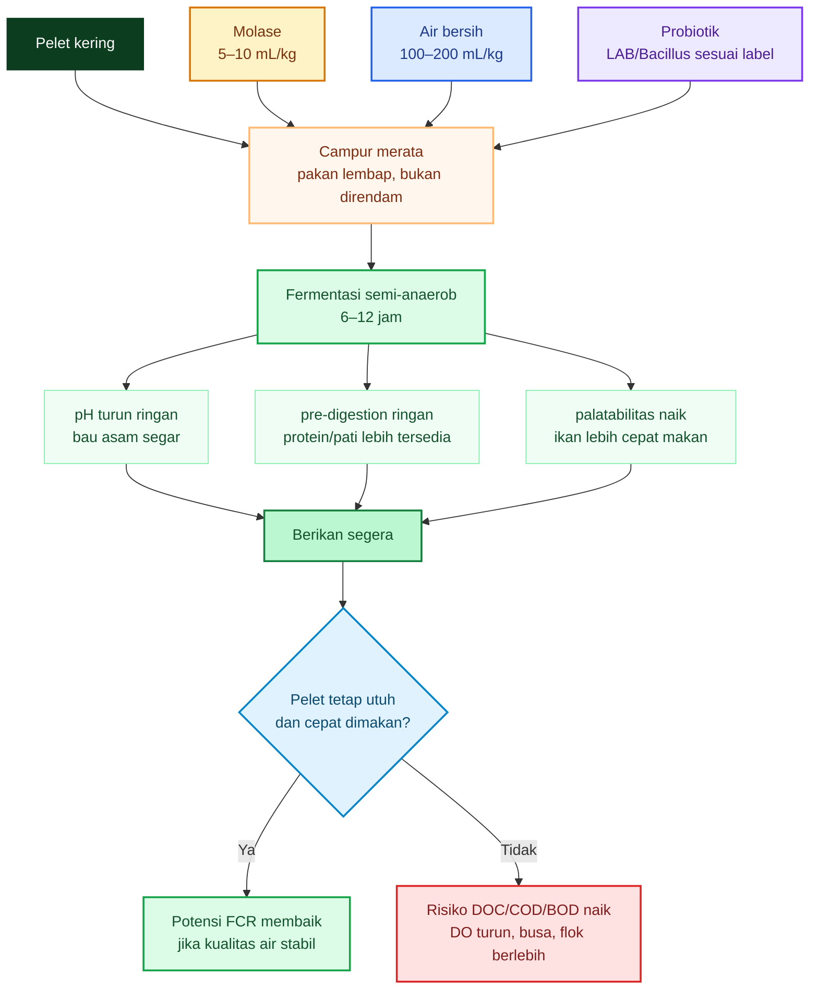

Diagram di atas menunjukkan titik kritisnya: fermentasi hanya menguntungkan bila pelet tetap utuh dan cepat dimakan. Jika pelet hancur atau larut, fermentasi berubah menjadi beban air.

---

## 4.9. E/P _Before–After_ pada Model Pelet 30%

Model awal dari bab sebelumnya:

| Komponen | Nilai |
| -------- | ----: |
| Protein  |   30% |
| Lemak    |    5% |
| Serat    |    6% |
| Abu      |   10% |
| Air      |   10% |
| NFE      |   39% |

Sebelum fermentasi, asumsi digestibilitas:

$$
d_P = 0{,}85
$$

$$
d_L = 0{,}90
$$

$$
d_C = 0{,}60
$$

Hasil:

$$
DE_{before} \approx 2825\ kcal/kg
$$

Protein:

$$
300\ g/kg
$$

Maka:

$$
E/P_{before} = \frac{2825}{300}
$$

$$
\boxed{
E/P_{before} \approx 9{,}42
}
$$

atau:

$$
\boxed{
E/P_{before} \approx 9{,}4\ kcal/g\ protein
}
$$

---

## 4.10. Simulasi Setelah Fermentasi Ringan

Setelah fermentasi ringan, asumsi yang **moderat** adalah kecernaan protein dan karbohidrat meningkat sedikit.

Gunakan skenario:

$$
d_P = 0{,}88\text{–}0{,}90
$$

$$
d_L = 0{,}90
$$

$$
d_C = 0{,}64\text{–}0{,}68
$$

### Skenario rendah

$$
d_P = 0{,}88
$$

$$
d_C = 0{,}64
$$

Hitung:

$$
DE =
56{,}5(30)(0{,}88)
+
94{,}5(5)(0{,}90)
+
41(39)(0{,}64)
$$

$$
DE =
1491{,}6
+
425{,}25
+
1023{,}36
$$

$$
DE =
2940{,}21\ kcal/kg
$$

Maka:

$$
E/P =
\frac{2940{,}21}{300}
$$

$$
\boxed{
E/P \approx 9{,}80
}
$$

### Skenario tinggi

$$
d_P = 0{,}90
$$

$$
d_C = 0{,}68
$$

Hitung:

$$
DE =
56{,}5(30)(0{,}90)
+
94{,}5(5)(0{,}90)
+
41(39)(0{,}68)
$$

$$
DE =
1525{,}5
+
425{,}25
+
1087{,}32
$$

$$
DE =
3038{,}07\ kcal/kg
$$

Maka:

$$
E/P =
\frac{3038{,}07}{300}
$$

$$
\boxed{
E/P \approx 10{,}13
}
$$

Jadi secara simulasi:

$$
\boxed{
E/P_{after}
\approx
9{,}8\text{–}10{,}1
}
$$

Namun ini harus ditulis tegas:

$$
\boxed{
angka\ ini\ adalah\ simulasi,\ bukan\ klaim\ universal
}
$$

---

## 4.11. Apakah Kenaikan E/P Ini Selalu Baik?

Tidak.

Untuk nila, kenaikan dari sekitar 9,4 ke 9,8–10,1 lebih mudah diterima karena nila lebih adaptif terhadap karbohidrat dan bahan nabati. Untuk lele, terutama lele bioflok, kenaikan itu harus lebih hati-hati karena lele tidak seefisien nila dalam memanfaatkan karbohidrat, dan sistem bioflok sensitif terhadap BOD/COD.

Kenaikan E/P baik jika:

$$
FCR \downarrow
$$

$$
pertumbuhan \uparrow
$$

$$
TAN\ tidak\ naik
$$

$$
NO_2^- \text{ terkendali}
$$

$$
DO\ stabil
$$

$$
flok\ tidak\ berlebihan
$$

Kenaikan E/P buruk jika:

$$
pakan\ hancur
$$

$$
COD/BOD \uparrow
$$

$$
DO \downarrow
$$

$$
busa \uparrow
$$

$$
flok\ pekat
$$

$$
FCR\ tidak\ membaik
$$

Studi pakan nabati fermentasi pada nila bioflok yang disebut sebelumnya justru memberi pelajaran penting: survival dapat membaik, tetapi feed efficiency bisa memburuk. Jadi manfaat fermentasi harus dipisahkan antara manfaat kesehatan, survival, palatabilitas, dan efisiensi pakan. ([MDPI][2])

---

## 4.12. Risiko Berat Basah: Jangan Salah Hitung Pakan

Fermentasi memakai air. Ini membuat berat pakan basah naik, tetapi nutrien kering tidak naik sebanding.

Misal:

$$
1\ kg\ pakan\ kering
+
150\ mL\ air
+
10\ mL\ molase
$$

Berat molase:

$$
10 \times 1{,}35 = 13{,}5\ g
$$

Total berat basah kira-kira:

$$
1000 + 150 + 13{,}5 = 1163{,}5\ g
$$

Jika target pemberian adalah 1 kg pakan kering, maka yang harus diberikan adalah seluruh batch:

$$
\boxed{
1163{,}5\ g\ pakan\ fermentasi\ basah
}
$$

Bukan hanya 1 kg basah.

Jika praktisi menimbang ulang 1 kg pakan basah, maka pakan kering yang masuk kurang dari 1 kg. Akibatnya ikan bisa kekurangan nutrien, dan FCR perhitungan menjadi salah.

Prinsipnya:

$$
\boxed{
dosis\ pakan\ harus\ berbasis\ bahan\ kering
}
$$

---

## 4.13. Kapan Fermentasi Dianggap Berhasil?

Fermentasi ringan dianggap layak dilanjutkan hanya jika hasil lapangan membaik.

| Indikator | Tanda berhasil                    |
| --------- | --------------------------------- |
| Bau pakan | asam segar, bukan busuk           |
| Tekstur   | pelet tetap utuh                  |
| Konsumsi  | ikan makan cepat                  |
| FCR       | turun atau minimal tidak memburuk |
| TAN       | tidak naik                        |
| Nitrit    | tidak naik                        |
| DO        | tidak drop setelah pakan          |
| Flok      | tidak terlalu pekat               |
| Busa      | tidak melonjak                    |
| HPP       | turun                             |

Fermentasi harus dihentikan jika:

| Tanda                  | Makna                                      |
| ---------------------- | ------------------------------------------ |
| Bau busuk              | protein rusak, fermentasi gagal            |
| Bau alkohol tajam      | ragi berlebih, fermentasi tidak terkendali |
| Pelet jadi bubur       | nutrien mudah larut ke air                 |
| Busa naik tajam        | DOC/COD tinggi                             |
| DO turun setelah pakan | BOD meningkat                              |
| TAN/nitrit naik        | beban sistem bertambah                     |
| FCR memburuk           | efisiensi tidak tercapai                   |

---

## 4.14. Kesimpulan Bab 4

Fermentasi ringan pelet dengan molase dan mikroba bisa dipakai sebagai alat bantu, tetapi bukan formula ajaib untuk menurunkan FCR.

Standing yang harus dipegang:

$$
\boxed{
fermentasi\ tidak\ menciptakan\ energi\ baru
}
$$

$$
\boxed{
yang\ mungkin\ naik\ adalah\ digestible\ energy\ atau\ available\ energy
}
$$

Untuk pelet jadi:

$$
\boxed{
semi\text{-}anaerob,\ 6\text{–}12\ jam
}
$$

Dosis awal molase:

$$
\boxed{
5\text{–}10\ mL/kg\ pakan\ kering
}
$$

Batas uji:

$$
\boxed{
15\text{–}20\ mL/kg
}
$$

Pada model pelet 30% protein:

$$
\boxed{
E/P_{before} \approx 9{,}4
}
$$

Setelah fermentasi ringan, secara simulasi:

$$
\boxed{
E/P_{after} \approx 9{,}8\text{–}10{,}1
}
$$

Tetapi:

$$
\boxed{
angka\ ini\ adalah\ simulasi,\ bukan\ klaim\ universal
}
$$

Kalimat praktisnya:

> **Fermentasi ringan hanya layak disebut berhasil bila FCR turun, ikan tumbuh baik, dan kualitas air tidak memburuk. Jika pelet hancur, DO turun, busa naik, atau TAN/nitrit meningkat, fermentasi bukan memperbaiki pakan—melainkan menambah beban bioflok.**

[**Kembali ke Atas**](#ep-ratio-pakan-ikan-antara-efisiensi-fcr-fermentasi-ringan-bioflok-dan-perbedaan-strategi-lele-vs-nila)

[1]: https://onlinelibrary.wiley.com/doi/abs/10.1111/raq.12894?utm_source=chatgpt.com 'Fermentation in aquafeed processing: Achieving ...'
[2]: https://www.mdpi.com/2076-2615/14/2/332?utm_source=chatgpt.com 'Fermentation of Plant-Based Feeds with Lactobacillus ...'

---

# 5. E/P Optimal Lele vs Nila

Bab ini menjawab satu pertanyaan penting:

$$
\boxed{
Apakah\ E/P\ optimal\ lele\ sama\ dengan\ nila?
}
$$

Jawabannya:

$$
\boxed{
Tidak.
}
$$

Lele dan nila memiliki karakter nutrisi yang berbeda. Lele/catfish lebih ketat dalam penggunaan energi–protein, sedangkan nila lebih toleran terhadap pakan berbasis bahan nabati dan karbohidrat. Karena itu, strategi menaikkan E/P melalui fermentasi ringan lebih harus dibatasi pada lele, tetapi lebih prospektif untuk nila.

---

## 5.1. Prinsip Dasar: E/P Optimal Bukan Satu Angka Universal

E/P optimal dipengaruhi oleh:

| Faktor           | Dampak terhadap E/P                                          |
| ---------------- | ------------------------------------------------------------ |
| Spesies ikan     | Lele dan nila berbeda kemampuan memakai karbohidrat          |
| Ukuran ikan      | Benih butuh protein lebih tinggi, E/P cenderung lebih rendah |
| Sistem budidaya  | Bioflok/natural food dapat menyumbang nutrien                |
| Kualitas protein | Asam amino dan digestibilitas menentukan efisiensi           |
| Sumber energi    | Lemak dan karbohidrat tidak sama nilai biologisnya           |
| Suhu dan DO      | Memengaruhi metabolisme dan konsumsi pakan                   |
| FCR lapangan     | Bukti akhir kecocokan pakan                                  |

Maka artikel ini tidak memakai pendekatan:

$$
\boxed{
satu\ angka\ E/P\ untuk\ semua\ ikan
}
$$

melainkan:

$$
\boxed{
zona\ kerja\ E/P\ berdasarkan\ spesies,\ fase,\ dan\ sistem\ budidaya
}
$$

---

## 5.2. Lele/Catfish: E/P Tidak Perlu Dikejar Terlalu Tinggi

Untuk catfish, Mississippi State Extension menyebut rasio **digestible energy to crude protein** sekitar **8,5–10 kcal/g protein** cukup untuk pakan komersial catfish. Rasio di atas kisaran tersebut dapat meningkatkan deposisi lemak, sedangkan rasio yang terlalu rendah dapat memperlambat pertumbuhan. ([MSU Extension Service][1])

Panduan nutrisi catfish dari Texas A&M juga mencantumkan digestible energy sekitar **8,5–10 kcal/g protein**, dengan catatan bahwa karbohidrat dan lipid digunakan sebagai sumber energi untuk menghemat protein agar protein lebih banyak dipakai untuk pertumbuhan. ([RWFM Extension][2])

Untuk catfish praktis:

$$
\boxed{
E/P_{catfish}
\approx
8{,}5\text{–}10\ kcal\ DE/g\ protein
}
$$

Namun untuk lele Afrika atau _Clarias gariepinus_, posisi harus lebih konservatif. Studi tentang _Clarias gariepinus_ melaporkan diet terbaik pada **33,5% digestible protein** dan **2,75 kcal/g digestible energy**, dengan rasio P/E **121,8 mg protein/kcal**. Jika dibalik, nilainya menjadi sekitar **8,21 kcal/g protein**. ([Aquadocs][3])

Hitungannya:

$$
E/P =
\frac{
1000
}{
121{,}8
}
$$

$$
\boxed{
E/P = 8{,}21\ kcal/g\ protein
}
$$

Maknanya:

$$
\boxed{
Clarias\ tidak\ perlu\ dikejar\ ke\ E/P\ terlalu\ tinggi.
}
$$

Untuk praktisi lele bioflok, zona kerja yang lebih aman:

$$
\boxed{
E/P_{lele}
\approx
8{,}5\text{–}9{,}5
}
$$

atau sedikit lebih longgar:

$$
\boxed{
8{,}5\text{–}10
}
$$

Tetapi bila fermentasi ringan mendorong estimasi E/P melewati 10, praktisi harus berhati-hati. Pada lele, energi tinggi belum tentu menghasilkan FCR lebih baik. Risiko yang perlu diawasi adalah ikan cepat kenyang energi, protein/asam amino menjadi pembatas, deposisi lemak naik, dan kualitas air memburuk.

---

## 5.3. Nila: E/P Cenderung Lebih Tinggi

Nila berbeda. Nila lebih adaptif terhadap bahan nabati, karbohidrat tercerna, detritus, dan kontribusi natural food. Karena itu, zona E/P optimal nila dapat lebih tinggi daripada lele, terutama pada fase grow-out.

Artikel Kabir et al. tentang nila menyebut bahwa ketika ikan hanya mengakses pakan formulasi, kisaran optimal **P:E** untuk tilapia berada sekitar **18–23 g/MJ**. Dalam kolam semi-intensif, natural food/food web ikut menyumbang nutrien, sehingga strategi rasio protein–energi juga harus membaca kontribusi ekosistem kolam. ([ScienceDirect][4])

Konversi dari P:E ke E/P:

$$
E/P =
\frac{
239
}{
P/E
}
$$

Karena:

$$
1\ MJ \approx 239\ kcal
$$

Jika:

$$
P/E = 23\ g/MJ
$$

maka:

$$
E/P =
\frac{239}{23}
$$

$$
\boxed{
E/P = 10{,}39\ kcal/g
}
$$

Jika:

$$
P/E = 18\ g/MJ
$$

maka:

$$
E/P =
\frac{239}{18}
$$

$$
\boxed{
E/P = 13{,}28\ kcal/g
}
$$

Maka:

$$
\boxed{
E/P_{nila}
\approx
10{,}4\text{–}13{,}3
}
$$

Ini bukan berarti semua pakan nila harus E/P 13. Untuk benih dan juvenil kecil, kebutuhan protein lebih tinggi sehingga E/P praktis bisa lebih rendah. Tetapi pada nila grow-out, terutama dalam sistem kolam, bioflok, atau sistem dengan natural food, E/P yang lebih tinggi masih lebih masuk akal dibanding pada lele.

---

## 5.4. Perbandingan Zona E/P Lele vs Nila

| Komoditas          |     Zona E/P praktis | Pembacaan                                      |
| ------------------ | -------------------: | ---------------------------------------------- |
| Lele/_Clarias_     |             ±8,5–9,5 | Lebih konservatif; jangan kejar E/P tinggi     |
| Catfish komersial  |              ±8,5–10 | Zona kerja pakan catfish komersial             |
| Nila juvenil       |            ±8,5–10,5 | Protein masih penting tinggi                   |
| Nila grow-out      |              ±10–12+ | Lebih toleran terhadap energi dari karbohidrat |
| Nila kolam/bioflok | bisa lebih fleksibel | Natural food/bioflok ikut berkontribusi        |

Ringkasnya:

$$
\boxed{
E/P_{nila}\ cenderung\ lebih\ tinggi\ dibanding\ E/P_{lele}
}
$$

Tetapi:

$$
\boxed{
E/P\ tinggi\ tidak\ otomatis\ berarti\ FCR\ rendah
}
$$

FCR tetap harus dibuktikan di kolam.

---

## 5.5. Diagram Perbandingan Praktis

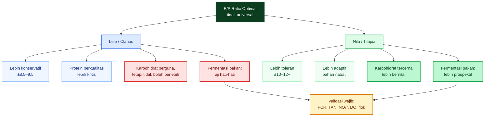

---

## 5.6. Mengapa Nila Lebih Toleran terhadap E/P Tinggi?

Nila lebih cocok dengan E/P lebih tinggi karena lebih mampu memanfaatkan energi dari karbohidrat dan bahan nabati. Pada sistem kolam semi-intensif, natural food juga dapat berkontribusi terhadap produksi ikan, sehingga pakan formulasi bukan satu-satunya sumber nutrisi. Studi Kabir et al. menunjukkan bahwa pada sistem kolam, rasio C:N dan food web dapat memengaruhi performa nila, bukan hanya komposisi pakan formulasi. ([ScienceDirect][4])

Secara praktis:

$$
\boxed{
nila\ lebih\ cocok\ dengan\ strategi:
karbohidrat\ tercerna + protein\ cukup + natural\ food/bioflok
}
$$

Sedangkan lele lebih sensitif terhadap kualitas protein dan keseimbangan energi. Lele masih bisa memanfaatkan karbohidrat sebagai protein-sparing, tetapi jangan dipaksa ke pola pakan terlalu tinggi energi hanya karena ingin menurunkan FCR.

---

## 5.7. Implikasi terhadap Fermentasi Ringan

Dari bab sebelumnya, model pelet 30% protein memiliki:

$$
E/P_{before}
\approx
9{,}4
$$

Setelah fermentasi ringan, simulasi bisa menjadi:

$$
E/P_{after}
\approx
9{,}8\text{–}10{,}1
$$

Pembacaannya berbeda untuk lele dan nila.

### Untuk lele

$$
9{,}8\text{–}10{,}1
$$

sudah masuk batas atas zona kerja lele/catfish.

Maka pada lele:

$$
\boxed{
fermentasi\ ringan\ tidak\ boleh\ diarahkan\ untuk\ mengejar\ E/P\ tinggi
}
$$

Targetnya hanya:

$$
\boxed{
palatabilitas,\ kecernaan\ ringan,\ dan\ FCR\ yang\ terbukti\ membaik
}
$$

Jika pakan fermentasi membuat pelet hancur, DO turun, atau flok pekat, maka fermentasi harus dihentikan.

### Untuk nila

$$
9{,}8\text{–}10{,}1
$$

masih berada pada zona yang lebih nyaman, terutama untuk nila grow-out.

Maka pada nila:

$$
\boxed{
fermentasi\ ringan\ lebih\ prospektif
}
$$

khususnya jika pakan mengandung bahan nabati, dedak, bungkil, onggok, sagu, atau sumber karbohidrat lain yang kecernaannya bisa diperbaiki.

---

## 5.8. Risiko Salah Strategi pada Lele

Jika praktisi membawa logika nila ke lele tanpa koreksi, risikonya besar.

Misalnya:

$$
\text{fermentasi} \rightarrow E/P\ naik
$$

lalu diasumsikan:

$$
FCR\ pasti\ turun
$$

Ini belum tentu benar.

Pada lele bioflok, risiko yang harus diawasi:

| Risiko                            | Dampak                      |
| --------------------------------- | --------------------------- |
| Pelet hancur                      | COD/BOD naik                |
| Molase berlebih                   | DO turun, busa naik         |
| Energi terlalu tinggi             | ikan cepat kenyang          |
| Protein/asam amino kurang efektif | pertumbuhan tidak maksimal  |
| Feses meningkat                   | flok berlebih               |
| TAN/nitrit naik                   | stres ikan dan FCR memburuk |

Maka untuk lele:

$$
\boxed{
fermentasi\ adalah\ alat\ bantu,\ bukan\ strategi\ utama\ menaikkan\ E/P
}
$$

---

## 5.9. Strategi Berbeda untuk Lele dan Nila

| Aspek            | Lele                                   | Nila                                    |
| ---------------- | -------------------------------------- | --------------------------------------- |
| Target E/P       | lebih rendah dan ketat                 | lebih tinggi dan fleksibel              |
| Fokus pakan      | protein berkualitas + energi seimbang  | protein cukup + karbohidrat tercerna    |
| Fermentasi pelet | hati-hati, ringan, pendek              | lebih layak diuji                       |
| Molase           | rendah                                 | bisa sedikit lebih fleksibel            |
| Bioflok          | harus dikontrol ketat agar tidak berat | lebih cocok dengan natural food/bioflok |
| Validasi utama   | FCR + TAN + DO + nitrit                | FCR + pertumbuhan + food web + DO       |

Strategi lele:

$$
\boxed{
jaga\ E/P\ seimbang,\ jangan\ naikkan\ energi\ berlebihan
}
$$

Strategi nila:

$$
\boxed{
optimalkan\ karbohidrat\ tercerna,\ natural\ food,\ dan\ fermentasi\ bahan\ nabati
}
$$

---

## 5.10. Kesimpulan Bab 5

E/P optimal lele dan nila berbeda.

Untuk lele/catfish:

$$
\boxed{
E/P_{lele}
\approx
8{,}5\text{–}9{,}5
}
$$

atau zona kerja catfish komersial:

$$
\boxed{
8{,}5\text{–}10
}
$$

Untuk _Clarias gariepinus_, rujukan P/E **121,8 mg/kcal** yang dikonversi menjadi E/P sekitar **8,21 kcal/g protein** mendukung posisi bahwa _Clarias_ tidak perlu dikejar ke E/P terlalu tinggi. ([Aquadocs][3])

Untuk nila:

$$
\boxed{
E/P_{nila}
\approx
10{,}4\text{–}13{,}3
}
$$

berdasarkan konversi dari P:E 18–23 g/MJ pada tilapia. ([ScienceDirect][4])

Maka:

$$
\boxed{
fermentasi\ ringan\ yang\ menaikkan\ available\ energy\ lebih\ cocok\ untuk\ nila\ daripada\ lele.
}
$$

Kalimat praktisnya:

> **Pada nila, fermentasi pakan bisa menjadi strategi nutrisi. Pada lele, fermentasi pakan hanya alat bantu yang harus dibuktikan lewat FCR dan kualitas air.**

[**Kembali ke Atas**](#ep-ratio-pakan-ikan-antara-efisiensi-fcr-fermentasi-ringan-bioflok-dan-perbedaan-strategi-lele-vs-nila)

[1]: https://extension.msstate.edu/agriculture/catfish/catfish-feeds-and-feeding?utm_source=chatgpt.com 'Catfish Feeds and Feeding'
[2]: https://extension.rwfm.tamu.edu/wp-content/uploads/sites/8/2013/09/A-Practical-Guide-to-Nutrition-Feeds-and-Feeding-of-Catfish.pdf?utm_source=chatgpt.com 'A Practical Guide to Nutrition, Feeds, and Feeding of Catfish'
[3]: https://aquadocs.org/mapping/16385/1/BJFR2.1_047.pdf?utm_source=chatgpt.com 'Studies on the optimum protein to energy ratio of African ...'
[4]: https://www.sciencedirect.com/science/article/abs/pii/S0044848618316260?utm_source=chatgpt.com 'Effect of dietary protein to energy ratio on performance ...'

---

# 6. Mengapa Fermentasi Lebih Masuk Akal untuk Nila daripada Lele

Bab ini harus dibaca dengan sangat kritis. Pernyataan “fermentasi pakan lebih cocok untuk nila daripada lele” bukan berarti lele tidak boleh diberi pakan fermentasi. Maksudnya adalah: **peluang manfaat fermentasi lebih besar pada nila**, sedangkan pada lele manfaatnya lebih sempit dan risikonya lebih cepat muncul, terutama dalam sistem bioflok.

Posisi teknis bab ini:

$$
\boxed{
\text{fermentasi pakan lebih cocok bila bahan pakan banyak mengandung karbohidrat, serat, dan bahan nabati}
}
$$

Karena itu:

$$
\boxed{
\text{nila lebih prospektif menerima manfaat fermentasi dibanding lele}
}
$$

Nila lebih adaptif terhadap karbohidrat dan bahan nabati. Review karbohidrat pada ikan menjelaskan bahwa spesies herbivora dan omnivora seperti tilapia dapat menyesuaikan transport glukosa di usus terhadap level karbohidrat pakan, sedangkan kemampuan ini tidak sama pada semua spesies ikan. ([SLU.SE][1])

<figure>
  
  <figcaption>
    Ilustrasi sistem pencernaan lele dan nila untuk memahami proses pemanfaatan
    pakan, penyerapan nutrisi, dan efisiensi pertumbuhan ikan.
  </figcaption>
</figure>

---

## 6.1. Nila Lebih Mampu Memanfaatkan Karbohidrat dan Bahan Nabati

Fermentasi paling banyak memberi manfaat pada komponen pakan berikut:

| Komponen             | Dampak fermentasi yang diharapkan                                 |
| -------------------- | ----------------------------------------------------------------- |
| Karbohidrat kompleks | Sebagian menjadi lebih mudah dimanfaatkan                         |
| Serat tertentu       | Sebagian fraksi bisa turun atau lebih terbuka                     |
| Bahan nabati         | Kecernaan dapat membaik                                           |
| Antinutrisi          | Sebagian dapat berkurang                                          |
| Protein              | Sebagian menjadi protein larut, peptida, atau lebih mudah dicerna |

Nila lebih cocok menerima manfaat ini karena secara nutrisi ia lebih adaptif terhadap bahan nabati dan karbohidrat dibanding lele. Meta-analisis pemanfaatan karbohidrat pada tilapia menyatakan bahwa ikan air tawar hangat seperti tilapia secara umum mampu menggunakan level karbohidrat lebih tinggi dibanding banyak spesies laut atau karnivora, meskipun responsnya tetap dipengaruhi sumber karbohidrat, proses pakan, ukuran ikan, dan kondisi budidaya. ([Wiley Online Library][2])

Dengan kata lain, fermentasi bekerja terutama pada “wilayah” yang memang relatif lebih bisa dimanfaatkan oleh nila:

$$
\boxed{
karbohidrat + bahan\ nabati + mikroba
\Rightarrow
kecernaan\ dan\ available\ energy\ berpotensi\ naik
}
$$

Untuk nila, fermentasi bahan pakan nabati dapat menjadi strategi nutrisi. Studi pakan berbasis tanaman yang difermentasi dengan _Lactobacillus acidophilus_ pada juvenile Nile tilapia dalam sistem bioflok menunjukkan bahwa fermentasi memperbaiki karakter pakan, meningkatkan protein larut, menurunkan pH, dan perlakuan fermentasi 6 jam memberi survival lebih baik pada ikan uji. Namun studi itu juga memperlihatkan bahwa manfaat tidak boleh disederhanakan menjadi “FCR pasti turun”, karena feed efficiency tidak otomatis membaik. ([MDPI][3])

---

## 6.2. Mengapa Manfaat Fermentasi Lebih “Nyambung” dengan Nila?

Pada nila, fermentasi dapat membantu tiga hal sekaligus:

$$
\boxed{
1.\ meningkatkan\ ketersediaan\ energi\ dari\ karbohidrat
}
$$

$$
\boxed{
2.\ memperbaiki\ pemanfaatan\ bahan\ nabati
}
$$

$$
\boxed{
3.\ mendukung\ sistem\ bioflok/natural\ food
}
$$

Ini penting karena nila tidak hanya bergantung pada pelet sebagai sumber nutrisi. Pada sistem kolam dan bioflok, nila relatif lebih mampu memanfaatkan mikroorganisme, partikel organik, dan natural food dibanding lele. Maka fermentasi pakan yang memperbaiki bahan nabati lebih sesuai dengan arah fisiologi dan perilaku makan nila.

Secara praktis:

$$
\text{pakan nabati difermentasi}
\Rightarrow
\text{kecernaan naik}
\Rightarrow
\text{energi non-protein lebih tersedia}
\Rightarrow
\text{protein lebih hemat untuk pertumbuhan}
$$

Inilah alasan strategi **bioflok + fermentasi pakan** cenderung lebih menjanjikan pada nila daripada lele.

---

## 6.3. Lele Lebih Ketat: Fermentasi Boleh, tetapi Targetnya Berbeda

Lele masih bisa mendapat manfaat dari fermentasi ringan, tetapi targetnya harus dibatasi.

Target yang benar untuk lele:

$$
\boxed{
palatabilitas + kecernaan ringan + FCR lebih baik
}
$$

bukan:

$$
\boxed{
mengejar\ E/P\ tinggi
}
$$

Untuk catfish, sumber resmi Mississippi State menyebut rasio DE/P sekitar **8,5–9,5 kcal/g** tampak optimum untuk pakan komersial catfish, sedangkan Texas A&M menyatakan karbohidrat memang dipakai sebagai sumber energi murah untuk menghemat protein bagi pertumbuhan. Artinya, karbohidrat tetap penting pada catfish, tetapi jendela energinya lebih ketat dan tidak boleh dibaca sebagai “semakin tinggi energi semakin baik”. ([MSU Extension Service][4])

Pada lele, fermentasi pakan ringan lebih tepat diperlakukan sebagai teknik bantu:

| Tujuan fermentasi lele           | Penjelasan                                |
| -------------------------------- | ----------------------------------------- |
| Meningkatkan aroma/palatabilitas | Ikan lebih cepat makan                    |
| Membantu pre-digestion ringan    | Sebagian protein/pati lebih mudah dicerna |
| Mengaktifkan mikroba/probiotik   | Tetapi tidak menggantikan kualitas pakan  |
| Menekan pembusukan ringan        | Bila pH turun dan proses terkendali       |
| Menguji FCR                      | Harus dibuktikan, bukan diasumsikan       |

Jadi untuk lele:

$$
\boxed{
fermentasi\ pelet\ boleh\ diuji,\ tetapi\ tidak\ boleh\ menjadi\ default\ tanpa\ data
}
$$

---

## 6.4. Risiko Lele Bioflok Bila Pelet Fermentasi Hancur

Bioflok lele biasanya padat tebar, pakan tinggi, aerasi tinggi, dan beban organik besar. Jika pelet fermentasi hancur atau molase berlebih masuk ke air, sistem bisa cepat berat.

Jika pelet fermentasi hancur:

$$
DOC/COD/BOD \uparrow
$$

lalu:

$$
OUR \uparrow
$$

lalu:

$$
DO \downarrow
$$

kemudian:

$$
flok\ pekat
$$

dan:

$$
TAN/NO_2^- \text{ berisiko naik}
$$

Alurnya:

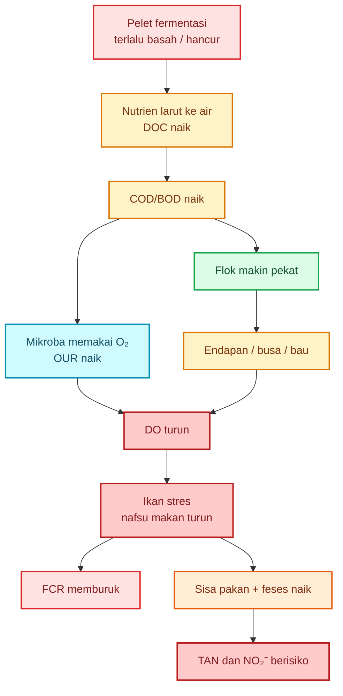

Inilah titik praktis yang sering diabaikan. Fermentasi pakan tidak boleh hanya dilihat dari sisi nutrisi ikan. Dalam bioflok, fermentasi pakan juga harus dilihat dari sisi **beban air**.

---

## 6.5. Perbandingan Nila vs Lele dalam Menerima Fermentasi

| Aspek                          | Nila                          | Lele                               |
| ------------------------------ | ----------------------------- | ---------------------------------- |
| Kemampuan memakai karbohidrat  | Lebih baik                    | Lebih terbatas                     |
| Pemanfaatan bahan nabati       | Lebih adaptif                 | Lebih selektif                     |
| Manfaat fermentasi karbohidrat | Lebih besar                   | Sedang                             |
| Manfaat penurunan antinutrisi  | Lebih terasa                  | Tergantung bahan                   |
| Risiko pelet hancur            | Tetap ada                     | Lebih kritis di bioflok padat      |
| E/P setelah fermentasi         | Lebih toleran                 | Harus hati-hati                    |
| Bioflok/natural food           | Lebih sinergis                | Ada manfaat, tetapi lebih terbatas |
| Strategi fermentasi            | Bisa menjadi strategi nutrisi | Lebih sebagai alat bantu           |

Maka:

$$
\boxed{
\text{untuk nila, fermentasi bisa menjadi strategi nutrisi}
}
$$

Sedangkan:

$$
\boxed{
\text{untuk lele, fermentasi lebih tepat menjadi strategi uji terbatas}
}
$$

---

## 6.6. Implikasi terhadap E/P Ratio

Pada bab sebelumnya, model pelet 30% protein memiliki:

$$
E/P_{before} \approx 9{,}4
$$

Setelah fermentasi ringan, simulasi dapat menjadi:

$$
E/P_{after} \approx 9{,}8\text{–}10{,}1
$$

Untuk nila, angka ini masih berada di zona yang relatif nyaman, terutama pada grow-out. Untuk lele, angka tersebut sudah mendekati batas atas zona kerja praktis catfish.

Maka interpretasinya berbeda.

### Pada nila

$$
E/P\ naik\ moderat
\Rightarrow
energi\ tersedia\ lebih\ baik
\Rightarrow
protein\ lebih\ hemat
\Rightarrow
potensi\ FCR\ membaik
$$

### Pada lele

$$
E/P\ naik\ moderat
\Rightarrow
belum\ tentu\ FCR\ membaik
$$

karena risiko:

$$
energi\ berlebih
$$

$$
pelet\ hancur
$$

$$
COD/BOD\ naik
$$

$$
DO\ turun
$$

Jadi pada lele, parameter penentu bukan “E/P after lebih tinggi”, tetapi:

$$
\boxed{
apakah\ FCR\ turun\ tanpa\ TAN,\ NO_2^-,\ COD/BOD,\ dan\ flok\ memburuk?
}
$$

---

## 6.7. Strategi Fermentasi untuk Nila

Untuk nila, fermentasi lebih masuk akal bila:

- bahan pakan banyak nabati,
- ada dedak, bungkil, onggok, sagu, atau bahan lokal,
- karbohidrat dan serat perlu diperbaiki,
- sistem bioflok/natural food stabil,
- DO kuat,
- pakan cepat dimakan.

Strategi praktis:

$$
\boxed{
fermentasi\ ringan\ pelet:
6\text{–}12\ jam
}
$$

atau untuk bahan baku:

$$
\boxed{
fermentasi\ bahan:
24\text{–}48\ jam,\ dengan\ proses\ terkontrol
}
$$

Pada nila, fermentasi bahan baku nabati lebih rasional dibanding hanya membasahi pelet jadi. Fermentasi bahan baku memberi peluang memperbaiki serat, antinutrisi, protein larut, dan kecernaan sebelum bahan itu diformulasi menjadi pakan.

---

## 6.8. Strategi Fermentasi untuk Lele

Untuk lele, strategi lebih konservatif:

$$
\boxed{
jangan\ fermentasi\ pakan\ jika\ pelet\ komersial\ sudah\ bekerja\ baik
}
$$

Fermentasi hanya layak diuji bila:

| Kondisi                              | Alasan                                       |
| ------------------------------------ | -------------------------------------------- |
| FCR belum memuaskan                  | Perlu uji perbaikan palatabilitas/kecernaan  |
| ikan lambat makan                    | Aroma fermentasi ringan bisa membantu        |
| pakan mengandung bahan nabati tinggi | fermentasi mungkin membantu kecernaan        |
| DO stabil                            | syarat wajib sebelum uji fermentasi          |
| flok tidak pekat                     | agar tambahan DOC tidak membuat sistem berat |

Untuk lele bioflok, dosis molase harus rendah:

$$
\boxed{
5\text{–}10\ mL/kg\ pakan\ kering
}
$$

Waktu fermentasi:

$$
\boxed{
6\text{–}12\ jam
}
$$

Kriteria wajib:

$$
\boxed{
pelet\ tetap\ utuh\ dan\ cepat\ dimakan
}
$$

Jika tidak, hentikan.

---

## 6.9. Diagram Keputusan Praktis

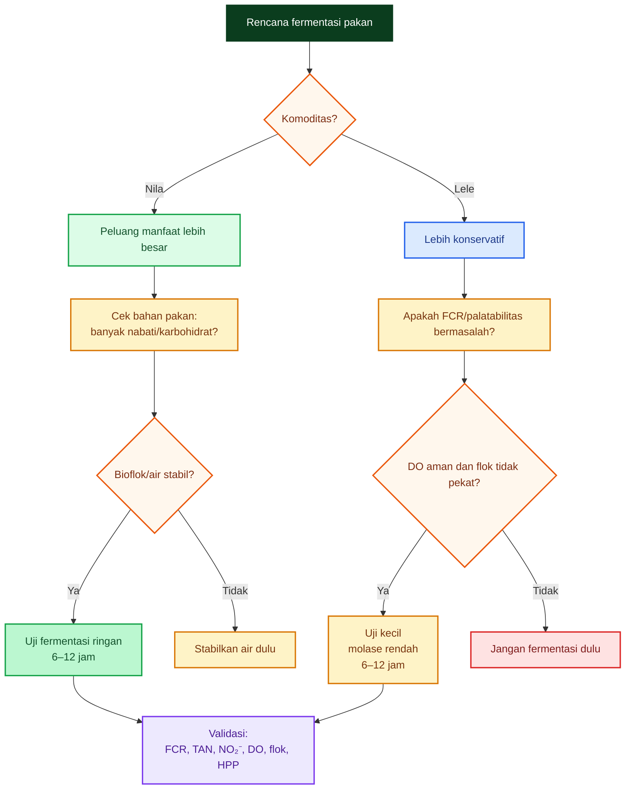

---

## 6.10. Kesimpulan Bab 6

Fermentasi lebih masuk akal untuk nila daripada lele karena manfaat utama fermentasi berada pada wilayah karbohidrat, bahan nabati, serat, antinutrisi, dan protein larut. Nila lebih mampu memanfaatkan perbaikan ini, sedangkan lele lebih ketat dan lebih sensitif terhadap risiko pelet hancur, COD/BOD naik, DO turun, dan flok terlalu pekat.

Untuk nila:

$$
\boxed{
fermentasi\ dapat\ menjadi\ strategi\ nutrisi
}
$$

Untuk lele:

$$
\boxed{
fermentasi\ hanya\ alat\ bantu\ yang\ harus\ diuji\ kecil\ dan\ divalidasi
}
$$

Risiko utama pada lele bioflok:

$$
\boxed{
pelet\ hancur
\Rightarrow
DOC/COD/BOD \uparrow
\Rightarrow
DO \downarrow
\Rightarrow
flok\ pekat
\Rightarrow
FCR\ bisa\ memburuk
}
$$

Kalimat praktisnya:

> **Fermentasi pakan lebih cocok untuk nila karena nila lebih siap memanfaatkan hasil perbaikan bahan nabati dan karbohidrat. Pada lele, fermentasi tidak boleh dikejar untuk menaikkan E/P, tetapi hanya diuji sebagai cara memperbaiki palatabilitas dan kecernaan tanpa memperberat bioflok.**

[**Kembali ke Atas**](#ep-ratio-pakan-ikan-antara-efisiensi-fcr-fermentasi-ringan-bioflok-dan-perbedaan-strategi-lele-vs-nila)

[1]: https://slunik.slu.se/kursfiler/HV0055/40021.1213/Fish_nutriton_review_Krogdahl.pdf?utm_source=chatgpt.com 'Carbohydrates in fish nutrition: digestion and absorption in ...'
[2]: https://onlinelibrary.wiley.com/doi/full/10.1111/raq.12413?utm_source=chatgpt.com 'Carbohydrate utilisation by tilapia: a meta‐analytical ...'
[3]: https://www.mdpi.com/2076-2615/14/2/332?utm_source=chatgpt.com 'Fermentation of Plant-Based Feeds with Lactobacillus ...'
[4]: https://extension.msstate.edu/sites/default/files/document/rr24-16.pdf?utm_source=chatgpt.com 'A Brief Overview of Catfish Nutrition'

---

# 7. Strategi Menurunkan FCR dengan Bioflok dan Fermentasi

FCR tidak turun hanya karena pakan difermentasi, protein tinggi, atau air kolam terlihat “jadi bioflok”. FCR turun jika **nutrisi, kualitas air, perilaku makan, dan manajemen limbah** bekerja bersama.

Rumus dasar:

$$
FCR =
\frac{
\text{total pakan yang diberikan}
}{
\text{pertambahan bobot ikan}
}
$$

Maka strategi menurunkan FCR harus mengejar dua hal sekaligus:

$$
\boxed{
\text{pakan lebih banyak menjadi daging}
}
$$

dan:

$$
\boxed{
\text{lebih sedikit menjadi feses, TAN, COD/BOD, dan flok berlebih}
}
$$

Dalam sistem bioflok, hal ini menjadi lebih kritis karena bioflok memang dirancang untuk meningkatkan kontrol lingkungan dan efisiensi produksi, tetapi sistem ini juga menuntut aerasi, mixing, dan pengelolaan padatan yang kuat. ([Aquaculture][1])

---

## 7.1. Jalur Utama Penurunan FCR

FCR bisa turun bila:

- pakan cepat dimakan,
- kecernaan naik,
- protein tidak dibakar sebagai energi,
- bioflok ikut dimanfaatkan ikan,
- stres air rendah,
- DO stabil,
- TAN dan nitrit rendah.

Secara sederhana:

$$
\boxed{
FCR\ turun = nutrisi\ lebih\ efisien = + = stres\ lebih\ rendah = + = limbah\ lebih\ terkendali
}
$$

Diagram berikut menunjukkan jalur utamanya.

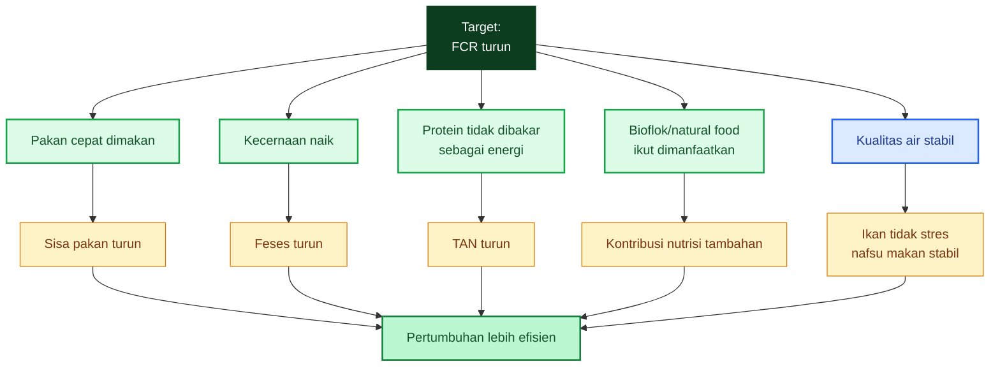

Jalur paling penting adalah **protein sparing effect**. Energi sebaiknya dipenuhi oleh karbohidrat dan lemak, sehingga protein lebih banyak dipakai untuk pertumbuhan. Mississippi State Extension menjelaskan bahwa lemak merupakan sumber energi terkonsentrasi dan dapat menghemat protein agar tidak dipakai sebagai energi; pakan catfish komersial juga mengandung karbohidrat tercerna sebagai sumber energi. ([MSU Extension Service][2])

---

## 7.2. Penurunan FCR Tidak Boleh Mengorbankan Air

Dalam bioflok, FCR yang rendah tetapi air rusak bukan keberhasilan. Jika pakan atau fermentasi membuat COD/BOD naik, DO turun, flok pekat, dan nitrit meningkat, maka FCR biasanya akan memburuk pada siklus berikutnya.

Rumus sederhana beban nitrogen dari pakan:

$$
N_{pakan} = Pakan \times \%Protein \times 0{,}16
$$

Contoh:

$$
Pakan = 1.000\ g
$$

$$
Protein = 30\% = 0{,}30
$$

Maka:

$$
N_{pakan} = 1000 \times 0{,}30 \times 0{,}16
$$

$$
\boxed{
N_{pakan}=48\ g\ N
}
$$

Jika 70–80% nitrogen pakan tidak menjadi daging, nitrogen itu akan masuk ke air sebagai feses, bahan organik, atau ekskresi amonia. Maka FCR buruk bukan hanya masalah biaya, tetapi juga masalah kualitas air.

Dalam bioflok:

$$
FCR\ buruk
\Rightarrow
pakan\ terbuang
\Rightarrow
TAN,\ COD/BOD,\ flok,\ dan\ OUR\ naik
$$

dengan:

$$
OUR =
\text{oxygen uptake rate}
$$

atau konsumsi oksigen oleh ikan, mikroba, dan bahan organik.

---

## 7.3. Peran Bioflok dalam Menurunkan FCR

Bioflok dapat membantu FCR melalui tiga mekanisme:

| Mekanisme            | Dampak terhadap FCR                                     |
| -------------------- | ------------------------------------------------------- |
| Daur ulang nitrogen  | sebagian limbah nitrogen menjadi biomassa mikroba       |
| Pakan alami tambahan | flok dapat dimakan sebagian oleh ikan                   |
| Stabilitas air       | air stabil menurunkan stres dan memperbaiki nafsu makan |

Namun bioflok bukan pengganti pakan berkualitas. Bioflok lebih tepat disebut **nutrisi tambahan dan sistem pengendali limbah**, bukan sumber pakan utama.

Hargreaves menjelaskan bahwa sistem bioflok dikembangkan untuk meningkatkan kontrol lingkungan pada produksi akuakultur intensif, terutama saat air dan lahan terbatas; tetapi sistem ini membutuhkan aerasi dan pengelolaan padatan tersuspensi. ([Aquaculture][1])

Jadi bioflok dapat menurunkan FCR bila:

$$
\boxed{
flok\ aktif,\ cukup,\ dan\ termakan
}
$$

tetapi akan menaikkan risiko bila:

$$
\boxed{
flok\ terlalu\ pekat,\ tua,\ mengendap,\ dan\ membusuk
}
$$

---

## 7.4. Peran Fermentasi Pakan dalam Menurunkan FCR

Fermentasi ringan dapat membantu FCR bila memperbaiki:

$$
\boxed{
palatabilitas
}
$$

$$
\boxed{
kecernaan
}
$$

$$
\boxed{
available\ energy
}
$$

$$
\boxed{
kesehatan\ usus
}
$$

Tetapi fermentasi tidak otomatis menurunkan FCR. Studi pakan berbasis tanaman yang difermentasi dengan _Lactobacillus acidophilus_ pada nila bioflok menunjukkan fermentasi meningkatkan LAB, meningkatkan protein larut, menurunkan pH pakan, dan memperbaiki survival; tetapi feed intake meningkat dan feed efficiency justru memburuk. Ini penting: fermentasi bisa membantu kesehatan dan survival, tetapi tidak otomatis memperbaiki efisiensi pakan. ([MDPI][3])

Maka klaim yang benar:

$$
\boxed{
fermentasi\ berpotensi\ menurunkan\ FCR
}
$$

bukan:

$$
\boxed{
fermentasi\ pasti\ menurunkan\ FCR
}
$$

Fermentasi dianggap berhasil hanya jika:

$$
FCR \downarrow
$$

dan:

$$
DO,\ TAN,\ NO_2^-,\ flok,\ busa,\ bau
$$

tetap terkendali.

---

## 7.5. Strategi pada Lele: Bioflok Stabil Dulu, Baru Uji Fermentasi

Untuk lele, strategi harus konservatif:

$$
\boxed{
bioflok\ stabil\ dulu,\ baru\ uji\ fermentasi\ pakan
}
$$

Prioritasnya:

1. DO.
2. pakan stabil air.
3. protein dan E/P seimbang.
4. FCR lapangan.
5. TAN dan nitrit.
6. fermentasi hanya jika terbukti memperbaiki performa.

Lele/catfish tetap membutuhkan energi non-protein untuk menghemat protein, tetapi zona E/P-nya tidak perlu dikejar terlalu tinggi. Mississippi State Extension menyebut rasio DE/CP 8,5–10 kcal/g protein cukup untuk catfish komersial, dan rasio terlalu tinggi dapat meningkatkan deposisi lemak. ([MSU Extension Service][4])

Maka untuk lele:

$$
\boxed{
jangan\ memakai\ fermentasi\ untuk\ mengejar\ E/P\ setinggi\ mungkin
}
$$

Gunakan fermentasi hanya untuk uji:

$$
palatabilitas + kecernaan\ ringan + FCR\ lapangan
$$

bukan untuk klaim:

$$
E/P\ naik \Rightarrow FCR\ pasti\ turun
$$

---

## 7.6. SOP Strategi Lele Bioflok

Untuk lele bioflok, urutan yang lebih aman adalah:

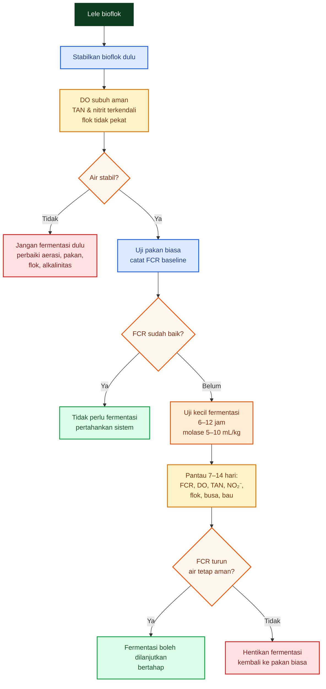

Praktisnya, lele bioflok tidak boleh langsung masuk ke fermentasi. Yang harus dibuktikan dulu adalah FCR dasar dari pakan biasa pada kondisi bioflok stabil.

Jika pakan biasa sudah menghasilkan FCR baik dan air stabil, fermentasi tidak wajib.

---

## 7.7. Parameter Keberhasilan Fermentasi pada Lele

Fermentasi pakan lele dianggap layak hanya jika hasilnya seperti ini:

| Parameter   | Target setelah fermentasi                     |
| ----------- | --------------------------------------------- |
| FCR         | turun nyata atau minimal konsisten lebih baik |
| Nafsu makan | naik, pakan cepat habis                       |
| DO          | tidak turun setelah pemberian pakan           |
| TAN         | tidak naik                                    |
| Nitrit      | tidak naik                                    |
| Flok        | tidak bertambah pekat berlebihan              |
| Busa        | tidak melonjak                                |
| Bau         | tidak busuk/asam tajam                        |
| HPP         | turun setelah biaya fermentasi dihitung       |

Jika FCR turun tetapi DO sering turun, maka strategi itu tidak aman.

Jika ikan makan lebih cepat tetapi TAN dan flok naik, berarti pakan mungkin lebih palatable, tetapi tidak lebih efisien.

Jika HPP tidak turun, maka fermentasi hanya menambah pekerjaan.

---

## 7.8. Strategi pada Nila: Bioflok + Pakan Nabati Fermentasi

Pada nila, strategi bisa lebih agresif:

$$
\boxed{
bioflok + pakan\ nabati\ fermentasi
}
$$

Nila lebih mungkin mendapat manfaat dari:

- bahan nabati fermentasi,
- karbohidrat tersedia,
- bioflok/natural food,
- food web pond/bioflok.

Studi terbaru pada nila menunjukkan sistem bioflok dapat mendukung pertumbuhan dan sebagian kontribusi nutrisi, termasuk dalam konteks fry, meskipun tingkat kontribusi aktual tetap tergantung desain sistem, kepadatan, padatan flok, dan manajemen pakan. ([PMC][5])

Pada nila, fermentasi lebih cocok bila diarahkan pada bahan nabati:

$$
dedak,\ bungkil,\ onggok,\ sagu,\ ampas,\ atau\ bahan\ lokal
$$

bukan hanya membasahi pelet komersial.

Mengapa?

Karena target fermentasi pada nila adalah:

$$
\boxed{
memperbaiki\ karbohidrat,\ serat,\ antinutrisi,\ dan\ kecernaan\ bahan\ nabati
}
$$

Ini lebih sesuai dengan fisiologi dan perilaku makan nila dibanding lele.

---

## 7.9. SOP Strategi Nila Bioflok + Fermentasi

Untuk nila, strategi lebih terbuka:

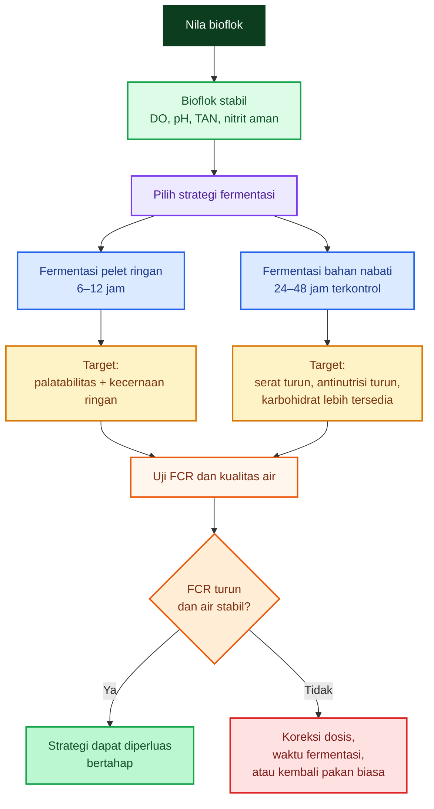

Untuk nila, fermentasi bahan baku lebih menjanjikan daripada fermentasi pelet jadi karena fermentasi bahan memberi peluang lebih besar memperbaiki nilai nutrisi bahan sebelum masuk ke formulasi.

---

## 7.10. Bioflok Dimakan Ikan: Lele vs Nila

Bioflok dapat membantu FCR bila ikan benar-benar memanfaatkannya. Di sinilah perbedaan lele dan nila menjadi penting.

| Aspek                             | Lele                       | Nila                              |
| --------------------------------- | -------------------------- | --------------------------------- |
| Pemanfaatan bioflok               | ada, tetapi lebih terbatas | lebih kuat                        |
| Pemanfaatan detritus/natural food | sedang                     | lebih baik                        |
| Respons terhadap bahan nabati     | lebih selektif             | lebih adaptif                     |
| Potensi FCR turun dari bioflok    | tergantung manajemen       | lebih prospektif                  |
| Risiko air berat                  | tinggi bila pakan hancur   | tetap ada, tetapi lebih fleksibel |

Maka strategi FCR harus berbeda:

$$
\boxed{
Lele:
pakan\ utama\ harus\ efisien,\ bioflok\ sebagai\ tambahan
}
$$

$$
\boxed{
Nila:
pakan + bioflok + natural\ food\ bisa\ lebih\ sinergis
}
$$

---

## 7.11. Hubungan E/P, Bioflok, dan Fermentasi

Ketiganya harus dibaca sebagai sistem:

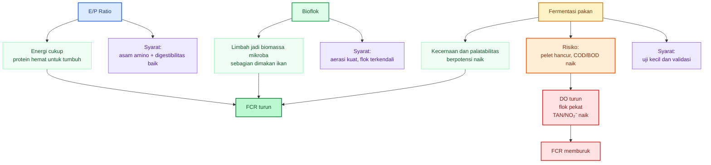

Kunci strateginya:

$$
\boxed{
E/P\ yang\ baik\ membuat\ protein\ efisien
}
$$

$$
\boxed{
bioflok\ yang\ baik\ mendaur\ ulang\ limbah
}
$$

$$
\boxed{
fermentasi\ yang\ baik\ meningkatkan\ pemanfaatan\ pakan
}
$$

Tetapi ketiganya bisa gagal jika:

$$
DO\ rendah
$$

$$
pakan\ hancur
$$

$$
flok\ berlebihan
$$

$$
TAN/NO_2^-\ naik
$$

---

## 7.12. Rumus Praktis Mengukur Dampak FCR

Penurunan FCR harus dihitung secara ekonomi.

Jika:

$$
Harga\ pakan = H
$$

dan FCR turun dari:

$$
FCR_1
$$

menjadi:

$$
FCR_2
$$

maka penghematan pakan per kg ikan:

$$
Penghematan =
H \times (FCR_1 - FCR_2)
$$

Contoh:

$$
H = Rp12.000/kg
$$

$$
FCR_1 = 1{,}25
$$

$$
FCR_2 = 1{,}15
$$

Maka:

$$
Penghematan =
12.000 \times (1{,}25 - 1{,}15)
$$

$$
Penghematan =
12.000 \times 0{,}10
$$

$$
\boxed{
Penghematan = Rp1.200/kg\ ikan
}
$$

Fermentasi hanya layak jika:

$$
\boxed{
biaya\ tambahan\ fermentasi
<
penghematan\ FCR
}
$$

Biaya tambahan fermentasi meliputi:

$$
molase + probiotik + tenaga + wadah + risiko\ kualitas\ air
$$

Jika biaya tambahan lebih besar dari penghematan, maka FCR turun pun belum tentu menguntungkan.

---

## 7.13. Desain Uji Kecil Sebelum Diterapkan Luas

Untuk praktisi, jangan langsung mengubah semua pakan menjadi pakan fermentasi. Uji dulu.

### Perlakuan minimal

| Perlakuan | Keterangan              |
| --------- | ----------------------- |
| A         | Pakan biasa             |
| B         | Pakan fermentasi 6 jam  |
| C         | Pakan fermentasi 12 jam |

Jika ingin menambah molase:

| Perlakuan | Keterangan                            |
| --------- | ------------------------------------- |
| D         | Fermentasi 8–12 jam + molase 5 mL/kg  |
| E         | Fermentasi 8–12 jam + molase 10 mL/kg |

### Parameter wajib dicatat

| Parameter      | Frekuensi               |
| -------------- | ----------------------- |
| Pakan harian   | setiap hari             |
| Bobot sampling | 7–14 hari               |
| FCR            | setiap periode sampling |
| DO subuh       | harian                  |
| TAN            | 2–3 kali/minggu         |
| Nitrit         | 2–3 kali/minggu         |
| Flok           | 2–3 kali/minggu         |
| Busa/bau       | harian                  |
| Survival       | harian                  |

Fermentasi lolos jika:

$$
FCR\ turun
$$

dan:

$$
DO,\ TAN,\ NO_2^-,\ flok,\ busa,\ bau
$$

tetap aman.

---

## 7.14. Kesimpulan Bab 7

Strategi menurunkan FCR dengan bioflok dan fermentasi harus dibangun dari urutan yang benar.

Untuk lele:

$$
\boxed{
bioflok\ stabil\ dulu,\ baru\ uji\ fermentasi\ pakan
}
$$

Prioritasnya:

$$
DO \rightarrow pakan\ stabil \rightarrow E/P\ seimbang \rightarrow FCR \rightarrow TAN/NO_2^- \rightarrow uji\ fermentasi
$$

Untuk nila:

$$
\boxed{
bioflok + pakan\ nabati\ fermentasi
}
$$

lebih prospektif karena nila lebih mampu memanfaatkan bahan nabati, karbohidrat tersedia, bioflok, dan natural food.

Namun untuk keduanya, klaim keberhasilan harus sama:

$$
\boxed{
FCR\ turun + kualitas\ air\ tetap\ aman + HPP\ turun
}
$$

Kalimat praktisnya:

> **Bioflok dan fermentasi hanya menurunkan FCR bila pakan benar-benar lebih efisien menjadi daging, bukan berubah menjadi TAN, COD/BOD, busa, dan flok berlebih.**

[**Kembali ke Atas**](#ep-ratio-pakan-ikan-antara-efisiensi-fcr-fermentasi-ringan-bioflok-dan-perbedaan-strategi-lele-vs-nila)

[1]: https://aquaculture.mgcafe.uky.edu/sites/aquaculture.ca.uky.edu/files/srac_4503_biofloc_production_systems_for_aquaculture.pdf?utm_source=chatgpt.com 'Biofloc Production Systems for Aquaculture'
[2]: https://extension.msstate.edu/agriculture/catfish/nutrition-feeds-and-feeding?utm_source=chatgpt.com 'Nutrition, Feeds, and Feeding'
[3]: https://www.mdpi.com/2076-2615/14/2/332?utm_source=chatgpt.com 'Fermentation of Plant-Based Feeds with Lactobacillus ...'
[4]: https://extension.msstate.edu/agriculture/catfish/catfish-feeds-and-feeding?utm_source=chatgpt.com 'Catfish Feeds and Feeding'
[5]: https://pmc.ncbi.nlm.nih.gov/articles/PMC12560881/?utm_source=chatgpt.com 'Biofloc Technology for Nile Tilapia Fry - PMC - NIH'

---

# 8. Pengaruh terhadap HPP: Bioflok vs Bioflok + Fermentasi

Bab ini menjawab pertanyaan paling praktis:

$$
\boxed{
Apakah\ fermentasi\ pakan\ benar\text{-}benar\ menurunkan\ HPP?
}
$$

Jawabannya tidak otomatis. Fermentasi hanya layak jika penurunan FCR lebih besar daripada tambahan biaya dan risiko yang ditimbulkan.

Dengan kata lain:

$$
\boxed{
fermentasi\ bukan\ dinilai\ dari\ pakan\ terlihat\ lebih\ “aktif”,\ tetapi\ dari\ HPP\ yang\ turun.
}
$$

FAO mendefinisikan FCR sebagai jumlah unit pakan kering yang dibutuhkan untuk menghasilkan satu unit bobot basah ikan atau krustasea, sehingga FCR langsung berhubungan dengan biaya pakan per kg ikan. ([FAOHome][1])

---

## 8.1. Formula HPP Pakan per kg Ikan

Formula paling dasar:

$$
\boxed{
Biaya\ pakan/kg\ ikan =
Harga\ pakan/kg \times FCR
}
$$

Jika:

$$
Harga\ pakan = Rp11.000/kg
$$

dan:

$$
FCR = 1{,}20
$$

maka:

$$
Biaya\ pakan/kg\ ikan =
11.000 \times 1{,}20
$$

$$
\boxed{
Biaya\ pakan/kg\ ikan = Rp13.200
}
$$

Jika FCR turun menjadi:

$$
FCR = 1{,}10
$$

maka:

$$
Biaya\ pakan/kg\ ikan =
11.000 \times 1{,}10
$$

$$
\boxed{
Biaya\ pakan/kg\ ikan = Rp12.100
}
$$

Penghematan:

$$
13.200 - 12.100 =
Rp1.100/kg\ ikan
$$

Jadi:

$$
\boxed{
penurunan\ FCR\ 0{,}10 = \text{ pada pakan Rp11.000/kg} = Rp1.100/kg\ ikan
}
$$

Ini logika ekonomi paling penting. Fermentasi hanya masuk akal jika biaya tambahannya lebih kecil daripada nilai penghematan tersebut.

---

## 8.2. HPP Bioflok Tanpa Fermentasi

HPP bioflok tidak hanya terdiri dari pakan. Bioflok memiliki biaya energi yang besar karena membutuhkan aerasi dan mixing terus-menerus. Hargreaves menjelaskan bahwa padatan tersuspensi adalah pusat fungsi bioflok, tetapi konsentrasi padatan yang berlebihan meningkatkan kebutuhan energi untuk mixing dan aerasi, serta menaikkan oxygen demand dari respirasi air. ([Aquaculture][2])

Formula total HPP per kg ikan:

$$
\boxed{
HPP_{bioflok} = \frac{ = Biaya\ pakan = + = Biaya\ benih = + = Biaya\ listrik/aerasi = + = Biaya\ probiotik/koreksi = + = Biaya\ tenaga = + = Penyusutan = + = Biaya\ lain = }{ = Kg\ ikan\ panen = }
}
$$

Untuk fokus pakan:

$$
\boxed{
Biaya\ pakan/kg\ ikan =
Harga\ pakan \times FCR
}
$$

Maka:

$$
\boxed{
HPP_{bioflok} = Biaya\ pakan/kg\ ikan = + = Biaya\ non\text{-}pakan/kg\ ikan
}
$$

Komponen non-pakan meliputi:

| Komponen       | Contoh                                        |
| -------------- | --------------------------------------------- |
| Benih          | harga benih, mortalitas awal                  |
| Listrik/aerasi | blower, aerator, cadangan listrik             |
| Koreksi air    | garam, dolomit, molase korektif, probiotik    |
| Tenaga         | pemberian pakan, sampling, siphon             |
| Penyusutan     | kolam, blower, pipa, diffuser                 |
| Risiko         | kematian, gagal panen, penurunan kualitas air |

Jadi bioflok tanpa fermentasi sudah memiliki struktur biaya yang tidak ringan, terutama pada listrik dan aerasi.

---

## 8.3. Bioflok + Fermentasi: Tambahan Biaya dan Tambahan Risiko

Fermentasi pakan menambah biaya baru:

$$
\boxed{
molase + probiotik + air + wadah + tenaga + risiko
}
$$

Secara formula:

$$
\boxed{
HPP_{bioflok+fermentasi} = HPP_{bioflok} = + = Biaya\ fermentasi = Penghematan\ FCR = + = Biaya\ risiko
}
$$

Atau lebih tajam:

$$
\boxed{
\Delta HPP = Biaya\ fermentasi = + = Biaya\ risiko = (Harga\ pakan \times \Delta FCR)
}
$$

Dengan:

$$
\Delta FCR =
FCR_{awal} - FCR_{fermentasi}
$$

Fermentasi layak jika:

$$
\boxed{
\Delta HPP < 0
}
$$

atau:

$$
\boxed{
Biaya\ fermentasi + Biaya\ risiko
<
Harga\ pakan \times \Delta FCR
}
$$

---

## 8.4. Diagram Keputusan HPP Fermentasi

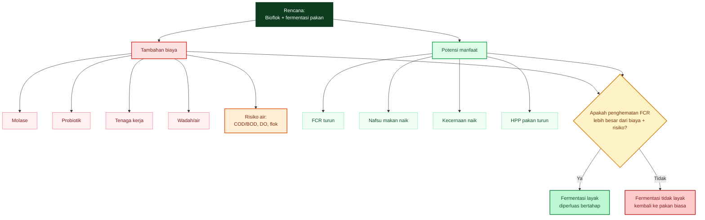

Inti diagram ini:

$$
\boxed{
fermentasi\ bukan\ biaya\ kecil\ jika\ dihitung\ dengan\ tenaga,\ risiko,\ dan\ kualitas\ air.
}
$$

---

## 8.5. Titik Impas Fermentasi

Fermentasi layak bila:

$$
\boxed{
\Delta biaya\ fermentasi
<
Harga\ pakan \times \Delta FCR
}
$$

Contoh:

$$
Harga\ pakan = Rp11.000/kg
$$

FCR turun dari:

$$
1{,}20 \rightarrow 1{,}10
$$

Maka:

$$
\Delta FCR = 1{,}20 - 1{,}10 = 0{,}10
$$

Penghematan pakan:

$$
0{,}10 \times 11.000 = Rp1.100/kg\ ikan
$$

Maka:

$$
\boxed{
fermentasi\ layak\ jika\ biaya\ tambahan
<
Rp1.100/kg\ ikan
}
$$

Tetapi syaratnya bukan hanya biaya. Kualitas air juga harus tetap aman:

$$
DO\ stabil
$$

$$
TAN\ tidak\ naik
$$

$$
NO_2^-\ tidak\ naik
$$

$$
flok\ tidak\ berlebihan
$$

$$
busa\ tidak\ melonjak
$$

Jika FCR turun sedikit tetapi DO sering drop dan mortalitas naik, maka fermentasi tidak layak.

---

## 8.6. Contoh Simulasi Biaya Fermentasi

Misal target produksi:

$$
1.000\ kg\ ikan
$$

Harga pakan:

$$
Rp11.000/kg
$$

FCR awal:

$$
1{,}20
$$

FCR setelah fermentasi:

$$
1{,}10
$$

### Tanpa fermentasi

Kebutuhan pakan:

$$
1.000 \times 1{,}20 = 1.200\ kg
$$

Biaya pakan:

$$
1.200 \times 11.000 = Rp13.200.000
$$

### Dengan fermentasi

Kebutuhan pakan:

$$
1.000 \times 1{,}10 = 1.100\ kg
$$

Biaya pakan:

$$
1.100 \times 11.000 = Rp12.100.000
$$

Penghematan pakan:

$$
13.200.000 - 12.100.000 = Rp1.100.000
$$

atau:

$$
\boxed{
Rp1.100/kg\ ikan
}
$$

Sekarang masukkan biaya fermentasi hipotetis:

| Komponen           |  Asumsi biaya |
| ------------------ | ------------: |
| Molase             | Rp150/kg ikan |
| Probiotik          | Rp200/kg ikan |
| Tenaga tambahan    | Rp250/kg ikan |
| Wadah/air/handling |  Rp50/kg ikan |
| Risiko operasional | Rp150/kg ikan |
| Total              | Rp800/kg ikan |

Maka keuntungan bersih:

$$
Rp1.100 - Rp800 =
Rp300/kg\ ikan
$$

Dalam skenario ini:

$$
\boxed{
fermentasi\ masih\ layak
}
$$

Tetapi jika total biaya fermentasi menjadi:

$$
Rp1.300/kg\ ikan
$$

maka:

$$
Rp1.100 - Rp1.300 =
-Rp200/kg\ ikan
$$

Dalam skenario ini:

$$
\boxed{
fermentasi\ tidak\ layak
}
$$

---

## 8.7. Skenario Sensitivitas FCR

Penurunan FCR kecil sering tidak cukup untuk membayar biaya fermentasi.

Dengan harga pakan:

$$
Rp11.000/kg
$$

| FCR awal | FCR fermentasi | ΔFCR | Penghematan/kg ikan |
| -------: | -------------: | ---: | ------------------: |
|     1,20 |           1,18 | 0,02 |               Rp220 |
|     1,20 |           1,15 | 0,05 |               Rp550 |
|     1,20 |           1,10 | 0,10 |             Rp1.100 |
|     1,20 |           1,05 | 0,15 |             Rp1.650 |

Pembacaan praktis:

$$
\boxed{
jika\ FCR\ hanya\ turun\ 0{,}02\text{–}0{,}05,
fermentasi\ sering\ belum\ tentu\ layak.
}
$$

Fermentasi mulai menarik jika:

$$
\boxed{
FCR\ turun\ cukup\ besar\ dan\ stabil
}
$$

serta tidak menambah masalah air.

Texas A&M menampilkan contoh bahwa feed cost per satuan produksi catfish berubah mengikuti FCR dan harga pakan; semakin tinggi FCR, semakin besar biaya pakan untuk menghasilkan ikan. ([RWFM Extension][3])

---

## 8.8. Skenario Risiko Kualitas Air

Fermentasi dapat menurunkan FCR, tetapi juga dapat menaikkan biaya tersembunyi.

Misalnya:

$$
FCR\ turun = 0{,}05
$$

Penghematan:

$$
0{,}05 \times 11.000 =
Rp550/kg\ ikan
$$

Tetapi fermentasi membuat pelet hancur dan COD/BOD naik. Akibatnya:

| Risiko          | Biaya tersembunyi                   |
| --------------- | ----------------------------------- |
| DO drop         | konsumsi listrik/aerasi naik        |
| Flok pekat      | perlu siphon/ganti air/tenaga       |
| Nitrit naik     | koreksi garam, stres ikan           |
| TAN naik        | kurangi pakan, pertumbuhan melambat |
| Mortalitas naik | HPP naik                            |
| Panen mundur    | biaya operasional bertambah         |

Jika total biaya tersembunyi mencapai:

$$
Rp700/kg\ ikan
$$

maka:

$$
Rp550 - Rp700 =
-Rp150/kg\ ikan
$$

Artinya:

$$
\boxed{
FCR\ turun,\ tetapi\ HPP\ tetap\ naik.
}
$$

Ini alasan artikel selalu menekankan:

$$
\boxed{
FCR\ turun\ saja\ tidak\ cukup.
}
$$

Yang dicari adalah:

$$
\boxed{
FCR\ turun + kualitas\ air\ aman + HPP\ turun.
}
$$

---

## 8.9. HPP Lele: Bioflok vs Bioflok + Fermentasi

Pada lele bioflok, fermentasi harus sangat selektif.

Alasannya:

1. Lele tidak perlu dikejar ke E/P terlalu tinggi.
2. Pelet hancur cepat memperberat COD/BOD.
3. Bioflok lele biasanya sudah memiliki beban organik tinggi.
4. DO dan nitrit sangat kritis.
5. FCR turun kecil bisa kalah oleh biaya risiko.

Untuk lele:

$$
\boxed{
bioflok\ stabil\ dulu,\ baru\ uji\ fermentasi\ kecil.
}
$$

Skenario realistis:

| Kondisi                                | Keputusan              |
| -------------------------------------- | ---------------------- |
| FCR pakan biasa sudah baik             | tidak perlu fermentasi |
| DO subuh sering rendah                 | jangan fermentasi      |
| flok pekat/busa tinggi                 | jangan fermentasi      |
| FCR buruk tetapi air stabil            | boleh uji kecil        |
| fermentasi menurunkan FCR dan air aman | lanjut bertahap        |

Maka peluang fermentasi menurunkan HPP lele:

$$
\boxed{
rendah\text{–}sedang
}
$$

bukan tinggi.

---

## 8.10. HPP Nila: Bioflok + Fermentasi Lebih Menjanjikan

Pada nila, fermentasi lebih masuk akal karena nila lebih mampu memanfaatkan karbohidrat, bahan nabati, bioflok, dan natural food. Studi pada sistem nila menunjukkan bahwa food web/natural food dapat berkontribusi terhadap performa dalam sistem kolam, sehingga strategi pakan pada nila tidak hanya dibaca dari pelet, tetapi juga dari kontribusi ekosistem budidaya. ([PMC][4])

Untuk nila:

$$
\boxed{
bioflok + pakan\ nabati\ fermentasi
}
$$

lebih prospektif dibanding pada lele.

Namun tetap ada syarat:

$$
DO\ aman
$$

$$
flok\ terkendali
$$

$$
pakan\ cepat\ dimakan
$$

$$
COD/BOD\ tidak\ melonjak
$$

$$
FCR\ benar\text{-}benar\ turun
$$

Peluang fermentasi menurunkan HPP nila:

$$
\boxed{
sedang\text{–}tinggi
}
$$

terutama jika fermentasi dilakukan pada bahan nabati lokal yang murah dan masih dapat diformulasi dengan baik.

---

## 8.11. Prediksi Realistis Lele vs Nila

| Komoditas    | Peluang FCR turun dari fermentasi | Risiko                           |
| ------------ | --------------------------------: | -------------------------------- |
| Lele         |                     rendah–sedang | COD/BOD, pelet hancur, DO turun  |
| Nila         |                     sedang–tinggi | tetap perlu kontrol kualitas air |
| Nila bioflok |                 lebih menjanjikan | flok harus terkendali            |
| Lele bioflok |             harus sangat selektif | aerasi dan nitrit kritis         |

Pembacaan praktis:

$$
\boxed{
fermentasi\ pakan\ lebih\ mudah\ dibenarkan\ secara\ ekonomi\ pada\ nila
}
$$

dibanding:

$$
\boxed{
lele\ bioflok\ intensif
}
$$

Pada lele, fermentasi harus dianggap sebagai **uji efisiensi**, bukan standar operasional otomatis.

---

## 8.12. Checklist Kelayakan Ekonomi Fermentasi

Fermentasi layak diterapkan bila semua ini terpenuhi:

| Pertanyaan                                            | Harus dijawab |
| ----------------------------------------------------- | ------------- |
| Apakah FCR turun nyata?                               | Ya            |
| Apakah penurunan FCR konsisten?                       | Ya            |
| Apakah biaya fermentasi lebih kecil dari penghematan? | Ya            |
| Apakah DO tetap aman?                                 | Ya            |
| Apakah TAN/nitrit tidak naik?                         | Ya            |
| Apakah flok tidak berlebihan?                         | Ya            |
| Apakah mortalitas tidak naik?                         | Ya            |
| Apakah HPP total turun?                               | Ya            |

Jika salah satu jawaban penting adalah “tidak”, fermentasi belum layak diterapkan luas.

Formula keputusan:

$$
\boxed{
Layak = (FCR\ turun) = + = (HPP\ turun) = + = (Kualitas\ air\ aman)
}
$$

Bukan:

$$
\boxed{
Layak = pakan\ berbau\ asam\ dan\ terlihat\ terfermentasi
}
$$

---

## 8.13. Kesimpulan Bab 8

Fermentasi pakan hanya bernilai jika menurunkan HPP.

Formula dasarnya:

$$
\boxed{
Biaya\ pakan/kg\ ikan =
Harga\ pakan/kg \times FCR
}
$$

Fermentasi layak bila:

$$
\boxed{
Biaya\ fermentasi + Biaya\ risiko
<
Harga\ pakan \times \Delta FCR
}
$$

Dengan contoh:

$$
Harga\ pakan = Rp11.000/kg
$$

dan:

$$
FCR = 1{,}20 \rightarrow 1{,}10
$$

maka penghematan maksimal dari pakan:

$$
\boxed{
Rp1.100/kg\ ikan
}
$$

Jadi biaya fermentasi dan risikonya harus berada di bawah angka tersebut.

Untuk lele bioflok:

$$
\boxed{
fermentasi\ harus\ sangat\ selektif
}
$$

Untuk nila bioflok:

$$
\boxed{
fermentasi\ lebih\ menjanjikan,\ terutama\ pada\ bahan\ nabati
}
$$

Kalimat praktisnya:

> **Fermentasi tidak boleh dinilai dari prosesnya, tetapi dari hasil akhirnya: FCR turun, air tetap aman, dan HPP benar-benar lebih rendah.**

[**Kembali ke Atas**](#ep-ratio-pakan-ikan-antara-efisiensi-fcr-fermentasi-ringan-bioflok-dan-perbedaan-strategi-lele-vs-nila)

[1]: https://www.fao.org/4/y3781e/y3781e05.htm?utm_source=chatgpt.com '3. METHODOLOGICAL APPROACH'
[2]: https://aquaculture.mgcafe.uky.edu/sites/aquaculture.ca.uky.edu/files/srac_4503_biofloc_production_systems_for_aquaculture.pdf?utm_source=chatgpt.com 'Biofloc Production Systems for Aquaculture'
[3]: https://extension.rwfm.tamu.edu/wp-content/uploads/sites/8/2013/09/A-Practical-Guide-to-Nutrition-Feeds-and-Feeding-of-Catfish.pdf?utm_source=chatgpt.com 'A Practical Guide to Nutrition, Feeds, and Feeding of Catfish'
[4]: https://pmc.ncbi.nlm.nih.gov/articles/PMC11117240/?utm_source=chatgpt.com 'A Review on Biofloc System Technology, History, Types, and ...'

---

# 9. Kerangka Uji Lapangan agar Tidak Tersesat

Fermentasi pakan tidak boleh langsung dianggap berhasil hanya karena pakan berbau asam, ikan terlihat lahap, atau air tampak lebih “hidup”. Klaim keberhasilan harus diuji.

Prinsip bab ini:

$$
\boxed{
\text{fermentasi pakan hanya dianggap berhasil bila FCR turun, HPP turun, dan kualitas air tetap aman.}
}
$$

Bukan hanya:

$$
\boxed{
\text{ikan tampak makan lebih cepat}
}
$$

Karena ikan yang makan lebih cepat belum tentu tumbuh lebih efisien. Bisa saja pakan lebih palatable, tetapi lebih banyak larut ke air, menaikkan COD/BOD, menurunkan DO, dan akhirnya memperburuk FCR.

---

## 9.1. Tujuan Uji Lapangan

Tujuan uji lapangan adalah menjawab lima pertanyaan:

$$
\boxed{
1.\ Apakah fermentasi menurunkan FCR?
}
$$

$$
\boxed{
2.\ Apakah pertumbuhan meningkat?
}
$$

$$
\boxed{
3.\ Apakah TAN,\ NO_2^-,\ DO,\ dan flok tetap aman?
}
$$

$$
\boxed{
4.\ Apakah HPP benar-benar turun?
}
$$

$$
\boxed{
5.\ Apakah hasilnya konsisten,\ bukan kebetulan?
}
$$

Jika hanya FCR turun tetapi DO sering drop, maka strategi itu belum layak. Jika ikan makan lahap tetapi TAN naik, itu juga belum layak. Jika HPP tidak turun setelah biaya molase, probiotik, dan tenaga dihitung, maka fermentasi hanya menambah pekerjaan.

---

## 9.2. Desain Perlakuan

Gunakan perlakuan sederhana.

| Perlakuan | Keterangan                                 | Tujuan                    |
| --------- | ------------------------------------------ | ------------------------- |
| A         | Bioflok + pelet biasa                      | Kontrol                   |
| B         | Bioflok + pelet fermentasi 8 jam           | Uji fermentasi pendek     |
| C         | Bioflok + pelet fermentasi 12 jam          | Uji fermentasi lebih lama |
| D         | Bioflok + pelet fermentasi + molase rendah | Uji efek karbon luar      |

Perlakuan A wajib ada. Tanpa kontrol, praktisi tidak tahu apakah perbaikan terjadi karena fermentasi atau karena faktor lain: suhu, ukuran ikan, kepadatan, kualitas benih, aerasi, atau manajemen pakan.

$$
\boxed{
\text{tanpa kontrol, hasil uji mudah menyesatkan.}
}
$$

---

## 9.3. Diagram Desain Uji

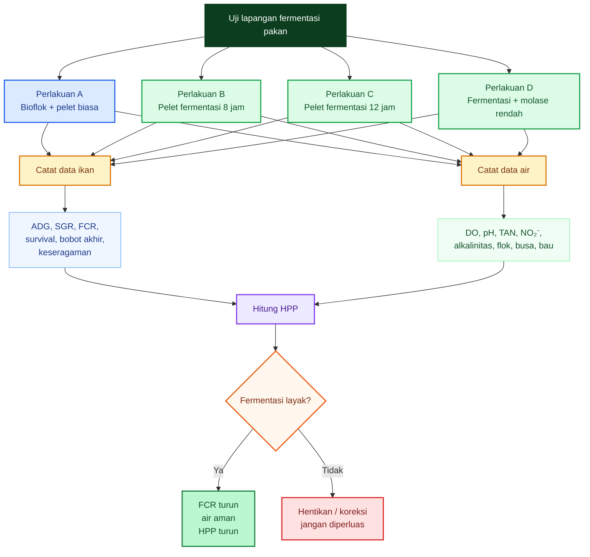

---

## 9.4. Replikasi: Jangan Percaya Satu Kolam Saja

Idealnya setiap perlakuan punya ulangan.

Minimal praktis:

| Kondisi fasilitas | Desain yang disarankan                                 |
| ----------------- | ------------------------------------------------------ |
| 4 kolam           | A, B, C, D masing-masing 1 kolam; hasil hanya indikasi |
| 8 kolam           | A, B, C, D masing-masing 2 ulangan                     |
| 12 kolam          | A, B, C, D masing-masing 3 ulangan; lebih kuat         |
| Banyak kolam      | gunakan randomisasi posisi kolam                       |

Jika hanya punya satu kolam per perlakuan, hasilnya belum kuat secara statistik. Namun untuk praktisi, itu masih berguna sebagai **uji indikatif** sebelum diterapkan luas.

$$
\boxed{
1\ kolam/perlakuan = indikasi
}
$$

$$
\boxed{
2\text{–}3\ kolam/perlakuan = keputusan lebih kuat
}
$$

Hal penting: perlakuan harus dimulai dengan kondisi ikan yang sedekat mungkin sama.

| Faktor awal           | Harus disamakan       |
| --------------------- | --------------------- |
| Ukuran ikan           | bobot rata-rata mirip |
| Kepadatan             | ekor/m³ sama          |
| Volume air            | sama                  |
| Aerasi                | kapasitas sebanding   |
| Pakan dasar           | merek/batch sama      |
| Waktu pemberian pakan | sama                  |
| Kondisi bioflok       | sama-sama stabil      |

---

## 9.5. Durasi Uji

Uji terlalu pendek bisa menyesatkan. Uji terlalu lama tanpa kontrol bisa berisiko.

Rekomendasi praktis:

| Tujuan                |                Durasi |
| --------------------- | --------------------: |
| Uji respons makan     |              3–5 hari |
| Uji kualitas air awal |                7 hari |
| Uji FCR indikatif     |               14 hari |
| Uji lebih kuat        |            21–28 hari |
| Uji siklus penuh      | satu periode budidaya |

Untuk artikel ini, rekomendasi uji awal:

$$
\boxed{
14\text{–}21\ hari
}
$$

Alasannya: cukup panjang untuk melihat respons pertumbuhan dan kualitas air, tetapi belum terlalu lama sehingga risiko bisa dikendalikan.

---

## 9.6. Parameter Ikan

Parameter ikan yang dicatat:

- ADG,
- SGR,
- FCR,
- survival,
- bobot akhir,
- keseragaman.

### ADG

ADG adalah **average daily gain**, pertambahan bobot harian.

$$
ADG =
\frac{
Bobot\ akhir - Bobot\ awal
}{
Lama\ pemeliharaan
}
$$

Jika bobot rata-rata awal:

$$
50\ g
$$

bobot rata-rata akhir:

$$
80\ g
$$

lama uji:

$$
15\ hari
$$

maka:

$$
ADG = \frac{80-50}{15} = 2\ g/hari
$$

### SGR

SGR adalah **specific growth rate**.

$$
SGR =
\frac{
\ln(W_t) - \ln(W_0)
}{
t
}
\times 100
$$

Keterangan:

| Simbol | Arti           |
| ------ | -------------- |
| $W_t$  | bobot akhir    |
| $W_0$  | bobot awal     |
| $t$    | lama uji, hari |

### FCR

$$
FCR =
\frac{
Total\ pakan\ diberikan
}{
Biomassa\ panen - Biomassa\ awal
}
$$

Jika ada ikan mati, perhitungan lebih rapi:

$$
FCR =
\frac{
Total\ pakan
}{
Biomassa\ akhir + Biomassa\ mati - Biomassa\ awal
}
$$

Karena ikan mati juga pernah memakan pakan.

### Survival

$$
Survival =
\frac{
Jumlah\ ikan\ akhir
}{
Jumlah\ ikan\ awal
}
\times 100
$$

### Keseragaman

Keseragaman bisa dibaca dari variasi bobot. Praktisnya, gunakan **coefficient of variation**:

$$
CV =
\frac{
Standar\ deviasi\ bobot
}{
Bobot\ rata\text{-}rata
}
\times 100
$$

Semakin rendah CV, semakin seragam ikan.

---

## 9.7. Parameter Air

Parameter air yang dicatat:

- DO pagi,
- pH,
- TAN,
- nitrit,
- alkalinitas,
- flok,
- busa,
- bau,
- COD/BOD bila ada akses lab.

Tabel frekuensi praktis:

| Parameter        |      Frekuensi minimal |
| ---------------- | ---------------------: |
| DO subuh/pagi    |                 harian |
| pH pagi dan sore |                 harian |
| Suhu             |                 harian |
| TAN              |        2–3 kali/minggu |
| Nitrit           |        2–3 kali/minggu |
| Alkalinitas      |          2 kali/minggu |
| Volume flok      |        2–3 kali/minggu |
| Busa             |                 harian |
| Bau              |                 harian |
| COD/BOD          |     bila ada akses lab |
| Mortalitas       |                 harian |
| Pakan termakan   | setiap pemberian pakan |

Target praktis:

| Parameter   |                 Target aman |
| ----------- | --------------------------: |
| DO          |            &gt;5 mg/L ideal |
| DO subuh    |           jangan &lt;4 mg/L |
| pH          |                     6,8–7,8 |
| TAN         | rendah dan tidak naik tajam |
| Nitrit      |                      rendah |
| Alkalinitas |  100–150 mg/L sebagai CaCO₃ |
| Flok        |     cukup, tidak berlebihan |
| Busa        |         tidak tebal/menetap |
| Bau         |                 tidak busuk |

---

## 9.8. COD/BOD Bila Ada Akses Lab

Jika ada akses laboratorium, COD dan BOD sangat berguna untuk membaca apakah fermentasi menambah beban organik.

Interpretasi sederhana:

$$
COD/BOD \uparrow
\Rightarrow
beban\ organik\ naik
$$

$$
BOD \uparrow
\Rightarrow
kebutuhan\ oksigen\ biologis\ naik
$$

$$
DO\ bisa\ turun
$$

Fermentasi yang buruk sering terlihat dari:

| Tanda                  | Kemungkinan                               |
| ---------------------- | ----------------------------------------- |
| COD naik               | bahan organik larut meningkat             |
| BOD naik               | mikroba akan memakai lebih banyak oksigen |
| DO turun setelah pakan | beban oksigen meningkat                   |
| busa tebal             | DOC/EPS/protein terlarut tinggi           |
| flok cepat pekat       | organik dan mikroba berlebih              |

Jika FCR turun sedikit tetapi BOD naik besar, strategi itu belum aman.

---

## 9.9. Format Log Harian

Gunakan tabel sederhana agar praktisi tidak kehilangan data.

| Tanggal | Perlakuan | Pakan diberikan | Sisa pakan | DO pagi |  pH | TAN | NO₂⁻ | Flok | Busa | Bau | Mortalitas | Catatan |
| ------- | --------- | --------------: | ---------: | ------: | --: | --: | ---: | ---: | ---- | --- | ---------: | ------- |
|         | A         |                 |            |         |     |     |      |      |      |     |            |         |
|         | B         |                 |            |         |     |     |      |      |      |     |            |         |
|         | C         |                 |            |         |     |     |      |      |      |     |            |         |
|         | D         |                 |            |         |     |     |      |      |      |     |            |         |

Untuk sampling bobot:

| Tanggal | Perlakuan | Jumlah sampel | Bobot rata-rata | Bobot min | Bobot max |  CV | Catatan |
| ------- | --------- | ------------: | --------------: | --------: | --------: | --: | ------- |

Data yang tidak dicatat tidak bisa dianalisis. Tanpa pencatatan, keputusan mudah berubah menjadi perasaan.

$$
\boxed{
tanpa data,\ fermentasi hanya cerita.
}
$$

---

## 9.10. Kriteria Berhasil

Fermentasi dianggap berhasil hanya jika:

$$
FCR\ turun
$$

$$
TAN/NO_2^-\ tidak\ naik
$$

$$
DO\ stabil
$$

$$
flok\ tidak\ berlebihan
$$

$$
HPP\ turun
$$

Lebih tegas:

| Kriteria                          | Harus terjadi? |
| --------------------------------- | -------------: |
| FCR turun                         |             Ya |
| ADG/SGR membaik atau minimal sama |             Ya |
| Survival tidak turun              |             Ya |
| DO stabil                         |             Ya |
| TAN tidak naik                    |             Ya |
| Nitrit tidak naik                 |             Ya |
| Flok tidak terlalu pekat          |             Ya |
| Busa/bau tidak memburuk           |             Ya |
| HPP turun                         |             Ya |

Jika FCR turun tetapi HPP tidak turun, fermentasi tidak layak secara bisnis.

Jika ikan tumbuh cepat tetapi mortalitas naik, tidak layak.

Jika pakan lebih cepat habis tetapi kualitas air memburuk, tidak layak.

---

## 9.11. Matriks Keputusan

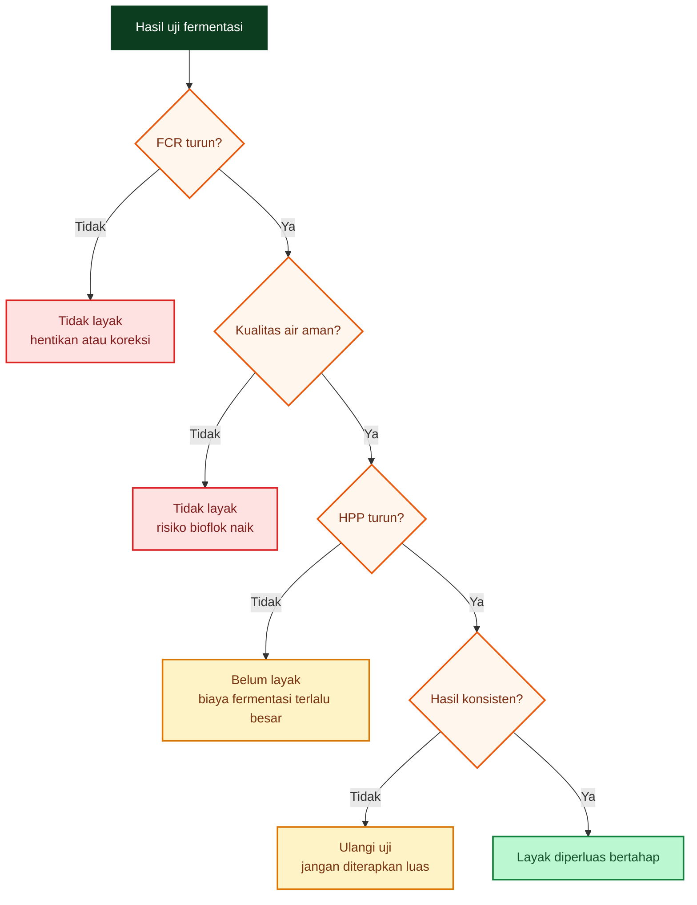

Matriks ini mencegah praktisi mengambil keputusan terlalu cepat.

Aturannya:

$$
\boxed{
FCR\ turun\ saja\ belum\ cukup.
}
$$

Harus juga:

$$
\boxed{
air\ aman + HPP\ turun + hasil\ konsisten.
}
$$

---

## 9.12. Catatan Khusus: Lele vs Nila

### Lele

Untuk lele, uji harus lebih konservatif.

Fermentasi hanya dilanjutkan jika:

$$
FCR\ turun
$$

dan:

$$
DO,\ TAN,\ NO_2^-,\ flok
$$

tetap aman.

Jika pelet hancur, busa naik, atau DO turun setelah pakan, hentikan.

### Nila

Untuk nila, peluang manfaat fermentasi lebih besar, terutama jika pakan berbasis bahan nabati. Namun tetap harus diuji dengan parameter yang sama.

Fermentasi nila dianggap kuat jika:

$$
FCR\ turun
$$

$$
ADG/SGR\ naik
$$

$$
survival\ baik
$$

$$
bioflok/natural\ food\ tetap\ terkendali
$$

$$
HPP\ turun
$$

---

## 9.13. Kesimpulan Bab 9

Uji lapangan diperlukan agar praktisi tidak tersesat oleh klaim fermentasi.

Desain minimal:

| Perlakuan | Keterangan                                 |
| --------- | ------------------------------------------ |
| A         | Bioflok + pelet biasa                      |
| B         | Bioflok + pelet fermentasi 8 jam           |
| C         | Bioflok + pelet fermentasi 12 jam          |
| D         | Bioflok + pelet fermentasi + molase rendah |

Parameter ikan:

$$
ADG,\ SGR,\ FCR,\ survival,\ bobot\ akhir,\ keseragaman
$$

Parameter air:

$$
DO,\ pH,\ TAN,\ NO_2^-,\ alkalinitas,\ flok,\ busa,\ bau,\ COD/BOD
$$

Fermentasi dianggap berhasil hanya jika:

$$
\boxed{
FCR\ turun
}
$$

$$
\boxed{
TAN/NO_2^-\ tidak\ naik
}
$$

$$
\boxed{
DO\ stabil
}
$$

$$
\boxed{
flok\ tidak\ berlebihan
}
$$

$$
\boxed{
HPP\ turun
}
$$

Kalimat praktisnya:

> **Fermentasi pakan bukan dibuktikan dari bau asam atau ikan makan lahap, tetapi dari FCR yang turun, air yang tetap aman, dan HPP yang benar-benar lebih rendah.**

[**Kembali ke Atas**](#ep-ratio-pakan-ikan-antara-efisiensi-fcr-fermentasi-ringan-bioflok-dan-perbedaan-strategi-lele-vs-nila)

---

# 10. Bagian Kritikal: Batas Klaim Fermentasi

Bab ini wajib ada agar artikel tidak berubah menjadi promosi fermentasi pakan. Fermentasi memang dapat memberi manfaat, tetapi manfaatnya **bersyarat**. Ia bergantung pada bahan pakan, jenis mikroba, dosis molase, kadar air, waktu fermentasi, suhu, stabilitas pelet, spesies ikan, dan kualitas air.

Posisi kritisnya:

$$
\boxed{
fermentasi\ pakan\ adalah\ alat,\ bukan\ jaminan\ efisiensi.
}
$$

Fermentasi boleh dipakai bila terbukti memperbaiki performa. Tetapi bila hanya menambah pekerjaan, menaikkan COD/BOD, membuat pelet hancur, atau memperburuk DO, maka fermentasi justru merugikan.

Review fermentasi aquafeed menunjukkan bahwa fermentasi dapat meningkatkan ketersediaan nutrien, kecernaan, dan palatabilitas, tetapi hasilnya bergantung pada mikroba, substrat, dan proses; studi pakan nabati nila dengan _Lactobacillus acidophilus_ juga menunjukkan fermentasi memperbaiki survival, tetapi feed intake meningkat dan feed efficiency tidak otomatis membaik. ([MDPI][1])

---

## 10.1. Klaim yang Boleh

Klaim pertama yang masih defensible:

$$
\boxed{
fermentasi\ dapat\ meningkatkan\ ketersediaan\ nutrien
}
$$

Maksudnya, fermentasi dapat membantu memecah sebagian komponen pakan menjadi bentuk yang lebih mudah dicerna:

$$
protein \rightarrow peptida
$$

$$
pati/karbohidrat\ kompleks \rightarrow gula\ sederhana/asam\ organik
$$

$$
sebagian\ antinutrisi \rightarrow turun
$$

Klaim kedua:

$$
\boxed{
fermentasi\ dapat\ memperbaiki\ palatabilitas
}
$$

Pakan yang difermentasi ringan dapat memiliki aroma asam segar, metabolit mikroba, dan tekstur lebih menarik bagi ikan. Tetapi palatabilitas yang lebih baik tidak selalu berarti FCR turun. Ikan bisa makan lebih banyak, tetapi belum tentu lebih efisien.

Klaim ketiga:

$$
\boxed{
fermentasi\ dapat\ menurunkan\ antinutrisi\ bahan\ nabati
}
$$

Ini lebih relevan pada bahan pakan berbasis nabati seperti dedak, bungkil, sagu, onggok, atau bahan lokal berserat. Pada pakan berbasis tanaman untuk nila, fermentasi dapat meningkatkan kualitas bahan, menurunkan pH, dan meningkatkan protein larut; tetapi dampak akhirnya tetap perlu diuji pada performa ikan dan kualitas air. ([MDPI][1])

Klaim keempat yang boleh, tetapi harus hati-hati:

$$
\boxed{
fermentasi\ dapat\ meningkatkan\ available\ energy
}
$$

Bukan berarti energi total pakan bertambah. Yang mungkin naik adalah bagian energi yang bisa dicerna dan dimanfaatkan ikan.

---

## 10.2. Klaim yang Tidak Boleh

Klaim yang tidak boleh:

$$
\boxed{
fermentasi\ pasti\ menaikkan\ E/P
}
$$

E/P bisa naik secara simulasi bila digestibilitas naik. Tetapi bila fermentasi terlalu lama, pelet rusak, nutrien larut, atau mikroba menghabiskan terlalu banyak substrat, E/P efektif bagi ikan bisa tidak naik.

Klaim yang tidak boleh:

$$
\boxed{
fermentasi\ pasti\ menurunkan\ FCR
}
$$

Ini klaim paling berbahaya. FCR hanya turun bila pakan benar-benar lebih efisien menjadi biomassa ikan. Studi pada pakan nabati fermentasi untuk nila bioflok menunjukkan fermentasi dapat memperbaiki survival dan kesehatan usus, tetapi feed efficiency justru dapat memburuk. Artinya fermentasi bisa memberi manfaat biologis tanpa otomatis menurunkan FCR. ([ResearchGate][2])

Klaim yang tidak boleh:

$$
\boxed{
fermentasi\ pelet\ komersial\ selalu\ menguntungkan
}
$$

Pelet komersial sudah diformulasi, diproses, dan dibuat agar stabil di air. Jika pelet dibasahkan terlalu lama, ia bisa hancur. Bila hancur, nutrien masuk ke air sebagai DOC, COD, dan BOD. Dalam bioflok, ini bisa menurunkan DO dan membuat flok berlebihan.

Klaim yang tidak boleh:

$$
\boxed{
molase\ selalu\ positif
}
$$

Molase memang sumber karbon cepat untuk mikroba, tetapi juga membawa beban COD/BOD. Jika molase masuk ke air, mikroba akan memakai oksigen untuk menguraikannya.

$$
molase\ berlebih
\Rightarrow
COD/BOD \uparrow
\Rightarrow
OUR \uparrow
\Rightarrow
DO \downarrow
$$

---

## 10.3. Diagram Batas Klaim Fermentasi

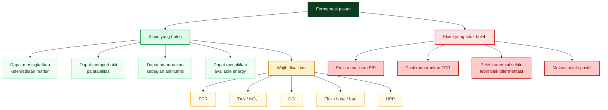

---

## 10.4. Prinsip Anti-Sesat

Agar tidak tersesat oleh klaim fermentasi, gunakan tiga pertanyaan:

$$
\boxed{
1.\ Apakah\ FCR\ turun?
}
$$

$$
\boxed{
2.\ Apakah\ kualitas\ air\ tetap\ aman?
}
$$

$$
\boxed{
3.\ Apakah\ HPP\ turun?
}
$$

Jika jawabannya tidak lengkap, fermentasi belum layak disebut berhasil.

Fermentasi yang baik harus terlihat pada data:

| Parameter | Harus terjadi            |
| --------- | ------------------------ |
| FCR       | turun                    |
| ADG/SGR   | naik atau minimal stabil |
| Survival  | tidak turun              |
| DO        | stabil                   |
| TAN       | tidak naik               |
| Nitrit    | tidak naik               |
| Flok      | tidak berlebihan         |
| Busa/bau  | tidak memburuk           |
| HPP       | turun                    |

Dalam bioflok, ini sangat penting karena sistem bioflok membutuhkan kontrol padatan, oksigen, dan beban organik yang ketat; padatan berlebih akan meningkatkan oxygen demand dan kebutuhan aerasi. ([Aquaculture][3])

[**Kembali ke Atas**](#ep-ratio-pakan-ikan-antara-efisiensi-fcr-fermentasi-ringan-bioflok-dan-perbedaan-strategi-lele-vs-nila)

---

# 11. Rekomendasi Praktis Artikel

Bab ini menerjemahkan seluruh analisis menjadi keputusan lapangan. Rekomendasi dibedakan antara **lele bioflok** dan **nila bioflok** karena keduanya memiliki karakter pencernaan, pemanfaatan karbohidrat, dan toleransi E/P yang berbeda.

---

## 11.1. Untuk Lele Bioflok

Untuk lele bioflok, posisi yang paling aman:

$$
\boxed{
jangan\ jadikan\ fermentasi\ sebagai\ default.
}
$$

Lele tetap dapat mendapat manfaat dari fermentasi ringan, tetapi manfaatnya harus dibuktikan. Jangan memakai fermentasi hanya karena “lebih alami”, “lebih aktif”, atau “lebih hemat”.

Rekomendasi praktis:

| Aspek       | Rekomendasi                                 |
| ----------- | ------------------------------------------- |
| Pakan dasar | gunakan pelet stabil dan tidak mudah hancur |
| E/P         | seimbang, jangan dikejar terlalu tinggi     |
| Fermentasi  | hanya uji kecil                             |
| Waktu       | 6–12 jam                                    |
| Molase      | rendah                                      |
| Kondisi     | semi-anaerob                                |
| Validasi    | FCR, DO, TAN, nitrit, flok, HPP             |

Target teknis:

$$
E/P_{lele}
\approx
8{,}5\text{–}10\ kcal/g
$$

Lebih konservatif untuk _Clarias_:

$$
\boxed{
8\text{–}9{,}5
}
$$

Mississippi State Extension menyebut rasio DE/CP **8,5–10 kcal/g protein** memadai untuk catfish komersial, sedangkan dokumen lain dari institusi yang sama menyebut rasio DE/DP **10–11 kcal/g digestible protein** optimal untuk pertumbuhan catfish dari advanced fingerlings sampai ukuran pasar; perbedaan ini penting karena CP dan DP bukan penyebut yang sama. ([MSU Extension Service][4])

Untuk lele, urutannya:

$$
\boxed{
bioflok\ stabil\ dulu
}
$$

lalu:

$$
\boxed{
ukur\ FCR\ pakan\ biasa
}
$$

baru:

$$
\boxed{
uji\ fermentasi\ kecil
}
$$

Jika FCR pakan biasa sudah baik, air stabil, dan HPP masuk, fermentasi tidak wajib.

---

## 11.2. Batas Praktis Fermentasi untuk Lele

Untuk lele bioflok, gunakan batas konservatif:

| Komponen       |                       Rekomendasi |
| -------------- | --------------------------------: |
| Molase         |           5–10 mL/kg pakan kering |
| Air            | cukup melembapkan, bukan merendam |
| Waktu          |                          6–12 jam |
| Kondisi        |                      semi-anaerob |
| Batas maksimal | jangan lewat 24 jam tanpa kontrol |
| Syarat pelet   |                        tetap utuh |
| Syarat air     |         DO aman, flok tidak pekat |

Fermentasi harus dihentikan bila:

$$
DO\ turun
$$

$$
TAN/NO_2^-\ naik
$$

$$
flok\ terlalu\ pekat
$$

$$
busa\ tebal
$$

$$
pelet\ hancur
$$

$$
bau\ busuk
$$

Kalimat praktis untuk lele:

> **Fermentasi pada lele bukan strategi mengejar E/P tinggi, tetapi uji terbatas untuk memperbaiki palatabilitas dan kecernaan tanpa merusak bioflok.**

---

## 11.3. Untuk Nila Bioflok

Untuk nila bioflok, fermentasi lebih layak diuji.

Alasannya:

$$
\boxed{
nila\ lebih\ adaptif\ terhadap\ bahan\ nabati\ dan\ karbohidrat
}
$$

Selain itu, nila lebih berpotensi memanfaatkan bioflok dan natural food. Maka strategi fermentasi lebih masuk akal bila diarahkan pada bahan nabati, bukan hanya membasahi pelet komersial.

Rekomendasi praktis:

| Aspek       | Rekomendasi                                   |
| ----------- | --------------------------------------------- |
| Pakan dasar | pakan dengan bahan nabati yang baik           |
| Fermentasi  | lebih layak diuji                             |
| Target      | kecernaan bahan nabati dan karbohidrat        |
| Bioflok     | dimanfaatkan sebagai tambahan nutrisi         |
| Validasi    | FCR, pertumbuhan, survival, kualitas air, HPP |

Target teknis:

$$
E/P_{nila}
\approx
10\text{–}12+
$$

tergantung fase dan sistem.

Untuk nila, fermentasi dapat diarahkan ke:

$$
\boxed{
pakan\ nabati\ fermentasi
}
$$

atau:

$$
\boxed{
bahan\ baku\ nabati\ fermentasi
}
$$

seperti dedak, bungkil, sagu, onggok, atau bahan lokal lain yang perlu diperbaiki kecernaannya.

---

## 11.4. Beda Strategi: Lele vs Nila

```mermaid id="rekomendasi-praktis-lele-nila"
flowchart TD
    A["Strategi fermentasi pakan"]:::title

    A --> B["Lele bioflok"]:::lele
    A --> C["Nila bioflok"]:::nila

    B --> B1["Jangan default"]:::warn
    B --> B2["Bioflok stabil dulu"]:::leleNode
    B --> B3["Molase rendah<br/>6–12 jam"]:::leleNode
    B --> B4["Tujuan:<br/>palatabilitas + kecernaan ringan"]:::leleNode
    B --> B5["Validasi ketat:<br/>FCR, DO, TAN, NO₂⁻, flok"]:::check

    C --> C1["Lebih layak diuji"]:::good
    C --> C2["Bahan nabati fermentasi<br/>lebih masuk akal"]:::nilaNode
    C --> C3["Target:<br/>karbohidrat tersedia + natural food"]:::nilaNode
    C --> C4["Bioflok lebih sinergis"]:::nilaNode
    C --> C5["Validasi:<br/>FCR, growth, survival, HPP"]:::check

    classDef title fill:#0b3d1e,color:#ffffff,stroke:#0b3d1e,stroke-width:2px;
    classDef lele fill:#dbeafe,color:#1e3a8a,stroke:#2563eb,stroke-width:2px;
    classDef nila fill:#dcfce7,color:#14532d,stroke:#16a34a,stroke-width:2px;
    classDef leleNode fill:#eff6ff,color:#1e3a8a,stroke:#60a5fa;
    classDef nilaNode fill:#f0fdf4,color:#14532d,stroke:#86efac;
    classDef warn fill:#fee2e2,color:#7f1d1d,stroke:#dc2626,stroke-width:2px;
    classDef good fill:#bbf7d0,color:#14532d,stroke:#16a34a,stroke-width:2px;
    classDef check fill:#fef3c7,color:#78350f,stroke:#d97706,stroke-width:2px;
```

---

## 11.5. Rekomendasi Teknis Singkat

### Untuk lele bioflok

$$
\boxed{
gunakan\ pakan\ stabil,\ E/P\ seimbang,\ dan\ bioflok\ terkontrol.
}
$$

Fermentasi hanya dilakukan bila:

$$
FCR\ baseline\ belum\ memuaskan
$$

dan:

$$
DO,\ TAN,\ NO_2^-,\ flok
$$

aman.

### Untuk nila bioflok

$$
\boxed{
uji\ fermentasi\ lebih\ terbuka,\ terutama\ pada\ bahan\ nabati.
}
$$

Namun tetap wajib:

$$
FCR\ turun
$$

$$
kualitas\ air\ aman
$$

$$
HPP\ turun
$$

---

## 11.6. Kesimpulan Bab 11

Rekomendasi utama:

$$
\boxed{
Lele:\ konservatif,\ uji\ kecil,\ jangan\ kejar\ E/P\ tinggi.
}
$$

$$
\boxed{
Nila:\ lebih\ prospektif,\ terutama\ untuk\ bahan\ nabati\ dan\ bioflok/natural\ food.
}
$$

Fermentasi bukan kewajiban, tetapi opsi. Opsi itu hanya bernilai jika datanya membuktikan:

$$
\boxed{
FCR\ turun + air\ aman + HPP\ turun.
}
$$

[**Kembali ke Atas**](#ep-ratio-pakan-ikan-antara-efisiensi-fcr-fermentasi-ringan-bioflok-dan-perbedaan-strategi-lele-vs-nila)

---

# 12. Kesimpulan Artikel

Artikel ini ditutup dengan posisi teknis yang jelas:

$$
\boxed{
E/P\ ratio\ adalah\ alat\ membaca\ keseimbangan\ energi\text{-}protein,\ bukan\ angka\ sakti.
}
$$

E/P membantu praktisi memahami apakah energi dalam pakan cukup untuk menopang metabolisme ikan sehingga protein tidak terlalu banyak dibakar sebagai energi. Namun E/P tidak berdiri sendiri. Ia harus dibaca bersama digestibilitas, kualitas asam amino, FCR, TAN, nitrit, DO, flok, dan HPP.

National Academies menekankan bahwa nitrogen limbah dapat dikurangi dengan memilih bahan yang mudah dicerna, mengurangi komponen tidak tercerna, serta memformulasikan keseimbangan asam amino dan rasio digestible energy-to-protein agar katabolisme asam amino diminimalkan. ([National Academies][5])

---

## 12.1. Kesimpulan tentang E/P Ratio

E/P yang terlalu rendah membuat protein mahal dibakar sebagai energi:

$$
protein \rightarrow energi + NH_3
$$

Dampaknya:

$$
FCR \uparrow
$$

$$
TAN \uparrow
$$

$$
HPP \uparrow
$$

E/P yang terlalu tinggi juga tidak ideal:

$$
ikan\ cepat\ kenyang\ energi
$$

sebelum cukup protein dan asam amino.

Maka targetnya adalah:

$$
\boxed{
E/P\ seimbang
}
$$

bukan:

$$
\boxed{
E/P\ setinggi\ mungkin
}
$$

---

## 12.2. Kesimpulan tentang Fermentasi Ringan

Fermentasi ringan dapat membantu:

$$
\boxed{
meningkatkan\ available\ energy
}
$$

$$
\boxed{
meningkatkan\ palatabilitas
}
$$

$$
\boxed{
menurunkan\ sebagian\ antinutrisi\ bahan\ nabati
}
$$

Tetapi harus ditegaskan:

$$
\boxed{
Fermentasi\ ringan\ dapat\ menaikkan\ energi\ tersedia,\ tetapi\ hanya\ bermanfaat\ bila\ FCR\ turun\ dan\ kualitas\ air\ tetap\ stabil.
}
$$

Fermentasi tidak boleh diklaim pasti menaikkan E/P, pasti menurunkan FCR, atau selalu menguntungkan untuk pelet komersial. Molase juga tidak selalu positif, karena molase membawa COD/BOD jika larut ke air.

---

## 12.3. Kesimpulan tentang Lele vs Nila

Strategi fermentasi lebih cocok untuk nila daripada lele:

$$
\boxed{
Strategi\ fermentasi\ lebih\ cocok\ untuk\ nila\ daripada\ lele,\ karena\ nila\ lebih\ adaptif\ terhadap\ bahan\ nabati,\ karbohidrat,\ dan\ bioflok/natural\ food.
}
$$

Untuk lele:

$$
\boxed{
fermentasi\ adalah\ alat\ bantu,\ bukan\ strategi\ utama.
}
$$

Untuk nila:

$$
\boxed{
fermentasi\ dapat\ menjadi\ strategi\ nutrisi,\ terutama\ pada\ bahan\ nabati.
}
$$

---

## 12.4. Kesimpulan tentang Bioflok dan HPP

Bioflok dapat membantu efisiensi pakan bila flok aktif, cukup, dan dimanfaatkan ikan. Namun bioflok juga membutuhkan aerasi kuat dan kontrol padatan. Jika fermentasi membuat COD/BOD naik, DO turun, dan flok terlalu pekat, maka teknologi yang seharusnya menurunkan FCR justru bisa menaikkan HPP.

Keputusan akhir harus berbasis:

$$
\boxed{
FCR\ turun
}
$$

$$
\boxed{
DO,\ TAN,\ NO_2^-,\ flok\ aman
}
$$

$$
\boxed{
HPP\ turun
}
$$

Bukan berdasarkan asumsi atau cerita.

---

## 12.5. Diagram Kesimpulan Akhir

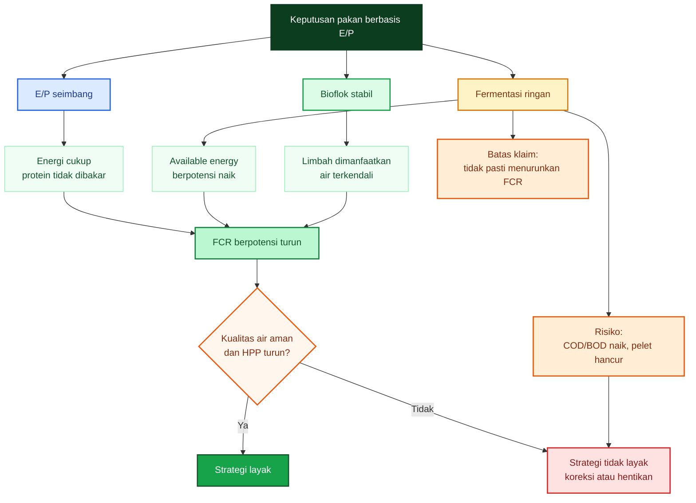

---

## 12.6. Penutup untuk Praktisi

Kalimat akhir artikel:

$$
\boxed{
E/P\ ratio\ membantu\ membaca\ keseimbangan\ energi\text{-}protein,\ tetapi\ kolam\ tetap\ menjadi\ hakim\ terakhir.
}
$$

Pakan yang baik harus membuktikan diri melalui:

$$
FCR\ rendah
$$

$$
pertumbuhan\ baik
$$

$$
survival\ tinggi
$$

$$
TAN/NO_2^-\ rendah
$$

$$
DO\ stabil
$$

$$
flok\ terkendali
$$

$$
HPP\ turun
$$

Kesimpulan praktisnya:

> **Jangan mengejar protein tertinggi, E/P tertinggi, atau fermentasi paling lama. Kejar pakan yang paling efisien menjadi daging ikan dengan air tetap aman dan HPP paling rendah.**

[**Kembali ke Atas**](#ep-ratio-pakan-ikan-antara-efisiensi-fcr-fermentasi-ringan-bioflok-dan-perbedaan-strategi-lele-vs-nila)

[1]: https://www.mdpi.com/2076-2615/14/2/332?utm_source=chatgpt.com 'Fermentation of Plant-Based Feeds with Lactobacillus ...'
[2]: https://www.researchgate.net/publication/377592488_Fermentation_of_Plant-Based_Feeds_with_Lactobacillus_acidophilus_Improves_the_Survival_and_Intestinal_Health_of_Juvenile_Nile_Tilapia_Oreochromis_niloticus_Reared_in_a_Biofloc_System?utm_source=chatgpt.com 'Fermentation of Plant-Based Feeds with Lactobacillus ...'
[3]: https://aquaculture.mgcafe.uky.edu/sites/aquaculture.ca.uky.edu/files/srac_4503_biofloc_production_systems_for_aquaculture.pdf?utm_source=chatgpt.com 'Biofloc Production Systems for Aquaculture'
[4]: https://extension.msstate.edu/agriculture/catfish/catfish-feeds-and-feeding?utm_source=chatgpt.com 'Catfish Feeds and Feeding'
[5]: https://nap.nationalacademies.org/resource/13039/Fish-Shrimp-Report-Brief-Final.pdf?utm_source=chatgpt.com 'Nutrient Requirements of Fish and Shrimp'

---

# Lampiran A — Rumus E/P dan P/E

Lampiran ini merangkum rumus inti yang dipakai dalam artikel.

## A.1. E/P Ratio

$$
E/P =
\frac{
DE\ kcal/kg
}{
Protein\ g/kg
}
$$

Keterangan:

| Simbol  | Arti                            |
| ------- | ------------------------------- |
| (E/P)   | energy-to-protein ratio         |
| $DE$    | digestible energy               |
| Protein | protein dalam gram per kg pakan |

Satuan praktis:

$$
\boxed{
kcal\ DE/g\ protein
}
$$

Contoh:

$$
DE = 2825\ kcal/kg
$$

$$
Protein = 300\ g/kg
$$

Maka:

$$
E/P =
\frac{2825}{300}
$$

$$
\boxed{
E/P = 9{,}42\ kcal/g
}
$$

---

## A.2. P/E Ratio

$$
P/E =
\frac{
Protein
}{
Energy
}
$$

P/E sering ditulis dalam:

$$
\boxed{
g\ protein/MJ
}
$$

atau:

$$
\boxed{
mg\ protein/kcal
}
$$

P/E adalah kebalikan dari E/P. Karena itu, jangan tertukar.

$$
\boxed{
E/P\ tinggi = P/E\ rendah
}
$$

$$
\boxed{
E/P\ rendah = P/E\ tinggi
}
$$

---

## A.3. Konversi P/E ke E/P

Karena:

$$
1\ MJ \approx 239\ kcal
$$

maka:

$$
\boxed{
E/P =
\frac{239}{P/E\ g/MJ}
}
$$

Contoh untuk nila:

Jika:

$$
P/E = 23\ g/MJ
$$

maka:

$$
E/P =
\frac{239}{23}
$$

$$
\boxed{
E/P = 10{,}39\ kcal/g
}
$$

Jika:

$$
P/E = 18\ g/MJ
$$

maka:

$$
E/P =
\frac{239}{18}
$$

$$
\boxed{
E/P = 13{,}28\ kcal/g
}
$$

---

## A.4. Rumus NFE

$$
\boxed{
NFE =
100 - Protein - Lemak - Serat - Abu - Air
}
$$

Keterangan:

| Komponen | Satuan |
| -------- | -----: |
| Protein  |      % |
| Lemak    |      % |
| Serat    |      % |
| Abu      |      % |
| Air      |      % |
| NFE      |      % |

NFE adalah pendekatan kasar untuk karbohidrat non-serat. NFE bukan hasil ukur langsung pati atau gula, tetapi angka sisa dari analisis proksimat.

---

## A.5. Estimasi Digestible Energy

$$
\boxed{
DE =
56{,}5P d_P
+
94{,}5L d_L
+
41NFE d_C
}
$$

Keterangan:

| Simbol | Makna                        |
| ------ | ---------------------------- |
| $P$    | protein kasar, %             |
| $L$    | lemak kasar, %               |
| $NFE$  | karbohidrat/NFE, %           |
| $d_P$  | asumsi kecernaan protein     |
| $d_L$  | asumsi kecernaan lemak       |
| $d_C$  | asumsi kecernaan karbohidrat |

Catatan:

$$
\boxed{
rumus\ ini\ adalah\ model\ estimasi,\ bukan\ hasil\ laboratorium.
}
$$

---

## A.6. Formula Excel

Jika:

| Parameter   | Cell |
| ----------- | ---: |
| Protein (%) |   B2 |
| Lemak (%)   |   B3 |
| Serat (%)   |   B4 |
| Abu (%)     |   B5 |
| Air (%)     |   B6 |
| $d_P$       |   B8 |
| $d_L$       |   B9 |
| $d_C$       |  B10 |

Maka NFE:

```excel
=100-B2-B3-B4-B5-B6
```

Jika NFE ada di B7, maka DE:

```excel
=56,5*B2*B8 + 94,5*B3*B9 + 41*B7*B10
```

Protein g/kg:

```excel
=B2*10
```

E/P:

```excel
=DE/Protein_g_per_kg
```

[**Kembali ke Atas**](#ep-ratio-pakan-ikan-antara-efisiensi-fcr-fermentasi-ringan-bioflok-dan-perbedaan-strategi-lele-vs-nila)

---

# Lampiran B — Contoh Perhitungan Pelet 30% Protein

Lampiran ini merangkum simulasi pelet model yang digunakan dalam artikel.

## B.1. Komposisi Model

| Komponen | Nilai |
| -------- | ----: |
| Protein  |   30% |
| Lemak    |    5% |
| Serat    |    6% |
| Abu      |   10% |
| Air      |   10% |
| NFE      |   39% |

Hitung NFE:

$$
NFE =
100 - 30 - 5 - 6 - 10 - 10
$$

$$
\boxed{
NFE = 39\%
}
$$

---

## B.2. E/P Sebelum Fermentasi

Asumsi digestibilitas awal:

$$
d_P = 0{,}85
$$

$$
d_L = 0{,}90
$$

$$
d_C = 0{,}60
$$

Rumus:

$$
DE =
56{,}5P d_P
+
94{,}5L d_L
+
41NFE d_C
$$

Substitusi:

$$
DE =
56{,}5(30)(0{,}85)
+
94{,}5(5)(0{,}90)
+
41(39)(0{,}60)
$$

$$
DE =
1440{,}75
+
425{,}25
+
959{,}4
$$

$$
\boxed{
DE \approx 2825\ kcal/kg
}
$$

Protein per kg:

$$
Protein =
30\% \times 1000
$$

$$
\boxed{
Protein = 300\ g/kg
}
$$

Maka:

$$
E/P =
\frac{2825}{300}
$$

$$
\boxed{
E/P_{before} \approx 9{,}4\ kcal/g\ protein
}
$$

---

## B.3. E/P Setelah Fermentasi Ringan

Setelah fermentasi ringan, diasumsikan kecernaan protein dan karbohidrat naik moderat.

Skenario rendah:

$$
d_P = 0{,}88
$$

$$
d_L = 0{,}90
$$

$$
d_C = 0{,}64
$$

Maka:

$$
DE =
56{,}5(30)(0{,}88)
+
94{,}5(5)(0{,}90)
+
41(39)(0{,}64)
$$

$$
DE =
1491{,}6
+
425{,}25
+
1023{,}36
$$

$$
DE =
2940{,}21\ kcal/kg
$$

$$
E/P =
\frac{2940{,}21}{300}
$$

$$
\boxed{
E/P \approx 9{,}8
}
$$

Skenario tinggi:

$$
d_P = 0{,}90
$$

$$
d_L = 0{,}90
$$

$$
d_C = 0{,}68
$$

Maka:

$$
DE =
56{,}5(30)(0{,}90)
+
94{,}5(5)(0{,}90)
+
41(39)(0{,}68)
$$

$$
DE =
1525{,}5
+
425{,}25
+
1087{,}32
$$

$$
DE =
3038{,}07\ kcal/kg
$$

$$
E/P =
\frac{3038{,}07}{300}
$$

$$
\boxed{
E/P \approx 10{,}1
}
$$

Maka:

$$
\boxed{
E/P_{after}
\approx
9{,}8\text{–}10{,}1
}
$$

---

## B.4. Catatan Kritis

$$
\boxed{
ini\ estimasi,\ bukan\ angka\ laboratorium
}
$$

Angka after fermentation hanya berlaku jika fermentasi benar-benar meningkatkan digestibilitas tanpa merusak pelet.

Fermentasi dianggap gagal bila:

$$
pelet\ hancur
$$

$$
DO\ turun
$$

$$
busa\ naik
$$

$$
TAN/NO_2^-\ naik
$$

$$
FCR\ tidak\ membaik
$$

[**Kembali ke Atas**](#ep-ratio-pakan-ikan-antara-efisiensi-fcr-fermentasi-ringan-bioflok-dan-perbedaan-strategi-lele-vs-nila)

---

# Lampiran C — Template HPP Bioflok vs Bioflok + Fermentasi

Lampiran ini memperbaiki dan merapikan rumus HPP agar tidak salah baca.

## C.1. HPP Total

$$
\boxed{
HPP =
\frac{
Biaya\ pakan
+
Benih
+
Energi
+
Tenaga
+
Bahan\ koreksi
+
Penyusutan
+
Biaya\ lain
}{
Kg\ ikan\ panen
}
}
$$

Komponen biaya:

| Komponen      | Contoh                            |
| ------------- | --------------------------------- |
| Biaya pakan   | total pakan × harga pakan         |
| Benih         | harga benih awal                  |
| Energi        | listrik blower, aerator, pompa    |
| Tenaga        | pemberian pakan, sampling, siphon |
| Bahan koreksi | garam, dolomit, molase, probiotik |
| Penyusutan    | kolam, blower, diffuser, pipa     |
| Biaya lain    | mortalitas, transport, sortasi    |

---

## C.2. Biaya Pakan per kg Ikan

$$
\boxed{
Biaya\ pakan/kg\ ikan =
Harga\ pakan/kg \times FCR
}
$$

Contoh:

$$
Harga\ pakan = Rp11.000/kg
$$

$$
FCR = 1{,}20
$$

Maka:

$$
Biaya\ pakan/kg\ ikan =
11.000 \times 1{,}20
$$

$$
\boxed{
Biaya\ pakan/kg\ ikan = Rp13.200
}
$$

---

## C.3. Penghematan dari Penurunan FCR

$$
\boxed{
Penghematan =
Harga\ pakan \times (FCR_{awal}-FCR_{baru})
}
$$

Contoh:

$$
Harga\ pakan = Rp11.000/kg
$$

$$
FCR_{awal} = 1{,}20
$$

$$
FCR_{baru} = 1{,}10
$$

Maka:

$$
Penghematan =
11.000 \times (1{,}20 - 1{,}10)
$$

$$
Penghematan =
11.000 \times 0{,}10
$$

$$
\boxed{
Penghematan = Rp1.100/kg\ ikan
}
$$

---

## C.4. Kelayakan Fermentasi

Fermentasi layak bila:

$$
\boxed{
Penghematan > biaya\ fermentasi + risiko
}
$$

atau:

$$
\boxed{
Harga\ pakan \times \Delta FCR

>

Biaya\ fermentasi + Biaya\ risiko
}
$$

Dengan:

$$
\Delta FCR =
FCR_{awal} - FCR_{baru}
$$

---

## C.5. Template Tabel HPP

| Komponen                       | Bioflok tanpa fermentasi | Bioflok + fermentasi |
| ------------------------------ | -----------------------: | -------------------: |
| Harga pakan/kg                 |                          |                      |
| FCR                            |                          |                      |
| Biaya pakan/kg ikan            |                          |                      |
| Molase                         |                        0 |                      |
| Probiotik fermentasi           |                        0 |                      |
| Tenaga tambahan                |                        0 |                      |
| Risiko kualitas air            |                        0 |                      |
| Total biaya fermentasi/kg ikan |                        0 |                      |
| Penghematan FCR/kg ikan        |                        0 |                      |
| Selisih bersih                 |                        0 |                      |
| Keputusan                      |                          |                      |

Keputusan:

$$
\boxed{
Selisih\ bersih = Penghematan\ FCR = Biaya\ fermentasi = Biaya\ risiko
}
$$

Jika positif:

$$
\boxed{
layak\ diuji\ lanjut
}
$$

Jika negatif:

$$
\boxed{
tidak\ layak
}
$$

[**Kembali ke Atas**](#ep-ratio-pakan-ikan-antara-efisiensi-fcr-fermentasi-ringan-bioflok-dan-perbedaan-strategi-lele-vs-nila)

---

# Lampiran D — SOP Fermentasi Ringan Pelet

Lampiran ini hanya berlaku untuk **fermentasi ringan pelet jadi**, bukan fermentasi bahan baku.

## D.1. Formula Awal

Untuk pelet jadi:

| Komponen  |                       Rekomendasi |
| --------- | --------------------------------: |
| Pakan     |                              1 kg |
| Molase    |                           5–10 mL |
| Air       |                        100–200 mL |
| Probiotik |                      sesuai label |
| Kondisi   |                      semi-anaerob |
| Waktu     |                          6–12 jam |
| Batas     | jangan lewat 24 jam tanpa kontrol |

Prinsip penting:

$$
\boxed{
pakan\ dilembapkan,\ bukan\ direndam
}
$$

---

## D.2. Langkah Kerja

1. Siapkan pelet kering sesuai kebutuhan harian.
2. Larutkan molase dalam air bersih.
3. Masukkan probiotik sesuai dosis label.
4. Aduk larutan sampai merata.
5. Semprotkan atau campurkan ke pelet.
6. Pastikan pelet lembap, bukan menjadi bubur.
7. Simpan dalam wadah bersih.
8. Tutup semi-rapat.
9. Fermentasi 6–12 jam.
10. Berikan segera.
11. Jangan menyimpan pelet basah terlalu lama.

---

## D.3. Kriteria Lolos

Pakan fermentasi lolos bila:

- bau asam segar,
- tidak busuk,
- tidak tengik,
- tidak berjamur,
- pelet tidak jadi bubur,
- ikan makan cepat,
- DO tidak turun setelah pemberian,
- busa tidak melonjak,
- flok tidak langsung pekat.

---

## D.4. Kriteria Gagal

Fermentasi harus dihentikan bila:

| Tanda             | Makna                  |
| ----------------- | ---------------------- |
| Bau busuk         | protein membusuk       |
| Bau alkohol tajam | ragi berlebih          |
| Bau tengik        | lemak rusak            |
| Pelet jadi bubur  | nutrien larut ke air   |
| Jamur             | risiko toksin          |
| DO turun          | BOD naik               |
| Busa tebal        | DOC/protein/EPS tinggi |
| TAN/nitrit naik   | beban air naik         |

---

## D.5. Diagram SOP Ringkas

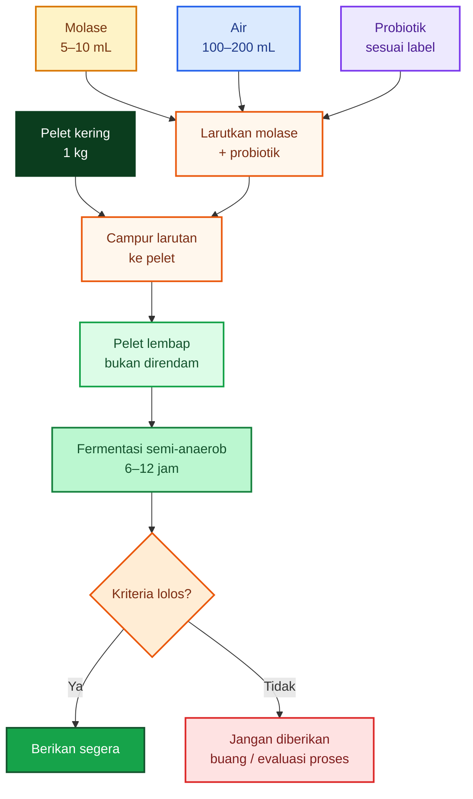

[**Kembali ke Atas**](#ep-ratio-pakan-ikan-antara-efisiensi-fcr-fermentasi-ringan-bioflok-dan-perbedaan-strategi-lele-vs-nila)

---

# Lampiran E — Saluran Pencernaan Lele vs Nila

Lampiran ini menjelaskan alasan biologis mengapa strategi pakan lele dan nila tidak bisa disamakan.

---

## E.1. Ringkasan Perbedaan

## Lele

- omnivora predator/karnivora oportunistik,
- lebih bergantung pada protein berkualitas,
- karbohidrat berguna sebagai energi, tetapi tidak boleh berlebihan,
- fermentasi pelet harus konservatif,
- bioflok dapat membantu, tetapi tidak boleh dianggap pengganti pakan utama.

## Nila

- omnivora cenderung herbivora-detritivora,
- lebih mampu memanfaatkan bahan nabati,
- lebih cocok dengan fermentasi bahan karbohidrat/serat,
- lebih cocok dengan bioflok/natural food,
- strategi pakan dapat lebih fleksibel terhadap energi dari karbohidrat.

---

## E.2. Organ Pencernaan dan Fungsinya

| Organ                 | Fungsi utama                                                          |
| --------------------- | --------------------------------------------------------------------- |
| Mulut                 | menangkap dan memasukkan pakan                                        |
| Rongga mulut/faring   | membantu penelanan                                                    |
| Esofagus              | menyalurkan pakan ke lambung                                          |
| Lambung               | penyimpanan singkat, pengasaman, awal pencernaan protein              |
| Hati                  | metabolisme nutrien, penyimpanan energi, detoksifikasi                |
| Kantong empedu        | menyalurkan empedu untuk emulsifikasi lemak                           |
| Pankreas              | menghasilkan enzim pencernaan                                         |
| Usus anterior         | pencernaan lanjutan dan penyerapan utama nutrien                      |
| Usus tengah           | penyerapan lanjutan asam amino, glukosa, asam lemak, vitamin, mineral |
| Usus posterior/rektum | penyerapan air dan elektrolit, pembentukan feses                      |
| Anus                  | pengeluaran sisa pencernaan                                           |

---

## E.3. Lokasi Penyerapan Nutrisi Optimal

Penyerapan nutrisi paling penting terjadi pada:

$$
\boxed{
usus\ anterior\text{–}usus\ tengah
}
$$

Nutrien yang diserap:

| Nutrien     | Bentuk utama yang diserap         |
| ----------- | --------------------------------- |
| Protein     | asam amino, peptida kecil         |
| Lemak       | asam lemak, monogliserida         |
| Karbohidrat | glukosa dan gula sederhana        |
| Mineral     | ion mineral                       |
| Vitamin     | vitamin larut air dan larut lemak |

Secara praktis:

$$
\boxed{
lambung\ memulai\ pencernaan,\ tetapi\ usus\ adalah\ lokasi\ utama\ penyerapan.
}
$$

---

## E.4. Perbandingan Saluran Cerna Lele vs Nila

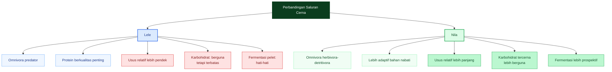

---

## E.5. Alur Pakan dalam Sistem Pencernaan

```mermaid
flowchart TD
    A["Mulut"]:::start
    A --> B["Faring"]:::node
    B --> C["Esofagus"]:::node
    C --> D["Lambung<br/>awal pencernaan protein"]:::stomach
    D --> E["Usus anterior<br/>penyerapan utama"]:::absorb
    E --> F["Usus tengah<br/>penyerapan lanjutan"]:::absorb
    F --> G["Usus posterior / rektum<br/>air dan elektrolit"]:::rectum
    G --> H["Anus"]:::end

    classDef start fill:#0b3d1e,color:#ffffff,stroke:#0b3d1e,stroke-width:2px;
    classDef node fill:#dbeafe,color:#1e3a8a,stroke:#2563eb,stroke-width:2px;
    classDef stomach fill:#fee2e2,color:#7f1d1d,stroke:#dc2626,stroke-width:2px;
    classDef absorb fill:#fef3c7,color:#78350f,stroke:#d97706,stroke-width:2px;
    classDef rectum fill:#dcfce7,color:#14532d,stroke:#16a34a,stroke-width:2px;
    classDef end fill:#ede9fe,color:#4c1d95,stroke:#7c3aed,stroke-width:2px;
```

---

## E.6. Perkiraan Waktu Tinggal Pakan

Waktu tinggal pakan dalam sistem pencernaan bukan angka tetap. Ia dipengaruhi oleh:

- suhu air,
- ukuran ikan,
- ukuran pelet,
- komposisi pakan,
- kadar lemak,
- kadar serat,
- frekuensi pemberian pakan,
- kesehatan ikan,
- stres lingkungan.

Perkiraan praktis:

| Ikan | Perkiraan waktu tinggal pakan |
| ---- | ----------------------------: |
| Lele |                     ±8–14 jam |
| Nila |                     ±8–16 jam |

Catatan:

$$
\boxed{
angka\ ini\ estimasi\ umum,\ bukan\ angka\ mutlak.
}
$$

Pada suhu lebih hangat, metabolisme biasanya lebih cepat. Pada pakan tinggi serat atau kondisi ikan stres, waktu pencernaan dapat berubah.

---

## E.7. Implikasi terhadap Fermentasi

Karena usus nila relatif lebih panjang dan lebih adaptif terhadap bahan nabati, fermentasi bahan karbohidrat/serat lebih masuk akal pada nila.

Untuk lele:

$$
\boxed{
fermentasi\ pelet\ harus\ pendek,\ ringan,\ dan\ tidak\ merusak\ stabilitas\ pakan.
}
$$

Untuk nila:

$$
\boxed{
fermentasi\ bahan\ nabati\ lebih\ prospektif\ untuk\ memperbaiki\ kecernaan.
}
$$

Kesimpulan praktis:

> **Lele membutuhkan pakan stabil dengan protein berkualitas dan energi seimbang. Nila lebih fleksibel memanfaatkan bahan nabati, karbohidrat tercerna, bioflok, dan natural food. Karena itu, strategi fermentasi lebih natural diterapkan pada nila daripada lele.**

[**Kembali ke Atas**](#ep-ratio-pakan-ikan-antara-efisiensi-fcr-fermentasi-ringan-bioflok-dan-perbedaan-strategi-lele-vs-nila)

---

# Rujukan Utama yang Disarankan

1. Mississippi State Extension — **Catfish Feeds and Feeding**: DE/CP catfish 8,5–10 kcal/g, starch, lipid, protein level. ([MSU Extension][1])
2. Mississippi State Extension — **Nutrition, Feeds, and Feeding**: DE/DP 10–11 kcal/g, protein sparing oleh lipid/karbohidrat, lipid 5–6%. ([MSU Extension][7])
3. Texas A&M / Practical Guide Catfish Nutrition — digestible energy 8,5–10 kcal/g protein, carbohydrate 25–35%, fiber < 7%. ([RWFM Extension][8])
4. NRC Fish and Shrimp brief — nitrogen waste dapat ditekan dengan keseimbangan asam amino dan DE/protein. ([National Academies][2])
5. Kabir et al. 2019, Aquaculture — P:E tilapia 18–23 g/MJ pada feed-only; low P:E diet meningkatkan produksi pada semi-intensive pond. ([ScienceDirect][6])
6. Studi _Clarias gariepinus_ — diet terbaik 33,5% digestible protein dan 2,75 kcal/g digestible energy, P/E 121,8 mg/kcal. ([ResearchGate][5])
7. Neves et al. 2024 — fermentasi pakan nabati dengan _Lactobacillus acidophilus_ pada nila bioflok. ([MDPI][4])
8. Contoh label pelet pasar — HI-PRO-VITE 781-1 dari listing toko daring; gunakan hanya sebagai contoh, bukan rujukan final formulasi. ([Makassar Hobi][3])

[1]: https://extension.msstate.edu/agriculture/catfish/catfish-feeds-and-feeding 'Catfish Feeds and Feeding | Mississippi State University Extension Service'
[2]: https://nap.nationalacademies.org/resource/13039/Fish-Shrimp-Report-Brief-Final.pdf?utm_source=chatgpt.com 'Nutrient Requirements of Fish and Shrimp'
[3]: https://makassarhobi.com/product/pelet-hi-pro-vite-781-1-pakan-benih-bibit-ikan-lele-gurame-nila-30kg/ 'Jual Pelet HI-PRO-VITE 781-1 Pakan Benih Bibit Ikan Lele Gurame Nila 30kg - Makassar Hobi'
[4]: https://www.mdpi.com/2076-2615/14/2/332?utm_source=chatgpt.com 'Fermentation of Plant-Based Feeds with Lactobacillus ...'
[5]: https://www.researchgate.net/publication/260981098_Studies_on_the_optimum_protein_to_energy_ratio_of_African_catfish_Clarias_gariepinus_Burchell?utm_source=chatgpt.com 'Studies on the optimum protein to energy ratio of African ...'
[6]: https://www.sciencedirect.com/science/article/abs/pii/S0044848618316260 'Effect of dietary protein to energy ratio on performance of nile tilapia and food web enhancement in semi-intensive pond aquaculture - ScienceDirect'
[7]: https://extension.msstate.edu/agriculture/catfish/nutrition-feeds-and-feeding 'Nutrition, Feeds, and Feeding | Mississippi State University Extension Service'
[8]: https://extension.rwfm.tamu.edu/wp-content/uploads/sites/8/2013/09/A-Practical-Guide-to-Nutrition-Feeds-and-Feeding-of-Catfish.pdf 'Mississippi Agricultural & Forestry Experiment Station (MAFES) B1113  A Practical Guide to Nutrition, Feeds, and Feeding of Catfish (Second Revision)'

[**Kembali ke Atas**](#ep-ratio-pakan-ikan-antara-efisiensi-fcr-fermentasi-ringan-bioflok-dan-perbedaan-strategi-lele-vs-nila)

---

<small>
  **_Catatan Penyusunan_** Artikel ini disusun sebagai materi edukasi dan
  referensi umum berdasarkan berbagai sumber pustaka, praktik lapangan, serta
  bantuan alat penulisan. Pembaca disarankan untuk melakukan verifikasi lanjutan
  dan penyesuaian sesuai dengan kondisi serta kebutuhan masing-masing sistem.
</small>
