# **_Fermentasi Protein untuk Pakan Lele: Membuat Hidrolisat Asam Amino yang Aman, Rasional, dan Bernilai Guna_**

---

- [**_Fermentasi Protein untuk Pakan Lele: Membuat Hidrolisat Asam Amino yang Aman, Rasional, dan Bernilai Guna_**](#fermentasi-protein-untuk-pakan-lele-membuat-hidrolisat-asam-amino-yang-aman-rasional-dan-bernilai-guna)
- [Bab 1 — Meluruskan Istilah: Ini Bukan Asam Amino Murni](#bab-1--meluruskan-istilah-ini-bukan-asam-amino-murni)
  - [1.1. Apa yang Disebut “Asam Amino Cair” oleh Praktisi?](#11-apa-yang-disebut-asam-amino-cair-oleh-praktisi)
  - [1.2. Mengapa Disebut Protein Hidrolisat Fermentasi?](#12-mengapa-disebut-protein-hidrolisat-fermentasi)
    - [Protein](#protein)
    - [Hidrolisat](#hidrolisat)
    - [Fermentasi](#fermentasi)
  - [1.3. Alur Sederhana Perubahan Protein](#13-alur-sederhana-perubahan-protein)
  - [1.4. Perbedaan Istilah Penting](#14-perbedaan-istilah-penting)
  - [1.5. Perbedaan Asam Amino Murni dan Hidrolisat Fermentasi](#15-perbedaan-asam-amino-murni-dan-hidrolisat-fermentasi)
    - [Asam amino murni](#asam-amino-murni)
    - [Protein hidrolisat fermentasi](#protein-hidrolisat-fermentasi)
  - [1.6. Fermentasi Tidak Menciptakan Asam Amino dari Nol](#16-fermentasi-tidak-menciptakan-asam-amino-dari-nol)
  - [1.7. Kesimpulan Bab 1](#17-kesimpulan-bab-1)
- [Bab 2 — Tujuan Fermentasi untuk Pakan Lele](#bab-2--tujuan-fermentasi-untuk-pakan-lele)
  - [2.1. Mengawetkan Bahan Protein Basah](#21-mengawetkan-bahan-protein-basah)
  - [2.2. Menekan Pembusukan](#22-menekan-pembusukan)
  - [2.3. Menurunkan pH](#23-menurunkan-ph)
  - [2.4. Meningkatkan Palatabilitas Pakan](#24-meningkatkan-palatabilitas-pakan)
  - [2.5. Membantu Kecernaan Protein](#25-membantu-kecernaan-protein)
  - [2.6. Memanfaatkan Bahan Protein Lokal](#26-memanfaatkan-bahan-protein-lokal)
  - [2.7. Bukan Pengganti Pelet Lengkap](#27-bukan-pengganti-pelet-lengkap)
  - [2.8. Ringkasan Tujuan Fermentasi](#28-ringkasan-tujuan-fermentasi)
  - [2.9. Kesimpulan Bab 2](#29-kesimpulan-bab-2)
- [Bab 3 — Bahan Baku dan Sumber Lisin-Metionin](#bab-3--bahan-baku-dan-sumber-lisin-metionin)
  - [3.1. Prinsip Dasar Memilih Bahan Baku](#31-prinsip-dasar-memilih-bahan-baku)
  - [3.2. Limbah Ikan](#32-limbah-ikan)
    - [Kelebihan](#kelebihan)
    - [Kelemahan](#kelemahan)
    - [Catatan praktis](#catatan-praktis)
  - [3.3. Keong Sawah](#33-keong-sawah)
    - [Kelebihan](#kelebihan-1)
    - [Kelemahan](#kelemahan-1)
    - [Catatan praktis](#catatan-praktis-1)
  - [3.4. Maggot BSF](#34-maggot-bsf)
    - [Kelebihan](#kelebihan-2)
    - [Kelemahan](#kelemahan-2)
    - [Catatan praktis](#catatan-praktis-2)
  - [3.5. Limbah Udang](#35-limbah-udang)
    - [Kelebihan](#kelebihan-3)
    - [Kelemahan](#kelemahan-3)
    - [Catatan praktis](#catatan-praktis-3)
  - [3.6. Bungkil Kedelai](#36-bungkil-kedelai)
    - [Kelebihan](#kelebihan-4)
    - [Kelemahan](#kelemahan-4)
    - [Catatan praktis](#catatan-praktis-4)
  - [3.7. Ampas Tahu](#37-ampas-tahu)
    - [Kelebihan](#kelebihan-5)
    - [Kelemahan](#kelemahan-5)
    - [Catatan praktis](#catatan-praktis-5)
  - [3.8. Dedak](#38-dedak)
    - [Kelebihan](#kelebihan-6)
    - [Kelemahan](#kelemahan-6)
    - [Catatan praktis](#catatan-praktis-6)
  - [3.9. Sumber Lisin](#39-sumber-lisin)
  - [3.10. Sumber Metionin](#310-sumber-metionin)
  - [3.11. Peta Praktis Lisin dan Metionin](#311-peta-praktis-lisin-dan-metionin)
  - [3.12. Kelebihan dan Kelemahan Tiap Bahan](#312-kelebihan-dan-kelemahan-tiap-bahan)
  - [3.13. Kenapa Profil Asam Amino Ditentukan Bahan Asal?](#313-kenapa-profil-asam-amino-ditentukan-bahan-asal)
  - [3.14. Kombinasi Bahan yang Lebih Masuk Akal](#314-kombinasi-bahan-yang-lebih-masuk-akal)
    - [Kombinasi 1: limbah ikan + bungkil kedelai](#kombinasi-1-limbah-ikan--bungkil-kedelai)
    - [Kombinasi 2: maggot BSF + limbah ikan](#kombinasi-2-maggot-bsf--limbah-ikan)
    - [Kombinasi 3: keong sawah + bungkil kedelai + sedikit limbah ikan](#kombinasi-3-keong-sawah--bungkil-kedelai--sedikit-limbah-ikan)
    - [Kombinasi 4: ampas tahu + maggot + limbah udang](#kombinasi-4-ampas-tahu--maggot--limbah-udang)
  - [3.15. Bahan yang Sebaiknya Dibatasi](#315-bahan-yang-sebaiknya-dibatasi)
    - [Dedak](#dedak)
    - [Ampas tahu basah](#ampas-tahu-basah)
    - [Limbah udang tinggi kulit](#limbah-udang-tinggi-kulit)
    - [Keong dengan cangkang terlalu banyak](#keong-dengan-cangkang-terlalu-banyak)
    - [Limbah ikan busuk](#limbah-ikan-busuk)
  - [3.16. Standar Praktis Pemilihan Bahan](#316-standar-praktis-pemilihan-bahan)
  - [3.17. Kesimpulan Bab 3](#317-kesimpulan-bab-3)
- [Bab 4 — Dasar Fermentasi: Fungsi Enzim, Probiotik, Molase, Garam, dan Air](#bab-4--dasar-fermentasi-fungsi-enzim-probiotik-molase-garam-dan-air)
  - [4.1. Dua Proses Utama: Hidrolisis dan Fermentasi](#41-dua-proses-utama-hidrolisis-dan-fermentasi)
    - [Pertama: hidrolisis protein](#pertama-hidrolisis-protein)
    - [Kedua: fermentasi mikroba](#kedua-fermentasi-mikroba)
  - [4.2. Pepaya dan Nanas sebagai Sumber Enzim Protease](#42-pepaya-dan-nanas-sebagai-sumber-enzim-protease)
  - [4.3. Fungsi Papain dari Pepaya](#43-fungsi-papain-dari-pepaya)
  - [4.4. Fungsi Bromelain dari Nanas](#44-fungsi-bromelain-dari-nanas)
  - [4.5. Enzim Tidak Menciptakan Asam Amino Baru](#45-enzim-tidak-menciptakan-asam-amino-baru)
  - [4.6. Peran Probiotik dalam Mengendalikan Fermentasi](#46-peran-probiotik-dalam-mengendalikan-fermentasi)
  - [4.7. Molase sebagai Sumber Gula](#47-molase-sebagai-sumber-gula)
  - [4.8. Garam sebagai Penekan Mikroba Liar](#48-garam-sebagai-penekan-mikroba-liar)
  - [4.9. Air sebagai Pengatur Sistem](#49-air-sebagai-pengatur-sistem)
  - [4.10. Ringkasan Fungsi Setiap Komponen](#410-ringkasan-fungsi-setiap-komponen)
  - [4.11. Kesimpulan Bab 4](#411-kesimpulan-bab-4)
- [Bab 5 — Neraca Massa dan Dasar Hitungan Praktis](#bab-5--neraca-massa-dan-dasar-hitungan-praktis)
  - [5.1. Prinsip Dasar Neraca Massa](#51-prinsip-dasar-neraca-massa)
  - [5.2. Neraca Protein](#52-neraca-protein)
  - [5.3. Neraca Nitrogen](#53-neraca-nitrogen)
  - [5.4. Perubahan Protein Menjadi Peptida dan Asam Amino Bebas](#54-perubahan-protein-menjadi-peptida-dan-asam-amino-bebas)
  - [5.5. Derajat Hidrolisis: Seberapa Jauh Protein Terpecah?](#55-derajat-hidrolisis-seberapa-jauh-protein-terpecah)
  - [5.6. Neraca Gula Menjadi Asam Laktat](#56-neraca-gula-menjadi-asam-laktat)
  - [5.7. Dasar Dosis Molase](#57-dasar-dosis-molase)
  - [5.8. Target pH dan Hubungannya dengan Gula](#58-target-ph-dan-hubungannya-dengan-gula)
  - [5.9. Dasar Dosis Garam](#59-dasar-dosis-garam)
  - [5.10. Dasar Pengaturan Air dan Total Padatan](#510-dasar-pengaturan-air-dan-total-padatan)
  - [5.11. Cara Menghitung Air Bila Target Padatan Ditentukan](#511-cara-menghitung-air-bila-target-padatan-ditentukan)
  - [5.12. Dosis Probiotik Harus Berbasis CFU](#512-dosis-probiotik-harus-berbasis-cfu)
  - [5.13. Dosis Enzim Harus Berbasis Aktivitas, Bukan Berat Buah](#513-dosis-enzim-harus-berbasis-aktivitas-bukan-berat-buah)
  - [5.14. Contoh Formula dengan Dasar Neraca Massa](#514-contoh-formula-dengan-dasar-neraca-massa)
  - [5.15. Apa yang Bisa Bertambah dan Tidak Bertambah?](#515-apa-yang-bisa-bertambah-dan-tidak-bertambah)
  - [5.16. Kenapa Protein Persen Kadang Terlihat Naik?](#516-kenapa-protein-persen-kadang-terlihat-naik)
  - [5.17. Rumus Praktis yang Perlu Dipegang](#517-rumus-praktis-yang-perlu-dipegang)
    - [Menghitung protein awal](#menghitung-protein-awal)
    - [Menghitung nitrogen](#menghitung-nitrogen)
    - [Menghitung garam](#menghitung-garam)
    - [Menghitung total padatan](#menghitung-total-padatan)
    - [Menghitung kebutuhan air](#menghitung-kebutuhan-air)
    - [Menghitung kebutuhan starter probiotik](#menghitung-kebutuhan-starter-probiotik)
  - [5.18. Kesimpulan Bab 5](#518-kesimpulan-bab-5)
- [Bab 6 — Formula dan SOP Pembuatan](#bab-6--formula-dan-sop-pembuatan)
  - [6.1. Formula Dasar untuk 10 kg Bahan Protein](#61-formula-dasar-untuk-10-kg-bahan-protein)
  - [6.2. Formula Skala Kecil untuk Uji Coba](#62-formula-skala-kecil-untuk-uji-coba)
    - [Formula uji coba 2 kg bahan protein](#formula-uji-coba-2-kg-bahan-protein)
    - [Formula uji coba 5 kg bahan protein](#formula-uji-coba-5-kg-bahan-protein)
  - [6.3. Formula Skala Besar](#63-formula-skala-besar)
    - [Formula 50 kg bahan protein](#formula-50-kg-bahan-protein)
    - [Formula 100 kg bahan protein](#formula-100-kg-bahan-protein)
  - [6.4. Koreksi Formula Berdasarkan Jenis Bahan](#64-koreksi-formula-berdasarkan-jenis-bahan)
  - [6.5. Alat yang Dibutuhkan](#65-alat-yang-dibutuhkan)
    - [Alat utama](#alat-utama)
    - [Wadah yang boleh digunakan](#wadah-yang-boleh-digunakan)
  - [6.6. Persiapan Bahan](#66-persiapan-bahan)
    - [Bahan protein](#bahan-protein)
    - [Pepaya atau nanas](#pepaya-atau-nanas)
    - [Molase](#molase)
    - [Probiotik](#probiotik)
  - [6.7. SOP Umum Pembuatan](#67-sop-umum-pembuatan)
  - [6.8. Tahap 1 — Cuci dan Cacah Bahan](#68-tahap-1--cuci-dan-cacah-bahan)
  - [6.9. Tahap 2 — Pasteurisasi](#69-tahap-2--pasteurisasi)
  - [6.10. Tahap 3 — Pendinginan](#610-tahap-3--pendinginan)
  - [6.11. Tahap 4 — Pencampuran](#611-tahap-4--pencampuran)
  - [6.12. Tahap 5 — Fermentasi Anaerob](#612-tahap-5--fermentasi-anaerob)
  - [6.13. Lama Fermentasi](#613-lama-fermentasi)
  - [6.14. Metode Satu Tahap](#614-metode-satu-tahap)
    - [Alur metode satu tahap](#alur-metode-satu-tahap)
    - [Kelebihan metode satu tahap](#kelebihan-metode-satu-tahap)
    - [Kelemahan metode satu tahap](#kelemahan-metode-satu-tahap)
    - [Cocok untuk](#cocok-untuk)
  - [6.15. Metode Dua Tahap](#615-metode-dua-tahap)
    - [Tahap 1 — Hidrolisis Enzimatis](#tahap-1--hidrolisis-enzimatis)
    - [Tahap 2 — Fermentasi Probiotik](#tahap-2--fermentasi-probiotik)
    - [Alur metode dua tahap](#alur-metode-dua-tahap)
    - [Kelebihan metode dua tahap](#kelebihan-metode-dua-tahap)
    - [Kelemahan metode dua tahap](#kelemahan-metode-dua-tahap)
    - [Cocok untuk](#cocok-untuk-1)
  - [6.16. Perbandingan Metode Satu Tahap dan Dua Tahap](#616-perbandingan-metode-satu-tahap-dan-dua-tahap)
  - [6.17. Penyaringan](#617-penyaringan)
    - [Hasil penyaringan](#hasil-penyaringan)
  - [6.18. Penyimpanan Produk Cair](#618-penyimpanan-produk-cair)
  - [6.19. Umur Simpan](#619-umur-simpan)
  - [6.20. SOP Ringkas Produksi 10 kg Bahan Protein](#620-sop-ringkas-produksi-10-kg-bahan-protein)
    - [Formula](#formula)
    - [Langkah kerja](#langkah-kerja)
  - [6.21. Titik Kritis Proses](#621-titik-kritis-proses)
  - [6.22. Checklist Produksi](#622-checklist-produksi)
    - [Sebelum produksi](#sebelum-produksi)
    - [Saat produksi](#saat-produksi)
    - [Setelah fermentasi](#setelah-fermentasi)
  - [6.23. Kesalahan Umum dalam Pembuatan](#623-kesalahan-umum-dalam-pembuatan)
  - [6.24. Kesimpulan Bab 6](#624-kesimpulan-bab-6)
- [Bab 7 — Kontrol Keamanan Fermentasi](#bab-7--kontrol-keamanan-fermentasi)
  - [7.1. Risiko Mikroba Patogen](#71-risiko-mikroba-patogen)
  - [7.2. Kenapa Fermentasi Tidak Harus Steril?](#72-kenapa-fermentasi-tidak-harus-steril)
  - [7.3. pH sebagai Indikator Utama](#73-ph-sebagai-indikator-utama)
  - [7.4. Cara Mengukur pH](#74-cara-mengukur-ph)
    - [Cara mengukur pH cairan fermentasi](#cara-mengukur-ph-cairan-fermentasi)
    - [Bila produk terlalu kental](#bila-produk-terlalu-kental)
    - [Jadwal pengukuran pH](#jadwal-pengukuran-ph)
  - [7.5. Tanda Fermentasi Berhasil](#75-tanda-fermentasi-berhasil)
  - [7.6. Tanda Fermentasi Gagal](#76-tanda-fermentasi-gagal)
  - [7.7. Risiko Amonia](#77-risiko-amonia)
  - [7.8. Risiko Jamur](#78-risiko-jamur)
  - [7.9. Risiko Belatung](#79-risiko-belatung)
  - [7.10. Risiko Bau Busuk](#710-risiko-bau-busuk)
    - [Bau yang masih normal](#bau-yang-masih-normal)
    - [Bau yang tidak normal](#bau-yang-tidak-normal)
  - [7.11. Kapan Produk Harus Dibuang?](#711-kapan-produk-harus-dibuang)
  - [7.12. Uji Kecil Sebelum Dipakai Luas](#712-uji-kecil-sebelum-dipakai-luas)
  - [7.13. Kesimpulan Bab 7](#713-kesimpulan-bab-7)
- [Bab 8 — Cara Pakai pada Pakan Lele dan Batasannya](#bab-8--cara-pakai-pada-pakan-lele-dan-batasannya)
  - [8.1. Fungsi Aplikasi ke Pelet](#81-fungsi-aplikasi-ke-pelet)
  - [8.2. Dosis Aplikasi ke Pelet](#82-dosis-aplikasi-ke-pelet)
  - [8.3. Cara Mencampur ke Pakan](#83-cara-mencampur-ke-pakan)
  - [8.4. Peran Minyak sebagai Perekat](#84-peran-minyak-sebagai-perekat)
  - [8.5. Jangan Menyimpan Pelet Basah Terlalu Lama](#85-jangan-menyimpan-pelet-basah-terlalu-lama)
  - [8.6. Dampak ke Kualitas Air](#86-dampak-ke-kualitas-air)
  - [8.7. Kapan Cocok Digunakan?](#87-kapan-cocok-digunakan)
    - [Cocok digunakan saat:](#cocok-digunakan-saat)
  - [8.8. Kapan Tidak Perlu Digunakan?](#88-kapan-tidak-perlu-digunakan)
    - [Tidak perlu atau kurang tepat digunakan bila:](#tidak-perlu-atau-kurang-tepat-digunakan-bila)
  - [8.9. Batasan sebagai Aditif, Bukan Pakan Utama](#89-batasan-sebagai-aditif-bukan-pakan-utama)
  - [8.10. Dosis Bertahap dan Evaluasi](#810-dosis-bertahap-dan-evaluasi)
  - [8.11. Waktu Pemberian](#811-waktu-pemberian)
  - [8.12. Uji Respons Pakan](#812-uji-respons-pakan)
  - [8.13. Alur Keputusan Pemakaian](#813-alur-keputusan-pemakaian)
  - [8.14. Kesalahan Umum Saat Aplikasi](#814-kesalahan-umum-saat-aplikasi)
  - [8.15. Kesimpulan Bab 8](#815-kesimpulan-bab-8)
- [Bab 9 — Lampiran Rujukan Ilmiah dan Teknis](#bab-9--lampiran-rujukan-ilmiah-dan-teknis)
  - [9.1. Tabel Rujukan Klaim Utama](#91-tabel-rujukan-klaim-utama)
  - [9.2. Catatan Angka yang Dipakai dalam Artikel](#92-catatan-angka-yang-dipakai-dalam-artikel)
  - [9.3. Rujukan untuk Bahan Pakan dan Profil Lisin-Metionin](#93-rujukan-untuk-bahan-pakan-dan-profil-lisin-metionin)
  - [9.4. Rujukan untuk Mekanisme Fermentasi](#94-rujukan-untuk-mekanisme-fermentasi)
  - [9.5. Rujukan untuk Batasan Klaim](#95-rujukan-untuk-batasan-klaim)
  - [9.6. Ringkasan Praktis dari Lampiran](#96-ringkasan-praktis-dari-lampiran)

---

# Bab 1 — Meluruskan Istilah: Ini Bukan Asam Amino Murni

Di lapangan, banyak praktisi menyebut hasil fermentasi limbah ikan, keong, maggot, ampas tahu, atau bahan protein lain sebagai **“asam amino cair”**. Istilah ini mudah dipahami secara praktis, tetapi secara teknis kurang tepat.

Produk yang dihasilkan dari proses tersebut **bukan asam amino murni** seperti lisin, metionin, treonin, atau triptofan sintetis. Produk itu lebih tepat disebut:

> **protein hidrolisat fermentasi**

Artinya, bahan protein dipecah sebagian melalui bantuan enzim dan fermentasi menjadi bentuk yang lebih sederhana, terutama:

- protein terlarut,
- peptida,
- sebagian asam amino bebas,
- asam organik,
- mineral,
- metabolit mikroba,
- sedikit biomassa mikroba.

Dengan kata lain, yang terjadi bukan “membuat asam amino dari nol”, tetapi **mengubah protein yang sudah ada menjadi bentuk yang lebih mudah dimanfaatkan**.

<ResourceBox
  title="Artikel Terkait:"
  items={[
    {
      name: 'Menurunkan FCR Lele: Dari Pakan Dimakan sampai Menjadi Daging',
      href: '/blog/agri/perikanan/menurunkan-fcr-lele',
    },
    {
      name: 'Kolam Lele sebagai Bioreaktor Penurun FCR Berbasis Bioflok',
      href: '/blog/agri/perikanan/menurunkan-fcr-lele-bioflok',
    },
    {
      name: 'Rancangan Bioreactor Sederhana untuk Pembiakan PGPM Cair dan Padat Skala Petani',
      href: '/blog/agri/agen-hayati/bioreactor-design',
    },
    {
      name: 'Fermentasi, Pengomposan, dan Pembusukan: Meluruskan Istilah agar Praktisi Agri Tidak Salah Interpretasi',
      href: '/blog/agri/fermentasi-pengomposan-pembusukan',
    },
    {
      name: 'C/N Ratio pada Bioflok: Mengatur Mikroba, Oksigen, dan Stabilitas Kolam untuk Praktisi',
      href: '/blog/agri/perikanan/ratio-cn-rendah-biflok',
    },
    {
      name: 'E/P Ratio Pakan Ikan: Antara Efisiensi FCR, Fermentasi Ringan, Bioflok, dan Perbedaan Strategi Lele vs Nila',
      href: '/blog/agri/perikanan/ep-ratio-pakan-fermentasi',
    },
    {
      name: 'Manajemen Nitrit dan Nitrat pada Bioflok: `$C/N$`, `$Cl^-$`, Nitrifikasi, Denitrifikasi, dan Ekspor Nitrogen Berbasis Angka',
      href: '/blog/agri/perikanan/nitri-nitrat-manajemen-biofloc',
    },
  ]}
/>

---

## 1.1. Apa yang Disebut “Asam Amino Cair” oleh Praktisi?

Dalam praktik budidaya, istilah “asam amino cair” biasanya merujuk pada cairan hasil fermentasi bahan protein seperti:

- limbah ikan,
- ikan rucah,
- kepala dan jeroan ikan,
- keong sawah,
- maggot BSF,
- limbah udang,
- ampas tahu,
- bungkil kedelai,
- bahan protein lokal lainnya.

Bahan-bahan tersebut dicampur dengan sumber gula seperti molase, lalu diberi probiotik dan kadang ditambah pepaya atau nanas sebagai sumber enzim alami.

Setelah difermentasi beberapa hari, bahan berubah menjadi cairan beraroma asam-gurih. Cairan inilah yang kemudian sering disebut “asam amino cair”.

Secara praktis, istilah itu boleh saja dipakai sebagai bahasa lapangan. Namun dalam artikel ini, istilah yang dipakai akan dibuat lebih akurat:

> **Protein hidrolisat fermentasi**, bukan asam amino murni.

---

## 1.2. Mengapa Disebut Protein Hidrolisat Fermentasi?

Istilah ini terdiri dari tiga kata penting.

### Protein

Bahan awalnya mengandung protein. Misalnya limbah ikan, maggot, keong, dan bungkil kedelai. Protein adalah rantai panjang yang tersusun dari banyak asam amino.

### Hidrolisat

Protein tersebut dipecah menjadi potongan lebih kecil melalui proses hidrolisis. Hasilnya bisa berupa:

- protein yang lebih larut,
- peptida besar,
- peptida kecil,
- sebagian asam amino bebas.

### Fermentasi

Prosesnya dibantu oleh mikroba, terutama mikroba baik seperti bakteri asam laktat. Mikroba ini membantu menurunkan pH dan menekan mikroba pembusuk.

Jadi, istilah **protein hidrolisat fermentasi** lebih tepat karena menggambarkan apa yang benar-benar terjadi:

> Protein dipecah sebagian, lalu prosesnya distabilkan melalui fermentasi.

---

## 1.3. Alur Sederhana Perubahan Protein

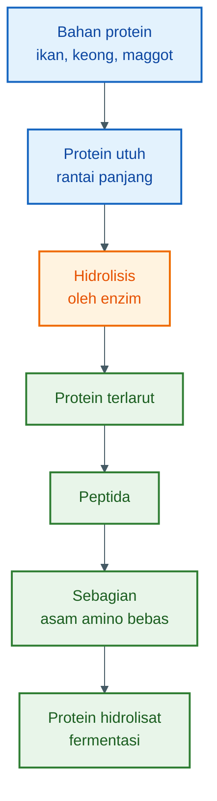

Diagram di atas menunjukkan hal penting: **asam amino bebas hanya sebagian dari hasil akhir**. Produk fermentasi tetap berisi campuran banyak fraksi, bukan asam amino murni.

---

## 1.4. Perbedaan Istilah Penting

| Istilah                        | Pengertian                                                               | Contoh                                                | Catatan Praktis                                      |
| ------------------------------ | ------------------------------------------------------------------------ | ----------------------------------------------------- | ---------------------------------------------------- |
| **Asam amino murni**           | Senyawa tunggal atau campuran asam amino dengan kemurnian tinggi         | DL-Methionine, L-Lysine HCl                           | Dosis presisi, biasanya produk industri              |
| **Protein hidrolisat**         | Protein yang sudah dipecah menjadi peptida dan sebagian asam amino bebas | Hidrolisat ikan, hidrolisat kedelai                   | Lebih mudah dicerna dibanding protein utuh           |
| **Silase ikan**                | Produk pengawetan ikan atau limbah ikan dengan pH rendah                 | Fermentasi ikan dengan molase dan bakteri asam laktat | Fokus utama: pengawetan dan stabilitas               |
| **Fermentasi protein**         | Proses biologis untuk mengubah bahan protein menggunakan mikroba         | Fermentasi limbah ikan, maggot, ampas tahu            | Hasil tergantung bahan, mikroba, pH, dan sanitasi    |
| **“Asam amino cair” lapangan** | Istilah praktis untuk cairan fermentasi protein                          | Cairan fermentasi ikan + molase + probiotik           | Istilah populer, tetapi kurang presisi secara teknis |

---

## 1.5. Perbedaan Asam Amino Murni dan Hidrolisat Fermentasi

Perbedaan paling penting terletak pada **kemurnian, fungsi, dan ketepatan dosis**.

### Asam amino murni

Asam amino murni adalah produk industri yang biasanya memiliki kadar dan bentuk senyawa yang jelas. Contohnya:

- DL-Methionine,
- L-Lysine HCl,
- L-Threonine,
- L-Tryptophan.

Produk seperti ini digunakan bila formulator ingin memperbaiki kekurangan asam amino tertentu secara presisi.

Misalnya pakan kekurangan metionin, maka penambahan DL-Methionine bisa dilakukan dengan dosis yang dihitung jelas.

### Protein hidrolisat fermentasi

Protein hidrolisat fermentasi tidak sepresisi itu. Kandungannya tergantung pada:

- bahan baku,
- kadar protein awal,
- jenis enzim,
- jenis mikroba,
- jumlah molase,
- suhu,
- lama fermentasi,
- pH akhir,
- sanitasi proses.

Produk ini lebih cocok dipahami sebagai **aditif fungsional**, bukan sebagai korektor asam amino presisi.

Fungsi utamanya:

- membantu palatabilitas,
- membantu kecernaan,
- memanfaatkan bahan lokal,
- mengawetkan bahan protein basah,
- menekan pembusukan.

---

## 1.6. Fermentasi Tidak Menciptakan Asam Amino dari Nol

Ini prinsip paling penting dalam artikel ini.

Fermentasi tidak bisa membuat bahan miskin protein tiba-tiba menjadi kaya protein. Fermentasi juga tidak bisa membuat bahan miskin metionin tiba-tiba menjadi kaya metionin.

Yang terjadi adalah perubahan bentuk.

Protein awal:

```mdx
protein utuh → protein terlarut → peptida → sebagian asam amino bebas
```

Tetapi jumlah total unsur seperti nitrogen dan sulfur tetap bergantung pada bahan awal.

Contoh sederhana:

```mdx
Jika bahan awal hanya mengandung sedikit protein,
maka hasil fermentasinya juga tidak mungkin menjadi sumber protein tinggi.
```

Begitu juga dengan asam amino esensial:

```mdx
Jika bahan awal miskin metionin,
fermentasi tidak akan menciptakan metionin dalam jumlah besar.
```

Fermentasi hanya membantu membuka, memecah, melarutkan, dan menstabilkan sebagian nutrisi yang sudah ada.

---

## 1.7. Kesimpulan Bab 1

Istilah “asam amino cair” boleh dipakai sebagai bahasa praktis, tetapi untuk ketepatan teknis, istilah yang lebih benar adalah:

> **protein hidrolisat fermentasi**

Produk ini bukan asam amino murni. Produk ini adalah campuran protein terlarut, peptida, sebagian asam amino bebas, asam organik, mineral, dan metabolit hasil fermentasi.

Kesalahan terbesar dalam memahami produk ini adalah menganggap fermentasi dapat menciptakan nutrisi baru secara ajaib.

Yang benar:

> **Fermentasi tidak menciptakan asam amino dari nol. Fermentasi mengubah protein yang sudah ada menjadi bentuk yang lebih mudah dicerna, lebih stabil, dan lebih menarik bagi lele.**

[**Kembali ke Atas**](#fermentasi-protein-untuk-pakan-lele-membuat-hidrolisat-asam-amino-yang-aman-rasional-dan-bernilai-guna)

---

# Bab 2 — Tujuan Fermentasi untuk Pakan Lele

Fermentasi bahan protein untuk pakan lele bukan sekadar membuat cairan berbau asam. Tujuan utamanya adalah membuat bahan protein basah menjadi lebih aman, lebih stabil, lebih mudah dimanfaatkan, dan lebih menarik bagi ikan.

<figure>
  
  <figcaption>
    Proses fermentasi pakan lele untuk meningkatkan efisiensi dan kualitas
    pakan.
  </figcaption>
</figure>

Dalam konteks budidaya lele, fermentasi harus dilihat sebagai alat bantu. Ia bukan pengganti formulasi pakan yang benar.

Pelet utama tetap harus memenuhi kebutuhan:

- protein,
- energi,
- lemak,
- mineral,
- vitamin,
- asam amino esensial,
- stabilitas di air.

Protein hidrolisat fermentasi hanya berperan sebagai **pendukung**, terutama untuk meningkatkan nilai guna bahan protein lokal.

---

## 2.1. Mengawetkan Bahan Protein Basah

Bahan protein basah sangat mudah rusak. Limbah ikan, jeroan, keong, dan maggot segar mengandung air tinggi. Kondisi ini membuat mikroba pembusuk mudah tumbuh.

Jika tidak segera diproses, bahan akan cepat mengalami:

- bau busuk,
- peningkatan amonia,
- pertumbuhan bakteri pembusuk,
- pertumbuhan belatung,
- penurunan mutu protein,
- risiko kontaminasi patogen.

Fermentasi membantu memperpanjang masa simpan dengan cara menurunkan pH dan menciptakan kondisi yang tidak nyaman bagi mikroba pembusuk.

Namun, fermentasi tidak boleh dijadikan alasan untuk memakai bahan yang sudah busuk sejak awal.

> Bahan busuk tidak berubah menjadi bahan bagus hanya karena difermentasi.

---

## 2.2. Menekan Pembusukan

Pembusukan protein terjadi ketika mikroba liar menguraikan protein secara tidak terkendali. Hasilnya bukan peptida yang bermanfaat, tetapi senyawa pembusukan seperti:

- amonia,
- amina busuk,
- senyawa sulfur berbau tajam,
- lendir,
- gas busuk,
- metabolit yang dapat merugikan ikan.

Fermentasi yang benar mengarahkan proses agar protein tidak masuk ke jalur pembusukan, tetapi ke jalur hidrolisis dan pengasaman.

Perbedaannya dapat digambarkan sebagai berikut.

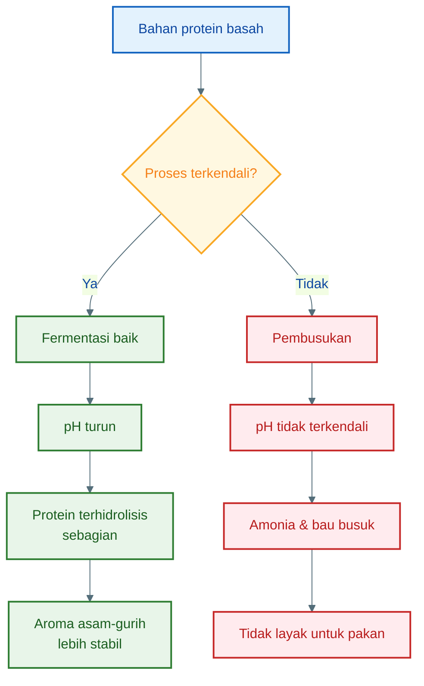

Tujuan fermentasi bukan sekadar “membusukkan bahan secara terkontrol”. Istilah itu sering dipakai, tetapi kurang tepat.

Yang lebih akurat:

> Fermentasi adalah proses biologis terarah untuk menekan pembusukan dan menghasilkan produk yang lebih stabil.

---

## 2.3. Menurunkan pH

Salah satu tujuan paling penting dari fermentasi adalah menurunkan pH.

Dalam proses ini, molase atau gula merah cair berfungsi sebagai sumber gula. Gula tersebut dimanfaatkan oleh mikroba baik, terutama bakteri asam laktat, untuk menghasilkan asam organik.

Asam organik inilah yang membuat pH turun.

Secara sederhana:

```mdx
gula dari molase → asam laktat → pH turun
```

pH rendah membantu menekan pertumbuhan banyak mikroba pembusuk dan patogen. Karena itu, pH menjadi indikator utama apakah fermentasi berjalan baik atau tidak.

Target praktis untuk produk fermentasi protein:

```mdx
pH akhir ideal: 3,5–4,5
```

Jika setelah beberapa hari pH tetap tinggi, misalnya di atas 5, proses harus dicurigai tidak berjalan baik.

---

## 2.4. Meningkatkan Palatabilitas Pakan

Lele sangat responsif terhadap aroma pakan. Bahan protein yang terhidrolisis sebagian biasanya menghasilkan aroma gurih dan asam ringan yang lebih menarik dibanding bahan mentah.

Hasil fermentasi yang baik dapat membantu:

- meningkatkan respons makan,
- membuat pelet lebih menarik,
- membantu ikan yang nafsu makannya turun,
- berguna setelah sortir, pindah kolam, atau stres lingkungan.

Aroma yang diharapkan bukan bau busuk, tetapi:

> **bau segar asam-gurih**

Jika aroma berubah menjadi bau bangkai, amonia tajam, atau busuk menyengat, produk tidak layak diberikan.

---

## 2.5. Membantu Kecernaan Protein

Protein utuh berukuran besar. Sebagian bahan protein lokal juga memiliki struktur yang tidak selalu mudah dicerna.

Melalui bantuan enzim dan fermentasi, sebagian protein dipecah menjadi:

- protein terlarut,
- peptida besar,
- peptida kecil,
- asam amino bebas dalam jumlah terbatas.

Bentuk yang lebih kecil ini umumnya lebih mudah dicerna dibanding protein utuh yang masih kasar.

Namun, perlu ditegaskan bahwa fermentasi tidak otomatis membuat semua protein menjadi asam amino bebas. Hasilnya adalah campuran.

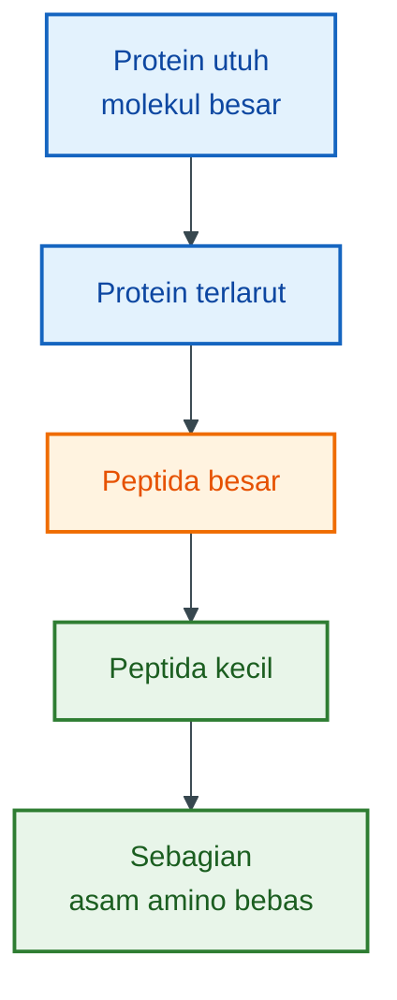

Manfaat utamanya bukan karena semua protein berubah menjadi asam amino, tetapi karena sebagian protein menjadi lebih mudah dicerna dan lebih mudah bercampur dengan pakan.

---

## 2.6. Memanfaatkan Bahan Protein Lokal

Biaya pakan adalah salah satu komponen terbesar dalam budidaya lele. Karena itu, pemanfaatan bahan lokal menjadi penting.

Bahan yang berpotensi digunakan antara lain:

- ikan rucah,
- limbah pasar ikan,
- keong sawah,
- maggot BSF,
- limbah udang,
- ampas tahu,
- bungkil lokal,
- limbah agroindustri tertentu.

Fermentasi membantu mengolah bahan-bahan tersebut agar lebih stabil dan lebih mudah diaplikasikan ke pakan.

Namun, pemanfaatan bahan lokal harus tetap mengikuti prinsip:

- bahan harus segar,
- tidak berjamur,
- tidak tercemar bahan kimia,
- tidak berasal dari ikan sakit,
- tidak berbau busuk sebelum difermentasi.

Jika bahan awal buruk, hasil fermentasi juga berisiko buruk.

---

## 2.7. Bukan Pengganti Pelet Lengkap

Ini batasan yang harus jelas sejak awal.

Protein hidrolisat fermentasi bukan pengganti pelet lengkap. Ia tidak otomatis memenuhi seluruh kebutuhan nutrisi lele.

Lele tetap membutuhkan pakan yang seimbang, meliputi:

- protein sesuai fase pertumbuhan,
- energi cukup,
- lemak,
- mineral,
- vitamin,
- serat terkendali,
- asam amino esensial,
- stabilitas pakan di air.

Hidrolisat fermentasi lebih tepat digunakan sebagai:

- aditif pakan,
- penambah palatabilitas,
- pendukung kecernaan,
- pemanfaatan limbah protein,
- bahan bantu saat ikan stres atau nafsu makan turun.

Dosis pemakaiannya juga harus terbatas. Penggunaan berlebihan dapat mengganggu kualitas air, terutama jika produk terlalu encer, terlalu asam, atau masih mengandung bahan mudah terurai.

---

## 2.8. Ringkasan Tujuan Fermentasi

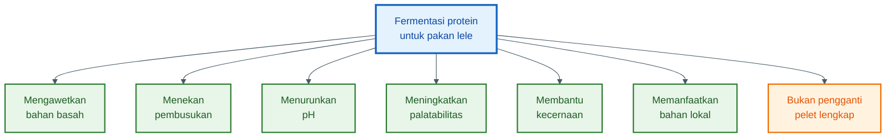

---

## 2.9. Kesimpulan Bab 2

Tujuan utama fermentasi protein untuk pakan lele adalah membuat bahan protein basah menjadi lebih aman, lebih stabil, lebih mudah dicerna, dan lebih menarik bagi ikan.

Fermentasi yang baik membantu:

- mengawetkan bahan,
- menekan pembusukan,
- menurunkan pH,
- meningkatkan aroma asam-gurih,
- membantu kecernaan protein,
- memanfaatkan bahan protein lokal.

Namun, fermentasi tidak boleh dipahami sebagai cara menaikkan protein secara ajaib. Produk fermentasi juga bukan pengganti pelet lengkap.

Kesimpulan praktisnya:

> **Fermentasi adalah alat bantu untuk meningkatkan nilai guna bahan protein, bukan alat untuk menciptakan nutrisi baru dari nol.**

[**Kembali ke Atas**](#fermentasi-protein-untuk-pakan-lele-membuat-hidrolisat-asam-amino-yang-aman-rasional-dan-bernilai-guna)

---

# Bab 3 — Bahan Baku dan Sumber Lisin-Metionin

Bahan baku menentukan kualitas akhir protein hidrolisat fermentasi. Fermentasi bisa memperbaiki **bentuk** nutrisi, tetapi tidak bisa mengubah bahan miskin asam amino menjadi bahan yang kaya asam amino secara ajaib.

Karena itu, pemilihan bahan harus dimulai dari pertanyaan praktis:

> **Bahan ini menyumbang protein apa, asam amino apa, dan risikonya apa?**

Untuk pakan lele, dua asam amino yang perlu mendapat perhatian khusus adalah **lisin** dan **metionin**. Lisin penting untuk pertumbuhan jaringan tubuh, sedangkan metionin penting sebagai asam amino sulfur yang berhubungan dengan pertumbuhan, metabolisme, dan efisiensi pemanfaatan protein.

Dalam banyak bahan pakan alternatif, terutama bahan nabati dan sebagian limbah agroindustri, metionin sering lebih terbatas dibanding lisin. Karena itu, bahan protein lokal sebaiknya tidak dipakai tunggal, tetapi dikombinasikan.

---

## 3.1. Prinsip Dasar Memilih Bahan Baku

Bahan fermentasi untuk pakan lele harus memenuhi empat syarat utama:

1. **Ada kandungan protein yang layak**
2. **Masih segar dan belum busuk**
3. **Tidak tercemar bahan kimia**
4. **Profil nutrisinya masuk akal untuk ikan**

Bahan yang paling sering dipakai praktisi adalah:

- limbah ikan,
- keong sawah,
- maggot BSF,
- limbah udang,
- bungkil kedelai,
- ampas tahu,
- dedak sebagai bahan tambahan.

Namun, tidak semua bahan punya fungsi yang sama.

Ada bahan yang kuat sebagai sumber protein utama, ada yang lebih cocok sebagai bahan pendamping, dan ada yang hanya berperan sebagai sumber energi, perekat, atau pengisi terbatas.

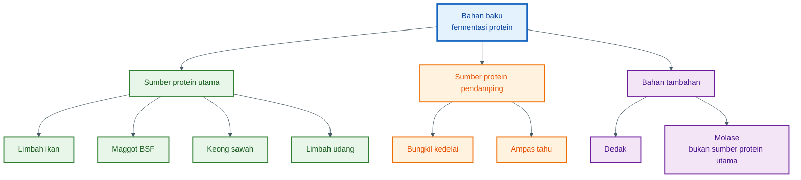

Molase tidak dimasukkan sebagai sumber protein karena fungsi utamanya adalah menyediakan gula untuk bakteri asam laktat. Molase dibahas di Bab 4 dan Bab 5.

---

## 3.2. Limbah Ikan

Limbah ikan adalah bahan yang paling logis untuk membuat protein hidrolisat fermentasi bagi lele.

Contohnya:

- kepala ikan,
- tulang ikan,
- kulit ikan,
- jeroan ikan,
- ikan rucah,
- sisa pasar ikan,
- ikan kecil yang tidak layak jual tetapi masih segar.

Tepung ikan dikenal sebagai bahan pakan dengan protein mudah dicerna serta sumber vitamin, mineral, dan asam lemak rantai panjang; kualitasnya sangat tergantung pada bahan baku dan proses pengolahan. Untuk acuan asam amino, data tepung ikan 60–68% protein menunjukkan lisin sekitar 7,5% dari protein dan metionin sekitar 2,7% dari protein, sehingga ikan termasuk sumber lisin dan metionin yang kuat dibanding banyak bahan alternatif. ([Feedipedia][1])

### Kelebihan

- Profil asam amino relatif baik untuk ikan.
- Palatabilitas tinggi.
- Aroma mudah menarik lele.
- Mengandung mineral dan lemak.
- Cocok untuk hidrolisat fermentasi.

### Kelemahan

- Sangat cepat busuk.
- Risiko bau tinggi bila proses gagal.
- Kualitas tidak seragam.
- Bisa membawa patogen bila bahan awal kotor.
- Kandungan lemak tinggi bisa menyebabkan tengik bila penyimpanan buruk.

### Catatan praktis

Limbah ikan harus diproses secepat mungkin. Jangan menunggu sampai berbau busuk.

Bahan masih layak bila:

- bau amis segar,
- belum berlendir busuk,
- tidak berwarna aneh,
- tidak ada belatung,
- tidak berasal dari ikan mati karena penyakit.

Bahan tidak layak bila:

- bau bangkai,
- bau amonia tajam,
- lendir berlebihan,
- sudah menghitam,
- ada belatung,
- tidak jelas asalnya.

---

## 3.3. Keong Sawah

Keong sawah dapat digunakan sebagai sumber protein lokal, terutama di daerah persawahan. Bagian dagingnya mengandung protein, sedangkan cangkangnya banyak mineral, terutama kalsium.

Kajian tentang golden apple snail melaporkan bahwa daging keong kaya protein pada basis bahan kering dan cangkangnya kaya kalsium. Namun, kajian yang sama menekankan bahwa keong perlu dikombinasikan dengan bahan lain atau ditambah asam amino esensial agar formulasi pakan tetap seimbang. ([ResearchGate][2])

### Kelebihan

- Murah dan tersedia lokal.
- Mengandung protein hewani.
- Dapat membantu menekan populasi hama keong di sawah.
- Cocok dicampur dengan bahan lain.
- Bisa menjadi sumber mineral bila sebagian cangkang ikut diolah secara terkendali.

### Kelemahan

- Perlu perebusan atau pasteurisasi.
- Risiko membawa lumpur, parasit, dan mikroba lingkungan.
- Cangkang terlalu banyak dapat menaikkan abu/mineral berlebihan.
- Protein tidak selalu setara dengan tepung ikan.
- Proses pencacahan lebih berat.

### Catatan praktis

Untuk fermentasi pakan lele, keong sebaiknya:

- dicuci bersih,
- direbus atau dipasteurisasi,
- dipisahkan sebagian cangkangnya bila terlalu banyak,
- dicacah halus,
- dikombinasikan dengan sumber protein lain.

Keong lebih aman diposisikan sebagai **bahan protein pendamping**, bukan satu-satunya sumber protein.

---

## 3.4. Maggot BSF

Maggot BSF adalah bahan yang semakin banyak digunakan dalam pakan ikan. Maggot mengandung protein dan lemak, serta dapat diproduksi dari limbah organik.

Data bahan pakan menunjukkan black soldier fly larvae kering memiliki lisin sekitar 6,6% dari protein dan metionin sekitar 2,1% dari protein. Angka ini membuat BSF cukup menarik sebagai bahan protein, walau penggunaannya tetap perlu dikontrol karena kandungan lemak, kitin, dan variasi substrat pemeliharaan bisa memengaruhi kualitas. ([Feedipedia][3])

### Kelebihan

- Sumber protein lokal yang menjanjikan.
- Produksi bisa dilakukan mandiri.
- Mengandung lemak sebagai sumber energi.
- Palatabilitas cukup baik.
- Cocok dikombinasikan dengan tepung ikan atau bungkil kedelai.

### Kelemahan

- Kandungan lemak bisa tinggi.
- Ada kitin yang dapat membatasi kecernaan bila terlalu banyak.
- Kualitas sangat tergantung pada media budidaya.
- Risiko kontaminasi bila media maggot tidak higienis.
- Maggot segar tinggi air dan mudah rusak.

### Catatan praktis

Maggot segar sebaiknya:

- dicuci,
- dipasteurisasi,
- dicacah atau digiling,
- tidak digunakan bila berbau busuk,
- tidak berasal dari media yang tercemar bahan kimia.

Untuk fermentasi, maggot bisa dipakai sebagai bahan utama atau campuran. Namun, untuk pakan yang seimbang, maggot lebih baik dikombinasikan dengan bahan yang kuat di lisin dan metionin, terutama tepung ikan atau limbah ikan segar.

---

## 3.5. Limbah Udang

Limbah udang dapat berasal dari kepala, kulit, kaki, dan sisa pengolahan udang. Bahan ini menarik karena memiliki aroma khas yang bisa meningkatkan daya tarik pakan ikan.

Shrimp meal atau limbah udang kering dilaporkan sebagai bahan yang baik untuk ikan karena kandungan protein kasar dan daya cernanya. Data limbah udang kering menunjukkan lisin sekitar 5,7% dari protein dan metionin sekitar 2,5% dari protein. ([Feedipedia][4])

### Kelebihan

- Aroma kuat dan menarik untuk ikan.
- Mengandung protein.
- Mengandung mineral.
- Mengandung pigmen alami seperti astaxanthin dalam jumlah tertentu.
- Cocok sebagai penambah palatabilitas.

### Kelemahan

- Kandungan abu/mineral bisa tinggi karena kulit.
- Ada kitin yang sulit dicerna bila terlalu banyak.
- Risiko bau cepat muncul bila bahan tidak segar.
- Garam bisa tinggi bila berasal dari limbah pengolahan tertentu.
- Kualitas sangat bervariasi.

### Catatan praktis

Limbah udang lebih baik digunakan sebagai **bahan penguat aroma dan protein pendamping**, bukan sebagai satu-satunya sumber protein.

Jika bahan terlalu banyak kulit keras, hasil fermentasi bisa tinggi abu dan kurang efisien sebagai sumber protein. Untuk lele, limbah udang sebaiknya dicampur dengan bahan lain seperti limbah ikan, maggot, atau bungkil kedelai.

---

## 3.6. Bungkil Kedelai

Bungkil kedelai adalah salah satu sumber protein nabati paling penting dalam pakan. Kelebihannya adalah kandungan protein relatif tinggi dan lisin cukup baik dibanding banyak bahan nabati lain.

Data soybean meal menunjukkan lisin sekitar 6,2 g/16 g N, sedangkan metionin sekitar 1,4 g/16 g N. Ini menjelaskan mengapa bungkil kedelai relatif kuat sebagai sumber lisin, tetapi metioninnya lebih lemah dibanding bahan hewani seperti tepung ikan. ([Feedipedia][5])

### Kelebihan

- Sumber lisin nabati yang baik.
- Ketersediaan relatif stabil.
- Protein cukup tinggi.
- Cocok untuk menyeimbangkan bahan hewani.
- Lebih mudah diformulasikan dibanding banyak limbah basah.

### Kelemahan

- Metionin relatif rendah.
- Mengandung faktor antinutrisi bila proses pemanasan tidak baik.
- Bisa menimbulkan masalah pencernaan bila terlalu tinggi.
- Tidak sekuat tepung ikan dalam palatabilitas.
- Perlu dikombinasikan dengan sumber metionin.

### Catatan praktis

Bungkil kedelai cocok dipakai untuk memperkuat lisin, tetapi tidak cukup bila berdiri sendiri. Untuk pakan lele, bungkil kedelai sebaiknya dikombinasikan dengan:

- limbah ikan,
- maggot BSF,
- limbah udang,
- atau tambahan DL-Methionine bila formulasi ingin lebih presisi.

---

## 3.7. Ampas Tahu

Ampas tahu adalah limbah padat dari produksi tahu. Bahan ini masih mengandung protein, karbohidrat, dan serat. Dalam bentuk segar, ampas tahu tinggi air dan sangat cepat rusak.

Ampas tahu dapat membantu menambah bahan organik dan protein, tetapi tidak boleh diposisikan sebagai sumber protein utama untuk pakan lele intensif. Nilainya sangat tergantung pada kadar air, kebersihan, dan seberapa cepat bahan diproses setelah keluar dari pabrik tahu.

### Kelebihan

- Murah dan mudah ditemukan di banyak daerah.
- Masih mengandung protein kedelai.
- Bisa difermentasi.
- Cocok sebagai bahan campuran.
- Membantu menekan biaya bila dikelola benar.

### Kelemahan

- Kadar air tinggi.
- Cepat asam dan busuk.
- Kualitas sangat bervariasi.
- Protein tidak setinggi bungkil kedelai.
- Bisa menurunkan kualitas pakan bila terlalu basah atau busuk.

### Catatan praktis

Ampas tahu sebaiknya digunakan dalam kondisi:

- baru,
- tidak berbau busuk,
- tidak berlendir,
- tidak berjamur,
- segera diproses maksimal pada hari yang sama.

Untuk fermentasi protein, ampas tahu lebih cocok sebagai **bahan pendamping**, bukan bahan utama. Kombinasi yang lebih rasional:

```mdx id="325adz"
ampas tahu + limbah ikan
ampas tahu + maggot
ampas tahu + bungkil kedelai
ampas tahu + sedikit limbah udang
```

Ampas tahu membantu volume dan sumber protein nabati, tetapi tetap perlu bahan hewani atau sumber asam amino lain untuk memperbaiki keseimbangan nutrisi.

---

## 3.8. Dedak

Dedak sering tersedia murah, tetapi harus dipahami dengan benar. Dedak bukan bahan protein utama. Dedak lebih tepat diposisikan sebagai:

- sumber energi,
- bahan pengisi terbatas,
- sumber serat,
- bahan pembantu tekstur,
- bahan tambahan dalam formulasi.

Rice bran atau dedak padi merupakan hasil samping penggilingan padi; Feedipedia mencatat dedak mengandung fraksi minyak cukup tinggi dan sering digunakan sebagai binder dalam pakan campuran. Dari sisi asam amino, dedak bukan sumber lisin kuat; data rice bran menunjukkan lisin sekitar 4,4% dari protein dan metionin sekitar 1,9% dari protein, tergantung jenis dan fraksi dedak. ([Feedipedia][6])

### Kelebihan

- Murah.
- Mudah diperoleh.
- Bisa membantu tekstur pakan.
- Menyumbang energi.
- Bisa menjadi bahan tambahan dalam fermentasi campuran.

### Kelemahan

- Protein tidak tinggi.
- Serat bisa tinggi.
- Mudah tengik karena kandungan minyak.
- Bisa tercampur sekam.
- Bukan sumber lisin utama.
- Pemakaian terlalu tinggi dapat menurunkan kualitas pakan ikan.

### Catatan praktis

Dedak boleh dipakai, tetapi jangan dijadikan tulang punggung protein. Dalam fermentasi untuk pakan lele, dedak lebih cocok sebagai bahan tambahan terbatas.

Dedak yang baik:

- tidak bau tengik,
- tidak berjamur,
- tidak terlalu banyak sekam,
- warna dan aroma normal,
- tidak menggumpal lembap.

Dedak tengik atau berjamur tidak layak digunakan.

---

## 3.9. Sumber Lisin

Lisin umumnya lebih kuat pada bahan hewani dan beberapa bahan nabati tertentu, terutama bungkil kedelai.

Untuk formulasi praktis pakan lele, sumber lisin yang baik antara lain:

| Bahan                     | Kekuatan sebagai sumber lisin | Catatan praktis                                  |
| ------------------------- | ----------------------------: | ------------------------------------------------ |
| Limbah ikan / tepung ikan |                        Tinggi | Sangat baik, tetapi harus segar dan aman         |
| Bungkil kedelai           |     Tinggi untuk bahan nabati | Kuat di lisin, lemah di metionin                 |
| Maggot BSF                |            Sedang sampai baik | Perlu kontrol lemak dan kitin                    |
| Limbah udang              |                        Sedang | Bagus sebagai pendamping dan atraktan            |
| Keong sawah               |                        Sedang | Perlu pengolahan bersih dan kombinasi bahan lain |
| Ampas tahu                |          Rendah sampai sedang | Tergantung kadar air dan kualitas                |
| Dedak                     |                        Rendah | Bukan sumber lisin utama                         |

Secara praktis, kombinasi paling aman untuk memperkuat lisin adalah:

```mdx id="bmepzl"
limbah ikan + bungkil kedelai
limbah ikan + maggot BSF
maggot BSF + bungkil kedelai
keong sawah + bungkil kedelai + sedikit limbah ikan
```

---

## 3.10. Sumber Metionin

Metionin sering menjadi perhatian lebih besar karena banyak bahan nabati relatif rendah metionin. Bahan hewani umumnya lebih membantu untuk metionin dibanding bahan nabati.

Sumber metionin yang lebih praktis:

| Bahan                     | Kekuatan sebagai sumber metionin | Catatan praktis                               |
| ------------------------- | -------------------------------: | --------------------------------------------- |
| Limbah ikan / tepung ikan |                             Baik | Salah satu sumber paling seimbang             |
| Limbah udang              |               Sedang sampai baik | Perlu kontrol kitin dan abu                   |
| Maggot BSF                |                           Sedang | Tidak selalu cukup sebagai sumber tunggal     |
| Bungkil kelapa            |                           Sedang | Protein tidak setinggi kedelai                |
| Bungkil wijen             |                           Sedang | Bisa membantu, tergantung ketersediaan        |
| Bungkil kedelai           |             Rendah sampai sedang | Kuat lisin, tetapi metionin terbatas          |
| Dedak                     |      Rendah sebagai sumber utama | Lebih cocok sebagai bahan energi              |
| DL-Methionine             |                   Sangat presisi | Produk industri, bukan bahan fermentasi lokal |

Untuk pakan yang ingin lebih presisi, metionin paling mudah dikoreksi dengan **DL-Methionine**. Namun, bila pendekatannya bahan lokal, maka bahan hewani seperti limbah ikan dan limbah udang menjadi lebih penting.

---

## 3.11. Peta Praktis Lisin dan Metionin

Diagram berikut membantu membedakan bahan yang kuat di lisin, metionin, atau hanya sebagai pendamping.

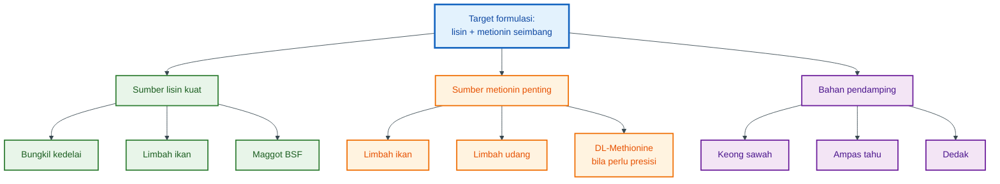

Poin terpenting dari diagram tersebut: **limbah ikan punya posisi strategis** karena membantu lisin, metionin, palatabilitas, dan mineral sekaligus.

---

## 3.12. Kelebihan dan Kelemahan Tiap Bahan

| Bahan           | Kelebihan utama                               | Kelemahan utama                                | Posisi terbaik dalam formulasi |
| --------------- | --------------------------------------------- | ---------------------------------------------- | ------------------------------ |
| Limbah ikan     | Asam amino baik, palatabilitas tinggi         | Cepat busuk, bau, lemak bisa tengik            | Sumber protein utama           |
| Keong sawah     | Murah, lokal, protein hewani                  | Risiko lumpur/parasit, cangkang tinggi mineral | Pendamping protein             |
| Maggot BSF      | Protein dan lemak baik, bisa diproduksi lokal | Lemak, kitin, kualitas tergantung media        | Protein utama/pendamping       |
| Limbah udang    | Aroma kuat, protein, mineral                  | Kitin dan abu tinggi                           | Atraktan dan pendamping        |
| Bungkil kedelai | Lisin baik, protein nabati stabil             | Metionin rendah, antinutrisi                   | Penyeimbang lisin              |
| Ampas tahu      | Murah, masih ada protein kedelai              | Tinggi air, cepat rusak                        | Pendamping terbatas            |
| Dedak           | Murah, energi, bantu tekstur                  | Serat, tengik, protein rendah                  | Tambahan terbatas              |

---

## 3.13. Kenapa Profil Asam Amino Ditentukan Bahan Asal?

Ini bagian yang sering disalahpahami.

Fermentasi tidak menciptakan lisin dan metionin baru dalam jumlah besar. Fermentasi hanya mengubah bentuk protein yang sudah ada.

Misalnya bahan awal adalah bungkil kedelai. Bungkil kedelai memang relatif baik dalam lisin, tetapi metioninnya terbatas. Setelah difermentasi, sebagian protein kedelai bisa menjadi lebih larut dan lebih mudah dicerna, tetapi metioninnya tetap mengikuti bahan asal.

Hal yang sama berlaku pada dedak. Dedak bukan sumber lisin utama. Walaupun difermentasi, dedak tidak berubah menjadi bahan kaya lisin.

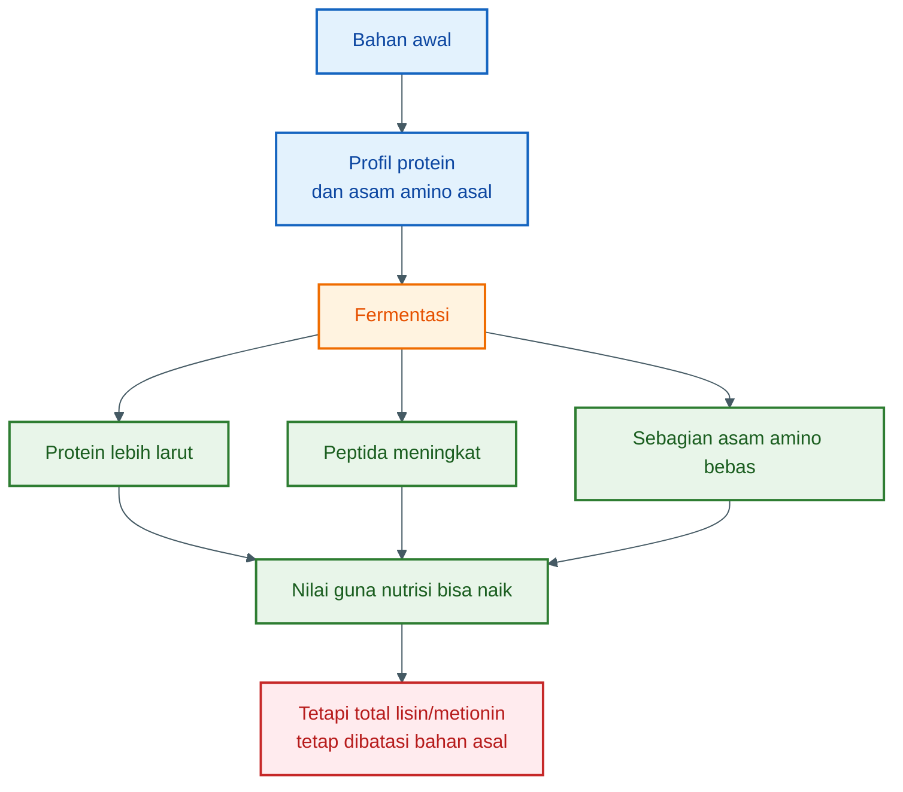

Jadi, bila ingin hasil fermentasi kaya lisin dan metionin, bahan awalnya juga harus membawa lisin dan metionin yang cukup.

---

## 3.14. Kombinasi Bahan yang Lebih Masuk Akal

Untuk praktisi, formulasi bahan fermentasi sebaiknya tidak tunggal. Kombinasi bahan membuat profil nutrisi lebih seimbang.

### Kombinasi 1: limbah ikan + bungkil kedelai

Kelebihan:

- limbah ikan membantu metionin, mineral, dan aroma,
- bungkil kedelai memperkuat lisin,
- hasil lebih seimbang dibanding salah satu bahan saja.

Cocok untuk:

- pakan lele pembesaran,
- hidrolisat cair sebagai aditif,
- peternak yang punya akses pasar ikan dan bahan kedelai.

### Kombinasi 2: maggot BSF + limbah ikan

Kelebihan:

- protein dan lemak cukup tinggi,
- aroma kuat,
- cocok untuk meningkatkan palatabilitas,
- bahan bisa diproduksi lokal.

Catatan:

- jangan terlalu tinggi maggot bila lemaknya tinggi,
- tetap perlu kontrol bau dan sanitasi.

### Kombinasi 3: keong sawah + bungkil kedelai + sedikit limbah ikan

Kelebihan:

- memanfaatkan bahan lokal,
- lebih murah,
- lisin terbantu dari kedelai,
- aroma dan asam amino hewani terbantu dari ikan.

Catatan:

- keong harus dicuci dan dipasteurisasi,
- cangkang jangan berlebihan.

### Kombinasi 4: ampas tahu + maggot + limbah udang

Kelebihan:

- memanfaatkan limbah lokal,
- limbah udang memperkuat aroma,
- maggot memberi protein dan energi,
- ampas tahu menambah volume dan protein nabati.

Catatan:

- ampas tahu harus sangat segar,
- limbah udang jangan terlalu banyak karena kitin dan abu.

---

## 3.15. Bahan yang Sebaiknya Dibatasi

Beberapa bahan boleh digunakan, tetapi harus dibatasi.

### Dedak

Dedak jangan terlalu tinggi karena serat dan risiko tengik. Gunakan sebagai bahan tambahan, bukan sumber protein utama.

### Ampas tahu basah

Ampas tahu cepat rusak. Bila tidak segera difermentasi, kualitasnya turun cepat.

### Limbah udang tinggi kulit

Kulit udang tinggi kitin dan mineral. Jika terlalu banyak, pakan bisa kurang efisien.

### Keong dengan cangkang terlalu banyak

Cangkang menambah mineral, tetapi jika berlebihan dapat menaikkan abu dan menurunkan proporsi protein.

### Limbah ikan busuk

Ini harus ditolak, bukan dibatasi. Bahan busuk tidak layak menjadi bahan fermentasi pakan.

---

## 3.16. Standar Praktis Pemilihan Bahan

Gunakan bahan bila memenuhi syarat berikut:

| Parameter     | Layak                         | Tidak layak                    |
| ------------- | ----------------------------- | ------------------------------ |
| Aroma         | Amis segar / normal           | Busuk, bangkai, amonia         |
| Tekstur       | Normal, tidak berlendir busuk | Lendir tebal, hancur busuk     |
| Jamur         | Tidak ada                     | Ada jamur hitam/hijau          |
| Belatung liar | Tidak ada                     | Ada belatung pada bahan busuk  |
| Asal bahan    | Jelas                         | Tidak jelas / tercemar         |
| Bahan kimia   | Tidak terindikasi             | Bekas pestisida, deterjen, oli |
| Waktu proses  | Segera diproses               | Dibiarkan terlalu lama         |

Prinsipnya:

> Bahan yang baik menghasilkan fermentasi yang baik. Bahan yang buruk hanya memperbesar risiko gagal.

---

## 3.17. Kesimpulan Bab 3

Bahan baku adalah fondasi dari protein hidrolisat fermentasi. Fermentasi tidak bisa memperbaiki profil asam amino yang sejak awal buruk.

Untuk pakan lele:

- **limbah ikan** adalah bahan paling strategis karena kuat di protein, palatabilitas, lisin, dan metionin,
- **maggot BSF** baik sebagai sumber protein dan energi, tetapi perlu kontrol lemak dan kitin,
- **keong sawah** berguna sebagai bahan protein lokal, tetapi harus dibersihkan dan dikombinasikan,
- **limbah udang** baik sebagai pendamping dan penguat aroma, tetapi kitin dan abu perlu dikontrol,
- **bungkil kedelai** kuat sebagai sumber lisin nabati, tetapi metioninnya terbatas,
- **ampas tahu** bisa digunakan sebagai bahan pendamping bila sangat segar,
- **dedak** hanya bahan tambahan, bukan sumber protein utama.

Kesimpulan praktisnya:

> **Fermentasi memperbaiki bentuk dan nilai guna protein, tetapi kualitas akhirnya tetap ditentukan oleh bahan asal. Pilih bahan yang segar, jelas, dan saling melengkapi antara lisin dan metionin.**

[1]: https://www.feedipedia.org/node/208?utm_source=chatgpt.com 'Fish meal'
[2]: https://www.researchgate.net/publication/382258650_Nutritive_Value_of_Golden_Apple_Snail_Pomacea_canaliculata_as_Animal_and_Aquaculture_Feed?utm_source=chatgpt.com '(PDF) Nutritive Value of Golden Apple Snail (Pomacea ...'
[3]: https://www.feedipedia.org/node/17132?utm_source=chatgpt.com 'Black soldier fly larvae (Hermetia illucens), dehydrated'
[4]: https://www.feedipedia.org/node/202?utm_source=chatgpt.com 'Shrimp meal'
[5]: https://www.feedipedia.org/node/11682?utm_source=chatgpt.com 'Soybean meal, low protein, type 44-46 and similar'
[6]: https://www.feedipedia.org/node/750?utm_source=chatgpt.com 'Rice bran and other rice by-products'

[**Kembali ke Atas**](#fermentasi-protein-untuk-pakan-lele-membuat-hidrolisat-asam-amino-yang-aman-rasional-dan-bernilai-guna)

---

# Bab 4 — Dasar Fermentasi: Fungsi Enzim, Probiotik, Molase, Garam, dan Air

Fermentasi protein untuk pakan lele bukan sekadar mencampur limbah ikan, molase, buah, dan probiotik lalu menunggu sampai berbau asam. Proses ini harus dipahami sebagai kombinasi dari **hidrolisis protein** dan **pengendalian mikroba**.

Ada lima komponen utama yang menentukan keberhasilan proses:

1. **Enzim** dari pepaya atau nanas
2. **Probiotik** sebagai pengarah fermentasi
3. **Molase** sebagai sumber gula
4. **Garam** sebagai penekan mikroba liar
5. **Air** sebagai pengatur sistem

Kalimat kuncinya:

> **Enzim memecah protein. Probiotik mengamankan proses. Molase memberi bahan bakar. Garam menekan mikroba liar. Air mengatur sistem.**

---

## 4.1. Dua Proses Utama: Hidrolisis dan Fermentasi

Dalam pembuatan protein hidrolisat fermentasi, sebenarnya ada dua proses yang berjalan bersama.

### Pertama: hidrolisis protein

Hidrolisis adalah pemecahan protein besar menjadi bagian yang lebih kecil.

Urutannya:

```mdx
protein utuh → protein terlarut → peptida besar → peptida kecil → sebagian asam amino bebas
```

Proses ini terutama dibantu oleh enzim protease, misalnya **papain** dari pepaya dan **bromelain** dari nanas.

### Kedua: fermentasi mikroba

Fermentasi dilakukan oleh mikroba baik, terutama bakteri asam laktat. Mikroba ini memakai gula dari molase untuk menghasilkan asam organik, terutama asam laktat.

Urutannya:

```mdx
gula dari molase → asam laktat → pH turun → mikroba pembusuk tertekan
```

Jadi, enzim dan probiotik tidak memiliki fungsi yang sama.

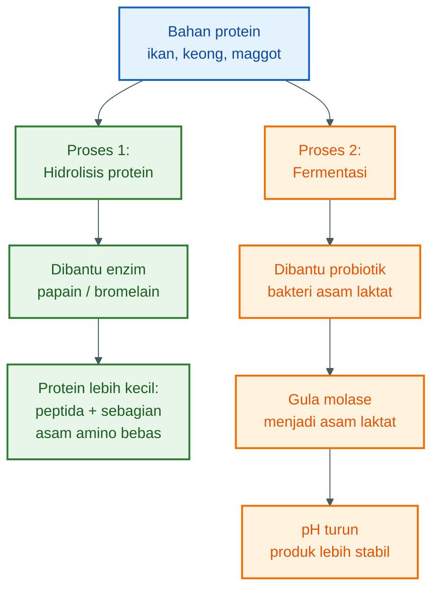

Hidrolisis membuat protein lebih mudah dimanfaatkan. Fermentasi membuat proses lebih aman dan stabil.

---

## 4.2. Pepaya dan Nanas sebagai Sumber Enzim Protease

Pepaya dan nanas digunakan bukan karena keduanya “probiotik”, tetapi karena mengandung enzim protease.

- Pepaya mengandung **papain**
- Nanas mengandung **bromelain**

Keduanya dapat membantu memecah protein.

Protein adalah rantai panjang asam amino. Enzim protease bekerja seperti “gunting biologis” yang memotong rantai tersebut menjadi potongan lebih kecil.

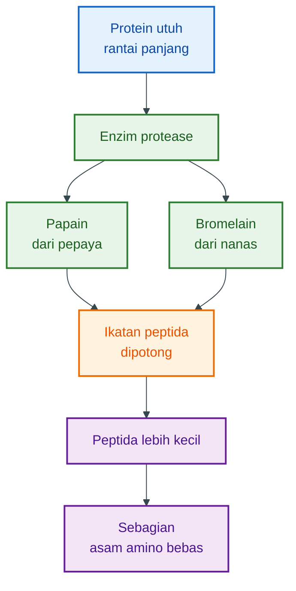

---

## 4.3. Fungsi Papain dari Pepaya

Papain adalah enzim protease dari pepaya. Dalam proses fermentasi protein, papain membantu memecah protein bahan baku menjadi molekul lebih kecil.

Fungsi papain:

- melunakkan jaringan protein,
- mempercepat pemecahan protein,
- meningkatkan protein terlarut,
- meningkatkan pembentukan peptida,
- membantu terbentuknya sebagian asam amino bebas,
- memperbaiki kecernaan bahan.

Papain berguna terutama pada bahan seperti:

- ikan rucah,
- limbah ikan,
- keong,
- maggot,
- limbah udang,
- bungkil kedelai,
- ampas tahu.

Namun, papain memiliki batasan. Papain bukan pengawet. Papain juga bukan mikroba fermentasi. Kalau bahan diberi pepaya tetapi tidak dikendalikan dengan pH rendah, probiotik, sanitasi, dan kondisi anaerob, bahan tetap bisa busuk.

Jadi, fungsi papain adalah:

> **mempercepat hidrolisis protein, bukan mengamankan fermentasi.**

---

## 4.4. Fungsi Bromelain dari Nanas

Bromelain adalah enzim protease dari nanas. Perannya mirip dengan papain, yaitu membantu memecah protein.

Fungsi bromelain:

- memotong protein menjadi peptida,
- membantu pelunakan bahan hewani,
- meningkatkan fraksi protein larut,
- membantu pembentukan aroma gurih,
- mendukung peningkatan kecernaan.

Nanas juga membawa gula dan asam alami, tetapi dalam proses ini fungsi utamanya tetap sebagai **sumber enzim**, bukan sebagai sumber gula utama. Sumber gula utama tetap molase atau gula merah cair.

Bromelain juga bukan pengawet. Bila digunakan tanpa probiotik dan tanpa pengendalian pH, bahan tetap bisa rusak.

---

## 4.5. Enzim Tidak Menciptakan Asam Amino Baru

Enzim hanya memecah struktur protein yang sudah ada.

Misalnya bahan awal mengandung protein dengan profil asam amino tertentu. Setelah dihidrolisis, profil asam aminonya tetap berasal dari bahan tersebut.

```mdx
protein ikan → peptida ikan → asam amino bebas dari protein ikan
```

Bukan:

```mdx
dedak rendah lisin → difermentasi → tiba-tiba menjadi kaya lisin
```

Itu tidak terjadi.

Enzim memperbaiki **bentuk** nutrisi, bukan menciptakan unsur nutrisi baru.

---

## 4.6. Peran Probiotik dalam Mengendalikan Fermentasi

Probiotik berperan sebagai mikroba baik yang mengarahkan proses agar tidak berubah menjadi pembusukan.

Dalam konteks ini, probiotik yang diharapkan terutama berisi mikroba seperti:

- bakteri asam laktat,
- Lactobacillus,
- Bacillus tertentu,
- ragi tertentu sebagai pendukung.

Fungsi utama probiotik:

- memakan gula dari molase,
- menghasilkan asam organik,
- menurunkan pH,
- menekan mikroba pembusuk,
- menekan pertumbuhan patogen,
- mengurangi bau busuk,
- membuat produk lebih stabil.

Probiotik bukan terutama “pembuat asam amino”. Peran utamanya adalah **pengendali arah fermentasi**.

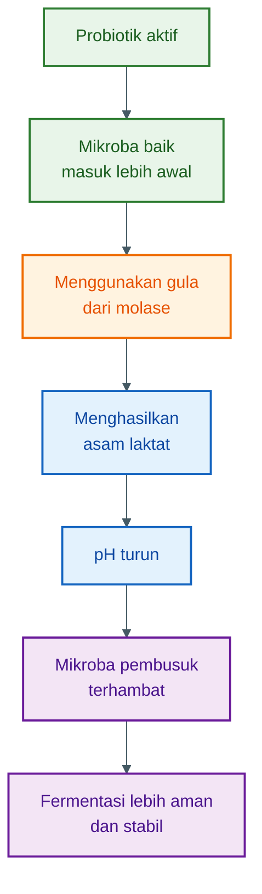

Tanpa probiotik, fermentasi akan berjalan liar. Bisa berhasil, tetapi tidak konsisten. Bisa juga berubah menjadi pembusukan.

---

## 4.7. Molase sebagai Sumber Gula

Molase atau gula merah cair adalah sumber gula untuk mikroba baik.

Bakteri asam laktat membutuhkan gula sederhana untuk menghasilkan asam laktat. Ikan, keong, maggot, dan limbah protein hewani tidak cukup kaya gula. Karena itu, molase perlu ditambahkan.

Fungsi molase:

- memberi makanan cepat untuk bakteri asam laktat,
- mempercepat penurunan pH,
- membantu menekan mikroba pembusuk,
- membantu aroma fermentasi menjadi lebih stabil,
- mengurangi risiko pembentukan bau busuk.

Secara sederhana:

```mdx
molase → gula fermentabel → asam laktat → pH turun
```

Molase bukan sekadar pemanis. Dalam fermentasi, molase adalah **bahan bakar mikroba baik**.

---

## 4.8. Garam sebagai Penekan Mikroba Liar

Garam tidak berfungsi sebagai sumber protein atau sumber asam amino. Garam digunakan untuk membantu mengendalikan mikroba liar.

Fungsi garam:

- memberi tekanan osmotik ringan,
- membantu menekan sebagian bakteri pembusuk,
- membantu seleksi mikroba,
- mengurangi risiko lendir busuk,
- membantu stabilitas bahan.

Namun, garam tidak boleh berlebihan. Garam yang terlalu tinggi dapat menghambat mikroba baik dan membuat produk kurang sesuai untuk pakan.

Dosis praktis yang lebih masuk akal adalah berdasarkan total berat batch:

```mdx
garam = 0,8–1,2% dari total berat batch
```

Bukan asal “segenggam” atau “secukupnya”.

---

## 4.9. Air sebagai Pengatur Sistem

Air sering dianggap bahan sepele, padahal sangat menentukan.

Air berfungsi untuk:

- membantu pencampuran,
- membantu distribusi enzim,
- membantu distribusi probiotik,
- membantu penyebaran asam,
- mengatur kekentalan,
- mencegah terbentuknya zona kering atau zona busuk,
- menentukan total padatan batch.

Terlalu sedikit air membuat bahan sulit tercampur. Enzim dan mikroba tidak tersebar merata.

Terlalu banyak air membuat produk terlalu encer, nutrisi per liter turun, risiko volume berlebih meningkat, dan aplikasi ke pakan menjadi tidak efisien.

Target praktis total padatan untuk fermentasi cair:

```mdx
total padatan ideal ≈ 22–28%
```

Angka ini tidak kaku, tetapi cukup baik untuk menjaga campuran tetap bisa diaduk, tidak terlalu encer, dan tetap kaya bahan aktif.

---

## 4.10. Ringkasan Fungsi Setiap Komponen

| Komponen  | Fungsi utama                               | Kesalahan umum                                  |
| --------- | ------------------------------------------ | ----------------------------------------------- |
| Pepaya    | Sumber papain untuk memecah protein        | Dikira probiotik                                |
| Nanas     | Sumber bromelain untuk memecah protein     | Dipakai terlalu banyak sebagai pengganti molase |
| Probiotik | Mengendalikan fermentasi dan menurunkan pH | Dosis asal tanpa melihat kualitas starter       |
| Molase    | Sumber gula untuk membentuk asam laktat    | Dosis terlalu sedikit sehingga pH lambat turun  |
| Garam     | Menekan mikroba liar                       | Terlalu banyak sampai menghambat mikroba baik   |
| Air       | Mengatur kekentalan dan pencampuran        | Terlalu encer atau terlalu kental               |

---

## 4.11. Kesimpulan Bab 4

Fermentasi protein yang baik terjadi karena setiap komponen menjalankan fungsi yang berbeda.

- **Pepaya dan nanas** menyumbang enzim protease.
- **Enzim** memecah protein menjadi peptida dan sebagian asam amino bebas.
- **Probiotik** mengarahkan fermentasi agar tidak menjadi pembusukan.
- **Molase** memberi gula agar bakteri asam laktat dapat menghasilkan asam laktat.
- **Garam** membantu menekan mikroba liar.
- **Air** mengatur kekentalan, pencampuran, dan total padatan.

Kesimpulan praktisnya:

> **Enzim memecah protein. Probiotik mengamankan proses. Molase memberi bahan bakar. Garam menekan mikroba liar. Air mengatur sistem.**

[**Kembali ke Atas**](#fermentasi-protein-untuk-pakan-lele-membuat-hidrolisat-asam-amino-yang-aman-rasional-dan-bernilai-guna)

---

# Bab 5 — Neraca Massa dan Dasar Hitungan Praktis

Fermentasi sering dipahami sebagai resep: sekian kilogram ikan, sekian liter molase, sekian botol probiotik, lalu tunggu beberapa hari. Pendekatan itu mudah, tetapi berisiko menyesatkan bila tidak disertai dasar hitungan.

Dalam fermentasi protein, semua bahan tunduk pada **neraca massa**.

Artinya:

```mdx
massa dan unsur yang masuk ≈ massa dan unsur yang keluar + kehilangan kecil
```

Fermentasi tidak menciptakan nitrogen, sulfur, lisin, atau metionin dari udara. Fermentasi hanya mengubah bentuk bahan yang sudah ada.

Kalimat kuncinya:

> **Protein menentukan potensi asam amino. Gula menentukan asam laktat. Starter menentukan arah fermentasi. Enzim menentukan kecepatan hidrolisis.**

---

## 5.1. Prinsip Dasar Neraca Massa

Neraca massa sederhana dapat ditulis sebagai:

$$
\text{Input bahan} = \text{Produk akhir} + \text{gas} + \text{kehilangan kecil}
$$

Dalam fermentasi protein untuk pakan lele, input utama meliputi:

- bahan protein,
- molase,
- pepaya atau nanas,
- probiotik,
- garam,
- air.

Outputnya berupa:

- protein hidrolisat cair,
- ampas padat,
- sedikit gas,
- sedikit kehilangan karena penguapan atau tumpahan,
- perubahan bentuk kimia bahan.

Yang paling penting: **unsur tidak hilang begitu saja dan tidak muncul dari nol**.

Misalnya nitrogen.

Nitrogen berasal dari protein bahan awal. Jika tidak ada tambahan sumber nitrogen baru, maka total nitrogen akhir tidak mungkin naik besar.

---

## 5.2. Neraca Protein

Misalkan digunakan **10 kg limbah ikan segar**.

Asumsi komposisi limbah ikan segar:

| Komponen      | Asumsi |
| ------------- | -----: |
| Air           |    70% |
| Protein kasar |    18% |
| Lemak         |     7% |
| Abu/mineral   |     3% |
| Lain-lain     |     2% |

Maka protein awal:

$$
\text{Protein} = 10 \text{ kg} \times 18%
$$

$$
\text{Protein} = 1{,}8 \text{ kg}
$$

Dalam format hitungan praktis:

```mdx
Protein awal = berat bahan × kadar protein

Protein awal = 10 kg × 18%
Protein awal = 1,8 kg
```

Artinya, dari 10 kg limbah ikan segar, potensi protein kasarnya sekitar **1,8 kg**.

Fermentasi tidak membuat 1,8 kg protein itu berubah menjadi 3 kg protein. Yang berubah adalah bentuknya.

```mdx
1,8 kg protein kasar
→ protein terlarut
→ peptida
→ sebagian asam amino bebas
→ sedikit biomassa mikroba
→ sedikit amonia bila proses buruk
```

---

## 5.3. Neraca Nitrogen

Protein kasar biasanya dihitung dari nitrogen. Pendekatan umum:

$$
\text{Protein kasar} = \text{Nitrogen} \times 6{,}25
$$

Maka:

$$
\text{Nitrogen} = \frac{\text{Protein kasar}}{6{,}25}
$$

Dengan protein kasar 1,8 kg:

$$
\text{Nitrogen} = \frac{1{,}8}{6{,}25}
$$

$$
\text{Nitrogen} = 0{,}288 \text{ kg}
$$

Atau:

```mdx
N = protein / 6,25

N = 1,8 kg / 6,25
N = 0,288 kg
N = 288 gram
```

Jadi dalam 10 kg limbah ikan tersebut ada sekitar **288 gram nitrogen protein**.

Jika tidak ada bahan tambahan yang membawa nitrogen dalam jumlah besar, maka total nitrogen akhir tetap berkisar dari angka itu, dikurangi sedikit kehilangan atau perubahan bentuk.

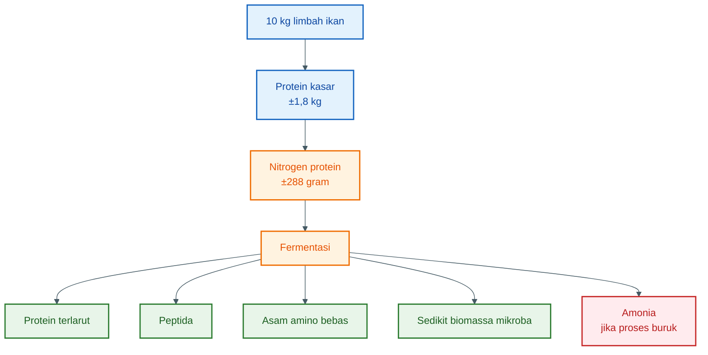

Pesan pentingnya:

> **Fermentasi tidak menambah total nitrogen secara ajaib. Fermentasi hanya mengubah bentuk nitrogen.**

---

## 5.4. Perubahan Protein Menjadi Peptida dan Asam Amino Bebas

Protein tersusun dari asam amino yang terhubung oleh ikatan peptida. Ketika dihidrolisis, ikatan tersebut diputus dengan bantuan air dan enzim.

Reaksi sederhananya:

```mdx
ikatan peptida + H₂O → gugus asam karboksilat + gugus amino
```

Atau secara konseptual:

$$
\text{Protein} + H_2O \rightarrow \text{Peptida} + \text{Asam amino bebas}
$$

Tetapi proses lapang tidak akan mengubah semua protein menjadi asam amino bebas. Hasil yang realistis adalah campuran.

```mdx
protein utuh

- protein terlarut
- peptida besar
- peptida kecil
- sebagian asam amino bebas
```

Itulah sebabnya produk ini disebut **protein hidrolisat fermentasi**, bukan larutan asam amino murni.

---

## 5.5. Derajat Hidrolisis: Seberapa Jauh Protein Terpecah?

Dalam praktik, yang penting bukan hanya berapa protein awal, tetapi seberapa banyak protein itu terurai.

Konsepnya disebut **derajat hidrolisis**.

Secara sederhana:

$$
\text{Derajat hidrolisis} =
\frac{\text{ikatan peptida yang terputus}}
{\text{total ikatan peptida awal}}
\times 100%
$$

Dalam format praktis:

```mdx
Derajat hidrolisis tinggi:
protein lebih banyak menjadi peptida kecil dan asam amino bebas.

Derajat hidrolisis rendah:
protein masih banyak berbentuk molekul besar.
```

Faktor yang memengaruhi derajat hidrolisis:

- jenis bahan protein,
- ukuran cacahan bahan,
- suhu,
- pH,
- jumlah dan aktivitas enzim,
- lama proses,
- sanitasi,
- kadar air,
- pengadukan.

Fermentasi terlalu singkat bisa membuat hidrolisis belum optimal. Fermentasi terlalu lama atau tidak terkendali bisa menyebabkan pembusukan dan peningkatan amonia.

---

## 5.6. Neraca Gula Menjadi Asam Laktat

Molase ditambahkan bukan untuk menaikkan protein, tetapi untuk menyediakan gula bagi bakteri asam laktat.

Reaksi sederhana fermentasi glukosa menjadi asam laktat:

$$
C_6H_{12}O_6 \rightarrow 2C_3H_6O_3
$$

Massa molekul:

```mdx
Glukosa = 180
Asam laktat = 90
2 molekul asam laktat = 180
```

Secara teoritis:

$$
1 \text{ gram glukosa} \rightarrow 1 \text{ gram asam laktat}
$$

Namun di lapangan, hasilnya tidak 100%. Sebagian gula dipakai untuk:

- biomassa mikroba,
- asam organik lain,
- sedikit gas,
- sedikit alkohol bila ada ragi,
- sisa gula yang tidak habis.

Maka yield praktis lebih aman dihitung:

```mdx
1 gram gula fermentabel
→ ±0,65–0,85 gram asam laktat
```

Untuk perhitungan praktis, bisa dipakai angka tengah:

$$
1 \text{ gram gula fermentabel} \rightarrow 0{,}75 \text{ gram asam laktat}
$$

---

## 5.7. Dasar Dosis Molase

Molase tidak 100% gula. Kualitas molase bervariasi, tetapi untuk hitungan praktis bisa digunakan asumsi:

```mdx
1 kg molase mengandung ±0,45–0,55 kg gula fermentabel
```

Gunakan angka tengah:

$$
1 \text{ kg molase} \approx 0{,}50 \text{ kg gula fermentabel}
$$

Jika yield asam laktat praktis 75%:

$$
\text{Asam laktat} = 0{,}50 \times 0{,}75
$$

$$
\text{Asam laktat} = 0{,}375 \text{ kg}
$$

Dalam format praktis:

```mdx
1 kg molase
≈ 0,50 kg gula fermentabel

Asam laktat praktis:
0,50 kg × 75% = 0,375 kg
```

Jadi, **1 kg molase** dapat menghasilkan kira-kira **0,35–0,40 kg asam laktat praktis**, tergantung kualitas molase dan aktivitas mikroba.

Inilah dasar mengapa untuk 10 kg bahan protein basah, dosis molase **0,8–1,2 kg** lebih masuk akal dibanding dosis yang terlalu kecil.

Jika molase terlalu sedikit:

```mdx
gula kurang → asam laktat kurang → pH lambat turun → risiko pembusukan naik
```

Jika molase terlalu banyak:

```mdx
produk terlalu manis → fermentasi liar bisa meningkat → biaya naik → residu gula tinggi
```

---

## 5.8. Target pH dan Hubungannya dengan Gula

Tujuan molase bukan agar produk menjadi manis, tetapi agar cukup banyak asam laktat terbentuk untuk menurunkan pH.

Target praktis:

```mdx
pH akhir ideal = 3,5–4,5
```

Jika pH tidak turun, berarti salah satu dari hal berikut mungkin terjadi:

- molase kurang,
- probiotik lemah,
- bahan terlalu kotor,
- bahan terlalu tinggi kapasitas buffer,
- kondisi terlalu panas atau terlalu dingin,
- oksigen terlalu banyak,
- starter mati,
- sanitasi buruk.

Hubungan sederhananya:

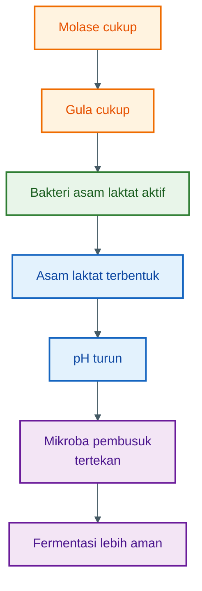

---

## 5.9. Dasar Dosis Garam

Garam dihitung berdasarkan konsentrasi, bukan berdasarkan reaksi kimia.

Target praktis:

$$
\text{Garam} = 0{,}8% \text{ sampai } 1{,}2% \text{ dari total batch}
$$

Misalkan total batch setelah semua bahan dicampur adalah **16,9 kg**.

Dosis garam 0,8%:

$$
16{,}9 \times 0{,}8% = 0{,}1352 \text{ kg}
$$

$$
0{,}1352 \text{ kg} = 135 \text{ gram}
$$

Dosis garam 1,2%:

$$
16{,}9 \times 1{,}2% = 0{,}2028 \text{ kg}
$$

$$
0{,}2028 \text{ kg} = 203 \text{ gram}
$$

Dalam format praktis:

```mdx
Total batch = 16,9 kg

Garam 0,8% = 16,9 × 0,008 = 0,135 kg = 135 g
Garam 1,2% = 16,9 × 0,012 = 0,203 kg = 203 g
```

Jadi untuk total batch sekitar 16–17 kg, garam **150–200 gram** masuk akal.

Bukan karena feeling, tetapi karena berada pada kisaran sekitar 0,8–1,2% dari total campuran.

---

## 5.10. Dasar Pengaturan Air dan Total Padatan

Air ditentukan dari target total padatan.

Rumus dasarnya:

$$
\text{Total padatan} =
\frac{\text{massa bahan kering}}
{\text{massa total batch}}
\times 100%
$$

Target praktis:

```mdx
total padatan ideal = 22–28%
```

Misalkan formula awal:

| Bahan          |        Berat |
| -------------- | -----------: |
| Limbah ikan    |     10,00 kg |
| Molase         |      1,00 kg |
| Pepaya/nanas   |      1,50 kg |
| Probiotik cair |      0,25 kg |
| Garam          |      0,15 kg |
| Air tambahan   |      4,00 kg |
| **Total**      | **16,90 kg** |

Perkiraan bahan kering:

| Bahan                  | Asumsi bahan kering | Massa bahan kering |
| ---------------------- | ------------------: | -----------------: |
| Limbah ikan            |                 30% |            3,00 kg |
| Molase                 |                 78% |            0,78 kg |
| Pepaya/nanas           |                 15% |           0,225 kg |
| Probiotik cair         |                 ±4% |            0,01 kg |
| Garam                  |                100% |            0,15 kg |
| Air tambahan           |                  0% |               0 kg |
| **Total bahan kering** |                     |       **4,165 kg** |

Maka:

$$
\text{Total padatan} =
\frac{4{,}165}{16{,}90}
\times 100%
$$

$$
\text{Total padatan} = 24{,}6%
$$

Dalam format praktis:

```mdx
Total bahan kering = 4,165 kg
Total batch = 16,90 kg

Total padatan = 4,165 / 16,90 × 100%
Total padatan = 24,6%
```

Angka 24,6% berada di dalam target 22–28%. Jadi tambahan air sekitar 4 liter masuk akal untuk formula tersebut.

---

## 5.11. Cara Menghitung Air Bila Target Padatan Ditentukan

Jika ingin lebih rapi, air dapat dihitung dari target total padatan.

Rumus:

$$
\text{Total batch target} =
\frac{\text{total bahan kering}}
{\text{target fraksi padatan}}
$$

Misalnya total bahan kering adalah 4,165 kg dan target padatan 25%.

$$
\text{Total batch target} =
\frac{4{,}165}{0{,}25}
$$

$$
\text{Total batch target} = 16{,}66 \text{ kg}
$$

Jika berat bahan sebelum air tambahan adalah:

```mdx
10 kg ikan

- 1 kg molase
- 1,5 kg pepaya/nanas
- 0,25 kg probiotik
- 0,15 kg garam
  = 12,90 kg
```

Maka air yang perlu ditambahkan:

$$
\text{Air tambahan} =
16{,}66 - 12{,}90
$$

$$
\text{Air tambahan} = 3{,}76 \text{ kg}
$$

Karena massa jenis air mendekati 1 kg/L:

```mdx
3,76 kg air ≈ 3,76 liter air
```

Jadi tambahan air sekitar **3,5–4 liter** masuk akal.

---

## 5.12. Dosis Probiotik Harus Berbasis CFU

Dosis probiotik seharusnya tidak hanya dinyatakan dalam ml. Yang lebih tepat adalah berdasarkan jumlah mikroba hidup, yaitu **CFU**.

CFU berarti **colony forming unit**, satuan untuk memperkirakan jumlah mikroba hidup yang mampu tumbuh.

Target praktis inokulasi awal:

```mdx
10⁶–10⁷ CFU per gram bahan
```

Rumus dosis probiotik:

$$
\text{Volume starter} =
\frac{
\text{target CFU/g} \times \text{total gram batch}
}{
\text{CFU/ml starter}
}
$$

Contoh:

```mdx
Total batch = 16,9 kg = 16.900 gram
Target mikroba awal = 10⁶ CFU/g
Konsentrasi starter = 10⁸ CFU/ml
```

Total mikroba yang dibutuhkan:

$$
16.900 \times 10^6 = 1{,}69 \times 10^{10} \text{ CFU}
$$

Volume starter:

$$
\frac{1{,}69 \times 10^{10}}{10^8}
= 169 \text{ ml}
$$

Dengan faktor keamanan:

```mdx
Kebutuhan teoritis = 169 ml
Dosis praktis = 200–300 ml
```

Jadi dosis 200–300 ml masuk akal **hanya jika starter benar-benar aktif dan padat mikroba**.

Jika starter lemah, misalnya hanya 10⁷ CFU/ml, maka kebutuhan menjadi:

$$
\frac{1{,}69 \times 10^{10}}{10^7}
= 1.690 \text{ ml}
$$

Artinya, 200 ml starter lemah tidak cukup.

Kesimpulan:

> **Dosis probiotik harus dilihat dari kekuatan starter, bukan hanya volume botol.**

---

## 5.13. Dosis Enzim Harus Berbasis Aktivitas, Bukan Berat Buah

Papain dan bromelain adalah enzim. Enzim adalah katalis, bukan reaktan yang habis seperti gula.

Karena itu, dosis enzim idealnya dihitung berdasarkan aktivitas enzim, misalnya:

```mdx
unit aktivitas enzim per gram protein
```

Rumus konseptual:

$$
\text{Total enzim} =
\text{target unit enzim/g protein}
\times
\text{gram protein}
$$

Misalnya bahan mengandung 1.800 gram protein, dan target aktivitas adalah 500 unit enzim per gram protein:

$$
\text{Total enzim} =
500 \times 1.800
$$

$$
\text{Total enzim} = 900.000 \text{ unit}
$$

Masalahnya, pepaya dan nanas segar tidak memiliki aktivitas enzim yang selalu sama.

Aktivitas enzim dipengaruhi oleh:

- varietas buah,
- tingkat kematangan,
- bagian buah yang digunakan,
- suhu,
- pH,
- lama penyimpanan,
- cara penghancuran,
- apakah terkena panas tinggi.

Karena itu, dosis pepaya/nanas **1–2 kg per 10 kg bahan protein** harus dipahami sebagai pendekatan praktis, bukan hitungan stoikiometri.

Jika ingin presisi, gunakan enzim komersial dengan informasi aktivitas, misalnya papain atau bromelain dalam satuan U/g.

---

## 5.14. Contoh Formula dengan Dasar Neraca Massa

Berikut contoh formula berbasis 10 kg limbah ikan segar.

| Bahan             |      Jumlah | Dasar hitungan                |
| ----------------- | ----------: | ----------------------------- |
| Limbah ikan segar |       10 kg | Sumber protein utama          |
| Molase            |        1 kg | Sumber gula untuk asam laktat |
| Pepaya/nanas      |      1,5 kg | Sumber enzim praktis          |
| Probiotik aktif   |  250–300 ml | Target starter kuat           |
| Garam             |   150–200 g | ±0,8–1,2% total batch         |
| Air               | 3,5–4 liter | Target padatan ±25%           |

Estimasi hasil:

```mdx
Total batch ≈ 16,5–17 kg
Protein awal dari ikan ≈ 1,8 kg
Nitrogen protein ≈ 288 g
Total padatan ≈ 24–26%
Asam laktat potensial dari molase ≈ 0,35–0,40 kg
pH akhir target = 3,5–4,5
```

Ini bukan formula mutlak. Ini formula awal yang bisa disesuaikan berdasarkan bahan baku dan hasil pengukuran pH.

---

## 5.15. Apa yang Bisa Bertambah dan Tidak Bertambah?

Selama fermentasi, beberapa komponen memang bertambah, tetapi bukan semuanya.

| Komponen              |      Bisa bertambah? | Penjelasan                                             |
| --------------------- | -------------------: | ------------------------------------------------------ |
| Total nitrogen        |     Tidak signifikan | Tergantung nitrogen bahan awal                         |
| Total protein absolut |     Tidak signifikan | Bisa tampak naik secara persen karena efek konsentrasi |
| Total lisin           |     Tidak signifikan | Ditentukan bahan asal                                  |
| Total metionin        |     Tidak signifikan | Ditentukan bahan asal                                  |
| Asam laktat           |                   Ya | Dibentuk dari gula/molase                              |
| Peptida kecil         |                   Ya | Hasil pemecahan protein                                |
| Asam amino bebas      |            Bisa naik | Dilepas dari protein yang sudah ada                    |
| Biomassa mikroba      |         Sedikit naik | Mikroba tumbuh memakai gula dan nutrisi                |
| Amonia                | Bisa naik jika buruk | Tanda pembusukan protein                               |

Yang paling diharapkan adalah:

```mdx
peptida naik
asam amino bebas naik sebagian
asam laktat naik
pH turun
amonia tetap rendah
bau tetap asam-gurih
```

Yang harus dihindari:

```mdx
pH tidak turun
amonia naik
bau bangkai
lendir busuk
gas busuk
jamur hitam/hijau
```

---

## 5.16. Kenapa Protein Persen Kadang Terlihat Naik?

Dalam beberapa laporan fermentasi, kadar protein persen terlihat meningkat. Ini harus dibaca hati-hati.

Misalnya sebelum fermentasi:

```mdx
Bahan kering = 100 kg
Protein = 20 kg
Kadar protein = 20%
```

Setelah fermentasi, sebagian karbohidrat hilang menjadi gas, asam, atau metabolit. Misalnya bahan kering turun menjadi 90 kg, tetapi protein tetap 20 kg.

```mdx
Bahan kering = 90 kg
Protein = 20 kg
Kadar protein = 22,2%
```

Secara persen, protein naik dari 20% menjadi 22,2%. Tetapi jumlah protein absolut tetap 20 kg.

Jadi, peningkatan persen protein tidak selalu berarti protein baru terbentuk.

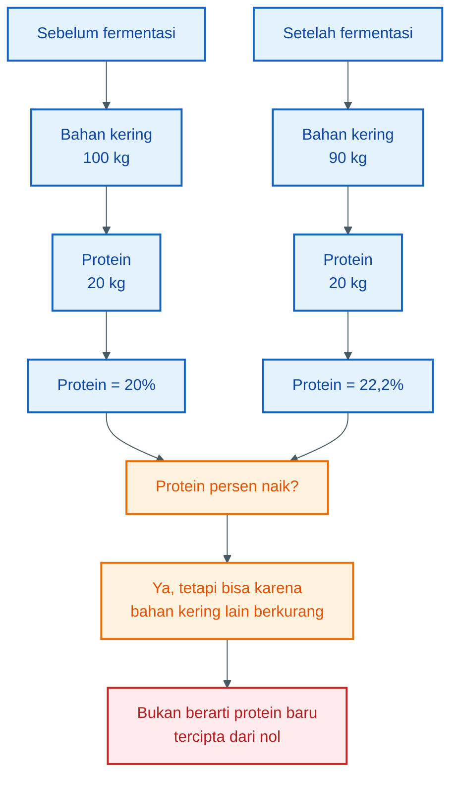

---

## 5.17. Rumus Praktis yang Perlu Dipegang

Berikut rumus sederhana yang berguna untuk praktisi.

### Menghitung protein awal

$$
\text{Protein awal} =
\text{berat bahan} \times \text{kadar protein}
$$

```mdx
Contoh:
10 kg ikan × 18% = 1,8 kg protein
```

### Menghitung nitrogen

$$
\text{Nitrogen} =
\frac{\text{protein kasar}}{6{,}25}
$$

```mdx
Contoh:
1,8 kg protein / 6,25 = 0,288 kg N
```

### Menghitung garam

$$
\text{Garam} =
\text{total batch} \times \text{target persen garam}
$$

```mdx
Contoh:
16,9 kg × 1% = 0,169 kg = 169 g garam
```

### Menghitung total padatan

$$
\text{Total padatan} =
\frac{\text{bahan kering}}
{\text{total batch}}
\times 100%
$$

```mdx
Contoh:
4,165 kg / 16,9 kg × 100% = 24,6%
```

### Menghitung kebutuhan air

$$
\text{Total batch target} =
\frac{\text{bahan kering}}
{\text{target fraksi padatan}}
$$

$$
\text{Air tambahan} =
\text{total batch target}
-------------------------

\text{berat bahan sebelum air}
$$

```mdx
Contoh:
Bahan kering = 4,165 kg
Target padatan = 25%

Total batch target = 4,165 / 0,25 = 16,66 kg
Bahan sebelum air = 12,90 kg
Air tambahan = 16,66 - 12,90 = 3,76 kg ≈ 3,76 liter
```

### Menghitung kebutuhan starter probiotik

$$
\text{Volume starter} =
\frac{
\text{target CFU/g} \times \text{total gram batch}
}{
\text{CFU/ml starter}
}
$$

```mdx
Contoh:
Target = 10⁶ CFU/g
Total batch = 16.900 g
Starter = 10⁸ CFU/ml

Volume = 16.900 × 10⁶ / 10⁸
Volume = 169 ml
```

---

## 5.18. Kesimpulan Bab 5

Fermentasi protein harus dipahami dengan neraca massa. Tanpa itu, formulasi mudah jatuh menjadi resep feeling.

Prinsip pentingnya:

- protein awal menentukan potensi protein hidrolisat,
- nitrogen tidak bertambah dari nol,
- lisin dan metionin tetap ditentukan bahan asal,
- molase menentukan produksi asam laktat,
- asam laktat menurunkan pH,
- garam dihitung sebagai persen total batch,
- air dihitung berdasarkan target total padatan,
- probiotik seharusnya dihitung berdasarkan CFU,
- enzim seharusnya dihitung berdasarkan aktivitas, bukan berat buah semata.

Kesimpulan praktisnya:

> **Protein menentukan potensi asam amino. Gula menentukan asam laktat. Starter menentukan arah fermentasi. Enzim menentukan kecepatan hidrolisis.**

Fermentasi yang baik bukan proses ajaib. Fermentasi yang baik adalah proses biokimia dan mikrobiologi yang dikendalikan dengan bahan segar, pH rendah, starter aktif, enzim cukup, kadar air tepat, dan neraca massa yang masuk akal.

[**Kembali ke Atas**](#fermentasi-protein-untuk-pakan-lele-membuat-hidrolisat-asam-amino-yang-aman-rasional-dan-bernilai-guna)

---

# Bab 6 — Formula dan SOP Pembuatan

Bab ini masuk ke bagian paling praktis: **bagaimana membuat protein hidrolisat fermentasi secara terukur, aman, dan bisa diulang**.

Formula yang disajikan di sini bukan resep mutlak. Formula ini adalah **formula awal** yang dapat disesuaikan berdasarkan jenis bahan, kadar air, kualitas probiotik, pH akhir, dan respons ikan.

<figure>
  
  <figcaption>
    Proses fermentasi pakan lele untuk meningkatkan efisiensi dan kualitas
    pakan.
  </figcaption>
</figure>

Prinsipnya:

> **Jangan hanya mengejar bau asam. Kejar proses yang terkendali: bahan segar, pH turun, tidak busuk, tidak berjamur, dan hasilnya stabil.**

---

## 6.1. Formula Dasar untuk 10 kg Bahan Protein

Formula ini cocok untuk praktisi yang ingin mulai dari skala menengah kecil. Bahan protein dapat berupa limbah ikan segar, keong, maggot, limbah udang, atau campuran beberapa bahan tersebut.

| Bahan                           |         Dosis | Fungsi                                    |
| ------------------------------- | ------------: | ----------------------------------------- |
| Bahan protein segar             |         10 kg | Sumber protein utama                      |
| Molase / gula merah cair        |    0,8–1,2 kg | Sumber gula untuk pembentukan asam laktat |
| Pepaya / nanas blender          |        1–2 kg | Sumber enzim papain/bromelain             |
| Probiotik aktif / EM4 perikanan |    250–500 ml | Starter mikroba baik                      |
| Garam                           |     150–200 g | Menekan mikroba liar                      |
| Air bersih                      | 3,5–4,5 liter | Mengatur kekentalan dan pencampuran       |

Formula angka tengah yang disarankan:

| Bahan                |  Jumlah |
| -------------------- | ------: |
| Bahan protein segar  |   10 kg |
| Molase               |    1 kg |
| Pepaya/nanas blender |  1,5 kg |
| Probiotik aktif      |  300 ml |
| Garam                |   170 g |
| Air bersih           | 4 liter |

Estimasi total batch:

```mdx id="ofh6uq"
Total batch ≈
10 kg bahan protein

- 1 kg molase
- 1,5 kg pepaya/nanas
- 0,3 kg probiotik
- 0,17 kg garam
- 4 kg air

Total batch ≈ 16,97 kg
```

Dibulatkan:

```mdx id="mucbqn"
Total batch praktis ≈ 17 kg
```

---

## 6.2. Formula Skala Kecil untuk Uji Coba

Sebelum membuat dalam jumlah besar, sebaiknya lakukan uji coba kecil. Ini penting karena setiap bahan memiliki kadar air, kadar lemak, aroma, dan risiko kontaminasi yang berbeda.

### Formula uji coba 2 kg bahan protein

| Bahan                    |     Jumlah |
| ------------------------ | ---------: |
| Bahan protein segar      |       2 kg |
| Molase / gula merah cair |      200 g |
| Pepaya/nanas blender     |      300 g |
| Probiotik aktif          |      60 ml |
| Garam                    |    30–35 g |
| Air bersih               | 700–800 ml |

Estimasi total batch:

```mdx id="gki788"
Total batch ≈
2 kg bahan protein

- 0,2 kg molase
- 0,3 kg pepaya/nanas
- 0,06 kg probiotik
- 0,03 kg garam
- 0,75 kg air

Total batch ≈ 3,34 kg
```

### Formula uji coba 5 kg bahan protein

| Bahan                    |        Jumlah |
| ------------------------ | ------------: |
| Bahan protein segar      |          5 kg |
| Molase / gula merah cair |         500 g |
| Pepaya/nanas blender     |         750 g |
| Probiotik aktif          |        150 ml |
| Garam                    |      80–100 g |
| Air bersih               | 1,8–2,2 liter |

Formula kecil ini berguna untuk melihat:

- seberapa cepat pH turun,
- apakah aroma menjadi asam-gurih,
- apakah muncul jamur,
- apakah ada bau amonia,
- apakah bahan terlalu encer atau terlalu kental,
- apakah produk disukai lele.

---

## 6.3. Formula Skala Besar

Untuk memperbesar produksi, gunakan prinsip pengali dari formula dasar 10 kg. Jangan menaikkan skala hanya dengan perkiraan.

Rumus sederhana:

```mdx id="cchcw9"
Faktor pengali =
target bahan protein / 10 kg
```

Contoh bila ingin memakai 50 kg bahan protein:

```mdx id="iplyez"
Faktor pengali = 50 kg / 10 kg
Faktor pengali = 5
```

Maka semua bahan dikalikan 5.

### Formula 50 kg bahan protein

| Bahan                |    Jumlah |
| -------------------- | --------: |
| Bahan protein segar  |     50 kg |
| Molase               |      5 kg |
| Pepaya/nanas blender |    7,5 kg |
| Probiotik aktif      | 1,5 liter |
| Garam                |   0,85 kg |
| Air bersih           | ±20 liter |

### Formula 100 kg bahan protein

| Bahan                |    Jumlah |
| -------------------- | --------: |
| Bahan protein segar  |    100 kg |
| Molase               |     10 kg |
| Pepaya/nanas blender |     15 kg |
| Probiotik aktif      |   3 liter |
| Garam                |    1,7 kg |
| Air bersih           | ±40 liter |

Catatan penting untuk skala besar:

- pencampuran harus lebih merata,
- wadah harus benar-benar bersih,
- pH harus dipantau,
- bahan harus dicacah lebih halus,
- jangan membuat skala besar sebelum uji coba kecil berhasil,
- panas hasil fermentasi dapat lebih terasa pada volume besar,
- risiko zona busuk meningkat bila adukan tidak merata.

---

## 6.4. Koreksi Formula Berdasarkan Jenis Bahan

Tidak semua bahan diperlakukan sama. Limbah ikan, keong, maggot, dan ampas tahu punya karakter berbeda.

| Bahan dominan           | Penyesuaian praktis                                         |
| ----------------------- | ----------------------------------------------------------- |
| Limbah ikan             | Formula dasar cocok; molase jangan terlalu rendah           |
| Keong sawah             | Cuci ekstra, pasteurisasi wajib, cangkang jangan berlebihan |
| Maggot segar            | Kontrol lemak dan bau; pasteurisasi tetap disarankan        |
| Limbah udang            | Jangan terlalu banyak kulit; risiko abu dan kitin tinggi    |
| Ampas tahu              | Air tambahan dikurangi karena bahan sudah basah             |
| Bungkil kedelai         | Air bisa sedikit ditambah karena bahan lebih kering         |
| Campuran ikan + kedelai | Formula dasar biasanya paling stabil                        |

Jika bahan sangat basah, air tambahan dapat dikurangi.

Jika bahan kering seperti bungkil kedelai atau maggot kering, air perlu ditambah agar campuran bisa diaduk dan difermentasi merata.

Prinsipnya:

```mdx id="ywmxjg"
Bahan terlalu encer → nutrisi per liter turun, aplikasi tidak efisien.
Bahan terlalu kental → enzim dan mikroba tidak menyebar merata.
```

Target praktis tetap:

```mdx id="6l8v8q"
Total padatan ideal ≈ 22–28%
```

---

## 6.5. Alat yang Dibutuhkan

Alat yang digunakan tidak harus mahal, tetapi harus bersih dan aman untuk bahan pakan.

### Alat utama

- ember plastik bersih,
- pisau atau mesin pencacah,
- panci / drum pemanas,
- kompor,
- pengaduk,
- blender untuk pepaya/nanas,
- jerigen atau drum fermentasi,
- saringan,
- pH meter,
- timbangan,
- gelas ukur,
- sarung tangan.

### Wadah yang boleh digunakan

Gunakan wadah:

- plastik food grade,
- jerigen bersih,
- drum plastik bersih,
- ember bertutup.

Hindari wadah bekas:

- pestisida,
- oli,
- deterjen,
- bahan kimia,
- cat,
- solar,
- obat keras.

Wadah bekas bahan kimia berisiko meninggalkan residu yang berbahaya bagi ikan.

---

## 6.6. Persiapan Bahan

Sebelum fermentasi, bahan harus dipilih dan disiapkan dengan benar.

### Bahan protein

Pastikan bahan:

- segar,
- tidak busuk,
- tidak berjamur,
- tidak berlendir busuk,
- tidak berasal dari ikan sakit,
- tidak tercemar bahan kimia,
- segera diproses setelah diperoleh.

### Pepaya atau nanas

Gunakan buah yang:

- matang,
- tidak busuk,
- tidak berjamur,
- dicuci bersih,
- dikupas,
- diblender halus.

Pepaya dan nanas tidak perlu direbus setelah diblender, karena panas berlebih dapat menurunkan aktivitas enzim.

### Molase

Molase sebaiknya:

- tidak berjamur,
- tidak tercemar,
- tidak berbau busuk,
- cukup kental,
- mudah dilarutkan.

Jika memakai gula merah, larutkan dulu dalam air panas, lalu dinginkan sebelum dicampur dengan probiotik.

### Probiotik

Gunakan probiotik yang:

- belum kedaluwarsa,
- disimpan dengan benar,
- aromanya normal,
- tidak berbau busuk,
- tidak terkena panas langsung.

Probiotik yang mati tidak akan membantu fermentasi.

---

## 6.7. SOP Umum Pembuatan

Alur umum proses dapat dilihat pada diagram berikut.

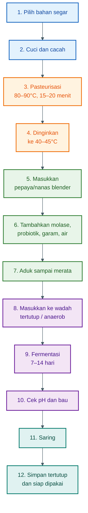

---

## 6.8. Tahap 1 — Cuci dan Cacah Bahan

Bahan protein harus dicuci untuk mengurangi kotoran fisik seperti lumpur, darah busuk, pasir, dan sisa bahan asing.

Setelah dicuci, bahan dicacah.

Tujuan pencacahan:

- memperbesar luas permukaan,
- mempercepat kerja enzim,
- memudahkan pasteurisasi,
- memudahkan pencampuran,
- mengurangi zona bahan yang tidak terfermentasi.

Ukuran cacahan ideal:

```mdx id="o8s0u7"
Semakin kecil dan merata, semakin baik.
Target praktis: 0,5–2 cm untuk bahan hewani basah.
```

Untuk skala besar, pencacahan dengan mesin akan jauh lebih baik dibanding hanya dipotong kasar.

---

## 6.9. Tahap 2 — Pasteurisasi

Pasteurisasi sangat disarankan, terutama untuk bahan hewani seperti limbah ikan, keong, maggot segar, dan limbah udang.

Tujuannya bukan membuat bahan steril total, tetapi menurunkan beban mikroba liar dan patogen.

Parameter praktis:

```mdx id="hqrrrp"
Suhu: 80–90°C
Waktu: 15–20 menit
```

Jangan sampai gosong. Bahan cukup dipanaskan merata.

Manfaat pasteurisasi:

- menurunkan mikroba pembusuk,
- mengurangi risiko patogen,
- membantu melunakkan bahan,
- membuat probiotik lebih mudah mendominasi setelah inokulasi,
- mengurangi risiko fermentasi gagal.

Kesalahan umum:

- bahan tidak dipanaskan merata,
- waktu terlalu singkat,
- setelah dipanaskan dibiarkan terbuka terlalu lama,
- probiotik dimasukkan saat bahan masih terlalu panas.

---

## 6.10. Tahap 3 — Pendinginan

Setelah pasteurisasi, bahan harus didinginkan sebelum enzim dan probiotik dimasukkan.

Target suhu:

```mdx id="r3cwjy"
Suhu aman untuk inokulasi:
40–45°C
```

Jika terlalu panas:

- enzim bisa rusak,
- probiotik bisa mati,
- fermentasi menjadi lambat atau gagal.

Jika terlalu dingin, proses tetap bisa berjalan, tetapi lebih lambat.

Jangan menunggu terlalu lama dalam kondisi terbuka karena bahan yang sudah dipanaskan bisa terkontaminasi ulang dari udara, alat, atau serangga.

---

## 6.11. Tahap 4 — Pencampuran

Setelah suhu turun ke sekitar 40–45°C, masukkan bahan tambahan.

Urutan yang disarankan:

1. Masukkan pepaya/nanas blender.
2. Aduk rata.
3. Masukkan molase yang sudah diencerkan bila terlalu kental.
4. Masukkan garam.
5. Tambahkan air sesuai kebutuhan.
6. Masukkan probiotik terakhir.
7. Aduk sampai homogen.

Kenapa probiotik dimasukkan terakhir?

Karena probiotik paling sensitif terhadap suhu tinggi dan kondisi ekstrem. Pastikan campuran tidak terlalu panas dan garam sudah tersebar merata.

Prinsip pencampuran:

```mdx id="f2qdkg"
Tidak boleh ada gumpalan bahan kering.
Tidak boleh ada bagian yang terlalu asin.
Tidak boleh ada bagian yang tidak terkena molase.
Tidak boleh ada zona yang tidak terkena starter.
```

Pencampuran yang buruk sering menjadi penyebab munculnya titik busuk di dalam drum.

---

## 6.12. Tahap 5 — Fermentasi Anaerob

Setelah tercampur rata, masukkan bahan ke wadah fermentasi.

Wadah harus:

- bersih,
- tertutup,
- tidak bocor,
- tidak penuh sampai bibir,
- menyisakan ruang gas,
- terlindung dari sinar matahari langsung.

Isi wadah maksimal:

```mdx id="pkp3bu"
Isi wadah maksimal 75–80% dari volume total.
Sisakan 20–25% ruang untuk gas fermentasi.
```

Kondisi yang diinginkan adalah **anaerob**, yaitu minim oksigen.

Mengapa anaerob penting?

- menekan jamur,
- mengurangi pembusukan aerob,
- membantu bakteri asam laktat bekerja,
- menjaga aroma lebih stabil,
- mengurangi kontaminasi udara.

Jika tidak memakai airlock, buka tutup sebentar setiap hari untuk membuang gas, lalu tutup kembali rapat.

Jangan membuka terlalu lama.

---

## 6.13. Lama Fermentasi

Lama fermentasi praktis:

```mdx id="c5l7n9"
7–14 hari
```

Umumnya:

- hari 1–3: pH mulai turun,
- hari 3–7: aroma asam-gurih mulai stabil,
- hari 7–14: hidrolisis dan fermentasi lebih matang.

Fermentasi terlalu singkat:

- protein belum cukup terhidrolisis,
- aroma belum stabil,
- pH mungkin belum cukup rendah.

Fermentasi terlalu lama:

- risiko degradasi berlebih,
- risiko amonia naik bila kondisi tidak stabil,
- aroma bisa menyimpang,
- kualitas nutrisi bisa menurun.

Untuk praktisi, titik aman awal adalah:

```mdx id="o40z7c"
Mulai evaluasi produk pada hari ke-7.
Gunakan bila pH, bau, dan visual sudah sesuai.
```

---

## 6.14. Metode Satu Tahap

Metode satu tahap adalah metode paling sederhana. Semua bahan utama dicampur setelah pasteurisasi dan pendinginan.

### Alur metode satu tahap

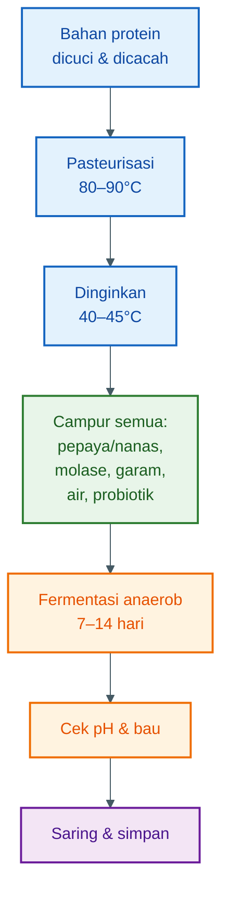

### Kelebihan metode satu tahap

- mudah,
- cepat,
- cocok untuk pemula,
- alat sederhana,
- risiko salah urutan lebih kecil.

### Kelemahan metode satu tahap

- kerja enzim tidak selalu maksimal,
- pH bisa turun cepat sehingga enzim bekerja lebih pendek,
- hasil hidrolisis bisa kurang kuat dibanding metode dua tahap.

### Cocok untuk

- peternak skala kecil,
- uji coba awal,
- bahan yang mudah terhidrolisis,
- kondisi alat terbatas.

---

## 6.15. Metode Dua Tahap

Metode dua tahap lebih rapi secara proses. Hidrolisis enzim diberi waktu lebih dulu, baru kemudian fermentasi probiotik diperkuat.

Metode ini cocok jika targetnya adalah protein hidrolisat yang lebih kuat.

### Tahap 1 — Hidrolisis Enzimatis

Setelah bahan dipasteurisasi dan didinginkan, masukkan pepaya/nanas terlebih dahulu.

Parameter praktis:

```mdx id="iwqz0u"
Suhu bahan: 45–50°C
Lama hidrolisis awal: 4–8 jam
Kondisi: tertutup bersih
```

Tujuan:

- memberi waktu papain/bromelain memecah protein,
- meningkatkan protein terlarut,
- meningkatkan peptida,
- memperbaiki aroma gurih,
- mempersiapkan bahan sebelum fermentasi asam.

### Tahap 2 — Fermentasi Probiotik

Setelah hidrolisis awal, turunkan suhu menjadi sekitar 35–40°C, lalu masukkan molase, garam, air, dan probiotik.

Parameter praktis:

```mdx id="fzvbti"
Suhu inokulasi probiotik: 35–40°C
Lama fermentasi: 7–14 hari
Target pH akhir: 3,5–4,5
```

### Alur metode dua tahap

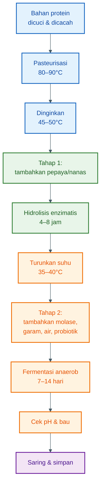

### Kelebihan metode dua tahap

- hidrolisis protein lebih kuat,
- enzim punya waktu bekerja sebelum pH terlalu asam,
- aroma gurih biasanya lebih muncul,
- protein terlarut cenderung lebih tinggi,
- cocok untuk bahan hewani.

### Kelemahan metode dua tahap

- lebih lama,
- butuh kontrol suhu lebih baik,
- butuh sanitasi lebih ketat,
- risiko kontaminasi meningkat bila tahap pertama terlalu lama atau wadah terbuka.

### Cocok untuk

- produksi lebih serius,
- bahan protein hewani,
- praktisi yang punya pH meter,
- produksi aditif pakan dengan kualitas lebih konsisten.

---

## 6.16. Perbandingan Metode Satu Tahap dan Dua Tahap

| Aspek                  | Metode satu tahap               | Metode dua tahap              |
| ---------------------- | ------------------------------- | ----------------------------- |
| Kemudahan              | Lebih mudah                     | Lebih teknis                  |
| Lama proses            | Lebih singkat                   | Lebih panjang                 |
| Hidrolisis protein     | Sedang                          | Lebih kuat                    |
| Risiko kontaminasi     | Lebih rendah bila cepat ditutup | Bisa naik bila sanitasi buruk |
| Kebutuhan kontrol suhu | Sedang                          | Lebih tinggi                  |
| Cocok untuk pemula     | Ya                              | Setelah memahami dasar proses |
| Kualitas hidrolisat    | Cukup baik                      | Lebih potensial               |
| Rekomendasi            | Untuk awal                      | Untuk skala lebih serius      |

Rekomendasi praktis:

```mdx id="oj4p23"
Mulai dari metode satu tahap.
Jika hasil stabil, naikkan ke metode dua tahap.
```

---

## 6.17. Penyaringan

Setelah fermentasi selesai dan produk memenuhi indikator awal, lakukan penyaringan.

Tujuan penyaringan:

- memisahkan cairan hidrolisat,
- mengurangi partikel kasar,
- memudahkan aplikasi ke pelet,
- mengurangi penyumbatan sprayer,
- membuat dosis lebih seragam.

Gunakan:

- kain saring,
- saringan plastik,
- saringan stainless,
- karung bersih khusus pakan.

Jangan gunakan kain bekas deterjen, pestisida, atau bahan kimia.

### Hasil penyaringan

Produk akan terbagi menjadi:

1. **Cairan hidrolisat**
2. **Ampas fermentasi**

Cairan digunakan sebagai aditif pakan.

Ampas masih bisa digunakan dengan hati-hati bila:

- tidak busuk,
- tidak berjamur,
- aromanya normal,
- dikeringkan terlebih dahulu,
- dicampur dalam jumlah terbatas.

Jika ampas berbau busuk atau berlendir, jangan digunakan.

---

## 6.18. Penyimpanan Produk Cair

Produk cair harus disimpan dengan benar agar tidak rusak.

Syarat penyimpanan:

- wadah bersih,
- tertutup rapat,
- tidak terkena sinar matahari langsung,
- disimpan di tempat teduh,
- tidak sering dibuka,
- gunakan alat ambil yang bersih.

Wadah yang cocok:

- jerigen kecil,
- botol plastik tebal,
- ember bertutup,
- drum kecil food grade.

Hindari menyimpan dalam wadah besar yang sering dibuka-tutup. Lebih baik bagi ke beberapa wadah kecil.

```mdx id="q1if6g"
Lebih baik:
1 drum hasil fermentasi → dibagi ke beberapa jerigen kecil.

Kurang baik:
1 drum besar → dibuka setiap hari berkali-kali.
```

Makin sering wadah dibuka, makin tinggi risiko kontaminasi ulang.

---

## 6.19. Umur Simpan

Umur simpan sangat tergantung pada:

- pH akhir,
- kebersihan wadah,
- kadar air,
- kadar garam,
- suhu penyimpanan,
- ada tidaknya kontaminasi ulang,
- kualitas bahan awal.

Jika pH stabil di kisaran 3,5–4,5 dan disimpan bersih, produk umumnya lebih awet dibanding bahan mentah.

Namun untuk praktik aman, gunakan prinsip:

```mdx id="vcth1f"
Produksi secukupnya.
Gunakan bertahap.
Jangan menyimpan terlalu lama jika tidak ada uji mutu.
```

Untuk skala peternak, lebih baik membuat batch yang habis dalam beberapa minggu daripada membuat terlalu banyak lalu kualitasnya tidak terpantau.

Tanda produk simpanan mulai rusak:

- bau berubah menjadi busuk,
- muncul gas berlebihan dengan bau menyengat,
- ada jamur hitam/hijau,
- muncul lendir busuk,
- pH naik,
- warna berubah ekstrem,
- ada belatung.

Produk seperti itu sebaiknya tidak digunakan.

---

## 6.20. SOP Ringkas Produksi 10 kg Bahan Protein

Berikut SOP ringkas yang bisa dipakai langsung.

### Formula

| Bahan                |  Jumlah |
| -------------------- | ------: |
| Bahan protein segar  |   10 kg |
| Molase               |    1 kg |
| Pepaya/nanas blender |  1,5 kg |
| Probiotik aktif      |  300 ml |
| Garam                |   170 g |
| Air bersih           | 4 liter |

### Langkah kerja

1. Pilih bahan protein segar.
2. Cuci bahan sampai kotoran fisik berkurang.
3. Cacah bahan ukuran kecil.
4. Pasteurisasi pada 80–90°C selama 15–20 menit.
5. Dinginkan sampai 40–45°C.
6. Tambahkan pepaya/nanas blender.
7. Tambahkan molase, garam, dan air.
8. Aduk sampai merata.
9. Masukkan probiotik.
10. Aduk ulang sampai homogen.
11. Masukkan ke wadah fermentasi.
12. Isi maksimal 75–80% volume wadah.
13. Tutup rapat.
14. Fermentasi 7–14 hari.
15. Buang gas singkat bila tidak memakai airlock.
16. Cek pH dan bau mulai hari ke-3 dan hari ke-7.
17. Gunakan bila pH 3,5–4,5 dan bau asam-gurih.
18. Saring.
19. Simpan cairan dalam wadah kecil tertutup.
20. Gunakan sebagai aditif pakan.

---

## 6.21. Titik Kritis Proses

Titik kritis adalah bagian proses yang paling sering menyebabkan kegagalan.

| Tahap           | Titik kritis                       | Risiko bila salah                 |
| --------------- | ---------------------------------- | --------------------------------- |
| Pemilihan bahan | Bahan harus segar                  | Produk busuk sejak awal           |
| Pencucian       | Kotoran harus dikurangi            | Kontaminasi tinggi                |
| Pasteurisasi    | Suhu dan waktu cukup               | Patogen dan pembusuk masih tinggi |
| Pendinginan     | Jangan masukkan starter saat panas | Probiotik mati                    |
| Pencampuran     | Harus homogen                      | Muncul zona busuk                 |
| Molase          | Jangan terlalu sedikit             | pH lambat turun                   |
| Probiotik       | Harus aktif                        | Fermentasi liar                   |
| Wadah           | Harus tertutup                     | Jamur dan pembusukan aerob        |
| Fermentasi      | pH harus turun                     | Produk tidak aman                 |
| Penyimpanan     | Wadah bersih dan tertutup          | Kontaminasi ulang                 |

---

## 6.22. Checklist Produksi

Gunakan checklist ini sebelum, selama, dan setelah proses.

### Sebelum produksi

| Pertanyaan                 | Ya/Tidak |
| -------------------------- | -------- |
| Bahan protein masih segar? |          |
| Tidak ada bau busuk?       |          |
| Tidak ada jamur?           |          |
| Wadah bersih?              |          |
| Alat sudah dicuci?         |          |
| Molase tersedia cukup?     |          |
| Probiotik masih aktif?     |          |
| pH meter tersedia?         |          |
| Garam ditimbang?           |          |
| Air bersih tersedia?       |          |

### Saat produksi

| Pertanyaan                        | Ya/Tidak |
| --------------------------------- | -------- |
| Bahan sudah dicacah kecil?        |          |
| Pasteurisasi mencapai 80–90°C?    |          |
| Waktu pemanasan 15–20 menit?      |          |
| Suhu turun sebelum starter masuk? |          |
| Campuran sudah homogen?           |          |
| Wadah tidak diisi terlalu penuh?  |          |
| Wadah tertutup rapat?             |          |

### Setelah fermentasi

| Pertanyaan                   | Ya/Tidak |
| ---------------------------- | -------- |
| pH akhir 3,5–4,5?            |          |
| Bau asam-gurih?              |          |
| Tidak bau bangkai?           |          |
| Tidak bau amonia tajam?      |          |
| Tidak ada jamur hitam/hijau? |          |
| Tidak berlendir busuk?       |          |
| Produk sudah disaring?       |          |
| Disimpan di wadah bersih?    |          |

---

## 6.23. Kesalahan Umum dalam Pembuatan

Kesalahan yang sering terjadi di lapangan:

1. Menggunakan bahan yang sudah busuk.
2. Tidak melakukan pasteurisasi.
3. Memasukkan probiotik saat bahan masih terlalu panas.
4. Molase terlalu sedikit.
5. Probiotik tidak aktif.
6. Wadah tidak tertutup rapat.
7. Campuran terlalu encer.
8. Campuran terlalu kental dan tidak homogen.
9. Fermentasi tidak dicek pH.
10. Produk gagal tetap dipakai karena sayang dibuang.

Kesalahan paling berbahaya adalah menggunakan bahan busuk dan tidak mengukur pH.

> Produk yang berbau asam belum tentu aman. Produk yang aman harus pH-nya turun dan tidak menunjukkan tanda pembusukan.

---

## 6.24. Kesimpulan Bab 6

Formula dan SOP pembuatan protein hidrolisat fermentasi harus dibuat terukur. Bukan sekadar mencampur bahan lalu menunggu.

Formula dasar untuk 10 kg bahan protein adalah:

```mdx id="s6q89j"
10 kg bahan protein segar

- 1 kg molase
- 1,5 kg pepaya/nanas
- 300 ml probiotik aktif
- 170 g garam
- 4 liter air
```

Proses utamanya:

```mdx id="ysx6es"
pilih bahan segar
→ cuci dan cacah
→ pasteurisasi
→ dinginkan
→ campur enzim, molase, garam, air, probiotik
→ fermentasi anaerob
→ cek pH dan bau
→ saring
→ simpan tertutup
```

Metode satu tahap cocok untuk pemula karena lebih sederhana. Metode dua tahap lebih baik bila ingin hidrolisis protein lebih kuat, tetapi membutuhkan kontrol suhu dan sanitasi lebih baik.

Kesimpulan praktisnya:

> **Formula yang baik harus bisa dihitung. SOP yang baik harus bisa diulang. Fermentasi yang baik harus bisa dicek dengan pH, bau, visual, dan konsistensi hasil.**

[**Kembali ke Atas**](#fermentasi-protein-untuk-pakan-lele-membuat-hidrolisat-asam-amino-yang-aman-rasional-dan-bernilai-guna)

---

# Bab 7 — Kontrol Keamanan Fermentasi

Fermentasi protein untuk pakan lele tidak harus steril seperti proses farmasi. Namun, fermentasi **harus terkendali**.

Ini perbedaan yang sangat penting.

Steril berarti semua mikroba dihilangkan. Dalam praktik peternak, ini sulit dilakukan. Terkendali berarti mikroba baik dibuat dominan, pH diturunkan, oksigen dibatasi, dan bahan busuk dicegah berkembang.

Tujuan kontrol keamanan bukan membuat produk “bebas mikroba”, tetapi memastikan mikroba yang dominan adalah mikroba fermentasi yang menguntungkan, bukan mikroba pembusuk atau patogen.

Kalimat kunci:

> **Fermentasi tidak harus steril, tetapi wajib terkendali. Ukuran kendalinya adalah pH turun, bau normal, tidak ada jamur berbahaya, dan tidak ada tanda pembusukan.**

---

## 7.1. Risiko Mikroba Patogen

Bahan protein basah seperti limbah ikan, keong, maggot, limbah udang, dan ampas tahu sangat mudah menjadi media tumbuh mikroba. Kandungan air tinggi, protein tinggi, dan nutrisi lengkap membuat bahan ini cepat rusak bila tidak segera diproses.

Risiko mikroba yang perlu diwaspadai antara lain:

- bakteri pembusuk,
- bakteri patogen,
- jamur,
- ragi liar,
- mikroba penghasil bau busuk,
- mikroba penghasil toksin,
- kontaminasi dari alat dan wadah.

Beberapa sumber kontaminasi umum:

| Sumber kontaminasi     | Contoh risiko                         |
| ---------------------- | ------------------------------------- |
| Bahan sudah busuk      | Amonia, bakteri pembusuk, bau bangkai |
| Air tidak bersih       | Bakteri lingkungan                    |
| Wadah kotor            | Kontaminasi ulang                     |
| Alat bekas bahan kimia | Residu berbahaya                      |
| Probiotik mati/lemah   | Fermentasi liar                       |
| pH tidak turun         | Patogen lebih mudah bertahan          |
| Wadah terbuka          | Jamur, lalat, belatung                |

Produk fermentasi yang gagal tidak hanya menurunkan kualitas pakan, tetapi juga bisa merusak kualitas air kolam dan menekan kesehatan ikan.

---

## 7.2. Kenapa Fermentasi Tidak Harus Steril?

Dalam fermentasi, keberadaan mikroba memang dibutuhkan. Yang penting adalah **mikroba baik harus menang sejak awal**.

Probiotik atau bakteri asam laktat dimasukkan agar mereka mendominasi sistem. Molase diberikan sebagai makanan cepat untuk mikroba baik. Garam membantu menekan sebagian mikroba liar. Wadah tertutup mengurangi oksigen agar jamur dan mikroba aerob tidak mudah tumbuh.

Jadi keamanan fermentasi dibangun dari kombinasi beberapa penghalang.

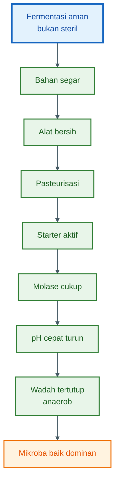

Fermentasi yang aman bekerja seperti sistem pagar berlapis:

1. bahan segar,
2. sanitasi alat,
3. pasteurisasi,
4. starter kuat,
5. molase cukup,
6. pH rendah,
7. kondisi anaerob,
8. penyimpanan tertutup.

Jika salah satu pagar lemah, risiko gagal meningkat. Jika beberapa pagar sekaligus lemah, produk sangat mungkin busuk.

---

## 7.3. pH sebagai Indikator Utama

pH adalah indikator paling penting dalam fermentasi protein. Bau bisa membantu, tetapi bau tidak cukup. Produk bisa tampak normal, tetapi pH masih terlalu tinggi.

Target praktis:

| Tahap                 | Target pH |
| --------------------- | --------: |
| Awal pencampuran      |  ±5,5–6,5 |
| Hari ke-2 sampai ke-3 |     < 4,5 |
| Produk akhir          |   3,5–4,5 |

Jika pH turun cepat, berarti bakteri asam laktat bekerja dan menghasilkan asam organik.

Jika pH tetap tinggi, proses harus dicurigai.

```mdx id="e6voy7"
pH akhir ideal = 3,5–4,5

pH > 5 setelah 3 hari = tanda bahaya
```

pH rendah membantu menekan banyak mikroba pembusuk. Namun, pH rendah bukan satu-satunya syarat. Produk tetap harus dinilai dari bau, visual, lendir, jamur, dan kondisi bahan awal.

---

## 7.4. Cara Mengukur pH

Gunakan pH meter digital sederhana. Kertas lakmus bisa dipakai sebagai perkiraan kasar, tetapi kurang akurat untuk pengambilan keputusan.

### Cara mengukur pH cairan fermentasi

1. Aduk produk sampai merata.
2. Ambil sampel cairan.
3. Celupkan probe pH meter.
4. Tunggu angka stabil.
5. Catat hasilnya.
6. Bilas probe dengan air bersih.
7. Simpan pH meter sesuai petunjuk alat.

### Bila produk terlalu kental

Campurkan sampel dengan air bersih dalam perbandingan sederhana:

```mdx id="x6su6r"
1 bagian sampel fermentasi

- 1 bagian air bersih
  → aduk rata
  → ukur pH
```

Catatan: pengenceran bisa sedikit mengubah angka, tetapi masih berguna untuk pemantauan praktis bila dilakukan konsisten.

### Jadwal pengukuran pH

| Waktu               | Tujuan                         |
| ------------------- | ------------------------------ |
| Setelah pencampuran | Catatan awal                   |
| Hari ke-2 atau ke-3 | Memastikan pH mulai turun      |
| Hari ke-7           | Evaluasi kelayakan awal        |
| Sebelum digunakan   | Memastikan produk masih stabil |

---

## 7.5. Tanda Fermentasi Berhasil

Fermentasi yang berhasil memiliki ciri yang cukup jelas.

| Parameter     | Tanda baik                     |
| ------------- | ------------------------------ |
| pH            | 3,5–4,5                        |
| Bau           | Asam-gurih, segar, tidak busuk |
| Warna         | Coklat/coklat tua merata       |
| Gas           | Ada sedikit gas wajar          |
| Jamur         | Tidak ada jamur hitam/hijau    |
| Lendir        | Tidak berlendir busuk          |
| Belatung      | Tidak ada                      |
| Tekstur       | Cair atau semi-cair, homogen   |
| Aroma protein | Gurih, bukan bangkai           |

Bau yang diharapkan:

> **bau segar asam-gurih**

Bau ini berbeda dengan bau bangkai. Aroma fermentasi yang baik bisa asam, sedikit amis, dan gurih. Tetapi tidak menusuk seperti amonia atau daging busuk.

---

## 7.6. Tanda Fermentasi Gagal

Fermentasi gagal harus dikenali sejak awal. Jangan memaksakan produk gagal untuk pakan karena sayang bahan.

Tanda gagal:

- pH tetap di atas 5 setelah 3 hari,
- bau bangkai,
- bau amonia tajam,
- gas berlebihan dengan bau busuk,
- lendir busuk,
- jamur hitam atau hijau,
- belatung,
- warna berubah ekstrem,
- permukaan berbusa busuk,
- ada lapisan aneh yang berbau menyengat.

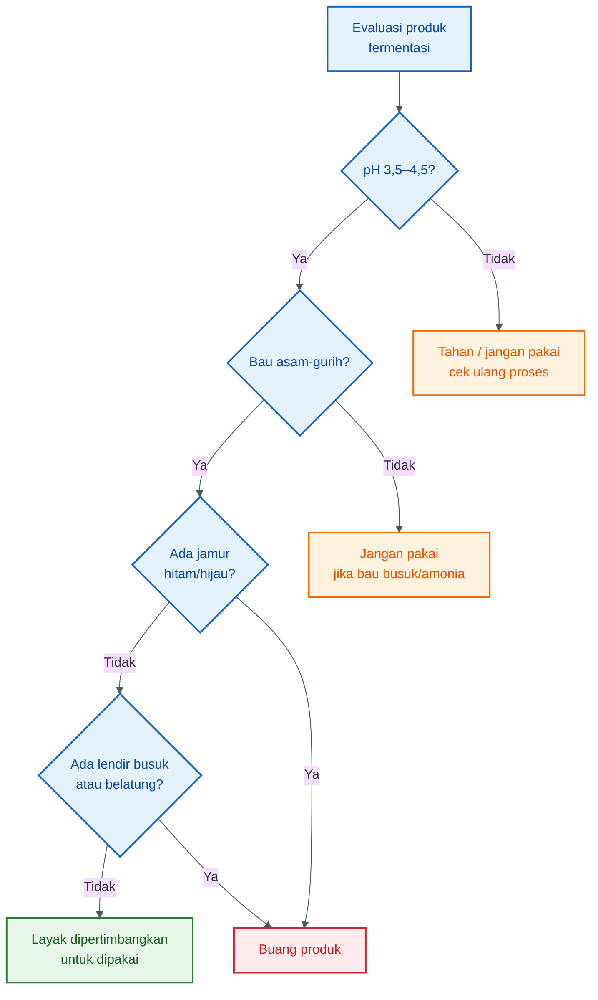

---

## 7.7. Risiko Amonia

Amonia adalah tanda bahwa protein mulai terurai ke arah pembusukan, bukan hidrolisis terkendali.

Protein yang baiknya dipecah menjadi peptida dan asam amino, dalam kondisi buruk dapat terus rusak menjadi senyawa nitrogen yang tidak diinginkan, termasuk amonia.

Secara sederhana:

```mdx id="z2klhz"
Hidrolisis baik:
protein → peptida → asam amino bebas

Pembusukan:
protein → amonia + amina busuk + bau bangkai
```

Tanda amonia:

- bau tajam menusuk,
- mirip bau urin menyengat,
- tidak gurih,
- membuat hidung tidak nyaman,
- sering disertai pH yang tidak turun dengan baik.

Produk dengan bau amonia kuat sebaiknya tidak digunakan.

---

## 7.8. Risiko Jamur

Jamur biasanya muncul bila ada oksigen, wadah tidak rapat, permukaan bahan terbuka, atau bahan terlalu lama terkontaminasi.

Jamur yang harus diwaspadai:

- jamur hitam,
- jamur hijau,
- jamur berbulu tebal,
- jamur dengan bau apek menyengat.

Jika hanya ada lapisan putih tipis pada fermentasi tertentu, beberapa praktisi kadang menganggap masih bisa ditoleransi. Namun untuk pakan ikan, lebih aman menggunakan standar ketat:

> **Jika muncul jamur mencurigakan, terutama hitam atau hijau, produk jangan digunakan.**

Risiko jamur bukan hanya bau. Beberapa jamur dapat menghasilkan toksin yang berbahaya bagi ikan dan kualitas kolam.

---

## 7.9. Risiko Belatung

Belatung pada bahan fermentasi biasanya menunjukkan lalat sempat masuk atau bahan sudah terbuka dan membusuk sebelum atau selama proses.

Belatung bukan tanda fermentasi berhasil.

Belatung menunjukkan:

- wadah tidak tertutup,
- bahan awal mungkin sudah busuk,
- sanitasi buruk,
- ada kontaminasi dari lalat,
- proses tidak anaerob.

Produk yang muncul belatung sebaiknya tidak digunakan sebagai pakan.

---

## 7.10. Risiko Bau Busuk

Bau adalah indikator penting, tetapi harus ditafsirkan dengan benar.

### Bau yang masih normal

- asam,
- gurih,
- fermentatif,
- sedikit amis ringan,
- tidak menusuk.

### Bau yang tidak normal

- bangkai,
- urin/amonia tajam,
- telur busuk,
- got,
- apek jamur,
- busuk menyengat,
- alkohol tajam berlebihan.

Bau asam tidak otomatis berarti aman. Bau asam harus disertai pH rendah, tidak ada jamur, tidak ada lendir busuk, dan tidak ada belatung.

---

## 7.11. Kapan Produk Harus Dibuang?

Produk harus dibuang bila memenuhi salah satu kondisi berikut:

| Kondisi                                          | Keputusan                           |
| ------------------------------------------------ | ----------------------------------- |
| pH >5 setelah 3 hari                             | Jangan dipakai, evaluasi atau buang |
| Bau bangkai                                      | Buang                               |
| Bau amonia kuat                                  | Buang                               |
| Jamur hitam/hijau                                | Buang                               |
| Ada belatung                                     | Buang                               |
| Lendir busuk                                     | Buang                               |
| Bahan awal sudah busuk                           | Buang                               |
| Wadah bekas bahan kimia                          | Buang                               |
| Ikan menunjukkan respons buruk setelah uji kecil | Hentikan penggunaan                 |

Jangan mencampur produk gagal dengan pakan hanya karena tidak ingin rugi. Kerugian akibat kolam bermasalah bisa lebih besar dibanding kehilangan satu batch fermentasi.

---

## 7.12. Uji Kecil Sebelum Dipakai Luas

Sebelum dipakai ke seluruh kolam, lakukan uji kecil.

Langkah uji sederhana:

1. Ambil sedikit produk yang sudah lolos pH dan bau.
2. Campurkan ke sedikit pelet.
3. Berikan ke satu kolam atau satu hapa kecil.
4. Amati respons makan.
5. Amati air selama 24 jam.
6. Amati ikan: berenang normal atau tidak.
7. Jika aman, baru naikkan penggunaan bertahap.

Indikator uji kecil berhasil:

- lele mau makan,
- tidak ada muntah pakan berlebihan,
- air tidak cepat bau,
- ikan tidak megap-megap,
- tidak muncul kematian mendadak,
- tidak ada lendir berlebih pada air.

---

## 7.13. Kesimpulan Bab 7

Keamanan fermentasi ditentukan oleh kendali proses, bukan oleh klaim bahwa produk sudah “fermentasi”.

Produk yang aman harus memenuhi syarat:

```mdx id="2bcgtt"
bahan awal segar

- alat bersih
- pasteurisasi
- starter aktif
- molase cukup
- pH turun
- wadah tertutup
- tidak ada tanda busuk
```

Target praktis:

```mdx id="su71dn"
pH akhir = 3,5–4,5
bau = asam-gurih
visual = bersih dari jamur hitam/hijau
tekstur = tidak berlendir busuk
```

Kesimpulan praktisnya:

> **Fermentasi yang gagal bukan pakan. Fermentasi yang gagal adalah bahan busuk yang berisiko merusak ikan dan air kolam.**

[**Kembali ke Atas**](#fermentasi-protein-untuk-pakan-lele-membuat-hidrolisat-asam-amino-yang-aman-rasional-dan-bernilai-guna)

---

# Bab 8 — Cara Pakai pada Pakan Lele dan Batasannya

Protein hidrolisat fermentasi sebaiknya dipakai sebagai **aditif pakan**, bukan sebagai pakan utama. Fungsinya adalah membantu palatabilitas, kecernaan, dan pemanfaatan bahan protein lokal.

Penggunaan yang benar dapat membantu respons makan. Penggunaan yang berlebihan justru bisa menurunkan kualitas air, membuat pakan terlalu basah, dan meningkatkan beban organik kolam.

Kalimat kunci:

> **Gunakan sedikit, merata, dan segera diberikan. Jangan menjadikan cairan fermentasi sebagai pengganti pelet lengkap.**

---

## 8.1. Fungsi Aplikasi ke Pelet

Protein hidrolisat fermentasi diberikan ke pelet untuk beberapa tujuan:

- meningkatkan aroma asam-gurih,
- membuat pakan lebih menarik,
- membantu ikan merespons pakan,
- menambahkan peptida dan sebagian asam amino bebas,
- mendukung kecernaan protein,
- memanfaatkan bahan fermentasi lokal,
- membantu masa pemulihan setelah stres.

Namun, efeknya sangat tergantung pada:

- kualitas produk fermentasi,
- dosis aplikasi,
- kualitas pelet dasar,
- kondisi air,
- ukuran ikan,
- kepadatan tebar,
- kesehatan ikan.

Jika pelet dasar buruk, hidrolisat fermentasi tidak akan menyelesaikan seluruh masalah nutrisi.

---

## 8.2. Dosis Aplikasi ke Pelet

Dosis awal yang aman:

| Komponen                   | Dosis per 1 kg pelet |
| -------------------------- | -------------------: |
| Hidrolisat fermentasi      |              5–10 ml |
| Air bersih                 |             10–20 ml |
| Minyak ikan / minyak sawit |              5–10 ml |

Formula sederhana:

```mdx id="0he1kh"
Untuk 1 kg pelet:
5–10 ml hidrolisat fermentasi

- 10–20 ml air
- 5–10 ml minyak sebagai perekat
```

Untuk 10 kg pelet:

```mdx id="wd4exo"
Hidrolisat fermentasi = 50–100 ml
Air = 100–200 ml
Minyak = 50–100 ml
```

Untuk 50 kg pelet:

```mdx id="lnor37"
Hidrolisat fermentasi = 250–500 ml
Air = 500–1.000 ml
Minyak = 250–500 ml
```

Mulai dari dosis rendah. Naikkan hanya bila respons makan baik dan kualitas air tetap stabil.

---

## 8.3. Cara Mencampur ke Pakan

Jangan langsung menuang cairan fermentasi terlalu banyak ke pelet. Pelet bisa hancur, terlalu basah, dan cepat mencemari air.

Langkah pencampuran yang disarankan:

1. Siapkan pelet sesuai kebutuhan sekali pemberian.
2. Campur hidrolisat fermentasi dengan sedikit air.
3. Aduk atau semprotkan merata ke pelet.
4. Tambahkan minyak sebagai perekat.
5. Aduk lagi sampai merata.
6. Angin-anginkan 15–30 menit.
7. Berikan ke ikan.
8. Jangan menyimpan terlalu lama.

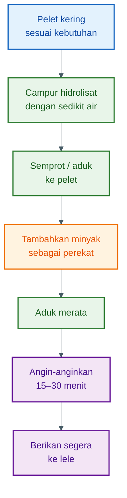

---

## 8.4. Peran Minyak sebagai Perekat

Minyak membantu cairan fermentasi menempel pada pelet. Tanpa minyak, sebagian cairan bisa cepat larut ke air dan tidak termakan ikan.

Minyak yang bisa digunakan:

- minyak ikan,
- minyak sawit bersih,
- minyak kelapa,
- minyak nabati yang tidak tengik.

Fungsi minyak:

- membantu cairan menempel pada permukaan pelet,
- mengurangi larutnya bahan ke air,
- menambah energi,
- memperbaiki aroma,
- mengurangi debu pakan.

Namun, minyak juga tidak boleh berlebihan. Minyak berlebih dapat membuat pakan terlalu berminyak, air cepat kotor, dan permukaan kolam berminyak.

Dosis praktis:

```mdx id="tx00kn"
Minyak = 5–10 ml per kg pelet
```

Gunakan minyak yang masih segar. Jangan gunakan minyak jelantah yang sudah rusak atau berbau tengik.

---

## 8.5. Jangan Menyimpan Pelet Basah Terlalu Lama

Pelet yang sudah dicampur cairan fermentasi menjadi lebih lembap. Pakan lembap lebih mudah rusak dan ditumbuhi mikroba.

Aturan praktis:

```mdx id="0n66cb"
Pelet yang sudah dibasahi sebaiknya habis pada hari yang sama.
```

Lebih aman:

```mdx id="z2xn0k"
Campur pakan hanya untuk sekali atau maksimal satu hari pemberian.
```

Jangan membuat campuran untuk beberapa hari, apalagi disimpan dalam wadah tertutup panas. Risiko yang muncul:

- pelet berjamur,
- bau berubah,
- pakan menggumpal,
- minyak tengik,
- mikroba tumbuh ulang,
- kualitas nutrisi turun.

Jika pakan sudah berubah bau atau berjamur, jangan diberikan.

---

## 8.6. Dampak ke Kualitas Air

Semua bahan organik yang masuk ke kolam akan memengaruhi kualitas air. Hidrolisat fermentasi memang bisa membantu palatabilitas, tetapi bila diberikan berlebihan dapat meningkatkan beban organik.

Risiko penggunaan berlebihan:

- air cepat bau,
- busa meningkat,
- amonia naik,
- oksigen terlarut turun,
- dasar kolam kotor,
- ikan stres,
- nafsu makan turun,
- penyakit lebih mudah muncul.

Karena itu, dosis harus dikendalikan.

Prinsip aplikasi:

```mdx id="sc9bqk"
Lebih baik sedikit tetapi termakan habis,
daripada banyak tetapi larut dan mencemari air.
```

Amati respons kolam setelah aplikasi:

| Indikator     | Kondisi baik         | Tanda masalah           |
| ------------- | -------------------- | ----------------------- |
| Respons makan | Pakan cepat dimakan  | Pakan tersisa           |
| Air           | Tidak cepat bau      | Bau asam/busuk          |
| Permukaan     | Normal               | Banyak busa/minyak      |
| Ikan          | Aktif                | Menggantung/megap-megap |
| Dasar kolam   | Tidak cepat menumpuk | Banyak sisa pakan       |

---

## 8.7. Kapan Cocok Digunakan?

Protein hidrolisat fermentasi cocok digunakan pada kondisi tertentu.

### Cocok digunakan saat:

- ikan baru pindah kolam,
- setelah sortir,
- nafsu makan menurun ringan,
- cuaca berubah,
- ingin meningkatkan palatabilitas pelet,
- menggunakan bahan pakan lokal,
- fase pemulihan setelah stres,
- ingin memanfaatkan limbah protein segar,
- pelet perlu atraktan tambahan.

Pada kondisi ini, hidrolisat fermentasi berperan sebagai pendukung.

---

## 8.8. Kapan Tidak Perlu Digunakan?

Tidak semua kondisi membutuhkan hidrolisat fermentasi.

### Tidak perlu atau kurang tepat digunakan bila:

- pelet utama sudah sangat baik dan ikan makan lahap,
- air kolam sedang buruk,
- amonia tinggi,
- ikan sedang banyak mati tanpa diagnosis jelas,
- produk fermentasi diragukan,
- pH produk tidak terukur,
- produk berbau busuk,
- kolam terlalu padat dan manajemen air buruk,
- tujuan hanya ingin “menghemat pakan” secara ekstrem.

Jika kualitas air sudah buruk, menambah bahan organik cair justru bisa memperparah keadaan.

Pada kondisi air buruk, prioritasnya adalah:

```mdx id="sc33ua"
perbaiki air
kurangi pakan sementara
angkat sisa organik
perbaiki aerasi
cek amonia dan pH kolam
```

Bukan menambah aditif pakan.

---

## 8.9. Batasan sebagai Aditif, Bukan Pakan Utama

Hidrolisat fermentasi bukan pakan lengkap. Ia tidak menggantikan pelet.

Pelet lengkap tetap harus menyediakan:

- protein cukup,
- energi cukup,
- lemak,
- mineral,
- vitamin,
- asam amino esensial,
- stabilitas di air.

Hidrolisat fermentasi hanya membantu sebagian fungsi:

| Fungsi                          | Bisa dibantu? |
| ------------------------------- | ------------: |
| Palatabilitas                   |            Ya |
| Aroma pakan                     |            Ya |
| Kecernaan protein               | Bisa membantu |
| Pemanfaatan limbah protein      |            Ya |
| Pengganti seluruh protein pakan |         Tidak |
| Pengganti vitamin-mineral       |         Tidak |
| Koreksi lisin/metionin presisi  |         Tidak |
| Pengganti manajemen air         |         Tidak |

Jika targetnya memperbaiki lisin atau metionin secara presisi, gunakan formulasi pakan yang benar dan bahan asam amino murni bila diperlukan.

---

## 8.10. Dosis Bertahap dan Evaluasi

Jangan langsung menggunakan dosis tinggi. Mulai dari dosis rendah dan amati hasilnya.

Skema bertahap:

```mdx id="z89v8g"
Minggu 1:
5 ml hidrolisat / kg pelet

Jika respons makan baik dan air stabil:
naikkan ke 7,5 ml / kg pelet

Jika masih baik:
maksimal 10 ml / kg pelet
```

Gunakan dosis lebih rendah bila:

- kolam padat,
- air mudah bau,
- suhu tinggi,
- oksigen rendah,
- bahan fermentasi sangat pekat aromanya,
- pelet mudah hancur.

Gunakan dosis lebih tinggi hanya bila:

- produk benar-benar aman,
- pH sesuai,
- pakan tetap stabil,
- ikan makan cepat,
- air tidak cepat rusak.

---

## 8.11. Waktu Pemberian

Protein hidrolisat fermentasi dapat digunakan pada sebagian waktu pemberian pakan, bukan harus setiap kali makan.

Contoh pola penggunaan:

| Kondisi                     | Pola aplikasi                   |
| --------------------------- | ------------------------------- |
| Pemakaian rutin ringan      | 1 kali sehari                   |
| Setelah sortir/pindah kolam | 1–2 kali sehari selama 2–3 hari |
| Nafsu makan turun ringan    | 1 kali sehari, evaluasi air     |
| Kolam padat                 | Dosis rendah, pantau air        |
| Air mulai buruk             | Hentikan sementara              |

Jangan memakai hidrolisat fermentasi untuk memaksa ikan makan saat air sedang bermasalah berat. Ikan yang tidak mau makan sering kali bukan karena pakan kurang menarik, tetapi karena air tidak nyaman.

---

## 8.12. Uji Respons Pakan

Sebelum diterapkan luas, uji respons pakan.

Langkah sederhana:

1. Campur 1 kg pelet dengan dosis rendah.
2. Berikan pada satu kolam percobaan.
3. Amati dalam 10–15 menit.
4. Catat apakah pakan cepat habis.
5. Amati air dan ikan selama 24 jam.
6. Bandingkan dengan kolam tanpa perlakuan bila ada.

Indikator positif:

- ikan cepat mendekat,
- pakan cepat habis,
- tidak banyak sisa,
- air tidak cepat bau,
- ikan tetap aktif,
- tidak ada kematian mendadak.

Indikator negatif:

- pakan tidak dimakan,
- ikan menjauh,
- air cepat berbusa,
- ikan menggantung,
- bau air memburuk,
- lendir meningkat.

Jika muncul indikator negatif, hentikan penggunaan dan evaluasi produk.

---

## 8.13. Alur Keputusan Pemakaian

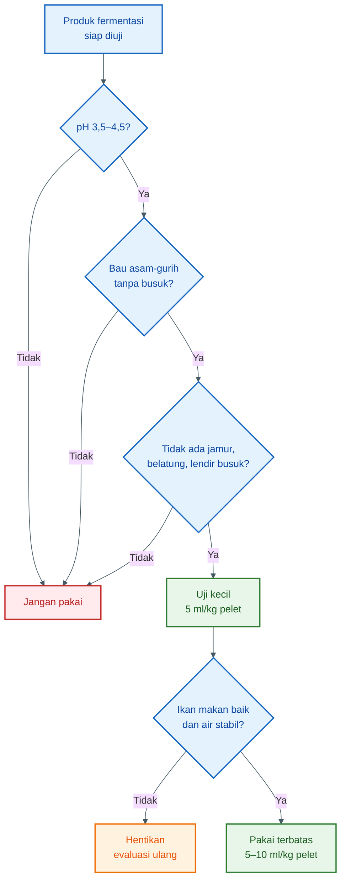

---

## 8.14. Kesalahan Umum Saat Aplikasi

Kesalahan aplikasi yang sering terjadi:

1. Dosis terlalu tinggi.
2. Pelet terlalu basah.
3. Pakan basah disimpan beberapa hari.
4. Tidak memakai minyak sebagai perekat.
5. Produk fermentasi gagal tetap dipakai.
6. Aplikasi dilakukan saat air kolam buruk.
7. Pakan tidak habis, tetapi dosis tetap ditambah.
8. Menganggap hidrolisat bisa menggantikan pelet lengkap.
9. Tidak mencatat respons ikan.
10. Tidak membandingkan dengan kolam kontrol.

Kesalahan paling umum:

> Terlalu fokus pada membuat produk fermentasi, tetapi lupa memantau efeknya di kolam.

---

## 8.15. Kesimpulan Bab 8

Protein hidrolisat fermentasi sebaiknya digunakan sebagai aditif pakan, bukan pakan utama.

Dosis awal yang aman:

```mdx id="nrl8wv"
5–10 ml hidrolisat fermentasi per kg pelet

- 10–20 ml air
- 5–10 ml minyak sebagai perekat
```

Cara pakai:

```mdx id="92tgw3"
campur hidrolisat dengan air
→ semprotkan ke pelet
→ tambahkan minyak
→ aduk rata
→ angin-anginkan 15–30 menit
→ berikan segera
```

Batasannya jelas:

- jangan menyimpan pelet basah terlalu lama,
- jangan gunakan produk gagal,
- jangan berlebihan,
- jangan diberikan saat air kolam buruk,
- jangan anggap sebagai pengganti pelet lengkap.

Kesimpulan praktisnya:

> **Hidrolisat fermentasi yang baik membantu pakan lebih menarik dan lebih mudah dimanfaatkan. Tetapi penggunaan yang salah dapat mencemari air dan merugikan ikan. Gunakan sedikit, terukur, dan selalu pantau respons kolam.**

[**Kembali ke Atas**](#fermentasi-protein-untuk-pakan-lele-membuat-hidrolisat-asam-amino-yang-aman-rasional-dan-bernilai-guna)

---

# Bab 9 — Lampiran Rujukan Ilmiah dan Teknis

Lampiran ini berfungsi sebagai dasar klaim untuk artikel. Tujuannya bukan membuat artikel menjadi akademis, tetapi memastikan setiap klaim teknis utama memiliki pijakan yang jelas.

Catatan penting:

> Angka nutrisi bahan pakan selalu bervariasi. Nilai protein, lemak, lisin, metionin, air, dan abu dapat berubah tergantung spesies, bagian bahan, umur bahan, proses pengolahan, kadar air, dan penyimpanan.

Karena itu, angka dalam lampiran ini sebaiknya digunakan sebagai **acuan formulasi awal**, bukan pengganti uji laboratorium.

---

## 9.1. Tabel Rujukan Klaim Utama

| Klaim                                                                                                       | Rujukan                                                                                                                                                                                                                                                                           | Implikasi praktis                                                                                                         |
| ----------------------------------------------------------------------------------------------------------- | --------------------------------------------------------------------------------------------------------------------------------------------------------------------------------------------------------------------------------------------------------------------------------- | ------------------------------------------------------------------------------------------------------------------------- |
| Limbah ikan dan hasil samping ikan mudah rusak karena tinggi air, protein, dan lemak.                       | FAO menjelaskan bahwa fish processing by-products, terutama viscera/guts, sangat mudah rusak bila tidak segera diawetkan atau diproses. Review terbaru juga menyebut fish by-products umumnya memiliki kadar air tinggi sekitar 60–80% dan kaya protein. ([IISAP][1])             | Bahan ikan harus diproses cepat. Jangan menunggu sampai busuk sebelum difermentasi.                                       |
| Tepung ikan adalah sumber protein berkualitas tinggi dan kaya asam amino.                                   | Feedipedia menyebut fish meal sebagai sumber protein mudah dicerna, omega-3 rantai panjang, vitamin, dan mineral; fish meal umumnya mengandung protein kasar tinggi, sekitar 62% sampai lebih dari 70% pada basis bahan kering. ([Feedipedia][2])                                 | Limbah ikan logis menjadi bahan utama hidrolisat, tetapi kualitas bahan dan proses harus dijaga.                          |
| Protein kasar dihitung dari nitrogen dengan faktor umum 6,25.                                               | FAO menjelaskan bahwa faktor 6,25 digunakan untuk mengonversi nitrogen total menjadi protein kasar pada pakan, karena asumsi umum protein mengandung sekitar 16% nitrogen. FAO/INFOODS juga menjelaskan faktor umum 6,25 berasal dari 1/0,16. ([FAOHome][3])                      | Perhitungan protein dan nitrogen pada Bab 5 memakai dasar umum yang lazim, tetapi tetap bersifat estimasi.                |
| Faktor 6,25 tidak selalu presisi untuk semua bahan.                                                         | FAO menyebut penggunaan faktor 6,25 dapat menimbulkan kesalahan karena kandungan nitrogen protein berbeda antar bahan; protein dapat mengandung nitrogen sekitar 12–19%. ([FAOHome][4])                                                                                           | Untuk produksi komersial atau formulasi presisi, uji lab tetap diperlukan.                                                |
| Pepaya digunakan karena mengandung enzim protease papain.                                                   | Studi tentang protease dari pepaya dan nanas menunjukkan bahwa buah tersebut mengandung enzim proteolitik yang mampu memecah protein. ([PubMed Central][5])                                                                                                                       | Pepaya berfungsi sebagai sumber enzim pemecah protein, bukan sebagai probiotik.                                           |
| Nanas digunakan karena mengandung enzim protease bromelain.                                                 | Kajian tentang aplikasi bromelain menyebut bromelain sebagai enzim protease yang terdapat pada nanas dan potensial digunakan dalam pengolahan pangan. ([Aijans][6])                                                                                                               | Nanas membantu hidrolisis protein, tetapi bukan pengawet utama.                                                           |
| Enzim protease memecah protein menjadi peptida dan sebagian asam amino bebas.                               | Review fish protein hydrolysate menjelaskan bahwa hidrolisis enzimatis mengubah protein ikan atau hasil samping ikan menjadi peptida bioaktif dan fraksi protein lebih kecil. ([PubMed Central][7])                                                                               | Hasil fermentasi lebih tepat disebut protein hidrolisat, bukan asam amino murni.                                          |
| Hidrolisis tidak menciptakan asam amino dari nol.                                                           | Secara prinsip, hidrolisis memecah protein yang sudah ada menjadi peptida dan asam amino lebih kecil; review hidrolisat ikan menekankan pemanfaatan protein dari by-products melalui pemecahan enzimatis. ([PubMed Central][7])                                                   | Profil asam amino tetap ditentukan bahan asal. Fermentasi hanya mengubah bentuknya.                                       |
| Molase adalah sumber gula fermentabel.                                                                      | Karakterisasi molase menunjukkan bahwa gula merupakan komponen utama molase, dan studi fermentasi menunjukkan molase tebu dapat digunakan sebagai substrat untuk produksi asam laktat oleh Lactobacillus. ([ScienceDirect][8])                                                    | Molase bukan pemanis biasa; molase adalah bahan bakar bakteri asam laktat.                                                |
| Gula dapat difermentasi menjadi asam laktat.                                                                | Studi produksi asam laktat dari cane sugar molasses dengan Lactobacillus menunjukkan molase dapat dimanfaatkan untuk fermentasi asam laktat. ([PubMed Central][9])                                                                                                                | Dosis molase menentukan kemampuan fermentasi menurunkan pH.                                                               |
| Bakteri asam laktat menghasilkan asam organik yang menurunkan pH dan menghambat mikroba pembusuk/patogen.   | Review tentang lactic acid bacteria menyebut metabolit seperti asam laktat dan asam asetat dapat menurunkan pH dan menghambat mikroba pembusuk serta patogen. ([PubMed Central][10])                                                                                              | Probiotik berfungsi mengendalikan fermentasi, bukan terutama menciptakan protein baru.                                    |
| Fermentasi fish silage membutuhkan gula karena ikan rendah gula bebas.                                      | FAO menjelaskan bahwa dalam fish silage berbasis bakteri asam laktat, penambahan gula fermentabel penting karena ikan mengandung sedikit gula bebas; starter bakteri asam laktat dapat ditambahkan agar proses lebih terarah. ([FAOHome][11])                                     | Molase perlu ditambahkan agar bakteri asam laktat cepat aktif.                                                            |
| pH rendah menghambat pembusukan dalam fish silage.                                                          | FAO menjelaskan bahwa penurunan pH oleh asam atau fermentasi asam laktat menghambat pertumbuhan bakteri dan memungkinkan penyimpanan bahan ikan. ([FAOHome][12])                                                                                                                  | Target pH akhir 3,5–4,5 masuk akal sebagai zona aman praktis untuk silase/hidrolisat fermentasi.                          |
| Fish silage mengalami liquefaction atau pelarutan karena enzim, terutama dari jaringan atau isi perut ikan. | FAO menyebut fish silage mengalami liquefaction selama penyimpanan akibat enzim degradasi yang ada pada ikan, terutama dari bagian guts. Protein breakdown dapat dipantau melalui nitrogen total atau soluble non-protein nitrogen. ([FAOHome][11])                               | Produk yang makin cair tidak selalu buruk; pencairan bisa menunjukkan hidrolisis. Namun bau dan pH tetap harus dikontrol. |
| Jika fish silage terkena udara, ragi dan jamur dapat tumbuh.                                                | FAO menyebut pada fermented fish silage, paparan udara dapat menyebabkan pertumbuhan yeast dan fungi. ([FAOHome][11])                                                                                                                                                             | Wadah harus tertutup/anaerob. Jamur hitam atau hijau menjadi tanda produk tidak aman.                                     |
| Garam dapat membantu menekan mikroba liar dalam fermentasi ikan.                                            | FAO menyebut heterofermentative bacteria pada tahap awal fermented fish silage dapat ditekan dengan penambahan sodium chloride, selain dengan starter dan perlakuan pendahuluan. ([FAOHome][11])                                                                                  | Garam 0,8–1,2% total batch berfungsi sebagai tekanan seleksi ringan, bukan sumber nutrisi utama.                          |
| Fish meal mengandung lisin dan metionin relatif tinggi.                                                     | Feedipedia mencatat fish meal memiliki lisin sekitar 7,5% dari protein dan metionin sekitar 2,7–2,8% dari protein, tergantung kategori fish meal. ([Feedipedia][13])                                                                                                              | Limbah ikan/tepung ikan strategis untuk memperbaiki profil lisin dan metionin dalam formulasi.                            |
| Bungkil kedelai kuat sebagai sumber lisin, tetapi metioninnya lebih rendah.                                 | Feedipedia mencatat soybean meal high protein memiliki lisin sekitar 6,2 g/16 g N dan metionin sekitar 1,4 g/16 g N. ([Feedipedia][14])                                                                                                                                           | Bungkil kedelai baik untuk lisin, tetapi perlu dikombinasikan dengan sumber metionin.                                     |
| Maggot BSF mengandung lisin cukup baik dan metionin sedang.                                                 | Feedipedia mencatat black soldier fly larvae dehydrated memiliki lisin sekitar 6,6% dari protein dan metionin sekitar 2,1% dari protein; profil asam amino BSF juga disebut kaya lisin sekitar 6–8% protein. ([Feedipedia][15])                                                   | Maggot BSF berguna sebagai bahan protein lokal, tetapi tetap perlu dikontrol lemak, kitin, dan substrat budidayanya.      |
| Limbah udang/shrimp waste mengandung lisin dan metionin, tetapi juga berisiko tinggi abu dan kitin.         | Feedipedia mencatat shrimp waste dehydrated memiliki lisin sekitar 5,7% dari protein dan metionin sekitar 2,5% dari protein. ([Feedipedia][16])                                                                                                                                   | Limbah udang baik sebagai pendamping dan atraktan, tetapi jangan terlalu tinggi karena kulit/kitin dan mineral.           |
| Dedak bukan sumber protein utama, walau tetap memiliki asam amino.                                          | Feedipedia mencatat rice bran fibre 11–20% memiliki lisin sekitar 4,4% dari protein dan metionin sekitar 1,9% dari protein, tetapi juga menekankan variabilitas, serat, fitat, inhibitor enzim, dan risiko rancidity. ([Feedipedia][17])                                          | Dedak sebaiknya digunakan sebagai bahan tambahan/energi, bukan tulang punggung protein pakan lele.                        |
| Lisin dan metionin penting dalam nutrisi ikan.                                                              | Literatur nutrisi ikan menunjukkan lisin termasuk asam amino esensial penting, sementara studi kebutuhan metionin pada African catfish menunjukkan kebutuhan digestible methionine berkisar sekitar 18,7–21,4 g/kg digestible protein untuk pertumbuhan. ([ScienceDirect][18])    | Formulasi pakan lele harus melihat asam amino tercerna, bukan hanya protein kasar.                                        |
| Channel catfish dan ikan lain memiliki kebutuhan spesifik terhadap asam amino sulfur/metionin.              | Studi sulfur amino acid requirement pada channel catfish menunjukkan respons terhadap level metionin diet, dan studi methionine requirement pada channel catfish berbasis soybean meal-corn diet menunjukkan kebutuhan metionin tertentu untuk pertumbuhan. ([ScienceDirect][19]) | Jika bahan pakan banyak memakai nabati, metionin sering perlu diperhatikan atau dikoreksi.                                |
| Hidrolisat protein ikan bisa menjadi bahan bernilai dari limbah perikanan.                                  | Review fish protein hydrolysates menjelaskan bahwa marine/fish protein waste dapat dimanfaatkan melalui hidrolisis enzimatis untuk menghasilkan peptida dan bahan fungsional bernilai. ([PubMed Central][7])                                                                      | Fermentasi/hidrolisis adalah strategi pemanfaatan limbah protein, bukan sekadar pengawetan.                               |

[**Kembali ke Atas**](#fermentasi-protein-untuk-pakan-lele-membuat-hidrolisat-asam-amino-yang-aman-rasional-dan-bernilai-guna)

---

## 9.2. Catatan Angka yang Dipakai dalam Artikel

Beberapa angka pada artikel digunakan sebagai **angka praktis**, bukan angka mutlak.

| Angka dalam artikel                         | Dasar                                                                                                                                                                                                   | Catatan                                                                                                                  |
| ------------------------------------------- | ------------------------------------------------------------------------------------------------------------------------------------------------------------------------------------------------------- | ------------------------------------------------------------------------------------------------------------------------ |
| Limbah ikan segar diasumsikan protein ±18%  | Fish by-products umumnya tinggi air dan kaya protein; variasi protein bahan ikan sangat besar tergantung bagian dan spesies. ([Max Apress][20])                                                         | Untuk hitungan lapang, 18% cukup masuk akal sebagai asumsi awal bahan basah, tetapi sebaiknya diuji bila produksi besar. |
| Faktor protein kasar = N × 6,25             | Faktor umum 6,25 berdasarkan asumsi protein mengandung 16% nitrogen. ([FAOHome][3])                                                                                                                     | Cocok untuk estimasi, tetapi tidak presisi untuk semua bahan.                                                            |
| Target pH akhir 3,5–4,5                     | Fish silage stabil pada pH rendah; FAO menyebut organic acid fish silage stabil pada kisaran pH 3,5–4,0 untuk formic acid dan pH 4,5 dengan propionic acid. ([FAOHome][11])                             | Untuk fermentasi lapang, pH 3,5–4,5 adalah target praktis yang aman.                                                     |
| Molase 0,8–1,2 kg per 10 kg bahan protein   | Molase kaya gula dan bisa digunakan sebagai substrat produksi asam laktat. FAO juga menyebut fermentasi fish silage perlu tambahan gula fermentabel karena ikan miskin gula bebas. ([ScienceDirect][8]) | Jika pH lambat turun, molase atau starter mungkin kurang.                                                                |
| Garam 0,8–1,2% total batch                  | FAO menyebut NaCl dapat membantu menekan bakteri heterofermentatif pada fermentasi ikan. ([FAOHome][11])                                                                                                | Dosis ini tekanan seleksi ringan; garam terlalu tinggi dapat menghambat mikroba baik.                                    |
| Pepaya/nanas 1–2 kg per 10 kg bahan protein | Papain dan bromelain adalah enzim protease, tetapi buah segar tidak memiliki aktivitas enzim yang seragam. ([PubMed Central][5])                                                                        | Dosis buah adalah pendekatan praktis, bukan stoikiometri. Presisi harus memakai enzim komersial dengan satuan aktivitas. |
| Probiotik sebaiknya dihitung sebagai CFU/g  | Fermentasi terkendali membutuhkan starter aktif agar mikroba baik dominan. FAO menyebut starter bakteri asam laktat dapat ditambahkan untuk membantu proses fish silage. ([FAOHome][11])                | Volume ml tidak cukup informatif jika tidak tahu kepadatan mikroba hidup.                                                |

[**Kembali ke Atas**](#fermentasi-protein-untuk-pakan-lele-membuat-hidrolisat-asam-amino-yang-aman-rasional-dan-bernilai-guna)

---

## 9.3. Rujukan untuk Bahan Pakan dan Profil Lisin-Metionin

| Bahan                   | Rujukan angka                                                                                            | Implikasi formulasi                                                                         |
| ----------------------- | -------------------------------------------------------------------------------------------------------- | ------------------------------------------------------------------------------------------- |
| Fish meal / limbah ikan | Fish meal: lisin sekitar 7,5% protein; metionin sekitar 2,7–2,8% protein. ([Feedipedia][13])             | Sumber asam amino hewani yang kuat; baik untuk mendukung lisin dan metionin.                |
| Bungkil kedelai         | Soybean meal high protein: lisin sekitar 6,2 g/16 g N; metionin sekitar 1,4 g/16 g N. ([Feedipedia][14]) | Baik untuk lisin, tetapi metionin terbatas.                                                 |
| Maggot BSF              | BSF dehydrated: lisin sekitar 6,6% protein; metionin sekitar 2,1% protein. ([Feedipedia][15])            | Baik sebagai protein lokal, tetapi tetap perlu kontrol lemak, kitin, dan kualitas substrat. |
| Limbah udang            | Shrimp waste dehydrated: lisin sekitar 5,7% protein; metionin sekitar 2,5% protein. ([Feedipedia][16])   | Bagus sebagai pendamping dan atraktan, tetapi abu/kitin harus dikontrol.                    |
| Dedak                   | Rice bran fibre 11–20%: lisin sekitar 4,4% protein; metionin sekitar 1,9% protein. ([Feedipedia][21])    | Jangan dijadikan sumber protein utama; lebih cocok sebagai tambahan energi/tekstur.         |

[**Kembali ke Atas**](#fermentasi-protein-untuk-pakan-lele-membuat-hidrolisat-asam-amino-yang-aman-rasional-dan-bernilai-guna)

---

## 9.4. Rujukan untuk Mekanisme Fermentasi

```mermaid id="f3xfle"
%%{init: {
  "theme": "base",
  "themeVariables": {
    "fontFamily": "Arial",
    "lineColor": "#455A64"
  }
}}%%
flowchart TD
    A["Bahan protein<br/>ikan/keong/maggot"] --> B["Enzim protease<br/>papain/bromelain"]
    B --> C["Protein terhidrolisis<br/>menjadi peptida"]
    C --> D["Sebagian asam amino bebas"]

    E["Molase<br/>gula fermentabel"] --> F["Bakteri asam laktat"]
    F --> G["Asam laktat"]
    G --> H["pH turun"]
    H --> I["Mikroba pembusuk<br/>tertekan"]

    D --> J["Protein hidrolisat<br/>fermentasi"]
    I --> J

    classDef bahan fill:#E3F2FD,stroke:#1565C0,stroke-width:2px,color:#0D47A1;
    classDef enzim fill:#E8F5E9,stroke:#2E7D32,stroke-width:2px,color:#1B5E20;
    classDef gula fill:#FFF3E0,stroke:#EF6C00,stroke-width:2px,color:#E65100;
    classDef hasil fill:#F3E5F5,stroke:#6A1B9A,stroke-width:2px,color:#4A148C;

    class A,E bahan;
    class B,C,D enzim;
    class F,G,H,I gula;
    class J hasil;
```

Dasar rujukan untuk alur di atas:

| Mekanisme                                 | Rujukan                                                                                                                               | Makna praktis                                    |
| ----------------------------------------- | ------------------------------------------------------------------------------------------------------------------------------------- | ------------------------------------------------ |
| Protease memecah protein                  | Review fish protein hydrolysate menjelaskan hidrolisis enzimatis protein ikan/by-products menjadi peptida. ([PubMed Central][7])      | Enzim mempercepat pemecahan protein.             |
| Papain dan bromelain adalah protease buah | Kajian protease pepaya dan nanas menunjukkan keduanya memiliki aktivitas proteolitik. ([PubMed Central][5])                           | Pepaya/nanas dipakai sebagai sumber enzim alami. |
| LAB menghasilkan asam dan menurunkan pH   | LAB menghasilkan asam organik yang menurunkan pH dan menghambat mikroba pembusuk/patogen. ([PubMed Central][10])                      | Probiotik mengarahkan fermentasi agar aman.      |
| Fish silage perlu gula fermentabel        | FAO menyebut ikan rendah gula bebas, sehingga gula fermentabel perlu ditambahkan untuk mendukung bakteri asam laktat. ([FAOHome][11]) | Molase diperlukan, terutama untuk bahan hewani.  |
| pH rendah menjaga stabilitas silase ikan  | FAO menjelaskan penurunan pH menghambat bakteri dan memungkinkan penyimpanan bahan ikan. ([FAOHome][12])                              | pH meter wajib untuk kontrol lapang.             |

[**Kembali ke Atas**](#fermentasi-protein-untuk-pakan-lele-membuat-hidrolisat-asam-amino-yang-aman-rasional-dan-bernilai-guna)

---

## 9.5. Rujukan untuk Batasan Klaim

| Klaim batasan                                                        | Rujukan                                                                                                                                                                    | Implikasi praktis                                                                         |
| -------------------------------------------------------------------- | -------------------------------------------------------------------------------------------------------------------------------------------------------------------------- | ----------------------------------------------------------------------------------------- |
| Fermentasi tidak otomatis meningkatkan total protein absolut.        | Faktor protein kasar berbasis nitrogen; jika tidak ada nitrogen baru, total nitrogen tidak naik signifikan. ([FAOHome][3])                                                 | Jika % protein naik, bisa jadi karena bahan lain berkurang, bukan protein baru terbentuk. |
| Fermentasi tidak menciptakan lisin/metionin baru dalam jumlah besar. | Hidrolisis protein memecah protein yang sudah ada menjadi peptida/asam amino; profil asam amino bahan pakan tercermin dari bahan asalnya. ([PubMed Central][7])            | Pilih bahan awal yang memang baik profil asam aminonya.                                   |
| Produk fermentasi bukan pengganti pelet lengkap.                     | FAO membahas fish silage sebagai bahan pakan/feed ingredient, bukan sebagai satu-satunya pakan lengkap; nutrisi ikan tetap membutuhkan formulasi seimbang. ([FAOHome][11]) | Hidrolisat digunakan sebagai aditif atau bahan pendukung, bukan pakan utama.              |
| Produk gagal harus dibuang.                                          | FAO menyebut bahan yang tidak tercampur asam dengan baik dapat putrefy/membusuk, serta paparan udara dapat memicu yeast dan fungi. ([FAOHome][11])                         | Bau bangkai, jamur hitam/hijau, belatung, dan pH tinggi adalah alasan membuang batch.     |

[**Kembali ke Atas**](#fermentasi-protein-untuk-pakan-lele-membuat-hidrolisat-asam-amino-yang-aman-rasional-dan-bernilai-guna)

---

## 9.6. Ringkasan Praktis dari Lampiran

Dari seluruh rujukan, ada beberapa kesimpulan yang paling penting untuk praktisi:

1. **Bahan ikan tinggi nutrisi tetapi cepat rusak.**
   Karena itu, bahan harus segar dan segera diproses.

2. **Protein kasar dihitung dari nitrogen, bukan dari klaim fermentasi.**
   Rumus umum:

   ```mdx id="fg09ft"
   Protein kasar = Nitrogen × 6,25
   ```

3. **Pepaya dan nanas dipakai karena enzim protease.**
   Pepaya menyumbang papain, nanas menyumbang bromelain.

4. **Molase dipakai karena gula fermentabel.**
   Gula membantu bakteri asam laktat menghasilkan asam laktat.

5. **pH rendah adalah pagar keamanan utama.**
   Target praktis tetap:

   ```mdx id="dkek3e"
   pH akhir = 3,5–4,5
   ```

6. **Fermentasi tidak menciptakan lisin dan metionin dari nol.**
   Sumber lisin-metionin tetap ditentukan bahan asal.

7. **Hidrolisat fermentasi adalah bahan pendukung.**
   Ia membantu palatabilitas, stabilitas, dan kecernaan, tetapi bukan pengganti pelet lengkap.

Kesimpulan lampiran:

> **Rujukan ilmiah mendukung bahwa fermentasi protein berguna untuk pengawetan, penurunan pH, pemecahan protein, dan peningkatan nilai guna bahan. Namun, rujukan yang sama juga menegaskan bahwa formulasi tetap harus tunduk pada neraca massa, kualitas bahan awal, dan kebutuhan nutrisi ikan.**

[1]: https://pmtciisap.id/src/doc/article/Fish%20Silage%20Production%20by%20Fermentation%20-%20FAO.pdf?utm_source=chatgpt.com 'Fish silage production by fermentation - IISAP'
[2]: https://www.feedipedia.org/node/208?utm_source=chatgpt.com 'Fish meal'
[3]: https://www.fao.org/4/y5159e/y5159e03.htm?utm_source=chatgpt.com 'Modern techniques for feed analysis - I. MUELLER-HARVEY'
[4]: https://www.fao.org/fishery/docs/DOCUMENT/aquaculture/aq2008_09/root/i1142e.pdf?utm_source=chatgpt.com 'Feed ingredients and fertilizers for farmed aquatic animals'
[5]: https://pmc.ncbi.nlm.nih.gov/articles/PMC9696696/?utm_source=chatgpt.com 'Effects of Proteases from Pineapple and Papaya on Protein ...'
[6]: https://aijans.lppm.unand.ac.id/index.php/aijans/article/download/6/5?utm_source=chatgpt.com 'APPLICATION OF BROMELAIN ENZYMES IN ANIMAL FOOD ...'
[7]: https://pmc.ncbi.nlm.nih.gov/articles/PMC11091024/?utm_source=chatgpt.com 'Review of fish protein hydrolysates: production methods ...'
[8]: https://www.sciencedirect.com/science/article/pii/S0022030220303076?utm_source=chatgpt.com 'Characterization of molasses chemical composition'
[9]: https://pmc.ncbi.nlm.nih.gov/articles/PMC2223217/?utm_source=chatgpt.com 'Utilization of Molasses Sugar for Lactic Acid Production by ...'
[10]: https://pmc.ncbi.nlm.nih.gov/articles/PMC11640447/?utm_source=chatgpt.com 'Multifunctional Applications of Lactic Acid Bacteria - PMC - NIH'
[11]: https://www.fao.org/4/s5347e/S5347E08.htm 'Nutrition in Marine Aquaculture. Training Session, Lisbon, 20-30 October 1986'
[12]: https://www.fao.org/4/v4440t/v4440T0d.htm?utm_source=chatgpt.com 'Fish silage for feeding livestock'
[13]: https://www.feedipedia.org/node/208 'Fish meal | Feedipedia'
[14]: https://www.feedipedia.org/node/11683?utm_source=chatgpt.com 'Soybean meal, high protein, type 50 and similar'
[15]: https://www.feedipedia.org/node/17132?utm_source=chatgpt.com 'Black soldier fly larvae (Hermetia illucens), dehydrated'
[16]: https://www.feedipedia.org/node/11580?utm_source=chatgpt.com 'Shrimp waste, dehydrated'
[17]: https://www.feedipedia.org/node/750?utm_source=chatgpt.com 'Rice bran and other rice by-products'
[18]: https://www.sciencedirect.com/science/article/pii/S0044848620322213?utm_source=chatgpt.com 'Quantifying methionine requirement of juvenile African ...'
[19]: https://www.sciencedirect.com/science/article/abs/pii/S0022316623272570?utm_source=chatgpt.com 'Sulfur Amino Acid Requirement of Channel Catfish'
[20]: https://maxapress.com/data/article/animadv/preview/pdf/animadv-0025-0027.pdf?utm_source=chatgpt.com 'A review of fish waste and byproducts in poultry production'
[21]: https://www.feedipedia.org/node/11637?utm_source=chatgpt.com 'Rice bran, fibre 11-20%'

[**Kembali ke Atas**](#fermentasi-protein-untuk-pakan-lele-membuat-hidrolisat-asam-amino-yang-aman-rasional-dan-bernilai-guna)

---

<small>
  **_Catatan Penyusunan_** Artikel ini disusun sebagai materi edukasi dan
  referensi umum berdasarkan berbagai sumber pustaka, praktik lapangan, serta
  bantuan alat penulisan. Pembaca disarankan untuk melakukan verifikasi lanjutan
  dan penyesuaian sesuai dengan kondisi serta kebutuhan masing-masing sistem.
</small>
