# **_Komparasi Ekonomi Budidaya Nila dan Lele pada Kolam Statis, Bioflok, dan RAS Berbasis m² Footprint Lahan_**

---

- [**_Komparasi Ekonomi Budidaya Nila dan Lele pada Kolam Statis, Bioflok, dan RAS Berbasis m² Footprint Lahan_**](#komparasi-ekonomi-budidaya-nila-dan-lele-pada-kolam-statis-bioflok-dan-ras-berbasis-m-footprint-lahan)
- [1. Pendahuluan](#1-pendahuluan)
  - [1.1 Latar Belakang](#11-latar-belakang)
    - [Diagram Ringkas Posisi Sistem Budidaya](#diagram-ringkas-posisi-sistem-budidaya)
  - [1.2 Masalah Utama](#12-masalah-utama)
  - [1.3 Tujuan Artikel](#13-tujuan-artikel)
- [2. Metodologi Analisis](#2-metodologi-analisis)
  - [2.1 Satuan Analisis](#21-satuan-analisis)
  - [2.2 Definisi Footprint](#22-definisi-footprint)
    - [Diagram Konsep Footprint](#diagram-konsep-footprint)
  - [2.3 Batasan Biaya](#23-batasan-biaya)
    - [2.3.1 Termasuk dalam Analisis](#231-termasuk-dalam-analisis)
    - [2.3.2 Tidak Termasuk dalam Analisis](#232-tidak-termasuk-dalam-analisis)
  - [2.4 Formula Ekonomi](#24-formula-ekonomi)
    - [2.4.1 Definisi Variabel](#241-definisi-variabel)
    - [2.4.2 Produksi per Siklus](#242-produksi-per-siklus)
    - [2.4.3 Produksi Tahunan](#243-produksi-tahunan)
    - [2.4.4 Kebutuhan Pakan](#244-kebutuhan-pakan)
    - [2.4.5 Biaya Pakan](#245-biaya-pakan)
    - [2.4.6 Biaya Benih](#246-biaya-benih)
    - [2.4.7 Revenue](#247-revenue)
    - [2.4.8 Cash OPEX](#248-cash-opex)
    - [2.4.9 Depresiasi CAPEX Non-Kolam](#249-depresiasi-capex-non-kolam)
    - [2.4.10 HPP Cash](#2410-hpp-cash)
    - [2.4.11 HPP All-In](#2411-hpp-all-in)
    - [2.4.12 Margin per m² Footprint](#2412-margin-per-m-footprint)
    - [Diagram Alur Perhitungan Ekonomi](#diagram-alur-perhitungan-ekonomi)
  - [Ringkasan Bab 1–2](#ringkasan-bab-12)
- [3. Uraian Sistem Budidaya](#3-uraian-sistem-budidaya)
  - [3.1 Kolam Statis](#31-kolam-statis)
    - [Karakter Utama Kolam Statis](#karakter-utama-kolam-statis)
    - [Cara Kerja Kolam Statis](#cara-kerja-kolam-statis)
    - [Kelebihan Kolam Statis](#kelebihan-kolam-statis)
    - [Kelemahan Kolam Statis](#kelemahan-kolam-statis)
    - [Risiko Utama Kolam Statis](#risiko-utama-kolam-statis)
    - [Posisi Bisnis Kolam Statis](#posisi-bisnis-kolam-statis)
  - [3.2 Bioflok](#32-bioflok)
    - [Karakter Utama Bioflok](#karakter-utama-bioflok)
    - [Cara Kerja Bioflok](#cara-kerja-bioflok)
    - [Komponen Teknis Bioflok](#komponen-teknis-bioflok)
    - [Kelebihan Bioflok](#kelebihan-bioflok)
    - [Kelemahan Bioflok](#kelemahan-bioflok)
    - [Risiko Utama Bioflok](#risiko-utama-bioflok)
    - [Posisi Bisnis Bioflok](#posisi-bisnis-bioflok)
  - [3.3 RAS](#33-ras)
    - [Karakter Utama RAS](#karakter-utama-ras)
    - [Cara Kerja RAS](#cara-kerja-ras)
    - [Komponen Teknis RAS](#komponen-teknis-ras)
    - [Kelebihan RAS](#kelebihan-ras)
    - [Kelemahan RAS](#kelemahan-ras)
    - [Risiko Utama RAS](#risiko-utama-ras)
    - [Posisi Bisnis RAS](#posisi-bisnis-ras)
  - [Perbandingan Ringkas Tiga Sistem](#perbandingan-ringkas-tiga-sistem)
  - [Kesimpulan Bab 3](#kesimpulan-bab-3)
- [4. Komponen Biaya OPEX dan CAPEX Non-Kolam](#4-komponen-biaya-opex-dan-capex-non-kolam)
  - [4.1 OPEX Nila dan Lele](#41-opex-nila-dan-lele)
    - [Tabel Komponen OPEX Nila dan Lele](#tabel-komponen-opex-nila-dan-lele)
    - [4.1.1 Pakan](#411-pakan)
    - [4.1.2 Benih](#412-benih)
    - [4.1.3 Listrik](#413-listrik)
    - [4.1.4 Probiotik, Molase, Kapur, Garam, dan Test Kit](#414-probiotik-molase-kapur-garam-dan-test-kit)
    - [4.1.5 Perbedaan OPEX Menurut Sistem](#415-perbedaan-opex-menurut-sistem)
  - [4.2 CAPEX Non-Kolam](#42-capex-non-kolam)
    - [Tabel Komponen CAPEX Non-Kolam](#tabel-komponen-capex-non-kolam)
    - [4.2.1 CAPEX Non-Kolam pada Kolam Statis](#421-capex-non-kolam-pada-kolam-statis)
    - [4.2.2 CAPEX Non-Kolam pada Bioflok](#422-capex-non-kolam-pada-bioflok)
    - [4.2.3 CAPEX Non-Kolam pada RAS](#423-capex-non-kolam-pada-ras)
    - [4.2.4 Ringkasan CAPEX untuk Model Ekonomi](#424-ringkasan-capex-untuk-model-ekonomi)
- [5. Asumsi Teknis dan Ekonomi](#5-asumsi-teknis-dan-ekonomi)
  - [5.1 Asumsi Teknis](#51-asumsi-teknis)
    - [Formula Konversi Padat Tebar ke Footprint](#formula-konversi-padat-tebar-ke-footprint)
    - [Tabel Asumsi Teknis Base-Case](#tabel-asumsi-teknis-base-case)
    - [Penjelasan Asumsi Teknis](#penjelasan-asumsi-teknis)
      - [A. Padat tebar](#a-padat-tebar)
      - [B. Volume efektif per m²](#b-volume-efektif-per-m)
      - [C. Survival rate](#c-survival-rate)
      - [D. Bobot panen](#d-bobot-panen)
      - [E. FCR](#e-fcr)
      - [F. Siklus per tahun](#f-siklus-per-tahun)
  - [5.2 Asumsi Harga](#52-asumsi-harga)
    - [5.2.1 Asumsi Input Kualitas Air per m²/tahun](#521-asumsi-input-kualitas-air-per-mtahun)
    - [5.2.2 Asumsi Konsumsi Listrik per m²/tahun](#522-asumsi-konsumsi-listrik-per-mtahun)
    - [5.2.3 Asumsi CAPEX dan Depresiasi](#523-asumsi-capex-dan-depresiasi)
  - [5.3 Standar Risiko Setara](#53-standar-risiko-setara)
    - [Diagram Standar Risiko Setara](#diagram-standar-risiko-setara)
    - [5.3.1 Aturan Pembanding Setara Risiko](#531-aturan-pembanding-setara-risiko)
    - [5.3.2 Implikasi untuk Bioflok Lele vs Nila](#532-implikasi-untuk-bioflok-lele-vs-nila)
    - [5.3.3 Status Akurasi Angka](#533-status-akurasi-angka)
  - [Kesimpulan Bab 4–5](#kesimpulan-bab-45)
- [6. Analisis Ekonomi Nila](#6-analisis-ekonomi-nila)
  - [6.1 Tabel Utama Nila](#61-tabel-utama-nila)
    - [6.1.1 Asumsi Dasar Nila](#611-asumsi-dasar-nila)
    - [6.1.2 Formula Produksi](#612-formula-produksi)
    - [6.1.3 Tabel Ekonomi Utama Nila](#613-tabel-ekonomi-utama-nila)
    - [6.1.4 Formula Biaya Pakan](#614-formula-biaya-pakan)
    - [6.1.5 Formula HPP All-In](#615-formula-hpp-all-in)
  - [6.2 Interpretasi](#62-interpretasi)
    - [6.2.1 Sistem Mana Paling Murah?](#621-sistem-mana-paling-murah)
    - [6.2.2 Sistem Mana Paling Produktif?](#622-sistem-mana-paling-produktif)
    - [6.2.3 Sistem Mana Paling Menguntungkan?](#623-sistem-mana-paling-menguntungkan)
    - [Diagram Ringkas Hasil Nila](#diagram-ringkas-hasil-nila)
  - [6.3 Pembacaan per Sistem](#63-pembacaan-per-sistem)
    - [6.3.1 Nila Kolam Statis](#631-nila-kolam-statis)
    - [6.3.2 Nila Bioflok](#632-nila-bioflok)
    - [6.3.3 Nila RAS](#633-nila-ras)
  - [6.4 Struktur Biaya per Kg Nila](#64-struktur-biaya-per-kg-nila)
  - [6.5 Payback CAPEX Non-Kolam](#65-payback-capex-non-kolam)
  - [6.6 Kapan RAS Nila Layak?](#66-kapan-ras-nila-layak)
  - [6.7 Kesimpulan Bab 6](#67-kesimpulan-bab-6)
- [7. Analisis Ekonomi Lele](#7-analisis-ekonomi-lele)
  - [7.1 Tabel Utama Lele](#71-tabel-utama-lele)
    - [7.1.1 Asumsi Dasar Lele](#711-asumsi-dasar-lele)
    - [7.1.2 Formula Produksi Lele](#712-formula-produksi-lele)
    - [7.1.3 Tabel Ekonomi Utama Lele](#713-tabel-ekonomi-utama-lele)
    - [7.1.4 Formula Biaya Pakan](#714-formula-biaya-pakan)
    - [7.1.5 Formula HPP All-In](#715-formula-hpp-all-in)
    - [7.1.6 Formula Margin](#716-formula-margin)
  - [7.2 Interpretasi](#72-interpretasi)
    - [7.2.1 Lele Unggul pada Siklus Cepat](#721-lele-unggul-pada-siklus-cepat)
    - [7.2.2 Lele Berisiko pada Kepadatan Tinggi](#722-lele-berisiko-pada-kepadatan-tinggi)
    - [7.2.3 Biaya Benih per Kg Panen Perlu Diperhatikan](#723-biaya-benih-per-kg-panen-perlu-diperhatikan)
    - [7.2.4 Margin Sangat Sensitif terhadap Harga Jual dan FCR](#724-margin-sangat-sensitif-terhadap-harga-jual-dan-fcr)
    - [Simulasi Sensitivitas FCR Lele Bioflok](#simulasi-sensitivitas-fcr-lele-bioflok)
    - [7.2.5 Kolam Statis Lele Sangat Tipis Marginnya](#725-kolam-statis-lele-sangat-tipis-marginnya)
    - [7.2.6 RAS Lele: Volume Tinggi, tetapi Risiko dan CAPEX Tinggi](#726-ras-lele-volume-tinggi-tetapi-risiko-dan-capex-tinggi)
    - [7.2.7 Payback CAPEX Non-Kolam](#727-payback-capex-non-kolam)
  - [7.3 Kesimpulan Bab 7](#73-kesimpulan-bab-7)
- [8. Analisis Khusus Bioflok Lele vs Nila](#8-analisis-khusus-bioflok-lele-vs-nila)
  - [8.1 Pertanyaan Kunci](#81-pertanyaan-kunci)
  - [8.2 Perbandingan Biologis](#82-perbandingan-biologis)
  - [8.3 Perbandingan Ekonomi](#83-perbandingan-ekonomi)
    - [8.3.1 Tabel Perbandingan Ekonomi Bioflok](#831-tabel-perbandingan-ekonomi-bioflok)
    - [8.3.2 Pembacaan Angka Kunci](#832-pembacaan-angka-kunci)
    - [8.3.3 Kenapa Lele Kalah pada Base-Case?](#833-kenapa-lele-kalah-pada-base-case)
  - [8.4 Kesimpulan Bioflok](#84-kesimpulan-bioflok)
    - [8.4.1 Kesimpulan Base-Case](#841-kesimpulan-base-case)
    - [8.4.2 Kapan Lele Bioflok Bisa Mengalahkan Nila?](#842-kapan-lele-bioflok-bisa-mengalahkan-nila)
    - [Simulasi Lele Bioflok Agresif](#simulasi-lele-bioflok-agresif)
    - [8.4.3 Formula Ambang FCR Lele Agresif](#843-formula-ambang-fcr-lele-agresif)
  - [8.5 Putusan Praktisi](#85-putusan-praktisi)
  - [8.6 Kesimpulan Bab 8](#86-kesimpulan-bab-8)
- [9. Sensitivitas dan Risiko Bisnis](#9-sensitivitas-dan-risiko-bisnis)
  - [9.1 Sensitivitas Wajib](#91-sensitivitas-wajib)
    - [9.1.1 Formula Dampak Harga Jual](#911-formula-dampak-harga-jual)
    - [9.1.2 Formula Dampak FCR Memburuk](#912-formula-dampak-fcr-memburuk)
    - [9.1.3 Formula Dampak Survival Rate Turun](#913-formula-dampak-survival-rate-turun)
    - [9.1.4 Peta Sensitivitas Praktis](#914-peta-sensitivitas-praktis)
    - [Diagram Sensitivitas Bisnis](#diagram-sensitivitas-bisnis)
  - [9.2 Risiko Kolam Statis](#92-risiko-kolam-statis)
    - [Risiko Utama Kolam Statis](#risiko-utama-kolam-statis-1)
    - [Risiko Ekonomi Kolam Statis](#risiko-ekonomi-kolam-statis)
    - [Mitigasi Risiko Kolam Statis](#mitigasi-risiko-kolam-statis)
  - [9.3 Risiko Bioflok](#93-risiko-bioflok)
    - [Risiko Utama Bioflok](#risiko-utama-bioflok-1)
    - [Diagram Risiko Bioflok](#diagram-risiko-bioflok)
    - [Risiko Spesifik Nila Bioflok](#risiko-spesifik-nila-bioflok)
    - [Risiko Spesifik Lele Bioflok](#risiko-spesifik-lele-bioflok)
    - [Mitigasi Risiko Bioflok](#mitigasi-risiko-bioflok)
  - [9.4 Risiko RAS](#94-risiko-ras)
    - [Risiko Utama RAS](#risiko-utama-ras-1)
    - [Diagram Risiko RAS](#diagram-risiko-ras)
    - [Kapan Risiko RAS Masih Bisa Diterima?](#kapan-risiko-ras-masih-bisa-diterima)
  - [9.5 Skenario Konservatif yang Wajib Diuji](#95-skenario-konservatif-yang-wajib-diuji)
    - [Skenario Konservatif Minimum](#skenario-konservatif-minimum)
  - [9.6 Kesimpulan Bab 9](#96-kesimpulan-bab-9)
- [10. Kesimpulan dan Rekomendasi](#10-kesimpulan-dan-rekomendasi)
  - [10.1 Kesimpulan Sistem](#101-kesimpulan-sistem)
    - [10.1.1 Kolam Statis](#1011-kolam-statis)
    - [10.1.2 Bioflok](#1012-bioflok)
    - [10.1.3 RAS](#1013-ras)
  - [10.2 Kesimpulan Komoditas](#102-kesimpulan-komoditas)
    - [10.2.1 Nila](#1021-nila)
    - [10.2.2 Lele](#1022-lele)
  - [10.3 Rekomendasi Bisnis](#103-rekomendasi-bisnis)
    - [10.3.1 Rekomendasi Berdasarkan Tujuan Usaha](#1031-rekomendasi-berdasarkan-tujuan-usaha)
    - [10.3.2 Matriks Rekomendasi Praktisi](#1032-matriks-rekomendasi-praktisi)
    - [Diagram Keputusan Sistem](#diagram-keputusan-sistem)
  - [10.4 Data yang Harus Divalidasi Sebelum Investasi](#104-data-yang-harus-divalidasi-sebelum-investasi)
    - [10.4.1 Checklist Validasi Sebelum Investasi](#1041-checklist-validasi-sebelum-investasi)
    - [10.4.2 Pilot Minimal yang Disarankan](#1042-pilot-minimal-yang-disarankan)
  - [10.5 Putusan Akhir](#105-putusan-akhir)
    - [10.5.1 Putusan Sistem](#1051-putusan-sistem)
    - [10.5.2 Putusan Komoditas](#1052-putusan-komoditas)
    - [10.5.3 Kesimpulan Paling Tajam](#1053-kesimpulan-paling-tajam)
  - [10.6 Catatan Akhir untuk Praktisi](#106-catatan-akhir-untuk-praktisi)

---

# 1. Pendahuluan

## 1.1 Latar Belakang

Budidaya ikan air tawar tidak lagi cukup dinilai dari pertanyaan sederhana: “berapa hasil satu kolam?” Untuk keputusan bisnis, pertanyaan yang lebih penting adalah: **berapa kilogram ikan dan berapa rupiah margin yang bisa dihasilkan dari setiap 1 m² lahan per tahun?**

Pendekatan ini menjadi penting karena tekanan biaya usaha semakin tinggi. Harga pakan, benih, listrik, lahan, dan risiko penyakit membuat pembudidaya tidak bisa hanya mengejar volume panen. Sistem yang menghasilkan tonase besar belum tentu paling menguntungkan jika biaya pakan, listrik, kematian ikan, dan depresiasi alat ikut dihitung secara disiplin.

Dalam praktik budidaya air tawar, sistem produksi dapat dikelompokkan menjadi tiga pendekatan besar:

1. **Kolam statis**, yaitu sistem sederhana dengan air relatif diam, pergantian air berkala, teknologi rendah, dan padat tebar rendah sampai sedang.
2. **Bioflok**, yaitu sistem intensif berbasis mikroba/flok, aerasi kuat, minim ganti air, dan padat tebar lebih tinggi.
3. **RAS — Recirculating Aquaculture System**, yaitu sistem resirkulasi air dengan pompa, filter mekanis, biofilter, aerasi/oksigenasi, dan kontrol kualitas air lebih presisi. RAS pada prinsipnya memakai rangkaian komponen untuk filtrasi mekanis, filtrasi biologis, aerasi, dan resirkulasi air kembali ke tangki budidaya. ([agmrc.org][1])

Perbedaan ketiga sistem tersebut bukan hanya soal teknologi, tetapi juga soal **struktur biaya**. Kolam statis biasanya murah di awal, tetapi membutuhkan lahan lebih besar. Bioflok lebih padat dan efisien lahan, tetapi bergantung pada aerasi dan manajemen kualitas air. RAS paling terkontrol dan bisa sangat intensif, tetapi membawa konsekuensi CAPEX, listrik, dan risiko teknis yang lebih tinggi.

Karena itu, artikel ini tidak membandingkan budidaya berdasarkan ukuran kolam, jumlah bak, atau total tonase semata. Artikel ini memakai satuan utama:

**Rp/m² footprint lahan/tahun**

Dengan satuan ini, kolam statis, bioflok, dan RAS bisa dibandingkan secara lebih adil, terutama ketika lokasi usaha berada di lahan terbatas atau lahan mahal.

Nila dan lele dipilih karena keduanya merupakan komoditas air tawar yang populer, relatif mudah dipasarkan, dan sering dipakai dalam sistem kolam statis, bioflok, maupun RAS. Namun, secara biologis keduanya tidak identik. Nila dikenal sebagai **omnivorous grazer** yang dapat memanfaatkan fitoplankton, perifiton, detritus, dan biofilm bakteri; karakter ini penting ketika membahas bioflok. Lele, khususnya _Clarias gariepinus_, digambarkan FAO sebagai ikan predator omnivora yang mampu memakan beragam organisme, sehingga strategi pakan dan responsnya terhadap flok tidak boleh disamakan begitu saja dengan nila. ([FAOHome][2])

### Diagram Ringkas Posisi Sistem Budidaya

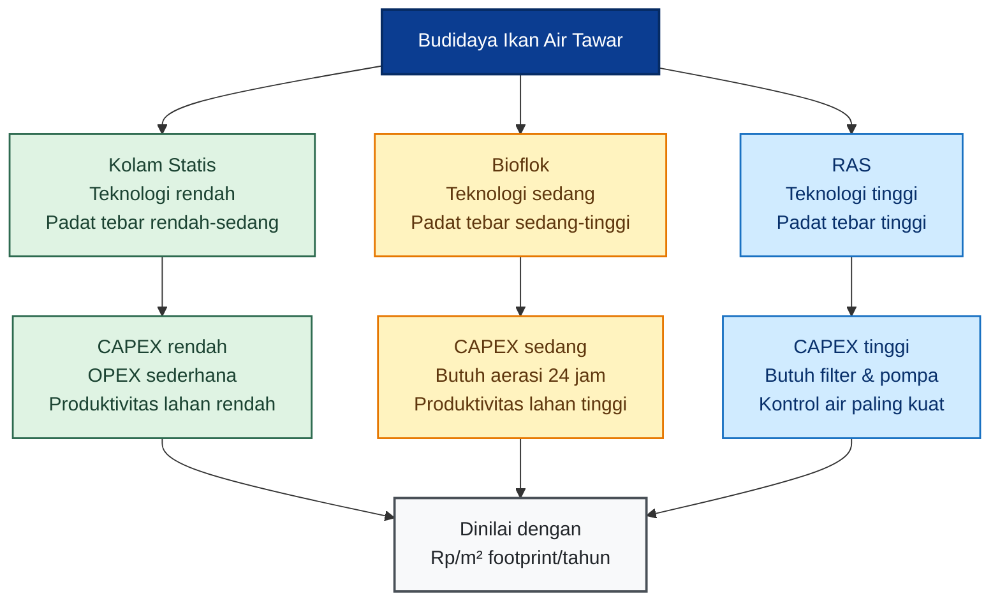
```mermaid
flowchart TD
    A["Budidaya Ikan Air Tawar"] --> B["Kolam Statis<br/>Teknologi rendah<br/>Padat tebar rendah-sedang"]
    A --> C["Bioflok<br/>Teknologi sedang<br/>Padat tebar sedang-tinggi"]
    A --> D["RAS<br/>Teknologi tinggi<br/>Padat tebar tinggi"]

    B --> E["CAPEX rendah<br/>OPEX sederhana<br/>Produktivitas lahan rendah"]
    C --> F["CAPEX sedang<br/>Butuh aerasi 24 jam<br/>Produktivitas lahan tinggi"]
    D --> G["CAPEX tinggi<br/>Butuh filter & pompa<br/>Kontrol air paling kuat"]

    E --> H["Dinilai dengan<br/>Rp/m² footprint/tahun"]
    F --> H
    G --> H

    classDef root fill:#0B3D91,color:#FFFFFF,stroke:#062B63,stroke-width:2px;
    classDef statis fill:#DFF3E3,color:#1B4332,stroke:#2D6A4F,stroke-width:1.5px;
    classDef bioflok fill:#FFF3BF,color:#5F370E,stroke:#E67700,stroke-width:1.5px;
    classDef ras fill:#D0EBFF,color:#08306B,stroke:#1971C2,stroke-width:1.5px;
    classDef metric fill:#F8F9FA,color:#212529,stroke:#495057,stroke-width:2px;

    class A root;
    class B,E statis;
    class C,F bioflok;
    class D,G ras;
    class H metric;
```

<ResourceBox
  title="Artikel Terkait:"
  items={[
    {
      name: 'Bioflok 651: Membedakan Persiapan Media dan Operasi Budidaya',
      href: '/blog/agri/perikanan/bioflok-651',
    },
    {
      name: 'Fermentasi Protein untuk Pakan Lele: Membuat Hidrolisat Asam Amino yang Aman, Rasional, dan Bernilai Guna',
      href: '/blog/agri/perikanan/fermentasi-protein-untuk-pakan-lele',
    },
    {
      name: 'Menurunkan FCR Lele: Dari Pakan Dimakan sampai Menjadi Daging',
      href: '/blog/agri/perikanan/menurunkan-fcr-lele',
    },
    {
      name: 'Kolam Lele sebagai Bioreaktor Penurun FCR Berbasis Bioflok',
      href: '/blog/agri/perikanan/menurunkan-fcr-lele-bioflok',
    },
    {
      name: 'Fermentasi, Pengomposan, dan Pembusukan: Meluruskan Istilah agar Praktisi Agri Tidak Salah Interpretasi',
      href: '/blog/agri/fermentasi-pengomposan-pembusukan',
    },
  ]}
/>

---

## 1.2 Masalah Utama

Artikel ini disusun untuk menjawab lima pertanyaan bisnis utama.

Pertama, **sistem mana yang paling efisien secara lahan?**
Pertanyaan ini tidak cukup dijawab dengan “berapa kilogram panen per kolam”, karena ukuran kolam, volume air, dan luas area teknis tiap sistem berbeda. Sistem yang lebih padat bisa menghasilkan lebih banyak ikan per m², tetapi risikonya juga bisa lebih tinggi.

Kedua, **sistem mana yang menghasilkan HPP terendah?**
HPP tidak hanya dipengaruhi oleh pakan. HPP juga dipengaruhi oleh survival rate, FCR, harga benih, listrik, input kualitas air, dan depresiasi alat. Sistem yang terlihat modern belum tentu menghasilkan HPP paling rendah.

Ketiga, **sistem mana yang memberi margin terbaik per m²?**
Margin per kilogram dan margin per m² tidak selalu sama arahnya. Bisa saja satu sistem memiliki margin per kg kecil, tetapi karena produktivitas lahannya tinggi, margin per m² menjadi besar. Sebaliknya, sistem yang sederhana bisa memiliki risiko rendah, tetapi margin per m² rendah karena produktivitas lahan terbatas.

Keempat, **apakah bioflok lele benar lebih unggul dari bioflok nila?**
Pertanyaan ini sering muncul karena lele dikenal tahan padat tebar dan siklusnya cepat. Namun dalam bioflok, karakter makan ikan sangat menentukan. Nila sebagai grazer memiliki peluang lebih besar memanfaatkan flok sebagai nutrisi tambahan, sedangkan lele lebih agresif, lebih membutuhkan protein pakan, dan berisiko mengalami variasi ukuran serta kanibalisme jika manajemen tidak disiplin.

Kelima, **pada kondisi apa RAS layak secara ekonomi?**
RAS sering dianggap paling canggih, tetapi canggih tidak otomatis paling menguntungkan. RAS baru rasional bila tambahan produktivitas, kontrol penyakit, stabilitas produksi, atau harga jual mampu menutup biaya listrik, filter, pompa, sensor, dan depresiasi alat.

---

## 1.3 Tujuan Artikel

Artikel ini bertujuan menyusun perbandingan ekonomi budidaya nila dan lele secara praktis, terukur, dan setara risiko.

Secara khusus, artikel ini memiliki lima tujuan:

1. menjelaskan metode budidaya **kolam statis, bioflok, dan RAS**;
2. membandingkan komponen **OPEX** dan **CAPEX non-kolam** untuk nila dan lele;
3. menghitung produktivitas, HPP, revenue, dan margin berdasarkan **m² footprint lahan**;
4. membandingkan secara khusus **bioflok lele vs bioflok nila**;
5. menyusun asumsi yang kredibel, transparan, dan dapat diuji dengan data lapangan.

Tujuan akhirnya bukan menentukan satu sistem yang “pasti terbaik” untuk semua lokasi. Tujuannya adalah membangun kerangka keputusan: **sistem mana yang paling cocok untuk kondisi modal, lahan, pasar, risiko, dan kemampuan operator tertentu.**

[**Kembali ke Atas**](#komparasi-ekonomi-budidaya-nila-dan-lele-pada-kolam-statis-bioflok-dan-ras-berbasis-m-footprint-lahan)

---

# 2. Metodologi Analisis

## 2.1 Satuan Analisis

Satuan utama yang digunakan dalam artikel ini adalah:

**Rp/m² footprint lahan/tahun**

Artinya, setiap sistem akan dikonversi ke ukuran yang sama: berapa output dan margin yang dihasilkan dari setiap 1 m² area usaha per tahun.

Pendekatan ini lebih tepat untuk keputusan bisnis dibanding hanya menggunakan:

| Satuan Umum     | Kelemahan                                     |
| --------------- | --------------------------------------------- |
| Rp/siklus       | Tidak memperhitungkan jumlah siklus per tahun |
| Rp/kolam        | Tidak adil jika ukuran kolam berbeda          |
| Rp/kg           | Tidak menunjukkan efisiensi lahan             |
| Ton/tahun total | Bisa bias jika skala lahan berbeda            |
| Revenue total   | Bisa menyesatkan jika OPEX dan CAPEX tinggi   |

Satuan **Rp/m² footprint/tahun** lebih kuat karena menggabungkan tiga variabel utama:

1. produktivitas lahan;
2. efisiensi biaya;
3. intensitas siklus produksi.

Dengan cara ini, kolam statis, bioflok, dan RAS bisa dibaca dalam satu kerangka yang sama.

---

## 2.2 Definisi Footprint

Dalam artikel ini, **footprint** berarti luas lahan yang dipakai oleh satu unit sistem budidaya.

Footprint tidak hanya berarti luas permukaan air. Dalam bisnis nyata, footprint juga mencakup area teknis minimum yang diperlukan agar sistem bisa berjalan.

Komponen footprint meliputi:

| Komponen Footprint    | Keterangan                                           |
| --------------------- | ---------------------------------------------------- |
| Luas kolam/bak/tangki | Area utama tempat ikan dipelihara                    |
| Area pipa dan valve   | Ruang teknis untuk instalasi air                     |
| Area blower/pompa     | Dibutuhkan pada bioflok dan RAS                      |
| Area filter           | Terutama pada RAS                                    |
| Ruang kerja minimum   | Area sampling, pemberian pakan, panen, dan perawatan |
| Area akses operator   | Jalur sempit untuk kontrol harian                    |

Namun, agar analisis awal tetap sederhana dan mudah dibandingkan, artikel ini menggunakan basis:

**1 m² area sistem budidaya efektif**

Dengan penyederhanaan ini, setiap sistem dihitung seolah-olah dikonversi ke unit standar 1 m². Pada tahap feasibility lanjutan, angka ini perlu dikoreksi dengan layout aktual, misalnya jarak antar bak, ruang filter, ruang pakan, dan akses panen.

### Diagram Konsep Footprint

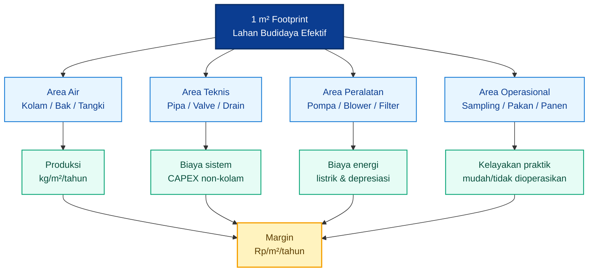
```mermaid
flowchart TD
    A["1 m² Footprint<br/>Lahan Budidaya Efektif"] --> B["Area Air<br/>Kolam / Bak / Tangki"]
    A --> C["Area Teknis<br/>Pipa / Valve / Drain"]
    A --> D["Area Peralatan<br/>Pompa / Blower / Filter"]
    A --> E["Area Operasional<br/>Sampling / Pakan / Panen"]

    B --> F["Produksi<br/>kg/m²/tahun"]
    C --> G["Biaya sistem<br/>CAPEX non-kolam"]
    D --> H["Biaya energi<br/>listrik & depresiasi"]
    E --> I["Kelayakan praktik<br/>mudah/tidak dioperasikan"]

    F --> J["Margin<br/>Rp/m²/tahun"]
    G --> J
    H --> J
    I --> J

    classDef main fill:#0B3D91,color:#FFFFFF,stroke:#062B63,stroke-width:2px;
    classDef area fill:#E7F5FF,color:#0B3D91,stroke:#1C7ED6,stroke-width:1.5px;
    classDef output fill:#E6FCF5,color:#064E3B,stroke:#0CA678,stroke-width:1.5px;
    classDef margin fill:#FFF3BF,color:#5C3D00,stroke:#F59F00,stroke-width:2px;

    class A main;
    class B,C,D,E area;
    class F,G,H,I output;
    class J margin;
```

---

## 2.3 Batasan Biaya

Agar perbandingan tidak bias, artikel ini memisahkan biaya menjadi dua kelompok utama:

1. **biaya yang masuk dalam analisis**;
2. **biaya yang tidak dimasukkan dalam analisis awal**.

Pemisahan ini penting karena fokus artikel adalah membandingkan efisiensi sistem budidaya, bukan menilai total investasi lahan dan konstruksi dari nol.

---

### 2.3.1 Termasuk dalam Analisis

Komponen berikut masuk dalam perhitungan ekonomi:

| Komponen                            | Status                | Penjelasan Praktis                                     |
| ----------------------------------- | --------------------- | ------------------------------------------------------ |
| Pakan                               | Masuk OPEX            | Komponen biaya terbesar dalam budidaya intensif        |
| Benih                               | Masuk OPEX            | Dihitung berdasarkan jumlah ekor tebar per siklus      |
| Listrik                             | Masuk OPEX            | Terutama penting pada bioflok dan RAS                  |
| Probiotik/molase/kapur/garam        | Masuk OPEX            | Input kualitas air dan stabilitas sistem               |
| Test kit dan treatment dasar        | Masuk OPEX            | Monitoring pH, DO, amonia, nitrit, dan perlakuan rutin |
| Blower/pompa/diffuser/filter/sensor | Masuk CAPEX non-kolam | Investasi alat pendukung sistem                        |
| Depresiasi alat                     | Masuk biaya tahunan   | Agar CAPEX alat tidak diabaikan                        |

---

### 2.3.2 Tidak Termasuk dalam Analisis

Komponen berikut dikecualikan dari analisis awal:

| Komponen                   | Status       | Alasan Dikecualikan                               |
| -------------------------- | ------------ | ------------------------------------------------- |
| Pembuatan kolam/bak/tangki | Dikecualikan | Biaya sangat tergantung material dan desain lokal |
| Sewa/beli lahan            | Dikecualikan | Sangat tergantung lokasi                          |
| Tenaga kerja               | Dikecualikan | Akan berbeda antara skala kecil dan komersial     |
| Pajak                      | Dikecualikan | Tergantung badan usaha dan daerah                 |
| Bunga pinjaman             | Dikecualikan | Tergantung struktur pendanaan                     |
| Transportasi panen         | Dikecualikan | Tergantung jarak pasar/offtaker                   |
| Kerugian ekstrem           | Dikecualikan | Harus dihitung sebagai skenario risiko terpisah   |

Pengecualian ini bukan berarti biaya tersebut tidak penting. Justru pada studi kelayakan final, semua komponen tersebut harus dimasukkan. Namun untuk tahap komparasi sistem, pemisahan ini membuat analisis lebih bersih dan mudah dibaca.

---

## 2.4 Formula Ekonomi

Bagian ini adalah inti metodologi. Semua sistem budidaya akan dihitung dengan formula yang sama agar hasilnya bisa dibandingkan secara adil.

### 2.4.1 Definisi Variabel

| Simbol  | Arti                               | Satuan           |
| ------- | ---------------------------------- | ---------------- |
| $N$     | Jumlah ekor tebar per m² footprint | ekor/m²          |
| $SR$    | Survival rate                      | % atau desimal   |
| $W_p$   | Bobot panen per ekor               | kg/ekor          |
| $C$     | Jumlah siklus per tahun            | siklus/tahun     |
| $FCR$   | Feed conversion ratio              | kg pakan/kg ikan |
| $P_f$   | Harga pakan                        | Rp/kg            |
| $P_s$   | Harga benih                        | Rp/ekor          |
| $P_j$   | Harga jual ikan                    | Rp/kg            |
| $E$     | Biaya listrik                      | Rp/m²/tahun      |
| $I$     | Input lain                         | Rp/m²/tahun      |
| $CAPEX$ | Investasi alat non-kolam           | Rp/m²            |
| $U$     | Umur ekonomis alat                 | tahun            |

---

### 2.4.2 Produksi per Siklus

$$
\text{Produksi per Siklus} = N \times SR \times W_p
$$

Keterangan:

- $N$ = ekor tebar per m² footprint;
- $SR$ = survival rate;
- $W_p$ = bobot panen per ekor dalam kg.

Formula ini menghitung biomassa panen dari satu siklus produksi.

Contoh logika:

- semakin tinggi padat tebar, produksi naik;
- semakin tinggi survival rate, produksi naik;
- semakin besar bobot panen, produksi naik.

Namun dalam praktik, padat tebar tidak bisa dinaikkan tanpa batas. Padat tebar yang terlalu tinggi dapat memperburuk kualitas air, menaikkan FCR, memperbesar variasi ukuran, dan meningkatkan risiko mortalitas.

---

### 2.4.3 Produksi Tahunan

$$
\text{Produksi Tahunan} = \text{Produksi per Siklus} \times C
$$

Keterangan:

- $C$ = jumlah siklus per tahun.

Formula ini penting karena lele dan nila memiliki kecepatan siklus berbeda. Lele biasanya lebih cepat mencapai ukuran konsumsi, sedangkan nila membutuhkan waktu lebih panjang untuk mencapai bobot pasar tertentu.

---

### 2.4.4 Kebutuhan Pakan

$$
\text{Kebutuhan Pakan} = \text{Produksi Tahunan} \times FCR
$$

FCR adalah salah satu variabel paling sensitif dalam bisnis budidaya ikan. Selisih FCR kecil dapat berdampak besar pada margin, karena pakan adalah komponen OPEX terbesar.

Contoh interpretasi:

| FCR | Makna                                         |
| --: | --------------------------------------------- |
| 1,0 | 1 kg pakan menghasilkan ±1 kg biomassa ikan   |
| 1,2 | 1,2 kg pakan menghasilkan ±1 kg biomassa ikan |
| 1,5 | 1,5 kg pakan menghasilkan ±1 kg biomassa ikan |

Semakin rendah FCR, semakin efisien pakan. Tetapi FCR rendah hanya valid jika didukung oleh data produksi nyata, bukan klaim promosi.

---

### 2.4.5 Biaya Pakan

$$
\text{Biaya Pakan} = \text{Kebutuhan Pakan} \times P_f
$$

Keterangan:

- $P_f$ = harga pakan per kg.

Dalam analisis praktisi, harga pakan harus memakai harga **delivered to farm**, bukan hanya harga katalog. Ongkos kirim, minimum order, diskon volume, dan jenis pakan bisa mengubah biaya riil.

---

### 2.4.6 Biaya Benih

$$
\text{Biaya Benih} = N \times C \times P_s
$$

Keterangan:

- $N$ = jumlah benih tebar per m²;
- $C$ = jumlah siklus per tahun;
- $P_s$ = harga benih per ekor.

Biaya benih perlu dihitung per ekor, bukan per kg, karena nila dan lele memiliki ukuran panen dan jumlah ekor per kg yang berbeda.

---

### 2.4.7 Revenue

$$
\text{Revenue} = \text{Produksi Tahunan} \times P_j
$$

Keterangan:

- $P_j$ = harga jual ikan per kg.

Untuk keputusan bisnis, harga jual yang dipakai sebaiknya harga **farmgate** atau harga beli offtaker, bukan harga pasar eceran. Harga eceran bisa terlalu tinggi dan menyebabkan proyeksi profit tampak lebih baik dari kenyataan.

---

### 2.4.8 Cash OPEX

$$
\text{Cash OPEX} = \text{Biaya Pakan} + \text{Biaya Benih} + E + I
$$

Keterangan:

- $E$ = biaya listrik per m² per tahun;
- $I$ = input lain seperti probiotik, molase, kapur, garam, test kit, dan treatment dasar.

Cash OPEX menunjukkan biaya tunai operasional yang keluar selama satu tahun produksi.

---

### 2.4.9 Depresiasi CAPEX Non-Kolam

$$
\text{Depresiasi Tahunan} = \frac{CAPEX}{U}
$$

Keterangan:

- $CAPEX$ = investasi alat non-kolam per m²;
- $U$ = umur ekonomis alat dalam tahun.

Depresiasi wajib dimasukkan karena sistem intensif seperti bioflok dan RAS memakai alat yang nilainya signifikan. Jika depresiasi diabaikan, sistem intensif akan terlihat lebih murah dari kenyataan.

---

### 2.4.10 HPP Cash

$$
\text{HPP Cash} = \frac{\text{Cash OPEX}}{\text{Produksi Tahunan}}
$$

HPP cash menunjukkan biaya produksi per kg tanpa memperhitungkan depresiasi alat. Angka ini berguna untuk membaca tekanan biaya tunai jangka pendek.

---

### 2.4.11 HPP All-In

$$
\text{HPP All-In} = \frac{\text{Cash OPEX} + \text{Depresiasi Tahunan}} {\text{Produksi Tahunan}}
$$

HPP all-in lebih relevan untuk keputusan investasi karena memasukkan beban alat.

Dalam artikel ini, HPP all-in akan dipakai sebagai indikator utama karena membandingkan sistem dengan tingkat teknologi berbeda: kolam statis, bioflok, dan RAS.

---

### 2.4.12 Margin per m² Footprint

$$
\text{Margin per m^2 per Tahun} = \text{Revenue} - \text{Cash OPEX} - \text{Depresiasi Tahunan}
$$

Margin ini adalah profit sebelum:

- tenaga kerja;
- sewa atau pembelian lahan;
- bunga pinjaman;
- pajak;
- transportasi panen;
- kerugian ekstrem.

Dengan kata lain, margin ini bukan laba bersih final perusahaan. Margin ini adalah **margin teknis-operasional** untuk membandingkan performa sistem budidaya.

---

### Diagram Alur Perhitungan Ekonomi

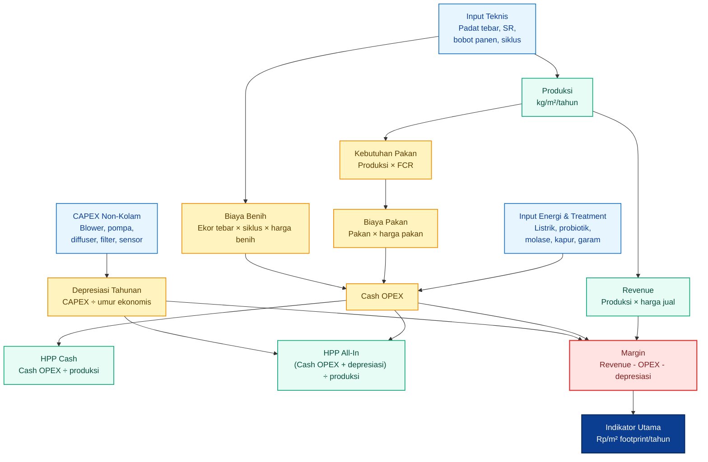
```mermaid
flowchart TD
    A["Input Teknis<br/>Padat tebar, SR,<br/>bobot panen, siklus"] --> B["Produksi<br/>kg/m²/tahun"]
    B --> C["Kebutuhan Pakan<br/>Produksi × FCR"]
    C --> D["Biaya Pakan<br/>Pakan × harga pakan"]

    A --> E["Biaya Benih<br/>Ekor tebar × siklus × harga benih"]
    F["Input Energi & Treatment<br/>Listrik, probiotik,<br/>molase, kapur, garam"] --> G["Cash OPEX"]

    D --> G
    E --> G

    H["CAPEX Non-Kolam<br/>Blower, pompa,<br/>diffuser, filter, sensor"] --> I["Depresiasi Tahunan<br/>CAPEX ÷ umur ekonomis"]

    B --> J["Revenue<br/>Produksi × harga jual"]
    G --> K["HPP Cash<br/>Cash OPEX ÷ produksi"]
    G --> L["HPP All-In<br/>(Cash OPEX + depresiasi) ÷ produksi"]
    I --> L

    J --> M["Margin<br/>Revenue - OPEX - depresiasi"]
    G --> M
    I --> M

    M --> N["Indikator Utama<br/>Rp/m² footprint/tahun"]

    classDef input fill:#E7F5FF,color:#0B3D91,stroke:#1971C2,stroke-width:1.5px;
    classDef cost fill:#FFF3BF,color:#5C3D00,stroke:#F08C00,stroke-width:1.5px;
    classDef output fill:#E6FCF5,color:#064E3B,stroke:#0CA678,stroke-width:1.5px;
    classDef result fill:#FFE3E3,color:#7F1D1D,stroke:#E03131,stroke-width:2px;
    classDef final fill:#0B3D91,color:#FFFFFF,stroke:#062B63,stroke-width:2px;

    class A,F,H input;
    class C,D,E,G,I cost;
    class B,J,K,L output;
    class M result;
    class N final;
```

---

## Ringkasan Bab 1–2

Bab 1 menetapkan alasan mengapa analisis harus menggunakan pendekatan **m² footprint lahan**, bukan hanya volume panen atau ukuran kolam. Bab 2 menetapkan metode perhitungan agar kolam statis, bioflok, dan RAS bisa dibandingkan dengan basis yang sama.

Kerangka ini penting karena keputusan bisnis budidaya ikan tidak boleh hanya ditentukan oleh klaim produktivitas. Keputusan harus ditentukan oleh kombinasi:

| Faktor                   | Peran dalam Analisis                      |
| ------------------------ | ----------------------------------------- |
| Produksi kg/m²/tahun     | Mengukur efisiensi lahan                  |
| HPP cash                 | Mengukur tekanan biaya tunai              |
| HPP all-in               | Mengukur biaya produksi dengan depresiasi |
| Margin/m²/tahun          | Mengukur daya tarik ekonomi               |
| Risiko teknis            | Mengukur peluang gagal                    |
| Kebutuhan skill operator | Mengukur kelayakan implementasi           |
| Kebutuhan CAPEX          | Mengukur beban investasi                  |

Dengan metodologi ini, bab berikutnya dapat masuk ke pembahasan teknis tiga sistem utama: **kolam statis, bioflok, dan RAS**.

[1]: https://www.agmrc.org/commodities-products/aquaculture/recirculating-aquaculture-systems?utm_source=chatgpt.com 'Recirculating Aquaculture Systems'
[2]: https://www.fao.org/fishery/culturedspecies/oreochromis_niloticus?utm_source=chatgpt.com 'Nile tilapia - Cultured Aquatic Species'

[**Kembali ke Atas**](#komparasi-ekonomi-budidaya-nila-dan-lele-pada-kolam-statis-bioflok-dan-ras-berbasis-m-footprint-lahan)

---

# 3. Uraian Sistem Budidaya

Bab ini menjelaskan tiga sistem budidaya yang akan dibandingkan dalam analisis ekonomi: **kolam statis, bioflok, dan RAS**. Fokusnya bukan hanya cara kerja teknis, tetapi juga implikasinya terhadap **biaya, risiko, produktivitas, dan kebutuhan skill operator**.

Secara sederhana, ketiga sistem dapat dibaca sebagai spektrum intensifikasi:

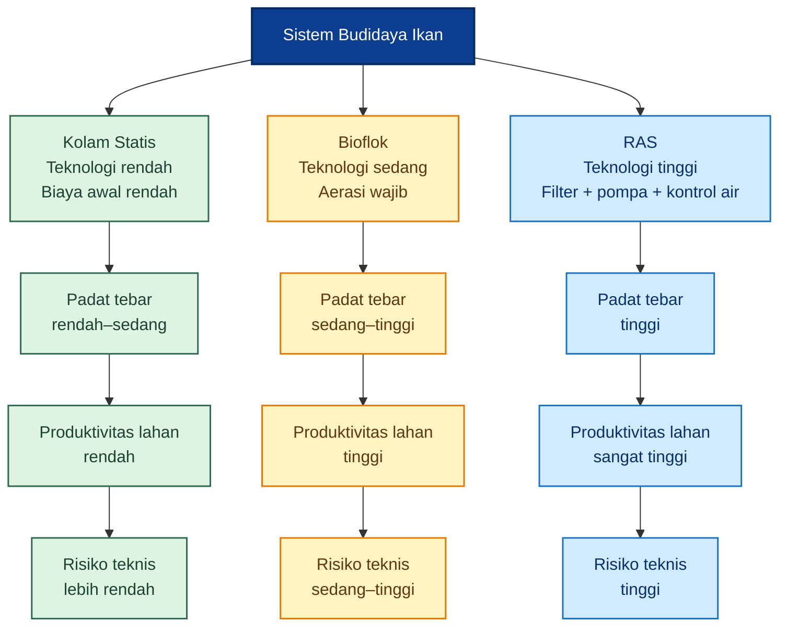
```mermaid
flowchart TD
    A["Sistem Budidaya Ikan"] --> B["Kolam Statis<br/>Teknologi rendah<br/>Biaya awal rendah"]
    A --> C["Bioflok<br/>Teknologi sedang<br/>Aerasi wajib"]
    A --> D["RAS<br/>Teknologi tinggi<br/>Filter + pompa + kontrol air"]

    B --> E["Padat tebar<br/>rendah–sedang"]
    C --> F["Padat tebar<br/>sedang–tinggi"]
    D --> G["Padat tebar<br/>tinggi"]

    E --> H["Produktivitas lahan<br/>rendah"]
    F --> I["Produktivitas lahan<br/>tinggi"]
    G --> J["Produktivitas lahan<br/>sangat tinggi"]

    H --> K["Risiko teknis<br/>lebih rendah"]
    I --> L["Risiko teknis<br/>sedang–tinggi"]
    J --> M["Risiko teknis<br/>tinggi"]

    classDef root fill:#0B3D91,color:#FFFFFF,stroke:#062B63,stroke-width:2px;
    classDef statis fill:#DFF3E3,color:#1B4332,stroke:#2D6A4F,stroke-width:1.5px;
    classDef bioflok fill:#FFF3BF,color:#5F370E,stroke:#E67700,stroke-width:1.5px;
    classDef ras fill:#D0EBFF,color:#08306B,stroke:#1971C2,stroke-width:1.5px;
    classDef risk fill:#FFE3E3,color:#7F1D1D,stroke:#E03131,stroke-width:1.5px;

    class A root;
    class B,E,H,K statis;
    class C,F,I,L bioflok;
    class D,G,J,M ras;
```

Intensifikasi tidak otomatis berarti lebih menguntungkan. Semakin intensif sistemnya, semakin tinggi pula kebutuhan kontrol kualitas air, listrik, alat pendukung, dan disiplin operator. Karena itu, pada bab berikutnya, setiap sistem akan dinilai bukan hanya dari produksi, tetapi dari **HPP, margin per m², CAPEX non-kolam, dan risiko bisnis**.

---

## 3.1 Kolam Statis

Kolam statis adalah sistem budidaya paling sederhana dalam artikel ini. Air di dalam kolam relatif tenang, sirkulasi rendah, dan pergantian air dilakukan secara berkala sesuai kebutuhan. Sistem ini dapat berupa kolam tanah, kolam terpal, kolam beton, atau kolam liner sederhana.

<figure>
  
  <figcaption>
    Kolam statis sebagai sistem budidaya sederhana tanpa sirkulasi aktif.
  </figcaption>
</figure>

Pada kolam statis, kualitas air lebih banyak dikendalikan melalui manajemen dasar: pengaturan padat tebar, pemberian pakan yang tidak berlebihan, pengapuran, penggantian air, dan pemantauan visual terhadap perilaku ikan. Aerasi dapat digunakan, tetapi biasanya tidak seintensif bioflok atau RAS.

### Karakter Utama Kolam Statis

| Aspek                  | Kolam Statis      |
| ---------------------- | ----------------- |
| Kompleksitas teknologi | Rendah            |
| Kebutuhan listrik      | Rendah            |
| Kepadatan              | Rendah–sedang     |
| Produktivitas lahan    | Rendah            |
| Risiko teknis          | Rendah–sedang     |
| Cocok untuk            | Pemula/lahan luas |

### Cara Kerja Kolam Statis

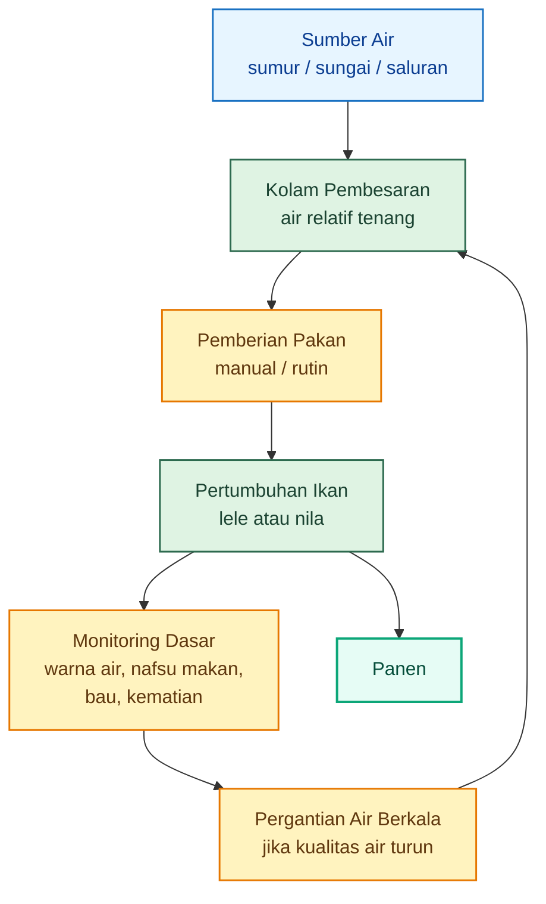
```mermaid
flowchart TD
    A["Sumber Air<br/>sumur / sungai / saluran"] --> B["Kolam Pembesaran<br/>air relatif tenang"]
    B --> C["Pemberian Pakan<br/>manual / rutin"]
    C --> D["Pertumbuhan Ikan<br/>lele atau nila"]
    D --> E["Monitoring Dasar<br/>warna air, nafsu makan,<br/>bau, kematian"]
    E --> F["Pergantian Air Berkala<br/>jika kualitas air turun"]
    F --> B
    D --> G["Panen"]

    classDef input fill:#E7F5FF,color:#0B3D91,stroke:#1971C2,stroke-width:1.5px;
    classDef pond fill:#DFF3E3,color:#1B4332,stroke:#2D6A4F,stroke-width:1.5px;
    classDef manage fill:#FFF3BF,color:#5F370E,stroke:#E67700,stroke-width:1.5px;
    classDef harvest fill:#E6FCF5,color:#064E3B,stroke:#0CA678,stroke-width:2px;

    class A input;
    class B,D pond;
    class C,E,F manage;
    class G harvest;
```

### Kelebihan Kolam Statis

Kelebihan utama kolam statis adalah **sederhana dan murah secara teknologi**. Sistem ini cocok untuk pembudidaya pemula, lokasi dengan lahan luas, dan usaha yang ingin memulai produksi tanpa terlalu banyak alat pendukung.

Kolam statis juga lebih mudah dipahami oleh operator lapangan. Kesalahan teknis seperti pompa mati atau filter gagal tidak sekrusial pada RAS. Risiko sistemik akibat kegagalan alat lebih rendah karena ketergantungan terhadap listrik dan mekanisasi lebih kecil.

Kelebihan praktisnya:

| Kelebihan              | Dampak Bisnis                              |
| ---------------------- | ------------------------------------------ |
| Teknologi sederhana    | Mudah dijalankan operator pemula           |
| CAPEX non-kolam rendah | Modal awal lebih ringan                    |
| Listrik rendah         | OPEX energi kecil                          |
| Perawatan mudah        | Tidak butuh teknisi khusus                 |
| Risiko alat rendah     | Tidak terlalu bergantung pada pompa/filter |

### Kelemahan Kolam Statis

Kelemahan utama kolam statis adalah **produktivitas lahan rendah**. Karena kepadatan tidak bisa dinaikkan terlalu tinggi tanpa menurunkan kualitas air, output per m² biasanya lebih kecil dibanding bioflok dan RAS.

Risiko terbesar kolam statis bukan pada kompleksitas alat, melainkan pada **kualitas air dan FCR**. Jika pemberian pakan berlebihan, sisa pakan dan feses akan menumpuk, oksigen menurun, amonia meningkat, dan ikan menjadi stres. Dampaknya langsung terlihat pada pertumbuhan yang lambat, FCR memburuk, dan mortalitas meningkat.

Kelemahan praktisnya:

| Kelemahan                      | Dampak Bisnis                     |
| ------------------------------ | --------------------------------- |
| Padat tebar terbatas           | Produksi per m² rendah            |
| Kontrol kualitas air terbatas  | Risiko FCR memburuk               |
| Bergantung pada pergantian air | Butuh sumber air stabil           |
| Produktivitas lahan rendah     | Kurang cocok untuk lahan mahal    |
| Sulit mengejar volume tinggi   | Skala usaha butuh area lebih luas |

### Risiko Utama Kolam Statis

| Risiko               | Penjelasan                             | Dampak Ekonomi                 |
| -------------------- | -------------------------------------- | ------------------------------ |
| Kualitas air turun   | Sisa pakan dan feses menumpuk          | Pertumbuhan lambat, SR turun   |
| FCR tinggi           | Pakan tidak efisien menjadi biomassa   | HPP naik                       |
| Oksigen rendah       | Terutama malam/pagi hari               | Nafsu makan turun, kematian    |
| Produktivitas rendah | Padat tebar terbatas                   | Margin/m² rendah               |
| Penyakit             | Air buruk memperbesar tekanan penyakit | Biaya treatment dan mortalitas |

### Posisi Bisnis Kolam Statis

Kolam statis cocok jika tujuan usaha adalah **memulai dengan modal rendah dan risiko teknis yang tidak terlalu kompleks**. Sistem ini masuk akal untuk lokasi dengan lahan relatif murah, sumber air cukup, dan target produksi tidak terlalu padat.

Namun untuk bisnis berbasis lahan terbatas, kolam statis sering kalah menarik karena menghasilkan biomassa lebih rendah per m². Dalam analisis ekonomi berbasis footprint, kelemahan ini akan terlihat jelas ketika dibandingkan dengan bioflok dan RAS.

---

## 3.2 Bioflok

Bioflok adalah sistem budidaya intensif yang memanfaatkan komunitas mikroba untuk mengolah limbah organik dan nitrogen di air. Prinsip dasarnya adalah mengubah sisa pakan, feses, dan senyawa nitrogen menjadi agregat mikroba atau **flok** yang tetap tersuspensi di air melalui aerasi kuat.

<figure>
  
  <figcaption>
    Kolam bioflok sebagai sistem budidaya dengan bantuan mikroorganisme, aerasi,
    dan pengelolaan kualitas air.
  </figcaption>
</figure>

Teknologi bioflok bekerja dengan menjaga keseimbangan mikroba, oksigen, dan rasio karbon-nitrogen. Literatur review bioflok menjelaskan bahwa teknologi ini berbasis pada daur ulang nutrien melalui peningkatan rasio karbon terhadap nitrogen atau **C/N ratio**, sehingga nitrogen anorganik dapat dimanfaatkan oleh mikroba heterotrof dan membentuk biomassa mikroba. ([pmc.ncbi.nlm.nih.gov](https://pmc.ncbi.nlm.nih.gov/articles/PMC11117240/))

KKP menggambarkan bioflok sebagai metode budidaya yang cocok untuk skala kecil hingga menengah, memaksimalkan hasil pada lahan terbatas, lebih hemat air, dan berpotensi lebih hemat pakan. ([kkp.go.id](https://kkp.go.id/unit-kerja/djpb/publikasi/materi/panduan-budi-daya-ikan-nilalele-di-bak-bulat-bioflok6982e9ada5a67.html))

### Karakter Utama Bioflok

| Aspek                  | Bioflok                          |
| ---------------------- | -------------------------------- |
| Kompleksitas teknologi | Sedang                           |
| Kebutuhan listrik      | Sedang–tinggi                    |
| Kepadatan              | Sedang–tinggi                    |
| Produktivitas lahan    | Tinggi                           |
| Risiko teknis          | Sedang–tinggi                    |
| Cocok untuk            | Operator disiplin/lahan terbatas |

### Cara Kerja Bioflok

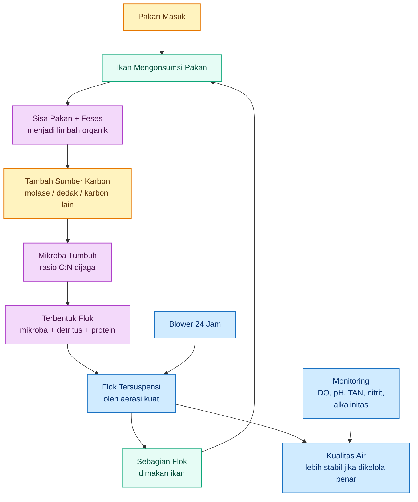
```mermaid
flowchart TD
    A["Pakan Masuk"] --> B["Ikan Mengonsumsi Pakan"]
    B --> C["Sisa Pakan + Feses<br/>menjadi limbah organik"]
    C --> D["Tambah Sumber Karbon<br/>molase / dedak / karbon lain"]
    D --> E["Mikroba Tumbuh<br/>rasio C:N dijaga"]
    E --> F["Terbentuk Flok<br/>mikroba + detritus + protein"]
    F --> G["Flok Tersuspensi<br/>oleh aerasi kuat"]
    G --> H["Sebagian Flok<br/>dimakan ikan"]
    H --> B
    G --> I["Kualitas Air<br/>lebih stabil jika dikelola benar"]

    J["Blower 24 Jam"] --> G
    K["Monitoring<br/>DO, pH, TAN, nitrit,<br/>alkalinitas"] --> I

    classDef feed fill:#FFF3BF,color:#5F370E,stroke:#E67700,stroke-width:1.5px;
    classDef fish fill:#E6FCF5,color:#064E3B,stroke:#0CA678,stroke-width:1.5px;
    classDef microbe fill:#F3D9FA,color:#4A154B,stroke:#AE3EC9,stroke-width:1.5px;
    classDef air fill:#D0EBFF,color:#08306B,stroke:#1971C2,stroke-width:1.5px;
    classDef risk fill:#FFE3E3,color:#7F1D1D,stroke:#E03131,stroke-width:1.5px;

    class A,D feed;
    class B,H fish;
    class C,E,F microbe;
    class G,I,J,K air;
```

### Komponen Teknis Bioflok

Bioflok tidak cukup hanya dengan kolam bulat dan probiotik. Komponen paling kritis justru adalah **aerasi**. Aerasi menjaga dua hal sekaligus: oksigen terlarut untuk ikan dan mikroba, serta suspensi flok agar tidak mengendap di dasar.

Komponen teknis utama bioflok:

| Komponen                  | Fungsi                                             |
| ------------------------- | -------------------------------------------------- |
| Bak/kolam bulat           | Membantu sirkulasi air dan mengurangi zona mati    |
| Blower                    | Menyuplai udara secara kontinu                     |
| Diffuser/airstone         | Menyebarkan gelembung udara                        |
| Pipa manifold             | Membagi aliran udara ke beberapa titik             |
| Sumber karbon             | Menjaga rasio C:N                                  |
| Probiotik/starter mikroba | Membantu pembentukan komunitas mikroba             |
| Kapur/dolomit             | Menjaga pH dan alkalinitas                         |
| Test kit                  | Memantau DO, pH, amonia, nitrit, alkalinitas       |
| Backup listrik            | Mengurangi risiko mati massal saat aerasi berhenti |

### Kelebihan Bioflok

Kelebihan utama bioflok adalah **produktivitas lahan tinggi**. Dengan aerasi kuat dan manajemen mikroba, sistem ini memungkinkan padat tebar lebih tinggi dibanding kolam statis.

Bioflok juga lebih hemat air karena tidak bergantung pada pergantian air besar setiap saat. Namun “minim ganti air” tidak boleh dibaca sebagai “tidak perlu kontrol air”. Justru karena air dipertahankan dalam sistem, parameter seperti DO, pH, TAN, nitrit, alkalinitas, dan kepadatan flok harus dipantau lebih disiplin.

Kelebihan praktisnya:

| Kelebihan                            | Dampak Bisnis                   |
| ------------------------------------ | ------------------------------- |
| Produktivitas/m² tinggi              | Cocok untuk lahan terbatas      |
| Potensi efisiensi pakan              | HPP bisa turun jika flok stabil |
| Hemat air                            | Cocok di lokasi air terbatas    |
| Padat tebar lebih tinggi             | Revenue/m² meningkat            |
| Bisa diterapkan skala kecil-menengah | Tidak serumit RAS penuh         |

### Kelemahan Bioflok

Kelemahan bioflok adalah **sistem sangat bergantung pada aerasi dan keseimbangan mikroba**. Jika blower mati, oksigen turun cepat dan flok dapat mengendap. Jika rasio C:N tidak terkendali, amonia dan nitrit bisa naik. Jika flok terlalu pekat, insang ikan dapat terganggu dan kualitas air memburuk.

Bioflok bukan sistem “alami tanpa risiko”. Ia adalah sistem biologis intensif. Kegagalannya sering terjadi bukan karena konsep bioflok salah, tetapi karena operator tidak disiplin mengukur kualitas air, tidak menghitung pakan secara akurat, atau menaikkan padat tebar terlalu cepat.

Kelemahan praktisnya:

| Kelemahan                 | Dampak Bisnis                               |
| ------------------------- | ------------------------------------------- |
| Blower wajib stabil       | Listrik mati bisa fatal                     |
| Butuh skill operator      | Tidak cocok dijalankan asal-asalan          |
| Flok bisa crash           | Kualitas air turun cepat                    |
| Input karbon harus tepat  | Salah C:N mengganggu sistem                 |
| Risiko padat tebar tinggi | Mortalitas bisa massal jika manajemen buruk |

### Risiko Utama Bioflok

| Risiko                  | Penyebab                   | Dampak Ekonomi                              |
| ----------------------- | -------------------------- | ------------------------------------------- |
| Aerasi mati             | Listrik padam/blower rusak | Kematian cepat, terutama padat tebar tinggi |
| Flok crash              | Ketidakseimbangan mikroba  | Amonia/nitrit naik                          |
| Flok terlalu pekat      | Input organik berlebih     | Ikan stres, insang terganggu                |
| C:N tidak stabil        | Karbon kurang/berlebih     | Efisiensi bioflok turun                     |
| FCR tidak sesuai klaim  | Manajemen pakan buruk      | HPP naik                                    |
| Operator tidak disiplin | Tidak ukur kualitas air    | Risiko gagal siklus                         |

### Posisi Bisnis Bioflok

Bioflok cocok untuk usaha yang ingin mengejar **produksi tinggi per m²** dengan modal yang masih lebih ringan dibanding RAS. Sistem ini paling menarik jika lahan terbatas, pasar dekat, operator disiplin, dan listrik stabil.

Namun bioflok sebaiknya tidak diperlakukan sebagai sistem pemula tanpa SOP. Untuk bisnis, bioflok harus memiliki minimal:

| Kebutuhan Minimum     | Alasan                                     |
| --------------------- | ------------------------------------------ |
| Blower memadai        | Menjaga DO dan suspensi flok               |
| Backup listrik/aerasi | Mencegah kematian saat listrik padam       |
| Test kit rutin        | Menghindari keputusan berbasis visual saja |
| SOP pakan             | Mencegah overfeeding                       |
| SOP karbon            | Menjaga rasio C:N                          |
| Catatan produksi      | Menghitung FCR, SR, dan HPP aktual         |

Dalam konteks nila vs lele, bioflok menjadi bab penting karena respons biologis kedua ikan terhadap flok berbeda. Nila sebagai omnivorous grazer memiliki peluang lebih kuat memanfaatkan flok sebagai pakan tambahan; FAO menyebut nila memakan fitoplankton, perifiton, detritus, dan bacterial films. ([fao.org](https://www.fao.org/fishery/culturedspecies/oreochromis_niloticus))

---

## 3.3 RAS

RAS atau **Recirculating Aquaculture System** adalah sistem budidaya yang menggunakan kembali air setelah melalui proses pengolahan. Air dari tangki ikan dialirkan ke sistem filtrasi, diproses, lalu dikembalikan ke tangki.

<figure>
  
  <figcaption>
    Kolam RAS sebagai sistem budidaya resirkulasi yang mengandalkan filtrasi,
    sirkulasi air, dan pengelolaan kualitas air secara intensif.
  </figcaption>
</figure>

Pada RAS, air tidak hanya “diputar”. Air harus dikondisikan ulang melalui beberapa tahap: penghilangan padatan, pengolahan senyawa nitrogen, aerasi/oksigenasi, dan kadang sterilisasi. Panduan FAO menjelaskan bahwa sistem resirkulasi mengurangi kebutuhan suplai air melalui aerasi dan/atau treatment air. FAO juga mencatat proses reconditioning dapat mencakup sedimentasi, filtrasi mekanis, filtrasi biologis, aerasi, sterilisasi, degassing, kontrol pH, serta pengaturan suhu bila diperlukan. ([fao.org](https://www.fao.org/4/x5744e/x5744e0g.htm))

Literatur teknis RAS dari Eurofish menjelaskan alur dasar RAS: air keluar dari tangki ikan, masuk ke filter mekanis, lanjut ke biofilter, kemudian dilakukan degassing atau pengurangan CO₂, lalu air dikembalikan ke tangki ikan. ([eurofish.dk](https://eurofish.dk/PDF/A-guide-to-recirculation-aquaculture-3rd-edition-EN.pdf))

### Karakter Utama RAS

| Aspek                  | RAS                                  |
| ---------------------- | ------------------------------------ |
| Kompleksitas teknologi | Tinggi                               |
| Kebutuhan listrik      | Tinggi                               |
| Kepadatan              | Tinggi                               |
| Produktivitas lahan    | Sangat tinggi                        |
| Risiko teknis          | Tinggi                               |
| Cocok untuk            | Operator berpengalaman/pasar premium |

### Cara Kerja RAS

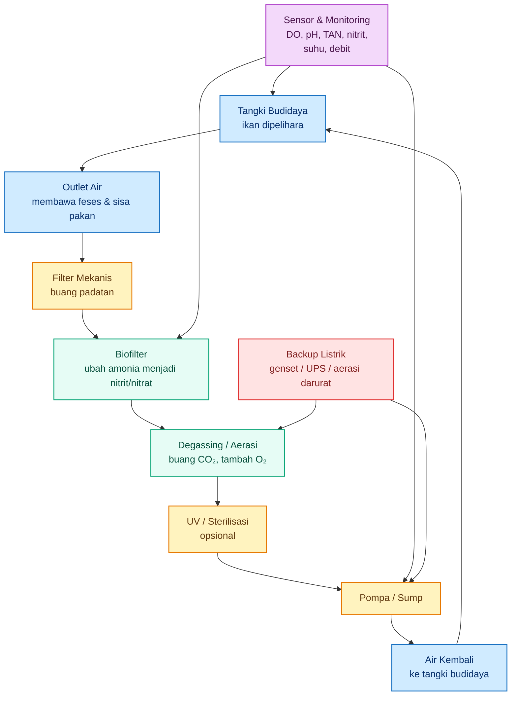
```mermaid
flowchart TD
    A["Tangki Budidaya<br/>ikan dipelihara"] --> B["Outlet Air<br/>membawa feses & sisa pakan"]
    B --> C["Filter Mekanis<br/>buang padatan"]
    C --> D["Biofilter<br/>ubah amonia menjadi nitrit/nitrat"]
    D --> E["Degassing / Aerasi<br/>buang CO₂, tambah O₂"]
    E --> F["UV / Sterilisasi<br/>opsional"]
    F --> G["Pompa / Sump"]
    G --> H["Air Kembali<br/>ke tangki budidaya"]
    H --> A

    I["Sensor & Monitoring<br/>DO, pH, TAN, nitrit,<br/>suhu, debit"] --> A
    I --> D
    I --> G

    J["Backup Listrik<br/>genset / UPS / aerasi darurat"] --> G
    J --> E

    classDef tank fill:#D0EBFF,color:#08306B,stroke:#1971C2,stroke-width:1.5px;
    classDef filter fill:#FFF3BF,color:#5F370E,stroke:#E67700,stroke-width:1.5px;
    classDef bio fill:#E6FCF5,color:#064E3B,stroke:#0CA678,stroke-width:1.5px;
    classDef control fill:#F3D9FA,color:#4A154B,stroke:#AE3EC9,stroke-width:1.5px;
    classDef risk fill:#FFE3E3,color:#7F1D1D,stroke:#E03131,stroke-width:1.5px;

    class A,B,H tank;
    class C,F,G filter;
    class D,E bio;
    class I control;
    class J risk;
```

### Komponen Teknis RAS

RAS membutuhkan kombinasi alat yang lebih kompleks dibanding kolam statis dan bioflok.

| Komponen          | Fungsi                                            |
| ----------------- | ------------------------------------------------- |
| Tangki budidaya   | Tempat ikan dipelihara                            |
| Pipa outlet/inlet | Mengalirkan air keluar dan masuk sistem           |
| Filter mekanis    | Menghilangkan padatan tersuspensi                 |
| Biofilter         | Tempat bakteri nitrifikasi mengolah amonia        |
| Media biofilter   | Permukaan tumbuh bakteri nitrifikasi              |
| Sump tank         | Titik kumpul air sebelum dipompa                  |
| Pompa sirkulasi   | Menggerakkan air dalam sistem                     |
| Aerasi/oksigenasi | Menjaga oksigen terlarut                          |
| Degassing         | Mengurangi CO₂ terlarut                           |
| UV/sterilisasi    | Mengurangi beban mikroorganisme patogen, opsional |
| Sensor/test kit   | Memantau parameter air                            |
| Backup listrik    | Menjaga sistem tetap hidup saat listrik padam     |

### Kelebihan RAS

Kelebihan utama RAS adalah **kontrol kualitas air**. Sistem ini memungkinkan budidaya dengan kepadatan tinggi karena air terus diproses melalui filter mekanis dan biologis. Bila dirancang dan dioperasikan dengan benar, RAS dapat mengurangi kebutuhan air baru dan memungkinkan produksi lebih stabil sepanjang tahun.

RAS juga menarik untuk lokasi dengan keterbatasan lahan dan air, atau untuk segmen bisnis yang membutuhkan kontrol tinggi, misalnya nursery, hatchery, pembesaran premium, atau produksi dekat pasar.

Kelebihan praktisnya:

| Kelebihan                         | Dampak Bisnis                                   |
| --------------------------------- | ----------------------------------------------- |
| Kontrol air lebih presisi         | Risiko fluktuasi kualitas air lebih terukur     |
| Produktivitas lahan sangat tinggi | Cocok untuk lahan mahal/terbatas                |
| Hemat air                         | Air diproses dan digunakan kembali              |
| Biosecurity lebih kuat            | Bisa dikombinasikan dengan UV dan kontrol akses |
| Produksi lebih stabil             | Cocok untuk suplai rutin ke pasar premium       |

### Kelemahan RAS

Kelemahan utama RAS adalah **biaya dan kompleksitas**. Sistem ini membutuhkan pompa, filter, biofilter, media filter, aerasi/oksigenasi, pipa, sensor, dan backup listrik. Semua komponen tersebut memiliki biaya pembelian, biaya listrik, biaya perawatan, dan risiko kegagalan.

RAS juga tidak otomatis menghasilkan HPP paling rendah. Untuk komoditas dengan harga jual rendah, seperti lele konsumsi massal, RAS bisa terlalu mahal jika tidak ada alasan strategis seperti pasar premium, efisiensi air ekstrem, biosecurity, atau keterbatasan lahan yang sangat ketat.

Kelemahan praktisnya:

| Kelemahan                     | Dampak Bisnis                                    |
| ----------------------------- | ------------------------------------------------ |
| CAPEX tinggi                  | Payback lebih panjang                            |
| Listrik tinggi                | OPEX energi besar                                |
| Pompa wajib aktif             | Kegagalan pompa bisa fatal                       |
| Biofilter sensitif            | Amonia/nitrit bisa melonjak jika biofilter gagal |
| Butuh operator teknis         | Tidak cocok tanpa SOP kuat                       |
| Desain salah sulit diperbaiki | Kesalahan awal bisa mahal                        |

### Risiko Utama RAS

| Risiko                   | Penyebab                      | Dampak Ekonomi                         |
| ------------------------ | ----------------------------- | -------------------------------------- |
| Pompa mati               | Listrik padam/kerusakan pompa | Sirkulasi berhenti, kualitas air turun |
| Biofilter crash          | Bakteri nitrifikasi terganggu | Amonia/nitrit naik                     |
| Filter mekanis tersumbat | Padatan menumpuk              | Debit turun, air memburuk              |
| Oksigen rendah           | Aerasi/oksigenasi gagal       | Kematian cepat                         |
| CAPEX membengkak         | Desain terlalu kompleks       | Payback lama                           |
| Operator kurang skill    | Salah baca parameter air      | Gagal produksi                         |
| HPP tinggi               | Listrik dan depresiasi besar  | Tidak kompetitif di pasar murah        |

### Posisi Bisnis RAS

RAS layak dipertimbangkan jika usaha memiliki salah satu kondisi berikut:

| Kondisi                 | RAS Menjadi Lebih Rasional            |
| ----------------------- | ------------------------------------- |
| Lahan sangat terbatas   | Produktivitas/m² menjadi prioritas    |
| Air terbatas atau mahal | Resirkulasi memberi nilai ekonomi     |
| Pasar premium           | Harga jual mampu menutup biaya sistem |
| Butuh produksi stabil   | Cocok untuk kontrak suplai            |
| Butuh kontrol penyakit  | Biosecurity lebih mudah dikembangkan  |
| Operator berpengalaman  | Sistem kompleks bisa dikelola         |

Sebaliknya, RAS kurang ideal jika targetnya hanya memproduksi ikan konsumsi murah tanpa harga premium, tanpa operator teknis, dan tanpa backup listrik. Dalam kondisi tersebut, listrik dan depresiasi alat dapat membuat HPP terlalu tinggi.

---

## Perbandingan Ringkas Tiga Sistem

| Parameter                |      Kolam Statis |                          Bioflok |                                  RAS |
| ------------------------ | ----------------: | -------------------------------: | -----------------------------------: |
| Kompleksitas teknologi   |            Rendah |                           Sedang |                               Tinggi |
| Kebutuhan listrik        |            Rendah |                    Sedang–tinggi |                               Tinggi |
| Kebutuhan aerasi         |   Rendah/opsional |                            Wajib |                                Wajib |
| Kebutuhan filter         |       Tidak wajib |            Tidak wajib/sederhana |                                Wajib |
| Kontrol kualitas air     |            Rendah |                           Sedang |                               Tinggi |
| Padat tebar              |     Rendah–sedang |                    Sedang–tinggi |                               Tinggi |
| Produktivitas lahan      |            Rendah |                           Tinggi |                        Sangat tinggi |
| CAPEX non-kolam          |            Rendah |                           Sedang |                               Tinggi |
| Risiko teknis            |     Rendah–sedang |                    Sedang–tinggi |                               Tinggi |
| Kebutuhan skill operator |            Rendah |                           Sedang |                               Tinggi |
| Cocok untuk              | Pemula/lahan luas | Lahan terbatas/operator disiplin | Operator berpengalaman/pasar premium |

---

## Kesimpulan Bab 3

Kolam statis, bioflok, dan RAS bukan sekadar tiga bentuk kolam yang berbeda. Ketiganya mewakili tiga model bisnis yang berbeda.

| Sistem       | Inti Strategi                                 | Risiko Utama                                        |
| ------------ | --------------------------------------------- | --------------------------------------------------- |
| Kolam statis | Biaya rendah dan mudah dijalankan             | Produktivitas lahan rendah, FCR mudah memburuk      |
| Bioflok      | Intensifikasi lahan dengan mikroba dan aerasi | Aerasi mati, flok crash, C:N tidak stabil           |
| RAS          | Kontrol air tinggi dan produksi padat         | CAPEX tinggi, listrik tinggi, biofilter/pompa gagal |

Untuk pembudidaya pemula dengan lahan luas, kolam statis masih masuk akal. Untuk lahan terbatas dan target produktivitas tinggi, bioflok menjadi pilihan menarik. Untuk lahan sangat terbatas, kebutuhan kontrol tinggi, atau pasar premium, RAS dapat dipertimbangkan, tetapi hanya jika kemampuan teknis dan struktur biaya mendukung.

Bab berikutnya akan masuk ke bagian yang lebih konkret: **komponen OPEX dan CAPEX non-kolam** untuk nila dan lele pada masing-masing sistem.

[**Kembali ke Atas**](#komparasi-ekonomi-budidaya-nila-dan-lele-pada-kolam-statis-bioflok-dan-ras-berbasis-m-footprint-lahan)

---

# 4. Komponen Biaya OPEX dan CAPEX Non-Kolam

Bab ini memetakan struktur biaya budidaya nila dan lele pada tiga sistem: **kolam statis, bioflok, dan RAS**. Pemisahan biaya dibuat tegas karena keputusan bisnis sering bias ketika biaya alat, listrik, depresiasi, atau input kualitas air tidak dihitung secara eksplisit.

Dalam analisis ini, biaya dibagi menjadi dua kelompok besar:

1. **OPEX**, yaitu biaya operasional tunai yang keluar selama siklus produksi.
2. **CAPEX non-kolam**, yaitu investasi alat pendukung di luar biaya pembuatan kolam, bak, atau tangki.

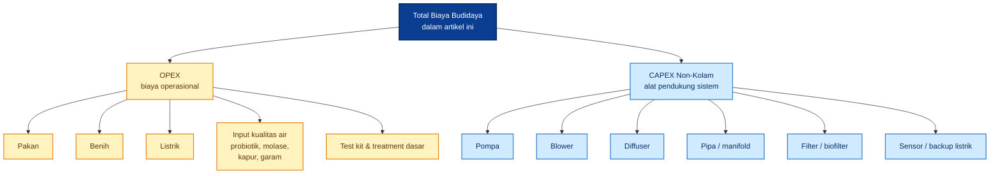
```mermaid id="e9dzxu"
flowchart TD
    A["Total Biaya Budidaya<br/>dalam artikel ini"] --> B["OPEX<br/>biaya operasional"]
    A --> C["CAPEX Non-Kolam<br/>alat pendukung sistem"]

    B --> D["Pakan"]
    B --> E["Benih"]
    B --> F["Listrik"]
    B --> G["Input kualitas air<br/>probiotik, molase,<br/>kapur, garam"]
    B --> H["Test kit & treatment dasar"]

    C --> I["Pompa"]
    C --> J["Blower"]
    C --> K["Diffuser"]
    C --> L["Pipa / manifold"]
    C --> M["Filter / biofilter"]
    C --> N["Sensor / backup listrik"]

    classDef main fill:#0B3D91,color:#FFFFFF,stroke:#062B63,stroke-width:2px;
    classDef opex fill:#FFF3BF,color:#5F370E,stroke:#E67700,stroke-width:1.5px;
    classDef capex fill:#D0EBFF,color:#08306B,stroke:#1971C2,stroke-width:1.5px;
    classDef item fill:#F8F9FA,color:#212529,stroke:#868E96,stroke-width:1px;

    class A main;
    class B,D,E,F,G,H opex;
    class C,I,J,K,L,M,N capex;
```

---

## 4.1 OPEX Nila dan Lele

OPEX adalah biaya yang langsung memengaruhi arus kas harian dan biaya produksi per kg ikan. Dalam budidaya intensif, **pakan hampir selalu menjadi komponen biaya terbesar**. Panduan KKP menyebut pakan dapat mencapai sekitar **60–70% dari total biaya produksi**, sehingga FCR dan manajemen pakan menjadi variabel paling sensitif dalam model ekonomi. ([KKP][1])

### Tabel Komponen OPEX Nila dan Lele

| Komponen OPEX        |              Nila |              Lele | Catatan                               |
| -------------------- | ----------------: | ----------------: | ------------------------------------- |
| Pakan                |                Ya |                Ya | Komponen terbesar                     |
| Benih                |                Ya |                Ya | Lele butuh ekor lebih banyak/kg panen |
| Listrik              | Tergantung sistem | Tergantung sistem | Tinggi pada bioflok/RAS               |
| Probiotik            |       Bioflok/RAS |       Bioflok/RAS | Terutama bioflok                      |
| Molase/sumber karbon |           Bioflok |           Bioflok | Untuk menjaga C:N                     |
| Kapur/dolomit        |                Ya |                Ya | Stabilitas pH/alkalinitas             |
| Garam/treatment      |                Ya |                Ya | Pencegahan stres                      |
| Test kit             |  Disarankan/wajib |  Disarankan/wajib | pH, DO, amonia, nitrit                |

### 4.1.1 Pakan

Pakan adalah komponen OPEX paling kritis karena nilainya besar dan langsung menentukan HPP. Secara ekonomi, FCR lebih penting daripada harga pakan murah semata. Pakan murah dengan FCR buruk bisa menghasilkan HPP lebih tinggi dibanding pakan lebih mahal tetapi efisien.

Pada kolam statis, pakan hampir sepenuhnya menjadi sumber pertumbuhan ikan. Pada bioflok, sebagian kebutuhan nutrisi dapat terbantu oleh flok, terutama untuk nila yang lebih mampu memanfaatkan partikel organik, plankton, detritus, dan biofilm. KKP juga menyatakan bahwa ketika flok sudah terbentuk, pakan dapat dikurangi sekitar **20–30%** karena ikan ikut memakan flok. ([KKP][1])

Implikasi bisnis:

| Kondisi      | Dampak                                       |
| ------------ | -------------------------------------------- |
| FCR turun    | HPP turun, margin naik                       |
| FCR naik     | HPP naik cepat                               |
| Overfeeding  | Amonia naik, kualitas air rusak              |
| Underfeeding | Pertumbuhan lambat, siklus molor             |
| Flok stabil  | Potensi efisiensi pakan meningkat            |
| Flok crash   | Pakan tambahan hilang, kualitas air memburuk |

---

### 4.1.2 Benih

Biaya benih harus dihitung berdasarkan **jumlah ekor tebar**, bukan hanya berdasarkan luas kolam. Ini penting karena ukuran panen nila dan lele berbeda.

Nila konsumsi sering ditargetkan pada bobot sekitar **200–300 gram/ekor**, sedangkan lele konsumsi banyak dipanen di kisaran **80–120 gram/ekor**. Akibatnya, untuk menghasilkan 1 kg ikan, lele membutuhkan jumlah ekor panen lebih banyak dibanding nila.

Contoh logika:

| Komoditas | Bobot Panen | Ekor per kg Panen |
| --------- | ----------: | ----------------: |
| Nila      |  250 g/ekor |        ±4 ekor/kg |
| Lele      |  100 g/ekor |       ±10 ekor/kg |

Dampaknya, meskipun harga benih lele per ekor bisa lebih murah, biaya benih per kg panen bisa tetap besar karena jumlah ekor yang dibutuhkan lebih banyak.

---

### 4.1.3 Listrik

Listrik menjadi biaya kecil pada kolam statis, tetapi menjadi biaya penting pada bioflok dan RAS.

Pada bioflok, listrik terutama digunakan untuk blower/aerator. Pada RAS, listrik digunakan untuk pompa sirkulasi, aerasi/oksigenasi, filter, sensor, dan kadang UV. Karena itu, sistem intensif tidak boleh dianalisis tanpa listrik.

Tarif listrik yang digunakan dalam model base-case adalah **Rp1.444,70/kWh**, mengacu pada tarif PLN untuk golongan bisnis kecil/menengah tertentu seperti B-1 dan B-2. Tarif aktual tetap harus disesuaikan dengan golongan listrik lokasi usaha. ([PLN][2])

---

### 4.1.4 Probiotik, Molase, Kapur, Garam, dan Test Kit

Input kualitas air tidak boleh dianggap biaya kecil yang bisa diabaikan. Pada bioflok, input ini justru menjadi bagian dari sistem.

Panduan KKP mencantumkan penggunaan garam, probiotik, kapur dolomit, dan molase dalam aplikasi bioflok. KKP juga menekankan pengecekan pH dan aplikasi rutin untuk menjaga keseimbangan ekosistem bioflok. ([KKP][1])

Fungsi praktis tiap input:

| Input                | Fungsi                                               |
| -------------------- | ---------------------------------------------------- |
| Probiotik            | Membantu komunitas mikroba pengurai limbah           |
| Molase/sumber karbon | Menjaga rasio C:N                                    |
| Kapur/dolomit        | Menstabilkan pH dan alkalinitas                      |
| Garam                | Mengurangi stres dan membantu pencegahan penyakit    |
| Test kit             | Memvalidasi kondisi air, bukan menebak secara visual |

---

### 4.1.5 Perbedaan OPEX Menurut Sistem

| Komponen                 | Kolam Statis |                                            Bioflok |                         RAS |
| ------------------------ | -----------: | -------------------------------------------------: | --------------------------: |
| Pakan                    |       Tinggi | Tinggi, tetapi bisa lebih efisien jika flok stabil |                      Tinggi |
| Benih                    |           Ya |                                                 Ya |                          Ya |
| Listrik                  |       Rendah |                                      Sedang–tinggi |                      Tinggi |
| Probiotik                |     Opsional |                                Wajib/praktis wajib | Opsional, tergantung desain |
| Molase/sumber karbon     |  Tidak wajib |                                Wajib/praktis wajib |                 Tidak wajib |
| Kapur/dolomit            |   Disarankan |                                Wajib/praktis wajib |                  Disarankan |
| Garam/treatment          |   Disarankan |                                         Disarankan |                  Disarankan |
| Test kit                 |        Dasar |                                              Wajib |                       Wajib |
| Risiko biaya tersembunyi |    FCR buruk |                                listrik, flok crash |  listrik, filter, biofilter |

---

## 4.2 CAPEX Non-Kolam

CAPEX non-kolam adalah investasi alat pendukung yang dibutuhkan agar sistem berjalan. Dalam artikel ini, biaya pembuatan kolam, bak, atau tangki sengaja tidak dimasukkan agar perbandingan fokus pada peralatan sistem.

Namun CAPEX non-kolam tetap harus dihitung melalui depresiasi. Jika tidak, sistem bioflok dan RAS akan terlihat terlalu murah karena beban blower, pompa, filter, sensor, dan backup listrik tidak muncul dalam HPP.

### Tabel Komponen CAPEX Non-Kolam

| Komponen CAPEX  |    Kolam Statis |         Bioflok |      RAS |
| --------------- | --------------: | --------------: | -------: |
| Pompa           |       Sederhana |              Ya |    Wajib |
| Blower          | Opsional/ringan |           Wajib |    Wajib |
| Diffuser        |         Minimal |           Wajib |    Wajib |
| Pipa/manifold   |           Dasar |          Sedang | Kompleks |
| Filter mekanis  |           Tidak | Tidak/sederhana |    Wajib |
| Biofilter       |           Tidak |           Tidak |    Wajib |
| UV/sterilisasi  |           Tidak |           Tidak | Opsional |
| Sensor/test kit |           Dasar |           Wajib |    Wajib |
| Backup listrik  |      Disarankan |           Wajib |    Wajib |
| Estimasi CAPEX  |          Rendah |          Sedang |   Tinggi |

---

### 4.2.1 CAPEX Non-Kolam pada Kolam Statis

Kolam statis membutuhkan alat paling sedikit. CAPEX non-kolam biasanya meliputi pompa sederhana, selang, pipa, serok, timbangan, ember panen, dan test kit dasar.

Estimasi base-case artikel:

| Komponen                      | Status          | Catatan                   |
| ----------------------------- | --------------- | ------------------------- |
| Pompa air                     | Dasar           | Untuk isi/buang air       |
| Selang/pipa                   | Dasar           | Inlet dan drain sederhana |
| Aerator kecil                 | Opsional        | Berguna saat DO rendah    |
| Serok dan alat panen          | Wajib           | Operasional dasar         |
| Timbangan                     | Wajib           | Sampling dan panen        |
| Test kit dasar                | Disarankan      | Minimal pH dan DO         |
| **CAPEX non-kolam base-case** | **Rp50.000/m²** | Di luar biaya kolam       |
| **Umur ekonomis**             | **4 tahun**     | Untuk depresiasi model    |

---

### 4.2.2 CAPEX Non-Kolam pada Bioflok

Bioflok membutuhkan CAPEX lebih tinggi karena sistem ini sangat bergantung pada aerasi. Blower, diffuser, pipa manifold, dan backup listrik bukan aksesori; dalam skala bisnis, ini adalah komponen keselamatan produksi.

KKP menekankan pentingnya blower dan aerasi, khususnya pada nila yang membutuhkan aerasi 24 jam selama pemeliharaan. Untuk lele, aerasi dapat disesuaikan, tetapi pada sistem bioflok komersial padat tebar, aerasi tetap menjadi komponen kritis. ([KKP][1])

Estimasi base-case artikel:

| Komponen                         | Status           | Catatan                                                 |
| -------------------------------- | ---------------- | ------------------------------------------------------- |
| Blower/ring blower               | Wajib            | Menjaga DO dan suspensi flok                            |
| Diffuser/airstone                | Wajib            | Distribusi udara                                        |
| Pipa manifold                    | Wajib            | Membagi udara ke titik aerasi                           |
| Pompa transfer                   | Wajib            | Isi, buang, dan sirkulasi terbatas                      |
| Test kit                         | Wajib            | DO, pH, TAN, nitrit                                     |
| Genset/backup aerasi             | Wajib komersial  | Mengurangi risiko mati massal                           |
| **CAPEX non-kolam nila bioflok** | **Rp300.000/m²** | Base-case artikel                                       |
| **CAPEX non-kolam lele bioflok** | **Rp350.000/m²** | Lebih tinggi karena beban organik dan kebutuhan sorting |
| **Umur ekonomis**                | **4 tahun**      | Untuk depresiasi model                                  |

---

### 4.2.3 CAPEX Non-Kolam pada RAS

RAS membutuhkan CAPEX non-kolam paling tinggi karena air harus diproses secara kontinu. Sistem minimal RAS mencakup pompa, filter mekanis, biofilter, media biofilter, aerasi/oksigenasi, pipa, valve, sensor, dan backup listrik.

FAO menjelaskan bahwa sistem resirkulasi kompleks dapat menggunakan treatment air, filtrasi mekanis, re-aeration, dan setidaknya satu treatment biologis untuk mengurangi kebutuhan air baru. ([FAOHome][3])

Estimasi base-case artikel:

| Komponen                      | Status             | Catatan                           |
| ----------------------------- | ------------------ | --------------------------------- |
| Pompa sirkulasi               | Wajib              | Mengalirkan air antar unit        |
| Filter mekanis                | Wajib              | Menangkap padatan                 |
| Biofilter                     | Wajib              | Mengolah amonia                   |
| Media biofilter               | Wajib              | Substrat bakteri nitrifikasi      |
| Aerasi/oksigenasi             | Wajib              | Menjaga DO                        |
| Pipa dan valve                | Wajib              | Jalur resirkulasi                 |
| UV/sterilisasi                | Opsional           | Berguna untuk biosecurity         |
| Sensor/test kit               | Wajib              | DO, pH, TAN, nitrit, suhu         |
| Backup listrik                | Wajib              | Pompa dan aerasi tidak boleh mati |
| **CAPEX non-kolam base-case** | **Rp1.200.000/m²** | Di luar tangki/kolam              |
| **Umur ekonomis**             | **5 tahun**        | Untuk depresiasi model            |

---

### 4.2.4 Ringkasan CAPEX untuk Model Ekonomi

| Sistem       | CAPEX Non-Kolam Base-Case | Umur Ekonomis | Depresiasi per Tahun |
| ------------ | ------------------------: | ------------: | -------------------: |
| Kolam statis |               Rp50.000/m² |       4 tahun |    Rp12.500/m²/tahun |
| Bioflok nila |              Rp300.000/m² |       4 tahun |    Rp75.000/m²/tahun |
| Bioflok lele |              Rp350.000/m² |       4 tahun |    Rp87.500/m²/tahun |
| RAS          |            Rp1.200.000/m² |       5 tahun |   Rp240.000/m²/tahun |

Angka CAPEX di atas adalah **angka model untuk pra-feasibility**, bukan quotation final. Untuk keputusan investasi, angka ini harus diganti dengan BoQ aktual berdasarkan merek blower, kapasitas pompa, jumlah diffuser, diameter pipa, jenis filter, dan ketersediaan backup listrik.

---

[**Kembali ke Atas**](#komparasi-ekonomi-budidaya-nila-dan-lele-pada-kolam-statis-bioflok-dan-ras-berbasis-m-footprint-lahan)

---

# 5. Asumsi Teknis dan Ekonomi

Bab ini menjadi fondasi kepercayaan analisis. Jika asumsi salah, hasil ekonomi akan ikut salah. Karena itu, semua asumsi dalam artikel ini harus diperlakukan sebagai **base-case pra-feasibility** yang masih wajib divalidasi dengan data lokal.

Ada tiga prinsip utama:

1. **Gunakan data teknis dari sumber kredibel.**
2. **Gunakan harga lokal yang bisa dieksekusi.**
3. **Bandingkan sistem dengan risiko bisnis yang setara.**

---

## 5.1 Asumsi Teknis

Asumsi teknis mencakup padat tebar, volume efektif per m² footprint, survival rate, bobot panen, FCR, dan jumlah siklus per tahun.

Untuk bioflok, artikel ini menggunakan baseline KKP: **nila 100 ekor/m³** dan **lele 250 ekor/m³** sebagai intensifikasi sedang yang direkomendasikan. KKP juga menyebut benih ukuran **6–8 cm** dan membedakan intensifikasi tinggi sebagai lele di atas 300 ekor/m³ dan nila di atas 100 ekor/m³. ([KKP][1])

### Formula Konversi Padat Tebar ke Footprint

Jika padat tebar dinyatakan dalam ekor per m³, maka konversi ke footprint adalah:

$$
N_{m^2} = D_{m^3} \times V_{efektif}
$$

Keterangan:

| Simbol        | Arti                                |
| ------------- | ----------------------------------- |
| $N_{m^2}$     | jumlah ekor tebar per m² footprint  |
| $D_{m^3}$     | padat tebar per m³ air              |
| $V_{efektif}$ | volume air efektif per m² footprint |

Contoh:

$$
100 \text{ ekor/m}^3 \times 0{,}8 \text{ m}^3/\text{m}^2 = 80 \text{ ekor/m}^2
$$

Artinya, nila bioflok dengan padat tebar 100 ekor/m³ dan volume efektif 0,8 m³/m² menghasilkan 80 ekor tebar per m² footprint.

---

### Tabel Asumsi Teknis Base-Case

| Parameter               | Nila Kolam Statis | Nila Bioflok |    Nila RAS | Lele Kolam Statis | Lele Bioflok |    Lele RAS |
| ----------------------- | ----------------: | -----------: | ----------: | ----------------: | -----------: | ----------: |
| Padat tebar acuan       |        25 ekor/m² |  100 ekor/m³ | 150 ekor/m³ |       100 ekor/m³ |  250 ekor/m³ | 500 ekor/m³ |
| Volume efektif/m²       |            1,0 m³ |       0,8 m³ |      0,7 m³ |            1,0 m³ |       0,8 m³ |     0,65 m³ |
| Ekor tebar/m² footprint |           25 ekor |      80 ekor |    105 ekor |          100 ekor |     200 ekor |    325 ekor |
| SR                      |               85% |          92% |         93% |               85% |          90% |         92% |
| Bobot panen             |             250 g |        250 g |       250 g |             100 g |        100 g |       100 g |
| FCR                     |              1,55 |         1,10 |        1,30 |              1,50 |         1,15 |        1,05 |
| Siklus/tahun            |               2,5 |          2,5 |         2,5 |               3,0 |          3,5 |         4,0 |

---

### Penjelasan Asumsi Teknis

#### A. Padat tebar

Padat tebar kolam statis dibuat konservatif karena sistem ini tidak memiliki kontrol kualitas air sekuat bioflok dan RAS.

Bioflok mengikuti baseline KKP untuk risiko sedang:

| Komoditas | Padat Tebar Bioflok Base-Case |
| --------- | ----------------------------: |
| Nila      |                   100 ekor/m³ |
| Lele      |                   250 ekor/m³ |

Lele memang bisa ditebar lebih tinggi, tetapi angka di atas 300 ekor/m³ sudah masuk kategori intensifikasi tinggi menurut KKP. Karena artikel ini ingin membandingkan risiko secara adil, lele bioflok tidak langsung dimodelkan pada 500–1.000 ekor/m³ sebagai base-case. ([KKP][1])

#### B. Volume efektif per m²

Volume efektif per m² tidak selalu sama dengan 1 m³. Pada bioflok dan RAS, sebagian footprint digunakan untuk ruang teknis, pipa, blower, filter, sump, atau area kerja. Karena itu, volume efektif dibuat lebih rendah dari 1 m³/m².

| Sistem       | Volume Efektif/m² | Alasan                                               |
| ------------ | ----------------: | ---------------------------------------------------- |
| Kolam statis |            1,0 m³ | Area teknis sederhana                                |
| Bioflok      |            0,8 m³ | Perlu area blower, pipa, dan akses kerja             |
| RAS nila     |            0,7 m³ | Perlu area filter, pompa, dan pipa                   |
| RAS lele     |           0,65 m³ | Beban organik tinggi, butuh ruang teknis lebih besar |

#### C. Survival rate

SR dibuat realistis, bukan ekstrem. Semakin intensif sistem, SR bisa meningkat karena kontrol air lebih baik, tetapi risiko kegagalan alat juga lebih besar.

| Sistem       | Logika SR                                            |
| ------------ | ---------------------------------------------------- |
| Kolam statis | Lebih rendah karena kontrol air terbatas             |
| Bioflok      | Lebih baik jika flok stabil dan aerasi aman          |
| RAS          | Bisa tinggi jika filter, pompa, dan biofilter stabil |

#### D. Bobot panen

Bobot panen disesuaikan dengan ukuran konsumsi umum:

| Komoditas | Bobot Panen Model |
| --------- | ----------------: |
| Nila      |        250 g/ekor |
| Lele      |        100 g/ekor |

Bobot ini harus disesuaikan dengan pasar lokal. Jika pasar meminta nila 300–500 g/ekor, siklus bisa lebih panjang. Jika pasar lele meminta ukuran 7–8 ekor/kg, bobot panen berubah dan model harus dihitung ulang.

#### E. FCR

FCR adalah asumsi paling sensitif. Artikel ini memakai FCR base-case yang realistis tetapi tetap harus diuji melalui pilot.

| Sistem       | Nila | Lele |
| ------------ | ---: | ---: |
| Kolam statis | 1,55 | 1,50 |
| Bioflok      | 1,10 | 1,15 |
| RAS          | 1,30 | 1,05 |

Catatan penting: FCR nila bioflok dibuat lebih baik daripada nila kolam statis karena bioflok dapat memberi kontribusi pakan tambahan. Namun angka 1,10 tetap harus dibuktikan dengan catatan produksi. Pada lele, FCR bioflok tidak dibuat terlalu optimistis karena lele tidak memanfaatkan flok sekuat nila sebagai grazer.

#### F. Siklus per tahun

Lele memiliki siklus lebih cepat dibanding nila. Namun siklus cepat tidak otomatis berarti profit lebih tinggi, karena margin sangat tergantung harga jual, biaya benih per kg, FCR, dan mortalitas.

| Komoditas | Sistem                     | Siklus/Tahun |
| --------- | -------------------------- | -----------: |
| Nila      | Kolam statis, bioflok, RAS |          2,5 |
| Lele      | Kolam statis               |          3,0 |
| Lele      | Bioflok                    |          3,5 |
| Lele      | RAS                        |          4,0 |

---

## 5.2 Asumsi Harga

Asumsi harga adalah bagian yang paling cepat berubah. Karena itu, harga dalam artikel ini harus dibaca sebagai **base-case model**, bukan harga tetap semua daerah.

FishInfo Jatim mencatat harga rata-rata tingkat konsumen periode 13–20 Mei 2026 sekitar **Nila Rp31.337/kg** dan **Lele Rp24.044/kg**. Artikel ini tidak langsung memakai angka tersebut sebagai harga farmgate, karena harga konsumen biasanya lebih tinggi daripada harga yang diterima pembudidaya. ([fishinfojatim.net][4])

Untuk model ekonomi, harga jual dibuat sedikit lebih konservatif:

| Komponen Harga                   |            Nila |            Lele | Sumber Data                                                 |
| -------------------------------- | --------------: | --------------: | ----------------------------------------------------------- |
| Harga jual farmgate/proxy model  |     Rp30.000/kg |     Rp23.000/kg | Proxy konservatif dari harga pasar; wajib validasi offtaker |
| Harga benih                      |      Rp500/ekor |      Rp400/ekor | Supplier lokal; wajib validasi                              |
| Harga pakan                      |     Rp11.500/kg |     Rp11.500/kg | Distributor lokal; wajib validasi delivered price           |
| Tarif listrik                    |  Rp1.444,70/kWh |  Rp1.444,70/kWh | PLN/golongan aktual                                         |
| Input probiotik/molase/treatment | Berbasis sistem | Berbasis sistem | Supplier lokal                                              |

Tarif listrik memakai acuan Rp1.444,70/kWh untuk base-case, tetapi angka aktual harus mengikuti golongan dan daya listrik lokasi usaha. ([PLN][2])

---

### 5.2.1 Asumsi Input Kualitas Air per m²/tahun

Untuk memudahkan perhitungan Bab 6 dan Bab 7, input kualitas air dibuat sebagai angka tahunan per m² footprint.

| Sistem       |              Nila |              Lele | Catatan                                       |
| ------------ | ----------------: | ----------------: | --------------------------------------------- |
| Kolam statis |  Rp8.000/m²/tahun | Rp10.000/m²/tahun | Kapur, garam, treatment dasar                 |
| Bioflok      | Rp25.000/m²/tahun | Rp45.000/m²/tahun | Probiotik, molase, kapur, garam, test kit     |
| RAS          | Rp45.000/m²/tahun | Rp75.000/m²/tahun | Test kit, treatment, maintenance kualitas air |

Lele diberi input kualitas air lebih tinggi karena beban organik, feses, dan risiko sludge lebih besar pada padat tebar intensif. Angka ini bukan harga universal; pada lokasi tertentu bisa lebih rendah atau lebih tinggi tergantung dosis, merek probiotik, kualitas air sumber, dan target padat tebar.

---

### 5.2.2 Asumsi Konsumsi Listrik per m²/tahun

| Sistem       |             Nila |             Lele | Catatan                       |
| ------------ | ---------------: | ---------------: | ----------------------------- |
| Kolam statis |   3 kWh/m²/tahun |   6 kWh/m²/tahun | Pompa/aerasi ringan           |
| Bioflok      |  60 kWh/m²/tahun |  80 kWh/m²/tahun | Blower dominan                |
| RAS          | 150 kWh/m²/tahun | 220 kWh/m²/tahun | Pompa, aerasi, filter, sensor |

Dengan tarif listrik Rp1.444,70/kWh, biaya listrik model menjadi:

| Sistem       |               Nila |               Lele |
| ------------ | -----------------: | -----------------: |
| Kolam statis |   Rp4.334/m²/tahun |   Rp8.668/m²/tahun |
| Bioflok      |  Rp86.682/m²/tahun | Rp115.576/m²/tahun |
| RAS          | Rp216.705/m²/tahun | Rp317.834/m²/tahun |

Formula perhitungan listrik:

$$
\text{Biaya Listrik} = \text{kWh per m^2 per tahun} \times \text{tarif listrik per kWh}
$$

Contoh bioflok nila:

$$
60 \times 1.444{,}70 = 86.682
$$

---

### 5.2.3 Asumsi CAPEX dan Depresiasi

Formula depresiasi:

$$
\text{Depresiasi Tahunan} = \frac{\text{CAPEX Non-Kolam}}{\text{Umur Ekonomis}}
$$

Tabel base-case:

| Sistem       | CAPEX Non-Kolam | Umur Ekonomis |         Depresiasi |
| ------------ | --------------: | ------------: | -----------------: |
| Kolam statis |     Rp50.000/m² |       4 tahun |  Rp12.500/m²/tahun |
| Bioflok nila |    Rp300.000/m² |       4 tahun |  Rp75.000/m²/tahun |
| Bioflok lele |    Rp350.000/m² |       4 tahun |  Rp87.500/m²/tahun |
| RAS          |  Rp1.200.000/m² |       5 tahun | Rp240.000/m²/tahun |

---

## 5.3 Standar Risiko Setara

Bagian ini penting karena banyak perbandingan budidaya menjadi bias akibat memakai asumsi yang tidak seimbang.

Contoh bias yang harus dihindari:

- lele memakai padat tebar ekstrem, sementara nila memakai padat tebar konservatif;
- FCR lele memakai skenario terbaik, sementara FCR nila memakai skenario rata-rata;
- harga jual nila memakai harga farmgate, sementara lele memakai harga konsumen;
- listrik dan depresiasi diabaikan pada bioflok dan RAS;
- mortalitas dianggap sama padahal kepadatan dan sistem berbeda;
- CAPEX alat tidak dihitung karena fokus hanya pada OPEX.

### Diagram Standar Risiko Setara

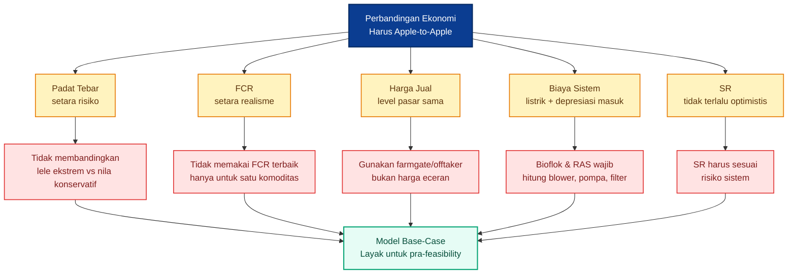
```mermaid id="qjjqq7"
flowchart TD
    A["Perbandingan Ekonomi<br/>Harus Apple-to-Apple"] --> B["Padat Tebar<br/>setara risiko"]
    A --> C["FCR<br/>setara realisme"]
    A --> D["Harga Jual<br/>level pasar sama"]
    A --> E["Biaya Sistem<br/>listrik + depresiasi masuk"]
    A --> F["SR<br/>tidak terlalu optimistis"]

    B --> G["Tidak membandingkan<br/>lele ekstrem vs nila konservatif"]
    C --> H["Tidak memakai FCR terbaik<br/>hanya untuk satu komoditas"]
    D --> I["Gunakan farmgate/offtaker<br/>bukan harga eceran"]
    E --> J["Bioflok & RAS wajib<br/>hitung blower, pompa, filter"]
    F --> K["SR harus sesuai<br/>risiko sistem"]

    G --> L["Model Base-Case<br/>Layak untuk pra-feasibility"]
    H --> L
    I --> L
    J --> L
    K --> L

    classDef main fill:#0B3D91,color:#FFFFFF,stroke:#062B63,stroke-width:2px;
    classDef rule fill:#FFF3BF,color:#5F370E,stroke:#E67700,stroke-width:1.5px;
    classDef warning fill:#FFE3E3,color:#7F1D1D,stroke:#E03131,stroke-width:1.5px;
    classDef result fill:#E6FCF5,color:#064E3B,stroke:#0CA678,stroke-width:2px;

    class A main;
    class B,C,D,E,F rule;
    class G,H,I,J,K warning;
    class L result;
```

---

### 5.3.1 Aturan Pembanding Setara Risiko

| Area               | Aturan                                                              |
| ------------------ | ------------------------------------------------------------------- |
| Padat tebar        | Gunakan angka baseline, bukan angka ekstrem                         |
| FCR                | Gunakan FCR yang realistis dan bisa dicapai operator rata-rata baik |
| Harga jual         | Gunakan level harga yang sama: farmgate dengan farmgate             |
| Harga pakan        | Gunakan harga delivered to farm                                     |
| Listrik            | Wajib dihitung pada bioflok dan RAS                                 |
| CAPEX              | Wajib masuk melalui depresiasi                                      |
| SR                 | Jangan dibuat terlalu tinggi tanpa data pilot                       |
| Siklus/tahun       | Harus sesuai waktu panen realistis                                  |
| Input kualitas air | Jangan diabaikan pada sistem intensif                               |
| Risiko alat        | Backup listrik harus dihitung sebagai kebutuhan komersial           |

---

### 5.3.2 Implikasi untuk Bioflok Lele vs Nila

Bagian ini akan sangat penting pada Bab 8. Dalam perbandingan bioflok, lele tidak boleh langsung memakai skenario 500–1.000 ekor/m³ sebagai base-case jika nila hanya memakai 100 ekor/m³. KKP menempatkan lele di atas 300 ekor/m³ sebagai intensifikasi tinggi, sedangkan baseline yang direkomendasikan adalah 250 ekor/m³. ([KKP][1])

Karena itu, artikel ini menetapkan:

| Komoditas          | Bioflok Base-Case | Status                                 |
| ------------------ | ----------------: | -------------------------------------- |
| Nila               |       100 ekor/m³ | Baseline setara risiko                 |
| Lele               |       250 ekor/m³ | Baseline setara risiko                 |
| Lele 500 ekor/m³   |  Skenario agresif | Tidak dipakai sebagai base-case        |
| Lele 1.000 ekor/m³ |  Skenario ekstrem | Hanya untuk sensitivitas/operator ahli |

Dengan standar ini, hasil analisis tidak akan berat sebelah.

---

### 5.3.3 Status Akurasi Angka

Angka dalam Bab 5 dikunci sebagai **angka model awal** untuk Bab 6, Bab 7, dan Bab 8.

| Jenis Data              | Status Kepercayaan | Catatan                                               |
| ----------------------- | -----------------: | ----------------------------------------------------- |
| Padat tebar bioflok KKP |             Tinggi | Mengacu panduan teknis                                |
| Tarif listrik           |             Tinggi | Mengacu publikasi tarif PLN                           |
| Harga pasar ikan        |             Sedang | FishInfo berguna, tetapi harus diganti harga offtaker |
| Harga benih             |      Sedang–rendah | Harus validasi supplier lokal                         |
| Harga pakan             |      Sedang–rendah | Harus validasi distributor lokal                      |
| CAPEX non-kolam         |      Sedang–rendah | Harus diganti BoQ aktual                              |
| FCR                     |             Sedang | Harus dibuktikan pilot                                |
| SR                      |             Sedang | Sangat tergantung operator dan kualitas benih         |

Dengan demikian, artikel ini layak digunakan sebagai **pra-feasibility dan kerangka keputusan bisnis**, tetapi belum boleh dipakai sebagai dasar investasi final tanpa validasi lokal dan minimal satu siklus pilot.

---

## Kesimpulan Bab 4–5

Bab 4 menunjukkan bahwa struktur biaya tiap sistem berbeda tajam. Kolam statis murah secara alat, tetapi produktivitas lahannya rendah. Bioflok membutuhkan blower, diffuser, dan input mikroba, tetapi berpotensi menghasilkan produktivitas dan efisiensi pakan lebih baik. RAS paling kuat dalam kontrol air, tetapi membawa CAPEX dan listrik paling tinggi.

Bab 5 mengunci asumsi base-case agar analisis ekonomi pada bab berikutnya bisa dihitung secara konsisten. Prinsip terpentingnya adalah **setara risiko**: tidak membandingkan satu sistem pada skenario agresif dengan sistem lain pada skenario konservatif.

[**Kembali ke Atas**](#komparasi-ekonomi-budidaya-nila-dan-lele-pada-kolam-statis-bioflok-dan-ras-berbasis-m-footprint-lahan)

[1]: https://kkp.go.id/storage/Materi/panduan-budi-daya-ikan-nilalele-di-bak-bulat-bioflok6982e9ada5a67/materi-6982e9adaa327.pdf 'PowerPoint Presentation'
[2]: https://web.pln.co.id/cms/media/2025/12/tarif-listrik/?utm_source=chatgpt.com 'Detail Tarif Listrik Berdasarkan Golongan Daya dan Jenisnya'
[3]: https://www.fao.org/4/x5744e/x5744e0g.htm 'https://www.fao.org/4/x5744e/x5744e0g.htm'
[4]: https://fishinfojatim.net/ 'https://fishinfojatim.net/'

---

# 6. Analisis Ekonomi Nila

Bab ini menghitung ekonomi budidaya **nila** pada tiga sistem: **kolam statis, bioflok, dan RAS**. Seluruh angka dihitung berdasarkan asumsi Bab 5, yaitu analisis per:

**1 m² footprint lahan per tahun**

Margin yang ditampilkan adalah **margin teknis-operasional setelah depresiasi CAPEX non-kolam**, tetapi **sebelum tenaga kerja, sewa lahan, bunga pinjaman, pajak, transportasi panen, dan risiko ekstrem**.

---

## 6.1 Tabel Utama Nila

### 6.1.1 Asumsi Dasar Nila

| Parameter            |      Kolam Statis |           Bioflok |                RAS |
| -------------------- | ----------------: | ----------------: | -----------------: |
| Harga jual nila      |       Rp30.000/kg |       Rp30.000/kg |        Rp30.000/kg |
| Harga pakan          |       Rp11.500/kg |       Rp11.500/kg |        Rp11.500/kg |
| Harga benih          |        Rp500/ekor |        Rp500/ekor |         Rp500/ekor |
| Padat tebar efektif  |        25 ekor/m² |        80 ekor/m² |        105 ekor/m² |
| Survival rate        |               85% |               92% |                93% |
| Bobot panen          |        250 g/ekor |        250 g/ekor |         250 g/ekor |
| FCR                  |              1,55 |              1,10 |               1,30 |
| Siklus/tahun         |               2,5 |               2,5 |                2,5 |
| Biaya listrik        |  Rp4.334/m²/tahun | Rp86.682/m²/tahun | Rp216.705/m²/tahun |
| Input treatment      |  Rp8.000/m²/tahun | Rp25.000/m²/tahun |  Rp45.000/m²/tahun |
| Depresiasi non-kolam | Rp12.500/m²/tahun | Rp75.000/m²/tahun | Rp240.000/m²/tahun |

---

### 6.1.2 Formula Produksi

Produksi tahunan dihitung dengan formula:

$$
\text{Produksi Tahunan} = N \times SR \times W_p \times C
$$

Keterangan:

| Simbol | Arti                        |
| ------ | --------------------------- |
| $N$    | Ekor tebar per m² footprint |
| $SR$   | Survival rate               |
| $W_p$  | Bobot panen per ekor        |
| $C$    | Siklus per tahun            |

Perhitungan produksi nila:

| Sistem       |                                    Perhitungan |              Produksi |
| ------------ | ---------------------------------------------: | --------------------: |
| Kolam statis |  $(25 \times 85\% \times 0{,}25 \times 2{,}5)$ | **13,28 kg/m²/tahun** |
| Bioflok      |  $(80 \times 92\% \times 0{,}25 \times 2{,}5)$ | **46,00 kg/m²/tahun** |
| RAS          | $(105 \times 93\% \times 0{,}25 \times 2{,}5)$ | **61,03 kg/m²/tahun** |

---

### 6.1.3 Tabel Ekonomi Utama Nila

| Komponen             |    Kolam Statis |         Bioflok |             RAS |
| -------------------- | --------------: | --------------: | --------------: |
| Produksi kg/m²/tahun |    **13,28 kg** |    **46,00 kg** |    **61,03 kg** |
| Revenue/m²/tahun     |       Rp398.438 |     Rp1.380.000 |     Rp1.830.938 |
| Biaya pakan          |       Rp236.738 |       Rp581.900 |       Rp912.417 |
| Biaya benih          |        Rp31.250 |       Rp100.000 |       Rp131.250 |
| Biaya listrik        |         Rp4.334 |        Rp86.682 |       Rp216.705 |
| Input treatment      |         Rp8.000 |        Rp25.000 |        Rp45.000 |
| **Cash OPEX**        |   **Rp280.322** |   **Rp793.582** | **Rp1.305.372** |
| Depresiasi non-kolam |        Rp12.500 |        Rp75.000 |       Rp240.000 |
| **HPP cash**         | **Rp21.107/kg** | **Rp17.252/kg** | **Rp21.389/kg** |
| **HPP all-in**       | **Rp22.048/kg** | **Rp18.882/kg** | **Rp25.321/kg** |
| **Margin/m²/tahun**  |   **Rp105.615** |   **Rp511.418** |   **Rp285.565** |

---

### 6.1.4 Formula Biaya Pakan

$$
\text{Biaya Pakan} = \text{Produksi Tahunan} \times FCR \times \text{Harga Pakan}
$$

Contoh pada nila bioflok:

$$
\begin{aligned}
\text{Biaya pakan}
&= 46{,}00 \times 1{,}10 \times 11.500 \\
&= 581.900
\end{aligned}
$$

Artinya, pada asumsi FCR 1,10 dan harga pakan Rp11.500/kg, biaya pakan nila bioflok adalah:

**Rp581.900/m²/tahun**

---

### 6.1.5 Formula HPP All-In

$$
\text{HPP All-In} = \frac{ \text{Cash OPEX} + \text{Depresiasi} }{ \text{Produksi Tahunan} }
$$

Contoh pada nila bioflok:

$$
\frac{ 793.582 + 75.000 }{ 46 } = 18.882
$$

Jadi, HPP all-in nila bioflok adalah:

**Rp18.882/kg**

---

### 6.1.6 Formula Margin

$$
\text{Margin} = \text{Revenue} -------------- \text{Cash OPEX} \text{Depresiasi}
$$

Contoh pada nila bioflok:

$$
1.380.000 --------- 793.582 75.000 511.418
$$

Jadi, margin teknis-operasional nila bioflok adalah:

**Rp511.418/m²/tahun**

---

## 6.2 Interpretasi

### 6.2.1 Sistem Mana Paling Murah?

Sistem dengan **HPP all-in terendah** adalah **bioflok**.

| Ranking HPP | Sistem       |      HPP All-In |
| ----------: | ------------ | --------------: |
|           1 | **Bioflok**  | **Rp18.882/kg** |
|           2 | Kolam statis |     Rp22.048/kg |
|           3 | RAS          |     Rp25.321/kg |

Bioflok paling murah karena kombinasi tiga hal:

1. produktivitas per m² jauh lebih tinggi daripada kolam statis;
2. FCR lebih baik karena flok ikut berkontribusi sebagai nutrisi tambahan;
3. CAPEX dan listrik masih lebih ringan dibanding RAS.

Kolam statis memiliki listrik rendah dan CAPEX kecil, tetapi produksi per m² terlalu rendah. Akibatnya, biaya tetap dan risiko FCR tersebar pada volume panen yang kecil.

RAS memiliki produksi tertinggi, tetapi HPP naik karena listrik dan depresiasi alat besar.

---

### 6.2.2 Sistem Mana Paling Produktif?

Sistem dengan produksi tertinggi adalah **RAS**.

| Ranking Produktivitas | Sistem       |              Produksi |
| --------------------: | ------------ | --------------------: |
|                     1 | **RAS**      | **61,03 kg/m²/tahun** |
|                     2 | Bioflok      |     46,00 kg/m²/tahun |
|                     3 | Kolam statis |     13,28 kg/m²/tahun |

RAS menghasilkan produksi tertinggi karena padat tebar efektifnya paling besar dan kualitas air dikendalikan melalui pompa, filter mekanis, biofilter, dan aerasi.

Namun produktivitas tertinggi tidak otomatis berarti profit tertinggi. Dalam model ini, tambahan produksi RAS belum cukup untuk mengalahkan bioflok karena biaya listrik dan depresiasi alat terlalu besar.

---

### 6.2.3 Sistem Mana Paling Menguntungkan?

Sistem dengan margin tertinggi per m² adalah **bioflok**.

| Ranking Margin | Sistem       | Margin/m²/tahun |
| -------------: | ------------ | --------------: |
|              1 | **Bioflok**  |   **Rp511.418** |
|              2 | RAS          |       Rp285.565 |
|              3 | Kolam statis |       Rp105.615 |

Bioflok menjadi sistem paling menarik untuk nila karena berada di titik tengah yang ideal:

- produktivitas jauh lebih tinggi daripada kolam statis;
- HPP paling rendah;
- CAPEX tidak seberat RAS;
- listrik masih terkendali;
- nila secara biologis lebih mampu memanfaatkan flok dibanding ikan yang lebih karnivora.

### Diagram Ringkas Hasil Nila

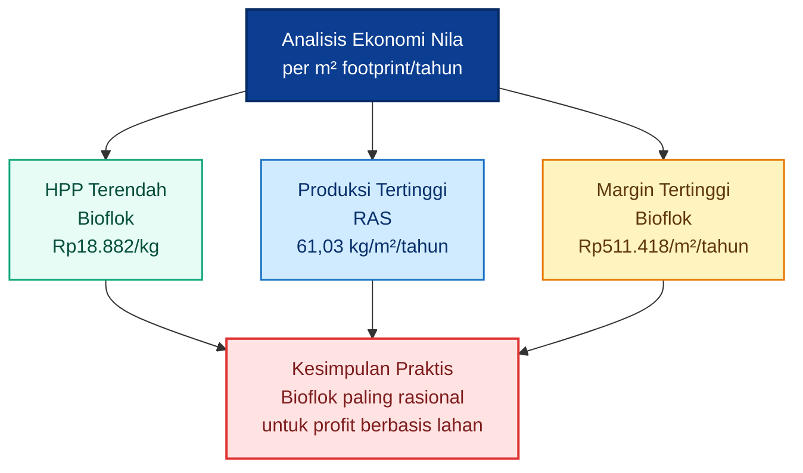
```mermaid id="rmq1nu"
flowchart TD
    A["Analisis Ekonomi Nila<br/>per m² footprint/tahun"] --> B["HPP Terendah<br/>Bioflok<br/>Rp18.882/kg"]
    A --> C["Produksi Tertinggi<br/>RAS<br/>61,03 kg/m²/tahun"]
    A --> D["Margin Tertinggi<br/>Bioflok<br/>Rp511.418/m²/tahun"]

    B --> E["Kesimpulan Praktis<br/>Bioflok paling rasional<br/>untuk profit berbasis lahan"]
    C --> E
    D --> E

    classDef main fill:#0B3D91,color:#FFFFFF,stroke:#062B63,stroke-width:2px;
    classDef hpp fill:#E6FCF5,color:#064E3B,stroke:#0CA678,stroke-width:1.5px;
    classDef prod fill:#D0EBFF,color:#08306B,stroke:#1971C2,stroke-width:1.5px;
    classDef margin fill:#FFF3BF,color:#5F370E,stroke:#E67700,stroke-width:1.5px;
    classDef result fill:#FFE3E3,color:#7F1D1D,stroke:#E03131,stroke-width:2px;

    class A main;
    class B hpp;
    class C prod;
    class D margin;
    class E result;
```

---

## 6.3 Pembacaan per Sistem

### 6.3.1 Nila Kolam Statis

Kolam statis adalah sistem paling sederhana, tetapi paling lemah dari sisi efisiensi lahan.

| Indikator  |              Nilai |
| ---------- | -----------------: |
| Produksi   |  13,28 kg/m²/tahun |
| HPP all-in |        Rp22.048/kg |
| Margin     | Rp105.615/m²/tahun |

Secara bisnis, kolam statis masih masuk akal jika:

- lahan murah atau tersedia luas;
- modal alat terbatas;
- operator belum siap sistem intensif;
- target produksi tidak terlalu tinggi;
- risiko teknis ingin ditekan.

Namun kolam statis kurang menarik bila lahan mahal. Margin Rp105.615/m²/tahun masih positif, tetapi terlalu kecil jika harus menanggung tambahan biaya tenaga kerja, sewa lahan, transportasi, dan risiko harga turun.

Titik risiko utama:

| Risiko                | Dampak                              |
| --------------------- | ----------------------------------- |
| FCR naik              | HPP cepat naik                      |
| SR turun              | Produksi kecil makin tertekan       |
| Harga jual turun      | Margin mudah habis                  |
| Kualitas air memburuk | Pertumbuhan lambat dan panen mundur |

Break-even kolam statis berada di sekitar:

**Rp22.048/kg**

Artinya, jika harga jual nila turun mendekati atau di bawah angka itu, kolam statis mulai tidak menarik sebelum biaya tenaga kerja dan lahan dihitung.

---

### 6.3.2 Nila Bioflok

Bioflok adalah sistem paling kuat dalam model nila base-case.

| Indikator  |              Nilai |
| ---------- | -----------------: |
| Produksi   |  46,00 kg/m²/tahun |
| HPP all-in |        Rp18.882/kg |
| Margin     | Rp511.418/m²/tahun |

Bioflok unggul karena produktivitas naik signifikan tanpa CAPEX setinggi RAS. Dalam model ini, bioflok menghasilkan produksi sekitar:

$$
\begin{aligned}
\text{Rasio produksi bioflok terhadap kolam statis}
&= \frac{46{,}00}{13{,}28} \\
&= 3{,}46
\end{aligned}
$$

Artinya, produksi nila bioflok sekitar **3,46 kali** kolam statis per m² footprint.

Margin bioflok juga sekitar:

$$
\begin{aligned}
\text{Rasio margin bioflok terhadap kolam statis}
&= \frac{511.418}{105.615} \\
&= 4{,}84
\end{aligned}
$$

Artinya, margin nila bioflok sekitar **4,8 kali** kolam statis per m² footprint.

Kekuatan utama bioflok:

| Faktor                        | Dampak                      |
| ----------------------------- | --------------------------- |
| Padat tebar lebih tinggi      | Produksi/m² naik            |
| FCR lebih baik                | HPP turun                   |
| Nila mampu memanfaatkan flok  | Efisiensi pakan meningkat   |
| CAPEX sedang                  | Depresiasi masih terkendali |
| Listrik lebih rendah dari RAS | Margin lebih kuat           |

Titik risiko utama:

| Risiko                             | Dampak                         |
| ---------------------------------- | ------------------------------ |
| Blower mati                        | Kematian bisa cepat            |
| Flok terlalu pekat                 | Ikan stres, kualitas air turun |
| C:N tidak stabil                   | Amonia/nitrit naik             |
| Operator tidak disiplin            | FCR memburuk                   |
| Padat tebar dipaksa terlalu tinggi | Mortalitas naik                |

Bioflok nila paling cocok untuk usaha yang ingin mengejar **profit/m²**, bukan sekadar volume panen.

---

### 6.3.3 Nila RAS

RAS menghasilkan produksi tertinggi, tetapi margin kalah dari bioflok.

| Indikator  |              Nilai |
| ---------- | -----------------: |
| Produksi   |  61,03 kg/m²/tahun |
| HPP all-in |        Rp25.321/kg |
| Margin     | Rp285.565/m²/tahun |

RAS menghasilkan produksi sekitar:

$$
\begin{aligned}
\text{Rasio produksi RAS terhadap bioflok}
&= \frac{61{,}03}{46{,}00} \\
&= 1{,}33
\end{aligned}
$$

Artinya, RAS menghasilkan produksi sekitar **33% lebih tinggi** dibanding bioflok.

Namun margin RAS hanya:

$$
\begin{aligned}
\text{Rasio margin RAS terhadap bioflok}
&= \frac{285.565}{511.418} \\
&= 0{,}56
\end{aligned}
$$

Artinya, margin RAS hanya sekitar **56% dari margin bioflok** pada asumsi base-case.

Penyebab utamanya:

| Faktor                   | Dampak                                    |
| ------------------------ | ----------------------------------------- |
| Listrik tinggi           | OPEX naik                                 |
| CAPEX tinggi             | Depresiasi besar                          |
| FCR tidak sebaik bioflok | Biaya pakan/kg lebih tinggi               |
| Sistem kompleks          | Risiko teknis lebih mahal                 |
| Butuh operator terampil  | Biaya tenaga kerja potensial lebih tinggi |

RAS tidak buruk. Tetapi untuk nila konsumsi dengan harga jual Rp30.000/kg, RAS belum menjadi pilihan margin terbaik jika dibandingkan dengan bioflok.

---

## 6.4 Struktur Biaya per Kg Nila

Tabel berikut membantu melihat komponen biaya per kg ikan.

| Komponen per kg    | Kolam Statis |      Bioflok |          RAS |
| ------------------ | -----------: | -----------: | -----------: |
| Pakan/kg ikan      |     Rp17.825 |     Rp12.650 |     Rp14.950 |
| Benih/kg ikan      |      Rp2.353 |      Rp2.174 |      Rp2.151 |
| Listrik/kg ikan    |        Rp326 |      Rp1.884 |      Rp3.551 |
| Treatment/kg ikan  |        Rp602 |        Rp543 |        Rp737 |
| Depresiasi/kg ikan |        Rp941 |      Rp1.630 |      Rp3.933 |
| **HPP all-in**     | **Rp22.048** | **Rp18.882** | **Rp25.321** |

Pembacaan penting:

- Kolam statis mahal bukan karena listrik atau depresiasi, tetapi karena **pakan per kg tinggi**.
- Bioflok unggul karena **feed cost per kg paling rendah**.
- RAS terbebani oleh **listrik dan depresiasi per kg**.

---

## 6.5 Payback CAPEX Non-Kolam

Payback dihitung menggunakan margin sebelum depresiasi atau cash margin:

$$
\text{Payback} = \frac{ \text{CAPEX Non-Kolam} }{ \text{Revenue} - \text{Cash OPEX} }
$$

| Sistem       | CAPEX Non-Kolam | Cash Margin/m²/tahun |    Payback |
| ------------ | --------------: | -------------------: | ---------: |
| Kolam statis |        Rp50.000 |            Rp118.115 | 0,42 tahun |
| Bioflok      |       Rp300.000 |            Rp586.418 | 0,51 tahun |
| RAS          |     Rp1.200.000 |            Rp525.565 | 2,28 tahun |

Interpretasi:

- Kolam statis dan bioflok memiliki payback alat cepat karena CAPEX non-kolam relatif rendah.
- RAS membutuhkan waktu lebih panjang karena CAPEX non-kolam jauh lebih besar.
- Payback ini belum memasukkan biaya pembuatan kolam/tangki, tenaga kerja, lahan, dan pajak.

---

## 6.6 Kapan RAS Nila Layak?

RAS nila layak dipertimbangkan jika ada alasan strategis di luar sekadar mengejar HPP murah.

RAS lebih rasional bila:

| Kondisi                                 | Alasan                                        |
| --------------------------------------- | --------------------------------------------- |
| Lahan sangat mahal atau sangat terbatas | Produktivitas/m² menjadi prioritas            |
| Pasar mampu membayar harga premium      | HPP RAS lebih tinggi perlu ditutup harga jual |
| Butuh suplai stabil sepanjang tahun     | RAS memberi kontrol produksi lebih baik       |
| Kualitas air sumber terbatas            | Resirkulasi mengurangi kebutuhan air baru     |
| Ada kebutuhan biosecurity tinggi        | Sistem tertutup lebih mudah dikontrol         |
| Operator memiliki skill teknis          | RAS tidak cocok dikelola tanpa SOP kuat       |

Dalam model base-case, HPP all-in RAS adalah **Rp25.321/kg**. Dengan harga jual Rp30.000/kg, margin masih positif, tetapi tidak cukup kuat dibanding bioflok.

RAS mulai lebih menarik jika harga jual nila naik ke segmen premium. Misalnya, jika harga jual menjadi Rp35.000/kg:

$$
\begin{aligned}
\text{Tambahan Margin RAS}
&= (35.000 - 30.000) \times 61{,}03 \\
&= 5.000 \times 61{,}03 \\
&= 305.150
\end{aligned}
$$

Margin RAS baru menjadi sekitar:

$$
285.565 + 305.150 = 590.715
$$

Pada harga jual **Rp35.000/kg**, RAS dapat mendekati atau melewati margin bioflok base-case.

Jadi, putusannya:

**RAS nila layak bila harga jual premium, keterbatasan lahan, kebutuhan kontrol produksi, atau biosecurity mampu memberi nilai tambah di atas biaya listrik dan depresiasi.**

---

## 6.7 Kesimpulan Bab 6

Untuk nila, hasil analisis base-case menunjukkan:

| Indikator                                 | Pemenang     |
| ----------------------------------------- | ------------ |
| HPP terendah                              | **Bioflok**  |
| Produksi tertinggi                        | **RAS**      |
| Margin/m² tertinggi                       | **Bioflok**  |
| Sistem paling sederhana                   | Kolam statis |
| Sistem paling intensif                    | RAS          |
| Sistem paling rasional untuk profit lahan | **Bioflok**  |

Kesimpulan utama:

**Bioflok adalah sistem paling menarik untuk budidaya nila berbasis m² footprint lahan.**

Kolam statis tetap relevan untuk pemula dan lahan luas, tetapi produktivitas dan margin per m² rendah. RAS unggul dalam produksi dan kontrol, tetapi belum mengalahkan bioflok dari sisi margin karena biaya listrik dan depresiasi tinggi.

Dengan asumsi base-case artikel ini, urutan kelayakan ekonomi nila adalah:

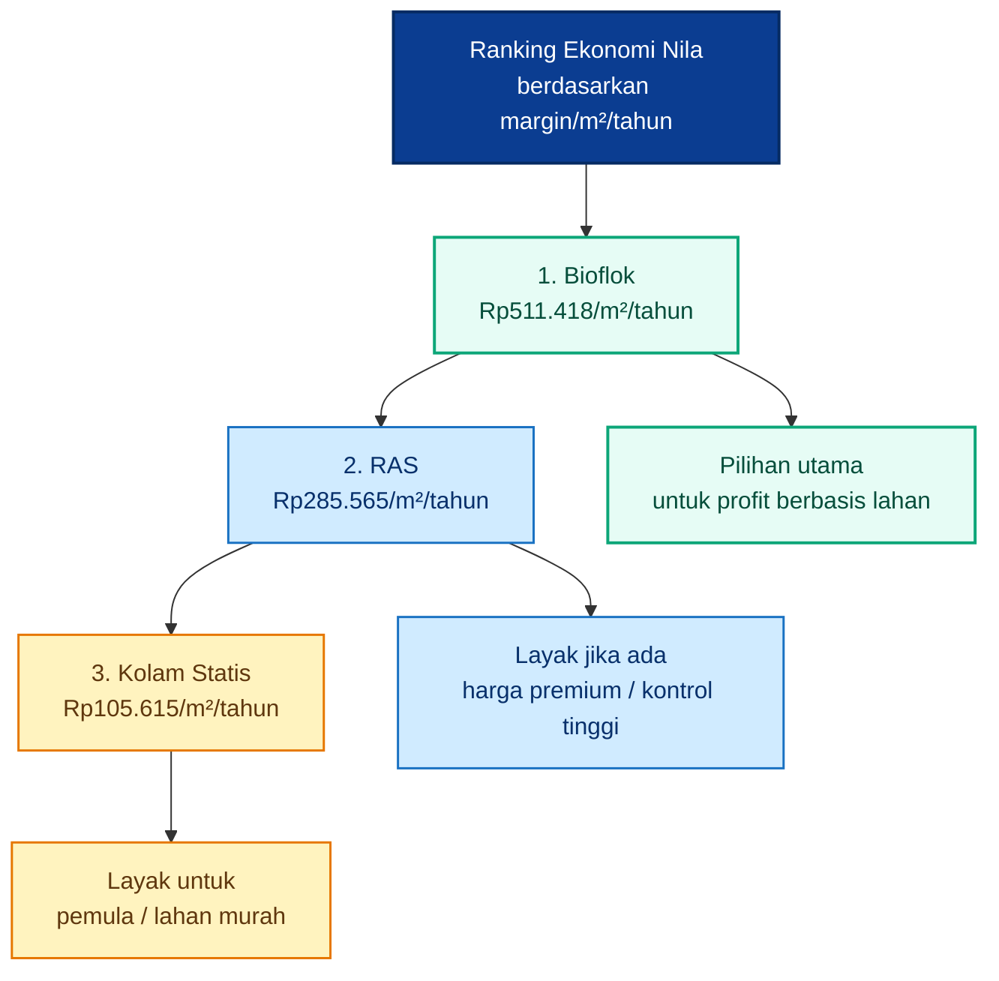
```mermaid id="ff3gw5"
flowchart TD
    A["Ranking Ekonomi Nila<br/>berdasarkan margin/m²/tahun"] --> B["1. Bioflok<br/>Rp511.418/m²/tahun"]
    B --> C["2. RAS<br/>Rp285.565/m²/tahun"]
    C --> D["3. Kolam Statis<br/>Rp105.615/m²/tahun"]

    B --> E["Pilihan utama<br/>untuk profit berbasis lahan"]
    C --> F["Layak jika ada<br/>harga premium / kontrol tinggi"]
    D --> G["Layak untuk<br/>pemula / lahan murah"]

    classDef main fill:#0B3D91,color:#FFFFFF,stroke:#062B63,stroke-width:2px;
    classDef first fill:#E6FCF5,color:#064E3B,stroke:#0CA678,stroke-width:2px;
    classDef second fill:#D0EBFF,color:#08306B,stroke:#1971C2,stroke-width:1.5px;
    classDef third fill:#FFF3BF,color:#5F370E,stroke:#E67700,stroke-width:1.5px;
    classDef note fill:#F8F9FA,color:#212529,stroke:#868E96,stroke-width:1px;

    class A main;
    class B,E first;
    class C,F second;
    class D,G third;
```

[**Kembali ke Atas**](#komparasi-ekonomi-budidaya-nila-dan-lele-pada-kolam-statis-bioflok-dan-ras-berbasis-m-footprint-lahan)

---

# 7. Analisis Ekonomi Lele

Bab ini menghitung ekonomi budidaya **lele** pada tiga sistem: **kolam statis, bioflok, dan RAS**. Seluruh angka mengikuti asumsi Bab 5 dan dihitung dalam satuan:

**Rp/m² footprint lahan/tahun**

Harga jual lele yang digunakan dalam model adalah **Rp23.000/kg**. Angka ini diposisikan sebagai **proxy farmgate konservatif**, bukan harga eceran pasar. Untuk keputusan investasi, harga ini wajib diganti dengan harga beli offtaker lokal.

---

## 7.1 Tabel Utama Lele

### 7.1.1 Asumsi Dasar Lele

| Parameter            |      Kolam Statis |            Bioflok |                RAS |
| -------------------- | ----------------: | -----------------: | -----------------: |
| Harga jual lele      |       Rp23.000/kg |        Rp23.000/kg |        Rp23.000/kg |
| Harga pakan          |       Rp11.500/kg |        Rp11.500/kg |        Rp11.500/kg |
| Harga benih          |        Rp400/ekor |         Rp400/ekor |         Rp400/ekor |
| Padat tebar efektif  |       100 ekor/m² |        200 ekor/m² |        325 ekor/m² |
| Survival rate        |               85% |                90% |                92% |
| Bobot panen          |        100 g/ekor |         100 g/ekor |         100 g/ekor |
| FCR                  |              1,50 |               1,15 |               1,05 |
| Siklus/tahun         |               3,0 |                3,5 |                4,0 |
| Biaya listrik        |  Rp8.668/m²/tahun | Rp115.576/m²/tahun | Rp317.834/m²/tahun |
| Input treatment      | Rp10.000/m²/tahun |  Rp45.000/m²/tahun |  Rp75.000/m²/tahun |
| Depresiasi non-kolam | Rp12.500/m²/tahun |  Rp87.500/m²/tahun | Rp240.000/m²/tahun |

Padat tebar bioflok lele memakai **250 ekor/m³** sebagai base-case karena angka tersebut termasuk intensifikasi sedang yang direkomendasikan KKP; lele di atas 300 ekor/m³ sudah masuk kategori intensifikasi tinggi. KKP juga mencantumkan nila 100 ekor/m³ dan lele 250 ekor/m³ sebagai padat tebar pembesaran bioflok dalam panduan bak bulat. ([KKP][1])

---

### 7.1.2 Formula Produksi Lele

Produksi tahunan dihitung dengan rumus:

$$
\text{Produksi Tahunan} = N \times SR \times W_p \times C
$$

Keterangan:

| Simbol | Arti                        |
| ------ | --------------------------- |
| $N$    | Ekor tebar per m² footprint |
| $SR$   | Survival rate               |
| $W_p$  | Bobot panen per ekor        |
| $C$    | Siklus per tahun            |

Perhitungan produksi lele:

| Sistem       |                                    Perhitungan |               Produksi |
| ------------ | ---------------------------------------------: | ---------------------: |
| Kolam statis | $100 \times 0{,}85 \times 0{,}10 \times 3{,}0$ |  **25,50 kg/m²/tahun** |
| Bioflok      | $200 \times 0{,}90 \times 0{,}10 \times 3{,}5$ |  **63,00 kg/m²/tahun** |
| RAS          | $325 \times 0{,}92 \times 0{,}10 \times 4{,}0$ | **119,60 kg/m²/tahun** |

---

### 7.1.3 Tabel Ekonomi Utama Lele

| Komponen             |    Kolam Statis |         Bioflok |             RAS |
| -------------------- | --------------: | --------------: | --------------: |
| Produksi kg/m²/tahun |    **25,50 kg** |    **63,00 kg** |   **119,60 kg** |
| Revenue/m²/tahun     |       Rp586.500 |     Rp1.449.000 |     Rp2.750.800 |
| Biaya pakan          |       Rp439.875 |       Rp833.175 |     Rp1.444.170 |
| Biaya benih          |       Rp120.000 |       Rp280.000 |       Rp520.000 |
| Biaya listrik        |         Rp8.668 |       Rp115.576 |       Rp317.834 |
| Input treatment      |        Rp10.000 |        Rp45.000 |        Rp75.000 |
| **Cash OPEX**        |   **Rp578.543** | **Rp1.273.751** | **Rp2.357.004** |
| Depresiasi non-kolam |        Rp12.500 |        Rp87.500 |       Rp240.000 |
| **HPP cash**         | **Rp22.688/kg** | **Rp20.218/kg** | **Rp19.707/kg** |
| **HPP all-in**       | **Rp23.178/kg** | **Rp21.607/kg** | **Rp21.714/kg** |
| **Margin/m²/tahun**  |    **-Rp4.543** |    **Rp87.749** |   **Rp153.796** |

---

### 7.1.4 Formula Biaya Pakan

$$
\text{Biaya Pakan} = \text{Produksi Tahunan} \times FCR \times \text{Harga Pakan}
$$

Contoh pada lele bioflok:

$$
\begin{aligned}
\text{Biaya pakan}
&= 63{,}00 \times 1{,}15 \times 11.500 \\
&= 833.175
\end{aligned}
$$

Jadi, biaya pakan lele bioflok adalah:

**Rp833.175/m²/tahun**

---

### 7.1.5 Formula HPP All-In

$$
\text{HPP All-In} = \frac{ \text{Cash OPEX} + \text{Depresiasi} }{ \text{Produksi Tahunan} }
$$

Contoh pada lele bioflok:

$$
\frac{ 1.273.751 + 87.500 }{ 63 } = 21.607
$$

Jadi, HPP all-in lele bioflok adalah:

**Rp21.607/kg**

---

### 7.1.6 Formula Margin

$$
\text{Margin} = \text{Revenue} -------------- \text{Cash OPEX} \text{Depresiasi}
$$

Contoh pada lele bioflok:

$$
1.449.000 --------- 1.273.751 87.500 87.749
$$

Jadi, margin teknis-operasional lele bioflok adalah:

**Rp87.749/m²/tahun**

---

## 7.2 Interpretasi

### 7.2.1 Lele Unggul pada Siklus Cepat

Kekuatan utama lele adalah **siklus produksi lebih cepat**. Dalam model ini, lele kolam statis dihitung 3 siklus/tahun, bioflok 3,5 siklus/tahun, dan RAS 4 siklus/tahun. Panduan KKP juga menyebut panen lele biasanya sekitar 2–3 bulan, sedangkan nila 4–6 bulan dalam konteks panduan bioflok bak bulat. ([KKP][1])

Dampaknya, produksi tahunan lele bisa naik cepat ketika sistem mampu menjaga survival rate dan FCR.

| Sistem       |      Produksi Lele |
| ------------ | -----------------: |
| Kolam statis |  25,50 kg/m²/tahun |
| Bioflok      |  63,00 kg/m²/tahun |
| RAS          | 119,60 kg/m²/tahun |

Secara volume, RAS paling tinggi. Bioflok berada di tengah. Kolam statis paling rendah, tetapi tetap lebih produktif daripada kolam statis nila karena siklus lele lebih cepat dan bobot panen lebih kecil.

---

### 7.2.2 Lele Berisiko pada Kepadatan Tinggi

Lele sering dianggap tahan padat tebar, tetapi dalam bisnis, padat tebar tinggi harus dibaca bersama tiga risiko:

1. beban organik naik;
2. kualitas air lebih cepat turun;
3. grading dan keseragaman ukuran menjadi penting.

Jika padat tebar dinaikkan tanpa aerasi, sortir, dan pengendalian pakan yang disiplin, keuntungan volume dapat hilang karena FCR memburuk, SR turun, dan panen tidak seragam.

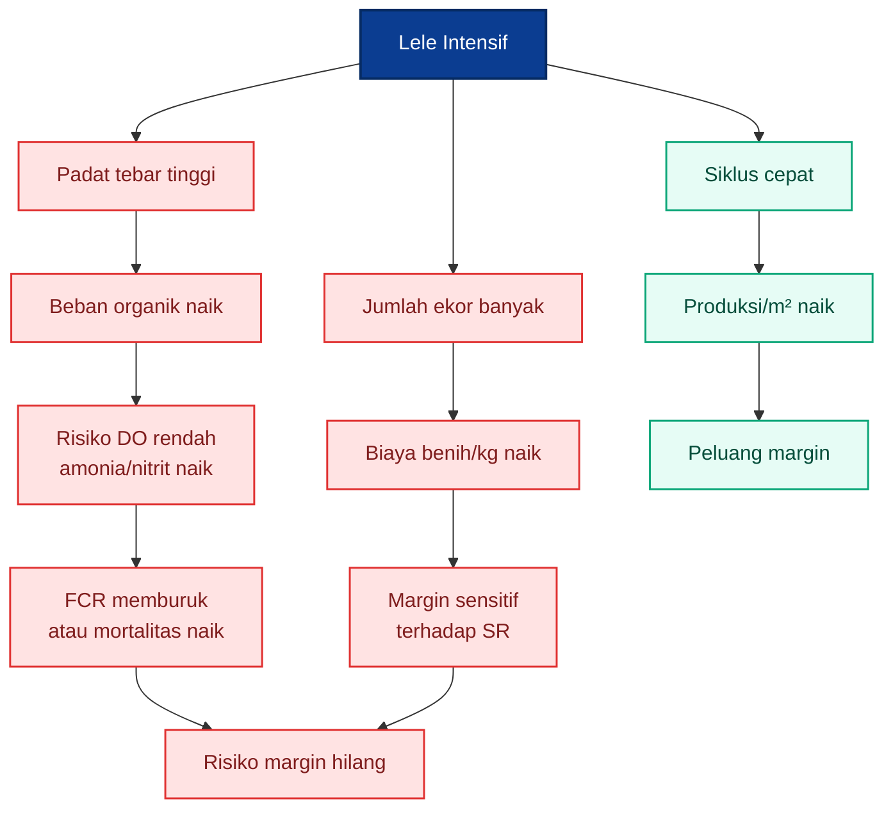
```mermaid id="4eh9mn"
flowchart TD
    A["Lele Intensif"] --> B["Siklus cepat"]
    A --> C["Padat tebar tinggi"]
    A --> D["Jumlah ekor banyak"]

    B --> E["Produksi/m² naik"]
    C --> F["Beban organik naik"]
    D --> G["Biaya benih/kg naik"]

    F --> H["Risiko DO rendah<br/>amonia/nitrit naik"]
    G --> I["Margin sensitif<br/>terhadap SR"]
    H --> J["FCR memburuk<br/>atau mortalitas naik"]

    E --> K["Peluang margin"]
    J --> L["Risiko margin hilang"]
    I --> L

    classDef main fill:#0B3D91,color:#FFFFFF,stroke:#062B63,stroke-width:2px;
    classDef plus fill:#E6FCF5,color:#064E3B,stroke:#0CA678,stroke-width:1.5px;
    classDef risk fill:#FFE3E3,color:#7F1D1D,stroke:#E03131,stroke-width:1.5px;
    classDef cost fill:#FFF3BF,color:#5F370E,stroke:#E67700,stroke-width:1.5px;

    class A main;
    class B,E,K plus;
    class C,D,F,G,H,I,J,L risk;
```

---

### 7.2.3 Biaya Benih per Kg Panen Perlu Diperhatikan

Lele dipanen pada ukuran kecil, dalam model ini **100 gram/ekor**. Artinya, 1 kg panen membutuhkan sekitar **10 ekor lele**. Sebaliknya, nila pada bobot 250 gram/ekor hanya membutuhkan sekitar **4 ekor/kg**.

Pada harga benih Rp400/ekor, biaya benih lele menjadi signifikan.

| Sistem       | Biaya Benih |  Produksi | Benih/kg Ikan |
| ------------ | ----------: | --------: | ------------: |
| Kolam statis |   Rp120.000 |  25,50 kg |    Rp4.706/kg |
| Bioflok      |   Rp280.000 |  63,00 kg |    Rp4.444/kg |
| RAS          |   Rp520.000 | 119,60 kg |    Rp4.348/kg |

Biaya benih lele per kg berada di sekitar **Rp4.300–Rp4.700/kg ikan**. Ini jauh lebih berat dibanding nila bioflok yang sekitar **Rp2.174/kg ikan** pada model Bab 6.

Implikasinya:

**Lele tidak boleh dinilai hanya dari harga benih per ekor. Yang harus dihitung adalah biaya benih per kg panen.**

---

### 7.2.4 Margin Sangat Sensitif terhadap Harga Jual dan FCR

Lele adalah komoditas dengan harga jual lebih rendah daripada nila dalam model artikel ini. Karena harga jual hanya Rp23.000/kg, ruang margin menjadi sempit.

Pada lele bioflok:

| Komponen   | Nilai per kg |
| ---------- | -----------: |
| Harga jual |  Rp23.000/kg |
| HPP all-in |  Rp21.607/kg |
| Margin/kg  |   Rp1.393/kg |

Margin per kg hanya sekitar:

$$
23.000 - 21.607 = 1.393
$$

Artinya, jika FCR memburuk sedikit atau harga jual turun, margin bisa langsung habis.

### Simulasi Sensitivitas FCR Lele Bioflok

Asumsi lain tetap:

| FCR Lele Bioflok |  HPP All-In |  Margin/kg |
| ---------------: | ----------: | ---------: |
|             1,00 | Rp19.882/kg | Rp3.118/kg |
|             1,15 | Rp21.607/kg | Rp1.393/kg |
|             1,30 | Rp23.332/kg |  -Rp332/kg |

Pada FCR **1,30**, lele bioflok sudah mendekati rugi sebelum tenaga kerja, sewa lahan, transportasi, dan risiko lain dihitung.

---

### 7.2.5 Kolam Statis Lele Sangat Tipis Marginnya

Dalam model ini, kolam statis lele menghasilkan margin negatif tipis:

| Indikator  |             Nilai |
| ---------- | ----------------: |
| Produksi   | 25,50 kg/m²/tahun |
| HPP all-in |       Rp23.178/kg |
| Harga jual |       Rp23.000/kg |
| Margin     | -Rp4.543/m²/tahun |

Ini bukan berarti kolam statis lele selalu rugi. Namun pada asumsi harga jual Rp23.000/kg, FCR 1,50, dan benih Rp400/ekor, ruang margin kolam statis sangat sempit.

Kolam statis lele baru menarik jika minimal salah satu kondisi berikut terpenuhi:

| Syarat Perbaikan                    | Dampak                    |
| ----------------------------------- | ------------------------- |
| Harga jual lebih tinggi             | Revenue naik              |
| FCR turun ke sekitar 1,3–1,4        | HPP turun                 |
| Benih lebih murah dan seragam       | Biaya/kg turun            |
| SR lebih tinggi                     | Produksi naik             |
| Pakan lebih efisien                 | Margin membaik            |
| Lahan dan tenaga kerja sangat murah | Beban bisnis lebih ringan |

---

### 7.2.6 RAS Lele: Volume Tinggi, tetapi Risiko dan CAPEX Tinggi

Dalam model base-case, RAS lele menghasilkan margin tertinggi dibanding kolam statis dan bioflok lele:

| Sistem       | Margin/m²/tahun |
| ------------ | --------------: |
| Kolam statis |        -Rp4.543 |
| Bioflok      |        Rp87.749 |
| RAS          |       Rp153.796 |

Namun angka ini harus dibaca hati-hati. RAS lele menang karena produksi sangat tinggi, yaitu **119,60 kg/m²/tahun**. Tetapi HPP all-in RAS tetap tinggi, yaitu **Rp21.714/kg**, dan margin per kg hanya sekitar:

$$
23.000 - 21.714 = 1.286
$$

Jadi, RAS lele bukan sistem dengan margin per kg besar. RAS lele hanya menang secara total margin/m² karena volume tinggi.

Titik risikonya:

| Risiko                        | Dampak                            |
| ----------------------------- | --------------------------------- |
| Harga jual turun Rp1.500/kg   | Margin RAS bisa hilang signifikan |
| Listrik naik atau pompa boros | HPP naik                          |
| Biofilter gagal               | Mortalitas atau panen mundur      |
| SR turun                      | Produksi turun, HPP naik          |
| CAPEX aktual lebih mahal      | Payback makin lama                |
| Operator tidak teknis         | Risiko sistemik tinggi            |

---

### 7.2.7 Payback CAPEX Non-Kolam

Payback dihitung dari cash margin sebelum depresiasi:

$$
\text{Payback} = \frac{ \text{CAPEX Non-Kolam} }{ \text{Revenue} - \text{Cash OPEX} }
$$

| Sistem       | CAPEX Non-Kolam | Cash Margin/m²/tahun |    Payback |
| ------------ | --------------: | -------------------: | ---------: |
| Kolam statis |        Rp50.000 |              Rp7.957 | 6,28 tahun |
| Bioflok      |       Rp350.000 |            Rp175.249 | 2,00 tahun |
| RAS          |     Rp1.200.000 |            Rp393.796 | 3,05 tahun |

Pembacaan:

- Kolam statis lele tidak menarik pada model ini karena cash margin terlalu kecil.
- Bioflok lebih seimbang dari sisi modal dan risiko.
- RAS menghasilkan cash margin lebih tinggi, tetapi payback tetap lebih panjang karena CAPEX besar.

---

## 7.3 Kesimpulan Bab 7

Untuk lele, hasil base-case menunjukkan:

| Indikator                           | Pemenang     |
| ----------------------------------- | ------------ |
| Produksi tertinggi                  | **RAS**      |
| HPP cash terendah                   | **RAS**      |
| HPP all-in terendah                 | **Bioflok**  |
| Margin/m² tertinggi                 | **RAS**      |
| Sistem paling sederhana             | Kolam statis |
| Sistem paling seimbang risiko-modal | **Bioflok**  |

Kesimpulan praktis:

**Lele unggul pada siklus cepat dan volume, tetapi margin sangat sensitif terhadap harga jual, FCR, biaya benih, dan survival rate.**

Kolam statis lele sangat tipis marginnya pada harga jual Rp23.000/kg. Bioflok lebih seimbang, tetapi margin tidak sebesar yang sering diasumsikan jika padat tebar dihitung pada baseline setara risiko. RAS dapat memberi margin/m² lebih tinggi, tetapi hanya layak untuk operator teknis dengan kontrol kualitas air dan listrik yang sangat disiplin.

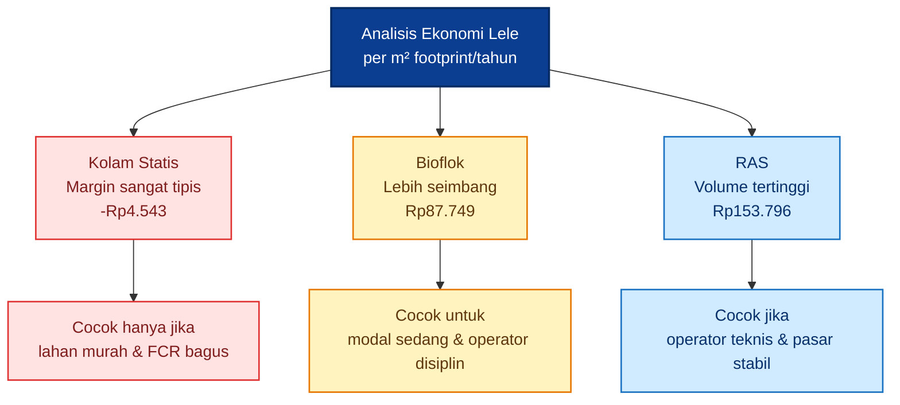
```mermaid id="njgpi4"
flowchart TD
    A["Analisis Ekonomi Lele<br/>per m² footprint/tahun"] --> B["Kolam Statis<br/>Margin sangat tipis<br/>-Rp4.543"]
    A --> C["Bioflok<br/>Lebih seimbang<br/>Rp87.749"]
    A --> D["RAS<br/>Volume tertinggi<br/>Rp153.796"]

    B --> E["Cocok hanya jika<br/>lahan murah & FCR bagus"]
    C --> F["Cocok untuk<br/>modal sedang & operator disiplin"]
    D --> G["Cocok jika<br/>operator teknis & pasar stabil"]

    classDef main fill:#0B3D91,color:#FFFFFF,stroke:#062B63,stroke-width:2px;
    classDef weak fill:#FFE3E3,color:#7F1D1D,stroke:#E03131,stroke-width:1.5px;
    classDef balanced fill:#FFF3BF,color:#5F370E,stroke:#E67700,stroke-width:1.5px;
    classDef strong fill:#D0EBFF,color:#08306B,stroke:#1971C2,stroke-width:1.5px;

    class A main;
    class B,E weak;
    class C,F balanced;
    class D,G strong;
```

[**Kembali ke Atas**](#komparasi-ekonomi-budidaya-nila-dan-lele-pada-kolam-statis-bioflok-dan-ras-berbasis-m-footprint-lahan)

---

# 8. Analisis Khusus Bioflok Lele vs Nila

Bab ini adalah bagian paling penting dari artikel karena sering terjadi salah baca dalam membandingkan bioflok lele dan bioflok nila.

Kesalahan umum adalah menyimpulkan bahwa **lele bioflok pasti lebih unggul** hanya karena lele tahan padat tebar dan siklusnya lebih cepat. Padahal, dalam bisnis, yang harus dibandingkan bukan hanya produksi kg/m², tetapi juga:

- harga jual;
- FCR;
- biaya pakan/kg;
- biaya benih/kg;
- listrik/kg;
- HPP all-in;
- margin/kg;
- margin/m²;
- risiko teknis;
- stabilitas pasar;
- kebutuhan skill operator.

---

## 8.1 Pertanyaan Kunci

Pertanyaan utama bab ini adalah:

**Apakah bioflok lele lebih unggul dari bioflok nila, atau justru nila lebih rasional secara bisnis?**

Jawaban ringkasnya:

**Pada base-case risiko setara, nila bioflok lebih rasional sebagai mesin profit stabil. Lele bioflok unggul pada volume, tetapi marginnya jauh lebih sensitif terhadap FCR, harga jual, benih, grading, dan survival rate.**

---

## 8.2 Perbandingan Biologis

Nila dan lele tidak boleh diperlakukan sama dalam bioflok. Nila dikenal sebagai ikan omnivora/grazer yang dapat memanfaatkan fitoplankton, perifiton, detritus, dan bacterial films. Karakter ini membuat nila lebih cocok memanfaatkan partikel organik dan flok sebagai tambahan nutrisi. ([FAOHome][2])

Lele, khususnya _Clarias gariepinus_, memang omnivora dan fleksibel dalam pakan, tetapi juga memiliki karakter predator/karnivora dalam perilaku makan. Karena itu, flok pada lele lebih tepat dibaca sebagai pendukung kualitas air dan tambahan nutrisi terbatas, bukan substitusi pakan sekuat pada nila. ([FAOHome][3])

| Aspek                       | Nila Bioflok    | Lele Bioflok                 |
| --------------------------- | --------------- | ---------------------------- |
| Tipe makan                  | Omnivora/grazer | Omnivora cenderung karnivora |
| Pemanfaatan flok            | Tinggi          | Sedang                       |
| Jumlah ekor/kg panen        | Lebih sedikit   | Lebih banyak                 |
| Biaya benih/kg              | Lebih rendah    | Lebih tinggi                 |
| Risiko grading              | Sedang          | Tinggi                       |
| Potensi padat tebar ekstrem | Sedang          | Tinggi                       |
| Stabilitas FCR              | Lebih stabil    | Lebih sensitif               |

---

## 8.3 Perbandingan Ekonomi

Perbandingan berikut memakai base-case setara risiko:

| Parameter                 | Nila Bioflok | Lele Bioflok |
| ------------------------- | -----------: | -----------: |
| Padat tebar acuan         |  100 ekor/m³ |  250 ekor/m³ |
| Ekor efektif/m² footprint |      80 ekor |     200 ekor |
| SR                        |          92% |          90% |
| Bobot panen               |        250 g |        100 g |
| Siklus/tahun              |          2,5 |          3,5 |
| FCR                       |         1,10 |         1,15 |
| Harga jual                |  Rp30.000/kg |  Rp23.000/kg |

Padat tebar ini sengaja tidak memakai skenario ekstrem. KKP menempatkan lele 250 ekor/m³ dan nila 100 ekor/m³ sebagai intensifikasi sedang yang direkomendasikan, sedangkan lele di atas 300 ekor/m³ dan nila di atas 100 ekor/m³ masuk intensifikasi tinggi. ([KKP][1])

---

### 8.3.1 Tabel Perbandingan Ekonomi Bioflok

| Indikator            |    Nila Bioflok |    Lele Bioflok |
| -------------------- | --------------: | --------------: |
| Produksi kg/m²/tahun |    **46,00 kg** |    **63,00 kg** |
| Harga jual           |     Rp30.000/kg |     Rp23.000/kg |
| Revenue/m²/tahun     |     Rp1.380.000 |     Rp1.449.000 |
| FCR                  |            1,10 |            1,15 |
| Feed cost/kg ikan    |        Rp12.650 |        Rp13.225 |
| Benih/kg ikan        |         Rp2.174 |         Rp4.444 |
| Listrik/kg ikan      |         Rp1.884 |         Rp1.834 |
| HPP all-in           | **Rp18.882/kg** | **Rp21.607/kg** |
| Margin/kg            | **Rp11.118/kg** |  **Rp1.393/kg** |
| Margin/m²/tahun      |   **Rp511.418** |    **Rp87.749** |

---

### 8.3.2 Pembacaan Angka Kunci

Lele bioflok menghasilkan produksi lebih tinggi:

$$
\begin{aligned}
\text{Rasio produksi lele bioflok terhadap nila bioflok}
&= \frac{63{,}00}{46{,}00} \\
&= 1{,}37
\end{aligned}
$$

Artinya, produksi lele bioflok sekitar **37% lebih tinggi** daripada nila bioflok.

Namun margin per m² lele jauh lebih rendah:

$$
\begin{aligned}
\text{Rasio margin lele bioflok terhadap nila bioflok}
&= \frac{87.749}{511.418} \\
&= 0{,}17
\end{aligned}
$$

Artinya, margin lele bioflok hanya sekitar **17% dari margin nila bioflok** pada base-case ini.

Sebaliknya, margin nila bioflok sekitar:

$$
\begin{aligned}
\text{Rasio margin nila bioflok terhadap lele bioflok}
&= \frac{511.418}{87.749} \\
&= 5{,}83
\end{aligned}
$$

Artinya, margin nila bioflok sekitar **5,8 kali** margin lele bioflok.

---

### 8.3.3 Kenapa Lele Kalah pada Base-Case?

Lele kalah bukan karena lele tidak cocok dibudidayakan. Lele kalah pada base-case karena kombinasi empat faktor ekonomi.

| Faktor       | Nila Bioflok | Lele Bioflok | Dampak                                       |
| ------------ | -----------: | -----------: | -------------------------------------------- |
| Harga jual   |  Rp30.000/kg |  Rp23.000/kg | Lele punya ruang margin lebih sempit         |
| Feed cost/kg |     Rp12.650 |     Rp13.225 | Lele sedikit lebih mahal                     |
| Benih/kg     |      Rp2.174 |      Rp4.444 | Lele jauh lebih berat di benih               |
| Margin/kg    |     Rp11.118 |      Rp1.393 | Lele sangat sensitif terhadap gangguan kecil |

Lele memang menang volume, tetapi volume itu tidak cukup untuk menutup selisih harga jual, biaya benih/kg, dan sensitivitas FCR.

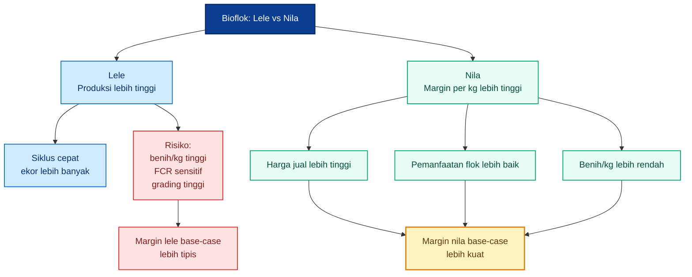
```mermaid id="1h3acu"
flowchart TD
    A["Bioflok: Lele vs Nila"] --> B["Lele<br/>Produksi lebih tinggi"]
    A --> C["Nila<br/>Margin per kg lebih tinggi"]

    B --> D["Siklus cepat<br/>ekor lebih banyak"]
    B --> E["Risiko:<br/>benih/kg tinggi<br/>FCR sensitif<br/>grading tinggi"]

    C --> F["Harga jual lebih tinggi"]
    C --> G["Pemanfaatan flok lebih baik"]
    C --> H["Benih/kg lebih rendah"]

    E --> I["Margin lele base-case<br/>lebih tipis"]
    F --> J["Margin nila base-case<br/>lebih kuat"]
    G --> J
    H --> J

    classDef main fill:#0B3D91,color:#FFFFFF,stroke:#062B63,stroke-width:2px;
    classDef lele fill:#D0EBFF,color:#08306B,stroke:#1971C2,stroke-width:1.5px;
    classDef nila fill:#E6FCF5,color:#064E3B,stroke:#0CA678,stroke-width:1.5px;
    classDef risk fill:#FFE3E3,color:#7F1D1D,stroke:#E03131,stroke-width:1.5px;
    classDef result fill:#FFF3BF,color:#5F370E,stroke:#E67700,stroke-width:2px;

    class A main;
    class B,D lele;
    class C,F,G,H nila;
    class E,I risk;
    class J result;
```

---

## 8.4 Kesimpulan Bioflok

### 8.4.1 Kesimpulan Base-Case

Pada base-case risiko setara:

| Indikator             | Pemenang |
| --------------------- | -------- |
| Produksi kg/m²/tahun  | **Lele** |
| Harga jual/kg         | **Nila** |
| Feed cost/kg          | **Nila** |
| Benih/kg              | **Nila** |
| HPP all-in            | **Nila** |
| Margin/kg             | **Nila** |
| Margin/m²/tahun       | **Nila** |
| Risiko grading        | **Nila** |
| Potensi padat ekstrem | **Lele** |

Kesimpulan tajam:

**Lele bioflok unggul dalam volume, tetapi nila bioflok unggul dalam profitabilitas base-case.**

Nila bioflok lebih kuat sebagai sistem profit stabil karena:

1. harga jual lebih tinggi;
2. HPP all-in lebih rendah;
3. margin/kg jauh lebih tebal;
4. biaya benih/kg lebih rendah;
5. pemanfaatan flok lebih baik;
6. risiko FCR lebih terkendali.

---

### 8.4.2 Kapan Lele Bioflok Bisa Mengalahkan Nila?

Lele bioflok bisa mengalahkan nila jika masuk skenario agresif, bukan base-case.

Syaratnya:

- padat tebar naik ke kisaran **500 ekor/m³**;
- FCR sangat rendah, idealnya sekitar **≤1,00–1,03** pada asumsi harga artikel ini;
- SR stabil;
- grading dilakukan disiplin;
- aerasi kuat dan backup listrik tersedia;
- pasar mampu menyerap volume tinggi;
- harga jual tidak jatuh saat panen massal.

### Simulasi Lele Bioflok Agresif

Asumsi skenario agresif:

| Parameter         |              Nilai |
| ----------------- | -----------------: |
| Padat tebar       |        500 ekor/m³ |
| Volume efektif/m² |             0,8 m³ |
| Ekor tebar/m²     |           400 ekor |
| SR                |                90% |
| Bobot panen       |              100 g |
| Siklus/tahun      |                3,5 |
| Produksi          |    126 kg/m²/tahun |
| Harga jual        |        Rp23.000/kg |
| Listrik           |   120 kWh/m²/tahun |
| Treatment         |  Rp65.000/m²/tahun |
| Depresiasi        | Rp100.000/m²/tahun |

Hasil simulasi:

| Skenario Lele Agresif | Margin/m²/tahun | Dibanding Nila Bioflok Base-Case |
| --------------------- | --------------: | -------------------------------: |
| FCR 1,15              |       Rp335.386 |                      Masih kalah |
| FCR 1,05              |       Rp480.286 |                    Hampir setara |
| FCR 1,00              |       Rp552.736 |                 Mengalahkan nila |

Nila bioflok base-case menghasilkan margin:

**Rp511.418/m²/tahun**

Jadi, pada harga jual lele Rp23.000/kg, lele bioflok agresif baru mengalahkan nila bioflok jika FCR mendekati **1,00** dan seluruh risiko teknis terkendali.

---

### 8.4.3 Formula Ambang FCR Lele Agresif

Untuk menghitung FCR maksimum agar lele agresif mengalahkan nila bioflok:

$$
FCR_{maks} = \frac{ \text{Revenue Lele} ------------------- \text{Biaya Non-Pakan Lele} \text{Target Margin Nila} }{ \text{Produksi Lele} \times \text{Harga Pakan} }
$$

Dengan asumsi:

| Komponen                   |       Nilai |
| -------------------------- | ----------: |
| Revenue lele agresif       | Rp2.898.000 |
| Biaya non-pakan lele       |   Rp898.364 |
| Target margin nila bioflok |   Rp511.418 |
| Produksi lele agresif      |      126 kg |
| Harga pakan                | Rp11.500/kg |

Maka:

$$
FCR_{maks} = \frac{ 2.898.000 - 898.364 - 511.418 }{ 126 \times 11.500 }
$$

$$
FCR_{maks} = 1{,}03
$$

Artinya:

**Lele bioflok agresif harus menjaga FCR sekitar 1,03 atau lebih rendah untuk mengalahkan margin nila bioflok base-case.**

Ini adalah standar yang berat, terutama jika padat tebar tinggi, kualitas benih tidak seragam, listrik tidak stabil, atau operator belum berpengalaman.

---

## 8.5 Putusan Praktisi

Untuk praktisi, keputusan tidak boleh berbunyi “lele lebih baik” atau “nila lebih baik” secara mutlak. Keputusan harus berbasis kondisi usaha.

| Kondisi Usaha                       | Pilihan Lebih Rasional        |
| ----------------------------------- | ----------------------------- |
| Target profit stabil per m²         | **Nila bioflok**              |
| Target volume cepat                 | Lele bioflok                  |
| Operator pemula-menengah            | Nila bioflok konservatif      |
| Operator sangat berpengalaman       | Lele bioflok intensif/agresif |
| Pasar nila kuat                     | Nila bioflok                  |
| Pasar lele menyerap besar dan cepat | Lele bioflok                  |
| Harga lele rendah/fluktuatif        | Hindari lele padat tinggi     |
| Listrik tidak stabil                | Hindari bioflok padat ekstrem |
| Modal backup aerasi terbatas        | Jangan masuk lele agresif     |

---

## 8.6 Kesimpulan Bab 8

Kesimpulan utama:

**Untuk base-case risiko setara, nila bioflok lebih rasional sebagai mesin profit stabil dibanding lele bioflok.**

Lele bioflok bukan buruk. Lele memiliki keunggulan pada:

- siklus cepat;
- produksi kg/m² tinggi;
- potensi padat tebar ekstrem;
- permintaan pasar massal.

Namun, lele juga membawa kelemahan ekonomi:

- harga jual lebih rendah;
- biaya benih/kg lebih tinggi;
- margin/kg tipis;
- FCR sangat menentukan;
- grading lebih penting;
- risiko padat tebar tinggi lebih besar.

Karena itu, putusan tajamnya adalah:

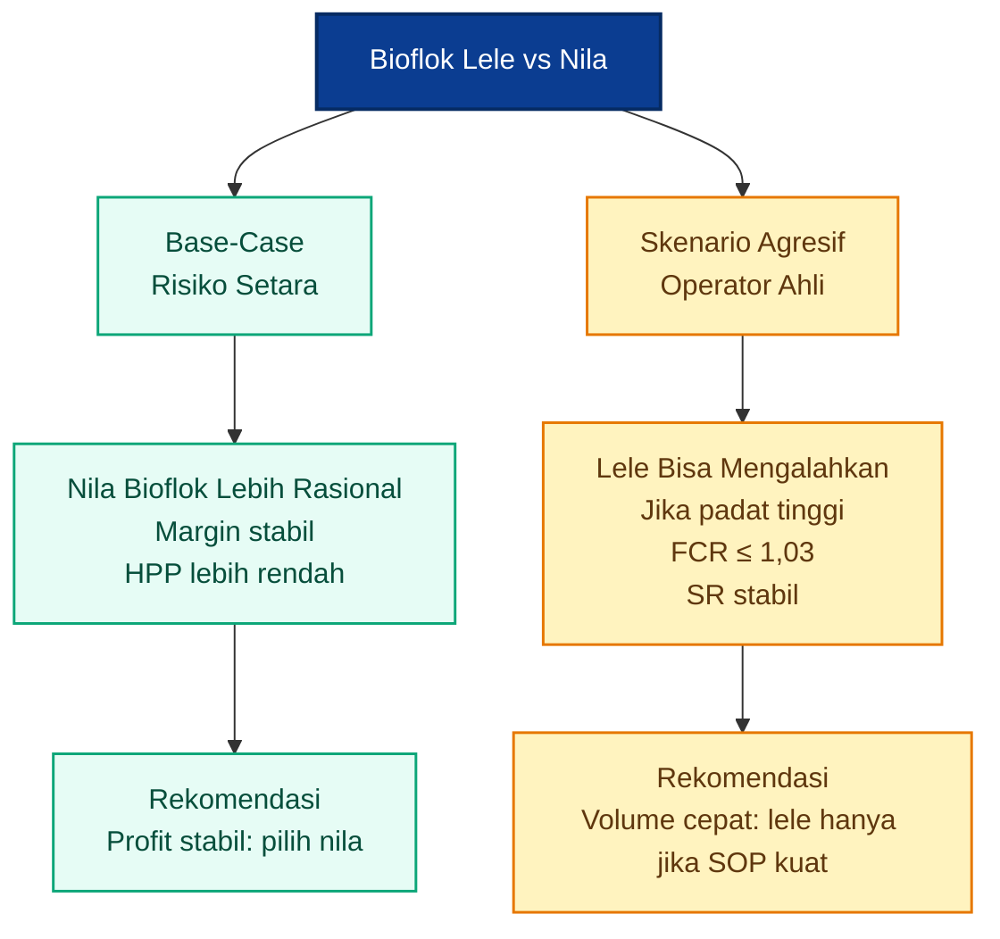
```mermaid id="6fw36u"
flowchart TD
    A["Bioflok Lele vs Nila"] --> B["Base-Case<br/>Risiko Setara"]
    A --> C["Skenario Agresif<br/>Operator Ahli"]

    B --> D["Nila Bioflok Lebih Rasional<br/>Margin stabil<br/>HPP lebih rendah"]
    C --> E["Lele Bisa Mengalahkan<br/>Jika padat tinggi<br/>FCR ≤ 1,03<br/>SR stabil"]

    D --> F["Rekomendasi<br/>Profit stabil: pilih nila"]
    E --> G["Rekomendasi<br/>Volume cepat: lele hanya jika SOP kuat"]

    classDef main fill:#0B3D91,color:#FFFFFF,stroke:#062B63,stroke-width:2px;
    classDef base fill:#E6FCF5,color:#064E3B,stroke:#0CA678,stroke-width:1.5px;
    classDef aggressive fill:#FFF3BF,color:#5F370E,stroke:#E67700,stroke-width:1.5px;
    classDef result fill:#FFE3E3,color:#7F1D1D,stroke:#E03131,stroke-width:2px;

    class A main;
    class B,D,F base;
    class C,E,G aggressive;
```

**Nila bioflok adalah pilihan lebih aman untuk profit per m². Lele bioflok adalah pilihan volume, tetapi hanya layak mengalahkan nila jika dikelola sebagai sistem intensif-agresif dengan kontrol teknis tinggi.**

[**Kembali ke Atas**](#komparasi-ekonomi-budidaya-nila-dan-lele-pada-kolam-statis-bioflok-dan-ras-berbasis-m-footprint-lahan)

[1]: https://kkp.go.id/storage/Materi/panduan-budi-daya-ikan-nilalele-di-bak-bulat-bioflok6982e9ada5a67/materi-6982e9adaa327.pdf 'PowerPoint Presentation'
[2]: https://www.fao.org/fishery/en/culturedspecies/oreochromis_niloticus 'FAO Fisheries & Aquaculture'
[3]: https://www.fao.org/fishery/en/culturedspecies/clarias_gariepinus/en 'FAO Fisheries & Aquaculture'

---

# 9. Sensitivitas dan Risiko Bisnis

Analisis ekonomi pada Bab 6–8 menunjukkan hasil base-case. Namun dalam bisnis budidaya ikan, hasil aktual jarang persis sama dengan base-case. Margin dapat berubah cepat karena harga jual, FCR, survival rate, listrik, dan siklus panen.

Karena itu, bab ini tidak hanya membahas risiko secara umum, tetapi juga menunjukkan **variabel mana yang paling berbahaya terhadap profit**.

Prinsip utamanya:

**Semakin intensif sistem budidaya, semakin besar kebutuhan kontrol. Semakin besar kepadatan, semakin kecil toleransi terhadap kesalahan.**

---

## 9.1 Sensitivitas Wajib

Tabel berikut adalah daftar variabel yang wajib diuji sebelum keputusan investasi.

| Variabel          | Dampak terhadap bisnis            |
| ----------------- | --------------------------------- |
| Harga jual turun  | Margin langsung turun             |
| Harga pakan naik  | HPP naik signifikan               |
| FCR memburuk      | Profit tergerus cepat             |
| SR turun          | Produksi turun, HPP naik          |
| Listrik naik/mati | Risiko besar pada bioflok dan RAS |
| CAPEX naik        | Payback makin lama                |
| Siklus molor      | Produksi tahunan turun            |

---

### 9.1.1 Formula Dampak Harga Jual

Dampak perubahan harga jual terhadap margin dapat dihitung dengan formula:

$$
\Delta \text{Margin} = \Delta \text{Harga Jual} \times \text{Produksi Tahunan}
$$

Contoh:

Jika harga jual nila bioflok turun Rp2.000/kg dan produksi 46 kg/m²/tahun:

$$
\Delta \text{Margin} = -2.000 \times 46 = -92.000
$$

Artinya, margin nila bioflok turun:

**Rp92.000/m²/tahun**

Pada sistem dengan produksi tinggi, dampak harga jual semakin besar. Ini alasan mengapa RAS dan bioflok intensif harus memiliki kepastian pasar lebih kuat daripada kolam statis.

---

### 9.1.2 Formula Dampak FCR Memburuk

Dampak FCR terhadap biaya pakan:

$$
\Delta \text{Biaya Pakan} = \Delta FCR \times \text{Produksi Tahunan} \times \text{Harga Pakan}
$$

Contoh:

Jika FCR lele bioflok naik dari 1,15 menjadi 1,30, maka:

$$
\Delta FCR = 1{,}30 - 1{,}15 = 0{,}15
$$

Dengan produksi 63 kg/m²/tahun dan harga pakan Rp11.500/kg:

$$
\Delta \text{Biaya Pakan} = 0{,}15 \times 63 \times 11.500 = 108.675
$$

Artinya, biaya pakan naik:

**Rp108.675/m²/tahun**

Ini besar karena margin lele bioflok base-case hanya sekitar **Rp87.749/m²/tahun**. Dengan kata lain, kenaikan FCR dari 1,15 ke 1,30 dapat menghapus seluruh margin lele bioflok.

---

### 9.1.3 Formula Dampak Survival Rate Turun

Dampak penurunan SR terhadap produksi:

$$
\Delta \text{Produksi} = N \times \Delta SR \times W_p \times C
$$

Keterangan:

| Simbol      | Arti                    |
| ----------- | ----------------------- |
| $N$         | Ekor tebar per m²       |
| $\Delta SR$ | Perubahan survival rate |
| $W_p$       | Bobot panen per ekor    |
| $C$         | Siklus per tahun        |

Penurunan SR berbahaya karena memiliki dua dampak sekaligus:

1. produksi turun;
2. biaya benih dan sebagian OPEX tetap sudah keluar.

Pada sistem padat tebar tinggi, penurunan SR kecil dapat menjadi kerugian besar.

---

### 9.1.4 Peta Sensitivitas Praktis

| Variabel       |  Kolam Statis |       Bioflok |           RAS |
| -------------- | ------------: | ------------: | ------------: |
| Harga jual     |        Tinggi | Sangat tinggi | Sangat tinggi |
| Harga pakan    |        Tinggi |        Tinggi |        Tinggi |
| FCR            | Sangat tinggi | Sangat tinggi |        Tinggi |
| Survival rate  |        Tinggi | Sangat tinggi | Sangat tinggi |
| Listrik        |        Rendah | Sangat tinggi | Sangat tinggi |
| CAPEX          |        Rendah |        Sedang | Sangat tinggi |
| Skill operator |        Sedang |        Tinggi | Sangat tinggi |
| Siklus molor   |        Sedang |        Tinggi |        Tinggi |

---

### Diagram Sensitivitas Bisnis

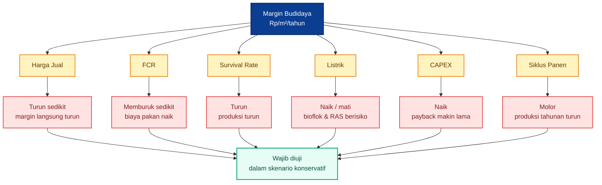
```mermaid id="h6mvrb"
flowchart TD
    A["Margin Budidaya<br/>Rp/m²/tahun"] --> B["Harga Jual"]
    A --> C["FCR"]
    A --> D["Survival Rate"]
    A --> E["Listrik"]
    A --> F["CAPEX"]
    A --> G["Siklus Panen"]

    B --> H["Turun sedikit<br/>margin langsung turun"]
    C --> I["Memburuk sedikit<br/>biaya pakan naik"]
    D --> J["Turun<br/>produksi turun"]
    E --> K["Naik / mati<br/>bioflok & RAS berisiko"]
    F --> L["Naik<br/>payback makin lama"]
    G --> M["Molor<br/>produksi tahunan turun"]

    H --> N["Wajib diuji<br/>dalam skenario konservatif"]
    I --> N
    J --> N
    K --> N
    L --> N
    M --> N

    classDef main fill:#0B3D91,color:#FFFFFF,stroke:#062B63,stroke-width:2px;
    classDef variable fill:#FFF3BF,color:#5F370E,stroke:#E67700,stroke-width:1.5px;
    classDef risk fill:#FFE3E3,color:#7F1D1D,stroke:#E03131,stroke-width:1.5px;
    classDef action fill:#E6FCF5,color:#064E3B,stroke:#0CA678,stroke-width:2px;

    class A main;
    class B,C,D,E,F,G variable;
    class H,I,J,K,L,M risk;
    class N action;
```

---

## 9.2 Risiko Kolam Statis

Kolam statis terlihat paling aman karena teknologinya sederhana. Namun secara ekonomi, kolam statis memiliki risiko tersembunyi: **produktivitas lahan rendah dan FCR mudah memburuk**.

### Risiko Utama Kolam Statis

| Risiko                         | Penyebab                                             | Dampak Bisnis                |
| ------------------------------ | ---------------------------------------------------- | ---------------------------- |
| FCR tinggi                     | Overfeeding, kualitas air buruk, pakan tidak efisien | HPP naik                     |
| Kualitas air kurang terkendali | Air relatif diam, sisa pakan menumpuk                | SR turun, pertumbuhan lambat |
| Produktivitas lahan rendah     | Padat tebar terbatas                                 | Margin/m² rendah             |
| Harga jual turun               | Ruang margin kecil                                   | Cepat rugi                   |
| Siklus molor                   | Pertumbuhan lambat                                   | Produksi tahunan turun       |
| Penyakit                       | Akumulasi limbah organik                             | Biaya treatment dan kematian |

### Risiko Ekonomi Kolam Statis

Kolam statis cocok untuk pemula, tetapi tidak cocok bila targetnya adalah memaksimalkan profit per m² di lahan mahal.

Pada nila, kolam statis masih menghasilkan margin positif pada base-case. Pada lele, kolam statis sangat tipis bahkan bisa negatif jika harga jual rendah atau FCR memburuk.

Masalah utama kolam statis bukan CAPEX, melainkan **rendahnya output per m²**.

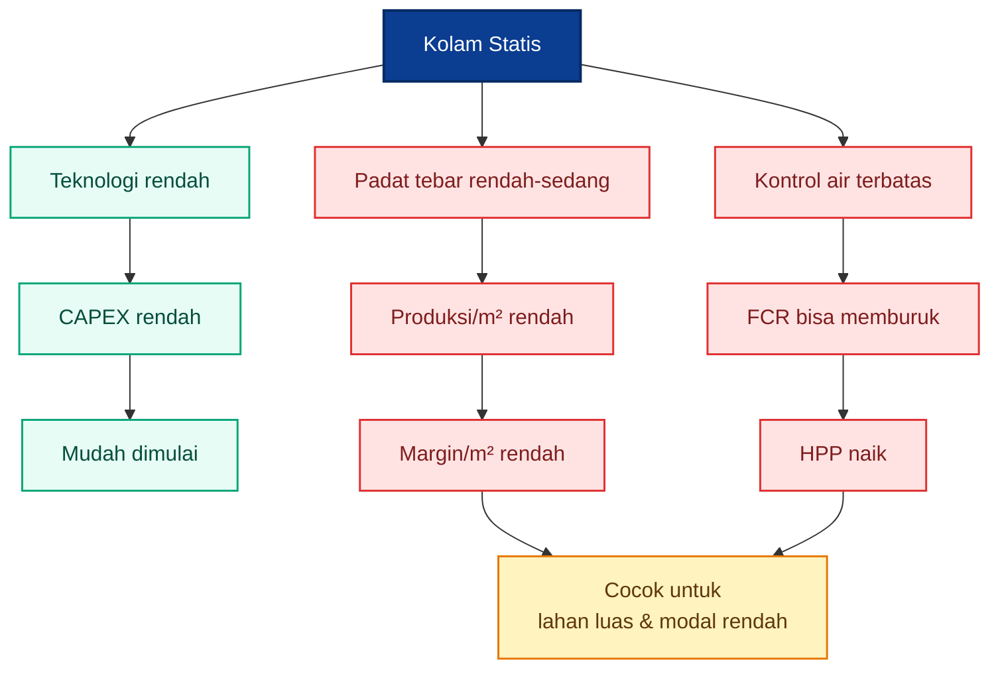
```mermaid id="fcw3ei"
flowchart TD
    A["Kolam Statis"] --> B["Teknologi rendah"]
    A --> C["Padat tebar rendah-sedang"]
    A --> D["Kontrol air terbatas"]

    B --> E["CAPEX rendah"]
    C --> F["Produksi/m² rendah"]
    D --> G["FCR bisa memburuk"]

    E --> H["Mudah dimulai"]
    F --> I["Margin/m² rendah"]
    G --> J["HPP naik"]

    I --> K["Cocok untuk<br/>lahan luas & modal rendah"]
    J --> K

    classDef main fill:#0B3D91,color:#FFFFFF,stroke:#062B63,stroke-width:2px;
    classDef plus fill:#E6FCF5,color:#064E3B,stroke:#0CA678,stroke-width:1.5px;
    classDef risk fill:#FFE3E3,color:#7F1D1D,stroke:#E03131,stroke-width:1.5px;
    classDef note fill:#FFF3BF,color:#5F370E,stroke:#E67700,stroke-width:1.5px;

    class A main;
    class B,E,H plus;
    class C,D,F,G,I,J risk;
    class K note;
```

### Mitigasi Risiko Kolam Statis

| Risiko             | Mitigasi                                                      |
| ------------------ | ------------------------------------------------------------- |
| FCR tinggi         | Sampling bobot rutin, pakan bertahap, catat konsumsi pakan    |
| Kualitas air buruk | Pergantian air berkala, kapur, siphon dasar bila memungkinkan |
| Oksigen rendah     | Aerasi ringan pada malam/pagi hari                            |
| SR rendah          | Gunakan benih seragam dan sehat                               |
| Margin tipis       | Pastikan harga jual sebelum tebar                             |
| Siklus molor       | Kontrol kepadatan dan kualitas pakan                          |

---

## 9.3 Risiko Bioflok

Bioflok adalah sistem yang paling menarik dari sisi optimasi footprint, tetapi risikonya lebih tinggi daripada kolam statis. Kegagalan bioflok umumnya bukan karena konsepnya salah, melainkan karena operator tidak menjaga aerasi, pakan, C:N, dan kualitas air.

### Risiko Utama Bioflok

| Risiko                     | Penyebab                                 | Dampak Bisnis                        |
| -------------------------- | ---------------------------------------- | ------------------------------------ |
| Aerasi mati                | Listrik padam, blower rusak              | Risiko mati massal                   |
| Flok crash                 | Mikroba tidak stabil                     | Amonia/nitrit melonjak               |
| Amonia/nitrit tinggi       | Overfeeding, C:N buruk, flok tidak aktif | Ikan stres, FCR naik                 |
| Flok terlalu pekat         | Akumulasi organik berlebih               | Insang terganggu, kualitas air turun |
| Operator tidak disiplin    | Tidak ukur DO, pH, TAN, nitrit           | Keputusan salah                      |
| Padat tebar terlalu tinggi | Beban organik melampaui kapasitas sistem | SR turun, panen gagal                |
| Backup listrik tidak ada   | Aerasi berhenti saat listrik padam       | Risiko kerugian besar                |

### Diagram Risiko Bioflok

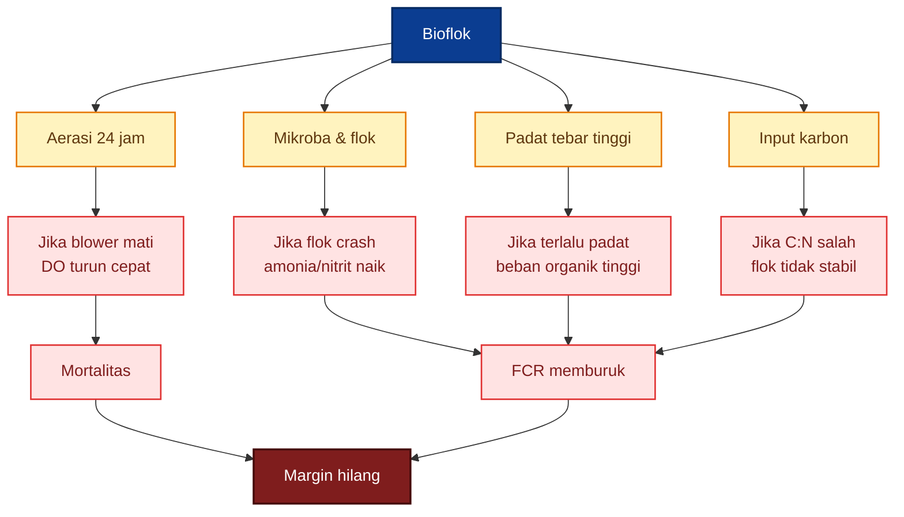
```mermaid id="c6ohqe"
flowchart TD
    A["Bioflok"] --> B["Aerasi 24 jam"]
    A --> C["Mikroba & flok"]
    A --> D["Padat tebar tinggi"]
    A --> E["Input karbon"]

    B --> F["Jika blower mati<br/>DO turun cepat"]
    C --> G["Jika flok crash<br/>amonia/nitrit naik"]
    D --> H["Jika terlalu padat<br/>beban organik tinggi"]
    E --> I["Jika C:N salah<br/>flok tidak stabil"]

    F --> J["Mortalitas"]
    G --> K["FCR memburuk"]
    H --> K
    I --> K

    J --> L["Margin hilang"]
    K --> L

    classDef main fill:#0B3D91,color:#FFFFFF,stroke:#062B63,stroke-width:2px;
    classDef system fill:#FFF3BF,color:#5F370E,stroke:#E67700,stroke-width:1.5px;
    classDef risk fill:#FFE3E3,color:#7F1D1D,stroke:#E03131,stroke-width:1.5px;
    classDef loss fill:#7F1D1D,color:#FFFFFF,stroke:#450A0A,stroke-width:2px;

    class A main;
    class B,C,D,E system;
    class F,G,H,I,J,K risk;
    class L loss;
```

### Risiko Spesifik Nila Bioflok

Nila bioflok unggul dalam pemanfaatan flok, tetapi tetap sensitif terhadap oksigen dan kualitas air.

| Risiko                  | Dampak                                  |
| ----------------------- | --------------------------------------- |
| DO rendah               | Nafsu makan turun, pertumbuhan melambat |
| Flok terlalu padat      | Gangguan insang                         |
| pH tidak stabil         | Stres dan efisiensi pakan turun         |
| FCR tidak sesuai target | HPP naik                                |
| Siklus terlalu panjang  | Produksi tahunan turun                  |

### Risiko Spesifik Lele Bioflok

Lele bioflok lebih agresif dan lebih cepat, tetapi risiko operasionalnya juga tinggi.

| Risiko               | Dampak                          |
| -------------------- | ------------------------------- |
| Ukuran tidak seragam | Grading wajib, risiko kompetisi |
| Padat tebar tinggi   | Beban organik besar             |
| FCR memburuk         | Margin cepat habis              |
| SR turun             | Biaya benih/kg naik             |
| Harga jual rendah    | Ruang margin tipis              |
| Panen serempak       | Risiko pasar jenuh              |

### Mitigasi Risiko Bioflok

| Risiko                 | Mitigasi                                              |
| ---------------------- | ----------------------------------------------------- |
| Aerasi mati            | Backup blower, genset, alarm listrik                  |
| Flok crash             | Monitoring pH, DO, TAN, nitrit, alkalinitas           |
| Overfeeding            | Feeding program berbasis sampling                     |
| C:N tidak stabil       | Dosis karbon berdasarkan pakan dan kondisi air        |
| Padat tebar berlebihan | Mulai dari baseline, naik setelah 1–2 siklus berhasil |
| FCR memburuk           | Catat pakan harian dan bobot sampling                 |
| Lele tidak seragam     | Grading berkala                                       |

---

## 9.4 Risiko RAS

RAS adalah sistem dengan kontrol tertinggi, tetapi juga paling mahal dan paling teknis. Kesalahan kecil dalam desain atau operasi bisa berdampak besar karena seluruh sistem bergantung pada pompa, filter, biofilter, aerasi, dan listrik.

### Risiko Utama RAS

| Risiko                   | Penyebab                                 | Dampak Bisnis                   |
| ------------------------ | ---------------------------------------- | ------------------------------- |
| CAPEX tinggi             | Filter, pompa, biofilter, sensor, backup | Payback panjang                 |
| Listrik tinggi           | Pompa dan aerasi terus berjalan          | HPP naik                        |
| Pompa mati               | Listrik padam/kerusakan alat             | Sirkulasi berhenti              |
| Filter mekanis tersumbat | Padatan menumpuk                         | Debit turun, kualitas air buruk |
| Biofilter gagal          | Bakteri nitrifikasi terganggu            | Amonia/nitrit melonjak          |
| Oksigenasi gagal         | Aerasi/oksigen mati                      | Mortalitas cepat                |
| Operator tidak teknis    | Salah baca parameter air                 | Gagal sistem                    |
| Harga jual tidak premium | Revenue tidak cukup menutup biaya        | RAS tidak kompetitif            |

### Diagram Risiko RAS

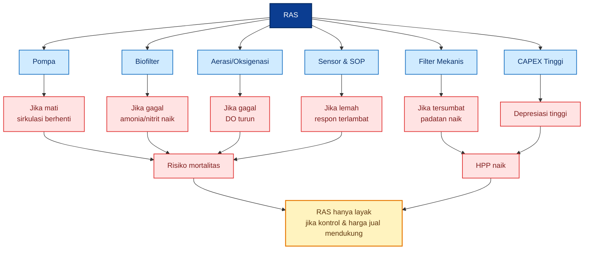
```mermaid id="9x4iyf"
flowchart TD
    A["RAS"] --> B["Pompa"]
    A --> C["Filter Mekanis"]
    A --> D["Biofilter"]
    A --> E["Aerasi/Oksigenasi"]
    A --> F["Sensor & SOP"]
    A --> G["CAPEX Tinggi"]

    B --> H["Jika mati<br/>sirkulasi berhenti"]
    C --> I["Jika tersumbat<br/>padatan naik"]
    D --> J["Jika gagal<br/>amonia/nitrit naik"]
    E --> K["Jika gagal<br/>DO turun"]
    F --> L["Jika lemah<br/>respon terlambat"]
    G --> M["Depresiasi tinggi"]

    H --> N["Risiko mortalitas"]
    I --> O["HPP naik"]
    J --> N
    K --> N
    L --> N
    M --> O

    N --> P["RAS hanya layak<br/>jika kontrol & harga jual mendukung"]
    O --> P

    classDef main fill:#0B3D91,color:#FFFFFF,stroke:#062B63,stroke-width:2px;
    classDef component fill:#D0EBFF,color:#08306B,stroke:#1971C2,stroke-width:1.5px;
    classDef risk fill:#FFE3E3,color:#7F1D1D,stroke:#E03131,stroke-width:1.5px;
    classDef result fill:#FFF3BF,color:#5F370E,stroke:#E67700,stroke-width:2px;

    class A main;
    class B,C,D,E,F,G component;
    class H,I,J,K,L,M,N,O risk;
    class P result;
```

### Kapan Risiko RAS Masih Bisa Diterima?

RAS layak dipertimbangkan jika minimal ada satu dari kondisi berikut:

| Kondisi               | Alasan                                |
| --------------------- | ------------------------------------- |
| Harga jual premium    | Menutup HPP yang lebih tinggi         |
| Lahan sangat terbatas | Produktivitas/m² menjadi prioritas    |
| Air sangat terbatas   | Resirkulasi memberi nilai ekonomi     |
| Produksi harus stabil | Cocok untuk kontrak suplai            |
| Butuh biosecurity     | Sistem tertutup lebih mudah dikontrol |
| Ada operator teknis   | Sistem kompleks butuh SOP kuat        |

Sebaliknya, RAS tidak ideal jika targetnya hanya menjual ikan konsumsi murah ke pasar umum tanpa premium harga.

---

## 9.5 Skenario Konservatif yang Wajib Diuji

Sebelum investasi, model ekonomi harus diuji minimal pada tiga skenario:

| Skenario    |    Harga Jual |           FCR |            SR |       Listrik |          CAPEX |
| ----------- | ------------: | ------------: | ------------: | ------------: | -------------: |
| Optimistis  |          Naik |         Turun |          Naik |        Stabil | Sesuai rencana |
| Base-case   | Sesuai asumsi | Sesuai asumsi | Sesuai asumsi | Sesuai asumsi |     Sesuai BoQ |
| Konservatif |         Turun |          Naik |         Turun |          Naik |           Naik |

Untuk keputusan bisnis, skenario konservatif lebih penting daripada skenario optimistis. Jika usaha masih layak pada skenario konservatif, maka model bisnis lebih kuat.

### Skenario Konservatif Minimum

| Variabel     |         Uji Minimum |
| ------------ | ------------------: |
| Harga jual   |         Turun 5–10% |
| Harga pakan  |          Naik 5–10% |
| FCR          | Naik 0,10–0,20 poin |
| SR           |            Turun 5% |
| Listrik      |            Naik 10% |
| CAPEX        |         Naik 10–20% |
| Siklus panen |        Molor 10–20% |

---

## 9.6 Kesimpulan Bab 9

Risiko terbesar dalam budidaya ikan bukan hanya kematian ikan. Risiko terbesar adalah **margin yang terlihat menarik di atas kertas, tetapi hilang karena FCR, harga jual, listrik, SR, atau siklus panen meleset sedikit dari asumsi.**

Kesimpulan tajam Bab 9:

| Sistem       | Risiko Terbesar                          | Kunci Mitigasi                               |
| ------------ | ---------------------------------------- | -------------------------------------------- |
| Kolam statis | FCR tinggi dan produktivitas rendah      | Kontrol pakan dan kualitas air               |
| Bioflok      | Aerasi mati, flok crash, FCR meleset     | Backup listrik, test kit, SOP pakan          |
| RAS          | CAPEX/listrik tinggi dan biofilter gagal | Desain benar, operator teknis, harga premium |

**Bioflok adalah sistem paling menarik untuk optimasi footprint, tetapi hanya jika operator disiplin. RAS adalah sistem paling terkendali, tetapi tidak layak jika hanya mengejar HPP murah. Kolam statis paling sederhana, tetapi lemah untuk lahan mahal.**

[**Kembali ke Atas**](#komparasi-ekonomi-budidaya-nila-dan-lele-pada-kolam-statis-bioflok-dan-ras-berbasis-m-footprint-lahan)

---

# 10. Kesimpulan dan Rekomendasi

Bab ini merangkum hasil seluruh artikel dan mengubah analisis menjadi rekomendasi praktis untuk keputusan bisnis.

Analisis dilakukan dengan satuan utama:

**Rp/m² footprint lahan/tahun**

Dengan pendekatan ini, sistem budidaya tidak hanya dinilai dari total panen, tetapi dari kemampuan menghasilkan margin dari setiap meter persegi lahan yang digunakan.

---

## 10.1 Kesimpulan Sistem

| Sistem       | Kesimpulan                                                      |
| ------------ | --------------------------------------------------------------- |
| Kolam statis | Paling sederhana, tetapi lemah pada produktivitas lahan         |
| Bioflok      | Paling menarik untuk optimasi footprint dan margin              |
| RAS          | Paling tinggi kontrol dan kepadatan, tetapi CAPEX/listrik berat |

---

### 10.1.1 Kolam Statis

Kolam statis adalah pilihan paling sederhana dan paling mudah dijalankan. Sistem ini cocok untuk pembudidaya pemula, modal rendah, dan lahan luas.

Namun dari sudut pandang **Rp/m² footprint/tahun**, kolam statis lemah karena produktivitas lahannya rendah. Pada komoditas dengan margin tipis seperti lele, kolam statis bisa tidak menarik jika harga jual rendah atau FCR memburuk.

Kesimpulan kolam statis:

| Aspek                       | Penilaian                          |
| --------------------------- | ---------------------------------- |
| Kemudahan operasi           | Sangat baik                        |
| Kebutuhan modal alat        | Rendah                             |
| Risiko teknis               | Rendah–sedang                      |
| Produktivitas lahan         | Rendah                             |
| Kelayakan untuk lahan mahal | Lemah                              |
| Cocok untuk                 | Pemula, lahan luas, modal terbatas |

---

### 10.1.2 Bioflok

Bioflok adalah sistem paling seimbang untuk optimasi footprint. Sistem ini memberi peningkatan produksi per m² yang besar tanpa CAPEX setinggi RAS.

Pada nila, bioflok menjadi pilihan paling kuat karena HPP rendah, margin/m² tinggi, dan ikan lebih mampu memanfaatkan flok. Pada lele, bioflok tetap menarik, tetapi hasilnya sangat tergantung FCR, SR, grading, dan harga jual.

Kesimpulan bioflok:

| Aspek               | Penilaian                        |
| ------------------- | -------------------------------- |
| Produktivitas lahan | Tinggi                           |
| CAPEX               | Sedang                           |
| Kebutuhan listrik   | Sedang–tinggi                    |
| Risiko teknis       | Sedang–tinggi                    |
| Kebutuhan operator  | Disiplin                         |
| Cocok untuk         | Lahan terbatas, target margin/m² |

---

### 10.1.3 RAS

RAS adalah sistem dengan kontrol kualitas air paling tinggi dan potensi kepadatan tertinggi. Namun, RAS juga membawa CAPEX, listrik, dan kebutuhan teknis paling besar.

RAS tidak boleh dipilih hanya karena terlihat modern. RAS layak bila ada alasan bisnis yang jelas: harga premium, keterbatasan air/lahan, kebutuhan biosecurity, kontrak suplai, atau produksi stabil sepanjang tahun.

Kesimpulan RAS:

| Aspek                | Penilaian                                                    |
| -------------------- | ------------------------------------------------------------ |
| Kontrol kualitas air | Sangat tinggi                                                |
| Produktivitas lahan  | Sangat tinggi                                                |
| CAPEX                | Tinggi                                                       |
| Kebutuhan listrik    | Tinggi                                                       |
| Risiko teknis        | Tinggi                                                       |
| Cocok untuk          | Operator berpengalaman, pasar premium, lahan sangat terbatas |

---

## 10.2 Kesimpulan Komoditas

| Komoditas | Kesimpulan                                                                    |
| --------- | ----------------------------------------------------------------------------- |
| Nila      | Lebih cocok untuk bioflok berbasis efisiensi flok dan margin stabil           |
| Lele      | Cocok untuk volume cepat, tetapi sensitif terhadap FCR, benih, dan harga jual |

---

### 10.2.1 Nila

Nila lebih menarik untuk bioflok karena memiliki tiga keunggulan utama:

1. harga jual lebih tinggi dalam model artikel ini;
2. biaya benih per kg panen lebih rendah;
3. karakter makan omnivora/grazer membuatnya lebih cocok memanfaatkan flok.

Pada base-case artikel ini, nila bioflok menghasilkan margin sekitar:

**Rp511.418/m²/tahun**

Ini menjadikannya pilihan paling kuat untuk target **profit stabil berbasis footprint**.

---

### 10.2.2 Lele

Lele unggul pada kecepatan siklus dan potensi volume. Namun lele memiliki ruang margin lebih sempit karena harga jual lebih rendah dan biaya benih per kg panen lebih tinggi.

Pada base-case, lele bioflok menghasilkan margin sekitar:

**Rp87.749/m²/tahun**

Lele bisa menjadi sangat menarik jika masuk skenario intensif-agresif, tetapi syaratnya berat:

- padat tebar tinggi;
- FCR sangat rendah;
- SR stabil;
- grading disiplin;
- pasar menyerap volume besar;
- listrik dan aerasi aman.

Lele cocok untuk operator yang mengejar volume cepat, bukan untuk investor yang mencari margin stabil tanpa kontrol ketat.

---

## 10.3 Rekomendasi Bisnis

| Kondisi Bisnis                       | Rekomendasi                           |
| ------------------------------------ | ------------------------------------- |
| Lahan luas, modal rendah             | Kolam statis                          |
| Lahan terbatas, modal sedang         | Bioflok                               |
| Lahan sangat terbatas, pasar premium | RAS                                   |
| Operator pemula                      | Kolam statis atau bioflok konservatif |
| Operator berpengalaman               | Bioflok intensif atau RAS             |
| Target profit stabil                 | Nila bioflok                          |
| Target volume cepat                  | Lele bioflok dengan kontrol ketat     |

---

### 10.3.1 Rekomendasi Berdasarkan Tujuan Usaha

| Tujuan Usaha                         | Pilihan Utama    | Catatan                                 |
| ------------------------------------ | ---------------- | --------------------------------------- |
| Belajar budidaya dengan modal rendah | Kolam statis     | Jangan mengejar kepadatan tinggi        |
| Memaksimalkan profit per m²          | Nila bioflok     | Pilihan paling rasional pada base-case  |
| Mengejar volume cepat                | Lele bioflok     | Wajib kontrol FCR dan grading           |
| Produksi di lahan sangat sempit      | RAS              | Perlu pasar premium dan operator teknis |
| Mengurangi risiko teknis             | Kolam statis     | Margin/m² lebih rendah                  |
| Menyeimbangkan margin dan modal      | Bioflok          | Butuh SOP dan backup aerasi             |
| Menjual ke pasar premium             | RAS/nila bioflok | Bergantung harga jual kontrak           |

---

### 10.3.2 Matriks Rekomendasi Praktisi

| Profil Pelaku                 | Sistem yang Disarankan | Komoditas yang Disarankan            |
| ----------------------------- | ---------------------- | ------------------------------------ |
| Pemula, lahan luas            | Kolam statis           | Nila atau lele                       |
| Pemula, lahan terbatas        | Bioflok konservatif    | Nila                                 |
| Operator menengah             | Bioflok                | Nila prioritas, lele jika pasar kuat |
| Operator ahli                 | Bioflok intensif/RAS   | Nila atau lele sesuai pasar          |
| Investor dengan pasar premium | RAS                    | Nila lebih aman                      |
| Offtaker lele volume besar    | Bioflok lele intensif  | Lele                                 |
| Lahan mahal                   | Bioflok/RAS            | Nila bioflok sebagai baseline        |
| Air terbatas                  | Bioflok/RAS            | Nila bioflok atau RAS                |

---

### Diagram Keputusan Sistem

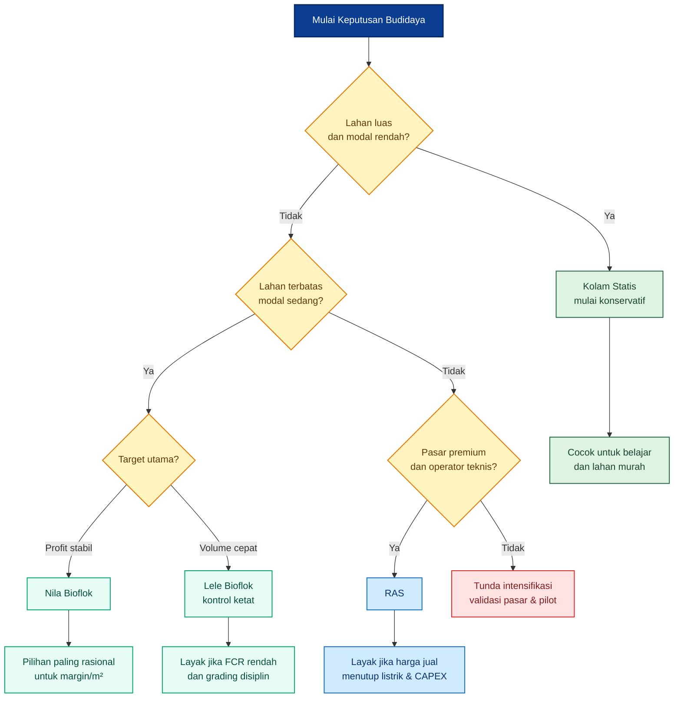
```mermaid id="o2i66a"
flowchart TD
    A["Mulai Keputusan Budidaya"] --> B{"Lahan luas<br/>dan modal rendah?"}
    B -->|Ya| C["Kolam Statis<br/>mulai konservatif"]
    B -->|Tidak| D{"Lahan terbatas<br/>modal sedang?"}

    D -->|Ya| E{"Target utama?"}
    E -->|Profit stabil| F["Nila Bioflok"]
    E -->|Volume cepat| G["Lele Bioflok<br/>kontrol ketat"]

    D -->|Tidak| H{"Pasar premium<br/>dan operator teknis?"}
    H -->|Ya| I["RAS"]
    H -->|Tidak| J["Tunda intensifikasi<br/>validasi pasar & pilot"]

    C --> K["Cocok untuk belajar<br/>dan lahan murah"]
    F --> L["Pilihan paling rasional<br/>untuk margin/m²"]
    G --> M["Layak jika FCR rendah<br/>dan grading disiplin"]
    I --> N["Layak jika harga jual<br/>menutup listrik & CAPEX"]

    classDef start fill:#0B3D91,color:#FFFFFF,stroke:#062B63,stroke-width:2px;
    classDef decision fill:#FFF3BF,color:#5F370E,stroke:#E67700,stroke-width:1.5px;
    classDef statis fill:#DFF3E3,color:#1B4332,stroke:#2D6A4F,stroke-width:1.5px;
    classDef bioflok fill:#E6FCF5,color:#064E3B,stroke:#0CA678,stroke-width:1.5px;
    classDef ras fill:#D0EBFF,color:#08306B,stroke:#1971C2,stroke-width:1.5px;
    classDef warning fill:#FFE3E3,color:#7F1D1D,stroke:#E03131,stroke-width:1.5px;

    class A start;
    class B,D,E,H decision;
    class C,K statis;
    class F,G,L,M bioflok;
    class I,N ras;
    class J warning;
```

---

## 10.4 Data yang Harus Divalidasi Sebelum Investasi

Sebelum eksekusi modal, angka dalam artikel ini wajib diganti atau divalidasi dengan data lokal.

Data yang wajib dikunci:

1. harga jual farmgate/offtaker;
2. harga pakan delivered;
3. harga benih dan mortalitas transport;
4. spesifikasi blower/pompa dan konsumsi listrik;
5. CAPEX aktual non-kolam;
6. hasil pilot minimal 1 siklus;
7. FCR aktual;
8. SR aktual;
9. waktu panen aktual;
10. kemampuan pasar menyerap volume.

---

### 10.4.1 Checklist Validasi Sebelum Investasi

| Data                  | Target Validasi                          | Status Wajib |
| --------------------- | ---------------------------------------- | ------------ |
| Harga jual farmgate   | Kontrak/offtake atau histori harga lokal | Wajib        |
| Harga pakan delivered | Harga sampai lokasi, bukan katalog       | Wajib        |
| Harga benih           | Ukuran, kualitas, ongkir, mortalitas     | Wajib        |
| Kualitas benih        | Seragam, sehat, asal jelas               | Wajib        |
| Listrik               | Golongan tarif, daya, stabilitas         | Wajib        |
| Blower/pompa          | Watt aktual dan kapasitas udara/air      | Wajib        |
| CAPEX non-kolam       | BoQ dan quotation                        | Wajib        |
| FCR pilot             | Catatan pakan dan biomassa aktual        | Wajib        |
| SR pilot              | Ekor tebar vs ekor panen                 | Wajib        |
| Siklus panen          | Hari tebar sampai panen                  | Wajib        |
| Pasar                 | Volume serap, ukuran ikan, jadwal panen  | Wajib        |

---

### 10.4.2 Pilot Minimal yang Disarankan

Sebelum membangun skala besar, jalankan pilot minimal 1 siklus.

Pilot harus mencatat:

| Parameter           | Dicatat Harian/Mingguan          |
| ------------------- | -------------------------------- |
| Jumlah pakan harian | Harian                           |
| Mortalitas          | Harian                           |
| DO                  | Harian                           |
| pH                  | Harian                           |
| Amonia/TAN          | Mingguan atau saat gejala muncul |
| Nitrit              | Mingguan atau saat gejala muncul |
| Bobot sampling      | Mingguan/dua mingguan            |
| Ukuran ikan         | Mingguan/dua mingguan            |
| Konsumsi listrik    | Bulanan                          |
| Biaya treatment     | Setiap aplikasi                  |
| Volume panen        | Saat panen                       |
| Harga jual aktual   | Saat panen                       |

Output pilot minimal harus menghasilkan:

$$
FCR_{aktual} = \frac{ \text{Total Pakan Terpakai} }{ \text{Total Biomassa Panen} }
$$

$$
SR_{aktual} = \frac{ \text{Ekor Panen} }{ \text{Ekor Tebar} } \times 100\%
$$

$$
HPP_{aktual} = \frac{ \text{Total OPEX Aktual} + \text{Depresiasi} }{ \text{Total Biomassa Panen} }
$$

Jika pilot menghasilkan FCR, SR, atau waktu panen yang lebih buruk dari base-case, model ekonomi wajib dihitung ulang.

---

## 10.5 Putusan Akhir

Berdasarkan seluruh analisis, putusan bisnisnya adalah sebagai berikut.

### 10.5.1 Putusan Sistem

| Ranking | Sistem           | Alasan                                                       |
| ------: | ---------------- | ------------------------------------------------------------ |
|       1 | **Bioflok**      | Kombinasi terbaik antara produktivitas lahan, HPP, dan CAPEX |
|       2 | **RAS**          | Produksi dan kontrol tinggi, tetapi CAPEX/listrik berat      |
|       3 | **Kolam statis** | Paling mudah, tetapi margin/m² rendah                        |

### 10.5.2 Putusan Komoditas

| Ranking | Komoditas/Sistem | Alasan                                                     |
| ------: | ---------------- | ---------------------------------------------------------- |
|       1 | **Nila bioflok** | Profit stabil, HPP rendah, pemanfaatan flok baik           |
|       2 | **Lele bioflok** | Volume cepat, tetapi margin sensitif                       |
|       3 | **Nila RAS**     | Layak jika pasar premium                                   |
|       4 | **Lele RAS**     | Volume tinggi, tetapi sangat bergantung harga dan operator |
|       5 | **Kolam statis** | Layak untuk pemula/lahan murah, bukan optimasi footprint   |

---

### 10.5.3 Kesimpulan Paling Tajam

**Jika target utama adalah profit stabil per m² footprint, pilihan paling rasional adalah nila bioflok.**

**Jika target utama adalah volume cepat dan pasar lele sudah pasti menyerap, lele bioflok bisa dipilih, tetapi hanya dengan kontrol FCR, SR, grading, dan aerasi yang ketat.**

**Jika target utama adalah kontrol produksi tinggi, air terbatas, biosecurity, atau pasar premium, RAS layak dipertimbangkan, tetapi bukan sebagai pilihan default untuk mengejar HPP murah.**

**Jika modal rendah dan lahan luas, kolam statis tetap relevan, tetapi jangan berharap menjadi sistem terbaik dalam margin per m².**

---

## 10.6 Catatan Akhir untuk Praktisi

Artikel ini adalah **pra-feasibility berbasis model**. Angka-angka di dalamnya cukup untuk membandingkan arah keputusan, tetapi belum cukup untuk langsung mengeksekusi investasi besar.

Sebelum modal besar masuk, lakukan tiga hal:

1. kunci harga jual dengan offtaker;
2. jalankan pilot minimal satu siklus;
3. hitung ulang model memakai data aktual lokasi.

Keputusan terbaik dalam budidaya bukan sistem yang paling canggih, melainkan sistem yang paling sesuai dengan:

- pasar;
- lahan;
- modal;
- listrik;
- air;
- operator;
- kemampuan kontrol risiko;
- dan target margin.

```mermaid id="asnrlt"
flowchart TD
    A["Keputusan Final"] --> B["Pasar kuat?"]
    B -->|Tidak| C["Jangan scale-up<br/>validasi offtaker dulu"]
    B -->|Ya| D["Pilot 1 siklus"]

    D --> E["FCR aktual"]
    D --> F["SR aktual"]
    D --> G["Harga jual aktual"]
    D --> H["Biaya listrik aktual"]
    D --> I["CAPEX aktual"]

    E --> J["Hitung ulang HPP"]
    F --> J
    G --> K["Hitung ulang margin"]
    H --> J
    I --> J

    J --> L{"Margin konservatif<br/>masih positif?"}
    K --> L

    L -->|Ya| M["Scale-up bertahap"]
    L -->|Tidak| N["Revisi sistem<br/>atau tunda investasi"]

    classDef main fill:#0B3D91,color:#FFFFFF,stroke:#062B63,stroke-width:2px;
    classDef process fill:#D0EBFF,color:#08306B,stroke:#1971C2,stroke-width:1.5px;
    classDef check fill:#FFF3BF,color:#5F370E,stroke:#E67700,stroke-width:1.5px;
    classDef good fill:#E6FCF5,color:#064E3B,stroke:#0CA678,stroke-width:2px;
    classDef bad fill:#FFE3E3,color:#7F1D1D,stroke:#E03131,stroke-width:2px;

    class A main;
    class B,L check;
    class D,E,F,G,H,I,J,K process;
    class M good;
    class C,N bad;
```

[**Kembali ke Atas**](#komparasi-ekonomi-budidaya-nila-dan-lele-pada-kolam-statis-bioflok-dan-ras-berbasis-m-footprint-lahan)

---

<small>
  **_Catatan Penyusunan_** Artikel ini disusun sebagai materi edukasi dan
  referensi umum berdasarkan berbagai sumber pustaka, praktik lapangan, serta
  bantuan alat penulisan. Pembaca disarankan untuk melakukan verifikasi lanjutan
  dan penyesuaian sesuai dengan kondisi serta kebutuhan masing-masing sistem.
</small>
