# **_Budidaya Lele Air Dangkal, Probiotik, dan Fermentasi Pakan_**

---

- [**_Budidaya Lele Air Dangkal, Probiotik, dan Fermentasi Pakan_**](#budidaya-lele-air-dangkal-probiotik-dan-fermentasi-pakan)
- [Budidaya Lele Air Dangkal, Probiotik, dan Fermentasi Pakan](#budidaya-lele-air-dangkal-probiotik-dan-fermentasi-pakan-1)
- [1. Pendahuluan](#1-pendahuluan)
  - [1.1 Latar belakang](#11-latar-belakang)
  - [1.2 Tujuan materi](#12-tujuan-materi)
- [2. Budidaya Lele Statis Air Dangkal Maksimal 50 cm](#2-budidaya-lele-statis-air-dangkal-maksimal-50-cm)
  - [2.1 Konsep sistem](#21-konsep-sistem)
  - [2.2 Alasan penggunaan air dangkal](#22-alasan-penggunaan-air-dangkal)
  - [2.3 Batas kritis sistem air dangkal](#23-batas-kritis-sistem-air-dangkal)
  - [2.4 Peran plankton dan mikroba air](#24-peran-plankton-dan-mikroba-air)
  - [2.5 Strategi pemberian pakan](#25-strategi-pemberian-pakan)
- [3. Fermentasi Pakan Ikan: Fungsi, Mikroba, dan Metode](#3-fermentasi-pakan-ikan-fungsi-mikroba-dan-metode)
  - [3.1 Definisi fermentasi pakan](#31-definisi-fermentasi-pakan)
  - [3.2 Tujuan fermentasi](#32-tujuan-fermentasi)
    - [3.2.1 Meningkatkan kecernaan protein](#321-meningkatkan-kecernaan-protein)
    - [3.2.2 Memecah sebagian karbohidrat kompleks](#322-memecah-sebagian-karbohidrat-kompleks)
    - [3.2.3 Meningkatkan palatabilitas](#323-meningkatkan-palatabilitas)
    - [3.2.4 Menurunkan sebagian antinutrisi](#324-menurunkan-sebagian-antinutrisi)
    - [3.2.5 Mengurangi bau bahan tertentu](#325-mengurangi-bau-bahan-tertentu)
    - [3.2.6 Menambah sedikit biomassa mikroba](#326-menambah-sedikit-biomassa-mikroba)
  - [3.3 Mikroba yang terlibat](#33-mikroba-yang-terlibat)
    - [3.3.1 Bacillus sp.](#331-bacillus-sp)
    - [3.3.2 Lactobacillus sp.](#332-lactobacillus-sp)
    - [3.3.3 Yeast / Saccharomyces cerevisiae](#333-yeast--saccharomyces-cerevisiae)
    - [3.3.4 Aspergillus dan Rhizopus](#334-aspergillus-dan-rhizopus)
    - [3.3.5 Mikroba selulolitik](#335-mikroba-selulolitik)
    - [3.3.6 Mikroba proteolitik](#336-mikroba-proteolitik)
  - [3.4 Prinsip metode fermentasi](#34-prinsip-metode-fermentasi)
  - [3.5 Bahan fermentasi](#35-bahan-fermentasi)
    - [3.5.1 Sumber protein](#351-sumber-protein)
    - [3.5.2 Sumber energi/karbohidrat](#352-sumber-energikarbohidrat)
    - [3.5.3 Starter mikroba](#353-starter-mikroba)
  - [3.6 Tahapan fermentasi umum](#36-tahapan-fermentasi-umum)
    - [3.6.1 Formula dasar percobaan kecil](#361-formula-dasar-percobaan-kecil)
    - [3.6.2 Tahapan fermentasi](#362-tahapan-fermentasi)
    - [3.6.3 Rumus estimasi tambahan biaya fermentasi](#363-rumus-estimasi-tambahan-biaya-fermentasi)
  - [3.7 Ciri fermentasi berhasil](#37-ciri-fermentasi-berhasil)
  - [3.8 Ciri fermentasi gagal](#38-ciri-fermentasi-gagal)
- [4. Protein, Asam Amino, dan Cara Meningkatkan Ketersediaannya](#4-protein-asam-amino-dan-cara-meningkatkan-ketersediaannya)
  - [4.1 Protein kasar vs protein sejati](#41-protein-kasar-vs-protein-sejati)
    - [4.1.1 Protein kasar](#411-protein-kasar)
    - [4.1.2 Protein sejati](#412-protein-sejati)
  - [4.2 Protein tercerna](#42-protein-tercerna)
    - [4.2.1 Mekanisme protein menjadi daging](#421-mekanisme-protein-menjadi-daging)
  - [4.3 Asam amino esensial lele](#43-asam-amino-esensial-lele)
  - [4.4 Dua asam amino pembatas utama](#44-dua-asam-amino-pembatas-utama)
    - [4.4.1 Lisin](#441-lisin)
    - [4.4.2 Metionin](#442-metionin)
    - [4.4.3 Prinsip papan terpendek](#443-prinsip-papan-terpendek)
  - [4.5 Mengapa lisin dan metionin penting?](#45-mengapa-lisin-dan-metionin-penting)
  - [4.6 Cara meningkatkan lisin dan metionin](#46-cara-meningkatkan-lisin-dan-metionin)
    - [4.6.1 Melalui bahan pakan](#461-melalui-bahan-pakan)
    - [4.6.2 Melalui suplementasi asam amino](#462-melalui-suplementasi-asam-amino)
    - [4.6.3 Melalui fermentasi](#463-melalui-fermentasi)
  - [4.7 Mikroba yang membantu ketersediaan asam amino](#47-mikroba-yang-membantu-ketersediaan-asam-amino)
    - [4.7.1 Bacillus proteolitik](#471-bacillus-proteolitik)
    - [4.7.2 Lactobacillus](#472-lactobacillus)
    - [4.7.3 Yeast/ragi](#473-yeastragi)
    - [4.7.4 Aspergillus dan Rhizopus](#474-aspergillus-dan-rhizopus)
    - [4.7.5 Skema kerja mikroba terhadap asam amino](#475-skema-kerja-mikroba-terhadap-asam-amino)
  - [4.8 Prinsip akhir](#48-prinsip-akhir)
- [5. Karbohidrat, Lemak, dan Rasio Pakan Berimbang](#5-karbohidrat-lemak-dan-rasio-pakan-berimbang)
  - [5.1 Mengapa karbohidrat penting?](#51-mengapa-karbohidrat-penting)
  - [5.2 Sumber karbohidrat tercerna](#52-sumber-karbohidrat-tercerna)
    - [Menghitung estimasi karbohidrat/NFE](#menghitung-estimasi-karbohidratnfe)
  - [5.3 Tapioka matang](#53-tapioka-matang)
    - [5.3.1 Mengapa harus matang?](#531-mengapa-harus-matang)
    - [5.3.2 Batas penggunaan tapioka](#532-batas-penggunaan-tapioka)
    - [5.3.3 Contoh perhitungan sederhana](#533-contoh-perhitungan-sederhana)
  - [5.4 Fermentasi selulosa](#54-fermentasi-selulosa)
  - [5.5 Peran lemak](#55-peran-lemak)
  - [5.6 Target rasio pakan lele pembesaran](#56-target-rasio-pakan-lele-pembesaran)
    - [5.6.1 Keseimbangan protein dan energi](#561-keseimbangan-protein-dan-energi)
    - [5.6.2 Serat harus rendah](#562-serat-harus-rendah)
    - [5.6.3 Abu jangan terlalu tinggi](#563-abu-jangan-terlalu-tinggi)
    - [5.6.4 Air harus terkendali](#564-air-harus-terkendali)
  - [5.7 Prinsip formulasi](#57-prinsip-formulasi)
- [6. Efek Fermentasi terhadap Ekonomi, Ekosistem, dan Penjagaannya](#6-efek-fermentasi-terhadap-ekonomi-ekosistem-dan-penjagaannya)
  - [6.1 Efek terhadap rupiah/kg-protein](#61-efek-terhadap-rupiahkg-protein)
  - [6.2 Dampak biaya GB#1 Profeed](#62-dampak-biaya-gb1-profeed)
  - [6.3 Skenario protein setelah fermentasi](#63-skenario-protein-setelah-fermentasi)
    - [6.3.1 Kenapa protein kasar bisa naik?](#631-kenapa-protein-kasar-bisa-naik)
    - [6.3.2 Skenario angka praktis](#632-skenario-angka-praktis)
  - [6.4 Ukuran ekonomi yang lebih penting](#64-ukuran-ekonomi-yang-lebih-penting)
    - [6.4.1 Simulasi FCR](#641-simulasi-fcr)
  - [6.5 Efek positif terhadap ekosistem kolam](#65-efek-positif-terhadap-ekosistem-kolam)
  - [6.6 Efek negatif bila fermentasi gagal](#66-efek-negatif-bila-fermentasi-gagal)
  - [6.7 Prinsip penjagaan ekosistem](#67-prinsip-penjagaan-ekosistem)
    - [6.7.1 Siklus penjagaan harian](#671-siklus-penjagaan-harian)
    - [6.7.2 Hubungan pakan, mikroba, dan air](#672-hubungan-pakan-mikroba-dan-air)
    - [6.7.3 Aturan praktis penjagaan ekosistem](#673-aturan-praktis-penjagaan-ekosistem)
- [7. Sistem Terpadu dan Parameter Kontrol](#7-sistem-terpadu-dan-parameter-kontrol)
  - [7.1 Skema sistem terpadu](#71-skema-sistem-terpadu)
  - [7.2 Parameter pakan](#72-parameter-pakan)
    - [7.2.1 Protein kasar](#721-protein-kasar)
    - [7.2.2 Lemak](#722-lemak)
    - [7.2.3 Serat kasar](#723-serat-kasar)
    - [7.2.4 Estimasi NFE/karbohidrat](#724-estimasi-nfekarbohidrat)
    - [7.2.5 Respons makan](#725-respons-makan)
  - [7.3 Parameter fermentasi](#73-parameter-fermentasi)
    - [7.3.1 Lama fermentasi](#731-lama-fermentasi)
    - [7.3.2 Kadar air](#732-kadar-air)
    - [7.3.3 Bau](#733-bau)
    - [7.3.4 pH](#734-ph)
  - [7.4 Parameter ikan](#74-parameter-ikan)
    - [7.4.1 Bobot awal dan bobot mingguan](#741-bobot-awal-dan-bobot-mingguan)
    - [7.4.2 Survival rate](#742-survival-rate)
    - [7.4.3 Keseragaman ukuran](#743-keseragaman-ukuran)
    - [7.4.4 Respons makan](#744-respons-makan)
  - [7.5 Parameter air](#75-parameter-air)
    - [7.5.1 Bau air](#751-bau-air)
    - [7.5.2 Warna air](#752-warna-air)
    - [7.5.3 pH](#753-ph)
    - [7.5.4 Amonia dan nitrit](#754-amonia-dan-nitrit)
    - [7.5.5 Kondisi pagi/subuh](#755-kondisi-pagisubuh)
  - [7.6 Jadwal operasional sederhana](#76-jadwal-operasional-sederhana)
    - [7.6.1 FCR sementara mingguan](#761-fcr-sementara-mingguan)
- [8. Rancangan Uji Lapangan Sederhana](#8-rancangan-uji-lapangan-sederhana)
  - [8.1 Tujuan uji](#81-tujuan-uji)
  - [8.2 Desain uji minimal](#82-desain-uji-minimal)
    - [8.2.1 Ukuran uji](#821-ukuran-uji)
    - [8.2.2 Kesalahan uji yang harus dihindari](#822-kesalahan-uji-yang-harus-dihindari)
  - [8.3 Data yang dicatat](#83-data-yang-dicatat)
    - [8.3.1 Format catatan harian](#831-format-catatan-harian)
    - [8.3.2 Format catatan mingguan](#832-format-catatan-mingguan)
  - [8.4 Rumus FCR](#84-rumus-fcr)
    - [8.4.1 Contoh perhitungan FCR](#841-contoh-perhitungan-fcr)
    - [8.4.2 FCR harus memasukkan biomassa awal](#842-fcr-harus-memasukkan-biomassa-awal)
  - [8.5 Rumus biaya pakan per kg panen](#85-rumus-biaya-pakan-per-kg-panen)
    - [8.5.1 Contoh perbandingan ekonomi](#851-contoh-perbandingan-ekonomi)
    - [8.5.2 Titik impas fermentasi](#852-titik-impas-fermentasi)
- [9. Kesimpulan Strategis](#9-kesimpulan-strategis)
  - [9.1 Inti sistem](#91-inti-sistem)
  - [9.2 Prinsip teknis](#92-prinsip-teknis)
    - [9.2.1 Air dangkal membantu lele menghemat energi](#921-air-dangkal-membantu-lele-menghemat-energi)
    - [9.2.2 Mikroba air menjaga ekosistem](#922-mikroba-air-menjaga-ekosistem)
    - [9.2.3 Fermentasi pakan meningkatkan kecernaan dan palatabilitas](#923-fermentasi-pakan-meningkatkan-kecernaan-dan-palatabilitas)
    - [9.2.4 Protein kasar bukan indikator tunggal](#924-protein-kasar-bukan-indikator-tunggal)
    - [9.2.5 Lisin dan metionin adalah kunci pembentukan daging](#925-lisin-dan-metionin-adalah-kunci-pembentukan-daging)
    - [9.2.6 Karbohidrat matang membantu menghemat protein](#926-karbohidrat-matang-membantu-menghemat-protein)
    - [9.2.7 FCR adalah indikator ekonomi utama](#927-fcr-adalah-indikator-ekonomi-utama)
  - [9.3 Rumusan akhir](#93-rumusan-akhir)

---

# Budidaya Lele Air Dangkal, Probiotik, dan Fermentasi Pakan

# 1. Pendahuluan

## 1.1 Latar belakang

Dalam budidaya lele, pakan adalah pusat dari hampir semua keputusan teknis. Pakan menentukan pertumbuhan ikan, biaya produksi, kualitas air, beban organik kolam, hingga risiko penyakit. Karena itu, pembudidaya yang ingin menekan biaya produksi tidak cukup hanya mencari pakan yang murah. Yang lebih penting adalah mencari pakan yang **efisien menjadi daging**.

<figure>
  
  <figcaption>Budidaya lele pada kondisi air dangkal.</figcaption>
</figure>

Ukuran utama efisiensi pakan adalah **FCR** atau _Feed Conversion Ratio_. Secara sederhana, FCR menunjukkan berapa kilogram pakan yang dibutuhkan untuk menghasilkan satu kilogram pertambahan bobot ikan.

<ResourceBox
  title="Artikel Terkait:"
  items={[
    {
      name: 'Akuaponik Sederhana Lele Air Dangkal: Aliran Akar Tanaman dengan Airlift-Pump untuk Mengambil Nitrat',
      href: '/blog/agri/perikanan/lele-air-dangkal-probiotik',
    },
    {
      name: 'Menurunkan FCR Lele: Dari Pakan Dimakan sampai Menjadi Daging',
      href: '/blog/agri/perikanan/menurunkan-fcr-lele',
    },
    {
      name: 'Siklus Nitrogen pada Budidaya Lele Air Dangkal: Pakan, Amonia, Nitrit, Nitrat, Mikroba, dan Batas Kapasitas Kolam',
      href: '/blog/agri/perikanan/siklus-nitrogen-lele-air-dangkal',
    },
    {
      name: 'Desain Airlift-Pump untuk Kolam Lele Air Dangkal 50 cm',
      href: '/blog/agri/perikanan/design-airlift-pump',
    },
    {
      name: 'Air Lift Pump - Prinsip, Desain, dan Aplikasi dalam Akuakultur',
      href: '/blog/agri/airlift-pump',
    },
  ]}
/>

Dalam format MDX, rumusnya dapat ditulis sebagai berikut:

$$
FCR = \frac{\text{Total pakan yang diberikan}}{\text{Kenaikan biomassa ikan}}
$$

Contoh sederhana:

$$
FCR = \frac{120 \text{ kg pakan}}{100 \text{ kg kenaikan biomassa}} = 1{,}2
$$

Artinya, untuk menghasilkan 100 kg pertambahan bobot lele, dibutuhkan 120 kg pakan. Semakin rendah FCR, semakin efisien pakan tersebut digunakan oleh ikan.

Namun FCR tidak hanya ditentukan oleh merek pakan. FCR dipengaruhi oleh kombinasi beberapa faktor:

- kualitas pakan,
- kecernaan protein,
- keseimbangan energi,
- kandungan asam amino,
- cara pemberian pakan,
- kualitas air,
- kepadatan ikan,
- kesehatan ikan,
- stabilitas ekosistem kolam.

Karena itu, pembahasan budidaya lele modern sebaiknya tidak berhenti pada pertanyaan:

> “Berapa persen protein pakannya?”

Pertanyaan yang lebih tajam adalah:

> “Berapa banyak protein yang benar-benar dicerna, diserap, dan menjadi daging?”

Protein kasar tinggi belum tentu menghasilkan pertumbuhan terbaik. Jika protein sulit dicerna, asam aminonya tidak seimbang, energi pakan kurang, atau air kolam rusak, maka sebagian protein akan terbuang sebagai limbah nitrogen. Akibatnya, amonia naik, air cepat bau, ikan stres, dan FCR memburuk.

Dengan pendekatan ini, fokus budidaya bergeser dari sekadar mengejar protein tinggi menjadi mencari keseimbangan antara:

- **protein tercerna**,
- **asam amino seimbang**,
- **energi cukup**,
- **lemak cukup**,
- **karbohidrat tercerna**,
- **mikroba pendukung**,
- **ekosistem air stabil**.

Sistem lele air dangkal, probiotik, dan fermentasi pakan dibangun di atas logika tersebut. Air dangkal membantu lele menghemat energi dan mudah mencapai permukaan. Probiotik membantu menjaga ekosistem kolam. Fermentasi pakan membantu meningkatkan kecernaan dan palatabilitas. Ketiganya tidak berdiri sendiri, tetapi saling mendukung.

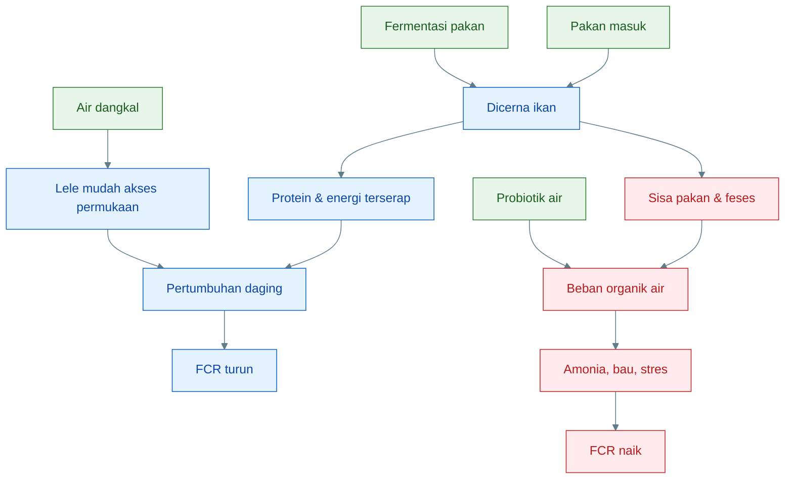
```mermaid
%%{init: {"theme": "base", "themeVariables": {"fontFamily": "Arial", "primaryColor": "#E3F2FD", "primaryTextColor": "#0D47A1", "primaryBorderColor": "#1565C0", "lineColor": "#607D8B"}}}%%
flowchart TD
    A["Pakan masuk"] --> B["Dicerna ikan"]
    B --> C["Protein & energi terserap"]
    C --> D["Pertumbuhan daging"]
    D --> E["FCR turun"]

    B --> F["Sisa pakan & feses"]
    F --> G["Beban organik air"]
    G --> H["Amonia, bau, stres"]
    H --> I["FCR naik"]

    J["Fermentasi pakan"] --> B
    K["Probiotik air"] --> G
    L["Air dangkal"] --> M["Lele mudah akses permukaan"]
    M --> D

    classDef input fill:#E8F5E9,stroke:#2E7D32,color:#1B5E20;
    classDef good fill:#E3F2FD,stroke:#1565C0,color:#0D47A1;
    classDef risk fill:#FFEBEE,stroke:#C62828,color:#B71C1C;
    classDef support fill:#FFF8E1,stroke:#F9A825,color:#E65100;

    class A,J,K,L input;
    class B,C,D,E,M good;
    class F,G,H,I risk;
```

Diagram di atas menunjukkan bahwa pakan bisa bergerak ke dua arah. Jika pakan tercerna baik, ia menjadi daging. Jika pakan tidak tercerna atau diberikan berlebihan, ia menjadi limbah. Maka, inti sistem ini bukan hanya memberi pakan, tetapi memastikan pakan **cepat dimakan, mudah dicerna, dan tidak merusak air**.

## 1.2 Tujuan materi

Materi ini disusun untuk membantu praktisi budidaya lele memahami sistem secara utuh, bukan hanya mengikuti resep. Dalam budidaya, resep tanpa pemahaman sering gagal ketika kondisi lapangan berubah. Kolam berbeda, air berbeda, benih berbeda, cuaca berbeda, dan kemampuan manajemen tiap pembudidaya juga berbeda.

Tujuan utama materi ini adalah memberikan kerangka berpikir agar pembudidaya mampu mengambil keputusan teknis secara lebih tajam.

Setelah mempelajari materi ini, pembudidaya diharapkan mampu:

1. **Memahami sistem lele air dangkal**
   Pembudidaya memahami mengapa tinggi air maksimal sekitar 50 cm dapat membantu lele, terutama dalam sistem semi-statis tanpa aerasi kuat.

2. **Memahami fungsi probiotik dan mikroba air**
   Mikroba tidak dianggap sebagai “obat ajaib”, tetapi sebagai penyangga ekosistem yang membantu mengurai bahan organik dan menjaga stabilitas air.

3. **Memahami fungsi fermentasi pakan**
   Fermentasi dipahami sebagai cara meningkatkan kecernaan, palatabilitas, dan efisiensi pakan, bukan sebagai cara ajaib menaikkan protein secara ekstrem.

4. **Menyusun pakan lebih efisien**
   Pakan dinilai dari protein tercerna, asam amino, energi, lemak, karbohidrat, serat, dan dampaknya terhadap air.

5. **Menilai dampak teknis dan ekonomis**
   Keberhasilan tidak hanya dilihat dari ikan mau makan, tetapi dari FCR, biaya pakan per kg panen, survival rate, dan kualitas air.

6. **Menjaga keseimbangan pakan, ikan, mikroba, dan air**
   Sistem yang baik adalah sistem yang tidak memaksa satu komponen bekerja terlalu berat.

Secara sederhana, tujuan akhirnya adalah:

> **Menurunkan biaya produksi lele tanpa mengorbankan pertumbuhan, kesehatan ikan, dan stabilitas air.**

Ukuran ekonominya dapat ditulis sebagai:

$$
\text{Biaya pakan per kg panen} = \text{Harga pakan per kg} \times FCR
$$

Contoh:

$$
\text{Biaya pakan per kg panen} = Rp15.000 \times 1{,}2 = Rp18.000
$$

Jika fermentasi pakan, manajemen air dangkal, dan pemberian pakan yang disiplin mampu menurunkan FCR dari 1,3 menjadi 1,2, dampaknya langsung terasa pada biaya produksi.

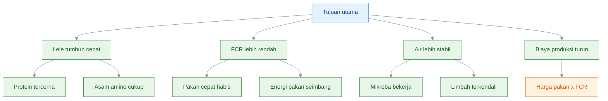
```mermaid
%%{init: {"theme": "base", "themeVariables": {"fontFamily": "Arial", "primaryColor": "#F1F8E9", "primaryTextColor": "#33691E", "primaryBorderColor": "#689F38", "lineColor": "#78909C"}}}%%
flowchart TD
    A["Tujuan utama"] --> B["Lele tumbuh cepat"]
    A --> C["FCR lebih rendah"]
    A --> D["Air lebih stabil"]
    A --> E["Biaya produksi turun"]

    B --> F["Protein tercerna"]
    B --> G["Asam amino cukup"]
    C --> H["Pakan cepat habis"]
    C --> I["Energi pakan seimbang"]
    D --> J["Mikroba bekerja"]
    D --> K["Limbah terkendali"]
    E --> L["Harga pakan x FCR"]

    classDef goal fill:#E3F2FD,stroke:#1565C0,color:#0D47A1;
    classDef factor fill:#E8F5E9,stroke:#2E7D32,color:#1B5E20;
    classDef economy fill:#FFF3E0,stroke:#EF6C00,color:#E65100;

    class A goal;
    class B,C,D,E factor;
    class F,G,H,I,J,K factor;
    class L economy;
```

[**Kembali ke Atas**](#budidaya-lele-air-dangkal-probiotik-dan-fermentasi-pakan)

---

# 2. Budidaya Lele Statis Air Dangkal Maksimal 50 cm

## 2.1 Konsep sistem

Sistem yang dibahas dalam materi ini bukan RAS dan bukan bioflok murni.

RAS atau _Recirculating Aquaculture System_ menggunakan sirkulasi air, pompa, filter mekanik, biofilter, dan sistem pengolahan air yang lebih kompleks. Air terus diputar dan diproses agar dapat digunakan kembali.

Bioflok murni berbeda lagi. Bioflok membutuhkan aerasi kuat, pengadukan terus-menerus, pengaturan rasio karbon dan nitrogen, serta pembentukan flok mikroba tersuspensi. Sistem ini sangat bergantung pada oksigen dan manajemen karbon.

Sistem lele air dangkal yang dibahas di sini lebih tepat disebut:

> **Budidaya lele semi-statis air dangkal berbasis probiotik dan plankton.**

Disebut **semi-statis** karena air tidak terus-menerus disirkulasikan seperti RAS, dan tidak terus-menerus diganti. Namun air juga bukan dibiarkan pasif sepenuhnya. Air tetap dikelola melalui:

- tinggi air yang dibatasi,
- pemberian probiotik,
- pembentukan plankton,
- pengendalian pakan,
- pengamatan bau dan warna air,
- pengelolaan endapan dasar,
- pengaturan kepadatan ikan.

Disebut **air dangkal** karena tinggi air dijaga tidak lebih dari sekitar 50 cm. Tujuannya bukan semata-mata memperbanyak oksigen terlarut, tetapi memanfaatkan karakter biologis lele yang mampu mengambil oksigen dari udara atmosfer.

Lele memiliki kemampuan naik ke permukaan untuk mengambil udara. Dengan air yang dangkal, jarak naik-turun ikan menjadi pendek. Energi ikan tidak banyak habis untuk bergerak vertikal. Dalam sistem tanpa aerasi kuat, hal ini menjadi keuntungan penting.

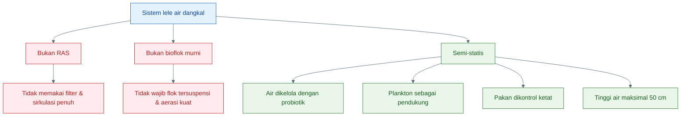
```mermaid
%%{init: {"theme": "base", "themeVariables": {"fontFamily": "Arial", "primaryColor": "#E0F7FA", "primaryTextColor": "#006064", "primaryBorderColor": "#00838F", "lineColor": "#546E7A"}}}%%
flowchart TD
    A["Sistem lele air dangkal"] --> B["Bukan RAS"]
    A --> C["Bukan bioflok murni"]
    A --> D["Semi-statis"]

    B --> B1["Tidak memakai filter & sirkulasi penuh"]
    C --> C1["Tidak wajib flok tersuspensi & aerasi kuat"]
    D --> D1["Air dikelola dengan probiotik"]
    D --> D2["Plankton sebagai pendukung"]
    D --> D3["Pakan dikontrol ketat"]
    D --> D4["Tinggi air maksimal 50 cm"]

    classDef main fill:#E3F2FD,stroke:#1565C0,color:#0D47A1;
    classDef no fill:#FFEBEE,stroke:#C62828,color:#B71C1C;
    classDef yes fill:#E8F5E9,stroke:#2E7D32,color:#1B5E20;

    class A main;
    class B,C,B1,C1 no;
    class D,D1,D2,D3,D4 yes;
```

Konsep ini harus dipahami sebagai sistem biologis yang sederhana tetapi sensitif. Sederhana karena tidak membutuhkan instalasi serumit RAS. Sensitif karena volume air terbatas, sehingga kesalahan pakan cepat berubah menjadi masalah kualitas air.

## 2.2 Alasan penggunaan air dangkal

Air dangkal digunakan bukan karena kedalaman 50 cm otomatis membuat air selalu kaya oksigen. Alasan utamanya lebih kompleks.

Pertama, lele dapat mengambil oksigen atmosfer. Saat kondisi oksigen terlarut menurun, lele dapat naik ke permukaan. Pada kolam dangkal, jarak ke permukaan pendek, sehingga ikan tidak perlu mengeluarkan energi besar untuk naik-turun.

Kedua, air dangkal membuat perilaku ikan lebih mudah diamati. Pembudidaya bisa melihat apakah ikan aktif, menggantung, malas makan, berebut pakan, atau mulai stres. Pada sistem praktis, pengamatan perilaku sering lebih cepat daripada alat ukur.

Ketiga, pakan lebih mudah dipantau. Dalam kolam dangkal, pembudidaya lebih mudah melihat apakah pakan habis atau tersisa. Ini penting karena sisa pakan adalah sumber utama masalah air.

Keempat, kolam dangkal membuat sistem lebih responsif. Bila ada masalah, gejalanya lebih cepat terlihat. Tetapi ini juga berarti kesalahan manajemen lebih cepat berdampak.

Untuk kolam berbentuk lingkaran diameter 80 cm dengan tinggi air 50 cm, volume air dapat dihitung sebagai tabung:

$$
V = \pi r^2 h
$$

Dengan:

$$
r = 0{,}4 \text{ m}
$$

$$
h = 0{,}5 \text{ m}
$$

Maka:

$$
V = 3{,}14 \times (0{,}4)^2 \times 0{,}5
$$

$$
V = 3{,}14 \times 0{,}16 \times 0{,}5
$$

$$
V = 0{,}2512 \text{ m}^3
$$

Karena:

$$
1 \text{ m}^3 = 1.000 \text{ liter}
$$

Maka:

$$
0{,}2512 \text{ m}^3 \approx 251 \text{ liter}
$$

Jadi, kolam bulat diameter 80 cm dengan tinggi air 50 cm berisi sekitar **251 liter air**.

Angka ini penting. Dengan volume sekitar 251 liter, sistem tidak punya buffer air yang besar. Sedikit saja pakan berlebih bisa cepat menjadi beban organik. Maka, air dangkal harus dipadukan dengan disiplin pakan.

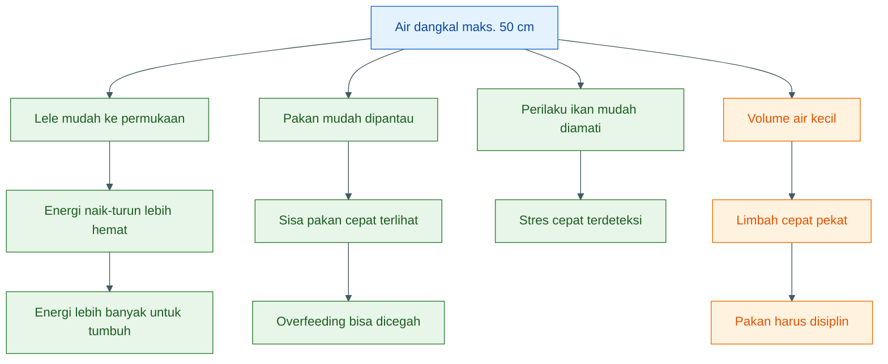
```mermaid
%%{init: {"theme": "base", "themeVariables": {"fontFamily": "Arial", "primaryColor": "#E1F5FE", "primaryTextColor": "#01579B", "primaryBorderColor": "#0288D1", "lineColor": "#455A64"}}}%%
flowchart TD
    A["Air dangkal maks. 50 cm"] --> B["Lele mudah ke permukaan"]
    B --> C["Energi naik-turun lebih hemat"]
    C --> D["Energi lebih banyak untuk tumbuh"]

    A --> E["Pakan mudah dipantau"]
    E --> F["Sisa pakan cepat terlihat"]
    F --> G["Overfeeding bisa dicegah"]

    A --> H["Perilaku ikan mudah diamati"]
    H --> I["Stres cepat terdeteksi"]

    A --> J["Volume air kecil"]
    J --> K["Limbah cepat pekat"]
    K --> L["Pakan harus disiplin"]

    classDef benefit fill:#E8F5E9,stroke:#2E7D32,color:#1B5E20;
    classDef warning fill:#FFF3E0,stroke:#EF6C00,color:#E65100;
    classDef risk fill:#FFEBEE,stroke:#C62828,color:#B71C1C;
    classDef main fill:#E3F2FD,stroke:#1565C0,color:#0D47A1;

    class A main;
    class B,C,D,E,F,G,H,I benefit;
    class J,K,L warning;
```

Ringkasnya, keunggulan air dangkal adalah:

- lele lebih mudah mengakses permukaan,
- energi ikan lebih hemat,
- pakan lebih mudah dikontrol,
- perilaku ikan lebih mudah diamati,
- manajemen harian lebih sederhana.

Namun air dangkal bukan jaminan keberhasilan. Keberhasilan tetap ditentukan oleh pakan, kepadatan, mikroba, dan kualitas air.

## 2.3 Batas kritis sistem air dangkal

Sistem air dangkal memiliki keunggulan, tetapi juga memiliki batas kritis. Batas ini harus dipahami sejak awal agar sistem tidak diterapkan secara berlebihan.

Masalah utama pada air dangkal adalah **volume air kecil**. Volume kecil berarti kemampuan air untuk menampung kesalahan juga kecil. Jika pakan berlebih, feses meningkat, atau endapan dasar menumpuk, kualitas air bisa berubah cepat.

Sisa pakan dan feses akan terurai menjadi bahan organik. Proses penguraian ini memerlukan oksigen. Jika bahan organik terlalu banyak, mikroba akan mengonsumsi oksigen lebih besar. Pada malam hingga subuh, saat plankton tidak berfotosintesis, risiko kekurangan oksigen meningkat.

Selain itu, protein yang tidak dimanfaatkan ikan akan menghasilkan limbah nitrogen. Limbah ini dapat berubah menjadi amonia. Amonia yang tinggi menyebabkan ikan stres, nafsu makan turun, pertumbuhan terganggu, dan risiko kematian meningkat.

Alur kegagalan paling umum pada sistem air dangkal adalah sebagai berikut:

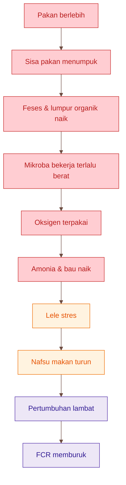
```mermaid
%%{init: {"theme": "base", "themeVariables": {"fontFamily": "Arial", "primaryColor": "#FFEBEE", "primaryTextColor": "#B71C1C", "primaryBorderColor": "#C62828", "lineColor": "#6D4C41"}}}%%
flowchart TD
    A["Pakan berlebih"] --> B["Sisa pakan menumpuk"]
    B --> C["Feses & lumpur organik naik"]
    C --> D["Mikroba bekerja terlalu berat"]
    D --> E["Oksigen terpakai"]
    E --> F["Amonia & bau naik"]
    F --> G["Lele stres"]
    G --> H["Nafsu makan turun"]
    H --> I["Pertumbuhan lambat"]
    I --> J["FCR memburuk"]

    classDef risk fill:#FFCDD2,stroke:#C62828,color:#B71C1C;
    classDef process fill:#FFF3E0,stroke:#EF6C00,color:#E65100;
    classDef result fill:#EDE7F6,stroke:#512DA8,color:#311B92;

    class A,B,C,D,E,F risk;
    class G,H process;
    class I,J result;
```

Beberapa batas kritis yang harus diperhatikan:

| Faktor                 | Risiko pada sistem air dangkal | Cara mengendalikan                 |
| ---------------------- | ------------------------------ | ---------------------------------- |
| Pakan berlebih         | Amonia, bau, air cepat rusak   | Beri pakan sedikit demi sedikit    |
| Kepadatan tinggi       | Oksigen turun, limbah naik     | Naikkan kepadatan bertahap         |
| Endapan dasar          | Sumber bau dan bahan organik   | Jaga lapisan endapan tetap tipis   |
| Suhu tinggi            | Ikan stres, oksigen turun      | Hindari lokasi terlalu panas       |
| Plankton terlalu pekat | Oksigen drop malam-subuh       | Pantau warna air dan perilaku pagi |
| Tanpa aerasi           | Risiko subuh lebih tinggi      | Siapkan aerasi darurat             |

Sistem tanpa aerasi bukan berarti tidak membutuhkan oksigen. Yang terjadi adalah sistem mengandalkan kombinasi:

- kemampuan lele mengambil udara,
- permukaan air yang mudah diakses,
- mikroba yang membantu stabilitas air,
- pakan yang tidak berlebihan,
- kepadatan yang rasional,
- pengamatan harian yang disiplin.

Maka, kalimat yang lebih aman bukan:

> “Sistem ini tidak perlu aerasi.”

Tetapi:

> **“Sistem ini dapat dijalankan tanpa aerasi kuat jika kepadatan, pakan, dan kualitas air dikontrol ketat.”**

Untuk praktisi, indikator lapangan yang harus diperhatikan adalah:

- ikan sering menggantung massal pagi hari,
- ikan malas makan,
- air berbau busuk,
- warna air berubah ekstrem,
- banyak lendir di permukaan,
- endapan dasar hitam pekat,
- ikan megap-megap berlebihan,
- pertumbuhan tidak seragam.

Jika tanda-tanda ini muncul, jangan menambah pakan. Langkah pertama adalah mengurangi beban organik.

## 2.4 Peran plankton dan mikroba air

Dalam sistem lele air dangkal, plankton dan mikroba air berperan sebagai penyangga ekosistem. Namun perannya harus dipahami secara proporsional.

Plankton dapat menjadi pakan alami tambahan, terutama untuk benih dan ikan kecil. Selain itu, plankton membantu menyerap sebagian nutrien terlarut di air. Pada siang hari, fitoplankton dapat menghasilkan oksigen melalui fotosintesis.

Namun plankton bukan pengganti penuh pakan utama. Untuk lele pembesaran, kebutuhan nutrisi tetap harus dipenuhi dari pakan utama. Plankton lebih tepat disebut sebagai **pakan tambahan dan penstabil ekosistem**.

Mikroba air memiliki fungsi berbeda. Mikroba membantu mengurai sisa pakan, feses, dan bahan organik. Mikroba juga dapat membantu menekan bau, memperbaiki dasar kolam, dan menjaga keseimbangan mikrobiologis air.

Tetapi mikroba bukan alat ajaib. Jika pakan terlalu banyak, mikroba justru bekerja terlalu berat. Penguraian bahan organik membutuhkan oksigen. Maka, probiotik akan membantu sistem yang dikelola baik, tetapi tidak selalu mampu menyelamatkan sistem yang dipaksa berlebihan.

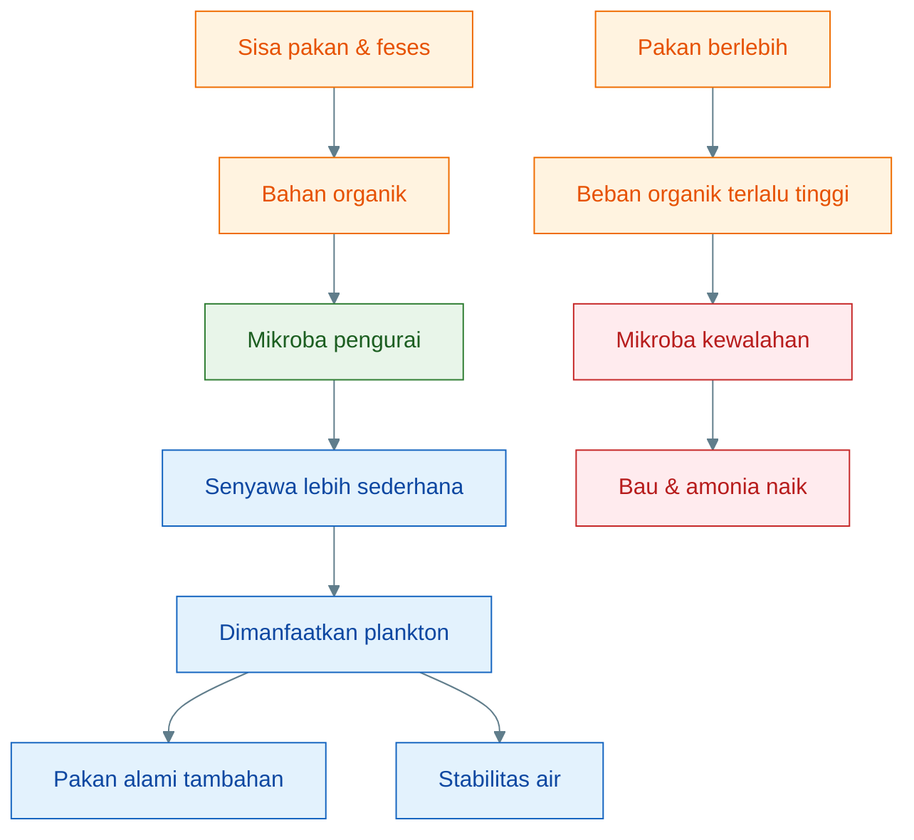
```mermaid
%%{init: {"theme": "base", "themeVariables": {"fontFamily": "Arial", "primaryColor": "#E8F5E9", "primaryTextColor": "#1B5E20", "primaryBorderColor": "#2E7D32", "lineColor": "#607D8B"}}}%%
flowchart TD
    A["Sisa pakan & feses"] --> B["Bahan organik"]
    B --> C["Mikroba pengurai"]
    C --> D["Senyawa lebih sederhana"]
    D --> E["Dimanfaatkan plankton"]
    E --> F["Pakan alami tambahan"]
    E --> G["Stabilitas air"]

    H["Pakan berlebih"] --> I["Beban organik terlalu tinggi"]
    I --> J["Mikroba kewalahan"]
    J --> K["Bau & amonia naik"]

    classDef organic fill:#FFF3E0,stroke:#EF6C00,color:#E65100;
    classDef microbe fill:#E8F5E9,stroke:#2E7D32,color:#1B5E20;
    classDef benefit fill:#E3F2FD,stroke:#1565C0,color:#0D47A1;
    classDef risk fill:#FFEBEE,stroke:#C62828,color:#B71C1C;

    class A,B,H,I organic;
    class C microbe;
    class D,E,F,G benefit;
    class J,K risk;
```

Peran mikroba dalam sistem air dangkal dapat diringkas sebagai berikut:

| Komponen                 | Fungsi utama                              | Catatan kritis                        |
| ------------------------ | ----------------------------------------- | ------------------------------------- |
| Mikroba pengurai organik | Mengurai sisa pakan dan feses             | Tetap butuh oksigen                   |
| Bakteri asam laktat      | Menekan mikroba pembusuk                  | Tidak menggantikan manajemen pakan    |
| Bakteri nitrifikasi      | Membantu siklus amonia                    | Butuh oksigen dan permukaan hidup     |
| Actinomycetes            | Membantu penguraian endapan               | Efektif bila endapan tidak berlebihan |
| Plankton                 | Pakan alami tambahan dan penyerap nutrien | Malam hari ikut memakai oksigen       |

Poin pentingnya:

> **Plankton dan mikroba membantu menjaga ekosistem, tetapi pengendali utama tetap pembudidaya.**

Pembudidaya mengendalikan sistem melalui pakan, kepadatan, tinggi air, kebersihan dasar, dan pengamatan harian.

## 2.5 Strategi pemberian pakan

Lele cenderung lebih aktif pada kondisi redup hingga malam. Karena itu, pemberian pakan sore memiliki dasar biologis yang kuat. Namun bukan berarti pakan pagi selalu sia-sia. Lele budidaya dapat beradaptasi dengan jadwal makan, terutama jika kualitas air baik dan pemberian pakan dilakukan konsisten.

Dalam sistem air dangkal tanpa aerasi kuat, strategi paling aman adalah menjadikan sore sebagai waktu pakan utama.

Rasio praktis:

$$
\text{Pakan pagi} = 20% \text{ sampai } 30% \times \text{ransum harian}
$$

$$
\text{Pakan sore} = 70% \text{ sampai } 80% \times \text{ransum harian}
$$

Contoh jika ransum harian 1 kg:

$$
\text{Pakan pagi} = 0{,}2 \text{ sampai } 0{,}3 \text{ kg}
$$

$$
\text{Pakan sore} = 0{,}7 \text{ sampai } 0{,}8 \text{ kg}
$$

Dalam praktik, pakan pagi sebaiknya bersifat opsional. Jika ikan aktif dan air baik, pakan pagi dapat diberikan sedikit. Jika ikan menggantung, air bau, atau cuaca buruk, pakan pagi sebaiknya dihentikan sementara.

Pakan sore menjadi pakan utama karena:

- lele mulai lebih aktif,
- respons makan biasanya lebih baik,
- pakan lebih cepat habis,
- pembudidaya masih bisa mengamati sisa pakan,
- risiko pakan terbuang lebih rendah.

Namun pemberian pakan malam terlalu larut perlu dihindari, terutama pada sistem tanpa aerasi. Setelah ikan makan, metabolisme meningkat. Feses dan sisa pakan juga mulai diurai mikroba. Proses ini meningkatkan kebutuhan oksigen pada malam hingga subuh. Jika pakan berat diberikan terlalu malam, risiko oksigen rendah meningkat.

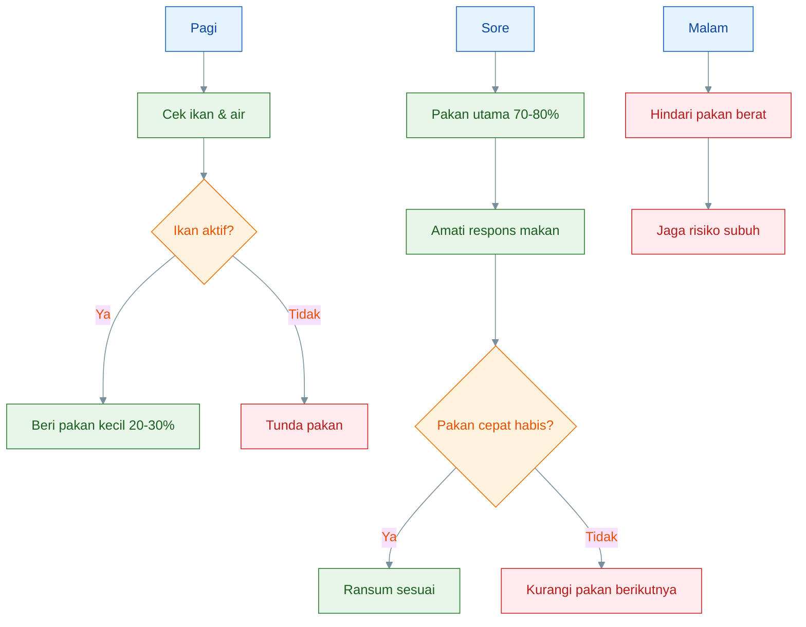
```mermaid
%%{init: {"theme": "base", "themeVariables": {"fontFamily": "Arial", "primaryColor": "#FFF8E1", "primaryTextColor": "#E65100", "primaryBorderColor": "#F9A825", "lineColor": "#78909C"}}}%%
flowchart TD
    A["Pagi"] --> B["Cek ikan & air"]
    B --> C{"Ikan aktif?"}
    C -->|Ya| D["Beri pakan kecil 20-30%"]
    C -->|Tidak| E["Tunda pakan"]

    F["Sore"] --> G["Pakan utama 70-80%"]
    G --> H["Amati respons makan"]
    H --> I{"Pakan cepat habis?"}
    I -->|Ya| J["Ransum sesuai"]
    I -->|Tidak| K["Kurangi pakan berikutnya"]

    L["Malam"] --> M["Hindari pakan berat"]
    M --> N["Jaga risiko subuh"]

    classDef time fill:#E3F2FD,stroke:#1565C0,color:#0D47A1;
    classDef action fill:#E8F5E9,stroke:#2E7D32,color:#1B5E20;
    classDef decision fill:#FFF3E0,stroke:#EF6C00,color:#E65100;
    classDef warning fill:#FFEBEE,stroke:#C62828,color:#B71C1C;

    class A,F,L time;
    class B,D,G,H,J action;
    class C,I decision;
    class E,K,M,N warning;
```

Prinsip pemberian pakan dalam sistem ini adalah:

> **Lebih baik pakan sedikit kurang tetapi habis cepat, daripada pakan banyak tetapi tersisa dan merusak air.**

Pakan yang tidak dimakan bukan hanya kerugian biaya. Pakan tersisa akan berubah menjadi bahan organik, meningkatkan amonia, menurunkan kualitas air, dan akhirnya memperburuk FCR.

Untuk praktisi, aturan lapangan yang bisa dipakai:

| Kondisi ikan/air               | Keputusan pakan                 |
| ------------------------------ | ------------------------------- |
| Ikan aktif, air segar          | Pakan sesuai ransum             |
| Ikan lambat makan              | Kurangi pakan                   |
| Ikan menggantung pagi          | Tunda pakan                     |
| Air mulai bau                  | Kurangi atau puasakan sementara |
| Hujan/mendung panjang          | Kurangi pakan                   |
| Pakan tersisa                  | Dosis berikutnya dikurangi      |
| Ikan berebut kuat dan air baik | Pakan bisa dinaikkan bertahap   |

Dengan strategi ini, pakan tidak hanya dilihat sebagai nutrisi, tetapi juga sebagai faktor pengendali ekosistem. Setiap gram pakan yang masuk ke kolam harus dipikirkan: apakah akan menjadi daging, atau menjadi limbah.

Kesimpulan Bab 2:

> **Sistem lele air dangkal dapat bekerja bila pembudidaya memahami batasnya. Air dangkal membantu lele menghemat energi dan mudah mengakses permukaan, tetapi volume air kecil membuat kesalahan pakan cepat berdampak pada kualitas air. Karena itu, kunci sistem ini adalah pakan disiplin, mikroba stabil, plankton terkendali, dan pengamatan harian.**

[**Kembali ke Atas**](#budidaya-lele-air-dangkal-probiotik-dan-fermentasi-pakan)

---

Berikut naskah **Bab 3–4** berdasarkan outline yang Anda unggah untuk artikel **“Budidaya Lele Air Dangkal, Probiotik, dan Fermentasi Pakan.”**

---

# 3. Fermentasi Pakan Ikan: Fungsi, Mikroba, dan Metode

## 3.1 Definisi fermentasi pakan

Fermentasi pakan adalah proses pengolahan bahan pakan menggunakan mikroba terpilih untuk memperbaiki kualitas nutrisi, kecernaan, aroma, palatabilitas, dan efisiensi pemanfaatan pakan oleh ikan.

Dalam konteks budidaya lele, fermentasi pakan tidak boleh dipahami sebagai cara ajaib untuk membuat pakan murah berubah menjadi pakan super. Fungsi utamanya lebih realistis:

> **membantu pakan lebih mudah dicerna, lebih cepat dimakan, lebih sedikit terbuang, dan lebih rendah bebannya terhadap air kolam.**

Pada pakan lele, masalah utama bukan hanya “berapa persen protein”. Masalah yang lebih penting adalah apakah protein itu dapat dicerna, diserap, lalu digunakan menjadi daging. Protein yang tidak tercerna akan keluar sebagai feses. Protein yang tercerna tetapi tidak seimbang energinya dapat dibakar sebagai energi dan menghasilkan limbah nitrogen. Limbah nitrogen inilah yang kemudian berkontribusi terhadap amonia dan penurunan kualitas air.

Fermentasi bekerja dengan melibatkan mikroba dan enzim. Mikroba seperti _Bacillus_, _Lactobacillus_, yeast, _Aspergillus_, dan _Rhizopus_ dapat menghasilkan enzim protease, amilase, selulase, fitase, lipase, dan metabolit lain. Enzim-enzim ini membantu memecah molekul besar dalam bahan pakan menjadi bentuk yang lebih sederhana. Review fermentasi bahan pakan akuakultur menyebut bahwa fermentasi dapat meningkatkan bioavailabilitas nutrien, menurunkan antinutrisi, dan memperbaiki palatabilitas, meskipun hasilnya sangat bergantung pada substrat, mikroba, dan level penggunaannya. ([Frontiers][1])

Secara praktis, fermentasi dapat dianggap sebagai proses **pra-pencernaan**.

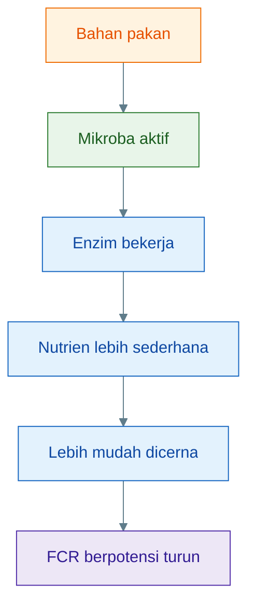
```mermaid
%%{init: {"theme": "base", "themeVariables": {"fontFamily": "Arial", "primaryColor": "#E3F2FD", "primaryTextColor": "#0D47A1", "primaryBorderColor": "#1565C0", "lineColor": "#607D8B"}}}%%
flowchart TD
    A["Bahan pakan"] --> B["Mikroba aktif"]
    B --> C["Enzim bekerja"]
    C --> D["Nutrien lebih sederhana"]
    D --> E["Lebih mudah dicerna"]
    E --> F["FCR berpotensi turun"]

    classDef bahan fill:#FFF3E0,stroke:#EF6C00,color:#E65100;
    classDef mikroba fill:#E8F5E9,stroke:#2E7D32,color:#1B5E20;
    classDef proses fill:#E3F2FD,stroke:#1565C0,color:#0D47A1;
    classDef hasil fill:#EDE7F6,stroke:#512DA8,color:#311B92;

    class A bahan;
    class B mikroba;
    class C,D,E proses;
    class F hasil;
```

Namun perlu ditekankan: fermentasi yang baik berbeda dari pembusukan. Fermentasi adalah proses terkendali. Pembusukan adalah proses liar. Fermentasi menghasilkan aroma asam segar, gurih, atau khas bahan terfermentasi. Pembusukan menghasilkan bau busuk, amonia, lendir menyengat, dan risiko kontaminasi.

Dalam sistem lele air dangkal, perbedaan ini sangat penting. Pakan fermentasi yang baik dapat membantu air lebih stabil. Sebaliknya, pakan fermentasi yang gagal justru dapat menjadi sumber pencemar yang cepat merusak air.

---

## 3.2 Tujuan fermentasi

Tujuan fermentasi pakan lele dapat dibagi menjadi empat kelompok besar:

1. **Tujuan nutrisi**
2. **Tujuan pencernaan**
3. **Tujuan palatabilitas**
4. **Tujuan ekosistem air**

Keempatnya saling berhubungan. Fermentasi tidak hanya bekerja di dalam wadah fermentasi, tetapi efek akhirnya terlihat di kolam: ikan lebih cepat makan, feses lebih sedikit, air tidak cepat bau, dan pertumbuhan lebih efisien.

### 3.2.1 Meningkatkan kecernaan protein

Protein dalam bahan pakan dapat berbentuk molekul kompleks. Sebelum dapat diserap, protein harus dipecah menjadi peptida kecil dan asam amino. Mikroba proteolitik menghasilkan enzim protease yang membantu proses ini.

Alurnya:

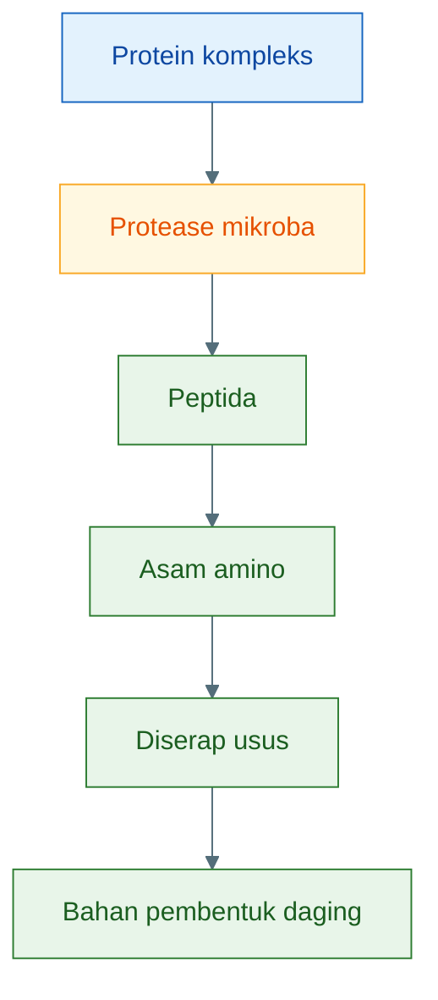
```mermaid
%%{init: {"theme": "base", "themeVariables": {"fontFamily": "Arial", "primaryColor": "#F1F8E9", "primaryTextColor": "#33691E", "primaryBorderColor": "#689F38", "lineColor": "#546E7A"}}}%%
flowchart TD
    A["Protein kompleks"] --> B["Protease mikroba"]
    B --> C["Peptida"]
    C --> D["Asam amino"]
    D --> E["Diserap usus"]
    E --> F["Bahan pembentuk daging"]

    classDef protein fill:#E3F2FD,stroke:#1565C0,color:#0D47A1;
    classDef enzim fill:#FFF8E1,stroke:#F9A825,color:#E65100;
    classDef hasil fill:#E8F5E9,stroke:#2E7D32,color:#1B5E20;

    class A protein;
    class B enzim;
    class C,D,E,F hasil;
```

Fermentasi bukan berarti semua protein langsung menjadi asam amino. Yang terjadi adalah sebagian protein mengalami hidrolisis. Ini membuat bahan pakan lebih “siap cerna”.

### 3.2.2 Memecah sebagian karbohidrat kompleks

Bahan pakan lokal seperti dedak, pollard, bungkil, onggok, atau ampas tahu mengandung karbohidrat dan sebagian serat. Mikroba amilolitik dapat memecah pati menjadi gula sederhana. Mikroba selulolitik dan hemiselulolitik dapat membantu menurunkan sebagian serat.

Tetapi ada batas penting: lele bukan ruminansia. Lele tidak memiliki rumen seperti sapi atau kambing. Karena itu, bahan berserat tinggi tidak otomatis menjadi sumber energi yang baik meskipun difermentasi. Fermentasi dapat membantu menurunkan serat, tetapi sumber energi utama pakan lele tetap sebaiknya berasal dari karbohidrat tercerna seperti tapioka matang, jagung, pollard, dan dedak halus terbatas.

### 3.2.3 Meningkatkan palatabilitas

Palatabilitas adalah tingkat kesukaan ikan terhadap pakan. Pakan yang palatable akan cepat dimakan. Ini sangat penting pada sistem air dangkal karena pakan yang lambat dimakan lebih mudah rusak, larut, dan menjadi beban organik.

Fermentasi dapat menghasilkan aroma asam segar, gurih, dan metabolit tertentu yang merangsang nafsu makan. Yeast juga dapat membantu meningkatkan aroma dan menambah senyawa yang mendukung penerimaan pakan.

Dalam praktik kolam, efek palatabilitas terlihat dari:

- ikan cepat berkumpul saat pakan diberikan,
- pakan habis dalam waktu singkat,
- sedikit pakan tersisa,
- air tidak cepat keruh setelah pemberian pakan.

### 3.2.4 Menurunkan sebagian antinutrisi

Bahan nabati seperti bungkil kedelai, dedak, bungkil kacang, atau bahan hijauan dapat mengandung antinutrisi seperti fitat, tanin, atau senyawa penghambat enzim. Fermentasi dengan mikroba tertentu dapat menurunkan sebagian antinutrisi tersebut. Fermentasi padat pada bahan akuafeed banyak dikaji karena dapat mengurangi faktor antinutrisi dan meningkatkan kecernaan nutrien. ([MDPI][2])

Efeknya bukan hanya protein lebih mudah dimanfaatkan, tetapi mineral tertentu juga dapat menjadi lebih tersedia.

### 3.2.5 Mengurangi bau bahan tertentu

Bahan seperti limbah ikan, silase ikan, ampas tahu, atau bahan hewani lokal sering memiliki masalah bau. Fermentasi yang benar dapat menekan mikroba pembusuk dan mengubah aroma bahan menjadi lebih terkendali.

Namun ini hanya berlaku jika bahan awal masih layak. Fermentasi tidak boleh dipakai untuk “menyelamatkan” bahan yang sudah busuk. Bahan busuk dapat mengandung amonia, histamin, bakteri pembusuk, dan senyawa toksik lain yang membahayakan ikan.

### 3.2.6 Menambah sedikit biomassa mikroba

Mikroba yang tumbuh selama fermentasi menjadi bagian dari bahan pakan. Tubuh mikroba mengandung protein, vitamin, enzim, dan metabolit. Inilah salah satu alasan protein kasar dapat naik sedikit setelah fermentasi.

Tetapi penambahannya umumnya terbatas. Starter mikroba seperti Profeed atau ragi bukan bahan protein utama. Ia adalah pemicu proses. Protein utama tetap harus berasal dari bahan pakan seperti tepung ikan, silase ikan, bungkil kedelai, maggot, atau bahan protein lain.

---

## 3.3 Mikroba yang terlibat

Fermentasi pakan ikan biasanya tidak hanya melibatkan satu jenis mikroba. Dalam praktik lapangan, starter probiotik sering berupa konsorsium, yaitu campuran beberapa jenis mikroba dengan fungsi berbeda.

Berikut kelompok mikroba yang relevan untuk fermentasi pakan lele.

| Mikroba                              | Fungsi utama                                                   | Catatan praktis                                    |
| ------------------------------------ | -------------------------------------------------------------- | -------------------------------------------------- |
| **Bacillus sp.**                     | Menghasilkan protease, amilase, dan enzim pencerna bahan pakan | Penting untuk pemecahan protein dan pati           |
| **Lactobacillus sp.**                | Menghasilkan asam laktat, menurunkan pH, menekan pembusukan    | Membantu fermentasi lebih stabil                   |
| **Saccharomyces cerevisiae / yeast** | Meningkatkan palatabilitas, biomassa mikroba, vitamin B        | Baik sebagai pendukung, bukan sumber protein utama |
| **Aspergillus sp.**                  | Menghasilkan protease, amilase, selulase, fitase               | Berguna untuk bahan nabati                         |
| **Rhizopus sp.**                     | Membantu fermentasi bahan nabati dan menurunkan antinutrisi    | Umum pada fermentasi bahan pangan lokal            |
| **Actinomycetes**                    | Mengurai bahan organik kompleks                                | Lebih relevan untuk substrat berserat              |
| **Mikroba selulolitik**              | Menurunkan sebagian serat kasar                                | Tidak membuat lele menjadi pencerna serat penuh    |
| **Mikroba proteolitik**              | Memecah protein menjadi peptida/asam amino                     | Sangat penting untuk kecernaan protein             |

### 3.3.1 Bacillus sp.

_Bacillus_ adalah kelompok mikroba yang sering digunakan dalam probiotik dan fermentasi pakan. Keunggulannya adalah mampu menghasilkan berbagai enzim, seperti protease, amilase, dan lipase.

Dalam pakan lele, _Bacillus_ berperan membantu memecah:

- protein menjadi peptida,
- pati menjadi gula sederhana,
- sebagian lemak menjadi asam lemak,
- sebagian bahan organik kompleks menjadi bentuk lebih mudah digunakan.

Peran paling pentingnya adalah membantu kecernaan. Jika protein lebih mudah dicerna, peluang protein menjadi daging lebih besar.

### 3.3.2 Lactobacillus sp.

_Lactobacillus_ adalah bakteri asam laktat. Mikroba ini menghasilkan asam laktat yang dapat menurunkan pH bahan fermentasi. pH yang lebih rendah membantu menghambat mikroba pembusuk.

Dalam praktik, _Lactobacillus_ membantu membuat fermentasi lebih aman dan terkendali. Aroma fermentasi yang baik sering terasa asam segar, bukan busuk.

Namun pH yang terlalu rendah juga tidak selalu baik. Jika pakan terlalu asam, ikan dapat menolak makan atau pakan menjadi tidak stabil. Maka fermentasi perlu dipantau.

### 3.3.3 Yeast / Saccharomyces cerevisiae

Yeast atau ragi berperan dalam fermentasi karbohidrat sederhana. Yeast dapat menghasilkan aroma khas, metabolit, vitamin B, dan biomassa mikroba.

Dalam pakan lele, yeast berguna untuk:

- meningkatkan palatabilitas,
- mendukung pertumbuhan mikroba fermentasi,
- menambah sedikit protein mikroba,
- membantu aroma pakan lebih menarik.

Namun yeast biasa bukan mikroba utama pemecah selulosa. Jika targetnya menurunkan serat, diperlukan mikroba selulolitik atau fungi penghasil selulase.

### 3.3.4 Aspergillus dan Rhizopus

_Aspergillus_ dan _Rhizopus_ dikenal sebagai mikroba fermentasi bahan nabati. Keduanya dapat menghasilkan enzim yang membantu memecah pati, protein, dan sebagian serat.

Pada bahan seperti bungkil kedelai, dedak, ampas tahu, atau bahan nabati lain, fungi ini dapat membantu membuka matriks bahan sehingga nutrien lebih mudah tersedia.

Namun penggunaannya harus hati-hati. Tidak semua kapang aman. Fermentasi yang terkontrol penting agar tidak terjadi kontaminasi jamur liar penghasil toksin.

### 3.3.5 Mikroba selulolitik

Mikroba selulolitik menghasilkan enzim selulase. Enzim ini membantu memecah selulosa. Akan tetapi, dalam pakan lele, perannya harus dinilai realistis.

Selulosa tidak otomatis berubah seluruhnya menjadi energi tercerna. Sebagian dapat terpecah, sebagian menjadi biomassa mikroba, sebagian menjadi asam organik, dan sebagian tetap menjadi residu. Maka bahan berserat tinggi tetap harus dibatasi.

### 3.3.6 Mikroba proteolitik

Mikroba proteolitik adalah mikroba yang menghasilkan protease. Ini adalah kelompok penting dalam fermentasi pakan berprotein.

Perannya:

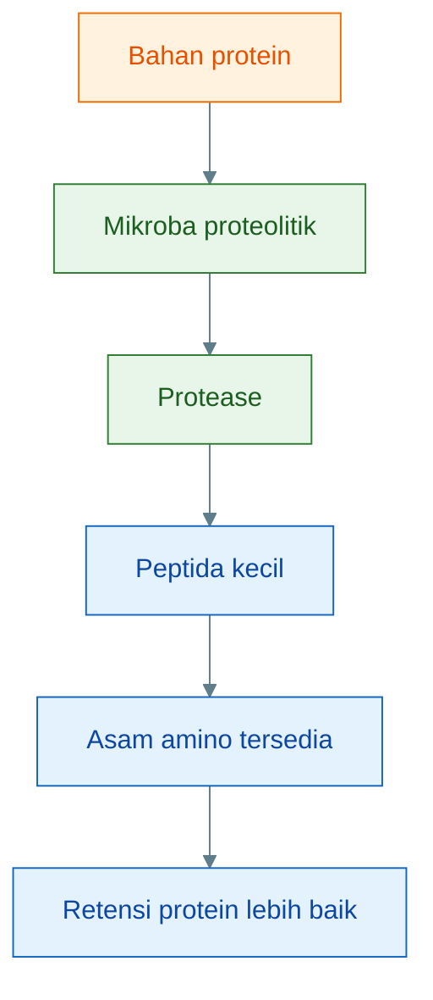
```mermaid
%%{init: {"theme": "base", "themeVariables": {"fontFamily": "Arial", "primaryColor": "#E8F5E9", "primaryTextColor": "#1B5E20", "primaryBorderColor": "#2E7D32", "lineColor": "#607D8B"}}}%%
flowchart TD
    A["Bahan protein"] --> B["Mikroba proteolitik"]
    B --> C["Protease"]
    C --> D["Peptida kecil"]
    D --> E["Asam amino tersedia"]
    E --> F["Retensi protein lebih baik"]

    classDef bahan fill:#FFF3E0,stroke:#EF6C00,color:#E65100;
    classDef mikroba fill:#E8F5E9,stroke:#2E7D32,color:#1B5E20;
    classDef hasil fill:#E3F2FD,stroke:#1565C0,color:#0D47A1;

    class A bahan;
    class B,C mikroba;
    class D,E,F hasil;
```

Inilah dasar klaim bahwa fermentasi dapat meningkatkan ketersediaan protein. Tetapi yang meningkat terutama adalah **ketersediaan dan kecernaan**, bukan selalu jumlah protein sejati secara besar.

---

## 3.4 Prinsip metode fermentasi

Prinsip paling penting dalam fermentasi pakan adalah membedakan fermentasi dari pembusukan.

> **Fermentasi = proses mikroba terkontrol.** > **Pembusukan = proses mikroba liar tidak terkendali.**

Keduanya sama-sama melibatkan mikroba, tetapi hasilnya sangat berbeda.

| Aspek           | Fermentasi baik                    | Pembusukan               |
| --------------- | ---------------------------------- | ------------------------ |
| Aroma           | Asam segar, gurih, khas fermentasi | Busuk, amonia, menyengat |
| Mikroba dominan | Mikroba bermanfaat                 | Mikroba liar/pembusuk    |
| pH              | Cenderung turun terkendali         | Tidak stabil             |
| Tekstur         | Lembap, tidak berlendir busuk      | Berlendir, becek, rusak  |
| Dampak ke ikan  | Palatabilitas naik                 | Ikan bisa menolak makan  |
| Dampak ke air   | Lebih ringan bila benar            | Cepat merusak air        |

Fermentasi yang benar membutuhkan kendali terhadap:

- bahan baku,
- kadar air,
- starter mikroba,
- sumber energi mikroba,
- suhu,
- waktu,
- kebersihan wadah,
- kondisi penyimpanan,
- cara pemberian ke ikan.

Dalam praktik, kesalahan terbesar adalah membuat bahan terlalu basah. Bahan yang terlalu basah mudah berubah menjadi busuk, berlendir, dan cepat merusak air. Untuk pakan lele air dangkal, ini berbahaya karena volume air kecil dan limbah cepat terkonsentrasi.

Prinsip kadar air praktis:

> **Bahan cukup lembap untuk mikroba aktif, tetapi tidak becek.**

Uji sederhana:

- bahan dikepal terasa menyatu,
- tidak meneteskan air,
- mudah dihancurkan kembali,
- tidak mengeluarkan bau busuk.

Jika dikepal lalu air menetes, berarti terlalu basah.

---

## 3.5 Bahan fermentasi

Bahan fermentasi sebaiknya tidak disusun sembarangan. Setiap bahan harus punya fungsi: sumber protein, sumber energi, sumber mikroba, sumber mineral, atau binder.

### 3.5.1 Sumber protein

Sumber protein adalah bahan utama untuk membentuk daging ikan. Fermentasi hanya membantu membuat protein lebih tersedia. Fermentasi tidak menggantikan kebutuhan bahan protein.

Sumber protein yang dapat digunakan:

| Bahan                       | Keunggulan                            | Catatan                         |
| --------------------------- | ------------------------------------- | ------------------------------- |
| Tepung ikan                 | Asam amino baik, palatabilitas tinggi | Harga bisa mahal, risiko tengik |
| Silase ikan                 | Protein hewani mudah dicerna          | Harus dibuat dari bahan segar   |
| Bungkil kedelai             | Protein nabati kuat                   | Metionin relatif terbatas       |
| Maggot BSF                  | Protein dan lemak baik                | Substrat maggot harus aman      |
| Ampas tahu kering           | Lokal dan murah                       | Harus segar/dikeringkan         |
| Tepung keong/bekicot matang | Sumber protein lokal                  | Harus direbus dan dikeringkan   |
| Tepung darah feed-grade     | Protein tinggi                        | Harus diproses benar            |
| Poultry by-product meal     | Protein hewani alternatif             | Harus feed-grade                |

Bahan protein yang tidak layak sebaiknya tidak difermentasi. Fermentasi bukan cara untuk memperbaiki bahan busuk. Bahan busuk tetap berisiko tinggi.

### 3.5.2 Sumber energi/karbohidrat

Mikroba membutuhkan sumber energi. Ikan juga membutuhkan energi. Sumber energi yang baik membantu protein tidak banyak dibakar sebagai energi.

Sumber karbohidrat yang dapat digunakan:

- tapioka matang,
- jagung giling,
- dedak halus,
- pollard,
- onggok kering,
- molase.

Tapioka matang berguna sebagai sumber pati tercerna dan binder. Jagung dan pollard memberi energi. Dedak dapat digunakan, tetapi jangan terlalu banyak karena serat dan lemaknya dapat meningkatkan feses dan mempercepat ketengikan. Molase lebih tepat dipakai sebagai aktivator fermentasi, bukan bahan utama.

### 3.5.3 Starter mikroba

Starter mikroba berfungsi memulai dan mengarahkan fermentasi.

Contoh starter:

- GB#1 Profeed,
- feed yeast,
- bakteri asam laktat,
- probiotik pakan,
- kultur mikroba proteolitik-selulolitik.

Starter bukan sumber protein utama. Dosis kecil starter tidak mungkin mengubah pakan rendah protein menjadi pakan sangat tinggi protein. Starter bekerja sebagai pemicu proses mikrobiologis.

---

## 3.6 Tahapan fermentasi umum

Metode fermentasi harus disusun agar mudah diterapkan pembudidaya. Berikut metode umum untuk fermentasi bahan pakan lele dalam skala kecil.

### 3.6.1 Formula dasar percobaan kecil

Untuk uji awal, jangan langsung membuat banyak. Mulai dari 10 kg bahan.

Contoh formula percobaan:

| Komponen                           |                   Jumlah |
| ---------------------------------- | -----------------------: |
| Pakan komersial atau bahan protein |                     6 kg |
| Dedak halus/pollard                |                     2 kg |
| Tapioka matang/kanji               |                     1 kg |
| Bahan protein tambahan             |                     1 kg |
| Molase                             |                50–100 ml |
| Starter Profeed/ragi/probiotik     |             sesuai dosis |
| Air bersih                         | secukupnya sampai lembap |

Jika memakai pakan komersial apung, hati-hati. Fermentasi basah dapat membuat pelet hancur dan kehilangan daya apung. Untuk pakan komersial, lebih aman melakukan fermentasi ringan atau fermentasi bahan tambahan, lalu dicampur sebelum diberikan.

### 3.6.2 Tahapan fermentasi

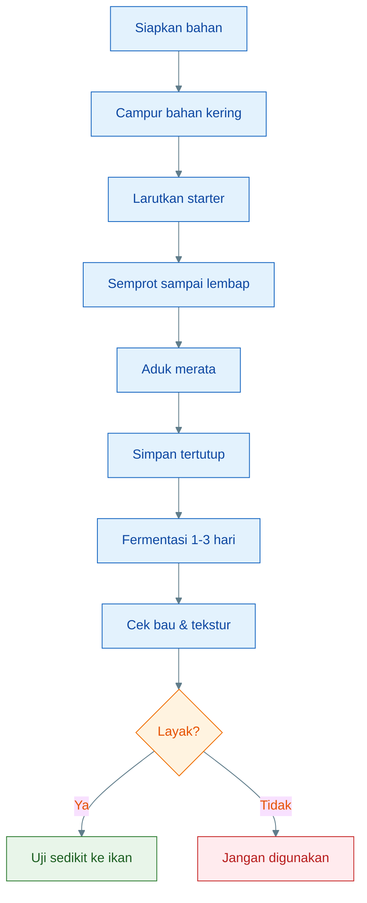
```mermaid
%%{init: {"theme": "base", "themeVariables": {"fontFamily": "Arial", "primaryColor": "#FFF8E1", "primaryTextColor": "#E65100", "primaryBorderColor": "#F9A825", "lineColor": "#607D8B"}}}%%
flowchart TD
    A["Siapkan bahan"] --> B["Campur bahan kering"]
    B --> C["Larutkan starter"]
    C --> D["Semprot sampai lembap"]
    D --> E["Aduk merata"]
    E --> F["Simpan tertutup"]
    F --> G["Fermentasi 1-3 hari"]
    G --> H["Cek bau & tekstur"]
    H --> I{"Layak?"}
    I -->|Ya| J["Uji sedikit ke ikan"]
    I -->|Tidak| K["Jangan digunakan"]

    classDef step fill:#E3F2FD,stroke:#1565C0,color:#0D47A1;
    classDef check fill:#FFF3E0,stroke:#EF6C00,color:#E65100;
    classDef ok fill:#E8F5E9,stroke:#2E7D32,color:#1B5E20;
    classDef bad fill:#FFEBEE,stroke:#C62828,color:#B71C1C;

    class A,B,C,D,E,F,G,H step;
    class I check;
    class J ok;
    class K bad;
```

Tahap teknisnya:

1. Siapkan bahan pakan yang masih layak.
2. Campur bahan protein dan sumber energi.
3. Larutkan starter mikroba dengan air bersih dan sedikit molase.
4. Semprotkan larutan ke bahan sambil diaduk.
5. Pastikan bahan lembap, bukan becek.
6. Masukkan ke wadah bersih.
7. Tutup rapat atau semi-rapat sesuai jenis fermentasi.
8. Simpan di tempat teduh.
9. Fermentasi 1–3 hari untuk pakan basah cepat pakai.
10. Cek bau, tekstur, warna, dan ada tidaknya jamur liar.
11. Berikan sedikit dulu untuk melihat respons ikan.
12. Jangan gunakan jika ada tanda pembusukan.

### 3.6.3 Rumus estimasi tambahan biaya fermentasi

Jika menggunakan starter komersial seperti Profeed, tambahan biaya per kg pakan dapat dihitung sebagai:

$$
\text{Biaya starter per kg pakan} =
\frac{\text{Harga starter per liter}}{\text{Jumlah pakan yang difermentasi per liter starter}}
$$

Contoh:

$$
\text{Biaya starter} =
\frac{Rp45.000}{400 \text{ kg}}
$$

$$
\text{Biaya starter} = Rp112{,}5/\text{kg pakan}
$$

Angka ini kecil dibanding harga pakan. Maka, secara ekonomi, fermentasi tidak perlu menaikkan protein secara besar untuk layak. Cukup menurunkan FCR sedikit saja, dampaknya bisa terasa.

Rumus biaya pakan per kg panen:

$$
\text{Biaya pakan/kg panen} =
\text{Harga pakan/kg} \times FCR
$$

Jika pakan tanpa fermentasi:

$$
Rp15.000 \times 1{,}30 = Rp19.500
$$

Jika pakan fermentasi:

$$
Rp15.112 \times 1{,}20 = Rp18.134
$$

Selisihnya:

$$
Rp19.500 - Rp18.134 = Rp1.366
$$

Artinya, keuntungan utama fermentasi bukan pada klaim protein naik, tetapi pada kemungkinan FCR turun.

---

## 3.7 Ciri fermentasi berhasil

Fermentasi berhasil dapat dikenali dari tanda fisik, bau, tekstur, dan respons ikan.

Ciri-cirinya:

- bau asam segar atau gurih,
- tidak busuk,
- tidak berbau amonia menyengat,
- tidak muncul jamur liar hitam/hijau,
- tidak berlendir busuk,
- bahan lembap tetapi tidak becek,
- ikan merespons cepat saat diberi,
- air tidak langsung keruh atau bau setelah pemberian.

Pakan fermentasi yang baik biasanya lebih cepat dimakan. Ini penting karena pakan yang cepat dimakan memiliki risiko lebih kecil mencemari air.

Dalam sistem lele air dangkal, indikator paling penting bukan hanya bau pakan, tetapi reaksi air setelah pakan diberikan.

Jika setelah pakan fermentasi diberikan air menjadi cepat keruh, bau, berbusa, atau ikan menggantung, maka pakan tersebut tidak cocok atau proses fermentasinya bermasalah.

---

## 3.8 Ciri fermentasi gagal

Fermentasi gagal harus dibuang. Jangan diberikan ke ikan hanya karena sayang bahan. Kerugian dari ikan stres atau mati jauh lebih besar daripada kerugian membuang bahan fermentasi.

Ciri fermentasi gagal:

| Tanda                           | Makna                     |
| ------------------------------- | ------------------------- |
| Bau busuk/amonia                | Dominasi mikroba pembusuk |
| Jamur hitam/hijau liar          | Risiko kontaminasi        |
| Lendir berlebihan               | Pembusukan basah          |
| Terlalu becek                   | Kadar air terlalu tinggi  |
| Bau alkohol tajam               | Fermentasi tidak seimbang |
| Ikan menolak makan              | Palatabilitas buruk       |
| Air cepat bau setelah pemberian | Beban organik tinggi      |

Alur kegagalan fermentasi biasanya seperti ini:

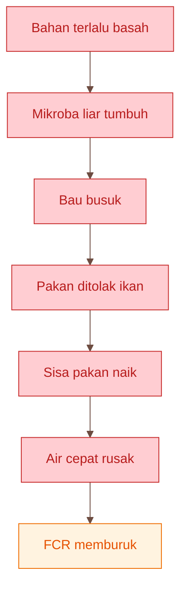
```mermaid
%%{init: {"theme": "base", "themeVariables": {"fontFamily": "Arial", "primaryColor": "#FFEBEE", "primaryTextColor": "#B71C1C", "primaryBorderColor": "#C62828", "lineColor": "#6D4C41"}}}%%
flowchart TD
    A["Bahan terlalu basah"] --> B["Mikroba liar tumbuh"]
    B --> C["Bau busuk"]
    C --> D["Pakan ditolak ikan"]
    D --> E["Sisa pakan naik"]
    E --> F["Air cepat rusak"]
    F --> G["FCR memburuk"]

    classDef risk fill:#FFCDD2,stroke:#C62828,color:#B71C1C;
    classDef warn fill:#FFF3E0,stroke:#EF6C00,color:#E65100;

    class A,B,C,D,E,F risk;
    class G warn;
```

Prinsip praktis:

> **Jika ragu terhadap kualitas fermentasi, jangan diberikan.**

Kesimpulan Bab 3:

> **Fermentasi pakan adalah alat untuk meningkatkan kecernaan, palatabilitas, dan efisiensi pakan. Mikroba membantu memecah protein, karbohidrat, serat, dan antinutrisi. Tetapi fermentasi harus terkontrol. Fermentasi yang baik membantu menurunkan FCR dan menjaga air; fermentasi yang gagal justru merusak air dan memperburuk performa ikan.**

[**Kembali ke Atas**](#budidaya-lele-air-dangkal-probiotik-dan-fermentasi-pakan)

---

# 4. Protein, Asam Amino, dan Cara Meningkatkan Ketersediaannya

## 4.1 Protein kasar vs protein sejati

Dalam pakan ikan, istilah protein sering menimbulkan salah paham. Banyak orang melihat angka protein pada label pakan, misalnya 28%, 32%, atau 35%, lalu menganggap semakin tinggi angka itu pasti semakin baik. Padahal angka pada label biasanya adalah **protein kasar**, bukan protein sejati, apalagi protein tercerna.

Protein kasar dihitung dari total nitrogen. Rumus umumnya:

$$
\text{Protein kasar} = \text{Total nitrogen} \times 6{,}25
$$

Faktor 6,25 digunakan karena protein secara umum diasumsikan mengandung sekitar 16% nitrogen.

$$
\frac{100}{16} = 6{,}25
$$

Masalahnya, tidak semua nitrogen berasal dari protein sejati. FAO menjelaskan bahwa nitrogen dalam bahan pangan/pakan juga dapat berasal dari nitrogen non-protein seperti asam amino bebas, nukleotida, kreatin, kolin, dan senyawa nitrogen lain; penggunaan faktor tunggal 6,25 memiliki keterbatasan karena tidak semua nitrogen adalah protein sejati. ([FAOHome][3])

Jadi, protein kasar adalah angka estimasi. Ia berguna sebagai indikator awal, tetapi tidak cukup untuk menilai kualitas pakan secara lengkap.

### 4.1.1 Protein kasar

Protein kasar:

- dihitung dari total nitrogen,
- bisa naik karena nitrogen non-protein,
- bisa terlihat tinggi walaupun kualitas biologis rendah,
- tidak selalu menunjukkan kecernaan,
- tidak menunjukkan keseimbangan asam amino.

Contoh masalah:

Jika suatu bahan diberi nitrogen non-protein, angka protein kasar bisa naik. Tetapi lele belum tentu dapat memanfaatkan nitrogen tersebut menjadi daging.

### 4.1.2 Protein sejati

Protein sejati adalah protein yang benar-benar tersusun dari rantai asam amino. Protein inilah yang lebih relevan untuk pertumbuhan ikan.

Protein sejati harus dinilai dari:

- sumber bahan,
- profil asam amino,
- kecernaan,
- keseimbangan energi,
- keberadaan antinutrisi,
- stabilitas pakan dalam air.

Perbedaannya dapat dilihat seperti ini:

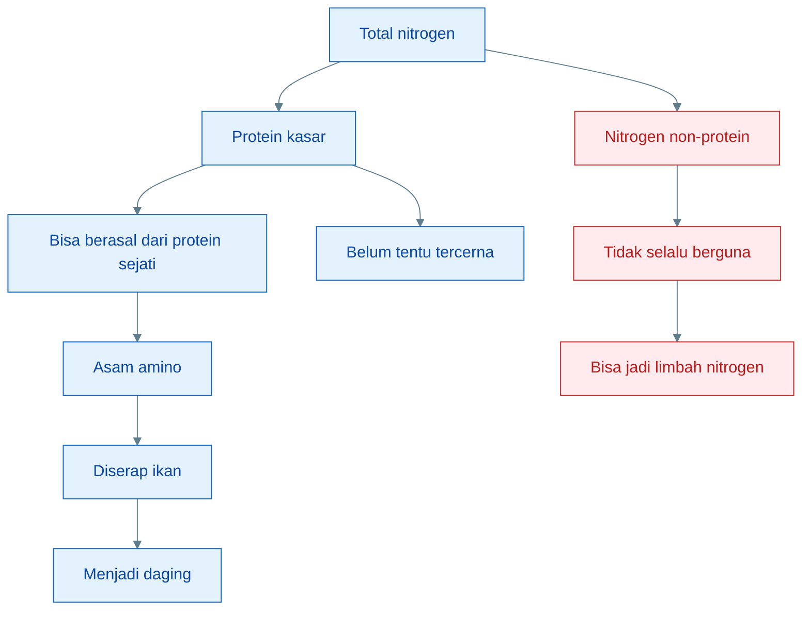
```mermaid
%%{init: {"theme": "base", "themeVariables": {"fontFamily": "Arial", "primaryColor": "#E3F2FD", "primaryTextColor": "#0D47A1", "primaryBorderColor": "#1565C0", "lineColor": "#607D8B"}}}%%
flowchart TD
    A["Total nitrogen"] --> B["Protein kasar"]
    A --> C["Nitrogen non-protein"]

    B --> D["Bisa berasal dari protein sejati"]
    B --> E["Belum tentu tercerna"]

    D --> F["Asam amino"]
    F --> G["Diserap ikan"]
    G --> H["Menjadi daging"]

    C --> I["Tidak selalu berguna"]
    I --> J["Bisa jadi limbah nitrogen"]

    classDef main fill:#E3F2FD,stroke:#1565C0,color:#0D47A1;
    classDef good fill:#E8F5E9,stroke:#2E7D32,color:#1B5E20;
    classDef risk fill:#FFEBEE,stroke:#C62828,color:#B71C1C;

    class A,B,D,F,G,H main;
    class C,I,J risk;
```

Untuk praktisi, kesimpulannya sederhana:

> **Jangan hanya mengejar protein kasar tinggi. Kejar protein yang benar-benar dapat dicerna dan menjadi daging.**

---

## 4.2 Protein tercerna

Protein tercerna adalah bagian dari protein pakan yang benar-benar dapat dicerna dan diserap oleh ikan. Ini jauh lebih penting daripada protein kasar.

Secara konsep:

$$
\text{Protein tercerna} =
\text{Protein pakan} \times \text{Koefisien kecernaan}
$$

Contoh:

Pakan A memiliki protein kasar 32% dengan kecernaan 85%.

$$
32% \times 85% = 27{,}2%
$$

Maka protein tercernanya sekitar 27,2%.

Pakan B memiliki protein kasar 36% tetapi kecernaan hanya 70%.

$$
36% \times 70% = 25{,}2%
$$

Meskipun protein kasar Pakan B lebih tinggi, protein tercernanya lebih rendah.

Ini menjelaskan mengapa pakan dengan protein lebih rendah kadang bisa menghasilkan pertumbuhan lebih baik daripada pakan protein tinggi. Kuncinya ada pada kecernaan dan keseimbangan nutrisi.

### 4.2.1 Mekanisme protein menjadi daging

Agar protein pakan menjadi daging lele, prosesnya panjang:

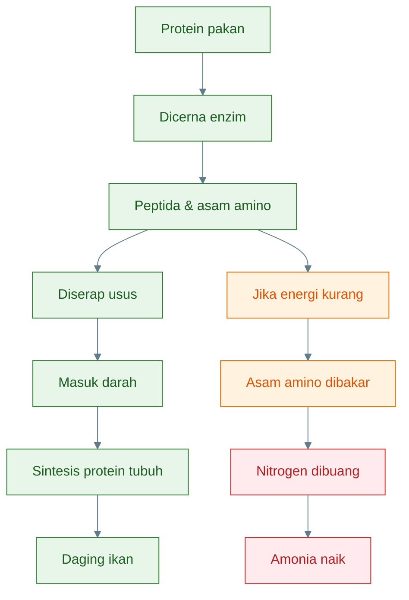
```mermaid
%%{init: {"theme": "base", "themeVariables": {"fontFamily": "Arial", "primaryColor": "#E8F5E9", "primaryTextColor": "#1B5E20", "primaryBorderColor": "#2E7D32", "lineColor": "#607D8B"}}}%%
flowchart TD
    A["Protein pakan"] --> B["Dicerna enzim"]
    B --> C["Peptida & asam amino"]
    C --> D["Diserap usus"]
    D --> E["Masuk darah"]
    E --> F["Sintesis protein tubuh"]
    F --> G["Daging ikan"]

    H["Jika energi kurang"] --> I["Asam amino dibakar"]
    I --> J["Nitrogen dibuang"]
    J --> K["Amonia naik"]

    C --> H

    classDef good fill:#E8F5E9,stroke:#2E7D32,color:#1B5E20;
    classDef warn fill:#FFF3E0,stroke:#EF6C00,color:#E65100;
    classDef risk fill:#FFEBEE,stroke:#C62828,color:#B71C1C;

    class A,B,C,D,E,F,G good;
    class H,I warn;
    class J,K risk;
```

Protein tidak langsung berubah menjadi daging. Protein harus dipecah menjadi asam amino, diserap, lalu disusun kembali menjadi protein tubuh ikan.

Jika energi pakan kurang, sebagian asam amino akan dibakar sebagai energi. Ini tidak efisien karena protein adalah komponen pakan yang mahal. Selain itu, pembakaran asam amino menghasilkan limbah nitrogen.

Karena itu, pakan lele harus mengandung energi yang cukup dari karbohidrat dan lemak agar protein dapat diprioritaskan untuk pertumbuhan.

---

## 4.3 Asam amino esensial lele

Protein tersusun dari asam amino. Bagi ikan, asam amino adalah bahan baku pembentukan jaringan tubuh.

Lele membutuhkan berbagai asam amino esensial, antara lain:

- lisin,
- metionin,
- treonin,
- triptofan,
- arginin,
- histidin,
- isoleusin,
- leusin,
- valin,
- fenilalanin.

Asam amino esensial adalah asam amino yang tidak dapat dibuat sendiri oleh tubuh ikan dalam jumlah cukup, sehingga harus tersedia dari pakan.

Masalahnya, tidak semua bahan pakan memiliki profil asam amino yang sama. Tepung ikan, bungkil kedelai, maggot, jagung, dedak, dan tapioka memiliki komposisi asam amino yang berbeda. Karena itu, formulasi pakan tidak bisa hanya melihat protein total.

Contoh sederhana:

| Bahan           |       Protein | Kelemahan umum                              |
| --------------- | ------------: | ------------------------------------------- |
| Tepung ikan     |        Tinggi | Harga mahal, risiko mutu                    |
| Bungkil kedelai |        Tinggi | Metionin relatif terbatas                   |
| Jagung          | Sedang-rendah | Lisin rendah                                |
| Dedak           |        Sedang | Serat dan lemak cukup tinggi                |
| Tapioka         | Sangat rendah | Hampir hanya energi                         |
| Maggot BSF      |  Cukup tinggi | Lemak bisa tinggi, profil tergantung proses |

Dalam formulasi pakan, asam amino yang kurang akan menjadi pembatas. Ini disebut **limiting amino acid**.

---

## 4.4 Dua asam amino pembatas utama

Pada pakan lele, dua asam amino yang paling sering menjadi pembatas adalah:

> **lisin dan metionin**

Lisin dan metionin sering menjadi perhatian karena banyak bahan pakan murah berbasis nabati kurang seimbang pada dua asam amino ini. Artikel teknis nutrisi catfish dari The Fish Site menyebut bahwa dibanding protein hewani, banyak protein nabati cenderung defisien lisin dan metionin, dua asam amino pembatas pada pakan catfish. ([The Fish Site][4])

### 4.4.1 Lisin

Lisin sangat penting untuk pertumbuhan otot. Jika lisin kurang, sintesis protein tubuh akan tertahan meskipun protein kasar pakan tinggi.

Dalam praktik, kekurangan lisin dapat menyebabkan:

- pertumbuhan lambat,
- FCR memburuk,
- ukuran ikan tidak seragam,
- protein pakan tidak termanfaatkan optimal.

### 4.4.2 Metionin

Metionin adalah asam amino sulfur. Ia penting untuk pertumbuhan, metabolisme, dan kesehatan ikan. Metionin sering dibahas bersama sistin sebagai total asam amino sulfur.

Kekurangan metionin dapat menyebabkan:

- pertumbuhan turun,
- efisiensi pakan menurun,
- retensi protein tubuh kurang optimal,
- ikan lebih mudah mengalami masalah metabolik.

Kajian pada ikan menunjukkan metionin merupakan asam amino sulfur penting, dan suplementasi metionin dapat membantu memenuhi kebutuhan total asam amino sulfur dalam akuafeed. ([Global Seafood Alliance][5])

### 4.4.3 Prinsip papan terpendek

Pembentukan daging mengikuti prinsip papan terpendek. Jika satu asam amino esensial kurang, pembentukan protein tubuh tertahan.

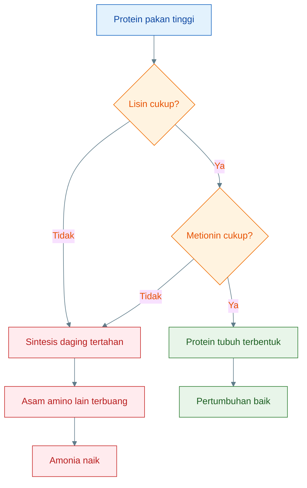
```mermaid
%%{init: {"theme": "base", "themeVariables": {"fontFamily": "Arial", "primaryColor": "#FFF8E1", "primaryTextColor": "#E65100", "primaryBorderColor": "#F9A825", "lineColor": "#607D8B"}}}%%
flowchart TD
    A["Protein pakan tinggi"] --> B{"Lisin cukup?"}
    B -->|Tidak| C["Sintesis daging tertahan"]
    B -->|Ya| D{"Metionin cukup?"}
    D -->|Tidak| C
    D -->|Ya| E["Protein tubuh terbentuk"]
    C --> F["Asam amino lain terbuang"]
    F --> G["Amonia naik"]
    E --> H["Pertumbuhan baik"]

    classDef check fill:#FFF3E0,stroke:#EF6C00,color:#E65100;
    classDef good fill:#E8F5E9,stroke:#2E7D32,color:#1B5E20;
    classDef risk fill:#FFEBEE,stroke:#C62828,color:#B71C1C;
    classDef start fill:#E3F2FD,stroke:#1565C0,color:#0D47A1;

    class A start;
    class B,D check;
    class E,H good;
    class C,F,G risk;
```

Ini sebabnya pakan protein tinggi belum tentu efisien. Jika lisin atau metionin kurang, sebagian protein tidak dapat menjadi daging secara optimal.

---

## 4.5 Mengapa lisin dan metionin penting?

Lisin dan metionin penting karena keduanya sering menjadi titik sempit dalam pembentukan daging lele. Dalam sistem budidaya intensif atau semi-intensif, pembudidaya mengejar pertumbuhan cepat dan FCR rendah. Untuk itu, protein yang masuk harus benar-benar bisa ditahan menjadi biomassa ikan.

Retensi protein tubuh dapat dipahami sebagai:

$$
\text{Retensi protein} =
\frac{\text{Protein yang tertahan di tubuh ikan}}{\text{Protein yang dikonsumsi ikan}}
\times 100%
$$

Jika retensi protein tinggi, lebih banyak protein pakan menjadi daging. Jika retensi protein rendah, lebih banyak protein terbuang.

Secara teknis, lisin dan metionin memengaruhi beberapa hal:

| Asam amino | Fungsi utama                                | Dampak bila kurang                                  |
| ---------- | ------------------------------------------- | --------------------------------------------------- |
| Lisin      | Pembentukan otot dan pertumbuhan            | Pertumbuhan lambat, FCR naik                        |
| Metionin   | Asam amino sulfur, metabolisme, pertumbuhan | Efisiensi pakan turun, protein tubuh kurang optimal |

Ketika lisin dan metionin cukup, protein pakan lebih berpeluang digunakan untuk sintesis protein tubuh. Ketika salah satunya kurang, tubuh ikan tidak dapat menyusun protein otot secara optimal.

Kondisi ideal:

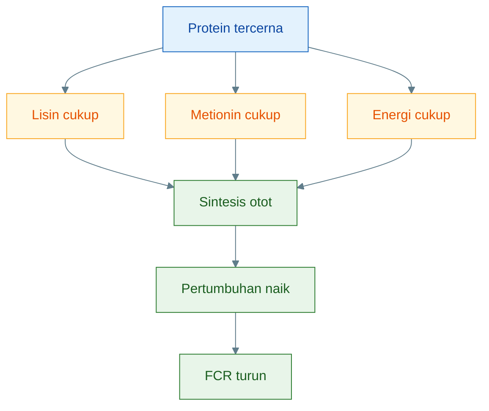
```mermaid
%%{init: {"theme": "base", "themeVariables": {"fontFamily": "Arial", "primaryColor": "#E8F5E9", "primaryTextColor": "#1B5E20", "primaryBorderColor": "#2E7D32", "lineColor": "#607D8B"}}}%%
flowchart TD
    A["Protein tercerna"] --> B["Lisin cukup"]
    A --> C["Metionin cukup"]
    A --> D["Energi cukup"]
    B --> E["Sintesis otot"]
    C --> E
    D --> E
    E --> F["Pertumbuhan naik"]
    F --> G["FCR turun"]

    classDef input fill:#E3F2FD,stroke:#1565C0,color:#0D47A1;
    classDef key fill:#FFF8E1,stroke:#F9A825,color:#E65100;
    classDef result fill:#E8F5E9,stroke:#2E7D32,color:#1B5E20;

    class A input;
    class B,C,D key;
    class E,F,G result;
```

Tetapi lisin dan metionin tidak boleh dilihat secara terpisah dari energi. Jika energi dari karbohidrat dan lemak kurang, asam amino dapat dibakar sebagai energi. Maka, meskipun lisin dan metionin cukup, FCR tetap bisa buruk jika energi pakan tidak seimbang.

---

## 4.6 Cara meningkatkan lisin dan metionin

Meningkatkan lisin dan metionin dapat dilakukan dengan dua pendekatan:

1. **Melalui pemilihan bahan pakan**
2. **Melalui fermentasi untuk meningkatkan ketersediaan**

Keduanya memiliki fungsi berbeda.

> **Bahan pakan menyediakan lisin dan metionin. Fermentasi membantu melepaskan dan meningkatkan ketersediaannya.**

### 4.6.1 Melalui bahan pakan

Sumber lisin yang baik:

- tepung ikan,
- silase ikan,
- bungkil kedelai,
- maggot BSF,
- tepung darah feed-grade,
- L-lysine feed-grade.

Sumber metionin yang baik:

- tepung ikan,
- bahan protein hewani feed-grade,
- maggot BSF,
- DL-methionine feed-grade,
- L-methionine feed-grade.

Jika formula pakan banyak memakai bahan nabati seperti dedak, jagung, tapioka, atau onggok, maka risiko kekurangan lisin dan metionin meningkat. Bahan-bahan tersebut lebih berperan sebagai energi atau bahan pengisi, bukan sumber asam amino lengkap.

Tapioka matang, misalnya, bagus sebagai sumber energi dan binder. Tetapi tapioka hampir tidak menyumbang lisin dan metionin. Maka jika tapioka dinaikkan, bahan protein dan asam amino harus tetap dijaga.

### 4.6.2 Melalui suplementasi asam amino

Dalam formulasi yang lebih presisi, lisin dan metionin dapat ditambahkan dalam bentuk feed-grade:

- L-lysine,
- DL-methionine,
- L-methionine.

Namun penggunaannya harus hati-hati. Asam amino bebas dapat larut ke air jika pelet tidak stabil. Karena itu, jika digunakan dalam pakan basah atau pelet buatan, perlu binder yang baik dan proses pencampuran merata.

Prinsipnya:

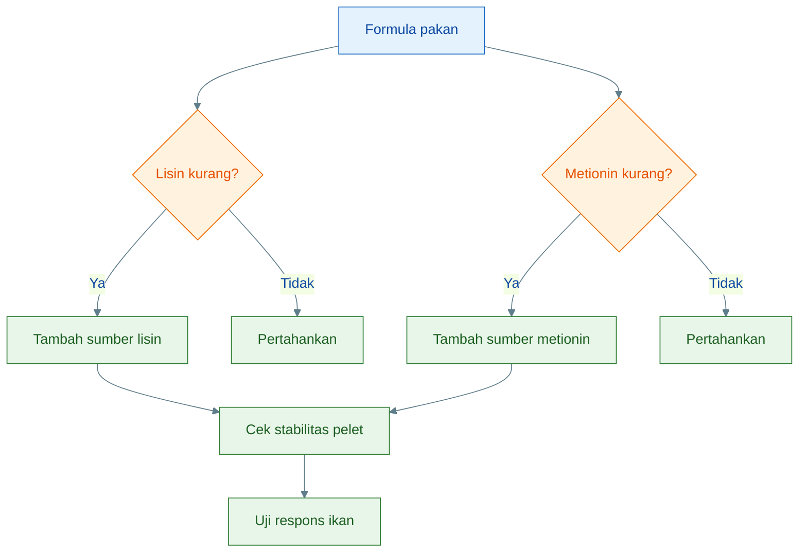
```mermaid
%%{init: {"theme": "base", "themeVariables": {"fontFamily": "Arial", "primaryColor": "#E3F2FD", "primaryTextColor": "#0D47A1", "primaryBorderColor": "#1565C0", "lineColor": "#607D8B"}}}%%
flowchart TD
    A["Formula pakan"] --> B{"Lisin kurang?"}
    B -->|Ya| C["Tambah sumber lisin"]
    B -->|Tidak| D["Pertahankan"]

    A --> E{"Metionin kurang?"}
    E -->|Ya| F["Tambah sumber metionin"]
    E -->|Tidak| G["Pertahankan"]

    C --> H["Cek stabilitas pelet"]
    F --> H
    H --> I["Uji respons ikan"]

    classDef check fill:#FFF3E0,stroke:#EF6C00,color:#E65100;
    classDef action fill:#E8F5E9,stroke:#2E7D32,color:#1B5E20;
    classDef main fill:#E3F2FD,stroke:#1565C0,color:#0D47A1;

    class A main;
    class B,E check;
    class C,D,F,G,H,I action;
```

### 4.6.3 Melalui fermentasi

Fermentasi membantu meningkatkan ketersediaan lisin dan metionin dengan cara tidak langsung.

Fermentasi dapat:

- memecah protein menjadi peptida,
- melepaskan sebagian asam amino,
- menurunkan antinutrisi,
- membuka matriks bahan nabati,
- meningkatkan palatabilitas,
- meningkatkan kecernaan.

Tetapi fermentasi tidak otomatis menciptakan lisin dan metionin dalam jumlah besar. Jika bahan awal miskin lisin dan metionin, hasil fermentasinya tetap terbatas.

Contoh:

- Dedak + tapioka + ragi tidak akan otomatis menjadi pakan kaya lisin dan metionin.
- Bungkil kedelai + bahan hewani + fermentasi lebih masuk akal.
- Silase ikan + fermentasi terkendali dapat meningkatkan ketersediaan protein hewani.
- Pakan komersial + fermentasi ringan dapat meningkatkan palatabilitas dan kecernaan, tetapi kenaikan asam amino total tetap terbatas.

Maka, peran fermentasi adalah:

> **membuat asam amino yang sudah ada menjadi lebih mudah tersedia, bukan menciptakan asam amino pembatas dari nol.**

---

## 4.7 Mikroba yang membantu ketersediaan asam amino

Mikroba membantu ketersediaan asam amino melalui enzim dan metabolit. Yang paling penting adalah mikroba proteolitik.

### 4.7.1 Bacillus proteolitik

_Bacillus_ proteolitik menghasilkan protease. Protease membantu memecah protein menjadi peptida dan asam amino. Ini sangat penting untuk bahan seperti tepung ikan, silase ikan, bungkil kedelai, maggot, atau bahan hewani lain.

Fungsi utamanya:

- meningkatkan kecernaan protein,
- mempercepat pelepasan peptida,
- membantu mengurangi protein tidak tercerna.

### 4.7.2 Lactobacillus

_Lactobacillus_ membantu menjaga fermentasi tetap stabil. Dengan menghasilkan asam laktat, bakteri ini menurunkan pH dan menekan mikroba pembusuk.

Fungsinya terhadap asam amino lebih tidak langsung:

- menjaga bahan tidak busuk,
- menekan degradasi protein menjadi amonia,
- membantu pengawetan,
- mendukung proses fermentasi yang aman.

### 4.7.3 Yeast/ragi

Yeast meningkatkan palatabilitas dan menambah sedikit biomassa mikroba. Biomassa yeast mengandung protein dan vitamin. Namun yeast bukan produsen lisin dan metionin utama dalam fermentasi pakan lapangan.

Fungsinya lebih sebagai:

- pendukung aroma,
- peningkat palatabilitas,
- sumber metabolit,
- tambahan biomassa mikroba.

### 4.7.4 Aspergillus dan Rhizopus

Fungi seperti _Aspergillus_ dan _Rhizopus_ dapat menghasilkan enzim yang membuka struktur bahan nabati. Ini membantu protein dalam bahan nabati lebih mudah diakses oleh enzim pencernaan.

Fungsinya:

- menurunkan antinutrisi,
- menghasilkan protease dan amilase,
- membantu pemecahan serat tertentu,
- meningkatkan bioavailabilitas nutrien.

### 4.7.5 Skema kerja mikroba terhadap asam amino

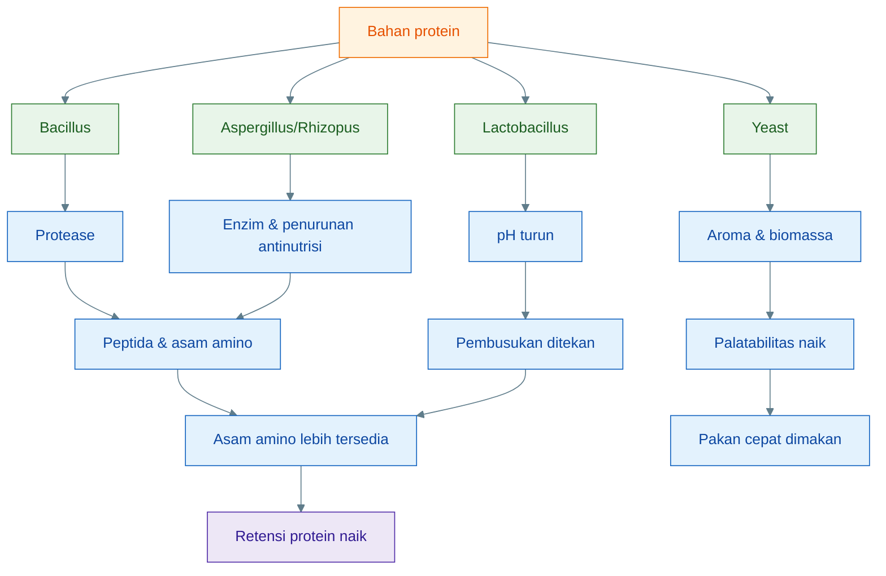
```mermaid
%%{init: {"theme": "base", "themeVariables": {"fontFamily": "Arial", "primaryColor": "#E8F5E9", "primaryTextColor": "#1B5E20", "primaryBorderColor": "#2E7D32", "lineColor": "#607D8B"}}}%%
flowchart TD
    A["Bahan protein"] --> B["Bacillus"]
    A --> C["Aspergillus/Rhizopus"]
    A --> D["Lactobacillus"]
    A --> E["Yeast"]

    B --> F["Protease"]
    C --> G["Enzim & penurunan antinutrisi"]
    D --> H["pH turun"]
    E --> I["Aroma & biomassa"]

    F --> J["Peptida & asam amino"]
    G --> J
    H --> K["Pembusukan ditekan"]
    I --> L["Palatabilitas naik"]

    J --> M["Asam amino lebih tersedia"]
    K --> M
    L --> N["Pakan cepat dimakan"]
    M --> O["Retensi protein naik"]

    classDef bahan fill:#FFF3E0,stroke:#EF6C00,color:#E65100;
    classDef mikroba fill:#E8F5E9,stroke:#2E7D32,color:#1B5E20;
    classDef proses fill:#E3F2FD,stroke:#1565C0,color:#0D47A1;
    classDef hasil fill:#EDE7F6,stroke:#512DA8,color:#311B92;

    class A bahan;
    class B,C,D,E mikroba;
    class F,G,H,I,J,K,L,M,N proses;
    class O hasil;
```

---

## 4.8 Prinsip akhir

Prinsip akhir dari Bab 4 adalah:

> **Fermentasi untuk kecernaan, formulasi bahan untuk mencukupi lisin dan metionin.**

Ini penting karena sering terjadi salah kaprah. Banyak pembudidaya berharap mikroba dapat menaikkan protein dan asam amino secara besar. Padahal mikroba fermentasi lebih realistis berperan sebagai pembantu proses pencernaan.

Strategi yang lebih tajam adalah:

1. Gunakan bahan protein yang benar.
2. Pastikan sumber lisin dan metionin tersedia.
3. Gunakan fermentasi untuk meningkatkan kecernaan.
4. Berikan energi cukup dari karbohidrat dan lemak.
5. Jaga agar pakan cepat dimakan.
6. Pantau FCR dan kualitas air.

Secara sistem, hubungan antara protein, asam amino, energi, dan fermentasi dapat digambarkan sebagai berikut:

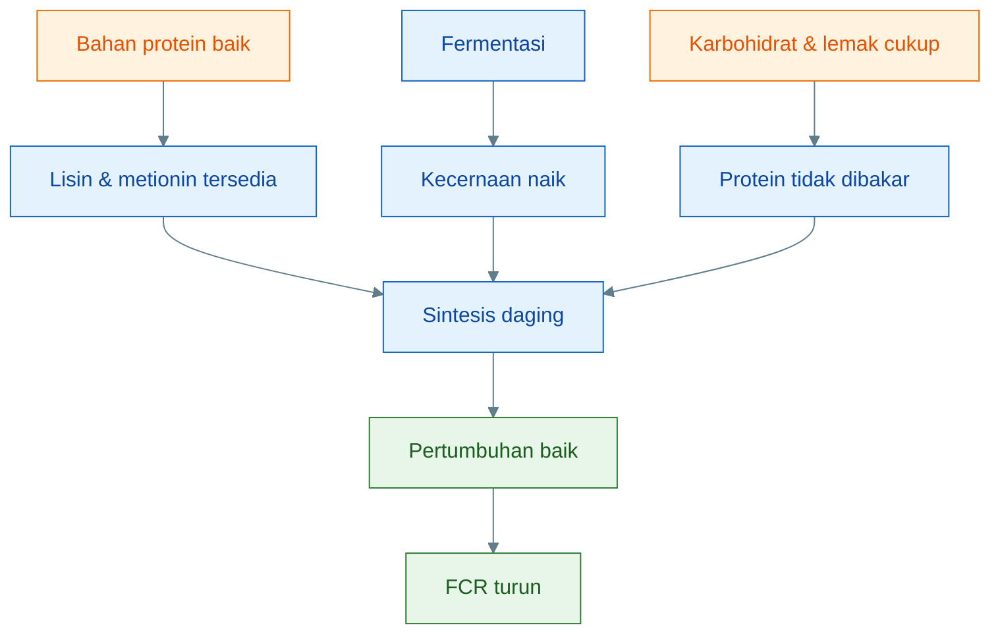
```mermaid
%%{init: {"theme": "base", "themeVariables": {"fontFamily": "Arial", "primaryColor": "#E3F2FD", "primaryTextColor": "#0D47A1", "primaryBorderColor": "#1565C0", "lineColor": "#607D8B"}}}%%
flowchart TD
    A["Bahan protein baik"] --> B["Lisin & metionin tersedia"]
    C["Fermentasi"] --> D["Kecernaan naik"]
    E["Karbohidrat & lemak cukup"] --> F["Protein tidak dibakar"]
    B --> G["Sintesis daging"]
    D --> G
    F --> G
    G --> H["Pertumbuhan baik"]
    H --> I["FCR turun"]

    classDef bahan fill:#FFF3E0,stroke:#EF6C00,color:#E65100;
    classDef proses fill:#E3F2FD,stroke:#1565C0,color:#0D47A1;
    classDef hasil fill:#E8F5E9,stroke:#2E7D32,color:#1B5E20;

    class A,E bahan;
    class B,C,D,F,G proses;
    class H,I hasil;
```

Jika hanya protein tinggi tetapi energi kurang, hasilnya tidak optimal. Jika energi cukup tetapi lisin dan metionin kurang, pembentukan daging tertahan. Jika fermentasi bagus tetapi bahan awal buruk, hasilnya tetap terbatas. Jika pakan bagus tetapi air rusak, ikan tetap tidak tumbuh optimal.

Maka pakan lele yang baik harus dipandang sebagai sistem:

$$
\text{Pakan efektif} =
\text{Protein tercerna}

* \text{Asam amino seimbang}
* \text{Energi cukup}
* \text{Palatabilitas}
* \text{Stabilitas air}
$$

Kesimpulan Bab 4:

> **Protein kasar hanya angka awal. Yang menentukan pertumbuhan lele adalah protein tercerna, keseimbangan asam amino, terutama lisin dan metionin, serta ketersediaan energi. Fermentasi membantu meningkatkan kecernaan dan palatabilitas, tetapi tidak menggantikan formulasi bahan pakan yang benar.**

[1]: https://www.frontiersin.org/journals/marine-science/articles/10.3389/fmars.2025.1669719/full?utm_source=chatgpt.com 'Solid-state fermentation—a sustainable future technology ...'
[2]: https://www.mdpi.com/2076-2615/13/17/2692?utm_source=chatgpt.com 'Solid-State Fermentation as Green Technology to Improve ...'
[3]: https://www.fao.org/4/y5022e/y5022e03.htm?utm_source=chatgpt.com 'CHAPTER 2: METHODS OF FOOD ANALYSIS'
[4]: https://thefishsite.com/articles/catfish-protein-nutrition?utm_source=chatgpt.com 'Catfish Protein Nutrition'
[5]: https://www.globalseafood.org/advocate/sulfur-amino-acid-utilization-in-aquaculture/?utm_source=chatgpt.com 'Sulfur amino acid utilization in aquaculture'

[**Kembali ke Atas**](#budidaya-lele-air-dangkal-probiotik-dan-fermentasi-pakan)

---

# 5. Karbohidrat, Lemak, dan Rasio Pakan Berimbang

## 5.1 Mengapa karbohidrat penting?

Dalam pembahasan pakan lele, protein sering mendapat perhatian paling besar. Ini wajar karena protein adalah bahan utama pembentukan jaringan tubuh ikan. Namun, protein bukan satu-satunya faktor yang menentukan pertumbuhan. Lele juga membutuhkan energi. Energi ini dapat berasal dari karbohidrat dan lemak.

Karbohidrat berfungsi sebagai sumber energi yang relatif murah. Jika energi dari karbohidrat cukup, protein tidak perlu banyak dibakar sebagai bahan bakar. Dengan demikian, protein dapat lebih diarahkan untuk membentuk daging. Dalam nutrisi ikan, prinsip ini dikenal sebagai **protein-sparing effect**, yaitu efek penghematan protein oleh sumber energi non-protein. Panduan nutrisi catfish dari Texas A&M menyebut karbohidrat sebagai sumber energi murah dalam pakan catfish dan digunakan untuk menghemat protein bagi pertumbuhan. ([RWFM Extension][1])

Secara sederhana:

```text
Karbohidrat → energi
Protein → pembentukan daging
```

Jika energi pakan kurang, ikan tetap membutuhkan energi untuk berenang, bernapas, mencerna, menjaga osmoregulasi, dan mempertahankan metabolisme tubuh. Bila energi dari karbohidrat dan lemak tidak cukup, sebagian asam amino dari protein akan dibakar sebagai energi. Ini tidak efisien karena protein adalah komponen pakan yang mahal.

Alur idealnya:

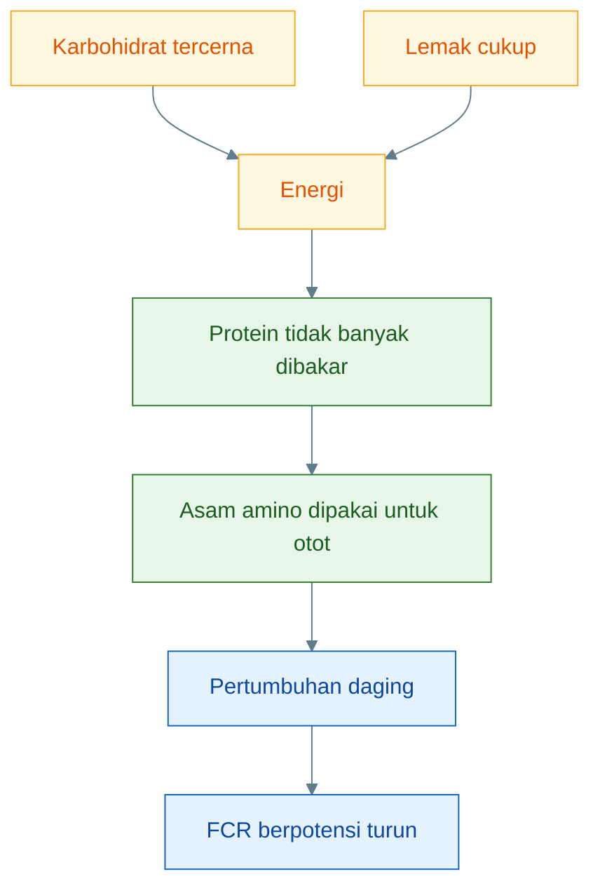
```mermaid id="df9x4m"
%%{init: {"theme": "base", "themeVariables": {"fontFamily": "Arial", "primaryColor": "#E3F2FD", "primaryTextColor": "#0D47A1", "primaryBorderColor": "#1565C0", "lineColor": "#607D8B"}}}%%
flowchart TD
    A["Karbohidrat tercerna"] --> B["Energi"]
    C["Lemak cukup"] --> B
    B --> D["Protein tidak banyak dibakar"]
    D --> E["Asam amino dipakai untuk otot"]
    E --> F["Pertumbuhan daging"]
    F --> G["FCR berpotensi turun"]

    classDef energi fill:#FFF8E1,stroke:#F9A825,color:#E65100;
    classDef protein fill:#E8F5E9,stroke:#2E7D32,color:#1B5E20;
    classDef hasil fill:#E3F2FD,stroke:#1565C0,color:#0D47A1;

    class A,B,C energi;
    class D,E protein;
    class F,G hasil;
```

Sebaliknya, jika energi kurang:

```mermaid id="kcxyt9"
%%{init: {"theme": "base", "themeVariables": {"fontFamily": "Arial", "primaryColor": "#FFEBEE", "primaryTextColor": "#B71C1C", "primaryBorderColor": "#C62828", "lineColor": "#6D4C41"}}}%%
flowchart TD
    A["Energi pakan kurang"] --> B["Asam amino dibakar"]
    B --> C["Protein tidak optimal menjadi daging"]
    C --> D["Nitrogen dibuang"]
    D --> E["Amonia naik"]
    E --> F["Air memburuk"]
    F --> G["FCR naik"]

    classDef risk fill:#FFCDD2,stroke:#C62828,color:#B71C1C;
    classDef warn fill:#FFF3E0,stroke:#EF6C00,color:#E65100;

    class A,B,C,D,E,F risk;
    class G warn;
```

Dalam sistem lele air dangkal, dampak energi yang tidak seimbang bisa lebih cepat terlihat. Bila pakan tidak efisien, limbah nitrogen dan feses meningkat. Karena volume air kecil, kualitas air lebih cepat turun. Maka, rasio energi-protein menjadi penting, bukan hanya kadar protein.

Pakan yang baik harus membuat protein “mahal” bekerja sebagai bahan bangunan daging, sementara karbohidrat dan lemak bekerja sebagai bahan bakar.

---

## 5.2 Sumber karbohidrat tercerna

Tidak semua karbohidrat sama. Dalam pakan ikan, kita harus membedakan antara **karbohidrat tercerna** dan **serat kasar**.

Karbohidrat tercerna adalah karbohidrat yang bisa dimanfaatkan ikan sebagai energi, terutama dalam bentuk pati atau gula sederhana. Serat kasar adalah bagian karbohidrat struktural yang sulit dicerna ikan, seperti selulosa dan lignoselulosa. Lele dapat memanfaatkan karbohidrat lebih baik dibanding ikan karnivora murni seperti salmon, tetapi tetap bukan hewan ruminansia. FAO menyebut channel catfish lebih toleran terhadap karbohidrat dibanding salmon dan trout, tetapi toleransi ini tidak berarti serat kasar boleh tinggi tanpa batas. ([FAOHome][2])

Sumber karbohidrat tercerna yang umum dan praktis untuk pakan lele:

| Bahan                    | Fungsi                                    | Catatan praktis                    |
| ------------------------ | ----------------------------------------- | ---------------------------------- |
| **Tapioka matang**       | Energi dan binder                         | Sangat berguna untuk pelet buatan  |
| **Jagung giling**        | Sumber pati                               | Lebih baik bila dipanaskan/dimasak |
| **Pollard**              | Energi, sedikit protein, membantu tekstur | Umum sebagai bahan pakan           |
| **Menir**                | Pati relatif mudah dicerna                | Bagus bila harga masuk             |
| **Onggok kering**        | Energi dari singkong                      | Harus kering, tidak berjamur       |
| **Dedak halus terbatas** | Energi, sedikit protein, vitamin B        | Batasi karena serat dan lemak      |
| **Molase**               | Aktivator fermentasi                      | Bukan bahan utama pakan            |

Penting: molase jangan dipakai terlalu banyak sebagai bahan utama. Molase sangat baik sebagai sumber gula cepat untuk mikroba fermentasi, tetapi jika berlebihan dapat membuat pakan terlalu lengket, terlalu basah, dan mudah merusak air.

### Menghitung estimasi karbohidrat/NFE

Pada label pakan, karbohidrat biasanya tidak ditulis langsung. Yang biasa tercantum adalah protein, lemak, serat kasar, abu, dan kadar air. Untuk memperkirakan karbohidrat, praktisi dapat memakai pendekatan **NFE** atau _Nitrogen-Free Extract_.

Dalam format MDX:

$$
NFE = 100 - (\text{Protein} + \text{Lemak} + \text{Serat} + \text{Abu} + \text{Air})
$$

Contoh pakan:

| Komponen | Nilai |
| -------- | ----: |
| Protein  |   32% |
| Lemak    |    5% |
| Serat    |    6% |
| Abu      |   12% |
| Air      |   12% |

Maka:

$$
NFE = 100 - (32 + 5 + 6 + 12 + 12)
$$

$$
NFE = 100 - 67
$$

$$
NFE = 33%
$$

Artinya, estimasi karbohidrat/NFE pakan tersebut sekitar **33%**.

Namun perlu diingat: NFE bukan karbohidrat tercerna murni. NFE hanyalah estimasi. Kecernaan aktual tetap dipengaruhi jenis bahan, proses pemanasan, fermentasi, ukuran partikel, dan stabilitas pelet.

```mermaid id="f9ctxa"
%%{init: {"theme": "base", "themeVariables": {"fontFamily": "Arial", "primaryColor": "#E8F5E9", "primaryTextColor": "#1B5E20", "primaryBorderColor": "#2E7D32", "lineColor": "#607D8B"}}}%%
flowchart TD
    A["Label pakan"] --> B["Protein"]
    A --> C["Lemak"]
    A --> D["Serat"]
    A --> E["Abu"]
    A --> F["Air"]
    B --> G["Hitung NFE"]
    C --> G
    D --> G
    E --> G
    F --> G
    G --> H["Estimasi karbohidrat"]
    H --> I["Evaluasi energi pakan"]

    classDef label fill:#E3F2FD,stroke:#1565C0,color:#0D47A1;
    classDef nutrien fill:#FFF8E1,stroke:#F9A825,color:#E65100;
    classDef hasil fill:#E8F5E9,stroke:#2E7D32,color:#1B5E20;

    class A label;
    class B,C,D,E,F nutrien;
    class G,H,I hasil;
```

Dalam praktik, targetnya bukan karbohidrat setinggi mungkin. Targetnya adalah **karbohidrat tercerna cukup**, serat rendah, dan energi pakan seimbang dengan protein.

---

## 5.3 Tapioka matang

Tapioka matang adalah salah satu bahan paling praktis untuk pakan lele buatan. Tapioka berasal dari pati singkong. Ketika dimasak, pati mengalami gelatinisasi. Proses ini membuat pati lebih mudah dicerna dan sekaligus berfungsi sebagai perekat pelet.

FAO menyebut pregelatinized starch sebagai salah satu bahan pengikat yang baik dalam pakan ikan basah atau pakan uji, karena membantu partikel pakan tetap menyatu di air. ([FAOHome][3])

Dalam konteks pakan lele, tapioka matang memiliki empat fungsi utama:

1. **Sumber pati tercerna**
2. **Sumber energi murah**
3. **Binder atau perekat pelet**
4. **Membantu stabilitas pakan di air**

### 5.3.1 Mengapa harus matang?

Tapioka mentah masih berupa granula pati yang lebih sulit dicerna. Ketika dipanaskan dengan air, granula pati mengembang dan pecah. Proses ini disebut gelatinisasi.

Alurnya:

```mermaid id="a9x3lp"
%%{init: {"theme": "base", "themeVariables": {"fontFamily": "Arial", "primaryColor": "#FFF8E1", "primaryTextColor": "#E65100", "primaryBorderColor": "#F9A825", "lineColor": "#607D8B"}}}%%
flowchart TD
    A["Tapioka mentah"] --> B["Dimasak dengan air"]
    B --> C["Pati tergelatinisasi"]
    C --> D["Lebih mudah dicerna"]
    C --> E["Menjadi binder"]
    D --> F["Energi untuk lele"]
    E --> G["Pelet lebih stabil"]

    classDef bahan fill:#FFF3E0,stroke:#EF6C00,color:#E65100;
    classDef proses fill:#E3F2FD,stroke:#1565C0,color:#0D47A1;
    classDef hasil fill:#E8F5E9,stroke:#2E7D32,color:#1B5E20;

    class A,B bahan;
    class C proses;
    class D,E,F,G hasil;
```

Tapioka matang sangat berguna bila pembudidaya membuat pakan fermentasi atau pakan pelet sendiri. Pakan yang stabil di air akan mengurangi nutrien larut dan mengurangi pencemaran kolam.

### 5.3.2 Batas penggunaan tapioka

Tapioka hampir tidak menyumbang protein dan asam amino esensial. Jadi, jika tapioka terlalu banyak, protein dan asam amino pakan dapat terdilusi. Ini bisa menurunkan pertumbuhan.

Batas praktis:

| Fungsi tapioka         | Kisaran penggunaan |
| ---------------------- | -----------------: |
| Binder saja            |               3–8% |
| Binder + sumber energi |              8–15% |
| Batas hati-hati        |             15–20% |
| Di atas 20%            |  Harus diuji ketat |

Jika formula pakan sudah mengandung jagung, dedak, pollard, atau onggok, maka tambahan tapioka perlu dibatasi. Jangan sampai total energi karbohidrat terlalu tinggi tetapi protein dan asam amino tidak cukup.

### 5.3.3 Contoh perhitungan sederhana

Misalnya membuat 10 kg pakan fermentasi:

| Bahan                         | Jumlah |
| ----------------------------- | -----: |
| Pakan komersial/protein utama |   7 kg |
| Dedak halus/pollard           | 1,5 kg |
| Tapioka matang                |   1 kg |
| Protein tambahan              | 0,5 kg |

Persentase tapioka:

$$
\text{Persentase tapioka} = \frac{1}{10} \times 100%
$$

$$
\text{Persentase tapioka} = 10%
$$

Angka 10% masih masuk sebagai binder + sumber energi. Namun bila tapioka dinaikkan menjadi 3 kg dari total 10 kg, maka persentasenya 30%. Ini terlalu tinggi untuk formula pembesaran lele kecuali sudah diuji dan protein/asam amino tetap dikoreksi.

---

## 5.4 Fermentasi selulosa

Bahan pakan lokal sering mengandung serat. Contohnya dedak kasar, onggok, bungkil kelapa, limbah sayur, daun-daunan, atau bahan limbah pertanian. Sebagian serat ini berupa selulosa, hemiselulosa, dan lignin.

Mikroba selulolitik dapat menghasilkan enzim selulase. Enzim ini membantu memecah selulosa menjadi molekul yang lebih sederhana. Mikroba hemiselulolitik membantu memecah hemiselulosa. Mikroba lignolitik membantu membuka struktur bahan lignoselulosa.

Secara sederhana:

```mermaid id="e7d26j"
%%{init: {"theme": "base", "themeVariables": {"fontFamily": "Arial", "primaryColor": "#E8F5E9", "primaryTextColor": "#1B5E20", "primaryBorderColor": "#2E7D32", "lineColor": "#607D8B"}}}%%
flowchart TD
    A["Bahan berserat"] --> B["Selulosa & hemiselulosa"]
    B --> C["Mikroba selulolitik"]
    C --> D["Serat turun sebagian"]
    D --> E["Nutrien lebih terbuka"]
    E --> F["Bahan lebih layak sebagai campuran"]

    G["Namun"] --> H["Lele bukan ruminansia"]
    H --> I["Serat tetap harus rendah"]

    classDef bahan fill:#FFF3E0,stroke:#EF6C00,color:#E65100;
    classDef mikroba fill:#E8F5E9,stroke:#2E7D32,color:#1B5E20;
    classDef hasil fill:#E3F2FD,stroke:#1565C0,color:#0D47A1;
    classDef warning fill:#FFEBEE,stroke:#C62828,color:#B71C1C;

    class A,B bahan;
    class C,D,E,F mikroba;
    class G,H,I warning;
```

Namun, klaim fermentasi selulosa harus dibatasi. Fermentasi dapat menurunkan sebagian serat, tetapi tidak otomatis mengubah seluruh selulosa menjadi energi tercerna untuk lele. Lele tidak memiliki rumen dan tidak bisa memanfaatkan serat seperti sapi atau kambing.

Karena itu, bahan berserat tinggi tetap harus dibatasi. Fermentasi membuat bahan berserat **lebih baik**, tetapi bukan berarti semua bahan berserat menjadi bahan utama pakan lele.

Prinsip praktis:

| Kondisi bahan                    | Penilaian             |
| -------------------------------- | --------------------- |
| Pati tinggi, serat rendah        | Baik sebagai energi   |
| Serat sedang, difermentasi       | Bisa menjadi campuran |
| Serat tinggi, tidak difermentasi | Kurang cocok          |
| Serat sangat tinggi              | Sebaiknya dihindari   |
| Berjamur/busuk                   | Jangan digunakan      |

Fermentasi selulosa berguna untuk meningkatkan nilai bahan lokal, tetapi sumber energi utama tetap sebaiknya berasal dari pati mudah cerna seperti tapioka matang, jagung, pollard, menir, atau onggok kering berkualitas baik.

---

## 5.5 Peran lemak

Lemak adalah sumber energi padat. Dibanding karbohidrat dan protein, lemak mengandung energi lebih tinggi per gram. Dalam pakan ikan, lemak berfungsi sebagai:

- sumber energi,
- sumber asam lemak esensial,
- membantu penyerapan vitamin larut lemak,
- membantu efisiensi pemanfaatan protein.

Panduan komposisi pakan catfish dari Mississippi State University menjelaskan bahwa lipid adalah sumber energi terkonsentrasi yang dapat menghemat protein, tetapi lipid berlebihan dapat menyebabkan penimbunan lemak tubuh, menurunkan kualitas produk, dan pada kadar tinggi dapat menekan pertumbuhan serta efisiensi pakan. ([MSU Extension][4])

Dalam pakan lele, lemak harus cukup, tetapi tidak berlebihan.

Jika lemak terlalu rendah:

```mermaid id="0qujy5"
%%{init: {"theme": "base", "themeVariables": {"fontFamily": "Arial", "primaryColor": "#FFF3E0", "primaryTextColor": "#E65100", "primaryBorderColor": "#EF6C00", "lineColor": "#6D4C41"}}}%%
flowchart TD
    A["Lemak terlalu rendah"] --> B["Energi pakan kurang"]
    B --> C["Protein dibakar sebagai energi"]
    C --> D["Pertumbuhan kurang efisien"]
    D --> E["FCR memburuk"]

    classDef warn fill:#FFF3E0,stroke:#EF6C00,color:#E65100;
    classDef risk fill:#FFEBEE,stroke:#C62828,color:#B71C1C;

    class A,B warn;
    class C,D,E risk;
```

Jika lemak terlalu tinggi:

```mermaid id="uscpb6"
%%{init: {"theme": "base", "themeVariables": {"fontFamily": "Arial", "primaryColor": "#FFEBEE", "primaryTextColor": "#B71C1C", "primaryBorderColor": "#C62828", "lineColor": "#6D4C41"}}}%%
flowchart TD
    A["Lemak terlalu tinggi"] --> B["Ikan terlalu berlemak"]
    B --> C["Kualitas daging turun"]
    A --> D["Pakan mudah tengik"]
    D --> E["Palatabilitas turun"]
    A --> F["Beban organik air naik"]
    F --> G["Air cepat rusak"]

    classDef risk fill:#FFCDD2,stroke:#C62828,color:#B71C1C;
    class A,B,C,D,E,F,G risk;
```

Untuk lele pembesaran, lemak sekitar **4–7%** umumnya cukup sebagai target praktis. Angka ini bukan hukum kaku, tetapi kisaran kerja yang aman untuk pembudidaya. Bila bahan seperti maggot full-fat atau dedak tinggi lemak digunakan, kadar lemak total perlu diperhatikan agar tidak berlebihan.

Lemak juga mudah mengalami ketengikan, terutama pada bahan seperti tepung ikan, maggot, dedak, atau bahan hewani. Pakan tengik dapat menurunkan nafsu makan dan kualitas nutrisi. Karena itu, bahan tinggi lemak harus disimpan kering, sejuk, dan tidak terlalu lama.

---

## 5.6 Target rasio pakan lele pembesaran

Pakan lele pembesaran harus seimbang. Targetnya bukan protein tertinggi, tetapi kombinasi nutrisi yang dapat menghasilkan pertumbuhan, FCR rendah, dan air stabil.

FAO menyebut tujuan formulasi pakan akuakultur adalah memenuhi kebutuhan nutrisi spesies, meminimalkan biaya pakan, dan memilih bahan yang mudah dimanfaatkan agar limbah minimal. Ini sejalan dengan pendekatan pakan lele efisien: bukan sekadar murah, tetapi murah per kilogram pertumbuhan ikan. ([FAOHome][5])

Target praktis pakan lele pembesaran:

| Komponen        | Target praktis | Fungsi                                       |
| --------------- | -------------: | -------------------------------------------- |
| Protein         |         28–35% | Bahan pembentuk daging                       |
| Lemak           |           4–7% | Energi padat dan asam lemak                  |
| Karbohidrat/NFE |         25–35% | Energi dan protein-sparing                   |
| Serat kasar     |   ideal < 5–8% | Jangan terlalu tinggi                        |
| Abu             |       < 12–13% | Mineral; berlebihan menurunkan ruang nutrisi |
| Air             |       < 12–13% | Menjaga stabilitas simpan                    |

### 5.6.1 Keseimbangan protein dan energi

Protein harus cukup, tetapi energi juga harus cukup. Jika protein tinggi tetapi energi rendah, protein dibakar sebagai energi. Jika energi tinggi tetapi protein rendah, ikan bisa lambat tumbuh atau terlalu berlemak.

Secara konsep:

$$
\text{Pakan efektif} =
\text{Protein cukup}

* \text{Energi cukup}
* \text{Asam amino seimbang}
* \text{Kecernaan tinggi}
$$

Pakan yang seimbang akan membuat asam amino lebih banyak ditahan sebagai jaringan tubuh.

### 5.6.2 Serat harus rendah

Serat kasar terlalu tinggi akan menurunkan kecernaan. Serat yang tidak tercerna akan keluar sebagai feses dan meningkatkan beban organik kolam. Dalam sistem air dangkal, ini sangat penting karena feses dan endapan cepat mempengaruhi air.

Maka, bahan seperti dedak kasar, bungkil kelapa, limbah daun, atau onggok harus digunakan hati-hati. Fermentasi bisa membantu, tetapi tidak menghilangkan seluruh masalah serat.

### 5.6.3 Abu jangan terlalu tinggi

Abu menunjukkan kandungan mineral total. Mineral dibutuhkan ikan, tetapi abu terlalu tinggi berarti ruang untuk protein, energi, dan nutrisi lain berkurang. Pakan dengan abu terlalu tinggi juga bisa menunjukkan banyak bahan tulang, pasir, cangkang, atau mineral tidak seimbang.

### 5.6.4 Air harus terkendali

Kadar air tinggi membuat pakan mudah berjamur dan rusak. Pada pakan fermentasi basah, risiko ini lebih besar. Karena itu, pakan fermentasi basah harus cepat digunakan. Bila ingin disimpan, pakan perlu dikering-anginkan dengan baik.

---

## 5.7 Prinsip formulasi

Pakan yang baik bukan pakan dengan protein paling tinggi, tetapi pakan yang paling seimbang dan paling efisien menjadi daging.

Prinsip formulasi praktis:

> **protein cukup + lisin/metionin cukup + energi cukup + lemak cukup + serat rendah + cepat dimakan.**

Dalam bentuk diagram:

```mermaid id="4x2bpk"
%%{init: {"theme": "base", "themeVariables": {"fontFamily": "Arial", "primaryColor": "#E3F2FD", "primaryTextColor": "#0D47A1", "primaryBorderColor": "#1565C0", "lineColor": "#607D8B"}}}%%
flowchart TD
    A["Pakan berimbang"] --> B["Protein cukup"]
    A --> C["Lisin & metionin cukup"]
    A --> D["Karbohidrat tercerna"]
    A --> E["Lemak cukup"]
    A --> F["Serat rendah"]
    A --> G["Palatabilitas baik"]

    B --> H["Pertumbuhan"]
    C --> H
    D --> I["Energi"]
    E --> I
    I --> J["Protein hemat"]
    F --> K["Feses terkendali"]
    G --> L["Pakan cepat habis"]

    H --> M["FCR turun"]
    J --> M
    K --> M
    L --> M

    classDef utama fill:#E3F2FD,stroke:#1565C0,color:#0D47A1;
    classDef nutrisi fill:#E8F5E9,stroke:#2E7D32,color:#1B5E20;
    classDef hasil fill:#FFF8E1,stroke:#F9A825,color:#E65100;

    class A utama;
    class B,C,D,E,F,G,H,I,J,K,L nutrisi;
    class M hasil;
```

Untuk praktisi, cara berpikirnya:

- Protein adalah bahan bangunan.
- Lisin dan metionin adalah kunci susunan bangunan.
- Karbohidrat dan lemak adalah bahan bakar.
- Fermentasi membantu bahan lebih mudah digunakan.
- Serat rendah membantu feses terkendali.
- Palatabilitas baik membuat pakan cepat habis.
- Air stabil membuat ikan tidak stres.
- FCR rendah adalah hasil akhirnya.

Kesimpulan Bab 5:

> **Karbohidrat dan lemak bukan pelengkap kecil dalam pakan lele. Keduanya menentukan apakah protein akan menjadi daging atau dibakar sebagai energi. Rasio pakan yang baik harus menyeimbangkan protein, asam amino, karbohidrat tercerna, lemak, serat, abu, dan kadar air.**

[**Kembali ke Atas**](#budidaya-lele-air-dangkal-probiotik-dan-fermentasi-pakan)

---

# 6. Efek Fermentasi terhadap Ekonomi, Ekosistem, dan Penjagaannya

## 6.1 Efek terhadap rupiah/kg-protein

Fermentasi pakan sering diklaim dapat menaikkan protein. Klaim ini harus dibaca hati-hati. Yang paling mungkin terjadi setelah fermentasi adalah:

- protein kasar naik sedikit,
- protein larut/peptida naik,
- kecernaan meningkat,
- palatabilitas naik,
- serat turun sedikit,
- FCR membaik bila prosesnya benar.

Dalam analisis ekonomi, salah satu cara awal menilai pakan adalah menghitung **rupiah per kilogram protein kasar**.

Rumus dasar:

$$
\text{Rp/kg protein kasar} =
\frac{\text{Harga pakan per kg}}{\text{Kadar protein}}
$$

Kadar protein ditulis dalam bentuk desimal. Misalnya protein 32% ditulis sebagai 0,32.

Contoh:

$$
\text{Rp/kg protein} =
\frac{Rp15.000}{0{,}32}
$$

$$
\text{Rp/kg protein} = Rp46.875
$$

Artinya, setiap 1 kg protein kasar dari pakan tersebut secara teoritis berharga Rp46.875.

Setelah fermentasi, biaya fermentasi harus dimasukkan:

$$
\text{Rp/kg protein setelah fermentasi} =
\frac{\text{Harga pakan/kg} + \text{Biaya fermentasi/kg}}{\text{Protein setelah fermentasi}}
$$

Contoh jika:

- harga pakan = Rp15.000/kg,
- biaya fermentasi = Rp112,5/kg,
- protein setelah fermentasi = 34% atau 0,34,

maka:

$$
\text{Rp/kg protein} =
\frac{Rp15.000 + Rp112{,}5}{0{,}34}
$$

$$
\text{Rp/kg protein} =
\frac{Rp15.112{,}5}{0{,}34}
$$

$$
\text{Rp/kg protein} \approx Rp44.449
$$

Sebelum fermentasi:

$$
\frac{Rp15.000}{0{,}32} = Rp46.875
$$

Setelah fermentasi:

$$
\frac{Rp15.112{,}5}{0{,}34} \approx Rp44.449
$$

Dalam skenario ini, rupiah per kilogram protein kasar terlihat lebih murah. Tetapi ini hanya benar bila protein kasar benar-benar naik dari 32% menjadi 34%.

Jika protein tidak naik, maka:

$$
\frac{Rp15.112{,}5}{0{,}32} \approx Rp47.227
$$

Artinya, jika protein tidak naik dan FCR juga tidak membaik, fermentasi hanya menambah biaya.

Karena itu, ukuran paling penting bukan hanya Rp/kg protein kasar. Ukuran paling penting adalah **biaya pakan per kg panen**.

---

## 6.2 Dampak biaya GB#1 Profeed

Dalam diskusi ini, asumsi yang digunakan:

- Harga GB#1 Profeed: ±Rp45.000/liter.
- Dosis: ±1 liter untuk 400 kg pakan.
- Tambahan biaya: ±Rp112,5/kg pakan.

Rumusnya:

$$
\text{Biaya Profeed/kg pakan} =
\frac{\text{Harga Profeed/liter}}{\text{Jumlah pakan yang difermentasi}}
$$

Dengan angka:

$$
\text{Biaya Profeed/kg pakan} =
\frac{Rp45.000}{400}
$$

$$
\text{Biaya Profeed/kg pakan} = Rp112{,}5
$$

Tambahan Rp112,5/kg pakan tergolong kecil jika harga pakan berada di kisaran Rp12.000–Rp16.000/kg. Persentase tambahannya:

Jika harga pakan Rp15.000/kg:

$$
\text{Persentase tambahan biaya} =
\frac{Rp112{,}5}{Rp15.000} \times 100%
$$

$$
= 0{,}75%
$$

Jadi, dari sisi biaya langsung, Profeed tidak terlalu membebani. Fermentasi menjadi layak jika mampu memberi salah satu dari tiga efek berikut:

1. FCR turun.
2. Pakan lebih cepat habis.
3. Air lebih stabil sehingga pertumbuhan tidak terganggu.

Diagram keputusan ekonominya:

```mermaid id="t9nl8k"
%%{init: {"theme": "base", "themeVariables": {"fontFamily": "Arial", "primaryColor": "#E3F2FD", "primaryTextColor": "#0D47A1", "primaryBorderColor": "#1565C0", "lineColor": "#607D8B"}}}%%
flowchart TD
    A["Tambah Profeed"] --> B["Biaya pakan naik sedikit"]
    B --> C{"Ada manfaat?"}

    C -->|FCR turun| D["Layak secara ekonomi"]
    C -->|Air lebih stabil| D
    C -->|Pakan cepat habis| D

    C -->|Tidak ada perubahan| E["Tidak layak"]
    E --> F["Hanya menambah biaya"]

    classDef cost fill:#FFF3E0,stroke:#EF6C00,color:#E65100;
    classDef decision fill:#E3F2FD,stroke:#1565C0,color:#0D47A1;
    classDef good fill:#E8F5E9,stroke:#2E7D32,color:#1B5E20;
    classDef bad fill:#FFEBEE,stroke:#C62828,color:#B71C1C;

    class A,B cost;
    class C decision;
    class D good;
    class E,F bad;
```

Poin kritisnya: jangan menilai Profeed hanya dari klaim protein naik. Nilai dari data lapangan: FCR, pertumbuhan, survival rate, dan kualitas air.

---

## 6.3 Skenario protein setelah fermentasi

Untuk pakan komersial protein 32–33%, skenario optimistis yang masih masuk akal setelah fermentasi terkontrol adalah:

- protein kasar naik menjadi 34–35%,
- serat turun sedikit,
- protein larut dan peptida naik,
- palatabilitas naik,
- FCR berpotensi membaik 3–10%.

Namun angka ini harus dianggap sebagai **skenario**, bukan jaminan. Hasil nyata tergantung:

- bahan pakan awal,
- kualitas starter,
- dosis starter,
- kadar air,
- lama fermentasi,
- suhu,
- kebersihan wadah,
- apakah pakan dikeringkan ulang,
- apakah ikan benar-benar lebih responsif.

### 6.3.1 Kenapa protein kasar bisa naik?

Protein kasar bisa naik karena beberapa mekanisme:

1. Mikroba tumbuh menjadi biomassa.
2. Sebagian karbohidrat/serat digunakan mikroba.
3. Bobot kering bahan berubah.
4. Protein lebih larut dan lebih mudah terukur.
5. Serat turun sehingga proporsi protein terlihat naik.

Namun kenaikan besar, misalnya dari 32% menjadi 50–60%, tidak realistis tanpa penambahan bahan protein tinggi atau penyusutan bahan kering yang sangat besar.

Alur realistis:

```mermaid id="u83698"
%%{init: {"theme": "base", "themeVariables": {"fontFamily": "Arial", "primaryColor": "#E8F5E9", "primaryTextColor": "#1B5E20", "primaryBorderColor": "#2E7D32", "lineColor": "#607D8B"}}}%%
flowchart TD
    A["Pakan 32-33% protein"] --> B["Fermentasi terkontrol"]
    B --> C["Mikroba tumbuh"]
    B --> D["Protein terhidrolisis"]
    B --> E["Serat turun sedikit"]
    C --> F["Protein kasar naik sedikit"]
    D --> G["Peptida & protein larut naik"]
    E --> H["Kecernaan membaik"]
    F --> I["Protein 34-35% mungkin"]
    G --> J["Palatabilitas naik"]
    H --> K["FCR berpotensi turun"]

    classDef awal fill:#FFF3E0,stroke:#EF6C00,color:#E65100;
    classDef proses fill:#E3F2FD,stroke:#1565C0,color:#0D47A1;
    classDef hasil fill:#E8F5E9,stroke:#2E7D32,color:#1B5E20;

    class A awal;
    class B,C,D,E proses;
    class F,G,H,I,J,K hasil;
```

### 6.3.2 Skenario angka praktis

| Protein awal | Skenario setelah fermentasi | Catatan                             |
| -----------: | --------------------------: | ----------------------------------- |
|          28% |                      29–31% | Masih cocok untuk finishing         |
|          32% |                      33–35% | Cocok untuk pembesaran              |
|          33% |                      34–35% | Skenario realistis-optimistis       |
|          35% |                      36–37% | Tidak selalu perlu untuk ikan besar |

Tetapi sekali lagi, fokus utama bukan protein kasar naik. Fokus yang lebih kuat adalah:

> **protein lebih mudah dicerna, pakan lebih cepat dimakan, dan FCR membaik.**

---

## 6.4 Ukuran ekonomi yang lebih penting

Ukuran ekonomi yang paling penting adalah:

$$
\text{Biaya pakan per kg panen} =
\text{Harga pakan/kg} \times FCR
$$

Contoh tanpa fermentasi:

$$
Rp15.000 \times 1{,}30 = Rp19.500/\text{kg panen}
$$

Contoh dengan fermentasi:

$$
Rp15.112 \times 1{,}20 = Rp18.134/\text{kg panen}
$$

Selisih:

$$
Rp19.500 - Rp18.134 = Rp1.366/\text{kg panen}
$$

Jika panen 1 ton atau 1.000 kg, maka potensi selisih biaya pakan:

$$
Rp1.366 \times 1.000 = Rp1.366.000
$$

Inilah alasan mengapa penurunan FCR kecil bisa sangat berarti.

### 6.4.1 Simulasi FCR

| Skenario                      | Harga pakan/kg |  FCR | Biaya pakan/kg panen |
| ----------------------------- | -------------: | ---: | -------------------: |
| Tanpa fermentasi              |       Rp15.000 | 1,30 |             Rp19.500 |
| Fermentasi, FCR turun sedikit |       Rp15.112 | 1,25 |             Rp18.890 |
| Fermentasi, FCR turun sedang  |       Rp15.112 | 1,20 |             Rp18.134 |
| Fermentasi gagal              |       Rp15.112 | 1,35 |             Rp20.401 |

Dari tabel ini terlihat bahwa fermentasi hanya menguntungkan jika FCR benar-benar turun atau kualitas air lebih stabil sehingga pertumbuhan tidak terganggu.

Diagramnya:

```mermaid id="jik73j"
%%{init: {"theme": "base", "themeVariables": {"fontFamily": "Arial", "primaryColor": "#FFF8E1", "primaryTextColor": "#E65100", "primaryBorderColor": "#F9A825", "lineColor": "#607D8B"}}}%%
flowchart TD
    A["Fermentasi pakan"] --> B{"FCR turun?"}
    B -->|Ya| C["Biaya/kg panen turun"]
    C --> D["Untung"]

    B -->|Tidak| E{"Air lebih stabil?"}
    E -->|Ya| F["Pertumbuhan lebih aman"]
    F --> D

    E -->|Tidak| G["Biaya naik"]
    G --> H["Tidak efisien"]

    classDef keputusan fill:#E3F2FD,stroke:#1565C0,color:#0D47A1;
    classDef untung fill:#E8F5E9,stroke:#2E7D32,color:#1B5E20;
    classDef rugi fill:#FFEBEE,stroke:#C62828,color:#B71C1C;
    classDef proses fill:#FFF3E0,stroke:#EF6C00,color:#E65100;

    class A proses;
    class B,E keputusan;
    class C,D,F untung;
    class G,H rugi;
```

Maka, uji fermentasi harus selalu dicatat dengan data. Jangan hanya menilai dari ikan tampak lahap. Ikan lahap itu baik, tetapi belum cukup. Yang harus dihitung adalah pakan masuk, bobot naik, ikan mati, dan biaya.

---

## 6.5 Efek positif terhadap ekosistem kolam

Fermentasi pakan yang baik dapat memberi dampak positif pada ekosistem kolam, terutama pada sistem air dangkal.

Dampak positifnya:

- pakan lebih mudah dicerna,
- feses berkurang,
- sisa pakan menurun,
- beban organik lebih rendah,
- amonia berpotensi lebih terkendali,
- bau berkurang,
- air lebih stabil.

Mengapa ini terjadi?

Jika pakan lebih mudah dicerna, lebih banyak nutrien masuk ke tubuh ikan. Lebih sedikit nutrien keluar sebagai feses. Pakan yang lebih palatable juga lebih cepat dimakan sehingga lebih sedikit yang larut atau tenggelam menjadi limbah.

Alurnya:

```mermaid id="tmrr7e"
%%{init: {"theme": "base", "themeVariables": {"fontFamily": "Arial", "primaryColor": "#E8F5E9", "primaryTextColor": "#1B5E20", "primaryBorderColor": "#2E7D32", "lineColor": "#607D8B"}}}%%
flowchart TD
    A["Pakan fermentasi baik"] --> B["Lebih mudah dicerna"]
    A --> C["Lebih cepat dimakan"]
    B --> D["Feses berkurang"]
    C --> E["Sisa pakan berkurang"]
    D --> F["Beban organik turun"]
    E --> F
    F --> G["Amonia lebih terkendali"]
    G --> H["Air lebih stabil"]
    H --> I["Ikan tidak mudah stres"]
    I --> J["FCR membaik"]

    classDef good fill:#E8F5E9,stroke:#2E7D32,color:#1B5E20;
    classDef water fill:#E3F2FD,stroke:#1565C0,color:#0D47A1;
    classDef result fill:#FFF8E1,stroke:#F9A825,color:#E65100;

    class A,B,C,D,E good;
    class F,G,H water;
    class I,J result;
```

Dalam sistem air dangkal, efek ini penting karena kolam memiliki volume air terbatas. Setiap gram pakan yang tidak dimakan atau tidak tercerna akan lebih cepat memengaruhi kualitas air.

Pakan yang baik bukan hanya memberi nutrisi pada ikan, tetapi juga tidak membebani kolam secara berlebihan.

---

## 6.6 Efek negatif bila fermentasi gagal

Fermentasi yang gagal dapat merusak sistem lebih cepat daripada pakan biasa. Ini terutama terjadi jika bahan terlalu basah, wadah kotor, bahan awal buruk, atau fermentasi terlalu lama.

Dampak negatif fermentasi gagal:

- pakan busuk,
- pakan terlalu basah,
- pelet hancur,
- nutrien larut ke air,
- amonia naik,
- mikroba pembusuk dominan,
- oksigen turun,
- ikan stres,
- FCR memburuk.

Alur kerusakan:

```mermaid id="g6is7t"
%%{init: {"theme": "base", "themeVariables": {"fontFamily": "Arial", "primaryColor": "#FFEBEE", "primaryTextColor": "#B71C1C", "primaryBorderColor": "#C62828", "lineColor": "#6D4C41"}}}%%
flowchart TD
    A["Fermentasi gagal"] --> B["Bau busuk / amonia"]
    A --> C["Pakan terlalu basah"]
    C --> D["Pelet hancur"]
    D --> E["Nutrien larut"]
    B --> F["Ikan menolak makan"]
    E --> G["Air cepat keruh"]
    F --> H["Sisa pakan naik"]
    G --> I["Amonia naik"]
    H --> I
    I --> J["Ikan stres"]
    J --> K["FCR memburuk"]

    classDef risk fill:#FFCDD2,stroke:#C62828,color:#B71C1C;
    class A,B,C,D,E,F,G,H,I,J,K risk;
```

Tanda-tanda fermentasi gagal:

| Tanda                          | Keputusan        |
| ------------------------------ | ---------------- |
| Bau busuk                      | Jangan digunakan |
| Bau amonia tajam               | Jangan digunakan |
| Jamur hitam/hijau liar         | Jangan digunakan |
| Lendir busuk                   | Jangan digunakan |
| Pakan sangat becek             | Jangan digunakan |
| Ikan menolak makan             | Hentikan         |
| Air langsung bau setelah pakan | Hentikan         |

Prinsip tegas:

> **Bahan fermentasi yang meragukan lebih baik dibuang daripada diberikan ke ikan.**

Dalam budidaya lele air dangkal, satu kali pemberian pakan busuk bisa membuat air rusak, ikan stres, dan FCR memburuk.

---

## 6.7 Prinsip penjagaan ekosistem

Fermentasi pakan harus dipadukan dengan penjagaan ekosistem kolam. Pakan yang difermentasi dengan baik tetap bisa merusak air jika diberikan berlebihan.

Prinsip penjagaan ekosistem:

1. **Jangan overfeeding**
   Pakan berlebih adalah sumber utama amonia, bau, dan endapan organik.

2. **Pakan harus habis cepat**
   Pakan idealnya segera dimakan. Jika lambat habis, kurangi dosis.

3. **Amati ikan pagi/subuh**
   Waktu paling rawan adalah menjelang pagi. Jika ikan menggantung massal, jangan tambah pakan.

4. **Pantau bau air**
   Bau busuk adalah sinyal bahwa bahan organik dan mikroba pembusuk mulai dominan.

5. **Jangan biarkan endapan organik menumpuk**
   Endapan tipis masih wajar. Endapan tebal dan hitam berisiko menghasilkan bau dan gas berbahaya.

6. **Siapkan aerasi darurat**
   Walaupun sistem dirancang tanpa aerasi kuat, aerasi cadangan tetap penting untuk kondisi cuaca buruk, hujan panjang, atau ikan menggantung.

7. **Jangan mengejar padat tebar ekstrem sebelum sistem stabil**
   Kepadatan harus dinaikkan bertahap setelah pola pakan, kualitas air, dan FCR terbukti stabil.

### 6.7.1 Siklus penjagaan harian

```mermaid id="pmx1wf"
%%{init: {"theme": "base", "themeVariables": {"fontFamily": "Arial", "primaryColor": "#E3F2FD", "primaryTextColor": "#0D47A1", "primaryBorderColor": "#1565C0", "lineColor": "#607D8B"}}}%%
flowchart TD
    A["Pagi"] --> B["Cek ikan menggantung?"]
    B --> C{"Normal?"}
    C -->|Ya| D["Pakan kecil bila responsif"]
    C -->|Tidak| E["Tunda pakan"]

    D --> F["Siang"]
    E --> F
    F --> G["Pantau warna & bau air"]
    G --> H["Sore"]
    H --> I["Pakan utama"]
    I --> J["Cek pakan habis cepat?"]
    J --> K{"Habis?"}
    K -->|Ya| L["Ransum sesuai"]
    K -->|Tidak| M["Kurangi dosis besok"]

    L --> N["Malam"]
    M --> N
    N --> O["Hindari pakan berat"]

    classDef waktu fill:#E3F2FD,stroke:#1565C0,color:#0D47A1;
    classDef cek fill:#FFF3E0,stroke:#EF6C00,color:#E65100;
    classDef baik fill:#E8F5E9,stroke:#2E7D32,color:#1B5E20;
    classDef risiko fill:#FFEBEE,stroke:#C62828,color:#B71C1C;

    class A,F,H,N waktu;
    class B,C,G,J,K cek;
    class D,I,L baik;
    class E,M,O risiko;
```

### 6.7.2 Hubungan pakan, mikroba, dan air

Dalam sistem lele air dangkal, pakan, mikroba, dan air harus dipandang sebagai satu sistem.

```mermaid id="nzjcir"
%%{init: {"theme": "base", "themeVariables": {"fontFamily": "Arial", "primaryColor": "#E8F5E9", "primaryTextColor": "#1B5E20", "primaryBorderColor": "#2E7D32", "lineColor": "#607D8B"}}}%%
flowchart TD
    A["Pakan"] --> B["Dimakan ikan"]
    B --> C["Pertumbuhan"]
    B --> D["Feses"]

    A --> E["Sisa pakan"]
    D --> F["Bahan organik"]
    E --> F

    F --> G["Mikroba pengurai"]
    G --> H["Air lebih stabil jika beban wajar"]
    G --> I["Air rusak jika beban berlebih"]

    H --> J["Ikan sehat"]
    J --> C
    I --> K["Ikan stres"]
    K --> L["FCR naik"]

    classDef pakan fill:#FFF3E0,stroke:#EF6C00,color:#E65100;
    classDef mikroba fill:#E8F5E9,stroke:#2E7D32,color:#1B5E20;
    classDef air fill:#E3F2FD,stroke:#1565C0,color:#0D47A1;
    classDef risk fill:#FFEBEE,stroke:#C62828,color:#B71C1C;

    class A,B,C,D,E,F pakan;
    class G mikroba;
    class H,J air;
    class I,K,L risk;
```

Mikroba bukan penghapus kesalahan. Mikroba hanya dapat bekerja baik jika beban organik masih wajar. Jika pakan diberikan berlebihan, mikroba justru akan mengonsumsi lebih banyak oksigen untuk mengurai limbah. Pada malam hingga subuh, ini dapat menjadi masalah.

### 6.7.3 Aturan praktis penjagaan ekosistem

| Kondisi                        | Tindakan                                      |
| ------------------------------ | --------------------------------------------- |
| Air segar, ikan aktif          | Pakan sesuai ransum                           |
| Air mulai bau                  | Kurangi pakan                                 |
| Ikan menggantung pagi          | Tunda pakan                                   |
| Endapan menebal                | Kurangi pakan dan bersihkan bila perlu        |
| Cuaca mendung panjang          | Kurangi pakan                                 |
| Pakan fermentasi terlalu basah | Jangan diberikan                              |
| Ikan menolak pakan fermentasi  | Hentikan dan evaluasi                         |
| FCR memburuk                   | Cek pakan, air, kepadatan, dan kesehatan ikan |

Kesimpulan Bab 6:

> **Fermentasi pakan baru bernilai jika menurunkan biaya pakan per kg panen, bukan sekadar menaikkan angka protein. Tambahan biaya starter relatif kecil, tetapi manfaatnya harus dibuktikan melalui FCR, pertumbuhan, survival rate, dan kualitas air. Fermentasi yang baik membantu ekosistem; fermentasi yang gagal justru merusaknya.**

[1]: https://extension.rwfm.tamu.edu/wp-content/uploads/sites/8/2013/09/A-Practical-Guide-to-Nutrition-Feeds-and-Feeding-of-Catfish.pdf?utm_source=chatgpt.com 'A Practical Guide to Nutrition, Feeds, and Feeding of Catfish'
[2]: https://www.fao.org/4/s4314e/s4314e07.htm?utm_source=chatgpt.com '6. YOU SAY DIFFERENT ANIMALS NEED ...'
[3]: https://www.fao.org/4/x5738e/x5738e0n.htm?utm_source=chatgpt.com 'Chapter 22. Practical Fish Diets'
[4]: https://extension.msstate.edu/sites/default/files/document/b1200.pdf?utm_source=chatgpt.com 'Composition and Formulation of Channel Catfish Feeds'
[5]: https://www.fao.org/4/q3567e/q3567e05.htm?utm_source=chatgpt.com '4.0 FORMULATED FEEDS FOR AQUACULTURE IN THE ...'

[**Kembali ke Atas**](#budidaya-lele-air-dangkal-probiotik-dan-fermentasi-pakan)

---

# 7. Sistem Terpadu dan Parameter Kontrol

## 7.1 Skema sistem terpadu

Sistem budidaya lele air dangkal tidak boleh dilihat sebagai kumpulan teknik yang terpisah. Air dangkal, probiotik, plankton, fermentasi pakan, protein tercerna, karbohidrat tercerna, dan jadwal pemberian pakan harus bekerja sebagai satu sistem.

Jika salah satu komponen dipakai berlebihan atau diabaikan, sistem bisa tidak stabil. Misalnya, air dangkal membantu lele menghemat energi, tetapi jika pakan berlebih, volume air yang kecil membuat amonia cepat naik. Fermentasi pakan dapat meningkatkan kecernaan, tetapi jika pakan terlalu basah atau busuk, air justru rusak. Probiotik air membantu mengurai bahan organik, tetapi tidak mampu menetralkan kesalahan overfeeding terus-menerus.

Skema dasarnya:

```text
Air dangkal
+ probiotik air
+ plankton stabil
+ pakan utama sore
+ pakan fermentasi
+ protein tercerna
+ lisin/metionin cukup
+ energi karbohidrat cukup
= FCR lebih rendah dan air lebih stabil
```

Dalam bentuk sistem terpadu:

```mermaid id="crq0ms"
%%{init: {"theme": "base", "themeVariables": {"fontFamily": "Arial", "primaryColor": "#E3F2FD", "primaryTextColor": "#0D47A1", "primaryBorderColor": "#1565C0", "lineColor": "#607D8B"}}}%%
flowchart TD
    A["Air dangkal maks. 50 cm"] --> B["Lele mudah akses permukaan"]
    B --> C["Energi ikan lebih hemat"]

    D["Probiotik air"] --> E["Bahan organik terkendali"]
    F["Plankton stabil"] --> G["Pakan alami tambahan"]

    H["Pakan fermentasi"] --> I["Kecernaan naik"]
    H --> J["Palatabilitas naik"]

    K["Protein tercerna"] --> L["Asam amino tersedia"]
    M["Lisin & metionin cukup"] --> N["Sintesis daging optimal"]
    O["Karbohidrat cukup"] --> P["Protein tidak dibakar"]

    C --> Q["Pertumbuhan lebih efisien"]
    E --> R["Air lebih stabil"]
    G --> Q
    I --> Q
    J --> S["Pakan cepat habis"]
    L --> N
    N --> Q
    P --> Q
    S --> R

    Q --> T["FCR turun"]
    R --> T

    classDef water fill:#E3F2FD,stroke:#1565C0,color:#0D47A1;
    classDef microbe fill:#E8F5E9,stroke:#2E7D32,color:#1B5E20;
    classDef feed fill:#FFF3E0,stroke:#EF6C00,color:#E65100;
    classDef result fill:#EDE7F6,stroke:#512DA8,color:#311B92;

    class A,B,C,R water;
    class D,E,F,G microbe;
    class H,I,J,K,L,M,N,O,P,S feed;
    class Q,T result;
```

Sistem ini punya tiga pusat kendali:

1. **Pakan**
   Pakan menentukan nutrisi, pertumbuhan, dan beban limbah.

2. **Air**
   Air menentukan kenyamanan ikan, oksigen, amonia, dan stabilitas ekosistem.

3. **Mikroba**
   Mikroba membantu mengolah bahan organik, baik di pakan maupun di kolam.

Ketiganya harus seimbang. Pakan yang baik tetapi air buruk tetap menghasilkan pertumbuhan buruk. Air yang baik tetapi pakan tidak tercerna tetap membuat FCR tinggi. Mikroba yang baik tetapi pakan berlebih tetap bisa kewalahan.

Prinsip sistem terpadu:

> **Pakan harus menjadi daging sebanyak mungkin dan menjadi limbah sesedikit mungkin.**

---

## 7.2 Parameter pakan

Parameter pakan adalah hal pertama yang harus dikontrol karena pakan adalah input terbesar dalam budidaya lele. Pakan bukan hanya biaya terbesar, tetapi juga sumber utama bahan organik di kolam.

Parameter pakan yang perlu diperhatikan:

| Parameter        | Fungsi                            | Catatan praktis                         |
| ---------------- | --------------------------------- | --------------------------------------- |
| Protein kasar    | Indikator awal kandungan protein  | Jangan dijadikan satu-satunya acuan     |
| Lemak            | Sumber energi padat               | Ideal cukup, tidak berlebihan           |
| Serat kasar      | Indikator bahan sulit cerna       | Semakin tinggi, feses cenderung naik    |
| Abu              | Indikator total mineral           | Terlalu tinggi mengurangi ruang nutrisi |
| Air              | Menentukan daya simpan            | Kadar air tinggi memicu jamur           |
| NFE/karbohidrat  | Estimasi energi karbohidrat       | Dihitung dari selisih komposisi         |
| Bau              | Indikator kesegaran pakan         | Bau tengik/busuk harus dihindari        |
| Stabilitas pelet | Menentukan pakan larut atau tidak | Penting untuk menjaga air               |
| Respons makan    | Indikator palatabilitas           | Pakan baik harus cepat dimakan          |

### 7.2.1 Protein kasar

Protein kasar penting sebagai acuan awal. Untuk lele pembesaran, kisaran praktis yang sering digunakan adalah sekitar **28–35%**. Namun angka ini harus dilihat bersama kecernaan dan asam amino.

Pakan 32% protein yang tercerna baik bisa lebih efektif daripada pakan 36% yang sulit dicerna.

### 7.2.2 Lemak

Lemak membantu menyediakan energi padat. Lemak yang cukup membantu protein digunakan untuk pertumbuhan. Namun lemak berlebihan dapat membuat ikan terlalu berlemak dan pakan mudah tengik.

Target praktis:

$$
\text{Lemak pakan} \approx 4% \text{ sampai } 7%
$$

### 7.2.3 Serat kasar

Serat tinggi membuat pakan lebih sulit dicerna. Pada sistem air dangkal, serat tinggi dapat meningkatkan feses dan endapan dasar.

Target praktis:

$$
\text{Serat kasar ideal} < 5% \text{ sampai } 8%
$$

Semakin intensif sistemnya, semakin penting menjaga serat tetap rendah.

### 7.2.4 Estimasi NFE/karbohidrat

Jika label pakan tidak mencantumkan karbohidrat, gunakan rumus NFE:

$$
NFE = 100 - (\text{Protein} + \text{Lemak} + \text{Serat} + \text{Abu} + \text{Air})
$$

Contoh:

$$
NFE = 100 - (32 + 5 + 6 + 12 + 12)
$$

$$
NFE = 33%
$$

NFE sekitar 25–35% masih masuk akal untuk pakan lele pembesaran, tergantung kualitas bahan dan proses.

### 7.2.5 Respons makan

Respons makan adalah parameter praktis yang sering lebih cepat memberi sinyal dibanding angka laboratorium.

Pakan yang baik biasanya:

- cepat disambar,
- tidak banyak tersisa,
- tidak membuat air cepat keruh,
- tidak ditolak ikan,
- tidak menyebabkan ikan menggantung setelah makan.

Jika pakan bagus di label tetapi ikan lambat makan, tetap harus dievaluasi.

```mermaid id="di80g4"
%%{init: {"theme": "base", "themeVariables": {"fontFamily": "Arial", "primaryColor": "#FFF8E1", "primaryTextColor": "#E65100", "primaryBorderColor": "#F9A825", "lineColor": "#607D8B"}}}%%
flowchart TD
    A["Pakan"] --> B["Komposisi label"]
    A --> C["Kondisi fisik"]
    A --> D["Respons ikan"]

    B --> B1["Protein"]
    B --> B2["Lemak"]
    B --> B3["Serat"]
    B --> B4["Abu"]
    B --> B5["Air"]
    B --> B6["NFE"]

    C --> C1["Bau"]
    C --> C2["Tidak tengik"]
    C --> C3["Stabil di air"]

    D --> D1["Cepat dimakan"]
    D --> D2["Tidak tersisa"]
    D --> D3["Air tetap stabil"]

    D3 --> E["FCR lebih baik"]

    classDef main fill:#E3F2FD,stroke:#1565C0,color:#0D47A1;
    classDef param fill:#FFF3E0,stroke:#EF6C00,color:#E65100;
    classDef result fill:#E8F5E9,stroke:#2E7D32,color:#1B5E20;

    class A main;
    class B,C,D,B1,B2,B3,B4,B5,B6,C1,C2,C3,D1,D2 param;
    class D3,E result;
```

---

## 7.3 Parameter fermentasi

Fermentasi pakan harus dipantau. Jangan hanya mengikuti lama fermentasi berdasarkan resep, karena kondisi bahan, cuaca, suhu, kadar air, dan jenis starter bisa berbeda.

Parameter fermentasi yang perlu dikontrol:

| Parameter       | Target praktis                                 |
| --------------- | ---------------------------------------------- |
| Lama fermentasi | Umumnya 1–3 hari untuk pakan basah cepat pakai |
| Kadar air       | Lembap, tidak becek                            |
| Suhu            | Tidak panas ekstrem                            |
| Bau             | Asam segar/gurih, bukan busuk                  |
| pH              | Cenderung turun, tetapi tidak terlalu asam     |
| Tekstur         | Tidak berlendir busuk                          |
| Jamur           | Tidak ada jamur liar hitam/hijau               |
| Respons ikan    | Ikan mau makan cepat                           |

### 7.3.1 Lama fermentasi

Untuk pakan basah cepat pakai, fermentasi 1–3 hari sering lebih aman daripada fermentasi terlalu lama. Fermentasi terlalu lama bisa membuat bahan terlalu asam, terlalu basah, atau rusak.

Prinsipnya:

> **Fermentasi cukup sampai bahan berubah menjadi lebih palatable dan mudah dicerna, bukan sampai membusuk.**

### 7.3.2 Kadar air

Kadar air adalah titik kritis. Bahan terlalu kering membuat mikroba lambat bekerja. Bahan terlalu basah membuat risiko pembusukan meningkat.

Uji praktis:

- bahan dikepal menyatu,
- tidak meneteskan air,
- masih bisa dihancurkan kembali,
- tidak berlendir.

Jika dikepal lalu air menetes, bahan terlalu basah.

### 7.3.3 Bau

Bau adalah indikator lapangan yang sangat penting.

Fermentasi baik:

- asam segar,
- gurih,
- khas fermentasi,
- tidak menyengat busuk.

Fermentasi gagal:

- bau amonia,
- bau bangkai,
- bau busuk menyengat,
- bau alkohol terlalu tajam,
- berlendir dan asam busuk.

### 7.3.4 pH

Jika tersedia kertas lakmus atau pH meter, pH dapat digunakan sebagai indikator tambahan. Fermentasi dengan bakteri asam laktat biasanya menurunkan pH. Namun pH terlalu rendah bisa membuat pakan kurang disukai ikan.

Untuk praktik, pH bukan satu-satunya penentu. Bau, tekstur, dan respons ikan tetap harus diamati.

```mermaid id="0wts4h"
%%{init: {"theme": "base", "themeVariables": {"fontFamily": "Arial", "primaryColor": "#E8F5E9", "primaryTextColor": "#1B5E20", "primaryBorderColor": "#2E7D32", "lineColor": "#607D8B"}}}%%
flowchart TD
    A["Fermentasi pakan"] --> B["Kadar air"]
    A --> C["Lama fermentasi"]
    A --> D["Bau"]
    A --> E["Tekstur"]
    A --> F["pH"]
    A --> G["Jamur"]

    B --> H{"Lembap tidak becek?"}
    C --> I{"1-3 hari?"}
    D --> J{"Asam segar?"}
    E --> K{"Tidak berlendir busuk?"}
    G --> L{"Tidak ada jamur liar?"}

    H --> M["Layak uji ikan"]
    I --> M
    J --> M
    K --> M
    L --> M

    H -->|Tidak| N["Jangan digunakan"]
    J -->|Tidak| N
    K -->|Tidak| N
    L -->|Tidak| N

    classDef main fill:#E3F2FD,stroke:#1565C0,color:#0D47A1;
    classDef check fill:#FFF3E0,stroke:#EF6C00,color:#E65100;
    classDef ok fill:#E8F5E9,stroke:#2E7D32,color:#1B5E20;
    classDef bad fill:#FFEBEE,stroke:#C62828,color:#B71C1C;

    class A main;
    class B,C,D,E,F,G,H,I,J,K,L check;
    class M ok;
    class N bad;
```

---

## 7.4 Parameter ikan

Ikan adalah indikator utama keberhasilan sistem. Kolam, pakan, dan mikroba boleh terlihat baik, tetapi jika ikan tidak tumbuh, sistem belum berhasil.

Parameter ikan yang perlu dicatat:

| Parameter          | Fungsi                                |
| ------------------ | ------------------------------------- |
| Bobot awal         | Dasar perhitungan pertumbuhan         |
| Bobot mingguan     | Memantau perkembangan                 |
| Survival rate      | Mengukur tingkat kelangsungan hidup   |
| Keseragaman ukuran | Menilai distribusi pertumbuhan        |
| Respons makan      | Indikator kesehatan dan palatabilitas |
| Ikan menggantung   | Sinyal stres/oksigen/kualitas air     |
| Gejala stres       | Deteksi dini masalah                  |
| FCR                | Ukuran efisiensi pakan                |

### 7.4.1 Bobot awal dan bobot mingguan

Bobot awal harus dicatat saat tebar. Setelah itu, sampling bobot dapat dilakukan mingguan. Tidak perlu menimbang semua ikan. Ambil sampel yang mewakili, misalnya 30–50 ekor tergantung skala.

Rumus bobot rata-rata:

$$
\text{Bobot rata-rata} =
\frac{\text{Total bobot sampel}}{\text{Jumlah ikan sampel}}
$$

Contoh:

$$
\text{Bobot rata-rata} =
\frac{1.500 \text{ gram}}{50}
$$

$$
= 30 \text{ gram/ekor}
$$

### 7.4.2 Survival rate

Survival rate menunjukkan persentase ikan yang hidup sampai periode tertentu.

$$
SR = \frac{\text{Jumlah ikan hidup}}{\text{Jumlah ikan tebar}} \times 100%
$$

Contoh:

$$
SR = \frac{950}{1.000} \times 100%
$$

$$
SR = 95%
$$

Survival rate tinggi tetapi pertumbuhan lambat tetap belum ideal. Pertumbuhan cepat tetapi kematian tinggi juga belum ideal. Targetnya adalah pertumbuhan baik dan survival tinggi.

### 7.4.3 Keseragaman ukuran

Ukuran ikan yang tidak seragam dapat menandakan:

- distribusi pakan tidak merata,
- kompetisi tinggi,
- kepadatan terlalu tinggi,
- kualitas benih tidak seragam,
- sebagian ikan kalah makan,
- kemungkinan kanibalisme pada fase kecil.

Pada sistem air dangkal, pengamatan ukuran lebih mudah karena ikan sering tampak saat makan.

### 7.4.4 Respons makan

Respons makan adalah indikator harian. Jika biasanya ikan rakus lalu tiba-tiba malas makan, jangan langsung menambah pakan atau mengganti pakan. Cek air terlebih dahulu.

Respons makan turun dapat disebabkan oleh:

- oksigen rendah,
- amonia naik,
- pakan rusak,
- suhu berubah,
- ikan sakit,
- pakan terlalu banyak sebelumnya,
- fermentasi gagal.

```mermaid id="rz1eab"
%%{init: {"theme": "base", "themeVariables": {"fontFamily": "Arial", "primaryColor": "#E3F2FD", "primaryTextColor": "#0D47A1", "primaryBorderColor": "#1565C0", "lineColor": "#607D8B"}}}%%
flowchart TD
    A["Ikan malas makan"] --> B["Cek air"]
    B --> C["Bau"]
    B --> D["Warna"]
    B --> E["Ikan menggantung"]
    B --> F["Endapan"]

    A --> G["Cek pakan"]
    G --> H["Bau pakan"]
    G --> I["Fermentasi gagal?"]
    G --> J["Pelet hancur?"]

    C --> K["Kurangi pakan"]
    D --> K
    E --> K
    F --> K
    H --> L["Ganti pakan"]
    I --> L
    J --> L

    classDef issue fill:#FFEBEE,stroke:#C62828,color:#B71C1C;
    classDef check fill:#FFF3E0,stroke:#EF6C00,color:#E65100;
    classDef action fill:#E8F5E9,stroke:#2E7D32,color:#1B5E20;

    class A issue;
    class B,C,D,E,F,G,H,I,J check;
    class K,L action;
```

---

## 7.5 Parameter air

Air adalah media hidup lele. Pada sistem air dangkal, parameter air harus diperhatikan karena volume air kecil dan perubahan dapat terjadi cepat.

Parameter air yang perlu diamati:

| Parameter          | Arti praktis                                 |
| ------------------ | -------------------------------------------- |
| Bau air            | Indikator bahan organik dan pembusukan       |
| Warna air          | Indikator plankton dan kondisi ekosistem     |
| pH                 | Menentukan kenyamanan ikan dan bentuk amonia |
| Amonia             | Indikator limbah nitrogen                    |
| Nitrit             | Berbahaya bagi ikan bila tinggi              |
| Oksigen terlarut   | Penting terutama subuh                       |
| Kondisi pagi/subuh | Waktu paling rawan                           |
| Endapan dasar      | Sumber bahan organik dan bau                 |

### 7.5.1 Bau air

Bau air adalah indikator murah tetapi penting.

| Bau                | Interpretasi                |
| ------------------ | --------------------------- |
| Segar/tanah ringan | Masih wajar                 |
| Amis ringan        | Perlu dipantau              |
| Busuk              | Bahan organik berlebihan    |
| Amonia tajam       | Limbah nitrogen tinggi      |
| Telur busuk        | Risiko gas dari dasar kolam |

Jika air mulai bau, langkah pertama bukan menambah probiotik sebanyak-banyaknya, tetapi mengurangi pakan dan mengevaluasi endapan.

### 7.5.2 Warna air

Warna air menunjukkan kondisi plankton dan bahan organik.

| Warna         | Arti kemungkinan                           |
| ------------- | ------------------------------------------ |
| Hijau muda    | Plankton wajar                             |
| Cokelat muda  | Bahan organik/plankton campuran            |
| Hijau pekat   | Plankton terlalu padat                     |
| Hitam/gelap   | Endapan dan bahan organik tinggi           |
| Bening sekali | Plankton rendah, ekosistem belum terbentuk |

Air hijau bukan selalu baik. Jika terlalu pekat, malam hari plankton ikut menggunakan oksigen. Risiko oksigen rendah meningkat menjelang subuh.

### 7.5.3 pH

pH ideal praktis untuk lele umumnya berada di kisaran netral sampai sedikit basa. Perubahan pH tajam lebih berbahaya daripada angka tunggal.

Yang perlu diperhatikan:

- pH terlalu rendah membuat ikan stres,
- pH terlalu tinggi meningkatkan risiko amonia toksik,
- pH bisa naik siang hari karena fotosintesis plankton,
- pH bisa turun malam hari karena respirasi.

### 7.5.4 Amonia dan nitrit

Amonia berasal dari sisa metabolisme protein, feses, dan sisa pakan. Nitrit muncul dalam proses nitrifikasi. Keduanya perlu dikendalikan.

Alur sederhananya:

```mermaid id="blw27w"
%%{init: {"theme": "base", "themeVariables": {"fontFamily": "Arial", "primaryColor": "#E3F2FD", "primaryTextColor": "#0D47A1", "primaryBorderColor": "#1565C0", "lineColor": "#607D8B"}}}%%
flowchart TD
    A["Sisa pakan & feses"] --> B["Amonia"]
    B --> C["Nitrosomonas"]
    C --> D["Nitrit"]
    D --> E["Nitrobacter"]
    E --> F["Nitrat"]

    G["Pakan berlebih"] --> B
    H["Oksigen rendah"] --> I["Nitrifikasi terganggu"]
    I --> B
    I --> D

    classDef waste fill:#FFF3E0,stroke:#EF6C00,color:#E65100;
    classDef microbe fill:#E8F5E9,stroke:#2E7D32,color:#1B5E20;
    classDef nitrogen fill:#E3F2FD,stroke:#1565C0,color:#0D47A1;
    classDef risk fill:#FFEBEE,stroke:#C62828,color:#B71C1C;

    class A,G waste;
    class C,E microbe;
    class B,D,F nitrogen;
    class H,I risk;
```

Pada sistem tanpa aerasi, proses nitrifikasi bisa terbatas jika oksigen rendah. Maka jangan mengandalkan bakteri nitrifikasi saja. Kunci utama tetap mengurangi beban limbah dari pakan.

### 7.5.5 Kondisi pagi/subuh

Pagi atau subuh adalah waktu paling penting untuk mengamati kolam. Jika ikan menggantung massal, megap-megap, atau diam di permukaan, itu sinyal bahaya.

Pada saat itu, jangan langsung memberi pakan. Cek kondisi air dan pertimbangkan aerasi darurat.

---

## 7.6 Jadwal operasional sederhana

Sistem ini memerlukan rutinitas. Tanpa pencatatan dan pengamatan, pembudidaya akan sulit membedakan antara keberhasilan sistem dan kebetulan.

Jadwal operasional harian:

| Waktu    | Kegiatan                                |
| -------- | --------------------------------------- |
| Pagi     | Cek ikan dan air                        |
| Pagi     | Beri pakan kecil bila ikan responsif    |
| Siang    | Amati warna air dan bau                 |
| Sore     | Beri pakan utama                        |
| Malam    | Hindari pakan berat bila tanpa aerasi   |
| Mingguan | Sampling bobot dan hitung FCR sementara |

Diagram jadwal:

```mermaid id="uqttij"
%%{init: {"theme": "base", "themeVariables": {"fontFamily": "Arial", "primaryColor": "#E3F2FD", "primaryTextColor": "#0D47A1", "primaryBorderColor": "#1565C0", "lineColor": "#607D8B"}}}%%
flowchart TD
    A["Pagi"] --> B["Cek ikan & air"]
    B --> C{"Ikan responsif?"}
    C -->|Ya| D["Pakan kecil 20-30%"]
    C -->|Tidak| E["Tunda pakan"]

    D --> F["Siang"]
    E --> F
    F --> G["Cek warna & bau air"]

    G --> H["Sore"]
    H --> I["Pakan utama 70-80%"]
    I --> J["Pastikan pakan habis cepat"]

    J --> K["Malam"]
    K --> L["Hindari pakan berat"]

    L --> M["Mingguan"]
    M --> N["Sampling bobot"]
    N --> O["Hitung FCR sementara"]

    classDef time fill:#E3F2FD,stroke:#1565C0,color:#0D47A1;
    classDef action fill:#E8F5E9,stroke:#2E7D32,color:#1B5E20;
    classDef decision fill:#FFF3E0,stroke:#EF6C00,color:#E65100;
    classDef warning fill:#FFEBEE,stroke:#C62828,color:#B71C1C;

    class A,F,H,K,M time;
    class B,D,G,I,J,N,O action;
    class C decision;
    class E,L warning;
```

### 7.6.1 FCR sementara mingguan

FCR sementara membantu mengetahui arah performa sebelum panen.

Rumus:

$$
FCR sementara =
\frac{\text{Total pakan sampai minggu tersebut}}{\text{Estimasi kenaikan biomassa}}
$$

Estimasi biomassa:

$$
\text{Biomassa} =
\text{Jumlah ikan hidup} \times \text{Bobot rata-rata}
$$

Kenaikan biomassa:

$$
\text{Kenaikan biomassa} =
\text{Biomassa saat ini} - \text{Biomassa awal}
$$

Dengan pencatatan mingguan, pembudidaya bisa lebih cepat mengevaluasi apakah pakan fermentasi benar-benar membantu atau tidak.

Kesimpulan Bab 7:

> **Sistem lele air dangkal harus dikendalikan melalui parameter pakan, fermentasi, ikan, dan air. Pengamatan harian dan pencatatan mingguan adalah alat utama untuk menjaga sistem tetap stabil dan FCR tetap rendah.**

[**Kembali ke Atas**](#budidaya-lele-air-dangkal-probiotik-dan-fermentasi-pakan)

---

# 8. Rancangan Uji Lapangan Sederhana

## 8.1 Tujuan uji

Fermentasi pakan tidak boleh hanya dinilai dari teori atau klaim. Harus diuji di kolam sendiri. Setiap lokasi memiliki kondisi berbeda: sumber air, suhu, benih, kepadatan, pakan, keterampilan pekerja, dan manajemen harian.

Tujuan uji lapangan adalah membuktikan apakah fermentasi benar-benar:

- menurunkan FCR,
- mempercepat pertumbuhan,
- menjaga air,
- meningkatkan respons makan,
- menurunkan biaya pakan per kg panen.

Tanpa uji lapangan, pembudidaya mudah terjebak pada klaim. Ikan terlihat lahap belum tentu FCR turun. Air terlihat hijau belum tentu stabil. Protein terlihat naik belum tentu biaya produksi turun.

Uji lapangan sederhana cukup untuk menjawab pertanyaan inti:

> **Apakah pakan fermentasi menghasilkan lebih banyak daging dengan biaya lebih rendah?**

---

## 8.2 Desain uji minimal

Desain paling sederhana menggunakan dua perlakuan:

| Kolam | Perlakuan                |
| ----- | ------------------------ |
| A     | Pakan biasa              |
| B     | Pakan fermentasi Profeed |

Desain ini membandingkan pakan biasa dengan pakan fermentasi. Namun hasilnya akan lebih kuat jika kondisi kedua kolam dibuat semirip mungkin.

Yang harus disamakan:

- ukuran kolam,
- tinggi air,
- jumlah tebar,
- ukuran benih,
- sumber air,
- jadwal pakan,
- jenis pakan dasar,
- kepadatan,
- perlakuan probiotik air,
- lama pemeliharaan.

Jika tersedia tiga kolam, desain lebih baik adalah:

| Kolam | Perlakuan                                 |
| ----- | ----------------------------------------- |
| A     | Pakan biasa                               |
| B     | Pakan fermentasi                          |
| C     | Pakan fermentasi + koreksi lisin/metionin |

Desain tiga kolam membantu membedakan apakah perbaikan performa berasal dari fermentasi saja atau dari perbaikan formulasi asam amino.

```mermaid id="vocsht"
%%{init: {"theme": "base", "themeVariables": {"fontFamily": "Arial", "primaryColor": "#E3F2FD", "primaryTextColor": "#0D47A1", "primaryBorderColor": "#1565C0", "lineColor": "#607D8B"}}}%%
flowchart TD
    A["Uji lapangan"] --> B["Kolam A"]
    A --> C["Kolam B"]
    A --> D["Kolam C opsional"]

    B --> B1["Pakan biasa"]
    C --> C1["Pakan fermentasi"]
    D --> D1["Fermentasi + koreksi asam amino"]

    B1 --> E["Bandingkan FCR"]
    C1 --> E
    D1 --> E

    E --> F["Bandingkan biaya/kg panen"]
    E --> G["Bandingkan kualitas air"]
    E --> H["Bandingkan pertumbuhan"]

    classDef main fill:#E3F2FD,stroke:#1565C0,color:#0D47A1;
    classDef treatment fill:#FFF3E0,stroke:#EF6C00,color:#E65100;
    classDef result fill:#E8F5E9,stroke:#2E7D32,color:#1B5E20;

    class A main;
    class B,C,D,B1,C1,D1 treatment;
    class E,F,G,H result;
```

### 8.2.1 Ukuran uji

Untuk uji awal, jangan langsung diterapkan ke seluruh populasi. Gunakan skala kecil terlebih dahulu. Misalnya:

- 2–3 kolam percobaan,
- jumlah ikan sama,
- pakan dicatat harian,
- sampling bobot mingguan,
- pengamatan air harian.

Jika hasil stabil selama satu siklus, baru diperluas.

### 8.2.2 Kesalahan uji yang harus dihindari

Uji lapangan sering gagal karena perlakuan tidak adil. Contohnya:

- kolam A tebar benih kecil, kolam B benih besar,
- pakan A lebih sedikit, pakan B lebih banyak,
- kolam B lebih sering diperhatikan,
- kepadatan tidak sama,
- sumber air berbeda,
- bobot awal tidak dicatat,
- mortalitas tidak dicatat.

Jika faktor-faktor ini tidak dikendalikan, hasil uji sulit dipercaya.

---

## 8.3 Data yang dicatat

Data adalah pembeda antara budidaya berbasis dugaan dan budidaya berbasis keputusan. Tanpa data, pembudidaya hanya mengandalkan perasaan.

Data yang perlu dicatat:

| Data                 | Fungsi                   |
| -------------------- | ------------------------ |
| Jumlah tebar         | Dasar survival rate      |
| Bobot awal           | Dasar pertumbuhan        |
| Total pakan          | Dasar FCR                |
| Bobot panen          | Dasar hasil akhir        |
| Mortalitas           | Menghitung ikan hidup    |
| Lama pemeliharaan    | Mengukur efisiensi waktu |
| FCR                  | Mengukur efisiensi pakan |
| Biaya pakan          | Mengukur ekonomi         |
| Biaya fermentasi     | Mengukur tambahan biaya  |
| Biaya pakan/kg panen | Indikator bisnis utama   |
| Bau air              | Indikator kualitas air   |
| Kondisi ikan pagi    | Indikator stres/oksigen  |

### 8.3.1 Format catatan harian

Contoh format catatan harian:

| Tanggal | Kolam | Pakan pagi | Pakan sore | Total pakan | Kondisi ikan | Bau air | Catatan           |
| ------- | ----- | ---------: | ---------: | ----------: | ------------ | ------- | ----------------- |
| 1       | A     |     0,2 kg |     0,8 kg |      1,0 kg | aktif        | normal  | -                 |
| 1       | B     |     0,2 kg |     0,8 kg |      1,0 kg | aktif        | normal  | pakan cepat habis |
| 2       | A     |     0,2 kg |     0,8 kg |      1,0 kg | aktif        | normal  | -                 |
| 2       | B     |     0,2 kg |     0,8 kg |      1,0 kg | aktif        | normal  | -                 |

### 8.3.2 Format catatan mingguan

| Minggu | Kolam | Bobot rata-rata | Estimasi ikan hidup | Biomassa | Total pakan kumulatif | FCR sementara |
| ------ | ----- | --------------: | ------------------: | -------: | --------------------: | ------------: |
| 1      | A     |            15 g |                 980 |  14,7 kg |                 10 kg |             - |
| 1      | B     |            16 g |                 985 |  15,8 kg |                 10 kg |             - |
| 2      | A     |            30 g |                 970 |  29,1 kg |                 25 kg |      dihitung |
| 2      | B     |            33 g |                 980 |  32,3 kg |                 25 kg |      dihitung |

Catatan mingguan tidak harus sempurna, tetapi harus konsisten.

---

## 8.4 Rumus FCR

FCR adalah rumus utama dalam uji pakan.

$$
FCR =
\frac{\text{Total pakan diberikan}}{\text{Kenaikan biomassa ikan}}
$$

Kenaikan biomassa dihitung dari:

$$
\text{Kenaikan biomassa} =
\text{Biomassa akhir} - \text{Biomassa awal}
$$

Biomassa dihitung dari:

$$
\text{Biomassa} =
\text{Jumlah ikan hidup} \times \text{Bobot rata-rata}
$$

### 8.4.1 Contoh perhitungan FCR

Misalnya:

- jumlah tebar awal: 1.000 ekor,
- bobot awal: 10 gram/ekor,
- biomassa awal:

$$
1.000 \times 10 \text{ gram} = 10.000 \text{ gram} = 10 \text{ kg}
$$

Saat panen:

- jumlah ikan hidup: 950 ekor,
- bobot rata-rata panen: 100 gram/ekor,
- biomassa akhir:

$$
950 \times 100 \text{ gram} = 95.000 \text{ gram} = 95 \text{ kg}
$$

Kenaikan biomassa:

$$
95 \text{ kg} - 10 \text{ kg} = 85 \text{ kg}
$$

Total pakan diberikan:

$$
110 \text{ kg}
$$

Maka FCR:

$$
FCR =
\frac{110}{85}
$$

$$
FCR = 1{,}29
$$

Artinya, diperlukan 1,29 kg pakan untuk menghasilkan 1 kg kenaikan bobot ikan.

### 8.4.2 FCR harus memasukkan biomassa awal

Kesalahan umum adalah menghitung FCR dengan membagi total pakan dengan biomassa panen. Ini kurang tepat karena ikan sudah memiliki bobot awal saat tebar.

Yang benar:

```text
FCR = total pakan ÷ kenaikan biomassa
```

Bukan:

```text
FCR = total pakan ÷ biomassa panen
```

---

## 8.5 Rumus biaya pakan per kg panen

Ukuran ekonomi utama adalah biaya pakan per kg kenaikan biomassa atau per kg panen. Rumus praktis:

$$
\text{Biaya pakan/kg panen} =
\text{Harga pakan/kg} \times FCR
$$

Jika memakai pakan fermentasi, harga pakan harus memasukkan biaya fermentasi:

$$
\text{Harga pakan fermentasi/kg} =
\text{Harga pakan dasar/kg} + \text{Biaya fermentasi/kg}
$$

Maka:

$$
\text{Biaya pakan fermentasi/kg panen} =
\text{Harga pakan fermentasi/kg} \times FCR
$$

### 8.5.1 Contoh perbandingan ekonomi

Kolam A: pakan biasa

- Harga pakan: Rp15.000/kg
- FCR: 1,30

$$
\text{Biaya pakan/kg panen} =
Rp15.000 \times 1{,}30
$$

$$
= Rp19.500
$$

Kolam B: pakan fermentasi

- Harga pakan dasar: Rp15.000/kg
- Biaya fermentasi: Rp112/kg
- Harga pakan fermentasi: Rp15.112/kg
- FCR: 1,20

$$
\text{Biaya pakan/kg panen} =
Rp15.112 \times 1{,}20
$$

$$
= Rp18.134
$$

Selisih:

$$
Rp19.500 - Rp18.134 = Rp1.366
$$

Jika produksi 1.000 kg:

$$
Rp1.366 \times 1.000 = Rp1.366.000
$$

Dengan contoh ini, pakan fermentasi lebih menguntungkan karena FCR turun cukup besar untuk menutup tambahan biaya fermentasi.

### 8.5.2 Titik impas fermentasi

Fermentasi layak jika biaya tambahan tertutup oleh penurunan FCR.

Rumus titik impas sederhana:

$$
\text{FCR impas} =
\frac{\text{Biaya pakan biasa/kg panen}}{\text{Harga pakan fermentasi/kg}}
$$

Contoh:

Biaya pakan biasa/kg panen:

$$
Rp15.000 \times 1{,}30 = Rp19.500
$$

Harga pakan fermentasi:

$$
Rp15.112
$$

Maka:

$$
\text{FCR impas} =
\frac{Rp19.500}{Rp15.112}
$$

$$
= 1{,}29
$$

Artinya, jika pakan fermentasi mampu menurunkan FCR dari 1,30 menjadi di bawah 1,29, secara biaya pakan sudah mulai impas. Jika FCR turun ke 1,25 atau 1,20, manfaatnya semakin besar.

```mermaid id="g0x1jw"
%%{init: {"theme": "base", "themeVariables": {"fontFamily": "Arial", "primaryColor": "#FFF8E1", "primaryTextColor": "#E65100", "primaryBorderColor": "#F9A825", "lineColor": "#607D8B"}}}%%
flowchart TD
    A["Pakan fermentasi"] --> B["Biaya/kg naik sedikit"]
    B --> C{"FCR turun?"}

    C -->|Tidak| D["Tidak layak"]
    C -->|Turun kecil| E["Impas"]
    C -->|Turun jelas| F["Menguntungkan"]

    F --> G["Biaya/kg panen turun"]
    G --> H["Margin naik"]

    classDef input fill:#E3F2FD,stroke:#1565C0,color:#0D47A1;
    classDef decision fill:#FFF3E0,stroke:#EF6C00,color:#E65100;
    classDef bad fill:#FFEBEE,stroke:#C62828,color:#B71C1C;
    classDef good fill:#E8F5E9,stroke:#2E7D32,color:#1B5E20;

    class A,B input;
    class C decision;
    class D bad;
    class E,F,G,H good;
```

Kesimpulan Bab 8:

> **Uji lapangan diperlukan untuk membuktikan apakah fermentasi benar-benar menurunkan FCR dan biaya pakan per kg panen. Data minimal yang harus dicatat adalah jumlah tebar, bobot awal, total pakan, bobot panen, mortalitas, FCR, biaya pakan, dan kondisi air.**

[**Kembali ke Atas**](#budidaya-lele-air-dangkal-probiotik-dan-fermentasi-pakan)

---

# 9. Kesimpulan Strategis

## 9.1 Inti sistem

Budidaya lele air dangkal, probiotik, dan fermentasi pakan adalah pendekatan terpadu. Sistem ini tidak bertumpu pada satu teknologi saja. Keberhasilannya berasal dari keseimbangan antara desain kolam, fisiologi lele, mikroba air, kualitas pakan, fermentasi, jadwal pakan, dan kontrol FCR.

Sistem ini menggabungkan:

- air dangkal,
- probiotik air,
- plankton,
- fermentasi pakan,
- pakan utama sore,
- protein tercerna,
- karbohidrat tercerna,
- lisin dan metionin,
- kontrol FCR.

Intinya:

```mermaid id="zvlw83"
%%{init: {"theme": "base", "themeVariables": {"fontFamily": "Arial", "primaryColor": "#E3F2FD", "primaryTextColor": "#0D47A1", "primaryBorderColor": "#1565C0", "lineColor": "#607D8B"}}}%%
flowchart TD
    A["Air dangkal"] --> B["Energi ikan hemat"]
    C["Probiotik air"] --> D["Ekosistem stabil"]
    E["Fermentasi pakan"] --> F["Kecernaan naik"]
    G["Lisin & metionin"] --> H["Daging terbentuk"]
    I["Karbohidrat tercerna"] --> J["Protein dihemat"]
    K["Pakan sore"] --> L["Pakan cepat dimakan"]

    B --> M["Pertumbuhan efisien"]
    D --> M
    F --> M
    H --> M
    J --> M
    L --> M

    M --> N["FCR rendah"]
    N --> O["Biaya produksi turun"]

    classDef system fill:#E3F2FD,stroke:#1565C0,color:#0D47A1;
    classDef process fill:#E8F5E9,stroke:#2E7D32,color:#1B5E20;
    classDef result fill:#FFF8E1,stroke:#F9A825,color:#E65100;

    class A,C,E,G,I,K system;
    class B,D,F,H,J,L,M process;
    class N,O result;
```

Air dangkal membantu lele menghemat energi karena ikan lebih mudah mencapai permukaan. Probiotik membantu menjaga ekosistem, tetapi tidak menggantikan disiplin pakan. Plankton berfungsi sebagai pendukung, bukan pakan utama untuk pembesaran. Fermentasi meningkatkan kecernaan dan palatabilitas, tetapi tidak otomatis menggandakan protein. Lisin dan metionin menjadi kunci karena pembentukan daging tidak hanya membutuhkan protein kasar, tetapi juga asam amino yang seimbang.

---

## 9.2 Prinsip teknis

Ada beberapa prinsip teknis yang perlu dipegang.

### 9.2.1 Air dangkal membantu lele menghemat energi

Lele dapat mengambil oksigen dari udara. Dengan air dangkal maksimal sekitar 50 cm, ikan lebih mudah naik ke permukaan. Energi yang sebelumnya dipakai untuk naik-turun dapat lebih banyak diarahkan untuk pertumbuhan.

Namun air dangkal juga memiliki risiko: volume air kecil. Limbah cepat terkonsentrasi. Maka air dangkal hanya efektif bila pakan dikontrol.

### 9.2.2 Mikroba air menjaga ekosistem

Mikroba air membantu mengurai bahan organik, mendukung siklus nutrien, mengurangi bau, dan membantu menjaga dasar kolam. Tetapi mikroba bukan penyelamat jika pakan berlebih.

Mikroba bekerja baik jika beban organik masih wajar. Jika pakan terlalu banyak, mikroba justru mengonsumsi lebih banyak oksigen dan sistem bisa jatuh.

### 9.2.3 Fermentasi pakan meningkatkan kecernaan dan palatabilitas

Fermentasi membantu memecah protein, pati, dan sebagian serat menjadi bentuk lebih sederhana. Fermentasi yang baik membuat pakan lebih mudah dicerna dan lebih cepat dimakan.

Tetapi fermentasi yang gagal bisa menghasilkan pakan busuk, berlendir, terlalu asam, dan merusak air.

Prinsipnya:

> **Fermentasi harus meningkatkan mutu pakan, bukan menambah beban air.**

### 9.2.4 Protein kasar bukan indikator tunggal

Protein kasar hanya angka awal. Protein kasar bisa tinggi tetapi belum tentu tercerna baik. Yang penting adalah protein sejati, profil asam amino, kecernaan, dan retensi protein tubuh.

Pakan dengan protein sedang tetapi tercerna baik bisa lebih menguntungkan daripada pakan protein tinggi tetapi boros dan mencemari air.

### 9.2.5 Lisin dan metionin adalah kunci pembentukan daging

Lisin dan metionin sering menjadi asam amino pembatas. Jika salah satunya kurang, pembentukan daging tertahan meskipun protein kasar cukup tinggi.

Strategi terbaik:

```text
Fermentasi untuk kecernaan
Formulasi bahan untuk lisin dan metionin
```

### 9.2.6 Karbohidrat matang membantu menghemat protein

Karbohidrat tercerna seperti tapioka matang, jagung, pollard, dan menir menyediakan energi. Jika energi cukup, protein tidak banyak dibakar sebagai energi.

Tapioka matang juga berfungsi sebagai binder, sehingga pakan lebih stabil di air.

### 9.2.7 FCR adalah indikator ekonomi utama

Akhirnya, semua strategi harus diuji dengan FCR.

$$
FCR =
\frac{\text{Total pakan diberikan}}{\text{Kenaikan biomassa ikan}}
$$

Dan ukuran bisnisnya:

$$
\text{Biaya pakan/kg panen} =
\text{Harga pakan/kg} \times FCR
$$

Jika teknologi tidak menurunkan FCR, tidak memperbaiki survival rate, dan tidak menjaga air, maka teknologi tersebut belum terbukti menguntungkan.

---

## 9.3 Rumusan akhir

Budidaya lele efisien bukan soal mencari satu rahasia tunggal. Bukan hanya air dangkal. Bukan hanya probiotik. Bukan hanya fermentasi. Bukan hanya protein tinggi. Bukan hanya pakan sore.

Budidaya lele efisien adalah hasil dari kombinasi yang tepat.

Rumusan akhirnya:

> **Budidaya lele efisien bukan mengejar protein tertinggi, tetapi mengejar pakan yang tercerna baik, asam amino cukup, energi seimbang, air stabil, dan FCR rendah.**

Jika diringkas menjadi satu alur:

```mermaid id="6tqhif"
%%{init: {"theme": "base", "themeVariables": {"fontFamily": "Arial", "primaryColor": "#E8F5E9", "primaryTextColor": "#1B5E20", "primaryBorderColor": "#2E7D32", "lineColor": "#607D8B"}}}%%
flowchart TD
    A["Pakan seimbang"] --> B["Protein tercerna"]
    A --> C["Energi cukup"]
    A --> D["Lisin & metionin cukup"]
    E["Fermentasi baik"] --> B
    F["Air dangkal"] --> G["Energi ikan hemat"]
    H["Probiotik air"] --> I["Air stabil"]

    B --> J["Nutrisi terserap"]
    C --> K["Protein tidak dibakar"]
    D --> L["Daging terbentuk"]
    G --> M["Stres energi turun"]
    I --> N["Ikan nyaman"]

    J --> O["Pertumbuhan"]
    K --> O
    L --> O
    M --> O
    N --> O

    O --> P["FCR rendah"]
    P --> Q["Biaya produksi turun"]
    Q --> R["Budidaya lebih menguntungkan"]

    classDef input fill:#E3F2FD,stroke:#1565C0,color:#0D47A1;
    classDef process fill:#FFF3E0,stroke:#EF6C00,color:#E65100;
    classDef result fill:#E8F5E9,stroke:#2E7D32,color:#1B5E20;
    classDef final fill:#EDE7F6,stroke:#512DA8,color:#311B92;

    class A,E,F,H input;
    class B,C,D,G,I,J,K,L,M,N,O process;
    class P,Q result;
    class R final;
```

Strategi final untuk praktisi:

1. **Gunakan air dangkal secara rasional**
   Maksimal sekitar 50 cm, tetapi jangan abaikan kualitas air.

2. **Jangan overfeeding**
   Pakan berlebih adalah sumber utama kegagalan sistem.

3. **Gunakan probiotik sebagai penyangga, bukan penyelamat**
   Mikroba membantu jika beban organik terkendali.

4. **Fermentasi pakan dengan hati-hati**
   Fermentasi harus berbau segar, tidak busuk, tidak becek, dan disukai ikan.

5. **Fokus pada protein tercerna, bukan protein kasar tinggi**
   Protein harus bisa menjadi daging, bukan menjadi amonia.

6. **Perhatikan lisin dan metionin**
   Dua asam amino ini sering membatasi pembentukan otot.

7. **Sediakan energi dari karbohidrat dan lemak**
   Karbohidrat matang dan lemak cukup membantu menghemat protein.

8. **Catat FCR dan biaya pakan per kg panen**
   Tanpa data, pembudidaya sulit tahu apakah sistem benar-benar lebih untung.

9. **Naikkan kepadatan bertahap**
   Jangan mengejar padat tebar ekstrem sebelum sistem stabil.

Penutup:

> **Kunci budidaya lele air dangkal bukan pada satu produk atau satu teknik, tetapi pada kemampuan menjaga keseimbangan antara pakan, ikan, mikroba, dan air. Jika keseimbangan ini tercapai, FCR turun, air lebih stabil, dan usaha budidaya menjadi lebih menguntungkan.**

[**Kembali ke Atas**](#budidaya-lele-air-dangkal-probiotik-dan-fermentasi-pakan)

---

<small>
  **_Catatan Penyusunan_** Artikel ini disusun sebagai materi edukasi dan
  referensi umum berdasarkan berbagai sumber pustaka, praktik lapangan, serta
  bantuan alat penulisan. Pembaca disarankan untuk melakukan verifikasi lanjutan
  dan penyesuaian sesuai dengan kondisi serta kebutuhan masing-masing sistem.
</small>
