# **_Kolam Lele sebagai Bioreaktor Penurun FCR Berbasis Bioflok_**

---

- [**_Kolam Lele sebagai Bioreaktor Penurun FCR Berbasis Bioflok_**](#kolam-lele-sebagai-bioreaktor-penurun-fcr-berbasis-bioflok)
- [Kolam Lele sebagai Bioreaktor Penurun FCR Berbasis Bioflok](#kolam-lele-sebagai-bioreaktor-penurun-fcr-berbasis-bioflok-1)
  - [1. Pendahuluan: FCR sebagai Kunci Untung-Rugi Budidaya Lele](#1-pendahuluan-fcr-sebagai-kunci-untung-rugi-budidaya-lele)
  - [1.1 Mengapa FCR Penting?](#11-mengapa-fcr-penting)
  - [1.2 Masalah Umum di Lapangan](#12-masalah-umum-di-lapangan)
  - [1.3 Tesis Utama Artikel](#13-tesis-utama-artikel)
  - [2. Meluruskan Stigma: Kolam Lele Keruh Bukan Berarti Jorok](#2-meluruskan-stigma-kolam-lele-keruh-bukan-berarti-jorok)
  - [2.1 Persepsi Masyarakat](#21-persepsi-masyarakat)
  - [2.2 Koreksi Teknis](#22-koreksi-teknis)
  - [2.3 Tiga Kategori Air Kolam](#23-tiga-kategori-air-kolam)
    - [2.3.1 Air Bening](#231-air-bening)
    - [2.3.2 Air Keruh Sehat](#232-air-keruh-sehat)
    - [2.3.3 Air Jorok atau Busuk](#233-air-jorok-atau-busuk)
  - [2.4 Kalimat Kunci](#24-kalimat-kunci)
  - [3. Benang Merah: Menumbuhkan Flok untuk Menekan FCR](#3-benang-merah-menumbuhkan-flok-untuk-menekan-fcr)
  - [3.1 Alur Dasar Bioflok](#31-alur-dasar-bioflok)
  - [3.2 Mengapa Flok Penting?](#32-mengapa-flok-penting)
    - [3.2.1 Flok Mendaur Ulang Sebagian Limbah Pakan](#321-flok-mendaur-ulang-sebagian-limbah-pakan)
    - [3.2.2 Flok Membantu Menekan Amonia dan Nitrit](#322-flok-membantu-menekan-amonia-dan-nitrit)
    - [3.2.3 Flok Menjadi Biomassa Biologis yang Sebagian Bisa Dimakan Ikan](#323-flok-menjadi-biomassa-biologis-yang-sebagian-bisa-dimakan-ikan)
    - [3.2.4 Flok Membuat Kualitas Air Lebih Stabil](#324-flok-membuat-kualitas-air-lebih-stabil)
  - [3.3 Koreksi Penting](#33-koreksi-penting)
    - [3.3.1 Oksigen Cukup](#331-oksigen-cukup)
    - [3.3.2 Rasio Karbon dan Nitrogen Sesuai](#332-rasio-karbon-dan-nitrogen-sesuai)
    - [3.3.3 Padatan Terkendali](#333-padatan-terkendali)
    - [3.3.4 Pakan Tidak Berlebihan](#334-pakan-tidak-berlebihan)
    - [3.3.5 Air Tidak Menjadi Anaerob](#335-air-tidak-menjadi-anaerob)
    - [3.3.6 Ikan Tetap Nyaman Makan](#336-ikan-tetap-nyaman-makan)
    - [3.3.7 Kalimat Kunci Bab 3](#337-kalimat-kunci-bab-3)
  - [4. Apakah Lele Karnivora Bisa Memakan Mikroba?](#4-apakah-lele-karnivora-bisa-memakan-mikroba)
  - [4.1 Lele sebagai Predator Oportunistik](#41-lele-sebagai-predator-oportunistik)
  - [4.2 Lele Tidak Makan Bakteri Satu per Satu](#42-lele-tidak-makan-bakteri-satu-per-satu)
  - [4.3 Komposisi Flok](#43-komposisi-flok)
  - [4.4 Analogi](#44-analogi)
  - [4.5 Koreksi Posisi Bioflok pada Lele](#45-koreksi-posisi-bioflok-pada-lele)
    - [4.5.1 Bioflok sebagai Pakan Tambahan](#451-bioflok-sebagai-pakan-tambahan)
    - [4.5.2 Bioflok sebagai Pengatur Kualitas Air](#452-bioflok-sebagai-pengatur-kualitas-air)
    - [4.5.3 Bioflok sebagai Indikator Kesehatan Sistem](#453-bioflok-sebagai-indikator-kesehatan-sistem)
    - [4.5.4 Kalimat Kunci Bab 4](#454-kalimat-kunci-bab-4)
  - [5. Kolam Lele sebagai Bioreaktor Biologis](#5-kolam-lele-sebagai-bioreaktor-biologis)
  - [5.1 Definisi Bioreaktor dalam Konteks Budidaya Lele](#51-definisi-bioreaktor-dalam-konteks-budidaya-lele)
  - [5.2 Fungsi Kolam Bioflok sebagai Bioreaktor](#52-fungsi-kolam-bioflok-sebagai-bioreaktor)
    - [5.2.1 Mengubah Limbah Nitrogen Menjadi Biomassa Mikroba](#521-mengubah-limbah-nitrogen-menjadi-biomassa-mikroba)
    - [5.2.2 Mengurangi Beban Amonia](#522-mengurangi-beban-amonia)
    - [5.2.3 Menjaga Partikel Biologis Tetap Aktif](#523-menjaga-partikel-biologis-tetap-aktif)
    - [5.2.4 Mengurangi Kebutuhan Pergantian Air](#524-mengurangi-kebutuhan-pergantian-air)
    - [5.2.5 Meningkatkan Efisiensi Pakan](#525-meningkatkan-efisiensi-pakan)
  - [5.3 Koreksi Istilah](#53-koreksi-istilah)
    - [5.3.1 Batasan Klaim](#531-batasan-klaim)
    - [5.3.2 Kalimat Kunci Bab 5](#532-kalimat-kunci-bab-5)
- [6. Mesin Biologis Bioflok: Karbon, Nitrogen, Mikroba, dan Oksigen](#6-mesin-biologis-bioflok-karbon-nitrogen-mikroba-dan-oksigen)
  - [6.1 Empat Syarat Pembentuk Flok](#61-empat-syarat-pembentuk-flok)
    - [6.1.1 Nitrogen dari Pakan, Feses, dan Amonia](#611-nitrogen-dari-pakan-feses-dan-amonia)
    - [6.1.2 Karbon dari Molase, Gula, Tapioka, Dedak, atau Karbohidrat Lain](#612-karbon-dari-molase-gula-tapioka-dedak-atau-karbohidrat-lain)
    - [6.1.3 Mikroba atau Probiotik](#613-mikroba-atau-probiotik)
    - [6.1.4 Oksigen dan Pengadukan](#614-oksigen-dan-pengadukan)
  - [6.2 Persamaan Sederhana Bioflok](#62-persamaan-sederhana-bioflok)
    - [6.2.1 Model Biomassa Mikroba](#621-model-biomassa-mikroba)
    - [6.2.2 Perbedaan Jalur Sehat dan Jalur Busuk](#622-perbedaan-jalur-sehat-dan-jalur-busuk)
  - [6.3 Implikasi Praktis](#63-implikasi-praktis)
    - [6.3.1 Tanpa Karbon, Mikroba Kekurangan Bahan Bakar](#631-tanpa-karbon-mikroba-kekurangan-bahan-bakar)
    - [6.3.2 Tanpa Oksigen, Flok Menjadi Busuk](#632-tanpa-oksigen-flok-menjadi-busuk)
    - [6.3.3 Tanpa Pengadukan, Flok Mengendap](#633-tanpa-pengadukan-flok-mengendap)
    - [6.3.4 Tanpa Pembuangan Padatan, Kolam Menjadi Anaerob](#634-tanpa-pembuangan-padatan-kolam-menjadi-anaerob)
    - [6.3.5 Ringkasan Mesin Bioflok](#635-ringkasan-mesin-bioflok)
- [7. Neraca C/N: Mengapa Rasio Karbon-Nitrogen Penting?](#7-neraca-cn-mengapa-rasio-karbon-nitrogen-penting)
  - [7.1 Nitrogen Berasal dari Protein Pakan](#71-nitrogen-berasal-dari-protein-pakan)
  - [7.2 Contoh Sederhana](#72-contoh-sederhana)
  - [7.3 Rumus Kebutuhan Karbon](#73-rumus-kebutuhan-karbon)
    - [7.3.1 Contoh Hitung Molase per 1 kg Pakan](#731-contoh-hitung-molase-per-1-kg-pakan)
    - [7.3.2 Simulasi Molase untuk Beberapa Target C/N](#732-simulasi-molase-untuk-beberapa-target-cn)
  - [7.4 Koreksi Penting](#74-koreksi-penting)
    - [7.4.1 C/N Teoretis Berbeda dari C/N Efektif](#741-cn-teoretis-berbeda-dari-cn-efektif)
    - [7.4.2 Molase Tinggi Menuntut Oksigen Tinggi](#742-molase-tinggi-menuntut-oksigen-tinggi)
    - [7.4.3 Lele Tidak Perlu Flok Berlebihan](#743-lele-tidak-perlu-flok-berlebihan)
  - [7.5 Implikasi Lapangan](#75-implikasi-lapangan)
    - [7.5.1 Jika C/N Terlalu Rendah](#751-jika-cn-terlalu-rendah)
    - [7.5.2 Jika C/N Terlalu Tinggi](#752-jika-cn-terlalu-tinggi)
    - [7.5.3 Target C/N untuk Lele](#753-target-cn-untuk-lele)
- [8. Oksigen: Faktor Penentu Flok Sehat atau Busuk](#8-oksigen-faktor-penentu-flok-sehat-atau-busuk)
  - [8.1 Mengapa Oksigen Sangat Penting?](#81-mengapa-oksigen-sangat-penting)
    - [8.1.1 Oksigen untuk Ikan](#811-oksigen-untuk-ikan)
    - [8.1.2 Oksigen untuk Mikroba](#812-oksigen-untuk-mikroba)
    - [8.1.3 Oksigen untuk Nitrifikasi](#813-oksigen-untuk-nitrifikasi)
  - [8.2 Persamaan Kebutuhan Oksigen Total](#82-persamaan-kebutuhan-oksigen-total)
    - [8.2.1 Oksigen untuk Oksidasi Karbon](#821-oksigen-untuk-oksidasi-karbon)
    - [8.2.2 Oksigen untuk Nitrifikasi](#822-oksigen-untuk-nitrifikasi)
  - [8.3 Cadangan Oksigen dalam Kolam Sangat Kecil](#83-cadangan-oksigen-dalam-kolam-sangat-kecil)
    - [8.3.1 Contoh Hitung](#831-contoh-hitung)
    - [8.3.2 Mengapa Aerasi Harus Terus-Menerus?](#832-mengapa-aerasi-harus-terus-menerus)
    - [8.3.3 Ilustrasi Cadangan Oksigen](#833-ilustrasi-cadangan-oksigen)
  - [8.4 Koreksi Praktis](#84-koreksi-praktis)
    - [8.4.1 Jangan Menambah Molase Saat Oksigen Tidak Aman](#841-jangan-menambah-molase-saat-oksigen-tidak-aman)
    - [8.4.2 Ukur DO pada Waktu yang Tepat](#842-ukur-do-pada-waktu-yang-tepat)
    - [8.4.3 Target Praktis DO](#843-target-praktis-do)
    - [8.4.4 Oksigen, FCR, dan Energi Ikan](#844-oksigen-fcr-dan-energi-ikan)
    - [8.4.5 Hubungan Karbon, Oksigen, dan Flok](#845-hubungan-karbon-oksigen-dan-flok)
  - [8.5 Menghitung Kebutuhan Oksigen Total Kolam Bioflok](#85-menghitung-kebutuhan-oksigen-total-kolam-bioflok)
    - [8.5.1 Diagram Neraca Oksigen Bioflok](#851-diagram-neraca-oksigen-bioflok)
  - [8.6 Rumus Komponen Kebutuhan Oksigen](#86-rumus-komponen-kebutuhan-oksigen)
    - [8.6.1 Oksigen untuk Ikan](#861-oksigen-untuk-ikan)
    - [8.6.2 Oksigen untuk Perombakan Nitrogen](#862-oksigen-untuk-perombakan-nitrogen)
    - [8.6.3 Oksigen untuk Karbon Tambahan](#863-oksigen-untuk-karbon-tambahan)
    - [8.6.4 Oksigen untuk Bahan Organik dari Pakan dan Feses](#864-oksigen-untuk-bahan-organik-dari-pakan-dan-feses)
    - [8.6.5 Oksigen untuk Flok, Endapan, dan Biologi Lain](#865-oksigen-untuk-flok-endapan-dan-biologi-lain)
  - [8.7 Faktor Keamanan Oksigen](#87-faktor-keamanan-oksigen)
  - [8.8 Contoh Perhitungan Lengkap Kolam 10 m³](#88-contoh-perhitungan-lengkap-kolam-10-m)
    - [8.8.1 Hitung Oksigen untuk Ikan](#881-hitung-oksigen-untuk-ikan)
    - [8.8.2 Hitung Nitrogen dari Pakan](#882-hitung-nitrogen-dari-pakan)
    - [8.8.3 Hitung Nitrogen Limbah](#883-hitung-nitrogen-limbah)
    - [8.8.4 Hitung Oksigen untuk Nitrifikasi](#884-hitung-oksigen-untuk-nitrifikasi)
    - [8.8.5 Hitung Oksigen untuk Molase](#885-hitung-oksigen-untuk-molase)
    - [8.8.6 Hitung Oksigen untuk Bahan Organik Pakan dan Feses](#886-hitung-oksigen-untuk-bahan-organik-pakan-dan-feses)
    - [8.8.7 Hitung Oksigen Tambahan untuk Flok dan Endapan](#887-hitung-oksigen-tambahan-untuk-flok-dan-endapan)
    - [8.8.8 Hitung Total Oksigen Operasional](#888-hitung-total-oksigen-operasional)
    - [8.8.9 Tambahkan Faktor Keamanan](#889-tambahkan-faktor-keamanan)
  - [8.9 Mengubah Kebutuhan Oksigen Menjadi Kebutuhan Udara](#89-mengubah-kebutuhan-oksigen-menjadi-kebutuhan-udara)
    - [8.9.1 Contoh Kebutuhan Udara Harian](#891-contoh-kebutuhan-udara-harian)
  - [8.10 Menghitung Kebutuhan Udara Puncak](#810-menghitung-kebutuhan-udara-puncak)
  - [8.11 Ringkasan Rumus Desain Oksigen](#811-ringkasan-rumus-desain-oksigen)
    - [8.11.1 Biomassa Ikan](#8111-biomassa-ikan)
    - [8.11.2 Pakan Harian](#8112-pakan-harian)
    - [8.11.3 Oksigen Ikan](#8113-oksigen-ikan)
    - [8.11.4 Nitrogen Pakan](#8114-nitrogen-pakan)
    - [8.11.5 Nitrogen Limbah](#8115-nitrogen-limbah)
    - [8.11.6 Nitrogen yang Dinitrifikasi](#8116-nitrogen-yang-dinitrifikasi)
    - [8.11.7 Oksigen Nitrifikasi](#8117-oksigen-nitrifikasi)
    - [8.11.8 Oksigen Karbon Tambahan](#8118-oksigen-karbon-tambahan)
    - [8.11.9 Oksigen Bahan Organik](#8119-oksigen-bahan-organik)
    - [8.11.10 Oksigen Flok dan Endapan](#81110-oksigen-flok-dan-endapan)
    - [8.11.11 Oksigen Total Operasional](#81111-oksigen-total-operasional)
    - [8.11.12 Oksigen Desain](#81112-oksigen-desain)
    - [8.11.13 Kebutuhan Udara Rata-Rata](#81113-kebutuhan-udara-rata-rata)
    - [8.11.14 Kebutuhan Udara Puncak](#81114-kebutuhan-udara-puncak)
  - [8.12 Tabel Asumsi Awal untuk Praktisi](#812-tabel-asumsi-awal-untuk-praktisi)
  - [8.13 Membaca Hasil Perhitungan](#813-membaca-hasil-perhitungan)
  - [8.14 Koreksi Penting: DO Bukan Sama dengan Kapasitas Aerasi](#814-koreksi-penting-do-bukan-sama-dengan-kapasitas-aerasi)
    - [8.15 Kalimat Kunci 8](#815-kalimat-kunci-8)
  - [9. Metode Menumbuhkan Bioflok pada Kolam Lele](#9-metode-menumbuhkan-bioflok-pada-kolam-lele)
  - [9.1 Persiapan Kolam](#91-persiapan-kolam)
    - [9.1.1 Bersihkan Kolam dari Lumpur Hitam](#911-bersihkan-kolam-dari-lumpur-hitam)
    - [9.1.2 Isi Air](#912-isi-air)
    - [9.1.3 Aerasi 24–48 Jam](#913-aerasi-2448-jam)
    - [9.1.4 Pastikan Tidak Ada Racun](#914-pastikan-tidak-ada-racun)
    - [9.1.5 Target Kondisi Awal](#915-target-kondisi-awal)
  - [9.2 Pematangan Air](#92-pematangan-air)
    - [9.2.1 Tambahkan Probiotik atau Starter](#921-tambahkan-probiotik-atau-starter)
    - [9.2.2 Tambahkan Sumber Karbon Bertahap](#922-tambahkan-sumber-karbon-bertahap)
    - [9.2.3 Tambahkan Sedikit Pelet Halus sebagai Nitrogen Awal](#923-tambahkan-sedikit-pelet-halus-sebagai-nitrogen-awal)
    - [9.2.4 Aerasi Terus-Menerus](#924-aerasi-terus-menerus)
  - [9.3 Tanda Flok Mulai Tumbuh](#93-tanda-flok-mulai-tumbuh)
    - [9.3.1 Air Mulai Cokelat Muda atau Hijau Kecokelatan](#931-air-mulai-cokelat-muda-atau-hijau-kecokelatan)
    - [9.3.2 Muncul Partikel Halus Melayang](#932-muncul-partikel-halus-melayang)
    - [9.3.3 Bau Tanah atau Fermentasi Ringan](#933-bau-tanah-atau-fermentasi-ringan)
    - [9.3.4 Tidak Ada Endapan Hitam Tebal](#934-tidak-ada-endapan-hitam-tebal)
    - [9.3.5 Tabel Indikator Flok Awal](#935-tabel-indikator-flok-awal)
  - [9.4 Setelah Tebar Benih](#94-setelah-tebar-benih)
    - [9.4.1 Pakan Diberikan Bertahap](#941-pakan-diberikan-bertahap)
    - [9.4.2 Molase atau Karbon Diberikan Sesuai Kondisi Air](#942-molase-atau-karbon-diberikan-sesuai-kondisi-air)
    - [9.4.3 Flok Diukur, Bukan Hanya Dilihat](#943-flok-diukur-bukan-hanya-dilihat)
    - [9.4.4 Endapan Berat Tetap Harus Dibuang](#944-endapan-berat-tetap-harus-dibuang)
    - [9.4.5 Alur Keputusan Setelah Tebar Benih](#945-alur-keputusan-setelah-tebar-benih)
  - [9.5 Target Volume Flok](#95-target-volume-flok)
    - [9.5.1 Mengapa Target Lele Tidak Perlu Terlalu Tinggi?](#951-mengapa-target-lele-tidak-perlu-terlalu-tinggi)
    - [9.5.2 Cara Membaca Volume Flok](#952-cara-membaca-volume-flok)
    - [9.5.3 Hubungan Flok, DO, dan FCR](#953-hubungan-flok-do-dan-fcr)
  - [9.6 SOP Praktis Menumbuhkan Bioflok](#96-sop-praktis-menumbuhkan-bioflok)
    - [9.6.1 SOP Pra-Tebar 7–14 Hari](#961-sop-pra-tebar-714-hari)
    - [9.6.2 SOP Setelah Tebar](#962-sop-setelah-tebar)
  - [9.7 Kesalahan Umum Saat Menumbuhkan Bioflok](#97-kesalahan-umum-saat-menumbuhkan-bioflok)
    - [9.7.1 Terlalu Banyak Molase di Awal](#971-terlalu-banyak-molase-di-awal)
    - [9.7.2 Pakan Awal Terlalu Banyak](#972-pakan-awal-terlalu-banyak)
    - [9.7.3 Flok Dibiarkan Terlalu Pekat](#973-flok-dibiarkan-terlalu-pekat)
    - [9.7.4 Tidak Membuang Padatan](#974-tidak-membuang-padatan)
    - [9.7.5 Tidak Mengukur Flok](#975-tidak-mengukur-flok)
  - [9.8 Kalimat Kunci Bab 9](#98-kalimat-kunci-bab-9)
  - [10. Aerasi vs Airlift-Pump dalam Bioflok Lele](#10-aerasi-vs-airlift-pump-dalam-bioflok-lele)
  - [10.1 Fungsi Aerasi Difuser](#101-fungsi-aerasi-difuser)
    - [10.1.1 Kelebihan Difuser](#1011-kelebihan-difuser)
  - [10.2 Kelemahan Difuser Saja](#102-kelemahan-difuser-saja)
    - [10.2.1 Zona Mati adalah Musuh Bioflok](#1021-zona-mati-adalah-musuh-bioflok)
  - [10.3 Fungsi Airlift-Pump](#103-fungsi-airlift-pump)
    - [10.3.1 Airlift Bukan Sekadar Pompa](#1031-airlift-bukan-sekadar-pompa)
  - [10.4 Koreksi dalam Konteks FCR](#104-koreksi-dalam-konteks-fcr)
    - [10.4.1 Tanda Arus Terlalu Lemah](#1041-tanda-arus-terlalu-lemah)
    - [10.4.2 Tanda Arus Terlalu Kuat](#1042-tanda-arus-terlalu-kuat)
    - [10.4.3 Tanda Arus Ideal](#1043-tanda-arus-ideal)
  - [10.5 Kesimpulan Teknis](#105-kesimpulan-teknis)
  - [11. Desain Airlift-Pump Terintegrasi Difuser](#11-desain-airlift-pump-terintegrasi-difuser)
  - [11.1 Prinsip Kerja](#111-prinsip-kerja)
    - [11.1.1 Arah Aliran dalam Kolam Bundar](#1111-arah-aliran-dalam-kolam-bundar)
  - [11.2 Komponen Utama](#112-komponen-utama)
    - [11.2.1 Blower](#1121-blower)
    - [11.2.2 Selang Udara](#1122-selang-udara)
    - [11.2.3 Difuser atau Injektor Udara](#1123-difuser-atau-injektor-udara)
    - [11.2.4 Pipa Riser Airlift](#1124-pipa-riser-airlift)
    - [11.2.5 Bawah Pipa Terbuka](#1125-bawah-pipa-terbuka)
    - [11.2.6 Outlet Tangensial](#1126-outlet-tangensial)
    - [11.2.7 Titik Sifon di Tengah Kolam](#1127-titik-sifon-di-tengah-kolam)
  - [11.3 Tujuan Desain](#113-tujuan-desain)
    - [11.3.1 Oksigen Lebih Merata](#1131-oksigen-lebih-merata)
    - [11.3.2 Flok Tetap Melayang](#1132-flok-tetap-melayang)
    - [11.3.3 Zona Mati Berkurang](#1133-zona-mati-berkurang)
    - [11.3.4 Limbah Berat Lebih Mudah Terkumpul](#1134-limbah-berat-lebih-mudah-terkumpul)
    - [11.3.5 Ikan Tetap Nyaman](#1135-ikan-tetap-nyaman)
  - [11.4 Notasi Arus](#114-notasi-arus)
    - [11.4.1 Skema Teknis Airlift Vertikal](#1141-skema-teknis-airlift-vertikal)
    - [11.4.2 Pengaturan Debit Udara](#1142-pengaturan-debit-udara)
  - [11.5 Kesimpulan Bab 11](#115-kesimpulan-bab-11)
  - [12. Lele Diam vs Lele Bergerak: Dampaknya terhadap FCR](#12-lele-diam-vs-lele-bergerak-dampaknya-terhadap-fcr)
  - [12.1 Pembagian Energi Pakan](#121-pembagian-energi-pakan)
  - [12.2 Bila Lele Terlalu Diam di Air Buruk](#122-bila-lele-terlalu-diam-di-air-buruk)
    - [12.2.1 Tanda Lele Diam karena Nyaman](#1221-tanda-lele-diam-karena-nyaman)
    - [12.2.2 Tanda Lele Diam karena Stres](#1222-tanda-lele-diam-karena-stres)
  - [12.3 Bila Lele Terlalu Banyak Bergerak Melawan Arus](#123-bila-lele-terlalu-banyak-bergerak-melawan-arus)
    - [12.3.1 Tanda Arus Membuat Lele Kelelahan](#1231-tanda-arus-membuat-lele-kelelahan)
    - [12.3.2 Koreksi Arus Terlalu Kuat](#1232-koreksi-arus-terlalu-kuat)
  - [12.4 Titik Optimal](#124-titik-optimal)
    - [12.4.1 Rumus Praktis Titik Optimal](#1241-rumus-praktis-titik-optimal)
    - [12.4.2 Diagram Titik Optimal](#1242-diagram-titik-optimal)
  - [12.5 Kesimpulan Bab 10–12](#125-kesimpulan-bab-1012)
  - [13. Ciri Bioflok Sehat dan Bioflok Gagal](#13-ciri-bioflok-sehat-dan-bioflok-gagal)
  - [13.1 Bioflok Sehat](#131-bioflok-sehat)
    - [13.1.1 Warna Air Cokelat Muda atau Hijau Kecokelatan](#1311-warna-air-cokelat-muda-atau-hijau-kecokelatan)
    - [13.1.2 Bau Tanah atau Fermentasi Ringan](#1312-bau-tanah-atau-fermentasi-ringan)
    - [13.1.3 Flok Halus Melayang](#1313-flok-halus-melayang)
    - [13.1.4 Ikan Aktif Makan](#1314-ikan-aktif-makan)
    - [13.1.5 Tidak Ada Bau Busuk dan Lumpur Hitam Tebal](#1315-tidak-ada-bau-busuk-dan-lumpur-hitam-tebal)
    - [13.1.6 FCR Cenderung Membaik](#1316-fcr-cenderung-membaik)
  - [13.2 Bioflok Gagal atau Busuk](#132-bioflok-gagal-atau-busuk)
    - [13.2.1 Air Hitam Pekat](#1321-air-hitam-pekat)
    - [13.2.2 Bau Got, Bangkai, atau Telur Busuk](#1322-bau-got-bangkai-atau-telur-busuk)
    - [13.2.3 Busa Tebal Menetap](#1323-busa-tebal-menetap)
    - [13.2.4 Ikan Menggantung](#1324-ikan-menggantung)
    - [13.2.5 Nafsu Makan Turun](#1325-nafsu-makan-turun)
    - [13.2.6 Endapan Hitam](#1326-endapan-hitam)
    - [13.2.7 FCR Memburuk](#1327-fcr-memburuk)
  - [13.3 Kalimat Korektif](#133-kalimat-korektif)
    - [13.3.1 Tabel Diagnostik Cepat](#1331-tabel-diagnostik-cepat)
    - [13.3.2 Keputusan Praktis](#1332-keputusan-praktis)
    - [13.3.3 Kalimat Kunci Bab 13](#1333-kalimat-kunci-bab-13)
  - [14. Kesalahan Umum dalam Menerapkan Bioflok Lele](#14-kesalahan-umum-dalam-menerapkan-bioflok-lele)
  - [14.1 Kesalahan Konseptual](#141-kesalahan-konseptual)
    - [14.1.1 Menganggap Kolam Harus Jorok](#1411-menganggap-kolam-harus-jorok)
    - [14.1.2 Menganggap Probiotik Saja Cukup](#1412-menganggap-probiotik-saja-cukup)
    - [14.1.3 Menganggap Bioflok Bisa Menggantikan Pelet](#1413-menganggap-bioflok-bisa-menggantikan-pelet)
    - [14.1.4 Menganggap Semakin Pekat Semakin Baik](#1414-menganggap-semakin-pekat-semakin-baik)
  - [14.2 Kesalahan Teknis](#142-kesalahan-teknis)
    - [14.2.1 Aerasi Kurang](#1421-aerasi-kurang)
    - [14.2.2 Molase Berlebihan](#1422-molase-berlebihan)
    - [14.2.3 Padat Tebar Terlalu Tinggi](#1423-padat-tebar-terlalu-tinggi)
    - [14.2.4 Tidak Mengukur Flok](#1424-tidak-mengukur-flok)
    - [14.2.5 Tidak Membuang Endapan](#1425-tidak-membuang-endapan)
    - [14.2.6 Tidak Punya Cadangan Listrik](#1426-tidak-punya-cadangan-listrik)
    - [14.2.7 Pakan Tetap Banyak Saat Ikan Tidak Mau Makan](#1427-pakan-tetap-banyak-saat-ikan-tidak-mau-makan)
  - [14.3 Dampak pada FCR](#143-dampak-pada-fcr)
    - [14.3.1 Tabel Kesalahan, Dampak, dan Koreksi](#1431-tabel-kesalahan-dampak-dan-koreksi)
    - [14.3.2 Kalimat Kunci Bab 14](#1432-kalimat-kunci-bab-14)
  - [15. Model Operasional Harian Bioreaktor Bioflok](#15-model-operasional-harian-bioreaktor-bioflok)
  - [15.1 Pagi](#151-pagi)
    - [15.1.1 Cek Ikan Menggantung atau Tidak](#1511-cek-ikan-menggantung-atau-tidak)
    - [15.1.2 Cek Bau Air](#1512-cek-bau-air)
    - [15.1.3 Cek DO Bila Ada Alat](#1513-cek-do-bila-ada-alat)
    - [15.1.4 Amati Busa](#1514-amati-busa)
    - [15.1.5 Uji Respons Makan](#1515-uji-respons-makan)
  - [15.2 Siang/Sore](#152-siangsore)
    - [15.2.1 Beri Pakan Berdasarkan Respons](#1521-beri-pakan-berdasarkan-respons)
    - [15.2.2 Cek Warna Air](#1522-cek-warna-air)
    - [15.2.3 Cek pH](#1523-cek-ph)
    - [15.2.4 Amati Flok](#1524-amati-flok)
    - [15.2.5 Tambahkan Karbon Bila Perlu](#1525-tambahkan-karbon-bila-perlu)
  - [15.3 Malam](#153-malam)
    - [15.3.1 Pastikan Aerasi Menyala](#1531-pastikan-aerasi-menyala)
    - [15.3.2 Pastikan Blower Stabil](#1532-pastikan-blower-stabil)
    - [15.3.3 Jangan Memberi Pakan Berat Jika DO Rawan](#1533-jangan-memberi-pakan-berat-jika-do-rawan)
  - [15.4 Mingguan](#154-mingguan)
    - [15.4.1 Sampling Bobot](#1541-sampling-bobot)
    - [15.4.2 Koreksi Dosis Pakan](#1542-koreksi-dosis-pakan)
    - [15.4.3 Ukur Volume Flok](#1543-ukur-volume-flok)
    - [15.4.4 Sifon Padatan](#1544-sifon-padatan)
    - [15.4.5 Grading Bila Ukuran Tidak Seragam](#1545-grading-bila-ukuran-tidak-seragam)
  - [15.5 Model Keputusan Harian](#155-model-keputusan-harian)
  - [15.6 Catatan Harian yang Disarankan](#156-catatan-harian-yang-disarankan)
  - [15.7 Kalimat Kunci Bab 15](#157-kalimat-kunci-bab-15)
  - [16. Dampak Ekonomi: Bioflok sebagai Alat Efisiensi, Bukan Jaminan Untung](#16-dampak-ekonomi-bioflok-sebagai-alat-efisiensi-bukan-jaminan-untung)
  - [16.1 Rumus Penghematan Pakan](#161-rumus-penghematan-pakan)
  - [16.1.1 Hubungan FCR dan Biaya Pakan](#1611-hubungan-fcr-dan-biaya-pakan)
  - [16.2 Contoh Sederhana](#162-contoh-sederhana)
    - [16.2.1 Perbandingan Kebutuhan Pakan](#1621-perbandingan-kebutuhan-pakan)
  - [16.3 Tetapi Harus Dikurangi](#163-tetapi-harus-dikurangi)
    - [16.3.1 Listrik Blower](#1631-listrik-blower)
    - [16.3.2 Molase](#1632-molase)
    - [16.3.3 Probiotik](#1633-probiotik)
    - [16.3.4 Penyusutan Alat](#1634-penyusutan-alat)
    - [16.3.5 Tenaga Kontrol](#1635-tenaga-kontrol)
    - [16.3.6 Risiko Listrik Mati](#1636-risiko-listrik-mati)
    - [16.3.7 Contoh Hitung Manfaat Bersih](#1637-contoh-hitung-manfaat-bersih)
  - [16.4 Kesimpulan Bisnis](#164-kesimpulan-bisnis)
    - [16.4.1 Parameter Ekonomi yang Harus Dicatat](#1641-parameter-ekonomi-yang-harus-dicatat)
    - [16.4.2 Rumus Evaluasi Siklus](#1642-rumus-evaluasi-siklus)
    - [16.4.3 Diagram Keputusan Bisnis](#1643-diagram-keputusan-bisnis)
    - [16.4.4 Kalimat Kunci Bab 16](#1644-kalimat-kunci-bab-16)
  - [17. Kesimpulan Artikel](#17-kesimpulan-artikel)
  - [17.1 Pernyataan Utama](#171-pernyataan-utama)
  - [17.2 Koreksi Akhir](#172-koreksi-akhir)
    - [17.2.1 Koreksi terhadap Bioflok](#1721-koreksi-terhadap-bioflok)
    - [17.2.2 Prinsip Utama yang Harus Dibawa Praktisi](#1722-prinsip-utama-yang-harus-dibawa-praktisi)
  - [17.3 Kalimat Penutup](#173-kalimat-penutup)

---

# Kolam Lele sebagai Bioreaktor Penurun FCR Berbasis Bioflok

## 1. Pendahuluan: FCR sebagai Kunci Untung-Rugi Budidaya Lele

Dalam budidaya lele, keuntungan tidak hanya ditentukan oleh harga jual ikan. Banyak usaha lele gagal bukan karena ikan tidak bisa dipanen, tetapi karena biaya pakan terlalu tinggi dibanding pertambahan bobot ikan yang dihasilkan.

Di sinilah **FCR** menjadi indikator utama. FCR bukan sekadar angka teknis, tetapi angka yang langsung berhubungan dengan uang keluar, kecepatan balik modal, dan daya tahan usaha.

Secara sederhana, FCR menunjukkan seberapa efisien pakan berubah menjadi daging ikan.

$$
FCR = \frac{\text{Total pakan yang diberikan}}{\text{Pertambahan biomassa ikan}}
$$

Jika FCR rendah, pakan lebih efisien menjadi bobot ikan. Jika FCR tinggi, sebagian besar pakan berubah menjadi limbah, energi stres, atau hilang sebagai biaya produksi.

<ResourceBox
  title="Artikel Terkait:"
  items={[
    {
      name: 'Fermentasi Protein untuk Pakan Lele: Membuat Hidrolisat Asam Amino yang Aman, Rasional, dan Bernilai Guna',
      href: '/blog/agri/perikanan/fermentasi-protein-untuk-pakan-lele',
    },
    {
      name: 'Menurunkan FCR Lele: Dari Pakan Dimakan sampai Menjadi Daging',
      href: '/blog/agri/perikanan/menurunkan-fcr-lele',
    },
    {
      name: 'Rancangan Bioreactor Sederhana untuk Pembiakan PGPM Cair dan Padat Skala Petani',
      href: '/blog/agri/agen-hayati/bioreactor-design',
    },
    {
      name: 'Fermentasi, Pengomposan, dan Pembusukan: Meluruskan Istilah agar Praktisi Agri Tidak Salah Interpretasi',
      href: '/blog/agri/fermentasi-pengomposan-pembusukan',
    },
    {
      name: 'Panduan Praktis Pembiakan Trichoderma dari Starter Komersial',
      href: '/blog/agri/agen-hayati/trichoderma-pembiakan',
    },
    {
      name: 'Panduan Praktis Integrasi PGPM, Pupuk Kimia, dan Pestisida Kimia pada Budidaya Cabai Rawit dan Cabai Besar',
      href: '/blog/agri/agen-hayati/panduan-praktis-integrasi-pgpm-cabai',
    },
    {
      name: 'Agen Hayati untuk Pengendalian OPT Cabai: Panduan Praktis dari Persemaian sampai Panen',
      href: '/blog/agri/agen-hayati/agen-hayati-cabai',
    },
  ]}
/>

---

## 1.1 Mengapa FCR Penting?

FCR adalah singkatan dari **Feed Conversion Ratio**, yaitu rasio antara jumlah pakan yang diberikan dengan kenaikan bobot ikan.

Misalnya:

- total pakan yang digunakan: **1.200 kg**;
- pertambahan biomassa lele: **1.000 kg**.

Maka:

$$
FCR = \frac{1.200}{1.000} = 1{,}2
$$

Artinya, untuk menghasilkan **1 kg bobot lele**, dibutuhkan sekitar **1,2 kg pakan**.

Dalam usaha lele, angka ini sangat penting karena pakan biasanya menjadi komponen biaya terbesar. Maka, selisih FCR kecil saja dapat berdampak besar terhadap margin usaha.

Contoh sederhana:

| Skenario | Produksi Panen | FCR | Kebutuhan Pakan |
| -------- | -------------: | --: | --------------: |
| A        |       1.000 kg | 1,5 |        1.500 kg |
| B        |       1.000 kg | 1,2 |        1.200 kg |

Selisih pakan:

$$
1.500 - 1.200 = 300 \text{ kg}
$$

Jika harga pakan Rp12.000/kg, maka potensi penghematan:

$$
300 \times 12.000 = 3.600.000
$$

Jadi, penurunan FCR dari **1,5 menjadi 1,2** pada produksi 1 ton dapat menghemat sekitar **Rp3,6 juta** dari pakan saja.

Ini sebabnya FCR harus diperlakukan sebagai **indikator inti bisnis**, bukan hanya catatan teknis budidaya.

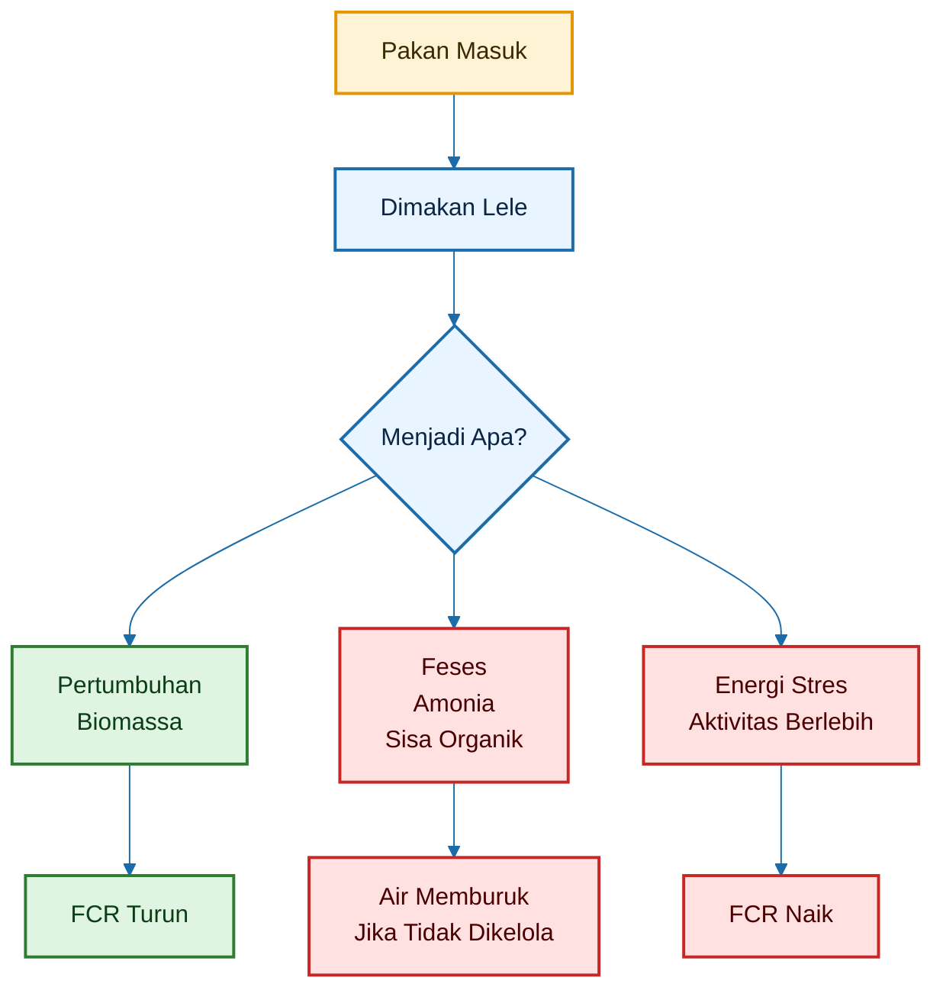
```mermaid
%%{init: {"theme": "base", "themeVariables": {
  "fontFamily": "Arial",
  "primaryColor": "#E8F4FF",
  "primaryTextColor": "#0B2545",
  "primaryBorderColor": "#1B6CA8",
  "lineColor": "#1B6CA8",
  "tertiaryColor": "#F7FBFF"
}}}%%
flowchart TD
    A["Pakan Masuk"] --> B["Dimakan Lele"]
    B --> C{"Menjadi Apa?"}

    C --> D["Pertumbuhan<br/>Biomassa"]
    C --> E["Feses<br/>Amonia<br/>Sisa Organik"]
    C --> F["Energi Stres<br/>Aktivitas Berlebih"]

    D --> G["FCR Turun"]
    E --> H["Air Memburuk<br/>Jika Tidak Dikelola"]
    F --> I["FCR Naik"]

    classDef input fill:#FFF3D6,stroke:#E69500,color:#3A2A00,stroke-width:2px;
    classDef good fill:#DFF5E1,stroke:#2E7D32,color:#0B3D16,stroke-width:2px;
    classDef bad fill:#FFE1E1,stroke:#C62828,color:#4A0000,stroke-width:2px;
    classDef process fill:#E8F4FF,stroke:#1B6CA8,color:#0B2545,stroke-width:2px;

    class A input;
    class B,C process;
    class D,G good;
    class E,F,H,I bad;
```

Diagram di atas menunjukkan bahwa pakan tidak otomatis menjadi daging. Pakan bisa menjadi pertumbuhan, tetapi juga bisa menjadi limbah, stres, dan beban kualitas air. Maka, inti efisiensi bukan hanya memilih pakan murah, tetapi membuat sistem kolam mampu mengarahkan pakan sebanyak mungkin menjadi biomassa ikan.

---

## 1.2 Masalah Umum di Lapangan

Kesalahan yang sering terjadi di lapangan adalah pembudidaya terlalu fokus pada **harga pakan**, tetapi kurang memperhatikan **efisiensi pakan**.

Padahal pakan murah tidak selalu membuat biaya produksi rendah. Jika pakan murah menghasilkan FCR tinggi, total biaya tetap bisa membengkak.

Sebaliknya, pakan yang tampak lebih mahal bisa lebih menguntungkan bila:

- cepat dimakan;
- tidak mudah hancur;
- sesuai ukuran mulut ikan;
- dicerna baik;
- menghasilkan pertumbuhan cepat;
- tidak banyak mencemari air.

Namun, FCR tidak hanya ditentukan oleh kualitas pakan. FCR juga sangat dipengaruhi oleh kondisi kolam.

Kolam yang buruk membuat ikan stres. Ikan stres tetap makan, tetapi pertumbuhannya tidak maksimal. Sebagian energi dari pakan tidak dipakai untuk menambah daging, melainkan untuk bertahan hidup menghadapi oksigen rendah, amonia, nitrit, perubahan pH, endapan busuk, atau kompetisi pakan.

Inilah masalah besarnya:

> Banyak kolam lele hanya diperlakukan sebagai wadah air, bukan sebagai sistem biologis.

Padahal dalam budidaya intensif, kolam sebenarnya bekerja seperti **bioreaktor biologis**. Di dalamnya terjadi proses:

- pakan dimakan ikan;
- sebagian pakan menjadi feses;
- protein pakan menghasilkan amonia;
- mikroba memproses limbah;
- flok terbentuk;
- oksigen dikonsumsi;
- karbon dan nitrogen berputar;
- padatan mengendap atau tersuspensi;
- kualitas air menentukan nafsu makan ikan.

Dengan kata lain, kolam bukan benda pasif. Kolam adalah sistem hidup.

Jika sistem ini dikelola dengan benar, kolam membantu menekan FCR. Jika dibiarkan liar, kolam justru menjadi sumber pemborosan pakan.

---

## 1.3 Tesis Utama Artikel

Tesis utama artikel ini adalah:

> Untuk menekan FCR, kolam lele perlu dikelola sebagai ekosistem aktif yang mampu mendaur ulang limbah pakan melalui bioflok, bukan sekadar wadah air.

Namun, perlu diluruskan sejak awal: **bioflok bukan sihir**. Bioflok tidak otomatis membuat FCR rendah hanya karena air menjadi keruh atau karena kolam diberi probiotik.

Bioflok hanya membantu menekan FCR bila kolam dikelola sebagai **bioreaktor aerob**.

Artinya, kolam harus memiliki:

- oksigen cukup;
- mikroba aktif;
- karbon tersedia;
- nitrogen terkontrol;
- flok sehat;
- padatan berat bisa dibuang;
- ikan nyaman makan;
- air stabil walaupun tidak bening.

Maka istilah **“bioreaktor penurun FCR”** masih dapat dipakai, tetapi harus dipahami secara tepat.

Yang lebih akurat:

> Kolam bioflok adalah bioreaktor biologis yang membantu menurunkan FCR dengan cara mengelola limbah pakan, mikroba, karbon, nitrogen, oksigen, dan padatan agar ikan dapat tumbuh lebih efisien.

Jadi, FCR rendah bukan semata-mata hasil dari pakan bagus. FCR rendah adalah hasil dari **pakan bagus + ikan sehat + air stabil + mikroba bekerja + limbah terkendali**.

[**Kembali ke Atas**](#kolam-lele-sebagai-bioreaktor-penurun-fcr-berbasis-bioflok)

---

## 2. Meluruskan Stigma: Kolam Lele Keruh Bukan Berarti Jorok

Kolam lele sering mendapat stigma negatif. Banyak orang melihat air kolam lele yang keruh, gelap, atau tidak tembus pandang, lalu langsung menyimpulkan bahwa kolam itu jorok.

Dalam pandangan awam, air bersih adalah air bening. Maka ketika air kolam tidak bening, dianggap kotor.

Dalam budidaya lele, cara pandang ini perlu dikoreksi.

Air bening memang tampak bersih secara visual, tetapi belum tentu paling produktif untuk budidaya lele. Sebaliknya, air keruh belum tentu buruk. Yang menentukan sehat atau tidaknya kolam bukan hanya warna air, tetapi proses biologis di dalamnya.

Pertanyaan teknisnya bukan:

> Apakah air kolam bening?

Tetapi:

> Apakah air kolam masih aerob, stabil, rendah racun, dan mendukung ikan tumbuh?

---

## 2.1 Persepsi Masyarakat

Di masyarakat, kolam lele sering dianggap jorok karena beberapa alasan:

- airnya keruh;
- ikan tidak terlihat jelas;
- warna air cokelat, hijau tua, atau kehitaman;
- ada bau khas kolam;
- pakan dan kotoran ikan dianggap menumpuk;
- lele dikenal tahan hidup di lingkungan ekstrem.

Persepsi ini tidak sepenuhnya salah jika yang dimaksud adalah kolam yang benar-benar busuk. Kolam yang bau menyengat, penuh lumpur hitam, oksigen rendah, dan ikan sering menggantung memang kolam bermasalah.

Namun, menjadi keliru bila semua air keruh langsung disebut jorok.

Dalam sistem bioflok, air memang cenderung keruh karena mengandung partikel biologis. Kekeruhan itu bisa berasal dari flok, mikroba, plankton, detritus halus, dan bahan organik yang masih aktif diproses secara aerob.

Kekeruhan seperti ini berbeda dari kekeruhan akibat pembusukan.

---

## 2.2 Koreksi Teknis

Dalam budidaya lele, harus dibedakan antara:

1. **keruh sehat**;
2. **keruh busuk**;
3. **bening tetapi miskin ekosistem**.

Kolam bioflok yang sehat sering kali tidak bening. Airnya bisa cokelat muda, hijau kecokelatan, atau seperti warna teh pekat. Tetapi jika oksigen cukup, bau tidak busuk, ikan aktif makan, dan flok tetap tersuspensi, air seperti ini bisa menjadi lingkungan produktif.

Sebaliknya, kolam yang jernih belum tentu efisien. Air yang terlalu “kosong” secara biologis membuat seluruh kebutuhan nutrisi ikan harus dipenuhi dari pakan pelet. Tidak ada kontribusi signifikan dari mikroba, plankton, atau flok. Selain itu, menjaga air tetap bening pada budidaya intensif sering membutuhkan biaya tambahan berupa pergantian air, filtrasi, pompa, dan pengelolaan limbah.

Maka, target budidaya lele bukan air bening secara visual, tetapi air yang **stabil secara biologis**.

Kalimat pentingnya:

> Keruh bukan masalah jika sistemnya aerob. Yang berbahaya adalah busuk, anaerob, dan beracun.

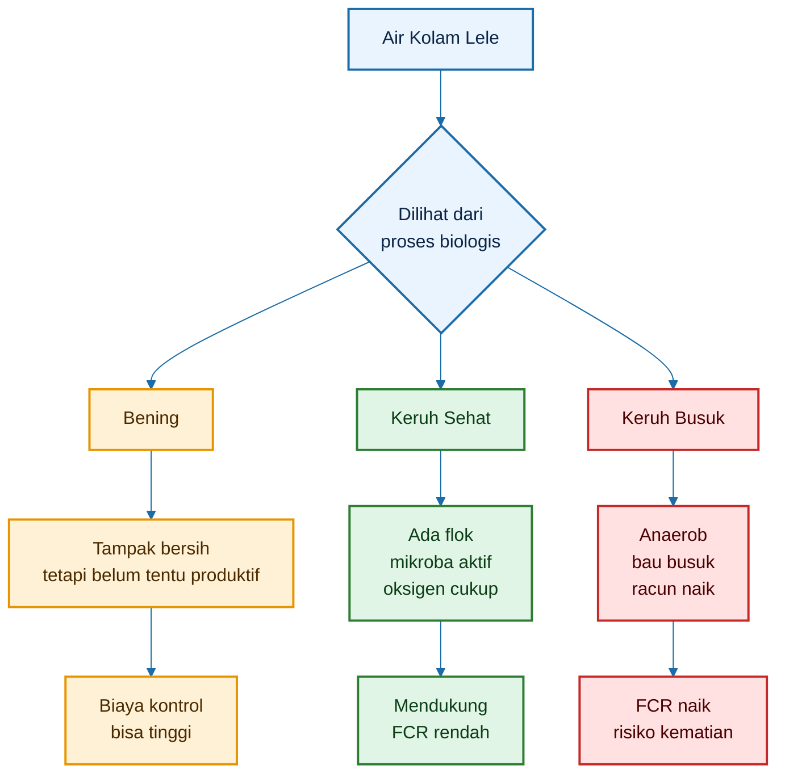
```mermaid
%%{init: {"theme": "base", "themeVariables": {
  "fontFamily": "Arial",
  "primaryColor": "#F7FBFF",
  "primaryTextColor": "#0B2545",
  "primaryBorderColor": "#1B6CA8",
  "lineColor": "#1B6CA8"
}}}%%
flowchart TD
    A["Air Kolam Lele"] --> B{"Dilihat dari<br/>proses biologis"}

    B --> C["Bening"]
    B --> D["Keruh Sehat"]
    B --> E["Keruh Busuk"]

    C --> C1["Tampak bersih<br/>tetapi belum tentu produktif"]
    D --> D1["Ada flok<br/>mikroba aktif<br/>oksigen cukup"]
    E --> E1["Anaerob<br/>bau busuk<br/>racun naik"]

    C1 --> C2["Biaya kontrol<br/>bisa tinggi"]
    D1 --> D2["Mendukung<br/>FCR rendah"]
    E1 --> E2["FCR naik<br/>risiko kematian"]

    classDef neutral fill:#EAF4FF,stroke:#1B6CA8,color:#0B2545,stroke-width:2px;
    classDef good fill:#E1F5E6,stroke:#2E7D32,color:#0B3D16,stroke-width:2px;
    classDef warn fill:#FFF1D6,stroke:#E69500,color:#4A2A00,stroke-width:2px;
    classDef bad fill:#FFE1E1,stroke:#C62828,color:#4A0000,stroke-width:2px;

    class A,B neutral;
    class C,C1,C2 warn;
    class D,D1,D2 good;
    class E,E1,E2 bad;
```

---

## 2.3 Tiga Kategori Air Kolam

Untuk praktisi, pembagian air kolam sebaiknya tidak hanya berdasarkan warna. Gunakan tiga kategori berikut.

### 2.3.1 Air Bening

Air bening adalah air yang secara visual tampak bersih. Ikan mudah terlihat, dasar kolam mungkin tampak jelas, dan partikel tersuspensi sedikit.

Namun, dalam konteks lele konsumsi, air bening tidak otomatis berarti paling baik.

Ciri umum:

- partikel organik rendah;
- plankton/flok sedikit;
- pakan alami minim;
- sistem biologis belum kuat;
- sering membutuhkan pergantian air atau filtrasi;
- cocok untuk sistem tertentu, tetapi belum tentu paling ekonomis untuk lele konsumsi intensif.

Potensi masalah:

- seluruh nutrisi bergantung pada pelet;
- limbah nitrogen tetap harus dikelola;
- biaya air dan filtrasi bisa meningkat;
- bila sistem biologis belum matang, amonia tetap bisa naik walaupun air terlihat jernih.

Kesimpulannya:

> Air bening enak dilihat, tetapi tidak selalu paling efisien secara bisnis.

---

### 2.3.2 Air Keruh Sehat

Air keruh sehat adalah kondisi yang paling relevan dalam budidaya bioflok. Air tidak bening karena mengandung flok dan partikel biologis, tetapi proses di dalamnya masih berjalan secara aerob.

Ciri umum:

- warna cokelat muda, cokelat teh, atau hijau kecokelatan;
- ada partikel halus melayang;
- bau tanah atau fermentasi ringan;
- ikan aktif makan;
- busa tipis masih wajar;
- tidak ada bau busuk menyengat;
- tidak ada endapan hitam tebal;
- flok tetap bergerak dan tidak mati di dasar.

Air seperti ini bisa membantu efisiensi pakan karena sebagian limbah pakan diproses ulang oleh mikroba menjadi biomassa biologis. Flok yang terbentuk dapat menjadi pakan tambahan dan, yang lebih penting, membantu menjaga kualitas air.

Dalam kondisi ini, kolam mulai berfungsi sebagai **bioreaktor hidup**.

---

### 2.3.3 Air Jorok atau Busuk

Air jorok dalam arti teknis adalah air yang proses biologisnya sudah tidak sehat. Biasanya sistem menjadi kekurangan oksigen, bahan organik menumpuk, dan bagian dasar kolam mulai anaerob.

Ciri umum:

- bau got, bangkai, atau telur busuk;
- air hitam pekat;
- busa tebal dan menetap;
- ikan menggantung di permukaan;
- nafsu makan turun;
- banyak lendir;
- endapan dasar hitam;
- pakan sering tersisa;
- kematian mulai muncul;
- FCR memburuk.

Pada kondisi ini, kolam tidak lagi menjadi bioreaktor yang menguntungkan. Kolam berubah menjadi sumber racun.

Secara praktis, kolam busuk menyebabkan FCR naik karena:

- ikan stres;
- oksigen rendah;
- insang terganggu;
- pakan tidak dimakan optimal;
- energi ikan terpakai untuk bertahan hidup;
- pertumbuhan melambat;
- risiko kematian meningkat.

Maka, jangan menyamakan bioflok dengan kolam busuk.

Bioflok yang sehat menekan FCR.
Bioflok yang busuk justru menaikkan FCR.

---

## 2.4 Kalimat Kunci

Kalimat kunci untuk bab ini adalah:

> Lele tidak membutuhkan kolam jorok. Lele membutuhkan kolam biologis yang sehat walaupun keruh.

Atau dalam bahasa operasional:

> Jangan mengejar air bening. Kejar air stabil.
> Jangan membiarkan kolam busuk. Tumbuhkan flok sehat.
> Jangan menilai kolam dari warna saja. Nilai dari oksigen, bau, respons makan, endapan, dan pertumbuhan ikan.

Inilah fondasi berpikir bioflok untuk lele. Tujuannya bukan membuat kolam terlihat bersih untuk mata manusia, tetapi membuat kolam bekerja sehat untuk ikan dan mikroba.

Kolam yang baik untuk FCR rendah adalah kolam yang mampu menjawab lima kebutuhan:

1. ikan nyaman makan;
2. oksigen cukup;
3. limbah pakan diproses;
4. flok tetap aktif;
5. racun tidak menumpuk.

Jika lima hal ini berjalan, maka air yang keruh bisa menjadi aset, bukan masalah.

[**Kembali ke Atas**](#kolam-lele-sebagai-bioreaktor-penurun-fcr-berbasis-bioflok)

---

## 3. Benang Merah: Menumbuhkan Flok untuk Menekan FCR

Setelah memahami bahwa kolam lele tidak harus bening, langkah berikutnya adalah memahami **benang merah teknologi bioflok**.

Benang merahnya bukan sekadar “air dibuat keruh”. Benang merahnya adalah **menumbuhkan flok sehat** agar kolam mampu mengolah sebagian limbah pakan menjadi biomassa biologis yang bermanfaat.

Dalam konteks FCR, bioflok bekerja melalui dua jalur:

1. **jalur langsung**, yaitu sebagian flok dapat dimakan oleh lele sebagai pakan tambahan;
2. **jalur tidak langsung**, yaitu bioflok membantu menjaga kualitas air sehingga lele lebih nyaman makan, tidak stres, dan pakan lebih efisien menjadi daging.

Pada lele, jalur tidak langsung sering lebih besar dampaknya dibanding jalur langsung. Artinya, bioflok tidak boleh dipahami semata-mata sebagai “pakan mikroba”, tetapi sebagai **alat rekayasa lingkungan kolam**.

---

## 3.1 Alur Dasar Bioflok

Alur dasar bioflok dapat diringkas sebagai berikut:

> Pelet dimakan lele → sebagian menjadi feses dan amonia → mikroba memakai karbon dan nitrogen → terbentuk flok → flok dimakan sebagian oleh lele → limbah berkurang → air lebih stabil → nafsu makan lebih baik → FCR turun.

<figure>
  
  <figcaption>
    Siklus bioflok pada kolam lele yang menunjukkan hubungan antara limbah
    organik, mikroorganisme, kualitas air, dan pemanfaatan nutrisi.
  </figcaption>
</figure>

Secara praktis, alur ini menjelaskan bahwa pakan tidak berhenti setelah masuk ke mulut ikan. Pakan akan masuk ke dalam siklus kolam.

Sebagian pakan menjadi pertumbuhan ikan. Sebagian lain keluar sebagai feses, amonia, dan sisa organik. Bila limbah ini tidak dikelola, kolam menjadi rusak. Tetapi bila dikelola dengan bioflok, sebagian limbah tersebut bisa diproses ulang oleh mikroba menjadi flok.

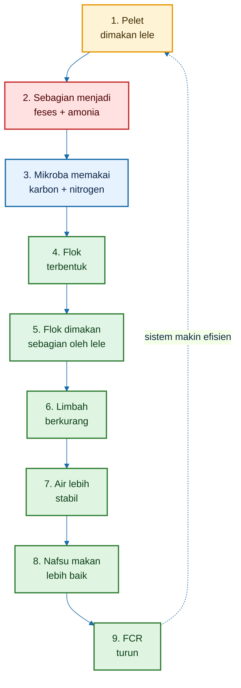
```mermaid
%%{init: {"theme": "base", "themeVariables": {
  "fontFamily": "Arial",
  "primaryColor": "#E8F4FF",
  "primaryTextColor": "#0B2545",
  "primaryBorderColor": "#1B6CA8",
  "lineColor": "#1B6CA8",
  "tertiaryColor": "#F7FBFF"
}}}%%
flowchart TD
    A["1. Pelet<br/>dimakan lele"] --> B["2. Sebagian menjadi<br/>feses + amonia"]
    B --> C["3. Mikroba memakai<br/>karbon + nitrogen"]
    C --> D["4. Flok<br/>terbentuk"]
    D --> E["5. Flok dimakan<br/>sebagian oleh lele"]
    E --> F["6. Limbah<br/>berkurang"]
    F --> G["7. Air lebih<br/>stabil"]
    G --> H["8. Nafsu makan<br/>lebih baik"]
    H --> I["9. FCR<br/>turun"]
    I -. "sistem makin efisien" .-> A

    classDef feed fill:#FFF3D6,stroke:#E69500,color:#3A2A00,stroke-width:2px;
    classDef waste fill:#FFE1E1,stroke:#C62828,color:#4A0000,stroke-width:2px;
    classDef microbe fill:#E7F2FF,stroke:#1B6CA8,color:#0B2545,stroke-width:2px;
    classDef floc fill:#E1F5E6,stroke:#2E7D32,color:#0B3D16,stroke-width:2px;
    classDef result fill:#DFF5E1,stroke:#2E7D32,color:#0B3D16,stroke-width:2px;

    class A feed;
    class B waste;
    class C microbe;
    class D,E floc;
    class F,G,H,I result;
```

Diagram di atas penting karena menunjukkan bahwa bioflok bukan proses satu arah. Bioflok adalah **siklus biologis**.

Pakan yang tidak sepenuhnya menjadi daging tidak langsung dianggap hilang. Sebagian masih bisa masuk ke dalam siklus mikroba, lalu menjadi flok, lalu membantu memperbaiki kondisi kolam.

Tetapi ada syarat penting: siklus ini hanya menguntungkan bila prosesnya tetap **aerob**, yaitu cukup oksigen.

Jika oksigen kurang, maka alur positif tersebut berubah menjadi alur negatif:

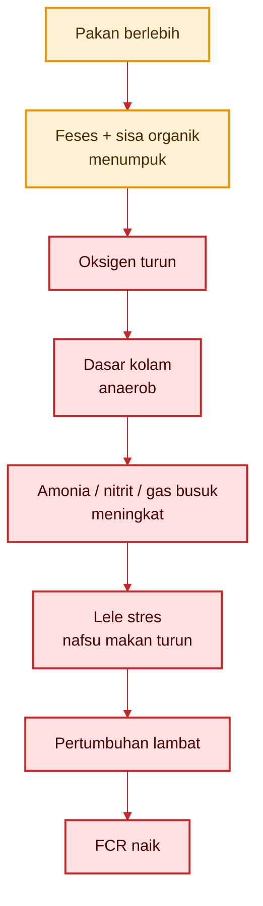
```mermaid
%%{init: {"theme": "base", "themeVariables": {
  "fontFamily": "Arial",
  "primaryColor": "#FFF7F7",
  "primaryTextColor": "#3A0000",
  "primaryBorderColor": "#C62828",
  "lineColor": "#C62828"
}}}%%
flowchart TD
    A["Pakan berlebih"] --> B["Feses + sisa organik<br/>menumpuk"]
    B --> C["Oksigen turun"]
    C --> D["Dasar kolam<br/>anaerob"]
    D --> E["Amonia / nitrit / gas busuk<br/>meningkat"]
    E --> F["Lele stres<br/>nafsu makan turun"]
    F --> G["Pertumbuhan lambat"]
    G --> H["FCR naik"]

    classDef bad fill:#FFE1E1,stroke:#C62828,color:#4A0000,stroke-width:2px;
    classDef warn fill:#FFF1D6,stroke:#E69500,color:#4A2A00,stroke-width:2px;

    class A,B warn;
    class C,D,E,F,G,H bad;
```

Jadi, yang menentukan bioflok berhasil atau gagal bukan hanya keberadaan flok, tetapi **kualitas proses biologisnya**.

Flok yang sehat membantu menurunkan FCR.  
Flok yang busuk justru menaikkan FCR.

---

## 3.2 Mengapa Flok Penting?

Flok penting karena ia menjadi titik temu antara **limbah pakan, mikroba, kualitas air, dan efisiensi pakan**.

Dalam kolam lele biasa, limbah pakan sering menjadi beban. Sisa metabolisme ikan menghasilkan amonia. Feses dan bahan organik menumpuk di dasar. Bila tidak dikelola, semua ini merusak kualitas air.

Dalam sistem bioflok, sebagian limbah itu diarahkan menjadi bahan baku pertumbuhan mikroba.

Secara sederhana:

$$
\text{Limbah pakan} + \text{Karbon} + \text{Mikroba} + \text{Oksigen}
\rightarrow
\text{Bioflok}
$$

Bioflok kemudian memberi empat manfaat utama.

### 3.2.1 Flok Mendaur Ulang Sebagian Limbah Pakan

Tidak semua nutrisi pakan yang diberikan ke lele berubah menjadi daging. Sebagian menjadi feses, amonia, dan bahan organik terlarut.

Dalam sistem tanpa pengelolaan biologis, limbah ini menjadi masalah. Tetapi dalam sistem bioflok yang sehat, sebagian nitrogen dan bahan organik tersebut dapat dimanfaatkan mikroba untuk membentuk biomassa baru.

Dengan kata lain, bioflok membantu mengubah sebagian limbah menjadi **sumber biologis baru**.

Ini bukan berarti semua limbah hilang. Bioflok tidak menghapus limbah secara sempurna. Namun bioflok membantu menunda, mengurangi, dan mengolah tekanan limbah agar kolam lebih stabil.

---

### 3.2.2 Flok Membantu Menekan Amonia dan Nitrit

Amonia adalah salah satu masalah utama dalam budidaya lele intensif. Amonia berasal dari metabolisme protein pakan. Semakin tinggi pakan dan semakin tinggi protein, semakin besar potensi beban nitrogen di kolam.

Dalam sistem bioflok, mikroba heterotrof dapat memanfaatkan nitrogen anorganik, termasuk amonia, untuk membentuk biomassa mikroba jika tersedia karbon yang cukup.

Secara sederhana:

$$
\text{Amonia} + \text{Karbon} + \text{Oksigen}
\rightarrow
\text{Biomassa mikroba}
$$

Karena itulah rasio karbon dan nitrogen menjadi penting. Bila karbon kurang, mikroba tidak cukup kuat mengikat nitrogen. Bila karbon berlebihan tetapi oksigen kurang, air bisa menjadi berat dan busuk.

Jadi, bioflok membantu menekan amonia hanya bila tiga hal tersedia bersama:

- karbon;
- mikroba;
- oksigen.

---

### 3.2.3 Flok Menjadi Biomassa Biologis yang Sebagian Bisa Dimakan Ikan

Flok bukan sekadar lumpur halus. Flok adalah agregat biologis yang tersusun dari mikroba, alga, protozoa, partikel organik, detritus, dan lendir biologis.

Sebagian flok dapat dimakan oleh lele, terutama partikel yang cukup besar untuk disedot atau ikut termakan saat ikan mencari makan.

Namun, perlu hati-hati. Pada lele, kontribusi flok sebagai pakan tambahan tidak boleh dilebih-lebihkan.

Lele bukan nila. Nila jauh lebih aktif memakan plankton dan partikel tersuspensi. Lele cenderung predator dan bottom feeder. Karena itu, pada lele, bioflok lebih tepat diposisikan sebagai:

> **pakan tambahan + pengendali kualitas air**, bukan pengganti total pelet.

Pelet tetap menjadi sumber nutrisi utama. Bioflok membantu meningkatkan efisiensi sistem.

---

### 3.2.4 Flok Membuat Kualitas Air Lebih Stabil

Kualitas air stabil adalah faktor besar dalam FCR.

Lele yang hidup di air stabil akan:

- lebih nyaman makan;
- tidak mudah stres;
- tidak sering menggantung;
- metabolisme lebih baik;
- pertumbuhan lebih konsisten;
- survival lebih tinggi.

Sebaliknya, lele yang hidup di air buruk akan memakai sebagian energi pakan untuk bertahan hidup. Pada kondisi ini, pakan tidak efisien menjadi daging.

Hubungannya dapat diringkas seperti berikut:

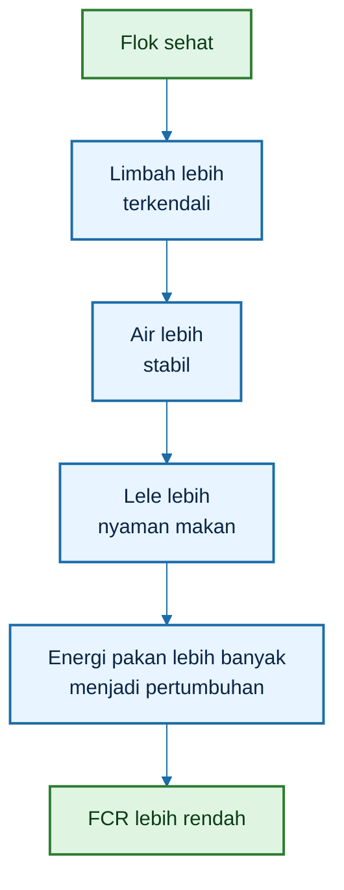
```mermaid
%%{init: {"theme": "base", "themeVariables": {
  "fontFamily": "Arial",
  "primaryColor": "#F7FBFF",
  "primaryTextColor": "#0B2545",
  "primaryBorderColor": "#1B6CA8",
  "lineColor": "#1B6CA8"
}}}%%
flowchart TD
    A["Flok sehat"] --> B["Limbah lebih<br/>terkendali"]
    B --> C["Air lebih<br/>stabil"]
    C --> D["Lele lebih<br/>nyaman makan"]
    D --> E["Energi pakan lebih banyak<br/>menjadi pertumbuhan"]
    E --> F["FCR lebih rendah"]

    classDef floc fill:#E1F5E6,stroke:#2E7D32,color:#0B3D16,stroke-width:2px;
    classDef process fill:#E8F4FF,stroke:#1B6CA8,color:#0B2545,stroke-width:2px;
    classDef result fill:#DFF5E1,stroke:#2E7D32,color:#0B3D16,stroke-width:2px;

    class A floc;
    class B,C,D,E process;
    class F result;
```

Dari sini terlihat bahwa bioflok tidak menurunkan FCR hanya karena dimakan ikan. Bioflok menurunkan FCR karena memperbaiki **lingkungan tumbuh**.

---

## 3.3 Koreksi Penting

Bioflok bukan “sihir” yang otomatis menurunkan FCR.

Banyak kegagalan bioflok terjadi karena pembudidaya hanya meniru permukaan teknologinya:

- membeli probiotik;
- menambah molase;
- membuat air keruh;
- menaikkan padat tebar;
- mengurangi pakan terlalu cepat.

Padahal bioflok bekerja hanya jika sistem biologisnya seimbang.

Bioflok efektif bila:

- oksigen cukup;
- rasio karbon/nitrogen sesuai;
- padatan terkendali;
- pakan tidak berlebihan;
- air tidak menjadi anaerob;
- ikan tetap nyaman makan.

Jika salah satu komponen ini gagal, bioflok dapat berubah menjadi beban.

### 3.3.1 Oksigen Cukup

Bioflok membutuhkan oksigen lebih tinggi daripada kolam biasa karena yang bernapas bukan hanya ikan, tetapi juga mikroba dan organisme dalam flok.

Jika oksigen rendah, flok tidak lagi menjadi alat pengolah limbah. Flok dapat berubah menjadi beban organik yang membusuk.

Kalimat praktisnya:

> Tanpa oksigen, bioflok berubah dari bioreaktor menjadi septic tank.

---

### 3.3.2 Rasio Karbon dan Nitrogen Sesuai

Mikroba membutuhkan karbon untuk memanfaatkan nitrogen. Jika nitrogen tinggi tetapi karbon kurang, amonia dapat naik. Jika karbon terlalu banyak tetapi oksigen kurang, bakteri dapat meledak dan menghabiskan oksigen.

Maka, pemberian molase atau sumber karbon harus dianggap sebagai tindakan teknis, bukan ritual.

Molase bukan pupuk ajaib. Molase adalah bahan bakar mikroba. Jika bahan bakar ditambah tetapi oksigen dan pengadukan tidak cukup, sistem bisa kolaps.

---

### 3.3.3 Padatan Terkendali

Bioflok bukan berarti semua padatan harus dibiarkan. Ada perbedaan antara:

- flok aktif yang melayang;
- endapan berat yang mulai membusuk.

Flok aktif bermanfaat. Endapan hitam berbahaya.

Karena itu, kolam bioflok tetap memerlukan pengelolaan padatan, baik melalui sifon, central drain, airlift, atau pembuangan berkala dari dasar kolam.

---

### 3.3.4 Pakan Tidak Berlebihan

Bioflok tidak boleh dijadikan alasan untuk overfeeding.

Pakan berlebihan akan menghasilkan:

- sisa pelet;
- feses berlebih;
- amonia tinggi;
- oksigen turun;
- flok terlalu berat;
- air busuk;
- FCR naik.

Prinsipnya:

> Bioflok mengolah limbah dari pakan yang dimakan ikan, bukan menyelamatkan pakan yang sengaja dibuang berlebihan ke kolam.

---

### 3.3.5 Air Tidak Menjadi Anaerob

Bioflok sehat adalah bioflok aerob. Bila bagian dasar kolam menjadi anaerob, akan muncul masalah seperti bau busuk, gas beracun, dan endapan hitam.

Pada titik ini, air yang keruh tidak lagi sehat. Air sudah menjadi busuk.

Karena itu, arus pelan, aerasi, dan pembuangan padatan adalah bagian penting dari bioflok.

---

### 3.3.6 Ikan Tetap Nyaman Makan

Tujuan akhir bioflok bukan membuat mikroba sebanyak-banyaknya. Tujuan akhirnya adalah membuat lele tumbuh efisien.

Maka indikator keberhasilan bioflok tetap harus kembali pada ikan:

- ikan aktif;
- respons makan baik;
- pertumbuhan seragam;
- kematian rendah;
- FCR turun;
- air tidak bau busuk.

Jika flok banyak tetapi ikan tidak nyaman, sistem itu gagal secara bisnis.

---

### 3.3.7 Kalimat Kunci Bab 3

> Benang merah bioflok bukan membuat air kotor, tetapi menumbuhkan flok sehat sebagai mesin biologis pengolah limbah pakan.

Atau lebih praktis:

> Flok sehat membantu FCR turun. Flok busuk membuat FCR naik.

[**Kembali ke Atas**](#kolam-lele-sebagai-bioreaktor-penurun-fcr-berbasis-bioflok)

---

## 4. Apakah Lele Karnivora Bisa Memakan Mikroba?

Salah satu pertanyaan penting dalam bioflok lele adalah: **kalau lele bersifat karnivora, bagaimana mungkin ia memakan mikroba?**

Pertanyaan ini wajar. Banyak orang membayangkan bahwa bioflok berarti lele makan bakteri. Padahal penjelasan seperti itu terlalu sederhana dan bisa menyesatkan.

Lele memang cenderung pemakan hewani. Di alam, lele memakan ikan kecil, cacing, serangga air, larva, bangkai, dan organisme lain. Namun lele juga bersifat oportunistik. Ia tidak hanya mengejar satu jenis makanan. Ia akan memanfaatkan sumber makanan yang tersedia dan bisa dimakan.

Dalam konteks bioflok, lele bukan memakan bakteri satu per satu. Yang dimakan adalah **flok**, yaitu gumpalan biologis yang ukurannya sudah menjadi partikel.

---

## 4.1 Lele sebagai Predator Oportunistik

Lele sering disebut sebagai ikan karnivora atau predator karena secara alami memiliki kebiasaan memakan organisme hewani. Bentuk mulutnya lebar, memiliki sungut, aktif mencari makan, dan mampu memangsa ikan yang lebih kecil.

Namun dalam budidaya, lele tidak bisa dipahami sebagai karnivora murni yang hanya memakan daging. Lele lebih tepat disebut **predator oportunistik**.

Artinya, lele akan memanfaatkan berbagai bahan makanan yang tersedia, selama bahan tersebut:

- berukuran cukup untuk dimakan;
- memiliki aroma atau rangsangan makan;
- mengandung nutrisi yang dapat dicerna;
- berada pada posisi yang mudah dijangkau.

Karena itu, lele bisa memakan pelet, cacing, larva, serangga, ikan kecil, detritus, organisme dasar, dan sebagian partikel biologis di kolam.

Dalam sistem bioflok, peluang ini dimanfaatkan. Flok yang terbentuk menjadi partikel biologis yang sebagian dapat ikut termakan oleh lele.

Tetapi tetap perlu ditekankan: pelet masih menjadi pakan utama.

---

## 4.2 Lele Tidak Makan Bakteri Satu per Satu

Kesalahpahaman umum adalah menganggap lele makan bakteri secara langsung.

Secara ukuran, bakteri terlalu kecil untuk dipilih satu per satu oleh lele. Lele tidak menyaring bakteri seperti alat filtrasi mikro. Lele juga bukan pemakan plankton seefisien ikan tertentu seperti nila.

Yang terjadi dalam bioflok adalah proses penggumpalan.

Bakteri, alga, protozoa, detritus, dan bahan organik halus saling melekat oleh lendir biologis. Lama-kelamaan terbentuk partikel yang lebih besar. Partikel inilah yang disebut flok.

Maka kalimat yang benar bukan:

> Lele makan bakteri.

Tetapi:

> Lele dapat memakan sebagian gumpalan bioflok yang berisi campuran mikroba dan bahan organik.

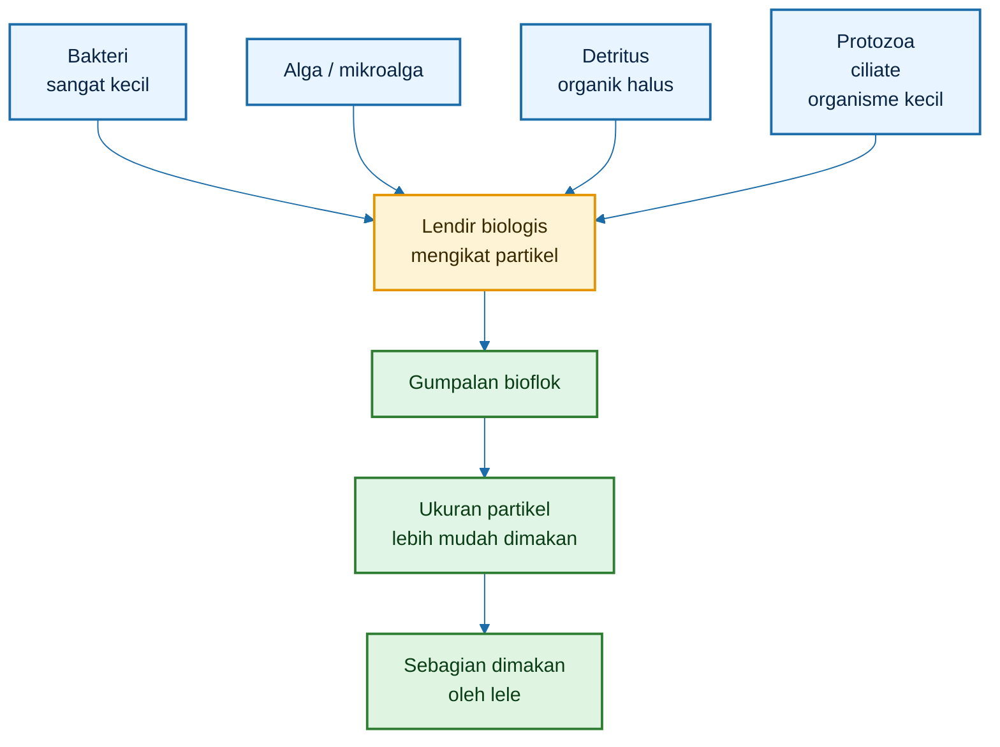
```mermaid
%%{init: {"theme": "base", "themeVariables": {
  "fontFamily": "Arial",
  "primaryColor": "#F7FBFF",
  "primaryTextColor": "#0B2545",
  "primaryBorderColor": "#1B6CA8",
  "lineColor": "#1B6CA8"
}}}%%
flowchart TD
    A["Bakteri<br/>sangat kecil"] --> D["Lendir biologis<br/>mengikat partikel"]
    B["Alga / mikroalga"] --> D
    C["Detritus<br/>organik halus"] --> D
    E["Protozoa<br/>ciliate<br/>organisme kecil"] --> D
    D --> F["Gumpalan bioflok"]
    F --> G["Ukuran partikel<br/>lebih mudah dimakan"]
    G --> H["Sebagian dimakan<br/>oleh lele"]

    classDef micro fill:#E8F4FF,stroke:#1B6CA8,color:#0B2545,stroke-width:2px;
    classDef binder fill:#FFF3D6,stroke:#E69500,color:#3A2A00,stroke-width:2px;
    classDef floc fill:#E1F5E6,stroke:#2E7D32,color:#0B3D16,stroke-width:2px;
    classDef fish fill:#DFF5E1,stroke:#2E7D32,color:#0B3D16,stroke-width:2px;

    class A,B,C,E micro;
    class D binder;
    class F,G floc;
    class H fish;
```

Diagram ini menunjukkan bahwa bioflok adalah hasil agregasi, bukan kumpulan bakteri bebas yang langsung dimakan ikan.

---

## 4.3 Komposisi Flok

Flok adalah komunitas biologis yang kompleks. Di dalamnya terdapat berbagai komponen kecil yang saling melekat.

Komponen utama flok antara lain:

- bakteri;
- alga/mikroalga;
- protozoa;
- ciliate;
- fungi;
- rotifer, copepoda, nematoda kecil;
- detritus;
- lendir biologis;
- sisa organik halus.

Secara fungsional, komponen-komponen ini memiliki peran berbeda.

| Komponen                          | Peran dalam flok                                         |
| --------------------------------- | -------------------------------------------------------- |
| Bakteri                           | Mengolah karbon dan nitrogen, membentuk biomassa mikroba |
| Alga/mikroalga                    | Menyerap nutrien, menghasilkan oksigen saat ada cahaya   |
| Protozoa                          | Memakan bakteri dan membantu struktur komunitas mikroba  |
| Ciliate                           | Bagian dari rantai mikroorganisme dalam flok             |
| Fungi                             | Mengurai bahan organik tertentu                          |
| Rotifer, copepoda, nematoda kecil | Organisme kecil yang memperkaya struktur flok            |
| Detritus                          | Bahan organik sisa yang menjadi substrat mikroba         |
| Lendir biologis                   | Perekat alami pembentuk agregat                          |
| Sisa organik halus                | Bahan organik yang ikut tergabung dalam flok             |

Dari tabel ini terlihat bahwa flok bukan benda mati. Flok adalah agregat biologis yang terus berubah.

Flok sehat biasanya masih ringan, aktif, dan tersuspensi. Flok tua yang terlalu berat dapat mengendap dan menjadi masalah jika tidak dibuang.

---

## 4.4 Analogi

Analogi paling sederhana:

> Lele tidak memakan “tepung mikroba” satu per satu. Lele memakan “adonan biologis” berupa flok yang sudah menggumpal menjadi partikel.

Bakteri bebas dapat dianalogikan seperti tepung halus. Butirannya terlalu kecil untuk dimakan satu per satu oleh lele.

Tetapi ketika tepung itu bercampur air, lendir, partikel organik, dan bahan lain, lalu menggumpal menjadi butiran adonan, maka ukurannya menjadi lebih mudah dimakan.

Bioflok bekerja seperti itu.

Komponen mikroba yang terlalu kecil akan saling melekat dan membentuk partikel lebih besar. Partikel ini dapat ikut dimakan oleh lele, terutama ketika berada di kolom air atau di sekitar dasar kolam.

Namun analogi ini juga punya batas. Flok bukan pakan lengkap. Komposisi gizinya berubah-ubah tergantung:

- kualitas pakan;
- sumber karbon;
- umur flok;
- oksigen;
- jenis mikroba;
- kepadatan ikan;
- jumlah bahan organik;
- intensitas aerasi.

Karena itu, flok tidak boleh dianggap sebagai pengganti total pakan buatan.

---

## 4.5 Koreksi Posisi Bioflok pada Lele

Pada lele, posisi bioflok harus diletakkan secara proporsional.

Bioflok bukan pengganti total pelet. Bioflok adalah **alat bantu efisiensi**.

Ada tiga peran utama bioflok pada lele.

### 4.5.1 Bioflok sebagai Pakan Tambahan

Sebagian flok dapat dimakan oleh lele. Ini memberi tambahan nutrisi, terutama dari biomassa mikroba dan organisme kecil.

Namun kontribusinya tidak selalu besar. Pada lele, kemampuan memanfaatkan flok tidak sekuat ikan yang memang aktif menyaring atau memakan plankton.

Maka, jangan mengurangi pakan terlalu ekstrem hanya karena kolam sudah berflok.

Pengurangan pakan harus berdasarkan:

- respons makan;
- pertumbuhan;
- sampling bobot;
- volume flok;
- kualitas air;
- tingkat keseragaman ikan.

---

### 4.5.2 Bioflok sebagai Pengatur Kualitas Air

Ini peran paling penting.

Bioflok membantu mengendalikan limbah nitrogen dan bahan organik agar tidak langsung merusak air. Jika sistem berjalan baik, air menjadi lebih stabil. Ikan lebih nyaman, tidak mudah stres, dan pakan lebih efisien.

Pada lele, manfaat ini sering lebih menentukan FCR dibanding manfaat flok sebagai pakan langsung.

Dengan kata lain:

> Bioflok menurunkan FCR bukan terutama karena lele kenyang makan flok, tetapi karena kolam menjadi lebih stabil sehingga pakan pelet lebih efisien menjadi daging.

---

### 4.5.3 Bioflok sebagai Indikator Kesehatan Sistem

Flok juga bisa menjadi indikator kondisi kolam.

Flok yang baik menunjukkan bahwa ada aktivitas biologis yang berjalan. Tetapi flok yang terlalu banyak, terlalu hitam, terlalu bau, atau terlalu berat menunjukkan sistem mulai bermasalah.

Maka, pembudidaya tidak boleh hanya bertanya:

> Apakah ada flok?

Pertanyaan yang lebih tepat:

> Apakah flok itu sehat, aerob, aktif, dan tidak membebani ikan?

---

### 4.5.4 Kalimat Kunci Bab 4

> Lele memang predator oportunistik, tetapi dapat memanfaatkan sebagian bioflok sebagai partikel biologis. Namun, peran utama bioflok pada lele adalah menjaga kualitas air dan mendukung efisiensi pakan, bukan menggantikan pelet sepenuhnya.

[**Kembali ke Atas**](#kolam-lele-sebagai-bioreaktor-penurun-fcr-berbasis-bioflok)

---

## 5. Kolam Lele sebagai Bioreaktor Biologis

Setelah memahami bioflok dan posisi lele sebagai pemanfaat flok, kita bisa masuk ke konsep utama artikel ini: **kolam lele sebagai bioreaktor biologis**.

Istilah bioreaktor biasanya dipakai dalam industri fermentasi, pengolahan limbah, atau bioteknologi. Namun secara konsep, kolam bioflok juga bisa dipahami sebagai bioreaktor karena di dalamnya terjadi proses biologis yang diarahkan untuk menghasilkan manfaat tertentu.

Dalam budidaya lele, manfaat yang ingin dicapai adalah:

- limbah pakan lebih terkendali;
- amonia lebih rendah;
- air lebih stabil;
- flok sehat terbentuk;
- ikan nyaman makan;
- FCR lebih rendah.

Namun, istilah bioreaktor harus dipakai dengan hati-hati. Kolam tidak otomatis menjadi bioreaktor yang baik hanya karena airnya keruh. Kolam menjadi bioreaktor yang baik jika proses biologis di dalamnya **terkendali**.

---

## 5.1 Definisi Bioreaktor dalam Konteks Budidaya Lele

Dalam konteks budidaya lele, kolam dapat disebut bioreaktor bila di dalamnya terjadi proses biologis terkendali yang mengubah input menjadi output yang bermanfaat.

Input utamanya adalah:

- pakan;
- ikan;
- mikroba;
- sumber karbon;
- oksigen.

Output yang diharapkan adalah:

- pertumbuhan ikan;
- flok sehat;
- air lebih stabil;
- limbah lebih terkendali;
- FCR lebih rendah.

Secara sederhana:

$$
\text{Pakan} + \text{Ikan} + \text{Mikroba} + \text{Karbon} + \text{Oksigen}
\rightarrow
\text{Pertumbuhan ikan} + \text{Flok} + \text{Air lebih stabil}
$$

Jika ditambahkan perspektif FCR:

$$
\text{FCR rendah}
=
\frac{\text{Pakan yang benar-benar menjadi pertumbuhan}}
{\text{Total pakan yang diberikan}}
$$

Secara teknis, FCR tetap dihitung sebagai:

$$
FCR = \frac{\text{Total pakan}}{\text{Pertambahan biomassa ikan}}
$$

Namun secara manajemen, tugas bioreaktor bioflok adalah memperbesar bagian pakan yang menjadi pertumbuhan dan memperkecil bagian pakan yang berubah menjadi masalah.

Dengan kata lain:

$$
\text{Pakan} \rightarrow
\begin{cases}
\text{Pertumbuhan ikan} & \text{diinginkan} \\
\text{Flok bermanfaat} & \text{masih berguna} \\
\text{Limbah beracun} & \text{harus ditekan}
\end{cases}
$$

Kolam bioflok yang baik berusaha menggeser aliran pakan dari “limbah beracun” menuju “pertumbuhan ikan” dan “flok bermanfaat”.

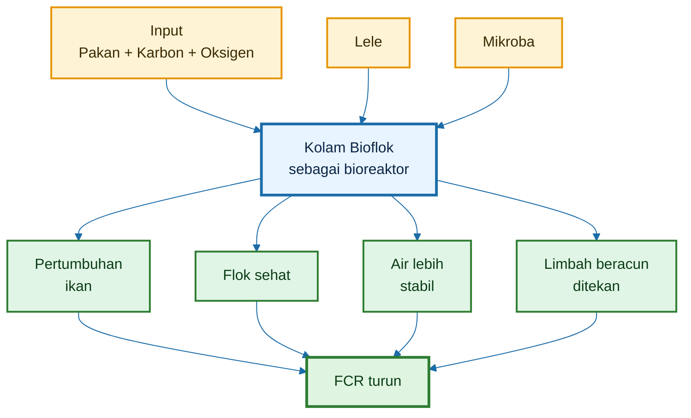
```mermaid
%%{init: {"theme": "base", "themeVariables": {
  "fontFamily": "Arial",
  "primaryColor": "#F7FBFF",
  "primaryTextColor": "#0B2545",
  "primaryBorderColor": "#1B6CA8",
  "lineColor": "#1B6CA8"
}}}%%
flowchart TD
    A["Input<br/>Pakan + Karbon + Oksigen"] --> B["Kolam Bioflok<br/>sebagai bioreaktor"]
    C["Lele"] --> B
    D["Mikroba"] --> B

    B --> E["Pertumbuhan<br/>ikan"]
    B --> F["Flok sehat"]
    B --> G["Air lebih<br/>stabil"]
    B --> H["Limbah beracun<br/>ditekan"]

    E --> I["FCR turun"]
    F --> I
    G --> I
    H --> I

    classDef input fill:#FFF3D6,stroke:#E69500,color:#3A2A00,stroke-width:2px;
    classDef reactor fill:#E8F4FF,stroke:#1B6CA8,color:#0B2545,stroke-width:3px;
    classDef good fill:#E1F5E6,stroke:#2E7D32,color:#0B3D16,stroke-width:2px;
    classDef result fill:#DFF5E1,stroke:#2E7D32,color:#0B3D16,stroke-width:3px;

    class A,C,D input;
    class B reactor;
    class E,F,G,H good;
    class I result;
```

Diagram ini menunjukkan bahwa kolam bioflok bukan sekadar tempat ikan dipelihara. Kolam adalah ruang reaksi biologis tempat input dikelola menjadi output yang menguntungkan.

---

## 5.2 Fungsi Kolam Bioflok sebagai Bioreaktor

Kolam bioflok sebagai bioreaktor memiliki beberapa fungsi utama.

---

### 5.2.1 Mengubah Limbah Nitrogen Menjadi Biomassa Mikroba

Protein pakan mengandung nitrogen. Ketika pakan dimakan lele, sebagian nitrogen dipakai untuk pertumbuhan, tetapi sebagian lain keluar sebagai amonia dan limbah organik.

Dalam kolam biasa, nitrogen limbah ini dapat menjadi racun. Dalam kolam bioflok, nitrogen tersebut diarahkan agar dimanfaatkan mikroba.

Dengan tambahan karbon dan oksigen, mikroba dapat mengasimilasi nitrogen menjadi biomassa.

Secara sederhana:

$$
\text{Nitrogen limbah} + \text{Karbon} + \text{Oksigen}
\rightarrow
\text{Biomassa mikroba}
$$

Biomassa mikroba inilah yang menjadi bagian dari flok.

Fungsi ini sangat penting karena menekan akumulasi amonia. Semakin terkendali amonia, semakin rendah tekanan stres pada ikan.

---

### 5.2.2 Mengurangi Beban Amonia

Amonia adalah indikator penting dalam budidaya intensif. Amonia tinggi dapat mengganggu insang, menurunkan nafsu makan, menekan pertumbuhan, dan meningkatkan risiko kematian.

Kolam bioflok membantu mengurangi tekanan amonia melalui dua jalur:

1. **asimilasi heterotrof**, yaitu amonia/nitrogen dimanfaatkan mikroba menjadi biomassa;
2. **nitrifikasi**, yaitu amonia diubah menjadi bentuk nitrogen lain oleh bakteri nitrifikasi.

Kedua proses ini membutuhkan oksigen. Karena itu, bioflok tidak bisa dipisahkan dari aerasi.

Tanpa oksigen, kolam tidak menjadi bioreaktor aerob. Kolam justru menjadi ruang pembusukan.

---

### 5.2.3 Menjaga Partikel Biologis Tetap Aktif

Flok harus tetap berada dalam kondisi aktif. Flok yang aktif biasanya ringan, tersuspensi, dan tidak berbau busuk.

Agar tetap aktif, flok membutuhkan:

- oksigen;
- pengadukan;
- suplai nutrien yang seimbang;
- pembuangan padatan tua;
- pH dan alkalinitas yang cukup stabil.

Jika flok mengendap terlalu lama di dasar kolam, bagian bawah dapat kekurangan oksigen. Flok kemudian berubah menjadi lumpur organik yang membusuk.

Maka, dalam bioreaktor bioflok, gerakan air sangat penting. Aerasi, difuser, airlift-pump, atau arus memutar pelan bukan hanya alat tambahan, tetapi bagian dari desain reaktor.

---

### 5.2.4 Mengurangi Kebutuhan Pergantian Air

Salah satu keunggulan bioflok adalah kemampuannya mengurangi kebutuhan pergantian air. Karena sebagian limbah diproses di dalam kolam, air tidak perlu sering dibuang seperti pada sistem konvensional.

Namun, ini tidak berarti air tidak pernah dibuang. Jika padatan terlalu tinggi, flok terlalu pekat, atau dasar kolam mulai hitam, sebagian air bawah dan padatan tetap perlu dikeluarkan.

Prinsipnya:

> Bioflok mengurangi pergantian air, bukan menghapus kebutuhan manajemen air.

Pergantian air yang terlalu sering juga dapat mengganggu kestabilan flok. Karena itu, pengelolaan air harus seimbang.

---

### 5.2.5 Meningkatkan Efisiensi Pakan

Semua fungsi di atas akhirnya bermuara pada FCR.

Kolam bioflok dapat meningkatkan efisiensi pakan karena:

- sebagian limbah pakan didaur ulang;
- amonia lebih terkendali;
- air lebih stabil;
- ikan lebih nyaman makan;
- pakan tidak banyak tersisa;
- energi ikan lebih banyak untuk pertumbuhan;
- survival lebih baik.

Hubungannya dapat disederhanakan:

$$
\text{Bioflok sehat}
\rightarrow
\text{Air stabil}
\rightarrow
\text{Lele nyaman makan}
\rightarrow
\text{Pertumbuhan baik}
\rightarrow
\text{FCR turun}
$$

Namun bila bioflok gagal:

$$
\text{Bioflok busuk}
\rightarrow
\text{Oksigen turun}
\rightarrow
\text{Lele stres}
\rightarrow
\text{Pertumbuhan lambat}
\rightarrow
\text{FCR naik}
$$

Dengan demikian, bioflok bukan jaminan. Bioflok adalah alat. Hasilnya tergantung cara mengelola alat tersebut.

---

## 5.3 Koreksi Istilah

Istilah **“kolam lele sebagai bioreaktor penurun FCR”** dapat digunakan sebagai judul atau konsep populer. Tetapi secara teknis perlu dikoreksi agar tidak menyesatkan.

Yang menurunkan FCR bukan “kolam kotor”.  
Yang menurunkan FCR bukan “air keruh sembarangan”.  
Yang menurunkan FCR bukan “probiotik dan molase” secara otomatis.

Yang menurunkan FCR adalah:

> **bioreaktor aerob yang mampu mengelola limbah pakan menjadi bioflok sehat.**

Kata **aerob** sangat penting. Tanpa oksigen, bioflok tidak bekerja sebagai sistem pengolah limbah yang sehat. Tanpa oksigen, bahan organik akan membusuk. Jika membusuk, FCR naik.

Maka, istilah yang paling akurat adalah:

> **Kolam lele sebagai bioreaktor bioflok aerob untuk membantu menekan FCR.**

Atau:

> **Kolam bioflok sebagai bioreaktor biologis yang mengelola karbon, nitrogen, oksigen, mikroba, dan padatan agar pakan lebih efisien menjadi biomassa ikan.**

---

### 5.3.1 Batasan Klaim

Agar artikel ini tetap akurat, klaim bioflok harus dibatasi.

Bioflok dapat membantu menurunkan FCR jika:

- ikan sehat;
- benih seragam;
- pakan sesuai;
- pemberian pakan terukur;
- oksigen cukup;
- karbon tidak berlebihan;
- flok tidak busuk;
- padatan dikendalikan;
- kepadatan sesuai kapasitas sistem;
- operator disiplin memantau kolam.

Bioflok tidak akan menurunkan FCR jika:

- padat tebar berlebihan;
- blower kurang;
- pakan terlalu banyak;
- molase overdosis;
- dasar kolam penuh lumpur hitam;
- ikan stres;
- air bau busuk;
- flok terlalu pekat;
- tidak ada pengukuran biomassa.

Dengan kata lain:

> Bioflok menurunkan FCR hanya jika sistemnya sehat. Jika sistemnya salah, bioflok justru menjadi sumber kerugian.

---

### 5.3.2 Kalimat Kunci Bab 5

> Kolam bioflok bukan sekadar kolam keruh. Kolam bioflok adalah bioreaktor aerob yang mengubah sebagian limbah pakan menjadi biomassa mikroba, menjaga air lebih stabil, dan membantu pakan lebih efisien menjadi daging lele.

Kalimat operasional untuk praktisi:

> Kelola kolam seperti bioreaktor: atur pakan, karbon, oksigen, mikroba, arus, dan padatan. Jika hanya membuat air keruh tanpa kontrol, itu bukan bioflok produktif, tetapi awal dari kolam busuk.

[**Kembali ke Atas**](#kolam-lele-sebagai-bioreaktor-penurun-fcr-berbasis-bioflok)

---

# 6. Mesin Biologis Bioflok: Karbon, Nitrogen, Mikroba, dan Oksigen

Bioflok tidak terbentuk hanya karena kolam diberi probiotik. Bioflok terbentuk karena ada **mesin biologis** yang bekerja di dalam kolam.

Mesin biologis itu terdiri dari empat komponen utama:

1. **nitrogen**, terutama dari protein pakan, feses, dan amonia;
2. **karbon**, dari molase, gula, tapioka, dedak, atau sumber karbohidrat lain;
3. **mikroba**, baik dari probiotik, air kolam matang, maupun komunitas alami;
4. **oksigen dan pengadukan**, agar proses tetap aerob dan flok tidak mengendap.

Jika empat komponen ini seimbang, kolam dapat bekerja sebagai bioreaktor bioflok. Jika salah satu komponen tidak seimbang, sistem bisa gagal.

Bioflok yang berhasil bukan hanya ditandai oleh air yang keruh. Bioflok yang berhasil ditandai oleh:

- ikan aktif makan;
- air tidak bau busuk;
- flok halus melayang;
- oksigen cukup;
- endapan hitam terkendali;
- FCR membaik.

---

## 6.1 Empat Syarat Pembentuk Flok

Flok adalah hasil kerja bersama antara bahan organik, mikroba, karbon, nitrogen, dan oksigen. Tidak ada satu bahan tunggal yang bisa membentuk flok sehat sendirian.

Secara praktis, bioflok membutuhkan empat syarat berikut.

---

### 6.1.1 Nitrogen dari Pakan, Feses, dan Amonia

Nitrogen adalah bahan baku penting bagi pertumbuhan mikroba. Sumber utama nitrogen dalam kolam lele adalah **protein pakan**.

Ketika pakan dimakan lele, sebagian protein digunakan untuk membentuk jaringan tubuh ikan. Namun tidak semua protein menjadi daging. Sebagian keluar sebagai:

- feses;
- amonia dari metabolisme protein;
- bahan organik terlarut;
- partikel halus sisa pencernaan.

Di sinilah bioflok mulai bekerja.

Jika nitrogen ini tidak diproses, amonia dapat naik. Jika amonia naik, ikan stres. Jika ikan stres, nafsu makan turun dan FCR memburuk.

Maka, dalam bioflok, nitrogen limbah diarahkan agar menjadi bahan baku pembentukan biomassa mikroba.

---

### 6.1.2 Karbon dari Molase, Gula, Tapioka, Dedak, atau Karbohidrat Lain

Mikroba heterotrof membutuhkan karbon sebagai sumber energi dan bahan pembentuk sel.

Sumber karbon yang umum dipakai di lapangan:

| Sumber karbon         | Kelebihan                          | Catatan risiko                      |
| --------------------- | ---------------------------------- | ----------------------------------- |
| Molase                | Cepat larut, mudah dipakai mikroba | Mudah overdosis, bisa menurunkan DO |
| Gula merah/gula pasir | Cepat tersedia                     | Biaya bisa lebih tinggi             |
| Tepung tapioka        | Murah, cukup stabil                | Perlu pelarutan/pengadukan baik     |
| Dedak halus           | Murah, tersedia lokal              | Banyak ampas, bisa menambah padatan |
| Tepung jagung/terigu  | Sumber pati                        | Lebih lambat terurai                |

Dalam praktik, molase sering dipakai karena mudah larut dan cepat merangsang pertumbuhan mikroba. Namun justru karena cepat digunakan mikroba, molase juga paling berisiko menurunkan oksigen bila berlebihan.

Kalimat pentingnya:

> Molase bukan obat. Molase adalah bahan bakar mikroba. Jika bahan bakar ditambah tetapi oksigen kurang, kolam bisa kolaps.

---

### 6.1.3 Mikroba atau Probiotik

Mikroba adalah pekerja utama dalam sistem bioflok. Mikroba memanfaatkan karbon dan nitrogen untuk membentuk biomassa.

Sumber mikroba bisa berasal dari:

- probiotik komersial;
- air kolam bioflok sehat;
- lumpur/flok sehat dari kolam matang;
- mikroba alami yang berkembang di kolam.

Namun, probiotik bukan jaminan. Mikroba hanya akan bekerja baik bila lingkungannya mendukung.

Mikroba membutuhkan:

- oksigen;
- pH yang tidak ekstrem;
- karbon;
- nitrogen;
- pengadukan;
- tidak ada racun seperti deterjen, pestisida, kaporit aktif, atau obat berlebihan.

Jika lingkungan buruk, probiotik yang mahal pun tidak akan efektif.

---

### 6.1.4 Oksigen dan Pengadukan

Oksigen adalah pembeda antara **bioflok sehat** dan **kolam busuk**.

Dalam sistem bioflok, oksigen dibutuhkan oleh:

- lele;
- bakteri;
- protozoa;
- organisme kecil dalam flok;
- proses penguraian bahan organik;
- proses nitrifikasi.

Pengadukan juga penting karena flok harus tetap melayang. Jika flok mengendap terlalu lama di dasar, bagian bawah kolam bisa menjadi anaerob. Jika dasar anaerob, akan muncul bau busuk, lumpur hitam, dan gas berbahaya.

Maka, aerasi dalam bioflok memiliki dua fungsi:

1. memasok oksigen;
2. mengaduk air agar flok tetap tersuspensi.

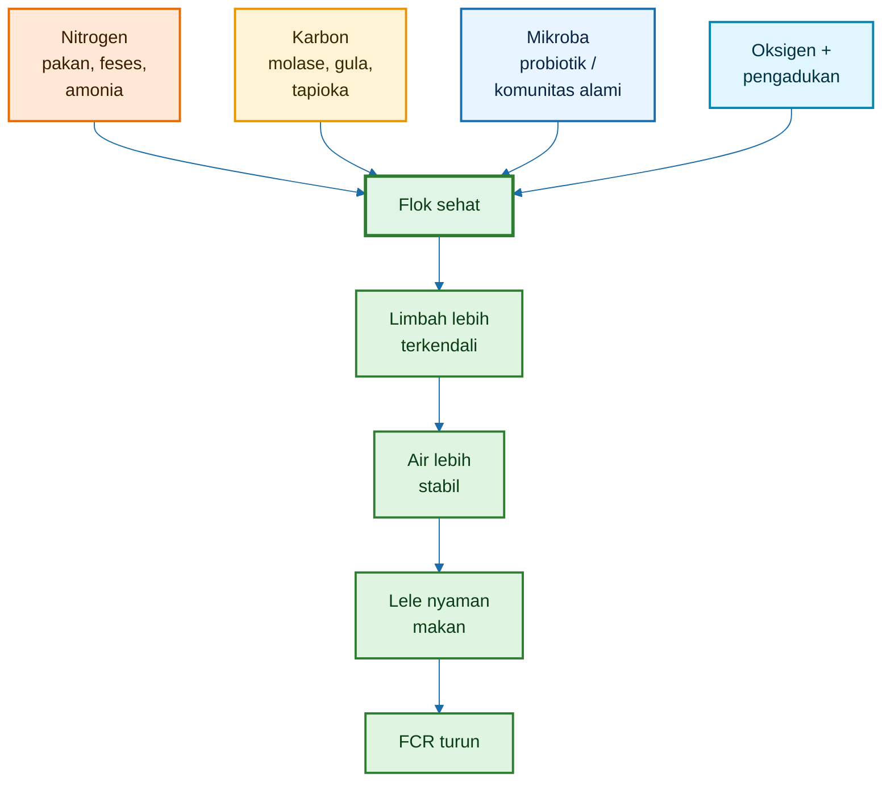
```mermaid
%%{init: {"theme": "base", "themeVariables": {
  "fontFamily": "Arial",
  "primaryColor": "#F7FBFF",
  "primaryTextColor": "#0B2545",
  "primaryBorderColor": "#1B6CA8",
  "lineColor": "#1B6CA8"
}}}%%
flowchart TD
    A["Nitrogen<br/>pakan, feses,<br/>amonia"] --> E["Flok sehat"]
    B["Karbon<br/>molase, gula,<br/>tapioka"] --> E
    C["Mikroba<br/>probiotik /<br/>komunitas alami"] --> E
    D["Oksigen +<br/>pengadukan"] --> E

    E --> F["Limbah lebih<br/>terkendali"]
    F --> G["Air lebih<br/>stabil"]
    G --> H["Lele nyaman<br/>makan"]
    H --> I["FCR turun"]

    classDef n fill:#FFE8D6,stroke:#E66A00,color:#3A1D00,stroke-width:2px;
    classDef c fill:#FFF3D6,stroke:#E69500,color:#3A2A00,stroke-width:2px;
    classDef micro fill:#E8F4FF,stroke:#1B6CA8,color:#0B2545,stroke-width:2px;
    classDef oxy fill:#E1F5FF,stroke:#0086B3,color:#003344,stroke-width:2px;
    classDef floc fill:#E1F5E6,stroke:#2E7D32,color:#0B3D16,stroke-width:3px;
    classDef result fill:#DFF5E1,stroke:#2E7D32,color:#0B3D16,stroke-width:2px;

    class A n;
    class B c;
    class C micro;
    class D oxy;
    class E floc;
    class F,G,H,I result;
```

Diagram ini menunjukkan bahwa bioflok bukan hasil dari satu tindakan. Bioflok adalah hasil keseimbangan antara nitrogen, karbon, mikroba, oksigen, dan pengadukan.

---

## 6.2 Persamaan Sederhana Bioflok

Secara sederhana, proses pembentukan bioflok dapat ditulis sebagai:

$$
\text{Karbon} + \text{Amonia} + \text{Oksigen}
\rightarrow
\text{Biomassa mikroba/flok} + CO_2 + H_2O
$$

Persamaan ini bukan persamaan kimia lengkap untuk semua kondisi kolam. Ini adalah model sederhana untuk membantu praktisi memahami prinsip kerja bioflok.

Maknanya:

- amonia tidak hilang begitu saja;
- amonia diikat menjadi biomassa mikroba;
- karbon dibutuhkan sebagai sumber energi;
- oksigen dibutuhkan agar proses berlangsung secara aerob;
- hasil akhirnya adalah flok, karbon dioksida, dan air.

Dengan kata lain, bioflok mengarahkan limbah nitrogen agar masuk ke biomassa mikroba, bukan menumpuk sebagai racun.

---

### 6.2.1 Model Biomassa Mikroba

Dalam literatur teknik lingkungan, biomassa bakteri sering disederhanakan dengan rumus empiris:

$$
C_5H_7NO_2
$$

Maka salah satu gambaran sederhana proses asimilasi nitrogen oleh mikroba adalah:

$$
\text{Karbohidrat} + NH_3 + O_2
\rightarrow
C_5H_7NO_2 + CO_2 + H_2O
$$

Keterangan:

- $NH_3$ = amonia;
- $O_2$ = oksigen;
- $C_5H_7NO_2$ = biomassa mikroba;
- $CO_2$ = karbon dioksida;
- $H_2O$ = air.

Intinya, amonia dapat menjadi bagian dari biomassa mikroba jika tersedia karbon dan oksigen.

---

### 6.2.2 Perbedaan Jalur Sehat dan Jalur Busuk

Jika karbon, nitrogen, mikroba, dan oksigen seimbang, jalurnya menjadi positif:

$$
\text{Amonia} + \text{Karbon} + \text{Oksigen}
\rightarrow
\text{Flok sehat}
$$

Jika karbon dan bahan organik tinggi tetapi oksigen kurang, jalurnya berubah menjadi negatif:

$$
\text{Bahan organik berlebih} - \text{Oksigen}
\rightarrow
\text{Pembusukan anaerob} + \text{bau} + \text{racun}
$$

Maka, dua kolam bisa sama-sama keruh, tetapi hasilnya berbeda.

| Kondisi       | Proses dominan            | Dampak                           |
| ------------- | ------------------------- | -------------------------------- |
| Keruh aerob   | Mikroba aktif, flok sehat | Air stabil, FCR berpotensi turun |
| Keruh anaerob | Pembusukan bahan organik  | Bau busuk, ikan stres, FCR naik  |

---

## 6.3 Implikasi Praktis

Konsep karbon, nitrogen, mikroba, dan oksigen harus diterjemahkan menjadi keputusan lapangan. Bioflok bukan teori laboratorium semata. Kesalahan kecil dalam membaca kondisi kolam bisa berdampak langsung pada pakan, pertumbuhan, dan kematian ikan.

---

### 6.3.1 Tanpa Karbon, Mikroba Kekurangan Bahan Bakar

Jika pakan tinggi protein masuk ke kolam, nitrogen juga masuk. Mikroba membutuhkan karbon untuk mengikat nitrogen menjadi biomassa.

Jika karbon kurang:

- amonia lebih mudah naik;
- nitrit bisa meningkat;
- flok sulit terbentuk;
- air tampak “kosong” atau tidak matang;
- ikan mudah stres;
- FCR memburuk.

Namun, ini bukan berarti karbon harus diberikan sebanyak-banyaknya. Karbon harus diberikan sesuai kebutuhan sistem.

---

### 6.3.2 Tanpa Oksigen, Flok Menjadi Busuk

Oksigen adalah pembatas utama dalam bioflok.

Jika molase ditambah, mikroba berkembang. Jika mikroba berkembang, kebutuhan oksigen naik. Jika blower tidak cukup, oksigen turun.

Urutannya sering seperti ini:

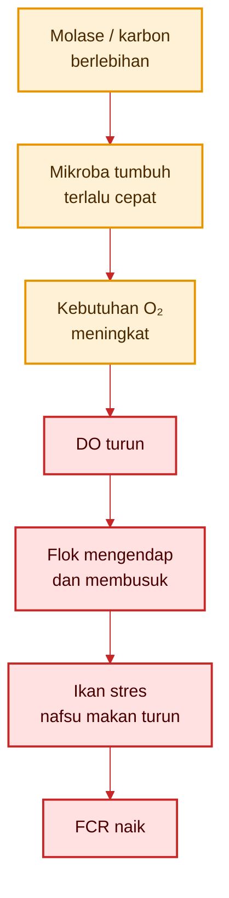
```mermaid
%%{init: {"theme": "base", "themeVariables": {
  "fontFamily": "Arial",
  "primaryColor": "#FFF7F7",
  "primaryTextColor": "#3A0000",
  "primaryBorderColor": "#C62828",
  "lineColor": "#C62828"
}}}%%
flowchart TD
    A["Molase / karbon<br/>berlebihan"] --> B["Mikroba tumbuh<br/>terlalu cepat"]
    B --> C["Kebutuhan O₂<br/>meningkat"]
    C --> D["DO turun"]
    D --> E["Flok mengendap<br/>dan membusuk"]
    E --> F["Ikan stres<br/>nafsu makan turun"]
    F --> G["FCR naik"]

    classDef warn fill:#FFF1D6,stroke:#E69500,color:#4A2A00,stroke-width:2px;
    classDef bad fill:#FFE1E1,stroke:#C62828,color:#4A0000,stroke-width:2px;

    class A,B,C warn;
    class D,E,F,G bad;
```

Ini sebabnya pemberian karbon harus selalu diikuti dengan pertanyaan:

> Apakah aerasi cukup untuk menanggung tambahan aktivitas mikroba?

Jika jawabannya tidak, jangan tambah molase.

---

### 6.3.3 Tanpa Pengadukan, Flok Mengendap

Flok harus tetap tersuspensi. Flok yang melayang dapat berperan sebagai bagian dari sistem pengolah limbah. Flok yang mengendap terlalu lama di dasar dapat berubah menjadi lumpur organik.

Jika pengadukan kurang:

- flok mengumpul di dasar;
- sisa pakan dan feses ikut mengendap;
- dasar menjadi hitam;
- muncul bau busuk;
- gas berbahaya bisa terbentuk;
- ikan menggantung;
- FCR naik.

Karena itu, sistem bioflok membutuhkan aerasi, airlift, atau sirkulasi yang cukup.

Targetnya bukan membuat arus deras, tetapi membuat air bergerak cukup agar:

- oksigen merata;
- flok tetap melayang;
- zona mati berkurang;
- padatan berat bisa diarahkan ke titik sifon.

---

### 6.3.4 Tanpa Pembuangan Padatan, Kolam Menjadi Anaerob

Bioflok bukan berarti semua padatan dibiarkan. Ini kesalahan besar di lapangan.

Ada dua jenis padatan yang harus dibedakan:

| Jenis padatan | Posisi                | Status             |
| ------------- | --------------------- | ------------------ |
| Flok aktif    | Melayang di kolom air | Bermanfaat         |
| Endapan berat | Mengumpul di dasar    | Harus dikendalikan |

Flok aktif membantu sistem. Endapan berat bisa menjadi masalah.

Yang perlu dibuang secara berkala:

- lumpur hitam;
- sisa pakan;
- feses berat;
- flok tua yang mengendap;
- padatan berbau busuk.

Jika padatan tidak dibuang, kolam menjadi terlalu berat. Mikroba tetap bekerja, tetapi kebutuhan oksigennya makin besar. Ketika oksigen tidak cukup, dasar kolam berubah anaerob.

---

### 6.3.5 Ringkasan Mesin Bioflok

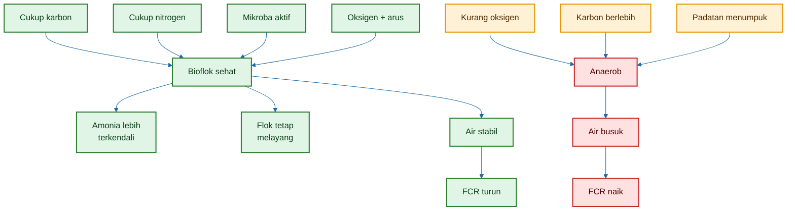
```mermaid
%%{init: {"theme": "base", "themeVariables": {
  "fontFamily": "Arial",
  "primaryColor": "#F7FBFF",
  "primaryTextColor": "#0B2545",
  "primaryBorderColor": "#1B6CA8",
  "lineColor": "#1B6CA8"
}}}%%
flowchart TD
    A["Cukup karbon"] --> E["Bioflok sehat"]
    B["Cukup nitrogen"] --> E
    C["Mikroba aktif"] --> E
    D["Oksigen + arus"] --> E

    E --> F["Amonia lebih<br/>terkendali"]
    E --> G["Flok tetap<br/>melayang"]
    E --> H["Air stabil"]
    H --> I["FCR turun"]

    J["Kurang oksigen"] --> K["Anaerob"]
    L["Karbon berlebih"] --> K
    M["Padatan menumpuk"] --> K
    K --> N["Air busuk"]
    N --> O["FCR naik"]

    classDef good fill:#E1F5E6,stroke:#2E7D32,color:#0B3D16,stroke-width:2px;
    classDef process fill:#E8F4FF,stroke:#1B6CA8,color:#0B2545,stroke-width:2px;
    classDef bad fill:#FFE1E1,stroke:#C62828,color:#4A0000,stroke-width:2px;
    classDef warn fill:#FFF1D6,stroke:#E69500,color:#4A2A00,stroke-width:2px;

    class A,B,C,D,E,F,G,H,I good;
    class J,L,M warn;
    class K,N,O bad;
```

Kalimat kunci bab ini:

> Bioflok adalah mesin biologis. Nitrogen adalah bahan bakunya, karbon adalah bahan bakarnya, mikroba adalah pekerjanya, dan oksigen adalah nyawanya.

[**Kembali ke Atas**](#kolam-lele-sebagai-bioreaktor-penurun-fcr-berbasis-bioflok)

---

# 7. Neraca C/N: Mengapa Rasio Karbon-Nitrogen Penting?

Rasio C/N adalah salah satu konsep paling penting dalam bioflok.

C/N berarti **perbandingan karbon terhadap nitrogen**. Dalam sistem bioflok, rasio ini menentukan apakah mikroba memiliki cukup karbon untuk memanfaatkan nitrogen limbah.

Jika nitrogen tinggi tetapi karbon kurang, amonia bisa naik. Jika karbon terlalu tinggi tetapi oksigen tidak cukup, air bisa menjadi berat dan busuk.

Maka C/N bukan angka hiasan. C/N adalah alat untuk membaca keseimbangan antara:

- pakan;
- protein;
- limbah nitrogen;
- sumber karbon;
- mikroba;
- oksigen.

Dalam praktik, perhitungan C/N tidak harus sempurna seperti laboratorium. Namun pembudidaya perlu memahami logikanya agar tidak memberi molase secara asal.

---

## 7.1 Nitrogen Berasal dari Protein Pakan

Protein pakan adalah sumber utama nitrogen dalam kolam.

Secara umum, protein mengandung sekitar 16% nitrogen. Karena itu digunakan faktor konversi:

$$
\frac{100}{16} = 6{,}25
$$

Maka nitrogen dari pakan dapat dihitung dengan persamaan:

$$
N_{pakan} = F \times \frac{CP}{6{,}25}
$$

Keterangan:

- $N_{\text{pakan}}$ = nitrogen dari pakan;
- $F$ = jumlah pakan;
- $CP$ = kadar protein kasar pakan dalam bentuk desimal;
- $6{,}25$ = faktor konversi protein menjadi nitrogen.

Jika protein pakan 32%, maka:

$$
CP = 0{,}32
$$

Jika pakan yang diberikan 1 kg, maka:

$$
F = 1 \text{ kg}
$$

---

## 7.2 Contoh Sederhana

Jika pakan 1 kg dengan protein 32%, maka:

$$
N_{pakan} = 1 \times \frac{0{,}32}{6{,}25}
$$

$$
N_{pakan} = 0{,}0512 \text{ kg N}
$$

Karena:

$$
0{,}0512 \text{ kg} = 51{,}2 \text{ gram}
$$

Maka, 1 kg pakan protein 32% membawa sekitar:

$$
51{,}2 \text{ gram nitrogen}
$$

Artinya, setiap kali pembudidaya memberi 1 kg pakan protein 32%, ia sebenarnya sedang memasukkan sekitar 51,2 gram nitrogen ke dalam sistem kolam.

Sebagian nitrogen menjadi daging ikan. Sebagian lain menjadi limbah.

Jika diasumsikan retensi nitrogen ikan sebesar \(R_N\), maka nitrogen limbah dapat diperkirakan:

$$
N_{limbah} = N_{pakan} \times (1 - R_N)
$$

Misalnya retensi nitrogen 30%:

$$
R_N = 0{,}30
$$

Maka:

$$
N_{limbah} = 51{,}2 \times (1 - 0{,}30)
$$

$$
N_{limbah} = 35{,}84 \text{ gram N}
$$

Artinya, dari 1 kg pakan protein 32%, sekitar 35,84 gram nitrogen bisa menjadi beban limbah jika tidak dimanfaatkan oleh sistem.

Angka retensi ini hanya pendekatan. Nilai riil dipengaruhi oleh kualitas pakan, ukuran ikan, kesehatan ikan, suhu, oksigen, dan manajemen pemberian pakan.

---

## 7.3 Rumus Kebutuhan Karbon

Secara sederhana, rasio karbon:nitrogen dapat ditulis sebagai:

$$
C/N = \frac{C_{pakan} + C_{tambahan}}{N_{pakan}}
$$

Keterangan:

- $C/N$ = rasio karbon terhadap nitrogen;
- $C_{\text{pakan}}$ = karbon dari pakan;
- $C_{\text{tambahan}}$ = karbon tambahan dari molase, gula, tapioka, atau bahan lain;
- $N_{\text{pakan}}$ = nitrogen dari pakan.

Jika target C/N ditetapkan sebagai \(R\), maka kebutuhan sumber karbon dapat dihitung dengan:

$$
M = \frac{(R \times N_{pakan}) - C_{pakan}}{C_s}
$$

Keterangan:

- $M$ = kebutuhan sumber karbon;
- $R$ = target C/N;
- $N_{\text{pakan}}$ = nitrogen dari pakan;
- $C_{\text{pakan}}$ = karbon dari pakan;
- $C_s$ = fraksi karbon dalam sumber karbon.

Contoh fraksi karbon pendekatan:

| Bahan        | Fraksi karbon pendekatan |
| ------------ | -----------------------: |
| Molase       |                0,35–0,37 |
| Gula         |                     0,42 |
| Tapioka/pati |                0,40–0,44 |
| Pakan ikan   |                0,40–0,48 |

Angka ini adalah pendekatan praktis. Komposisi aktual bisa berbeda tergantung bahan.

---

### 7.3.1 Contoh Hitung Molase per 1 kg Pakan

Asumsi:

- pakan = 1 kg;
- protein pakan = 32%;
- karbon pakan = 45%;
- molase mengandung karbon 36%;
- target C/N = 15.

Langkah 1: hitung nitrogen pakan.

$$
N_{pakan} = 1 \times \frac{0{,}32}{6{,}25}
$$

$$
N_{pakan} = 0{,}0512 \text{ kg N}
$$

Langkah 2: hitung karbon dari pakan.

$$
C_{pakan} = 1 \times 0{,}45
$$

$$
C_{pakan} = 0{,}45 \text{ kg C}
$$

Langkah 3: hitung karbon target.

$$
C_{target} = R \times N_{pakan}
$$

$$
C_{target} = 15 \times 0{,}0512
$$

$$
C_{target} = 0{,}768 \text{ kg C}
$$

Langkah 4: hitung tambahan karbon yang dibutuhkan.

$$
C_{tambahan} = C_{target} - C_{pakan}
$$

$$
C_{tambahan} = 0{,}768 - 0{,}45
$$

$$
C_{tambahan} = 0{,}318 \text{ kg C}
$$

Langkah 5: hitung kebutuhan molase.

$$
M = \frac{0{,}318}{0{,}36}
$$

$$
M = 0{,}883 \text{ kg molase}
$$

Maka, secara matematis, untuk 1 kg pakan protein 32% dengan target C/N 15, kebutuhan molase bisa mendekati:

$$
0{,}88 \text{ kg molase per kg pakan}
$$

Ini angka besar. Karena itu pembudidaya perlu memahami bahwa target C/N tinggi memerlukan kapasitas oksigen dan pengelolaan padatan yang kuat.

---

### 7.3.2 Simulasi Molase untuk Beberapa Target C/N

Asumsi sama:

- pakan = 1 kg;
- protein pakan = 32%;
- karbon pakan = 45%;
- molase = 36% karbon.

| Target C/N | Kebutuhan molase pendekatan |
| ---------: | --------------------------: |
|       10:1 |     0,17 kg molase/kg pakan |
|       12:1 |     0,46 kg molase/kg pakan |
|       15:1 |     0,88 kg molase/kg pakan |
|       20:1 |     1,59 kg molase/kg pakan |

Tabel ini menjelaskan sesuatu yang penting:

> Dosis molase 10–20% dari pakan belum tentu mencapai C/N heterotrof penuh.

Jika pakan 1 kg, molase 10–20% berarti hanya 0,1–0,2 kg molase. Secara matematis, itu mungkin belum cukup untuk mengejar C/N 15, tergantung komposisi pakan dan molase.

Namun di lapangan, sistem lele sering tidak murni heterotrof. Sistem biasanya campuran antara:

- asimilasi heterotrof;
- nitrifikasi;
- alga;
- pengenceran/pembuangan padatan;
- konsumsi flok oleh ikan;
- pengendapan dan sifon.

Karena itu, dosis molase lapangan tidak boleh hanya mengejar angka C/N tinggi. Dosis harus menyesuaikan oksigen, flok, bau air, pH, amonia, nitrit, dan respons ikan.

---

## 7.4 Koreksi Penting

Dosis molase 10–20% dari pakan sering dipakai sebagai patokan lapangan. Patokan ini berguna sebagai awal yang aman, tetapi tidak boleh dianggap sebagai rumus baku untuk mencapai C/N ideal.

Ada tiga koreksi penting.

---

### 7.4.1 C/N Teoretis Berbeda dari C/N Efektif

Tidak semua karbon dalam pakan langsung tersedia untuk mikroba. Sebagian karbon sudah masuk ke tubuh ikan, sebagian menjadi feses, sebagian larut, dan sebagian terendap.

Maka, rumus C/N adalah pendekatan neraca input. Ia membantu memahami arah sistem, tetapi bukan angka absolut yang selalu sama di kolam.

Karena itu, dosis karbon harus dikoreksi dengan pengamatan lapangan.

---

### 7.4.2 Molase Tinggi Menuntut Oksigen Tinggi

Ketika molase ditambahkan, mikroba akan memakai molase sebagai energi. Aktivitas mikroba meningkat, dan kebutuhan oksigen naik.

Jika blower kurang, molase tinggi justru berbahaya.

Urutannya:

$$
\text{Molase naik}
\rightarrow
\text{Mikroba naik}
\rightarrow
\text{Kebutuhan } O_2 \text{ naik}
\rightarrow
\text{DO bisa turun}
$$

Maka, target C/N tinggi hanya aman jika sistem memiliki aerasi dan pengadukan yang kuat.

---

### 7.4.3 Lele Tidak Perlu Flok Berlebihan

Lele tidak seefisien nila dalam memanen flok tersuspensi. Karena itu, mengejar flok terlalu tebal tidak selalu menguntungkan.

Flok terlalu banyak dapat menyebabkan:

- air berat;
- oksigen boros;
- insang terganggu;
- endapan meningkat;
- busa tebal;
- FCR naik.

Untuk lele, target terbaik biasanya bukan bioflok sebanyak mungkin, tetapi:

> Bioflok moderat, aktif, aerob, dan tidak busuk.

---

## 7.5 Implikasi Lapangan

Rasio C/N harus diterjemahkan menjadi keputusan operasional.

---

### 7.5.1 Jika C/N Terlalu Rendah

C/N terlalu rendah berarti nitrogen relatif lebih banyak dibanding karbon yang tersedia untuk mikroba heterotrof.

Dampaknya:

- amonia lebih mudah naik;
- nitrit bisa meningkat;
- flok sulit terbentuk;
- air tidak stabil;
- ikan stres;
- FCR naik.

Tindakan koreksi:

- kurangi pakan sementara jika ikan tidak responsif;
- tambah sumber karbon sedikit demi sedikit;
- tambah aerasi;
- cek pH dan alkalinitas;
- gunakan probiotik/starter bila sistem belum matang;
- jangan menambah karbon besar sekaligus.

---

### 7.5.2 Jika C/N Terlalu Tinggi

C/N terlalu tinggi berarti karbon terlalu banyak dibanding kapasitas sistem.

Dampaknya:

- bakteri tumbuh berlebihan;
- DO turun;
- busa tebal;
- air terasa berat;
- flok terlalu pekat;
- endapan meningkat;
- ikan menggantung;
- FCR naik.

Tindakan koreksi:

- hentikan molase sementara;
- tambah aerasi;
- sifon endapan;
- kurangi pakan sementara bila ikan stres;
- buang sebagian air bawah jika perlu;
- mulai kembali dengan dosis karbon lebih rendah.

---

### 7.5.3 Target C/N untuk Lele

Untuk lele, pendekatan paling aman adalah bertahap.

| Level operator | Target pendekatan | Catatan                                            |
| -------------- | ----------------: | -------------------------------------------------- |
| Pemula         |         C/N 10–12 | Lebih aman, risiko air berat lebih rendah          |
| Menengah       |         C/N 12–15 | Butuh aerasi dan pemantauan lebih baik             |
| Mahir          |         C/N 15–20 | Hanya jika DO, padatan, dan flok sangat terkontrol |

Untuk praktik usaha, saya lebih menyarankan:

> Mulai dari C/N moderat, bukan langsung mengejar C/N tinggi.

Sebab tujuan akhirnya bukan angka C/N, tetapi FCR rendah, survival tinggi, dan pertumbuhan seragam.

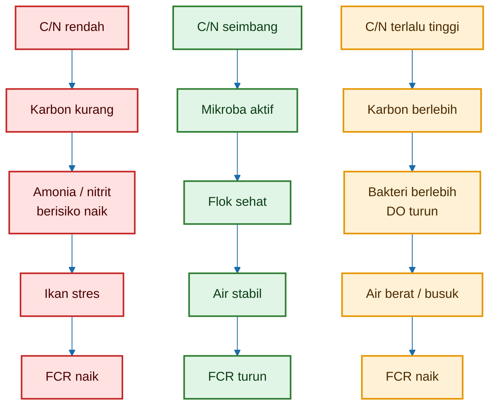
```mermaid
%%{init: {"theme": "base", "themeVariables": {
  "fontFamily": "Arial",
  "primaryColor": "#F7FBFF",
  "primaryTextColor": "#0B2545",
  "primaryBorderColor": "#1B6CA8",
  "lineColor": "#1B6CA8"
}}}%%
flowchart TD
    A["C/N rendah"] --> B["Karbon kurang"]
    B --> C["Amonia / nitrit<br/>berisiko naik"]
    C --> D["Ikan stres"]
    D --> E["FCR naik"]

    F["C/N seimbang"] --> G["Mikroba aktif"]
    G --> H["Flok sehat"]
    H --> I["Air stabil"]
    I --> J["FCR turun"]

    K["C/N terlalu tinggi"] --> L["Karbon berlebih"]
    L --> M["Bakteri berlebih<br/>DO turun"]
    M --> N["Air berat / busuk"]
    N --> O["FCR naik"]

    classDef bad fill:#FFE1E1,stroke:#C62828,color:#4A0000,stroke-width:2px;
    classDef good fill:#E1F5E6,stroke:#2E7D32,color:#0B3D16,stroke-width:2px;
    classDef warn fill:#FFF1D6,stroke:#E69500,color:#4A2A00,stroke-width:2px;

    class A,B,C,D,E bad;
    class F,G,H,I,J good;
    class K,L,M,N,O warn;
```

Kalimat kunci bab ini:

> C/N mengatur arah pertumbuhan mikroba. C/N terlalu rendah membuat nitrogen menjadi masalah. C/N terlalu tinggi membuat karbon menjadi beban. Untuk lele, targetnya adalah bioflok moderat yang sehat, bukan flok sebanyak-banyaknya.

[**Kembali ke Atas**](#kolam-lele-sebagai-bioreaktor-penurun-fcr-berbasis-bioflok)

---

# 8. Oksigen: Faktor Penentu Flok Sehat atau Busuk

Dalam bioflok, oksigen adalah faktor penentu hidup-matinya sistem. Bioflok yang cukup oksigen menjadi mesin biologis pengolah limbah. Bioflok yang kekurangan oksigen berubah menjadi beban organik yang membusuk.

Karena itu, dalam budidaya lele bioflok, aerasi bukan aksesori. Aerasi adalah infrastruktur utama.

Pakan bisa bagus. Probiotik bisa mahal. Molase bisa cukup. Namun jika oksigen kurang, sistem tetap gagal.

Kalimat paling penting untuk bab ini:

> Bioflok yang sehat adalah bioflok aerob. Tanpa oksigen, bioflok berubah menjadi kolam busuk.

---

## 8.1 Mengapa Oksigen Sangat Penting?

Dalam kolam lele biasa, oksigen dibutuhkan oleh ikan. Dalam kolam bioflok, oksigen dibutuhkan oleh lebih banyak komponen.

Yang menggunakan oksigen antara lain:

- lele;
- bakteri heterotrof;
- bakteri nitrifikasi;
- protozoa;
- organisme kecil dalam flok;
- alga pada malam hari;
- bahan organik yang sedang diurai;
- lumpur dan padatan di dasar.

Artinya, semakin aktif bioflok, semakin besar kebutuhan oksigen.

Ini sering tidak disadari. Pembudidaya melihat air sudah berflok, lalu merasa sistem sudah kuat. Padahal semakin banyak flok dan bahan organik, semakin besar pula kebutuhan oksigen.

---

### 8.1.1 Oksigen untuk Ikan

Lele memang terkenal tahan terhadap kondisi ekstrem, tetapi tahan bukan berarti optimal.

Lele yang hidup pada oksigen rendah mungkin masih hidup, tetapi:

- nafsu makan turun;
- metabolisme terganggu;
- pertumbuhan melambat;
- daya tahan tubuh menurun;
- FCR naik.

Dalam bisnis budidaya, targetnya bukan sekadar ikan hidup. Targetnya ikan tumbuh cepat, sehat, dan efisien pakan.

---

### 8.1.2 Oksigen untuk Mikroba

Mikroba dalam bioflok membutuhkan oksigen untuk mengolah bahan organik dan nitrogen.

Jika oksigen cukup:

$$
\text{Bahan organik} + O_2
\rightarrow
CO_2 + H_2O + \text{biomassa mikroba}
$$

Jika oksigen kurang:

$$
\text{Bahan organik}
\rightarrow
\text{pembusukan anaerob} + \text{bau} + \text{senyawa berbahaya}
$$

Inilah perbedaan antara kolam bioflok sehat dan kolam busuk.

---

### 8.1.3 Oksigen untuk Nitrifikasi

Selain jalur heterotrof, kolam juga dapat mengalami nitrifikasi, yaitu proses perubahan amonia menjadi nitrit lalu nitrat oleh bakteri nitrifikasi.

Secara sederhana:

$$
NH_4^+ + 2O_2
\rightarrow
NO_3^- + 2H^+ + H_2O
$$

Dari stoikiometri, setiap 1 gram amonia-nitrogen yang teroksidasi menjadi nitrat membutuhkan sekitar:

$$
4{,}57 \text{ gram } O_2
$$

Artinya, semakin besar beban amonia, semakin besar juga kebutuhan oksigen untuk mengolahnya.

Nitrifikasi juga menghasilkan ion \(H^+\), sehingga dapat menurunkan pH. Karena itu, sistem bioflok sering membutuhkan perhatian pada alkalinitas atau buffer.

---

## 8.2 Persamaan Kebutuhan Oksigen Total

Kebutuhan oksigen dalam kolam bioflok dapat diringkas sebagai:

$$
O_{2,total}
=
O_{2,ikan}
+
O_{2,mikroba}
+
O_{2,nitrifikasi}
+
O_{2,bahan\ organik}
$$

Keterangan:

- $O_{2,\text{total}}$ = total kebutuhan oksigen;
- $O_{2,\text{ikan}}$ = oksigen untuk respirasi lele;
- $O_{2,\text{mikroba}}$ = oksigen untuk bakteri dan organisme flok;
- $O_{2,\text{nitrifikasi}}$ = oksigen untuk proses nitrifikasi;
- $O_{2,\text{bahan organik}}$ = oksigen untuk penguraian sisa organik.

Persamaan ini penting karena menunjukkan bahwa kebutuhan oksigen tidak hanya dihitung dari jumlah ikan. Dalam bioflok, jumlah pakan, jumlah flok, jumlah molase, dan jumlah padatan juga menentukan kebutuhan oksigen.

---

### 8.2.1 Oksigen untuk Oksidasi Karbon

Jika sumber karbon berupa gula sederhana, reaksi oksidasi lengkapnya dapat disederhanakan sebagai:

$$
C_6H_{12}O_6 + 6O_2
\rightarrow
6CO_2 + 6H_2O
$$

Massa molekul:

- glukosa \(C*6H*{12}O_6\) = 180;
- oksigen \(6O_2\) = 192.

Maka:

$$
\frac{192}{180} = 1{,}07
$$

Artinya, 1 gram gula yang teroksidasi penuh dapat membutuhkan sekitar:

$$
1{,}07 \text{ gram } O_2
$$

Ini menjelaskan mengapa pemberian molase/gula berlebihan bisa berbahaya. Karbon memang membantu mikroba, tetapi juga meningkatkan konsumsi oksigen.

---

### 8.2.2 Oksigen untuk Nitrifikasi

Reaksi nitrifikasi sederhana:

$$
NH_4^+ + 2O_2
\rightarrow
NO_3^- + 2H^+ + H_2O
$$

Perbandingan massa:

- nitrogen dalam \(NH_4^+\) = 14;
- oksigen \(2O_2\) = 64.

Maka:

$$
\frac{64}{14} = 4{,}57
$$

Artinya:

$$
1 \text{ gram amonia-N}
\rightarrow
4{,}57 \text{ gram } O_2
$$

Jadi, jika kolam memiliki beban amonia-N sebesar 10 gram yang diproses melalui nitrifikasi, kebutuhan oksigennya sekitar:

$$
10 \times 4{,}57 = 45{,}7 \text{ gram } O_2
$$

---

## 8.3 Cadangan Oksigen dalam Kolam Sangat Kecil

Banyak pembudidaya mengira air kolam menyimpan oksigen dalam jumlah besar. Padahal cadangan oksigen terlarut dalam air sangat kecil.

Cadangan oksigen terlarut dapat dihitung:

$$
O_{2,tersimpan} = V \times DO
$$

Keterangan:

- $O_{2,\text{tersimpan}}$ = oksigen terlarut di dalam kolam, gram;
- $V$ = volume air, m³;
- $DO$ = dissolved oxygen, mg/L.

Mengapa rumus ini langsung menghasilkan gram?

Karena:

$$
1 \text{ mg/L dalam } 1 \text{ m}^3 = 1 \text{ gram}
$$

---

### 8.3.1 Contoh Hitung

Kolam 10 m³ dengan DO 5 mg/L.

$$
O_2 = 10 \times 5
$$

$$
O_2 = 50 \text{ gram}
$$

Artinya, seluruh air kolam hanya menyimpan sekitar **50 gram oksigen terlarut**.

Ini sangat kecil jika dibandingkan kebutuhan ikan, mikroba, dan bahan organik dalam kolam bioflok padat tebar.

Jika sistem mengonsumsi oksigen lebih cepat daripada oksigen yang masuk dari aerasi, DO akan turun. Jika DO turun, ikan stres dan flok mulai rusak.

---

### 8.3.2 Mengapa Aerasi Harus Terus-Menerus?

Karena cadangan oksigen dalam air kecil, kolam bioflok tidak bisa mengandalkan oksigen yang sudah tersimpan di air. Sistem harus terus menerima oksigen baru.

Tanpa aerasi, risiko terbesar terjadi pada:

- malam hari;
- menjelang subuh;
- setelah pemberian molase;
- setelah pemberian pakan tinggi;
- saat flok terlalu pekat;
- saat cuaca mendung panjang;
- saat biomassa ikan sudah tinggi.

Pada malam hari, alga tidak berfotosintesis. Sebaliknya, alga juga ikut memakai oksigen. Karena itu DO sering mencapai titik terendah pada dini hari.

---

### 8.3.3 Ilustrasi Cadangan Oksigen

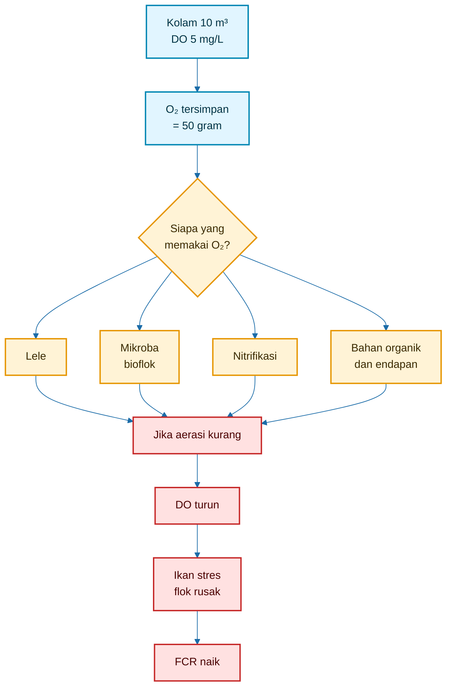
```mermaid
%%{init: {"theme": "base", "themeVariables": {
  "fontFamily": "Arial",
  "primaryColor": "#F7FBFF",
  "primaryTextColor": "#0B2545",
  "primaryBorderColor": "#1B6CA8",
  "lineColor": "#1B6CA8"
}}}%%
flowchart TD
    A["Kolam 10 m³<br/>DO 5 mg/L"] --> B["O₂ tersimpan<br/>= 50 gram"]
    B --> C{"Siapa yang<br/>memakai O₂?"}

    C --> D["Lele"]
    C --> E["Mikroba<br/>bioflok"]
    C --> F["Nitrifikasi"]
    C --> G["Bahan organik<br/>dan endapan"]

    D --> H["Jika aerasi kurang"]
    E --> H
    F --> H
    G --> H

    H --> I["DO turun"]
    I --> J["Ikan stres<br/>flok rusak"]
    J --> K["FCR naik"]

    classDef water fill:#E1F5FF,stroke:#0086B3,color:#003344,stroke-width:2px;
    classDef user fill:#FFF3D6,stroke:#E69500,color:#3A2A00,stroke-width:2px;
    classDef bad fill:#FFE1E1,stroke:#C62828,color:#4A0000,stroke-width:2px;

    class A,B water;
    class C,D,E,F,G user;
    class H,I,J,K bad;
```

Diagram ini menunjukkan mengapa bioflok sangat tergantung pada aerasi. Cadangan oksigen kecil, sedangkan pemakainya banyak.

---

## 8.4 Koreksi Praktis

Bioflok bukan hanya soal menambah probiotik dan molase. Bioflok adalah sistem yang harus ditopang oksigen terus-menerus.

Kalimat ini harus menjadi prinsip utama:

> Jika karbon adalah bahan bakar mikroba, maka oksigen adalah rem pengaman agar bahan bakar itu tidak berubah menjadi pembusukan.

---

### 8.4.1 Jangan Menambah Molase Saat Oksigen Tidak Aman

Molase sebaiknya tidak ditambah ketika:

- ikan menggantung;
- air bau busuk;
- busa tebal menetap;
- DO rendah;
- aerasi lemah;
- blower bermasalah;
- flok sudah terlalu pekat;
- endapan dasar belum dibuang.

Pada kondisi seperti itu, menambah molase sama saja dengan menambah beban oksigen.

Tindakan yang lebih tepat:

1. hentikan molase sementara;
2. tambah aerasi;
3. kurangi pakan sementara;
4. sifon endapan;
5. cek respons ikan;
6. baru mulai lagi karbon dengan dosis kecil bila sistem stabil.

---

### 8.4.2 Ukur DO pada Waktu yang Tepat

Jika hanya mengukur DO siang hari, pembudidaya bisa tertipu. Siang hari DO bisa tinggi karena fotosintesis alga. Tetapi pada malam hingga subuh, DO bisa turun tajam.

Waktu pengukuran DO yang paling penting:

- menjelang subuh;
- pagi sebelum pemberian pakan;
- setelah molase diberikan;
- saat biomassa ikan sudah tinggi;
- saat cuaca mendung panjang;
- saat ikan mulai menggantung.

DO pagi lebih jujur menggambarkan ketahanan sistem.

---

### 8.4.3 Target Praktis DO

Untuk bioflok lele, target praktis:

| Kondisi DO | Interpretasi                      |
| ---------- | --------------------------------- |
| > 5 mg/L   | Aman dan ideal                    |
| 4–5 mg/L   | Masih baik                        |
| 3–4 mg/L   | Waspada, jangan tambah beban      |
| < 3 mg/L   | Bahaya, aerasi harus ditingkatkan |
| < 2 mg/L   | Risiko stres berat dan kematian   |

Lele memang bisa bertahan pada oksigen rendah, tetapi FCR tidak optimal. Target bisnis bukan sekadar ikan hidup, melainkan ikan tumbuh efisien.

---

### 8.4.4 Oksigen, FCR, dan Energi Ikan

Jika oksigen cukup:

$$
\text{Pakan}
\rightarrow
\text{Metabolisme normal}
\rightarrow
\text{Pertumbuhan}
\rightarrow
\text{FCR turun}
$$

Jika oksigen rendah:

$$
\text{Pakan}
\rightarrow
\text{Stres}
\rightarrow
\text{Nafsu makan turun}
\rightarrow
\text{Pertumbuhan lambat}
\rightarrow
\text{FCR naik}
$$

Oksigen rendah membuat pakan tidak efisien. Ikan mungkin masih makan, tetapi pertumbuhan tidak sebanding.

---

### 8.4.5 Hubungan Karbon, Oksigen, dan Flok

Hubungan tiga komponen ini dapat diringkas:

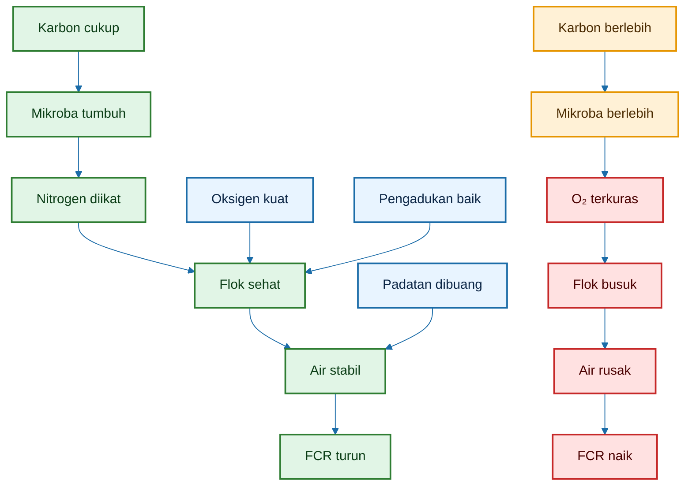
```mermaid
%%{init: {"theme": "base", "themeVariables": {
  "fontFamily": "Arial",
  "primaryColor": "#F7FBFF",
  "primaryTextColor": "#0B2545",
  "primaryBorderColor": "#1B6CA8",
  "lineColor": "#1B6CA8"
}}}%%
flowchart TD
    A["Karbon cukup"] --> B["Mikroba tumbuh"]
    B --> C["Nitrogen diikat"]
    C --> D["Flok sehat"]
    D --> E["Air stabil"]
    E --> F["FCR turun"]

    G["Karbon berlebih"] --> H["Mikroba berlebih"]
    H --> I["O₂ terkuras"]
    I --> J["Flok busuk"]
    J --> K["Air rusak"]
    K --> L["FCR naik"]

    M["Oksigen kuat"] --> D
    N["Pengadukan baik"] --> D
    O["Padatan dibuang"] --> E

    classDef good fill:#E1F5E6,stroke:#2E7D32,color:#0B3D16,stroke-width:2px;
    classDef bad fill:#FFE1E1,stroke:#C62828,color:#4A0000,stroke-width:2px;
    classDef support fill:#E8F4FF,stroke:#1B6CA8,color:#0B2545,stroke-width:2px;
    classDef warn fill:#FFF1D6,stroke:#E69500,color:#4A2A00,stroke-width:2px;

    class A,B,C,D,E,F good;
    class G,H warn;
    class I,J,K,L bad;
    class M,N,O support;
```

Diagram ini menegaskan bahwa karbon hanya bermanfaat jika oksigen dan pengadukan cukup.

---

## 8.5 Menghitung Kebutuhan Oksigen Total Kolam Bioflok

Setelah memahami bahwa cadangan oksigen terlarut di kolam sangat kecil, langkah berikutnya adalah menghitung **berapa oksigen yang benar-benar dibutuhkan sistem per hari**.

Dalam bioflok, oksigen tidak hanya dipakai oleh ikan. Oksigen juga dipakai untuk:

1. respirasi ikan;
2. perombakan nitrogen;
3. perombakan karbon;
4. aktivitas mikroba/flok;
5. penguraian bahan organik dari feses, sisa pakan, dan endapan;
6. kebutuhan cadangan keamanan.

Maka, kebutuhan oksigen total dapat ditulis sebagai:

$$
O_{2,\text{total}} = O_{2,\text{ikan}} + O_{2,N} + O_{2,C} + O_{2,\text{organik}} + O_{2,\text{flok/endapan}}
$$

Keterangan:

- $O_{2,\text{ikan}}$ = oksigen untuk respirasi ikan;
- $O_{2,N}$ = oksigen untuk proses nitrogen, terutama nitrifikasi;
- $O_{2,C}$ = oksigen untuk oksidasi karbon tambahan seperti molase/gula;
- $O_{2,\text{organik}}$ = oksigen untuk mengurai sisa organik dari pakan, feses, dan partikel;
- $O_{2,\text{flok/endapan}}$ = tambahan oksigen untuk komunitas flok, plankton malam hari, protozoa, dan endapan aktif.

Namun, perlu hati-hati agar tidak terjadi **double counting**.

Mikroba bukan komponen terpisah yang selalu ditambahkan lagi secara bebas. Mikroba adalah pelaku yang memakai oksigen untuk mengoksidasi karbon, nitrogen, dan bahan organik. Jadi, kebutuhan mikroba sebagian besar sudah tercermin dalam:

$$
O_{2,C} + O_{2,N} + O_{2,\text{organik}}
$$

Karena itu, $O_{2,\text{flok/endapan}}$ sebaiknya dipakai sebagai **faktor tambahan empiris**, bukan angka utama yang dihitung dua kali.

---

### 8.5.1 Diagram Neraca Oksigen Bioflok

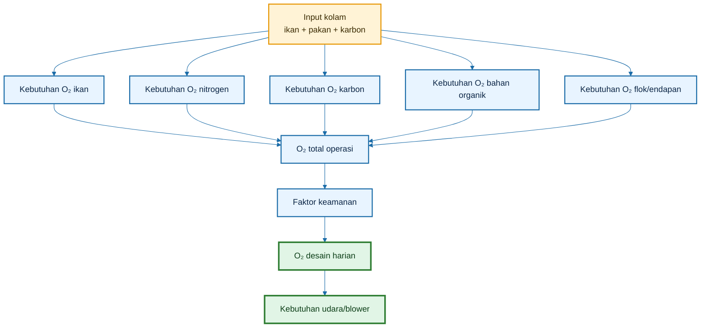
```mermaid
%%{init: {"theme": "base", "themeVariables": {
  "fontFamily": "Arial",
  "primaryColor": "#F7FBFF",
  "primaryTextColor": "#0B2545",
  "primaryBorderColor": "#1B6CA8",
  "lineColor": "#1B6CA8"
}}}%%
flowchart TD
    A["Input kolam<br/>ikan + pakan + karbon"] --> B["Kebutuhan O₂ ikan"]
    A --> C["Kebutuhan O₂ nitrogen"]
    A --> D["Kebutuhan O₂ karbon"]
    A --> E["Kebutuhan O₂ bahan organik"]
    A --> F["Kebutuhan O₂ flok/endapan"]

    B --> G["O₂ total operasi"]
    C --> G
    D --> G
    E --> G
    F --> G

    G --> H["Faktor keamanan"]
    H --> I["O₂ desain harian"]
    I --> J["Kebutuhan udara/blower"]

    classDef input fill:#FFF3D6,stroke:#E69500,color:#3A2A00,stroke-width:2px;
    classDef demand fill:#E8F4FF,stroke:#1B6CA8,color:#0B2545,stroke-width:2px;
    classDef result fill:#E1F5E6,stroke:#2E7D32,color:#0B3D16,stroke-width:3px;

    class A input;
    class B,C,D,E,F,G,H demand;
    class I,J result;
```

---

## 8.6 Rumus Komponen Kebutuhan Oksigen

Model berikut bukan angka mutlak laboratorium. Ini adalah **model desain praktis** untuk memperkirakan kebutuhan oksigen kolam bioflok lele.

Angka aktual tetap harus dikoreksi dengan DO pagi, respons makan, volume flok, bau air, dan kondisi dasar kolam.

---

### 8.6.1 Oksigen untuk Ikan

Oksigen untuk ikan dapat dihitung dari biomassa dan laju konsumsi oksigen ikan.

$$
O_{2,\text{ikan}} = B \times q_{\text{ikan}} \times 24
$$

Keterangan:

- $O_{2,\text{ikan}}$ = kebutuhan oksigen ikan, gram O₂/hari;
- $B$ = biomassa ikan, kg;
- $q_{\text{ikan}}$ = konsumsi oksigen ikan, gram O₂/kg ikan/jam;
- 24 = jam per hari.

Untuk perhitungan praktis lele intensif, $q_{\text{ikan}}$ dapat diasumsikan:

| Kondisi                |     $q_{\text{ikan}}$ |
| ---------------------- | --------------------: |
| Aktivitas rendah       | 0,20–0,30 g O₂/kg/jam |
| Aktivitas sedang       | 0,30–0,50 g O₂/kg/jam |
| Aktivitas tinggi/stres | 0,50–0,80 g O₂/kg/jam |

Untuk desain aman, gunakan minimal:

$$
q_{\text{ikan}} = 0{,}35 - 0{,}50 \text{ g O}_2/\text{kg ikan/jam}
$$

Contoh:

Jika biomassa lele 150 kg dan $q_{\text{ikan}} = 0{,}35$:

$$
O_{2,\text{ikan}} = 150 \times 0{,}35 \times 24
$$

$$
O_{2,\text{ikan}} = 1.260 \text{ gram O}_2/\text{hari}
$$

$$
O_{2,\text{ikan}} = 1{,}26 \text{ kg O}_2/\text{hari}
$$

---

### 8.6.2 Oksigen untuk Perombakan Nitrogen

Nitrogen utama berasal dari protein pakan.

Pertama, hitung nitrogen dari pakan:

$$
N_{\text{pakan}} = F \times \frac{CP}{6{,}25}
$$

Keterangan:

- $N_{\text{pakan}}$ = nitrogen dari pakan, kg N/hari;
- $F$ = pakan harian, kg/hari;
- $CP$ = kadar protein pakan dalam desimal;
- 6,25 = faktor konversi protein menjadi nitrogen.

Tidak semua nitrogen menjadi limbah. Sebagian menjadi daging ikan. Maka:

$$
N_{\text{limbah}} = N_{\text{pakan}} \times (1 - R_N)
$$

Keterangan:

- $N_{\text{limbah}}$ = nitrogen limbah, kg N/hari;
- $R_N$ = retensi nitrogen oleh ikan.

Untuk perhitungan praktis, retensi nitrogen dapat diasumsikan:

$$
R_N = 0{,}25 - 0{,}35
$$

atau sekitar 25–35%.

Tidak semua nitrogen limbah diproses lewat nitrifikasi. Dalam bioflok, sebagian nitrogen bisa diasimilasi menjadi biomassa mikroba, sebagian mengendap, sebagian ikut terbuang saat sifon.

Maka:

$$
N_{\text{nitrifikasi}} = N_{\text{limbah}} \times f_{\text{nit}}
$$

Keterangan:

- $f_{\text{nit}}$ = fraksi nitrogen limbah yang diproses lewat nitrifikasi.

Untuk sistem campuran bioflok lele, asumsi praktis:

$$
f_{\text{nit}} = 0{,}20 - 0{,}50
$$

Oksigen untuk nitrifikasi:

$$
O_{2,N} = 4{,}57 \times N_{\text{nitrifikasi}}
$$

Jika $N_{\text{nitrifikasi}}$ dalam kg N/hari, maka hasilnya kg O₂/hari.

---

### 8.6.3 Oksigen untuk Karbon Tambahan

Karbon tambahan seperti molase, gula, atau tapioka akan dipakai mikroba. Proses ini membutuhkan oksigen.

Secara praktis, kebutuhan oksigen dari karbon tambahan dapat dihitung dengan pendekatan COD.

$$
O_{2,C} = M \times COD_C \times f_{\text{oks}}
$$

Keterangan:

- $O_{2,C}$ = kebutuhan oksigen untuk karbon tambahan, kg O₂/hari;
- $M$ = jumlah sumber karbon, kg/hari;
- $COD_C$ = kebutuhan oksigen kimiawi bahan karbon, kg O₂/kg bahan;
- $f_{\text{oks}}$ = fraksi karbon yang teroksidasi dalam hari yang sama.

Untuk pendekatan lapangan:

| Bahan karbon   | $COD_C$ pendekatan |
| -------------- | -----------------: |
| Gula sederhana |   1,0–1,1 kg O₂/kg |
| Molase         |   0,8–1,2 kg O₂/kg |
| Tapioka/pati   |   1,0–1,2 kg O₂/kg |

Untuk perhitungan konservatif, molase dapat diasumsikan:

$$
COD_C = 1{,}0 \text{ kg O}_2/\text{kg molase}
$$

Fraksi teroksidasi harian:

$$
f_{\text{oks}} = 0{,}50 - 0{,}80
$$

Jika molase diberikan terlalu banyak, kebutuhan oksigen dari komponen ini bisa meningkat tajam.

---

### 8.6.4 Oksigen untuk Bahan Organik dari Pakan dan Feses

Selain molase, bahan organik juga berasal dari:

- feses;
- pakan tidak termakan;
- lendir;
- flok tua;
- partikel organik halus;
- organisme mati.

Dalam praktik, komponen ini bisa dihitung sebagai faktor BOD dari pakan harian.

$$
O_{2,\text{organik}} = F \times k_{\text{BOD}}
$$

Keterangan:

- $O_{2,\text{organik}}$ = kebutuhan oksigen untuk bahan organik, kg O₂/hari;
- $F$ = pakan harian, kg/hari;
- $k_{\text{BOD}}$ = faktor beban oksigen bahan organik dari pakan.

Untuk perhitungan praktis:

| Kondisi pakan dan kolam        |         $k_{\text{BOD}}$ |
| ------------------------------ | -----------------------: |
| Pakan habis cepat, air stabil  | 0,15–0,25 kg O₂/kg pakan |
| Pakan sedang, flok cukup padat | 0,25–0,40 kg O₂/kg pakan |
| Sisa pakan/endapan tinggi      | 0,40–0,70 kg O₂/kg pakan |

Untuk desain awal bioflok lele, gunakan:

$$
k_{\text{BOD}} = 0{,}25 \text{ kg O}_2/\text{kg pakan}
$$

Jika sering ada sisa pakan atau lumpur hitam, gunakan angka lebih tinggi.

---

### 8.6.5 Oksigen untuk Flok, Endapan, dan Biologi Lain

Komponen ini mencakup kebutuhan oksigen tambahan dari:

- flok yang sudah terbentuk;
- protozoa;
- organisme kecil;
- alga pada malam hari;
- lumpur aktif;
- endapan organik yang belum disifon;
- respirasi mikroba latar.

Agar tidak menghitung ganda terlalu besar, komponen ini sebaiknya dihitung sebagai persentase tambahan dari subtotal.

$$
O_{2,\text{flok/endapan}} = f_{\text{bg}} \times ( O_{2,\text{ikan}} + O_{2,N} + O_{2,C} + O_{2,\text{organik}} )
$$

Keterangan:

- $f_{\text{bg}}$ = faktor kebutuhan tambahan biologi/flok/endapan.

Patokan praktis:

| Kondisi kolam                    | $f_{\text{bg}}$ |
| -------------------------------- | --------------: |
| Flok rendah, dasar bersih        |            0,10 |
| Flok sedang, sistem stabil       |            0,20 |
| Flok padat, endapan mulai banyak |       0,30–0,50 |

Untuk desain bioflok lele yang aman, gunakan:

$$
f_{\text{bg}} = 0{,}20
$$

---

## 8.7 Faktor Keamanan Oksigen

Setelah kebutuhan oksigen operasi dihitung, tambahkan faktor keamanan.

$$
O_{2,\text{desain}} = O_{2,\text{total}} \times SF
$$

Keterangan:

- $O_{2,\text{desain}}$ = kebutuhan oksigen desain, kg O₂/hari;
- $SF$ = safety factor.

Patokan:

| Kondisi sistem                     | Safety factor |
| ---------------------------------- | ------------: |
| Sistem ringan, padat tebar rendah  |           1,2 |
| Sistem sedang                      |           1,5 |
| Sistem intensif/padat tebar tinggi |       1,8–2,0 |

Untuk bioflok lele intensif, gunakan minimal:

$$
SF = 1{,}5
$$

Jika tidak ada listrik cadangan, DO meter, atau operator malam, gunakan angka lebih tinggi.

---

## 8.8 Contoh Perhitungan Lengkap Kolam 10 m³

Misal kolam bioflok lele memiliki asumsi berikut:

| Parameter                   |               Nilai |
| --------------------------- | ------------------: |
| Volume kolam                |               10 m³ |
| Kepadatan                   |         300 ekor/m³ |
| Jumlah ikan                 |          3.000 ekor |
| Bobot rata-rata             |        50 gram/ekor |
| Biomassa                    |              150 kg |
| Feeding rate                |    3% biomassa/hari |
| Pakan harian                |         4,5 kg/hari |
| Protein pakan               |                 32% |
| Retensi nitrogen ikan       |                 30% |
| Fraksi nitrogen nitrifikasi |                 40% |
| Molase                      |      10% dari pakan |
| Molase harian               |        0,45 kg/hari |
| $COD_C$ molase              |        1,0 kg O₂/kg |
| Fraksi oksidasi molase      |                 70% |
| Faktor BOD pakan            | 0,25 kg O₂/kg pakan |
| Faktor flok/endapan         |                 20% |
| Safety factor               |                 1,5 |

---

### 8.8.1 Hitung Oksigen untuk Ikan

Biomassa:

$$
B = 150 \text{ kg}
$$

Asumsi konsumsi oksigen ikan:

$$
q_{\text{ikan}} = 0{,}35 \text{ g O}_2/\text{kg/jam}
$$

Maka:

$$
O_{2,\text{ikan}} = 150 \times 0{,}35 \times 24
$$

$$
O_{2,\text{ikan}} = 1.260 \text{ g O}_2/\text{hari}
$$

$$
O_{2,\text{ikan}} = 1{,}26 \text{ kg O}_2/\text{hari}
$$

---

### 8.8.2 Hitung Nitrogen dari Pakan

Pakan harian:

$$
F = 4{,}5 \text{ kg/hari}
$$

Protein pakan:

$$
CP = 0{,}32
$$

Nitrogen pakan:

$$
N_{\text{pakan}} = 4{,}5 \times \frac{0{,}32}{6{,}25}
$$

$$
N_{\text{pakan}} = 0{,}2304 \text{ kg N/hari}
$$

Jadi pakan 4,5 kg/hari membawa sekitar:

$$
230{,}4 \text{ gram N/hari}
$$

---

### 8.8.3 Hitung Nitrogen Limbah

Asumsi retensi nitrogen ikan:

$$
R_N = 0{,}30
$$

Maka nitrogen limbah:

$$
N_{\text{limbah}} = 0{,}2304 \times (1 - 0{,}30)
$$

$$
N_{\text{limbah}} = 0{,}16128 \text{ kg N/hari}
$$

atau:

$$
161{,}28 \text{ gram N/hari}
$$

---

### 8.8.4 Hitung Oksigen untuk Nitrifikasi

Asumsi hanya 40% nitrogen limbah masuk jalur nitrifikasi:

$$
f_{\text{nit}} = 0{,}40
$$

Maka:

$$
N_{\text{nitrifikasi}} = 0{,}16128 \times 0{,}40
$$

$$
N_{\text{nitrifikasi}} = 0{,}064512 \text{ kg N/hari}
$$

Oksigen nitrifikasi:

$$
O_{2,N} = 4{,}57 \times 0{,}064512
$$

$$
O_{2,N} = 0{,}295 \text{ kg O}_2/\text{hari}
$$

Jika seluruh nitrogen limbah diproses lewat nitrifikasi, kebutuhan oksigen akan lebih besar:

$$
4{,}57 \times 0{,}16128 = 0{,}737 \text{ kg O}_2/\text{hari}
$$

Jadi, asumsi jalur nitrogen sangat memengaruhi hasil.

---

### 8.8.5 Hitung Oksigen untuk Molase

Molase harian:

$$
M = 0{,}45 \text{ kg/hari}
$$

Asumsi:

$$
COD_C = 1{,}0 \text{ kg O}_2/\text{kg molase}
$$

$$
f_{\text{oks}} = 0{,}70
$$

Maka:

$$
O_{2,C} = 0{,}45 \times 1{,}0 \times 0{,}70
$$

$$
O_{2,C} = 0{,}315 \text{ kg O}_2/\text{hari}
$$

Ini hanya dari molase. Jika molase dinaikkan dua kali lipat, kebutuhan oksigen dari karbon juga naik.

---

### 8.8.6 Hitung Oksigen untuk Bahan Organik Pakan dan Feses

Pakan harian:

$$
F = 4{,}5 \text{ kg/hari}
$$

Asumsi faktor BOD pakan:

$$
k_{\text{BOD}} = 0{,}25 \text{ kg O}_2/\text{kg pakan}
$$

Maka:

$$
O_{2,\text{organik}} = 4{,}5 \times 0{,}25
$$

$$
O_{2,\text{organik}} = 1{,}125 \text{ kg O}_2/\text{hari}
$$

Jika banyak sisa pakan dan endapan, angka ini harus dinaikkan.

---

### 8.8.7 Hitung Oksigen Tambahan untuk Flok dan Endapan

Subtotal sebelum faktor flok/endapan:

$$
O_{2,\text{subtotal}} = O_{2,\text{ikan}} + O_{2,N} + O_{2,C} + O_{2,\text{organik}}
$$

$$
O_{2,\text{subtotal}} = 1{,}26 + 0{,}295 + 0{,}315 + 1{,}125
$$

$$
O_{2,\text{subtotal}} = 2{,}995 \text{ kg O}_2/\text{hari}
$$

Asumsi faktor flok/endapan:

$$
f_{\text{bg}} = 0{,}20
$$

Maka:

$$
O_{2,\text{flok/endapan}} = 0{,}20 \times 2{,}995
$$

$$
O_{2,\text{flok/endapan}} = 0{,}599 \text{ kg O}_2/\text{hari}
$$

---

### 8.8.8 Hitung Total Oksigen Operasional

$$
O_{2,\text{total}} = 2{,}995 + 0{,}599
$$

$$
O_{2,\text{total}} = 3{,}594 \text{ kg O}_2/\text{hari}
$$

Jadi, kebutuhan oksigen operasional kolam contoh adalah sekitar:

$$
3{,}6 \text{ kg O}_2/\text{hari}
$$

---

### 8.8.9 Tambahkan Faktor Keamanan

Gunakan safety factor:

$$
SF = 1{,}5
$$

Maka:

$$
O_{2,\text{desain}} = 3{,}594 \times 1{,}5
$$

$$
O_{2,\text{desain}} = 5{,}391 \text{ kg O}_2/\text{hari}
$$

Jadi, untuk kolam 10 m³ dengan biomassa 150 kg dan pakan 4,5 kg/hari, sistem aerasi sebaiknya dirancang untuk memasukkan sekitar:

$$
5{,}4 \text{ kg O}_2/\text{hari}
$$

Ini bukan oksigen yang ada di air, tetapi oksigen yang harus mampu **ditransfer oleh sistem aerasi** ke dalam air setiap hari.

---

## 8.9 Mengubah Kebutuhan Oksigen Menjadi Kebutuhan Udara

Udara mengandung sekitar 21% oksigen berdasarkan volume. Secara pendekatan, 1 m³ udara mengandung sekitar:

$$
0{,}279 \text{ kg O}_2/\text{m}^3 \text{ udara}
$$

Namun, tidak semua oksigen dalam udara larut ke air. Hanya sebagian yang berhasil ditransfer.

Maka:

$$
Q_{\text{udara}} = \frac{O_{2,\text{desain}}} {0{,}279 \times E}
$$

Keterangan:

- $Q_{\text{udara}}$ = kebutuhan udara, m³/hari;
- $O_{2,\text{desain}}$ = kebutuhan oksigen desain, kg O₂/hari;
- 0,279 = kg O₂ per m³ udara;
- $E$ = efisiensi transfer oksigen aktual.

Efisiensi transfer aktual sangat dipengaruhi oleh:

- kedalaman air;
- ukuran gelembung;
- jenis difuser;
- kebersihan difuser;
- salinitas;
- suhu;
- kepadatan flok;
- waktu kontak gelembung;
- tata letak aerasi;
- apakah udara masuk difuser bebas atau airlift.

Untuk perhitungan praktis kolam bioflok dangkal, gunakan:

| Sistem                             | Efisiensi transfer aktual pendekatan |
| ---------------------------------- | -----------------------------------: |
| Gelembung kasar dangkal            |                                 3–5% |
| Difuser sedang                     |                                 5–8% |
| Fine bubble bersih dan cukup dalam |                                8–12% |
| Sistem buruk/banyak bocor          |                               &lt;3% |

Untuk desain aman, gunakan:

$$
E = 0{,}05 - 0{,}08
$$

Jika tidak yakin, gunakan 5%.

---

### 8.9.1 Contoh Kebutuhan Udara Harian

Dari contoh sebelumnya:

$$
O_{2,\text{desain}} = 5{,}391 \text{ kg O}_2/\text{hari}
$$

Asumsi efisiensi transfer aktual:

$$
E = 0{,}06
$$

Maka:

$$
Q_{\text{udara}} = \frac{5{,}391} {0{,}279 \times 0{,}06}
$$

$$
Q_{\text{udara}} = \frac{5{,}391} {0{,}01674}
$$

$$
Q_{\text{udara}} = 322 \text{ m}^3/\text{hari}
$$

Konversi ke liter per menit:

$$
Q_{\text{udara,LPM}} = \frac{322 \times 1000}{1440}
$$

$$
Q_{\text{udara,LPM}} = 224 \text{ L/menit}
$$

Jadi, kebutuhan udara rata-rata sekitar:

$$
224 \text{ L/menit}
$$

Namun ini adalah kebutuhan rata-rata. Untuk desain bioflok, blower sebaiknya tidak hanya mengikuti rata-rata.

---

## 8.10 Menghitung Kebutuhan Udara Puncak

Kebutuhan oksigen tidak merata sepanjang hari. Risiko tertinggi biasanya terjadi:

- malam hari;
- menjelang subuh;
- setelah pakan besar;
- setelah molase;
- saat biomassa tinggi;
- saat flok pekat;
- saat cuaca mendung.

Maka perlu dihitung kebutuhan puncak.

$$
Q_{\text{udara,puncak}} = \frac{ \left( \frac{O_{2,\text{desain}}}{24} \times PF \right) } {0{,}279 \times E} \times \frac{1000}{60}
$$

Keterangan:

- $Q_{\text{udara,puncak}}$ = kebutuhan udara puncak, L/menit;
- $PF$ = peak factor;
- $E$ = efisiensi transfer aktual.

Gunakan:

$$
PF = 1{,}5 - 2{,}0
$$

Untuk contoh:

$$
O_{2,\text{desain}} = 5{,}391 \text{ kg/hari}
$$

Rata-rata per jam:

$$
\frac{5{,}391}{24} = 0{,}225 \text{ kg O}_2/\text{jam}
$$

Ambil:

$$
PF = 1{,}8
$$

Maka kebutuhan oksigen puncak:

$$
0{,}225 \times 1{,}8 = 0{,}405 \text{ kg O}_2/\text{jam}
$$

Kebutuhan udara puncak:

$$
Q_{\text{udara,puncak}} = \frac{0{,}405} {0{,}279 \times 0{,}06} \times \frac{1000}{60}
$$

$$
Q_{\text{udara,puncak}} = 403 \text{ L/menit}
$$

Jadi untuk contoh kolam 10 m³ tersebut, kebutuhan blower praktis sebaiknya mendekati:

$$
400 - 500 \text{ L/menit}
$$

setelah memperhitungkan kehilangan tekanan, kedalaman air, kebocoran selang, pembagian valve, dan penurunan performa difuser.

Jika hanya tersedia blower 100–150 L/menit, maka pilihannya:

1. turunkan biomassa;
2. turunkan feeding rate;
3. kurangi molase;
4. kurangi kepadatan;
5. tambah blower;
6. tambah titik difuser;
7. perbaiki sirkulasi airlift.

---

## 8.11 Ringkasan Rumus Desain Oksigen

### 8.11.1 Biomassa Ikan

$$
B = N \times W
$$

Keterangan:

- $B$ = biomassa, kg;
- $N$ = jumlah ikan;
- $W$ = bobot rata-rata ikan, kg/ekor.

---

### 8.11.2 Pakan Harian

$$
F = B \times FR
$$

Keterangan:

- $F$ = pakan harian, kg/hari;
- $FR$ = feeding rate dalam desimal.

---

### 8.11.3 Oksigen Ikan

$$
O_{2,\text{ikan}} = B \times q_{\text{ikan}} \times 24
$$

Jika hasil dalam gram, ubah ke kg:

$$
O_{2,\text{ikan,kg}} = \frac{O_{2,\text{ikan,g}}}{1000}
$$

---

### 8.11.4 Nitrogen Pakan

$$
N_{\text{pakan}} = F \times \frac{CP}{6{,}25}
$$

---

### 8.11.5 Nitrogen Limbah

$$
N_{\text{limbah}} = N_{\text{pakan}} \times (1 - R_N)
$$

---

### 8.11.6 Nitrogen yang Dinitrifikasi

$$
N_{\text{nitrifikasi}} = N_{\text{limbah}} \times f_{\text{nit}}
$$

---

### 8.11.7 Oksigen Nitrifikasi

$$
O_{2,N} = 4{,}57 \times N_{\text{nitrifikasi}}
$$

---

### 8.11.8 Oksigen Karbon Tambahan

$$
O_{2,C} = M \times COD_C \times f_{\text{oks}}
$$

---

### 8.11.9 Oksigen Bahan Organik

$$
O_{2,\text{organik}} = F \times k_{\text{BOD}}
$$

---

### 8.11.10 Oksigen Flok dan Endapan

$$
O_{2,\text{flok/endapan}} = f_{\text{bg}} \times ( O_{2,\text{ikan}} + O_{2,N} + O_{2,C} + O_{2,\text{organik}} )
$$

---

### 8.11.11 Oksigen Total Operasional

$$
O_{2,\text{total}} = O_{2,\text{ikan}} + O_{2,N} + O_{2,C} + O_{2,\text{organik}} + O_{2,\text{flok/endapan}}
$$

---

### 8.11.12 Oksigen Desain

$$
O_{2,\text{desain}} = O_{2,\text{total}} \times SF
$$

---

### 8.11.13 Kebutuhan Udara Rata-Rata

$$
Q_{\text{udara,LPM}} = \frac{ O_{2,\text{desain}} } { 0{,}279 \times E } \times \frac{1000}{1440}
$$

Keterangan:

- $Q_{\text{udara,LPM}}$ = kebutuhan udara rata-rata, L/menit;
- $E$ = efisiensi transfer oksigen aktual.

---

### 8.11.14 Kebutuhan Udara Puncak

$$
Q_{\text{udara,puncak}} = \frac{ \left( \frac{O_{2,\text{desain}}}{24} \times PF \right) } {0{,}279 \times E} \times \frac{1000}{60}
$$

---

## 8.12 Tabel Asumsi Awal untuk Praktisi

| Variabel                      |            Simbol |       Nilai awal praktis |
| ----------------------------- | ----------------: | -----------------------: |
| Konsumsi O₂ ikan              | $q_{\text{ikan}}$ |       0,35–0,50 g/kg/jam |
| Retensi nitrogen              |             $R_N$ |                0,25–0,35 |
| Fraksi nitrifikasi            |  $f_{\text{nit}}$ |                0,20–0,50 |
| COD molase                    |           $COD_C$ |         0,8–1,2 kg O₂/kg |
| Fraksi oksidasi karbon harian |  $f_{\text{oks}}$ |                0,50–0,80 |
| Faktor BOD pakan              |  $k_{\text{BOD}}$ | 0,15–0,40 kg O₂/kg pakan |
| Faktor flok/endapan           |   $f_{\text{bg}}$ |                0,10–0,30 |
| Safety factor                 |              $SF$ |                  1,5–2,0 |
| Efisiensi transfer aktual     |               $E$ |                0,05–0,08 |
| Peak factor                   |              $PF$ |                  1,5–2,0 |

Gunakan angka konservatif bila:

- padat tebar tinggi;
- flok pekat;
- pakan tinggi;
- molase tinggi;
- tidak ada DO meter;
- listrik sering tidak stabil;
- difuser sering kotor;
- kolam banyak endapan.

---

## 8.13 Membaca Hasil Perhitungan

Perhitungan oksigen bukan sekadar angka. Angka harus diterjemahkan ke keputusan lapangan.

Jika kebutuhan udara hitungan lebih besar dari kapasitas blower, maka jangan memaksa sistem.

Pilihan koreksi:

| Masalah            | Koreksi                                   |
| ------------------ | ----------------------------------------- |
| Blower kurang      | Tambah blower atau kurangi kepadatan      |
| DO pagi rendah     | Tambah aerasi, kurangi pakan malam        |
| Molase tinggi      | Kurangi molase                            |
| Flok terlalu pekat | Sifon, kurangi karbon                     |
| Pakan tidak habis  | Kurangi pakan                             |
| Endapan hitam      | Sifon dasar                               |
| Ikan menggantung   | Aerasi maksimal, hentikan pakan sementara |
| Arus lemah         | Tambah airlift/sirkulasi                  |
| Arus terlalu kuat  | Bagi udara ke difuser lain                |

---

## 8.14 Koreksi Penting: DO Bukan Sama dengan Kapasitas Aerasi

DO adalah oksigen yang sedang terlarut di air pada saat diukur.

Kapasitas aerasi adalah kemampuan sistem memasukkan oksigen baru ke air.

Keduanya berbeda.

Kolam bisa memiliki DO 5 mg/L, tetapi cadangannya kecil.

Contoh:

$$
O_{2,tersimpan} = V \times DO
$$

Kolam 10 m³ dengan DO 5 mg/L:

$$
O_{2,tersimpan} = 10 \times 5
$$

$$
O_{2,tersimpan} = 50 \text{ gram}
$$

Padahal kebutuhan oksigen desain pada contoh sebelumnya:

$$
5{,}4 \text{ kg O}_2/\text{hari}
$$

atau:

$$
5.400 \text{ gram O}_2/\text{hari}
$$

Jadi cadangan oksigen di air hanya sekitar:

$$
\frac{50}{5.400} \times 100\% = 0{,}93\%
$$

dari kebutuhan oksigen harian.

Artinya:

> DO tinggi sesaat tidak cukup. Bioflok membutuhkan suplai oksigen terus-menerus.

---

### 8.15 Kalimat Kunci 8

> Oksigen menentukan apakah bioflok menjadi mesin pengolah limbah atau berubah menjadi lumpur busuk.

Atau lebih operasional:

> Jangan tambah karbon jika oksigen belum aman. Jangan mengejar flok tebal jika blower tidak cukup. Jangan menilai bioflok dari warna air saja; nilai dari DO, bau, respons makan, dan endapan dasar.

> Oksigen bioflok harus dihitung sebagai neraca harian, bukan hanya dilihat dari gelembung di kolam.

Atau lebih operasional:

> Hitung kebutuhan O₂ dari ikan, nitrogen, karbon, pakan, flok, dan endapan. Setelah itu baru hitung kebutuhan udara dan kapasitas blower. Jika blower tidak sanggup, jangan memaksa padat tebar dan pakan tinggi.

Kalimat paling praktis:

> Dalam bioflok, batas produksi bukan hanya volume kolam. Batas produksi sebenarnya adalah kapasitas oksigen.

[**Kembali ke Atas**](#kolam-lele-sebagai-bioreaktor-penurun-fcr-berbasis-bioflok)

---

## 9. Metode Menumbuhkan Bioflok pada Kolam Lele

Menumbuhkan bioflok bukan sekadar menambahkan probiotik dan molase ke kolam. Bioflok harus dibentuk sebagai **ekosistem mikroba aerob** yang stabil.

Tujuan utama tahap ini adalah membuat kolam siap menjadi bioreaktor biologis sebelum beban ikan dan pakan meningkat.

Prinsipnya:

$$
\text{Air bersih} + \text{Aerasi} + \text{Mikroba} + \text{Karbon} + \text{Nitrogen awal}
\rightarrow
\text{Flok sehat}
$$

Dalam praktik, pembentukan bioflok harus dilakukan bertahap. Jika terlalu cepat diberi karbon, air bisa berat. Jika aerasi kurang, flok yang seharusnya sehat justru menjadi busuk. Jika padatan tidak dikontrol, dasar kolam menjadi anaerob.

Maka, metode menumbuhkan bioflok harus mengikuti urutan yang benar:

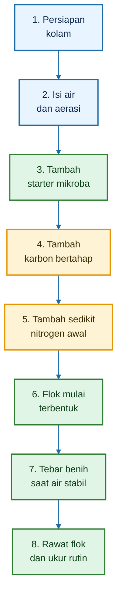
```mermaid
%%{init: {"theme": "base", "themeVariables": {
  "fontFamily": "Arial",
  "primaryColor": "#F7FBFF",
  "primaryTextColor": "#0B2545",
  "primaryBorderColor": "#1B6CA8",
  "lineColor": "#1B6CA8"
}}}%%
flowchart TD
    A["1. Persiapan<br/>kolam"] --> B["2. Isi air<br/>dan aerasi"]
    B --> C["3. Tambah<br/>starter mikroba"]
    C --> D["4. Tambah<br/>karbon bertahap"]
    D --> E["5. Tambah sedikit<br/>nitrogen awal"]
    E --> F["6. Flok mulai<br/>terbentuk"]
    F --> G["7. Tebar benih<br/>saat air stabil"]
    G --> H["8. Rawat flok<br/>dan ukur rutin"]

    classDef prep fill:#E8F4FF,stroke:#1B6CA8,color:#0B2545,stroke-width:2px;
    classDef micro fill:#E1F5E6,stroke:#2E7D32,color:#0B3D16,stroke-width:2px;
    classDef carbon fill:#FFF3D6,stroke:#E69500,color:#3A2A00,stroke-width:2px;
    classDef result fill:#DFF5E1,stroke:#2E7D32,color:#0B3D16,stroke-width:3px;

    class A,B prep;
    class C,F,G,H micro;
    class D,E carbon;
```

Tahap ini penting karena bioflok yang baik tidak dibentuk dalam kondisi panik. Bioflok terbaik dibentuk sebelum kolam menerima beban besar dari pakan dan biomassa ikan.

---

## 9.1 Persiapan Kolam

Persiapan kolam menentukan keberhasilan awal bioflok. Kolam yang masih menyimpan lumpur hitam, sisa panen, bahan kimia, atau bau busuk akan sulit menghasilkan flok sehat.

Bioflok membutuhkan mikroba yang aktif, tetapi bukan sembarang mikroba. Yang ingin dikembangkan adalah komunitas mikroba aerob yang mampu mengolah limbah, bukan komunitas pembusuk anaerob.

Karena itu, sebelum air dimatangkan, kolam harus dibersihkan.

---

### 9.1.1 Bersihkan Kolam dari Lumpur Hitam

Lumpur hitam adalah tanda bahan organik lama yang sudah membusuk atau kekurangan oksigen. Jika lumpur ini dibiarkan, ia akan menjadi sumber masalah sejak awal.

Lumpur hitam dapat menyebabkan:

- bau busuk;
- amonia dan gas berbahaya;
- bakteri patogen;
- kebutuhan oksigen tinggi;
- dasar kolam anaerob;
- benih stres setelah tebar.

Maka, sebelum membentuk bioflok:

- buang lumpur hitam;
- bersihkan sisa pakan dan feses lama;
- sikat dinding kolam bila ada lendir busuk;
- bilas kolam sampai bau menyengat hilang;
- pastikan tidak ada titik dasar yang menjadi kantong endapan.

Jika memakai kolam terpal baru, kolam juga perlu dicuci dan dibilas untuk mengurangi residu bahan kimia dari terpal.

---

### 9.1.2 Isi Air

Setelah kolam bersih, isi air sesuai volume kerja. Untuk kolam bioflok, tinggi air praktis biasanya berada pada kisaran **80–100 cm**, tergantung desain kolam, kapasitas aerasi, dan ukuran ikan.

Jangan mengisi terlalu penuh sejak awal jika sistem belum stabil. Sisakan ruang untuk:

- percikan aerasi;
- penambahan air;
- manajemen busa;
- keamanan saat ikan aktif makan.

Sumber air yang digunakan harus diperhatikan. Air yang mengandung deterjen, pestisida, limbah rumah tangga, kaporit aktif, atau logam berat dapat mengganggu mikroba dan benih.

Jika memakai air PDAM, sebaiknya air diaerasi dan diendapkan terlebih dahulu agar kaporit aktif berkurang.

---

### 9.1.3 Aerasi 24–48 Jam

Setelah air masuk, aerasi harus dinyalakan minimal 24–48 jam sebelum perlakuan bioflok.

Tujuan aerasi awal:

- menambah oksigen;
- membantu melepas gas terlarut yang tidak diinginkan;
- mengurangi kaporit aktif jika ada;
- menghomogenkan air;
- menguji kestabilan blower dan instalasi udara;
- memastikan tidak ada titik mati.

Pada tahap ini, jangan terburu-buru memasukkan benih. Kolam perlu diuji sebagai sistem terlebih dahulu.

Pertanyaan praktis sebelum lanjut:

- Apakah blower stabil?
- Apakah gelembung keluar merata?
- Apakah ada sudut mati?
- Apakah ada bau aneh?
- Apakah air tercampur dengan baik?
- Apakah listrik aman?

Bioflok sangat bergantung pada aerasi. Jika aerasi belum siap, jangan mulai sistem bioflok.

---

### 9.1.4 Pastikan Tidak Ada Racun

Mikroba bioflok sensitif terhadap bahan kimia tertentu. Benih lele juga sensitif terhadap perubahan mendadak.

Pastikan air dan kolam bebas dari:

- deterjen;
- pestisida;
- kaporit aktif;
- desinfektan berlebihan;
- obat ikan dosis tinggi;
- minyak;
- limbah rumah tangga;
- logam berat;
- bahan organik busuk dari siklus sebelumnya.

Jika air berbau deterjen, obat, kimia, atau busuk, jangan ditebar benih dan jangan dipaksa diberi probiotik. Selesaikan sumber masalahnya terlebih dahulu.

---

### 9.1.5 Target Kondisi Awal

Sebelum pematangan air dimulai, kondisi awal yang diinginkan adalah:

| Parameter   |             Target praktis |
| ----------- | -------------------------: |
| Bau air     |        Netral, tidak busuk |
| Aerasi      |          Stabil dan merata |
| pH          |                    6,8–8,0 |
| Suhu        |                    26–30°C |
| DO          |                   > 4 mg/L |
| Dasar kolam |   Bersih dari lumpur hitam |
| Busa        |           Tidak berlebihan |
| Air         | Tidak tercemar bahan kimia |

Jika alat ukur terbatas, minimal gunakan indikator visual dan bau:

- air tidak bau busuk;
- tidak ada minyak;
- tidak ada busa kimia;
- aerasi hidup merata;
- dasar tidak hitam;
- kolam siap dimatangkan.

---

## 9.2 Pematangan Air

Pematangan air adalah proses menyiapkan kolam agar komunitas mikroba mulai berkembang sebelum benih ditebar.

Tujuannya bukan langsung membuat air pekat. Tujuannya adalah membangun **pondasi mikroba** yang stabil.

Pematangan air dilakukan dengan:

- menambahkan probiotik atau starter;
- menambahkan sumber karbon secara bertahap;
- menambahkan sedikit nitrogen awal;
- menjaga aerasi terus-menerus.

---

### 9.2.1 Tambahkan Probiotik atau Starter

Probiotik berfungsi sebagai inokulum awal. Ia membantu mempercepat hadirnya mikroba yang diharapkan.

Sumber starter bisa berasal dari:

- probiotik komersial;
- air dari kolam bioflok sehat;
- sedikit flok sehat dari kolam matang;
- kultur mikroba yang sudah difermentasi dengan benar.

Jika memakai probiotik komersial, ikuti dosis label. Jangan menganggap dosis lebih banyak pasti lebih baik. Mikroba tetap memerlukan lingkungan yang sesuai.

Yang lebih penting dari jumlah probiotik adalah:

- oksigen cukup;
- karbon tersedia;
- pH tidak ekstrem;
- tidak ada racun;
- air bergerak;
- bahan organik tidak berlebihan.

Jika mengambil starter dari kolam lain, pastikan kolam donor benar-benar sehat. Jangan mengambil air dari kolam yang sedang bau busuk, terserang penyakit, atau ikan menggantung.

---

### 9.2.2 Tambahkan Sumber Karbon Bertahap

Sumber karbon digunakan untuk memberi energi bagi mikroba heterotrof. Bahan yang umum digunakan:

- molase;
- gula merah;
- gula pasir;
- tepung tapioka;
- dedak halus;
- tepung jagung.

Untuk tahap pematangan, sumber karbon harus diberikan **sedikit demi sedikit**. Jangan langsung memberi dosis besar.

Patokan awal yang aman:

| Bahan karbon          |  Dosis awal pematangan |
| --------------------- | ---------------------: |
| Molase                |   20–50 ml/m³ air/hari |
| Gula merah/gula pasir | 10–30 gram/m³ air/hari |
| Tapioka               | 10–30 gram/m³ air/hari |
| Dedak halus           | 20–50 gram/m³ air/hari |

Dosis ini bukan angka mutlak. Koreksi tetap dilakukan berdasarkan warna air, bau, busa, DO, dan respon sistem.

Cara pemberian yang benar:

1. larutkan bahan karbon dengan air kolam;
2. aduk sampai merata;
3. sebar perlahan ke beberapa titik;
4. pastikan aerasi menyala;
5. jangan menuang molase kental langsung ke satu titik.

Jika molase dituang langsung tanpa pelarutan, area tersebut bisa menjadi titik organik pekat dan kekurangan oksigen lokal.

---

### 9.2.3 Tambahkan Sedikit Pelet Halus sebagai Nitrogen Awal

Mikroba membutuhkan nitrogen. Jika belum ada ikan, sumber nitrogen bisa diberikan sedikit dalam bentuk pelet halus.

Dosis awal:

$$
2 - 5 \text{ gram pelet halus per } m^3 \text{ air per hari}
$$

Contoh:

Kolam 10 m³.

$$
\text{Pelet halus} = 10 \times 2 \text{ sampai } 5
$$

$$
\text{Pelet halus} = 20 - 50 \text{ gram per hari}
$$

Pelet ini bukan untuk memberi makan ikan, karena ikan belum ditebar. Pelet digunakan sebagai sumber nitrogen dan bahan organik awal bagi mikroba.

Jangan berlebihan. Jika terlalu banyak, pelet halus akan membusuk dan menaikkan amonia sebelum sistem mikroba siap.

---

### 9.2.4 Aerasi Terus-Menerus

Selama pematangan, aerasi harus menyala terus.

Pematangan air tanpa aerasi adalah risiko besar. Karbon dan pelet halus yang ditambahkan akan meningkatkan aktivitas mikroba. Aktivitas ini membutuhkan oksigen.

Jika oksigen kurang, proses yang terjadi bukan pembentukan bioflok sehat, tetapi pembusukan.

Maka urutannya harus benar:

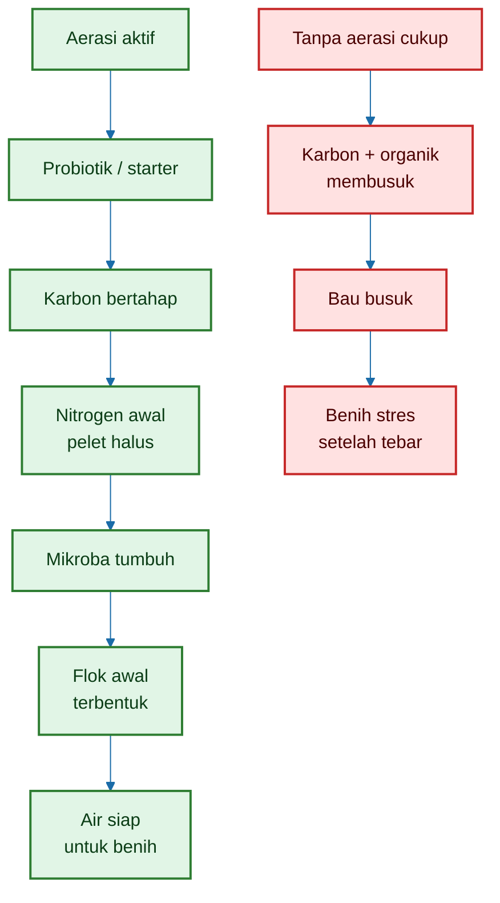
```mermaid
%%{init: {"theme": "base", "themeVariables": {
  "fontFamily": "Arial",
  "primaryColor": "#F7FBFF",
  "primaryTextColor": "#0B2545",
  "primaryBorderColor": "#1B6CA8",
  "lineColor": "#1B6CA8"
}}}%%
flowchart TD
    A["Aerasi aktif"] --> B["Probiotik / starter"]
    B --> C["Karbon bertahap"]
    C --> D["Nitrogen awal<br/>pelet halus"]
    D --> E["Mikroba tumbuh"]
    E --> F["Flok awal<br/>terbentuk"]
    F --> G["Air siap<br/>untuk benih"]

    H["Tanpa aerasi cukup"] --> I["Karbon + organik<br/>membusuk"]
    I --> J["Bau busuk"]
    J --> K["Benih stres<br/>setelah tebar"]

    classDef good fill:#E1F5E6,stroke:#2E7D32,color:#0B3D16,stroke-width:2px;
    classDef prep fill:#E8F4FF,stroke:#1B6CA8,color:#0B2545,stroke-width:2px;
    classDef bad fill:#FFE1E1,stroke:#C62828,color:#4A0000,stroke-width:2px;
    classDef warn fill:#FFF1D6,stroke:#E69500,color:#4A2A00,stroke-width:2px;

    class A,B,C,D,E,F,G good;
    class H,I,J,K bad;
```

Pematangan air biasanya membutuhkan **5–14 hari**, tergantung sumber air, suhu, kualitas starter, aerasi, dan bahan karbon.

Jangan hanya mengejar hari. Gunakan indikator kondisi air.

---

## 9.3 Tanda Flok Mulai Tumbuh

Flok yang mulai tumbuh dapat dikenali dari perubahan visual, bau, dan perilaku air.

Namun perlu ditekankan: **warna air saja tidak cukup**. Air cokelat belum tentu bioflok sehat. Air hijau belum tentu buruk. Air gelap belum tentu matang. Yang penting adalah kombinasi indikator.

---

### 9.3.1 Air Mulai Cokelat Muda atau Hijau Kecokelatan

Pada awal pematangan, air biasanya masih bening. Setelah mikroba dan plankton mulai berkembang, warna air mulai berubah.

Warna yang umum muncul:

- cokelat muda;
- cokelat teh;
- hijau kecokelatan;
- krem kecokelatan;
- hijau muda.

Warna ini menunjukkan adanya partikel biologis dan aktivitas mikroba.

Namun, waspadai warna:

- hitam pekat;
- abu-abu busuk;
- cokelat sangat gelap dengan bau tajam;
- permukaan berminyak;
- busa tebal menetap.

Warna gelap yang disertai bau busuk bukan tanda bioflok matang. Itu tanda sistem mulai anaerob.

---

### 9.3.2 Muncul Partikel Halus Melayang

Bioflok awal biasanya terlihat sebagai partikel kecil yang melayang di kolom air. Jika air diambil dalam gelas bening, akan terlihat butiran halus tersuspensi.

Partikel ini sebaiknya:

- tidak terlalu besar;
- tidak menggumpal hitam;
- tidak langsung mengendap semua;
- tidak berbau busuk;
- tersebar merata.

Flok yang baik tidak harus banyak pada awalnya. Yang penting adalah mulai terbentuk dan stabil.

---

### 9.3.3 Bau Tanah atau Fermentasi Ringan

Bau adalah indikator lapangan yang sangat berguna.

Bioflok sehat biasanya memiliki bau:

- tanah;
- fermentasi ringan;
- kolam hidup;
- tidak menyengat.

Sebaliknya, bioflok bermasalah memiliki bau:

- got;
- bangkai;
- telur busuk;
- asam tajam;
- busuk menyengat.

Jika bau busuk muncul sebelum benih ditebar, jangan lanjut tebar. Lakukan koreksi dulu.

Tindakan koreksi:

- hentikan sumber karbon;
- tambah aerasi;
- sifon endapan bila ada;
- buang sebagian air bawah;
- tunggu bau normal;
- mulai lagi dengan dosis karbon lebih rendah.

---

### 9.3.4 Tidak Ada Endapan Hitam Tebal

Endapan hitam adalah tanda bahaya. Pada tahap pematangan, kolam seharusnya belum memiliki banyak endapan berat.

Jika dasar kolam sudah hitam sebelum benih ditebar, berarti bahan organik terlalu banyak atau pengadukan kurang.

Penyebab umum:

- pelet halus terlalu banyak;
- molase berlebihan;
- aerasi lemah;
- tidak ada sirkulasi;
- starter buruk;
- kolam belum bersih sejak awal.

Endapan hitam harus dibuang sebelum tebar benih. Benih kecil sangat rentan terhadap kualitas dasar kolam yang buruk.

---

### 9.3.5 Tabel Indikator Flok Awal

| Indikator      | Flok mulai sehat               | Masalah                   |
| -------------- | ------------------------------ | ------------------------- |
| Warna air      | Cokelat muda/hijau kecokelatan | Hitam pekat/abu busuk     |
| Bau            | Tanah/fermentasi ringan        | Got, bangkai, telur busuk |
| Partikel       | Halus melayang                 | Menggumpal hitam          |
| Busa           | Tipis, cepat hilang            | Tebal, menetap            |
| Dasar          | Tidak hitam                    | Lumpur hitam muncul       |
| Aerasi         | Merata                         | Ada titik mati            |
| Kesiapan tebar | Bisa lanjut jika stabil        | Koreksi dulu              |

---

## 9.4 Setelah Tebar Benih

Setelah benih masuk, sistem bioflok mulai menerima beban nyata dari pakan, feses, amonia, dan aktivitas ikan.

Pada fase ini, jangan menganggap bioflok sudah selesai dibentuk. Bioflok justru harus mulai **dirawat**.

Bioflok adalah sistem dinamis. Ia berubah setiap hari mengikuti:

- jumlah pakan;
- biomassa ikan;
- suhu;
- oksigen;
- molase;
- amonia;
- pH;
- padatan;
- kesehatan ikan.

---

### 9.4.1 Pakan Diberikan Bertahap

Setelah tebar benih, pemberian pakan harus dimulai bertahap. Jangan langsung memberikan pakan terlalu banyak hanya karena ingin mengejar pertumbuhan.

Pakan awal harus mengikuti:

- ukuran benih;
- respons makan;
- kondisi air;
- suhu;
- DO;
- kepadatan tebar;
- kondisi flok.

Prinsip pemberian pakan:

> Pakan yang baik adalah pakan yang dimakan, bukan pakan yang hanya dimasukkan ke kolam.

Pakan yang tidak termakan akan menjadi bahan organik, meningkatkan amonia, menguras oksigen, dan memperberat sistem bioflok.

Pada fase awal, lebih baik pakan sedikit tetapi habis cepat daripada banyak tetapi tersisa.

---

### 9.4.2 Molase atau Karbon Diberikan Sesuai Kondisi Air

Setelah benih ditebar, sumber nitrogen utama berasal dari pakan. Karena itu, pemberian karbon harus mengikuti beban pakan dan kondisi air.

Patokan awal yang lebih aman:

$$
\text{Molase awal} = 5\% - 10\% \times \text{berat pakan harian}
$$

Jika sistem stabil tetapi flok kurang atau amonia mulai naik, dosis dapat dinaikkan bertahap.

Batas praktis untuk banyak kasus lele:

$$
\text{Molase} = 10\% - 20\% \times \text{berat pakan harian}
$$

Namun ini bukan angka wajib. Jika DO rendah, air bau, atau flok terlalu pekat, molase harus dikurangi atau dihentikan sementara.

Contoh:

Pakan harian 1 kg.

Dosis molase awal 5–10%:

$$
1.000 \text{ gram} \times 5\% = 50 \text{ gram}
$$

$$
1.000 \text{ gram} \times 10\% = 100 \text{ gram}
$$

Jadi dosis awal molase:

$$
50 - 100 \text{ gram per hari}
$$

Jika kondisi stabil dan perlu dinaikkan ke 20%:

$$
1.000 \times 20\% = 200 \text{ gram per hari}
$$

Pemberian molase sebaiknya:

- dilarutkan dahulu;
- diberikan setelah pakan;
- dibagi 2–3 kali jika dosis besar;
- tidak diberikan saat ikan menggantung;
- tidak diberikan saat DO rendah;
- dihentikan sementara jika air bau.

---

### 9.4.3 Flok Diukur, Bukan Hanya Dilihat

Melihat warna air saja tidak cukup. Volume flok perlu diukur.

Alat yang umum digunakan adalah **Imhoff cone**. Jika tidak ada, bisa memakai gelas ukur bening sebagai pendekatan.

Cara sederhana:

1. ambil 1 liter air kolam;
2. masukkan ke Imhoff cone atau wadah ukur bening;
3. diamkan 15–30 menit;
4. baca volume endapan flok di bagian bawah;
5. catat hasilnya.

Rumus pembacaan sederhana:

$$
\text{Volume flok} = \frac{\text{ml endapan flok}}{\text{liter sampel air}}
$$

Karena sampel biasanya 1 liter, maka jika endapan 10 ml:

$$
\text{Volume flok} = 10 \text{ ml/L}
$$

Flok harus dicatat rutin, misalnya 2–3 kali per minggu atau minimal mingguan.

---

### 9.4.4 Endapan Berat Tetap Harus Dibuang

Bioflok bukan berarti semua padatan dibiarkan. Ini salah satu kesalahan paling umum.

Harus dibedakan antara:

- flok aktif yang melayang;
- padatan berat yang mengendap;
- lumpur hitam yang membusuk.

Flok aktif bermanfaat. Lumpur hitam berbahaya.

Endapan berat dapat berasal dari:

- feses;
- sisa pakan;
- flok tua;
- partikel organik besar;
- bahan karbon yang tidak larut;
- organisme mati.

Jika endapan berat tidak dibuang, dasar kolam bisa menjadi anaerob.

Tindakan praktis:

- sifon dasar secara berkala;
- arahkan padatan ke titik tengah jika kolam bundar;
- gunakan central drain bila ada;
- jangan mengaduk lumpur hitam ke seluruh kolam;
- buang sedikit demi sedikit agar ikan tidak stres.

---

### 9.4.5 Alur Keputusan Setelah Tebar Benih

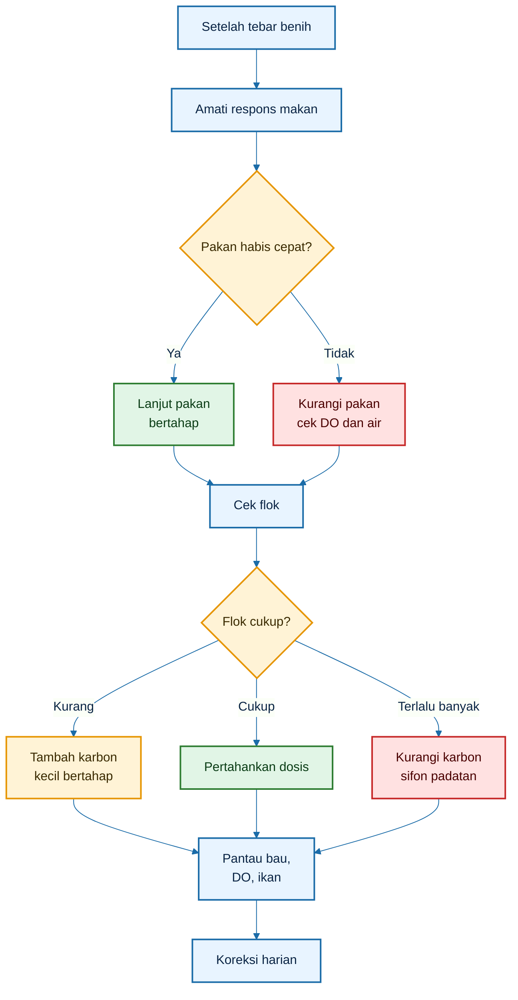
```mermaid
%%{init: {"theme": "base", "themeVariables": {
  "fontFamily": "Arial",
  "primaryColor": "#F7FBFF",
  "primaryTextColor": "#0B2545",
  "primaryBorderColor": "#1B6CA8",
  "lineColor": "#1B6CA8"
}}}%%
flowchart TD
    A["Setelah tebar benih"] --> B["Amati respons makan"]
    B --> C{"Pakan habis cepat?"}

    C -->|Ya| D["Lanjut pakan<br/>bertahap"]
    C -->|Tidak| E["Kurangi pakan<br/>cek DO dan air"]

    D --> F["Cek flok"]
    E --> F

    F --> G{"Flok cukup?"}
    G -->|Kurang| H["Tambah karbon<br/>kecil bertahap"]
    G -->|Cukup| I["Pertahankan dosis"]
    G -->|Terlalu banyak| J["Kurangi karbon<br/>sifon padatan"]

    H --> K["Pantau bau,<br/>DO, ikan"]
    I --> K
    J --> K

    K --> L["Koreksi harian"]

    classDef good fill:#E1F5E6,stroke:#2E7D32,color:#0B3D16,stroke-width:2px;
    classDef warn fill:#FFF3D6,stroke:#E69500,color:#3A2A00,stroke-width:2px;
    classDef bad fill:#FFE1E1,stroke:#C62828,color:#4A0000,stroke-width:2px;
    classDef process fill:#E8F4FF,stroke:#1B6CA8,color:#0B2545,stroke-width:2px;

    class A,B,F,K,L process;
    class C,G warn;
    class D,I good;
    class E,J bad;
    class H warn;
```

Diagram ini penting karena menunjukkan bahwa setelah benih ditebar, pengelolaan bioflok harus responsif. Jangan memakai dosis tetap tanpa membaca kondisi kolam.

---

## 9.5 Target Volume Flok

Volume flok adalah indikator penting untuk menentukan apakah sistem terlalu kosong, cukup, atau terlalu berat.

Untuk lele, target volume flok sebaiknya moderat. Jangan mengejar flok terlalu tebal.

Patokan praktis:

| Volume flok | Interpretasi          | Tindakan                                          |
| ----------: | --------------------- | ------------------------------------------------- |
|    0–2 ml/L | Flok kurang           | Tambah starter/karbon bertahap, cek aerasi        |
|    3–5 ml/L | Mulai terbentuk       | Pertahankan, jangan terburu-buru menaikkan karbon |
|   5–15 ml/L | Cukup baik untuk lele | Target ideal, rawat stabilitas                    |
|   > 20 ml/L | Mulai berat           | Kurangi karbon, cek DO, mulai buang padatan       |
|   > 30 ml/L | Berisiko              | Sifon, kurangi pakan/karbon, tambah aerasi        |

---

### 9.5.1 Mengapa Target Lele Tidak Perlu Terlalu Tinggi?

Lele bukan pemakan flok seefisien nila. Lele bisa memanfaatkan sebagian flok, tetapi tidak ideal jika kolam terlalu pekat.

Flok terlalu tinggi dapat menyebabkan:

- kebutuhan oksigen naik;
- air terasa berat;
- insang ikan terganggu;
- busa meningkat;
- padatan mengendap;
- dasar kolam anaerob;
- pakan lebih sulit dikontrol;
- FCR justru naik.

Maka target terbaik untuk lele adalah:

> Flok cukup untuk membantu mengolah limbah, tetapi tidak terlalu banyak sampai membebani oksigen.

---

### 9.5.2 Cara Membaca Volume Flok

Jika volume flok rendah tetapi air tidak bau dan ikan sehat, jangan panik. Tambahkan karbon sedikit demi sedikit.

Jika volume flok sedang dan ikan makan baik, pertahankan sistem.

Jika volume flok tinggi dan ikan mulai menggantung, jangan bangga. Itu tanda sistem mulai berat.

Keputusan praktis:

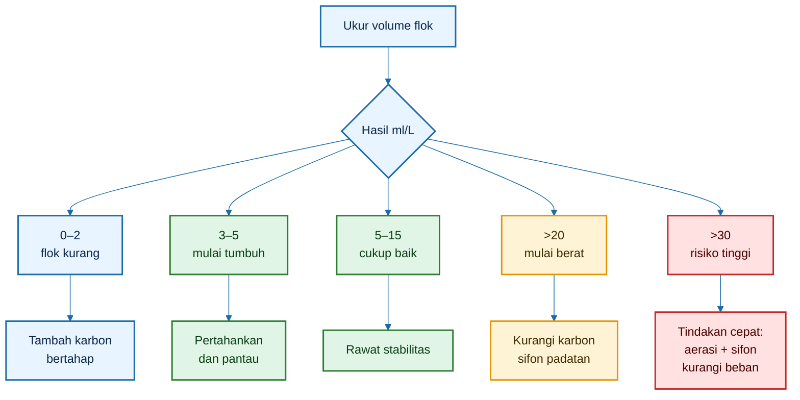
```mermaid
%%{init: {"theme": "base", "themeVariables": {
  "fontFamily": "Arial",
  "primaryColor": "#F7FBFF",
  "primaryTextColor": "#0B2545",
  "primaryBorderColor": "#1B6CA8",
  "lineColor": "#1B6CA8"
}}}%%
flowchart TD
    A["Ukur volume flok"] --> B{"Hasil ml/L"}

    B --> C["0–2<br/>flok kurang"]
    B --> D["3–5<br/>mulai tumbuh"]
    B --> E["5–15<br/>cukup baik"]
    B --> F[">20<br/>mulai berat"]
    B --> G[">30<br/>risiko tinggi"]

    C --> C1["Tambah karbon<br/>bertahap"]
    D --> D1["Pertahankan<br/>dan pantau"]
    E --> E1["Rawat stabilitas"]
    F --> F1["Kurangi karbon<br/>sifon padatan"]
    G --> G1["Tindakan cepat:<br/>aerasi + sifon<br/>kurangi beban"]

    classDef low fill:#E8F4FF,stroke:#1B6CA8,color:#0B2545,stroke-width:2px;
    classDef good fill:#E1F5E6,stroke:#2E7D32,color:#0B3D16,stroke-width:2px;
    classDef warn fill:#FFF3D6,stroke:#E69500,color:#3A2A00,stroke-width:2px;
    classDef bad fill:#FFE1E1,stroke:#C62828,color:#4A0000,stroke-width:2px;

    class A,B low;
    class C,C1 low;
    class D,D1,E,E1 good;
    class F,F1 warn;
    class G,G1 bad;
```

---

### 9.5.3 Hubungan Flok, DO, dan FCR

Volume flok tidak boleh dibaca sendiri. Flok harus selalu dibaca bersama DO, bau air, dan perilaku ikan.

| Flok   | DO     | Bau       | Respons makan | Kesimpulan                              |
| ------ | ------ | --------- | ------------- | --------------------------------------- |
| Sedang | Baik   | Normal    | Lahap         | Sistem sehat                            |
| Tinggi | Baik   | Normal    | Lahap         | Masih aman, pantau padatan              |
| Tinggi | Rendah | Mulai bau | Turun         | Sistem berat                            |
| Rendah | Baik   | Normal    | Lahap         | Sistem belum penuh, masih bisa tumbuh   |
| Rendah | Buruk  | Bau       | Turun         | Masalah bukan flok, tetapi kualitas air |

Jadi, jangan hanya bertanya:

> Flok sudah berapa ml/L?

Tanyakan juga:

> DO berapa? Bau air bagaimana? Ikan makan atau tidak? Ada endapan hitam atau tidak?

---

## 9.6 SOP Praktis Menumbuhkan Bioflok

Berikut SOP sederhana untuk membentuk bioflok pada kolam lele.

---

### 9.6.1 SOP Pra-Tebar 7–14 Hari

| Hari | Tindakan                   | Catatan                              |
| ---: | -------------------------- | ------------------------------------ |
|    1 | Bersihkan kolam, isi air   | Pastikan tidak ada lumpur hitam      |
|  1–2 | Aerasi penuh               | Uji blower dan distribusi udara      |
|    2 | Cek pH dan bau             | pH ideal 6,8–8,0                     |
|  2–3 | Tambah starter/probiotik   | Ikuti dosis label                    |
|  3–7 | Tambah karbon bertahap     | Molase 20–50 ml/m³/hari sebagai awal |
|  3–7 | Tambah pelet halus sedikit | 2–5 gram/m³/hari                     |
| 5–14 | Amati flok awal            | Air mulai cokelat/hijau kecokelatan  |
| 7–14 | Tebar benih jika stabil    | Tidak bau busuk, aerasi kuat         |

---

### 9.6.2 SOP Setelah Tebar

| Kegiatan          | Frekuensi              | Tujuan                          |
| ----------------- | ---------------------- | ------------------------------- |
| Cek respons makan | Setiap pemberian pakan | Mencegah overfeeding            |
| Cek bau air       | Harian                 | Deteksi awal anaerob            |
| Cek aerasi        | Harian                 | Pastikan oksigen aman           |
| Cek busa          | Harian                 | Indikator bahan organik/protein |
| Ukur flok         | 2–3 kali/minggu        | Menjaga volume flok             |
| Sifon endapan     | Sesuai kondisi         | Mencegah dasar anaerob          |
| Sampling bobot    | Mingguan               | Koreksi dosis pakan             |
| Cek pH/DO         | Idealnya harian        | Menjaga stabilitas sistem       |

---

## 9.7 Kesalahan Umum Saat Menumbuhkan Bioflok

### 9.7.1 Terlalu Banyak Molase di Awal

Molase berlebihan sering menyebabkan air cepat bau, busa tebal, dan DO turun.

Koreksi:

- hentikan molase;
- tambah aerasi;
- buang air bawah jika perlu;
- mulai lagi dari dosis kecil.

---

### 9.7.2 Pakan Awal Terlalu Banyak

Pakan yang tidak termakan akan menjadi limbah. Bioflok tidak dibentuk dengan cara membusukkan pakan sebanyak-banyaknya.

Koreksi:

- beri pakan sedikit;
- lihat respons ikan;
- gunakan sampling bobot;
- hindari pakan mengendap.

---

### 9.7.3 Flok Dibiarkan Terlalu Pekat

Flok banyak tidak selalu bagus. Pada lele, flok terlalu pekat dapat menurunkan DO dan mengganggu ikan.

Koreksi:

- kurangi karbon;
- sifon padatan;
- tambah aerasi;
- kontrol pakan.

---

### 9.7.4 Tidak Membuang Padatan

Bioflok tetap menghasilkan padatan. Jika padatan berat tidak dibuang, kolam menjadi anaerob.

Koreksi:

- gunakan sifon;
- buat central drain;
- gunakan arus memutar pelan;
- jangan biarkan lumpur hitam menumpuk.

---

### 9.7.5 Tidak Mengukur Flok

Mengandalkan warna air saja berisiko. Air bisa tampak bagus tetapi volumenya terlalu tinggi atau terlalu rendah.

Koreksi:

- gunakan Imhoff cone;
- catat volume flok;
- bandingkan dengan DO, bau, dan respons makan.

---

## 9.8 Kalimat Kunci Bab 9

Menumbuhkan bioflok berarti membangun ekosistem mikroba yang stabil, bukan sekadar membuat air keruh.

Kalimat operasionalnya:

> Bioflok tumbuh dari keseimbangan nitrogen, karbon, mikroba, oksigen, dan pengadukan.  
> Bioflok sehat harus dirawat, diukur, dan dikontrol.  
> Untuk lele, targetnya bukan flok sebanyak-banyaknya, tetapi flok moderat yang aktif, aerob, dan tidak busuk.

Atau lebih ringkas:

> Tumbuhkan flok, tetapi jangan biarkan kolam menjadi berat. Rawat flok sebagai alat penurun FCR, bukan sebagai lumpur yang dibiarkan menumpuk.

[**Kembali ke Atas**](#kolam-lele-sebagai-bioreaktor-penurun-fcr-berbasis-bioflok)

---

## 10. Aerasi vs Airlift-Pump dalam Bioflok Lele

Pada sistem bioflok lele, aerasi bukan sekadar alat tambahan. Aerasi adalah bagian dari “mesin hidup” kolam. Tanpa oksigen dan pengadukan, flok yang seharusnya membantu menekan FCR justru bisa berubah menjadi beban organik.

Namun, ada perbedaan penting antara **aerasi difuser biasa** dan **airlift-pump**.

Aerasi difuser terutama berfungsi memasukkan udara ke dalam air. Airlift-pump menggunakan udara untuk dua fungsi sekaligus: **memasukkan oksigen** dan **menggerakkan air**.

Dalam konteks bioflok, keduanya tidak harus dipertentangkan. Yang paling kuat justru kombinasi keduanya.

> Difuser memberi oksigen.  
> Airlift memberi arah gerak air.  
> Bioflok membutuhkan keduanya.

---

## 10.1 Fungsi Aerasi Difuser

Aerasi difuser adalah sistem paling umum dalam kolam lele bioflok. Udara dari blower dialirkan melalui selang, kemudian keluar dari difuser dalam bentuk gelembung.

Fungsi utamanya adalah:

- memasok oksigen;
- membantu pengadukan lokal;
- menjaga mikroba tetap aerob;
- membantu mengurangi gas terlarut tertentu;
- mencegah flok mengendap di sekitar titik aerasi.

Secara sederhana:

$$
\text{Blower} \rightarrow \text{Selang udara} \rightarrow \text{Difuser} \rightarrow \text{Gelembung} \rightarrow \text{Oksigen masuk ke air}
$$

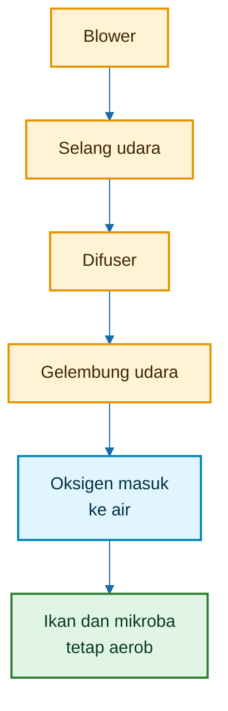
```mermaid
%%{init: {"theme": "base", "themeVariables": {
  "fontFamily": "Arial",
  "primaryColor": "#F7FBFF",
  "primaryTextColor": "#0B2545",
  "primaryBorderColor": "#1B6CA8",
  "lineColor": "#1B6CA8"
}}}%%
flowchart TD
    A["Blower"] --> B["Selang udara"]
    B --> C["Difuser"]
    C --> D["Gelembung udara"]
    D --> E["Oksigen masuk<br/>ke air"]
    E --> F["Ikan dan mikroba<br/>tetap aerob"]

    classDef air fill:#FFF3D6,stroke:#E69500,color:#3A2A00,stroke-width:2px;
    classDef water fill:#E1F5FF,stroke:#0086B3,color:#003344,stroke-width:2px;
    classDef good fill:#E1F5E6,stroke:#2E7D32,color:#0B3D16,stroke-width:2px;

    class A,B,C,D air;
    class E water;
    class F good;
```

Difuser sangat penting karena bioflok membutuhkan oksigen tinggi. Di dalam kolam bioflok, yang memakai oksigen bukan hanya ikan, tetapi juga bakteri, protozoa, alga pada malam hari, dan bahan organik yang sedang diurai.

Maka, semakin tinggi biomassa lele dan semakin padat flok, semakin besar kebutuhan aerasi.

---

### 10.1.1 Kelebihan Difuser

Difuser memiliki beberapa kelebihan:

| Aspek          | Kelebihan                       |
| -------------- | ------------------------------- |
| Oksigenasi     | Efektif memasukkan udara ke air |
| Instalasi      | Relatif mudah dipasang          |
| Biaya awal     | Umumnya lebih terjangkau        |
| Fleksibilitas  | Bisa dipasang di beberapa titik |
| Keamanan benih | Arus tidak terlalu kuat         |
| Perawatan      | Mudah diganti bila rusak        |

Difuser cocok untuk:

- fase benih kecil;
- kolam kecil;
- padat tebar sedang;
- sistem yang belum membutuhkan arus besar;
- operator yang baru belajar bioflok.

Namun, difuser harus dipasang dengan tata letak yang benar. Satu titik aerasi di kolam besar sering tidak cukup.

---

## 10.2 Kelemahan Difuser Saja

Kelemahan utama difuser adalah pola gerak airnya sering bersifat lokal. Air bergerak kuat di sekitar titik gelembung, tetapi area lain bisa tetap relatif diam.

Dalam kolam bioflok, ini berisiko.

Jika kolam hanya memakai difuser tanpa desain sirkulasi yang baik, masalah yang bisa muncul:

- kolam tetap statis;
- zona mati terbentuk;
- flok mengendap di area tertentu;
- sisa pakan dan feses menumpuk;
- dasar kolam menjadi anaerob;
- bau busuk muncul;
- FCR naik karena ikan stres.

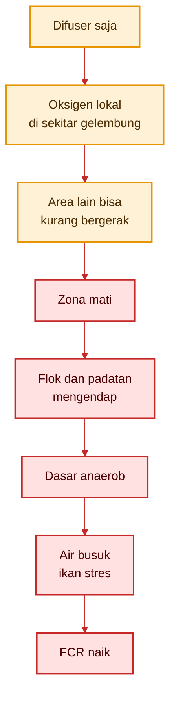
```mermaid
%%{init: {"theme": "base", "themeVariables": {
  "fontFamily": "Arial",
  "primaryColor": "#FFF7F7",
  "primaryTextColor": "#3A0000",
  "primaryBorderColor": "#C62828",
  "lineColor": "#C62828"
}}}%%
flowchart TD
    A["Difuser saja"] --> B["Oksigen lokal<br/>di sekitar gelembung"]
    B --> C["Area lain bisa<br/>kurang bergerak"]
    C --> D["Zona mati"]
    D --> E["Flok dan padatan<br/>mengendap"]
    E --> F["Dasar anaerob"]
    F --> G["Air busuk<br/>ikan stres"]
    G --> H["FCR naik"]

    classDef warn fill:#FFF1D6,stroke:#E69500,color:#4A2A00,stroke-width:2px;
    classDef bad fill:#FFE1E1,stroke:#C62828,color:#4A0000,stroke-width:2px;

    class A,B,C warn;
    class D,E,F,G,H bad;
```

Masalah ini sering tidak terlihat dari permukaan. Kolam tampak berbuih dan seolah-olah banyak oksigen, tetapi bagian dasar atau sudut tertentu bisa kekurangan sirkulasi.

Karena itu, dalam bioflok, pertanyaannya bukan hanya:

> Apakah ada gelembung?

Tetapi:

> Apakah seluruh kolam bergerak cukup? Apakah flok tetap melayang? Apakah dasar tidak hitam? Apakah tidak ada titik mati?

---

### 10.2.1 Zona Mati adalah Musuh Bioflok

Zona mati adalah area kolam yang kurang sirkulasi. Di area ini, padatan mudah mengendap dan oksigen cepat habis.

Zona mati biasanya muncul di:

- sudut kolam kotak;
- dasar kolam yang tidak teraduk;
- area jauh dari difuser;
- balik pipa atau struktur kolam;
- titik yang tertutup endapan.

Dampaknya:

$$
\text{Zona mati} \rightarrow \text{Endapan organik} \rightarrow \text{Anaerob} \rightarrow \text{Bau/racun} \rightarrow \text{FCR naik}
$$

Bioflok sehat harus tersuspensi. Jika flok terlalu banyak mengendap, sistem kehilangan fungsi biologisnya dan mulai berubah menjadi lumpur.

---

## 10.3 Fungsi Airlift-Pump

Airlift-pump adalah sistem yang memanfaatkan udara untuk mengangkat air melalui pipa vertikal. Udara dimasukkan ke bagian bawah pipa. Campuran air dan gelembung menjadi lebih ringan, lalu naik ke atas.

Dengan cara ini, airlift menghasilkan dua efek:

1. udara masuk ke air;
2. air bergerak dari bawah ke atas, lalu dialirkan ke arah tertentu.

Secara sederhana:

$$
\text{Udara masuk bawah pipa}
\rightarrow
\text{Gelembung naik}
\rightarrow
\text{Air ikut terangkat}
\rightarrow
\text{Arus terbentuk}
$$

Fungsi airlift dalam bioflok lele:

- mengangkat air dari bawah;
- menghasilkan aliran permukaan;
- membuat arus memutar pelan;
- menjaga flok tersuspensi;
- mengurangi zona mati;
- mengarahkan padatan berat ke titik sifon;
- membantu pemerataan oksigen;
- membantu pelepasan gas dari air.

```mermaid
%%{init: {"theme": "base", "themeVariables": {
  "fontFamily": "Arial",
  "primaryColor": "#F7FBFF",
  "primaryTextColor": "#0B2545",
  "primaryBorderColor": "#1B6CA8",
  "lineColor": "#1B6CA8"
}}}%%
flowchart TD
    A["Udara dari blower"] --> B["Difuser bawah<br/>dalam pipa"]
    B --> C["Gelembung naik"]
    C --> D["Air bawah<br/>ikut terangkat"]
    D --> E["Outlet tangensial"]
    E --> F["Arus memutar<br/>pelan"]
    F --> G["Flok tetap<br/>melayang"]
    F --> H["Padatan berat<br/>ke titik sifon"]
    G --> I["Air lebih stabil"]
    H --> I
    I --> J["FCR berpotensi<br/>turun"]

    classDef air fill:#FFF3D6,stroke:#E69500,color:#3A2A00,stroke-width:2px;
    classDef lift fill:#E1F5FF,stroke:#0086B3,color:#003344,stroke-width:2px;
    classDef flow fill:#E8F4FF,stroke:#1B6CA8,color:#0B2545,stroke-width:2px;
    classDef good fill:#E1F5E6,stroke:#2E7D32,color:#0B3D16,stroke-width:2px;

    class A,B,C air;
    class D,E lift;
    class F,G,H,I,J good;
```

Airlift sangat cocok untuk kolam bundar karena outlet dapat diarahkan secara tangensial. Dengan begitu, air bergerak mengikuti dinding kolam dan membentuk arus memutar pelan.

Arus ini membantu memisahkan dua hal:

- flok ringan tetap melayang;
- padatan berat bergerak ke tengah atau titik sifon.

---

### 10.3.1 Airlift Bukan Sekadar Pompa

Airlift tidak boleh dipahami hanya sebagai alat pemindah air. Dalam bioflok, airlift adalah alat manajemen ekosistem.

Fungsi teknis airlift:

| Fungsi                  | Dampak pada bioflok               |
| ----------------------- | --------------------------------- |
| Mengangkat air bawah    | Mencegah dasar kekurangan oksigen |
| Membuat arus permukaan  | Menyebarkan oksigen dan partikel  |
| Membentuk arus memutar  | Mengurangi zona mati              |
| Menjaga flok melayang   | Flok tetap aktif                  |
| Mengarahkan padatan     | Endapan lebih mudah disifon       |
| Mengurangi gas terlarut | Air lebih nyaman bagi ikan        |

Namun, airlift juga harus dikontrol. Jika arus terlalu kuat, ikan bisa terlalu banyak bergerak dan energi pakan terpakai untuk aktivitas.

---

## 10.4 Koreksi dalam Konteks FCR

Dalam pembahasan FCR, muncul pertanyaan penting:

> Apakah lele sebaiknya diam agar energi tidak terbuang, atau bergerak agar kolam lebih sehat?

Jawabannya bukan ekstrem.

Lele tidak perlu dipaksa berenang kuat. Lele juga tidak ideal dibiarkan di kolam yang statis dan busuk.

Yang dicari adalah:

> **Air bergerak cukup untuk menyehatkan flok, tetapi cukup pelan agar lele tetap nyaman.**

Pada kolam yang terlalu statis, flok dan padatan mudah mengendap. Kualitas air memburuk. Ikan stres. FCR naik.

Pada kolam dengan arus terlalu kuat, ikan dipaksa berenang terus. Energi pakan terpakai untuk aktivitas. Pertumbuhan bisa melambat. FCR juga bisa naik.

Titik optimalnya adalah arus pelan.

```mermaid
%%{init: {"theme": "base", "themeVariables": {
  "fontFamily": "Arial",
  "primaryColor": "#F7FBFF",
  "primaryTextColor": "#0B2545",
  "primaryBorderColor": "#1B6CA8",
  "lineColor": "#1B6CA8"
}}}%%
flowchart TD
    A["Kolam terlalu statis"] --> B["Flok mengendap"]
    B --> C["Air memburuk"]
    C --> D["FCR naik"]

    E["Arus pelan ideal"] --> F["Flok melayang"]
    F --> G["Air stabil<br/>lele nyaman"]
    G --> H["FCR turun"]

    I["Arus terlalu kuat"] --> J["Lele banyak<br/>melawan arus"]
    J --> K["Energi habis<br/>untuk aktivitas"]
    K --> L["FCR naik"]

    classDef bad fill:#FFE1E1,stroke:#C62828,color:#4A0000,stroke-width:2px;
    classDef good fill:#E1F5E6,stroke:#2E7D32,color:#0B3D16,stroke-width:2px;
    classDef warn fill:#FFF1D6,stroke:#E69500,color:#4A2A00,stroke-width:2px;

    class A,B,C,D bad;
    class E,F,G,H good;
    class I,J,K,L warn;
```

---

### 10.4.1 Tanda Arus Terlalu Lemah

Arus terlalu lemah bila:

- flok cepat mengendap;
- dasar kolam hitam;
- ada bau busuk;
- busa tebal menetap;
- ikan menggantung pagi hari;
- air tidak homogen;
- sisa pakan terkumpul di titik tertentu.

Dampaknya pada FCR:

$$
\text{Arus lemah} \rightarrow \text{Flok/endapan busuk} \rightarrow \text{Ikan stres} \rightarrow \text{FCR naik}
$$

---

### 10.4.2 Tanda Arus Terlalu Kuat

Arus terlalu kuat bila:

- lele terus berenang melawan arus;
- ikan berkumpul di area tenang;
- pakan cepat hanyut;
- ikan sulit mengambil pakan;
- pertumbuhan tidak sebanding dengan nafsu makan;
- tubuh ikan cenderung lebih panjang/ramping;
- ikan tampak gelisah.

Dampaknya pada FCR:

$$
\text{Arus terlalu kuat} \rightarrow \text{Energi aktivitas naik} \rightarrow \text{Pertumbuhan turun} \rightarrow \text{FCR naik}
$$

---

### 10.4.3 Tanda Arus Ideal

Arus ideal bila:

- flok halus tetap melayang;
- tidak ada lumpur hitam berlebihan;
- pakan masih mudah dimakan;
- ikan berenang santai;
- ikan bisa diam di beberapa area;
- air berputar pelan, bukan deras;
- padatan berat bergerak ke titik sifon;
- DO pagi tetap aman.

Dampaknya:

$$
\text{Arus ideal} \rightarrow \text{Flok sehat} \rightarrow \text{Air stabil} \rightarrow \text{Lele nyaman makan} \rightarrow \text{FCR turun}
$$

---

## 10.5 Kesimpulan Teknis

Dalam bioflok lele, pilihan terbaik bukan “difuser atau airlift”, tetapi:

> **Difuser sebagai sumber udara dan oksigen + airlift sebagai pengarah sirkulasi.**

Difuser menjaga sistem tetap aerob. Airlift membuat air bergerak terarah.

Konfigurasi ini memberi beberapa keuntungan:

- oksigen lebih merata;
- flok tetap tersuspensi;
- dasar kolam tidak mudah anaerob;
- padatan berat lebih mudah dikumpulkan;
- arus bisa diarahkan;
- ikan tetap nyaman;
- FCR lebih mudah ditekan.

Namun, airlift harus dirancang untuk menghasilkan **arus memutar pelan**, bukan arus deras.

Kalimat operasionalnya:

> Gunakan udara bukan hanya untuk membuat gelembung, tetapi juga untuk menggerakkan air.  
> Buat flok melayang, bukan ikan kelelahan.  
> Buat limbah terkumpul, bukan kolam menjadi lumpur bergerak.

[**Kembali ke Atas**](#kolam-lele-sebagai-bioreaktor-penurun-fcr-berbasis-bioflok)

---

## 11. Desain Airlift-Pump Terintegrasi Difuser

Desain yang paling menarik untuk bioflok lele adalah **airlift-pump yang digerakkan oleh difuser di bagian bawah pipa**.

Konsepnya sederhana: udara dari blower tidak hanya dilepas bebas ke kolam, tetapi dimasukkan ke dalam pipa riser. Gelembung udara naik di dalam pipa, lalu mengangkat air dari bawah. Air yang naik kemudian keluar melalui outlet tangensial dan membentuk arus memutar pelan di kolam bundar.

Dengan desain ini, satu aliran udara memiliki dua fungsi:

1. memasok oksigen;
2. menggerakkan sirkulasi air.

<figure>
  
  <figcaption>
    Airlift pump pada sistem bioflok untuk membantu sirkulasi air, suplai
    oksigen, dan pergerakan flok di kolam lele.
  </figcaption>
</figure>

---

## 11.1 Prinsip Kerja

Prinsip kerja airlift-pump terintegrasi difuser:

$$
\text{Udara dari blower}
\rightarrow
\text{Difuser bawah}
\rightarrow
\text{Gelembung naik dalam pipa}
\rightarrow
\text{Air bawah ikut terangkat}
\rightarrow
\text{Outlet tangensial}
\rightarrow
\text{Arus memutar pelan}
$$

Secara fisik, airlift bekerja karena campuran air dan udara di dalam pipa lebih ringan daripada air di luar pipa. Akibatnya, campuran tersebut terdorong naik.

Ketika air naik dan keluar dari outlet, arah outlet menentukan pola arus. Jika outlet diarahkan tangensial mengikuti dinding kolam bundar, maka terbentuk arus memutar.

```mermaid
%%{init: {"theme": "base", "themeVariables": {
  "fontFamily": "Arial",
  "primaryColor": "#F7FBFF",
  "primaryTextColor": "#0B2545",
  "primaryBorderColor": "#1B6CA8",
  "lineColor": "#1B6CA8"
}}}%%
flowchart TD
    A["Blower"] --> B["Selang udara"]
    B --> C["Difuser bawah<br/>dalam pipa"]
    C --> D["Gelembung naik"]
    D --> E["Air bawah<br/>ikut terangkat"]
    E --> F["Outlet tangensial"]
    F --> G["Arus memutar<br/>pelan"]
    G --> H["Flok tersuspensi"]
    G --> I["Padatan berat<br/>ke titik sifon"]
    H --> J["Tujuan bioflok<br/>tercapai"]
    I --> J

    classDef air fill:#FFF3D6,stroke:#E69500,color:#3A2A00,stroke-width:2px;
    classDef water fill:#E1F5FF,stroke:#0086B3,color:#003344,stroke-width:2px;
    classDef flow fill:#E8F4FF,stroke:#1B6CA8,color:#0B2545,stroke-width:2px;
    classDef good fill:#E1F5E6,stroke:#2E7D32,color:#0B3D16,stroke-width:2px;

    class A,B,C,D air;
    class E,F,G water;
    class H,I,J good;
```

Diagram ini sengaja dibuat vertikal agar nyaman dibaca di layar HP.

---

### 11.1.1 Arah Aliran dalam Kolam Bundar

Pada kolam bundar, airlift sebaiknya dipasang di sisi kolam. Outlet diarahkan menyamping mengikuti lengkung dinding kolam.

Tujuannya bukan membuat pusaran kuat, tetapi menciptakan arus melingkar pelan.

Secara sederhana:

```mermaid
%%{init: {"theme": "base", "themeVariables": {
  "fontFamily": "Arial",
  "primaryColor": "#F7FBFF",
  "primaryTextColor": "#0B2545",
  "primaryBorderColor": "#1B6CA8",
  "lineColor": "#1B6CA8"
}}}%%
flowchart TD
    A["Outlet tangensial<br/>di sisi kolam"] --> B["Air bergerak<br/>mengikuti dinding"]
    B --> C["Arus memutar<br/>pelan"]
    C --> D["Flok ringan<br/>tetap melayang"]
    C --> E["Padatan berat<br/>terdorong ke tengah"]
    E --> F["Titik sifon<br/>di tengah dasar"]

    classDef outlet fill:#E1F5FF,stroke:#0086B3,color:#003344,stroke-width:2px;
    classDef flow fill:#E8F4FF,stroke:#1B6CA8,color:#0B2545,stroke-width:2px;
    classDef good fill:#E1F5E6,stroke:#2E7D32,color:#0B3D16,stroke-width:2px;
    classDef waste fill:#FFF1D6,stroke:#E69500,color:#4A2A00,stroke-width:2px;

    class A outlet;
    class B,C flow;
    class D good;
    class E,F waste;
```

Pada desain ideal, air bergerak melingkar di permukaan dan kolom air, sedangkan padatan berat secara bertahap terkumpul ke area tengah bawah.

---

## 11.2 Komponen Utama

Sistem airlift-pump terintegrasi difuser terdiri dari beberapa komponen utama.

---

### 11.2.1 Blower

Blower adalah sumber udara. Pilih blower yang mampu bekerja terus-menerus dan memiliki kapasitas sesuai volume air, kepadatan ikan, dan jumlah titik airlift/difuser.

Blower harus stabil karena bioflok bergantung pada suplai oksigen.

Prinsip praktis:

- jangan memakai blower terlalu kecil;
- siapkan cadangan jika padat tebar tinggi;
- gunakan pembagi udara dengan valve;
- cek tekanan dan debit udara;
- hindari selang terlalu panjang atau banyak tekukan tajam.

Blower yang tidak stabil membuat DO turun dan sistem bioflok rawan gagal.

---

### 11.2.2 Selang Udara

Selang udara menghubungkan blower dengan difuser atau injektor.

Hal yang harus diperhatikan:

- ukuran selang sesuai debit udara;
- sambungan tidak bocor;
- tidak terlipat;
- tidak tersumbat air;
- diberi pemberat atau pengikat agar posisi stabil.

Kebocoran kecil pada selang dapat menurunkan debit udara ke difuser. Pada sistem padat tebar, ini bisa berdampak besar.

---

### 11.2.3 Difuser atau Injektor Udara

Difuser/injektor dipasang di bagian bawah pipa riser. Fungsinya menghasilkan gelembung yang naik di dalam pipa.

Ada dua pendekatan:

| Jenis                | Kelebihan                   | Catatan                            |
| -------------------- | --------------------------- | ---------------------------------- |
| Fine bubble          | Transfer oksigen lebih baik | Lebih mudah mampet                 |
| Medium/coarse bubble | Dorongan air lebih kuat     | Transfer oksigen bisa lebih rendah |

Untuk airlift, gelembung yang terlalu halus belum tentu menghasilkan dorongan air paling besar. Gelembung sedang atau kasar sering lebih kuat untuk mengangkat air.

Namun, jika DO kurang, tambahkan difuser bebas di luar airlift sebagai pendukung oksigen.

---

### 11.2.4 Pipa Riser Airlift

Pipa riser adalah pipa vertikal tempat air dan gelembung naik.

Bagian penting:

- pipa tegak;
- bagian bawah terbuka;
- difuser berada di bawah dalam pipa;
- outlet berada dekat permukaan;
- diameter pipa sesuai debit udara.

Ukuran pipa tidak harus terlalu besar. Pipa terlalu besar dengan udara kecil akan lemah mengangkat air. Pipa terlalu kecil dengan udara besar bisa menghasilkan arus terlalu kencang dan turbulensi berlebihan.

Patokan awal:

| Volume kolam |    Diameter pipa riser |
| -----------: | ---------------------: |
|       1–3 m³ |             1–1,5 inci |
|       3–7 m³ |             1,5–2 inci |
|      7–15 m³ |               2–3 inci |
|       >15 m³ | Beberapa unit 2–3 inci |

Untuk kolam bioflok, beberapa airlift kecil sering lebih baik daripada satu airlift besar karena arus lebih merata.

---

### 11.2.5 Bawah Pipa Terbuka

Bagian bawah pipa harus terbuka agar air dari dasar kolam bisa masuk.

Fungsinya:

- menarik air dari bawah;
- mengurangi zona mati dasar;
- membawa air rendah oksigen ke atas;
- membantu sirkulasi vertikal;
- mencegah dasar menjadi anaerob.

Jangan menutup bawah pipa. Jika ditutup, airlift tidak bisa menarik air dari dasar.

Jarak bawah pipa dari dasar kolam dapat dibuat sekitar **5–10 cm**, tergantung ukuran ikan dan risiko tersedotnya padatan besar.

---

### 11.2.6 Outlet Tangensial

Outlet tangensial adalah kunci pembentukan arus memutar.

Outlet tidak diarahkan ke tengah kolam. Outlet diarahkan mengikuti dinding kolam.

Tujuannya:

- membentuk arus melingkar;
- mengurangi sudut mati;
- menjaga flok melayang;
- membuat padatan berat bergerak ke tengah;
- membuat ikan tidak melawan arus langsung terlalu kuat.

Outlet sebaiknya berada dekat permukaan atau sedikit di bawah permukaan. Jangan terlalu tinggi, karena airlift tidak efisien untuk mengangkat air ke ketinggian besar.

---

### 11.2.7 Titik Sifon di Tengah Kolam

Pada kolam bundar, arus memutar membantu padatan berat terkumpul ke tengah dasar. Karena itu, titik tengah perlu disiapkan sebagai area buang padatan.

Bentuknya bisa:

- central drain;
- pipa buang bawah;
- titik sifon manual;
- cekungan tengah;
- dasar sedikit miring ke tengah.

Fungsi titik sifon:

- membuang sisa pakan;
- membuang feses berat;
- membuang flok tua;
- mencegah lumpur hitam;
- menjaga sistem tetap aerob.

Bioflok bukan berarti padatan dibiarkan semua. Padatan berat tetap harus dibuang.

---

## 11.3 Tujuan Desain

Desain airlift-pump terintegrasi difuser harus selalu kembali pada tujuan bioflok, bukan hanya mengejar alat yang terlihat canggih.

Tujuan desain:

1. oksigen lebih merata;
2. flok tetap melayang;
3. zona mati berkurang;
4. limbah berat terkumpul;
5. ikan tetap nyaman.

```mermaid
%%{init: {"theme": "base", "themeVariables": {
  "fontFamily": "Arial",
  "primaryColor": "#F7FBFF",
  "primaryTextColor": "#0B2545",
  "primaryBorderColor": "#1B6CA8",
  "lineColor": "#1B6CA8"
}}}%%
flowchart TD
    A["Airlift + difuser"] --> B["Oksigen<br/>lebih merata"]
    A --> C["Flok<br/>tersuspensi"]
    A --> D["Zona mati<br/>berkurang"]
    A --> E["Padatan berat<br/>terkumpul"]
    A --> F["Lele tetap<br/>nyaman"]

    B --> G["Air stabil"]
    C --> G
    D --> G
    E --> G
    F --> H["Nafsu makan<br/>baik"]
    G --> H
    H --> I["FCR turun"]

    classDef tool fill:#E8F4FF,stroke:#1B6CA8,color:#0B2545,stroke-width:3px;
    classDef good fill:#E1F5E6,stroke:#2E7D32,color:#0B3D16,stroke-width:2px;
    classDef result fill:#DFF5E1,stroke:#2E7D32,color:#0B3D16,stroke-width:3px;

    class A tool;
    class B,C,D,E,F,G,H,I good;
```

---

### 11.3.1 Oksigen Lebih Merata

Airlift membantu membawa air bawah ke atas dan menyebarkan air melalui outlet. Ini membantu pemerataan oksigen.

Namun, jangan menganggap airlift selalu cukup untuk semua kebutuhan oksigen. Jika biomassa tinggi atau flok pekat, difuser tambahan tetap diperlukan.

Konfigurasi praktis:

$$
\text{Airlift} = \text{sirkulasi utama}
$$

$$
\text{Difuser tambahan} = \text{penyangga DO}
$$

---

### 11.3.2 Flok Tetap Melayang

Flok yang sehat harus tetap tersuspensi. Jika flok mengendap, ia kehilangan peran sebagai biofilter aktif dan bisa membusuk.

Airlift membantu menjaga flok bergerak tanpa harus membuat arus terlalu keras.

Targetnya:

- flok halus terlihat melayang;
- air tidak terlalu pekat;
- dasar tidak dipenuhi lumpur hitam;
- pakan tetap mudah dimakan ikan.

---

### 11.3.3 Zona Mati Berkurang

Arus memutar pelan mengurangi area tanpa sirkulasi. Ini sangat penting terutama pada kolam bundar dan kolam dengan padat tebar tinggi.

Zona mati yang berkurang berarti:

- oksigen lebih merata;
- endapan lebih terkendali;
- bau busuk berkurang;
- kualitas air lebih stabil.

---

### 11.3.4 Limbah Berat Lebih Mudah Terkumpul

Arus memutar membantu padatan berat bergerak ke titik tengah, terutama jika dasar kolam sedikit miring ke tengah.

Padatan berat yang terkumpul lebih mudah disifon.

Ini penting karena bioflok tidak boleh berubah menjadi penumpukan lumpur.

---

### 11.3.5 Ikan Tetap Nyaman

Desain arus harus mempertimbangkan perilaku lele.

Lele tidak perlu dipaksa berenang kuat. Ikan harus masih bisa:

- makan dengan mudah;
- berenang santai;
- beristirahat;
- menyebar merata;
- tidak menumpuk di zona tenang;
- tidak terus-menerus melawan arus.

Jika ikan terlihat terus melawan arus, desain terlalu agresif.

---

## 11.4 Notasi Arus

Untuk memahami desain airlift, gunakan notasi warna berikut:

| Warna panah | Makna                             |
| ----------- | --------------------------------- |
| Oranye      | Udara dari blower                 |
| Biru muda   | Air dan gelembung naik dalam pipa |
| Biru tua    | Arus memutar permukaan            |
| Cokelat     | Padatan berat menuju titik sifon  |

Berikut notasi aliran dalam bentuk diagram ringkas:

```mermaid
%%{init: {"theme": "base", "themeVariables": {
  "fontFamily": "Arial",
  "primaryColor": "#F7FBFF",
  "primaryTextColor": "#0B2545",
  "primaryBorderColor": "#1B6CA8",
  "lineColor": "#1B6CA8"
}}}%%
flowchart TD
    A["🟧 Udara<br/>dari blower"] --> B["Difuser bawah"]
    B --> C["🟦 Air + gelembung<br/>naik dalam pipa"]
    C --> D["Outlet tangensial"]
    D --> E["🔵 Arus memutar<br/>di permukaan"]
    E --> F["🟢 Flok tetap<br/>melayang"]
    E --> G["🟫 Padatan berat<br/>ke titik sifon"]
    F --> H["Bioflok sehat"]
    G --> H

    classDef orange fill:#FFF3D6,stroke:#E69500,color:#3A2A00,stroke-width:2px;
    classDef lightblue fill:#E1F5FF,stroke:#0086B3,color:#003344,stroke-width:2px;
    classDef blue fill:#E8F4FF,stroke:#1B6CA8,color:#0B2545,stroke-width:2px;
    classDef brown fill:#F3E0C7,stroke:#8D5A1F,color:#3A2100,stroke-width:2px;
    classDef good fill:#E1F5E6,stroke:#2E7D32,color:#0B3D16,stroke-width:2px;

    class A,B orange;
    class C lightblue;
    class D,E blue;
    class G brown;
    class F,H good;
```

---

### 11.4.1 Skema Teknis Airlift Vertikal

Skema airlift dalam bentuk vertikal:

```mermaid
%%{init: {"theme": "base", "themeVariables": {
  "fontFamily": "Arial",
  "primaryColor": "#F7FBFF",
  "primaryTextColor": "#0B2545",
  "primaryBorderColor": "#1B6CA8",
  "lineColor": "#1B6CA8"
}}}%%
flowchart TD
    A["Outlet tangensial<br/>ke arah dinding kolam"] --> B["Arus memutar<br/>pelan"]
    C["Pipa riser<br/>airlift"] --> A
    D["Air + gelembung<br/>naik"] --> C
    E["Difuser / injektor<br/>udara"] --> D
    F["Udara dari blower"] --> E
    G["Air dari bawah<br/>masuk"] --> E
    H["Bawah pipa<br/>terbuka"] --> G

    classDef outlet fill:#E8F4FF,stroke:#1B6CA8,color:#0B2545,stroke-width:2px;
    classDef air fill:#FFF3D6,stroke:#E69500,color:#3A2A00,stroke-width:2px;
    classDef water fill:#E1F5FF,stroke:#0086B3,color:#003344,stroke-width:2px;
    classDef good fill:#E1F5E6,stroke:#2E7D32,color:#0B3D16,stroke-width:2px;

    class F,E air;
    class G,H,D,C water;
    class A outlet;
    class B good;
```

---

### 11.4.2 Pengaturan Debit Udara

Debit udara harus bisa diatur. Gunakan valve agar pembagian udara fleksibel.

Konfigurasi yang disarankan:

$$
\text{Blower}
\rightarrow
\begin{cases}
\text{Airlift-pump} \\
\text{Difuser tambahan}
\end{cases}
$$

Pembagian awal yang praktis:

| Kondisi              |               Udara ke airlift |         Udara ke difuser bebas |
| -------------------- | -----------------------------: | -----------------------------: |
| Flok mudah mengendap |                         70–80% |                         20–30% |
| DO rendah            |                         50–60% |                         40–50% |
| Benih kecil          |                         40–60% |                         40–60% |
| Biomassa tinggi      | Disesuaikan dengan DO dan arus | Disesuaikan dengan DO dan arus |

Jangan semua udara dipaksa masuk ke airlift jika DO belum aman. Sebaliknya, jangan semua udara hanya ke difuser jika kolam mulai memiliki zona mati.

---

## 11.5 Kesimpulan Bab 11

Airlift-pump terintegrasi difuser adalah desain yang sangat cocok untuk bioflok lele karena menggabungkan oksigenasi dan sirkulasi.

Konsep teknisnya:

> Udara dari blower masuk ke difuser bawah, gelembung naik dalam pipa, air bawah ikut terangkat, outlet tangensial menciptakan arus memutar pelan, flok tetap melayang, padatan berat menuju titik sifon.

Namun, desain ini harus dikendalikan. Tujuannya bukan membuat arus deras, tetapi membuat air bergerak cukup untuk menjaga bioflok tetap sehat.

Kalimat operasionalnya:

> Difuser memberi napas. Airlift memberi arah. Outlet tangensial memberi pola arus. Titik sifon menjaga kolam tidak menjadi lumpur.

[**Kembali ke Atas**](#kolam-lele-sebagai-bioreaktor-penurun-fcr-berbasis-bioflok)

---

## 12. Lele Diam vs Lele Bergerak: Dampaknya terhadap FCR

Dalam budidaya lele, muncul pertanyaan penting:

> Apakah lele sebaiknya dibuat diam agar hemat energi, atau dibuat bergerak agar sehat?

Jawaban praktisnya: **lele tidak boleh dipaksa bergerak kuat, tetapi kolam juga tidak boleh terlalu statis**.

Dalam bioflok, yang harus bergerak terutama adalah **air dan flok**, bukan ikan secara berlebihan.

Lele cukup bergerak ringan mengikuti arus pelan. Jika ikan dipaksa berenang terus-menerus melawan arus, energi pakan akan terpakai untuk aktivitas. Jika air terlalu diam, kualitas air memburuk dan ikan stres. Keduanya bisa menaikkan FCR.

---

## 12.1 Pembagian Energi Pakan

Pakan yang dimakan lele tidak otomatis menjadi daging. Energi dari pakan terbagi ke beberapa jalur:

$$
\text{Energi pakan}
=
\text{pertumbuhan}
+
\text{metabolisme}
+
\text{aktivitas}
+
\text{stres}
+
\text{limbah}
$$

Secara bisnis, yang diinginkan adalah memperbesar bagian:

$$
\text{Energi pakan} \rightarrow \text{pertumbuhan}
$$

Dan memperkecil bagian:

$$
\text{Energi pakan} \rightarrow \text{aktivitas berlebih} + \text{stres} + \text{limbah}
$$

Jika energi lebih banyak menjadi pertumbuhan, FCR turun.

Jika energi banyak terbuang untuk stres, berenang melawan arus, atau menghadapi kualitas air buruk, FCR naik.

```mermaid
%%{init: {"theme": "base", "themeVariables": {
  "fontFamily": "Arial",
  "primaryColor": "#F7FBFF",
  "primaryTextColor": "#0B2545",
  "primaryBorderColor": "#1B6CA8",
  "lineColor": "#1B6CA8"
}}}%%
flowchart TD
    A["Energi pakan"] --> B["Pertumbuhan<br/>ikan"]
    A --> C["Metabolisme<br/>dasar"]
    A --> D["Aktivitas<br/>berenang"]
    A --> E["Stres<br/>lingkungan"]
    A --> F["Limbah"]

    B --> G["FCR turun"]
    D --> H["Jika berlebihan:<br/>FCR naik"]
    E --> H
    F --> H

    classDef feed fill:#FFF3D6,stroke:#E69500,color:#3A2A00,stroke-width:2px;
    classDef good fill:#E1F5E6,stroke:#2E7D32,color:#0B3D16,stroke-width:2px;
    classDef neutral fill:#E8F4FF,stroke:#1B6CA8,color:#0B2545,stroke-width:2px;
    classDef bad fill:#FFE1E1,stroke:#C62828,color:#4A0000,stroke-width:2px;

    class A feed;
    class B,G good;
    class C neutral;
    class D,E,F,H bad;
```

Diagram ini menunjukkan bahwa FCR sangat dipengaruhi oleh distribusi energi. Arus kolam harus dirancang agar membantu kualitas air, bukan memaksa ikan membuang energi.

---

## 12.2 Bila Lele Terlalu Diam di Air Buruk

Lele yang diam di air buruk bukan berarti hemat energi. Justru bisa berarti ikan sedang stres.

Kolam yang terlalu statis dapat menyebabkan:

- oksigen rendah;
- amonia naik;
- nitrit naik;
- flok mengendap;
- dasar menjadi anaerob;
- bau busuk;
- pakan tidak habis;
- nafsu makan turun.

Pada kondisi seperti ini, lele mungkin terlihat diam, tetapi diamnya bukan tanda nyaman. Bisa jadi ikan sedang menghemat energi karena kualitas air buruk.

Dampak pada FCR:

$$
\text{Air buruk}
\rightarrow
\text{Stres}
\rightarrow
\text{Nafsu makan turun}
\rightarrow
\text{Pertumbuhan lambat}
\rightarrow
\text{FCR naik}
$$

```mermaid
%%{init: {"theme": "base", "themeVariables": {
  "fontFamily": "Arial",
  "primaryColor": "#FFF7F7",
  "primaryTextColor": "#3A0000",
  "primaryBorderColor": "#C62828",
  "lineColor": "#C62828"
}}}%%
flowchart TD
    A["Kolam terlalu statis"] --> B["Flok dan padatan<br/>mengendap"]
    B --> C["Oksigen rendah<br/>dasar anaerob"]
    C --> D["Amonia / bau<br/>meningkat"]
    D --> E["Lele stres<br/>diam tidak nyaman"]
    E --> F["Nafsu makan turun"]
    F --> G["Pertumbuhan lambat"]
    G --> H["FCR naik"]

    classDef warn fill:#FFF1D6,stroke:#E69500,color:#4A2A00,stroke-width:2px;
    classDef bad fill:#FFE1E1,stroke:#C62828,color:#4A0000,stroke-width:2px;

    class A,B warn;
    class C,D,E,F,G,H bad;
```

Jadi, “lele diam” tidak otomatis baik. Yang harus dilihat adalah konteksnya.

Lele diam karena nyaman berbeda dengan lele diam karena stres.

---

### 12.2.1 Tanda Lele Diam karena Nyaman

Lele relatif tenang tetapi sehat bila:

- pakan disambar saat diberikan;
- ikan menyebar;
- tidak menggantung;
- warna tubuh normal;
- tidak banyak lendir;
- tidak bergerombol di satu titik;
- DO aman;
- air tidak bau busuk;
- pertumbuhan tetap bagus.

---

### 12.2.2 Tanda Lele Diam karena Stres

Lele diam karena stres bila:

- banyak menggantung;
- respons makan lambat;
- berkumpul di dekat aerasi;
- sering naik ke permukaan;
- warna tubuh pucat atau gelap tidak normal;
- air bau;
- busa tebal;
- ada endapan hitam;
- pertumbuhan lambat.

Jika kondisi kedua terjadi, masalahnya bukan ikan kurang bergerak, tetapi kualitas air buruk.

---

## 12.3 Bila Lele Terlalu Banyak Bergerak Melawan Arus

Sebaliknya, arus yang terlalu kuat juga tidak baik.

Lele bukan ikan perenang arus deras seperti beberapa spesies sungai tertentu. Lele dapat bergerak aktif, tetapi bukan berarti harus dipaksa berenang terus-menerus.

Jika arus terlalu kuat:

- ikan terus melawan arus;
- energi pakan dipakai untuk berenang;
- pakan sulit ditangkap;
- ikan berkumpul di area tenang;
- pertumbuhan tidak maksimal;
- FCR bisa naik.

Dampak energi:

$$
\text{Arus kuat}
\rightarrow
\text{Aktivitas berenang naik}
\rightarrow
\text{Energi untuk pertumbuhan turun}
\rightarrow
\text{FCR naik}
$$

```mermaid
%%{init: {"theme": "base", "themeVariables": {
  "fontFamily": "Arial",
  "primaryColor": "#FFF7F7",
  "primaryTextColor": "#3A0000",
  "primaryBorderColor": "#C62828",
  "lineColor": "#C62828"
}}}%%
flowchart TD
    A["Arus terlalu kuat"] --> B["Lele melawan arus"]
    B --> C["Energi aktivitas<br/>meningkat"]
    C --> D["Energi untuk<br/>pertumbuhan berkurang"]
    D --> E["Bobot naik lambat"]
    E --> F["FCR naik"]

    classDef warn fill:#FFF1D6,stroke:#E69500,color:#4A2A00,stroke-width:2px;
    classDef bad fill:#FFE1E1,stroke:#C62828,color:#4A0000,stroke-width:2px;

    class A,B,C warn;
    class D,E,F bad;
```

---

### 12.3.1 Tanda Arus Membuat Lele Kelelahan

Arus terlalu kuat jika:

- ikan selalu menghadap arah arus;
- ikan berenang tanpa henti;
- ikan menumpuk di area yang lebih tenang;
- pakan terbawa arus sebelum dimakan;
- ikan makan banyak tetapi pertumbuhan rendah;
- ukuran ikan menjadi tidak seragam;
- ikan sering tampak gelisah.

Jika tanda ini muncul, kurangi debit airlift atau ubah arah outlet.

---

### 12.3.2 Koreksi Arus Terlalu Kuat

Tindakan koreksi:

- kecilkan debit udara ke airlift;
- bagi udara ke difuser tambahan;
- arahkan outlet mengikuti dinding, bukan langsung ke ikan;
- gunakan beberapa airlift kecil, bukan satu aliran besar;
- buat area tenang terbatas untuk ikan beristirahat;
- cek apakah pakan mudah dimakan.

Prinsipnya:

> Air boleh bergerak. Ikan jangan dipaksa melawan arus terus-menerus.

---

## 12.4 Titik Optimal

Titik optimal adalah kondisi ketika air bergerak cukup untuk menjaga bioflok, tetapi tidak terlalu kuat sampai membebani ikan.

Kalimat kuncinya:

> Lele bergerak ringan mengikuti arus pelan, bukan dipaksa berenang melawan arus kuat.

Titik optimal ini dapat dilihat dari kombinasi indikator:

| Indikator     | Kondisi ideal                    |
| ------------- | -------------------------------- |
| Flok          | Melayang, tidak cepat mengendap  |
| Padatan berat | Bergerak ke titik sifon          |
| Lele          | Berenang santai, tidak menumpuk  |
| Pakan         | Mudah dimakan, tidak hanyut liar |
| DO            | Stabil, terutama pagi            |
| Bau air       | Tanah/fermentasi ringan          |
| FCR           | Cenderung membaik                |
| Pertumbuhan   | Seragam dan konsisten            |

---

### 12.4.1 Rumus Praktis Titik Optimal

Secara manajemen, airlift menguntungkan jika:

$$
\text{Manfaat sirkulasi}
>
\text{Biaya energi berenang ikan}
$$

Manfaat sirkulasi meliputi:

- oksigen lebih merata;
- flok tersuspensi;
- padatan terkumpul;
- zona mati berkurang;
- air lebih stabil.

Biaya energi berenang ikan meliputi:

- aktivitas berlebih;
- stres arus;
- kesulitan makan;
- pertumbuhan melambat.

Jika manfaat lebih besar, FCR turun.

Jika biaya energi ikan lebih besar, FCR naik.

---

### 12.4.2 Diagram Titik Optimal

```mermaid
%%{init: {"theme": "base", "themeVariables": {
  "fontFamily": "Arial",
  "primaryColor": "#F7FBFF",
  "primaryTextColor": "#0B2545",
  "primaryBorderColor": "#1B6CA8",
  "lineColor": "#1B6CA8"
}}}%%
flowchart TD
    A["Arus terlalu lemah"] --> B["Flok mengendap<br/>air buruk"]
    B --> C["FCR naik"]

    D["Arus pelan ideal"] --> E["Flok sehat<br/>lele nyaman"]
    E --> F["FCR turun"]

    G["Arus terlalu kuat"] --> H["Lele boros energi"]
    H --> I["FCR naik"]

    classDef bad fill:#FFE1E1,stroke:#C62828,color:#4A0000,stroke-width:2px;
    classDef good fill:#E1F5E6,stroke:#2E7D32,color:#0B3D16,stroke-width:3px;
    classDef warn fill:#FFF1D6,stroke:#E69500,color:#4A2A00,stroke-width:2px;

    class A,B,C bad;
    class D,E,F good;
    class G,H,I warn;
```

---

## 12.5 Kesimpulan Bab 10–12

Aerasi, airlift, dan arus harus dipahami sebagai bagian dari desain bioreaktor bioflok.

Kesimpulan teknisnya:

1. Difuser penting untuk memasok oksigen.
2. Difuser saja bisa membuat kolam tetap statis jika tata letaknya buruk.
3. Airlift membantu mengangkat air bawah dan membentuk arus memutar.
4. Outlet tangensial cocok untuk kolam bundar.
5. Arus memutar pelan menjaga flok tetap melayang.
6. Padatan berat harus diarahkan ke titik sifon.
7. Lele tidak perlu dipaksa berenang kuat.
8. FCR terbaik dicapai saat air cukup bergerak, tetapi ikan tetap nyaman.

Kalimat penutup bagian ini:

> Bioflok membutuhkan air yang hidup, bukan air yang diam. Tetapi lele membutuhkan arus yang nyaman, bukan arus yang melelahkan. Desain terbaik adalah difuser untuk oksigen dan airlift untuk sirkulasi pelan yang menjaga flok sehat, padatan terkumpul, dan FCR tetap rendah.

[**Kembali ke Atas**](#kolam-lele-sebagai-bioreaktor-penurun-fcr-berbasis-bioflok)

---

## 13. Ciri Bioflok Sehat dan Bioflok Gagal

Bioflok harus dibaca seperti membaca kondisi mesin. Mesin yang sehat menghasilkan air stabil, ikan nyaman, pertumbuhan baik, dan FCR cenderung turun. Mesin yang rusak menghasilkan bau busuk, oksigen rendah, ikan stres, dan FCR naik.

Kesalahan umum di lapangan adalah menganggap semua air keruh sebagai bioflok. Padahal, **air keruh bisa sehat, bisa juga busuk**.

Karena itu, pembudidaya harus mampu membedakan:

- bioflok sehat;
- bioflok mulai berat;
- bioflok gagal atau busuk.

Perbedaan ini sangat penting karena tindakan koreksinya berbeda. Bioflok sehat dirawat. Bioflok terlalu berat dikurangi bebannya. Bioflok busuk harus diselamatkan dengan aerasi, pengurangan pakan/karbon, dan pembuangan padatan.

```mermaid
%%{init: {"theme": "base", "themeVariables": {
  "fontFamily": "Arial",
  "primaryColor": "#F7FBFF",
  "primaryTextColor": "#0B2545",
  "primaryBorderColor": "#1B6CA8",
  "lineColor": "#1B6CA8"
}}}%%
flowchart TD
    A["Air kolam bioflok"] --> B{"Kondisinya?"}

    B --> C["Bioflok sehat"]
    B --> D["Bioflok mulai berat"]
    B --> E["Bioflok gagal / busuk"]

    C --> C1["Air stabil<br/>ikan aktif<br/>FCR membaik"]
    D --> D1["Flok terlalu padat<br/>DO mulai rawan<br/>perlu koreksi"]
    E --> E1["Bau busuk<br/>ikan stres<br/>FCR naik"]

    classDef neutral fill:#E8F4FF,stroke:#1B6CA8,color:#0B2545,stroke-width:2px;
    classDef good fill:#E1F5E6,stroke:#2E7D32,color:#0B3D16,stroke-width:2px;
    classDef warn fill:#FFF3D6,stroke:#E69500,color:#4A2A00,stroke-width:2px;
    classDef bad fill:#FFE1E1,stroke:#C62828,color:#4A0000,stroke-width:2px;

    class A,B neutral;
    class C,C1 good;
    class D,D1 warn;
    class E,E1 bad;
```

---

## 13.1 Bioflok Sehat

Bioflok sehat adalah bioflok yang masih berada dalam kondisi aerob, aktif, dan terkendali. Floknya hidup, tetapi tidak berlebihan. Airnya keruh, tetapi tidak busuk. Ikan tetap nyaman makan dan pertumbuhan berjalan baik.

Ciri utamanya:

- air keruh cokelat muda atau hijau kecokelatan;
- bau tanah atau fermentasi ringan;
- flok halus melayang;
- ikan aktif makan;
- tidak ada bau busuk;
- tidak ada lumpur hitam tebal;
- FCR cenderung membaik.

---

### 13.1.1 Warna Air Cokelat Muda atau Hijau Kecokelatan

Bioflok sehat sering menghasilkan warna air:

- cokelat muda;
- cokelat teh;
- hijau kecokelatan;
- krem kecokelatan;
- hijau muda.

Warna ini menunjukkan adanya aktivitas mikroba, plankton, partikel organik halus, dan flok.

Namun warna air tidak boleh dibaca sendirian. Air cokelat muda bisa sehat jika oksigen cukup dan tidak bau. Tetapi air cokelat gelap yang disertai bau busuk adalah tanda masalah.

Maka, warna air harus selalu dibaca bersama:

- bau;
- respons makan;
- volume flok;
- kondisi dasar kolam;
- DO;
- busa;
- perilaku ikan.

---

### 13.1.2 Bau Tanah atau Fermentasi Ringan

Bau adalah indikator lapangan yang cepat.

Bioflok sehat biasanya memiliki bau:

- tanah;
- fermentasi ringan;
- kolam hidup;
- tidak menyengat;
- tidak menusuk hidung.

Bau ini berbeda dengan bau busuk. Bau tanah atau fermentasi ringan menunjukkan proses biologis masih berjalan secara aerob. Sedangkan bau got, bangkai, atau telur busuk menunjukkan proses anaerob.

Kalimat praktis:

> Jika air keruh tetapi baunya normal dan ikan makan lahap, kolam mungkin sehat.  
> Jika air keruh dan baunya busuk, kolam sedang bermasalah.

---

### 13.1.3 Flok Halus Melayang

Flok sehat terlihat sebagai partikel halus yang tersebar di kolom air. Flok tidak semuanya mengendap di dasar.

Ciri flok sehat:

- ukurannya halus sampai sedang;
- tidak menggumpal hitam;
- tidak berlendir busuk;
- tidak langsung tenggelam semua;
- tersebar merata;
- bergerak mengikuti arus pelan;
- tidak membuat air terlalu berat.

Flok yang baik bukan flok sebanyak-banyaknya. Untuk lele, flok yang terlalu banyak justru bisa menjadi masalah karena lele tidak seefisien nila dalam memanen flok.

Targetnya:

> Flok cukup untuk membantu mengolah limbah, tetapi tidak berlebihan sampai menguras oksigen.

---

### 13.1.4 Ikan Aktif Makan

Indikator paling penting tetap ikan.

Bioflok boleh terlihat bagus, tetapi jika ikan tidak mau makan, sistem harus dicurigai.

Bioflok sehat biasanya ditandai oleh:

- ikan responsif saat pakan diberikan;
- pakan cepat habis;
- ikan tidak menggantung;
- ikan tidak bergerombol di dekat aerasi;
- ikan tidak tampak gelisah;
- pertumbuhan berjalan;
- ukuran relatif seragam.

Respons makan adalah indikator harian yang sangat penting karena langsung terhubung dengan FCR.

Jika pakan diberikan tetapi tidak cepat dimakan, maka pakan berpotensi menjadi limbah.

$$
\text{Pakan tidak termakan}
\rightarrow
\text{Bahan organik}
\rightarrow
\text{Amonia / DO turun}
\rightarrow
\text{FCR naik}
$$

---

### 13.1.5 Tidak Ada Bau Busuk dan Lumpur Hitam Tebal

Bioflok sehat tidak boleh menghasilkan bau busuk menyengat. Jika bau busuk muncul, berarti ada bagian sistem yang kekurangan oksigen.

Sumber bau busuk biasanya:

- sisa pakan menumpuk;
- feses berlebihan;
- flok tua mengendap;
- dasar kolam anaerob;
- karbon berlebihan;
- aerasi kurang;
- padat tebar terlalu tinggi.

Lumpur hitam tebal adalah tanda dasar kolam mulai tidak sehat. Pada bioflok, padatan berat tetap harus dikelola. Bioflok bukan alasan untuk membiarkan dasar kolam menjadi septic tank.

---

### 13.1.6 FCR Cenderung Membaik

Bioflok sehat berpengaruh pada FCR melalui beberapa jalur:

```mermaid
%%{init: {"theme": "base", "themeVariables": {
  "fontFamily": "Arial",
  "primaryColor": "#F7FBFF",
  "primaryTextColor": "#0B2545",
  "primaryBorderColor": "#1B6CA8",
  "lineColor": "#1B6CA8"
}}}%%
flowchart TD
    A["Bioflok sehat"] --> B["Amonia lebih<br/>terkendali"]
    A --> C["Air lebih<br/>stabil"]
    A --> D["Sebagian flok<br/>bisa dimakan"]
    B --> E["Lele tidak stres"]
    C --> E
    D --> F["Nutrisi tambahan"]
    E --> G["Nafsu makan baik"]
    F --> G
    G --> H["Pertumbuhan lebih<br/>efisien"]
    H --> I["FCR turun"]

    classDef floc fill:#E1F5E6,stroke:#2E7D32,color:#0B3D16,stroke-width:3px;
    classDef process fill:#E8F4FF,stroke:#1B6CA8,color:#0B2545,stroke-width:2px;
    classDef result fill:#DFF5E1,stroke:#2E7D32,color:#0B3D16,stroke-width:3px;

    class A floc;
    class B,C,D,E,F,G,H process;
    class I result;
```

Jadi, FCR turun bukan hanya karena flok dimakan lele. FCR turun karena lingkungan kolam menjadi lebih stabil, ikan lebih nyaman, dan pakan lebih efisien menjadi biomassa.

---

## 13.2 Bioflok Gagal atau Busuk

Bioflok gagal adalah kondisi ketika sistem biologis tidak lagi bekerja sebagai pengolah limbah yang sehat. Bahan organik menumpuk, oksigen tidak cukup, dan proses anaerob mulai dominan.

Ciri utamanya:

- air hitam pekat;
- bau got, bangkai, atau telur busuk;
- busa tebal menetap;
- ikan menggantung;
- nafsu makan turun;
- endapan hitam;
- FCR memburuk.

Bioflok gagal bukan hanya masalah estetika. Ini masalah bisnis. Setiap hari ikan berada dalam bioflok busuk, pakan makin tidak efisien.

---

### 13.2.1 Air Hitam Pekat

Air hitam pekat biasanya menunjukkan bahan organik berlebih dan proses penguraian yang tidak sehat.

Namun, jangan hanya melihat warna. Air gelap harus dibaca bersama bau dan perilaku ikan.

Air hitam berisiko jika disertai:

- bau busuk;
- busa tebal;
- ikan menggantung;
- pakan tidak habis;
- endapan hitam;
- DO rendah;
- lendir berlebihan.

Jika tanda-tanda ini muncul, segera kurangi beban sistem.

Tindakan awal:

1. hentikan molase sementara;
2. kurangi pakan;
3. tambah aerasi;
4. sifon endapan;
5. buang sebagian air bawah jika perlu;
6. pantau ikan sebelum kembali memberi pakan normal.

---

### 13.2.2 Bau Got, Bangkai, atau Telur Busuk

Bau busuk adalah tanda kuat bahwa proses anaerob sedang terjadi.

Bau telur busuk sering dikaitkan dengan gas dari dasar yang tidak sehat. Bau got atau bangkai menunjukkan bahan organik membusuk.

Jika bau seperti ini muncul, jangan menambah molase. Jangan menambah pakan. Jangan hanya menambah probiotik.

Urutan prioritas harus benar:

```mermaid
%%{init: {"theme": "base", "themeVariables": {
  "fontFamily": "Arial",
  "primaryColor": "#FFF7F7",
  "primaryTextColor": "#3A0000",
  "primaryBorderColor": "#C62828",
  "lineColor": "#C62828"
}}}%%
flowchart TD
    A["Air bau busuk"] --> B["Hentikan molase<br/>sementara"]
    B --> C["Kurangi pakan<br/>atau puasa singkat"]
    C --> D["Tambah aerasi"]
    D --> E["Sifon endapan<br/>hitam"]
    E --> F["Buang air bawah<br/>jika perlu"]
    F --> G["Pantau respons ikan"]
    G --> H["Mulai normal lagi<br/>secara bertahap"]

    classDef bad fill:#FFE1E1,stroke:#C62828,color:#4A0000,stroke-width:2px;
    classDef action fill:#FFF3D6,stroke:#E69500,color:#4A2A00,stroke-width:2px;
    classDef recover fill:#E1F5E6,stroke:#2E7D32,color:#0B3D16,stroke-width:2px;

    class A bad;
    class B,C,D,E,F,G action;
    class H recover;
```

Prinsipnya:

> Saat air busuk, jangan menambah bahan organik. Kurangi beban dan tambah oksigen.

---

### 13.2.3 Busa Tebal Menetap

Busa tipis masih wajar pada sistem bioflok. Tetapi busa tebal yang menetap harus diwaspadai.

Busa tebal dapat menunjukkan:

- protein/organik berlebih;
- flok terlalu padat;
- pakan berlebihan;
- molase berlebihan;
- air terlalu berat;
- penguraian bahan organik tidak seimbang.

Jika busa tebal disertai ikan menggantung atau bau busuk, itu tanda sistem sudah berat.

Tindakan koreksi:

- kurangi pakan;
- hentikan molase;
- tambah aerasi;
- sifon padatan;
- cek volume flok;
- jangan tambah probiotik tanpa mengurangi beban organik.

---

### 13.2.4 Ikan Menggantung

Ikan menggantung adalah sinyal darurat.

Penyebab umum:

- DO rendah;
- amonia tinggi;
- nitrit tinggi;
- pH ekstrem;
- dasar kolam busuk;
- gas berbahaya;
- penyakit;
- arus terlalu kuat atau terlalu lemah.

Dalam konteks bioflok, ikan menggantung paling sering terkait dengan kualitas air dan oksigen.

Tindakan cepat:

1. hentikan pakan sementara;
2. aerasi maksimal;
3. cek bau air;
4. cek DO jika ada alat;
5. sifon endapan;
6. buang air bawah 10–20% jika kondisi parah;
7. jangan tambah molase sampai ikan normal.

---

### 13.2.5 Nafsu Makan Turun

Nafsu makan turun adalah indikator FCR akan memburuk.

Jika pakan tetap diberikan saat ikan tidak mau makan, maka pakan berubah menjadi limbah.

$$
\text{Ikan tidak mau makan} + \text{Pakan tetap diberikan}
\rightarrow
\text{Sisa pakan}
\rightarrow
\text{Amonia naik}
\rightarrow
\text{FCR naik}
$$

Maka, aturan praktisnya:

> Pakan harus mengikuti respons ikan, bukan mengikuti ego target panen.

Jika respons makan turun, kurangi pakan dan cari penyebabnya.

---

### 13.2.6 Endapan Hitam

Endapan hitam adalah salah satu tanda paling jelas bahwa bioflok berubah menjadi beban.

Endapan hitam biasanya berisi:

- feses;
- sisa pakan;
- flok tua;
- bahan organik membusuk;
- lumpur anaerob.

Endapan ini harus disifon. Jangan diaduk kasar ke seluruh kolam karena bisa menyebarkan bahan busuk dan membuat ikan stres.

Cara koreksi:

- sifon perlahan dari dasar;
- jangan mengangkat lumpur terlalu agresif;
- buang bagian paling hitam dan bau;
- tambah aerasi;
- kurangi pakan sementara;
- lanjutkan pemantauan.

---

### 13.2.7 FCR Memburuk

Bioflok gagal membuat FCR naik karena banyak pakan tidak menjadi daging.

Penyebabnya:

- ikan stres;
- nafsu makan turun;
- pakan tersisa;
- energi ikan dipakai untuk bertahan hidup;
- pertumbuhan lambat;
- kematian meningkat;
- biomassa panen tidak sesuai pakan yang masuk.

Secara sederhana:

$$
FCR = \frac{\text{Total pakan}}{\text{Pertambahan biomassa}}
$$

Jika total pakan tetap tinggi tetapi pertambahan biomassa turun, maka FCR naik.

---

## 13.3 Kalimat Korektif

Kalimat korektif bab ini adalah:

> Flok sehat menurunkan FCR. Flok busuk menaikkan FCR.

Ini penting karena banyak pembudidaya hanya mengejar “air berflok” tanpa memahami kualitas floknya.

Yang dicari bukan:

- air makin pekat;
- molase makin banyak;
- probiotik makin sering;
- flok makin tebal.

Yang dicari adalah:

- flok aktif;
- oksigen cukup;
- air stabil;
- ikan lahap makan;
- endapan terkendali;
- FCR membaik.

---

### 13.3.1 Tabel Diagnostik Cepat

| Indikator   | Bioflok sehat                  | Bioflok gagal/busuk          |
| ----------- | ------------------------------ | ---------------------------- |
| Warna air   | Cokelat muda/hijau kecokelatan | Hitam pekat/abu busuk        |
| Bau         | Tanah/fermentasi ringan        | Got, bangkai, telur busuk    |
| Flok        | Halus melayang                 | Menggumpal, berat, mengendap |
| Busa        | Tipis, cepat hilang            | Tebal, menetap               |
| Dasar kolam | Tidak ada lumpur hitam tebal   | Endapan hitam banyak         |
| Ikan        | Aktif makan                    | Menggantung, stres           |
| Pakan       | Cepat habis                    | Banyak tersisa               |
| DO          | Aman                           | Rendah/rawan                 |
| FCR         | Cenderung turun                | Cenderung naik               |

---

### 13.3.2 Keputusan Praktis

```mermaid
%%{init: {"theme": "base", "themeVariables": {
  "fontFamily": "Arial",
  "primaryColor": "#F7FBFF",
  "primaryTextColor": "#0B2545",
  "primaryBorderColor": "#1B6CA8",
  "lineColor": "#1B6CA8"
}}}%%
flowchart TD
    A["Amati kolam"] --> B{"Bau air?"}

    B -->|Normal| C{"Ikan makan?"}
    B -->|Busuk| D["Koreksi darurat:<br/>aerasi + kurangi beban<br/>sifon endapan"]

    C -->|Lahap| E{"Flok berapa?"}
    C -->|Turun| F["Cek DO, amonia,<br/>pH, endapan"]

    E -->|5–15 ml/L| G["Pertahankan<br/>sistem"]
    E -->|Terlalu rendah| H["Tambah karbon<br/>bertahap"]
    E -->|Terlalu tinggi| I["Kurangi karbon<br/>sifon padatan"]

    classDef good fill:#E1F5E6,stroke:#2E7D32,color:#0B3D16,stroke-width:2px;
    classDef warn fill:#FFF3D6,stroke:#E69500,color:#4A2A00,stroke-width:2px;
    classDef bad fill:#FFE1E1,stroke:#C62828,color:#4A0000,stroke-width:2px;
    classDef process fill:#E8F4FF,stroke:#1B6CA8,color:#0B2545,stroke-width:2px;

    class A,B,C,E process;
    class G good;
    class H,I,F warn;
    class D bad;
```

---

### 13.3.3 Kalimat Kunci Bab 13

> Jangan menilai bioflok dari keruhnya air. Nilai bioflok dari bau, oksigen, respons makan, volume flok, endapan, dan FCR.

[**Kembali ke Atas**](#kolam-lele-sebagai-bioreaktor-penurun-fcr-berbasis-bioflok)

---

## 14. Kesalahan Umum dalam Menerapkan Bioflok Lele

Bioflok adalah teknologi yang kuat, tetapi juga mudah disalahpahami. Banyak kegagalan bukan karena konsep bioflok salah, melainkan karena penerapannya tidak tepat.

Kesalahan dalam bioflok dapat dibagi menjadi dua kelompok:

1. **kesalahan konseptual**, yaitu salah memahami prinsip bioflok;
2. **kesalahan teknis**, yaitu salah menjalankan operasional kolam.

Keduanya sama-sama berdampak pada FCR.

Kesalahan konseptual membuat arah keputusan salah. Kesalahan teknis membuat sistem biologis rusak.

---

## 14.1 Kesalahan Konseptual

Kesalahan konseptual biasanya muncul dari penyederhanaan berlebihan. Bioflok dianggap sekadar air keruh, probiotik, molase, atau pengganti pakan.

Padahal bioflok adalah sistem biologis yang harus dikendalikan.

---

### 14.1.1 Menganggap Kolam Harus Jorok

Ini kesalahan paling mendasar.

Kolam bioflok memang tidak harus bening, tetapi bukan berarti harus jorok. Air keruh sehat berbeda dari air busuk.

Jika pembudidaya menganggap kolam harus jorok, ia cenderung:

- membiarkan sisa pakan;
- tidak membuang endapan;
- tidak peduli bau;
- menunda sifon;
- menganggap ikan menggantung sebagai hal biasa;
- menganggap air hitam sebagai tanda “kolam matang”.

Akibatnya, FCR naik dan risiko kematian meningkat.

Koreksi:

> Targetnya bukan kolam jorok. Targetnya kolam biologis yang aktif, aerob, dan stabil.

---

### 14.1.2 Menganggap Probiotik Saja Cukup

Probiotik hanya salah satu komponen. Probiotik tidak akan bekerja jika lingkungan kolam tidak mendukung.

Probiotik membutuhkan:

- oksigen;
- karbon;
- nitrogen;
- pH sesuai;
- air tidak beracun;
- pengadukan;
- bahan organik tidak berlebihan.

Jika air sudah busuk, dasar hitam, dan DO rendah, menambah probiotik saja tidak menyelesaikan masalah.

Koreksi:

> Probiotik bukan pengganti aerasi, bukan pengganti sifon, dan bukan pengganti manajemen pakan.

---

### 14.1.3 Menganggap Bioflok Bisa Menggantikan Pelet

Bioflok dapat menjadi pakan tambahan, tetapi bukan pengganti total pelet.

Lele tetap membutuhkan nutrisi utama dari pakan yang sesuai ukuran dan kandungan proteinnya.

Jika pakan dikurangi terlalu ekstrem karena mengandalkan bioflok:

- pertumbuhan melambat;
- ukuran tidak seragam;
- kanibalisme bisa meningkat;
- panen mundur;
- FCR ekonomi bisa memburuk;
- biomassa akhir tidak tercapai.

Koreksi:

> Bioflok membantu efisiensi pakan, bukan menghapus kebutuhan pakan.

---

### 14.1.4 Menganggap Semakin Pekat Semakin Baik

Flok terlalu pekat tidak selalu baik. Pada lele, flok yang terlalu tinggi bisa membebani oksigen dan mengganggu ikan.

Flok pekat dapat menyebabkan:

- air berat;
- DO turun;
- busa tebal;
- insang terganggu;
- endapan meningkat;
- dasar anaerob;
- ikan menggantung;
- FCR naik.

Koreksi:

> Target bioflok lele adalah flok moderat yang aktif, bukan flok setebal mungkin.

---

## 14.2 Kesalahan Teknis

Kesalahan teknis adalah kesalahan operasional yang langsung merusak sistem.

Berikut kesalahan yang paling sering terjadi.

---

### 14.2.1 Aerasi Kurang

Aerasi kurang adalah penyebab utama kegagalan bioflok.

Dampaknya:

- DO turun;
- mikroba aerob melemah;
- flok mengendap;
- dasar anaerob;
- ikan menggantung;
- amonia/nitrit lebih berbahaya;
- FCR naik.

Koreksi:

- tambah titik aerasi;
- gunakan blower lebih kuat;
- bersihkan difuser;
- gunakan airlift untuk sirkulasi;
- cek DO pagi;
- siapkan cadangan listrik.

---

### 14.2.2 Molase Berlebihan

Molase adalah bahan bakar mikroba. Jika berlebihan, mikroba tumbuh cepat dan menghabiskan oksigen.

Dampaknya:

$$
\text{Molase berlebihan}
\rightarrow
\text{Mikroba berlebihan}
\rightarrow
\text{DO turun}
\rightarrow
\text{Air busuk}
\rightarrow
\text{FCR naik}
$$

Koreksi:

- hentikan molase sementara;
- tambah aerasi;
- sifon endapan;
- kurangi pakan;
- mulai lagi dengan dosis kecil setelah stabil.

---

### 14.2.3 Padat Tebar Terlalu Tinggi

Bioflok memang memungkinkan padat tebar lebih tinggi daripada sistem konvensional. Tetapi padat tebar harus sesuai kapasitas aerasi, manajemen pakan, dan pembuangan padatan.

Padat tebar terlalu tinggi menyebabkan:

- kebutuhan oksigen melonjak;
- pakan harian meningkat;
- limbah nitrogen meningkat;
- padatan cepat menumpuk;
- risiko stres naik;
- grading lebih sulit;
- FCR bisa memburuk.

Koreksi:

- mulai dari padat tebar moderat;
- naikkan kepadatan setelah operator mahir;
- sesuaikan blower dengan biomassa;
- jangan mengejar angka tebar tanpa menghitung kapasitas sistem.

---

### 14.2.4 Tidak Mengukur Flok

Mengandalkan warna air saja tidak cukup. Air bisa tampak bagus tetapi volume flok terlalu tinggi atau terlalu rendah.

Tanpa pengukuran, operator mudah salah mengambil keputusan:

- flok kurang tetapi dianggap cukup;
- flok berlebih tetapi dianggap bagus;
- molase ditambah saat seharusnya dikurangi;
- padatan tidak dibuang tepat waktu.

Koreksi:

- gunakan Imhoff cone;
- catat ml/L;
- hubungkan dengan DO, bau, dan respons makan.

---

### 14.2.5 Tidak Membuang Endapan

Bioflok bukan berarti semua padatan harus disimpan. Endapan berat tetap harus dibuang.

Jika endapan tidak dibuang:

- lumpur hitam menumpuk;
- dasar anaerob;
- gas busuk muncul;
- ikan stres;
- FCR naik.

Koreksi:

- sifon berkala;
- buat titik central drain;
- gunakan arus memutar pelan;
- jangan biarkan lumpur hitam terlalu lama.

---

### 14.2.6 Tidak Punya Cadangan Listrik

Bioflok sangat bergantung pada aerasi. Mati listrik pada biomassa tinggi bisa menyebabkan masalah cepat.

Risiko mati aerasi:

- DO turun cepat;
- ikan menggantung;
- flok mati;
- mikroba berubah anaerob;
- kematian massal;
- kerugian besar.

Koreksi:

- siapkan genset;
- siapkan blower cadangan;
- gunakan UPS untuk sistem kecil;
- kurangi padat tebar jika tidak ada cadangan listrik;
- pantau malam dan dini hari.

---

### 14.2.7 Pakan Tetap Banyak Saat Ikan Tidak Mau Makan

Ini kesalahan yang langsung menaikkan FCR.

Jika ikan tidak mau makan, pakan tidak boleh tetap diberikan penuh.

Penyebab ikan tidak mau makan harus dicari:

- DO rendah;
- air bau;
- amonia/nitrit naik;
- pH berubah;
- penyakit;
- arus terlalu kuat;
- suhu ekstrem;
- pakan tidak sesuai.

Koreksi:

- kurangi pakan;
- cek kualitas air;
- tambah aerasi;
- sifon endapan;
- beri pakan lagi setelah respons ikan normal.

---

## 14.3 Dampak pada FCR

Semua kesalahan di atas akhirnya bermuara pada satu hal: **energi pakan tidak optimal menjadi daging**.

Secara sederhana:

$$
FCR = \frac{\text{Total pakan}}{\text{Pertambahan biomassa}}
$$

FCR memburuk bila:

- pakan tidak dimakan;
- pakan dimakan tetapi tidak terserap optimal;
- ikan stres;
- pertumbuhan lambat;
- kematian meningkat;
- ukuran tidak seragam;
- limbah pakan merusak air.

```mermaid
%%{init: {"theme": "base", "themeVariables": {
  "fontFamily": "Arial",
  "primaryColor": "#FFF7F7",
  "primaryTextColor": "#3A0000",
  "primaryBorderColor": "#C62828",
  "lineColor": "#C62828"
}}}%%
flowchart TD
    A["Kesalahan bioflok"] --> B["Air tidak stabil"]
    B --> C["Lele stres"]
    C --> D["Nafsu makan turun"]
    D --> E["Pertumbuhan lambat"]
    E --> F["Biomassa panen rendah"]
    F --> G["FCR naik"]

    A --> H["Pakan tersisa"]
    H --> I["Limbah naik"]
    I --> B

    classDef bad fill:#FFE1E1,stroke:#C62828,color:#4A0000,stroke-width:2px;
    classDef warn fill:#FFF1D6,stroke:#E69500,color:#4A2A00,stroke-width:2px;

    class A,H,I warn;
    class B,C,D,E,F,G bad;
```

---

### 14.3.1 Tabel Kesalahan, Dampak, dan Koreksi

| Kesalahan                        | Dampak utama                          | Dampak ke FCR        | Koreksi                              |
| -------------------------------- | ------------------------------------- | -------------------- | ------------------------------------ |
| Kolam dianggap harus jorok       | Endapan dan bau dibiarkan             | FCR naik             | Bedakan keruh sehat vs busuk         |
| Probiotik dianggap cukup         | Masalah oksigen/padatan tidak selesai | FCR naik             | Perbaiki aerasi dan manajemen limbah |
| Bioflok dianggap pengganti pelet | Nutrisi kurang                        | Pertumbuhan lambat   | Pelet tetap pakan utama              |
| Flok terlalu pekat               | DO turun, air berat                   | FCR naik             | Kurangi karbon, sifon                |
| Aerasi kurang                    | Flok busuk, ikan stres                | FCR naik             | Tambah blower/difuser/airlift        |
| Molase berlebihan                | Mikroba boros oksigen                 | FCR naik             | Hentikan molase sementara            |
| Padat tebar tinggi               | Beban limbah tinggi                   | FCR naik             | Sesuaikan kapasitas sistem           |
| Tidak ukur flok                  | Salah keputusan                       | FCR tidak stabil     | Gunakan Imhoff cone                  |
| Tidak buang endapan              | Dasar anaerob                         | FCR naik             | Sifon berkala                        |
| Tidak ada listrik cadangan       | Risiko kolaps                         | Mortalitas/FCR buruk | Siapkan genset/cadangan              |

---

### 14.3.2 Kalimat Kunci Bab 14

> Bioflok gagal bukan karena airnya keruh, tetapi karena sistemnya tidak seimbang: oksigen kurang, karbon berlebih, padatan menumpuk, pakan tidak terkendali, dan ikan stres.

Atau lebih praktis:

> Kesalahan bioflok selalu dibayar dengan FCR yang lebih tinggi.

[**Kembali ke Atas**](#kolam-lele-sebagai-bioreaktor-penurun-fcr-berbasis-bioflok)

---

## 15. Model Operasional Harian Bioreaktor Bioflok

Bioflok harus dikelola setiap hari. Ini bukan sistem yang cukup dibuat di awal lalu dibiarkan.

Kolam bioflok adalah bioreaktor hidup. Setiap hari terjadi perubahan:

- ikan tumbuh;
- pakan bertambah;
- feses bertambah;
- amonia berubah;
- mikroba berkembang;
- flok bertambah atau berkurang;
- oksigen naik-turun;
- pH berubah;
- endapan terbentuk.

Karena itu, pembudidaya membutuhkan **model operasional harian**.

Tujuannya bukan membuat pekerjaan rumit, tetapi membuat keputusan lebih cepat dan tepat.

```mermaid
%%{init: {"theme": "base", "themeVariables": {
  "fontFamily": "Arial",
  "primaryColor": "#F7FBFF",
  "primaryTextColor": "#0B2545",
  "primaryBorderColor": "#1B6CA8",
  "lineColor": "#1B6CA8"
}}}%%
flowchart TD
    A["Pagi"] --> B["Cek ikan<br/>bau, DO, busa"]
    B --> C["Uji respons makan"]

    C --> D["Siang / sore"]
    D --> E["Pakan sesuai respons<br/>cek warna, pH, flok"]
    E --> F["Karbon bila perlu"]

    F --> G["Malam"]
    G --> H["Pastikan aerasi<br/>blower stabil"]
    H --> I["Jangan beri pakan berat<br/>jika DO rawan"]

    I --> J["Mingguan"]
    J --> K["Sampling bobot<br/>ukur flok<br/>sifon<br/>grading"]

    K --> A

    classDef time fill:#E8F4FF,stroke:#1B6CA8,color:#0B2545,stroke-width:2px;
    classDef action fill:#E1F5E6,stroke:#2E7D32,color:#0B3D16,stroke-width:2px;
    classDef warn fill:#FFF3D6,stroke:#E69500,color:#4A2A00,stroke-width:2px;

    class A,D,G,J time;
    class B,C,E,F,H,K action;
    class I warn;
```

---

## 15.1 Pagi

Pagi adalah waktu paling penting untuk membaca kondisi kolam. Banyak masalah bioflok muncul pada malam hingga subuh karena oksigen turun.

Pada malam hari:

- ikan tetap bernapas;
- mikroba tetap memakai oksigen;
- alga tidak berfotosintesis;
- bahan organik tetap diuraikan;
- DO bisa turun.

Karena itu, pemeriksaan pagi harus menjadi rutinitas wajib.

---

### 15.1.1 Cek Ikan Menggantung atau Tidak

Ikan menggantung adalah tanda pertama yang harus diperiksa.

Jika ikan menggantung di permukaan, terutama dekat aerasi, kemungkinan ada masalah:

- DO rendah;
- amonia/nitrit tinggi;
- air terlalu berat;
- pH berubah;
- dasar kolam busuk;
- ikan sakit.

Tindakan jika ikan menggantung:

1. jangan langsung beri pakan;
2. tambah aerasi;
3. cek bau air;
4. amati busa;
5. cek DO jika ada alat;
6. sifon endapan jika terlihat hitam;
7. tunggu ikan normal sebelum pakan diberikan.

---

### 15.1.2 Cek Bau Air

Bau air harus dicek setiap pagi.

Kategori bau:

| Bau                     | Interpretasi            | Tindakan                  |
| ----------------------- | ----------------------- | ------------------------- |
| Netral/tanah            | Normal                  | Lanjut pantau             |
| Fermentasi ringan       | Masih wajar             | Pantau flok dan DO        |
| Asam tajam              | Karbon/organik berlebih | Kurangi molase            |
| Got/bangkai/telur busuk | Anaerob                 | Koreksi segera            |
| Bau kimia               | Kontaminasi             | Jangan tebar/tambah pakan |

Bau busuk harus dianggap sinyal bahaya. Jangan menunggu ikan mati.

---

### 15.1.3 Cek DO Bila Ada Alat

DO pagi adalah indikator paling jujur. Jika DO siang tinggi tetapi DO pagi rendah, sistem tetap rawan.

Target praktis:

|  DO pagi | Status  | Keputusan                                   |
| -------: | ------- | ------------------------------------------- |
| > 5 mg/L | Aman    | Pakan normal sesuai respons                 |
| 4–5 mg/L | Baik    | Tetap pantau                                |
| 3–4 mg/L | Waspada | Jangan tambah molase/pakan berat            |
| < 3 mg/L | Bahaya  | Tambah aerasi, kurangi beban                |
| < 2 mg/L | Darurat | Aerasi maksimal, pakan dihentikan sementara |

Jika tidak ada alat DO, gunakan indikator perilaku ikan:

- ikan menggantung;
- ikan berkumpul dekat aerasi;
- nafsu makan turun;
- sering naik ke permukaan;
- gerak lambat.

Namun alat DO tetap sangat disarankan untuk sistem bioflok intensif.

---

### 15.1.4 Amati Busa

Busa tipis masih bisa normal. Tetapi busa tebal yang menetap menunjukkan beban organik tinggi.

Amati:

- apakah busa tipis atau tebal;
- apakah cepat hilang atau menetap;
- apakah busa disertai bau;
- apakah ikan menggantung;
- apakah flok terlalu pekat.

Jika busa tebal dan bau:

- hentikan molase;
- kurangi pakan;
- tambah aerasi;
- sifon endapan.

---

### 15.1.5 Uji Respons Makan

Pagi hari, jangan langsung memberi pakan penuh. Beri sedikit dulu untuk melihat respons.

Jika ikan menyambar cepat, pakan bisa dilanjutkan bertahap.

Jika respons lambat:

- jangan paksa pakan;
- cek DO;
- cek bau;
- cek kondisi air;
- kurangi dosis pakan.

Aturan praktis:

> Respons makan ikan adalah “laporan harian” dari kolam.

Jika ikan tidak merespons, sistem sedang memberi sinyal.

---

## 15.2 Siang/Sore

Siang dan sore adalah waktu untuk melanjutkan pakan, membaca warna air, mengecek pH, mengamati flok, dan menentukan apakah karbon perlu ditambahkan.

Namun, jangan mengandalkan siang sebagai satu-satunya waktu membaca kolam. Siang hari sering membuat kondisi terlihat lebih baik karena oksigen bisa lebih tinggi.

---

### 15.2.1 Beri Pakan Berdasarkan Respons

Pakan harus diberikan berdasarkan respons ikan, bukan hanya jadwal tetap.

Prinsipnya:

- berikan sedikit demi sedikit;
- hentikan saat respons melemah;
- jangan menunggu pakan tersisa;
- sesuaikan dengan biomassa;
- koreksi berdasarkan sampling mingguan.

Pakan yang ideal habis dalam waktu wajar dan tidak banyak tenggelam menjadi limbah.

Jika pakan lambat habis:

- kurangi pakan berikutnya;
- cek kualitas air;
- cek apakah ukuran pakan sesuai;
- cek apakah arus terlalu kuat;
- cek apakah ikan sedang stres.

---

### 15.2.2 Cek Warna Air

Warna air dibaca sebagai indikator tambahan.

Warna yang masih wajar:

- cokelat muda;
- cokelat teh;
- hijau kecokelatan;
- krem kecokelatan.

Warna yang perlu diwaspadai:

- hitam pekat;
- abu-abu busuk;
- hijau tua pekat dengan bau;
- permukaan berminyak;
- cokelat gelap dengan busa tebal.

Warna air harus selalu dikombinasikan dengan bau, DO, flok, dan respons ikan.

---

### 15.2.3 Cek pH

pH memengaruhi ikan, mikroba, dan toksisitas amonia. Dalam bioflok, pH bisa turun karena aktivitas mikroba dan nitrifikasi.

Target praktis pH:

|              pH | Interpretasi                             |
| --------------: | ---------------------------------------- |
|         6,5–8,2 | Umumnya aman                             |
|           < 6,5 | Waspada, mikroba dan ikan bisa terganggu |
|           > 8,5 | Waspada, amonia lebih toksik             |
| Fluktuasi tajam | Sistem tidak stabil                      |

Jika pH turun perlahan, periksa alkalinitas jika tersedia. Koreksi bisa menggunakan kapur pertanian, dolomit, atau buffer lain secara hati-hati.

Jangan menaikkan pH secara drastis. Perubahan mendadak bisa membuat ikan stres.

---

### 15.2.4 Amati Flok

Flok harus diamati setiap hari dan diukur berkala.

Yang diamati harian:

- apakah flok melayang;
- apakah terlalu pekat;
- apakah menggumpal hitam;
- apakah cepat mengendap;
- apakah busa meningkat;
- apakah air terasa berat.

Jika flok terlalu pekat, kurangi karbon dan sifon padatan.

Jika flok terlalu rendah, tetapi air stabil dan ikan sehat, tambahkan karbon secara bertahap.

---

### 15.2.5 Tambahkan Karbon Bila Perlu

Karbon tidak wajib ditambahkan setiap hari dalam jumlah tetap. Karbon harus diberikan berdasarkan kondisi sistem.

Karbon bisa ditambahkan jika:

- flok rendah;
- amonia mulai naik;
- air terlalu “kosong”;
- sistem masih dalam fase pembentukan;
- DO aman;
- tidak ada bau busuk.

Karbon jangan ditambahkan jika:

- ikan menggantung;
- DO rendah;
- air bau busuk;
- busa tebal;
- flok terlalu pekat;
- endapan hitam belum dibuang.

Rumus patokan awal:

$$
\text{Molase harian} = 5\% - 10\% \times \text{pakan harian}
$$

Jika sistem sudah stabil dan membutuhkan tambahan karbon:

$$
\text{Molase harian} = 10\% - 20\% \times \text{pakan harian}
$$

Tetapi angka ini harus dikoreksi dengan kondisi lapangan.

---

## 15.3 Malam

Malam adalah fase rawan dalam sistem bioflok. Pada malam hari, oksigen dapat turun karena tidak ada fotosintesis, sementara ikan dan mikroba tetap bernapas.

Maka, fokus malam adalah menjaga aerasi dan menghindari tambahan beban berlebihan.

---

### 15.3.1 Pastikan Aerasi Menyala

Sebelum malam, pastikan:

- blower menyala stabil;
- semua titik udara keluar;
- difuser tidak mampet;
- selang tidak lepas;
- airlift berjalan;
- tidak ada suara blower abnormal;
- listrik aman.

Jika padat tebar tinggi, pemeriksaan malam sangat penting.

---

### 15.3.2 Pastikan Blower Stabil

Blower adalah jantung bioflok. Jika blower mati, sistem bisa cepat bermasalah.

Checklist blower:

| Komponen | Yang dicek                   |
| -------- | ---------------------------- |
| Blower   | Panas berlebihan atau tidak  |
| Selang   | Bocor, lepas, atau tertekuk  |
| Difuser  | Gelembung merata atau mampet |
| Valve    | Tidak tertutup salah         |
| Listrik  | Stabil                       |
| Cadangan | Genset/backup siap           |

Pada sistem intensif, listrik cadangan bukan kemewahan. Itu bagian dari manajemen risiko.

---

### 15.3.3 Jangan Memberi Pakan Berat Jika DO Rawan

Pakan berat pada malam hari dapat meningkatkan risiko karena:

- ikan membutuhkan oksigen untuk mencerna;
- sisa pakan menambah bahan organik;
- mikroba memakai oksigen;
- DO malam cenderung turun.

Jika DO tidak terukur atau sistem rawan, hindari pakan berat menjelang malam.

Prinsipnya:

> Malam bukan waktu untuk menambah beban besar pada kolam yang oksigennya belum pasti aman.

---

## 15.4 Mingguan

Rutinitas mingguan berfungsi untuk mengoreksi arah sistem. Harian membaca gejala cepat. Mingguan membaca performa pertumbuhan dan efisiensi.

Kegiatan mingguan meliputi:

- sampling bobot;
- hitung biomassa;
- koreksi dosis pakan;
- ukur volume flok;
- sifon padatan;
- grading bila ukuran tidak seragam.

---

### 15.4.1 Sampling Bobot

Sampling bobot wajib dilakukan agar pakan tidak berdasarkan kira-kira.

Tanpa sampling, pembudidaya mudah memberi pakan terlalu banyak atau terlalu sedikit.

Langkah sampling:

1. ambil contoh ikan secara acak;
2. timbang total sampel;
3. hitung bobot rata-rata;
4. kalikan dengan estimasi jumlah ikan hidup;
5. hitung biomassa;
6. tentukan pakan harian.

Rumus bobot rata-rata:

$$
\text{Bobot rata-rata} = \frac{\text{Total bobot sampel}}{\text{Jumlah ikan sampel}}
$$

Rumus biomassa:

$$
\text{Biomassa} = \text{Bobot rata-rata} \times \text{Jumlah ikan hidup}
$$

Rumus pakan harian:

$$
\text{Pakan harian} = \text{Biomassa} \times \text{Feeding rate}
$$

Contoh:

- bobot rata-rata ikan = 50 gram;
- estimasi ikan hidup = 2.000 ekor.

Biomassa:

$$
50 \text{ gram} \times 2.000 = 100.000 \text{ gram}
$$

$$
100.000 \text{ gram} = 100 \text{ kg}
$$

Jika feeding rate 3%:

$$
\text{Pakan harian} = 100 \times 3\%
$$

$$
\text{Pakan harian} = 3 \text{ kg/hari}
$$

---

### 15.4.2 Koreksi Dosis Pakan

Dosis pakan harus mengikuti biomassa dan respons makan.

Jika biomassa naik tetapi pakan tidak dikoreksi, pertumbuhan bisa tertahan. Jika pakan dinaikkan terlalu cepat, air bisa rusak.

Koreksi pakan harus mempertimbangkan:

- bobot rata-rata;
- jumlah ikan hidup;
- suhu;
- DO;
- respons makan;
- volume flok;
- kondisi air;
- target panen.

---

### 15.4.3 Ukur Volume Flok

Volume flok diukur dengan Imhoff cone atau gelas ukur.

Target praktis untuk lele:

| Volume flok | Interpretasi    |
| ----------: | --------------- |
|    0–2 ml/L | Kurang          |
|    3–5 ml/L | Mulai terbentuk |
|   5–15 ml/L | Cukup baik      |
|   > 20 ml/L | Mulai berat     |
|   > 30 ml/L | Risiko tinggi   |

Pengukuran flok membantu menentukan apakah karbon perlu ditambah, dikurangi, atau dihentikan sementara.

---

### 15.4.4 Sifon Padatan

Sifon padatan dilakukan untuk mencegah dasar kolam anaerob.

Yang disifon:

- lumpur hitam;
- endapan berbau;
- sisa pakan;
- feses berat;
- flok tua yang mengendap.

Sifon tidak harus menguras seluruh kolam. Yang penting adalah membuang padatan paling bermasalah.

---

### 15.4.5 Grading Bila Ukuran Tidak Seragam

Lele yang ukurannya tidak seragam membuat FCR memburuk.

Penyebabnya:

- ikan besar mendominasi pakan;
- ikan kecil tertinggal;
- kompetisi meningkat;
- kanibalisme bisa terjadi;
- estimasi biomassa menjadi tidak akurat.

Grading membantu:

- menyeragamkan ukuran;
- memperbaiki distribusi pakan;
- mengurangi stres;
- menekan kanibalisme;
- membuat perhitungan pakan lebih akurat.

---

## 15.5 Model Keputusan Harian

Berikut model keputusan praktis yang bisa digunakan setiap hari.

```mermaid
%%{init: {"theme": "base", "themeVariables": {
  "fontFamily": "Arial",
  "primaryColor": "#F7FBFF",
  "primaryTextColor": "#0B2545",
  "primaryBorderColor": "#1B6CA8",
  "lineColor": "#1B6CA8"
}}}%%
flowchart TD
    A["Mulai hari"] --> B["Cek ikan<br/>menggantung?"]

    B -->|Ya| C["Jangan beri pakan<br/>tambah aerasi<br/>cek air"]
    B -->|Tidak| D["Cek bau air"]

    D -->|Busuk| E["Hentikan molase<br/>kurangi pakan<br/>sifon"]
    D -->|Normal| F["Uji respons makan"]

    F -->|Lahap| G["Beri pakan<br/>bertahap"]
    F -->|Lambat| H["Kurangi pakan<br/>cek DO/pH/flok"]

    G --> I["Cek flok"]
    H --> I

    I -->|Kurang| J["Tambah karbon<br/>kecil bertahap"]
    I -->|Cukup| K["Pertahankan"]
    I -->|Berlebih| L["Kurangi karbon<br/>sifon padatan"]

    J --> M["Pantau sore/malam"]
    K --> M
    L --> M

    M --> N["Pastikan aerasi<br/>aman malam"]

    classDef good fill:#E1F5E6,stroke:#2E7D32,color:#0B3D16,stroke-width:2px;
    classDef warn fill:#FFF3D6,stroke:#E69500,color:#4A2A00,stroke-width:2px;
    classDef bad fill:#FFE1E1,stroke:#C62828,color:#4A0000,stroke-width:2px;
    classDef process fill:#E8F4FF,stroke:#1B6CA8,color:#0B2545,stroke-width:2px;

    class A,B,D,F,I,M,N process;
    class G,K good;
    class C,E,H,J,L warn;
```

---

## 15.6 Catatan Harian yang Disarankan

Agar bioflok bisa dikelola sebagai bioreaktor, data harian sebaiknya dicatat.

Format sederhana:

| Tanggal | Pakan kg | Molase | DO pagi |  pH | Flok ml/L | Bau | Respons makan | Sifon | Catatan |
| ------- | -------: | -----: | ------: | --: | --------: | --- | ------------- | ----- | ------- |

Catatan ini membantu melihat pola.

Misalnya:

- setelah molase naik, DO turun;
- setelah pakan naik, busa meningkat;
- setelah sifon, ikan makan lebih baik;
- flok tinggi diikuti FCR memburuk;
- pH turun pada minggu tertentu.

Tanpa catatan, pembudidaya hanya mengandalkan ingatan. Dalam sistem bioflok intensif, ingatan sering tidak cukup.

---

## 15.7 Kalimat Kunci Bab 15

> Bioflok harus dikelola harian seperti bioreaktor hidup: pagi membaca risiko, siang mengatur pakan dan karbon, malam menjaga oksigen, mingguan mengoreksi biomassa dan flok.

Atau lebih praktis:

> Jangan menjalankan bioflok dengan perasaan saja. Jalankan dengan observasi, pengukuran, dan koreksi rutin.

[**Kembali ke Atas**](#kolam-lele-sebagai-bioreaktor-penurun-fcr-berbasis-bioflok)

---

## 16. Dampak Ekonomi: Bioflok sebagai Alat Efisiensi, Bukan Jaminan Untung

Bioflok sering dipromosikan sebagai teknologi yang mampu menurunkan FCR. Pernyataan ini benar, tetapi harus diberi batas yang jelas.

Bioflok bukan jaminan untung otomatis. Bioflok adalah **alat efisiensi**. Ia bisa meningkatkan keuntungan jika penghematan pakan, survival rate, dan stabilitas pertumbuhan lebih besar daripada biaya tambahan sistem.

Biaya tambahan itu nyata:

- listrik blower;
- molase;
- probiotik;
- difuser;
- airlift;
- pipa;
- tenaga kontrol;
- alat ukur;
- cadangan listrik;
- risiko kegagalan sistem.

Maka, analisis ekonomi bioflok harus jujur. Jangan hanya menghitung penurunan FCR. Hitung juga biaya untuk mencapainya.

---

## 16.1 Rumus Penghematan Pakan

Secara sederhana, penghematan pakan dari penurunan FCR dapat dihitung dengan rumus:

$$
\text{Penghematan pakan}
=
\text{Selisih FCR}
\times
\text{Produksi panen}
\times
\text{Harga pakan}
$$

Keterangan:

- $\text{Selisih FCR}$ = FCR awal - FCR setelah perbaikan sistem;
- $\text{Produksi panen}$ = total biomassa ikan yang dipanen;
- $\text{Harga pakan}$ = harga pakan per kg.

Rumus ini berguna untuk melihat nilai ekonomi langsung dari penurunan FCR.

Namun rumus ini belum menghitung biaya tambahan bioflok. Karena itu, rumus penghematan pakan hanya langkah pertama.

---

### 16.1.1 Hubungan FCR dan Biaya Pakan

FCR menentukan berapa banyak pakan yang dibutuhkan untuk menghasilkan satu satuan bobot ikan.

Rumus kebutuhan pakan:

$$
\text{Kebutuhan pakan}
=
\text{FCR}
\times
\text{Produksi panen}
$$

Jika produksi panen sama, FCR yang lebih rendah berarti kebutuhan pakan lebih rendah.

Contoh:

| FCR | Produksi Panen | Kebutuhan Pakan |
| --: | -------------: | --------------: |
| 1,5 |       1.000 kg |        1.500 kg |
| 1,3 |       1.000 kg |        1.300 kg |
| 1,1 |       1.000 kg |        1.100 kg |

Dari tabel ini terlihat bahwa setiap penurunan FCR memiliki dampak langsung terhadap kebutuhan pakan.

Jika harga pakan tinggi, dampaknya makin besar.

```mermaid
%%{init: {"theme": "base", "themeVariables": {
  "fontFamily": "Arial",
  "primaryColor": "#F7FBFF",
  "primaryTextColor": "#0B2545",
  "primaryBorderColor": "#1B6CA8",
  "lineColor": "#1B6CA8"
}}}%%
flowchart TD
    A["FCR turun"] --> B["Kebutuhan pakan<br/>per kg ikan turun"]
    B --> C["Biaya pakan<br/>turun"]
    C --> D["Margin usaha<br/>berpotensi naik"]

    E["Namun"] --> F["Biaya bioflok<br/>juga naik"]
    F --> G["Listrik, molase,<br/>alat, tenaga kontrol"]

    D --> H{"Masih untung?"}
    G --> H

    H -->|Ya| I["Bioflok layak<br/>secara bisnis"]
    H -->|Tidak| J["Sistem perlu<br/>dikoreksi"]

    classDef good fill:#E1F5E6,stroke:#2E7D32,color:#0B3D16,stroke-width:2px;
    classDef warn fill:#FFF3D6,stroke:#E69500,color:#4A2A00,stroke-width:2px;
    classDef bad fill:#FFE1E1,stroke:#C62828,color:#4A0000,stroke-width:2px;
    classDef process fill:#E8F4FF,stroke:#1B6CA8,color:#0B2545,stroke-width:2px;

    class A,B,C,D,I good;
    class E,F,G,H process;
    class J bad;
```

Diagram ini menunjukkan bahwa FCR rendah memang menguntungkan, tetapi harus dibandingkan dengan biaya tambahan untuk mencapai FCR tersebut.

---

## 16.2 Contoh Sederhana

Misalnya:

- produksi panen = 1.000 kg;
- harga pakan = Rp12.000/kg;
- FCR awal = 1,4;
- FCR setelah bioflok = 1,1.

Selisih FCR:

$$
\text{Selisih FCR}
=
1{,}4 - 1{,}1
$$

$$
\text{Selisih FCR}
=
0{,}3
$$

Selisih kebutuhan pakan:

$$
\text{Selisih pakan}
=
0{,}3 \times 1.000
$$

$$
\text{Selisih pakan}
=
300 \text{ kg}
$$

Nilai penghematan pakan:

$$
\text{Penghematan}
=
300 \times 12.000
$$

$$
\text{Penghematan}
=
Rp3.600.000
$$

Artinya, jika produksi 1 ton dan FCR turun dari 1,4 menjadi 1,1, maka penghematan pakan sekitar **Rp3.600.000**.

---

### 16.2.1 Perbandingan Kebutuhan Pakan

| Kondisi           | FCR | Produksi Panen | Kebutuhan Pakan |  Biaya Pakan |
| ----------------- | --: | -------------: | --------------: | -----------: |
| Sebelum perbaikan | 1,4 |       1.000 kg |        1.400 kg | Rp16.800.000 |
| Setelah bioflok   | 1,1 |       1.000 kg |        1.100 kg | Rp13.200.000 |
| Selisih           | 0,3 |              - |          300 kg |  Rp3.600.000 |

Dengan harga pakan Rp12.000/kg:

$$
1.400 \times 12.000 = Rp16.800.000
$$

$$
1.100 \times 12.000 = Rp13.200.000
$$

$$
16.800.000 - 13.200.000 = Rp3.600.000
$$

Secara pakan, ini menarik. Tetapi angka ini belum menjadi keuntungan bersih karena masih ada tambahan biaya sistem.

---

## 16.3 Tetapi Harus Dikurangi

Penghematan pakan harus dikurangi biaya tambahan bioflok.

Biaya tambahan utama:

- listrik blower;
- molase;
- probiotik;
- penyusutan alat;
- tenaga kontrol;
- risiko listrik mati.

Maka, keuntungan bersih dari bioflok dapat dihitung lebih realistis dengan:

$$
\text{Keuntungan tambahan bersih}
=
\text{Penghematan pakan}
+
\text{Nilai tambahan dari survival dan produksi}
-
\text{Biaya tambahan bioflok}
$$

Atau lebih sederhana:

$$
\text{Manfaat bersih}
=
\text{Penghematan pakan}
-
\text{Biaya tambahan sistem}
$$

Jika manfaat bersih positif, bioflok layak secara ekonomi. Jika negatif, sistem perlu dievaluasi.

---

### 16.3.1 Listrik Blower

Listrik adalah biaya utama dalam bioflok. Aerasi harus berjalan terus-menerus, terutama pada sistem padat tebar.

Rumus biaya listrik:

$$
\text{Biaya listrik}
=
\text{Daya alat}
\times
\text{Jam operasi}
\times
\text{Tarif listrik}
$$

Jika daya dalam watt, ubah dulu ke kilowatt:

$$
\text{kW}
=
\frac{\text{Watt}}{1.000}
$$

Contoh:

- blower = 100 watt;
- operasi = 24 jam/hari;
- siklus = 60 hari;
- tarif listrik = Rp1.500/kWh.

Daya blower:

$$
100 \text{ watt} = 0{,}1 \text{ kW}
$$

Konsumsi listrik per hari:

$$
0{,}1 \times 24 = 2{,}4 \text{ kWh/hari}
$$

Konsumsi listrik per siklus:

$$
2{,}4 \times 60 = 144 \text{ kWh}
$$

Biaya listrik:

$$
144 \times 1.500 = Rp216.000
$$

Jika blower lebih besar atau jumlah kolam lebih banyak, biaya listrik meningkat.

---

### 16.3.2 Molase

Molase juga biaya rutin. Penggunaannya harus dihitung.

Rumus biaya molase:

$$
\text{Biaya molase}
=
\text{Total molase}
\times
\text{Harga molase per kg}
$$

Contoh:

- molase rata-rata = 0,2 kg/hari;
- siklus = 60 hari;
- harga molase = Rp5.000/kg.

Total molase:

$$
0{,}2 \times 60 = 12 \text{ kg}
$$

Biaya molase:

$$
12 \times 5.000 = Rp60.000
$$

Namun pada sistem dengan pakan tinggi dan target C/N lebih tinggi, kebutuhan molase bisa jauh lebih besar.

Karena itu, molase harus dianggap sebagai biaya produksi, bukan sekadar bahan tambahan kecil.

---

### 16.3.3 Probiotik

Probiotik dapat membantu mempercepat pembentukan komunitas mikroba, tetapi penggunaannya harus rasional.

Biaya probiotik tergantung:

- jenis produk;
- dosis;
- frekuensi pemberian;
- volume kolam;
- strategi pematangan air.

Kesalahan umum adalah terus menambah probiotik saat air sudah busuk. Dalam kondisi itu, biaya probiotik naik tetapi masalah utama belum tentu selesai.

Jika air busuk, prioritasnya bukan menambah probiotik, tetapi:

- tambah oksigen;
- kurangi beban pakan;
- hentikan karbon sementara;
- buang endapan;
- stabilkan sistem.

---

### 16.3.4 Penyusutan Alat

Alat bioflok memiliki umur pakai. Biaya alat tidak boleh dianggap hilang begitu saja, tetapi dihitung sebagai penyusutan.

Komponen yang perlu dihitung:

- blower;
- difuser;
- selang;
- pipa airlift;
- valve;
- kolam terpal;
- rangka kolam;
- alat ukur DO/pH;
- Imhoff cone;
- instalasi listrik.

Rumus penyusutan sederhana:

$$
\text{Penyusutan per siklus}
=
\frac{\text{Harga alat}}{\text{Jumlah siklus umur pakai}}
$$

Contoh:

- blower = Rp1.200.000;
- umur pakai = 12 siklus.

Penyusutan per siklus:

$$
\frac{1.200.000}{12}
=
Rp100.000
$$

Jika banyak alat digunakan, total penyusutan harus dijumlahkan.

---

### 16.3.5 Tenaga Kontrol

Bioflok memerlukan kontrol lebih disiplin daripada kolam konvensional.

Kegiatan kontrol meliputi:

- cek aerasi;
- cek ikan;
- cek bau air;
- ukur flok;
- cek pH/DO;
- sifon padatan;
- larutkan molase;
- sampling bobot;
- koreksi pakan;
- grading.

Jika usaha masih kecil dan dikerjakan sendiri, biaya tenaga sering tidak dicatat. Tetapi dalam skala bisnis, tenaga kontrol adalah biaya nyata.

Bioflok yang tidak dikontrol bisa gagal. Bioflok yang dikontrol membutuhkan waktu dan tenaga.

---

### 16.3.6 Risiko Listrik Mati

Risiko listrik mati harus dimasukkan dalam analisis, terutama pada sistem padat tebar tinggi.

Risiko listrik mati bisa menyebabkan:

- DO turun cepat;
- ikan menggantung;
- flok rusak;
- kematian massal;
- FCR memburuk;
- panen gagal.

Karena itu, cadangan listrik bukan biaya tambahan yang boleh diabaikan.

Pilihan mitigasi:

- genset;
- blower cadangan;
- baterai/UPS untuk sistem kecil;
- alarm listrik;
- operator jaga;
- padat tebar tidak melebihi kapasitas risiko.

Biaya cadangan listrik harus dianggap sebagai biaya asuransi produksi.

---

### 16.3.7 Contoh Hitung Manfaat Bersih

Misalnya penghematan pakan dari penurunan FCR adalah:

$$
Rp3.600.000
$$

Biaya tambahan bioflok per siklus:

| Komponen                    |       Biaya |
| --------------------------- | ----------: |
| Listrik blower              |   Rp216.000 |
| Molase                      |    Rp60.000 |
| Probiotik                   |   Rp150.000 |
| Penyusutan alat             |   Rp250.000 |
| Tenaga tambahan             |   Rp400.000 |
| Cadangan/risiko operasional |   Rp200.000 |
| Total biaya tambahan        | Rp1.276.000 |

Maka manfaat bersih:

$$
\text{Manfaat bersih}
=
3.600.000 - 1.276.000
$$

$$
\text{Manfaat bersih}
=
Rp2.324.000
$$

Dalam contoh ini, bioflok masih menguntungkan karena penghematan pakan lebih besar daripada biaya tambahan sistem.

Namun jika FCR hanya turun sedikit, atau biaya listrik dan tenaga terlalu tinggi, hasilnya bisa berbeda.

---

## 16.4 Kesimpulan Bisnis

Bioflok menguntungkan bila:

$$
\text{Penghematan pakan}
+
\text{Survival tinggi}
+
\text{Pertumbuhan stabil}
>
\text{Biaya tambahan sistem}
$$

Atau dalam bentuk yang lebih praktis:

$$
\text{Bioflok layak}
=
\text{FCR turun}
+
\text{SR naik}
+
\text{Panen stabil}
-
\text{Biaya aerasi, karbon, alat, tenaga}
$$

Bioflok tidak layak jika:

- FCR tidak turun;
- listrik mahal tetapi produksi tidak naik;
- molase berlebihan;
- probiotik boros;
- kematian tinggi;
- panen tidak seragam;
- sistem sering kolaps;
- operator tidak disiplin.

---

### 16.4.1 Parameter Ekonomi yang Harus Dicatat

Agar keputusan bisnis akurat, catat parameter berikut setiap siklus:

| Parameter         | Fungsi                   |
| ----------------- | ------------------------ |
| Total benih tebar | Menghitung survival      |
| Total panen kg    | Menghitung produksi      |
| Total pakan kg    | Menghitung FCR           |
| Harga pakan       | Menghitung biaya pakan   |
| Total molase      | Menghitung biaya karbon  |
| Biaya listrik     | Menghitung biaya aerasi  |
| Biaya probiotik   | Menghitung biaya mikroba |
| Biaya tenaga      | Menghitung biaya kontrol |
| Mortalitas        | Mengukur risiko          |
| Lama pemeliharaan | Mengukur efisiensi waktu |
| Harga jual        | Menghitung pendapatan    |
| FCR akhir         | Mengukur efisiensi pakan |

Tanpa pencatatan, pembudidaya mudah merasa untung padahal sebenarnya margin tipis, atau merasa rugi padahal masalahnya hanya pada satu komponen biaya.

---

### 16.4.2 Rumus Evaluasi Siklus

FCR akhir:

$$
FCR =
\frac{\text{Total pakan}}{\text{Biomassa panen} - \text{Biomassa awal}}
$$

Survival rate:

$$
SR =
\frac{\text{Jumlah ikan panen}}{\text{Jumlah ikan tebar}}
\times
100\%
$$

Pendapatan kotor:

$$
\text{Pendapatan}
=
\text{Produksi panen}
\times
\text{Harga jual}
$$

Biaya pakan:

$$
\text{Biaya pakan}
=
\text{Total pakan}
\times
\text{Harga pakan}
$$

Laba sederhana:

$$
\text{Laba}
=
\text{Pendapatan}
-
\text{Total biaya produksi}
$$

Dengan rumus ini, bioflok bisa dinilai secara objektif.

---

### 16.4.3 Diagram Keputusan Bisnis

```mermaid
%%{init: {"theme": "base", "themeVariables": {
  "fontFamily": "Arial",
  "primaryColor": "#F7FBFF",
  "primaryTextColor": "#0B2545",
  "primaryBorderColor": "#1B6CA8",
  "lineColor": "#1B6CA8"
}}}%%
flowchart TD
    A["Terapkan bioflok"] --> B["FCR turun?"]
    B -->|Ya| C["Hitung penghematan pakan"]
    B -->|Tidak| D["Evaluasi sistem<br/>oksigen, karbon, pakan"]

    C --> E["Hitung biaya tambahan<br/>listrik, molase, alat, tenaga"]
    E --> F{"Manfaat > biaya?"}

    F -->|Ya| G["Bioflok layak<br/>dilanjutkan"]
    F -->|Tidak| H["Koreksi desain<br/>atau turunkan intensitas"]

    D --> I["Perbaiki SOP<br/>sebelum siklus berikutnya"]
    H --> I

    classDef process fill:#E8F4FF,stroke:#1B6CA8,color:#0B2545,stroke-width:2px;
    classDef good fill:#E1F5E6,stroke:#2E7D32,color:#0B3D16,stroke-width:2px;
    classDef warn fill:#FFF3D6,stroke:#E69500,color:#4A2A00,stroke-width:2px;
    classDef bad fill:#FFE1E1,stroke:#C62828,color:#4A0000,stroke-width:2px;

    class A,B,C,E,F process;
    class G good;
    class D,H,I warn;
```

---

### 16.4.4 Kalimat Kunci Bab 16

> Bioflok bukan jaminan untung. Bioflok adalah alat efisiensi. Ia menguntungkan hanya jika penurunan FCR, peningkatan survival, dan stabilitas panen lebih besar daripada biaya tambahan aerasi, karbon, alat, dan tenaga kontrol.

Atau lebih singkat:

> Jangan hitung bioflok dari FCR saja. Hitung FCR, SR, panen, listrik, molase, alat, tenaga, dan risiko.

[**Kembali ke Atas**](#kolam-lele-sebagai-bioreaktor-penurun-fcr-berbasis-bioflok)

---

## 17. Kesimpulan Artikel

Artikel ini dimulai dari satu pertanyaan utama: bagaimana menekan FCR pada budidaya lele?

Jawabannya bukan hanya mengganti pakan, menurunkan jumlah pakan, atau membuat air terlihat bersih. Jawaban yang lebih utuh adalah mengelola kolam sebagai **bioreaktor bioflok aerob**.

Kolam lele tidak boleh dipahami sebagai wadah air pasif. Dalam budidaya intensif, kolam adalah ruang biologis tempat pakan, ikan, mikroba, karbon, nitrogen, oksigen, flok, dan padatan saling memengaruhi.

Jika sistem ini dikelola dengan baik, FCR dapat ditekan. Jika sistem ini dibiarkan rusak, FCR naik.

---

## 17.1 Pernyataan Utama

Pernyataan utama artikel ini adalah:

> Kolam bioflok lele dapat dipahami sebagai **bioreaktor aerob** yang mengubah sebagian limbah pakan menjadi biomassa biologis dan menjaga kualitas air agar pakan lebih efisien menjadi daging.

Secara sederhana:

$$
\text{Pakan}
+
\text{Ikan}
+
\text{Mikroba}
+
\text{Karbon}
+
\text{Oksigen}
\rightarrow
\text{Pertumbuhan ikan}
+
\text{Flok sehat}
+
\text{Air stabil}
$$

Jika sistem berjalan baik:

$$
\text{Air stabil}
\rightarrow
\text{Lele nyaman makan}
\rightarrow
\text{Pertumbuhan efisien}
\rightarrow
\text{FCR turun}
$$

Jika sistem gagal:

$$
\text{Oksigen kurang}
+
\text{Padatan menumpuk}
+
\text{Karbon berlebih}
\rightarrow
\text{Bioflok busuk}
\rightarrow
\text{Lele stres}
\rightarrow
\text{FCR naik}
$$

Jadi, bioflok bukan sekadar teknologi air keruh. Bioflok adalah sistem pengelolaan biologis.

---

## 17.2 Koreksi Akhir

Koreksi terbesar dalam artikel ini adalah meluruskan cara berpikir tentang kolam lele.

Bukan:

> Lele harus hidup di kolam jorok agar FCR rendah.

Tetapi:

> Lele perlu hidup di kolam keruh sehat, kaya flok aerob, cukup oksigen, rendah racun, dan stabil secara biologis.

Ada perbedaan besar antara **keruh sehat** dan **jorok busuk**.

Keruh sehat berarti:

- flok aktif;
- oksigen cukup;
- ikan makan baik;
- amonia terkendali;
- bau tidak busuk;
- padatan dikelola;
- FCR cenderung membaik.

Jorok busuk berarti:

- dasar anaerob;
- lumpur hitam;
- bau got atau telur busuk;
- ikan menggantung;
- pakan tidak habis;
- amonia/nitrit naik;
- FCR memburuk.

Maka, target budidaya bukan air bening dan bukan air jorok. Targetnya adalah **air biologis yang stabil**.

---

### 17.2.1 Koreksi terhadap Bioflok

Bioflok juga perlu dikoreksi dari beberapa salah paham umum.

| Salah paham                       | Koreksi                                                          |
| --------------------------------- | ---------------------------------------------------------------- |
| Bioflok berarti air kotor         | Bioflok berarti air biologis yang dikelola                       |
| Lele makan bakteri                | Lele makan sebagian gumpalan flok, bukan bakteri satu per satu   |
| Probiotik cukup                   | Probiotik butuh oksigen, karbon, nitrogen, dan lingkungan sesuai |
| Molase makin banyak makin baik    | Molase berlebih bisa menurunkan DO                               |
| Flok pekat pasti bagus            | Flok terlalu pekat bisa membebani oksigen                        |
| Bioflok menggantikan pelet        | Bioflok hanya pakan tambahan dan pengatur kualitas air           |
| Airlift membuat lele boros energi | Airlift bermanfaat jika arus pelan dan terarah                   |
| FCR rendah pasti untung           | Harus dihitung bersama biaya sistem dan survival                 |

---

### 17.2.2 Prinsip Utama yang Harus Dibawa Praktisi

Ada tujuh prinsip utama dari artikel ini.

1. **FCR adalah indikator bisnis**, bukan sekadar angka teknis.
2. **Kolam keruh belum tentu buruk**, tetapi kolam busuk pasti merugikan.
3. **Bioflok bekerja jika aerob**, bukan jika sekadar pekat.
4. **Karbon dan nitrogen harus seimbang**, tetapi tidak boleh mengabaikan oksigen.
5. **Aerasi dan sirkulasi adalah infrastruktur utama**, bukan pelengkap.
6. **Airlift berguna bila menciptakan arus pelan**, bukan arus yang melelahkan ikan.
7. **Bioflok harus dihitung ekonominya**, bukan hanya dilihat teknologinya.

---

## 17.3 Kalimat Penutup

Kalimat penutup artikel ini:

> FCR rendah bukan hasil dari air bening, bukan pula dari air jorok. FCR rendah lahir dari kolam yang berfungsi sebagai bioreaktor: oksigen cukup, karbon-nitrogen seimbang, flok sehat, limbah terkendali, dan lele nyaman makan.

Dengan kata lain:

```mermaid
%%{init: {"theme": "base", "themeVariables": {
  "fontFamily": "Arial",
  "primaryColor": "#F7FBFF",
  "primaryTextColor": "#0B2545",
  "primaryBorderColor": "#1B6CA8",
  "lineColor": "#1B6CA8"
}}}%%
flowchart TD
    A["Kolam sebagai<br/>bioreaktor aerob"] --> B["Oksigen cukup"]
    A --> C["C/N seimbang"]
    A --> D["Flok sehat"]
    A --> E["Padatan terkendali"]
    A --> F["Lele nyaman makan"]

    B --> G["Air stabil"]
    C --> G
    D --> G
    E --> G
    F --> H["Pertumbuhan baik"]
    G --> H
    H --> I["FCR rendah"]
    I --> J["Usaha lebih efisien"]

    classDef reactor fill:#E8F4FF,stroke:#1B6CA8,color:#0B2545,stroke-width:3px;
    classDef support fill:#E1F5FF,stroke:#0086B3,color:#003344,stroke-width:2px;
    classDef good fill:#E1F5E6,stroke:#2E7D32,color:#0B3D16,stroke-width:2px;
    classDef result fill:#DFF5E1,stroke:#2E7D32,color:#0B3D16,stroke-width:3px;

    class A reactor;
    class B,C,D,E,F support;
    class G,H,I,J good;
```

Tujuan akhirnya bukan membuat kolam terlihat indah bagi manusia, tetapi membuat kolam bekerja efisien bagi ikan dan bisnis.

Maka, rumusan paling praktis untuk pembudidaya adalah:

> Jangan mengejar air bening.  
> Jangan membiarkan air busuk.  
> Tumbuhkan flok sehat.  
> Jaga oksigen.  
> Kendalikan pakan.  
> Buang padatan berat.  
> Hitung FCR dan biaya.  
> Itulah cara menjadikan kolam lele sebagai bioreaktor penurun FCR.

[**Kembali ke Atas**](#kolam-lele-sebagai-bioreaktor-penurun-fcr-berbasis-bioflok)

---

<small>
  **_Catatan Penyusunan_** Artikel ini disusun sebagai materi edukasi dan
  referensi umum berdasarkan berbagai sumber pustaka, praktik lapangan, serta
  bantuan alat penulisan. Pembaca disarankan untuk melakukan verifikasi lanjutan
  dan penyesuaian sesuai dengan kondisi serta kebutuhan masing-masing sistem.
</small>
