# **_Menurunkan FCR Lele: Dari Pakan Dimakan sampai Menjadi Daging_**

---

- [**_Menurunkan FCR Lele: Dari Pakan Dimakan sampai Menjadi Daging_**](#menurunkan-fcr-lele-dari-pakan-dimakan-sampai-menjadi-daging)
- [Bab 1 — FCR: Angka Kunci dalam Bisnis Lele](#bab-1--fcr-angka-kunci-dalam-bisnis-lele)
  - [1.1 Apa itu FCR](#11-apa-itu-fcr)
  - [1.2 Kenapa FCR lebih penting daripada sekadar harga pakan](#12-kenapa-fcr-lebih-penting-daripada-sekadar-harga-pakan)
    - [Pakan A](#pakan-a)
    - [Pakan B](#pakan-b)
  - [1.3 Hubungan FCR dengan biaya produksi](#13-hubungan-fcr-dengan-biaya-produksi)
    - [Jika FCR = 1,6](#jika-fcr--16)
    - [Jika FCR = 1,3](#jika-fcr--13)
  - [1.4 FCR adalah indikator gabungan, bukan angka tunggal](#14-fcr-adalah-indikator-gabungan-bukan-angka-tunggal)
  - [1.5 Kesalahan umum: mengejar pakan murah tetapi FCR buruk](#15-kesalahan-umum-mengejar-pakan-murah-tetapi-fcr-buruk)
  - [1.6 Cara berpikir yang benar tentang FCR](#16-cara-berpikir-yang-benar-tentang-fcr)
  - [1.7 Diagram ringkas: posisi FCR dalam bisnis lele](#17-diagram-ringkas-posisi-fcr-dalam-bisnis-lele)
  - [1.8 Kalimat kunci Bab 1](#18-kalimat-kunci-bab-1)
- [Bab 2 — Proses Pakan Menjadi Daging Lele](#bab-2--proses-pakan-menjadi-daging-lele)
  - [2.1 Alur besar proses pakan menjadi daging](#21-alur-besar-proses-pakan-menjadi-daging)
  - [2.2 Pakan yang tidak dimakan](#22-pakan-yang-tidak-dimakan)
  - [2.3 Pakan dimakan: masuk mulut, kerongkongan, lalu lambung](#23-pakan-dimakan-masuk-mulut-kerongkongan-lalu-lambung)
  - [2.4 Pencernaan lanjut di usus](#24-pencernaan-lanjut-di-usus)
  - [2.5 Nutrien yang diserap di dinding usus](#25-nutrien-yang-diserap-di-dinding-usus)
  - [2.6 Nutrien masuk darah](#26-nutrien-masuk-darah)
  - [2.7 Nutrien dipakai untuk energi hidup](#27-nutrien-dipakai-untuk-energi-hidup)
  - [2.8 Nutrien dipakai untuk pertumbuhan daging](#28-nutrien-dipakai-untuk-pertumbuhan-daging)
  - [2.9 Pakan yang dimakan tetapi tidak tercerna](#29-pakan-yang-dimakan-tetapi-tidak-tercerna)
  - [2.10 Kelebihan protein dan nitrogen menjadi amonia](#210-kelebihan-protein-dan-nitrogen-menjadi-amonia)
  - [2.11 Jalur-jalur kehilangan pakan](#211-jalur-jalur-kehilangan-pakan)
    - [Jalur 1 — Tidak dimakan](#jalur-1--tidak-dimakan)
    - [Jalur 2 — Dimakan tetapi tidak tercerna](#jalur-2--dimakan-tetapi-tidak-tercerna)
    - [Jalur 3 — Dimakan, dicerna, tetapi dipakai untuk hidup](#jalur-3--dimakan-dicerna-tetapi-dipakai-untuk-hidup)
    - [Jalur 4 — Dimakan, dicerna, tetapi nitrogen terbuang](#jalur-4--dimakan-dicerna-tetapi-nitrogen-terbuang)
  - [2.12 Diagram jalur pertumbuhan dan jalur limbah](#212-diagram-jalur-pertumbuhan-dan-jalur-limbah)
  - [2.13 Inti biologis Bab 2](#213-inti-biologis-bab-2)
- [Bab 3 — Lambung, Usus, Darah, Feses, dan Amonia](#bab-3--lambung-usus-darah-feses-dan-amonia)
  - [3.1. Gambaran Sederhana Saluran Cerna Lele](#31-gambaran-sederhana-saluran-cerna-lele)
  - [3.2. Mulut dan Kerongkongan](#32-mulut-dan-kerongkongan)
  - [3.3. Lambung / Perut](#33-lambung--perut)
  - [3.4. Usus](#34-usus)
  - [3.5. Penyerapan Nutrisi di Dinding Usus](#35-penyerapan-nutrisi-di-dinding-usus)
  - [3.6. Hati dan Pankreas](#36-hati-dan-pankreas)
    - [Hati](#hati)
    - [Pankreas](#pankreas)
  - [3.7. Darah sebagai Jalur Distribusi Nutrien](#37-darah-sebagai-jalur-distribusi-nutrien)
  - [3.8. Nutrien Menjadi Daging](#38-nutrien-menjadi-daging)
  - [3.9. Feses: Bahan yang Tidak Tercerna dan Tidak Terserap](#39-feses-bahan-yang-tidak-tercerna-dan-tidak-terserap)
  - [3.10. Insang, Ginjal, Urin, dan Amonia](#310-insang-ginjal-urin-dan-amonia)
    - [Feses](#feses)
    - [Amonia](#amonia)
  - [3.11. Kenapa Protein Berlebih Menjadi Amonia?](#311-kenapa-protein-berlebih-menjadi-amonia)
  - [3.12. Feses dan Amonia sebagai Kebocoran FCR](#312-feses-dan-amonia-sebagai-kebocoran-fcr)
  - [3.13. Kesimpulan Bab 3](#313-kesimpulan-bab-3)
- [Bab 4 — Peran Mikroba dalam Pencernaan Lele: Penting, tetapi Bukan Tukang Sulap](#bab-4--peran-mikroba-dalam-pencernaan-lele-penting-tetapi-bukan-tukang-sulap)
  - [4.1. Koreksi Penting: Mikroba Bukan Pemeran Utama Pemecah Nutrisi Berat](#41-koreksi-penting-mikroba-bukan-pemeran-utama-pemecah-nutrisi-berat)
  - [4.2. Enzim Ikan sebagai Pemeran Utama](#42-enzim-ikan-sebagai-pemeran-utama)
  - [4.3. Mikroba sebagai Pendukung Ekosistem Usus](#43-mikroba-sebagai-pendukung-ekosistem-usus)
  - [4.4. Perbedaan Fermentasi di Wadah dan Proses dalam Usus](#44-perbedaan-fermentasi-di-wadah-dan-proses-dalam-usus)
  - [4.5. Batas Kerja Mikroba dalam Saluran Cerna](#45-batas-kerja-mikroba-dalam-saluran-cerna)
    - [1. Waktu transit terbatas](#1-waktu-transit-terbatas)
    - [2. pH berubah](#2-ph-berubah)
    - [3. Substrat terus bergerak](#3-substrat-terus-bergerak)
    - [4. Mikroba harus bersaing](#4-mikroba-harus-bersaing)
    - [5. Tidak semua mikroba menghasilkan enzim yang dibutuhkan](#5-tidak-semua-mikroba-menghasilkan-enzim-yang-dibutuhkan)
  - [4.6. Apa yang Masih Bisa Dibantu Mikroba?](#46-apa-yang-masih-bisa-dibantu-mikroba)
  - [4.7. Peran Probiotik dalam Pakan Lele](#47-peran-probiotik-dalam-pakan-lele)
  - [4.8. Probiotik Enzimatik: Lebih Relevan untuk Pencernaan](#48-probiotik-enzimatik-lebih-relevan-untuk-pencernaan)
  - [4.9. Mikroba dalam Usus vs Conditioning Pelet Sebelum Feeding](#49-mikroba-dalam-usus-vs-conditioning-pelet-sebelum-feeding)
    - [Di dalam usus](#di-dalam-usus)
    - [Di luar tubuh ikan](#di-luar-tubuh-ikan)
  - [4.10. Jangan Mengandalkan Mikroba untuk Mengatasi Pakan Buruk](#410-jangan-mengandalkan-mikroba-untuk-mengatasi-pakan-buruk)
  - [4.11. Implikasi Praktis untuk Menurunkan FCR](#411-implikasi-praktis-untuk-menurunkan-fcr)
  - [4.12. Diagram Posisi Mikroba dalam Strategi FCR](#412-diagram-posisi-mikroba-dalam-strategi-fcr)
  - [4.13. Kesimpulan Bab 4](#413-kesimpulan-bab-4)
- [Bab 5 — Protein, Karbohidrat, Lemak, dan Protein-Sparing Effect](#bab-5--protein-karbohidrat-lemak-dan-protein-sparing-effect)
  - [5.1. Protein: Mahal, Penting, tetapi Bisa Terbuang](#51-protein-mahal-penting-tetapi-bisa-terbuang)
  - [5.2. Protein Tidak Cukup Hanya Tinggi di Label](#52-protein-tidak-cukup-hanya-tinggi-di-label)
  - [5.3. Karbohidrat: Energi Murah, tetapi Ada Batas](#53-karbohidrat-energi-murah-tetapi-ada-batas)
  - [5.4. Pati Tergelatinisasi Lebih Baik daripada Pati Mentah Kasar](#54-pati-tergelatinisasi-lebih-baik-daripada-pati-mentah-kasar)
  - [5.5. Serat Kasar Tidak Banyak Berguna untuk Lele](#55-serat-kasar-tidak-banyak-berguna-untuk-lele)
  - [5.6. Karbohidrat Berlebihan Juga Merugikan](#56-karbohidrat-berlebihan-juga-merugikan)
  - [5.7. Lemak: Energi Padat dan Penghemat Protein](#57-lemak-energi-padat-dan-penghemat-protein)
  - [5.8. Risiko Lemak Berlebihan](#58-risiko-lemak-berlebihan)
  - [5.9. Protein-Sparing Effect](#59-protein-sparing-effect)
  - [5.10. Keseimbangan Protein dan Energi](#510-keseimbangan-protein-dan-energi)
  - [5.11. Implikasi Praktis untuk Pembudidaya Lele](#511-implikasi-praktis-untuk-pembudidaya-lele)
  - [5.12. Kesimpulan Bab 5](#512-kesimpulan-bab-5)
- [Bab 6 — Memilih Pelet dengan Protein Cerna yang Baik](#bab-6--memilih-pelet-dengan-protein-cerna-yang-baik)
  - [6.1. Protein Kasar vs Protein Tercerna](#61-protein-kasar-vs-protein-tercerna)
  - [6.2. Kenapa Pabrikan Jarang Mencantumkan Bahan Baku?](#62-kenapa-pabrikan-jarang-mencantumkan-bahan-baku)
  - [6.3. Indikator Tidak Langsung dari Label](#63-indikator-tidak-langsung-dari-label)
  - [6.4. Makna Protein Kasar](#64-makna-protein-kasar)
  - [6.5. Makna Serat Tinggi](#65-makna-serat-tinggi)
  - [6.6. Makna Abu Tinggi](#66-makna-abu-tinggi)
  - [6.7. Makna Lemak](#67-makna-lemak)
    - [Lemak terlalu rendah](#lemak-terlalu-rendah)
    - [Lemak cukup](#lemak-cukup)
    - [Lemak terlalu tinggi atau tengik](#lemak-terlalu-tinggi-atau-tengik)
  - [6.8. Makna Kadar Air](#68-makna-kadar-air)
  - [6.9. Uji Fisik Pakan Sebelum Dipakai](#69-uji-fisik-pakan-sebelum-dipakai)
  - [6.10. Uji Respons Makan](#610-uji-respons-makan)
  - [6.11. Performa Kolam adalah Uji Terakhir](#611-performa-kolam-adalah-uji-terakhir)
  - [6.12. Diagram Cara Membaca Kualitas Pelet](#612-diagram-cara-membaca-kualitas-pelet)
  - [6.13. Kriteria Praktis Pelet yang Layak Dicoba](#613-kriteria-praktis-pelet-yang-layak-dicoba)
  - [6.14. Kesimpulan Bab 6](#614-kesimpulan-bab-6)
- [Bab 7 — Faktor-Faktor yang Menurunkan atau Menaikkan FCR](#bab-7--faktor-faktor-yang-menurunkan-atau-menaikkan-fcr)
  - [7.1. FCR sebagai Hasil Akhir Banyak Faktor](#71-fcr-sebagai-hasil-akhir-banyak-faktor)
  - [7.2. Spesifikasi Pelet](#72-spesifikasi-pelet)
    - [Protein tercerna](#protein-tercerna)
    - [Energi](#energi)
    - [Lemak](#lemak)
    - [Serat](#serat)
    - [Abu](#abu)
    - [Ukuran pelet](#ukuran-pelet)
    - [Stabilitas di air](#stabilitas-di-air)
    - [Palatabilitas](#palatabilitas)
    - [Kesegaran pakan](#kesegaran-pakan)
  - [7.3. Teknik Pemberian Pakan](#73-teknik-pemberian-pakan)
    - [Overfeeding](#overfeeding)
    - [Underfeeding](#underfeeding)
    - [Waktu pemberian](#waktu-pemberian)
    - [Frekuensi](#frekuensi)
    - [Respons makan](#respons-makan)
  - [7.4. Kualitas Air](#74-kualitas-air)
    - [Oksigen](#oksigen)
    - [Amonia](#amonia-1)
    - [pH](#ph)
    - [Suhu](#suhu)
    - [Endapan organik](#endapan-organik)
    - [Bau air dan busa](#bau-air-dan-busa)
  - [7.5. Kesehatan Lele](#75-kesehatan-lele)
  - [7.6. Keseragaman Ukuran](#76-keseragaman-ukuran)
  - [7.7. Kepadatan Tebar](#77-kepadatan-tebar)
  - [7.8. Mortalitas](#78-mortalitas)
  - [7.9. Hubungan Faktor-Faktor Penyebab FCR Buruk](#79-hubungan-faktor-faktor-penyebab-fcr-buruk)
  - [7.10. Prioritas Praktis Menurunkan FCR](#710-prioritas-praktis-menurunkan-fcr)
  - [7.11. Kesimpulan Bab 7](#711-kesimpulan-bab-7)
- [Bab 8 — Conditioning Pelet Sebelum Feeding](#bab-8--conditioning-pelet-sebelum-feeding)
  - [8.1. Apa Itu Conditioning Pelet?](#81-apa-itu-conditioning-pelet)
  - [8.2. Conditioning Bukan Fermentasi Penuh](#82-conditioning-bukan-fermentasi-penuh)
  - [8.3. Mekanisme Conditioning terhadap FCR](#83-mekanisme-conditioning-terhadap-fcr)
  - [8.4. Conditioning 15–60 Menit](#84-conditioning-1560-menit)
    - [Catatan penting](#catatan-penting)
  - [8.5. Conditioning dengan Hidrolisat](#85-conditioning-dengan-hidrolisat)
  - [8.6. Conditioning dengan Minyak](#86-conditioning-dengan-minyak)
  - [8.7. Conditioning 6–12 Jam](#87-conditioning-612-jam)
  - [8.8. Conditioning 24 Jam](#88-conditioning-24-jam)
  - [8.9. Perbandingan Lama Conditioning](#89-perbandingan-lama-conditioning)
  - [8.10. Risiko Conditioning](#810-risiko-conditioning)
  - [8.11. SOP Aman Conditioning Pelet](#811-sop-aman-conditioning-pelet)
    - [Pilihan aman: 15–60 menit](#pilihan-aman-1560-menit)
    - [Pilihan uji: 6–12 jam](#pilihan-uji-612-jam)
    - [Pilihan 24 jam](#pilihan-24-jam)
  - [8.12. Conditioning Tidak Boleh Mengabaikan Kualitas Air](#812-conditioning-tidak-boleh-mengabaikan-kualitas-air)
  - [8.13. Uji A/B untuk Conditioning](#813-uji-ab-untuk-conditioning)
  - [8.14. Diagram Keputusan Conditioning](#814-diagram-keputusan-conditioning)
  - [8.15. Kesimpulan Bab 8](#815-kesimpulan-bab-8)
- [Bab 9 — Probiotik, Prebiotik, Synbiotic, Enzim, dan Hidrolisat](#bab-9--probiotik-prebiotik-synbiotic-enzim-dan-hidrolisat)
  - [9.1. Kenapa Istilah Ini Penting untuk FCR?](#91-kenapa-istilah-ini-penting-untuk-fcr)
  - [9.2. Probiotik](#92-probiotik)
  - [9.3. Lactobacillus](#93-lactobacillus)
  - [9.4. Bacillus](#94-bacillus)
  - [9.5. Saccharomyces / Yeast](#95-saccharomyces--yeast)
  - [9.6. Prebiotik](#96-prebiotik)
  - [9.7. MOS dan Beta-Glucan](#97-mos-dan-beta-glucan)
    - [MOS](#mos)
    - [Beta-glucan](#beta-glucan)
  - [9.8. Synbiotic](#98-synbiotic)
  - [9.9. Enzim](#99-enzim)
  - [9.10. Enzim dalam Conditioning Pelet](#910-enzim-dalam-conditioning-pelet)
  - [9.11. Hidrolisat](#911-hidrolisat)
  - [9.12. Perbedaan Probiotik, Prebiotik, Synbiotic, Enzim, dan Hidrolisat](#912-perbedaan-probiotik-prebiotik-synbiotic-enzim-dan-hidrolisat)
  - [9.13. Hubungannya dengan FCR](#913-hubungannya-dengan-fcr)
    - [Probiotik](#probiotik)
    - [Prebiotik](#prebiotik)
    - [Synbiotic](#synbiotic)
    - [Enzim](#enzim)
    - [Hidrolisat](#hidrolisat)
  - [9.14. Cara Membaca Produk Pabrikan](#914-cara-membaca-produk-pabrikan)
  - [9.15. Kesimpulan Bab 9](#915-kesimpulan-bab-9)
- [Bab 10 — Biokonversi dan Bahan Lokal untuk Mendukung FCR](#bab-10--biokonversi-dan-bahan-lokal-untuk-mendukung-fcr)
  - [10.1. Biokonversi: Bahan Murah Menjadi Bahan Lebih Bernilai](#101-biokonversi-bahan-murah-menjadi-bahan-lebih-bernilai)
  - [10.2. Tujuan Sebenarnya: Protein Tercerna Murah](#102-tujuan-sebenarnya-protein-tercerna-murah)
  - [10.3. Peta Bahan Lokal untuk Lele](#103-peta-bahan-lokal-untuk-lele)
  - [10.4. Maggot BSF](#104-maggot-bsf)
  - [10.5. Catatan FCR untuk Maggot](#105-catatan-fcr-untuk-maggot)
  - [10.6. Keong](#106-keong)
  - [10.7. Catatan FCR untuk Keong](#107-catatan-fcr-untuk-keong)
  - [10.8. Limbah Ikan](#108-limbah-ikan)
  - [10.9. Tepung, Silase, atau Hidrolisat Ikan?](#109-tepung-silase-atau-hidrolisat-ikan)
  - [10.10. Ampas Tahu](#1010-ampas-tahu)
  - [10.11. Azolla](#1011-azolla)
  - [10.12. Bahan Lokal Tidak Boleh Dipakai Asal Murah](#1012-bahan-lokal-tidak-boleh-dipakai-asal-murah)
  - [10.13. Posisi Bahan Lokal dalam Strategi FCR](#1013-posisi-bahan-lokal-dalam-strategi-fcr)
    - [1. Sumber protein utama sebagian](#1-sumber-protein-utama-sebagian)
    - [2. Aditif fungsional](#2-aditif-fungsional)
    - [3. Bahan pendukung sistem](#3-bahan-pendukung-sistem)
  - [10.14. Diagram Strategi Biokonversi Terpadu](#1014-diagram-strategi-biokonversi-terpadu)
  - [10.15. Uji Bertahap Bahan Lokal](#1015-uji-bertahap-bahan-lokal)
  - [10.16. Kesimpulan Bab 10](#1016-kesimpulan-bab-10)
- [Bab 11 — SOP Uji FCR: Jangan Percaya Klaim, Uji di Kolam](#bab-11--sop-uji-fcr-jangan-percaya-klaim-uji-di-kolam)
  - [11.1. Kenapa Harus Diuji di Kolam Sendiri?](#111-kenapa-harus-diuji-di-kolam-sendiri)
  - [11.2. Prinsip Dasar Uji FCR](#112-prinsip-dasar-uji-fcr)
  - [11.3. Desain Uji A/B untuk Praktisi](#113-desain-uji-ab-untuk-praktisi)
  - [11.4. Lama Uji](#114-lama-uji)
  - [11.5. Data yang Wajib Dicatat](#115-data-yang-wajib-dicatat)
  - [11.6. Sampling Bobot](#116-sampling-bobot)
  - [11.7. Menghitung Kenaikan Biomassa](#117-menghitung-kenaikan-biomassa)
  - [11.8. Menghitung FCR](#118-menghitung-fcr)
  - [11.9. Menghitung Biaya Pakan per kg Ikan](#119-menghitung-biaya-pakan-per-kg-ikan)
  - [11.10. Contoh Perbandingan Uji A/B](#1110-contoh-perbandingan-uji-ab)
  - [11.11. Kriteria Strategi Berhasil](#1111-kriteria-strategi-berhasil)
  - [11.12. Kriteria Strategi Gagal](#1112-kriteria-strategi-gagal)
  - [11.13. Kesalahan Umum dalam Uji FCR](#1113-kesalahan-umum-dalam-uji-fcr)
    - [Kesalahan 1 — Tidak menghitung biomassa awal](#kesalahan-1--tidak-menghitung-biomassa-awal)
    - [Kesalahan 2 — Tidak mencatat kematian](#kesalahan-2--tidak-mencatat-kematian)
    - [Kesalahan 3 — Membandingkan kolam yang tidak sebanding](#kesalahan-3--membandingkan-kolam-yang-tidak-sebanding)
    - [Kesalahan 4 — Hanya melihat pakan habis](#kesalahan-4--hanya-melihat-pakan-habis)
    - [Kesalahan 5 — Tidak memasukkan biaya aditif](#kesalahan-5--tidak-memasukkan-biaya-aditif)
    - [Kesalahan 6 — Uji terlalu pendek](#kesalahan-6--uji-terlalu-pendek)
  - [11.14. SOP Ringkas Uji FCR](#1114-sop-ringkas-uji-fcr)
  - [11.15. Kesimpulan Bab 11](#1115-kesimpulan-bab-11)
- [Bab 12 — Kesimpulan Praktis: FCR Turun dari Banyak Kebocoran yang Ditutup](#bab-12--kesimpulan-praktis-fcr-turun-dari-banyak-kebocoran-yang-ditutup)
  - [12.1. Rantai Efisiensi Pakan](#121-rantai-efisiensi-pakan)
  - [12.2. Rumus Besar FCR Rendah](#122-rumus-besar-fcr-rendah)
  - [12.3. Jangan Mulai dari Pakan Murah, Mulai dari Biaya per kg Ikan](#123-jangan-mulai-dari-pakan-murah-mulai-dari-biaya-per-kg-ikan)
  - [12.4. Pakan Harus Dimakan Cepat](#124-pakan-harus-dimakan-cepat)
  - [12.5. Pakan Harus Mudah Dicerna](#125-pakan-harus-mudah-dicerna)
  - [12.6. Protein Harus Menjadi Tubuh, Bukan Amonia](#126-protein-harus-menjadi-tubuh-bukan-amonia)
  - [12.7. Usus Harus Sehat](#127-usus-harus-sehat)
  - [12.8. Air Harus Stabil](#128-air-harus-stabil)
  - [12.9. Ikan Harus Seragam](#129-ikan-harus-seragam)
  - [12.10. Mortalitas Harus Rendah](#1210-mortalitas-harus-rendah)
  - [12.11. Conditioning Pelet: Alat Bantu, Bukan Sulap](#1211-conditioning-pelet-alat-bantu-bukan-sulap)
  - [12.12. Bahan Lokal: Murah Belum Tentu Efisien](#1212-bahan-lokal-murah-belum-tentu-efisien)
  - [12.13. Diagram Besar Strategi Menurunkan FCR](#1213-diagram-besar-strategi-menurunkan-fcr)
  - [12.14. Checklist Praktis Penurunan FCR](#1214-checklist-praktis-penurunan-fcr)
    - [Pakan](#pakan)
    - [Feeding](#feeding)
    - [Air](#air)
    - [Ikan](#ikan)
    - [Data](#data)
  - [12.15. Kesimpulan Akhir Artikel](#1215-kesimpulan-akhir-artikel)

---

# Bab 1 — FCR: Angka Kunci dalam Bisnis Lele

FCR (_Feed Conversion Ratio_) adalah rasio yang menunjukkan **berapa kilogram pakan dibutuhkan untuk menghasilkan 1 kilogram kenaikan biomassa lele**. Dalam budidaya lele, FCR adalah salah satu angka paling penting karena langsung berhubungan dengan **efisiensi pakan, biaya produksi, dan margin usaha**.

Semakin rendah FCR, semakin efisien pakan dikonversi menjadi bobot ikan. Sebaliknya, semakin tinggi FCR, semakin besar kebocoran yang terjadi di sepanjang proses budidaya: pakan tidak dimakan, pakan tidak tercerna, nutrien terbuang, ikan stres, air rusak, atau ikan sakit.

<ResourceBox
  title="Artikel Terkait:"
  items={[
    {
      name: 'Fermentasi Protein untuk Pakan Lele: Membuat Hidrolisat Asam Amino yang Aman, Rasional, dan Bernilai Guna',
      href: '/blog/agri/perikanan/fermentasi-protein-untuk-pakan-lele',
    },
    {
      name: 'Rancangan Bioreactor Sederhana untuk Pembiakan PGPM Cair dan Padat Skala Petani',
      href: '/blog/agri/agen-hayati/bioreactor-design',
    },
    {
      name: 'Kolam Lele sebagai Bioreaktor Penurun FCR Berbasis Bioflok',
      href: '/blog/agri/perikanan/menurunkan-fcr-lele-bioflok',
    },
    {
      name: 'Fermentasi, Pengomposan, dan Pembusukan: Meluruskan Istilah agar Praktisi Agri Tidak Salah Interpretasi',
      href: '/blog/agri/fermentasi-pengomposan-pembusukan',
    },
    {
      name: 'E/P Ratio Pakan Ikan: Antara Efisiensi FCR, Fermentasi Ringan, Bioflok, dan Perbedaan Strategi Lele vs Nila',
      href: '/blog/agri/perikanan/ep-ratio-pakan-fermentasi',
    },
  ]}
/>

## 1.1 Apa itu FCR

Secara sederhana, FCR adalah perbandingan antara total pakan yang diberikan dengan kenaikan biomassa ikan.

```mdx
FCR =
total pakan yang diberikan / kenaikan biomassa ikan
```

Misalnya:

- total pakan selama pemeliharaan = 1.200 kg
- biomassa awal = 100 kg
- biomassa akhir = 1.000 kg
- kenaikan biomassa = 900 kg

Maka:

```mdx
FCR =
1.200 / 900
= 1,33
```

Artinya, untuk menghasilkan 1 kg pertambahan bobot lele, dibutuhkan sekitar 1,33 kg pakan.

## 1.2 Kenapa FCR lebih penting daripada sekadar harga pakan

Kesalahan yang sangat sering terjadi di lapangan adalah **terlalu fokus pada harga pakan per kilogram**, tetapi tidak menghitung apakah pakan itu benar-benar efisien menjadi daging lele.

Dua pakan bisa memiliki harga berbeda, tetapi yang menentukan biaya nyata bukan hanya harga pakan, melainkan **harga pakan dikalikan FCR**.

```mdx
Biaya pakan per kg ikan =
harga pakan per kg × FCR
```

Contoh:

### Pakan A

- harga pakan = Rp11.000/kg
- FCR = 1,25

```mdx
Biaya pakan per kg ikan =
Rp11.000 × 1,25
= Rp13.750
```

### Pakan B

- harga pakan = Rp9.500/kg
- FCR = 1,60

```mdx
Biaya pakan per kg ikan =
Rp9.500 × 1,60
= Rp15.200
```

Walaupun Pakan B lebih murah per kilogram, biaya pakan untuk menghasilkan 1 kg lele justru lebih mahal. Ini menunjukkan bahwa **pakan murah belum tentu ekonomis**.

## 1.3 Hubungan FCR dengan biaya produksi

Dalam usaha lele, pakan biasanya menjadi komponen biaya terbesar. Karena itu, perubahan kecil pada FCR bisa berdampak besar terhadap keuntungan.

Misalnya harga pakan Rp11.000/kg.

### Jika FCR = 1,6

```mdx
Biaya pakan per kg ikan =
Rp11.000 × 1,6
= Rp17.600
```

### Jika FCR = 1,3

```mdx
Biaya pakan per kg ikan =
Rp11.000 × 1,3
= Rp14.300
```

Selisihnya:

```mdx
Rp17.600 - Rp14.300
= Rp3.300/kg ikan
```

Jika panen 1.000 kg lele, maka selisih biaya pakan menjadi:

```mdx
1.000 × Rp3.300
= Rp3.300.000
```

Ini menunjukkan bahwa **menurunkan FCR sedikit saja bisa mengubah hasil usaha secara signifikan**.

## 1.4 FCR adalah indikator gabungan, bukan angka tunggal

<figure>
  
  <figcaption>
    Alur umum proses pembuatan pakan lele mulai dari bahan baku, pencampuran,
    fermentasi, hingga siap digunakan.
  </figcaption>
</figure>

FCR bukan hanya berbicara tentang kualitas pakan. FCR adalah **hasil akhir** dari banyak faktor yang saling berhubungan, yaitu:

- kualitas pakan,
- kesehatan ikan,
- kualitas air,
- teknik pemberian pakan,
- tingkat kecernaan,
- tingkat kematian,
- pakan terbuang.

Artinya, jika FCR jelek, jangan langsung menyalahkan satu faktor saja. FCR buruk bisa berasal dari:

- pelet cepat hancur di air,
- pakan tidak disukai ikan,
- air buruk sehingga ikan stres,
- kadar amonia tinggi,
- ikan sakit,
- ukuran ikan tidak seragam,
- pemberian pakan berlebihan,
- pakan banyak tersisa,
- bahan pakan sulit dicerna.

Dengan kata lain, **FCR adalah angka ringkasan dari efisiensi biologis dan efisiensi manajerial**.

## 1.5 Kesalahan umum: mengejar pakan murah tetapi FCR buruk

Di lapangan sering terjadi pola berpikir seperti ini:

> “Yang penting harga pakan murah, nanti biaya turun.”

Pendekatan ini berbahaya jika tidak diikuti pengukuran FCR. Pakan murah bisa saja:

- protein tercernanya rendah,
- serat terlalu tinggi,
- abu terlalu tinggi,
- palatabilitas buruk,
- cepat tengik,
- cepat hancur di air,
- membuat feses banyak,
- memperburuk kualitas air,
- memperburuk pertumbuhan.

Akibatnya, pakan memang murah saat dibeli, tetapi mahal saat dikonversi menjadi ikan.

## 1.6 Cara berpikir yang benar tentang FCR

Cara berpikir yang tepat dalam budidaya lele adalah:

```mdx
bukan:
cari pakan termurah

tetapi:
cari pakan dan manajemen yang membuat
biaya pakan per kg ikan serendah mungkin
```

Dengan demikian, fokus praktisi harus berpindah dari:

- “berapa harga pakan per sak?”

menjadi:

- “berapa biaya pakan per kg lele panen?”

## 1.7 Diagram ringkas: posisi FCR dalam bisnis lele

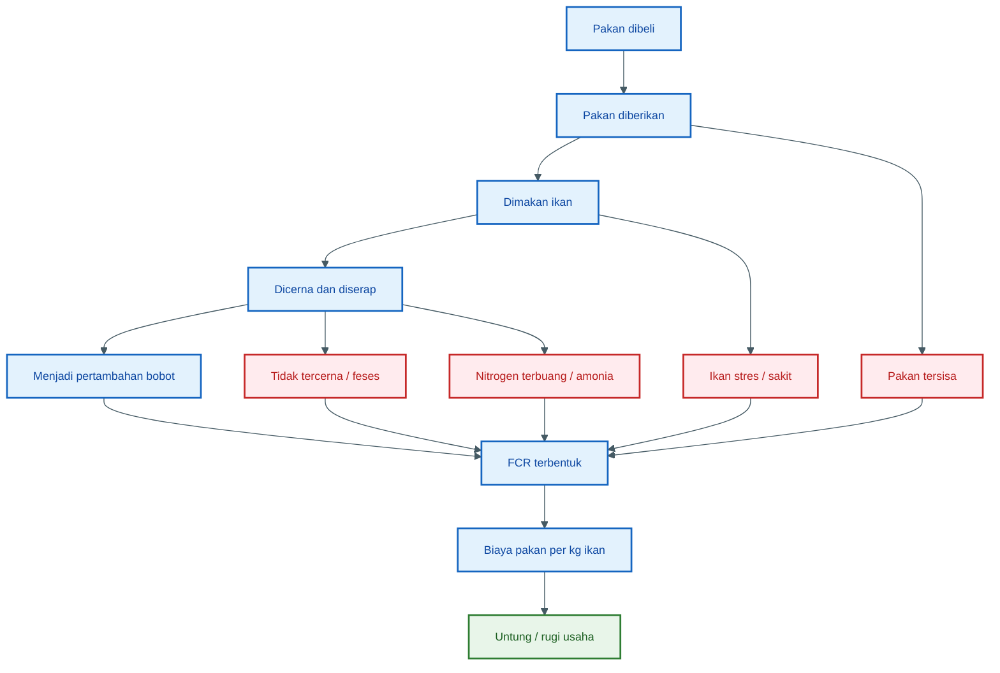
```mermaid
%%{init: {
  "theme": "base",
  "themeVariables": {
    "fontFamily": "Arial",
    "fontSize": "13px",
    "lineColor": "#455A64",
    "primaryColor": "#E3F2FD",
    "primaryTextColor": "#0D47A1",
    "primaryBorderColor": "#1565C0"
  }
}}%%
flowchart TD
    A["Pakan dibeli"] --> B["Pakan diberikan"]
    B --> C["Dimakan ikan"]
    C --> D["Dicerna dan diserap"]
    D --> E["Menjadi pertambahan bobot"]
    E --> F["FCR terbentuk"]

    B --> G["Pakan tersisa"]
    C --> H["Ikan stres / sakit"]
    D --> I["Tidak tercerna / feses"]
    D --> J["Nitrogen terbuang / amonia"]

    G --> F
    H --> F
    I --> F
    J --> F

    F --> K["Biaya pakan per kg ikan"]
    K --> L["Untung / rugi usaha"]

    classDef utama fill:#E3F2FD,stroke:#1565C0,stroke-width:2px,color:#0D47A1;
    classDef rugi fill:#FFEBEE,stroke:#C62828,stroke-width:2px,color:#B71C1C;
    classDef hasil fill:#E8F5E9,stroke:#2E7D32,stroke-width:2px,color:#1B5E20;

    class A,B,C,D,E,F,K,L utama;
    class G,H,I,J rugi;
    class L hasil;
```

## 1.8 Kalimat kunci Bab 1

> Menurunkan FCR berarti mengurangi kebocoran pakan agar sebanyak mungkin nutrien berubah menjadi bobot lele.

[**Kembali ke Atas**](#menurunkan-fcr-lele-dari-pakan-dimakan-sampai-menjadi-daging)

---

# Bab 2 — Proses Pakan Menjadi Daging Lele

Pakan tidak langsung berubah menjadi daging hanya karena dimakan. Di dalam tubuh lele, pakan harus melewati serangkaian proses biologis: **dimakan, masuk ke saluran cerna, dicerna, diserap, masuk ke darah, dipakai untuk kebutuhan hidup, lalu sisanya baru menjadi pertumbuhan**.

Karena itu, untuk memahami FCR, praktisi harus memahami terlebih dahulu **ke mana pakan pergi** setelah masuk ke mulut lele.

## 2.1 Alur besar proses pakan menjadi daging

Secara ringkas, alurnya adalah sebagai berikut:

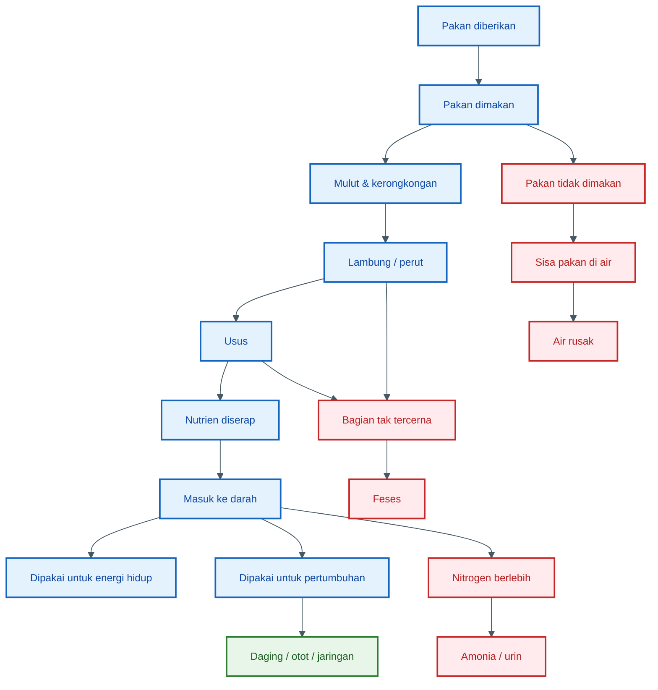
```mermaid
%%{init: {
  "theme": "base",
  "themeVariables": {
    "fontFamily": "Arial",
    "fontSize": "13px",
    "lineColor": "#455A64",
    "primaryColor": "#E3F2FD",
    "primaryTextColor": "#0D47A1",
    "primaryBorderColor": "#1565C0"
  }
}}%%
flowchart TD
    A["Pakan diberikan"] --> B["Pakan dimakan"]
    B --> C["Mulut & kerongkongan"]
    C --> D["Lambung / perut"]
    D --> E["Usus"]
    E --> F["Nutrien diserap"]
    F --> G["Masuk ke darah"]
    G --> H["Dipakai untuk energi hidup"]
    G --> I["Dipakai untuk pertumbuhan"]
    I --> J["Daging / otot / jaringan"]

    D --> K["Bagian tak tercerna"]
    E --> K
    K --> L["Feses"]

    G --> M["Nitrogen berlebih"]
    M --> N["Amonia / urin"]

    B --> O["Pakan tidak dimakan"]
    O --> P["Sisa pakan di air"]
    P --> Q["Air rusak"]

    classDef input fill:#E3F2FD,stroke:#1565C0,stroke-width:2px,color:#0D47A1;
    classDef proses fill:#FFF3E0,stroke:#EF6C00,stroke-width:2px,color:#E65100;
    classDef hasil fill:#E8F5E9,stroke:#2E7D32,stroke-width:2px,color:#1B5E20;
    classDef rugi fill:#FFEBEE,stroke:#C62828,stroke-width:2px,color:#B71C1C;

    class A,B,C,D,E,F,G,H,I input;
    class J hasil;
    class K,L,M,N,O,P,Q rugi;
```

Diagram ini menunjukkan bahwa pakan yang diberikan bisa berakhir ke beberapa arah:

1. **menjadi pertumbuhan**,
2. **menjadi energi hidup**,
3. **keluar sebagai feses**,
4. **terbuang sebagai amonia/urin**,
5. **tidak dimakan dan merusak air**.

Dari sudut pandang FCR, target kita adalah **memperbesar jalur menuju pertumbuhan** dan **memperkecil seluruh jalur kehilangan**.

## 2.2 Pakan yang tidak dimakan

Bagian pertama yang harus dipahami adalah bahwa tidak semua pakan yang diberikan akan dimakan.

Jika pakan tidak dimakan, maka pakan itu:

- langsung menjadi kerugian ekonomi,
- tenggelam atau melayang di air,
- mulai terurai,
- menambah beban organik,
- meningkatkan amonia,
- menurunkan kualitas air,
- menurunkan oksigen terlarut,
- akhirnya memperburuk FCR.

Secara praktis:

```mdx
pakan diberikan
tetapi tidak dimakan
= rugi langsung

- rugi tidak langsung melalui penurunan kualitas air
```

Karena itu, salah satu prinsip terpenting dalam budidaya lele adalah:

> **Pakan harus diberikan sesuai kemampuan makan ikan, bukan sekadar sesuai kebiasaan atau feeling.**

## 2.3 Pakan dimakan: masuk mulut, kerongkongan, lalu lambung

Setelah pelet dimakan, pakan masuk melalui mulut dan kerongkongan menuju lambung/perut. Di bagian ini dimulai proses pencernaan awal, terutama terhadap protein.

Di lambung/perut:

- pakan menjadi lebih lunak,
- bahan pakan terhidrasi,
- enzim pencernaan mulai bekerja,
- protein mulai terurai menjadi fragmen yang lebih kecil.

Bagian ini penting karena kualitas lambung dan kerja enzim awal menentukan apakah pakan akan mudah diteruskan ke tahap berikutnya atau justru menyisakan banyak bagian yang sulit dicerna.

## 2.4 Pencernaan lanjut di usus

Setelah dari lambung/perut, bahan pakan bergerak ke usus. Di sinilah pencernaan lanjutan berlangsung lebih intensif.

Pada tahap ini:

- protein dipecah lebih lanjut menjadi peptida dan asam amino,
- karbohidrat dicerna menjadi gula yang lebih sederhana,
- lemak dipecah menjadi asam lemak dan gliserol,
- vitamin dan mineral tersedia untuk diserap.

Dengan kata lain, usus adalah **lokasi utama pencernaan lanjutan sekaligus penyerapan nutrien**.

## 2.5 Nutrien yang diserap di dinding usus

Nutrien hasil pencernaan tidak otomatis menjadi daging. Nutrien harus lebih dulu diserap oleh dinding usus.

Nutrien utama yang diserap meliputi:

- **asam amino** dari protein,
- **glukosa** dari karbohidrat tercerna,
- **asam lemak** dari lemak,
- **vitamin**,
- **mineral**.

Jika pakan berkualitas buruk atau saluran cerna tidak sehat, maka penyerapan nutrien menjadi tidak efisien. Akibatnya:

- pertumbuhan turun,
- feses meningkat,
- FCR memburuk.

## 2.6 Nutrien masuk darah

Setelah diserap, nutrien masuk ke aliran darah. Darah bertugas mengangkut nutrien ke seluruh tubuh.

Di tahap ini, tubuh lele “memutuskan” ke mana nutrien akan digunakan, yaitu:

- untuk kebutuhan hidup dasar,
- untuk aktivitas dan metabolisme,
- untuk pertumbuhan jaringan,
- untuk perbaikan sel dan organ,
- untuk sistem imun,
- untuk pembentukan daging/otot.

Jadi darah adalah jalur distribusi, bukan tempat akhir.

## 2.7 Nutrien dipakai untuk energi hidup

Tidak semua nutrien yang masuk darah akan menjadi daging.

Tubuh lele selalu memiliki prioritas penggunaan nutrien, yaitu:

1. bertahan hidup,
2. menjaga fungsi organ,
3. bernapas,
4. bergerak,
5. menyeimbangkan cairan tubuh,
6. mempertahankan sistem imun,
7. memperbaiki jaringan,
8. baru sisanya dipakai untuk pertumbuhan.

Artinya, jika ikan stres, kualitas air jelek, ikan sakit, atau suhu lingkungan tidak nyaman, maka lebih banyak nutrien yang habis untuk **hidup**, bukan untuk **tumbuh**.

Inilah alasan mengapa lele yang tampak “tetap makan” belum tentu tumbuh efisien.

## 2.8 Nutrien dipakai untuk pertumbuhan daging

Bagian yang paling diinginkan pembudidaya adalah saat nutrien, terutama asam amino, dipakai untuk membentuk jaringan tubuh.

Urutannya:

```mdx
protein pakan
→ dicerna menjadi asam amino
→ diserap di usus
→ masuk darah
→ dibawa ke jaringan tubuh
→ disusun ulang menjadi protein tubuh
→ membentuk otot / daging
```

Namun proses ini hanya berjalan baik jika syarat berikut terpenuhi:

- pakan dimakan dengan baik,
- protein cukup dan mudah dicerna,
- asam amino cukup seimbang,
- energi cukup sehingga protein tidak dibakar,
- usus sehat,
- ikan tidak stres,
- air kolam baik.

Karena itu, pertumbuhan daging bukan hanya soal tinggi protein, tetapi **soal efisiensi seluruh rantai pencernaan dan metabolisme**.

## 2.9 Pakan yang dimakan tetapi tidak tercerna

Sebagian bahan pakan bisa saja dimakan, tetapi tidak berhasil dicerna atau tidak berhasil diserap dengan baik.

Bagian ini akan keluar sebagai feses.

Ini biasanya terjadi bila:

- pakan terlalu berserat,
- bahan terlalu kasar,
- protein sulit dicerna,
- pelet kualitas rendah,
- usus tidak sehat,
- transit terlalu cepat,
- ikan stres.

Secara praktis, banyaknya feses adalah sinyal bahwa ada bagian nutrisi yang bocor.

```mdx
pakan dimakan
tetapi tidak tercerna / tidak terserap
= feses
= kebocoran FCR
```

## 2.10 Kelebihan protein dan nitrogen menjadi amonia

Protein adalah sumber asam amino, dan asam amino mengandung nitrogen. Jika protein berlebih, tidak seimbang, atau digunakan untuk energi, maka bagian nitrogennya akan dibuang oleh tubuh.

Dalam budidaya lele, pembuangan nitrogen ini terutama berakhir sebagai **amonia**, yang keluar terutama melalui insang, dan sebagian dalam bentuk sisa metabolisme melalui urin.

Konsekuensinya besar:

- energi protein terbuang,
- biaya pakan terbuang,
- amonia kolam naik,
- kualitas air menurun,
- ikan makin stres,
- FCR bisa makin buruk.

Dengan kata lain:

```mdx
protein tidak efisien
→ nitrogen terbuang
→ amonia naik
→ air rusak
→ FCR memburuk
```

## 2.11 Jalur-jalur kehilangan pakan

Agar lebih mudah dipahami, pakan yang diberikan pada lele bisa hilang melalui empat jalur utama:

### Jalur 1 — Tidak dimakan

- menjadi sisa pakan,
- membusuk,
- merusak air.

### Jalur 2 — Dimakan tetapi tidak tercerna

- menjadi feses,
- menambah beban organik.

### Jalur 3 — Dimakan, dicerna, tetapi dipakai untuk hidup

- dipakai untuk gerak,
- pernapasan,
- osmoregulasi,
- stres,
- imun,
- perbaikan jaringan.

### Jalur 4 — Dimakan, dicerna, tetapi nitrogen terbuang

- protein dipakai sebagai energi,
- nitrogen dibuang sebagai amonia/urin.

Target budidaya yang baik adalah **mengurangi keempat kebocoran ini**.

## 2.12 Diagram jalur pertumbuhan dan jalur limbah

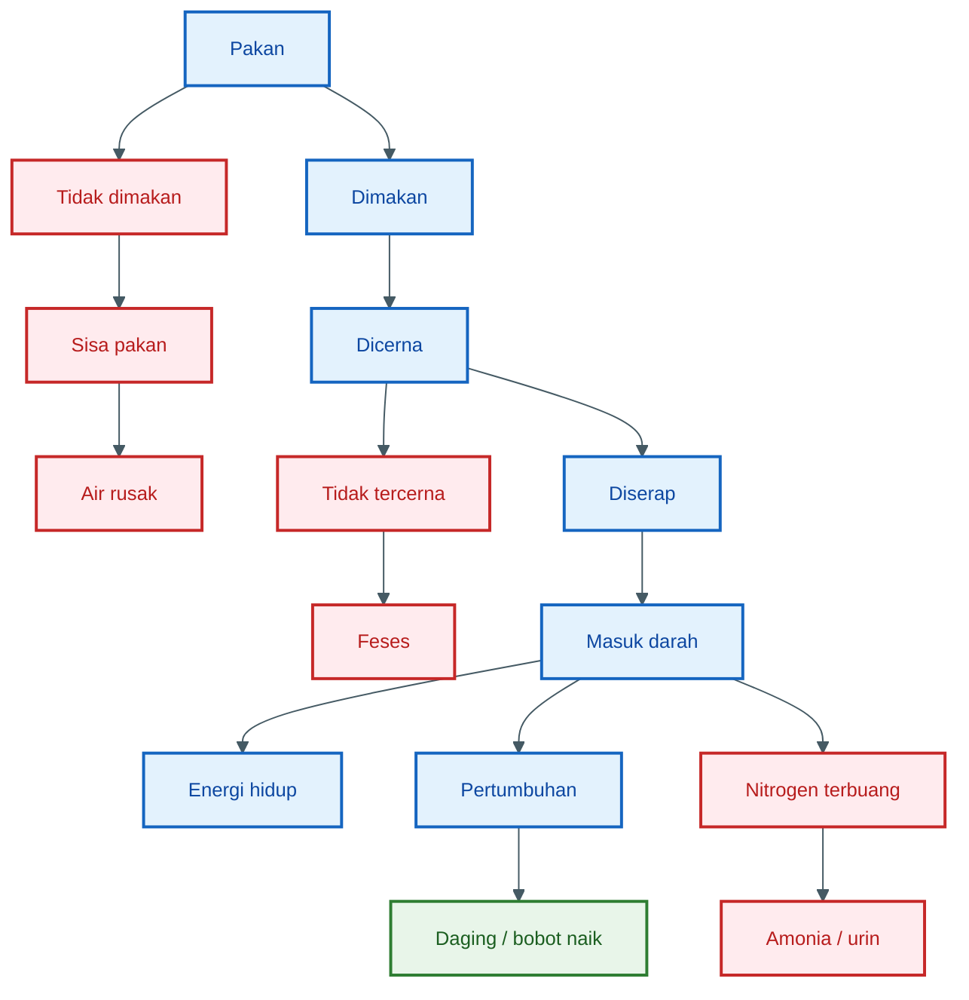
```mermaid
%%{init: {
  "theme": "base",
  "themeVariables": {
    "fontFamily": "Arial",
    "fontSize": "13px",
    "lineColor": "#455A64",
    "primaryColor": "#E3F2FD",
    "primaryTextColor": "#0D47A1",
    "primaryBorderColor": "#1565C0"
  }
}}%%
flowchart TD
    A["Pakan"] --> B["Dimakan"]
    A --> C["Tidak dimakan"]
    C --> D["Sisa pakan"]
    D --> E["Air rusak"]

    B --> F["Dicerna"]
    F --> G["Diserap"]
    F --> H["Tidak tercerna"]
    H --> I["Feses"]

    G --> J["Masuk darah"]
    J --> K["Energi hidup"]
    J --> L["Pertumbuhan"]
    J --> M["Nitrogen terbuang"]

    L --> N["Daging / bobot naik"]
    M --> O["Amonia / urin"]

    classDef utama fill:#E3F2FD,stroke:#1565C0,stroke-width:2px,color:#0D47A1;
    classDef rugi fill:#FFEBEE,stroke:#C62828,stroke-width:2px,color:#B71C1C;
    classDef hasil fill:#E8F5E9,stroke:#2E7D32,stroke-width:2px,color:#1B5E20;

    class A,B,F,G,J,K,L utama;
    class C,D,E,H,I,M,O rugi;
    class N hasil;
```

## 2.13 Inti biologis Bab 2

Dari seluruh uraian di atas, ada satu prinsip yang sangat penting:

> **Pakan tidak langsung menjadi daging. Pakan harus dimakan, dicerna, diserap, lalu setelah kebutuhan hidup terpenuhi, sisanya baru menjadi pertumbuhan.**

Itulah sebabnya budidaya lele yang efisien tidak hanya berbicara tentang **berapa banyak pakan diberikan**, tetapi terutama tentang:

- berapa banyak pakan dimakan,
- berapa banyak yang dicerna,
- berapa banyak yang diserap,
- berapa banyak yang ditahan menjadi tubuh,
- dan berapa banyak yang hilang sebagai sisa pakan, feses, amonia, atau stres metabolik.

[**Kembali ke Atas**](#menurunkan-fcr-lele-dari-pakan-dimakan-sampai-menjadi-daging)

---

# Bab 3 — Lambung, Usus, Darah, Feses, dan Amonia

Untuk menurunkan FCR, praktisi perlu memahami satu hal mendasar: **pakan yang dimakan lele tidak otomatis menjadi daging**. Pakan harus melewati saluran cerna, dipecah oleh enzim, diserap di usus, masuk darah, lalu dipakai tubuh. Sebagiannya menjadi daging, sebagian menjadi energi hidup, sebagian keluar sebagai feses, dan sebagian nitrogen terbuang sebagai amonia.

Kalimat kunci bab ini:

> **Feses adalah tanda bahan tidak terserap. Amonia adalah tanda nitrogen terbuang. Keduanya adalah kebocoran FCR.**

<figure>
  
  <figcaption>
    Ilustrasi sistem pencernaan lele dan proses pemanfaatan pakan di dalam
    tubuh.
  </figcaption>
</figure>

---

## 3.1. Gambaran Sederhana Saluran Cerna Lele

Saluran cerna lele dapat dipahami sebagai rangkaian proses:

```mdx
mulut
→ kerongkongan
→ lambung/perut
→ usus
→ rektum/anus
```

Namun proses pakan menjadi daging tidak hanya melibatkan saluran cerna. Ada organ lain yang ikut menentukan efisiensi pakan:

- **hati**, membantu metabolisme nutrien dan produksi empedu,
- **pankreas**, menghasilkan enzim pencernaan,
- **usus**, tempat pencernaan lanjutan dan penyerapan utama,
- **darah**, mengangkut nutrien,
- **insang**, tempat keluarnya sebagian besar amonia,
- **ginjal**, membantu pembuangan sebagian sisa metabolisme dan pengaturan cairan.

Diagram ringkasnya:

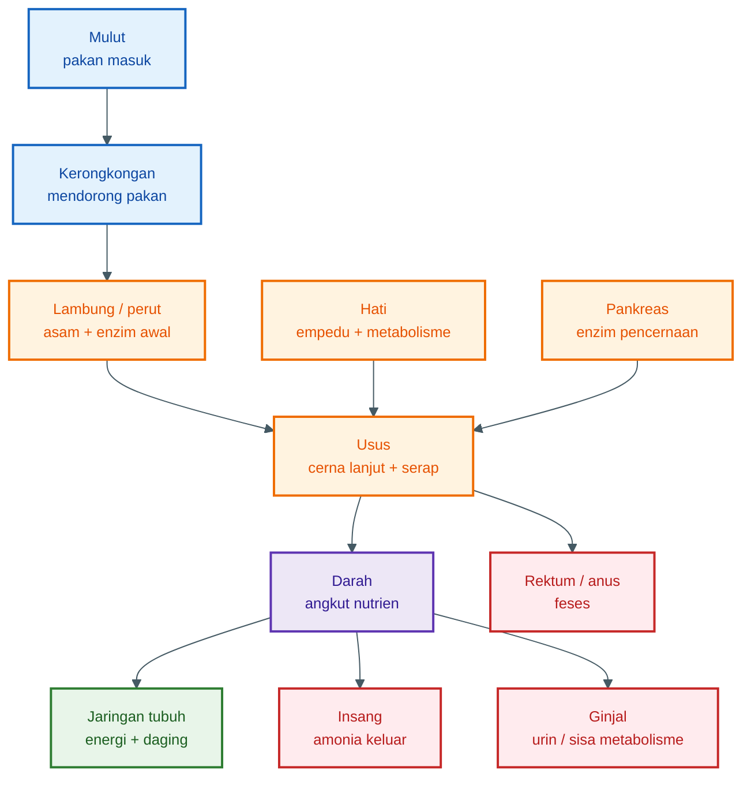
```mermaid
%%{init: {
  "theme": "base",
  "themeVariables": {
    "fontFamily": "Arial",
    "fontSize": "13px",
    "lineColor": "#455A64"
  }
}}%%
flowchart TD
    A["Mulut<br/>pakan masuk"] --> B["Kerongkongan<br/>mendorong pakan"]
    B --> C["Lambung / perut<br/>asam + enzim awal"]
    C --> D["Usus<br/>cerna lanjut + serap"]
    D --> E["Darah<br/>angkut nutrien"]
    E --> F["Jaringan tubuh<br/>energi + daging"]
    D --> G["Rektum / anus<br/>feses"]
    E --> H["Insang<br/>amonia keluar"]
    E --> I["Ginjal<br/>urin / sisa metabolisme"]

    J["Hati<br/>empedu + metabolisme"] --> D
    K["Pankreas<br/>enzim pencernaan"] --> D

    classDef masuk fill:#E3F2FD,stroke:#1565C0,stroke-width:2px,color:#0D47A1;
    classDef cerna fill:#FFF3E0,stroke:#EF6C00,stroke-width:2px,color:#E65100;
    classDef serap fill:#EDE7F6,stroke:#5E35B1,stroke-width:2px,color:#311B92;
    classDef hasil fill:#E8F5E9,stroke:#2E7D32,stroke-width:2px,color:#1B5E20;
    classDef limbah fill:#FFEBEE,stroke:#C62828,stroke-width:2px,color:#B71C1C;

    class A,B masuk;
    class C,D,J,K cerna;
    class E serap;
    class F hasil;
    class G,H,I limbah;
```

Intinya, FCR tidak hanya ditentukan oleh pelet, tetapi juga oleh seberapa baik organ-organ ini bekerja.

---

## 3.2. Mulut dan Kerongkongan

Mulut adalah pintu pertama. Di tahap ini, yang paling menentukan adalah **apakah pelet dimakan atau tidak**.

Faktor yang memengaruhi pakan dimakan:

- ukuran pelet sesuai bukaan mulut,
- aroma pakan menarik,
- tekstur tidak terlalu keras,
- pakan tidak tengik,
- air tidak buruk,
- ikan tidak stres,
- ikan tidak sakit.

Setelah dimakan, pakan masuk ke kerongkongan. Kerongkongan berfungsi mendorong pakan menuju lambung/perut.

Pada tahap ini belum terjadi pencernaan besar. Yang paling penting adalah pakan masuk dengan baik dan tidak dimuntahkan atau ditolak.

---

## 3.3. Lambung / Perut

Lambung atau perut adalah tempat awal pemecahan protein yang penting. Di sini pakan mulai dilunakkan dan terkena kondisi asam serta enzim pencernaan.

Fungsi lambung/perut:

- menampung pakan sementara,
- mencampur pakan dengan cairan pencernaan,
- melunakkan pakan,
- memulai pemecahan protein,
- menyiapkan pakan agar mudah dicerna lanjut di usus.

Secara sederhana:

```mdx
protein pakan
→ terkena asam dan enzim
→ mulai terurai
→ peptida lebih kecil
```

Pada tahap ini protein belum sepenuhnya menjadi asam amino. Protein baru mulai dipotong menjadi bagian lebih kecil.

Alurnya:

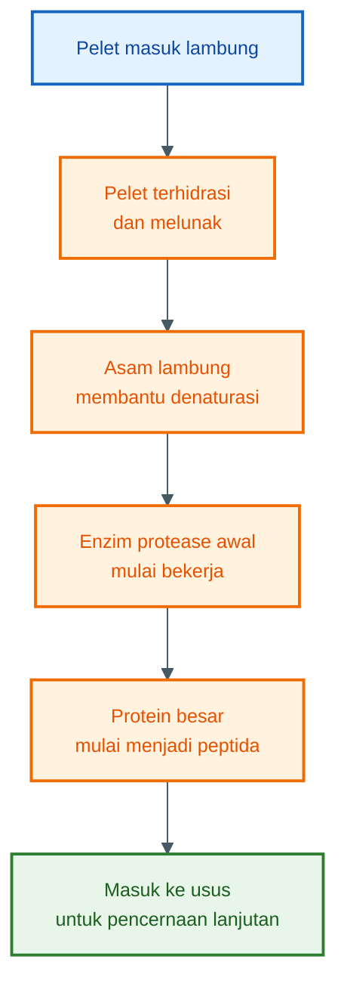
```mermaid
%%{init: {
  "theme": "base",
  "themeVariables": {
    "fontFamily": "Arial",
    "fontSize": "13px",
    "lineColor": "#455A64"
  }
}}%%
flowchart TD
    A["Pelet masuk lambung"] --> B["Pelet terhidrasi<br/>dan melunak"]
    B --> C["Asam lambung<br/>membantu denaturasi"]
    C --> D["Enzim protease awal<br/>mulai bekerja"]
    D --> E["Protein besar<br/>mulai menjadi peptida"]
    E --> F["Masuk ke usus<br/>untuk pencernaan lanjutan"]

    classDef input fill:#E3F2FD,stroke:#1565C0,stroke-width:2px,color:#0D47A1;
    classDef proses fill:#FFF3E0,stroke:#EF6C00,stroke-width:2px,color:#E65100;
    classDef hasil fill:#E8F5E9,stroke:#2E7D32,stroke-width:2px,color:#1B5E20;

    class A input;
    class B,C,D,E proses;
    class F hasil;
```

Implikasinya bagi FCR:

> Protein yang mudah dicerna akan lebih cepat diproses. Protein yang sulit dicerna akan memperbesar feses, menambah beban usus, dan menurunkan efisiensi pakan.

---

## 3.4. Usus

Usus adalah pusat pencernaan lanjutan dan lokasi utama penyerapan nutrisi.

Di usus, pakan yang sudah diproses dari lambung akan terkena enzim lanjutan. Enzim ini membantu memecah nutrien menjadi bentuk yang lebih kecil dan siap diserap.

Fungsi utama usus:

- melanjutkan pemecahan protein,
- memecah karbohidrat tercerna,
- memecah lemak,
- menyerap asam amino,
- menyerap glukosa,
- menyerap asam lemak,
- menyerap vitamin dan mineral,
- meneruskan sisa tidak tercerna menjadi feses.

Pencernaan di usus dibantu oleh:

- enzim dari pankreas,
- empedu dari hati,
- enzim pada dinding usus,
- kondisi mikrobiota usus yang stabil.

Secara sederhana:

```mdx
protein → peptida kecil → asam amino
pati → gula sederhana
lemak → asam lemak + gliserol
```

Bagian yang berhasil dipecah dan diserap akan masuk darah. Bagian yang tidak tercerna akan terus bergerak ke usus akhir dan menjadi feses.

---

## 3.5. Penyerapan Nutrisi di Dinding Usus

Penyerapan nutrisi utama terjadi di dinding usus. Dinding usus memiliki permukaan yang memungkinkan nutrien masuk ke tubuh.

Nutrien yang diserap:

| Nutrien    | Asal                 | Fungsi utama                                  |
| ---------- | -------------------- | --------------------------------------------- |
| Asam amino | protein              | bahan pembentuk otot, enzim, hormon, jaringan |
| Glukosa    | karbohidrat tercerna | energi                                        |
| Asam lemak | lemak                | energi, membran sel, cadangan energi          |
| Vitamin    | pakan/premix         | fungsi metabolisme                            |
| Mineral    | pakan/premix         | tulang, cairan tubuh, enzim, osmoregulasi     |

Jika pakan sulit dicerna, nutrien tidak maksimal diserap. Akibatnya:

```mdx
protein tidak terserap
→ feses meningkat
→ nitrogen terbuang
→ air lebih cepat rusak
→ FCR memburuk
```

Diagram ringkas penyerapan:

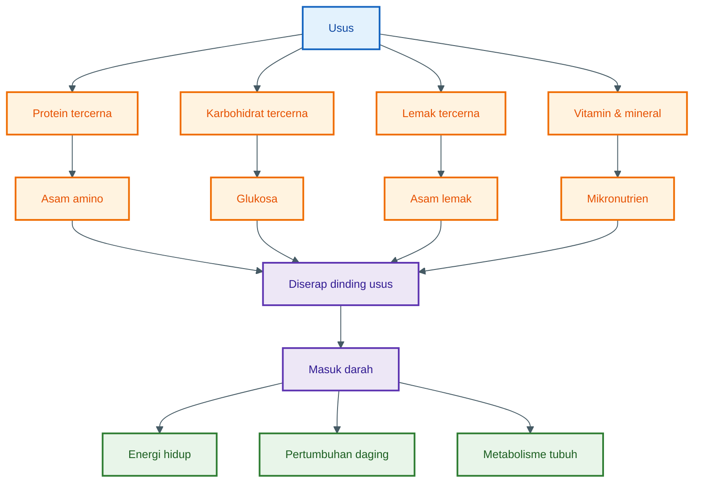
```mermaid
%%{init: {
  "theme": "base",
  "themeVariables": {
    "fontFamily": "Arial",
    "fontSize": "13px",
    "lineColor": "#455A64"
  }
}}%%
flowchart TD
    A["Usus"] --> B["Protein tercerna"]
    A --> C["Karbohidrat tercerna"]
    A --> D["Lemak tercerna"]
    A --> E["Vitamin & mineral"]

    B --> F["Asam amino"]
    C --> G["Glukosa"]
    D --> H["Asam lemak"]
    E --> I["Mikronutrien"]

    F --> J["Diserap dinding usus"]
    G --> J
    H --> J
    I --> J

    J --> K["Masuk darah"]
    K --> L["Energi hidup"]
    K --> M["Pertumbuhan daging"]
    K --> N["Metabolisme tubuh"]

    classDef organ fill:#E3F2FD,stroke:#1565C0,stroke-width:2px,color:#0D47A1;
    classDef nutrisi fill:#FFF3E0,stroke:#EF6C00,stroke-width:2px,color:#E65100;
    classDef serap fill:#EDE7F6,stroke:#5E35B1,stroke-width:2px,color:#311B92;
    classDef hasil fill:#E8F5E9,stroke:#2E7D32,stroke-width:2px,color:#1B5E20;

    class A organ;
    class B,C,D,E,F,G,H,I nutrisi;
    class J,K serap;
    class L,M,N hasil;
```

---

## 3.6. Hati dan Pankreas

Hati dan pankreas tidak selalu terlihat dalam pembahasan FCR, tetapi keduanya penting.

### Hati

Hati berperan dalam:

- metabolisme nutrien,
- penyimpanan energi,
- produksi empedu,
- pengaturan lemak,
- detoksifikasi sebagian senyawa,
- pengelolaan nitrogen dan metabolisme protein.

Empedu membantu proses pencernaan lemak, sehingga lemak bisa lebih mudah dipecah dan diserap.

### Pankreas

Pankreas menghasilkan enzim pencernaan, antara lain:

- protease,
- amilase,
- lipase.

Fungsinya:

```mdx
protease → memecah protein
amilase → memecah pati
lipase → memecah lemak
```

Tanpa kerja enzim yang baik, pakan akan lebih banyak keluar sebagai feses dan FCR memburuk.

---

## 3.7. Darah sebagai Jalur Distribusi Nutrien

Setelah nutrien diserap di usus, nutrien masuk ke darah. Darah membawa nutrien ke jaringan tubuh.

Darah membawa:

- asam amino,
- glukosa,
- asam lemak,
- vitamin,
- mineral,
- metabolit lain.

Nutrien yang sudah masuk darah kemudian dipakai untuk:

1. energi hidup,
2. perbaikan jaringan,
3. sistem imun,
4. pembentukan enzim,
5. hormon,
6. pembentukan otot/daging.

Namun tubuh selalu punya prioritas. Jika ikan stres atau sakit, nutrien banyak dipakai untuk bertahan hidup dan memperbaiki kerusakan, bukan untuk pertumbuhan.

---

## 3.8. Nutrien Menjadi Daging

Daging lele terutama terbentuk dari jaringan otot. Untuk membentuk otot, tubuh membutuhkan asam amino.

Alurnya:

```mdx
protein pakan
→ peptida
→ asam amino
→ diserap usus
→ masuk darah
→ disusun menjadi protein tubuh
→ otot / daging
```

Namun proses ini hanya efisien jika:

- protein pakan mudah dicerna,
- asam amino cukup seimbang,
- energi dari karbohidrat/lemak cukup,
- ikan sehat,
- air stabil,
- tidak ada stres berat,
- pakan tidak berlebihan.

Jika energi kurang, sebagian asam amino akan dibakar sebagai energi. Jika asam amino tidak seimbang, sebagian nitrogen tetap terbuang.

---

## 3.9. Feses: Bahan yang Tidak Tercerna dan Tidak Terserap

Feses berasal dari bahan pakan yang:

- tidak dicerna,
- tidak diserap,
- terlalu berserat,
- terlalu kasar,
- sulit dipecah,
- cepat lewat di saluran cerna,
- atau tidak dapat dimanfaatkan tubuh.

Banyak feses bisa menandakan:

- pakan kurang cerna,
- serat terlalu tinggi,
- pelet terlalu banyak bahan pengisi,
- protein sulit dicerna,
- usus tidak sehat,
- pemberian pakan berlebihan.

Secara praktis:

```mdx
feses banyak
= nutrisi tidak banyak diserap
= beban organik naik
= kualitas air turun
= FCR berpotensi memburuk
```

Feses bukan hanya limbah tubuh ikan. Dalam kolam, feses menjadi beban organik yang dapat meningkatkan konsumsi oksigen dan memperburuk kualitas air.

---

## 3.10. Insang, Ginjal, Urin, dan Amonia

Sisa nitrogen dari metabolisme protein terutama keluar sebagai amonia. Pada ikan, amonia banyak keluar melalui insang. Sebagian sisa metabolisme lain keluar melalui ginjal dan urin.

Ini perlu dibedakan:

### Feses

Berasal dari:

```mdx
bahan pakan yang tidak tercerna

- bahan yang tidak terserap
```

Keluar melalui:

```mdx
usus akhir / anus
```

### Amonia

Berasal dari:

```mdx
metabolisme protein / asam amino

- nitrogen yang tidak ditahan menjadi tubuh
```

Keluar terutama melalui:

```mdx
insang
```

Sebagian sisa metabolisme keluar melalui:

```mdx
ginjal / urin
```

Diagram pembeda:

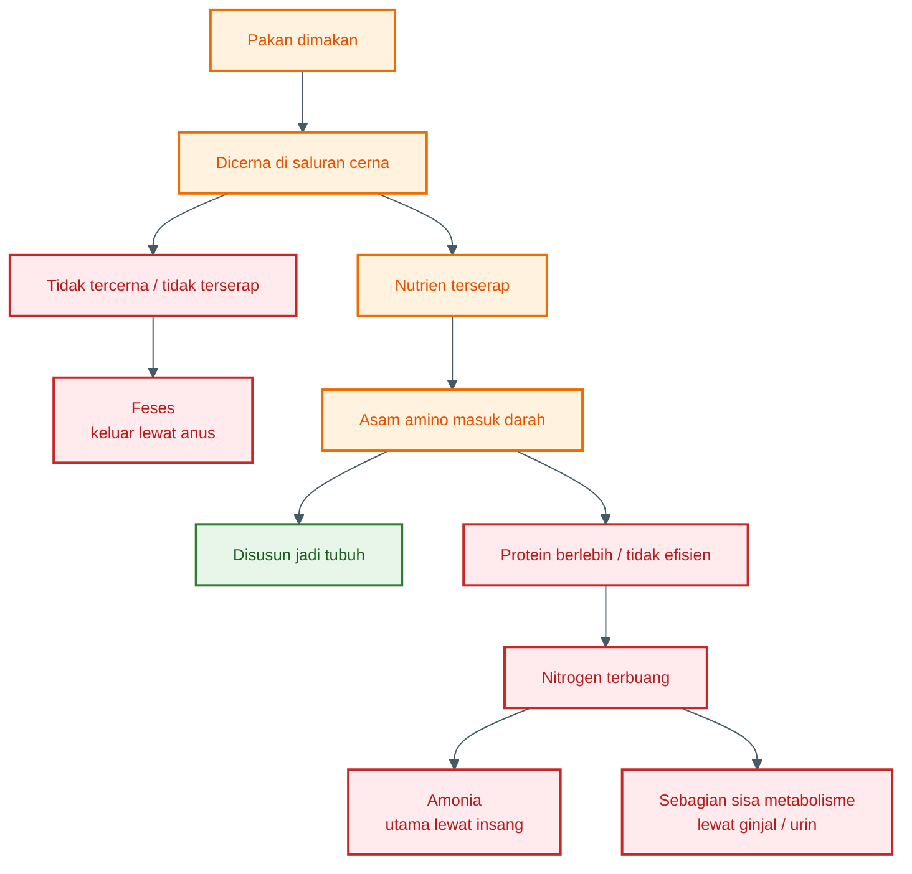
```mermaid
%%{init: {
  "theme": "base",
  "themeVariables": {
    "fontFamily": "Arial",
    "fontSize": "13px",
    "lineColor": "#455A64"
  }
}}%%
flowchart TD
    A["Pakan dimakan"] --> B["Dicerna di saluran cerna"]
    B --> C["Tidak tercerna / tidak terserap"]
    C --> D["Feses<br/>keluar lewat anus"]

    B --> E["Nutrien terserap"]
    E --> F["Asam amino masuk darah"]
    F --> G["Disusun jadi tubuh"]
    F --> H["Protein berlebih / tidak efisien"]
    H --> I["Nitrogen terbuang"]
    I --> J["Amonia<br/>utama lewat insang"]
    I --> K["Sebagian sisa metabolisme<br/>lewat ginjal / urin"]

    classDef input fill:#E3F2FD,stroke:#1565C0,stroke-width:2px,color:#0D47A1;
    classDef proses fill:#FFF3E0,stroke:#EF6C00,stroke-width:2px,color:#E65100;
    classDef hasil fill:#E8F5E9,stroke:#2E7D32,stroke-width:2px,color:#1B5E20;
    classDef limbah fill:#FFEBEE,stroke:#C62828,stroke-width:2px,color:#B71C1C;

    class A,B,E,F proses;
    class G hasil;
    class C,D,H,I,J,K limbah;
```

---

## 3.11. Kenapa Protein Berlebih Menjadi Amonia?

Protein tersusun dari asam amino. Asam amino mengandung nitrogen. Ketika asam amino tidak digunakan untuk membentuk tubuh, nitrogen harus dibuang.

Protein bisa menjadi amonia bila:

- protein terlalu tinggi dibanding kebutuhan,
- energi pakan kurang,
- karbohidrat/lemak tidak cukup,
- asam amino tidak seimbang,
- pakan sulit dicerna,
- ikan stres,
- ikan sakit,
- kualitas air buruk.

Contoh logika:

```mdx
energi kurang
→ tubuh membakar asam amino
→ nitrogen dilepas
→ amonia meningkat
```

Atau:

```mdx
asam amino tidak seimbang
→ sebagian tidak bisa dipakai untuk sintesis protein tubuh
→ nitrogen terbuang
→ amonia meningkat
```

Maka pakan protein tinggi tidak selalu berarti pertumbuhan tinggi. Jika tidak seimbang, sebagian protein justru menjadi limbah nitrogen.

---

## 3.12. Feses dan Amonia sebagai Kebocoran FCR

Dalam konteks FCR, feses dan amonia adalah dua bentuk kebocoran yang berbeda.

| Bentuk kebocoran  | Asal                                | Arti praktis                               |
| ----------------- | ----------------------------------- | ------------------------------------------ |
| Feses             | bahan tidak tercerna/tidak terserap | pakan kurang termanfaatkan                 |
| Amonia            | nitrogen dari protein/asam amino    | protein tidak tertahan menjadi tubuh       |
| Sisa pakan        | pakan tidak dimakan                 | kerugian langsung dan air rusak            |
| Panas/metabolisme | energi untuk hidup/stres            | nutrien habis untuk bertahan, bukan tumbuh |

Jadi FCR turun jika:

```mdx
feses berkurang

- amonia terkendali
- sisa pakan berkurang
- energi stres berkurang
- pertumbuhan naik
```

---

## 3.13. Kesimpulan Bab 3

Saluran cerna lele bekerja melalui rangkaian organ: mulut, kerongkongan, lambung, usus, darah, insang, ginjal, dan anus. Lambung memulai pemecahan protein, usus melanjutkan pencernaan dan menjadi lokasi utama penyerapan, darah mengangkut nutrien, sedangkan feses dan amonia menunjukkan bagian nutrisi yang tidak menjadi tubuh.

Kesimpulan praktisnya:

> **Feses adalah tanda bahan tidak terserap. Amonia adalah tanda nitrogen terbuang. Keduanya adalah kebocoran FCR yang harus dikurangi melalui pakan yang lebih cerna, energi yang cukup, air yang baik, dan manajemen pemberian pakan yang tepat.**

[**Kembali ke Atas**](#menurunkan-fcr-lele-dari-pakan-dimakan-sampai-menjadi-daging)

---

# Bab 4 — Peran Mikroba dalam Pencernaan Lele: Penting, tetapi Bukan Tukang Sulap

Mikroba dalam saluran cerna lele memang penting. Mikroba membantu menjaga ekosistem usus, menekan mikroba merugikan, menghasilkan metabolit tertentu, dan dapat mendukung efisiensi pemanfaatan pakan.

Namun peran mikroba harus diletakkan secara proporsional.

Kalimat kunci bab ini:

> **Mikroba membantu efisiensi pencernaan, tetapi pakan tetap harus sudah layak cerna sebelum masuk ke mulut lele.**

---

## 4.1. Koreksi Penting: Mikroba Bukan Pemeran Utama Pemecah Nutrisi Berat

Dalam diskusi pakan, sering muncul anggapan:

```mdx
pakan masuk ke perut ikan
→ mikroba langsung memfermentasi
→ protein, serat, dan nutrisi berat terurai total
→ semua terserap
```

Anggapan ini terlalu berlebihan.

Yang lebih akurat:

```mdx
pakan masuk tubuh lele
→ enzim ikan bekerja sebagai pemeran utama
→ mikroba membantu lingkungan usus
→ sebagian mikroba/enzim mikroba dapat membantu
→ tetapi tidak terjadi fermentasi total seperti di wadah/drum
```

Proses pencernaan dalam tubuh lele berlangsung relatif cepat. Substrat pakan terus bergerak dari lambung ke usus lalu ke bagian akhir saluran cerna. Kondisinya tidak seperti fermentasi di wadah yang bisa berlangsung 24 jam, 3 hari, atau 7 hari.

Maka perlu ditegaskan:

> **Proses pencernaan di dalam tubuh lele berlangsung cepat, sehingga mikroba usus dapat membantu, tetapi tidak realistis berharap mikroba memecah total protein, serat, atau nutrisi berat secara besar-besaran dalam sekali lewat.**

---

## 4.2. Enzim Ikan sebagai Pemeran Utama

Pemeran utama pemecahan nutrisi dalam tubuh lele adalah **enzim pencernaan ikan itu sendiri**.

Tiga kelompok enzim penting:

| Enzim    | Target                    | Hasil                   |
| -------- | ------------------------- | ----------------------- |
| Protease | protein                   | peptida dan asam amino  |
| Amilase  | pati/karbohidrat tercerna | gula sederhana          |
| Lipase   | lemak                     | asam lemak dan gliserol |

Secara sederhana:

```mdx
protease:
protein → peptida → asam amino

amilase:
pati → gula sederhana

lipase:
lemak → asam lemak + gliserol
```

Diagram:

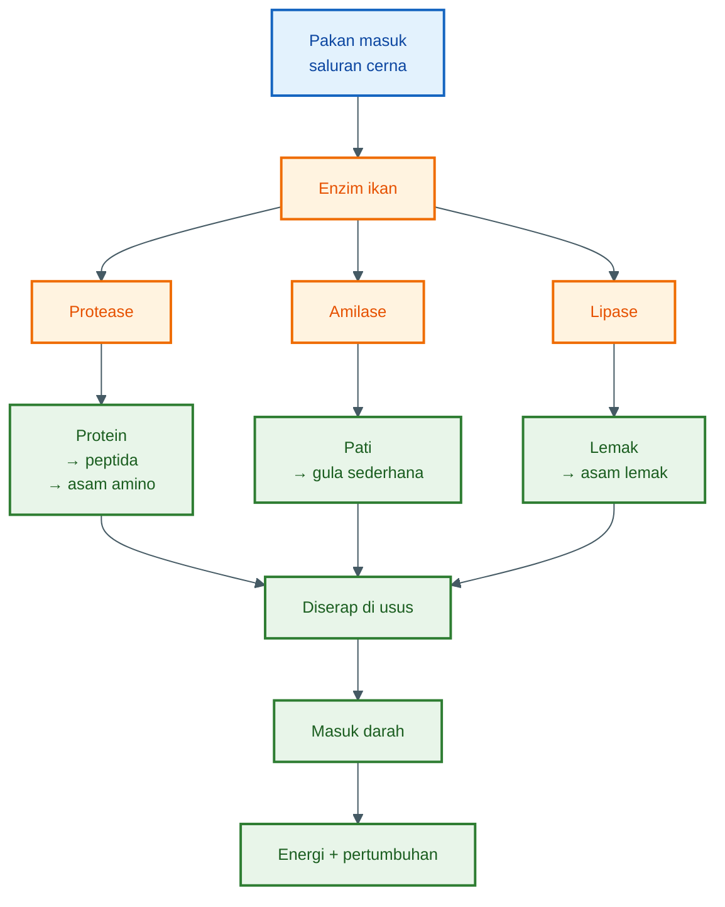
```mermaid
%%{init: {
  "theme": "base",
  "themeVariables": {
    "fontFamily": "Arial",
    "fontSize": "13px",
    "lineColor": "#455A64"
  }
}}%%
flowchart TD
    A["Pakan masuk<br/>saluran cerna"] --> B["Enzim ikan"]

    B --> C["Protease"]
    B --> D["Amilase"]
    B --> E["Lipase"]

    C --> F["Protein<br/>→ peptida<br/>→ asam amino"]
    D --> G["Pati<br/>→ gula sederhana"]
    E --> H["Lemak<br/>→ asam lemak"]

    F --> I["Diserap di usus"]
    G --> I
    H --> I

    I --> J["Masuk darah"]
    J --> K["Energi + pertumbuhan"]

    classDef input fill:#E3F2FD,stroke:#1565C0,stroke-width:2px,color:#0D47A1;
    classDef enzim fill:#FFF3E0,stroke:#EF6C00,stroke-width:2px,color:#E65100;
    classDef hasil fill:#E8F5E9,stroke:#2E7D32,stroke-width:2px,color:#1B5E20;

    class A input;
    class B,C,D,E enzim;
    class F,G,H,I,J,K hasil;
```

Jadi, kalau pakan dari awal sulit dicerna, terlalu berserat, atau proteinnya buruk, mikroba usus tidak bisa sepenuhnya menyelamatkan keadaan.

---

## 4.3. Mikroba sebagai Pendukung Ekosistem Usus

Mikroba tetap penting, tetapi perannya lebih sebagai **pendukung sistem**, bukan pengganti enzim ikan.

Peran mikroba usus:

- membantu menjaga keseimbangan mikrobiota,
- menekan mikroba merugikan,
- menghasilkan metabolit tertentu,
- mendukung kesehatan mukosa usus,
- membantu stabilitas lingkungan usus,
- bisa menghasilkan sebagian enzim,
- membantu imunitas,
- membantu efisiensi pemanfaatan nutrien secara tidak langsung.

Mikroba yang menguntungkan bisa membantu membuat usus lebih stabil. Usus yang stabil membuat ikan lebih efisien memanfaatkan pakan.

Namun, perannya tetap terbatas oleh waktu transit dan kondisi saluran cerna.

---

## 4.4. Perbedaan Fermentasi di Wadah dan Proses dalam Usus

Ini perbedaan penting.

| Aspek    | Fermentasi di wadah                | Pencernaan dalam tubuh lele            |
| -------- | ---------------------------------- | -------------------------------------- |
| Waktu    | bisa 12 jam sampai beberapa hari   | relatif singkat                        |
| Substrat | diam, bisa diaduk                  | terus bergerak                         |
| Mikroba  | bisa dibuat dominan                | harus bersaing dengan mikrobiota lokal |
| Air      | bisa diatur tinggi                 | mengikuti kondisi saluran cerna        |
| pH       | bisa diatur                        | berubah sesuai organ                   |
| Tujuan   | hidrolisis/pengasaman/predigestion | cerna, serap, buang sisa               |
| Hasil    | bahan terfermentasi                | nutrien terserap atau keluar           |

Artinya, fermentasi bahan pakan sebelum diberikan tidak sama dengan “fermentasi” di dalam usus ikan.

Jika ingin protein kasar, serat, atau bahan sulit cerna dipecah lebih banyak, proses yang lebih efektif adalah dilakukan **sebelum feeding**, bukan menunggu mikroba usus bekerja penuh.

---

## 4.5. Batas Kerja Mikroba dalam Saluran Cerna

Mikroba dalam saluran cerna lele dibatasi oleh beberapa faktor.

### 1. Waktu transit terbatas

Pakan tidak tinggal lama seperti di drum fermentasi. Pakan bergerak dari lambung ke usus, lalu ke usus akhir.

### 2. pH berubah

Kondisi di lambung berbeda dengan usus. Mikroba harus tahan perubahan pH.

### 3. Substrat terus bergerak

Pakan tidak diam. Mikroba tidak punya waktu panjang untuk mengurai bahan berat.

### 4. Mikroba harus bersaing

Mikroba dari probiotik harus bersaing dengan mikrobiota lokal yang sudah ada di usus.

### 5. Tidak semua mikroba menghasilkan enzim yang dibutuhkan

Tidak semua probiotik menghasilkan protease, amilase, lipase, cellulase, atau xylanase dalam jumlah berarti.

Maka klaim “probiotik memecah semua nutrisi” harus diuji, bukan langsung diterima.

---

## 4.6. Apa yang Masih Bisa Dibantu Mikroba?

Mikroba tetap bisa membantu FCR melalui beberapa jalur.

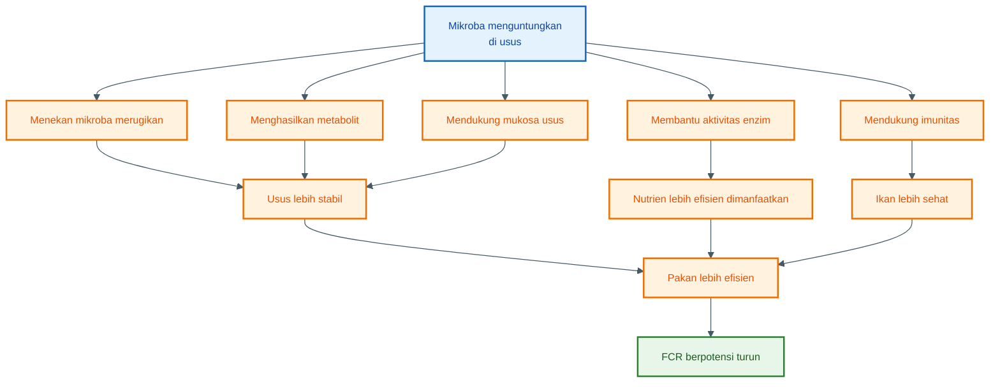
```mermaid
%%{init: {
  "theme": "base",
  "themeVariables": {
    "fontFamily": "Arial",
    "fontSize": "13px",
    "lineColor": "#455A64"
  }
}}%%
flowchart TD
    A["Mikroba menguntungkan<br/>di usus"] --> B["Menekan mikroba merugikan"]
    A --> C["Menghasilkan metabolit"]
    A --> D["Mendukung mukosa usus"]
    A --> E["Membantu aktivitas enzim"]
    A --> F["Mendukung imunitas"]

    B --> G["Usus lebih stabil"]
    C --> G
    D --> G
    E --> H["Nutrien lebih efisien dimanfaatkan"]
    F --> I["Ikan lebih sehat"]

    G --> J["Pakan lebih efisien"]
    H --> J
    I --> J

    J --> K["FCR berpotensi turun"]

    classDef mikroba fill:#E3F2FD,stroke:#1565C0,stroke-width:2px,color:#0D47A1;
    classDef proses fill:#FFF3E0,stroke:#EF6C00,stroke-width:2px,color:#E65100;
    classDef hasil fill:#E8F5E9,stroke:#2E7D32,stroke-width:2px,color:#1B5E20;

    class A mikroba;
    class B,C,D,E,F,G,H,I,J proses;
    class K hasil;
```

Mekanisme yang realistis:

```mdx
mikroba baik
→ usus lebih stabil
→ ikan lebih sehat
→ pakan lebih efisien
→ FCR berpotensi turun
```

Bukan:

```mdx
mikroba masuk
→ semua protein dan serat langsung terurai total
→ semua menjadi daging
```

---

## 4.7. Peran Probiotik dalam Pakan Lele

Probiotik dalam konteks pakan lele dapat membantu jika:

- mikroba masih hidup,
- dosis masuk akal,
- aplikasinya benar,
- pakan dasarnya masih layak,
- kualitas air tidak buruk,
- ikan tidak sedang stres berat,
- tidak disimpan basah terlalu lama.

Probiotik dapat berperan sebagai:

- penyeimbang mikrobiota usus,
- pesaing mikroba merugikan,
- penghasil metabolit,
- pendukung sistem imun,
- pendukung efisiensi pencernaan.

Namun probiotik tidak bisa memperbaiki pakan yang:

- tengik,
- berjamur,
- terlalu tinggi serat,
- terlalu tinggi abu,
- busuk,
- tercemar,
- atau asam aminonya sangat tidak seimbang.

---

## 4.8. Probiotik Enzimatik: Lebih Relevan untuk Pencernaan

Beberapa mikroba, terutama kelompok tertentu seperti **Bacillus**, sering digunakan karena potensinya menghasilkan enzim.

Enzim yang mungkin relevan:

| Enzim     | Fungsi                            |
| --------- | --------------------------------- |
| Protease  | membantu pemecahan protein        |
| Amilase   | membantu pemecahan pati           |
| Lipase    | membantu pemecahan lemak          |
| Cellulase | membantu pemecahan sebagian serat |
| Xylanase  | membantu pemecahan hemiselulosa   |

Namun, klaim enzimatik harus tetap dilihat dari:

- jenis mikroba,
- strain,
- CFU,
- kondisi penyimpanan,
- suhu aplikasi,
- ketersediaan substrat,
- waktu kontak,
- bukti performa di kolam.

Jika produk hanya menyebut “mengandung probiotik” tanpa informasi lebih lanjut, maka klaim pemecahan nutrisi harus dianggap belum kuat.

---

## 4.9. Mikroba dalam Usus vs Conditioning Pelet Sebelum Feeding

Ada dua lokasi kerja yang perlu dibedakan.

### Di dalam usus

Mikroba membantu ekosistem usus dan efisiensi pemanfaatan pakan, tetapi waktunya terbatas.

### Di luar tubuh ikan

Mikroba atau enzim punya waktu lebih panjang untuk bekerja pada pelet atau bahan pakan.

Contoh:

```mdx
pelet

- probiotik/enzim
- sedikit air
  → conditioning 6–24 jam
  → sebagian fraksi protein/karbohidrat lebih mudah diakses
```

Atau:

```mdx
bahan protein lokal

- enzim/probiotik
  → fermentasi/hidrolisis beberapa hari
  → hidrolisat / bahan lebih mudah cerna
```

Karena itu, jika ingin membantu pemecahan nutrisi, strategi yang lebih kuat adalah:

> **memperbaiki pakan sebelum masuk ke mulut ikan.**

---

## 4.10. Jangan Mengandalkan Mikroba untuk Mengatasi Pakan Buruk

Pakan buruk tidak otomatis menjadi baik hanya karena diberi probiotik.

Probiotik bisa membantu, tetapi tidak menyelamatkan:

- protein rusak,
- pakan tengik,
- jamur,
- mikotoksin,
- serat tinggi,
- abu tinggi,
- pelet hancur,
- bahan busuk,
- formulasi tidak seimbang.

Prinsip praktis:

```mdx
pakan layak + probiotik tepat
= peluang FCR membaik

pakan buruk + probiotik
= risiko tetap tinggi
```

---

## 4.11. Implikasi Praktis untuk Menurunkan FCR

Untuk memanfaatkan peran mikroba dengan realistis, lakukan pendekatan berikut:

1. **Pilih pakan dasar yang masih layak.**
   Jangan mulai dari pakan rusak.

2. **Gunakan probiotik sebagai pendukung, bukan penyelamat.**
   Fokusnya kesehatan usus dan efisiensi.

3. **Jika ingin pemecahan nutrisi lebih besar, lakukan conditioning sebelum feeding.**
   Jangan berharap semuanya terjadi di usus.

4. **Jangan menyimpan pelet basah terlalu lama.**
   Pelet basah mudah rusak.

5. **Uji dengan FCR, bukan asumsi.**
   Jika probiotik/conditioning tidak menurunkan FCR, berarti belum efektif di sistem tersebut.

---

## 4.12. Diagram Posisi Mikroba dalam Strategi FCR

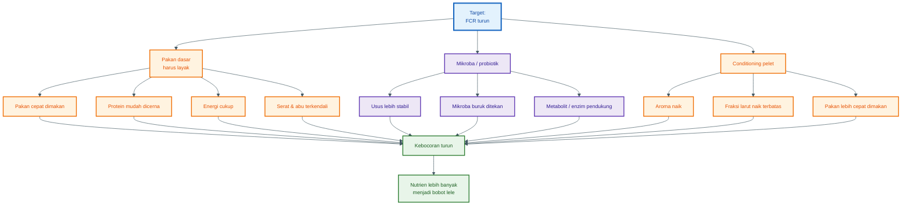
```mermaid
%%{init: {
  "theme": "base",
  "themeVariables": {
    "fontFamily": "Arial",
    "fontSize": "13px",
    "lineColor": "#455A64"
  }
}}%%
flowchart TD
    A["Target:<br/>FCR turun"] --> B["Pakan dasar<br/>harus layak"]
    B --> C["Pakan cepat dimakan"]
    B --> D["Protein mudah dicerna"]
    B --> E["Energi cukup"]
    B --> F["Serat & abu terkendali"]

    A --> G["Mikroba / probiotik"]
    G --> H["Usus lebih stabil"]
    G --> I["Mikroba buruk ditekan"]
    G --> J["Metabolit / enzim pendukung"]

    A --> K["Conditioning pelet"]
    K --> L["Aroma naik"]
    K --> M["Fraksi larut naik terbatas"]
    K --> N["Pakan lebih cepat dimakan"]

    C --> O["Kebocoran turun"]
    D --> O
    E --> O
    F --> O
    H --> O
    I --> O
    J --> O
    L --> O
    M --> O
    N --> O

    O --> P["Nutrien lebih banyak<br/>menjadi bobot lele"]

    classDef target fill:#E3F2FD,stroke:#1565C0,stroke-width:3px,color:#0D47A1;
    classDef faktor fill:#FFF3E0,stroke:#EF6C00,stroke-width:2px,color:#E65100;
    classDef mikroba fill:#EDE7F6,stroke:#5E35B1,stroke-width:2px,color:#311B92;
    classDef hasil fill:#E8F5E9,stroke:#2E7D32,stroke-width:2px,color:#1B5E20;

    class A target;
    class B,C,D,E,F,K,L,M,N faktor;
    class G,H,I,J mikroba;
    class O,P hasil;
```

---

## 4.13. Kesimpulan Bab 4

Mikroba dalam saluran cerna lele penting, tetapi bukan tukang sulap. Pemecahan nutrisi utama tetap dilakukan oleh enzim tubuh ikan. Mikroba membantu menjaga ekosistem usus, menekan mikroba merugikan, menghasilkan metabolit, mendukung imunitas, dan mungkin membantu sebagian aktivitas enzimatik.

Namun, karena proses pencernaan berlangsung relatif cepat dan pakan terus bergerak, tidak realistis berharap mikroba usus memecah total protein, serat, atau nutrisi berat secara besar-besaran dalam sekali lewat.

Kesimpulan praktisnya:

> **Mikroba membantu efisiensi pencernaan, tetapi pakan tetap harus sudah layak cerna sebelum masuk ke mulut lele. Jika ingin pemecahan nutrisi lebih besar, lakukan perbaikan pakan sebelum feeding melalui pemilihan pelet yang baik, conditioning, hidrolisat, enzim, atau fermentasi bahan baku.**

[**Kembali ke Atas**](#menurunkan-fcr-lele-dari-pakan-dimakan-sampai-menjadi-daging)

---

# Bab 5 — Protein, Karbohidrat, Lemak, dan Protein-Sparing Effect

Dalam pakan lele, protein adalah komponen mahal. Karena itu protein sebaiknya digunakan terutama untuk membentuk tubuh ikan: otot, jaringan, enzim, hormon, dan sistem imun. Protein **tidak ideal jika dibakar sebagai energi**, karena selain mahal, hasil akhirnya juga menghasilkan limbah nitrogen berupa amonia.

Di sinilah peran karbohidrat dan lemak menjadi penting. Karbohidrat dan lemak dapat menyediakan energi sehingga protein lebih banyak “dihemat” untuk pertumbuhan. Konsep ini disebut **protein-sparing effect**.

Kalimat kunci bab ini:

> **FCR turun ketika protein lebih banyak ditahan menjadi tubuh ikan, bukan dibuang sebagai amonia.**

---

## 5.1. Protein: Mahal, Penting, tetapi Bisa Terbuang

Protein adalah sumber asam amino. Asam amino digunakan lele untuk membentuk:

- otot/daging,
- enzim,
- hormon,
- jaringan tubuh,
- sistem imun,
- perbaikan sel,
- organ tubuh.

Alur ideal protein adalah:

```mdx
protein pakan
→ dicerna menjadi peptida
→ dipecah menjadi asam amino
→ diserap usus
→ masuk darah
→ disusun menjadi protein tubuh
→ daging / pertumbuhan
```

Namun protein tidak selalu berakhir menjadi daging. Protein bisa dibakar sebagai energi bila:

- energi dari karbohidrat/lemak kurang,
- protein diberikan berlebihan,
- asam amino tidak seimbang,
- ikan stres,
- air buruk,
- pakan sulit dicerna,
- ikan sakit.

Jika protein dibakar sebagai energi, maka nitrogen dari asam amino harus dibuang. Pada ikan, sisa nitrogen terutama keluar sebagai amonia melalui insang.

Secara sederhana:

```mdx
protein
→ asam amino
→ dipakai sebagai energi
→ nitrogen terbuang
→ amonia naik
```

Ini adalah kerugian ganda:

1. protein mahal tidak menjadi daging,
2. amonia merusak kualitas air.

---

## 5.2. Protein Tidak Cukup Hanya Tinggi di Label

Pakan dengan protein tinggi belum tentu menghasilkan FCR baik. Yang penting bukan hanya **protein kasar**, tetapi:

- protein tercerna,
- keseimbangan asam amino,
- energi cukup,
- serat rendah,
- bahan tidak rusak,
- pakan dimakan cepat,
- air tetap stabil.

Contoh sederhana:

```mdx
Pakan A:
protein kasar = 30%
protein mudah dicerna
asam amino cukup seimbang

Pakan B:
protein kasar = 35%
protein sulit dicerna
serat/abu tinggi
asam amino tidak seimbang
```

Pakan B terlihat lebih tinggi protein, tetapi belum tentu lebih baik. Jika protein tidak tercerna atau tidak seimbang, sebagian akan menjadi feses dan amonia.

---

## 5.3. Karbohidrat: Energi Murah, tetapi Ada Batas

Karbohidrat adalah sumber energi yang lebih murah dibanding protein. Dalam pakan lele, karbohidrat terutama berfungsi sebagai:

- sumber energi,
- penghemat protein,
- bahan pembentuk pelet,
- perekat alami melalui pati,
- penurun biaya formula.

Karbohidrat yang baik untuk pakan lele adalah karbohidrat yang **mudah dicerna**, terutama pati.

Contoh sumber karbohidrat:

- tapioka,
- jagung giling,
- menir,
- tepung gandum,
- dedak halus terbatas,
- pati yang sudah dimasak/tergelatinisasi.

Alur karbohidrat:

```mdx
pati / karbohidrat tercerna
→ glukosa
→ energi hidup
```

Karbohidrat membantu agar protein tidak dibakar sebagai energi.

Namun, karbohidrat tidak boleh dipahami sebagai pengganti protein. Karbohidrat tidak menyediakan asam amino. Karbohidrat tidak membawa nitrogen untuk membentuk otot.

Jadi:

```mdx
karbohidrat
= sumber energi

protein
= bahan pembentuk jaringan
```

---

## 5.4. Pati Tergelatinisasi Lebih Baik daripada Pati Mentah Kasar

Pati dalam bahan seperti jagung, tapioka, atau gandum akan lebih mudah dicerna bila mengalami pemanasan atau gelatinisasi. Itulah salah satu alasan proses ekstrusi atau pemasakan bahan pakan bisa meningkatkan pemanfaatan energi.

Secara praktis:

```mdx
pati mentah kasar
→ lebih sulit dicerna

pati dimasak / tergelatinisasi
→ lebih mudah dicerna
→ energi lebih tersedia
```

Pati yang lebih mudah dicerna membantu menyediakan energi bagi ikan. Jika energi cukup, protein lebih banyak dipakai untuk pertumbuhan.

---

## 5.5. Serat Kasar Tidak Banyak Berguna untuk Lele

Serat memang termasuk kelompok karbohidrat, tetapi bukan karbohidrat yang mudah dimanfaatkan lele.

Serat kasar tinggi biasanya berasal dari:

- dedak kasar,
- sekam,
- kulit biji,
- bahan hijauan,
- limbah tanaman berserat,
- bahan pakan murah tetapi kualitas rendah.

Masalah serat tinggi:

- sulit dicerna lele,
- mempercepat keluarnya feses,
- menurunkan kecernaan protein,
- membuat feses lebih banyak,
- menambah beban organik kolam,
- memperburuk kualitas air,
- berpotensi menaikkan FCR.

Secara sederhana:

```mdx
serat tinggi
→ kecernaan turun
→ feses naik
→ air cepat kotor
→ FCR memburuk
```

Karena itu, bahan seperti Azolla, daun-daunan, dedak kasar, atau limbah hijauan tidak cocok dijadikan tulang punggung pakan lele intensif.

---

## 5.6. Karbohidrat Berlebihan Juga Merugikan

Karbohidrat memang murah, tetapi jika terlalu banyak, formula pakan menjadi tidak seimbang.

Risikonya:

- kadar protein formula turun,
- asam amino esensial kurang,
- pertumbuhan melambat,
- feses meningkat,
- pelet bisa mudah hancur bila formulasi buruk,
- FCR naik,
- biaya per kg ikan justru meningkat.

Pola salah yang sering terjadi:

```mdx
protein mahal
→ diganti terlalu banyak dedak/tapioka
→ pakan tampak murah
→ pertumbuhan turun
→ FCR naik
→ biaya panen naik
```

Jadi karbohidrat harus digunakan sebagai **energi dan binder**, bukan sebagai pengganti protein utama.

---

## 5.7. Lemak: Energi Padat dan Penghemat Protein

Lemak adalah sumber energi yang lebih padat dibanding karbohidrat. Lemak juga membantu protein tidak dibakar sebagai energi.

Fungsi lemak dalam pakan:

- sumber energi padat,
- membantu protein-sparing effect,
- mendukung membran sel,
- membantu penyerapan vitamin larut lemak,
- meningkatkan palatabilitas pada dosis tepat,
- bisa menjadi perekat top-coating.

Alur sederhananya:

```mdx
lemak
→ asam lemak
→ energi
```

Lemak dapat membantu FCR jika digunakan dengan tepat. Namun, lemak juga punya risiko.

---

## 5.8. Risiko Lemak Berlebihan

Lemak berlebihan atau lemak berkualitas buruk dapat menimbulkan masalah:

- pakan cepat tengik,
- bau pakan rusak,
- ikan menolak makan,
- air berminyak,
- kualitas air turun,
- hati ikan terbebani,
- pertumbuhan tidak efisien,
- FCR bisa memburuk.

Minyak yang digunakan untuk top-coating juga harus segar. Jangan memakai minyak tengik atau minyak jelantah berkualitas buruk.

Prinsip praktis:

```mdx
lemak cukup
→ energi terbantu
→ protein lebih hemat

lemak berlebihan / tengik
→ pakan rusak
→ air rusak
→ FCR memburuk
```

---

## 5.9. Protein-Sparing Effect

Protein-sparing effect adalah kondisi ketika energi dari karbohidrat dan lemak cukup, sehingga protein tidak banyak dibakar sebagai energi.

Alur yang diinginkan:

```mdx
karbohidrat / lemak
→ energi hidup

protein
→ asam amino
→ pertumbuhan jaringan
```

Alur yang tidak efisien:

```mdx
energi kurang
→ protein dibakar sebagai energi
→ nitrogen dibuang sebagai amonia
→ protein tidak menjadi daging
```

Diagram sederhana:

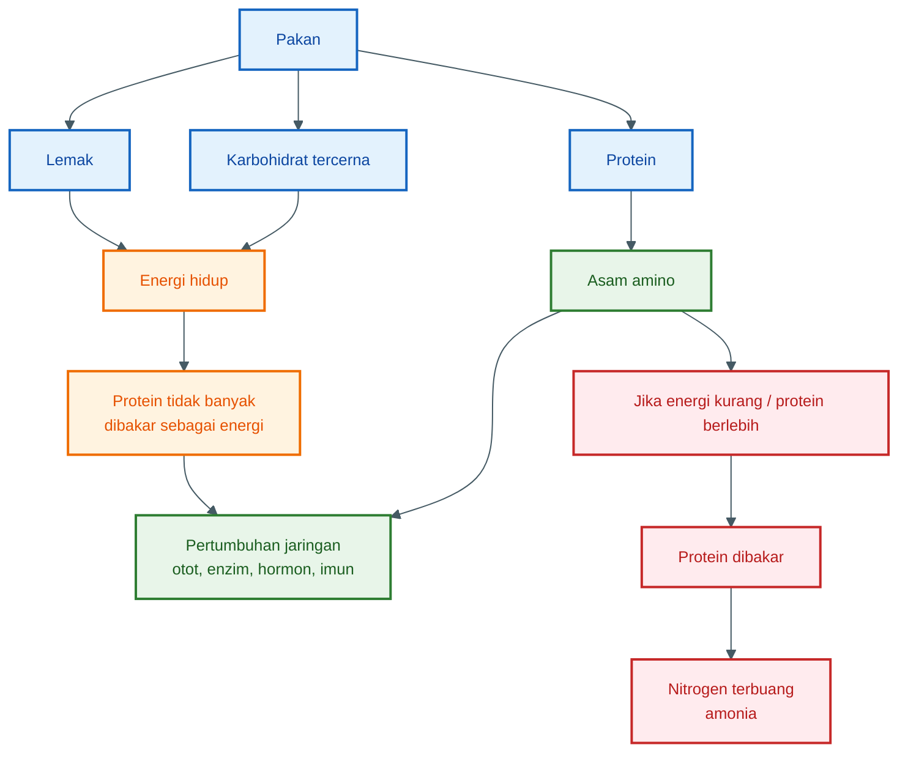
```mermaid
%%{init: {
  "theme": "base",
  "themeVariables": {
    "fontFamily": "Arial",
    "fontSize": "13px",
    "lineColor": "#455A64"
  }
}}%%
flowchart TD
    A["Pakan"] --> B["Protein"]
    A --> C["Karbohidrat tercerna"]
    A --> D["Lemak"]

    C --> E["Energi hidup"]
    D --> E

    B --> F["Asam amino"]
    F --> G["Pertumbuhan jaringan<br/>otot, enzim, hormon, imun"]

    E --> H["Protein tidak banyak<br/>dibakar sebagai energi"]
    H --> G

    F --> I["Jika energi kurang / protein berlebih"]
    I --> J["Protein dibakar"]
    J --> K["Nitrogen terbuang<br/>amonia"]

    classDef input fill:#E3F2FD,stroke:#1565C0,stroke-width:2px,color:#0D47A1;
    classDef energi fill:#FFF3E0,stroke:#EF6C00,stroke-width:2px,color:#E65100;
    classDef tumbuh fill:#E8F5E9,stroke:#2E7D32,stroke-width:2px,color:#1B5E20;
    classDef rugi fill:#FFEBEE,stroke:#C62828,stroke-width:2px,color:#B71C1C;

    class A,B,C,D input;
    class E,H energi;
    class F,G tumbuh;
    class I,J,K rugi;
```

FCR membaik jika jalur hijau lebih dominan daripada jalur merah.

---

## 5.10. Keseimbangan Protein dan Energi

Pakan lele harus memiliki keseimbangan antara protein dan energi.

Jika protein cukup tetapi energi kurang:

```mdx
protein dipakai sebagai energi
→ amonia naik
→ FCR buruk
```

Jika energi cukup tetapi protein kurang:

```mdx
ikan punya energi
tetapi bahan pembentuk daging kurang
→ pertumbuhan terbatas
```

Jika protein dan energi seimbang:

```mdx
karbohidrat / lemak → energi
protein → pertumbuhan
FCR berpotensi membaik
```

Jadi target formulasi bukan protein setinggi mungkin, tetapi **protein cukup, energi cukup, dan keduanya seimbang**.

---

## 5.11. Implikasi Praktis untuk Pembudidaya Lele

Untuk menurunkan FCR dari sisi nutrisi, praktisi harus memperhatikan:

1. **Protein harus cukup dan mudah dicerna.**
   Jangan hanya melihat angka protein kasar.

2. **Karbohidrat harus mudah dicerna.**
   Pati lebih baik daripada serat kasar.

3. **Lemak harus cukup dan segar.**
   Jangan memakai minyak tengik.

4. **Serat harus dikendalikan.**
   Serat tinggi biasanya membuat feses banyak.

5. **Energi harus cukup.**
   Energi yang cukup menghemat protein.

6. **Asam amino harus seimbang.**
   Protein tinggi tetapi asam amino timpang tetap tidak efisien.

---

## 5.12. Kesimpulan Bab 5

Protein, karbohidrat, dan lemak memiliki fungsi berbeda. Protein adalah bahan pembentuk tubuh. Karbohidrat dan lemak adalah sumber energi. FCR turun jika protein lebih banyak dipakai untuk membentuk tubuh, bukan dibakar sebagai energi.

Kesimpulan praktisnya:

> **Protein mahal sebaiknya menjadi daging. Karbohidrat dan lemak yang mudah dimanfaatkan harus menyediakan energi, sehingga protein tidak banyak terbuang menjadi amonia.**

[**Kembali ke Atas**](#menurunkan-fcr-lele-dari-pakan-dimakan-sampai-menjadi-daging)

---

# Bab 6 — Memilih Pelet dengan Protein Cerna yang Baik

Label pakan biasanya mencantumkan protein kasar, lemak kasar, serat kasar, abu, dan kadar air. Tetapi label jarang mencantumkan bahan baku, sumber protein, tingkat kecernaan, atau profil asam amino.

Karena itu, praktisi tidak boleh menilai pakan hanya dari angka protein kasar. Dua pakan dengan protein 30% bisa memiliki performa FCR yang berbeda jauh.

Kalimat kunci bab ini:

> **Pakan terbaik bukan yang proteinnya paling tinggi di label, tetapi yang paling efisien berubah menjadi daging lele.**

---

## 6.1. Protein Kasar vs Protein Tercerna

Protein kasar adalah angka hasil analisis nitrogen. Angka ini menunjukkan potensi protein, tetapi tidak menjamin semuanya bisa dicerna dan diserap.

Yang lebih penting adalah **protein tercerna**.

```mdx
protein tercerna =
protein kasar × tingkat kecernaan
```

Contoh:

```mdx
30% protein × 90% kecernaan = 27% protein tercerna
```

Bandingkan dengan:

```mdx
35% protein × 70% kecernaan = 24,5% protein tercerna
```

Pakan kedua tampak lebih tinggi protein di label, tetapi protein tercernanya lebih rendah.

Inilah sebabnya pakan tinggi protein belum tentu menghasilkan FCR lebih baik.

---

## 6.2. Kenapa Pabrikan Jarang Mencantumkan Bahan Baku?

Dalam praktik, pabrikan biasanya tidak mencantumkan detail bahan baku seperti:

- berapa persen tepung ikan,
- berapa persen bungkil kedelai,
- apakah memakai maggot,
- apakah ada poultry by-product meal,
- apakah ada tepung daging,
- berapa lisin dan metionin,
- berapa tingkat kecernaan protein.

Yang dicantumkan biasanya hanya analisis proksimat:

- protein kasar,
- lemak kasar,
- serat kasar,
- abu,
- kadar air.

Karena itu, pembudidaya perlu membaca **indikator tidak langsung** dari label dan performa pakan di kolam.

---

## 6.3. Indikator Tidak Langsung dari Label

Label pakan tetap berguna, tetapi harus dibaca dengan benar.

| Parameter label | Makna praktis                                                   |
| --------------- | --------------------------------------------------------------- |
| Protein kasar   | potensi protein, bukan protein tercerna                         |
| Lemak kasar     | sumber energi padat, tetapi harus segar                         |
| Serat kasar     | makin tinggi biasanya makin sulit dicerna                       |
| Abu             | mineral total; terlalu tinggi bisa mengencerkan nutrisi efektif |
| Kadar air       | makin tinggi makin mudah rusak                                  |

Label adalah titik awal, bukan keputusan akhir.

---

## 6.4. Makna Protein Kasar

Protein kasar menunjukkan kandungan nitrogen yang dikonversi menjadi estimasi protein. Namun protein kasar tidak menunjukkan:

- kualitas asam amino,
- kecernaan,
- sumber protein,
- apakah protein rusak,
- apakah bahan berjamur,
- apakah protein berasal dari bahan bernilai tinggi atau rendah.

Contoh dua pakan:

```mdx
Pakan A:
protein 30%
bahan protein mudah cerna
asam amino seimbang
FCR baik

Pakan B:
protein 30%
bahan kasar
serat tinggi
abu tinggi
FCR buruk
```

Keduanya sama-sama 30% protein, tetapi hasilnya bisa berbeda.

---

## 6.5. Makna Serat Tinggi

Serat kasar tinggi biasanya menunjukkan banyak bahan kasar atau bahan nabati berserat.

Kemungkinan sumber:

- dedak kasar,
- pollard berlebihan,
- kulit biji,
- bahan hijauan,
- bahan pengisi murah,
- limbah agroindustri berserat.

Dampaknya:

```mdx
serat tinggi
→ kecernaan turun
→ feses naik
→ air cepat kotor
→ FCR memburuk
```

Lele bukan ruminansia. Lele tidak efisien memanfaatkan serat kasar tinggi. Jadi, untuk pakan lele intensif, serat perlu dijaga tetap rendah.

---

## 6.6. Makna Abu Tinggi

Abu menunjukkan total mineral dalam pakan. Mineral memang dibutuhkan, tetapi abu terlalu tinggi bisa menjadi masalah.

Abu tinggi bisa mengindikasikan banyak:

- tulang,
- cangkang,
- kepala udang,
- mineral filler,
- bahan dengan banyak kotoran mineral,
- tepung ikan kualitas rendah,
- bahan tinggi pasir atau kontaminan mineral.

Masalah abu tinggi:

- protein efektif terdilusi,
- energi efektif turun,
- kecernaan bisa terganggu,
- feses meningkat,
- pakan tampak tinggi protein tetapi efisiensi rendah.

Secara praktis:

```mdx
abu tinggi
→ ruang nutrisi organik berkurang
→ protein dan energi efektif bisa turun
→ FCR berpotensi memburuk
```

Abu tidak selalu buruk, tetapi jika tinggi dan performa pakan jelek, abu harus dicurigai sebagai salah satu penyebab.

---

## 6.7. Makna Lemak

Lemak adalah sumber energi padat. Lemak membantu protein tidak dibakar sebagai energi. Tetapi lemak harus segar.

### Lemak terlalu rendah

Risiko:

- energi kurang,
- protein dibakar sebagai energi,
- amonia naik,
- pertumbuhan tidak efisien.

### Lemak cukup

Manfaat:

- energi tersedia,
- protein lebih hemat,
- palatabilitas bisa membaik,
- FCR bisa lebih baik.

### Lemak terlalu tinggi atau tengik

Risiko:

- pakan bau tengik,
- ikan menolak makan,
- air berminyak,
- kualitas air turun,
- gangguan metabolisme,
- FCR memburuk.

Jadi, lemak bukan hanya soal angka di label, tetapi juga soal kesegaran.

---

## 6.8. Makna Kadar Air

Kadar air yang tinggi membuat pakan lebih mudah rusak. Pakan kering yang disimpan baik lebih stabil daripada pakan yang lembap.

Pakan dengan kadar air tinggi atau penyimpanan buruk berisiko:

- jamur,
- bau apek,
- pakan menggumpal,
- vitamin rusak,
- minyak tengik,
- muncul mikotoksin.

Tanda pakan bermasalah:

```mdx
bau apek
bau tengik
menggumpal
berjamur
berubah warna
banyak serangga
kemasan lembap
```

Pakan seperti ini tidak layak diselamatkan dengan probiotik.

---

## 6.9. Uji Fisik Pakan Sebelum Dipakai

Karena label terbatas, uji fisik sangat penting.

Cek pakan dengan indera dan uji sederhana.

| Parameter      | Pakan baik         | Pakan mencurigakan      |
| -------------- | ------------------ | ----------------------- |
| Bau            | segar khas pakan   | tengik, apek, busuk     |
| Warna          | seragam            | belang, kusam, berjamur |
| Tekstur        | pelet utuh         | rapuh, banyak debu      |
| Debu/fines     | sedikit            | banyak                  |
| Kelembapan     | kering stabil      | lembap/menggumpal       |
| Stabilitas air | tidak cepat hancur | cepat larut/hancur      |
| Respons ikan   | cepat dimakan      | lambat dimakan          |

Uji sederhana stabilitas air:

```mdx
ambil 10 butir pelet
masukkan ke air kolam
amati 10–30 menit
lihat apakah pelet cepat hancur
```

Pelet yang terlalu cepat hancur akan kehilangan nutrisi sebelum dimakan.

---

## 6.10. Uji Respons Makan

Pakan yang baik biasanya cepat direspons ikan. Respons makan penting karena pakan yang cepat dimakan mengurangi risiko nutrisi larut dan air rusak.

Indikator respons makan baik:

- ikan cepat naik,
- pakan cepat habis,
- tidak banyak pakan tersisa,
- air tidak cepat bau,
- feses tidak berlebihan,
- pertumbuhan stabil.

Indikator pakan kurang baik:

- ikan lambat makan,
- pakan mengambang lama,
- banyak sisa,
- feses panjang dan banyak,
- air cepat keruh,
- bau air cepat berubah.

---

## 6.11. Performa Kolam adalah Uji Terakhir

Penilaian terbaik bukan label, tetapi performa di kolam.

Parameter yang harus dicatat:

- total pakan masuk,
- bobot awal,
- bobot akhir,
- kematian,
- respons makan,
- kualitas air,
- feses,
- FCR.

Rumus:

```mdx
FCR =
total pakan / kenaikan biomassa
```

Dan:

```mdx
Biaya pakan per kg ikan =
harga pakan × FCR
```

Pakan lebih mahal bisa lebih menguntungkan jika FCR lebih rendah.

Contoh:

```mdx
Pakan A:
harga Rp11.000/kg
FCR 1,25

Biaya pakan/kg ikan =
Rp11.000 × 1,25
= Rp13.750
```

```mdx
Pakan B:
harga Rp9.500/kg
FCR 1,60

Biaya pakan/kg ikan =
Rp9.500 × 1,60
= Rp15.200
```

Pakan B lebih murah, tetapi secara produksi lebih mahal.

---

## 6.12. Diagram Cara Membaca Kualitas Pelet

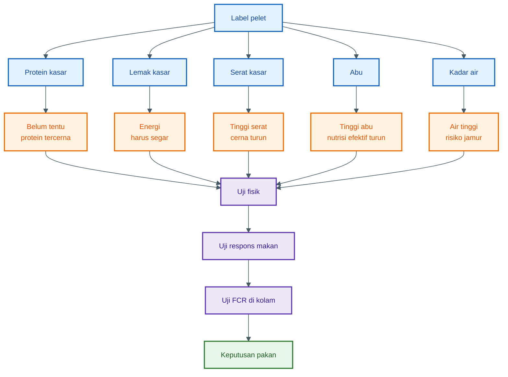
```mermaid
%%{init: {
  "theme": "base",
  "themeVariables": {
    "fontFamily": "Arial",
    "fontSize": "13px",
    "lineColor": "#455A64"
  }
}}%%
flowchart TD
    A["Label pelet"] --> B["Protein kasar"]
    A --> C["Lemak kasar"]
    A --> D["Serat kasar"]
    A --> E["Abu"]
    A --> F["Kadar air"]

    B --> G["Belum tentu<br/>protein tercerna"]
    C --> H["Energi<br/>harus segar"]
    D --> I["Tinggi serat<br/>cerna turun"]
    E --> J["Tinggi abu<br/>nutrisi efektif turun"]
    F --> K["Air tinggi<br/>risiko jamur"]

    G --> L["Uji fisik"]
    H --> L
    I --> L
    J --> L
    K --> L

    L --> M["Uji respons makan"]
    M --> N["Uji FCR di kolam"]
    N --> O["Keputusan pakan"]

    classDef label fill:#E3F2FD,stroke:#1565C0,stroke-width:2px,color:#0D47A1;
    classDef analisis fill:#FFF3E0,stroke:#EF6C00,stroke-width:2px,color:#E65100;
    classDef uji fill:#EDE7F6,stroke:#5E35B1,stroke-width:2px,color:#311B92;
    classDef hasil fill:#E8F5E9,stroke:#2E7D32,stroke-width:2px,color:#1B5E20;

    class A,B,C,D,E,F label;
    class G,H,I,J,K analisis;
    class L,M,N uji;
    class O hasil;
```

---

## 6.13. Kriteria Praktis Pelet yang Layak Dicoba

Pelet layak dicoba jika:

- protein sesuai fase ikan,
- serat tidak tinggi,
- abu tidak mencurigakan,
- lemak tidak tengik,
- kadar air aman,
- bau segar,
- tidak berjamur,
- tidak menggumpal,
- pelet tidak banyak debu,
- stabil di air,
- ikan cepat makan.

Pelet harus ditolak jika:

- bau tengik,
- bau apek,
- berjamur,
- menggumpal lembap,
- banyak debu,
- cepat hancur di air,
- ikan menolak makan,
- kemasan rusak atau basah.

---

## 6.14. Kesimpulan Bab 6

Memilih pelet dengan protein cerna baik tidak cukup hanya membaca angka protein kasar. Praktisi harus melihat indikator tidak langsung seperti serat, abu, lemak, kadar air, aroma, stabilitas pelet, respons makan, dan akhirnya performa FCR.

Kesimpulan praktisnya:

> **Pakan terbaik bukan yang proteinnya paling tinggi di label, tetapi yang paling efisien berubah menjadi daging lele. Protein kasar hanyalah angka awal; keputusan akhir harus berdasarkan FCR, pertumbuhan, kualitas air, dan biaya pakan per kg ikan.**

[**Kembali ke Atas**](#menurunkan-fcr-lele-dari-pakan-dimakan-sampai-menjadi-daging)

---

# Bab 7 — Faktor-Faktor yang Menurunkan atau Menaikkan FCR

FCR bukan hanya urusan pakan. FCR adalah hasil akhir dari banyak faktor yang saling terhubung: kualitas pelet, cara pemberian pakan, kondisi air, kesehatan ikan, kepadatan, ukuran ikan, dan kematian.

Karena itu, saat FCR buruk, jangan langsung menyimpulkan “pakannya jelek”. Bisa saja penyebabnya adalah air buruk, ikan stres, pakan berlebihan, ikan tidak seragam, atau mortalitas tinggi.

Kalimat kunci bab ini:

> **FCR buruk adalah gejala. Penyebabnya bisa dari pakan, air, ikan, cara pemberian, atau manajemen kolam.**

---

## 7.1. FCR sebagai Hasil Akhir Banyak Faktor

FCR terbentuk dari seluruh rantai efisiensi budidaya.

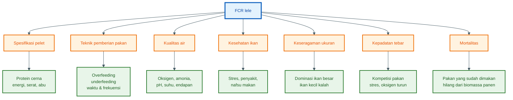
```mermaid
%%{init: {
  "theme": "base",
  "themeVariables": {
    "fontFamily": "Arial",
    "fontSize": "13px",
    "lineColor": "#455A64"
  }
}}%%
flowchart TD
    A["FCR lele"] --> B["Spesifikasi pelet"]
    A --> C["Teknik pemberian pakan"]
    A --> D["Kualitas air"]
    A --> E["Kesehatan ikan"]
    A --> F["Keseragaman ukuran"]
    A --> G["Kepadatan tebar"]
    A --> H["Mortalitas"]

    B --> B1["Protein cerna<br/>energi, serat, abu"]
    C --> C1["Overfeeding<br/>underfeeding<br/>waktu & frekuensi"]
    D --> D1["Oksigen, amonia,<br/>pH, suhu, endapan"]
    E --> E1["Stres, penyakit,<br/>nafsu makan"]
    F --> F1["Dominasi ikan besar<br/>ikan kecil kalah"]
    G --> G1["Kompetisi pakan<br/>stres, oksigen turun"]
    H --> H1["Pakan yang sudah dimakan<br/>hilang dari biomassa panen"]

    classDef pusat fill:#E3F2FD,stroke:#1565C0,stroke-width:3px,color:#0D47A1;
    classDef faktor fill:#FFF3E0,stroke:#EF6C00,stroke-width:2px,color:#E65100;
    classDef detail fill:#E8F5E9,stroke:#2E7D32,stroke-width:2px,color:#1B5E20;

    class A pusat;
    class B,C,D,E,F,G,H faktor;
    class B1,C1,D1,E1,F1,G1,H1 detail;
```

FCR rendah hanya terjadi bila banyak faktor bekerja serempak:

```mdx
pakan layak

- dimakan cepat
- dicerna baik
- air stabil
- ikan sehat
- ukuran seragam
- kematian rendah
  = FCR membaik
```

Sebaliknya:

```mdx
pakan bagus

- air buruk
- overfeeding
- ikan stres
  = FCR tetap bisa buruk
```

---

## 7.2. Spesifikasi Pelet

Spesifikasi pelet adalah fondasi awal FCR. Pelet yang baik bukan hanya tinggi protein, tetapi harus memiliki keseimbangan nutrisi dan sifat fisik yang sesuai.

Faktor penting pada pelet:

- protein tercerna,
- energi,
- lemak,
- serat,
- abu,
- ukuran pelet,
- stabilitas di air,
- palatabilitas,
- kesegaran pakan.

### Protein tercerna

Protein kasar di label belum tentu menunjukkan protein yang benar-benar bisa diserap ikan.

```mdx
protein tercerna =
protein kasar × tingkat kecernaan
```

Pakan dengan protein kasar sedang tetapi mudah dicerna bisa lebih baik daripada pakan protein tinggi tetapi sulit dicerna.

### Energi

Energi harus cukup agar protein tidak dibakar sebagai bahan bakar hidup. Energi berasal dari karbohidrat tercerna dan lemak.

```mdx
energi cukup
→ protein lebih banyak dipakai untuk pertumbuhan
```

### Lemak

Lemak membantu menyediakan energi padat. Tetapi lemak harus segar. Lemak tengik menurunkan nafsu makan dan dapat merusak kualitas pakan.

### Serat

Serat tinggi menurunkan kecernaan.

```mdx
serat tinggi
→ feses banyak
→ air cepat kotor
→ FCR naik
```

### Abu

Abu terlalu tinggi menunjukkan mineral tinggi. Mineral dibutuhkan, tetapi jika berlebihan dapat mengencerkan nutrisi efektif.

```mdx
abu tinggi
→ ruang untuk protein dan energi efektif berkurang
```

### Ukuran pelet

Ukuran pelet harus sesuai bukaan mulut ikan.

Pelet terlalu besar:

- sulit dimakan,
- banyak tercecer,
- ikan kecil kalah.

Pelet terlalu kecil:

- mudah hilang,
- cepat larut,
- ikan besar kurang efisien makan.

### Stabilitas di air

Pelet harus cukup stabil sampai dimakan. Pelet yang cepat hancur akan kehilangan nutrisi sebelum masuk mulut ikan.

### Palatabilitas

Pakan harus disukai ikan. Pakan yang bergizi tetapi tidak dimakan tetap menjadi kerugian.

### Kesegaran pakan

Pakan tengik, apek, berjamur, atau lembap akan merusak FCR. Probiotik atau conditioning tidak boleh dipakai untuk “menyelamatkan” pakan rusak.

---

## 7.3. Teknik Pemberian Pakan

Teknik pemberian pakan adalah faktor lapangan yang sangat menentukan FCR.

Masalah umum:

- overfeeding,
- underfeeding,
- waktu pemberian tidak tepat,
- frekuensi tidak sesuai,
- tidak melihat respons makan,
- pakan tidak habis cepat,
- pakan diberikan berdasarkan feeling.

### Overfeeding

Overfeeding adalah pemberian pakan melebihi kemampuan makan ikan.

Akibatnya:

```mdx
pakan berlebih
→ tidak dimakan
→ menjadi sisa pakan
→ membusuk di air
→ amonia naik
→ oksigen turun
→ ikan stres
→ FCR naik
```

Overfeeding adalah salah satu kebocoran FCR paling cepat.

### Underfeeding

Underfeeding adalah pakan terlalu sedikit untuk kebutuhan ikan. Secara angka sementara, underfeeding kadang tampak membuat pakan “hemat”. Tetapi bila terlalu berat, dampaknya buruk:

- pertumbuhan lambat,
- masa pemeliharaan lebih panjang,
- ukuran tidak seragam,
- kanibalisme bisa naik,
- panen mundur,
- efisiensi siklus usaha turun.

Jadi targetnya bukan memberi pakan sesedikit mungkin, tetapi memberi pakan **tepat sesuai biomassa dan respons makan**.

### Waktu pemberian

Pemberian pakan sebaiknya mengikuti waktu ikan aktif makan dan kondisi air mendukung. Saat oksigen rendah atau air buruk, ikan tidak efisien memanfaatkan pakan.

### Frekuensi

Frekuensi pemberian perlu menyesuaikan ukuran ikan. Ikan kecil biasanya memerlukan frekuensi lebih sering dengan porsi lebih kecil. Ikan besar bisa diberi frekuensi lebih rendah, tetapi tetap dikontrol respons makannya.

### Respons makan

Respons makan adalah indikator harian yang sangat penting.

Tanda respons baik:

- ikan cepat naik,
- pakan segera disambar,
- pakan habis cepat,
- tidak ada sisa berarti.

Tanda respons buruk:

- ikan lambat makan,
- banyak pakan mengambang,
- pakan tenggelam tidak dimakan,
- ikan menggantung,
- air bau,
- ikan tidak agresif.

Prinsip praktis:

```mdx
beri pakan bertahap
amati respons
hentikan saat respons makan menurun
```

---

## 7.4. Kualitas Air

Air adalah “ruang metabolisme” ikan. Ikan boleh saja diberi pakan bagus, tetapi bila air buruk, pakan tidak efisien menjadi daging.

Parameter penting:

- oksigen,
- amonia,
- pH,
- suhu,
- endapan organik,
- bau air,
- busa.

### Oksigen

Oksigen rendah membuat ikan stres dan lambat makan. Pakan yang dimakan pun tidak efisien dipakai untuk pertumbuhan karena ikan harus bertahan dalam kondisi tidak nyaman.

```mdx
oksigen rendah
→ ikan stres
→ nafsu makan turun
→ metabolisme terganggu
→ FCR naik
```

### Amonia

Amonia berasal dari sisa metabolisme protein, feses, dan sisa pakan. Amonia tinggi membuat ikan stres dan menurunkan efisiensi pakan.

```mdx
protein tidak efisien

- sisa pakan
- feses
  → amonia naik
  → ikan stres
  → FCR buruk
```

### pH

pH ekstrem mengganggu metabolisme ikan dan memengaruhi toksisitas amonia. pH terlalu tinggi membuat amonia lebih berbahaya.

### Suhu

Suhu memengaruhi nafsu makan, metabolisme, dan kecepatan pencernaan. Suhu terlalu rendah atau terlalu tinggi dari zona nyaman membuat pakan tidak efisien.

### Endapan organik

Endapan dari feses dan sisa pakan menjadi sumber pembusukan. Endapan tinggi biasanya diikuti bau air, amonia, dan gangguan kesehatan ikan.

### Bau air dan busa

Bau busuk, bau amonia, atau busa berlebihan adalah sinyal bahwa beban organik tinggi atau air mulai tidak stabil.

---

## 7.5. Kesehatan Lele

Ikan sakit tidak efisien mengubah pakan menjadi daging. Saat sakit, energi dan nutrien dialihkan untuk bertahan hidup, memperbaiki jaringan, dan menjalankan sistem imun.

Akibatnya:

```mdx
pakan dimakan
→ nutrien masuk
→ dipakai untuk stres / imun / perbaikan
→ pertumbuhan turun
→ FCR naik
```

Tanda kesehatan ikan bermasalah:

- ikan menggantung,
- lele lemas,
- nafsu makan turun,
- luka,
- sirip rusak,
- warna tubuh tidak normal,
- berenang tidak stabil,
- banyak yang naik ke permukaan,
- kematian bertahap.

FCR tidak bisa diperbaiki hanya dengan menambah pakan saat ikan sakit. Menambah pakan dalam kondisi ikan tidak sehat sering memperburuk air.

---

## 7.6. Keseragaman Ukuran

Keseragaman ukuran sangat penting pada lele. Lele yang tidak seragam akan membuat kompetisi pakan tidak seimbang.

Masalah bila ukuran tidak seragam:

- ikan besar mendominasi pakan,
- ikan kecil kalah makan,
- ikan kecil tumbuh semakin tertinggal,
- kanibalisme meningkat,
- pakan tidak merata,
- panen mundur,
- FCR memburuk.

Secara praktis:

```mdx
ukuran tidak seragam
→ distribusi pakan tidak merata
→ sebagian ikan tumbuh cepat
→ sebagian tertinggal
→ siklus panen lebih lama
→ FCR aktual memburuk
```

Sortir ukuran bukan sekadar membuat ikan rapi. Sortir adalah strategi FCR.

---

## 7.7. Kepadatan Tebar

Kepadatan tebar memengaruhi oksigen, stres, kompetisi pakan, dan kualitas air.

Terlalu padat menyebabkan:

- oksigen cepat turun,
- amonia cepat naik,
- ikan mudah stres,
- kompetisi pakan tinggi,
- ikan kecil kalah makan,
- penyakit lebih mudah menyebar,
- respons makan tidak stabil.

Kepadatan tinggi bisa berhasil hanya bila didukung oleh:

- aerasi cukup,
- manajemen air baik,
- pakan terukur,
- sortir rutin,
- monitoring ketat.

Tanpa dukungan itu, kepadatan tinggi biasanya membuat FCR memburuk.

---

## 7.8. Mortalitas

Mortalitas atau kematian ikan sangat memengaruhi FCR aktual. Ikan yang mati sudah memakan pakan sebelumnya, tetapi bobotnya tidak masuk hasil panen.

Rumus sederhana:

```mdx
FCR aktual =
total pakan diberikan / kenaikan biomassa ikan hidup yang dipanen
```

Jika banyak ikan mati, pakan yang sudah dimakan ikan mati menjadi kehilangan.

Contoh:

```mdx
Total pakan = 1.000 kg
Kenaikan biomassa hidup = 800 kg

FCR =
1.000 / 800
= 1,25
```

Tetapi bila karena kematian, kenaikan biomassa hidup hanya 650 kg:

```mdx
FCR =
1.000 / 650
= 1,54
```

Padahal jumlah pakan sama. Mortalitas membuat FCR aktual memburuk.

---

## 7.9. Hubungan Faktor-Faktor Penyebab FCR Buruk

Faktor-faktor penyebab FCR buruk sering saling memperkuat.

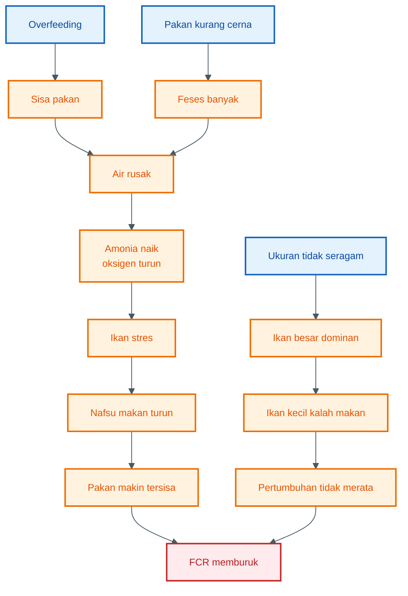
```mermaid
%%{init: {
  "theme": "base",
  "themeVariables": {
    "fontFamily": "Arial",
    "fontSize": "13px",
    "lineColor": "#455A64"
  }
}}%%
flowchart TD
    A["Overfeeding"] --> B["Sisa pakan"]
    B --> C["Air rusak"]
    C --> D["Amonia naik<br/>oksigen turun"]
    D --> E["Ikan stres"]
    E --> F["Nafsu makan turun"]
    F --> G["Pakan makin tersisa"]
    G --> H["FCR memburuk"]

    I["Ukuran tidak seragam"] --> J["Ikan besar dominan"]
    J --> K["Ikan kecil kalah makan"]
    K --> L["Pertumbuhan tidak merata"]
    L --> H

    M["Pakan kurang cerna"] --> N["Feses banyak"]
    N --> C

    classDef sebab fill:#E3F2FD,stroke:#1565C0,stroke-width:2px,color:#0D47A1;
    classDef proses fill:#FFF3E0,stroke:#EF6C00,stroke-width:2px,color:#E65100;
    classDef buruk fill:#FFEBEE,stroke:#C62828,stroke-width:2px,color:#B71C1C;

    class A,I,M sebab;
    class B,C,D,E,F,G,J,K,L,N proses;
    class H buruk;
```

Ini menunjukkan bahwa satu kesalahan kecil dapat memicu efek berantai.

---

## 7.10. Prioritas Praktis Menurunkan FCR

Urutan prioritas yang masuk akal:

1. Pilih pakan yang layak.
2. Beri pakan sesuai respons makan.
3. Hindari overfeeding.
4. Sampling bobot rutin.
5. Hitung biomassa.
6. Jaga kualitas air.
7. Sortir ukuran ikan.
8. Cegah penyakit.
9. Kendalikan kepadatan.
10. Catat pakan, pertumbuhan, dan kematian.

Rumus dasar yang harus terus dipakai:

```mdx
Biomassa =
jumlah ikan hidup × bobot rata-rata
```

```mdx
Pakan harian =
biomassa × feeding rate
```

```mdx
FCR =
total pakan / kenaikan biomassa
```

---

## 7.11. Kesimpulan Bab 7

FCR adalah hasil gabungan dari kualitas pakan, teknik pemberian pakan, kualitas air, kesehatan ikan, keseragaman ukuran, kepadatan, dan mortalitas. Pakan bagus tidak otomatis menghasilkan FCR rendah jika air buruk, ikan stres, atau pakan diberikan berlebihan.

Kesimpulan praktisnya:

> **FCR buruk adalah gejala. Penyebabnya bisa dari pakan, air, ikan, cara pemberian, atau manajemen kolam. Karena itu, perbaikan FCR harus dilakukan sebagai sistem, bukan hanya mengganti pakan.**

[**Kembali ke Atas**](#menurunkan-fcr-lele-dari-pakan-dimakan-sampai-menjadi-daging)

---

# Bab 8 — Conditioning Pelet Sebelum Feeding

Conditioning pelet adalah perlakuan singkat pada pelet sebelum diberikan ke lele. Tujuannya bukan mengubah pelet secara total, tetapi membantu agar pakan lebih cepat dimakan, lebih menarik, sebagian fraksi nutrisinya lebih mudah diakses, dan risiko sisa pakan menurun.

Conditioning bisa berupa:

- top-coating hidrolisat,
- penambahan minyak,
- penambahan probiotik,
- penambahan enzim,
- pelembapan ringan,
- aktivasi probiotik beberapa jam,
- predigestion ringan.

Kalimat kunci bab ini:

> **Conditioning pelet berguna jika menurunkan sisa pakan dan memperbaiki FCR, bukan hanya karena disebut fermentasi.**

---

## 8.1. Apa Itu Conditioning Pelet?

Conditioning pelet adalah proses memperlakukan pelet sebelum diberikan agar performanya lebih baik saat dimakan ikan.

Secara sederhana:

```mdx
pelet kering

- bahan bantu
- waktu kontak singkat
  → pakan lebih menarik / lebih siap dimakan
  → diberikan segera
```

Bahan bantu bisa berupa:

- hidrolisat ikan,
- hidrolisat keong,
- hidrolisat maggot,
- probiotik,
- enzim,
- minyak,
- molase sangat sedikit,
- air bersih secukupnya.

Target conditioning:

- meningkatkan aroma,
- membuat pakan lebih cepat dimakan,
- membantu probiotik aktif,
- memberi waktu enzim bekerja ringan,
- meningkatkan fraksi protein terlarut secara terbatas,
- mengurangi sisa pakan,
- membantu FCR.

---

## 8.2. Conditioning Bukan Fermentasi Penuh

Conditioning pelet harus dibedakan dari fermentasi penuh.

| Aspek        | Conditioning pelet                           | Fermentasi penuh                           |
| ------------ | -------------------------------------------- | ------------------------------------------ |
| Bahan        | pelet jadi                                   | bahan baku atau bahan protein              |
| Waktu        | menit sampai 24 jam                          | hari sampai minggu                         |
| Air          | sedikit, agar pelet tidak rusak              | lebih banyak sesuai proses                 |
| Target       | palatabilitas, aktivasi, predigestion ringan | perubahan bahan lebih dalam                |
| Risiko       | pelet lembek, jamur, nutrisi larut           | kontaminasi bila proses gagal              |
| Produk akhir | pelet harus segera diberikan                 | bahan fermentasi bisa disimpan bila stabil |

Jadi, istilah “fermentasi pelet 24 jam” lebih tepat dipahami sebagai:

> **conditioning pelet dengan probiotik/enzim selama 24 jam**

bukan fermentasi penuh seperti silase ikan, tempe, tape, atau bokashi.

---

## 8.3. Mekanisme Conditioning terhadap FCR

Conditioning dapat membantu FCR melalui beberapa jalur:

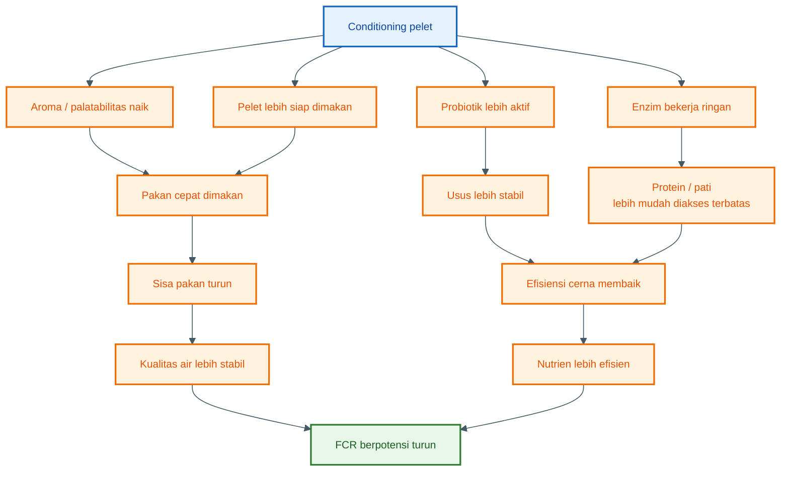
```mermaid
%%{init: {
  "theme": "base",
  "themeVariables": {
    "fontFamily": "Arial",
    "fontSize": "13px",
    "lineColor": "#455A64"
  }
}}%%
flowchart TD
    A["Conditioning pelet"] --> B["Aroma / palatabilitas naik"]
    A --> C["Probiotik lebih aktif"]
    A --> D["Enzim bekerja ringan"]
    A --> E["Pelet lebih siap dimakan"]

    B --> F["Pakan cepat dimakan"]
    C --> G["Usus lebih stabil"]
    D --> H["Protein / pati<br/>lebih mudah diakses terbatas"]
    E --> F

    F --> I["Sisa pakan turun"]
    G --> J["Efisiensi cerna membaik"]
    H --> J

    I --> K["Kualitas air lebih stabil"]
    J --> L["Nutrien lebih efisien"]
    K --> M["FCR berpotensi turun"]
    L --> M

    classDef input fill:#E3F2FD,stroke:#1565C0,stroke-width:2px,color:#0D47A1;
    classDef proses fill:#FFF3E0,stroke:#EF6C00,stroke-width:2px,color:#E65100;
    classDef hasil fill:#E8F5E9,stroke:#2E7D32,stroke-width:2px,color:#1B5E20;

    class A input;
    class B,C,D,E,F,G,H,I,J,K,L proses;
    class M hasil;
```

Conditioning tidak bekerja dengan cara ajaib. FCR turun hanya bila:

- pakan lebih cepat dimakan,
- sisa pakan turun,
- ikan lebih responsif,
- air tidak rusak,
- nutrisi lebih mudah dimanfaatkan,
- pakan tidak hancur.

---

## 8.4. Conditioning 15–60 Menit

Conditioning 15–60 menit adalah metode paling aman. Cocok untuk top-coating hidrolisat, minyak, probiotik, dan atraktan.

Tujuannya:

- meningkatkan aroma,
- membuat pakan lebih menarik,
- membantu bahan menempel ke pelet,
- menghindari pakan terlalu lama basah,
- mengurangi risiko jamur dan busuk.

Formula sederhana:

```mdx
1 kg pelet

- 5–10 ml hidrolisat
- 5–10 ml minyak
- sedikit air bila perlu
  → aduk
  → angin-anginkan 15–60 menit
  → berikan segera
```

Penjelasan bahan:

| Bahan       | Fungsi                         |
| ----------- | ------------------------------ |
| Hidrolisat  | aroma gurih, peptida, atraktan |
| Minyak      | energi, perekat top-coating    |
| Air sedikit | membantu distribusi bahan      |
| Probiotik   | dukungan mikroba usus          |

### Catatan penting

Pelet tidak boleh sampai becek. Targetnya lembap ringan, bukan basah hancur.

Tanda baik:

- aroma lebih menarik,
- pelet tetap utuh,
- tidak berlendir,
- tidak berjamur,
- ikan cepat makan.

---

## 8.5. Conditioning dengan Hidrolisat

Hidrolisat adalah protein yang sudah terpecah sebagian menjadi protein terlarut, peptida, dan sebagian asam amino bebas.

Contoh:

- hidrolisat ikan,
- hidrolisat keong,
- hidrolisat maggot,
- silase protein cair yang aman.

Fungsi hidrolisat pada pelet:

```mdx
hidrolisat
→ aroma gurih
→ pakan cepat dimakan
→ sisa pakan turun
→ FCR berpotensi membaik
```

Namun hidrolisat cair pada dosis 5–10 ml/kg tidak menaikkan protein kasar pelet secara besar. Fungsinya lebih kuat sebagai **atraktan dan pelapis fungsional**.

---

## 8.6. Conditioning dengan Minyak

Minyak dapat membantu sebagai:

- sumber energi,
- perekat bahan coating,
- pengurang debu,
- pembantu protein-sparing effect dalam dosis terbatas.

Dosis praktis:

```mdx
5–10 ml minyak / kg pelet
```

Gunakan minyak segar. Jangan gunakan minyak tengik.

Risiko minyak berlebihan:

- air berminyak,
- pakan terlalu licin,
- oksidasi,
- bau tengik,
- kualitas air terganggu.

---

## 8.7. Conditioning 6–12 Jam

Conditioning 6–12 jam cocok jika ada:

- enzim/protease,
- Bacillus proteolitik,
- amilase,
- probiotik aktif,
- air cukup tetapi tidak becek,
- wadah bersih,
- pelet masih utuh.

Tujuannya bukan hanya coating, tetapi memberi waktu agar enzim atau mikroba mulai bekerja ringan pada permukaan dan bagian lembap pelet.

Kemungkinan proses:

```mdx
protein permukaan
→ mulai menjadi peptida lebih kecil

pati
→ sebagian lebih mudah diakses

probiotik
→ mulai aktif
```

Namun efeknya tetap terbatas. Pelet bukan substrat fermentasi ideal karena air harus dibatasi agar tidak hancur.

Formula uji kecil:

```mdx
1 kg pelet

- 30–60 ml air bersih
- probiotik/enzim sesuai dosis
- 2–5 ml molase bila perlu
  → aduk rata
  → simpan bersih 6–12 jam
  → cek bau dan tekstur
  → berikan
```

Molase jangan berlebihan. Molase memang memberi energi untuk mikroba, tetapi juga bisa memicu mikroba liar jika proses tidak bersih.

---

## 8.8. Conditioning 24 Jam

Conditioning 24 jam bisa logis dalam kondisi tertentu. Terutama jika produk yang dipakai mengandung mikroba atau enzim yang relevan.

Bisa logis jika:

- produk mengandung mikroba/enzim yang relevan,
- ada protease,
- ada amilase,
- ada cellulase/xylanase bila mengklaim pemecahan serat,
- probiotik aktif,
- kadar air tidak berlebihan,
- wadah bersih,
- pelet tidak rusak,
- tidak terkena lalat,
- tidak kena panas matahari,
- langsung diberikan setelah proses.

Alur yang masuk akal:

```mdx
pelet

- air sedikit
- probiotik/enzim
- waktu 12–24 jam
  → mikroba aktif
  → sebagian fraksi larut naik
  → aroma berubah
  → pakan lebih cepat dimakan
```

Tetapi conditioning 24 jam tidak logis jika diklaim:

- semua protein menjadi asam amino,
- semua serat menjadi energi,
- pakan buruk menjadi pakan bagus,
- protein 100% menjadi daging,
- pelet rusak tetap aman karena diberi probiotik.

Yang realistis:

```mdx
conditioning 24 jam
= aktivasi mikroba

- perubahan aroma
- hidrolisis ringan sampai sedang
- peningkatan fraksi larut terbatas
```

Bukan:

```mdx
conditioning 24 jam
= transformasi total nutrisi pelet
```

---

## 8.9. Perbandingan Lama Conditioning

| Lama conditioning | Cocok untuk                           | Efek realistis                            | Risiko       |
| ----------------- | ------------------------------------- | ----------------------------------------- | ------------ |
| 15–60 menit       | hidrolisat, minyak, probiotik coating | aroma naik, pakan cepat dimakan           | rendah       |
| 6–12 jam          | enzim/protease, Bacillus proteolitik  | predigestion ringan                       | sedang       |
| 24 jam            | produk multimikroba/enzim relevan     | fraksi larut naik terbatas, aroma berubah | lebih tinggi |
| >24 jam           | jarang disarankan untuk pelet jadi    | risiko lebih besar dari manfaat           | tinggi       |

Prinsipnya:

> Semakin lama pelet basah, semakin besar peluang proses biologis terjadi, tetapi juga semakin besar risiko kerusakan pakan.

---

## 8.10. Risiko Conditioning

Conditioning bisa bermanfaat, tetapi bisa juga merusak pakan.

Risiko utama:

- pelet lembek,
- pelet hancur,
- nutrisi larut keluar,
- jamur,
- bau busuk,
- bau amonia,
- lendir,
- pakan tengik,
- mikroba liar tumbuh,
- air kolam cepat rusak.

Tanda conditioning gagal:

```mdx
bau bangkai
bau amonia
bau tengik
jamur
lendir
pelet becek
pelet hancur
ikan menolak makan
air cepat bau
```

Produk seperti ini jangan diberikan.

---

## 8.11. SOP Aman Conditioning Pelet

Untuk praktisi, SOP aman harus sederhana dan terkontrol.

### Pilihan aman: 15–60 menit

```mdx
1 kg pelet

- 5–10 ml hidrolisat
- 5–10 ml minyak
- sedikit air bila perlu
  → aduk rata
  → angin-anginkan
  → berikan segera
```

### Pilihan uji: 6–12 jam

```mdx
1 kg pelet

- 30–60 ml air
- probiotik/enzim sesuai dosis
- 2–5 ml molase
  → aduk rata
  → simpan wadah bersih
  → cek bau dan tekstur
  → berikan habis
```

### Pilihan 24 jam

```mdx
1 kg pelet

- 30–60 ml air
- probiotik multimikroba/enzim
- 2–5 ml molase
  → simpan bersih 12–24 jam
  → jangan sampai becek
  → cek bau, jamur, lendir
  → berikan segera
```

Jangan membuat stok pelet basah beberapa hari.

---

## 8.12. Conditioning Tidak Boleh Mengabaikan Kualitas Air

Conditioning yang terlalu basah atau membuat pelet hancur justru bisa merusak air.

Prinsipnya:

```mdx
conditioning berhasil
→ pakan cepat dimakan
→ sisa pakan turun
→ air lebih stabil

conditioning gagal
→ pelet hancur
→ nutrisi larut
→ air kotor
→ FCR naik
```

Jadi keberhasilan conditioning bukan dilihat dari aroma saja, tetapi dari:

- respons makan,
- sisa pakan,
- feses,
- kualitas air,
- FCR.

---

## 8.13. Uji A/B untuk Conditioning

Conditioning harus diuji. Jangan langsung diterapkan ke semua kolam.

Desain sederhana:

```mdx
Kolam A =
pelet biasa

Kolam B =
pelet conditioning
```

Durasi:

```mdx
14–21 hari
```

Data yang dicatat:

- jumlah pakan,
- bobot awal,
- bobot akhir,
- kematian,
- respons makan,
- kondisi air,
- feses,
- bau air.

Rumus:

```mdx
FCR =
total pakan / kenaikan biomassa
```

Conditioning layak diteruskan jika:

```mdx
FCR turun

- pertumbuhan tidak turun
- kematian tidak naik
- air tidak cepat rusak
- pakan lebih cepat dimakan
```

---

## 8.14. Diagram Keputusan Conditioning

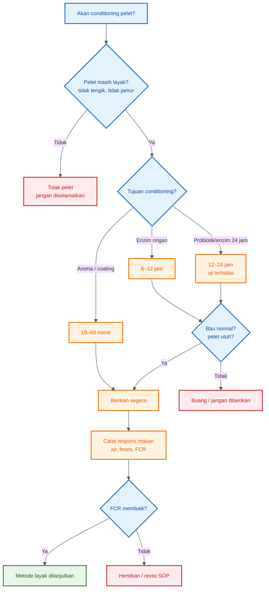
```mermaid
%%{init: {
  "theme": "base",
  "themeVariables": {
    "fontFamily": "Arial",
    "fontSize": "13px",
    "lineColor": "#455A64"
  }
}}%%
flowchart TD
    A["Akan conditioning pelet?"] --> B{"Pelet masih layak?<br/>tidak tengik, tidak jamur"}
    B -->|Tidak| X["Tolak pelet<br/>jangan diselamatkan"]
    B -->|Ya| C{"Tujuan conditioning?"}

    C -->|Aroma / coating| D["15–60 menit"]
    C -->|Enzim ringan| E["6–12 jam"]
    C -->|Probiotik/enzim 24 jam| F["12–24 jam<br/>uji terbatas"]

    D --> G["Berikan segera"]
    E --> H{"Bau normal?<br/>pelet utuh?"}
    F --> H

    H -->|Ya| G
    H -->|Tidak| Y["Buang / jangan diberikan"]

    G --> I["Catat respons makan<br/>air, feses, FCR"]
    I --> J{"FCR membaik?"}
    J -->|Ya| K["Metode layak dilanjutkan"]
    J -->|Tidak| L["Hentikan / revisi SOP"]

    classDef cek fill:#E3F2FD,stroke:#1565C0,stroke-width:2px,color:#0D47A1;
    classDef proses fill:#FFF3E0,stroke:#EF6C00,stroke-width:2px,color:#E65100;
    classDef hasil fill:#E8F5E9,stroke:#2E7D32,stroke-width:2px,color:#1B5E20;
    classDef buruk fill:#FFEBEE,stroke:#C62828,stroke-width:2px,color:#B71C1C;

    class A,B,C,H,J cek;
    class D,E,F,G,I proses;
    class K hasil;
    class X,Y,L buruk;
```

---

## 8.15. Kesimpulan Bab 8

Conditioning pelet dapat menjadi alat bantu untuk menurunkan FCR, tetapi hanya bila dilakukan dengan benar. Tujuannya adalah membuat pakan lebih cepat dimakan, meningkatkan palatabilitas, mengaktifkan probiotik, memberi waktu enzim bekerja ringan, dan meningkatkan fraksi nutrisi larut secara terbatas.

Conditioning bukan cara untuk mengubah pakan buruk menjadi pakan bagus. Conditioning juga bukan jaminan semua protein menjadi asam amino atau semua serat menjadi energi.

Kesimpulan praktisnya:

> **Conditioning pelet berguna jika menurunkan sisa pakan dan memperbaiki FCR. Ukur hasilnya dari respons makan, kualitas air, feses, pertumbuhan, dan FCR, bukan dari istilah “fermentasi” semata.**

[**Kembali ke Atas**](#menurunkan-fcr-lele-dari-pakan-dimakan-sampai-menjadi-daging)

---

# Bab 9 — Probiotik, Prebiotik, Synbiotic, Enzim, dan Hidrolisat

Dalam produk pakan dan budidaya ikan, istilah **probiotik, prebiotik, synbiotic, enzim, dan hidrolisat** sering dipakai bersamaan. Di lapangan, semuanya kadang disebut “probiotik” atau “fermentasi”, padahal fungsinya berbeda.

Kesalahan memahami istilah ini bisa menyebabkan salah aplikasi. Misalnya enzim dianggap mikroba hidup, hidrolisat dianggap probiotik, atau molase dianggap prebiotik spesifik. Padahal masing-masing punya peran berbeda dalam mendukung efisiensi pakan dan FCR.

Kalimat kunci bab ini:

> **Probiotik adalah pasukan mikroba. Prebiotik adalah bekalnya. Synbiotic adalah pasukan plus bekal. Enzim adalah alat pemecah. Hidrolisat adalah bahan yang sudah terpecah.**

---

## 9.1. Kenapa Istilah Ini Penting untuk FCR?

FCR turun jika pakan lebih banyak berubah menjadi bobot ikan dan lebih sedikit hilang sebagai:

- sisa pakan,
- feses,
- amonia,
- stres metabolik,
- kematian,
- air rusak.

Produk seperti probiotik, enzim, dan hidrolisat bisa membantu FCR, tetapi melalui mekanisme berbeda.

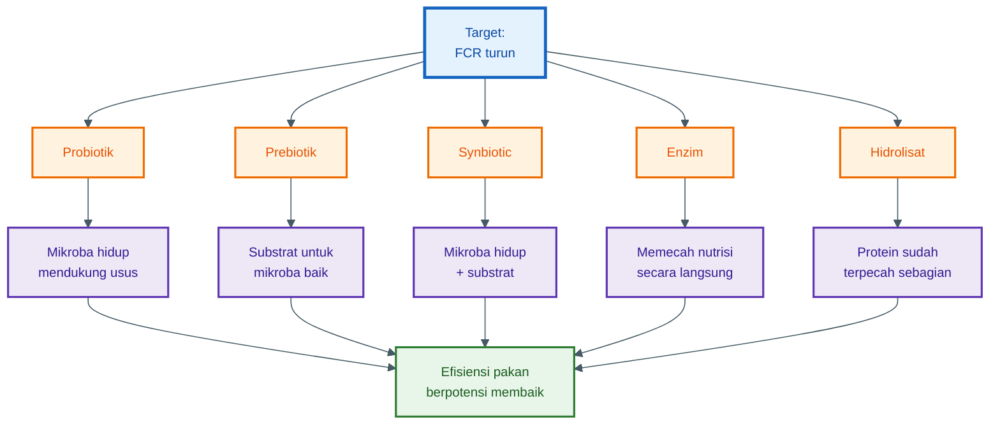
```mermaid id="0ttfnq"
%%{init: {
  "theme": "base",
  "themeVariables": {
    "fontFamily": "Arial",
    "fontSize": "13px",
    "lineColor": "#455A64"
  }
}}%%
flowchart TD
    A["Target:<br/>FCR turun"] --> B["Probiotik"]
    A --> C["Prebiotik"]
    A --> D["Synbiotic"]
    A --> E["Enzim"]
    A --> F["Hidrolisat"]

    B --> B1["Mikroba hidup<br/>mendukung usus"]
    C --> C1["Substrat untuk<br/>mikroba baik"]
    D --> D1["Mikroba hidup<br/>+ substrat"]
    E --> E1["Memecah nutrisi<br/>secara langsung"]
    F --> F1["Protein sudah<br/>terpecah sebagian"]

    B1 --> G["Efisiensi pakan<br/>berpotensi membaik"]
    C1 --> G
    D1 --> G
    E1 --> G
    F1 --> G

    classDef target fill:#E3F2FD,stroke:#1565C0,stroke-width:3px,color:#0D47A1;
    classDef istilah fill:#FFF3E0,stroke:#EF6C00,stroke-width:2px,color:#E65100;
    classDef fungsi fill:#EDE7F6,stroke:#5E35B1,stroke-width:2px,color:#311B92;
    classDef hasil fill:#E8F5E9,stroke:#2E7D32,stroke-width:2px,color:#1B5E20;

    class A target;
    class B,C,D,E,F istilah;
    class B1,C1,D1,E1,F1 fungsi;
    class G hasil;
```

Jika istilahnya jelas, maka aplikasinya juga lebih tepat.

---

## 9.2. Probiotik

Definisi sederhana:

```mdx id="62bqoa"
probiotik =
mikroba hidup yang bermanfaat
```

Dalam konteks pakan lele, probiotik adalah mikroba hidup yang diberikan melalui pakan atau air dengan tujuan mendukung kesehatan ikan, kestabilan mikrobiota, dan efisiensi pemanfaatan pakan.

Contoh probiotik yang umum:

- **Lactobacillus**,
- **Bacillus**,
- **Saccharomyces**.

Namun, tidak semua probiotik punya fungsi yang sama. Jenis mikroba menentukan cara kerjanya.

---

## 9.3. Lactobacillus

Lactobacillus termasuk bakteri asam laktat.

Fungsi umum:

- menghasilkan asam organik,
- membantu menekan mikroba merugikan,
- mendukung keseimbangan mikrobiota,
- membantu lingkungan usus lebih stabil.

Dalam conditioning pelet, Lactobacillus lebih relevan untuk:

```mdx id="pi0clb"
gula / molase terbatas
→ asam organik
→ aroma asam ringan
→ mikroba buruk lebih tertekan
```

Namun Lactobacillus tidak boleh langsung dianggap sebagai pemecah protein utama. Ia bisa mendukung sistem, tetapi jika targetnya hidrolisis protein lebih kuat, biasanya dibutuhkan protease atau mikroba proteolitik yang lebih spesifik.

---

## 9.4. Bacillus

Bacillus sering digunakan karena sebagian strain dapat menghasilkan enzim.

Potensi fungsi Bacillus:

- menghasilkan protease,
- menghasilkan amilase,
- menghasilkan lipase,
- menghasilkan metabolit pendukung,
- membantu stabilitas usus,
- sebagian dapat bertahan lebih baik karena membentuk spora.

Dalam konteks FCR, Bacillus menarik jika produknya memang mengandung strain yang bersifat enzimatik.

Contoh logika:

```mdx id="1drtqy"
Bacillus proteolitik
→ menghasilkan protease
→ sebagian protein lebih mudah dipecah
→ pencernaan lebih ringan
→ FCR berpotensi membaik
```

Namun klaim ini tetap perlu dibuktikan dengan performa kolam.

---

## 9.5. Saccharomyces / Yeast

Saccharomyces adalah ragi atau yeast. Dalam pakan ikan, yeast bisa berfungsi sebagai:

- probiotik bila masih hidup,
- sumber komponen dinding sel,
- sumber beta-glucan,
- sumber MOS,
- pendukung imunitas,
- pendukung kesehatan usus,
- peningkat palatabilitas pada beberapa kondisi.

Namun perlu diluruskan:

```mdx id="bmpfjk"
yeast
≠ otomatis pemecah serat kuat
```

Jika produk mengklaim memecah serat, sebaiknya ada informasi tentang enzim seperti:

- cellulase,
- xylanase,
- beta-glucanase,
- mannanase.

Yeast bisa mendukung usus, tetapi tidak otomatis mengubah semua serat menjadi energi.

---

## 9.6. Prebiotik

Definisi sederhana:

```mdx id="v7jdq8"
prebiotik =
bahan/substrat yang mendukung mikroba baik
```

Prebiotik bukan mikroba hidup. Prebiotik adalah bahan yang mendukung pertumbuhan atau aktivitas mikroba baik di saluran cerna.

Contoh prebiotik:

- MOS,
- beta-glucan,
- FOS,
- inulin,
- serat fungsional tertentu.

Fungsinya:

```mdx id="8fut6l"
prebiotik
→ mendukung mikroba baik
→ ekosistem usus lebih stabil
→ kesehatan dan efisiensi pakan berpotensi membaik
```

Prebiotik berbeda dengan molase. Molase adalah sumber gula/karbon fermentabel. Molase dapat membantu mikroba aktif dalam conditioning atau fermentasi, tetapi tidak selalu selektif seperti prebiotik yang dirancang khusus.

---

## 9.7. MOS dan Beta-Glucan

MOS dan beta-glucan sering berasal dari dinding sel yeast.

### MOS

MOS atau mannan oligosaccharide dapat berfungsi sebagai pendukung mikroba baik dan membantu stabilitas usus.

### Beta-glucan

Beta-glucan sering dikaitkan dengan dukungan sistem imun.

Dalam konteks FCR, efeknya tidak langsung. Bukan karena MOS atau beta-glucan memecah protein secara langsung, tetapi karena ikan yang lebih sehat dan usus yang lebih stabil biasanya lebih efisien memanfaatkan pakan.

```mdx id="w89fcw"
usus lebih stabil

- ikan lebih sehat
  → pakan lebih efisien
  → FCR berpotensi turun
```

---

## 9.8. Synbiotic

Definisi sederhana:

```mdx id="nkej8y"
synbiotic =
probiotik + prebiotik
```

Synbiotic adalah gabungan mikroba hidup dan substrat pendukungnya.

Logikanya:

```mdx id="owde4m"
probiotik = pasukan mikroba baik

prebiotik = bekal / dukungan untuk mikroba baik

synbiotic = pasukan + bekal
```

Contoh:

```mdx id="j6gz5k"
Bacillus / Lactobacillus

- MOS / FOS / beta-glucan
  = synbiotic
```

Synbiotic lebih masuk akal dibanding probiotik saja jika prebiotik yang digunakan memang cocok mendukung mikroba yang diberikan.

---

## 9.9. Enzim

Enzim bukan mikroba hidup.

Definisi sederhana:

```mdx id="nhcrri"
enzim =
alat biologis untuk mempercepat pemecahan senyawa tertentu
```

Contoh enzim penting dalam pakan:

| Enzim     | Fungsi                     |
| --------- | -------------------------- |
| Protease  | memecah protein            |
| Amilase   | memecah pati               |
| Lipase    | memecah lemak              |
| Cellulase | memecah sebagian selulosa  |
| Xylanase  | memecah hemiselulosa/xylan |

Enzim bekerja langsung pada substratnya. Jadi bila ada protease aktif pada conditioning pelet, maka protease dapat membantu memecah sebagian protein menjadi peptida lebih kecil.

Contoh:

```mdx id="plzhie"
protein

- protease
  → peptida
  → sebagian asam amino bebas
```

```mdx id="sc8tec"
pati

- amilase
  → gula lebih sederhana
```

```mdx id="08sjau"
lemak

- lipase
  → asam lemak
```

Namun kerja enzim bergantung pada:

- suhu,
- pH,
- waktu kontak,
- kadar air,
- dosis,
- jenis substrat,
- kondisi pelet.

---

## 9.10. Enzim dalam Conditioning Pelet

Dalam conditioning pelet sebelum feeding, enzim bisa membantu jika:

- pelet cukup lembap,
- waktu kontak cukup,
- suhu tidak terlalu ekstrem,
- enzim masih aktif,
- pelet tidak hancur,
- dosis masuk akal.

Waktu kerja praktis:

```mdx id="shvkg6"
15–60 menit:
coating dan kontak awal

6–12 jam:
predigestion ringan lebih masuk akal

12–24 jam:
bisa meningkatkan fraksi larut terbatas,
tetapi risiko kerusakan pelet meningkat
```

Jadi enzim lebih relevan untuk conditioning 6–24 jam dibanding hanya probiotik tanpa enzim.

---

## 9.11. Hidrolisat

Definisi sederhana:

```mdx id="xbh515"
hidrolisat =
produk protein yang sudah dipecah sebagian
```

Hidrolisat bukan mikroba hidup. Hidrolisat adalah hasil dari proses hidrolisis protein, baik oleh enzim, asam, atau fermentasi terkendali.

Contoh hidrolisat:

- hidrolisat ikan,
- hidrolisat keong,
- hidrolisat maggot,
- silase protein cair yang baik.

Isi hidrolisat biasanya berupa campuran:

- protein terlarut,
- peptida,
- sebagian asam amino bebas,
- mineral larut,
- asam organik bila fermentasi,
- senyawa aroma.

Fungsi hidrolisat pada pakan:

- atraktan,
- meningkatkan palatabilitas,
- memberi peptida,
- membantu pakan cepat dimakan,
- membantu predigestion ringan,
- mendukung FCR melalui penurunan sisa pakan.

Namun hidrolisat cair pada dosis kecil bukan cara utama menaikkan kadar protein pelet.

---

## 9.12. Perbedaan Probiotik, Prebiotik, Synbiotic, Enzim, dan Hidrolisat

| Istilah    |   Hidup? | Fungsi utama                    | Contoh                                 |
| ---------- | -------: | ------------------------------- | -------------------------------------- |
| Probiotik  |       Ya | mikroba hidup yang bermanfaat   | Lactobacillus, Bacillus, Saccharomyces |
| Prebiotik  |    Tidak | substrat pendukung mikroba baik | MOS, FOS, inulin, beta-glucan          |
| Synbiotic  | Sebagian | probiotik + prebiotik           | Bacillus + MOS                         |
| Enzim      |    Tidak | memecah nutrisi secara langsung | protease, amilase, lipase              |
| Hidrolisat |    Tidak | protein sudah terpecah sebagian | hidrolisat ikan, keong, maggot         |

Diagram sederhana:

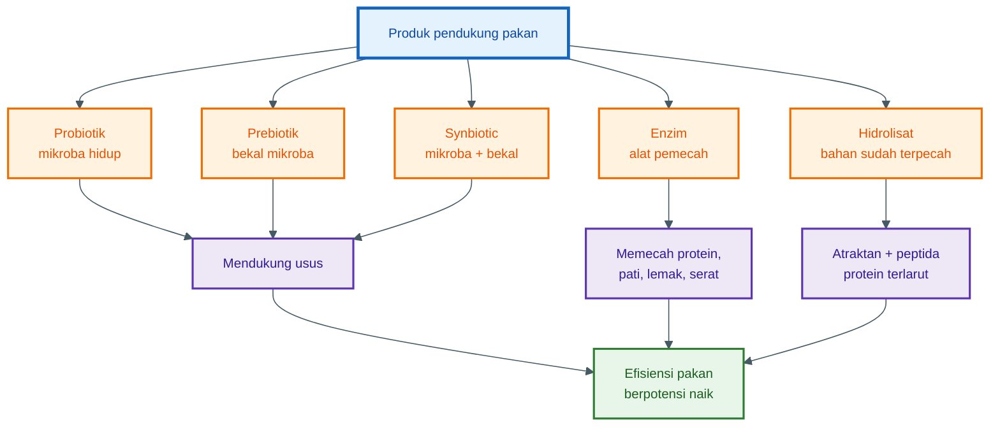
```mermaid id="ix3uxe"
%%{init: {
  "theme": "base",
  "themeVariables": {
    "fontFamily": "Arial",
    "fontSize": "13px",
    "lineColor": "#455A64"
  }
}}%%
flowchart TD
    A["Produk pendukung pakan"] --> B["Probiotik<br/>mikroba hidup"]
    A --> C["Prebiotik<br/>bekal mikroba"]
    A --> D["Synbiotic<br/>mikroba + bekal"]
    A --> E["Enzim<br/>alat pemecah"]
    A --> F["Hidrolisat<br/>bahan sudah terpecah"]

    B --> G["Mendukung usus"]
    C --> G
    D --> G
    E --> H["Memecah protein,<br/>pati, lemak, serat"]
    F --> I["Atraktan + peptida<br/>protein terlarut"]

    G --> J["Efisiensi pakan<br/>berpotensi naik"]
    H --> J
    I --> J

    classDef pusat fill:#E3F2FD,stroke:#1565C0,stroke-width:3px,color:#0D47A1;
    classDef istilah fill:#FFF3E0,stroke:#EF6C00,stroke-width:2px,color:#E65100;
    classDef fungsi fill:#EDE7F6,stroke:#5E35B1,stroke-width:2px,color:#311B92;
    classDef hasil fill:#E8F5E9,stroke:#2E7D32,stroke-width:2px,color:#1B5E20;

    class A pusat;
    class B,C,D,E,F istilah;
    class G,H,I fungsi;
    class J hasil;
```

---

## 9.13. Hubungannya dengan FCR

Produk-produk ini bisa membantu FCR melalui jalur berbeda.

### Probiotik

```mdx id="2mcfjx"
usus lebih stabil
→ ikan lebih sehat
→ pakan lebih efisien
```

### Prebiotik

```mdx id="z1ahwz"
mikroba baik didukung
→ mikrobiota lebih stabil
→ efisiensi pakan membaik
```

### Synbiotic

```mdx id="zw4d84"
mikroba baik + substratnya
→ efek lebih stabil
```

### Enzim

```mdx id="ysj79p"
nutrisi kompleks
→ lebih sederhana
→ lebih mudah dicerna
```

### Hidrolisat

```mdx id="026zpa"
aroma naik

- peptida tersedia
  → pakan cepat dimakan
  → sisa pakan turun
```

Semua jalur itu bisa membantu FCR, tetapi tidak menggantikan kualitas pakan dasar.

---

## 9.14. Cara Membaca Produk Pabrikan

Produk lebih meyakinkan bila mencantumkan:

- jenis mikroba,
- strain bila ada,
- CFU/ml atau CFU/g,
- jenis enzim,
- fungsi enzim,
- dosis aplikasi,
- cara penyimpanan,
- lama conditioning,
- batas waktu penggunaan setelah dicampur.

Contoh informasi yang kuat:

```mdx id="o7hz8n"
Bacillus subtilis sekian CFU/ml
Lactobacillus sekian CFU/ml
Saccharomyces sekian CFU/ml
protease
amilase
cellulase
MOS / beta-glucan
```

Informasi yang lemah:

```mdx id="e2vlc7"
mengandung mikroba baik
meningkatkan nafsu makan
menurunkan FCR
memecah semua protein dan serat
```

Klaim harus diuji dengan FCR di kolam.

---

## 9.15. Kesimpulan Bab 9

Probiotik, prebiotik, synbiotic, enzim, dan hidrolisat adalah alat bantu yang berbeda.

Kesimpulan praktisnya:

> **Probiotik adalah mikroba hidup. Prebiotik adalah bekal mikroba baik. Synbiotic adalah gabungan keduanya. Enzim adalah alat pemecah nutrisi. Hidrolisat adalah bahan protein yang sudah terpecah sebagian. Semuanya bisa mendukung FCR, tetapi hanya jika pakan dasar layak, aplikasi tepat, dan hasilnya terbukti di kolam.**

[**Kembali ke Atas**](#menurunkan-fcr-lele-dari-pakan-dimakan-sampai-menjadi-daging)

---

# Bab 10 — Biokonversi dan Bahan Lokal untuk Mendukung FCR

Tujuan utama dalam penggunaan bahan lokal bukan sekadar mencari bahan murah. Tujuan sebenarnya adalah mencari **protein tercerna murah**, energi pendukung, dan bahan fungsional yang bisa menurunkan biaya pakan per kg ikan panen.

Bahan lokal bisa membantu menekan FCR dan biaya pakan, tetapi bisa juga merusak FCR jika salah dipakai.

Kalimat kunci bab ini:

> **Bahan lokal hanya menurunkan FCR jika meningkatkan protein tercerna, palatabilitas, dan efisiensi pakan. Kalau membuat air rusak, FCR justru naik.**

---

## 10.1. Biokonversi: Bahan Murah Menjadi Bahan Lebih Bernilai

Biokonversi adalah perubahan bahan oleh organisme hidup atau enzim menjadi produk baru yang lebih berguna.

Dalam konteks pakan lele:

```mdx id="f8bmhm"
bahan murah / limbah organik

- organisme / mikroba / enzim
  → bahan pakan bernilai lebih tinggi
```

Contoh:

```mdx id="y72pxq"
limbah organik
→ dimakan maggot BSF
→ menjadi biomassa maggot kaya protein dan lemak
```

```mdx id="zppcxc"
limbah ikan / keong
→ diolah menjadi tepung atau hidrolisat
→ menjadi bahan protein / atraktan
```

Namun perlu ditegaskan:

> **Biokonversi tidak menciptakan protein dari nol. Biokonversi mengubah bahan yang ada menjadi bentuk yang lebih terkonsentrasi, lebih mudah dimanfaatkan, atau lebih bernilai.**

Jika bahan awal miskin nitrogen, hasil protein juga terbatas.

---

## 10.2. Tujuan Sebenarnya: Protein Tercerna Murah

Bukan semua bahan murah layak menjadi pakan lele.

Target yang dicari adalah:

```mdx id="1gci6a"
protein tercerna murah

- aman
- stabil
- tidak merusak air
- disukai ikan
- tidak menaikkan FCR
```

Bahan lokal harus dinilai dari:

- protein kasar,
- protein tercerna,
- asam amino,
- lemak,
- serat,
- abu,
- kadar air,
- keamanan,
- palatabilitas,
- dampak terhadap air,
- biaya proses.

Bahan murah yang membuat FCR naik sebenarnya bukan penghemat.

---

## 10.3. Peta Bahan Lokal untuk Lele

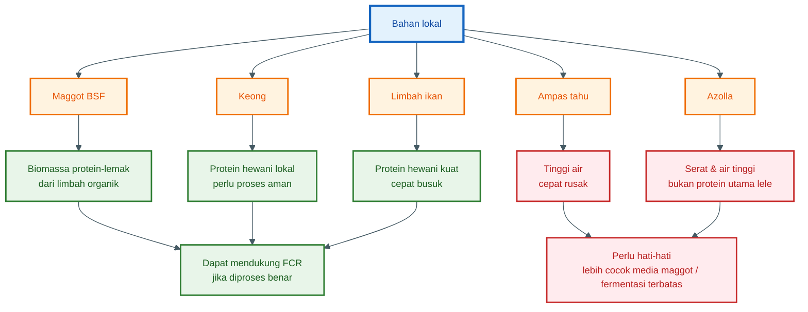
```mermaid id="grqguo"
%%{init: {
  "theme": "base",
  "themeVariables": {
    "fontFamily": "Arial",
    "fontSize": "13px",
    "lineColor": "#455A64"
  }
}}%%
flowchart TD
    A["Bahan lokal"] --> B["Maggot BSF"]
    A --> C["Keong"]
    A --> D["Limbah ikan"]
    A --> E["Ampas tahu"]
    A --> F["Azolla"]

    B --> B1["Biomassa protein-lemak<br/>dari limbah organik"]
    C --> C1["Protein hewani lokal<br/>perlu proses aman"]
    D --> D1["Protein hewani kuat<br/>cepat busuk"]
    E --> E1["Tinggi air<br/>cepat rusak"]
    F --> F1["Serat & air tinggi<br/>bukan protein utama lele"]

    B1 --> G["Dapat mendukung FCR<br/>jika diproses benar"]
    C1 --> G
    D1 --> G
    E1 --> H["Perlu hati-hati<br/>lebih cocok media maggot / fermentasi terbatas"]
    F1 --> H

    classDef input fill:#E3F2FD,stroke:#1565C0,stroke-width:3px,color:#0D47A1;
    classDef bahan fill:#FFF3E0,stroke:#EF6C00,stroke-width:2px,color:#E65100;
    classDef baik fill:#E8F5E9,stroke:#2E7D32,stroke-width:2px,color:#1B5E20;
    classDef hati fill:#FFEBEE,stroke:#C62828,stroke-width:2px,color:#B71C1C;

    class A input;
    class B,C,D,E,F bahan;
    class B1,C1,D1,G baik;
    class E1,F1,H hati;
```

Tidak semua bahan lokal harus masuk langsung ke pakan. Sebagian lebih cocok menjadi media maggot, sebagian lebih cocok menjadi kompos, dan sebagian bisa menjadi bahan pakan setelah diproses.

---

## 10.4. Maggot BSF

Maggot BSF adalah larva lalat tentara hitam. Dalam sistem biokonversi, maggot mengubah limbah organik menjadi biomassa larva yang mengandung protein dan lemak.

Keunggulan maggot BSF:

- dapat mengubah limbah organik menjadi biomassa,
- mengandung protein dan lemak,
- cocok sebagai bahan protein lokal,
- siklus produksi relatif cepat,
- bisa diproduksi dekat lokasi budidaya,
- hasil samping berupa residu/frass bisa dimanfaatkan untuk pupuk setelah diproses.

Namun maggot tidak boleh dipakai asal-asalan. Kualitas maggot sangat dipengaruhi media.

Media yang lebih aman:

- ampas tahu segar,
- limbah sayur,
- limbah buah,
- dedak terbatas,
- limbah agroindustri bersih.

Media yang harus dihindari:

- limbah tercemar pestisida,
- oli,
- deterjen,
- logam berat,
- bahan busuk ekstrem,
- limbah medis,
- bahan kimia.

Alur maggot sebagai bahan pakan:

```mdx id="3s3z7e"
limbah organik bersih
→ maggot BSF
→ panen
→ bersihkan
→ blanching / pemanasan
→ keringkan
→ giling
→ tepung maggot
→ formulasi pakan
```

Atau untuk penggunaan terbatas:

```mdx id="onxyef"
maggot segar
→ cuci
→ blanching
→ diberikan terbatas
```

Namun tepung maggot lebih mudah diformulasikan karena kadar air lebih rendah dan lebih stabil.

---

## 10.5. Catatan FCR untuk Maggot

Maggot bisa membantu FCR jika:

- medianya bersih,
- dipanen pada fase tepat,
- tidak terlalu tinggi lemak,
- diproses higienis,
- dikeringkan dengan baik,
- tidak tengik,
- digunakan dalam dosis formulasi yang wajar.

Risiko maggot:

- lemak tinggi bisa membuat pakan cepat tengik,
- kitin bisa membatasi kecernaan bila terlalu banyak,
- media buruk membawa risiko cemaran,
- maggot basah cepat rusak.

Prinsip:

```mdx id="s84905"
maggot yang baik
= bahan protein-lemak lokal

maggot yang buruk
= sumber risiko air, penyakit, dan FCR jelek
```

---

## 10.6. Keong

Keong dapat menjadi sumber protein hewani lokal. Daging keong lebih relevan untuk lele dibanding bahan hijauan karena lele membutuhkan protein dan asam amino yang mudah dimanfaatkan.

Namun keong harus diproses dengan hati-hati.

Risiko keong:

- lumpur dan kotoran,
- parasit,
- mikroba lingkungan,
- cemaran pestisida atau logam berat,
- cangkang tinggi mineral,
- telur keong mas sebaiknya dihindari,
- organ dalam berisiko jika sumber lingkungan tercemar.

SOP aman:

```mdx id="g51odh"
pilih keong hidup / segar
→ buang yang mati busuk
→ cuci bersih
→ depurasi bila memungkinkan
→ rebus / pasteurisasi
→ ambil daging
→ kurangi cangkang berlebih
→ giling
→ keringkan atau buat hidrolisat
```

Keong bisa dipakai sebagai:

- tepung keong,
- hidrolisat keong,
- top-coating pelet,
- bahan campuran pakan terbatas.

---

## 10.7. Catatan FCR untuk Keong

Keong lebih efektif menaikkan nilai protein bila dijadikan bahan kering.

```mdx id="nt2l9d"
daging keong
→ keringkan
→ giling
→ tepung keong
→ masuk formulasi
```

Jika dibuat hidrolisat cair, manfaat utamanya lebih sebagai:

- atraktan,
- peptida,
- protein terlarut,
- peningkat palatabilitas,
- pendukung pakan cepat dimakan.

Hidrolisat keong cair tidak efektif sebagai cara utama menaikkan protein pelet jika hanya dipakai sedikit.

Prinsip:

```mdx id="rj4dp8"
tepung keong
→ lebih relevan untuk protein formula

hidrolisat keong
→ lebih relevan untuk palatabilitas dan coating
```

---

## 10.8. Limbah Ikan

Limbah ikan adalah bahan protein hewani yang sangat potensial untuk lele. Bahan ini bisa berupa:

- kepala ikan,
- tulang,
- kulit,
- jeroan,
- ikan rucah,
- sisa pasar ikan,
- sisa pengolahan ikan.

Keunggulan:

- protein hewani,
- aroma kuat,
- sesuai untuk ikan,
- dapat dibuat tepung,
- dapat dibuat silase,
- dapat dibuat hidrolisat.

Kelemahan:

- sangat cepat busuk,
- lemak bisa tengik,
- risiko patogen tinggi bila tidak segar,
- bau menyengat bila proses gagal,
- amonia muncul bila protein membusuk.

SOP aman:

```mdx id="xmz9q7"
limbah ikan segar
→ cuci
→ pasteurisasi / rebus
→ giling
→ keringkan menjadi tepung ikan lokal
```

Atau:

```mdx id="4zx9la"
limbah ikan segar
→ pasteurisasi
→ fermentasi asam / hidrolisis
→ silase / hidrolisat
→ top-coating atau bahan terbatas
```

---

## 10.9. Tepung, Silase, atau Hidrolisat Ikan?

| Bentuk            | Fungsi utama                        | Catatan                                   |
| ----------------- | ----------------------------------- | ----------------------------------------- |
| Tepung ikan lokal | sumber protein formula              | paling kuat untuk menaikkan protein pakan |
| Silase ikan       | pengawetan protein basah            | butuh pH rendah dan proses aman           |
| Hidrolisat ikan   | atraktan, peptida, protein terlarut | cocok untuk top-coating                   |

Jika targetnya menurunkan FCR melalui protein formula, bentuk kering lebih mudah dihitung.

Jika targetnya meningkatkan respons makan dan mengurangi sisa pakan, hidrolisat bisa efektif sebagai coating.

---

## 10.10. Ampas Tahu

Ampas tahu sering dianggap bahan pakan murah. Namun ampas tahu memiliki beberapa masalah besar:

- kadar air tinggi,
- cepat busuk,
- mudah asam,
- mudah berjamur,
- protein basis basah tidak setinggi yang dikira,
- jika diberikan basah berlebihan dapat merusak air.

Ampas tahu lebih baik diposisikan sebagai:

- media maggot,
- bahan fermentasi terbatas,
- bahan campuran setelah dikeringkan,
- bahan lokal pendukung, bukan protein utama.

Jika dipakai langsung basah dalam jumlah besar, risikonya:

```mdx id="mx36zq"
air cepat kotor
feses meningkat
pakan tidak seimbang
FCR memburuk
```

Alur yang lebih baik:

```mdx id="1r23f3"
ampas tahu segar
→ media maggot
→ maggot dipanen
→ maggot jadi protein pakan
```

Atau:

```mdx id="ro8ugz"
ampas tahu
→ fermentasi terkendali
→ dikeringkan
→ digunakan terbatas dalam formula
```

---

## 10.11. Azolla

Azolla sering dipromosikan sebagai pakan murah karena tumbuh cepat dan tampak hijau subur. Namun untuk lele intensif, Azolla tidak cocok sebagai protein utama.

Masalah Azolla:

- kadar air sangat tinggi bila segar,
- serat relatif tinggi,
- abu/mineral bisa tinggi,
- metionin terbatas,
- lele tidak efisien memanfaatkan serat kasar,
- jika diberikan banyak bisa meningkatkan feses dan beban organik.

Azolla lebih cocok sebagai:

- bahan tambahan terbatas,
- pakan ikan herbivora/omnivora tertentu,
- bahan kompos,
- bahan bokashi,
- bahan pendukung media maggot,
- pupuk hijau.

Untuk lele:

```mdx id="g8gmqa"
Azolla
≠ protein utama

Azolla
= bahan tambahan terbatas / pendukung sistem
```

Jika Azolla dipaksakan sebagai pengganti protein utama, FCR berisiko memburuk.

---

## 10.12. Bahan Lokal Tidak Boleh Dipakai Asal Murah

Kesalahan umum:

```mdx id="loxkr8"
bahan murah
→ dimasukkan ke pakan
→ dianggap menekan biaya
```

Padahal yang benar:

```mdx id="dno3ih"
bahan murah
→ diuji protein cerna
→ diuji palatabilitas
→ diuji dampak air
→ diuji FCR
→ baru diputuskan
```

Bahan murah bisa merugikan bila:

- membuat ikan lambat tumbuh,
- menaikkan FCR,
- meningkatkan feses,
- merusak air,
- meningkatkan kematian,
- memperpanjang masa panen.

---

## 10.13. Posisi Bahan Lokal dalam Strategi FCR

Bahan lokal bisa diposisikan dalam tiga fungsi.

### 1. Sumber protein utama sebagian

Contoh:

- tepung ikan lokal,
- tepung maggot,
- tepung keong.

Digunakan dalam formulasi pakan.

### 2. Aditif fungsional

Contoh:

- hidrolisat ikan,
- hidrolisat keong,
- hidrolisat maggot.

Digunakan sebagai top-coating untuk meningkatkan palatabilitas.

### 3. Bahan pendukung sistem

Contoh:

- ampas tahu sebagai media maggot,
- Azolla sebagai bahan kompos/media,
- limbah berserat sebagai kompos/bokashi.

Tidak semua bahan harus langsung masuk mulut lele.

---

## 10.14. Diagram Strategi Biokonversi Terpadu

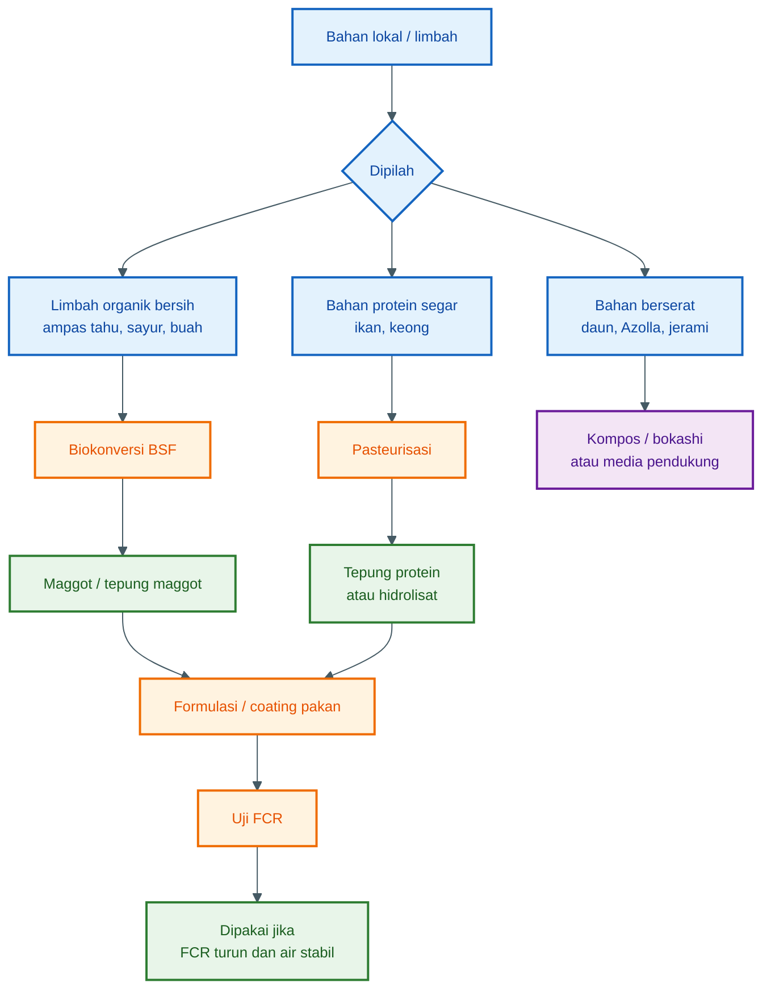
```mermaid id="59ycek"
%%{init: {
  "theme": "base",
  "themeVariables": {
    "fontFamily": "Arial",
    "fontSize": "13px",
    "lineColor": "#455A64"
  }
}}%%
flowchart TD
    A["Bahan lokal / limbah"] --> B{"Dipilah"}

    B --> C["Limbah organik bersih<br/>ampas tahu, sayur, buah"]
    B --> D["Bahan protein segar<br/>ikan, keong"]
    B --> E["Bahan berserat<br/>daun, Azolla, jerami"]

    C --> F["Biokonversi BSF"]
    F --> G["Maggot / tepung maggot"]

    D --> H["Pasteurisasi"]
    H --> I["Tepung protein<br/>atau hidrolisat"]

    E --> J["Kompos / bokashi<br/>atau media pendukung"]

    G --> K["Formulasi / coating pakan"]
    I --> K

    K --> L["Uji FCR"]
    L --> M["Dipakai jika<br/>FCR turun dan air stabil"]

    classDef input fill:#E3F2FD,stroke:#1565C0,stroke-width:2px,color:#0D47A1;
    classDef proses fill:#FFF3E0,stroke:#EF6C00,stroke-width:2px,color:#E65100;
    classDef hasil fill:#E8F5E9,stroke:#2E7D32,stroke-width:2px,color:#1B5E20;
    classDef samping fill:#F3E5F5,stroke:#6A1B9A,stroke-width:2px,color:#4A148C;

    class A,B,C,D,E input;
    class F,H,J,K,L proses;
    class G,I,M hasil;
    class J samping;
```

Diagram ini menunjukkan bahwa bahan lokal harus dipilah. Tidak semua bahan cocok langsung menjadi pakan lele.

---

## 10.15. Uji Bertahap Bahan Lokal

Jangan mengganti pelet langsung secara besar-besaran.

Mulai dari level kecil:

```mdx id="uqgrth"
Tahap 1:
95% pelet + 5% bahan lokal / coating

Tahap 2:
90% pelet + 10% bahan lokal

Tahap 3:
80–90% pelet + 10–20% bahan lokal
```

Setiap tahap harus diuji:

- pertumbuhan,
- FCR,
- respons makan,
- kualitas air,
- feses,
- kematian,
- keseragaman ukuran.

Jika FCR memburuk, dosis bahan lokal harus diturunkan atau proses bahan diperbaiki.

---

## 10.16. Kesimpulan Bab 10

Biokonversi dan bahan lokal bisa membantu menurunkan biaya pakan lele, tetapi hanya jika digunakan dengan benar. Maggot, keong, dan limbah ikan lebih relevan sebagai sumber protein lokal. Ampas tahu lebih cocok sebagai media maggot atau bahan fermentasi terbatas. Azolla tidak cocok sebagai protein utama lele, tetapi bisa menjadi bahan pendukung sistem.

Kesimpulan praktisnya:

> **Bahan lokal hanya menurunkan FCR jika meningkatkan protein tercerna, palatabilitas, dan efisiensi pakan. Kalau bahan lokal membuat air rusak, feses meningkat, pertumbuhan lambat, atau kematian naik, maka bahan murah itu justru mahal.**

[**Kembali ke Atas**](#menurunkan-fcr-lele-dari-pakan-dimakan-sampai-menjadi-daging)

---

# Bab 11 — SOP Uji FCR: Jangan Percaya Klaim, Uji di Kolam

Dalam budidaya lele, teori, klaim produk, pengalaman orang lain, dan testimoni pasar hanya boleh menjadi titik awal. Keputusan akhir tetap harus berdasarkan data di kolam sendiri.

Setiap strategi perlu diuji:

- pakan baru,
- probiotik,
- conditioning pelet,
- hidrolisat,
- enzim,
- bahan lokal,
- maggot,
- keong,
- limbah ikan,
- perubahan frekuensi pakan,
- perubahan dosis pakan.

Kalimat kunci bab ini:

> **Dalam budidaya lele, teori harus berakhir di angka FCR dan biaya pakan per kg ikan.**

---

## 11.1. Kenapa Harus Diuji di Kolam Sendiri?

Pakan atau produk yang berhasil di satu tempat belum tentu sama hasilnya di tempat lain.

Perbedaan bisa berasal dari:

- kualitas air,
- suhu,
- kepadatan tebar,
- ukuran ikan,
- strain benih,
- kualitas pelet dasar,
- cara pemberian pakan,
- aerasi,
- sanitasi kolam,
- tingkat stres ikan,
- keterampilan operator.

Karena itu, klaim seperti:

```mdx id="zf213f"
FCR turun
nafsu makan naik
protein lebih cerna
air lebih bersih
pertumbuhan lebih cepat
```

harus diuji dengan data.

Tanpa data, sulit membedakan apakah perbaikan benar terjadi karena perlakuan, atau hanya karena kondisi kolam sedang bagus.

---

## 11.2. Prinsip Dasar Uji FCR

Uji FCR harus membandingkan dua perlakuan yang kondisinya sedekat mungkin.

Desain sederhana:

```mdx id="qgnfw1"
Kolam A =
kontrol / pakan biasa

Kolam B =
perlakuan / pakan conditioning / pakan baru / aditif baru
```

Tujuannya adalah membandingkan:

```mdx id="76azm3"
apakah perlakuan benar-benar menurunkan FCR
tanpa menurunkan pertumbuhan
tanpa menaikkan kematian
tanpa merusak kualitas air
```

---

## 11.3. Desain Uji A/B untuk Praktisi

Uji A/B adalah metode paling praktis.

```mermaid id="nsvm42"
%%{init: {
  "theme": "base",
  "themeVariables": {
    "fontFamily": "Arial",
    "fontSize": "13px",
    "lineColor": "#455A64"
  }
}}%%
flowchart TD
    A["Mulai uji"] --> B["Pilih dua kolam<br/>kondisi mirip"]
    B --> C["Kolam A<br/>kontrol"]
    B --> D["Kolam B<br/>perlakuan"]

    C --> E["Pakan biasa"]
    D --> F["Pakan baru / conditioning<br/>probiotik / hidrolisat"]

    E --> G["Catat data harian"]
    F --> G

    G --> H["Sampling bobot<br/>awal dan akhir"]
    H --> I["Hitung biomassa"]
    I --> J["Hitung FCR"]
    J --> K["Hitung biaya pakan<br/>per kg ikan"]
    K --> L{"Hasil lebih baik?"}

    L -->|Ya| M["Perlakuan layak<br/>diteruskan terbatas"]
    L -->|Tidak| N["Hentikan / revisi SOP"]

    classDef awal fill:#E3F2FD,stroke:#1565C0,stroke-width:2px,color:#0D47A1;
    classDef kontrol fill:#E8F5E9,stroke:#2E7D32,stroke-width:2px,color:#1B5E20;
    classDef perlakuan fill:#FFF3E0,stroke:#EF6C00,stroke-width:2px,color:#E65100;
    classDef hitung fill:#EDE7F6,stroke:#5E35B1,stroke-width:2px,color:#311B92;
    classDef buruk fill:#FFEBEE,stroke:#C62828,stroke-width:2px,color:#B71C1C;

    class A,B,G,H,I,J,K,L awal;
    class C,E,M kontrol;
    class D,F perlakuan;
    class N buruk;
```

Syarat uji yang baik:

- ukuran ikan mirip,
- jumlah ikan mirip,
- kepadatan mirip,
- ukuran kolam mirip,
- kualitas air awal mirip,
- lama uji sama,
- cara sampling sama,
- operator memberi pakan dengan cara yang sama.

Jika kondisi terlalu berbeda, hasil uji bisa bias.

---

## 11.4. Lama Uji

Untuk uji praktis, lama uji minimal:

```mdx id="w3lb0o"
14 hari
```

Lebih baik:

```mdx id="9ud58m"
21–30 hari
```

Uji terlalu singkat sering menipu karena perubahan bobot belum cukup jelas. Uji terlalu lama berisiko banyak faktor lain ikut berubah.

Untuk pakan atau conditioning, 14–21 hari sudah cukup sebagai uji awal. Untuk perubahan formula besar, uji lebih panjang lebih baik.

---

## 11.5. Data yang Wajib Dicatat

Data minimal:

- jumlah ikan,
- bobot awal,
- bobot akhir,
- pakan masuk,
- kematian,
- lama pemeliharaan,
- kondisi air,
- respons makan,
- feses,
- bau air.

Tabel catatan harian:

| Tanggal | Kolam | Pakan diberikan | Respons makan | Kematian | Air/bau    | Feses          | Catatan |
| ------- | ----- | --------------: | ------------- | -------: | ---------- | -------------- | ------- |
| Hari 1  | A     |          ... kg | cepat/lambat  | ... ekor | normal/bau | sedikit/banyak | ...     |
| Hari 1  | B     |          ... kg | cepat/lambat  | ... ekor | normal/bau | sedikit/banyak | ...     |

Catatan sederhana tetapi konsisten jauh lebih berguna daripada perkiraan.

---

## 11.6. Sampling Bobot

Sampling bobot harus dilakukan pada awal dan akhir uji.

Langkah:

```mdx id="3jjkb4"
ambil sampel 30–50 ekor
timbang total
hitung bobot rata-rata
kalikan dengan jumlah ikan hidup
```

Rumus bobot rata-rata:

```mdx id="wge1zd"
Bobot rata-rata =
total bobot sampel / jumlah ikan sampel
```

Rumus biomassa:

```mdx id="m2vrh4"
Biomassa =
jumlah ikan hidup × bobot rata-rata
```

Contoh:

```mdx id="irhfyq"
Sampel = 50 ekor
Total bobot sampel = 2.500 gram

Bobot rata-rata =
2.500 / 50
= 50 gram/ekor
```

Jika jumlah ikan hidup 9.000 ekor:

```mdx id="vfah74"
Biomassa =
9.000 × 50 gram
= 450.000 gram
= 450 kg
```

---

## 11.7. Menghitung Kenaikan Biomassa

Kenaikan biomassa adalah selisih antara biomassa akhir dan biomassa awal.

```mdx id="inqgdj"
Kenaikan biomassa =
biomassa akhir - biomassa awal
```

Contoh:

```mdx id="h9jdu4"
Biomassa awal = 300 kg
Biomassa akhir = 520 kg

Kenaikan biomassa =
520 - 300
= 220 kg
```

Kenaikan biomassa inilah yang menjadi pembagi dalam perhitungan FCR.

---

## 11.8. Menghitung FCR

Rumus FCR:

```mdx id="soc4ph"
FCR =
total pakan / kenaikan biomassa
```

Contoh:

```mdx id="7pm27h"
Total pakan selama uji = 275 kg
Kenaikan biomassa = 220 kg

FCR =
275 / 220
= 1,25
```

Artinya, untuk menghasilkan 1 kg pertambahan bobot lele, dibutuhkan 1,25 kg pakan.

---

## 11.9. Menghitung Biaya Pakan per kg Ikan

FCR belum cukup. Praktisi harus menghitung biaya pakan per kg ikan.

```mdx id="sd0gv3"
Biaya pakan per kg ikan =
harga pakan × FCR
```

Contoh:

```mdx id="pj9v6n"
Harga pakan = Rp11.000/kg
FCR = 1,25

Biaya pakan per kg ikan =
Rp11.000 × 1,25
= Rp13.750
```

Jika perlakuan memakai tambahan hidrolisat/probiotik/minyak, biaya tambahan harus dimasukkan.

Contoh:

```mdx id="650w4i"
Harga pelet = Rp11.000/kg
Biaya conditioning = Rp300/kg pelet
Biaya pakan efektif = Rp11.300/kg

FCR setelah conditioning = 1,20

Biaya pakan per kg ikan =
Rp11.300 × 1,20
= Rp13.560
```

Bandingkan dengan kontrol:

```mdx id="y8eywg"
Kontrol:
Rp11.000 × 1,25
= Rp13.750/kg ikan
```

Selisih:

```mdx id="n2h9r4"
Rp13.750 - Rp13.560
= Rp190/kg ikan
```

Jika panen 1.000 kg:

```mdx id="wjmo46"
1.000 × Rp190
= Rp190.000
```

Jadi conditioning hanya layak jika penurunan FCR lebih besar daripada biaya tambahan.

---

## 11.10. Contoh Perbandingan Uji A/B

| Parameter           | Kolam A: Kontrol | Kolam B: Perlakuan |
| ------------------- | ---------------: | -----------------: |
| Biomassa awal       |           300 kg |             300 kg |
| Biomassa akhir      |           520 kg |             540 kg |
| Kenaikan biomassa   |           220 kg |             240 kg |
| Pakan masuk         |           275 kg |             282 kg |
| FCR                 |             1,25 |               1,18 |
| Harga pakan/kg      |         Rp11.000 |           Rp11.300 |
| Biaya pakan/kg ikan |         Rp13.750 |           Rp13.334 |
| Kematian            |           rendah |             rendah |
| Air                 |           stabil |             stabil |
| Respons makan       |             baik |        lebih cepat |

Perhitungan Kolam B:

```mdx id="77c5lv"
FCR =
282 / 240
= 1,175
≈ 1,18
```

```mdx id="co5rwt"
Biaya pakan per kg ikan =
Rp11.300 × 1,18
= Rp13.334
```

Jika data seperti ini konsisten, perlakuan layak dipertimbangkan.

---

## 11.11. Kriteria Strategi Berhasil

Strategi layak diteruskan jika:

- FCR turun,
- pertumbuhan tidak turun,
- kematian tidak naik,
- air tidak cepat rusak,
- pakan lebih cepat dimakan,
- feses tidak meningkat berlebihan,
- biaya pakan per kg ikan turun.

Jangan hanya melihat ikan tampak lebih lahap. Nafsu makan naik belum tentu FCR turun. Bisa saja ikan makan lebih banyak tetapi pertambahan bobot tidak sebanding.

Prinsipnya:

```mdx id="b94dcq"
respons makan naik
harus diikuti
pertumbuhan naik atau FCR turun
```

---

## 11.12. Kriteria Strategi Gagal

Strategi harus dihentikan jika:

- FCR naik,
- air lebih cepat bau,
- feses lebih banyak,
- ikan menggantung,
- kematian naik,
- pelet cepat hancur,
- pakan conditioning berjamur atau berlendir,
- pertumbuhan tidak membaik,
- biaya pakan per kg ikan naik.

Contoh kegagalan:

```mdx id="z51n91"
pakan conditioning
→ ikan makan cepat
→ tetapi pelet terlalu basah
→ air cepat rusak
→ ikan stres
→ FCR naik
```

Artinya, conditioning yang tampak “berhasil” dari sisi nafsu makan bisa gagal dari sisi sistem.

---

## 11.13. Kesalahan Umum dalam Uji FCR

### Kesalahan 1 — Tidak menghitung biomassa awal

Tanpa biomassa awal, kenaikan bobot tidak bisa dihitung dengan benar.

### Kesalahan 2 — Tidak mencatat kematian

Ikan mati membuat FCR aktual memburuk karena pakan yang sudah dimakan ikan mati tidak masuk panen.

### Kesalahan 3 — Membandingkan kolam yang tidak sebanding

Kolam dengan ukuran ikan, kepadatan, atau air berbeda tidak bisa dibandingkan secara adil.

### Kesalahan 4 — Hanya melihat pakan habis

Pakan cepat habis belum tentu FCR baik. Harus ada pertambahan bobot.

### Kesalahan 5 — Tidak memasukkan biaya aditif

Probiotik, hidrolisat, minyak, enzim, dan tenaga kerja juga biaya.

### Kesalahan 6 — Uji terlalu pendek

Uji 2–3 hari hanya menunjukkan respons makan, bukan FCR.

---

## 11.14. SOP Ringkas Uji FCR

```mdx id="ay7g75"
1. Pilih dua kolam yang kondisinya mirip.
2. Tetapkan Kolam A sebagai kontrol.
3. Tetapkan Kolam B sebagai perlakuan.
4. Sampling bobot awal.
5. Hitung biomassa awal.
6. Catat pakan harian.
7. Catat kematian harian.
8. Amati respons makan, feses, dan air.
9. Sampling bobot akhir setelah 14–21 hari.
10. Hitung biomassa akhir.
11. Hitung kenaikan biomassa.
12. Hitung FCR.
13. Hitung biaya pakan per kg ikan.
14. Putuskan lanjut, revisi, atau hentikan.
```

Diagram keputusan:

```mermaid id="1v0fen"
%%{init: {
  "theme": "base",
  "themeVariables": {
    "fontFamily": "Arial",
    "fontSize": "13px",
    "lineColor": "#455A64"
  }
}}%%
flowchart TD
    A["Strategi baru<br/>pakan/probiotik/conditioning"] --> B["Uji A/B 14–21 hari"]
    B --> C["Hitung FCR"]
    C --> D["Hitung biaya pakan<br/>per kg ikan"]
    D --> E{"FCR turun<br/>dan biaya turun?"}

    E -->|Ya| F{"Air stabil<br/>kematian tidak naik?"}
    E -->|Tidak| G["Hentikan / revisi"]

    F -->|Ya| H["Lanjutkan bertahap"]
    F -->|Tidak| I["Revisi SOP<br/>atau hentikan"]

    classDef awal fill:#E3F2FD,stroke:#1565C0,stroke-width:2px,color:#0D47A1;
    classDef hitung fill:#FFF3E0,stroke:#EF6C00,stroke-width:2px,color:#E65100;
    classDef sukses fill:#E8F5E9,stroke:#2E7D32,stroke-width:2px,color:#1B5E20;
    classDef gagal fill:#FFEBEE,stroke:#C62828,stroke-width:2px,color:#B71C1C;

    class A,B awal;
    class C,D,E,F hitung;
    class H sukses;
    class G,I gagal;
```

---

## 11.15. Kesimpulan Bab 11

Semua strategi penurunan FCR harus diuji. Pakan baru, probiotik, conditioning, hidrolisat, enzim, dan bahan lokal tidak boleh diterima hanya berdasarkan klaim.

Kesimpulan praktisnya:

> **Dalam budidaya lele, teori harus berakhir di angka FCR dan biaya pakan per kg ikan. Strategi yang terlihat bagus hanya layak diteruskan jika terbukti menurunkan FCR, menjaga pertumbuhan, tidak menaikkan kematian, tidak merusak air, dan menurunkan biaya per kg ikan.**

[**Kembali ke Atas**](#menurunkan-fcr-lele-dari-pakan-dimakan-sampai-menjadi-daging)

---

# Bab 12 — Kesimpulan Praktis: FCR Turun dari Banyak Kebocoran yang Ditutup

FCR tidak turun karena satu produk ajaib. FCR turun ketika seluruh rantai efisiensi pakan diperbaiki: pakan dimakan, dicerna, diserap, dipakai untuk pertumbuhan, dan tidak banyak terbuang sebagai sisa pakan, feses, amonia, panas, stres, kematian, atau air kolam yang rusak.

Menurunkan FCR berarti menutup kebocoran satu per satu.

Kalimat penutup bab ini:

> **Menurunkan FCR bukan sekadar mencari pakan murah. Menurunkan FCR adalah seni dan disiplin mengubah sebanyak mungkin nutrien pakan menjadi daging lele, bukan menjadi feses, amonia, panas, stres, kematian, atau air kolam yang rusak.**

---

## 12.1. Rantai Efisiensi Pakan

Pakan harus melewati rantai efisiensi berikut:

```mdx id="0iybxy"
pakan diberikan
→ dimakan
→ dicerna
→ diserap
→ masuk darah
→ dipakai untuk energi hidup
→ sisanya menjadi pertumbuhan
```

Di setiap tahap, ada peluang kebocoran.

```mermaid id="5rmmiw"
%%{init: {
  "theme": "base",
  "themeVariables": {
    "fontFamily": "Arial",
    "fontSize": "13px",
    "lineColor": "#455A64"
  }
}}%%
flowchart TD
    A["Pakan diberikan"] --> B["Dimakan"]
    B --> C["Dicerna"]
    C --> D["Diserap"]
    D --> E["Dipakai tubuh"]
    E --> F["Pertumbuhan / daging"]

    A --> G["Tidak dimakan<br/>sisa pakan"]
    C --> H["Tidak tercerna<br/>feses"]
    D --> I["Nitrogen terbuang<br/>amonia"]
    E --> J["Habis untuk stres<br/>panas, imun, perbaikan"]
    B --> K["Ikan mati<br/>pakan sebelumnya hilang"]

    G --> L["FCR memburuk"]
    H --> L
    I --> L
    J --> L
    K --> L

    classDef utama fill:#E3F2FD,stroke:#1565C0,stroke-width:2px,color:#0D47A1;
    classDef hasil fill:#E8F5E9,stroke:#2E7D32,stroke-width:2px,color:#1B5E20;
    classDef bocor fill:#FFEBEE,stroke:#C62828,stroke-width:2px,color:#B71C1C;

    class A,B,C,D,E utama;
    class F hasil;
    class G,H,I,J,K,L bocor;
```

FCR rendah hanya bisa dicapai jika jalur menuju pertumbuhan diperbesar dan jalur kebocoran diperkecil.

---

## 12.2. Rumus Besar FCR Rendah

Ringkasan utama:

```mdx id="fld79x"
FCR rendah =
pakan cepat dimakan

- protein tercerna baik
- energi cukup
- asam amino seimbang
- usus sehat
- air stabil
- ikan seragam
- sedikit kematian
- sedikit sisa pakan
```

Sebaliknya:

```mdx id="5mtci4"
FCR tinggi =
pakan tersisa

- protein sulit dicerna
- energi tidak seimbang
- serat tinggi
- abu tinggi
- usus terganggu
- air buruk
- ikan stres
- ukuran tidak seragam
- kematian tinggi
```

---

## 12.3. Jangan Mulai dari Pakan Murah, Mulai dari Biaya per kg Ikan

Kesalahan umum adalah mengejar harga pakan murah.

Padahal rumus bisnisnya:

```mdx id="a8defl"
Biaya pakan per kg ikan =
harga pakan × FCR
```

Pakan mahal bisa lebih menguntungkan jika FCR rendah. Pakan murah bisa lebih mahal jika FCR buruk.

Contoh:

```mdx id="nzag9v"
Pakan A:
Rp11.000/kg × FCR 1,25
= Rp13.750/kg ikan
```

```mdx id="sgw9rz"
Pakan B:
Rp9.500/kg × FCR 1,60
= Rp15.200/kg ikan
```

Kesimpulan:

```mdx id="mdnp80"
murah per kg pakan
≠ murah per kg ikan
```

---

## 12.4. Pakan Harus Dimakan Cepat

Pakan yang tidak dimakan adalah kebocoran pertama.

Target pemberian pakan:

- ikan cepat merespons,
- pakan cepat habis,
- tidak banyak tersisa,
- air tidak cepat rusak.

Prinsip:

```mdx id="1f03s3"
beri pakan bertahap
lihat respons
hentikan saat respons menurun
```

Pakan sisa bukan hanya rugi biaya, tetapi juga merusak air dan memperburuk FCR berikutnya.

---

## 12.5. Pakan Harus Mudah Dicerna

Pakan yang dimakan tetapi tidak dicerna akan menjadi feses.

Agar mudah dicerna:

- protein harus berkualitas,
- serat harus terkendali,
- abu tidak berlebihan,
- lemak tidak tengik,
- pelet tidak terlalu keras atau terlalu rapuh,
- ukuran pelet sesuai,
- bahan lokal harus diproses benar.

Pakan yang fesesnya banyak harus dicurigai.

```mdx id="q3nit7"
feses banyak
= nutrisi tidak terserap
= kebocoran FCR
```

---

## 12.6. Protein Harus Menjadi Tubuh, Bukan Amonia

Protein mahal sebaiknya menjadi otot dan jaringan tubuh. Jika protein berlebih, tidak seimbang, atau energi kurang, protein bisa dibakar sebagai energi.

Akibatnya:

```mdx id="y39gni"
protein
→ asam amino
→ dibakar sebagai energi
→ nitrogen terbuang
→ amonia naik
```

Maka pakan harus memiliki:

- protein tercerna,
- energi cukup,
- asam amino seimbang,
- karbohidrat tercerna,
- lemak cukup dan segar.

Inilah inti **protein-sparing effect**:

```mdx id="6mw12w"
karbohidrat / lemak
→ energi

protein
→ pertumbuhan
```

---

## 12.7. Usus Harus Sehat

Usus adalah tempat utama penyerapan nutrisi. Jika usus terganggu, pakan bagus pun tidak optimal.

Usus sehat didukung oleh:

- pakan layak cerna,
- tidak berjamur,
- tidak tengik,
- tidak terlalu banyak serat,
- mikrobiota stabil,
- kualitas air baik,
- ikan tidak stres,
- pemberian pakan tidak berlebihan.

Probiotik, prebiotik, synbiotic, enzim, dan hidrolisat bisa membantu, tetapi tidak menggantikan pakan dasar yang baik.

---

## 12.8. Air Harus Stabil

Kualitas air menentukan efisiensi pakan. Air buruk membuat ikan menggunakan energi untuk bertahan, bukan tumbuh.

Air buruk ditandai oleh:

- bau busuk,
- bau amonia,
- ikan menggantung,
- busa berlebih,
- endapan organik,
- respons makan turun,
- kematian naik.

Prinsipnya:

```mdx id="31mvdw"
air buruk
→ ikan stres
→ nafsu makan turun
→ nutrien habis untuk bertahan
→ FCR naik
```

Jadi manajemen air adalah bagian dari manajemen FCR.

---

## 12.9. Ikan Harus Seragam

Ukuran ikan yang tidak seragam membuat distribusi pakan tidak adil.

Akibatnya:

- ikan besar makan lebih banyak,
- ikan kecil kalah,
- pertumbuhan tidak seragam,
- kanibalisme naik,
- panen mundur,
- FCR aktual memburuk.

Sortir adalah strategi FCR, bukan sekadar pekerjaan tambahan.

---

## 12.10. Mortalitas Harus Rendah

Ikan mati membawa pakan yang sudah dimakannya. Pakan itu hilang dari biomassa panen.

Mortalitas tinggi membuat FCR aktual memburuk.

```mdx id="pfn2yy"
ikan mati
= pakan yang sudah masuk
tidak menjadi hasil panen
```

Karena itu, menurunkan kematian sama pentingnya dengan memilih pakan.

---

## 12.11. Conditioning Pelet: Alat Bantu, Bukan Sulap

Conditioning pelet dapat membantu FCR jika:

- meningkatkan palatabilitas,
- membuat pakan cepat dimakan,
- mengaktifkan probiotik,
- memberi waktu enzim bekerja ringan,
- meningkatkan fraksi larut terbatas,
- tidak membuat pelet rusak,
- tidak merusak air.

Namun conditioning tidak boleh dianggap sebagai cara menyelamatkan pakan buruk.

```mdx id="9rdqzg"
pakan layak + conditioning tepat
= potensi FCR membaik

pakan rusak + conditioning
= risiko tetap tinggi
```

Conditioning harus diuji dengan data FCR.

---

## 12.12. Bahan Lokal: Murah Belum Tentu Efisien

Maggot, keong, limbah ikan, ampas tahu, dan Azolla harus diposisikan dengan benar.

Bahan lokal layak dipakai jika:

- aman,
- tidak busuk,
- diproses benar,
- meningkatkan palatabilitas,
- meningkatkan protein tercerna,
- tidak membuat feses banyak,
- tidak merusak air,
- menurunkan biaya per kg ikan.

Bahan lokal harus ditolak atau dibatasi jika:

- tinggi air,
- cepat busuk,
- tinggi serat,
- tinggi abu,
- membawa cemaran,
- membuat air kotor,
- menaikkan FCR.

---

## 12.13. Diagram Besar Strategi Menurunkan FCR

```mermaid id="50spmk"
%%{init: {
  "theme": "base",
  "themeVariables": {
    "fontFamily": "Arial",
    "fontSize": "13px",
    "lineColor": "#455A64"
  }
}}%%
flowchart TD
    A["Target utama:<br/>FCR turun"] --> B["Pakan"]
    A --> C["Cara feeding"]
    A --> D["Air"]
    A --> E["Ikan"]
    A --> F["Uji data"]

    B --> B1["Protein cerna baik<br/>energi cukup<br/>serat & abu terkendali"]
    C --> C1["Tidak overfeeding<br/>pakan habis cepat"]
    D --> D1["Oksigen cukup<br/>amonia terkendali<br/>bau normal"]
    E --> E1["Sehat<br/>seragam<br/>mortalitas rendah"]
    F --> F1["Hitung FCR<br/>hitung biaya/kg ikan"]

    B1 --> G["Kebocoran nutrisi turun"]
    C1 --> G
    D1 --> G
    E1 --> G
    F1 --> H["Keputusan berbasis data"]

    G --> I["Lebih banyak nutrien<br/>menjadi daging"]
    H --> I
    I --> J["Biaya pakan/kg ikan turun"]

    classDef target fill:#E3F2FD,stroke:#1565C0,stroke-width:3px,color:#0D47A1;
    classDef faktor fill:#FFF3E0,stroke:#EF6C00,stroke-width:2px,color:#E65100;
    classDef proses fill:#EDE7F6,stroke:#5E35B1,stroke-width:2px,color:#311B92;
    classDef hasil fill:#E8F5E9,stroke:#2E7D32,stroke-width:2px,color:#1B5E20;

    class A target;
    class B,C,D,E,F,B1,C1,D1,E1,F1 faktor;
    class G,H,I proses;
    class J hasil;
```

---

## 12.14. Checklist Praktis Penurunan FCR

Gunakan daftar ini sebagai pegangan lapangan.

### Pakan

```mdx id="jc0k1f"
[ ] Protein sesuai fase
[ ] Bau segar
[ ] Tidak tengik
[ ] Tidak berjamur
[ ] Serat tidak tinggi
[ ] Abu tidak mencurigakan
[ ] Pelet stabil di air
[ ] Ukuran sesuai mulut ikan
```

### Feeding

```mdx id="3ogmu0"
[ ] Pakan diberikan bertahap
[ ] Respons makan diamati
[ ] Tidak ada banyak sisa
[ ] Dosis berdasarkan biomassa
[ ] Sampling bobot rutin
```

### Air

```mdx id="15kwlc"
[ ] Oksigen cukup
[ ] Air tidak bau amonia
[ ] Endapan terkendali
[ ] Busa tidak berlebihan
[ ] Ikan tidak menggantung
```

### Ikan

```mdx id="fg22lm"
[ ] Ikan sehat
[ ] Ukuran seragam
[ ] Kematian rendah
[ ] Tidak ada luka dominan
[ ] Nafsu makan stabil
```

### Data

```mdx id="j86qf3"
[ ] Pakan harian dicatat
[ ] Kematian dicatat
[ ] Bobot sampling dicatat
[ ] FCR dihitung
[ ] Biaya pakan/kg ikan dihitung
```

---

## 12.15. Kesimpulan Akhir Artikel

FCR adalah angka yang merangkum keberhasilan seluruh sistem budidaya lele. FCR bukan hanya ditentukan oleh harga pakan atau kadar protein di label. FCR ditentukan oleh apakah pakan benar-benar dimakan, dicerna, diserap, ditahan menjadi tubuh, dan tidak hilang sebagai limbah.

Strategi menurunkan FCR harus mencakup:

- memilih pelet yang layak cerna,
- memberi pakan sesuai biomassa dan respons makan,
- menjaga kualitas air,
- menjaga kesehatan ikan,
- menyortir ukuran,
- menekan kematian,
- menggunakan probiotik/enzim/hidrolisat secara realistis,
- melakukan conditioning pelet bila terbukti berguna,
- memakai bahan lokal secara hati-hati,
- dan selalu menguji hasil dengan data.

Kesimpulan penutup:

> **Menurunkan FCR bukan sekadar mencari pakan murah. Menurunkan FCR adalah seni dan disiplin mengubah sebanyak mungkin nutrien pakan menjadi daging lele, bukan menjadi feses, amonia, panas, stres, kematian, atau air kolam yang rusak.**

[**Kembali ke Atas**](#menurunkan-fcr-lele-dari-pakan-dimakan-sampai-menjadi-daging)

---

<small>
  **_Catatan Penyusunan_** Artikel ini disusun sebagai materi edukasi dan
  referensi umum berdasarkan berbagai sumber pustaka, praktik lapangan, serta
  bantuan alat penulisan. Pembaca disarankan untuk melakukan verifikasi lanjutan
  dan penyesuaian sesuai dengan kondisi serta kebutuhan masing-masing sistem.
</small>
